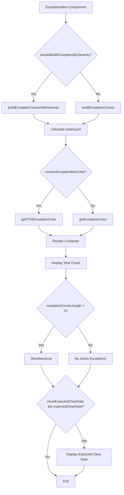
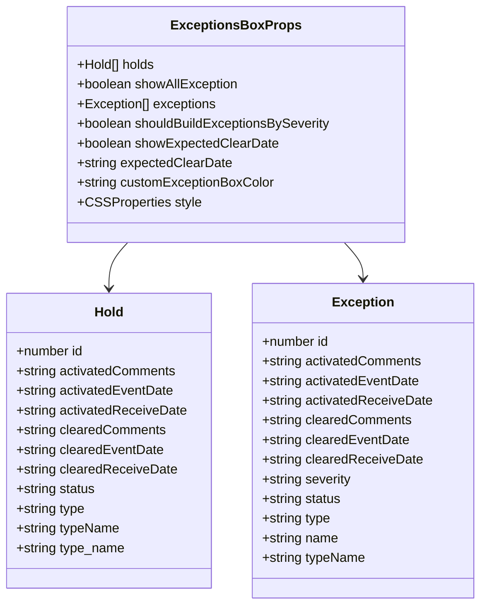
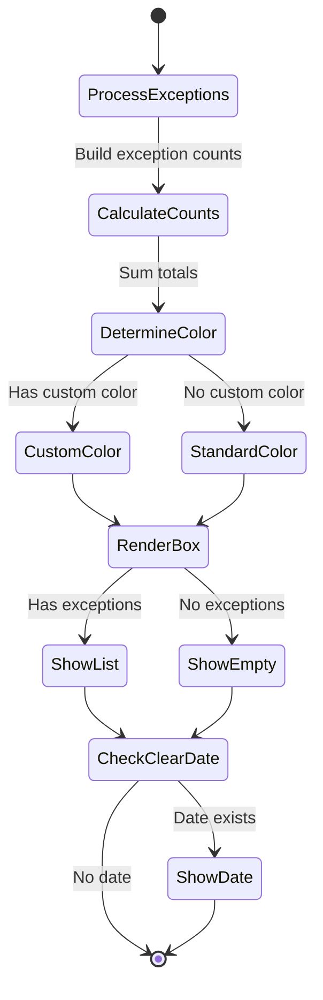

# Diagram: web/portal/src/shared/components/molecules/ExceptionsBox.molecule.tsx


> Auto-generated by Obscura crawlers

## Diagram 1

```mermaid
flowchart TD
      A[ExceptionsBox Component] --> B{shouldBuildExceptionsBySeverity?}
      B -->|Yes| C[buildExceptionCountsWithSeverity]
      B -->|No| D[buildExceptionCounts]...
  └ 159 lines...
```

> SVG rendering failed for this diagram.

## Diagram 2



### SVG

<svg id="container" width="593.375" xmlns="http://www.w3.org/2000/svg" class="flowchart" height="2329.515625" viewBox="0 0 593.375 2329.515625" role="graphics-document document" aria-roledescription="flowchart-v2"><style>#container{font-family:"trebuchet ms",verdana,arial,sans-serif;font-size:16px;fill:#333;}@keyframes edge-animation-frame{from{stroke-dashoffset:0;}}@keyframes dash{to{stroke-dashoffset:0;}}#container .edge-animation-slow{stroke-dasharray:9,5!important;stroke-dashoffset:900;animation:dash 50s linear infinite;stroke-linecap:round;}#container .edge-animation-fast{stroke-dasharray:9,5!important;stroke-dashoffset:900;animation:dash 20s linear infinite;stroke-linecap:round;}#container .error-icon{fill:#552222;}#container .error-text{fill:#552222;stroke:#552222;}#container .edge-thickness-normal{stroke-width:1px;}#container .edge-thickness-thick{stroke-width:3.5px;}#container .edge-pattern-solid{stroke-dasharray:0;}#container .edge-thickness-invisible{stroke-width:0;fill:none;}#container .edge-pattern-dashed{stroke-dasharray:3;}#container .edge-pattern-dotted{stroke-dasharray:2;}#container .marker{fill:#333333;stroke:#333333;}#container .marker.cross{stroke:#333333;}#container svg{font-family:"trebuchet ms",verdana,arial,sans-serif;font-size:16px;}#container p{margin:0;}#container .label{font-family:"trebuchet ms",verdana,arial,sans-serif;color:#333;}#container .cluster-label text{fill:#333;}#container .cluster-label span{color:#333;}#container .cluster-label span p{background-color:transparent;}#container .label text,#container span{fill:#333;color:#333;}#container .node rect,#container .node circle,#container .node ellipse,#container .node polygon,#container .node path{fill:#ECECFF;stroke:#9370DB;stroke-width:1px;}#container .rough-node .label text,#container .node .label text,#container .image-shape .label,#container .icon-shape .label{text-anchor:middle;}#container .node .katex path{fill:#000;stroke:#000;stroke-width:1px;}#container .rough-node .label,#container .node .label,#container .image-shape .label,#container .icon-shape .label{text-align:center;}#container .node.clickable{cursor:pointer;}#container .root .anchor path{fill:#333333!important;stroke-width:0;stroke:#333333;}#container .arrowheadPath{fill:#333333;}#container .edgePath .path{stroke:#333333;stroke-width:2.0px;}#container .flowchart-link{stroke:#333333;fill:none;}#container .edgeLabel{background-color:rgba(232,232,232, 0.8);text-align:center;}#container .edgeLabel p{background-color:rgba(232,232,232, 0.8);}#container .edgeLabel rect{opacity:0.5;background-color:rgba(232,232,232, 0.8);fill:rgba(232,232,232, 0.8);}#container .labelBkg{background-color:rgba(232, 232, 232, 0.5);}#container .cluster rect{fill:#ffffde;stroke:#aaaa33;stroke-width:1px;}#container .cluster text{fill:#333;}#container .cluster span{color:#333;}#container div.mermaidTooltip{position:absolute;text-align:center;max-width:200px;padding:2px;font-family:"trebuchet ms",verdana,arial,sans-serif;font-size:12px;background:hsl(80, 100%, 96.2745098039%);border:1px solid #aaaa33;border-radius:2px;pointer-events:none;z-index:100;}#container .flowchartTitleText{text-anchor:middle;font-size:18px;fill:#333;}#container rect.text{fill:none;stroke-width:0;}#container .icon-shape,#container .image-shape{background-color:rgba(232,232,232, 0.8);text-align:center;}#container .icon-shape p,#container .image-shape p{background-color:rgba(232,232,232, 0.8);padding:2px;}#container .icon-shape rect,#container .image-shape rect{opacity:0.5;background-color:rgba(232,232,232, 0.8);fill:rgba(232,232,232, 0.8);}#container .label-icon{display:inline-block;height:1em;overflow:visible;vertical-align:-0.125em;}#container .node .label-icon path{fill:currentColor;stroke:revert;stroke-width:revert;}#container :root{--mermaid-font-family:"trebuchet ms",verdana,arial,sans-serif;}</style><g><marker id="container_flowchart-v2-pointEnd" class="marker flowchart-v2" viewBox="0 0 10 10" refX="5" refY="5" markerUnits="userSpaceOnUse" markerWidth="8" markerHeight="8" orient="auto"><path d="M 0 0 L 10 5 L 0 10 z" class="arrowMarkerPath" style="stroke-width: 1; stroke-dasharray: 1, 0;"></path></marker><marker id="container_flowchart-v2-pointStart" class="marker flowchart-v2" viewBox="0 0 10 10" refX="4.5" refY="5" markerUnits="userSpaceOnUse" markerWidth="8" markerHeight="8" orient="auto"><path d="M 0 5 L 10 10 L 10 0 z" class="arrowMarkerPath" style="stroke-width: 1; stroke-dasharray: 1, 0;"></path></marker><marker id="container_flowchart-v2-circleEnd" class="marker flowchart-v2" viewBox="0 0 10 10" refX="11" refY="5" markerUnits="userSpaceOnUse" markerWidth="11" markerHeight="11" orient="auto"><circle cx="5" cy="5" r="5" class="arrowMarkerPath" style="stroke-width: 1; stroke-dasharray: 1, 0;"></circle></marker><marker id="container_flowchart-v2-circleStart" class="marker flowchart-v2" viewBox="0 0 10 10" refX="-1" refY="5" markerUnits="userSpaceOnUse" markerWidth="11" markerHeight="11" orient="auto"><circle cx="5" cy="5" r="5" class="arrowMarkerPath" style="stroke-width: 1; stroke-dasharray: 1, 0;"></circle></marker><marker id="container_flowchart-v2-crossEnd" class="marker cross flowchart-v2" viewBox="0 0 11 11" refX="12" refY="5.2" markerUnits="userSpaceOnUse" markerWidth="11" markerHeight="11" orient="auto"><path d="M 1,1 l 9,9 M 10,1 l -9,9" class="arrowMarkerPath" style="stroke-width: 2; stroke-dasharray: 1, 0;"></path></marker><marker id="container_flowchart-v2-crossStart" class="marker cross flowchart-v2" viewBox="0 0 11 11" refX="-1" refY="5.2" markerUnits="userSpaceOnUse" markerWidth="11" markerHeight="11" orient="auto"><path d="M 1,1 l 9,9 M 10,1 l -9,9" class="arrowMarkerPath" style="stroke-width: 2; stroke-dasharray: 1, 0;"></path></marker><g class="root"><g class="clusters"></g><g class="edgePaths"><path d="M319.445,62L319.445,66.167C319.445,70.333,319.445,78.667,319.445,86.333C319.445,94,319.445,101,319.445,104.5L319.445,108" id="L_A_B_0" class="edge-thickness-normal edge-pattern-solid edge-thickness-normal edge-pattern-solid flowchart-link" style=";" data-edge="true" data-et="edge" data-id="L_A_B_0" data-points="W3sieCI6MzE5LjQ0NTMxMjUsInkiOjYyfSx7IngiOjMxOS40NDUzMTI1LCJ5Ijo4N30seyJ4IjozMTkuNDQ1MzEyNSwieSI6MTEyfV0=" marker-end="url(#container_flowchart-v2-pointEnd)"></path><path d="M250.735,345.539L236.046,363.158C221.357,380.776,191.979,416.013,177.29,439.132C162.602,462.25,162.602,473.25,162.602,478.75L162.602,484.25" id="L_B_C_0" class="edge-thickness-normal edge-pattern-solid edge-thickness-normal edge-pattern-solid flowchart-link" style=";" data-edge="true" data-et="edge" data-id="L_B_C_0" data-points="W3sieCI6MjUwLjczNDcwNjkxOTc4NDQsInkiOjM0NS41MzkzOTQ0MTk3ODQ0fSx7IngiOjE2Mi42MDE1NjI1LCJ5Ijo0NTEuMjV9LHsieCI6MTYyLjYwMTU2MjUsInkiOjQ4OC4yNX1d" marker-end="url(#container_flowchart-v2-pointEnd)"></path><path d="M388.156,345.539L402.845,363.158C417.534,380.776,446.911,416.013,461.6,439.132C476.289,462.25,476.289,473.25,476.289,478.75L476.289,484.25" id="L_B_D_0" class="edge-thickness-normal edge-pattern-solid edge-thickness-normal edge-pattern-solid flowchart-link" style=";" data-edge="true" data-et="edge" data-id="L_B_D_0" data-points="W3sieCI6Mzg4LjE1NTkxODA4MDIxNTYsInkiOjM0NS41MzkzOTQ0MTk3ODQ0fSx7IngiOjQ3Ni4yODkwNjI1LCJ5Ijo0NTEuMjV9LHsieCI6NDc2LjI4OTA2MjUsInkiOjQ4OC4yNX1d" marker-end="url(#container_flowchart-v2-pointEnd)"></path><path d="M162.602,542.25L162.602,546.417C162.602,550.583,162.602,558.917,174.536,567.04C186.471,575.164,210.341,583.077,222.276,587.034L234.21,590.991" id="L_C_E_0" class="edge-thickness-normal edge-pattern-solid edge-thickness-normal edge-pattern-solid flowchart-link" style=";" data-edge="true" data-et="edge" data-id="L_C_E_0" data-points="W3sieCI6MTYyLjYwMTU2MjUsInkiOjU0Mi4yNX0seyJ4IjoxNjIuNjAxNTYyNSwieSI6NTY3LjI1fSx7IngiOjIzOC4wMDcyMTE1Mzg0NjE1NSwieSI6NTkyLjI1fV0=" marker-end="url(#container_flowchart-v2-pointEnd)"></path><path d="M476.289,542.25L476.289,546.417C476.289,550.583,476.289,558.917,464.354,567.04C452.419,575.164,428.55,583.077,416.615,587.034L404.68,590.991" id="L_D_E_0" class="edge-thickness-normal edge-pattern-solid edge-thickness-normal edge-pattern-solid flowchart-link" style=";" data-edge="true" data-et="edge" data-id="L_D_E_0" data-points="W3sieCI6NDc2LjI4OTA2MjUsInkiOjU0Mi4yNX0seyJ4Ijo0NzYuMjg5MDYyNSwieSI6NTY3LjI1fSx7IngiOjQwMC44ODM0MTM0NjE1Mzg0NSwieSI6NTkyLjI1fV0=" marker-end="url(#container_flowchart-v2-pointEnd)"></path><path d="M319.445,646.25L319.445,650.417C319.445,654.583,319.445,662.917,319.445,670.583C319.445,678.25,319.445,685.25,319.445,688.75L319.445,692.25" id="L_E_F_0" class="edge-thickness-normal edge-pattern-solid edge-thickness-normal edge-pattern-solid flowchart-link" style=";" data-edge="true" data-et="edge" data-id="L_E_F_0" data-points="W3sieCI6MzE5LjQ0NTMxMjUsInkiOjY0Ni4yNX0seyJ4IjozMTkuNDQ1MzEyNSwieSI6NjcxLjI1fSx7IngiOjMxOS40NDUzMTI1LCJ5Ijo2OTYuMjV9XQ==" marker-end="url(#container_flowchart-v2-pointEnd)"></path><path d="M264.319,890.39L252.142,905.744C239.964,921.098,215.609,951.807,203.431,972.661C191.254,993.516,191.254,1004.516,191.254,1010.016L191.254,1015.516" id="L_F_G_0" class="edge-thickness-normal edge-pattern-solid edge-thickness-normal edge-pattern-solid flowchart-link" style=";" data-edge="true" data-et="edge" data-id="L_F_G_0" data-points="W3sieCI6MjY0LjMxOTI5MzEyMTE2NzIsInkiOjg5MC4zODk2MDU2MjExNjcyfSx7IngiOjE5MS4yNTM5MDYyNSwieSI6OTgyLjUxNTYyNX0seyJ4IjoxOTEuMjUzOTA2MjUsInkiOjEwMTkuNTE1NjI1fV0=" marker-end="url(#container_flowchart-v2-pointEnd)"></path><path d="M374.571,890.39L386.749,905.744C398.926,921.098,423.282,951.807,435.459,972.661C447.637,993.516,447.637,1004.516,447.637,1010.016L447.637,1015.516" id="L_F_H_0" class="edge-thickness-normal edge-pattern-solid edge-thickness-normal edge-pattern-solid flowchart-link" style=";" data-edge="true" data-et="edge" data-id="L_F_H_0" data-points="W3sieCI6Mzc0LjU3MTMzMTg3ODgzMjgsInkiOjg5MC4zODk2MDU2MjExNjcyfSx7IngiOjQ0Ny42MzY3MTg3NSwieSI6OTgyLjUxNTYyNX0seyJ4Ijo0NDcuNjM2NzE4NzUsInkiOjEwMTkuNTE1NjI1fV0=" marker-end="url(#container_flowchart-v2-pointEnd)"></path><path d="M191.254,1073.516L191.254,1077.682C191.254,1081.849,191.254,1090.182,200.908,1098.265C210.562,1106.348,229.87,1114.18,239.524,1118.096L249.178,1122.012" id="L_G_I_0" class="edge-thickness-normal edge-pattern-solid edge-thickness-normal edge-pattern-solid flowchart-link" style=";" data-edge="true" data-et="edge" data-id="L_G_I_0" data-points="W3sieCI6MTkxLjI1MzkwNjI1LCJ5IjoxMDczLjUxNTYyNX0seyJ4IjoxOTEuMjUzOTA2MjUsInkiOjEwOTguNTE1NjI1fSx7IngiOjI1Mi44ODQzOTAwMjQwMzg0NSwieSI6MTEyMy41MTU2MjV9XQ==" marker-end="url(#container_flowchart-v2-pointEnd)"></path><path d="M447.637,1073.516L447.637,1077.682C447.637,1081.849,447.637,1090.182,437.983,1098.265C428.329,1106.348,409.021,1114.18,399.367,1118.096L389.713,1122.012" id="L_H_I_0" class="edge-thickness-normal edge-pattern-solid edge-thickness-normal edge-pattern-solid flowchart-link" style=";" data-edge="true" data-et="edge" data-id="L_H_I_0" data-points="W3sieCI6NDQ3LjYzNjcxODc1LCJ5IjoxMDczLjUxNTYyNX0seyJ4Ijo0NDcuNjM2NzE4NzUsInkiOjEwOTguNTE1NjI1fSx7IngiOjM4Ni4wMDYyMzQ5NzU5NjE1NSwieSI6MTEyMy41MTU2MjV9XQ==" marker-end="url(#container_flowchart-v2-pointEnd)"></path><path d="M319.445,1177.516L319.445,1181.682C319.445,1185.849,319.445,1194.182,319.445,1201.849C319.445,1209.516,319.445,1216.516,319.445,1220.016L319.445,1223.516" id="L_I_J_0" class="edge-thickness-normal edge-pattern-solid edge-thickness-normal edge-pattern-solid flowchart-link" style=";" data-edge="true" data-et="edge" data-id="L_I_J_0" data-points="W3sieCI6MzE5LjQ0NTMxMjUsInkiOjExNzcuNTE1NjI1fSx7IngiOjMxOS40NDUzMTI1LCJ5IjoxMjAyLjUxNTYyNX0seyJ4IjozMTkuNDQ1MzEyNSwieSI6MTIyNy41MTU2MjV9XQ==" marker-end="url(#container_flowchart-v2-pointEnd)"></path><path d="M319.445,1281.516L319.445,1285.682C319.445,1289.849,319.445,1298.182,319.445,1305.849C319.445,1313.516,319.445,1320.516,319.445,1324.016L319.445,1327.516" id="L_J_K_0" class="edge-thickness-normal edge-pattern-solid edge-thickness-normal edge-pattern-solid flowchart-link" style=";" data-edge="true" data-et="edge" data-id="L_J_K_0" data-points="W3sieCI6MzE5LjQ0NTMxMjUsInkiOjEyODEuNTE1NjI1fSx7IngiOjMxOS40NDUzMTI1LCJ5IjoxMzA2LjUxNTYyNX0seyJ4IjozMTkuNDQ1MzEyNSwieSI6MTMzMS41MTU2MjV9XQ==" marker-end="url(#container_flowchart-v2-pointEnd)"></path><path d="M263.695,1553.765L253.343,1569.224C242.991,1584.682,222.286,1615.599,211.934,1636.557C201.582,1657.516,201.582,1668.516,201.582,1674.016L201.582,1679.516" id="L_K_L_0" class="edge-thickness-normal edge-pattern-solid edge-thickness-normal edge-pattern-solid flowchart-link" style=";" data-edge="true" data-et="edge" data-id="L_K_L_0" data-points="W3sieCI6MjYzLjY5NDkxMDM5NDQyOTAzLCJ5IjoxNTUzLjc2NTIyMjg5NDQyOX0seyJ4IjoyMDEuNTgyMDMxMjUsInkiOjE2NDYuNTE1NjI1fSx7IngiOjIwMS41ODIwMzEyNSwieSI6MTY4My41MTU2MjV9XQ==" marker-end="url(#container_flowchart-v2-pointEnd)"></path><path d="M375.196,1553.765L385.548,1569.224C395.9,1584.682,416.604,1615.599,426.956,1636.557C437.309,1657.516,437.309,1668.516,437.309,1674.016L437.309,1679.516" id="L_K_M_0" class="edge-thickness-normal edge-pattern-solid edge-thickness-normal edge-pattern-solid flowchart-link" style=";" data-edge="true" data-et="edge" data-id="L_K_M_0" data-points="W3sieCI6Mzc1LjE5NTcxNDYwNTU3MDk3LCJ5IjoxNTUzLjc2NTIyMjg5NDQyOX0seyJ4Ijo0MzcuMzA4NTkzNzUsInkiOjE2NDYuNTE1NjI1fSx7IngiOjQzNy4zMDg1OTM3NSwieSI6MTY4My41MTU2MjV9XQ==" marker-end="url(#container_flowchart-v2-pointEnd)"></path><path d="M201.582,1737.516L201.582,1741.682C201.582,1745.849,201.582,1754.182,211.15,1771.662C220.717,1789.141,239.852,1815.766,249.42,1829.079L258.987,1842.391" id="L_L_N_0" class="edge-thickness-normal edge-pattern-solid edge-thickness-normal edge-pattern-solid flowchart-link" style=";" data-edge="true" data-et="edge" data-id="L_L_N_0" data-points="W3sieCI6MjAxLjU4MjAzMTI1LCJ5IjoxNzM3LjUxNTYyNX0seyJ4IjoyMDEuNTgyMDMxMjUsInkiOjE3NjIuNTE1NjI1fSx7IngiOjI2MS4zMjE0MDIxMzc4NzI5NSwieSI6MTg0NS42Mzk1MzUzNjIxMjd9XQ==" marker-end="url(#container_flowchart-v2-pointEnd)"></path><path d="M437.309,1737.516L437.309,1741.682C437.309,1745.849,437.309,1754.182,427.741,1771.662C418.174,1789.141,399.039,1815.766,389.471,1829.079L379.904,1842.391" id="L_M_N_0" class="edge-thickness-normal edge-pattern-solid edge-thickness-normal edge-pattern-solid flowchart-link" style=";" data-edge="true" data-et="edge" data-id="L_M_N_0" data-points="W3sieCI6NDM3LjMwODU5Mzc1LCJ5IjoxNzM3LjUxNTYyNX0seyJ4Ijo0MzcuMzA4NTkzNzUsInkiOjE3NjIuNTE1NjI1fSx7IngiOjM3Ny41NjkyMjI4NjIxMjcwNSwieSI6MTg0NS42Mzk1MzUzNjIxMjd9XQ==" marker-end="url(#container_flowchart-v2-pointEnd)"></path><path d="M365.628,2019.333L372.526,2033.197C379.424,2047.061,393.22,2074.788,400.118,2094.152C407.016,2113.516,407.016,2124.516,407.016,2130.016L407.016,2135.516" id="L_N_O_0" class="edge-thickness-normal edge-pattern-solid edge-thickness-normal edge-pattern-solid flowchart-link" style=";" data-edge="true" data-et="edge" data-id="L_N_O_0" data-points="W3sieCI6MzY1LjYyNzU3NTI5NzUyMiwieSI6MjAxOS4zMzMzNjIyMDI0Nzh9LHsieCI6NDA3LjAxNTYyNSwieSI6MjEwMi41MTU2MjV9LHsieCI6NDA3LjAxNTYyNSwieSI6MjEzOS41MTU2MjV9XQ==" marker-end="url(#container_flowchart-v2-pointEnd)"></path><path d="M273.263,2019.333L266.365,2033.197C259.467,2047.061,245.671,2074.788,238.773,2101.319C231.875,2127.849,231.875,2153.182,231.875,2176.516C231.875,2199.849,231.875,2221.182,238.617,2235.852C245.359,2250.522,258.843,2258.529,265.584,2262.533L272.326,2266.536" id="L_N_P_0" class="edge-thickness-normal edge-pattern-solid edge-thickness-normal edge-pattern-solid flowchart-link" style=";" data-edge="true" data-et="edge" data-id="L_N_P_0" data-points="W3sieCI6MjczLjI2MzA0OTcwMjQ3OCwieSI6MjAxOS4zMzMzNjIyMDI0Nzh9LHsieCI6MjMxLjg3NSwieSI6MjEwMi41MTU2MjV9LHsieCI6MjMxLjg3NSwieSI6MjE3OC41MTU2MjV9LHsieCI6MjMxLjg3NSwieSI6MjI0Mi41MTU2MjV9LHsieCI6Mjc1Ljc2NTYyNSwieSI6MjI2OC41NzgyNTMyNDUxNjAzfV0=" marker-end="url(#container_flowchart-v2-pointEnd)"></path><path d="M407.016,2217.516L407.016,2221.682C407.016,2225.849,407.016,2234.182,400.274,2242.352C393.532,2250.522,380.048,2258.529,373.306,2262.533L366.564,2266.536" id="L_O_P_0" class="edge-thickness-normal edge-pattern-solid edge-thickness-normal edge-pattern-solid flowchart-link" style=";" data-edge="true" data-et="edge" data-id="L_O_P_0" data-points="W3sieCI6NDA3LjAxNTYyNSwieSI6MjIxNy41MTU2MjV9LHsieCI6NDA3LjAxNTYyNSwieSI6MjI0Mi41MTU2MjV9LHsieCI6MzYzLjEyNSwieSI6MjI2OC41NzgyNTMyNDUxNjAzfV0=" marker-end="url(#container_flowchart-v2-pointEnd)"></path></g><g class="edgeLabels"><g class="edgeLabel"><g class="label" data-id="L_A_B_0" transform="translate(0, 0)"><foreignObject width="0" height="0"><div xmlns="http://www.w3.org/1999/xhtml" class="labelBkg" style="display: table-cell; white-space: nowrap; line-height: 1.5; max-width: 200px; text-align: center;"><span class="edgeLabel"></span></div></foreignObject></g></g><g class="edgeLabel" transform="translate(162.6015625, 451.25)"><g class="label" data-id="L_B_C_0" transform="translate(-12.03125, -12)"><foreignObject width="24.0625" height="24"><div xmlns="http://www.w3.org/1999/xhtml" class="labelBkg" style="display: table-cell; white-space: nowrap; line-height: 1.5; max-width: 200px; text-align: center;"><span class="edgeLabel"><p>Yes</p></span></div></foreignObject></g></g><g class="edgeLabel" transform="translate(476.2890625, 451.25)"><g class="label" data-id="L_B_D_0" transform="translate(-10.140625, -12)"><foreignObject width="20.28125" height="24"><div xmlns="http://www.w3.org/1999/xhtml" class="labelBkg" style="display: table-cell; white-space: nowrap; line-height: 1.5; max-width: 200px; text-align: center;"><span class="edgeLabel"><p>No</p></span></div></foreignObject></g></g><g class="edgeLabel"><g class="label" data-id="L_C_E_0" transform="translate(0, 0)"><foreignObject width="0" height="0"><div xmlns="http://www.w3.org/1999/xhtml" class="labelBkg" style="display: table-cell; white-space: nowrap; line-height: 1.5; max-width: 200px; text-align: center;"><span class="edgeLabel"></span></div></foreignObject></g></g><g class="edgeLabel"><g class="label" data-id="L_D_E_0" transform="translate(0, 0)"><foreignObject width="0" height="0"><div xmlns="http://www.w3.org/1999/xhtml" class="labelBkg" style="display: table-cell; white-space: nowrap; line-height: 1.5; max-width: 200px; text-align: center;"><span class="edgeLabel"></span></div></foreignObject></g></g><g class="edgeLabel"><g class="label" data-id="L_E_F_0" transform="translate(0, 0)"><foreignObject width="0" height="0"><div xmlns="http://www.w3.org/1999/xhtml" class="labelBkg" style="display: table-cell; white-space: nowrap; line-height: 1.5; max-width: 200px; text-align: center;"><span class="edgeLabel"></span></div></foreignObject></g></g><g class="edgeLabel" transform="translate(191.25390625, 982.515625)"><g class="label" data-id="L_F_G_0" transform="translate(-12.03125, -12)"><foreignObject width="24.0625" height="24"><div xmlns="http://www.w3.org/1999/xhtml" class="labelBkg" style="display: table-cell; white-space: nowrap; line-height: 1.5; max-width: 200px; text-align: center;"><span class="edgeLabel"><p>Yes</p></span></div></foreignObject></g></g><g class="edgeLabel" transform="translate(447.63671875, 982.515625)"><g class="label" data-id="L_F_H_0" transform="translate(-10.140625, -12)"><foreignObject width="20.28125" height="24"><div xmlns="http://www.w3.org/1999/xhtml" class="labelBkg" style="display: table-cell; white-space: nowrap; line-height: 1.5; max-width: 200px; text-align: center;"><span class="edgeLabel"><p>No</p></span></div></foreignObject></g></g><g class="edgeLabel"><g class="label" data-id="L_G_I_0" transform="translate(0, 0)"><foreignObject width="0" height="0"><div xmlns="http://www.w3.org/1999/xhtml" class="labelBkg" style="display: table-cell; white-space: nowrap; line-height: 1.5; max-width: 200px; text-align: center;"><span class="edgeLabel"></span></div></foreignObject></g></g><g class="edgeLabel"><g class="label" data-id="L_H_I_0" transform="translate(0, 0)"><foreignObject width="0" height="0"><div xmlns="http://www.w3.org/1999/xhtml" class="labelBkg" style="display: table-cell; white-space: nowrap; line-height: 1.5; max-width: 200px; text-align: center;"><span class="edgeLabel"></span></div></foreignObject></g></g><g class="edgeLabel"><g class="label" data-id="L_I_J_0" transform="translate(0, 0)"><foreignObject width="0" height="0"><div xmlns="http://www.w3.org/1999/xhtml" class="labelBkg" style="display: table-cell; white-space: nowrap; line-height: 1.5; max-width: 200px; text-align: center;"><span class="edgeLabel"></span></div></foreignObject></g></g><g class="edgeLabel"><g class="label" data-id="L_J_K_0" transform="translate(0, 0)"><foreignObject width="0" height="0"><div xmlns="http://www.w3.org/1999/xhtml" class="labelBkg" style="display: table-cell; white-space: nowrap; line-height: 1.5; max-width: 200px; text-align: center;"><span class="edgeLabel"></span></div></foreignObject></g></g><g class="edgeLabel" transform="translate(201.58203125, 1646.515625)"><g class="label" data-id="L_K_L_0" transform="translate(-12.03125, -12)"><foreignObject width="24.0625" height="24"><div xmlns="http://www.w3.org/1999/xhtml" class="labelBkg" style="display: table-cell; white-space: nowrap; line-height: 1.5; max-width: 200px; text-align: center;"><span class="edgeLabel"><p>Yes</p></span></div></foreignObject></g></g><g class="edgeLabel" transform="translate(437.30859375, 1646.515625)"><g class="label" data-id="L_K_M_0" transform="translate(-10.140625, -12)"><foreignObject width="20.28125" height="24"><div xmlns="http://www.w3.org/1999/xhtml" class="labelBkg" style="display: table-cell; white-space: nowrap; line-height: 1.5; max-width: 200px; text-align: center;"><span class="edgeLabel"><p>No</p></span></div></foreignObject></g></g><g class="edgeLabel"><g class="label" data-id="L_L_N_0" transform="translate(0, 0)"><foreignObject width="0" height="0"><div xmlns="http://www.w3.org/1999/xhtml" class="labelBkg" style="display: table-cell; white-space: nowrap; line-height: 1.5; max-width: 200px; text-align: center;"><span class="edgeLabel"></span></div></foreignObject></g></g><g class="edgeLabel"><g class="label" data-id="L_M_N_0" transform="translate(0, 0)"><foreignObject width="0" height="0"><div xmlns="http://www.w3.org/1999/xhtml" class="labelBkg" style="display: table-cell; white-space: nowrap; line-height: 1.5; max-width: 200px; text-align: center;"><span class="edgeLabel"></span></div></foreignObject></g></g><g class="edgeLabel" transform="translate(407.015625, 2102.515625)"><g class="label" data-id="L_N_O_0" transform="translate(-12.03125, -12)"><foreignObject width="24.0625" height="24"><div xmlns="http://www.w3.org/1999/xhtml" class="labelBkg" style="display: table-cell; white-space: nowrap; line-height: 1.5; max-width: 200px; text-align: center;"><span class="edgeLabel"><p>Yes</p></span></div></foreignObject></g></g><g class="edgeLabel" transform="translate(231.875, 2178.515625)"><g class="label" data-id="L_N_P_0" transform="translate(-10.140625, -12)"><foreignObject width="20.28125" height="24"><div xmlns="http://www.w3.org/1999/xhtml" class="labelBkg" style="display: table-cell; white-space: nowrap; line-height: 1.5; max-width: 200px; text-align: center;"><span class="edgeLabel"><p>No</p></span></div></foreignObject></g></g><g class="edgeLabel"><g class="label" data-id="L_O_P_0" transform="translate(0, 0)"><foreignObject width="0" height="0"><div xmlns="http://www.w3.org/1999/xhtml" class="labelBkg" style="display: table-cell; white-space: nowrap; line-height: 1.5; max-width: 200px; text-align: center;"><span class="edgeLabel"></span></div></foreignObject></g></g></g><g class="nodes"><g class="node default" id="flowchart-A-0" transform="translate(319.4453125, 35)"><rect class="basic label-container" style="" x="-126.46875" y="-27" width="252.9375" height="54"></rect><g class="label" style="" transform="translate(-96.46875, -12)"><rect></rect><foreignObject width="192.9375" height="24"><div xmlns="http://www.w3.org/1999/xhtml" style="display: table-cell; white-space: nowrap; line-height: 1.5; max-width: 200px; text-align: center;"><span class="nodeLabel"><p>ExceptionsBox Component</p></span></div></foreignObject></g></g><g class="node default" id="flowchart-B-1" transform="translate(319.4453125, 263.125)"><polygon points="151.125,0 302.25,-151.125 151.125,-302.25 0,-151.125" class="label-container" transform="translate(-150.625, 151.125)"></polygon><g class="label" style="" transform="translate(-124.125, -12)"><rect></rect><foreignObject width="248.25" height="24"><div xmlns="http://www.w3.org/1999/xhtml" style="display: table; white-space: break-spaces; line-height: 1.5; max-width: 200px; text-align: center; width: 200px;"><span class="nodeLabel"><p>shouldBuildExceptionsBySeverity?</p></span></div></foreignObject></g></g><g class="node default" id="flowchart-C-3" transform="translate(162.6015625, 515.25)"><rect class="basic label-container" style="" x="-154.6015625" y="-27" width="309.203125" height="54"></rect><g class="label" style="" transform="translate(-124.6015625, -12)"><rect></rect><foreignObject width="249.203125" height="24"><div xmlns="http://www.w3.org/1999/xhtml" style="display: table; white-space: break-spaces; line-height: 1.5; max-width: 200px; text-align: center; width: 200px;"><span class="nodeLabel"><p>buildExceptionCountsWithSeverity</p></span></div></foreignObject></g></g><g class="node default" id="flowchart-D-5" transform="translate(476.2890625, 515.25)"><rect class="basic label-container" style="" x="-109.0859375" y="-27" width="218.171875" height="54"></rect><g class="label" style="" transform="translate(-79.0859375, -12)"><rect></rect><foreignObject width="158.171875" height="24"><div xmlns="http://www.w3.org/1999/xhtml" style="display: table-cell; white-space: nowrap; line-height: 1.5; max-width: 200px; text-align: center;"><span class="nodeLabel"><p>buildExceptionCounts</p></span></div></foreignObject></g></g><g class="node default" id="flowchart-E-7" transform="translate(319.4453125, 619.25)"><rect class="basic label-container" style="" x="-103.3984375" y="-27" width="206.796875" height="54"></rect><g class="label" style="" transform="translate(-73.3984375, -12)"><rect></rect><foreignObject width="146.796875" height="24"><div xmlns="http://www.w3.org/1999/xhtml" style="display: table-cell; white-space: nowrap; line-height: 1.5; max-width: 200px; text-align: center;"><span class="nodeLabel"><p>Calculate totalCount</p></span></div></foreignObject></g></g><g class="node default" id="flowchart-F-11" transform="translate(319.4453125, 820.8828125)"><polygon points="124.6328125,0 249.265625,-124.6328125 124.6328125,-249.265625 0,-124.6328125" class="label-container" transform="translate(-124.1328125, 124.6328125)"></polygon><g class="label" style="" transform="translate(-97.6328125, -12)"><rect></rect><foreignObject width="195.265625" height="24"><div xmlns="http://www.w3.org/1999/xhtml" style="display: table-cell; white-space: nowrap; line-height: 1.5; max-width: 200px; text-align: center;"><span class="nodeLabel"><p>customExceptionBoxColor?</p></span></div></foreignObject></g></g><g class="node default" id="flowchart-G-13" transform="translate(191.25390625, 1046.515625)"><rect class="basic label-container" style="" x="-110.671875" y="-27" width="221.34375" height="54"></rect><g class="label" style="" transform="translate(-80.671875, -12)"><rect></rect><foreignObject width="161.34375" height="24"><div xmlns="http://www.w3.org/1999/xhtml" style="display: table-cell; white-space: nowrap; line-height: 1.5; max-width: 200px; text-align: center;"><span class="nodeLabel"><p>getITSSExceptionColor</p></span></div></foreignObject></g></g><g class="node default" id="flowchart-H-15" transform="translate(447.63671875, 1046.515625)"><rect class="basic label-container" style="" x="-95.7109375" y="-27" width="191.421875" height="54"></rect><g class="label" style="" transform="translate(-65.7109375, -12)"><rect></rect><foreignObject width="131.421875" height="24"><div xmlns="http://www.w3.org/1999/xhtml" style="display: table-cell; white-space: nowrap; line-height: 1.5; max-width: 200px; text-align: center;"><span class="nodeLabel"><p>getExceptionColor</p></span></div></foreignObject></g></g><g class="node default" id="flowchart-I-17" transform="translate(319.4453125, 1150.515625)"><rect class="basic label-container" style="" x="-93.3828125" y="-27" width="186.765625" height="54"></rect><g class="label" style="" transform="translate(-63.3828125, -12)"><rect></rect><foreignObject width="126.765625" height="24"><div xmlns="http://www.w3.org/1999/xhtml" style="display: table-cell; white-space: nowrap; line-height: 1.5; max-width: 200px; text-align: center;"><span class="nodeLabel"><p>Render Container</p></span></div></foreignObject></g></g><g class="node default" id="flowchart-J-21" transform="translate(319.4453125, 1254.515625)"><rect class="basic label-container" style="" x="-99.6484375" y="-27" width="199.296875" height="54"></rect><g class="label" style="" transform="translate(-69.6484375, -12)"><rect></rect><foreignObject width="139.296875" height="24"><div xmlns="http://www.w3.org/1999/xhtml" style="display: table-cell; white-space: nowrap; line-height: 1.5; max-width: 200px; text-align: center;"><span class="nodeLabel"><p>Display Total Count</p></span></div></foreignObject></g></g><g class="node default" id="flowchart-K-23" transform="translate(319.4453125, 1470.515625)"><polygon points="139,0 278,-139 139,-278 0,-139" class="label-container" transform="translate(-138.5, 139)"></polygon><g class="label" style="" transform="translate(-100, -24)"><rect></rect><foreignObject width="200" height="48"><div xmlns="http://www.w3.org/1999/xhtml" style="display: table; white-space: break-spaces; line-height: 1.5; max-width: 200px; text-align: center; width: 200px;"><span class="nodeLabel"><p>exceptionCounts.length &gt; 0?</p></span></div></foreignObject></g></g><g class="node default" id="flowchart-L-25" transform="translate(201.58203125, 1710.515625)"><rect class="basic label-container" style="" x="-80.4296875" y="-27" width="160.859375" height="54"></rect><g class="label" style="" transform="translate(-50.4296875, -12)"><rect></rect><foreignObject width="100.859375" height="24"><div xmlns="http://www.w3.org/1999/xhtml" style="display: table-cell; white-space: nowrap; line-height: 1.5; max-width: 200px; text-align: center;"><span class="nodeLabel"><p>ShowMoreList</p></span></div></foreignObject></g></g><g class="node default" id="flowchart-M-27" transform="translate(437.30859375, 1710.515625)"><rect class="basic label-container" style="" x="-105.296875" y="-27" width="210.59375" height="54"></rect><g class="label" style="" transform="translate(-75.296875, -12)"><rect></rect><foreignObject width="150.59375" height="24"><div xmlns="http://www.w3.org/1999/xhtml" style="display: table-cell; white-space: nowrap; line-height: 1.5; max-width: 200px; text-align: center;"><span class="nodeLabel"><p>No Active Exceptions</p></span></div></foreignObject></g></g><g class="node default" id="flowchart-N-29" transform="translate(319.4453125, 1926.515625)"><polygon points="139,0 278,-139 139,-278 0,-139" class="label-container" transform="translate(-138.5, 139)"></polygon><g class="label" style="" transform="translate(-100, -24)"><rect></rect><foreignObject width="200" height="48"><div xmlns="http://www.w3.org/1999/xhtml" style="display: table; white-space: break-spaces; line-height: 1.5; max-width: 200px; text-align: center; width: 200px;"><span class="nodeLabel"><p>showExpectedClearDate &amp;&amp; expectedClearDate?</p></span></div></foreignObject></g></g><g class="node default" id="flowchart-O-33" transform="translate(407.015625, 2178.515625)"><rect class="basic label-container" style="" x="-130" y="-39" width="260" height="78"></rect><g class="label" style="" transform="translate(-100, -24)"><rect></rect><foreignObject width="200" height="48"><div xmlns="http://www.w3.org/1999/xhtml" style="display: table; white-space: break-spaces; line-height: 1.5; max-width: 200px; text-align: center; width: 200px;"><span class="nodeLabel"><p>Display Expected Clear Date</p></span></div></foreignObject></g></g><g class="node default" id="flowchart-P-35" transform="translate(319.4453125, 2294.515625)"><rect class="basic label-container" style="" x="-43.6796875" y="-27" width="87.359375" height="54"></rect><g class="label" style="" transform="translate(-13.6796875, -12)"><rect></rect><foreignObject width="27.359375" height="24"><div xmlns="http://www.w3.org/1999/xhtml" style="display: table-cell; white-space: nowrap; line-height: 1.5; max-width: 200px; text-align: center;"><span class="nodeLabel"><p>End</p></span></div></foreignObject></g></g></g></g></g></svg>

## Diagram 3



### SVG

<svg id="container" width="584.84375" xmlns="http://www.w3.org/2000/svg" class="classDiagram" height="738" viewBox="0 0 584.84375 738" role="graphics-document document" aria-roledescription="class"><style>#container{font-family:"trebuchet ms",verdana,arial,sans-serif;font-size:16px;fill:#333;}@keyframes edge-animation-frame{from{stroke-dashoffset:0;}}@keyframes dash{to{stroke-dashoffset:0;}}#container .edge-animation-slow{stroke-dasharray:9,5!important;stroke-dashoffset:900;animation:dash 50s linear infinite;stroke-linecap:round;}#container .edge-animation-fast{stroke-dasharray:9,5!important;stroke-dashoffset:900;animation:dash 20s linear infinite;stroke-linecap:round;}#container .error-icon{fill:#552222;}#container .error-text{fill:#552222;stroke:#552222;}#container .edge-thickness-normal{stroke-width:1px;}#container .edge-thickness-thick{stroke-width:3.5px;}#container .edge-pattern-solid{stroke-dasharray:0;}#container .edge-thickness-invisible{stroke-width:0;fill:none;}#container .edge-pattern-dashed{stroke-dasharray:3;}#container .edge-pattern-dotted{stroke-dasharray:2;}#container .marker{fill:#333333;stroke:#333333;}#container .marker.cross{stroke:#333333;}#container svg{font-family:"trebuchet ms",verdana,arial,sans-serif;font-size:16px;}#container p{margin:0;}#container g.classGroup text{fill:#9370DB;stroke:none;font-family:"trebuchet ms",verdana,arial,sans-serif;font-size:10px;}#container g.classGroup text .title{font-weight:bolder;}#container .nodeLabel,#container .edgeLabel{color:#131300;}#container .edgeLabel .label rect{fill:#ECECFF;}#container .label text{fill:#131300;}#container .labelBkg{background:#ECECFF;}#container .edgeLabel .label span{background:#ECECFF;}#container .classTitle{font-weight:bolder;}#container .node rect,#container .node circle,#container .node ellipse,#container .node polygon,#container .node path{fill:#ECECFF;stroke:#9370DB;stroke-width:1px;}#container .divider{stroke:#9370DB;stroke-width:1;}#container g.clickable{cursor:pointer;}#container g.classGroup rect{fill:#ECECFF;stroke:#9370DB;}#container g.classGroup line{stroke:#9370DB;stroke-width:1;}#container .classLabel .box{stroke:none;stroke-width:0;fill:#ECECFF;opacity:0.5;}#container .classLabel .label{fill:#9370DB;font-size:10px;}#container .relation{stroke:#333333;stroke-width:1;fill:none;}#container .dashed-line{stroke-dasharray:3;}#container .dotted-line{stroke-dasharray:1 2;}#container #compositionStart,#container .composition{fill:#333333!important;stroke:#333333!important;stroke-width:1;}#container #compositionEnd,#container .composition{fill:#333333!important;stroke:#333333!important;stroke-width:1;}#container #dependencyStart,#container .dependency{fill:#333333!important;stroke:#333333!important;stroke-width:1;}#container #dependencyStart,#container .dependency{fill:#333333!important;stroke:#333333!important;stroke-width:1;}#container #extensionStart,#container .extension{fill:transparent!important;stroke:#333333!important;stroke-width:1;}#container #extensionEnd,#container .extension{fill:transparent!important;stroke:#333333!important;stroke-width:1;}#container #aggregationStart,#container .aggregation{fill:transparent!important;stroke:#333333!important;stroke-width:1;}#container #aggregationEnd,#container .aggregation{fill:transparent!important;stroke:#333333!important;stroke-width:1;}#container #lollipopStart,#container .lollipop{fill:#ECECFF!important;stroke:#333333!important;stroke-width:1;}#container #lollipopEnd,#container .lollipop{fill:#ECECFF!important;stroke:#333333!important;stroke-width:1;}#container .edgeTerminals{font-size:11px;line-height:initial;}#container .classTitleText{text-anchor:middle;font-size:18px;fill:#333;}#container .label-icon{display:inline-block;height:1em;overflow:visible;vertical-align:-0.125em;}#container .node .label-icon path{fill:currentColor;stroke:revert;stroke-width:revert;}#container :root{--mermaid-font-family:"trebuchet ms",verdana,arial,sans-serif;}</style><g><defs><marker id="container_class-aggregationStart" class="marker aggregation class" refX="18" refY="7" markerWidth="190" markerHeight="240" orient="auto"><path d="M 18,7 L9,13 L1,7 L9,1 Z"></path></marker></defs><defs><marker id="container_class-aggregationEnd" class="marker aggregation class" refX="1" refY="7" markerWidth="20" markerHeight="28" orient="auto"><path d="M 18,7 L9,13 L1,7 L9,1 Z"></path></marker></defs><defs><marker id="container_class-extensionStart" class="marker extension class" refX="18" refY="7" markerWidth="190" markerHeight="240" orient="auto"><path d="M 1,7 L18,13 V 1 Z"></path></marker></defs><defs><marker id="container_class-extensionEnd" class="marker extension class" refX="1" refY="7" markerWidth="20" markerHeight="28" orient="auto"><path d="M 1,1 V 13 L18,7 Z"></path></marker></defs><defs><marker id="container_class-compositionStart" class="marker composition class" refX="18" refY="7" markerWidth="190" markerHeight="240" orient="auto"><path d="M 18,7 L9,13 L1,7 L9,1 Z"></path></marker></defs><defs><marker id="container_class-compositionEnd" class="marker composition class" refX="1" refY="7" markerWidth="20" markerHeight="28" orient="auto"><path d="M 18,7 L9,13 L1,7 L9,1 Z"></path></marker></defs><defs><marker id="container_class-dependencyStart" class="marker dependency class" refX="6" refY="7" markerWidth="190" markerHeight="240" orient="auto"><path d="M 5,7 L9,13 L1,7 L9,1 Z"></path></marker></defs><defs><marker id="container_class-dependencyEnd" class="marker dependency class" refX="13" refY="7" markerWidth="20" markerHeight="28" orient="auto"><path d="M 18,7 L9,13 L14,7 L9,1 Z"></path></marker></defs><defs><marker id="container_class-lollipopStart" class="marker lollipop class" refX="13" refY="7" markerWidth="190" markerHeight="240" orient="auto"><circle stroke="black" fill="transparent" cx="7" cy="7" r="6"></circle></marker></defs><defs><marker id="container_class-lollipopEnd" class="marker lollipop class" refX="1" refY="7" markerWidth="190" markerHeight="240" orient="auto"><circle stroke="black" fill="transparent" cx="7" cy="7" r="6"></circle></marker></defs><g class="root"><g class="clusters"></g><g class="edgePaths"><path d="M155.957,296L152.142,300.167C148.328,304.333,140.699,312.667,136.885,322C133.07,331.333,133.07,341.667,133.07,346.833L133.07,352" id="id_ExceptionsBoxProps_Hold_1" class="edge-thickness-normal edge-pattern-solid relation" style=";;;" data-edge="true" data-et="edge" data-id="id_ExceptionsBoxProps_Hold_1" data-points="W3sieCI6MTU1Ljk1NjU0NTg1Nzk4ODE3LCJ5IjoyOTZ9LHsieCI6MTMzLjA3MDMxMjUsInkiOjMyMX0seyJ4IjoxMzMuMDcwMzEyNSwieSI6MzU4fV0=" marker-end="url(#container_class-dependencyEnd)"></path><path d="M419.606,296L423.42,300.167C427.235,304.333,434.863,312.667,438.678,320C442.492,327.333,442.492,333.667,442.492,336.833L442.492,340" id="id_ExceptionsBoxProps_Exception_2" class="edge-thickness-normal edge-pattern-solid relation" style=";;;" data-edge="true" data-et="edge" data-id="id_ExceptionsBoxProps_Exception_2" data-points="W3sieCI6NDE5LjYwNTk1NDE0MjAxMTgsInkiOjI5Nn0seyJ4Ijo0NDIuNDkyMTg3NSwieSI6MzIxfSx7IngiOjQ0Mi40OTIxODc1LCJ5IjozNDZ9XQ==" marker-end="url(#container_class-dependencyEnd)"></path></g><g class="edgeLabels"><g class="edgeLabel"><g class="label" data-id="id_ExceptionsBoxProps_Hold_1" transform="translate(0, 0)"><foreignObject width="0" height="0"><div xmlns="http://www.w3.org/1999/xhtml" class="labelBkg" style="display: table-cell; white-space: nowrap; line-height: 1.5; max-width: 200px; text-align: center;"><span class="edgeLabel"></span></div></foreignObject></g></g><g class="edgeLabel"><g class="label" data-id="id_ExceptionsBoxProps_Exception_2" transform="translate(0, 0)"><foreignObject width="0" height="0"><div xmlns="http://www.w3.org/1999/xhtml" class="labelBkg" style="display: table-cell; white-space: nowrap; line-height: 1.5; max-width: 200px; text-align: center;"><span class="edgeLabel"></span></div></foreignObject></g></g></g><g class="nodes"><g class="node default" id="classId-Hold-0" transform="translate(133.0703125, 538)"><g class="basic label-container"><path d="M-125.0703125 -180 L125.0703125 -180 L125.0703125 180 L-125.0703125 180" stroke="none" stroke-width="0" fill="#ECECFF" style=""></path><path d="M-125.0703125 -180 C-39.38920091510512 -180, 46.29191066978976 -180, 125.0703125 -180 M-125.0703125 -180 C-31.543105028455855 -180, 61.98410244308829 -180, 125.0703125 -180 M125.0703125 -180 C125.0703125 -105.86560600020829, 125.0703125 -31.731212000416576, 125.0703125 180 M125.0703125 -180 C125.0703125 -52.6879531702631, 125.0703125 74.6240936594738, 125.0703125 180 M125.0703125 180 C37.42986296960774 180, -50.21058656078452 180, -125.0703125 180 M125.0703125 180 C37.23248946590036 180, -50.605333568199285 180, -125.0703125 180 M-125.0703125 180 C-125.0703125 42.53863646071645, -125.0703125 -94.9227270785671, -125.0703125 -180 M-125.0703125 180 C-125.0703125 91.97718723266291, -125.0703125 3.9543744653258273, -125.0703125 -180" stroke="#9370DB" stroke-width="1.3" fill="none" stroke-dasharray="0 0" style=""></path></g><g class="annotation-group text" transform="translate(0, -156)"></g><g class="label-group text" transform="translate(-17.140625, -156)"><g class="label" style="font-weight: bolder" transform="translate(0,-12)"><foreignObject width="34.28125" height="24"><div xmlns="http://www.w3.org/1999/xhtml" style="display: table-cell; white-space: nowrap; line-height: 1.5; max-width: 84px; text-align: center;"><span class="nodeLabel markdown-node-label" style=""><p>Hold</p></span></div></foreignObject></g></g><g class="members-group text" transform="translate(-113.0703125, -108)"><g class="label" style="" transform="translate(0,-12)"><foreignObject width="83.109375" height="24"><div xmlns="http://www.w3.org/1999/xhtml" style="display: table-cell; white-space: nowrap; line-height: 1.5; max-width: 140px; text-align: center;"><span class="nodeLabel markdown-node-label" style=""><p>+number id</p></span></div></foreignObject></g><g class="label" style="" transform="translate(0,12)"><foreignObject width="197.40625" height="24"><div xmlns="http://www.w3.org/1999/xhtml" style="display: table-cell; white-space: nowrap; line-height: 1.5; max-width: 255px; text-align: center;"><span class="nodeLabel markdown-node-label" style=""><p>+string activatedComments</p></span></div></foreignObject></g><g class="label" style="" transform="translate(0,36)"><foreignObject width="193.671875" height="24"><div xmlns="http://www.w3.org/1999/xhtml" style="display: table-cell; white-space: nowrap; line-height: 1.5; max-width: 251px; text-align: center;"><span class="nodeLabel markdown-node-label" style=""><p>+string activatedEventDate</p></span></div></foreignObject></g><g class="label" style="" transform="translate(0,60)"><foreignObject width="209" height="24"><div xmlns="http://www.w3.org/1999/xhtml" style="display: table-cell; white-space: nowrap; line-height: 1.5; max-width: 266px; text-align: center;"><span class="nodeLabel markdown-node-label" style=""><p>+string activatedReceiveDate</p></span></div></foreignObject></g><g class="label" style="" transform="translate(0,84)"><foreignObject width="184.125" height="24"><div xmlns="http://www.w3.org/1999/xhtml" style="display: table-cell; white-space: nowrap; line-height: 1.5; max-width: 241px; text-align: center;"><span class="nodeLabel markdown-node-label" style=""><p>+string clearedComments</p></span></div></foreignObject></g><g class="label" style="" transform="translate(0,108)"><foreignObject width="180.390625" height="24"><div xmlns="http://www.w3.org/1999/xhtml" style="display: table-cell; white-space: nowrap; line-height: 1.5; max-width: 238px; text-align: center;"><span class="nodeLabel markdown-node-label" style=""><p>+string clearedEventDate</p></span></div></foreignObject></g><g class="label" style="" transform="translate(0,132)"><foreignObject width="195.71875" height="24"><div xmlns="http://www.w3.org/1999/xhtml" style="display: table-cell; white-space: nowrap; line-height: 1.5; max-width: 253px; text-align: center;"><span class="nodeLabel markdown-node-label" style=""><p>+string clearedReceiveDate</p></span></div></foreignObject></g><g class="label" style="" transform="translate(0,156)"><foreignObject width="98.265625" height="24"><div xmlns="http://www.w3.org/1999/xhtml" style="display: table-cell; white-space: nowrap; line-height: 1.5; max-width: 156px; text-align: center;"><span class="nodeLabel markdown-node-label" style=""><p>+string status</p></span></div></foreignObject></g><g class="label" style="" transform="translate(0,180)"><foreignObject width="85.65625" height="24"><div xmlns="http://www.w3.org/1999/xhtml" style="display: table-cell; white-space: nowrap; line-height: 1.5; max-width: 143px; text-align: center;"><span class="nodeLabel markdown-node-label" style=""><p>+string type</p></span></div></foreignObject></g><g class="label" style="" transform="translate(0,204)"><foreignObject width="127.71875" height="24"><div xmlns="http://www.w3.org/1999/xhtml" style="display: table-cell; white-space: nowrap; line-height: 1.5; max-width: 185px; text-align: center;"><span class="nodeLabel markdown-node-label" style=""><p>+string typeName</p></span></div></foreignObject></g><g class="label" style="" transform="translate(0,228)"><foreignObject width="134.171875" height="24"><div xmlns="http://www.w3.org/1999/xhtml" style="display: table-cell; white-space: nowrap; line-height: 1.5; max-width: 192px; text-align: center;"><span class="nodeLabel markdown-node-label" style=""><p>+string type_name</p></span></div></foreignObject></g></g><g class="methods-group text" transform="translate(-113.0703125, 180)"></g><g class="divider" style=""><path d="M-125.0703125 -132 C-52.09553413800347 -132, 20.879244223993055 -132, 125.0703125 -132 M-125.0703125 -132 C-73.35375808870617 -132, -21.637203677412344 -132, 125.0703125 -132" stroke="#9370DB" stroke-width="1.3" fill="none" stroke-dasharray="0 0" style=""></path></g><g class="divider" style=""><path d="M-125.0703125 156 C-35.235061273982254 156, 54.60018995203549 156, 125.0703125 156 M-125.0703125 156 C-74.40838934121214 156, -23.746466182424285 156, 125.0703125 156" stroke="#9370DB" stroke-width="1.3" fill="none" stroke-dasharray="0 0" style=""></path></g></g><g class="node default" id="classId-Exception-1" transform="translate(442.4921875, 538)"><g class="basic label-container"><path d="M-134.3515625 -192 L134.3515625 -192 L134.3515625 192 L-134.3515625 192" stroke="none" stroke-width="0" fill="#ECECFF" style=""></path><path d="M-134.3515625 -192 C-52.04569976492736 -192, 30.260162970145274 -192, 134.3515625 -192 M-134.3515625 -192 C-71.24816642764873 -192, -8.144770355297453 -192, 134.3515625 -192 M134.3515625 -192 C134.3515625 -98.02191434406916, 134.3515625 -4.043828688138319, 134.3515625 192 M134.3515625 -192 C134.3515625 -87.36276548176895, 134.3515625 17.274469036462108, 134.3515625 192 M134.3515625 192 C42.43558988733008 192, -49.48038272533984 192, -134.3515625 192 M134.3515625 192 C61.6148510307969 192, -11.121860438406202 192, -134.3515625 192 M-134.3515625 192 C-134.3515625 63.47394508867555, -134.3515625 -65.0521098226489, -134.3515625 -192 M-134.3515625 192 C-134.3515625 59.16991894295299, -134.3515625 -73.66016211409402, -134.3515625 -192" stroke="#9370DB" stroke-width="1.3" fill="none" stroke-dasharray="0 0" style=""></path></g><g class="annotation-group text" transform="translate(0, -168)"></g><g class="label-group text" transform="translate(-35.703125, -168)"><g class="label" style="font-weight: bolder" transform="translate(0,-12)"><foreignObject width="71.40625" height="24"><div xmlns="http://www.w3.org/1999/xhtml" style="display: table-cell; white-space: nowrap; line-height: 1.5; max-width: 121px; text-align: center;"><span class="nodeLabel markdown-node-label" style=""><p>Exception</p></span></div></foreignObject></g></g><g class="members-group text" transform="translate(-122.3515625, -120)"><g class="label" style="" transform="translate(0,-12)"><foreignObject width="83.109375" height="24"><div xmlns="http://www.w3.org/1999/xhtml" style="display: table-cell; white-space: nowrap; line-height: 1.5; max-width: 140px; text-align: center;"><span class="nodeLabel markdown-node-label" style=""><p>+number id</p></span></div></foreignObject></g><g class="label" style="" transform="translate(0,12)"><foreignObject width="197.40625" height="24"><div xmlns="http://www.w3.org/1999/xhtml" style="display: table-cell; white-space: nowrap; line-height: 1.5; max-width: 255px; text-align: center;"><span class="nodeLabel markdown-node-label" style=""><p>+string activatedComments</p></span></div></foreignObject></g><g class="label" style="" transform="translate(0,36)"><foreignObject width="193.671875" height="24"><div xmlns="http://www.w3.org/1999/xhtml" style="display: table-cell; white-space: nowrap; line-height: 1.5; max-width: 251px; text-align: center;"><span class="nodeLabel markdown-node-label" style=""><p>+string activatedEventDate</p></span></div></foreignObject></g><g class="label" style="" transform="translate(0,60)"><foreignObject width="209" height="24"><div xmlns="http://www.w3.org/1999/xhtml" style="display: table-cell; white-space: nowrap; line-height: 1.5; max-width: 266px; text-align: center;"><span class="nodeLabel markdown-node-label" style=""><p>+string activatedReceiveDate</p></span></div></foreignObject></g><g class="label" style="" transform="translate(0,84)"><foreignObject width="184.125" height="24"><div xmlns="http://www.w3.org/1999/xhtml" style="display: table-cell; white-space: nowrap; line-height: 1.5; max-width: 241px; text-align: center;"><span class="nodeLabel markdown-node-label" style=""><p>+string clearedComments</p></span></div></foreignObject></g><g class="label" style="" transform="translate(0,108)"><foreignObject width="180.390625" height="24"><div xmlns="http://www.w3.org/1999/xhtml" style="display: table-cell; white-space: nowrap; line-height: 1.5; max-width: 238px; text-align: center;"><span class="nodeLabel markdown-node-label" style=""><p>+string clearedEventDate</p></span></div></foreignObject></g><g class="label" style="" transform="translate(0,132)"><foreignObject width="195.71875" height="24"><div xmlns="http://www.w3.org/1999/xhtml" style="display: table-cell; white-space: nowrap; line-height: 1.5; max-width: 253px; text-align: center;"><span class="nodeLabel markdown-node-label" style=""><p>+string clearedReceiveDate</p></span></div></foreignObject></g><g class="label" style="" transform="translate(0,156)"><foreignObject width="110.78125" height="24"><div xmlns="http://www.w3.org/1999/xhtml" style="display: table-cell; white-space: nowrap; line-height: 1.5; max-width: 168px; text-align: center;"><span class="nodeLabel markdown-node-label" style=""><p>+string severity</p></span></div></foreignObject></g><g class="label" style="" transform="translate(0,180)"><foreignObject width="98.265625" height="24"><div xmlns="http://www.w3.org/1999/xhtml" style="display: table-cell; white-space: nowrap; line-height: 1.5; max-width: 156px; text-align: center;"><span class="nodeLabel markdown-node-label" style=""><p>+string status</p></span></div></foreignObject></g><g class="label" style="" transform="translate(0,204)"><foreignObject width="85.65625" height="24"><div xmlns="http://www.w3.org/1999/xhtml" style="display: table-cell; white-space: nowrap; line-height: 1.5; max-width: 143px; text-align: center;"><span class="nodeLabel markdown-node-label" style=""><p>+string type</p></span></div></foreignObject></g><g class="label" style="" transform="translate(0,228)"><foreignObject width="94.375" height="24"><div xmlns="http://www.w3.org/1999/xhtml" style="display: table-cell; white-space: nowrap; line-height: 1.5; max-width: 152px; text-align: center;"><span class="nodeLabel markdown-node-label" style=""><p>+string name</p></span></div></foreignObject></g><g class="label" style="" transform="translate(0,252)"><foreignObject width="127.71875" height="24"><div xmlns="http://www.w3.org/1999/xhtml" style="display: table-cell; white-space: nowrap; line-height: 1.5; max-width: 185px; text-align: center;"><span class="nodeLabel markdown-node-label" style=""><p>+string typeName</p></span></div></foreignObject></g></g><g class="methods-group text" transform="translate(-122.3515625, 192)"></g><g class="divider" style=""><path d="M-134.3515625 -144 C-57.663491341714916 -144, 19.024579816570167 -144, 134.3515625 -144 M-134.3515625 -144 C-76.13910558328095 -144, -17.926648666561917 -144, 134.3515625 -144" stroke="#9370DB" stroke-width="1.3" fill="none" stroke-dasharray="0 0" style=""></path></g><g class="divider" style=""><path d="M-134.3515625 168 C-49.91977374963719 168, 34.512015000725626 168, 134.3515625 168 M-134.3515625 168 C-37.35746541920305 168, 59.636631661593896 168, 134.3515625 168" stroke="#9370DB" stroke-width="1.3" fill="none" stroke-dasharray="0 0" style=""></path></g></g><g class="node default" id="classId-ExceptionsBoxProps-2" transform="translate(287.78125, 152)"><g class="basic label-container"><path d="M-205.56640625 -144 L205.56640625 -144 L205.56640625 144 L-205.56640625 144" stroke="none" stroke-width="0" fill="#ECECFF" style=""></path><path d="M-205.56640625 -144 C-56.541280736033315 -144, 92.48384477793337 -144, 205.56640625 -144 M-205.56640625 -144 C-59.76000969128984 -144, 86.04638686742032 -144, 205.56640625 -144 M205.56640625 -144 C205.56640625 -74.17629349713141, 205.56640625 -4.352586994262822, 205.56640625 144 M205.56640625 -144 C205.56640625 -78.99166211813184, 205.56640625 -13.983324236263684, 205.56640625 144 M205.56640625 144 C64.4464086853306 144, -76.67358887933881 144, -205.56640625 144 M205.56640625 144 C106.42665969111111 144, 7.2869131322222245 144, -205.56640625 144 M-205.56640625 144 C-205.56640625 53.30870838385543, -205.56640625 -37.382583232289136, -205.56640625 -144 M-205.56640625 144 C-205.56640625 63.41112127678713, -205.56640625 -17.177757446425744, -205.56640625 -144" stroke="#9370DB" stroke-width="1.3" fill="none" stroke-dasharray="0 0" style=""></path></g><g class="annotation-group text" transform="translate(0, -120)"></g><g class="label-group text" transform="translate(-74.0859375, -120)"><g class="label" style="font-weight: bolder" transform="translate(0,-12)"><foreignObject width="148.171875" height="24"><div xmlns="http://www.w3.org/1999/xhtml" style="display: table-cell; white-space: nowrap; line-height: 1.5; max-width: 196px; text-align: center;"><span class="nodeLabel markdown-node-label" style=""><p>ExceptionsBoxProps</p></span></div></foreignObject></g></g><g class="members-group text" transform="translate(-193.56640625, -72)"><g class="label" style="" transform="translate(0,-12)"><foreignObject width="97.296875" height="24"><div xmlns="http://www.w3.org/1999/xhtml" style="display: table-cell; white-space: nowrap; line-height: 1.5; max-width: 155px; text-align: center;"><span class="nodeLabel markdown-node-label" style=""><p>+Hold[] holds</p></span></div></foreignObject></g><g class="label" style="" transform="translate(0,12)"><foreignObject width="198.609375" height="24"><div xmlns="http://www.w3.org/1999/xhtml" style="display: table-cell; white-space: nowrap; line-height: 1.5; max-width: 256px; text-align: center;"><span class="nodeLabel markdown-node-label" style=""><p>+boolean showAllException</p></span></div></foreignObject></g><g class="label" style="" transform="translate(0,36)"><foreignObject width="171.5" height="24"><div xmlns="http://www.w3.org/1999/xhtml" style="display: table-cell; white-space: nowrap; line-height: 1.5; max-width: 229px; text-align: center;"><span class="nodeLabel markdown-node-label" style=""><p>+Exception[] exceptions</p></span></div></foreignObject></g><g class="label" style="" transform="translate(0,60)"><foreignObject width="313.046875" height="24"><div xmlns="http://www.w3.org/1999/xhtml" style="display: table-cell; white-space: nowrap; line-height: 1.5; max-width: 371px; text-align: center;"><span class="nodeLabel markdown-node-label" style=""><p>+boolean shouldBuildExceptionsBySeverity</p></span></div></foreignObject></g><g class="label" style="" transform="translate(0,84)"><foreignObject width="245.296875" height="24"><div xmlns="http://www.w3.org/1999/xhtml" style="display: table-cell; white-space: nowrap; line-height: 1.5; max-width: 303px; text-align: center;"><span class="nodeLabel markdown-node-label" style=""><p>+boolean showExpectedClearDate</p></span></div></foreignObject></g><g class="label" style="" transform="translate(0,108)"><foreignObject width="189.84375" height="24"><div xmlns="http://www.w3.org/1999/xhtml" style="display: table-cell; white-space: nowrap; line-height: 1.5; max-width: 247px; text-align: center;"><span class="nodeLabel markdown-node-label" style=""><p>+string expectedClearDate</p></span></div></foreignObject></g><g class="label" style="" transform="translate(0,132)"><foreignObject width="242.265625" height="24"><div xmlns="http://www.w3.org/1999/xhtml" style="display: table-cell; white-space: nowrap; line-height: 1.5; max-width: 300px; text-align: center;"><span class="nodeLabel markdown-node-label" style=""><p>+string customExceptionBoxColor</p></span></div></foreignObject></g><g class="label" style="" transform="translate(0,156)"><foreignObject width="147.546875" height="24"><div xmlns="http://www.w3.org/1999/xhtml" style="display: table-cell; white-space: nowrap; line-height: 1.5; max-width: 205px; text-align: center;"><span class="nodeLabel markdown-node-label" style=""><p>+CSSProperties style</p></span></div></foreignObject></g></g><g class="methods-group text" transform="translate(-193.56640625, 144)"></g><g class="divider" style=""><path d="M-205.56640625 -96 C-87.05772992842844 -96, 31.450946393143113 -96, 205.56640625 -96 M-205.56640625 -96 C-80.66763340980891 -96, 44.23113943038217 -96, 205.56640625 -96" stroke="#9370DB" stroke-width="1.3" fill="none" stroke-dasharray="0 0" style=""></path></g><g class="divider" style=""><path d="M-205.56640625 120 C-119.14639223829487 120, -32.72637822658973 120, 205.56640625 120 M-205.56640625 120 C-52.460234824859185 120, 100.64593660028163 120, 205.56640625 120" stroke="#9370DB" stroke-width="1.3" fill="none" stroke-dasharray="0 0" style=""></path></g></g></g></g></g></svg>

## Diagram 4



### SVG

<svg id="container" width="302.7421875" xmlns="http://www.w3.org/2000/svg" class="statediagram" height="934" viewBox="0 0 302.7421875 934" role="graphics-document document" aria-roledescription="stateDiagram"><style>#container{font-family:"trebuchet ms",verdana,arial,sans-serif;font-size:16px;fill:#333;}@keyframes edge-animation-frame{from{stroke-dashoffset:0;}}@keyframes dash{to{stroke-dashoffset:0;}}#container .edge-animation-slow{stroke-dasharray:9,5!important;stroke-dashoffset:900;animation:dash 50s linear infinite;stroke-linecap:round;}#container .edge-animation-fast{stroke-dasharray:9,5!important;stroke-dashoffset:900;animation:dash 20s linear infinite;stroke-linecap:round;}#container .error-icon{fill:#552222;}#container .error-text{fill:#552222;stroke:#552222;}#container .edge-thickness-normal{stroke-width:1px;}#container .edge-thickness-thick{stroke-width:3.5px;}#container .edge-pattern-solid{stroke-dasharray:0;}#container .edge-thickness-invisible{stroke-width:0;fill:none;}#container .edge-pattern-dashed{stroke-dasharray:3;}#container .edge-pattern-dotted{stroke-dasharray:2;}#container .marker{fill:#333333;stroke:#333333;}#container .marker.cross{stroke:#333333;}#container svg{font-family:"trebuchet ms",verdana,arial,sans-serif;font-size:16px;}#container p{margin:0;}#container defs #statediagram-barbEnd{fill:#333333;stroke:#333333;}#container g.stateGroup text{fill:#9370DB;stroke:none;font-size:10px;}#container g.stateGroup text{fill:#333;stroke:none;font-size:10px;}#container g.stateGroup .state-title{font-weight:bolder;fill:#131300;}#container g.stateGroup rect{fill:#ECECFF;stroke:#9370DB;}#container g.stateGroup line{stroke:#333333;stroke-width:1;}#container .transition{stroke:#333333;stroke-width:1;fill:none;}#container .stateGroup .composit{fill:white;border-bottom:1px;}#container .stateGroup .alt-composit{fill:#e0e0e0;border-bottom:1px;}#container .state-note{stroke:#aaaa33;fill:#fff5ad;}#container .state-note text{fill:black;stroke:none;font-size:10px;}#container .stateLabel .box{stroke:none;stroke-width:0;fill:#ECECFF;opacity:0.5;}#container .edgeLabel .label rect{fill:#ECECFF;opacity:0.5;}#container .edgeLabel{background-color:rgba(232,232,232, 0.8);text-align:center;}#container .edgeLabel p{background-color:rgba(232,232,232, 0.8);}#container .edgeLabel rect{opacity:0.5;background-color:rgba(232,232,232, 0.8);fill:rgba(232,232,232, 0.8);}#container .edgeLabel .label text{fill:#333;}#container .label div .edgeLabel{color:#333;}#container .stateLabel text{fill:#131300;font-size:10px;font-weight:bold;}#container .node circle.state-start{fill:#333333;stroke:#333333;}#container .node .fork-join{fill:#333333;stroke:#333333;}#container .node circle.state-end{fill:#9370DB;stroke:white;stroke-width:1.5;}#container .end-state-inner{fill:white;stroke-width:1.5;}#container .node rect{fill:#ECECFF;stroke:#9370DB;stroke-width:1px;}#container .node polygon{fill:#ECECFF;stroke:#9370DB;stroke-width:1px;}#container #statediagram-barbEnd{fill:#333333;}#container .statediagram-cluster rect{fill:#ECECFF;stroke:#9370DB;stroke-width:1px;}#container .cluster-label,#container .nodeLabel{color:#131300;}#container .statediagram-cluster rect.outer{rx:5px;ry:5px;}#container .statediagram-state .divider{stroke:#9370DB;}#container .statediagram-state .title-state{rx:5px;ry:5px;}#container .statediagram-cluster.statediagram-cluster .inner{fill:white;}#container .statediagram-cluster.statediagram-cluster-alt .inner{fill:#f0f0f0;}#container .statediagram-cluster .inner{rx:0;ry:0;}#container .statediagram-state rect.basic{rx:5px;ry:5px;}#container .statediagram-state rect.divider{stroke-dasharray:10,10;fill:#f0f0f0;}#container .note-edge{stroke-dasharray:5;}#container .statediagram-note rect{fill:#fff5ad;stroke:#aaaa33;stroke-width:1px;rx:0;ry:0;}#container .statediagram-note rect{fill:#fff5ad;stroke:#aaaa33;stroke-width:1px;rx:0;ry:0;}#container .statediagram-note text{fill:black;}#container .statediagram-note .nodeLabel{color:black;}#container .statediagram .edgeLabel{color:red;}#container #dependencyStart,#container #dependencyEnd{fill:#333333;stroke:#333333;stroke-width:1;}#container .statediagramTitleText{text-anchor:middle;font-size:18px;fill:#333;}#container :root{--mermaid-font-family:"trebuchet ms",verdana,arial,sans-serif;}</style><g><defs><marker id="container_stateDiagram-barbEnd" refX="19" refY="7" markerWidth="20" markerHeight="14" markerUnits="userSpaceOnUse" orient="auto"><path d="M 19,7 L9,13 L14,7 L9,1 Z"></path></marker></defs><g class="root"><g class="clusters"></g><g class="edgePaths"><path d="M152.602,22L152.602,26.167C152.602,30.333,152.602,38.667,152.685,47.083C152.768,55.5,152.935,64,153.018,68.25L153.102,72.5" id="edge0" class="edge-thickness-normal edge-pattern-solid transition" style="fill:none;;;fill:none" data-edge="true" data-et="edge" data-id="edge0" data-points="W3sieCI6MTUyLjYwMTU2MjUsInkiOjIyfSx7IngiOjE1Mi42MDE1NjI1LCJ5Ijo0N30seyJ4IjoxNTMuMTAxNTYyNSwieSI6NzIuNX1d" marker-end="url(#container_stateDiagram-barbEnd)"></path><path d="M153.102,112.5L153.018,118.583C152.935,124.667,152.768,136.833,152.768,149.167C152.768,161.5,152.935,174,153.018,180.25L153.102,186.5" id="edge1" class="edge-thickness-normal edge-pattern-solid transition" style="fill:none;;;fill:none" data-edge="true" data-et="edge" data-id="edge1" data-points="W3sieCI6MTUzLjEwMTU2MjUsInkiOjExMi41fSx7IngiOjE1Mi42MDE1NjI1LCJ5IjoxNDl9LHsieCI6MTUzLjEwMTU2MjUsInkiOjE4Ni41fV0=" marker-end="url(#container_stateDiagram-barbEnd)"></path><path d="M153.102,226.5L153.018,232.583C152.935,238.667,152.768,250.833,152.768,263.167C152.768,275.5,152.935,288,153.018,294.25L153.102,300.5" id="edge2" class="edge-thickness-normal edge-pattern-solid transition" style="fill:none;;;fill:none" data-edge="true" data-et="edge" data-id="edge2" data-points="W3sieCI6MTUzLjEwMTU2MjUsInkiOjIyNi41fSx7IngiOjE1Mi42MDE1NjI1LCJ5IjoyNjN9LHsieCI6MTUzLjEwMTU2MjUsInkiOjMwMC41fV0=" marker-end="url(#container_stateDiagram-barbEnd)"></path><path d="M124.302,340.5L115.339,346.583C106.376,352.667,88.45,364.833,79.57,377.167C70.69,389.5,70.857,402,70.94,408.25L71.023,414.5" id="edge3" class="edge-thickness-normal edge-pattern-solid transition" style="fill:none;;;fill:none" data-edge="true" data-et="edge" data-id="edge3" data-points="W3sieCI6MTI0LjMwMjIyMDM5NDczNjg0LCJ5IjozNDAuNX0seyJ4Ijo3MC41MjM0Mzc1LCJ5IjozNzd9LHsieCI6NzEuMDIzNDM3NSwieSI6NDE0LjV9XQ==" marker-end="url(#container_stateDiagram-barbEnd)"></path><path d="M181.901,340.5L190.697,346.583C199.494,352.667,217.087,364.833,225.967,377.167C234.846,389.5,235.013,402,235.096,408.25L235.18,414.5" id="edge4" class="edge-thickness-normal edge-pattern-solid transition" style="fill:none;;;fill:none" data-edge="true" data-et="edge" data-id="edge4" data-points="W3sieCI6MTgxLjkwMDkwNDYwNTI2MzE1LCJ5IjozNDAuNX0seyJ4IjoyMzQuNjc5Njg3NSwieSI6Mzc3fSx7IngiOjIzNS4xNzk2ODc1LCJ5Ijo0MTQuNX1d" marker-end="url(#container_stateDiagram-barbEnd)"></path><path d="M71.023,454.5L70.94,458.583C70.857,462.667,70.69,470.833,78.29,479.167C85.89,487.5,101.256,496,108.939,500.25L116.622,504.5" id="edge5" class="edge-thickness-normal edge-pattern-solid transition" style="fill:none;;;fill:none" data-edge="true" data-et="edge" data-id="edge5" data-points="W3sieCI6NzEuMDIzNDM3NSwieSI6NDU0LjV9LHsieCI6NzAuNTIzNDM3NSwieSI6NDc5fSx7IngiOjExNi42MjIzOTU4MzMzMzMzMywieSI6NTA0LjV9XQ==" marker-end="url(#container_stateDiagram-barbEnd)"></path><path d="M235.18,454.5L235.096,458.583C235.013,462.667,234.846,470.833,227.247,479.167C219.647,487.5,204.614,496,197.097,500.25L189.581,504.5" id="edge6" class="edge-thickness-normal edge-pattern-solid transition" style="fill:none;;;fill:none" data-edge="true" data-et="edge" data-id="edge6" data-points="W3sieCI6MjM1LjE3OTY4NzUsInkiOjQ1NC41fSx7IngiOjIzNC42Nzk2ODc1LCJ5Ijo0Nzl9LHsieCI6MTg5LjU4MDcyOTE2NjY2NjY2LCJ5Ijo1MDQuNX1d" marker-end="url(#container_stateDiagram-barbEnd)"></path><path d="M128.474,544.5L120.798,550.583C113.121,556.667,97.767,568.833,90.174,581.167C82.581,593.5,82.747,606,82.831,612.25L82.914,618.5" id="edge7" class="edge-thickness-normal edge-pattern-solid transition" style="fill:none;;;fill:none" data-edge="true" data-et="edge" data-id="edge7" data-points="W3sieCI6MTI4LjQ3NDM2OTUxNzU0Mzg2LCJ5Ijo1NDQuNX0seyJ4Ijo4Mi40MTQwNjI1LCJ5Ijo1ODF9LHsieCI6ODIuOTE0MDYyNSwieSI6NjE4LjV9XQ==" marker-end="url(#container_stateDiagram-barbEnd)"></path><path d="M177.729,544.5L185.239,550.583C192.749,556.667,207.769,568.833,215.362,581.167C222.956,593.5,223.122,606,223.206,612.25L223.289,618.5" id="edge8" class="edge-thickness-normal edge-pattern-solid transition" style="fill:none;;;fill:none" data-edge="true" data-et="edge" data-id="edge8" data-points="W3sieCI6MTc3LjcyODc1NTQ4MjQ1NjE0LCJ5Ijo1NDQuNX0seyJ4IjoyMjIuNzg5MDYyNSwieSI6NTgxfSx7IngiOjIyMy4yODkwNjI1LCJ5Ijo2MTguNX1d" marker-end="url(#container_stateDiagram-barbEnd)"></path><path d="M82.914,658.5L82.831,662.583C82.747,666.667,82.581,674.833,89.08,683.167C95.578,691.5,108.743,700,115.325,704.25L121.907,708.5" id="edge9" class="edge-thickness-normal edge-pattern-solid transition" style="fill:none;;;fill:none" data-edge="true" data-et="edge" data-id="edge9" data-points="W3sieCI6ODIuOTE0MDYyNSwieSI6NjU4LjV9LHsieCI6ODIuNDE0MDYyNSwieSI6NjgzfSx7IngiOjEyMS45MDcxMTgwNTU1NTU1NiwieSI6NzA4LjV9XQ==" marker-end="url(#container_stateDiagram-barbEnd)"></path><path d="M223.289,658.5L223.206,662.583C223.122,666.667,222.956,674.833,216.457,683.167C209.958,691.5,197.127,700,190.712,704.25L184.296,708.5" id="edge10" class="edge-thickness-normal edge-pattern-solid transition" style="fill:none;;;fill:none" data-edge="true" data-et="edge" data-id="edge10" data-points="W3sieCI6MjIzLjI4OTA2MjUsInkiOjY1OC41fSx7IngiOjIyMi43ODkwNjI1LCJ5Ijo2ODN9LHsieCI6MTg0LjI5NjAwNjk0NDQ0NDQ2LCJ5Ijo3MDguNX1d" marker-end="url(#container_stateDiagram-barbEnd)"></path><path d="M171.968,748.5L177.702,754.583C183.436,760.667,194.903,772.833,200.721,785.167C206.538,797.5,206.704,810,206.788,816.25L206.871,822.5" id="edge11" class="edge-thickness-normal edge-pattern-solid transition" style="fill:none;;;fill:none" data-edge="true" data-et="edge" data-id="edge11" data-points="W3sieCI6MTcxLjk2ODA2NDY5Mjk4MjQ3LCJ5Ijo3NDguNX0seyJ4IjoyMDYuMzcxMDkzNzUsInkiOjc4NX0seyJ4IjoyMDYuODcxMDkzNzUsInkiOjgyMi41fV0=" marker-end="url(#container_stateDiagram-barbEnd)"></path><path d="M134.235,748.5L128.335,754.583C122.434,760.667,110.633,772.833,104.733,788.417C98.832,804,98.832,823,98.832,840C98.832,857,98.832,872,106.791,884.237C114.75,896.473,130.668,905.947,138.627,910.683L146.586,915.42" id="edge12" class="edge-thickness-normal edge-pattern-solid transition" style="fill:none;;;fill:none" data-edge="true" data-et="edge" data-id="edge12" data-points="W3sieCI6MTM0LjIzNTA2MDMwNzAxNzUzLCJ5Ijo3NDguNX0seyJ4Ijo5OC44MzIwMzEyNSwieSI6Nzg1fSx7IngiOjk4LjgzMjAzMTI1LCJ5Ijo4NDJ9LHsieCI6OTguODMyMDMxMjUsInkiOjg4N30seyJ4IjoxNDYuNTg2MjMzMzcwNjM5ODMsInkiOjkxNS40MjAwODE2Mzk4MzE2fV0=" marker-end="url(#container_stateDiagram-barbEnd)"></path><path d="M206.871,862.5L206.788,866.583C206.704,870.667,206.538,878.833,198.495,887.653C190.453,896.473,174.535,905.947,166.576,910.683L158.617,915.42" id="edge13" class="edge-thickness-normal edge-pattern-solid transition" style="fill:none;;;fill:none" data-edge="true" data-et="edge" data-id="edge13" data-points="W3sieCI6MjA2Ljg3MTA5Mzc1LCJ5Ijo4NjIuNX0seyJ4IjoyMDYuMzcxMDkzNzUsInkiOjg4N30seyJ4IjoxNTguNjE2ODkxNjI5MzYwMTcsInkiOjkxNS40MjAwODE2Mzk4MzE2fV0=" marker-end="url(#container_stateDiagram-barbEnd)"></path></g><g class="edgeLabels"><g class="edgeLabel"><g class="label" data-id="edge0" transform="translate(0, 0)"><foreignObject width="0" height="0"><div xmlns="http://www.w3.org/1999/xhtml" class="labelBkg" style="display: table-cell; white-space: nowrap; line-height: 1.5; max-width: 200px; text-align: center;"><span class="edgeLabel"></span></div></foreignObject></g></g><g class="edgeLabel" transform="translate(152.6015625, 149)"><g class="label" data-id="edge1" transform="translate(-82.7890625, -12)"><foreignObject width="165.578125" height="24"><div xmlns="http://www.w3.org/1999/xhtml" class="labelBkg" style="display: table-cell; white-space: nowrap; line-height: 1.5; max-width: 200px; text-align: center;"><span class="edgeLabel"><p>Build exception counts</p></span></div></foreignObject></g></g><g class="edgeLabel" transform="translate(152.6015625, 263)"><g class="label" data-id="edge2" transform="translate(-38.6171875, -12)"><foreignObject width="77.234375" height="24"><div xmlns="http://www.w3.org/1999/xhtml" class="labelBkg" style="display: table-cell; white-space: nowrap; line-height: 1.5; max-width: 200px; text-align: center;"><span class="edgeLabel"><p>Sum totals</p></span></div></foreignObject></g></g><g class="edgeLabel" transform="translate(70.5234375, 377)"><g class="label" data-id="edge3" transform="translate(-62.5234375, -12)"><foreignObject width="125.046875" height="24"><div xmlns="http://www.w3.org/1999/xhtml" class="labelBkg" style="display: table-cell; white-space: nowrap; line-height: 1.5; max-width: 200px; text-align: center;"><span class="edgeLabel"><p>Has custom color</p></span></div></foreignObject></g></g><g class="edgeLabel" transform="translate(234.6796875, 377)"><g class="label" data-id="edge4" transform="translate(-59.2109375, -12)"><foreignObject width="118.421875" height="24"><div xmlns="http://www.w3.org/1999/xhtml" class="labelBkg" style="display: table-cell; white-space: nowrap; line-height: 1.5; max-width: 200px; text-align: center;"><span class="edgeLabel"><p>No custom color</p></span></div></foreignObject></g></g><g class="edgeLabel"><g class="label" data-id="edge5" transform="translate(0, 0)"><foreignObject width="0" height="0"><div xmlns="http://www.w3.org/1999/xhtml" class="labelBkg" style="display: table-cell; white-space: nowrap; line-height: 1.5; max-width: 200px; text-align: center;"><span class="edgeLabel"></span></div></foreignObject></g></g><g class="edgeLabel"><g class="label" data-id="edge6" transform="translate(0, 0)"><foreignObject width="0" height="0"><div xmlns="http://www.w3.org/1999/xhtml" class="labelBkg" style="display: table-cell; white-space: nowrap; line-height: 1.5; max-width: 200px; text-align: center;"><span class="edgeLabel"></span></div></foreignObject></g></g><g class="edgeLabel" transform="translate(82.4140625, 581)"><g class="label" data-id="edge7" transform="translate(-54.6875, -12)"><foreignObject width="109.375" height="24"><div xmlns="http://www.w3.org/1999/xhtml" class="labelBkg" style="display: table-cell; white-space: nowrap; line-height: 1.5; max-width: 200px; text-align: center;"><span class="edgeLabel"><p>Has exceptions</p></span></div></foreignObject></g></g><g class="edgeLabel" transform="translate(222.7890625, 581)"><g class="label" data-id="edge8" transform="translate(-51.375, -12)"><foreignObject width="102.75" height="24"><div xmlns="http://www.w3.org/1999/xhtml" class="labelBkg" style="display: table-cell; white-space: nowrap; line-height: 1.5; max-width: 200px; text-align: center;"><span class="edgeLabel"><p>No exceptions</p></span></div></foreignObject></g></g><g class="edgeLabel"><g class="label" data-id="edge9" transform="translate(0, 0)"><foreignObject width="0" height="0"><div xmlns="http://www.w3.org/1999/xhtml" class="labelBkg" style="display: table-cell; white-space: nowrap; line-height: 1.5; max-width: 200px; text-align: center;"><span class="edgeLabel"></span></div></foreignObject></g></g><g class="edgeLabel"><g class="label" data-id="edge10" transform="translate(0, 0)"><foreignObject width="0" height="0"><div xmlns="http://www.w3.org/1999/xhtml" class="labelBkg" style="display: table-cell; white-space: nowrap; line-height: 1.5; max-width: 200px; text-align: center;"><span class="edgeLabel"></span></div></foreignObject></g></g><g class="edgeLabel" transform="translate(206.37109375, 785)"><g class="label" data-id="edge11" transform="translate(-39.4609375, -12)"><foreignObject width="78.921875" height="24"><div xmlns="http://www.w3.org/1999/xhtml" class="labelBkg" style="display: table-cell; white-space: nowrap; line-height: 1.5; max-width: 200px; text-align: center;"><span class="edgeLabel"><p>Date exists</p></span></div></foreignObject></g></g><g class="edgeLabel" transform="translate(98.83203125, 842)"><g class="label" data-id="edge12" transform="translate(-28.5234375, -12)"><foreignObject width="57.046875" height="24"><div xmlns="http://www.w3.org/1999/xhtml" class="labelBkg" style="display: table-cell; white-space: nowrap; line-height: 1.5; max-width: 200px; text-align: center;"><span class="edgeLabel"><p>No date</p></span></div></foreignObject></g></g><g class="edgeLabel"><g class="label" data-id="edge13" transform="translate(0, 0)"><foreignObject width="0" height="0"><div xmlns="http://www.w3.org/1999/xhtml" class="labelBkg" style="display: table-cell; white-space: nowrap; line-height: 1.5; max-width: 200px; text-align: center;"><span class="edgeLabel"></span></div></foreignObject></g></g></g><g class="nodes"><g class="node default" id="state-root_start-0" transform="translate(152.6015625, 15)"><circle class="state-start" r="7" width="14" height="14"></circle></g><g class="node  statediagram-state" id="state-ProcessExceptions-1" transform="translate(152.6015625, 92)"><g class="basic label-container outer-path"><path d="M-69.53125 -20 C-29.470388201517594 -20, 10.590473596964813 -20, 69.53125 -20 C69.53125 -20, 69.53125 -20, 69.53125 -20 C69.61475300421998 -19.99654629019828, 69.69825600843996 -19.99309258039656, 69.94414672736166 -19.982922465033347 C70.03398231778048 -19.971724470365654, 70.1238179081993 -19.960526475697957, 70.35422295140367 -19.931806517013612 C70.48191262214766 -19.905032808558833, 70.60960229289165 -19.878259100104053, 70.758677435704 -19.847001329696653 C70.85122028792915 -19.819450128882337, 70.94376314015429 -19.791898928068022, 71.15474734602341 -19.729086208503173 C71.29831875432706 -19.673064471141323, 71.44189016263071 -19.617042733779474, 71.53972712326485 -19.578866633275286 C71.68754054988032 -19.506605052222195, 71.8353539764958 -19.4343434711691, 71.91098696518537 -19.397368756032446 C72.05271524741784 -19.312917030574564, 72.19444352965031 -19.228465305116682, 72.26599079061214 -19.185832391312644 C72.33547353061985 -19.13622266848294, 72.40495627062757 -19.086612945653236, 72.60231356344833 -18.94570254698197 C72.69007158285856 -18.8713752959953, 72.77782960226878 -18.797048045008633, 72.9176578581287 -18.678619553365657 C73.01236210558753 -18.58391530590684, 73.10706635304635 -18.48921105844802, 73.20986955336566 -18.386407858128706 C73.28919064825307 -18.292753618366525, 73.36851174314047 -18.199099378604345, 73.47695254698196 -18.07106356344834 C73.560458696956 -17.954105923358142, 73.64396484693003 -17.83714828326794, 73.71708239131264 -17.734740790612136 C73.77419996348323 -17.63888513644834, 73.83131753565382 -17.543029482284542, 73.92861875603245 -17.37973696518537 C73.96749502668985 -17.300214282507298, 74.00637129734724 -17.220691599829223, 74.11011663327528 -17.008477123264846 C74.14140143148653 -16.92830105680923, 74.17268622969776 -16.84812499035361, 74.26033620850318 -16.623497346023417 C74.30575869905735 -16.470925889723446, 74.35118118961152 -16.31835443342348, 74.37825132969665 -16.227427435703994 C74.40618118280844 -16.094223858254256, 74.43411103592024 -15.96102028080452, 74.46305651701361 -15.82297295140367 C74.47520962681018 -15.72547497731115, 74.48736273660674 -15.627977003218628, 74.51417246503335 -15.412896727361662 C74.5204904437824 -15.260142084837442, 74.52680842253146 -15.10738744231322, 74.53125 -15 C74.53125 -15, 74.53125 -15, 74.53125 -15 C74.53125 -5.064697477819545, 74.53125 4.870605044360911, 74.53125 15 C74.53125 15, 74.53125 15, 74.53125 15 C74.52622866051999 15.121404795382885, 74.52120732103997 15.24280959076577, 74.51417246503335 15.412896727361662 C74.50155856263807 15.514091396835369, 74.48894466024278 15.615286066309075, 74.46305651701361 15.822972951403669 C74.4400314911236 15.932784335199567, 74.4170064652336 16.042595718995468, 74.37825132969665 16.227427435703994 C74.34309270796804 16.345523164343916, 74.30793408623941 16.463618892983842, 74.26033620850318 16.623497346023417 C74.21051261562796 16.751184271361677, 74.16068902275273 16.87887119669994, 74.11011663327528 17.008477123264846 C74.06009172052896 17.11080471783743, 74.01006680778264 17.21313231241001, 73.92861875603245 17.379736965185366 C73.87930700234818 17.462492765681432, 73.82999524866392 17.5452485661775, 73.71708239131264 17.734740790612133 C73.63054834862562 17.855939258309256, 73.54401430593859 17.977137726006376, 73.47695254698196 18.07106356344834 C73.40216658128408 18.15936318629468, 73.3273806155862 18.247662809141016, 73.20986955336566 18.386407858128706 C73.13634517030412 18.459932241190245, 73.06282078724259 18.53345662425178, 72.9176578581287 18.678619553365657 C72.84284675173662 18.741981328377953, 72.76803564534451 18.805343103390253, 72.60231356344833 18.94570254698197 C72.49414409154504 19.022934065473642, 72.38597461964174 19.100165583965317, 72.26599079061214 19.185832391312644 C72.18216564205187 19.235781338136583, 72.0983404934916 19.285730284960522, 71.91098696518537 19.397368756032446 C71.8154200274256 19.444088585056427, 71.71985308966583 19.49080841408041, 71.53972712326485 19.578866633275286 C71.3901964832792 19.63721367005512, 71.24066584329354 19.695560706834957, 71.15474734602341 19.729086208503173 C71.0101936949934 19.772121695007105, 70.86564004396338 19.815157181511033, 70.758677435704 19.847001329696653 C70.63833537875132 19.872234405550998, 70.51799332179864 19.897467481405343, 70.35422295140367 19.931806517013612 C70.23801683665505 19.946291594111027, 70.12181072190643 19.960776671208443, 69.94414672736166 19.982922465033347 C69.79465345373205 19.98910555256713, 69.64516018010245 19.99528864010091, 69.53125 20 C69.53125 20, 69.53125 20, 69.53125 20 C27.88646928573028 20, -13.758311428539443 20, -69.53125 20 C-69.53125 20, -69.53125 20, -69.53125 20 C-69.68515071107097 19.99363461950522, -69.83905142214196 19.987269239010434, -69.94414672736166 19.982922465033347 C-70.07920236056141 19.966087797911307, -70.21425799376117 19.949253130789263, -70.35422295140367 19.931806517013612 C-70.44866982920018 19.912003089251176, -70.5431167069967 19.89219966148874, -70.758677435704 19.847001329696653 C-70.83947482753945 19.82294690394462, -70.9202722193749 19.798892478192585, -71.15474734602341 19.729086208503173 C-71.24575310263539 19.693575652079918, -71.33675885924738 19.658065095656664, -71.53972712326485 19.578866633275286 C-71.68461182263495 19.5080368197285, -71.82949652200504 19.437207006181715, -71.91098696518537 19.397368756032446 C-72.04692149541324 19.31636935742109, -72.18285602564112 19.235369958809738, -72.26599079061214 19.185832391312644 C-72.37623429255697 19.10712004383395, -72.4864777945018 19.028407696355256, -72.60231356344833 18.94570254698197 C-72.69479989694958 18.867370618239942, -72.78728623045082 18.789038689497918, -72.9176578581287 18.67861955336566 C-72.98417917392747 18.612098237566897, -73.05070048972624 18.545576921768134, -73.20986955336566 18.386407858128706 C-73.29447767555236 18.286511237030002, -73.37908579773907 18.186614615931294, -73.47695254698196 18.07106356344834 C-73.56019050446334 17.95448155031546, -73.6434284619447 17.837899537182583, -73.71708239131264 17.734740790612133 C-73.79006331299956 17.612263000959533, -73.86304423468648 17.489785211306934, -73.92861875603245 17.37973696518537 C-73.97086493526214 17.2933210243445, -74.01311111449182 17.20690508350363, -74.11011663327528 17.00847712326485 C-74.16387295801968 16.870711469926913, -74.2176292827641 16.732945816588977, -74.26033620850318 16.623497346023417 C-74.3000227133877 16.49019272595935, -74.33970921827222 16.356888105895287, -74.37825132969665 16.227427435703994 C-74.40716288205876 16.089541919842432, -74.43607443442086 15.95165640398087, -74.46305651701361 15.82297295140367 C-74.47871535359963 15.697350384888699, -74.49437419018565 15.571727818373725, -74.51417246503335 15.412896727361664 C-74.51864661155436 15.304721837960724, -74.52312075807535 15.196546948559783, -74.53125 15 C-74.53125 15, -74.53125 15, -74.53125 15 C-74.53125 5.897651200421185, -74.53125 -3.2046975991576296, -74.53125 -15 C-74.53125 -15, -74.53125 -15, -74.53125 -15 C-74.52530963078928 -15.143624885629993, -74.51936926157856 -15.287249771259987, -74.51417246503335 -15.41289672736166 C-74.49416238969687 -15.57342698170835, -74.47415231436038 -15.733957236055039, -74.46305651701361 -15.822972951403669 C-74.4438331131633 -15.914653568318254, -74.42460970931299 -16.006334185232838, -74.37825132969665 -16.227427435703994 C-74.34902256151636 -16.325605137382485, -74.31979379333606 -16.423782839060976, -74.26033620850318 -16.623497346023417 C-74.20150141349522 -16.77427800321703, -74.14266661848727 -16.925058660410645, -74.11011663327528 -17.008477123264846 C-74.05867477669072 -17.11370312278509, -74.00723292010618 -17.218929122305333, -73.92861875603245 -17.379736965185366 C-73.85062822388608 -17.5106219659544, -73.77263769173972 -17.64150696672343, -73.71708239131264 -17.734740790612133 C-73.63788908683391 -17.84565791474799, -73.55869578235517 -17.95657503888384, -73.47695254698196 -18.07106356344834 C-73.37602658302772 -18.19022662391564, -73.27510061907348 -18.309389684382932, -73.20986955336566 -18.386407858128706 C-73.14621579609317 -18.450061615401193, -73.08256203882068 -18.513715372673683, -72.9176578581287 -18.678619553365657 C-72.843821432436 -18.741155815935194, -72.76998500674328 -18.80369207850473, -72.60231356344833 -18.945702546981966 C-72.5104436836736 -19.011296380378816, -72.41857380389887 -19.076890213775666, -72.26599079061214 -19.185832391312644 C-72.17443314855193 -19.240388904162756, -72.0828755064917 -19.29494541701287, -71.91098696518537 -19.397368756032446 C-71.80329970206915 -19.45001385107041, -71.69561243895294 -19.502658946108372, -71.53972712326485 -19.578866633275286 C-71.4017329717315 -19.632712118292208, -71.26373882019817 -19.68655760330913, -71.15474734602341 -19.729086208503173 C-71.00034513335267 -19.775053738843788, -70.84594292068192 -19.821021269184406, -70.758677435704 -19.847001329696653 C-70.63586391795273 -19.872752616385853, -70.51305040020146 -19.898503903075056, -70.35422295140367 -19.931806517013612 C-70.23586777961549 -19.94655947379165, -70.11751260782731 -19.96131243056968, -69.94414672736167 -19.982922465033347 C-69.80255907793158 -19.988778573531565, -69.66097142850147 -19.99463468202978, -69.53125 -20 C-69.53125 -20, -69.53125 -20, -69.53125 -20" stroke="none" stroke-width="0" fill="#ECECFF" style=""></path><path d="M-69.53125 -20 C-20.398891305209197 -20, 28.733467389581605 -20, 69.53125 -20 M-69.53125 -20 C-19.45094828614289 -20, 30.62935342771422 -20, 69.53125 -20 M69.53125 -20 C69.53125 -20, 69.53125 -20, 69.53125 -20 M69.53125 -20 C69.53125 -20, 69.53125 -20, 69.53125 -20 M69.53125 -20 C69.67027790824913 -19.994249763180164, 69.80930581649827 -19.988499526360325, 69.94414672736166 -19.982922465033347 M69.53125 -20 C69.65759026607539 -19.994774527942166, 69.78393053215079 -19.989549055884336, 69.94414672736166 -19.982922465033347 M69.94414672736166 -19.982922465033347 C70.08562491350347 -19.965287227521966, 70.22710309964526 -19.947651990010588, 70.35422295140367 -19.931806517013612 M69.94414672736166 -19.982922465033347 C70.060044245382 -19.968475854477994, 70.17594176340235 -19.95402924392264, 70.35422295140367 -19.931806517013612 M70.35422295140367 -19.931806517013612 C70.4845269998939 -19.90448463119131, 70.61483104838413 -19.877162745369006, 70.758677435704 -19.847001329696653 M70.35422295140367 -19.931806517013612 C70.44349249675223 -19.913088661707643, 70.53276204210079 -19.894370806401675, 70.758677435704 -19.847001329696653 M70.758677435704 -19.847001329696653 C70.91173170822982 -19.801435098524212, 71.06478598075564 -19.755868867351772, 71.15474734602341 -19.729086208503173 M70.758677435704 -19.847001329696653 C70.85297085173008 -19.81892896345834, 70.94726426775615 -19.79085659722003, 71.15474734602341 -19.729086208503173 M71.15474734602341 -19.729086208503173 C71.29196916279098 -19.675542089447035, 71.42919097955853 -19.621997970390893, 71.53972712326485 -19.578866633275286 M71.15474734602341 -19.729086208503173 C71.29402784164027 -19.67473879046731, 71.43330833725713 -19.62039137243145, 71.53972712326485 -19.578866633275286 M71.53972712326485 -19.578866633275286 C71.65290882347263 -19.523535471617233, 71.7660905236804 -19.468204309959184, 71.91098696518537 -19.397368756032446 M71.53972712326485 -19.578866633275286 C71.64960085111892 -19.525152640759664, 71.75947457897298 -19.471438648244042, 71.91098696518537 -19.397368756032446 M71.91098696518537 -19.397368756032446 C71.9960822755028 -19.34666295708052, 72.08117758582024 -19.295957158128598, 72.26599079061214 -19.185832391312644 M71.91098696518537 -19.397368756032446 C71.99796718618184 -19.345539794105065, 72.08494740717832 -19.293710832177684, 72.26599079061214 -19.185832391312644 M72.26599079061214 -19.185832391312644 C72.35750857593297 -19.12048994852396, 72.44902636125381 -19.055147505735277, 72.60231356344833 -18.94570254698197 M72.26599079061214 -19.185832391312644 C72.3742057959707 -19.10856836255879, 72.48242080132924 -19.03130433380493, 72.60231356344833 -18.94570254698197 M72.60231356344833 -18.94570254698197 C72.71929250730739 -18.846626435433425, 72.83627145116643 -18.747550323884884, 72.9176578581287 -18.678619553365657 M72.60231356344833 -18.94570254698197 C72.67558985298488 -18.883640695536855, 72.74886614252144 -18.82157884409174, 72.9176578581287 -18.678619553365657 M72.9176578581287 -18.678619553365657 C73.00694182226924 -18.589335589225126, 73.09622578640978 -18.500051625084595, 73.20986955336566 -18.386407858128706 M72.9176578581287 -18.678619553365657 C73.02197608417704 -18.574301327317322, 73.12629431022538 -18.469983101268987, 73.20986955336566 -18.386407858128706 M73.20986955336566 -18.386407858128706 C73.31252031954921 -18.265208327517442, 73.41517108573274 -18.144008796906178, 73.47695254698196 -18.07106356344834 M73.20986955336566 -18.386407858128706 C73.27125834864025 -18.313926244511066, 73.33264714391481 -18.241444630893426, 73.47695254698196 -18.07106356344834 M73.47695254698196 -18.07106356344834 C73.54629936376251 -17.973937303395136, 73.61564618054305 -17.87681104334193, 73.71708239131264 -17.734740790612136 M73.47695254698196 -18.07106356344834 C73.54164787838297 -17.98045211401774, 73.606343209784 -17.88984066458714, 73.71708239131264 -17.734740790612136 M73.71708239131264 -17.734740790612136 C73.78284348003046 -17.62437944404188, 73.84860456874827 -17.51401809747163, 73.92861875603245 -17.37973696518537 M73.71708239131264 -17.734740790612136 C73.79014651680274 -17.61212336696112, 73.86321064229283 -17.489505943310107, 73.92861875603245 -17.37973696518537 M73.92861875603245 -17.37973696518537 C73.99317267561138 -17.247689812115055, 74.0577265951903 -17.11564265904474, 74.11011663327528 -17.008477123264846 M73.92861875603245 -17.37973696518537 C73.97328935474222 -17.288361795032305, 74.01795995345199 -17.19698662487924, 74.11011663327528 -17.008477123264846 M74.11011663327528 -17.008477123264846 C74.15639609921327 -16.889873016838433, 74.20267556515127 -16.77126891041202, 74.26033620850318 -16.623497346023417 M74.11011663327528 -17.008477123264846 C74.16929583449878 -16.856813828585814, 74.22847503572227 -16.70515053390678, 74.26033620850318 -16.623497346023417 M74.26033620850318 -16.623497346023417 C74.28717562129309 -16.533345347627183, 74.314015034083 -16.44319334923095, 74.37825132969665 -16.227427435703994 M74.26033620850318 -16.623497346023417 C74.29824256536975 -16.496172137748847, 74.33614892223633 -16.368846929474273, 74.37825132969665 -16.227427435703994 M74.37825132969665 -16.227427435703994 C74.40678937036036 -16.09132327881506, 74.43532741102408 -15.95521912192613, 74.46305651701361 -15.82297295140367 M74.37825132969665 -16.227427435703994 C74.39590144709527 -16.143250165938436, 74.41355156449389 -16.05907289617288, 74.46305651701361 -15.82297295140367 M74.46305651701361 -15.82297295140367 C74.47874926395629 -15.697078340026934, 74.49444201089896 -15.571183728650198, 74.51417246503335 -15.412896727361662 M74.46305651701361 -15.82297295140367 C74.48194873013733 -15.671410714534295, 74.50084094326105 -15.51984847766492, 74.51417246503335 -15.412896727361662 M74.51417246503335 -15.412896727361662 C74.51801428153308 -15.320010168326078, 74.52185609803281 -15.227123609290492, 74.53125 -15 M74.51417246503335 -15.412896727361662 C74.5209114761413 -15.249962460937706, 74.52765048724922 -15.08702819451375, 74.53125 -15 M74.53125 -15 C74.53125 -15, 74.53125 -15, 74.53125 -15 M74.53125 -15 C74.53125 -15, 74.53125 -15, 74.53125 -15 M74.53125 -15 C74.53125 -3.978624112814545, 74.53125 7.04275177437091, 74.53125 15 M74.53125 -15 C74.53125 -7.272512640231668, 74.53125 0.45497471953666313, 74.53125 15 M74.53125 15 C74.53125 15, 74.53125 15, 74.53125 15 M74.53125 15 C74.53125 15, 74.53125 15, 74.53125 15 M74.53125 15 C74.52554651727044 15.13789749856731, 74.5198430345409 15.275794997134621, 74.51417246503335 15.412896727361662 M74.53125 15 C74.52719494543535 15.098042180108983, 74.5231398908707 15.196084360217965, 74.51417246503335 15.412896727361662 M74.51417246503335 15.412896727361662 C74.49872271128966 15.536841932782634, 74.48327295754596 15.660787138203606, 74.46305651701361 15.822972951403669 M74.51417246503335 15.412896727361662 C74.50287044131335 15.503566887863093, 74.49156841759334 15.594237048364523, 74.46305651701361 15.822972951403669 M74.46305651701361 15.822972951403669 C74.43405109461159 15.961306154013965, 74.40504567220958 16.099639356624262, 74.37825132969665 16.227427435703994 M74.46305651701361 15.822972951403669 C74.43304263148491 15.966115735205232, 74.40302874595619 16.109258519006797, 74.37825132969665 16.227427435703994 M74.37825132969665 16.227427435703994 C74.34411337876338 16.342094791576404, 74.30997542783011 16.456762147448813, 74.26033620850318 16.623497346023417 M74.37825132969665 16.227427435703994 C74.34176577822274 16.349980242790682, 74.30528022674882 16.47253304987737, 74.26033620850318 16.623497346023417 M74.26033620850318 16.623497346023417 C74.20262348927997 16.771402369432256, 74.14491077005677 16.919307392841098, 74.11011663327528 17.008477123264846 M74.26033620850318 16.623497346023417 C74.21386084214625 16.742603502196218, 74.16738547578932 16.861709658369016, 74.11011663327528 17.008477123264846 M74.11011663327528 17.008477123264846 C74.06775568333347 17.095127831349753, 74.02539473339166 17.18177853943466, 73.92861875603245 17.379736965185366 M74.11011663327528 17.008477123264846 C74.06572590608272 17.099279807079146, 74.02133517889015 17.19008249089344, 73.92861875603245 17.379736965185366 M73.92861875603245 17.379736965185366 C73.87085384218327 17.476678998859203, 73.81308892833408 17.57362103253304, 73.71708239131264 17.734740790612133 M73.92861875603245 17.379736965185366 C73.85696598786205 17.49998582564301, 73.78531321969164 17.620234686100655, 73.71708239131264 17.734740790612133 M73.71708239131264 17.734740790612133 C73.62800570475899 17.859500452620363, 73.53892901820535 17.98426011462859, 73.47695254698196 18.07106356344834 M73.71708239131264 17.734740790612133 C73.63099241133588 17.855317309786173, 73.54490243135912 17.975893828960213, 73.47695254698196 18.07106356344834 M73.47695254698196 18.07106356344834 C73.39673358242369 18.165777915927695, 73.31651461786544 18.26049226840705, 73.20986955336566 18.386407858128706 M73.47695254698196 18.07106356344834 C73.4096406064541 18.150538621451542, 73.34232866592625 18.230013679454746, 73.20986955336566 18.386407858128706 M73.20986955336566 18.386407858128706 C73.14411765213725 18.45215975935711, 73.07836575090886 18.51791166058551, 72.9176578581287 18.678619553365657 M73.20986955336566 18.386407858128706 C73.14631433449897 18.449963076995406, 73.08275911563226 18.513518295862102, 72.9176578581287 18.678619553365657 M72.9176578581287 18.678619553365657 C72.84211402637251 18.742601915105045, 72.7665701946163 18.806584276844433, 72.60231356344833 18.94570254698197 M72.9176578581287 18.678619553365657 C72.80075890657558 18.77762791488703, 72.68385995502246 18.876636276408405, 72.60231356344833 18.94570254698197 M72.60231356344833 18.94570254698197 C72.5145864005917 19.00833853735125, 72.42685923773504 19.070974527720526, 72.26599079061214 19.185832391312644 M72.60231356344833 18.94570254698197 C72.53499403620795 18.993767765582326, 72.46767450896755 19.041832984182683, 72.26599079061214 19.185832391312644 M72.26599079061214 19.185832391312644 C72.13562342963137 19.263514477095335, 72.0052560686506 19.34119656287803, 71.91098696518537 19.397368756032446 M72.26599079061214 19.185832391312644 C72.12597317698663 19.26926477953402, 71.98595556336114 19.352697167755398, 71.91098696518537 19.397368756032446 M71.91098696518537 19.397368756032446 C71.83427921829144 19.4348688884392, 71.7575714713975 19.472369020845957, 71.53972712326485 19.578866633275286 M71.91098696518537 19.397368756032446 C71.77948319729143 19.461657030785567, 71.64797942939748 19.525945305538684, 71.53972712326485 19.578866633275286 M71.53972712326485 19.578866633275286 C71.39205889127149 19.636486956201455, 71.24439065927812 19.694107279127625, 71.15474734602341 19.729086208503173 M71.53972712326485 19.578866633275286 C71.42072554702298 19.625301192416536, 71.3017239707811 19.67173575155779, 71.15474734602341 19.729086208503173 M71.15474734602341 19.729086208503173 C71.05324918197044 19.759303521162874, 70.95175101791747 19.789520833822575, 70.758677435704 19.847001329696653 M71.15474734602341 19.729086208503173 C71.07005523246971 19.754300143148605, 70.98536311891603 19.779514077794037, 70.758677435704 19.847001329696653 M70.758677435704 19.847001329696653 C70.67584311322645 19.864369860660364, 70.59300879074891 19.881738391624072, 70.35422295140367 19.931806517013612 M70.758677435704 19.847001329696653 C70.65531275276072 19.868674624564743, 70.55194806981744 19.890347919432834, 70.35422295140367 19.931806517013612 M70.35422295140367 19.931806517013612 C70.23458921808674 19.94671884632, 70.11495548476981 19.96163117562639, 69.94414672736166 19.982922465033347 M70.35422295140367 19.931806517013612 C70.24366143382923 19.945587995807024, 70.13309991625479 19.95936947460044, 69.94414672736166 19.982922465033347 M69.94414672736166 19.982922465033347 C69.83065760262474 19.9876164099537, 69.71716847788781 19.992310354874054, 69.53125 20 M69.94414672736166 19.982922465033347 C69.78126332799438 19.989659372264256, 69.61837992862712 19.99639627949517, 69.53125 20 M69.53125 20 C69.53125 20, 69.53125 20, 69.53125 20 M69.53125 20 C69.53125 20, 69.53125 20, 69.53125 20 M69.53125 20 C41.666769128330756 20, 13.802288256661512 20, -69.53125 20 M69.53125 20 C41.0964305933541 20, 12.661611186708207 20, -69.53125 20 M-69.53125 20 C-69.53125 20, -69.53125 20, -69.53125 20 M-69.53125 20 C-69.53125 20, -69.53125 20, -69.53125 20 M-69.53125 20 C-69.61768908434742 19.996424853025935, -69.70412816869484 19.99284970605187, -69.94414672736166 19.982922465033347 M-69.53125 20 C-69.68265708068076 19.993737756821066, -69.83406416136152 19.98747551364213, -69.94414672736166 19.982922465033347 M-69.94414672736166 19.982922465033347 C-70.09786903824627 19.96376099896443, -70.2515913491309 19.944599532895506, -70.35422295140367 19.931806517013612 M-69.94414672736166 19.982922465033347 C-70.0898028259506 19.964766451278532, -70.23545892453953 19.946610437523717, -70.35422295140367 19.931806517013612 M-70.35422295140367 19.931806517013612 C-70.43689998784339 19.914470965463945, -70.51957702428312 19.89713541391428, -70.758677435704 19.847001329696653 M-70.35422295140367 19.931806517013612 C-70.4388825897884 19.914055257551567, -70.52354222817314 19.896303998089518, -70.758677435704 19.847001329696653 M-70.758677435704 19.847001329696653 C-70.90294408693732 19.804051286734197, -71.04721073817066 19.761101243771737, -71.15474734602341 19.729086208503173 M-70.758677435704 19.847001329696653 C-70.84232164499494 19.822099369667125, -70.92596585428586 19.797197409637594, -71.15474734602341 19.729086208503173 M-71.15474734602341 19.729086208503173 C-71.26565107839515 19.685811437845228, -71.37655481076689 19.642536667187287, -71.53972712326485 19.578866633275286 M-71.15474734602341 19.729086208503173 C-71.25714495477605 19.689130537580944, -71.35954256352868 19.649174866658715, -71.53972712326485 19.578866633275286 M-71.53972712326485 19.578866633275286 C-71.64130153894047 19.529209927255213, -71.74287595461608 19.47955322123514, -71.91098696518537 19.397368756032446 M-71.53972712326485 19.578866633275286 C-71.64268169776041 19.528535208721745, -71.74563627225595 19.478203784168205, -71.91098696518537 19.397368756032446 M-71.91098696518537 19.397368756032446 C-72.01529120383309 19.335216920226507, -72.1195954424808 19.27306508442057, -72.26599079061214 19.185832391312644 M-71.91098696518537 19.397368756032446 C-72.01467631853374 19.335583312337313, -72.11836567188212 19.27379786864218, -72.26599079061214 19.185832391312644 M-72.26599079061214 19.185832391312644 C-72.3427241918666 19.13104579585611, -72.41945759312107 19.076259200399573, -72.60231356344833 18.94570254698197 M-72.26599079061214 19.185832391312644 C-72.37270728947298 19.10963827563362, -72.47942378833383 19.0334441599546, -72.60231356344833 18.94570254698197 M-72.60231356344833 18.94570254698197 C-72.67484256687618 18.88427361458555, -72.74737157030404 18.822844682189125, -72.9176578581287 18.67861955336566 M-72.60231356344833 18.94570254698197 C-72.70516018397738 18.858595902728077, -72.80800680450642 18.771489258474183, -72.9176578581287 18.67861955336566 M-72.9176578581287 18.67861955336566 C-72.99664896184298 18.599628449651387, -73.07564006555725 18.52063734593711, -73.20986955336566 18.386407858128706 M-72.9176578581287 18.67861955336566 C-73.014362196363 18.58191521513137, -73.11106653459728 18.485210876897078, -73.20986955336566 18.386407858128706 M-73.20986955336566 18.386407858128706 C-73.27826190356144 18.305657162841058, -73.34665425375724 18.22490646755341, -73.47695254698196 18.07106356344834 M-73.20986955336566 18.386407858128706 C-73.2638912768192 18.32262452977369, -73.31791300027271 18.258841201418672, -73.47695254698196 18.07106356344834 M-73.47695254698196 18.07106356344834 C-73.53836785528391 17.985046072202, -73.59978316358584 17.899028580955658, -73.71708239131264 17.734740790612133 M-73.47695254698196 18.07106356344834 C-73.53200522586337 17.993957489169805, -73.58705790474477 17.916851414891266, -73.71708239131264 17.734740790612133 M-73.71708239131264 17.734740790612133 C-73.78803236290362 17.615671374996147, -73.8589823344946 17.496601959380158, -73.92861875603245 17.37973696518537 M-73.71708239131264 17.734740790612133 C-73.76621200400756 17.652290662136437, -73.81534161670247 17.569840533660738, -73.92861875603245 17.37973696518537 M-73.92861875603245 17.37973696518537 C-73.99204758389793 17.249991223999448, -74.05547641176342 17.120245482813523, -74.11011663327528 17.00847712326485 M-73.92861875603245 17.37973696518537 C-73.9667944205384 17.30164739529618, -74.00497008504438 17.22355782540699, -74.11011663327528 17.00847712326485 M-74.11011663327528 17.00847712326485 C-74.15813957094775 16.88540488171725, -74.20616250862021 16.762332640169646, -74.26033620850318 16.623497346023417 M-74.11011663327528 17.00847712326485 C-74.16799635915625 16.860144098473334, -74.22587608503721 16.711811073681815, -74.26033620850318 16.623497346023417 M-74.26033620850318 16.623497346023417 C-74.29372424922829 16.511348894137956, -74.32711228995339 16.3992004422525, -74.37825132969665 16.227427435703994 M-74.26033620850318 16.623497346023417 C-74.29844194170046 16.49550244445908, -74.33654767489776 16.367507542894742, -74.37825132969665 16.227427435703994 M-74.37825132969665 16.227427435703994 C-74.41138924120835 16.069385488798513, -74.44452715272006 15.911343541893034, -74.46305651701361 15.82297295140367 M-74.37825132969665 16.227427435703994 C-74.41057985210158 16.073245642453504, -74.44290837450649 15.919063849203013, -74.46305651701361 15.82297295140367 M-74.46305651701361 15.82297295140367 C-74.47523615797492 15.72526213180449, -74.48741579893621 15.62755131220531, -74.51417246503335 15.412896727361664 M-74.46305651701361 15.82297295140367 C-74.4743143271087 15.732657493437523, -74.48557213720379 15.642342035471374, -74.51417246503335 15.412896727361664 M-74.51417246503335 15.412896727361664 C-74.51895937381961 15.297159943576094, -74.52374628260587 15.181423159790524, -74.53125 15 M-74.51417246503335 15.412896727361664 C-74.51969218268468 15.279442258748764, -74.525211900336 15.145987790135864, -74.53125 15 M-74.53125 15 C-74.53125 15, -74.53125 15, -74.53125 15 M-74.53125 15 C-74.53125 15, -74.53125 15, -74.53125 15 M-74.53125 15 C-74.53125 5.779813370792382, -74.53125 -3.440373258415235, -74.53125 -15 M-74.53125 15 C-74.53125 6.86915812468745, -74.53125 -1.2616837506250995, -74.53125 -15 M-74.53125 -15 C-74.53125 -15, -74.53125 -15, -74.53125 -15 M-74.53125 -15 C-74.53125 -15, -74.53125 -15, -74.53125 -15 M-74.53125 -15 C-74.52607667281588 -15.12507951926713, -74.52090334563175 -15.250159038534258, -74.51417246503335 -15.41289672736166 M-74.53125 -15 C-74.5267359243759 -15.109140286106687, -74.52222184875178 -15.218280572213375, -74.51417246503335 -15.41289672736166 M-74.51417246503335 -15.41289672736166 C-74.50351770780006 -15.498374211074378, -74.49286295056675 -15.583851694787095, -74.46305651701361 -15.822972951403669 M-74.51417246503335 -15.41289672736166 C-74.50123773035429 -15.516665264612033, -74.48830299567523 -15.620433801862406, -74.46305651701361 -15.822972951403669 M-74.46305651701361 -15.822972951403669 C-74.43221189384326 -15.97007770469167, -74.4013672706729 -16.11718245797967, -74.37825132969665 -16.227427435703994 M-74.46305651701361 -15.822972951403669 C-74.4378137881752 -15.94336104554836, -74.4125710593368 -16.06374913969305, -74.37825132969665 -16.227427435703994 M-74.37825132969665 -16.227427435703994 C-74.34834604337864 -16.327877521750363, -74.31844075706063 -16.42832760779673, -74.26033620850318 -16.623497346023417 M-74.37825132969665 -16.227427435703994 C-74.34876399268552 -16.32647365477538, -74.31927665567439 -16.425519873846767, -74.26033620850318 -16.623497346023417 M-74.26033620850318 -16.623497346023417 C-74.20043169356387 -16.777019460448926, -74.14052717862457 -16.93054157487444, -74.11011663327528 -17.008477123264846 M-74.26033620850318 -16.623497346023417 C-74.20550582248326 -16.764015582504825, -74.15067543646335 -16.904533818986234, -74.11011663327528 -17.008477123264846 M-74.11011663327528 -17.008477123264846 C-74.04062476768293 -17.150625006350335, -73.97113290209057 -17.292772889435824, -73.92861875603245 -17.379736965185366 M-74.11011663327528 -17.008477123264846 C-74.05066196231277 -17.130093596571825, -73.99120729135026 -17.251710069878804, -73.92861875603245 -17.379736965185366 M-73.92861875603245 -17.379736965185366 C-73.88425234628542 -17.454193407705354, -73.83988593653838 -17.528649850225342, -73.71708239131264 -17.734740790612133 M-73.92861875603245 -17.379736965185366 C-73.88619019950589 -17.450941270384682, -73.84376164297935 -17.522145575583995, -73.71708239131264 -17.734740790612133 M-73.71708239131264 -17.734740790612133 C-73.66846617760318 -17.802832034518687, -73.61984996389373 -17.870923278425245, -73.47695254698196 -18.07106356344834 M-73.71708239131264 -17.734740790612133 C-73.64869164548404 -17.8305279899814, -73.58030089965543 -17.92631518935067, -73.47695254698196 -18.07106356344834 M-73.47695254698196 -18.07106356344834 C-73.41523264806847 -18.143936110393728, -73.35351274915499 -18.216808657339115, -73.20986955336566 -18.386407858128706 M-73.47695254698196 -18.07106356344834 C-73.37300680871968 -18.193792064703807, -73.26906107045738 -18.31652056595927, -73.20986955336566 -18.386407858128706 M-73.20986955336566 -18.386407858128706 C-73.1079968704511 -18.48828054104327, -73.00612418753653 -18.590153223957834, -72.9176578581287 -18.678619553365657 M-73.20986955336566 -18.386407858128706 C-73.11080141163913 -18.48547599985524, -73.0117332699126 -18.584544141581773, -72.9176578581287 -18.678619553365657 M-72.9176578581287 -18.678619553365657 C-72.79861752211747 -18.77944157500774, -72.67957718610623 -18.880263596649826, -72.60231356344833 -18.945702546981966 M-72.9176578581287 -18.678619553365657 C-72.82422884813982 -18.75774988836579, -72.73079983815094 -18.836880223365924, -72.60231356344833 -18.945702546981966 M-72.60231356344833 -18.945702546981966 C-72.4768518883351 -19.03528046125862, -72.35139021322186 -19.12485837553527, -72.26599079061214 -19.185832391312644 M-72.60231356344833 -18.945702546981966 C-72.5109683587416 -19.01092176958057, -72.41962315403485 -19.076140992179173, -72.26599079061214 -19.185832391312644 M-72.26599079061214 -19.185832391312644 C-72.12453176506745 -19.270123674609547, -71.98307273952274 -19.354414957906446, -71.91098696518537 -19.397368756032446 M-72.26599079061214 -19.185832391312644 C-72.16342281108143 -19.2469496412479, -72.06085483155073 -19.308066891183156, -71.91098696518537 -19.397368756032446 M-71.91098696518537 -19.397368756032446 C-71.79904115790657 -19.452095726453575, -71.68709535062779 -19.506822696874703, -71.53972712326485 -19.578866633275286 M-71.91098696518537 -19.397368756032446 C-71.79619159808092 -19.4534887913667, -71.68139623097649 -19.50960882670095, -71.53972712326485 -19.578866633275286 M-71.53972712326485 -19.578866633275286 C-71.4082197113367 -19.63018098464387, -71.27671229940853 -19.681495336012457, -71.15474734602341 -19.729086208503173 M-71.53972712326485 -19.578866633275286 C-71.4564368968682 -19.61136658046626, -71.37314667047154 -19.643866527657238, -71.15474734602341 -19.729086208503173 M-71.15474734602341 -19.729086208503173 C-71.07149803558032 -19.753870602051915, -70.98824872513723 -19.778654995600657, -70.758677435704 -19.847001329696653 M-71.15474734602341 -19.729086208503173 C-71.00244249394892 -19.774429327540506, -70.85013764187443 -19.819772446577836, -70.758677435704 -19.847001329696653 M-70.758677435704 -19.847001329696653 C-70.63735615869625 -19.872439726405183, -70.5160348816885 -19.89787812311371, -70.35422295140367 -19.931806517013612 M-70.758677435704 -19.847001329696653 C-70.60795582583796 -19.87860432794135, -70.45723421597192 -19.910207326186047, -70.35422295140367 -19.931806517013612 M-70.35422295140367 -19.931806517013612 C-70.21501660739044 -19.94915856969899, -70.07581026337722 -19.966510622384366, -69.94414672736167 -19.982922465033347 M-70.35422295140367 -19.931806517013612 C-70.24482538955257 -19.945442908877418, -70.13542782770149 -19.959079300741223, -69.94414672736167 -19.982922465033347 M-69.94414672736167 -19.982922465033347 C-69.8492355074883 -19.986848022124757, -69.75432428761493 -19.99077357921617, -69.53125 -20 M-69.94414672736167 -19.982922465033347 C-69.78957303354599 -19.989315680300344, -69.6349993397303 -19.995708895567343, -69.53125 -20 M-69.53125 -20 C-69.53125 -20, -69.53125 -20, -69.53125 -20 M-69.53125 -20 C-69.53125 -20, -69.53125 -20, -69.53125 -20" stroke="#9370DB" stroke-width="1.3" fill="none" stroke-dasharray="0 0" style=""></path></g><g class="label" style="" transform="translate(-66.53125, -12)"><rect></rect><foreignObject width="133.0625" height="24"><div xmlns="http://www.w3.org/1999/xhtml" style="display: table-cell; white-space: nowrap; line-height: 1.5; max-width: 200px; text-align: center;"><span class="nodeLabel"><p>ProcessExceptions</p></span></div></foreignObject></g></g><g class="node  statediagram-state" id="state-CalculateCounts-2" transform="translate(152.6015625, 206)"><g class="basic label-container outer-path"><path d="M-61.125 -20 C-25.205840050515732 -20, 10.713319898968535 -20, 61.125 -20 C61.125 -20, 61.125 -20, 61.125 -20 C61.275784067016545 -19.993763524856824, 61.42656813403309 -19.987527049713652, 61.53789672736166 -19.982922465033347 C61.62277373948699 -19.972342556505357, 61.70765075161231 -19.961762647977363, 61.94797295140367 -19.931806517013612 C62.04150780357184 -19.91219432091568, 62.13504265574001 -19.89258212481775, 62.352427435703994 -19.847001329696653 C62.49774703597281 -19.803737810224384, 62.64306663624162 -19.76047429075211, 62.74849734602342 -19.729086208503173 C62.90104015321981 -19.669563820430458, 63.0535829604162 -19.610041432357743, 63.133477123264846 -19.578866633275286 C63.25775727421496 -19.518109769661432, 63.38203742516508 -19.45735290604758, 63.504736965185366 -19.397368756032446 C63.60373742847703 -19.338377284362757, 63.7027378917687 -19.279385812693064, 63.859740790612136 -19.185832391312644 C63.938492096137594 -19.129605039899015, 64.01724340166305 -19.07337768848539, 64.19606356344833 -18.94570254698197 C64.31485795824358 -18.845088826924307, 64.43365235303882 -18.744475106866645, 64.5114078581287 -18.678619553365657 C64.59527576838502 -18.59475164310934, 64.67914367864134 -18.510883732853028, 64.80361955336566 -18.386407858128706 C64.90835508408028 -18.26274685068686, 65.0130906147949 -18.139085843245017, 65.07070254698196 -18.07106356344834 C65.12225303154578 -17.998862617506443, 65.17380351610961 -17.926661671564545, 65.31083239131264 -17.734740790612136 C65.37144108281248 -17.63302628225773, 65.43204977431232 -17.531311773903326, 65.52236875603245 -17.37973696518537 C65.5835574204574 -17.254573551558565, 65.64474608488233 -17.12941013793176, 65.70386663327528 -17.008477123264846 C65.76317436228318 -16.85648444010411, 65.82248209129106 -16.704491756943373, 65.85408620850318 -16.623497346023417 C65.883746503741 -16.52387017050948, 65.91340679897881 -16.424242994995538, 65.97200132969665 -16.227427435703994 C65.99219679453327 -16.131110847366408, 66.01239225936989 -16.03479425902882, 66.05680651701361 -15.82297295140367 C66.07328392706025 -15.690783402824726, 66.08976133710688 -15.558593854245782, 66.10792246503335 -15.412896727361662 C66.11225536847091 -15.308136780868296, 66.11658827190848 -15.203376834374929, 66.125 -15 C66.125 -15, 66.125 -15, 66.125 -15 C66.125 -4.2079472340026705, 66.125 6.584105531994659, 66.125 15 C66.125 15, 66.125 15, 66.125 15 C66.12058006558973 15.106864161409598, 66.11616013117946 15.213728322819197, 66.10792246503335 15.412896727361662 C66.09599242041062 15.508605167507412, 66.0840623757879 15.604313607653161, 66.05680651701361 15.822972951403669 C66.02371666080344 15.980785712066963, 65.99062680459326 16.138598472730255, 65.97200132969665 16.227427435703994 C65.94108296650357 16.3312803869893, 65.91016460331049 16.435133338274607, 65.85408620850318 16.623497346023417 C65.81735825591599 16.717623021615964, 65.78063030332879 16.81174869720851, 65.70386663327528 17.008477123264846 C65.6423602664933 17.134290407450177, 65.5808538997113 17.260103691635504, 65.52236875603245 17.379736965185366 C65.47103854694882 17.465880170911635, 65.41970833786519 17.55202337663791, 65.31083239131264 17.734740790612133 C65.23326747167826 17.843377219869677, 65.15570255204386 17.952013649127224, 65.07070254698196 18.07106356344834 C64.99865418227 18.15613090691839, 64.92660581755804 18.241198250388436, 64.80361955336566 18.386407858128706 C64.73480346224741 18.455223949246953, 64.66598737112916 18.524040040365204, 64.5114078581287 18.678619553365657 C64.38790105057001 18.783224483441234, 64.2643942430113 18.887829413516812, 64.19606356344833 18.94570254698197 C64.10671546873064 19.009495860455424, 64.01736737401296 19.073289173928874, 63.859740790612136 19.185832391312644 C63.764488033807595 19.24259071463423, 63.66923527700305 19.299349037955814, 63.504736965185366 19.397368756032446 C63.358572232664905 19.468824339655495, 63.212407500144444 19.540279923278543, 63.133477123264846 19.578866633275286 C63.026960777163225 19.620429440498217, 62.9204444310616 19.661992247721148, 62.74849734602342 19.729086208503173 C62.592264202340424 19.775598830623245, 62.43603105865743 19.82211145274332, 62.352427435703994 19.847001329696653 C62.21631607039146 19.87554088180785, 62.08020470507893 19.90408043391905, 61.94797295140367 19.931806517013612 C61.81651756575526 19.948192413746387, 61.685062180106854 19.964578310479162, 61.53789672736166 19.982922465033347 C61.40995663788662 19.988214106276445, 61.28201654841158 19.993505747519542, 61.125 20 C61.125 20, 61.125 20, 61.125 20 C19.8782209441045 20, -21.368558111791003 20, -61.125 20 C-61.125 20, -61.125 20, -61.125 20 C-61.247403286460525 19.99493736262353, -61.36980657292104 19.989874725247063, -61.53789672736166 19.982922465033347 C-61.636499511302 19.97063164083287, -61.735102295242335 19.958340816632393, -61.94797295140367 19.931806517013612 C-62.067660718068375 19.906710631405847, -62.18734848473308 19.881614745798082, -62.352427435703994 19.847001329696653 C-62.436564892238316 19.82195252360039, -62.52070234877263 19.796903717504126, -62.74849734602342 19.729086208503173 C-62.84090712710514 19.69302780003178, -62.93331690818686 19.656969391560384, -63.133477123264846 19.578866633275286 C-63.27732884358739 19.5085418124134, -63.42118056390993 19.438216991551517, -63.504736965185366 19.397368756032446 C-63.63858035980679 19.317615403780714, -63.77242375442821 19.23786205152898, -63.859740790612136 19.185832391312644 C-63.977833456798436 19.101515848282354, -64.09592612298474 19.01719930525206, -64.19606356344833 18.94570254698197 C-64.32132098891941 18.839614919167435, -64.4465784143905 18.7335272913529, -64.5114078581287 18.67861955336566 C-64.57327351879889 18.61675389269548, -64.63513917946906 18.554888232025302, -64.80361955336566 18.386407858128706 C-64.87490200104904 18.302244831185487, -64.94618444873241 18.218081804242267, -65.07070254698196 18.07106356344834 C-65.14442095271367 17.967814512111712, -65.2181393584454 17.864565460775083, -65.31083239131264 17.734740790612133 C-65.37043362965885 17.6347170068003, -65.43003486800505 17.53469322298847, -65.52236875603245 17.37973696518537 C-65.58121459888413 17.259365869684526, -65.64006044173583 17.138994774183683, -65.70386663327528 17.00847712326485 C-65.74994773635468 16.890381377276793, -65.79602883943409 16.772285631288735, -65.85408620850318 16.623497346023417 C-65.89643364702074 16.48125480744019, -65.93878108553831 16.339012268856962, -65.97200132969665 16.227427435703994 C-66.0032647208216 16.078325486460457, -66.03452811194656 15.929223537216918, -66.05680651701361 15.82297295140367 C-66.0758934640246 15.669848467519815, -66.09498041103559 15.51672398363596, -66.10792246503335 15.412896727361664 C-66.11386602865718 15.269194607943577, -66.119809592281 15.125492488525488, -66.125 15 C-66.125 15, -66.125 15, -66.125 15 C-66.125 6.301920682759075, -66.125 -2.39615863448185, -66.125 -15 C-66.125 -15, -66.125 -15, -66.125 -15 C-66.11838498219593 -15.159936384734351, -66.11176996439185 -15.319872769468702, -66.10792246503335 -15.41289672736166 C-66.09177129302302 -15.54246904066978, -66.07562012101266 -15.672041353977896, -66.05680651701361 -15.822972951403669 C-66.02950684250541 -15.95317106927954, -66.00220716799723 -16.083369187155412, -65.97200132969665 -16.227427435703994 C-65.93886739833697 -16.33872234927686, -65.90573346697727 -16.450017262849727, -65.85408620850318 -16.623497346023417 C-65.8174535547164 -16.717378791721824, -65.78082090092963 -16.81126023742023, -65.70386663327528 -17.008477123264846 C-65.66689758642474 -17.08409851728988, -65.62992853957418 -17.159719911314916, -65.52236875603245 -17.379736965185366 C-65.44790344440715 -17.504705882579763, -65.37343813278183 -17.629674799974165, -65.31083239131264 -17.734740790612133 C-65.2425401415027 -17.830390037723937, -65.17424789169274 -17.926039284835745, -65.07070254698196 -18.07106356344834 C-64.97745557880765 -18.181160050730693, -64.88420861063335 -18.29125653801304, -64.80361955336566 -18.386407858128706 C-64.74118999729791 -18.448837414196454, -64.67876044123017 -18.511266970264206, -64.5114078581287 -18.678619553365657 C-64.44012254152082 -18.738995136757197, -64.36883722491292 -18.79937072014874, -64.19606356344833 -18.945702546981966 C-64.09970381561297 -19.014502084558085, -64.00334406777762 -19.083301622134204, -63.859740790612136 -19.185832391312644 C-63.78666388776316 -19.22937677384168, -63.71358698491419 -19.272921156370717, -63.504736965185366 -19.397368756032446 C-63.372714382054276 -19.4619106641, -63.24069179892319 -19.526452572167553, -63.133477123264846 -19.578866633275286 C-63.00931926715529 -19.627313179064327, -62.88516141104574 -19.67575972485337, -62.74849734602342 -19.729086208503173 C-62.64844580153056 -19.758872843859933, -62.54839425703771 -19.788659479216697, -62.352427435703994 -19.847001329696653 C-62.194510825634076 -19.88011296083756, -62.036594215564165 -19.91322459197847, -61.94797295140367 -19.931806517013612 C-61.814033747322235 -19.948502021391185, -61.680094543240806 -19.965197525768755, -61.53789672736166 -19.982922465033347 C-61.38635247940937 -19.989190381492598, -61.23480823145707 -19.995458297951846, -61.125 -20 C-61.125 -20, -61.125 -20, -61.125 -20" stroke="none" stroke-width="0" fill="#ECECFF" style=""></path><path d="M-61.125 -20 C-17.000151970347616 -20, 27.124696059304767 -20, 61.125 -20 M-61.125 -20 C-25.74347213130909 -20, 9.63805573738182 -20, 61.125 -20 M61.125 -20 C61.125 -20, 61.125 -20, 61.125 -20 M61.125 -20 C61.125 -20, 61.125 -20, 61.125 -20 M61.125 -20 C61.259753836076534 -19.994426540112844, 61.39450767215307 -19.98885308022569, 61.53789672736166 -19.982922465033347 M61.125 -20 C61.24887003900942 -19.994876697289367, 61.37274007801884 -19.98975339457873, 61.53789672736166 -19.982922465033347 M61.53789672736166 -19.982922465033347 C61.6517626013675 -19.968729098640303, 61.76562847537335 -19.95453573224726, 61.94797295140367 -19.931806517013612 M61.53789672736166 -19.982922465033347 C61.63161750738108 -19.971240181986985, 61.725338287400504 -19.959557898940627, 61.94797295140367 -19.931806517013612 M61.94797295140367 -19.931806517013612 C62.09267079435007 -19.901466569870593, 62.23736863729647 -19.871126622727573, 62.352427435703994 -19.847001329696653 M61.94797295140367 -19.931806517013612 C62.06918412529438 -19.906391206501002, 62.19039529918509 -19.880975895988392, 62.352427435703994 -19.847001329696653 M62.352427435703994 -19.847001329696653 C62.47017521735773 -19.811946296273977, 62.58792299901147 -19.7768912628513, 62.74849734602342 -19.729086208503173 M62.352427435703994 -19.847001329696653 C62.46632339427579 -19.813093033689995, 62.580219352847585 -19.77918473768334, 62.74849734602342 -19.729086208503173 M62.74849734602342 -19.729086208503173 C62.82648317061701 -19.698656045318526, 62.9044689952106 -19.66822588213388, 63.133477123264846 -19.578866633275286 M62.74849734602342 -19.729086208503173 C62.86636845226952 -19.68309276012309, 62.98423955851562 -19.637099311743004, 63.133477123264846 -19.578866633275286 M63.133477123264846 -19.578866633275286 C63.2673762178022 -19.51340735468067, 63.40127531233955 -19.447948076086057, 63.504736965185366 -19.397368756032446 M63.133477123264846 -19.578866633275286 C63.21785149302406 -19.537618517330987, 63.30222586278327 -19.496370401386688, 63.504736965185366 -19.397368756032446 M63.504736965185366 -19.397368756032446 C63.59437890188622 -19.34395375580436, 63.68402083858709 -19.29053875557627, 63.859740790612136 -19.185832391312644 M63.504736965185366 -19.397368756032446 C63.59709858730119 -19.342333175053795, 63.689460209417014 -19.287297594075145, 63.859740790612136 -19.185832391312644 M63.859740790612136 -19.185832391312644 C63.9546004108527 -19.118103924252438, 64.04946003109326 -19.05037545719223, 64.19606356344833 -18.94570254698197 M63.859740790612136 -19.185832391312644 C63.97986635969621 -19.100064383511576, 64.09999192878028 -19.014296375710508, 64.19606356344833 -18.94570254698197 M64.19606356344833 -18.94570254698197 C64.31727956181831 -18.84303783331827, 64.43849556018827 -18.740373119654567, 64.5114078581287 -18.678619553365657 M64.19606356344833 -18.94570254698197 C64.30726491719427 -18.851519804647097, 64.41846627094023 -18.75733706231222, 64.5114078581287 -18.678619553365657 M64.5114078581287 -18.678619553365657 C64.58275633834964 -18.607271073144723, 64.65410481857057 -18.535922592923793, 64.80361955336566 -18.386407858128706 M64.5114078581287 -18.678619553365657 C64.57496679927634 -18.61506061221802, 64.63852574042399 -18.551501671070383, 64.80361955336566 -18.386407858128706 M64.80361955336566 -18.386407858128706 C64.90096681342678 -18.27147016536366, 64.9983140734879 -18.15653247259861, 65.07070254698196 -18.07106356344834 M64.80361955336566 -18.386407858128706 C64.88978198281312 -18.284676069915005, 64.97594441226057 -18.1829442817013, 65.07070254698196 -18.07106356344834 M65.07070254698196 -18.07106356344834 C65.15111982561292 -17.958432156850407, 65.2315371042439 -17.84580075025247, 65.31083239131264 -17.734740790612136 M65.07070254698196 -18.07106356344834 C65.12276007437787 -17.998152459834433, 65.17481760177377 -17.92524135622052, 65.31083239131264 -17.734740790612136 M65.31083239131264 -17.734740790612136 C65.3669792891223 -17.640514138212797, 65.42312618693195 -17.546287485813462, 65.52236875603245 -17.37973696518537 M65.31083239131264 -17.734740790612136 C65.35664702625397 -17.657853912621956, 65.40246166119528 -17.580967034631772, 65.52236875603245 -17.37973696518537 M65.52236875603245 -17.37973696518537 C65.56406601968312 -17.294443849108, 65.6057632833338 -17.20915073303063, 65.70386663327528 -17.008477123264846 M65.52236875603245 -17.37973696518537 C65.5734477063532 -17.275253302292832, 65.62452665667396 -17.170769639400294, 65.70386663327528 -17.008477123264846 M65.70386663327528 -17.008477123264846 C65.75677452922571 -16.87288580657788, 65.80968242517613 -16.73729448989091, 65.85408620850318 -16.623497346023417 M65.70386663327528 -17.008477123264846 C65.75579624245563 -16.875392940699705, 65.807725851636 -16.74230875813456, 65.85408620850318 -16.623497346023417 M65.85408620850318 -16.623497346023417 C65.88661920804422 -16.51422092684813, 65.91915220758527 -16.404944507672838, 65.97200132969665 -16.227427435703994 M65.85408620850318 -16.623497346023417 C65.89873876931226 -16.473512038149547, 65.94339133012136 -16.323526730275677, 65.97200132969665 -16.227427435703994 M65.97200132969665 -16.227427435703994 C65.99614549944354 -16.112278610109847, 66.02028966919045 -15.997129784515703, 66.05680651701361 -15.82297295140367 M65.97200132969665 -16.227427435703994 C65.9943511732189 -16.120836144275113, 66.01670101674114 -16.014244852846232, 66.05680651701361 -15.82297295140367 M66.05680651701361 -15.82297295140367 C66.07007136709089 -15.71655607285777, 66.08333621716818 -15.610139194311872, 66.10792246503335 -15.412896727361662 M66.05680651701361 -15.82297295140367 C66.07603950700967 -15.668676841869058, 66.09527249700572 -15.514380732334443, 66.10792246503335 -15.412896727361662 M66.10792246503335 -15.412896727361662 C66.11147921098544 -15.32690253870753, 66.1150359569375 -15.240908350053399, 66.125 -15 M66.10792246503335 -15.412896727361662 C66.11182045908359 -15.3186519203822, 66.11571845313382 -15.224407113402739, 66.125 -15 M66.125 -15 C66.125 -15, 66.125 -15, 66.125 -15 M66.125 -15 C66.125 -15, 66.125 -15, 66.125 -15 M66.125 -15 C66.125 -6.703212410561251, 66.125 1.5935751788774972, 66.125 15 M66.125 -15 C66.125 -5.300490482575498, 66.125 4.399019034849005, 66.125 15 M66.125 15 C66.125 15, 66.125 15, 66.125 15 M66.125 15 C66.125 15, 66.125 15, 66.125 15 M66.125 15 C66.11934774037726 15.136659038027554, 66.11369548075454 15.273318076055107, 66.10792246503335 15.412896727361662 M66.125 15 C66.11963283245058 15.129766147203815, 66.11426566490114 15.259532294407633, 66.10792246503335 15.412896727361662 M66.10792246503335 15.412896727361662 C66.09367942267885 15.527161125340758, 66.07943638032434 15.641425523319855, 66.05680651701361 15.822972951403669 M66.10792246503335 15.412896727361662 C66.08863226444424 15.567651807235034, 66.06934206385512 15.722406887108406, 66.05680651701361 15.822972951403669 M66.05680651701361 15.822972951403669 C66.0240739435729 15.979081752405493, 65.99134137013219 16.135190553407316, 65.97200132969665 16.227427435703994 M66.05680651701361 15.822972951403669 C66.03615781688353 15.921451117973458, 66.01550911675346 16.019929284543245, 65.97200132969665 16.227427435703994 M65.97200132969665 16.227427435703994 C65.94058227762152 16.332962171298288, 65.90916322554637 16.438496906892585, 65.85408620850318 16.623497346023417 M65.97200132969665 16.227427435703994 C65.9474209363907 16.30999152141045, 65.92284054308475 16.392555607116908, 65.85408620850318 16.623497346023417 M65.85408620850318 16.623497346023417 C65.81793544314922 16.716143817509973, 65.78178467779526 16.80879028899653, 65.70386663327528 17.008477123264846 M65.85408620850318 16.623497346023417 C65.8050179904308 16.749248411651717, 65.75594977235842 16.874999477280017, 65.70386663327528 17.008477123264846 M65.70386663327528 17.008477123264846 C65.63351357718967 17.152386599660662, 65.56316052110407 17.29629607605648, 65.52236875603245 17.379736965185366 M65.70386663327528 17.008477123264846 C65.65265682317921 17.113228464106204, 65.60144701308315 17.217979804947557, 65.52236875603245 17.379736965185366 M65.52236875603245 17.379736965185366 C65.43806287907888 17.521220482046, 65.35375700212533 17.662703998906636, 65.31083239131264 17.734740790612133 M65.52236875603245 17.379736965185366 C65.46894737795483 17.469389605298765, 65.41552599987723 17.55904224541216, 65.31083239131264 17.734740790612133 M65.31083239131264 17.734740790612133 C65.23646767981236 17.838895049499246, 65.16210296831208 17.94304930838636, 65.07070254698196 18.07106356344834 M65.31083239131264 17.734740790612133 C65.22703285269459 17.85210934706531, 65.14323331407654 17.969477903518484, 65.07070254698196 18.07106356344834 M65.07070254698196 18.07106356344834 C64.96578727833008 18.194936787071697, 64.86087200967822 18.31881001069505, 64.80361955336566 18.386407858128706 M65.07070254698196 18.07106356344834 C65.00446580311073 18.149269139157912, 64.93822905923949 18.227474714867487, 64.80361955336566 18.386407858128706 M64.80361955336566 18.386407858128706 C64.74340310196476 18.44662430952961, 64.68318665056385 18.50684076093052, 64.5114078581287 18.678619553365657 M64.80361955336566 18.386407858128706 C64.73969754245243 18.45032986904194, 64.67577553153919 18.514251879955175, 64.5114078581287 18.678619553365657 M64.5114078581287 18.678619553365657 C64.4376074434836 18.74112531613368, 64.3638070288385 18.8036310789017, 64.19606356344833 18.94570254698197 M64.5114078581287 18.678619553365657 C64.44800044563868 18.732322892322415, 64.38459303314866 18.786026231279173, 64.19606356344833 18.94570254698197 M64.19606356344833 18.94570254698197 C64.12035909665649 18.999754497352622, 64.04465462986464 19.053806447723275, 63.859740790612136 19.185832391312644 M64.19606356344833 18.94570254698197 C64.09372189549933 19.018773093427257, 63.99138022755033 19.091843639872543, 63.859740790612136 19.185832391312644 M63.859740790612136 19.185832391312644 C63.77510221880634 19.236266033184954, 63.69046364700054 19.286699675057267, 63.504736965185366 19.397368756032446 M63.859740790612136 19.185832391312644 C63.74670606405071 19.25318646873746, 63.63367133748928 19.320540546162277, 63.504736965185366 19.397368756032446 M63.504736965185366 19.397368756032446 C63.42923899935462 19.43427746251562, 63.35374103352387 19.47118616899879, 63.133477123264846 19.578866633275286 M63.504736965185366 19.397368756032446 C63.367372690377316 19.46452205803703, 63.230008415569266 19.531675360041614, 63.133477123264846 19.578866633275286 M63.133477123264846 19.578866633275286 C62.9886382491635 19.635382937326096, 62.84379937506215 19.69189924137691, 62.74849734602342 19.729086208503173 M63.133477123264846 19.578866633275286 C63.01314650691097 19.625819785477493, 62.8928158905571 19.6727729376797, 62.74849734602342 19.729086208503173 M62.74849734602342 19.729086208503173 C62.59134037837366 19.775873864934525, 62.4341834107239 19.822661521365873, 62.352427435703994 19.847001329696653 M62.74849734602342 19.729086208503173 C62.60481014075641 19.771863742927202, 62.461122935489406 19.81464127735123, 62.352427435703994 19.847001329696653 M62.352427435703994 19.847001329696653 C62.224509137796126 19.87382297622657, 62.096590839888265 19.900644622756488, 61.94797295140367 19.931806517013612 M62.352427435703994 19.847001329696653 C62.20112438708829 19.87872624282669, 62.04982133847258 19.91045115595673, 61.94797295140367 19.931806517013612 M61.94797295140367 19.931806517013612 C61.84475563503906 19.944672542080916, 61.74153831867444 19.957538567148223, 61.53789672736166 19.982922465033347 M61.94797295140367 19.931806517013612 C61.79249383574343 19.95118696856944, 61.63701472008318 19.97056742012527, 61.53789672736166 19.982922465033347 M61.53789672736166 19.982922465033347 C61.38922491777057 19.989071576563173, 61.24055310817948 19.995220688093, 61.125 20 M61.53789672736166 19.982922465033347 C61.392219665614135 19.98894771287614, 61.24654260386661 19.994972960718936, 61.125 20 M61.125 20 C61.125 20, 61.125 20, 61.125 20 M61.125 20 C61.125 20, 61.125 20, 61.125 20 M61.125 20 C33.02577242192436 20, 4.926544843848724 20, -61.125 20 M61.125 20 C13.528981775496568 20, -34.067036449006864 20, -61.125 20 M-61.125 20 C-61.125 20, -61.125 20, -61.125 20 M-61.125 20 C-61.125 20, -61.125 20, -61.125 20 M-61.125 20 C-61.262309786717445 19.994320825212363, -61.39961957343488 19.98864165042472, -61.53789672736166 19.982922465033347 M-61.125 20 C-61.28609001063441 19.993337267875756, -61.44718002126882 19.98667453575151, -61.53789672736166 19.982922465033347 M-61.53789672736166 19.982922465033347 C-61.627429145392554 19.971762260764397, -61.71696156342344 19.96060205649545, -61.94797295140367 19.931806517013612 M-61.53789672736166 19.982922465033347 C-61.689232545916276 19.964058474923135, -61.8405683644709 19.945194484812923, -61.94797295140367 19.931806517013612 M-61.94797295140367 19.931806517013612 C-62.04536224367608 19.911386129814506, -62.1427515359485 19.890965742615396, -62.352427435703994 19.847001329696653 M-61.94797295140367 19.931806517013612 C-62.09218426174323 19.90156858503042, -62.23639557208278 19.871330653047227, -62.352427435703994 19.847001329696653 M-62.352427435703994 19.847001329696653 C-62.44313745649903 19.819995786440707, -62.53384747729406 19.79299024318476, -62.74849734602342 19.729086208503173 M-62.352427435703994 19.847001329696653 C-62.49225214992266 19.805373708679845, -62.63207686414133 19.763746087663037, -62.74849734602342 19.729086208503173 M-62.74849734602342 19.729086208503173 C-62.86992824035004 19.68170372650374, -62.991359134676664 19.634321244504306, -63.133477123264846 19.578866633275286 M-62.74849734602342 19.729086208503173 C-62.83546335639134 19.69515196595583, -62.92242936675925 19.661217723408488, -63.133477123264846 19.578866633275286 M-63.133477123264846 19.578866633275286 C-63.22525071369432 19.534001258760934, -63.31702430412379 19.489135884246583, -63.504736965185366 19.397368756032446 M-63.133477123264846 19.578866633275286 C-63.23004183417626 19.531659022680167, -63.32660654508767 19.484451412085043, -63.504736965185366 19.397368756032446 M-63.504736965185366 19.397368756032446 C-63.60498474567241 19.33763404463894, -63.70523252615946 19.277899333245433, -63.859740790612136 19.185832391312644 M-63.504736965185366 19.397368756032446 C-63.59010648286671 19.346499564956872, -63.675476000548045 19.295630373881302, -63.859740790612136 19.185832391312644 M-63.859740790612136 19.185832391312644 C-63.982959031386045 19.097856258366843, -64.10617727215995 19.00988012542104, -64.19606356344833 18.94570254698197 M-63.859740790612136 19.185832391312644 C-63.95773100337909 19.11586872415081, -64.05572121614604 19.045905056988975, -64.19606356344833 18.94570254698197 M-64.19606356344833 18.94570254698197 C-64.28014074381232 18.874492807642323, -64.36421792417633 18.803283068302672, -64.5114078581287 18.67861955336566 M-64.19606356344833 18.94570254698197 C-64.27486668261224 18.878959709620883, -64.35366980177615 18.812216872259796, -64.5114078581287 18.67861955336566 M-64.5114078581287 18.67861955336566 C-64.57213910245756 18.617888309036807, -64.63287034678642 18.557157064707955, -64.80361955336566 18.386407858128706 M-64.5114078581287 18.67861955336566 C-64.60355275437678 18.58647465711759, -64.69569765062485 18.494329760869526, -64.80361955336566 18.386407858128706 M-64.80361955336566 18.386407858128706 C-64.8742325731334 18.303035223231944, -64.94484559290113 18.21966258833518, -65.07070254698196 18.07106356344834 M-64.80361955336566 18.386407858128706 C-64.9060280469277 18.265494378261113, -65.00843654048974 18.14458089839352, -65.07070254698196 18.07106356344834 M-65.07070254698196 18.07106356344834 C-65.16454232315505 17.939632779353886, -65.25838209932813 17.808201995259434, -65.31083239131264 17.734740790612133 M-65.07070254698196 18.07106356344834 C-65.12805102640458 17.99074202044683, -65.18539950582719 17.910420477445317, -65.31083239131264 17.734740790612133 M-65.31083239131264 17.734740790612133 C-65.38090778282037 17.617139109754703, -65.45098317432809 17.499537428897273, -65.52236875603245 17.37973696518537 M-65.31083239131264 17.734740790612133 C-65.38178792242648 17.615662044912952, -65.45274345354031 17.496583299213768, -65.52236875603245 17.37973696518537 M-65.52236875603245 17.37973696518537 C-65.56575334558393 17.290992368811278, -65.60913793513541 17.202247772437183, -65.70386663327528 17.00847712326485 M-65.52236875603245 17.37973696518537 C-65.57456212877952 17.272973714784094, -65.62675550152659 17.166210464382814, -65.70386663327528 17.00847712326485 M-65.70386663327528 17.00847712326485 C-65.75706637601272 16.872137867363676, -65.81026611875016 16.735798611462506, -65.85408620850318 16.623497346023417 M-65.70386663327528 17.00847712326485 C-65.75669443955697 16.873091058808054, -65.80952224583865 16.737704994351255, -65.85408620850318 16.623497346023417 M-65.85408620850318 16.623497346023417 C-65.88285761886092 16.526855882190635, -65.91162902921867 16.430214418357853, -65.97200132969665 16.227427435703994 M-65.85408620850318 16.623497346023417 C-65.88396188015034 16.523146733902948, -65.9138375517975 16.42279612178248, -65.97200132969665 16.227427435703994 M-65.97200132969665 16.227427435703994 C-65.99626260397986 16.111720112966673, -66.02052387826306 15.996012790229353, -66.05680651701361 15.82297295140367 M-65.97200132969665 16.227427435703994 C-66.00445874669957 16.072630915927753, -66.0369161637025 15.917834396151516, -66.05680651701361 15.82297295140367 M-66.05680651701361 15.82297295140367 C-66.07236201426772 15.698179421709241, -66.08791751152182 15.573385892014814, -66.10792246503335 15.412896727361664 M-66.05680651701361 15.82297295140367 C-66.07152766095714 15.70487299716613, -66.08624880490066 15.586773042928588, -66.10792246503335 15.412896727361664 M-66.10792246503335 15.412896727361664 C-66.11174692612789 15.320429783336024, -66.11557138722243 15.227962839310385, -66.125 15 M-66.10792246503335 15.412896727361664 C-66.11458283541656 15.251863818361057, -66.12124320579974 15.090830909360452, -66.125 15 M-66.125 15 C-66.125 15, -66.125 15, -66.125 15 M-66.125 15 C-66.125 15, -66.125 15, -66.125 15 M-66.125 15 C-66.125 6.4767052733821195, -66.125 -2.046589453235761, -66.125 -15 M-66.125 15 C-66.125 6.506056356530117, -66.125 -1.9878872869397668, -66.125 -15 M-66.125 -15 C-66.125 -15, -66.125 -15, -66.125 -15 M-66.125 -15 C-66.125 -15, -66.125 -15, -66.125 -15 M-66.125 -15 C-66.12064929198566 -15.105190421471054, -66.11629858397131 -15.210380842942106, -66.10792246503335 -15.41289672736166 M-66.125 -15 C-66.12028868262253 -15.113909152024549, -66.11557736524506 -15.2278183040491, -66.10792246503335 -15.41289672736166 M-66.10792246503335 -15.41289672736166 C-66.08878880148184 -15.566395993349307, -66.06965513793034 -15.719895259336953, -66.05680651701361 -15.822972951403669 M-66.10792246503335 -15.41289672736166 C-66.08829033438836 -15.570394931282108, -66.06865820374335 -15.727893135202557, -66.05680651701361 -15.822972951403669 M-66.05680651701361 -15.822972951403669 C-66.0394465719339 -15.905766325922796, -66.02208662685419 -15.988559700441924, -65.97200132969665 -16.227427435703994 M-66.05680651701361 -15.822972951403669 C-66.02512712770827 -15.974058886943784, -65.99344773840295 -16.1251448224839, -65.97200132969665 -16.227427435703994 M-65.97200132969665 -16.227427435703994 C-65.92740962754239 -16.377208322959742, -65.88281792538814 -16.526989210215493, -65.85408620850318 -16.623497346023417 M-65.97200132969665 -16.227427435703994 C-65.94694088099111 -16.311603999073537, -65.92188043228556 -16.395780562443083, -65.85408620850318 -16.623497346023417 M-65.85408620850318 -16.623497346023417 C-65.82378865781364 -16.70114331391892, -65.7934911071241 -16.778789281814422, -65.70386663327528 -17.008477123264846 M-65.85408620850318 -16.623497346023417 C-65.81556452106413 -16.72221997006726, -65.77704283362507 -16.820942594111102, -65.70386663327528 -17.008477123264846 M-65.70386663327528 -17.008477123264846 C-65.63128803561543 -17.15693901771421, -65.55870943795559 -17.30540091216357, -65.52236875603245 -17.379736965185366 M-65.70386663327528 -17.008477123264846 C-65.64757458426749 -17.123624349962455, -65.5912825352597 -17.238771576660064, -65.52236875603245 -17.379736965185366 M-65.52236875603245 -17.379736965185366 C-65.4428679978004 -17.513156452345815, -65.36336723956838 -17.646575939506263, -65.31083239131264 -17.734740790612133 M-65.52236875603245 -17.379736965185366 C-65.44352627996486 -17.5120517123315, -65.36468380389726 -17.644366459477627, -65.31083239131264 -17.734740790612133 M-65.31083239131264 -17.734740790612133 C-65.2412456694266 -17.832203058671855, -65.17165894754055 -17.929665326731577, -65.07070254698196 -18.07106356344834 M-65.31083239131264 -17.734740790612133 C-65.25388307258986 -17.81450327426911, -65.19693375386709 -17.89426575792609, -65.07070254698196 -18.07106356344834 M-65.07070254698196 -18.07106356344834 C-64.99713503494183 -18.15792456077942, -64.92356752290172 -18.2447855581105, -64.80361955336566 -18.386407858128706 M-65.07070254698196 -18.07106356344834 C-64.97356391578906 -18.185754928574163, -64.87642528459614 -18.30044629369998, -64.80361955336566 -18.386407858128706 M-64.80361955336566 -18.386407858128706 C-64.71488667787109 -18.475140733623277, -64.62615380237652 -18.56387360911785, -64.5114078581287 -18.678619553365657 M-64.80361955336566 -18.386407858128706 C-64.72391916609996 -18.466108245394402, -64.64421877883427 -18.545808632660098, -64.5114078581287 -18.678619553365657 M-64.5114078581287 -18.678619553365657 C-64.42568997880694 -18.751218893838598, -64.33997209948517 -18.82381823431154, -64.19606356344833 -18.945702546981966 M-64.5114078581287 -18.678619553365657 C-64.43510702069672 -18.743243066207143, -64.35880618326473 -18.807866579048625, -64.19606356344833 -18.945702546981966 M-64.19606356344833 -18.945702546981966 C-64.08279815156432 -19.02657249668652, -63.969532739680304 -19.10744244639107, -63.859740790612136 -19.185832391312644 M-64.19606356344833 -18.945702546981966 C-64.095538632954 -19.01747596781634, -63.99501370245967 -19.089249388650714, -63.859740790612136 -19.185832391312644 M-63.859740790612136 -19.185832391312644 C-63.76220815114061 -19.24394922982989, -63.66467551166909 -19.30206606834714, -63.504736965185366 -19.397368756032446 M-63.859740790612136 -19.185832391312644 C-63.736585726814745 -19.25921688079305, -63.613430663017354 -19.33260137027346, -63.504736965185366 -19.397368756032446 M-63.504736965185366 -19.397368756032446 C-63.426439533040224 -19.435646038203327, -63.34814210089509 -19.473923320374205, -63.133477123264846 -19.578866633275286 M-63.504736965185366 -19.397368756032446 C-63.35983549308858 -19.468206769265667, -63.2149340209918 -19.539044782498888, -63.133477123264846 -19.578866633275286 M-63.133477123264846 -19.578866633275286 C-63.008753352369084 -19.62753399969914, -62.88402958147332 -19.676201366122992, -62.74849734602342 -19.729086208503173 M-63.133477123264846 -19.578866633275286 C-62.99914521056492 -19.63128310826503, -62.864813297864984 -19.68369958325478, -62.74849734602342 -19.729086208503173 M-62.74849734602342 -19.729086208503173 C-62.66835479782437 -19.75294567885785, -62.58821224962532 -19.776805149212525, -62.352427435703994 -19.847001329696653 M-62.74849734602342 -19.729086208503173 C-62.620097304989734 -19.76731255694637, -62.49169726395604 -19.80553890538956, -62.352427435703994 -19.847001329696653 M-62.352427435703994 -19.847001329696653 C-62.25521715272402 -19.86738418259421, -62.15800686974405 -19.88776703549177, -61.94797295140367 -19.931806517013612 M-62.352427435703994 -19.847001329696653 C-62.26531042100667 -19.8652678467874, -62.17819340630933 -19.883534363878148, -61.94797295140367 -19.931806517013612 M-61.94797295140367 -19.931806517013612 C-61.85596465565214 -19.943275339118593, -61.763956359900604 -19.954744161223573, -61.53789672736166 -19.982922465033347 M-61.94797295140367 -19.931806517013612 C-61.78698035938951 -19.951874222680242, -61.625987767375356 -19.971941928346872, -61.53789672736166 -19.982922465033347 M-61.53789672736166 -19.982922465033347 C-61.4305156996962 -19.987363777190094, -61.32313467203074 -19.99180508934684, -61.125 -20 M-61.53789672736166 -19.982922465033347 C-61.399936646617256 -19.988628536180894, -61.26197656587284 -19.99433460732844, -61.125 -20 M-61.125 -20 C-61.125 -20, -61.125 -20, -61.125 -20 M-61.125 -20 C-61.125 -20, -61.125 -20, -61.125 -20" stroke="#9370DB" stroke-width="1.3" fill="none" stroke-dasharray="0 0" style=""></path></g><g class="label" style="" transform="translate(-58.125, -12)"><rect></rect><foreignObject width="116.25" height="24"><div xmlns="http://www.w3.org/1999/xhtml" style="display: table-cell; white-space: nowrap; line-height: 1.5; max-width: 200px; text-align: center;"><span class="nodeLabel"><p>CalculateCounts</p></span></div></foreignObject></g></g><g class="node  statediagram-state" id="state-DetermineColor-4" transform="translate(152.6015625, 320)"><g class="basic label-container outer-path"><path d="M-59.9453125 -20 C-24.466940156543828 -20, 11.011432186912344 -20, 59.9453125 -20 C59.9453125 -20, 59.9453125 -20, 59.9453125 -20 C60.08881834628872 -19.99406455429285, 60.23232419257744 -19.988129108585703, 60.35820922736166 -19.982922465033347 C60.50167834575552 -19.965039058075558, 60.645147464149375 -19.947155651117765, 60.76828545140367 -19.931806517013612 C60.88785837672962 -19.906734711102384, 61.00743130205557 -19.881662905191153, 61.172739935703994 -19.847001329696653 C61.29143193338394 -19.811665190983565, 61.410123931063886 -19.77632905227048, 61.56880984602342 -19.729086208503173 C61.67809828640153 -19.686441726736998, 61.787386726779644 -19.643797244970823, 61.953789623264846 -19.578866633275286 C62.05772686269615 -19.528054813107296, 62.16166410212745 -19.477242992939303, 62.325049465185366 -19.397368756032446 C62.40639050401126 -19.34890001732216, 62.48773154283716 -19.30043127861187, 62.680053290612136 -19.185832391312644 C62.75411609021397 -19.132952568786493, 62.8281788898158 -19.080072746260342, 63.01637606344834 -18.94570254698197 C63.081367727179696 -18.890657415669008, 63.146359390911044 -18.835612284356042, 63.331720358128706 -18.678619553365657 C63.391435115392404 -18.61890479610196, 63.4511498726561 -18.559190038838263, 63.62393205336566 -18.386407858128706 C63.678513063300166 -18.3219641814734, 63.73309407323468 -18.257520504818096, 63.89101504698197 -18.07106356344834 C63.967967606213215 -17.963284798298876, 64.04492016544445 -17.85550603314941, 64.13114489131264 -17.734740790612136 C64.180326337047 -17.65220367507248, 64.22950778278137 -17.569666559532827, 64.34268125603245 -17.37973696518537 C64.39674341308016 -17.269151055397785, 64.45080557012786 -17.158565145610204, 64.52417913327528 -17.008477123264846 C64.57096836817729 -16.888566590948777, 64.6177576030793 -16.768656058632708, 64.67439870850318 -16.623497346023417 C64.70341334475523 -16.52603890081308, 64.7324279810073 -16.42858045560274, 64.79231382969665 -16.227427435703994 C64.81400469301327 -16.12397896498767, 64.83569555632988 -16.020530494271352, 64.87711901701361 -15.82297295140367 C64.88782562477337 -15.737079498332548, 64.89853223253313 -15.651186045261426, 64.92823496503335 -15.412896727361662 C64.9341369046709 -15.270200983146568, 64.94003884430843 -15.127505238931471, 64.9453125 -15 C64.9453125 -15, 64.9453125 -15, 64.9453125 -15 C64.9453125 -3.915392618562972, 64.9453125 7.169214762874056, 64.9453125 15 C64.9453125 15, 64.9453125 15, 64.9453125 15 C64.93972450175465 15.135105341169812, 64.9341365035093 15.270210682339625, 64.92823496503335 15.412896727361662 C64.91769286105495 15.497470453574312, 64.90715075707655 15.582044179786964, 64.87711901701361 15.822972951403669 C64.85818999772263 15.91324958397607, 64.83926097843164 16.003526216548472, 64.79231382969665 16.227427435703994 C64.76870439294986 16.30673013581872, 64.74509495620305 16.38603283593345, 64.67439870850318 16.623497346023417 C64.63815403539863 16.71638448244894, 64.60190936229408 16.809271618874465, 64.52417913327528 17.008477123264846 C64.45999740306955 17.139762950803664, 64.39581567286382 17.271048778342482, 64.34268125603245 17.379736965185366 C64.29114921077772 17.466218895711705, 64.239617165523 17.55270082623805, 64.13114489131264 17.734740790612133 C64.03818143491713 17.864944212492176, 63.945217978521626 17.99514763437222, 63.89101504698197 18.07106356344834 C63.81304158239873 18.16312665911706, 63.73506811781549 18.25518975478578, 63.62393205336566 18.386407858128706 C63.54109941322764 18.46924049826672, 63.458266773089626 18.55207313840474, 63.331720358128706 18.678619553365657 C63.21225909210837 18.7797980845398, 63.09279782608804 18.880976615713944, 63.01637606344834 18.94570254698197 C62.91506724046374 19.01803565629676, 62.81375841747914 19.090368765611554, 62.680053290612136 19.185832391312644 C62.54449053588685 19.266610259808893, 62.408927781161566 19.34738812830514, 62.325049465185366 19.397368756032446 C62.21644815886542 19.450460699564246, 62.10784685254548 19.503552643096047, 61.953789623264846 19.578866633275286 C61.860693462269225 19.61519286802018, 61.767597301273604 19.651519102765075, 61.56880984602342 19.729086208503173 C61.47606001031344 19.756699030970797, 61.38331017460346 19.784311853438417, 61.172739935703994 19.847001329696653 C61.02920571206438 19.877097291528326, 60.88567148842477 19.90719325336, 60.76828545140367 19.931806517013612 C60.66649886766681 19.944494201444854, 60.56471228392996 19.957181885876093, 60.35820922736166 19.982922465033347 C60.26437794717317 19.98680335548899, 60.170546666984684 19.990684245944635, 59.9453125 20 C59.9453125 20, 59.9453125 20, 59.9453125 20 C30.77672128537305 20, 1.6081300707460997 20, -59.9453125 20 C-59.9453125 20, -59.9453125 20, -59.9453125 20 C-60.039420786485714 19.996107652479154, -60.13352907297142 19.992215304958307, -60.35820922736166 19.982922465033347 C-60.44456654373734 19.972158036772978, -60.53092386011302 19.961393608512612, -60.76828545140367 19.931806517013612 C-60.89384369560186 19.905479721708485, -61.01940193980005 19.879152926403357, -61.172739935703994 19.847001329696653 C-61.259206310662165 19.821259174544977, -61.34567268562033 19.795517019393298, -61.56880984602342 19.729086208503173 C-61.71419676466948 19.672356056807423, -61.85958368331554 19.61562590511167, -61.953789623264846 19.578866633275286 C-62.03915749219196 19.537132825183182, -62.124525361119076 19.495399017091074, -62.325049465185366 19.397368756032446 C-62.41941430809529 19.341139514551674, -62.51377915100521 19.2849102730709, -62.680053290612136 19.185832391312644 C-62.8006730082726 19.099711568209408, -62.92129272593306 19.01359074510617, -63.01637606344834 18.94570254698197 C-63.089014191191815 18.884181191004767, -63.16165231893528 18.82265983502757, -63.331720358128706 18.67861955336566 C-63.43168419170057 18.5786557197938, -63.531648025272425 18.478691886221938, -63.62393205336566 18.386407858128706 C-63.67797435197481 18.322600236733344, -63.732016650583965 18.25879261533798, -63.89101504698197 18.07106356344834 C-63.96982834765565 17.960678667756476, -64.04864164832932 17.850293772064614, -64.13114489131264 17.734740790612133 C-64.18385272704657 17.64628562905968, -64.2365605627805 17.557830467507227, -64.34268125603245 17.37973696518537 C-64.38371491308162 17.29580127810781, -64.42474857013079 17.211865591030254, -64.52417913327528 17.00847712326485 C-64.57320887879328 16.882824654343366, -64.62223862431127 16.757172185421886, -64.67439870850318 16.623497346023417 C-64.7189419975032 16.47387907568622, -64.76348528650321 16.324260805349024, -64.79231382969665 16.227427435703994 C-64.8118420557299 16.13429305513767, -64.83137028176314 16.04115867457135, -64.87711901701361 15.82297295140367 C-64.89050072237711 15.715618604682174, -64.90388242774063 15.608264257960679, -64.92823496503335 15.412896727361664 C-64.9332098305157 15.292615569645656, -64.93818469599805 15.172334411929647, -64.9453125 15 C-64.9453125 15, -64.9453125 15, -64.9453125 15 C-64.9453125 8.403395474508265, -64.9453125 1.8067909490165288, -64.9453125 -15 C-64.9453125 -15, -64.9453125 -15, -64.9453125 -15 C-64.93975234766324 -15.134432089172229, -64.93419219532649 -15.268864178344458, -64.92823496503335 -15.41289672736166 C-64.9160160506687 -15.510922616710605, -64.90379713630405 -15.608948506059551, -64.87711901701361 -15.822972951403669 C-64.84943829180307 -15.954988383410749, -64.82175756659252 -16.08700381541783, -64.79231382969665 -16.227427435703994 C-64.7653543424669 -16.31798275703401, -64.73839485523716 -16.408538078364025, -64.67439870850318 -16.623497346023417 C-64.62158357629363 -16.758850929617044, -64.56876844408409 -16.894204513210674, -64.52417913327528 -17.008477123264846 C-64.4741346698899 -17.1108447093088, -64.42409020650454 -17.21321229535275, -64.34268125603245 -17.379736965185366 C-64.29879388082678 -17.4533894840163, -64.25490650562111 -17.52704200284723, -64.13114489131264 -17.734740790612133 C-64.0698514517479 -17.82058759407193, -64.00855801218313 -17.90643439753173, -63.89101504698197 -18.07106356344834 C-63.7902195549084 -18.190072576057222, -63.68942406283482 -18.309081588666107, -63.62393205336566 -18.386407858128706 C-63.52272049456258 -18.487619416931782, -63.421508935759505 -18.58883097573486, -63.331720358128706 -18.678619553365657 C-63.21129864660689 -18.780611540384943, -63.090876935085085 -18.882603527404225, -63.01637606344834 -18.945702546981966 C-62.89480168509912 -19.03250498471584, -62.773227306749895 -19.11930742244971, -62.680053290612136 -19.185832391312644 C-62.591373188989806 -19.238674262235072, -62.50269308736748 -19.2915161331575, -62.325049465185366 -19.397368756032446 C-62.17794857366579 -19.46928199990289, -62.03084768214621 -19.541195243773334, -61.953789623264846 -19.578866633275286 C-61.86588580540191 -19.61316680944272, -61.777981987538965 -19.647466985610155, -61.56880984602342 -19.729086208503173 C-61.43056387654321 -19.77024381684717, -61.29231790706301 -19.811401425191164, -61.172739935703994 -19.847001329696653 C-61.01881504312163 -19.87927598569601, -60.86489015053925 -19.911550641695367, -60.76828545140367 -19.931806517013612 C-60.67575069544863 -19.943340962314522, -60.58321593949359 -19.954875407615436, -60.35820922736166 -19.982922465033347 C-60.21534909982325 -19.98883120361543, -60.07248897228484 -19.994739942197512, -59.9453125 -20 C-59.9453125 -20, -59.9453125 -20, -59.9453125 -20" stroke="none" stroke-width="0" fill="#ECECFF" style=""></path><path d="M-59.9453125 -20 C-14.353818124062073 -20, 31.237676251875854 -20, 59.9453125 -20 M-59.9453125 -20 C-33.20446951877306 -20, -6.463626537546119 -20, 59.9453125 -20 M59.9453125 -20 C59.9453125 -20, 59.9453125 -20, 59.9453125 -20 M59.9453125 -20 C59.9453125 -20, 59.9453125 -20, 59.9453125 -20 M59.9453125 -20 C60.09730018511504 -19.993713742844033, 60.24928787023008 -19.987427485688066, 60.35820922736166 -19.982922465033347 M59.9453125 -20 C60.083515518336434 -19.994283880879323, 60.22171853667286 -19.988567761758645, 60.35820922736166 -19.982922465033347 M60.35820922736166 -19.982922465033347 C60.49912084974913 -19.965357849620297, 60.640032472136596 -19.947793234207243, 60.76828545140367 -19.931806517013612 M60.35820922736166 -19.982922465033347 C60.50905258975996 -19.964119859519005, 60.65989595215826 -19.94531725400466, 60.76828545140367 -19.931806517013612 M60.76828545140367 -19.931806517013612 C60.91390952337566 -19.901272360066862, 61.059533595347645 -19.870738203120112, 61.172739935703994 -19.847001329696653 M60.76828545140367 -19.931806517013612 C60.868989311237044 -19.910691138081706, 60.969693171070425 -19.8895757591498, 61.172739935703994 -19.847001329696653 M61.172739935703994 -19.847001329696653 C61.27244668260835 -19.81731734502952, 61.3721534295127 -19.78763336036239, 61.56880984602342 -19.729086208503173 M61.172739935703994 -19.847001329696653 C61.32214795066985 -19.802520636432757, 61.471555965635716 -19.758039943168864, 61.56880984602342 -19.729086208503173 M61.56880984602342 -19.729086208503173 C61.66832172318208 -19.690256553543065, 61.767833600340744 -19.651426898582958, 61.953789623264846 -19.578866633275286 M61.56880984602342 -19.729086208503173 C61.67138997265859 -19.68905931888218, 61.773970099293756 -19.649032429261183, 61.953789623264846 -19.578866633275286 M61.953789623264846 -19.578866633275286 C62.09081028302523 -19.511881314431545, 62.22783094278561 -19.444895995587807, 62.325049465185366 -19.397368756032446 M61.953789623264846 -19.578866633275286 C62.099330410733096 -19.507716077801543, 62.244871198201345 -19.4365655223278, 62.325049465185366 -19.397368756032446 M62.325049465185366 -19.397368756032446 C62.45849151705128 -19.31785455215441, 62.59193356891719 -19.238340348276374, 62.680053290612136 -19.185832391312644 M62.325049465185366 -19.397368756032446 C62.43669888219733 -19.33084014392692, 62.54834829920929 -19.264311531821395, 62.680053290612136 -19.185832391312644 M62.680053290612136 -19.185832391312644 C62.784247455333194 -19.111439187594566, 62.88844162005425 -19.03704598387649, 63.01637606344834 -18.94570254698197 M62.680053290612136 -19.185832391312644 C62.79629556195609 -19.102837004806176, 62.91253783330004 -19.019841618299708, 63.01637606344834 -18.94570254698197 M63.01637606344834 -18.94570254698197 C63.10191701942244 -18.873253052940797, 63.18745797539653 -18.800803558899627, 63.331720358128706 -18.678619553365657 M63.01637606344834 -18.94570254698197 C63.07968354569372 -18.892083844625088, 63.1429910279391 -18.838465142268205, 63.331720358128706 -18.678619553365657 M63.331720358128706 -18.678619553365657 C63.445012305953036 -18.565327605541327, 63.558304253777365 -18.452035657717, 63.62393205336566 -18.386407858128706 M63.331720358128706 -18.678619553365657 C63.40592560669264 -18.60441430480172, 63.48013085525658 -18.530209056237783, 63.62393205336566 -18.386407858128706 M63.62393205336566 -18.386407858128706 C63.70463202510953 -18.291125581538473, 63.7853319968534 -18.195843304948237, 63.89101504698197 -18.07106356344834 M63.62393205336566 -18.386407858128706 C63.69634663979259 -18.300908117496867, 63.76876122621952 -18.215408376865025, 63.89101504698197 -18.07106356344834 M63.89101504698197 -18.07106356344834 C63.94763948808328 -17.991756099211333, 64.00426392918459 -17.912448634974325, 64.13114489131264 -17.734740790612136 M63.89101504698197 -18.07106356344834 C63.956885265109605 -17.9788065827729, 64.02275548323723 -17.88654960209746, 64.13114489131264 -17.734740790612136 M64.13114489131264 -17.734740790612136 C64.20798586287908 -17.605785001418493, 64.28482683444552 -17.476829212224853, 64.34268125603245 -17.37973696518537 M64.13114489131264 -17.734740790612136 C64.18799775725232 -17.63932937082248, 64.244850623192 -17.543917951032824, 64.34268125603245 -17.37973696518537 M64.34268125603245 -17.37973696518537 C64.4093577628197 -17.24334799058306, 64.47603426960694 -17.106959015980756, 64.52417913327528 -17.008477123264846 M64.34268125603245 -17.37973696518537 C64.39802851906146 -17.266522329096876, 64.45337578209046 -17.15330769300838, 64.52417913327528 -17.008477123264846 M64.52417913327528 -17.008477123264846 C64.57680477720997 -16.87360915650067, 64.62943042114466 -16.738741189736494, 64.67439870850318 -16.623497346023417 M64.52417913327528 -17.008477123264846 C64.554641331377 -16.93040920021493, 64.58510352947872 -16.85234127716501, 64.67439870850318 -16.623497346023417 M64.67439870850318 -16.623497346023417 C64.71104484944217 -16.500405128432046, 64.74769099038116 -16.37731291084068, 64.79231382969665 -16.227427435703994 M64.67439870850318 -16.623497346023417 C64.71545594764825 -16.485588510739518, 64.75651318679333 -16.34767967545562, 64.79231382969665 -16.227427435703994 M64.79231382969665 -16.227427435703994 C64.81969975299337 -16.096817978493995, 64.84708567629008 -15.966208521283994, 64.87711901701361 -15.82297295140367 M64.79231382969665 -16.227427435703994 C64.8201191423728 -16.094817818827497, 64.84792445504895 -15.962208201950999, 64.87711901701361 -15.82297295140367 M64.87711901701361 -15.82297295140367 C64.89219977096431 -15.70198803621795, 64.907280524915 -15.581003121032229, 64.92823496503335 -15.412896727361662 M64.87711901701361 -15.82297295140367 C64.88856165702889 -15.731174700714403, 64.90000429704416 -15.639376450025138, 64.92823496503335 -15.412896727361662 M64.92823496503335 -15.412896727361662 C64.93366078488073 -15.281712498337306, 64.9390866047281 -15.15052826931295, 64.9453125 -15 M64.92823496503335 -15.412896727361662 C64.932147792543 -15.31829328039931, 64.93606062005266 -15.223689833436955, 64.9453125 -15 M64.9453125 -15 C64.9453125 -15, 64.9453125 -15, 64.9453125 -15 M64.9453125 -15 C64.9453125 -15, 64.9453125 -15, 64.9453125 -15 M64.9453125 -15 C64.9453125 -5.201287491620052, 64.9453125 4.597425016759896, 64.9453125 15 M64.9453125 -15 C64.9453125 -8.710827745319136, 64.9453125 -2.4216554906382743, 64.9453125 15 M64.9453125 15 C64.9453125 15, 64.9453125 15, 64.9453125 15 M64.9453125 15 C64.9453125 15, 64.9453125 15, 64.9453125 15 M64.9453125 15 C64.94028621538637 15.121524357690632, 64.93525993077272 15.243048715381265, 64.92823496503335 15.412896727361662 M64.9453125 15 C64.94062107502654 15.11342819803826, 64.9359296500531 15.22685639607652, 64.92823496503335 15.412896727361662 M64.92823496503335 15.412896727361662 C64.90880820806427 15.568747326869037, 64.88938145109518 15.72459792637641, 64.87711901701361 15.822972951403669 M64.92823496503335 15.412896727361662 C64.91098040010344 15.551320978658254, 64.89372583517351 15.689745229954843, 64.87711901701361 15.822972951403669 M64.87711901701361 15.822972951403669 C64.85953393866698 15.906840035706935, 64.84194886032036 15.990707120010201, 64.79231382969665 16.227427435703994 M64.87711901701361 15.822972951403669 C64.85089177666018 15.948056396265612, 64.82466453630676 16.073139841127556, 64.79231382969665 16.227427435703994 M64.79231382969665 16.227427435703994 C64.7679993195906 16.30909843548494, 64.74368480948456 16.390769435265888, 64.67439870850318 16.623497346023417 M64.79231382969665 16.227427435703994 C64.76235933039192 16.328042825258844, 64.73240483108718 16.42865821481369, 64.67439870850318 16.623497346023417 M64.67439870850318 16.623497346023417 C64.64133750447438 16.708225950421546, 64.60827630044558 16.792954554819676, 64.52417913327528 17.008477123264846 M64.67439870850318 16.623497346023417 C64.63000244281054 16.737275223845113, 64.58560617711788 16.851053101666814, 64.52417913327528 17.008477123264846 M64.52417913327528 17.008477123264846 C64.48472009808778 17.08919186984255, 64.44526106290029 17.169906616420256, 64.34268125603245 17.379736965185366 M64.52417913327528 17.008477123264846 C64.46986463643131 17.119579202355872, 64.41555013958734 17.2306812814469, 64.34268125603245 17.379736965185366 M64.34268125603245 17.379736965185366 C64.2992053376649 17.452698970346347, 64.25572941929735 17.525660975507325, 64.13114489131264 17.734740790612133 M64.34268125603245 17.379736965185366 C64.26987794010034 17.501916693923185, 64.19707462416824 17.624096422661005, 64.13114489131264 17.734740790612133 M64.13114489131264 17.734740790612133 C64.07640773156596 17.811404952846914, 64.0216705718193 17.888069115081695, 63.89101504698197 18.07106356344834 M64.13114489131264 17.734740790612133 C64.05752875372637 17.83784660649902, 63.98391261614011 17.94095242238591, 63.89101504698197 18.07106356344834 M63.89101504698197 18.07106356344834 C63.81390996042861 18.162101367114595, 63.73680487387526 18.253139170780848, 63.62393205336566 18.386407858128706 M63.89101504698197 18.07106356344834 C63.80527479893158 18.17229688302844, 63.719534550881185 18.273530202608544, 63.62393205336566 18.386407858128706 M63.62393205336566 18.386407858128706 C63.520963574494196 18.489376337000166, 63.417995095622736 18.592344815871627, 63.331720358128706 18.678619553365657 M63.62393205336566 18.386407858128706 C63.52267252860705 18.48766738288731, 63.42141300384845 18.588926907645916, 63.331720358128706 18.678619553365657 M63.331720358128706 18.678619553365657 C63.23091452445108 18.763997739325543, 63.13010869077345 18.84937592528543, 63.01637606344834 18.94570254698197 M63.331720358128706 18.678619553365657 C63.25751132469768 18.74147139859159, 63.183302291266656 18.80432324381752, 63.01637606344834 18.94570254698197 M63.01637606344834 18.94570254698197 C62.90801041662351 19.02307413167544, 62.799644769798675 19.100445716368913, 62.680053290612136 19.185832391312644 M63.01637606344834 18.94570254698197 C62.89432469040239 19.03284555238334, 62.772273317356444 19.11998855778471, 62.680053290612136 19.185832391312644 M62.680053290612136 19.185832391312644 C62.54393168568048 19.26694326225172, 62.40781008074882 19.34805413319079, 62.325049465185366 19.397368756032446 M62.680053290612136 19.185832391312644 C62.568434425065604 19.25234279869622, 62.45681555951907 19.318853206079794, 62.325049465185366 19.397368756032446 M62.325049465185366 19.397368756032446 C62.207336071463295 19.454915327654863, 62.089622677741225 19.51246189927728, 61.953789623264846 19.578866633275286 M62.325049465185366 19.397368756032446 C62.19534549464203 19.46077716347508, 62.06564152409869 19.524185570917712, 61.953789623264846 19.578866633275286 M61.953789623264846 19.578866633275286 C61.82834289870116 19.627816097095742, 61.70289617413748 19.6767655609162, 61.56880984602342 19.729086208503173 M61.953789623264846 19.578866633275286 C61.84995441317002 19.619383257981944, 61.74611920307518 19.659899882688602, 61.56880984602342 19.729086208503173 M61.56880984602342 19.729086208503173 C61.44286048080707 19.76658295914437, 61.31691111559072 19.80407970978556, 61.172739935703994 19.847001329696653 M61.56880984602342 19.729086208503173 C61.467138441938 19.75935509695515, 61.365467037852575 19.789623985407133, 61.172739935703994 19.847001329696653 M61.172739935703994 19.847001329696653 C61.068737981409335 19.86880824631558, 60.96473602711467 19.89061516293451, 60.76828545140367 19.931806517013612 M61.172739935703994 19.847001329696653 C61.012557575745866 19.880588038630346, 60.85237521578773 19.91417474756404, 60.76828545140367 19.931806517013612 M60.76828545140367 19.931806517013612 C60.64680652672979 19.94694884918278, 60.52532760205592 19.962091181351955, 60.35820922736166 19.982922465033347 M60.76828545140367 19.931806517013612 C60.61279018555968 19.951188981687746, 60.45729491971569 19.97057144636188, 60.35820922736166 19.982922465033347 M60.35820922736166 19.982922465033347 C60.230792332465136 19.988192466788608, 60.103375437568616 19.99346246854387, 59.9453125 20 M60.35820922736166 19.982922465033347 C60.224174740141066 19.98846617243174, 60.09014025292047 19.994009879830134, 59.9453125 20 M59.9453125 20 C59.9453125 20, 59.9453125 20, 59.9453125 20 M59.9453125 20 C59.9453125 20, 59.9453125 20, 59.9453125 20 M59.9453125 20 C26.195845303794933 20, -7.553621892410135 20, -59.9453125 20 M59.9453125 20 C22.248524737603525 20, -15.44826302479295 20, -59.9453125 20 M-59.9453125 20 C-59.9453125 20, -59.9453125 20, -59.9453125 20 M-59.9453125 20 C-59.9453125 20, -59.9453125 20, -59.9453125 20 M-59.9453125 20 C-60.07949655163203 19.99445010657179, -60.213680603264066 19.988900213143584, -60.35820922736166 19.982922465033347 M-59.9453125 20 C-60.03949476844156 19.996104592562826, -60.133677036883114 19.992209185125652, -60.35820922736166 19.982922465033347 M-60.35820922736166 19.982922465033347 C-60.44232683354489 19.97243721635732, -60.52644443972812 19.961951967681294, -60.76828545140367 19.931806517013612 M-60.35820922736166 19.982922465033347 C-60.49342313760812 19.966068068698007, -60.62863704785458 19.94921367236267, -60.76828545140367 19.931806517013612 M-60.76828545140367 19.931806517013612 C-60.89019129786559 19.90624554898004, -61.012097144327505 19.88068458094647, -61.172739935703994 19.847001329696653 M-60.76828545140367 19.931806517013612 C-60.91727948833491 19.90056575272113, -61.066273525266155 19.869324988428648, -61.172739935703994 19.847001329696653 M-61.172739935703994 19.847001329696653 C-61.25317374026715 19.823055148565476, -61.33360754483031 19.799108967434304, -61.56880984602342 19.729086208503173 M-61.172739935703994 19.847001329696653 C-61.2920348649415 19.81148569048169, -61.411329794179004 19.775970051266725, -61.56880984602342 19.729086208503173 M-61.56880984602342 19.729086208503173 C-61.690719493039886 19.68151691662447, -61.81262914005636 19.633947624745765, -61.953789623264846 19.578866633275286 M-61.56880984602342 19.729086208503173 C-61.714121982383396 19.672385236946003, -61.85943411874337 19.61568426538883, -61.953789623264846 19.578866633275286 M-61.953789623264846 19.578866633275286 C-62.09715948013154 19.508777381102718, -62.240529336998236 19.43868812893015, -62.325049465185366 19.397368756032446 M-61.953789623264846 19.578866633275286 C-62.04300656655293 19.53525112738831, -62.13222350984101 19.491635621501334, -62.325049465185366 19.397368756032446 M-62.325049465185366 19.397368756032446 C-62.43308223801035 19.332995196095382, -62.541115010835334 19.268621636158315, -62.680053290612136 19.185832391312644 M-62.325049465185366 19.397368756032446 C-62.41620584976352 19.343051340744083, -62.50736223434168 19.28873392545572, -62.680053290612136 19.185832391312644 M-62.680053290612136 19.185832391312644 C-62.79282990246782 19.10531143812035, -62.90560651432351 19.024790484928054, -63.01637606344834 18.94570254698197 M-62.680053290612136 19.185832391312644 C-62.75373108462684 19.133227457492136, -62.82740887864154 19.08062252367163, -63.01637606344834 18.94570254698197 M-63.01637606344834 18.94570254698197 C-63.1274246830631 18.851649163857562, -63.23847330267786 18.75759578073315, -63.331720358128706 18.67861955336566 M-63.01637606344834 18.94570254698197 C-63.10606453604931 18.86974028554508, -63.19575300865028 18.793778024108192, -63.331720358128706 18.67861955336566 M-63.331720358128706 18.67861955336566 C-63.43939749199271 18.57094241950166, -63.54707462585671 18.463265285637657, -63.62393205336566 18.386407858128706 M-63.331720358128706 18.67861955336566 C-63.414787246407066 18.5955526650873, -63.497854134685426 18.512485776808937, -63.62393205336566 18.386407858128706 M-63.62393205336566 18.386407858128706 C-63.6829999495541 18.316666524883967, -63.74206784574255 18.246925191639225, -63.89101504698197 18.07106356344834 M-63.62393205336566 18.386407858128706 C-63.729733047837584 18.26148886000574, -63.83553404230952 18.136569861882776, -63.89101504698197 18.07106356344834 M-63.89101504698197 18.07106356344834 C-63.975807061771015 17.95230495762944, -64.06059907656007 17.83354635181054, -64.13114489131264 17.734740790612133 M-63.89101504698197 18.07106356344834 C-63.9727996732416 17.956517067340446, -64.05458429950124 17.841970571232547, -64.13114489131264 17.734740790612133 M-64.13114489131264 17.734740790612133 C-64.19472380623026 17.628041604199744, -64.25830272114788 17.521342417787356, -64.34268125603245 17.37973696518537 M-64.13114489131264 17.734740790612133 C-64.19066563390935 17.634852096098253, -64.25018637650606 17.53496340158437, -64.34268125603245 17.37973696518537 M-64.34268125603245 17.37973696518537 C-64.38754689209736 17.287962839745667, -64.43241252816227 17.19618871430596, -64.52417913327528 17.00847712326485 M-64.34268125603245 17.37973696518537 C-64.4137220117837 17.234420776639325, -64.48476276753496 17.089104588093278, -64.52417913327528 17.00847712326485 M-64.52417913327528 17.00847712326485 C-64.57928950834322 16.867241336349846, -64.63439988341118 16.72600554943484, -64.67439870850318 16.623497346023417 M-64.52417913327528 17.00847712326485 C-64.55966728186449 16.917528793009904, -64.5951554304537 16.826580462754958, -64.67439870850318 16.623497346023417 M-64.67439870850318 16.623497346023417 C-64.70454216204082 16.522247270388203, -64.73468561557847 16.42099719475299, -64.79231382969665 16.227427435703994 M-64.67439870850318 16.623497346023417 C-64.71056251486492 16.502025261717957, -64.74672632122665 16.380553177412498, -64.79231382969665 16.227427435703994 M-64.79231382969665 16.227427435703994 C-64.82179965570428 16.086803083239392, -64.85128548171193 15.946178730774788, -64.87711901701361 15.82297295140367 M-64.79231382969665 16.227427435703994 C-64.81655609255596 16.11181078260484, -64.84079835541526 15.996194129505685, -64.87711901701361 15.82297295140367 M-64.87711901701361 15.82297295140367 C-64.88841965656611 15.732313895346218, -64.89972029611863 15.641654839288766, -64.92823496503335 15.412896727361664 M-64.87711901701361 15.82297295140367 C-64.89714929143923 15.66228065044486, -64.91717956586486 15.50158834948605, -64.92823496503335 15.412896727361664 M-64.92823496503335 15.412896727361664 C-64.93279824905122 15.302566691986087, -64.93736153306908 15.192236656610511, -64.9453125 15 M-64.92823496503335 15.412896727361664 C-64.93486184366225 15.252673574322372, -64.94148872229115 15.092450421283083, -64.9453125 15 M-64.9453125 15 C-64.9453125 15, -64.9453125 15, -64.9453125 15 M-64.9453125 15 C-64.9453125 15, -64.9453125 15, -64.9453125 15 M-64.9453125 15 C-64.9453125 4.964089937794094, -64.9453125 -5.071820124411811, -64.9453125 -15 M-64.9453125 15 C-64.9453125 6.579857121113919, -64.9453125 -1.8402857577721612, -64.9453125 -15 M-64.9453125 -15 C-64.9453125 -15, -64.9453125 -15, -64.9453125 -15 M-64.9453125 -15 C-64.9453125 -15, -64.9453125 -15, -64.9453125 -15 M-64.9453125 -15 C-64.94116898627088 -15.100180925518453, -64.93702547254176 -15.200361851036906, -64.92823496503335 -15.41289672736166 M-64.9453125 -15 C-64.93955122935964 -15.13929468143379, -64.93378995871926 -15.278589362867582, -64.92823496503335 -15.41289672736166 M-64.92823496503335 -15.41289672736166 C-64.90849976831223 -15.571221775915989, -64.8887645715911 -15.729546824470319, -64.87711901701361 -15.822972951403669 M-64.92823496503335 -15.41289672736166 C-64.91729494841435 -15.5006626962985, -64.90635493179535 -15.588428665235337, -64.87711901701361 -15.822972951403669 M-64.87711901701361 -15.822972951403669 C-64.85283476961791 -15.938789837938412, -64.82855052222223 -16.054606724473157, -64.79231382969665 -16.227427435703994 M-64.87711901701361 -15.822972951403669 C-64.85102339522136 -15.947428678563758, -64.82492777342912 -16.07188440572385, -64.79231382969665 -16.227427435703994 M-64.79231382969665 -16.227427435703994 C-64.74938700721071 -16.371616090731596, -64.70646018472478 -16.515804745759198, -64.67439870850318 -16.623497346023417 M-64.79231382969665 -16.227427435703994 C-64.75172193612761 -16.36377320275118, -64.71113004255857 -16.50011896979836, -64.67439870850318 -16.623497346023417 M-64.67439870850318 -16.623497346023417 C-64.63592750193652 -16.722090598678893, -64.59745629536985 -16.820683851334365, -64.52417913327528 -17.008477123264846 M-64.67439870850318 -16.623497346023417 C-64.62673162257285 -16.74565761771481, -64.57906453664252 -16.867817889406204, -64.52417913327528 -17.008477123264846 M-64.52417913327528 -17.008477123264846 C-64.48691454182949 -17.084703063422186, -64.4496499503837 -17.160929003579525, -64.34268125603245 -17.379736965185366 M-64.52417913327528 -17.008477123264846 C-64.4719743794938 -17.1152636539441, -64.41976962571232 -17.222050184623356, -64.34268125603245 -17.379736965185366 M-64.34268125603245 -17.379736965185366 C-64.28349635944599 -17.479062037370994, -64.22431146285953 -17.578387109556623, -64.13114489131264 -17.734740790612133 M-64.34268125603245 -17.379736965185366 C-64.27498982402469 -17.49333784578668, -64.20729839201692 -17.606938726387995, -64.13114489131264 -17.734740790612133 M-64.13114489131264 -17.734740790612133 C-64.06793754498993 -17.823268187271747, -64.00473019866722 -17.91179558393136, -63.89101504698197 -18.07106356344834 M-64.13114489131264 -17.734740790612133 C-64.04475389455662 -17.855738910017315, -63.95836289780059 -17.9767370294225, -63.89101504698197 -18.07106356344834 M-63.89101504698197 -18.07106356344834 C-63.822602835840186 -18.15183770851061, -63.75419062469841 -18.232611853572877, -63.62393205336566 -18.386407858128706 M-63.89101504698197 -18.07106356344834 C-63.815336593202204 -18.160416944981744, -63.73965813942243 -18.249770326515144, -63.62393205336566 -18.386407858128706 M-63.62393205336566 -18.386407858128706 C-63.538593709672696 -18.47174620182167, -63.45325536597973 -18.557084545514634, -63.331720358128706 -18.678619553365657 M-63.62393205336566 -18.386407858128706 C-63.561368238755634 -18.44897167273873, -63.49880442414561 -18.511535487348752, -63.331720358128706 -18.678619553365657 M-63.331720358128706 -18.678619553365657 C-63.22163315375235 -18.771858659319644, -63.111545949375994 -18.865097765273628, -63.01637606344834 -18.945702546981966 M-63.331720358128706 -18.678619553365657 C-63.212668534934004 -18.779451304155852, -63.09361671173931 -18.880283054946045, -63.01637606344834 -18.945702546981966 M-63.01637606344834 -18.945702546981966 C-62.88492369106973 -19.039557736893673, -62.75347131869112 -19.13341292680538, -62.680053290612136 -19.185832391312644 M-63.01637606344834 -18.945702546981966 C-62.91788827467898 -19.016021476581116, -62.81940048590961 -19.086340406180266, -62.680053290612136 -19.185832391312644 M-62.680053290612136 -19.185832391312644 C-62.54924720058127 -19.263775902865163, -62.418441110550404 -19.341719414417685, -62.325049465185366 -19.397368756032446 M-62.680053290612136 -19.185832391312644 C-62.557592868193716 -19.258802964374222, -62.435132445775295 -19.331773537435797, -62.325049465185366 -19.397368756032446 M-62.325049465185366 -19.397368756032446 C-62.211675462507934 -19.45279392863941, -62.098301459830495 -19.50821910124637, -61.953789623264846 -19.578866633275286 M-62.325049465185366 -19.397368756032446 C-62.21918995923613 -19.44912031503859, -62.1133304532869 -19.500871874044734, -61.953789623264846 -19.578866633275286 M-61.953789623264846 -19.578866633275286 C-61.827575767299244 -19.62811543269764, -61.70136191133364 -19.67736423212, -61.56880984602342 -19.729086208503173 M-61.953789623264846 -19.578866633275286 C-61.8008190285597 -19.6385559445519, -61.64784843385455 -19.69824525582851, -61.56880984602342 -19.729086208503173 M-61.56880984602342 -19.729086208503173 C-61.44389468847056 -19.76627506218274, -61.318979530917694 -19.803463915862306, -61.172739935703994 -19.847001329696653 M-61.56880984602342 -19.729086208503173 C-61.482695351656446 -19.75472360426396, -61.396580857289464 -19.78036100002474, -61.172739935703994 -19.847001329696653 M-61.172739935703994 -19.847001329696653 C-61.05348594419818 -19.872006262218147, -60.93423195269237 -19.89701119473964, -60.76828545140367 -19.931806517013612 M-61.172739935703994 -19.847001329696653 C-61.07808933077785 -19.86684747454608, -60.9834387258517 -19.886693619395512, -60.76828545140367 -19.931806517013612 M-60.76828545140367 -19.931806517013612 C-60.641530813102534 -19.947606466200615, -60.514776174801405 -19.963406415387613, -60.35820922736166 -19.982922465033347 M-60.76828545140367 -19.931806517013612 C-60.670217634411785 -19.944030657653506, -60.57214981741989 -19.9562547982934, -60.35820922736166 -19.982922465033347 M-60.35820922736166 -19.982922465033347 C-60.26126014459492 -19.9869323087575, -60.16431106182818 -19.99094215248165, -59.9453125 -20 M-60.35820922736166 -19.982922465033347 C-60.246486185079405 -19.987543364243056, -60.13476314279715 -19.99216426345276, -59.9453125 -20 M-59.9453125 -20 C-59.9453125 -20, -59.9453125 -20, -59.9453125 -20 M-59.9453125 -20 C-59.9453125 -20, -59.9453125 -20, -59.9453125 -20" stroke="#9370DB" stroke-width="1.3" fill="none" stroke-dasharray="0 0" style=""></path></g><g class="label" style="" transform="translate(-56.9453125, -12)"><rect></rect><foreignObject width="113.890625" height="24"><div xmlns="http://www.w3.org/1999/xhtml" style="display: table-cell; white-space: nowrap; line-height: 1.5; max-width: 200px; text-align: center;"><span class="nodeLabel"><p>DetermineColor</p></span></div></foreignObject></g></g><g class="node  statediagram-state" id="state-CustomColor-5" transform="translate(70.5234375, 434)"><g class="basic label-container outer-path"><path d="M-49.09375 -20 C-16.963780972554517 -20, 15.166188054890966 -20, 49.09375 -20 C49.09375 -20, 49.09375 -20, 49.09375 -20 C49.24358350310251 -19.99380284047113, 49.39341700620503 -19.987605680942256, 49.50664672736166 -19.982922465033347 C49.65626272698698 -19.964272850129106, 49.80587872661229 -19.94562323522487, 49.91672295140367 -19.931806517013612 C50.055737206898385 -19.902658292838645, 50.19475146239311 -19.873510068663673, 50.321177435703994 -19.847001329696653 C50.45322716999477 -19.807688420493562, 50.58527690428554 -19.768375511290472, 50.71724734602342 -19.729086208503173 C50.81945252563335 -19.689205623665423, 50.92165770524329 -19.649325038827676, 51.102227123264846 -19.578866633275286 C51.2103426324827 -19.52601218147527, 51.31845814170055 -19.473157729675254, 51.473486965185366 -19.397368756032446 C51.54794159602123 -19.353003425814833, 51.622396226857106 -19.30863809559722, 51.828490790612136 -19.185832391312644 C51.91848481924298 -19.12157788988958, 52.00847884787382 -19.05732338846651, 52.16481356344834 -18.94570254698197 C52.26522909025662 -18.8606549340778, 52.365644617064895 -18.775607321173634, 52.480157858128706 -18.678619553365657 C52.58510815458085 -18.57366925691351, 52.690058451032996 -18.468718960461366, 52.77236955336566 -18.386407858128706 C52.86777063545464 -18.273768013353298, 52.96317171754362 -18.16112816857789, 53.03945254698197 -18.07106356344834 C53.11553008194971 -17.964510346032938, 53.191607616917445 -17.857957128617535, 53.279582391312644 -17.734740790612136 C53.34708777460089 -17.62145214004858, 53.414593157889136 -17.50816348948502, 53.49111875603245 -17.37973696518537 C53.544105968578364 -17.2713498895212, 53.59709318112428 -17.162962813857032, 53.67261663327529 -17.008477123264846 C53.70865830503286 -16.916110234704625, 53.74469997679043 -16.8237433461444, 53.822836208503176 -16.623497346023417 C53.86022954180529 -16.497895353525696, 53.897622875107395 -16.372293361027978, 53.94075132969665 -16.227427435703994 C53.97434686042362 -16.067203002684504, 54.007942391150586 -15.906978569665014, 54.02555651701361 -15.82297295140367 C54.04130866409349 -15.696601804133232, 54.057060811173365 -15.570230656862792, 54.07667246503335 -15.412896727361662 C54.08333030142878 -15.251925084536595, 54.08998813782422 -15.090953441711527, 54.09375 -15 C54.09375 -15, 54.09375 -15, 54.09375 -15 C54.09375 -7.207785251258702, 54.09375 0.5844294974825957, 54.09375 15 C54.09375 15, 54.09375 15, 54.09375 15 C54.087930130836384 15.140711463101772, 54.082110261672774 15.281422926203543, 54.07667246503335 15.412896727361662 C54.05951962517525 15.550504892192931, 54.04236678531715 15.688113057024202, 54.02555651701361 15.822972951403669 C54.0051089675028 15.920491786680703, 53.98466141799199 16.01801062195774, 53.94075132969665 16.227427435703994 C53.90846193760794 16.33588559187093, 53.876172545519225 16.44434374803787, 53.822836208503176 16.623497346023417 C53.767463165284326 16.765406293717035, 53.71209012206548 16.907315241410657, 53.67261663327529 17.008477123264846 C53.61947683918398 17.117176309468718, 53.56633704509268 17.22587549567259, 53.49111875603245 17.379736965185366 C53.43516337794579 17.473642206018425, 53.37920799985914 17.56754744685149, 53.279582391312644 17.734740790612133 C53.20012283668394 17.846030821285105, 53.12066328205523 17.95732085195808, 53.03945254698197 18.07106356344834 C52.958264135464574 18.16692253978943, 52.87707572394717 18.262781516130516, 52.77236955336566 18.386407858128706 C52.67309298825772 18.48568442323664, 52.573816423149786 18.584960988344577, 52.480157858128706 18.678619553365657 C52.38673238864736 18.757746889708876, 52.29330691916601 18.836874226052092, 52.16481356344834 18.94570254698197 C52.05368624850425 19.025045924813263, 51.94255893356015 19.104389302644556, 51.828490790612136 19.185832391312644 C51.75242262057554 19.231159182203093, 51.676354450538945 19.276485973093546, 51.473486965185366 19.397368756032446 C51.33603047550954 19.464567139138897, 51.19857398583371 19.531765522245344, 51.102227123264846 19.578866633275286 C50.98451412229106 19.624798388786672, 50.86680112131728 19.670730144298062, 50.71724734602342 19.729086208503173 C50.56371271946299 19.774795447267785, 50.410178092902555 19.820504686032397, 50.321177435703994 19.847001329696653 C50.16682575413671 19.879365473935643, 50.012474072569425 19.91172961817463, 49.91672295140367 19.931806517013612 C49.794769614728644 19.947007984577056, 49.67281627805362 19.9622094521405, 49.50664672736166 19.982922465033347 C49.36442931268375 19.988804620814886, 49.22221189800584 19.994686776596424, 49.09375 20 C49.09375 20, 49.09375 20, 49.09375 20 C9.864481272551572 20, -29.364787454896856 20, -49.09375 20 C-49.09375 20, -49.09375 20, -49.09375 20 C-49.2538344624918 19.993378857654577, -49.413918924983605 19.98675771530915, -49.50664672736166 19.982922465033347 C-49.61975229102176 19.968823871226064, -49.73285785468186 19.95472527741878, -49.91672295140367 19.931806517013612 C-50.05933735247266 19.901903421693323, -50.20195175354165 19.87200032637303, -50.321177435703994 19.847001329696653 C-50.4028087040677 19.822698648146012, -50.48443997243141 19.79839596659537, -50.71724734602342 19.729086208503173 C-50.85350570103289 19.675918033391635, -50.98976405604235 19.622749858280102, -51.102227123264846 19.578866633275286 C-51.22025941709788 19.521164160888347, -51.3382917109309 19.463461688501408, -51.473486965185366 19.397368756032446 C-51.604875327088436 19.319078285753562, -51.73626368899151 19.240787815474675, -51.828490790612136 19.185832391312644 C-51.931994322134074 19.11193229022094, -52.03549785365601 19.038032189129233, -52.16481356344834 18.94570254698197 C-52.26491744033436 18.860918888097586, -52.36502131722038 18.776135229213203, -52.480157858128706 18.67861955336566 C-52.56342861263092 18.595348798863444, -52.64669936713314 18.512078044361225, -52.77236955336566 18.386407858128706 C-52.84477585742992 18.300917896463982, -52.91718216149419 18.21542793479926, -53.03945254698197 18.07106356344834 C-53.11926322895251 17.95928174833452, -53.199073910923055 17.8474999332207, -53.279582391312644 17.734740790612133 C-53.337716951443326 17.637178410435887, -53.39585151157401 17.53961603025964, -53.49111875603244 17.37973696518537 C-53.562239886790536 17.234256366935014, -53.63336101754863 17.08877576868466, -53.67261663327528 17.00847712326485 C-53.70661277618066 16.921352475875022, -53.740608919086036 16.834227828485194, -53.822836208503176 16.623497346023417 C-53.86335256423227 16.487405306108005, -53.90386891996137 16.351313266192594, -53.94075132969665 16.227427435703994 C-53.965604958259476 16.108895045865623, -53.99045858682231 15.990362656027251, -54.02555651701361 15.82297295140367 C-54.03778596944856 15.724862520688657, -54.050015421883494 15.626752089973644, -54.07667246503335 15.412896727361664 C-54.08296072784441 15.260860549977274, -54.08924899065548 15.108824372592883, -54.09375 15 C-54.09375 15, -54.09375 15, -54.09375 15 C-54.09375 6.214408874429507, -54.09375 -2.5711822511409856, -54.09375 -15 C-54.09375 -15, -54.09375 -15, -54.09375 -15 C-54.088132322574666 -15.135822917582887, -54.08251464514933 -15.271645835165772, -54.07667246503335 -15.41289672736166 C-54.06156150604908 -15.534123961561216, -54.04645054706482 -15.65535119576077, -54.02555651701361 -15.822972951403669 C-54.002414612354876 -15.933341755607769, -53.97927270769613 -16.043710559811867, -53.94075132969665 -16.227427435703994 C-53.912498272503086 -16.32232778195003, -53.88424521530953 -16.417228128196065, -53.822836208503176 -16.623497346023417 C-53.780686083935116 -16.731518857482857, -53.73853595936705 -16.8395403689423, -53.67261663327529 -17.008477123264846 C-53.60053114742894 -17.15593034137754, -53.528445661582595 -17.303383559490232, -53.49111875603245 -17.379736965185366 C-53.42306437745835 -17.493946948716317, -53.35500999888425 -17.60815693224727, -53.279582391312644 -17.734740790612133 C-53.21564342651236 -17.82429288270568, -53.151704461712065 -17.91384497479923, -53.03945254698197 -18.07106356344834 C-52.98510731576347 -18.135228856699687, -52.93076208454497 -18.199394149951033, -52.77236955336566 -18.386407858128706 C-52.67709301349914 -18.481684397995227, -52.581816473632614 -18.57696093786175, -52.480157858128706 -18.678619553365657 C-52.38921912580442 -18.755640730772594, -52.298280393480134 -18.832661908179535, -52.16481356344834 -18.945702546981966 C-52.06609616000366 -19.01618541830821, -51.96737875655897 -19.08666828963446, -51.828490790612136 -19.185832391312644 C-51.70176614953035 -19.26134388717508, -51.575041508448564 -19.336855383037516, -51.473486965185366 -19.397368756032446 C-51.35512323854792 -19.4552332560444, -51.23675951191047 -19.513097756056357, -51.102227123264846 -19.578866633275286 C-50.98002863958083 -19.6265486295714, -50.85783015589682 -19.674230625867512, -50.71724734602342 -19.729086208503173 C-50.60612182521681 -19.762169709451356, -50.49499630441019 -19.795253210399544, -50.321177435703994 -19.847001329696653 C-50.159679078231974 -19.88086397429185, -49.998180720759954 -19.914726618887048, -49.91672295140367 -19.931806517013612 C-49.82258115145841 -19.943541280139, -49.72843935151314 -19.955276043264387, -49.50664672736166 -19.982922465033347 C-49.39928197467454 -19.98736310405201, -49.29191722198741 -19.991803743070673, -49.09375 -20 C-49.09375 -20, -49.09375 -20, -49.09375 -20" stroke="none" stroke-width="0" fill="#ECECFF" style=""></path><path d="M-49.09375 -20 C-28.77279562113383 -20, -8.451841242267662 -20, 49.09375 -20 M-49.09375 -20 C-22.476863785771297 -20, 4.1400224284574065 -20, 49.09375 -20 M49.09375 -20 C49.09375 -20, 49.09375 -20, 49.09375 -20 M49.09375 -20 C49.09375 -20, 49.09375 -20, 49.09375 -20 M49.09375 -20 C49.192660977373734 -19.995909011714673, 49.29157195474747 -19.99181802342935, 49.50664672736166 -19.982922465033347 M49.09375 -20 C49.22784990114261 -19.99445358706178, 49.36194980228522 -19.988907174123558, 49.50664672736166 -19.982922465033347 M49.50664672736166 -19.982922465033347 C49.654112180806294 -19.964540915430973, 49.80157763425092 -19.9461593658286, 49.91672295140367 -19.931806517013612 M49.50664672736166 -19.982922465033347 C49.59482513274329 -19.971931038265115, 49.68300353812491 -19.960939611496887, 49.91672295140367 -19.931806517013612 M49.91672295140367 -19.931806517013612 C50.04113976821224 -19.90571905386412, 50.165556585020816 -19.87963159071463, 50.321177435703994 -19.847001329696653 M49.91672295140367 -19.931806517013612 C50.05874965395793 -19.90202664911337, 50.20077635651219 -19.87224678121313, 50.321177435703994 -19.847001329696653 M50.321177435703994 -19.847001329696653 C50.46195989031181 -19.805088577012135, 50.60274234491963 -19.76317582432762, 50.71724734602342 -19.729086208503173 M50.321177435703994 -19.847001329696653 C50.4110490787006 -19.820245382325506, 50.5009207216972 -19.79348943495436, 50.71724734602342 -19.729086208503173 M50.71724734602342 -19.729086208503173 C50.84039741229851 -19.681032903527807, 50.963547478573595 -19.632979598552446, 51.102227123264846 -19.578866633275286 M50.71724734602342 -19.729086208503173 C50.836380578016936 -19.682600277128216, 50.95551381001045 -19.63611434575326, 51.102227123264846 -19.578866633275286 M51.102227123264846 -19.578866633275286 C51.22021163779418 -19.521187518766624, 51.33819615232352 -19.46350840425796, 51.473486965185366 -19.397368756032446 M51.102227123264846 -19.578866633275286 C51.21342293790944 -19.52450631191146, 51.32461875255404 -19.470145990547636, 51.473486965185366 -19.397368756032446 M51.473486965185366 -19.397368756032446 C51.60667206148379 -19.318007664438696, 51.73985715778221 -19.23864657284495, 51.828490790612136 -19.185832391312644 M51.473486965185366 -19.397368756032446 C51.59556780436954 -19.324624365484212, 51.71764864355371 -19.251879974935974, 51.828490790612136 -19.185832391312644 M51.828490790612136 -19.185832391312644 C51.9151164383038 -19.123982867654686, 52.00174208599547 -19.062133343996724, 52.16481356344834 -18.94570254698197 M51.828490790612136 -19.185832391312644 C51.92415431267878 -19.117529949380845, 52.01981783474542 -19.049227507449046, 52.16481356344834 -18.94570254698197 M52.16481356344834 -18.94570254698197 C52.25748847248109 -18.86721090291187, 52.35016338151385 -18.788719258841773, 52.480157858128706 -18.678619553365657 M52.16481356344834 -18.94570254698197 C52.289342917889456 -18.840231563874596, 52.41387227233057 -18.73476058076722, 52.480157858128706 -18.678619553365657 M52.480157858128706 -18.678619553365657 C52.579450176207686 -18.579327235286677, 52.678742494286666 -18.4800349172077, 52.77236955336566 -18.386407858128706 M52.480157858128706 -18.678619553365657 C52.5887967321014 -18.569980679392962, 52.697435606074094 -18.46134180542027, 52.77236955336566 -18.386407858128706 M52.77236955336566 -18.386407858128706 C52.87215666062699 -18.26858944321785, 52.971943767888334 -18.150771028306995, 53.03945254698197 -18.07106356344834 M52.77236955336566 -18.386407858128706 C52.87380761763847 -18.266640161957813, 52.975245681911275 -18.146872465786924, 53.03945254698197 -18.07106356344834 M53.03945254698197 -18.07106356344834 C53.13249689060521 -17.940746851957034, 53.22554123422845 -17.810430140465726, 53.279582391312644 -17.734740790612136 M53.03945254698197 -18.07106356344834 C53.09493816156261 -17.99335112499532, 53.15042377614324 -17.9156386865423, 53.279582391312644 -17.734740790612136 M53.279582391312644 -17.734740790612136 C53.35663399215491 -17.605431519884654, 53.43368559299718 -17.47612224915717, 53.49111875603245 -17.37973696518537 M53.279582391312644 -17.734740790612136 C53.33958743530963 -17.63403933347947, 53.39959247930661 -17.533337876346806, 53.49111875603245 -17.37973696518537 M53.49111875603245 -17.37973696518537 C53.543685559007585 -17.272209851043407, 53.596252361982714 -17.164682736901444, 53.67261663327529 -17.008477123264846 M53.49111875603245 -17.37973696518537 C53.530834719618284 -17.29849666316867, 53.57055068320412 -17.217256361151968, 53.67261663327529 -17.008477123264846 M53.67261663327529 -17.008477123264846 C53.73033794419282 -16.860550081230528, 53.78805925511034 -16.712623039196213, 53.822836208503176 -16.623497346023417 M53.67261663327529 -17.008477123264846 C53.71649806755844 -16.896018645268654, 53.7603795018416 -16.783560167272462, 53.822836208503176 -16.623497346023417 M53.822836208503176 -16.623497346023417 C53.8577968058203 -16.50606676965666, 53.892757403137416 -16.388636193289905, 53.94075132969665 -16.227427435703994 M53.822836208503176 -16.623497346023417 C53.86175868006101 -16.492759068665194, 53.90068115161884 -16.362020791306975, 53.94075132969665 -16.227427435703994 M53.94075132969665 -16.227427435703994 C53.9632275952653 -16.120233209888667, 53.98570386083395 -16.01303898407334, 54.02555651701361 -15.82297295140367 M53.94075132969665 -16.227427435703994 C53.96535325252121 -16.11009548557676, 53.98995517534578 -15.992763535449525, 54.02555651701361 -15.82297295140367 M54.02555651701361 -15.82297295140367 C54.04443410262636 -15.671528063320684, 54.063311688239104 -15.520083175237696, 54.07667246503335 -15.412896727361662 M54.02555651701361 -15.82297295140367 C54.04536470642884 -15.66406232105853, 54.06517289584407 -15.50515169071339, 54.07667246503335 -15.412896727361662 M54.07667246503335 -15.412896727361662 C54.08284180427847 -15.263735856704912, 54.0890111435236 -15.114574986048163, 54.09375 -15 M54.07667246503335 -15.412896727361662 C54.080186353827884 -15.327938729242463, 54.08370024262242 -15.242980731123266, 54.09375 -15 M54.09375 -15 C54.09375 -15, 54.09375 -15, 54.09375 -15 M54.09375 -15 C54.09375 -15, 54.09375 -15, 54.09375 -15 M54.09375 -15 C54.09375 -6.566323994239509, 54.09375 1.8673520115209818, 54.09375 15 M54.09375 -15 C54.09375 -6.657492867781805, 54.09375 1.68501426443639, 54.09375 15 M54.09375 15 C54.09375 15, 54.09375 15, 54.09375 15 M54.09375 15 C54.09375 15, 54.09375 15, 54.09375 15 M54.09375 15 C54.08830897696976 15.131551808095958, 54.08286795393952 15.263103616191914, 54.07667246503335 15.412896727361662 M54.09375 15 C54.08773019710326 15.145545415089332, 54.08171039420653 15.291090830178664, 54.07667246503335 15.412896727361662 M54.07667246503335 15.412896727361662 C54.05787462790784 15.563701835497554, 54.03907679078233 15.714506943633445, 54.02555651701361 15.822972951403669 M54.07667246503335 15.412896727361662 C54.061869821719554 15.53165050795512, 54.047067178405754 15.650404288548579, 54.02555651701361 15.822972951403669 M54.02555651701361 15.822972951403669 C53.99881732492073 15.950498006069404, 53.97207813282785 16.07802306073514, 53.94075132969665 16.227427435703994 M54.02555651701361 15.822972951403669 C53.99785167375406 15.95510340766082, 53.970146830494514 16.08723386391797, 53.94075132969665 16.227427435703994 M53.94075132969665 16.227427435703994 C53.91421113347716 16.316574383356855, 53.88767093725766 16.40572133100972, 53.822836208503176 16.623497346023417 M53.94075132969665 16.227427435703994 C53.915027538252886 16.313832128054607, 53.88930374680912 16.40023682040522, 53.822836208503176 16.623497346023417 M53.822836208503176 16.623497346023417 C53.79111902522519 16.70478152043651, 53.75940184194721 16.7860656948496, 53.67261663327529 17.008477123264846 M53.822836208503176 16.623497346023417 C53.78400606530316 16.723010474433725, 53.745175922103144 16.822523602844036, 53.67261663327529 17.008477123264846 M53.67261663327529 17.008477123264846 C53.61906772906381 17.11801315759528, 53.56551882485232 17.227549191925714, 53.49111875603245 17.379736965185366 M53.67261663327529 17.008477123264846 C53.63624888855908 17.082868534114688, 53.59988114384287 17.157259944964526, 53.49111875603245 17.379736965185366 M53.49111875603245 17.379736965185366 C53.44662878442569 17.45440077126167, 53.40213881281894 17.529064577337977, 53.279582391312644 17.734740790612133 M53.49111875603245 17.379736965185366 C53.439726011708686 17.465985118585763, 53.388333267384915 17.552233271986164, 53.279582391312644 17.734740790612133 M53.279582391312644 17.734740790612133 C53.22218536084171 17.815130333587742, 53.16478833037078 17.895519876563352, 53.03945254698197 18.07106356344834 M53.279582391312644 17.734740790612133 C53.2203579966997 17.817689716312273, 53.16113360208675 17.900638642012417, 53.03945254698197 18.07106356344834 M53.03945254698197 18.07106356344834 C52.977500801993635 18.144209850537028, 52.9155490570053 18.217356137625714, 52.77236955336566 18.386407858128706 M53.03945254698197 18.07106356344834 C52.959530391572926 18.165427474027403, 52.87960823616389 18.25979138460647, 52.77236955336566 18.386407858128706 M52.77236955336566 18.386407858128706 C52.66547670500478 18.49330070648958, 52.55858385664391 18.600193554850456, 52.480157858128706 18.678619553365657 M52.77236955336566 18.386407858128706 C52.65701673565689 18.501760675837474, 52.54166391794812 18.61711349354624, 52.480157858128706 18.678619553365657 M52.480157858128706 18.678619553365657 C52.38246654989785 18.761359870830535, 52.284775241666985 18.844100188295414, 52.16481356344834 18.94570254698197 M52.480157858128706 18.678619553365657 C52.386495200844266 18.75794777753075, 52.292832543559825 18.83727600169584, 52.16481356344834 18.94570254698197 M52.16481356344834 18.94570254698197 C52.03555577111728 19.03799083685671, 51.90629797878622 19.130279126731452, 51.828490790612136 19.185832391312644 M52.16481356344834 18.94570254698197 C52.07387240994921 19.010633282563273, 51.98293125645008 19.075564018144572, 51.828490790612136 19.185832391312644 M51.828490790612136 19.185832391312644 C51.71304566120955 19.254622757075808, 51.59760053180696 19.32341312283897, 51.473486965185366 19.397368756032446 M51.828490790612136 19.185832391312644 C51.69458737972673 19.265621505495368, 51.560683968841325 19.345410619678095, 51.473486965185366 19.397368756032446 M51.473486965185366 19.397368756032446 C51.335888864612606 19.46463636848795, 51.19829076403985 19.53190398094346, 51.102227123264846 19.578866633275286 M51.473486965185366 19.397368756032446 C51.37850274432547 19.44380371212265, 51.283518523465574 19.490238668212857, 51.102227123264846 19.578866633275286 M51.102227123264846 19.578866633275286 C51.00056991672165 19.618533398358885, 50.89891271017846 19.658200163442487, 50.71724734602342 19.729086208503173 M51.102227123264846 19.578866633275286 C50.99539737284511 19.620551731242625, 50.888567622425384 19.662236829209963, 50.71724734602342 19.729086208503173 M50.71724734602342 19.729086208503173 C50.56381557290783 19.774764826470552, 50.410383799792235 19.820443444437934, 50.321177435703994 19.847001329696653 M50.71724734602342 19.729086208503173 C50.62401555359963 19.75684251570124, 50.53078376117583 19.78459882289931, 50.321177435703994 19.847001329696653 M50.321177435703994 19.847001329696653 C50.23936583663764 19.86415541811163, 50.15755423757129 19.88130950652661, 49.91672295140367 19.931806517013612 M50.321177435703994 19.847001329696653 C50.17259627267505 19.87815552343551, 50.024015109646115 19.909309717174363, 49.91672295140367 19.931806517013612 M49.91672295140367 19.931806517013612 C49.810970375098066 19.944988561902996, 49.70521779879246 19.95817060679238, 49.50664672736166 19.982922465033347 M49.91672295140367 19.931806517013612 C49.826677964487054 19.943030612927537, 49.73663297757044 19.95425470884146, 49.50664672736166 19.982922465033347 M49.50664672736166 19.982922465033347 C49.364905598268955 19.988784921497366, 49.223164469176254 19.994647377961385, 49.09375 20 M49.50664672736166 19.982922465033347 C49.35608404828768 19.989149783503485, 49.20552136921369 19.995377101973624, 49.09375 20 M49.09375 20 C49.09375 20, 49.09375 20, 49.09375 20 M49.09375 20 C49.09375 20, 49.09375 20, 49.09375 20 M49.09375 20 C25.556258505171385 20, 2.0187670103427706 20, -49.09375 20 M49.09375 20 C25.363082313171073 20, 1.6324146263421468 20, -49.09375 20 M-49.09375 20 C-49.09375 20, -49.09375 20, -49.09375 20 M-49.09375 20 C-49.09375 20, -49.09375 20, -49.09375 20 M-49.09375 20 C-49.25311564327849 19.993408588237155, -49.41248128655699 19.98681717647431, -49.50664672736166 19.982922465033347 M-49.09375 20 C-49.22473903773014 19.994582253324268, -49.35572807546028 19.989164506648535, -49.50664672736166 19.982922465033347 M-49.50664672736166 19.982922465033347 C-49.62361694664004 19.968342142405625, -49.74058716591842 19.953761819777903, -49.91672295140367 19.931806517013612 M-49.50664672736166 19.982922465033347 C-49.6104879939304 19.969978664654207, -49.71432926049914 19.95703486427507, -49.91672295140367 19.931806517013612 M-49.91672295140367 19.931806517013612 C-50.03613817039991 19.90676777864237, -50.15555338939615 19.881729040271125, -50.321177435703994 19.847001329696653 M-49.91672295140367 19.931806517013612 C-50.01460938737958 19.911281889741677, -50.112495823355495 19.890757262469744, -50.321177435703994 19.847001329696653 M-50.321177435703994 19.847001329696653 C-50.47161196079785 19.802215031126735, -50.62204648589171 19.75742873255682, -50.71724734602342 19.729086208503173 M-50.321177435703994 19.847001329696653 C-50.44148705794284 19.8111836032867, -50.56179668018168 19.77536587687675, -50.71724734602342 19.729086208503173 M-50.71724734602342 19.729086208503173 C-50.81762835947399 19.68991741550958, -50.91800937292456 19.650748622515984, -51.102227123264846 19.578866633275286 M-50.71724734602342 19.729086208503173 C-50.80459682296377 19.69500233683495, -50.89194629990412 19.66091846516673, -51.102227123264846 19.578866633275286 M-51.102227123264846 19.578866633275286 C-51.242128481467276 19.510473026776452, -51.3820298396697 19.442079420277622, -51.473486965185366 19.397368756032446 M-51.102227123264846 19.578866633275286 C-51.18400794432016 19.538886426033013, -51.265788765375476 19.49890621879074, -51.473486965185366 19.397368756032446 M-51.473486965185366 19.397368756032446 C-51.58210013166428 19.33264935654418, -51.69071329814321 19.267929957055916, -51.828490790612136 19.185832391312644 M-51.473486965185366 19.397368756032446 C-51.60488791979633 19.31907078212836, -51.7362888744073 19.240772808224275, -51.828490790612136 19.185832391312644 M-51.828490790612136 19.185832391312644 C-51.903927533362015 19.131971592233885, -51.979364276111895 19.078110793155126, -52.16481356344834 18.94570254698197 M-51.828490790612136 19.185832391312644 C-51.90810487662312 19.128989026472592, -51.987718962634105 19.072145661632536, -52.16481356344834 18.94570254698197 M-52.16481356344834 18.94570254698197 C-52.28062506208948 18.847615211095274, -52.39643656073062 18.749527875208578, -52.480157858128706 18.67861955336566 M-52.16481356344834 18.94570254698197 C-52.23951377013988 18.882434699224785, -52.314213976831425 18.819166851467603, -52.480157858128706 18.67861955336566 M-52.480157858128706 18.67861955336566 C-52.54283306229524 18.615944349199125, -52.605508266461776 18.55326914503259, -52.77236955336566 18.386407858128706 M-52.480157858128706 18.67861955336566 C-52.57992735492023 18.57885005657414, -52.679696851711746 18.479080559782616, -52.77236955336566 18.386407858128706 M-52.77236955336566 18.386407858128706 C-52.83988667481873 18.306690543464885, -52.907403796271794 18.226973228801064, -53.03945254698197 18.07106356344834 M-52.77236955336566 18.386407858128706 C-52.850051288664616 18.294689206575068, -52.927733023963576 18.202970555021427, -53.03945254698197 18.07106356344834 M-53.03945254698197 18.07106356344834 C-53.11329777426441 17.96763688747819, -53.18714300154686 17.864210211508038, -53.279582391312644 17.734740790612133 M-53.03945254698197 18.07106356344834 C-53.10336484562394 17.981548819633304, -53.167277144265924 17.892034075818266, -53.279582391312644 17.734740790612133 M-53.279582391312644 17.734740790612133 C-53.32514953069402 17.658269263763447, -53.370716670075396 17.581797736914762, -53.49111875603244 17.37973696518537 M-53.279582391312644 17.734740790612133 C-53.33764278704074 17.637302874362753, -53.395703182768834 17.539864958113373, -53.49111875603244 17.37973696518537 M-53.49111875603244 17.37973696518537 C-53.54720860683545 17.265003341526466, -53.60329845763845 17.150269717867566, -53.67261663327528 17.00847712326485 M-53.49111875603244 17.37973696518537 C-53.537054168697274 17.2857745767345, -53.582989581362106 17.191812188283635, -53.67261663327528 17.00847712326485 M-53.67261663327528 17.00847712326485 C-53.7071119510628 16.920073200290346, -53.74160726885031 16.831669277315843, -53.822836208503176 16.623497346023417 M-53.67261663327528 17.00847712326485 C-53.712131628738625 16.90720886892386, -53.75164662420197 16.805940614582873, -53.822836208503176 16.623497346023417 M-53.822836208503176 16.623497346023417 C-53.868805448895664 16.46908938938967, -53.91477468928816 16.314681432755922, -53.94075132969665 16.227427435703994 M-53.822836208503176 16.623497346023417 C-53.869879657857915 16.465481185089526, -53.916923107212654 16.307465024155633, -53.94075132969665 16.227427435703994 M-53.94075132969665 16.227427435703994 C-53.9640352030367 16.11638155181171, -53.98731907637675 16.00533566791942, -54.02555651701361 15.82297295140367 M-53.94075132969665 16.227427435703994 C-53.97455717005909 16.06619999004047, -54.00836301042153 15.90497254437695, -54.02555651701361 15.82297295140367 M-54.02555651701361 15.82297295140367 C-54.042511119697544 15.686955138605317, -54.059465722381475 15.550937325806963, -54.07667246503335 15.412896727361664 M-54.02555651701361 15.82297295140367 C-54.03724567295548 15.729197033777545, -54.04893482889735 15.635421116151422, -54.07667246503335 15.412896727361664 M-54.07667246503335 15.412896727361664 C-54.08067871188767 15.3160346088895, -54.08468495874199 15.219172490417336, -54.09375 15 M-54.07667246503335 15.412896727361664 C-54.08068948133185 15.315774227735702, -54.08470649763036 15.218651728109739, -54.09375 15 M-54.09375 15 C-54.09375 15, -54.09375 15, -54.09375 15 M-54.09375 15 C-54.09375 15, -54.09375 15, -54.09375 15 M-54.09375 15 C-54.09375 8.168578535567477, -54.09375 1.3371570711349516, -54.09375 -15 M-54.09375 15 C-54.09375 4.510328930076742, -54.09375 -5.979342139846516, -54.09375 -15 M-54.09375 -15 C-54.09375 -15, -54.09375 -15, -54.09375 -15 M-54.09375 -15 C-54.09375 -15, -54.09375 -15, -54.09375 -15 M-54.09375 -15 C-54.089220390707474 -15.109515855582366, -54.08469078141495 -15.21903171116473, -54.07667246503335 -15.41289672736166 M-54.09375 -15 C-54.0896722619036 -15.098590617341939, -54.0855945238072 -15.197181234683878, -54.07667246503335 -15.41289672736166 M-54.07667246503335 -15.41289672736166 C-54.06617239362513 -15.497133248487923, -54.055672322216914 -15.581369769614188, -54.02555651701361 -15.822972951403669 M-54.07667246503335 -15.41289672736166 C-54.05863229283015 -15.557623490431757, -54.04059212062695 -15.702350253501853, -54.02555651701361 -15.822972951403669 M-54.02555651701361 -15.822972951403669 C-54.00057352727638 -15.942122292972673, -53.975590537539155 -16.061271634541676, -53.94075132969665 -16.227427435703994 M-54.02555651701361 -15.822972951403669 C-54.00592117826137 -15.916618175951317, -53.98628583950912 -16.010263400498964, -53.94075132969665 -16.227427435703994 M-53.94075132969665 -16.227427435703994 C-53.90670652202108 -16.341781928888803, -53.87266171434551 -16.456136422073612, -53.822836208503176 -16.623497346023417 M-53.94075132969665 -16.227427435703994 C-53.91047947638718 -16.329108798570196, -53.8802076230777 -16.4307901614364, -53.822836208503176 -16.623497346023417 M-53.822836208503176 -16.623497346023417 C-53.78665909573465 -16.716211340146604, -53.75048198296612 -16.808925334269794, -53.67261663327529 -17.008477123264846 M-53.822836208503176 -16.623497346023417 C-53.765587570543495 -16.77021303108416, -53.708338932583814 -16.916928716144906, -53.67261663327529 -17.008477123264846 M-53.67261663327529 -17.008477123264846 C-53.61937696760284 -17.117380600053227, -53.56613730193038 -17.22628407684161, -53.49111875603245 -17.379736965185366 M-53.67261663327529 -17.008477123264846 C-53.601161627656914 -17.15464067345786, -53.52970662203853 -17.30080422365087, -53.49111875603245 -17.379736965185366 M-53.49111875603245 -17.379736965185366 C-53.422112826660694 -17.49554385700064, -53.35310689728893 -17.611350748815916, -53.279582391312644 -17.734740790612133 M-53.49111875603245 -17.379736965185366 C-53.4091447553043 -17.517307088802532, -53.32717075457615 -17.6548772124197, -53.279582391312644 -17.734740790612133 M-53.279582391312644 -17.734740790612133 C-53.200030265192034 -17.84616047572656, -53.120478139071416 -17.957580160840987, -53.03945254698197 -18.07106356344834 M-53.279582391312644 -17.734740790612133 C-53.22116451334826 -17.816560119462956, -53.162746635383876 -17.89837944831378, -53.03945254698197 -18.07106356344834 M-53.03945254698197 -18.07106356344834 C-52.97841814124854 -18.14312675012541, -52.917383735515116 -18.215189936802478, -52.77236955336566 -18.386407858128706 M-53.03945254698197 -18.07106356344834 C-52.946732108247225 -18.180538378596122, -52.85401166951248 -18.290013193743906, -52.77236955336566 -18.386407858128706 M-52.77236955336566 -18.386407858128706 C-52.68396629683585 -18.47481111465851, -52.59556304030605 -18.563214371188316, -52.480157858128706 -18.678619553365657 M-52.77236955336566 -18.386407858128706 C-52.661705597548696 -18.497071813945666, -52.551041641731736 -18.60773576976263, -52.480157858128706 -18.678619553365657 M-52.480157858128706 -18.678619553365657 C-52.355714654849066 -18.784017570161293, -52.23127145156943 -18.88941558695693, -52.16481356344834 -18.945702546981966 M-52.480157858128706 -18.678619553365657 C-52.39722019313449 -18.74886417241816, -52.31428252814027 -18.81910879147066, -52.16481356344834 -18.945702546981966 M-52.16481356344834 -18.945702546981966 C-52.05390208708618 -19.024891819027786, -51.942990610724024 -19.104081091073606, -51.828490790612136 -19.185832391312644 M-52.16481356344834 -18.945702546981966 C-52.08499246120958 -19.0026937185677, -52.00517135897081 -19.05968489015343, -51.828490790612136 -19.185832391312644 M-51.828490790612136 -19.185832391312644 C-51.6982237574547 -19.263454694688757, -51.56795672429727 -19.34107699806487, -51.473486965185366 -19.397368756032446 M-51.828490790612136 -19.185832391312644 C-51.745285596248145 -19.2354119256188, -51.662080401884154 -19.284991459924957, -51.473486965185366 -19.397368756032446 M-51.473486965185366 -19.397368756032446 C-51.3976527351568 -19.434441852064946, -51.321818505128235 -19.471514948097447, -51.102227123264846 -19.578866633275286 M-51.473486965185366 -19.397368756032446 C-51.388541397167344 -19.438896113790033, -51.303595829149316 -19.48042347154762, -51.102227123264846 -19.578866633275286 M-51.102227123264846 -19.578866633275286 C-50.97731509711217 -19.627607457128335, -50.85240307095949 -19.676348280981383, -50.71724734602342 -19.729086208503173 M-51.102227123264846 -19.578866633275286 C-50.993317062383404 -19.621363470903706, -50.88440700150196 -19.663860308532122, -50.71724734602342 -19.729086208503173 M-50.71724734602342 -19.729086208503173 C-50.59713648421264 -19.764844761369886, -50.477025622401854 -19.8006033142366, -50.321177435703994 -19.847001329696653 M-50.71724734602342 -19.729086208503173 C-50.57262678529774 -19.772141614886568, -50.42800622457206 -19.815197021269963, -50.321177435703994 -19.847001329696653 M-50.321177435703994 -19.847001329696653 C-50.2140923545292 -19.869454710040774, -50.1070072733544 -19.891908090384895, -49.91672295140367 -19.931806517013612 M-50.321177435703994 -19.847001329696653 C-50.225708106585124 -19.867019142956792, -50.130238777466246 -19.887036956216935, -49.91672295140367 -19.931806517013612 M-49.91672295140367 -19.931806517013612 C-49.78943715010194 -19.94767267559959, -49.66215134880021 -19.96353883418557, -49.50664672736166 -19.982922465033347 M-49.91672295140367 -19.931806517013612 C-49.78955564790786 -19.947657904863487, -49.662388344412044 -19.96350929271336, -49.50664672736166 -19.982922465033347 M-49.50664672736166 -19.982922465033347 C-49.41008710454261 -19.98691620057491, -49.31352748172356 -19.990909936116473, -49.09375 -20 M-49.50664672736166 -19.982922465033347 C-49.415619189756654 -19.986687391837954, -49.324591652151646 -19.990452318642557, -49.09375 -20 M-49.09375 -20 C-49.09375 -20, -49.09375 -20, -49.09375 -20 M-49.09375 -20 C-49.09375 -20, -49.09375 -20, -49.09375 -20" stroke="#9370DB" stroke-width="1.3" fill="none" stroke-dasharray="0 0" style=""></path></g><g class="label" style="" transform="translate(-46.09375, -12)"><rect></rect><foreignObject width="92.1875" height="24"><div xmlns="http://www.w3.org/1999/xhtml" style="display: table-cell; white-space: nowrap; line-height: 1.5; max-width: 200px; text-align: center;"><span class="nodeLabel"><p>CustomColor</p></span></div></foreignObject></g></g><g class="node  statediagram-state" id="state-StandardColor-6" transform="translate(234.6796875, 434)"><g class="basic label-container outer-path"><path d="M-55.0625 -20 C-13.376469238980782 -20, 28.309561522038436 -20, 55.0625 -20 C55.0625 -20, 55.0625 -20, 55.0625 -20 C55.222977421277996 -19.993362604758957, 55.38345484255599 -19.98672520951791, 55.47539672736166 -19.982922465033347 C55.57348197983893 -19.970696151062466, 55.6715672323162 -19.958469837091588, 55.88547295140367 -19.931806517013612 C56.02049279380666 -19.903495833188952, 56.15551263620965 -19.875185149364295, 56.289927435703994 -19.847001329696653 C56.419293462039015 -19.808487394969042, 56.54865948837404 -19.76997346024143, 56.68599734602342 -19.729086208503173 C56.82522994633881 -19.674757479271936, 56.9644625466542 -19.6204287500407, 57.070977123264846 -19.578866633275286 C57.21743202488494 -19.507269194623284, 57.36388692650503 -19.435671755971285, 57.442236965185366 -19.397368756032446 C57.55232906490397 -19.331768103614554, 57.66242116462258 -19.266167451196658, 57.797240790612136 -19.185832391312644 C57.915439266160746 -19.10144030184972, 58.03363774170936 -19.017048212386797, 58.13356356344834 -18.94570254698197 C58.22049723115518 -18.872073486273187, 58.307430898862016 -18.79844442556441, 58.448907858128706 -18.678619553365657 C58.53256861746329 -18.59495879403107, 58.61622937679788 -18.511298034696484, 58.74111955336566 -18.386407858128706 C58.84234104689376 -18.266895866552904, 58.94356254042186 -18.147383874977105, 59.00820254698197 -18.07106356344834 C59.08805774117288 -17.95921940509093, 59.16791293536379 -17.84737524673352, 59.248332391312644 -17.734740790612136 C59.30144988179471 -17.645598139686935, 59.354567372276776 -17.55645548876173, 59.45986875603245 -17.37973696518537 C59.500587102057196 -17.296446257117267, 59.54130544808195 -17.213155549049166, 59.64136663327529 -17.008477123264846 C59.69609499235559 -16.868220359420583, 59.75082335143589 -16.727963595576316, 59.791586208503176 -16.623497346023417 C59.825028021678854 -16.511168275660367, 59.85846983485453 -16.398839205297314, 59.90950132969665 -16.227427435703994 C59.932535718863555 -16.11757139639296, 59.95557010803045 -16.00771535708193, 59.99430651701361 -15.82297295140367 C60.014556661749516 -15.660516747199122, 60.03480680648542 -15.498060542994573, 60.04542246503335 -15.412896727361662 C60.050224670870044 -15.296790094995783, 60.05502687670674 -15.180683462629906, 60.0625 -15 C60.0625 -15, 60.0625 -15, 60.0625 -15 C60.0625 -4.2747004519163845, 60.0625 6.450599096167231, 60.0625 15 C60.0625 15, 60.0625 15, 60.0625 15 C60.05623511715518 15.151470901917678, 60.049970234310365 15.302941803835356, 60.04542246503335 15.412896727361662 C60.029232545348776 15.542779892772742, 60.01304262566421 15.672663058183822, 59.99430651701361 15.822972951403669 C59.9754474192384 15.912916112976252, 59.95658832146319 16.002859274548836, 59.90950132969665 16.227427435703994 C59.86589737248268 16.373890546189827, 59.8222934152687 16.52035365667566, 59.791586208503176 16.623497346023417 C59.75738283228218 16.711153086884675, 59.72317945606118 16.798808827745937, 59.64136663327529 17.008477123264846 C59.57583790527876 17.14251827882445, 59.510309177282224 17.276559434384055, 59.45986875603245 17.379736965185366 C59.38571064071503 17.504190340655786, 59.31155252539762 17.628643716126202, 59.248332391312644 17.734740790612133 C59.16785925562717 17.847450429882507, 59.087386119941705 17.960160069152884, 59.00820254698197 18.07106356344834 C58.90357927315247 18.19459202943638, 58.79895599932296 18.318120495424413, 58.74111955336566 18.386407858128706 C58.6519504779064 18.47557693358797, 58.56278140244713 18.56474600904723, 58.448907858128706 18.678619553365657 C58.33912788925869 18.77159844411942, 58.22934792038868 18.864577334873186, 58.13356356344834 18.94570254698197 C58.04757272240264 19.00709882740638, 57.96158188135694 19.068495107830795, 57.797240790612136 19.185832391312644 C57.7202739687469 19.231694662463767, 57.64330714688166 19.27755693361489, 57.442236965185366 19.397368756032446 C57.33774570478302 19.448451420549432, 57.23325444438067 19.49953408506642, 57.070977123264846 19.578866633275286 C56.97929041031957 19.61464289968432, 56.887603697374296 19.650419166093357, 56.68599734602342 19.729086208503173 C56.54540506988193 19.770942342605156, 56.40481279374044 19.812798476707144, 56.289927435703994 19.847001329696653 C56.18659960589383 19.868666897275325, 56.08327177608367 19.890332464853998, 55.88547295140367 19.931806517013612 C55.79289419113824 19.943346447446093, 55.700315430872806 19.954886377878573, 55.47539672736166 19.982922465033347 C55.38110827874762 19.98682226411494, 55.286819830133574 19.990722063196532, 55.0625 20 C55.0625 20, 55.0625 20, 55.0625 20 C15.750189115552175 20, -23.56212176889565 20, -55.0625 20 C-55.0625 20, -55.0625 20, -55.0625 20 C-55.16450122644005 19.99578119806785, -55.26650245288011 19.991562396135702, -55.47539672736166 19.982922465033347 C-55.572017796079265 19.970878661377775, -55.66863886479686 19.958834857722206, -55.88547295140367 19.931806517013612 C-55.98905769044961 19.91008708123293, -56.092642429495555 19.88836764545225, -56.289927435703994 19.847001329696653 C-56.44770766422099 19.800028120465704, -56.60548789273799 19.75305491123476, -56.68599734602342 19.729086208503173 C-56.838280609646155 19.669665094647165, -56.99056387326888 19.610243980791157, -57.070977123264846 19.578866633275286 C-57.17381303549377 19.52859321916906, -57.276648947722705 19.47831980506284, -57.442236965185366 19.397368756032446 C-57.58029998284182 19.315101054206462, -57.718363000498286 19.232833352380478, -57.797240790612136 19.185832391312644 C-57.92871655885987 19.091960497071454, -58.0601923271076 18.998088602830265, -58.13356356344834 18.94570254698197 C-58.20365381312056 18.886339133653863, -58.27374406279278 18.826975720325756, -58.448907858128706 18.67861955336566 C-58.553321259842164 18.574206151652202, -58.657734661555615 18.469792749938744, -58.74111955336566 18.386407858128706 C-58.81884290826673 18.29464006640371, -58.8965662631678 18.202872274678715, -59.00820254698197 18.07106356344834 C-59.098811834103486 17.94415736078802, -59.189421121225 17.817251158127693, -59.248332391312644 17.734740790612133 C-59.31633045223234 17.620625320300114, -59.384328513152035 17.506509849988095, -59.45986875603244 17.37973696518537 C-59.51756698414693 17.26171335315041, -59.575265212261414 17.143689741115445, -59.64136663327528 17.00847712326485 C-59.68184947034803 16.90472850345467, -59.722332307420764 16.80097988364449, -59.791586208503176 16.623497346023417 C-59.82202291203379 16.521262261025207, -59.852459615564406 16.419027176026997, -59.90950132969665 16.227427435703994 C-59.938741489393074 16.08797471960217, -59.96798164908949 15.948522003500344, -59.99430651701361 15.82297295140367 C-60.011734459745206 15.683157781675561, -60.0291624024768 15.543342611947452, -60.04542246503335 15.412896727361664 C-60.05128547175793 15.271142294195105, -60.05714847848252 15.129387861028547, -60.0625 15 C-60.0625 15, -60.0625 15, -60.0625 15 C-60.0625 7.564695015541528, -60.0625 0.12939003108305513, -60.0625 -15 C-60.0625 -15, -60.0625 -15, -60.0625 -15 C-60.05775858698497 -15.114636797453521, -60.053017173969934 -15.22927359490704, -60.04542246503335 -15.41289672736166 C-60.02528401776072 -15.574456841877005, -60.00514557048809 -15.736016956392351, -59.99430651701361 -15.822972951403669 C-59.96277751544559 -15.973341654936382, -59.93124851387756 -16.123710358469094, -59.90950132969665 -16.227427435703994 C-59.875201674382915 -16.342637947015845, -59.840902019069176 -16.457848458327696, -59.791586208503176 -16.623497346023417 C-59.73860959519243 -16.759264770211885, -59.68563298188168 -16.895032194400358, -59.64136663327529 -17.008477123264846 C-59.59420221701471 -17.104953478752726, -59.54703780075413 -17.201429834240603, -59.45986875603245 -17.379736965185366 C-59.39279380830653 -17.492303251670158, -59.325718860580615 -17.604869538154954, -59.248332391312644 -17.734740790612133 C-59.195594673603914 -17.8086045600336, -59.142856955895176 -17.88246832945507, -59.00820254698197 -18.07106356344834 C-58.94013966687499 -18.1514252541372, -58.87207678676802 -18.23178694482606, -58.74111955336566 -18.386407858128706 C-58.64785616514115 -18.479671246353217, -58.554592776916635 -18.572934634577724, -58.448907858128706 -18.678619553365657 C-58.35552842764403 -18.757707896667736, -58.262148997159365 -18.83679623996981, -58.13356356344834 -18.945702546981966 C-58.05779063861179 -18.999803375457066, -57.98201771377524 -19.053904203932163, -57.797240790612136 -19.185832391312644 C-57.6989592429383 -19.244395482256706, -57.60067769526447 -19.302958573200772, -57.442236965185366 -19.397368756032446 C-57.358489587985375 -19.43831035399204, -57.27474221078539 -19.47925195195164, -57.070977123264846 -19.578866633275286 C-56.97888762197765 -19.61480006818305, -56.88679812069045 -19.65073350309082, -56.68599734602342 -19.729086208503173 C-56.585586577836786 -19.758979789387187, -56.48517580965015 -19.788873370271197, -56.289927435703994 -19.847001329696653 C-56.156675217013024 -19.874941381804213, -56.023422998322054 -19.902881433911777, -55.88547295140367 -19.931806517013612 C-55.75131987880186 -19.948528680074446, -55.617166806200046 -19.965250843135284, -55.47539672736166 -19.982922465033347 C-55.36017842838805 -19.98768792912916, -55.244960129414444 -19.99245339322497, -55.0625 -20 C-55.0625 -20, -55.0625 -20, -55.0625 -20" stroke="none" stroke-width="0" fill="#ECECFF" style=""></path><path d="M-55.0625 -20 C-11.124248509241866 -20, 32.81400298151627 -20, 55.0625 -20 M-55.0625 -20 C-18.400073806189788 -20, 18.262352387620425 -20, 55.0625 -20 M55.0625 -20 C55.0625 -20, 55.0625 -20, 55.0625 -20 M55.0625 -20 C55.0625 -20, 55.0625 -20, 55.0625 -20 M55.0625 -20 C55.176282916376636 -19.995293903767546, 55.29006583275328 -19.99058780753509, 55.47539672736166 -19.982922465033347 M55.0625 -20 C55.192816333502215 -19.994610076576944, 55.32313266700442 -19.989220153153887, 55.47539672736166 -19.982922465033347 M55.47539672736166 -19.982922465033347 C55.62196160003537 -19.964653172707, 55.76852647270907 -19.94638388038065, 55.88547295140367 -19.931806517013612 M55.47539672736166 -19.982922465033347 C55.60282559516928 -19.967038473226008, 55.7302544629769 -19.95115448141867, 55.88547295140367 -19.931806517013612 M55.88547295140367 -19.931806517013612 C55.96739546811749 -19.914629171613644, 56.04931798483131 -19.89745182621368, 56.289927435703994 -19.847001329696653 M55.88547295140367 -19.931806517013612 C55.973355416396856 -19.91337950187366, 56.06123788139004 -19.894952486733708, 56.289927435703994 -19.847001329696653 M56.289927435703994 -19.847001329696653 C56.43695071049283 -19.803230604344133, 56.583973985281666 -19.759459878991617, 56.68599734602342 -19.729086208503173 M56.289927435703994 -19.847001329696653 C56.44241535925952 -19.801603707917984, 56.59490328281505 -19.75620608613932, 56.68599734602342 -19.729086208503173 M56.68599734602342 -19.729086208503173 C56.80514798985809 -19.682593483006713, 56.924298633692764 -19.636100757510256, 57.070977123264846 -19.578866633275286 M56.68599734602342 -19.729086208503173 C56.828329428074284 -19.673548057745784, 56.97066151012514 -19.61800990698839, 57.070977123264846 -19.578866633275286 M57.070977123264846 -19.578866633275286 C57.15713127379655 -19.536748435529265, 57.24328542432826 -19.494630237783245, 57.442236965185366 -19.397368756032446 M57.070977123264846 -19.578866633275286 C57.150053769864584 -19.540208416369598, 57.22913041646432 -19.50155019946391, 57.442236965185366 -19.397368756032446 M57.442236965185366 -19.397368756032446 C57.56124471063601 -19.326455531883763, 57.680252456086656 -19.255542307735077, 57.797240790612136 -19.185832391312644 M57.442236965185366 -19.397368756032446 C57.52508670735072 -19.348001025263454, 57.607936449516075 -19.298633294494458, 57.797240790612136 -19.185832391312644 M57.797240790612136 -19.185832391312644 C57.88342731319093 -19.124296396959007, 57.96961383576972 -19.062760402605374, 58.13356356344834 -18.94570254698197 M57.797240790612136 -19.185832391312644 C57.87424617070985 -19.130851606694485, 57.95125155080757 -19.075870822076325, 58.13356356344834 -18.94570254698197 M58.13356356344834 -18.94570254698197 C58.21869166378159 -18.873602723831787, 58.303819764114834 -18.8015029006816, 58.448907858128706 -18.678619553365657 M58.13356356344834 -18.94570254698197 C58.23718233559722 -18.857941923665727, 58.3408011077461 -18.770181300349485, 58.448907858128706 -18.678619553365657 M58.448907858128706 -18.678619553365657 C58.528526553736256 -18.599000857758107, 58.608145249343806 -18.519382162150553, 58.74111955336566 -18.386407858128706 M58.448907858128706 -18.678619553365657 C58.564122079369085 -18.563405332125278, 58.679336300609464 -18.448191110884895, 58.74111955336566 -18.386407858128706 M58.74111955336566 -18.386407858128706 C58.827012142232434 -18.284994670086583, 58.91290473109921 -18.18358148204446, 59.00820254698197 -18.07106356344834 M58.74111955336566 -18.386407858128706 C58.79474011724043 -18.32309817799331, 58.848360681115196 -18.25978849785791, 59.00820254698197 -18.07106356344834 M59.00820254698197 -18.07106356344834 C59.08840716361594 -17.958730008509395, 59.168611780249904 -17.846396453570446, 59.248332391312644 -17.734740790612136 M59.00820254698197 -18.07106356344834 C59.067478406683676 -17.98804255640652, 59.12675426638538 -17.9050215493647, 59.248332391312644 -17.734740790612136 M59.248332391312644 -17.734740790612136 C59.319024629860394 -17.616103906851396, 59.389716868408144 -17.49746702309066, 59.45986875603245 -17.37973696518537 M59.248332391312644 -17.734740790612136 C59.29952284717135 -17.648832121059016, 59.35071330303006 -17.5629234515059, 59.45986875603245 -17.37973696518537 M59.45986875603245 -17.37973696518537 C59.52338861532052 -17.249805016248303, 59.58690847460859 -17.119873067311232, 59.64136663327529 -17.008477123264846 M59.45986875603245 -17.37973696518537 C59.52274611971459 -17.251119262016438, 59.58562348339673 -17.12250155884751, 59.64136663327529 -17.008477123264846 M59.64136663327529 -17.008477123264846 C59.684387359500505 -16.898224450976148, 59.72740808572572 -16.787971778687446, 59.791586208503176 -16.623497346023417 M59.64136663327529 -17.008477123264846 C59.68495374523564 -16.896772928737352, 59.728540857195995 -16.785068734209855, 59.791586208503176 -16.623497346023417 M59.791586208503176 -16.623497346023417 C59.83337196025233 -16.483141480037744, 59.87515771200148 -16.342785614052072, 59.90950132969665 -16.227427435703994 M59.791586208503176 -16.623497346023417 C59.82907178264417 -16.497585522009473, 59.866557356785165 -16.371673697995526, 59.90950132969665 -16.227427435703994 M59.90950132969665 -16.227427435703994 C59.937336085896995 -16.094677396221645, 59.965170842097336 -15.961927356739297, 59.99430651701361 -15.82297295140367 M59.90950132969665 -16.227427435703994 C59.93664738896969 -16.097961942478612, 59.96379344824272 -15.968496449253232, 59.99430651701361 -15.82297295140367 M59.99430651701361 -15.82297295140367 C60.005907390927256 -15.72990527381198, 60.0175082648409 -15.63683759622029, 60.04542246503335 -15.412896727361662 M59.99430651701361 -15.82297295140367 C60.00978094551215 -15.698829793471097, 60.02525537401068 -15.574686635538521, 60.04542246503335 -15.412896727361662 M60.04542246503335 -15.412896727361662 C60.049237019231214 -15.320669310013693, 60.05305157342909 -15.228441892665726, 60.0625 -15 M60.04542246503335 -15.412896727361662 C60.05135697357042 -15.269413539756329, 60.057291482107495 -15.125930352150993, 60.0625 -15 M60.0625 -15 C60.0625 -15, 60.0625 -15, 60.0625 -15 M60.0625 -15 C60.0625 -15, 60.0625 -15, 60.0625 -15 M60.0625 -15 C60.0625 -3.2350612529483094, 60.0625 8.529877494103381, 60.0625 15 M60.0625 -15 C60.0625 -4.463480501590897, 60.0625 6.073038996818205, 60.0625 15 M60.0625 15 C60.0625 15, 60.0625 15, 60.0625 15 M60.0625 15 C60.0625 15, 60.0625 15, 60.0625 15 M60.0625 15 C60.058226781291076 15.103316902800064, 60.05395356258216 15.206633805600127, 60.04542246503335 15.412896727361662 M60.0625 15 C60.05598523676392 15.157512452761363, 60.04947047352783 15.315024905522728, 60.04542246503335 15.412896727361662 M60.04542246503335 15.412896727361662 C60.02812804356537 15.551640726589497, 60.01083362209739 15.69038472581733, 59.99430651701361 15.822972951403669 M60.04542246503335 15.412896727361662 C60.025626237231386 15.571711396008126, 60.005830009429424 15.73052606465459, 59.99430651701361 15.822972951403669 M59.99430651701361 15.822972951403669 C59.97179230961455 15.930348130105699, 59.94927810221549 16.03772330880773, 59.90950132969665 16.227427435703994 M59.99430651701361 15.822972951403669 C59.963737654994546 15.968762539455168, 59.93316879297548 16.11455212750667, 59.90950132969665 16.227427435703994 M59.90950132969665 16.227427435703994 C59.86385609013521 16.380747092730402, 59.818210850573756 16.534066749756814, 59.791586208503176 16.623497346023417 M59.90950132969665 16.227427435703994 C59.86243233632761 16.385529397469487, 59.815363342958555 16.543631359234976, 59.791586208503176 16.623497346023417 M59.791586208503176 16.623497346023417 C59.74724845709448 16.737125264587366, 59.70291070568579 16.85075318315132, 59.64136663327529 17.008477123264846 M59.791586208503176 16.623497346023417 C59.74738613807364 16.736772418477898, 59.7031860676441 16.85004749093238, 59.64136663327529 17.008477123264846 M59.64136663327529 17.008477123264846 C59.60201778461462 17.08896647969941, 59.562668935953944 17.16945583613397, 59.45986875603245 17.379736965185366 M59.64136663327529 17.008477123264846 C59.59429033688764 17.104773226671597, 59.547214040499995 17.201069330078347, 59.45986875603245 17.379736965185366 M59.45986875603245 17.379736965185366 C59.411085480367746 17.461605865129624, 59.36230220470304 17.543474765073885, 59.248332391312644 17.734740790612133 M59.45986875603245 17.379736965185366 C59.386844157501535 17.502288054039834, 59.31381955897062 17.6248391428943, 59.248332391312644 17.734740790612133 M59.248332391312644 17.734740790612133 C59.19179710363231 17.81392338771389, 59.13526181595197 17.893105984815648, 59.00820254698197 18.07106356344834 M59.248332391312644 17.734740790612133 C59.17416645832707 17.838616642867056, 59.10000052534151 17.942492495121982, 59.00820254698197 18.07106356344834 M59.00820254698197 18.07106356344834 C58.91801147927517 18.177551955866647, 58.82782041156837 18.284040348284954, 58.74111955336566 18.386407858128706 M59.00820254698197 18.07106356344834 C58.91357027627163 18.18279567434427, 58.81893800556128 18.294527785240202, 58.74111955336566 18.386407858128706 M58.74111955336566 18.386407858128706 C58.625111436341356 18.502415975153006, 58.509103319317056 18.61842409217731, 58.448907858128706 18.678619553365657 M58.74111955336566 18.386407858128706 C58.62837464175207 18.499152769742295, 58.51562973013848 18.61189768135588, 58.448907858128706 18.678619553365657 M58.448907858128706 18.678619553365657 C58.38284040781591 18.734575829435354, 58.31677295750312 18.790532105505047, 58.13356356344834 18.94570254698197 M58.448907858128706 18.678619553365657 C58.38579518760533 18.732073258610548, 58.32268251708196 18.78552696385544, 58.13356356344834 18.94570254698197 M58.13356356344834 18.94570254698197 C58.04807962777079 19.006736903929962, 57.96259569209324 19.067771260877954, 57.797240790612136 19.185832391312644 M58.13356356344834 18.94570254698197 C58.015060426380735 19.03031216058848, 57.89655728931313 19.114921774194986, 57.797240790612136 19.185832391312644 M57.797240790612136 19.185832391312644 C57.691075843267704 19.249092968842795, 57.58491089592327 19.312353546372943, 57.442236965185366 19.397368756032446 M57.797240790612136 19.185832391312644 C57.67594959365526 19.2581062572236, 57.55465839669839 19.330380123134553, 57.442236965185366 19.397368756032446 M57.442236965185366 19.397368756032446 C57.36031398614782 19.43741846007748, 57.27839100711029 19.477468164122516, 57.070977123264846 19.578866633275286 M57.442236965185366 19.397368756032446 C57.35262717825511 19.441176311473647, 57.26301739132485 19.48498386691485, 57.070977123264846 19.578866633275286 M57.070977123264846 19.578866633275286 C56.973603271081025 19.61686202830141, 56.876229418897196 19.654857423327535, 56.68599734602342 19.729086208503173 M57.070977123264846 19.578866633275286 C56.93597011266012 19.631546532284915, 56.8009631020554 19.684226431294547, 56.68599734602342 19.729086208503173 M56.68599734602342 19.729086208503173 C56.58228115409524 19.759963856671583, 56.47856496216706 19.790841504839996, 56.289927435703994 19.847001329696653 M56.68599734602342 19.729086208503173 C56.56254107149494 19.765840733888304, 56.43908479696646 19.80259525927343, 56.289927435703994 19.847001329696653 M56.289927435703994 19.847001329696653 C56.148600405989065 19.87663449162996, 56.007273376274135 19.90626765356327, 55.88547295140367 19.931806517013612 M56.289927435703994 19.847001329696653 C56.13622175814673 19.879230021138838, 55.98251608058947 19.911458712581027, 55.88547295140367 19.931806517013612 M55.88547295140367 19.931806517013612 C55.76239709797317 19.947147906144707, 55.63932124454267 19.962489295275798, 55.47539672736166 19.982922465033347 M55.88547295140367 19.931806517013612 C55.72965836653735 19.95122878476237, 55.57384378167103 19.970651052511126, 55.47539672736166 19.982922465033347 M55.47539672736166 19.982922465033347 C55.347604842902015 19.988207976471664, 55.21981295844237 19.993493487909983, 55.0625 20 M55.47539672736166 19.982922465033347 C55.32013689525957 19.98934405918979, 55.16487706315749 19.995765653346233, 55.0625 20 M55.0625 20 C55.0625 20, 55.0625 20, 55.0625 20 M55.0625 20 C55.0625 20, 55.0625 20, 55.0625 20 M55.0625 20 C24.69480502563923 20, -5.67288994872154 20, -55.0625 20 M55.0625 20 C20.524882782770085 20, -14.01273443445983 20, -55.0625 20 M-55.0625 20 C-55.0625 20, -55.0625 20, -55.0625 20 M-55.0625 20 C-55.0625 20, -55.0625 20, -55.0625 20 M-55.0625 20 C-55.188580132432996 19.994785287149202, -55.31466026486599 19.98957057429841, -55.47539672736166 19.982922465033347 M-55.0625 20 C-55.20699414406421 19.994023677994495, -55.351488288128415 19.988047355988986, -55.47539672736166 19.982922465033347 M-55.47539672736166 19.982922465033347 C-55.60060444942186 19.96731533875469, -55.72581217148205 19.951708212476035, -55.88547295140367 19.931806517013612 M-55.47539672736166 19.982922465033347 C-55.60813176191229 19.966377060231256, -55.74086679646291 19.94983165542917, -55.88547295140367 19.931806517013612 M-55.88547295140367 19.931806517013612 C-55.98025285307314 19.911933261488045, -56.07503275474261 19.892060005962474, -56.289927435703994 19.847001329696653 M-55.88547295140367 19.931806517013612 C-56.037614582119815 19.899905771707473, -56.18975621283596 19.868005026401335, -56.289927435703994 19.847001329696653 M-56.289927435703994 19.847001329696653 C-56.42089159329251 19.80801161068064, -56.55185575088103 19.769021891664625, -56.68599734602342 19.729086208503173 M-56.289927435703994 19.847001329696653 C-56.37951093546753 19.820331166282738, -56.46909443523107 19.793661002868824, -56.68599734602342 19.729086208503173 M-56.68599734602342 19.729086208503173 C-56.774129210518375 19.6946970482638, -56.86226107501332 19.660307888024427, -57.070977123264846 19.578866633275286 M-56.68599734602342 19.729086208503173 C-56.83424007700881 19.671241715374688, -56.982482807994195 19.613397222246203, -57.070977123264846 19.578866633275286 M-57.070977123264846 19.578866633275286 C-57.205009703984516 19.51334209726256, -57.33904228470419 19.44781756124983, -57.442236965185366 19.397368756032446 M-57.070977123264846 19.578866633275286 C-57.21020892203261 19.51080035443853, -57.349440720800374 19.442734075601777, -57.442236965185366 19.397368756032446 M-57.442236965185366 19.397368756032446 C-57.51743944950262 19.352557801865274, -57.59264193381988 19.3077468476981, -57.797240790612136 19.185832391312644 M-57.442236965185366 19.397368756032446 C-57.58248804515373 19.313797252066628, -57.7227391251221 19.23022574810081, -57.797240790612136 19.185832391312644 M-57.797240790612136 19.185832391312644 C-57.88170433203146 19.125526581861802, -57.96616787345078 19.065220772410957, -58.13356356344834 18.94570254698197 M-57.797240790612136 19.185832391312644 C-57.87128577668105 19.132965287404534, -57.94533076274996 19.08009818349643, -58.13356356344834 18.94570254698197 M-58.13356356344834 18.94570254698197 C-58.25950923778553 18.839032002112603, -58.38545491212271 18.73236145724324, -58.448907858128706 18.67861955336566 M-58.13356356344834 18.94570254698197 C-58.21446168372727 18.87718533418784, -58.2953598040062 18.80866812139371, -58.448907858128706 18.67861955336566 M-58.448907858128706 18.67861955336566 C-58.5535800946533 18.573947316841064, -58.65825233117789 18.469275080316468, -58.74111955336566 18.386407858128706 M-58.448907858128706 18.67861955336566 C-58.53520232966728 18.592325081827088, -58.62149680120584 18.506030610288516, -58.74111955336566 18.386407858128706 M-58.74111955336566 18.386407858128706 C-58.82409747286496 18.28843601370591, -58.90707539236427 18.19046416928311, -59.00820254698197 18.07106356344834 M-58.74111955336566 18.386407858128706 C-58.794951504272255 18.322848593796454, -58.848783455178854 18.2592893294642, -59.00820254698197 18.07106356344834 M-59.00820254698197 18.07106356344834 C-59.07563577399754 17.97661745261865, -59.14306900101312 17.88217134178896, -59.248332391312644 17.734740790612133 M-59.00820254698197 18.07106356344834 C-59.0848419849667 17.963723351891222, -59.16148142295143 17.8563831403341, -59.248332391312644 17.734740790612133 M-59.248332391312644 17.734740790612133 C-59.31963406053479 17.615081150215534, -59.39093572975693 17.49542150981894, -59.45986875603244 17.37973696518537 M-59.248332391312644 17.734740790612133 C-59.33040938709504 17.596997818991717, -59.412486382877425 17.4592548473713, -59.45986875603244 17.37973696518537 M-59.45986875603244 17.37973696518537 C-59.52341619050992 17.24974861029681, -59.5869636249874 17.11976025540825, -59.64136663327528 17.00847712326485 M-59.45986875603244 17.37973696518537 C-59.52590727050598 17.244653024719728, -59.59194578497952 17.109569084254087, -59.64136663327528 17.00847712326485 M-59.64136663327528 17.00847712326485 C-59.692693126719256 16.87693859386436, -59.74401962016322 16.745400064463873, -59.791586208503176 16.623497346023417 M-59.64136663327528 17.00847712326485 C-59.69151690207978 16.879952999270582, -59.74166717088429 16.751428875276318, -59.791586208503176 16.623497346023417 M-59.791586208503176 16.623497346023417 C-59.83356371317401 16.482497393327538, -59.875541217844834 16.341497440631663, -59.90950132969665 16.227427435703994 M-59.791586208503176 16.623497346023417 C-59.83331423405262 16.48333537892457, -59.875042259602075 16.34317341182572, -59.90950132969665 16.227427435703994 M-59.90950132969665 16.227427435703994 C-59.932454474029974 16.11795887077167, -59.955407618363296 16.008490305839345, -59.99430651701361 15.82297295140367 M-59.90950132969665 16.227427435703994 C-59.941037600645394 16.077024062904908, -59.972573871594136 15.926620690105821, -59.99430651701361 15.82297295140367 M-59.99430651701361 15.82297295140367 C-60.00611501548953 15.728239611727762, -60.01792351396544 15.633506272051854, -60.04542246503335 15.412896727361664 M-59.99430651701361 15.82297295140367 C-60.007629165534475 15.716092386505101, -60.020951814055344 15.609211821606532, -60.04542246503335 15.412896727361664 M-60.04542246503335 15.412896727361664 C-60.049589427635986 15.3121488603523, -60.053756390238625 15.211400993342936, -60.0625 15 M-60.04542246503335 15.412896727361664 C-60.05181369831168 15.258370953613646, -60.058204931590026 15.10384517986563, -60.0625 15 M-60.0625 15 C-60.0625 15, -60.0625 15, -60.0625 15 M-60.0625 15 C-60.0625 15, -60.0625 15, -60.0625 15 M-60.0625 15 C-60.0625 6.38906946516099, -60.0625 -2.2218610696780203, -60.0625 -15 M-60.0625 15 C-60.0625 7.268049298800474, -60.0625 -0.46390140239905264, -60.0625 -15 M-60.0625 -15 C-60.0625 -15, -60.0625 -15, -60.0625 -15 M-60.0625 -15 C-60.0625 -15, -60.0625 -15, -60.0625 -15 M-60.0625 -15 C-60.057668171166014 -15.11682285040663, -60.052836342332036 -15.233645700813259, -60.04542246503335 -15.41289672736166 M-60.0625 -15 C-60.058317229292534 -15.101130071745729, -60.05413445858506 -15.20226014349146, -60.04542246503335 -15.41289672736166 M-60.04542246503335 -15.41289672736166 C-60.027599572070216 -15.555880373972405, -60.00977667910708 -15.698864020583148, -59.99430651701361 -15.822972951403669 M-60.04542246503335 -15.41289672736166 C-60.03135504575405 -15.525752194266927, -60.01728762647474 -15.638607661172193, -59.99430651701361 -15.822972951403669 M-59.99430651701361 -15.822972951403669 C-59.968380547243854 -15.946619570967432, -59.942454577474095 -16.070266190531196, -59.90950132969665 -16.227427435703994 M-59.99430651701361 -15.822972951403669 C-59.97022523655196 -15.937821844243272, -59.94614395609031 -16.052670737082877, -59.90950132969665 -16.227427435703994 M-59.90950132969665 -16.227427435703994 C-59.86799806279991 -16.366834451796375, -59.82649479590317 -16.506241467888756, -59.791586208503176 -16.623497346023417 M-59.90950132969665 -16.227427435703994 C-59.869708483080636 -16.36108925134763, -59.82991563646463 -16.49475106699126, -59.791586208503176 -16.623497346023417 M-59.791586208503176 -16.623497346023417 C-59.74020506296318 -16.7551759367423, -59.688823917423186 -16.886854527461182, -59.64136663327529 -17.008477123264846 M-59.791586208503176 -16.623497346023417 C-59.75606663605148 -16.714526208736025, -59.72054706359978 -16.805555071448634, -59.64136663327529 -17.008477123264846 M-59.64136663327529 -17.008477123264846 C-59.59265908500285 -17.108110005735245, -59.543951536730404 -17.207742888205644, -59.45986875603245 -17.379736965185366 M-59.64136663327529 -17.008477123264846 C-59.57835265625712 -17.137374273479164, -59.515338679238944 -17.266271423693482, -59.45986875603245 -17.379736965185366 M-59.45986875603245 -17.379736965185366 C-59.378492654208536 -17.516303684974048, -59.29711655238463 -17.65287040476273, -59.248332391312644 -17.734740790612133 M-59.45986875603245 -17.379736965185366 C-59.41378860124851 -17.4570694429663, -59.367708446464576 -17.53440192074724, -59.248332391312644 -17.734740790612133 M-59.248332391312644 -17.734740790612133 C-59.158671535372456 -17.860318632753017, -59.06901067943227 -17.985896474893902, -59.00820254698197 -18.07106356344834 M-59.248332391312644 -17.734740790612133 C-59.18988428461285 -17.81660245744115, -59.13143617791305 -17.898464124270166, -59.00820254698197 -18.07106356344834 M-59.00820254698197 -18.07106356344834 C-58.92084532394853 -18.174206041783336, -58.83348810091509 -18.277348520118327, -58.74111955336566 -18.386407858128706 M-59.00820254698197 -18.07106356344834 C-58.91413805298119 -18.182125301650046, -58.820073558980404 -18.29318703985175, -58.74111955336566 -18.386407858128706 M-58.74111955336566 -18.386407858128706 C-58.6418475205366 -18.48567989095776, -58.54257548770755 -18.58495192378681, -58.448907858128706 -18.678619553365657 M-58.74111955336566 -18.386407858128706 C-58.64297135916513 -18.484556052329232, -58.544823164964605 -18.582704246529758, -58.448907858128706 -18.678619553365657 M-58.448907858128706 -18.678619553365657 C-58.33045580923124 -18.778943321238444, -58.21200376033377 -18.87926708911123, -58.13356356344834 -18.945702546981966 M-58.448907858128706 -18.678619553365657 C-58.341000040568396 -18.770012812843593, -58.23309222300809 -18.86140607232153, -58.13356356344834 -18.945702546981966 M-58.13356356344834 -18.945702546981966 C-58.0023907817607 -19.03935811297724, -57.871218000073064 -19.133013678972514, -57.797240790612136 -19.185832391312644 M-58.13356356344834 -18.945702546981966 C-58.027730339629436 -19.02126601640253, -57.92189711581052 -19.096829485823097, -57.797240790612136 -19.185832391312644 M-57.797240790612136 -19.185832391312644 C-57.666434040461404 -19.263776296211226, -57.53562729031067 -19.341720201109812, -57.442236965185366 -19.397368756032446 M-57.797240790612136 -19.185832391312644 C-57.66565652350195 -19.26423959575712, -57.53407225639176 -19.3426468002016, -57.442236965185366 -19.397368756032446 M-57.442236965185366 -19.397368756032446 C-57.30114091557995 -19.466346411569496, -57.16004486597454 -19.535324067106544, -57.070977123264846 -19.578866633275286 M-57.442236965185366 -19.397368756032446 C-57.353146984388786 -19.440922193739414, -57.26405700359221 -19.484475631446387, -57.070977123264846 -19.578866633275286 M-57.070977123264846 -19.578866633275286 C-56.943927849325064 -19.628441413802722, -56.81687857538528 -19.678016194330162, -56.68599734602342 -19.729086208503173 M-57.070977123264846 -19.578866633275286 C-56.9596561496749 -19.622304211961787, -56.84833517608496 -19.66574179064829, -56.68599734602342 -19.729086208503173 M-56.68599734602342 -19.729086208503173 C-56.57503322166827 -19.76212165964591, -56.46406909731313 -19.795157110788647, -56.289927435703994 -19.847001329696653 M-56.68599734602342 -19.729086208503173 C-56.59693460438755 -19.75560133550524, -56.50787186275168 -19.782116462507307, -56.289927435703994 -19.847001329696653 M-56.289927435703994 -19.847001329696653 C-56.1856941098781 -19.86885675982404, -56.08146078405221 -19.89071218995143, -55.88547295140367 -19.931806517013612 M-56.289927435703994 -19.847001329696653 C-56.16554148853443 -19.873082320163505, -56.04115554136487 -19.899163310630357, -55.88547295140367 -19.931806517013612 M-55.88547295140367 -19.931806517013612 C-55.75249637491913 -19.948382029986366, -55.619519798434595 -19.96495754295912, -55.47539672736166 -19.982922465033347 M-55.88547295140367 -19.931806517013612 C-55.755659179553774 -19.9479877867998, -55.62584540770387 -19.964169056585988, -55.47539672736166 -19.982922465033347 M-55.47539672736166 -19.982922465033347 C-55.361905758148566 -19.987616486241798, -55.24841478893548 -19.99231050745025, -55.0625 -20 M-55.47539672736166 -19.982922465033347 C-55.35816434468356 -19.987771232247372, -55.240931962005455 -19.992619999461397, -55.0625 -20 M-55.0625 -20 C-55.0625 -20, -55.0625 -20, -55.0625 -20 M-55.0625 -20 C-55.0625 -20, -55.0625 -20, -55.0625 -20" stroke="#9370DB" stroke-width="1.3" fill="none" stroke-dasharray="0 0" style=""></path></g><g class="label" style="" transform="translate(-52.0625, -12)"><rect></rect><foreignObject width="104.125" height="24"><div xmlns="http://www.w3.org/1999/xhtml" style="display: table-cell; white-space: nowrap; line-height: 1.5; max-width: 200px; text-align: center;"><span class="nodeLabel"><p>StandardColor</p></span></div></foreignObject></g></g><g class="node  statediagram-state" id="state-RenderBox-8" transform="translate(152.6015625, 524)"><g class="basic label-container outer-path"><path d="M-42.3515625 -20 C-13.040239526863687 -20, 16.271083446272627 -20, 42.3515625 -20 C42.3515625 -20, 42.3515625 -20, 42.3515625 -20 C42.44473087808511 -19.996146527378162, 42.53789925617022 -19.992293054756324, 42.76445922736166 -19.982922465033347 C42.90201617805693 -19.965776009010643, 43.03957312875221 -19.94862955298794, 43.17453545140367 -19.931806517013612 C43.296862957490944 -19.90615713625401, 43.41919046357821 -19.880507755494406, 43.578989935703994 -19.847001329696653 C43.73119081876374 -19.801689163576103, 43.88339170182349 -19.756376997455554, 43.97505984602342 -19.729086208503173 C44.0962354017117 -19.681803359949594, 44.217410957399984 -19.634520511396016, 44.360039623264846 -19.578866633275286 C44.45643752047906 -19.531740572927507, 44.55283541769327 -19.484614512579732, 44.731299465185366 -19.397368756032446 C44.813749034460244 -19.348239476548898, 44.896198603735115 -19.29911019706535, 45.086303290612136 -19.185832391312644 C45.194100735476745 -19.108866495021136, 45.301898180341354 -19.03190059872963, 45.42262606344834 -18.94570254698197 C45.520334809655985 -18.862947460304134, 45.61804355586363 -18.7801923736263, 45.737970358128706 -18.678619553365657 C45.8308876639073 -18.58570224758707, 45.92380496968588 -18.492784941808477, 46.03018205336566 -18.386407858128706 C46.108911264578005 -18.293452454101132, 46.187640475790346 -18.200497050073558, 46.29726504698197 -18.07106356344834 C46.389794889569856 -17.94146745549267, 46.48232473215775 -17.811871347537, 46.537394891312644 -17.734740790612136 C46.59459145473646 -17.63875257202091, 46.65178801816027 -17.54276435342968, 46.74893125603245 -17.37973696518537 C46.8126204418782 -17.24945865323848, 46.876309627723955 -17.119180341291592, 46.93042913327529 -17.008477123264846 C46.98244099064548 -16.875182156654056, 47.03445284801567 -16.74188719004326, 47.080648708503176 -16.623497346023417 C47.12246139273399 -16.483051015426526, 47.164274076964794 -16.342604684829634, 47.19856382969665 -16.227427435703994 C47.2231278276358 -16.110276357649063, 47.24769182557495 -15.993125279594135, 47.28336901701361 -15.82297295140367 C47.300561315556216 -15.685048230409903, 47.31775361409882 -15.547123509416135, 47.33448496503335 -15.412896727361662 C47.34055773041891 -15.266070797353137, 47.34663049580446 -15.119244867344612, 47.3515625 -15 C47.3515625 -15, 47.3515625 -15, 47.3515625 -15 C47.3515625 -4.452088570735452, 47.3515625 6.095822858529097, 47.3515625 15 C47.3515625 15, 47.3515625 15, 47.3515625 15 C47.34500324462232 15.158588173566121, 47.338443989244645 15.317176347132243, 47.33448496503335 15.412896727361662 C47.31423009915881 15.575390806765189, 47.293975233284286 15.737884886168715, 47.28336901701361 15.822972951403669 C47.24997023698224 15.98225903732857, 47.21657145695088 16.141545123253472, 47.19856382969665 16.227427435703994 C47.15572731018296 16.371312768394667, 47.11289079066927 16.51519810108534, 47.080648708503176 16.623497346023417 C47.050450104915036 16.700889734230667, 47.02025150132689 16.77828212243792, 46.93042913327529 17.008477123264846 C46.89395444759451 17.083087285354114, 46.85747976191373 17.157697447443383, 46.74893125603245 17.379736965185366 C46.695372557823156 17.469620058214606, 46.64181385961386 17.559503151243845, 46.537394891312644 17.734740790612133 C46.483557794160724 17.810144336748, 46.429720697008804 17.885547882883866, 46.29726504698197 18.07106356344834 C46.24319951518561 18.134898616216002, 46.18913398338925 18.198733668983667, 46.03018205336566 18.386407858128706 C45.94343057533613 18.473159336158233, 45.8566790973066 18.559910814187763, 45.737970358128706 18.678619553365657 C45.63132606811093 18.768942659603887, 45.524681778093154 18.859265765842117, 45.42262606344834 18.94570254698197 C45.34273673003612 19.00274243468919, 45.262847396623904 19.059782322396405, 45.086303290612136 19.185832391312644 C45.0143111846535 19.22873037519973, 44.94231907869487 19.27162835908682, 44.731299465185366 19.397368756032446 C44.62770660208893 19.44801222086896, 44.52411373899249 19.498655685705472, 44.360039623264846 19.578866633275286 C44.25114960941435 19.621355648527956, 44.14225959556385 19.663844663780626, 43.97505984602342 19.729086208503173 C43.85659747174491 19.764353985367748, 43.738135097466404 19.799621762232324, 43.578989935703994 19.847001329696653 C43.471050619499586 19.869633824290982, 43.36311130329518 19.892266318885312, 43.17453545140367 19.931806517013612 C43.043776382820866 19.948105617914674, 42.913017314238054 19.96440471881574, 42.76445922736166 19.982922465033347 C42.67262513684799 19.986720751113015, 42.58079104633431 19.990519037192684, 42.3515625 20 C42.3515625 20, 42.3515625 20, 42.3515625 20 C22.21163028996792 20, 2.0716980799358424 20, -42.3515625 20 C-42.3515625 20, -42.3515625 20, -42.3515625 20 C-42.482285811055405 19.99459324386083, -42.61300912211081 19.989186487721664, -42.76445922736166 19.982922465033347 C-42.918959646480374 19.963664007874197, -43.07346006559909 19.944405550715047, -43.17453545140367 19.931806517013612 C-43.2755512846645 19.910625724132842, -43.37656711792533 19.889444931252072, -43.578989935703994 19.847001329696653 C-43.66684304718438 19.820846325194847, -43.754696158664764 19.794691320693044, -43.97505984602342 19.729086208503173 C-44.077546557452024 19.68909576960889, -44.180033268880635 19.649105330714605, -44.360039623264846 19.578866633275286 C-44.49162543889821 19.514538247826486, -44.623211254531576 19.45020986237769, -44.731299465185366 19.397368756032446 C-44.84488990048728 19.32968354807216, -44.9584803357892 19.261998340111877, -45.086303290612136 19.185832391312644 C-45.21182315150615 19.096212933187022, -45.33734301240017 19.006593475061397, -45.42262606344834 18.94570254698197 C-45.50264591404178 18.87792919066713, -45.582665764635216 18.810155834352287, -45.737970358128706 18.67861955336566 C-45.84734925297005 18.56924065852432, -45.95672814781139 18.459861763682973, -46.03018205336566 18.386407858128706 C-46.10405414701509 18.299187241971065, -46.17792624066452 18.211966625813425, -46.29726504698197 18.07106356344834 C-46.3564972815196 17.988103657250473, -46.41572951605724 17.905143751052602, -46.537394891312644 17.734740790612133 C-46.62083251135108 17.594714396864717, -46.70427013138953 17.454688003117305, -46.74893125603244 17.37973696518537 C-46.79387043362486 17.287812408146745, -46.83880961121728 17.195887851108118, -46.93042913327528 17.00847712326485 C-46.989326532683656 16.857536024743325, -47.04822393209203 16.706594926221797, -47.080648708503176 16.623497346023417 C-47.10526367715549 16.540817123775742, -47.12987864580781 16.458136901528068, -47.19856382969665 16.227427435703994 C-47.224156065518514 16.105372466321793, -47.249748301340375 15.983317496939595, -47.28336901701361 15.82297295140367 C-47.29966156361939 15.692266464466442, -47.315954110225164 15.561559977529214, -47.33448496503335 15.412896727361664 C-47.34026668672755 15.273107585034275, -47.346048408421765 15.133318442706884, -47.3515625 15 C-47.3515625 15, -47.3515625 15, -47.3515625 15 C-47.3515625 5.258731121970948, -47.3515625 -4.482537756058104, -47.3515625 -15 C-47.3515625 -15, -47.3515625 -15, -47.3515625 -15 C-47.347150784369624 -15.106665449632443, -47.34273906873925 -15.213330899264884, -47.33448496503335 -15.41289672736166 C-47.32067261622838 -15.52370589871668, -47.30686026742341 -15.634515070071698, -47.28336901701361 -15.822972951403669 C-47.26223010603259 -15.923789040725474, -47.241091195051574 -16.024605130047277, -47.19856382969665 -16.227427435703994 C-47.15740243231822 -16.36568613232653, -47.11624103493978 -16.503944828949066, -47.080648708503176 -16.623497346023417 C-47.034275253610794 -16.742342325496317, -46.987901798718404 -16.861187304969217, -46.93042913327529 -17.008477123264846 C-46.87124248097879 -17.1295453556277, -46.812055828682304 -17.250613587990557, -46.74893125603245 -17.379736965185366 C-46.69907744212316 -17.463402460115066, -46.64922362821387 -17.547067955044763, -46.537394891312644 -17.734740790612133 C-46.46117017591276 -17.841500147048627, -46.38494546051288 -17.948259503485122, -46.29726504698197 -18.07106356344834 C-46.198168140027576 -18.188067060396676, -46.09907123307318 -18.30507055734501, -46.03018205336566 -18.386407858128706 C-45.939069273639454 -18.477520637854905, -45.84795649391326 -18.568633417581108, -45.737970358128706 -18.678619553365657 C-45.646480853641194 -18.756107210999566, -45.554991349153674 -18.833594868633472, -45.42262606344834 -18.945702546981966 C-45.31865716156943 -19.019934916122107, -45.214688259690526 -19.09416728526225, -45.086303290612136 -19.185832391312644 C-44.98327756926418 -19.247222396167892, -44.88025184791623 -19.308612401023144, -44.731299465185366 -19.397368756032446 C-44.636702069288546 -19.443614604921347, -44.54210467339173 -19.48986045381025, -44.360039623264846 -19.578866633275286 C-44.22423306695271 -19.631858515988068, -44.08842651064059 -19.68485039870085, -43.97505984602342 -19.729086208503173 C-43.8819874454159 -19.756795062701546, -43.788915044808384 -19.78450391689992, -43.578989935703994 -19.847001329696653 C-43.44803314417469 -19.87446008134156, -43.31707635264537 -19.901918832986464, -43.17453545140367 -19.931806517013612 C-43.02574362332506 -19.950353399041692, -42.876951795246455 -19.96890028106977, -42.76445922736166 -19.982922465033347 C-42.603701375006146 -19.989571458989555, -42.44294352265063 -19.99622045294576, -42.3515625 -20 C-42.3515625 -20, -42.3515625 -20, -42.3515625 -20" stroke="none" stroke-width="0" fill="#ECECFF" style=""></path><path d="M-42.3515625 -20 C-9.779566672877479 -20, 22.792429154245042 -20, 42.3515625 -20 M-42.3515625 -20 C-18.610955122197126 -20, 5.129652255605748 -20, 42.3515625 -20 M42.3515625 -20 C42.3515625 -20, 42.3515625 -20, 42.3515625 -20 M42.3515625 -20 C42.3515625 -20, 42.3515625 -20, 42.3515625 -20 M42.3515625 -20 C42.446125560159324 -19.99608884290088, 42.540688620318655 -19.992177685801757, 42.76445922736166 -19.982922465033347 M42.3515625 -20 C42.46199977671088 -19.995432280447698, 42.572437053421766 -19.990864560895393, 42.76445922736166 -19.982922465033347 M42.76445922736166 -19.982922465033347 C42.873790498512896 -19.969294336296663, 42.98312176966414 -19.95566620755998, 43.17453545140367 -19.931806517013612 M42.76445922736166 -19.982922465033347 C42.90791035211874 -19.96504130098004, 43.051361476875826 -19.947160136926733, 43.17453545140367 -19.931806517013612 M43.17453545140367 -19.931806517013612 C43.295083098673835 -19.906530333402866, 43.415630745944 -19.881254149792117, 43.578989935703994 -19.847001329696653 M43.17453545140367 -19.931806517013612 C43.26118609171822 -19.913637788347586, 43.34783673203278 -19.89546905968156, 43.578989935703994 -19.847001329696653 M43.578989935703994 -19.847001329696653 C43.72665711157 -19.803038906687807, 43.874324287436 -19.759076483678957, 43.97505984602342 -19.729086208503173 M43.578989935703994 -19.847001329696653 C43.71521178427268 -19.806446328257078, 43.85143363284136 -19.765891326817503, 43.97505984602342 -19.729086208503173 M43.97505984602342 -19.729086208503173 C44.05874612424031 -19.696431721412388, 44.142432402457196 -19.6637772343216, 44.360039623264846 -19.578866633275286 M43.97505984602342 -19.729086208503173 C44.06970991074845 -19.692153638641535, 44.16435997547349 -19.6552210687799, 44.360039623264846 -19.578866633275286 M44.360039623264846 -19.578866633275286 C44.5022601439198 -19.509339257339022, 44.64448066457475 -19.43981188140276, 44.731299465185366 -19.397368756032446 M44.360039623264846 -19.578866633275286 C44.49895262628721 -19.51095620418184, 44.63786562930957 -19.443045775088393, 44.731299465185366 -19.397368756032446 M44.731299465185366 -19.397368756032446 C44.84910704631491 -19.32717067459313, 44.96691462744445 -19.256972593153815, 45.086303290612136 -19.185832391312644 M44.731299465185366 -19.397368756032446 C44.8130797896425 -19.348638259901954, 44.89486011409964 -19.29990776377146, 45.086303290612136 -19.185832391312644 M45.086303290612136 -19.185832391312644 C45.16027085698522 -19.133020564004898, 45.234238423358306 -19.080208736697152, 45.42262606344834 -18.94570254698197 M45.086303290612136 -19.185832391312644 C45.16613733370845 -19.128831980132215, 45.245971376804754 -19.071831568951787, 45.42262606344834 -18.94570254698197 M45.42262606344834 -18.94570254698197 C45.49272502879571 -18.88633175185356, 45.56282399414307 -18.82696095672515, 45.737970358128706 -18.678619553365657 M45.42262606344834 -18.94570254698197 C45.495578108686225 -18.883915316449336, 45.5685301539241 -18.822128085916706, 45.737970358128706 -18.678619553365657 M45.737970358128706 -18.678619553365657 C45.81945041519262 -18.59713949630174, 45.90093047225654 -18.515659439237826, 46.03018205336566 -18.386407858128706 M45.737970358128706 -18.678619553365657 C45.802932285500475 -18.61365762599389, 45.86789421287224 -18.548695698622126, 46.03018205336566 -18.386407858128706 M46.03018205336566 -18.386407858128706 C46.09789224690381 -18.306462583684784, 46.165602440441965 -18.226517309240865, 46.29726504698197 -18.07106356344834 M46.03018205336566 -18.386407858128706 C46.08743417817837 -18.31881040209617, 46.14468630299108 -18.251212946063635, 46.29726504698197 -18.07106356344834 M46.29726504698197 -18.07106356344834 C46.3629051109976 -17.97912893366329, 46.42854517501323 -17.88719430387824, 46.537394891312644 -17.734740790612136 M46.29726504698197 -18.07106356344834 C46.34591104701356 -18.002930601201953, 46.39455704704514 -17.934797638955565, 46.537394891312644 -17.734740790612136 M46.537394891312644 -17.734740790612136 C46.61716607143174 -17.60086747696889, 46.696937251550835 -17.466994163325644, 46.74893125603245 -17.37973696518537 M46.537394891312644 -17.734740790612136 C46.59781419719652 -17.63334411233029, 46.658233503080396 -17.531947434048444, 46.74893125603245 -17.37973696518537 M46.74893125603245 -17.37973696518537 C46.814565149244196 -17.245480690739704, 46.880199042455935 -17.11122441629404, 46.93042913327529 -17.008477123264846 M46.74893125603245 -17.37973696518537 C46.80636262081154 -17.262259230827972, 46.86379398559063 -17.144781496470575, 46.93042913327529 -17.008477123264846 M46.93042913327529 -17.008477123264846 C46.97296131273318 -16.899476489036903, 47.01549349219108 -16.79047585480896, 47.080648708503176 -16.623497346023417 M46.93042913327529 -17.008477123264846 C46.966791372607425 -16.91528869042014, 47.00315361193955 -16.82210025757544, 47.080648708503176 -16.623497346023417 M47.080648708503176 -16.623497346023417 C47.1244401919006 -16.476404346190847, 47.16823167529801 -16.329311346358274, 47.19856382969665 -16.227427435703994 M47.080648708503176 -16.623497346023417 C47.12065960541371 -16.489103112351295, 47.16067050232423 -16.354708878679173, 47.19856382969665 -16.227427435703994 M47.19856382969665 -16.227427435703994 C47.2184018855036 -16.13281540919043, 47.238239941310546 -16.038203382676873, 47.28336901701361 -15.82297295140367 M47.19856382969665 -16.227427435703994 C47.22633343953613 -16.094988093463435, 47.2541030493756 -15.962548751222872, 47.28336901701361 -15.82297295140367 M47.28336901701361 -15.82297295140367 C47.29619925680957 -15.720042721350014, 47.30902949660554 -15.617112491296357, 47.33448496503335 -15.412896727361662 M47.28336901701361 -15.82297295140367 C47.30007467728999 -15.688952271915898, 47.31678033756637 -15.554931592428124, 47.33448496503335 -15.412896727361662 M47.33448496503335 -15.412896727361662 C47.34116083066954 -15.25148917768483, 47.34783669630572 -15.090081628007997, 47.3515625 -15 M47.33448496503335 -15.412896727361662 C47.34055685780866 -15.266091895123706, 47.346628750583974 -15.11928706288575, 47.3515625 -15 M47.3515625 -15 C47.3515625 -15, 47.3515625 -15, 47.3515625 -15 M47.3515625 -15 C47.3515625 -15, 47.3515625 -15, 47.3515625 -15 M47.3515625 -15 C47.3515625 -6.004881180057653, 47.3515625 2.9902376398846933, 47.3515625 15 M47.3515625 -15 C47.3515625 -8.283695768914512, 47.3515625 -1.5673915378290246, 47.3515625 15 M47.3515625 15 C47.3515625 15, 47.3515625 15, 47.3515625 15 M47.3515625 15 C47.3515625 15, 47.3515625 15, 47.3515625 15 M47.3515625 15 C47.345459574984005 15.147555122642675, 47.339356649968 15.29511024528535, 47.33448496503335 15.412896727361662 M47.3515625 15 C47.34587312296715 15.137556454264447, 47.340183745934304 15.275112908528893, 47.33448496503335 15.412896727361662 M47.33448496503335 15.412896727361662 C47.31557855857797 15.56457282982645, 47.29667215212258 15.716248932291235, 47.28336901701361 15.822972951403669 M47.33448496503335 15.412896727361662 C47.323704321275585 15.49938413209921, 47.312923677517816 15.585871536836757, 47.28336901701361 15.822972951403669 M47.28336901701361 15.822972951403669 C47.260011883680264 15.93436822822519, 47.236654750346915 16.04576350504671, 47.19856382969665 16.227427435703994 M47.28336901701361 15.822972951403669 C47.26117294390332 15.928830878109995, 47.23897687079303 16.03468880481632, 47.19856382969665 16.227427435703994 M47.19856382969665 16.227427435703994 C47.16312381583784 16.346468343847956, 47.12768380197904 16.465509251991918, 47.080648708503176 16.623497346023417 M47.19856382969665 16.227427435703994 C47.16937994377651 16.32545438052812, 47.140196057856365 16.423481325352245, 47.080648708503176 16.623497346023417 M47.080648708503176 16.623497346023417 C47.025826994454604 16.763993358146976, 46.97100528040603 16.904489370270536, 46.93042913327529 17.008477123264846 M47.080648708503176 16.623497346023417 C47.02154409317134 16.774969493444093, 46.96243947783951 16.926441640864766, 46.93042913327529 17.008477123264846 M46.93042913327529 17.008477123264846 C46.88849946922875 17.09424562195022, 46.846569805182206 17.180014120635587, 46.74893125603245 17.379736965185366 M46.93042913327529 17.008477123264846 C46.890393907039474 17.090370487470285, 46.85035868080365 17.172263851675723, 46.74893125603245 17.379736965185366 M46.74893125603245 17.379736965185366 C46.68292131731187 17.490515935945457, 46.6169113785913 17.601294906705547, 46.537394891312644 17.734740790612133 M46.74893125603245 17.379736965185366 C46.66612814043146 17.518698523093118, 46.583325024830465 17.657660081000873, 46.537394891312644 17.734740790612133 M46.537394891312644 17.734740790612133 C46.483844287658634 17.809743077638014, 46.430293684004624 17.884745364663893, 46.29726504698197 18.07106356344834 M46.537394891312644 17.734740790612133 C46.4708070753362 17.82800282960911, 46.40421925935975 17.92126486860609, 46.29726504698197 18.07106356344834 M46.29726504698197 18.07106356344834 C46.19451003675587 18.192386174768075, 46.091755026529775 18.313708786087805, 46.03018205336566 18.386407858128706 M46.29726504698197 18.07106356344834 C46.233394852004 18.146474960159583, 46.169524657026024 18.221886356870826, 46.03018205336566 18.386407858128706 M46.03018205336566 18.386407858128706 C45.950201316707364 18.466388594786995, 45.87022058004908 18.546369331445288, 45.737970358128706 18.678619553365657 M46.03018205336566 18.386407858128706 C45.91374880042709 18.50284111106727, 45.79731554748853 18.619274364005836, 45.737970358128706 18.678619553365657 M45.737970358128706 18.678619553365657 C45.65974981471723 18.744868974233754, 45.58152927130575 18.81111839510185, 45.42262606344834 18.94570254698197 M45.737970358128706 18.678619553365657 C45.67168379296123 18.734761410250734, 45.605397227793766 18.790903267135814, 45.42262606344834 18.94570254698197 M45.42262606344834 18.94570254698197 C45.309614571866945 19.026391201075086, 45.19660308028555 19.1070798551682, 45.086303290612136 19.185832391312644 M45.42262606344834 18.94570254698197 C45.32289811750061 19.016906931787364, 45.22317017155288 19.08811131659276, 45.086303290612136 19.185832391312644 M45.086303290612136 19.185832391312644 C44.95294546857646 19.265296405105918, 44.81958764654078 19.34476041889919, 44.731299465185366 19.397368756032446 M45.086303290612136 19.185832391312644 C45.011098211711364 19.230644891516018, 44.93589313281059 19.275457391719392, 44.731299465185366 19.397368756032446 M44.731299465185366 19.397368756032446 C44.63876600467432 19.44260560839388, 44.54623254416329 19.487842460755314, 44.360039623264846 19.578866633275286 M44.731299465185366 19.397368756032446 C44.64553987276449 19.439294066071586, 44.55978028034361 19.48121937611073, 44.360039623264846 19.578866633275286 M44.360039623264846 19.578866633275286 C44.23536776111572 19.62751374484335, 44.1106958989666 19.67616085641141, 43.97505984602342 19.729086208503173 M44.360039623264846 19.578866633275286 C44.26783777863848 19.614843904690026, 44.17563593401211 19.650821176104767, 43.97505984602342 19.729086208503173 M43.97505984602342 19.729086208503173 C43.825106174870236 19.773729350652435, 43.67515250371705 19.818372492801693, 43.578989935703994 19.847001329696653 M43.97505984602342 19.729086208503173 C43.86772602305856 19.761040872094895, 43.760392200093705 19.792995535686618, 43.578989935703994 19.847001329696653 M43.578989935703994 19.847001329696653 C43.459153772621036 19.87212833076125, 43.339317609538085 19.89725533182585, 43.17453545140367 19.931806517013612 M43.578989935703994 19.847001329696653 C43.450191690002995 19.874007481876333, 43.321393444302 19.901013634056014, 43.17453545140367 19.931806517013612 M43.17453545140367 19.931806517013612 C43.02007444286852 19.951060061648644, 42.86561343433337 19.97031360628368, 42.76445922736166 19.982922465033347 M43.17453545140367 19.931806517013612 C43.09112850968873 19.942203181456048, 43.00772156797379 19.952599845898483, 42.76445922736166 19.982922465033347 M42.76445922736166 19.982922465033347 C42.62809030941427 19.988562725200804, 42.49172139146687 19.99420298536826, 42.3515625 20 M42.76445922736166 19.982922465033347 C42.637373185768126 19.988178782594776, 42.51028714417459 19.9934351001562, 42.3515625 20 M42.3515625 20 C42.3515625 20, 42.3515625 20, 42.3515625 20 M42.3515625 20 C42.3515625 20, 42.3515625 20, 42.3515625 20 M42.3515625 20 C8.832536224121668 20, -24.686490051756664 20, -42.3515625 20 M42.3515625 20 C25.32248280275301 20, 8.293403105506023 20, -42.3515625 20 M-42.3515625 20 C-42.3515625 20, -42.3515625 20, -42.3515625 20 M-42.3515625 20 C-42.3515625 20, -42.3515625 20, -42.3515625 20 M-42.3515625 20 C-42.511621554224654 19.993379908548278, -42.671680608449314 19.986759817096555, -42.76445922736166 19.982922465033347 M-42.3515625 20 C-42.48863086251662 19.99433081059117, -42.62569922503324 19.988661621182338, -42.76445922736166 19.982922465033347 M-42.76445922736166 19.982922465033347 C-42.91227804769018 19.964496868294834, -43.0600968680187 19.946071271556317, -43.17453545140367 19.931806517013612 M-42.76445922736166 19.982922465033347 C-42.88606041874004 19.967764892335357, -43.007661610118404 19.952607319637362, -43.17453545140367 19.931806517013612 M-43.17453545140367 19.931806517013612 C-43.26706106637864 19.912405935701866, -43.359586681353605 19.89300535439012, -43.578989935703994 19.847001329696653 M-43.17453545140367 19.931806517013612 C-43.31710013629112 19.901913846080372, -43.45966482117856 19.87202117514713, -43.578989935703994 19.847001329696653 M-43.578989935703994 19.847001329696653 C-43.66354566569139 19.821827998198117, -43.74810139567879 19.796654666699578, -43.97505984602342 19.729086208503173 M-43.578989935703994 19.847001329696653 C-43.66319798188516 19.82193150815199, -43.74740602806632 19.79686168660733, -43.97505984602342 19.729086208503173 M-43.97505984602342 19.729086208503173 C-44.052928853685124 19.698701627426793, -44.13079786134683 19.668317046350417, -44.360039623264846 19.578866633275286 M-43.97505984602342 19.729086208503173 C-44.116436753620235 19.673920767974312, -44.25781366121705 19.618755327445452, -44.360039623264846 19.578866633275286 M-44.360039623264846 19.578866633275286 C-44.43537490298968 19.542037459183035, -44.51071018271451 19.50520828509078, -44.731299465185366 19.397368756032446 M-44.360039623264846 19.578866633275286 C-44.47608816933652 19.522133956074946, -44.592136715408195 19.4654012788746, -44.731299465185366 19.397368756032446 M-44.731299465185366 19.397368756032446 C-44.848054258902806 19.32779799972607, -44.96480905262025 19.25822724341969, -45.086303290612136 19.185832391312644 M-44.731299465185366 19.397368756032446 C-44.86134761666643 19.319876877825884, -44.9913957681475 19.242384999619322, -45.086303290612136 19.185832391312644 M-45.086303290612136 19.185832391312644 C-45.17167487721216 19.1248782500642, -45.25704646381219 19.063924108815755, -45.42262606344834 18.94570254698197 M-45.086303290612136 19.185832391312644 C-45.15984070847179 19.13332768414041, -45.233378126331445 19.080822976968175, -45.42262606344834 18.94570254698197 M-45.42262606344834 18.94570254698197 C-45.53086443224808 18.854029324885207, -45.63910280104782 18.76235610278844, -45.737970358128706 18.67861955336566 M-45.42262606344834 18.94570254698197 C-45.508310971908884 18.873131131404026, -45.593995880369434 18.800559715826083, -45.737970358128706 18.67861955336566 M-45.737970358128706 18.67861955336566 C-45.84450428719122 18.572085624303142, -45.951038216253735 18.465551695240624, -46.03018205336566 18.386407858128706 M-45.737970358128706 18.67861955336566 C-45.848354782757774 18.56823512873659, -45.95873920738684 18.45785070410752, -46.03018205336566 18.386407858128706 M-46.03018205336566 18.386407858128706 C-46.10454906416633 18.298602894394794, -46.178916074967 18.210797930660885, -46.29726504698197 18.07106356344834 M-46.03018205336566 18.386407858128706 C-46.09271897224576 18.312570657531573, -46.15525589112587 18.23873345693444, -46.29726504698197 18.07106356344834 M-46.29726504698197 18.07106356344834 C-46.34738197474424 18.000870438732754, -46.397498902506506 17.930677314017167, -46.537394891312644 17.734740790612133 M-46.29726504698197 18.07106356344834 C-46.38234403801204 17.951903022395655, -46.467423029042116 17.832742481342965, -46.537394891312644 17.734740790612133 M-46.537394891312644 17.734740790612133 C-46.586944771188435 17.651585362803576, -46.636494651064226 17.56842993499502, -46.74893125603244 17.37973696518537 M-46.537394891312644 17.734740790612133 C-46.60638777746057 17.61895578815079, -46.67538066360849 17.50317078568944, -46.74893125603244 17.37973696518537 M-46.74893125603244 17.37973696518537 C-46.80072641301658 17.27378827814673, -46.85252157000072 17.16783959110809, -46.93042913327528 17.00847712326485 M-46.74893125603244 17.37973696518537 C-46.81748157579107 17.23951504488633, -46.886031895549706 17.099293124587287, -46.93042913327528 17.00847712326485 M-46.93042913327528 17.00847712326485 C-46.966440301462356 16.916188408656044, -47.00245146964943 16.82389969404724, -47.080648708503176 16.623497346023417 M-46.93042913327528 17.00847712326485 C-46.96870742151313 16.910378277913736, -47.006985709750985 16.81227943256262, -47.080648708503176 16.623497346023417 M-47.080648708503176 16.623497346023417 C-47.10900415950194 16.528253065048453, -47.13735961050071 16.433008784073486, -47.19856382969665 16.227427435703994 M-47.080648708503176 16.623497346023417 C-47.112760482103006 16.515635799843817, -47.14487225570284 16.407774253664215, -47.19856382969665 16.227427435703994 M-47.19856382969665 16.227427435703994 C-47.229359010482206 16.08055848396165, -47.26015419126775 15.933689532219303, -47.28336901701361 15.82297295140367 M-47.19856382969665 16.227427435703994 C-47.22059839621034 16.122339769276614, -47.24263296272404 16.017252102849234, -47.28336901701361 15.82297295140367 M-47.28336901701361 15.82297295140367 C-47.297282081880155 15.711355788339025, -47.3111951467467 15.599738625274378, -47.33448496503335 15.412896727361664 M-47.28336901701361 15.82297295140367 C-47.30333018183043 15.662835080295416, -47.323291346647245 15.502697209187161, -47.33448496503335 15.412896727361664 M-47.33448496503335 15.412896727361664 C-47.33960383802604 15.289133789057603, -47.34472271101873 15.165370850753542, -47.3515625 15 M-47.33448496503335 15.412896727361664 C-47.338690090641755 15.311226163943276, -47.34289521625016 15.209555600524888, -47.3515625 15 M-47.3515625 15 C-47.3515625 15, -47.3515625 15, -47.3515625 15 M-47.3515625 15 C-47.3515625 15, -47.3515625 15, -47.3515625 15 M-47.3515625 15 C-47.3515625 4.65769104544019, -47.3515625 -5.68461790911962, -47.3515625 -15 M-47.3515625 15 C-47.3515625 4.860923379547559, -47.3515625 -5.2781532409048815, -47.3515625 -15 M-47.3515625 -15 C-47.3515625 -15, -47.3515625 -15, -47.3515625 -15 M-47.3515625 -15 C-47.3515625 -15, -47.3515625 -15, -47.3515625 -15 M-47.3515625 -15 C-47.34660626018766 -15.119830830534369, -47.341650020375326 -15.239661661068737, -47.33448496503335 -15.41289672736166 M-47.3515625 -15 C-47.3465450354783 -15.121311107528554, -47.34152757095661 -15.242622215057109, -47.33448496503335 -15.41289672736166 M-47.33448496503335 -15.41289672736166 C-47.31654636210891 -15.556808653811741, -47.29860775918447 -15.700720580261821, -47.28336901701361 -15.822972951403669 M-47.33448496503335 -15.41289672736166 C-47.31531399158355 -15.566695310936126, -47.29614301813376 -15.720493894510593, -47.28336901701361 -15.822972951403669 M-47.28336901701361 -15.822972951403669 C-47.250203824640494 -15.981145006703281, -47.21703863226737 -16.139317062002892, -47.19856382969665 -16.227427435703994 M-47.28336901701361 -15.822972951403669 C-47.254660996321135 -15.959887780222585, -47.225952975628665 -16.0968026090415, -47.19856382969665 -16.227427435703994 M-47.19856382969665 -16.227427435703994 C-47.152310498235785 -16.382789637415353, -47.10605716677492 -16.538151839126716, -47.080648708503176 -16.623497346023417 M-47.19856382969665 -16.227427435703994 C-47.154251403590294 -16.376270251250826, -47.10993897748393 -16.52511306679766, -47.080648708503176 -16.623497346023417 M-47.080648708503176 -16.623497346023417 C-47.05003243662427 -16.70196012632367, -47.01941616474537 -16.780422906623922, -46.93042913327529 -17.008477123264846 M-47.080648708503176 -16.623497346023417 C-47.02224866295648 -16.77316383583574, -46.96384861740979 -16.922830325648064, -46.93042913327529 -17.008477123264846 M-46.93042913327529 -17.008477123264846 C-46.86019232384356 -17.152148813329497, -46.78995551441183 -17.29582050339415, -46.74893125603245 -17.379736965185366 M-46.93042913327529 -17.008477123264846 C-46.88612300885344 -17.099106749345584, -46.841816884431594 -17.18973637542632, -46.74893125603245 -17.379736965185366 M-46.74893125603245 -17.379736965185366 C-46.690334734486385 -17.47807461664831, -46.63173821294032 -17.576412268111255, -46.537394891312644 -17.734740790612133 M-46.74893125603245 -17.379736965185366 C-46.69379424467733 -17.472268809436322, -46.638657233322206 -17.56480065368728, -46.537394891312644 -17.734740790612133 M-46.537394891312644 -17.734740790612133 C-46.456382335270824 -17.84820593509877, -46.375369779229004 -17.961671079585404, -46.29726504698197 -18.07106356344834 M-46.537394891312644 -17.734740790612133 C-46.47153033442868 -17.82698984222247, -46.40566577754471 -17.919238893832812, -46.29726504698197 -18.07106356344834 M-46.29726504698197 -18.07106356344834 C-46.243370933446776 -18.134696223057485, -46.18947681991159 -18.198328882666633, -46.03018205336566 -18.386407858128706 M-46.29726504698197 -18.07106356344834 C-46.226738157322586 -18.15433450471834, -46.156211267663195 -18.237605445988336, -46.03018205336566 -18.386407858128706 M-46.03018205336566 -18.386407858128706 C-45.94484869261138 -18.471741218882983, -45.859515331857104 -18.55707457963726, -45.737970358128706 -18.678619553365657 M-46.03018205336566 -18.386407858128706 C-45.94702545292384 -18.469564458570524, -45.86386885248202 -18.552721059012345, -45.737970358128706 -18.678619553365657 M-45.737970358128706 -18.678619553365657 C-45.66247172378161 -18.742563634852228, -45.58697308943451 -18.806507716338796, -45.42262606344834 -18.945702546981966 M-45.737970358128706 -18.678619553365657 C-45.615012138617224 -18.782759853066164, -45.49205391910574 -18.886900152766668, -45.42262606344834 -18.945702546981966 M-45.42262606344834 -18.945702546981966 C-45.300739062679746 -19.032728192833044, -45.17885206191115 -19.119753838684122, -45.086303290612136 -19.185832391312644 M-45.42262606344834 -18.945702546981966 C-45.310947944888184 -19.025439191036263, -45.19926982632802 -19.10517583509056, -45.086303290612136 -19.185832391312644 M-45.086303290612136 -19.185832391312644 C-44.99831483246909 -19.238262132176715, -44.910326374326054 -19.290691873040785, -44.731299465185366 -19.397368756032446 M-45.086303290612136 -19.185832391312644 C-44.99088608215016 -19.24268870655233, -44.89546887368818 -19.29954502179201, -44.731299465185366 -19.397368756032446 M-44.731299465185366 -19.397368756032446 C-44.637817621635946 -19.44306924460993, -44.54433577808653 -19.48876973318741, -44.360039623264846 -19.578866633275286 M-44.731299465185366 -19.397368756032446 C-44.64312628884826 -19.4404739953499, -44.55495311251114 -19.483579234667353, -44.360039623264846 -19.578866633275286 M-44.360039623264846 -19.578866633275286 C-44.2819357155644 -19.60934287263121, -44.20383180786395 -19.63981911198713, -43.97505984602342 -19.729086208503173 M-44.360039623264846 -19.578866633275286 C-44.27924125081621 -19.61039425603851, -44.19844287836759 -19.641921878801735, -43.97505984602342 -19.729086208503173 M-43.97505984602342 -19.729086208503173 C-43.82030710475881 -19.775158095727637, -43.6655543634942 -19.821229982952097, -43.578989935703994 -19.847001329696653 M-43.97505984602342 -19.729086208503173 C-43.841885975359766 -19.768733787604663, -43.70871210469611 -19.808381366706154, -43.578989935703994 -19.847001329696653 M-43.578989935703994 -19.847001329696653 C-43.4429893109541 -19.875517661953644, -43.30698868620419 -19.90403399421064, -43.17453545140367 -19.931806517013612 M-43.578989935703994 -19.847001329696653 C-43.47149798607604 -19.869540021384132, -43.364006036448075 -19.892078713071616, -43.17453545140367 -19.931806517013612 M-43.17453545140367 -19.931806517013612 C-43.05218325449638 -19.947057702453158, -42.929831057589084 -19.962308887892704, -42.76445922736166 -19.982922465033347 M-43.17453545140367 -19.931806517013612 C-43.08819241550151 -19.942569165214813, -43.001849379599356 -19.953331813416014, -42.76445922736166 -19.982922465033347 M-42.76445922736166 -19.982922465033347 C-42.67734517684378 -19.986525528814724, -42.5902311263259 -19.9901285925961, -42.3515625 -20 M-42.76445922736166 -19.982922465033347 C-42.651452190513965 -19.98759647065111, -42.53844515366627 -19.992270476268875, -42.3515625 -20 M-42.3515625 -20 C-42.3515625 -20, -42.3515625 -20, -42.3515625 -20 M-42.3515625 -20 C-42.3515625 -20, -42.3515625 -20, -42.3515625 -20" stroke="#9370DB" stroke-width="1.3" fill="none" stroke-dasharray="0 0" style=""></path></g><g class="label" style="" transform="translate(-39.3515625, -12)"><rect></rect><foreignObject width="78.703125" height="24"><div xmlns="http://www.w3.org/1999/xhtml" style="display: table-cell; white-space: nowrap; line-height: 1.5; max-width: 200px; text-align: center;"><span class="nodeLabel"><p>RenderBox</p></span></div></foreignObject></g></g><g class="node  statediagram-state" id="state-ShowList-9" transform="translate(82.4140625, 638)"><g class="basic label-container outer-path"><path d="M-35.3203125 -20 C-17.562199720655617 -20, 0.19591305868876674 -20, 35.3203125 -20 C35.3203125 -20, 35.3203125 -20, 35.3203125 -20 C35.48112662298238 -19.99334867867345, 35.64194074596475 -19.986697357346902, 35.73320922736166 -19.982922465033347 C35.84012052499194 -19.96959598568147, 35.947031822622215 -19.956269506329594, 36.14328545140367 -19.931806517013612 C36.26903991635554 -19.905438578543016, 36.394794381307406 -19.87907064007242, 36.547739935703994 -19.847001329696653 C36.64547016446762 -19.81790577997505, 36.74320039323124 -19.78881023025345, 36.94380984602342 -19.729086208503173 C37.05718978603809 -19.68484521862467, 37.170569726052754 -19.640604228746163, 37.328789623264846 -19.578866633275286 C37.44584510507021 -19.521641695190382, 37.562900586875585 -19.464416757105482, 37.700049465185366 -19.397368756032446 C37.79031456943828 -19.343582428542142, 37.88057967369119 -19.289796101051838, 38.055053290612136 -19.185832391312644 C38.13308272442861 -19.13012044639274, 38.21111215824508 -19.074408501472835, 38.39137606344834 -18.94570254698197 C38.46555605150498 -18.88287530193328, 38.539736039561625 -18.820048056884588, 38.706720358128706 -18.678619553365657 C38.77361452770411 -18.61172538379025, 38.84050869727952 -18.544831214214845, 38.99893205336566 -18.386407858128706 C39.086843293732244 -18.28261125276452, 39.17475453409883 -18.17881464740034, 39.26601504698197 -18.07106356344834 C39.33277846074123 -17.977555584454258, 39.39954187450049 -17.884047605460175, 39.506144891312644 -17.734740790612136 C39.5714834311998 -17.625088572477132, 39.63682197108697 -17.515436354342132, 39.71768125603245 -17.37973696518537 C39.75956228353105 -17.294067954148986, 39.80144331102964 -17.208398943112602, 39.89917913327529 -17.008477123264846 C39.94373501639144 -16.89429018104489, 39.988290899507604 -16.780103238824935, 40.049398708503176 -16.623497346023417 C40.08050447181877 -16.519014928822575, 40.111610235134364 -16.414532511621736, 40.16731382969665 -16.227427435703994 C40.18676635508434 -16.134654088071276, 40.206218880472015 -16.041880740438557, 40.25211901701361 -15.82297295140367 C40.271275890206326 -15.669287486736431, 40.29043276339904 -15.515602022069192, 40.30323496503335 -15.412896727361662 C40.30908649583048 -15.271419756539604, 40.3149380266276 -15.129942785717546, 40.3203125 -15 C40.3203125 -15, 40.3203125 -15, 40.3203125 -15 C40.3203125 -5.889019259860012, 40.3203125 3.221961480279976, 40.3203125 15 C40.3203125 15, 40.3203125 15, 40.3203125 15 C40.31398390644667 15.153011284829587, 40.30765531289335 15.306022569659174, 40.30323496503335 15.412896727361662 C40.291745812132675 15.505068126337399, 40.280256659231995 15.597239525313137, 40.25211901701361 15.822972951403669 C40.22395006262243 15.957316855143716, 40.195781108231245 16.091660758883762, 40.16731382969665 16.227427435703994 C40.12175679562746 16.380450815704556, 40.07619976155828 16.53347419570512, 40.049398708503176 16.623497346023417 C39.993388398658055 16.767039468111612, 39.937378088812935 16.910581590199808, 39.89917913327529 17.008477123264846 C39.82743169943049 17.15523884495585, 39.7556842655857 17.302000566646853, 39.71768125603245 17.379736965185366 C39.63898119039822 17.511812716787208, 39.56028112476398 17.643888468389054, 39.506144891312644 17.734740790612133 C39.43568536561198 17.833425496473755, 39.365225839911325 17.93211020233538, 39.26601504698197 18.07106356344834 C39.17415787299187 18.17951912383813, 39.08230069900177 18.28797468422792, 38.99893205336566 18.386407858128706 C38.895943725392755 18.489396186101608, 38.79295539741985 18.592384514074514, 38.706720358128706 18.678619553365657 C38.58444945255754 18.78217772785308, 38.46217854698638 18.88573590234051, 38.39137606344834 18.94570254698197 C38.31994874649632 18.996700671063802, 38.2485214295443 19.047698795145635, 38.055053290612136 19.185832391312644 C37.922688993183634 19.264704392939823, 37.79032469575514 19.343576394567005, 37.700049465185366 19.397368756032446 C37.59043092268619 19.450957996029793, 37.480812380187004 19.504547236027136, 37.328789623264846 19.578866633275286 C37.18540524960099 19.634815389494225, 37.042020875937126 19.69076414571316, 36.94380984602342 19.729086208503173 C36.81741724503497 19.766714916151006, 36.69102464404651 19.804343623798836, 36.547739935703994 19.847001329696653 C36.397901628955196 19.878419118754103, 36.248063322206406 19.909836907811556, 36.14328545140367 19.931806517013612 C36.041006968086506 19.944555516663595, 35.938728484769335 19.957304516313577, 35.73320922736166 19.982922465033347 C35.621040985918356 19.98756177781656, 35.508872744475056 19.992201090599774, 35.3203125 20 C35.3203125 20, 35.3203125 20, 35.3203125 20 C14.13939963724393 20, -7.041513225512141 20, -35.3203125 20 C-35.3203125 20, -35.3203125 20, -35.3203125 20 C-35.428781594097785 19.995513685082727, -35.53725068819558 19.99102737016545, -35.73320922736166 19.982922465033347 C-35.87382063275998 19.965395271628967, -36.014432038158304 19.947868078224587, -36.14328545140367 19.931806517013612 C-36.2785926071611 19.90343558991366, -36.41389976291854 19.875064662813703, -36.547739935703994 19.847001329696653 C-36.63220614436508 19.82185464985169, -36.71667235302616 19.79670797000673, -36.94380984602342 19.729086208503173 C-37.04803741412013 19.688416485229098, -37.15226498221684 19.647746761955023, -37.328789623264846 19.578866633275286 C-37.433964191087824 19.527449920115423, -37.53913875891081 19.476033206955556, -37.700049465185366 19.397368756032446 C-37.79444956410549 19.341118506529508, -37.888849663025624 19.284868257026567, -38.055053290612136 19.185832391312644 C-38.186431378207324 19.09203023971687, -38.317809465802505 18.998228088121092, -38.39137606344834 18.94570254698197 C-38.50819089426413 18.846765432090805, -38.62500572507993 18.747828317199637, -38.706720358128706 18.67861955336566 C-38.78759179158631 18.59774811990806, -38.868463225043904 18.51687668645046, -38.99893205336566 18.386407858128706 C-39.069402099697925 18.303204031648217, -39.13987214603019 18.220000205167725, -39.26601504698197 18.07106356344834 C-39.33830135905503 17.969820284078878, -39.41058767112809 17.86857700470942, -39.506144891312644 17.734740790612133 C-39.59023037531144 17.593627140852792, -39.67431585931024 17.45251349109345, -39.71768125603244 17.37973696518537 C-39.763863527422146 17.285269619141808, -39.81004579881185 17.190802273098246, -39.89917913327528 17.00847712326485 C-39.94434191345539 16.892734837168227, -39.98950469363549 16.7769925510716, -40.049398708503176 16.623497346023417 C-40.09045469918219 16.485592704263095, -40.1315106898612 16.347688062502773, -40.16731382969665 16.227427435703994 C-40.184904132279854 16.14353543587402, -40.202494434863056 16.05964343604405, -40.25211901701361 15.82297295140367 C-40.26514049180346 15.718508544107223, -40.2781619665933 15.614044136810776, -40.30323496503335 15.412896727361664 C-40.307137262816305 15.318547865718513, -40.31103956059927 15.224199004075361, -40.3203125 15 C-40.3203125 15, -40.3203125 15, -40.3203125 15 C-40.3203125 6.607275315442621, -40.3203125 -1.7854493691147582, -40.3203125 -15 C-40.3203125 -15, -40.3203125 -15, -40.3203125 -15 C-40.314673017739345 -15.136350109894911, -40.3090335354787 -15.27270021978982, -40.30323496503335 -15.41289672736166 C-40.289896962336805 -15.519900470693369, -40.27655895964026 -15.626904214025078, -40.25211901701361 -15.822972951403669 C-40.21994413977197 -15.976421977269942, -40.18776926253033 -16.129871003136213, -40.16731382969665 -16.227427435703994 C-40.13618290239193 -16.33199437725436, -40.10505197508721 -16.436561318804724, -40.049398708503176 -16.623497346023417 C-39.99408890985006 -16.765244211786023, -39.93877911119695 -16.906991077548632, -39.89917913327529 -17.008477123264846 C-39.82963882905461 -17.150724089148262, -39.76009852483393 -17.292971055031675, -39.71768125603245 -17.379736965185366 C-39.66258768404051 -17.472195908778687, -39.60749411204856 -17.564654852372005, -39.506144891312644 -17.734740790612133 C-39.4516944854839 -17.811003328996005, -39.397244079655145 -17.887265867379877, -39.26601504698197 -18.07106356344834 C-39.172425434649426 -18.181564609923853, -39.07883582231688 -18.292065656399362, -38.99893205336566 -18.386407858128706 C-38.93227592728834 -18.453063984206025, -38.86561980121102 -18.519720110283345, -38.706720358128706 -18.678619553365657 C-38.626682867607336 -18.74640784993735, -38.546645377085966 -18.814196146509044, -38.39137606344834 -18.945702546981966 C-38.28420009528966 -19.02222471743418, -38.177024127130984 -19.098746887886392, -38.055053290612136 -19.185832391312644 C-37.92713104404174 -19.26205750515124, -37.79920879747134 -19.338282618989833, -37.700049465185366 -19.397368756032446 C-37.592060649792174 -19.45016127099567, -37.48407183439898 -19.502953785958894, -37.328789623264846 -19.578866633275286 C-37.22857229895086 -19.617971554569586, -37.12835497463687 -19.657076475863885, -36.94380984602342 -19.729086208503173 C-36.84492605370777 -19.758525188973984, -36.746042261392134 -19.7879641694448, -36.547739935703994 -19.847001329696653 C-36.42280364697673 -19.87319771465337, -36.29786735824946 -19.899394099610085, -36.14328545140367 -19.931806517013612 C-35.98525606538055 -19.951504859438657, -35.82722667935742 -19.971203201863702, -35.73320922736166 -19.982922465033347 C-35.609020389555944 -19.98805895335973, -35.484831551750226 -19.993195441686115, -35.3203125 -20 C-35.3203125 -20, -35.3203125 -20, -35.3203125 -20" stroke="none" stroke-width="0" fill="#ECECFF" style=""></path><path d="M-35.3203125 -20 C-7.631562203420582 -20, 20.057188093158835 -20, 35.3203125 -20 M-35.3203125 -20 C-9.073987586469087 -20, 17.172337327061825 -20, 35.3203125 -20 M35.3203125 -20 C35.3203125 -20, 35.3203125 -20, 35.3203125 -20 M35.3203125 -20 C35.3203125 -20, 35.3203125 -20, 35.3203125 -20 M35.3203125 -20 C35.44097726277323 -19.995009268495128, 35.561642025546455 -19.990018536990256, 35.73320922736166 -19.982922465033347 M35.3203125 -20 C35.441567297262736 -19.994984864488124, 35.562822094525465 -19.98996972897625, 35.73320922736166 -19.982922465033347 M35.73320922736166 -19.982922465033347 C35.816186347065674 -19.9725793778487, 35.89916346676968 -19.962236290664052, 36.14328545140367 -19.931806517013612 M35.73320922736166 -19.982922465033347 C35.824547026795535 -19.971537220207203, 35.91588482622941 -19.96015197538106, 36.14328545140367 -19.931806517013612 M36.14328545140367 -19.931806517013612 C36.277554601693375 -19.903653236772683, 36.41182375198308 -19.875499956531755, 36.547739935703994 -19.847001329696653 M36.14328545140367 -19.931806517013612 C36.22505540046816 -19.91466116168566, 36.306825349532645 -19.897515806357713, 36.547739935703994 -19.847001329696653 M36.547739935703994 -19.847001329696653 C36.62977823544521 -19.822577469654647, 36.711816535186415 -19.798153609612637, 36.94380984602342 -19.729086208503173 M36.547739935703994 -19.847001329696653 C36.64221271695564 -19.818875564117064, 36.736685498207294 -19.790749798537473, 36.94380984602342 -19.729086208503173 M36.94380984602342 -19.729086208503173 C37.06194826271797 -19.682988455262432, 37.18008667941252 -19.636890702021695, 37.328789623264846 -19.578866633275286 M36.94380984602342 -19.729086208503173 C37.03800891100498 -19.692329619287527, 37.13220797598654 -19.65557303007188, 37.328789623264846 -19.578866633275286 M37.328789623264846 -19.578866633275286 C37.45422072894627 -19.517547102179126, 37.5796518346277 -19.456227571082966, 37.700049465185366 -19.397368756032446 M37.328789623264846 -19.578866633275286 C37.43744115859079 -19.525750134278727, 37.546092693916734 -19.47263363528217, 37.700049465185366 -19.397368756032446 M37.700049465185366 -19.397368756032446 C37.83468927209856 -19.31714084506063, 37.96932907901174 -19.236912934088817, 38.055053290612136 -19.185832391312644 M37.700049465185366 -19.397368756032446 C37.80329525005402 -19.33584762178128, 37.90654103492267 -19.274326487530118, 38.055053290612136 -19.185832391312644 M38.055053290612136 -19.185832391312644 C38.16721025022115 -19.105753861320768, 38.27936720983018 -19.025675331328888, 38.39137606344834 -18.94570254698197 M38.055053290612136 -19.185832391312644 C38.13525350291533 -19.128570540343567, 38.21545371521853 -19.07130868937449, 38.39137606344834 -18.94570254698197 M38.39137606344834 -18.94570254698197 C38.49553500537589 -18.857484423200418, 38.59969394730344 -18.76926629941887, 38.706720358128706 -18.678619553365657 M38.39137606344834 -18.94570254698197 C38.51691693929197 -18.839374848947934, 38.6424578151356 -18.733047150913897, 38.706720358128706 -18.678619553365657 M38.706720358128706 -18.678619553365657 C38.786461899798525 -18.598878011695838, 38.86620344146834 -18.519136470026016, 38.99893205336566 -18.386407858128706 M38.706720358128706 -18.678619553365657 C38.82322101792174 -18.562118893572624, 38.93972167771477 -18.44561823377959, 38.99893205336566 -18.386407858128706 M38.99893205336566 -18.386407858128706 C39.06836199365941 -18.30443208252733, 39.13779193395317 -18.22245630692596, 39.26601504698197 -18.07106356344834 M38.99893205336566 -18.386407858128706 C39.06210488038385 -18.311819842211698, 39.125277707402034 -18.23723182629469, 39.26601504698197 -18.07106356344834 M39.26601504698197 -18.07106356344834 C39.353835471949004 -17.948063405267693, 39.44165589691604 -17.825063247087044, 39.506144891312644 -17.734740790612136 M39.26601504698197 -18.07106356344834 C39.318999655169776 -17.996854002395928, 39.37198426335759 -17.922644441343515, 39.506144891312644 -17.734740790612136 M39.506144891312644 -17.734740790612136 C39.58623268178262 -17.600336136242298, 39.666320472252586 -17.46593148187246, 39.71768125603245 -17.37973696518537 M39.506144891312644 -17.734740790612136 C39.55571351715411 -17.65155390301398, 39.60528214299558 -17.568367015415824, 39.71768125603245 -17.37973696518537 M39.71768125603245 -17.37973696518537 C39.78492609983153 -17.242185438643745, 39.85217094363061 -17.104633912102116, 39.89917913327529 -17.008477123264846 M39.71768125603245 -17.37973696518537 C39.784780443544896 -17.242483383340247, 39.85187963105734 -17.10522980149512, 39.89917913327529 -17.008477123264846 M39.89917913327529 -17.008477123264846 C39.95706912150468 -16.860117798328325, 40.01495910973407 -16.711758473391807, 40.049398708503176 -16.623497346023417 M39.89917913327529 -17.008477123264846 C39.948963121214355 -16.88089169667916, 39.99874710915341 -16.75330627009348, 40.049398708503176 -16.623497346023417 M40.049398708503176 -16.623497346023417 C40.08385146041192 -16.507772592313817, 40.11830421232066 -16.392047838604217, 40.16731382969665 -16.227427435703994 M40.049398708503176 -16.623497346023417 C40.08285986304297 -16.5111033091635, 40.11632101758277 -16.398709272303584, 40.16731382969665 -16.227427435703994 M40.16731382969665 -16.227427435703994 C40.18951764803605 -16.12153257030626, 40.211721466375444 -16.015637704908528, 40.25211901701361 -15.82297295140367 M40.16731382969665 -16.227427435703994 C40.187844868742886 -16.129510420574277, 40.20837590778911 -16.03159340544456, 40.25211901701361 -15.82297295140367 M40.25211901701361 -15.82297295140367 C40.27253269974129 -15.659204768359782, 40.29294638246897 -15.495436585315893, 40.30323496503335 -15.412896727361662 M40.25211901701361 -15.82297295140367 C40.26420892880462 -15.72598198149456, 40.27629884059563 -15.628991011585448, 40.30323496503335 -15.412896727361662 M40.30323496503335 -15.412896727361662 C40.309662558288 -15.257491850437747, 40.316090151542646 -15.10208697351383, 40.3203125 -15 M40.30323496503335 -15.412896727361662 C40.307422828977025 -15.311643512517895, 40.3116106929207 -15.210390297674126, 40.3203125 -15 M40.3203125 -15 C40.3203125 -15, 40.3203125 -15, 40.3203125 -15 M40.3203125 -15 C40.3203125 -15, 40.3203125 -15, 40.3203125 -15 M40.3203125 -15 C40.3203125 -8.667089149546284, 40.3203125 -2.3341782990925672, 40.3203125 15 M40.3203125 -15 C40.3203125 -5.2691250580764795, 40.3203125 4.461749883847041, 40.3203125 15 M40.3203125 15 C40.3203125 15, 40.3203125 15, 40.3203125 15 M40.3203125 15 C40.3203125 15, 40.3203125 15, 40.3203125 15 M40.3203125 15 C40.316834185541474 15.084097889974394, 40.313355871082955 15.168195779948789, 40.30323496503335 15.412896727361662 M40.3203125 15 C40.31354598660494 15.163599210420124, 40.30677947320989 15.327198420840247, 40.30323496503335 15.412896727361662 M40.30323496503335 15.412896727361662 C40.289971009748015 15.519306427464892, 40.276707054462676 15.625716127568122, 40.25211901701361 15.822972951403669 M40.30323496503335 15.412896727361662 C40.28857894298218 15.530474243089209, 40.273922920931014 15.648051758816758, 40.25211901701361 15.822972951403669 M40.25211901701361 15.822972951403669 C40.23314071449999 15.913484626442543, 40.214162411986365 16.00399630148142, 40.16731382969665 16.227427435703994 M40.25211901701361 15.822972951403669 C40.222116485688225 15.966061584526564, 40.19211395436283 16.109150217649457, 40.16731382969665 16.227427435703994 M40.16731382969665 16.227427435703994 C40.12087952662074 16.383397510354925, 40.074445223544835 16.53936758500586, 40.049398708503176 16.623497346023417 M40.16731382969665 16.227427435703994 C40.135853503346105 16.333100809145524, 40.10439317699556 16.438774182587053, 40.049398708503176 16.623497346023417 M40.049398708503176 16.623497346023417 C39.992262594302034 16.769924657405618, 39.9351264801009 16.91635196878782, 39.89917913327529 17.008477123264846 M40.049398708503176 16.623497346023417 C39.99995217831617 16.750217942509448, 39.95050564812916 16.87693853899548, 39.89917913327529 17.008477123264846 M39.89917913327529 17.008477123264846 C39.84336203516478 17.122652822373684, 39.787544937054264 17.23682852148252, 39.71768125603245 17.379736965185366 M39.89917913327529 17.008477123264846 C39.855074837200604 17.09869390286274, 39.810970541125926 17.18891068246063, 39.71768125603245 17.379736965185366 M39.71768125603245 17.379736965185366 C39.65242340939347 17.48925376257685, 39.58716556275449 17.598770559968333, 39.506144891312644 17.734740790612133 M39.71768125603245 17.379736965185366 C39.64433819430438 17.502822504243696, 39.57099513257631 17.625908043302026, 39.506144891312644 17.734740790612133 M39.506144891312644 17.734740790612133 C39.457350906145436 17.80308101893696, 39.40855692097823 17.87142124726179, 39.26601504698197 18.07106356344834 M39.506144891312644 17.734740790612133 C39.44563592542224 17.819488870328907, 39.38512695953183 17.904236950045682, 39.26601504698197 18.07106356344834 M39.26601504698197 18.07106356344834 C39.193909255227595 18.15619871089924, 39.12180346347322 18.241333858350142, 38.99893205336566 18.386407858128706 M39.26601504698197 18.07106356344834 C39.17187177274444 18.18221831729981, 39.07772849850691 18.29337307115128, 38.99893205336566 18.386407858128706 M38.99893205336566 18.386407858128706 C38.89164101624905 18.493698895245316, 38.784349979132436 18.600989932361927, 38.706720358128706 18.678619553365657 M38.99893205336566 18.386407858128706 C38.892325202589326 18.493014708905037, 38.785718351812996 18.599621559681367, 38.706720358128706 18.678619553365657 M38.706720358128706 18.678619553365657 C38.590322419348695 18.777203578713713, 38.473924480568684 18.87578760406177, 38.39137606344834 18.94570254698197 M38.706720358128706 18.678619553365657 C38.628521710745225 18.744850429244025, 38.55032306336174 18.811081305122396, 38.39137606344834 18.94570254698197 M38.39137606344834 18.94570254698197 C38.30778395909085 19.005386162329703, 38.22419185473335 19.065069777677433, 38.055053290612136 19.185832391312644 M38.39137606344834 18.94570254698197 C38.272678737955324 19.030450808459303, 38.153981412462315 19.115199069936637, 38.055053290612136 19.185832391312644 M38.055053290612136 19.185832391312644 C37.97373859663585 19.234285431899934, 37.892423902659566 19.282738472487225, 37.700049465185366 19.397368756032446 M38.055053290612136 19.185832391312644 C37.94311908787771 19.25253069887534, 37.831184885143294 19.31922900643804, 37.700049465185366 19.397368756032446 M37.700049465185366 19.397368756032446 C37.60711303028949 19.44280261056641, 37.51417659539361 19.488236465100375, 37.328789623264846 19.578866633275286 M37.700049465185366 19.397368756032446 C37.60371690094663 19.44446287703472, 37.5073843367079 19.49155699803699, 37.328789623264846 19.578866633275286 M37.328789623264846 19.578866633275286 C37.211329670702256 19.624699648990227, 37.093869718139665 19.670532664705167, 36.94380984602342 19.729086208503173 M37.328789623264846 19.578866633275286 C37.24794435350657 19.61041255542552, 37.16709908374829 19.641958477575756, 36.94380984602342 19.729086208503173 M36.94380984602342 19.729086208503173 C36.840362216214494 19.75988390226451, 36.73691458640557 19.79068159602585, 36.547739935703994 19.847001329696653 M36.94380984602342 19.729086208503173 C36.82468371647003 19.764551593874835, 36.70555758691664 19.800016979246497, 36.547739935703994 19.847001329696653 M36.547739935703994 19.847001329696653 C36.4366053312306 19.870303805786307, 36.32547072675721 19.893606281875964, 36.14328545140367 19.931806517013612 M36.547739935703994 19.847001329696653 C36.39736172433805 19.878532324847665, 36.2469835129721 19.910063319998674, 36.14328545140367 19.931806517013612 M36.14328545140367 19.931806517013612 C36.024822747940895 19.946572877600907, 35.90636004447812 19.961339238188202, 35.73320922736166 19.982922465033347 M36.14328545140367 19.931806517013612 C35.9825589496199 19.951841054567613, 35.82183244783613 19.971875592121616, 35.73320922736166 19.982922465033347 M35.73320922736166 19.982922465033347 C35.57924462343176 19.98929048815632, 35.42528001950186 19.9956585112793, 35.3203125 20 M35.73320922736166 19.982922465033347 C35.61137435237941 19.98796159273717, 35.48953947739716 19.993000720441, 35.3203125 20 M35.3203125 20 C35.3203125 20, 35.3203125 20, 35.3203125 20 M35.3203125 20 C35.3203125 20, 35.3203125 20, 35.3203125 20 M35.3203125 20 C10.01523818541051 20, -15.28983612917898 20, -35.3203125 20 M35.3203125 20 C7.258303692840403 20, -20.803705114319193 20, -35.3203125 20 M-35.3203125 20 C-35.3203125 20, -35.3203125 20, -35.3203125 20 M-35.3203125 20 C-35.3203125 20, -35.3203125 20, -35.3203125 20 M-35.3203125 20 C-35.473876788870456 19.993648534030356, -35.62744107774091 19.987297068060716, -35.73320922736166 19.982922465033347 M-35.3203125 20 C-35.4597212404543 19.994234011843645, -35.59912998090859 19.98846802368729, -35.73320922736166 19.982922465033347 M-35.73320922736166 19.982922465033347 C-35.846750849511785 19.96876951659197, -35.96029247166191 19.954616568150588, -36.14328545140367 19.931806517013612 M-35.73320922736166 19.982922465033347 C-35.849855402629046 19.96838253444947, -35.96650157789642 19.953842603865596, -36.14328545140367 19.931806517013612 M-36.14328545140367 19.931806517013612 C-36.30323036282948 19.898269595801512, -36.4631752742553 19.864732674589412, -36.547739935703994 19.847001329696653 M-36.14328545140367 19.931806517013612 C-36.278896203100295 19.903371932539365, -36.41450695479693 19.874937348065114, -36.547739935703994 19.847001329696653 M-36.547739935703994 19.847001329696653 C-36.66849168570923 19.81105197614766, -36.789243435714454 19.775102622598663, -36.94380984602342 19.729086208503173 M-36.547739935703994 19.847001329696653 C-36.63853453992134 19.819970604864846, -36.72932914413869 19.79293988003304, -36.94380984602342 19.729086208503173 M-36.94380984602342 19.729086208503173 C-37.03028931215453 19.695341816106158, -37.11676877828564 19.661597423709146, -37.328789623264846 19.578866633275286 M-36.94380984602342 19.729086208503173 C-37.07008527142989 19.67981338461044, -37.19636069683636 19.630540560717705, -37.328789623264846 19.578866633275286 M-37.328789623264846 19.578866633275286 C-37.46099819285181 19.51423380196981, -37.59320676243878 19.44960097066433, -37.700049465185366 19.397368756032446 M-37.328789623264846 19.578866633275286 C-37.44683768042839 19.521156454665633, -37.56488573759193 19.463446276055983, -37.700049465185366 19.397368756032446 M-37.700049465185366 19.397368756032446 C-37.79303240636968 19.341962949248703, -37.88601534755399 19.28655714246496, -38.055053290612136 19.185832391312644 M-37.700049465185366 19.397368756032446 C-37.77690234710734 19.351574378350822, -37.85375522902931 19.305780000669202, -38.055053290612136 19.185832391312644 M-38.055053290612136 19.185832391312644 C-38.13570752866304 19.128246372190457, -38.216361766713945 19.07066035306827, -38.39137606344834 18.94570254698197 M-38.055053290612136 19.185832391312644 C-38.136709366366794 19.127531073818545, -38.21836544212145 19.069229756324443, -38.39137606344834 18.94570254698197 M-38.39137606344834 18.94570254698197 C-38.48432292605919 18.866980569980573, -38.57726978867004 18.788258592979176, -38.706720358128706 18.67861955336566 M-38.39137606344834 18.94570254698197 C-38.481320660476435 18.869523359220782, -38.57126525750452 18.79334417145959, -38.706720358128706 18.67861955336566 M-38.706720358128706 18.67861955336566 C-38.80182787238596 18.583512039108406, -38.89693538664321 18.488404524851155, -38.99893205336566 18.386407858128706 M-38.706720358128706 18.67861955336566 C-38.79325300312174 18.592086908372625, -38.879785648114776 18.50555426337959, -38.99893205336566 18.386407858128706 M-38.99893205336566 18.386407858128706 C-39.09107982796124 18.277609186252377, -39.18322760255682 18.168810514376048, -39.26601504698197 18.07106356344834 M-38.99893205336566 18.386407858128706 C-39.07614310716512 18.295244939171397, -39.15335416096458 18.204082020214088, -39.26601504698197 18.07106356344834 M-39.26601504698197 18.07106356344834 C-39.34101318665182 17.966022133210345, -39.41601132632167 17.860980702972352, -39.506144891312644 17.734740790612133 M-39.26601504698197 18.07106356344834 C-39.329474452919 17.98218313533342, -39.392933858856026 17.893302707218496, -39.506144891312644 17.734740790612133 M-39.506144891312644 17.734740790612133 C-39.55696365620959 17.649455898977656, -39.607782421106535 17.564171007343177, -39.71768125603244 17.37973696518537 M-39.506144891312644 17.734740790612133 C-39.57213156435341 17.62400086470064, -39.638118237394174 17.513260938789145, -39.71768125603244 17.37973696518537 M-39.71768125603244 17.37973696518537 C-39.767556683056554 17.277715148544967, -39.817432110080674 17.175693331904565, -39.89917913327528 17.00847712326485 M-39.71768125603244 17.37973696518537 C-39.78336542519754 17.24537784963337, -39.849049594362626 17.111018734081377, -39.89917913327528 17.00847712326485 M-39.89917913327528 17.00847712326485 C-39.94884428841578 16.88119623904159, -39.99850944355627 16.75391535481833, -40.049398708503176 16.623497346023417 M-39.89917913327528 17.00847712326485 C-39.952320061717174 16.872288595485266, -40.00546099015906 16.736100067705678, -40.049398708503176 16.623497346023417 M-40.049398708503176 16.623497346023417 C-40.08387652696531 16.507688395245168, -40.11835434542744 16.391879444466923, -40.16731382969665 16.227427435703994 M-40.049398708503176 16.623497346023417 C-40.08017662782619 16.52011613738197, -40.110954547149205 16.416734928740517, -40.16731382969665 16.227427435703994 M-40.16731382969665 16.227427435703994 C-40.19789766646345 16.081566429805765, -40.22848150323024 15.935705423907539, -40.25211901701361 15.82297295140367 M-40.16731382969665 16.227427435703994 C-40.19095356134897 16.114684385698094, -40.214593293001286 16.001941335692194, -40.25211901701361 15.82297295140367 M-40.25211901701361 15.82297295140367 C-40.26853118618519 15.691306795869952, -40.28494335535677 15.559640640336236, -40.30323496503335 15.412896727361664 M-40.25211901701361 15.82297295140367 C-40.26419848061876 15.726065801765403, -40.2762779442239 15.629158652127135, -40.30323496503335 15.412896727361664 M-40.30323496503335 15.412896727361664 C-40.30736835696715 15.312960524291114, -40.31150174890096 15.213024321220562, -40.3203125 15 M-40.30323496503335 15.412896727361664 C-40.30883715558223 15.277448247929094, -40.31443934613111 15.141999768496522, -40.3203125 15 M-40.3203125 15 C-40.3203125 15, -40.3203125 15, -40.3203125 15 M-40.3203125 15 C-40.3203125 15, -40.3203125 15, -40.3203125 15 M-40.3203125 15 C-40.3203125 7.245315433845722, -40.3203125 -0.5093691323085565, -40.3203125 -15 M-40.3203125 15 C-40.3203125 8.161622111047038, -40.3203125 1.3232442220940754, -40.3203125 -15 M-40.3203125 -15 C-40.3203125 -15, -40.3203125 -15, -40.3203125 -15 M-40.3203125 -15 C-40.3203125 -15, -40.3203125 -15, -40.3203125 -15 M-40.3203125 -15 C-40.3139654148912 -15.15345836942081, -40.3076183297824 -15.306916738841618, -40.30323496503335 -15.41289672736166 M-40.3203125 -15 C-40.31607014126462 -15.102570777430966, -40.311827782529235 -15.205141554861934, -40.30323496503335 -15.41289672736166 M-40.30323496503335 -15.41289672736166 C-40.284706023890905 -15.561544625200801, -40.26617708274847 -15.710192523039941, -40.25211901701361 -15.822972951403669 M-40.30323496503335 -15.41289672736166 C-40.28700044293051 -15.543137714391499, -40.270765920827685 -15.673378701421337, -40.25211901701361 -15.822972951403669 M-40.25211901701361 -15.822972951403669 C-40.235075294466434 -15.904258191510666, -40.21803157191925 -15.985543431617662, -40.16731382969665 -16.227427435703994 M-40.25211901701361 -15.822972951403669 C-40.22615402517011 -15.94680567577083, -40.2001890333266 -16.070638400137994, -40.16731382969665 -16.227427435703994 M-40.16731382969665 -16.227427435703994 C-40.13398112946984 -16.339390002132404, -40.10064842924302 -16.451352568560814, -40.049398708503176 -16.623497346023417 M-40.16731382969665 -16.227427435703994 C-40.12172999638203 -16.38054083278319, -40.076146163067406 -16.533654229862385, -40.049398708503176 -16.623497346023417 M-40.049398708503176 -16.623497346023417 C-40.008053562475446 -16.72945587428861, -39.966708416447716 -16.835414402553806, -39.89917913327529 -17.008477123264846 M-40.049398708503176 -16.623497346023417 C-39.98997461697122 -16.7757882407756, -39.93055052543926 -16.92807913552779, -39.89917913327529 -17.008477123264846 M-39.89917913327529 -17.008477123264846 C-39.85752379007126 -17.093684489698017, -39.81586844686723 -17.178891856131187, -39.71768125603245 -17.379736965185366 M-39.89917913327529 -17.008477123264846 C-39.85006839477829 -17.108934744521765, -39.80095765628129 -17.209392365778683, -39.71768125603245 -17.379736965185366 M-39.71768125603245 -17.379736965185366 C-39.66138538626986 -17.474213624779647, -39.60508951650728 -17.56869028437393, -39.506144891312644 -17.734740790612133 M-39.71768125603245 -17.379736965185366 C-39.650687719631705 -17.49216662583796, -39.58369418323096 -17.604596286490555, -39.506144891312644 -17.734740790612133 M-39.506144891312644 -17.734740790612133 C-39.44653379726932 -17.81823132256302, -39.38692270322599 -17.90172185451391, -39.26601504698197 -18.07106356344834 M-39.506144891312644 -17.734740790612133 C-39.43515388769563 -17.83416987761067, -39.36416288407862 -17.933598964609207, -39.26601504698197 -18.07106356344834 M-39.26601504698197 -18.07106356344834 C-39.189792719497774 -18.161059095451137, -39.11357039201358 -18.251054627453936, -38.99893205336566 -18.386407858128706 M-39.26601504698197 -18.07106356344834 C-39.18851930227656 -18.16256261632313, -39.11102355757116 -18.254061669197917, -38.99893205336566 -18.386407858128706 M-38.99893205336566 -18.386407858128706 C-38.91745277614541 -18.467887135348953, -38.83597349892516 -18.549366412569203, -38.706720358128706 -18.678619553365657 M-38.99893205336566 -18.386407858128706 C-38.918416636855625 -18.466923274638738, -38.83790122034559 -18.54743869114877, -38.706720358128706 -18.678619553365657 M-38.706720358128706 -18.678619553365657 C-38.58677603681864 -18.78020721150052, -38.46683171550857 -18.88179486963539, -38.39137606344834 -18.945702546981966 M-38.706720358128706 -18.678619553365657 C-38.5867993542946 -18.780187462605785, -38.46687835046048 -18.88175537184591, -38.39137606344834 -18.945702546981966 M-38.39137606344834 -18.945702546981966 C-38.29588933234674 -19.013878762590895, -38.20040260124513 -19.082054978199825, -38.055053290612136 -19.185832391312644 M-38.39137606344834 -18.945702546981966 C-38.289935382307554 -19.01812980121074, -38.188494701166775 -19.090557055439515, -38.055053290612136 -19.185832391312644 M-38.055053290612136 -19.185832391312644 C-37.97061432060681 -19.23614709632783, -37.88617535060149 -19.286461801343012, -37.700049465185366 -19.397368756032446 M-38.055053290612136 -19.185832391312644 C-37.98264593566632 -19.228977809888914, -37.9102385807205 -19.27212322846518, -37.700049465185366 -19.397368756032446 M-37.700049465185366 -19.397368756032446 C-37.59646282685448 -19.448009177766515, -37.49287618852358 -19.49864959950058, -37.328789623264846 -19.578866633275286 M-37.700049465185366 -19.397368756032446 C-37.60774272360189 -19.44249477226393, -37.51543598201842 -19.487620788495416, -37.328789623264846 -19.578866633275286 M-37.328789623264846 -19.578866633275286 C-37.1793992510503 -19.637158937400994, -37.03000887883576 -19.695451241526705, -36.94380984602342 -19.729086208503173 M-37.328789623264846 -19.578866633275286 C-37.18631506611601 -19.63446037798842, -37.043840508967165 -19.690054122701557, -36.94380984602342 -19.729086208503173 M-36.94380984602342 -19.729086208503173 C-36.83142883048136 -19.762543486428683, -36.719047814939294 -19.796000764354194, -36.547739935703994 -19.847001329696653 M-36.94380984602342 -19.729086208503173 C-36.831024759028104 -19.76266378371242, -36.71823967203279 -19.796241358921666, -36.547739935703994 -19.847001329696653 M-36.547739935703994 -19.847001329696653 C-36.41435220321003 -19.874969796060682, -36.280964470716064 -19.902938262424716, -36.14328545140367 -19.931806517013612 M-36.547739935703994 -19.847001329696653 C-36.40275428577478 -19.877401623617953, -36.257768635845565 -19.907801917539256, -36.14328545140367 -19.931806517013612 M-36.14328545140367 -19.931806517013612 C-36.00525020403648 -19.949012592654295, -35.86721495666928 -19.966218668294978, -35.73320922736166 -19.982922465033347 M-36.14328545140367 -19.931806517013612 C-36.02926348258167 -19.9460193406052, -35.915241513759675 -19.960232164196785, -35.73320922736166 -19.982922465033347 M-35.73320922736166 -19.982922465033347 C-35.62352609525899 -19.98745899293393, -35.51384296315632 -19.99199552083451, -35.3203125 -20 M-35.73320922736166 -19.982922465033347 C-35.628901548710985 -19.98723666253457, -35.5245938700603 -19.991550860035797, -35.3203125 -20 M-35.3203125 -20 C-35.3203125 -20, -35.3203125 -20, -35.3203125 -20 M-35.3203125 -20 C-35.3203125 -20, -35.3203125 -20, -35.3203125 -20" stroke="#9370DB" stroke-width="1.3" fill="none" stroke-dasharray="0 0" style=""></path></g><g class="label" style="" transform="translate(-32.3203125, -12)"><rect></rect><foreignObject width="64.640625" height="24"><div xmlns="http://www.w3.org/1999/xhtml" style="display: table-cell; white-space: nowrap; line-height: 1.5; max-width: 200px; text-align: center;"><span class="nodeLabel"><p>ShowList</p></span></div></foreignObject></g></g><g class="node  statediagram-state" id="state-ShowEmpty-10" transform="translate(222.7890625, 638)"><g class="basic label-container outer-path"><path d="M-45.0546875 -20 C-14.251339974208246 -20, 16.552007551583507 -20, 45.0546875 -20 C45.0546875 -20, 45.0546875 -20, 45.0546875 -20 C45.20632589501448 -19.993728189589454, 45.35796429002897 -19.98745637917891, 45.46758422736166 -19.982922465033347 C45.60823221965225 -19.9653907110776, 45.74888021194285 -19.947858957121856, 45.87766045140367 -19.931806517013612 C46.03463193692961 -19.898893057650003, 46.19160342245554 -19.865979598286394, 46.282114935703994 -19.847001329696653 C46.38828977735655 -19.815391709791264, 46.494464619009094 -19.78378208988587, 46.67818484602342 -19.729086208503173 C46.77418294528034 -19.691627633934942, 46.87018104453726 -19.65416905936671, 47.063164623264846 -19.578866633275286 C47.18806750550944 -19.517805334882127, 47.31297038775403 -19.45674403648897, 47.434424465185366 -19.397368756032446 C47.54440822966483 -19.331832657405293, 47.654391994144305 -19.26629655877814, 47.789428290612136 -19.185832391312644 C47.87641946619472 -19.12372188575684, 47.963410641777294 -19.061611380201033, 48.12575106344834 -18.94570254698197 C48.20308160403989 -18.880206920051116, 48.28041214463144 -18.81471129312026, 48.441095358128706 -18.678619553365657 C48.53796486892744 -18.58175004256692, 48.63483437972618 -18.484880531768184, 48.73330705336566 -18.386407858128706 C48.79115489498503 -18.318107040591634, 48.8490027366044 -18.249806223054566, 49.00039004698197 -18.07106356344834 C49.093232381180854 -17.94102978375973, 49.186074715379746 -17.810996004071118, 49.240519891312644 -17.734740790612136 C49.30822176833684 -17.621122381011503, 49.37592364536105 -17.50750397141087, 49.45205625603245 -17.37973696518537 C49.50265107483269 -17.27624360914659, 49.55324589363293 -17.17275025310781, 49.63355413327529 -17.008477123264846 C49.69055444646892 -16.862397840037705, 49.74755475966255 -16.71631855681056, 49.783773708503176 -16.623497346023417 C49.816293913697734 -16.51426390230041, 49.8488141188923 -16.405030458577404, 49.90168882969665 -16.227427435703994 C49.92492631443679 -16.116602789189358, 49.94816379917693 -16.005778142674725, 49.98649401701361 -15.82297295140367 C50.0005605128498 -15.71012489279425, 50.01462700868599 -15.597276834184829, 50.03760996503335 -15.412896727361662 C50.04352689716584 -15.269838498038908, 50.04944382929833 -15.126780268716153, 50.0546875 -15 C50.0546875 -15, 50.0546875 -15, 50.0546875 -15 C50.0546875 -8.280657808298795, 50.0546875 -1.5613156165975912, 50.0546875 15 C50.0546875 15, 50.0546875 15, 50.0546875 15 C50.050469445211725 15.101983162166658, 50.04625139042345 15.203966324333315, 50.03760996503335 15.412896727361662 C50.023404063076214 15.526863167570182, 50.00919816111908 15.640829607778702, 49.98649401701361 15.822972951403669 C49.95839252684054 15.956995103533844, 49.93029103666746 16.091017255664017, 49.90168882969665 16.227427435703994 C49.861196053184656 16.363440274425297, 49.82070327667266 16.499453113146604, 49.783773708503176 16.623497346023417 C49.75103469120258 16.707400256601925, 49.718295673901984 16.79130316718043, 49.63355413327529 17.008477123264846 C49.5862233331855 17.10529382231525, 49.53889253309571 17.202110521365654, 49.45205625603245 17.379736965185366 C49.38104522652772 17.49890884920192, 49.310034197022986 17.61808073321848, 49.240519891312644 17.734740790612133 C49.15142173560337 17.85953052204373, 49.06232357989409 17.984320253475325, 49.00039004698197 18.07106356344834 C48.91535928573269 18.171459193545285, 48.83032852448341 18.271854823642233, 48.73330705336566 18.386407858128706 C48.64380048842678 18.475914423067586, 48.5542939234879 18.56542098800647, 48.441095358128706 18.678619553365657 C48.3669544088248 18.741413734277387, 48.2928134595209 18.80420791518912, 48.12575106344834 18.94570254698197 C47.994682879868705 19.039283431363565, 47.86361469628907 19.132864315745163, 47.789428290612136 19.185832391312644 C47.67381237818854 19.25472452166771, 47.55819646576496 19.323616652022782, 47.434424465185366 19.397368756032446 C47.326746032926515 19.450009533927304, 47.21906760066767 19.50265031182216, 47.063164623264846 19.578866633275286 C46.91518669241085 19.63660780107187, 46.76720876155685 19.694348968868454, 46.67818484602342 19.729086208503173 C46.57601838845215 19.759502480763565, 46.47385193088088 19.789918753023958, 46.282114935703994 19.847001329696653 C46.1876189432393 19.86681505572205, 46.093122950774614 19.886628781747447, 45.87766045140367 19.931806517013612 C45.76927943723423 19.945316196341043, 45.66089842306479 19.958825875668474, 45.46758422736166 19.982922465033347 C45.30813092362878 19.989517502459403, 45.148677619895906 19.99611253988546, 45.0546875 20 C45.0546875 20, 45.0546875 20, 45.0546875 20 C16.60193194688927 20, -11.85082360622146 20, -45.0546875 20 C-45.0546875 20, -45.0546875 20, -45.0546875 20 C-45.20346707559532 19.99384643123527, -45.35224665119063 19.987692862470535, -45.46758422736166 19.982922465033347 C-45.55082190754694 19.97254689901858, -45.634059587732224 19.962171333003813, -45.87766045140367 19.931806517013612 C-45.968341830938016 19.912792631209197, -46.05902321047237 19.893778745404777, -46.282114935703994 19.847001329696653 C-46.3681635724494 19.821383540599307, -46.45421220919479 19.79576575150196, -46.67818484602342 19.729086208503173 C-46.81578669497093 19.675393800430257, -46.953388543918436 19.62170139235734, -47.063164623264846 19.578866633275286 C-47.174200751970915 19.524584377609916, -47.28523688067698 19.470302121944545, -47.434424465185366 19.397368756032446 C-47.538931504048236 19.335096077527908, -47.643438542911106 19.27282339902337, -47.789428290612136 19.185832391312644 C-47.905049643694774 19.10328033192368, -48.020670996777405 19.02072827253472, -48.12575106344834 18.94570254698197 C-48.22948316506201 18.857845938505285, -48.33321526667567 18.7699893300286, -48.441095358128706 18.67861955336566 C-48.554468966835465 18.565245944658898, -48.66784257554223 18.451872335952135, -48.73330705336566 18.386407858128706 C-48.808175435137905 18.298010926807255, -48.883043816910146 18.209613995485803, -49.00039004698197 18.07106356344834 C-49.05684621599251 17.99199177893835, -49.11330238500304 17.912919994428357, -49.240519891312644 17.734740790612133 C-49.28308265913384 17.663311249798713, -49.325645426955035 17.591881708985294, -49.45205625603244 17.37973696518537 C-49.49795392662035 17.285851779386828, -49.543851597208246 17.191966593588283, -49.63355413327528 17.00847712326485 C-49.6865114434569 16.872759168756627, -49.73946875363851 16.737041214248404, -49.783773708503176 16.623497346023417 C-49.81863425025403 16.50640285037947, -49.853494792004874 16.38930835473552, -49.90168882969665 16.227427435703994 C-49.92486635773061 16.116888735833054, -49.948043885764555 16.006350035962118, -49.98649401701361 15.82297295140367 C-50.00224234017845 15.696632481381782, -50.01799066334328 15.570292011359891, -50.03760996503335 15.412896727361664 C-50.04280089316354 15.287391656453556, -50.04799182129373 15.161886585545448, -50.0546875 15 C-50.0546875 15, -50.0546875 15, -50.0546875 15 C-50.0546875 6.314718766092698, -50.0546875 -2.3705624678146044, -50.0546875 -15 C-50.0546875 -15, -50.0546875 -15, -50.0546875 -15 C-50.0482058704219 -15.156711354770628, -50.041724240843806 -15.313422709541259, -50.03760996503335 -15.41289672736166 C-50.02601222026501 -15.505939301475063, -50.01441447549667 -15.598981875588464, -49.98649401701361 -15.822972951403669 C-49.96425845886584 -15.929019190888681, -49.94202290071807 -16.03506543037369, -49.90168882969665 -16.227427435703994 C-49.85869536351737 -16.371839942951542, -49.815701897338094 -16.516252450199087, -49.783773708503176 -16.623497346023417 C-49.73436609510039 -16.75011820733913, -49.6849584816976 -16.876739068654846, -49.63355413327529 -17.008477123264846 C-49.56423567040479 -17.150270305413432, -49.494917207534286 -17.292063487562015, -49.45205625603245 -17.379736965185366 C-49.40827432970605 -17.45321251796331, -49.36449240337966 -17.526688070741248, -49.240519891312644 -17.734740790612133 C-49.19088565737073 -17.80425786056849, -49.14125142342882 -17.87377493052485, -49.00039004698197 -18.07106356344834 C-48.90897730971419 -18.178994378391657, -48.817564572446415 -18.286925193334973, -48.73330705336566 -18.386407858128706 C-48.646047333409385 -18.473667578084974, -48.55878761345312 -18.560927298041243, -48.441095358128706 -18.678619553365657 C-48.31925090879453 -18.781816537844758, -48.19740645946035 -18.88501352232386, -48.12575106344834 -18.945702546981966 C-48.05787572935125 -18.99416460405047, -47.99000039525417 -19.042626661118977, -47.789428290612136 -19.185832391312644 C-47.64968807199035 -19.26909948798933, -47.50994785336856 -19.35236658466601, -47.434424465185366 -19.397368756032446 C-47.319951313064905 -19.4533312700595, -47.20547816094445 -19.50929378408656, -47.063164623264846 -19.578866633275286 C-46.962186675116754 -19.618268350910647, -46.861208726968655 -19.657670068546004, -46.67818484602342 -19.729086208503173 C-46.554808621698676 -19.765816901910085, -46.431432397373925 -19.802547595316998, -46.282114935703994 -19.847001329696653 C-46.17281196627288 -19.86991975230468, -46.06350899684176 -19.892838174912704, -45.87766045140367 -19.931806517013612 C-45.76352311761369 -19.946033720833462, -45.649385783823696 -19.960260924653312, -45.46758422736166 -19.982922465033347 C-45.35754204216907 -19.987473843479577, -45.24749985697648 -19.99202522192581, -45.0546875 -20 C-45.0546875 -20, -45.0546875 -20, -45.0546875 -20" stroke="none" stroke-width="0" fill="#ECECFF" style=""></path><path d="M-45.0546875 -20 C-11.737150153443274 -20, 21.580387193113452 -20, 45.0546875 -20 M-45.0546875 -20 C-22.276428631376337 -20, 0.5018302372473258 -20, 45.0546875 -20 M45.0546875 -20 C45.0546875 -20, 45.0546875 -20, 45.0546875 -20 M45.0546875 -20 C45.0546875 -20, 45.0546875 -20, 45.0546875 -20 M45.0546875 -20 C45.157674452824594 -19.99574042812301, 45.260661405649195 -19.99148085624602, 45.46758422736166 -19.982922465033347 M45.0546875 -20 C45.14887284663623 -19.996104465247754, 45.24305819327247 -19.992208930495504, 45.46758422736166 -19.982922465033347 M45.46758422736166 -19.982922465033347 C45.63051657324002 -19.9626129692997, 45.79344891911838 -19.94230347356605, 45.87766045140367 -19.931806517013612 M45.46758422736166 -19.982922465033347 C45.59897451224344 -19.966544683102672, 45.730364797125205 -19.950166901171997, 45.87766045140367 -19.931806517013612 M45.87766045140367 -19.931806517013612 C45.98735073982333 -19.9088068821539, 46.097041028242984 -19.88580724729419, 46.282114935703994 -19.847001329696653 M45.87766045140367 -19.931806517013612 C45.96280908088634 -19.913952726900362, 46.04795771036901 -19.896098936787116, 46.282114935703994 -19.847001329696653 M46.282114935703994 -19.847001329696653 C46.43791840248841 -19.800616627931674, 46.59372186927282 -19.754231926166696, 46.67818484602342 -19.729086208503173 M46.282114935703994 -19.847001329696653 C46.43413623907811 -19.80174262676491, 46.58615754245223 -19.756483923833162, 46.67818484602342 -19.729086208503173 M46.67818484602342 -19.729086208503173 C46.77777194683465 -19.69022720118275, 46.87735904764587 -19.65136819386233, 47.063164623264846 -19.578866633275286 M46.67818484602342 -19.729086208503173 C46.79032987931557 -19.685327080723066, 46.90247491260773 -19.64156795294296, 47.063164623264846 -19.578866633275286 M47.063164623264846 -19.578866633275286 C47.1962079686717 -19.513825704938633, 47.32925131407855 -19.44878477660198, 47.434424465185366 -19.397368756032446 M47.063164623264846 -19.578866633275286 C47.168239164068886 -19.527498820345272, 47.273313704872926 -19.47613100741526, 47.434424465185366 -19.397368756032446 M47.434424465185366 -19.397368756032446 C47.55357505934257 -19.326370412530316, 47.672725653499775 -19.25537206902819, 47.789428290612136 -19.185832391312644 M47.434424465185366 -19.397368756032446 C47.56844467015711 -19.317510047680095, 47.702464875128854 -19.23765133932774, 47.789428290612136 -19.185832391312644 M47.789428290612136 -19.185832391312644 C47.91661295552517 -19.095024285964126, 48.043797620438205 -19.004216180615607, 48.12575106344834 -18.94570254698197 M47.789428290612136 -19.185832391312644 C47.895343867128815 -19.110210123196026, 48.001259443645495 -19.03458785507941, 48.12575106344834 -18.94570254698197 M48.12575106344834 -18.94570254698197 C48.248472481540624 -18.841762807852874, 48.37119389963291 -18.737823068723774, 48.441095358128706 -18.678619553365657 M48.12575106344834 -18.94570254698197 C48.20594389122327 -18.877782686467622, 48.28613671899821 -18.80986282595327, 48.441095358128706 -18.678619553365657 M48.441095358128706 -18.678619553365657 C48.55141987359022 -18.568295037904146, 48.66174438905173 -18.457970522442633, 48.73330705336566 -18.386407858128706 M48.441095358128706 -18.678619553365657 C48.533816158056936 -18.58589875343743, 48.62653695798516 -18.493177953509203, 48.73330705336566 -18.386407858128706 M48.73330705336566 -18.386407858128706 C48.81900109968278 -18.285229088832, 48.904695145999895 -18.184050319535295, 49.00039004698197 -18.07106356344834 M48.73330705336566 -18.386407858128706 C48.81988915629848 -18.284180562367162, 48.9064712592313 -18.181953266605618, 49.00039004698197 -18.07106356344834 M49.00039004698197 -18.07106356344834 C49.057208495943065 -17.991484374297105, 49.11402694490416 -17.911905185145866, 49.240519891312644 -17.734740790612136 M49.00039004698197 -18.07106356344834 C49.049405343043446 -18.002413369930192, 49.09842063910493 -17.93376317641204, 49.240519891312644 -17.734740790612136 M49.240519891312644 -17.734740790612136 C49.28400921812248 -17.661756283181578, 49.32749854493231 -17.58877177575102, 49.45205625603245 -17.37973696518537 M49.240519891312644 -17.734740790612136 C49.31630246746613 -17.60756121810309, 49.39208504361961 -17.480381645594047, 49.45205625603245 -17.37973696518537 M49.45205625603245 -17.37973696518537 C49.49201268847203 -17.298004776266268, 49.53196912091162 -17.216272587347166, 49.63355413327529 -17.008477123264846 M49.45205625603245 -17.37973696518537 C49.52305468230433 -17.234507362973353, 49.594053108576205 -17.089277760761338, 49.63355413327529 -17.008477123264846 M49.63355413327529 -17.008477123264846 C49.66613544864994 -16.92497836808506, 49.69871676402458 -16.841479612905278, 49.783773708503176 -16.623497346023417 M49.63355413327529 -17.008477123264846 C49.663990894233066 -16.93047439002785, 49.69442765519084 -16.852471656790858, 49.783773708503176 -16.623497346023417 M49.783773708503176 -16.623497346023417 C49.82399828888299 -16.48838536223018, 49.86422286926281 -16.353273378436946, 49.90168882969665 -16.227427435703994 M49.783773708503176 -16.623497346023417 C49.822863404928654 -16.49219737023619, 49.861953101354125 -16.360897394448962, 49.90168882969665 -16.227427435703994 M49.90168882969665 -16.227427435703994 C49.93223353018331 -16.08175307928441, 49.962778230669976 -15.93607872286483, 49.98649401701361 -15.82297295140367 M49.90168882969665 -16.227427435703994 C49.91880209752655 -16.145810518934894, 49.93591536535646 -16.064193602165794, 49.98649401701361 -15.82297295140367 M49.98649401701361 -15.82297295140367 C50.00017006582944 -15.713257242794656, 50.01384611464526 -15.60354153418564, 50.03760996503335 -15.412896727361662 M49.98649401701361 -15.82297295140367 C50.001690234098845 -15.7010617365392, 50.01688645118408 -15.579150521674732, 50.03760996503335 -15.412896727361662 M50.03760996503335 -15.412896727361662 C50.04306181305689 -15.281083195058125, 50.04851366108042 -15.14926966275459, 50.0546875 -15 M50.03760996503335 -15.412896727361662 C50.042202000891166 -15.301871536587749, 50.046794036748985 -15.190846345813835, 50.0546875 -15 M50.0546875 -15 C50.0546875 -15, 50.0546875 -15, 50.0546875 -15 M50.0546875 -15 C50.0546875 -15, 50.0546875 -15, 50.0546875 -15 M50.0546875 -15 C50.0546875 -6.451554417491408, 50.0546875 2.0968911650171833, 50.0546875 15 M50.0546875 -15 C50.0546875 -4.328125234090974, 50.0546875 6.343749531818052, 50.0546875 15 M50.0546875 15 C50.0546875 15, 50.0546875 15, 50.0546875 15 M50.0546875 15 C50.0546875 15, 50.0546875 15, 50.0546875 15 M50.0546875 15 C50.04978546630412 15.118520247471109, 50.044883432608245 15.237040494942216, 50.03760996503335 15.412896727361662 M50.0546875 15 C50.04811876329279 15.158817410978958, 50.04155002658558 15.317634821957915, 50.03760996503335 15.412896727361662 M50.03760996503335 15.412896727361662 C50.02300665499764 15.53005136246004, 50.00840334496192 15.647205997558418, 49.98649401701361 15.822972951403669 M50.03760996503335 15.412896727361662 C50.02712662525768 15.49699901944664, 50.016643285482004 15.581101311531619, 49.98649401701361 15.822972951403669 M49.98649401701361 15.822972951403669 C49.96038348356585 15.947499795509934, 49.934272950118086 16.072026639616197, 49.90168882969665 16.227427435703994 M49.98649401701361 15.822972951403669 C49.95306994265297 15.982379671516513, 49.919645868292314 16.14178639162936, 49.90168882969665 16.227427435703994 M49.90168882969665 16.227427435703994 C49.87802967106124 16.306897148698507, 49.85437051242584 16.386366861693023, 49.783773708503176 16.623497346023417 M49.90168882969665 16.227427435703994 C49.877929024365486 16.307235214990268, 49.85416921903432 16.387042994276538, 49.783773708503176 16.623497346023417 M49.783773708503176 16.623497346023417 C49.750277082925585 16.70934184021558, 49.716780457348 16.79518633440774, 49.63355413327529 17.008477123264846 M49.783773708503176 16.623497346023417 C49.74008734297326 16.735455905649747, 49.69640097744335 16.84741446527608, 49.63355413327529 17.008477123264846 M49.63355413327529 17.008477123264846 C49.583510790230164 17.110842417616187, 49.533467447185046 17.213207711967527, 49.45205625603245 17.379736965185366 M49.63355413327529 17.008477123264846 C49.57056541013564 17.137322615844962, 49.507576686996 17.26616810842508, 49.45205625603245 17.379736965185366 M49.45205625603245 17.379736965185366 C49.37992401905273 17.50079047812773, 49.30779178207302 17.62184399107009, 49.240519891312644 17.734740790612133 M49.45205625603245 17.379736965185366 C49.40872594623514 17.452454607635865, 49.365395636437825 17.525172250086364, 49.240519891312644 17.734740790612133 M49.240519891312644 17.734740790612133 C49.146652875152206 17.866209726682676, 49.052785858991776 17.997678662753216, 49.00039004698197 18.07106356344834 M49.240519891312644 17.734740790612133 C49.174226553293124 17.82759038756848, 49.1079332152736 17.92043998452483, 49.00039004698197 18.07106356344834 M49.00039004698197 18.07106356344834 C48.92366986595064 18.16164691002348, 48.84694968491932 18.252230256598626, 48.73330705336566 18.386407858128706 M49.00039004698197 18.07106356344834 C48.91272718539464 18.174566908542015, 48.8250643238073 18.27807025363569, 48.73330705336566 18.386407858128706 M48.73330705336566 18.386407858128706 C48.67008529046596 18.4496296210284, 48.60686352756627 18.512851383928098, 48.441095358128706 18.678619553365657 M48.73330705336566 18.386407858128706 C48.631416860848 18.488298050646364, 48.52952666833034 18.59018824316402, 48.441095358128706 18.678619553365657 M48.441095358128706 18.678619553365657 C48.356962979450515 18.74987604329267, 48.27283060077232 18.821132533219682, 48.12575106344834 18.94570254698197 M48.441095358128706 18.678619553365657 C48.346997821266676 18.758316101744644, 48.25290028440465 18.838012650123634, 48.12575106344834 18.94570254698197 M48.12575106344834 18.94570254698197 C48.008734029411144 19.029251103419075, 47.89171699537395 19.11279965985618, 47.789428290612136 19.185832391312644 M48.12575106344834 18.94570254698197 C48.04932951534762 19.000266483566403, 47.9729079672469 19.054830420150836, 47.789428290612136 19.185832391312644 M47.789428290612136 19.185832391312644 C47.71390507559854 19.230834459492396, 47.638381860584936 19.27583652767215, 47.434424465185366 19.397368756032446 M47.789428290612136 19.185832391312644 C47.69343895008795 19.24302962326339, 47.59744960956376 19.300226855214138, 47.434424465185366 19.397368756032446 M47.434424465185366 19.397368756032446 C47.351792767213105 19.437764931652616, 47.26916106924084 19.478161107272783, 47.063164623264846 19.578866633275286 M47.434424465185366 19.397368756032446 C47.28843836945195 19.468737009451722, 47.14245227371855 19.540105262871, 47.063164623264846 19.578866633275286 M47.063164623264846 19.578866633275286 C46.91405710153912 19.63704856879777, 46.7649495798134 19.695230504320257, 46.67818484602342 19.729086208503173 M47.063164623264846 19.578866633275286 C46.93618986049337 19.628412339454627, 46.8092150977219 19.677958045633968, 46.67818484602342 19.729086208503173 M46.67818484602342 19.729086208503173 C46.54570665383329 19.768526675149563, 46.41322846164316 19.807967141795952, 46.282114935703994 19.847001329696653 M46.67818484602342 19.729086208503173 C46.56845751169636 19.76175345130124, 46.458730177369304 19.794420694099305, 46.282114935703994 19.847001329696653 M46.282114935703994 19.847001329696653 C46.181298987643636 19.86814021105826, 46.080483039583285 19.88927909241987, 45.87766045140367 19.931806517013612 M46.282114935703994 19.847001329696653 C46.12565838584336 19.879806818405353, 45.969201835982716 19.91261230711405, 45.87766045140367 19.931806517013612 M45.87766045140367 19.931806517013612 C45.71827515169768 19.951673873902966, 45.558889851991694 19.97154123079232, 45.46758422736166 19.982922465033347 M45.87766045140367 19.931806517013612 C45.75689587619047 19.946859805615368, 45.636131300977276 19.961913094217127, 45.46758422736166 19.982922465033347 M45.46758422736166 19.982922465033347 C45.340008619887 19.9881990311894, 45.21243301241233 19.993475597345448, 45.0546875 20 M45.46758422736166 19.982922465033347 C45.316189031319766 19.989184216659982, 45.16479383527788 19.995445968286614, 45.0546875 20 M45.0546875 20 C45.0546875 20, 45.0546875 20, 45.0546875 20 M45.0546875 20 C45.0546875 20, 45.0546875 20, 45.0546875 20 M45.0546875 20 C13.012251468600283 20, -19.030184562799434 20, -45.0546875 20 M45.0546875 20 C11.264825202120491 20, -22.525037095759018 20, -45.0546875 20 M-45.0546875 20 C-45.0546875 20, -45.0546875 20, -45.0546875 20 M-45.0546875 20 C-45.0546875 20, -45.0546875 20, -45.0546875 20 M-45.0546875 20 C-45.143405519026295 19.996330595590393, -45.23212353805258 19.992661191180783, -45.46758422736166 19.982922465033347 M-45.0546875 20 C-45.158880129528306 19.995690560965677, -45.26307275905662 19.99138112193135, -45.46758422736166 19.982922465033347 M-45.46758422736166 19.982922465033347 C-45.55747209972236 19.971717953428392, -45.647359972083066 19.96051344182344, -45.87766045140367 19.931806517013612 M-45.46758422736166 19.982922465033347 C-45.568574345760574 19.970334059902946, -45.66956446415948 19.95774565477255, -45.87766045140367 19.931806517013612 M-45.87766045140367 19.931806517013612 C-46.008088622619724 19.904458605392552, -46.138516793835784 19.877110693771495, -46.282114935703994 19.847001329696653 M-45.87766045140367 19.931806517013612 C-45.97094477296736 19.912246851659354, -46.064229094531036 19.892687186305096, -46.282114935703994 19.847001329696653 M-46.282114935703994 19.847001329696653 C-46.36551564037591 19.822171864133164, -46.44891634504783 19.797342398569672, -46.67818484602342 19.729086208503173 M-46.282114935703994 19.847001329696653 C-46.4201537868658 19.805905383147657, -46.5581926380276 19.76480943659866, -46.67818484602342 19.729086208503173 M-46.67818484602342 19.729086208503173 C-46.78291281058343 19.68822122992322, -46.887640775143446 19.647356251343265, -47.063164623264846 19.578866633275286 M-46.67818484602342 19.729086208503173 C-46.8073522723418 19.678684922352865, -46.936519698660184 19.628283636202557, -47.063164623264846 19.578866633275286 M-47.063164623264846 19.578866633275286 C-47.15779101962029 19.53260660692606, -47.252417415975735 19.486346580576836, -47.434424465185366 19.397368756032446 M-47.063164623264846 19.578866633275286 C-47.17329037454319 19.525029434015064, -47.283416125821546 19.47119223475484, -47.434424465185366 19.397368756032446 M-47.434424465185366 19.397368756032446 C-47.558773378798115 19.323272886471393, -47.68312229241086 19.249177016910338, -47.789428290612136 19.185832391312644 M-47.434424465185366 19.397368756032446 C-47.50731484236876 19.353935518675375, -47.58020521955215 19.3105022813183, -47.789428290612136 19.185832391312644 M-47.789428290612136 19.185832391312644 C-47.90577522742509 19.10276227509767, -48.02212216423805 19.019692158882695, -48.12575106344834 18.94570254698197 M-47.789428290612136 19.185832391312644 C-47.864802219380174 19.1320164405549, -47.94017614814822 19.078200489797158, -48.12575106344834 18.94570254698197 M-48.12575106344834 18.94570254698197 C-48.202591142135454 18.880622320094503, -48.279431220822566 18.815542093207036, -48.441095358128706 18.67861955336566 M-48.12575106344834 18.94570254698197 C-48.217419828798235 18.868063063142326, -48.30908859414813 18.79042357930268, -48.441095358128706 18.67861955336566 M-48.441095358128706 18.67861955336566 C-48.55471221255857 18.565002698935793, -48.668329066988434 18.45138584450593, -48.73330705336566 18.386407858128706 M-48.441095358128706 18.67861955336566 C-48.51276895669277 18.606945954801596, -48.584442555256835 18.53527235623753, -48.73330705336566 18.386407858128706 M-48.73330705336566 18.386407858128706 C-48.82360297447947 18.279795665526674, -48.913898895593285 18.173183472924645, -49.00039004698197 18.07106356344834 M-48.73330705336566 18.386407858128706 C-48.78861809572569 18.321102233817346, -48.84392913808573 18.255796609505985, -49.00039004698197 18.07106356344834 M-49.00039004698197 18.07106356344834 C-49.07066030918798 17.97264393760414, -49.14093057139398 17.874224311759935, -49.240519891312644 17.734740790612133 M-49.00039004698197 18.07106356344834 C-49.074486855677506 17.967284525785367, -49.14858366437304 17.863505488122392, -49.240519891312644 17.734740790612133 M-49.240519891312644 17.734740790612133 C-49.30470343912216 17.62702689928181, -49.36888698693168 17.519313007951485, -49.45205625603244 17.37973696518537 M-49.240519891312644 17.734740790612133 C-49.31372768693037 17.611882257377058, -49.3869354825481 17.489023724141987, -49.45205625603244 17.37973696518537 M-49.45205625603244 17.37973696518537 C-49.49045280354161 17.301195571891423, -49.52884935105077 17.222654178597477, -49.63355413327528 17.00847712326485 M-49.45205625603244 17.37973696518537 C-49.515762461676864 17.249423838683846, -49.57946866732129 17.11911071218232, -49.63355413327528 17.00847712326485 M-49.63355413327528 17.00847712326485 C-49.66736314113738 16.9218320618888, -49.70117214899948 16.835187000512754, -49.783773708503176 16.623497346023417 M-49.63355413327528 17.00847712326485 C-49.6681750853553 16.919751227192847, -49.70279603743531 16.831025331120845, -49.783773708503176 16.623497346023417 M-49.783773708503176 16.623497346023417 C-49.82620647196676 16.480968205998597, -49.86863923543035 16.338439065973773, -49.90168882969665 16.227427435703994 M-49.783773708503176 16.623497346023417 C-49.825311032858856 16.483975932942997, -49.866848357214536 16.344454519862577, -49.90168882969665 16.227427435703994 M-49.90168882969665 16.227427435703994 C-49.926462749056675 16.109275196485346, -49.9512366684167 15.991122957266699, -49.98649401701361 15.82297295140367 M-49.90168882969665 16.227427435703994 C-49.92536269646142 16.114521587881832, -49.94903656322619 16.00161574005967, -49.98649401701361 15.82297295140367 M-49.98649401701361 15.82297295140367 C-50.00605916785717 15.666012091015467, -50.025624318700714 15.509051230627264, -50.03760996503335 15.412896727361664 M-49.98649401701361 15.82297295140367 C-50.001968548795624 15.698828964882377, -50.017443080577635 15.574684978361086, -50.03760996503335 15.412896727361664 M-50.03760996503335 15.412896727361664 C-50.044042314360006 15.25737685921844, -50.05047466368667 15.101856991075215, -50.0546875 15 M-50.03760996503335 15.412896727361664 C-50.042690406679554 15.290062973346974, -50.04777084832576 15.167229219332283, -50.0546875 15 M-50.0546875 15 C-50.0546875 15, -50.0546875 15, -50.0546875 15 M-50.0546875 15 C-50.0546875 15, -50.0546875 15, -50.0546875 15 M-50.0546875 15 C-50.0546875 4.290820930167552, -50.0546875 -6.418358139664896, -50.0546875 -15 M-50.0546875 15 C-50.0546875 6.813803935672917, -50.0546875 -1.372392128654166, -50.0546875 -15 M-50.0546875 -15 C-50.0546875 -15, -50.0546875 -15, -50.0546875 -15 M-50.0546875 -15 C-50.0546875 -15, -50.0546875 -15, -50.0546875 -15 M-50.0546875 -15 C-50.0496550017046 -15.121674590664385, -50.0446225034092 -15.243349181328773, -50.03760996503335 -15.41289672736166 M-50.0546875 -15 C-50.049001026605204 -15.137486250768902, -50.04331455321041 -15.274972501537802, -50.03760996503335 -15.41289672736166 M-50.03760996503335 -15.41289672736166 C-50.01866020405693 -15.56492064022559, -49.9997104430805 -15.71694455308952, -49.98649401701361 -15.822972951403669 M-50.03760996503335 -15.41289672736166 C-50.0214146936174 -15.542822826883892, -50.00521942220146 -15.672748926406124, -49.98649401701361 -15.822972951403669 M-49.98649401701361 -15.822972951403669 C-49.969108014801975 -15.905890598083353, -49.95172201259034 -15.988808244763037, -49.90168882969665 -16.227427435703994 M-49.98649401701361 -15.822972951403669 C-49.96662296349992 -15.917742351196942, -49.946751909986226 -16.012511750990214, -49.90168882969665 -16.227427435703994 M-49.90168882969665 -16.227427435703994 C-49.87379904771544 -16.321107562021318, -49.84590926573423 -16.414787688338645, -49.783773708503176 -16.623497346023417 M-49.90168882969665 -16.227427435703994 C-49.8553809565882 -16.382972839580177, -49.809073083479745 -16.538518243456362, -49.783773708503176 -16.623497346023417 M-49.783773708503176 -16.623497346023417 C-49.74305627375181 -16.727847188157124, -49.70233883900045 -16.832197030290832, -49.63355413327529 -17.008477123264846 M-49.783773708503176 -16.623497346023417 C-49.74684164525528 -16.718146112408704, -49.709909582007384 -16.812794878793987, -49.63355413327529 -17.008477123264846 M-49.63355413327529 -17.008477123264846 C-49.597187763331526 -17.082865721972695, -49.56082139338777 -17.157254320680543, -49.45205625603245 -17.379736965185366 M-49.63355413327529 -17.008477123264846 C-49.56406360786633 -17.15062226496138, -49.49457308245737 -17.29276740665792, -49.45205625603245 -17.379736965185366 M-49.45205625603245 -17.379736965185366 C-49.38805454968067 -17.48714568717422, -49.324052843328886 -17.594554409163077, -49.240519891312644 -17.734740790612133 M-49.45205625603245 -17.379736965185366 C-49.38377779974513 -17.49432299964019, -49.315499343457816 -17.608909034095014, -49.240519891312644 -17.734740790612133 M-49.240519891312644 -17.734740790612133 C-49.178637712281684 -17.821412174999406, -49.11675553325072 -17.90808355938668, -49.00039004698197 -18.07106356344834 M-49.240519891312644 -17.734740790612133 C-49.16753356940808 -17.836964494752202, -49.09454724750351 -17.939188198892268, -49.00039004698197 -18.07106356344834 M-49.00039004698197 -18.07106356344834 C-48.92714080330487 -18.157548782033274, -48.853891559627776 -18.244034000618203, -48.73330705336566 -18.386407858128706 M-49.00039004698197 -18.07106356344834 C-48.90139891106408 -18.187942176769862, -48.802407775146186 -18.304820790091384, -48.73330705336566 -18.386407858128706 M-48.73330705336566 -18.386407858128706 C-48.64613882507929 -18.473576086415072, -48.558970596792925 -18.560744314701438, -48.441095358128706 -18.678619553365657 M-48.73330705336566 -18.386407858128706 C-48.66779725475211 -18.451917656742253, -48.60228745613856 -18.517427455355797, -48.441095358128706 -18.678619553365657 M-48.441095358128706 -18.678619553365657 C-48.33126140236205 -18.77164416868845, -48.221427446595406 -18.864668784011243, -48.12575106344834 -18.945702546981966 M-48.441095358128706 -18.678619553365657 C-48.367021373499675 -18.74135701809088, -48.292947388870644 -18.804094482816105, -48.12575106344834 -18.945702546981966 M-48.12575106344834 -18.945702546981966 C-47.99134851411378 -19.041664122753915, -47.85694596477923 -19.137625698525866, -47.789428290612136 -19.185832391312644 M-48.12575106344834 -18.945702546981966 C-48.02598359758649 -19.016935148463702, -47.92621613172463 -19.088167749945438, -47.789428290612136 -19.185832391312644 M-47.789428290612136 -19.185832391312644 C-47.647612974919724 -19.27033597745598, -47.50579765922731 -19.35483956359931, -47.434424465185366 -19.397368756032446 M-47.789428290612136 -19.185832391312644 C-47.68084444284274 -19.250534320642036, -47.572260595073345 -19.315236249971424, -47.434424465185366 -19.397368756032446 M-47.434424465185366 -19.397368756032446 C-47.31035773806405 -19.458021283094087, -47.18629101094273 -19.518673810155732, -47.063164623264846 -19.578866633275286 M-47.434424465185366 -19.397368756032446 C-47.324708148253066 -19.45100579503754, -47.214991831320766 -19.504642834042627, -47.063164623264846 -19.578866633275286 M-47.063164623264846 -19.578866633275286 C-46.978345115148166 -19.61196330804513, -46.89352560703148 -19.645059982814974, -46.67818484602342 -19.729086208503173 M-47.063164623264846 -19.578866633275286 C-46.97011221473792 -19.61517579575392, -46.87705980621098 -19.651484958232555, -46.67818484602342 -19.729086208503173 M-46.67818484602342 -19.729086208503173 C-46.546796933556756 -19.76820208481241, -46.41540902109009 -19.807317961121644, -46.282114935703994 -19.847001329696653 M-46.67818484602342 -19.729086208503173 C-46.52314233183628 -19.77524436486444, -46.368099817649146 -19.821402521225714, -46.282114935703994 -19.847001329696653 M-46.282114935703994 -19.847001329696653 C-46.16448066005186 -19.871666643517642, -46.04684638439972 -19.896331957338635, -45.87766045140367 -19.931806517013612 M-46.282114935703994 -19.847001329696653 C-46.1756351838869 -19.869327785821707, -46.06915543206979 -19.89165424194676, -45.87766045140367 -19.931806517013612 M-45.87766045140367 -19.931806517013612 C-45.71739200027618 -19.951783958612854, -45.55712354914868 -19.971761400212095, -45.46758422736166 -19.982922465033347 M-45.87766045140367 -19.931806517013612 C-45.7807532575059 -19.943885986135697, -45.68384606360812 -19.955965455257783, -45.46758422736166 -19.982922465033347 M-45.46758422736166 -19.982922465033347 C-45.37718001099921 -19.98666161108066, -45.28677579463676 -19.990400757127972, -45.0546875 -20 M-45.46758422736166 -19.982922465033347 C-45.38011933817591 -19.986540039609363, -45.292654448990156 -19.99015761418538, -45.0546875 -20 M-45.0546875 -20 C-45.0546875 -20, -45.0546875 -20, -45.0546875 -20 M-45.0546875 -20 C-45.0546875 -20, -45.0546875 -20, -45.0546875 -20" stroke="#9370DB" stroke-width="1.3" fill="none" stroke-dasharray="0 0" style=""></path></g><g class="label" style="" transform="translate(-42.0546875, -12)"><rect></rect><foreignObject width="84.109375" height="24"><div xmlns="http://www.w3.org/1999/xhtml" style="display: table-cell; white-space: nowrap; line-height: 1.5; max-width: 200px; text-align: center;"><span class="nodeLabel"><p>ShowEmpty</p></span></div></foreignObject></g></g><g class="node  statediagram-state" id="state-CheckClearDate-12" transform="translate(152.6015625, 728)"><g class="basic label-container outer-path"><path d="M-59.3515625 -20 C-19.542149632000168 -20, 20.267263235999664 -20, 59.3515625 -20 C59.3515625 -20, 59.3515625 -20, 59.3515625 -20 C59.45570854832 -19.9956924875787, 59.559854596639994 -19.991384975157406, 59.76445922736166 -19.982922465033347 C59.86758216223339 -19.97006820460686, 59.97070509710511 -19.957213944180378, 60.17453545140367 -19.931806517013612 C60.28193843208545 -19.90928648015242, 60.38934141276722 -19.88676644329123, 60.578989935703994 -19.847001329696653 C60.73222219835318 -19.8013821085686, 60.88545446100236 -19.75576288744055, 60.97505984602342 -19.729086208503173 C61.05407983847331 -19.69825251176879, 61.133099830923186 -19.667418815034406, 61.360039623264846 -19.578866633275286 C61.49569507319748 -19.51254872484805, 61.631350523130116 -19.446230816420808, 61.731299465185366 -19.397368756032446 C61.829531241833436 -19.338835322182486, 61.92776301848151 -19.280301888332527, 62.086303290612136 -19.185832391312644 C62.20388008071351 -19.101884176727445, 62.321456870814885 -19.017935962142246, 62.42262606344834 -18.94570254698197 C62.49059270311653 -18.888137739579882, 62.558559342784726 -18.830572932177795, 62.737970358128706 -18.678619553365657 C62.82000703195975 -18.596582879534616, 62.90204370579079 -18.514546205703578, 63.03018205336566 -18.386407858128706 C63.09026639726111 -18.315466407344072, 63.150350741156565 -18.244524956559438, 63.29726504698197 -18.07106356344834 C63.34661906151655 -18.00193896519136, 63.395973076051135 -17.932814366934384, 63.537394891312644 -17.734740790612136 C63.58924263237235 -17.64772905416525, 63.64109037343206 -17.560717317718368, 63.74893125603245 -17.37973696518537 C63.79724094954362 -17.280917907636898, 63.845550643054786 -17.18209885008843, 63.93042913327529 -17.008477123264846 C63.97337376136411 -16.89841947378562, 64.01631838945292 -16.78836182430639, 64.08064870850318 -16.623497346023417 C64.1157710852865 -16.5055233620087, 64.1508934620698 -16.387549377993977, 64.19856382969665 -16.227427435703994 C64.21680711272087 -16.14042122935099, 64.23505039574509 -16.053415022997985, 64.28336901701361 -15.82297295140367 C64.30058219912964 -15.684880692542265, 64.31779538124567 -15.546788433680858, 64.33448496503335 -15.412896727361662 C64.34067717975896 -15.263182778579543, 64.34686939448456 -15.113468829797423, 64.3515625 -15 C64.3515625 -15, 64.3515625 -15, 64.3515625 -15 C64.3515625 -5.142048092853916, 64.3515625 4.715903814292169, 64.3515625 15 C64.3515625 15, 64.3515625 15, 64.3515625 15 C64.34589623424203 15.136997675155968, 64.34022996848407 15.273995350311933, 64.33448496503335 15.412896727361662 C64.32299924974366 15.505040548202082, 64.31151353445397 15.597184369042504, 64.28336901701361 15.822972951403669 C64.26586500810019 15.906453397850985, 64.24836099918676 15.989933844298303, 64.19856382969665 16.227427435703994 C64.17360311358136 16.311269003208064, 64.14864239746606 16.395110570712134, 64.08064870850318 16.623497346023417 C64.04641415105743 16.711232997515097, 64.01217959361169 16.798968649006778, 63.93042913327529 17.008477123264846 C63.878349256079225 17.115008214805822, 63.82626937888317 17.2215393063468, 63.74893125603245 17.379736965185366 C63.684641725103745 17.487628719138936, 63.62035219417504 17.595520473092506, 63.537394891312644 17.734740790612133 C63.48917978570652 17.80227024766584, 63.44096468010039 17.86979970471955, 63.29726504698197 18.07106356344834 C63.22558964240447 18.155690553719733, 63.15391423782697 18.24031754399112, 63.03018205336566 18.386407858128706 C62.94859464542031 18.46799526607406, 62.86700723747495 18.549582674019412, 62.737970358128706 18.678619553365657 C62.64302106881501 18.759037499272523, 62.548071779501306 18.83945544517939, 62.42262606344834 18.94570254698197 C62.34860407194382 18.998553233086668, 62.274582080439295 19.051403919191365, 62.086303290612136 19.185832391312644 C62.00094560802546 19.236694530202517, 61.915587925438786 19.287556669092385, 61.731299465185366 19.397368756032446 C61.594755723293815 19.46412092393704, 61.458211981402265 19.53087309184163, 61.360039623264846 19.578866633275286 C61.23675156337873 19.62697378352476, 61.11346350349262 19.675080933774233, 60.97505984602342 19.729086208503173 C60.89414667931279 19.753175101928925, 60.81323351260217 19.777263995354676, 60.578989935703994 19.847001329696653 C60.45087810825681 19.873863555103725, 60.322766280809624 19.900725780510797, 60.17453545140367 19.931806517013612 C60.06645145280527 19.945279173388723, 59.958367454206865 19.958751829763834, 59.76445922736166 19.982922465033347 C59.64036440395846 19.98805506489528, 59.516269580555246 19.99318766475721, 59.3515625 20 C59.3515625 20, 59.3515625 20, 59.3515625 20 C32.80977385428814 20, 6.2679852085762775 20, -59.3515625 20 C-59.3515625 20, -59.3515625 20, -59.3515625 20 C-59.44332244320326 19.996204780675775, -59.535082386406515 19.992409561351554, -59.76445922736166 19.982922465033347 C-59.906247508028486 19.965248574279734, -60.04803578869531 19.94757468352612, -60.17453545140367 19.931806517013612 C-60.30091144126696 19.90530825847344, -60.42728743113025 19.878809999933264, -60.578989935703994 19.847001329696653 C-60.6592184956092 19.823116252547592, -60.73944705551441 19.799231175398532, -60.97505984602342 19.729086208503173 C-61.11953249499502 19.672712805941426, -61.26400514396663 19.616339403379683, -61.360039623264846 19.578866633275286 C-61.494790913040255 19.51299074181486, -61.629542202815664 19.44711485035443, -61.731299465185366 19.397368756032446 C-61.84813446091009 19.327750209702838, -61.96496945663481 19.25813166337323, -62.086303290612136 19.185832391312644 C-62.1697070889654 19.12628322386774, -62.25311088731868 19.06673405642284, -62.42262606344834 18.94570254698197 C-62.50934290254637 18.872257130737093, -62.5960597416444 18.79881171449222, -62.737970358128706 18.67861955336566 C-62.83596420181622 18.58062570967815, -62.93395804550373 18.482631865990637, -63.03018205336566 18.386407858128706 C-63.1253112336112 18.274089047253206, -63.22044041385675 18.16177023637771, -63.29726504698197 18.07106356344834 C-63.36201030169139 17.980382192073808, -63.42675555640081 17.88970082069927, -63.537394891312644 17.734740790612133 C-63.598665055171665 17.63191618840585, -63.659935219030686 17.529091586199566, -63.74893125603244 17.37973696518537 C-63.818119681996876 17.23820977777967, -63.8873081079613 17.096682590373966, -63.93042913327528 17.00847712326485 C-63.97572733402784 16.89238778398467, -64.02102553478039 16.776298444704494, -64.08064870850318 16.623497346023417 C-64.12497495752956 16.47460810010669, -64.16930120655594 16.32571885418996, -64.19856382969665 16.227427435703994 C-64.2178785278349 16.13531141636517, -64.23719322597314 16.04319539702635, -64.28336901701361 15.82297295140367 C-64.29553715252679 15.725354433931432, -64.30770528803997 15.627735916459194, -64.33448496503335 15.412896727361664 C-64.33807865762319 15.32600925136553, -64.34167235021303 15.239121775369396, -64.3515625 15 C-64.3515625 15, -64.3515625 15, -64.3515625 15 C-64.3515625 3.8414162963028904, -64.3515625 -7.317167407394219, -64.3515625 -15 C-64.3515625 -15, -64.3515625 -15, -64.3515625 -15 C-64.34516944182765 -15.15456989561737, -64.3387763836553 -15.309139791234738, -64.33448496503335 -15.41289672736166 C-64.3190486402319 -15.5367341994794, -64.30361231543044 -15.660571671597138, -64.28336901701361 -15.822972951403669 C-64.26283902352782 -15.920884980027015, -64.24230903004202 -16.018797008650363, -64.19856382969665 -16.227427435703994 C-64.16249409613529 -16.34858353504306, -64.12642436257393 -16.469739634382126, -64.08064870850318 -16.623497346023417 C-64.04529451697199 -16.71410237376085, -64.0099403254408 -16.80470740149828, -63.93042913327529 -17.008477123264846 C-63.861012563098 -17.150470987117057, -63.79159599292071 -17.292464850969267, -63.74893125603245 -17.379736965185366 C-63.66973808426098 -17.51264025566117, -63.5905449124895 -17.645543546136977, -63.537394891312644 -17.734740790612133 C-63.47791634574105 -17.818045676877567, -63.41843780016946 -17.901350563143, -63.29726504698197 -18.07106356344834 C-63.22657639172255 -18.154525501001388, -63.15588773646313 -18.237987438554434, -63.03018205336566 -18.386407858128706 C-62.94788896223767 -18.468700949256693, -62.86559587110968 -18.55099404038468, -62.737970358128706 -18.678619553365657 C-62.63044404746553 -18.769689692984155, -62.522917736802356 -18.860759832602657, -62.42262606344834 -18.945702546981966 C-62.315073837685574 -19.022493360199988, -62.2075216119228 -19.099284173418006, -62.086303290612136 -19.185832391312644 C-61.98832883980681 -19.244212492242156, -61.89035438900149 -19.302592593171664, -61.731299465185366 -19.397368756032446 C-61.63286158707125 -19.44549210227313, -61.53442370895712 -19.493615448513815, -61.360039623264846 -19.578866633275286 C-61.276083966522364 -19.611626232192933, -61.19212830977988 -19.64438583111058, -60.97505984602342 -19.729086208503173 C-60.82515929564903 -19.773713535911384, -60.67525874527464 -19.818340863319595, -60.578989935703994 -19.847001329696653 C-60.44632630856371 -19.874817967134216, -60.31366268142343 -19.90263460457178, -60.17453545140367 -19.931806517013612 C-60.05197294073832 -19.947083918035762, -59.92941043007296 -19.962361319057912, -59.76445922736166 -19.982922465033347 C-59.64408485183947 -19.987901186032676, -59.523710476317284 -19.992879907032002, -59.3515625 -20 C-59.3515625 -20, -59.3515625 -20, -59.3515625 -20" stroke="none" stroke-width="0" fill="#ECECFF" style=""></path><path d="M-59.3515625 -20 C-25.896231993768183 -20, 7.559098512463635 -20, 59.3515625 -20 M-59.3515625 -20 C-31.02935403901244 -20, -2.7071455780248783 -20, 59.3515625 -20 M59.3515625 -20 C59.3515625 -20, 59.3515625 -20, 59.3515625 -20 M59.3515625 -20 C59.3515625 -20, 59.3515625 -20, 59.3515625 -20 M59.3515625 -20 C59.46758757229886 -19.99520116751263, 59.58361264459772 -19.99040233502526, 59.76445922736166 -19.982922465033347 M59.3515625 -20 C59.49348847021626 -19.99412989845056, 59.63541444043253 -19.98825979690112, 59.76445922736166 -19.982922465033347 M59.76445922736166 -19.982922465033347 C59.90906192879899 -19.964897757096544, 60.05366463023633 -19.94687304915974, 60.17453545140367 -19.931806517013612 M59.76445922736166 -19.982922465033347 C59.92198100304281 -19.963287396171445, 60.07950277872396 -19.94365232730954, 60.17453545140367 -19.931806517013612 M60.17453545140367 -19.931806517013612 C60.30224284164752 -19.90502909317042, 60.42995023189137 -19.878251669327227, 60.578989935703994 -19.847001329696653 M60.17453545140367 -19.931806517013612 C60.26522824369505 -19.91279023820569, 60.355921035986434 -19.893773959397773, 60.578989935703994 -19.847001329696653 M60.578989935703994 -19.847001329696653 C60.6784638813088 -19.81738665297929, 60.7779378269136 -19.78777197626193, 60.97505984602342 -19.729086208503173 M60.578989935703994 -19.847001329696653 C60.68255653438199 -19.81616821736842, 60.78612313305998 -19.785335105040186, 60.97505984602342 -19.729086208503173 M60.97505984602342 -19.729086208503173 C61.10837872394023 -19.677065020912423, 61.24169760185703 -19.625043833321676, 61.360039623264846 -19.578866633275286 M60.97505984602342 -19.729086208503173 C61.081155541234786 -19.687687539766962, 61.18725123644615 -19.646288871030748, 61.360039623264846 -19.578866633275286 M61.360039623264846 -19.578866633275286 C61.47714128130908 -19.521619121002747, 61.594242939353315 -19.464371608730207, 61.731299465185366 -19.397368756032446 M61.360039623264846 -19.578866633275286 C61.487425057027174 -19.516591689397917, 61.6148104907895 -19.45431674552055, 61.731299465185366 -19.397368756032446 M61.731299465185366 -19.397368756032446 C61.82430827400475 -19.341947535483854, 61.917317082824134 -19.28652631493526, 62.086303290612136 -19.185832391312644 M61.731299465185366 -19.397368756032446 C61.82164445763797 -19.343534825507646, 61.91198945009059 -19.289700894982847, 62.086303290612136 -19.185832391312644 M62.086303290612136 -19.185832391312644 C62.17940811778248 -19.11935682242294, 62.27251294495282 -19.052881253533236, 62.42262606344834 -18.94570254698197 M62.086303290612136 -19.185832391312644 C62.1828456807764 -19.116902449620152, 62.27938807094067 -19.04797250792766, 62.42262606344834 -18.94570254698197 M62.42262606344834 -18.94570254698197 C62.492153748469754 -18.88681560160833, 62.56168143349117 -18.827928656234693, 62.737970358128706 -18.678619553365657 M62.42262606344834 -18.94570254698197 C62.526973741477306 -18.857324571876582, 62.63132141950627 -18.768946596771194, 62.737970358128706 -18.678619553365657 M62.737970358128706 -18.678619553365657 C62.850048545424784 -18.566541366069576, 62.96212673272087 -18.454463178773494, 63.03018205336566 -18.386407858128706 M62.737970358128706 -18.678619553365657 C62.84519502715591 -18.571394884338453, 62.952419696183114 -18.464170215311253, 63.03018205336566 -18.386407858128706 M63.03018205336566 -18.386407858128706 C63.099539955472984 -18.304517137853324, 63.16889785758031 -18.222626417577942, 63.29726504698197 -18.07106356344834 M63.03018205336566 -18.386407858128706 C63.117818967191944 -18.28293514949861, 63.20545588101823 -18.179462440868512, 63.29726504698197 -18.07106356344834 M63.29726504698197 -18.07106356344834 C63.36581321013906 -17.975055887392575, 63.43436137329615 -17.87904821133681, 63.537394891312644 -17.734740790612136 M63.29726504698197 -18.07106356344834 C63.38537563422531 -17.947657007713854, 63.473486221468654 -17.824250451979367, 63.537394891312644 -17.734740790612136 M63.537394891312644 -17.734740790612136 C63.61688777823337 -17.601334513216496, 63.6963806651541 -17.467928235820853, 63.74893125603245 -17.37973696518537 M63.537394891312644 -17.734740790612136 C63.591096346015966 -17.644618121273876, 63.64479780071928 -17.55449545193562, 63.74893125603245 -17.37973696518537 M63.74893125603245 -17.37973696518537 C63.80679166868354 -17.26138159937821, 63.864652081334626 -17.143026233571053, 63.93042913327529 -17.008477123264846 M63.74893125603245 -17.37973696518537 C63.806302118700444 -17.26238298987432, 63.86367298136844 -17.145029014563274, 63.93042913327529 -17.008477123264846 M63.93042913327529 -17.008477123264846 C63.973504022869065 -16.898085642158907, 64.01657891246285 -16.787694161052972, 64.08064870850318 -16.623497346023417 M63.93042913327529 -17.008477123264846 C63.983083333688285 -16.873535972518887, 64.03573753410127 -16.73859482177293, 64.08064870850318 -16.623497346023417 M64.08064870850318 -16.623497346023417 C64.1247572669554 -16.475339309855805, 64.16886582540762 -16.327181273688197, 64.19856382969665 -16.227427435703994 M64.08064870850318 -16.623497346023417 C64.12428716289328 -16.47691836156553, 64.16792561728339 -16.330339377107645, 64.19856382969665 -16.227427435703994 M64.19856382969665 -16.227427435703994 C64.22926112820348 -16.081025305954697, 64.2599584267103 -15.934623176205395, 64.28336901701361 -15.82297295140367 M64.19856382969665 -16.227427435703994 C64.23024029646216 -16.07635543839546, 64.26191676322766 -15.925283441086929, 64.28336901701361 -15.82297295140367 M64.28336901701361 -15.82297295140367 C64.30055408745086 -15.685106217677385, 64.31773915788811 -15.547239483951099, 64.33448496503335 -15.412896727361662 M64.28336901701361 -15.82297295140367 C64.29590766264778 -15.722382027133351, 64.30844630828194 -15.621791102863032, 64.33448496503335 -15.412896727361662 M64.33448496503335 -15.412896727361662 C64.33891759620593 -15.305725586542387, 64.3433502273785 -15.198554445723111, 64.3515625 -15 M64.33448496503335 -15.412896727361662 C64.34080030035754 -15.26020599695806, 64.34711563568173 -15.107515266554458, 64.3515625 -15 M64.3515625 -15 C64.3515625 -15, 64.3515625 -15, 64.3515625 -15 M64.3515625 -15 C64.3515625 -15, 64.3515625 -15, 64.3515625 -15 M64.3515625 -15 C64.3515625 -5.556393201147552, 64.3515625 3.8872135977048963, 64.3515625 15 M64.3515625 -15 C64.3515625 -6.45499166860272, 64.3515625 2.090016662794561, 64.3515625 15 M64.3515625 15 C64.3515625 15, 64.3515625 15, 64.3515625 15 M64.3515625 15 C64.3515625 15, 64.3515625 15, 64.3515625 15 M64.3515625 15 C64.34536115695389 15.149934651224036, 64.33915981390776 15.299869302448071, 64.33448496503335 15.412896727361662 M64.3515625 15 C64.34605434647621 15.133174873787066, 64.34054619295243 15.266349747574132, 64.33448496503335 15.412896727361662 M64.33448496503335 15.412896727361662 C64.32364287910585 15.499877050140235, 64.31280079317834 15.586857372918807, 64.28336901701361 15.822972951403669 M64.33448496503335 15.412896727361662 C64.31679814245611 15.554788753211929, 64.29911131987886 15.696680779062197, 64.28336901701361 15.822972951403669 M64.28336901701361 15.822972951403669 C64.26376905027911 15.9164494790632, 64.24416908354462 16.009926006722733, 64.19856382969665 16.227427435703994 M64.28336901701361 15.822972951403669 C64.25802046781943 15.943865725966814, 64.23267191862524 16.06475850052996, 64.19856382969665 16.227427435703994 M64.19856382969665 16.227427435703994 C64.16984341988253 16.32389759173048, 64.14112301006841 16.420367747756963, 64.08064870850318 16.623497346023417 M64.19856382969665 16.227427435703994 C64.1662898989626 16.335833658096064, 64.13401596822857 16.44423988048813, 64.08064870850318 16.623497346023417 M64.08064870850318 16.623497346023417 C64.04702255122393 16.7096738015167, 64.0133963939447 16.795850257009985, 63.93042913327529 17.008477123264846 M64.08064870850318 16.623497346023417 C64.03864699042317 16.73113852424981, 63.99664527234316 16.83877970247621, 63.93042913327529 17.008477123264846 M63.93042913327529 17.008477123264846 C63.88580222550861 17.099762922165354, 63.84117531774193 17.19104872106586, 63.74893125603245 17.379736965185366 M63.93042913327529 17.008477123264846 C63.88659488468478 17.09814151190474, 63.84276063609427 17.187805900544628, 63.74893125603245 17.379736965185366 M63.74893125603245 17.379736965185366 C63.67562830973339 17.50275518186734, 63.60232536343434 17.625773398549313, 63.537394891312644 17.734740790612133 M63.74893125603245 17.379736965185366 C63.680382059847986 17.49477735981278, 63.61183286366352 17.60981775444019, 63.537394891312644 17.734740790612133 M63.537394891312644 17.734740790612133 C63.447448564011864 17.860718460270615, 63.35750223671108 17.986696129929097, 63.29726504698197 18.07106356344834 M63.537394891312644 17.734740790612133 C63.46030114826576 17.84271729599871, 63.38320740521888 17.95069380138529, 63.29726504698197 18.07106356344834 M63.29726504698197 18.07106356344834 C63.239623842093174 18.139120405458648, 63.18198263720437 18.20717724746895, 63.03018205336566 18.386407858128706 M63.29726504698197 18.07106356344834 C63.22475532451722 18.15667563098778, 63.15224560205247 18.24228769852722, 63.03018205336566 18.386407858128706 M63.03018205336566 18.386407858128706 C62.92290906883751 18.49368084265685, 62.81563608430937 18.600953827184995, 62.737970358128706 18.678619553365657 M63.03018205336566 18.386407858128706 C62.93914042902172 18.477449482472643, 62.84809880467778 18.56849110681658, 62.737970358128706 18.678619553365657 M62.737970358128706 18.678619553365657 C62.63595398856806 18.765023010919066, 62.53393761900742 18.85142646847248, 62.42262606344834 18.94570254698197 M62.737970358128706 18.678619553365657 C62.61798674674563 18.780240488494893, 62.49800313536255 18.88186142362413, 62.42262606344834 18.94570254698197 M62.42262606344834 18.94570254698197 C62.31246226935807 19.024357984146363, 62.2022984752678 19.10301342131076, 62.086303290612136 19.185832391312644 M62.42262606344834 18.94570254698197 C62.34605126520655 19.000375902064025, 62.269476466964754 19.055049257146077, 62.086303290612136 19.185832391312644 M62.086303290612136 19.185832391312644 C61.97561654944368 19.25178737312533, 61.86492980827522 19.31774235493802, 61.731299465185366 19.397368756032446 M62.086303290612136 19.185832391312644 C61.96571704705952 19.257686196171427, 61.84513080350691 19.32954000103021, 61.731299465185366 19.397368756032446 M61.731299465185366 19.397368756032446 C61.631312990455164 19.44624916502753, 61.53132651572497 19.49512957402262, 61.360039623264846 19.578866633275286 M61.731299465185366 19.397368756032446 C61.64696686431745 19.438596452410046, 61.562634263449524 19.479824148787646, 61.360039623264846 19.578866633275286 M61.360039623264846 19.578866633275286 C61.25237322405047 19.62087819261534, 61.1447068248361 19.662889751955394, 60.97505984602342 19.729086208503173 M61.360039623264846 19.578866633275286 C61.251389120676286 19.62126219094354, 61.14273861808772 19.663657748611794, 60.97505984602342 19.729086208503173 M60.97505984602342 19.729086208503173 C60.882886414392914 19.756527428041323, 60.7907129827624 19.78396864757947, 60.578989935703994 19.847001329696653 M60.97505984602342 19.729086208503173 C60.88072634147539 19.757170509611573, 60.78639283692735 19.78525481071997, 60.578989935703994 19.847001329696653 M60.578989935703994 19.847001329696653 C60.478145912932376 19.86814609770618, 60.37730189016076 19.889290865715704, 60.17453545140367 19.931806517013612 M60.578989935703994 19.847001329696653 C60.473481986372164 19.869124020268355, 60.367974037040334 19.89124671084006, 60.17453545140367 19.931806517013612 M60.17453545140367 19.931806517013612 C60.02376996370005 19.950599415457386, 59.873004475996424 19.969392313901164, 59.76445922736166 19.982922465033347 M60.17453545140367 19.931806517013612 C60.05459006327784 19.946757694051417, 59.93464467515202 19.961708871089222, 59.76445922736166 19.982922465033347 M59.76445922736166 19.982922465033347 C59.65661090938177 19.987383104460463, 59.54876259140188 19.99184374388758, 59.3515625 20 M59.76445922736166 19.982922465033347 C59.64254711321287 19.987964787372732, 59.52063499906408 19.993007109712117, 59.3515625 20 M59.3515625 20 C59.3515625 20, 59.3515625 20, 59.3515625 20 M59.3515625 20 C59.3515625 20, 59.3515625 20, 59.3515625 20 M59.3515625 20 C13.946431063609111 20, -31.458700372781777 20, -59.3515625 20 M59.3515625 20 C17.594822186476158 20, -24.161918127047684 20, -59.3515625 20 M-59.3515625 20 C-59.3515625 20, -59.3515625 20, -59.3515625 20 M-59.3515625 20 C-59.3515625 20, -59.3515625 20, -59.3515625 20 M-59.3515625 20 C-59.441303987743304 19.996288264611135, -59.53104547548661 19.992576529222266, -59.76445922736166 19.982922465033347 M-59.3515625 20 C-59.482062179756106 19.99460249331979, -59.612561859512205 19.989204986639578, -59.76445922736166 19.982922465033347 M-59.76445922736166 19.982922465033347 C-59.90887575013193 19.96492096424319, -60.0532922729022 19.94691946345304, -60.17453545140367 19.931806517013612 M-59.76445922736166 19.982922465033347 C-59.871163954546184 19.96962173466068, -59.977868681730705 19.956321004288014, -60.17453545140367 19.931806517013612 M-60.17453545140367 19.931806517013612 C-60.32596077027199 19.900055966507605, -60.47738608914032 19.868305416001597, -60.578989935703994 19.847001329696653 M-60.17453545140367 19.931806517013612 C-60.3188893292627 19.901538691765136, -60.463243207121735 19.87127086651666, -60.578989935703994 19.847001329696653 M-60.578989935703994 19.847001329696653 C-60.727065861919634 19.802917216436263, -60.875141788135274 19.75883310317587, -60.97505984602342 19.729086208503173 M-60.578989935703994 19.847001329696653 C-60.70396616832259 19.809794293182215, -60.82894240094117 19.772587256667773, -60.97505984602342 19.729086208503173 M-60.97505984602342 19.729086208503173 C-61.079341325563426 19.688395448918644, -61.18362280510344 19.64770468933412, -61.360039623264846 19.578866633275286 M-60.97505984602342 19.729086208503173 C-61.10477212377246 19.678472320664895, -61.234484401521506 19.627858432826617, -61.360039623264846 19.578866633275286 M-61.360039623264846 19.578866633275286 C-61.507464857853805 19.506794827740087, -61.65489009244276 19.434723022204892, -61.731299465185366 19.397368756032446 M-61.360039623264846 19.578866633275286 C-61.48482702234958 19.51786179115885, -61.609614421434316 19.456856949042415, -61.731299465185366 19.397368756032446 M-61.731299465185366 19.397368756032446 C-61.8625118184124 19.31918316415999, -61.993724171639435 19.240997572287537, -62.086303290612136 19.185832391312644 M-61.731299465185366 19.397368756032446 C-61.81730612849445 19.34611990856943, -61.90331279180353 19.294871061106416, -62.086303290612136 19.185832391312644 M-62.086303290612136 19.185832391312644 C-62.194107512448184 19.108861656356535, -62.301911734284225 19.031890921400425, -62.42262606344834 18.94570254698197 M-62.086303290612136 19.185832391312644 C-62.163562013089155 19.13067072371237, -62.240820735566174 19.075509056112093, -62.42262606344834 18.94570254698197 M-62.42262606344834 18.94570254698197 C-62.537370153449345 18.848519260097675, -62.65211424345035 18.751335973213383, -62.737970358128706 18.67861955336566 M-62.42262606344834 18.94570254698197 C-62.54858795704136 18.83901826510364, -62.674549850634385 18.73233398322531, -62.737970358128706 18.67861955336566 M-62.737970358128706 18.67861955336566 C-62.816306995247366 18.600282916247, -62.89464363236602 18.521946279128343, -63.03018205336566 18.386407858128706 M-62.737970358128706 18.67861955336566 C-62.836580605057755 18.58000930643661, -62.935190851986796 18.481399059507567, -63.03018205336566 18.386407858128706 M-63.03018205336566 18.386407858128706 C-63.11775190396021 18.283014330906692, -63.20532175455477 18.179620803684678, -63.29726504698197 18.07106356344834 M-63.03018205336566 18.386407858128706 C-63.11493185294555 18.28634395884795, -63.199681652525456 18.186280059567192, -63.29726504698197 18.07106356344834 M-63.29726504698197 18.07106356344834 C-63.37632672564096 17.960330792743424, -63.455388404299946 17.849598022038503, -63.537394891312644 17.734740790612133 M-63.29726504698197 18.07106356344834 C-63.37802582854784 17.957951051055883, -63.45878661011371 17.844838538663424, -63.537394891312644 17.734740790612133 M-63.537394891312644 17.734740790612133 C-63.59262450767892 17.64205353510005, -63.647854124045196 17.549366279587968, -63.74893125603244 17.37973696518537 M-63.537394891312644 17.734740790612133 C-63.5927730263803 17.64180428855936, -63.648151161447956 17.548867786506587, -63.74893125603244 17.37973696518537 M-63.74893125603244 17.37973696518537 C-63.80760151466892 17.259725032937425, -63.86627177330539 17.139713100689477, -63.93042913327528 17.00847712326485 M-63.74893125603244 17.37973696518537 C-63.808620078623285 17.257641527067115, -63.86830890121413 17.135546088948857, -63.93042913327528 17.00847712326485 M-63.93042913327528 17.00847712326485 C-63.96873066594009 16.91031870755282, -64.0070321986049 16.812160291840783, -64.08064870850318 16.623497346023417 M-63.93042913327528 17.00847712326485 C-63.9863923525866 16.86505568387189, -64.04235557189791 16.721634244478928, -64.08064870850318 16.623497346023417 M-64.08064870850318 16.623497346023417 C-64.12030481481194 16.490294832975426, -64.1599609211207 16.357092319927435, -64.19856382969665 16.227427435703994 M-64.08064870850318 16.623497346023417 C-64.12650962534067 16.469453241797012, -64.17237054217819 16.31540913757061, -64.19856382969665 16.227427435703994 M-64.19856382969665 16.227427435703994 C-64.22156788069753 16.11771608574135, -64.24457193169842 16.0080047357787, -64.28336901701361 15.82297295140367 M-64.19856382969665 16.227427435703994 C-64.22351661688054 16.108422136716822, -64.24846940406444 15.98941683772965, -64.28336901701361 15.82297295140367 M-64.28336901701361 15.82297295140367 C-64.29843244647351 15.702127021447483, -64.31349587593341 15.581281091491295, -64.33448496503335 15.412896727361664 M-64.28336901701361 15.82297295140367 C-64.30108598973322 15.680839046902753, -64.31880296245282 15.538705142401836, -64.33448496503335 15.412896727361664 M-64.33448496503335 15.412896727361664 C-64.34026245402207 15.27320992241796, -64.34603994301077 15.133523117474258, -64.3515625 15 M-64.33448496503335 15.412896727361664 C-64.34011144716209 15.27686093167739, -64.34573792929082 15.140825135993117, -64.3515625 15 M-64.3515625 15 C-64.3515625 15, -64.3515625 15, -64.3515625 15 M-64.3515625 15 C-64.3515625 15, -64.3515625 15, -64.3515625 15 M-64.3515625 15 C-64.3515625 8.659215034839313, -64.3515625 2.318430069678625, -64.3515625 -15 M-64.3515625 15 C-64.3515625 7.1935106914456695, -64.3515625 -0.6129786171086611, -64.3515625 -15 M-64.3515625 -15 C-64.3515625 -15, -64.3515625 -15, -64.3515625 -15 M-64.3515625 -15 C-64.3515625 -15, -64.3515625 -15, -64.3515625 -15 M-64.3515625 -15 C-64.34593824527674 -15.135981941985033, -64.34031399055348 -15.271963883970065, -64.33448496503335 -15.41289672736166 M-64.3515625 -15 C-64.34548628518625 -15.146909329492766, -64.33941007037252 -15.293818658985534, -64.33448496503335 -15.41289672736166 M-64.33448496503335 -15.41289672736166 C-64.32087292927909 -15.522098893023903, -64.30726089352483 -15.631301058686145, -64.28336901701361 -15.822972951403669 M-64.33448496503335 -15.41289672736166 C-64.32017500223958 -15.527697992641626, -64.3058650394458 -15.64249925792159, -64.28336901701361 -15.822972951403669 M-64.28336901701361 -15.822972951403669 C-64.25097668778494 -15.977459053350538, -64.21858435855626 -16.13194515529741, -64.19856382969665 -16.227427435703994 M-64.28336901701361 -15.822972951403669 C-64.26383461811757 -15.916136771702588, -64.24430021922154 -16.00930059200151, -64.19856382969665 -16.227427435703994 M-64.19856382969665 -16.227427435703994 C-64.15772815441103 -16.3645920511028, -64.11689247912543 -16.50175666650161, -64.08064870850318 -16.623497346023417 M-64.19856382969665 -16.227427435703994 C-64.1727701371964 -16.314066921564528, -64.14697644469614 -16.40070640742506, -64.08064870850318 -16.623497346023417 M-64.08064870850318 -16.623497346023417 C-64.04443330548968 -16.716309469634425, -64.00821790247619 -16.80912159324543, -63.93042913327529 -17.008477123264846 M-64.08064870850318 -16.623497346023417 C-64.03023401300705 -16.752699137549932, -63.979819317510916 -16.881900929076448, -63.93042913327529 -17.008477123264846 M-63.93042913327529 -17.008477123264846 C-63.890885910830136 -17.08936407763056, -63.85134268838498 -17.170251031996276, -63.74893125603245 -17.379736965185366 M-63.93042913327529 -17.008477123264846 C-63.86333293414115 -17.145724592284445, -63.79623673500701 -17.28297206130404, -63.74893125603245 -17.379736965185366 M-63.74893125603245 -17.379736965185366 C-63.67407568073569 -17.505360829526936, -63.59922010543894 -17.630984693868506, -63.537394891312644 -17.734740790612133 M-63.74893125603245 -17.379736965185366 C-63.68480461327915 -17.487355357509315, -63.62067797052584 -17.59497374983327, -63.537394891312644 -17.734740790612133 M-63.537394891312644 -17.734740790612133 C-63.44236224068264 -17.86784229933524, -63.34732959005263 -18.000943808058352, -63.29726504698197 -18.07106356344834 M-63.537394891312644 -17.734740790612133 C-63.466359504181845 -17.834232040589473, -63.395324117051054 -17.93372329056681, -63.29726504698197 -18.07106356344834 M-63.29726504698197 -18.07106356344834 C-63.204130348859444 -18.181027493731033, -63.11099565073692 -18.290991424013725, -63.03018205336566 -18.386407858128706 M-63.29726504698197 -18.07106356344834 C-63.21856586588146 -18.16398351098987, -63.139866684780955 -18.256903458531397, -63.03018205336566 -18.386407858128706 M-63.03018205336566 -18.386407858128706 C-62.92887144821777 -18.487718463276593, -62.82756084306988 -18.58902906842448, -62.737970358128706 -18.678619553365657 M-63.03018205336566 -18.386407858128706 C-62.93094867663573 -18.485641234858633, -62.8317152999058 -18.584874611588564, -62.737970358128706 -18.678619553365657 M-62.737970358128706 -18.678619553365657 C-62.66990024626102 -18.736271997250352, -62.60183013439334 -18.793924441135044, -62.42262606344834 -18.945702546981966 M-62.737970358128706 -18.678619553365657 C-62.62524997565077 -18.774088847409168, -62.51252959317283 -18.869558141452675, -62.42262606344834 -18.945702546981966 M-62.42262606344834 -18.945702546981966 C-62.33717827465444 -19.00671109555109, -62.25173048586054 -19.067719644120213, -62.086303290612136 -19.185832391312644 M-62.42262606344834 -18.945702546981966 C-62.29434637574259 -19.037292483577108, -62.166066688036835 -19.12888242017225, -62.086303290612136 -19.185832391312644 M-62.086303290612136 -19.185832391312644 C-61.94564732160344 -19.269645156779248, -61.80499135259474 -19.353457922245852, -61.731299465185366 -19.397368756032446 M-62.086303290612136 -19.185832391312644 C-62.01196038425725 -19.230131148189734, -61.93761747790236 -19.274429905066828, -61.731299465185366 -19.397368756032446 M-61.731299465185366 -19.397368756032446 C-61.630326610342074 -19.446731376881512, -61.529353755498775 -19.496093997730583, -61.360039623264846 -19.578866633275286 M-61.731299465185366 -19.397368756032446 C-61.591917483289905 -19.46550845492652, -61.452535501394436 -19.5336481538206, -61.360039623264846 -19.578866633275286 M-61.360039623264846 -19.578866633275286 C-61.2157680121287 -19.63516159063021, -61.07149640099256 -19.691456547985137, -60.97505984602342 -19.729086208503173 M-61.360039623264846 -19.578866633275286 C-61.223952833218085 -19.631967863530637, -61.08786604317133 -19.685069093785987, -60.97505984602342 -19.729086208503173 M-60.97505984602342 -19.729086208503173 C-60.82130455006741 -19.774861143393256, -60.6675492541114 -19.820636078283336, -60.578989935703994 -19.847001329696653 M-60.97505984602342 -19.729086208503173 C-60.87776229381971 -19.75805294483181, -60.780464741616 -19.787019681160444, -60.578989935703994 -19.847001329696653 M-60.578989935703994 -19.847001329696653 C-60.42556655661576 -19.879170829374438, -60.272143177527525 -19.911340329052226, -60.17453545140367 -19.931806517013612 M-60.578989935703994 -19.847001329696653 C-60.492637499543115 -19.865107531526924, -60.40628506338223 -19.88321373335719, -60.17453545140367 -19.931806517013612 M-60.17453545140367 -19.931806517013612 C-60.03712839856546 -19.94893428828792, -59.899721345727244 -19.966062059562226, -59.76445922736166 -19.982922465033347 M-60.17453545140367 -19.931806517013612 C-60.05623319719115 -19.94655287762272, -59.937930942978625 -19.961299238231828, -59.76445922736166 -19.982922465033347 M-59.76445922736166 -19.982922465033347 C-59.65170066830416 -19.987586193533687, -59.53894210924665 -19.992249922034027, -59.3515625 -20 M-59.76445922736166 -19.982922465033347 C-59.63973986972105 -19.98808089582241, -59.515020512080426 -19.993239326611477, -59.3515625 -20 M-59.3515625 -20 C-59.3515625 -20, -59.3515625 -20, -59.3515625 -20 M-59.3515625 -20 C-59.3515625 -20, -59.3515625 -20, -59.3515625 -20" stroke="#9370DB" stroke-width="1.3" fill="none" stroke-dasharray="0 0" style=""></path></g><g class="label" style="" transform="translate(-56.3515625, -12)"><rect></rect><foreignObject width="112.703125" height="24"><div xmlns="http://www.w3.org/1999/xhtml" style="display: table-cell; white-space: nowrap; line-height: 1.5; max-width: 200px; text-align: center;"><span class="nodeLabel"><p>CheckClearDate</p></span></div></foreignObject></g></g><g class="node  statediagram-state" id="state-ShowDate-13" transform="translate(206.37109375, 842)"><g class="basic label-container outer-path"><path d="M-39.015625 -20 C-16.874620712116638 -20, 5.266383575766724 -20, 39.015625 -20 C39.015625 -20, 39.015625 -20, 39.015625 -20 C39.1620962611025 -19.993941903828905, 39.308567522204996 -19.98788380765781, 39.42852172736166 -19.982922465033347 C39.54061549917458 -19.96894999094829, 39.65270927098749 -19.954977516863234, 39.83859795140367 -19.931806517013612 C39.968854661208205 -19.904494557069903, 40.09911137101273 -19.877182597126193, 40.243052435703994 -19.847001329696653 C40.39998139458621 -19.800281554416475, 40.556910353468425 -19.753561779136298, 40.63912234602342 -19.729086208503173 C40.76671814614867 -19.67929817279641, 40.89431394627392 -19.62951013708965, 41.024102123264846 -19.578866633275286 C41.09996935704331 -19.541777402692613, 41.175836590821774 -19.504688172109937, 41.395361965185366 -19.397368756032446 C41.493211209497524 -19.339063261978993, 41.59106045380968 -19.28075776792554, 41.750365790612136 -19.185832391312644 C41.856570796855536 -19.11000347434309, 41.96277580309894 -19.034174557373536, 42.08668856344834 -18.94570254698197 C42.150338012403594 -18.891794213595986, 42.21398746135884 -18.837885880210003, 42.402032858128706 -18.678619553365657 C42.48336069115972 -18.597291720334642, 42.564688524190736 -18.515963887303627, 42.69424455336566 -18.386407858128706 C42.78998016286236 -18.27337303758935, 42.88571577235907 -18.160338217049997, 42.96132754698197 -18.07106356344834 C43.03325060137856 -17.970329058110472, 43.10517365577515 -17.8695945527726, 43.201457391312644 -17.734740790612136 C43.25988309964622 -17.636689800707114, 43.31830880797979 -17.53863881080209, 43.41299375603245 -17.37973696518537 C43.47179305943027 -17.259461067659014, 43.53059236282809 -17.13918517013266, 43.59449163327529 -17.008477123264846 C43.65309950699351 -16.858278015496055, 43.71170738071174 -16.708078907727266, 43.744711208503176 -16.623497346023417 C43.79103508625853 -16.467898183485936, 43.83735896401388 -16.31229902094846, 43.86262632969665 -16.227427435703994 C43.88686068375603 -16.111848501401244, 43.91109503781542 -15.996269567098494, 43.94743151701361 -15.82297295140367 C43.95965269542405 -15.724928898812486, 43.97187387383448 -15.626884846221301, 43.99854746503335 -15.412896727361662 C44.00536646935971 -15.248028403231885, 44.01218547368607 -15.08316007910211, 44.015625 -15 C44.015625 -15, 44.015625 -15, 44.015625 -15 C44.015625 -5.8588116590669, 44.015625 3.2823766818662, 44.015625 15 C44.015625 15, 44.015625 15, 44.015625 15 C44.009224093221945 15.154759657407597, 44.00282318644389 15.309519314815196, 43.99854746503335 15.412896727361662 C43.98544652793339 15.517998618757458, 43.97234559083343 15.623100510153254, 43.94743151701361 15.822972951403669 C43.91365902895964 15.984041332614296, 43.87988654090567 16.145109713824922, 43.86262632969665 16.227427435703994 C43.82699316494648 16.347117126255558, 43.79136000019631 16.466806816807125, 43.744711208503176 16.623497346023417 C43.71119039443345 16.709403830008185, 43.677669580363734 16.795310313992953, 43.59449163327529 17.008477123264846 C43.52936852817893 17.141688563920425, 43.464245423082566 17.274900004576004, 43.41299375603245 17.379736965185366 C43.33250054408511 17.514822004582935, 43.252007332137765 17.649907043980505, 43.201457391312644 17.734740790612133 C43.11991935480472 17.848941916283966, 43.03838131829679 17.963143041955803, 42.96132754698197 18.07106356344834 C42.896457544409415 18.147655430755858, 42.83158754183687 18.22424729806337, 42.69424455336566 18.386407858128706 C42.584282699642294 18.49636971185207, 42.47432084591893 18.606331565575427, 42.402032858128706 18.678619553365657 C42.31407280135957 18.7531179212666, 42.22611274459044 18.82761628916754, 42.08668856344834 18.94570254698197 C41.9873850996782 19.01660385733788, 41.88808163590806 19.08750516769379, 41.750365790612136 19.185832391312644 C41.638533321606296 19.252470078731072, 41.526700852600456 19.3191077661495, 41.395361965185366 19.397368756032446 C41.257926785488934 19.464556721324772, 41.1204916057925 19.5317446866171, 41.024102123264846 19.578866633275286 C40.87257414333041 19.637993034521593, 40.72104616339598 19.6971194357679, 40.63912234602342 19.729086208503173 C40.531206746338334 19.761214074528823, 40.423291146653256 19.793341940554473, 40.243052435703994 19.847001329696653 C40.145959908519956 19.86735949180027, 40.04886738133591 19.88771765390388, 39.83859795140367 19.931806517013612 C39.73042467693265 19.94529030161464, 39.62225140246163 19.958774086215666, 39.42852172736166 19.982922465033347 C39.2890334349512 19.98869174348295, 39.14954514254074 19.994461021932548, 39.015625 20 C39.015625 20, 39.015625 20, 39.015625 20 C22.357449829737323 20, 5.699274659474646 20, -39.015625 20 C-39.015625 20, -39.015625 20, -39.015625 20 C-39.1175899752593 19.995782697427778, -39.21955495051859 19.991565394855556, -39.42852172736166 19.982922465033347 C-39.55308763818152 19.96739534044237, -39.67765354900138 19.951868215851388, -39.83859795140367 19.931806517013612 C-39.92046838417256 19.91464009246847, -40.00233881694145 19.897473667923325, -40.243052435703994 19.847001329696653 C-40.356554425041736 19.81321032341277, -40.47005641437948 19.779419317128887, -40.63912234602342 19.729086208503173 C-40.71811539076907 19.69826302679561, -40.79710843551473 19.667439845088047, -41.024102123264846 19.578866633275286 C-41.107822757849796 19.537938108983546, -41.191543392434745 19.497009584691803, -41.395361965185366 19.397368756032446 C-41.49522576375282 19.337862848199833, -41.595089562320275 19.27835694036722, -41.750365790612136 19.185832391312644 C-41.883174721724075 19.09100863708187, -42.01598365283601 18.996184882851097, -42.08668856344834 18.94570254698197 C-42.2067311578789 18.844031655759792, -42.32677375230945 18.74236076453762, -42.402032858128706 18.67861955336566 C-42.49553177744924 18.585120634045126, -42.58903069676977 18.491621714724594, -42.69424455336566 18.386407858128706 C-42.7608033635987 18.30782201938431, -42.82736217383173 18.229236180639916, -42.96132754698197 18.07106356344834 C-43.03488221326972 17.968043843471882, -43.108436879557466 17.86502412349542, -43.201457391312644 17.734740790612133 C-43.24863233600914 17.655571018295515, -43.29580728070563 17.5764012459789, -43.41299375603244 17.37973696518537 C-43.462172069143605 17.279141117845853, -43.51135038225476 17.178545270506337, -43.59449163327528 17.00847712326485 C-43.6336214933718 16.90819588627831, -43.672751353468314 16.80791464929177, -43.744711208503176 16.623497346023417 C-43.77777170236009 16.512449104674122, -43.81083219621701 16.401400863324824, -43.86262632969665 16.227427435703994 C-43.89591019974631 16.06868938061143, -43.929194069795976 15.909951325518868, -43.94743151701361 15.82297295140367 C-43.96140883515398 15.710840318296203, -43.97538615329435 15.598707685188735, -43.99854746503335 15.412896727361664 C-44.00316730708588 15.30119924478333, -44.007787149138416 15.189501762204996, -44.015625 15 C-44.015625 15, -44.015625 15, -44.015625 15 C-44.015625 6.785477177331881, -44.015625 -1.4290456453362381, -44.015625 -15 C-44.015625 -15, -44.015625 -15, -44.015625 -15 C-44.01143264995551 -15.10136167876133, -44.00724029991102 -15.202723357522661, -43.99854746503335 -15.41289672736166 C-43.985713621318325 -15.515855869752407, -43.9728797776033 -15.618815012143154, -43.94743151701361 -15.822972951403669 C-43.9202483419608 -15.952615457899634, -43.89306516690799 -16.082257964395602, -43.86262632969665 -16.227427435703994 C-43.83199390193285 -16.330319946812647, -43.801361474169035 -16.433212457921297, -43.744711208503176 -16.623497346023417 C-43.70877381813519 -16.715596984286385, -43.67283642776721 -16.80769662254935, -43.59449163327529 -17.008477123264846 C-43.54046918335452 -17.118981810826067, -43.486446733433745 -17.229486498387285, -43.41299375603245 -17.379736965185366 C-43.33260657026288 -17.51464406969805, -43.252219384493316 -17.64955117421074, -43.201457391312644 -17.734740790612133 C-43.121434488642016 -17.846819839310164, -43.04141158597138 -17.9588988880082, -42.96132754698197 -18.07106356344834 C-42.885697062357266 -18.16036030790738, -42.81006657773257 -18.249657052366413, -42.69424455336566 -18.386407858128706 C-42.579572477456836 -18.50107993403753, -42.46490040154801 -18.615752009946352, -42.402032858128706 -18.678619553365657 C-42.3166871348261 -18.750903693768812, -42.23134141152349 -18.82318783417197, -42.08668856344834 -18.945702546981966 C-41.976518168088 -19.0243626973626, -41.86634777272765 -19.10302284774324, -41.750365790612136 -19.185832391312644 C-41.6407769492554 -19.251133166836937, -41.531188107898664 -19.316433942361233, -41.395361965185366 -19.397368756032446 C-41.269869947742045 -19.458718065074496, -41.144377930298724 -19.520067374116547, -41.024102123264846 -19.578866633275286 C-40.88744440739349 -19.632190639478694, -40.75078669152214 -19.6855146456821, -40.63912234602342 -19.729086208503173 C-40.50949707424294 -19.767677323943893, -40.37987180246246 -19.806268439384617, -40.243052435703994 -19.847001329696653 C-40.151322170842924 -19.866235143626632, -40.05959190598185 -19.885468957556608, -39.83859795140367 -19.931806517013612 C-39.701930707228165 -19.94884207123428, -39.56526346305265 -19.965877625454954, -39.42852172736166 -19.982922465033347 C-39.26803697160183 -19.989560163630806, -39.107552215842 -19.99619786222826, -39.015625 -20 C-39.015625 -20, -39.015625 -20, -39.015625 -20" stroke="none" stroke-width="0" fill="#ECECFF" style=""></path><path d="M-39.015625 -20 C-18.488680953513136 -20, 2.038263092973729 -20, 39.015625 -20 M-39.015625 -20 C-9.07825401052057 -20, 20.85911697895886 -20, 39.015625 -20 M39.015625 -20 C39.015625 -20, 39.015625 -20, 39.015625 -20 M39.015625 -20 C39.015625 -20, 39.015625 -20, 39.015625 -20 M39.015625 -20 C39.162619785928825 -19.993920250681917, 39.30961457185765 -19.987840501363838, 39.42852172736166 -19.982922465033347 M39.015625 -20 C39.14809879221774 -19.99452084342441, 39.280572584435475 -19.989041686848818, 39.42852172736166 -19.982922465033347 M39.42852172736166 -19.982922465033347 C39.552775506949956 -19.967434247559808, 39.67702928653825 -19.951946030086265, 39.83859795140367 -19.931806517013612 M39.42852172736166 -19.982922465033347 C39.57752076306306 -19.964349754602022, 39.72651979876447 -19.945777044170697, 39.83859795140367 -19.931806517013612 M39.83859795140367 -19.931806517013612 C39.940956878983734 -19.91034410686873, 40.0433158065638 -19.888881696723846, 40.243052435703994 -19.847001329696653 M39.83859795140367 -19.931806517013612 C39.941736891041074 -19.910180555539224, 40.04487583067847 -19.888554594064836, 40.243052435703994 -19.847001329696653 M40.243052435703994 -19.847001329696653 C40.375859501024614 -19.80746295327719, 40.508666566345234 -19.767924576857734, 40.63912234602342 -19.729086208503173 M40.243052435703994 -19.847001329696653 C40.37586980197272 -19.80745988655207, 40.508687168241444 -19.76791844340749, 40.63912234602342 -19.729086208503173 M40.63912234602342 -19.729086208503173 C40.78299809239726 -19.67294571805783, 40.926873838771094 -19.616805227612485, 41.024102123264846 -19.578866633275286 M40.63912234602342 -19.729086208503173 C40.777616494842896 -19.675045623939784, 40.91611064366238 -19.621005039376396, 41.024102123264846 -19.578866633275286 M41.024102123264846 -19.578866633275286 C41.133005464492264 -19.52562703387455, 41.24190880571968 -19.472387434473813, 41.395361965185366 -19.397368756032446 M41.024102123264846 -19.578866633275286 C41.129075049727675 -19.527548496569697, 41.2340479761905 -19.476230359864108, 41.395361965185366 -19.397368756032446 M41.395361965185366 -19.397368756032446 C41.52243118761242 -19.32165193425545, 41.64950041003948 -19.24593511247845, 41.750365790612136 -19.185832391312644 M41.395361965185366 -19.397368756032446 C41.53028590763944 -19.316971537027587, 41.66520985009352 -19.23657431802273, 41.750365790612136 -19.185832391312644 M41.750365790612136 -19.185832391312644 C41.83129329703884 -19.128051262320295, 41.91222080346554 -19.070270133327945, 42.08668856344834 -18.94570254698197 M41.750365790612136 -19.185832391312644 C41.835316301414245 -19.12517889240534, 41.920266812216354 -19.064525393498037, 42.08668856344834 -18.94570254698197 M42.08668856344834 -18.94570254698197 C42.19642907860121 -18.852757071822086, 42.30616959375408 -18.759811596662203, 42.402032858128706 -18.678619553365657 M42.08668856344834 -18.94570254698197 C42.152819237319655 -18.889692723289688, 42.21894991119097 -18.833682899597402, 42.402032858128706 -18.678619553365657 M42.402032858128706 -18.678619553365657 C42.46409930105017 -18.616553110444194, 42.52616574397163 -18.55448666752273, 42.69424455336566 -18.386407858128706 M42.402032858128706 -18.678619553365657 C42.47444333443623 -18.606209077058132, 42.546853810743755 -18.533798600750607, 42.69424455336566 -18.386407858128706 M42.69424455336566 -18.386407858128706 C42.7990903244962 -18.26261669007374, 42.90393609562674 -18.138825522018777, 42.96132754698197 -18.07106356344834 M42.69424455336566 -18.386407858128706 C42.77507468934987 -18.29097189691031, 42.85590482533408 -18.195535935691918, 42.96132754698197 -18.07106356344834 M42.96132754698197 -18.07106356344834 C43.01797990800363 -17.991716994929835, 43.07463226902529 -17.91237042641133, 43.201457391312644 -17.734740790612136 M42.96132754698197 -18.07106356344834 C43.02791146844244 -17.977806979060375, 43.09449538990291 -17.884550394672406, 43.201457391312644 -17.734740790612136 M43.201457391312644 -17.734740790612136 C43.272300796940456 -17.615850215757806, 43.34314420256827 -17.496959640903473, 43.41299375603245 -17.37973696518537 M43.201457391312644 -17.734740790612136 C43.249671612806296 -17.65382688678812, 43.29788583429995 -17.57291298296411, 43.41299375603245 -17.37973696518537 M43.41299375603245 -17.37973696518537 C43.47923285792967 -17.24424271658645, 43.545471959826884 -17.108748467987528, 43.59449163327529 -17.008477123264846 M43.41299375603245 -17.37973696518537 C43.46697830576388 -17.269309803700583, 43.520962855495306 -17.158882642215794, 43.59449163327529 -17.008477123264846 M43.59449163327529 -17.008477123264846 C43.64794520045935 -16.871487371056716, 43.701398767643404 -16.73449761884859, 43.744711208503176 -16.623497346023417 M43.59449163327529 -17.008477123264846 C43.624681333228516 -16.931107553118306, 43.654871033181735 -16.85373798297176, 43.744711208503176 -16.623497346023417 M43.744711208503176 -16.623497346023417 C43.77757924163304 -16.513095568860667, 43.81044727476291 -16.402693791697914, 43.86262632969665 -16.227427435703994 M43.744711208503176 -16.623497346023417 C43.76918955140506 -16.541276041581813, 43.79366789430694 -16.45905473714021, 43.86262632969665 -16.227427435703994 M43.86262632969665 -16.227427435703994 C43.89530735796421 -16.07156446490533, 43.92798838623176 -15.915701494106667, 43.94743151701361 -15.82297295140367 M43.86262632969665 -16.227427435703994 C43.88965131828656 -16.098539355043304, 43.91667630687647 -15.969651274382613, 43.94743151701361 -15.82297295140367 M43.94743151701361 -15.82297295140367 C43.9612172136178 -15.712377596563485, 43.975002910221995 -15.601782241723297, 43.99854746503335 -15.412896727361662 M43.94743151701361 -15.82297295140367 C43.96123300177489 -15.712250936526962, 43.97503448653617 -15.601528921650251, 43.99854746503335 -15.412896727361662 M43.99854746503335 -15.412896727361662 C44.004847593682335 -15.260573660466735, 44.01114772233133 -15.108250593571807, 44.015625 -15 M43.99854746503335 -15.412896727361662 C44.00479217147035 -15.261913646008987, 44.01103687790736 -15.11093056465631, 44.015625 -15 M44.015625 -15 C44.015625 -15, 44.015625 -15, 44.015625 -15 M44.015625 -15 C44.015625 -15, 44.015625 -15, 44.015625 -15 M44.015625 -15 C44.015625 -3.9387489020624287, 44.015625 7.122502195875143, 44.015625 15 M44.015625 -15 C44.015625 -4.15720289035308, 44.015625 6.68559421929384, 44.015625 15 M44.015625 15 C44.015625 15, 44.015625 15, 44.015625 15 M44.015625 15 C44.015625 15, 44.015625 15, 44.015625 15 M44.015625 15 C44.009721302122664 15.142738254533995, 44.003817604245334 15.28547650906799, 43.99854746503335 15.412896727361662 M44.015625 15 C44.01086784626982 15.115017372857666, 44.00611069253963 15.230034745715333, 43.99854746503335 15.412896727361662 M43.99854746503335 15.412896727361662 C43.983181178185724 15.536172322007497, 43.96781489133811 15.65944791665333, 43.94743151701361 15.822972951403669 M43.99854746503335 15.412896727361662 C43.97918954485915 15.568195085660218, 43.959831624684966 15.723493443958771, 43.94743151701361 15.822972951403669 M43.94743151701361 15.822972951403669 C43.91974568768354 15.955012726073017, 43.892059858353456 16.087052500742363, 43.86262632969665 16.227427435703994 M43.94743151701361 15.822972951403669 C43.92487139081193 15.93056712691734, 43.902311264610255 16.03816130243101, 43.86262632969665 16.227427435703994 M43.86262632969665 16.227427435703994 C43.83229122709843 16.3293212491861, 43.80195612450021 16.431215062668205, 43.744711208503176 16.623497346023417 M43.86262632969665 16.227427435703994 C43.838287629947345 16.309179687064375, 43.81394893019804 16.39093193842476, 43.744711208503176 16.623497346023417 M43.744711208503176 16.623497346023417 C43.69325131967956 16.755377738483123, 43.641791430855946 16.88725813094283, 43.59449163327529 17.008477123264846 M43.744711208503176 16.623497346023417 C43.69095440898507 16.761264216102088, 43.63719760946696 16.89903108618076, 43.59449163327529 17.008477123264846 M43.59449163327529 17.008477123264846 C43.536156223415446 17.12780411139241, 43.477820813555596 17.24713109951998, 43.41299375603245 17.379736965185366 M43.59449163327529 17.008477123264846 C43.53791864237554 17.12419902578776, 43.48134565147579 17.239920928310674, 43.41299375603245 17.379736965185366 M43.41299375603245 17.379736965185366 C43.36453929083466 17.46105404996656, 43.31608482563686 17.54237113474775, 43.201457391312644 17.734740790612133 M43.41299375603245 17.379736965185366 C43.35077806876147 17.48414836041762, 43.288562381490486 17.58855975564987, 43.201457391312644 17.734740790612133 M43.201457391312644 17.734740790612133 C43.12296405158556 17.84467755311564, 43.04447071185849 17.95461431561915, 42.96132754698197 18.07106356344834 M43.201457391312644 17.734740790612133 C43.10641324393725 17.867858401529034, 43.01136909656185 18.000976012445935, 42.96132754698197 18.07106356344834 M42.96132754698197 18.07106356344834 C42.85803016342748 18.193026553746826, 42.754732779872995 18.314989544045314, 42.69424455336566 18.386407858128706 M42.96132754698197 18.07106356344834 C42.858807777515835 18.192108426527625, 42.7562880080497 18.31315328960691, 42.69424455336566 18.386407858128706 M42.69424455336566 18.386407858128706 C42.63246553422674 18.448186877267624, 42.57068651508782 18.509965896406545, 42.402032858128706 18.678619553365657 M42.69424455336566 18.386407858128706 C42.6129835872797 18.467668824214662, 42.531722621193744 18.548929790300615, 42.402032858128706 18.678619553365657 M42.402032858128706 18.678619553365657 C42.29815664967061 18.766598214113657, 42.194280441212506 18.854576874861657, 42.08668856344834 18.94570254698197 M42.402032858128706 18.678619553365657 C42.33382261941234 18.736390678637214, 42.26561238069597 18.79416180390877, 42.08668856344834 18.94570254698197 M42.08668856344834 18.94570254698197 C41.971153533565754 19.02819297279074, 41.85561850368317 19.110683398599512, 41.750365790612136 19.185832391312644 M42.08668856344834 18.94570254698197 C42.00040071744409 19.00731088487089, 41.914112871439826 19.06891922275981, 41.750365790612136 19.185832391312644 M41.750365790612136 19.185832391312644 C41.66866788518124 19.234513776363347, 41.58696997975035 19.28319516141405, 41.395361965185366 19.397368756032446 M41.750365790612136 19.185832391312644 C41.67842150717768 19.228701879160557, 41.60647722374323 19.27157136700847, 41.395361965185366 19.397368756032446 M41.395361965185366 19.397368756032446 C41.24864514419668 19.469094239261427, 41.10192832320799 19.540819722490408, 41.024102123264846 19.578866633275286 M41.395361965185366 19.397368756032446 C41.31690014204614 19.43572640406329, 41.23843831890691 19.47408405209413, 41.024102123264846 19.578866633275286 M41.024102123264846 19.578866633275286 C40.905290067724124 19.625227241209473, 40.7864780121834 19.671587849143656, 40.63912234602342 19.729086208503173 M41.024102123264846 19.578866633275286 C40.87488317770626 19.63709204651227, 40.72566423214767 19.695317459749255, 40.63912234602342 19.729086208503173 M40.63912234602342 19.729086208503173 C40.506458515704686 19.768581942014986, 40.37379468538596 19.808077675526803, 40.243052435703994 19.847001329696653 M40.63912234602342 19.729086208503173 C40.49629850915346 19.771606707018844, 40.3534746722835 19.814127205534515, 40.243052435703994 19.847001329696653 M40.243052435703994 19.847001329696653 C40.144225587201454 19.867723140739745, 40.045398738698914 19.888444951782837, 39.83859795140367 19.931806517013612 M40.243052435703994 19.847001329696653 C40.09152090752434 19.878774149953376, 39.93998937934469 19.910546970210103, 39.83859795140367 19.931806517013612 M39.83859795140367 19.931806517013612 C39.71568713766866 19.94712733396812, 39.59277632393364 19.962448150922622, 39.42852172736166 19.982922465033347 M39.83859795140367 19.931806517013612 C39.69411288206555 19.94981656212454, 39.549627812727444 19.967826607235466, 39.42852172736166 19.982922465033347 M39.42852172736166 19.982922465033347 C39.31314185302209 19.987694611935726, 39.19776197868251 19.99246675883811, 39.015625 20 M39.42852172736166 19.982922465033347 C39.29615267951039 19.988397289349894, 39.16378363165912 19.99387211366644, 39.015625 20 M39.015625 20 C39.015625 20, 39.015625 20, 39.015625 20 M39.015625 20 C39.015625 20, 39.015625 20, 39.015625 20 M39.015625 20 C13.113819106052258 20, -12.787986787895484 20, -39.015625 20 M39.015625 20 C16.686019668034287 20, -5.643585663931425 20, -39.015625 20 M-39.015625 20 C-39.015625 20, -39.015625 20, -39.015625 20 M-39.015625 20 C-39.015625 20, -39.015625 20, -39.015625 20 M-39.015625 20 C-39.10089566029471 19.996473179402226, -39.18616632058942 19.992946358804453, -39.42852172736166 19.982922465033347 M-39.015625 20 C-39.13620157212816 19.995012916087187, -39.256778144256316 19.99002583217438, -39.42852172736166 19.982922465033347 M-39.42852172736166 19.982922465033347 C-39.57454894148846 19.96472019177498, -39.720576155615255 19.946517918516612, -39.83859795140367 19.931806517013612 M-39.42852172736166 19.982922465033347 C-39.527322588435865 19.970606950543882, -39.62612344951007 19.95829143605442, -39.83859795140367 19.931806517013612 M-39.83859795140367 19.931806517013612 C-39.93169484935691 19.912286150257856, -40.02479174731015 19.892765783502103, -40.243052435703994 19.847001329696653 M-39.83859795140367 19.931806517013612 C-39.93915363002763 19.91072220841399, -40.03970930865159 19.889637899814367, -40.243052435703994 19.847001329696653 M-40.243052435703994 19.847001329696653 C-40.3382891151858 19.818648141760452, -40.4335257946676 19.790294953824247, -40.63912234602342 19.729086208503173 M-40.243052435703994 19.847001329696653 C-40.390030874230256 19.803243952677846, -40.53700931275652 19.759486575659036, -40.63912234602342 19.729086208503173 M-40.63912234602342 19.729086208503173 C-40.76643643739834 19.679408095891894, -40.89375052877326 19.629729983280615, -41.024102123264846 19.578866633275286 M-40.63912234602342 19.729086208503173 C-40.75662380682176 19.683236996224384, -40.8741252676201 19.637387783945595, -41.024102123264846 19.578866633275286 M-41.024102123264846 19.578866633275286 C-41.09885866715171 19.542320385894236, -41.17361521103857 19.505774138513186, -41.395361965185366 19.397368756032446 M-41.024102123264846 19.578866633275286 C-41.1670989730205 19.508959733167785, -41.31009582277615 19.439052833060284, -41.395361965185366 19.397368756032446 M-41.395361965185366 19.397368756032446 C-41.477602291490534 19.348364158295926, -41.559842617795695 19.299359560559402, -41.750365790612136 19.185832391312644 M-41.395361965185366 19.397368756032446 C-41.523447681554615 19.32104623533648, -41.65153339792386 19.24472371464051, -41.750365790612136 19.185832391312644 M-41.750365790612136 19.185832391312644 C-41.87228885304783 19.098780997926145, -41.994211915483525 19.01172960453965, -42.08668856344834 18.94570254698197 M-41.750365790612136 19.185832391312644 C-41.85777605354871 19.10914293760432, -41.965186316485294 19.032453483895996, -42.08668856344834 18.94570254698197 M-42.08668856344834 18.94570254698197 C-42.16629799919743 18.878276794308928, -42.245907434946524 18.81085104163589, -42.402032858128706 18.67861955336566 M-42.08668856344834 18.94570254698197 C-42.17511193389299 18.87081177241464, -42.26353530433764 18.79592099784731, -42.402032858128706 18.67861955336566 M-42.402032858128706 18.67861955336566 C-42.491496552970226 18.589155858524137, -42.580960247811745 18.499692163682617, -42.69424455336566 18.386407858128706 M-42.402032858128706 18.67861955336566 C-42.48018745502919 18.600464956465178, -42.558342051929664 18.5223103595647, -42.69424455336566 18.386407858128706 M-42.69424455336566 18.386407858128706 C-42.777875829395875 18.28766459710755, -42.86150710542609 18.18892133608639, -42.96132754698197 18.07106356344834 M-42.69424455336566 18.386407858128706 C-42.7613807104084 18.307140347294194, -42.82851686745115 18.22787283645968, -42.96132754698197 18.07106356344834 M-42.96132754698197 18.07106356344834 C-43.02079137493792 17.987779290486163, -43.08025520289387 17.90449501752398, -43.201457391312644 17.734740790612133 M-42.96132754698197 18.07106356344834 C-43.05363791836263 17.941774844043966, -43.145948289743295 17.81248612463959, -43.201457391312644 17.734740790612133 M-43.201457391312644 17.734740790612133 C-43.24889878381239 17.65512386118587, -43.29634017631214 17.57550693175961, -43.41299375603244 17.37973696518537 M-43.201457391312644 17.734740790612133 C-43.26293714439795 17.63156445230034, -43.32441689748326 17.528388113988544, -43.41299375603244 17.37973696518537 M-43.41299375603244 17.37973696518537 C-43.46093732068925 17.28166683617898, -43.50888088534605 17.18359670717259, -43.59449163327528 17.00847712326485 M-43.41299375603244 17.37973696518537 C-43.45600763463202 17.291750670183685, -43.499021513231604 17.203764375181997, -43.59449163327528 17.00847712326485 M-43.59449163327528 17.00847712326485 C-43.629266751584886 16.919356133007323, -43.66404186989449 16.830235142749792, -43.744711208503176 16.623497346023417 M-43.59449163327528 17.00847712326485 C-43.630364219350426 16.916543564170894, -43.66623680542557 16.824610005076934, -43.744711208503176 16.623497346023417 M-43.744711208503176 16.623497346023417 C-43.77445341317616 16.523595041566608, -43.80419561784915 16.423692737109803, -43.86262632969665 16.227427435703994 M-43.744711208503176 16.623497346023417 C-43.782894780808284 16.495240987504772, -43.82107835311339 16.366984628986128, -43.86262632969665 16.227427435703994 M-43.86262632969665 16.227427435703994 C-43.89245551226811 16.08516554069812, -43.92228469483957 15.942903645692247, -43.94743151701361 15.82297295140367 M-43.86262632969665 16.227427435703994 C-43.888156046925374 16.105670631164624, -43.913685764154096 15.983913826625257, -43.94743151701361 15.82297295140367 M-43.94743151701361 15.82297295140367 C-43.96209586786437 15.705328618120745, -43.97676021871513 15.58768428483782, -43.99854746503335 15.412896727361664 M-43.94743151701361 15.82297295140367 C-43.960110054071855 15.721259752203828, -43.9727885911301 15.619546553003985, -43.99854746503335 15.412896727361664 M-43.99854746503335 15.412896727361664 C-44.002904488600066 15.30755360991245, -44.007261512166785 15.202210492463236, -44.015625 15 M-43.99854746503335 15.412896727361664 C-44.00482243733742 15.261181884810116, -44.01109740964148 15.109467042258567, -44.015625 15 M-44.015625 15 C-44.015625 15, -44.015625 15, -44.015625 15 M-44.015625 15 C-44.015625 15, -44.015625 15, -44.015625 15 M-44.015625 15 C-44.015625 5.142949501008463, -44.015625 -4.714100997983074, -44.015625 -15 M-44.015625 15 C-44.015625 7.971880105580941, -44.015625 0.9437602111618819, -44.015625 -15 M-44.015625 -15 C-44.015625 -15, -44.015625 -15, -44.015625 -15 M-44.015625 -15 C-44.015625 -15, -44.015625 -15, -44.015625 -15 M-44.015625 -15 C-44.01094555363618 -15.113138581959047, -44.006266107272374 -15.226277163918096, -43.99854746503335 -15.41289672736166 M-44.015625 -15 C-44.01066539933518 -15.119912088455616, -44.005705798670355 -15.23982417691123, -43.99854746503335 -15.41289672736166 M-43.99854746503335 -15.41289672736166 C-43.98831609435665 -15.49497760459114, -43.97808472367994 -15.57705848182062, -43.94743151701361 -15.822972951403669 M-43.99854746503335 -15.41289672736166 C-43.97942013164301 -15.566345209813221, -43.960292798252674 -15.719793692264783, -43.94743151701361 -15.822972951403669 M-43.94743151701361 -15.822972951403669 C-43.91872335900388 -15.959888435118625, -43.89001520099414 -16.096803918833583, -43.86262632969665 -16.227427435703994 M-43.94743151701361 -15.822972951403669 C-43.92375625906021 -15.935885434108663, -43.90008100110681 -16.048797916813655, -43.86262632969665 -16.227427435703994 M-43.86262632969665 -16.227427435703994 C-43.83686237816336 -16.31396702341744, -43.811098426630075 -16.400506611130883, -43.744711208503176 -16.623497346023417 M-43.86262632969665 -16.227427435703994 C-43.83221101609892 -16.32959067318416, -43.80179570250119 -16.431753910664323, -43.744711208503176 -16.623497346023417 M-43.744711208503176 -16.623497346023417 C-43.689226416035844 -16.76569268249641, -43.63374162356852 -16.907888018969405, -43.59449163327529 -17.008477123264846 M-43.744711208503176 -16.623497346023417 C-43.706140974251305 -16.72234438488576, -43.667570739999434 -16.821191423748104, -43.59449163327529 -17.008477123264846 M-43.59449163327529 -17.008477123264846 C-43.54041718667617 -17.119088171731637, -43.486342740077056 -17.229699220198427, -43.41299375603245 -17.379736965185366 M-43.59449163327529 -17.008477123264846 C-43.52874867330951 -17.142956497321794, -43.46300571334373 -17.277435871378742, -43.41299375603245 -17.379736965185366 M-43.41299375603245 -17.379736965185366 C-43.35066594076274 -17.484336535479336, -43.28833812549303 -17.588936105773303, -43.201457391312644 -17.734740790612133 M-43.41299375603245 -17.379736965185366 C-43.33964337085352 -17.502834794580032, -43.26629298567459 -17.6259326239747, -43.201457391312644 -17.734740790612133 M-43.201457391312644 -17.734740790612133 C-43.12081238694479 -17.847691146949487, -43.040167382576946 -17.960641503286844, -42.96132754698197 -18.07106356344834 M-43.201457391312644 -17.734740790612133 C-43.14786300149456 -17.8098044039765, -43.094268611676476 -17.884868017340864, -42.96132754698197 -18.07106356344834 M-42.96132754698197 -18.07106356344834 C-42.85474892138388 -18.196900708907005, -42.7481702957858 -18.32273785436567, -42.69424455336566 -18.386407858128706 M-42.96132754698197 -18.07106356344834 C-42.866019937716416 -18.183593045069678, -42.77071232845086 -18.29612252669101, -42.69424455336566 -18.386407858128706 M-42.69424455336566 -18.386407858128706 C-42.58626889925591 -18.494383512238446, -42.478293245146176 -18.60235916634819, -42.402032858128706 -18.678619553365657 M-42.69424455336566 -18.386407858128706 C-42.6127212969352 -18.46793111455916, -42.53119804050475 -18.54945437098962, -42.402032858128706 -18.678619553365657 M-42.402032858128706 -18.678619553365657 C-42.2964049902827 -18.76808179393739, -42.1907771224367 -18.85754403450912, -42.08668856344834 -18.945702546981966 M-42.402032858128706 -18.678619553365657 C-42.30839943108688 -18.7579230207781, -42.21476600404506 -18.837226488190545, -42.08668856344834 -18.945702546981966 M-42.08668856344834 -18.945702546981966 C-41.98073272744746 -19.02135355981781, -41.87477689144657 -19.097004572653656, -41.750365790612136 -19.185832391312644 M-42.08668856344834 -18.945702546981966 C-41.96188469386665 -19.03481079713639, -41.83708082428496 -19.123919047290812, -41.750365790612136 -19.185832391312644 M-41.750365790612136 -19.185832391312644 C-41.614564485234915 -19.26675240514395, -41.478763179857694 -19.347672418975257, -41.395361965185366 -19.397368756032446 M-41.750365790612136 -19.185832391312644 C-41.67751302507601 -19.229243216992533, -41.60466025953989 -19.272654042672425, -41.395361965185366 -19.397368756032446 M-41.395361965185366 -19.397368756032446 C-41.279644525672694 -19.453939565099436, -41.16392708616002 -19.510510374166426, -41.024102123264846 -19.578866633275286 M-41.395361965185366 -19.397368756032446 C-41.269889704792874 -19.458708406440888, -41.14441744440038 -19.52004805684933, -41.024102123264846 -19.578866633275286 M-41.024102123264846 -19.578866633275286 C-40.94160956979176 -19.611055327525634, -40.85911701631867 -19.64324402177598, -40.63912234602342 -19.729086208503173 M-41.024102123264846 -19.578866633275286 C-40.90593189104653 -19.624976800971922, -40.78776165882822 -19.67108696866856, -40.63912234602342 -19.729086208503173 M-40.63912234602342 -19.729086208503173 C-40.49943722985698 -19.770672269379162, -40.35975211369055 -19.812258330255148, -40.243052435703994 -19.847001329696653 M-40.63912234602342 -19.729086208503173 C-40.5168949826515 -19.765474871185315, -40.39466761927958 -19.801863533867454, -40.243052435703994 -19.847001329696653 M-40.243052435703994 -19.847001329696653 C-40.08706420056602 -19.87970862313414, -39.93107596542804 -19.912415916571625, -39.83859795140367 -19.931806517013612 M-40.243052435703994 -19.847001329696653 C-40.10243624971181 -19.87648544337509, -39.96182006371962 -19.905969557053524, -39.83859795140367 -19.931806517013612 M-39.83859795140367 -19.931806517013612 C-39.680034397207834 -19.95157144343195, -39.52147084301199 -19.97133636985028, -39.42852172736166 -19.982922465033347 M-39.83859795140367 -19.931806517013612 C-39.688040088855246 -19.950573535008782, -39.53748222630682 -19.969340553003953, -39.42852172736166 -19.982922465033347 M-39.42852172736166 -19.982922465033347 C-39.33632037402969 -19.986735941215542, -39.24411902069772 -19.990549417397734, -39.015625 -20 M-39.42852172736166 -19.982922465033347 C-39.267179335589965 -19.989595635718644, -39.10583694381827 -19.99626880640394, -39.015625 -20 M-39.015625 -20 C-39.015625 -20, -39.015625 -20, -39.015625 -20 M-39.015625 -20 C-39.015625 -20, -39.015625 -20, -39.015625 -20" stroke="#9370DB" stroke-width="1.3" fill="none" stroke-dasharray="0 0" style=""></path></g><g class="label" style="" transform="translate(-36.015625, -12)"><rect></rect><foreignObject width="72.03125" height="24"><div xmlns="http://www.w3.org/1999/xhtml" style="display: table-cell; white-space: nowrap; line-height: 1.5; max-width: 200px; text-align: center;"><span class="nodeLabel"><p>ShowDate</p></span></div></foreignObject></g></g><g class="node default" id="state-root_end-13" transform="translate(152.6015625, 919)"><g><path d="M7 0 C7 0.40517908122283747, 6.964012880168563 0.816513743121899, 6.893654271085456 1.2155372436685123 C6.823295662002349 1.6145607442151257, 6.716427752933756 2.013397210557766, 6.5778483455013586 2.394141003279681 C6.439268938068961 2.7748847960015954, 6.26476736710249 3.149104622578984, 6.062177826491071 3.4999999999999996 C5.859588285879653 3.8508953774210153, 5.622755194947063 4.189128084166967, 5.362311101832846 4.499513267805774 C5.10186700871863 4.809898451444582, 4.809898451444583 5.10186700871863, 4.499513267805775 5.362311101832846 C4.189128084166968 5.622755194947063, 3.8508953774210166 5.859588285879652, 3.500000000000001 6.06217782649107 C3.149104622578985 6.264767367102489, 2.7748847960015963 6.439268938068961, 2.3941410032796817 6.5778483455013586 C2.013397210557767 6.716427752933756, 1.6145607442151264 6.823295662002349, 1.2155372436685128 6.893654271085456 C0.8165137431218992 6.964012880168563, 0.4051790812228379 7, 4.286263797015736e-16 7 C-0.405179081222837 7, -0.8165137431218985 6.964012880168563, -1.2155372436685121 6.893654271085456 C-1.6145607442151257 6.823295662002349, -2.0133972105577667 6.716427752933756, -2.394141003279681 6.5778483455013586 C-2.774884796001595 6.439268938068961, -3.149104622578983 6.26476736710249, -3.4999999999999982 6.062177826491071 C-3.8508953774210135 5.859588285879653, -4.189128084166966 5.6227551949470636, -4.499513267805773 5.362311101832848 C-4.809898451444581 5.101867008718632, -5.101867008718628 4.809898451444586, -5.3623111018328435 4.499513267805779 C-5.622755194947059 4.189128084166971, -5.859588285879649 3.8508953774210206, -6.062177826491068 3.5000000000000053 C-6.264767367102486 3.14910462257899, -6.439268938068958 2.774884796001602, -6.577848345501356 2.394141003279688 C-6.716427752933754 2.0133972105577738, -6.823295662002347 1.614560744215134, -6.893654271085454 1.215537243668521 C-6.9640128801685615 0.816513743121908, -6.999999999999999 0.4051790812228472, -7 1.0183126166254463e-14 C-7.000000000000001 -0.40517908122282686, -6.964012880168565 -0.8165137431218878, -6.893654271085459 -1.215537243668501 C-6.823295662002352 -1.6145607442151142, -6.716427752933759 -2.0133972105577542, -6.577848345501363 -2.394141003279669 C-6.439268938068967 -2.7748847960015834, -6.264767367102496 -3.149104622578972, -6.062177826491078 -3.4999999999999876 C-5.859588285879661 -3.8508953774210033, -5.6227551949470715 -4.1891280841669545, -5.362311101832856 -4.499513267805763 C-5.10186700871864 -4.809898451444571, -4.809898451444594 -5.10186700871862, -4.499513267805787 -5.362311101832836 C-4.189128084166979 -5.622755194947053, -3.850895377421028 -5.859588285879643, -3.5000000000000133 -6.062177826491062 C-3.1491046225789985 -6.264767367102482, -2.774884796001611 -6.439268938068954, -2.3941410032796973 -6.577848345501353 C-2.0133972105577835 -6.716427752933752, -1.6145607442151435 -6.823295662002345, -1.2155372436685306 -6.893654271085453 C-0.8165137431219176 -6.9640128801685615, -0.40517908122285695 -6.999999999999999, -1.9937625952807352e-14 -7 C0.4051790812228171 -7.000000000000001, 0.8165137431218781 -6.964012880168565, 1.2155372436684913 -6.89365427108546 C1.6145607442151044 -6.823295662002354, 2.013397210557745 -6.716427752933763, 2.3941410032796595 -6.5778483455013665 C2.774884796001574 -6.43926893806897, 3.149104622578963 -6.2647673671025, 3.499999999999979 -6.062177826491083 C3.8508953774209953 -5.859588285879665, 4.189128084166947 -5.622755194947077, 4.499513267805756 -5.362311101832862 C4.809898451444564 -5.1018670087186475, 5.101867008718613 -4.809898451444602, 5.362311101832829 -4.499513267805796 C5.622755194947046 -4.189128084166989, 5.859588285879637 -3.8508953774210393, 6.062177826491056 -3.500000000000025 C6.2647673671024755 -3.1491046225790105, 6.439268938068949 -2.774884796001623, 6.577848345501348 -2.3941410032797092 C6.716427752933747 -2.0133972105577955, 6.823295662002342 -1.6145607442151562, 6.893654271085451 -1.2155372436685434 C6.96401288016856 -0.8165137431219307, 6.982275711847575 -0.2025895406114567, 7 -3.2800750208310675e-14 C7.017724288152425 0.2025895406113911, 7.017724288152424 -0.2025895406114242, 7 0" stroke="none" stroke-width="0" fill="#ECECFF" style=""></path><path d="M7 0 C7 0.40517908122283747, 6.964012880168563 0.816513743121899, 6.893654271085456 1.2155372436685123 C6.823295662002349 1.6145607442151257, 6.716427752933756 2.013397210557766, 6.5778483455013586 2.394141003279681 C6.439268938068961 2.7748847960015954, 6.26476736710249 3.149104622578984, 6.062177826491071 3.4999999999999996 C5.859588285879653 3.8508953774210153, 5.622755194947063 4.189128084166967, 5.362311101832846 4.499513267805774 C5.10186700871863 4.809898451444582, 4.809898451444583 5.10186700871863, 4.499513267805775 5.362311101832846 C4.189128084166968 5.622755194947063, 3.8508953774210166 5.859588285879652, 3.500000000000001 6.06217782649107 C3.149104622578985 6.264767367102489, 2.7748847960015963 6.439268938068961, 2.3941410032796817 6.5778483455013586 C2.013397210557767 6.716427752933756, 1.6145607442151264 6.823295662002349, 1.2155372436685128 6.893654271085456 C0.8165137431218992 6.964012880168563, 0.4051790812228379 7, 4.286263797015736e-16 7 C-0.405179081222837 7, -0.8165137431218985 6.964012880168563, -1.2155372436685121 6.893654271085456 C-1.6145607442151257 6.823295662002349, -2.0133972105577667 6.716427752933756, -2.394141003279681 6.5778483455013586 C-2.774884796001595 6.439268938068961, -3.149104622578983 6.26476736710249, -3.4999999999999982 6.062177826491071 C-3.8508953774210135 5.859588285879653, -4.189128084166966 5.6227551949470636, -4.499513267805773 5.362311101832848 C-4.809898451444581 5.101867008718632, -5.101867008718628 4.809898451444586, -5.3623111018328435 4.499513267805779 C-5.622755194947059 4.189128084166971, -5.859588285879649 3.8508953774210206, -6.062177826491068 3.5000000000000053 C-6.264767367102486 3.14910462257899, -6.439268938068958 2.774884796001602, -6.577848345501356 2.394141003279688 C-6.716427752933754 2.0133972105577738, -6.823295662002347 1.614560744215134, -6.893654271085454 1.215537243668521 C-6.9640128801685615 0.816513743121908, -6.999999999999999 0.4051790812228472, -7 1.0183126166254463e-14 C-7.000000000000001 -0.40517908122282686, -6.964012880168565 -0.8165137431218878, -6.893654271085459 -1.215537243668501 C-6.823295662002352 -1.6145607442151142, -6.716427752933759 -2.0133972105577542, -6.577848345501363 -2.394141003279669 C-6.439268938068967 -2.7748847960015834, -6.264767367102496 -3.149104622578972, -6.062177826491078 -3.4999999999999876 C-5.859588285879661 -3.8508953774210033, -5.6227551949470715 -4.1891280841669545, -5.362311101832856 -4.499513267805763 C-5.10186700871864 -4.809898451444571, -4.809898451444594 -5.10186700871862, -4.499513267805787 -5.362311101832836 C-4.189128084166979 -5.622755194947053, -3.850895377421028 -5.859588285879643, -3.5000000000000133 -6.062177826491062 C-3.1491046225789985 -6.264767367102482, -2.774884796001611 -6.439268938068954, -2.3941410032796973 -6.577848345501353 C-2.0133972105577835 -6.716427752933752, -1.6145607442151435 -6.823295662002345, -1.2155372436685306 -6.893654271085453 C-0.8165137431219176 -6.9640128801685615, -0.40517908122285695 -6.999999999999999, -1.9937625952807352e-14 -7 C0.4051790812228171 -7.000000000000001, 0.8165137431218781 -6.964012880168565, 1.2155372436684913 -6.89365427108546 C1.6145607442151044 -6.823295662002354, 2.013397210557745 -6.716427752933763, 2.3941410032796595 -6.5778483455013665 C2.774884796001574 -6.43926893806897, 3.149104622578963 -6.2647673671025, 3.499999999999979 -6.062177826491083 C3.8508953774209953 -5.859588285879665, 4.189128084166947 -5.622755194947077, 4.499513267805756 -5.362311101832862 C4.809898451444564 -5.1018670087186475, 5.101867008718613 -4.809898451444602, 5.362311101832829 -4.499513267805796 C5.622755194947046 -4.189128084166989, 5.859588285879637 -3.8508953774210393, 6.062177826491056 -3.500000000000025 C6.2647673671024755 -3.1491046225790105, 6.439268938068949 -2.774884796001623, 6.577848345501348 -2.3941410032797092 C6.716427752933747 -2.0133972105577955, 6.823295662002342 -1.6145607442151562, 6.893654271085451 -1.2155372436685434 C6.96401288016856 -0.8165137431219307, 6.982275711847575 -0.2025895406114567, 7 -3.2800750208310675e-14 C7.017724288152425 0.2025895406113911, 7.017724288152424 -0.2025895406114242, 7 0" stroke="#333333" stroke-width="2" fill="none" stroke-dasharray="0 0" style=""></path><g><path d="M2.5 0 C2.5 0.14470681472244193, 2.487147457203058 0.29161205111496386, 2.46201938253052 0.4341204441673258 C2.436891307857982 0.5766288372196877, 2.3987241974763416 0.7190704323420595, 2.3492315519647713 0.8550503583141718 C2.299738906453201 0.991030284286284, 2.2374169168223177 1.124680222349637, 2.165063509461097 1.2499999999999998 C2.092710102099876 1.3753197776503625, 2.0081268553382365 1.496117172916774, 1.915111107797445 1.6069690242163481 C1.8220953602566536 1.7178208755159223, 1.7178208755159226 1.8220953602566536, 1.6069690242163484 1.915111107797445 C1.4961171729167742 2.0081268553382365, 1.375319777650363 2.0927101020998755, 1.2500000000000002 2.1650635094610964 C1.1246802223496375 2.2374169168223172, 0.9910302842862845 2.2997389064532, 0.8550503583141721 2.349231551964771 C0.7190704323420597 2.3987241974763416, 0.576628837219688 2.436891307857982, 0.43412044416732604 2.46201938253052 C0.291612051114964 2.487147457203058, 0.14470681472244212 2.5, 1.5308084989341916e-16 2.5 C-0.1447068147224418 2.5, -0.2916120511149638 2.487147457203058, -0.43412044416732576 2.46201938253052 C-0.5766288372196877 2.436891307857982, -0.7190704323420595 2.3987241974763416, -0.8550503583141718 2.3492315519647713 C-0.991030284286284 2.299738906453201, -1.124680222349637 2.2374169168223177, -1.2499999999999996 2.165063509461097 C-1.375319777650362 2.092710102099876, -1.4961171729167733 2.008126855338237, -1.6069690242163475 1.9151111077974459 C-1.7178208755159217 1.8220953602566548, -1.822095360256653 1.7178208755159234, -1.9151111077974443 1.6069690242163495 C-2.0081268553382357 1.4961171729167755, -2.0927101020998746 1.3753197776503645, -2.1650635094610955 1.250000000000002 C-2.2374169168223164 1.1246802223496395, -2.2997389064531992 0.9910302842862865, -2.34923155196477 0.8550503583141743 C-2.3987241974763407 0.7190704323420621, -2.436891307857981 0.5766288372196907, -2.4620193825305194 0.434120444167329 C-2.487147457203058 0.29161205111496724, -2.5 0.14470681472244545, -2.5 3.636830773662308e-15 C-2.5 -0.14470681472243818, -2.4871474572030587 -0.2916120511149599, -2.4620193825305208 -0.4341204441673218 C-2.436891307857983 -0.5766288372196837, -2.398724197476343 -0.7190704323420553, -2.3492315519647726 -0.8550503583141675 C-2.2997389064532023 -0.9910302842862798, -2.23741691682232 -1.1246802223496328, -2.165063509461099 -1.2499999999999956 C-2.092710102099878 -1.3753197776503583, -2.00812685533824 -1.4961171729167695, -1.9151111077974488 -1.606969024216344 C-1.8220953602566576 -1.7178208755159183, -1.7178208755159263 -1.82209536025665, -1.6069690242163523 -1.9151111077974416 C-1.4961171729167784 -2.0081268553382334, -1.3753197776503672 -2.0927101020998724, -1.2500000000000047 -2.1650635094610937 C-1.1246802223496422 -2.237416916822315, -0.9910302842862897 -2.299738906453198, -0.8550503583141776 -2.3492315519647686 C-0.7190704323420656 -2.3987241974763394, -0.5766288372196942 -2.4368913078579806, -0.43412044416733236 -2.462019382530519 C-0.29161205111497057 -2.4871474572030574, -0.1447068147224489 -2.4999999999999996, -7.120580697431198e-15 -2.5 C0.14470681472243463 -2.5000000000000004, 0.29161205111495647 -2.487147457203059, 0.4341204441673183 -2.4620193825305217 C0.5766288372196802 -2.436891307857984, 0.7190704323420518 -2.3987241974763442, 0.8550503583141642 -2.349231551964774 C0.9910302842862766 -2.2997389064532037, 1.1246802223496295 -2.2374169168223212, 1.2499999999999925 -2.165063509461101 C1.3753197776503554 -2.0927101020998804, 1.4961171729167668 -2.008126855338242, 1.6069690242163412 -1.915111107797451 C1.7178208755159157 -1.82209536025666, 1.8220953602566472 -1.7178208755159294, 1.915111107797439 -1.6069690242163557 C2.0081268553382308 -1.496117172916782, 2.09271010209987 -1.3753197776503712, 2.1650635094610915 -1.2500000000000089 C2.237416916822313 -1.1246802223496466, 2.299738906453196 -0.9910302842862939, 2.3492315519647673 -0.855050358314182 C2.3987241974763385 -0.71907043234207, 2.4368913078579792 -0.5766288372196986, 2.462019382530518 -0.4341204441673369 C2.487147457203057 -0.29161205111497523, 2.4936698970884197 -0.07235340736123454, 2.5 -1.1714553645825241e-14 C2.5063301029115803 0.07235340736121111, 2.50633010291158 -0.07235340736122292, 2.5 0" stroke="none" stroke-width="0" fill="#9370DB" style=""></path><path d="M2.5 0 C2.5 0.14470681472244193, 2.487147457203058 0.29161205111496386, 2.46201938253052 0.4341204441673258 C2.436891307857982 0.5766288372196877, 2.3987241974763416 0.7190704323420595, 2.3492315519647713 0.8550503583141718 C2.299738906453201 0.991030284286284, 2.2374169168223177 1.124680222349637, 2.165063509461097 1.2499999999999998 C2.092710102099876 1.3753197776503625, 2.0081268553382365 1.496117172916774, 1.915111107797445 1.6069690242163481 C1.8220953602566536 1.7178208755159223, 1.7178208755159226 1.8220953602566536, 1.6069690242163484 1.915111107797445 C1.4961171729167742 2.0081268553382365, 1.375319777650363 2.0927101020998755, 1.2500000000000002 2.1650635094610964 C1.1246802223496375 2.2374169168223172, 0.9910302842862845 2.2997389064532, 0.8550503583141721 2.349231551964771 C0.7190704323420597 2.3987241974763416, 0.576628837219688 2.436891307857982, 0.43412044416732604 2.46201938253052 C0.291612051114964 2.487147457203058, 0.14470681472244212 2.5, 1.5308084989341916e-16 2.5 C-0.1447068147224418 2.5, -0.2916120511149638 2.487147457203058, -0.43412044416732576 2.46201938253052 C-0.5766288372196877 2.436891307857982, -0.7190704323420595 2.3987241974763416, -0.8550503583141718 2.3492315519647713 C-0.991030284286284 2.299738906453201, -1.124680222349637 2.2374169168223177, -1.2499999999999996 2.165063509461097 C-1.375319777650362 2.092710102099876, -1.4961171729167733 2.008126855338237, -1.6069690242163475 1.9151111077974459 C-1.7178208755159217 1.8220953602566548, -1.822095360256653 1.7178208755159234, -1.9151111077974443 1.6069690242163495 C-2.0081268553382357 1.4961171729167755, -2.0927101020998746 1.3753197776503645, -2.1650635094610955 1.250000000000002 C-2.2374169168223164 1.1246802223496395, -2.2997389064531992 0.9910302842862865, -2.34923155196477 0.8550503583141743 C-2.3987241974763407 0.7190704323420621, -2.436891307857981 0.5766288372196907, -2.4620193825305194 0.434120444167329 C-2.487147457203058 0.29161205111496724, -2.5 0.14470681472244545, -2.5 3.636830773662308e-15 C-2.5 -0.14470681472243818, -2.4871474572030587 -0.2916120511149599, -2.4620193825305208 -0.4341204441673218 C-2.436891307857983 -0.5766288372196837, -2.398724197476343 -0.7190704323420553, -2.3492315519647726 -0.8550503583141675 C-2.2997389064532023 -0.9910302842862798, -2.23741691682232 -1.1246802223496328, -2.165063509461099 -1.2499999999999956 C-2.092710102099878 -1.3753197776503583, -2.00812685533824 -1.4961171729167695, -1.9151111077974488 -1.606969024216344 C-1.8220953602566576 -1.7178208755159183, -1.7178208755159263 -1.82209536025665, -1.6069690242163523 -1.9151111077974416 C-1.4961171729167784 -2.0081268553382334, -1.3753197776503672 -2.0927101020998724, -1.2500000000000047 -2.1650635094610937 C-1.1246802223496422 -2.237416916822315, -0.9910302842862897 -2.299738906453198, -0.8550503583141776 -2.3492315519647686 C-0.7190704323420656 -2.3987241974763394, -0.5766288372196942 -2.4368913078579806, -0.43412044416733236 -2.462019382530519 C-0.29161205111497057 -2.4871474572030574, -0.1447068147224489 -2.4999999999999996, -7.120580697431198e-15 -2.5 C0.14470681472243463 -2.5000000000000004, 0.29161205111495647 -2.487147457203059, 0.4341204441673183 -2.4620193825305217 C0.5766288372196802 -2.436891307857984, 0.7190704323420518 -2.3987241974763442, 0.8550503583141642 -2.349231551964774 C0.9910302842862766 -2.2997389064532037, 1.1246802223496295 -2.2374169168223212, 1.2499999999999925 -2.165063509461101 C1.3753197776503554 -2.0927101020998804, 1.4961171729167668 -2.008126855338242, 1.6069690242163412 -1.915111107797451 C1.7178208755159157 -1.82209536025666, 1.8220953602566472 -1.7178208755159294, 1.915111107797439 -1.6069690242163557 C2.0081268553382308 -1.496117172916782, 2.09271010209987 -1.3753197776503712, 2.1650635094610915 -1.2500000000000089 C2.237416916822313 -1.1246802223496466, 2.299738906453196 -0.9910302842862939, 2.3492315519647673 -0.855050358314182 C2.3987241974763385 -0.71907043234207, 2.4368913078579792 -0.5766288372196986, 2.462019382530518 -0.4341204441673369 C2.487147457203057 -0.29161205111497523, 2.4936698970884197 -0.07235340736123454, 2.5 -1.1714553645825241e-14 C2.5063301029115803 0.07235340736121111, 2.50633010291158 -0.07235340736122292, 2.5 0" stroke="#9370DB" stroke-width="2" fill="none" stroke-dasharray="0 0" style=""></path></g></g></g></g></g></g></svg>
