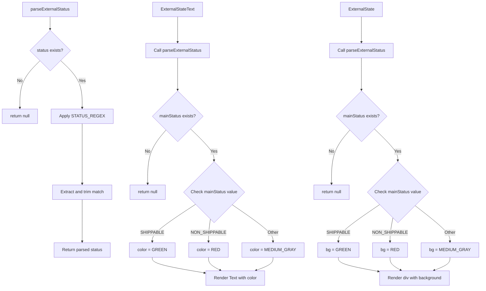
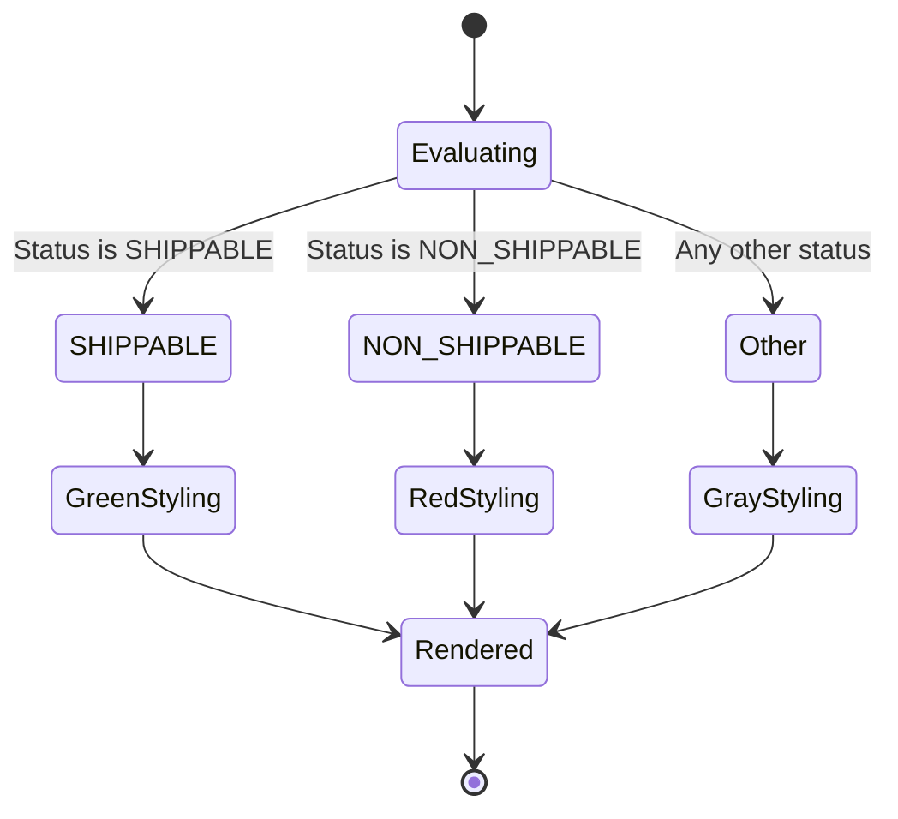

# Diagram: web/portal/src/shared/components/molecules/ExternalStateText.molecule.js


> Auto-generated by Obscura crawlers

## Diagram 1

```mermaid
flowchart TD
      A[parseExternalStatus] --> B{status exists?}
      B -->|No| C[return null]
      B -->|Yes| D[Apply STATUS_REGEX]...
  └ 101 lines...
```

> SVG rendering failed for this diagram.

## Diagram 2



### SVG

<svg id="container" width="1718.47265625" xmlns="http://www.w3.org/2000/svg" class="flowchart" height="1089.765625" viewBox="0 0 1718.47265625 1089.765625" role="graphics-document document" aria-roledescription="flowchart-v2"><style>#container{font-family:"trebuchet ms",verdana,arial,sans-serif;font-size:16px;fill:#333;}@keyframes edge-animation-frame{from{stroke-dashoffset:0;}}@keyframes dash{to{stroke-dashoffset:0;}}#container .edge-animation-slow{stroke-dasharray:9,5!important;stroke-dashoffset:900;animation:dash 50s linear infinite;stroke-linecap:round;}#container .edge-animation-fast{stroke-dasharray:9,5!important;stroke-dashoffset:900;animation:dash 20s linear infinite;stroke-linecap:round;}#container .error-icon{fill:#552222;}#container .error-text{fill:#552222;stroke:#552222;}#container .edge-thickness-normal{stroke-width:1px;}#container .edge-thickness-thick{stroke-width:3.5px;}#container .edge-pattern-solid{stroke-dasharray:0;}#container .edge-thickness-invisible{stroke-width:0;fill:none;}#container .edge-pattern-dashed{stroke-dasharray:3;}#container .edge-pattern-dotted{stroke-dasharray:2;}#container .marker{fill:#333333;stroke:#333333;}#container .marker.cross{stroke:#333333;}#container svg{font-family:"trebuchet ms",verdana,arial,sans-serif;font-size:16px;}#container p{margin:0;}#container .label{font-family:"trebuchet ms",verdana,arial,sans-serif;color:#333;}#container .cluster-label text{fill:#333;}#container .cluster-label span{color:#333;}#container .cluster-label span p{background-color:transparent;}#container .label text,#container span{fill:#333;color:#333;}#container .node rect,#container .node circle,#container .node ellipse,#container .node polygon,#container .node path{fill:#ECECFF;stroke:#9370DB;stroke-width:1px;}#container .rough-node .label text,#container .node .label text,#container .image-shape .label,#container .icon-shape .label{text-anchor:middle;}#container .node .katex path{fill:#000;stroke:#000;stroke-width:1px;}#container .rough-node .label,#container .node .label,#container .image-shape .label,#container .icon-shape .label{text-align:center;}#container .node.clickable{cursor:pointer;}#container .root .anchor path{fill:#333333!important;stroke-width:0;stroke:#333333;}#container .arrowheadPath{fill:#333333;}#container .edgePath .path{stroke:#333333;stroke-width:2.0px;}#container .flowchart-link{stroke:#333333;fill:none;}#container .edgeLabel{background-color:rgba(232,232,232, 0.8);text-align:center;}#container .edgeLabel p{background-color:rgba(232,232,232, 0.8);}#container .edgeLabel rect{opacity:0.5;background-color:rgba(232,232,232, 0.8);fill:rgba(232,232,232, 0.8);}#container .labelBkg{background-color:rgba(232, 232, 232, 0.5);}#container .cluster rect{fill:#ffffde;stroke:#aaaa33;stroke-width:1px;}#container .cluster text{fill:#333;}#container .cluster span{color:#333;}#container div.mermaidTooltip{position:absolute;text-align:center;max-width:200px;padding:2px;font-family:"trebuchet ms",verdana,arial,sans-serif;font-size:12px;background:hsl(80, 100%, 96.2745098039%);border:1px solid #aaaa33;border-radius:2px;pointer-events:none;z-index:100;}#container .flowchartTitleText{text-anchor:middle;font-size:18px;fill:#333;}#container rect.text{fill:none;stroke-width:0;}#container .icon-shape,#container .image-shape{background-color:rgba(232,232,232, 0.8);text-align:center;}#container .icon-shape p,#container .image-shape p{background-color:rgba(232,232,232, 0.8);padding:2px;}#container .icon-shape rect,#container .image-shape rect{opacity:0.5;background-color:rgba(232,232,232, 0.8);fill:rgba(232,232,232, 0.8);}#container .label-icon{display:inline-block;height:1em;overflow:visible;vertical-align:-0.125em;}#container .node .label-icon path{fill:currentColor;stroke:revert;stroke-width:revert;}#container :root{--mermaid-font-family:"trebuchet ms",verdana,arial,sans-serif;}</style><g><marker id="container_flowchart-v2-pointEnd" class="marker flowchart-v2" viewBox="0 0 10 10" refX="5" refY="5" markerUnits="userSpaceOnUse" markerWidth="8" markerHeight="8" orient="auto"><path d="M 0 0 L 10 5 L 0 10 z" class="arrowMarkerPath" style="stroke-width: 1; stroke-dasharray: 1, 0;"></path></marker><marker id="container_flowchart-v2-pointStart" class="marker flowchart-v2" viewBox="0 0 10 10" refX="4.5" refY="5" markerUnits="userSpaceOnUse" markerWidth="8" markerHeight="8" orient="auto"><path d="M 0 5 L 10 10 L 10 0 z" class="arrowMarkerPath" style="stroke-width: 1; stroke-dasharray: 1, 0;"></path></marker><marker id="container_flowchart-v2-circleEnd" class="marker flowchart-v2" viewBox="0 0 10 10" refX="11" refY="5" markerUnits="userSpaceOnUse" markerWidth="11" markerHeight="11" orient="auto"><circle cx="5" cy="5" r="5" class="arrowMarkerPath" style="stroke-width: 1; stroke-dasharray: 1, 0;"></circle></marker><marker id="container_flowchart-v2-circleStart" class="marker flowchart-v2" viewBox="0 0 10 10" refX="-1" refY="5" markerUnits="userSpaceOnUse" markerWidth="11" markerHeight="11" orient="auto"><circle cx="5" cy="5" r="5" class="arrowMarkerPath" style="stroke-width: 1; stroke-dasharray: 1, 0;"></circle></marker><marker id="container_flowchart-v2-crossEnd" class="marker cross flowchart-v2" viewBox="0 0 11 11" refX="12" refY="5.2" markerUnits="userSpaceOnUse" markerWidth="11" markerHeight="11" orient="auto"><path d="M 1,1 l 9,9 M 10,1 l -9,9" class="arrowMarkerPath" style="stroke-width: 2; stroke-dasharray: 1, 0;"></path></marker><marker id="container_flowchart-v2-crossStart" class="marker cross flowchart-v2" viewBox="0 0 11 11" refX="-1" refY="5.2" markerUnits="userSpaceOnUse" markerWidth="11" markerHeight="11" orient="auto"><path d="M 1,1 l 9,9 M 10,1 l -9,9" class="arrowMarkerPath" style="stroke-width: 2; stroke-dasharray: 1, 0;"></path></marker><g class="root"><g class="clusters"></g><g class="edgePaths"><path d="M175.777,62L175.777,66.167C175.777,70.333,175.777,78.667,175.777,86.333C175.777,94,175.777,101,175.777,104.5L175.777,108" id="L_A_B_0" class="edge-thickness-normal edge-pattern-solid edge-thickness-normal edge-pattern-solid flowchart-link" style=";" data-edge="true" data-et="edge" data-id="L_A_B_0" data-points="W3sieCI6MTc1Ljc3NzM0Mzc1LCJ5Ijo2Mn0seyJ4IjoxNzUuNzc3MzQzNzUsInkiOjg3fSx7IngiOjE3NS43NzczNDM3NSwieSI6MTEyfV0=" marker-end="url(#container_flowchart-v2-pointEnd)"></path><path d="M140.408,227.709L129.788,239.77C119.168,251.832,97.928,275.955,87.308,304.735C76.688,333.516,76.688,366.953,76.688,383.672L76.688,400.391" id="L_B_C_0" class="edge-thickness-normal edge-pattern-solid edge-thickness-normal edge-pattern-solid flowchart-link" style=";" data-edge="true" data-et="edge" data-id="L_B_C_0" data-points="W3sieCI6MTQwLjQwODEwMjIxODc2OTA1LCJ5IjoyMjcuNzA4ODgzNDY4NzY5MDV9LHsieCI6NzYuNjg3NSwieSI6MzAwLjA3ODEyNX0seyJ4Ijo3Ni42ODc1LCJ5Ijo0MDQuMzkwNjI1fV0=" marker-end="url(#container_flowchart-v2-pointEnd)"></path><path d="M215.444,223.412L229.573,236.189C243.702,248.967,271.96,274.523,286.09,304.019C300.219,333.516,300.219,366.953,300.219,383.672L300.219,400.391" id="L_B_D_0" class="edge-thickness-normal edge-pattern-solid edge-thickness-normal edge-pattern-solid flowchart-link" style=";" data-edge="true" data-et="edge" data-id="L_B_D_0" data-points="W3sieCI6MjE1LjQ0Mzg0OTY2MDMzODQsInkiOjIyMy40MTE2MTkwODk2NjE2fSx7IngiOjMwMC4yMTg3NSwieSI6MzAwLjA3ODEyNX0seyJ4IjozMDAuMjE4NzUsInkiOjQwNC4zOTA2MjV9XQ==" marker-end="url(#container_flowchart-v2-pointEnd)"></path><path d="M300.219,458.391L300.219,475.776C300.219,493.161,300.219,527.932,300.219,565.156C300.219,602.38,300.219,642.057,300.219,661.896L300.219,681.734" id="L_D_E_0" class="edge-thickness-normal edge-pattern-solid edge-thickness-normal edge-pattern-solid flowchart-link" style=";" data-edge="true" data-et="edge" data-id="L_D_E_0" data-points="W3sieCI6MzAwLjIxODc1LCJ5Ijo0NTguMzkwNjI1fSx7IngiOjMwMC4yMTg3NSwieSI6NTYyLjcwMzEyNX0seyJ4IjozMDAuMjE4NzUsInkiOjY4NS43MzQzNzV9XQ==" marker-end="url(#container_flowchart-v2-pointEnd)"></path><path d="M300.219,739.734L300.219,760.24C300.219,780.745,300.219,821.755,300.219,847.76C300.219,873.766,300.219,884.766,300.219,890.266L300.219,895.766" id="L_E_F_0" class="edge-thickness-normal edge-pattern-solid edge-thickness-normal edge-pattern-solid flowchart-link" style=";" data-edge="true" data-et="edge" data-id="L_E_F_0" data-points="W3sieCI6MzAwLjIxODc1LCJ5Ijo3MzkuNzM0Mzc1fSx7IngiOjMwMC4yMTg3NSwieSI6ODYyLjc2NTYyNX0seyJ4IjozMDAuMjE4NzUsInkiOjg5OS43NjU2MjV9XQ==" marker-end="url(#container_flowchart-v2-pointEnd)"></path><path d="M643.668,62L643.668,66.167C643.668,70.333,643.668,78.667,643.668,94.423C643.668,110.18,643.668,133.359,643.668,144.949L643.668,156.539" id="L_G_H_0" class="edge-thickness-normal edge-pattern-solid edge-thickness-normal edge-pattern-solid flowchart-link" style=";" data-edge="true" data-et="edge" data-id="L_G_H_0" data-points="W3sieCI6NjQzLjY2Nzk2ODc1LCJ5Ijo2Mn0seyJ4Ijo2NDMuNjY3OTY4NzUsInkiOjg3fSx7IngiOjY0My42Njc5Njg3NSwieSI6MTYwLjUzOTA2MjV9XQ==" marker-end="url(#container_flowchart-v2-pointEnd)"></path><path d="M643.668,214.539L643.668,228.796C643.668,243.052,643.668,271.565,643.668,291.322C643.668,311.078,643.668,322.078,643.668,327.578L643.668,333.078" id="L_H_I_0" class="edge-thickness-normal edge-pattern-solid edge-thickness-normal edge-pattern-solid flowchart-link" style=";" data-edge="true" data-et="edge" data-id="L_H_I_0" data-points="W3sieCI6NjQzLjY2Nzk2ODc1LCJ5IjoyMTQuNTM5MDYyNX0seyJ4Ijo2NDMuNjY3OTY4NzUsInkiOjMwMC4wNzgxMjV9LHsieCI6NjQzLjY2Nzk2ODc1LCJ5IjozMzcuMDc4MTI1fV0=" marker-end="url(#container_flowchart-v2-pointEnd)"></path><path d="M602.168,484.203L591.888,497.287C581.607,510.37,561.046,536.537,550.765,569.458C540.484,602.38,540.484,642.057,540.484,661.896L540.484,681.734" id="L_I_J_0" class="edge-thickness-normal edge-pattern-solid edge-thickness-normal edge-pattern-solid flowchart-link" style=";" data-edge="true" data-et="edge" data-id="L_I_J_0" data-points="W3sieCI6NjAyLjE2ODMzMjEwMzkzMzgsInkiOjQ4NC4yMDM0ODgzNTM5MzM4fSx7IngiOjU0MC40ODQzNzUsInkiOjU2Mi43MDMxMjV9LHsieCI6NTQwLjQ4NDM3NSwieSI6Njg1LjczNDM3NX1d" marker-end="url(#container_flowchart-v2-pointEnd)"></path><path d="M691.897,477.474L706.763,491.679C721.629,505.884,751.361,534.293,766.228,553.998C781.094,573.703,781.094,584.703,781.094,590.203L781.094,595.703" id="L_I_K_0" class="edge-thickness-normal edge-pattern-solid edge-thickness-normal edge-pattern-solid flowchart-link" style=";" data-edge="true" data-et="edge" data-id="L_I_K_0" data-points="W3sieCI6NjkxLjg5NjkzMzEzMDcxNDMsInkiOjQ3Ny40NzQxNjA2MTkyODU3fSx7IngiOjc4MS4wOTM3NSwieSI6NTYyLjcwMzEyNX0seyJ4Ijo3ODEuMDkzNzUsInkiOjU5OS43MDMxMjV9XQ==" marker-end="url(#container_flowchart-v2-pointEnd)"></path><path d="M713.519,758.191L687.609,775.62C661.699,793.049,609.879,827.907,583.969,850.836C558.059,873.766,558.059,884.766,558.059,890.266L558.059,895.766" id="L_K_L_0" class="edge-thickness-normal edge-pattern-solid edge-thickness-normal edge-pattern-solid flowchart-link" style=";" data-edge="true" data-et="edge" data-id="L_K_L_0" data-points="W3sieCI6NzEzLjUxODgwMzMzNDkwNCwieSI6NzU4LjE5MDY3ODMzNDkwNH0seyJ4Ijo1NTguMDU4NTkzNzUsInkiOjg2Mi43NjU2MjV9LHsieCI6NTU4LjA1ODU5Mzc1LCJ5Ijo4OTkuNzY1NjI1fV0=" marker-end="url(#container_flowchart-v2-pointEnd)"></path><path d="M766.888,811.56L765.661,820.094C764.434,828.628,761.981,845.697,760.754,859.731C759.527,873.766,759.527,884.766,759.527,890.266L759.527,895.766" id="L_K_M_0" class="edge-thickness-normal edge-pattern-solid edge-thickness-normal edge-pattern-solid flowchart-link" style=";" data-edge="true" data-et="edge" data-id="L_K_M_0" data-points="W3sieCI6NzY2Ljg4Nzk3NDA2MDQxNTcsInkiOjgxMS41NTk4NDkwNjA0MTU3fSx7IngiOjc1OS41MjczNDM3NSwieSI6ODYyLjc2NTYyNX0seyJ4Ijo3NTkuNTI3MzQzNzUsInkiOjg5OS43NjU2MjV9XQ==" marker-end="url(#container_flowchart-v2-pointEnd)"></path><path d="M846.74,760.12L870.44,777.227C894.14,794.335,941.541,828.55,965.241,851.158C988.941,873.766,988.941,884.766,988.941,890.266L988.941,895.766" id="L_K_N_0" class="edge-thickness-normal edge-pattern-solid edge-thickness-normal edge-pattern-solid flowchart-link" style=";" data-edge="true" data-et="edge" data-id="L_K_N_0" data-points="W3sieCI6ODQ2LjczOTY0MzAyNDc2NjEsInkiOjc2MC4xMTk3MzE5NzUyMzM5fSx7IngiOjk4OC45NDE0MDYyNSwieSI6ODYyLjc2NTYyNX0seyJ4Ijo5ODguOTQxNDA2MjUsInkiOjg5OS43NjU2MjV9XQ==" marker-end="url(#container_flowchart-v2-pointEnd)"></path><path d="M558.059,953.766L558.059,957.932C558.059,962.099,558.059,970.432,587.994,981.102C617.93,991.772,677.802,1004.778,707.737,1011.281L737.673,1017.785" id="L_L_O_0" class="edge-thickness-normal edge-pattern-solid edge-thickness-normal edge-pattern-solid flowchart-link" style=";" data-edge="true" data-et="edge" data-id="L_L_O_0" data-points="W3sieCI6NTU4LjA1ODU5Mzc1LCJ5Ijo5NTMuNzY1NjI1fSx7IngiOjU1OC4wNTg1OTM3NSwieSI6OTc4Ljc2NTYyNX0seyJ4Ijo3NDEuNTgyMDMxMjUsInkiOjEwMTguNjMzNjcwNjExMjQzN31d" marker-end="url(#container_flowchart-v2-pointEnd)"></path><path d="M759.527,953.766L759.527,957.932C759.527,962.099,759.527,970.432,767.952,980.388C776.377,990.344,793.227,1001.922,801.653,1007.711L810.078,1013.5" id="L_M_O_0" class="edge-thickness-normal edge-pattern-solid edge-thickness-normal edge-pattern-solid flowchart-link" style=";" data-edge="true" data-et="edge" data-id="L_M_O_0" data-points="W3sieCI6NzU5LjUyNzM0Mzc1LCJ5Ijo5NTMuNzY1NjI1fSx7IngiOjc1OS41MjczNDM3NSwieSI6OTc4Ljc2NTYyNX0seyJ4Ijo4MTMuMzc0MjY3NTc4MTI1LCJ5IjoxMDE1Ljc2NTYyNX1d" marker-end="url(#container_flowchart-v2-pointEnd)"></path><path d="M988.941,953.766L988.941,957.932C988.941,962.099,988.941,970.432,976.414,980.482C963.887,990.532,938.833,1002.299,926.306,1008.182L913.779,1014.065" id="L_N_O_0" class="edge-thickness-normal edge-pattern-solid edge-thickness-normal edge-pattern-solid flowchart-link" style=";" data-edge="true" data-et="edge" data-id="L_N_O_0" data-points="W3sieCI6OTg4Ljk0MTQwNjI1LCJ5Ijo5NTMuNzY1NjI1fSx7IngiOjk4OC45NDE0MDYyNSwieSI6OTc4Ljc2NTYyNX0seyJ4Ijo5MTAuMTU4MzI1MTk1MzEyNSwieSI6MTAxNS43NjU2MjV9XQ==" marker-end="url(#container_flowchart-v2-pointEnd)"></path><path d="M1294.637,62L1294.637,66.167C1294.637,70.333,1294.637,78.667,1294.637,94.423C1294.637,110.18,1294.637,133.359,1294.637,144.949L1294.637,156.539" id="L_P_Q_0" class="edge-thickness-normal edge-pattern-solid edge-thickness-normal edge-pattern-solid flowchart-link" style=";" data-edge="true" data-et="edge" data-id="L_P_Q_0" data-points="W3sieCI6MTI5NC42MzY3MTg3NSwieSI6NjJ9LHsieCI6MTI5NC42MzY3MTg3NSwieSI6ODd9LHsieCI6MTI5NC42MzY3MTg3NSwieSI6MTYwLjUzOTA2MjV9XQ==" marker-end="url(#container_flowchart-v2-pointEnd)"></path><path d="M1294.637,214.539L1294.637,228.796C1294.637,243.052,1294.637,271.565,1294.637,291.322C1294.637,311.078,1294.637,322.078,1294.637,327.578L1294.637,333.078" id="L_Q_R_0" class="edge-thickness-normal edge-pattern-solid edge-thickness-normal edge-pattern-solid flowchart-link" style=";" data-edge="true" data-et="edge" data-id="L_Q_R_0" data-points="W3sieCI6MTI5NC42MzY3MTg3NSwieSI6MjE0LjUzOTA2MjV9LHsieCI6MTI5NC42MzY3MTg3NSwieSI6MzAwLjA3ODEyNX0seyJ4IjoxMjk0LjYzNjcxODc1LCJ5IjozMzcuMDc4MTI1fV0=" marker-end="url(#container_flowchart-v2-pointEnd)"></path><path d="M1253.943,485.009L1244.115,497.958C1234.287,510.907,1214.632,536.805,1204.804,569.593C1194.977,602.38,1194.977,642.057,1194.977,661.896L1194.977,681.734" id="L_R_S_0" class="edge-thickness-normal edge-pattern-solid edge-thickness-normal edge-pattern-solid flowchart-link" style=";" data-edge="true" data-et="edge" data-id="L_R_S_0" data-points="W3sieCI6MTI1My45NDI3MzA4MTY4MzcsInkiOjQ4NS4wMDkxMzcwNjY4MzY5fSx7IngiOjExOTQuOTc2NTYyNSwieSI6NTYyLjcwMzEyNX0seyJ4IjoxMTk0Ljk3NjU2MjUsInkiOjY4NS43MzQzNzV9XQ==" marker-end="url(#container_flowchart-v2-pointEnd)"></path><path d="M1342.866,477.474L1357.732,491.679C1372.598,505.884,1402.33,534.293,1417.196,553.998C1432.063,573.703,1432.063,584.703,1432.063,590.203L1432.063,595.703" id="L_R_T_0" class="edge-thickness-normal edge-pattern-solid edge-thickness-normal edge-pattern-solid flowchart-link" style=";" data-edge="true" data-et="edge" data-id="L_R_T_0" data-points="W3sieCI6MTM0Mi44NjU2ODMxMzA3MTQ0LCJ5Ijo0NzcuNDc0MTYwNjE5Mjg1N30seyJ4IjoxNDMyLjA2MjUsInkiOjU2Mi43MDMxMjV9LHsieCI6MTQzMi4wNjI1LCJ5Ijo1OTkuNzAzMTI1fV0=" marker-end="url(#container_flowchart-v2-pointEnd)"></path><path d="M1365.673,759.376L1341.146,776.608C1316.619,793.84,1267.566,828.303,1243.039,851.034C1218.512,873.766,1218.512,884.766,1218.512,890.266L1218.512,895.766" id="L_T_U_0" class="edge-thickness-normal edge-pattern-solid edge-thickness-normal edge-pattern-solid flowchart-link" style=";" data-edge="true" data-et="edge" data-id="L_T_U_0" data-points="W3sieCI6MTM2NS42NzMzMjMyMjk2OTE1LCJ5Ijo3NTkuMzc2NDQ4MjI5NjkxNX0seyJ4IjoxMjE4LjUxMTcxODc1LCJ5Ijo4NjIuNzY1NjI1fSx7IngiOjEyMTguNTExNzE4NzUsInkiOjg5OS43NjU2MjV9XQ==" marker-end="url(#container_flowchart-v2-pointEnd)"></path><path d="M1412.681,806.384L1410.736,815.781C1408.791,825.178,1404.901,843.972,1402.957,858.869C1401.012,873.766,1401.012,884.766,1401.012,890.266L1401.012,895.766" id="L_T_V_0" class="edge-thickness-normal edge-pattern-solid edge-thickness-normal edge-pattern-solid flowchart-link" style=";" data-edge="true" data-et="edge" data-id="L_T_V_0" data-points="W3sieCI6MTQxMi42ODA2Mjg3MzQ2MDMzLCJ5Ijo4MDYuMzgzNzUzNzM0NjAzMX0seyJ4IjoxNDAxLjAxMTcxODc1LCJ5Ijo4NjIuNzY1NjI1fSx7IngiOjE0MDEuMDExNzE4NzUsInkiOjg5OS43NjU2MjV9XQ==" marker-end="url(#container_flowchart-v2-pointEnd)"></path><path d="M1493.616,764.212L1513.256,780.638C1532.896,797.064,1572.177,829.915,1591.817,851.84C1611.457,873.766,1611.457,884.766,1611.457,890.266L1611.457,895.766" id="L_T_W_0" class="edge-thickness-normal edge-pattern-solid edge-thickness-normal edge-pattern-solid flowchart-link" style=";" data-edge="true" data-et="edge" data-id="L_T_W_0" data-points="W3sieCI6MTQ5My42MTU2MzA1MjEyNjcsInkiOjc2NC4yMTI0OTQ0Nzg3MzMxfSx7IngiOjE2MTEuNDU3MDMxMjUsInkiOjg2Mi43NjU2MjV9LHsieCI6MTYxMS40NTcwMzEyNSwieSI6ODk5Ljc2NTYyNX1d" marker-end="url(#container_flowchart-v2-pointEnd)"></path><path d="M1218.512,953.766L1218.512,957.932C1218.512,962.099,1218.512,970.432,1240.556,979.9C1262.601,989.367,1306.69,999.969,1328.734,1005.27L1350.779,1010.571" id="L_U_X_0" class="edge-thickness-normal edge-pattern-solid edge-thickness-normal edge-pattern-solid flowchart-link" style=";" data-edge="true" data-et="edge" data-id="L_U_X_0" data-points="W3sieCI6MTIxOC41MTE3MTg3NSwieSI6OTUzLjc2NTYyNX0seyJ4IjoxMjE4LjUxMTcxODc1LCJ5Ijo5NzguNzY1NjI1fSx7IngiOjEzNTQuNjY3OTY4NzUsInkiOjEwMTEuNTA1NzkxNzI1MzcyOH1d" marker-end="url(#container_flowchart-v2-pointEnd)"></path><path d="M1401.012,953.766L1401.012,957.932C1401.012,962.099,1401.012,970.432,1405.929,978.361C1410.845,986.289,1420.679,993.812,1425.596,997.574L1430.513,1001.335" id="L_V_X_0" class="edge-thickness-normal edge-pattern-solid edge-thickness-normal edge-pattern-solid flowchart-link" style=";" data-edge="true" data-et="edge" data-id="L_V_X_0" data-points="W3sieCI6MTQwMS4wMTE3MTg3NSwieSI6OTUzLjc2NTYyNX0seyJ4IjoxNDAxLjAxMTcxODc1LCJ5Ijo5NzguNzY1NjI1fSx7IngiOjE0MzMuNjg5OTQxNDA2MjUsInkiOjEwMDMuNzY1NjI1fV0=" marker-end="url(#container_flowchart-v2-pointEnd)"></path><path d="M1611.457,953.766L1611.457,957.932C1611.457,962.099,1611.457,970.432,1603.798,978.465C1596.138,986.498,1580.82,994.231,1573.16,998.097L1565.501,1001.963" id="L_W_X_0" class="edge-thickness-normal edge-pattern-solid edge-thickness-normal edge-pattern-solid flowchart-link" style=";" data-edge="true" data-et="edge" data-id="L_W_X_0" data-points="W3sieCI6MTYxMS40NTcwMzEyNSwieSI6OTUzLjc2NTYyNX0seyJ4IjoxNjExLjQ1NzAzMTI1LCJ5Ijo5NzguNzY1NjI1fSx7IngiOjE1NjEuOTMwMDUzNzEwOTM3NSwieSI6MTAwMy43NjU2MjV9XQ==" marker-end="url(#container_flowchart-v2-pointEnd)"></path></g><g class="edgeLabels"><g class="edgeLabel"><g class="label" data-id="L_A_B_0" transform="translate(0, 0)"><foreignObject width="0" height="0"><div xmlns="http://www.w3.org/1999/xhtml" class="labelBkg" style="display: table-cell; white-space: nowrap; line-height: 1.5; max-width: 200px; text-align: center;"><span class="edgeLabel"></span></div></foreignObject></g></g><g class="edgeLabel" transform="translate(76.6875, 300.078125)"><g class="label" data-id="L_B_C_0" transform="translate(-10.140625, -12)"><foreignObject width="20.28125" height="24"><div xmlns="http://www.w3.org/1999/xhtml" class="labelBkg" style="display: table-cell; white-space: nowrap; line-height: 1.5; max-width: 200px; text-align: center;"><span class="edgeLabel"><p>No</p></span></div></foreignObject></g></g><g class="edgeLabel" transform="translate(300.21875, 300.078125)"><g class="label" data-id="L_B_D_0" transform="translate(-12.03125, -12)"><foreignObject width="24.0625" height="24"><div xmlns="http://www.w3.org/1999/xhtml" class="labelBkg" style="display: table-cell; white-space: nowrap; line-height: 1.5; max-width: 200px; text-align: center;"><span class="edgeLabel"><p>Yes</p></span></div></foreignObject></g></g><g class="edgeLabel"><g class="label" data-id="L_D_E_0" transform="translate(0, 0)"><foreignObject width="0" height="0"><div xmlns="http://www.w3.org/1999/xhtml" class="labelBkg" style="display: table-cell; white-space: nowrap; line-height: 1.5; max-width: 200px; text-align: center;"><span class="edgeLabel"></span></div></foreignObject></g></g><g class="edgeLabel"><g class="label" data-id="L_E_F_0" transform="translate(0, 0)"><foreignObject width="0" height="0"><div xmlns="http://www.w3.org/1999/xhtml" class="labelBkg" style="display: table-cell; white-space: nowrap; line-height: 1.5; max-width: 200px; text-align: center;"><span class="edgeLabel"></span></div></foreignObject></g></g><g class="edgeLabel"><g class="label" data-id="L_G_H_0" transform="translate(0, 0)"><foreignObject width="0" height="0"><div xmlns="http://www.w3.org/1999/xhtml" class="labelBkg" style="display: table-cell; white-space: nowrap; line-height: 1.5; max-width: 200px; text-align: center;"><span class="edgeLabel"></span></div></foreignObject></g></g><g class="edgeLabel"><g class="label" data-id="L_H_I_0" transform="translate(0, 0)"><foreignObject width="0" height="0"><div xmlns="http://www.w3.org/1999/xhtml" class="labelBkg" style="display: table-cell; white-space: nowrap; line-height: 1.5; max-width: 200px; text-align: center;"><span class="edgeLabel"></span></div></foreignObject></g></g><g class="edgeLabel" transform="translate(540.484375, 562.703125)"><g class="label" data-id="L_I_J_0" transform="translate(-10.140625, -12)"><foreignObject width="20.28125" height="24"><div xmlns="http://www.w3.org/1999/xhtml" class="labelBkg" style="display: table-cell; white-space: nowrap; line-height: 1.5; max-width: 200px; text-align: center;"><span class="edgeLabel"><p>No</p></span></div></foreignObject></g></g><g class="edgeLabel" transform="translate(781.09375, 562.703125)"><g class="label" data-id="L_I_K_0" transform="translate(-12.03125, -12)"><foreignObject width="24.0625" height="24"><div xmlns="http://www.w3.org/1999/xhtml" class="labelBkg" style="display: table-cell; white-space: nowrap; line-height: 1.5; max-width: 200px; text-align: center;"><span class="edgeLabel"><p>Yes</p></span></div></foreignObject></g></g><g class="edgeLabel" transform="translate(558.05859375, 862.765625)"><g class="label" data-id="L_K_L_0" transform="translate(-38.6953125, -12)"><foreignObject width="77.390625" height="24"><div xmlns="http://www.w3.org/1999/xhtml" class="labelBkg" style="display: table-cell; white-space: nowrap; line-height: 1.5; max-width: 200px; text-align: center;"><span class="edgeLabel"><p>SHIPPABLE</p></span></div></foreignObject></g></g><g class="edgeLabel" transform="translate(759.52734375, 862.765625)"><g class="label" data-id="L_K_M_0" transform="translate(-59.15625, -12)"><foreignObject width="118.3125" height="24"><div xmlns="http://www.w3.org/1999/xhtml" class="labelBkg" style="display: table-cell; white-space: nowrap; line-height: 1.5; max-width: 200px; text-align: center;"><span class="edgeLabel"><p>NON_SHIPPABLE</p></span></div></foreignObject></g></g><g class="edgeLabel" transform="translate(988.94140625, 862.765625)"><g class="label" data-id="L_K_N_0" transform="translate(-20.5625, -12)"><foreignObject width="41.125" height="24"><div xmlns="http://www.w3.org/1999/xhtml" class="labelBkg" style="display: table-cell; white-space: nowrap; line-height: 1.5; max-width: 200px; text-align: center;"><span class="edgeLabel"><p>Other</p></span></div></foreignObject></g></g><g class="edgeLabel"><g class="label" data-id="L_L_O_0" transform="translate(0, 0)"><foreignObject width="0" height="0"><div xmlns="http://www.w3.org/1999/xhtml" class="labelBkg" style="display: table-cell; white-space: nowrap; line-height: 1.5; max-width: 200px; text-align: center;"><span class="edgeLabel"></span></div></foreignObject></g></g><g class="edgeLabel"><g class="label" data-id="L_M_O_0" transform="translate(0, 0)"><foreignObject width="0" height="0"><div xmlns="http://www.w3.org/1999/xhtml" class="labelBkg" style="display: table-cell; white-space: nowrap; line-height: 1.5; max-width: 200px; text-align: center;"><span class="edgeLabel"></span></div></foreignObject></g></g><g class="edgeLabel"><g class="label" data-id="L_N_O_0" transform="translate(0, 0)"><foreignObject width="0" height="0"><div xmlns="http://www.w3.org/1999/xhtml" class="labelBkg" style="display: table-cell; white-space: nowrap; line-height: 1.5; max-width: 200px; text-align: center;"><span class="edgeLabel"></span></div></foreignObject></g></g><g class="edgeLabel"><g class="label" data-id="L_P_Q_0" transform="translate(0, 0)"><foreignObject width="0" height="0"><div xmlns="http://www.w3.org/1999/xhtml" class="labelBkg" style="display: table-cell; white-space: nowrap; line-height: 1.5; max-width: 200px; text-align: center;"><span class="edgeLabel"></span></div></foreignObject></g></g><g class="edgeLabel"><g class="label" data-id="L_Q_R_0" transform="translate(0, 0)"><foreignObject width="0" height="0"><div xmlns="http://www.w3.org/1999/xhtml" class="labelBkg" style="display: table-cell; white-space: nowrap; line-height: 1.5; max-width: 200px; text-align: center;"><span class="edgeLabel"></span></div></foreignObject></g></g><g class="edgeLabel" transform="translate(1194.9765625, 562.703125)"><g class="label" data-id="L_R_S_0" transform="translate(-10.140625, -12)"><foreignObject width="20.28125" height="24"><div xmlns="http://www.w3.org/1999/xhtml" class="labelBkg" style="display: table-cell; white-space: nowrap; line-height: 1.5; max-width: 200px; text-align: center;"><span class="edgeLabel"><p>No</p></span></div></foreignObject></g></g><g class="edgeLabel" transform="translate(1432.0625, 562.703125)"><g class="label" data-id="L_R_T_0" transform="translate(-12.03125, -12)"><foreignObject width="24.0625" height="24"><div xmlns="http://www.w3.org/1999/xhtml" class="labelBkg" style="display: table-cell; white-space: nowrap; line-height: 1.5; max-width: 200px; text-align: center;"><span class="edgeLabel"><p>Yes</p></span></div></foreignObject></g></g><g class="edgeLabel" transform="translate(1218.51171875, 862.765625)"><g class="label" data-id="L_T_U_0" transform="translate(-38.6953125, -12)"><foreignObject width="77.390625" height="24"><div xmlns="http://www.w3.org/1999/xhtml" class="labelBkg" style="display: table-cell; white-space: nowrap; line-height: 1.5; max-width: 200px; text-align: center;"><span class="edgeLabel"><p>SHIPPABLE</p></span></div></foreignObject></g></g><g class="edgeLabel" transform="translate(1401.01171875, 862.765625)"><g class="label" data-id="L_T_V_0" transform="translate(-59.15625, -12)"><foreignObject width="118.3125" height="24"><div xmlns="http://www.w3.org/1999/xhtml" class="labelBkg" style="display: table-cell; white-space: nowrap; line-height: 1.5; max-width: 200px; text-align: center;"><span class="edgeLabel"><p>NON_SHIPPABLE</p></span></div></foreignObject></g></g><g class="edgeLabel" transform="translate(1611.45703125, 862.765625)"><g class="label" data-id="L_T_W_0" transform="translate(-20.5625, -12)"><foreignObject width="41.125" height="24"><div xmlns="http://www.w3.org/1999/xhtml" class="labelBkg" style="display: table-cell; white-space: nowrap; line-height: 1.5; max-width: 200px; text-align: center;"><span class="edgeLabel"><p>Other</p></span></div></foreignObject></g></g><g class="edgeLabel"><g class="label" data-id="L_U_X_0" transform="translate(0, 0)"><foreignObject width="0" height="0"><div xmlns="http://www.w3.org/1999/xhtml" class="labelBkg" style="display: table-cell; white-space: nowrap; line-height: 1.5; max-width: 200px; text-align: center;"><span class="edgeLabel"></span></div></foreignObject></g></g><g class="edgeLabel"><g class="label" data-id="L_V_X_0" transform="translate(0, 0)"><foreignObject width="0" height="0"><div xmlns="http://www.w3.org/1999/xhtml" class="labelBkg" style="display: table-cell; white-space: nowrap; line-height: 1.5; max-width: 200px; text-align: center;"><span class="edgeLabel"></span></div></foreignObject></g></g><g class="edgeLabel"><g class="label" data-id="L_W_X_0" transform="translate(0, 0)"><foreignObject width="0" height="0"><div xmlns="http://www.w3.org/1999/xhtml" class="labelBkg" style="display: table-cell; white-space: nowrap; line-height: 1.5; max-width: 200px; text-align: center;"><span class="edgeLabel"></span></div></foreignObject></g></g></g><g class="nodes"><g class="node default" id="flowchart-A-0" transform="translate(175.77734375, 35)"><rect class="basic label-container" style="" x="-102.59375" y="-27" width="205.1875" height="54"></rect><g class="label" style="" transform="translate(-72.59375, -12)"><rect></rect><foreignObject width="145.1875" height="24"><div xmlns="http://www.w3.org/1999/xhtml" style="display: table-cell; white-space: nowrap; line-height: 1.5; max-width: 200px; text-align: center;"><span class="nodeLabel"><p>parseExternalStatus</p></span></div></foreignObject></g></g><g class="node default" id="flowchart-B-1" transform="translate(175.77734375, 187.5390625)"><polygon points="75.5390625,0 151.078125,-75.5390625 75.5390625,-151.078125 0,-75.5390625" class="label-container" transform="translate(-75.0390625, 75.5390625)"></polygon><g class="label" style="" transform="translate(-48.5390625, -12)"><rect></rect><foreignObject width="97.078125" height="24"><div xmlns="http://www.w3.org/1999/xhtml" style="display: table-cell; white-space: nowrap; line-height: 1.5; max-width: 200px; text-align: center;"><span class="nodeLabel"><p>status exists?</p></span></div></foreignObject></g></g><g class="node default" id="flowchart-C-3" transform="translate(76.6875, 431.390625)"><rect class="basic label-container" style="" x="-68.6875" y="-27" width="137.375" height="54"></rect><g class="label" style="" transform="translate(-38.6875, -12)"><rect></rect><foreignObject width="77.375" height="24"><div xmlns="http://www.w3.org/1999/xhtml" style="display: table-cell; white-space: nowrap; line-height: 1.5; max-width: 200px; text-align: center;"><span class="nodeLabel"><p>return null</p></span></div></foreignObject></g></g><g class="node default" id="flowchart-D-5" transform="translate(300.21875, 431.390625)"><rect class="basic label-container" style="" x="-104.84375" y="-27" width="209.6875" height="54"></rect><g class="label" style="" transform="translate(-74.84375, -12)"><rect></rect><foreignObject width="149.6875" height="24"><div xmlns="http://www.w3.org/1999/xhtml" style="display: table-cell; white-space: nowrap; line-height: 1.5; max-width: 200px; text-align: center;"><span class="nodeLabel"><p>Apply STATUS_REGEX</p></span></div></foreignObject></g></g><g class="node default" id="flowchart-E-7" transform="translate(300.21875, 712.734375)"><rect class="basic label-container" style="" x="-112.6875" y="-27" width="225.375" height="54"></rect><g class="label" style="" transform="translate(-82.6875, -12)"><rect></rect><foreignObject width="165.375" height="24"><div xmlns="http://www.w3.org/1999/xhtml" style="display: table-cell; white-space: nowrap; line-height: 1.5; max-width: 200px; text-align: center;"><span class="nodeLabel"><p>Extract and trim match</p></span></div></foreignObject></g></g><g class="node default" id="flowchart-F-9" transform="translate(300.21875, 926.765625)"><rect class="basic label-container" style="" x="-105.71875" y="-27" width="211.4375" height="54"></rect><g class="label" style="" transform="translate(-75.71875, -12)"><rect></rect><foreignObject width="151.4375" height="24"><div xmlns="http://www.w3.org/1999/xhtml" style="display: table-cell; white-space: nowrap; line-height: 1.5; max-width: 200px; text-align: center;"><span class="nodeLabel"><p>Return parsed status</p></span></div></foreignObject></g></g><g class="node default" id="flowchart-G-10" transform="translate(643.66796875, 35)"><rect class="basic label-container" style="" x="-93.109375" y="-27" width="186.21875" height="54"></rect><g class="label" style="" transform="translate(-63.109375, -12)"><rect></rect><foreignObject width="126.21875" height="24"><div xmlns="http://www.w3.org/1999/xhtml" style="display: table-cell; white-space: nowrap; line-height: 1.5; max-width: 200px; text-align: center;"><span class="nodeLabel"><p>ExternalStateText</p></span></div></foreignObject></g></g><g class="node default" id="flowchart-H-11" transform="translate(643.66796875, 187.5390625)"><rect class="basic label-container" style="" x="-118.078125" y="-27" width="236.15625" height="54"></rect><g class="label" style="" transform="translate(-88.078125, -12)"><rect></rect><foreignObject width="176.15625" height="24"><div xmlns="http://www.w3.org/1999/xhtml" style="display: table-cell; white-space: nowrap; line-height: 1.5; max-width: 200px; text-align: center;"><span class="nodeLabel"><p>Call parseExternalStatus</p></span></div></foreignObject></g></g><g class="node default" id="flowchart-I-13" transform="translate(643.66796875, 431.390625)"><polygon points="94.3125,0 188.625,-94.3125 94.3125,-188.625 0,-94.3125" class="label-container" transform="translate(-93.8125, 94.3125)"></polygon><g class="label" style="" transform="translate(-67.3125, -12)"><rect></rect><foreignObject width="134.625" height="24"><div xmlns="http://www.w3.org/1999/xhtml" style="display: table-cell; white-space: nowrap; line-height: 1.5; max-width: 200px; text-align: center;"><span class="nodeLabel"><p>mainStatus exists?</p></span></div></foreignObject></g></g><g class="node default" id="flowchart-J-15" transform="translate(540.484375, 712.734375)"><rect class="basic label-container" style="" x="-68.6875" y="-27" width="137.375" height="54"></rect><g class="label" style="" transform="translate(-38.6875, -12)"><rect></rect><foreignObject width="77.375" height="24"><div xmlns="http://www.w3.org/1999/xhtml" style="display: table-cell; white-space: nowrap; line-height: 1.5; max-width: 200px; text-align: center;"><span class="nodeLabel"><p>return null</p></span></div></foreignObject></g></g><g class="node default" id="flowchart-K-17" transform="translate(781.09375, 712.734375)"><polygon points="113.03125,0 226.0625,-113.03125 113.03125,-226.0625 0,-113.03125" class="label-container" transform="translate(-112.53125, 113.03125)"></polygon><g class="label" style="" transform="translate(-86.03125, -12)"><rect></rect><foreignObject width="172.0625" height="24"><div xmlns="http://www.w3.org/1999/xhtml" style="display: table-cell; white-space: nowrap; line-height: 1.5; max-width: 200px; text-align: center;"><span class="nodeLabel"><p>Check mainStatus value</p></span></div></foreignObject></g></g><g class="node default" id="flowchart-L-19" transform="translate(558.05859375, 926.765625)"><rect class="basic label-container" style="" x="-80.5546875" y="-27" width="161.109375" height="54"></rect><g class="label" style="" transform="translate(-50.5546875, -12)"><rect></rect><foreignObject width="101.109375" height="24"><div xmlns="http://www.w3.org/1999/xhtml" style="display: table-cell; white-space: nowrap; line-height: 1.5; max-width: 200px; text-align: center;"><span class="nodeLabel"><p>color = GREEN</p></span></div></foreignObject></g></g><g class="node default" id="flowchart-M-21" transform="translate(759.52734375, 926.765625)"><rect class="basic label-container" style="" x="-70.9140625" y="-27" width="141.828125" height="54"></rect><g class="label" style="" transform="translate(-40.9140625, -12)"><rect></rect><foreignObject width="81.828125" height="24"><div xmlns="http://www.w3.org/1999/xhtml" style="display: table-cell; white-space: nowrap; line-height: 1.5; max-width: 200px; text-align: center;"><span class="nodeLabel"><p>color = RED</p></span></div></foreignObject></g></g><g class="node default" id="flowchart-N-23" transform="translate(988.94140625, 926.765625)"><rect class="basic label-container" style="" x="-108.5" y="-27" width="217" height="54"></rect><g class="label" style="" transform="translate(-78.5, -12)"><rect></rect><foreignObject width="157" height="24"><div xmlns="http://www.w3.org/1999/xhtml" style="display: table-cell; white-space: nowrap; line-height: 1.5; max-width: 200px; text-align: center;"><span class="nodeLabel"><p>color = MEDIUM_GRAY</p></span></div></foreignObject></g></g><g class="node default" id="flowchart-O-25" transform="translate(852.66796875, 1042.765625)"><rect class="basic label-container" style="" x="-111.0859375" y="-27" width="222.171875" height="54"></rect><g class="label" style="" transform="translate(-81.0859375, -12)"><rect></rect><foreignObject width="162.171875" height="24"><div xmlns="http://www.w3.org/1999/xhtml" style="display: table-cell; white-space: nowrap; line-height: 1.5; max-width: 200px; text-align: center;"><span class="nodeLabel"><p>Render Text with color</p></span></div></foreignObject></g></g><g class="node default" id="flowchart-P-30" transform="translate(1294.63671875, 35)"><rect class="basic label-container" style="" x="-78.359375" y="-27" width="156.71875" height="54"></rect><g class="label" style="" transform="translate(-48.359375, -12)"><rect></rect><foreignObject width="96.71875" height="24"><div xmlns="http://www.w3.org/1999/xhtml" style="display: table-cell; white-space: nowrap; line-height: 1.5; max-width: 200px; text-align: center;"><span class="nodeLabel"><p>ExternalState</p></span></div></foreignObject></g></g><g class="node default" id="flowchart-Q-31" transform="translate(1294.63671875, 187.5390625)"><rect class="basic label-container" style="" x="-118.078125" y="-27" width="236.15625" height="54"></rect><g class="label" style="" transform="translate(-88.078125, -12)"><rect></rect><foreignObject width="176.15625" height="24"><div xmlns="http://www.w3.org/1999/xhtml" style="display: table-cell; white-space: nowrap; line-height: 1.5; max-width: 200px; text-align: center;"><span class="nodeLabel"><p>Call parseExternalStatus</p></span></div></foreignObject></g></g><g class="node default" id="flowchart-R-33" transform="translate(1294.63671875, 431.390625)"><polygon points="94.3125,0 188.625,-94.3125 94.3125,-188.625 0,-94.3125" class="label-container" transform="translate(-93.8125, 94.3125)"></polygon><g class="label" style="" transform="translate(-67.3125, -12)"><rect></rect><foreignObject width="134.625" height="24"><div xmlns="http://www.w3.org/1999/xhtml" style="display: table-cell; white-space: nowrap; line-height: 1.5; max-width: 200px; text-align: center;"><span class="nodeLabel"><p>mainStatus exists?</p></span></div></foreignObject></g></g><g class="node default" id="flowchart-S-35" transform="translate(1194.9765625, 712.734375)"><rect class="basic label-container" style="" x="-68.6875" y="-27" width="137.375" height="54"></rect><g class="label" style="" transform="translate(-38.6875, -12)"><rect></rect><foreignObject width="77.375" height="24"><div xmlns="http://www.w3.org/1999/xhtml" style="display: table-cell; white-space: nowrap; line-height: 1.5; max-width: 200px; text-align: center;"><span class="nodeLabel"><p>return null</p></span></div></foreignObject></g></g><g class="node default" id="flowchart-T-37" transform="translate(1432.0625, 712.734375)"><polygon points="113.03125,0 226.0625,-113.03125 113.03125,-226.0625 0,-113.03125" class="label-container" transform="translate(-112.53125, 113.03125)"></polygon><g class="label" style="" transform="translate(-86.03125, -12)"><rect></rect><foreignObject width="172.0625" height="24"><div xmlns="http://www.w3.org/1999/xhtml" style="display: table-cell; white-space: nowrap; line-height: 1.5; max-width: 200px; text-align: center;"><span class="nodeLabel"><p>Check mainStatus value</p></span></div></foreignObject></g></g><g class="node default" id="flowchart-U-39" transform="translate(1218.51171875, 926.765625)"><rect class="basic label-container" style="" x="-71.0703125" y="-27" width="142.140625" height="54"></rect><g class="label" style="" transform="translate(-41.0703125, -12)"><rect></rect><foreignObject width="82.140625" height="24"><div xmlns="http://www.w3.org/1999/xhtml" style="display: table-cell; white-space: nowrap; line-height: 1.5; max-width: 200px; text-align: center;"><span class="nodeLabel"><p>bg = GREEN</p></span></div></foreignObject></g></g><g class="node default" id="flowchart-V-41" transform="translate(1401.01171875, 926.765625)"><rect class="basic label-container" style="" x="-61.4296875" y="-27" width="122.859375" height="54"></rect><g class="label" style="" transform="translate(-31.4296875, -12)"><rect></rect><foreignObject width="62.859375" height="24"><div xmlns="http://www.w3.org/1999/xhtml" style="display: table-cell; white-space: nowrap; line-height: 1.5; max-width: 200px; text-align: center;"><span class="nodeLabel"><p>bg = RED</p></span></div></foreignObject></g></g><g class="node default" id="flowchart-W-43" transform="translate(1611.45703125, 926.765625)"><rect class="basic label-container" style="" x="-99.015625" y="-27" width="198.03125" height="54"></rect><g class="label" style="" transform="translate(-69.015625, -12)"><rect></rect><foreignObject width="138.03125" height="24"><div xmlns="http://www.w3.org/1999/xhtml" style="display: table-cell; white-space: nowrap; line-height: 1.5; max-width: 200px; text-align: center;"><span class="nodeLabel"><p>bg = MEDIUM_GRAY</p></span></div></foreignObject></g></g><g class="node default" id="flowchart-X-45" transform="translate(1484.66796875, 1042.765625)"><rect class="basic label-container" style="" x="-130" y="-39" width="260" height="78"></rect><g class="label" style="" transform="translate(-100, -24)"><rect></rect><foreignObject width="200" height="48"><div xmlns="http://www.w3.org/1999/xhtml" style="display: table; white-space: break-spaces; line-height: 1.5; max-width: 200px; text-align: center; width: 200px;"><span class="nodeLabel"><p>Render div with background</p></span></div></foreignObject></g></g></g></g></g></svg>

## Diagram 3


### SVG

<svg id="container" width="1519.8125" xmlns="http://www.w3.org/2000/svg" class="flowchart" height="198" viewBox="0 0 1519.8125 198" role="graphics-document document" aria-roledescription="flowchart-v2"><style>#container{font-family:"trebuchet ms",verdana,arial,sans-serif;font-size:16px;fill:#333;}@keyframes edge-animation-frame{from{stroke-dashoffset:0;}}@keyframes dash{to{stroke-dashoffset:0;}}#container .edge-animation-slow{stroke-dasharray:9,5!important;stroke-dashoffset:900;animation:dash 50s linear infinite;stroke-linecap:round;}#container .edge-animation-fast{stroke-dasharray:9,5!important;stroke-dashoffset:900;animation:dash 20s linear infinite;stroke-linecap:round;}#container .error-icon{fill:#552222;}#container .error-text{fill:#552222;stroke:#552222;}#container .edge-thickness-normal{stroke-width:1px;}#container .edge-thickness-thick{stroke-width:3.5px;}#container .edge-pattern-solid{stroke-dasharray:0;}#container .edge-thickness-invisible{stroke-width:0;fill:none;}#container .edge-pattern-dashed{stroke-dasharray:3;}#container .edge-pattern-dotted{stroke-dasharray:2;}#container .marker{fill:#333333;stroke:#333333;}#container .marker.cross{stroke:#333333;}#container svg{font-family:"trebuchet ms",verdana,arial,sans-serif;font-size:16px;}#container p{margin:0;}#container .label{font-family:"trebuchet ms",verdana,arial,sans-serif;color:#333;}#container .cluster-label text{fill:#333;}#container .cluster-label span{color:#333;}#container .cluster-label span p{background-color:transparent;}#container .label text,#container span{fill:#333;color:#333;}#container .node rect,#container .node circle,#container .node ellipse,#container .node polygon,#container .node path{fill:#ECECFF;stroke:#9370DB;stroke-width:1px;}#container .rough-node .label text,#container .node .label text,#container .image-shape .label,#container .icon-shape .label{text-anchor:middle;}#container .node .katex path{fill:#000;stroke:#000;stroke-width:1px;}#container .rough-node .label,#container .node .label,#container .image-shape .label,#container .icon-shape .label{text-align:center;}#container .node.clickable{cursor:pointer;}#container .root .anchor path{fill:#333333!important;stroke-width:0;stroke:#333333;}#container .arrowheadPath{fill:#333333;}#container .edgePath .path{stroke:#333333;stroke-width:2.0px;}#container .flowchart-link{stroke:#333333;fill:none;}#container .edgeLabel{background-color:rgba(232,232,232, 0.8);text-align:center;}#container .edgeLabel p{background-color:rgba(232,232,232, 0.8);}#container .edgeLabel rect{opacity:0.5;background-color:rgba(232,232,232, 0.8);fill:rgba(232,232,232, 0.8);}#container .labelBkg{background-color:rgba(232, 232, 232, 0.5);}#container .cluster rect{fill:#ffffde;stroke:#aaaa33;stroke-width:1px;}#container .cluster text{fill:#333;}#container .cluster span{color:#333;}#container div.mermaidTooltip{position:absolute;text-align:center;max-width:200px;padding:2px;font-family:"trebuchet ms",verdana,arial,sans-serif;font-size:12px;background:hsl(80, 100%, 96.2745098039%);border:1px solid #aaaa33;border-radius:2px;pointer-events:none;z-index:100;}#container .flowchartTitleText{text-anchor:middle;font-size:18px;fill:#333;}#container rect.text{fill:none;stroke-width:0;}#container .icon-shape,#container .image-shape{background-color:rgba(232,232,232, 0.8);text-align:center;}#container .icon-shape p,#container .image-shape p{background-color:rgba(232,232,232, 0.8);padding:2px;}#container .icon-shape rect,#container .image-shape rect{opacity:0.5;background-color:rgba(232,232,232, 0.8);fill:rgba(232,232,232, 0.8);}#container .label-icon{display:inline-block;height:1em;overflow:visible;vertical-align:-0.125em;}#container .node .label-icon path{fill:currentColor;stroke:revert;stroke-width:revert;}#container :root{--mermaid-font-family:"trebuchet ms",verdana,arial,sans-serif;}</style><g><marker id="container_flowchart-v2-pointEnd" class="marker flowchart-v2" viewBox="0 0 10 10" refX="5" refY="5" markerUnits="userSpaceOnUse" markerWidth="8" markerHeight="8" orient="auto"><path d="M 0 0 L 10 5 L 0 10 z" class="arrowMarkerPath" style="stroke-width: 1; stroke-dasharray: 1, 0;"></path></marker><marker id="container_flowchart-v2-pointStart" class="marker flowchart-v2" viewBox="0 0 10 10" refX="4.5" refY="5" markerUnits="userSpaceOnUse" markerWidth="8" markerHeight="8" orient="auto"><path d="M 0 5 L 10 10 L 10 0 z" class="arrowMarkerPath" style="stroke-width: 1; stroke-dasharray: 1, 0;"></path></marker><marker id="container_flowchart-v2-circleEnd" class="marker flowchart-v2" viewBox="0 0 10 10" refX="11" refY="5" markerUnits="userSpaceOnUse" markerWidth="11" markerHeight="11" orient="auto"><circle cx="5" cy="5" r="5" class="arrowMarkerPath" style="stroke-width: 1; stroke-dasharray: 1, 0;"></circle></marker><marker id="container_flowchart-v2-circleStart" class="marker flowchart-v2" viewBox="0 0 10 10" refX="-1" refY="5" markerUnits="userSpaceOnUse" markerWidth="11" markerHeight="11" orient="auto"><circle cx="5" cy="5" r="5" class="arrowMarkerPath" style="stroke-width: 1; stroke-dasharray: 1, 0;"></circle></marker><marker id="container_flowchart-v2-crossEnd" class="marker cross flowchart-v2" viewBox="0 0 11 11" refX="12" refY="5.2" markerUnits="userSpaceOnUse" markerWidth="11" markerHeight="11" orient="auto"><path d="M 1,1 l 9,9 M 10,1 l -9,9" class="arrowMarkerPath" style="stroke-width: 2; stroke-dasharray: 1, 0;"></path></marker><marker id="container_flowchart-v2-crossStart" class="marker cross flowchart-v2" viewBox="0 0 11 11" refX="-1" refY="5.2" markerUnits="userSpaceOnUse" markerWidth="11" markerHeight="11" orient="auto"><path d="M 1,1 l 9,9 M 10,1 l -9,9" class="arrowMarkerPath" style="stroke-width: 2; stroke-dasharray: 1, 0;"></path></marker><g class="root"><g class="clusters"></g><g class="edgePaths"><path d="M150.703,105L154.87,105C159.036,105,167.37,105,175.036,105C182.703,105,189.703,105,193.203,105L196.703,105" id="L_A_B_0" class="edge-thickness-normal edge-pattern-solid edge-thickness-normal edge-pattern-solid flowchart-link" style=";" data-edge="true" data-et="edge" data-id="L_A_B_0" data-points="W3sieCI6MTUwLjcwMzEyNSwieSI6MTA1fSx7IngiOjE3NS43MDMxMjUsInkiOjEwNX0seyJ4IjoyMDAuNzAzMTI1LCJ5IjoxMDV9XQ==" marker-end="url(#container_flowchart-v2-pointEnd)"></path><path d="M405.891,105L410.057,105C414.224,105,422.557,105,430.224,105C437.891,105,444.891,105,448.391,105L451.891,105" id="L_B_C_0" class="edge-thickness-normal edge-pattern-solid edge-thickness-normal edge-pattern-solid flowchart-link" style=";" data-edge="true" data-et="edge" data-id="L_B_C_0" data-points="W3sieCI6NDA1Ljg5MDYyNSwieSI6MTA1fSx7IngiOjQzMC44OTA2MjUsInkiOjEwNX0seyJ4Ijo0NTUuODkwNjI1LCJ5IjoxMDV9XQ==" marker-end="url(#container_flowchart-v2-pointEnd)"></path><path d="M571.546,78L580.096,72.833C588.645,67.667,605.744,57.333,617.794,52.167C629.844,47,636.844,47,640.344,47L643.844,47" id="L_C_D_0" class="edge-thickness-normal edge-pattern-solid edge-thickness-normal edge-pattern-solid flowchart-link" style=";" data-edge="true" data-et="edge" data-id="L_C_D_0" data-points="W3sieCI6NTcxLjU0NTkzMjExMjA2OSwieSI6Nzh9LHsieCI6NjIyLjg0Mzc1LCJ5Ijo0N30seyJ4Ijo2NDcuODQzNzUsInkiOjQ3fV0=" marker-end="url(#container_flowchart-v2-pointEnd)"></path><path d="M571.546,132L580.096,137.167C588.645,142.333,605.744,152.667,619.065,157.833C632.385,163,641.927,163,646.698,163L651.469,163" id="L_C_E_0" class="edge-thickness-normal edge-pattern-solid edge-thickness-normal edge-pattern-solid flowchart-link" style=";" data-edge="true" data-et="edge" data-id="L_C_E_0" data-points="W3sieCI6NTcxLjU0NTkzMjExMjA2OSwieSI6MTMyfSx7IngiOjYyMi44NDM3NSwieSI6MTYzfSx7IngiOjY1NS40Njg3NSwieSI6MTYzfV0=" marker-end="url(#container_flowchart-v2-pointEnd)"></path><path d="M907.844,47L912.01,47C916.177,47,924.51,47,932.38,47C940.25,47,947.656,47,951.359,47L955.063,47" id="L_D_F_0" class="edge-thickness-normal edge-pattern-solid edge-thickness-normal edge-pattern-solid flowchart-link" style=";" data-edge="true" data-et="edge" data-id="L_D_F_0" data-points="W3sieCI6OTA3Ljg0Mzc1LCJ5Ijo0N30seyJ4Ijo5MzIuODQzNzUsInkiOjQ3fSx7IngiOjk1OS4wNjI1LCJ5Ijo0N31d" marker-end="url(#container_flowchart-v2-pointEnd)"></path><path d="M900.219,163L905.656,163C911.094,163,921.969,163,930.906,163C939.844,163,946.844,163,950.344,163L953.844,163" id="L_E_G_0" class="edge-thickness-normal edge-pattern-solid edge-thickness-normal edge-pattern-solid flowchart-link" style=";" data-edge="true" data-et="edge" data-id="L_E_G_0" data-points="W3sieCI6OTAwLjIxODc1LCJ5IjoxNjN9LHsieCI6OTMyLjg0Mzc1LCJ5IjoxNjN9LHsieCI6OTU3Ljg0Mzc1LCJ5IjoxNjN9XQ==" marker-end="url(#container_flowchart-v2-pointEnd)"></path><path d="M1213.016,47L1217.385,47C1221.755,47,1230.495,47,1242.891,47C1255.286,47,1271.339,47,1279.365,47L1287.391,47" id="L_F_H_0" class="edge-thickness-normal edge-pattern-solid edge-thickness-normal edge-pattern-solid flowchart-link" style=";" data-edge="true" data-et="edge" data-id="L_F_H_0" data-points="W3sieCI6MTIxMy4wMTU2MjUsInkiOjQ3fSx7IngiOjEyMzkuMjM0Mzc1LCJ5Ijo0N30seyJ4IjoxMjkxLjM5MDYyNSwieSI6NDd9XQ==" marker-end="url(#container_flowchart-v2-pointEnd)"></path><path d="M1214.234,163L1218.401,163C1222.568,163,1230.901,163,1238.568,163C1246.234,163,1253.234,163,1256.734,163L1260.234,163" id="L_G_I_0" class="edge-thickness-normal edge-pattern-solid edge-thickness-normal edge-pattern-solid flowchart-link" style=";" data-edge="true" data-et="edge" data-id="L_G_I_0" data-points="W3sieCI6MTIxNC4yMzQzNzUsInkiOjE2M30seyJ4IjoxMjM5LjIzNDM3NSwieSI6MTYzfSx7IngiOjEyNjQuMjM0Mzc1LCJ5IjoxNjN9XQ==" marker-end="url(#container_flowchart-v2-pointEnd)"></path></g><g class="edgeLabels"><g class="edgeLabel"><g class="label" data-id="L_A_B_0" transform="translate(0, 0)"><foreignObject width="0" height="0"><div xmlns="http://www.w3.org/1999/xhtml" class="labelBkg" style="display: table-cell; white-space: nowrap; line-height: 1.5; max-width: 200px; text-align: center;"><span class="edgeLabel"></span></div></foreignObject></g></g><g class="edgeLabel"><g class="label" data-id="L_B_C_0" transform="translate(0, 0)"><foreignObject width="0" height="0"><div xmlns="http://www.w3.org/1999/xhtml" class="labelBkg" style="display: table-cell; white-space: nowrap; line-height: 1.5; max-width: 200px; text-align: center;"><span class="edgeLabel"></span></div></foreignObject></g></g><g class="edgeLabel"><g class="label" data-id="L_C_D_0" transform="translate(0, 0)"><foreignObject width="0" height="0"><div xmlns="http://www.w3.org/1999/xhtml" class="labelBkg" style="display: table-cell; white-space: nowrap; line-height: 1.5; max-width: 200px; text-align: center;"><span class="edgeLabel"></span></div></foreignObject></g></g><g class="edgeLabel"><g class="label" data-id="L_C_E_0" transform="translate(0, 0)"><foreignObject width="0" height="0"><div xmlns="http://www.w3.org/1999/xhtml" class="labelBkg" style="display: table-cell; white-space: nowrap; line-height: 1.5; max-width: 200px; text-align: center;"><span class="edgeLabel"></span></div></foreignObject></g></g><g class="edgeLabel"><g class="label" data-id="L_D_F_0" transform="translate(0, 0)"><foreignObject width="0" height="0"><div xmlns="http://www.w3.org/1999/xhtml" class="labelBkg" style="display: table-cell; white-space: nowrap; line-height: 1.5; max-width: 200px; text-align: center;"><span class="edgeLabel"></span></div></foreignObject></g></g><g class="edgeLabel"><g class="label" data-id="L_E_G_0" transform="translate(0, 0)"><foreignObject width="0" height="0"><div xmlns="http://www.w3.org/1999/xhtml" class="labelBkg" style="display: table-cell; white-space: nowrap; line-height: 1.5; max-width: 200px; text-align: center;"><span class="edgeLabel"></span></div></foreignObject></g></g><g class="edgeLabel"><g class="label" data-id="L_F_H_0" transform="translate(0, 0)"><foreignObject width="0" height="0"><div xmlns="http://www.w3.org/1999/xhtml" class="labelBkg" style="display: table-cell; white-space: nowrap; line-height: 1.5; max-width: 200px; text-align: center;"><span class="edgeLabel"></span></div></foreignObject></g></g><g class="edgeLabel"><g class="label" data-id="L_G_I_0" transform="translate(0, 0)"><foreignObject width="0" height="0"><div xmlns="http://www.w3.org/1999/xhtml" class="labelBkg" style="display: table-cell; white-space: nowrap; line-height: 1.5; max-width: 200px; text-align: center;"><span class="edgeLabel"></span></div></foreignObject></g></g></g><g class="nodes"><g class="node default" id="flowchart-A-0" transform="translate(79.3515625, 105)"><rect class="basic label-container" style="" x="-71.3515625" y="-27" width="142.703125" height="54"></rect><g class="label" style="" transform="translate(-41.3515625, -12)"><rect></rect><foreignObject width="82.703125" height="24"><div xmlns="http://www.w3.org/1999/xhtml" style="display: table-cell; white-space: nowrap; line-height: 1.5; max-width: 200px; text-align: center;"><span class="nodeLabel"><p>status prop</p></span></div></foreignObject></g></g><g class="node default" id="flowchart-B-1" transform="translate(303.296875, 105)"><rect class="basic label-container" style="" x="-102.59375" y="-27" width="205.1875" height="54"></rect><g class="label" style="" transform="translate(-72.59375, -12)"><rect></rect><foreignObject width="145.1875" height="24"><div xmlns="http://www.w3.org/1999/xhtml" style="display: table-cell; white-space: nowrap; line-height: 1.5; max-width: 200px; text-align: center;"><span class="nodeLabel"><p>parseExternalStatus</p></span></div></foreignObject></g></g><g class="node default" id="flowchart-C-3" transform="translate(526.8671875, 105)"><rect class="basic label-container" style="" x="-70.9765625" y="-27" width="141.953125" height="54"></rect><g class="label" style="" transform="translate(-40.9765625, -12)"><rect></rect><foreignObject width="81.953125" height="24"><div xmlns="http://www.w3.org/1999/xhtml" style="display: table-cell; white-space: nowrap; line-height: 1.5; max-width: 200px; text-align: center;"><span class="nodeLabel"><p>mainStatus</p></span></div></foreignObject></g></g><g class="node default" id="flowchart-D-5" transform="translate(777.84375, 47)"><rect class="basic label-container" style="" x="-130" y="-39" width="260" height="78"></rect><g class="label" style="" transform="translate(-100, -24)"><rect></rect><foreignObject width="200" height="48"><div xmlns="http://www.w3.org/1999/xhtml" style="display: table; white-space: break-spaces; line-height: 1.5; max-width: 200px; text-align: center; width: 200px;"><span class="nodeLabel"><p>ExternalStateText Component</p></span></div></foreignObject></g></g><g class="node default" id="flowchart-E-7" transform="translate(777.84375, 163)"><rect class="basic label-container" style="" x="-122.375" y="-27" width="244.75" height="54"></rect><g class="label" style="" transform="translate(-92.375, -12)"><rect></rect><foreignObject width="184.75" height="24"><div xmlns="http://www.w3.org/1999/xhtml" style="display: table-cell; white-space: nowrap; line-height: 1.5; max-width: 200px; text-align: center;"><span class="nodeLabel"><p>ExternalState Component</p></span></div></foreignObject></g></g><g class="node default" id="flowchart-F-9" transform="translate(1086.0390625, 47)"><rect class="basic label-container" style="" x="-126.9765625" y="-27" width="253.953125" height="54"></rect><g class="label" style="" transform="translate(-96.9765625, -12)"><rect></rect><foreignObject width="193.953125" height="24"><div xmlns="http://www.w3.org/1999/xhtml" style="display: table-cell; white-space: nowrap; line-height: 1.5; max-width: 200px; text-align: center;"><span class="nodeLabel"><p>Text Component with color</p></span></div></foreignObject></g></g><g class="node default" id="flowchart-G-11" transform="translate(1086.0390625, 163)"><rect class="basic label-container" style="" x="-128.1953125" y="-27" width="256.390625" height="54"></rect><g class="label" style="" transform="translate(-98.1953125, -12)"><rect></rect><foreignObject width="196.390625" height="24"><div xmlns="http://www.w3.org/1999/xhtml" style="display: table-cell; white-space: nowrap; line-height: 1.5; max-width: 200px; text-align: center;"><span class="nodeLabel"><p>Styled div with background</p></span></div></foreignObject></g></g><g class="node default" id="flowchart-H-13" transform="translate(1388.0234375, 47)"><rect class="basic label-container" style="" x="-96.6328125" y="-27" width="193.265625" height="54"></rect><g class="label" style="" transform="translate(-66.6328125, -12)"><rect></rect><foreignObject width="133.265625" height="24"><div xmlns="http://www.w3.org/1999/xhtml" style="display: table-cell; white-space: nowrap; line-height: 1.5; max-width: 200px; text-align: center;"><span class="nodeLabel"><p>Display status text</p></span></div></foreignObject></g></g><g class="node default" id="flowchart-I-15" transform="translate(1388.0234375, 163)"><rect class="basic label-container" style="" x="-123.7890625" y="-27" width="247.578125" height="54"></rect><g class="label" style="" transform="translate(-93.7890625, -12)"><rect></rect><foreignObject width="187.578125" height="24"><div xmlns="http://www.w3.org/1999/xhtml" style="display: table-cell; white-space: nowrap; line-height: 1.5; max-width: 200px; text-align: center;"><span class="nodeLabel"><p>Display mainStatus badge</p></span></div></foreignObject></g></g></g></g></g></svg>

## Diagram 4



### SVG

<svg id="container" width="502.5" xmlns="http://www.w3.org/2000/svg" class="statediagram" height="478" viewBox="0 0 502.5 478" role="graphics-document document" aria-roledescription="stateDiagram"><style>#container{font-family:"trebuchet ms",verdana,arial,sans-serif;font-size:16px;fill:#333;}@keyframes edge-animation-frame{from{stroke-dashoffset:0;}}@keyframes dash{to{stroke-dashoffset:0;}}#container .edge-animation-slow{stroke-dasharray:9,5!important;stroke-dashoffset:900;animation:dash 50s linear infinite;stroke-linecap:round;}#container .edge-animation-fast{stroke-dasharray:9,5!important;stroke-dashoffset:900;animation:dash 20s linear infinite;stroke-linecap:round;}#container .error-icon{fill:#552222;}#container .error-text{fill:#552222;stroke:#552222;}#container .edge-thickness-normal{stroke-width:1px;}#container .edge-thickness-thick{stroke-width:3.5px;}#container .edge-pattern-solid{stroke-dasharray:0;}#container .edge-thickness-invisible{stroke-width:0;fill:none;}#container .edge-pattern-dashed{stroke-dasharray:3;}#container .edge-pattern-dotted{stroke-dasharray:2;}#container .marker{fill:#333333;stroke:#333333;}#container .marker.cross{stroke:#333333;}#container svg{font-family:"trebuchet ms",verdana,arial,sans-serif;font-size:16px;}#container p{margin:0;}#container defs #statediagram-barbEnd{fill:#333333;stroke:#333333;}#container g.stateGroup text{fill:#9370DB;stroke:none;font-size:10px;}#container g.stateGroup text{fill:#333;stroke:none;font-size:10px;}#container g.stateGroup .state-title{font-weight:bolder;fill:#131300;}#container g.stateGroup rect{fill:#ECECFF;stroke:#9370DB;}#container g.stateGroup line{stroke:#333333;stroke-width:1;}#container .transition{stroke:#333333;stroke-width:1;fill:none;}#container .stateGroup .composit{fill:white;border-bottom:1px;}#container .stateGroup .alt-composit{fill:#e0e0e0;border-bottom:1px;}#container .state-note{stroke:#aaaa33;fill:#fff5ad;}#container .state-note text{fill:black;stroke:none;font-size:10px;}#container .stateLabel .box{stroke:none;stroke-width:0;fill:#ECECFF;opacity:0.5;}#container .edgeLabel .label rect{fill:#ECECFF;opacity:0.5;}#container .edgeLabel{background-color:rgba(232,232,232, 0.8);text-align:center;}#container .edgeLabel p{background-color:rgba(232,232,232, 0.8);}#container .edgeLabel rect{opacity:0.5;background-color:rgba(232,232,232, 0.8);fill:rgba(232,232,232, 0.8);}#container .edgeLabel .label text{fill:#333;}#container .label div .edgeLabel{color:#333;}#container .stateLabel text{fill:#131300;font-size:10px;font-weight:bold;}#container .node circle.state-start{fill:#333333;stroke:#333333;}#container .node .fork-join{fill:#333333;stroke:#333333;}#container .node circle.state-end{fill:#9370DB;stroke:white;stroke-width:1.5;}#container .end-state-inner{fill:white;stroke-width:1.5;}#container .node rect{fill:#ECECFF;stroke:#9370DB;stroke-width:1px;}#container .node polygon{fill:#ECECFF;stroke:#9370DB;stroke-width:1px;}#container #statediagram-barbEnd{fill:#333333;}#container .statediagram-cluster rect{fill:#ECECFF;stroke:#9370DB;stroke-width:1px;}#container .cluster-label,#container .nodeLabel{color:#131300;}#container .statediagram-cluster rect.outer{rx:5px;ry:5px;}#container .statediagram-state .divider{stroke:#9370DB;}#container .statediagram-state .title-state{rx:5px;ry:5px;}#container .statediagram-cluster.statediagram-cluster .inner{fill:white;}#container .statediagram-cluster.statediagram-cluster-alt .inner{fill:#f0f0f0;}#container .statediagram-cluster .inner{rx:0;ry:0;}#container .statediagram-state rect.basic{rx:5px;ry:5px;}#container .statediagram-state rect.divider{stroke-dasharray:10,10;fill:#f0f0f0;}#container .note-edge{stroke-dasharray:5;}#container .statediagram-note rect{fill:#fff5ad;stroke:#aaaa33;stroke-width:1px;rx:0;ry:0;}#container .statediagram-note rect{fill:#fff5ad;stroke:#aaaa33;stroke-width:1px;rx:0;ry:0;}#container .statediagram-note text{fill:black;}#container .statediagram-note .nodeLabel{color:black;}#container .statediagram .edgeLabel{color:red;}#container #dependencyStart,#container #dependencyEnd{fill:#333333;stroke:#333333;stroke-width:1;}#container .statediagramTitleText{text-anchor:middle;font-size:18px;fill:#333;}#container :root{--mermaid-font-family:"trebuchet ms",verdana,arial,sans-serif;}</style><g><defs><marker id="container_stateDiagram-barbEnd" refX="19" refY="7" markerWidth="20" markerHeight="14" markerUnits="userSpaceOnUse" orient="auto"><path d="M 19,7 L9,13 L14,7 L9,1 Z"></path></marker></defs><g class="root"><g class="clusters"></g><g class="edgePaths"><path d="M263.711,22L263.711,26.167C263.711,30.333,263.711,38.667,263.794,47.083C263.878,55.5,264.044,64,264.128,68.25L264.211,72.5" id="edge0" class="edge-thickness-normal edge-pattern-solid transition" style="fill:none;;;fill:none" data-edge="true" data-et="edge" data-id="edge0" data-points="W3sieCI6MjYzLjcxMDkzNzUsInkiOjIyfSx7IngiOjI2My43MTA5Mzc1LCJ5Ijo0N30seyJ4IjoyNjQuMjEwOTM3NSwieSI6NzIuNX1d" marker-end="url(#container_stateDiagram-barbEnd)"></path><path d="M218.664,106.613L195.512,113.677C172.359,120.742,126.055,134.871,102.986,148.185C79.917,161.5,80.083,174,80.167,180.25L80.25,186.5" id="edge1" class="edge-thickness-normal edge-pattern-solid transition" style="fill:none;;;fill:none" data-edge="true" data-et="edge" data-id="edge1" data-points="W3sieCI6MjE4LjY2NDA2MjUsInkiOjEwNi42MTI2MjU4MTIyMDUzOH0seyJ4Ijo3OS43NSwieSI6MTQ5fSx7IngiOjgwLjI1LCJ5IjoxODYuNX1d" marker-end="url(#container_stateDiagram-barbEnd)"></path><path d="M264.211,112.5L264.128,118.583C264.044,124.667,263.878,136.833,263.878,149.167C263.878,161.5,264.044,174,264.128,180.25L264.211,186.5" id="edge2" class="edge-thickness-normal edge-pattern-solid transition" style="fill:none;;;fill:none" data-edge="true" data-et="edge" data-id="edge2" data-points="W3sieCI6MjY0LjIxMDkzNzUsInkiOjExMi41fSx7IngiOjI2My43MTA5Mzc1LCJ5IjoxNDl9LHsieCI6MjY0LjIxMDkzNzUsInkiOjE4Ni41fV0=" marker-end="url(#container_stateDiagram-barbEnd)"></path><path d="M309.752,107.636L330.662,114.53C351.572,121.424,393.391,135.212,414.384,148.356C435.378,161.5,435.544,174,435.628,180.25L435.711,186.5" id="edge3" class="edge-thickness-normal edge-pattern-solid transition" style="fill:none;;;fill:none" data-edge="true" data-et="edge" data-id="edge3" data-points="W3sieCI6MzA5Ljc1MjE4MTAxNTY5MTMsInkiOjEwNy42MzYxNTY3MzY5OTM2fSx7IngiOjQzNS4yMTA5Mzc1LCJ5IjoxNDl9LHsieCI6NDM1LjcxMDkzNzUsInkiOjE4Ni41fV0=" marker-end="url(#container_stateDiagram-barbEnd)"></path><path d="M80.25,226.5L80.167,230.583C80.083,234.667,79.917,242.833,79.917,251.167C79.917,259.5,80.083,268,80.167,272.25L80.25,276.5" id="edge4" class="edge-thickness-normal edge-pattern-solid transition" style="fill:none;;;fill:none" data-edge="true" data-et="edge" data-id="edge4" data-points="W3sieCI6ODAuMjUsInkiOjIyNi41fSx7IngiOjc5Ljc1LCJ5IjoyNTF9LHsieCI6ODAuMjUsInkiOjI3Ni41fV0=" marker-end="url(#container_stateDiagram-barbEnd)"></path><path d="M264.211,226.5L264.128,230.583C264.044,234.667,263.878,242.833,263.878,251.167C263.878,259.5,264.044,268,264.128,272.25L264.211,276.5" id="edge5" class="edge-thickness-normal edge-pattern-solid transition" style="fill:none;;;fill:none" data-edge="true" data-et="edge" data-id="edge5" data-points="W3sieCI6MjY0LjIxMDkzNzUsInkiOjIyNi41fSx7IngiOjI2My43MTA5Mzc1LCJ5IjoyNTF9LHsieCI6MjY0LjIxMDkzNzUsInkiOjI3Ni41fV0=" marker-end="url(#container_stateDiagram-barbEnd)"></path><path d="M435.711,226.5L435.628,230.583C435.544,234.667,435.378,242.833,435.378,251.167C435.378,259.5,435.544,268,435.628,272.25L435.711,276.5" id="edge6" class="edge-thickness-normal edge-pattern-solid transition" style="fill:none;;;fill:none" data-edge="true" data-et="edge" data-id="edge6" data-points="W3sieCI6NDM1LjcxMDkzNzUsInkiOjIyNi41fSx7IngiOjQzNS4yMTA5Mzc1LCJ5IjoyNTF9LHsieCI6NDM1LjcxMDkzNzUsInkiOjI3Ni41fV0=" marker-end="url(#container_stateDiagram-barbEnd)"></path><path d="M80.25,316.5L80.167,320.583C80.083,324.667,79.917,332.833,103.426,342.751C126.935,352.668,174.12,364.336,197.712,370.17L221.305,376.004" id="edge7" class="edge-thickness-normal edge-pattern-solid transition" style="fill:none;;;fill:none" data-edge="true" data-et="edge" data-id="edge7" data-points="W3sieCI6ODAuMjUsInkiOjMxNi41fSx7IngiOjc5Ljc1LCJ5IjozNDF9LHsieCI6MjIxLjMwNDY4NzUsInkiOjM3Ni4wMDQzOTU0NjQzOTAzN31d" marker-end="url(#container_stateDiagram-barbEnd)"></path><path d="M264.211,316.5L264.128,320.583C264.044,324.667,263.878,332.833,263.878,341.167C263.878,349.5,264.044,358,264.128,362.25L264.211,366.5" id="edge8" class="edge-thickness-normal edge-pattern-solid transition" style="fill:none;;;fill:none" data-edge="true" data-et="edge" data-id="edge8" data-points="W3sieCI6MjY0LjIxMDkzNzUsInkiOjMxNi41fSx7IngiOjI2My43MTA5Mzc1LCJ5IjozNDF9LHsieCI6MjY0LjIxMDkzNzUsInkiOjM2Ni41fV0=" marker-end="url(#container_stateDiagram-barbEnd)"></path><path d="M435.711,316.5L435.628,320.583C435.544,324.667,435.378,332.833,413.945,342.624C392.513,352.414,349.815,363.828,328.466,369.535L307.117,375.242" id="edge9" class="edge-thickness-normal edge-pattern-solid transition" style="fill:none;;;fill:none" data-edge="true" data-et="edge" data-id="edge9" data-points="W3sieCI6NDM1LjcxMDkzNzUsInkiOjMxNi41fSx7IngiOjQzNS4yMTA5Mzc1LCJ5IjozNDF9LHsieCI6MzA3LjExNzE4NzUsInkiOjM3NS4yNDE4MDAyOTE1NDUyfV0=" marker-end="url(#container_stateDiagram-barbEnd)"></path><path d="M264.211,406.5L264.128,410.583C264.044,414.667,263.878,422.833,263.794,431.083C263.711,439.333,263.711,447.667,263.711,451.833L263.711,456" id="edge10" class="edge-thickness-normal edge-pattern-solid transition" style="fill:none;;;fill:none" data-edge="true" data-et="edge" data-id="edge10" data-points="W3sieCI6MjY0LjIxMDkzNzUsInkiOjQwNi41fSx7IngiOjI2My43MTA5Mzc1LCJ5Ijo0MzF9LHsieCI6MjYzLjcxMDkzNzUsInkiOjQ1Nn1d" marker-end="url(#container_stateDiagram-barbEnd)"></path></g><g class="edgeLabels"><g class="edgeLabel"><g class="label" data-id="edge0" transform="translate(0, 0)"><foreignObject width="0" height="0"><div xmlns="http://www.w3.org/1999/xhtml" class="labelBkg" style="display: table-cell; white-space: nowrap; line-height: 1.5; max-width: 200px; text-align: center;"><span class="edgeLabel"></span></div></foreignObject></g></g><g class="edgeLabel" transform="translate(79.75, 149)"><g class="label" data-id="edge1" transform="translate(-71.75, -12)"><foreignObject width="143.5" height="24"><div xmlns="http://www.w3.org/1999/xhtml" class="labelBkg" style="display: table-cell; white-space: nowrap; line-height: 1.5; max-width: 200px; text-align: center;"><span class="edgeLabel"><p>Status is SHIPPABLE</p></span></div></foreignObject></g></g><g class="edgeLabel" transform="translate(263.7109375, 149)"><g class="label" data-id="edge2" transform="translate(-92.2109375, -12)"><foreignObject width="184.421875" height="24"><div xmlns="http://www.w3.org/1999/xhtml" class="labelBkg" style="display: table-cell; white-space: nowrap; line-height: 1.5; max-width: 200px; text-align: center;"><span class="edgeLabel"><p>Status is NON_SHIPPABLE</p></span></div></foreignObject></g></g><g class="edgeLabel" transform="translate(435.2109375, 149)"><g class="label" data-id="edge3" transform="translate(-59.2890625, -12)"><foreignObject width="118.578125" height="24"><div xmlns="http://www.w3.org/1999/xhtml" class="labelBkg" style="display: table-cell; white-space: nowrap; line-height: 1.5; max-width: 200px; text-align: center;"><span class="edgeLabel"><p>Any other status</p></span></div></foreignObject></g></g><g class="edgeLabel"><g class="label" data-id="edge4" transform="translate(0, 0)"><foreignObject width="0" height="0"><div xmlns="http://www.w3.org/1999/xhtml" class="labelBkg" style="display: table-cell; white-space: nowrap; line-height: 1.5; max-width: 200px; text-align: center;"><span class="edgeLabel"></span></div></foreignObject></g></g><g class="edgeLabel"><g class="label" data-id="edge5" transform="translate(0, 0)"><foreignObject width="0" height="0"><div xmlns="http://www.w3.org/1999/xhtml" class="labelBkg" style="display: table-cell; white-space: nowrap; line-height: 1.5; max-width: 200px; text-align: center;"><span class="edgeLabel"></span></div></foreignObject></g></g><g class="edgeLabel"><g class="label" data-id="edge6" transform="translate(0, 0)"><foreignObject width="0" height="0"><div xmlns="http://www.w3.org/1999/xhtml" class="labelBkg" style="display: table-cell; white-space: nowrap; line-height: 1.5; max-width: 200px; text-align: center;"><span class="edgeLabel"></span></div></foreignObject></g></g><g class="edgeLabel"><g class="label" data-id="edge7" transform="translate(0, 0)"><foreignObject width="0" height="0"><div xmlns="http://www.w3.org/1999/xhtml" class="labelBkg" style="display: table-cell; white-space: nowrap; line-height: 1.5; max-width: 200px; text-align: center;"><span class="edgeLabel"></span></div></foreignObject></g></g><g class="edgeLabel"><g class="label" data-id="edge8" transform="translate(0, 0)"><foreignObject width="0" height="0"><div xmlns="http://www.w3.org/1999/xhtml" class="labelBkg" style="display: table-cell; white-space: nowrap; line-height: 1.5; max-width: 200px; text-align: center;"><span class="edgeLabel"></span></div></foreignObject></g></g><g class="edgeLabel"><g class="label" data-id="edge9" transform="translate(0, 0)"><foreignObject width="0" height="0"><div xmlns="http://www.w3.org/1999/xhtml" class="labelBkg" style="display: table-cell; white-space: nowrap; line-height: 1.5; max-width: 200px; text-align: center;"><span class="edgeLabel"></span></div></foreignObject></g></g><g class="edgeLabel"><g class="label" data-id="edge10" transform="translate(0, 0)"><foreignObject width="0" height="0"><div xmlns="http://www.w3.org/1999/xhtml" class="labelBkg" style="display: table-cell; white-space: nowrap; line-height: 1.5; max-width: 200px; text-align: center;"><span class="edgeLabel"></span></div></foreignObject></g></g></g><g class="nodes"><g class="node default" id="state-root_start-0" transform="translate(263.7109375, 15)"><circle class="state-start" r="7" width="14" height="14"></circle></g><g class="node  statediagram-state" id="state-Evaluating-3" transform="translate(263.7109375, 92)"><g class="basic label-container outer-path"><path d="M-40.546875 -20 C-11.703168670095803 -20, 17.140537659808395 -20, 40.546875 -20 C40.546875 -20, 40.546875 -20, 40.546875 -20 C40.66276499421589 -19.995206754383467, 40.77865498843178 -19.990413508766935, 40.95977172736166 -19.982922465033347 C41.05700415276188 -19.97080245584676, 41.15423657816209 -19.958682446660173, 41.36984795140367 -19.931806517013612 C41.51526326960886 -19.901316131128834, 41.660678587814054 -19.87082574524405, 41.774302435703994 -19.847001329696653 C41.88449887923221 -19.81419442703838, 41.99469532276042 -19.781387524380108, 42.17037234602342 -19.729086208503173 C42.263920010049645 -19.69258379672904, 42.35746767407586 -19.65608138495491, 42.555352123264846 -19.578866633275286 C42.64971433958056 -19.532735756677816, 42.74407655589627 -19.486604880080346, 42.926611965185366 -19.397368756032446 C42.99859692334555 -19.354475031308752, 43.070581881505746 -19.31158130658506, 43.281615790612136 -19.185832391312644 C43.366392986318694 -19.125302637005102, 43.451170182025244 -19.064772882697564, 43.61793856344834 -18.94570254698197 C43.69975303090067 -18.876409227721375, 43.781567498353006 -18.807115908460784, 43.933282858128706 -18.678619553365657 C44.02842240331808 -18.583480008176284, 44.12356194850745 -18.488340462986912, 44.22549455336566 -18.386407858128706 C44.293941794334486 -18.305592353427794, 44.362389035303316 -18.224776848726883, 44.49257754698197 -18.07106356344834 C44.554631496086 -17.984151600105015, 44.61668544519004 -17.89723963676169, 44.732707391312644 -17.734740790612136 C44.78266825003895 -17.650895651300324, 44.83262910876527 -17.567050511988512, 44.94424375603245 -17.37973696518537 C44.98680038305663 -17.29268599323087, 45.02935701008081 -17.205635021276372, 45.12574163327529 -17.008477123264846 C45.18083648925196 -16.867281108372183, 45.23593134522863 -16.72608509347952, 45.275961208503176 -16.623497346023417 C45.31720570603824 -16.484959520895146, 45.3584502035733 -16.34642169576687, 45.39387632969665 -16.227427435703994 C45.42264812886081 -16.09020843340596, 45.45141992802497 -15.95298943110792, 45.47868151701361 -15.82297295140367 C45.498685970122104 -15.662487801219434, 45.5186904232306 -15.502002651035198, 45.52979746503335 -15.412896727361662 C45.53359735985164 -15.32102374113414, 45.53739725466993 -15.229150754906616, 45.546875 -15 C45.546875 -15, 45.546875 -15, 45.546875 -15 C45.546875 -4.818933200363277, 45.546875 5.362133599273445, 45.546875 15 C45.546875 15, 45.546875 15, 45.546875 15 C45.54035468365684 15.157646714511873, 45.53383436731367 15.315293429023745, 45.52979746503335 15.412896727361662 C45.51628183501137 15.521325480807066, 45.5027662049894 15.62975423425247, 45.47868151701361 15.822972951403669 C45.44971467600375 15.961122150917426, 45.4207478349939 16.09927135043118, 45.39387632969665 16.227427435703994 C45.35004598373365 16.374650972593308, 45.30621563777065 16.52187450948262, 45.275961208503176 16.623497346023417 C45.23767861323046 16.721607229358913, 45.19939601795774 16.81971711269441, 45.12574163327529 17.008477123264846 C45.07232599249804 17.11774056288355, 45.018910351720784 17.22700400250225, 44.94424375603245 17.379736965185366 C44.86141082266329 17.51874856376476, 44.77857788929412 17.657760162344154, 44.732707391312644 17.734740790612133 C44.63669309796397 17.86921717550691, 44.5406788046153 18.00369356040169, 44.49257754698197 18.07106356344834 C44.405262006078004 18.174156827786057, 44.317946465174046 18.277250092123772, 44.22549455336566 18.386407858128706 C44.12519672513373 18.48670568636063, 44.02489889690181 18.587003514592553, 43.933282858128706 18.678619553365657 C43.835661212983055 18.761300869207055, 43.738039567837404 18.84398218504845, 43.61793856344834 18.94570254698197 C43.532455615275914 19.006736198864854, 43.446972667103495 19.067769850747737, 43.281615790612136 19.185832391312644 C43.158281616858524 19.25932360716136, 43.03494744310492 19.33281482301008, 42.926611965185366 19.397368756032446 C42.82407046409331 19.44749824130408, 42.72152896300125 19.497627726575708, 42.555352123264846 19.578866633275286 C42.44752359319262 19.62094145627239, 42.33969506312039 19.663016279269495, 42.17037234602342 19.729086208503173 C42.02417866247626 19.772609953842174, 41.877984978929106 19.81613369918118, 41.774302435703994 19.847001329696653 C41.6601390955647 19.870938864873178, 41.54597575542542 19.894876400049704, 41.36984795140367 19.931806517013612 C41.277095865328775 19.943368052485713, 41.18434377925387 19.954929587957814, 40.95977172736166 19.982922465033347 C40.87166400485306 19.986566627392268, 40.78355628234445 19.99021078975119, 40.546875 20 C40.546875 20, 40.546875 20, 40.546875 20 C18.12167076231095 20, -4.303533475378103 20, -40.546875 20 C-40.546875 20, -40.546875 20, -40.546875 20 C-40.65102054346677 19.995692508459587, -40.75516608693355 19.99138501691917, -40.95977172736166 19.982922465033347 C-41.065188116490205 19.969782325831883, -41.17060450561874 19.956642186630418, -41.36984795140367 19.931806517013612 C-41.52425496192873 19.899430771512158, -41.6786619724538 19.8670550260107, -41.774302435703994 19.847001329696653 C-41.86097167953711 19.821198777864108, -41.947640923370216 19.79539622603156, -42.17037234602342 19.729086208503173 C-42.27300850393425 19.68903745541057, -42.37564466184507 19.64898870231797, -42.555352123264846 19.578866633275286 C-42.6412906948497 19.536853825654493, -42.727229266434556 19.4948410180337, -42.926611965185366 19.397368756032446 C-43.04976106083797 19.323987822794425, -43.17291015649058 19.250606889556405, -43.281615790612136 19.185832391312644 C-43.40391465721625 19.098512678907184, -43.52621352382037 19.011192966501724, -43.61793856344834 18.94570254698197 C-43.74306477593202 18.839726050898904, -43.86819098841569 18.73374955481584, -43.933282858128706 18.67861955336566 C-44.042239143480245 18.56966326801412, -44.15119542883178 18.460706982662582, -44.22549455336566 18.386407858128706 C-44.299024076286436 18.299591714466086, -44.372553599207215 18.212775570803466, -44.49257754698197 18.07106356344834 C-44.55231815321488 17.987391638389752, -44.61205875944778 17.903719713331164, -44.732707391312644 17.734740790612133 C-44.790846985809075 17.637169961680037, -44.8489865803055 17.539599132747938, -44.94424375603244 17.37973696518537 C-44.98180327532858 17.302907740467564, -45.01936279462472 17.226078515749762, -45.12574163327528 17.00847712326485 C-45.16991034704953 16.895282411030756, -45.21407906082377 16.782087698796662, -45.275961208503176 16.623497346023417 C-45.318436390182036 16.480825725725076, -45.3609115718609 16.338154105426735, -45.39387632969665 16.227427435703994 C-45.42245516860375 16.091128703070233, -45.45103400751084 15.954829970436473, -45.47868151701361 15.82297295140367 C-45.49117216632919 15.722767076219867, -45.50366281564478 15.622561201036063, -45.52979746503335 15.412896727361664 C-45.53390113762566 15.31367907171995, -45.53800481021798 15.214461416078235, -45.546875 15 C-45.546875 15, -45.546875 15, -45.546875 15 C-45.546875 3.288232091602344, -45.546875 -8.423535816795312, -45.546875 -15 C-45.546875 -15, -45.546875 -15, -45.546875 -15 C-45.541094651679785 -15.139755937205683, -45.53531430335957 -15.279511874411364, -45.52979746503335 -15.41289672736166 C-45.5177040134049 -15.509916095514868, -45.50561056177646 -15.606935463668075, -45.47868151701361 -15.822972951403669 C-45.452735339950756 -15.946715943967325, -45.4267891628879 -16.07045893653098, -45.39387632969665 -16.227427435703994 C-45.356396424657426 -16.353320217540766, -45.3189165196182 -16.47921299937754, -45.275961208503176 -16.623497346023417 C-45.23728670787102 -16.72261159671746, -45.198612207238874 -16.8217258474115, -45.12574163327529 -17.008477123264846 C-45.06797678003989 -17.12663701916292, -45.010211926804494 -17.244796915060995, -44.94424375603245 -17.379736965185366 C-44.860355804499946 -17.520519112693197, -44.77646785296744 -17.66130126020103, -44.732707391312644 -17.734740790612133 C-44.66108703077679 -17.835051346820123, -44.58946667024093 -17.935361903028113, -44.49257754698197 -18.07106356344834 C-44.40941644601252 -18.169251689824243, -44.32625534504308 -18.26743981620014, -44.22549455336566 -18.386407858128706 C-44.13657260466632 -18.475329806828043, -44.04765065596698 -18.564251755527383, -43.933282858128706 -18.678619553365657 C-43.81417522796706 -18.779498570245796, -43.69506759780542 -18.88037758712593, -43.61793856344834 -18.945702546981966 C-43.5203363847692 -19.01538916313023, -43.42273420609007 -19.08507577927849, -43.281615790612136 -19.185832391312644 C-43.18230779462299 -19.245007112694584, -43.08299979863385 -19.304181834076523, -42.926611965185366 -19.397368756032446 C-42.78277010924054 -19.467688754493917, -42.63892825329571 -19.538008752955385, -42.555352123264846 -19.578866633275286 C-42.44011587666633 -19.623831956230493, -42.32487963006782 -19.668797279185704, -42.17037234602342 -19.729086208503173 C-42.06610432999847 -19.760128141823152, -41.961836313973514 -19.791170075143132, -41.774302435703994 -19.847001329696653 C-41.613073012082324 -19.880807584793303, -41.45184358846065 -19.914613839889956, -41.36984795140367 -19.931806517013612 C-41.21724017185923 -19.95082905689586, -41.0646323923148 -19.969851596778106, -40.95977172736166 -19.982922465033347 C-40.83687366184578 -19.98800556662292, -40.713975596329895 -19.993088668212494, -40.546875 -20 C-40.546875 -20, -40.546875 -20, -40.546875 -20" stroke="none" stroke-width="0" fill="#ECECFF" style=""></path><path d="M-40.546875 -20 C-15.101181788118936 -20, 10.344511423762128 -20, 40.546875 -20 M-40.546875 -20 C-18.34691241764736 -20, 3.85305016470528 -20, 40.546875 -20 M40.546875 -20 C40.546875 -20, 40.546875 -20, 40.546875 -20 M40.546875 -20 C40.546875 -20, 40.546875 -20, 40.546875 -20 M40.546875 -20 C40.68233844941294 -19.99439719028815, 40.81780189882588 -19.9887943805763, 40.95977172736166 -19.982922465033347 M40.546875 -20 C40.663992789039604 -19.995155972413922, 40.7811105780792 -19.990311944827845, 40.95977172736166 -19.982922465033347 M40.95977172736166 -19.982922465033347 C41.11328275462949 -19.963787335439797, 41.266793781897306 -19.944652205846243, 41.36984795140367 -19.931806517013612 M40.95977172736166 -19.982922465033347 C41.046007641114755 -19.972173169594104, 41.13224355486785 -19.961423874154857, 41.36984795140367 -19.931806517013612 M41.36984795140367 -19.931806517013612 C41.48277045769977 -19.908129157334173, 41.59569296399588 -19.88445179765473, 41.774302435703994 -19.847001329696653 M41.36984795140367 -19.931806517013612 C41.458663594685525 -19.91318383496269, 41.54747923796738 -19.894561152911773, 41.774302435703994 -19.847001329696653 M41.774302435703994 -19.847001329696653 C41.89479605135696 -19.811128826073993, 42.01528966700994 -19.77525632245133, 42.17037234602342 -19.729086208503173 M41.774302435703994 -19.847001329696653 C41.86924666934782 -19.818735206658666, 41.964190902991646 -19.79046908362068, 42.17037234602342 -19.729086208503173 M42.17037234602342 -19.729086208503173 C42.288225260623385 -19.683099858525438, 42.40607817522334 -19.637113508547703, 42.555352123264846 -19.578866633275286 M42.17037234602342 -19.729086208503173 C42.25395557785032 -19.696471930238534, 42.33753880967721 -19.663857651973895, 42.555352123264846 -19.578866633275286 M42.555352123264846 -19.578866633275286 C42.646097498544364 -19.53450392251821, 42.73684287382389 -19.490141211761134, 42.926611965185366 -19.397368756032446 M42.555352123264846 -19.578866633275286 C42.700689568737715 -19.507815485645725, 42.846027014210584 -19.43676433801616, 42.926611965185366 -19.397368756032446 M42.926611965185366 -19.397368756032446 C43.034454957674185 -19.33310828063006, 43.142297950163 -19.26884780522768, 43.281615790612136 -19.185832391312644 M42.926611965185366 -19.397368756032446 C43.008540214302116 -19.348550115937, 43.090468463418865 -19.299731475841554, 43.281615790612136 -19.185832391312644 M43.281615790612136 -19.185832391312644 C43.40660257593589 -19.096593541828604, 43.53158936125965 -19.007354692344563, 43.61793856344834 -18.94570254698197 M43.281615790612136 -19.185832391312644 C43.36025660775948 -19.12968392708472, 43.438897424906834 -19.073535462856796, 43.61793856344834 -18.94570254698197 M43.61793856344834 -18.94570254698197 C43.717296477159174 -18.861550686678747, 43.816654390870006 -18.77739882637552, 43.933282858128706 -18.678619553365657 M43.61793856344834 -18.94570254698197 C43.68988255905877 -18.884769090932515, 43.7618265546692 -18.82383563488306, 43.933282858128706 -18.678619553365657 M43.933282858128706 -18.678619553365657 C44.016741053957894 -18.595161357536472, 44.100199249787075 -18.51170316170729, 44.22549455336566 -18.386407858128706 M43.933282858128706 -18.678619553365657 C44.02825909176447 -18.58364331972989, 44.12323532540024 -18.488667086094125, 44.22549455336566 -18.386407858128706 M44.22549455336566 -18.386407858128706 C44.28075229673237 -18.32116516381984, 44.3360100400991 -18.255922469510967, 44.49257754698197 -18.07106356344834 M44.22549455336566 -18.386407858128706 C44.309408785227454 -18.2873305117885, 44.39332301708925 -18.18825316544829, 44.49257754698197 -18.07106356344834 M44.49257754698197 -18.07106356344834 C44.58779819523121 -17.937698747676656, 44.68301884348044 -17.80433393190497, 44.732707391312644 -17.734740790612136 M44.49257754698197 -18.07106356344834 C44.55634487816775 -17.981751859188737, 44.62011220935353 -17.892440154929133, 44.732707391312644 -17.734740790612136 M44.732707391312644 -17.734740790612136 C44.7863458416665 -17.644723856215037, 44.83998429202036 -17.554706921817942, 44.94424375603245 -17.37973696518537 M44.732707391312644 -17.734740790612136 C44.78593343081549 -17.645415970925196, 44.83915947031834 -17.556091151238252, 44.94424375603245 -17.37973696518537 M44.94424375603245 -17.37973696518537 C45.011569756495284 -17.24201943003464, 45.07889575695812 -17.10430189488391, 45.12574163327529 -17.008477123264846 M44.94424375603245 -17.37973696518537 C44.98340711056483 -17.299627043054894, 45.02257046509722 -17.21951712092442, 45.12574163327529 -17.008477123264846 M45.12574163327529 -17.008477123264846 C45.1718101880083 -16.890413535932467, 45.21787874274132 -16.772349948600088, 45.275961208503176 -16.623497346023417 M45.12574163327529 -17.008477123264846 C45.16105379458038 -16.91797980976542, 45.19636595588548 -16.82748249626599, 45.275961208503176 -16.623497346023417 M45.275961208503176 -16.623497346023417 C45.30362669163773 -16.53057062625125, 45.33129217477229 -16.43764390647908, 45.39387632969665 -16.227427435703994 M45.275961208503176 -16.623497346023417 C45.320124902764114 -16.475154111938938, 45.36428859702505 -16.32681087785446, 45.39387632969665 -16.227427435703994 M45.39387632969665 -16.227427435703994 C45.42032392354285 -16.10129307684608, 45.44677151738905 -15.975158717988169, 45.47868151701361 -15.82297295140367 M45.39387632969665 -16.227427435703994 C45.42619767938622 -16.0732798507016, 45.45851902907579 -15.9191322656992, 45.47868151701361 -15.82297295140367 M45.47868151701361 -15.82297295140367 C45.49837784714497 -15.664959708948805, 45.51807417727633 -15.506946466493938, 45.52979746503335 -15.412896727361662 M45.47868151701361 -15.82297295140367 C45.497947246755906 -15.668414188195698, 45.5172129764982 -15.513855424987725, 45.52979746503335 -15.412896727361662 M45.52979746503335 -15.412896727361662 C45.534570921244594 -15.297485196852321, 45.53934437745584 -15.18207366634298, 45.546875 -15 M45.52979746503335 -15.412896727361662 C45.53543527170893 -15.27658712937862, 45.541073078384514 -15.14027753139558, 45.546875 -15 M45.546875 -15 C45.546875 -15, 45.546875 -15, 45.546875 -15 M45.546875 -15 C45.546875 -15, 45.546875 -15, 45.546875 -15 M45.546875 -15 C45.546875 -5.960981916521572, 45.546875 3.0780361669568563, 45.546875 15 M45.546875 -15 C45.546875 -6.851109956012074, 45.546875 1.2977800879758519, 45.546875 15 M45.546875 15 C45.546875 15, 45.546875 15, 45.546875 15 M45.546875 15 C45.546875 15, 45.546875 15, 45.546875 15 M45.546875 15 C45.540051217919356 15.164983839578051, 45.53322743583871 15.329967679156102, 45.52979746503335 15.412896727361662 M45.546875 15 C45.542096901343655 15.115523774483234, 45.5373188026873 15.231047548966469, 45.52979746503335 15.412896727361662 M45.52979746503335 15.412896727361662 C45.51589780875739 15.524406320393721, 45.50199815248142 15.63591591342578, 45.47868151701361 15.822972951403669 M45.52979746503335 15.412896727361662 C45.51185603840843 15.556831306867704, 45.49391461178351 15.700765886373745, 45.47868151701361 15.822972951403669 M45.47868151701361 15.822972951403669 C45.454272572729806 15.93938454466771, 45.429863628446 16.055796137931754, 45.39387632969665 16.227427435703994 M45.47868151701361 15.822972951403669 C45.45400974502299 15.940638027479128, 45.42933797303236 16.05830310355459, 45.39387632969665 16.227427435703994 M45.39387632969665 16.227427435703994 C45.35733209667859 16.35017735062295, 45.32078786366052 16.472927265541905, 45.275961208503176 16.623497346023417 M45.39387632969665 16.227427435703994 C45.34896581280236 16.378279202794456, 45.304055295908064 16.529130969884918, 45.275961208503176 16.623497346023417 M45.275961208503176 16.623497346023417 C45.2203669483467 16.76597322414032, 45.164772688190226 16.908449102257226, 45.12574163327529 17.008477123264846 M45.275961208503176 16.623497346023417 C45.23126167838759 16.738052423952443, 45.186562148272 16.852607501881465, 45.12574163327529 17.008477123264846 M45.12574163327529 17.008477123264846 C45.05799233288067 17.147060532265694, 44.99024303248606 17.285643941266542, 44.94424375603245 17.379736965185366 M45.12574163327529 17.008477123264846 C45.08103262069168 17.099930870252777, 45.03632360810807 17.19138461724071, 44.94424375603245 17.379736965185366 M44.94424375603245 17.379736965185366 C44.877483268046255 17.49177552013477, 44.81072278006006 17.60381407508417, 44.732707391312644 17.734740790612133 M44.94424375603245 17.379736965185366 C44.901071101677495 17.45219002766537, 44.85789844732253 17.524643090145375, 44.732707391312644 17.734740790612133 M44.732707391312644 17.734740790612133 C44.63884383776263 17.866204876995035, 44.54498028421261 17.997668963377937, 44.49257754698197 18.07106356344834 M44.732707391312644 17.734740790612133 C44.680663707981125 17.80763250440745, 44.62862002464961 17.880524218202765, 44.49257754698197 18.07106356344834 M44.49257754698197 18.07106356344834 C44.42874106475561 18.146435155588964, 44.36490458252926 18.221806747729588, 44.22549455336566 18.386407858128706 M44.49257754698197 18.07106356344834 C44.437104127152914 18.136560906475097, 44.381630707323865 18.202058249501853, 44.22549455336566 18.386407858128706 M44.22549455336566 18.386407858128706 C44.12737561610319 18.484526795391172, 44.029256678840724 18.582645732653642, 43.933282858128706 18.678619553365657 M44.22549455336566 18.386407858128706 C44.15471488141088 18.45718753008348, 44.08393520945611 18.52796720203826, 43.933282858128706 18.678619553365657 M43.933282858128706 18.678619553365657 C43.86631978346732 18.735334384564503, 43.79935670880593 18.79204921576335, 43.61793856344834 18.94570254698197 M43.933282858128706 18.678619553365657 C43.81069409097768 18.782446942878497, 43.68810532382664 18.88627433239134, 43.61793856344834 18.94570254698197 M43.61793856344834 18.94570254698197 C43.51331442958188 19.02040274276925, 43.40869029571542 19.09510293855653, 43.281615790612136 19.185832391312644 M43.61793856344834 18.94570254698197 C43.503287366367886 19.027561928299164, 43.38863616928744 19.109421309616355, 43.281615790612136 19.185832391312644 M43.281615790612136 19.185832391312644 C43.186377012214614 19.242582385311575, 43.09113823381709 19.299332379310506, 42.926611965185366 19.397368756032446 M43.281615790612136 19.185832391312644 C43.16798667354553 19.25354064860169, 43.05435755647892 19.321248905890734, 42.926611965185366 19.397368756032446 M42.926611965185366 19.397368756032446 C42.82610149063401 19.44650533293065, 42.72559101608265 19.49564190982885, 42.555352123264846 19.578866633275286 M42.926611965185366 19.397368756032446 C42.78328337345371 19.467437834909738, 42.63995478172207 19.53750691378703, 42.555352123264846 19.578866633275286 M42.555352123264846 19.578866633275286 C42.47651238206845 19.609629995752304, 42.39767264087205 19.64039335822932, 42.17037234602342 19.729086208503173 M42.555352123264846 19.578866633275286 C42.4390911925671 19.624231789206743, 42.32283026186934 19.6695969451382, 42.17037234602342 19.729086208503173 M42.17037234602342 19.729086208503173 C42.0646372003537 19.760564925242853, 41.958902054683975 19.79204364198253, 41.774302435703994 19.847001329696653 M42.17037234602342 19.729086208503173 C42.01411363886014 19.77560644120107, 41.85785493169685 19.822126673898968, 41.774302435703994 19.847001329696653 M41.774302435703994 19.847001329696653 C41.65349704594839 19.87233155622349, 41.532691656192796 19.897661782750326, 41.36984795140367 19.931806517013612 M41.774302435703994 19.847001329696653 C41.63542464239236 19.87612094076076, 41.49654684908073 19.905240551824864, 41.36984795140367 19.931806517013612 M41.36984795140367 19.931806517013612 C41.21921067908613 19.95058343342618, 41.06857340676859 19.969360349838748, 40.95977172736166 19.982922465033347 M41.36984795140367 19.931806517013612 C41.22036790947385 19.950439184808783, 41.07088786754402 19.969071852603953, 40.95977172736166 19.982922465033347 M40.95977172736166 19.982922465033347 C40.861537711932904 19.986985453965517, 40.763303696504146 19.991048442897686, 40.546875 20 M40.95977172736166 19.982922465033347 C40.827683921459546 19.988385657096835, 40.69559611555743 19.99384884916032, 40.546875 20 M40.546875 20 C40.546875 20, 40.546875 20, 40.546875 20 M40.546875 20 C40.546875 20, 40.546875 20, 40.546875 20 M40.546875 20 C16.324844937986693 20, -7.897185124026613 20, -40.546875 20 M40.546875 20 C14.705949637223295 20, -11.13497572555341 20, -40.546875 20 M-40.546875 20 C-40.546875 20, -40.546875 20, -40.546875 20 M-40.546875 20 C-40.546875 20, -40.546875 20, -40.546875 20 M-40.546875 20 C-40.68127390767614 19.994441220060075, -40.815672815352286 19.988882440120147, -40.95977172736166 19.982922465033347 M-40.546875 20 C-40.651598932060296 19.995668586130403, -40.7563228641206 19.99133717226081, -40.95977172736166 19.982922465033347 M-40.95977172736166 19.982922465033347 C-41.11928545722941 19.963039099341024, -41.27879918709715 19.943155733648705, -41.36984795140367 19.931806517013612 M-40.95977172736166 19.982922465033347 C-41.046254231353274 19.972142432152925, -41.132736735344885 19.961362399272506, -41.36984795140367 19.931806517013612 M-41.36984795140367 19.931806517013612 C-41.48930874869011 19.906758221879894, -41.60876954597655 19.88170992674618, -41.774302435703994 19.847001329696653 M-41.36984795140367 19.931806517013612 C-41.467933370445465 19.91124016738025, -41.56601878948726 19.890673817746887, -41.774302435703994 19.847001329696653 M-41.774302435703994 19.847001329696653 C-41.86007512587973 19.82146569345252, -41.94584781605546 19.79593005720839, -42.17037234602342 19.729086208503173 M-41.774302435703994 19.847001329696653 C-41.86299054720501 19.82059773491807, -41.95167865870602 19.794194140139492, -42.17037234602342 19.729086208503173 M-42.17037234602342 19.729086208503173 C-42.32364905631779 19.669277450552986, -42.47692576661217 19.609468692602803, -42.555352123264846 19.578866633275286 M-42.17037234602342 19.729086208503173 C-42.26127532854382 19.693615754654896, -42.352178311064215 19.658145300806616, -42.555352123264846 19.578866633275286 M-42.555352123264846 19.578866633275286 C-42.69543248722457 19.510385516194116, -42.835512851184305 19.44190439911295, -42.926611965185366 19.397368756032446 M-42.555352123264846 19.578866633275286 C-42.66935916687671 19.52313198581316, -42.78336621048858 19.467397338351027, -42.926611965185366 19.397368756032446 M-42.926611965185366 19.397368756032446 C-43.03254970347715 19.334243565711066, -43.138487441768945 19.271118375389687, -43.281615790612136 19.185832391312644 M-42.926611965185366 19.397368756032446 C-43.01962070504609 19.341947576574295, -43.112629444906815 19.28652639711614, -43.281615790612136 19.185832391312644 M-43.281615790612136 19.185832391312644 C-43.35016269474901 19.13689084245192, -43.41870959888588 19.087949293591194, -43.61793856344834 18.94570254698197 M-43.281615790612136 19.185832391312644 C-43.3676146596316 19.12443037902514, -43.453613528651054 19.063028366737633, -43.61793856344834 18.94570254698197 M-43.61793856344834 18.94570254698197 C-43.70104618824103 18.875313979323018, -43.784153813033726 18.80492541166407, -43.933282858128706 18.67861955336566 M-43.61793856344834 18.94570254698197 C-43.72352054563161 18.856279169584152, -43.829102527814875 18.766855792186334, -43.933282858128706 18.67861955336566 M-43.933282858128706 18.67861955336566 C-43.99884366179522 18.613058749699142, -44.064404465461735 18.547497946032628, -44.22549455336566 18.386407858128706 M-43.933282858128706 18.67861955336566 C-44.029411749033756 18.582490662460614, -44.1255406399388 18.486361771555565, -44.22549455336566 18.386407858128706 M-44.22549455336566 18.386407858128706 C-44.2998267929445 18.298643948698828, -44.374159032523345 18.21088003926895, -44.49257754698197 18.07106356344834 M-44.22549455336566 18.386407858128706 C-44.29507357834096 18.304256058576446, -44.364652603316266 18.22210425902419, -44.49257754698197 18.07106356344834 M-44.49257754698197 18.07106356344834 C-44.542609957795136 18.0009888120851, -44.59264236860831 17.93091406072186, -44.732707391312644 17.734740790612133 M-44.49257754698197 18.07106356344834 C-44.56851809972371 17.964702201577616, -44.644458652465445 17.858340839706887, -44.732707391312644 17.734740790612133 M-44.732707391312644 17.734740790612133 C-44.79309054753364 17.63340477929233, -44.85347370375463 17.53206876797253, -44.94424375603244 17.37973696518537 M-44.732707391312644 17.734740790612133 C-44.77680186968522 17.660740707821653, -44.8208963480578 17.58674062503117, -44.94424375603244 17.37973696518537 M-44.94424375603244 17.37973696518537 C-44.98432279008788 17.29775399065261, -45.024401824143325 17.215771016119845, -45.12574163327528 17.00847712326485 M-44.94424375603244 17.37973696518537 C-45.003173753657954 17.259193728343256, -45.062103751283466 17.138650491501142, -45.12574163327528 17.00847712326485 M-45.12574163327528 17.00847712326485 C-45.17520742920362 16.881707152915304, -45.22467322513196 16.754937182565758, -45.275961208503176 16.623497346023417 M-45.12574163327528 17.00847712326485 C-45.18348948393176 16.860482065708766, -45.24123733458824 16.71248700815268, -45.275961208503176 16.623497346023417 M-45.275961208503176 16.623497346023417 C-45.31138833673611 16.504499719933815, -45.34681546496903 16.385502093844213, -45.39387632969665 16.227427435703994 M-45.275961208503176 16.623497346023417 C-45.30827719433526 16.51494986304712, -45.34059318016734 16.406402380070826, -45.39387632969665 16.227427435703994 M-45.39387632969665 16.227427435703994 C-45.42006856434848 16.102510940688347, -45.44626079900032 15.9775944456727, -45.47868151701361 15.82297295140367 M-45.39387632969665 16.227427435703994 C-45.41295267929413 16.136448152680398, -45.4320290288916 16.0454688696568, -45.47868151701361 15.82297295140367 M-45.47868151701361 15.82297295140367 C-45.49852195528329 15.663803605550507, -45.518362393552955 15.504634259697344, -45.52979746503335 15.412896727361664 M-45.47868151701361 15.82297295140367 C-45.49784736581896 15.669215480141972, -45.51701321462431 15.515458008880273, -45.52979746503335 15.412896727361664 M-45.52979746503335 15.412896727361664 C-45.53386769460354 15.31448764944581, -45.53793792417374 15.216078571529957, -45.546875 15 M-45.52979746503335 15.412896727361664 C-45.53447126784274 15.29989459396835, -45.539145070652125 15.186892460575036, -45.546875 15 M-45.546875 15 C-45.546875 15, -45.546875 15, -45.546875 15 M-45.546875 15 C-45.546875 15, -45.546875 15, -45.546875 15 M-45.546875 15 C-45.546875 3.143238106510056, -45.546875 -8.713523786979888, -45.546875 -15 M-45.546875 15 C-45.546875 5.482321719676488, -45.546875 -4.035356560647024, -45.546875 -15 M-45.546875 -15 C-45.546875 -15, -45.546875 -15, -45.546875 -15 M-45.546875 -15 C-45.546875 -15, -45.546875 -15, -45.546875 -15 M-45.546875 -15 C-45.54147458455038 -15.13057000731646, -45.53607416910075 -15.261140014632922, -45.52979746503335 -15.41289672736166 M-45.546875 -15 C-45.54292529904799 -15.095494964602867, -45.538975598095966 -15.190989929205735, -45.52979746503335 -15.41289672736166 M-45.52979746503335 -15.41289672736166 C-45.51498041790177 -15.531766062169336, -45.500163370770196 -15.65063539697701, -45.47868151701361 -15.822972951403669 M-45.52979746503335 -15.41289672736166 C-45.516626220407346 -15.518562658864651, -45.503454975781345 -15.62422859036764, -45.47868151701361 -15.822972951403669 M-45.47868151701361 -15.822972951403669 C-45.45313426291822 -15.944813393095336, -45.42758700882282 -16.066653834787, -45.39387632969665 -16.227427435703994 M-45.47868151701361 -15.822972951403669 C-45.46046103049046 -15.909870436257744, -45.44224054396731 -15.99676792111182, -45.39387632969665 -16.227427435703994 M-45.39387632969665 -16.227427435703994 C-45.36329225993447 -16.330157515148485, -45.332708190172276 -16.432887594592977, -45.275961208503176 -16.623497346023417 M-45.39387632969665 -16.227427435703994 C-45.36031109581222 -16.34017106891998, -45.3267458619278 -16.452914702135963, -45.275961208503176 -16.623497346023417 M-45.275961208503176 -16.623497346023417 C-45.22994515996954 -16.741426371499198, -45.1839291114359 -16.85935539697498, -45.12574163327529 -17.008477123264846 M-45.275961208503176 -16.623497346023417 C-45.237076151334556 -16.723151206874018, -45.198191094165935 -16.82280506772462, -45.12574163327529 -17.008477123264846 M-45.12574163327529 -17.008477123264846 C-45.07341306591194 -17.115516918673862, -45.02108449854859 -17.222556714082874, -44.94424375603245 -17.379736965185366 M-45.12574163327529 -17.008477123264846 C-45.06206129183499 -17.13873734369121, -44.9983809503947 -17.268997564117576, -44.94424375603245 -17.379736965185366 M-44.94424375603245 -17.379736965185366 C-44.86123901626671 -17.51903689210064, -44.77823427650097 -17.65833681901591, -44.732707391312644 -17.734740790612133 M-44.94424375603245 -17.379736965185366 C-44.89299830988166 -17.465737920356016, -44.841752863730875 -17.55173887552667, -44.732707391312644 -17.734740790612133 M-44.732707391312644 -17.734740790612133 C-44.66329852105918 -17.831953961961744, -44.59388965080572 -17.929167133311353, -44.49257754698197 -18.07106356344834 M-44.732707391312644 -17.734740790612133 C-44.68222012349311 -17.805452608850796, -44.631732855673576 -17.87616442708946, -44.49257754698197 -18.07106356344834 M-44.49257754698197 -18.07106356344834 C-44.41556683379985 -18.16198994068573, -44.33855612061773 -18.252916317923113, -44.22549455336566 -18.386407858128706 M-44.49257754698197 -18.07106356344834 C-44.419697908538566 -18.157112389958463, -44.34681827009516 -18.24316121646859, -44.22549455336566 -18.386407858128706 M-44.22549455336566 -18.386407858128706 C-44.13972059385493 -18.472181817639427, -44.053946634344214 -18.55795577715015, -43.933282858128706 -18.678619553365657 M-44.22549455336566 -18.386407858128706 C-44.119582385950544 -18.49232002554382, -44.01367021853543 -18.59823219295893, -43.933282858128706 -18.678619553365657 M-43.933282858128706 -18.678619553365657 C-43.83409335163138 -18.762628780034817, -43.73490384513406 -18.846638006703976, -43.61793856344834 -18.945702546981966 M-43.933282858128706 -18.678619553365657 C-43.86940120104207 -18.732724557006716, -43.80551954395544 -18.786829560647774, -43.61793856344834 -18.945702546981966 M-43.61793856344834 -18.945702546981966 C-43.53902320770571 -19.002047027999332, -43.46010785196308 -19.058391509016698, -43.281615790612136 -19.185832391312644 M-43.61793856344834 -18.945702546981966 C-43.53727037477461 -19.003298526657407, -43.45660218610087 -19.06089450633285, -43.281615790612136 -19.185832391312644 M-43.281615790612136 -19.185832391312644 C-43.178359249358486 -19.247359934978068, -43.075102708104836 -19.308887478643488, -42.926611965185366 -19.397368756032446 M-43.281615790612136 -19.185832391312644 C-43.157313508258625 -19.259900474674353, -43.03301122590512 -19.333968558036062, -42.926611965185366 -19.397368756032446 M-42.926611965185366 -19.397368756032446 C-42.831296333490236 -19.443965729007587, -42.73598070179511 -19.490562701982732, -42.555352123264846 -19.578866633275286 M-42.926611965185366 -19.397368756032446 C-42.83274900215189 -19.443255562572503, -42.73888603911842 -19.489142369112557, -42.555352123264846 -19.578866633275286 M-42.555352123264846 -19.578866633275286 C-42.44376456359862 -19.622408234171544, -42.3321770039324 -19.665949835067803, -42.17037234602342 -19.729086208503173 M-42.555352123264846 -19.578866633275286 C-42.43082452694331 -19.62745745214274, -42.306296930621784 -19.676048271010192, -42.17037234602342 -19.729086208503173 M-42.17037234602342 -19.729086208503173 C-42.04389034003471 -19.766741533172812, -41.917408334046 -19.804396857842452, -41.774302435703994 -19.847001329696653 M-42.17037234602342 -19.729086208503173 C-42.04321266703326 -19.766943285166626, -41.91605298804309 -19.804800361830075, -41.774302435703994 -19.847001329696653 M-41.774302435703994 -19.847001329696653 C-41.66999782773344 -19.868871706118036, -41.565693219762885 -19.890742082539422, -41.36984795140367 -19.931806517013612 M-41.774302435703994 -19.847001329696653 C-41.634947718274105 -19.876220941232393, -41.495593000844224 -19.905440552768134, -41.36984795140367 -19.931806517013612 M-41.36984795140367 -19.931806517013612 C-41.27442110844658 -19.943701460583377, -41.178994265489486 -19.95559640415314, -40.95977172736166 -19.982922465033347 M-41.36984795140367 -19.931806517013612 C-41.21929633807183 -19.950572756044746, -41.068744724739986 -19.969338995075884, -40.95977172736166 -19.982922465033347 M-40.95977172736166 -19.982922465033347 C-40.83484276763964 -19.988089565028623, -40.70991380791763 -19.9932566650239, -40.546875 -20 M-40.95977172736166 -19.982922465033347 C-40.82673854120069 -19.988424758313574, -40.69370535503972 -19.993927051593797, -40.546875 -20 M-40.546875 -20 C-40.546875 -20, -40.546875 -20, -40.546875 -20 M-40.546875 -20 C-40.546875 -20, -40.546875 -20, -40.546875 -20" stroke="#9370DB" stroke-width="1.3" fill="none" stroke-dasharray="0 0" style=""></path></g><g class="label" style="" transform="translate(-37.546875, -12)"><rect></rect><foreignObject width="75.09375" height="24"><div xmlns="http://www.w3.org/1999/xhtml" style="display: table-cell; white-space: nowrap; line-height: 1.5; max-width: 200px; text-align: center;"><span class="nodeLabel"><p>Evaluating</p></span></div></foreignObject></g></g><g class="node  statediagram-state" id="state-SHIPPABLE-4" transform="translate(79.75, 206)"><g class="basic label-container outer-path"><path d="M-41.6953125 -20 C-13.643961199443158 -20, 14.407390101113684 -20, 41.6953125 -20 C41.6953125 -20, 41.6953125 -20, 41.6953125 -20 C41.8023070264851 -19.99557467365032, 41.90930155297021 -19.99114934730064, 42.10820922736166 -19.982922465033347 C42.26242439679175 -19.963699564210803, 42.41663956622184 -19.944476663388258, 42.51828545140367 -19.931806517013612 C42.65704625262716 -19.902711436610765, 42.795807053850645 -19.873616356207922, 42.922739935703994 -19.847001329696653 C43.047638249007825 -19.809817490767294, 43.172536562311656 -19.77263365183794, 43.31880984602342 -19.729086208503173 C43.464895879072756 -19.67208326152075, 43.610981912122085 -19.61508031453833, 43.703789623264846 -19.578866633275286 C43.82873707207005 -19.51778354761824, 43.95368452087525 -19.456700461961194, 44.075049465185366 -19.397368756032446 C44.17638325165648 -19.33698692553351, 44.277717038127605 -19.276605095034572, 44.430053290612136 -19.185832391312644 C44.52080344320454 -19.121038027757567, 44.611553595796956 -19.056243664202494, 44.76637606344834 -18.94570254698197 C44.86382931181922 -18.86316385593348, 44.96128256019009 -18.780625164884984, 45.081720358128706 -18.678619553365657 C45.18727973761505 -18.57306017387931, 45.2928391171014 -18.46750079439296, 45.37393205336566 -18.386407858128706 C45.463528429131806 -18.280621617157927, 45.55312480489795 -18.174835376187147, 45.64101504698197 -18.07106356344834 C45.69273194282413 -17.998629544009404, 45.744448838666294 -17.926195524570467, 45.881144891312644 -17.734740790612136 C45.93361420227998 -17.64668592526743, 45.986083513247316 -17.558631059922728, 46.09268125603245 -17.37973696518537 C46.155987239599796 -17.250242506027647, 46.21929322316714 -17.12074804686992, 46.27417913327529 -17.008477123264846 C46.32890916779344 -16.868216065641366, 46.38363920231159 -16.727955008017886, 46.424398708503176 -16.623497346023417 C46.45413283719581 -16.523622168306453, 46.48386696588843 -16.423746990589493, 46.54231382969665 -16.227427435703994 C46.57576727214547 -16.067880652756184, 46.60922071459429 -15.908333869808375, 46.62711901701361 -15.82297295140367 C46.641368162274816 -15.70865959303098, 46.65561730753602 -15.594346234658287, 46.67823496503335 -15.412896727361662 C46.683469715920424 -15.286332119878983, 46.68870446680749 -15.159767512396302, 46.6953125 -15 C46.6953125 -15, 46.6953125 -15, 46.6953125 -15 C46.6953125 -3.657523385080225, 46.6953125 7.68495322983955, 46.6953125 15 C46.6953125 15, 46.6953125 15, 46.6953125 15 C46.688931676164415 15.154274096626231, 46.68255085232884 15.308548193252463, 46.67823496503335 15.412896727361662 C46.65837743333225 15.572203204777251, 46.63851990163114 15.731509682192838, 46.62711901701361 15.822972951403669 C46.594721358508366 15.977484469835945, 46.56232370000312 16.131995988268223, 46.54231382969665 16.227427435703994 C46.516138757252556 16.315347954214314, 46.48996368480846 16.403268472724637, 46.424398708503176 16.623497346023417 C46.39052682369829 16.710303547193607, 46.356654938893406 16.7971097483638, 46.27417913327529 17.008477123264846 C46.20872003707184 17.142375844715104, 46.143260940868394 17.276274566165363, 46.09268125603245 17.379736965185366 C46.0409028156041 17.4666324001667, 45.98912437517574 17.553527835148035, 45.881144891312644 17.734740790612133 C45.819284171927826 17.821382118894906, 45.757423452543 17.90802344717768, 45.64101504698197 18.07106356344834 C45.55842706331465 18.168575011504284, 45.475839079647336 18.266086459560228, 45.37393205336566 18.386407858128706 C45.31069864691293 18.44964126458143, 45.24746524046021 18.512874671034155, 45.081720358128706 18.678619553365657 C44.96998441106858 18.77325507314134, 44.858248464008454 18.867890592917025, 44.76637606344834 18.94570254698197 C44.67376820364839 19.011823287989266, 44.581160343848445 19.077944028996562, 44.430053290612136 19.185832391312644 C44.3027889971275 19.261665450209996, 44.17552470364287 19.337498509107345, 44.075049465185366 19.397368756032446 C43.98772197388142 19.440060565129325, 43.90039448257747 19.48275237422621, 43.703789623264846 19.578866633275286 C43.57137124870199 19.63053644336696, 43.43895287413913 19.682206253458634, 43.31880984602342 19.729086208503173 C43.21558348287794 19.75981802832469, 43.11235711973245 19.790549848146213, 42.922739935703994 19.847001329696653 C42.82438643038415 19.86762389111134, 42.72603292506431 19.888246452526026, 42.51828545140367 19.931806517013612 C42.43533719733386 19.94214600610071, 42.35238894326405 19.952485495187805, 42.10820922736166 19.982922465033347 C41.985067284142254 19.98801565347935, 41.86192534092284 19.993108841925356, 41.6953125 20 C41.6953125 20, 41.6953125 20, 41.6953125 20 C23.784721109899014 20, 5.874129719798027 20, -41.6953125 20 C-41.6953125 20, -41.6953125 20, -41.6953125 20 C-41.82413895948569 19.994671698222085, -41.952965418971374 19.989343396444166, -42.10820922736166 19.982922465033347 C-42.223240355142075 19.96858384990878, -42.33827148292249 19.954245234784207, -42.51828545140367 19.931806517013612 C-42.65744866475253 19.902627059661082, -42.796611878101395 19.873447602308556, -42.922739935703994 19.847001329696653 C-43.07458960334724 19.801793724935912, -43.22643927099048 19.75658612017517, -43.31880984602342 19.729086208503173 C-43.44560283907827 19.679611429087352, -43.57239583213311 19.63013664967153, -43.703789623264846 19.578866633275286 C-43.811853825215564 19.526037264069778, -43.91991802716628 19.473207894864274, -44.075049465185366 19.397368756032446 C-44.17886191031707 19.33550996555481, -44.28267435544877 19.273651175077173, -44.430053290612136 19.185832391312644 C-44.49849590135613 19.136965306503186, -44.566938512100116 19.088098221693727, -44.76637606344834 18.94570254698197 C-44.888981397891335 18.8418611256886, -45.01158673233433 18.73801970439523, -45.081720358128706 18.67861955336566 C-45.14331426879986 18.617025642694504, -45.20490817947102 18.555431732023347, -45.37393205336566 18.386407858128706 C-45.45393255487632 18.291951444482255, -45.533933056386985 18.1974950308358, -45.64101504698197 18.07106356344834 C-45.70422453799632 17.98253316296119, -45.76743402901067 17.894002762474038, -45.881144891312644 17.734740790612133 C-45.94279270980138 17.631282402161023, -46.00444052829012 17.527824013709914, -46.09268125603244 17.37973696518537 C-46.155957083953524 17.250304190388015, -46.219232911874606 17.12087141559066, -46.27417913327528 17.00847712326485 C-46.304676522791766 16.930319012348292, -46.33517391230824 16.852160901431734, -46.424398708503176 16.623497346023417 C-46.466791671689684 16.48110189277273, -46.50918463487619 16.338706439522046, -46.54231382969665 16.227427435703994 C-46.5667928395293 16.11068168451495, -46.591271849361945 15.993935933325908, -46.62711901701361 15.82297295140367 C-46.64320446432101 15.693927912636191, -46.6592899116284 15.56488287386871, -46.67823496503335 15.412896727361664 C-46.683643544095524 15.282129342091512, -46.689052123157694 15.151361956821361, -46.6953125 15 C-46.6953125 15, -46.6953125 15, -46.6953125 15 C-46.6953125 4.921210951637194, -46.6953125 -5.1575780967256115, -46.6953125 -15 C-46.6953125 -15, -46.6953125 -15, -46.6953125 -15 C-46.69053800961051 -15.115436534633808, -46.68576351922103 -15.230873069267618, -46.67823496503335 -15.41289672736166 C-46.6611629476198 -15.549856496454169, -46.64409093020625 -15.686816265546677, -46.62711901701361 -15.822972951403669 C-46.60735528178342 -15.917230526833592, -46.58759154655322 -16.011488102263517, -46.54231382969665 -16.227427435703994 C-46.518084045790246 -16.308813845197005, -46.49385426188383 -16.390200254690015, -46.424398708503176 -16.623497346023417 C-46.38522916124389 -16.723880292491287, -46.34605961398461 -16.82426323895916, -46.27417913327529 -17.008477123264846 C-46.202139685693844 -17.15583616860148, -46.13010023811239 -17.303195213938107, -46.09268125603245 -17.379736965185366 C-46.01624339512653 -17.508016247402317, -45.93980553422061 -17.63629552961927, -45.881144891312644 -17.734740790612133 C-45.82267631897754 -17.816631121346852, -45.76420774664244 -17.89852145208157, -45.64101504698197 -18.07106356344834 C-45.54862190888506 -18.18015193546326, -45.45622877078815 -18.28924030747818, -45.37393205336566 -18.386407858128706 C-45.307514062859205 -18.452825848635154, -45.24109607235276 -18.519243839141602, -45.081720358128706 -18.678619553365657 C-44.994062902461145 -18.752861631206994, -44.906405446793585 -18.82710370904833, -44.76637606344834 -18.945702546981966 C-44.65157761637751 -19.02766706277153, -44.53677916930667 -19.109631578561093, -44.430053290612136 -19.185832391312644 C-44.31282908053238 -19.255682859057917, -44.19560487045263 -19.325533326803193, -44.075049465185366 -19.397368756032446 C-43.94965562766101 -19.4586700678368, -43.824261790136646 -19.519971379641152, -43.703789623264846 -19.578866633275286 C-43.602807651569904 -19.618269920903497, -43.501825679874955 -19.657673208531712, -43.31880984602342 -19.729086208503173 C-43.20648987242693 -19.76252531345411, -43.09416989883044 -19.795964418405042, -42.922739935703994 -19.847001329696653 C-42.82396845424478 -19.86771153149158, -42.725196972785554 -19.888421733286506, -42.51828545140367 -19.931806517013612 C-42.38084363301165 -19.94893862180968, -42.24340181461964 -19.96607072660575, -42.10820922736166 -19.982922465033347 C-42.0123017267615 -19.986889228600425, -41.91639422616133 -19.9908559921675, -41.6953125 -20 C-41.6953125 -20, -41.6953125 -20, -41.6953125 -20" stroke="none" stroke-width="0" fill="#ECECFF" style=""></path><path d="M-41.6953125 -20 C-22.713990427845363 -20, -3.732668355690727 -20, 41.6953125 -20 M-41.6953125 -20 C-13.520254916075928 -20, 14.654802667848145 -20, 41.6953125 -20 M41.6953125 -20 C41.6953125 -20, 41.6953125 -20, 41.6953125 -20 M41.6953125 -20 C41.6953125 -20, 41.6953125 -20, 41.6953125 -20 M41.6953125 -20 C41.859357931526546 -19.993215030763466, 42.023403363053085 -19.986430061526935, 42.10820922736166 -19.982922465033347 M41.6953125 -20 C41.80883756564426 -19.995304568552722, 41.92236263128852 -19.990609137105448, 42.10820922736166 -19.982922465033347 M42.10820922736166 -19.982922465033347 C42.249904976170384 -19.965260108363818, 42.391600724979114 -19.947597751694286, 42.51828545140367 -19.931806517013612 M42.10820922736166 -19.982922465033347 C42.255479873805484 -19.964565198098303, 42.4027505202493 -19.946207931163254, 42.51828545140367 -19.931806517013612 M42.51828545140367 -19.931806517013612 C42.622324918215476 -19.909991734846972, 42.72636438502728 -19.888176952680336, 42.922739935703994 -19.847001329696653 M42.51828545140367 -19.931806517013612 C42.646074005355054 -19.905012074930575, 42.77386255930644 -19.878217632847534, 42.922739935703994 -19.847001329696653 M42.922739935703994 -19.847001329696653 C43.07258924935844 -19.802389256120872, 43.22243856301289 -19.757777182545087, 43.31880984602342 -19.729086208503173 M42.922739935703994 -19.847001329696653 C43.04128000226385 -19.81171042283777, 43.159820068823706 -19.776419515978887, 43.31880984602342 -19.729086208503173 M43.31880984602342 -19.729086208503173 C43.404572713471865 -19.69562143377982, 43.49033558092031 -19.662156659056468, 43.703789623264846 -19.578866633275286 M43.31880984602342 -19.729086208503173 C43.42998621810426 -19.685705053500612, 43.5411625901851 -19.642323898498052, 43.703789623264846 -19.578866633275286 M43.703789623264846 -19.578866633275286 C43.79540764899662 -19.534077309707516, 43.8870256747284 -19.489287986139743, 44.075049465185366 -19.397368756032446 M43.703789623264846 -19.578866633275286 C43.84866512189375 -19.508041317696787, 43.99354062052266 -19.437216002118287, 44.075049465185366 -19.397368756032446 M44.075049465185366 -19.397368756032446 C44.20584808105624 -19.319429698112597, 44.336646696927104 -19.241490640192744, 44.430053290612136 -19.185832391312644 M44.075049465185366 -19.397368756032446 C44.170600985455934 -19.340432408326368, 44.2661525057265 -19.28349606062029, 44.430053290612136 -19.185832391312644 M44.430053290612136 -19.185832391312644 C44.537102355976764 -19.109400827713856, 44.64415142134139 -19.032969264115064, 44.76637606344834 -18.94570254698197 M44.430053290612136 -19.185832391312644 C44.55858376760865 -19.094063394605566, 44.68711424460517 -19.00229439789849, 44.76637606344834 -18.94570254698197 M44.76637606344834 -18.94570254698197 C44.832510838049224 -18.88968925014891, 44.89864561265011 -18.833675953315847, 45.081720358128706 -18.678619553365657 M44.76637606344834 -18.94570254698197 C44.85996412381231 -18.86643750318567, 44.953552184176274 -18.787172459389367, 45.081720358128706 -18.678619553365657 M45.081720358128706 -18.678619553365657 C45.14967320198476 -18.6106667095096, 45.21762604584082 -18.54271386565355, 45.37393205336566 -18.386407858128706 M45.081720358128706 -18.678619553365657 C45.1474418925521 -18.61289801894226, 45.2131634269755 -18.547176484518864, 45.37393205336566 -18.386407858128706 M45.37393205336566 -18.386407858128706 C45.466065622541905 -18.27762595855929, 45.55819919171815 -18.168844058989876, 45.64101504698197 -18.07106356344834 M45.37393205336566 -18.386407858128706 C45.475595130542686 -18.266374489723823, 45.577258207719716 -18.14634112131894, 45.64101504698197 -18.07106356344834 M45.64101504698197 -18.07106356344834 C45.726395807691404 -17.951480367662317, 45.811776568400845 -17.831897171876292, 45.881144891312644 -17.734740790612136 M45.64101504698197 -18.07106356344834 C45.715350050887494 -17.966950912636523, 45.78968505479302 -17.862838261824702, 45.881144891312644 -17.734740790612136 M45.881144891312644 -17.734740790612136 C45.93236608879866 -17.648780529951708, 45.98358728628467 -17.562820269291276, 46.09268125603245 -17.37973696518537 M45.881144891312644 -17.734740790612136 C45.931712738247654 -17.649876993650782, 45.982280585182664 -17.56501319668943, 46.09268125603245 -17.37973696518537 M46.09268125603245 -17.37973696518537 C46.13774536875217 -17.287556849259122, 46.18280948147189 -17.195376733332875, 46.27417913327529 -17.008477123264846 M46.09268125603245 -17.37973696518537 C46.14739097047045 -17.267826455584245, 46.202100684908444 -17.15591594598312, 46.27417913327529 -17.008477123264846 M46.27417913327529 -17.008477123264846 C46.32019752270576 -16.890542098584625, 46.366215912136234 -16.772607073904407, 46.424398708503176 -16.623497346023417 M46.27417913327529 -17.008477123264846 C46.33398998485508 -16.855195047457645, 46.39380083643486 -16.70191297165044, 46.424398708503176 -16.623497346023417 M46.424398708503176 -16.623497346023417 C46.45458347834595 -16.52210849136564, 46.48476824818872 -16.42071963670786, 46.54231382969665 -16.227427435703994 M46.424398708503176 -16.623497346023417 C46.469653177323686 -16.471490264778225, 46.5149076461442 -16.319483183533038, 46.54231382969665 -16.227427435703994 M46.54231382969665 -16.227427435703994 C46.57283253475839 -16.081877057150784, 46.60335123982013 -15.936326678597574, 46.62711901701361 -15.82297295140367 M46.54231382969665 -16.227427435703994 C46.574864890838874 -16.072184306548454, 46.6074159519811 -15.916941177392916, 46.62711901701361 -15.82297295140367 M46.62711901701361 -15.82297295140367 C46.64529792384059 -15.677133193801223, 46.66347683066756 -15.531293436198776, 46.67823496503335 -15.412896727361662 M46.62711901701361 -15.82297295140367 C46.64177667737339 -15.705382292392352, 46.656434337733174 -15.587791633381036, 46.67823496503335 -15.412896727361662 M46.67823496503335 -15.412896727361662 C46.682968734371805 -15.298444736968893, 46.68770250371027 -15.183992746576124, 46.6953125 -15 M46.67823496503335 -15.412896727361662 C46.68397311984041 -15.274160935248931, 46.68971127464748 -15.1354251431362, 46.6953125 -15 M46.6953125 -15 C46.6953125 -15, 46.6953125 -15, 46.6953125 -15 M46.6953125 -15 C46.6953125 -15, 46.6953125 -15, 46.6953125 -15 M46.6953125 -15 C46.6953125 -3.677906120827073, 46.6953125 7.644187758345854, 46.6953125 15 M46.6953125 -15 C46.6953125 -4.10613300802747, 46.6953125 6.78773398394506, 46.6953125 15 M46.6953125 15 C46.6953125 15, 46.6953125 15, 46.6953125 15 M46.6953125 15 C46.6953125 15, 46.6953125 15, 46.6953125 15 M46.6953125 15 C46.69152470719208 15.091580386593742, 46.68773691438416 15.183160773187485, 46.67823496503335 15.412896727361662 M46.6953125 15 C46.68970002707362 15.135697084399638, 46.68408755414724 15.271394168799274, 46.67823496503335 15.412896727361662 M46.67823496503335 15.412896727361662 C46.6584034247233 15.571994689589436, 46.63857188441325 15.73109265181721, 46.62711901701361 15.822972951403669 M46.67823496503335 15.412896727361662 C46.66628315411225 15.508779787010585, 46.65433134319115 15.604662846659508, 46.62711901701361 15.822972951403669 M46.62711901701361 15.822972951403669 C46.593278734369335 15.984364659841415, 46.559438451725065 16.14575636827916, 46.54231382969665 16.227427435703994 M46.62711901701361 15.822972951403669 C46.60263894580613 15.93972376452141, 46.57815887459865 16.05647457763915, 46.54231382969665 16.227427435703994 M46.54231382969665 16.227427435703994 C46.49853173740878 16.37448889135565, 46.454749645120906 16.52155034700731, 46.424398708503176 16.623497346023417 M46.54231382969665 16.227427435703994 C46.50002733645928 16.36946526269962, 46.45774084322191 16.511503089695246, 46.424398708503176 16.623497346023417 M46.424398708503176 16.623497346023417 C46.38253115597633 16.730794687405044, 46.34066360344948 16.838092028786672, 46.27417913327529 17.008477123264846 M46.424398708503176 16.623497346023417 C46.36598335865334 16.773203057403276, 46.3075680088035 16.92290876878313, 46.27417913327529 17.008477123264846 M46.27417913327529 17.008477123264846 C46.22899153108797 17.10090984093451, 46.18380392890066 17.19334255860417, 46.09268125603245 17.379736965185366 M46.27417913327529 17.008477123264846 C46.20716875870681 17.14554903532938, 46.14015838413832 17.28262094739392, 46.09268125603245 17.379736965185366 M46.09268125603245 17.379736965185366 C46.01633749507878 17.507858327306337, 45.9399937341251 17.635979689427312, 45.881144891312644 17.734740790612133 M46.09268125603245 17.379736965185366 C46.03976705180162 17.468538457762023, 45.98685284757078 17.55733995033868, 45.881144891312644 17.734740790612133 M45.881144891312644 17.734740790612133 C45.81608479012741 17.825863131912985, 45.75102468894219 17.916985473213842, 45.64101504698197 18.07106356344834 M45.881144891312644 17.734740790612133 C45.79457089896791 17.855995211286245, 45.70799690662318 17.97724963196036, 45.64101504698197 18.07106356344834 M45.64101504698197 18.07106356344834 C45.55657201163258 18.170765266886544, 45.4721289762832 18.270466970324744, 45.37393205336566 18.386407858128706 M45.64101504698197 18.07106356344834 C45.55990329081068 18.166832032993305, 45.478791534639385 18.26260050253827, 45.37393205336566 18.386407858128706 M45.37393205336566 18.386407858128706 C45.2819988668465 18.478341044647863, 45.19006568032734 18.57027423116702, 45.081720358128706 18.678619553365657 M45.37393205336566 18.386407858128706 C45.27731704315319 18.483022868341173, 45.18070203294072 18.57963787855364, 45.081720358128706 18.678619553365657 M45.081720358128706 18.678619553365657 C45.000248986814036 18.747622285020608, 44.91877761549936 18.81662501667556, 44.76637606344834 18.94570254698197 M45.081720358128706 18.678619553365657 C44.955967953731125 18.785126406946116, 44.830215549333545 18.891633260526575, 44.76637606344834 18.94570254698197 M44.76637606344834 18.94570254698197 C44.697287153426736 18.995031080606257, 44.62819824340513 19.04435961423054, 44.430053290612136 19.185832391312644 M44.76637606344834 18.94570254698197 C44.65655842460624 19.02411083404958, 44.546740785764136 19.10251912111719, 44.430053290612136 19.185832391312644 M44.430053290612136 19.185832391312644 C44.355575798826514 19.230211343699537, 44.28109830704089 19.274590296086426, 44.075049465185366 19.397368756032446 M44.430053290612136 19.185832391312644 C44.31514583089547 19.254302375483746, 44.2002383711788 19.322772359654845, 44.075049465185366 19.397368756032446 M44.075049465185366 19.397368756032446 C43.9612682426193 19.452993006312276, 43.84748702005323 19.508617256592103, 43.703789623264846 19.578866633275286 M44.075049465185366 19.397368756032446 C43.94972615746332 19.458635587917463, 43.824402849741276 19.51990241980248, 43.703789623264846 19.578866633275286 M43.703789623264846 19.578866633275286 C43.61197397704965 19.61469320960236, 43.520158330834455 19.65051978592944, 43.31880984602342 19.729086208503173 M43.703789623264846 19.578866633275286 C43.55822955500593 19.63566434815963, 43.412669486747006 19.692462063043976, 43.31880984602342 19.729086208503173 M43.31880984602342 19.729086208503173 C43.18586751735429 19.768664854566243, 43.05292518868516 19.808243500629313, 42.922739935703994 19.847001329696653 M43.31880984602342 19.729086208503173 C43.22585949992513 19.756758725499772, 43.13290915382684 19.78443124249637, 42.922739935703994 19.847001329696653 M42.922739935703994 19.847001329696653 C42.83217478664664 19.865990844532874, 42.741609637589285 19.884980359369095, 42.51828545140367 19.931806517013612 M42.922739935703994 19.847001329696653 C42.774646763017365 19.878053202620695, 42.62655359033074 19.909105075544737, 42.51828545140367 19.931806517013612 M42.51828545140367 19.931806517013612 C42.3766575106971 19.949460421412024, 42.23502956999054 19.967114325810435, 42.10820922736166 19.982922465033347 M42.51828545140367 19.931806517013612 C42.39253916368271 19.947480775431874, 42.266792875961755 19.963155033850136, 42.10820922736166 19.982922465033347 M42.10820922736166 19.982922465033347 C41.96226903867771 19.988958595886732, 41.81632884999376 19.99499472674012, 41.6953125 20 M42.10820922736166 19.982922465033347 C42.002280844718186 19.987303695347556, 41.89635246207471 19.991684925661765, 41.6953125 20 M41.6953125 20 C41.6953125 20, 41.6953125 20, 41.6953125 20 M41.6953125 20 C41.6953125 20, 41.6953125 20, 41.6953125 20 M41.6953125 20 C21.899843926374075 20, 2.10437535274815 20, -41.6953125 20 M41.6953125 20 C21.4787716285614 20, 1.2622307571228006 20, -41.6953125 20 M-41.6953125 20 C-41.6953125 20, -41.6953125 20, -41.6953125 20 M-41.6953125 20 C-41.6953125 20, -41.6953125 20, -41.6953125 20 M-41.6953125 20 C-41.85324386208782 19.99346791054601, -42.011175224175645 19.986935821092022, -42.10820922736166 19.982922465033347 M-41.6953125 20 C-41.81146660331445 19.995195830750347, -41.92762070662889 19.9903916615007, -42.10820922736166 19.982922465033347 M-42.10820922736166 19.982922465033347 C-42.265007158086775 19.963377623351118, -42.421805088811894 19.943832781668892, -42.51828545140367 19.931806517013612 M-42.10820922736166 19.982922465033347 C-42.231603131612395 19.967541430908856, -42.35499703586312 19.952160396784365, -42.51828545140367 19.931806517013612 M-42.51828545140367 19.931806517013612 C-42.62918305217055 19.908553735375385, -42.74008065293744 19.885300953737158, -42.922739935703994 19.847001329696653 M-42.51828545140367 19.931806517013612 C-42.62619282001491 19.90918072112514, -42.734100188626144 19.88655492523667, -42.922739935703994 19.847001329696653 M-42.922739935703994 19.847001329696653 C-43.07569098363089 19.801465829818802, -43.2286420315578 19.755930329940952, -43.31880984602342 19.729086208503173 M-42.922739935703994 19.847001329696653 C-43.05725138744663 19.80695553545454, -43.19176283918926 19.76690974121243, -43.31880984602342 19.729086208503173 M-43.31880984602342 19.729086208503173 C-43.42374997443436 19.68813844333169, -43.5286901028453 19.647190678160207, -43.703789623264846 19.578866633275286 M-43.31880984602342 19.729086208503173 C-43.46177170123203 19.673302319497076, -43.604733556440635 19.61751843049098, -43.703789623264846 19.578866633275286 M-43.703789623264846 19.578866633275286 C-43.78364458337331 19.53982792208039, -43.863499543481765 19.500789210885497, -44.075049465185366 19.397368756032446 M-43.703789623264846 19.578866633275286 C-43.81410655779505 19.524935970218397, -43.92442349232525 19.47100530716151, -44.075049465185366 19.397368756032446 M-44.075049465185366 19.397368756032446 C-44.20710381619849 19.318681442381198, -44.339158167211615 19.239994128729947, -44.430053290612136 19.185832391312644 M-44.075049465185366 19.397368756032446 C-44.182078742454316 19.33359314965738, -44.289108019723265 19.269817543282308, -44.430053290612136 19.185832391312644 M-44.430053290612136 19.185832391312644 C-44.52618196554895 19.117197836614995, -44.62231064048577 19.048563281917342, -44.76637606344834 18.94570254698197 M-44.430053290612136 19.185832391312644 C-44.52855189599498 19.11550573879991, -44.62705050137783 19.045179086287174, -44.76637606344834 18.94570254698197 M-44.76637606344834 18.94570254698197 C-44.84752436630814 18.876973440350604, -44.928672669167945 18.80824433371924, -45.081720358128706 18.67861955336566 M-44.76637606344834 18.94570254698197 C-44.84640945855399 18.87791771905045, -44.926442853659644 18.810132891118933, -45.081720358128706 18.67861955336566 M-45.081720358128706 18.67861955336566 C-45.16043026691204 18.59990964458233, -45.23914017569537 18.521199735798998, -45.37393205336566 18.386407858128706 M-45.081720358128706 18.67861955336566 C-45.179334478716356 18.58100543277801, -45.276948599304006 18.48339131219036, -45.37393205336566 18.386407858128706 M-45.37393205336566 18.386407858128706 C-45.43925292131671 18.309283655074715, -45.50457378926775 18.23215945202072, -45.64101504698197 18.07106356344834 M-45.37393205336566 18.386407858128706 C-45.45520696689818 18.290446749051352, -45.536481880430706 18.194485639973998, -45.64101504698197 18.07106356344834 M-45.64101504698197 18.07106356344834 C-45.71227370264687 17.971259606432497, -45.783532358311774 17.871455649416653, -45.881144891312644 17.734740790612133 M-45.64101504698197 18.07106356344834 C-45.73313679830489 17.942039022871924, -45.82525854962781 17.813014482295504, -45.881144891312644 17.734740790612133 M-45.881144891312644 17.734740790612133 C-45.94117190490313 17.63400246374434, -46.00119891849362 17.533264136876547, -46.09268125603244 17.37973696518537 M-45.881144891312644 17.734740790612133 C-45.96540939785519 17.593326702259393, -46.049673904397736 17.451912613906657, -46.09268125603244 17.37973696518537 M-46.09268125603244 17.37973696518537 C-46.13603314446909 17.291059260010826, -46.17938503290574 17.202381554836283, -46.27417913327528 17.00847712326485 M-46.09268125603244 17.37973696518537 C-46.132065524223606 17.29917515694316, -46.17144979241476 17.21861334870095, -46.27417913327528 17.00847712326485 M-46.27417913327528 17.00847712326485 C-46.33103033419318 16.86277998204955, -46.387881535111084 16.717082840834248, -46.424398708503176 16.623497346023417 M-46.27417913327528 17.00847712326485 C-46.330371944477335 16.86446729028325, -46.38656475567939 16.720457457301656, -46.424398708503176 16.623497346023417 M-46.424398708503176 16.623497346023417 C-46.455579011478974 16.518764554517457, -46.48675931445477 16.414031763011497, -46.54231382969665 16.227427435703994 M-46.424398708503176 16.623497346023417 C-46.45666214232885 16.51512638212502, -46.488925576154536 16.40675541822662, -46.54231382969665 16.227427435703994 M-46.54231382969665 16.227427435703994 C-46.572324235576396 16.084301247109323, -46.60233464145613 15.941175058514654, -46.62711901701361 15.82297295140367 M-46.54231382969665 16.227427435703994 C-46.56707351853511 16.109343064954746, -46.59183320737357 15.991258694205499, -46.62711901701361 15.82297295140367 M-46.62711901701361 15.82297295140367 C-46.639678415374725 15.72221553897779, -46.65223781373584 15.621458126551909, -46.67823496503335 15.412896727361664 M-46.62711901701361 15.82297295140367 C-46.64511083661482 15.678634095693544, -46.66310265621602 15.53429523998342, -46.67823496503335 15.412896727361664 M-46.67823496503335 15.412896727361664 C-46.683809385942936 15.278119655904918, -46.689383806852526 15.14334258444817, -46.6953125 15 M-46.67823496503335 15.412896727361664 C-46.68495220208388 15.25048890910849, -46.69166943913441 15.088081090855319, -46.6953125 15 M-46.6953125 15 C-46.6953125 15, -46.6953125 15, -46.6953125 15 M-46.6953125 15 C-46.6953125 15, -46.6953125 15, -46.6953125 15 M-46.6953125 15 C-46.6953125 4.257143256943692, -46.6953125 -6.4857134861126156, -46.6953125 -15 M-46.6953125 15 C-46.6953125 5.579153382967686, -46.6953125 -3.8416932340646284, -46.6953125 -15 M-46.6953125 -15 C-46.6953125 -15, -46.6953125 -15, -46.6953125 -15 M-46.6953125 -15 C-46.6953125 -15, -46.6953125 -15, -46.6953125 -15 M-46.6953125 -15 C-46.69066579668809 -15.112346927952709, -46.68601909337618 -15.22469385590542, -46.67823496503335 -15.41289672736166 M-46.6953125 -15 C-46.68891189605326 -15.154752335621472, -46.68251129210652 -15.309504671242944, -46.67823496503335 -15.41289672736166 M-46.67823496503335 -15.41289672736166 C-46.659191253305686 -15.565674357427481, -46.64014754157803 -15.718451987493301, -46.62711901701361 -15.822972951403669 M-46.67823496503335 -15.41289672736166 C-46.66532017716984 -15.51650524185749, -46.65240538930633 -15.620113756353318, -46.62711901701361 -15.822972951403669 M-46.62711901701361 -15.822972951403669 C-46.59402260782517 -15.980816964653428, -46.560926198636714 -16.138660977903186, -46.54231382969665 -16.227427435703994 M-46.62711901701361 -15.822972951403669 C-46.59333811341701 -15.984081468177484, -46.55955720982042 -16.145189984951298, -46.54231382969665 -16.227427435703994 M-46.54231382969665 -16.227427435703994 C-46.49898259246963 -16.372974495901445, -46.45565135524261 -16.518521556098896, -46.424398708503176 -16.623497346023417 M-46.54231382969665 -16.227427435703994 C-46.518358330256554 -16.30789253991509, -46.494402830816455 -16.388357644126188, -46.424398708503176 -16.623497346023417 M-46.424398708503176 -16.623497346023417 C-46.38927205157256 -16.71351925255504, -46.35414539464194 -16.803541159086667, -46.27417913327529 -17.008477123264846 M-46.424398708503176 -16.623497346023417 C-46.37825980373132 -16.74174122505374, -46.33212089895947 -16.85998510408406, -46.27417913327529 -17.008477123264846 M-46.27417913327529 -17.008477123264846 C-46.21617739808516 -17.127121568946112, -46.15817566289503 -17.245766014627378, -46.09268125603245 -17.379736965185366 M-46.27417913327529 -17.008477123264846 C-46.21063707120716 -17.138454488714444, -46.14709500913902 -17.268431854164046, -46.09268125603245 -17.379736965185366 M-46.09268125603245 -17.379736965185366 C-46.04203556112616 -17.464731407899475, -45.991389866219876 -17.549725850613587, -45.881144891312644 -17.734740790612133 M-46.09268125603245 -17.379736965185366 C-46.02009922427677 -17.50154533115896, -45.94751719252109 -17.623353697132554, -45.881144891312644 -17.734740790612133 M-45.881144891312644 -17.734740790612133 C-45.78609757055952 -17.867862846121085, -45.69105024980639 -18.00098490163004, -45.64101504698197 -18.07106356344834 M-45.881144891312644 -17.734740790612133 C-45.829560065240116 -17.806989834829622, -45.77797523916759 -17.87923887904711, -45.64101504698197 -18.07106356344834 M-45.64101504698197 -18.07106356344834 C-45.53971482752848 -18.190668506548604, -45.43841460807499 -18.310273449648868, -45.37393205336566 -18.386407858128706 M-45.64101504698197 -18.07106356344834 C-45.57615076064022 -18.147648681614903, -45.511286474298466 -18.224233799781466, -45.37393205336566 -18.386407858128706 M-45.37393205336566 -18.386407858128706 C-45.29083726123814 -18.46950265025622, -45.20774246911063 -18.55259744238374, -45.081720358128706 -18.678619553365657 M-45.37393205336566 -18.386407858128706 C-45.29746843852713 -18.46287147296723, -45.22100482368861 -18.53933508780575, -45.081720358128706 -18.678619553365657 M-45.081720358128706 -18.678619553365657 C-44.974202313210284 -18.769682692255458, -44.86668426829187 -18.86074583114526, -44.76637606344834 -18.945702546981966 M-45.081720358128706 -18.678619553365657 C-44.9643904165299 -18.777992944835443, -44.8470604749311 -18.87736633630523, -44.76637606344834 -18.945702546981966 M-44.76637606344834 -18.945702546981966 C-44.66100897793253 -19.020933200051097, -44.55564189241672 -19.096163853120228, -44.430053290612136 -19.185832391312644 M-44.76637606344834 -18.945702546981966 C-44.68709823641084 -19.00230582752955, -44.60782040937334 -19.05890910807714, -44.430053290612136 -19.185832391312644 M-44.430053290612136 -19.185832391312644 C-44.30623624077117 -19.25961133885554, -44.1824191909302 -19.333390286398437, -44.075049465185366 -19.397368756032446 M-44.430053290612136 -19.185832391312644 C-44.288663084539024 -19.270082667105402, -44.14727287846591 -19.35433294289816, -44.075049465185366 -19.397368756032446 M-44.075049465185366 -19.397368756032446 C-43.99936164393598 -19.43437027717418, -43.92367382268658 -19.471371798315918, -43.703789623264846 -19.578866633275286 M-44.075049465185366 -19.397368756032446 C-43.97448669901063 -19.4465308967476, -43.8739239328359 -19.495693037462754, -43.703789623264846 -19.578866633275286 M-43.703789623264846 -19.578866633275286 C-43.60114498023456 -19.618918697271777, -43.49850033720427 -19.658970761268264, -43.31880984602342 -19.729086208503173 M-43.703789623264846 -19.578866633275286 C-43.568857186449854 -19.631517433501866, -43.43392474963486 -19.684168233728446, -43.31880984602342 -19.729086208503173 M-43.31880984602342 -19.729086208503173 C-43.167141841067114 -19.774239729938753, -43.0154738361108 -19.819393251374333, -42.922739935703994 -19.847001329696653 M-43.31880984602342 -19.729086208503173 C-43.216814146515816 -19.75945164388541, -43.114818447008204 -19.78981707926765, -42.922739935703994 -19.847001329696653 M-42.922739935703994 -19.847001329696653 C-42.78040738061218 -19.87684532813011, -42.63807482552037 -19.906689326563562, -42.51828545140367 -19.931806517013612 M-42.922739935703994 -19.847001329696653 C-42.77688373377787 -19.877584159176422, -42.63102753185176 -19.90816698865619, -42.51828545140367 -19.931806517013612 M-42.51828545140367 -19.931806517013612 C-42.386490897966254 -19.948234690967197, -42.25469634452884 -19.964662864920783, -42.10820922736166 -19.982922465033347 M-42.51828545140367 -19.931806517013612 C-42.40168817178022 -19.946340352761826, -42.285090892156774 -19.960874188510044, -42.10820922736166 -19.982922465033347 M-42.10820922736166 -19.982922465033347 C-41.987971880136946 -19.98789551850037, -41.86773453291224 -19.99286857196739, -41.6953125 -20 M-42.10820922736166 -19.982922465033347 C-42.01689822766467 -19.9866991159168, -41.925587227967675 -19.990475766800255, -41.6953125 -20 M-41.6953125 -20 C-41.6953125 -20, -41.6953125 -20, -41.6953125 -20 M-41.6953125 -20 C-41.6953125 -20, -41.6953125 -20, -41.6953125 -20" stroke="#9370DB" stroke-width="1.3" fill="none" stroke-dasharray="0 0" style=""></path></g><g class="label" style="" transform="translate(-38.6953125, -12)"><rect></rect><foreignObject width="77.390625" height="24"><div xmlns="http://www.w3.org/1999/xhtml" style="display: table-cell; white-space: nowrap; line-height: 1.5; max-width: 200px; text-align: center;"><span class="nodeLabel"><p>SHIPPABLE</p></span></div></foreignObject></g></g><g class="node  statediagram-state" id="state-NON_SHIPPABLE-5" transform="translate(263.7109375, 206)"><g class="basic label-container outer-path"><path d="M-62.15625 -20 C-15.178079985087315 -20, 31.80009002982537 -20, 62.15625 -20 C62.15625 -20, 62.15625 -20, 62.15625 -20 C62.303548268823896 -19.99390769853653, 62.45084653764779 -19.98781539707306, 62.56914672736166 -19.982922465033347 C62.67627124408754 -19.96956940794892, 62.78339576081342 -19.956216350864494, 62.97922295140367 -19.931806517013612 C63.116068705059575 -19.903112979859745, 63.25291445871549 -19.87441944270588, 63.383677435703994 -19.847001329696653 C63.51584822054884 -19.807652382182187, 63.648019005393685 -19.768303434667725, 63.77974734602342 -19.729086208503173 C63.8645526164049 -19.695995089314845, 63.94935788678639 -19.662903970126514, 64.16472712326485 -19.578866633275286 C64.31066832359403 -19.507520327881746, 64.45660952392322 -19.43617402248821, 64.53598696518537 -19.397368756032446 C64.63453310119652 -19.338648004660474, 64.73307923720769 -19.279927253288506, 64.89099079061214 -19.185832391312644 C64.97168312515291 -19.1282191718195, 65.05237545969369 -19.070605952326353, 65.22731356344833 -18.94570254698197 C65.33569002712281 -18.853912364492487, 65.44406649079728 -18.762122182003, 65.5426578581287 -18.678619553365657 C65.63417650457299 -18.587100906921368, 65.72569515101729 -18.49558226047708, 65.83486955336566 -18.386407858128706 C65.92322204351227 -18.282090270133708, 66.01157453365889 -18.177772682138706, 66.10195254698196 -18.07106356344834 C66.18748127482513 -17.95127312679709, 66.27301000266831 -17.831482690145844, 66.34208239131264 -17.734740790612136 C66.39182101493687 -17.651268609923736, 66.44155963856107 -17.567796429235337, 66.55361875603245 -17.37973696518537 C66.59838463412663 -17.288166897936343, 66.64315051222083 -17.19659683068732, 66.73511663327528 -17.008477123264846 C66.77835963971803 -16.897654795599983, 66.8216026461608 -16.78683246793512, 66.88533620850318 -16.623497346023417 C66.91473128435938 -16.52476102670866, 66.94412636021558 -16.426024707393907, 67.00325132969665 -16.227427435703994 C67.03237238148981 -16.088542771240427, 67.06149343328298 -15.949658106776859, 67.08805651701361 -15.82297295140367 C67.09928954167347 -15.732856333879413, 67.11052256633333 -15.642739716355155, 67.13917246503335 -15.412896727361662 C67.14299722075803 -15.320422659835877, 67.14682197648273 -15.227948592310094, 67.15625 -15 C67.15625 -15, 67.15625 -15, 67.15625 -15 C67.15625 -7.33501893542205, 67.15625 0.3299621291559003, 67.15625 15 C67.15625 15, 67.15625 15, 67.15625 15 C67.15122145373009 15.121579039497645, 67.14619290746018 15.24315807899529, 67.13917246503335 15.412896727361662 C67.1282620468508 15.500425243692751, 67.11735162866823 15.587953760023838, 67.08805651701361 15.822972951403669 C67.05648937155638 15.973523571485632, 67.02492222609916 16.124074191567594, 67.00325132969665 16.227427435703994 C66.97810379124014 16.31189652839041, 66.95295625278365 16.396365621076825, 66.88533620850318 16.623497346023417 C66.82894431818566 16.768017375052406, 66.77255242786816 16.912537404081394, 66.73511663327528 17.008477123264846 C66.6628085810563 17.15638560816952, 66.59050052883731 17.304294093074194, 66.55361875603245 17.379736965185366 C66.47809014262839 17.50649033320857, 66.40256152922433 17.633243701231777, 66.34208239131264 17.734740790612133 C66.26802873600455 17.83845938819544, 66.19397508069645 17.94217798577874, 66.10195254698196 18.07106356344834 C66.02788345697124 18.158516772770252, 65.95381436696051 18.245969982092166, 65.83486955336566 18.386407858128706 C65.7316782948647 18.489599116629677, 65.62848703636372 18.592790375130644, 65.5426578581287 18.678619553365657 C65.45031844349941 18.75682704817056, 65.3579790288701 18.835034542975464, 65.22731356344833 18.94570254698197 C65.11892366976001 19.02309144360323, 65.01053377607168 19.10048034022449, 64.89099079061214 19.185832391312644 C64.75091967629879 19.269296659024345, 64.61084856198545 19.352760926736043, 64.53598696518537 19.397368756032446 C64.42044992955354 19.453851371016153, 64.3049128939217 19.51033398599986, 64.16472712326485 19.578866633275286 C64.07562982473195 19.613632507045253, 63.98653252619904 19.64839838081522, 63.77974734602342 19.729086208503173 C63.68328054311782 19.757805620049957, 63.58681374021222 19.786525031596742, 63.383677435703994 19.847001329696653 C63.22962502678124 19.87930272306091, 63.075572617858484 19.91160411642517, 62.97922295140367 19.931806517013612 C62.87783426639884 19.94444460341963, 62.776445581394015 19.957082689825647, 62.56914672736166 19.982922465033347 C62.44917443400402 19.987884555791336, 62.32920214064638 19.99284664654932, 62.15625 20 C62.15625 20, 62.15625 20, 62.15625 20 C33.51668212742233 20, 4.877114254844649 20, -62.15625 20 C-62.15625 20, -62.15625 20, -62.15625 20 C-62.29273767303822 19.994354828085655, -62.42922534607643 19.98870965617131, -62.56914672736166 19.982922465033347 C-62.6769770348255 19.969481431225184, -62.78480734228933 19.956040397417016, -62.97922295140367 19.931806517013612 C-63.1133054990278 19.90369236323715, -63.24738804665193 19.875578209460684, -63.383677435703994 19.847001329696653 C-63.53565904846484 19.801754443172445, -63.687640661225686 19.75650755664824, -63.77974734602342 19.729086208503173 C-63.89691901238788 19.683365682411814, -64.01409067875234 19.637645156320453, -64.16472712326485 19.578866633275286 C-64.27335017317688 19.525764059949037, -64.3819732230889 19.472661486622787, -64.53598696518537 19.397368756032446 C-64.64540989253557 19.33216684379718, -64.75483281988578 19.26696493156191, -64.89099079061214 19.185832391312644 C-65.01045805105201 19.100534406849334, -65.12992531149189 19.015236422386025, -65.22731356344833 18.94570254698197 C-65.29975805197422 18.884345195056174, -65.3722025405001 18.822987843130377, -65.5426578581287 18.67861955336566 C-65.62862923306271 18.592648178431652, -65.71460060799673 18.506676803497644, -65.83486955336566 18.386407858128706 C-65.93748834768864 18.265246076621864, -66.04010714201164 18.144084295115025, -66.10195254698196 18.07106356344834 C-66.16683886125018 17.98018462586922, -66.23172517551842 17.889305688290104, -66.34208239131264 17.734740790612133 C-66.38449999775148 17.66355486203112, -66.42691760419031 17.592368933450107, -66.55361875603245 17.37973696518537 C-66.60568722739282 17.273229204654214, -66.65775569875318 17.166721444123056, -66.73511663327528 17.00847712326485 C-66.79359544427372 16.85860877489967, -66.85207425527216 16.70874042653449, -66.88533620850318 16.623497346023417 C-66.92448624768828 16.491994682479483, -66.9636362868734 16.36049201893555, -67.00325132969665 16.227427435703994 C-67.0273106063778 16.11268348370564, -67.05136988305892 15.99793953170729, -67.08805651701361 15.82297295140367 C-67.10107860361927 15.718503635832432, -67.11410069022493 15.614034320261194, -67.13917246503335 15.412896727361664 C-67.14409624058786 15.293850810214362, -67.14902001614237 15.174804893067058, -67.15625 15 C-67.15625 15, -67.15625 15, -67.15625 15 C-67.15625 5.1926013512303655, -67.15625 -4.614797297539269, -67.15625 -15 C-67.15625 -15, -67.15625 -15, -67.15625 -15 C-67.15082605270943 -15.131138954774709, -67.14540210541888 -15.262277909549418, -67.13917246503335 -15.41289672736166 C-67.12006789150819 -15.566162619448972, -67.10096331798302 -15.719428511536282, -67.08805651701361 -15.822972951403669 C-67.05981949040647 -15.957641506428283, -67.03158246379932 -16.0923100614529, -67.00325132969665 -16.227427435703994 C-66.96382021792552 -16.35987420542206, -66.92438910615438 -16.49232097514012, -66.88533620850318 -16.623497346023417 C-66.85498163876159 -16.701289441225704, -66.82462706902 -16.779081536427995, -66.73511663327528 -17.008477123264846 C-66.67343561585596 -17.13464766103898, -66.61175459843665 -17.260818198813116, -66.55361875603245 -17.379736965185366 C-66.4715649762856 -17.517440975270997, -66.38951119653876 -17.655144985356632, -66.34208239131264 -17.734740790612133 C-66.2503626057214 -17.86320234315246, -66.15864282013018 -17.99166389569278, -66.10195254698196 -18.07106356344834 C-66.00887493680366 -18.180960090122657, -65.91579732662537 -18.290856616796976, -65.83486955336566 -18.386407858128706 C-65.76978325016911 -18.451494161325254, -65.70469694697258 -18.516580464521798, -65.5426578581287 -18.678619553365657 C-65.41869693404132 -18.7836091005216, -65.29473600995395 -18.888598647677536, -65.22731356344833 -18.945702546981966 C-65.1380357271679 -19.0094456968954, -65.04875789088746 -19.07318884680884, -64.89099079061214 -19.185832391312644 C-64.81419632064355 -19.231591963024893, -64.73740185067496 -19.277351534737143, -64.53598696518537 -19.397368756032446 C-64.44128099428895 -19.443667684004307, -64.34657502339253 -19.48996661197617, -64.16472712326485 -19.578866633275286 C-64.02924719945685 -19.631731063589456, -63.89376727564885 -19.684595493903625, -63.77974734602342 -19.729086208503173 C-63.686268150737504 -19.756916170724534, -63.59278895545159 -19.784746132945898, -63.383677435703994 -19.847001329696653 C-63.223328555599636 -19.880622954233313, -63.062979675495285 -19.914244578769978, -62.97922295140367 -19.931806517013612 C-62.87251372717857 -19.945107807941802, -62.76580450295347 -19.958409098869993, -62.56914672736166 -19.982922465033347 C-62.41944188878092 -19.989114302958235, -62.269737050200185 -19.99530614088312, -62.15625 -20 C-62.15625 -20, -62.15625 -20, -62.15625 -20" stroke="none" stroke-width="0" fill="#ECECFF" style=""></path><path d="M-62.15625 -20 C-25.77139214886745 -20, 10.613465702265103 -20, 62.15625 -20 M-62.15625 -20 C-16.641045649352684 -20, 28.874158701294633 -20, 62.15625 -20 M62.15625 -20 C62.15625 -20, 62.15625 -20, 62.15625 -20 M62.15625 -20 C62.15625 -20, 62.15625 -20, 62.15625 -20 M62.15625 -20 C62.24059200868296 -19.996511588717002, 62.32493401736592 -19.993023177434004, 62.56914672736166 -19.982922465033347 M62.15625 -20 C62.24068337876702 -19.996507809622372, 62.32511675753403 -19.993015619244744, 62.56914672736166 -19.982922465033347 M62.56914672736166 -19.982922465033347 C62.67856163824189 -19.969283910615317, 62.787976549122114 -19.955645356197284, 62.97922295140367 -19.931806517013612 M62.56914672736166 -19.982922465033347 C62.65385061668446 -19.972364136240188, 62.738554506007254 -19.961805807447025, 62.97922295140367 -19.931806517013612 M62.97922295140367 -19.931806517013612 C63.083846661903316 -19.909869231827948, 63.18847037240296 -19.88793194664228, 63.383677435703994 -19.847001329696653 M62.97922295140367 -19.931806517013612 C63.13028329815781 -19.900132493112476, 63.28134364491195 -19.868458469211344, 63.383677435703994 -19.847001329696653 M63.383677435703994 -19.847001329696653 C63.51932895101292 -19.806616123825215, 63.654980466321845 -19.76623091795378, 63.77974734602342 -19.729086208503173 M63.383677435703994 -19.847001329696653 C63.526254335127064 -19.80455434764416, 63.66883123455013 -19.762107365591664, 63.77974734602342 -19.729086208503173 M63.77974734602342 -19.729086208503173 C63.908954727069286 -19.678669331969825, 64.03816210811515 -19.628252455436474, 64.16472712326485 -19.578866633275286 M63.77974734602342 -19.729086208503173 C63.91360075296636 -19.6768564470392, 64.04745415990931 -19.624626685575226, 64.16472712326485 -19.578866633275286 M64.16472712326485 -19.578866633275286 C64.2566139903963 -19.533945881155745, 64.34850085752774 -19.489025129036204, 64.53598696518537 -19.397368756032446 M64.16472712326485 -19.578866633275286 C64.24593467122124 -19.539166682173832, 64.3271422191776 -19.499466731072378, 64.53598696518537 -19.397368756032446 M64.53598696518537 -19.397368756032446 C64.67406673016164 -19.315091074969903, 64.81214649513792 -19.23281339390736, 64.89099079061214 -19.185832391312644 M64.53598696518537 -19.397368756032446 C64.63059809580476 -19.34099275893102, 64.72520922642414 -19.284616761829596, 64.89099079061214 -19.185832391312644 M64.89099079061214 -19.185832391312644 C64.97133744278793 -19.128465984284173, 65.05168409496373 -19.071099577255705, 65.22731356344833 -18.94570254698197 M64.89099079061214 -19.185832391312644 C64.9589197694792 -19.13733203261456, 65.02684874834627 -19.088831673916474, 65.22731356344833 -18.94570254698197 M65.22731356344833 -18.94570254698197 C65.29969139962006 -18.88440164672053, 65.37206923579178 -18.823100746459094, 65.5426578581287 -18.678619553365657 M65.22731356344833 -18.94570254698197 C65.34744958020761 -18.84395253108354, 65.46758559696688 -18.742202515185113, 65.5426578581287 -18.678619553365657 M65.5426578581287 -18.678619553365657 C65.6362269024756 -18.585050509018764, 65.7297959468225 -18.491481464671867, 65.83486955336566 -18.386407858128706 M65.5426578581287 -18.678619553365657 C65.61320674941129 -18.60807066208307, 65.68375564069389 -18.537521770800485, 65.83486955336566 -18.386407858128706 M65.83486955336566 -18.386407858128706 C65.90612413349021 -18.302277734350024, 65.97737871361475 -18.218147610571346, 66.10195254698196 -18.07106356344834 M65.83486955336566 -18.386407858128706 C65.92372101443432 -18.28150113627929, 66.01257247550296 -18.176594414429875, 66.10195254698196 -18.07106356344834 M66.10195254698196 -18.07106356344834 C66.17885601612974 -17.96335355323867, 66.25575948527752 -17.855643543028997, 66.34208239131264 -17.734740790612136 M66.10195254698196 -18.07106356344834 C66.16397921327427 -17.98418981206036, 66.2260058795666 -17.897316060672384, 66.34208239131264 -17.734740790612136 M66.34208239131264 -17.734740790612136 C66.39897157885504 -17.639268415308138, 66.45586076639744 -17.543796040004143, 66.55361875603245 -17.37973696518537 M66.34208239131264 -17.734740790612136 C66.40717388065141 -17.625503176792897, 66.47226536999018 -17.51626556297366, 66.55361875603245 -17.37973696518537 M66.55361875603245 -17.37973696518537 C66.6049294931046 -17.274779174914634, 66.65624023017678 -17.1698213846439, 66.73511663327528 -17.008477123264846 M66.55361875603245 -17.37973696518537 C66.60575053353693 -17.273099709866635, 66.65788231104142 -17.166462454547904, 66.73511663327528 -17.008477123264846 M66.73511663327528 -17.008477123264846 C66.7880853350245 -16.872729974670886, 66.84105403677373 -16.73698282607693, 66.88533620850318 -16.623497346023417 M66.73511663327528 -17.008477123264846 C66.79327872699665 -16.859420451717373, 66.85144082071801 -16.7103637801699, 66.88533620850318 -16.623497346023417 M66.88533620850318 -16.623497346023417 C66.91194783238502 -16.534110477081935, 66.93855945626689 -16.44472360814045, 67.00325132969665 -16.227427435703994 M66.88533620850318 -16.623497346023417 C66.91065375152571 -16.538457218065673, 66.93597129454825 -16.453417090107934, 67.00325132969665 -16.227427435703994 M67.00325132969665 -16.227427435703994 C67.03503068401339 -16.075864745163226, 67.06681003833012 -15.924302054622459, 67.08805651701361 -15.82297295140367 M67.00325132969665 -16.227427435703994 C67.03203575665447 -16.090148208696434, 67.06082018361228 -15.952868981688876, 67.08805651701361 -15.82297295140367 M67.08805651701361 -15.82297295140367 C67.10017251609493 -15.725772696957815, 67.11228851517623 -15.62857244251196, 67.13917246503335 -15.412896727361662 M67.08805651701361 -15.82297295140367 C67.10767514326912 -15.66558308605984, 67.12729376952463 -15.50819322071601, 67.13917246503335 -15.412896727361662 M67.13917246503335 -15.412896727361662 C67.14462821888775 -15.280988760774466, 67.15008397274215 -15.14908079418727, 67.15625 -15 M67.13917246503335 -15.412896727361662 C67.14592264519113 -15.249692418209579, 67.15267282534893 -15.086488109057495, 67.15625 -15 M67.15625 -15 C67.15625 -15, 67.15625 -15, 67.15625 -15 M67.15625 -15 C67.15625 -15, 67.15625 -15, 67.15625 -15 M67.15625 -15 C67.15625 -5.184225947727713, 67.15625 4.631548104544574, 67.15625 15 M67.15625 -15 C67.15625 -8.44819668875428, 67.15625 -1.8963933775085593, 67.15625 15 M67.15625 15 C67.15625 15, 67.15625 15, 67.15625 15 M67.15625 15 C67.15625 15, 67.15625 15, 67.15625 15 M67.15625 15 C67.15004273601203 15.150077806399395, 67.14383547202405 15.30015561279879, 67.13917246503335 15.412896727361662 M67.15625 15 C67.15078489782472 15.132133988147492, 67.14531979564944 15.264267976294983, 67.13917246503335 15.412896727361662 M67.13917246503335 15.412896727361662 C67.12430489032698 15.53217141818607, 67.10943731562061 15.651446109010479, 67.08805651701361 15.822972951403669 M67.13917246503335 15.412896727361662 C67.12428778509934 15.532308644383273, 67.10940310516533 15.651720561404883, 67.08805651701361 15.822972951403669 M67.08805651701361 15.822972951403669 C67.05781262834543 15.96721267047659, 67.02756873967725 16.111452389549513, 67.00325132969665 16.227427435703994 M67.08805651701361 15.822972951403669 C67.0542923703598 15.98400155065278, 67.02052822370598 16.145030149901892, 67.00325132969665 16.227427435703994 M67.00325132969665 16.227427435703994 C66.95736911660228 16.38154307279627, 66.9114869035079 16.535658709888548, 66.88533620850318 16.623497346023417 M67.00325132969665 16.227427435703994 C66.97139167171056 16.334442140464844, 66.93953201372446 16.441456845225694, 66.88533620850318 16.623497346023417 M66.88533620850318 16.623497346023417 C66.82662879855744 16.773951543281278, 66.76792138861171 16.924405740539143, 66.73511663327528 17.008477123264846 M66.88533620850318 16.623497346023417 C66.82618360054128 16.775092488013886, 66.76703099257938 16.926687630004356, 66.73511663327528 17.008477123264846 M66.73511663327528 17.008477123264846 C66.68568984610994 17.109581232406, 66.63626305894458 17.21068534154716, 66.55361875603245 17.379736965185366 M66.73511663327528 17.008477123264846 C66.67553018632417 17.13036314866492, 66.61594373937304 17.25224917406499, 66.55361875603245 17.379736965185366 M66.55361875603245 17.379736965185366 C66.4994579449039 17.470630534072786, 66.44529713377534 17.561524102960202, 66.34208239131264 17.734740790612133 M66.55361875603245 17.379736965185366 C66.49426170731233 17.479350945928562, 66.43490465859222 17.578964926671762, 66.34208239131264 17.734740790612133 M66.34208239131264 17.734740790612133 C66.2856262600039 17.81381252231749, 66.22917012869515 17.892884254022846, 66.10195254698196 18.07106356344834 M66.34208239131264 17.734740790612133 C66.27326768388173 17.831121785151105, 66.20445297645081 17.927502779690073, 66.10195254698196 18.07106356344834 M66.10195254698196 18.07106356344834 C66.02205360969596 18.165400060441343, 65.94215467240996 18.259736557434348, 65.83486955336566 18.386407858128706 M66.10195254698196 18.07106356344834 C66.04363025521373 18.139924563217637, 65.9853079634455 18.208785562986932, 65.83486955336566 18.386407858128706 M65.83486955336566 18.386407858128706 C65.73031093763862 18.490966473855746, 65.62575232191158 18.595525089582782, 65.5426578581287 18.678619553365657 M65.83486955336566 18.386407858128706 C65.73174035743432 18.489537054060044, 65.62861116150299 18.592666249991378, 65.5426578581287 18.678619553365657 M65.5426578581287 18.678619553365657 C65.43313246208301 18.771382831935664, 65.3236070660373 18.864146110505676, 65.22731356344833 18.94570254698197 M65.5426578581287 18.678619553365657 C65.4199920970481 18.782512153410437, 65.2973263359675 18.886404753455217, 65.22731356344833 18.94570254698197 M65.22731356344833 18.94570254698197 C65.1106091293631 19.02902791134329, 64.99390469527788 19.11235327570461, 64.89099079061214 19.185832391312644 M65.22731356344833 18.94570254698197 C65.15455139580831 18.99765373613642, 65.08178922816828 19.049604925290872, 64.89099079061214 19.185832391312644 M64.89099079061214 19.185832391312644 C64.8088443308733 19.23478105671608, 64.72669787113446 19.28372972211952, 64.53598696518537 19.397368756032446 M64.89099079061214 19.185832391312644 C64.79430545042194 19.243444349045618, 64.69762011023175 19.30105630677859, 64.53598696518537 19.397368756032446 M64.53598696518537 19.397368756032446 C64.41567459967989 19.45618588753891, 64.29536223417442 19.515003019045377, 64.16472712326485 19.578866633275286 M64.53598696518537 19.397368756032446 C64.39338363490175 19.467083276192632, 64.25078030461815 19.536797796352822, 64.16472712326485 19.578866633275286 M64.16472712326485 19.578866633275286 C64.07296509639329 19.614672287269553, 63.981203069521726 19.650477941263816, 63.77974734602342 19.729086208503173 M64.16472712326485 19.578866633275286 C64.02094297569889 19.634971381754887, 63.87715882813292 19.69107613023449, 63.77974734602342 19.729086208503173 M63.77974734602342 19.729086208503173 C63.64477789319522 19.769268355576198, 63.50980844036702 19.809450502649224, 63.383677435703994 19.847001329696653 M63.77974734602342 19.729086208503173 C63.62890936349845 19.773992621554513, 63.47807138097348 19.818899034605856, 63.383677435703994 19.847001329696653 M63.383677435703994 19.847001329696653 C63.25743786064907 19.8734709850594, 63.131198285594145 19.89994064042214, 62.97922295140367 19.931806517013612 M63.383677435703994 19.847001329696653 C63.29767645848684 19.865033838335936, 63.21167548126969 19.88306634697522, 62.97922295140367 19.931806517013612 M62.97922295140367 19.931806517013612 C62.8326783937369 19.950073277076985, 62.686133836070134 19.968340037140358, 62.56914672736166 19.982922465033347 M62.97922295140367 19.931806517013612 C62.88895404681802 19.943058524235873, 62.79868514223237 19.954310531458134, 62.56914672736166 19.982922465033347 M62.56914672736166 19.982922465033347 C62.443881325534775 19.988103480377013, 62.31861592370788 19.99328449572068, 62.15625 20 M62.56914672736166 19.982922465033347 C62.407972049967626 19.989588699000674, 62.24679737257358 19.996254932967997, 62.15625 20 M62.15625 20 C62.15625 20, 62.15625 20, 62.15625 20 M62.15625 20 C62.15625 20, 62.15625 20, 62.15625 20 M62.15625 20 C26.258800812180958 20, -9.638648375638084 20, -62.15625 20 M62.15625 20 C26.141794592752788 20, -9.872660814494424 20, -62.15625 20 M-62.15625 20 C-62.15625 20, -62.15625 20, -62.15625 20 M-62.15625 20 C-62.15625 20, -62.15625 20, -62.15625 20 M-62.15625 20 C-62.25269662191918 19.99601093821023, -62.34914324383835 19.992021876420456, -62.56914672736166 19.982922465033347 M-62.15625 20 C-62.25847950252549 19.995771756499117, -62.36070900505098 19.991543512998234, -62.56914672736166 19.982922465033347 M-62.56914672736166 19.982922465033347 C-62.712519144792104 19.965051111838076, -62.855891562222546 19.947179758642804, -62.97922295140367 19.931806517013612 M-62.56914672736166 19.982922465033347 C-62.679822922944886 19.969126691641048, -62.7904991185281 19.955330918248745, -62.97922295140367 19.931806517013612 M-62.97922295140367 19.931806517013612 C-63.12999987239928 19.90019192124463, -63.2807767933949 19.868577325475645, -63.383677435703994 19.847001329696653 M-62.97922295140367 19.931806517013612 C-63.11641668153679 19.903040016865198, -63.25361041166992 19.874273516716784, -63.383677435703994 19.847001329696653 M-63.383677435703994 19.847001329696653 C-63.521847806514614 19.805866228051737, -63.66001817732523 19.764731126406822, -63.77974734602342 19.729086208503173 M-63.383677435703994 19.847001329696653 C-63.52117794420182 19.80606565470279, -63.65867845269963 19.76512997970892, -63.77974734602342 19.729086208503173 M-63.77974734602342 19.729086208503173 C-63.87771283640381 19.69085995553637, -63.975678326784205 19.65263370256957, -64.16472712326485 19.578866633275286 M-63.77974734602342 19.729086208503173 C-63.859085777384465 19.69812825652008, -63.93842420874551 19.667170304536985, -64.16472712326485 19.578866633275286 M-64.16472712326485 19.578866633275286 C-64.27385627852505 19.525516640120706, -64.38298543378524 19.47216664696613, -64.53598696518537 19.397368756032446 M-64.16472712326485 19.578866633275286 C-64.24719301811177 19.538551513863986, -64.32965891295868 19.498236394452686, -64.53598696518537 19.397368756032446 M-64.53598696518537 19.397368756032446 C-64.64556782674047 19.33207273543784, -64.75514868829558 19.266776714843235, -64.89099079061214 19.185832391312644 M-64.53598696518537 19.397368756032446 C-64.61391354488815 19.35093459334263, -64.69184012459093 19.304500430652816, -64.89099079061214 19.185832391312644 M-64.89099079061214 19.185832391312644 C-64.98682943399689 19.117404915162965, -65.08266807738163 19.04897743901329, -65.22731356344833 18.94570254698197 M-64.89099079061214 19.185832391312644 C-64.96848966322436 19.13049925981149, -65.0459885358366 19.07516612831034, -65.22731356344833 18.94570254698197 M-65.22731356344833 18.94570254698197 C-65.34772059625905 18.843722992196806, -65.46812762906978 18.741743437411646, -65.5426578581287 18.67861955336566 M-65.22731356344833 18.94570254698197 C-65.3430682594032 18.847663320516478, -65.45882295535806 18.749624094050983, -65.5426578581287 18.67861955336566 M-65.5426578581287 18.67861955336566 C-65.65350347501001 18.56777393648435, -65.76434909189132 18.456928319603044, -65.83486955336566 18.386407858128706 M-65.5426578581287 18.67861955336566 C-65.6520016170402 18.569275794454168, -65.76134537595169 18.45993203554268, -65.83486955336566 18.386407858128706 M-65.83486955336566 18.386407858128706 C-65.91811897658236 18.288115449872524, -66.00136839979906 18.18982304161634, -66.10195254698196 18.07106356344834 M-65.83486955336566 18.386407858128706 C-65.89398364626676 18.3166119805284, -65.95309773916786 18.246816102928094, -66.10195254698196 18.07106356344834 M-66.10195254698196 18.07106356344834 C-66.19783476000939 17.93677216855348, -66.29371697303681 17.802480773658612, -66.34208239131264 17.734740790612133 M-66.10195254698196 18.07106356344834 C-66.16470232266524 17.983177034343743, -66.22745209834852 17.89529050523915, -66.34208239131264 17.734740790612133 M-66.34208239131264 17.734740790612133 C-66.39195802619592 17.651038675363043, -66.44183366107919 17.567336560113954, -66.55361875603245 17.37973696518537 M-66.34208239131264 17.734740790612133 C-66.41757057733616 17.608055268487494, -66.49305876335968 17.481369746362855, -66.55361875603245 17.37973696518537 M-66.55361875603245 17.37973696518537 C-66.61178755374124 17.26075078766012, -66.66995635145003 17.141764610134867, -66.73511663327528 17.00847712326485 M-66.55361875603245 17.37973696518537 C-66.615219881804 17.253729848388797, -66.67682100757553 17.127722731592225, -66.73511663327528 17.00847712326485 M-66.73511663327528 17.00847712326485 C-66.78622736064075 16.877491554932913, -66.83733808800623 16.746505986600972, -66.88533620850318 16.623497346023417 M-66.73511663327528 17.00847712326485 C-66.790548903048 16.866416390922108, -66.84598117282073 16.724355658579363, -66.88533620850318 16.623497346023417 M-66.88533620850318 16.623497346023417 C-66.91546315917076 16.522302702551627, -66.94559010983834 16.421108059079838, -67.00325132969665 16.227427435703994 M-66.88533620850318 16.623497346023417 C-66.91549174664756 16.522206678909725, -66.94564728479195 16.420916011796034, -67.00325132969665 16.227427435703994 M-67.00325132969665 16.227427435703994 C-67.0212380371843 16.1416448941952, -67.03922474467196 16.055862352686404, -67.08805651701361 15.82297295140367 M-67.00325132969665 16.227427435703994 C-67.02589341359929 16.119442385991213, -67.04853549750192 16.011457336278433, -67.08805651701361 15.82297295140367 M-67.08805651701361 15.82297295140367 C-67.107353070368 15.668166906653415, -67.1266496237224 15.513360861903157, -67.13917246503335 15.412896727361664 M-67.08805651701361 15.82297295140367 C-67.10557571639455 15.682425677828657, -67.1230949157755 15.541878404253643, -67.13917246503335 15.412896727361664 M-67.13917246503335 15.412896727361664 C-67.14283056085446 15.324452124796746, -67.14648865667559 15.236007522231828, -67.15625 15 M-67.13917246503335 15.412896727361664 C-67.14498273585193 15.272417330846825, -67.15079300667051 15.131937934331987, -67.15625 15 M-67.15625 15 C-67.15625 15, -67.15625 15, -67.15625 15 M-67.15625 15 C-67.15625 15, -67.15625 15, -67.15625 15 M-67.15625 15 C-67.15625 3.741928468306659, -67.15625 -7.516143063386682, -67.15625 -15 M-67.15625 15 C-67.15625 6.245311316744456, -67.15625 -2.509377366511089, -67.15625 -15 M-67.15625 -15 C-67.15625 -15, -67.15625 -15, -67.15625 -15 M-67.15625 -15 C-67.15625 -15, -67.15625 -15, -67.15625 -15 M-67.15625 -15 C-67.1518933766176 -15.105333441884781, -67.14753675323517 -15.210666883769562, -67.13917246503335 -15.41289672736166 M-67.15625 -15 C-67.15248544167176 -15.091018628667925, -67.14872088334351 -15.182037257335848, -67.13917246503335 -15.41289672736166 M-67.13917246503335 -15.41289672736166 C-67.12191511941649 -15.551343286639389, -67.10465777379962 -15.689789845917117, -67.08805651701361 -15.822972951403669 M-67.13917246503335 -15.41289672736166 C-67.12264670311161 -15.54547417746912, -67.10612094118989 -15.678051627576579, -67.08805651701361 -15.822972951403669 M-67.08805651701361 -15.822972951403669 C-67.06285318102258 -15.943173172444444, -67.03764984503154 -16.06337339348522, -67.00325132969665 -16.227427435703994 M-67.08805651701361 -15.822972951403669 C-67.06375592467298 -15.938867790555301, -67.03945533233235 -16.054762629706936, -67.00325132969665 -16.227427435703994 M-67.00325132969665 -16.227427435703994 C-66.9794914785057 -16.30723536903057, -66.95573162731475 -16.387043302357142, -66.88533620850318 -16.623497346023417 M-67.00325132969665 -16.227427435703994 C-66.9635939249326 -16.36063431018645, -66.92393652016852 -16.49384118466891, -66.88533620850318 -16.623497346023417 M-66.88533620850318 -16.623497346023417 C-66.84426286390563 -16.72875930692122, -66.80318951930809 -16.834021267819022, -66.73511663327528 -17.008477123264846 M-66.88533620850318 -16.623497346023417 C-66.82753004030177 -16.771641858638368, -66.76972387210034 -16.919786371253316, -66.73511663327528 -17.008477123264846 M-66.73511663327528 -17.008477123264846 C-66.69005433121562 -17.10065353542674, -66.64499202915596 -17.192829947588635, -66.55361875603245 -17.379736965185366 M-66.73511663327528 -17.008477123264846 C-66.66744420068358 -17.146903296661694, -66.59977176809186 -17.285329470058542, -66.55361875603245 -17.379736965185366 M-66.55361875603245 -17.379736965185366 C-66.47547642999568 -17.510876708971473, -66.3973341039589 -17.64201645275758, -66.34208239131264 -17.734740790612133 M-66.55361875603245 -17.379736965185366 C-66.50387427637959 -17.463218973557872, -66.45412979672673 -17.54670098193038, -66.34208239131264 -17.734740790612133 M-66.34208239131264 -17.734740790612133 C-66.26946578903002 -17.83644667020285, -66.19684918674741 -17.938152549793568, -66.10195254698196 -18.07106356344834 M-66.34208239131264 -17.734740790612133 C-66.28311843202333 -17.817324953946173, -66.22415447273403 -17.89990911728021, -66.10195254698196 -18.07106356344834 M-66.10195254698196 -18.07106356344834 C-66.03526200485814 -18.149804937742285, -65.96857146273432 -18.22854631203623, -65.83486955336566 -18.386407858128706 M-66.10195254698196 -18.07106356344834 C-65.99819285313212 -18.193572402481113, -65.89443315928227 -18.316081241513885, -65.83486955336566 -18.386407858128706 M-65.83486955336566 -18.386407858128706 C-65.71882337393976 -18.502454037554617, -65.60277719451383 -18.61850021698053, -65.5426578581287 -18.678619553365657 M-65.83486955336566 -18.386407858128706 C-65.72664229129703 -18.494635120197337, -65.6184150292284 -18.602862382265968, -65.5426578581287 -18.678619553365657 M-65.5426578581287 -18.678619553365657 C-65.4742426440022 -18.736564283953946, -65.40582742987569 -18.79450901454224, -65.22731356344833 -18.945702546981966 M-65.5426578581287 -18.678619553365657 C-65.4635653089501 -18.74560752544481, -65.38447275977147 -18.81259549752397, -65.22731356344833 -18.945702546981966 M-65.22731356344833 -18.945702546981966 C-65.15499227302496 -18.99733895585404, -65.08267098260157 -19.048975364726118, -64.89099079061214 -19.185832391312644 M-65.22731356344833 -18.945702546981966 C-65.15944715189505 -18.994158233476647, -65.09158074034175 -19.042613919971327, -64.89099079061214 -19.185832391312644 M-64.89099079061214 -19.185832391312644 C-64.79837545189581 -19.24101915457018, -64.70576011317948 -19.29620591782771, -64.53598696518537 -19.397368756032446 M-64.89099079061214 -19.185832391312644 C-64.75979792631558 -19.264006370303182, -64.62860506201902 -19.34218034929372, -64.53598696518537 -19.397368756032446 M-64.53598696518537 -19.397368756032446 C-64.44688433175868 -19.44092837923337, -64.35778169833199 -19.48448800243429, -64.16472712326485 -19.578866633275286 M-64.53598696518537 -19.397368756032446 C-64.45270061991744 -19.43808496921416, -64.36941427464949 -19.478801182395877, -64.16472712326485 -19.578866633275286 M-64.16472712326485 -19.578866633275286 C-64.02686563345671 -19.632660353526408, -63.88900414364855 -19.686454073777526, -63.77974734602342 -19.729086208503173 M-64.16472712326485 -19.578866633275286 C-64.05048331246708 -19.623444706579363, -63.936239501669306 -19.668022779883444, -63.77974734602342 -19.729086208503173 M-63.77974734602342 -19.729086208503173 C-63.67677853372121 -19.75974135211651, -63.573809721418996 -19.790396495729848, -63.383677435703994 -19.847001329696653 M-63.77974734602342 -19.729086208503173 C-63.667417710866 -19.76252818982542, -63.555088075708575 -19.79597017114767, -63.383677435703994 -19.847001329696653 M-63.383677435703994 -19.847001329696653 C-63.23129232130124 -19.878953128163168, -63.07890720689848 -19.910904926629684, -62.97922295140367 -19.931806517013612 M-63.383677435703994 -19.847001329696653 C-63.26854627660917 -19.871141795168178, -63.15341511751435 -19.8952822606397, -62.97922295140367 -19.931806517013612 M-62.97922295140367 -19.931806517013612 C-62.84846350069389 -19.948105665546752, -62.71770404998411 -19.964404814079895, -62.56914672736166 -19.982922465033347 M-62.97922295140367 -19.931806517013612 C-62.89679753205953 -19.942080834820118, -62.8143721127154 -19.952355152626627, -62.56914672736166 -19.982922465033347 M-62.56914672736166 -19.982922465033347 C-62.406055854503386 -19.98966795343132, -62.24296498164511 -19.996413441829294, -62.15625 -20 M-62.56914672736166 -19.982922465033347 C-62.460927388100934 -19.987398450014147, -62.35270804884021 -19.99187443499495, -62.15625 -20 M-62.15625 -20 C-62.15625 -20, -62.15625 -20, -62.15625 -20 M-62.15625 -20 C-62.15625 -20, -62.15625 -20, -62.15625 -20" stroke="#9370DB" stroke-width="1.3" fill="none" stroke-dasharray="0 0" style=""></path></g><g class="label" style="" transform="translate(-59.15625, -12)"><rect></rect><foreignObject width="118.3125" height="24"><div xmlns="http://www.w3.org/1999/xhtml" style="display: table-cell; white-space: nowrap; line-height: 1.5; max-width: 200px; text-align: center;"><span class="nodeLabel"><p>NON_SHIPPABLE</p></span></div></foreignObject></g></g><g class="node  statediagram-state" id="state-Other-6" transform="translate(435.2109375, 206)"><g class="basic label-container outer-path"><path d="M-23.5625 -20 C-10.458750167313514 -20, 2.6449996653729713 -20, 23.5625 -20 C23.5625 -20, 23.5625 -20, 23.5625 -20 C23.651577252348975 -19.996315737590262, 23.740654504697947 -19.99263147518052, 23.975396727361662 -19.982922465033347 C24.100944353393608 -19.967272969768796, 24.22649197942555 -19.95162347450425, 24.38547295140367 -19.931806517013612 C24.501103803497237 -19.90756127693826, 24.6167346555908 -19.883316036862908, 24.789927435703998 -19.847001329696653 C24.880792974520993 -19.819949486719548, 24.97165851333799 -19.792897643742442, 25.185997346023417 -19.729086208503173 C25.33703348911361 -19.670151722589022, 25.488069632203807 -19.611217236674875, 25.570977123264846 -19.578866633275286 C25.693017999905496 -19.519204484165513, 25.815058876546146 -19.45954233505574, 25.94223696518537 -19.397368756032446 C26.024415687321593 -19.3484008664129, 26.106594409457816 -19.299432976793348, 26.297240790612136 -19.185832391312644 C26.398461118768385 -19.113562466090848, 26.499681446924633 -19.04129254086905, 26.63356356344834 -18.94570254698197 C26.74851937809038 -18.848339938473966, 26.863475192732416 -18.75097732996596, 26.948907858128706 -18.678619553365657 C27.053156468327597 -18.574370943166766, 27.157405078526484 -18.47012233296788, 27.241119553365657 -18.386407858128706 C27.307113821758577 -18.308488572675405, 27.373108090151497 -18.2305692872221, 27.50820254698197 -18.07106356344834 C27.558761113425728 -18.000251885273208, 27.609319679869486 -17.929440207098075, 27.748332391312644 -17.734740790612136 C27.827913055261316 -17.601187204356638, 27.907493719209988 -17.46763361810114, 27.959868756032446 -17.37973696518537 C28.02034610315953 -17.256028574347656, 28.08082345028661 -17.13232018350994, 28.141366633275286 -17.008477123264846 C28.195190220255785 -16.87053909158919, 28.249013807236288 -16.732601059913534, 28.291586208503173 -16.623497346023417 C28.336695884383854 -16.47197661568991, 28.381805560264535 -16.320455885356406, 28.409501329696653 -16.227427435703994 C28.4401632137337 -16.08119420530583, 28.47082509777075 -15.934960974907668, 28.494306517013612 -15.82297295140367 C28.50834000697587 -15.710389681469337, 28.522373496938133 -15.597806411535005, 28.545422465033347 -15.412896727361662 C28.552053760384165 -15.252566787831904, 28.55868505573498 -15.092236848302147, 28.5625 -15 C28.5625 -15, 28.5625 -15, 28.5625 -15 C28.5625 -4.890103187301207, 28.5625 5.219793625397585, 28.5625 15 C28.5625 15, 28.5625 15, 28.5625 15 C28.559038770897597 15.083684804148943, 28.555577541795195 15.167369608297886, 28.545422465033347 15.412896727361662 C28.530602526223788 15.531789260572856, 28.515782587414225 15.65068179378405, 28.494306517013612 15.822972951403669 C28.46199972452961 15.977051109909224, 28.429692932045604 16.131129268414778, 28.409501329696653 16.227427435703994 C28.37751117850178 16.33488045942661, 28.34552102730691 16.442333483149227, 28.291586208503173 16.623497346023417 C28.256002609190233 16.714690295518594, 28.220419009877293 16.80588324501377, 28.141366633275286 17.008477123264846 C28.079429133054553 17.135172304994903, 28.01749163283382 17.26186748672496, 27.959868756032446 17.379736965185366 C27.901950788329792 17.47693585636713, 27.844032820627135 17.5741347475489, 27.748332391312644 17.734740790612133 C27.690714424620563 17.815439774018706, 27.633096457928485 17.896138757425284, 27.50820254698197 18.07106356344834 C27.438251287929113 18.153654858945487, 27.368300028876256 18.23624615444263, 27.241119553365657 18.386407858128706 C27.17812156194485 18.449405849549514, 27.115123570524045 18.512403840970318, 26.948907858128706 18.678619553365657 C26.843979878140775 18.76748901915921, 26.739051898152844 18.856358484952764, 26.63356356344834 18.94570254698197 C26.539545838755522 19.01282991217471, 26.4455281140627 19.079957277367452, 26.297240790612136 19.185832391312644 C26.17357727861363 19.2595198501596, 26.04991376661513 19.333207309006557, 25.94223696518537 19.397368756032446 C25.79519104910836 19.469255124046683, 25.648145133031353 19.54114149206092, 25.570977123264846 19.578866633275286 C25.48349150699137 19.613003626676136, 25.39600589071789 19.647140620076986, 25.185997346023417 19.729086208503173 C25.036621998563312 19.77355717622923, 24.887246651103204 19.818028143955285, 24.789927435703998 19.847001329696653 C24.703261345077312 19.86517329795246, 24.616595254450626 19.88334526620827, 24.38547295140367 19.931806517013612 C24.238491388969212 19.95012774966447, 24.091509826534754 19.96844898231533, 23.975396727361662 19.982922465033347 C23.8846245838715 19.986676828659228, 23.793852440381336 19.990431192285108, 23.5625 20 C23.5625 20, 23.5625 20, 23.5625 20 C10.884758495372925 20, -1.7929830092541508 20, -23.5625 20 C-23.5625 20, -23.5625 20, -23.5625 20 C-23.659175425644296 19.996001474818158, -23.755850851288592 19.992002949636312, -23.975396727361662 19.982922465033347 C-24.12911724814493 19.963761222100327, -24.282837768928193 19.94459997916731, -24.38547295140367 19.931806517013612 C-24.544236737739485 19.898517251689604, -24.7030005240753 19.865227986365596, -24.789927435703994 19.847001329696653 C-24.877121644636013 19.821042488982656, -24.964315853568028 19.795083648268662, -25.185997346023417 19.729086208503173 C-25.30829992782179 19.68136359299679, -25.43060250962016 19.63364097749041, -25.570977123264846 19.578866633275286 C-25.695586579817583 19.51794878196201, -25.820196036370323 19.457030930648727, -25.94223696518537 19.397368756032446 C-26.037647787002513 19.34051624640705, -26.133058608819656 19.283663736781655, -26.297240790612133 19.185832391312644 C-26.401499041066693 19.111393431260318, -26.505757291521252 19.036954471207995, -26.63356356344834 18.94570254698197 C-26.736260050115856 18.858723059622484, -26.83895653678337 18.771743572262995, -26.948907858128706 18.67861955336566 C-27.04815156259109 18.579375848903275, -27.147395267053476 18.480132144440887, -27.241119553365657 18.386407858128706 C-27.309911931634034 18.305184850588244, -27.37870430990241 18.223961843047785, -27.508202546981966 18.07106356344834 C-27.598188941678412 17.945029775910605, -27.68817533637486 17.818995988372865, -27.748332391312644 17.734740790612133 C-27.80347921968829 17.64219247127499, -27.858626048063933 17.549644151937844, -27.959868756032446 17.37973696518537 C-28.020126600535146 17.2564775741424, -28.080384445037847 17.13321818309943, -28.141366633275286 17.00847712326485 C-28.19103600070392 16.881185443872265, -28.240705368132552 16.753893764479685, -28.291586208503173 16.623497346023417 C-28.3378815922072 16.46799389331721, -28.384176975911224 16.312490440611004, -28.409501329696653 16.227427435703994 C-28.435972722819987 16.1011795728888, -28.462444115943317 15.974931710073603, -28.494306517013612 15.82297295140367 C-28.513870759146187 15.666019381123181, -28.53343500127876 15.509065810842694, -28.545422465033347 15.412896727361664 C-28.549165559118627 15.322397056241883, -28.552908653203907 15.231897385122103, -28.5625 15 C-28.5625 15, -28.5625 15, -28.5625 15 C-28.5625 6.249338217257133, -28.5625 -2.501323565485734, -28.5625 -15 C-28.5625 -15, -28.5625 -15, -28.5625 -15 C-28.555886010202755 -15.15991152982084, -28.549272020405507 -15.319823059641681, -28.545422465033347 -15.41289672736166 C-28.52730717623819 -15.558226111132097, -28.509191887443027 -15.703555494902533, -28.494306517013612 -15.822972951403669 C-28.47340099585216 -15.922675953636096, -28.45249547469071 -16.022378955868525, -28.409501329696653 -16.227427435703994 C-28.364273663255307 -16.37934448934453, -28.319045996813962 -16.531261542985067, -28.291586208503173 -16.623497346023417 C-28.248448202266093 -16.734050581223272, -28.20531019602901 -16.844603816423128, -28.14136663327529 -17.008477123264846 C-28.08105796791471 -17.131840470034177, -28.02074930255413 -17.25520381680351, -27.959868756032446 -17.379736965185366 C-27.895827269919625 -17.487212446227037, -27.8317857838068 -17.594687927268705, -27.748332391312644 -17.734740790612133 C-27.692034341873683 -17.813591114882982, -27.635736292434718 -17.892441439153828, -27.50820254698197 -18.07106356344834 C-27.427566495288808 -18.16627036977731, -27.34693044359565 -18.26147717610628, -27.24111955336566 -18.386407858128706 C-27.17201868476988 -18.455508726724485, -27.102917816174102 -18.52460959532026, -26.948907858128706 -18.678619553365657 C-26.86815324780647 -18.747015219426597, -26.787398637484237 -18.815410885487537, -26.63356356344834 -18.945702546981966 C-26.556456797064666 -19.00075572001694, -26.47935003068099 -19.055808893051914, -26.297240790612136 -19.185832391312644 C-26.165606246425085 -19.264269554392232, -26.03397170223803 -19.34270671747182, -25.942236965185366 -19.397368756032446 C-25.82191399600192 -19.456191071361197, -25.701591026818473 -19.51501338668995, -25.57097712326485 -19.578866633275286 C-25.43369396033075 -19.63243468967989, -25.296410797396653 -19.686002746084494, -25.18599734602342 -19.729086208503173 C-25.084186113315 -19.75939672573986, -24.98237488060658 -19.78970724297655, -24.789927435703994 -19.847001329696653 C-24.645420322557126 -19.87730128500622, -24.50091320941026 -19.907601240315785, -24.385472951403674 -19.931806517013612 C-24.243600876434662 -19.9494908527161, -24.101728801465654 -19.96717518841859, -23.975396727361662 -19.982922465033347 C-23.83009135827284 -19.98893233955406, -23.684785989184018 -19.994942214074772, -23.5625 -20 C-23.5625 -20, -23.5625 -20, -23.5625 -20" stroke="none" stroke-width="0" fill="#ECECFF" style=""></path><path d="M-23.5625 -20 C-4.786896814614099 -20, 13.988706370771801 -20, 23.5625 -20 M-23.5625 -20 C-11.356287523568069 -20, 0.8499249528638622 -20, 23.5625 -20 M23.5625 -20 C23.5625 -20, 23.5625 -20, 23.5625 -20 M23.5625 -20 C23.5625 -20, 23.5625 -20, 23.5625 -20 M23.5625 -20 C23.684292443728438 -19.994962627265814, 23.806084887456876 -19.989925254531627, 23.975396727361662 -19.982922465033347 M23.5625 -20 C23.695744542700016 -19.994488964948655, 23.828989085400035 -19.988977929897313, 23.975396727361662 -19.982922465033347 M23.975396727361662 -19.982922465033347 C24.097251870398043 -19.967733237294198, 24.219107013434424 -19.952544009555044, 24.38547295140367 -19.931806517013612 M23.975396727361662 -19.982922465033347 C24.10400967263993 -19.966890878123213, 24.232622617918196 -19.95085929121308, 24.38547295140367 -19.931806517013612 M24.38547295140367 -19.931806517013612 C24.495665931656678 -19.908701478760577, 24.60585891190968 -19.885596440507545, 24.789927435703998 -19.847001329696653 M24.38547295140367 -19.931806517013612 C24.517828234947885 -19.904054532429306, 24.6501835184921 -19.876302547845, 24.789927435703998 -19.847001329696653 M24.789927435703998 -19.847001329696653 C24.890759850585916 -19.81698221915265, 24.991592265467837 -19.786963108608642, 25.185997346023417 -19.729086208503173 M24.789927435703998 -19.847001329696653 C24.939416390363935 -19.802496539641794, 25.08890534502387 -19.75799174958693, 25.185997346023417 -19.729086208503173 M25.185997346023417 -19.729086208503173 C25.314694111207498 -19.678868574897365, 25.443390876391582 -19.628650941291557, 25.570977123264846 -19.578866633275286 M25.185997346023417 -19.729086208503173 C25.26750530224583 -19.697281705292227, 25.349013258468247 -19.66547720208128, 25.570977123264846 -19.578866633275286 M25.570977123264846 -19.578866633275286 C25.698012053944794 -19.516763039913744, 25.825046984624745 -19.454659446552203, 25.94223696518537 -19.397368756032446 M25.570977123264846 -19.578866633275286 C25.691138087860306 -19.520123517163643, 25.811299052455766 -19.461380401051997, 25.94223696518537 -19.397368756032446 M25.94223696518537 -19.397368756032446 C26.078775131461086 -19.31600966840923, 26.215313297736806 -19.234650580786013, 26.297240790612136 -19.185832391312644 M25.94223696518537 -19.397368756032446 C26.031790078474813 -19.34400668306938, 26.121343191764257 -19.29064461010632, 26.297240790612136 -19.185832391312644 M26.297240790612136 -19.185832391312644 C26.382749469327283 -19.124780368175365, 26.46825814804243 -19.063728345038086, 26.63356356344834 -18.94570254698197 M26.297240790612136 -19.185832391312644 C26.395561844978314 -19.115632507789215, 26.493882899344495 -19.045432624265786, 26.63356356344834 -18.94570254698197 M26.63356356344834 -18.94570254698197 C26.704101390202432 -18.885960055202414, 26.774639216956523 -18.82621756342286, 26.948907858128706 -18.678619553365657 M26.63356356344834 -18.94570254698197 C26.702163380785308 -18.887601465449926, 26.77076319812227 -18.829500383917882, 26.948907858128706 -18.678619553365657 M26.948907858128706 -18.678619553365657 C27.06120669019505 -18.566320721299313, 27.173505522261394 -18.45402188923297, 27.241119553365657 -18.386407858128706 M26.948907858128706 -18.678619553365657 C27.028828057059993 -18.59869935443437, 27.10874825599128 -18.518779155503083, 27.241119553365657 -18.386407858128706 M27.241119553365657 -18.386407858128706 C27.296838427608478 -18.32062070762324, 27.3525573018513 -18.254833557117777, 27.50820254698197 -18.07106356344834 M27.241119553365657 -18.386407858128706 C27.33339545119212 -18.277457911439527, 27.425671349018586 -18.168507964750344, 27.50820254698197 -18.07106356344834 M27.50820254698197 -18.07106356344834 C27.575863604290575 -17.97629835643924, 27.64352466159918 -17.88153314943014, 27.748332391312644 -17.734740790612136 M27.50820254698197 -18.07106356344834 C27.56174432460817 -17.99607363804354, 27.61528610223437 -17.921083712638744, 27.748332391312644 -17.734740790612136 M27.748332391312644 -17.734740790612136 C27.83263421740643 -17.59326407197136, 27.916936043500215 -17.451787353330584, 27.959868756032446 -17.37973696518537 M27.748332391312644 -17.734740790612136 C27.812606595205004 -17.626874758744417, 27.87688079909736 -17.5190087268767, 27.959868756032446 -17.37973696518537 M27.959868756032446 -17.37973696518537 C28.01504028879624 -17.26688179109982, 28.070211821560033 -17.154026617014267, 28.141366633275286 -17.008477123264846 M27.959868756032446 -17.37973696518537 C28.029657265755183 -17.236982286832486, 28.09944577547792 -17.094227608479603, 28.141366633275286 -17.008477123264846 M28.141366633275286 -17.008477123264846 C28.200099589948106 -16.857957455356512, 28.258832546620926 -16.707437787448175, 28.291586208503173 -16.623497346023417 M28.141366633275286 -17.008477123264846 C28.191512907423135 -16.879963236698195, 28.241659181570984 -16.751449350131548, 28.291586208503173 -16.623497346023417 M28.291586208503173 -16.623497346023417 C28.315335027518508 -16.543726469121534, 28.339083846533843 -16.46395559221965, 28.409501329696653 -16.227427435703994 M28.291586208503173 -16.623497346023417 C28.323084176968127 -16.517697534948397, 28.35458214543308 -16.411897723873377, 28.409501329696653 -16.227427435703994 M28.409501329696653 -16.227427435703994 C28.432174604017256 -16.119293632066903, 28.45484787833786 -16.01115982842981, 28.494306517013612 -15.82297295140367 M28.409501329696653 -16.227427435703994 C28.431674766541832 -16.12167746629629, 28.45384820338701 -16.015927496888587, 28.494306517013612 -15.82297295140367 M28.494306517013612 -15.82297295140367 C28.513034132595646 -15.67273119358231, 28.53176174817768 -15.52248943576095, 28.545422465033347 -15.412896727361662 M28.494306517013612 -15.82297295140367 C28.510947954689623 -15.68946749588177, 28.52758939236563 -15.555962040359871, 28.545422465033347 -15.412896727361662 M28.545422465033347 -15.412896727361662 C28.549166831768233 -15.322366286411318, 28.552911198503118 -15.231835845460974, 28.5625 -15 M28.545422465033347 -15.412896727361662 C28.55206946689434 -15.252187039427763, 28.558716468755335 -15.091477351493864, 28.5625 -15 M28.5625 -15 C28.5625 -15, 28.5625 -15, 28.5625 -15 M28.5625 -15 C28.5625 -15, 28.5625 -15, 28.5625 -15 M28.5625 -15 C28.5625 -5.8707368746155595, 28.5625 3.258526250768881, 28.5625 15 M28.5625 -15 C28.5625 -5.133213521035916, 28.5625 4.733572957928168, 28.5625 15 M28.5625 15 C28.5625 15, 28.5625 15, 28.5625 15 M28.5625 15 C28.5625 15, 28.5625 15, 28.5625 15 M28.5625 15 C28.55719578221022 15.128244162339017, 28.55189156442044 15.256488324678037, 28.545422465033347 15.412896727361662 M28.5625 15 C28.556864263514935 15.136259545391093, 28.551228527029867 15.272519090782186, 28.545422465033347 15.412896727361662 M28.545422465033347 15.412896727361662 C28.528281311546007 15.550411138619356, 28.51114015805867 15.68792554987705, 28.494306517013612 15.822972951403669 M28.545422465033347 15.412896727361662 C28.52877502259331 15.546450355930386, 28.51212758015328 15.680003984499107, 28.494306517013612 15.822972951403669 M28.494306517013612 15.822972951403669 C28.472342914757373 15.927722173768146, 28.45037931250113 16.032471396132625, 28.409501329696653 16.227427435703994 M28.494306517013612 15.822972951403669 C28.476571052281972 15.907557261264959, 28.458835587550332 15.992141571126247, 28.409501329696653 16.227427435703994 M28.409501329696653 16.227427435703994 C28.363945894130982 16.380445446425885, 28.318390458565315 16.533463457147775, 28.291586208503173 16.623497346023417 M28.409501329696653 16.227427435703994 C28.372067487208092 16.353165496160447, 28.33463364471953 16.4789035566169, 28.291586208503173 16.623497346023417 M28.291586208503173 16.623497346023417 C28.234007683056124 16.771058460258143, 28.17642915760908 16.918619574492872, 28.141366633275286 17.008477123264846 M28.291586208503173 16.623497346023417 C28.251329481480223 16.72666649543855, 28.211072754457277 16.829835644853684, 28.141366633275286 17.008477123264846 M28.141366633275286 17.008477123264846 C28.081374257975106 17.131193488374617, 28.02138188267493 17.253909853484387, 27.959868756032446 17.379736965185366 M28.141366633275286 17.008477123264846 C28.075808573303465 17.142578278338902, 28.010250513331645 17.276679433412955, 27.959868756032446 17.379736965185366 M27.959868756032446 17.379736965185366 C27.879636258502597 17.514384469336097, 27.799403760972748 17.64903197348683, 27.748332391312644 17.734740790612133 M27.959868756032446 17.379736965185366 C27.90152445416922 17.477651337405646, 27.84318015230599 17.575565709625927, 27.748332391312644 17.734740790612133 M27.748332391312644 17.734740790612133 C27.669091211511464 17.84572496830912, 27.58985003171028 17.956709146006112, 27.50820254698197 18.07106356344834 M27.748332391312644 17.734740790612133 C27.697560240915774 17.805851611726137, 27.646788090518903 17.87696243284014, 27.50820254698197 18.07106356344834 M27.50820254698197 18.07106356344834 C27.40416985718315 18.193894728188987, 27.300137167384328 18.316725892929632, 27.241119553365657 18.386407858128706 M27.50820254698197 18.07106356344834 C27.413999653527267 18.182288709576508, 27.319796760072563 18.293513855704674, 27.241119553365657 18.386407858128706 M27.241119553365657 18.386407858128706 C27.127217631954014 18.50030977954035, 27.01331571054237 18.614211700951994, 26.948907858128706 18.678619553365657 M27.241119553365657 18.386407858128706 C27.133817112814622 18.49371029867974, 27.026514672263588 18.601012739230775, 26.948907858128706 18.678619553365657 M26.948907858128706 18.678619553365657 C26.881126494461235 18.736027439999702, 26.813345130793767 18.79343532663375, 26.63356356344834 18.94570254698197 M26.948907858128706 18.678619553365657 C26.884332893524142 18.73331175852109, 26.819757928919582 18.788003963676523, 26.63356356344834 18.94570254698197 M26.63356356344834 18.94570254698197 C26.550913151728984 19.004713806709248, 26.468262740009628 19.063725066436522, 26.297240790612136 19.185832391312644 M26.63356356344834 18.94570254698197 C26.512848445113118 19.03189148485777, 26.39213332677789 19.11808042273357, 26.297240790612136 19.185832391312644 M26.297240790612136 19.185832391312644 C26.191081401566773 19.249089656815446, 26.084922012521407 19.31234692231825, 25.94223696518537 19.397368756032446 M26.297240790612136 19.185832391312644 C26.212843178107175 19.236122452606683, 26.12844556560221 19.28641251390072, 25.94223696518537 19.397368756032446 M25.94223696518537 19.397368756032446 C25.852577720032464 19.441200490125386, 25.762918474879562 19.485032224218326, 25.570977123264846 19.578866633275286 M25.94223696518537 19.397368756032446 C25.823645710776287 19.45534448759412, 25.7050544563672 19.513320219155798, 25.570977123264846 19.578866633275286 M25.570977123264846 19.578866633275286 C25.486700277671726 19.611751560471358, 25.402423432078606 19.64463648766743, 25.185997346023417 19.729086208503173 M25.570977123264846 19.578866633275286 C25.424021724635963 19.63620880775951, 25.27706632600708 19.693550982243732, 25.185997346023417 19.729086208503173 M25.185997346023417 19.729086208503173 C25.030701937441393 19.775319654787875, 24.875406528859372 19.82155310107258, 24.789927435703998 19.847001329696653 M25.185997346023417 19.729086208503173 C25.095351269756435 19.756072714648298, 25.004705193489453 19.783059220793426, 24.789927435703998 19.847001329696653 M24.789927435703998 19.847001329696653 C24.679499005578926 19.870155736596296, 24.56907057545385 19.89331014349594, 24.38547295140367 19.931806517013612 M24.789927435703998 19.847001329696653 C24.686176708067517 19.868755569624795, 24.582425980431037 19.89050980955294, 24.38547295140367 19.931806517013612 M24.38547295140367 19.931806517013612 C24.227307413913923 19.95152183070127, 24.069141876424176 19.971237144388933, 23.975396727361662 19.982922465033347 M24.38547295140367 19.931806517013612 C24.230563551569357 19.951115953565797, 24.075654151735044 19.970425390117985, 23.975396727361662 19.982922465033347 M23.975396727361662 19.982922465033347 C23.88753379783186 19.986556502679772, 23.79967086830206 19.990190540326196, 23.5625 20 M23.975396727361662 19.982922465033347 C23.855549964233642 19.987879363822632, 23.735703201105625 19.992836262611917, 23.5625 20 M23.5625 20 C23.5625 20, 23.5625 20, 23.5625 20 M23.5625 20 C23.5625 20, 23.5625 20, 23.5625 20 M23.5625 20 C8.108463363715076 20, -7.3455732725698475 20, -23.5625 20 M23.5625 20 C6.979109433358012 20, -9.604281133283976 20, -23.5625 20 M-23.5625 20 C-23.5625 20, -23.5625 20, -23.5625 20 M-23.5625 20 C-23.5625 20, -23.5625 20, -23.5625 20 M-23.5625 20 C-23.71304038303519 19.99377360370085, -23.86358076607038 19.987547207401697, -23.975396727361662 19.982922465033347 M-23.5625 20 C-23.65822450211503 19.996040805306254, -23.75394900423006 19.992081610612512, -23.975396727361662 19.982922465033347 M-23.975396727361662 19.982922465033347 C-24.11493963434573 19.965528459817406, -24.2544825413298 19.948134454601465, -24.38547295140367 19.931806517013612 M-23.975396727361662 19.982922465033347 C-24.129427464591952 19.96372255366053, -24.283458201822242 19.94452264228772, -24.38547295140367 19.931806517013612 M-24.38547295140367 19.931806517013612 C-24.541338537794417 19.89912494031407, -24.697204124185163 19.86644336361453, -24.789927435703994 19.847001329696653 M-24.38547295140367 19.931806517013612 C-24.522997702627862 19.90297060904127, -24.660522453852053 19.874134701068925, -24.789927435703994 19.847001329696653 M-24.789927435703994 19.847001329696653 C-24.920244900756654 19.808204139390227, -25.050562365809313 19.769406949083802, -25.185997346023417 19.729086208503173 M-24.789927435703994 19.847001329696653 C-24.875623373189704 19.821488543718374, -24.96131931067541 19.79597575774009, -25.185997346023417 19.729086208503173 M-25.185997346023417 19.729086208503173 C-25.273869112451095 19.694798538844587, -25.361740878878773 19.660510869186, -25.570977123264846 19.578866633275286 M-25.185997346023417 19.729086208503173 C-25.292235754971585 19.687631852694057, -25.39847416391975 19.646177496884942, -25.570977123264846 19.578866633275286 M-25.570977123264846 19.578866633275286 C-25.675945656472962 19.527550644301055, -25.78091418968108 19.476234655326827, -25.94223696518537 19.397368756032446 M-25.570977123264846 19.578866633275286 C-25.701126396986137 19.515240530374104, -25.831275670707427 19.451614427472922, -25.94223696518537 19.397368756032446 M-25.94223696518537 19.397368756032446 C-26.06783674926133 19.32252752945952, -26.193436533337284 19.247686302886592, -26.297240790612133 19.185832391312644 M-25.94223696518537 19.397368756032446 C-26.02273407854194 19.349402887750838, -26.103231191898516 19.30143701946923, -26.297240790612133 19.185832391312644 M-26.297240790612133 19.185832391312644 C-26.38924218249289 19.12014466007688, -26.48124357437365 19.054456928841116, -26.63356356344834 18.94570254698197 M-26.297240790612133 19.185832391312644 C-26.367192040745227 19.135888158682945, -26.437143290878325 19.08594392605325, -26.63356356344834 18.94570254698197 M-26.63356356344834 18.94570254698197 C-26.73061704600839 18.863502440303964, -26.827670528568444 18.781302333625955, -26.948907858128706 18.67861955336566 M-26.63356356344834 18.94570254698197 C-26.71913458993106 18.873227584519146, -26.804705616413777 18.800752622056326, -26.948907858128706 18.67861955336566 M-26.948907858128706 18.67861955336566 C-27.05440982800667 18.573117583487697, -27.159911797884632 18.46761561360973, -27.241119553365657 18.386407858128706 M-26.948907858128706 18.67861955336566 C-27.050188021303182 18.57733939019118, -27.15146818447766 18.4760592270167, -27.241119553365657 18.386407858128706 M-27.241119553365657 18.386407858128706 C-27.31057386747928 18.304403304412592, -27.380028181592905 18.222398750696478, -27.508202546981966 18.07106356344834 M-27.241119553365657 18.386407858128706 C-27.294911179056147 18.32289620568914, -27.348702804746637 18.25938455324958, -27.508202546981966 18.07106356344834 M-27.508202546981966 18.07106356344834 C-27.58128170742527 17.96870983084446, -27.65436086786857 17.866356098240583, -27.748332391312644 17.734740790612133 M-27.508202546981966 18.07106356344834 C-27.56739936346243 17.988153263326, -27.6265961799429 17.905242963203666, -27.748332391312644 17.734740790612133 M-27.748332391312644 17.734740790612133 C-27.79297112528369 17.65982732907601, -27.837609859254734 17.584913867539886, -27.959868756032446 17.37973696518537 M-27.748332391312644 17.734740790612133 C-27.81948714717082 17.61532770265244, -27.890641903028992 17.495914614692747, -27.959868756032446 17.37973696518537 M-27.959868756032446 17.37973696518537 C-28.005977375444125 17.285420276670884, -28.052085994855805 17.1911035881564, -28.141366633275286 17.00847712326485 M-27.959868756032446 17.37973696518537 C-28.01445881036306 17.268071224246157, -28.06904886469367 17.156405483306944, -28.141366633275286 17.00847712326485 M-28.141366633275286 17.00847712326485 C-28.194900647613565 16.871281202669785, -28.24843466195184 16.734085282074716, -28.291586208503173 16.623497346023417 M-28.141366633275286 17.00847712326485 C-28.200396663391547 16.85719612136987, -28.259426693507805 16.70591511947489, -28.291586208503173 16.623497346023417 M-28.291586208503173 16.623497346023417 C-28.331513230036258 16.489384844777856, -28.371440251569346 16.35527234353229, -28.409501329696653 16.227427435703994 M-28.291586208503173 16.623497346023417 C-28.323717844684065 16.51556908261011, -28.355849480864954 16.407640819196807, -28.409501329696653 16.227427435703994 M-28.409501329696653 16.227427435703994 C-28.42812534428077 16.13860543727992, -28.446749358864885 16.04978343885585, -28.494306517013612 15.82297295140367 M-28.409501329696653 16.227427435703994 C-28.435436275886964 16.103738005627573, -28.461371222077275 15.980048575551152, -28.494306517013612 15.82297295140367 M-28.494306517013612 15.82297295140367 C-28.508967436112332 15.70535614925287, -28.52362835521105 15.587739347102069, -28.545422465033347 15.412896727361664 M-28.494306517013612 15.82297295140367 C-28.510186205898588 15.69557860366706, -28.526065894783564 15.568184255930452, -28.545422465033347 15.412896727361664 M-28.545422465033347 15.412896727361664 C-28.549812012378887 15.306767257440422, -28.554201559724426 15.200637787519181, -28.5625 15 M-28.545422465033347 15.412896727361664 C-28.55080256181208 15.28281798021428, -28.556182658590814 15.152739233066896, -28.5625 15 M-28.5625 15 C-28.5625 15, -28.5625 15, -28.5625 15 M-28.5625 15 C-28.5625 15, -28.5625 15, -28.5625 15 M-28.5625 15 C-28.5625 5.495840926105268, -28.5625 -4.008318147789463, -28.5625 -15 M-28.5625 15 C-28.5625 5.021747665649599, -28.5625 -4.956504668700802, -28.5625 -15 M-28.5625 -15 C-28.5625 -15, -28.5625 -15, -28.5625 -15 M-28.5625 -15 C-28.5625 -15, -28.5625 -15, -28.5625 -15 M-28.5625 -15 C-28.556017521312295 -15.156731884348167, -28.54953504262459 -15.313463768696334, -28.545422465033347 -15.41289672736166 M-28.5625 -15 C-28.558807793808633 -15.089269315280973, -28.555115587617266 -15.178538630561947, -28.545422465033347 -15.41289672736166 M-28.545422465033347 -15.41289672736166 C-28.530926681845926 -15.529188731409686, -28.516430898658502 -15.645480735457712, -28.494306517013612 -15.822972951403669 M-28.545422465033347 -15.41289672736166 C-28.527009116435398 -15.560617287334459, -28.508595767837452 -15.708337847307257, -28.494306517013612 -15.822972951403669 M-28.494306517013612 -15.822972951403669 C-28.466389330205047 -15.956116120483335, -28.438472143396478 -16.089259289563003, -28.409501329696653 -16.227427435703994 M-28.494306517013612 -15.822972951403669 C-28.47312096717692 -15.924011471627585, -28.45193541734023 -16.0250499918515, -28.409501329696653 -16.227427435703994 M-28.409501329696653 -16.227427435703994 C-28.368728013212465 -16.36438259158107, -28.32795469672828 -16.501337747458145, -28.291586208503173 -16.623497346023417 M-28.409501329696653 -16.227427435703994 C-28.382326057908084 -16.318707564590458, -28.355150786119516 -16.409987693476925, -28.291586208503173 -16.623497346023417 M-28.291586208503173 -16.623497346023417 C-28.24733140535726 -16.736912686408523, -28.203076602211347 -16.850328026793633, -28.14136663327529 -17.008477123264846 M-28.291586208503173 -16.623497346023417 C-28.25068176548711 -16.728326449265253, -28.209777322471048 -16.83315555250709, -28.14136663327529 -17.008477123264846 M-28.14136663327529 -17.008477123264846 C-28.072705270336034 -17.148926186020372, -28.00404390739678 -17.289375248775897, -27.959868756032446 -17.379736965185366 M-28.14136663327529 -17.008477123264846 C-28.069386265910403 -17.155715318086887, -27.997405898545516 -17.302953512908932, -27.959868756032446 -17.379736965185366 M-27.959868756032446 -17.379736965185366 C-27.911370036651274 -17.46112831806893, -27.8628713172701 -17.542519670952494, -27.748332391312644 -17.734740790612133 M-27.959868756032446 -17.379736965185366 C-27.885655219656723 -17.50428334919233, -27.811441683281004 -17.628829733199293, -27.748332391312644 -17.734740790612133 M-27.748332391312644 -17.734740790612133 C-27.68389779658191 -17.824987055614393, -27.61946320185118 -17.91523332061665, -27.50820254698197 -18.07106356344834 M-27.748332391312644 -17.734740790612133 C-27.69553026296126 -17.808694772751632, -27.642728134609875 -17.88264875489113, -27.50820254698197 -18.07106356344834 M-27.50820254698197 -18.07106356344834 C-27.437545598700005 -18.154488064643846, -27.36688865041804 -18.237912565839355, -27.24111955336566 -18.386407858128706 M-27.50820254698197 -18.07106356344834 C-27.41837819944665 -18.177118970178363, -27.328553851911327 -18.283174376908388, -27.24111955336566 -18.386407858128706 M-27.24111955336566 -18.386407858128706 C-27.147932451417734 -18.479594960076632, -27.05474534946981 -18.572782062024558, -26.948907858128706 -18.678619553365657 M-27.24111955336566 -18.386407858128706 C-27.152414138571277 -18.47511327292309, -27.063708723776895 -18.56381868771747, -26.948907858128706 -18.678619553365657 M-26.948907858128706 -18.678619553365657 C-26.865644935557537 -18.74913965153357, -26.782382012986368 -18.819659749701486, -26.63356356344834 -18.945702546981966 M-26.948907858128706 -18.678619553365657 C-26.84047265972535 -18.770459481632955, -26.732037461321994 -18.862299409900256, -26.63356356344834 -18.945702546981966 M-26.63356356344834 -18.945702546981966 C-26.529197867394487 -19.020218221717677, -26.424832171340633 -19.094733896453388, -26.297240790612136 -19.185832391312644 M-26.63356356344834 -18.945702546981966 C-26.55515674783086 -19.00168393732885, -26.476749932213384 -19.057665327675732, -26.297240790612136 -19.185832391312644 M-26.297240790612136 -19.185832391312644 C-26.219761912259024 -19.23199978190254, -26.14228303390591 -19.278167172492438, -25.942236965185366 -19.397368756032446 M-26.297240790612136 -19.185832391312644 C-26.163595725887497 -19.265467564597344, -26.029950661162857 -19.345102737882048, -25.942236965185366 -19.397368756032446 M-25.942236965185366 -19.397368756032446 C-25.839008199980263 -19.44783422425601, -25.73577943477516 -19.498299692479577, -25.57097712326485 -19.578866633275286 M-25.942236965185366 -19.397368756032446 C-25.83325806229626 -19.450645295278672, -25.724279159407153 -19.5039218345249, -25.57097712326485 -19.578866633275286 M-25.57097712326485 -19.578866633275286 C-25.489504250974665 -19.610657446693395, -25.408031378684477 -19.642448260111504, -25.18599734602342 -19.729086208503173 M-25.57097712326485 -19.578866633275286 C-25.41748559286036 -19.638759214292552, -25.263994062455865 -19.698651795309818, -25.18599734602342 -19.729086208503173 M-25.18599734602342 -19.729086208503173 C-25.072273223844732 -19.76294334659909, -24.958549101666044 -19.796800484695005, -24.789927435703994 -19.847001329696653 M-25.18599734602342 -19.729086208503173 C-25.070987565937596 -19.763326103541697, -24.955977785851776 -19.79756599858022, -24.789927435703994 -19.847001329696653 M-24.789927435703994 -19.847001329696653 C-24.644611056108115 -19.877470970336613, -24.499294676512235 -19.90794061097657, -24.385472951403674 -19.931806517013612 M-24.789927435703994 -19.847001329696653 C-24.663622053946586 -19.8734847832739, -24.53731667218918 -19.899968236851148, -24.385472951403674 -19.931806517013612 M-24.385472951403674 -19.931806517013612 C-24.228388020003603 -19.951387133292666, -24.071303088603532 -19.97096774957172, -23.975396727361662 -19.982922465033347 M-24.385472951403674 -19.931806517013612 C-24.224133183265934 -19.951917498138915, -24.06279341512819 -19.97202847926422, -23.975396727361662 -19.982922465033347 M-23.975396727361662 -19.982922465033347 C-23.829076344067918 -19.988974320852112, -23.68275596077417 -19.99502617667088, -23.5625 -20 M-23.975396727361662 -19.982922465033347 C-23.880032939816186 -19.986866740462137, -23.78466915227071 -19.990811015890927, -23.5625 -20 M-23.5625 -20 C-23.5625 -20, -23.5625 -20, -23.5625 -20 M-23.5625 -20 C-23.5625 -20, -23.5625 -20, -23.5625 -20" stroke="#9370DB" stroke-width="1.3" fill="none" stroke-dasharray="0 0" style=""></path></g><g class="label" style="" transform="translate(-20.5625, -12)"><rect></rect><foreignObject width="41.125" height="24"><div xmlns="http://www.w3.org/1999/xhtml" style="display: table-cell; white-space: nowrap; line-height: 1.5; max-width: 200px; text-align: center;"><span class="nodeLabel"><p>Other</p></span></div></foreignObject></g></g><g class="node  statediagram-state" id="state-GreenStyling-7" transform="translate(79.75, 296)"><g class="basic label-container outer-path"><path d="M-48.8984375 -20 C-29.002032593583277 -20, -9.105627687166553 -20, 48.8984375 -20 C48.8984375 -20, 48.8984375 -20, 48.8984375 -20 C49.023280320475656 -19.994836462750307, 49.14812314095131 -19.989672925500614, 49.31133422736166 -19.982922465033347 C49.45041992405666 -19.965585451020505, 49.58950562075165 -19.94824843700766, 49.72141045140367 -19.931806517013612 C49.8543324115647 -19.903935712837725, 49.987254371725726 -19.87606490866184, 50.125864935703994 -19.847001329696653 C50.28116959964433 -19.800765127972394, 50.43647426358467 -19.75452892624814, 50.52193484602342 -19.729086208503173 C50.65724914369086 -19.676286405709597, 50.7925634413583 -19.62348660291602, 50.906914623264846 -19.578866633275286 C51.037959582253386 -19.514802656528545, 51.169004541241925 -19.450738679781804, 51.278174465185366 -19.397368756032446 C51.36200046941068 -19.34741929934281, 51.445826473636 -19.29746984265317, 51.633178290612136 -19.185832391312644 C51.7328405870858 -19.114674879330803, 51.83250288355947 -19.043517367348958, 51.96950106344834 -18.94570254698197 C52.06526415728481 -18.864595343803522, 52.16102725112128 -18.783488140625078, 52.284845358128706 -18.678619553365657 C52.392964989596585 -18.570499921897778, 52.501084621064464 -18.4623802904299, 52.57705705336566 -18.386407858128706 C52.66462397305257 -18.28301779142281, 52.75219089273948 -18.179627724716912, 52.84414004698197 -18.07106356344834 C52.91340984306704 -17.974045177591023, 52.98267963915212 -17.877026791733705, 53.084269891312644 -17.734740790612136 C53.166682104047574 -17.59643525235852, 53.24909431678251 -17.458129714104906, 53.29580625603245 -17.37973696518537 C53.34245029241042 -17.284325063761028, 53.389094328788396 -17.18891316233669, 53.47730413327529 -17.008477123264846 C53.535602428843795 -16.85907139629837, 53.5939007244123 -16.709665669331894, 53.627523708503176 -16.623497346023417 C53.66343973364778 -16.502857544155155, 53.69935575879238 -16.382217742286894, 53.74543882969665 -16.227427435703994 C53.76835814656715 -16.118120201339565, 53.79127746343766 -16.008812966975132, 53.83024401701361 -15.82297295140367 C53.85029893554122 -15.662082943844847, 53.87035385406883 -15.501192936286023, 53.88135996503335 -15.412896727361662 C53.886448673508504 -15.289863099850924, 53.89153738198365 -15.166829472340186, 53.8984375 -15 C53.8984375 -15, 53.8984375 -15, 53.8984375 -15 C53.8984375 -4.055662505409758, 53.8984375 6.888674989180483, 53.8984375 15 C53.8984375 15, 53.8984375 15, 53.8984375 15 C53.89430750413562 15.099854093682142, 53.890177508271236 15.199708187364283, 53.88135996503335 15.412896727361662 C53.867378187587285 15.52506513512091, 53.853396410141215 15.637233542880159, 53.83024401701361 15.822972951403669 C53.811019732517934 15.914657768308592, 53.79179544802225 16.006342585213513, 53.74543882969665 16.227427435703994 C53.70077823085812 16.377439742842846, 53.65611763201958 16.527452049981697, 53.627523708503176 16.623497346023417 C53.59707000669611 16.701543494936274, 53.56661630488904 16.77958964384913, 53.47730413327529 17.008477123264846 C53.41683627487997 17.132166104591516, 53.35636841648464 17.255855085918185, 53.29580625603245 17.379736965185366 C53.25050298983346 17.455765655695725, 53.20519972363447 17.53179434620608, 53.084269891312644 17.734740790612133 C53.01217073209454 17.835721946099, 52.940071572876434 17.936703101585866, 52.84414004698197 18.07106356344834 C52.78095419726633 18.145666955235175, 52.71776834755069 18.22027034702201, 52.57705705336566 18.386407858128706 C52.51751051328171 18.445954398212653, 52.457963973197764 18.505500938296603, 52.284845358128706 18.678619553365657 C52.211541518754146 18.74070473833332, 52.13823767937958 18.80278992330098, 51.96950106344834 18.94570254698197 C51.882809206721575 19.00759934298238, 51.796117349994816 19.06949613898279, 51.633178290612136 19.185832391312644 C51.53173372380398 19.246280232564423, 51.43028915699583 19.306728073816203, 51.278174465185366 19.397368756032446 C51.14570023357826 19.462131461585752, 51.01322600197116 19.52689416713906, 50.906914623264846 19.578866633275286 C50.76542182328479 19.634077295152412, 50.62392902330473 19.689287957029542, 50.52193484602342 19.729086208503173 C50.38247090273119 19.770606423361606, 50.243006959438965 19.812126638220043, 50.125864935703994 19.847001329696653 C50.03006628112889 19.867088195243486, 49.934267626553776 19.88717506079032, 49.72141045140367 19.931806517013612 C49.607824917592175 19.94596493903787, 49.49423938378069 19.960123361062134, 49.31133422736166 19.982922465033347 C49.19986326953067 19.987532937953027, 49.08839231169968 19.992143410872707, 48.8984375 20 C48.8984375 20, 48.8984375 20, 48.8984375 20 C28.529078575480614 20, 8.159719650961229 20, -48.8984375 20 C-48.8984375 20, -48.8984375 20, -48.8984375 20 C-49.03546422800161 19.994332532607448, -49.172490956003216 19.988665065214896, -49.31133422736166 19.982922465033347 C-49.39358927395677 19.97266938416786, -49.47584432055187 19.962416303302373, -49.72141045140367 19.931806517013612 C-49.854687531260396 19.90386125206777, -49.98796461111713 19.875915987121925, -50.125864935703994 19.847001329696653 C-50.24054025748224 19.81286100721046, -50.355215579260474 19.778720684724266, -50.52193484602342 19.729086208503173 C-50.63474122515962 19.685069022773938, -50.74754760429582 19.6410518370447, -50.906914623264846 19.578866633275286 C-51.013384480055116 19.526816691924722, -51.11985433684538 19.474766750574158, -51.278174465185366 19.397368756032446 C-51.370886227204046 19.34212453695784, -51.46359798922273 19.286880317883238, -51.633178290612136 19.185832391312644 C-51.70146851200132 19.137074110411227, -51.769758733390496 19.08831582950981, -51.96950106344834 18.94570254698197 C-52.0826519496953 18.849868634845375, -52.195802835942246 18.75403472270878, -52.284845358128706 18.67861955336566 C-52.352749565567414 18.610715345926952, -52.42065377300612 18.54281113848824, -52.57705705336566 18.386407858128706 C-52.664502657524295 18.28316102839638, -52.751948261682934 18.179914198664047, -52.84414004698197 18.07106356344834 C-52.901809365618185 17.990292657168997, -52.9594786842544 17.90952175088965, -53.084269891312644 17.734740790612133 C-53.147411376505325 17.628775705997864, -53.210552861698 17.522810621383595, -53.29580625603244 17.37973696518537 C-53.36810498307562 17.23184755523271, -53.44040371011879 17.083958145280054, -53.47730413327528 17.00847712326485 C-53.51519900420344 16.911360892265122, -53.55309387513159 16.814244661265395, -53.627523708503176 16.623497346023417 C-53.66774725467439 16.48838883607565, -53.7079708008456 16.353280326127884, -53.74543882969665 16.227427435703994 C-53.7689960860557 16.11507772840815, -53.79255334241475 16.002728021112308, -53.83024401701361 15.82297295140367 C-53.84563670239872 15.699485575249458, -53.86102938778383 15.575998199095245, -53.88135996503335 15.412896727361664 C-53.88645942623077 15.289603122995699, -53.8915588874282 15.166309518629733, -53.8984375 15 C-53.8984375 15, -53.8984375 15, -53.8984375 15 C-53.8984375 6.781231728793113, -53.8984375 -1.437536542413774, -53.8984375 -15 C-53.8984375 -15, -53.8984375 -15, -53.8984375 -15 C-53.89224923659167 -15.149618414738526, -53.88606097318333 -15.299236829477055, -53.88135996503335 -15.41289672736166 C-53.869053042246186 -15.511628661751022, -53.85674611945903 -15.610360596140382, -53.83024401701361 -15.822972951403669 C-53.803407737653586 -15.950961036478363, -53.77657145829356 -16.078949121553055, -53.74543882969665 -16.227427435703994 C-53.71673968183551 -16.323826174089344, -53.688040533974366 -16.42022491247469, -53.627523708503176 -16.623497346023417 C-53.59617639264967 -16.703833631464867, -53.56482907679616 -16.78416991690632, -53.47730413327529 -17.008477123264846 C-53.41252252066051 -17.140990029884353, -53.34774090804573 -17.27350293650386, -53.29580625603245 -17.379736965185366 C-53.24057484910983 -17.47242722563871, -53.18534344218721 -17.565117486092056, -53.084269891312644 -17.734740790612133 C-52.99737075011792 -17.856450610585394, -52.9104716089232 -17.978160430558656, -52.84414004698197 -18.07106356344834 C-52.773015145531446 -18.155040575905925, -52.70189024408092 -18.239017588363513, -52.57705705336566 -18.386407858128706 C-52.50848605585861 -18.45497885563575, -52.439915058351566 -18.5235498531428, -52.284845358128706 -18.678619553365657 C-52.20075383917334 -18.749841436872725, -52.11666232021796 -18.82106332037979, -51.96950106344834 -18.945702546981966 C-51.86227742155571 -19.02225875582598, -51.75505377966307 -19.098814964669995, -51.633178290612136 -19.185832391312644 C-51.52195328557263 -19.252108108774884, -51.41072828053313 -19.31838382623712, -51.278174465185366 -19.397368756032446 C-51.140021468262745 -19.464907640783576, -51.001868471340124 -19.532446525534706, -50.906914623264846 -19.578866633275286 C-50.80479259724291 -19.618714771482313, -50.70267057122098 -19.658562909689337, -50.52193484602342 -19.729086208503173 C-50.39486272951488 -19.76691721668638, -50.26779061300633 -19.80474822486959, -50.125864935703994 -19.847001329696653 C-50.01973219424167 -19.869255025401735, -49.913599452779344 -19.891508721106817, -49.72141045140367 -19.931806517013612 C-49.57399549212059 -19.950181772525312, -49.42658053283751 -19.968557028037015, -49.31133422736166 -19.982922465033347 C-49.162220138230154 -19.98908986938028, -49.01310604909865 -19.99525727372721, -48.8984375 -20 C-48.8984375 -20, -48.8984375 -20, -48.8984375 -20" stroke="none" stroke-width="0" fill="#ECECFF" style=""></path><path d="M-48.8984375 -20 C-27.250354523250387 -20, -5.6022715465007735 -20, 48.8984375 -20 M-48.8984375 -20 C-17.951636474530545 -20, 12.99516455093891 -20, 48.8984375 -20 M48.8984375 -20 C48.8984375 -20, 48.8984375 -20, 48.8984375 -20 M48.8984375 -20 C48.8984375 -20, 48.8984375 -20, 48.8984375 -20 M48.8984375 -20 C49.04817343728385 -19.99380687582324, 49.1979093745677 -19.987613751646474, 49.31133422736166 -19.982922465033347 M48.8984375 -20 C49.063539227031086 -19.993171342058233, 49.22864095406217 -19.986342684116465, 49.31133422736166 -19.982922465033347 M49.31133422736166 -19.982922465033347 C49.46981850898397 -19.963167419930997, 49.628302790606284 -19.943412374828647, 49.72141045140367 -19.931806517013612 M49.31133422736166 -19.982922465033347 C49.462710440282414 -19.964053439770648, 49.614086653203174 -19.945184414507946, 49.72141045140367 -19.931806517013612 M49.72141045140367 -19.931806517013612 C49.87519148631968 -19.899562024794893, 50.02897252123568 -19.867317532576173, 50.125864935703994 -19.847001329696653 M49.72141045140367 -19.931806517013612 C49.87174990365658 -19.900283648793984, 50.02208935590949 -19.868760780574355, 50.125864935703994 -19.847001329696653 M50.125864935703994 -19.847001329696653 C50.25406085799609 -19.80883575003575, 50.382256780288174 -19.77067017037485, 50.52193484602342 -19.729086208503173 M50.125864935703994 -19.847001329696653 C50.26360703307854 -19.80599373057794, 50.401349130453085 -19.764986131459228, 50.52193484602342 -19.729086208503173 M50.52193484602342 -19.729086208503173 C50.6230165735907 -19.689643996012787, 50.72409830115797 -19.650201783522405, 50.906914623264846 -19.578866633275286 M50.52193484602342 -19.729086208503173 C50.652696214800734 -19.678062964075384, 50.783457583578056 -19.62703971964759, 50.906914623264846 -19.578866633275286 M50.906914623264846 -19.578866633275286 C51.04625183941449 -19.510748819020815, 51.18558905556413 -19.44263100476634, 51.278174465185366 -19.397368756032446 M50.906914623264846 -19.578866633275286 C51.000558692758176 -19.533086837266378, 51.094202762251506 -19.48730704125747, 51.278174465185366 -19.397368756032446 M51.278174465185366 -19.397368756032446 C51.3831954998262 -19.334789802523066, 51.48821653446703 -19.272210849013685, 51.633178290612136 -19.185832391312644 M51.278174465185366 -19.397368756032446 C51.40784095685164 -19.32010429771265, 51.53750744851792 -19.242839839392854, 51.633178290612136 -19.185832391312644 M51.633178290612136 -19.185832391312644 C51.75735230219126 -19.0971738511283, 51.88152631377037 -19.008515310943952, 51.96950106344834 -18.94570254698197 M51.633178290612136 -19.185832391312644 C51.76583173373128 -19.091119653374907, 51.89848517685043 -18.99640691543717, 51.96950106344834 -18.94570254698197 M51.96950106344834 -18.94570254698197 C52.07346267168207 -18.85765155631358, 52.1774242799158 -18.769600565645188, 52.284845358128706 -18.678619553365657 M51.96950106344834 -18.94570254698197 C52.03765790990192 -18.887976642650266, 52.10581475635549 -18.830250738318558, 52.284845358128706 -18.678619553365657 M52.284845358128706 -18.678619553365657 C52.38267289669369 -18.58079201480067, 52.480500435258676 -18.482964476235686, 52.57705705336566 -18.386407858128706 M52.284845358128706 -18.678619553365657 C52.39488561830293 -18.56857929319143, 52.50492587847716 -18.458539033017203, 52.57705705336566 -18.386407858128706 M52.57705705336566 -18.386407858128706 C52.68154821033269 -18.263035382225418, 52.786039367299736 -18.139662906322133, 52.84414004698197 -18.07106356344834 M52.57705705336566 -18.386407858128706 C52.68338041530678 -18.260872101900308, 52.7897037772479 -18.13533634567191, 52.84414004698197 -18.07106356344834 M52.84414004698197 -18.07106356344834 C52.92761433288858 -17.954150551761323, 53.01108861879519 -17.8372375400743, 53.084269891312644 -17.734740790612136 M52.84414004698197 -18.07106356344834 C52.92584815936921 -17.95662423168645, 53.00755627175645 -17.842184899924565, 53.084269891312644 -17.734740790612136 M53.084269891312644 -17.734740790612136 C53.1408349360213 -17.639812397172047, 53.19739998072995 -17.54488400373196, 53.29580625603245 -17.37973696518537 M53.084269891312644 -17.734740790612136 C53.13799423621074 -17.64457970657047, 53.19171858110883 -17.55441862252881, 53.29580625603245 -17.37973696518537 M53.29580625603245 -17.37973696518537 C53.3655112438926 -17.23715313353313, 53.435216231752754 -17.09456930188089, 53.47730413327529 -17.008477123264846 M53.29580625603245 -17.37973696518537 C53.36045091003738 -17.24750421188013, 53.42509556404231 -17.11527145857489, 53.47730413327529 -17.008477123264846 M53.47730413327529 -17.008477123264846 C53.51790226814125 -16.90443302053453, 53.55850040300721 -16.800388917804213, 53.627523708503176 -16.623497346023417 M53.47730413327529 -17.008477123264846 C53.51964440065008 -16.899968317554535, 53.56198466802486 -16.791459511844224, 53.627523708503176 -16.623497346023417 M53.627523708503176 -16.623497346023417 C53.670025921845166 -16.480734927969177, 53.712528135187156 -16.337972509914934, 53.74543882969665 -16.227427435703994 M53.627523708503176 -16.623497346023417 C53.65843386298789 -16.519671967303466, 53.689344017472614 -16.415846588583516, 53.74543882969665 -16.227427435703994 M53.74543882969665 -16.227427435703994 C53.77313576113172 -16.09533471266803, 53.80083269256679 -15.963241989632069, 53.83024401701361 -15.82297295140367 M53.74543882969665 -16.227427435703994 C53.76375818247736 -16.140058436046633, 53.782077535258075 -16.052689436389272, 53.83024401701361 -15.82297295140367 M53.83024401701361 -15.82297295140367 C53.85019238436911 -15.66293774756108, 53.870140751724605 -15.50290254371849, 53.88135996503335 -15.412896727361662 M53.83024401701361 -15.82297295140367 C53.847709514775055 -15.682856497527819, 53.865175012536504 -15.542740043651966, 53.88135996503335 -15.412896727361662 M53.88135996503335 -15.412896727361662 C53.88501112875604 -15.324619727483922, 53.88866229247874 -15.236342727606182, 53.8984375 -15 M53.88135996503335 -15.412896727361662 C53.8880593474355 -15.250920594705818, 53.894758729837655 -15.088944462049971, 53.8984375 -15 M53.8984375 -15 C53.8984375 -15, 53.8984375 -15, 53.8984375 -15 M53.8984375 -15 C53.8984375 -15, 53.8984375 -15, 53.8984375 -15 M53.8984375 -15 C53.8984375 -6.131219516365379, 53.8984375 2.7375609672692427, 53.8984375 15 M53.8984375 -15 C53.8984375 -4.154465587564541, 53.8984375 6.691068824870918, 53.8984375 15 M53.8984375 15 C53.8984375 15, 53.8984375 15, 53.8984375 15 M53.8984375 15 C53.8984375 15, 53.8984375 15, 53.8984375 15 M53.8984375 15 C53.8932917208609 15.124413468946697, 53.8881459417218 15.248826937893394, 53.88135996503335 15.412896727361662 M53.8984375 15 C53.89405634345511 15.105926599065794, 53.88967518691022 15.211853198131589, 53.88135996503335 15.412896727361662 M53.88135996503335 15.412896727361662 C53.86766720251341 15.522746521181633, 53.85397443999347 15.632596315001603, 53.83024401701361 15.822972951403669 M53.88135996503335 15.412896727361662 C53.86503442111326 15.543867934304705, 53.84870887719317 15.674839141247748, 53.83024401701361 15.822972951403669 M53.83024401701361 15.822972951403669 C53.80181454060884 15.95855934159988, 53.77338506420407 16.094145731796093, 53.74543882969665 16.227427435703994 M53.83024401701361 15.822972951403669 C53.810494302115416 15.91716366080418, 53.790744587217226 16.011354370204693, 53.74543882969665 16.227427435703994 M53.74543882969665 16.227427435703994 C53.705106402073476 16.362901672002028, 53.6647739744503 16.498375908300066, 53.627523708503176 16.623497346023417 M53.74543882969665 16.227427435703994 C53.7218014982792 16.306823832365787, 53.69816416686175 16.38622022902758, 53.627523708503176 16.623497346023417 M53.627523708503176 16.623497346023417 C53.58501101281517 16.73244804762853, 53.54249831712717 16.84139874923364, 53.47730413327529 17.008477123264846 M53.627523708503176 16.623497346023417 C53.58677091752792 16.727937798393352, 53.54601812655267 16.832378250763284, 53.47730413327529 17.008477123264846 M53.47730413327529 17.008477123264846 C53.41848086510189 17.128802041523166, 53.3596575969285 17.24912695978149, 53.29580625603245 17.379736965185366 M53.47730413327529 17.008477123264846 C53.43913371264659 17.08655596663165, 53.400963292017884 17.164634809998454, 53.29580625603245 17.379736965185366 M53.29580625603245 17.379736965185366 C53.24652506325838 17.46244147785656, 53.197243870484314 17.545145990527757, 53.084269891312644 17.734740790612133 M53.29580625603245 17.379736965185366 C53.23461643038183 17.48242674248177, 53.173426604731205 17.585116519778175, 53.084269891312644 17.734740790612133 M53.084269891312644 17.734740790612133 C53.00337040020677 17.848047577803058, 52.922470909100895 17.961354364993984, 52.84414004698197 18.07106356344834 M53.084269891312644 17.734740790612133 C52.99827268282983 17.855187375224443, 52.912275474347005 17.975633959836752, 52.84414004698197 18.07106356344834 M52.84414004698197 18.07106356344834 C52.771075716594126 18.15733045532521, 52.698011386206275 18.243597347202076, 52.57705705336566 18.386407858128706 M52.84414004698197 18.07106356344834 C52.77561885780102 18.151966378638317, 52.70709766862007 18.232869193828293, 52.57705705336566 18.386407858128706 M52.57705705336566 18.386407858128706 C52.49236494379073 18.47109996770363, 52.40767283421581 18.555792077278554, 52.284845358128706 18.678619553365657 M52.57705705336566 18.386407858128706 C52.461095304699924 18.50236960679444, 52.34513355603419 18.61833135546017, 52.284845358128706 18.678619553365657 M52.284845358128706 18.678619553365657 C52.186618572761404 18.76181339683061, 52.08839178739411 18.84500724029557, 51.96950106344834 18.94570254698197 M52.284845358128706 18.678619553365657 C52.18979242798057 18.75912527858164, 52.09473949783244 18.839631003797624, 51.96950106344834 18.94570254698197 M51.96950106344834 18.94570254698197 C51.8661717430988 19.019478263687343, 51.762842422749266 19.093253980392713, 51.633178290612136 19.185832391312644 M51.96950106344834 18.94570254698197 C51.849203029753916 19.031593692148036, 51.72890499605949 19.1174848373141, 51.633178290612136 19.185832391312644 M51.633178290612136 19.185832391312644 C51.5228844701191 19.251553243222077, 51.412590649626075 19.317274095131506, 51.278174465185366 19.397368756032446 M51.633178290612136 19.185832391312644 C51.561602517125024 19.22848229489402, 51.490026743637905 19.2711321984754, 51.278174465185366 19.397368756032446 M51.278174465185366 19.397368756032446 C51.1889575110766 19.44098426720933, 51.09974055696783 19.484599778386215, 50.906914623264846 19.578866633275286 M51.278174465185366 19.397368756032446 C51.163729215399485 19.45331762943931, 51.0492839656136 19.50926650284618, 50.906914623264846 19.578866633275286 M50.906914623264846 19.578866633275286 C50.82518836703292 19.610756317414268, 50.743462110801005 19.64264600155325, 50.52193484602342 19.729086208503173 M50.906914623264846 19.578866633275286 C50.80349248085501 19.6192220784711, 50.70007033844519 19.65957752366691, 50.52193484602342 19.729086208503173 M50.52193484602342 19.729086208503173 C50.41602782788475 19.760616093893837, 50.310120809746074 19.7921459792845, 50.125864935703994 19.847001329696653 M50.52193484602342 19.729086208503173 C50.39468318895984 19.766970668225504, 50.26743153189626 19.804855127947835, 50.125864935703994 19.847001329696653 M50.125864935703994 19.847001329696653 C49.972877057416326 19.879079514459157, 49.81988917912866 19.911157699221665, 49.72141045140367 19.931806517013612 M50.125864935703994 19.847001329696653 C50.01138085909742 19.87100611623827, 49.89689678249085 19.895010902779887, 49.72141045140367 19.931806517013612 M49.72141045140367 19.931806517013612 C49.63348551953151 19.942766348341838, 49.54556058765936 19.953726179670063, 49.31133422736166 19.982922465033347 M49.72141045140367 19.931806517013612 C49.56296580503926 19.951556621586217, 49.40452115867486 19.97130672615882, 49.31133422736166 19.982922465033347 M49.31133422736166 19.982922465033347 C49.166526924588055 19.98891173937888, 49.02171962181444 19.99490101372442, 48.8984375 20 M49.31133422736166 19.982922465033347 C49.1892378468319 19.987972408686623, 49.06714146630214 19.9930223523399, 48.8984375 20 M48.8984375 20 C48.8984375 20, 48.8984375 20, 48.8984375 20 M48.8984375 20 C48.8984375 20, 48.8984375 20, 48.8984375 20 M48.8984375 20 C11.304874651465305 20, -26.28868819706939 20, -48.8984375 20 M48.8984375 20 C18.293412282249033 20, -12.311612935501934 20, -48.8984375 20 M-48.8984375 20 C-48.8984375 20, -48.8984375 20, -48.8984375 20 M-48.8984375 20 C-48.8984375 20, -48.8984375 20, -48.8984375 20 M-48.8984375 20 C-49.02595869899624 19.994725684195263, -49.153479897992476 19.989451368390526, -49.31133422736166 19.982922465033347 M-48.8984375 20 C-48.9906723637814 19.996185137815367, -49.0829072275628 19.99237027563073, -49.31133422736166 19.982922465033347 M-49.31133422736166 19.982922465033347 C-49.45912310767032 19.964500600314416, -49.606911987978975 19.946078735595485, -49.72141045140367 19.931806517013612 M-49.31133422736166 19.982922465033347 C-49.39764957522634 19.97216326814242, -49.48396492309101 19.961404071251494, -49.72141045140367 19.931806517013612 M-49.72141045140367 19.931806517013612 C-49.83398292218786 19.908202552062892, -49.94655539297205 19.884598587112173, -50.125864935703994 19.847001329696653 M-49.72141045140367 19.931806517013612 C-49.824699151998026 19.910149153968714, -49.92798785259239 19.888491790923812, -50.125864935703994 19.847001329696653 M-50.125864935703994 19.847001329696653 C-50.21568613671064 19.820260399556567, -50.30550733771729 19.793519469416477, -50.52193484602342 19.729086208503173 M-50.125864935703994 19.847001329696653 C-50.24929128944658 19.81025571211543, -50.372717643189176 19.773510094534206, -50.52193484602342 19.729086208503173 M-50.52193484602342 19.729086208503173 C-50.67360771290365 19.66990327219518, -50.82528057978388 19.61072033588719, -50.906914623264846 19.578866633275286 M-50.52193484602342 19.729086208503173 C-50.631747826184615 19.686237050678503, -50.74156080634582 19.643387892853838, -50.906914623264846 19.578866633275286 M-50.906914623264846 19.578866633275286 C-51.0374598852721 19.515046943497204, -51.16800514727935 19.451227253719125, -51.278174465185366 19.397368756032446 M-50.906914623264846 19.578866633275286 C-50.989151790626316 19.538663331918052, -51.07138895798778 19.498460030560814, -51.278174465185366 19.397368756032446 M-51.278174465185366 19.397368756032446 C-51.41717943383165 19.314539773245922, -51.55618440247793 19.231710790459395, -51.633178290612136 19.185832391312644 M-51.278174465185366 19.397368756032446 C-51.38295426510145 19.334933547218366, -51.48773406501754 19.272498338404286, -51.633178290612136 19.185832391312644 M-51.633178290612136 19.185832391312644 C-51.766153013915265 19.090890263732586, -51.899127737218386 18.995948136152524, -51.96950106344834 18.94570254698197 M-51.633178290612136 19.185832391312644 C-51.72912158790327 19.117330193710007, -51.82506488519441 19.04882799610737, -51.96950106344834 18.94570254698197 M-51.96950106344834 18.94570254698197 C-52.09013114087704 18.84353408304169, -52.210761218305734 18.741365619101412, -52.284845358128706 18.67861955336566 M-51.96950106344834 18.94570254698197 C-52.08763467615368 18.845648480806357, -52.20576828885901 18.745594414630748, -52.284845358128706 18.67861955336566 M-52.284845358128706 18.67861955336566 C-52.3549120134254 18.608552898068968, -52.42497866872209 18.538486242772276, -52.57705705336566 18.386407858128706 M-52.284845358128706 18.67861955336566 C-52.387385020516604 18.576079890977763, -52.4899246829045 18.473540228589865, -52.57705705336566 18.386407858128706 M-52.57705705336566 18.386407858128706 C-52.665301789918225 18.282217494561788, -52.75354652647079 18.178027130994874, -52.84414004698197 18.07106356344834 M-52.57705705336566 18.386407858128706 C-52.67122491534899 18.275224073580624, -52.76539277733232 18.164040289032545, -52.84414004698197 18.07106356344834 M-52.84414004698197 18.07106356344834 C-52.90300499388108 17.9886180755951, -52.9618699407802 17.906172587741857, -53.084269891312644 17.734740790612133 M-52.84414004698197 18.07106356344834 C-52.92955494622621 17.951432553669356, -53.01496984547045 17.83180154389037, -53.084269891312644 17.734740790612133 M-53.084269891312644 17.734740790612133 C-53.13785856577347 17.64480739094186, -53.1914472402343 17.554873991271588, -53.29580625603244 17.37973696518537 M-53.084269891312644 17.734740790612133 C-53.139273286084915 17.642433183920115, -53.19427668085718 17.5501255772281, -53.29580625603244 17.37973696518537 M-53.29580625603244 17.37973696518537 C-53.351621663565254 17.265564724208495, -53.407437071098066 17.15139248323162, -53.47730413327528 17.00847712326485 M-53.29580625603244 17.37973696518537 C-53.362560734553384 17.243188496852536, -53.42931521307432 17.1066400285197, -53.47730413327528 17.00847712326485 M-53.47730413327528 17.00847712326485 C-53.537291319456656 16.854743140603738, -53.59727850563802 16.70100915794262, -53.627523708503176 16.623497346023417 M-53.47730413327528 17.00847712326485 C-53.51947912745554 16.9003918764517, -53.56165412163579 16.792306629638553, -53.627523708503176 16.623497346023417 M-53.627523708503176 16.623497346023417 C-53.67323821698959 16.469945018779473, -53.718952725476 16.316392691535526, -53.74543882969665 16.227427435703994 M-53.627523708503176 16.623497346023417 C-53.6535951212366 16.535925014343537, -53.67966653397003 16.44835268266366, -53.74543882969665 16.227427435703994 M-53.74543882969665 16.227427435703994 C-53.76292067980517 16.144052669443173, -53.780402529913694 16.060677903182352, -53.83024401701361 15.82297295140367 M-53.74543882969665 16.227427435703994 C-53.77568545956566 16.083174643244853, -53.80593208943467 15.93892185078571, -53.83024401701361 15.82297295140367 M-53.83024401701361 15.82297295140367 C-53.84152090089566 15.732504474529785, -53.85279778477771 15.642035997655897, -53.88135996503335 15.412896727361664 M-53.83024401701361 15.82297295140367 C-53.84461835179174 15.707655263729107, -53.85899268656986 15.592337576054543, -53.88135996503335 15.412896727361664 M-53.88135996503335 15.412896727361664 C-53.886673250674704 15.284433324584903, -53.89198653631607 15.155969921808143, -53.8984375 15 M-53.88135996503335 15.412896727361664 C-53.88817211858824 15.248194039614713, -53.894984272143134 15.08349135186776, -53.8984375 15 M-53.8984375 15 C-53.8984375 15, -53.8984375 15, -53.8984375 15 M-53.8984375 15 C-53.8984375 15, -53.8984375 15, -53.8984375 15 M-53.8984375 15 C-53.8984375 3.8002083238831457, -53.8984375 -7.399583352233709, -53.8984375 -15 M-53.8984375 15 C-53.8984375 8.14491029526294, -53.8984375 1.2898205905258813, -53.8984375 -15 M-53.8984375 -15 C-53.8984375 -15, -53.8984375 -15, -53.8984375 -15 M-53.8984375 -15 C-53.8984375 -15, -53.8984375 -15, -53.8984375 -15 M-53.8984375 -15 C-53.89386393369576 -15.110578638139447, -53.889290367391524 -15.221157276278895, -53.88135996503335 -15.41289672736166 M-53.8984375 -15 C-53.892946271320724 -15.132765668774411, -53.887455042641456 -15.265531337548822, -53.88135996503335 -15.41289672736166 M-53.88135996503335 -15.41289672736166 C-53.870624460304754 -15.499022005534854, -53.85988895557616 -15.58514728370805, -53.83024401701361 -15.822972951403669 M-53.88135996503335 -15.41289672736166 C-53.869316371911445 -15.50951610707897, -53.857272778789536 -15.606135486796278, -53.83024401701361 -15.822972951403669 M-53.83024401701361 -15.822972951403669 C-53.807706184055675 -15.93046080556265, -53.78516835109773 -16.037948659721632, -53.74543882969665 -16.227427435703994 M-53.83024401701361 -15.822972951403669 C-53.80941422127624 -15.922314802528325, -53.788584425538865 -16.02165665365298, -53.74543882969665 -16.227427435703994 M-53.74543882969665 -16.227427435703994 C-53.698685114068134 -16.384470398206687, -53.651931398439615 -16.54151336070938, -53.627523708503176 -16.623497346023417 M-53.74543882969665 -16.227427435703994 C-53.72073507145197 -16.310405896935176, -53.69603131320729 -16.39338435816636, -53.627523708503176 -16.623497346023417 M-53.627523708503176 -16.623497346023417 C-53.58984345476486 -16.720063560303878, -53.55216320102655 -16.816629774584342, -53.47730413327529 -17.008477123264846 M-53.627523708503176 -16.623497346023417 C-53.585639613869866 -16.73083708119062, -53.543755519236555 -16.838176816357826, -53.47730413327529 -17.008477123264846 M-53.47730413327529 -17.008477123264846 C-53.43261231681868 -17.09989569501279, -53.38792050036206 -17.191314266760735, -53.29580625603245 -17.379736965185366 M-53.47730413327529 -17.008477123264846 C-53.42653156937379 -17.11233406271956, -53.3757590054723 -17.216191002174277, -53.29580625603245 -17.379736965185366 M-53.29580625603245 -17.379736965185366 C-53.21295234784279 -17.51878376405538, -53.130098439653125 -17.657830562925394, -53.084269891312644 -17.734740790612133 M-53.29580625603245 -17.379736965185366 C-53.233698159003794 -17.48396780069374, -53.17159006197514 -17.588198636202115, -53.084269891312644 -17.734740790612133 M-53.084269891312644 -17.734740790612133 C-53.03267994494665 -17.806997006246824, -52.98108999858066 -17.879253221881513, -52.84414004698197 -18.07106356344834 M-53.084269891312644 -17.734740790612133 C-53.026418092436685 -17.81576727636928, -52.96856629356073 -17.89679376212642, -52.84414004698197 -18.07106356344834 M-52.84414004698197 -18.07106356344834 C-52.74013401367557 -18.19386325492786, -52.636127980369174 -18.316662946407373, -52.57705705336566 -18.386407858128706 M-52.84414004698197 -18.07106356344834 C-52.77419987137159 -18.153641772749676, -52.704259695761216 -18.23621998205101, -52.57705705336566 -18.386407858128706 M-52.57705705336566 -18.386407858128706 C-52.500836616687124 -18.462628294807242, -52.424616180008584 -18.53884873148578, -52.284845358128706 -18.678619553365657 M-52.57705705336566 -18.386407858128706 C-52.50733532700356 -18.456129584490803, -52.43761360064146 -18.525851310852904, -52.284845358128706 -18.678619553365657 M-52.284845358128706 -18.678619553365657 C-52.19862215891627 -18.751646877954403, -52.11239895970383 -18.824674202543154, -51.96950106344834 -18.945702546981966 M-52.284845358128706 -18.678619553365657 C-52.21344935959585 -18.7390888795658, -52.14205336106299 -18.79955820576594, -51.96950106344834 -18.945702546981966 M-51.96950106344834 -18.945702546981966 C-51.88739906205926 -19.004322249259452, -51.80529706067018 -19.062941951536942, -51.633178290612136 -19.185832391312644 M-51.96950106344834 -18.945702546981966 C-51.87370360648216 -19.014100616594003, -51.77790614951598 -19.08249868620604, -51.633178290612136 -19.185832391312644 M-51.633178290612136 -19.185832391312644 C-51.54399367607133 -19.23897488668215, -51.454809061530526 -19.292117382051657, -51.278174465185366 -19.397368756032446 M-51.633178290612136 -19.185832391312644 C-51.55870320752162 -19.230209908428787, -51.4842281244311 -19.274587425544933, -51.278174465185366 -19.397368756032446 M-51.278174465185366 -19.397368756032446 C-51.16126820958468 -19.454520741871185, -51.04436195398399 -19.511672727709925, -50.906914623264846 -19.578866633275286 M-51.278174465185366 -19.397368756032446 C-51.145259323316736 -19.46234700947832, -51.0123441814481 -19.527325262924197, -50.906914623264846 -19.578866633275286 M-50.906914623264846 -19.578866633275286 C-50.79380370255818 -19.62300265149407, -50.68069278185152 -19.66713866971285, -50.52193484602342 -19.729086208503173 M-50.906914623264846 -19.578866633275286 C-50.76094797170049 -19.63582299745772, -50.61498132013614 -19.692779361640152, -50.52193484602342 -19.729086208503173 M-50.52193484602342 -19.729086208503173 C-50.424349645505416 -19.75813858144534, -50.32676444498741 -19.787190954387505, -50.125864935703994 -19.847001329696653 M-50.52193484602342 -19.729086208503173 C-50.410031735897384 -19.762401207821846, -50.298128625771355 -19.79571620714052, -50.125864935703994 -19.847001329696653 M-50.125864935703994 -19.847001329696653 C-50.01488636547155 -19.87027108884647, -49.9039077952391 -19.89354084799628, -49.72141045140367 -19.931806517013612 M-50.125864935703994 -19.847001329696653 C-50.007807623138405 -19.87175534503062, -49.889750310572815 -19.896509360364586, -49.72141045140367 -19.931806517013612 M-49.72141045140367 -19.931806517013612 C-49.63541276486549 -19.942526117461487, -49.54941507832732 -19.953245717909358, -49.31133422736166 -19.982922465033347 M-49.72141045140367 -19.931806517013612 C-49.58051656909275 -19.94936892112843, -49.439622686781824 -19.966931325243245, -49.31133422736166 -19.982922465033347 M-49.31133422736166 -19.982922465033347 C-49.16697703214497 -19.98889312279262, -49.022619836928286 -19.994863780551896, -48.8984375 -20 M-49.31133422736166 -19.982922465033347 C-49.15765696934631 -19.989278603441385, -49.003979711330956 -19.995634741849422, -48.8984375 -20 M-48.8984375 -20 C-48.8984375 -20, -48.8984375 -20, -48.8984375 -20 M-48.8984375 -20 C-48.8984375 -20, -48.8984375 -20, -48.8984375 -20" stroke="#9370DB" stroke-width="1.3" fill="none" stroke-dasharray="0 0" style=""></path></g><g class="label" style="" transform="translate(-45.8984375, -12)"><rect></rect><foreignObject width="91.796875" height="24"><div xmlns="http://www.w3.org/1999/xhtml" style="display: table-cell; white-space: nowrap; line-height: 1.5; max-width: 200px; text-align: center;"><span class="nodeLabel"><p>GreenStyling</p></span></div></foreignObject></g></g><g class="node  statediagram-state" id="state-RedStyling-8" transform="translate(263.7109375, 296)"><g class="basic label-container outer-path"><path d="M-41.4609375 -20 C-23.84108941146904 -20, -6.221241322938077 -20, 41.4609375 -20 C41.4609375 -20, 41.4609375 -20, 41.4609375 -20 C41.60711793909196 -19.993953932316234, 41.75329837818392 -19.987907864632472, 41.87383422736166 -19.982922465033347 C42.02593469680349 -19.963963161289442, 42.17803516624531 -19.94500385754554, 42.28391045140367 -19.931806517013612 C42.40971817256384 -19.90542741189041, 42.53552589372402 -19.87904830676721, 42.688364935703994 -19.847001329696653 C42.79283261763971 -19.815899953259557, 42.89730029957543 -19.784798576822457, 43.08443484602342 -19.729086208503173 C43.18735399970237 -19.68892703011919, 43.290273153381314 -19.648767851735204, 43.469414623264846 -19.578866633275286 C43.57625369894035 -19.526636191810404, 43.68309277461585 -19.47440575034552, 43.840674465185366 -19.397368756032446 C43.94093193049656 -19.337628273736357, 44.041189395807756 -19.277887791440268, 44.195678290612136 -19.185832391312644 C44.31646050744035 -19.09959554603367, 44.43724272426855 -19.013358700754694, 44.53200106344834 -18.94570254698197 C44.643538394998586 -18.85123524596227, 44.75507572654884 -18.756767944942567, 44.847345358128706 -18.678619553365657 C44.92932810602848 -18.59663680546588, 45.01131085392826 -18.514654057566105, 45.13955705336566 -18.386407858128706 C45.231392845897226 -18.277977542779304, 45.32322863842879 -18.169547227429902, 45.40664004698197 -18.07106356344834 C45.4814525615572 -17.96628211733146, 45.556265076132426 -17.861500671214575, 45.646769891312644 -17.734740790612136 C45.705080302513984 -17.636883294261086, 45.76339071371532 -17.539025797910035, 45.85830625603245 -17.37973696518537 C45.90009586162278 -17.29425496065135, 45.94188546721311 -17.208772956117333, 46.03980413327529 -17.008477123264846 C46.08667959327037 -16.888345614973616, 46.13355505326544 -16.76821410668239, 46.190023708503176 -16.623497346023417 C46.215792287202284 -16.536942215933962, 46.2415608659014 -16.450387085844504, 46.30793882969665 -16.227427435703994 C46.326062115656256 -16.14099352159422, 46.34418540161585 -16.054559607484446, 46.39274401701361 -15.82297295140367 C46.40693226810682 -15.70914811474377, 46.421120519200024 -15.59532327808387, 46.44385996503335 -15.412896727361662 C46.4497971041919 -15.269349937192871, 46.455734243350456 -15.12580314702408, 46.4609375 -15 C46.4609375 -15, 46.4609375 -15, 46.4609375 -15 C46.4609375 -3.3344397159542734, 46.4609375 8.331120568091453, 46.4609375 15 C46.4609375 15, 46.4609375 15, 46.4609375 15 C46.45739611742995 15.085622736323792, 46.453854734859895 15.171245472647584, 46.44385996503335 15.412896727361662 C46.43261713431481 15.50309201370991, 46.42137430359627 15.593287300058158, 46.39274401701361 15.822972951403669 C46.36382995215658 15.960870449903023, 46.334915887299545 16.09876794840238, 46.30793882969665 16.227427435703994 C46.27683888024608 16.33189032447645, 46.24573893079552 16.43635321324891, 46.190023708503176 16.623497346023417 C46.140117077303024 16.75139708035003, 46.09021044610288 16.879296814676643, 46.03980413327529 17.008477123264846 C46.00278215005659 17.08420680036167, 45.96576016683788 17.159936477458498, 45.85830625603245 17.379736965185366 C45.78847164528644 17.496934563786716, 45.71863703454044 17.614132162388067, 45.646769891312644 17.734740790612133 C45.59191864042052 17.811564747438457, 45.5370673895284 17.888388704264784, 45.40664004698197 18.07106356344834 C45.345992003294505 18.142670573319744, 45.28534395960705 18.214277583191144, 45.13955705336566 18.386407858128706 C45.057962031622615 18.46800287987175, 44.97636700987957 18.549597901614792, 44.847345358128706 18.678619553365657 C44.780891841605445 18.734902810836203, 44.71443832508219 18.79118606830675, 44.53200106344834 18.94570254698197 C44.398462690329005 19.041047112795642, 44.26492431720966 19.136391678609314, 44.195678290612136 19.185832391312644 C44.081649312324735 19.253778914172315, 43.967620334037335 19.321725437031983, 43.840674465185366 19.397368756032446 C43.74671896399269 19.443300801721914, 43.65276346280002 19.48923284741138, 43.469414623264846 19.578866633275286 C43.375565571678585 19.615486646840274, 43.28171652009233 19.652106660405266, 43.08443484602342 19.729086208503173 C42.978853107791075 19.760519253869948, 42.87327136955872 19.791952299236726, 42.688364935703994 19.847001329696653 C42.59569099958915 19.866433010681018, 42.5030170634743 19.885864691665383, 42.28391045140367 19.931806517013612 C42.12889197854667 19.951129549503896, 41.97387350568967 19.970452581994184, 41.87383422736166 19.982922465033347 C41.736657056715025 19.988596154779724, 41.59947988606839 19.9942698445261, 41.4609375 20 C41.4609375 20, 41.4609375 20, 41.4609375 20 C17.498203677904776 20, -6.464530144190448 20, -41.4609375 20 C-41.4609375 20, -41.4609375 20, -41.4609375 20 C-41.581071144154635 19.995031235723683, -41.701204788309276 19.99006247144737, -41.87383422736166 19.982922465033347 C-41.96937890470749 19.971012833422343, -42.06492358205332 19.95910320181134, -42.28391045140367 19.931806517013612 C-42.435328137280536 19.90005756697761, -42.5867458231574 19.868308616941608, -42.688364935703994 19.847001329696653 C-42.82434660255969 19.80651783345113, -42.96032826941539 19.766034337205607, -43.08443484602342 19.729086208503173 C-43.22442947354996 19.674460135331454, -43.364424101076494 19.619834062159732, -43.469414623264846 19.578866633275286 C-43.58307881896151 19.52329959394579, -43.696743014658175 19.467732554616298, -43.840674465185366 19.397368756032446 C-43.92841295277776 19.345087965286044, -44.01615144037015 19.292807174539647, -44.195678290612136 19.185832391312644 C-44.280820372994654 19.125042112925932, -44.36596245537717 19.06425183453922, -44.53200106344834 18.94570254698197 C-44.65404282069372 18.842338451226478, -44.77608457793909 18.738974355470987, -44.847345358128706 18.67861955336566 C-44.91392595827655 18.612038953217816, -44.980506558424395 18.545458353069968, -45.13955705336566 18.386407858128706 C-45.21853202527243 18.293162284997535, -45.2975069971792 18.19991671186636, -45.40664004698197 18.07106356344834 C-45.46144061783466 17.994310588433688, -45.51624118868736 17.91755761341903, -45.646769891312644 17.734740790612133 C-45.71071221383566 17.62743172754672, -45.77465453635869 17.52012266448131, -45.85830625603244 17.37973696518537 C-45.90355081290638 17.2871877448421, -45.94879536978033 17.194638524498828, -46.03980413327528 17.00847712326485 C-46.0913486839216 16.876379761148588, -46.14289323456792 16.744282399032326, -46.190023708503176 16.623497346023417 C-46.23553837300318 16.47061628289704, -46.28105303750318 16.31773521977066, -46.30793882969665 16.227427435703994 C-46.33368216708166 16.104651829922854, -46.35942550446667 15.981876224141713, -46.39274401701361 15.82297295140367 C-46.40539154599932 15.721508513574634, -46.418039074985025 15.620044075745598, -46.44385996503335 15.412896727361664 C-46.44742698588041 15.326654114650848, -46.45099400672748 15.240411501940034, -46.4609375 15 C-46.4609375 15, -46.4609375 15, -46.4609375 15 C-46.4609375 5.0697365084578685, -46.4609375 -4.860526983084263, -46.4609375 -15 C-46.4609375 -15, -46.4609375 -15, -46.4609375 -15 C-46.4550595895679 -15.142114771591913, -46.449181679135805 -15.284229543183825, -46.44385996503335 -15.41289672736166 C-46.43059772543175 -15.519292663441366, -46.417335485830165 -15.62568859952107, -46.39274401701361 -15.822972951403669 C-46.35940659874769 -15.981966389650006, -46.32606918048177 -16.140959827896346, -46.30793882969665 -16.227427435703994 C-46.275496232498114 -16.33640019876353, -46.24305363529958 -16.445372961823068, -46.190023708503176 -16.623497346023417 C-46.131879281107935 -16.772508742657266, -46.07373485371269 -16.92152013929111, -46.03980413327529 -17.008477123264846 C-45.97250970692818 -17.14613007252956, -45.90521528058106 -17.283783021794267, -45.85830625603245 -17.379736965185366 C-45.783838093399225 -17.504710667188395, -45.709369930766 -17.629684369191423, -45.646769891312644 -17.734740790612133 C-45.57158107830231 -17.840049275479497, -45.49639226529197 -17.945357760346862, -45.40664004698197 -18.07106356344834 C-45.328284160066495 -18.16357818431151, -45.24992827315103 -18.256092805174685, -45.13955705336566 -18.386407858128706 C-45.04509560310277 -18.480869308391586, -44.950634152839896 -18.575330758654466, -44.847345358128706 -18.678619553365657 C-44.767868964633735 -18.74593262499735, -44.688392571138756 -18.813245696629046, -44.53200106344834 -18.945702546981966 C-44.4403848383271 -19.011115274437216, -44.34876861320585 -19.076528001892466, -44.195678290612136 -19.185832391312644 C-44.05949426134047 -19.266980459084568, -43.9233102320688 -19.34812852685649, -43.840674465185366 -19.397368756032446 C-43.72937161939378 -19.45178140173568, -43.618068773602204 -19.50619404743891, -43.469414623264846 -19.578866633275286 C-43.33045581407039 -19.633088528879618, -43.191497004875934 -19.687310424483954, -43.08443484602342 -19.729086208503173 C-42.99141418989324 -19.75677965770319, -42.898393533763056 -19.784473106903214, -42.688364935703994 -19.847001329696653 C-42.5883446744785 -19.867973373073532, -42.488324413253004 -19.88894541645041, -42.28391045140367 -19.931806517013612 C-42.13055465240115 -19.95092229742407, -41.97719885339863 -19.970038077834534, -41.87383422736166 -19.982922465033347 C-41.75940008275694 -19.987655496264555, -41.64496593815221 -19.992388527495763, -41.4609375 -20 C-41.4609375 -20, -41.4609375 -20, -41.4609375 -20" stroke="none" stroke-width="0" fill="#ECECFF" style=""></path><path d="M-41.4609375 -20 C-17.482553183972836 -20, 6.495831132054327 -20, 41.4609375 -20 M-41.4609375 -20 C-18.334666652811507 -20, 4.791604194376987 -20, 41.4609375 -20 M41.4609375 -20 C41.4609375 -20, 41.4609375 -20, 41.4609375 -20 M41.4609375 -20 C41.4609375 -20, 41.4609375 -20, 41.4609375 -20 M41.4609375 -20 C41.62330515197365 -19.99328442423908, 41.78567280394731 -19.98656884847816, 41.87383422736166 -19.982922465033347 M41.4609375 -20 C41.59433008160789 -19.994482842014136, 41.727722663215786 -19.98896568402827, 41.87383422736166 -19.982922465033347 M41.87383422736166 -19.982922465033347 C41.98498233939529 -19.96906786731685, 42.096130451428905 -19.955213269600353, 42.28391045140367 -19.931806517013612 M41.87383422736166 -19.982922465033347 C41.98930977824953 -19.968528452626206, 42.104785329137385 -19.954134440219065, 42.28391045140367 -19.931806517013612 M42.28391045140367 -19.931806517013612 C42.445465566025916 -19.89793197169548, 42.60702068064816 -19.86405742637735, 42.688364935703994 -19.847001329696653 M42.28391045140367 -19.931806517013612 C42.427068579266034 -19.901789414173685, 42.5702267071284 -19.871772311333757, 42.688364935703994 -19.847001329696653 M42.688364935703994 -19.847001329696653 C42.81491974468379 -19.80932433063748, 42.941474553663596 -19.77164733157831, 43.08443484602342 -19.729086208503173 M42.688364935703994 -19.847001329696653 C42.79213962312123 -19.81610626666662, 42.895914310538465 -19.785211203636585, 43.08443484602342 -19.729086208503173 M43.08443484602342 -19.729086208503173 C43.180718114751436 -19.691516360462025, 43.27700138347945 -19.65394651242088, 43.469414623264846 -19.578866633275286 M43.08443484602342 -19.729086208503173 C43.224787490618056 -19.674320436637977, 43.3651401352127 -19.619554664772785, 43.469414623264846 -19.578866633275286 M43.469414623264846 -19.578866633275286 C43.60197536081516 -19.514061637543275, 43.73453609836547 -19.44925664181126, 43.840674465185366 -19.397368756032446 M43.469414623264846 -19.578866633275286 C43.54610348654033 -19.541375732507067, 43.62279234981582 -19.503884831738844, 43.840674465185366 -19.397368756032446 M43.840674465185366 -19.397368756032446 C43.98138391708057 -19.313524121682818, 44.122093368975776 -19.229679487333186, 44.195678290612136 -19.185832391312644 M43.840674465185366 -19.397368756032446 C43.94049683230665 -19.33788753598312, 44.040319199427934 -19.278406315933793, 44.195678290612136 -19.185832391312644 M44.195678290612136 -19.185832391312644 C44.29496449818872 -19.11494340164212, 44.3942507057653 -19.044054411971594, 44.53200106344834 -18.94570254698197 M44.195678290612136 -19.185832391312644 C44.30426646911496 -19.108301922054967, 44.41285464761778 -19.030771452797293, 44.53200106344834 -18.94570254698197 M44.53200106344834 -18.94570254698197 C44.61347028729628 -18.876701634138563, 44.69493951114422 -18.807700721295156, 44.847345358128706 -18.678619553365657 M44.53200106344834 -18.94570254698197 C44.65737539110854 -18.83951590806383, 44.78274971876874 -18.733329269145695, 44.847345358128706 -18.678619553365657 M44.847345358128706 -18.678619553365657 C44.918804948180394 -18.607159963313972, 44.990264538232076 -18.535700373262284, 45.13955705336566 -18.386407858128706 M44.847345358128706 -18.678619553365657 C44.920588777006685 -18.605376134487674, 44.99383219588467 -18.53213271560969, 45.13955705336566 -18.386407858128706 M45.13955705336566 -18.386407858128706 C45.229694900808035 -18.279982302757862, 45.31983274825041 -18.173556747387018, 45.40664004698197 -18.07106356344834 M45.13955705336566 -18.386407858128706 C45.22198724222404 -18.289082718051617, 45.30441743108243 -18.191757577974524, 45.40664004698197 -18.07106356344834 M45.40664004698197 -18.07106356344834 C45.45550671006045 -18.002621543375344, 45.504373373138925 -17.934179523302348, 45.646769891312644 -17.734740790612136 M45.40664004698197 -18.07106356344834 C45.46172405711875 -17.993913607016317, 45.51680806725553 -17.916763650584297, 45.646769891312644 -17.734740790612136 M45.646769891312644 -17.734740790612136 C45.69828829926828 -17.648281746426655, 45.749806707223904 -17.561822702241177, 45.85830625603245 -17.37973696518537 M45.646769891312644 -17.734740790612136 C45.72922092445161 -17.596370103314502, 45.811671957590576 -17.457999416016868, 45.85830625603245 -17.37973696518537 M45.85830625603245 -17.37973696518537 C45.91844423883549 -17.256722755167893, 45.97858222163854 -17.133708545150416, 46.03980413327529 -17.008477123264846 M45.85830625603245 -17.37973696518537 C45.92213814686626 -17.24916674551971, 45.98597003770007 -17.11859652585405, 46.03980413327529 -17.008477123264846 M46.03980413327529 -17.008477123264846 C46.08762705978176 -16.88591746640545, 46.13544998628823 -16.76335780954605, 46.190023708503176 -16.623497346023417 M46.03980413327529 -17.008477123264846 C46.082362797965466 -16.899408613203754, 46.124921462655635 -16.79034010314266, 46.190023708503176 -16.623497346023417 M46.190023708503176 -16.623497346023417 C46.224853283688205 -16.506506865240517, 46.25968285887324 -16.389516384457615, 46.30793882969665 -16.227427435703994 M46.190023708503176 -16.623497346023417 C46.221989747048355 -16.5161253152634, 46.25395578559353 -16.40875328450339, 46.30793882969665 -16.227427435703994 M46.30793882969665 -16.227427435703994 C46.34024897006479 -16.073333310406863, 46.37255911043293 -15.919239185109733, 46.39274401701361 -15.82297295140367 M46.30793882969665 -16.227427435703994 C46.33874376151904 -16.08051197913454, 46.36954869334142 -15.93359652256508, 46.39274401701361 -15.82297295140367 M46.39274401701361 -15.82297295140367 C46.40475022399028 -15.726653500962165, 46.41675643096694 -15.63033405052066, 46.44385996503335 -15.412896727361662 M46.39274401701361 -15.82297295140367 C46.406258589724196 -15.714552680208525, 46.41977316243478 -15.60613240901338, 46.44385996503335 -15.412896727361662 M46.44385996503335 -15.412896727361662 C46.4503890640959 -15.255037666272791, 46.456918163158456 -15.09717860518392, 46.4609375 -15 M46.44385996503335 -15.412896727361662 C46.44982724869419 -15.26862111032362, 46.45579453235504 -15.124345493285578, 46.4609375 -15 M46.4609375 -15 C46.4609375 -15, 46.4609375 -15, 46.4609375 -15 M46.4609375 -15 C46.4609375 -15, 46.4609375 -15, 46.4609375 -15 M46.4609375 -15 C46.4609375 -4.404006990419397, 46.4609375 6.191986019161206, 46.4609375 15 M46.4609375 -15 C46.4609375 -4.195960529046589, 46.4609375 6.608078941906822, 46.4609375 15 M46.4609375 15 C46.4609375 15, 46.4609375 15, 46.4609375 15 M46.4609375 15 C46.4609375 15, 46.4609375 15, 46.4609375 15 M46.4609375 15 C46.45559393752031 15.12919542923635, 46.450250375040625 15.2583908584727, 46.44385996503335 15.412896727361662 M46.4609375 15 C46.45524671522763 15.13759049026799, 46.44955593045526 15.275180980535977, 46.44385996503335 15.412896727361662 M46.44385996503335 15.412896727361662 C46.43137798426851 15.51303305934624, 46.41889600350367 15.613169391330818, 46.39274401701361 15.822972951403669 M46.44385996503335 15.412896727361662 C46.42705899718271 15.547682009124966, 46.410258029332084 15.682467290888269, 46.39274401701361 15.822972951403669 M46.39274401701361 15.822972951403669 C46.36097231477403 15.974499147515079, 46.32920061253444 16.126025343626488, 46.30793882969665 16.227427435703994 M46.39274401701361 15.822972951403669 C46.35906324658181 15.983603911216521, 46.32538247615001 16.144234871029376, 46.30793882969665 16.227427435703994 M46.30793882969665 16.227427435703994 C46.26273621246398 16.379260350535787, 46.2175335952313 16.531093265367577, 46.190023708503176 16.623497346023417 M46.30793882969665 16.227427435703994 C46.27223812314099 16.34734399518106, 46.23653741658532 16.46726055465812, 46.190023708503176 16.623497346023417 M46.190023708503176 16.623497346023417 C46.14274441720992 16.74466378523481, 46.09546512591666 16.865830224446203, 46.03980413327529 17.008477123264846 M46.190023708503176 16.623497346023417 C46.148800427457104 16.729143561106927, 46.107577146411025 16.834789776190437, 46.03980413327529 17.008477123264846 M46.03980413327529 17.008477123264846 C46.00004860817022 17.08979834966259, 45.96029308306515 17.171119576060335, 45.85830625603245 17.379736965185366 M46.03980413327529 17.008477123264846 C45.9781589336753 17.13457439451849, 45.91651373407531 17.260671665772133, 45.85830625603245 17.379736965185366 M45.85830625603245 17.379736965185366 C45.796070827846 17.484181489948412, 45.73383539965955 17.588626014711462, 45.646769891312644 17.734740790612133 M45.85830625603245 17.379736965185366 C45.802202795589444 17.473890720277677, 45.74609933514644 17.56804447536999, 45.646769891312644 17.734740790612133 M45.646769891312644 17.734740790612133 C45.55243328240564 17.86686743224639, 45.45809667349863 17.998994073880652, 45.40664004698197 18.07106356344834 M45.646769891312644 17.734740790612133 C45.56732704228583 17.84600742363386, 45.48788419325902 17.957274056655592, 45.40664004698197 18.07106356344834 M45.40664004698197 18.07106356344834 C45.338646140983826 18.15134381656079, 45.27065223498568 18.231624069673238, 45.13955705336566 18.386407858128706 M45.40664004698197 18.07106356344834 C45.31801363220484 18.17570457364345, 45.2293872174277 18.28034558383856, 45.13955705336566 18.386407858128706 M45.13955705336566 18.386407858128706 C45.050195538612535 18.475769372881828, 44.96083402385941 18.565130887634954, 44.847345358128706 18.678619553365657 M45.13955705336566 18.386407858128706 C45.07790918708916 18.4480557244052, 45.01626132081267 18.5097035906817, 44.847345358128706 18.678619553365657 M44.847345358128706 18.678619553365657 C44.77005055683311 18.744084910656902, 44.69275575553752 18.809550267948143, 44.53200106344834 18.94570254698197 M44.847345358128706 18.678619553365657 C44.77118827498154 18.74312131253859, 44.69503119183437 18.80762307171153, 44.53200106344834 18.94570254698197 M44.53200106344834 18.94570254698197 C44.421941974057404 19.02428322642794, 44.31188288466646 19.102863905873914, 44.195678290612136 19.185832391312644 M44.53200106344834 18.94570254698197 C44.461264357532805 18.996207584261246, 44.390527651617276 19.04671262154052, 44.195678290612136 19.185832391312644 M44.195678290612136 19.185832391312644 C44.09959307159757 19.24308675444299, 44.003507852583006 19.300341117573343, 43.840674465185366 19.397368756032446 M44.195678290612136 19.185832391312644 C44.099156035460716 19.243347171455483, 44.0026337803093 19.300861951598325, 43.840674465185366 19.397368756032446 M43.840674465185366 19.397368756032446 C43.6928761374503 19.46962295569269, 43.54507780971524 19.541877155352935, 43.469414623264846 19.578866633275286 M43.840674465185366 19.397368756032446 C43.72239540510738 19.455191865085617, 43.60411634502939 19.513014974138787, 43.469414623264846 19.578866633275286 M43.469414623264846 19.578866633275286 C43.38276024043688 19.612679278379208, 43.296105857608914 19.646491923483133, 43.08443484602342 19.729086208503173 M43.469414623264846 19.578866633275286 C43.37421319059963 19.6160143475748, 43.27901175793441 19.653162061874315, 43.08443484602342 19.729086208503173 M43.08443484602342 19.729086208503173 C42.94881210553559 19.769462847739206, 42.81318936504775 19.809839486975235, 42.688364935703994 19.847001329696653 M43.08443484602342 19.729086208503173 C42.9689486843547 19.763467928483756, 42.85346252268598 19.797849648464336, 42.688364935703994 19.847001329696653 M42.688364935703994 19.847001329696653 C42.54467999077492 19.87712889445939, 42.400995045845846 19.907256459222125, 42.28391045140367 19.931806517013612 M42.688364935703994 19.847001329696653 C42.56079786500237 19.873749331625824, 42.43323079430074 19.900497333554995, 42.28391045140367 19.931806517013612 M42.28391045140367 19.931806517013612 C42.19821028553175 19.942489031549112, 42.11251011965983 19.95317154608461, 41.87383422736166 19.982922465033347 M42.28391045140367 19.931806517013612 C42.1361201928562 19.950228553529833, 41.98832993430873 19.968650590046053, 41.87383422736166 19.982922465033347 M41.87383422736166 19.982922465033347 C41.71623965960768 19.989440624570648, 41.5586450918537 19.995958784107952, 41.4609375 20 M41.87383422736166 19.982922465033347 C41.71888097171712 19.98933137909371, 41.563927716072584 19.995740293154075, 41.4609375 20 M41.4609375 20 C41.4609375 20, 41.4609375 20, 41.4609375 20 M41.4609375 20 C41.4609375 20, 41.4609375 20, 41.4609375 20 M41.4609375 20 C11.3896886221515 20, -18.681560255697 20, -41.4609375 20 M41.4609375 20 C11.616391340381849 20, -18.228154819236302 20, -41.4609375 20 M-41.4609375 20 C-41.4609375 20, -41.4609375 20, -41.4609375 20 M-41.4609375 20 C-41.4609375 20, -41.4609375 20, -41.4609375 20 M-41.4609375 20 C-41.589331149490434 19.994689599375903, -41.71772479898087 19.989379198751806, -41.87383422736166 19.982922465033347 M-41.4609375 20 C-41.56368892234916 19.995750169735533, -41.66644034469831 19.991500339471067, -41.87383422736166 19.982922465033347 M-41.87383422736166 19.982922465033347 C-42.01397235560342 19.965454265565008, -42.15411048384519 19.94798606609667, -42.28391045140367 19.931806517013612 M-41.87383422736166 19.982922465033347 C-42.00629723392752 19.966410968484197, -42.13876024049337 19.949899471935048, -42.28391045140367 19.931806517013612 M-42.28391045140367 19.931806517013612 C-42.41725154385497 19.903847830038135, -42.55059263630627 19.87588914306266, -42.688364935703994 19.847001329696653 M-42.28391045140367 19.931806517013612 C-42.382196300942184 19.91119814152449, -42.4804821504807 19.89058976603537, -42.688364935703994 19.847001329696653 M-42.688364935703994 19.847001329696653 C-42.83342447167699 19.803815234719806, -42.97848400764998 19.76062913974296, -43.08443484602342 19.729086208503173 M-42.688364935703994 19.847001329696653 C-42.778461871459925 19.82017830976501, -42.86855880721586 19.793355289833368, -43.08443484602342 19.729086208503173 M-43.08443484602342 19.729086208503173 C-43.225470217452155 19.674054035800644, -43.366505588880884 19.619021863098112, -43.469414623264846 19.578866633275286 M-43.08443484602342 19.729086208503173 C-43.23352772733553 19.67090998568781, -43.382620608647635 19.612733762872445, -43.469414623264846 19.578866633275286 M-43.469414623264846 19.578866633275286 C-43.55808027056677 19.53552063957337, -43.64674591786869 19.49217464587145, -43.840674465185366 19.397368756032446 M-43.469414623264846 19.578866633275286 C-43.571288803474005 19.52906338130446, -43.67316298368316 19.479260129333632, -43.840674465185366 19.397368756032446 M-43.840674465185366 19.397368756032446 C-43.968618200455154 19.321130837708306, -44.09656193572494 19.244892919384164, -44.195678290612136 19.185832391312644 M-43.840674465185366 19.397368756032446 C-43.97243349302152 19.318857416798373, -44.10419252085767 19.2403460775643, -44.195678290612136 19.185832391312644 M-44.195678290612136 19.185832391312644 C-44.27770241575046 19.127268291609475, -44.359726540888786 19.068704191906306, -44.53200106344834 18.94570254698197 M-44.195678290612136 19.185832391312644 C-44.29830507080905 19.112558278635042, -44.400931851005964 19.03928416595744, -44.53200106344834 18.94570254698197 M-44.53200106344834 18.94570254698197 C-44.63039970220107 18.862363151124224, -44.728798340953794 18.77902375526648, -44.847345358128706 18.67861955336566 M-44.53200106344834 18.94570254698197 C-44.64793821674872 18.847508787027618, -44.7638753700491 18.749315027073266, -44.847345358128706 18.67861955336566 M-44.847345358128706 18.67861955336566 C-44.949635927620875 18.576328983873495, -45.05192649711304 18.474038414381326, -45.13955705336566 18.386407858128706 M-44.847345358128706 18.67861955336566 C-44.96369827791708 18.56226663357728, -45.08005119770546 18.445913713788904, -45.13955705336566 18.386407858128706 M-45.13955705336566 18.386407858128706 C-45.21914361324295 18.292440184445237, -45.29873017312025 18.198472510761768, -45.40664004698197 18.07106356344834 M-45.13955705336566 18.386407858128706 C-45.21207859647008 18.300781833986377, -45.2846001395745 18.21515580984405, -45.40664004698197 18.07106356344834 M-45.40664004698197 18.07106356344834 C-45.45690230333574 18.00066689337586, -45.5071645596895 17.930270223303378, -45.646769891312644 17.734740790612133 M-45.40664004698197 18.07106356344834 C-45.48762547363923 17.957636416028947, -45.56861090029648 17.844209268609557, -45.646769891312644 17.734740790612133 M-45.646769891312644 17.734740790612133 C-45.70648163812733 17.634531549661023, -45.766193384942014 17.534322308709914, -45.85830625603244 17.37973696518537 M-45.646769891312644 17.734740790612133 C-45.707797234953745 17.63232369331105, -45.768824578594845 17.529906596009972, -45.85830625603244 17.37973696518537 M-45.85830625603244 17.37973696518537 C-45.898006789639496 17.298528225694746, -45.93770732324655 17.21731948620412, -46.03980413327528 17.00847712326485 M-45.85830625603244 17.37973696518537 C-45.90721808025017 17.279686229590148, -45.95612990446789 17.179635493994926, -46.03980413327528 17.00847712326485 M-46.03980413327528 17.00847712326485 C-46.09003693426693 16.879741487402224, -46.14026973525857 16.7510058515396, -46.190023708503176 16.623497346023417 M-46.03980413327528 17.00847712326485 C-46.070340199180514 16.930219893258755, -46.10087626508575 16.851962663252664, -46.190023708503176 16.623497346023417 M-46.190023708503176 16.623497346023417 C-46.22361476204366 16.510666986111524, -46.25720581558414 16.39783662619963, -46.30793882969665 16.227427435703994 M-46.190023708503176 16.623497346023417 C-46.2305340231485 16.48742559775071, -46.27104433779382 16.351353849478006, -46.30793882969665 16.227427435703994 M-46.30793882969665 16.227427435703994 C-46.34081344339278 16.07064121366141, -46.373688057088906 15.913854991618823, -46.39274401701361 15.82297295140367 M-46.30793882969665 16.227427435703994 C-46.34123802136714 16.068616308451045, -46.37453721303763 15.909805181198095, -46.39274401701361 15.82297295140367 M-46.39274401701361 15.82297295140367 C-46.40995012785498 15.684937421640033, -46.42715623869634 15.546901891876393, -46.44385996503335 15.412896727361664 M-46.39274401701361 15.82297295140367 C-46.405378801625574 15.72161075494674, -46.41801358623754 15.62024855848981, -46.44385996503335 15.412896727361664 M-46.44385996503335 15.412896727361664 C-46.44746775493179 15.325668409868168, -46.45107554483024 15.23844009237467, -46.4609375 15 M-46.44385996503335 15.412896727361664 C-46.448553573026444 15.299415748774642, -46.45324718101955 15.185934770187618, -46.4609375 15 M-46.4609375 15 C-46.4609375 15, -46.4609375 15, -46.4609375 15 M-46.4609375 15 C-46.4609375 15, -46.4609375 15, -46.4609375 15 M-46.4609375 15 C-46.4609375 4.598030699180466, -46.4609375 -5.803938601639068, -46.4609375 -15 M-46.4609375 15 C-46.4609375 3.449702554592788, -46.4609375 -8.100594890814424, -46.4609375 -15 M-46.4609375 -15 C-46.4609375 -15, -46.4609375 -15, -46.4609375 -15 M-46.4609375 -15 C-46.4609375 -15, -46.4609375 -15, -46.4609375 -15 M-46.4609375 -15 C-46.456520247091746 -15.106799328668304, -46.452102994183484 -15.213598657336608, -46.44385996503335 -15.41289672736166 M-46.4609375 -15 C-46.45495362585485 -15.144676737966014, -46.448969751709704 -15.28935347593203, -46.44385996503335 -15.41289672736166 M-46.44385996503335 -15.41289672736166 C-46.42349755313749 -15.57625359163068, -46.40313514124163 -15.739610455899697, -46.39274401701361 -15.822972951403669 M-46.44385996503335 -15.41289672736166 C-46.43264639306437 -15.502857286232382, -46.42143282109539 -15.592817845103102, -46.39274401701361 -15.822972951403669 M-46.39274401701361 -15.822972951403669 C-46.363334319299284 -15.96323423138905, -46.333924621584956 -16.103495511374433, -46.30793882969665 -16.227427435703994 M-46.39274401701361 -15.822972951403669 C-46.367078570882946 -15.945377076758874, -46.34141312475228 -16.067781202114077, -46.30793882969665 -16.227427435703994 M-46.30793882969665 -16.227427435703994 C-46.2684476052538 -16.360076120327076, -46.22895638081094 -16.49272480495016, -46.190023708503176 -16.623497346023417 M-46.30793882969665 -16.227427435703994 C-46.274501473643454 -16.339741534856547, -46.241064117590255 -16.452055634009096, -46.190023708503176 -16.623497346023417 M-46.190023708503176 -16.623497346023417 C-46.14263556395576 -16.744942752216808, -46.09524741940834 -16.866388158410203, -46.03980413327529 -17.008477123264846 M-46.190023708503176 -16.623497346023417 C-46.14133591731372 -16.748273461107352, -46.09264812612426 -16.873049576191292, -46.03980413327529 -17.008477123264846 M-46.03980413327529 -17.008477123264846 C-46.00029443649187 -17.089295499793376, -45.960784739708444 -17.170113876321906, -45.85830625603245 -17.379736965185366 M-46.03980413327529 -17.008477123264846 C-45.974436973325844 -17.14218778610171, -45.9090698133764 -17.275898448938577, -45.85830625603245 -17.379736965185366 M-45.85830625603245 -17.379736965185366 C-45.7746691188418 -17.520098191917, -45.69103198165116 -17.66045941864864, -45.646769891312644 -17.734740790612133 M-45.85830625603245 -17.379736965185366 C-45.806024659897325 -17.46747680439443, -45.75374306376221 -17.55521664360349, -45.646769891312644 -17.734740790612133 M-45.646769891312644 -17.734740790612133 C-45.57829379112707 -17.83064753619645, -45.50981769094148 -17.92655428178077, -45.40664004698197 -18.07106356344834 M-45.646769891312644 -17.734740790612133 C-45.597830943666956 -17.80328405152067, -45.54889199602127 -17.871827312429204, -45.40664004698197 -18.07106356344834 M-45.40664004698197 -18.07106356344834 C-45.32511546245403 -18.167319458512946, -45.243590877926096 -18.26357535357755, -45.13955705336566 -18.386407858128706 M-45.40664004698197 -18.07106356344834 C-45.309819319758425 -18.185379580066797, -45.21299859253488 -18.29969559668525, -45.13955705336566 -18.386407858128706 M-45.13955705336566 -18.386407858128706 C-45.04521242968192 -18.480752481812445, -44.95086780599818 -18.575097105496184, -44.847345358128706 -18.678619553365657 M-45.13955705336566 -18.386407858128706 C-45.03934759335616 -18.486617318138205, -44.93913813334666 -18.586826778147703, -44.847345358128706 -18.678619553365657 M-44.847345358128706 -18.678619553365657 C-44.754021829173304 -18.757660550487586, -44.6606983002179 -18.836701547609515, -44.53200106344834 -18.945702546981966 M-44.847345358128706 -18.678619553365657 C-44.722234280386914 -18.784583230976217, -44.59712320264513 -18.89054690858678, -44.53200106344834 -18.945702546981966 M-44.53200106344834 -18.945702546981966 C-44.460487812308514 -18.996762026894586, -44.388974561168695 -19.047821506807207, -44.195678290612136 -19.185832391312644 M-44.53200106344834 -18.945702546981966 C-44.42708179572034 -19.02061346429616, -44.32216252799234 -19.095524381610357, -44.195678290612136 -19.185832391312644 M-44.195678290612136 -19.185832391312644 C-44.12453628513039 -19.228223825265207, -44.053394279648636 -19.270615259217767, -43.840674465185366 -19.397368756032446 M-44.195678290612136 -19.185832391312644 C-44.1169586166534 -19.232739135602344, -44.03823894269467 -19.279645879892044, -43.840674465185366 -19.397368756032446 M-43.840674465185366 -19.397368756032446 C-43.754335828809126 -19.439577143412205, -43.66799719243288 -19.481785530791964, -43.469414623264846 -19.578866633275286 M-43.840674465185366 -19.397368756032446 C-43.76031244216952 -19.436655355177848, -43.67995041915367 -19.475941954323247, -43.469414623264846 -19.578866633275286 M-43.469414623264846 -19.578866633275286 C-43.3257332666361 -19.63493127260672, -43.18205191000735 -19.690995911938156, -43.08443484602342 -19.729086208503173 M-43.469414623264846 -19.578866633275286 C-43.37569398724723 -19.615436538929902, -43.28197335122962 -19.652006444584515, -43.08443484602342 -19.729086208503173 M-43.08443484602342 -19.729086208503173 C-42.93727481541845 -19.772897647826163, -42.790114784813476 -19.81670908714915, -42.688364935703994 -19.847001329696653 M-43.08443484602342 -19.729086208503173 C-43.00176518387089 -19.75369803327895, -42.919095521718354 -19.77830985805473, -42.688364935703994 -19.847001329696653 M-42.688364935703994 -19.847001329696653 C-42.55484483851622 -19.874997550018392, -42.42132474132845 -19.902993770340135, -42.28391045140367 -19.931806517013612 M-42.688364935703994 -19.847001329696653 C-42.548972592401114 -19.876228830548325, -42.409580249098234 -19.9054563314, -42.28391045140367 -19.931806517013612 M-42.28391045140367 -19.931806517013612 C-42.198658824335645 -19.942433121245514, -42.11340719726763 -19.953059725477416, -41.87383422736166 -19.982922465033347 M-42.28391045140367 -19.931806517013612 C-42.192566189363035 -19.94319256740285, -42.1012219273224 -19.954578617792087, -41.87383422736166 -19.982922465033347 M-41.87383422736166 -19.982922465033347 C-41.778648355021105 -19.98685938183483, -41.683462482680554 -19.99079629863631, -41.4609375 -20 M-41.87383422736166 -19.982922465033347 C-41.74242966478329 -19.98835739794393, -41.61102510220491 -19.993792330854514, -41.4609375 -20 M-41.4609375 -20 C-41.4609375 -20, -41.4609375 -20, -41.4609375 -20 M-41.4609375 -20 C-41.4609375 -20, -41.4609375 -20, -41.4609375 -20" stroke="#9370DB" stroke-width="1.3" fill="none" stroke-dasharray="0 0" style=""></path></g><g class="label" style="" transform="translate(-38.4609375, -12)"><rect></rect><foreignObject width="76.921875" height="24"><div xmlns="http://www.w3.org/1999/xhtml" style="display: table-cell; white-space: nowrap; line-height: 1.5; max-width: 200px; text-align: center;"><span class="nodeLabel"><p>RedStyling</p></span></div></foreignObject></g></g><g class="node  statediagram-state" id="state-GrayStyling-9" transform="translate(435.2109375, 296)"><g class="basic label-container outer-path"><path d="M-43.6171875 -20 C-25.04453462053827 -20, -6.471881741076537 -20, 43.6171875 -20 C43.6171875 -20, 43.6171875 -20, 43.6171875 -20 C43.75819790530649 -19.99416776649534, 43.89920831061297 -19.98833553299068, 44.03008422736166 -19.982922465033347 C44.146772014403425 -19.968377347547204, 44.263459801445194 -19.953832230061064, 44.44016045140367 -19.931806517013612 C44.531086989816544 -19.912741226798012, 44.622013528229424 -19.89367593658241, 44.844614935703994 -19.847001329696653 C44.939299795115026 -19.818812425713425, 45.03398465452606 -19.7906235217302, 45.24068484602342 -19.729086208503173 C45.36616702932573 -19.68012290863997, 45.49164921262804 -19.63115960877677, 45.625664623264846 -19.578866633275286 C45.70560090874586 -19.539788164528353, 45.785537194226876 -19.500709695781424, 45.996924465185366 -19.397368756032446 C46.09128712560763 -19.34114081503204, 46.185649786029884 -19.28491287403164, 46.351928290612136 -19.185832391312644 C46.43825126382463 -19.124198973079103, 46.52457423703713 -19.062565554845566, 46.68825106344834 -18.94570254698197 C46.78786247990299 -18.861335980806942, 46.88747389635763 -18.776969414631917, 47.003595358128706 -18.678619553365657 C47.0916553464653 -18.59055956502906, 47.1797153348019 -18.50249957669246, 47.29580705336566 -18.386407858128706 C47.38783250664696 -18.277753610755237, 47.47985795992827 -18.169099363381765, 47.56289004698197 -18.07106356344834 C47.64961738570443 -17.949594367809016, 47.73634472442689 -17.828125172169695, 47.803019891312644 -17.734740790612136 C47.86454584230412 -17.631486922210243, 47.92607179329559 -17.528233053808354, 48.01455625603245 -17.37973696518537 C48.05451368084618 -17.298002746332514, 48.0944711056599 -17.216268527479656, 48.19605413327529 -17.008477123264846 C48.24730160561812 -16.87714110759046, 48.29854907796095 -16.745805091916075, 48.346273708503176 -16.623497346023417 C48.37840756991592 -16.515561608188065, 48.41054143132867 -16.407625870352717, 48.46418882969665 -16.227427435703994 C48.49202272736738 -16.094681490737127, 48.51985662503811 -15.961935545770261, 48.54899401701361 -15.82297295140367 C48.568077811763665 -15.669873756442593, 48.58716160651372 -15.516774561481515, 48.60010996503335 -15.412896727361662 C48.603798424192625 -15.323718006963972, 48.6074868833519 -15.234539286566283, 48.6171875 -15 C48.6171875 -15, 48.6171875 -15, 48.6171875 -15 C48.6171875 -6.087325183627701, 48.6171875 2.8253496327445973, 48.6171875 15 C48.6171875 15, 48.6171875 15, 48.6171875 15 C48.61267260494202 15.109160098191037, 48.60815770988404 15.218320196382074, 48.60010996503335 15.412896727361662 C48.58651308712534 15.521977289637887, 48.57291620921734 15.631057851914113, 48.54899401701361 15.822972951403669 C48.52574140474847 15.933869744393249, 48.50248879248334 16.04476653738283, 48.46418882969665 16.227427435703994 C48.43689976476454 16.319089789021923, 48.40961069983243 16.410752142339856, 48.346273708503176 16.623497346023417 C48.310470291006666 16.71525364124246, 48.27466687351015 16.8070099364615, 48.19605413327529 17.008477123264846 C48.14750581557599 17.107784294391887, 48.09895749787669 17.207091465518932, 48.01455625603245 17.379736965185366 C47.96966852975172 17.45506828973316, 47.924780803470995 17.530399614280952, 47.803019891312644 17.734740790612133 C47.7468170079507 17.81345782649897, 47.69061412458876 17.892174862385808, 47.56289004698197 18.07106356344834 C47.478162231404724 18.17110150626621, 47.393434415827485 18.271139449084078, 47.29580705336566 18.386407858128706 C47.23504990821452 18.447165003279842, 47.174292763063384 18.50792214843098, 47.003595358128706 18.678619553365657 C46.922536095548836 18.747273246726774, 46.84147683296896 18.815926940087888, 46.68825106344834 18.94570254698197 C46.60604315663929 19.00439786427594, 46.52383524983023 19.06309318156991, 46.351928290612136 19.185832391312644 C46.22387165048995 19.26213758632601, 46.09581501036776 19.33844278133937, 45.996924465185366 19.397368756032446 C45.86336193070273 19.46266350044211, 45.729799396220095 19.52795824485177, 45.625664623264846 19.578866633275286 C45.53107238069444 19.615776640862176, 45.43648013812403 19.652686648449063, 45.24068484602342 19.729086208503173 C45.12928829992129 19.762250397177777, 45.01789175381917 19.79541458585238, 44.844614935703994 19.847001329696653 C44.73047884347264 19.87093315158769, 44.61634275124129 19.89486497347872, 44.44016045140367 19.931806517013612 C44.357756319759396 19.9420781813111, 44.27535218811512 19.952349845608584, 44.03008422736166 19.982922465033347 C43.89562945349724 19.98848355561591, 43.761174679632816 19.99404464619848, 43.6171875 20 C43.6171875 20, 43.6171875 20, 43.6171875 20 C24.060559462733668 20, 4.503931425467336 20, -43.6171875 20 C-43.6171875 20, -43.6171875 20, -43.6171875 20 C-43.749907076029174 19.994510677730773, -43.882626652058356 19.989021355461546, -44.03008422736166 19.982922465033347 C-44.166060562593934 19.965973032522637, -44.302036897826206 19.949023600011927, -44.44016045140367 19.931806517013612 C-44.57241507616731 19.90407563835611, -44.70466970093095 19.876344759698608, -44.844614935703994 19.847001329696653 C-44.96740190527616 19.81044606503036, -45.09018887484834 19.77389080036406, -45.24068484602342 19.729086208503173 C-45.36120415783965 19.682059427103074, -45.481723469655876 19.635032645702974, -45.625664623264846 19.578866633275286 C-45.707562510397494 19.538829195915092, -45.789460397530135 19.498791758554894, -45.996924465185366 19.397368756032446 C-46.13250015375334 19.316583180638784, -46.26807584232131 19.23579760524512, -46.351928290612136 19.185832391312644 C-46.440887153383564 19.122316984107254, -46.52984601615499 19.058801576901867, -46.68825106344834 18.94570254698197 C-46.79532877455065 18.855012351810455, -46.90240648565295 18.764322156638936, -47.003595358128706 18.67861955336566 C-47.101665887800465 18.580549023693905, -47.19973641747222 18.482478494022146, -47.29580705336566 18.386407858128706 C-47.376291988868914 18.291379474348005, -47.45677692437217 18.196351090567305, -47.56289004698197 18.07106356344834 C-47.62163171636061 17.988790736505404, -47.68037338573925 17.906517909562464, -47.803019891312644 17.734740790612133 C-47.853849660370976 17.649437431612043, -47.90467942942931 17.564134072611957, -48.01455625603244 17.37973696518537 C-48.060406543034915 17.285948704060015, -48.10625683003739 17.192160442934657, -48.19605413327528 17.00847712326485 C-48.22808405521539 16.926391468350335, -48.26011397715549 16.84430581343582, -48.346273708503176 16.623497346023417 C-48.37696202563168 16.520417105847976, -48.40765034276018 16.417336865672535, -48.46418882969665 16.227427435703994 C-48.48120207585903 16.14628754414098, -48.49821532202141 16.065147652577963, -48.54899401701361 15.82297295140367 C-48.56166393060374 15.72132893372891, -48.57433384419388 15.619684916054153, -48.60010996503335 15.412896727361664 C-48.60617927669529 15.266154300691248, -48.61224858835724 15.119411874020832, -48.6171875 15 C-48.6171875 15, -48.6171875 15, -48.6171875 15 C-48.6171875 4.86127676577957, -48.6171875 -5.277446468440861, -48.6171875 -15 C-48.6171875 -15, -48.6171875 -15, -48.6171875 -15 C-48.61217986528571 -15.121073444697302, -48.60717223057143 -15.242146889394602, -48.60010996503335 -15.41289672736166 C-48.58511707606912 -15.533176748218512, -48.570124187104895 -15.653456769075362, -48.54899401701361 -15.822972951403669 C-48.531016211087696 -15.908713039417872, -48.51303840516179 -15.994453127432076, -48.46418882969665 -16.227427435703994 C-48.42866040642806 -16.346765305820693, -48.39313198315947 -16.46610317593739, -48.346273708503176 -16.623497346023417 C-48.29344564113616 -16.75888407958459, -48.240617573769136 -16.894270813145763, -48.19605413327529 -17.008477123264846 C-48.15462614627873 -17.09321942514229, -48.11319815928217 -17.17796172701974, -48.01455625603245 -17.379736965185366 C-47.97011540508021 -17.45431833616697, -47.92567455412796 -17.528899707148575, -47.803019891312644 -17.734740790612133 C-47.721930296850324 -17.848313834120113, -47.640840702388 -17.96188687762809, -47.56289004698197 -18.07106356344834 C-47.46617913887245 -18.18524991688388, -47.369468230762934 -18.29943627031942, -47.29580705336566 -18.386407858128706 C-47.18632052021936 -18.495894391274998, -47.07683398707307 -18.60538092442129, -47.003595358128706 -18.678619553365657 C-46.91002994950563 -18.757865412116058, -46.81646454088255 -18.837111270866462, -46.68825106344834 -18.945702546981966 C-46.60813258608604 -19.00290604032492, -46.528014108723745 -19.060109533667877, -46.351928290612136 -19.185832391312644 C-46.26654437997733 -19.236710158726936, -46.18116046934252 -19.287587926141228, -45.996924465185366 -19.397368756032446 C-45.88255021129378 -19.45328292166149, -45.76817595740219 -19.509197087290534, -45.625664623264846 -19.578866633275286 C-45.52643995711866 -19.617584218150558, -45.42721529097248 -19.656301803025833, -45.24068484602342 -19.729086208503173 C-45.10876286244126 -19.768361084672456, -44.9768408788591 -19.80763596084174, -44.844614935703994 -19.847001329696653 C-44.70383599253192 -19.876519569966987, -44.56305704935984 -19.906037810237322, -44.44016045140367 -19.931806517013612 C-44.28586102659966 -19.951039920257564, -44.13156160179565 -19.970273323501512, -44.03008422736166 -19.982922465033347 C-43.86622250886294 -19.989699835842845, -43.70236079036422 -19.99647720665234, -43.6171875 -20 C-43.6171875 -20, -43.6171875 -20, -43.6171875 -20" stroke="none" stroke-width="0" fill="#ECECFF" style=""></path><path d="M-43.6171875 -20 C-16.509845938178426 -20, 10.597495623643148 -20, 43.6171875 -20 M-43.6171875 -20 C-22.41319385021246 -20, -1.2092002004249167 -20, 43.6171875 -20 M43.6171875 -20 C43.6171875 -20, 43.6171875 -20, 43.6171875 -20 M43.6171875 -20 C43.6171875 -20, 43.6171875 -20, 43.6171875 -20 M43.6171875 -20 C43.70824853955798 -19.99623368754437, 43.799309579115956 -19.99246737508874, 44.03008422736166 -19.982922465033347 M43.6171875 -20 C43.77679852829614 -19.99339843903775, 43.93640955659229 -19.986796878075502, 44.03008422736166 -19.982922465033347 M44.03008422736166 -19.982922465033347 C44.16370371930296 -19.966266812732485, 44.297323211244255 -19.94961116043162, 44.44016045140367 -19.931806517013612 M44.03008422736166 -19.982922465033347 C44.13157245542825 -19.970271970597622, 44.23306068349484 -19.957621476161897, 44.44016045140367 -19.931806517013612 M44.44016045140367 -19.931806517013612 C44.52661073188492 -19.913679799386784, 44.61306101236618 -19.895553081759957, 44.844614935703994 -19.847001329696653 M44.44016045140367 -19.931806517013612 C44.59325386041944 -19.89970620478433, 44.746347269435205 -19.867605892555044, 44.844614935703994 -19.847001329696653 M44.844614935703994 -19.847001329696653 C44.990825478314285 -19.80347256519709, 45.137036020924576 -19.75994380069753, 45.24068484602342 -19.729086208503173 M44.844614935703994 -19.847001329696653 C44.99645453575587 -19.801796722187724, 45.148294135807745 -19.756592114678792, 45.24068484602342 -19.729086208503173 M45.24068484602342 -19.729086208503173 C45.37716857916535 -19.675830090571452, 45.513652312307286 -19.62257397263973, 45.625664623264846 -19.578866633275286 M45.24068484602342 -19.729086208503173 C45.34427773055312 -19.688664139525446, 45.44787061508281 -19.64824207054772, 45.625664623264846 -19.578866633275286 M45.625664623264846 -19.578866633275286 C45.713199058591655 -19.53607365541029, 45.800733493918464 -19.493280677545297, 45.996924465185366 -19.397368756032446 M45.625664623264846 -19.578866633275286 C45.70924535355703 -19.538006504024665, 45.79282608384921 -19.497146374774047, 45.996924465185366 -19.397368756032446 M45.996924465185366 -19.397368756032446 C46.08105634104402 -19.347237039409947, 46.16518821690267 -19.297105322787452, 46.351928290612136 -19.185832391312644 M45.996924465185366 -19.397368756032446 C46.12497406564613 -19.3210677557468, 46.2530236661069 -19.244766755461153, 46.351928290612136 -19.185832391312644 M46.351928290612136 -19.185832391312644 C46.47141029569157 -19.10052387937904, 46.590892300770996 -19.015215367445435, 46.68825106344834 -18.94570254698197 M46.351928290612136 -19.185832391312644 C46.44370831751298 -19.12030271163467, 46.53548834441382 -19.0547730319567, 46.68825106344834 -18.94570254698197 M46.68825106344834 -18.94570254698197 C46.784461236677664 -18.864216686873174, 46.88067140990699 -18.782730826764375, 47.003595358128706 -18.678619553365657 M46.68825106344834 -18.94570254698197 C46.79158403504597 -18.85818398438505, 46.8949170066436 -18.77066542178813, 47.003595358128706 -18.678619553365657 M47.003595358128706 -18.678619553365657 C47.06919100805129 -18.61302390344307, 47.134786657973876 -18.547428253520486, 47.29580705336566 -18.386407858128706 M47.003595358128706 -18.678619553365657 C47.06642152031081 -18.615793391183548, 47.129247682492924 -18.552967229001442, 47.29580705336566 -18.386407858128706 M47.29580705336566 -18.386407858128706 C47.38429297430846 -18.281932728690343, 47.47277889525126 -18.17745759925198, 47.56289004698197 -18.07106356344834 M47.29580705336566 -18.386407858128706 C47.37741236989644 -18.290056642968462, 47.45901768642722 -18.193705427808222, 47.56289004698197 -18.07106356344834 M47.56289004698197 -18.07106356344834 C47.63995637383544 -17.963125456829793, 47.71702270068891 -17.855187350211246, 47.803019891312644 -17.734740790612136 M47.56289004698197 -18.07106356344834 C47.65723730206835 -17.938922010912123, 47.75158455715473 -17.806780458375904, 47.803019891312644 -17.734740790612136 M47.803019891312644 -17.734740790612136 C47.86162433283644 -17.636389847711587, 47.92022877436024 -17.53803890481104, 48.01455625603245 -17.37973696518537 M47.803019891312644 -17.734740790612136 C47.86156119241432 -17.636495811012132, 47.920102493516005 -17.538250831412125, 48.01455625603245 -17.37973696518537 M48.01455625603245 -17.37973696518537 C48.06247288682546 -17.281721930277968, 48.110389517618465 -17.183706895370566, 48.19605413327529 -17.008477123264846 M48.01455625603245 -17.37973696518537 C48.07478465376437 -17.256537808474782, 48.135013051496294 -17.133338651764195, 48.19605413327529 -17.008477123264846 M48.19605413327529 -17.008477123264846 C48.239745242091594 -16.89650640763731, 48.28343635090789 -16.784535692009776, 48.346273708503176 -16.623497346023417 M48.19605413327529 -17.008477123264846 C48.25194656713896 -16.86523709142696, 48.30783900100263 -16.721997059589075, 48.346273708503176 -16.623497346023417 M48.346273708503176 -16.623497346023417 C48.38457096783167 -16.49485911952465, 48.42286822716016 -16.366220893025886, 48.46418882969665 -16.227427435703994 M48.346273708503176 -16.623497346023417 C48.37514882869806 -16.52650752698837, 48.40402394889295 -16.429517707953327, 48.46418882969665 -16.227427435703994 M48.46418882969665 -16.227427435703994 C48.49210309908168 -16.094298180455194, 48.52001736846671 -15.961168925206396, 48.54899401701361 -15.82297295140367 M48.46418882969665 -16.227427435703994 C48.486122875361154 -16.122819175189218, 48.50805692102566 -16.018210914674437, 48.54899401701361 -15.82297295140367 M48.54899401701361 -15.82297295140367 C48.56051521178563 -15.73054449743589, 48.57203640655765 -15.638116043468107, 48.60010996503335 -15.412896727361662 M48.54899401701361 -15.82297295140367 C48.55951052598216 -15.738604560422008, 48.57002703495071 -15.654236169440345, 48.60010996503335 -15.412896727361662 M48.60010996503335 -15.412896727361662 C48.60513487767244 -15.291405540957378, 48.61015979031153 -15.169914354553095, 48.6171875 -15 M48.60010996503335 -15.412896727361662 C48.60679926159496 -15.251164447847481, 48.61348855815657 -15.0894321683333, 48.6171875 -15 M48.6171875 -15 C48.6171875 -15, 48.6171875 -15, 48.6171875 -15 M48.6171875 -15 C48.6171875 -15, 48.6171875 -15, 48.6171875 -15 M48.6171875 -15 C48.6171875 -5.808081933137247, 48.6171875 3.383836133725506, 48.6171875 15 M48.6171875 -15 C48.6171875 -4.798906653879461, 48.6171875 5.402186692241077, 48.6171875 15 M48.6171875 15 C48.6171875 15, 48.6171875 15, 48.6171875 15 M48.6171875 15 C48.6171875 15, 48.6171875 15, 48.6171875 15 M48.6171875 15 C48.611806785045445 15.130093693260834, 48.60642607009088 15.260187386521666, 48.60010996503335 15.412896727361662 M48.6171875 15 C48.61194886636138 15.126658483759902, 48.60671023272276 15.253316967519803, 48.60010996503335 15.412896727361662 M48.60010996503335 15.412896727361662 C48.58300467140415 15.550123453937971, 48.56589937777494 15.687350180514278, 48.54899401701361 15.822972951403669 M48.60010996503335 15.412896727361662 C48.58124144243448 15.564268907676256, 48.56237291983561 15.71564108799085, 48.54899401701361 15.822972951403669 M48.54899401701361 15.822972951403669 C48.52905756365767 15.918054257346862, 48.509121110301734 16.013135563290053, 48.46418882969665 16.227427435703994 M48.54899401701361 15.822972951403669 C48.518900851529004 15.96649383865258, 48.4888076860444 16.110014725901493, 48.46418882969665 16.227427435703994 M48.46418882969665 16.227427435703994 C48.42759851646712 16.35033213132484, 48.39100820323759 16.473236826945687, 48.346273708503176 16.623497346023417 M48.46418882969665 16.227427435703994 C48.426331826126834 16.354586869176963, 48.38847482255702 16.481746302649935, 48.346273708503176 16.623497346023417 M48.346273708503176 16.623497346023417 C48.29504577495198 16.754783288066317, 48.24381784140079 16.886069230109218, 48.19605413327529 17.008477123264846 M48.346273708503176 16.623497346023417 C48.30538648220499 16.72828232659881, 48.26449925590679 16.8330673071742, 48.19605413327529 17.008477123264846 M48.19605413327529 17.008477123264846 C48.14982870932609 17.10303273927972, 48.10360328537689 17.197588355294595, 48.01455625603245 17.379736965185366 M48.19605413327529 17.008477123264846 C48.145599500101 17.111683725022402, 48.09514486692672 17.21489032677996, 48.01455625603245 17.379736965185366 M48.01455625603245 17.379736965185366 C47.944685478818016 17.49699525895212, 47.874814701603576 17.61425355271887, 47.803019891312644 17.734740790612133 M48.01455625603245 17.379736965185366 C47.97212588029884 17.450944323408038, 47.92969550456524 17.522151681630714, 47.803019891312644 17.734740790612133 M47.803019891312644 17.734740790612133 C47.72416915507795 17.845178118069484, 47.64531841884325 17.955615445526835, 47.56289004698197 18.07106356344834 M47.803019891312644 17.734740790612133 C47.7280370749812 17.83976075917935, 47.65305425864977 17.94478072774656, 47.56289004698197 18.07106356344834 M47.56289004698197 18.07106356344834 C47.49367265618057 18.1527883823383, 47.42445526537918 18.23451320122826, 47.29580705336566 18.386407858128706 M47.56289004698197 18.07106356344834 C47.46666254164597 18.184679164307695, 47.37043503630996 18.298294765167054, 47.29580705336566 18.386407858128706 M47.29580705336566 18.386407858128706 C47.20232221290751 18.479892698586852, 47.108837372449365 18.573377539044998, 47.003595358128706 18.678619553365657 M47.29580705336566 18.386407858128706 C47.22534156105601 18.45687335043835, 47.15487606874637 18.527338842747994, 47.003595358128706 18.678619553365657 M47.003595358128706 18.678619553365657 C46.92594773410864 18.74438373626135, 46.848300110088566 18.81014791915705, 46.68825106344834 18.94570254698197 M47.003595358128706 18.678619553365657 C46.91146544497303 18.756649609473598, 46.81933553181736 18.83467966558154, 46.68825106344834 18.94570254698197 M46.68825106344834 18.94570254698197 C46.6089557327091 19.00231832493239, 46.529660401969856 19.058934102882805, 46.351928290612136 19.185832391312644 M46.68825106344834 18.94570254698197 C46.571905208647955 19.02877189065482, 46.45555935384756 19.11184123432767, 46.351928290612136 19.185832391312644 M46.351928290612136 19.185832391312644 C46.236391543798185 19.254677349203437, 46.120854796984226 19.323522307094226, 45.996924465185366 19.397368756032446 M46.351928290612136 19.185832391312644 C46.22730052215358 19.26009442229547, 46.10267275369502 19.3343564532783, 45.996924465185366 19.397368756032446 M45.996924465185366 19.397368756032446 C45.874970457789416 19.456988437356237, 45.75301645039346 19.51660811868003, 45.625664623264846 19.578866633275286 M45.996924465185366 19.397368756032446 C45.91322796596944 19.43828548126124, 45.829531466753515 19.479202206490033, 45.625664623264846 19.578866633275286 M45.625664623264846 19.578866633275286 C45.47284693834014 19.638496278970422, 45.32002925341544 19.698125924665554, 45.24068484602342 19.729086208503173 M45.625664623264846 19.578866633275286 C45.51297057715262 19.62283998652255, 45.400276531040404 19.666813339769813, 45.24068484602342 19.729086208503173 M45.24068484602342 19.729086208503173 C45.136587345505134 19.760077377157344, 45.032489844986856 19.791068545811516, 44.844614935703994 19.847001329696653 M45.24068484602342 19.729086208503173 C45.115310598720264 19.766411739123185, 44.989936351417114 19.803737269743195, 44.844614935703994 19.847001329696653 M44.844614935703994 19.847001329696653 C44.68329376211943 19.880826822737475, 44.52197258853487 19.914652315778298, 44.44016045140367 19.931806517013612 M44.844614935703994 19.847001329696653 C44.70029635392122 19.8772617541362, 44.555977772138434 19.90752217857575, 44.44016045140367 19.931806517013612 M44.44016045140367 19.931806517013612 C44.27953830192508 19.95182804706634, 44.11891615244649 19.971849577119066, 44.03008422736166 19.982922465033347 M44.44016045140367 19.931806517013612 C44.28558281122226 19.95107459976819, 44.131005171040854 19.970342682522766, 44.03008422736166 19.982922465033347 M44.03008422736166 19.982922465033347 C43.92130121457562 19.98742176372361, 43.81251820178958 19.99192106241387, 43.6171875 20 M44.03008422736166 19.982922465033347 C43.885804712551284 19.98888990990725, 43.741525197740906 19.994857354781153, 43.6171875 20 M43.6171875 20 C43.6171875 20, 43.6171875 20, 43.6171875 20 M43.6171875 20 C43.6171875 20, 43.6171875 20, 43.6171875 20 M43.6171875 20 C25.167941824638742 20, 6.718696149277484 20, -43.6171875 20 M43.6171875 20 C18.659681177231118 20, -6.2978251455377645 20, -43.6171875 20 M-43.6171875 20 C-43.6171875 20, -43.6171875 20, -43.6171875 20 M-43.6171875 20 C-43.6171875 20, -43.6171875 20, -43.6171875 20 M-43.6171875 20 C-43.73380521159856 19.99517665576988, -43.850422923197115 19.99035331153976, -44.03008422736166 19.982922465033347 M-43.6171875 20 C-43.712004235121086 19.99607835082685, -43.80682097024217 19.9921567016537, -44.03008422736166 19.982922465033347 M-44.03008422736166 19.982922465033347 C-44.1242342160388 19.971186681183596, -44.21838420471594 19.959450897333845, -44.44016045140367 19.931806517013612 M-44.03008422736166 19.982922465033347 C-44.124014898608905 19.971214019072722, -44.21794556985614 19.9595055731121, -44.44016045140367 19.931806517013612 M-44.44016045140367 19.931806517013612 C-44.529160741244254 19.9131451186507, -44.61816103108484 19.894483720287788, -44.844614935703994 19.847001329696653 M-44.44016045140367 19.931806517013612 C-44.598942190053606 19.89851348748517, -44.75772392870354 19.865220457956735, -44.844614935703994 19.847001329696653 M-44.844614935703994 19.847001329696653 C-44.97189104446292 19.809109590389216, -45.09916715322185 19.77121785108178, -45.24068484602342 19.729086208503173 M-44.844614935703994 19.847001329696653 C-44.92502919952469 19.823060966096563, -45.00544346334538 19.799120602496476, -45.24068484602342 19.729086208503173 M-45.24068484602342 19.729086208503173 C-45.34824381065924 19.687116570265754, -45.45580277529506 19.645146932028336, -45.625664623264846 19.578866633275286 M-45.24068484602342 19.729086208503173 C-45.3462396494758 19.68789859638625, -45.451794452928176 19.646710984269326, -45.625664623264846 19.578866633275286 M-45.625664623264846 19.578866633275286 C-45.706263804449854 19.539464094565695, -45.786862985634855 19.500061555856107, -45.996924465185366 19.397368756032446 M-45.625664623264846 19.578866633275286 C-45.7271186767769 19.529268768731505, -45.82857273028895 19.479670904187728, -45.996924465185366 19.397368756032446 M-45.996924465185366 19.397368756032446 C-46.11148797741448 19.32910372007869, -46.22605148964359 19.260838684124938, -46.351928290612136 19.185832391312644 M-45.996924465185366 19.397368756032446 C-46.080892335767146 19.347334765342968, -46.16486020634892 19.29730077465349, -46.351928290612136 19.185832391312644 M-46.351928290612136 19.185832391312644 C-46.48181058922348 19.0930982125241, -46.61169288783481 19.000364033735558, -46.68825106344834 18.94570254698197 M-46.351928290612136 19.185832391312644 C-46.43106254623723 19.129331618783237, -46.51019680186232 19.072830846253833, -46.68825106344834 18.94570254698197 M-46.68825106344834 18.94570254698197 C-46.786409606251816 18.862566502020258, -46.88456814905528 18.77943045705855, -47.003595358128706 18.67861955336566 M-46.68825106344834 18.94570254698197 C-46.79603923462014 18.854410622825956, -46.903827405791944 18.763118698669942, -47.003595358128706 18.67861955336566 M-47.003595358128706 18.67861955336566 C-47.106215036670804 18.57599987482356, -47.20883471521291 18.473380196281457, -47.29580705336566 18.386407858128706 M-47.003595358128706 18.67861955336566 C-47.099650474273695 18.582564437220668, -47.19570559041868 18.48650932107568, -47.29580705336566 18.386407858128706 M-47.29580705336566 18.386407858128706 C-47.36659097035656 18.302833445261836, -47.43737488734746 18.219259032394962, -47.56289004698197 18.07106356344834 M-47.29580705336566 18.386407858128706 C-47.35110491083757 18.321117801185327, -47.40640276830949 18.25582774424195, -47.56289004698197 18.07106356344834 M-47.56289004698197 18.07106356344834 C-47.65472969983056 17.94243412636838, -47.74656935267915 17.81380468928842, -47.803019891312644 17.734740790612133 M-47.56289004698197 18.07106356344834 C-47.61555946752027 17.997295450165744, -47.66822888805857 17.923527336883147, -47.803019891312644 17.734740790612133 M-47.803019891312644 17.734740790612133 C-47.85480420312918 17.647835502170057, -47.90658851494571 17.560930213727982, -48.01455625603244 17.37973696518537 M-47.803019891312644 17.734740790612133 C-47.880703997308785 17.604370039275743, -47.95838810330493 17.473999287939353, -48.01455625603244 17.37973696518537 M-48.01455625603244 17.37973696518537 C-48.07854769881145 17.248840376799308, -48.142539141590454 17.117943788413243, -48.19605413327528 17.00847712326485 M-48.01455625603244 17.37973696518537 C-48.079022616293166 17.24786891756317, -48.14348897655388 17.116000869940976, -48.19605413327528 17.00847712326485 M-48.19605413327528 17.00847712326485 C-48.23941218618611 16.897359956771016, -48.282770239096926 16.786242790277182, -48.346273708503176 16.623497346023417 M-48.19605413327528 17.00847712326485 C-48.2281880775467 16.926124881962544, -48.26032202181811 16.843772640660237, -48.346273708503176 16.623497346023417 M-48.346273708503176 16.623497346023417 C-48.391094488641116 16.472946999384234, -48.43591526877905 16.322396652745052, -48.46418882969665 16.227427435703994 M-48.346273708503176 16.623497346023417 C-48.372911989952094 16.534020935892574, -48.399550271401004 16.44454452576173, -48.46418882969665 16.227427435703994 M-48.46418882969665 16.227427435703994 C-48.48464552634962 16.129864975705637, -48.50510222300259 16.03230251570728, -48.54899401701361 15.82297295140367 M-48.46418882969665 16.227427435703994 C-48.48841868287607 16.11186996708209, -48.512648536055494 15.996312498460183, -48.54899401701361 15.82297295140367 M-48.54899401701361 15.82297295140367 C-48.568438910268284 15.666976854066352, -48.587883803522956 15.510980756729033, -48.60010996503335 15.412896727361664 M-48.54899401701361 15.82297295140367 C-48.56673002670134 15.68068632337302, -48.58446603638908 15.53839969534237, -48.60010996503335 15.412896727361664 M-48.60010996503335 15.412896727361664 C-48.605959557247694 15.27146662714987, -48.61180914946204 15.130036526938076, -48.6171875 15 M-48.60010996503335 15.412896727361664 C-48.603921580301474 15.320740366783598, -48.6077331955696 15.228584006205532, -48.6171875 15 M-48.6171875 15 C-48.6171875 15, -48.6171875 15, -48.6171875 15 M-48.6171875 15 C-48.6171875 15, -48.6171875 15, -48.6171875 15 M-48.6171875 15 C-48.6171875 5.018751739168824, -48.6171875 -4.962496521662352, -48.6171875 -15 M-48.6171875 15 C-48.6171875 5.939719135993464, -48.6171875 -3.1205617280130724, -48.6171875 -15 M-48.6171875 -15 C-48.6171875 -15, -48.6171875 -15, -48.6171875 -15 M-48.6171875 -15 C-48.6171875 -15, -48.6171875 -15, -48.6171875 -15 M-48.6171875 -15 C-48.61117576064962 -15.145350456513091, -48.60516402129925 -15.29070091302618, -48.60010996503335 -15.41289672736166 M-48.6171875 -15 C-48.6114552198074 -15.138593757030435, -48.605722939614786 -15.27718751406087, -48.60010996503335 -15.41289672736166 M-48.60010996503335 -15.41289672736166 C-48.584362906761605 -15.53922704981507, -48.56861584848986 -15.66555737226848, -48.54899401701361 -15.822972951403669 M-48.60010996503335 -15.41289672736166 C-48.58958586070045 -15.497326051935477, -48.579061756367565 -15.581755376509294, -48.54899401701361 -15.822972951403669 M-48.54899401701361 -15.822972951403669 C-48.52510160380037 -15.93692109503236, -48.50120919058713 -16.05086923866105, -48.46418882969665 -16.227427435703994 M-48.54899401701361 -15.822972951403669 C-48.526308547593786 -15.931164916135906, -48.50362307817396 -16.039356880868144, -48.46418882969665 -16.227427435703994 M-48.46418882969665 -16.227427435703994 C-48.42214519088877 -16.368649529050412, -48.380101552080895 -16.50987162239683, -48.346273708503176 -16.623497346023417 M-48.46418882969665 -16.227427435703994 C-48.42935196586545 -16.344442398617815, -48.394515102034255 -16.46145736153164, -48.346273708503176 -16.623497346023417 M-48.346273708503176 -16.623497346023417 C-48.303133162688646 -16.734057089602487, -48.259992616874115 -16.844616833181554, -48.19605413327529 -17.008477123264846 M-48.346273708503176 -16.623497346023417 C-48.309055957425564 -16.718878267568105, -48.271838206347944 -16.814259189112793, -48.19605413327529 -17.008477123264846 M-48.19605413327529 -17.008477123264846 C-48.148422189039074 -17.10590982251258, -48.100790244802866 -17.20334252176031, -48.01455625603245 -17.379736965185366 M-48.19605413327529 -17.008477123264846 C-48.14583378066301 -17.111204496473075, -48.09561342805074 -17.213931869681304, -48.01455625603245 -17.379736965185366 M-48.01455625603245 -17.379736965185366 C-47.938906624119255 -17.506693428471866, -47.86325699220607 -17.633649891758363, -47.803019891312644 -17.734740790612133 M-48.01455625603245 -17.379736965185366 C-47.972196851766 -17.450825217918215, -47.929837447499544 -17.52191347065106, -47.803019891312644 -17.734740790612133 M-47.803019891312644 -17.734740790612133 C-47.72171377859812 -17.848617086800566, -47.64040766588359 -17.962493382989, -47.56289004698197 -18.07106356344834 M-47.803019891312644 -17.734740790612133 C-47.72747349405409 -17.840550103380416, -47.65192709679553 -17.9463594161487, -47.56289004698197 -18.07106356344834 M-47.56289004698197 -18.07106356344834 C-47.47735606784138 -18.172053341786842, -47.39182208870079 -18.27304312012534, -47.29580705336566 -18.386407858128706 M-47.56289004698197 -18.07106356344834 C-47.50641737967308 -18.13774071574514, -47.44994471236419 -18.20441786804194, -47.29580705336566 -18.386407858128706 M-47.29580705336566 -18.386407858128706 C-47.216811824599084 -18.46540308689528, -47.13781659583251 -18.544398315661855, -47.003595358128706 -18.678619553365657 M-47.29580705336566 -18.386407858128706 C-47.189437901514076 -18.492777009980287, -47.083068749662495 -18.599146161831865, -47.003595358128706 -18.678619553365657 M-47.003595358128706 -18.678619553365657 C-46.910293059053494 -18.75764256969627, -46.81699075997828 -18.836665586026882, -46.68825106344834 -18.945702546981966 M-47.003595358128706 -18.678619553365657 C-46.91623505461434 -18.752609956171252, -46.828874751099974 -18.826600358976844, -46.68825106344834 -18.945702546981966 M-46.68825106344834 -18.945702546981966 C-46.559289481905594 -19.03777934641886, -46.43032790036285 -19.129856145855747, -46.351928290612136 -19.185832391312644 M-46.68825106344834 -18.945702546981966 C-46.59956088347593 -19.009026118356086, -46.510870703503514 -19.072349689730206, -46.351928290612136 -19.185832391312644 M-46.351928290612136 -19.185832391312644 C-46.22024464834587 -19.26429881049723, -46.0885610060796 -19.342765229681817, -45.996924465185366 -19.397368756032446 M-46.351928290612136 -19.185832391312644 C-46.232011804343735 -19.25728710745463, -46.11209531807533 -19.32874182359662, -45.996924465185366 -19.397368756032446 M-45.996924465185366 -19.397368756032446 C-45.892114064092645 -19.44860743892606, -45.78730366299993 -19.499846121819676, -45.625664623264846 -19.578866633275286 M-45.996924465185366 -19.397368756032446 C-45.89576498047553 -19.446822614663738, -45.7946054957657 -19.496276473295033, -45.625664623264846 -19.578866633275286 M-45.625664623264846 -19.578866633275286 C-45.50081910833017 -19.627581504370536, -45.3759735933955 -19.676296375465782, -45.24068484602342 -19.729086208503173 M-45.625664623264846 -19.578866633275286 C-45.52310299672993 -19.61888630413476, -45.420541370195025 -19.658905974994234, -45.24068484602342 -19.729086208503173 M-45.24068484602342 -19.729086208503173 C-45.14708612956841 -19.756951753718273, -45.053487413113395 -19.784817298933376, -44.844614935703994 -19.847001329696653 M-45.24068484602342 -19.729086208503173 C-45.09301755456881 -19.77304866592424, -44.9453502631142 -19.817011123345306, -44.844614935703994 -19.847001329696653 M-44.844614935703994 -19.847001329696653 C-44.725619938136475 -19.871951956899988, -44.60662494056896 -19.896902584103323, -44.44016045140367 -19.931806517013612 M-44.844614935703994 -19.847001329696653 C-44.75637642177328 -19.865503000448083, -44.66813790784257 -19.884004671199513, -44.44016045140367 -19.931806517013612 M-44.44016045140367 -19.931806517013612 C-44.307387043071785 -19.948356705102547, -44.1746136347399 -19.964906893191483, -44.03008422736166 -19.982922465033347 M-44.44016045140367 -19.931806517013612 C-44.30231999015363 -19.948988312590114, -44.16447952890358 -19.966170108166615, -44.03008422736166 -19.982922465033347 M-44.03008422736166 -19.982922465033347 C-43.86507883469658 -19.989747138556265, -43.7000734420315 -19.996571812079182, -43.6171875 -20 M-44.03008422736166 -19.982922465033347 C-43.91793474127454 -19.98756100208929, -43.805785255187416 -19.992199539145236, -43.6171875 -20 M-43.6171875 -20 C-43.6171875 -20, -43.6171875 -20, -43.6171875 -20 M-43.6171875 -20 C-43.6171875 -20, -43.6171875 -20, -43.6171875 -20" stroke="#9370DB" stroke-width="1.3" fill="none" stroke-dasharray="0 0" style=""></path></g><g class="label" style="" transform="translate(-40.6171875, -12)"><rect></rect><foreignObject width="81.234375" height="24"><div xmlns="http://www.w3.org/1999/xhtml" style="display: table-cell; white-space: nowrap; line-height: 1.5; max-width: 200px; text-align: center;"><span class="nodeLabel"><p>GrayStyling</p></span></div></foreignObject></g></g><g class="node  statediagram-state" id="state-Rendered-10" transform="translate(263.7109375, 386)"><g class="basic label-container outer-path"><path d="M-37.90625 -20 C-14.64277041837881 -20, 8.620709163242381 -20, 37.90625 -20 C37.90625 -20, 37.90625 -20, 37.90625 -20 C38.00019157382143 -19.996114547765952, 38.09413314764287 -19.992229095531908, 38.31914672736166 -19.982922465033347 C38.480954032587775 -19.962753205470754, 38.64276133781389 -19.94258394590816, 38.72922295140367 -19.931806517013612 C38.83024608105617 -19.910624194240395, 38.93126921070866 -19.889441871467174, 39.133677435703994 -19.847001329696653 C39.23305218003961 -19.817416186476724, 39.33242692437522 -19.787831043256794, 39.52974734602342 -19.729086208503173 C39.63503189034844 -19.688004051824983, 39.74031643467347 -19.646921895146797, 39.914727123264846 -19.578866633275286 C40.041627572260005 -19.51682878400336, 40.16852802125516 -19.45479093473143, 40.285986965185366 -19.397368756032446 C40.4278998965251 -19.312807003588652, 40.56981282786483 -19.228245251144862, 40.640990790612136 -19.185832391312644 C40.773103488672156 -19.091505737926287, 40.90521618673218 -18.997179084539933, 40.97731356344834 -18.94570254698197 C41.064562221973034 -18.87180670265917, 41.15181088049773 -18.797910858336373, 41.292657858128706 -18.678619553365657 C41.407655193432134 -18.56362221806223, 41.52265252873556 -18.448624882758804, 41.58486955336566 -18.386407858128706 C41.64162523859326 -18.31939654720672, 41.69838092382086 -18.25238523628473, 41.85195254698197 -18.07106356344834 C41.920706452213906 -17.97476772768759, 41.989460357445836 -17.87847189192684, 42.092082391312644 -17.734740790612136 C42.1540585880363 -17.630731312376827, 42.21603478475996 -17.52672183414152, 42.30361875603245 -17.37973696518537 C42.35894669297968 -17.266561861229015, 42.4142746299269 -17.153386757272663, 42.48511663327529 -17.008477123264846 C42.526419885795335 -16.902625958858394, 42.56772313831539 -16.796774794451945, 42.635336208503176 -16.623497346023417 C42.66952027004314 -16.50867510735336, 42.7037043315831 -16.393852868683304, 42.75325132969665 -16.227427435703994 C42.77119992125518 -16.141826677396736, 42.7891485128137 -16.056225919089474, 42.83805651701361 -15.82297295140367 C42.85280938569446 -15.704618486372686, 42.867562254375294 -15.586264021341702, 42.88917246503335 -15.412896727361662 C42.89372144050899 -15.302912640641424, 42.898270415984626 -15.192928553921185, 42.90625 -15 C42.90625 -15, 42.90625 -15, 42.90625 -15 C42.90625 -3.80682690083232, 42.90625 7.38634619833536, 42.90625 15 C42.90625 15, 42.90625 15, 42.90625 15 C42.901129943322005 15.123791557176093, 42.89600988664401 15.247583114352185, 42.88917246503335 15.412896727361662 C42.87089253775402 15.559546918640052, 42.85261261047469 15.706197109918442, 42.83805651701361 15.822972951403669 C42.808930985301565 15.961878981580103, 42.779805453589525 16.100785011756535, 42.75325132969665 16.227427435703994 C42.726291304045915 16.317984565558245, 42.69933127839518 16.4085416954125, 42.635336208503176 16.623497346023417 C42.59349446054881 16.73072855595347, 42.55165271259444 16.83795976588352, 42.48511663327529 17.008477123264846 C42.4238819450702 17.13373468003867, 42.36264725686511 17.258992236812492, 42.30361875603245 17.379736965185366 C42.23381970443134 17.496874887841717, 42.16402065283023 17.614012810498064, 42.092082391312644 17.734740790612133 C42.02881712609006 17.823349307738294, 41.96555186086748 17.91195782486445, 41.85195254698197 18.07106356344834 C41.780660092949496 18.155238404865607, 41.70936763891703 18.239413246282872, 41.58486955336566 18.386407858128706 C41.507617849828414 18.463659561665946, 41.43036614629118 18.54091126520319, 41.292657858128706 18.678619553365657 C41.21031785097053 18.748357982051942, 41.12797784381236 18.818096410738228, 40.97731356344834 18.94570254698197 C40.86480568871515 19.026031625556776, 40.75229781398196 19.106360704131582, 40.640990790612136 19.185832391312644 C40.568505081573015 19.229024498794416, 40.49601937253389 19.27221660627619, 40.285986965185366 19.397368756032446 C40.18788116682411 19.445329758374285, 40.08977536846286 19.49329076071613, 39.914727123264846 19.578866633275286 C39.771714006817774 19.6346705244787, 39.6287008903707 19.690474415682118, 39.52974734602342 19.729086208503173 C39.38409273737612 19.77244946429098, 39.23843812872882 19.815812720078785, 39.133677435703994 19.847001329696653 C39.00820920957646 19.873309250197224, 38.88274098344892 19.899617170697795, 38.72922295140367 19.931806517013612 C38.57575346767015 19.950936468211015, 38.42228398393662 19.970066419408415, 38.31914672736166 19.982922465033347 C38.157747675902186 19.989597979180665, 37.99634862444272 19.996273493327983, 37.90625 20 C37.90625 20, 37.90625 20, 37.90625 20 C22.140921105189786 20, 6.375592210379573 20, -37.90625 20 C-37.90625 20, -37.90625 20, -37.90625 20 C-38.006445003737035 19.995855903991448, -38.10664000747407 19.9917118079829, -38.31914672736166 19.982922465033347 C-38.429211932663755 19.969202851500164, -38.539277137965854 19.95548323796698, -38.72922295140367 19.931806517013612 C-38.82201068891239 19.91235097438622, -38.91479842642111 19.892895431758834, -39.133677435703994 19.847001329696653 C-39.22590605133613 19.819543681169403, -39.31813466696826 19.792086032642153, -39.52974734602342 19.729086208503173 C-39.62436945189515 19.69216454821995, -39.71899155776687 19.655242887936726, -39.914727123264846 19.578866633275286 C-40.00234040874862 19.53603510791742, -40.08995369423239 19.493203582559556, -40.285986965185366 19.397368756032446 C-40.362590096624814 19.35172319733636, -40.439193228064255 19.306077638640268, -40.640990790612136 19.185832391312644 C-40.748438080966075 19.109116500536462, -40.85588537132002 19.03240060976028, -40.97731356344834 18.94570254698197 C-41.0509725064351 18.883316604596494, -41.12463144942187 18.82093066221102, -41.292657858128706 18.67861955336566 C-41.382043841605466 18.5892335698889, -41.47142982508222 18.49984758641214, -41.58486955336566 18.386407858128706 C-41.66195623278113 18.295391787729088, -41.739042912196595 18.20437571732947, -41.85195254698197 18.07106356344834 C-41.907191933602654 17.993695988710495, -41.962431320223345 17.916328413972646, -42.092082391312644 17.734740790612133 C-42.1591250069545 17.622228764365488, -42.22616762259635 17.509716738118843, -42.30361875603244 17.37973696518537 C-42.349351783902485 17.286188561449155, -42.39508481177253 17.19264015771294, -42.48511663327528 17.00847712326485 C-42.536441398111144 16.876943023907277, -42.587766162947 16.745408924549707, -42.635336208503176 16.623497346023417 C-42.681381890465765 16.46883262668183, -42.72742757242835 16.314167907340245, -42.75325132969665 16.227427435703994 C-42.77973677286067 16.101112565172155, -42.8062222160247 15.974797694640314, -42.83805651701361 15.82297295140367 C-42.85332193774314 15.700506552291577, -42.86858735847267 15.578040153179481, -42.88917246503335 15.412896727361664 C-42.89280875755344 15.324979280013004, -42.89644505007353 15.237061832664343, -42.90625 15 C-42.90625 15, -42.90625 15, -42.90625 15 C-42.90625 4.401937783900463, -42.90625 -6.196124432199074, -42.90625 -15 C-42.90625 -15, -42.90625 -15, -42.90625 -15 C-42.899749729913744 -15.157162040705666, -42.89324945982749 -15.314324081411332, -42.88917246503335 -15.41289672736166 C-42.874971278911836 -15.526825334914408, -42.860770092790325 -15.640753942467155, -42.83805651701361 -15.822972951403669 C-42.80647033919001 -15.973614341003087, -42.774884161366394 -16.124255730602503, -42.75325132969665 -16.227427435703994 C-42.71503542091593 -16.355792410529574, -42.67681951213521 -16.484157385355154, -42.635336208503176 -16.623497346023417 C-42.57574041394254 -16.776228277925433, -42.5161446193819 -16.928959209827454, -42.48511663327529 -17.008477123264846 C-42.4212906370227 -17.13903528537189, -42.35746464077012 -17.269593447478933, -42.30361875603245 -17.379736965185366 C-42.248756901583704 -17.47180703656581, -42.19389504713495 -17.563877107946254, -42.092082391312644 -17.734740790612133 C-42.011983532588694 -17.846926222381946, -41.931884673864744 -17.95911165415176, -41.85195254698197 -18.07106356344834 C-41.778703473549314 -18.15754858102604, -41.70545440011666 -18.24403359860374, -41.58486955336566 -18.386407858128706 C-41.51793450447263 -18.453342907021735, -41.4509994555796 -18.52027795591476, -41.292657858128706 -18.678619553365657 C-41.18104247437759 -18.773152961227364, -41.06942709062647 -18.867686369089075, -40.97731356344834 -18.945702546981966 C-40.87971526618768 -19.015386391850704, -40.78211696892702 -19.085070236719442, -40.640990790612136 -19.185832391312644 C-40.54492775509273 -19.24307353594903, -40.44886471957332 -19.30031468058542, -40.285986965185366 -19.397368756032446 C-40.17446363164688 -19.451889191627025, -40.06294029810839 -19.5064096272216, -39.914727123264846 -19.578866633275286 C-39.773250607813665 -19.634070940909528, -39.631774092362484 -19.68927524854377, -39.52974734602342 -19.729086208503173 C-39.42714237648509 -19.75963303143251, -39.32453740694676 -19.790179854361845, -39.133677435703994 -19.847001329696653 C-38.99276749387206 -19.8765470374975, -38.851857552040116 -19.906092745298345, -38.72922295140367 -19.931806517013612 C-38.606093277918426 -19.947154614807534, -38.48296360443319 -19.962502712601456, -38.31914672736166 -19.982922465033347 C-38.15714659532228 -19.989622840057347, -37.9951464632829 -19.996323215081343, -37.90625 -20 C-37.90625 -20, -37.90625 -20, -37.90625 -20" stroke="none" stroke-width="0" fill="#ECECFF" style=""></path><path d="M-37.90625 -20 C-11.798445333799144 -20, 14.309359332401712 -20, 37.90625 -20 M-37.90625 -20 C-22.53255842923695 -20, -7.1588668584739 -20, 37.90625 -20 M37.90625 -20 C37.90625 -20, 37.90625 -20, 37.90625 -20 M37.90625 -20 C37.90625 -20, 37.90625 -20, 37.90625 -20 M37.90625 -20 C38.05995033247624 -19.9936429072252, 38.213650664952475 -19.987285814450402, 38.31914672736166 -19.982922465033347 M37.90625 -20 C38.011920343688146 -19.99562944225593, 38.11759068737629 -19.991258884511854, 38.31914672736166 -19.982922465033347 M38.31914672736166 -19.982922465033347 C38.443623320572364 -19.96740647387074, 38.56809991378306 -19.95189048270813, 38.72922295140367 -19.931806517013612 M38.31914672736166 -19.982922465033347 C38.43197755027305 -19.968858117624677, 38.54480837318442 -19.954793770216007, 38.72922295140367 -19.931806517013612 M38.72922295140367 -19.931806517013612 C38.84124616414826 -19.908317719362902, 38.95326937689285 -19.88482892171219, 39.133677435703994 -19.847001329696653 M38.72922295140367 -19.931806517013612 C38.88677764469666 -19.898770771840724, 39.044332337989644 -19.86573502666783, 39.133677435703994 -19.847001329696653 M39.133677435703994 -19.847001329696653 C39.24947659973706 -19.8125264248748, 39.36527576377012 -19.778051520052944, 39.52974734602342 -19.729086208503173 M39.133677435703994 -19.847001329696653 C39.265026467601245 -19.80789702863445, 39.39637549949849 -19.768792727572247, 39.52974734602342 -19.729086208503173 M39.52974734602342 -19.729086208503173 C39.63364582691828 -19.68854489545373, 39.73754430781315 -19.648003582404286, 39.914727123264846 -19.578866633275286 M39.52974734602342 -19.729086208503173 C39.645336160170764 -19.683983313263507, 39.76092497431811 -19.638880418023845, 39.914727123264846 -19.578866633275286 M39.914727123264846 -19.578866633275286 C40.04633907103104 -19.514525472605197, 40.17795101879724 -19.450184311935107, 40.285986965185366 -19.397368756032446 M39.914727123264846 -19.578866633275286 C40.03894043733619 -19.51814244422046, 40.163153751407535 -19.45741825516563, 40.285986965185366 -19.397368756032446 M40.285986965185366 -19.397368756032446 C40.41952637360987 -19.317796540237325, 40.55306578203437 -19.238224324442204, 40.640990790612136 -19.185832391312644 M40.285986965185366 -19.397368756032446 C40.38571485902044 -19.337943829842782, 40.48544275285552 -19.27851890365312, 40.640990790612136 -19.185832391312644 M40.640990790612136 -19.185832391312644 C40.745299235379065 -19.11135759321012, 40.84960768014599 -19.036882795107594, 40.97731356344834 -18.94570254698197 M40.640990790612136 -19.185832391312644 C40.72739601335354 -19.124140248044203, 40.81380123609494 -19.062448104775765, 40.97731356344834 -18.94570254698197 M40.97731356344834 -18.94570254698197 C41.09343250661886 -18.847354818861564, 41.20955144978938 -18.74900709074116, 41.292657858128706 -18.678619553365657 M40.97731356344834 -18.94570254698197 C41.10017735898564 -18.84164222030815, 41.22304115452294 -18.737581893634328, 41.292657858128706 -18.678619553365657 M41.292657858128706 -18.678619553365657 C41.379744797400896 -18.59153261409347, 41.46683173667308 -18.504445674821284, 41.58486955336566 -18.386407858128706 M41.292657858128706 -18.678619553365657 C41.40711202721873 -18.56416538427563, 41.52156619630876 -18.4497112151856, 41.58486955336566 -18.386407858128706 M41.58486955336566 -18.386407858128706 C41.65979141674099 -18.297947781197816, 41.73471328011632 -18.209487704266923, 41.85195254698197 -18.07106356344834 M41.58486955336566 -18.386407858128706 C41.656270201060906 -18.302105272695183, 41.72767084875616 -18.21780268726166, 41.85195254698197 -18.07106356344834 M41.85195254698197 -18.07106356344834 C41.917080269726526 -17.97984651226085, 41.982207992471075 -17.888629461073354, 42.092082391312644 -17.734740790612136 M41.85195254698197 -18.07106356344834 C41.90666247391878 -17.994437543136947, 41.96137240085559 -17.917811522825552, 42.092082391312644 -17.734740790612136 M42.092082391312644 -17.734740790612136 C42.158888519513134 -17.62262564150036, 42.22569464771362 -17.510510492388583, 42.30361875603245 -17.37973696518537 M42.092082391312644 -17.734740790612136 C42.152357229492786 -17.633586560419744, 42.21263206767292 -17.532432330227355, 42.30361875603245 -17.37973696518537 M42.30361875603245 -17.37973696518537 C42.36937070352847 -17.245239206841468, 42.435122651024486 -17.11074144849757, 42.48511663327529 -17.008477123264846 M42.30361875603245 -17.37973696518537 C42.36137214298405 -17.261600523945678, 42.41912552993566 -17.143464082705986, 42.48511663327529 -17.008477123264846 M42.48511663327529 -17.008477123264846 C42.5305208142213 -16.89211618002621, 42.575924995167306 -16.77575523678757, 42.635336208503176 -16.623497346023417 M42.48511663327529 -17.008477123264846 C42.52092399381248 -16.91671072289859, 42.55673135434967 -16.824944322532332, 42.635336208503176 -16.623497346023417 M42.635336208503176 -16.623497346023417 C42.67931836258967 -16.47576389463588, 42.72330051667616 -16.32803044324834, 42.75325132969665 -16.227427435703994 M42.635336208503176 -16.623497346023417 C42.68057510238725 -16.471542580067517, 42.72581399627133 -16.319587814111618, 42.75325132969665 -16.227427435703994 M42.75325132969665 -16.227427435703994 C42.77440470982812 -16.126542339839457, 42.79555808995959 -16.025657243974916, 42.83805651701361 -15.82297295140367 M42.75325132969665 -16.227427435703994 C42.773965942283745 -16.128634918212345, 42.79468055487084 -16.029842400720696, 42.83805651701361 -15.82297295140367 M42.83805651701361 -15.82297295140367 C42.850095117209165 -15.726393627294536, 42.86213371740472 -15.629814303185404, 42.88917246503335 -15.412896727361662 M42.83805651701361 -15.82297295140367 C42.85422301123222 -15.693277716120054, 42.87038950545083 -15.563582480836436, 42.88917246503335 -15.412896727361662 M42.88917246503335 -15.412896727361662 C42.894921453710786 -15.27389899641347, 42.900670442388225 -15.134901265465277, 42.90625 -15 M42.88917246503335 -15.412896727361662 C42.89535780234239 -15.263349059181362, 42.90154313965142 -15.113801391001061, 42.90625 -15 M42.90625 -15 C42.90625 -15, 42.90625 -15, 42.90625 -15 M42.90625 -15 C42.90625 -15, 42.90625 -15, 42.90625 -15 M42.90625 -15 C42.90625 -5.928477808369641, 42.90625 3.143044383260719, 42.90625 15 M42.90625 -15 C42.90625 -5.356931782217522, 42.90625 4.286136435564956, 42.90625 15 M42.90625 15 C42.90625 15, 42.90625 15, 42.90625 15 M42.90625 15 C42.90625 15, 42.90625 15, 42.90625 15 M42.90625 15 C42.89961227848184 15.16048530993134, 42.89297455696368 15.32097061986268, 42.88917246503335 15.412896727361662 M42.90625 15 C42.90045872239361 15.140020182982532, 42.89466744478722 15.280040365965064, 42.88917246503335 15.412896727361662 M42.88917246503335 15.412896727361662 C42.87382250461325 15.536041343711856, 42.858472544193155 15.65918596006205, 42.83805651701361 15.822972951403669 M42.88917246503335 15.412896727361662 C42.8723425683827 15.54791408959174, 42.85551267173205 15.682931451821817, 42.83805651701361 15.822972951403669 M42.83805651701361 15.822972951403669 C42.81176914128086 15.948343195040533, 42.78548176554812 16.073713438677395, 42.75325132969665 16.227427435703994 M42.83805651701361 15.822972951403669 C42.81620729818349 15.927176654194543, 42.79435807935337 16.03138035698542, 42.75325132969665 16.227427435703994 M42.75325132969665 16.227427435703994 C42.706556255269 16.384273425885134, 42.65986118084135 16.541119416066273, 42.635336208503176 16.623497346023417 M42.75325132969665 16.227427435703994 C42.724909683080455 16.322625348575265, 42.69656803646426 16.417823261446532, 42.635336208503176 16.623497346023417 M42.635336208503176 16.623497346023417 C42.58889971736203 16.742503873556664, 42.542463226220896 16.861510401089912, 42.48511663327529 17.008477123264846 M42.635336208503176 16.623497346023417 C42.59002141359789 16.739629212472337, 42.5447066186926 16.855761078921258, 42.48511663327529 17.008477123264846 M42.48511663327529 17.008477123264846 C42.42447467876615 17.13252222388435, 42.36383272425701 17.256567324503855, 42.30361875603245 17.379736965185366 M42.48511663327529 17.008477123264846 C42.44051520484876 17.09971080334205, 42.39591377642222 17.190944483419248, 42.30361875603245 17.379736965185366 M42.30361875603245 17.379736965185366 C42.243394788896346 17.480805822750405, 42.18317082176024 17.581874680315448, 42.092082391312644 17.734740790612133 M42.30361875603245 17.379736965185366 C42.22917666720008 17.50466690970462, 42.15473457836771 17.629596854223873, 42.092082391312644 17.734740790612133 M42.092082391312644 17.734740790612133 C42.03091309064182 17.82041372673303, 41.969743789971 17.90608666285393, 41.85195254698197 18.07106356344834 M42.092082391312644 17.734740790612133 C42.00718142925801 17.85365198657058, 41.92228046720338 17.972563182529026, 41.85195254698197 18.07106356344834 M41.85195254698197 18.07106356344834 C41.75764078826642 18.182417246547104, 41.66332902955087 18.293770929645863, 41.58486955336566 18.386407858128706 M41.85195254698197 18.07106356344834 C41.77359864672089 18.163575838673097, 41.69524474645982 18.256088113897853, 41.58486955336566 18.386407858128706 M41.58486955336566 18.386407858128706 C41.47264675382929 18.498630657665075, 41.36042395429292 18.610853457201443, 41.292657858128706 18.678619553365657 M41.58486955336566 18.386407858128706 C41.48805168387969 18.483225727614673, 41.39123381439372 18.58004359710064, 41.292657858128706 18.678619553365657 M41.292657858128706 18.678619553365657 C41.206411457799625 18.751666528297832, 41.120165057470544 18.824713503230008, 40.97731356344834 18.94570254698197 M41.292657858128706 18.678619553365657 C41.18610678240753 18.768863711121853, 41.07955570668635 18.859107868878045, 40.97731356344834 18.94570254698197 M40.97731356344834 18.94570254698197 C40.87983829263984 19.0152985526522, 40.78236302183134 19.084894558322432, 40.640990790612136 19.185832391312644 M40.97731356344834 18.94570254698197 C40.889447042641244 19.008438037015413, 40.80158052183415 19.07117352704886, 40.640990790612136 19.185832391312644 M40.640990790612136 19.185832391312644 C40.534031709533785 19.249566169837102, 40.42707262845543 19.31329994836156, 40.285986965185366 19.397368756032446 M40.640990790612136 19.185832391312644 C40.517504759192306 19.25941409468957, 40.39401872777247 19.332995798066495, 40.285986965185366 19.397368756032446 M40.285986965185366 19.397368756032446 C40.15300595539871 19.4623792103413, 40.02002494561206 19.52738966465016, 39.914727123264846 19.578866633275286 M40.285986965185366 19.397368756032446 C40.185176367664596 19.446652054110018, 40.084365770143826 19.495935352187594, 39.914727123264846 19.578866633275286 M39.914727123264846 19.578866633275286 C39.80194335148898 19.622874997585146, 39.689159579713106 19.66688336189501, 39.52974734602342 19.729086208503173 M39.914727123264846 19.578866633275286 C39.81870046214106 19.61633635271855, 39.722673801017265 19.65380607216182, 39.52974734602342 19.729086208503173 M39.52974734602342 19.729086208503173 C39.45037529918683 19.752716290663574, 39.371003252350235 19.776346372823976, 39.133677435703994 19.847001329696653 M39.52974734602342 19.729086208503173 C39.42779047898034 19.759440082959824, 39.32583361193726 19.78979395741647, 39.133677435703994 19.847001329696653 M39.133677435703994 19.847001329696653 C38.9807077988046 19.879075689642253, 38.827738161905216 19.91115004958785, 38.72922295140367 19.931806517013612 M39.133677435703994 19.847001329696653 C39.03087394246651 19.86855695545742, 38.92807044922904 19.89011258121819, 38.72922295140367 19.931806517013612 M38.72922295140367 19.931806517013612 C38.61813443193506 19.945653686524626, 38.50704591246645 19.959500856035643, 38.31914672736166 19.982922465033347 M38.72922295140367 19.931806517013612 C38.63780552406287 19.943201687448003, 38.54638809672207 19.954596857882393, 38.31914672736166 19.982922465033347 M38.31914672736166 19.982922465033347 C38.155538110069074 19.989689367499523, 37.99192949277649 19.9964562699657, 37.90625 20 M38.31914672736166 19.982922465033347 C38.18749504474196 19.988367618904444, 38.05584336212225 19.99381277277554, 37.90625 20 M37.90625 20 C37.90625 20, 37.90625 20, 37.90625 20 M37.90625 20 C37.90625 20, 37.90625 20, 37.90625 20 M37.90625 20 C9.84228083598834 20, -18.22168832802332 20, -37.90625 20 M37.90625 20 C10.250252103457864 20, -17.40574579308427 20, -37.90625 20 M-37.90625 20 C-37.90625 20, -37.90625 20, -37.90625 20 M-37.90625 20 C-37.90625 20, -37.90625 20, -37.90625 20 M-37.90625 20 C-38.068835463363214 19.99327541549337, -38.23142092672642 19.98655083098674, -38.31914672736166 19.982922465033347 M-37.90625 20 C-38.004752525120814 19.99592590542482, -38.10325505024163 19.99185181084964, -38.31914672736166 19.982922465033347 M-38.31914672736166 19.982922465033347 C-38.47888199921301 19.96301148416157, -38.638617271064355 19.94310050328979, -38.72922295140367 19.931806517013612 M-38.31914672736166 19.982922465033347 C-38.47419074776859 19.963596248044286, -38.629234768175515 19.944270031055222, -38.72922295140367 19.931806517013612 M-38.72922295140367 19.931806517013612 C-38.871712438643264 19.901929613369052, -39.014201925882865 19.87205270972449, -39.133677435703994 19.847001329696653 M-38.72922295140367 19.931806517013612 C-38.88062920047311 19.900059965023953, -39.03203544954254 19.86831341303429, -39.133677435703994 19.847001329696653 M-39.133677435703994 19.847001329696653 C-39.22587623850882 19.819552556832647, -39.318075041313634 19.792103783968646, -39.52974734602342 19.729086208503173 M-39.133677435703994 19.847001329696653 C-39.24541078193585 19.813736871279055, -39.35714412816772 19.780472412861453, -39.52974734602342 19.729086208503173 M-39.52974734602342 19.729086208503173 C-39.66528083245293 19.676200877989235, -39.800814318882445 19.623315547475293, -39.914727123264846 19.578866633275286 M-39.52974734602342 19.729086208503173 C-39.671700496935536 19.673695917134946, -39.81365364784765 19.618305625766716, -39.914727123264846 19.578866633275286 M-39.914727123264846 19.578866633275286 C-40.02588283347124 19.524525917776625, -40.13703854367763 19.470185202277964, -40.285986965185366 19.397368756032446 M-39.914727123264846 19.578866633275286 C-40.01289792569763 19.530873852379283, -40.111068728130405 19.48288107148328, -40.285986965185366 19.397368756032446 M-40.285986965185366 19.397368756032446 C-40.38825939433764 19.336427615897048, -40.49053182348992 19.275486475761646, -40.640990790612136 19.185832391312644 M-40.285986965185366 19.397368756032446 C-40.40513267529875 19.326373322788744, -40.52427838541214 19.25537788954504, -40.640990790612136 19.185832391312644 M-40.640990790612136 19.185832391312644 C-40.7738237885193 19.090991453720353, -40.90665678642647 18.99615051612806, -40.97731356344834 18.94570254698197 M-40.640990790612136 19.185832391312644 C-40.76588461571458 19.096659914150894, -40.89077844081703 19.007487436989145, -40.97731356344834 18.94570254698197 M-40.97731356344834 18.94570254698197 C-41.073551675508305 18.864193023890675, -41.16978978756828 18.782683500799376, -41.292657858128706 18.67861955336566 M-40.97731356344834 18.94570254698197 C-41.0409358290582 18.89181723671512, -41.10455809466805 18.837931926448274, -41.292657858128706 18.67861955336566 M-41.292657858128706 18.67861955336566 C-41.3930207478871 18.578256663607263, -41.49338363764549 18.47789377384887, -41.58486955336566 18.386407858128706 M-41.292657858128706 18.67861955336566 C-41.38491357167456 18.586363839819803, -41.47716928522042 18.494108126273947, -41.58486955336566 18.386407858128706 M-41.58486955336566 18.386407858128706 C-41.67299186548418 18.282362040817926, -41.76111417760271 18.17831622350715, -41.85195254698197 18.07106356344834 M-41.58486955336566 18.386407858128706 C-41.68222308310241 18.27146276277163, -41.779576612839165 18.156517667414555, -41.85195254698197 18.07106356344834 M-41.85195254698197 18.07106356344834 C-41.920394336165074 17.975204873412988, -41.98883612534817 17.87934618337763, -42.092082391312644 17.734740790612133 M-41.85195254698197 18.07106356344834 C-41.93869115043666 17.94957859056987, -42.02542975389136 17.828093617691405, -42.092082391312644 17.734740790612133 M-42.092082391312644 17.734740790612133 C-42.169422267817616 17.60494773090031, -42.24676214432259 17.475154671188484, -42.30361875603244 17.37973696518537 M-42.092082391312644 17.734740790612133 C-42.175026735198934 17.595542221060516, -42.257971079085216 17.4563436515089, -42.30361875603244 17.37973696518537 M-42.30361875603244 17.37973696518537 C-42.36716210454849 17.249756968264496, -42.43070545306455 17.11977697134362, -42.48511663327528 17.00847712326485 M-42.30361875603244 17.37973696518537 C-42.347149226789135 17.29069396403647, -42.390679697545835 17.201650962887573, -42.48511663327528 17.00847712326485 M-42.48511663327528 17.00847712326485 C-42.53178130555819 16.888885817582725, -42.57844597784109 16.769294511900604, -42.635336208503176 16.623497346023417 M-42.48511663327528 17.00847712326485 C-42.53718151988052 16.87504625437192, -42.589246406485756 16.741615385478994, -42.635336208503176 16.623497346023417 M-42.635336208503176 16.623497346023417 C-42.66211032073352 16.53356468834031, -42.68888443296387 16.443632030657202, -42.75325132969665 16.227427435703994 M-42.635336208503176 16.623497346023417 C-42.666201472795414 16.519822750802057, -42.69706673708765 16.416148155580697, -42.75325132969665 16.227427435703994 M-42.75325132969665 16.227427435703994 C-42.77340456107517 16.13131226796409, -42.79355779245369 16.035197100224188, -42.83805651701361 15.82297295140367 M-42.75325132969665 16.227427435703994 C-42.78036461616334 16.098118243159156, -42.80747790263002 15.96880905061432, -42.83805651701361 15.82297295140367 M-42.83805651701361 15.82297295140367 C-42.85787283105912 15.66399714144558, -42.87768914510463 15.505021331487491, -42.88917246503335 15.412896727361664 M-42.83805651701361 15.82297295140367 C-42.85022498100434 15.725351798729745, -42.86239344499506 15.627730646055818, -42.88917246503335 15.412896727361664 M-42.88917246503335 15.412896727361664 C-42.89501163428338 15.271718631192782, -42.900850803533416 15.130540535023899, -42.90625 15 M-42.88917246503335 15.412896727361664 C-42.89321559568733 15.3151428408326, -42.89725872634132 15.217388954303535, -42.90625 15 M-42.90625 15 C-42.90625 15, -42.90625 15, -42.90625 15 M-42.90625 15 C-42.90625 15, -42.90625 15, -42.90625 15 M-42.90625 15 C-42.90625 6.430963447335833, -42.90625 -2.138073105328335, -42.90625 -15 M-42.90625 15 C-42.90625 3.910227260828737, -42.90625 -7.179545478342526, -42.90625 -15 M-42.90625 -15 C-42.90625 -15, -42.90625 -15, -42.90625 -15 M-42.90625 -15 C-42.90625 -15, -42.90625 -15, -42.90625 -15 M-42.90625 -15 C-42.90113451633989 -15.123680991797524, -42.896019032679774 -15.247361983595049, -42.88917246503335 -15.41289672736166 M-42.90625 -15 C-42.901678174356746 -15.110536552837031, -42.89710634871349 -15.221073105674062, -42.88917246503335 -15.41289672736166 M-42.88917246503335 -15.41289672736166 C-42.877808528494285 -15.504063581674757, -42.86644459195523 -15.595230435987851, -42.83805651701361 -15.822972951403669 M-42.88917246503335 -15.41289672736166 C-42.87864191923512 -15.497377728405993, -42.868111373436896 -15.581858729450326, -42.83805651701361 -15.822972951403669 M-42.83805651701361 -15.822972951403669 C-42.81385366382055 -15.938401651186021, -42.78965081062749 -16.053830350968372, -42.75325132969665 -16.227427435703994 M-42.83805651701361 -15.822972951403669 C-42.804155376612265 -15.984654903793832, -42.77025423621092 -16.146336856183996, -42.75325132969665 -16.227427435703994 M-42.75325132969665 -16.227427435703994 C-42.724756637682184 -16.323139419006214, -42.69626194566772 -16.418851402308434, -42.635336208503176 -16.623497346023417 M-42.75325132969665 -16.227427435703994 C-42.7123823183229 -16.364704025049022, -42.671513306949144 -16.50198061439405, -42.635336208503176 -16.623497346023417 M-42.635336208503176 -16.623497346023417 C-42.584410985448265 -16.754007507551346, -42.53348576239336 -16.884517669079276, -42.48511663327529 -17.008477123264846 M-42.635336208503176 -16.623497346023417 C-42.58856813273245 -16.743353652133397, -42.54180005696172 -16.86320995824338, -42.48511663327529 -17.008477123264846 M-42.48511663327529 -17.008477123264846 C-42.435254204148045 -17.110472352282237, -42.3853917750208 -17.212467581299627, -42.30361875603245 -17.379736965185366 M-42.48511663327529 -17.008477123264846 C-42.433340531982935 -17.11438683126293, -42.381564430690574 -17.220296539261014, -42.30361875603245 -17.379736965185366 M-42.30361875603245 -17.379736965185366 C-42.261069187146745 -17.45114435532697, -42.21851961826105 -17.522551745468572, -42.092082391312644 -17.734740790612133 M-42.30361875603245 -17.379736965185366 C-42.2598525096974 -17.453186203542526, -42.21608626336235 -17.52663544189969, -42.092082391312644 -17.734740790612133 M-42.092082391312644 -17.734740790612133 C-42.0140900402056 -17.843975874895172, -41.93609768909857 -17.95321095917821, -41.85195254698197 -18.07106356344834 M-42.092082391312644 -17.734740790612133 C-42.00273401691684 -17.859880975119243, -41.913385642521035 -17.985021159626353, -41.85195254698197 -18.07106356344834 M-41.85195254698197 -18.07106356344834 C-41.775098714698125 -18.161804711759146, -41.69824488241428 -18.252545860069954, -41.58486955336566 -18.386407858128706 M-41.85195254698197 -18.07106356344834 C-41.77123411717104 -18.16636763343717, -41.690515687360104 -18.261671703425996, -41.58486955336566 -18.386407858128706 M-41.58486955336566 -18.386407858128706 C-41.49345347483191 -18.47782393666245, -41.40203739629817 -18.569240015196197, -41.292657858128706 -18.678619553365657 M-41.58486955336566 -18.386407858128706 C-41.470851066128375 -18.500426345365984, -41.3568325788911 -18.61444483260326, -41.292657858128706 -18.678619553365657 M-41.292657858128706 -18.678619553365657 C-41.190907765719714 -18.764797485675718, -41.08915767331073 -18.85097541798578, -40.97731356344834 -18.945702546981966 M-41.292657858128706 -18.678619553365657 C-41.208661486216435 -18.7497608514379, -41.124665114304165 -18.82090214951015, -40.97731356344834 -18.945702546981966 M-40.97731356344834 -18.945702546981966 C-40.88411165163496 -19.01224743297447, -40.790909739821586 -19.078792318966975, -40.640990790612136 -19.185832391312644 M-40.97731356344834 -18.945702546981966 C-40.90346941299565 -18.998426257016234, -40.829625262542955 -19.0511499670505, -40.640990790612136 -19.185832391312644 M-40.640990790612136 -19.185832391312644 C-40.53111001491723 -19.25130712194449, -40.42122923922232 -19.316781852576334, -40.285986965185366 -19.397368756032446 M-40.640990790612136 -19.185832391312644 C-40.522260617164186 -19.256580218448132, -40.40353044371624 -19.32732804558362, -40.285986965185366 -19.397368756032446 M-40.285986965185366 -19.397368756032446 C-40.1769740655224 -19.45066191528868, -40.06796116585943 -19.50395507454492, -39.914727123264846 -19.578866633275286 M-40.285986965185366 -19.397368756032446 C-40.142409227842364 -19.46755963477732, -39.99883149049937 -19.537750513522194, -39.914727123264846 -19.578866633275286 M-39.914727123264846 -19.578866633275286 C-39.77613205590119 -19.632946596376808, -39.63753698853754 -19.68702655947833, -39.52974734602342 -19.729086208503173 M-39.914727123264846 -19.578866633275286 C-39.81354961045823 -19.61834622128204, -39.712372097651624 -19.65782580928879, -39.52974734602342 -19.729086208503173 M-39.52974734602342 -19.729086208503173 C-39.41762054075605 -19.76246780475086, -39.30549373548868 -19.79584940099854, -39.133677435703994 -19.847001329696653 M-39.52974734602342 -19.729086208503173 C-39.41380876707284 -19.76360261894428, -39.29787018812225 -19.798119029385386, -39.133677435703994 -19.847001329696653 M-39.133677435703994 -19.847001329696653 C-39.038300960949 -19.866999673444084, -38.94292448619401 -19.886998017191516, -38.72922295140367 -19.931806517013612 M-39.133677435703994 -19.847001329696653 C-39.04892283597916 -19.864772500457864, -38.96416823625433 -19.882543671219075, -38.72922295140367 -19.931806517013612 M-38.72922295140367 -19.931806517013612 C-38.60160439093928 -19.94771415398596, -38.47398583047489 -19.963621790958307, -38.31914672736166 -19.982922465033347 M-38.72922295140367 -19.931806517013612 C-38.642056791088294 -19.94267176756592, -38.55489063077292 -19.953537018118226, -38.31914672736166 -19.982922465033347 M-38.31914672736166 -19.982922465033347 C-38.20660446506347 -19.98757724743355, -38.094062202765286 -19.992232029833747, -37.90625 -20 M-38.31914672736166 -19.982922465033347 C-38.18706473096798 -19.988385416813788, -38.054982734574295 -19.99384836859423, -37.90625 -20 M-37.90625 -20 C-37.90625 -20, -37.90625 -20, -37.90625 -20 M-37.90625 -20 C-37.90625 -20, -37.90625 -20, -37.90625 -20" stroke="#9370DB" stroke-width="1.3" fill="none" stroke-dasharray="0 0" style=""></path></g><g class="label" style="" transform="translate(-34.90625, -12)"><rect></rect><foreignObject width="69.8125" height="24"><div xmlns="http://www.w3.org/1999/xhtml" style="display: table-cell; white-space: nowrap; line-height: 1.5; max-width: 200px; text-align: center;"><span class="nodeLabel"><p>Rendered</p></span></div></foreignObject></g></g><g class="node default" id="state-root_end-10" transform="translate(263.7109375, 463)"><g><path d="M7 0 C7 0.40517908122283747, 6.964012880168563 0.816513743121899, 6.893654271085456 1.2155372436685123 C6.823295662002349 1.6145607442151257, 6.716427752933756 2.013397210557766, 6.5778483455013586 2.394141003279681 C6.439268938068961 2.7748847960015954, 6.26476736710249 3.149104622578984, 6.062177826491071 3.4999999999999996 C5.859588285879653 3.8508953774210153, 5.622755194947063 4.189128084166967, 5.362311101832846 4.499513267805774 C5.10186700871863 4.809898451444582, 4.809898451444583 5.10186700871863, 4.499513267805775 5.362311101832846 C4.189128084166968 5.622755194947063, 3.8508953774210166 5.859588285879652, 3.500000000000001 6.06217782649107 C3.149104622578985 6.264767367102489, 2.7748847960015963 6.439268938068961, 2.3941410032796817 6.5778483455013586 C2.013397210557767 6.716427752933756, 1.6145607442151264 6.823295662002349, 1.2155372436685128 6.893654271085456 C0.8165137431218992 6.964012880168563, 0.4051790812228379 7, 4.286263797015736e-16 7 C-0.405179081222837 7, -0.8165137431218985 6.964012880168563, -1.2155372436685121 6.893654271085456 C-1.6145607442151257 6.823295662002349, -2.0133972105577667 6.716427752933756, -2.394141003279681 6.5778483455013586 C-2.774884796001595 6.439268938068961, -3.149104622578983 6.26476736710249, -3.4999999999999982 6.062177826491071 C-3.8508953774210135 5.859588285879653, -4.189128084166966 5.6227551949470636, -4.499513267805773 5.362311101832848 C-4.809898451444581 5.101867008718632, -5.101867008718628 4.809898451444586, -5.3623111018328435 4.499513267805779 C-5.622755194947059 4.189128084166971, -5.859588285879649 3.8508953774210206, -6.062177826491068 3.5000000000000053 C-6.264767367102486 3.14910462257899, -6.439268938068958 2.774884796001602, -6.577848345501356 2.394141003279688 C-6.716427752933754 2.0133972105577738, -6.823295662002347 1.614560744215134, -6.893654271085454 1.215537243668521 C-6.9640128801685615 0.816513743121908, -6.999999999999999 0.4051790812228472, -7 1.0183126166254463e-14 C-7.000000000000001 -0.40517908122282686, -6.964012880168565 -0.8165137431218878, -6.893654271085459 -1.215537243668501 C-6.823295662002352 -1.6145607442151142, -6.716427752933759 -2.0133972105577542, -6.577848345501363 -2.394141003279669 C-6.439268938068967 -2.7748847960015834, -6.264767367102496 -3.149104622578972, -6.062177826491078 -3.4999999999999876 C-5.859588285879661 -3.8508953774210033, -5.6227551949470715 -4.1891280841669545, -5.362311101832856 -4.499513267805763 C-5.10186700871864 -4.809898451444571, -4.809898451444594 -5.10186700871862, -4.499513267805787 -5.362311101832836 C-4.189128084166979 -5.622755194947053, -3.850895377421028 -5.859588285879643, -3.5000000000000133 -6.062177826491062 C-3.1491046225789985 -6.264767367102482, -2.774884796001611 -6.439268938068954, -2.3941410032796973 -6.577848345501353 C-2.0133972105577835 -6.716427752933752, -1.6145607442151435 -6.823295662002345, -1.2155372436685306 -6.893654271085453 C-0.8165137431219176 -6.9640128801685615, -0.40517908122285695 -6.999999999999999, -1.9937625952807352e-14 -7 C0.4051790812228171 -7.000000000000001, 0.8165137431218781 -6.964012880168565, 1.2155372436684913 -6.89365427108546 C1.6145607442151044 -6.823295662002354, 2.013397210557745 -6.716427752933763, 2.3941410032796595 -6.5778483455013665 C2.774884796001574 -6.43926893806897, 3.149104622578963 -6.2647673671025, 3.499999999999979 -6.062177826491083 C3.8508953774209953 -5.859588285879665, 4.189128084166947 -5.622755194947077, 4.499513267805756 -5.362311101832862 C4.809898451444564 -5.1018670087186475, 5.101867008718613 -4.809898451444602, 5.362311101832829 -4.499513267805796 C5.622755194947046 -4.189128084166989, 5.859588285879637 -3.8508953774210393, 6.062177826491056 -3.500000000000025 C6.2647673671024755 -3.1491046225790105, 6.439268938068949 -2.774884796001623, 6.577848345501348 -2.3941410032797092 C6.716427752933747 -2.0133972105577955, 6.823295662002342 -1.6145607442151562, 6.893654271085451 -1.2155372436685434 C6.96401288016856 -0.8165137431219307, 6.982275711847575 -0.2025895406114567, 7 -3.2800750208310675e-14 C7.017724288152425 0.2025895406113911, 7.017724288152424 -0.2025895406114242, 7 0" stroke="none" stroke-width="0" fill="#ECECFF" style=""></path><path d="M7 0 C7 0.40517908122283747, 6.964012880168563 0.816513743121899, 6.893654271085456 1.2155372436685123 C6.823295662002349 1.6145607442151257, 6.716427752933756 2.013397210557766, 6.5778483455013586 2.394141003279681 C6.439268938068961 2.7748847960015954, 6.26476736710249 3.149104622578984, 6.062177826491071 3.4999999999999996 C5.859588285879653 3.8508953774210153, 5.622755194947063 4.189128084166967, 5.362311101832846 4.499513267805774 C5.10186700871863 4.809898451444582, 4.809898451444583 5.10186700871863, 4.499513267805775 5.362311101832846 C4.189128084166968 5.622755194947063, 3.8508953774210166 5.859588285879652, 3.500000000000001 6.06217782649107 C3.149104622578985 6.264767367102489, 2.7748847960015963 6.439268938068961, 2.3941410032796817 6.5778483455013586 C2.013397210557767 6.716427752933756, 1.6145607442151264 6.823295662002349, 1.2155372436685128 6.893654271085456 C0.8165137431218992 6.964012880168563, 0.4051790812228379 7, 4.286263797015736e-16 7 C-0.405179081222837 7, -0.8165137431218985 6.964012880168563, -1.2155372436685121 6.893654271085456 C-1.6145607442151257 6.823295662002349, -2.0133972105577667 6.716427752933756, -2.394141003279681 6.5778483455013586 C-2.774884796001595 6.439268938068961, -3.149104622578983 6.26476736710249, -3.4999999999999982 6.062177826491071 C-3.8508953774210135 5.859588285879653, -4.189128084166966 5.6227551949470636, -4.499513267805773 5.362311101832848 C-4.809898451444581 5.101867008718632, -5.101867008718628 4.809898451444586, -5.3623111018328435 4.499513267805779 C-5.622755194947059 4.189128084166971, -5.859588285879649 3.8508953774210206, -6.062177826491068 3.5000000000000053 C-6.264767367102486 3.14910462257899, -6.439268938068958 2.774884796001602, -6.577848345501356 2.394141003279688 C-6.716427752933754 2.0133972105577738, -6.823295662002347 1.614560744215134, -6.893654271085454 1.215537243668521 C-6.9640128801685615 0.816513743121908, -6.999999999999999 0.4051790812228472, -7 1.0183126166254463e-14 C-7.000000000000001 -0.40517908122282686, -6.964012880168565 -0.8165137431218878, -6.893654271085459 -1.215537243668501 C-6.823295662002352 -1.6145607442151142, -6.716427752933759 -2.0133972105577542, -6.577848345501363 -2.394141003279669 C-6.439268938068967 -2.7748847960015834, -6.264767367102496 -3.149104622578972, -6.062177826491078 -3.4999999999999876 C-5.859588285879661 -3.8508953774210033, -5.6227551949470715 -4.1891280841669545, -5.362311101832856 -4.499513267805763 C-5.10186700871864 -4.809898451444571, -4.809898451444594 -5.10186700871862, -4.499513267805787 -5.362311101832836 C-4.189128084166979 -5.622755194947053, -3.850895377421028 -5.859588285879643, -3.5000000000000133 -6.062177826491062 C-3.1491046225789985 -6.264767367102482, -2.774884796001611 -6.439268938068954, -2.3941410032796973 -6.577848345501353 C-2.0133972105577835 -6.716427752933752, -1.6145607442151435 -6.823295662002345, -1.2155372436685306 -6.893654271085453 C-0.8165137431219176 -6.9640128801685615, -0.40517908122285695 -6.999999999999999, -1.9937625952807352e-14 -7 C0.4051790812228171 -7.000000000000001, 0.8165137431218781 -6.964012880168565, 1.2155372436684913 -6.89365427108546 C1.6145607442151044 -6.823295662002354, 2.013397210557745 -6.716427752933763, 2.3941410032796595 -6.5778483455013665 C2.774884796001574 -6.43926893806897, 3.149104622578963 -6.2647673671025, 3.499999999999979 -6.062177826491083 C3.8508953774209953 -5.859588285879665, 4.189128084166947 -5.622755194947077, 4.499513267805756 -5.362311101832862 C4.809898451444564 -5.1018670087186475, 5.101867008718613 -4.809898451444602, 5.362311101832829 -4.499513267805796 C5.622755194947046 -4.189128084166989, 5.859588285879637 -3.8508953774210393, 6.062177826491056 -3.500000000000025 C6.2647673671024755 -3.1491046225790105, 6.439268938068949 -2.774884796001623, 6.577848345501348 -2.3941410032797092 C6.716427752933747 -2.0133972105577955, 6.823295662002342 -1.6145607442151562, 6.893654271085451 -1.2155372436685434 C6.96401288016856 -0.8165137431219307, 6.982275711847575 -0.2025895406114567, 7 -3.2800750208310675e-14 C7.017724288152425 0.2025895406113911, 7.017724288152424 -0.2025895406114242, 7 0" stroke="#333333" stroke-width="2" fill="none" stroke-dasharray="0 0" style=""></path><g><path d="M2.5 0 C2.5 0.14470681472244193, 2.487147457203058 0.29161205111496386, 2.46201938253052 0.4341204441673258 C2.436891307857982 0.5766288372196877, 2.3987241974763416 0.7190704323420595, 2.3492315519647713 0.8550503583141718 C2.299738906453201 0.991030284286284, 2.2374169168223177 1.124680222349637, 2.165063509461097 1.2499999999999998 C2.092710102099876 1.3753197776503625, 2.0081268553382365 1.496117172916774, 1.915111107797445 1.6069690242163481 C1.8220953602566536 1.7178208755159223, 1.7178208755159226 1.8220953602566536, 1.6069690242163484 1.915111107797445 C1.4961171729167742 2.0081268553382365, 1.375319777650363 2.0927101020998755, 1.2500000000000002 2.1650635094610964 C1.1246802223496375 2.2374169168223172, 0.9910302842862845 2.2997389064532, 0.8550503583141721 2.349231551964771 C0.7190704323420597 2.3987241974763416, 0.576628837219688 2.436891307857982, 0.43412044416732604 2.46201938253052 C0.291612051114964 2.487147457203058, 0.14470681472244212 2.5, 1.5308084989341916e-16 2.5 C-0.1447068147224418 2.5, -0.2916120511149638 2.487147457203058, -0.43412044416732576 2.46201938253052 C-0.5766288372196877 2.436891307857982, -0.7190704323420595 2.3987241974763416, -0.8550503583141718 2.3492315519647713 C-0.991030284286284 2.299738906453201, -1.124680222349637 2.2374169168223177, -1.2499999999999996 2.165063509461097 C-1.375319777650362 2.092710102099876, -1.4961171729167733 2.008126855338237, -1.6069690242163475 1.9151111077974459 C-1.7178208755159217 1.8220953602566548, -1.822095360256653 1.7178208755159234, -1.9151111077974443 1.6069690242163495 C-2.0081268553382357 1.4961171729167755, -2.0927101020998746 1.3753197776503645, -2.1650635094610955 1.250000000000002 C-2.2374169168223164 1.1246802223496395, -2.2997389064531992 0.9910302842862865, -2.34923155196477 0.8550503583141743 C-2.3987241974763407 0.7190704323420621, -2.436891307857981 0.5766288372196907, -2.4620193825305194 0.434120444167329 C-2.487147457203058 0.29161205111496724, -2.5 0.14470681472244545, -2.5 3.636830773662308e-15 C-2.5 -0.14470681472243818, -2.4871474572030587 -0.2916120511149599, -2.4620193825305208 -0.4341204441673218 C-2.436891307857983 -0.5766288372196837, -2.398724197476343 -0.7190704323420553, -2.3492315519647726 -0.8550503583141675 C-2.2997389064532023 -0.9910302842862798, -2.23741691682232 -1.1246802223496328, -2.165063509461099 -1.2499999999999956 C-2.092710102099878 -1.3753197776503583, -2.00812685533824 -1.4961171729167695, -1.9151111077974488 -1.606969024216344 C-1.8220953602566576 -1.7178208755159183, -1.7178208755159263 -1.82209536025665, -1.6069690242163523 -1.9151111077974416 C-1.4961171729167784 -2.0081268553382334, -1.3753197776503672 -2.0927101020998724, -1.2500000000000047 -2.1650635094610937 C-1.1246802223496422 -2.237416916822315, -0.9910302842862897 -2.299738906453198, -0.8550503583141776 -2.3492315519647686 C-0.7190704323420656 -2.3987241974763394, -0.5766288372196942 -2.4368913078579806, -0.43412044416733236 -2.462019382530519 C-0.29161205111497057 -2.4871474572030574, -0.1447068147224489 -2.4999999999999996, -7.120580697431198e-15 -2.5 C0.14470681472243463 -2.5000000000000004, 0.29161205111495647 -2.487147457203059, 0.4341204441673183 -2.4620193825305217 C0.5766288372196802 -2.436891307857984, 0.7190704323420518 -2.3987241974763442, 0.8550503583141642 -2.349231551964774 C0.9910302842862766 -2.2997389064532037, 1.1246802223496295 -2.2374169168223212, 1.2499999999999925 -2.165063509461101 C1.3753197776503554 -2.0927101020998804, 1.4961171729167668 -2.008126855338242, 1.6069690242163412 -1.915111107797451 C1.7178208755159157 -1.82209536025666, 1.8220953602566472 -1.7178208755159294, 1.915111107797439 -1.6069690242163557 C2.0081268553382308 -1.496117172916782, 2.09271010209987 -1.3753197776503712, 2.1650635094610915 -1.2500000000000089 C2.237416916822313 -1.1246802223496466, 2.299738906453196 -0.9910302842862939, 2.3492315519647673 -0.855050358314182 C2.3987241974763385 -0.71907043234207, 2.4368913078579792 -0.5766288372196986, 2.462019382530518 -0.4341204441673369 C2.487147457203057 -0.29161205111497523, 2.4936698970884197 -0.07235340736123454, 2.5 -1.1714553645825241e-14 C2.5063301029115803 0.07235340736121111, 2.50633010291158 -0.07235340736122292, 2.5 0" stroke="none" stroke-width="0" fill="#9370DB" style=""></path><path d="M2.5 0 C2.5 0.14470681472244193, 2.487147457203058 0.29161205111496386, 2.46201938253052 0.4341204441673258 C2.436891307857982 0.5766288372196877, 2.3987241974763416 0.7190704323420595, 2.3492315519647713 0.8550503583141718 C2.299738906453201 0.991030284286284, 2.2374169168223177 1.124680222349637, 2.165063509461097 1.2499999999999998 C2.092710102099876 1.3753197776503625, 2.0081268553382365 1.496117172916774, 1.915111107797445 1.6069690242163481 C1.8220953602566536 1.7178208755159223, 1.7178208755159226 1.8220953602566536, 1.6069690242163484 1.915111107797445 C1.4961171729167742 2.0081268553382365, 1.375319777650363 2.0927101020998755, 1.2500000000000002 2.1650635094610964 C1.1246802223496375 2.2374169168223172, 0.9910302842862845 2.2997389064532, 0.8550503583141721 2.349231551964771 C0.7190704323420597 2.3987241974763416, 0.576628837219688 2.436891307857982, 0.43412044416732604 2.46201938253052 C0.291612051114964 2.487147457203058, 0.14470681472244212 2.5, 1.5308084989341916e-16 2.5 C-0.1447068147224418 2.5, -0.2916120511149638 2.487147457203058, -0.43412044416732576 2.46201938253052 C-0.5766288372196877 2.436891307857982, -0.7190704323420595 2.3987241974763416, -0.8550503583141718 2.3492315519647713 C-0.991030284286284 2.299738906453201, -1.124680222349637 2.2374169168223177, -1.2499999999999996 2.165063509461097 C-1.375319777650362 2.092710102099876, -1.4961171729167733 2.008126855338237, -1.6069690242163475 1.9151111077974459 C-1.7178208755159217 1.8220953602566548, -1.822095360256653 1.7178208755159234, -1.9151111077974443 1.6069690242163495 C-2.0081268553382357 1.4961171729167755, -2.0927101020998746 1.3753197776503645, -2.1650635094610955 1.250000000000002 C-2.2374169168223164 1.1246802223496395, -2.2997389064531992 0.9910302842862865, -2.34923155196477 0.8550503583141743 C-2.3987241974763407 0.7190704323420621, -2.436891307857981 0.5766288372196907, -2.4620193825305194 0.434120444167329 C-2.487147457203058 0.29161205111496724, -2.5 0.14470681472244545, -2.5 3.636830773662308e-15 C-2.5 -0.14470681472243818, -2.4871474572030587 -0.2916120511149599, -2.4620193825305208 -0.4341204441673218 C-2.436891307857983 -0.5766288372196837, -2.398724197476343 -0.7190704323420553, -2.3492315519647726 -0.8550503583141675 C-2.2997389064532023 -0.9910302842862798, -2.23741691682232 -1.1246802223496328, -2.165063509461099 -1.2499999999999956 C-2.092710102099878 -1.3753197776503583, -2.00812685533824 -1.4961171729167695, -1.9151111077974488 -1.606969024216344 C-1.8220953602566576 -1.7178208755159183, -1.7178208755159263 -1.82209536025665, -1.6069690242163523 -1.9151111077974416 C-1.4961171729167784 -2.0081268553382334, -1.3753197776503672 -2.0927101020998724, -1.2500000000000047 -2.1650635094610937 C-1.1246802223496422 -2.237416916822315, -0.9910302842862897 -2.299738906453198, -0.8550503583141776 -2.3492315519647686 C-0.7190704323420656 -2.3987241974763394, -0.5766288372196942 -2.4368913078579806, -0.43412044416733236 -2.462019382530519 C-0.29161205111497057 -2.4871474572030574, -0.1447068147224489 -2.4999999999999996, -7.120580697431198e-15 -2.5 C0.14470681472243463 -2.5000000000000004, 0.29161205111495647 -2.487147457203059, 0.4341204441673183 -2.4620193825305217 C0.5766288372196802 -2.436891307857984, 0.7190704323420518 -2.3987241974763442, 0.8550503583141642 -2.349231551964774 C0.9910302842862766 -2.2997389064532037, 1.1246802223496295 -2.2374169168223212, 1.2499999999999925 -2.165063509461101 C1.3753197776503554 -2.0927101020998804, 1.4961171729167668 -2.008126855338242, 1.6069690242163412 -1.915111107797451 C1.7178208755159157 -1.82209536025666, 1.8220953602566472 -1.7178208755159294, 1.915111107797439 -1.6069690242163557 C2.0081268553382308 -1.496117172916782, 2.09271010209987 -1.3753197776503712, 2.1650635094610915 -1.2500000000000089 C2.237416916822313 -1.1246802223496466, 2.299738906453196 -0.9910302842862939, 2.3492315519647673 -0.855050358314182 C2.3987241974763385 -0.71907043234207, 2.4368913078579792 -0.5766288372196986, 2.462019382530518 -0.4341204441673369 C2.487147457203057 -0.29161205111497523, 2.4936698970884197 -0.07235340736123454, 2.5 -1.1714553645825241e-14 C2.5063301029115803 0.07235340736121111, 2.50633010291158 -0.07235340736122292, 2.5 0" stroke="#9370DB" stroke-width="2" fill="none" stroke-dasharray="0 0" style=""></path></g></g></g></g></g></g></svg>
