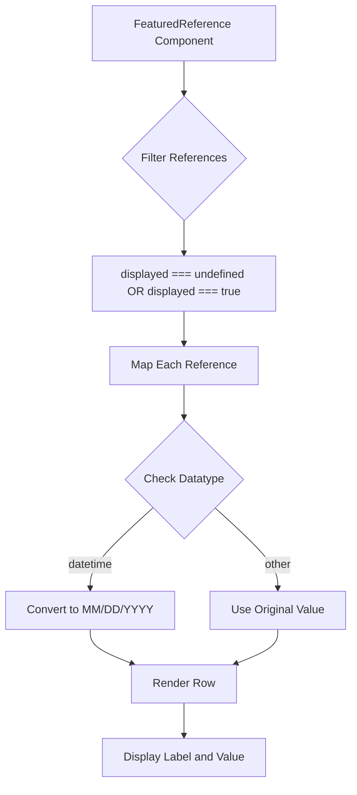
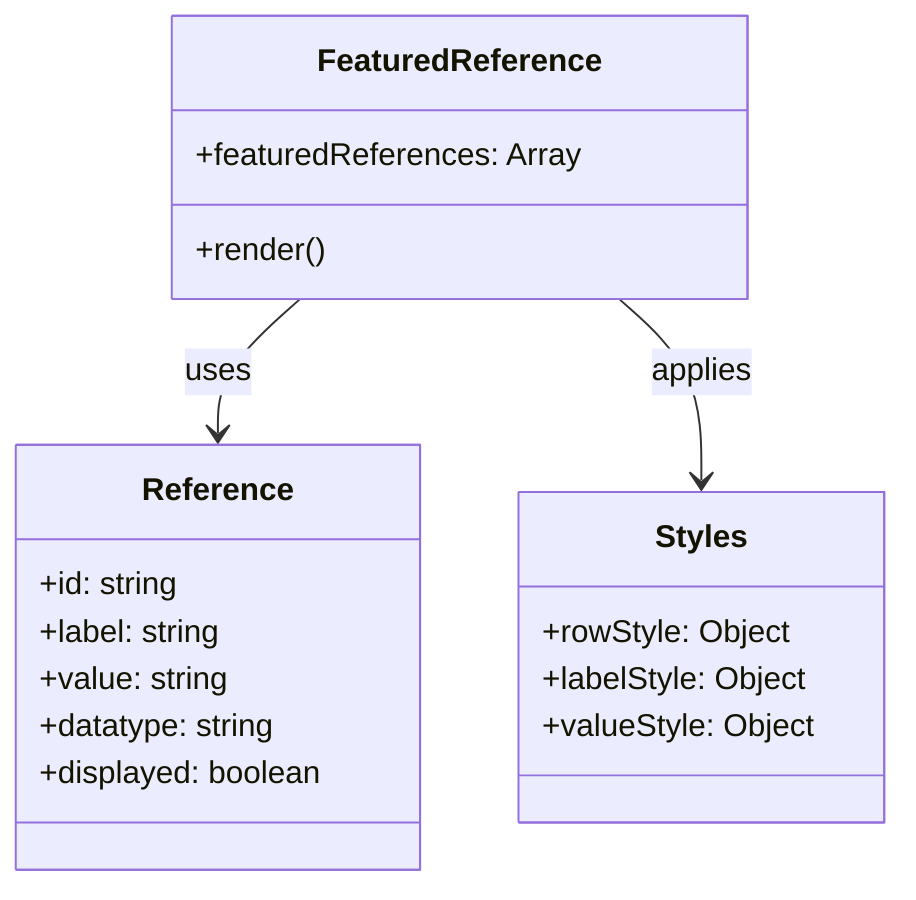

# Diagram: web/portal/src/shared/components/molecules/FeaturedReference.molecule.js

> Auto-generated by Obscura crawlers

## Diagram 1

### SVG

<svg id="container" width="494.34375" xmlns="http://www.w3.org/2000/svg" class="flowchart" height="1102.546875" viewBox="0 0 494.34375 1102.546875" role="graphics-document document" aria-roledescription="flowchart-v2"><g><marker id="container_flowchart-v2-pointEnd" class="marker flowchart-v2" viewBox="0 0 10 10" refX="5" refY="5" markerUnits="userSpaceOnUse" markerWidth="8" markerHeight="8" orient="auto"><path d="M 0 0 L 10 5 L 0 10 z" class="arrowMarkerPath" style="stroke-width: 1; stroke-dasharray: 1, 0;"></path></marker><marker id="container_flowchart-v2-pointStart" class="marker flowchart-v2" viewBox="0 0 10 10" refX="4.5" refY="5" markerUnits="userSpaceOnUse" markerWidth="8" markerHeight="8" orient="auto"><path d="M 0 5 L 10 10 L 10 0 z" class="arrowMarkerPath" style="stroke-width: 1; stroke-dasharray: 1, 0;"></path></marker><marker id="container_flowchart-v2-circleEnd" class="marker flowchart-v2" viewBox="0 0 10 10" refX="11" refY="5" markerUnits="userSpaceOnUse" markerWidth="11" markerHeight="11" orient="auto"><circle cx="5" cy="5" r="5" class="arrowMarkerPath" style="stroke-width: 1; stroke-dasharray: 1, 0;"></circle></marker><marker id="container_flowchart-v2-circleStart" class="marker flowchart-v2" viewBox="0 0 10 10" refX="-1" refY="5" markerUnits="userSpaceOnUse" markerWidth="11" markerHeight="11" orient="auto"><circle cx="5" cy="5" r="5" class="arrowMarkerPath" style="stroke-width: 1; stroke-dasharray: 1, 0;"></circle></marker><marker id="container_flowchart-v2-crossEnd" class="marker cross flowchart-v2" viewBox="0 0 11 11" refX="12" refY="5.2" markerUnits="userSpaceOnUse" markerWidth="11" markerHeight="11" orient="auto"><path d="M 1,1 l 9,9 M 10,1 l -9,9" class="arrowMarkerPath" style="stroke-width: 2; stroke-dasharray: 1, 0;"></path></marker><marker id="container_flowchart-v2-crossStart" class="marker cross flowchart-v2" viewBox="0 0 11 11" refX="-1" refY="5.2" markerUnits="userSpaceOnUse" markerWidth="11" markerHeight="11" orient="auto"><path d="M 1,1 l 9,9 M 10,1 l -9,9" class="arrowMarkerPath" style="stroke-width: 2; stroke-dasharray: 1, 0;"></path></marker><g class="root"><g class="clusters"></g><g class="edgePaths"><path d="M258.305,86L258.305,90.167C258.305,94.333,258.305,102.667,258.305,110.333C258.305,118,258.305,125,258.305,128.5L258.305,132" id="L_A_B_0" class="edge-thickness-normal edge-pattern-solid edge-thickness-normal edge-pattern-solid flowchart-link" style=";" data-edge="true" data-et="edge" data-id="L_A_B_0" data-points="W3sieCI6MjU4LjMwNDY4NzUsInkiOjg2fSx7IngiOjI1OC4zMDQ2ODc1LCJ5IjoxMTF9LHsieCI6MjU4LjMwNDY4NzUsInkiOjEzNn1d" marker-end="url(#container_flowchart-v2-pointEnd)"></path><path d="M258.305,310.563L258.305,314.729C258.305,318.896,258.305,327.229,258.305,334.896C258.305,342.563,258.305,349.563,258.305,353.063L258.305,356.563" id="L_B_C_0" class="edge-thickness-normal edge-pattern-solid edge-thickness-normal edge-pattern-solid flowchart-link" style=";" data-edge="true" data-et="edge" data-id="L_B_C_0" data-points="W3sieCI6MjU4LjMwNDY4NzUsInkiOjMxMC41NjI1fSx7IngiOjI1OC4zMDQ2ODc1LCJ5IjozMzUuNTYyNX0seyJ4IjoyNTguMzA0Njg3NSwieSI6MzYwLjU2MjV9XQ==" marker-end="url(#container_flowchart-v2-pointEnd)"></path><path d="M258.305,438.563L258.305,442.729C258.305,446.896,258.305,455.229,258.305,462.896C258.305,470.563,258.305,477.563,258.305,481.063L258.305,484.563" id="L_C_D_0" class="edge-thickness-normal edge-pattern-solid edge-thickness-normal edge-pattern-solid flowchart-link" style=";" data-edge="true" data-et="edge" data-id="L_C_D_0" data-points="W3sieCI6MjU4LjMwNDY4NzUsInkiOjQzOC41NjI1fSx7IngiOjI1OC4zMDQ2ODc1LCJ5Ijo0NjMuNTYyNX0seyJ4IjoyNTguMzA0Njg3NSwieSI6NDg4LjU2MjV9XQ==" marker-end="url(#container_flowchart-v2-pointEnd)"></path><path d="M258.305,542.563L258.305,546.729C258.305,550.896,258.305,559.229,258.305,566.896C258.305,574.563,258.305,581.563,258.305,585.063L258.305,588.563" id="L_D_E_0" class="edge-thickness-normal edge-pattern-solid edge-thickness-normal edge-pattern-solid flowchart-link" style=";" data-edge="true" data-et="edge" data-id="L_D_E_0" data-points="W3sieCI6MjU4LjMwNDY4NzUsInkiOjU0Mi41NjI1fSx7IngiOjI1OC4zMDQ2ODc1LCJ5Ijo1NjcuNTYyNX0seyJ4IjoyNTguMzA0Njg3NSwieSI6NTkyLjU2MjV9XQ==" marker-end="url(#container_flowchart-v2-pointEnd)"></path><path d="M214.818,715.06L200.051,728.474C185.285,741.889,155.752,768.718,140.985,787.632C126.219,806.547,126.219,817.547,126.219,823.047L126.219,828.547" id="L_E_F_0" class="edge-thickness-normal edge-pattern-solid edge-thickness-normal edge-pattern-solid flowchart-link" style=";" data-edge="true" data-et="edge" data-id="L_E_F_0" data-points="W3sieCI6MjE0LjgxNzc2ODk0NjAyNjc3LCJ5Ijo3MTUuMDU5OTU2NDQ2MDI2OH0seyJ4IjoxMjYuMjE4NzUsInkiOjc5NS41NDY4NzV9LHsieCI6MTI2LjIxODc1LCJ5Ijo4MzIuNTQ2ODc1fV0=" marker-end="url(#container_flowchart-v2-pointEnd)"></path><path d="M301.792,715.06L316.558,728.474C331.325,741.889,360.858,768.718,375.624,787.632C390.391,806.547,390.391,817.547,390.391,823.047L390.391,828.547" id="L_E_G_0" class="edge-thickness-normal edge-pattern-solid edge-thickness-normal edge-pattern-solid flowchart-link" style=";" data-edge="true" data-et="edge" data-id="L_E_G_0" data-points="W3sieCI6MzAxLjc5MTYwNjA1Mzk3MzIsInkiOjcxNS4wNTk5NTY0NDYwMjY4fSx7IngiOjM5MC4zOTA2MjUsInkiOjc5NS41NDY4NzV9LHsieCI6MzkwLjM5MDYyNSwieSI6ODMyLjU0Njg3NX1d" marker-end="url(#container_flowchart-v2-pointEnd)"></path><path d="M126.219,886.547L126.219,890.714C126.219,894.88,126.219,903.214,136.182,911.303C146.146,919.392,166.073,927.237,176.036,931.159L186,935.082" id="L_F_H_0" class="edge-thickness-normal edge-pattern-solid edge-thickness-normal edge-pattern-solid flowchart-link" style=";" data-edge="true" data-et="edge" data-id="L_F_H_0" data-points="W3sieCI6MTI2LjIxODc1LCJ5Ijo4ODYuNTQ2ODc1fSx7IngiOjEyNi4yMTg3NSwieSI6OTExLjU0Njg3NX0seyJ4IjoxODkuNzIxNjA0NTY3MzA3NjgsInkiOjkzNi41NDY4NzV9XQ==" marker-end="url(#container_flowchart-v2-pointEnd)"></path><path d="M390.391,886.547L390.391,890.714C390.391,894.88,390.391,903.214,380.427,911.303C370.464,919.392,350.537,927.237,340.573,931.159L330.61,935.082" id="L_G_H_0" class="edge-thickness-normal edge-pattern-solid edge-thickness-normal edge-pattern-solid flowchart-link" style=";" data-edge="true" data-et="edge" data-id="L_G_H_0" data-points="W3sieCI6MzkwLjM5MDYyNSwieSI6ODg2LjU0Njg3NX0seyJ4IjozOTAuMzkwNjI1LCJ5Ijo5MTEuNTQ2ODc1fSx7IngiOjMyNi44ODc3NzA0MzI2OTIzLCJ5Ijo5MzYuNTQ2ODc1fV0=" marker-end="url(#container_flowchart-v2-pointEnd)"></path><path d="M258.305,990.547L258.305,994.714C258.305,998.88,258.305,1007.214,258.305,1014.88C258.305,1022.547,258.305,1029.547,258.305,1033.047L258.305,1036.547" id="L_H_I_0" class="edge-thickness-normal edge-pattern-solid edge-thickness-normal edge-pattern-solid flowchart-link" style=";" data-edge="true" data-et="edge" data-id="L_H_I_0" data-points="W3sieCI6MjU4LjMwNDY4NzUsInkiOjk5MC41NDY4NzV9LHsieCI6MjU4LjMwNDY4NzUsInkiOjEwMTUuNTQ2ODc1fSx7IngiOjI1OC4zMDQ2ODc1LCJ5IjoxMDQwLjU0Njg3NX1d" marker-end="url(#container_flowchart-v2-pointEnd)"></path></g><g class="edgeLabels"><g class="edgeLabel"><g class="label" data-id="L_A_B_0" transform="translate(0, 0)"><foreignObject width="0" height="0">

</foreignObject></g></g><g class="edgeLabel"><g class="label" data-id="L_B_C_0" transform="translate(0, 0)"><foreignObject width="0" height="0">

</foreignObject></g></g><g class="edgeLabel"><g class="label" data-id="L_C_D_0" transform="translate(0, 0)"><foreignObject width="0" height="0">

</foreignObject></g></g><g class="edgeLabel"><g class="label" data-id="L_D_E_0" transform="translate(0, 0)"><foreignObject width="0" height="0">

</foreignObject></g></g><g class="edgeLabel" transform="translate(126.21875, 795.546875)"><g class="label" data-id="L_E_F_0" transform="translate(-32.625, -12)"><foreignObject width="65.25" height="24">

datetime

</foreignObject></g></g><g class="edgeLabel" transform="translate(390.390625, 795.546875)"><g class="label" data-id="L_E_G_0" transform="translate(-19.703125, -12)"><foreignObject width="39.40625" height="24">

other

</foreignObject></g></g><g class="edgeLabel"><g class="label" data-id="L_F_H_0" transform="translate(0, 0)"><foreignObject width="0" height="0">

</foreignObject></g></g><g class="edgeLabel"><g class="label" data-id="L_G_H_0" transform="translate(0, 0)"><foreignObject width="0" height="0">

</foreignObject></g></g><g class="edgeLabel"><g class="label" data-id="L_H_I_0" transform="translate(0, 0)"><foreignObject width="0" height="0">

</foreignObject></g></g></g><g class="nodes"><g class="node default" id="flowchart-A-0" transform="translate(258.3046875, 47)"><rect class="basic label-container" style="" x="-130" y="-39" width="260" height="78"></rect><g class="label" style="" transform="translate(-100, -24)"><rect></rect><foreignObject width="200" height="48">

FeaturedReference Component

</foreignObject></g></g><g class="node default" id="flowchart-B-1" transform="translate(258.3046875, 223.28125)"><polygon points="87.28125,0 174.5625,-87.28125 87.28125,-174.5625 0,-87.28125" class="label-container" transform="translate(-86.78125, 87.28125)"></polygon><g class="label" style="" transform="translate(-60.28125, -12)"><rect></rect><foreignObject width="120.5625" height="24">

Filter References

</foreignObject></g></g><g class="node default" id="flowchart-C-3" transform="translate(258.3046875, 399.5625)"><rect class="basic label-container" style="" x="-130" y="-39" width="260" height="78"></rect><g class="label" style="" transform="translate(-100, -24)"><rect></rect><foreignObject width="200" height="48">

displayed === undefined OR displayed === true

</foreignObject></g></g><g class="node default" id="flowchart-D-5" transform="translate(258.3046875, 515.5625)"><rect class="basic label-container" style="" x="-102.578125" y="-27" width="205.15625" height="54"></rect><g class="label" style="" transform="translate(-72.578125, -12)"><rect></rect><foreignObject width="145.15625" height="24">

Map Each Reference

</foreignObject></g></g><g class="node default" id="flowchart-E-7" transform="translate(258.3046875, 675.5546875)"><polygon points="82.9921875,0 165.984375,-82.9921875 82.9921875,-165.984375 0,-82.9921875" class="label-container" transform="translate(-82.4921875, 82.9921875)"></polygon><g class="label" style="" transform="translate(-55.9921875, -12)"><rect></rect><foreignObject width="111.984375" height="24">

Check Datatype

</foreignObject></g></g><g class="node default" id="flowchart-F-9" transform="translate(126.21875, 859.546875)"><rect class="basic label-container" style="" x="-118.21875" y="-27" width="236.4375" height="54"></rect><g class="label" style="" transform="translate(-88.21875, -12)"><rect></rect><foreignObject width="176.4375" height="24">

Convert to MM/DD/YYYY

</foreignObject></g></g><g class="node default" id="flowchart-G-11" transform="translate(390.390625, 859.546875)"><rect class="basic label-container" style="" x="-95.953125" y="-27" width="191.90625" height="54"></rect><g class="label" style="" transform="translate(-65.953125, -12)"><rect></rect><foreignObject width="131.90625" height="24">

Use Original Value

</foreignObject></g></g><g class="node default" id="flowchart-H-13" transform="translate(258.3046875, 963.546875)"><rect class="basic label-container" style="" x="-73.25" y="-27" width="146.5" height="54"></rect><g class="label" style="" transform="translate(-43.25, -12)"><rect></rect><foreignObject width="86.5" height="24">

Render Row

</foreignObject></g></g><g class="node default" id="flowchart-I-17" transform="translate(258.3046875, 1067.546875)"><rect class="basic label-container" style="" x="-116.03125" y="-27" width="232.0625" height="54"></rect><g class="label" style="" transform="translate(-86.03125, -12)"><rect></rect><foreignObject width="172.0625" height="24">

Display Label and Value

</foreignObject></g></g></g></g></g></svg>

## Diagram 2

### SVG

<svg id="container" width="456.2421875" xmlns="http://www.w3.org/2000/svg" class="classDiagram" height="450" viewBox="0 0 456.2421875 450" role="graphics-document document" aria-roledescription="class"><g><defs><marker id="container_class-aggregationStart" class="marker aggregation class" refX="18" refY="7" markerWidth="190" markerHeight="240" orient="auto"><path d="M 18,7 L9,13 L1,7 L9,1 Z"></path></marker></defs><defs><marker id="container_class-aggregationEnd" class="marker aggregation class" refX="1" refY="7" markerWidth="20" markerHeight="28" orient="auto"><path d="M 18,7 L9,13 L1,7 L9,1 Z"></path></marker></defs><defs><marker id="container_class-extensionStart" class="marker extension class" refX="18" refY="7" markerWidth="190" markerHeight="240" orient="auto"><path d="M 1,7 L18,13 V 1 Z"></path></marker></defs><defs><marker id="container_class-extensionEnd" class="marker extension class" refX="1" refY="7" markerWidth="20" markerHeight="28" orient="auto"><path d="M 1,1 V 13 L18,7 Z"></path></marker></defs><defs><marker id="container_class-compositionStart" class="marker composition class" refX="18" refY="7" markerWidth="190" markerHeight="240" orient="auto"><path d="M 18,7 L9,13 L1,7 L9,1 Z"></path></marker></defs><defs><marker id="container_class-compositionEnd" class="marker composition class" refX="1" refY="7" markerWidth="20" markerHeight="28" orient="auto"><path d="M 18,7 L9,13 L1,7 L9,1 Z"></path></marker></defs><defs><marker id="container_class-dependencyStart" class="marker dependency class" refX="6" refY="7" markerWidth="190" markerHeight="240" orient="auto"><path d="M 5,7 L9,13 L1,7 L9,1 Z"></path></marker></defs><defs><marker id="container_class-dependencyEnd" class="marker dependency class" refX="13" refY="7" markerWidth="20" markerHeight="28" orient="auto"><path d="M 18,7 L9,13 L14,7 L9,1 Z"></path></marker></defs><defs><marker id="container_class-lollipopStart" class="marker lollipop class" refX="13" refY="7" markerWidth="190" markerHeight="240" orient="auto"><circle stroke="black" fill="transparent" cx="7" cy="7" r="6"></circle></marker></defs><defs><marker id="container_class-lollipopEnd" class="marker lollipop class" refX="1" refY="7" markerWidth="190" markerHeight="240" orient="auto"><circle stroke="black" fill="transparent" cx="7" cy="7" r="6"></circle></marker></defs><g class="root"><g class="clusters"></g><g class="edgePaths"><path d="M152.724,152L145.79,158.167C138.857,164.333,124.989,176.667,118.055,188C111.121,199.333,111.121,209.667,111.121,214.833L111.121,220" id="id_FeaturedReference_Reference_1" class="edge-thickness-normal edge-pattern-solid relation" style=";;;" data-edge="true" data-et="edge" data-id="id_FeaturedReference_Reference_1" data-points="W3sieCI6MTUyLjcyNDIxNTE2NjI4NDQsInkiOjE1Mn0seyJ4IjoxMTEuMTIxMDkzNzUsInkiOjE4OX0seyJ4IjoxMTEuMTIxMDkzNzUsInkiOjIyNn1d" marker-end="url(#container_class-dependencyEnd)"></path><path d="M314.639,152L321.573,158.167C328.507,164.333,342.374,176.667,349.308,192C356.242,207.333,356.242,225.667,356.242,234.833L356.242,244" id="id_FeaturedReference_Styles_2" class="edge-thickness-normal edge-pattern-solid relation" style=";;;" data-edge="true" data-et="edge" data-id="id_FeaturedReference_Styles_2" data-points="W3sieCI6MzE0LjYzOTA2NjA4MzcxNTYsInkiOjE1Mn0seyJ4IjozNTYuMjQyMTg3NSwieSI6MTg5fSx7IngiOjM1Ni4yNDIxODc1LCJ5IjoyNTB9XQ==" marker-end="url(#container_class-dependencyEnd)"></path></g><g class="edgeLabels"><g class="edgeLabel" transform="translate(111.12109375, 189)"><g class="label" data-id="id_FeaturedReference_Reference_1" transform="translate(-16.4921875, -12)"><foreignObject width="32.984375" height="24">

uses

</foreignObject></g></g><g class="edgeLabel" transform="translate(356.2421875, 189)"><g class="label" data-id="id_FeaturedReference_Styles_2" transform="translate(-26.5546875, -12)"><foreignObject width="53.109375" height="24">

applies

</foreignObject></g></g></g><g class="nodes"><g class="node default" id="classId-FeaturedReference-0" transform="translate(233.681640625, 80)"><g class="basic label-container"><path d="M-143.37890625 -72 L143.37890625 -72 L143.37890625 72 L-143.37890625 72" stroke="none" stroke-width="0" fill="#ECECFF" style=""></path><path d="M-143.37890625 -72 C-75.48975237589313 -72, -7.600598501786266 -72, 143.37890625 -72 M-143.37890625 -72 C-32.24889522561759 -72, 78.88111579876482 -72, 143.37890625 -72 M143.37890625 -72 C143.37890625 -35.91141111409667, 143.37890625 0.1771777718066545, 143.37890625 72 M143.37890625 -72 C143.37890625 -33.87305068310752, 143.37890625 4.2538986337849565, 143.37890625 72 M143.37890625 72 C73.0936311400098 72, 2.8083560300196098 72, -143.37890625 72 M143.37890625 72 C38.53895146243623 72, -66.30100332512754 72, -143.37890625 72 M-143.37890625 72 C-143.37890625 15.496964377729398, -143.37890625 -41.006071244541204, -143.37890625 -72 M-143.37890625 72 C-143.37890625 15.425977478406288, -143.37890625 -41.14804504318742, -143.37890625 -72" stroke="#9370DB" stroke-width="1.3" fill="none" stroke-dasharray="0 0" style=""></path></g><g class="annotation-group text" transform="translate(0, -48)"></g><g class="label-group text" transform="translate(-68.6953125, -48)"><g class="label" style="font-weight: bolder" transform="translate(0,-12)"><foreignObject width="137.390625" height="24">

FeaturedReference

</foreignObject></g></g><g class="members-group text" transform="translate(-131.37890625, 0)"><g class="label" style="" transform="translate(0,-12)"><foreignObject width="194.0625" height="24">

+featuredReferences: Array

</foreignObject></g></g><g class="methods-group text" transform="translate(-131.37890625, 48)"><g class="label" style="" transform="translate(0,-12)"><foreignObject width="66.609375" height="24">

+render()

</foreignObject></g></g><g class="divider" style=""><path d="M-143.37890625 -24 C-60.45438760874369 -24, 22.470131032512626 -24, 143.37890625 -24 M-143.37890625 -24 C-36.26221366685884 -24, 70.85447891628232 -24, 143.37890625 -24" stroke="#9370DB" stroke-width="1.3" fill="none" stroke-dasharray="0 0" style=""></path></g><g class="divider" style=""><path d="M-143.37890625 24 C-83.2617176630416 24, -23.144529076083188 24, 143.37890625 24 M-143.37890625 24 C-40.787822329640804 24, 61.80326159071839 24, 143.37890625 24" stroke="#9370DB" stroke-width="1.3" fill="none" stroke-dasharray="0 0" style=""></path></g></g><g class="node default" id="classId-Reference-1" transform="translate(111.12109375, 334)"><g class="basic label-container"><path d="M-103.12109375 -108 L103.12109375 -108 L103.12109375 108 L-103.12109375 108" stroke="none" stroke-width="0" fill="#ECECFF" style=""></path><path d="M-103.12109375 -108 C-37.655078770565765 -108, 27.81093620886847 -108, 103.12109375 -108 M-103.12109375 -108 C-55.77499757837706 -108, -8.428901406754122 -108, 103.12109375 -108 M103.12109375 -108 C103.12109375 -60.87070907108941, 103.12109375 -13.741418142178816, 103.12109375 108 M103.12109375 -108 C103.12109375 -51.753594959600264, 103.12109375 4.492810080799472, 103.12109375 108 M103.12109375 108 C35.23070348629264 108, -32.65968677741472 108, -103.12109375 108 M103.12109375 108 C48.77336975916716 108, -5.57435423166568 108, -103.12109375 108 M-103.12109375 108 C-103.12109375 22.804196092350466, -103.12109375 -62.39160781529907, -103.12109375 -108 M-103.12109375 108 C-103.12109375 64.73365672041672, -103.12109375 21.467313440833422, -103.12109375 -108" stroke="#9370DB" stroke-width="1.3" fill="none" stroke-dasharray="0 0" style=""></path></g><g class="annotation-group text" transform="translate(0, -84)"></g><g class="label-group text" transform="translate(-36.5078125, -84)"><g class="label" style="font-weight: bolder" transform="translate(0,-12)"><foreignObject width="73.015625" height="24">

Reference

</foreignObject></g></g><g class="members-group text" transform="translate(-91.12109375, -36)"><g class="label" style="" transform="translate(0,-12)"><foreignObject width="71.78125" height="24">

+id: string

</foreignObject></g><g class="label" style="" transform="translate(0,12)"><foreignObject width="94.09375" height="24">

+label: string

</foreignObject></g><g class="label" style="" transform="translate(0,36)"><foreignObject width="96.421875" height="24">

+value: string

</foreignObject></g><g class="label" style="" transform="translate(0,60)"><foreignObject width="122.140625" height="24">

+datatype: string

</foreignObject></g><g class="label" style="" transform="translate(0,84)"><foreignObject width="145.734375" height="24">

+displayed: boolean

</foreignObject></g></g><g class="methods-group text" transform="translate(-91.12109375, 108)"></g><g class="divider" style=""><path d="M-103.12109375 -60 C-32.96463989646824 -60, 37.191813957063516 -60, 103.12109375 -60 M-103.12109375 -60 C-49.38680666632897 -60, 4.347480417342055 -60, 103.12109375 -60" stroke="#9370DB" stroke-width="1.3" fill="none" stroke-dasharray="0 0" style=""></path></g><g class="divider" style=""><path d="M-103.12109375 84 C-61.40515552226761 84, -19.689217294535226 84, 103.12109375 84 M-103.12109375 84 C-29.498643338073634 84, 44.12380707385273 84, 103.12109375 84" stroke="#9370DB" stroke-width="1.3" fill="none" stroke-dasharray="0 0" style=""></path></g></g><g class="node default" id="classId-Styles-2" transform="translate(356.2421875, 334)"><g class="basic label-container"><path d="M-92 -84 L92 -84 L92 84 L-92 84" stroke="none" stroke-width="0" fill="#ECECFF" style=""></path><path d="M-92 -84 C-46.46799952371236 -84, -0.9359990474247155 -84, 92 -84 M-92 -84 C-53.42475933969514 -84, -14.849518679390286 -84, 92 -84 M92 -84 C92 -40.92243531154875, 92 2.1551293769024937, 92 84 M92 -84 C92 -36.15238309521171, 92 11.695233809576578, 92 84 M92 84 C46.82018498123453 84, 1.640369962469066 84, -92 84 M92 84 C23.724559637371442 84, -44.550880725257116 84, -92 84 M-92 84 C-92 42.11032182811722, -92 0.2206436562344436, -92 -84 M-92 84 C-92 25.690118989063336, -92 -32.61976202187333, -92 -84" stroke="#9370DB" stroke-width="1.3" fill="none" stroke-dasharray="0 0" style=""></path></g><g class="annotation-group text" transform="translate(0, -60)"></g><g class="label-group text" transform="translate(-22.390625, -60)"><g class="label" style="font-weight: bolder" transform="translate(0,-12)"><foreignObject width="44.78125" height="24">

Styles

</foreignObject></g></g><g class="members-group text" transform="translate(-80, -12)"><g class="label" style="" transform="translate(0,-12)"><foreignObject width="125.40625" height="24">

+rowStyle: Object

</foreignObject></g><g class="label" style="" transform="translate(0,12)"><foreignObject width="135.109375" height="24">

+labelStyle: Object

</foreignObject></g><g class="label" style="" transform="translate(0,36)"><foreignObject width="137.609375" height="24">

+valueStyle: Object

</foreignObject></g></g><g class="methods-group text" transform="translate(-80, 84)"></g><g class="divider" style=""><path d="M-92 -36 C-30.02215219714443 -36, 31.955695605711142 -36, 92 -36 M-92 -36 C-45.50539511882775 -36, 0.9892097623445011 -36, 92 -36" stroke="#9370DB" stroke-width="1.3" fill="none" stroke-dasharray="0 0" style=""></path></g><g class="divider" style=""><path d="M-92 60 C-36.11188559119282 60, 19.776228817614367 60, 92 60 M-92 60 C-30.046930236546324 60, 31.906139526907353 60, 92 60" stroke="#9370DB" stroke-width="1.3" fill="none" stroke-dasharray="0 0" style=""></path></g></g></g></g></g></svg>
