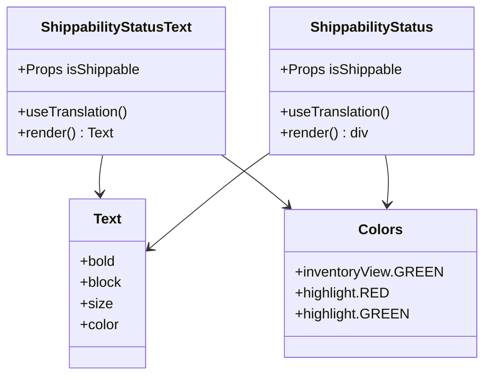

# Diagram: web/portal/src/shared/components/molecules/ShippabilityStatusText.molecule.js


> Auto-generated by Obscura crawlers

## Diagram 1

```mermaid
flowchart TD
    A[ShippabilityStatusText Component] --> B{isShippable?}
    B -->|true| C[Display "Shippable" in GREEN]
    B -->|false| D[Display "Non-Shippable" in RED]
    C --> E[Render Text Component]
    D --> E
```

> SVG rendering failed for this diagram.

## Diagram 2

```mermaid
flowchart TD
    F[ShippabilityStatus Component] --> G{isShippable?}
    G -->|true| H[Set background to GREEN<br/>Set label to "Shippable"]
    G -->|false| I[Set background to RED<br/>Set label to "Non-Shippable"]
    H --> J[Render styled div with Text]
    I --> J
```

> SVG rendering failed for this diagram.

## Diagram 3



### SVG

<svg id="container" width="541.0703125" xmlns="http://www.w3.org/2000/svg" class="classDiagram" height="426" viewBox="0 0 541.0703125 426" role="graphics-document document" aria-roledescription="class"><style>#container{font-family:"trebuchet ms",verdana,arial,sans-serif;font-size:16px;fill:#333;}@keyframes edge-animation-frame{from{stroke-dashoffset:0;}}@keyframes dash{to{stroke-dashoffset:0;}}#container .edge-animation-slow{stroke-dasharray:9,5!important;stroke-dashoffset:900;animation:dash 50s linear infinite;stroke-linecap:round;}#container .edge-animation-fast{stroke-dasharray:9,5!important;stroke-dashoffset:900;animation:dash 20s linear infinite;stroke-linecap:round;}#container .error-icon{fill:#552222;}#container .error-text{fill:#552222;stroke:#552222;}#container .edge-thickness-normal{stroke-width:1px;}#container .edge-thickness-thick{stroke-width:3.5px;}#container .edge-pattern-solid{stroke-dasharray:0;}#container .edge-thickness-invisible{stroke-width:0;fill:none;}#container .edge-pattern-dashed{stroke-dasharray:3;}#container .edge-pattern-dotted{stroke-dasharray:2;}#container .marker{fill:#333333;stroke:#333333;}#container .marker.cross{stroke:#333333;}#container svg{font-family:"trebuchet ms",verdana,arial,sans-serif;font-size:16px;}#container p{margin:0;}#container g.classGroup text{fill:#9370DB;stroke:none;font-family:"trebuchet ms",verdana,arial,sans-serif;font-size:10px;}#container g.classGroup text .title{font-weight:bolder;}#container .nodeLabel,#container .edgeLabel{color:#131300;}#container .edgeLabel .label rect{fill:#ECECFF;}#container .label text{fill:#131300;}#container .labelBkg{background:#ECECFF;}#container .edgeLabel .label span{background:#ECECFF;}#container .classTitle{font-weight:bolder;}#container .node rect,#container .node circle,#container .node ellipse,#container .node polygon,#container .node path{fill:#ECECFF;stroke:#9370DB;stroke-width:1px;}#container .divider{stroke:#9370DB;stroke-width:1;}#container g.clickable{cursor:pointer;}#container g.classGroup rect{fill:#ECECFF;stroke:#9370DB;}#container g.classGroup line{stroke:#9370DB;stroke-width:1;}#container .classLabel .box{stroke:none;stroke-width:0;fill:#ECECFF;opacity:0.5;}#container .classLabel .label{fill:#9370DB;font-size:10px;}#container .relation{stroke:#333333;stroke-width:1;fill:none;}#container .dashed-line{stroke-dasharray:3;}#container .dotted-line{stroke-dasharray:1 2;}#container #compositionStart,#container .composition{fill:#333333!important;stroke:#333333!important;stroke-width:1;}#container #compositionEnd,#container .composition{fill:#333333!important;stroke:#333333!important;stroke-width:1;}#container #dependencyStart,#container .dependency{fill:#333333!important;stroke:#333333!important;stroke-width:1;}#container #dependencyStart,#container .dependency{fill:#333333!important;stroke:#333333!important;stroke-width:1;}#container #extensionStart,#container .extension{fill:transparent!important;stroke:#333333!important;stroke-width:1;}#container #extensionEnd,#container .extension{fill:transparent!important;stroke:#333333!important;stroke-width:1;}#container #aggregationStart,#container .aggregation{fill:transparent!important;stroke:#333333!important;stroke-width:1;}#container #aggregationEnd,#container .aggregation{fill:transparent!important;stroke:#333333!important;stroke-width:1;}#container #lollipopStart,#container .lollipop{fill:#ECECFF!important;stroke:#333333!important;stroke-width:1;}#container #lollipopEnd,#container .lollipop{fill:#ECECFF!important;stroke:#333333!important;stroke-width:1;}#container .edgeTerminals{font-size:11px;line-height:initial;}#container .classTitleText{text-anchor:middle;font-size:18px;fill:#333;}#container .label-icon{display:inline-block;height:1em;overflow:visible;vertical-align:-0.125em;}#container .node .label-icon path{fill:currentColor;stroke:revert;stroke-width:revert;}#container :root{--mermaid-font-family:"trebuchet ms",verdana,arial,sans-serif;}</style><g><defs><marker id="container_class-aggregationStart" class="marker aggregation class" refX="18" refY="7" markerWidth="190" markerHeight="240" orient="auto"><path d="M 18,7 L9,13 L1,7 L9,1 Z"></path></marker></defs><defs><marker id="container_class-aggregationEnd" class="marker aggregation class" refX="1" refY="7" markerWidth="20" markerHeight="28" orient="auto"><path d="M 18,7 L9,13 L1,7 L9,1 Z"></path></marker></defs><defs><marker id="container_class-extensionStart" class="marker extension class" refX="18" refY="7" markerWidth="190" markerHeight="240" orient="auto"><path d="M 1,7 L18,13 V 1 Z"></path></marker></defs><defs><marker id="container_class-extensionEnd" class="marker extension class" refX="1" refY="7" markerWidth="20" markerHeight="28" orient="auto"><path d="M 1,1 V 13 L18,7 Z"></path></marker></defs><defs><marker id="container_class-compositionStart" class="marker composition class" refX="18" refY="7" markerWidth="190" markerHeight="240" orient="auto"><path d="M 18,7 L9,13 L1,7 L9,1 Z"></path></marker></defs><defs><marker id="container_class-compositionEnd" class="marker composition class" refX="1" refY="7" markerWidth="20" markerHeight="28" orient="auto"><path d="M 18,7 L9,13 L1,7 L9,1 Z"></path></marker></defs><defs><marker id="container_class-dependencyStart" class="marker dependency class" refX="6" refY="7" markerWidth="190" markerHeight="240" orient="auto"><path d="M 5,7 L9,13 L1,7 L9,1 Z"></path></marker></defs><defs><marker id="container_class-dependencyEnd" class="marker dependency class" refX="13" refY="7" markerWidth="20" markerHeight="28" orient="auto"><path d="M 18,7 L9,13 L14,7 L9,1 Z"></path></marker></defs><defs><marker id="container_class-lollipopStart" class="marker lollipop class" refX="13" refY="7" markerWidth="190" markerHeight="240" orient="auto"><circle stroke="black" fill="transparent" cx="7" cy="7" r="6"></circle></marker></defs><defs><marker id="container_class-lollipopEnd" class="marker lollipop class" refX="1" refY="7" markerWidth="190" markerHeight="240" orient="auto"><circle stroke="black" fill="transparent" cx="7" cy="7" r="6"></circle></marker></defs><g class="root"><g class="clusters"></g><g class="edgePaths"><path d="M115.2,176L114.436,180.167C113.671,184.333,112.142,192.667,111.64,200.003C111.137,207.34,111.661,213.68,111.923,216.85L112.185,220.02" id="id_ShippabilityStatusText_Text_1" class="edge-thickness-normal edge-pattern-solid relation" style=";;;" data-edge="true" data-et="edge" data-id="id_ShippabilityStatusText_Text_1" data-points="W3sieCI6MTE1LjIwMDQzNzIxMzMwMjc1LCJ5IjoxNzZ9LHsieCI6MTEwLjYxMzI4MTI1LCJ5IjoyMDF9LHsieCI6MTEyLjY3OTM5Njk1MjQ3OTM0LCJ5IjoyMjZ9XQ==" marker-end="url(#container_class-dependencyEnd)"></path><path d="M249.113,176L254.991,180.167C260.869,184.333,272.625,192.667,285.065,202.356C297.505,212.045,310.628,223.091,317.19,228.614L323.752,234.136" id="id_ShippabilityStatusText_Colors_2" class="edge-thickness-normal edge-pattern-solid relation" style=";;;" data-edge="true" data-et="edge" data-id="id_ShippabilityStatusText_Colors_2" data-points="W3sieCI6MjQ5LjExMzA2NjIyNzA2NDIyLCJ5IjoxNzZ9LHsieCI6Mjg0LjM4MDg1OTM3NSwieSI6MjAxfSx7IngiOjMyOC4zNDI4NDYwNzQzODAyLCJ5IjoyMzh9XQ==" marker-end="url(#container_class-dependencyEnd)"></path><path d="M303.227,173.464L296.752,178.053C290.278,182.643,277.329,191.821,254.881,209.855C232.433,227.889,200.484,254.778,184.51,268.222L168.536,281.667" id="id_ShippabilityStatus_Text_3" class="edge-thickness-normal edge-pattern-solid relation" style=";;;" data-edge="true" data-et="edge" data-id="id_ShippabilityStatus_Text_3" data-points="W3sieCI6MzAzLjIyNjU2MjUsInkiOjE3My40NjM3NTU0MTQxNDIxOH0seyJ4IjoyNjQuMzgwODU5Mzc1LCJ5IjoyMDF9LHsieCI6MTYzLjk0NTMxMjUsInkiOjI4NS41MzAxOTMzMTg3NTE4fV0=" marker-end="url(#container_class-dependencyEnd)"></path><path d="M433.561,176L434.326,180.167C435.09,184.333,436.619,192.667,436.957,202.003C437.294,211.34,436.439,221.68,436.012,226.85L435.585,232.02" id="id_ShippabilityStatus_Colors_4" class="edge-thickness-normal edge-pattern-solid relation" style=";;;" data-edge="true" data-et="edge" data-id="id_ShippabilityStatus_Colors_4" data-points="W3sieCI6NDMzLjU2MTI4MTUzNjY5NzI3LCJ5IjoxNzZ9LHsieCI6NDM4LjE0ODQzNzUsInkiOjIwMX0seyJ4Ijo0MzUuMDkwNTg2MjYwMzMwNTUsInkiOjIzOH1d" marker-end="url(#container_class-dependencyEnd)"></path></g><g class="edgeLabels"><g class="edgeLabel"><g class="label" data-id="id_ShippabilityStatusText_Text_1" transform="translate(0, 0)"><foreignObject width="0" height="0"><div xmlns="http://www.w3.org/1999/xhtml" class="labelBkg" style="display: table-cell; white-space: nowrap; line-height: 1.5; max-width: 200px; text-align: center;"><span class="edgeLabel"></span></div></foreignObject></g></g><g class="edgeLabel"><g class="label" data-id="id_ShippabilityStatusText_Colors_2" transform="translate(0, 0)"><foreignObject width="0" height="0"><div xmlns="http://www.w3.org/1999/xhtml" class="labelBkg" style="display: table-cell; white-space: nowrap; line-height: 1.5; max-width: 200px; text-align: center;"><span class="edgeLabel"></span></div></foreignObject></g></g><g class="edgeLabel"><g class="label" data-id="id_ShippabilityStatus_Text_3" transform="translate(0, 0)"><foreignObject width="0" height="0"><div xmlns="http://www.w3.org/1999/xhtml" class="labelBkg" style="display: table-cell; white-space: nowrap; line-height: 1.5; max-width: 200px; text-align: center;"><span class="edgeLabel"></span></div></foreignObject></g></g><g class="edgeLabel"><g class="label" data-id="id_ShippabilityStatus_Colors_4" transform="translate(0, 0)"><foreignObject width="0" height="0"><div xmlns="http://www.w3.org/1999/xhtml" class="labelBkg" style="display: table-cell; white-space: nowrap; line-height: 1.5; max-width: 200px; text-align: center;"><span class="edgeLabel"></span></div></foreignObject></g></g></g><g class="nodes"><g class="node default" id="classId-ShippabilityStatusText-0" transform="translate(130.61328125, 92)"><g class="basic label-container"><path d="M-122.61328125 -84 L122.61328125 -84 L122.61328125 84 L-122.61328125 84" stroke="none" stroke-width="0" fill="#ECECFF" style=""></path><path d="M-122.61328125 -84 C-53.79968887377943 -84, 15.013903502441138 -84, 122.61328125 -84 M-122.61328125 -84 C-42.910034385652324 -84, 36.79321247869535 -84, 122.61328125 -84 M122.61328125 -84 C122.61328125 -43.525723362616105, 122.61328125 -3.0514467252322106, 122.61328125 84 M122.61328125 -84 C122.61328125 -45.94433491823703, 122.61328125 -7.888669836474065, 122.61328125 84 M122.61328125 84 C28.131315183529665 84, -66.35065088294067 84, -122.61328125 84 M122.61328125 84 C70.08684871798432 84, 17.56041618596865 84, -122.61328125 84 M-122.61328125 84 C-122.61328125 44.73931827390296, -122.61328125 5.47863654780592, -122.61328125 -84 M-122.61328125 84 C-122.61328125 46.681791285876756, -122.61328125 9.363582571753511, -122.61328125 -84" stroke="#9370DB" stroke-width="1.3" fill="none" stroke-dasharray="0 0" style=""></path></g><g class="annotation-group text" transform="translate(0, -60)"></g><g class="label-group text" transform="translate(-83.0234375, -60)"><g class="label" style="font-weight: bolder" transform="translate(0,-12)"><foreignObject width="166.046875" height="24"><div xmlns="http://www.w3.org/1999/xhtml" style="display: table-cell; white-space: nowrap; line-height: 1.5; max-width: 212px; text-align: center;"><span class="nodeLabel markdown-node-label" style=""><p>ShippabilityStatusText</p></span></div></foreignObject></g></g><g class="members-group text" transform="translate(-110.61328125, -12)"><g class="label" style="" transform="translate(0,-12)"><foreignObject width="138.203125" height="24"><div xmlns="http://www.w3.org/1999/xhtml" style="display: table-cell; white-space: nowrap; line-height: 1.5; max-width: 196px; text-align: center;"><span class="nodeLabel markdown-node-label" style=""><p>+Props isShippable</p></span></div></foreignObject></g></g><g class="methods-group text" transform="translate(-110.61328125, 36)"><g class="label" style="" transform="translate(0,-12)"><foreignObject width="125.140625" height="24"><div xmlns="http://www.w3.org/1999/xhtml" style="display: table-cell; white-space: nowrap; line-height: 1.5; max-width: 183px; text-align: center;"><span class="nodeLabel markdown-node-label" style=""><p>+useTranslation()</p></span></div></foreignObject></g><g class="label" style="" transform="translate(0,12)"><foreignObject width="108.4375" height="24"><div xmlns="http://www.w3.org/1999/xhtml" style="display: table-cell; white-space: nowrap; line-height: 1.5; max-width: 166px; text-align: center;"><span class="nodeLabel markdown-node-label" style=""><p>+render() : Text</p></span></div></foreignObject></g></g><g class="divider" style=""><path d="M-122.61328125 -36 C-31.91835743444385 -36, 58.7765663811123 -36, 122.61328125 -36 M-122.61328125 -36 C-27.249595242484418 -36, 68.11409076503116 -36, 122.61328125 -36" stroke="#9370DB" stroke-width="1.3" fill="none" stroke-dasharray="0 0" style=""></path></g><g class="divider" style=""><path d="M-122.61328125 12 C-35.43749110220213 12, 51.73829904559574 12, 122.61328125 12 M-122.61328125 12 C-24.95501375980099 12, 72.70325373039802 12, 122.61328125 12" stroke="#9370DB" stroke-width="1.3" fill="none" stroke-dasharray="0 0" style=""></path></g></g><g class="node default" id="classId-ShippabilityStatus-1" transform="translate(418.1484375, 92)"><g class="basic label-container"><path d="M-114.921875 -84 L114.921875 -84 L114.921875 84 L-114.921875 84" stroke="none" stroke-width="0" fill="#ECECFF" style=""></path><path d="M-114.921875 -84 C-30.501664655746893 -84, 53.918545688506214 -84, 114.921875 -84 M-114.921875 -84 C-63.642068991983635 -84, -12.36226298396727 -84, 114.921875 -84 M114.921875 -84 C114.921875 -22.75504515471509, 114.921875 38.48990969056982, 114.921875 84 M114.921875 -84 C114.921875 -17.326642593633665, 114.921875 49.34671481273267, 114.921875 84 M114.921875 84 C47.50269279229997 84, -19.916489415400065 84, -114.921875 84 M114.921875 84 C54.76387437825578 84, -5.394126243488444 84, -114.921875 84 M-114.921875 84 C-114.921875 32.40871856918546, -114.921875 -19.18256286162908, -114.921875 -84 M-114.921875 84 C-114.921875 29.518853805593082, -114.921875 -24.962292388813836, -114.921875 -84" stroke="#9370DB" stroke-width="1.3" fill="none" stroke-dasharray="0 0" style=""></path></g><g class="annotation-group text" transform="translate(0, -60)"></g><g class="label-group text" transform="translate(-67.640625, -60)"><g class="label" style="font-weight: bolder" transform="translate(0,-12)"><foreignObject width="135.28125" height="24"><div xmlns="http://www.w3.org/1999/xhtml" style="display: table-cell; white-space: nowrap; line-height: 1.5; max-width: 183px; text-align: center;"><span class="nodeLabel markdown-node-label" style=""><p>ShippabilityStatus</p></span></div></foreignObject></g></g><g class="members-group text" transform="translate(-102.921875, -12)"><g class="label" style="" transform="translate(0,-12)"><foreignObject width="138.203125" height="24"><div xmlns="http://www.w3.org/1999/xhtml" style="display: table-cell; white-space: nowrap; line-height: 1.5; max-width: 196px; text-align: center;"><span class="nodeLabel markdown-node-label" style=""><p>+Props isShippable</p></span></div></foreignObject></g></g><g class="methods-group text" transform="translate(-102.921875, 36)"><g class="label" style="" transform="translate(0,-12)"><foreignObject width="125.140625" height="24"><div xmlns="http://www.w3.org/1999/xhtml" style="display: table-cell; white-space: nowrap; line-height: 1.5; max-width: 183px; text-align: center;"><span class="nodeLabel markdown-node-label" style=""><p>+useTranslation()</p></span></div></foreignObject></g><g class="label" style="" transform="translate(0,12)"><foreignObject width="100.890625" height="24"><div xmlns="http://www.w3.org/1999/xhtml" style="display: table-cell; white-space: nowrap; line-height: 1.5; max-width: 158px; text-align: center;"><span class="nodeLabel markdown-node-label" style=""><p>+render() : div</p></span></div></foreignObject></g></g><g class="divider" style=""><path d="M-114.921875 -36 C-25.09453355425819 -36, 64.73280789148362 -36, 114.921875 -36 M-114.921875 -36 C-25.22065381012831 -36, 64.48056737974338 -36, 114.921875 -36" stroke="#9370DB" stroke-width="1.3" fill="none" stroke-dasharray="0 0" style=""></path></g><g class="divider" style=""><path d="M-114.921875 12 C-59.95875018336169 12, -4.995625366723374 12, 114.921875 12 M-114.921875 12 C-27.475894891274564 12, 59.97008521745087 12, 114.921875 12" stroke="#9370DB" stroke-width="1.3" fill="none" stroke-dasharray="0 0" style=""></path></g></g><g class="node default" id="classId-Text-2" transform="translate(120.61328125, 322)"><g class="basic label-container"><path d="M-43.33203125 -96 L43.33203125 -96 L43.33203125 96 L-43.33203125 96" stroke="none" stroke-width="0" fill="#ECECFF" style=""></path><path d="M-43.33203125 -96 C-16.470951282513486 -96, 10.390128684973028 -96, 43.33203125 -96 M-43.33203125 -96 C-12.253970097974989 -96, 18.824091054050022 -96, 43.33203125 -96 M43.33203125 -96 C43.33203125 -38.36671857132353, 43.33203125 19.266562857352937, 43.33203125 96 M43.33203125 -96 C43.33203125 -49.605745798084165, 43.33203125 -3.2114915961683295, 43.33203125 96 M43.33203125 96 C17.575680097911576 96, -8.180671054176848 96, -43.33203125 96 M43.33203125 96 C11.81334727199473 96, -19.70533670601054 96, -43.33203125 96 M-43.33203125 96 C-43.33203125 54.8981439263593, -43.33203125 13.796287852718606, -43.33203125 -96 M-43.33203125 96 C-43.33203125 48.46182796476309, -43.33203125 0.923655929526177, -43.33203125 -96" stroke="#9370DB" stroke-width="1.3" fill="none" stroke-dasharray="0 0" style=""></path></g><g class="annotation-group text" transform="translate(0, -72)"></g><g class="label-group text" transform="translate(-15.3828125, -72)"><g class="label" style="font-weight: bolder" transform="translate(0,-12)"><foreignObject width="30.765625" height="24"><div xmlns="http://www.w3.org/1999/xhtml" style="display: table-cell; white-space: nowrap; line-height: 1.5; max-width: 80px; text-align: center;"><span class="nodeLabel markdown-node-label" style=""><p>Text</p></span></div></foreignObject></g></g><g class="members-group text" transform="translate(-31.33203125, -24)"><g class="label" style="" transform="translate(0,-12)"><foreignObject width="41.015625" height="24"><div xmlns="http://www.w3.org/1999/xhtml" style="display: table-cell; white-space: nowrap; line-height: 1.5; max-width: 98px; text-align: center;"><span class="nodeLabel markdown-node-label" style=""><p>+bold</p></span></div></foreignObject></g><g class="label" style="" transform="translate(0,12)"><foreignObject width="47.28125" height="24"><div xmlns="http://www.w3.org/1999/xhtml" style="display: table-cell; white-space: nowrap; line-height: 1.5; max-width: 105px; text-align: center;"><span class="nodeLabel markdown-node-label" style=""><p>+block</p></span></div></foreignObject></g><g class="label" style="" transform="translate(0,36)"><foreignObject width="35.578125" height="24"><div xmlns="http://www.w3.org/1999/xhtml" style="display: table-cell; white-space: nowrap; line-height: 1.5; max-width: 93px; text-align: center;"><span class="nodeLabel markdown-node-label" style=""><p>+size</p></span></div></foreignObject></g><g class="label" style="" transform="translate(0,60)"><foreignObject width="44.796875" height="24"><div xmlns="http://www.w3.org/1999/xhtml" style="display: table-cell; white-space: nowrap; line-height: 1.5; max-width: 103px; text-align: center;"><span class="nodeLabel markdown-node-label" style=""><p>+color</p></span></div></foreignObject></g></g><g class="methods-group text" transform="translate(-31.33203125, 96)"></g><g class="divider" style=""><path d="M-43.33203125 -48 C-9.097167820389856 -48, 25.137695609220287 -48, 43.33203125 -48 M-43.33203125 -48 C-22.467555363785603 -48, -1.6030794775712067 -48, 43.33203125 -48" stroke="#9370DB" stroke-width="1.3" fill="none" stroke-dasharray="0 0" style=""></path></g><g class="divider" style=""><path d="M-43.33203125 72 C-24.54496827190918 72, -5.757905293818361 72, 43.33203125 72 M-43.33203125 72 C-23.273829162460636 72, -3.2156270749212723 72, 43.33203125 72" stroke="#9370DB" stroke-width="1.3" fill="none" stroke-dasharray="0 0" style=""></path></g></g><g class="node default" id="classId-Colors-3" transform="translate(428.1484375, 322)"><g class="basic label-container"><path d="M-104.16015625 -84 L104.16015625 -84 L104.16015625 84 L-104.16015625 84" stroke="none" stroke-width="0" fill="#ECECFF" style=""></path><path d="M-104.16015625 -84 C-29.27408262150196 -84, 45.61199100699608 -84, 104.16015625 -84 M-104.16015625 -84 C-43.917201343217236 -84, 16.325753563565527 -84, 104.16015625 -84 M104.16015625 -84 C104.16015625 -26.4211544761297, 104.16015625 31.1576910477406, 104.16015625 84 M104.16015625 -84 C104.16015625 -18.45561587713516, 104.16015625 47.08876824572968, 104.16015625 84 M104.16015625 84 C50.74581957421181 84, -2.668517101576384 84, -104.16015625 84 M104.16015625 84 C42.5611475964666 84, -19.037861057066806 84, -104.16015625 84 M-104.16015625 84 C-104.16015625 28.60191012480754, -104.16015625 -26.796179750384923, -104.16015625 -84 M-104.16015625 84 C-104.16015625 17.54480467389405, -104.16015625 -48.9103906522119, -104.16015625 -84" stroke="#9370DB" stroke-width="1.3" fill="none" stroke-dasharray="0 0" style=""></path></g><g class="annotation-group text" transform="translate(0, -60)"></g><g class="label-group text" transform="translate(-23.1015625, -60)"><g class="label" style="font-weight: bolder" transform="translate(0,-12)"><foreignObject width="46.203125" height="24"><div xmlns="http://www.w3.org/1999/xhtml" style="display: table-cell; white-space: nowrap; line-height: 1.5; max-width: 95px; text-align: center;"><span class="nodeLabel markdown-node-label" style=""><p>Colors</p></span></div></foreignObject></g></g><g class="members-group text" transform="translate(-92.16015625, -12)"><g class="label" style="" transform="translate(0,-12)"><foreignObject width="161.21875" height="24"><div xmlns="http://www.w3.org/1999/xhtml" style="display: table-cell; white-space: nowrap; line-height: 1.5; max-width: 219px; text-align: center;"><span class="nodeLabel markdown-node-label" style=""><p>+inventoryView.GREEN</p></span></div></foreignObject></g><g class="label" style="" transform="translate(0,12)"><foreignObject width="104.703125" height="24"><div xmlns="http://www.w3.org/1999/xhtml" style="display: table-cell; white-space: nowrap; line-height: 1.5; max-width: 162px; text-align: center;"><span class="nodeLabel markdown-node-label" style=""><p>+highlight.RED</p></span></div></foreignObject></g><g class="label" style="" transform="translate(0,36)"><foreignObject width="123.65625" height="24"><div xmlns="http://www.w3.org/1999/xhtml" style="display: table-cell; white-space: nowrap; line-height: 1.5; max-width: 181px; text-align: center;"><span class="nodeLabel markdown-node-label" style=""><p>+highlight.GREEN</p></span></div></foreignObject></g></g><g class="methods-group text" transform="translate(-92.16015625, 84)"></g><g class="divider" style=""><path d="M-104.16015625 -36 C-50.26832278886359 -36, 3.6235106722728148 -36, 104.16015625 -36 M-104.16015625 -36 C-41.80662475822415 -36, 20.546906733551694 -36, 104.16015625 -36" stroke="#9370DB" stroke-width="1.3" fill="none" stroke-dasharray="0 0" style=""></path></g><g class="divider" style=""><path d="M-104.16015625 60 C-34.59801651635773 60, 34.96412321728454 60, 104.16015625 60 M-104.16015625 60 C-44.99267856638115 60, 14.174799117237697 60, 104.16015625 60" stroke="#9370DB" stroke-width="1.3" fill="none" stroke-dasharray="0 0" style=""></path></g></g></g></g></g></svg>
