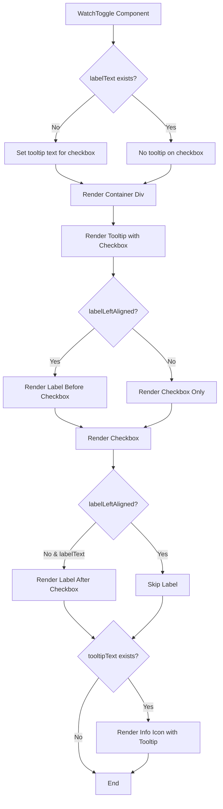
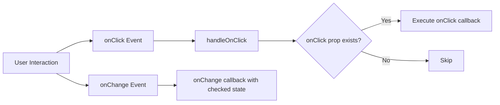
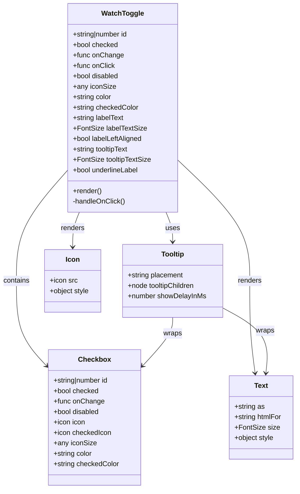
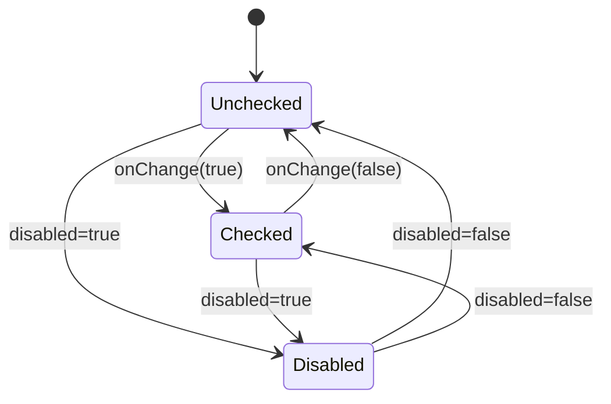

# Diagram: web/portal/src/shared/components/molecules/WatchToggle.molecule.js

> Auto-generated by Obscura crawlers

## Diagram 1

### SVG

<svg id="container" width="554.46875" xmlns="http://www.w3.org/2000/svg" class="flowchart" height="2034.015625" viewBox="0 0 554.46875 2034.015625" role="graphics-document document" aria-roledescription="flowchart-v2"><g><marker id="container_flowchart-v2-pointEnd" class="marker flowchart-v2" viewBox="0 0 10 10" refX="5" refY="5" markerUnits="userSpaceOnUse" markerWidth="8" markerHeight="8" orient="auto"><path d="M 0 0 L 10 5 L 0 10 z" class="arrowMarkerPath" style="stroke-width: 1; stroke-dasharray: 1, 0;"></path></marker><marker id="container_flowchart-v2-pointStart" class="marker flowchart-v2" viewBox="0 0 10 10" refX="4.5" refY="5" markerUnits="userSpaceOnUse" markerWidth="8" markerHeight="8" orient="auto"><path d="M 0 5 L 10 10 L 10 0 z" class="arrowMarkerPath" style="stroke-width: 1; stroke-dasharray: 1, 0;"></path></marker><marker id="container_flowchart-v2-circleEnd" class="marker flowchart-v2" viewBox="0 0 10 10" refX="11" refY="5" markerUnits="userSpaceOnUse" markerWidth="11" markerHeight="11" orient="auto"><circle cx="5" cy="5" r="5" class="arrowMarkerPath" style="stroke-width: 1; stroke-dasharray: 1, 0;"></circle></marker><marker id="container_flowchart-v2-circleStart" class="marker flowchart-v2" viewBox="0 0 10 10" refX="-1" refY="5" markerUnits="userSpaceOnUse" markerWidth="11" markerHeight="11" orient="auto"><circle cx="5" cy="5" r="5" class="arrowMarkerPath" style="stroke-width: 1; stroke-dasharray: 1, 0;"></circle></marker><marker id="container_flowchart-v2-crossEnd" class="marker cross flowchart-v2" viewBox="0 0 11 11" refX="12" refY="5.2" markerUnits="userSpaceOnUse" markerWidth="11" markerHeight="11" orient="auto"><path d="M 1,1 l 9,9 M 10,1 l -9,9" class="arrowMarkerPath" style="stroke-width: 2; stroke-dasharray: 1, 0;"></path></marker><marker id="container_flowchart-v2-crossStart" class="marker cross flowchart-v2" viewBox="0 0 11 11" refX="-1" refY="5.2" markerUnits="userSpaceOnUse" markerWidth="11" markerHeight="11" orient="auto"><path d="M 1,1 l 9,9 M 10,1 l -9,9" class="arrowMarkerPath" style="stroke-width: 2; stroke-dasharray: 1, 0;"></path></marker><g class="root"><g class="clusters"></g><g class="edgePaths"><path d="M285.117,62L285.117,66.167C285.117,70.333,285.117,78.667,285.117,86.333C285.117,94,285.117,101,285.117,104.5L285.117,108" id="L_A_B_0" class="edge-thickness-normal edge-pattern-solid edge-thickness-normal edge-pattern-solid flowchart-link" style=";" data-edge="true" data-et="edge" data-id="L_A_B_0" data-points="W3sieCI6Mjg1LjExNzE4NzUsInkiOjYyfSx7IngiOjI4NS4xMTcxODc1LCJ5Ijo4N30seyJ4IjoyODUuMTE3MTg3NSwieSI6MTEyfV0=" marker-end="url(#container_flowchart-v2-pointEnd)"></path><path d="M238.203,237.492L221.502,251.477C204.802,265.463,171.401,293.435,154.7,312.92C138,332.406,138,343.406,138,348.906L138,354.406" id="L_B_C_0" class="edge-thickness-normal edge-pattern-solid edge-thickness-normal edge-pattern-solid flowchart-link" style=";" data-edge="true" data-et="edge" data-id="L_B_C_0" data-points="W3sieCI6MjM4LjIwMjYxNzIwMjE3NjI0LCJ5IjoyMzcuNDkxNjc5NzAyMTc2MjR9LHsieCI6MTM4LCJ5IjozMjEuNDA2MjV9LHsieCI6MTM4LCJ5IjozNTguNDA2MjV9XQ==" marker-end="url(#container_flowchart-v2-pointEnd)"></path><path d="M332.032,237.492L348.732,251.477C365.433,265.463,398.834,293.435,415.534,314.92C432.234,336.406,432.234,351.406,432.234,358.906L432.234,366.406" id="L_B_D_0" class="edge-thickness-normal edge-pattern-solid edge-thickness-normal edge-pattern-solid flowchart-link" style=";" data-edge="true" data-et="edge" data-id="L_B_D_0" data-points="W3sieCI6MzMyLjAzMTc1Nzc5NzgyMzgsInkiOjIzNy40OTE2Nzk3MDIxNzYyNH0seyJ4Ijo0MzIuMjM0Mzc1LCJ5IjozMjEuNDA2MjV9LHsieCI6NDMyLjIzNDM3NSwieSI6MzcwLjQwNjI1fV0=" marker-end="url(#container_flowchart-v2-pointEnd)"></path><path d="M138,436.406L138,440.573C138,444.74,138,453.073,149.16,461.184C160.319,469.295,182.639,477.184,193.798,481.129L204.958,485.073" id="L_C_E_0" class="edge-thickness-normal edge-pattern-solid edge-thickness-normal edge-pattern-solid flowchart-link" style=";" data-edge="true" data-et="edge" data-id="L_C_E_0" data-points="W3sieCI6MTM4LCJ5Ijo0MzYuNDA2MjV9LHsieCI6MTM4LCJ5Ijo0NjEuNDA2MjV9LHsieCI6MjA4LjcyOTQxNzA2NzMwNzY4LCJ5Ijo0ODYuNDA2MjV9XQ==" marker-end="url(#container_flowchart-v2-pointEnd)"></path><path d="M432.234,424.406L432.234,430.573C432.234,436.74,432.234,449.073,421.075,459.184C409.915,469.295,387.596,477.184,376.436,481.129L365.276,485.073" id="L_D_E_0" class="edge-thickness-normal edge-pattern-solid edge-thickness-normal edge-pattern-solid flowchart-link" style=";" data-edge="true" data-et="edge" data-id="L_D_E_0" data-points="W3sieCI6NDMyLjIzNDM3NSwieSI6NDI0LjQwNjI1fSx7IngiOjQzMi4yMzQzNzUsInkiOjQ2MS40MDYyNX0seyJ4IjozNjEuNTA0OTU3OTMyNjkyMywieSI6NDg2LjQwNjI1fV0=" marker-end="url(#container_flowchart-v2-pointEnd)"></path><path d="M285.117,540.406L285.117,544.573C285.117,548.74,285.117,557.073,285.117,564.74C285.117,572.406,285.117,579.406,285.117,582.906L285.117,586.406" id="L_E_F_0" class="edge-thickness-normal edge-pattern-solid edge-thickness-normal edge-pattern-solid flowchart-link" style=";" data-edge="true" data-et="edge" data-id="L_E_F_0" data-points="W3sieCI6Mjg1LjExNzE4NzUsInkiOjU0MC40MDYyNX0seyJ4IjoyODUuMTE3MTg3NSwieSI6NTY1LjQwNjI1fSx7IngiOjI4NS4xMTcxODc1LCJ5Ijo1OTAuNDA2MjV9XQ==" marker-end="url(#container_flowchart-v2-pointEnd)"></path><path d="M285.117,668.406L285.117,672.573C285.117,676.74,285.117,685.073,285.117,692.74C285.117,700.406,285.117,707.406,285.117,710.906L285.117,714.406" id="L_F_G_0" class="edge-thickness-normal edge-pattern-solid edge-thickness-normal edge-pattern-solid flowchart-link" style=";" data-edge="true" data-et="edge" data-id="L_F_G_0" data-points="W3sieCI6Mjg1LjExNzE4NzUsInkiOjY2OC40MDYyNX0seyJ4IjoyODUuMTE3MTg3NSwieSI6NjkzLjQwNjI1fSx7IngiOjI4NS4xMTcxODc1LCJ5Ijo3MTguNDA2MjV9XQ==" marker-end="url(#container_flowchart-v2-pointEnd)"></path><path d="M237.156,849.805L220.878,863.965C204.599,878.125,172.042,906.445,155.763,926.106C139.484,945.766,139.484,956.766,139.484,962.266L139.484,967.766" id="L_G_H_0" class="edge-thickness-normal edge-pattern-solid edge-thickness-normal edge-pattern-solid flowchart-link" style=";" data-edge="true" data-et="edge" data-id="L_G_H_0" data-points="W3sieCI6MjM3LjE1NjQ2MTgwODk0MjUsInkiOjg0OS44MDQ4OTkzMDg5NDI1fSx7IngiOjEzOS40ODQzNzUsInkiOjkzNC43NjU2MjV9LHsieCI6MTM5LjQ4NDM3NSwieSI6OTcxLjc2NTYyNX1d" marker-end="url(#container_flowchart-v2-pointEnd)"></path><path d="M333.078,849.805L349.357,863.965C365.635,878.125,398.193,906.445,414.471,928.106C430.75,949.766,430.75,964.766,430.75,972.266L430.75,979.766" id="L_G_I_0" class="edge-thickness-normal edge-pattern-solid edge-thickness-normal edge-pattern-solid flowchart-link" style=";" data-edge="true" data-et="edge" data-id="L_G_I_0" data-points="W3sieCI6MzMzLjA3NzkxMzE5MTA1NzUsInkiOjg0OS44MDQ4OTkzMDg5NDI1fSx7IngiOjQzMC43NSwieSI6OTM0Ljc2NTYyNX0seyJ4Ijo0MzAuNzUsInkiOjk4My43NjU2MjV9XQ==" marker-end="url(#container_flowchart-v2-pointEnd)"></path><path d="M139.484,1049.766L139.484,1053.932C139.484,1058.099,139.484,1066.432,150.526,1074.541C161.567,1082.651,183.65,1090.536,194.692,1094.478L205.733,1098.421" id="L_H_J_0" class="edge-thickness-normal edge-pattern-solid edge-thickness-normal edge-pattern-solid flowchart-link" style=";" data-edge="true" data-et="edge" data-id="L_H_J_0" data-points="W3sieCI6MTM5LjQ4NDM3NSwieSI6MTA0OS43NjU2MjV9LHsieCI6MTM5LjQ4NDM3NSwieSI6MTA3NC43NjU2MjV9LHsieCI6MjA5LjUwMDE1MDI0MDM4NDYsInkiOjEwOTkuNzY1NjI1fV0=" marker-end="url(#container_flowchart-v2-pointEnd)"></path><path d="M430.75,1037.766L430.75,1043.932C430.75,1050.099,430.75,1062.432,419.709,1072.541C408.667,1082.651,386.584,1090.536,375.543,1094.478L364.501,1098.421" id="L_I_J_0" class="edge-thickness-normal edge-pattern-solid edge-thickness-normal edge-pattern-solid flowchart-link" style=";" data-edge="true" data-et="edge" data-id="L_I_J_0" data-points="W3sieCI6NDMwLjc1LCJ5IjoxMDM3Ljc2NTYyNX0seyJ4Ijo0MzAuNzUsInkiOjEwNzQuNzY1NjI1fSx7IngiOjM2MC43MzQyMjQ3NTk2MTUzNiwieSI6MTA5OS43NjU2MjV9XQ==" marker-end="url(#container_flowchart-v2-pointEnd)"></path><path d="M285.117,1153.766L285.117,1157.932C285.117,1162.099,285.117,1170.432,285.117,1178.099C285.117,1185.766,285.117,1192.766,285.117,1196.266L285.117,1199.766" id="L_J_K_0" class="edge-thickness-normal edge-pattern-solid edge-thickness-normal edge-pattern-solid flowchart-link" style=";" data-edge="true" data-et="edge" data-id="L_J_K_0" data-points="W3sieCI6Mjg1LjExNzE4NzUsInkiOjExNTMuNzY1NjI1fSx7IngiOjI4NS4xMTcxODc1LCJ5IjoxMTc4Ljc2NTYyNX0seyJ4IjoyODUuMTE3MTg3NSwieSI6MTIwMy43NjU2MjV9XQ==" marker-end="url(#container_flowchart-v2-pointEnd)"></path><path d="M240.82,1338.828L227.595,1352.378C214.37,1365.927,187.919,1393.026,174.694,1412.076C161.469,1431.125,161.469,1442.125,161.469,1447.625L161.469,1453.125" id="L_K_L_0" class="edge-thickness-normal edge-pattern-solid edge-thickness-normal edge-pattern-solid flowchart-link" style=";" data-edge="true" data-et="edge" data-id="L_K_L_0" data-points="W3sieCI6MjQwLjgyMDMxNDIwNjc0NDI5LCJ5IjoxMzM4LjgyODEyNjcwNjc0NDN9LHsieCI6MTYxLjQ2ODc1LCJ5IjoxNDIwLjEyNX0seyJ4IjoxNjEuNDY4NzUsInkiOjE0NTcuMTI1fV0=" marker-end="url(#container_flowchart-v2-pointEnd)"></path><path d="M329.414,1338.828L342.639,1352.378C355.865,1365.927,382.315,1393.026,395.54,1414.076C408.766,1435.125,408.766,1450.125,408.766,1457.625L408.766,1465.125" id="L_K_M_0" class="edge-thickness-normal edge-pattern-solid edge-thickness-normal edge-pattern-solid flowchart-link" style=";" data-edge="true" data-et="edge" data-id="L_K_M_0" data-points="W3sieCI6MzI5LjQxNDA2MDc5MzI1NTcsInkiOjEzMzguODI4MTI2NzA2NzQ0M30seyJ4Ijo0MDguNzY1NjI1LCJ5IjoxNDIwLjEyNX0seyJ4Ijo0MDguNzY1NjI1LCJ5IjoxNDY5LjEyNX1d" marker-end="url(#container_flowchart-v2-pointEnd)"></path><path d="M161.469,1535.125L161.469,1539.292C161.469,1543.458,161.469,1551.792,173.691,1567.568C185.914,1583.344,210.36,1606.563,222.582,1618.173L234.805,1629.782" id="L_L_N_0" class="edge-thickness-normal edge-pattern-solid edge-thickness-normal edge-pattern-solid flowchart-link" style=";" data-edge="true" data-et="edge" data-id="L_L_N_0" data-points="W3sieCI6MTYxLjQ2ODc1LCJ5IjoxNTM1LjEyNX0seyJ4IjoxNjEuNDY4NzUsInkiOjE1NjAuMTI1fSx7IngiOjIzNy43MDUyNjM5NDQwMjE0LCJ5IjoxNjMyLjUzNjkyMzU1NTk3ODV9XQ==" marker-end="url(#container_flowchart-v2-pointEnd)"></path><path d="M408.766,1523.125L408.766,1529.292C408.766,1535.458,408.766,1547.792,396.543,1565.568C384.32,1583.344,359.875,1606.563,347.652,1618.173L335.429,1629.782" id="L_M_N_0" class="edge-thickness-normal edge-pattern-solid edge-thickness-normal edge-pattern-solid flowchart-link" style=";" data-edge="true" data-et="edge" data-id="L_M_N_0" data-points="W3sieCI6NDA4Ljc2NTYyNSwieSI6MTUyMy4xMjV9LHsieCI6NDA4Ljc2NTYyNSwieSI6MTU2MC4xMjV9LHsieCI6MzMyLjUyOTExMTA1NTk3ODYsInkiOjE2MzIuNTM2OTIzNTU1OTc4NX1d" marker-end="url(#container_flowchart-v2-pointEnd)"></path><path d="M322.421,1732.712L330.799,1745.096C339.176,1757.48,355.932,1782.248,364.31,1800.132C372.688,1818.016,372.688,1829.016,372.688,1834.516L372.688,1840.016" id="L_N_O_0" class="edge-thickness-normal edge-pattern-solid edge-thickness-normal edge-pattern-solid flowchart-link" style=";" data-edge="true" data-et="edge" data-id="L_N_O_0" data-points="W3sieCI6MzIyLjQyMDc5MTM1MjQxOTIsInkiOjE3MzIuNzEyMDIxMTQ3NTgwOH0seyJ4IjozNzIuNjg3NSwieSI6MTgwNy4wMTU2MjV9LHsieCI6MzcyLjY4NzUsInkiOjE4NDQuMDE1NjI1fV0=" marker-end="url(#container_flowchart-v2-pointEnd)"></path><path d="M247.814,1732.712L239.436,1745.096C231.058,1757.48,214.302,1782.248,205.925,1807.298C197.547,1832.349,197.547,1857.682,197.547,1881.016C197.547,1904.349,197.547,1925.682,204.289,1940.352C211.031,1955.022,224.514,1963.029,231.256,1967.033L237.998,1971.036" id="L_N_P_0" class="edge-thickness-normal edge-pattern-solid edge-thickness-normal edge-pattern-solid flowchart-link" style=";" data-edge="true" data-et="edge" data-id="L_N_P_0" data-points="W3sieCI6MjQ3LjgxMzU4MzY0NzU4MDgzLCJ5IjoxNzMyLjcxMjAyMTE0NzU4MDh9LHsieCI6MTk3LjU0Njg3NSwieSI6MTgwNy4wMTU2MjV9LHsieCI6MTk3LjU0Njg3NSwieSI6MTg4My4wMTU2MjV9LHsieCI6MTk3LjU0Njg3NSwieSI6MTk0Ny4wMTU2MjV9LHsieCI6MjQxLjQzNzUsInkiOjE5NzMuMDc4MjUzMjQ1MTZ9XQ==" marker-end="url(#container_flowchart-v2-pointEnd)"></path><path d="M372.688,1922.016L372.688,1926.182C372.688,1930.349,372.688,1938.682,365.946,1946.852C359.204,1955.022,345.72,1963.029,338.978,1967.033L332.236,1971.036" id="L_O_P_0" class="edge-thickness-normal edge-pattern-solid edge-thickness-normal edge-pattern-solid flowchart-link" style=";" data-edge="true" data-et="edge" data-id="L_O_P_0" data-points="W3sieCI6MzcyLjY4NzUsInkiOjE5MjIuMDE1NjI1fSx7IngiOjM3Mi42ODc1LCJ5IjoxOTQ3LjAxNTYyNX0seyJ4IjozMjguNzk2ODc1LCJ5IjoxOTczLjA3ODI1MzI0NTE2fV0=" marker-end="url(#container_flowchart-v2-pointEnd)"></path></g><g class="edgeLabels"><g class="edgeLabel"><g class="label" data-id="L_A_B_0" transform="translate(0, 0)"><foreignObject width="0" height="0">

</foreignObject></g></g><g class="edgeLabel" transform="translate(138, 321.40625)"><g class="label" data-id="L_B_C_0" transform="translate(-10.140625, -12)"><foreignObject width="20.28125" height="24">

No

</foreignObject></g></g><g class="edgeLabel" transform="translate(432.234375, 321.40625)"><g class="label" data-id="L_B_D_0" transform="translate(-12.03125, -12)"><foreignObject width="24.0625" height="24">

Yes

</foreignObject></g></g><g class="edgeLabel"><g class="label" data-id="L_C_E_0" transform="translate(0, 0)"><foreignObject width="0" height="0">

</foreignObject></g></g><g class="edgeLabel"><g class="label" data-id="L_D_E_0" transform="translate(0, 0)"><foreignObject width="0" height="0">

</foreignObject></g></g><g class="edgeLabel"><g class="label" data-id="L_E_F_0" transform="translate(0, 0)"><foreignObject width="0" height="0">

</foreignObject></g></g><g class="edgeLabel"><g class="label" data-id="L_F_G_0" transform="translate(0, 0)"><foreignObject width="0" height="0">

</foreignObject></g></g><g class="edgeLabel" transform="translate(139.484375, 934.765625)"><g class="label" data-id="L_G_H_0" transform="translate(-12.03125, -12)"><foreignObject width="24.0625" height="24">

Yes

</foreignObject></g></g><g class="edgeLabel" transform="translate(430.75, 934.765625)"><g class="label" data-id="L_G_I_0" transform="translate(-10.140625, -12)"><foreignObject width="20.28125" height="24">

No

</foreignObject></g></g><g class="edgeLabel"><g class="label" data-id="L_H_J_0" transform="translate(0, 0)"><foreignObject width="0" height="0">

</foreignObject></g></g><g class="edgeLabel"><g class="label" data-id="L_I_J_0" transform="translate(0, 0)"><foreignObject width="0" height="0">

</foreignObject></g></g><g class="edgeLabel"><g class="label" data-id="L_J_K_0" transform="translate(0, 0)"><foreignObject width="0" height="0">

</foreignObject></g></g><g class="edgeLabel" transform="translate(161.46875, 1420.125)"><g class="label" data-id="L_K_L_0" transform="translate(-53.078125, -12)"><foreignObject width="106.15625" height="24">

No &amp; labelText

</foreignObject></g></g><g class="edgeLabel" transform="translate(408.765625, 1420.125)"><g class="label" data-id="L_K_M_0" transform="translate(-12.03125, -12)"><foreignObject width="24.0625" height="24">

Yes

</foreignObject></g></g><g class="edgeLabel"><g class="label" data-id="L_L_N_0" transform="translate(0, 0)"><foreignObject width="0" height="0">

</foreignObject></g></g><g class="edgeLabel"><g class="label" data-id="L_M_N_0" transform="translate(0, 0)"><foreignObject width="0" height="0">

</foreignObject></g></g><g class="edgeLabel" transform="translate(372.6875, 1807.015625)"><g class="label" data-id="L_N_O_0" transform="translate(-12.03125, -12)"><foreignObject width="24.0625" height="24">

Yes

</foreignObject></g></g><g class="edgeLabel" transform="translate(197.546875, 1883.015625)"><g class="label" data-id="L_N_P_0" transform="translate(-10.140625, -12)"><foreignObject width="20.28125" height="24">

No

</foreignObject></g></g><g class="edgeLabel"><g class="label" data-id="L_O_P_0" transform="translate(0, 0)"><foreignObject width="0" height="0">

</foreignObject></g></g></g><g class="nodes"><g class="node default" id="flowchart-A-0" transform="translate(285.1171875, 35)"><rect class="basic label-container" style="" x="-119.375" y="-27" width="238.75" height="54"></rect><g class="label" style="" transform="translate(-89.375, -12)"><rect></rect><foreignObject width="178.75" height="24">

WatchToggle Component

</foreignObject></g></g><g class="node default" id="flowchart-B-1" transform="translate(285.1171875, 198.203125)"><polygon points="86.203125,0 172.40625,-86.203125 86.203125,-172.40625 0,-86.203125" class="label-container" transform="translate(-85.703125, 86.203125)"></polygon><g class="label" style="" transform="translate(-59.203125, -12)"><rect></rect><foreignObject width="118.40625" height="24">

labelText exists?

</foreignObject></g></g><g class="node default" id="flowchart-C-3" transform="translate(138, 397.40625)"><rect class="basic label-container" style="" x="-130" y="-39" width="260" height="78"></rect><g class="label" style="" transform="translate(-100, -24)"><rect></rect><foreignObject width="200" height="48">

Set tooltip text for checkbox

</foreignObject></g></g><g class="node default" id="flowchart-D-5" transform="translate(432.234375, 397.40625)"><rect class="basic label-container" style="" x="-114.234375" y="-27" width="228.46875" height="54"></rect><g class="label" style="" transform="translate(-84.234375, -12)"><rect></rect><foreignObject width="168.46875" height="24">

No tooltip on checkbox

</foreignObject></g></g><g class="node default" id="flowchart-E-7" transform="translate(285.1171875, 513.40625)"><rect class="basic label-container" style="" x="-106.84375" y="-27" width="213.6875" height="54"></rect><g class="label" style="" transform="translate(-76.84375, -12)"><rect></rect><foreignObject width="153.6875" height="24">

Render Container Div

</foreignObject></g></g><g class="node default" id="flowchart-F-11" transform="translate(285.1171875, 629.40625)"><rect class="basic label-container" style="" x="-130" y="-39" width="260" height="78"></rect><g class="label" style="" transform="translate(-100, -24)"><rect></rect><foreignObject width="200" height="48">

Render Tooltip with Checkbox

</foreignObject></g></g><g class="node default" id="flowchart-G-13" transform="translate(285.1171875, 808.0859375)"><polygon points="89.6796875,0 179.359375,-89.6796875 89.6796875,-179.359375 0,-89.6796875" class="label-container" transform="translate(-89.1796875, 89.6796875)"></polygon><g class="label" style="" transform="translate(-62.6796875, -12)"><rect></rect><foreignObject width="125.359375" height="24">

labelLeftAligned?

</foreignObject></g></g><g class="node default" id="flowchart-H-15" transform="translate(139.484375, 1010.765625)"><rect class="basic label-container" style="" x="-130" y="-39" width="260" height="78"></rect><g class="label" style="" transform="translate(-100, -24)"><rect></rect><foreignObject width="200" height="48">

Render Label Before Checkbox

</foreignObject></g></g><g class="node default" id="flowchart-I-17" transform="translate(430.75, 1010.765625)"><rect class="basic label-container" style="" x="-111.265625" y="-27" width="222.53125" height="54"></rect><g class="label" style="" transform="translate(-81.265625, -12)"><rect></rect><foreignObject width="162.53125" height="24">

Render Checkbox Only

</foreignObject></g></g><g class="node default" id="flowchart-J-19" transform="translate(285.1171875, 1126.765625)"><rect class="basic label-container" style="" x="-92.7265625" y="-27" width="185.453125" height="54"></rect><g class="label" style="" transform="translate(-62.7265625, -12)"><rect></rect><foreignObject width="125.453125" height="24">

Render Checkbox

</foreignObject></g></g><g class="node default" id="flowchart-K-23" transform="translate(285.1171875, 1293.4453125)"><polygon points="89.6796875,0 179.359375,-89.6796875 89.6796875,-179.359375 0,-89.6796875" class="label-container" transform="translate(-89.1796875, 89.6796875)"></polygon><g class="label" style="" transform="translate(-62.6796875, -12)"><rect></rect><foreignObject width="125.359375" height="24">

labelLeftAligned?

</foreignObject></g></g><g class="node default" id="flowchart-L-25" transform="translate(161.46875, 1496.125)"><rect class="basic label-container" style="" x="-130" y="-39" width="260" height="78"></rect><g class="label" style="" transform="translate(-100, -24)"><rect></rect><foreignObject width="200" height="48">

Render Label After Checkbox

</foreignObject></g></g><g class="node default" id="flowchart-M-27" transform="translate(408.765625, 1496.125)"><rect class="basic label-container" style="" x="-67.296875" y="-27" width="134.59375" height="54"></rect><g class="label" style="" transform="translate(-37.296875, -12)"><rect></rect><foreignObject width="74.59375" height="24">

Skip Label

</foreignObject></g></g><g class="node default" id="flowchart-N-29" transform="translate(285.1171875, 1677.5703125)"><polygon points="92.4453125,0 184.890625,-92.4453125 92.4453125,-184.890625 0,-92.4453125" class="label-container" transform="translate(-91.9453125, 92.4453125)"></polygon><g class="label" style="" transform="translate(-65.4453125, -12)"><rect></rect><foreignObject width="130.890625" height="24">

tooltipText exists?

</foreignObject></g></g><g class="node default" id="flowchart-O-33" transform="translate(372.6875, 1883.015625)"><rect class="basic label-container" style="" x="-130" y="-39" width="260" height="78"></rect><g class="label" style="" transform="translate(-100, -24)"><rect></rect><foreignObject width="200" height="48">

Render Info Icon with Tooltip

</foreignObject></g></g><g class="node default" id="flowchart-P-35" transform="translate(285.1171875, 1999.015625)"><rect class="basic label-container" style="" x="-43.6796875" y="-27" width="87.359375" height="54"></rect><g class="label" style="" transform="translate(-13.6796875, -12)"><rect></rect><foreignObject width="27.359375" height="24">

End

</foreignObject></g></g></g></g></g></svg>

## Diagram 2

### SVG

<svg id="container" width="1286.265625" xmlns="http://www.w3.org/2000/svg" class="flowchart" height="269.765625" viewBox="0 0 1286.265625 269.765625" role="graphics-document document" aria-roledescription="flowchart-v2"><g><marker id="container_flowchart-v2-pointEnd" class="marker flowchart-v2" viewBox="0 0 10 10" refX="5" refY="5" markerUnits="userSpaceOnUse" markerWidth="8" markerHeight="8" orient="auto"><path d="M 0 0 L 10 5 L 0 10 z" class="arrowMarkerPath" style="stroke-width: 1; stroke-dasharray: 1, 0;"></path></marker><marker id="container_flowchart-v2-pointStart" class="marker flowchart-v2" viewBox="0 0 10 10" refX="4.5" refY="5" markerUnits="userSpaceOnUse" markerWidth="8" markerHeight="8" orient="auto"><path d="M 0 5 L 10 10 L 10 0 z" class="arrowMarkerPath" style="stroke-width: 1; stroke-dasharray: 1, 0;"></path></marker><marker id="container_flowchart-v2-circleEnd" class="marker flowchart-v2" viewBox="0 0 10 10" refX="11" refY="5" markerUnits="userSpaceOnUse" markerWidth="11" markerHeight="11" orient="auto"><circle cx="5" cy="5" r="5" class="arrowMarkerPath" style="stroke-width: 1; stroke-dasharray: 1, 0;"></circle></marker><marker id="container_flowchart-v2-circleStart" class="marker flowchart-v2" viewBox="0 0 10 10" refX="-1" refY="5" markerUnits="userSpaceOnUse" markerWidth="11" markerHeight="11" orient="auto"><circle cx="5" cy="5" r="5" class="arrowMarkerPath" style="stroke-width: 1; stroke-dasharray: 1, 0;"></circle></marker><marker id="container_flowchart-v2-crossEnd" class="marker cross flowchart-v2" viewBox="0 0 11 11" refX="12" refY="5.2" markerUnits="userSpaceOnUse" markerWidth="11" markerHeight="11" orient="auto"><path d="M 1,1 l 9,9 M 10,1 l -9,9" class="arrowMarkerPath" style="stroke-width: 2; stroke-dasharray: 1, 0;"></path></marker><marker id="container_flowchart-v2-crossStart" class="marker cross flowchart-v2" viewBox="0 0 11 11" refX="-1" refY="5.2" markerUnits="userSpaceOnUse" markerWidth="11" markerHeight="11" orient="auto"><path d="M 1,1 l 9,9 M 10,1 l -9,9" class="arrowMarkerPath" style="stroke-width: 2; stroke-dasharray: 1, 0;"></path></marker><g class="root"><g class="clusters"></g><g class="edgePaths"><path d="M148.935,137.766L159.022,132.599C169.108,127.432,189.281,117.099,204.466,111.932C219.651,106.766,229.849,106.766,234.948,106.766L240.047,106.766" id="L_User_Click_0" class="edge-thickness-normal edge-pattern-solid edge-thickness-normal edge-pattern-solid flowchart-link" style=";" data-edge="true" data-et="edge" data-id="L_User_Click_0" data-points="W3sieCI6MTQ4LjkzNTQ3OTUyNTg2MjA2LCJ5IjoxMzcuNzY1NjI1fSx7IngiOjIwOS40NTMxMjUsInkiOjEwNi43NjU2MjV9LHsieCI6MjQ0LjA0Njg3NSwieSI6MTA2Ljc2NTYyNX1d" marker-end="url(#container_flowchart-v2-pointEnd)"></path><path d="M400.781,106.766L406.547,106.766C412.313,106.766,423.844,106.766,441.056,106.766C458.268,106.766,481.161,106.766,492.608,106.766L504.055,106.766" id="L_Click_Handler_0" class="edge-thickness-normal edge-pattern-solid edge-thickness-normal edge-pattern-solid flowchart-link" style=";" data-edge="true" data-et="edge" data-id="L_Click_Handler_0" data-points="W3sieCI6NDAwLjc4MTI1LCJ5IjoxMDYuNzY1NjI1fSx7IngiOjQzNS4zNzUsInkiOjEwNi43NjU2MjV9LHsieCI6NTA4LjA1NDY4NzUsInkiOjEwNi43NjU2MjV9XQ==" marker-end="url(#container_flowchart-v2-pointEnd)"></path><path d="M672.695,106.766L684.809,106.766C696.922,106.766,721.148,106.766,736.762,106.766C752.375,106.766,759.375,106.766,762.875,106.766L766.375,106.766" id="L_Handler_CheckNil_0" class="edge-thickness-normal edge-pattern-solid edge-thickness-normal edge-pattern-solid flowchart-link" style=";" data-edge="true" data-et="edge" data-id="L_Handler_CheckNil_0" data-points="W3sieCI6NjcyLjY5NTMxMjUsInkiOjEwNi43NjU2MjV9LHsieCI6NzQ1LjM3NSwieSI6MTA2Ljc2NTYyNX0seyJ4Ijo3NzAuMzc1LCJ5IjoxMDYuNzY1NjI1fV0=" marker-end="url(#container_flowchart-v2-pointEnd)"></path><path d="M940.559,79.418L951.288,75.309C962.018,71.2,983.478,62.983,999.713,58.874C1015.948,54.766,1026.958,54.766,1032.464,54.766L1037.969,54.766" id="L_CheckNil_Execute_0" class="edge-thickness-normal edge-pattern-solid edge-thickness-normal edge-pattern-solid flowchart-link" style=";" data-edge="true" data-et="edge" data-id="L_CheckNil_Execute_0" data-points="W3sieCI6OTQwLjU1ODU1MDUyNDE3MDEsInkiOjc5LjQxNzkyNTUyNDE3MDA2fSx7IngiOjEwMDQuOTM3NSwieSI6NTQuNzY1NjI1fSx7IngiOjEwNDEuOTY4NzUsInkiOjU0Ljc2NTYyNX1d" marker-end="url(#container_flowchart-v2-pointEnd)"></path><path d="M940.559,134.113L951.288,138.222C962.018,142.331,983.478,150.548,1011.826,154.657C1040.174,158.766,1075.411,158.766,1093.03,158.766L1110.648,158.766" id="L_CheckNil_Skip_0" class="edge-thickness-normal edge-pattern-solid edge-thickness-normal edge-pattern-solid flowchart-link" style=";" data-edge="true" data-et="edge" data-id="L_CheckNil_Skip_0" data-points="W3sieCI6OTQwLjU1ODU1MDUyNDE3MDEsInkiOjEzNC4xMTMzMjQ0NzU4Mjk5M30seyJ4IjoxMDA0LjkzNzUsInkiOjE1OC43NjU2MjV9LHsieCI6MTExNC42NDg0Mzc1LCJ5IjoxNTguNzY1NjI1fV0=" marker-end="url(#container_flowchart-v2-pointEnd)"></path><path d="M148.935,191.766L159.022,196.932C169.108,202.099,189.281,212.432,202.867,217.599C216.453,222.766,223.453,222.766,226.953,222.766L230.453,222.766" id="L_User_Change_0" class="edge-thickness-normal edge-pattern-solid edge-thickness-normal edge-pattern-solid flowchart-link" style=";" data-edge="true" data-et="edge" data-id="L_User_Change_0" data-points="W3sieCI6MTQ4LjkzNTQ3OTUyNTg2MjA2LCJ5IjoxOTEuNzY1NjI1fSx7IngiOjIwOS40NTMxMjUsInkiOjIyMi43NjU2MjV9LHsieCI6MjM0LjQ1MzEyNSwieSI6MjIyLjc2NTYyNX1d" marker-end="url(#container_flowchart-v2-pointEnd)"></path><path d="M410.375,222.766L414.542,222.766C418.708,222.766,427.042,222.766,434.708,222.766C442.375,222.766,449.375,222.766,452.875,222.766L456.375,222.766" id="L_Change_Callback_0" class="edge-thickness-normal edge-pattern-solid edge-thickness-normal edge-pattern-solid flowchart-link" style=";" data-edge="true" data-et="edge" data-id="L_Change_Callback_0" data-points="W3sieCI6NDEwLjM3NSwieSI6MjIyLjc2NTYyNX0seyJ4Ijo0MzUuMzc1LCJ5IjoyMjIuNzY1NjI1fSx7IngiOjQ2MC4zNzUsInkiOjIyMi43NjU2MjV9XQ==" marker-end="url(#container_flowchart-v2-pointEnd)"></path></g><g class="edgeLabels"><g class="edgeLabel"><g class="label" data-id="L_User_Click_0" transform="translate(0, 0)"><foreignObject width="0" height="0">

</foreignObject></g></g><g class="edgeLabel"><g class="label" data-id="L_Click_Handler_0" transform="translate(0, 0)"><foreignObject width="0" height="0">

</foreignObject></g></g><g class="edgeLabel"><g class="label" data-id="L_Handler_CheckNil_0" transform="translate(0, 0)"><foreignObject width="0" height="0">

</foreignObject></g></g><g class="edgeLabel" transform="translate(1004.9375, 54.765625)"><g class="label" data-id="L_CheckNil_Execute_0" transform="translate(-12.03125, -12)"><foreignObject width="24.0625" height="24">

Yes

</foreignObject></g></g><g class="edgeLabel" transform="translate(1004.9375, 158.765625)"><g class="label" data-id="L_CheckNil_Skip_0" transform="translate(-10.140625, -12)"><foreignObject width="20.28125" height="24">

No

</foreignObject></g></g><g class="edgeLabel"><g class="label" data-id="L_User_Change_0" transform="translate(0, 0)"><foreignObject width="0" height="0">

</foreignObject></g></g><g class="edgeLabel"><g class="label" data-id="L_Change_Callback_0" transform="translate(0, 0)"><foreignObject width="0" height="0">

</foreignObject></g></g></g><g class="nodes"><g class="node default" id="flowchart-User-0" transform="translate(96.2265625, 164.765625)"><rect class="basic label-container" style="" x="-88.2265625" y="-27" width="176.453125" height="54"></rect><g class="label" style="" transform="translate(-58.2265625, -12)"><rect></rect><foreignObject width="116.453125" height="24">

User Interaction

</foreignObject></g></g><g class="node default" id="flowchart-Click-1" transform="translate(322.4140625, 106.765625)"><rect class="basic label-container" style="" x="-78.3671875" y="-27" width="156.734375" height="54"></rect><g class="label" style="" transform="translate(-48.3671875, -12)"><rect></rect><foreignObject width="96.734375" height="24">

onClick Event

</foreignObject></g></g><g class="node default" id="flowchart-Handler-3" transform="translate(590.375, 106.765625)"><rect class="basic label-container" style="" x="-82.3203125" y="-27" width="164.640625" height="54"></rect><g class="label" style="" transform="translate(-52.3203125, -12)"><rect></rect><foreignObject width="104.640625" height="24">

handleOnClick

</foreignObject></g></g><g class="node default" id="flowchart-CheckNil-5" transform="translate(869.140625, 106.765625)"><polygon points="98.765625,0 197.53125,-98.765625 98.765625,-197.53125 0,-98.765625" class="label-container" transform="translate(-98.265625, 98.765625)"></polygon><g class="label" style="" transform="translate(-71.765625, -12)"><rect></rect><foreignObject width="143.53125" height="24">

onClick prop exists?

</foreignObject></g></g><g class="node default" id="flowchart-Execute-7" transform="translate(1160.1171875, 54.765625)"><rect class="basic label-container" style="" x="-118.1484375" y="-27" width="236.296875" height="54"></rect><g class="label" style="" transform="translate(-88.1484375, -12)"><rect></rect><foreignObject width="176.296875" height="24">

Execute onClick callback

</foreignObject></g></g><g class="node default" id="flowchart-Skip-9" transform="translate(1160.1171875, 158.765625)"><rect class="basic label-container" style="" x="-45.46875" y="-27" width="90.9375" height="54"></rect><g class="label" style="" transform="translate(-15.46875, -12)"><rect></rect><foreignObject width="30.9375" height="24">

Skip

</foreignObject></g></g><g class="node default" id="flowchart-Change-11" transform="translate(322.4140625, 222.765625)"><rect class="basic label-container" style="" x="-87.9609375" y="-27" width="175.921875" height="54"></rect><g class="label" style="" transform="translate(-57.9609375, -12)"><rect></rect><foreignObject width="115.921875" height="24">

onChange Event

</foreignObject></g></g><g class="node default" id="flowchart-Callback-13" transform="translate(590.375, 222.765625)"><rect class="basic label-container" style="" x="-130" y="-39" width="260" height="78"></rect><g class="label" style="" transform="translate(-100, -24)"><rect></rect><foreignObject width="200" height="48">

onChange callback with checked state

</foreignObject></g></g></g></g></g></svg>

## Diagram 3

### SVG

<svg id="container" width="688.298828125" xmlns="http://www.w3.org/2000/svg" class="classDiagram" height="1124" viewBox="0 0 688.298828125 1124" role="graphics-document document" aria-roledescription="class"><g><defs><marker id="container_class-aggregationStart" class="marker aggregation class" refX="18" refY="7" markerWidth="190" markerHeight="240" orient="auto"><path d="M 18,7 L9,13 L1,7 L9,1 Z"></path></marker></defs><defs><marker id="container_class-aggregationEnd" class="marker aggregation class" refX="1" refY="7" markerWidth="20" markerHeight="28" orient="auto"><path d="M 18,7 L9,13 L1,7 L9,1 Z"></path></marker></defs><defs><marker id="container_class-extensionStart" class="marker extension class" refX="18" refY="7" markerWidth="190" markerHeight="240" orient="auto"><path d="M 1,7 L18,13 V 1 Z"></path></marker></defs><defs><marker id="container_class-extensionEnd" class="marker extension class" refX="1" refY="7" markerWidth="20" markerHeight="28" orient="auto"><path d="M 1,1 V 13 L18,7 Z"></path></marker></defs><defs><marker id="container_class-compositionStart" class="marker composition class" refX="18" refY="7" markerWidth="190" markerHeight="240" orient="auto"><path d="M 18,7 L9,13 L1,7 L9,1 Z"></path></marker></defs><defs><marker id="container_class-compositionEnd" class="marker composition class" refX="1" refY="7" markerWidth="20" markerHeight="28" orient="auto"><path d="M 18,7 L9,13 L1,7 L9,1 Z"></path></marker></defs><defs><marker id="container_class-dependencyStart" class="marker dependency class" refX="6" refY="7" markerWidth="190" markerHeight="240" orient="auto"><path d="M 5,7 L9,13 L1,7 L9,1 Z"></path></marker></defs><defs><marker id="container_class-dependencyEnd" class="marker dependency class" refX="13" refY="7" markerWidth="20" markerHeight="28" orient="auto"><path d="M 18,7 L9,13 L14,7 L9,1 Z"></path></marker></defs><defs><marker id="container_class-lollipopStart" class="marker lollipop class" refX="13" refY="7" markerWidth="190" markerHeight="240" orient="auto"><circle stroke="black" fill="transparent" cx="7" cy="7" r="6"></circle></marker></defs><defs><marker id="container_class-lollipopEnd" class="marker lollipop class" refX="1" refY="7" markerWidth="190" markerHeight="240" orient="auto"><circle stroke="black" fill="transparent" cx="7" cy="7" r="6"></circle></marker></defs><g class="root"><g class="clusters"></g><g class="edgePaths"><path d="M385.95,488L388.52,494.167C391.09,500.333,396.231,512.667,398.801,524C401.371,535.333,401.371,545.667,401.371,550.833L401.371,556" id="id_WatchToggle_Tooltip_1" class="edge-thickness-normal edge-pattern-solid relation" style=";;;" data-edge="true" data-et="edge" data-id="id_WatchToggle_Tooltip_1" data-points="W3sieCI6Mzg1Ljk1MDA3ODk3MTExOTEsInkiOjQ4OH0seyJ4Ijo0MDEuMzcxMDkzNzUsInkiOjUyNX0seyJ4Ijo0MDEuMzcxMDkzNzUsInkiOjU2Mn1d" marker-end="url(#container_class-dependencyEnd)"></path><path d="M160.758,388.348L140.447,411.124C120.135,433.899,79.513,479.449,59.202,522.391C38.891,565.333,38.891,605.667,38.891,646C38.891,686.333,38.891,726.667,50.834,759.552C62.777,792.437,86.664,817.873,98.608,830.592L110.551,843.31" id="id_WatchToggle_Checkbox_2" class="edge-thickness-normal edge-pattern-solid relation" style=";;;" data-edge="true" data-et="edge" data-id="id_WatchToggle_Checkbox_2" data-points="W3sieCI6MTYwLjc1NzgxMjUsInkiOjM4OC4zNDg0MTg3MjIzMjc2Nn0seyJ4IjozOC44OTA2MjUsInkiOjUyNX0seyJ4IjozOC44OTA2MjUsInkiOjY0Nn0seyJ4IjozOC44OTA2MjUsInkiOjc2N30seyJ4IjoxMTQuNjU4MjAzMTI1LCJ5Ijo4NDcuNjgzNzU0NTEyNjM1M31d" marker-end="url(#container_class-dependencyEnd)"></path><path d="M411.086,366.165L439.126,392.638C467.167,419.11,523.247,472.055,551.288,518.694C579.328,565.333,579.328,605.667,579.328,646C579.328,686.333,579.328,726.667,581.385,762.009C583.442,797.351,587.557,827.703,589.614,842.879L591.671,858.054" id="id_WatchToggle_Text_3" class="edge-thickness-normal edge-pattern-solid relation" style=";;;" data-edge="true" data-et="edge" data-id="id_WatchToggle_Text_3" data-points="W3sieCI6NDExLjA4NTkzNzUsInkiOjM2Ni4xNjUzMjY0NDU4NDA5fSx7IngiOjU3OS4zMjgxMjUsInkiOjUyNX0seyJ4Ijo1NzkuMzI4MTI1LCJ5Ijo2NDZ9LHsieCI6NTc5LjMyODEyNSwieSI6NzY3fSx7IngiOjU5Mi40NzY5NTcxNzI5Mjc0LCJ5Ijo4NjR9XQ==" marker-end="url(#container_class-dependencyEnd)"></path><path d="M185.894,488L183.324,494.167C180.753,500.333,175.613,512.667,173.043,526C170.473,539.333,170.473,553.667,170.473,560.833L170.473,568" id="id_WatchToggle_Icon_4" class="edge-thickness-normal edge-pattern-solid relation" style=";;;" data-edge="true" data-et="edge" data-id="id_WatchToggle_Icon_4" data-points="W3sieCI6MTg1Ljg5MzY3MTAyODg4MDg3LCJ5Ijo0ODh9LHsieCI6MTcwLjQ3MjY1NjI1LCJ5Ijo1MjV9LHsieCI6MTcwLjQ3MjY1NjI1LCJ5Ijo1NzR9XQ==" marker-end="url(#container_class-dependencyEnd)"></path><path d="M401.371,730L401.371,736.167C401.371,742.333,401.371,754.667,389.428,773.552C377.484,792.437,353.598,817.873,341.654,830.592L329.711,843.31" id="id_Tooltip_Checkbox_5" class="edge-thickness-normal edge-pattern-solid relation" style=";;;" data-edge="true" data-et="edge" data-id="id_Tooltip_Checkbox_5" data-points="W3sieCI6NDAxLjM3MTA5Mzc1LCJ5Ijo3MzB9LHsieCI6NDAxLjM3MTA5Mzc1LCJ5Ijo3Njd9LHsieCI6MzI1LjYwMzUxNTYyNSwieSI6ODQ3LjY4Mzc1NDUxMjYzNTN9XQ==" marker-end="url(#container_class-dependencyEnd)"></path><path d="M516.578,708.007L534.846,717.839C553.114,727.671,589.65,747.336,606.291,772.34C622.932,797.345,619.678,827.689,618.051,842.862L616.424,858.034" id="id_Tooltip_Text_6" class="edge-thickness-normal edge-pattern-solid relation" style=";;;" data-edge="true" data-et="edge" data-id="id_Tooltip_Text_6" data-points="W3sieCI6NTE2LjU3ODEyNSwieSI6NzA4LjAwNjkxNTQyNTA0Njd9LHsieCI6NjI2LjE4NTU0Njg3NSwieSI6NzY3fSx7IngiOjYxNS43ODQyNzU4MjU3NzcyLCJ5Ijo4NjR9XQ==" marker-end="url(#container_class-dependencyEnd)"></path></g><g class="edgeLabels"><g class="edgeLabel" transform="translate(401.37109375, 525)"><g class="label" data-id="id_WatchToggle_Tooltip_1" transform="translate(-16.4921875, -12)"><foreignObject width="32.984375" height="24">

uses

</foreignObject></g></g><g class="edgeLabel" transform="translate(38.890625, 646)"><g class="label" data-id="id_WatchToggle_Checkbox_2" transform="translate(-30.890625, -12)"><foreignObject width="61.78125" height="24">

contains

</foreignObject></g></g><g class="edgeLabel" transform="translate(579.328125, 646)"><g class="label" data-id="id_WatchToggle_Text_3" transform="translate(-27.75, -12)"><foreignObject width="55.5" height="24">

renders

</foreignObject></g></g><g class="edgeLabel" transform="translate(170.47265625, 525)"><g class="label" data-id="id_WatchToggle_Icon_4" transform="translate(-27.75, -12)"><foreignObject width="55.5" height="24">

renders

</foreignObject></g></g><g class="edgeLabel" transform="translate(401.37109375, 767)"><g class="label" data-id="id_Tooltip_Checkbox_5" transform="translate(-21.390625, -12)"><foreignObject width="42.78125" height="24">

wraps

</foreignObject></g></g><g class="edgeLabel" transform="translate(614.33379, 760.62113)"><g class="label" data-id="id_Tooltip_Text_6" transform="translate(-21.390625, -12)"><foreignObject width="42.78125" height="24">

wraps

</foreignObject></g></g></g><g class="nodes"><g class="node default" id="classId-WatchToggle-0" transform="translate(285.921875, 248)"><g class="basic label-container"><path d="M-125.1640625 -240 L125.1640625 -240 L125.1640625 240 L-125.1640625 240" stroke="none" stroke-width="0" fill="#ECECFF" style=""></path><path d="M-125.1640625 -240 C-33.790165148818176 -240, 57.58373220236365 -240, 125.1640625 -240 M-125.1640625 -240 C-43.745980675403814 -240, 37.67210114919237 -240, 125.1640625 -240 M125.1640625 -240 C125.1640625 -73.97730268032765, 125.1640625 92.04539463934469, 125.1640625 240 M125.1640625 -240 C125.1640625 -78.2327800636711, 125.1640625 83.5344398726578, 125.1640625 240 M125.1640625 240 C50.508022117250505 240, -24.14801826549899 240, -125.1640625 240 M125.1640625 240 C62.79916812427918 240, 0.4342737485583541 240, -125.1640625 240 M-125.1640625 240 C-125.1640625 48.86382138214552, -125.1640625 -142.27235723570897, -125.1640625 -240 M-125.1640625 240 C-125.1640625 60.923364727414054, -125.1640625 -118.15327054517189, -125.1640625 -240" stroke="#9370DB" stroke-width="1.3" fill="none" stroke-dasharray="0 0" style=""></path></g><g class="annotation-group text" transform="translate(0, -216)"></g><g class="label-group text" transform="translate(-46.4375, -216)"><g class="label" style="font-weight: bolder" transform="translate(0,-12)"><foreignObject width="92.875" height="24">

WatchToggle

</foreignObject></g></g><g class="members-group text" transform="translate(-113.1640625, -168)"><g class="label" style="" transform="translate(0,-12)"><foreignObject width="131.1875" height="24">

+string|number id

</foreignObject></g><g class="label" style="" transform="translate(0,12)"><foreignObject width="104.84375" height="24">

+bool checked

</foreignObject></g><g class="label" style="" transform="translate(0,36)"><foreignObject width="115.453125" height="24">

+func onChange

</foreignObject></g><g class="label" style="" transform="translate(0,60)"><foreignObject width="96.25" height="24">

+func onClick

</foreignObject></g><g class="label" style="" transform="translate(0,84)"><foreignObject width="107.609375" height="24">

+bool disabled

</foreignObject></g><g class="label" style="" transform="translate(0,108)"><foreignObject width="97.21875" height="24">

+any iconSize

</foreignObject></g><g class="label" style="" transform="translate(0,132)"><foreignObject width="90.65625" height="24">

+string color

</foreignObject></g><g class="label" style="" transform="translate(0,156)"><foreignObject width="151.703125" height="24">

+string checkedColor

</foreignObject></g><g class="label" style="" transform="translate(0,180)"><foreignObject width="119.59375" height="24">

+string labelText

</foreignObject></g><g class="label" style="" transform="translate(0,204)"><foreignObject width="167.421875" height="24">

+FontSize labelTextSize

</foreignObject></g><g class="label" style="" transform="translate(0,228)"><foreignObject width="163.109375" height="24">

+bool labelLeftAligned

</foreignObject></g><g class="label" style="" transform="translate(0,252)"><foreignObject width="132.078125" height="24">

+string tooltipText

</foreignObject></g><g class="label" style="" transform="translate(0,276)"><foreignObject width="179.890625" height="24">

+FontSize tooltipTextSize

</foreignObject></g><g class="label" style="" transform="translate(0,300)"><foreignObject width="154.984375" height="24">

+bool underlineLabel

</foreignObject></g></g><g class="methods-group text" transform="translate(-113.1640625, 192)"><g class="label" style="" transform="translate(0,-12)"><foreignObject width="66.609375" height="24">

+render()

</foreignObject></g><g class="label" style="" transform="translate(0,12)"><foreignObject width="121.46875" height="24">

-handleOnClick()

</foreignObject></g></g><g class="divider" style=""><path d="M-125.1640625 -192 C-32.02163803321676 -192, 61.12078643356648 -192, 125.1640625 -192 M-125.1640625 -192 C-33.05163697881164 -192, 59.06078854237671 -192, 125.1640625 -192" stroke="#9370DB" stroke-width="1.3" fill="none" stroke-dasharray="0 0" style=""></path></g><g class="divider" style=""><path d="M-125.1640625 168 C-63.03986840695918 168, -0.915674313918359 168, 125.1640625 168 M-125.1640625 168 C-49.26048211485471 168, 26.64309827029058 168, 125.1640625 168" stroke="#9370DB" stroke-width="1.3" fill="none" stroke-dasharray="0 0" style=""></path></g></g><g class="node default" id="classId-Tooltip-1" transform="translate(401.37109375, 646)"><g class="basic label-container"><path d="M-115.20703125 -84 L115.20703125 -84 L115.20703125 84 L-115.20703125 84" stroke="none" stroke-width="0" fill="#ECECFF" style=""></path><path d="M-115.20703125 -84 C-24.87914813543526 -84, 65.44873497912948 -84, 115.20703125 -84 M-115.20703125 -84 C-58.74729692150629 -84, -2.2875625930125807 -84, 115.20703125 -84 M115.20703125 -84 C115.20703125 -30.281494678399973, 115.20703125 23.437010643200054, 115.20703125 84 M115.20703125 -84 C115.20703125 -20.179417631265174, 115.20703125 43.64116473746965, 115.20703125 84 M115.20703125 84 C36.15100869861483 84, -42.90501385277034 84, -115.20703125 84 M115.20703125 84 C25.536431439401625 84, -64.13416837119675 84, -115.20703125 84 M-115.20703125 84 C-115.20703125 33.31375752471502, -115.20703125 -17.372484950569955, -115.20703125 -84 M-115.20703125 84 C-115.20703125 34.99787890550127, -115.20703125 -14.004242188997466, -115.20703125 -84" stroke="#9370DB" stroke-width="1.3" fill="none" stroke-dasharray="0 0" style=""></path></g><g class="annotation-group text" transform="translate(0, -60)"></g><g class="label-group text" transform="translate(-25.7265625, -60)"><g class="label" style="font-weight: bolder" transform="translate(0,-12)"><foreignObject width="51.453125" height="24">

Tooltip

</foreignObject></g></g><g class="members-group text" transform="translate(-103.20703125, -12)"><g class="label" style="" transform="translate(0,-12)"><foreignObject width="130.3125" height="24">

+string placement

</foreignObject></g><g class="label" style="" transform="translate(0,12)"><foreignObject width="158.59375" height="24">

+node tooltipChildren

</foreignObject></g><g class="label" style="" transform="translate(0,36)"><foreignObject width="180.6875" height="24">

+number showDelayInMs

</foreignObject></g></g><g class="methods-group text" transform="translate(-103.20703125, 84)"></g><g class="divider" style=""><path d="M-115.20703125 -36 C-58.90144150449167 -36, -2.5958517589833434 -36, 115.20703125 -36 M-115.20703125 -36 C-66.33698982897886 -36, -17.46694840795773 -36, 115.20703125 -36" stroke="#9370DB" stroke-width="1.3" fill="none" stroke-dasharray="0 0" style=""></path></g><g class="divider" style=""><path d="M-115.20703125 60 C-55.01750716467831 60, 5.172016920643387 60, 115.20703125 60 M-115.20703125 60 C-33.503608418098096 60, 48.19981441380381 60, 115.20703125 60" stroke="#9370DB" stroke-width="1.3" fill="none" stroke-dasharray="0 0" style=""></path></g></g><g class="node default" id="classId-Checkbox-2" transform="translate(220.130859375, 960)"><g class="basic label-container"><path d="M-105.47265625 -156 L105.47265625 -156 L105.47265625 156 L-105.47265625 156" stroke="none" stroke-width="0" fill="#ECECFF" style=""></path><path d="M-105.47265625 -156 C-39.51514851739027 -156, 26.442359215219454 -156, 105.47265625 -156 M-105.47265625 -156 C-27.735679528585408 -156, 50.001297192829185 -156, 105.47265625 -156 M105.47265625 -156 C105.47265625 -61.33100633850691, 105.47265625 33.33798732298618, 105.47265625 156 M105.47265625 -156 C105.47265625 -76.74750851534523, 105.47265625 2.5049829693095376, 105.47265625 156 M105.47265625 156 C32.1092986968511 156, -41.2540588562978 156, -105.47265625 156 M105.47265625 156 C35.221910251293295 156, -35.02883574741341 156, -105.47265625 156 M-105.47265625 156 C-105.47265625 35.144139432157516, -105.47265625 -85.71172113568497, -105.47265625 -156 M-105.47265625 156 C-105.47265625 67.588481095625, -105.47265625 -20.82303780875, -105.47265625 -156" stroke="#9370DB" stroke-width="1.3" fill="none" stroke-dasharray="0 0" style=""></path></g><g class="annotation-group text" transform="translate(0, -132)"></g><g class="label-group text" transform="translate(-35.2421875, -132)"><g class="label" style="font-weight: bolder" transform="translate(0,-12)"><foreignObject width="70.484375" height="24">

Checkbox

</foreignObject></g></g><g class="members-group text" transform="translate(-93.47265625, -84)"><g class="label" style="" transform="translate(0,-12)"><foreignObject width="131.1875" height="24">

+string|number id

</foreignObject></g><g class="label" style="" transform="translate(0,12)"><foreignObject width="104.84375" height="24">

+bool checked

</foreignObject></g><g class="label" style="" transform="translate(0,36)"><foreignObject width="115.453125" height="24">

+func onChange

</foreignObject></g><g class="label" style="" transform="translate(0,60)"><foreignObject width="107.609375" height="24">

+bool disabled

</foreignObject></g><g class="label" style="" transform="translate(0,84)"><foreignObject width="73.359375" height="24">

+icon icon

</foreignObject></g><g class="label" style="" transform="translate(0,108)"><foreignObject width="133.28125" height="24">

+icon checkedIcon

</foreignObject></g><g class="label" style="" transform="translate(0,132)"><foreignObject width="97.21875" height="24">

+any iconSize

</foreignObject></g><g class="label" style="" transform="translate(0,156)"><foreignObject width="90.65625" height="24">

+string color

</foreignObject></g><g class="label" style="" transform="translate(0,180)"><foreignObject width="151.703125" height="24">

+string checkedColor

</foreignObject></g></g><g class="methods-group text" transform="translate(-93.47265625, 156)"></g><g class="divider" style=""><path d="M-105.47265625 -108 C-27.384812578668388 -108, 50.703031092663224 -108, 105.47265625 -108 M-105.47265625 -108 C-50.07363161101917 -108, 5.325393027961667 -108, 105.47265625 -108" stroke="#9370DB" stroke-width="1.3" fill="none" stroke-dasharray="0 0" style=""></path></g><g class="divider" style=""><path d="M-105.47265625 132 C-32.989233559072474 132, 39.49418913185505 132, 105.47265625 132 M-105.47265625 132 C-59.53478205725542 132, -13.59690786451084 132, 105.47265625 132" stroke="#9370DB" stroke-width="1.3" fill="none" stroke-dasharray="0 0" style=""></path></g></g><g class="node default" id="classId-Text-3" transform="translate(605.490234375, 960)"><g class="basic label-container"><path d="M-74.80859375 -96 L74.80859375 -96 L74.80859375 96 L-74.80859375 96" stroke="none" stroke-width="0" fill="#ECECFF" style=""></path><path d="M-74.80859375 -96 C-40.2926873040286 -96, -5.776780858057194 -96, 74.80859375 -96 M-74.80859375 -96 C-25.163427102915115 -96, 24.48173954416977 -96, 74.80859375 -96 M74.80859375 -96 C74.80859375 -53.41764638963373, 74.80859375 -10.835292779267462, 74.80859375 96 M74.80859375 -96 C74.80859375 -43.024963396819935, 74.80859375 9.95007320636013, 74.80859375 96 M74.80859375 96 C32.522436520181465 96, -9.76372070963707 96, -74.80859375 96 M74.80859375 96 C18.751908392181292 96, -37.304776965637416 96, -74.80859375 96 M-74.80859375 96 C-74.80859375 45.195143855120406, -74.80859375 -5.609712289759187, -74.80859375 -96 M-74.80859375 96 C-74.80859375 34.01825480292517, -74.80859375 -27.96349039414966, -74.80859375 -96" stroke="#9370DB" stroke-width="1.3" fill="none" stroke-dasharray="0 0" style=""></path></g><g class="annotation-group text" transform="translate(0, -72)"></g><g class="label-group text" transform="translate(-15.3828125, -72)"><g class="label" style="font-weight: bolder" transform="translate(0,-12)"><foreignObject width="30.765625" height="24">

Text

</foreignObject></g></g><g class="members-group text" transform="translate(-62.80859375, -24)"><g class="label" style="" transform="translate(0,-12)"><foreignObject width="69.875" height="24">

+string as

</foreignObject></g><g class="label" style="" transform="translate(0,12)"><foreignObject width="110.234375" height="24">

+string htmlFor

</foreignObject></g><g class="label" style="" transform="translate(0,36)"><foreignObject width="100.4375" height="24">

+FontSize size

</foreignObject></g><g class="label" style="" transform="translate(0,60)"><foreignObject width="92.078125" height="24">

+object style

</foreignObject></g></g><g class="methods-group text" transform="translate(-62.80859375, 96)"></g><g class="divider" style=""><path d="M-74.80859375 -48 C-38.353918577754776 -48, -1.8992434055095515 -48, 74.80859375 -48 M-74.80859375 -48 C-31.194833726142413 -48, 12.418926297715174 -48, 74.80859375 -48" stroke="#9370DB" stroke-width="1.3" fill="none" stroke-dasharray="0 0" style=""></path></g><g class="divider" style=""><path d="M-74.80859375 72 C-18.020108259260475 72, 38.76837723147905 72, 74.80859375 72 M-74.80859375 72 C-42.167435350496255 72, -9.52627695099251 72, 74.80859375 72" stroke="#9370DB" stroke-width="1.3" fill="none" stroke-dasharray="0 0" style=""></path></g></g><g class="node default" id="classId-Icon-4" transform="translate(170.47265625, 646)"><g class="basic label-container"><path d="M-65.69140625 -72 L65.69140625 -72 L65.69140625 72 L-65.69140625 72" stroke="none" stroke-width="0" fill="#ECECFF" style=""></path><path d="M-65.69140625 -72 C-36.1255569583317 -72, -6.5597076666633924 -72, 65.69140625 -72 M-65.69140625 -72 C-29.49685637882557 -72, 6.697693492348861 -72, 65.69140625 -72 M65.69140625 -72 C65.69140625 -25.243707970845954, 65.69140625 21.512584058308093, 65.69140625 72 M65.69140625 -72 C65.69140625 -26.509129150633868, 65.69140625 18.981741698732264, 65.69140625 72 M65.69140625 72 C20.81774731623875 72, -24.055911617522497 72, -65.69140625 72 M65.69140625 72 C19.061784547113596 72, -27.567837155772807 72, -65.69140625 72 M-65.69140625 72 C-65.69140625 34.68088823910972, -65.69140625 -2.63822352178056, -65.69140625 -72 M-65.69140625 72 C-65.69140625 43.12190672721605, -65.69140625 14.2438134544321, -65.69140625 -72" stroke="#9370DB" stroke-width="1.3" fill="none" stroke-dasharray="0 0" style=""></path></g><g class="annotation-group text" transform="translate(0, -48)"></g><g class="label-group text" transform="translate(-15.3046875, -48)"><g class="label" style="font-weight: bolder" transform="translate(0,-12)"><foreignObject width="30.609375" height="24">

Icon

</foreignObject></g></g><g class="members-group text" transform="translate(-53.69140625, 0)"><g class="label" style="" transform="translate(0,-12)"><foreignObject width="63.609375" height="24">

+icon src

</foreignObject></g><g class="label" style="" transform="translate(0,12)"><foreignObject width="92.078125" height="24">

+object style

</foreignObject></g></g><g class="methods-group text" transform="translate(-53.69140625, 72)"></g><g class="divider" style=""><path d="M-65.69140625 -24 C-32.49351280634768 -24, 0.704380637304638 -24, 65.69140625 -24 M-65.69140625 -24 C-29.00737209641641 -24, 7.676662057167178 -24, 65.69140625 -24" stroke="#9370DB" stroke-width="1.3" fill="none" stroke-dasharray="0 0" style=""></path></g><g class="divider" style=""><path d="M-65.69140625 48 C-22.127719150371675 48, 21.43596794925665 48, 65.69140625 48 M-65.69140625 48 C-13.478340642345714 48, 38.73472496530857 48, 65.69140625 48" stroke="#9370DB" stroke-width="1.3" fill="none" stroke-dasharray="0 0" style=""></path></g></g></g></g></g></svg>

## Diagram 4

### SVG

<svg id="container" width="527.49609375" xmlns="http://www.w3.org/2000/svg" class="statediagram" height="348" viewBox="0 0 527.49609375 348" role="graphics-document document" aria-roledescription="stateDiagram"><g><defs><marker id="container_stateDiagram-barbEnd" refX="19" refY="7" markerWidth="20" markerHeight="14" markerUnits="userSpaceOnUse" orient="auto"><path d="M 19,7 L9,13 L14,7 L9,1 Z"></path></marker></defs><g class="root"><g class="clusters"></g><g class="edgePaths"><path d="M225.289,22L225.289,26.167C225.289,30.333,225.289,38.667,225.372,47.083C225.456,55.5,225.622,64,225.706,68.25L225.789,72.5" id="edge0" class="edge-thickness-normal edge-pattern-solid transition" style="fill:none;;;fill:none" data-edge="true" data-et="edge" data-id="edge0" data-points="W3sieCI6MjI1LjI4OTA2MjUsInkiOjIyfSx7IngiOjIyNS4yODkwNjI1LCJ5Ijo0N30seyJ4IjoyMjUuNzg5MDYyNSwieSI6NzIuNX1d" marker-end="url(#container_stateDiagram-barbEnd)"></path><path d="M202.22,112.5L194.87,118.583C187.519,124.667,172.818,136.833,172.818,149.167C172.818,161.5,187.519,174,194.87,180.25L202.22,186.5" id="edge1" class="edge-thickness-normal edge-pattern-solid transition" style="fill:none;;;fill:none" data-edge="true" data-et="edge" data-id="edge1" data-points="W3sieCI6MjAyLjIxOTk4MzU1MjYzMTYsInkiOjExMi41fSx7IngiOjE1OC4xMTcxODc1LCJ5IjoxNDl9LHsieCI6MjAyLjIxOTk4MzU1MjYzMTYsInkiOjE4Ni41fV0=" marker-end="url(#container_stateDiagram-barbEnd)"></path><path d="M249.358,186.5L256.542,180.25C263.726,174,278.093,161.5,278.093,149.167C278.093,136.833,263.726,124.667,256.542,118.583L249.358,112.5" id="edge2" class="edge-thickness-normal edge-pattern-solid transition" style="fill:none;;;fill:none" data-edge="true" data-et="edge" data-id="edge2" data-points="W3sieCI6MjQ5LjM1ODE0MTQ0NzM2ODQsInkiOjE4Ni41fSx7IngiOjI5Mi40NjA5Mzc1LCJ5IjoxNDl9LHsieCI6MjQ5LjM1ODE0MTQ0NzM2ODQsInkiOjExMi41fV0=" marker-end="url(#container_stateDiagram-barbEnd)"></path><path d="M178.104,108.771L158.127,115.476C138.15,122.181,98.196,135.59,78.219,151.795C58.242,168,58.242,187,58.242,206C58.242,225,58.242,244,90.057,261.447C121.871,278.894,185.5,294.788,217.314,302.735L249.129,310.682" id="edge3" class="edge-thickness-normal edge-pattern-solid transition" style="fill:none;;;fill:none" data-edge="true" data-et="edge" data-id="edge3" data-points="W3sieCI6MTc4LjEwMzU2NjI3ODMyODI2LCJ5IjoxMDguNzcxMzIwNzU3MzM0MDh9LHsieCI6NTguMjQyMTg3NSwieSI6MTQ5fSx7IngiOjU4LjI0MjE4NzUsInkiOjIwNn0seyJ4Ijo1OC4yNDIxODc1LCJ5IjoyNjN9LHsieCI6MjQ5LjEyODkwNjI1LCJ5IjozMTAuNjgxOTk0MTkxNjc0NzN9XQ==" marker-end="url(#container_stateDiagram-barbEnd)"></path><path d="M225.789,226.5L225.706,232.583C225.622,238.667,225.456,250.833,232.267,263.167C239.078,275.5,252.867,288,259.761,294.25L266.656,300.5" id="edge4" class="edge-thickness-normal edge-pattern-solid transition" style="fill:none;;;fill:none" data-edge="true" data-et="edge" data-id="edge4" data-points="W3sieCI6MjI1Ljc4OTA2MjUsInkiOjIyNi41fSx7IngiOjIyNS4yODkwNjI1LCJ5IjoyNjN9LHsieCI6MjY2LjY1NTkwNzM0NjQ5MTIzLCJ5IjozMDAuNX1d" marker-end="url(#container_stateDiagram-barbEnd)"></path><path d="M325.309,300.897L336.851,294.581C348.392,288.264,371.475,275.632,383.017,259.816C394.559,244,394.559,225,394.559,206C394.559,187,394.559,168,374.385,151.762C354.212,135.524,313.866,122.049,293.693,115.311L273.52,108.573" id="edge5" class="edge-thickness-normal edge-pattern-solid transition" style="fill:none;;;fill:none" data-edge="true" data-et="edge" data-id="edge5" data-points="W3sieCI6MzI1LjMwODk1OTYzNzg5MDI3LCJ5IjozMDAuODk2NjI5MjI0MTI5NDd9LHsieCI6Mzk0LjU1ODU5Mzc1LCJ5IjoyNjN9LHsieCI6Mzk0LjU1ODU5Mzc1LCJ5IjoyMDZ9LHsieCI6Mzk0LjU1ODU5Mzc1LCJ5IjoxNDl9LHsieCI6MjczLjUyMDAxMjU3Nzk1MzgsInkiOjEwOC41NzI5NzAzMzUyNTI2NX1d" marker-end="url(#container_stateDiagram-barbEnd)"></path><path d="M328.363,307.869L351.474,300.391C374.585,292.913,420.806,277.956,410.118,262.572C399.43,247.188,331.832,231.377,298.033,223.471L264.234,215.565" id="edge6" class="edge-thickness-normal edge-pattern-solid transition" style="fill:none;;;fill:none" data-edge="true" data-et="edge" data-id="edge6" data-points="W3sieCI6MzI4LjM2MzI4MTI1LCJ5IjozMDcuODY5MDM1MTMzNzE3OX0seyJ4Ijo0NjcuMDI3MzQzNzUsInkiOjI2M30seyJ4IjoyNjQuMjM0Mzc1LCJ5IjoyMTUuNTY1MTA0NjI5NTU0OH1d" marker-end="url(#container_stateDiagram-barbEnd)"></path></g><g class="edgeLabels"><g class="edgeLabel"><g class="label" data-id="edge0" transform="translate(0, 0)"><foreignObject width="0" height="0">

</foreignObject></g></g><g class="edgeLabel" transform="translate(158.1171875, 149)"><g class="label" data-id="edge1" transform="translate(-56.0625, -12)"><foreignObject width="112.125" height="24">

onChange(true)

</foreignObject></g></g><g class="edgeLabel" transform="translate(292.4609375, 149)"><g class="label" data-id="edge2" transform="translate(-58.28125, -12)"><foreignObject width="116.5625" height="24">

onChange(false)

</foreignObject></g></g><g class="edgeLabel" transform="translate(58.2421875, 206)"><g class="label" data-id="edge3" transform="translate(-50.2421875, -12)"><foreignObject width="100.484375" height="24">

disabled=true

</foreignObject></g></g><g class="edgeLabel" transform="translate(225.2890625, 263)"><g class="label" data-id="edge4" transform="translate(-50.2421875, -12)"><foreignObject width="100.484375" height="24">

disabled=true

</foreignObject></g></g><g class="edgeLabel" transform="translate(394.55859375, 206)"><g class="label" data-id="edge5" transform="translate(-52.46875, -12)"><foreignObject width="104.9375" height="24">

disabled=false

</foreignObject></g></g><g class="edgeLabel" transform="translate(467.02734375, 263)"><g class="label" data-id="edge6" transform="translate(-52.46875, -12)"><foreignObject width="104.9375" height="24">

disabled=false

</foreignObject></g></g></g><g class="nodes"><g class="node default" id="state-root_start-0" transform="translate(225.2890625, 15)"><circle class="state-start" r="7" width="14" height="14"></circle></g><g class="node  statediagram-state" id="state-Unchecked-5" transform="translate(225.2890625, 92)"><g class="basic label-container outer-path"><path d="M-42.8515625 -20 C-19.18989856468845 -20, 4.471765370623103 -20, 42.8515625 -20 C42.8515625 -20, 42.8515625 -20, 42.8515625 -20 C43.00550507448711 -19.99363288802152, 43.159447648974215 -19.98726577604304, 43.26445922736166 -19.982922465033347 C43.41731554135924 -19.963868945363824, 43.570171855356804 -19.9448154256943, 43.67453545140367 -19.931806517013612 C43.76810842694118 -19.912186327285735, 43.86168140247869 -19.892566137557854, 44.078989935703994 -19.847001329696653 C44.1806956427774 -19.81672222880268, 44.28240134985081 -19.786443127908704, 44.47505984602342 -19.729086208503173 C44.61328915460462 -19.675148964921437, 44.75151846318583 -19.6212117213397, 44.860039623264846 -19.578866633275286 C44.95160813641119 -19.534101514935603, 45.04317664955752 -19.489336396595924, 45.231299465185366 -19.397368756032446 C45.311831536280465 -19.349382057460016, 45.392363607375565 -19.301395358887586, 45.586303290612136 -19.185832391312644 C45.69362870264587 -19.10920351998451, 45.800954114679605 -19.03257464865638, 45.92262606344834 -18.94570254698197 C46.007869925436644 -18.873504678711267, 46.09311378742494 -18.80130681044056, 46.237970358128706 -18.678619553365657 C46.318089033117154 -18.598500878377212, 46.398207708105595 -18.518382203388764, 46.53018205336566 -18.386407858128706 C46.62566865624229 -18.27366703915012, 46.72115525911892 -18.160926220171536, 46.79726504698197 -18.07106356344834 C46.869291324857116 -17.970184484633457, 46.94131760273226 -17.869305405818572, 47.037394891312644 -17.734740790612136 C47.113791887580284 -17.60653008810692, 47.190188883847924 -17.4783193856017, 47.24893125603245 -17.37973696518537 C47.31423873801417 -17.246148375582646, 47.37954621999588 -17.11255978597992, 47.43042913327529 -17.008477123264846 C47.471737491162095 -16.902612874924724, 47.51304584904891 -16.796748626584602, 47.580648708503176 -16.623497346023417 C47.62198666147819 -16.484645609605845, 47.6633246144532 -16.345793873188274, 47.69856382969665 -16.227427435703994 C47.7236744293078 -16.10766949473937, 47.748785028918945 -15.987911553774742, 47.78336901701361 -15.82297295140367 C47.80104284971108 -15.6811851364906, 47.81871668240855 -15.53939732157753, 47.83448496503335 -15.412896727361662 C47.83986937411787 -15.282713718273078, 47.84525378320239 -15.152530709184495, 47.8515625 -15 C47.8515625 -15, 47.8515625 -15, 47.8515625 -15 C47.8515625 -8.181813922624551, 47.8515625 -1.363627845249102, 47.8515625 15 C47.8515625 15, 47.8515625 15, 47.8515625 15 C47.84552073091753 15.14607650849482, 47.83947896183506 15.292153016989639, 47.83448496503335 15.412896727361662 C47.82166655128163 15.515732083315195, 47.808848137529914 15.618567439268725, 47.78336901701361 15.822972951403669 C47.76192246931454 15.925256227510708, 47.74047592161547 16.027539503617746, 47.69856382969665 16.227427435703994 C47.65423100965285 16.376338753279164, 47.60989818960905 16.525250070854334, 47.580648708503176 16.623497346023417 C47.53346905075078 16.744408446352985, 47.48628939299839 16.865319546682557, 47.43042913327529 17.008477123264846 C47.388674883740585 17.09388680583112, 47.34692063420589 17.179296488397394, 47.24893125603245 17.379736965185366 C47.166356947380756 17.518314535487047, 47.08378263872907 17.656892105788728, 47.037394891312644 17.734740790612133 C46.984637608865114 17.808631962155232, 46.931880326417584 17.882523133698335, 46.79726504698197 18.07106356344834 C46.70468897576526 18.180367924189678, 46.61211290454854 18.289672284931015, 46.53018205336566 18.386407858128706 C46.46417143938673 18.45241847210763, 46.39816082540781 18.518429086086552, 46.237970358128706 18.678619553365657 C46.1172863451049 18.780833698424786, 45.996602332081096 18.883047843483915, 45.92262606344834 18.94570254698197 C45.836308837076416 19.007331862050208, 45.74999161070449 19.068961177118446, 45.586303290612136 19.185832391312644 C45.4502650654914 19.266893578668526, 45.31422684037067 19.347954766024404, 45.231299465185366 19.397368756032446 C45.145892049353236 19.43912189742835, 45.060484633521106 19.48087503882425, 44.860039623264846 19.578866633275286 C44.7504026579732 19.621647109884734, 44.64076569268154 19.664427586494178, 44.47505984602342 19.729086208503173 C44.352918341792325 19.765449309811597, 44.23077683756123 19.80181241112002, 44.078989935703994 19.847001329696653 C43.989422393257506 19.865781668423356, 43.89985485081102 19.88456200715006, 43.67453545140367 19.931806517013612 C43.53986157844849 19.948593597770795, 43.40518770549331 19.965380678527975, 43.26445922736166 19.982922465033347 C43.135269185930206 19.988265804671776, 43.006079144498756 19.993609144310206, 42.8515625 20 C42.8515625 20, 42.8515625 20, 42.8515625 20 C17.46130985279511 20, -7.928942794409778 20, -42.8515625 20 C-42.8515625 20, -42.8515625 20, -42.8515625 20 C-42.96333971513042 19.99537686018472, -43.07511693026083 19.99075372036944, -43.26445922736166 19.982922465033347 C-43.392303948962336 19.96698663710476, -43.52014867056302 19.951050809176177, -43.67453545140367 19.931806517013612 C-43.8129195951341 19.902790413381933, -43.951303738864524 19.873774309750253, -44.078989935703994 19.847001329696653 C-44.19548044000042 19.812320603960824, -44.31197094429685 19.777639878224992, -44.47505984602342 19.729086208503173 C-44.561616018643136 19.695311885141425, -44.64817219126286 19.661537561779674, -44.860039623264846 19.578866633275286 C-44.99325932436496 19.51373948989366, -45.12647902546509 19.448612346512036, -45.231299465185366 19.397368756032446 C-45.318863220489916 19.345192083130197, -45.406426975794474 19.293015410227948, -45.586303290612136 19.185832391312644 C-45.70082655736806 19.10406435049153, -45.81534982412399 19.022296309670416, -45.92262606344834 18.94570254698197 C-46.008580998461674 18.872902430579906, -46.094535933475015 18.800102314177845, -46.237970358128706 18.67861955336566 C-46.35328837745819 18.563301534036174, -46.46860639678768 18.44798351470669, -46.53018205336566 18.386407858128706 C-46.63670411740832 18.260637494772336, -46.743226181450986 18.134867131415966, -46.79726504698197 18.07106356344834 C-46.88055302139731 17.954411497240752, -46.96384099581266 17.837759431033163, -47.037394891312644 17.734740790612133 C-47.11248404221951 17.608724935819055, -47.18757319312638 17.482709081025977, -47.24893125603244 17.37973696518537 C-47.31012049023314 17.254572386063636, -47.371309724433836 17.129407806941902, -47.43042913327528 17.00847712326485 C-47.48462331816598 16.8695893305431, -47.53881750305667 16.73070153782135, -47.580648708503176 16.623497346023417 C-47.61315060860217 16.51432538803257, -47.64565250870117 16.40515343004172, -47.69856382969665 16.227427435703994 C-47.72833097184349 16.085461425050717, -47.75809811399032 15.94349541439744, -47.78336901701361 15.82297295140367 C-47.80293115798951 15.66603623759219, -47.82249329896542 15.509099523780709, -47.83448496503335 15.412896727361664 C-47.838165390112145 15.323912253120891, -47.84184581519094 15.234927778880119, -47.8515625 15 C-47.8515625 15, -47.8515625 15, -47.8515625 15 C-47.8515625 6.977827043649061, -47.8515625 -1.0443459127018784, -47.8515625 -15 C-47.8515625 -15, -47.8515625 -15, -47.8515625 -15 C-47.84559899044152 -15.144184367655763, -47.83963548088304 -15.288368735311524, -47.83448496503335 -15.41289672736166 C-47.81662836711964 -15.556150770969776, -47.798771769205935 -15.699404814577889, -47.78336901701361 -15.822972951403669 C-47.75206148973375 -15.972285395622082, -47.720753962453884 -16.121597839840497, -47.69856382969665 -16.227427435703994 C-47.661651767495236 -16.351412867070604, -47.62473970529383 -16.47539829843721, -47.580648708503176 -16.623497346023417 C-47.52333151746397 -16.770388717570047, -47.46601432642477 -16.917280089116677, -47.43042913327529 -17.008477123264846 C-47.359537942429895 -17.15348737190596, -47.2886467515845 -17.298497620547074, -47.24893125603245 -17.379736965185366 C-47.18954792898927 -17.47939504664489, -47.13016460194609 -17.57905312810441, -47.037394891312644 -17.734740790612133 C-46.95816706215002 -17.845706269576404, -46.878939232987385 -17.95667174854067, -46.79726504698197 -18.07106356344834 C-46.726291082080586 -18.15486236545911, -46.655317117179194 -18.238661167469875, -46.53018205336566 -18.386407858128706 C-46.43143687085339 -18.48515304064097, -46.33269168834113 -18.583898223153234, -46.237970358128706 -18.678619553365657 C-46.161619627726495 -18.743285323397377, -46.085268897324276 -18.807951093429093, -45.92262606344834 -18.945702546981966 C-45.813740831671424 -19.023445108200782, -45.704855599894515 -19.101187669419595, -45.586303290612136 -19.185832391312644 C-45.48084029693679 -19.24867469524481, -45.37537730326144 -19.311516999176977, -45.231299465185366 -19.397368756032446 C-45.1387616794565 -19.442607722864032, -45.046223893727635 -19.487846689695616, -44.860039623264846 -19.578866633275286 C-44.724938580280245 -19.631583223833402, -44.589837537295644 -19.68429981439152, -44.47505984602342 -19.729086208503173 C-44.3922838521623 -19.753729689600164, -44.30950785830119 -19.778373170697158, -44.078989935703994 -19.847001329696653 C-43.961534423054374 -19.871629160857662, -43.84407891040475 -19.896256992018667, -43.67453545140367 -19.931806517013612 C-43.532722245851375 -19.94948351465096, -43.39090904029908 -19.96716051228831, -43.26445922736166 -19.982922465033347 C-43.1719636460747 -19.986748110573778, -43.07946806478773 -19.990573756114205, -42.8515625 -20 C-42.8515625 -20, -42.8515625 -20, -42.8515625 -20" stroke="none" stroke-width="0" fill="#ECECFF" style=""></path><path d="M-42.8515625 -20 C-13.393371909362163 -20, 16.064818681275675 -20, 42.8515625 -20 M-42.8515625 -20 C-13.144701851050584 -20, 16.56215879789883 -20, 42.8515625 -20 M42.8515625 -20 C42.8515625 -20, 42.8515625 -20, 42.8515625 -20 M42.8515625 -20 C42.8515625 -20, 42.8515625 -20, 42.8515625 -20 M42.8515625 -20 C43.00051835065122 -19.993839140445026, 43.149474201302446 -19.98767828089005, 43.26445922736166 -19.982922465033347 M42.8515625 -20 C42.94396726330923 -19.996178110718915, 43.03637202661846 -19.99235622143783, 43.26445922736166 -19.982922465033347 M43.26445922736166 -19.982922465033347 C43.36217907348375 -19.970741698917138, 43.45989891960585 -19.958560932800932, 43.67453545140367 -19.931806517013612 M43.26445922736166 -19.982922465033347 C43.3545203581523 -19.971696356787625, 43.444581488942944 -19.960470248541903, 43.67453545140367 -19.931806517013612 M43.67453545140367 -19.931806517013612 C43.796094907897086 -19.906318179318692, 43.91765436439051 -19.88082984162377, 44.078989935703994 -19.847001329696653 M43.67453545140367 -19.931806517013612 C43.77542537853474 -19.91065212387208, 43.87631530566582 -19.889497730730547, 44.078989935703994 -19.847001329696653 M44.078989935703994 -19.847001329696653 C44.23033235322962 -19.801944739838927, 44.38167477075525 -19.7568881499812, 44.47505984602342 -19.729086208503173 M44.078989935703994 -19.847001329696653 C44.19286241615446 -19.81310002342956, 44.30673489660493 -19.779198717162465, 44.47505984602342 -19.729086208503173 M44.47505984602342 -19.729086208503173 C44.559150889011946 -19.69627378170839, 44.64324193200047 -19.663461354913604, 44.860039623264846 -19.578866633275286 M44.47505984602342 -19.729086208503173 C44.57973898413282 -19.68824028206337, 44.68441812224222 -19.647394355623565, 44.860039623264846 -19.578866633275286 M44.860039623264846 -19.578866633275286 C44.95166861470073 -19.53407194890144, 45.043297606136605 -19.48927726452759, 45.231299465185366 -19.397368756032446 M44.860039623264846 -19.578866633275286 C44.98527568961272 -19.517642451099267, 45.110511755960594 -19.456418268923244, 45.231299465185366 -19.397368756032446 M45.231299465185366 -19.397368756032446 C45.37066458853295 -19.31432516762538, 45.51002971188053 -19.231281579218315, 45.586303290612136 -19.185832391312644 M45.231299465185366 -19.397368756032446 C45.32640252712164 -19.34069963149122, 45.42150558905791 -19.284030506949996, 45.586303290612136 -19.185832391312644 M45.586303290612136 -19.185832391312644 C45.71700163879729 -19.09251556432733, 45.84769998698244 -18.999198737342017, 45.92262606344834 -18.94570254698197 M45.586303290612136 -19.185832391312644 C45.658810798827844 -19.13406302549238, 45.73131830704355 -19.082293659672114, 45.92262606344834 -18.94570254698197 M45.92262606344834 -18.94570254698197 C46.045530806199835 -18.84160753978679, 46.16843554895132 -18.737512532591612, 46.237970358128706 -18.678619553365657 M45.92262606344834 -18.94570254698197 C46.038251488690236 -18.84777280722541, 46.15387691393212 -18.749843067468852, 46.237970358128706 -18.678619553365657 M46.237970358128706 -18.678619553365657 C46.3372530103874 -18.579336901106963, 46.436535662646094 -18.48005424884827, 46.53018205336566 -18.386407858128706 M46.237970358128706 -18.678619553365657 C46.33800085526123 -18.57858905623313, 46.43803135239376 -18.47855855910061, 46.53018205336566 -18.386407858128706 M46.53018205336566 -18.386407858128706 C46.61349886729769 -18.28803588180528, 46.69681568122974 -18.18966390548185, 46.79726504698197 -18.07106356344834 M46.53018205336566 -18.386407858128706 C46.61947544055541 -18.280979355094082, 46.70876882774517 -18.175550852059455, 46.79726504698197 -18.07106356344834 M46.79726504698197 -18.07106356344834 C46.84790876619176 -18.00013262140384, 46.898552485401545 -17.929201679359338, 47.037394891312644 -17.734740790612136 M46.79726504698197 -18.07106356344834 C46.85416874268305 -17.99136497880902, 46.91107243838413 -17.911666394169703, 47.037394891312644 -17.734740790612136 M47.037394891312644 -17.734740790612136 C47.106102561966125 -17.619434441510148, 47.1748102326196 -17.504128092408163, 47.24893125603245 -17.37973696518537 M47.037394891312644 -17.734740790612136 C47.08644083112398 -17.652431083353353, 47.13548677093531 -17.57012137609457, 47.24893125603245 -17.37973696518537 M47.24893125603245 -17.37973696518537 C47.319567075000144 -17.235249088069402, 47.39020289396784 -17.09076121095343, 47.43042913327529 -17.008477123264846 M47.24893125603245 -17.37973696518537 C47.29523259967756 -17.28502605295034, 47.341533943322666 -17.190315140715306, 47.43042913327529 -17.008477123264846 M47.43042913327529 -17.008477123264846 C47.46088672360321 -16.93042100892712, 47.49134431393113 -16.85236489458939, 47.580648708503176 -16.623497346023417 M47.43042913327529 -17.008477123264846 C47.46468222602419 -16.920693969862256, 47.49893531877309 -16.832910816459666, 47.580648708503176 -16.623497346023417 M47.580648708503176 -16.623497346023417 C47.60478691177382 -16.54241855046342, 47.628925115044474 -16.461339754903427, 47.69856382969665 -16.227427435703994 M47.580648708503176 -16.623497346023417 C47.62411166090067 -16.47750786236724, 47.66757461329816 -16.33151837871106, 47.69856382969665 -16.227427435703994 M47.69856382969665 -16.227427435703994 C47.72679923075856 -16.092766633260116, 47.755034631820465 -15.958105830816233, 47.78336901701361 -15.82297295140367 M47.69856382969665 -16.227427435703994 C47.73095898388642 -16.072927860899927, 47.763354138076174 -15.918428286095857, 47.78336901701361 -15.82297295140367 M47.78336901701361 -15.82297295140367 C47.80089399808922 -15.682379294349355, 47.818418979164825 -15.541785637295037, 47.83448496503335 -15.412896727361662 M47.78336901701361 -15.82297295140367 C47.80262073189275 -15.6685266220326, 47.82187244677189 -15.514080292661527, 47.83448496503335 -15.412896727361662 M47.83448496503335 -15.412896727361662 C47.83905272823307 -15.302458395353483, 47.843620491432794 -15.192020063345305, 47.8515625 -15 M47.83448496503335 -15.412896727361662 C47.838507329964216 -15.315644909727899, 47.84252969489509 -15.218393092094136, 47.8515625 -15 M47.8515625 -15 C47.8515625 -15, 47.8515625 -15, 47.8515625 -15 M47.8515625 -15 C47.8515625 -15, 47.8515625 -15, 47.8515625 -15 M47.8515625 -15 C47.8515625 -7.16345152571464, 47.8515625 0.6730969485707199, 47.8515625 15 M47.8515625 -15 C47.8515625 -6.432646466086307, 47.8515625 2.134707067827385, 47.8515625 15 M47.8515625 15 C47.8515625 15, 47.8515625 15, 47.8515625 15 M47.8515625 15 C47.8515625 15, 47.8515625 15, 47.8515625 15 M47.8515625 15 C47.844946755138515 15.15995396336187, 47.83833101027703 15.31990792672374, 47.83448496503335 15.412896727361662 M47.8515625 15 C47.84655932648057 15.1209655829503, 47.84155615296114 15.2419311659006, 47.83448496503335 15.412896727361662 M47.83448496503335 15.412896727361662 C47.82159169250513 15.516332635698436, 47.808698419976906 15.61976854403521, 47.78336901701361 15.822972951403669 M47.83448496503335 15.412896727361662 C47.81504943819961 15.568817682856206, 47.79561391136587 15.724738638350752, 47.78336901701361 15.822972951403669 M47.78336901701361 15.822972951403669 C47.763474959964505 15.917852060087977, 47.74358090291539 16.012731168772287, 47.69856382969665 16.227427435703994 M47.78336901701361 15.822972951403669 C47.76157664359361 15.926905546002235, 47.7397842701736 16.0308381406008, 47.69856382969665 16.227427435703994 M47.69856382969665 16.227427435703994 C47.67376703141553 16.31071841290868, 47.648970233134406 16.394009390113368, 47.580648708503176 16.623497346023417 M47.69856382969665 16.227427435703994 C47.66316469461005 16.346331034472556, 47.627765559523446 16.465234633241117, 47.580648708503176 16.623497346023417 M47.580648708503176 16.623497346023417 C47.5396421931301 16.72858803829722, 47.498635677757015 16.83367873057103, 47.43042913327529 17.008477123264846 M47.580648708503176 16.623497346023417 C47.52801932330859 16.758374900814985, 47.475389938114006 16.893252455606554, 47.43042913327529 17.008477123264846 M47.43042913327529 17.008477123264846 C47.39309526356419 17.084844774378908, 47.35576139385309 17.161212425492966, 47.24893125603245 17.379736965185366 M47.43042913327529 17.008477123264846 C47.36890799567532 17.13432062164128, 47.30738685807535 17.260164120017716, 47.24893125603245 17.379736965185366 M47.24893125603245 17.379736965185366 C47.191855383002874 17.475522639161138, 47.1347795099733 17.571308313136914, 47.037394891312644 17.734740790612133 M47.24893125603245 17.379736965185366 C47.19968167956907 17.46238841884113, 47.15043210310569 17.54503987249689, 47.037394891312644 17.734740790612133 M47.037394891312644 17.734740790612133 C46.948117843067195 17.859781076630036, 46.858840794821745 17.98482136264794, 46.79726504698197 18.07106356344834 M47.037394891312644 17.734740790612133 C46.981581767914555 17.81291193370439, 46.92576864451647 17.89108307679665, 46.79726504698197 18.07106356344834 M46.79726504698197 18.07106356344834 C46.72457015003461 18.15689426608626, 46.65187525308725 18.24272496872418, 46.53018205336566 18.386407858128706 M46.79726504698197 18.07106356344834 C46.71657872167232 18.16632972772413, 46.63589239636268 18.261595891999917, 46.53018205336566 18.386407858128706 M46.53018205336566 18.386407858128706 C46.4426003802292 18.473989531265165, 46.35501870709274 18.56157120440162, 46.237970358128706 18.678619553365657 M46.53018205336566 18.386407858128706 C46.433427084150274 18.48316282734409, 46.33667211493489 18.579917796559467, 46.237970358128706 18.678619553365657 M46.237970358128706 18.678619553365657 C46.161688180015034 18.74322726257068, 46.08540600190136 18.807834971775705, 45.92262606344834 18.94570254698197 M46.237970358128706 18.678619553365657 C46.13910136085053 18.76235732257332, 46.040232363572365 18.84609509178098, 45.92262606344834 18.94570254698197 M45.92262606344834 18.94570254698197 C45.83263934927416 19.009951825983364, 45.74265263509997 19.074201104984756, 45.586303290612136 19.185832391312644 M45.92262606344834 18.94570254698197 C45.7978725526102 19.034774841684584, 45.67311904177207 19.123847136387198, 45.586303290612136 19.185832391312644 M45.586303290612136 19.185832391312644 C45.50529726987192 19.2341015025742, 45.42429124913169 19.28237061383576, 45.231299465185366 19.397368756032446 M45.586303290612136 19.185832391312644 C45.503780826455966 19.235005106717416, 45.421258362299795 19.284177822122192, 45.231299465185366 19.397368756032446 M45.231299465185366 19.397368756032446 C45.12932069572819 19.447223138571015, 45.02734192627101 19.497077521109585, 44.860039623264846 19.578866633275286 M45.231299465185366 19.397368756032446 C45.10820414977726 19.457546388844918, 44.98510883436915 19.51772402165739, 44.860039623264846 19.578866633275286 M44.860039623264846 19.578866633275286 C44.721247718468845 19.633023402581248, 44.58245581367284 19.687180171887213, 44.47505984602342 19.729086208503173 M44.860039623264846 19.578866633275286 C44.73628403081446 19.627156215297447, 44.61252843836407 19.675445797319604, 44.47505984602342 19.729086208503173 M44.47505984602342 19.729086208503173 C44.39422062109794 19.753153088505712, 44.31338139617247 19.777219968508252, 44.078989935703994 19.847001329696653 M44.47505984602342 19.729086208503173 C44.31790054446731 19.77587455976855, 44.160741242911186 19.82266291103393, 44.078989935703994 19.847001329696653 M44.078989935703994 19.847001329696653 C43.93631630566413 19.876916844026166, 43.793642675624255 19.906832358355675, 43.67453545140367 19.931806517013612 M44.078989935703994 19.847001329696653 C43.9365360688642 19.87687076452879, 43.794082202024406 19.906740199360925, 43.67453545140367 19.931806517013612 M43.67453545140367 19.931806517013612 C43.543496188539315 19.94814054409545, 43.41245692567496 19.964474571177284, 43.26445922736166 19.982922465033347 M43.67453545140367 19.931806517013612 C43.55202624805386 19.947077273285807, 43.42951704470406 19.962348029558004, 43.26445922736166 19.982922465033347 M43.26445922736166 19.982922465033347 C43.172022505287146 19.986745676138742, 43.07958578321263 19.990568887244137, 42.8515625 20 M43.26445922736166 19.982922465033347 C43.1224519975528 19.9887959275044, 42.98044476774394 19.99466938997545, 42.8515625 20 M42.8515625 20 C42.8515625 20, 42.8515625 20, 42.8515625 20 M42.8515625 20 C42.8515625 20, 42.8515625 20, 42.8515625 20 M42.8515625 20 C13.884933664561903 20, -15.081695170876195 20, -42.8515625 20 M42.8515625 20 C19.301071001834636 20, -4.249420496330728 20, -42.8515625 20 M-42.8515625 20 C-42.8515625 20, -42.8515625 20, -42.8515625 20 M-42.8515625 20 C-42.8515625 20, -42.8515625 20, -42.8515625 20 M-42.8515625 20 C-42.9911723057021 19.994225695723483, -43.1307821114042 19.98845139144696, -43.26445922736166 19.982922465033347 M-42.8515625 20 C-42.941914309773075 19.996263021505257, -43.032266119546144 19.992526043010514, -43.26445922736166 19.982922465033347 M-43.26445922736166 19.982922465033347 C-43.35307741348474 19.971876219652863, -43.44169559960781 19.96082997427238, -43.67453545140367 19.931806517013612 M-43.26445922736166 19.982922465033347 C-43.4172549384984 19.96387649950255, -43.570050649635135 19.94483053397175, -43.67453545140367 19.931806517013612 M-43.67453545140367 19.931806517013612 C-43.7591687535077 19.914060779688924, -43.84380205561174 19.896315042364236, -44.078989935703994 19.847001329696653 M-43.67453545140367 19.931806517013612 C-43.82098371952942 19.901099544306575, -43.96743198765517 19.870392571599538, -44.078989935703994 19.847001329696653 M-44.078989935703994 19.847001329696653 C-44.173710680854505 19.818801742065894, -44.26843142600502 19.790602154435135, -44.47505984602342 19.729086208503173 M-44.078989935703994 19.847001329696653 C-44.21680732956343 19.80597131384314, -44.354624723422866 19.76494129798963, -44.47505984602342 19.729086208503173 M-44.47505984602342 19.729086208503173 C-44.61102011373614 19.67603434741576, -44.746980381448864 19.62298248632835, -44.860039623264846 19.578866633275286 M-44.47505984602342 19.729086208503173 C-44.62031969321504 19.672405640242808, -44.765579540406655 19.615725071982446, -44.860039623264846 19.578866633275286 M-44.860039623264846 19.578866633275286 C-44.9810372759248 19.51971448529304, -45.10203492858475 19.460562337310794, -45.231299465185366 19.397368756032446 M-44.860039623264846 19.578866633275286 C-44.94277041518562 19.538422013575605, -45.02550120710639 19.497977393875924, -45.231299465185366 19.397368756032446 M-45.231299465185366 19.397368756032446 C-45.30513526362294 19.35337216988611, -45.37897106206051 19.309375583739776, -45.586303290612136 19.185832391312644 M-45.231299465185366 19.397368756032446 C-45.359568782440554 19.3209368329549, -45.48783809969575 19.24450490987735, -45.586303290612136 19.185832391312644 M-45.586303290612136 19.185832391312644 C-45.69628429713203 19.10730746196504, -45.806265303651934 19.02878253261743, -45.92262606344834 18.94570254698197 M-45.586303290612136 19.185832391312644 C-45.7027009773968 19.102726040314327, -45.81909866418147 19.019619689316013, -45.92262606344834 18.94570254698197 M-45.92262606344834 18.94570254698197 C-45.99611809752962 18.883457969228395, -46.06961013161089 18.82121339147482, -46.237970358128706 18.67861955336566 M-45.92262606344834 18.94570254698197 C-46.0107255877846 18.87108605607716, -46.098825112120856 18.796469565172355, -46.237970358128706 18.67861955336566 M-46.237970358128706 18.67861955336566 C-46.346130949850505 18.570458961643862, -46.454291541572296 18.462298369922067, -46.53018205336566 18.386407858128706 M-46.237970358128706 18.67861955336566 C-46.32083566859893 18.595754242895435, -46.40370097906915 18.51288893242521, -46.53018205336566 18.386407858128706 M-46.53018205336566 18.386407858128706 C-46.62291459274359 18.276918755778507, -46.715647132121525 18.167429653428307, -46.79726504698197 18.07106356344834 M-46.53018205336566 18.386407858128706 C-46.63367763464808 18.264210856215044, -46.7371732159305 18.142013854301382, -46.79726504698197 18.07106356344834 M-46.79726504698197 18.07106356344834 C-46.874379816952434 17.963057608022915, -46.9514945869229 17.855051652597492, -47.037394891312644 17.734740790612133 M-46.79726504698197 18.07106356344834 C-46.86461036094453 17.97674058251048, -46.931955674907094 17.882417601572616, -47.037394891312644 17.734740790612133 M-47.037394891312644 17.734740790612133 C-47.11223285754189 17.609146478098857, -47.18707082377113 17.48355216558558, -47.24893125603244 17.37973696518537 M-47.037394891312644 17.734740790612133 C-47.110463992630386 17.61211501644486, -47.183533093948135 17.489489242277592, -47.24893125603244 17.37973696518537 M-47.24893125603244 17.37973696518537 C-47.30997056274074 17.25487906765118, -47.37100986944903 17.130021170116994, -47.43042913327528 17.00847712326485 M-47.24893125603244 17.37973696518537 C-47.291652753978404 17.292348744369956, -47.334374251924366 17.204960523554544, -47.43042913327528 17.00847712326485 M-47.43042913327528 17.00847712326485 C-47.47788535090182 16.886857260721175, -47.525341568528354 16.765237398177504, -47.580648708503176 16.623497346023417 M-47.43042913327528 17.00847712326485 C-47.46499299894756 16.91989752711749, -47.49955686461983 16.831317930970137, -47.580648708503176 16.623497346023417 M-47.580648708503176 16.623497346023417 C-47.626748024477806 16.46865247321106, -47.672847340452435 16.313807600398704, -47.69856382969665 16.227427435703994 M-47.580648708503176 16.623497346023417 C-47.61891382828639 16.494967074354268, -47.6571789480696 16.36643680268512, -47.69856382969665 16.227427435703994 M-47.69856382969665 16.227427435703994 C-47.71763371274998 16.136478993043582, -47.73670359580331 16.045530550383173, -47.78336901701361 15.82297295140367 M-47.69856382969665 16.227427435703994 C-47.72041611386057 16.123209113665855, -47.7422683980245 16.018990791627715, -47.78336901701361 15.82297295140367 M-47.78336901701361 15.82297295140367 C-47.80087324456864 15.682545788871808, -47.818377472123665 15.542118626339947, -47.83448496503335 15.412896727361664 M-47.78336901701361 15.82297295140367 C-47.79896107246323 15.697886134636379, -47.81455312791284 15.572799317869086, -47.83448496503335 15.412896727361664 M-47.83448496503335 15.412896727361664 C-47.83817007351272 15.323799018934997, -47.84185518199209 15.23470131050833, -47.8515625 15 M-47.83448496503335 15.412896727361664 C-47.839241819805636 15.297886582639563, -47.84399867457792 15.18287643791746, -47.8515625 15 M-47.8515625 15 C-47.8515625 15, -47.8515625 15, -47.8515625 15 M-47.8515625 15 C-47.8515625 15, -47.8515625 15, -47.8515625 15 M-47.8515625 15 C-47.8515625 6.110671106614761, -47.8515625 -2.778657786770477, -47.8515625 -15 M-47.8515625 15 C-47.8515625 3.276798335550801, -47.8515625 -8.446403328898398, -47.8515625 -15 M-47.8515625 -15 C-47.8515625 -15, -47.8515625 -15, -47.8515625 -15 M-47.8515625 -15 C-47.8515625 -15, -47.8515625 -15, -47.8515625 -15 M-47.8515625 -15 C-47.845081140604826 -15.156704822349747, -47.83859978120966 -15.313409644699492, -47.83448496503335 -15.41289672736166 M-47.8515625 -15 C-47.84713293698427 -15.107096959626055, -47.84270337396855 -15.21419391925211, -47.83448496503335 -15.41289672736166 M-47.83448496503335 -15.41289672736166 C-47.816801973436846 -15.554758019279, -47.79911898184035 -15.696619311196338, -47.78336901701361 -15.822972951403669 M-47.83448496503335 -15.41289672736166 C-47.815474241247394 -15.56540971261315, -47.79646351746144 -15.717922697864639, -47.78336901701361 -15.822972951403669 M-47.78336901701361 -15.822972951403669 C-47.75229611863728 -15.97116639907029, -47.72122322026096 -16.11935984673691, -47.69856382969665 -16.227427435703994 M-47.78336901701361 -15.822972951403669 C-47.75593722899556 -15.953801147499842, -47.728505440977514 -16.084629343596017, -47.69856382969665 -16.227427435703994 M-47.69856382969665 -16.227427435703994 C-47.66778498440429 -16.330811754621653, -47.63700613911193 -16.43419607353931, -47.580648708503176 -16.623497346023417 M-47.69856382969665 -16.227427435703994 C-47.65495257871758 -16.373915045514938, -47.6113413277385 -16.52040265532588, -47.580648708503176 -16.623497346023417 M-47.580648708503176 -16.623497346023417 C-47.527158918030395 -16.760579930564493, -47.47366912755761 -16.89766251510557, -47.43042913327529 -17.008477123264846 M-47.580648708503176 -16.623497346023417 C-47.54824813931363 -16.706532888429688, -47.51584757012408 -16.789568430835956, -47.43042913327529 -17.008477123264846 M-47.43042913327529 -17.008477123264846 C-47.36019554314286 -17.152142228147536, -47.28996195301042 -17.295807333030226, -47.24893125603245 -17.379736965185366 M-47.43042913327529 -17.008477123264846 C-47.37293075710897 -17.12609193160574, -47.315432380942646 -17.24370673994663, -47.24893125603245 -17.379736965185366 M-47.24893125603245 -17.379736965185366 C-47.20230099299372 -17.45799264373658, -47.155670729954984 -17.5362483222878, -47.037394891312644 -17.734740790612133 M-47.24893125603245 -17.379736965185366 C-47.18509764867049 -17.486863580669667, -47.121264041308535 -17.593990196153968, -47.037394891312644 -17.734740790612133 M-47.037394891312644 -17.734740790612133 C-46.98004149527014 -17.815069219768255, -46.92268809922764 -17.895397648924376, -46.79726504698197 -18.07106356344834 M-47.037394891312644 -17.734740790612133 C-46.9520285420741 -17.854303801877293, -46.86666219283557 -17.973866813142454, -46.79726504698197 -18.07106356344834 M-46.79726504698197 -18.07106356344834 C-46.72255401169343 -18.159274716127527, -46.6478429764049 -18.247485868806713, -46.53018205336566 -18.386407858128706 M-46.79726504698197 -18.07106356344834 C-46.71607224926591 -18.166927718564395, -46.634879451549864 -18.26279187368045, -46.53018205336566 -18.386407858128706 M-46.53018205336566 -18.386407858128706 C-46.434507793623155 -18.482082117871204, -46.33883353388066 -18.577756377613703, -46.237970358128706 -18.678619553365657 M-46.53018205336566 -18.386407858128706 C-46.43154731887286 -18.485042592621507, -46.332912584380054 -18.583677327114305, -46.237970358128706 -18.678619553365657 M-46.237970358128706 -18.678619553365657 C-46.12771484706216 -18.772001207814796, -46.01745933599562 -18.86538286226393, -45.92262606344834 -18.945702546981966 M-46.237970358128706 -18.678619553365657 C-46.16284336525871 -18.74224887057734, -46.087716372388705 -18.805878187789016, -45.92262606344834 -18.945702546981966 M-45.92262606344834 -18.945702546981966 C-45.8398636543035 -19.004793771334057, -45.757101245158665 -19.063884995686152, -45.586303290612136 -19.185832391312644 M-45.92262606344834 -18.945702546981966 C-45.835174847321355 -19.008141515173183, -45.747723631194376 -19.070580483364395, -45.586303290612136 -19.185832391312644 M-45.586303290612136 -19.185832391312644 C-45.467993119226726 -19.25632995154079, -45.34968294784132 -19.326827511768936, -45.231299465185366 -19.397368756032446 M-45.586303290612136 -19.185832391312644 C-45.51434900579804 -19.228707838689274, -45.44239472098394 -19.2715832860659, -45.231299465185366 -19.397368756032446 M-45.231299465185366 -19.397368756032446 C-45.0884747413756 -19.467191508892466, -44.94565001756584 -19.53701426175249, -44.860039623264846 -19.578866633275286 M-45.231299465185366 -19.397368756032446 C-45.11004755356932 -19.456645203644197, -44.98879564195328 -19.515921651255947, -44.860039623264846 -19.578866633275286 M-44.860039623264846 -19.578866633275286 C-44.78013557794842 -19.610045288508637, -44.700231532631996 -19.64122394374199, -44.47505984602342 -19.729086208503173 M-44.860039623264846 -19.578866633275286 C-44.73867049337996 -19.626225014714766, -44.61730136349509 -19.673583396154243, -44.47505984602342 -19.729086208503173 M-44.47505984602342 -19.729086208503173 C-44.352769051001154 -19.765493755605824, -44.23047825597888 -19.801901302708476, -44.078989935703994 -19.847001329696653 M-44.47505984602342 -19.729086208503173 C-44.331303586940145 -19.77188430113903, -44.18754732785687 -19.814682393774884, -44.078989935703994 -19.847001329696653 M-44.078989935703994 -19.847001329696653 C-43.95168373510626 -19.873694632917108, -43.82437753450852 -19.900387936137562, -43.67453545140367 -19.931806517013612 M-44.078989935703994 -19.847001329696653 C-43.95615229047791 -19.872757675385323, -43.83331464525183 -19.898514021073993, -43.67453545140367 -19.931806517013612 M-43.67453545140367 -19.931806517013612 C-43.51781502369494 -19.951341697954923, -43.361094595986216 -19.970876878896235, -43.26445922736166 -19.982922465033347 M-43.67453545140367 -19.931806517013612 C-43.55679112774207 -19.946483331652075, -43.43904680408048 -19.961160146290535, -43.26445922736166 -19.982922465033347 M-43.26445922736166 -19.982922465033347 C-43.17878863426087 -19.98646582697434, -43.09311804116007 -19.990009188915327, -42.8515625 -20 M-43.26445922736166 -19.982922465033347 C-43.16504129413132 -19.987034421168, -43.06562336090097 -19.991146377302655, -42.8515625 -20 M-42.8515625 -20 C-42.8515625 -20, -42.8515625 -20, -42.8515625 -20 M-42.8515625 -20 C-42.8515625 -20, -42.8515625 -20, -42.8515625 -20" stroke="#9370DB" stroke-width="1.3" fill="none" stroke-dasharray="0 0" style=""></path></g><g class="label" style="" transform="translate(-39.8515625, -12)"><rect></rect><foreignObject width="79.703125" height="24">

Unchecked

</foreignObject></g></g><g class="node  statediagram-state" id="state-Checked-6" transform="translate(225.2890625, 206)"><g class="basic label-container outer-path"><path d="M-33.4453125 -20 C-13.260947492424485 -20, 6.92341751515103 -20, 33.4453125 -20 C33.4453125 -20, 33.4453125 -20, 33.4453125 -20 C33.60208413869684 -19.993515877060272, 33.75885577739367 -19.987031754120544, 33.85820922736166 -19.982922465033347 C34.007746228387944 -19.96428269729421, 34.157283229414226 -19.945642929555067, 34.26828545140367 -19.931806517013612 C34.39939702963794 -19.904315310009654, 34.53050860787221 -19.876824103005696, 34.672739935703994 -19.847001329696653 C34.766178467893305 -19.819183473403662, 34.859617000082615 -19.79136561711067, 35.06880984602342 -19.729086208503173 C35.15262826623564 -19.696380159445805, 35.236446686447856 -19.66367411038844, 35.453789623264846 -19.578866633275286 C35.563079414937185 -19.525438109764014, 35.672369206609524 -19.47200958625274, 35.825049465185366 -19.397368756032446 C35.95664257441862 -19.318956282826235, 36.088235683651874 -19.24054380962003, 36.180053290612136 -19.185832391312644 C36.2567346066408 -19.13108298399255, 36.33341592266946 -19.07633357667245, 36.51637606344834 -18.94570254698197 C36.60781329545027 -18.868259161884996, 36.6992505274522 -18.790815776788026, 36.831720358128706 -18.678619553365657 C36.90091021158268 -18.60942969991168, 36.97010006503666 -18.540239846457702, 37.12393205336566 -18.386407858128706 C37.179607625378075 -18.32067183447007, 37.235283197390494 -18.254935810811432, 37.39101504698197 -18.07106356344834 C37.48012589207326 -17.94625605943143, 37.56923673716455 -17.82144855541452, 37.631144891312644 -17.734740790612136 C37.688455322736566 -17.638561476860104, 37.74576575416049 -17.54238216310807, 37.84268125603245 -17.37973696518537 C37.897981875726316 -17.266617739563888, 37.95328249542019 -17.153498513942406, 38.02417913327529 -17.008477123264846 C38.06501371319503 -16.903827063794225, 38.105848293114775 -16.799177004323607, 38.174398708503176 -16.623497346023417 C38.2168776241157 -16.480813183662978, 38.25935653972824 -16.33812902130254, 38.29231382969665 -16.227427435703994 C38.321660388975694 -16.087467276724208, 38.35100694825473 -15.947507117744422, 38.37711901701361 -15.82297295140367 C38.39080877956042 -15.713147224781881, 38.40449854210724 -15.603321498160094, 38.42823496503335 -15.412896727361662 C38.43220320476003 -15.3169535365129, 38.4361714444867 -15.221010345664139, 38.4453125 -15 C38.4453125 -15, 38.4453125 -15, 38.4453125 -15 C38.4453125 -5.150590650279533, 38.4453125 4.698818699440935, 38.4453125 15 C38.4453125 15, 38.4453125 15, 38.4453125 15 C38.44188473754303 15.082875655264063, 38.43845697508606 15.165751310528128, 38.42823496503335 15.412896727361662 C38.413968845823184 15.527346258752129, 38.399702726613015 15.641795790142595, 38.37711901701361 15.822972951403669 C38.356848015116825 15.919649792500339, 38.336577013220044 16.016326633597007, 38.29231382969665 16.227427435703994 C38.24523529963143 16.38556143066727, 38.198156769566204 16.543695425630546, 38.174398708503176 16.623497346023417 C38.11749174412662 16.769337396735438, 38.06058477975006 16.915177447447455, 38.02417913327529 17.008477123264846 C37.95372370609637 17.152596003079015, 37.883268278917456 17.296714882893188, 37.84268125603245 17.379736965185366 C37.762621842438975 17.514093997011805, 37.68256242884549 17.64845102883824, 37.631144891312644 17.734740790612133 C37.53979763322968 17.862680585913633, 37.44845037514671 17.990620381215134, 37.39101504698197 18.07106356344834 C37.29340310506859 18.186313765485824, 37.19579116315521 18.301563967523304, 37.12393205336566 18.386407858128706 C37.034756735798275 18.475583175696087, 36.945581418230894 18.564758493263465, 36.831720358128706 18.678619553365657 C36.73160878261523 18.76340973265489, 36.63149720710175 18.84819991194412, 36.51637606344834 18.94570254698197 C36.43566845049549 19.003326675051664, 36.35496083754264 19.060950803121358, 36.180053290612136 19.185832391312644 C36.04064715009456 19.268900420647977, 35.90124100957697 19.351968449983314, 35.825049465185366 19.397368756032446 C35.694055167406276 19.461407966023035, 35.56306086962718 19.52544717601363, 35.453789623264846 19.578866633275286 C35.37000415805282 19.611559823251675, 35.2862186928408 19.644253013228063, 35.06880984602342 19.729086208503173 C34.91082096478971 19.77612153633929, 34.752832083556 19.823156864175406, 34.672739935703994 19.847001329696653 C34.56997564033087 19.86854873652956, 34.46721134495775 19.89009614336247, 34.26828545140367 19.931806517013612 C34.11682889973136 19.95068555649125, 33.96537234805904 19.96956459596889, 33.85820922736166 19.982922465033347 C33.721012114706895 19.98859697958728, 33.583815002052134 19.994271494141216, 33.4453125 20 C33.4453125 20, 33.4453125 20, 33.4453125 20 C18.616935198461206 20, 3.7885578969224127 20, -33.4453125 20 C-33.4453125 20, -33.4453125 20, -33.4453125 20 C-33.53740430436084 19.996191054796768, -33.62949610872168 19.992382109593535, -33.85820922736166 19.982922465033347 C-33.94262732823247 19.972399759733577, -34.02704542910328 19.961877054433806, -34.26828545140367 19.931806517013612 C-34.42083930205865 19.899819338275563, -34.573393152713635 19.867832159537517, -34.672739935703994 19.847001329696653 C-34.82556237207628 19.80150411913757, -34.97838480844855 19.756006908578485, -35.06880984602342 19.729086208503173 C-35.15538378342978 19.69530495330017, -35.24195772083613 19.661523698097163, -35.453789623264846 19.578866633275286 C-35.599669414069886 19.507550349168767, -35.74554920487493 19.436234065062248, -35.825049465185366 19.397368756032446 C-35.89647031220357 19.35481116858877, -35.967891159221764 19.312253581145093, -36.180053290612136 19.185832391312644 C-36.25872651866421 19.129660786143532, -36.33739974671629 19.07348918097442, -36.51637606344834 18.94570254698197 C-36.60483407739345 18.870782430866473, -36.693292091338556 18.795862314750977, -36.831720358128706 18.67861955336566 C-36.93977347044165 18.570566441052716, -37.04782658275459 18.462513328739774, -37.12393205336566 18.386407858128706 C-37.199361673772636 18.297348273603387, -37.27479129417962 18.208288689078067, -37.39101504698197 18.07106356344834 C-37.46841680311368 17.962655658895, -37.54581855924539 17.854247754341653, -37.631144891312644 17.734740790612133 C-37.7016663410612 17.61639052743851, -37.77218779080976 17.49804026426489, -37.84268125603244 17.37973696518537 C-37.88583817937904 17.291458067476846, -37.928995102725644 17.203179169768323, -38.02417913327528 17.00847712326485 C-38.08367181785339 16.856010439601096, -38.143164502431496 16.70354375593734, -38.174398708503176 16.623497346023417 C-38.20207775806481 16.53052505742597, -38.229756807626444 16.43755276882852, -38.29231382969665 16.227427435703994 C-38.31933096992401 16.098576785600645, -38.346348110151375 15.9697261354973, -38.37711901701361 15.82297295140367 C-38.394983280932294 15.679657407490918, -38.41284754485098 15.536341863578167, -38.42823496503335 15.412896727361664 C-38.434716947333044 15.256176844569067, -38.44119892963274 15.09945696177647, -38.4453125 15 C-38.4453125 15, -38.4453125 15, -38.4453125 15 C-38.4453125 7.192837884184878, -38.4453125 -0.6143242316302437, -38.4453125 -15 C-38.4453125 -15, -38.4453125 -15, -38.4453125 -15 C-38.438510077482505 -15.164467412954407, -38.43170765496502 -15.328934825908814, -38.42823496503335 -15.41289672736166 C-38.414385001424996 -15.524007662395835, -38.40053503781665 -15.63511859743001, -38.37711901701361 -15.822972951403669 C-38.353456951528 -15.935822516344707, -38.32979488604239 -16.048672081285748, -38.29231382969665 -16.227427435703994 C-38.263508279458456 -16.324183573373766, -38.23470272922026 -16.42093971104354, -38.174398708503176 -16.623497346023417 C-38.116286070359216 -16.77242727378839, -38.05817343221525 -16.921357201553366, -38.02417913327529 -17.008477123264846 C-37.95635499135298 -17.14721362305751, -37.88853084943068 -17.285950122850174, -37.84268125603245 -17.379736965185366 C-37.767001477149925 -17.506744021614338, -37.6913216982674 -17.63375107804331, -37.631144891312644 -17.734740790612133 C-37.57962356614114 -17.80690089628403, -37.52810224096962 -17.87906100195593, -37.39101504698197 -18.07106356344834 C-37.288919452577254 -18.191607603978976, -37.18682385817254 -18.31215164450961, -37.12393205336566 -18.386407858128706 C-37.03028755931769 -18.48005235217667, -36.93664306526973 -18.573696846224635, -36.831720358128706 -18.678619553365657 C-36.726871685376146 -18.767421849357202, -36.622023012623586 -18.856224145348747, -36.51637606344834 -18.945702546981966 C-36.418127588177214 -19.015850610027556, -36.319879112906094 -19.085998673073146, -36.180053290612136 -19.185832391312644 C-36.10310653856717 -19.231682703446666, -36.02615978652219 -19.277533015580687, -35.825049465185366 -19.397368756032446 C-35.693956469109814 -19.461456216680048, -35.562863473034255 -19.525543677327654, -35.453789623264846 -19.578866633275286 C-35.340388713550006 -19.623115805556186, -35.22698780383517 -19.66736497783709, -35.06880984602342 -19.729086208503173 C-34.936178558476186 -19.768572253612145, -34.80354727092896 -19.808058298721114, -34.672739935703994 -19.847001329696653 C-34.556038286092594 -19.87147109240089, -34.4393366364812 -19.895940855105124, -34.26828545140367 -19.931806517013612 C-34.18198243543316 -19.942564176735534, -34.09567941946266 -19.95332183645746, -33.85820922736166 -19.982922465033347 C-33.76828515471151 -19.986641752189822, -33.67836108206136 -19.990361039346297, -33.4453125 -20 C-33.4453125 -20, -33.4453125 -20, -33.4453125 -20" stroke="none" stroke-width="0" fill="#ECECFF" style=""></path><path d="M-33.4453125 -20 C-15.113375266292348 -20, 3.2185619674153045 -20, 33.4453125 -20 M-33.4453125 -20 C-12.148947375870563 -20, 9.147417748258874 -20, 33.4453125 -20 M33.4453125 -20 C33.4453125 -20, 33.4453125 -20, 33.4453125 -20 M33.4453125 -20 C33.4453125 -20, 33.4453125 -20, 33.4453125 -20 M33.4453125 -20 C33.53301663413867 -19.996372530179535, 33.62072076827734 -19.99274506035907, 33.85820922736166 -19.982922465033347 M33.4453125 -20 C33.59094821895155 -19.993976462107895, 33.73658393790311 -19.98795292421579, 33.85820922736166 -19.982922465033347 M33.85820922736166 -19.982922465033347 C33.98355088926662 -19.96729864317045, 34.10889255117157 -19.95167482130756, 34.26828545140367 -19.931806517013612 M33.85820922736166 -19.982922465033347 C34.009903156148205 -19.964013836529276, 34.16159708493475 -19.945105208025208, 34.26828545140367 -19.931806517013612 M34.26828545140367 -19.931806517013612 C34.39920861348622 -19.904354816722176, 34.530131775568776 -19.87690311643074, 34.672739935703994 -19.847001329696653 M34.26828545140367 -19.931806517013612 C34.36114153041427 -19.912336644680177, 34.453997609424874 -19.892866772346743, 34.672739935703994 -19.847001329696653 M34.672739935703994 -19.847001329696653 C34.75196689751423 -19.823414441220045, 34.83119385932446 -19.799827552743434, 35.06880984602342 -19.729086208503173 M34.672739935703994 -19.847001329696653 C34.81903264825864 -19.80344810214475, 34.96532536081329 -19.759894874592845, 35.06880984602342 -19.729086208503173 M35.06880984602342 -19.729086208503173 C35.22102439965233 -19.66969190536995, 35.37323895328124 -19.61029760223673, 35.453789623264846 -19.578866633275286 M35.06880984602342 -19.729086208503173 C35.21778997290832 -19.67095398260183, 35.36677009979323 -19.61282175670049, 35.453789623264846 -19.578866633275286 M35.453789623264846 -19.578866633275286 C35.533034701103304 -19.54012607535439, 35.61227977894176 -19.501385517433498, 35.825049465185366 -19.397368756032446 M35.453789623264846 -19.578866633275286 C35.53694232562437 -19.538215754130402, 35.6200950279839 -19.497564874985517, 35.825049465185366 -19.397368756032446 M35.825049465185366 -19.397368756032446 C35.898729365752324 -19.353465064853587, 35.97240926631928 -19.309561373674725, 36.180053290612136 -19.185832391312644 M35.825049465185366 -19.397368756032446 C35.91476313745976 -19.34391101068062, 36.00447680973414 -19.290453265328797, 36.180053290612136 -19.185832391312644 M36.180053290612136 -19.185832391312644 C36.28717309004483 -19.10935032455996, 36.39429288947753 -19.032868257807277, 36.51637606344834 -18.94570254698197 M36.180053290612136 -19.185832391312644 C36.26217468477569 -19.127198842860324, 36.34429607893923 -19.068565294408, 36.51637606344834 -18.94570254698197 M36.51637606344834 -18.94570254698197 C36.61339550870323 -18.863531268430904, 36.71041495395812 -18.781359989879835, 36.831720358128706 -18.678619553365657 M36.51637606344834 -18.94570254698197 C36.580884659561775 -18.891066553071173, 36.6453932556752 -18.836430559160377, 36.831720358128706 -18.678619553365657 M36.831720358128706 -18.678619553365657 C36.910390975263475 -18.59994893623089, 36.98906159239824 -18.521278319096126, 37.12393205336566 -18.386407858128706 M36.831720358128706 -18.678619553365657 C36.92414082173998 -18.586199089754377, 37.016561285351266 -18.493778626143097, 37.12393205336566 -18.386407858128706 M37.12393205336566 -18.386407858128706 C37.17954978958568 -18.320740121061117, 37.23516752580569 -18.25507238399353, 37.39101504698197 -18.07106356344834 M37.12393205336566 -18.386407858128706 C37.20059093600174 -18.295896886432068, 37.27724981863781 -18.20538591473543, 37.39101504698197 -18.07106356344834 M37.39101504698197 -18.07106356344834 C37.47076319749757 -17.95936932908641, 37.55051134801316 -17.847675094724483, 37.631144891312644 -17.734740790612136 M37.39101504698197 -18.07106356344834 C37.4455373926946 -17.994700266987977, 37.500059738407224 -17.91833697052761, 37.631144891312644 -17.734740790612136 M37.631144891312644 -17.734740790612136 C37.706824736423414 -17.60773362303782, 37.78250458153419 -17.480726455463504, 37.84268125603245 -17.37973696518537 M37.631144891312644 -17.734740790612136 C37.69604749732392 -17.625820163916643, 37.76095010333518 -17.51689953722115, 37.84268125603245 -17.37973696518537 M37.84268125603245 -17.37973696518537 C37.90252992425573 -17.257314557599845, 37.96237859247902 -17.13489215001432, 38.02417913327529 -17.008477123264846 M37.84268125603245 -17.37973696518537 C37.88830319603445 -17.28641579531523, 37.93392513603644 -17.193094625445088, 38.02417913327529 -17.008477123264846 M38.02417913327529 -17.008477123264846 C38.070986559835745 -16.888519969723756, 38.1177939863962 -16.768562816182666, 38.174398708503176 -16.623497346023417 M38.02417913327529 -17.008477123264846 C38.05737087566062 -16.92341397773023, 38.090562618045944 -16.838350832195612, 38.174398708503176 -16.623497346023417 M38.174398708503176 -16.623497346023417 C38.198032311218554 -16.544113473851116, 38.22166591393393 -16.46472960167882, 38.29231382969665 -16.227427435703994 M38.174398708503176 -16.623497346023417 C38.22070528205154 -16.46795630729264, 38.2670118555999 -16.31241526856186, 38.29231382969665 -16.227427435703994 M38.29231382969665 -16.227427435703994 C38.32620968661413 -16.065770681403855, 38.3601055435316 -15.904113927103714, 38.37711901701361 -15.82297295140367 M38.29231382969665 -16.227427435703994 C38.314019720003984 -16.12390729798272, 38.335725610311314 -16.02038716026144, 38.37711901701361 -15.82297295140367 M38.37711901701361 -15.82297295140367 C38.3957438935721 -15.673555414446193, 38.4143687701306 -15.524137877488714, 38.42823496503335 -15.412896727361662 M38.37711901701361 -15.82297295140367 C38.395475579104655 -15.675707959550635, 38.41383214119569 -15.5284429676976, 38.42823496503335 -15.412896727361662 M38.42823496503335 -15.412896727361662 C38.434816731525046 -15.253764285238782, 38.44139849801675 -15.094631843115902, 38.4453125 -15 M38.42823496503335 -15.412896727361662 C38.43348218462573 -15.286030654379065, 38.43872940421811 -15.159164581396467, 38.4453125 -15 M38.4453125 -15 C38.4453125 -15, 38.4453125 -15, 38.4453125 -15 M38.4453125 -15 C38.4453125 -15, 38.4453125 -15, 38.4453125 -15 M38.4453125 -15 C38.4453125 -5.413861498618017, 38.4453125 4.172277002763966, 38.4453125 15 M38.4453125 -15 C38.4453125 -8.482182711611816, 38.4453125 -1.9643654232236312, 38.4453125 15 M38.4453125 15 C38.4453125 15, 38.4453125 15, 38.4453125 15 M38.4453125 15 C38.4453125 15, 38.4453125 15, 38.4453125 15 M38.4453125 15 C38.438870512469826 15.155752898419301, 38.43242852493965 15.3115057968386, 38.42823496503335 15.412896727361662 M38.4453125 15 C38.43955985517067 15.139086128550863, 38.43380721034134 15.278172257101724, 38.42823496503335 15.412896727361662 M38.42823496503335 15.412896727361662 C38.40962637115618 15.56218363697614, 38.39101777727901 15.711470546590618, 38.37711901701361 15.822972951403669 M38.42823496503335 15.412896727361662 C38.4117948210013 15.544787310409529, 38.39535467696926 15.676677893457393, 38.37711901701361 15.822972951403669 M38.37711901701361 15.822972951403669 C38.35412995894368 15.932612796799834, 38.33114090087375 16.042252642195997, 38.29231382969665 16.227427435703994 M38.37711901701361 15.822972951403669 C38.34656140173051 15.968708901311787, 38.31600378644742 16.114444851219908, 38.29231382969665 16.227427435703994 M38.29231382969665 16.227427435703994 C38.25270195450156 16.360481379060083, 38.213090079306475 16.493535322416175, 38.174398708503176 16.623497346023417 M38.29231382969665 16.227427435703994 C38.26186047408155 16.32971845406802, 38.23140711846645 16.432009472432046, 38.174398708503176 16.623497346023417 M38.174398708503176 16.623497346023417 C38.11578828899085 16.773702978103337, 38.05717786947852 16.92390861018326, 38.02417913327529 17.008477123264846 M38.174398708503176 16.623497346023417 C38.12716055340211 16.74455836220933, 38.07992239830104 16.865619378395245, 38.02417913327529 17.008477123264846 M38.02417913327529 17.008477123264846 C37.98593555324822 17.086705616572946, 37.94769197322115 17.164934109881045, 37.84268125603245 17.379736965185366 M38.02417913327529 17.008477123264846 C37.979848858157425 17.09915615038388, 37.93551858303957 17.189835177502914, 37.84268125603245 17.379736965185366 M37.84268125603245 17.379736965185366 C37.79529543881676 17.459260627250874, 37.74790962160107 17.538784289316386, 37.631144891312644 17.734740790612133 M37.84268125603245 17.379736965185366 C37.768798494460384 17.50372823744684, 37.694915732888326 17.627719509708314, 37.631144891312644 17.734740790612133 M37.631144891312644 17.734740790612133 C37.561398411510666 17.832426813555056, 37.49165193170868 17.930112836497976, 37.39101504698197 18.07106356344834 M37.631144891312644 17.734740790612133 C37.57539794508001 17.812819246817227, 37.51965099884739 17.890897703022322, 37.39101504698197 18.07106356344834 M37.39101504698197 18.07106356344834 C37.29478399012675 18.18468335757851, 37.198552933271536 18.298303151708676, 37.12393205336566 18.386407858128706 M37.39101504698197 18.07106356344834 C37.305749489304866 18.171736417163775, 37.220483931627754 18.27240927087921, 37.12393205336566 18.386407858128706 M37.12393205336566 18.386407858128706 C37.05660493711192 18.453734974382442, 36.989277820858184 18.52106209063618, 36.831720358128706 18.678619553365657 M37.12393205336566 18.386407858128706 C37.03797254284625 18.472367368648115, 36.95201303232684 18.55832687916752, 36.831720358128706 18.678619553365657 M36.831720358128706 18.678619553365657 C36.72754078789785 18.766855148428892, 36.623361217667 18.855090743492127, 36.51637606344834 18.94570254698197 M36.831720358128706 18.678619553365657 C36.752883913867734 18.745390615644197, 36.67404746960677 18.81216167792274, 36.51637606344834 18.94570254698197 M36.51637606344834 18.94570254698197 C36.38710495312315 19.038000345721752, 36.25783384279796 19.130298144461534, 36.180053290612136 19.185832391312644 M36.51637606344834 18.94570254698197 C36.401441223002266 19.02776444576968, 36.28650638255619 19.109826344557394, 36.180053290612136 19.185832391312644 M36.180053290612136 19.185832391312644 C36.10105450672612 19.23290544901968, 36.022055722840115 19.27997850672671, 35.825049465185366 19.397368756032446 M36.180053290612136 19.185832391312644 C36.04970670514916 19.26350209757378, 35.91936011968618 19.341171803834914, 35.825049465185366 19.397368756032446 M35.825049465185366 19.397368756032446 C35.68116755496518 19.46770833583596, 35.53728564474499 19.538047915639478, 35.453789623264846 19.578866633275286 M35.825049465185366 19.397368756032446 C35.704297587143586 19.456400752125255, 35.583545709101806 19.515432748218068, 35.453789623264846 19.578866633275286 M35.453789623264846 19.578866633275286 C35.371504693983006 19.61097431231481, 35.28921976470117 19.64308199135433, 35.06880984602342 19.729086208503173 M35.453789623264846 19.578866633275286 C35.30797415622721 19.635764005072332, 35.16215868918958 19.692661376869378, 35.06880984602342 19.729086208503173 M35.06880984602342 19.729086208503173 C34.94577770796472 19.765714462990328, 34.82274556990603 19.80234271747748, 34.672739935703994 19.847001329696653 M35.06880984602342 19.729086208503173 C34.98687969366817 19.75347787167339, 34.904949541312924 19.777869534843607, 34.672739935703994 19.847001329696653 M34.672739935703994 19.847001329696653 C34.58829752996812 19.864707040262115, 34.50385512423226 19.88241275082758, 34.26828545140367 19.931806517013612 M34.672739935703994 19.847001329696653 C34.572349309683766 19.868051030404608, 34.471958683663544 19.889100731112563, 34.26828545140367 19.931806517013612 M34.26828545140367 19.931806517013612 C34.14504658320309 19.947168225914606, 34.02180771500251 19.9625299348156, 33.85820922736166 19.982922465033347 M34.26828545140367 19.931806517013612 C34.116852487444476 19.950682616285878, 33.96541952348529 19.969558715558144, 33.85820922736166 19.982922465033347 M33.85820922736166 19.982922465033347 C33.74128012907013 19.987758688312354, 33.624351030778584 19.992594911591365, 33.4453125 20 M33.85820922736166 19.982922465033347 C33.74161846984558 19.98774469443437, 33.6250277123295 19.992566923835394, 33.4453125 20 M33.4453125 20 C33.4453125 20, 33.4453125 20, 33.4453125 20 M33.4453125 20 C33.4453125 20, 33.4453125 20, 33.4453125 20 M33.4453125 20 C15.253768159482295 20, -2.93777618103541 20, -33.4453125 20 M33.4453125 20 C13.450071851662372 20, -6.545168796675256 20, -33.4453125 20 M-33.4453125 20 C-33.4453125 20, -33.4453125 20, -33.4453125 20 M-33.4453125 20 C-33.4453125 20, -33.4453125 20, -33.4453125 20 M-33.4453125 20 C-33.54000495357861 19.99608349114947, -33.63469740715721 19.99216698229894, -33.85820922736166 19.982922465033347 M-33.4453125 20 C-33.59132150875797 19.993961022727298, -33.737330517515936 19.987922045454592, -33.85820922736166 19.982922465033347 M-33.85820922736166 19.982922465033347 C-34.001825214797556 19.965020750868558, -34.14544120223345 19.947119036703768, -34.26828545140367 19.931806517013612 M-33.85820922736166 19.982922465033347 C-34.00456600791034 19.964679111363335, -34.15092278845903 19.94643575769332, -34.26828545140367 19.931806517013612 M-34.26828545140367 19.931806517013612 C-34.420771345435526 19.899833587281023, -34.57325723946738 19.86786065754843, -34.672739935703994 19.847001329696653 M-34.26828545140367 19.931806517013612 C-34.38082217308181 19.90821004786218, -34.49335889475995 19.88461357871075, -34.672739935703994 19.847001329696653 M-34.672739935703994 19.847001329696653 C-34.760216179318064 19.820958523619854, -34.847692422932134 19.79491571754306, -35.06880984602342 19.729086208503173 M-34.672739935703994 19.847001329696653 C-34.76547502984717 19.81939289598362, -34.85821012399033 19.791784462270588, -35.06880984602342 19.729086208503173 M-35.06880984602342 19.729086208503173 C-35.17331554818416 19.688307956980537, -35.2778212503449 19.647529705457906, -35.453789623264846 19.578866633275286 M-35.06880984602342 19.729086208503173 C-35.19771157583274 19.678788597452417, -35.326613305642056 19.628490986401662, -35.453789623264846 19.578866633275286 M-35.453789623264846 19.578866633275286 C-35.59435771747806 19.5101470794022, -35.734925811691284 19.441427525529114, -35.825049465185366 19.397368756032446 M-35.453789623264846 19.578866633275286 C-35.59454461856207 19.51005570902983, -35.73529961385929 19.44124478478438, -35.825049465185366 19.397368756032446 M-35.825049465185366 19.397368756032446 C-35.91429803745677 19.344188150127625, -36.003546609728176 19.2910075442228, -36.180053290612136 19.185832391312644 M-35.825049465185366 19.397368756032446 C-35.912670004759406 19.345158247049905, -36.00029054433345 19.292947738067365, -36.180053290612136 19.185832391312644 M-36.180053290612136 19.185832391312644 C-36.277663009117845 19.11614039183168, -36.37527272762355 19.04644839235072, -36.51637606344834 18.94570254698197 M-36.180053290612136 19.185832391312644 C-36.25097380252603 19.13519611907297, -36.32189431443993 19.084559846833297, -36.51637606344834 18.94570254698197 M-36.51637606344834 18.94570254698197 C-36.61158921073553 18.865061124771145, -36.70680235802272 18.784419702560324, -36.831720358128706 18.67861955336566 M-36.51637606344834 18.94570254698197 C-36.58498520704243 18.887593566513072, -36.65359435063651 18.829484586044178, -36.831720358128706 18.67861955336566 M-36.831720358128706 18.67861955336566 C-36.941455877540825 18.568884033953537, -37.051191396952945 18.45914851454142, -37.12393205336566 18.386407858128706 M-36.831720358128706 18.67861955336566 C-36.890762739543675 18.619577171950688, -36.94980512095865 18.560534790535716, -37.12393205336566 18.386407858128706 M-37.12393205336566 18.386407858128706 C-37.18968637942677 18.308771872051242, -37.25544070548787 18.23113588597378, -37.39101504698197 18.07106356344834 M-37.12393205336566 18.386407858128706 C-37.20561770909278 18.28996178665859, -37.28730336481989 18.193515715188475, -37.39101504698197 18.07106356344834 M-37.39101504698197 18.07106356344834 C-37.48414393486867 17.94062844034854, -37.577272822755376 17.810193317248736, -37.631144891312644 17.734740790612133 M-37.39101504698197 18.07106356344834 C-37.444733831288445 17.99582572476276, -37.49845261559493 17.92058788607718, -37.631144891312644 17.734740790612133 M-37.631144891312644 17.734740790612133 C-37.70338448795235 17.613507104912987, -37.775624084592046 17.492273419213838, -37.84268125603244 17.37973696518537 M-37.631144891312644 17.734740790612133 C-37.69565127028678 17.626485118682716, -37.76015764926092 17.518229446753303, -37.84268125603244 17.37973696518537 M-37.84268125603244 17.37973696518537 C-37.880816713223155 17.301729640674097, -37.91895217041386 17.22372231616282, -38.02417913327528 17.00847712326485 M-37.84268125603244 17.37973696518537 C-37.88126686341635 17.300808843736373, -37.919852470800265 17.221880722287374, -38.02417913327528 17.00847712326485 M-38.02417913327528 17.00847712326485 C-38.06131100211213 16.913316299040172, -38.09844287094897 16.818155474815498, -38.174398708503176 16.623497346023417 M-38.02417913327528 17.00847712326485 C-38.064472113861704 16.905215063929226, -38.10476509444813 16.8019530045936, -38.174398708503176 16.623497346023417 M-38.174398708503176 16.623497346023417 C-38.21669361160611 16.48143127078729, -38.25898851470905 16.339365195551167, -38.29231382969665 16.227427435703994 M-38.174398708503176 16.623497346023417 C-38.2155077070702 16.48541465390587, -38.25661670563722 16.34733196178832, -38.29231382969665 16.227427435703994 M-38.29231382969665 16.227427435703994 C-38.31135787049641 16.13660224040229, -38.33040191129617 16.045777045100582, -38.37711901701361 15.82297295140367 M-38.29231382969665 16.227427435703994 C-38.314978773958565 16.11933335993849, -38.33764371822048 16.011239284172987, -38.37711901701361 15.82297295140367 M-38.37711901701361 15.82297295140367 C-38.39514044319013 15.678396577793889, -38.413161869366654 15.533820204184106, -38.42823496503335 15.412896727361664 M-38.37711901701361 15.82297295140367 C-38.39073152540288 15.713766994040705, -38.40434403379215 15.60456103667774, -38.42823496503335 15.412896727361664 M-38.42823496503335 15.412896727361664 C-38.43331605501466 15.29004729804949, -38.43839714499596 15.167197868737318, -38.4453125 15 M-38.42823496503335 15.412896727361664 C-38.43499455699669 15.249464861731369, -38.441754148960044 15.086032996101073, -38.4453125 15 M-38.4453125 15 C-38.4453125 15, -38.4453125 15, -38.4453125 15 M-38.4453125 15 C-38.4453125 15, -38.4453125 15, -38.4453125 15 M-38.4453125 15 C-38.4453125 4.3766007362971955, -38.4453125 -6.246798527405609, -38.4453125 -15 M-38.4453125 15 C-38.4453125 7.144370726401958, -38.4453125 -0.7112585471960848, -38.4453125 -15 M-38.4453125 -15 C-38.4453125 -15, -38.4453125 -15, -38.4453125 -15 M-38.4453125 -15 C-38.4453125 -15, -38.4453125 -15, -38.4453125 -15 M-38.4453125 -15 C-38.43977683904428 -15.133839942173498, -38.43424117808855 -15.267679884346995, -38.42823496503335 -15.41289672736166 M-38.4453125 -15 C-38.44058557820183 -15.114286432132536, -38.43585865640367 -15.228572864265072, -38.42823496503335 -15.41289672736166 M-38.42823496503335 -15.41289672736166 C-38.41515271267586 -15.517848720947896, -38.40207046031838 -15.622800714534131, -38.37711901701361 -15.822972951403669 M-38.42823496503335 -15.41289672736166 C-38.41237095570266 -15.540165286324562, -38.39650694637198 -15.667433845287464, -38.37711901701361 -15.822972951403669 M-38.37711901701361 -15.822972951403669 C-38.354198018446446 -15.932288206147271, -38.33127701987927 -16.041603460890872, -38.29231382969665 -16.227427435703994 M-38.37711901701361 -15.822972951403669 C-38.35603194807674 -15.923541794679617, -38.334944879139876 -16.024110637955566, -38.29231382969665 -16.227427435703994 M-38.29231382969665 -16.227427435703994 C-38.251392153568936 -16.3648809228393, -38.21047047744121 -16.502334409974612, -38.174398708503176 -16.623497346023417 M-38.29231382969665 -16.227427435703994 C-38.25466516801135 -16.35388706112284, -38.21701650632604 -16.48034668654169, -38.174398708503176 -16.623497346023417 M-38.174398708503176 -16.623497346023417 C-38.12449306175246 -16.751394557422348, -38.07458741500175 -16.879291768821282, -38.02417913327529 -17.008477123264846 M-38.174398708503176 -16.623497346023417 C-38.1390743218576 -16.71402599038533, -38.10374993521203 -16.804554634747245, -38.02417913327529 -17.008477123264846 M-38.02417913327529 -17.008477123264846 C-37.97766033494107 -17.103632846176065, -37.93114153660685 -17.198788569087288, -37.84268125603245 -17.379736965185366 M-38.02417913327529 -17.008477123264846 C-37.9563929540535 -17.147135969112423, -37.888606774831715 -17.285794814959996, -37.84268125603245 -17.379736965185366 M-37.84268125603245 -17.379736965185366 C-37.76971188332842 -17.502195373143895, -37.69674251062439 -17.624653781102424, -37.631144891312644 -17.734740790612133 M-37.84268125603245 -17.379736965185366 C-37.78406260477707 -17.478111755092442, -37.72544395352169 -17.57648654499952, -37.631144891312644 -17.734740790612133 M-37.631144891312644 -17.734740790612133 C-37.54134590035022 -17.860512102889277, -37.4515469093878 -17.986283415166422, -37.39101504698197 -18.07106356344834 M-37.631144891312644 -17.734740790612133 C-37.568813738048675 -17.822041002538096, -37.506482584784706 -17.90934121446406, -37.39101504698197 -18.07106356344834 M-37.39101504698197 -18.07106356344834 C-37.33494745037282 -18.137262449673702, -37.27887985376367 -18.203461335899064, -37.12393205336566 -18.386407858128706 M-37.39101504698197 -18.07106356344834 C-37.29866606715896 -18.180099797887788, -37.206317087335954 -18.289136032327235, -37.12393205336566 -18.386407858128706 M-37.12393205336566 -18.386407858128706 C-37.03030716604787 -18.480032745446493, -36.93668227873008 -18.57365763276428, -36.831720358128706 -18.678619553365657 M-37.12393205336566 -18.386407858128706 C-37.060238835832514 -18.450101075661845, -36.99654561829938 -18.513794293194984, -36.831720358128706 -18.678619553365657 M-36.831720358128706 -18.678619553365657 C-36.7601643724471 -18.739224381768786, -36.68860838676549 -18.799829210171918, -36.51637606344834 -18.945702546981966 M-36.831720358128706 -18.678619553365657 C-36.74964342404505 -18.748135170523508, -36.66756648996138 -18.81765078768136, -36.51637606344834 -18.945702546981966 M-36.51637606344834 -18.945702546981966 C-36.40265300033546 -19.026899253383416, -36.28892993722259 -19.108095959784865, -36.180053290612136 -19.185832391312644 M-36.51637606344834 -18.945702546981966 C-36.43765700585992 -19.001906873811098, -36.35893794827149 -19.058111200640234, -36.180053290612136 -19.185832391312644 M-36.180053290612136 -19.185832391312644 C-36.07509505854941 -19.248373922608188, -35.97013682648668 -19.310915453903736, -35.825049465185366 -19.397368756032446 M-36.180053290612136 -19.185832391312644 C-36.094580064876475 -19.236763378975272, -36.00910683914081 -19.2876943666379, -35.825049465185366 -19.397368756032446 M-35.825049465185366 -19.397368756032446 C-35.74824594209596 -19.434915710568085, -35.67144241900656 -19.47246266510372, -35.453789623264846 -19.578866633275286 M-35.825049465185366 -19.397368756032446 C-35.74566702023704 -19.43617646864132, -35.666284575288714 -19.474984181250193, -35.453789623264846 -19.578866633275286 M-35.453789623264846 -19.578866633275286 C-35.31567839788964 -19.632757800647063, -35.17756717251443 -19.686648968018837, -35.06880984602342 -19.729086208503173 M-35.453789623264846 -19.578866633275286 C-35.35618923657547 -19.616950422339773, -35.25858884988609 -19.655034211404264, -35.06880984602342 -19.729086208503173 M-35.06880984602342 -19.729086208503173 C-34.91684736128878 -19.774327400367245, -34.76488487655414 -19.81956859223132, -34.672739935703994 -19.847001329696653 M-35.06880984602342 -19.729086208503173 C-34.96218806760543 -19.760828887248657, -34.85556628918744 -19.792571565994137, -34.672739935703994 -19.847001329696653 M-34.672739935703994 -19.847001329696653 C-34.59015328849136 -19.86431792861844, -34.50756664127872 -19.88163452754023, -34.26828545140367 -19.931806517013612 M-34.672739935703994 -19.847001329696653 C-34.52834164726557 -19.877278466864393, -34.38394335882715 -19.907555604032133, -34.26828545140367 -19.931806517013612 M-34.26828545140367 -19.931806517013612 C-34.17666872024712 -19.94322653064273, -34.08505198909057 -19.954646544271846, -33.85820922736166 -19.982922465033347 M-34.26828545140367 -19.931806517013612 C-34.17003626695068 -19.944053265083955, -34.071787082497686 -19.9563000131543, -33.85820922736166 -19.982922465033347 M-33.85820922736166 -19.982922465033347 C-33.720678284897744 -19.98861078689032, -33.58314734243382 -19.994299108747295, -33.4453125 -20 M-33.85820922736166 -19.982922465033347 C-33.744499766815 -19.9876255231102, -33.63079030626833 -19.992328581187056, -33.4453125 -20 M-33.4453125 -20 C-33.4453125 -20, -33.4453125 -20, -33.4453125 -20 M-33.4453125 -20 C-33.4453125 -20, -33.4453125 -20, -33.4453125 -20" stroke="#9370DB" stroke-width="1.3" fill="none" stroke-dasharray="0 0" style=""></path></g><g class="label" style="" transform="translate(-30.4453125, -12)"><rect></rect><foreignObject width="60.890625" height="24">

Checked

</foreignObject></g></g><g class="node  statediagram-state" id="state-Disabled-6" transform="translate(288.24609375, 320)"><g class="basic label-container outer-path"><path d="M-34.6171875 -20 C-8.185310831077942 -20, 18.246565837844116 -20, 34.6171875 -20 C34.6171875 -20, 34.6171875 -20, 34.6171875 -20 C34.7357767205327 -19.995095113557195, 34.854365941065396 -19.990190227114386, 35.03008422736166 -19.982922465033347 C35.11512544391974 -19.97232208844416, 35.20016666047782 -19.96172171185497, 35.44016045140367 -19.931806517013612 C35.581163067823766 -19.902241377395065, 35.722165684243855 -19.872676237776513, 35.844614935703994 -19.847001329696653 C35.988552136671586 -19.804149368327874, 36.13248933763918 -19.761297406959095, 36.24068484602342 -19.729086208503173 C36.39377303488107 -19.669351011845865, 36.546861223738716 -19.609615815188562, 36.625664623264846 -19.578866633275286 C36.70472642302163 -19.540215674548843, 36.78378822277842 -19.5015647158224, 36.996924465185366 -19.397368756032446 C37.09886602525558 -19.33662477107624, 37.2008075853258 -19.275880786120034, 37.351928290612136 -19.185832391312644 C37.433846948360596 -19.12734359387847, 37.515765606109056 -19.068854796444302, 37.68825106344834 -18.94570254698197 C37.758499037676366 -18.886205547769347, 37.82874701190439 -18.826708548556724, 38.003595358128706 -18.678619553365657 C38.08559255761028 -18.59662235388408, 38.16758975709186 -18.514625154402502, 38.29580705336566 -18.386407858128706 C38.385549407048735 -18.28044926135709, 38.47529176073182 -18.174490664585473, 38.56289004698197 -18.07106356344834 C38.62805151650092 -17.979799246962486, 38.69321298601986 -17.88853493047663, 38.803019891312644 -17.734740790612136 C38.86842785612016 -17.624972062427723, 38.933835820927676 -17.51520333424331, 39.01455625603245 -17.37973696518537 C39.07795691293423 -17.25004884862674, 39.14135756983602 -17.12036073206811, 39.19605413327529 -17.008477123264846 C39.24067008092696 -16.894136248832883, 39.285286028578625 -16.779795374400923, 39.346273708503176 -16.623497346023417 C39.37227019311148 -16.536176693479316, 39.39826667771978 -16.448856040935212, 39.46418882969665 -16.227427435703994 C39.483218851607155 -16.136669099550936, 39.50224887351766 -16.045910763397877, 39.54899401701361 -15.82297295140367 C39.56881138170493 -15.663988712669743, 39.58862874639625 -15.505004473935816, 39.60010996503335 -15.412896727361662 C39.605925324828725 -15.27229429073188, 39.6117406846241 -15.131691854102097, 39.6171875 -15 C39.6171875 -15, 39.6171875 -15, 39.6171875 -15 C39.6171875 -8.650940443908596, 39.6171875 -2.301880887817191, 39.6171875 15 C39.6171875 15, 39.6171875 15, 39.6171875 15 C39.613471275614806 15.089850021667853, 39.60975505122962 15.179700043335707, 39.60010996503335 15.412896727361662 C39.588827688804976 15.503408464178985, 39.5775454125766 15.593920200996308, 39.54899401701361 15.822972951403669 C39.51608932020696 15.979902646379209, 39.483184623400305 16.136832341354747, 39.46418882969665 16.227427435703994 C39.435979334005644 16.32218146144222, 39.40776983831464 16.416935487180442, 39.346273708503176 16.623497346023417 C39.298592992796145 16.74569254783888, 39.250912277089114 16.86788774965434, 39.19605413327529 17.008477123264846 C39.12670769407928 17.150327531901933, 39.057361254883276 17.292177940539016, 39.01455625603245 17.379736965185366 C38.93847271888081 17.507421615418476, 38.862389181729164 17.63510626565159, 38.803019891312644 17.734740790612133 C38.70742766942336 17.86862602764708, 38.611835447534084 18.002511264682024, 38.56289004698197 18.07106356344834 C38.507647964504066 18.13628776698073, 38.452405882026156 18.201511970513117, 38.29580705336566 18.386407858128706 C38.195691033272716 18.48652387822165, 38.09557501317977 18.58663989831459, 38.003595358128706 18.678619553365657 C37.88363611846387 18.78021984670249, 37.763676878799025 18.881820140039324, 37.68825106344834 18.94570254698197 C37.619689915655584 18.994654265617523, 37.55112876786283 19.043605984253073, 37.351928290612136 19.185832391312644 C37.27290434407312 19.232920442706398, 37.1938803975341 19.280008494100155, 36.996924465185366 19.397368756032446 C36.88285275323321 19.453135017919735, 36.76878104128105 19.508901279807024, 36.625664623264846 19.578866633275286 C36.515240240821775 19.62195436101065, 36.404815858378704 19.665042088746016, 36.24068484602342 19.729086208503173 C36.15367508400922 19.75499013699056, 36.066665321995025 19.780894065477945, 35.844614935703994 19.847001329696653 C35.6893384889829 19.879559376797737, 35.5340620422618 19.91211742389882, 35.44016045140367 19.931806517013612 C35.313672463399875 19.94757322827571, 35.18718447539608 19.963339939537814, 35.03008422736166 19.982922465033347 C34.91184608132433 19.987812830927616, 34.79360793528699 19.992703196821886, 34.6171875 20 C34.6171875 20, 34.6171875 20, 34.6171875 20 C7.768692221511639 20, -19.079803056976722 20, -34.6171875 20 C-34.6171875 20, -34.6171875 20, -34.6171875 20 C-34.72353406077674 19.99560147371026, -34.829880621553485 19.99120294742052, -35.03008422736166 19.982922465033347 C-35.15835067313857 19.966934069241017, -35.28661711891548 19.950945673448683, -35.44016045140367 19.931806517013612 C-35.57029056466106 19.904521101574442, -35.70042067791845 19.87723568613527, -35.844614935703994 19.847001329696653 C-35.95132314755425 19.81523291860348, -36.05803135940451 19.783464507510313, -36.24068484602342 19.729086208503173 C-36.35197535197627 19.685660518325555, -36.46326585792913 19.642234828147938, -36.625664623264846 19.578866633275286 C-36.716560201520146 19.534430492757753, -36.80745577977544 19.48999435224022, -36.996924465185366 19.397368756032446 C-37.076811820631285 19.34976622460115, -37.1566991760772 19.302163693169856, -37.351928290612136 19.185832391312644 C-37.48396581873922 19.091559408226825, -37.61600334686631 18.997286425141002, -37.68825106344834 18.94570254698197 C-37.76905219220681 18.877267481815302, -37.84985332096527 18.808832416648634, -38.003595358128706 18.67861955336566 C-38.09883597299031 18.583378938504055, -38.19407658785192 18.488138323642445, -38.29580705336566 18.386407858128706 C-38.36244975037167 18.307722974458624, -38.42909244737767 18.229038090788542, -38.56289004698197 18.07106356344834 C-38.656156109430995 17.940436315420083, -38.74942217188001 17.809809067391825, -38.803019891312644 17.734740790612133 C-38.86256248267068 17.634815429145675, -38.92210507402872 17.534890067679214, -39.01455625603244 17.37973696518537 C-39.05694889855278 17.293021428894907, -39.099341541073116 17.206305892604444, -39.19605413327528 17.00847712326485 C-39.23345211963542 16.91263429827774, -39.270850105995564 16.816791473290635, -39.346273708503176 16.623497346023417 C-39.392715112247764 16.467503420646832, -39.439156515992345 16.31150949527025, -39.46418882969665 16.227427435703994 C-39.49060381393896 16.10144859917843, -39.51701879818127 15.97546976265286, -39.54899401701361 15.82297295140367 C-39.56279115438629 15.71228581332706, -39.57658829175897 15.601598675250449, -39.60010996503335 15.412896727361664 C-39.60575728551497 15.276357106756098, -39.6114046059966 15.139817486150534, -39.6171875 15 C-39.6171875 15, -39.6171875 15, -39.6171875 15 C-39.6171875 8.467262110758965, -39.6171875 1.934524221517929, -39.6171875 -15 C-39.6171875 -15, -39.6171875 -15, -39.6171875 -15 C-39.61364182492305 -15.08572651957207, -39.61009614984609 -15.17145303914414, -39.60010996503335 -15.41289672736166 C-39.58783143906905 -15.511400849055658, -39.57555291310476 -15.609904970749657, -39.54899401701361 -15.822972951403669 C-39.5201443274735 -15.960563429938418, -39.49129463793339 -16.098153908473165, -39.46418882969665 -16.227427435703994 C-39.4309380001002 -16.339115003532587, -39.39768717050375 -16.45080257136118, -39.346273708503176 -16.623497346023417 C-39.31532800946643 -16.7028043757742, -39.28438231042968 -16.782111405524986, -39.19605413327529 -17.008477123264846 C-39.13641965189895 -17.13046140465217, -39.076785170522605 -17.252445686039493, -39.01455625603245 -17.379736965185366 C-38.95627606816753 -17.477543740233433, -38.89799588030262 -17.575350515281496, -38.803019891312644 -17.734740790612133 C-38.73443245075949 -17.83080347808387, -38.66584501020634 -17.92686616555561, -38.56289004698197 -18.07106356344834 C-38.46642152436487 -18.184963732873765, -38.36995300174777 -18.298863902299185, -38.29580705336566 -18.386407858128706 C-38.179151114934385 -18.503063796559974, -38.06249517650312 -18.619719734991246, -38.003595358128706 -18.678619553365657 C-37.92374540555133 -18.746249013401084, -37.84389545297395 -18.81387847343651, -37.68825106344834 -18.945702546981966 C-37.57093692241982 -19.02946323373358, -37.45362278139129 -19.11322392048519, -37.351928290612136 -19.185832391312644 C-37.25655013357329 -19.242665436954947, -37.16117197653445 -19.299498482597247, -36.996924465185366 -19.397368756032446 C-36.904566074449455 -19.44252002199598, -36.812207683713545 -19.48767128795951, -36.625664623264846 -19.578866633275286 C-36.52123748708497 -19.61961422825706, -36.41681035090508 -19.66036182323883, -36.24068484602342 -19.729086208503173 C-36.14270138243943 -19.758257149497265, -36.044717918855426 -19.78742809049136, -35.844614935703994 -19.847001329696653 C-35.716347742150255 -19.873896131950517, -35.58808054859652 -19.90079093420438, -35.44016045140367 -19.931806517013612 C-35.31523913956358 -19.947377942295564, -35.1903178277235 -19.962949367577515, -35.03008422736166 -19.982922465033347 C-34.88454950910642 -19.98894182550575, -34.73901479085118 -19.994961185978156, -34.6171875 -20 C-34.6171875 -20, -34.6171875 -20, -34.6171875 -20" stroke="none" stroke-width="0" fill="#ECECFF" style=""></path><path d="M-34.6171875 -20 C-11.780942289656522 -20, 11.055302920686955 -20, 34.6171875 -20 M-34.6171875 -20 C-17.884792614693097 -20, -1.1523977293861947 -20, 34.6171875 -20 M34.6171875 -20 C34.6171875 -20, 34.6171875 -20, 34.6171875 -20 M34.6171875 -20 C34.6171875 -20, 34.6171875 -20, 34.6171875 -20 M34.6171875 -20 C34.77388487003956 -19.99351894883466, 34.93058224007912 -19.987037897669317, 35.03008422736166 -19.982922465033347 M34.6171875 -20 C34.711406501538015 -19.996103073270717, 34.80562550307602 -19.992206146541438, 35.03008422736166 -19.982922465033347 M35.03008422736166 -19.982922465033347 C35.151628035247334 -19.96777204518026, 35.273171843133 -19.952621625327176, 35.44016045140367 -19.931806517013612 M35.03008422736166 -19.982922465033347 C35.183925118663474 -19.96374621793084, 35.33776600996528 -19.944569970828333, 35.44016045140367 -19.931806517013612 M35.44016045140367 -19.931806517013612 C35.57614327283921 -19.903293917719086, 35.71212609427475 -19.874781318424557, 35.844614935703994 -19.847001329696653 M35.44016045140367 -19.931806517013612 C35.59641561060577 -19.899043255485434, 35.752670769807864 -19.86627999395726, 35.844614935703994 -19.847001329696653 M35.844614935703994 -19.847001329696653 C35.98412110007312 -19.805468545079016, 36.12362726444225 -19.76393576046138, 36.24068484602342 -19.729086208503173 M35.844614935703994 -19.847001329696653 C35.96218339659878 -19.811999682376968, 36.07975185749356 -19.776998035057286, 36.24068484602342 -19.729086208503173 M36.24068484602342 -19.729086208503173 C36.35527379856006 -19.684373460474674, 36.469862751096706 -19.63966071244618, 36.625664623264846 -19.578866633275286 M36.24068484602342 -19.729086208503173 C36.320947344668774 -19.697767684346843, 36.40120984331413 -19.666449160190513, 36.625664623264846 -19.578866633275286 M36.625664623264846 -19.578866633275286 C36.749437475783964 -19.518357772752417, 36.87321032830309 -19.457848912229547, 36.996924465185366 -19.397368756032446 M36.625664623264846 -19.578866633275286 C36.732050674496996 -19.526857661965597, 36.83843672572915 -19.47484869065591, 36.996924465185366 -19.397368756032446 M36.996924465185366 -19.397368756032446 C37.080175381810584 -19.34776197717219, 37.16342629843581 -19.298155198311935, 37.351928290612136 -19.185832391312644 M36.996924465185366 -19.397368756032446 C37.06836150986871 -19.35480151687531, 37.13979855455205 -19.31223427771817, 37.351928290612136 -19.185832391312644 M37.351928290612136 -19.185832391312644 C37.42644363767557 -19.132629456109377, 37.50095898473899 -19.07942652090611, 37.68825106344834 -18.94570254698197 M37.351928290612136 -19.185832391312644 C37.4682915531533 -19.102750618751774, 37.584654815694456 -19.019668846190907, 37.68825106344834 -18.94570254698197 M37.68825106344834 -18.94570254698197 C37.809922196474375 -18.842652353927992, 37.93159332950041 -18.739602160874014, 38.003595358128706 -18.678619553365657 M37.68825106344834 -18.94570254698197 C37.76088355195738 -18.8841859671927, 37.833516040466414 -18.822669387403426, 38.003595358128706 -18.678619553365657 M38.003595358128706 -18.678619553365657 C38.112752215564484 -18.56946269592988, 38.22190907300026 -18.460305838494104, 38.29580705336566 -18.386407858128706 M38.003595358128706 -18.678619553365657 C38.078510251376294 -18.603704660118073, 38.153425144623874 -18.52878976687049, 38.29580705336566 -18.386407858128706 M38.29580705336566 -18.386407858128706 C38.35718691257366 -18.313936795304933, 38.41856677178167 -18.241465732481164, 38.56289004698197 -18.07106356344834 M38.29580705336566 -18.386407858128706 C38.38046067803598 -18.286457512349116, 38.4651143027063 -18.186507166569523, 38.56289004698197 -18.07106356344834 M38.56289004698197 -18.07106356344834 C38.64808756817733 -17.951737010569985, 38.73328508937269 -17.83241045769163, 38.803019891312644 -17.734740790612136 M38.56289004698197 -18.07106356344834 C38.64045278123648 -17.96243019500575, 38.718015515491 -17.853796826563162, 38.803019891312644 -17.734740790612136 M38.803019891312644 -17.734740790612136 C38.85556208090021 -17.64656361916178, 38.908104270487776 -17.558386447711417, 39.01455625603245 -17.37973696518537 M38.803019891312644 -17.734740790612136 C38.87830754512448 -17.60839180496133, 38.953595198936306 -17.48204281931052, 39.01455625603245 -17.37973696518537 M39.01455625603245 -17.37973696518537 C39.07078797907859 -17.264713137214663, 39.12701970212473 -17.14968930924396, 39.19605413327529 -17.008477123264846 M39.01455625603245 -17.37973696518537 C39.07636340441854 -17.25330842239489, 39.138170552804624 -17.126879879604413, 39.19605413327529 -17.008477123264846 M39.19605413327529 -17.008477123264846 C39.25470058984128 -16.858179136131525, 39.313347046407266 -16.707881148998204, 39.346273708503176 -16.623497346023417 M39.19605413327529 -17.008477123264846 C39.231162848918636 -16.91850119631189, 39.26627156456198 -16.828525269358934, 39.346273708503176 -16.623497346023417 M39.346273708503176 -16.623497346023417 C39.372236397432594 -16.53629021116364, 39.39819908636202 -16.44908307630386, 39.46418882969665 -16.227427435703994 M39.346273708503176 -16.623497346023417 C39.39042922400833 -16.475181583895342, 39.43458473951349 -16.326865821767264, 39.46418882969665 -16.227427435703994 M39.46418882969665 -16.227427435703994 C39.484119463404056 -16.132373884937355, 39.50405009711146 -16.037320334170712, 39.54899401701361 -15.82297295140367 M39.46418882969665 -16.227427435703994 C39.49383379029793 -16.08604413556131, 39.523478750899194 -15.944660835418622, 39.54899401701361 -15.82297295140367 M39.54899401701361 -15.82297295140367 C39.56924575334081 -15.660503978703696, 39.589497489668005 -15.498035006003722, 39.60010996503335 -15.412896727361662 M39.54899401701361 -15.82297295140367 C39.56769725165527 -15.672926788975861, 39.58640048629692 -15.522880626548051, 39.60010996503335 -15.412896727361662 M39.60010996503335 -15.412896727361662 C39.6058533996668 -15.274033280816369, 39.61159683430025 -15.135169834271077, 39.6171875 -15 M39.60010996503335 -15.412896727361662 C39.60637082381373 -15.261523118351874, 39.61263168259411 -15.110149509342087, 39.6171875 -15 M39.6171875 -15 C39.6171875 -15, 39.6171875 -15, 39.6171875 -15 M39.6171875 -15 C39.6171875 -15, 39.6171875 -15, 39.6171875 -15 M39.6171875 -15 C39.6171875 -3.2719438668649055, 39.6171875 8.456112266270189, 39.6171875 15 M39.6171875 -15 C39.6171875 -8.912935936150632, 39.6171875 -2.8258718723012635, 39.6171875 15 M39.6171875 15 C39.6171875 15, 39.6171875 15, 39.6171875 15 M39.6171875 15 C39.6171875 15, 39.6171875 15, 39.6171875 15 M39.6171875 15 C39.61293529826674 15.102808759178263, 39.608683096533476 15.205617518356526, 39.60010996503335 15.412896727361662 M39.6171875 15 C39.61101146192493 15.149322833432207, 39.604835423849856 15.298645666864411, 39.60010996503335 15.412896727361662 M39.60010996503335 15.412896727361662 C39.58780038501958 15.511649979275157, 39.575490805005806 15.610403231188652, 39.54899401701361 15.822972951403669 M39.60010996503335 15.412896727361662 C39.58057974233321 15.569577377723075, 39.56104951963307 15.726258028084487, 39.54899401701361 15.822972951403669 M39.54899401701361 15.822972951403669 C39.51591638521337 15.980727411182642, 39.482838753413134 16.138481870961613, 39.46418882969665 16.227427435703994 M39.54899401701361 15.822972951403669 C39.516789039829675 15.976565530477298, 39.48458406264573 16.130158109550926, 39.46418882969665 16.227427435703994 M39.46418882969665 16.227427435703994 C39.434940081749104 16.32567224823768, 39.40569133380156 16.423917060771366, 39.346273708503176 16.623497346023417 M39.46418882969665 16.227427435703994 C39.41777650838751 16.383323674901895, 39.37136418707837 16.539219914099792, 39.346273708503176 16.623497346023417 M39.346273708503176 16.623497346023417 C39.28982428022844 16.768164832199222, 39.23337485195369 16.912832318375028, 39.19605413327529 17.008477123264846 M39.346273708503176 16.623497346023417 C39.2981148366956 16.746917956902866, 39.24995596488803 16.87033856778232, 39.19605413327529 17.008477123264846 M39.19605413327529 17.008477123264846 C39.13438394804086 17.134625503450636, 39.07271376280643 17.260773883636425, 39.01455625603245 17.379736965185366 M39.19605413327529 17.008477123264846 C39.1276777920398 17.148343164806622, 39.05930145080431 17.288209206348398, 39.01455625603245 17.379736965185366 M39.01455625603245 17.379736965185366 C38.945767754527175 17.49517896595953, 38.8769792530219 17.61062096673369, 38.803019891312644 17.734740790612133 M39.01455625603245 17.379736965185366 C38.93215324117445 17.51802706740981, 38.849750226316445 17.65631716963426, 38.803019891312644 17.734740790612133 M38.803019891312644 17.734740790612133 C38.74130758136781 17.821174258541223, 38.67959527142298 17.907607726470317, 38.56289004698197 18.07106356344834 M38.803019891312644 17.734740790612133 C38.73414752984408 17.831202534655024, 38.665275168375516 17.927664278697915, 38.56289004698197 18.07106356344834 M38.56289004698197 18.07106356344834 C38.501232471189056 18.143862525624307, 38.43957489539614 18.216661487800277, 38.29580705336566 18.386407858128706 M38.56289004698197 18.07106356344834 C38.4564658801847 18.19671833974549, 38.35004171338743 18.322373116042638, 38.29580705336566 18.386407858128706 M38.29580705336566 18.386407858128706 C38.19950989000428 18.482705021490084, 38.1032127266429 18.57900218485146, 38.003595358128706 18.678619553365657 M38.29580705336566 18.386407858128706 C38.183554250156035 18.498660661338327, 38.071301446946414 18.61091346454795, 38.003595358128706 18.678619553365657 M38.003595358128706 18.678619553365657 C37.88198056617478 18.78162202796569, 37.76036577422085 18.88462450256572, 37.68825106344834 18.94570254698197 M38.003595358128706 18.678619553365657 C37.90964115879396 18.758194701051725, 37.81568695945921 18.837769848737793, 37.68825106344834 18.94570254698197 M37.68825106344834 18.94570254698197 C37.5792771431598 19.023508430580982, 37.47030322287126 19.101314314179994, 37.351928290612136 19.185832391312644 M37.68825106344834 18.94570254698197 C37.5614479869446 19.036238203442924, 37.43464491044086 19.126773859903878, 37.351928290612136 19.185832391312644 M37.351928290612136 19.185832391312644 C37.25434428484351 19.243979837499385, 37.15676027907489 19.30212728368613, 36.996924465185366 19.397368756032446 M37.351928290612136 19.185832391312644 C37.21496288850047 19.267446056236555, 37.07799748638882 19.34905972116046, 36.996924465185366 19.397368756032446 M36.996924465185366 19.397368756032446 C36.85946214769211 19.46456998818523, 36.72199983019887 19.531771220338012, 36.625664623264846 19.578866633275286 M36.996924465185366 19.397368756032446 C36.89934570188389 19.44507210663343, 36.801766938582404 19.492775457234412, 36.625664623264846 19.578866633275286 M36.625664623264846 19.578866633275286 C36.54592852950264 19.60997975360882, 36.46619243574043 19.641092873942355, 36.24068484602342 19.729086208503173 M36.625664623264846 19.578866633275286 C36.47921762022942 19.636010431183358, 36.332770617193994 19.69315422909143, 36.24068484602342 19.729086208503173 M36.24068484602342 19.729086208503173 C36.14482175818737 19.75762588628645, 36.04895867035132 19.786165564069734, 35.844614935703994 19.847001329696653 M36.24068484602342 19.729086208503173 C36.10955350781755 19.76812569934543, 35.97842216961169 19.807165190187682, 35.844614935703994 19.847001329696653 M35.844614935703994 19.847001329696653 C35.70829372759097 19.875584881216174, 35.571972519477946 19.90416843273569, 35.44016045140367 19.931806517013612 M35.844614935703994 19.847001329696653 C35.7536254572138 19.866079817058665, 35.66263597872361 19.885158304420678, 35.44016045140367 19.931806517013612 M35.44016045140367 19.931806517013612 C35.29104525727415 19.950393706577902, 35.14193006314463 19.968980896142195, 35.03008422736166 19.982922465033347 M35.44016045140367 19.931806517013612 C35.289346957687435 19.95060539940062, 35.1385334639712 19.96940428178763, 35.03008422736166 19.982922465033347 M35.03008422736166 19.982922465033347 C34.888584082141755 19.98877495433066, 34.74708393692184 19.994627443627973, 34.6171875 20 M35.03008422736166 19.982922465033347 C34.893937469116466 19.988553536607554, 34.75779071087128 19.994184608181758, 34.6171875 20 M34.6171875 20 C34.6171875 20, 34.6171875 20, 34.6171875 20 M34.6171875 20 C34.6171875 20, 34.6171875 20, 34.6171875 20 M34.6171875 20 C17.96906272580419 20, 1.3209379516083786 20, -34.6171875 20 M34.6171875 20 C12.105129528558045 20, -10.40692844288391 20, -34.6171875 20 M-34.6171875 20 C-34.6171875 20, -34.6171875 20, -34.6171875 20 M-34.6171875 20 C-34.6171875 20, -34.6171875 20, -34.6171875 20 M-34.6171875 20 C-34.73041086104794 19.995317047147132, -34.84363422209588 19.990634094294265, -35.03008422736166 19.982922465033347 M-34.6171875 20 C-34.74265773615741 19.994810512645756, -34.86812797231482 19.989621025291513, -35.03008422736166 19.982922465033347 M-35.03008422736166 19.982922465033347 C-35.15409481498009 19.967464561407237, -35.27810540259852 19.952006657781126, -35.44016045140367 19.931806517013612 M-35.03008422736166 19.982922465033347 C-35.173833287336315 19.9650041633939, -35.31758234731097 19.947085861754452, -35.44016045140367 19.931806517013612 M-35.44016045140367 19.931806517013612 C-35.5648333610392 19.90566535684504, -35.68950627067472 19.87952419667647, -35.844614935703994 19.847001329696653 M-35.44016045140367 19.931806517013612 C-35.554869102044684 19.90775464224873, -35.66957775268569 19.883702767483847, -35.844614935703994 19.847001329696653 M-35.844614935703994 19.847001329696653 C-36.00211019191486 19.80011296039709, -36.159605448125724 19.753224591097524, -36.24068484602342 19.729086208503173 M-35.844614935703994 19.847001329696653 C-35.92851492502428 19.82202322065309, -36.01241491434457 19.797045111609524, -36.24068484602342 19.729086208503173 M-36.24068484602342 19.729086208503173 C-36.34537823133164 19.68823472278914, -36.45007161663985 19.647383237075108, -36.625664623264846 19.578866633275286 M-36.24068484602342 19.729086208503173 C-36.33956268215994 19.690503957117627, -36.43844051829646 19.65192170573208, -36.625664623264846 19.578866633275286 M-36.625664623264846 19.578866633275286 C-36.75092787597173 19.5176291604982, -36.87619112867863 19.45639168772111, -36.996924465185366 19.397368756032446 M-36.625664623264846 19.578866633275286 C-36.750809248596404 19.517687153888204, -36.875953873927955 19.456507674501122, -36.996924465185366 19.397368756032446 M-36.996924465185366 19.397368756032446 C-37.07431833920038 19.351252017033826, -37.1517122132154 19.305135278035202, -37.351928290612136 19.185832391312644 M-36.996924465185366 19.397368756032446 C-37.114015626467676 19.327597568162275, -37.231106787749994 19.257826380292105, -37.351928290612136 19.185832391312644 M-37.351928290612136 19.185832391312644 C-37.42544813374076 19.133340232257183, -37.49896797686938 19.08084807320172, -37.68825106344834 18.94570254698197 M-37.351928290612136 19.185832391312644 C-37.43573254814746 19.12599730150739, -37.5195368056828 19.066162211702135, -37.68825106344834 18.94570254698197 M-37.68825106344834 18.94570254698197 C-37.808113533157886 18.84418421361647, -37.92797600286744 18.742665880250964, -38.003595358128706 18.67861955336566 M-37.68825106344834 18.94570254698197 C-37.79857367528229 18.852264061081826, -37.90889628711625 18.75882557518168, -38.003595358128706 18.67861955336566 M-38.003595358128706 18.67861955336566 C-38.10109075569982 18.58112415579454, -38.198586153270945 18.483628758223418, -38.29580705336566 18.386407858128706 M-38.003595358128706 18.67861955336566 C-38.071799976487426 18.610414935006943, -38.14000459484614 18.542210316648223, -38.29580705336566 18.386407858128706 M-38.29580705336566 18.386407858128706 C-38.35658175412296 18.31465130453752, -38.41735645488027 18.242894750946338, -38.56289004698197 18.07106356344834 M-38.29580705336566 18.386407858128706 C-38.36478366329781 18.304967328673865, -38.43376027322996 18.223526799219027, -38.56289004698197 18.07106356344834 M-38.56289004698197 18.07106356344834 C-38.61698156475533 17.995303679060946, -38.671073082528686 17.919543794673547, -38.803019891312644 17.734740790612133 M-38.56289004698197 18.07106356344834 C-38.61890615344201 17.99260812488908, -38.674922259902054 17.91415268632982, -38.803019891312644 17.734740790612133 M-38.803019891312644 17.734740790612133 C-38.8718419048646 17.619242549367037, -38.94066391841656 17.503744308121938, -39.01455625603244 17.37973696518537 M-38.803019891312644 17.734740790612133 C-38.882815302709226 17.600826811638292, -38.962610714105814 17.46691283266445, -39.01455625603244 17.37973696518537 M-39.01455625603244 17.37973696518537 C-39.07087703663296 17.264530967075476, -39.12719781723348 17.14932496896558, -39.19605413327528 17.00847712326485 M-39.01455625603244 17.37973696518537 C-39.0682916545349 17.269819450685365, -39.122027053037364 17.159901936185356, -39.19605413327528 17.00847712326485 M-39.19605413327528 17.00847712326485 C-39.24184839174947 16.891116496997707, -39.28764265022366 16.773755870730568, -39.346273708503176 16.623497346023417 M-39.19605413327528 17.00847712326485 C-39.22812192041255 16.92629442816668, -39.26018970754981 16.84411173306851, -39.346273708503176 16.623497346023417 M-39.346273708503176 16.623497346023417 C-39.38319952886718 16.499465701803288, -39.420125349231185 16.37543405758316, -39.46418882969665 16.227427435703994 M-39.346273708503176 16.623497346023417 C-39.37157425387834 16.538514312156764, -39.39687479925352 16.45353127829011, -39.46418882969665 16.227427435703994 M-39.46418882969665 16.227427435703994 C-39.49595215924866 16.075941170770644, -39.52771548880067 15.924454905837294, -39.54899401701361 15.82297295140367 M-39.46418882969665 16.227427435703994 C-39.49699996514041 16.07094395532898, -39.52981110058417 15.91446047495396, -39.54899401701361 15.82297295140367 M-39.54899401701361 15.82297295140367 C-39.56569238861304 15.689010745117322, -39.58239076021246 15.555048538830974, -39.60010996503335 15.412896727361664 M-39.54899401701361 15.82297295140367 C-39.56390383163221 15.7033593920973, -39.5788136462508 15.58374583279093, -39.60010996503335 15.412896727361664 M-39.60010996503335 15.412896727361664 C-39.605434681325185 15.28415695693689, -39.61075939761702 15.155417186512116, -39.6171875 15 M-39.60010996503335 15.412896727361664 C-39.606894969720614 15.248850438715474, -39.61367997440787 15.084804150069283, -39.6171875 15 M-39.6171875 15 C-39.6171875 15, -39.6171875 15, -39.6171875 15 M-39.6171875 15 C-39.6171875 15, -39.6171875 15, -39.6171875 15 M-39.6171875 15 C-39.6171875 6.429963627149581, -39.6171875 -2.140072745700838, -39.6171875 -15 M-39.6171875 15 C-39.6171875 7.797515678891567, -39.6171875 0.5950313577831334, -39.6171875 -15 M-39.6171875 -15 C-39.6171875 -15, -39.6171875 -15, -39.6171875 -15 M-39.6171875 -15 C-39.6171875 -15, -39.6171875 -15, -39.6171875 -15 M-39.6171875 -15 C-39.61357059504079 -15.087448699344028, -39.60995369008158 -15.174897398688056, -39.60010996503335 -15.41289672736166 M-39.6171875 -15 C-39.61109483060892 -15.147307164493263, -39.60500216121785 -15.294614328986526, -39.60010996503335 -15.41289672736166 M-39.60010996503335 -15.41289672736166 C-39.58608663663979 -15.52539847640308, -39.572063308246236 -15.637900225444499, -39.54899401701361 -15.822972951403669 M-39.60010996503335 -15.41289672736166 C-39.58890799952985 -15.502764173696566, -39.57770603402636 -15.59263162003147, -39.54899401701361 -15.822972951403669 M-39.54899401701361 -15.822972951403669 C-39.520718525201744 -15.957824955401529, -39.49244303338988 -16.09267695939939, -39.46418882969665 -16.227427435703994 M-39.54899401701361 -15.822972951403669 C-39.522808701736466 -15.94785644640826, -39.49662338645931 -16.072739941412852, -39.46418882969665 -16.227427435703994 M-39.46418882969665 -16.227427435703994 C-39.421094194508576 -16.372179763661865, -39.3779995593205 -16.516932091619736, -39.346273708503176 -16.623497346023417 M-39.46418882969665 -16.227427435703994 C-39.434977790314086 -16.325545587400644, -39.40576675093152 -16.423663739097297, -39.346273708503176 -16.623497346023417 M-39.346273708503176 -16.623497346023417 C-39.295577462204065 -16.75342069041845, -39.244881215904954 -16.883344034813486, -39.19605413327529 -17.008477123264846 M-39.346273708503176 -16.623497346023417 C-39.30176233091855 -16.737570230341213, -39.25725095333392 -16.851643114659012, -39.19605413327529 -17.008477123264846 M-39.19605413327529 -17.008477123264846 C-39.130186670700354 -17.1432111714794, -39.06431920812542 -17.277945219693958, -39.01455625603245 -17.379736965185366 M-39.19605413327529 -17.008477123264846 C-39.15776372272971 -17.086801409929652, -39.11947331218414 -17.165125696594455, -39.01455625603245 -17.379736965185366 M-39.01455625603245 -17.379736965185366 C-38.9449401467931 -17.496567870944908, -38.87532403755375 -17.613398776704454, -38.803019891312644 -17.734740790612133 M-39.01455625603245 -17.379736965185366 C-38.940730342652365 -17.503632833870963, -38.86690442927229 -17.62752870255656, -38.803019891312644 -17.734740790612133 M-38.803019891312644 -17.734740790612133 C-38.753097736566666 -17.804661118745127, -38.70317558182069 -17.87458144687812, -38.56289004698197 -18.07106356344834 M-38.803019891312644 -17.734740790612133 C-38.7241058075238 -17.84526684183942, -38.64519172373496 -17.955792893066707, -38.56289004698197 -18.07106356344834 M-38.56289004698197 -18.07106356344834 C-38.46792793646604 -18.18318511546683, -38.37296582595011 -18.29530666748532, -38.29580705336566 -18.386407858128706 M-38.56289004698197 -18.07106356344834 C-38.473272563841384 -18.17687472584903, -38.3836550807008 -18.282685888249713, -38.29580705336566 -18.386407858128706 M-38.29580705336566 -18.386407858128706 C-38.232283214684216 -18.449931696810147, -38.168759376002775 -18.513455535491588, -38.003595358128706 -18.678619553365657 M-38.29580705336566 -18.386407858128706 C-38.21696021465682 -18.46525469683754, -38.13811337594799 -18.54410153554638, -38.003595358128706 -18.678619553365657 M-38.003595358128706 -18.678619553365657 C-37.89121347544869 -18.773802152704707, -37.77883159276866 -18.86898475204376, -37.68825106344834 -18.945702546981966 M-38.003595358128706 -18.678619553365657 C-37.89481162286889 -18.770754677292363, -37.78602788760908 -18.86288980121907, -37.68825106344834 -18.945702546981966 M-37.68825106344834 -18.945702546981966 C-37.57785463598115 -19.024524081184975, -37.46745820851396 -19.103345615387983, -37.351928290612136 -19.185832391312644 M-37.68825106344834 -18.945702546981966 C-37.57203774474314 -19.02867726170169, -37.45582442603794 -19.111651976421417, -37.351928290612136 -19.185832391312644 M-37.351928290612136 -19.185832391312644 C-37.27203704599484 -19.233437240187065, -37.19214580137755 -19.281042089061486, -36.996924465185366 -19.397368756032446 M-37.351928290612136 -19.185832391312644 C-37.26424769208734 -19.23807868766197, -37.17656709356254 -19.2903249840113, -36.996924465185366 -19.397368756032446 M-36.996924465185366 -19.397368756032446 C-36.86795286517273 -19.460419129339225, -36.738981265160106 -19.523469502646005, -36.625664623264846 -19.578866633275286 M-36.996924465185366 -19.397368756032446 C-36.853063629220166 -19.46769803326048, -36.70920279325497 -19.538027310488513, -36.625664623264846 -19.578866633275286 M-36.625664623264846 -19.578866633275286 C-36.481939754369215 -19.634948251145946, -36.33821488547359 -19.691029869016603, -36.24068484602342 -19.729086208503173 M-36.625664623264846 -19.578866633275286 C-36.50520684932898 -19.625869402519957, -36.3847490753931 -19.672872171764627, -36.24068484602342 -19.729086208503173 M-36.24068484602342 -19.729086208503173 C-36.12933687125742 -19.762235936864492, -36.017988896491424 -19.795385665225812, -35.844614935703994 -19.847001329696653 M-36.24068484602342 -19.729086208503173 C-36.13372259435374 -19.760930250527434, -36.02676034268407 -19.792774292551695, -35.844614935703994 -19.847001329696653 M-35.844614935703994 -19.847001329696653 C-35.70594679452504 -19.87607698133127, -35.567278653346094 -19.90515263296589, -35.44016045140367 -19.931806517013612 M-35.844614935703994 -19.847001329696653 C-35.754371598110914 -19.865923367764616, -35.66412826051784 -19.884845405832575, -35.44016045140367 -19.931806517013612 M-35.44016045140367 -19.931806517013612 C-35.31439084935936 -19.94748368155925, -35.188621247315055 -19.963160846104884, -35.03008422736166 -19.982922465033347 M-35.44016045140367 -19.931806517013612 C-35.31576816692435 -19.947311999103814, -35.19137588244502 -19.962817481194016, -35.03008422736166 -19.982922465033347 M-35.03008422736166 -19.982922465033347 C-34.91561683114198 -19.987656871561523, -34.80114943492231 -19.9923912780897, -34.6171875 -20 M-35.03008422736166 -19.982922465033347 C-34.93305535292936 -19.986935608965197, -34.83602647849705 -19.99094875289705, -34.6171875 -20 M-34.6171875 -20 C-34.6171875 -20, -34.6171875 -20, -34.6171875 -20 M-34.6171875 -20 C-34.6171875 -20, -34.6171875 -20, -34.6171875 -20" stroke="#9370DB" stroke-width="1.3" fill="none" stroke-dasharray="0 0" style=""></path></g><g class="label" style="" transform="translate(-31.6171875, -12)"><rect></rect><foreignObject width="63.234375" height="24">

Disabled

</foreignObject></g></g></g></g></g></svg>
