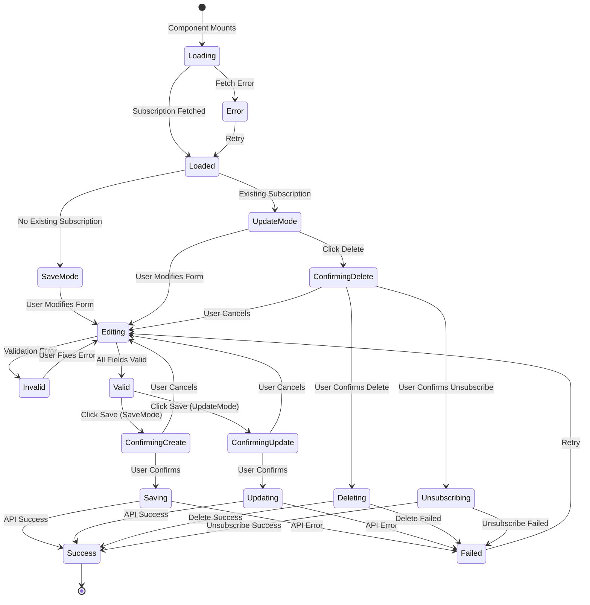
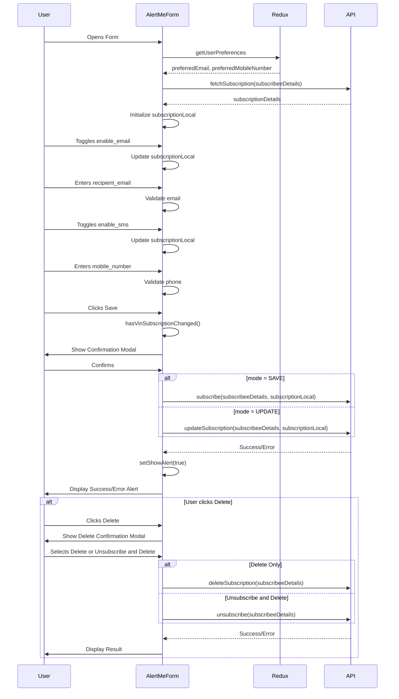
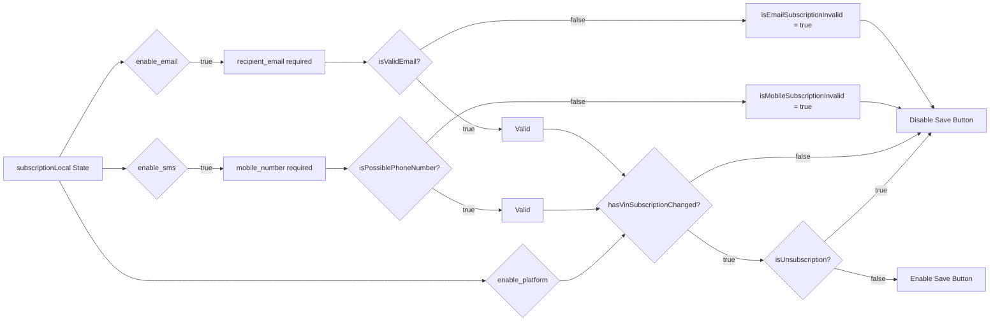

# Diagram: web/portal/src/shared/components/organisms/AlertMeForm.organism.js

> Auto-generated by Obscura crawlers

## Diagram 1

```mermaid
flowchart TD
    Start[Component Mounts] --> FetchSub[fetchSubscription]
    FetchSub --> CheckMode{subscriptionDetails exists?}
    CheckMode -->|Yes| UpdateMode[mode = UPDATE]
    CheckMode -->|No| SaveMode[mode = SAVE]
    UpdateMode --> InitLocal[Initialize subscriptionLocal with existing data]
    SaveMode --> InitLocal
    InitLocal --> UserInteract[User Interacts with Form]
    UserInteract --> CheckEmail{Enable Email?}
    CheckEmail -->|Yes| ValidateEmail{Valid Email?}
    CheckEmail -->|No| CheckSMS
    ValidateEmail -->|Invalid| EmailError[isEmailSubscriptionInvalid = true]
    ValidateEmail -->|Valid| CheckSMS
    EmailError --> CheckSMS
    CheckSMS{Enable SMS?}
    CheckSMS -->|Yes| ValidateSMS{Valid Phone?}
    CheckSMS -->|No| CheckPlatform
    ValidateSMS -->|Invalid| SMSError[isMobileSubscriptionInvalid = true]
    ValidateSMS -->|Valid| CheckPlatform
    SMSError --> CheckPlatform
    CheckPlatform{Enable Platform?}
    CheckPlatform --> CheckChanges{hasVinSubscriptionChanged?}
    CheckChanges -->|No| DisableSave[Disable Save Button]
    CheckChanges -->|Yes| CheckValidation{Any Validation Errors?}
    CheckValidation -->|Yes| DisableSave
    CheckValidation -->|No| EnableSave[Enable Save Button]
    EnableSave --> UserSave[User Clicks Save]
    UserSave --> ShowModal{Show Confirmation Modal}
    ShowModal --> UserConfirm{User Confirms?}
    UserConfirm -->|Yes| CheckModeAction{mode = SAVE or UPDATE?}
    UserConfirm -->|No| Cancel[Cancel]
    CheckModeAction -->|SAVE| CallSubscribe[subscribe API]
    CheckModeAction -->|UPDATE| CallUpdate[updateSubscription API]
    CallSubscribe --> OnFinish[onRequestFinished]
    CallUpdate --> OnFinish
    OnFinish --> ShowSuccess[Show Success Alert]
    ShowSuccess --> End[End]
    Cancel --> End
```

### SVG

<svg id="container" width="627.359375" xmlns="http://www.w3.org/2000/svg" class="flowchart" height="4277.921875" viewBox="0 0 627.359375 4277.921875" role="graphics-document document" aria-roledescription="flowchart-v2"><g><marker id="container_flowchart-v2-pointEnd" class="marker flowchart-v2" viewBox="0 0 10 10" refX="5" refY="5" markerUnits="userSpaceOnUse" markerWidth="8" markerHeight="8" orient="auto"><path d="M 0 0 L 10 5 L 0 10 z" class="arrowMarkerPath" style="stroke-width: 1; stroke-dasharray: 1, 0;"></path></marker><marker id="container_flowchart-v2-pointStart" class="marker flowchart-v2" viewBox="0 0 10 10" refX="4.5" refY="5" markerUnits="userSpaceOnUse" markerWidth="8" markerHeight="8" orient="auto"><path d="M 0 5 L 10 10 L 10 0 z" class="arrowMarkerPath" style="stroke-width: 1; stroke-dasharray: 1, 0;"></path></marker><marker id="container_flowchart-v2-circleEnd" class="marker flowchart-v2" viewBox="0 0 10 10" refX="11" refY="5" markerUnits="userSpaceOnUse" markerWidth="11" markerHeight="11" orient="auto"><circle cx="5" cy="5" r="5" class="arrowMarkerPath" style="stroke-width: 1; stroke-dasharray: 1, 0;"></circle></marker><marker id="container_flowchart-v2-circleStart" class="marker flowchart-v2" viewBox="0 0 10 10" refX="-1" refY="5" markerUnits="userSpaceOnUse" markerWidth="11" markerHeight="11" orient="auto"><circle cx="5" cy="5" r="5" class="arrowMarkerPath" style="stroke-width: 1; stroke-dasharray: 1, 0;"></circle></marker><marker id="container_flowchart-v2-crossEnd" class="marker cross flowchart-v2" viewBox="0 0 11 11" refX="12" refY="5.2" markerUnits="userSpaceOnUse" markerWidth="11" markerHeight="11" orient="auto"><path d="M 1,1 l 9,9 M 10,1 l -9,9" class="arrowMarkerPath" style="stroke-width: 2; stroke-dasharray: 1, 0;"></path></marker><marker id="container_flowchart-v2-crossStart" class="marker cross flowchart-v2" viewBox="0 0 11 11" refX="-1" refY="5.2" markerUnits="userSpaceOnUse" markerWidth="11" markerHeight="11" orient="auto"><path d="M 1,1 l 9,9 M 10,1 l -9,9" class="arrowMarkerPath" style="stroke-width: 2; stroke-dasharray: 1, 0;"></path></marker><g class="root"><g class="clusters"></g><g class="edgePaths"><path d="M236.848,62L236.848,66.167C236.848,70.333,236.848,78.667,236.848,86.333C236.848,94,236.848,101,236.848,104.5L236.848,108" id="L_Start_FetchSub_0" class="edge-thickness-normal edge-pattern-solid edge-thickness-normal edge-pattern-solid flowchart-link" style=";" data-edge="true" data-et="edge" data-id="L_Start_FetchSub_0" data-points="W3sieCI6MjM2Ljg0NzY1NjI1LCJ5Ijo2Mn0seyJ4IjoyMzYuODQ3NjU2MjUsInkiOjg3fSx7IngiOjIzNi44NDc2NTYyNSwieSI6MTEyfV0=" marker-end="url(#container_flowchart-v2-pointEnd)"></path><path d="M236.848,166L236.848,170.167C236.848,174.333,236.848,182.667,236.848,190.333C236.848,198,236.848,205,236.848,208.5L236.848,212" id="L_FetchSub_CheckMode_0" class="edge-thickness-normal edge-pattern-solid edge-thickness-normal edge-pattern-solid flowchart-link" style=";" data-edge="true" data-et="edge" data-id="L_FetchSub_CheckMode_0" data-points="W3sieCI6MjM2Ljg0NzY1NjI1LCJ5IjoxNjZ9LHsieCI6MjM2Ljg0NzY1NjI1LCJ5IjoxOTF9LHsieCI6MjM2Ljg0NzY1NjI1LCJ5IjoyMTZ9XQ==" marker-end="url(#container_flowchart-v2-pointEnd)"></path><path d="M187.552,414.064L178.021,428.447C168.489,442.829,149.426,471.594,139.895,491.477C130.363,511.359,130.363,522.359,130.363,527.859L130.363,533.359" id="L_CheckMode_UpdateMode_0" class="edge-thickness-normal edge-pattern-solid edge-thickness-normal edge-pattern-solid flowchart-link" style=";" data-edge="true" data-et="edge" data-id="L_CheckMode_UpdateMode_0" data-points="W3sieCI6MTg3LjU1MjI3NTM1MDM1OTY4LCJ5Ijo0MTQuMDYzOTk0MTAwMzU5N30seyJ4IjoxMzAuMzYzMjgxMjUsInkiOjUwMC4zNTkzNzV9LHsieCI6MTMwLjM2MzI4MTI1LCJ5Ijo1MzcuMzU5Mzc1fV0=" marker-end="url(#container_flowchart-v2-pointEnd)"></path><path d="M286.143,414.064L295.675,428.447C305.206,442.829,324.269,471.594,333.801,491.477C343.332,511.359,343.332,522.359,343.332,527.859L343.332,533.359" id="L_CheckMode_SaveMode_0" class="edge-thickness-normal edge-pattern-solid edge-thickness-normal edge-pattern-solid flowchart-link" style=";" data-edge="true" data-et="edge" data-id="L_CheckMode_SaveMode_0" data-points="W3sieCI6Mjg2LjE0MzAzNzE0OTY0MDMsInkiOjQxNC4wNjM5OTQxMDAzNTk3fSx7IngiOjM0My4zMzIwMzEyNSwieSI6NTAwLjM1OTM3NX0seyJ4IjozNDMuMzMyMDMxMjUsInkiOjUzNy4zNTkzNzV9XQ==" marker-end="url(#container_flowchart-v2-pointEnd)"></path><path d="M130.363,591.359L130.363,595.526C130.363,599.693,130.363,608.026,136.724,616.016C143.086,624.006,155.808,631.652,162.169,635.476L168.53,639.299" id="L_UpdateMode_InitLocal_0" class="edge-thickness-normal edge-pattern-solid edge-thickness-normal edge-pattern-solid flowchart-link" style=";" data-edge="true" data-et="edge" data-id="L_UpdateMode_InitLocal_0" data-points="W3sieCI6MTMwLjM2MzI4MTI1LCJ5Ijo1OTEuMzU5Mzc1fSx7IngiOjEzMC4zNjMyODEyNSwieSI6NjE2LjM1OTM3NX0seyJ4IjoxNzEuOTU4NzQwMjM0Mzc1LCJ5Ijo2NDEuMzU5Mzc1fV0=" marker-end="url(#container_flowchart-v2-pointEnd)"></path><path d="M343.332,591.359L343.332,595.526C343.332,599.693,343.332,608.026,336.971,616.016C330.61,624.006,317.887,631.652,311.526,635.476L305.165,639.299" id="L_SaveMode_InitLocal_0" class="edge-thickness-normal edge-pattern-solid edge-thickness-normal edge-pattern-solid flowchart-link" style=";" data-edge="true" data-et="edge" data-id="L_SaveMode_InitLocal_0" data-points="W3sieCI6MzQzLjMzMjAzMTI1LCJ5Ijo1OTEuMzU5Mzc1fSx7IngiOjM0My4zMzIwMzEyNSwieSI6NjE2LjM1OTM3NX0seyJ4IjozMDEuNzM2NTcyMjY1NjI1LCJ5Ijo2NDEuMzU5Mzc1fV0=" marker-end="url(#container_flowchart-v2-pointEnd)"></path><path d="M236.848,719.359L236.848,723.526C236.848,727.693,236.848,736.026,236.848,743.693C236.848,751.359,236.848,758.359,236.848,761.859L236.848,765.359" id="L_InitLocal_UserInteract_0" class="edge-thickness-normal edge-pattern-solid edge-thickness-normal edge-pattern-solid flowchart-link" style=";" data-edge="true" data-et="edge" data-id="L_InitLocal_UserInteract_0" data-points="W3sieCI6MjM2Ljg0NzY1NjI1LCJ5Ijo3MTkuMzU5Mzc1fSx7IngiOjIzNi44NDc2NTYyNSwieSI6NzQ0LjM1OTM3NX0seyJ4IjoyMzYuODQ3NjU2MjUsInkiOjc2OS4zNTkzNzV9XQ==" marker-end="url(#container_flowchart-v2-pointEnd)"></path><path d="M236.848,823.359L236.848,827.526C236.848,831.693,236.848,840.026,236.848,847.693C236.848,855.359,236.848,862.359,236.848,865.859L236.848,869.359" id="L_UserInteract_CheckEmail_0" class="edge-thickness-normal edge-pattern-solid edge-thickness-normal edge-pattern-solid flowchart-link" style=";" data-edge="true" data-et="edge" data-id="L_UserInteract_CheckEmail_0" data-points="W3sieCI6MjM2Ljg0NzY1NjI1LCJ5Ijo4MjMuMzU5Mzc1fSx7IngiOjIzNi44NDc2NTYyNSwieSI6ODQ4LjM1OTM3NX0seyJ4IjoyMzYuODQ3NjU2MjUsInkiOjg3My4zNTkzNzV9XQ==" marker-end="url(#container_flowchart-v2-pointEnd)"></path><path d="M261.259,1003.635L265.98,1013.87C270.7,1024.106,280.141,1044.576,284.862,1060.312C289.582,1076.047,289.582,1087.047,289.582,1092.547L289.582,1098.047" id="L_CheckEmail_ValidateEmail_0" class="edge-thickness-normal edge-pattern-solid edge-thickness-normal edge-pattern-solid flowchart-link" style=";" data-edge="true" data-et="edge" data-id="L_CheckEmail_ValidateEmail_0" data-points="W3sieCI6MjYxLjI1OTQzNTU2ODI0NTYsInkiOjEwMDMuNjM1MDk1NjgxNzU0NH0seyJ4IjoyODkuNTgyMDMxMjUsInkiOjEwNjUuMDQ2ODc1fSx7IngiOjI4OS41ODIwMzEyNSwieSI6MTEwMi4wNDY4NzV9XQ==" marker-end="url(#container_flowchart-v2-pointEnd)"></path><path d="M198.874,990.073L186.821,1002.569C174.769,1015.064,150.664,1040.056,138.611,1070.463C126.559,1100.87,126.559,1136.693,126.559,1172.516C126.559,1208.339,126.559,1244.161,126.559,1274.74C126.559,1305.318,126.559,1330.651,126.559,1353.984C126.559,1377.318,126.559,1398.651,133.002,1418.047C139.445,1437.443,152.332,1454.901,158.775,1463.63L165.219,1472.359" id="L_CheckEmail_CheckSMS_0" class="edge-thickness-normal edge-pattern-solid edge-thickness-normal edge-pattern-solid flowchart-link" style=";" data-edge="true" data-et="edge" data-id="L_CheckEmail_CheckSMS_0" data-points="W3sieCI6MTk4Ljg3MzgxOTgyNDIzNTc0LCJ5Ijo5OTAuMDczMDM4NTc0MjM1N30seyJ4IjoxMjYuNTU4NTkzNzUsInkiOjEwNjUuMDQ2ODc1fSx7IngiOjEyNi41NTg1OTM3NSwieSI6MTE3Mi41MTU2MjV9LHsieCI6MTI2LjU1ODU5Mzc1LCJ5IjoxMjc5Ljk4NDM3NX0seyJ4IjoxMjYuNTU4NTkzNzUsInkiOjEzNTUuOTg0Mzc1fSx7IngiOjEyNi41NTg1OTM3NSwieSI6MTQxOS45ODQzNzV9LHsieCI6MTY3LjU5NDM4MDkxMjg4NTksInkiOjE0NzUuNTc3NDk0MDg3MTE0fV0=" marker-end="url(#container_flowchart-v2-pointEnd)"></path><path d="M321.968,1210.598L331.803,1222.162C341.638,1233.727,361.307,1256.856,371.142,1273.92C380.977,1290.984,380.977,1301.984,380.977,1307.484L380.977,1312.984" id="L_ValidateEmail_EmailError_0" class="edge-thickness-normal edge-pattern-solid edge-thickness-normal edge-pattern-solid flowchart-link" style=";" data-edge="true" data-et="edge" data-id="L_ValidateEmail_EmailError_0" data-points="W3sieCI6MzIxLjk2ODM5NDA0OTMwODYsInkiOjEyMTAuNTk4MDEyMjAwNjkxNX0seyJ4IjozODAuOTc2NTYyNSwieSI6MTI3OS45ODQzNzV9LHsieCI6MzgwLjk3NjU2MjUsInkiOjEzMTYuOTg0Mzc1fV0=" marker-end="url(#container_flowchart-v2-pointEnd)"></path><path d="M257.196,1210.598L247.361,1222.162C237.526,1233.727,217.857,1256.856,208.022,1281.087C198.188,1305.318,198.188,1330.651,198.188,1353.984C198.188,1377.318,198.188,1398.651,198.188,1412.818C198.188,1426.984,198.188,1433.984,198.188,1437.484L198.188,1440.984" id="L_ValidateEmail_CheckSMS_0" class="edge-thickness-normal edge-pattern-solid edge-thickness-normal edge-pattern-solid flowchart-link" style=";" data-edge="true" data-et="edge" data-id="L_ValidateEmail_CheckSMS_0" data-points="W3sieCI6MjU3LjE5NTY2ODQ1MDY5MTQsInkiOjEyMTAuNTk4MDEyMjAwNjkxNX0seyJ4IjoxOTguMTg3NSwieSI6MTI3OS45ODQzNzV9LHsieCI6MTk4LjE4NzUsInkiOjEzNTUuOTg0Mzc1fSx7IngiOjE5OC4xODc1LCJ5IjoxNDE5Ljk4NDM3NX0seyJ4IjoxOTguMTg3NSwieSI6MTQ0NC45ODQzNzV9XQ==" marker-end="url(#container_flowchart-v2-pointEnd)"></path><path d="M380.977,1394.984L380.977,1399.151C380.977,1403.318,380.977,1411.651,358.943,1427.515C336.91,1443.378,292.844,1466.772,270.811,1478.469L248.778,1490.166" id="L_EmailError_CheckSMS_0" class="edge-thickness-normal edge-pattern-solid edge-thickness-normal edge-pattern-solid flowchart-link" style=";" data-edge="true" data-et="edge" data-id="L_EmailError_CheckSMS_0" data-points="W3sieCI6MzgwLjk3NjU2MjUsInkiOjEzOTQuOTg0Mzc1fSx7IngiOjM4MC45NzY1NjI1LCJ5IjoxNDE5Ljk4NDM3NX0seyJ4IjoyNDUuMjQ0Nzg4MTA0MDk1NywieSI6MTQ5Mi4wNDE2NjMxMDQwOTU3fV0=" marker-end="url(#container_flowchart-v2-pointEnd)"></path><path d="M222.071,1565.179L227.103,1575.327C232.136,1585.474,242.201,1605.768,247.233,1621.415C252.266,1637.063,252.266,1648.063,252.266,1653.563L252.266,1659.063" id="L_CheckSMS_ValidateSMS_0" class="edge-thickness-normal edge-pattern-solid edge-thickness-normal edge-pattern-solid flowchart-link" style=";" data-edge="true" data-et="edge" data-id="L_CheckSMS_ValidateSMS_0" data-points="W3sieCI6MjIyLjA3MDU1OTA4NDQ4NjgsInkiOjE1NjUuMTc5NDQwOTE1NTEzMn0seyJ4IjoyNTIuMjY1NjI1LCJ5IjoxNjI2LjA2MjV9LHsieCI6MjUyLjI2NTYyNSwieSI6MTY2My4wNjI1fV0=" marker-end="url(#container_flowchart-v2-pointEnd)"></path><path d="M161.714,1552.589L149.155,1564.834C136.597,1577.08,111.48,1601.571,98.922,1632.176C86.363,1662.781,86.363,1699.5,86.363,1736.219C86.363,1772.938,86.363,1809.656,86.363,1840.682C86.363,1871.708,86.363,1897.042,86.363,1920.375C86.363,1943.708,86.363,1965.042,92.391,1985.088C98.42,2005.134,110.476,2023.892,116.504,2033.272L122.532,2042.651" id="L_CheckSMS_CheckPlatform_0" class="edge-thickness-normal edge-pattern-solid edge-thickness-normal edge-pattern-solid flowchart-link" style=";" data-edge="true" data-et="edge" data-id="L_CheckSMS_CheckPlatform_0" data-points="W3sieCI6MTYxLjcxMzc1MTAwMDM4MDI2LCJ5IjoxNTUyLjU4ODc1MTAwMDM4MDJ9LHsieCI6ODYuMzYzMjgxMjUsInkiOjE2MjYuMDYyNX0seyJ4Ijo4Ni4zNjMyODEyNSwieSI6MTczNi4yMTg3NX0seyJ4Ijo4Ni4zNjMyODEyNSwieSI6MTg0Ni4zNzV9LHsieCI6ODYuMzYzMjgxMjUsInkiOjE5MjIuMzc1fSx7IngiOjg2LjM2MzI4MTI1LCJ5IjoxOTg2LjM3NX0seyJ4IjoxMjQuNjk1MDU0Nzk0MDE4NDcsInkiOjIwNDYuMDE1ODgyNzA1OTgxNX1d" marker-end="url(#container_flowchart-v2-pointEnd)"></path><path d="M288.452,1773.189L300.391,1785.387C312.33,1797.584,336.208,1821.98,348.147,1839.677C360.086,1857.375,360.086,1868.375,360.086,1873.875L360.086,1879.375" id="L_ValidateSMS_SMSError_0" class="edge-thickness-normal edge-pattern-solid edge-thickness-normal edge-pattern-solid flowchart-link" style=";" data-edge="true" data-et="edge" data-id="L_ValidateSMS_SMSError_0" data-points="W3sieCI6Mjg4LjQ1MTc2MTkyMTYxNTcsInkiOjE3NzMuMTg4ODYzMDc4Mzg0Mn0seyJ4IjozNjAuMDg1OTM3NSwieSI6MTg0Ni4zNzV9LHsieCI6MzYwLjA4NTkzNzUsInkiOjE4ODMuMzc1fV0=" marker-end="url(#container_flowchart-v2-pointEnd)"></path><path d="M221.93,1779.039L213.979,1790.262C206.029,1801.485,190.128,1823.93,182.177,1847.819C174.227,1871.708,174.227,1897.042,174.227,1920.375C174.227,1943.708,174.227,1965.042,173.542,1980.925C172.858,1996.808,171.49,2007.241,170.806,2012.458L170.122,2017.675" id="L_ValidateSMS_CheckPlatform_0" class="edge-thickness-normal edge-pattern-solid edge-thickness-normal edge-pattern-solid flowchart-link" style=";" data-edge="true" data-et="edge" data-id="L_ValidateSMS_CheckPlatform_0" data-points="W3sieCI6MjIxLjkyOTg3OTE3MjAyODczLCJ5IjoxNzc5LjAzOTI1NDE3MjAyODd9LHsieCI6MTc0LjIyNjU2MjUsInkiOjE4NDYuMzc1fSx7IngiOjE3NC4yMjY1NjI1LCJ5IjoxOTIyLjM3NX0seyJ4IjoxNzQuMjI2NTYyNSwieSI6MTk4Ni4zNzV9LHsieCI6MTY5LjYwMTQ5MjE2NDIxMzE0LCJ5IjoyMDIxLjY0MDU1NDY2NDIxMzF9XQ==" marker-end="url(#container_flowchart-v2-pointEnd)"></path><path d="M360.086,1961.375L360.086,1965.542C360.086,1969.708,360.086,1978.042,336.634,1995.472C313.181,2012.903,266.276,2039.431,242.824,2052.695L219.371,2065.96" id="L_SMSError_CheckPlatform_0" class="edge-thickness-normal edge-pattern-solid edge-thickness-normal edge-pattern-solid flowchart-link" style=";" data-edge="true" data-et="edge" data-id="L_SMSError_CheckPlatform_0" data-points="W3sieCI6MzYwLjA4NTkzNzUsInkiOjE5NjEuMzc1fSx7IngiOjM2MC4wODU5Mzc1LCJ5IjoxOTg2LjM3NX0seyJ4IjoyMTUuODg5NjYxMTgxOTIxLCJ5IjoyMDY3LjkyODcyMzY4MTkyMX1d" marker-end="url(#container_flowchart-v2-pointEnd)"></path><path d="M159.336,2188.453L159.336,2192.62C159.336,2196.786,159.336,2205.12,159.336,2212.786C159.336,2220.453,159.336,2227.453,159.336,2230.953L159.336,2234.453" id="L_CheckPlatform_CheckChanges_0" class="edge-thickness-normal edge-pattern-solid edge-thickness-normal edge-pattern-solid flowchart-link" style=";" data-edge="true" data-et="edge" data-id="L_CheckPlatform_CheckChanges_0" data-points="W3sieCI6MTU5LjMzNTkzNzUsInkiOjIxODguNDUzMTI1fSx7IngiOjE1OS4zMzU5Mzc1LCJ5IjoyMjEzLjQ1MzEyNX0seyJ4IjoxNTkuMzM1OTM3NSwieSI6MjIzOC40NTMxMjV9XQ==" marker-end="url(#container_flowchart-v2-pointEnd)"></path><path d="M122.717,2465.834L118.006,2478.104C113.296,2490.374,103.874,2514.913,99.164,2551.013C94.453,2587.112,94.453,2634.771,94.453,2682.43C94.453,2730.089,94.453,2777.747,95.834,2807.097C97.216,2836.446,99.978,2847.486,101.36,2853.006L102.741,2858.526" id="L_CheckChanges_DisableSave_0" class="edge-thickness-normal edge-pattern-solid edge-thickness-normal edge-pattern-solid flowchart-link" style=";" data-edge="true" data-et="edge" data-id="L_CheckChanges_DisableSave_0" data-points="W3sieCI6MTIyLjcxNzAzNzgxMDY1MjM3LCJ5IjoyNDY1LjgzNDIyNTMxMDY1MjV9LHsieCI6OTQuNDUzMTI1LCJ5IjoyNTM5LjQ1MzEyNX0seyJ4Ijo5NC40NTMxMjUsInkiOjI2ODIuNDI5Njg3NX0seyJ4Ijo5NC40NTMxMjUsInkiOjI4MjUuNDA2MjV9LHsieCI6MTAzLjcxMjE1ODIwMzEyNSwieSI6Mjg2Mi40MDYyNX1d" marker-end="url(#container_flowchart-v2-pointEnd)"></path><path d="M225.801,2435.988L243.29,2453.232C260.779,2470.476,295.757,2504.965,313.245,2527.709C330.734,2550.453,330.734,2561.453,330.734,2566.953L330.734,2572.453" id="L_CheckChanges_CheckValidation_0" class="edge-thickness-normal edge-pattern-solid edge-thickness-normal edge-pattern-solid flowchart-link" style=";" data-edge="true" data-et="edge" data-id="L_CheckChanges_CheckValidation_0" data-points="W3sieCI6MjI1LjgwMDk3MTU4MjMwMjQ1LCJ5IjoyNDM1Ljk4ODA5MDkxNzY5Nzd9LHsieCI6MzMwLjczNDM3NSwieSI6MjUzOS40NTMxMjV9LHsieCI6MzMwLjczNDM3NSwieSI6MjU3Ni40NTMxMjV9XQ==" marker-end="url(#container_flowchart-v2-pointEnd)"></path><path d="M283.499,2741.171L272.209,2755.21C260.92,2769.249,238.341,2797.328,217.475,2817.187C196.61,2837.047,177.459,2848.688,167.883,2854.508L158.307,2860.329" id="L_CheckValidation_DisableSave_0" class="edge-thickness-normal edge-pattern-solid edge-thickness-normal edge-pattern-solid flowchart-link" style=";" data-edge="true" data-et="edge" data-id="L_CheckValidation_DisableSave_0" data-points="W3sieCI6MjgzLjQ5ODY5NDQ2NjAwMjg2LCJ5IjoyNzQxLjE3MDU2OTQ2NjAwMjd9LHsieCI6MjE1Ljc2MTcxODc1LCJ5IjoyODI1LjQwNjI1fSx7IngiOjE1NC44ODkyMjExOTE0MDYyNSwieSI6Mjg2Mi40MDYyNX1d" marker-end="url(#container_flowchart-v2-pointEnd)"></path><path d="M350.358,2768.782L352.503,2778.22C354.648,2787.657,358.937,2806.532,361.082,2821.469C363.227,2836.406,363.227,2847.406,363.227,2852.906L363.227,2858.406" id="L_CheckValidation_EnableSave_0" class="edge-thickness-normal edge-pattern-solid edge-thickness-normal edge-pattern-solid flowchart-link" style=";" data-edge="true" data-et="edge" data-id="L_CheckValidation_EnableSave_0" data-points="W3sieCI6MzUwLjM1ODQ0MTA0Nzk3NDE3LCJ5IjoyNzY4Ljc4MjE4Mzk1MjAyNTd9LHsieCI6MzYzLjIyNjU2MjUsInkiOjI4MjUuNDA2MjV9LHsieCI6MzYzLjIyNjU2MjUsInkiOjI4NjIuNDA2MjV9XQ==" marker-end="url(#container_flowchart-v2-pointEnd)"></path><path d="M363.227,2916.406L363.227,2920.573C363.227,2924.74,363.227,2933.073,363.227,2940.74C363.227,2948.406,363.227,2955.406,363.227,2958.906L363.227,2962.406" id="L_EnableSave_UserSave_0" class="edge-thickness-normal edge-pattern-solid edge-thickness-normal edge-pattern-solid flowchart-link" style=";" data-edge="true" data-et="edge" data-id="L_EnableSave_UserSave_0" data-points="W3sieCI6MzYzLjIyNjU2MjUsInkiOjI5MTYuNDA2MjV9LHsieCI6MzYzLjIyNjU2MjUsInkiOjI5NDEuNDA2MjV9LHsieCI6MzYzLjIyNjU2MjUsInkiOjI5NjYuNDA2MjV9XQ==" marker-end="url(#container_flowchart-v2-pointEnd)"></path><path d="M363.227,3020.406L363.227,3024.573C363.227,3028.74,363.227,3037.073,363.227,3044.74C363.227,3052.406,363.227,3059.406,363.227,3062.906L363.227,3066.406" id="L_UserSave_ShowModal_0" class="edge-thickness-normal edge-pattern-solid edge-thickness-normal edge-pattern-solid flowchart-link" style=";" data-edge="true" data-et="edge" data-id="L_UserSave_ShowModal_0" data-points="W3sieCI6MzYzLjIyNjU2MjUsInkiOjMwMjAuNDA2MjV9LHsieCI6MzYzLjIyNjU2MjUsInkiOjMwNDUuNDA2MjV9LHsieCI6MzYzLjIyNjU2MjUsInkiOjMwNzAuNDA2MjV9XQ==" marker-end="url(#container_flowchart-v2-pointEnd)"></path><path d="M363.227,3310.563L363.227,3314.729C363.227,3318.896,363.227,3327.229,363.227,3334.896C363.227,3342.563,363.227,3349.563,363.227,3353.063L363.227,3356.563" id="L_ShowModal_UserConfirm_0" class="edge-thickness-normal edge-pattern-solid edge-thickness-normal edge-pattern-solid flowchart-link" style=";" data-edge="true" data-et="edge" data-id="L_ShowModal_UserConfirm_0" data-points="W3sieCI6MzYzLjIyNjU2MjUsInkiOjMzMTAuNTYyNX0seyJ4IjozNjMuMjI2NTYyNSwieSI6MzMzNS41NjI1fSx7IngiOjM2My4yMjY1NjI1LCJ5IjozMzYwLjU2MjV9XQ==" marker-end="url(#container_flowchart-v2-pointEnd)"></path><path d="M325.801,3485.043L315.136,3497.447C304.47,3509.852,283.139,3534.66,272.474,3552.564C261.809,3570.469,261.809,3581.469,261.809,3586.969L261.809,3592.469" id="L_UserConfirm_CheckModeAction_0" class="edge-thickness-normal edge-pattern-solid edge-thickness-normal edge-pattern-solid flowchart-link" style=";" data-edge="true" data-et="edge" data-id="L_UserConfirm_CheckModeAction_0" data-points="W3sieCI6MzI1LjgwMDkzMTk3OTk1ODcsInkiOjM0ODUuMDQzMTE5NDc5OTU4NX0seyJ4IjoyNjEuODA4NTkzNzUsInkiOjM1NTkuNDY4NzV9LHsieCI6MjYxLjgwODU5Mzc1LCJ5IjozNTk2LjQ2ODc1fV0=" marker-end="url(#container_flowchart-v2-pointEnd)"></path><path d="M414.366,3471.33L439.562,3486.02C464.759,3500.709,515.153,3530.089,540.35,3570.4C565.547,3610.711,565.547,3661.953,565.547,3713.195C565.547,3764.438,565.547,3815.68,565.547,3851.967C565.547,3888.255,565.547,3909.589,565.547,3928.922C565.547,3948.255,565.547,3965.589,565.547,3982.922C565.547,4000.255,565.547,4017.589,565.547,4034.922C565.547,4052.255,565.547,4069.589,565.547,4081.755C565.547,4093.922,565.547,4100.922,565.547,4104.422L565.547,4107.922" id="L_UserConfirm_Cancel_0" class="edge-thickness-normal edge-pattern-solid edge-thickness-normal edge-pattern-solid flowchart-link" style=";" data-edge="true" data-et="edge" data-id="L_UserConfirm_Cancel_0" data-points="W3sieCI6NDE0LjM2NTU1Njk2NTc4ODUsInkiOjM0NzEuMzI5NzU1NTM0MjExNX0seyJ4Ijo1NjUuNTQ2ODc1LCJ5IjozNTU5LjQ2ODc1fSx7IngiOjU2NS41NDY4NzUsInkiOjM3MTMuMTk1MzEyNX0seyJ4Ijo1NjUuNTQ2ODc1LCJ5IjozODY2LjkyMTg3NX0seyJ4Ijo1NjUuNTQ2ODc1LCJ5IjozOTMwLjkyMTg3NX0seyJ4Ijo1NjUuNTQ2ODc1LCJ5IjozOTgyLjkyMTg3NX0seyJ4Ijo1NjUuNTQ2ODc1LCJ5Ijo0MDM0LjkyMTg3NX0seyJ4Ijo1NjUuNTQ2ODc1LCJ5Ijo0MDg2LjkyMTg3NX0seyJ4Ijo1NjUuNTQ2ODc1LCJ5Ijo0MTExLjkyMTg3NX1d" marker-end="url(#container_flowchart-v2-pointEnd)"></path><path d="M210.139,3778.252L198.401,3793.03C186.664,3807.809,163.189,3837.365,151.452,3857.644C139.715,3877.922,139.715,3888.922,139.715,3894.422L139.715,3899.922" id="L_CheckModeAction_CallSubscribe_0" class="edge-thickness-normal edge-pattern-solid edge-thickness-normal edge-pattern-solid flowchart-link" style=";" data-edge="true" data-et="edge" data-id="L_CheckModeAction_CallSubscribe_0" data-points="W3sieCI6MjEwLjEzODc4MTU3NzUwMzE4LCJ5IjozNzc4LjI1MjA2MjgyNzUwMzN9LHsieCI6MTM5LjcxNDg0Mzc1LCJ5IjozODY2LjkyMTg3NX0seyJ4IjoxMzkuNzE0ODQzNzUsInkiOjM5MDMuOTIxODc1fV0=" marker-end="url(#container_flowchart-v2-pointEnd)"></path><path d="M313.478,3778.252L325.216,3793.03C336.953,3807.809,360.428,3837.365,372.165,3857.644C383.902,3877.922,383.902,3888.922,383.902,3894.422L383.902,3899.922" id="L_CheckModeAction_CallUpdate_0" class="edge-thickness-normal edge-pattern-solid edge-thickness-normal edge-pattern-solid flowchart-link" style=";" data-edge="true" data-et="edge" data-id="L_CheckModeAction_CallUpdate_0" data-points="W3sieCI6MzEzLjQ3ODQwNTkyMjQ5NjgsInkiOjM3NzguMjUyMDYyODI3NTAzM30seyJ4IjozODMuOTAyMzQzNzUsInkiOjM4NjYuOTIxODc1fSx7IngiOjM4My45MDIzNDM3NSwieSI6MzkwMy45MjE4NzV9XQ==" marker-end="url(#container_flowchart-v2-pointEnd)"></path><path d="M139.715,3957.922L139.715,3962.089C139.715,3966.255,139.715,3974.589,148.885,3982.661C158.054,3990.733,176.394,3998.544,185.564,4002.449L194.734,4006.355" id="L_CallSubscribe_OnFinish_0" class="edge-thickness-normal edge-pattern-solid edge-thickness-normal edge-pattern-solid flowchart-link" style=";" data-edge="true" data-et="edge" data-id="L_CallSubscribe_OnFinish_0" data-points="W3sieCI6MTM5LjcxNDg0Mzc1LCJ5IjozOTU3LjkyMTg3NX0seyJ4IjoxMzkuNzE0ODQzNzUsInkiOjM5ODIuOTIxODc1fSx7IngiOjE5OC40MTM3NjIwMTkyMzA3NywieSI6NDAwNy45MjE4NzV9XQ==" marker-end="url(#container_flowchart-v2-pointEnd)"></path><path d="M383.902,3957.922L383.902,3962.089C383.902,3966.255,383.902,3974.589,374.733,3982.661C365.563,3990.733,347.223,3998.544,338.053,4002.449L328.884,4006.355" id="L_CallUpdate_OnFinish_0" class="edge-thickness-normal edge-pattern-solid edge-thickness-normal edge-pattern-solid flowchart-link" style=";" data-edge="true" data-et="edge" data-id="L_CallUpdate_OnFinish_0" data-points="W3sieCI6MzgzLjkwMjM0Mzc1LCJ5IjozOTU3LjkyMTg3NX0seyJ4IjozODMuOTAyMzQzNzUsInkiOjM5ODIuOTIxODc1fSx7IngiOjMyNS4yMDM0MjU0ODA3NjkyLCJ5Ijo0MDA3LjkyMTg3NX1d" marker-end="url(#container_flowchart-v2-pointEnd)"></path><path d="M261.809,4061.922L261.809,4066.089C261.809,4070.255,261.809,4078.589,261.809,4086.255C261.809,4093.922,261.809,4100.922,261.809,4104.422L261.809,4107.922" id="L_OnFinish_ShowSuccess_0" class="edge-thickness-normal edge-pattern-solid edge-thickness-normal edge-pattern-solid flowchart-link" style=";" data-edge="true" data-et="edge" data-id="L_OnFinish_ShowSuccess_0" data-points="W3sieCI6MjYxLjgwODU5Mzc1LCJ5Ijo0MDYxLjkyMTg3NX0seyJ4IjoyNjEuODA4NTkzNzUsInkiOjQwODYuOTIxODc1fSx7IngiOjI2MS44MDg1OTM3NSwieSI6NDExMS45MjE4NzV9XQ==" marker-end="url(#container_flowchart-v2-pointEnd)"></path><path d="M261.809,4165.922L261.809,4170.089C261.809,4174.255,261.809,4182.589,270.838,4191.385C279.868,4200.182,297.928,4209.441,306.958,4214.071L315.987,4218.701" id="L_ShowSuccess_End_0" class="edge-thickness-normal edge-pattern-solid edge-thickness-normal edge-pattern-solid flowchart-link" style=";" data-edge="true" data-et="edge" data-id="L_ShowSuccess_End_0" data-points="W3sieCI6MjYxLjgwODU5Mzc1LCJ5Ijo0MTY1LjkyMTg3NX0seyJ4IjoyNjEuODA4NTkzNzUsInkiOjQxOTAuOTIxODc1fSx7IngiOjMxOS41NDY4NzUsInkiOjQyMjAuNTI2MDAzOTUyNzR9XQ==" marker-end="url(#container_flowchart-v2-pointEnd)"></path><path d="M565.547,4165.922L565.547,4170.089C565.547,4174.255,565.547,4182.589,539.752,4193.385C513.958,4204.181,462.369,4217.44,436.575,4224.07L410.78,4230.7" id="L_Cancel_End_0" class="edge-thickness-normal edge-pattern-solid edge-thickness-normal edge-pattern-solid flowchart-link" style=";" data-edge="true" data-et="edge" data-id="L_Cancel_End_0" data-points="W3sieCI6NTY1LjU0Njg3NSwieSI6NDE2NS45MjE4NzV9LHsieCI6NTY1LjU0Njg3NSwieSI6NDE5MC45MjE4NzV9LHsieCI6NDA2LjkwNjI1LCJ5Ijo0MjMxLjY5NTQwMDg5MTAzfV0=" marker-end="url(#container_flowchart-v2-pointEnd)"></path></g><g class="edgeLabels"><g class="edgeLabel"><g class="label" data-id="L_Start_FetchSub_0" transform="translate(0, 0)"><foreignObject width="0" height="0">

</foreignObject></g></g><g class="edgeLabel"><g class="label" data-id="L_FetchSub_CheckMode_0" transform="translate(0, 0)"><foreignObject width="0" height="0">

</foreignObject></g></g><g class="edgeLabel" transform="translate(130.36328125, 500.359375)"><g class="label" data-id="L_CheckMode_UpdateMode_0" transform="translate(-12.03125, -12)"><foreignObject width="24.0625" height="24">

Yes

</foreignObject></g></g><g class="edgeLabel" transform="translate(343.33203125, 500.359375)"><g class="label" data-id="L_CheckMode_SaveMode_0" transform="translate(-10.140625, -12)"><foreignObject width="20.28125" height="24">

No

</foreignObject></g></g><g class="edgeLabel"><g class="label" data-id="L_UpdateMode_InitLocal_0" transform="translate(0, 0)"><foreignObject width="0" height="0">

</foreignObject></g></g><g class="edgeLabel"><g class="label" data-id="L_SaveMode_InitLocal_0" transform="translate(0, 0)"><foreignObject width="0" height="0">

</foreignObject></g></g><g class="edgeLabel"><g class="label" data-id="L_InitLocal_UserInteract_0" transform="translate(0, 0)"><foreignObject width="0" height="0">

</foreignObject></g></g><g class="edgeLabel"><g class="label" data-id="L_UserInteract_CheckEmail_0" transform="translate(0, 0)"><foreignObject width="0" height="0">

</foreignObject></g></g><g class="edgeLabel" transform="translate(289.58203125, 1065.046875)"><g class="label" data-id="L_CheckEmail_ValidateEmail_0" transform="translate(-12.03125, -12)"><foreignObject width="24.0625" height="24">

Yes

</foreignObject></g></g><g class="edgeLabel" transform="translate(126.55859375, 1279.984375)"><g class="label" data-id="L_CheckEmail_CheckSMS_0" transform="translate(-10.140625, -12)"><foreignObject width="20.28125" height="24">

No

</foreignObject></g></g><g class="edgeLabel" transform="translate(380.9765625, 1279.984375)"><g class="label" data-id="L_ValidateEmail_EmailError_0" transform="translate(-24.4609375, -12)"><foreignObject width="48.921875" height="24">

Invalid

</foreignObject></g></g><g class="edgeLabel" transform="translate(198.1875, 1355.984375)"><g class="label" data-id="L_ValidateEmail_CheckSMS_0" transform="translate(-17.7890625, -12)"><foreignObject width="35.578125" height="24">

Valid

</foreignObject></g></g><g class="edgeLabel"><g class="label" data-id="L_EmailError_CheckSMS_0" transform="translate(0, 0)"><foreignObject width="0" height="0">

</foreignObject></g></g><g class="edgeLabel" transform="translate(252.265625, 1626.0625)"><g class="label" data-id="L_CheckSMS_ValidateSMS_0" transform="translate(-12.03125, -12)"><foreignObject width="24.0625" height="24">

Yes

</foreignObject></g></g><g class="edgeLabel" transform="translate(86.36328125, 1846.375)"><g class="label" data-id="L_CheckSMS_CheckPlatform_0" transform="translate(-10.140625, -12)"><foreignObject width="20.28125" height="24">

No

</foreignObject></g></g><g class="edgeLabel" transform="translate(360.0859375, 1846.375)"><g class="label" data-id="L_ValidateSMS_SMSError_0" transform="translate(-24.4609375, -12)"><foreignObject width="48.921875" height="24">

Invalid

</foreignObject></g></g><g class="edgeLabel" transform="translate(174.2265625, 1922.375)"><g class="label" data-id="L_ValidateSMS_CheckPlatform_0" transform="translate(-17.7890625, -12)"><foreignObject width="35.578125" height="24">

Valid

</foreignObject></g></g><g class="edgeLabel"><g class="label" data-id="L_SMSError_CheckPlatform_0" transform="translate(0, 0)"><foreignObject width="0" height="0">

</foreignObject></g></g><g class="edgeLabel"><g class="label" data-id="L_CheckPlatform_CheckChanges_0" transform="translate(0, 0)"><foreignObject width="0" height="0">

</foreignObject></g></g><g class="edgeLabel" transform="translate(94.453125, 2682.4296875)"><g class="label" data-id="L_CheckChanges_DisableSave_0" transform="translate(-10.140625, -12)"><foreignObject width="20.28125" height="24">

No

</foreignObject></g></g><g class="edgeLabel" transform="translate(330.734375, 2539.453125)"><g class="label" data-id="L_CheckChanges_CheckValidation_0" transform="translate(-12.03125, -12)"><foreignObject width="24.0625" height="24">

Yes

</foreignObject></g></g><g class="edgeLabel" transform="translate(227.31012, 2811.04501)"><g class="label" data-id="L_CheckValidation_DisableSave_0" transform="translate(-12.03125, -12)"><foreignObject width="24.0625" height="24">

Yes

</foreignObject></g></g><g class="edgeLabel" transform="translate(363.2265625, 2825.40625)"><g class="label" data-id="L_CheckValidation_EnableSave_0" transform="translate(-10.140625, -12)"><foreignObject width="20.28125" height="24">

No

</foreignObject></g></g><g class="edgeLabel"><g class="label" data-id="L_EnableSave_UserSave_0" transform="translate(0, 0)"><foreignObject width="0" height="0">

</foreignObject></g></g><g class="edgeLabel"><g class="label" data-id="L_UserSave_ShowModal_0" transform="translate(0, 0)"><foreignObject width="0" height="0">

</foreignObject></g></g><g class="edgeLabel"><g class="label" data-id="L_ShowModal_UserConfirm_0" transform="translate(0, 0)"><foreignObject width="0" height="0">

</foreignObject></g></g><g class="edgeLabel" transform="translate(261.80859375, 3559.46875)"><g class="label" data-id="L_UserConfirm_CheckModeAction_0" transform="translate(-12.03125, -12)"><foreignObject width="24.0625" height="24">

Yes

</foreignObject></g></g><g class="edgeLabel" transform="translate(565.546875, 3930.921875)"><g class="label" data-id="L_UserConfirm_Cancel_0" transform="translate(-10.140625, -12)"><foreignObject width="20.28125" height="24">

No

</foreignObject></g></g><g class="edgeLabel" transform="translate(139.71484375, 3866.921875)"><g class="label" data-id="L_CheckModeAction_CallSubscribe_0" transform="translate(-17.5234375, -12)"><foreignObject width="35.046875" height="24">

SAVE

</foreignObject></g></g><g class="edgeLabel" transform="translate(383.90234375, 3866.921875)"><g class="label" data-id="L_CheckModeAction_CallUpdate_0" transform="translate(-27.6171875, -12)"><foreignObject width="55.234375" height="24">

UPDATE

</foreignObject></g></g><g class="edgeLabel"><g class="label" data-id="L_CallSubscribe_OnFinish_0" transform="translate(0, 0)"><foreignObject width="0" height="0">

</foreignObject></g></g><g class="edgeLabel"><g class="label" data-id="L_CallUpdate_OnFinish_0" transform="translate(0, 0)"><foreignObject width="0" height="0">

</foreignObject></g></g><g class="edgeLabel"><g class="label" data-id="L_OnFinish_ShowSuccess_0" transform="translate(0, 0)"><foreignObject width="0" height="0">

</foreignObject></g></g><g class="edgeLabel"><g class="label" data-id="L_ShowSuccess_End_0" transform="translate(0, 0)"><foreignObject width="0" height="0">

</foreignObject></g></g><g class="edgeLabel"><g class="label" data-id="L_Cancel_End_0" transform="translate(0, 0)"><foreignObject width="0" height="0">

</foreignObject></g></g></g><g class="nodes"><g class="node default" id="flowchart-Start-0" transform="translate(236.84765625, 35)"><rect class="basic label-container" style="" x="-100.8828125" y="-27" width="201.765625" height="54"></rect><g class="label" style="" transform="translate(-70.8828125, -12)"><rect></rect><foreignObject width="141.765625" height="24">

Component Mounts

</foreignObject></g></g><g class="node default" id="flowchart-FetchSub-1" transform="translate(236.84765625, 139)"><rect class="basic label-container" style="" x="-94.171875" y="-27" width="188.34375" height="54"></rect><g class="label" style="" transform="translate(-64.171875, -12)"><rect></rect><foreignObject width="128.34375" height="24">

fetchSubscription

</foreignObject></g></g><g class="node default" id="flowchart-CheckMode-3" transform="translate(236.84765625, 339.6796875)"><polygon points="123.6796875,0 247.359375,-123.6796875 123.6796875,-247.359375 0,-123.6796875" class="label-container" transform="translate(-123.1796875, 123.6796875)"></polygon><g class="label" style="" transform="translate(-96.6796875, -12)"><rect></rect><foreignObject width="193.359375" height="24">

subscriptionDetails exists?

</foreignObject></g></g><g class="node default" id="flowchart-UpdateMode-5" transform="translate(130.36328125, 564.359375)"><rect class="basic label-container" style="" x="-86.53125" y="-27" width="173.0625" height="54"></rect><g class="label" style="" transform="translate(-56.53125, -12)"><rect></rect><foreignObject width="113.0625" height="24">

mode = UPDATE

</foreignObject></g></g><g class="node default" id="flowchart-SaveMode-7" transform="translate(343.33203125, 564.359375)"><rect class="basic label-container" style="" x="-76.4375" y="-27" width="152.875" height="54"></rect><g class="label" style="" transform="translate(-46.4375, -12)"><rect></rect><foreignObject width="92.875" height="24">

mode = SAVE

</foreignObject></g></g><g class="node default" id="flowchart-InitLocal-9" transform="translate(236.84765625, 680.359375)"><rect class="basic label-container" style="" x="-130" y="-39" width="260" height="78"></rect><g class="label" style="" transform="translate(-100, -24)"><rect></rect><foreignObject width="200" height="48">

Initialize subscriptionLocal with existing data

</foreignObject></g></g><g class="node default" id="flowchart-UserInteract-13" transform="translate(236.84765625, 796.359375)"><rect class="basic label-container" style="" x="-118.421875" y="-27" width="236.84375" height="54"></rect><g class="label" style="" transform="translate(-88.421875, -12)"><rect></rect><foreignObject width="176.84375" height="24">

User Interacts with Form

</foreignObject></g></g><g class="node default" id="flowchart-CheckEmail-15" transform="translate(236.84765625, 950.703125)"><polygon points="77.34375,0 154.6875,-77.34375 77.34375,-154.6875 0,-77.34375" class="label-container" transform="translate(-76.84375, 77.34375)"></polygon><g class="label" style="" transform="translate(-50.34375, -12)"><rect></rect><foreignObject width="100.6875" height="24">

Enable Email?

</foreignObject></g></g><g class="node default" id="flowchart-ValidateEmail-17" transform="translate(289.58203125, 1172.515625)"><polygon points="70.46875,0 140.9375,-70.46875 70.46875,-140.9375 0,-70.46875" class="label-container" transform="translate(-69.96875, 70.46875)"></polygon><g class="label" style="" transform="translate(-43.46875, -12)"><rect></rect><foreignObject width="86.9375" height="24">

Valid Email?

</foreignObject></g></g><g class="node default" id="flowchart-CheckSMS-19" transform="translate(198.1875, 1517.0234375)"><polygon points="72.0390625,0 144.078125,-72.0390625 72.0390625,-144.078125 0,-72.0390625" class="label-container" transform="translate(-71.5390625, 72.0390625)"></polygon><g class="label" style="" transform="translate(-45.0390625, -12)"><rect></rect><foreignObject width="90.078125" height="24">

Enable SMS?

</foreignObject></g></g><g class="node default" id="flowchart-EmailError-21" transform="translate(380.9765625, 1355.984375)"><rect class="basic label-container" style="" x="-130" y="-39" width="260" height="78"></rect><g class="label" style="" transform="translate(-100, -24)"><rect></rect><foreignObject width="200" height="48">

isEmailSubscriptionInvalid = true

</foreignObject></g></g><g class="node default" id="flowchart-ValidateSMS-28" transform="translate(252.265625, 1736.21875)"><polygon points="73.15625,0 146.3125,-73.15625 73.15625,-146.3125 0,-73.15625" class="label-container" transform="translate(-72.65625, 73.15625)"></polygon><g class="label" style="" transform="translate(-46.15625, -12)"><rect></rect><foreignObject width="92.3125" height="24">

Valid Phone?

</foreignObject></g></g><g class="node default" id="flowchart-CheckPlatform-30" transform="translate(159.3359375, 2099.9140625)"><polygon points="88.5390625,0 177.078125,-88.5390625 88.5390625,-177.078125 0,-88.5390625" class="label-container" transform="translate(-88.0390625, 88.5390625)"></polygon><g class="label" style="" transform="translate(-61.5390625, -12)"><rect></rect><foreignObject width="123.078125" height="24">

Enable Platform?

</foreignObject></g></g><g class="node default" id="flowchart-SMSError-32" transform="translate(360.0859375, 1922.375)"><rect class="basic label-container" style="" x="-133.0703125" y="-39" width="266.140625" height="78"></rect><g class="label" style="" transform="translate(-103.0703125, -24)"><rect></rect><foreignObject width="206.140625" height="48">

isMobileSubscriptionInvalid = true

</foreignObject></g></g><g class="node default" id="flowchart-CheckChanges-39" transform="translate(159.3359375, 2370.453125)"><polygon points="132,0 264,-132 132,-264 0,-132" class="label-container" transform="translate(-131.5, 132)"></polygon><g class="label" style="" transform="translate(-105, -12)"><rect></rect><foreignObject width="210" height="24">

hasVinSubscriptionChanged?

</foreignObject></g></g><g class="node default" id="flowchart-DisableSave-41" transform="translate(110.46875, 2889.40625)"><rect class="basic label-container" style="" x="-102.46875" y="-27" width="204.9375" height="54"></rect><g class="label" style="" transform="translate(-72.46875, -12)"><rect></rect><foreignObject width="144.9375" height="24">

Disable Save Button

</foreignObject></g></g><g class="node default" id="flowchart-CheckValidation-43" transform="translate(330.734375, 2682.4296875)"><polygon points="105.9765625,0 211.953125,-105.9765625 105.9765625,-211.953125 0,-105.9765625" class="label-container" transform="translate(-105.4765625, 105.9765625)"></polygon><g class="label" style="" transform="translate(-78.9765625, -12)"><rect></rect><foreignObject width="157.953125" height="24">

Any Validation Errors?

</foreignObject></g></g><g class="node default" id="flowchart-EnableSave-47" transform="translate(363.2265625, 2889.40625)"><rect class="basic label-container" style="" x="-100.2890625" y="-27" width="200.578125" height="54"></rect><g class="label" style="" transform="translate(-70.2890625, -12)"><rect></rect><foreignObject width="140.578125" height="24">

Enable Save Button

</foreignObject></g></g><g class="node default" id="flowchart-UserSave-49" transform="translate(363.2265625, 2993.40625)"><rect class="basic label-container" style="" x="-88.15625" y="-27" width="176.3125" height="54"></rect><g class="label" style="" transform="translate(-58.15625, -12)"><rect></rect><foreignObject width="116.3125" height="24">

User Clicks Save

</foreignObject></g></g><g class="node default" id="flowchart-ShowModal-51" transform="translate(363.2265625, 3190.484375)"><polygon points="120.078125,0 240.15625,-120.078125 120.078125,-240.15625 0,-120.078125" class="label-container" transform="translate(-119.578125, 120.078125)"></polygon><g class="label" style="" transform="translate(-93.078125, -12)"><rect></rect><foreignObject width="186.15625" height="24">

Show Confirmation Modal

</foreignObject></g></g><g class="node default" id="flowchart-UserConfirm-53" transform="translate(363.2265625, 3441.515625)"><polygon points="80.953125,0 161.90625,-80.953125 80.953125,-161.90625 0,-80.953125" class="label-container" transform="translate(-80.453125, 80.953125)"></polygon><g class="label" style="" transform="translate(-53.953125, -12)"><rect></rect><foreignObject width="107.90625" height="24">

User Confirms?

</foreignObject></g></g><g class="node default" id="flowchart-CheckModeAction-55" transform="translate(261.80859375, 3713.1953125)"><polygon points="116.7265625,0 233.453125,-116.7265625 116.7265625,-233.453125 0,-116.7265625" class="label-container" transform="translate(-116.2265625, 116.7265625)"></polygon><g class="label" style="" transform="translate(-89.7265625, -12)"><rect></rect><foreignObject width="179.453125" height="24">

mode = SAVE or UPDATE?

</foreignObject></g></g><g class="node default" id="flowchart-Cancel-57" transform="translate(565.546875, 4138.921875)"><rect class="basic label-container" style="" x="-53.8125" y="-27" width="107.625" height="54"></rect><g class="label" style="" transform="translate(-23.8125, -12)"><rect></rect><foreignObject width="47.625" height="24">

Cancel

</foreignObject></g></g><g class="node default" id="flowchart-CallSubscribe-59" transform="translate(139.71484375, 3930.921875)"><rect class="basic label-container" style="" x="-78.875" y="-27" width="157.75" height="54"></rect><g class="label" style="" transform="translate(-48.875, -12)"><rect></rect><foreignObject width="97.75" height="24">

subscribe API

</foreignObject></g></g><g class="node default" id="flowchart-CallUpdate-61" transform="translate(383.90234375, 3930.921875)"><rect class="basic label-container" style="" x="-115.3125" y="-27" width="230.625" height="54"></rect><g class="label" style="" transform="translate(-85.3125, -12)"><rect></rect><foreignObject width="170.625" height="24">

updateSubscription API

</foreignObject></g></g><g class="node default" id="flowchart-OnFinish-63" transform="translate(261.80859375, 4034.921875)"><rect class="basic label-container" style="" x="-99.28125" y="-27" width="198.5625" height="54"></rect><g class="label" style="" transform="translate(-69.28125, -12)"><rect></rect><foreignObject width="138.5625" height="24">

onRequestFinished

</foreignObject></g></g><g class="node default" id="flowchart-ShowSuccess-67" transform="translate(261.80859375, 4138.921875)"><rect class="basic label-container" style="" x="-99.0234375" y="-27" width="198.046875" height="54"></rect><g class="label" style="" transform="translate(-69.0234375, -12)"><rect></rect><foreignObject width="138.046875" height="24">

Show Success Alert

</foreignObject></g></g><g class="node default" id="flowchart-End-69" transform="translate(363.2265625, 4242.921875)"><rect class="basic label-container" style="" x="-43.6796875" y="-27" width="87.359375" height="54"></rect><g class="label" style="" transform="translate(-13.6796875, -12)"><rect></rect><foreignObject width="27.359375" height="24">

End

</foreignObject></g></g></g></g></g></svg>

## Diagram 2

### SVG

<svg id="container" width="1203.6953125" xmlns="http://www.w3.org/2000/svg" class="statediagram" height="1234" viewBox="74.02740478515625 0 1203.6953125 1234" role="graphics-document document" aria-roledescription="stateDiagram"><g><defs><marker id="container_stateDiagram-barbEnd" refX="19" refY="7" markerWidth="20" markerHeight="14" markerUnits="userSpaceOnUse" orient="auto"><path d="M 19,7 L9,13 L14,7 L9,1 Z"></path></marker></defs><g class="root"><g class="clusters"></g><g class="edgePaths"><path d="M497.465,22L497.465,28.167C497.465,34.333,497.465,46.667,497.548,59.083C497.632,71.5,497.798,84,497.882,90.25L497.965,96.5" id="edge0" class="edge-thickness-normal edge-pattern-solid transition" style="fill:none;;;fill:none" data-edge="true" data-et="edge" data-id="edge0" data-points="W3sieCI6NDk3LjQ2NDg0Mzc1LCJ5IjoyMn0seyJ4Ijo0OTcuNDY0ODQzNzUsInkiOjU5fSx7IngiOjQ5Ny45NjQ4NDM3NSwieSI6OTYuNX1d" marker-end="url(#container_stateDiagram-barbEnd)"></path><path d="M473.863,136.5L466.348,142.583C458.833,148.667,443.803,160.833,436.288,176.417C428.773,192,428.773,211,428.773,230C428.773,249,428.773,268,436.288,283.75C443.803,299.5,458.833,312,466.348,318.25L473.863,324.5" id="edge1" class="edge-thickness-normal edge-pattern-solid transition" style="fill:none;;;fill:none" data-edge="true" data-et="edge" data-id="edge1" data-points="W3sieCI6NDczLjg2MjU5NTk0Mjk4MjQ3LCJ5IjoxMzYuNX0seyJ4Ijo0MjguNzczNDM3NSwieSI6MTczfSx7IngiOjQyOC43NzM0Mzc1LCJ5IjoyMzB9LHsieCI6NDI4Ljc3MzQzNzUsInkiOjI4N30seyJ4Ijo0NzMuODYyNTk1OTQyOTgyNDcsInkiOjMyNC41fV0=" marker-end="url(#container_stateDiagram-barbEnd)"></path><path d="M522.067,136.5L529.415,142.583C536.763,148.667,551.46,160.833,558.891,173.167C566.323,185.5,566.49,198,566.573,204.25L566.656,210.5" id="edge2" class="edge-thickness-normal edge-pattern-solid transition" style="fill:none;;;fill:none" data-edge="true" data-et="edge" data-id="edge2" data-points="W3sieCI6NTIyLjA2NzA5MTU1NzAxNzUsInkiOjEzNi41fSx7IngiOjU2Ni4xNTYyNSwieSI6MTczfSx7IngiOjU2Ni42NTYyNSwieSI6MjEwLjV9XQ==" marker-end="url(#container_stateDiagram-barbEnd)"></path><path d="M566.656,250.5L566.573,256.583C566.49,262.667,566.323,274.833,558.891,287.167C551.46,299.5,536.763,312,529.415,318.25L522.067,324.5" id="edge3" class="edge-thickness-normal edge-pattern-solid transition" style="fill:none;;;fill:none" data-edge="true" data-et="edge" data-id="edge3" data-points="W3sieCI6NTY2LjY1NjI1LCJ5IjoyNTAuNX0seyJ4Ijo1NjYuMTU2MjUsInkiOjI4N30seyJ4Ijo1MjIuMDY3MDkxNTU3MDE3NSwieSI6MzI0LjV9XQ==" marker-end="url(#container_stateDiagram-barbEnd)"></path><path d="M463.309,351.35L420.939,359.625C378.569,367.9,293.829,384.45,251.46,402.225C209.09,420,209.09,439,209.09,458C209.09,477,209.09,496,209.173,511.75C209.257,527.5,209.423,540,209.507,546.25L209.59,552.5" id="edge4" class="edge-thickness-normal edge-pattern-solid transition" style="fill:none;;;fill:none" data-edge="true" data-et="edge" data-id="edge4" data-points="W3sieCI6NDYzLjMwODU5Mzc1LCJ5IjozNTEuMzUwMTMwMDM5MDExNzN9LHsieCI6MjA5LjA4OTg0Mzc1LCJ5Ijo0MDF9LHsieCI6MjA5LjA4OTg0Mzc1LCJ5Ijo0NTh9LHsieCI6MjA5LjA4OTg0Mzc1LCJ5Ijo1MTV9LHsieCI6MjA5LjU4OTg0Mzc1LCJ5Ijo1NTIuNX1d" marker-end="url(#container_stateDiagram-barbEnd)"></path><path d="M532.621,357.991L551.166,365.159C569.711,372.327,606.801,386.664,625.429,400.082C644.057,413.5,644.224,426,644.307,432.25L644.391,438.5" id="edge5" class="edge-thickness-normal edge-pattern-solid transition" style="fill:none;;;fill:none" data-edge="true" data-et="edge" data-id="edge5" data-points="W3sieCI6NTMyLjYyMTA5Mzc1LCJ5IjozNTcuOTkwODM2MzM0NTMzOH0seyJ4Ijo2NDMuODkwNjI1LCJ5Ijo0MDF9LHsieCI6NjQ0LjM5MDYyNSwieSI6NDM4LjV9XQ==" marker-end="url(#container_stateDiagram-barbEnd)"></path><path d="M209.59,592.5L209.507,598.583C209.423,604.667,209.257,616.833,221.786,629.625C234.315,642.417,259.54,655.835,272.152,662.543L284.765,669.252" id="edge6" class="edge-thickness-normal edge-pattern-solid transition" style="fill:none;;;fill:none" data-edge="true" data-et="edge" data-id="edge6" data-points="W3sieCI6MjA5LjU4OTg0Mzc1LCJ5Ijo1OTIuNX0seyJ4IjoyMDkuMDg5ODQzNzUsInkiOjYyOX0seyJ4IjoyODQuNzY0ODQyMTgzOTg4ODMsInkiOjY2OS4yNTE4OTYyNTQ3MTE2fV0=" marker-end="url(#container_stateDiagram-barbEnd)"></path><path d="M590.031,473.004L563.402,480.003C536.772,487.002,483.513,501.001,456.883,517.501C430.254,534,430.254,553,430.254,572C430.254,591,430.254,610,416.927,626.326C403.6,642.651,376.946,656.303,363.618,663.129L350.291,669.954" id="edge7" class="edge-thickness-normal edge-pattern-solid transition" style="fill:none;;;fill:none" data-edge="true" data-et="edge" data-id="edge7" data-points="W3sieCI6NTkwLjAzMTI1LCJ5Ijo0NzMuMDAzNTE5Nzc0NzM0NH0seyJ4Ijo0MzAuMjUzOTA2MjUsInkiOjUxNX0seyJ4Ijo0MzAuMjUzOTA2MjUsInkiOjU3Mn0seyJ4Ijo0MzAuMjUzOTA2MjUsInkiOjYyOX0seyJ4IjozNTAuMjkxMzU1MDkxNzE4NDYsInkiOjY2OS45NTQ0NTE1MjEyNjR9XQ==" marker-end="url(#container_stateDiagram-barbEnd)"></path><path d="M284.227,693.993L247.632,702.161C211.036,710.329,137.846,726.664,111.63,741.268C85.414,755.872,106.172,768.744,116.551,775.18L126.93,781.616" id="edge8" class="edge-thickness-normal edge-pattern-solid transition" style="fill:none;;;fill:none" data-edge="true" data-et="edge" data-id="edge8" data-points="W3sieCI6Mjg0LjIyNjU2MjUsInkiOjY5My45OTI4OTE0MzU2NTEyfSx7IngiOjY0LjY1NjI1LCJ5Ijo3NDN9LHsieCI6MTI2LjkzMDI1NDA0NzA5NTE5LCJ5Ijo3ODEuNjE2MDQxNTY4NTc0Mn1d" marker-end="url(#container_stateDiagram-barbEnd)"></path><path d="M320.752,706.5L321.707,712.583C322.663,718.667,324.574,730.833,325.612,743.167C326.651,755.5,326.818,768,326.901,774.25L326.984,780.5" id="edge9" class="edge-thickness-normal edge-pattern-solid transition" style="fill:none;;;fill:none" data-edge="true" data-et="edge" data-id="edge9" data-points="W3sieCI6MzIwLjc1MTc4MTc5ODI0NTYsInkiOjcwNi41fSx7IngiOjMyNi40ODQzNzUsInkiOjc0M30seyJ4IjozMjYuOTg0Mzc1LCJ5Ijo3ODAuNX1d" marker-end="url(#container_stateDiagram-barbEnd)"></path><path d="M171.805,780.5L176.121,774.25C180.437,768,189.07,755.5,207.819,742.471C226.567,729.442,255.431,715.883,269.863,709.104L284.295,702.325" id="edge10" class="edge-thickness-normal edge-pattern-solid transition" style="fill:none;;;fill:none" data-edge="true" data-et="edge" data-id="edge10" data-points="W3sieCI6MTcxLjgwNDYxODk2OTI5ODI1LCJ5Ijo3ODAuNX0seyJ4IjoxOTcuNzAzMTI1LCJ5Ijo3NDN9LHsieCI6Mjg0LjI5NTE0MzMzODQ1MTcsInkiOjcwMi4zMjQ4MjAzMzQ0OTA3fV0=" marker-end="url(#container_stateDiagram-barbEnd)"></path><path d="M326.984,820.5L326.901,826.583C326.818,832.667,326.651,844.833,335.231,857.167C343.811,869.5,361.137,882,369.8,888.25L378.463,894.5" id="edge11" class="edge-thickness-normal edge-pattern-solid transition" style="fill:none;;;fill:none" data-edge="true" data-et="edge" data-id="edge11" data-points="W3sieCI6MzI2Ljk4NDM3NSwieSI6ODIwLjV9LHsieCI6MzI2LjQ4NDM3NSwieSI6ODU3fSx7IngiOjM3OC40NjI4NTYzNTk2NDkxLCJ5Ijo4OTQuNX1d" marker-end="url(#container_stateDiagram-barbEnd)"></path><path d="M352.773,807.291L384.467,815.576C416.161,823.861,479.549,840.43,520.05,854.965C560.551,869.5,578.165,882,586.971,888.25L595.778,894.5" id="edge12" class="edge-thickness-normal edge-pattern-solid transition" style="fill:none;;;fill:none" data-edge="true" data-et="edge" data-id="edge12" data-points="W3sieCI6MzUyLjc3MzQzNzUsInkiOjgwNy4yOTEyMDA0NjE5OTM4fSx7IngiOjU0Mi45Mzc1LCJ5Ijo4NTd9LHsieCI6NTk1Ljc3ODA5NzU4NzcxOTMsInkiOjg5NC41fV0=" marker-end="url(#container_stateDiagram-barbEnd)"></path><path d="M406.289,934.5L406.206,940.583C406.122,946.667,405.956,958.833,405.956,971.167C405.956,983.5,406.122,996,406.206,1002.25L406.289,1008.5" id="edge13" class="edge-thickness-normal edge-pattern-solid transition" style="fill:none;;;fill:none" data-edge="true" data-et="edge" data-id="edge13" data-points="W3sieCI6NDA2LjI4OTA2MjUsInkiOjkzNC41fSx7IngiOjQwNS43ODkwNjI1LCJ5Ijo5NzF9LHsieCI6NDA2LjI4OTA2MjUsInkiOjEwMDguNX1d" marker-end="url(#container_stateDiagram-barbEnd)"></path><path d="M415.971,894.5L418.873,888.25C421.775,882,427.579,869.5,430.481,853.75C433.383,838,433.383,819,433.383,800C433.383,781,433.383,762,419.553,745.776C405.722,729.552,378.062,716.103,364.232,709.379L350.401,702.655" id="edge14" class="edge-thickness-normal edge-pattern-solid transition" style="fill:none;;;fill:none" data-edge="true" data-et="edge" data-id="edge14" data-points="W3sieCI6NDE1Ljk3MTA4MDA0Mzg1OTcsInkiOjg5NC41fSx7IngiOjQzMy4zODI4MTI1LCJ5Ijo4NTd9LHsieCI6NDMzLjM4MjgxMjUsInkiOjgwMH0seyJ4Ijo0MzMuMzgyODEyNSwieSI6NzQzfSx7IngiOjM1MC40MDEyNjA5NTM0OTM2LCJ5Ijo3MDIuNjU0OTQ5MDI4NzQ4fV0=" marker-end="url(#container_stateDiagram-barbEnd)"></path><path d="M624.07,934.5L623.987,940.583C623.904,946.667,623.737,958.833,623.737,971.167C623.737,983.5,623.904,996,623.987,1002.25L624.07,1008.5" id="edge15" class="edge-thickness-normal edge-pattern-solid transition" style="fill:none;;;fill:none" data-edge="true" data-et="edge" data-id="edge15" data-points="W3sieCI6NjI0LjA3MDMxMjUsInkiOjkzNC41fSx7IngiOjYyMy41NzAzMTI1LCJ5Ijo5NzF9LHsieCI6NjI0LjA3MDMxMjUsInkiOjEwMDguNX1d" marker-end="url(#container_stateDiagram-barbEnd)"></path><path d="M634.218,894.5L637.264,888.25C640.31,882,646.401,869.5,649.447,853.75C652.492,838,652.492,819,652.492,800C652.492,781,652.492,762,602.167,744.022C551.841,726.044,451.19,709.088,400.865,700.609L350.539,692.131" id="edge16" class="edge-thickness-normal edge-pattern-solid transition" style="fill:none;;;fill:none" data-edge="true" data-et="edge" data-id="edge16" data-points="W3sieCI6NjM0LjIxODMzODgxNTc4OTUsInkiOjg5NC41fSx7IngiOjY1Mi40OTIxODc1LCJ5Ijo4NTd9LHsieCI6NjUyLjQ5MjE4NzUsInkiOjgwMH0seyJ4Ijo2NTIuNDkyMTg3NSwieSI6NzQzfSx7IngiOjM1MC41MzkwNjI1LCJ5Ijo2OTIuMTMxMjY3NzQ5ODk1M31d" marker-end="url(#container_stateDiagram-barbEnd)"></path><path d="M374.656,1033.861L323.792,1042.384C272.927,1050.907,171.198,1067.954,145.054,1084.196C118.91,1100.437,168.352,1115.875,193.072,1123.593L217.793,1131.312" id="edge17" class="edge-thickness-normal edge-pattern-solid transition" style="fill:none;;;fill:none" data-edge="true" data-et="edge" data-id="edge17" data-points="W3sieCI6Mzc0LjY1NjI1LCJ5IjoxMDMzLjg2MTE2OTgyOTcyODl9LHsieCI6NjkuNDY4NzUsInkiOjEwODV9LHsieCI6MjE3Ljc5Mjk2ODc1LCJ5IjoxMTMxLjMxMTg1MDkwNzkzMjV9XQ==" marker-end="url(#container_stateDiagram-barbEnd)"></path><path d="M437.922,1034.402L483.48,1042.835C529.038,1051.268,620.154,1068.134,716.934,1085.317C813.715,1102.5,916.16,1120,967.383,1128.749L1018.605,1137.499" id="edge18" class="edge-thickness-normal edge-pattern-solid transition" style="fill:none;;;fill:none" data-edge="true" data-et="edge" data-id="edge18" data-points="W3sieCI6NDM3LjkyMTg3NSwieSI6MTAzNC40MDI0MDc4MzYwMTY0fSx7IngiOjcxMS4yNjk1MzEyNSwieSI6MTA4NX0seyJ4IjoxMDE4LjYwNTQ2ODc1LCJ5IjoxMTM3LjQ5OTMyNjM5NTk4NjF9XQ==" marker-end="url(#container_stateDiagram-barbEnd)"></path><path d="M582.891,1034.457L523.993,1042.88C465.096,1051.304,347.302,1068.152,291.073,1082.826C234.843,1097.5,240.178,1110,242.846,1116.25L245.513,1122.5" id="edge19" class="edge-thickness-normal edge-pattern-solid transition" style="fill:none;;;fill:none" data-edge="true" data-et="edge" data-id="edge19" data-points="W3sieCI6NTgyLjg5MDYyNSwieSI6MTAzNC40NTY1MjI2MDExMTAyfSx7IngiOjIyOS41MDc4MTI1LCJ5IjoxMDg1fSx7IngiOjI0NS41MTMyMjY0MjU0Mzg2LCJ5IjoxMTIyLjV9XQ==" marker-end="url(#container_stateDiagram-barbEnd)"></path><path d="M665.25,1038.327L698.114,1046.106C730.978,1053.884,796.706,1069.442,855.598,1085.291C914.491,1101.139,966.548,1117.278,992.577,1125.348L1018.605,1133.417" id="edge20" class="edge-thickness-normal edge-pattern-solid transition" style="fill:none;;;fill:none" data-edge="true" data-et="edge" data-id="edge20" data-points="W3sieCI6NjY1LjI1LCJ5IjoxMDM4LjMyNjcxODM0MzcxNzl9LHsieCI6ODYyLjQzMzU5Mzc1LCJ5IjoxMDg1fSx7IngiOjEwMTguNjA1NDY4NzUsInkiOjExMzMuNDE3MjI1NjY3NjM3fV0=" marker-end="url(#container_stateDiagram-barbEnd)"></path><path d="M694.559,478.434L710.024,484.528C725.489,490.622,756.418,502.811,771.966,515.156C787.514,527.5,787.681,540,787.764,546.25L787.848,552.5" id="edge21" class="edge-thickness-normal edge-pattern-solid transition" style="fill:none;;;fill:none" data-edge="true" data-et="edge" data-id="edge21" data-points="W3sieCI6Njk0LjU1OTEzNzI2MDEwMzksInkiOjQ3OC40MzM1MzExMzQwODk0M30seyJ4Ijo3ODcuMzQ3NjU2MjUsInkiOjUxNX0seyJ4Ijo3ODcuODQ3NjU2MjUsInkiOjU1Mi41fV0=" marker-end="url(#container_stateDiagram-barbEnd)"></path><path d="M790.374,592.5L791.069,598.583C791.765,604.667,793.156,616.833,793.851,632.417C794.547,648,794.547,667,794.547,686C794.547,705,794.547,724,794.547,743C794.547,762,794.547,781,794.547,800C794.547,819,794.547,838,794.547,857C794.547,876,794.547,895,794.547,914C794.547,933,794.547,952,794.63,967.75C794.714,983.5,794.88,996,794.964,1002.25L795.047,1008.5" id="edge22" class="edge-thickness-normal edge-pattern-solid transition" style="fill:none;;;fill:none" data-edge="true" data-et="edge" data-id="edge22" data-points="W3sieCI6NzkwLjM3MzY5NzkxNjY2NjYsInkiOjU5Mi41fSx7IngiOjc5NC41NDY4NzUsInkiOjYyOX0seyJ4Ijo3OTQuNTQ2ODc1LCJ5Ijo2ODZ9LHsieCI6Nzk0LjU0Njg3NSwieSI6NzQzfSx7IngiOjc5NC41NDY4NzUsInkiOjgwMH0seyJ4Ijo3OTQuNTQ2ODc1LCJ5Ijo4NTd9LHsieCI6Nzk0LjU0Njg3NSwieSI6OTE0fSx7IngiOjc5NC41NDY4NzUsInkiOjk3MX0seyJ4Ijo3OTUuMDQ2ODc1LCJ5IjoxMDA4LjV9XQ==" marker-end="url(#container_stateDiagram-barbEnd)"></path><path d="M855.978,591.827L878.029,598.023C900.079,604.218,944.18,616.609,966.231,632.305C988.281,648,988.281,667,988.281,686C988.281,705,988.281,724,988.281,743C988.281,762,988.281,781,988.281,800C988.281,819,988.281,838,988.281,857C988.281,876,988.281,895,988.281,914C988.281,933,988.281,952,988.365,967.75C988.448,983.5,988.615,996,988.698,1002.25L988.781,1008.5" id="edge23" class="edge-thickness-normal edge-pattern-solid transition" style="fill:none;;;fill:none" data-edge="true" data-et="edge" data-id="edge23" data-points="W3sieCI6ODU1Ljk3ODI4MjExODMzMjgsInkiOjU5MS44MjcwMTA0OTE0Njk4fSx7IngiOjk4OC4yODEyNSwieSI6NjI5fSx7IngiOjk4OC4yODEyNSwieSI6Njg2fSx7IngiOjk4OC4yODEyNSwieSI6NzQzfSx7IngiOjk4OC4yODEyNSwieSI6ODAwfSx7IngiOjk4OC4yODEyNSwieSI6ODU3fSx7IngiOjk4OC4yODEyNSwieSI6OTE0fSx7IngiOjk4OC4yODEyNSwieSI6OTcxfSx7IngiOjk4OC43ODEyNSwieSI6MTAwOC41fV0=" marker-end="url(#container_stateDiagram-barbEnd)"></path><path d="M743.329,592.5L729.519,598.583C715.709,604.667,688.089,616.833,622.624,631.583C557.159,646.333,453.849,663.666,402.194,672.333L350.539,680.999" id="edge24" class="edge-thickness-normal edge-pattern-solid transition" style="fill:none;;;fill:none" data-edge="true" data-et="edge" data-id="edge24" data-points="W3sieCI6NzQzLjMyODc0MTc3NjMxNTgsInkiOjU5Mi41fSx7IngiOjY2MC40Njg3NSwieSI6NjI5fSx7IngiOjM1MC41MzkwNjI1LCJ5Ijo2ODAuOTk5NDY1NjU0MDYyMn1d" marker-end="url(#container_stateDiagram-barbEnd)"></path><path d="M756.875,1034.202L699.559,1042.669C642.243,1051.135,527.612,1068.067,449.799,1083.968C371.986,1099.868,330.991,1114.737,310.493,1122.171L289.996,1129.605" id="edge25" class="edge-thickness-normal edge-pattern-solid transition" style="fill:none;;;fill:none" data-edge="true" data-et="edge" data-id="edge25" data-points="W3sieCI6NzU2Ljg3NSwieSI6MTAzNC4yMDIyNzU3NzUyMjc1fSx7IngiOjQxMi45ODA0Njg3NSwieSI6MTA4NX0seyJ4IjoyODkuOTk2MDkzNzUsInkiOjExMjkuNjA1NDQ4NjcwODc2N31d" marker-end="url(#container_stateDiagram-barbEnd)"></path><path d="M833.219,1040.062L858.137,1047.552C883.056,1055.041,932.893,1070.021,964.915,1083.76C996.936,1097.5,1011.142,1110,1018.245,1116.25L1025.347,1122.5" id="edge26" class="edge-thickness-normal edge-pattern-solid transition" style="fill:none;;;fill:none" data-edge="true" data-et="edge" data-id="edge26" data-points="W3sieCI6ODMzLjIxODc1LCJ5IjoxMDQwLjA2MjA5NjUyMzA5Mjh9LHsieCI6OTgyLjczMDQ2ODc1LCJ5IjoxMDg1fSx7IngiOjEwMjUuMzQ3MzgyMTI3MTkzLCJ5IjoxMTIyLjV9XQ==" marker-end="url(#container_stateDiagram-barbEnd)"></path><path d="M928.891,1036.95L871.458,1044.958C814.025,1052.967,699.159,1068.983,592.676,1085.539C486.194,1102.094,388.095,1119.187,339.046,1127.734L289.996,1136.281" id="edge27" class="edge-thickness-normal edge-pattern-solid transition" style="fill:none;;;fill:none" data-edge="true" data-et="edge" data-id="edge27" data-points="W3sieCI6OTI4Ljg5MDYyNSwieSI6MTAzNi45NTAxNjAwMjU1MjY3fSx7IngiOjU4NC4yOTI5Njg3NSwieSI6MTA4NX0seyJ4IjoyODkuOTk2MDkzNzUsInkiOjExMzYuMjgxMjA2NDY5MTN9XQ==" marker-end="url(#container_stateDiagram-barbEnd)"></path><path d="M1044.454,1048.437L1061.62,1054.531C1078.785,1060.625,1113.117,1072.812,1118.596,1085.71C1124.076,1098.607,1100.702,1112.213,1089.015,1119.017L1077.328,1125.82" id="edge28" class="edge-thickness-normal edge-pattern-solid transition" style="fill:none;;;fill:none" data-edge="true" data-et="edge" data-id="edge28" data-points="W3sieCI6MTA0NC40NTM1OTQ0OTc2ODA2LCJ5IjoxMDQ4LjQzNjk0ODc1NDc1ODh9LHsieCI6MTE0Ny40NDkyMTg3NSwieSI6MTA4NX0seyJ4IjoxMDc3LjMyODE4NjYxNDg3MzQsInkiOjExMjUuODIwMTM4NTQ0MzIxM31d" marker-end="url(#container_stateDiagram-barbEnd)"></path><path d="M253.895,1162.5L253.811,1166.583C253.728,1170.667,253.561,1178.833,253.478,1187.083C253.395,1195.333,253.395,1203.667,253.395,1207.833L253.395,1212" id="edge29" class="edge-thickness-normal edge-pattern-solid transition" style="fill:none;;;fill:none" data-edge="true" data-et="edge" data-id="edge29" data-points="W3sieCI6MjUzLjg5NDUzMTI1LCJ5IjoxMTYyLjV9LHsieCI6MjUzLjM5NDUzMTI1LCJ5IjoxMTg3fSx7IngiOjI1My4zOTQ1MzEyNSwieSI6MTIxMn1d" marker-end="url(#container_stateDiagram-barbEnd)"></path><path d="M1077.621,1134.219L1106.473,1126.016C1135.324,1117.813,1193.027,1101.406,1221.879,1083.703C1250.73,1066,1250.73,1047,1250.73,1028C1250.73,1009,1250.73,990,1250.73,971C1250.73,952,1250.73,933,1250.73,914C1250.73,895,1250.73,876,1250.73,857C1250.73,838,1250.73,819,1250.73,800C1250.73,781,1250.73,762,1100.699,743.421C950.667,724.841,650.603,706.683,500.571,697.603L350.539,688.524" id="edge30" class="edge-thickness-normal edge-pattern-solid transition" style="fill:none;;;fill:none" data-edge="true" data-et="edge" data-id="edge30" data-points="W3sieCI6MTA3Ny42MjEwOTM3NSwieSI6MTEzNC4yMTkzMzUzNTkwNTI0fSx7IngiOjEyNTAuNzMwNDY4NzUsInkiOjEwODV9LHsieCI6MTI1MC43MzA0Njg3NSwieSI6MTAyOH0seyJ4IjoxMjUwLjczMDQ2ODc1LCJ5Ijo5NzF9LHsieCI6MTI1MC43MzA0Njg3NSwieSI6OTE0fSx7IngiOjEyNTAuNzMwNDY4NzUsInkiOjg1N30seyJ4IjoxMjUwLjczMDQ2ODc1LCJ5Ijo4MDB9LHsieCI6MTI1MC43MzA0Njg3NSwieSI6NzQzfSx7IngiOjM1MC41MzkwNjI1LCJ5Ijo2ODguNTIzNzg0MzI2NDM4NH1d" marker-end="url(#container_stateDiagram-barbEnd)"></path></g><g class="edgeLabels"><g class="edgeLabel" transform="translate(497.46484375, 59)"><g class="label" data-id="edge0" transform="translate(-70.8828125, -12)"><foreignObject width="141.765625" height="24">

Component Mounts

</foreignObject></g></g><g class="edgeLabel" transform="translate(428.7734375, 230)"><g class="label" data-id="edge1" transform="translate(-76.484375, -12)"><foreignObject width="152.96875" height="24">

Subscription Fetched

</foreignObject></g></g><g class="edgeLabel" transform="translate(566.15625, 173)"><g class="label" data-id="edge2" transform="translate(-39.3046875, -12)"><foreignObject width="78.609375" height="24">

Fetch Error

</foreignObject></g></g><g class="edgeLabel" transform="translate(566.15625, 287)"><g class="label" data-id="edge3" transform="translate(-18.9921875, -12)"><foreignObject width="37.984375" height="24">

Retry

</foreignObject></g></g><g class="edgeLabel" transform="translate(209.08984375, 458)"><g class="label" data-id="edge4" transform="translate(-88.453125, -12)"><foreignObject width="176.90625" height="24">

No Existing Subscription

</foreignObject></g></g><g class="edgeLabel" transform="translate(643.890625, 401)"><g class="label" data-id="edge5" transform="translate(-76.1953125, -12)"><foreignObject width="152.390625" height="24">

Existing Subscription

</foreignObject></g></g><g class="edgeLabel" transform="translate(209.08984375, 629)"><g class="label" data-id="edge6" transform="translate(-69.578125, -12)"><foreignObject width="139.15625" height="24">

User Modifies Form

</foreignObject></g></g><g class="edgeLabel" transform="translate(430.25390625, 572)"><g class="label" data-id="edge7" transform="translate(-69.578125, -12)"><foreignObject width="139.15625" height="24">

User Modifies Form

</foreignObject></g></g><g class="edgeLabel" transform="translate(138.68366, 726.47742)"><g class="label" data-id="edge8" transform="translate(-56.65625, -12)"><foreignObject width="113.3125" height="24">

Validation Error

</foreignObject></g></g><g class="edgeLabel" transform="translate(326.484375, 743)"><g class="label" data-id="edge9" transform="translate(-52.390625, -12)"><foreignObject width="104.78125" height="24">

All Fields Valid

</foreignObject></g></g><g class="edgeLabel" transform="translate(220.37428, 732.3506)"><g class="label" data-id="edge10" transform="translate(-56.390625, -12)"><foreignObject width="112.78125" height="24">

User Fixes Error

</foreignObject></g></g><g class="edgeLabel" transform="translate(326.484375, 857)"><g class="label" data-id="edge11" transform="translate(-80.1015625, -12)"><foreignObject width="160.203125" height="24">

Click Save (SaveMode)

</foreignObject></g></g><g class="edgeLabel" transform="translate(479.19974, 840.33898)"><g class="label" data-id="edge12" transform="translate(-89.5546875, -12)"><foreignObject width="179.109375" height="24">

Click Save (UpdateMode)

</foreignObject></g></g><g class="edgeLabel" transform="translate(405.7890625, 971)"><g class="label" data-id="edge13" transform="translate(-50.5234375, -12)"><foreignObject width="101.046875" height="24">

User Confirms

</foreignObject></g></g><g class="edgeLabel" transform="translate(433.3828125, 800)"><g class="label" data-id="edge14" transform="translate(-46.109375, -12)"><foreignObject width="92.21875" height="24">

User Cancels

</foreignObject></g></g><g class="edgeLabel" transform="translate(623.5703125, 971)"><g class="label" data-id="edge15" transform="translate(-50.5234375, -12)"><foreignObject width="101.046875" height="24">

User Confirms

</foreignObject></g></g><g class="edgeLabel" transform="translate(652.4921875, 800)"><g class="label" data-id="edge16" transform="translate(-46.109375, -12)"><foreignObject width="92.21875" height="24">

User Cancels

</foreignObject></g></g><g class="edgeLabel" transform="translate(145.43771, 1072.27024)"><g class="label" data-id="edge17" transform="translate(-41.8125, -12)"><foreignObject width="83.625" height="24">

API Success

</foreignObject></g></g><g class="edgeLabel" transform="translate(711.26953125, 1085)"><g class="label" data-id="edge18" transform="translate(-31.609375, -12)"><foreignObject width="63.21875" height="24">

API Error

</foreignObject></g></g><g class="edgeLabel" transform="translate(386.01818, 1062.61471)"><g class="label" data-id="edge19" transform="translate(-41.8125, -12)"><foreignObject width="83.625" height="24">

API Success

</foreignObject></g></g><g class="edgeLabel" transform="translate(862.43359375, 1085)"><g class="label" data-id="edge20" transform="translate(-31.609375, -12)"><foreignObject width="63.21875" height="24">

API Error

</foreignObject></g></g><g class="edgeLabel" transform="translate(787.34765625, 515)"><g class="label" data-id="edge21" transform="translate(-42.3515625, -12)"><foreignObject width="84.703125" height="24">

Click Delete

</foreignObject></g></g><g class="edgeLabel" transform="translate(794.546875, 800)"><g class="label" data-id="edge22" transform="translate(-75.9453125, -12)"><foreignObject width="151.890625" height="24">

User Confirms Delete

</foreignObject></g></g><g class="edgeLabel" transform="translate(988.28125, 800)"><g class="label" data-id="edge23" transform="translate(-97.7890625, -12)"><foreignObject width="195.578125" height="24">

User Confirms Unsubscribe

</foreignObject></g></g><g class="edgeLabel" transform="translate(550.15135, 647.50886)"><g class="label" data-id="edge24" transform="translate(-46.109375, -12)"><foreignObject width="92.21875" height="24">

User Cancels

</foreignObject></g></g><g class="edgeLabel" transform="translate(520.2181, 1069.1596)"><g class="label" data-id="edge25" transform="translate(-53.5234375, -12)"><foreignObject width="107.046875" height="24">

Delete Success

</foreignObject></g></g><g class="edgeLabel" transform="translate(935.15667, 1070.70101)"><g class="label" data-id="edge26" transform="translate(-46.9296875, -12)"><foreignObject width="93.859375" height="24">

Delete Failed

</foreignObject></g></g><g class="edgeLabel" transform="translate(608.65734, 1081.60269)"><g class="label" data-id="edge27" transform="translate(-75.3671875, -12)"><foreignObject width="150.734375" height="24">

Unsubscribe Success

</foreignObject></g></g><g class="edgeLabel" transform="translate(1134.18248, 1080.29036)"><g class="label" data-id="edge28" transform="translate(-68.7734375, -12)"><foreignObject width="137.546875" height="24">

Unsubscribe Failed

</foreignObject></g></g><g class="edgeLabel"><g class="label" data-id="edge29" transform="translate(0, 0)"><foreignObject width="0" height="0">

</foreignObject></g></g><g class="edgeLabel" transform="translate(1250.73046875, 914)"><g class="label" data-id="edge30" transform="translate(-18.9921875, -12)"><foreignObject width="37.984375" height="24">

Retry

</foreignObject></g></g></g><g class="nodes"><g class="node default" id="state-root_start-0" transform="translate(497.46484375, 15)"><circle class="state-start" r="7" width="14" height="14"></circle></g><g class="node  statediagram-state" id="state-Loading-2" transform="translate(497.46484375, 116)"><g class="basic label-container outer-path"><path d="M-31.6171875 -20 C-9.38584676684438 -20, 12.845493966311238 -20, 31.6171875 -20 C31.6171875 -20, 31.6171875 -20, 31.6171875 -20 C31.736612397934344 -19.99506054968419, 31.856037295868692 -19.990121099368384, 32.03008422736166 -19.982922465033347 C32.14888277868152 -19.968114241054327, 32.267681330001366 -19.953306017075306, 32.44016045140367 -19.931806517013612 C32.586848755830154 -19.901049213987005, 32.733537060256644 -19.870291910960397, 32.844614935703994 -19.847001329696653 C32.96538637666175 -19.8110461138971, 33.0861578176195 -19.775090898097545, 33.24068484602342 -19.729086208503173 C33.32234105630881 -19.69722385637734, 33.403997266594196 -19.665361504251514, 33.625664623264846 -19.578866633275286 C33.76300134369735 -19.51172680178409, 33.90033806412985 -19.444586970292892, 33.996924465185366 -19.397368756032446 C34.12734117262083 -19.31965726614509, 34.2577578800563 -19.241945776257737, 34.351928290612136 -19.185832391312644 C34.467449364764924 -19.10335192970343, 34.58297043891772 -19.02087146809421, 34.68825106344834 -18.94570254698197 C34.76683013568243 -18.879149467690823, 34.84540920791652 -18.812596388399676, 35.003595358128706 -18.678619553365657 C35.08658870757298 -18.59562620392138, 35.16958205701726 -18.512632854477108, 35.29580705336566 -18.386407858128706 C35.36997562752985 -18.29883718808876, 35.44414420169404 -18.211266518048816, 35.56289004698197 -18.07106356344834 C35.63454661471176 -17.970702295910016, 35.70620318244155 -17.870341028371687, 35.803019891312644 -17.734740790612136 C35.86014616669448 -17.6388705305753, 35.91727244207632 -17.543000270538464, 36.01455625603245 -17.37973696518537 C36.08052141009266 -17.24480308584369, 36.146486564152866 -17.10986920650201, 36.19605413327529 -17.008477123264846 C36.24194303684402 -16.890873942408128, 36.28783194041276 -16.773270761551412, 36.346273708503176 -16.623497346023417 C36.38063458576368 -16.508081193817336, 36.414995463024184 -16.392665041611256, 36.46418882969665 -16.227427435703994 C36.49641568667289 -16.07373050711601, 36.528642543649134 -15.920033578528027, 36.54899401701361 -15.82297295140367 C36.56040495179337 -15.731429055055143, 36.57181588657314 -15.639885158706615, 36.60010996503335 -15.412896727361662 C36.60575048903777 -15.276521430424687, 36.61139101304218 -15.140146133487713, 36.6171875 -15 C36.6171875 -15, 36.6171875 -15, 36.6171875 -15 C36.6171875 -6.564952734286111, 36.6171875 1.8700945314277782, 36.6171875 15 C36.6171875 15, 36.6171875 15, 36.6171875 15 C36.6113203956977 15.141853503461537, 36.60545329139541 15.283707006923072, 36.60010996503335 15.412896727361662 C36.58045135528583 15.570607359121132, 36.560792745538315 15.728317990880601, 36.54899401701361 15.822972951403669 C36.517812512264925 15.971684366611138, 36.48663100751623 16.120395781818605, 36.46418882969665 16.227427435703994 C36.43331356887224 16.33113560868505, 36.40243830804782 16.434843781666103, 36.346273708503176 16.623497346023417 C36.301023490572845 16.739463715869135, 36.25577327264252 16.855430085714854, 36.19605413327529 17.008477123264846 C36.15971898749765 17.082801851920024, 36.12338384172001 17.157126580575206, 36.01455625603245 17.379736965185366 C35.93519372768723 17.51292447266387, 35.855831199342 17.646111980142372, 35.803019891312644 17.734740790612133 C35.72031694901915 17.850573468351087, 35.637614006725656 17.966406146090044, 35.56289004698197 18.07106356344834 C35.48544945687829 18.162497495407923, 35.408008866774615 18.253931427367505, 35.29580705336566 18.386407858128706 C35.18422636936041 18.49798854213395, 35.07264568535517 18.609569226139193, 35.003595358128706 18.678619553365657 C34.89985639976832 18.76648196921058, 34.79611744140793 18.854344385055505, 34.68825106344834 18.94570254698197 C34.61215400831004 19.000034800044364, 34.53605695317174 19.05436705310676, 34.351928290612136 19.185832391312644 C34.22436188840133 19.261845467936865, 34.09679548619053 19.33785854456109, 33.996924465185366 19.397368756032446 C33.89816855601552 19.445647578182435, 33.79941264684568 19.49392640033242, 33.625664623264846 19.578866633275286 C33.5101224765676 19.62395131881941, 33.394580329870365 19.66903600436354, 33.24068484602342 19.729086208503173 C33.13446803258252 19.76070832395135, 33.02825121914162 19.79233043939952, 32.844614935703994 19.847001329696653 C32.698958778306576 19.877542214249644, 32.553302620909164 19.90808309880264, 32.44016045140367 19.931806517013612 C32.29915052112562 19.949383386492446, 32.15814059084757 19.96696025597128, 32.03008422736166 19.982922465033347 C31.895762393925057 19.988478057159146, 31.761440560488452 19.994033649284944, 31.6171875 20 C31.6171875 20, 31.6171875 20, 31.6171875 20 C9.095606988248974 20, -13.425973523502051 20, -31.6171875 20 C-31.6171875 20, -31.6171875 20, -31.6171875 20 C-31.749384078781418 19.994532309056947, -31.881580657562836 19.989064618113893, -32.03008422736166 19.982922465033347 C-32.129835928971026 19.970488428394777, -32.22958763058039 19.95805439175621, -32.44016045140367 19.931806517013612 C-32.549701089282756 19.90883826057253, -32.65924172716184 19.88587000413145, -32.844614935703994 19.847001329696653 C-32.938621446007396 19.81901437899277, -33.032627956310805 19.79102742828888, -33.24068484602342 19.729086208503173 C-33.333964333742074 19.692688439448972, -33.427243821460735 19.65629067039477, -33.625664623264846 19.578866633275286 C-33.74034713538184 19.522801769382557, -33.85502964749883 19.466736905489828, -33.996924465185366 19.397368756032446 C-34.08465319127369 19.345093781879946, -34.17238191736202 19.292818807727443, -34.351928290612136 19.185832391312644 C-34.462231873286676 19.10707714701745, -34.57253545596121 19.028321902722254, -34.68825106344834 18.94570254698197 C-34.79837536037727 18.852432025238482, -34.9084996573062 18.759161503494994, -35.003595358128706 18.67861955336566 C-35.08494359244272 18.59727131905165, -35.166291826756726 18.515923084737636, -35.29580705336566 18.386407858128706 C-35.376801240865966 18.290778201651268, -35.457795428366275 18.19514854517383, -35.56289004698197 18.07106356344834 C-35.6169536920629 17.995342717195623, -35.67101733714384 17.91962187094291, -35.803019891312644 17.734740790612133 C-35.85000450030647 17.655890442819302, -35.896989109300286 17.577040095026472, -36.01455625603244 17.37973696518537 C-36.064823136755855 17.276914417204587, -36.11509001747927 17.174091869223805, -36.19605413327528 17.00847712326485 C-36.25380950825417 16.860462782523054, -36.31156488323307 16.712448441781262, -36.346273708503176 16.623497346023417 C-36.38639528340547 16.48873135153022, -36.42651685830776 16.353965357037026, -36.46418882969665 16.227427435703994 C-36.497023232245006 16.070832989418893, -36.52985763479336 15.914238543133791, -36.54899401701361 15.82297295140367 C-36.56321022256718 15.70892385088891, -36.57742642812074 15.594874750374148, -36.60010996503335 15.412896727361664 C-36.60408000089267 15.316910110029326, -36.608050036752 15.220923492696986, -36.6171875 15 C-36.6171875 15, -36.6171875 15, -36.6171875 15 C-36.6171875 8.433200652727635, -36.6171875 1.866401305455268, -36.6171875 -15 C-36.6171875 -15, -36.6171875 -15, -36.6171875 -15 C-36.612104881975476 -15.122886373990896, -36.60702226395095 -15.245772747981794, -36.60010996503335 -15.41289672736166 C-36.589276681908835 -15.499806429906219, -36.57844339878432 -15.586716132450778, -36.54899401701361 -15.822972951403669 C-36.52035338512417 -15.959566388283738, -36.49171275323472 -16.096159825163806, -36.46418882969665 -16.227427435703994 C-36.43041240479644 -16.34088044703734, -36.39663597989624 -16.454333458370687, -36.346273708503176 -16.623497346023417 C-36.29806900203169 -16.74703542107941, -36.2498642955602 -16.870573496135403, -36.19605413327529 -17.008477123264846 C-36.14478260185389 -17.113354717095117, -36.0935110704325 -17.218232310925387, -36.01455625603245 -17.379736965185366 C-35.95730646952845 -17.475814503629906, -35.90005668302445 -17.57189204207445, -35.803019891312644 -17.734740790612133 C-35.74954730045843 -17.80963381391356, -35.69607470960422 -17.884526837214988, -35.56289004698197 -18.07106356344834 C-35.46254287805913 -18.189543241913395, -35.36219570913629 -18.30802292037845, -35.29580705336566 -18.386407858128706 C-35.23610708899923 -18.446107822495133, -35.1764071246328 -18.505807786861556, -35.003595358128706 -18.678619553365657 C-34.94028771589045 -18.732238391229593, -34.87698007365219 -18.785857229093534, -34.68825106344834 -18.945702546981966 C-34.584517159673005 -19.01976713070112, -34.48078325589768 -19.09383171442027, -34.351928290612136 -19.185832391312644 C-34.2582046873586 -19.241679536894413, -34.16448108410506 -19.297526682476185, -33.996924465185366 -19.397368756032446 C-33.88600739967879 -19.451592805246364, -33.775090334172205 -19.505816854460278, -33.625664623264846 -19.578866633275286 C-33.47189698972792 -19.638866950069147, -33.31812935619098 -19.698867266863004, -33.24068484602342 -19.729086208503173 C-33.150641964686386 -19.75589313573706, -33.06059908334936 -19.782700062970953, -32.844614935703994 -19.847001329696653 C-32.72535470926679 -19.872007569545783, -32.60609448282958 -19.897013809394913, -32.44016045140367 -19.931806517013612 C-32.294789784900786 -19.949926951696007, -32.1494191183979 -19.968047386378398, -32.03008422736166 -19.982922465033347 C-31.91103391825877 -19.987846422240484, -31.791983609155878 -19.99277037944762, -31.6171875 -20 C-31.6171875 -20, -31.6171875 -20, -31.6171875 -20" stroke="none" stroke-width="0" fill="#ECECFF" style=""></path><path d="M-31.6171875 -20 C-18.95493925241499 -20, -6.292691004829983 -20, 31.6171875 -20 M-31.6171875 -20 C-17.48603738854156 -20, -3.3548872770831224 -20, 31.6171875 -20 M31.6171875 -20 C31.6171875 -20, 31.6171875 -20, 31.6171875 -20 M31.6171875 -20 C31.6171875 -20, 31.6171875 -20, 31.6171875 -20 M31.6171875 -20 C31.746067401337392 -19.994669487850746, 31.874947302674784 -19.989338975701493, 32.03008422736166 -19.982922465033347 M31.6171875 -20 C31.728517567058667 -19.99539535436577, 31.83984763411733 -19.990790708731538, 32.03008422736166 -19.982922465033347 M32.03008422736166 -19.982922465033347 C32.17678682458607 -19.964636005359658, 32.32348942181047 -19.94634954568597, 32.44016045140367 -19.931806517013612 M32.03008422736166 -19.982922465033347 C32.11441326702492 -19.97241086120152, 32.19874230668819 -19.96189925736969, 32.44016045140367 -19.931806517013612 M32.44016045140367 -19.931806517013612 C32.5685145380902 -19.904893495185757, 32.69686862477672 -19.877980473357905, 32.844614935703994 -19.847001329696653 M32.44016045140367 -19.931806517013612 C32.531502717648685 -19.912654057838225, 32.62284498389371 -19.893501598662837, 32.844614935703994 -19.847001329696653 M32.844614935703994 -19.847001329696653 C32.988112277661145 -19.804280320029005, 33.1316096196183 -19.76155931036136, 33.24068484602342 -19.729086208503173 M32.844614935703994 -19.847001329696653 C32.978456638843355 -19.807154928252796, 33.11229834198272 -19.767308526808943, 33.24068484602342 -19.729086208503173 M33.24068484602342 -19.729086208503173 C33.32818788058194 -19.694942418466404, 33.41569091514047 -19.66079862842964, 33.625664623264846 -19.578866633275286 M33.24068484602342 -19.729086208503173 C33.38959566175131 -19.670981027899224, 33.538506477479196 -19.61287584729527, 33.625664623264846 -19.578866633275286 M33.625664623264846 -19.578866633275286 C33.77286031520259 -19.506907044304413, 33.92005600714033 -19.434947455333543, 33.996924465185366 -19.397368756032446 M33.625664623264846 -19.578866633275286 C33.69998153849589 -19.542535307247952, 33.774298453726935 -19.50620398122062, 33.996924465185366 -19.397368756032446 M33.996924465185366 -19.397368756032446 C34.07914536593554 -19.34837573341425, 34.16136626668571 -19.299382710796056, 34.351928290612136 -19.185832391312644 M33.996924465185366 -19.397368756032446 C34.08474482586286 -19.345039179516565, 34.17256518654037 -19.292709603000688, 34.351928290612136 -19.185832391312644 M34.351928290612136 -19.185832391312644 C34.440990840614745 -19.122242952847127, 34.530053390617354 -19.05865351438161, 34.68825106344834 -18.94570254698197 M34.351928290612136 -19.185832391312644 C34.44511650212947 -19.1192972871435, 34.538304713646816 -19.052762182974355, 34.68825106344834 -18.94570254698197 M34.68825106344834 -18.94570254698197 C34.798597479413885 -18.852243900010787, 34.90894389537943 -18.75878525303961, 35.003595358128706 -18.678619553365657 M34.68825106344834 -18.94570254698197 C34.7527211808183 -18.89109914290448, 34.817191298188256 -18.83649573882699, 35.003595358128706 -18.678619553365657 M35.003595358128706 -18.678619553365657 C35.09652276095571 -18.58569215053866, 35.1894501637827 -18.49276474771166, 35.29580705336566 -18.386407858128706 M35.003595358128706 -18.678619553365657 C35.09072416501196 -18.5914907464824, 35.17785297189522 -18.504361939599143, 35.29580705336566 -18.386407858128706 M35.29580705336566 -18.386407858128706 C35.361600913137785 -18.308725194686847, 35.427394772909906 -18.23104253124499, 35.56289004698197 -18.07106356344834 M35.29580705336566 -18.386407858128706 C35.368880650915045 -18.30013002453488, 35.441954248464434 -18.213852190941054, 35.56289004698197 -18.07106356344834 M35.56289004698197 -18.07106356344834 C35.618411556416845 -17.993300851123937, 35.67393306585173 -17.915538138799533, 35.803019891312644 -17.734740790612136 M35.56289004698197 -18.07106356344834 C35.617818519457465 -17.994131451065112, 35.672746991932954 -17.917199338681883, 35.803019891312644 -17.734740790612136 M35.803019891312644 -17.734740790612136 C35.85449196442246 -17.648359506331136, 35.90596403753228 -17.561978222050133, 36.01455625603245 -17.37973696518537 M35.803019891312644 -17.734740790612136 C35.85880592588142 -17.641119744871194, 35.914591960450196 -17.54749869913025, 36.01455625603245 -17.37973696518537 M36.01455625603245 -17.37973696518537 C36.052706352711795 -17.30169969512145, 36.09085644939115 -17.22366242505753, 36.19605413327529 -17.008477123264846 M36.01455625603245 -17.37973696518537 C36.05310956526224 -17.30087491066661, 36.09166287449202 -17.22201285614785, 36.19605413327529 -17.008477123264846 M36.19605413327529 -17.008477123264846 C36.22761046002886 -16.927605188793457, 36.259166786782444 -16.846733254322068, 36.346273708503176 -16.623497346023417 M36.19605413327529 -17.008477123264846 C36.25364396679182 -16.860887028931725, 36.31123380030835 -16.713296934598603, 36.346273708503176 -16.623497346023417 M36.346273708503176 -16.623497346023417 C36.37212891284077 -16.536651245543407, 36.39798411717837 -16.449805145063394, 36.46418882969665 -16.227427435703994 M36.346273708503176 -16.623497346023417 C36.39101095320334 -16.47322758997357, 36.43574819790351 -16.322957833923724, 36.46418882969665 -16.227427435703994 M36.46418882969665 -16.227427435703994 C36.4824496304518 -16.140337683461254, 36.50071043120694 -16.053247931218515, 36.54899401701361 -15.82297295140367 M36.46418882969665 -16.227427435703994 C36.497999375217894 -16.066177550109185, 36.531809920739136 -15.904927664514375, 36.54899401701361 -15.82297295140367 M36.54899401701361 -15.82297295140367 C36.56145498914402 -15.723005160585133, 36.573915961274416 -15.623037369766598, 36.60010996503335 -15.412896727361662 M36.54899401701361 -15.82297295140367 C36.566575125721904 -15.681929012029135, 36.58415623443019 -15.540885072654598, 36.60010996503335 -15.412896727361662 M36.60010996503335 -15.412896727361662 C36.6047842249358 -15.299883542477072, 36.60945848483825 -15.186870357592483, 36.6171875 -15 M36.60010996503335 -15.412896727361662 C36.60509001754772 -15.292490158773857, 36.610070070062086 -15.172083590186052, 36.6171875 -15 M36.6171875 -15 C36.6171875 -15, 36.6171875 -15, 36.6171875 -15 M36.6171875 -15 C36.6171875 -15, 36.6171875 -15, 36.6171875 -15 M36.6171875 -15 C36.6171875 -7.066738861147822, 36.6171875 0.8665222777043553, 36.6171875 15 M36.6171875 -15 C36.6171875 -8.693042557045693, 36.6171875 -2.3860851140913866, 36.6171875 15 M36.6171875 15 C36.6171875 15, 36.6171875 15, 36.6171875 15 M36.6171875 15 C36.6171875 15, 36.6171875 15, 36.6171875 15 M36.6171875 15 C36.61118227308249 15.145193000403491, 36.60517704616498 15.290386000806983, 36.60010996503335 15.412896727361662 M36.6171875 15 C36.6107384193721 15.155924393710897, 36.604289338744195 15.311848787421793, 36.60010996503335 15.412896727361662 M36.60010996503335 15.412896727361662 C36.58125843271542 15.564132603635642, 36.5624069003975 15.715368479909621, 36.54899401701361 15.822972951403669 M36.60010996503335 15.412896727361662 C36.580649730519795 15.569015899507464, 36.56118949600624 15.725135071653266, 36.54899401701361 15.822972951403669 M36.54899401701361 15.822972951403669 C36.53150113303016 15.906400340627027, 36.51400824904671 15.989827729850386, 36.46418882969665 16.227427435703994 M36.54899401701361 15.822972951403669 C36.5319620541073 15.904202107211681, 36.51493009120097 15.985431263019695, 36.46418882969665 16.227427435703994 M36.46418882969665 16.227427435703994 C36.43767574004711 16.316483333993364, 36.41116265039757 16.405539232282734, 36.346273708503176 16.623497346023417 M36.46418882969665 16.227427435703994 C36.4247337357457 16.35995476014407, 36.38527864179474 16.492482084584147, 36.346273708503176 16.623497346023417 M36.346273708503176 16.623497346023417 C36.31053877073664 16.715078142735337, 36.274803832970115 16.806658939447257, 36.19605413327529 17.008477123264846 M36.346273708503176 16.623497346023417 C36.2925541339064 16.76116881680475, 36.23883455930963 16.898840287586086, 36.19605413327529 17.008477123264846 M36.19605413327529 17.008477123264846 C36.14400622996099 17.1149428111853, 36.09195832664669 17.221408499105753, 36.01455625603245 17.379736965185366 M36.19605413327529 17.008477123264846 C36.127827142185836 17.148037664199947, 36.05960015109638 17.287598205135048, 36.01455625603245 17.379736965185366 M36.01455625603245 17.379736965185366 C35.93641704919404 17.5108714742812, 35.858277842355626 17.642005983377036, 35.803019891312644 17.734740790612133 M36.01455625603245 17.379736965185366 C35.96547980012143 17.462097885067287, 35.9164033442104 17.544458804949212, 35.803019891312644 17.734740790612133 M35.803019891312644 17.734740790612133 C35.72999857749778 17.837013503971903, 35.65697726368292 17.939286217331674, 35.56289004698197 18.07106356344834 M35.803019891312644 17.734740790612133 C35.74089039771532 17.82175856060155, 35.678760904118 17.908776330590964, 35.56289004698197 18.07106356344834 M35.56289004698197 18.07106356344834 C35.47567678763214 18.174036064183287, 35.388463528282315 18.27700856491823, 35.29580705336566 18.386407858128706 M35.56289004698197 18.07106356344834 C35.45998970055286 18.192557772898713, 35.35708935412375 18.31405198234909, 35.29580705336566 18.386407858128706 M35.29580705336566 18.386407858128706 C35.21038800866576 18.471826902828603, 35.12496896396586 18.557245947528497, 35.003595358128706 18.678619553365657 M35.29580705336566 18.386407858128706 C35.22821553628581 18.453999375208554, 35.16062401920596 18.5215908922884, 35.003595358128706 18.678619553365657 M35.003595358128706 18.678619553365657 C34.88224722028746 18.781396183452642, 34.76089908244621 18.88417281353963, 34.68825106344834 18.94570254698197 M35.003595358128706 18.678619553365657 C34.914512869376566 18.754068572663215, 34.82543038062442 18.829517591960773, 34.68825106344834 18.94570254698197 M34.68825106344834 18.94570254698197 C34.56885557399059 19.030949287948978, 34.44946008453284 19.11619602891599, 34.351928290612136 19.185832391312644 M34.68825106344834 18.94570254698197 C34.558943590680755 19.03802630800661, 34.42963611791316 19.13035006903125, 34.351928290612136 19.185832391312644 M34.351928290612136 19.185832391312644 C34.27888148581052 19.229358839298254, 34.20583468100891 19.272885287283863, 33.996924465185366 19.397368756032446 M34.351928290612136 19.185832391312644 C34.24144797192861 19.25166437202244, 34.13096765324509 19.31749635273223, 33.996924465185366 19.397368756032446 M33.996924465185366 19.397368756032446 C33.90712623507785 19.44126843572947, 33.817328004970335 19.485168115426493, 33.625664623264846 19.578866633275286 M33.996924465185366 19.397368756032446 C33.867309190827974 19.460733802551943, 33.73769391647058 19.524098849071443, 33.625664623264846 19.578866633275286 M33.625664623264846 19.578866633275286 C33.527417832756086 19.617202649892786, 33.42917104224733 19.655538666510285, 33.24068484602342 19.729086208503173 M33.625664623264846 19.578866633275286 C33.54205204934932 19.611492360858435, 33.458439475433806 19.644118088441584, 33.24068484602342 19.729086208503173 M33.24068484602342 19.729086208503173 C33.10087140172413 19.77071047431961, 32.96105795742484 19.81233474013605, 32.844614935703994 19.847001329696653 M33.24068484602342 19.729086208503173 C33.083191122694274 19.775974121444076, 32.92569739936513 19.82286203438498, 32.844614935703994 19.847001329696653 M32.844614935703994 19.847001329696653 C32.70168000990097 19.876971631986244, 32.55874508409795 19.906941934275835, 32.44016045140367 19.931806517013612 M32.844614935703994 19.847001329696653 C32.745802157135316 19.86772019058485, 32.646989378566644 19.888439051473046, 32.44016045140367 19.931806517013612 M32.44016045140367 19.931806517013612 C32.3121884066493 19.947758215756753, 32.18421636189493 19.963709914499898, 32.03008422736166 19.982922465033347 M32.44016045140367 19.931806517013612 C32.32984194993004 19.94555770388165, 32.219523448456414 19.95930889074969, 32.03008422736166 19.982922465033347 M32.03008422736166 19.982922465033347 C31.93649117749888 19.986793502209835, 31.842898127636097 19.990664539386323, 31.6171875 20 M32.03008422736166 19.982922465033347 C31.881674475435755 19.98906073777797, 31.733264723509848 19.995199010522587, 31.6171875 20 M31.6171875 20 C31.6171875 20, 31.6171875 20, 31.6171875 20 M31.6171875 20 C31.6171875 20, 31.6171875 20, 31.6171875 20 M31.6171875 20 C10.80221338956084 20, -10.012760720878319 20, -31.6171875 20 M31.6171875 20 C12.702368751248837 20, -6.2124499975023255 20, -31.6171875 20 M-31.6171875 20 C-31.6171875 20, -31.6171875 20, -31.6171875 20 M-31.6171875 20 C-31.6171875 20, -31.6171875 20, -31.6171875 20 M-31.6171875 20 C-31.745989177809577 19.99467272319979, -31.87479085561915 19.98934544639958, -32.03008422736166 19.982922465033347 M-31.6171875 20 C-31.73979650610295 19.994928853996182, -31.862405512205907 19.989857707992364, -32.03008422736166 19.982922465033347 M-32.03008422736166 19.982922465033347 C-32.14182663198633 19.96899378882263, -32.253569036611 19.955065112611912, -32.44016045140367 19.931806517013612 M-32.03008422736166 19.982922465033347 C-32.17505483104091 19.964851898129915, -32.320025434720165 19.946781331226482, -32.44016045140367 19.931806517013612 M-32.44016045140367 19.931806517013612 C-32.54238183247001 19.91037294733982, -32.64460321353635 19.888939377666027, -32.844614935703994 19.847001329696653 M-32.44016045140367 19.931806517013612 C-32.56592442660447 19.905436584453515, -32.691688401805266 19.879066651893414, -32.844614935703994 19.847001329696653 M-32.844614935703994 19.847001329696653 C-32.9286877995243 19.821971753684533, -33.0127606633446 19.79694217767241, -33.24068484602342 19.729086208503173 M-32.844614935703994 19.847001329696653 C-32.993132652087084 19.80278568980478, -33.141650368470174 19.7585700499129, -33.24068484602342 19.729086208503173 M-33.24068484602342 19.729086208503173 C-33.3881426302832 19.671548002537467, -33.53560041454297 19.61400979657176, -33.625664623264846 19.578866633275286 M-33.24068484602342 19.729086208503173 C-33.3617779353744 19.681835538414262, -33.482871024725384 19.63458486832535, -33.625664623264846 19.578866633275286 M-33.625664623264846 19.578866633275286 C-33.721082103070074 19.53221986979307, -33.8164995828753 19.48557310631086, -33.996924465185366 19.397368756032446 M-33.625664623264846 19.578866633275286 C-33.70752214180809 19.538848930915904, -33.789379660351344 19.498831228556526, -33.996924465185366 19.397368756032446 M-33.996924465185366 19.397368756032446 C-34.117128488865625 19.325742704782304, -34.23733251254588 19.25411665353216, -34.351928290612136 19.185832391312644 M-33.996924465185366 19.397368756032446 C-34.132227478911624 19.316745659577418, -34.26753049263788 19.236122563122393, -34.351928290612136 19.185832391312644 M-34.351928290612136 19.185832391312644 C-34.44148384642865 19.121890953461687, -34.53103940224518 19.05794951561073, -34.68825106344834 18.94570254698197 M-34.351928290612136 19.185832391312644 C-34.45725227260501 19.110632513567364, -34.562576254597886 19.035432635822087, -34.68825106344834 18.94570254698197 M-34.68825106344834 18.94570254698197 C-34.80741451991321 18.84477624763489, -34.926577976378084 18.74384994828781, -35.003595358128706 18.67861955336566 M-34.68825106344834 18.94570254698197 C-34.799008353794186 18.85189590716189, -34.90976564414003 18.758089267341806, -35.003595358128706 18.67861955336566 M-35.003595358128706 18.67861955336566 C-35.08461231898681 18.59760259250756, -35.1656292798449 18.516585631649463, -35.29580705336566 18.386407858128706 M-35.003595358128706 18.67861955336566 C-35.113980616584016 18.56823429491035, -35.22436587503932 18.457849036455045, -35.29580705336566 18.386407858128706 M-35.29580705336566 18.386407858128706 C-35.398811696218495 18.264790506123532, -35.50181633907133 18.143173154118358, -35.56289004698197 18.07106356344834 M-35.29580705336566 18.386407858128706 C-35.381708851069995 18.28498379723262, -35.46761064877433 18.183559736336534, -35.56289004698197 18.07106356344834 M-35.56289004698197 18.07106356344834 C-35.64290717629766 17.95899260083701, -35.722924305613354 17.846921638225684, -35.803019891312644 17.734740790612133 M-35.56289004698197 18.07106356344834 C-35.65828446525362 17.93745536761726, -35.753678883525275 17.80384717178618, -35.803019891312644 17.734740790612133 M-35.803019891312644 17.734740790612133 C-35.86726285226588 17.626927191161506, -35.93150581321912 17.519113591710884, -36.01455625603244 17.37973696518537 M-35.803019891312644 17.734740790612133 C-35.851577671358996 17.65325032114358, -35.900135451405355 17.571759851675026, -36.01455625603244 17.37973696518537 M-36.01455625603244 17.37973696518537 C-36.07793056542068 17.25010274332712, -36.141304874808924 17.12046852146887, -36.19605413327528 17.00847712326485 M-36.01455625603244 17.37973696518537 C-36.06922780208744 17.26790453025958, -36.12389934814244 17.156072095333794, -36.19605413327528 17.00847712326485 M-36.19605413327528 17.00847712326485 C-36.247395737778106 16.876899867539496, -36.29873734228093 16.745322611814146, -36.346273708503176 16.623497346023417 M-36.19605413327528 17.00847712326485 C-36.23425476816552 16.91057728638797, -36.27245540305576 16.81267744951109, -36.346273708503176 16.623497346023417 M-36.346273708503176 16.623497346023417 C-36.38793925646268 16.48354523744989, -36.42960480442218 16.34359312887636, -36.46418882969665 16.227427435703994 M-36.346273708503176 16.623497346023417 C-36.37271717591941 16.534675304693387, -36.39916064333564 16.44585326336336, -36.46418882969665 16.227427435703994 M-36.46418882969665 16.227427435703994 C-36.48173274503949 16.143756666767725, -36.49927666038232 16.060085897831456, -36.54899401701361 15.82297295140367 M-36.46418882969665 16.227427435703994 C-36.49483703611973 16.081259436837993, -36.525485242542814 15.935091437971991, -36.54899401701361 15.82297295140367 M-36.54899401701361 15.82297295140367 C-36.562607007614105 15.713763125515014, -36.5762199982146 15.604553299626357, -36.60010996503335 15.412896727361664 M-36.54899401701361 15.82297295140367 C-36.56077509578603 15.728459585511153, -36.572556174558436 15.633946219618636, -36.60010996503335 15.412896727361664 M-36.60010996503335 15.412896727361664 C-36.60507321378802 15.292896436225535, -36.61003646254269 15.172896145089403, -36.6171875 15 M-36.60010996503335 15.412896727361664 C-36.60677926813202 15.251647845213098, -36.6134485712307 15.090398963064533, -36.6171875 15 M-36.6171875 15 C-36.6171875 15, -36.6171875 15, -36.6171875 15 M-36.6171875 15 C-36.6171875 15, -36.6171875 15, -36.6171875 15 M-36.6171875 15 C-36.6171875 5.7137119152097515, -36.6171875 -3.572576169580497, -36.6171875 -15 M-36.6171875 15 C-36.6171875 3.4605712089390597, -36.6171875 -8.07885758212188, -36.6171875 -15 M-36.6171875 -15 C-36.6171875 -15, -36.6171875 -15, -36.6171875 -15 M-36.6171875 -15 C-36.6171875 -15, -36.6171875 -15, -36.6171875 -15 M-36.6171875 -15 C-36.6119488052206 -15.126659962007661, -36.6067101104412 -15.253319924015322, -36.60010996503335 -15.41289672736166 M-36.6171875 -15 C-36.612721597788315 -15.107975560379348, -36.60825569557663 -15.215951120758698, -36.60010996503335 -15.41289672736166 M-36.60010996503335 -15.41289672736166 C-36.58848394471163 -15.506166141289452, -36.57685792438992 -15.599435555217243, -36.54899401701361 -15.822972951403669 M-36.60010996503335 -15.41289672736166 C-36.586613808030854 -15.521169259067905, -36.573117651028355 -15.629441790774152, -36.54899401701361 -15.822972951403669 M-36.54899401701361 -15.822972951403669 C-36.52216202007272 -15.950940612685013, -36.49533002313182 -16.07890827396636, -36.46418882969665 -16.227427435703994 M-36.54899401701361 -15.822972951403669 C-36.51679225569027 -15.976550193334827, -36.484590494366934 -16.130127435265983, -36.46418882969665 -16.227427435703994 M-36.46418882969665 -16.227427435703994 C-36.42561169382356 -16.357005750944538, -36.38703455795047 -16.486584066185085, -36.346273708503176 -16.623497346023417 M-36.46418882969665 -16.227427435703994 C-36.41798347853717 -16.382628474423942, -36.371778127377674 -16.53782951314389, -36.346273708503176 -16.623497346023417 M-36.346273708503176 -16.623497346023417 C-36.294098759207 -16.757210281419177, -36.24192380991082 -16.890923216814937, -36.19605413327529 -17.008477123264846 M-36.346273708503176 -16.623497346023417 C-36.288222043245206 -16.772271013673613, -36.230170377987235 -16.92104468132381, -36.19605413327529 -17.008477123264846 M-36.19605413327529 -17.008477123264846 C-36.147146523105505 -17.10851923888723, -36.09823891293571 -17.208561354509616, -36.01455625603245 -17.379736965185366 M-36.19605413327529 -17.008477123264846 C-36.14181841763898 -17.119418052819867, -36.08758270200266 -17.230358982374888, -36.01455625603245 -17.379736965185366 M-36.01455625603245 -17.379736965185366 C-35.963614878565814 -17.46522762726192, -35.912673501099185 -17.550718289338473, -35.803019891312644 -17.734740790612133 M-36.01455625603245 -17.379736965185366 C-35.95389790033603 -17.481534820815764, -35.89323954463961 -17.58333267644616, -35.803019891312644 -17.734740790612133 M-35.803019891312644 -17.734740790612133 C-35.749777584671875 -17.809311280804767, -35.69653527803111 -17.883881770997398, -35.56289004698197 -18.07106356344834 M-35.803019891312644 -17.734740790612133 C-35.714139006777955 -17.859226214829864, -35.62525812224327 -17.983711639047595, -35.56289004698197 -18.07106356344834 M-35.56289004698197 -18.07106356344834 C-35.47621896424405 -18.173395917467246, -35.389547881506125 -18.275728271486155, -35.29580705336566 -18.386407858128706 M-35.56289004698197 -18.07106356344834 C-35.4689635470949 -18.181962372307858, -35.37503704720783 -18.29286118116737, -35.29580705336566 -18.386407858128706 M-35.29580705336566 -18.386407858128706 C-35.228831225609504 -18.45338368588486, -35.16185539785335 -18.52035951364101, -35.003595358128706 -18.678619553365657 M-35.29580705336566 -18.386407858128706 C-35.21821348544322 -18.464001426051144, -35.14061991752078 -18.541594993973582, -35.003595358128706 -18.678619553365657 M-35.003595358128706 -18.678619553365657 C-34.9277242626817 -18.742879093312222, -34.851853167234694 -18.80713863325879, -34.68825106344834 -18.945702546981966 M-35.003595358128706 -18.678619553365657 C-34.88668363915804 -18.77763872833809, -34.76977192018738 -18.876657903310523, -34.68825106344834 -18.945702546981966 M-34.68825106344834 -18.945702546981966 C-34.570004567700934 -19.03012892220783, -34.451758071953535 -19.114555297433693, -34.351928290612136 -19.185832391312644 M-34.68825106344834 -18.945702546981966 C-34.57057657993539 -19.029720513322353, -34.45290209642244 -19.11373847966274, -34.351928290612136 -19.185832391312644 M-34.351928290612136 -19.185832391312644 C-34.25174708213714 -19.24552743439721, -34.15156587366214 -19.305222477481777, -33.996924465185366 -19.397368756032446 M-34.351928290612136 -19.185832391312644 C-34.25053799033211 -19.246247896732346, -34.14914769005208 -19.306663402152047, -33.996924465185366 -19.397368756032446 M-33.996924465185366 -19.397368756032446 C-33.850846281517384 -19.46878202849972, -33.70476809784941 -19.540195300966996, -33.625664623264846 -19.578866633275286 M-33.996924465185366 -19.397368756032446 C-33.886237289453916 -19.451480418983497, -33.77555011372247 -19.505592081934548, -33.625664623264846 -19.578866633275286 M-33.625664623264846 -19.578866633275286 C-33.50463880816366 -19.626091052870468, -33.38361299306247 -19.67331547246565, -33.24068484602342 -19.729086208503173 M-33.625664623264846 -19.578866633275286 C-33.473663589602815 -19.638177620658894, -33.32166255594078 -19.6974886080425, -33.24068484602342 -19.729086208503173 M-33.24068484602342 -19.729086208503173 C-33.12511347143294 -19.763493297469722, -33.009542096842466 -19.797900386436268, -32.844614935703994 -19.847001329696653 M-33.24068484602342 -19.729086208503173 C-33.08230059350047 -19.776239243471977, -32.92391634097752 -19.823392278440778, -32.844614935703994 -19.847001329696653 M-32.844614935703994 -19.847001329696653 C-32.71038946853931 -19.875145450549457, -32.57616400137462 -19.903289571402265, -32.44016045140367 -19.931806517013612 M-32.844614935703994 -19.847001329696653 C-32.707815818918704 -19.875685088127074, -32.57101670213341 -19.904368846557496, -32.44016045140367 -19.931806517013612 M-32.44016045140367 -19.931806517013612 C-32.3184796501384 -19.946974013073657, -32.19679884887313 -19.9621415091337, -32.03008422736166 -19.982922465033347 M-32.44016045140367 -19.931806517013612 C-32.284659724272075 -19.951189662436537, -32.12915899714048 -19.970572807859458, -32.03008422736166 -19.982922465033347 M-32.03008422736166 -19.982922465033347 C-31.87510753672142 -19.989332348372304, -31.720130846081172 -19.995742231711258, -31.6171875 -20 M-32.03008422736166 -19.982922465033347 C-31.942723534188893 -19.98653573003039, -31.855362841016124 -19.990148995027432, -31.6171875 -20 M-31.6171875 -20 C-31.6171875 -20, -31.6171875 -20, -31.6171875 -20 M-31.6171875 -20 C-31.6171875 -20, -31.6171875 -20, -31.6171875 -20" stroke="#9370DB" stroke-width="1.3" fill="none" stroke-dasharray="0 0" style=""></path></g><g class="label" style="" transform="translate(-28.6171875, -12)"><rect></rect><foreignObject width="57.234375" height="24">

Loading

</foreignObject></g></g><g class="node  statediagram-state" id="state-Loaded-5" transform="translate(497.46484375, 344)"><g class="basic label-container outer-path"><path d="M-29.65625 -20 C-13.46970992735951 -20, 2.71683014528098 -20, 29.65625 -20 C29.65625 -20, 29.65625 -20, 29.65625 -20 C29.77649441269325 -19.99502665430304, 29.896738825386503 -19.990053308606075, 30.069146727361662 -19.982922465033347 C30.190791622698104 -19.967759444642663, 30.312436518034545 -19.95259642425198, 30.47922295140367 -19.931806517013612 C30.60947343453344 -19.904495862666305, 30.739723917663213 -19.877185208319, 30.883677435703998 -19.847001329696653 C31.01191500379729 -19.808823351543545, 31.14015257189058 -19.77064537339044, 31.279747346023417 -19.729086208503173 C31.38226666653461 -19.68908304550538, 31.4847859870458 -19.649079882507586, 31.664727123264846 -19.578866633275286 C31.801309974772412 -19.512095345844465, 31.937892826279974 -19.44532405841364, 32.035986965185366 -19.397368756032446 C32.122282086087 -19.345948025152595, 32.20857720698863 -19.294527294272747, 32.390990790612136 -19.185832391312644 C32.464110350393256 -19.133626029074073, 32.537229910174375 -19.0814196668355, 32.72731356344834 -18.94570254698197 C32.79521301750313 -18.888194642891783, 32.86311247155791 -18.830686738801596, 33.042657858128706 -18.678619553365657 C33.115764215430026 -18.605513196064333, 33.18887057273135 -18.532406838763013, 33.33486955336566 -18.386407858128706 C33.397562329197996 -18.312386637575802, 33.460255105030335 -18.238365417022894, 33.60195254698197 -18.07106356344834 C33.6701099240358 -17.975603217384812, 33.73826730108963 -17.880142871321286, 33.842082391312644 -17.734740790612136 C33.887431861923424 -17.65863455909383, 33.93278133253421 -17.582528327575524, 34.05361875603245 -17.37973696518537 C34.09944501910533 -17.28599784579345, 34.145271282178214 -17.192258726401533, 34.23511663327529 -17.008477123264846 C34.29253970406209 -16.861314405180437, 34.34996277484889 -16.71415168709603, 34.385336208503176 -16.623497346023417 C34.4275389718461 -16.481740762785577, 34.46974173518902 -16.339984179547738, 34.50325132969665 -16.227427435703994 C34.52185820942852 -16.1386871571375, 34.54046508916039 -16.049946878571003, 34.58805651701361 -15.82297295140367 C34.601920244937595 -15.711751592542846, 34.615783972861585 -15.600530233682024, 34.63917246503335 -15.412896727361662 C34.64581069771075 -15.2523990587392, 34.65244893038816 -15.091901390116737, 34.65625 -15 C34.65625 -15, 34.65625 -15, 34.65625 -15 C34.65625 -6.361928856402187, 34.65625 2.2761422871956256, 34.65625 15 C34.65625 15, 34.65625 15, 34.65625 15 C34.650566035852464 15.137425582763665, 34.64488207170493 15.27485116552733, 34.63917246503335 15.412896727361662 C34.62803073710743 15.502280919461555, 34.61688900918151 15.591665111561449, 34.58805651701361 15.822972951403669 C34.56285385233011 15.943169970832013, 34.5376511876466 16.06336699026036, 34.50325132969665 16.227427435703994 C34.45850657331828 16.377722423036186, 34.4137618169399 16.528017410368374, 34.385336208503176 16.623497346023417 C34.326629926235405 16.773948653290358, 34.26792364396763 16.9243999605573, 34.23511663327529 17.008477123264846 C34.18751213139865 17.10585368826885, 34.139907629522014 17.203230253272853, 34.05361875603245 17.379736965185366 C33.9974608739743 17.473982051532175, 33.941302991916146 17.568227137878985, 33.842082391312644 17.734740790612133 C33.750065729611514 17.863618144015316, 33.65804906791038 17.9924954974185, 33.60195254698197 18.07106356344834 C33.51341032650563 18.175605165620347, 33.42486810602929 18.280146767792353, 33.33486955336566 18.386407858128706 C33.23970809132703 18.481569320167335, 33.1445466292884 18.576730782205964, 33.042657858128706 18.678619553365657 C32.97338559102198 18.737290170800506, 32.90411332391525 18.795960788235355, 32.72731356344834 18.94570254698197 C32.60404445829887 19.033714996393893, 32.4807753531494 19.121727445805814, 32.390990790612136 19.185832391312644 C32.27940551960259 19.252322780697202, 32.16782024859304 19.31881317008176, 32.035986965185366 19.397368756032446 C31.950529006956312 19.439146606100596, 31.865071048727255 19.480924456168747, 31.664727123264846 19.578866633275286 C31.55416600801974 19.622007714315565, 31.443604892774637 19.665148795355844, 31.279747346023417 19.729086208503173 C31.145520095082553 19.769047392500703, 31.01129284414169 19.809008576498233, 30.883677435703998 19.847001329696653 C30.726079461853946 19.88004614984804, 30.568481488003894 19.91309096999943, 30.47922295140367 19.931806517013612 C30.363220834180918 19.946266165845948, 30.247218716958162 19.960725814678284, 30.069146727361662 19.982922465033347 C29.949285138985758 19.98787997699942, 29.829423550609857 19.992837488965495, 29.65625 20 C29.65625 20, 29.65625 20, 29.65625 20 C16.59198927905843 20, 3.5277285581168663 20, -29.65625 20 C-29.65625 20, -29.65625 20, -29.65625 20 C-29.796242587480396 19.994209863752022, -29.93623517496079 19.98841972750404, -30.069146727361662 19.982922465033347 C-30.19700090890221 19.966985457924487, -30.32485509044276 19.951048450815623, -30.47922295140367 19.931806517013612 C-30.60534533571945 19.905361433964863, -30.731467720035226 19.878916350916114, -30.883677435703994 19.847001329696653 C-30.972764492263263 19.82047896382825, -31.06185154882253 19.793956597959852, -31.279747346023417 19.729086208503173 C-31.376453990090454 19.6913511588921, -31.473160634157495 19.653616109281028, -31.664727123264846 19.578866633275286 C-31.74548496255306 19.539386531345308, -31.82624280184128 19.49990642941533, -32.035986965185366 19.397368756032446 C-32.107800217567856 19.354577345744303, -32.17961346995034 19.31178593545616, -32.390990790612136 19.185832391312644 C-32.52475449376025 19.09032694295071, -32.658518196908354 18.99482149458878, -32.72731356344834 18.94570254698197 C-32.804710611860855 18.88015059080013, -32.88210766027336 18.814598634618292, -33.042657858128706 18.67861955336566 C-33.10335896522883 18.617918446265538, -33.16406007232895 18.557217339165415, -33.33486955336566 18.386407858128706 C-33.412624288658535 18.294603015645112, -33.49037902395142 18.202798173161522, -33.60195254698197 18.07106356344834 C-33.66456528874038 17.98336896229719, -33.72717803049879 17.895674361146046, -33.842082391312644 17.734740790612133 C-33.89055176526829 17.653398685706968, -33.93902113922394 17.572056580801803, -34.05361875603244 17.37973696518537 C-34.11208356728352 17.2601452822813, -34.1705483785346 17.140553599377228, -34.23511663327528 17.00847712326485 C-34.26561152811659 16.930325405652834, -34.2961064229579 16.852173688040818, -34.385336208503176 16.623497346023417 C-34.41270594600374 16.531564018324687, -34.44007568350431 16.439630690625957, -34.50325132969665 16.227427435703994 C-34.531841262321024 16.091075794706473, -34.56043119494539 15.954724153708952, -34.58805651701361 15.82297295140367 C-34.60237941785605 15.708067891000088, -34.616702318698486 15.593162830596505, -34.63917246503335 15.412896727361664 C-34.643584484271365 15.306223937173193, -34.64799650350938 15.19955114698472, -34.65625 15 C-34.65625 15, -34.65625 15, -34.65625 15 C-34.65625 3.8103622567911373, -34.65625 -7.3792754864177255, -34.65625 -15 C-34.65625 -15, -34.65625 -15, -34.65625 -15 C-34.65196723219781 -15.10354777858909, -34.64768446439562 -15.207095557178183, -34.63917246503335 -15.41289672736166 C-34.622562768027265 -15.54614754427124, -34.605953071021176 -15.679398361180818, -34.58805651701361 -15.822972951403669 C-34.5549609607865 -15.980812896694266, -34.52186540455939 -16.138652841984864, -34.50325132969665 -16.227427435703994 C-34.458703924715074 -16.377059531379537, -34.4141565197335 -16.52669162705508, -34.385336208503176 -16.623497346023417 C-34.331623216358544 -16.761151947425677, -34.27791022421391 -16.898806548827938, -34.23511663327529 -17.008477123264846 C-34.19091534254805 -17.09889230859575, -34.146714051820815 -17.189307493926652, -34.05361875603245 -17.379736965185366 C-33.97157196718557 -17.517429243027077, -33.88952517833869 -17.655121520868793, -33.842082391312644 -17.734740790612133 C-33.77690543597007 -17.826026796343477, -33.71172848062749 -17.917312802074818, -33.60195254698197 -18.07106356344834 C-33.52959677882605 -18.15649385747883, -33.45724101067013 -18.24192415150932, -33.33486955336566 -18.386407858128706 C-33.24814942681051 -18.473127984683853, -33.161429300255364 -18.559848111239003, -33.042657858128706 -18.678619553365657 C-32.9527877727709 -18.75473563296128, -32.86291768741309 -18.830851712556903, -32.72731356344834 -18.945702546981966 C-32.60981635155306 -19.029593943820096, -32.49231913965778 -19.11348534065823, -32.390990790612136 -19.185832391312644 C-32.28732184934535 -19.24760567204719, -32.18365290807858 -19.309378952781735, -32.035986965185366 -19.397368756032446 C-31.960103256245056 -19.43446604083097, -31.884219547304742 -19.471563325629493, -31.66472712326485 -19.578866633275286 C-31.51634773314446 -19.636764450963717, -31.36796834302407 -19.694662268652152, -31.27974734602342 -19.729086208503173 C-31.13891719539126 -19.771013160909362, -30.998087044759103 -19.812940113315555, -30.883677435703994 -19.847001329696653 C-30.761630665314755 -19.872591846370476, -30.639583894925515 -19.898182363044295, -30.479222951403674 -19.931806517013612 C-30.376834924145996 -19.944569171301538, -30.274446896888318 -19.957331825589467, -30.069146727361662 -19.982922465033347 C-29.910770512396137 -19.98947295373846, -29.752394297430612 -19.99602344244357, -29.65625 -20 C-29.65625 -20, -29.65625 -20, -29.65625 -20" stroke="none" stroke-width="0" fill="#ECECFF" style=""></path><path d="M-29.65625 -20 C-15.21757485711876 -20, -0.7788997142375216 -20, 29.65625 -20 M-29.65625 -20 C-14.111862381376246 -20, 1.432525237247507 -20, 29.65625 -20 M29.65625 -20 C29.65625 -20, 29.65625 -20, 29.65625 -20 M29.65625 -20 C29.65625 -20, 29.65625 -20, 29.65625 -20 M29.65625 -20 C29.81587904434406 -19.993397693888497, 29.975508088688123 -19.986795387776997, 30.069146727361662 -19.982922465033347 M29.65625 -20 C29.75741888899654 -19.995815623799164, 29.85858777799308 -19.991631247598324, 30.069146727361662 -19.982922465033347 M30.069146727361662 -19.982922465033347 C30.155336892009426 -19.972178872214133, 30.241527056657194 -19.961435279394923, 30.47922295140367 -19.931806517013612 M30.069146727361662 -19.982922465033347 C30.189463339605275 -19.967925014957515, 30.30977995184889 -19.952927564881687, 30.47922295140367 -19.931806517013612 M30.47922295140367 -19.931806517013612 C30.611645345810597 -19.90404046076116, 30.744067740217528 -19.876274404508706, 30.883677435703998 -19.847001329696653 M30.47922295140367 -19.931806517013612 C30.63803282003957 -19.89850758924737, 30.796842688675465 -19.86520866148113, 30.883677435703998 -19.847001329696653 M30.883677435703998 -19.847001329696653 C31.016043249694256 -19.807594319489926, 31.14840906368451 -19.7681873092832, 31.279747346023417 -19.729086208503173 M30.883677435703998 -19.847001329696653 C30.99403536694301 -19.81414635006385, 31.104393298182018 -19.781291370431052, 31.279747346023417 -19.729086208503173 M31.279747346023417 -19.729086208503173 C31.394309041557534 -19.684384096190065, 31.50887073709165 -19.639681983876958, 31.664727123264846 -19.578866633275286 M31.279747346023417 -19.729086208503173 C31.365146422000706 -19.69576338565236, 31.45054549797799 -19.662440562801542, 31.664727123264846 -19.578866633275286 M31.664727123264846 -19.578866633275286 C31.777010958897463 -19.52397441086151, 31.889294794530084 -19.469082188447736, 32.035986965185366 -19.397368756032446 M31.664727123264846 -19.578866633275286 C31.802768867127348 -19.511382136831127, 31.94081061098985 -19.44389764038697, 32.035986965185366 -19.397368756032446 M32.035986965185366 -19.397368756032446 C32.14318679561274 -19.33349152203384, 32.250386626040125 -19.26961428803523, 32.390990790612136 -19.185832391312644 M32.035986965185366 -19.397368756032446 C32.155991410114765 -19.32586162790484, 32.27599585504416 -19.254354499777232, 32.390990790612136 -19.185832391312644 M32.390990790612136 -19.185832391312644 C32.511713640842814 -19.0996379329696, 32.632436491073484 -19.013443474626555, 32.72731356344834 -18.94570254698197 M32.390990790612136 -19.185832391312644 C32.50804982772079 -19.102253845258943, 32.62510886482944 -19.018675299205242, 32.72731356344834 -18.94570254698197 M32.72731356344834 -18.94570254698197 C32.82676224033571 -18.861473814189505, 32.92621091722309 -18.77724508139704, 33.042657858128706 -18.678619553365657 M32.72731356344834 -18.94570254698197 C32.79253633485343 -18.890461677454013, 32.85775910625852 -18.835220807926056, 33.042657858128706 -18.678619553365657 M33.042657858128706 -18.678619553365657 C33.15798354847616 -18.5632938630182, 33.27330923882362 -18.44796817267074, 33.33486955336566 -18.386407858128706 M33.042657858128706 -18.678619553365657 C33.15257684038558 -18.568700571108785, 33.26249582264245 -18.458781588851917, 33.33486955336566 -18.386407858128706 M33.33486955336566 -18.386407858128706 C33.42022141245 -18.285633108534295, 33.50557327153434 -18.184858358939884, 33.60195254698197 -18.07106356344834 M33.33486955336566 -18.386407858128706 C33.41756082618668 -18.288774456799427, 33.5002520990077 -18.191141055470144, 33.60195254698197 -18.07106356344834 M33.60195254698197 -18.07106356344834 C33.66773443908223 -17.978930291071304, 33.7335163311825 -17.88679701869427, 33.842082391312644 -17.734740790612136 M33.60195254698197 -18.07106356344834 C33.66941617461753 -17.97657487390113, 33.73687980225309 -17.88208618435392, 33.842082391312644 -17.734740790612136 M33.842082391312644 -17.734740790612136 C33.92362265341921 -17.597898574322407, 34.005162915525766 -17.461056358032675, 34.05361875603245 -17.37973696518537 M33.842082391312644 -17.734740790612136 C33.914883065739126 -17.612565494892735, 33.98768374016561 -17.490390199173337, 34.05361875603245 -17.37973696518537 M34.05361875603245 -17.37973696518537 C34.11029479589702 -17.263804272635756, 34.16697083576159 -17.147871580086143, 34.23511663327529 -17.008477123264846 M34.05361875603245 -17.37973696518537 C34.11286961775428 -17.25853739034368, 34.17212047947611 -17.137337815501986, 34.23511663327529 -17.008477123264846 M34.23511663327529 -17.008477123264846 C34.28722161674453 -16.8749434949163, 34.339326600213774 -16.741409866567757, 34.385336208503176 -16.623497346023417 M34.23511663327529 -17.008477123264846 C34.28529323054094 -16.879885525207428, 34.33546982780658 -16.751293927150005, 34.385336208503176 -16.623497346023417 M34.385336208503176 -16.623497346023417 C34.42310374525975 -16.496638426278775, 34.46087128201633 -16.369779506534133, 34.50325132969665 -16.227427435703994 M34.385336208503176 -16.623497346023417 C34.418340473068035 -16.5126379755368, 34.451344737632894 -16.401778605050183, 34.50325132969665 -16.227427435703994 M34.50325132969665 -16.227427435703994 C34.53331934665587 -16.08402648727234, 34.5633873636151 -15.940625538840688, 34.58805651701361 -15.82297295140367 M34.50325132969665 -16.227427435703994 C34.52060613381688 -16.144658579544963, 34.53796093793709 -16.061889723385928, 34.58805651701361 -15.82297295140367 M34.58805651701361 -15.82297295140367 C34.60588945801382 -15.679908694704244, 34.623722399014035 -15.536844438004817, 34.63917246503335 -15.412896727361662 M34.58805651701361 -15.82297295140367 C34.605122281125034 -15.686063349247746, 34.62218804523646 -15.549153747091822, 34.63917246503335 -15.412896727361662 M34.63917246503335 -15.412896727361662 C34.645341381288375 -15.263746083662566, 34.65151029754341 -15.114595439963468, 34.65625 -15 M34.63917246503335 -15.412896727361662 C34.64599911305252 -15.247843595778585, 34.65282576107169 -15.08279046419551, 34.65625 -15 M34.65625 -15 C34.65625 -15, 34.65625 -15, 34.65625 -15 M34.65625 -15 C34.65625 -15, 34.65625 -15, 34.65625 -15 M34.65625 -15 C34.65625 -8.272636258865287, 34.65625 -1.545272517730572, 34.65625 15 M34.65625 -15 C34.65625 -5.413530196601016, 34.65625 4.172939606797968, 34.65625 15 M34.65625 15 C34.65625 15, 34.65625 15, 34.65625 15 M34.65625 15 C34.65625 15, 34.65625 15, 34.65625 15 M34.65625 15 C34.65181703961383 15.107179100470102, 34.64738407922766 15.214358200940206, 34.63917246503335 15.412896727361662 M34.65625 15 C34.652668558195685 15.086591279310882, 34.649087116391364 15.173182558621763, 34.63917246503335 15.412896727361662 M34.63917246503335 15.412896727361662 C34.62591334599814 15.519267628787178, 34.612654226962945 15.625638530212695, 34.58805651701361 15.822972951403669 M34.63917246503335 15.412896727361662 C34.62139766049859 15.555494585937726, 34.60362285596383 15.69809244451379, 34.58805651701361 15.822972951403669 M34.58805651701361 15.822972951403669 C34.56985272081097 15.909790836469243, 34.55164892460832 15.996608721534818, 34.50325132969665 16.227427435703994 M34.58805651701361 15.822972951403669 C34.565502034578465 15.930540210560517, 34.54294755214332 16.038107469717364, 34.50325132969665 16.227427435703994 M34.50325132969665 16.227427435703994 C34.46489465170493 16.35626524597435, 34.426537973713216 16.4851030562447, 34.385336208503176 16.623497346023417 M34.50325132969665 16.227427435703994 C34.46021247879524 16.371992387545944, 34.41717362789383 16.516557339387894, 34.385336208503176 16.623497346023417 M34.385336208503176 16.623497346023417 C34.345261207376346 16.72620077188088, 34.305186206249516 16.82890419773834, 34.23511663327529 17.008477123264846 M34.385336208503176 16.623497346023417 C34.350891766849045 16.711770884642448, 34.316447325194915 16.80004442326148, 34.23511663327529 17.008477123264846 M34.23511663327529 17.008477123264846 C34.177426267049256 17.126484653549934, 34.11973590082322 17.24449218383502, 34.05361875603245 17.379736965185366 M34.23511663327529 17.008477123264846 C34.17379614271078 17.13391019157016, 34.11247565214626 17.259343259875475, 34.05361875603245 17.379736965185366 M34.05361875603245 17.379736965185366 C33.98663639093998 17.492147877963685, 33.9196540258475 17.604558790742004, 33.842082391312644 17.734740790612133 M34.05361875603245 17.379736965185366 C34.00572700745613 17.46010968962681, 33.95783525887981 17.540482414068258, 33.842082391312644 17.734740790612133 M33.842082391312644 17.734740790612133 C33.764148512094614 17.84389397991915, 33.68621463287658 17.953047169226167, 33.60195254698197 18.07106356344834 M33.842082391312644 17.734740790612133 C33.793007220308674 17.803474844204978, 33.7439320493047 17.872208897797822, 33.60195254698197 18.07106356344834 M33.60195254698197 18.07106356344834 C33.53366799452247 18.151686982189258, 33.465383442062965 18.232310400930178, 33.33486955336566 18.386407858128706 M33.60195254698197 18.07106356344834 C33.49838404483195 18.193346662867686, 33.394815542681926 18.315629762287035, 33.33486955336566 18.386407858128706 M33.33486955336566 18.386407858128706 C33.228228296140045 18.493049115354314, 33.12158703891444 18.599690372579925, 33.042657858128706 18.678619553365657 M33.33486955336566 18.386407858128706 C33.24286650884746 18.478410902646896, 33.15086346432928 18.570413947165086, 33.042657858128706 18.678619553365657 M33.042657858128706 18.678619553365657 C32.960190506448356 18.7484658373605, 32.877723154768006 18.818312121355337, 32.72731356344834 18.94570254698197 M33.042657858128706 18.678619553365657 C32.9178135677655 18.784357273592708, 32.7929692774023 18.89009499381976, 32.72731356344834 18.94570254698197 M32.72731356344834 18.94570254698197 C32.60601631063945 19.032307120883136, 32.48471905783055 19.1189116947843, 32.390990790612136 19.185832391312644 M32.72731356344834 18.94570254698197 C32.608934888338204 19.03022329645888, 32.490556213228075 19.114744045935787, 32.390990790612136 19.185832391312644 M32.390990790612136 19.185832391312644 C32.27154409668985 19.257007171978017, 32.152097402767566 19.32818195264339, 32.035986965185366 19.397368756032446 M32.390990790612136 19.185832391312644 C32.24903938011429 19.27041707235788, 32.10708796961645 19.355001753403116, 32.035986965185366 19.397368756032446 M32.035986965185366 19.397368756032446 C31.931817063620564 19.448294317786726, 31.827647162055765 19.499219879541002, 31.664727123264846 19.578866633275286 M32.035986965185366 19.397368756032446 C31.894726706469115 19.466426688512154, 31.75346644775286 19.535484620991863, 31.664727123264846 19.578866633275286 M31.664727123264846 19.578866633275286 C31.550463580068616 19.623452406185137, 31.436200036872386 19.668038179094985, 31.279747346023417 19.729086208503173 M31.664727123264846 19.578866633275286 C31.542200100581734 19.626676825886655, 31.41967307789862 19.674487018498024, 31.279747346023417 19.729086208503173 M31.279747346023417 19.729086208503173 C31.134521573707072 19.77232179418371, 30.98929580139073 19.81555737986425, 30.883677435703998 19.847001329696653 M31.279747346023417 19.729086208503173 C31.134256664237945 19.772400661149728, 30.988765982452474 19.815715113796283, 30.883677435703998 19.847001329696653 M30.883677435703998 19.847001329696653 C30.745403801778647 19.8759942618589, 30.607130167853295 19.904987194021146, 30.47922295140367 19.931806517013612 M30.883677435703998 19.847001329696653 C30.7746538982445 19.86986116158158, 30.665630360785006 19.892720993466504, 30.47922295140367 19.931806517013612 M30.47922295140367 19.931806517013612 C30.39069621970195 19.942841362612363, 30.30216948800023 19.953876208211113, 30.069146727361662 19.982922465033347 M30.47922295140367 19.931806517013612 C30.387802241034766 19.94320209667703, 30.29638153066586 19.95459767634045, 30.069146727361662 19.982922465033347 M30.069146727361662 19.982922465033347 C29.97024886960496 19.987012910687298, 29.87135101184825 19.99110335634125, 29.65625 20 M30.069146727361662 19.982922465033347 C29.91757761215021 19.989191410010044, 29.76600849693876 19.99546035498674, 29.65625 20 M29.65625 20 C29.65625 20, 29.65625 20, 29.65625 20 M29.65625 20 C29.65625 20, 29.65625 20, 29.65625 20 M29.65625 20 C16.739691393296773 20, 3.823132786593547 20, -29.65625 20 M29.65625 20 C9.202592825530306 20, -11.251064348939387 20, -29.65625 20 M-29.65625 20 C-29.65625 20, -29.65625 20, -29.65625 20 M-29.65625 20 C-29.65625 20, -29.65625 20, -29.65625 20 M-29.65625 20 C-29.776270072887655 19.995035933066035, -29.896290145775307 19.990071866132066, -30.069146727361662 19.982922465033347 M-29.65625 20 C-29.772901184233245 19.99517527133147, -29.88955236846649 19.990350542662938, -30.069146727361662 19.982922465033347 M-30.069146727361662 19.982922465033347 C-30.219271453524353 19.964209437432356, -30.36939617968704 19.94549640983136, -30.47922295140367 19.931806517013612 M-30.069146727361662 19.982922465033347 C-30.164028431939727 19.971095472891662, -30.25891013651779 19.95926848074998, -30.47922295140367 19.931806517013612 M-30.47922295140367 19.931806517013612 C-30.634566280698955 19.899234446111453, -30.789909609994236 19.86666237520929, -30.883677435703994 19.847001329696653 M-30.47922295140367 19.931806517013612 C-30.607952237527535 19.90481482413673, -30.736681523651395 19.877823131259845, -30.883677435703994 19.847001329696653 M-30.883677435703994 19.847001329696653 C-30.96928168517974 19.82151584042162, -31.054885934655488 19.796030351146584, -31.279747346023417 19.729086208503173 M-30.883677435703994 19.847001329696653 C-30.99867438882929 19.81276525340973, -31.113671341954582 19.77852917712281, -31.279747346023417 19.729086208503173 M-31.279747346023417 19.729086208503173 C-31.380111886615452 19.689923843238926, -31.48047642720749 19.650761477974676, -31.664727123264846 19.578866633275286 M-31.279747346023417 19.729086208503173 C-31.37013650471801 19.69381624933388, -31.4605256634126 19.658546290164594, -31.664727123264846 19.578866633275286 M-31.664727123264846 19.578866633275286 C-31.807392930203005 19.50912157013981, -31.950058737141163 19.43937650700434, -32.035986965185366 19.397368756032446 M-31.664727123264846 19.578866633275286 C-31.79275543036427 19.516277407773988, -31.92078373746369 19.45368818227269, -32.035986965185366 19.397368756032446 M-32.035986965185366 19.397368756032446 C-32.15205236894079 19.328208786979598, -32.26811777269621 19.25904881792675, -32.390990790612136 19.185832391312644 M-32.035986965185366 19.397368756032446 C-32.116329077713225 19.349495248197364, -32.19667119024109 19.30162174036228, -32.390990790612136 19.185832391312644 M-32.390990790612136 19.185832391312644 C-32.522512515506776 19.09192768465624, -32.654034240401415 18.99802297799984, -32.72731356344834 18.94570254698197 M-32.390990790612136 19.185832391312644 C-32.47777959943145 19.12386637284866, -32.564568408250764 19.061900354384676, -32.72731356344834 18.94570254698197 M-32.72731356344834 18.94570254698197 C-32.797991576710196 18.88584132328689, -32.86866958997204 18.82598009959181, -33.042657858128706 18.67861955336566 M-32.72731356344834 18.94570254698197 C-32.820869356279346 18.86646483239202, -32.91442514911036 18.787227117802065, -33.042657858128706 18.67861955336566 M-33.042657858128706 18.67861955336566 C-33.128341406944315 18.592936004550047, -33.214024955759925 18.507252455734438, -33.33486955336566 18.386407858128706 M-33.042657858128706 18.67861955336566 C-33.136910542273334 18.58436686922103, -33.23116322641796 18.4901141850764, -33.33486955336566 18.386407858128706 M-33.33486955336566 18.386407858128706 C-33.4332757348375 18.270219899216553, -33.53168191630935 18.154031940304396, -33.60195254698197 18.07106356344834 M-33.33486955336566 18.386407858128706 C-33.4239695574516 18.2812076820933, -33.51306956153754 18.176007506057893, -33.60195254698197 18.07106356344834 M-33.60195254698197 18.07106356344834 C-33.67300139848407 17.971553455445658, -33.74405024998616 17.872043347442975, -33.842082391312644 17.734740790612133 M-33.60195254698197 18.07106356344834 C-33.66030585666766 17.989334668098554, -33.71865916635336 17.907605772748763, -33.842082391312644 17.734740790612133 M-33.842082391312644 17.734740790612133 C-33.902149688208674 17.633934859634824, -33.962216985104696 17.533128928657515, -34.05361875603244 17.37973696518537 M-33.842082391312644 17.734740790612133 C-33.922450377877745 17.59986590652187, -34.00281836444285 17.464991022431605, -34.05361875603244 17.37973696518537 M-34.05361875603244 17.37973696518537 C-34.12076287529413 17.242391473978135, -34.187906994555824 17.105045982770903, -34.23511663327528 17.00847712326485 M-34.05361875603244 17.37973696518537 C-34.1207689904491 17.242378965228717, -34.18791922486576 17.105020965272065, -34.23511663327528 17.00847712326485 M-34.23511663327528 17.00847712326485 C-34.27110153251251 16.916255730204806, -34.307086431749745 16.824034337144763, -34.385336208503176 16.623497346023417 M-34.23511663327528 17.00847712326485 C-34.275799667758385 16.90421544146307, -34.31648270224148 16.79995375966129, -34.385336208503176 16.623497346023417 M-34.385336208503176 16.623497346023417 C-34.412395290048465 16.53260749328448, -34.439454371593754 16.441717640545548, -34.50325132969665 16.227427435703994 M-34.385336208503176 16.623497346023417 C-34.412051194631836 16.533763289415013, -34.43876618076049 16.44402923280661, -34.50325132969665 16.227427435703994 M-34.50325132969665 16.227427435703994 C-34.52062328425402 16.1445767853596, -34.537995238811384 16.061726135015206, -34.58805651701361 15.82297295140367 M-34.50325132969665 16.227427435703994 C-34.52188620391098 16.138553645328564, -34.5405210781253 16.049679854953133, -34.58805651701361 15.82297295140367 M-34.58805651701361 15.82297295140367 C-34.60079894752349 15.72074716882422, -34.61354137803337 15.618521386244767, -34.63917246503335 15.412896727361664 M-34.58805651701361 15.82297295140367 C-34.59910418360925 15.734343363622896, -34.61015185020488 15.64571377584212, -34.63917246503335 15.412896727361664 M-34.63917246503335 15.412896727361664 C-34.64424444386318 15.290267585382093, -34.64931642269302 15.167638443402522, -34.65625 15 M-34.63917246503335 15.412896727361664 C-34.64433969296878 15.287964674331999, -34.6495069209042 15.163032621302335, -34.65625 15 M-34.65625 15 C-34.65625 15, -34.65625 15, -34.65625 15 M-34.65625 15 C-34.65625 15, -34.65625 15, -34.65625 15 M-34.65625 15 C-34.65625 3.104827524137189, -34.65625 -8.790344951725622, -34.65625 -15 M-34.65625 15 C-34.65625 4.740620671213639, -34.65625 -5.518758657572722, -34.65625 -15 M-34.65625 -15 C-34.65625 -15, -34.65625 -15, -34.65625 -15 M-34.65625 -15 C-34.65625 -15, -34.65625 -15, -34.65625 -15 M-34.65625 -15 C-34.65066459753143 -15.13504258107343, -34.64507919506287 -15.270085162146861, -34.63917246503335 -15.41289672736166 M-34.65625 -15 C-34.64965386405136 -15.159479863560138, -34.643057728102725 -15.318959727120276, -34.63917246503335 -15.41289672736166 M-34.63917246503335 -15.41289672736166 C-34.62066840598726 -15.561345009297884, -34.602164346941166 -15.709793291234108, -34.58805651701361 -15.822972951403669 M-34.63917246503335 -15.41289672736166 C-34.625577445630114 -15.521962379836756, -34.61198242622688 -15.63102803231185, -34.58805651701361 -15.822972951403669 M-34.58805651701361 -15.822972951403669 C-34.56853882630098 -15.91605708672204, -34.54902113558835 -16.00914122204041, -34.50325132969665 -16.227427435703994 M-34.58805651701361 -15.822972951403669 C-34.5640080784559 -15.937665214021223, -34.539959639898186 -16.05235747663878, -34.50325132969665 -16.227427435703994 M-34.50325132969665 -16.227427435703994 C-34.474556779321894 -16.3238107314048, -34.445862228947135 -16.420194027105605, -34.385336208503176 -16.623497346023417 M-34.50325132969665 -16.227427435703994 C-34.456140766760626 -16.385669027183628, -34.4090302038246 -16.543910618663258, -34.385336208503176 -16.623497346023417 M-34.385336208503176 -16.623497346023417 C-34.33556689698657 -16.751045160161866, -34.28579758546996 -16.87859297430031, -34.23511663327529 -17.008477123264846 M-34.385336208503176 -16.623497346023417 C-34.35221172516924 -16.70838812138202, -34.31908724183531 -16.79327889674062, -34.23511663327529 -17.008477123264846 M-34.23511663327529 -17.008477123264846 C-34.16303452209874 -17.155923438380125, -34.0909524109222 -17.303369753495403, -34.05361875603245 -17.379736965185366 M-34.23511663327529 -17.008477123264846 C-34.17193468614903 -17.137717861826996, -34.10875273902276 -17.26695860038914, -34.05361875603245 -17.379736965185366 M-34.05361875603245 -17.379736965185366 C-33.97135930740782 -17.517786132182817, -33.889099858783204 -17.655835299180268, -33.842082391312644 -17.734740790612133 M-34.05361875603245 -17.379736965185366 C-34.002897600741576 -17.464858046764768, -33.952176445450704 -17.549979128344173, -33.842082391312644 -17.734740790612133 M-33.842082391312644 -17.734740790612133 C-33.77916846164686 -17.822857231674245, -33.71625453198108 -17.91097367273636, -33.60195254698197 -18.07106356344834 M-33.842082391312644 -17.734740790612133 C-33.753319027500915 -17.859061616816142, -33.664555663689185 -17.98338244302015, -33.60195254698197 -18.07106356344834 M-33.60195254698197 -18.07106356344834 C-33.545984435707595 -18.13714498756089, -33.49001632443323 -18.20322641167344, -33.33486955336566 -18.386407858128706 M-33.60195254698197 -18.07106356344834 C-33.51149636550374 -18.177864975105088, -33.42104018402551 -18.284666386761835, -33.33486955336566 -18.386407858128706 M-33.33486955336566 -18.386407858128706 C-33.259388672759236 -18.46188873873513, -33.18390779215281 -18.537369619341554, -33.042657858128706 -18.678619553365657 M-33.33486955336566 -18.386407858128706 C-33.21952890937791 -18.501748502116456, -33.10418826539016 -18.617089146104206, -33.042657858128706 -18.678619553365657 M-33.042657858128706 -18.678619553365657 C-32.97901074217569 -18.732525910799545, -32.915363626222664 -18.786432268233433, -32.72731356344834 -18.945702546981966 M-33.042657858128706 -18.678619553365657 C-32.97497469844434 -18.73594426546877, -32.90729153875997 -18.793268977571884, -32.72731356344834 -18.945702546981966 M-32.72731356344834 -18.945702546981966 C-32.6453877085122 -19.004196483109368, -32.563461853576065 -19.062690419236773, -32.390990790612136 -19.185832391312644 M-32.72731356344834 -18.945702546981966 C-32.65375024528491 -18.99822574661566, -32.580186927121474 -19.050748946249353, -32.390990790612136 -19.185832391312644 M-32.390990790612136 -19.185832391312644 C-32.27623817821697 -19.254210106507664, -32.161485565821806 -19.322587821702683, -32.035986965185366 -19.397368756032446 M-32.390990790612136 -19.185832391312644 C-32.27905456823411 -19.252531902321714, -32.16711834585608 -19.319231413330783, -32.035986965185366 -19.397368756032446 M-32.035986965185366 -19.397368756032446 C-31.939842148622315 -19.444371092788902, -31.84369733205926 -19.491373429545355, -31.66472712326485 -19.578866633275286 M-32.035986965185366 -19.397368756032446 C-31.926160059454247 -19.451059858606946, -31.816333153723125 -19.50475096118145, -31.66472712326485 -19.578866633275286 M-31.66472712326485 -19.578866633275286 C-31.582851259354058 -19.610814694511713, -31.50097539544327 -19.64276275574814, -31.27974734602342 -19.729086208503173 M-31.66472712326485 -19.578866633275286 C-31.535006787316732 -19.6294836654326, -31.405286451368614 -19.680100697589914, -31.27974734602342 -19.729086208503173 M-31.27974734602342 -19.729086208503173 C-31.16061754598372 -19.764552686625954, -31.041487745944018 -19.800019164748736, -30.883677435703994 -19.847001329696653 M-31.27974734602342 -19.729086208503173 C-31.192274966533546 -19.755127864180352, -31.10480258704367 -19.781169519857535, -30.883677435703994 -19.847001329696653 M-30.883677435703994 -19.847001329696653 C-30.755901214464505 -19.87379318588194, -30.62812499322502 -19.900585042067224, -30.479222951403674 -19.931806517013612 M-30.883677435703994 -19.847001329696653 C-30.779371075990582 -19.86887207341989, -30.67506471627717 -19.890742817143124, -30.479222951403674 -19.931806517013612 M-30.479222951403674 -19.931806517013612 C-30.329599054134242 -19.950457116358166, -30.17997515686481 -19.969107715702716, -30.069146727361662 -19.982922465033347 M-30.479222951403674 -19.931806517013612 C-30.35503307870491 -19.94728676850168, -30.230843206006142 -19.962767019989748, -30.069146727361662 -19.982922465033347 M-30.069146727361662 -19.982922465033347 C-29.93491755787496 -19.98847422454983, -29.80068838838826 -19.994025984066308, -29.65625 -20 M-30.069146727361662 -19.982922465033347 C-29.933234189040952 -19.988543849199818, -29.797321650720246 -19.99416523336629, -29.65625 -20 M-29.65625 -20 C-29.65625 -20, -29.65625 -20, -29.65625 -20 M-29.65625 -20 C-29.65625 -20, -29.65625 -20, -29.65625 -20" stroke="#9370DB" stroke-width="1.3" fill="none" stroke-dasharray="0 0" style=""></path></g><g class="label" style="" transform="translate(-26.65625, -12)"><rect></rect><foreignObject width="53.3125" height="24">

Loaded

</foreignObject></g></g><g class="node  statediagram-state" id="state-Error-3" transform="translate(566.15625, 230)"><g class="basic label-container outer-path"><path d="M-20.8984375 -20 C-8.103738698437901 -20, 4.690960103124198 -20, 20.8984375 -20 C20.8984375 -20, 20.8984375 -20, 20.8984375 -20 C21.016714052024906 -19.995108045622334, 21.134990604049815 -19.99021609124467, 21.311334227361662 -19.982922465033347 C21.431801598404228 -19.967906222892825, 21.55226896944679 -19.952889980752303, 21.72141045140367 -19.931806517013612 C21.848834044928175 -19.905088599084877, 21.97625763845268 -19.878370681156138, 22.125864935703998 -19.847001329696653 C22.278128087941013 -19.801670625238824, 22.43039124017803 -19.75633992078099, 22.521934846023417 -19.729086208503173 C22.657636865783886 -19.67613511607943, 22.793338885544355 -19.623184023655682, 22.906914623264846 -19.578866633275286 C23.01892827498271 -19.52410649572892, 23.130941926700572 -19.46934635818255, 23.27817446518537 -19.397368756032446 C23.35497607748673 -19.351604928413636, 23.431777689788085 -19.305841100794826, 23.633178290612136 -19.185832391312644 C23.726460885558797 -19.11922989867022, 23.819743480505462 -19.052627406027796, 23.96950106344834 -18.94570254698197 C24.082760503771254 -18.849776694232954, 24.196019944094164 -18.753850841483935, 24.284845358128706 -18.678619553365657 C24.383329763961804 -18.58013514753256, 24.4818141697949 -18.48165074169946, 24.577057053365657 -18.386407858128706 C24.644577277624677 -18.306686879988824, 24.712097501883694 -18.226965901848942, 24.84414004698197 -18.07106356344834 C24.89654175393657 -17.997670406369323, 24.94894346089117 -17.924277249290306, 25.084269891312644 -17.734740790612136 C25.143409276243805 -17.635492096839045, 25.20254866117497 -17.536243403065953, 25.295806256032446 -17.37973696518537 C25.354353081598497 -17.259977519318586, 25.412899907164544 -17.140218073451802, 25.477304133275286 -17.008477123264846 C25.52459311395018 -16.887285852296486, 25.571882094625074 -16.766094581328126, 25.627523708503173 -16.623497346023417 C25.667099592455934 -16.49056429511927, 25.70667547640869 -16.357631244215124, 25.745438829696653 -16.227427435703994 C25.768010029602635 -16.119780447272806, 25.790581229508618 -16.01213345884162, 25.830244017013612 -15.82297295140367 C25.8486969979761 -15.674934441925307, 25.867149978938585 -15.526895932446944, 25.881359965033347 -15.412896727361662 C25.88538711813008 -15.315529142550815, 25.889414271226816 -15.218161557739968, 25.8984375 -15 C25.8984375 -15, 25.8984375 -15, 25.8984375 -15 C25.8984375 -4.878994448276934, 25.8984375 5.242011103446131, 25.8984375 15 C25.8984375 15, 25.8984375 15, 25.8984375 15 C25.89497784801932 15.08364667286132, 25.89151819603864 15.167293345722639, 25.881359965033347 15.412896727361662 C25.864109589859712 15.5512873664589, 25.846859214686077 15.689678005556141, 25.830244017013612 15.822972951403669 C25.80529147703648 15.941977071407733, 25.780338937059348 16.060981191411795, 25.745438829696653 16.227427435703994 C25.712391819893732 16.338430384914307, 25.67934481009081 16.44943333412462, 25.627523708503173 16.623497346023417 C25.59500359790756 16.70683924679749, 25.562483487311948 16.790181147571563, 25.477304133275286 17.008477123264846 C25.412854498844176 17.14031095765573, 25.348404864413066 17.27214479204661, 25.295806256032446 17.379736965185366 C25.219044918951703 17.508559110468205, 25.142283581870956 17.637381255751045, 25.084269891312644 17.734740790612133 C25.035548513464587 17.80297932605921, 24.98682713561653 17.871217861506285, 24.84414004698197 18.07106356344834 C24.756341061879198 18.174727629272986, 24.668542076776426 18.278391695097636, 24.577057053365657 18.386407858128706 C24.490351997897484 18.47311291359688, 24.403646942429308 18.559817969065055, 24.284845358128706 18.678619553365657 C24.172665258086415 18.77363125152827, 24.060485158044123 18.86864294969088, 23.96950106344834 18.94570254698197 C23.866301217359524 19.019385820842007, 23.763101371270704 19.093069094702045, 23.633178290612136 19.185832391312644 C23.50435977545735 19.262591565306582, 23.375541260302562 19.339350739300517, 23.27817446518537 19.397368756032446 C23.148700102636706 19.460664914966284, 23.01922574008804 19.523961073900118, 22.906914623264846 19.578866633275286 C22.782798609852964 19.62729685199303, 22.658682596441086 19.675727070710778, 22.521934846023417 19.729086208503173 C22.43006124914865 19.75643816336698, 22.33818765227388 19.783790118230787, 22.125864935703998 19.847001329696653 C22.029601646535866 19.867185618872657, 21.933338357367738 19.88736990804866, 21.72141045140367 19.931806517013612 C21.57119311881866 19.95053108799311, 21.42097578623365 19.969255658972607, 21.311334227361662 19.982922465033347 C21.20130250236466 19.98747341084269, 21.091270777367654 19.99202435665203, 20.8984375 20 C20.8984375 20, 20.8984375 20, 20.8984375 20 C5.449267108888945 20, -9.99990328222211 20, -20.8984375 20 C-20.8984375 20, -20.8984375 20, -20.8984375 20 C-21.045078963971246 19.99393486418618, -21.19172042794249 19.98786972837236, -21.311334227361662 19.982922465033347 C-21.429237508414932 19.968225836376675, -21.547140789468205 19.953529207720006, -21.72141045140367 19.931806517013612 C-21.825114753787336 19.91006201143733, -21.928819056171 19.888317505861046, -22.125864935703994 19.847001329696653 C-22.217063676582892 19.81985028816776, -22.308262417461787 19.792699246638865, -22.521934846023417 19.729086208503173 C-22.66815242113648 19.672031933648206, -22.81436999624954 19.614977658793244, -22.906914623264846 19.578866633275286 C-23.015281654485978 19.525889219860467, -23.12364868570711 19.472911806445648, -23.27817446518537 19.397368756032446 C-23.35505813367119 19.351556033540618, -23.431941802157013 19.305743311048793, -23.633178290612133 19.185832391312644 C-23.729042212469537 19.117386866680395, -23.824906134326945 19.048941342048145, -23.96950106344834 18.94570254698197 C-24.06742669683226 18.862763766236117, -24.16535233021618 18.779824985490265, -24.284845358128706 18.67861955336566 C-24.369960649574068 18.593504261920298, -24.455075941019427 18.508388970474936, -24.577057053365657 18.386407858128706 C-24.665345579292143 18.2821657925457, -24.75363410521863 18.177923726962693, -24.844140046981966 18.07106356344834 C-24.9386292715827 17.938723170235498, -25.033118496183427 17.80638277702265, -25.084269891312644 17.734740790612133 C-25.153054866416905 17.619304707902465, -25.221839841521167 17.503868625192798, -25.295806256032446 17.37973696518537 C-25.341490436548135 17.286288480309537, -25.387174617063824 17.192839995433705, -25.477304133275286 17.00847712326485 C-25.52605192292824 16.883547245296974, -25.574799712581193 16.758617367329098, -25.627523708503173 16.623497346023417 C-25.664627279451913 16.498868648113795, -25.701730850400658 16.374239950204174, -25.745438829696653 16.227427435703994 C-25.776485089738443 16.079361032080293, -25.807531349780238 15.931294628456588, -25.830244017013612 15.82297295140367 C-25.84629826292222 15.694178224961309, -25.862352508830828 15.565383498518948, -25.881359965033347 15.412896727361664 C-25.886278807653305 15.29397007757567, -25.89119765027326 15.175043427789676, -25.8984375 15 C-25.8984375 15, -25.8984375 15, -25.8984375 15 C-25.8984375 8.707557159641407, -25.8984375 2.415114319282816, -25.8984375 -15 C-25.8984375 -15, -25.8984375 -15, -25.8984375 -15 C-25.894420523404154 -15.097121539704194, -25.890403546808308 -15.194243079408388, -25.881359965033347 -15.41289672736166 C-25.869507511427887 -15.507982695801184, -25.857655057822424 -15.603068664240707, -25.830244017013612 -15.822972951403669 C-25.808664035250963 -15.925892603740513, -25.787084053488314 -16.028812256077355, -25.745438829696653 -16.227427435703994 C-25.70353939919868 -16.368165141876027, -25.661639968700705 -16.508902848048063, -25.627523708503173 -16.623497346023417 C-25.569679797511583 -16.77173858511981, -25.511835886519993 -16.919979824216203, -25.47730413327529 -17.008477123264846 C-25.43715805734008 -17.090597234154586, -25.39701198140487 -17.17271734504433, -25.295806256032446 -17.379736965185366 C-25.235670340902992 -17.480658052416743, -25.175534425773535 -17.581579139648124, -25.084269891312644 -17.734740790612133 C-25.019877410792716 -17.82492807099216, -24.955484930272792 -17.91511535137219, -24.84414004698197 -18.07106356344834 C-24.766706811748023 -18.162488811529645, -24.689273576514076 -18.253914059610945, -24.57705705336566 -18.386407858128706 C-24.50926276137232 -18.454202150122043, -24.441468469378982 -18.521996442115384, -24.284845358128706 -18.678619553365657 C-24.199872810928856 -18.75058762973229, -24.114900263729005 -18.822555706098928, -23.96950106344834 -18.945702546981966 C-23.89555323038975 -18.998500284973968, -23.82160539733116 -19.051298022965973, -23.633178290612136 -19.185832391312644 C-23.50965880020932 -19.259434031915934, -23.386139309806502 -19.333035672519223, -23.278174465185366 -19.397368756032446 C-23.13075575806925 -19.469437370480616, -22.983337050953136 -19.54150598492879, -22.90691462326485 -19.578866633275286 C-22.788894989230627 -19.62491803737814, -22.6708753551964 -19.670969441480995, -22.52193484602342 -19.729086208503173 C-22.382473840843016 -19.77060554864782, -22.243012835662608 -19.812124888792468, -22.125864935703994 -19.847001329696653 C-21.9752278058271 -19.87858661435037, -21.82459067595021 -19.910171899004094, -21.721410451403674 -19.931806517013612 C-21.558043182962365 -19.952170225788194, -21.39467591452106 -19.972533934562776, -21.311334227361662 -19.982922465033347 C-21.181791798344754 -19.98828037953012, -21.052249369327843 -19.993638294026894, -20.8984375 -20 C-20.8984375 -20, -20.8984375 -20, -20.8984375 -20" stroke="none" stroke-width="0" fill="#ECECFF" style=""></path><path d="M-20.8984375 -20 C-5.2106990499861965 -20, 10.477039400027607 -20, 20.8984375 -20 M-20.8984375 -20 C-11.017115511515946 -20, -1.135793523031893 -20, 20.8984375 -20 M20.8984375 -20 C20.8984375 -20, 20.8984375 -20, 20.8984375 -20 M20.8984375 -20 C20.8984375 -20, 20.8984375 -20, 20.8984375 -20 M20.8984375 -20 C21.03872507114066 -19.994197663137584, 21.17901264228132 -19.988395326275167, 21.311334227361662 -19.982922465033347 M20.8984375 -20 C21.032212425941083 -19.99446702813554, 21.165987351882166 -19.988934056271077, 21.311334227361662 -19.982922465033347 M21.311334227361662 -19.982922465033347 C21.449111799973206 -19.96574850851746, 21.586889372584746 -19.94857455200157, 21.72141045140367 -19.931806517013612 M21.311334227361662 -19.982922465033347 C21.45751396821422 -19.96470117933844, 21.60369370906678 -19.946479893643534, 21.72141045140367 -19.931806517013612 M21.72141045140367 -19.931806517013612 C21.842265136426416 -19.906465954356193, 21.963119821449165 -19.881125391698777, 22.125864935703998 -19.847001329696653 M21.72141045140367 -19.931806517013612 C21.855380109927577 -19.90371603359231, 21.989349768451486 -19.875625550171012, 22.125864935703998 -19.847001329696653 M22.125864935703998 -19.847001329696653 C22.2064152186244 -19.823020471456076, 22.2869655015448 -19.7990396132155, 22.521934846023417 -19.729086208503173 M22.125864935703998 -19.847001329696653 C22.216987774939174 -19.819872885066147, 22.308110614174346 -19.79274444043564, 22.521934846023417 -19.729086208503173 M22.521934846023417 -19.729086208503173 C22.612263970136294 -19.69383967490036, 22.70259309424917 -19.658593141297548, 22.906914623264846 -19.578866633275286 M22.521934846023417 -19.729086208503173 C22.675495881970647 -19.66916650633897, 22.82905691791788 -19.609246804174767, 22.906914623264846 -19.578866633275286 M22.906914623264846 -19.578866633275286 C23.044490661513414 -19.511609806432862, 23.182066699761982 -19.444352979590434, 23.27817446518537 -19.397368756032446 M22.906914623264846 -19.578866633275286 C22.999466974435027 -19.533620545833333, 23.092019325605207 -19.48837445839138, 23.27817446518537 -19.397368756032446 M23.27817446518537 -19.397368756032446 C23.36377335708712 -19.34636288758815, 23.44937224898887 -19.295357019143854, 23.633178290612136 -19.185832391312644 M23.27817446518537 -19.397368756032446 C23.408077343757256 -19.319963441690547, 23.537980222329146 -19.24255812734865, 23.633178290612136 -19.185832391312644 M23.633178290612136 -19.185832391312644 C23.722723305553256 -19.121898479502065, 23.812268320494375 -19.05796456769149, 23.96950106344834 -18.94570254698197 M23.633178290612136 -19.185832391312644 C23.751225594095306 -19.10154823662986, 23.869272897578476 -19.017264081947076, 23.96950106344834 -18.94570254698197 M23.96950106344834 -18.94570254698197 C24.085649508757072 -18.847329831825096, 24.201797954065803 -18.748957116668226, 24.284845358128706 -18.678619553365657 M23.96950106344834 -18.94570254698197 C24.07220974629992 -18.858712729981498, 24.1749184291515 -18.771722912981023, 24.284845358128706 -18.678619553365657 M24.284845358128706 -18.678619553365657 C24.349607531026518 -18.613857380467845, 24.414369703924326 -18.549095207570037, 24.577057053365657 -18.386407858128706 M24.284845358128706 -18.678619553365657 C24.39932514762391 -18.564139763870454, 24.513804937119115 -18.449659974375248, 24.577057053365657 -18.386407858128706 M24.577057053365657 -18.386407858128706 C24.661048005058493 -18.287239928855158, 24.745038956751333 -18.188071999581606, 24.84414004698197 -18.07106356344834 M24.577057053365657 -18.386407858128706 C24.678115606807438 -18.267088249549293, 24.77917416024922 -18.147768640969876, 24.84414004698197 -18.07106356344834 M24.84414004698197 -18.07106356344834 C24.90430094527937 -17.98680298272754, 24.96446184357677 -17.902542402006738, 25.084269891312644 -17.734740790612136 M24.84414004698197 -18.07106356344834 C24.917857196089873 -17.967816272122867, 24.991574345197776 -17.86456898079739, 25.084269891312644 -17.734740790612136 M25.084269891312644 -17.734740790612136 C25.14962248473378 -17.625064987604013, 25.214975078154914 -17.51538918459589, 25.295806256032446 -17.37973696518537 M25.084269891312644 -17.734740790612136 C25.14395412967222 -17.6345777148053, 25.203638368031793 -17.534414638998463, 25.295806256032446 -17.37973696518537 M25.295806256032446 -17.37973696518537 C25.364274025272376 -17.2396839046713, 25.432741794512303 -17.09963084415723, 25.477304133275286 -17.008477123264846 M25.295806256032446 -17.37973696518537 C25.346417419548683 -17.27621017549564, 25.39702858306492 -17.172683385805907, 25.477304133275286 -17.008477123264846 M25.477304133275286 -17.008477123264846 C25.528658316646027 -16.876867630663824, 25.580012500016768 -16.745258138062802, 25.627523708503173 -16.623497346023417 M25.477304133275286 -17.008477123264846 C25.52650601595354 -16.882383504609635, 25.575707898631794 -16.756289885954423, 25.627523708503173 -16.623497346023417 M25.627523708503173 -16.623497346023417 C25.657419165328136 -16.523080276662203, 25.6873146221531 -16.42266320730099, 25.745438829696653 -16.227427435703994 M25.627523708503173 -16.623497346023417 C25.659922708012587 -16.514671025020213, 25.692321707522 -16.405844704017014, 25.745438829696653 -16.227427435703994 M25.745438829696653 -16.227427435703994 C25.768593314610666 -16.116998633511326, 25.79174779952468 -16.00656983131866, 25.830244017013612 -15.82297295140367 M25.745438829696653 -16.227427435703994 C25.772639005280304 -16.097703849958627, 25.799839180863952 -15.967980264213258, 25.830244017013612 -15.82297295140367 M25.830244017013612 -15.82297295140367 C25.84114096697079 -15.735552483523687, 25.85203791692797 -15.648132015643704, 25.881359965033347 -15.412896727361662 M25.830244017013612 -15.82297295140367 C25.843900213210933 -15.713416509856087, 25.85755640940825 -15.603860068308503, 25.881359965033347 -15.412896727361662 M25.881359965033347 -15.412896727361662 C25.886029281784886 -15.300003056847185, 25.89069859853642 -15.18710938633271, 25.8984375 -15 M25.881359965033347 -15.412896727361662 C25.885679695958526 -15.308455262854496, 25.889999426883705 -15.204013798347331, 25.8984375 -15 M25.8984375 -15 C25.8984375 -15, 25.8984375 -15, 25.8984375 -15 M25.8984375 -15 C25.8984375 -15, 25.8984375 -15, 25.8984375 -15 M25.8984375 -15 C25.8984375 -4.75612676224079, 25.8984375 5.487746475518421, 25.8984375 15 M25.8984375 -15 C25.8984375 -8.267602741318512, 25.8984375 -1.5352054826370232, 25.8984375 15 M25.8984375 15 C25.8984375 15, 25.8984375 15, 25.8984375 15 M25.8984375 15 C25.8984375 15, 25.8984375 15, 25.8984375 15 M25.8984375 15 C25.89492940685565 15.084817872216956, 25.891421313711298 15.169635744433911, 25.881359965033347 15.412896727361662 M25.8984375 15 C25.894995235767514 15.083226275869581, 25.89155297153503 15.166452551739162, 25.881359965033347 15.412896727361662 M25.881359965033347 15.412896727361662 C25.86841579389809 15.516740968310678, 25.85547162276284 15.620585209259692, 25.830244017013612 15.822972951403669 M25.881359965033347 15.412896727361662 C25.8668238572471 15.529512234344935, 25.852287749460853 15.646127741328208, 25.830244017013612 15.822972951403669 M25.830244017013612 15.822972951403669 C25.805852539142993 15.939301243523499, 25.781461061272374 16.05562953564333, 25.745438829696653 16.227427435703994 M25.830244017013612 15.822972951403669 C25.80543507825054 15.941292205813834, 25.780626139487467 16.059611460224, 25.745438829696653 16.227427435703994 M25.745438829696653 16.227427435703994 C25.718492882205716 16.317937277853034, 25.691546934714783 16.408447120002073, 25.627523708503173 16.623497346023417 M25.745438829696653 16.227427435703994 C25.707709694716417 16.354157366155672, 25.669980559736185 16.480887296607346, 25.627523708503173 16.623497346023417 M25.627523708503173 16.623497346023417 C25.56919210293384 16.77298843920584, 25.510860497364508 16.922479532388266, 25.477304133275286 17.008477123264846 M25.627523708503173 16.623497346023417 C25.582734502075244 16.738282244644562, 25.537945295647315 16.853067143265708, 25.477304133275286 17.008477123264846 M25.477304133275286 17.008477123264846 C25.418785575440605 17.128178746562906, 25.360267017605928 17.247880369860965, 25.295806256032446 17.379736965185366 M25.477304133275286 17.008477123264846 C25.41487462802906 17.13617871736051, 25.352445122782832 17.26388031145618, 25.295806256032446 17.379736965185366 M25.295806256032446 17.379736965185366 C25.220002233858228 17.506952528761058, 25.14419821168401 17.634168092336754, 25.084269891312644 17.734740790612133 M25.295806256032446 17.379736965185366 C25.24995292341924 17.45668878624845, 25.204099590806038 17.533640607311533, 25.084269891312644 17.734740790612133 M25.084269891312644 17.734740790612133 C25.00187032552875 17.850148563111986, 24.919470759744854 17.965556335611836, 24.84414004698197 18.07106356344834 M25.084269891312644 17.734740790612133 C24.996671041350258 17.857430613689864, 24.909072191387867 17.980120436767592, 24.84414004698197 18.07106356344834 M24.84414004698197 18.07106356344834 C24.772033620841174 18.156199459917875, 24.699927194700376 18.241335356387406, 24.577057053365657 18.386407858128706 M24.84414004698197 18.07106356344834 C24.786030051133995 18.139673905898235, 24.72792005528602 18.208284248348132, 24.577057053365657 18.386407858128706 M24.577057053365657 18.386407858128706 C24.494596648351003 18.46886826314336, 24.412136243336345 18.551328668158018, 24.284845358128706 18.678619553365657 M24.577057053365657 18.386407858128706 C24.46478084314882 18.498684068345543, 24.35250463293198 18.610960278562384, 24.284845358128706 18.678619553365657 M24.284845358128706 18.678619553365657 C24.206841616976416 18.744685352086837, 24.128837875824125 18.81075115080802, 23.96950106344834 18.94570254698197 M24.284845358128706 18.678619553365657 C24.189143222445498 18.759675127621897, 24.09344108676229 18.840730701878133, 23.96950106344834 18.94570254698197 M23.96950106344834 18.94570254698197 C23.863664942428446 19.021268084964277, 23.757828821408555 19.096833622946587, 23.633178290612136 19.185832391312644 M23.96950106344834 18.94570254698197 C23.860916676739695 19.02323030895064, 23.752332290031053 19.100758070919312, 23.633178290612136 19.185832391312644 M23.633178290612136 19.185832391312644 C23.560624375836202 19.22906514059201, 23.488070461060268 19.272297889871375, 23.27817446518537 19.397368756032446 M23.633178290612136 19.185832391312644 C23.543221489091923 19.239435010249302, 23.45326468757171 19.293037629185957, 23.27817446518537 19.397368756032446 M23.27817446518537 19.397368756032446 C23.14880090800032 19.460615634226905, 23.019427350815274 19.523862512421363, 22.906914623264846 19.578866633275286 M23.27817446518537 19.397368756032446 C23.15649031093141 19.45685651419378, 23.034806156677455 19.516344272355116, 22.906914623264846 19.578866633275286 M22.906914623264846 19.578866633275286 C22.815361969155013 19.614590589764408, 22.72380931504518 19.65031454625353, 22.521934846023417 19.729086208503173 M22.906914623264846 19.578866633275286 C22.760412792006598 19.63603182522229, 22.61391096074835 19.693197017169297, 22.521934846023417 19.729086208503173 M22.521934846023417 19.729086208503173 C22.37241096402612 19.77360139687689, 22.222887082028823 19.81811658525061, 22.125864935703998 19.847001329696653 M22.521934846023417 19.729086208503173 C22.425099252570774 19.757915413752826, 22.328263659118132 19.786744619002484, 22.125864935703998 19.847001329696653 M22.125864935703998 19.847001329696653 C22.03080317829241 19.86693368415655, 21.93574142088082 19.886866038616446, 21.72141045140367 19.931806517013612 M22.125864935703998 19.847001329696653 C22.014010401863995 19.870454759100365, 21.902155868023993 19.893908188504078, 21.72141045140367 19.931806517013612 M21.72141045140367 19.931806517013612 C21.58352783302257 19.94899356747102, 21.445645214641463 19.96618061792843, 21.311334227361662 19.982922465033347 M21.72141045140367 19.931806517013612 C21.62792822386806 19.943459064523875, 21.534445996332447 19.95511161203414, 21.311334227361662 19.982922465033347 M21.311334227361662 19.982922465033347 C21.148764179208204 19.989646411962187, 20.98619413105475 19.996370358891024, 20.8984375 20 M21.311334227361662 19.982922465033347 C21.175739389235574 19.98853070902257, 21.040144551109485 19.99413895301179, 20.8984375 20 M20.8984375 20 C20.8984375 20, 20.8984375 20, 20.8984375 20 M20.8984375 20 C20.8984375 20, 20.8984375 20, 20.8984375 20 M20.8984375 20 C11.48080010990134 20, 2.06316271980268 20, -20.8984375 20 M20.8984375 20 C10.246744086960641 20, -0.40494932607871803 20, -20.8984375 20 M-20.8984375 20 C-20.8984375 20, -20.8984375 20, -20.8984375 20 M-20.8984375 20 C-20.8984375 20, -20.8984375 20, -20.8984375 20 M-20.8984375 20 C-21.022445461482814 19.99487099277367, -21.146453422965628 19.98974198554734, -21.311334227361662 19.982922465033347 M-20.8984375 20 C-21.04993050034566 19.99373420315744, -21.20142350069132 19.98746840631488, -21.311334227361662 19.982922465033347 M-21.311334227361662 19.982922465033347 C-21.416159787358765 19.969855972606315, -21.52098534735587 19.95678948017928, -21.72141045140367 19.931806517013612 M-21.311334227361662 19.982922465033347 C-21.44627161944207 19.966102536651462, -21.581209011522475 19.949282608269577, -21.72141045140367 19.931806517013612 M-21.72141045140367 19.931806517013612 C-21.833206527324222 19.90836534494664, -21.945002603244774 19.884924172879664, -22.125864935703994 19.847001329696653 M-21.72141045140367 19.931806517013612 C-21.813941685550983 19.912404757485326, -21.906472919698295 19.893002997957037, -22.125864935703994 19.847001329696653 M-22.125864935703994 19.847001329696653 C-22.282986511505793 19.80022420987496, -22.440108087307593 19.753447090053264, -22.521934846023417 19.729086208503173 M-22.125864935703994 19.847001329696653 C-22.23710466869431 19.81388382630816, -22.348344401684628 19.780766322919668, -22.521934846023417 19.729086208503173 M-22.521934846023417 19.729086208503173 C-22.647219069167154 19.680200152933544, -22.772503292310887 19.631314097363916, -22.906914623264846 19.578866633275286 M-22.521934846023417 19.729086208503173 C-22.607204269961453 19.695813976035062, -22.692473693899494 19.662541743566948, -22.906914623264846 19.578866633275286 M-22.906914623264846 19.578866633275286 C-23.00582727265129 19.530511185502544, -23.10473992203773 19.4821557377298, -23.27817446518537 19.397368756032446 M-22.906914623264846 19.578866633275286 C-23.055096308764117 19.50642502142398, -23.203277994263384 19.433983409572676, -23.27817446518537 19.397368756032446 M-23.27817446518537 19.397368756032446 C-23.376173354336306 19.33897409300974, -23.474172243487242 19.28057942998703, -23.633178290612133 19.185832391312644 M-23.27817446518537 19.397368756032446 C-23.40339715098829 19.32275223125738, -23.52861983679121 19.24813570648231, -23.633178290612133 19.185832391312644 M-23.633178290612133 19.185832391312644 C-23.729575925510165 19.11700580289372, -23.8259735604082 19.04817921447479, -23.96950106344834 18.94570254698197 M-23.633178290612133 19.185832391312644 C-23.74251890742064 19.10776469143068, -23.851859524229145 19.029696991548718, -23.96950106344834 18.94570254698197 M-23.96950106344834 18.94570254698197 C-24.08112009302148 18.85116605126652, -24.192739122594617 18.756629555551076, -24.284845358128706 18.67861955336566 M-23.96950106344834 18.94570254698197 C-24.0365538283589 18.88891175201701, -24.103606593269458 18.832120957052048, -24.284845358128706 18.67861955336566 M-24.284845358128706 18.67861955336566 C-24.37067041836805 18.592794493126316, -24.45649547860739 18.506969432886972, -24.577057053365657 18.386407858128706 M-24.284845358128706 18.67861955336566 C-24.35099673145079 18.612468180043578, -24.417148104772867 18.546316806721496, -24.577057053365657 18.386407858128706 M-24.577057053365657 18.386407858128706 C-24.68152907426543 18.263057976137347, -24.7860010951652 18.139708094145984, -24.844140046981966 18.07106356344834 M-24.577057053365657 18.386407858128706 C-24.649952706471844 18.30034012314196, -24.72284835957803 18.214272388155216, -24.844140046981966 18.07106356344834 M-24.844140046981966 18.07106356344834 C-24.915824951180554 17.97066260821611, -24.98750985537914 17.87026165298388, -25.084269891312644 17.734740790612133 M-24.844140046981966 18.07106356344834 C-24.911887360045437 17.97617754773789, -24.979634673108905 17.88129153202744, -25.084269891312644 17.734740790612133 M-25.084269891312644 17.734740790612133 C-25.15340577982602 17.61871579921627, -25.222541668339396 17.50269080782041, -25.295806256032446 17.37973696518537 M-25.084269891312644 17.734740790612133 C-25.159255099236336 17.608899374652317, -25.23424030716003 17.4830579586925, -25.295806256032446 17.37973696518537 M-25.295806256032446 17.37973696518537 C-25.342717381168892 17.283778724973182, -25.38962850630534 17.18782048476099, -25.477304133275286 17.00847712326485 M-25.295806256032446 17.37973696518537 C-25.360818209221325 17.24675288939062, -25.425830162410207 17.113768813595872, -25.477304133275286 17.00847712326485 M-25.477304133275286 17.00847712326485 C-25.532438757836232 16.86717919022541, -25.587573382397178 16.725881257185975, -25.627523708503173 16.623497346023417 M-25.477304133275286 17.00847712326485 C-25.527849644106233 16.87894008076734, -25.578395154937184 16.74940303826983, -25.627523708503173 16.623497346023417 M-25.627523708503173 16.623497346023417 C-25.666422492200887 16.49283863478477, -25.705321275898605 16.362179923546126, -25.745438829696653 16.227427435703994 M-25.627523708503173 16.623497346023417 C-25.667635027292413 16.488765801206704, -25.707746346081652 16.354034256389987, -25.745438829696653 16.227427435703994 M-25.745438829696653 16.227427435703994 C-25.773570956184713 16.093259172287826, -25.80170308267277 15.95909090887166, -25.830244017013612 15.82297295140367 M-25.745438829696653 16.227427435703994 C-25.765479345675395 16.13184983235526, -25.78551986165414 16.03627222900653, -25.830244017013612 15.82297295140367 M-25.830244017013612 15.82297295140367 C-25.843432331397413 15.717170078259263, -25.856620645781216 15.611367205114856, -25.881359965033347 15.412896727361664 M-25.830244017013612 15.82297295140367 C-25.84331503869861 15.718111055564721, -25.856386060383606 15.61324915972577, -25.881359965033347 15.412896727361664 M-25.881359965033347 15.412896727361664 C-25.886375115151317 15.291641576956101, -25.89139026526929 15.170386426550538, -25.8984375 15 M-25.881359965033347 15.412896727361664 C-25.88571012843829 15.307719473331915, -25.890060291843234 15.202542219302163, -25.8984375 15 M-25.8984375 15 C-25.8984375 15, -25.8984375 15, -25.8984375 15 M-25.8984375 15 C-25.8984375 15, -25.8984375 15, -25.8984375 15 M-25.8984375 15 C-25.8984375 5.501271777019799, -25.8984375 -3.9974564459604025, -25.8984375 -15 M-25.8984375 15 C-25.8984375 6.9848820149825706, -25.8984375 -1.030235970034859, -25.8984375 -15 M-25.8984375 -15 C-25.8984375 -15, -25.8984375 -15, -25.8984375 -15 M-25.8984375 -15 C-25.8984375 -15, -25.8984375 -15, -25.8984375 -15 M-25.8984375 -15 C-25.892272781333627 -15.149049155362338, -25.886108062667255 -15.298098310724676, -25.881359965033347 -15.41289672736166 M-25.8984375 -15 C-25.891960709139994 -15.156594365353326, -25.885483918279988 -15.313188730706655, -25.881359965033347 -15.41289672736166 M-25.881359965033347 -15.41289672736166 C-25.861935314451124 -15.568730428440992, -25.8425106638689 -15.724564129520322, -25.830244017013612 -15.822972951403669 M-25.881359965033347 -15.41289672736166 C-25.870031628452747 -15.503777982031078, -25.858703291872143 -15.594659236700494, -25.830244017013612 -15.822972951403669 M-25.830244017013612 -15.822972951403669 C-25.80852799960467 -15.926541387487228, -25.786811982195726 -16.03010982357079, -25.745438829696653 -16.227427435703994 M-25.830244017013612 -15.822972951403669 C-25.81102826034384 -15.914617097241896, -25.791812503674066 -16.006261243080125, -25.745438829696653 -16.227427435703994 M-25.745438829696653 -16.227427435703994 C-25.700082056028762 -16.37977815287404, -25.65472528236087 -16.532128870044083, -25.627523708503173 -16.623497346023417 M-25.745438829696653 -16.227427435703994 C-25.708579134029822 -16.351236970981557, -25.671719438362995 -16.47504650625912, -25.627523708503173 -16.623497346023417 M-25.627523708503173 -16.623497346023417 C-25.582658793848776 -16.73847626820053, -25.53779387919438 -16.85345519037764, -25.47730413327529 -17.008477123264846 M-25.627523708503173 -16.623497346023417 C-25.59336472129018 -16.711039327606716, -25.55920573407719 -16.79858130919002, -25.47730413327529 -17.008477123264846 M-25.47730413327529 -17.008477123264846 C-25.408248410226367 -17.149732862518192, -25.33919268717744 -17.290988601771534, -25.295806256032446 -17.379736965185366 M-25.47730413327529 -17.008477123264846 C-25.407573076699663 -17.151114279326897, -25.337842020124032 -17.29375143538895, -25.295806256032446 -17.379736965185366 M-25.295806256032446 -17.379736965185366 C-25.241201301265217 -17.471375903271962, -25.18659634649799 -17.56301484135856, -25.084269891312644 -17.734740790612133 M-25.295806256032446 -17.379736965185366 C-25.252750643302544 -17.451993606474698, -25.209695030572647 -17.52425024776403, -25.084269891312644 -17.734740790612133 M-25.084269891312644 -17.734740790612133 C-25.004333834679144 -17.84669820386706, -24.924397778045645 -17.95865561712199, -24.84414004698197 -18.07106356344834 M-25.084269891312644 -17.734740790612133 C-25.018251489456564 -17.827205315512572, -24.952233087600483 -17.919669840413007, -24.84414004698197 -18.07106356344834 M-24.84414004698197 -18.07106356344834 C-24.770507472600464 -18.15800137974073, -24.696874898218958 -18.244939196033112, -24.57705705336566 -18.386407858128706 M-24.84414004698197 -18.07106356344834 C-24.760799192836885 -18.16946392399768, -24.6774583386918 -18.267864284547013, -24.57705705336566 -18.386407858128706 M-24.57705705336566 -18.386407858128706 C-24.465207201158336 -18.49825771033603, -24.353357348951008 -18.610107562543355, -24.284845358128706 -18.678619553365657 M-24.57705705336566 -18.386407858128706 C-24.488806629948613 -18.47465828154575, -24.40055620653157 -18.562908704962798, -24.284845358128706 -18.678619553365657 M-24.284845358128706 -18.678619553365657 C-24.193189378878063 -18.75624820793164, -24.10153339962742 -18.833876862497625, -23.96950106344834 -18.945702546981966 M-24.284845358128706 -18.678619553365657 C-24.163123811127207 -18.781712444878792, -24.041402264125708 -18.884805336391924, -23.96950106344834 -18.945702546981966 M-23.96950106344834 -18.945702546981966 C-23.838937912710815 -19.03892284484504, -23.708374761973285 -19.13214314270811, -23.633178290612136 -19.185832391312644 M-23.96950106344834 -18.945702546981966 C-23.86130896817082 -19.02295021825237, -23.753116872893298 -19.100197889522768, -23.633178290612136 -19.185832391312644 M-23.633178290612136 -19.185832391312644 C-23.535215390004687 -19.244205609818092, -23.43725248939724 -19.30257882832354, -23.278174465185366 -19.397368756032446 M-23.633178290612136 -19.185832391312644 C-23.494302363529524 -19.268584482017108, -23.35542643644691 -19.351336572721575, -23.278174465185366 -19.397368756032446 M-23.278174465185366 -19.397368756032446 C-23.191856508381626 -19.43956703378523, -23.10553855157789 -19.48176531153802, -22.90691462326485 -19.578866633275286 M-23.278174465185366 -19.397368756032446 C-23.141530948503544 -19.464169700859806, -23.004887431821725 -19.53097064568717, -22.90691462326485 -19.578866633275286 M-22.90691462326485 -19.578866633275286 C-22.77154180665408 -19.631689270231405, -22.636168990043313 -19.684511907187527, -22.52193484602342 -19.729086208503173 M-22.90691462326485 -19.578866633275286 C-22.773864865192202 -19.630782809976985, -22.640815107119554 -19.68269898667868, -22.52193484602342 -19.729086208503173 M-22.52193484602342 -19.729086208503173 C-22.408648145475034 -19.762813120537462, -22.29536144492665 -19.79654003257175, -22.125864935703994 -19.847001329696653 M-22.52193484602342 -19.729086208503173 C-22.40101298072867 -19.765086207568167, -22.280091115433923 -19.801086206633162, -22.125864935703994 -19.847001329696653 M-22.125864935703994 -19.847001329696653 C-21.997663344516447 -19.87388237658083, -21.8694617533289 -19.900763423465005, -21.721410451403674 -19.931806517013612 M-22.125864935703994 -19.847001329696653 C-21.983735400678654 -19.87680275929867, -21.841605865653317 -19.906604188900687, -21.721410451403674 -19.931806517013612 M-21.721410451403674 -19.931806517013612 C-21.579515069275402 -19.949493757950474, -21.43761968714713 -19.967180998887333, -21.311334227361662 -19.982922465033347 M-21.721410451403674 -19.931806517013612 C-21.590133280603037 -19.94817019928878, -21.4588561098024 -19.964533881563945, -21.311334227361662 -19.982922465033347 M-21.311334227361662 -19.982922465033347 C-21.212173888051517 -19.987023767004654, -21.11301354874137 -19.991125068975958, -20.8984375 -20 M-21.311334227361662 -19.982922465033347 C-21.148274585621788 -19.989666661702707, -20.98521494388191 -19.99641085837207, -20.8984375 -20 M-20.8984375 -20 C-20.8984375 -20, -20.8984375 -20, -20.8984375 -20 M-20.8984375 -20 C-20.8984375 -20, -20.8984375 -20, -20.8984375 -20" stroke="#9370DB" stroke-width="1.3" fill="none" stroke-dasharray="0 0" style=""></path></g><g class="label" style="" transform="translate(-17.8984375, -12)"><rect></rect><foreignObject width="35.796875" height="24">

Error

</foreignObject></g></g><g class="node  statediagram-state" id="state-SaveMode-6" transform="translate(209.08984375, 572)"><g class="basic label-container outer-path"><path d="M-39.8984375 -20 C-15.955432668674174 -20, 7.987572162651652 -20, 39.8984375 -20 C39.8984375 -20, 39.8984375 -20, 39.8984375 -20 C40.00327249533461 -19.9956639925194, 40.10810749066923 -19.991327985038797, 40.31133422736166 -19.982922465033347 C40.468123665446505 -19.963378681957625, 40.62491310353135 -19.943834898881903, 40.72141045140367 -19.931806517013612 C40.84602440748514 -19.905677718105427, 40.970638363566614 -19.879548919197244, 41.125864935703994 -19.847001329696653 C41.26028956409557 -19.806981383886082, 41.39471419248715 -19.76696143807551, 41.52193484602342 -19.729086208503173 C41.6147823361714 -19.692857005424127, 41.70762982631939 -19.65662780234508, 41.906914623264846 -19.578866633275286 C41.994479288516644 -19.536058876900487, 42.082043953768434 -19.493251120525684, 42.278174465185366 -19.397368756032446 C42.39292036797542 -19.32899503889427, 42.507666270765476 -19.260621321756098, 42.633178290612136 -19.185832391312644 C42.764089903239025 -19.09236329644263, 42.89500151586592 -18.998894201572618, 42.96950106344834 -18.94570254698197 C43.04581715617611 -18.881066113564035, 43.122133248903886 -18.816429680146097, 43.284845358128706 -18.678619553365657 C43.38445129123859 -18.579013620255772, 43.484057224348476 -18.479407687145887, 43.57705705336566 -18.386407858128706 C43.64123458532175 -18.310633589333094, 43.70541211727784 -18.23485932053748, 43.84414004698197 -18.07106356344834 C43.92286621168971 -17.960800709270146, 44.00159237639745 -17.85053785509195, 44.084269891312644 -17.734740790612136 C44.133665960257915 -17.651843490850734, 44.183062029203185 -17.56894619108933, 44.29580625603245 -17.37973696518537 C44.346605470439464 -17.27582551125029, 44.39740468484647 -17.17191405731521, 44.47730413327529 -17.008477123264846 C44.52245253700381 -16.892771680855997, 44.56760094073233 -16.777066238447148, 44.627523708503176 -16.623497346023417 C44.65445576401941 -16.533034166194845, 44.68138781953565 -16.442570986366274, 44.74543882969665 -16.227427435703994 C44.77413198370474 -16.0905835093541, 44.80282513771283 -15.953739583004205, 44.83024401701361 -15.82297295140367 C44.84958498372733 -15.667810601754562, 44.868925950441046 -15.512648252105455, 44.88135996503335 -15.412896727361662 C44.88743543149998 -15.266005491233859, 44.89351089796661 -15.119114255106055, 44.8984375 -15 C44.8984375 -15, 44.8984375 -15, 44.8984375 -15 C44.8984375 -3.752350467394608, 44.8984375 7.495299065210784, 44.8984375 15 C44.8984375 15, 44.8984375 15, 44.8984375 15 C44.89316488267045 15.127480133652352, 44.8878922653409 15.254960267304703, 44.88135996503335 15.412896727361662 C44.86121130177264 15.574538799347746, 44.84106263851194 15.73618087133383, 44.83024401701361 15.822972951403669 C44.802083897448 15.957274719928488, 44.77392377788238 16.09157648845331, 44.74543882969665 16.227427435703994 C44.71565109621218 16.327482668742817, 44.6858633627277 16.427537901781644, 44.627523708503176 16.623497346023417 C44.58680158724594 16.72785919864234, 44.546079465988704 16.83222105126126, 44.47730413327529 17.008477123264846 C44.40584415904075 17.154650836924674, 44.3343841848062 17.3008245505845, 44.29580625603245 17.379736965185366 C44.245675316016 17.46386753773091, 44.195544375999546 17.547998110276453, 44.084269891312644 17.734740790612133 C44.00378455986487 17.847467511110406, 43.923299228417086 17.96019423160868, 43.84414004698197 18.07106356344834 C43.762308767411426 18.16768157266549, 43.68047748784088 18.26429958188264, 43.57705705336566 18.386407858128706 C43.46090279663869 18.50256211485567, 43.34474853991173 18.61871637158264, 43.284845358128706 18.678619553365657 C43.174672378135945 18.77193130756093, 43.06449939814319 18.865243061756203, 42.96950106344834 18.94570254698197 C42.873536187514674 19.014220151439243, 42.777571311581 19.082737755896517, 42.633178290612136 19.185832391312644 C42.526180278554754 19.249589367665376, 42.41918226649738 19.313346344018104, 42.278174465185366 19.397368756032446 C42.13693287021085 19.466417564364793, 41.99569127523633 19.535466372697144, 41.906914623264846 19.578866633275286 C41.823229954475146 19.611520492365635, 41.73954528568545 19.64417435145598, 41.52193484602342 19.729086208503173 C41.42882782893081 19.756805368475675, 41.33572081183819 19.784524528448177, 41.125864935703994 19.847001329696653 C40.970689314277465 19.87953823595662, 40.81551369285094 19.912075142216583, 40.72141045140367 19.931806517013612 C40.59359846753691 19.947738264187922, 40.46578648367014 19.963670011362233, 40.31133422736166 19.982922465033347 C40.170109700400666 19.98876355467515, 40.02888517343967 19.994604644316947, 39.8984375 20 C39.8984375 20, 39.8984375 20, 39.8984375 20 C8.34520244969734 20, -23.20803260060532 20, -39.8984375 20 C-39.8984375 20, -39.8984375 20, -39.8984375 20 C-39.995901838838755 19.99596884512707, -40.09336617767752 19.99193769025414, -40.31133422736166 19.982922465033347 C-40.432879166041985 19.967771904226854, -40.554424104722315 19.95262134342036, -40.72141045140367 19.931806517013612 C-40.85709325377563 19.903356825101433, -40.992776056147584 19.874907133189254, -41.125864935703994 19.847001329696653 C-41.248216525344816 19.81057568325187, -41.37056811498564 19.774150036807086, -41.52193484602342 19.729086208503173 C-41.621885595978455 19.690085304846516, -41.72183634593348 19.65108440118986, -41.906914623264846 19.578866633275286 C-42.01074873625298 19.528105228553326, -42.1145828492411 19.477343823831365, -42.278174465185366 19.397368756032446 C-42.418824584365986 19.31355947630678, -42.5594747035466 19.229750196581108, -42.633178290612136 19.185832391312644 C-42.73586153047647 19.112517967207317, -42.83854477034081 19.039203543101994, -42.96950106344834 18.94570254698197 C-43.04497417887352 18.881780078919764, -43.12044729429869 18.817857610857555, -43.284845358128706 18.67861955336566 C-43.37688362989544 18.586581281598928, -43.46892190166217 18.494543009832192, -43.57705705336566 18.386407858128706 C-43.677000074925786 18.268405355553128, -43.77694309648591 18.150402852977546, -43.84414004698197 18.07106356344834 C-43.92217368388015 17.961770654817002, -44.00020732077833 17.852477746185663, -44.084269891312644 17.734740790612133 C-44.14186540352129 17.63808304957283, -44.19946091572993 17.54142530853353, -44.29580625603244 17.37973696518537 C-44.35339481820976 17.261937678410387, -44.41098338038707 17.144138391635405, -44.47730413327528 17.00847712326485 C-44.535469878966396 16.85941109252101, -44.593635624657516 16.710345061777172, -44.627523708503176 16.623497346023417 C-44.66976690759202 16.481604941509236, -44.712010106680864 16.33971253699506, -44.74543882969665 16.227427435703994 C-44.77671862484248 16.078247252097526, -44.80799841998831 15.929067068491056, -44.83024401701361 15.82297295140367 C-44.84295132654963 15.721028925827731, -44.85565863608564 15.619084900251792, -44.88135996503335 15.412896727361664 C-44.88757193949391 15.262705032235294, -44.89378391395448 15.112513337108926, -44.8984375 15 C-44.8984375 15, -44.8984375 15, -44.8984375 15 C-44.8984375 4.374981948199764, -44.8984375 -6.250036103600472, -44.8984375 -15 C-44.8984375 -15, -44.8984375 -15, -44.8984375 -15 C-44.89450824672456 -15.095000585363799, -44.890578993449125 -15.190001170727598, -44.88135996503335 -15.41289672736166 C-44.86948289279067 -15.508180198110761, -44.857605820547995 -15.60346366885986, -44.83024401701361 -15.822972951403669 C-44.798337607497686 -15.975141595975, -44.76643119798176 -16.127310240546333, -44.74543882969665 -16.227427435703994 C-44.71239347776295 -16.338424816229768, -44.67934812582925 -16.449422196755545, -44.627523708503176 -16.623497346023417 C-44.57765586221722 -16.751297683133625, -44.52778801593127 -16.879098020243838, -44.47730413327529 -17.008477123264846 C-44.41866072346102 -17.12843413536917, -44.360017313646736 -17.248391147473495, -44.29580625603245 -17.379736965185366 C-44.235396335385055 -17.481117893008154, -44.17498641473765 -17.582498820830942, -44.084269891312644 -17.734740790612133 C-44.024063136549906 -17.819065597308757, -43.96385638178716 -17.90339040400538, -43.84414004698197 -18.07106356344834 C-43.73827899289985 -18.19605347381906, -43.63241793881773 -18.321043384189775, -43.57705705336566 -18.386407858128706 C-43.48466696051866 -18.478797950975704, -43.39227686767167 -18.571188043822698, -43.284845358128706 -18.678619553365657 C-43.20159039306786 -18.74913291186612, -43.118335428007015 -18.819646270366583, -42.96950106344834 -18.945702546981966 C-42.83726205715057 -19.040119382716703, -42.7050230508528 -19.13453621845144, -42.633178290612136 -19.185832391312644 C-42.55427246358321 -19.232850058755645, -42.47536663655428 -19.279867726198646, -42.278174465185366 -19.397368756032446 C-42.18714418758418 -19.441870747047616, -42.096113909983 -19.486372738062787, -41.906914623264846 -19.578866633275286 C-41.77444318704447 -19.630557148089974, -41.64197175082409 -19.682247662904665, -41.52193484602342 -19.729086208503173 C-41.39494729127938 -19.76689204155833, -41.26795973653534 -19.80469787461349, -41.125864935703994 -19.847001329696653 C-41.015826048792576 -19.870074057973646, -40.90578716188115 -19.89314678625064, -40.72141045140367 -19.931806517013612 C-40.58333569394915 -19.949017517581545, -40.44526093649463 -19.966228518149478, -40.31133422736166 -19.982922465033347 C-40.168502426900346 -19.988830031998855, -40.02567062643903 -19.994737598964363, -39.8984375 -20 C-39.8984375 -20, -39.8984375 -20, -39.8984375 -20" stroke="none" stroke-width="0" fill="#ECECFF" style=""></path><path d="M-39.8984375 -20 C-15.700461204141476 -20, 8.497515091717048 -20, 39.8984375 -20 M-39.8984375 -20 C-12.937603364876068 -20, 14.023230770247864 -20, 39.8984375 -20 M39.8984375 -20 C39.8984375 -20, 39.8984375 -20, 39.8984375 -20 M39.8984375 -20 C39.8984375 -20, 39.8984375 -20, 39.8984375 -20 M39.8984375 -20 C40.04632965787835 -19.99388313510354, 40.1942218157567 -19.987766270207082, 40.31133422736166 -19.982922465033347 M39.8984375 -20 C40.00180981909047 -19.995724489256354, 40.10518213818093 -19.991448978512707, 40.31133422736166 -19.982922465033347 M40.31133422736166 -19.982922465033347 C40.40586009238415 -19.97113982824601, 40.50038595740665 -19.959357191458672, 40.72141045140367 -19.931806517013612 M40.31133422736166 -19.982922465033347 C40.446240999993805 -19.966106353361706, 40.58114777262595 -19.94929024169007, 40.72141045140367 -19.931806517013612 M40.72141045140367 -19.931806517013612 C40.87834234097747 -19.898901360048093, 41.035274230551266 -19.865996203082574, 41.125864935703994 -19.847001329696653 M40.72141045140367 -19.931806517013612 C40.814270010686535 -19.912335914943824, 40.9071295699694 -19.892865312874033, 41.125864935703994 -19.847001329696653 M41.125864935703994 -19.847001329696653 C41.27897199296631 -19.80141938382729, 41.43207905022863 -19.75583743795793, 41.52193484602342 -19.729086208503173 M41.125864935703994 -19.847001329696653 C41.24413956288988 -19.811789447563296, 41.36241419007576 -19.776577565429935, 41.52193484602342 -19.729086208503173 M41.52193484602342 -19.729086208503173 C41.6255834022777 -19.688642416351104, 41.729231958531976 -19.64819862419904, 41.906914623264846 -19.578866633275286 M41.52193484602342 -19.729086208503173 C41.654932811841114 -19.67719024120207, 41.7879307776588 -19.62529427390097, 41.906914623264846 -19.578866633275286 M41.906914623264846 -19.578866633275286 C42.0404452832054 -19.513587471379736, 42.173975943145955 -19.448308309484187, 42.278174465185366 -19.397368756032446 M41.906914623264846 -19.578866633275286 C42.02717795128395 -19.520073474735128, 42.14744127930306 -19.46128031619497, 42.278174465185366 -19.397368756032446 M42.278174465185366 -19.397368756032446 C42.41249261275865 -19.317332512424667, 42.54681076033194 -19.237296268816888, 42.633178290612136 -19.185832391312644 M42.278174465185366 -19.397368756032446 C42.356806007005034 -19.350514527098856, 42.43543754882471 -19.303660298165266, 42.633178290612136 -19.185832391312644 M42.633178290612136 -19.185832391312644 C42.74113136387948 -19.108755378477323, 42.849084437146836 -19.031678365642005, 42.96950106344834 -18.94570254698197 M42.633178290612136 -19.185832391312644 C42.71242982034609 -19.129247886678908, 42.79168135008003 -19.07266338204517, 42.96950106344834 -18.94570254698197 M42.96950106344834 -18.94570254698197 C43.06773647597521 -18.86250139668558, 43.16597188850208 -18.779300246389194, 43.284845358128706 -18.678619553365657 M42.96950106344834 -18.94570254698197 C43.07740362194391 -18.854313741704654, 43.18530618043948 -18.76292493642734, 43.284845358128706 -18.678619553365657 M43.284845358128706 -18.678619553365657 C43.34911842985098 -18.61434648164338, 43.41339150157326 -18.5500734099211, 43.57705705336566 -18.386407858128706 M43.284845358128706 -18.678619553365657 C43.38203430960995 -18.581430601884417, 43.479223261091185 -18.484241650403177, 43.57705705336566 -18.386407858128706 M43.57705705336566 -18.386407858128706 C43.64597315252808 -18.305038773604682, 43.714889251690494 -18.22366968908066, 43.84414004698197 -18.07106356344834 M43.57705705336566 -18.386407858128706 C43.660855206879056 -18.287467565235474, 43.74465336039245 -18.18852727234224, 43.84414004698197 -18.07106356344834 M43.84414004698197 -18.07106356344834 C43.92174072334159 -17.962377053781125, 43.99934139970121 -17.853690544113913, 44.084269891312644 -17.734740790612136 M43.84414004698197 -18.07106356344834 C43.92363124076514 -17.95972921938238, 44.00312243454832 -17.84839487531642, 44.084269891312644 -17.734740790612136 M44.084269891312644 -17.734740790612136 C44.146820301691065 -17.6297676575257, 44.20937071206948 -17.524794524439265, 44.29580625603245 -17.37973696518537 M44.084269891312644 -17.734740790612136 C44.150319264824276 -17.62389563973356, 44.216368638335915 -17.51305048885499, 44.29580625603245 -17.37973696518537 M44.29580625603245 -17.37973696518537 C44.35528607031025 -17.25806906040491, 44.41476588458804 -17.13640115562445, 44.47730413327529 -17.008477123264846 M44.29580625603245 -17.37973696518537 C44.35629214885867 -17.25601109384067, 44.416778041684886 -17.132285222495973, 44.47730413327529 -17.008477123264846 M44.47730413327529 -17.008477123264846 C44.51186595888553 -16.9199027553484, 44.54642778449577 -16.83132838743195, 44.627523708503176 -16.623497346023417 M44.47730413327529 -17.008477123264846 C44.52589231713472 -16.883956279890118, 44.574480500994156 -16.759435436515393, 44.627523708503176 -16.623497346023417 M44.627523708503176 -16.623497346023417 C44.67460879643846 -16.465341323562892, 44.72169388437375 -16.307185301102365, 44.74543882969665 -16.227427435703994 M44.627523708503176 -16.623497346023417 C44.6635122522712 -16.50261395839294, 44.69950079603922 -16.381730570762457, 44.74543882969665 -16.227427435703994 M44.74543882969665 -16.227427435703994 C44.76640492212464 -16.12743555585516, 44.78737101455263 -16.02744367600633, 44.83024401701361 -15.82297295140367 M44.74543882969665 -16.227427435703994 C44.778863860432246 -16.068016154429905, 44.81228889116783 -15.908604873155817, 44.83024401701361 -15.82297295140367 M44.83024401701361 -15.82297295140367 C44.848293844050346 -15.67816873270898, 44.86634367108709 -15.533364514014286, 44.88135996503335 -15.412896727361662 M44.83024401701361 -15.82297295140367 C44.84301957258546 -15.720481423966454, 44.85579512815732 -15.617989896529238, 44.88135996503335 -15.412896727361662 M44.88135996503335 -15.412896727361662 C44.88634330490857 -15.292410677716479, 44.89132664478379 -15.171924628071295, 44.8984375 -15 M44.88135996503335 -15.412896727361662 C44.88816310314288 -15.248412012986812, 44.89496624125242 -15.083927298611961, 44.8984375 -15 M44.8984375 -15 C44.8984375 -15, 44.8984375 -15, 44.8984375 -15 M44.8984375 -15 C44.8984375 -15, 44.8984375 -15, 44.8984375 -15 M44.8984375 -15 C44.8984375 -8.808367945884907, 44.8984375 -2.616735891769812, 44.8984375 15 M44.8984375 -15 C44.8984375 -6.00828931316944, 44.8984375 2.9834213736611197, 44.8984375 15 M44.8984375 15 C44.8984375 15, 44.8984375 15, 44.8984375 15 M44.8984375 15 C44.8984375 15, 44.8984375 15, 44.8984375 15 M44.8984375 15 C44.89347620964115 15.119952941490693, 44.8885149192823 15.239905882981386, 44.88135996503335 15.412896727361662 M44.8984375 15 C44.894209274751965 15.10222906121233, 44.88998104950393 15.204458122424663, 44.88135996503335 15.412896727361662 M44.88135996503335 15.412896727361662 C44.86880974805836 15.513580482381201, 44.856259531083374 15.61426423740074, 44.83024401701361 15.822972951403669 M44.88135996503335 15.412896727361662 C44.86952802618292 15.507818116768487, 44.857696087332485 15.60273950617531, 44.83024401701361 15.822972951403669 M44.83024401701361 15.822972951403669 C44.80748432859838 15.93151888275591, 44.784724640183136 16.04006481410815, 44.74543882969665 16.227427435703994 M44.83024401701361 15.822972951403669 C44.80490952574836 15.943798680629458, 44.779575034483095 16.064624409855245, 44.74543882969665 16.227427435703994 M44.74543882969665 16.227427435703994 C44.698885433029574 16.38379753867612, 44.652332036362495 16.54016764164825, 44.627523708503176 16.623497346023417 M44.74543882969665 16.227427435703994 C44.715241955684576 16.32885694754978, 44.68504508167249 16.430286459395568, 44.627523708503176 16.623497346023417 M44.627523708503176 16.623497346023417 C44.591213804575666 16.71655165472097, 44.55490390064815 16.809605963418527, 44.47730413327529 17.008477123264846 M44.627523708503176 16.623497346023417 C44.58888020374744 16.722532161094097, 44.55023669899171 16.821566976164775, 44.47730413327529 17.008477123264846 M44.47730413327529 17.008477123264846 C44.4167174112978 17.132409243935047, 44.35613068932031 17.256341364605248, 44.29580625603245 17.379736965185366 M44.47730413327529 17.008477123264846 C44.428472960095334 17.108362884525445, 44.37964178691538 17.208248645786043, 44.29580625603245 17.379736965185366 M44.29580625603245 17.379736965185366 C44.25176581447431 17.45364636250026, 44.207725372916165 17.527555759815154, 44.084269891312644 17.734740790612133 M44.29580625603245 17.379736965185366 C44.234678022943655 17.482323376825967, 44.17354978985485 17.584909788466568, 44.084269891312644 17.734740790612133 M44.084269891312644 17.734740790612133 C43.99826201223117 17.855202320327727, 43.91225413314971 17.975663850043322, 43.84414004698197 18.07106356344834 M44.084269891312644 17.734740790612133 C44.02236388744656 17.821445543757186, 43.960457883580474 17.90815029690224, 43.84414004698197 18.07106356344834 M43.84414004698197 18.07106356344834 C43.77243266084157 18.1557283142797, 43.70072527470116 18.240393065111054, 43.57705705336566 18.386407858128706 M43.84414004698197 18.07106356344834 C43.74394240505104 18.189366695727653, 43.64374476312011 18.30766982800696, 43.57705705336566 18.386407858128706 M43.57705705336566 18.386407858128706 C43.490760295111365 18.472704616383, 43.404463536857065 18.559001374637294, 43.284845358128706 18.678619553365657 M43.57705705336566 18.386407858128706 C43.50459525152248 18.458869659971878, 43.43213344967931 18.531331461815054, 43.284845358128706 18.678619553365657 M43.284845358128706 18.678619553365657 C43.212575471629975 18.739829024917874, 43.140305585131244 18.801038496470095, 42.96950106344834 18.94570254698197 M43.284845358128706 18.678619553365657 C43.20262109410752 18.74825995261542, 43.12039683008634 18.817900351865184, 42.96950106344834 18.94570254698197 M42.96950106344834 18.94570254698197 C42.83756277073302 19.039904677345632, 42.705624478017704 19.134106807709294, 42.633178290612136 19.185832391312644 M42.96950106344834 18.94570254698197 C42.86933174889269 19.017222062916364, 42.76916243433704 19.088741578850758, 42.633178290612136 19.185832391312644 M42.633178290612136 19.185832391312644 C42.49478156698198 19.268298938738322, 42.356384843351826 19.350765486164, 42.278174465185366 19.397368756032446 M42.633178290612136 19.185832391312644 C42.49887162829087 19.26586179119569, 42.364564965969606 19.34589119107874, 42.278174465185366 19.397368756032446 M42.278174465185366 19.397368756032446 C42.166800105437666 19.45181636277849, 42.055425745689966 19.50626396952454, 41.906914623264846 19.578866633275286 M42.278174465185366 19.397368756032446 C42.14054997319671 19.46464927046501, 42.00292548120806 19.531929784897574, 41.906914623264846 19.578866633275286 M41.906914623264846 19.578866633275286 C41.76306583913071 19.63499660302205, 41.61921705499658 19.691126572768816, 41.52193484602342 19.729086208503173 M41.906914623264846 19.578866633275286 C41.78835148592216 19.625130113027197, 41.66978834857948 19.671393592779104, 41.52193484602342 19.729086208503173 M41.52193484602342 19.729086208503173 C41.42468120510758 19.758039871875, 41.327427564191744 19.786993535246825, 41.125864935703994 19.847001329696653 M41.52193484602342 19.729086208503173 C41.37561084389975 19.772648751363377, 41.22928684177607 19.816211294223585, 41.125864935703994 19.847001329696653 M41.125864935703994 19.847001329696653 C40.96604787383088 19.88051144367658, 40.80623081195777 19.914021557656504, 40.72141045140367 19.931806517013612 M41.125864935703994 19.847001329696653 C41.01601054279792 19.870035373648737, 40.90615614989185 19.893069417600817, 40.72141045140367 19.931806517013612 M40.72141045140367 19.931806517013612 C40.63931670751124 19.94203949151818, 40.55722296361881 19.952272466022745, 40.31133422736166 19.982922465033347 M40.72141045140367 19.931806517013612 C40.60452150216107 19.94637670934194, 40.48763255291846 19.960946901670265, 40.31133422736166 19.982922465033347 M40.31133422736166 19.982922465033347 C40.19890642545168 19.987572513316874, 40.0864786235417 19.9922225616004, 39.8984375 20 M40.31133422736166 19.982922465033347 C40.16490043882958 19.988979011327466, 40.01846665029748 19.995035557621584, 39.8984375 20 M39.8984375 20 C39.8984375 20, 39.8984375 20, 39.8984375 20 M39.8984375 20 C39.8984375 20, 39.8984375 20, 39.8984375 20 M39.8984375 20 C8.208638863138166 20, -23.481159773723668 20, -39.8984375 20 M39.8984375 20 C12.63283975181043 20, -14.63275799637914 20, -39.8984375 20 M-39.8984375 20 C-39.8984375 20, -39.8984375 20, -39.8984375 20 M-39.8984375 20 C-39.8984375 20, -39.8984375 20, -39.8984375 20 M-39.8984375 20 C-40.051229324932706 19.993680483375154, -40.20402114986542 19.987360966750305, -40.31133422736166 19.982922465033347 M-39.8984375 20 C-40.034172270874464 19.994385968349494, -40.16990704174893 19.988771936698985, -40.31133422736166 19.982922465033347 M-40.31133422736166 19.982922465033347 C-40.42847963170901 19.968320305609552, -40.54562503605636 19.953718146185754, -40.72141045140367 19.931806517013612 M-40.31133422736166 19.982922465033347 C-40.467261175933785 19.963486191163266, -40.62318812450591 19.94404991729319, -40.72141045140367 19.931806517013612 M-40.72141045140367 19.931806517013612 C-40.8523680202312 19.90434760238641, -40.98332558905872 19.876888687759205, -41.125864935703994 19.847001329696653 M-40.72141045140367 19.931806517013612 C-40.83841389767628 19.907273474204, -40.9554173439489 19.882740431394392, -41.125864935703994 19.847001329696653 M-41.125864935703994 19.847001329696653 C-41.22618743481203 19.817134027655918, -41.32650993392007 19.787266725615183, -41.52193484602342 19.729086208503173 M-41.125864935703994 19.847001329696653 C-41.21212191069248 19.821321515616994, -41.29837888568097 19.79564170153733, -41.52193484602342 19.729086208503173 M-41.52193484602342 19.729086208503173 C-41.66541714210763 19.673099242837246, -41.80889943819183 19.617112277171323, -41.906914623264846 19.578866633275286 M-41.52193484602342 19.729086208503173 C-41.672583628858476 19.67030287102961, -41.82323241169354 19.61151953355604, -41.906914623264846 19.578866633275286 M-41.906914623264846 19.578866633275286 C-42.02689690082378 19.520210871932886, -42.14687917838271 19.461555110590485, -42.278174465185366 19.397368756032446 M-41.906914623264846 19.578866633275286 C-41.989406577393375 19.538538774257486, -42.071898531521896 19.498210915239685, -42.278174465185366 19.397368756032446 M-42.278174465185366 19.397368756032446 C-42.41058566672737 19.318468805620068, -42.54299686826938 19.23956885520769, -42.633178290612136 19.185832391312644 M-42.278174465185366 19.397368756032446 C-42.39186171396175 19.329625859762974, -42.50554896273813 19.2618829634935, -42.633178290612136 19.185832391312644 M-42.633178290612136 19.185832391312644 C-42.72587970820298 19.119644851326573, -42.81858112579383 19.0534573113405, -42.96950106344834 18.94570254698197 M-42.633178290612136 19.185832391312644 C-42.727715830673645 19.118333885080265, -42.822253370735154 19.05083537884789, -42.96950106344834 18.94570254698197 M-42.96950106344834 18.94570254698197 C-43.07945160688317 18.852579186941224, -43.189402150317996 18.75945582690048, -43.284845358128706 18.67861955336566 M-42.96950106344834 18.94570254698197 C-43.0715329110888 18.859285980163662, -43.17356475872926 18.772869413345354, -43.284845358128706 18.67861955336566 M-43.284845358128706 18.67861955336566 C-43.385648380111 18.577816531383366, -43.486451402093294 18.477013509401072, -43.57705705336566 18.386407858128706 M-43.284845358128706 18.67861955336566 C-43.39819269366559 18.56527221782877, -43.511540029202486 18.45192488229188, -43.57705705336566 18.386407858128706 M-43.57705705336566 18.386407858128706 C-43.67843981197684 18.266705461229108, -43.779822570588024 18.147003064329507, -43.84414004698197 18.07106356344834 M-43.57705705336566 18.386407858128706 C-43.67198408822696 18.274327719857386, -43.76691112308825 18.162247581586065, -43.84414004698197 18.07106356344834 M-43.84414004698197 18.07106356344834 C-43.90727551033254 17.982636845155376, -43.97041097368311 17.89421012686241, -44.084269891312644 17.734740790612133 M-43.84414004698197 18.07106356344834 C-43.89476736038445 18.000155599166643, -43.94539467378692 17.929247634884945, -44.084269891312644 17.734740790612133 M-44.084269891312644 17.734740790612133 C-44.157988735558895 17.61102460711752, -44.23170757980514 17.487308423622906, -44.29580625603244 17.37973696518537 M-44.084269891312644 17.734740790612133 C-44.145693416781754 17.631658814415676, -44.20711694225086 17.528576838219216, -44.29580625603244 17.37973696518537 M-44.29580625603244 17.37973696518537 C-44.3439655887363 17.281225475584243, -44.39212492144017 17.18271398598312, -44.47730413327528 17.00847712326485 M-44.29580625603244 17.37973696518537 C-44.34162622308822 17.28601072450228, -44.387446190144004 17.192284483819186, -44.47730413327528 17.00847712326485 M-44.47730413327528 17.00847712326485 C-44.522882480328605 16.89166983054683, -44.56846082738193 16.774862537828817, -44.627523708503176 16.623497346023417 M-44.47730413327528 17.00847712326485 C-44.52479355914687 16.886772155282923, -44.57228298501847 16.765067187301, -44.627523708503176 16.623497346023417 M-44.627523708503176 16.623497346023417 C-44.66880441173734 16.484837908095585, -44.71008511497151 16.346178470167754, -44.74543882969665 16.227427435703994 M-44.627523708503176 16.623497346023417 C-44.65263646773767 16.53914507468445, -44.67774922697217 16.454792803345484, -44.74543882969665 16.227427435703994 M-44.74543882969665 16.227427435703994 C-44.766715318160955 16.125955209277688, -44.787991806625264 16.02448298285138, -44.83024401701361 15.82297295140367 M-44.74543882969665 16.227427435703994 C-44.77245339023174 16.098589088717244, -44.79946795076683 15.969750741730492, -44.83024401701361 15.82297295140367 M-44.83024401701361 15.82297295140367 C-44.8443574485525 15.709748352468152, -44.85847088009139 15.596523753532633, -44.88135996503335 15.412896727361664 M-44.83024401701361 15.82297295140367 C-44.84186466312293 15.729746651940403, -44.85348530923224 15.636520352477136, -44.88135996503335 15.412896727361664 M-44.88135996503335 15.412896727361664 C-44.88706958750677 15.274850783473843, -44.892779209980205 15.136804839586022, -44.8984375 15 M-44.88135996503335 15.412896727361664 C-44.88737996879259 15.267346455864633, -44.89339997255183 15.121796184367602, -44.8984375 15 M-44.8984375 15 C-44.8984375 15, -44.8984375 15, -44.8984375 15 M-44.8984375 15 C-44.8984375 15, -44.8984375 15, -44.8984375 15 M-44.8984375 15 C-44.8984375 4.015390678175564, -44.8984375 -6.969218643648873, -44.8984375 -15 M-44.8984375 15 C-44.8984375 4.396959531242992, -44.8984375 -6.206080937514017, -44.8984375 -15 M-44.8984375 -15 C-44.8984375 -15, -44.8984375 -15, -44.8984375 -15 M-44.8984375 -15 C-44.8984375 -15, -44.8984375 -15, -44.8984375 -15 M-44.8984375 -15 C-44.89500478049997 -15.082995505515402, -44.891572060999934 -15.165991011030805, -44.88135996503335 -15.41289672736166 M-44.8984375 -15 C-44.893604266368705 -15.116856815274197, -44.88877103273741 -15.233713630548394, -44.88135996503335 -15.41289672736166 M-44.88135996503335 -15.41289672736166 C-44.87055219780522 -15.499601729360764, -44.85974443057708 -15.586306731359867, -44.83024401701361 -15.822972951403669 M-44.88135996503335 -15.41289672736166 C-44.868645944255114 -15.514894593685455, -44.855931923476874 -15.61689246000925, -44.83024401701361 -15.822972951403669 M-44.83024401701361 -15.822972951403669 C-44.8119041555899 -15.91043976126454, -44.79356429416618 -15.99790657112541, -44.74543882969665 -16.227427435703994 M-44.83024401701361 -15.822972951403669 C-44.80008533247405 -15.966806313353986, -44.76992664793449 -16.110639675304306, -44.74543882969665 -16.227427435703994 M-44.74543882969665 -16.227427435703994 C-44.714046036068474 -16.332873970729704, -44.682653242440296 -16.438320505755417, -44.627523708503176 -16.623497346023417 M-44.74543882969665 -16.227427435703994 C-44.718466648636856 -16.31802539485756, -44.69149446757705 -16.408623354011127, -44.627523708503176 -16.623497346023417 M-44.627523708503176 -16.623497346023417 C-44.58951390214661 -16.720908131281877, -44.551504095790044 -16.818318916540342, -44.47730413327529 -17.008477123264846 M-44.627523708503176 -16.623497346023417 C-44.59682297905315 -16.702176572528277, -44.56612224960313 -16.780855799033137, -44.47730413327529 -17.008477123264846 M-44.47730413327529 -17.008477123264846 C-44.43664068858829 -17.091655528851593, -44.39597724390129 -17.17483393443834, -44.29580625603245 -17.379736965185366 M-44.47730413327529 -17.008477123264846 C-44.41728001198827 -17.131258425828634, -44.357255890701246 -17.254039728392417, -44.29580625603245 -17.379736965185366 M-44.29580625603245 -17.379736965185366 C-44.243510331734676 -17.467500850153932, -44.19121440743691 -17.555264735122496, -44.084269891312644 -17.734740790612133 M-44.29580625603245 -17.379736965185366 C-44.22566979435694 -17.49744113500829, -44.15553333268142 -17.61514530483122, -44.084269891312644 -17.734740790612133 M-44.084269891312644 -17.734740790612133 C-44.01316106787462 -17.834334894537268, -43.9420522444366 -17.933928998462402, -43.84414004698197 -18.07106356344834 M-44.084269891312644 -17.734740790612133 C-44.01242650107923 -17.835363719347228, -43.94058311084582 -17.935986648082324, -43.84414004698197 -18.07106356344834 M-43.84414004698197 -18.07106356344834 C-43.78943153009962 -18.135657787272482, -43.73472301321727 -18.200252011096623, -43.57705705336566 -18.386407858128706 M-43.84414004698197 -18.07106356344834 C-43.76845766047771 -18.16042158834078, -43.692775273973446 -18.249779613233216, -43.57705705336566 -18.386407858128706 M-43.57705705336566 -18.386407858128706 C-43.468160013964116 -18.495304897530247, -43.359262974562576 -18.604201936931783, -43.284845358128706 -18.678619553365657 M-43.57705705336566 -18.386407858128706 C-43.50856790567079 -18.454897005823575, -43.44007875797592 -18.523386153518445, -43.284845358128706 -18.678619553365657 M-43.284845358128706 -18.678619553365657 C-43.21982975557562 -18.733684959826387, -43.15481415302253 -18.788750366287122, -42.96950106344834 -18.945702546981966 M-43.284845358128706 -18.678619553365657 C-43.164971131080655 -18.78014784468891, -43.04509690403261 -18.881676136012164, -42.96950106344834 -18.945702546981966 M-42.96950106344834 -18.945702546981966 C-42.89642470956939 -18.99787806079932, -42.823348355690435 -19.050053574616676, -42.633178290612136 -19.185832391312644 M-42.96950106344834 -18.945702546981966 C-42.871567606762106 -19.015625691081055, -42.773634150075864 -19.08554883518015, -42.633178290612136 -19.185832391312644 M-42.633178290612136 -19.185832391312644 C-42.541536281481264 -19.240439176025063, -42.449894272350384 -19.29504596073748, -42.278174465185366 -19.397368756032446 M-42.633178290612136 -19.185832391312644 C-42.51974430002732 -19.253424378455673, -42.406310309442496 -19.321016365598705, -42.278174465185366 -19.397368756032446 M-42.278174465185366 -19.397368756032446 C-42.134432201366934 -19.46764006687007, -41.99068993754851 -19.5379113777077, -41.906914623264846 -19.578866633275286 M-42.278174465185366 -19.397368756032446 C-42.200117453857 -19.43552850362791, -42.12206044252863 -19.473688251223376, -41.906914623264846 -19.578866633275286 M-41.906914623264846 -19.578866633275286 C-41.8023210455692 -19.619679173938042, -41.69772746787356 -19.6604917146008, -41.52193484602342 -19.729086208503173 M-41.906914623264846 -19.578866633275286 C-41.777532209498474 -19.62935180778811, -41.64814979573211 -19.67983698230094, -41.52193484602342 -19.729086208503173 M-41.52193484602342 -19.729086208503173 C-41.378201190452266 -19.771877571781907, -41.23446753488112 -19.81466893506064, -41.125864935703994 -19.847001329696653 M-41.52193484602342 -19.729086208503173 C-41.425088739314035 -19.75791854368497, -41.32824263260465 -19.786750878866766, -41.125864935703994 -19.847001329696653 M-41.125864935703994 -19.847001329696653 C-40.97150555047838 -19.879367089222928, -40.81714616525278 -19.911732848749207, -40.72141045140367 -19.931806517013612 M-41.125864935703994 -19.847001329696653 C-41.025720208388634 -19.867999470868156, -40.92557548107327 -19.888997612039656, -40.72141045140367 -19.931806517013612 M-40.72141045140367 -19.931806517013612 C-40.633484152448794 -19.94276651874852, -40.545557853493925 -19.95372652048343, -40.31133422736166 -19.982922465033347 M-40.72141045140367 -19.931806517013612 C-40.61910403115809 -19.94455899899809, -40.516797610912505 -19.95731148098257, -40.31133422736166 -19.982922465033347 M-40.31133422736166 -19.982922465033347 C-40.15339419067391 -19.989454913271445, -39.99545415398615 -19.995987361509542, -39.8984375 -20 M-40.31133422736166 -19.982922465033347 C-40.21255590910636 -19.987007966496947, -40.11377759085105 -19.99109346796055, -39.8984375 -20 M-39.8984375 -20 C-39.8984375 -20, -39.8984375 -20, -39.8984375 -20 M-39.8984375 -20 C-39.8984375 -20, -39.8984375 -20, -39.8984375 -20" stroke="#9370DB" stroke-width="1.3" fill="none" stroke-dasharray="0 0" style=""></path></g><g class="label" style="" transform="translate(-36.8984375, -12)"><rect></rect><foreignObject width="73.796875" height="24">

SaveMode

</foreignObject></g></g><g class="node  statediagram-state" id="state-UpdateMode-21" transform="translate(643.890625, 458)"><g class="basic label-container outer-path"><path d="M-49.359375 -20 C-9.979472234675136 -20, 29.40043053064973 -20, 49.359375 -20 C49.359375 -20, 49.359375 -20, 49.359375 -20 C49.502038575828735 -19.994099390856764, 49.64470215165748 -19.988198781713525, 49.77227172736166 -19.982922465033347 C49.88649801416034 -19.96868417323253, 50.00072430095901 -19.95444588143171, 50.18234795140367 -19.931806517013612 C50.30342224956557 -19.906419906323283, 50.42449654772748 -19.881033295632957, 50.586802435703994 -19.847001329696653 C50.69502481120148 -19.814782132554562, 50.80324718669896 -19.782562935412468, 50.98287234602342 -19.729086208503173 C51.09724491461699 -19.68445789375127, 51.21161748321055 -19.639829578999368, 51.367852123264846 -19.578866633275286 C51.51106938538551 -19.5088519801284, 51.654286647506176 -19.43883732698152, 51.739111965185366 -19.397368756032446 C51.811829410541065 -19.35403856367814, 51.88454685589677 -19.310708371323837, 52.094115790612136 -19.185832391312644 C52.16705554609966 -19.133754406872185, 52.23999530158718 -19.081676422431723, 52.43043856344834 -18.94570254698197 C52.508377158519 -18.879691924177394, 52.58631575358965 -18.813681301372817, 52.745782858128706 -18.678619553365657 C52.814486396246984 -18.60991601524738, 52.88318993436526 -18.541212477129104, 53.03799455336566 -18.386407858128706 C53.091621175063224 -18.323091025535447, 53.14524779676079 -18.25977419294219, 53.30507754698197 -18.07106356344834 C53.37681569629976 -17.970588033786683, 53.448553845617546 -17.870112504125025, 53.545207391312644 -17.734740790612136 C53.59450937550101 -17.652001385445633, 53.64381135968938 -17.569261980279133, 53.75674375603245 -17.37973696518537 C53.81674220006213 -17.25700818629099, 53.876740644091804 -17.134279407396612, 53.93824163327529 -17.008477123264846 C53.995471741304634 -16.86180892634566, 54.05270184933398 -16.71514072942647, 54.088461208503176 -16.623497346023417 C54.12001168164742 -16.517521174839473, 54.15156215479166 -16.411545003655533, 54.20637632969665 -16.227427435703994 C54.23992580847072 -16.067422634518937, 54.27347528724479 -15.907417833333879, 54.29118151701361 -15.82297295140367 C54.307861819059205 -15.689155707593667, 54.3245421211048 -15.555338463783661, 54.34229746503335 -15.412896727361662 C54.34890501063098 -15.253141003922464, 54.35551255622861 -15.093385280483265, 54.359375 -15 C54.359375 -15, 54.359375 -15, 54.359375 -15 C54.359375 -4.021455090715634, 54.359375 6.957089818568733, 54.359375 15 C54.359375 15, 54.359375 15, 54.359375 15 C54.35466391508269 15.113903531656025, 54.34995283016538 15.22780706331205, 54.34229746503335 15.412896727361662 C54.33086794705613 15.504589706877725, 54.319438429078915 15.59628268639379, 54.29118151701361 15.822972951403669 C54.27142872863744 15.91717831889279, 54.25167594026127 16.01138368638191, 54.20637632969665 16.227427435703994 C54.16253666928749 16.374682259266457, 54.11869700887832 16.521937082828916, 54.088461208503176 16.623497346023417 C54.0577494252204 16.702204901073767, 54.02703764193763 16.780912456124117, 53.93824163327529 17.008477123264846 C53.86574367907046 17.156774058890342, 53.793245724865635 17.30507099451584, 53.75674375603245 17.379736965185366 C53.67568752503719 17.515766872459743, 53.594631294041925 17.65179677973412, 53.545207391312644 17.734740790612133 C53.451824998210036 17.865530969858245, 53.35844260510743 17.996321149104357, 53.30507754698197 18.07106356344834 C53.23810289238117 18.150140388709975, 53.171128237780366 18.229217213971605, 53.03799455336566 18.386407858128706 C52.97118926236432 18.453213149130043, 52.90438397136298 18.52001844013138, 52.745782858128706 18.678619553365657 C52.658473047244506 18.75256719109496, 52.571163236360306 18.826514828824262, 52.43043856344834 18.94570254698197 C52.35993546605278 18.996040790983873, 52.28943236865722 19.046379034985776, 52.094115790612136 19.185832391312644 C51.96207326867569 19.264512656364133, 51.83003074673923 19.343192921415625, 51.739111965185366 19.397368756032446 C51.66106372083653 19.43552421771278, 51.583015476487695 19.473679679393108, 51.367852123264846 19.578866633275286 C51.26940026713737 19.61728266674551, 51.1709484110099 19.655698700215734, 50.98287234602342 19.729086208503173 C50.88527612641851 19.758141861969648, 50.787679906813594 19.787197515436123, 50.586802435703994 19.847001329696653 C50.49084142901927 19.867122236901082, 50.39488042233454 19.88724314410551, 50.18234795140367 19.931806517013612 C50.02386087433483 19.951561910568007, 49.86537379726599 19.971317304122405, 49.77227172736166 19.982922465033347 C49.660276075321526 19.987554639466044, 49.5482804232814 19.992186813898737, 49.359375 20 C49.359375 20, 49.359375 20, 49.359375 20 C27.80588716819753 20, 6.252399336395058 20, -49.359375 20 C-49.359375 20, -49.359375 20, -49.359375 20 C-49.48987743055169 19.99460237954604, -49.62037986110337 19.989204759092082, -49.77227172736166 19.982922465033347 C-49.88948991165852 19.968311233598307, -50.00670809595538 19.953700002163263, -50.18234795140367 19.931806517013612 C-50.32614478807274 19.90165549102016, -50.46994162474181 19.87150446502671, -50.586802435703994 19.847001329696653 C-50.73242727148421 19.803646937675413, -50.87805210726444 19.760292545654174, -50.98287234602342 19.729086208503173 C-51.08013578460723 19.691133896997467, -51.17739922319104 19.653181585491765, -51.367852123264846 19.578866633275286 C-51.49818435417377 19.515151088055188, -51.62851658508269 19.45143554283509, -51.739111965185366 19.397368756032446 C-51.854704390929406 19.328490620700688, -51.97029681667344 19.259612485368926, -52.094115790612136 19.185832391312644 C-52.224191724166744 19.092959959831926, -52.35426765772135 19.000087528351212, -52.43043856344834 18.94570254698197 C-52.53553606738909 18.85668950172441, -52.64063357132983 18.767676456466855, -52.745782858128706 18.67861955336566 C-52.85992505014032 18.564477361354044, -52.97406724215193 18.450335169342427, -53.03799455336566 18.386407858128706 C-53.09604279817187 18.31787042499605, -53.15409104297808 18.249332991863387, -53.30507754698197 18.07106356344834 C-53.37406206428527 17.974444735385205, -53.44304658158857 17.87782590732207, -53.545207391312644 17.734740790612133 C-53.58965034663741 17.660155888037753, -53.63409330196218 17.585570985463377, -53.75674375603244 17.37973696518537 C-53.811046811488936 17.268658289826508, -53.86534986694544 17.157579614467643, -53.93824163327528 17.00847712326485 C-53.992709987703805 16.868886694235957, -54.04717834213233 16.72929626520706, -54.088461208503176 16.623497346023417 C-54.11968166956925 16.518629665869984, -54.15090213063532 16.413761985716548, -54.20637632969665 16.227427435703994 C-54.22577303657532 16.13492029874767, -54.24516974345399 16.042413161791345, -54.29118151701361 15.82297295140367 C-54.302227820120514 15.734354302172088, -54.31327412322741 15.645735652940507, -54.34229746503335 15.412896727361664 C-54.346859156661864 15.302605192410807, -54.35142084829039 15.19231365745995, -54.359375 15 C-54.359375 15, -54.359375 15, -54.359375 15 C-54.359375 8.780622708087376, -54.359375 2.561245416174753, -54.359375 -15 C-54.359375 -15, -54.359375 -15, -54.359375 -15 C-54.352780429075224 -15.159442024771765, -54.34618585815045 -15.31888404954353, -54.34229746503335 -15.41289672736166 C-54.33157447735546 -15.49892158785527, -54.32085148967758 -15.584946448348878, -54.29118151701361 -15.822972951403669 C-54.25952070061954 -15.97397030866829, -54.22785988422547 -16.12496766593291, -54.20637632969665 -16.227427435703994 C-54.18207195643066 -16.3090643864394, -54.15776758316467 -16.390701337174804, -54.088461208503176 -16.623497346023417 C-54.04278102143531 -16.740565632330686, -53.997100834367444 -16.85763391863795, -53.93824163327529 -17.008477123264846 C-53.87287878729008 -17.14217896174683, -53.807515941304864 -17.275880800228816, -53.75674375603245 -17.379736965185366 C-53.679086181813304 -17.510063190454844, -53.60142860759416 -17.64038941572432, -53.545207391312644 -17.734740790612133 C-53.46894452537626 -17.841553580199587, -53.39268165943987 -17.948366369787042, -53.30507754698197 -18.07106356344834 C-53.24761195309114 -18.138913061945143, -53.19014635920031 -18.20676256044195, -53.03799455336566 -18.386407858128706 C-52.94521042564071 -18.479191985853653, -52.85242629791576 -18.571976113578597, -52.745782858128706 -18.678619553365657 C-52.631939294297155 -18.775040133490307, -52.5180957304656 -18.87146071361496, -52.43043856344834 -18.945702546981966 C-52.33831769966051 -19.01147557951983, -52.24619683587268 -19.07724861205769, -52.094115790612136 -19.185832391312644 C-52.00939916413719 -19.236312543672387, -51.92468253766226 -19.286792696032126, -51.739111965185366 -19.397368756032446 C-51.646402980987176 -19.442691416695848, -51.55369399678899 -19.488014077359246, -51.367852123264846 -19.578866633275286 C-51.21732605254659 -19.63760208833229, -51.066799981828325 -19.696337543389298, -50.98287234602342 -19.729086208503173 C-50.83139044875016 -19.77418432328091, -50.67990855147691 -19.81928243805865, -50.586802435703994 -19.847001329696653 C-50.47705013786009 -19.87001396656535, -50.367297840016185 -19.893026603434045, -50.18234795140367 -19.931806517013612 C-50.08437149707991 -19.9440192693088, -49.98639504275614 -19.95623202160399, -49.77227172736166 -19.982922465033347 C-49.66068585076598 -19.987537691028294, -49.549099974170296 -19.992152917023237, -49.359375 -20 C-49.359375 -20, -49.359375 -20, -49.359375 -20" stroke="none" stroke-width="0" fill="#ECECFF" style=""></path><path d="M-49.359375 -20 C-21.43430208071403 -20, 6.49077083857194 -20, 49.359375 -20 M-49.359375 -20 C-10.148914417234202 -20, 29.061546165531595 -20, 49.359375 -20 M49.359375 -20 C49.359375 -20, 49.359375 -20, 49.359375 -20 M49.359375 -20 C49.359375 -20, 49.359375 -20, 49.359375 -20 M49.359375 -20 C49.502138085201324 -19.994095275118667, 49.64490117040265 -19.988190550237338, 49.77227172736166 -19.982922465033347 M49.359375 -20 C49.446556573568294 -19.9963941434446, 49.53373814713659 -19.9927882868892, 49.77227172736166 -19.982922465033347 M49.77227172736166 -19.982922465033347 C49.898512491055996 -19.967186570249282, 50.02475325475032 -19.95145067546522, 50.18234795140367 -19.931806517013612 M49.77227172736166 -19.982922465033347 C49.8830755949559 -19.96911077734147, 49.99387946255013 -19.955299089649593, 50.18234795140367 -19.931806517013612 M50.18234795140367 -19.931806517013612 C50.301764310256615 -19.906767539639553, 50.42118066910955 -19.881728562265494, 50.586802435703994 -19.847001329696653 M50.18234795140367 -19.931806517013612 C50.30784962710565 -19.90549158287483, 50.433351302807615 -19.87917664873605, 50.586802435703994 -19.847001329696653 M50.586802435703994 -19.847001329696653 C50.66853745825353 -19.82266775918657, 50.75027248080307 -19.798334188676485, 50.98287234602342 -19.729086208503173 M50.586802435703994 -19.847001329696653 C50.69834686894353 -19.81379311311365, 50.80989130218307 -19.780584896530648, 50.98287234602342 -19.729086208503173 M50.98287234602342 -19.729086208503173 C51.0716119952155 -19.694459889939054, 51.16035164440757 -19.659833571374936, 51.367852123264846 -19.578866633275286 M50.98287234602342 -19.729086208503173 C51.08249249552233 -19.6902143055448, 51.18211264502125 -19.651342402586423, 51.367852123264846 -19.578866633275286 M51.367852123264846 -19.578866633275286 C51.450643779495955 -19.538392258827372, 51.53343543572706 -19.497917884379458, 51.739111965185366 -19.397368756032446 M51.367852123264846 -19.578866633275286 C51.504894720371404 -19.51187058991649, 51.64193731747796 -19.4448745465577, 51.739111965185366 -19.397368756032446 M51.739111965185366 -19.397368756032446 C51.880440469118895 -19.31315524673449, 52.02176897305243 -19.228941737436532, 52.094115790612136 -19.185832391312644 M51.739111965185366 -19.397368756032446 C51.86930284715109 -19.319791828917403, 51.99949372911682 -19.242214901802356, 52.094115790612136 -19.185832391312644 M52.094115790612136 -19.185832391312644 C52.20361444235441 -19.107651856656744, 52.31311309409667 -19.02947132200084, 52.43043856344834 -18.94570254698197 M52.094115790612136 -19.185832391312644 C52.16774927388249 -19.133259094755513, 52.24138275715284 -19.080685798198378, 52.43043856344834 -18.94570254698197 M52.43043856344834 -18.94570254698197 C52.54938348122013 -18.844961340466288, 52.66832839899193 -18.744220133950606, 52.745782858128706 -18.678619553365657 M52.43043856344834 -18.94570254698197 C52.50651379638282 -18.881270111402966, 52.5825890293173 -18.81683767582396, 52.745782858128706 -18.678619553365657 M52.745782858128706 -18.678619553365657 C52.83385600961825 -18.59054640187611, 52.9219291611078 -18.502473250386565, 53.03799455336566 -18.386407858128706 M52.745782858128706 -18.678619553365657 C52.86144543287816 -18.5629569786162, 52.97710800762762 -18.447294403866742, 53.03799455336566 -18.386407858128706 M53.03799455336566 -18.386407858128706 C53.096136983248016 -18.317759220886774, 53.154279413130375 -18.249110583644846, 53.30507754698197 -18.07106356344834 M53.03799455336566 -18.386407858128706 C53.0924652550834 -18.32209442213884, 53.14693595680114 -18.25778098614897, 53.30507754698197 -18.07106356344834 M53.30507754698197 -18.07106356344834 C53.36261531032487 -17.990476911821528, 53.42015307366777 -17.909890260194715, 53.545207391312644 -17.734740790612136 M53.30507754698197 -18.07106356344834 C53.383963762748124 -17.960576543815357, 53.462849978514285 -17.85008952418237, 53.545207391312644 -17.734740790612136 M53.545207391312644 -17.734740790612136 C53.59027833453053 -17.65910198837057, 53.63534927774841 -17.583463186129002, 53.75674375603245 -17.37973696518537 M53.545207391312644 -17.734740790612136 C53.620992404239026 -17.60755712867052, 53.69677741716541 -17.480373466728903, 53.75674375603245 -17.37973696518537 M53.75674375603245 -17.37973696518537 C53.825774007424656 -17.238533329038624, 53.89480425881686 -17.09732969289188, 53.93824163327529 -17.008477123264846 M53.75674375603245 -17.37973696518537 C53.80000261814313 -17.29124954840206, 53.84326148025381 -17.20276213161875, 53.93824163327529 -17.008477123264846 M53.93824163327529 -17.008477123264846 C53.97801440215081 -16.906548252285514, 54.017787171026335 -16.80461938130618, 54.088461208503176 -16.623497346023417 M53.93824163327529 -17.008477123264846 C53.97703265480454 -16.909064255104074, 54.01582367633378 -16.8096513869433, 54.088461208503176 -16.623497346023417 M54.088461208503176 -16.623497346023417 C54.12216984823761 -16.510272021048337, 54.155878487972046 -16.397046696073257, 54.20637632969665 -16.227427435703994 M54.088461208503176 -16.623497346023417 C54.12515335307888 -16.500250604940213, 54.16184549765459 -16.377003863857006, 54.20637632969665 -16.227427435703994 M54.20637632969665 -16.227427435703994 C54.22642345887752 -16.131818292548104, 54.246470588058386 -16.036209149392214, 54.29118151701361 -15.82297295140367 M54.20637632969665 -16.227427435703994 C54.229922012844966 -16.115132923581097, 54.25346769599327 -16.0028384114582, 54.29118151701361 -15.82297295140367 M54.29118151701361 -15.82297295140367 C54.30361790031201 -15.72320242378324, 54.31605428361041 -15.62343189616281, 54.34229746503335 -15.412896727361662 M54.29118151701361 -15.82297295140367 C54.306466300955634 -15.700351211475793, 54.321751084897656 -15.577729471547915, 54.34229746503335 -15.412896727361662 M54.34229746503335 -15.412896727361662 C54.3460710211884 -15.321660551298802, 54.349844577343454 -15.23042437523594, 54.359375 -15 M54.34229746503335 -15.412896727361662 C54.348940380860846 -15.25228583060928, 54.35558329668835 -15.091674933856897, 54.359375 -15 M54.359375 -15 C54.359375 -15, 54.359375 -15, 54.359375 -15 M54.359375 -15 C54.359375 -15, 54.359375 -15, 54.359375 -15 M54.359375 -15 C54.359375 -7.901623147454079, 54.359375 -0.803246294908158, 54.359375 15 M54.359375 -15 C54.359375 -5.82085639384638, 54.359375 3.358287212307239, 54.359375 15 M54.359375 15 C54.359375 15, 54.359375 15, 54.359375 15 M54.359375 15 C54.359375 15, 54.359375 15, 54.359375 15 M54.359375 15 C54.35592378703122 15.083442636365165, 54.352472574062446 15.166885272730328, 54.34229746503335 15.412896727361662 M54.359375 15 C54.35469170010047 15.113231751862704, 54.350008400200934 15.22646350372541, 54.34229746503335 15.412896727361662 M54.34229746503335 15.412896727361662 C54.330088361142266 15.51084391246832, 54.317879257251185 15.60879109757498, 54.29118151701361 15.822972951403669 M54.34229746503335 15.412896727361662 C54.328775220746884 15.521378543553853, 54.31525297646042 15.629860359746042, 54.29118151701361 15.822972951403669 M54.29118151701361 15.822972951403669 C54.25857723718249 15.978469892124918, 54.22597295735137 16.133966832846166, 54.20637632969665 16.227427435703994 M54.29118151701361 15.822972951403669 C54.272248856062006 15.913266951851947, 54.25331619511041 16.003560952300223, 54.20637632969665 16.227427435703994 M54.20637632969665 16.227427435703994 C54.17069618297252 16.347274935924293, 54.13501603624838 16.467122436144596, 54.088461208503176 16.623497346023417 M54.20637632969665 16.227427435703994 C54.17560907262369 16.330772830478814, 54.14484181555074 16.434118225253638, 54.088461208503176 16.623497346023417 M54.088461208503176 16.623497346023417 C54.05022162398949 16.72149700223033, 54.01198203947582 16.819496658437238, 53.93824163327529 17.008477123264846 M54.088461208503176 16.623497346023417 C54.0400172663249 16.747648529650423, 53.99157332414663 16.87179971327743, 53.93824163327529 17.008477123264846 M53.93824163327529 17.008477123264846 C53.9002511196938 17.08618796088457, 53.862260606112315 17.163898798504288, 53.75674375603245 17.379736965185366 M53.93824163327529 17.008477123264846 C53.87023088504379 17.147595332364013, 53.80222013681228 17.286713541463175, 53.75674375603245 17.379736965185366 M53.75674375603245 17.379736965185366 C53.706576144061025 17.463929081212182, 53.6564085320896 17.548121197239002, 53.545207391312644 17.734740790612133 M53.75674375603245 17.379736965185366 C53.68457429598081 17.500852946502583, 53.61240483592917 17.621968927819804, 53.545207391312644 17.734740790612133 M53.545207391312644 17.734740790612133 C53.4707640821392 17.83900513238982, 53.39632077296576 17.9432694741675, 53.30507754698197 18.07106356344834 M53.545207391312644 17.734740790612133 C53.492437085001306 17.808650203211446, 53.439666778689976 17.88255961581076, 53.30507754698197 18.07106356344834 M53.30507754698197 18.07106356344834 C53.22651971366807 18.163816621973584, 53.14796188035416 18.256569680498824, 53.03799455336566 18.386407858128706 M53.30507754698197 18.07106356344834 C53.230893636303705 18.158652341276238, 53.15670972562544 18.246241119104134, 53.03799455336566 18.386407858128706 M53.03799455336566 18.386407858128706 C52.94145260816489 18.482949803329475, 52.84491066296412 18.579491748530245, 52.745782858128706 18.678619553365657 M53.03799455336566 18.386407858128706 C52.93770133686971 18.486701074624655, 52.83740812037376 18.586994291120607, 52.745782858128706 18.678619553365657 M52.745782858128706 18.678619553365657 C52.64258255795173 18.76602574900115, 52.53938225777475 18.853431944636647, 52.43043856344834 18.94570254698197 M52.745782858128706 18.678619553365657 C52.641779828401845 18.766705626249177, 52.53777679867498 18.854791699132694, 52.43043856344834 18.94570254698197 M52.43043856344834 18.94570254698197 C52.33084835109538 19.01680859189086, 52.23125813874243 19.087914636799752, 52.094115790612136 19.185832391312644 M52.43043856344834 18.94570254698197 C52.35627821318734 18.99865201934005, 52.28211786292633 19.051601491698133, 52.094115790612136 19.185832391312644 M52.094115790612136 19.185832391312644 C51.95972274358528 19.265913265307457, 51.82532969655843 19.345994139302274, 51.739111965185366 19.397368756032446 M52.094115790612136 19.185832391312644 C52.01087149518904 19.2354352247928, 51.92762719976595 19.285038058272956, 51.739111965185366 19.397368756032446 M51.739111965185366 19.397368756032446 C51.61315963772525 19.458943096929513, 51.48720731026515 19.52051743782658, 51.367852123264846 19.578866633275286 M51.739111965185366 19.397368756032446 C51.61789275508429 19.456629216847674, 51.49667354498322 19.5158896776629, 51.367852123264846 19.578866633275286 M51.367852123264846 19.578866633275286 C51.25208728780265 19.62403821224514, 51.13632245234046 19.66920979121499, 50.98287234602342 19.729086208503173 M51.367852123264846 19.578866633275286 C51.26962198843641 19.617196150826157, 51.171391853607986 19.655525668377024, 50.98287234602342 19.729086208503173 M50.98287234602342 19.729086208503173 C50.89476110053797 19.755318062827946, 50.80664985505251 19.78154991715272, 50.586802435703994 19.847001329696653 M50.98287234602342 19.729086208503173 C50.84367752193298 19.770526303103875, 50.70448269784254 19.81196639770458, 50.586802435703994 19.847001329696653 M50.586802435703994 19.847001329696653 C50.46421974293527 19.872704217476603, 50.341637050166554 19.898407105256553, 50.18234795140367 19.931806517013612 M50.586802435703994 19.847001329696653 C50.4867655650866 19.86797685569678, 50.38672869446921 19.88895238169691, 50.18234795140367 19.931806517013612 M50.18234795140367 19.931806517013612 C50.04898245020401 19.94843050940155, 49.91561694900434 19.965054501789485, 49.77227172736166 19.982922465033347 M50.18234795140367 19.931806517013612 C50.0983636822928 19.942275145240902, 50.014379413181935 19.952743773468193, 49.77227172736166 19.982922465033347 M49.77227172736166 19.982922465033347 C49.62146103544374 19.989160041390587, 49.47065034352582 19.99539761774783, 49.359375 20 M49.77227172736166 19.982922465033347 C49.61961227974801 19.98923650649178, 49.46695283213437 19.99555054795021, 49.359375 20 M49.359375 20 C49.359375 20, 49.359375 20, 49.359375 20 M49.359375 20 C49.359375 20, 49.359375 20, 49.359375 20 M49.359375 20 C10.959107699991407 20, -27.441159600017187 20, -49.359375 20 M49.359375 20 C12.759823579676834 20, -23.839727840646333 20, -49.359375 20 M-49.359375 20 C-49.359375 20, -49.359375 20, -49.359375 20 M-49.359375 20 C-49.359375 20, -49.359375 20, -49.359375 20 M-49.359375 20 C-49.52087147816599 19.993320456254295, -49.68236795633199 19.986640912508587, -49.77227172736166 19.982922465033347 M-49.359375 20 C-49.518034136057175 19.99343780959198, -49.67669327211435 19.986875619183962, -49.77227172736166 19.982922465033347 M-49.77227172736166 19.982922465033347 C-49.903827861012985 19.966524010075105, -50.03538399466431 19.950125555116866, -50.18234795140367 19.931806517013612 M-49.77227172736166 19.982922465033347 C-49.934090635486974 19.962751759170878, -50.095909543612294 19.942581053308405, -50.18234795140367 19.931806517013612 M-50.18234795140367 19.931806517013612 C-50.289882336608926 19.909258927521257, -50.39741672181418 19.886711338028903, -50.586802435703994 19.847001329696653 M-50.18234795140367 19.931806517013612 C-50.291248740621235 19.908972422728475, -50.40014952983879 19.886138328443337, -50.586802435703994 19.847001329696653 M-50.586802435703994 19.847001329696653 C-50.71045922418418 19.810187108721678, -50.83411601266436 19.773372887746707, -50.98287234602342 19.729086208503173 M-50.586802435703994 19.847001329696653 C-50.676415446758476 19.820322380390756, -50.766028457812965 19.793643431084863, -50.98287234602342 19.729086208503173 M-50.98287234602342 19.729086208503173 C-51.07622879327364 19.69265840974657, -51.16958524052386 19.656230610989965, -51.367852123264846 19.578866633275286 M-50.98287234602342 19.729086208503173 C-51.09335786577492 19.68597462491603, -51.20384338552641 19.642863041328894, -51.367852123264846 19.578866633275286 M-51.367852123264846 19.578866633275286 C-51.485864544700505 19.52117387591144, -51.60387696613617 19.463481118547598, -51.739111965185366 19.397368756032446 M-51.367852123264846 19.578866633275286 C-51.49094190209817 19.518691707129296, -51.6140316809315 19.458516780983306, -51.739111965185366 19.397368756032446 M-51.739111965185366 19.397368756032446 C-51.86712487894771 19.321089616274097, -51.99513779271006 19.244810476515752, -52.094115790612136 19.185832391312644 M-51.739111965185366 19.397368756032446 C-51.852750204564586 19.32965506302494, -51.966388443943806 19.261941370017432, -52.094115790612136 19.185832391312644 M-52.094115790612136 19.185832391312644 C-52.201390613253395 19.10923964011648, -52.30866543589466 19.032646888920322, -52.43043856344834 18.94570254698197 M-52.094115790612136 19.185832391312644 C-52.213678328190106 19.10046638028026, -52.333240865768076 19.01510036924787, -52.43043856344834 18.94570254698197 M-52.43043856344834 18.94570254698197 C-52.50242175858581 18.884735890626665, -52.57440495372329 18.823769234271364, -52.745782858128706 18.67861955336566 M-52.43043856344834 18.94570254698197 C-52.54010587044859 18.85281907596451, -52.649773177448836 18.75993560494705, -52.745782858128706 18.67861955336566 M-52.745782858128706 18.67861955336566 C-52.83605228243592 18.588350129058444, -52.92632170674314 18.498080704751228, -53.03799455336566 18.386407858128706 M-52.745782858128706 18.67861955336566 C-52.8327307241414 18.591671687352967, -52.919678590154085 18.504723821340278, -53.03799455336566 18.386407858128706 M-53.03799455336566 18.386407858128706 C-53.13401880390257 18.273032239757153, -53.23004305443949 18.159656621385604, -53.30507754698197 18.07106356344834 M-53.03799455336566 18.386407858128706 C-53.122936887674065 18.28611663352356, -53.20787922198247 18.18582540891841, -53.30507754698197 18.07106356344834 M-53.30507754698197 18.07106356344834 C-53.392058952716695 17.949238524817954, -53.479040358451414 17.827413486187567, -53.545207391312644 17.734740790612133 M-53.30507754698197 18.07106356344834 C-53.39642782082552 17.94311954431133, -53.48777809466908 17.81517552517432, -53.545207391312644 17.734740790612133 M-53.545207391312644 17.734740790612133 C-53.60493280671765 17.63450861080672, -53.66465822212265 17.534276431001306, -53.75674375603244 17.37973696518537 M-53.545207391312644 17.734740790612133 C-53.60013307904701 17.64256359315615, -53.65505876678139 17.55038639570017, -53.75674375603244 17.37973696518537 M-53.75674375603244 17.37973696518537 C-53.82481548623141 17.240494015477967, -53.89288721643038 17.101251065770562, -53.93824163327528 17.00847712326485 M-53.75674375603244 17.37973696518537 C-53.797332515320164 17.296711331024653, -53.83792127460789 17.213685696863934, -53.93824163327528 17.00847712326485 M-53.93824163327528 17.00847712326485 C-53.970856531786254 16.92489230188283, -54.003471430297225 16.841307480500816, -54.088461208503176 16.623497346023417 M-53.93824163327528 17.00847712326485 C-53.9964131985546 16.85939617819466, -54.054584763833915 16.710315233124472, -54.088461208503176 16.623497346023417 M-54.088461208503176 16.623497346023417 C-54.11493460460889 16.534574775997513, -54.1414080007146 16.445652205971605, -54.20637632969665 16.227427435703994 M-54.088461208503176 16.623497346023417 C-54.121468811541256 16.51262676180293, -54.15447641457933 16.401756177582445, -54.20637632969665 16.227427435703994 M-54.20637632969665 16.227427435703994 C-54.23081326549386 16.110882344791133, -54.255250201291055 15.994337253878268, -54.29118151701361 15.82297295140367 M-54.20637632969665 16.227427435703994 C-54.22551564852466 16.13614783864926, -54.24465496735268 16.04486824159453, -54.29118151701361 15.82297295140367 M-54.29118151701361 15.82297295140367 C-54.301837938920485 15.737482112895076, -54.31249436082736 15.65199127438648, -54.34229746503335 15.412896727361664 M-54.29118151701361 15.82297295140367 C-54.309574499057106 15.67541578152871, -54.32796748110059 15.52785861165375, -54.34229746503335 15.412896727361664 M-54.34229746503335 15.412896727361664 C-54.34630488578015 15.316006226786016, -54.35031230652696 15.219115726210365, -54.359375 15 M-54.34229746503335 15.412896727361664 C-54.347323776782034 15.291371713606209, -54.35235008853072 15.169846699850751, -54.359375 15 M-54.359375 15 C-54.359375 15, -54.359375 15, -54.359375 15 M-54.359375 15 C-54.359375 15, -54.359375 15, -54.359375 15 M-54.359375 15 C-54.359375 6.117791084205033, -54.359375 -2.7644178315899346, -54.359375 -15 M-54.359375 15 C-54.359375 7.248580933505102, -54.359375 -0.5028381329897957, -54.359375 -15 M-54.359375 -15 C-54.359375 -15, -54.359375 -15, -54.359375 -15 M-54.359375 -15 C-54.359375 -15, -54.359375 -15, -54.359375 -15 M-54.359375 -15 C-54.35592400950795 -15.083437257373745, -54.35247301901591 -15.16687451474749, -54.34229746503335 -15.41289672736166 M-54.359375 -15 C-54.352701928152484 -15.161340002094564, -54.34602885630496 -15.322680004189127, -54.34229746503335 -15.41289672736166 M-54.34229746503335 -15.41289672736166 C-54.327637247417705 -15.530507901884665, -54.312977029802056 -15.648119076407669, -54.29118151701361 -15.822972951403669 M-54.34229746503335 -15.41289672736166 C-54.32492862965928 -15.552237710012616, -54.30755979428521 -15.69157869266357, -54.29118151701361 -15.822972951403669 M-54.29118151701361 -15.822972951403669 C-54.26824979095798 -15.932339367885751, -54.24531806490234 -16.041705784367835, -54.20637632969665 -16.227427435703994 M-54.29118151701361 -15.822972951403669 C-54.263306291574246 -15.955915997537105, -54.235431066134886 -16.088859043670542, -54.20637632969665 -16.227427435703994 M-54.20637632969665 -16.227427435703994 C-54.1810037278378 -16.312652503032865, -54.15563112597895 -16.39787757036174, -54.088461208503176 -16.623497346023417 M-54.20637632969665 -16.227427435703994 C-54.17380627357533 -16.33682832573831, -54.14123621745401 -16.446229215772625, -54.088461208503176 -16.623497346023417 M-54.088461208503176 -16.623497346023417 C-54.044881595628105 -16.735182322042427, -54.001301982753034 -16.846867298061436, -53.93824163327529 -17.008477123264846 M-54.088461208503176 -16.623497346023417 C-54.04492646721368 -16.735067326024147, -54.00139172592418 -16.84663730602488, -53.93824163327529 -17.008477123264846 M-53.93824163327529 -17.008477123264846 C-53.88307234693638 -17.121327702214852, -53.82790306059747 -17.23417828116486, -53.75674375603245 -17.379736965185366 M-53.93824163327529 -17.008477123264846 C-53.86920800102516 -17.14968767506702, -53.80017436877502 -17.290898226869192, -53.75674375603245 -17.379736965185366 M-53.75674375603245 -17.379736965185366 C-53.67604294737043 -17.515170396822512, -53.59534213870841 -17.650603828459655, -53.545207391312644 -17.734740790612133 M-53.75674375603245 -17.379736965185366 C-53.69343192341732 -17.485987929661004, -53.630120090802194 -17.592238894136642, -53.545207391312644 -17.734740790612133 M-53.545207391312644 -17.734740790612133 C-53.464942027672805 -17.847159427026533, -53.384676664032966 -17.959578063440937, -53.30507754698197 -18.07106356344834 M-53.545207391312644 -17.734740790612133 C-53.4770291726248 -17.830230327200315, -53.408850953936955 -17.9257198637885, -53.30507754698197 -18.07106356344834 M-53.30507754698197 -18.07106356344834 C-53.20197626332514 -18.19279501903517, -53.098874979668324 -18.314526474621996, -53.03799455336566 -18.386407858128706 M-53.30507754698197 -18.07106356344834 C-53.21488501889338 -18.177553680136164, -53.1246924908048 -18.284043796823987, -53.03799455336566 -18.386407858128706 M-53.03799455336566 -18.386407858128706 C-52.95193819197486 -18.4724642195195, -52.865881830584065 -18.558520580910294, -52.745782858128706 -18.678619553365657 M-53.03799455336566 -18.386407858128706 C-52.92609906413993 -18.498303347354433, -52.8142035749142 -18.610198836580157, -52.745782858128706 -18.678619553365657 M-52.745782858128706 -18.678619553365657 C-52.67743426238592 -18.73650786106108, -52.60908566664314 -18.794396168756506, -52.43043856344834 -18.945702546981966 M-52.745782858128706 -18.678619553365657 C-52.667094419905844 -18.745265260924302, -52.588405981682975 -18.811910968482945, -52.43043856344834 -18.945702546981966 M-52.43043856344834 -18.945702546981966 C-52.30588708498872 -19.034630593338886, -52.181335606529096 -19.1235586396958, -52.094115790612136 -19.185832391312644 M-52.43043856344834 -18.945702546981966 C-52.31521621960401 -19.027969719250525, -52.19999387575968 -19.110236891519083, -52.094115790612136 -19.185832391312644 M-52.094115790612136 -19.185832391312644 C-51.96728183967234 -19.261409021712616, -51.84044788873254 -19.336985652112585, -51.739111965185366 -19.397368756032446 M-52.094115790612136 -19.185832391312644 C-51.964045810834115 -19.26333727636098, -51.83397583105609 -19.340842161409316, -51.739111965185366 -19.397368756032446 M-51.739111965185366 -19.397368756032446 C-51.65031507710051 -19.4407789094436, -51.56151818901565 -19.48418906285476, -51.367852123264846 -19.578866633275286 M-51.739111965185366 -19.397368756032446 C-51.59260430366281 -19.468991987429092, -51.446096642140255 -19.540615218825742, -51.367852123264846 -19.578866633275286 M-51.367852123264846 -19.578866633275286 C-51.25245923395249 -19.623893078407104, -51.13706634464014 -19.66891952353892, -50.98287234602342 -19.729086208503173 M-51.367852123264846 -19.578866633275286 C-51.248231508607155 -19.625542741955947, -51.128610893949464 -19.672218850636607, -50.98287234602342 -19.729086208503173 M-50.98287234602342 -19.729086208503173 C-50.845117804935036 -19.770097512276006, -50.70736326384665 -19.81110881604884, -50.586802435703994 -19.847001329696653 M-50.98287234602342 -19.729086208503173 C-50.875372102647134 -19.761090417598027, -50.76787185927085 -19.793094626692884, -50.586802435703994 -19.847001329696653 M-50.586802435703994 -19.847001329696653 C-50.49207011589466 -19.86686460835531, -50.397337796085324 -19.886727887013965, -50.18234795140367 -19.931806517013612 M-50.586802435703994 -19.847001329696653 C-50.433881045676046 -19.879065573337133, -50.2809596556481 -19.911129816977613, -50.18234795140367 -19.931806517013612 M-50.18234795140367 -19.931806517013612 C-50.02103026065323 -19.95191474619546, -49.859712569902776 -19.972022975377307, -49.77227172736166 -19.982922465033347 M-50.18234795140367 -19.931806517013612 C-50.031760983665066 -19.950577162966955, -49.881174015926455 -19.969347808920297, -49.77227172736166 -19.982922465033347 M-49.77227172736166 -19.982922465033347 C-49.661285949883634 -19.98751287074519, -49.5503001724056 -19.992103276457033, -49.359375 -20 M-49.77227172736166 -19.982922465033347 C-49.640193833640325 -19.988385247126004, -49.50811593991899 -19.99384802921866, -49.359375 -20 M-49.359375 -20 C-49.359375 -20, -49.359375 -20, -49.359375 -20 M-49.359375 -20 C-49.359375 -20, -49.359375 -20, -49.359375 -20" stroke="#9370DB" stroke-width="1.3" fill="none" stroke-dasharray="0 0" style=""></path></g><g class="label" style="" transform="translate(-46.359375, -12)"><rect></rect><foreignObject width="92.71875" height="24">

UpdateMode

</foreignObject></g></g><g class="node  statediagram-state" id="state-Editing-30" transform="translate(316.8828125, 686)"><g class="basic label-container outer-path"><path d="M-28.15625 -20 C-9.347258758560976 -20, 9.461732482878048 -20, 28.15625 -20 C28.15625 -20, 28.15625 -20, 28.15625 -20 C28.299734185451296 -19.994065450191712, 28.443218370902596 -19.988130900383428, 28.569146727361662 -19.982922465033347 C28.69119962728787 -19.967708586923585, 28.81325252721408 -19.952494708813827, 28.97922295140367 -19.931806517013612 C29.06278746725901 -19.914284880599016, 29.146351983114354 -19.89676324418442, 29.383677435703998 -19.847001329696653 C29.494983844104127 -19.813863976178613, 29.60629025250426 -19.780726622660577, 29.779747346023417 -19.729086208503173 C29.874937557304357 -19.69194287280139, 29.970127768585296 -19.65479953709961, 30.164727123264846 -19.578866633275286 C30.30594776348283 -19.509828069099186, 30.44716840370081 -19.440789504923085, 30.53598696518537 -19.397368756032446 C30.614301410455813 -19.350703475629786, 30.692615855726256 -19.304038195227122, 30.890990790612136 -19.185832391312644 C30.968125856885592 -19.130759012544736, 31.04526092315905 -19.07568563377683, 31.22731356344834 -18.94570254698197 C31.306909410446806 -18.878288303393628, 31.38650525744527 -18.810874059805286, 31.542657858128706 -18.678619553365657 C31.642308465637235 -18.578968945857127, 31.741959073145765 -18.479318338348598, 31.834869553365657 -18.386407858128706 C31.905596060362246 -18.302901229114035, 31.976322567358835 -18.219394600099363, 32.10195254698197 -18.07106356344834 C32.19014597473497 -17.94754098236104, 32.27833940248796 -17.82401840127374, 32.342082391312644 -17.734740790612136 C32.42313209868647 -17.598721831387135, 32.504181806060295 -17.46270287216213, 32.55361875603245 -17.37973696518537 C32.61401294652237 -17.256198673967745, 32.674407137012295 -17.13266038275012, 32.73511663327529 -17.008477123264846 C32.79443989463369 -16.85644463410126, 32.85376315599209 -16.704412144937667, 32.885336208503176 -16.623497346023417 C32.91410120107275 -16.52687743916113, 32.94286619364232 -16.43025753229884, 33.00325132969665 -16.227427435703994 C33.03156370278263 -16.09239953684438, 33.059876075868594 -15.95737163798476, 33.08805651701361 -15.82297295140367 C33.10848009641667 -15.659125372565937, 33.128903675819735 -15.495277793728201, 33.13917246503335 -15.412896727361662 C33.143307778475844 -15.312914066494299, 33.14744309191834 -15.212931405626936, 33.15625 -15 C33.15625 -15, 33.15625 -15, 33.15625 -15 C33.15625 -4.201971462428798, 33.15625 6.596057075142404, 33.15625 15 C33.15625 15, 33.15625 15, 33.15625 15 C33.150608836619476 15.13639075562603, 33.144967673238945 15.272781511252061, 33.13917246503335 15.412896727361662 C33.12747073384695 15.506773529525637, 33.11576900266055 15.60065033168961, 33.08805651701361 15.822972951403669 C33.056492857649985 15.973506945542907, 33.02492919828635 16.124040939682143, 33.00325132969665 16.227427435703994 C32.96823732750529 16.345037395881217, 32.933223325313925 16.46264735605844, 32.885336208503176 16.623497346023417 C32.84391734453042 16.729644797190392, 32.80249848055766 16.835792248357368, 32.73511663327529 17.008477123264846 C32.68304306170308 17.114995316446073, 32.63096949013087 17.2215135096273, 32.55361875603245 17.379736965185366 C32.48859660237776 17.488858218712988, 32.42357444872307 17.59797947224061, 32.342082391312644 17.734740790612133 C32.25497775632449 17.85673842255062, 32.16787312133635 17.978736054489108, 32.10195254698197 18.07106356344834 C32.04798939220607 18.134777739896354, 31.99402623743017 18.198491916344366, 31.834869553365657 18.386407858128706 C31.771917706060208 18.449359705434155, 31.708965858754755 18.512311552739607, 31.542657858128706 18.678619553365657 C31.44876299399704 18.7581444466982, 31.354868129865373 18.837669340030743, 31.22731356344834 18.94570254698197 C31.145365110079325 19.00421261808032, 31.06341665671031 19.062722689178674, 30.890990790612136 19.185832391312644 C30.786316060564037 19.248204992074854, 30.68164133051594 19.310577592837063, 30.53598696518537 19.397368756032446 C30.42548072576893 19.451391964609005, 30.314974486352494 19.50541517318556, 30.164727123264846 19.578866633275286 C30.035931668225448 19.629122775782136, 29.907136213186053 19.679378918288986, 29.779747346023417 19.729086208503173 C29.695449129589747 19.754182874895108, 29.611150913156077 19.779279541287043, 29.383677435703998 19.847001329696653 C29.295384627611778 19.86551438473659, 29.207091819519555 19.884027439776528, 28.97922295140367 19.931806517013612 C28.840974338809428 19.94903918860211, 28.702725726215185 19.96627186019061, 28.569146727361662 19.982922465033347 C28.407787193624017 19.9895963447156, 28.24642765988637 19.99627022439785, 28.15625 20 C28.15625 20, 28.15625 20, 28.15625 20 C8.230905273774827 20, -11.694439452450347 20, -28.15625 20 C-28.15625 20, -28.15625 20, -28.15625 20 C-28.30964195039317 19.993655662002503, -28.463033900786343 19.987311324005006, -28.569146727361662 19.982922465033347 C-28.65549222811614 19.972159509588625, -28.741837728870625 19.961396554143903, -28.97922295140367 19.931806517013612 C-29.062245583458832 19.914398501683618, -29.145268215513994 19.896990486353623, -29.383677435703994 19.847001329696653 C-29.48229344024225 19.817642073101354, -29.580909444780502 19.788282816506054, -29.779747346023417 19.729086208503173 C-29.89730684838216 19.683214348337234, -30.01486635074091 19.6373424881713, -30.164727123264846 19.578866633275286 C-30.298727806673405 19.513357690907775, -30.432728490081963 19.44784874854026, -30.53598696518537 19.397368756032446 C-30.619284676141927 19.347734093802966, -30.70258238709848 19.298099431573487, -30.890990790612133 19.185832391312644 C-31.023857202115696 19.090967596871074, -31.15672361361926 18.9961028024295, -31.22731356344834 18.94570254698197 C-31.2936406029534 18.889526410081587, -31.35996764245846 18.833350273181207, -31.542657858128706 18.67861955336566 C-31.609721489938973 18.611555921555393, -31.67678512174924 18.544492289745126, -31.834869553365657 18.386407858128706 C-31.896980317261256 18.313073817771, -31.959091081156853 18.23973977741329, -32.10195254698197 18.07106356344834 C-32.16215285146487 17.986747790930735, -32.22235315594777 17.90243201841313, -32.342082391312644 17.734740790612133 C-32.39912025170269 17.639018910076626, -32.45615811209274 17.543297029541115, -32.55361875603244 17.37973696518537 C-32.59066090829342 17.303966031653147, -32.627703060554396 17.228195098120924, -32.73511663327528 17.00847712326485 C-32.78281426753633 16.88623856291142, -32.83051190179738 16.76400000255799, -32.885336208503176 16.623497346023417 C-32.91727225123167 16.51622606943558, -32.949208293960176 16.40895479284774, -33.00325132969665 16.227427435703994 C-33.024300960951656 16.12703714092007, -33.04535059220667 16.026646846136146, -33.08805651701361 15.82297295140367 C-33.09872477841993 15.737387130851031, -33.109393039826244 15.651801310298392, -33.13917246503335 15.412896727361664 C-33.144633664032305 15.280857109317067, -33.15009486303126 15.148817491272467, -33.15625 15 C-33.15625 15, -33.15625 15, -33.15625 15 C-33.15625 5.318118779003836, -33.15625 -4.363762441992328, -33.15625 -15 C-33.15625 -15, -33.15625 -15, -33.15625 -15 C-33.15205666794584 -15.10138542156604, -33.147863335891685 -15.202770843132079, -33.13917246503335 -15.41289672736166 C-33.123434030202674 -15.539157868506907, -33.10769559537201 -15.665419009652153, -33.08805651701361 -15.822972951403669 C-33.056328687508135 -15.974289908851626, -33.02460085800266 -16.12560686629958, -33.00325132969665 -16.227427435703994 C-32.97584975438958 -16.31946770470966, -32.94844817908251 -16.41150797371532, -32.885336208503176 -16.623497346023417 C-32.826650281666765 -16.77389648679062, -32.767964354830355 -16.92429562755782, -32.73511663327529 -17.008477123264846 C-32.663247801566264 -17.155487168256204, -32.59137896985723 -17.302497213247563, -32.55361875603245 -17.379736965185366 C-32.49388887353152 -17.47997664174504, -32.43415899103058 -17.580216318304718, -32.342082391312644 -17.734740790612133 C-32.27168021582408 -17.833345172503996, -32.20127804033552 -17.931949554395857, -32.10195254698197 -18.07106356344834 C-32.0415951324198 -18.142327428159927, -31.98123771785763 -18.21359129287151, -31.83486955336566 -18.386407858128706 C-31.7730744826992 -18.448202928795165, -31.71127941203274 -18.50999799946162, -31.542657858128706 -18.678619553365657 C-31.434308398594037 -18.770386864515398, -31.325958939059365 -18.86215417566514, -31.22731356344834 -18.945702546981966 C-31.094163761505122 -19.04076967830839, -30.961013959561903 -19.13583680963481, -30.890990790612136 -19.185832391312644 C-30.772573287114398 -19.256393907597694, -30.65415578361666 -19.326955423882744, -30.535986965185366 -19.397368756032446 C-30.429526017979637 -19.449414341752536, -30.32306507077391 -19.501459927472627, -30.16472712326485 -19.578866633275286 C-30.032042899853348 -19.6306401779096, -29.899358676441846 -19.682413722543917, -29.77974734602342 -19.729086208503173 C-29.67364331407979 -19.760674747444845, -29.56753928213616 -19.792263286386518, -29.383677435703994 -19.847001329696653 C-29.27871647494562 -19.869009328825356, -29.173755514187253 -19.89101732795406, -28.979222951403674 -19.931806517013612 C-28.87540933144931 -19.944746871245865, -28.77159571149494 -19.957687225478118, -28.569146727361662 -19.982922465033347 C-28.465555171679267 -19.98720704346951, -28.36196361599687 -19.991491621905674, -28.15625 -20 C-28.15625 -20, -28.15625 -20, -28.15625 -20" stroke="none" stroke-width="0" fill="#ECECFF" style=""></path><path d="M-28.15625 -20 C-12.022188292780228 -20, 4.111873414439543 -20, 28.15625 -20 M-28.15625 -20 C-5.987896918968566 -20, 16.180456162062868 -20, 28.15625 -20 M28.15625 -20 C28.15625 -20, 28.15625 -20, 28.15625 -20 M28.15625 -20 C28.15625 -20, 28.15625 -20, 28.15625 -20 M28.15625 -20 C28.31894069766699 -19.99327106297037, 28.481631395333977 -19.98654212594074, 28.569146727361662 -19.982922465033347 M28.15625 -20 C28.29554504882652 -19.99423871416415, 28.434840097653037 -19.988477428328306, 28.569146727361662 -19.982922465033347 M28.569146727361662 -19.982922465033347 C28.73051819410078 -19.962807532681502, 28.8918896608399 -19.942692600329657, 28.97922295140367 -19.931806517013612 M28.569146727361662 -19.982922465033347 C28.717013855154267 -19.964490846775714, 28.86488098294687 -19.94605922851808, 28.97922295140367 -19.931806517013612 M28.97922295140367 -19.931806517013612 C29.117899709451486 -19.90272905861159, 29.2565764674993 -19.87365160020957, 29.383677435703998 -19.847001329696653 M28.97922295140367 -19.931806517013612 C29.110124955470575 -19.904359253091535, 29.241026959537475 -19.876911989169457, 29.383677435703998 -19.847001329696653 M29.383677435703998 -19.847001329696653 C29.495314896728985 -19.81376541754196, 29.606952357753972 -19.780529505387264, 29.779747346023417 -19.729086208503173 M29.383677435703998 -19.847001329696653 C29.51377713468068 -19.80826897116, 29.643876833657366 -19.76953661262335, 29.779747346023417 -19.729086208503173 M29.779747346023417 -19.729086208503173 C29.866612853505917 -19.69519118230341, 29.95347836098842 -19.661296156103653, 30.164727123264846 -19.578866633275286 M29.779747346023417 -19.729086208503173 C29.931591839216427 -19.66983630340012, 30.08343633240944 -19.610586398297073, 30.164727123264846 -19.578866633275286 M30.164727123264846 -19.578866633275286 C30.298708232326717 -19.51336726022277, 30.43268934138859 -19.44786788717025, 30.53598696518537 -19.397368756032446 M30.164727123264846 -19.578866633275286 C30.282296903167296 -19.521390270171164, 30.399866683069746 -19.463913907067045, 30.53598696518537 -19.397368756032446 M30.53598696518537 -19.397368756032446 C30.671937943828237 -19.316359556293147, 30.807888922471104 -19.23535035655385, 30.890990790612136 -19.185832391312644 M30.53598696518537 -19.397368756032446 C30.675065716935283 -19.31449580805906, 30.8141444686852 -19.23162286008568, 30.890990790612136 -19.185832391312644 M30.890990790612136 -19.185832391312644 C30.990656203891838 -19.114672653974065, 31.090321617171536 -19.043512916635486, 31.22731356344834 -18.94570254698197 M30.890990790612136 -19.185832391312644 C31.013900257268098 -19.098076718849644, 31.13680972392406 -19.010321046386643, 31.22731356344834 -18.94570254698197 M31.22731356344834 -18.94570254698197 C31.293130745941358 -18.889958236943176, 31.35894792843438 -18.834213926904386, 31.542657858128706 -18.678619553365657 M31.22731356344834 -18.94570254698197 C31.319226588445808 -18.8678561857737, 31.41113961344328 -18.79000982456543, 31.542657858128706 -18.678619553365657 M31.542657858128706 -18.678619553365657 C31.655523760415225 -18.565753651079138, 31.76838966270174 -18.452887748792623, 31.834869553365657 -18.386407858128706 M31.542657858128706 -18.678619553365657 C31.655393995226248 -18.565883416268115, 31.768130132323794 -18.45314727917057, 31.834869553365657 -18.386407858128706 M31.834869553365657 -18.386407858128706 C31.921012306564684 -18.28469930161763, 32.00715505976371 -18.18299074510655, 32.10195254698197 -18.07106356344834 M31.834869553365657 -18.386407858128706 C31.89831622798428 -18.31149651096084, 31.961762902602903 -18.236585163792974, 32.10195254698197 -18.07106356344834 M32.10195254698197 -18.07106356344834 C32.163823095081455 -17.984408469194168, 32.22569364318094 -17.89775337494, 32.342082391312644 -17.734740790612136 M32.10195254698197 -18.07106356344834 C32.1526071202534 -18.000117419344647, 32.20326169352483 -17.929171275240954, 32.342082391312644 -17.734740790612136 M32.342082391312644 -17.734740790612136 C32.41373913252251 -17.61448526253396, 32.48539587373237 -17.494229734455786, 32.55361875603245 -17.37973696518537 M32.342082391312644 -17.734740790612136 C32.41362404926837 -17.61467839715418, 32.48516570722409 -17.494616003696223, 32.55361875603245 -17.37973696518537 M32.55361875603245 -17.37973696518537 C32.625107511003385 -17.23350437958828, 32.696596265974314 -17.08727179399119, 32.73511663327529 -17.008477123264846 M32.55361875603245 -17.37973696518537 C32.59251289097888 -17.30017774052002, 32.63140702592531 -17.22061851585467, 32.73511663327529 -17.008477123264846 M32.73511663327529 -17.008477123264846 C32.79445349803783 -16.85640977156428, 32.853790362800375 -16.704342419863718, 32.885336208503176 -16.623497346023417 M32.73511663327529 -17.008477123264846 C32.788584296131084 -16.87145124694601, 32.842051958986886 -16.734425370627175, 32.885336208503176 -16.623497346023417 M32.885336208503176 -16.623497346023417 C32.913752425344605 -16.5280489561809, 32.94216864218604 -16.432600566338383, 33.00325132969665 -16.227427435703994 M32.885336208503176 -16.623497346023417 C32.92500770638291 -16.490243133599893, 32.96467920426263 -16.35698892117637, 33.00325132969665 -16.227427435703994 M33.00325132969665 -16.227427435703994 C33.02837796580304 -16.107593013186566, 33.053504601909424 -15.98775859066914, 33.08805651701361 -15.82297295140367 M33.00325132969665 -16.227427435703994 C33.02551873666843 -16.1212293022123, 33.0477861436402 -16.015031168720604, 33.08805651701361 -15.82297295140367 M33.08805651701361 -15.82297295140367 C33.10735476773775 -15.668153289553418, 33.12665301846189 -15.513333627703163, 33.13917246503335 -15.412896727361662 M33.08805651701361 -15.82297295140367 C33.09860227536208 -15.738369908112153, 33.109148033710554 -15.653766864820636, 33.13917246503335 -15.412896727361662 M33.13917246503335 -15.412896727361662 C33.14376785235091 -15.301790505761922, 33.14836323966848 -15.190684284162183, 33.15625 -15 M33.13917246503335 -15.412896727361662 C33.144882899274904 -15.27483115672993, 33.15059333351647 -15.136765586098196, 33.15625 -15 M33.15625 -15 C33.15625 -15, 33.15625 -15, 33.15625 -15 M33.15625 -15 C33.15625 -15, 33.15625 -15, 33.15625 -15 M33.15625 -15 C33.15625 -3.7471632972280755, 33.15625 7.505673405543849, 33.15625 15 M33.15625 -15 C33.15625 -4.680688303229534, 33.15625 5.638623393540932, 33.15625 15 M33.15625 15 C33.15625 15, 33.15625 15, 33.15625 15 M33.15625 15 C33.15625 15, 33.15625 15, 33.15625 15 M33.15625 15 C33.150980106667106 15.127414273485421, 33.145710213334205 15.25482854697084, 33.13917246503335 15.412896727361662 M33.15625 15 C33.15013235233455 15.147911083487658, 33.1440147046691 15.295822166975316, 33.13917246503335 15.412896727361662 M33.13917246503335 15.412896727361662 C33.11996842925174 15.566960552542973, 33.10076439347013 15.721024377724284, 33.08805651701361 15.822972951403669 M33.13917246503335 15.412896727361662 C33.12891621990423 15.495177159170833, 33.118659974775106 15.577457590980005, 33.08805651701361 15.822972951403669 M33.08805651701361 15.822972951403669 C33.0610785620811 15.951636718266496, 33.03410060714858 16.080300485129325, 33.00325132969665 16.227427435703994 M33.08805651701361 15.822972951403669 C33.05641266133134 15.973889419324582, 33.02476880564907 16.124805887245493, 33.00325132969665 16.227427435703994 M33.00325132969665 16.227427435703994 C32.97667959375204 16.316680323426066, 32.95010785780742 16.405933211148138, 32.885336208503176 16.623497346023417 M33.00325132969665 16.227427435703994 C32.96979081792253 16.339819313552088, 32.9363303061484 16.45221119140018, 32.885336208503176 16.623497346023417 M32.885336208503176 16.623497346023417 C32.85391707059238 16.704017695622777, 32.82249793268158 16.78453804522214, 32.73511663327529 17.008477123264846 M32.885336208503176 16.623497346023417 C32.84785021147026 16.71956572303428, 32.81036421443735 16.815634100045138, 32.73511663327529 17.008477123264846 M32.73511663327529 17.008477123264846 C32.67321382250447 17.135101346590943, 32.611311011733655 17.26172556991704, 32.55361875603245 17.379736965185366 M32.73511663327529 17.008477123264846 C32.68943271392242 17.10192507392359, 32.643748794569554 17.195373024582334, 32.55361875603245 17.379736965185366 M32.55361875603245 17.379736965185366 C32.486602095329985 17.49220543342351, 32.41958543462752 17.60467390166166, 32.342082391312644 17.734740790612133 M32.55361875603245 17.379736965185366 C32.501006565223534 17.468031613842996, 32.44839437441462 17.55632626250063, 32.342082391312644 17.734740790612133 M32.342082391312644 17.734740790612133 C32.259710792196095 17.85010939335724, 32.17733919307955 17.965477996102347, 32.10195254698197 18.07106356344834 M32.342082391312644 17.734740790612133 C32.26287479432882 17.845677932646865, 32.18366719734501 17.9566150746816, 32.10195254698197 18.07106356344834 M32.10195254698197 18.07106356344834 C32.037792040485776 18.146817730321438, 31.973631533989586 18.222571897194538, 31.834869553365657 18.386407858128706 M32.10195254698197 18.07106356344834 C32.025720358354846 18.16107073848059, 31.949488169727722 18.25107791351284, 31.834869553365657 18.386407858128706 M31.834869553365657 18.386407858128706 C31.756945270017937 18.464332141476426, 31.679020986670217 18.542256424824146, 31.542657858128706 18.678619553365657 M31.834869553365657 18.386407858128706 C31.775805202528083 18.44547220896628, 31.71674085169051 18.504536559803853, 31.542657858128706 18.678619553365657 M31.542657858128706 18.678619553365657 C31.437807608243915 18.767423185120062, 31.332957358359128 18.85622681687447, 31.22731356344834 18.94570254698197 M31.542657858128706 18.678619553365657 C31.439633961879647 18.76587634249547, 31.33661006563059 18.853133131625288, 31.22731356344834 18.94570254698197 M31.22731356344834 18.94570254698197 C31.151728051277157 18.999669565385926, 31.076142539105973 19.05363658378988, 30.890990790612136 19.185832391312644 M31.22731356344834 18.94570254698197 C31.117354127499127 19.02421207523813, 31.007394691549912 19.102721603494285, 30.890990790612136 19.185832391312644 M30.890990790612136 19.185832391312644 C30.766447143332403 19.260044296952895, 30.64190349605267 19.33425620259315, 30.53598696518537 19.397368756032446 M30.890990790612136 19.185832391312644 C30.763091905960326 19.26204358446933, 30.635193021308517 19.338254777626013, 30.53598696518537 19.397368756032446 M30.53598696518537 19.397368756032446 C30.402395589550373 19.462677600022346, 30.268804213915374 19.52798644401225, 30.164727123264846 19.578866633275286 M30.53598696518537 19.397368756032446 C30.388154174006086 19.469639803843936, 30.240321382826803 19.541910851655423, 30.164727123264846 19.578866633275286 M30.164727123264846 19.578866633275286 C30.04025836681452 19.627434492753746, 29.915789610364197 19.67600235223221, 29.779747346023417 19.729086208503173 M30.164727123264846 19.578866633275286 C30.05441079484942 19.621912198198228, 29.944094466433995 19.66495776312117, 29.779747346023417 19.729086208503173 M29.779747346023417 19.729086208503173 C29.69164212967998 19.755316267874598, 29.603536913336548 19.781546327246026, 29.383677435703998 19.847001329696653 M29.779747346023417 19.729086208503173 C29.672807376323412 19.76092361689765, 29.565867406623408 19.792761025292126, 29.383677435703998 19.847001329696653 M29.383677435703998 19.847001329696653 C29.262490585269923 19.872411540116726, 29.141303734835848 19.897821750536803, 28.97922295140367 19.931806517013612 M29.383677435703998 19.847001329696653 C29.298410977017745 19.86487982599581, 29.213144518331497 19.88275832229497, 28.97922295140367 19.931806517013612 M28.97922295140367 19.931806517013612 C28.888338074479233 19.94313530510783, 28.79745319755479 19.954464093202052, 28.569146727361662 19.982922465033347 M28.97922295140367 19.931806517013612 C28.884279891989642 19.943641157027624, 28.789336832575618 19.955475797041633, 28.569146727361662 19.982922465033347 M28.569146727361662 19.982922465033347 C28.424201259866003 19.98891745391406, 28.27925579237034 19.994912442794767, 28.15625 20 M28.569146727361662 19.982922465033347 C28.43228380697843 19.988583157292688, 28.295420886595192 19.994243849552028, 28.15625 20 M28.15625 20 C28.15625 20, 28.15625 20, 28.15625 20 M28.15625 20 C28.15625 20, 28.15625 20, 28.15625 20 M28.15625 20 C9.13542418543554 20, -9.885401629128921 20, -28.15625 20 M28.15625 20 C12.688055213798359 20, -2.7801395724032822 20, -28.15625 20 M-28.15625 20 C-28.15625 20, -28.15625 20, -28.15625 20 M-28.15625 20 C-28.15625 20, -28.15625 20, -28.15625 20 M-28.15625 20 C-28.238830832464117 19.996584431504235, -28.321411664928235 19.993168863008467, -28.569146727361662 19.982922465033347 M-28.15625 20 C-28.2725887735923 19.995188192731156, -28.388927547184604 19.990376385462316, -28.569146727361662 19.982922465033347 M-28.569146727361662 19.982922465033347 C-28.672389049531752 19.97005332299564, -28.775631371701845 19.957184180957935, -28.97922295140367 19.931806517013612 M-28.569146727361662 19.982922465033347 C-28.730371711188763 19.962825791757442, -28.891596695015863 19.942729118481537, -28.97922295140367 19.931806517013612 M-28.97922295140367 19.931806517013612 C-29.11562534096669 19.903205943534044, -29.25202773052971 19.874605370054475, -29.383677435703994 19.847001329696653 M-28.97922295140367 19.931806517013612 C-29.074454267936577 19.911838609744677, -29.169685584469487 19.891870702475742, -29.383677435703994 19.847001329696653 M-29.383677435703994 19.847001329696653 C-29.497178651347582 19.8132105537515, -29.610679866991166 19.779419777806346, -29.779747346023417 19.729086208503173 M-29.383677435703994 19.847001329696653 C-29.503454459845813 19.81134216461015, -29.62323148398763 19.775682999523646, -29.779747346023417 19.729086208503173 M-29.779747346023417 19.729086208503173 C-29.921353423351558 19.67383134566766, -30.062959500679703 19.61857648283215, -30.164727123264846 19.578866633275286 M-29.779747346023417 19.729086208503173 C-29.91530463412993 19.676191590546047, -30.050861922236443 19.62329697258892, -30.164727123264846 19.578866633275286 M-30.164727123264846 19.578866633275286 C-30.269432587926428 19.5276792506769, -30.374138052588005 19.476491868078515, -30.53598696518537 19.397368756032446 M-30.164727123264846 19.578866633275286 C-30.258087100996207 19.53322572126599, -30.351447078727567 19.48758480925669, -30.53598696518537 19.397368756032446 M-30.53598696518537 19.397368756032446 C-30.64570055924103 19.33199364403477, -30.755414153296687 19.266618532037093, -30.890990790612133 19.185832391312644 M-30.53598696518537 19.397368756032446 C-30.63540214751447 19.33813016545508, -30.73481732984357 19.27889157487772, -30.890990790612133 19.185832391312644 M-30.890990790612133 19.185832391312644 C-31.00486021582705 19.104531184378917, -31.118729641041966 19.02322997744519, -31.22731356344834 18.94570254698197 M-30.890990790612133 19.185832391312644 C-30.971381558514295 19.128434486260968, -31.051772326416454 19.07103658120929, -31.22731356344834 18.94570254698197 M-31.22731356344834 18.94570254698197 C-31.318465035512197 18.868501188206714, -31.409616507576057 18.79129982943146, -31.542657858128706 18.67861955336566 M-31.22731356344834 18.94570254698197 C-31.306725924029426 18.878443708461894, -31.38613828461051 18.811184869941815, -31.542657858128706 18.67861955336566 M-31.542657858128706 18.67861955336566 C-31.625884276728225 18.59539313476614, -31.709110695327745 18.51216671616662, -31.834869553365657 18.386407858128706 M-31.542657858128706 18.67861955336566 C-31.65299456819703 18.568282843297332, -31.76333127826536 18.457946133229008, -31.834869553365657 18.386407858128706 M-31.834869553365657 18.386407858128706 C-31.92651379988517 18.27820370072838, -32.018158046404686 18.169999543328053, -32.10195254698197 18.07106356344834 M-31.834869553365657 18.386407858128706 C-31.908867221231734 18.299038976773637, -31.98286488909781 18.21167009541857, -32.10195254698197 18.07106356344834 M-32.10195254698197 18.07106356344834 C-32.187005533463115 17.95193944403257, -32.27205851994425 17.832815324616796, -32.342082391312644 17.734740790612133 M-32.10195254698197 18.07106356344834 C-32.15526475004658 17.99639517722307, -32.20857695311119 17.921726790997802, -32.342082391312644 17.734740790612133 M-32.342082391312644 17.734740790612133 C-32.411465329288255 17.618301196723316, -32.480848267263866 17.5018616028345, -32.55361875603244 17.37973696518537 M-32.342082391312644 17.734740790612133 C-32.39513707888721 17.64570353656486, -32.44819176646178 17.556666282517583, -32.55361875603244 17.37973696518537 M-32.55361875603244 17.37973696518537 C-32.60853679415748 17.267400322671325, -32.66345483228252 17.155063680157276, -32.73511663327528 17.00847712326485 M-32.55361875603244 17.37973696518537 C-32.59931354493946 17.286266780498234, -32.64500833384648 17.1927965958111, -32.73511663327528 17.00847712326485 M-32.73511663327528 17.00847712326485 C-32.76562070692316 16.930301882387624, -32.796124780571034 16.8521266415104, -32.885336208503176 16.623497346023417 M-32.73511663327528 17.00847712326485 C-32.76953524612521 16.920269778197998, -32.80395385897513 16.83206243313115, -32.885336208503176 16.623497346023417 M-32.885336208503176 16.623497346023417 C-32.9189022247413 16.510751084927684, -32.95246824097943 16.39800482383195, -33.00325132969665 16.227427435703994 M-32.885336208503176 16.623497346023417 C-32.90953816420413 16.54220440982483, -32.933740119905075 16.460911473626247, -33.00325132969665 16.227427435703994 M-33.00325132969665 16.227427435703994 C-33.03516331097866 16.075232218161744, -33.06707529226067 15.923037000619495, -33.08805651701361 15.82297295140367 M-33.00325132969665 16.227427435703994 C-33.023742193500134 16.129702025092854, -33.044233057303614 16.03197661448171, -33.08805651701361 15.82297295140367 M-33.08805651701361 15.82297295140367 C-33.09835917608874 15.74032016504646, -33.10866183516387 15.657667378689249, -33.13917246503335 15.412896727361664 M-33.08805651701361 15.82297295140367 C-33.10504084423808 15.686716674333033, -33.12202517146255 15.550460397262393, -33.13917246503335 15.412896727361664 M-33.13917246503335 15.412896727361664 C-33.145424722058905 15.261731089609084, -33.151676979084456 15.110565451856502, -33.15625 15 M-33.13917246503335 15.412896727361664 C-33.14535721199434 15.263363332481244, -33.15154195895533 15.113829937600826, -33.15625 15 M-33.15625 15 C-33.15625 15, -33.15625 15, -33.15625 15 M-33.15625 15 C-33.15625 15, -33.15625 15, -33.15625 15 M-33.15625 15 C-33.15625 5.761356179583473, -33.15625 -3.4772876408330546, -33.15625 -15 M-33.15625 15 C-33.15625 5.998768436008902, -33.15625 -3.002463127982196, -33.15625 -15 M-33.15625 -15 C-33.15625 -15, -33.15625 -15, -33.15625 -15 M-33.15625 -15 C-33.15625 -15, -33.15625 -15, -33.15625 -15 M-33.15625 -15 C-33.14995693823733 -15.15215220533676, -33.143663876474655 -15.30430441067352, -33.13917246503335 -15.41289672736166 M-33.15625 -15 C-33.15095808248394 -15.12794676913945, -33.14566616496788 -15.255893538278903, -33.13917246503335 -15.41289672736166 M-33.13917246503335 -15.41289672736166 C-33.12585087500647 -15.519768800522638, -33.112529284979594 -15.626640873683613, -33.08805651701361 -15.822972951403669 M-33.13917246503335 -15.41289672736166 C-33.12045133183052 -15.563086480482104, -33.1017301986277 -15.71327623360255, -33.08805651701361 -15.822972951403669 M-33.08805651701361 -15.822972951403669 C-33.06681467780757 -15.924279927939889, -33.04557283860154 -16.025586904476107, -33.00325132969665 -16.227427435703994 M-33.08805651701361 -15.822972951403669 C-33.0600839904041 -15.956380048096268, -33.032111463794585 -16.089787144788865, -33.00325132969665 -16.227427435703994 M-33.00325132969665 -16.227427435703994 C-32.96486627286891 -16.35636056880423, -32.926481216041175 -16.485293701904467, -32.885336208503176 -16.623497346023417 M-33.00325132969665 -16.227427435703994 C-32.96425584334317 -16.35841096543759, -32.92526035698969 -16.489394495171183, -32.885336208503176 -16.623497346023417 M-32.885336208503176 -16.623497346023417 C-32.85352564492806 -16.705020833628108, -32.82171508135294 -16.786544321232803, -32.73511663327529 -17.008477123264846 M-32.885336208503176 -16.623497346023417 C-32.83851534209254 -16.743488942948602, -32.79169447568191 -16.863480539873787, -32.73511663327529 -17.008477123264846 M-32.73511663327529 -17.008477123264846 C-32.66394374136292 -17.154063600648595, -32.592770849450545 -17.299650078032343, -32.55361875603245 -17.379736965185366 M-32.73511663327529 -17.008477123264846 C-32.672427433798084 -17.136709930400613, -32.60973823432087 -17.26494273753638, -32.55361875603245 -17.379736965185366 M-32.55361875603245 -17.379736965185366 C-32.47259710709763 -17.515708836274033, -32.391575458162805 -17.6516807073627, -32.342082391312644 -17.734740790612133 M-32.55361875603245 -17.379736965185366 C-32.49744854925147 -17.47400273508584, -32.44127834247049 -17.568268504986317, -32.342082391312644 -17.734740790612133 M-32.342082391312644 -17.734740790612133 C-32.28091278295561 -17.820414157674378, -32.219743174598584 -17.906087524736623, -32.10195254698197 -18.07106356344834 M-32.342082391312644 -17.734740790612133 C-32.275270462686464 -17.82831671890511, -32.208458534060284 -17.921892647198092, -32.10195254698197 -18.07106356344834 M-32.10195254698197 -18.07106356344834 C-32.00012170123331 -18.191295015831447, -31.898290855484646 -18.311526468214552, -31.83486955336566 -18.386407858128706 M-32.10195254698197 -18.07106356344834 C-32.01861381278161 -18.169461420983676, -31.935275078581242 -18.26785927851901, -31.83486955336566 -18.386407858128706 M-31.83486955336566 -18.386407858128706 C-31.718332988583246 -18.50294442291112, -31.60179642380083 -18.619480987693535, -31.542657858128706 -18.678619553365657 M-31.83486955336566 -18.386407858128706 C-31.727016061936585 -18.494261349557778, -31.619162570507513 -18.60211484098685, -31.542657858128706 -18.678619553365657 M-31.542657858128706 -18.678619553365657 C-31.428758937647604 -18.775087018180876, -31.314860017166506 -18.871554482996096, -31.22731356344834 -18.945702546981966 M-31.542657858128706 -18.678619553365657 C-31.477921199746046 -18.7334487061654, -31.413184541363382 -18.78827785896515, -31.22731356344834 -18.945702546981966 M-31.22731356344834 -18.945702546981966 C-31.115933057688082 -19.025226699581378, -31.004552551927823 -19.10475085218079, -30.890990790612136 -19.185832391312644 M-31.22731356344834 -18.945702546981966 C-31.124636255625166 -19.01901273569131, -31.02195894780199 -19.092322924400655, -30.890990790612136 -19.185832391312644 M-30.890990790612136 -19.185832391312644 C-30.811623253545417 -19.23312517822184, -30.732255716478697 -19.280417965131036, -30.535986965185366 -19.397368756032446 M-30.890990790612136 -19.185832391312644 C-30.752715657809663 -19.26822648633125, -30.614440525007193 -19.35062058134986, -30.535986965185366 -19.397368756032446 M-30.535986965185366 -19.397368756032446 C-30.406970651752147 -19.460440988398584, -30.277954338318924 -19.523513220764723, -30.16472712326485 -19.578866633275286 M-30.535986965185366 -19.397368756032446 C-30.41406594666206 -19.45697231007911, -30.292144928138754 -19.516575864125773, -30.16472712326485 -19.578866633275286 M-30.16472712326485 -19.578866633275286 C-30.030976773152922 -19.631056181839014, -29.897226423040994 -19.683245730402742, -29.77974734602342 -19.729086208503173 M-30.16472712326485 -19.578866633275286 C-30.027081324249984 -19.6325761907177, -29.889435525235122 -19.686285748160113, -29.77974734602342 -19.729086208503173 M-29.77974734602342 -19.729086208503173 C-29.67267376625578 -19.760963394338216, -29.565600186488144 -19.79284058017326, -29.383677435703994 -19.847001329696653 M-29.77974734602342 -19.729086208503173 C-29.631182718459026 -19.773315814458826, -29.482618090894633 -19.817545420414483, -29.383677435703994 -19.847001329696653 M-29.383677435703994 -19.847001329696653 C-29.227136619278816 -19.879824487245894, -29.07059580285364 -19.912647644795136, -28.979222951403674 -19.931806517013612 M-29.383677435703994 -19.847001329696653 C-29.258614888179437 -19.87322418833921, -29.13355234065488 -19.89944704698177, -28.979222951403674 -19.931806517013612 M-28.979222951403674 -19.931806517013612 C-28.895898157061428 -19.94219294179672, -28.812573362719178 -19.95257936657983, -28.569146727361662 -19.982922465033347 M-28.979222951403674 -19.931806517013612 C-28.89435070029343 -19.942385832081694, -28.809478449183185 -19.952965147149772, -28.569146727361662 -19.982922465033347 M-28.569146727361662 -19.982922465033347 C-28.41714743711594 -19.98920920218107, -28.26514814687022 -19.995495939328794, -28.15625 -20 M-28.569146727361662 -19.982922465033347 C-28.439367419032063 -19.988290176930967, -28.309588110702464 -19.993657888828583, -28.15625 -20 M-28.15625 -20 C-28.15625 -20, -28.15625 -20, -28.15625 -20 M-28.15625 -20 C-28.15625 -20, -28.15625 -20, -28.15625 -20" stroke="#9370DB" stroke-width="1.3" fill="none" stroke-dasharray="0 0" style=""></path></g><g class="label" style="" transform="translate(-25.15625, -12)"><rect></rect><foreignObject width="50.3125" height="24">

Editing

</foreignObject></g></g><g class="node  statediagram-state" id="state-Invalid-10" transform="translate(157.03515625, 800)"><g class="basic label-container outer-path"><path d="M-27.4609375 -20 C-8.266536902822551 -20, 10.927863694354897 -20, 27.4609375 -20 C27.4609375 -20, 27.4609375 -20, 27.4609375 -20 C27.597696811253492 -19.994343593045965, 27.73445612250698 -19.98868718609193, 27.873834227361662 -19.982922465033347 C28.00939704970837 -19.966024576850067, 28.144959872055075 -19.94912668866679, 28.28391045140367 -19.931806517013612 C28.444798926695324 -19.89807175126401, 28.605687401986977 -19.864336985514402, 28.688364935703998 -19.847001329696653 C28.776609895150415 -19.82072966700093, 28.864854854596828 -19.794458004305202, 29.084434846023417 -19.729086208503173 C29.186088961014903 -19.689420649746793, 29.28774307600639 -19.649755090990414, 29.469414623264846 -19.578866633275286 C29.584563284484123 -19.52257388297258, 29.699711945703402 -19.466281132669877, 29.84067446518537 -19.397368756032446 C29.92423057885721 -19.347580119205766, 30.00778669252905 -19.297791482379083, 30.195678290612136 -19.185832391312644 C30.281655789698082 -19.124445636864397, 30.367633288784027 -19.063058882416154, 30.53200106344834 -18.94570254698197 C30.64265395723128 -18.85198432654037, 30.753306851014216 -18.758266106098773, 30.847345358128706 -18.678619553365657 C30.906455731847423 -18.61950917964694, 30.96556610556614 -18.560398805928223, 31.139557053365657 -18.386407858128706 C31.233987241914075 -18.274914345190503, 31.32841743046249 -18.1634208322523, 31.40664004698197 -18.07106356344834 C31.47653213862556 -17.97317359843206, 31.546424230269157 -17.875283633415773, 31.646769891312644 -17.734740790612136 C31.701536080576542 -17.642831266126908, 31.756302269840443 -17.55092174164168, 31.858306256032446 -17.37973696518537 C31.905753202536484 -17.282682684847245, 31.953200149040526 -17.18562840450912, 32.03980413327529 -17.008477123264846 C32.0758948102909 -16.91598464499174, 32.111985487306505 -16.823492166718633, 32.190023708503176 -16.623497346023417 C32.230625454769616 -16.487118484349065, 32.27122720103605 -16.35073962267471, 32.30793882969665 -16.227427435703994 C32.34153626955815 -16.06719389760445, 32.375133709419636 -15.906960359504907, 32.39274401701361 -15.82297295140367 C32.40507034422741 -15.724085345559212, 32.41739667144121 -15.625197739714755, 32.44385996503335 -15.412896727361662 C32.44923254232122 -15.282999784741396, 32.454605119609084 -15.153102842121129, 32.4609375 -15 C32.4609375 -15, 32.4609375 -15, 32.4609375 -15 C32.4609375 -7.433187754612993, 32.4609375 0.1336244907740145, 32.4609375 15 C32.4609375 15, 32.4609375 15, 32.4609375 15 C32.45500650972794 15.143398123800043, 32.44907551945588 15.286796247600089, 32.44385996503335 15.412896727361662 C32.43295251805269 15.500401407310868, 32.42204507107203 15.587906087260073, 32.39274401701361 15.822972951403669 C32.36144458523601 15.972246786401392, 32.33014515345841 16.121520621399114, 32.30793882969665 16.227427435703994 C32.26644497344169 16.366802842007843, 32.224951117186734 16.50617824831169, 32.190023708503176 16.623497346023417 C32.138051236531325 16.75669137650883, 32.08607876455948 16.889885406994242, 32.03980413327529 17.008477123264846 C31.995340893126933 17.099428134701007, 31.950877652978576 17.190379146137168, 31.858306256032446 17.379736965185366 C31.78925192220624 17.495625090156558, 31.720197588380035 17.61151321512775, 31.646769891312644 17.734740790612133 C31.596224665305183 17.805533784343694, 31.54567943929772 17.876326778075256, 31.40664004698197 18.07106356344834 C31.344689353427096 18.14420860911188, 31.282738659872226 18.217353654775422, 31.139557053365657 18.386407858128706 C31.05318081531439 18.47278409617997, 30.96680457726313 18.559160334231233, 30.847345358128706 18.678619553365657 C30.740823202683142 18.768839216897863, 30.634301047237575 18.859058880430073, 30.53200106344834 18.94570254698197 C30.401662510405554 19.03876248517323, 30.271323957362767 19.131822423364486, 30.195678290612136 19.185832391312644 C30.12456396675536 19.228207330596987, 30.05344964289858 19.270582269881334, 29.84067446518537 19.397368756032446 C29.70884124989557 19.46181808780348, 29.57700803460577 19.526267419574513, 29.469414623264846 19.578866633275286 C29.35366510895173 19.624032233914217, 29.23791559463861 19.669197834553145, 29.084434846023417 19.729086208503173 C28.99919111272082 19.754464367463175, 28.913947379418218 19.77984252642318, 28.688364935703998 19.847001329696653 C28.544777816099494 19.877108382645833, 28.401190696494986 19.90721543559501, 28.28391045140367 19.931806517013612 C28.13866530438562 19.94991130570854, 27.993420157367563 19.968016094403463, 27.873834227361662 19.982922465033347 C27.738948039897817 19.988501399014375, 27.604061852433972 19.9940803329954, 27.4609375 20 C27.4609375 20, 27.4609375 20, 27.4609375 20 C6.972760958755234 20, -13.515415582489531 20, -27.4609375 20 C-27.4609375 20, -27.4609375 20, -27.4609375 20 C-27.578742239419583 19.99512755993604, -27.696546978839166 19.990255119872078, -27.873834227361662 19.982922465033347 C-28.019824859143718 19.964724751759498, -28.165815490925777 19.946527038485645, -28.28391045140367 19.931806517013612 C-28.377801818330088 19.912119567631866, -28.47169318525651 19.892432618250123, -28.688364935703994 19.847001329696653 C-28.77172324999371 19.822184484296738, -28.855081564283424 19.79736763889682, -29.084434846023417 19.729086208503173 C-29.20605276666133 19.681630748610615, -29.327670687299243 19.63417528871806, -29.469414623264846 19.578866633275286 C-29.59985912339374 19.515096202977936, -29.73030362352263 19.45132577268059, -29.84067446518537 19.397368756032446 C-29.930135647409518 19.34406146209418, -30.01959682963367 19.290754168155917, -30.195678290612133 19.185832391312644 C-30.296247268715433 19.114027521089948, -30.396816246818734 19.042222650867256, -30.53200106344834 18.94570254698197 C-30.59713378297125 18.890537947507664, -30.66226650249416 18.835373348033357, -30.847345358128706 18.67861955336566 C-30.95073487439232 18.575230037102042, -31.05412439065594 18.471840520838427, -31.139557053365657 18.386407858128706 C-31.20460357111377 18.309607579747226, -31.269650088861876 18.232807301365746, -31.406640046981966 18.07106356344834 C-31.465041924117134 17.98926664515321, -31.5234438012523 17.90746972685808, -31.646769891312644 17.734740790612133 C-31.717368970822182 17.616260247889883, -31.787968050331717 17.497779705167634, -31.858306256032446 17.37973696518537 C-31.930136913066637 17.232805007739493, -32.00196757010083 17.08587305029362, -32.03980413327528 17.00847712326485 C-32.08316709811211 16.897347368583514, -32.12653006294894 16.786217613902174, -32.190023708503176 16.623497346023417 C-32.215007553147956 16.539578091158244, -32.23999139779274 16.455658836293072, -32.30793882969665 16.227427435703994 C-32.32581769091684 16.14215923662954, -32.34369655213703 16.056891037555083, -32.39274401701361 15.82297295140367 C-32.41110925107736 15.675638388898763, -32.429474485141114 15.528303826393856, -32.44385996503335 15.412896727361664 C-32.4501872398664 15.259917326248603, -32.45651451469946 15.106937925135544, -32.4609375 15 C-32.4609375 15, -32.4609375 15, -32.4609375 15 C-32.4609375 5.437414928439749, -32.4609375 -4.125170143120503, -32.4609375 -15 C-32.4609375 -15, -32.4609375 -15, -32.4609375 -15 C-32.45749895406722 -15.083136375671334, -32.45406040813444 -15.166272751342666, -32.44385996503335 -15.41289672736166 C-32.427817774446126 -15.541594740334627, -32.411775583858905 -15.670292753307596, -32.39274401701361 -15.822972951403669 C-32.359013338972375 -15.983841931520182, -32.32528266093114 -16.144710911636693, -32.30793882969665 -16.227427435703994 C-32.27722109039201 -16.330606503226992, -32.24650335108737 -16.43378557074999, -32.190023708503176 -16.623497346023417 C-32.13951172383025 -16.75294846834156, -32.08899973915733 -16.882399590659702, -32.03980413327529 -17.008477123264846 C-31.997559166268807 -17.094890584463506, -31.95531419926233 -17.181304045662166, -31.858306256032446 -17.379736965185366 C-31.79670957898028 -17.4831095272319, -31.735112901928115 -17.58648208927843, -31.646769891312644 -17.734740790612133 C-31.551130993343172 -17.868691401564924, -31.455492095373696 -18.00264201251772, -31.40664004698197 -18.07106356344834 C-31.33615745007108 -18.154282208369008, -31.265674853160196 -18.237500853289674, -31.13955705336566 -18.386407858128706 C-31.041893037978685 -18.48407187351568, -30.94422902259171 -18.581735888902653, -30.847345358128706 -18.678619553365657 C-30.731642859614677 -18.77661457085388, -30.615940361100648 -18.8746095883421, -30.53200106344834 -18.945702546981966 C-30.4597819034141 -18.997266036157765, -30.38756274337986 -19.048829525333566, -30.195678290612136 -19.185832391312644 C-30.11955522357621 -19.231191893714467, -30.043432156540288 -19.276551396116286, -29.840674465185366 -19.397368756032446 C-29.758327012938413 -19.437625972384918, -29.675979560691456 -19.477883188737387, -29.46941462326485 -19.578866633275286 C-29.37388451401521 -19.616142597576015, -29.278354404765565 -19.653418561876748, -29.08443484602342 -19.729086208503173 C-28.952782551730305 -19.768280794692394, -28.821130257437193 -19.807475380881616, -28.688364935703994 -19.847001329696653 C-28.54019222163207 -19.87806988069534, -28.392019507560146 -19.909138431694025, -28.283910451403674 -19.931806517013612 C-28.12131326797179 -19.952074234791876, -27.95871608453991 -19.97234195257014, -27.873834227361662 -19.982922465033347 C-27.77960640396269 -19.986819756637498, -27.68537858056371 -19.990717048241645, -27.4609375 -20 C-27.4609375 -20, -27.4609375 -20, -27.4609375 -20" stroke="none" stroke-width="0" fill="#ECECFF" style=""></path><path d="M-27.4609375 -20 C-13.214905444129752 -20, 1.031126611740497 -20, 27.4609375 -20 M-27.4609375 -20 C-12.126902175239076 -20, 3.207133149521848 -20, 27.4609375 -20 M27.4609375 -20 C27.4609375 -20, 27.4609375 -20, 27.4609375 -20 M27.4609375 -20 C27.4609375 -20, 27.4609375 -20, 27.4609375 -20 M27.4609375 -20 C27.571412199869577 -19.995430732614402, 27.681886899739155 -19.990861465228807, 27.873834227361662 -19.982922465033347 M27.4609375 -20 C27.617848363727926 -19.99351011867039, 27.774759227455853 -19.98702023734078, 27.873834227361662 -19.982922465033347 M27.873834227361662 -19.982922465033347 C28.0372524702548 -19.96255240229997, 28.20067071314794 -19.942182339566592, 28.28391045140367 -19.931806517013612 M27.873834227361662 -19.982922465033347 C27.99695422266433 -19.967575573623627, 28.120074217966994 -19.952228682213907, 28.28391045140367 -19.931806517013612 M28.28391045140367 -19.931806517013612 C28.434069637779746 -19.900321446573574, 28.58422882415582 -19.868836376133537, 28.688364935703998 -19.847001329696653 M28.28391045140367 -19.931806517013612 C28.378278384613715 -19.912019642190266, 28.47264631782376 -19.892232767366917, 28.688364935703998 -19.847001329696653 M28.688364935703998 -19.847001329696653 C28.80036705945389 -19.813656852744984, 28.91236918320378 -19.780312375793315, 29.084434846023417 -19.729086208503173 M28.688364935703998 -19.847001329696653 C28.7960270949984 -19.814948916144427, 28.903689254292804 -19.7828965025922, 29.084434846023417 -19.729086208503173 M29.084434846023417 -19.729086208503173 C29.221823507840153 -19.675476986306823, 29.35921216965689 -19.62186776411047, 29.469414623264846 -19.578866633275286 M29.084434846023417 -19.729086208503173 C29.183165013377643 -19.69056157765528, 29.28189518073187 -19.65203694680739, 29.469414623264846 -19.578866633275286 M29.469414623264846 -19.578866633275286 C29.545055170230786 -19.541888223122474, 29.62069571719672 -19.504909812969665, 29.84067446518537 -19.397368756032446 M29.469414623264846 -19.578866633275286 C29.551552144411232 -19.538712045984237, 29.633689665557622 -19.498557458693192, 29.84067446518537 -19.397368756032446 M29.84067446518537 -19.397368756032446 C29.954435652437784 -19.32958180199426, 30.0681968396902 -19.26179484795607, 30.195678290612136 -19.185832391312644 M29.84067446518537 -19.397368756032446 C29.922193010928368 -19.34879424615783, 30.003711556671366 -19.300219736283214, 30.195678290612136 -19.185832391312644 M30.195678290612136 -19.185832391312644 C30.321705878911086 -19.095850422787617, 30.447733467210032 -19.005868454262593, 30.53200106344834 -18.94570254698197 M30.195678290612136 -19.185832391312644 C30.287805711141907 -19.120054677351018, 30.37993313167168 -19.05427696338939, 30.53200106344834 -18.94570254698197 M30.53200106344834 -18.94570254698197 C30.63941512316291 -18.854727479067304, 30.746829182877477 -18.76375241115264, 30.847345358128706 -18.678619553365657 M30.53200106344834 -18.94570254698197 C30.625612201129 -18.86641795769545, 30.71922333880966 -18.787133368408934, 30.847345358128706 -18.678619553365657 M30.847345358128706 -18.678619553365657 C30.925277729481994 -18.60068718201237, 31.003210100835283 -18.52275481065908, 31.139557053365657 -18.386407858128706 M30.847345358128706 -18.678619553365657 C30.91353702339189 -18.612427888102474, 30.979728688655072 -18.54623622283929, 31.139557053365657 -18.386407858128706 M31.139557053365657 -18.386407858128706 C31.235670536148817 -18.272926883443102, 31.331784018931973 -18.159445908757494, 31.40664004698197 -18.07106356344834 M31.139557053365657 -18.386407858128706 C31.19417908361998 -18.32191574887332, 31.248801113874304 -18.257423639617933, 31.40664004698197 -18.07106356344834 M31.40664004698197 -18.07106356344834 C31.459602324131062 -17.996885278961667, 31.51256460128015 -17.92270699447499, 31.646769891312644 -17.734740790612136 M31.40664004698197 -18.07106356344834 C31.496864328007184 -17.944696595376822, 31.587088609032396 -17.818329627305307, 31.646769891312644 -17.734740790612136 M31.646769891312644 -17.734740790612136 C31.70634289141373 -17.634764396690233, 31.765915891514815 -17.534788002768327, 31.858306256032446 -17.37973696518537 M31.646769891312644 -17.734740790612136 C31.72395843406684 -17.605201701703457, 31.801146976821034 -17.475662612794782, 31.858306256032446 -17.37973696518537 M31.858306256032446 -17.37973696518537 C31.91930317446114 -17.254965774262974, 31.980300092889838 -17.130194583340575, 32.03980413327529 -17.008477123264846 M31.858306256032446 -17.37973696518537 C31.90475680752827 -17.2847208434134, 31.951207359024092 -17.18970472164143, 32.03980413327529 -17.008477123264846 M32.03980413327529 -17.008477123264846 C32.08660635533765 -16.888533307709274, 32.133408577400004 -16.768589492153698, 32.190023708503176 -16.623497346023417 M32.03980413327529 -17.008477123264846 C32.07961571025857 -16.9064487956291, 32.11942728724185 -16.804420467993353, 32.190023708503176 -16.623497346023417 M32.190023708503176 -16.623497346023417 C32.22653751497493 -16.500849632071965, 32.26305132144668 -16.378201918120514, 32.30793882969665 -16.227427435703994 M32.190023708503176 -16.623497346023417 C32.224807868375756 -16.506659412586, 32.25959202824833 -16.389821479148583, 32.30793882969665 -16.227427435703994 M32.30793882969665 -16.227427435703994 C32.327514479493026 -16.13406688084026, 32.34709012928939 -16.04070632597652, 32.39274401701361 -15.82297295140367 M32.30793882969665 -16.227427435703994 C32.330907234110505 -16.1178860921104, 32.35387563852436 -16.008344748516805, 32.39274401701361 -15.82297295140367 M32.39274401701361 -15.82297295140367 C32.41028094765024 -15.682283429339464, 32.42781787828687 -15.541593907275256, 32.44385996503335 -15.412896727361662 M32.39274401701361 -15.82297295140367 C32.40728783806395 -15.70629556498091, 32.42183165911428 -15.589618178558151, 32.44385996503335 -15.412896727361662 M32.44385996503335 -15.412896727361662 C32.44940381807779 -15.278858718744269, 32.454947671122234 -15.144820710126877, 32.4609375 -15 M32.44385996503335 -15.412896727361662 C32.448131405465176 -15.309622819337605, 32.45240284589701 -15.206348911313547, 32.4609375 -15 M32.4609375 -15 C32.4609375 -15, 32.4609375 -15, 32.4609375 -15 M32.4609375 -15 C32.4609375 -15, 32.4609375 -15, 32.4609375 -15 M32.4609375 -15 C32.4609375 -8.690643870733918, 32.4609375 -2.3812877414678386, 32.4609375 15 M32.4609375 -15 C32.4609375 -3.7100690269505545, 32.4609375 7.579861946098891, 32.4609375 15 M32.4609375 15 C32.4609375 15, 32.4609375 15, 32.4609375 15 M32.4609375 15 C32.4609375 15, 32.4609375 15, 32.4609375 15 M32.4609375 15 C32.45445823861105 15.15665409723592, 32.447978977222114 15.313308194471842, 32.44385996503335 15.412896727361662 M32.4609375 15 C32.45589146991635 15.12200175913994, 32.45084543983271 15.244003518279879, 32.44385996503335 15.412896727361662 M32.44385996503335 15.412896727361662 C32.43250181770672 15.504017137884343, 32.421143670380104 15.595137548407026, 32.39274401701361 15.822972951403669 M32.44385996503335 15.412896727361662 C32.42454109898802 15.567881775033722, 32.40522223294269 15.72286682270578, 32.39274401701361 15.822972951403669 M32.39274401701361 15.822972951403669 C32.36509421283544 15.954840914245269, 32.33744440865727 16.08670887708687, 32.30793882969665 16.227427435703994 M32.39274401701361 15.822972951403669 C32.365337099234644 15.953682535890822, 32.33793018145567 16.084392120377974, 32.30793882969665 16.227427435703994 M32.30793882969665 16.227427435703994 C32.27697843100959 16.331421581724666, 32.246018032322525 16.435415727745337, 32.190023708503176 16.623497346023417 M32.30793882969665 16.227427435703994 C32.27048188272839 16.353243102739746, 32.23302493576013 16.4790587697755, 32.190023708503176 16.623497346023417 M32.190023708503176 16.623497346023417 C32.14147614602034 16.747914085731978, 32.09292858353749 16.872330825440542, 32.03980413327529 17.008477123264846 M32.190023708503176 16.623497346023417 C32.14434506474003 16.74056167717965, 32.09866642097689 16.85762600833588, 32.03980413327529 17.008477123264846 M32.03980413327529 17.008477123264846 C31.976699638617998 17.13755943026943, 31.913595143960702 17.266641737274014, 31.858306256032446 17.379736965185366 M32.03980413327529 17.008477123264846 C31.99697671545272 17.09608200665087, 31.954149297630156 17.183686890036896, 31.858306256032446 17.379736965185366 M31.858306256032446 17.379736965185366 C31.804094723085328 17.470715656267476, 31.749883190138213 17.56169434734959, 31.646769891312644 17.734740790612133 M31.858306256032446 17.379736965185366 C31.7963570195166 17.483701198354087, 31.73440778300075 17.58766543152281, 31.646769891312644 17.734740790612133 M31.646769891312644 17.734740790612133 C31.553715641851703 17.865071376092374, 31.46066139239076 17.995401961572615, 31.40664004698197 18.07106356344834 M31.646769891312644 17.734740790612133 C31.58017212343642 17.828016768111997, 31.513574355560195 17.921292745611865, 31.40664004698197 18.07106356344834 M31.40664004698197 18.07106356344834 C31.321451410326148 18.17164559668556, 31.236262773670326 18.272227629922778, 31.139557053365657 18.386407858128706 M31.40664004698197 18.07106356344834 C31.34558650040141 18.143149349680915, 31.284532953820847 18.215235135913492, 31.139557053365657 18.386407858128706 M31.139557053365657 18.386407858128706 C31.031016303146096 18.494948608348267, 30.92247555292654 18.603489358567824, 30.847345358128706 18.678619553365657 M31.139557053365657 18.386407858128706 C31.03679156260586 18.489173348888503, 30.934026071846063 18.5919388396483, 30.847345358128706 18.678619553365657 M30.847345358128706 18.678619553365657 C30.74655520104751 18.76398446192565, 30.645765043966314 18.849349370485637, 30.53200106344834 18.94570254698197 M30.847345358128706 18.678619553365657 C30.777258592958944 18.73798001547073, 30.70717182778918 18.797340477575798, 30.53200106344834 18.94570254698197 M30.53200106344834 18.94570254698197 C30.415649289580358 19.028776116787853, 30.299297515712375 19.111849686593736, 30.195678290612136 19.185832391312644 M30.53200106344834 18.94570254698197 C30.402437036444578 19.038209484210455, 30.27287300944081 19.13071642143894, 30.195678290612136 19.185832391312644 M30.195678290612136 19.185832391312644 C30.099541011656896 19.243117775434342, 30.00340373270166 19.30040315955604, 29.84067446518537 19.397368756032446 M30.195678290612136 19.185832391312644 C30.066883715284906 19.26257730026567, 29.938089139957675 19.339322209218693, 29.84067446518537 19.397368756032446 M29.84067446518537 19.397368756032446 C29.730197204141408 19.451377797945938, 29.619719943097447 19.50538683985943, 29.469414623264846 19.578866633275286 M29.84067446518537 19.397368756032446 C29.75311206161231 19.440175406739886, 29.66554965803925 19.482982057447327, 29.469414623264846 19.578866633275286 M29.469414623264846 19.578866633275286 C29.31597616456388 19.638738505649574, 29.16253770586292 19.69861037802386, 29.084434846023417 19.729086208503173 M29.469414623264846 19.578866633275286 C29.347317929648465 19.626508910963757, 29.22522123603208 19.674151188652232, 29.084434846023417 19.729086208503173 M29.084434846023417 19.729086208503173 C28.98296648612899 19.75929464808043, 28.88149812623457 19.789503087657693, 28.688364935703998 19.847001329696653 M29.084434846023417 19.729086208503173 C28.93019261419954 19.77500611048209, 28.775950382375665 19.820926012461, 28.688364935703998 19.847001329696653 M28.688364935703998 19.847001329696653 C28.582042767513375 19.86929474400988, 28.475720599322756 19.891588158323113, 28.28391045140367 19.931806517013612 M28.688364935703998 19.847001329696653 C28.564486106450463 19.87297598871824, 28.440607277196925 19.89895064773982, 28.28391045140367 19.931806517013612 M28.28391045140367 19.931806517013612 C28.13845204532778 19.949937888422376, 27.992993639251893 19.968069259831136, 27.873834227361662 19.982922465033347 M28.28391045140367 19.931806517013612 C28.16194192133604 19.94700987843147, 28.03997339126841 19.962213239849326, 27.873834227361662 19.982922465033347 M27.873834227361662 19.982922465033347 C27.725621295042036 19.989052597258837, 27.577408362722405 19.995182729484323, 27.4609375 20 M27.873834227361662 19.982922465033347 C27.772943115370722 19.98709535229225, 27.672052003379783 19.99126823955115, 27.4609375 20 M27.4609375 20 C27.4609375 20, 27.4609375 20, 27.4609375 20 M27.4609375 20 C27.4609375 20, 27.4609375 20, 27.4609375 20 M27.4609375 20 C12.485182504057372 20, -2.4905724918852563 20, -27.4609375 20 M27.4609375 20 C5.997012493759847 20, -15.466912512480306 20, -27.4609375 20 M-27.4609375 20 C-27.4609375 20, -27.4609375 20, -27.4609375 20 M-27.4609375 20 C-27.4609375 20, -27.4609375 20, -27.4609375 20 M-27.4609375 20 C-27.58003297716968 19.995074174627803, -27.69912845433936 19.990148349255605, -27.873834227361662 19.982922465033347 M-27.4609375 20 C-27.5841511010357 19.994903847764792, -27.707364702071402 19.989807695529585, -27.873834227361662 19.982922465033347 M-27.873834227361662 19.982922465033347 C-28.012946822882377 19.965582098085374, -28.15205941840309 19.948241731137404, -28.28391045140367 19.931806517013612 M-27.873834227361662 19.982922465033347 C-28.008925072122068 19.966083408794848, -28.144015916882474 19.94924435255635, -28.28391045140367 19.931806517013612 M-28.28391045140367 19.931806517013612 C-28.431277370802498 19.900906923390462, -28.578644290201325 19.87000732976731, -28.688364935703994 19.847001329696653 M-28.28391045140367 19.931806517013612 C-28.44040783791274 19.898992465760166, -28.59690522442181 19.866178414506724, -28.688364935703994 19.847001329696653 M-28.688364935703994 19.847001329696653 C-28.792457995220495 19.816011483185996, -28.896551054736992 19.785021636675342, -29.084434846023417 19.729086208503173 M-28.688364935703994 19.847001329696653 C-28.792885373201237 19.815884247248395, -28.897405810698483 19.78476716480014, -29.084434846023417 19.729086208503173 M-29.084434846023417 19.729086208503173 C-29.179570216004606 19.691964271942958, -29.274705585985796 19.654842335382742, -29.469414623264846 19.578866633275286 M-29.084434846023417 19.729086208503173 C-29.16823717173872 19.696386439537992, -29.25203949745402 19.663686670572808, -29.469414623264846 19.578866633275286 M-29.469414623264846 19.578866633275286 C-29.606447326473518 19.51187542674844, -29.74348002968219 19.444884220221592, -29.84067446518537 19.397368756032446 M-29.469414623264846 19.578866633275286 C-29.58069971553508 19.524462666739783, -29.69198480780531 19.470058700204277, -29.84067446518537 19.397368756032446 M-29.84067446518537 19.397368756032446 C-29.91950868318873 19.350393758306964, -29.998342901192093 19.303418760581483, -30.195678290612133 19.185832391312644 M-29.84067446518537 19.397368756032446 C-29.925252682604278 19.346971077568647, -30.009830900023182 19.296573399104847, -30.195678290612133 19.185832391312644 M-30.195678290612133 19.185832391312644 C-30.31319498359267 19.101927085246988, -30.430711676573207 19.018021779181332, -30.53200106344834 18.94570254698197 M-30.195678290612133 19.185832391312644 C-30.31998581099803 19.097078527672448, -30.44429333138393 19.008324664032248, -30.53200106344834 18.94570254698197 M-30.53200106344834 18.94570254698197 C-30.65637177108677 18.840365930862372, -30.7807424787252 18.735029314742775, -30.847345358128706 18.67861955336566 M-30.53200106344834 18.94570254698197 C-30.643244330411573 18.851484305962853, -30.7544875973748 18.757266064943735, -30.847345358128706 18.67861955336566 M-30.847345358128706 18.67861955336566 C-30.948942750659867 18.577022160834495, -31.05054014319103 18.475424768303334, -31.139557053365657 18.386407858128706 M-30.847345358128706 18.67861955336566 C-30.961019419981593 18.56494549151277, -31.07469348183448 18.451271429659883, -31.139557053365657 18.386407858128706 M-31.139557053365657 18.386407858128706 C-31.210797075866484 18.30229492250387, -31.282037098367315 18.21818198687903, -31.406640046981966 18.07106356344834 M-31.139557053365657 18.386407858128706 C-31.206953716970066 18.306832767778047, -31.274350380574475 18.22725767742739, -31.406640046981966 18.07106356344834 M-31.406640046981966 18.07106356344834 C-31.481580701304928 17.96610264644816, -31.556521355627893 17.86114172944798, -31.646769891312644 17.734740790612133 M-31.406640046981966 18.07106356344834 C-31.463169477039205 17.991889170458187, -31.519698907096448 17.912714777468032, -31.646769891312644 17.734740790612133 M-31.646769891312644 17.734740790612133 C-31.71966980431395 17.612398951075367, -31.79256971731525 17.4900571115386, -31.858306256032446 17.37973696518537 M-31.646769891312644 17.734740790612133 C-31.728858050591068 17.596979084228067, -31.810946209869492 17.459217377844002, -31.858306256032446 17.37973696518537 M-31.858306256032446 17.37973696518537 C-31.91917961599628 17.25521851714255, -31.980052975960117 17.130700069099728, -32.03980413327528 17.00847712326485 M-31.858306256032446 17.37973696518537 C-31.90348843837084 17.287315333993877, -31.948670620709233 17.194893702802386, -32.03980413327528 17.00847712326485 M-32.03980413327528 17.00847712326485 C-32.0817677951758 16.900933474667863, -32.123731457076325 16.793389826070875, -32.190023708503176 16.623497346023417 M-32.03980413327528 17.00847712326485 C-32.09087513102312 16.877593373216744, -32.14194612877096 16.746709623168634, -32.190023708503176 16.623497346023417 M-32.190023708503176 16.623497346023417 C-32.23044700292091 16.48771789354271, -32.27087029733864 16.351938441062, -32.30793882969665 16.227427435703994 M-32.190023708503176 16.623497346023417 C-32.214741079377724 16.540473160774518, -32.239458450252265 16.457448975525622, -32.30793882969665 16.227427435703994 M-32.30793882969665 16.227427435703994 C-32.327544726403886 16.133922626707673, -32.34715062311112 16.04041781771135, -32.39274401701361 15.82297295140367 M-32.30793882969665 16.227427435703994 C-32.32883858481531 16.127751932990638, -32.349738339933964 16.02807643027728, -32.39274401701361 15.82297295140367 M-32.39274401701361 15.82297295140367 C-32.40897848666736 15.69273238514513, -32.425212956321104 15.562491818886588, -32.44385996503335 15.412896727361664 M-32.39274401701361 15.82297295140367 C-32.41303753367215 15.66016879719615, -32.43333105033069 15.49736464298863, -32.44385996503335 15.412896727361664 M-32.44385996503335 15.412896727361664 C-32.44947778387371 15.2770703906787, -32.45509560271407 15.141244053995734, -32.4609375 15 M-32.44385996503335 15.412896727361664 C-32.44801405081002 15.312460193299835, -32.45216813658671 15.212023659238005, -32.4609375 15 M-32.4609375 15 C-32.4609375 15, -32.4609375 15, -32.4609375 15 M-32.4609375 15 C-32.4609375 15, -32.4609375 15, -32.4609375 15 M-32.4609375 15 C-32.4609375 8.532373552290785, -32.4609375 2.0647471045815724, -32.4609375 -15 M-32.4609375 15 C-32.4609375 4.268943081167491, -32.4609375 -6.462113837665019, -32.4609375 -15 M-32.4609375 -15 C-32.4609375 -15, -32.4609375 -15, -32.4609375 -15 M-32.4609375 -15 C-32.4609375 -15, -32.4609375 -15, -32.4609375 -15 M-32.4609375 -15 C-32.45640318143337 -15.10962971533245, -32.45186886286675 -15.219259430664899, -32.44385996503335 -15.41289672736166 M-32.4609375 -15 C-32.45720193447442 -15.090317647328499, -32.45346636894883 -15.180635294656998, -32.44385996503335 -15.41289672736166 M-32.44385996503335 -15.41289672736166 C-32.42889536999744 -15.532949760991624, -32.41393077496154 -15.653002794621587, -32.39274401701361 -15.822972951403669 M-32.44385996503335 -15.41289672736166 C-32.42597383213538 -15.556387714532267, -32.408087699237406 -15.699878701702872, -32.39274401701361 -15.822972951403669 M-32.39274401701361 -15.822972951403669 C-32.36155461480213 -15.971722031338288, -32.33036521259065 -16.120471111272906, -32.30793882969665 -16.227427435703994 M-32.39274401701361 -15.822972951403669 C-32.373093234272396 -15.916691831712155, -32.35344245153118 -16.010410712020644, -32.30793882969665 -16.227427435703994 M-32.30793882969665 -16.227427435703994 C-32.274644792234646 -16.33926013619464, -32.24135075477264 -16.45109283668528, -32.190023708503176 -16.623497346023417 M-32.30793882969665 -16.227427435703994 C-32.263976623915774 -16.375093881914122, -32.220014418134895 -16.52276032812425, -32.190023708503176 -16.623497346023417 M-32.190023708503176 -16.623497346023417 C-32.135559993860646 -16.763075884299894, -32.081096279218116 -16.90265442257637, -32.03980413327529 -17.008477123264846 M-32.190023708503176 -16.623497346023417 C-32.15466002388843 -16.714126702448954, -32.11929633927369 -16.80475605887449, -32.03980413327529 -17.008477123264846 M-32.03980413327529 -17.008477123264846 C-31.97433886268117 -17.14238847463309, -31.90887359208705 -17.276299826001335, -31.858306256032446 -17.379736965185366 M-32.03980413327529 -17.008477123264846 C-31.990530981493023 -17.109266966206835, -31.941257829710754 -17.210056809148824, -31.858306256032446 -17.379736965185366 M-31.858306256032446 -17.379736965185366 C-31.792715462652463 -17.489812519303513, -31.72712466927248 -17.599888073421656, -31.646769891312644 -17.734740790612133 M-31.858306256032446 -17.379736965185366 C-31.81493686233946 -17.452520198875906, -31.77156746864648 -17.525303432566442, -31.646769891312644 -17.734740790612133 M-31.646769891312644 -17.734740790612133 C-31.586006224468758 -17.81984560120989, -31.52524255762487 -17.904950411807654, -31.40664004698197 -18.07106356344834 M-31.646769891312644 -17.734740790612133 C-31.553338794896224 -17.865599183093433, -31.459907698479807 -17.996457575574734, -31.40664004698197 -18.07106356344834 M-31.40664004698197 -18.07106356344834 C-31.31139456412714 -18.18351969255514, -31.216149081272317 -18.29597582166194, -31.13955705336566 -18.386407858128706 M-31.40664004698197 -18.07106356344834 C-31.32514599303782 -18.167283411120785, -31.243651939093674 -18.263503258793225, -31.13955705336566 -18.386407858128706 M-31.13955705336566 -18.386407858128706 C-31.07550624390538 -18.450458667588983, -31.011455434445104 -18.514509477049263, -30.847345358128706 -18.678619553365657 M-31.13955705336566 -18.386407858128706 C-31.046861748705755 -18.479103162788608, -30.954166444045853 -18.571798467448513, -30.847345358128706 -18.678619553365657 M-30.847345358128706 -18.678619553365657 C-30.72759337134179 -18.780044312468938, -30.60784138455487 -18.881469071572223, -30.53200106344834 -18.945702546981966 M-30.847345358128706 -18.678619553365657 C-30.7480882440208 -18.762686040760098, -30.64883112991289 -18.84675252815454, -30.53200106344834 -18.945702546981966 M-30.53200106344834 -18.945702546981966 C-30.397692682030797 -19.041596888153467, -30.263384300613257 -19.137491229324965, -30.195678290612136 -19.185832391312644 M-30.53200106344834 -18.945702546981966 C-30.454676878847664 -19.000910953640172, -30.377352694246987 -19.056119360298382, -30.195678290612136 -19.185832391312644 M-30.195678290612136 -19.185832391312644 C-30.069295983353086 -19.26113990049326, -29.94291367609404 -19.336447409673873, -29.840674465185366 -19.397368756032446 M-30.195678290612136 -19.185832391312644 C-30.095819141969518 -19.24533552839146, -29.9959599933269 -19.304838665470278, -29.840674465185366 -19.397368756032446 M-29.840674465185366 -19.397368756032446 C-29.708298029770045 -19.462083651940844, -29.575921594354725 -19.526798547849243, -29.46941462326485 -19.578866633275286 M-29.840674465185366 -19.397368756032446 C-29.742385505153404 -19.445419300658887, -29.644096545121442 -19.49346984528533, -29.46941462326485 -19.578866633275286 M-29.46941462326485 -19.578866633275286 C-29.35316466752109 -19.624227506766406, -29.236914711777324 -19.66958838025753, -29.08443484602342 -19.729086208503173 M-29.46941462326485 -19.578866633275286 C-29.318264027852628 -19.637845778624072, -29.167113432440402 -19.696824923972862, -29.08443484602342 -19.729086208503173 M-29.08443484602342 -19.729086208503173 C-28.941991294211505 -19.771493491251782, -28.79954774239959 -19.813900774000388, -28.688364935703994 -19.847001329696653 M-29.08443484602342 -19.729086208503173 C-28.93273183608915 -19.774250151372218, -28.781028826154884 -19.819414094241267, -28.688364935703994 -19.847001329696653 M-28.688364935703994 -19.847001329696653 C-28.5385205919437 -19.878420384582302, -28.38867624818341 -19.90983943946795, -28.283910451403674 -19.931806517013612 M-28.688364935703994 -19.847001329696653 C-28.596750148419325 -19.86621093052509, -28.505135361134656 -19.885420531353525, -28.283910451403674 -19.931806517013612 M-28.283910451403674 -19.931806517013612 C-28.188881082055897 -19.943651915549644, -28.093851712708116 -19.95549731408568, -27.873834227361662 -19.982922465033347 M-28.283910451403674 -19.931806517013612 C-28.17502517327039 -19.945379052778584, -28.06613989513711 -19.95895158854356, -27.873834227361662 -19.982922465033347 M-27.873834227361662 -19.982922465033347 C-27.759514161325452 -19.98765077794006, -27.64519409528924 -19.99237909084677, -27.4609375 -20 M-27.873834227361662 -19.982922465033347 C-27.724174032526527 -19.98911245647926, -27.574513837691395 -19.99530244792517, -27.4609375 -20 M-27.4609375 -20 C-27.4609375 -20, -27.4609375 -20, -27.4609375 -20 M-27.4609375 -20 C-27.4609375 -20, -27.4609375 -20, -27.4609375 -20" stroke="#9370DB" stroke-width="1.3" fill="none" stroke-dasharray="0 0" style=""></path></g><g class="label" style="" transform="translate(-24.4609375, -12)"><rect></rect><foreignObject width="48.921875" height="24">

Invalid

</foreignObject></g></g><g class="node  statediagram-state" id="state-Valid-12" transform="translate(326.484375, 800)"><g class="basic label-container outer-path"><path d="M-20.7890625 -20 C-6.041301595372552 -20, 8.706459309254896 -20, 20.7890625 -20 C20.7890625 -20, 20.7890625 -20, 20.7890625 -20 C20.921790576088128 -19.994510326165734, 21.05451865217626 -19.989020652331465, 21.201959227361662 -19.982922465033347 C21.288373793115998 -19.97215090064537, 21.374788358870337 -19.961379336257394, 21.61203545140367 -19.931806517013612 C21.772596700269393 -19.89814036343033, 21.933157949135115 -19.864474209847046, 22.016489935703998 -19.847001329696653 C22.165451753676336 -19.802653475033207, 22.31441357164867 -19.75830562036976, 22.412559846023417 -19.729086208503173 C22.565585640378785 -19.669375358256207, 22.718611434734157 -19.60966450800924, 22.797539623264846 -19.578866633275286 C22.875488023542232 -19.54075998238723, 22.953436423819618 -19.50265333149917, 23.16879946518537 -19.397368756032446 C23.281628752068126 -19.330137094085103, 23.394458038950887 -19.262905432137757, 23.523803290612136 -19.185832391312644 C23.648477978426435 -19.096816375167332, 23.773152666240737 -19.00780035902202, 23.86012606344834 -18.94570254698197 C23.95329581837399 -18.86679178981966, 24.046465573299646 -18.787881032657356, 24.175470358128706 -18.678619553365657 C24.234580832941575 -18.619509078552788, 24.293691307754443 -18.56039860373992, 24.467682053365657 -18.386407858128706 C24.571439061529762 -18.2639021900791, 24.675196069693868 -18.1413965220295, 24.73476504698197 -18.07106356344834 C24.82591071973527 -17.94340610596797, 24.917056392488572 -17.8157486484876, 24.974894891312644 -17.734740790612136 C25.03530488502532 -17.63335974016999, 25.095714878737994 -17.531978689727843, 25.186431256032446 -17.37973696518537 C25.245064449223353 -17.25980085151818, 25.303697642414257 -17.13986473785099, 25.367929133275286 -17.008477123264846 C25.422595653700306 -16.868378838311894, 25.477262174125325 -16.72828055335894, 25.518148708503173 -16.623497346023417 C25.560282920618306 -16.481971022300794, 25.602417132733443 -16.34044469857817, 25.636063829696653 -16.227427435703994 C25.661528645479944 -16.105980160351137, 25.686993461263235 -15.984532884998277, 25.720869017013612 -15.82297295140367 C25.7352045386162 -15.707966641314469, 25.749540060218784 -15.59296033122527, 25.771984965033347 -15.412896727361662 C25.778603679603478 -15.252870963064654, 25.785222394173605 -15.092845198767646, 25.7890625 -15 C25.7890625 -15, 25.7890625 -15, 25.7890625 -15 C25.7890625 -3.365546288715226, 25.7890625 8.268907422569548, 25.7890625 15 C25.7890625 15, 25.7890625 15, 25.7890625 15 C25.783965327404843 15.12323827106471, 25.77886815480969 15.246476542129422, 25.771984965033347 15.412896727361662 C25.757810837583374 15.52660825749959, 25.7436367101334 15.640319787637514, 25.720869017013612 15.822972951403669 C25.703224340120382 15.907124274209249, 25.685579663227152 15.991275597014829, 25.636063829696653 16.227427435703994 C25.597149124723643 16.358139625563652, 25.558234419750633 16.48885181542331, 25.518148708503173 16.623497346023417 C25.462443112378253 16.76625855377373, 25.406737516253337 16.909019761524043, 25.367929133275286 17.008477123264846 C25.3142749921232 17.118228423197976, 25.26062085097111 17.227979723131103, 25.186431256032446 17.379736965185366 C25.106236648093496 17.514320882398074, 25.026042040154543 17.648904799610783, 24.974894891312644 17.734740790612133 C24.905976711614684 17.831266707078072, 24.837058531916725 17.927792623544015, 24.73476504698197 18.07106356344834 C24.67354867647912 18.143341595522692, 24.612332305976267 18.215619627597043, 24.467682053365657 18.386407858128706 C24.363790203022578 18.490299708471785, 24.2598983526795 18.594191558814863, 24.175470358128706 18.678619553365657 C24.079776829185118 18.759667838085278, 23.984083300241533 18.8407161228049, 23.86012606344834 18.94570254698197 C23.736868387665606 19.033706835982894, 23.61361071188287 19.121711124983815, 23.523803290612136 19.185832391312644 C23.446316362063477 19.232004578777897, 23.36882943351482 19.27817676624315, 23.16879946518537 19.397368756032446 C23.049209105614295 19.45583292034544, 22.929618746043225 19.514297084658434, 22.797539623264846 19.578866633275286 C22.703297749803035 19.61563992641176, 22.609055876341223 19.652413219548233, 22.412559846023417 19.729086208503173 C22.300668235485464 19.76239778424614, 22.18877662494751 19.79570935998911, 22.016489935703998 19.847001329696653 C21.92997576760466 19.8651414431483, 21.84346159950532 19.883281556599947, 21.61203545140367 19.931806517013612 C21.506807428445487 19.94492317639643, 21.4015794054873 19.958039835779243, 21.201959227361662 19.982922465033347 C21.09170407420516 19.98748265189972, 20.98144892104866 19.992042838766096, 20.7890625 20 C20.7890625 20, 20.7890625 20, 20.7890625 20 C9.219561574691335 20, -2.34993935061733 20, -20.7890625 20 C-20.7890625 20, -20.7890625 20, -20.7890625 20 C-20.92866502644069 19.99422599679596, -21.068267552881377 19.98845199359192, -21.201959227361662 19.982922465033347 C-21.35031915164497 19.964429419757206, -21.498679075928283 19.945936374481068, -21.61203545140367 19.931806517013612 C-21.69656150757011 19.914083266797313, -21.781087563736545 19.896360016581017, -22.016489935703994 19.847001329696653 C-22.16727553268371 19.80211051249785, -22.318061129663423 19.757219695299053, -22.412559846023417 19.729086208503173 C-22.558856773652554 19.67200097020035, -22.705153701281688 19.614915731897533, -22.797539623264846 19.578866633275286 C-22.945747416619486 19.50641225807122, -23.093955209974123 19.43395788286715, -23.16879946518537 19.397368756032446 C-23.286098118066832 19.32747393000558, -23.403396770948294 19.25757910397872, -23.523803290612133 19.185832391312644 C-23.624151463529778 19.114185172962323, -23.724499636447423 19.042537954611998, -23.86012606344834 18.94570254698197 C-23.92345550830497 18.892065243242225, -23.986784953161592 18.838427939502477, -24.175470358128706 18.67861955336566 C-24.268211996721167 18.5858779147732, -24.360953635313624 18.49313627618074, -24.467682053365657 18.386407858128706 C-24.5335176154346 18.308675956878034, -24.599353177503545 18.230944055627365, -24.734765046981966 18.07106356344834 C-24.792334996732393 17.99043183195294, -24.849904946482816 17.909800100457534, -24.974894891312644 17.734740790612133 C-25.022288020381783 17.65520485767325, -25.069681149450922 17.57566892473437, -25.186431256032446 17.37973696518537 C-25.22448263663683 17.301901622080283, -25.262534017241215 17.2240662789752, -25.367929133275286 17.00847712326485 C-25.402691859265737 16.919387891799467, -25.437454585256187 16.830298660334083, -25.518148708503173 16.623497346023417 C-25.55352215468115 16.50468003477788, -25.58889560085913 16.385862723532345, -25.636063829696653 16.227427435703994 C-25.669446450375926 16.068218417263115, -25.702829071055195 15.909009398822237, -25.720869017013612 15.82297295140367 C-25.740725238608245 15.663676984279567, -25.760581460202882 15.504381017155465, -25.771984965033347 15.412896727361664 C-25.778498393753697 15.255416540215913, -25.78501182247405 15.09793635307016, -25.7890625 15 C-25.7890625 15, -25.7890625 15, -25.7890625 15 C-25.7890625 3.7431916282870024, -25.7890625 -7.513616743425995, -25.7890625 -15 C-25.7890625 -15, -25.7890625 -15, -25.7890625 -15 C-25.783087460629876 -15.144463132799828, -25.77711242125975 -15.288926265599654, -25.771984965033347 -15.41289672736166 C-25.759414434584766 -15.513743446639356, -25.746843904136185 -15.614590165917054, -25.720869017013612 -15.822972951403669 C-25.699736824099915 -15.923757000793234, -25.67860463118622 -16.0245410501828, -25.636063829696653 -16.227427435703994 C-25.59422022590298 -16.36797762328179, -25.552376622109303 -16.508527810859583, -25.518148708503173 -16.623497346023417 C-25.4872950125678 -16.702568592032836, -25.45644131663243 -16.78163983804226, -25.36792913327529 -17.008477123264846 C-25.306132701191416 -17.134883745508773, -25.244336269107546 -17.2612903677527, -25.186431256032446 -17.379736965185366 C-25.1335572044628 -17.468471072902023, -25.08068315289315 -17.557205180618677, -24.974894891312644 -17.734740790612133 C-24.90470073835483 -17.833053818821785, -24.834506585397015 -17.93136684703144, -24.73476504698197 -18.07106356344834 C-24.66740394305617 -18.150596668565804, -24.60004283913037 -18.230129773683263, -24.46768205336566 -18.386407858128706 C-24.39079822950491 -18.463291681989457, -24.31391440564416 -18.540175505850204, -24.175470358128706 -18.678619553365657 C-24.058080834191443 -18.77804340850195, -23.940691310254177 -18.87746726363825, -23.86012606344834 -18.945702546981966 C-23.78343545564427 -19.00045858850219, -23.7067448478402 -19.055214630022416, -23.523803290612136 -19.185832391312644 C-23.40379133713175 -19.257343993565502, -23.283779383651364 -19.328855595818364, -23.168799465185366 -19.397368756032446 C-23.04595470088569 -19.45742390187168, -22.923109936586016 -19.517479047710918, -22.79753962326485 -19.578866633275286 C-22.650217800731514 -19.636351786810707, -22.50289597819818 -19.693836940346127, -22.41255984602342 -19.729086208503173 C-22.298294193389072 -19.76310456720092, -22.184028540754724 -19.79712292589867, -22.016489935703994 -19.847001329696653 C-21.919380412785298 -19.867363055431074, -21.822270889866605 -19.8877247811655, -21.612035451403674 -19.931806517013612 C-21.477206302751853 -19.948612952866196, -21.34237715410003 -19.96541938871878, -21.201959227361662 -19.982922465033347 C-21.085806759743967 -19.98772656663008, -20.969654292126275 -19.992530668226813, -20.7890625 -20 C-20.7890625 -20, -20.7890625 -20, -20.7890625 -20" stroke="none" stroke-width="0" fill="#ECECFF" style=""></path><path d="M-20.7890625 -20 C-4.727153276773901 -20, 11.334755946452198 -20, 20.7890625 -20 M-20.7890625 -20 C-8.520825028512029 -20, 3.747412442975943 -20, 20.7890625 -20 M20.7890625 -20 C20.7890625 -20, 20.7890625 -20, 20.7890625 -20 M20.7890625 -20 C20.7890625 -20, 20.7890625 -20, 20.7890625 -20 M20.7890625 -20 C20.886069914225192 -19.99598774366888, 20.98307732845038 -19.99197548733776, 21.201959227361662 -19.982922465033347 M20.7890625 -20 C20.878149598395023 -19.996315330354783, 20.967236696790046 -19.99263066070957, 21.201959227361662 -19.982922465033347 M21.201959227361662 -19.982922465033347 C21.33788369528412 -19.96597949777606, 21.47380816320658 -19.94903653051878, 21.61203545140367 -19.931806517013612 M21.201959227361662 -19.982922465033347 C21.28667258448473 -19.972362956080115, 21.371385941607794 -19.96180344712688, 21.61203545140367 -19.931806517013612 M21.61203545140367 -19.931806517013612 C21.70701807096303 -19.911890756016373, 21.80200069052239 -19.891974995019133, 22.016489935703998 -19.847001329696653 M21.61203545140367 -19.931806517013612 C21.69748924718599 -19.91388874025611, 21.782943042968316 -19.895970963498602, 22.016489935703998 -19.847001329696653 M22.016489935703998 -19.847001329696653 C22.151150249180986 -19.80691121739606, 22.28581056265797 -19.766821105095467, 22.412559846023417 -19.729086208503173 M22.016489935703998 -19.847001329696653 C22.166040078333527 -19.802478323193984, 22.315590220963056 -19.757955316691312, 22.412559846023417 -19.729086208503173 M22.412559846023417 -19.729086208503173 C22.517425295136935 -19.68816758328397, 22.622290744250453 -19.64724895806477, 22.797539623264846 -19.578866633275286 M22.412559846023417 -19.729086208503173 C22.51850962243268 -19.687744477460225, 22.624459398841946 -19.646402746417277, 22.797539623264846 -19.578866633275286 M22.797539623264846 -19.578866633275286 C22.87767815870932 -19.53968929054605, 22.95781669415379 -19.500511947816815, 23.16879946518537 -19.397368756032446 M22.797539623264846 -19.578866633275286 C22.941062866082188 -19.508702395280668, 23.08458610889953 -19.438538157286047, 23.16879946518537 -19.397368756032446 M23.16879946518537 -19.397368756032446 C23.265927321601094 -19.339493115862908, 23.363055178016815 -19.28161747569337, 23.523803290612136 -19.185832391312644 M23.16879946518537 -19.397368756032446 C23.24045673594595 -19.354670290616717, 23.312114006706533 -19.311971825200988, 23.523803290612136 -19.185832391312644 M23.523803290612136 -19.185832391312644 C23.602921995460186 -19.12934272182464, 23.68204070030824 -19.072853052336633, 23.86012606344834 -18.94570254698197 M23.523803290612136 -19.185832391312644 C23.655627976863734 -19.09171137440502, 23.787452663115328 -18.997590357497394, 23.86012606344834 -18.94570254698197 M23.86012606344834 -18.94570254698197 C23.934284109019725 -18.8828938862703, 24.008442154591112 -18.820085225558625, 24.175470358128706 -18.678619553365657 M23.86012606344834 -18.94570254698197 C23.97453910267601 -18.848799645800135, 24.088952141903683 -18.7518967446183, 24.175470358128706 -18.678619553365657 M24.175470358128706 -18.678619553365657 C24.28437042112334 -18.56971949037102, 24.393270484117977 -18.460819427376386, 24.467682053365657 -18.386407858128706 M24.175470358128706 -18.678619553365657 C24.24519764764408 -18.608892263850283, 24.31492493715945 -18.539164974334913, 24.467682053365657 -18.386407858128706 M24.467682053365657 -18.386407858128706 C24.544207817974485 -18.296054058589846, 24.620733582583316 -18.205700259050985, 24.73476504698197 -18.07106356344834 M24.467682053365657 -18.386407858128706 C24.572030230378825 -18.263204198337956, 24.67637840739199 -18.14000053854721, 24.73476504698197 -18.07106356344834 M24.73476504698197 -18.07106356344834 C24.82798377811919 -17.9405026070469, 24.92120250925641 -17.809941650645456, 24.974894891312644 -17.734740790612136 M24.73476504698197 -18.07106356344834 C24.80942556733086 -17.96649499849082, 24.884086087679744 -17.861926433533295, 24.974894891312644 -17.734740790612136 M24.974894891312644 -17.734740790612136 C25.053863962395827 -17.60221358961735, 25.132833033479006 -17.469686388622563, 25.186431256032446 -17.37973696518537 M24.974894891312644 -17.734740790612136 C25.055122923127144 -17.600100780898753, 25.135350954941647 -17.465460771185366, 25.186431256032446 -17.37973696518537 M25.186431256032446 -17.37973696518537 C25.256024848409762 -17.237380996635316, 25.325618440787075 -17.095025028085264, 25.367929133275286 -17.008477123264846 M25.186431256032446 -17.37973696518537 C25.234001550238904 -17.282430373089127, 25.281571844445367 -17.185123780992885, 25.367929133275286 -17.008477123264846 M25.367929133275286 -17.008477123264846 C25.412038526398906 -16.895434436829174, 25.45614791952253 -16.782391750393497, 25.518148708503173 -16.623497346023417 M25.367929133275286 -17.008477123264846 C25.40335900224924 -16.917678150863324, 25.43878887122319 -16.826879178461805, 25.518148708503173 -16.623497346023417 M25.518148708503173 -16.623497346023417 C25.55887074476175 -16.486714437387846, 25.599592781020334 -16.349931528752272, 25.636063829696653 -16.227427435703994 M25.518148708503173 -16.623497346023417 C25.5629632995522 -16.472967788167423, 25.60777789060123 -16.32243823031143, 25.636063829696653 -16.227427435703994 M25.636063829696653 -16.227427435703994 C25.669120992749836 -16.069770595856028, 25.70217815580302 -15.91211375600806, 25.720869017013612 -15.82297295140367 M25.636063829696653 -16.227427435703994 C25.663312641598353 -16.097471892721614, 25.69056145350005 -15.967516349739233, 25.720869017013612 -15.82297295140367 M25.720869017013612 -15.82297295140367 C25.733982576576953 -15.71776979665814, 25.747096136140293 -15.612566641912606, 25.771984965033347 -15.412896727361662 M25.720869017013612 -15.82297295140367 C25.737197491756078 -15.69197823202234, 25.753525966498547 -15.560983512641007, 25.771984965033347 -15.412896727361662 M25.771984965033347 -15.412896727361662 C25.776620175829944 -15.300827662810837, 25.781255386626544 -15.18875859826001, 25.7890625 -15 M25.771984965033347 -15.412896727361662 C25.777430442901263 -15.28123721122113, 25.78287592076918 -15.149577695080598, 25.7890625 -15 M25.7890625 -15 C25.7890625 -15, 25.7890625 -15, 25.7890625 -15 M25.7890625 -15 C25.7890625 -15, 25.7890625 -15, 25.7890625 -15 M25.7890625 -15 C25.7890625 -5.999729567797093, 25.7890625 3.0005408644058136, 25.7890625 15 M25.7890625 -15 C25.7890625 -4.649568958409109, 25.7890625 5.700862083181782, 25.7890625 15 M25.7890625 15 C25.7890625 15, 25.7890625 15, 25.7890625 15 M25.7890625 15 C25.7890625 15, 25.7890625 15, 25.7890625 15 M25.7890625 15 C25.783490324054437 15.134722793230935, 25.777918148108874 15.269445586461869, 25.771984965033347 15.412896727361662 M25.7890625 15 C25.785168282008478 15.094153510297131, 25.781274064016955 15.188307020594262, 25.771984965033347 15.412896727361662 M25.771984965033347 15.412896727361662 C25.75870358851047 15.51944618884241, 25.7454222119876 15.625995650323159, 25.720869017013612 15.822972951403669 M25.771984965033347 15.412896727361662 C25.76090822941115 15.501759520572662, 25.749831493788953 15.590622313783664, 25.720869017013612 15.822972951403669 M25.720869017013612 15.822972951403669 C25.688172640298976 15.978909122302998, 25.65547626358434 16.13484529320233, 25.636063829696653 16.227427435703994 M25.720869017013612 15.822972951403669 C25.700267743283142 15.921224931102094, 25.67966646955267 16.01947691080052, 25.636063829696653 16.227427435703994 M25.636063829696653 16.227427435703994 C25.606931567463192 16.3252809796212, 25.577799305229732 16.42313452353841, 25.518148708503173 16.623497346023417 M25.636063829696653 16.227427435703994 C25.603062601400296 16.338276607544493, 25.570061373103936 16.44912577938499, 25.518148708503173 16.623497346023417 M25.518148708503173 16.623497346023417 C25.473712002202696 16.737378864240657, 25.429275295902215 16.851260382457898, 25.367929133275286 17.008477123264846 M25.518148708503173 16.623497346023417 C25.485652823908705 16.70677716087752, 25.45315693931424 16.79005697573163, 25.367929133275286 17.008477123264846 M25.367929133275286 17.008477123264846 C25.327286209829634 17.09161355198148, 25.286643286383985 17.174749980698117, 25.186431256032446 17.379736965185366 M25.367929133275286 17.008477123264846 C25.299623825204506 17.148197864145796, 25.23131851713373 17.28791860502675, 25.186431256032446 17.379736965185366 M25.186431256032446 17.379736965185366 C25.105660517430557 17.51528775440403, 25.024889778828665 17.650838543622694, 24.974894891312644 17.734740790612133 M25.186431256032446 17.379736965185366 C25.137316006080972 17.462162989867508, 25.0882007561295 17.54458901454965, 24.974894891312644 17.734740790612133 M24.974894891312644 17.734740790612133 C24.90474739654127 17.832988469965695, 24.834599901769902 17.931236149319258, 24.73476504698197 18.07106356344834 M24.974894891312644 17.734740790612133 C24.911587301706412 17.823408586725908, 24.84827971210018 17.912076382839683, 24.73476504698197 18.07106356344834 M24.73476504698197 18.07106356344834 C24.64195647765514 18.180642434189572, 24.549147908328308 18.290221304930807, 24.467682053365657 18.386407858128706 M24.73476504698197 18.07106356344834 C24.642395476613938 18.180124109098358, 24.550025906245907 18.289184654748375, 24.467682053365657 18.386407858128706 M24.467682053365657 18.386407858128706 C24.399256266084127 18.454833645410236, 24.3308304788026 18.523259432691763, 24.175470358128706 18.678619553365657 M24.467682053365657 18.386407858128706 C24.394298436710194 18.45979147478417, 24.320914820054732 18.53317509143963, 24.175470358128706 18.678619553365657 M24.175470358128706 18.678619553365657 C24.069789197189444 18.768126930884936, 23.964108036250177 18.85763430840421, 23.86012606344834 18.94570254698197 M24.175470358128706 18.678619553365657 C24.096463543041466 18.745534912373433, 24.017456727954226 18.81245027138121, 23.86012606344834 18.94570254698197 M23.86012606344834 18.94570254698197 C23.764744494089417 19.013803678549795, 23.669362924730493 19.081904810117617, 23.523803290612136 19.185832391312644 M23.86012606344834 18.94570254698197 C23.78025488636078 19.00272947132255, 23.70038370927322 19.05975639566313, 23.523803290612136 19.185832391312644 M23.523803290612136 19.185832391312644 C23.394164786774674 19.263080172506335, 23.264526282937215 19.34032795370003, 23.16879946518537 19.397368756032446 M23.523803290612136 19.185832391312644 C23.435222125584293 19.23861530882095, 23.346640960556453 19.29139822632926, 23.16879946518537 19.397368756032446 M23.16879946518537 19.397368756032446 C23.05891862231183 19.45108622686914, 22.94903777943829 19.504803697705835, 22.797539623264846 19.578866633275286 M23.16879946518537 19.397368756032446 C23.06660203958234 19.447330033047166, 22.96440461397931 19.49729131006189, 22.797539623264846 19.578866633275286 M22.797539623264846 19.578866633275286 C22.719377323169414 19.609365657414436, 22.64121502307398 19.639864681553583, 22.412559846023417 19.729086208503173 M22.797539623264846 19.578866633275286 C22.668474873995397 19.629227854716774, 22.539410124725944 19.679589076158262, 22.412559846023417 19.729086208503173 M22.412559846023417 19.729086208503173 C22.272706588679583 19.770722327176518, 22.132853331335753 19.812358445849863, 22.016489935703998 19.847001329696653 M22.412559846023417 19.729086208503173 C22.25531477259055 19.77590009516263, 22.09806969915768 19.822713981822087, 22.016489935703998 19.847001329696653 M22.016489935703998 19.847001329696653 C21.88057131887959 19.875500466699908, 21.744652702055177 19.903999603703163, 21.61203545140367 19.931806517013612 M22.016489935703998 19.847001329696653 C21.891116439348664 19.87328938745274, 21.76574294299333 19.89957744520883, 21.61203545140367 19.931806517013612 M21.61203545140367 19.931806517013612 C21.516124085788487 19.943761856269724, 21.420212720173303 19.955717195525835, 21.201959227361662 19.982922465033347 M21.61203545140367 19.931806517013612 C21.490067140639272 19.94700985109535, 21.368098829874874 19.962213185177085, 21.201959227361662 19.982922465033347 M21.201959227361662 19.982922465033347 C21.051187205240357 19.98915844199597, 20.90041518311905 19.995394418958593, 20.7890625 20 M21.201959227361662 19.982922465033347 C21.056725878517625 19.9889293607747, 20.911492529673584 19.994936256516056, 20.7890625 20 M20.7890625 20 C20.7890625 20, 20.7890625 20, 20.7890625 20 M20.7890625 20 C20.7890625 20, 20.7890625 20, 20.7890625 20 M20.7890625 20 C9.954933818785566 20, -0.8791948624288679 20, -20.7890625 20 M20.7890625 20 C10.577978840096517 20, 0.36689518019303335 20, -20.7890625 20 M-20.7890625 20 C-20.7890625 20, -20.7890625 20, -20.7890625 20 M-20.7890625 20 C-20.7890625 20, -20.7890625 20, -20.7890625 20 M-20.7890625 20 C-20.91367157589507 19.99484613049767, -21.038280651790142 19.989692260995344, -21.201959227361662 19.982922465033347 M-20.7890625 20 C-20.874637513690075 19.996460591252678, -20.960212527380147 19.99292118250536, -21.201959227361662 19.982922465033347 M-21.201959227361662 19.982922465033347 C-21.344250446880395 19.96518588301722, -21.48654166639913 19.947449301001097, -21.61203545140367 19.931806517013612 M-21.201959227361662 19.982922465033347 C-21.31518771019036 19.968808549367676, -21.42841619301906 19.954694633702008, -21.61203545140367 19.931806517013612 M-21.61203545140367 19.931806517013612 C-21.740628084796896 19.90484347720121, -21.86922071819012 19.87788043738881, -22.016489935703994 19.847001329696653 M-21.61203545140367 19.931806517013612 C-21.764365672052456 19.899866228556924, -21.91669589270124 19.867925940100232, -22.016489935703994 19.847001329696653 M-22.016489935703994 19.847001329696653 C-22.125627364277445 19.814509709450608, -22.2347647928509 19.782018089204566, -22.412559846023417 19.729086208503173 M-22.016489935703994 19.847001329696653 C-22.132907717398425 19.812342254417484, -22.24932549909286 19.77768317913831, -22.412559846023417 19.729086208503173 M-22.412559846023417 19.729086208503173 C-22.522484294290283 19.686193555688703, -22.63240874255715 19.643300902874234, -22.797539623264846 19.578866633275286 M-22.412559846023417 19.729086208503173 C-22.539814101501797 19.679431443931175, -22.667068356980177 19.62977667935918, -22.797539623264846 19.578866633275286 M-22.797539623264846 19.578866633275286 C-22.943457641893996 19.507531660724332, -23.089375660523142 19.43619668817338, -23.16879946518537 19.397368756032446 M-22.797539623264846 19.578866633275286 C-22.918372964155562 19.51979481242233, -23.039206305046278 19.460722991569376, -23.16879946518537 19.397368756032446 M-23.16879946518537 19.397368756032446 C-23.267978396923105 19.338270940251522, -23.367157328660838 19.2791731244706, -23.523803290612133 19.185832391312644 M-23.16879946518537 19.397368756032446 C-23.24691472656005 19.350822163469754, -23.32502998793473 19.30427557090706, -23.523803290612133 19.185832391312644 M-23.523803290612133 19.185832391312644 C-23.611738344391412 19.12304796967756, -23.699673398170695 19.06026354804248, -23.86012606344834 18.94570254698197 M-23.523803290612133 19.185832391312644 C-23.637557023006153 19.104613787465343, -23.751310755400176 19.023395183618042, -23.86012606344834 18.94570254698197 M-23.86012606344834 18.94570254698197 C-23.960165330910897 18.860973609487907, -24.06020459837345 18.776244671993847, -24.175470358128706 18.67861955336566 M-23.86012606344834 18.94570254698197 C-23.92425092703496 18.891391557942793, -23.988375790621586 18.837080568903616, -24.175470358128706 18.67861955336566 M-24.175470358128706 18.67861955336566 C-24.264829857659937 18.58926005383443, -24.354189357191167 18.499900554303196, -24.467682053365657 18.386407858128706 M-24.175470358128706 18.67861955336566 C-24.259109359757414 18.59498055173695, -24.342748361386125 18.51134155010824, -24.467682053365657 18.386407858128706 M-24.467682053365657 18.386407858128706 C-24.538378091568532 18.302937203550794, -24.609074129771408 18.219466548972882, -24.734765046981966 18.07106356344834 M-24.467682053365657 18.386407858128706 C-24.533692413000626 18.308469573781817, -24.599702772635595 18.23053128943493, -24.734765046981966 18.07106356344834 M-24.734765046981966 18.07106356344834 C-24.819774259956137 17.952000752643674, -24.904783472930312 17.832937941839006, -24.974894891312644 17.734740790612133 M-24.734765046981966 18.07106356344834 C-24.798841147177686 17.981319401282978, -24.86291724737341 17.891575239117614, -24.974894891312644 17.734740790612133 M-24.974894891312644 17.734740790612133 C-25.04130772161163 17.623285680542576, -25.10772055191062 17.511830570473023, -25.186431256032446 17.37973696518537 M-24.974894891312644 17.734740790612133 C-25.033226015058432 17.636848534126468, -25.091557138804216 17.538956277640803, -25.186431256032446 17.37973696518537 M-25.186431256032446 17.37973696518537 C-25.24993665593785 17.249834593388293, -25.313442055843254 17.119932221591213, -25.367929133275286 17.00847712326485 M-25.186431256032446 17.37973696518537 C-25.237050656230494 17.276193327093704, -25.28767005642854 17.172649689002036, -25.367929133275286 17.00847712326485 M-25.367929133275286 17.00847712326485 C-25.400697488931257 16.924499024925364, -25.433465844587225 16.840520926585878, -25.518148708503173 16.623497346023417 M-25.367929133275286 17.00847712326485 C-25.41385226422342 16.890786225152397, -25.45977539517155 16.773095327039947, -25.518148708503173 16.623497346023417 M-25.518148708503173 16.623497346023417 C-25.54590498404134 16.530265659943357, -25.573661259579506 16.437033973863294, -25.636063829696653 16.227427435703994 M-25.518148708503173 16.623497346023417 C-25.562330517712105 16.475093264901215, -25.606512326921035 16.326689183779013, -25.636063829696653 16.227427435703994 M-25.636063829696653 16.227427435703994 C-25.666644243758423 16.081582753434542, -25.69722465782019 15.935738071165094, -25.720869017013612 15.82297295140367 M-25.636063829696653 16.227427435703994 C-25.654635740462048 16.13885393178595, -25.673207651227443 16.0502804278679, -25.720869017013612 15.82297295140367 M-25.720869017013612 15.82297295140367 C-25.73443839575552 15.714113000397202, -25.748007774497427 15.60525304939073, -25.771984965033347 15.412896727361664 M-25.720869017013612 15.82297295140367 C-25.73415961943637 15.716349475406252, -25.747450221859125 15.609725999408834, -25.771984965033347 15.412896727361664 M-25.771984965033347 15.412896727361664 C-25.77807093308761 15.265751586254423, -25.78415690114187 15.118606445147181, -25.7890625 15 M-25.771984965033347 15.412896727361664 C-25.776839622614542 15.295521928735829, -25.781694280195737 15.178147130109993, -25.7890625 15 M-25.7890625 15 C-25.7890625 15, -25.7890625 15, -25.7890625 15 M-25.7890625 15 C-25.7890625 15, -25.7890625 15, -25.7890625 15 M-25.7890625 15 C-25.7890625 5.46308106546233, -25.7890625 -4.073837869075341, -25.7890625 -15 M-25.7890625 15 C-25.7890625 6.585227270831151, -25.7890625 -1.829545458337698, -25.7890625 -15 M-25.7890625 -15 C-25.7890625 -15, -25.7890625 -15, -25.7890625 -15 M-25.7890625 -15 C-25.7890625 -15, -25.7890625 -15, -25.7890625 -15 M-25.7890625 -15 C-25.782549900302698 -15.15746014321641, -25.776037300605395 -15.31492028643282, -25.771984965033347 -15.41289672736166 M-25.7890625 -15 C-25.78277575673527 -15.151999438141361, -25.77648901347054 -15.303998876282725, -25.771984965033347 -15.41289672736166 M-25.771984965033347 -15.41289672736166 C-25.758734304782685 -15.519199768431305, -25.74548364453202 -15.625502809500949, -25.720869017013612 -15.822972951403669 M-25.771984965033347 -15.41289672736166 C-25.759063327250466 -15.51656019513882, -25.746141689467585 -15.620223662915981, -25.720869017013612 -15.822972951403669 M-25.720869017013612 -15.822972951403669 C-25.703597643432307 -15.905343909077247, -25.686326269851 -15.987714866750828, -25.636063829696653 -16.227427435703994 M-25.720869017013612 -15.822972951403669 C-25.695767826293793 -15.942686019307933, -25.670666635573973 -16.062399087212196, -25.636063829696653 -16.227427435703994 M-25.636063829696653 -16.227427435703994 C-25.598659602515283 -16.35306602009712, -25.56125537533391 -16.478704604490247, -25.518148708503173 -16.623497346023417 M-25.636063829696653 -16.227427435703994 C-25.601584513880493 -16.34324141600575, -25.567105198064336 -16.45905539630751, -25.518148708503173 -16.623497346023417 M-25.518148708503173 -16.623497346023417 C-25.48404668565521 -16.71089334045074, -25.449944662807248 -16.798289334878064, -25.36792913327529 -17.008477123264846 M-25.518148708503173 -16.623497346023417 C-25.484661210504584 -16.709318448235376, -25.451173712505998 -16.79513955044733, -25.36792913327529 -17.008477123264846 M-25.36792913327529 -17.008477123264846 C-25.310514345204222 -17.125920949424, -25.253099557133158 -17.243364775583157, -25.186431256032446 -17.379736965185366 M-25.36792913327529 -17.008477123264846 C-25.29829664237007 -17.1509126600255, -25.22866415146485 -17.293348196786155, -25.186431256032446 -17.379736965185366 M-25.186431256032446 -17.379736965185366 C-25.11504707116241 -17.499535084706807, -25.043662886292374 -17.619333204228248, -24.974894891312644 -17.734740790612133 M-25.186431256032446 -17.379736965185366 C-25.115378014690666 -17.49897968980491, -25.04432477334889 -17.61822241442445, -24.974894891312644 -17.734740790612133 M-24.974894891312644 -17.734740790612133 C-24.89751469128864 -17.84311850395815, -24.82013449126464 -17.951496217304165, -24.73476504698197 -18.07106356344834 M-24.974894891312644 -17.734740790612133 C-24.891560917050494 -17.851457283613776, -24.808226942788345 -17.968173776615423, -24.73476504698197 -18.07106356344834 M-24.73476504698197 -18.07106356344834 C-24.657295605725636 -18.162531559899495, -24.579826164469306 -18.25399955635065, -24.46768205336566 -18.386407858128706 M-24.73476504698197 -18.07106356344834 C-24.635014081937747 -18.188839305324088, -24.53526311689353 -18.30661504719983, -24.46768205336566 -18.386407858128706 M-24.46768205336566 -18.386407858128706 C-24.404476169603285 -18.44961374189108, -24.34127028584091 -18.512819625653453, -24.175470358128706 -18.678619553365657 M-24.46768205336566 -18.386407858128706 C-24.38292032886642 -18.471169582627947, -24.298158604367178 -18.555931307127185, -24.175470358128706 -18.678619553365657 M-24.175470358128706 -18.678619553365657 C-24.08675642617002 -18.753756420982103, -23.99804249421133 -18.828893288598547, -23.86012606344834 -18.945702546981966 M-24.175470358128706 -18.678619553365657 C-24.087182809631226 -18.753395292611717, -23.99889526113375 -18.828171031857774, -23.86012606344834 -18.945702546981966 M-23.86012606344834 -18.945702546981966 C-23.759273768389544 -19.01770970162283, -23.658421473330748 -19.089716856263692, -23.523803290612136 -19.185832391312644 M-23.86012606344834 -18.945702546981966 C-23.752223608392754 -19.02274341910874, -23.64432115333717 -19.099784291235512, -23.523803290612136 -19.185832391312644 M-23.523803290612136 -19.185832391312644 C-23.38667972957512 -19.26754029850022, -23.249556168538106 -19.34924820568779, -23.168799465185366 -19.397368756032446 M-23.523803290612136 -19.185832391312644 C-23.449026597166796 -19.230389629190796, -23.374249903721456 -19.274946867068945, -23.168799465185366 -19.397368756032446 M-23.168799465185366 -19.397368756032446 C-23.080780667853254 -19.44039852405316, -22.99276187052114 -19.48342829207387, -22.79753962326485 -19.578866633275286 M-23.168799465185366 -19.397368756032446 C-23.07342471454902 -19.443994630496853, -22.978049963912675 -19.490620504961264, -22.79753962326485 -19.578866633275286 M-22.79753962326485 -19.578866633275286 C-22.708848431460822 -19.613474043707914, -22.6201572396568 -19.64808145414054, -22.41255984602342 -19.729086208503173 M-22.79753962326485 -19.578866633275286 C-22.689982727427143 -19.620835464265173, -22.582425831589436 -19.66280429525506, -22.41255984602342 -19.729086208503173 M-22.41255984602342 -19.729086208503173 C-22.325237801839364 -19.755083107420642, -22.23791575765531 -19.78108000633811, -22.016489935703994 -19.847001329696653 M-22.41255984602342 -19.729086208503173 C-22.291129945425624 -19.765237456231013, -22.16970004482783 -19.801388703958853, -22.016489935703994 -19.847001329696653 M-22.016489935703994 -19.847001329696653 C-21.864297887092107 -19.878912646523837, -21.712105838480216 -19.91082396335102, -21.612035451403674 -19.931806517013612 M-22.016489935703994 -19.847001329696653 C-21.93054002432236 -19.865023130956207, -21.84459011294073 -19.88304493221576, -21.612035451403674 -19.931806517013612 M-21.612035451403674 -19.931806517013612 C-21.4721470817616 -19.949243584104966, -21.33225871211953 -19.96668065119632, -21.201959227361662 -19.982922465033347 M-21.612035451403674 -19.931806517013612 C-21.492350306276066 -19.94672525479552, -21.372665161148458 -19.961643992577425, -21.201959227361662 -19.982922465033347 M-21.201959227361662 -19.982922465033347 C-21.048234401846752 -19.98928057084772, -20.894509576331842 -19.995638676662093, -20.7890625 -20 M-21.201959227361662 -19.982922465033347 C-21.044152469568175 -19.9894494008156, -20.88634571177469 -19.995976336597856, -20.7890625 -20 M-20.7890625 -20 C-20.7890625 -20, -20.7890625 -20, -20.7890625 -20 M-20.7890625 -20 C-20.7890625 -20, -20.7890625 -20, -20.7890625 -20" stroke="#9370DB" stroke-width="1.3" fill="none" stroke-dasharray="0 0" style=""></path></g><g class="label" style="" transform="translate(-17.7890625, -12)"><rect></rect><foreignObject width="35.578125" height="24">

Valid

</foreignObject></g></g><g class="node  statediagram-state" id="state-ConfirmingCreate-14" transform="translate(405.7890625, 914)"><g class="basic label-container outer-path"><path d="M-65.296875 -20 C-34.32686180301782 -20, -3.3568486060356477 -20, 65.296875 -20 C65.296875 -20, 65.296875 -20, 65.296875 -20 C65.39333815712106 -19.99601025430922, 65.48980131424214 -19.992020508618438, 65.70977172736166 -19.982922465033347 C65.85713607140495 -19.964553518704705, 66.00450041544825 -19.946184572376065, 66.11984795140367 -19.931806517013612 C66.22675147357405 -19.909391205589422, 66.33365499574442 -19.886975894165236, 66.524302435704 -19.847001329696653 C66.67414602737628 -19.80239095962877, 66.82398961904855 -19.757780589560884, 66.92037234602341 -19.729086208503173 C67.0024803051641 -19.69704758342701, 67.08458826430478 -19.66500895835085, 67.30535212326485 -19.578866633275286 C67.42909584567137 -19.518372013596714, 67.55283956807787 -19.45787739391814, 67.67661196518537 -19.397368756032446 C67.74763997900298 -19.355045246368338, 67.8186679928206 -19.312721736704226, 68.03161579061214 -19.185832391312644 C68.13862529774792 -19.10942907174637, 68.24563480488371 -19.033025752180098, 68.36793856344833 -18.94570254698197 C68.46035191495115 -18.867432430839532, 68.55276526645396 -18.789162314697098, 68.6832828581287 -18.678619553365657 C68.79510154360828 -18.566800867886084, 68.90692022908786 -18.454982182406514, 68.97549455336566 -18.386407858128706 C69.06716400013285 -18.278173946852174, 69.15883344690003 -18.16994003557564, 69.24257754698196 -18.07106356344834 C69.3299155372966 -17.948739097039624, 69.41725352761122 -17.82641463063091, 69.48270739131264 -17.734740790612136 C69.53193261743081 -17.65213020210839, 69.58115784354898 -17.569519613604644, 69.69424375603245 -17.37973696518537 C69.74592403101956 -17.274023273027694, 69.79760430600665 -17.16830958087002, 69.87574163327528 -17.008477123264846 C69.92605168990058 -16.87954349818152, 69.97636174652587 -16.750609873098195, 70.02596120850318 -16.623497346023417 C70.06749389593385 -16.483991508099543, 70.10902658336452 -16.344485670175672, 70.14387632969665 -16.227427435703994 C70.1769758868663 -16.06956840904348, 70.21007544403594 -15.911709382382963, 70.22868151701361 -15.82297295140367 C70.24435200376321 -15.697256921786146, 70.26002249051282 -15.57154089216862, 70.27979746503335 -15.412896727361662 C70.28563753351877 -15.271696889685757, 70.29147760200418 -15.130497052009853, 70.296875 -15 C70.296875 -15, 70.296875 -15, 70.296875 -15 C70.296875 -3.63355024399943, 70.296875 7.73289951200114, 70.296875 15 C70.296875 15, 70.296875 15, 70.296875 15 C70.29254342802571 15.104727754679425, 70.28821185605142 15.209455509358852, 70.27979746503335 15.412896727361662 C70.26654764917488 15.519192994319196, 70.25329783331641 15.62548926127673, 70.22868151701361 15.822972951403669 C70.197678810282 15.970831639766457, 70.1666761035504 16.118690328129244, 70.14387632969665 16.227427435703994 C70.11431685331759 16.32671596664086, 70.08475737693854 16.426004497577733, 70.02596120850318 16.623497346023417 C69.98132568190744 16.737888396988737, 69.9366901553117 16.852279447954057, 69.87574163327528 17.008477123264846 C69.80385793440009 17.155517579530688, 69.73197423552489 17.30255803579653, 69.69424375603245 17.379736965185366 C69.6245224949187 17.49674433855942, 69.55480123380495 17.61375171193347, 69.48270739131264 17.734740790612133 C69.40349097336859 17.845690287170367, 69.32427455542454 17.9566397837286, 69.24257754698196 18.07106356344834 C69.16419148728842 18.163613809243273, 69.08580542759486 18.25616405503821, 68.97549455336566 18.386407858128706 C68.86781540019972 18.494087011294646, 68.76013624703378 18.60176616446058, 68.6832828581287 18.678619553365657 C68.59973785216943 18.749378563976315, 68.51619284621013 18.820137574586973, 68.36793856344833 18.94570254698197 C68.23441814409298 19.041034294054544, 68.10089772473762 19.13636604112712, 68.03161579061214 19.185832391312644 C67.89131452257796 19.2694338008745, 67.75101325454379 19.353035210436353, 67.67661196518537 19.397368756032446 C67.5964577553037 19.4365537615271, 67.51630354542202 19.47573876702176, 67.30535212326485 19.578866633275286 C67.20758209824062 19.617016615423438, 67.10981207321637 19.65516659757159, 66.92037234602341 19.729086208503173 C66.80084157223567 19.764672061682894, 66.68131079844794 19.800257914862613, 66.524302435704 19.847001329696653 C66.38218450185244 19.87680032678833, 66.24006656800087 19.90659932388001, 66.11984795140367 19.931806517013612 C66.01811793243137 19.944487150654304, 65.91638791345906 19.957167784294995, 65.70977172736166 19.982922465033347 C65.56547899529711 19.988890456576925, 65.42118626323258 19.994858448120507, 65.296875 20 C65.296875 20, 65.296875 20, 65.296875 20 C16.99126294169345 20, -31.3143491166131 20, -65.296875 20 C-65.296875 20, -65.296875 20, -65.296875 20 C-65.40666224042666 19.995459166147285, -65.51644948085331 19.990918332294573, -65.70977172736166 19.982922465033347 C-65.83400446725611 19.96743687015491, -65.95823720715055 19.951951275276475, -66.11984795140367 19.931806517013612 C-66.21807682917579 19.911210087247703, -66.31630570694789 19.890613657481797, -66.524302435704 19.847001329696653 C-66.63589401051568 19.813779078459543, -66.74748558532735 19.780556827222437, -66.92037234602341 19.729086208503173 C-67.04618843328372 19.679992618911257, -67.17200452054402 19.63089902931934, -67.30535212326485 19.578866633275286 C-67.4016716715448 19.53177887538753, -67.49799121982475 19.484691117499775, -67.67661196518537 19.397368756032446 C-67.79906644784242 19.324401722300415, -67.92152093049945 19.251434688568384, -68.03161579061214 19.185832391312644 C-68.14747420496755 19.10311107342819, -68.26333261932295 19.02038975554374, -68.36793856344833 18.94570254698197 C-68.48500015094349 18.84655643984414, -68.60206173843865 18.74741033270631, -68.6832828581287 18.67861955336566 C-68.79132713664582 18.570575274848554, -68.89937141516292 18.462530996331445, -68.97549455336566 18.386407858128706 C-69.03824500357226 18.31231854157079, -69.10099545377885 18.238229225012873, -69.24257754698196 18.07106356344834 C-69.31753437916822 17.966079987940812, -69.39249121135448 17.86109641243328, -69.48270739131264 17.734740790612133 C-69.56674668754803 17.593704653921158, -69.65078598378341 17.452668517230183, -69.69424375603245 17.37973696518537 C-69.74937898322675 17.266956055329224, -69.80451421042103 17.15417514547308, -69.87574163327528 17.00847712326485 C-69.92492781482484 16.882423743153904, -69.9741139963744 16.756370363042954, -70.02596120850318 16.623497346023417 C-70.06115739899124 16.505275426144976, -70.09635358947929 16.387053506266536, -70.14387632969665 16.227427435703994 C-70.16727899073969 16.115815027278543, -70.19068165178273 16.004202618853096, -70.22868151701361 15.82297295140367 C-70.2394713518618 15.736411811407393, -70.25026118670998 15.649850671411114, -70.27979746503335 15.412896727361664 C-70.28554731977599 15.273878056887751, -70.2912971745186 15.134859386413837, -70.296875 15 C-70.296875 15, -70.296875 15, -70.296875 15 C-70.296875 7.53924320265795, -70.296875 0.07848640531589979, -70.296875 -15 C-70.296875 -15, -70.296875 -15, -70.296875 -15 C-70.29342240147444 -15.083476136039373, -70.2899698029489 -15.166952272078746, -70.27979746503335 -15.41289672736166 C-70.25962336806019 -15.574742840575102, -70.23944927108701 -15.736588953788543, -70.22868151701361 -15.822972951403669 C-70.20134524075738 -15.953345631020351, -70.17400896450114 -16.083718310637032, -70.14387632969665 -16.227427435703994 C-70.09929288050523 -16.37718060174625, -70.0547094313138 -16.526933767788503, -70.02596120850318 -16.623497346023417 C-69.97551825115929 -16.752771566458314, -69.92507529381541 -16.88204578689321, -69.87574163327528 -17.008477123264846 C-69.80407712470972 -17.15506921858597, -69.73241261614416 -17.301661313907097, -69.69424375603245 -17.379736965185366 C-69.63845056822595 -17.473370015608158, -69.58265738041943 -17.56700306603095, -69.48270739131264 -17.734740790612133 C-69.4063850124777 -17.841636933200213, -69.33006263364274 -17.948533075788294, -69.24257754698196 -18.07106356344834 C-69.18028457260382 -18.14461273931627, -69.11799159822567 -18.218161915184194, -68.97549455336566 -18.386407858128706 C-68.90268653230775 -18.45921587918662, -68.82987851124983 -18.532023900244535, -68.6832828581287 -18.678619553365657 C-68.55824603110096 -18.78452034382931, -68.43320920407322 -18.890421134292964, -68.36793856344833 -18.945702546981966 C-68.25261074481858 -19.028045026799845, -68.13728292618885 -19.11038750661772, -68.03161579061214 -19.185832391312644 C-67.90050647874708 -19.263956583860455, -67.76939716688202 -19.342080776408267, -67.67661196518537 -19.397368756032446 C-67.5839464829056 -19.442670149903808, -67.49128100062585 -19.48797154377517, -67.30535212326485 -19.578866633275286 C-67.15923957694777 -19.63587992576689, -67.01312703063067 -19.69289321825849, -66.92037234602341 -19.729086208503173 C-66.76774665019609 -19.774524846864274, -66.61512095436878 -19.819963485225376, -66.524302435704 -19.847001329696653 C-66.43225227498193 -19.866302218735118, -66.34020211425988 -19.885603107773584, -66.11984795140367 -19.931806517013612 C-66.00772612227225 -19.945782488439775, -65.89560429314082 -19.959758459865938, -65.70977172736167 -19.982922465033347 C-65.59222063845036 -19.987784414034685, -65.47466954953904 -19.99264636303602, -65.296875 -20 C-65.296875 -20, -65.296875 -20, -65.296875 -20" stroke="none" stroke-width="0" fill="#ECECFF" style=""></path><path d="M-65.296875 -20 C-24.09354947322445 -20, 17.1097760535511 -20, 65.296875 -20 M-65.296875 -20 C-15.130561544274478 -20, 35.035751911451044 -20, 65.296875 -20 M65.296875 -20 C65.296875 -20, 65.296875 -20, 65.296875 -20 M65.296875 -20 C65.296875 -20, 65.296875 -20, 65.296875 -20 M65.296875 -20 C65.43282926724811 -19.994376889912324, 65.5687835344962 -19.988753779824652, 65.70977172736166 -19.982922465033347 M65.296875 -20 C65.39664622592404 -19.995873431571447, 65.4964174518481 -19.991746863142893, 65.70977172736166 -19.982922465033347 M65.70977172736166 -19.982922465033347 C65.84976420851305 -19.96547242045589, 65.98975668966445 -19.948022375878434, 66.11984795140367 -19.931806517013612 M65.70977172736166 -19.982922465033347 C65.8167527176043 -19.969587298506397, 65.92373370784696 -19.956252131979447, 66.11984795140367 -19.931806517013612 M66.11984795140367 -19.931806517013612 C66.27552549013217 -19.899164369762477, 66.43120302886066 -19.866522222511342, 66.524302435704 -19.847001329696653 M66.11984795140367 -19.931806517013612 C66.26179533233817 -19.902043281108032, 66.40374271327265 -19.872280045202448, 66.524302435704 -19.847001329696653 M66.524302435704 -19.847001329696653 C66.63856926177675 -19.812982621651155, 66.75283608784949 -19.778963913605658, 66.92037234602341 -19.729086208503173 M66.524302435704 -19.847001329696653 C66.61317640445431 -19.82054240281759, 66.70205037320461 -19.79408347593853, 66.92037234602341 -19.729086208503173 M66.92037234602341 -19.729086208503173 C67.06007073370436 -19.674575728477905, 67.1997691213853 -19.620065248452633, 67.30535212326485 -19.578866633275286 M66.92037234602341 -19.729086208503173 C67.04689674019993 -19.679716236694908, 67.17342113437644 -19.630346264886647, 67.30535212326485 -19.578866633275286 M67.30535212326485 -19.578866633275286 C67.40240463696327 -19.53142055042877, 67.4994571506617 -19.483974467582254, 67.67661196518537 -19.397368756032446 M67.30535212326485 -19.578866633275286 C67.40969104909605 -19.527858440592233, 67.51402997492725 -19.47685024790918, 67.67661196518537 -19.397368756032446 M67.67661196518537 -19.397368756032446 C67.79309870549886 -19.327957724885515, 67.90958544581237 -19.258546693738587, 68.03161579061214 -19.185832391312644 M67.67661196518537 -19.397368756032446 C67.80807944888241 -19.31903113939775, 67.93954693257946 -19.240693522763053, 68.03161579061214 -19.185832391312644 M68.03161579061214 -19.185832391312644 C68.14211867205807 -19.106934850429717, 68.25262155350401 -19.02803730954679, 68.36793856344833 -18.94570254698197 M68.03161579061214 -19.185832391312644 C68.16454514255192 -19.090922658263363, 68.29747449449171 -18.99601292521408, 68.36793856344833 -18.94570254698197 M68.36793856344833 -18.94570254698197 C68.44642279037775 -18.87922979756623, 68.52490701730717 -18.812757048150488, 68.6832828581287 -18.678619553365657 M68.36793856344833 -18.94570254698197 C68.46433453415771 -18.86405932443466, 68.56073050486711 -18.782416101887353, 68.6832828581287 -18.678619553365657 M68.6832828581287 -18.678619553365657 C68.76544537661789 -18.59645703487647, 68.84760789510709 -18.514294516387277, 68.97549455336566 -18.386407858128706 M68.6832828581287 -18.678619553365657 C68.7829343264804 -18.57896808501397, 68.88258579483208 -18.47931661666228, 68.97549455336566 -18.386407858128706 M68.97549455336566 -18.386407858128706 C69.07120783288576 -18.273399402542914, 69.16692111240584 -18.160390946957122, 69.24257754698196 -18.07106356344834 M68.97549455336566 -18.386407858128706 C69.06640173545253 -18.279073951059562, 69.15730891753938 -18.171740043990418, 69.24257754698196 -18.07106356344834 M69.24257754698196 -18.07106356344834 C69.29741016933828 -17.994265697509782, 69.35224279169458 -17.91746783157122, 69.48270739131264 -17.734740790612136 M69.24257754698196 -18.07106356344834 C69.30103401423153 -17.989190186940796, 69.3594904814811 -17.907316810433247, 69.48270739131264 -17.734740790612136 M69.48270739131264 -17.734740790612136 C69.53537564766154 -17.64635205183817, 69.58804390401042 -17.557963313064207, 69.69424375603245 -17.37973696518537 M69.48270739131264 -17.734740790612136 C69.56043036651458 -17.6043048083318, 69.63815334171653 -17.473868826051465, 69.69424375603245 -17.37973696518537 M69.69424375603245 -17.37973696518537 C69.74147259761735 -17.283128825590232, 69.78870143920223 -17.1865206859951, 69.87574163327528 -17.008477123264846 M69.69424375603245 -17.37973696518537 C69.73921831364837 -17.28774003715192, 69.7841928712643 -17.195743109118467, 69.87574163327528 -17.008477123264846 M69.87574163327528 -17.008477123264846 C69.92148984202616 -16.891234512324218, 69.96723805077706 -16.77399190138359, 70.02596120850318 -16.623497346023417 M69.87574163327528 -17.008477123264846 C69.91171346413142 -16.916289221595196, 69.94768529498758 -16.82410131992555, 70.02596120850318 -16.623497346023417 M70.02596120850318 -16.623497346023417 C70.04976558555109 -16.54353985297972, 70.073569962599 -16.463582359936026, 70.14387632969665 -16.227427435703994 M70.02596120850318 -16.623497346023417 C70.06520252000479 -16.491688104172603, 70.1044438315064 -16.359878862321786, 70.14387632969665 -16.227427435703994 M70.14387632969665 -16.227427435703994 C70.1662381370616 -16.120779086092902, 70.18859994442654 -16.014130736481807, 70.22868151701361 -15.82297295140367 M70.14387632969665 -16.227427435703994 C70.16676934436873 -16.118245642275873, 70.1896623590408 -16.009063848847752, 70.22868151701361 -15.82297295140367 M70.22868151701361 -15.82297295140367 C70.23900040379624 -15.740189978729369, 70.24931929057888 -15.657407006055067, 70.27979746503335 -15.412896727361662 M70.22868151701361 -15.82297295140367 C70.24895666757364 -15.660316138693714, 70.26923181813366 -15.497659325983756, 70.27979746503335 -15.412896727361662 M70.27979746503335 -15.412896727361662 C70.28541719259199 -15.277024242125346, 70.29103692015065 -15.14115175688903, 70.296875 -15 M70.27979746503335 -15.412896727361662 C70.28402031331613 -15.310797669183199, 70.28824316159891 -15.208698611004735, 70.296875 -15 M70.296875 -15 C70.296875 -15, 70.296875 -15, 70.296875 -15 M70.296875 -15 C70.296875 -15, 70.296875 -15, 70.296875 -15 M70.296875 -15 C70.296875 -7.635469750780819, 70.296875 -0.2709395015616387, 70.296875 15 M70.296875 -15 C70.296875 -3.170821994499901, 70.296875 8.658356011000198, 70.296875 15 M70.296875 15 C70.296875 15, 70.296875 15, 70.296875 15 M70.296875 15 C70.296875 15, 70.296875 15, 70.296875 15 M70.296875 15 C70.29030774201907 15.158781658674005, 70.28374048403813 15.317563317348013, 70.27979746503335 15.412896727361662 M70.296875 15 C70.290881822364 15.144901675636188, 70.284888644728 15.289803351272376, 70.27979746503335 15.412896727361662 M70.27979746503335 15.412896727361662 C70.26935824063429 15.496645105105522, 70.25891901623524 15.580393482849383, 70.22868151701361 15.822972951403669 M70.27979746503335 15.412896727361662 C70.26095297199223 15.56407613123979, 70.24210847895111 15.715255535117919, 70.22868151701361 15.822972951403669 M70.22868151701361 15.822972951403669 C70.19585358497399 15.97953653841762, 70.16302565293437 16.136100125431568, 70.14387632969665 16.227427435703994 M70.22868151701361 15.822972951403669 C70.19760344141486 15.971191090376243, 70.1665253658161 16.11940922934882, 70.14387632969665 16.227427435703994 M70.14387632969665 16.227427435703994 C70.10874017058273 16.345447713751152, 70.07360401146882 16.463467991798307, 70.02596120850318 16.623497346023417 M70.14387632969665 16.227427435703994 C70.11146844691612 16.336283595088922, 70.07906056413557 16.445139754473846, 70.02596120850318 16.623497346023417 M70.02596120850318 16.623497346023417 C69.97788311763884 16.74671093308798, 69.92980502677452 16.86992452015254, 69.87574163327528 17.008477123264846 M70.02596120850318 16.623497346023417 C69.97078192791601 16.764909722649843, 69.91560264732885 16.90632209927627, 69.87574163327528 17.008477123264846 M69.87574163327528 17.008477123264846 C69.8302694233902 17.10149201528544, 69.78479721350513 17.19450690730604, 69.69424375603245 17.379736965185366 M69.87574163327528 17.008477123264846 C69.83894613997386 17.083743507830853, 69.80215064667244 17.15900989239686, 69.69424375603245 17.379736965185366 M69.69424375603245 17.379736965185366 C69.64837731508442 17.456710784872715, 69.6025108741364 17.533684604560065, 69.48270739131264 17.734740790612133 M69.69424375603245 17.379736965185366 C69.6242323747199 17.49723122307474, 69.55422099340734 17.614725480964108, 69.48270739131264 17.734740790612133 M69.48270739131264 17.734740790612133 C69.41756832643375 17.825973727447153, 69.35242926155487 17.917206664282176, 69.24257754698196 18.07106356344834 M69.48270739131264 17.734740790612133 C69.43149246241761 17.80647176159826, 69.38027753352257 17.878202732584384, 69.24257754698196 18.07106356344834 M69.24257754698196 18.07106356344834 C69.1670747771032 18.1602095153918, 69.09157200722443 18.249355467335256, 68.97549455336566 18.386407858128706 M69.24257754698196 18.07106356344834 C69.15392554025937 18.17573478999637, 69.06527353353677 18.2804060165444, 68.97549455336566 18.386407858128706 M68.97549455336566 18.386407858128706 C68.88842369091448 18.473478720579887, 68.8013528284633 18.56054958303107, 68.6832828581287 18.678619553365657 M68.97549455336566 18.386407858128706 C68.90335621871874 18.458546192775625, 68.83121788407182 18.530684527422547, 68.6832828581287 18.678619553365657 M68.6832828581287 18.678619553365657 C68.56975269806445 18.774774694039554, 68.45622253800018 18.87092983471345, 68.36793856344833 18.94570254698197 M68.6832828581287 18.678619553365657 C68.55898917978726 18.78389092899864, 68.43469550144582 18.889162304631622, 68.36793856344833 18.94570254698197 M68.36793856344833 18.94570254698197 C68.24823933166164 19.03116615580349, 68.12854009987493 19.11662976462501, 68.03161579061214 19.185832391312644 M68.36793856344833 18.94570254698197 C68.29839603376047 18.99535495882279, 68.22885350407259 19.045007370663612, 68.03161579061214 19.185832391312644 M68.03161579061214 19.185832391312644 C67.89738797153608 19.265814810818924, 67.76316015246002 19.3457972303252, 67.67661196518537 19.397368756032446 M68.03161579061214 19.185832391312644 C67.90559209830212 19.260926212365924, 67.77956840599211 19.336020033419206, 67.67661196518537 19.397368756032446 M67.67661196518537 19.397368756032446 C67.54987174494165 19.459328274240853, 67.42313152469794 19.52128779244926, 67.30535212326485 19.578866633275286 M67.67661196518537 19.397368756032446 C67.52996772398524 19.469058757164888, 67.3833234827851 19.54074875829733, 67.30535212326485 19.578866633275286 M67.30535212326485 19.578866633275286 C67.18691957740629 19.625079156071966, 67.06848703154772 19.671291678868645, 66.92037234602341 19.729086208503173 M67.30535212326485 19.578866633275286 C67.18913469849684 19.624214813140274, 67.07291727372885 19.669562993005265, 66.92037234602341 19.729086208503173 M66.92037234602341 19.729086208503173 C66.8198502500611 19.75901293310202, 66.71932815409878 19.788939657700865, 66.524302435704 19.847001329696653 M66.92037234602341 19.729086208503173 C66.78305272058081 19.769968032278296, 66.64573309513823 19.81084985605342, 66.524302435704 19.847001329696653 M66.524302435704 19.847001329696653 C66.40899359594566 19.871179050885537, 66.29368475618732 19.89535677207442, 66.11984795140367 19.931806517013612 M66.524302435704 19.847001329696653 C66.37990724957268 19.877277816378996, 66.23551206344136 19.907554303061342, 66.11984795140367 19.931806517013612 M66.11984795140367 19.931806517013612 C65.96359572982999 19.95128333612105, 65.80734350825631 19.970760155228493, 65.70977172736166 19.982922465033347 M66.11984795140367 19.931806517013612 C66.03392770057012 19.94251646511097, 65.94800744973655 19.95322641320833, 65.70977172736166 19.982922465033347 M65.70977172736166 19.982922465033347 C65.55797611641611 19.9892007779429, 65.40618050547057 19.995479090852452, 65.296875 20 M65.70977172736166 19.982922465033347 C65.57100056177791 19.988662082897996, 65.43222939619416 19.994401700762644, 65.296875 20 M65.296875 20 C65.296875 20, 65.296875 20, 65.296875 20 M65.296875 20 C65.296875 20, 65.296875 20, 65.296875 20 M65.296875 20 C22.175376095413974 20, -20.946122809172053 20, -65.296875 20 M65.296875 20 C29.556845979213634 20, -6.1831830415727325 20, -65.296875 20 M-65.296875 20 C-65.296875 20, -65.296875 20, -65.296875 20 M-65.296875 20 C-65.296875 20, -65.296875 20, -65.296875 20 M-65.296875 20 C-65.4194813958458 19.994928961957214, -65.54208779169161 19.989857923914432, -65.70977172736166 19.982922465033347 M-65.296875 20 C-65.40344880033237 19.995592075012716, -65.51002260066473 19.991184150025433, -65.70977172736166 19.982922465033347 M-65.70977172736166 19.982922465033347 C-65.79584814881795 19.972193050288165, -65.88192457027426 19.961463635542984, -66.11984795140367 19.931806517013612 M-65.70977172736166 19.982922465033347 C-65.8508745091941 19.96533402162033, -65.99197729102656 19.947745578207307, -66.11984795140367 19.931806517013612 M-66.11984795140367 19.931806517013612 C-66.23000018650434 19.908710022120612, -66.34015242160501 19.88561352722761, -66.524302435704 19.847001329696653 M-66.11984795140367 19.931806517013612 C-66.27777562368273 19.898692566371363, -66.43570329596179 19.865578615729117, -66.524302435704 19.847001329696653 M-66.524302435704 19.847001329696653 C-66.61080713144594 19.82124776595335, -66.69731182718787 19.795494202210044, -66.92037234602341 19.729086208503173 M-66.524302435704 19.847001329696653 C-66.67991481211801 19.80067351799981, -66.83552718853201 19.754345706302967, -66.92037234602341 19.729086208503173 M-66.92037234602341 19.729086208503173 C-67.0517056889594 19.6778397790661, -67.1830390318954 19.626593349629026, -67.30535212326485 19.578866633275286 M-66.92037234602341 19.729086208503173 C-67.0054219418558 19.695899753228066, -67.09047153768817 19.66271329795296, -67.30535212326485 19.578866633275286 M-67.30535212326485 19.578866633275286 C-67.44547506278407 19.510364702271367, -67.58559800230329 19.44186277126745, -67.67661196518537 19.397368756032446 M-67.30535212326485 19.578866633275286 C-67.40090282038842 19.53215474381455, -67.49645351751198 19.48544285435382, -67.67661196518537 19.397368756032446 M-67.67661196518537 19.397368756032446 C-67.81309558671481 19.31604217002334, -67.94957920824426 19.234715584014236, -68.03161579061214 19.185832391312644 M-67.67661196518537 19.397368756032446 C-67.76336870422372 19.345672960447548, -67.85012544326209 19.293977164862653, -68.03161579061214 19.185832391312644 M-68.03161579061214 19.185832391312644 C-68.1607258906673 19.093649551696064, -68.28983599072245 19.00146671207948, -68.36793856344833 18.94570254698197 M-68.03161579061214 19.185832391312644 C-68.14045705293356 19.108121223681646, -68.24929831525496 19.030410056050652, -68.36793856344833 18.94570254698197 M-68.36793856344833 18.94570254698197 C-68.46648488563886 18.862238069632852, -68.56503120782939 18.778773592283734, -68.6832828581287 18.67861955336566 M-68.36793856344833 18.94570254698197 C-68.46409051810808 18.864265995486356, -68.56024247276784 18.782829443990746, -68.6832828581287 18.67861955336566 M-68.6832828581287 18.67861955336566 C-68.7866117085109 18.575290702983466, -68.88994055889309 18.471961852601275, -68.97549455336566 18.386407858128706 M-68.6832828581287 18.67861955336566 C-68.76408406504903 18.597818346445333, -68.84488527196936 18.51701713952501, -68.97549455336566 18.386407858128706 M-68.97549455336566 18.386407858128706 C-69.04955702545703 18.298962462569406, -69.12361949754842 18.211517067010103, -69.24257754698196 18.07106356344834 M-68.97549455336566 18.386407858128706 C-69.06940596145763 18.27552686811799, -69.16331736954959 18.164645878107276, -69.24257754698196 18.07106356344834 M-69.24257754698196 18.07106356344834 C-69.32517372999044 17.955380411391467, -69.40776991299893 17.839697259334596, -69.48270739131264 17.734740790612133 M-69.24257754698196 18.07106356344834 C-69.30904001047786 17.977977091524075, -69.37550247397377 17.88489061959981, -69.48270739131264 17.734740790612133 M-69.48270739131264 17.734740790612133 C-69.55358437512449 17.615793864294076, -69.62446135893633 17.496846937976024, -69.69424375603245 17.37973696518537 M-69.48270739131264 17.734740790612133 C-69.55039559816828 17.62114532251445, -69.61808380502391 17.50754985441677, -69.69424375603245 17.37973696518537 M-69.69424375603245 17.37973696518537 C-69.76465482085351 17.23570883002462, -69.83506588567455 17.091680694863868, -69.87574163327528 17.00847712326485 M-69.69424375603245 17.37973696518537 C-69.74308972984706 17.27982092874269, -69.79193570366166 17.17990489230001, -69.87574163327528 17.00847712326485 M-69.87574163327528 17.00847712326485 C-69.92358004149293 16.885877790180107, -69.97141844971057 16.763278457095364, -70.02596120850318 16.623497346023417 M-69.87574163327528 17.00847712326485 C-69.90742253602824 16.927285927868798, -69.93910343878119 16.84609473247275, -70.02596120850318 16.623497346023417 M-70.02596120850318 16.623497346023417 C-70.06919032467836 16.478293304392484, -70.11241944085354 16.33308926276155, -70.14387632969665 16.227427435703994 M-70.02596120850318 16.623497346023417 C-70.0545992810821 16.527303755894753, -70.08323735366103 16.43111016576609, -70.14387632969665 16.227427435703994 M-70.14387632969665 16.227427435703994 C-70.1670084011541 16.117105528187256, -70.19014047261155 16.00678362067052, -70.22868151701361 15.82297295140367 M-70.14387632969665 16.227427435703994 C-70.17286293118246 16.089183994159043, -70.20184953266826 15.950940552614094, -70.22868151701361 15.82297295140367 M-70.22868151701361 15.82297295140367 C-70.24823472302299 15.666107918104395, -70.26778792903237 15.509242884805118, -70.27979746503335 15.412896727361664 M-70.22868151701361 15.82297295140367 C-70.24707630439103 15.675401298289207, -70.26547109176845 15.527829645174746, -70.27979746503335 15.412896727361664 M-70.27979746503335 15.412896727361664 C-70.28417078324661 15.307159641681974, -70.28854410145988 15.201422556002282, -70.296875 15 M-70.27979746503335 15.412896727361664 C-70.28486235628766 15.290438947159213, -70.28992724754197 15.16798116695676, -70.296875 15 M-70.296875 15 C-70.296875 15, -70.296875 15, -70.296875 15 M-70.296875 15 C-70.296875 15, -70.296875 15, -70.296875 15 M-70.296875 15 C-70.296875 7.241962738436202, -70.296875 -0.516074523127596, -70.296875 -15 M-70.296875 15 C-70.296875 7.520062586865216, -70.296875 0.04012517373043245, -70.296875 -15 M-70.296875 -15 C-70.296875 -15, -70.296875 -15, -70.296875 -15 M-70.296875 -15 C-70.296875 -15, -70.296875 -15, -70.296875 -15 M-70.296875 -15 C-70.29109038666324 -15.139859055798325, -70.2853057733265 -15.279718111596651, -70.27979746503335 -15.41289672736166 M-70.296875 -15 C-70.29142847602226 -15.131684808744076, -70.28598195204454 -15.263369617488154, -70.27979746503335 -15.41289672736166 M-70.27979746503335 -15.41289672736166 C-70.26045615489969 -15.568061832087464, -70.241114844766 -15.723226936813267, -70.22868151701361 -15.822972951403669 M-70.27979746503335 -15.41289672736166 C-70.26698792178627 -15.515660919946766, -70.25417837853917 -15.618425112531872, -70.22868151701361 -15.822972951403669 M-70.22868151701361 -15.822972951403669 C-70.2077699271437 -15.922704896633924, -70.18685833727378 -16.022436841864177, -70.14387632969665 -16.227427435703994 M-70.22868151701361 -15.822972951403669 C-70.2070240704027 -15.926262050542638, -70.18536662379178 -16.02955114968161, -70.14387632969665 -16.227427435703994 M-70.14387632969665 -16.227427435703994 C-70.11343312656686 -16.329684352471, -70.08298992343707 -16.431941269238003, -70.02596120850318 -16.623497346023417 M-70.14387632969665 -16.227427435703994 C-70.10265423097573 -16.3658900245418, -70.06143213225481 -16.504352613379613, -70.02596120850318 -16.623497346023417 M-70.02596120850318 -16.623497346023417 C-69.97269762406476 -16.760000214182064, -69.91943403962634 -16.896503082340715, -69.87574163327528 -17.008477123264846 M-70.02596120850318 -16.623497346023417 C-69.97028110779172 -16.766193214628792, -69.91460100708028 -16.908889083234172, -69.87574163327528 -17.008477123264846 M-69.87574163327528 -17.008477123264846 C-69.81254475916585 -17.137748395459106, -69.74934788505642 -17.26701966765336, -69.69424375603245 -17.379736965185366 M-69.87574163327528 -17.008477123264846 C-69.80864244311586 -17.14573071052446, -69.74154325295643 -17.282984297784072, -69.69424375603245 -17.379736965185366 M-69.69424375603245 -17.379736965185366 C-69.62117053159673 -17.502369658837395, -69.54809730716102 -17.625002352489425, -69.48270739131264 -17.734740790612133 M-69.69424375603245 -17.379736965185366 C-69.62095989646585 -17.502723150197298, -69.54767603689925 -17.625709335209233, -69.48270739131264 -17.734740790612133 M-69.48270739131264 -17.734740790612133 C-69.39200885383424 -17.86177199617489, -69.30131031635585 -17.988803201737646, -69.24257754698196 -18.07106356344834 M-69.48270739131264 -17.734740790612133 C-69.39427758458149 -17.85859444105733, -69.30584777785033 -17.982448091502526, -69.24257754698196 -18.07106356344834 M-69.24257754698196 -18.07106356344834 C-69.15834885759402 -18.17051218908809, -69.0741201682061 -18.26996081472784, -68.97549455336566 -18.386407858128706 M-69.24257754698196 -18.07106356344834 C-69.17854192562321 -18.1466702787183, -69.11450630426445 -18.222276993988256, -68.97549455336566 -18.386407858128706 M-68.97549455336566 -18.386407858128706 C-68.87914820447388 -18.482754207020484, -68.78280185558211 -18.579100555912262, -68.6832828581287 -18.678619553365657 M-68.97549455336566 -18.386407858128706 C-68.88042274958835 -18.481479661906025, -68.78535094581102 -18.576551465683345, -68.6832828581287 -18.678619553365657 M-68.6832828581287 -18.678619553365657 C-68.61145064902043 -18.739458331077355, -68.53961843991215 -18.800297108789053, -68.36793856344833 -18.945702546981966 M-68.6832828581287 -18.678619553365657 C-68.57540951515645 -18.76998361435693, -68.4675361721842 -18.861347675348206, -68.36793856344833 -18.945702546981966 M-68.36793856344833 -18.945702546981966 C-68.27510644296153 -19.011983407042077, -68.18227432247471 -19.07826426710219, -68.03161579061214 -19.185832391312644 M-68.36793856344833 -18.945702546981966 C-68.24931732881907 -19.030396480626806, -68.13069609418982 -19.11509041427164, -68.03161579061214 -19.185832391312644 M-68.03161579061214 -19.185832391312644 C-67.94363944217926 -19.238254916355693, -67.85566309374639 -19.290677441398742, -67.67661196518537 -19.397368756032446 M-68.03161579061214 -19.185832391312644 C-67.93471435682864 -19.243573112878266, -67.83781292304513 -19.30131383444389, -67.67661196518537 -19.397368756032446 M-67.67661196518537 -19.397368756032446 C-67.53930113407401 -19.46449593100576, -67.40199030296263 -19.531623105979072, -67.30535212326485 -19.578866633275286 M-67.67661196518537 -19.397368756032446 C-67.5529053447485 -19.457845237663296, -67.42919872431163 -19.518321719294143, -67.30535212326485 -19.578866633275286 M-67.30535212326485 -19.578866633275286 C-67.15496929403429 -19.637546195330348, -67.00458646480372 -19.69622575738541, -66.92037234602341 -19.729086208503173 M-67.30535212326485 -19.578866633275286 C-67.19170688861166 -19.62321114144297, -67.07806165395847 -19.66755564961065, -66.92037234602341 -19.729086208503173 M-66.92037234602341 -19.729086208503173 C-66.7895926222701 -19.76802101918744, -66.6588128985168 -19.806955829871708, -66.524302435704 -19.847001329696653 M-66.92037234602341 -19.729086208503173 C-66.78086998282002 -19.77061786146474, -66.64136761961664 -19.812149514426302, -66.524302435704 -19.847001329696653 M-66.524302435704 -19.847001329696653 C-66.36568164267088 -19.880260612478025, -66.20706084963774 -19.913519895259398, -66.11984795140367 -19.931806517013612 M-66.524302435704 -19.847001329696653 C-66.42217470441278 -19.868415263077537, -66.32004697312156 -19.889829196458425, -66.11984795140367 -19.931806517013612 M-66.11984795140367 -19.931806517013612 C-66.00691952668629 -19.94588303047471, -65.89399110196892 -19.95995954393581, -65.70977172736167 -19.982922465033347 M-66.11984795140367 -19.931806517013612 C-66.01495287865302 -19.94488167419634, -65.91005780590237 -19.957956831379068, -65.70977172736167 -19.982922465033347 M-65.70977172736167 -19.982922465033347 C-65.5905599768826 -19.987853099505195, -65.47134822640353 -19.992783733977042, -65.296875 -20 M-65.70977172736167 -19.982922465033347 C-65.58641856903394 -19.98802438940085, -65.46306541070622 -19.993126313768354, -65.296875 -20 M-65.296875 -20 C-65.296875 -20, -65.296875 -20, -65.296875 -20 M-65.296875 -20 C-65.296875 -20, -65.296875 -20, -65.296875 -20" stroke="#9370DB" stroke-width="1.3" fill="none" stroke-dasharray="0 0" style=""></path></g><g class="label" style="" transform="translate(-62.296875, -12)"><rect></rect><foreignObject width="124.59375" height="24">

ConfirmingCreate

</foreignObject></g></g><g class="node  statediagram-state" id="state-ConfirmingUpdate-16" transform="translate(623.5703125, 914)"><g class="basic label-container outer-path"><path d="M-68.640625 -20 C-40.55520878624476 -20, -12.469792572489524 -20, 68.640625 -20 C68.640625 -20, 68.640625 -20, 68.640625 -20 C68.73746539444974 -19.99599465165789, 68.83430578889948 -19.991989303315783, 69.05352172736166 -19.982922465033347 C69.15092993956458 -19.970780544044654, 69.24833815176751 -19.958638623055958, 69.46359795140367 -19.931806517013612 C69.58133163254746 -19.907120360052872, 69.69906531369124 -19.882434203092128, 69.868052435704 -19.847001329696653 C69.97776878864447 -19.814337356199022, 70.08748514158493 -19.781673382701392, 70.26412234602341 -19.729086208503173 C70.37294912584532 -19.686621867245023, 70.48177590566723 -19.644157525986877, 70.64910212326485 -19.578866633275286 C70.79604317294552 -19.507031531318354, 70.94298422262617 -19.435196429361426, 71.02036196518537 -19.397368756032446 C71.10052292894188 -19.349603189435797, 71.18068389269838 -19.301837622839148, 71.37536579061214 -19.185832391312644 C71.4501424555566 -19.132442878728476, 71.52491912050107 -19.079053366144304, 71.71168856344833 -18.94570254698197 C71.80789007596398 -18.864224022123484, 71.90409158847963 -18.782745497264997, 72.0270328581287 -18.678619553365657 C72.0917338192923 -18.613918592202058, 72.15643478045591 -18.549217631038463, 72.31924455336566 -18.386407858128706 C72.40228520154095 -18.288361950098125, 72.48532584971623 -18.190316042067547, 72.58632754698196 -18.07106356344834 C72.64294580050131 -17.991764765459084, 72.69956405402066 -17.912465967469824, 72.82645739131264 -17.734740790612136 C72.8718794017425 -17.658512821569875, 72.91730141217236 -17.58228485252761, 73.03799375603245 -17.37973696518537 C73.0867157163164 -17.280074602474205, 73.13543767660038 -17.180412239763044, 73.21949163327528 -17.008477123264846 C73.2762738945478 -16.862956659218842, 73.33305615582032 -16.717436195172834, 73.36971120850318 -16.623497346023417 C73.39900260367048 -16.525109284003697, 73.42829399883779 -16.42672122198398, 73.48762632969665 -16.227427435703994 C73.51343098017709 -16.104359414362257, 73.53923563065752 -15.981291393020523, 73.57243151701361 -15.82297295140367 C73.58307575409418 -15.737579865313947, 73.59371999117475 -15.652186779224223, 73.62354746503335 -15.412896727361662 C73.6303556626236 -15.248289686021327, 73.63716386021386 -15.08368264468099, 73.640625 -15 C73.640625 -15, 73.640625 -15, 73.640625 -15 C73.640625 -3.0617248135365074, 73.640625 8.876550372926985, 73.640625 15 C73.640625 15, 73.640625 15, 73.640625 15 C73.63513991296507 15.132617177504661, 73.62965482593016 15.265234355009323, 73.62354746503335 15.412896727361662 C73.61182454854854 15.50694348797339, 73.60010163206371 15.600990248585115, 73.57243151701361 15.822972951403669 C73.5474410891133 15.942157767199042, 73.522450661213 16.061342582994417, 73.48762632969665 16.227427435703994 C73.45753104474706 16.328515715904008, 73.42743575979746 16.42960399610402, 73.36971120850318 16.623497346023417 C73.33832231193725 16.703940193698063, 73.3069334153713 16.784383041372706, 73.21949163327528 17.008477123264846 C73.16320484984067 17.123613579060372, 73.10691806640604 17.2387500348559, 73.03799375603245 17.379736965185366 C72.99565276256286 17.450794320614467, 72.95331176909326 17.521851676043564, 72.82645739131264 17.734740790612133 C72.75838443270467 17.830082901285685, 72.69031147409669 17.925425011959238, 72.58632754698196 18.07106356344834 C72.53092423233629 18.1364781334415, 72.4755209176906 18.201892703434662, 72.31924455336566 18.386407858128706 C72.21489921172474 18.49075319976963, 72.1105538700838 18.595098541410557, 72.0270328581287 18.678619553365657 C71.96157020845263 18.73406358942556, 71.89610755877655 18.789507625485466, 71.71168856344833 18.94570254698197 C71.61649004272964 19.01367298433271, 71.52129152201094 19.081643421683456, 71.37536579061214 19.185832391312644 C71.24521359978274 19.263386263514636, 71.11506140895337 19.340940135716632, 71.02036196518537 19.397368756032446 C70.92927155847674 19.44190014237706, 70.83818115176811 19.486431528721678, 70.64910212326485 19.578866633275286 C70.4958657992397 19.638659632454317, 70.34262947521455 19.69845263163335, 70.26412234602341 19.729086208503173 C70.15819888223696 19.760620989975312, 70.0522754184505 19.79215577144745, 69.868052435704 19.847001329696653 C69.70760712830179 19.880643172911494, 69.54716182089957 19.91428501612634, 69.46359795140367 19.931806517013612 C69.3201908574318 19.949682192635265, 69.17678376345994 19.967557868256918, 69.05352172736166 19.982922465033347 C68.89487822129759 19.98948400898007, 68.73623471523351 19.996045552926795, 68.640625 20 C68.640625 20, 68.640625 20, 68.640625 20 C40.04323787906256 20, 11.445850758125125 20, -68.640625 20 C-68.640625 20, -68.640625 20, -68.640625 20 C-68.79509695202316 19.99361099280467, -68.94956890404632 19.987221985609334, -69.05352172736166 19.982922465033347 C-69.14356718550783 19.97169831038072, -69.23361264365401 19.960474155728093, -69.46359795140367 19.931806517013612 C-69.55211020817674 19.913247448424045, -69.64062246494983 19.89468837983448, -69.868052435704 19.847001329696653 C-69.96514496149793 19.81809563237484, -70.06223748729185 19.78918993505302, -70.26412234602341 19.729086208503173 C-70.37257458430263 19.686768013808496, -70.48102682258182 19.644449819113824, -70.64910212326485 19.578866633275286 C-70.75100099033976 19.529051312631193, -70.85289985741467 19.4792359919871, -71.02036196518537 19.397368756032446 C-71.09731613732131 19.351514022483904, -71.17427030945724 19.30565928893536, -71.37536579061214 19.185832391312644 C-71.45541454104703 19.128678682038963, -71.53546329148195 19.071524972765282, -71.71168856344833 18.94570254698197 C-71.81056093162374 18.861961922769993, -71.90943329979913 18.778221298558016, -72.0270328581287 18.67861955336566 C-72.11390083544573 18.59175157604863, -72.20076881276277 18.504883598731595, -72.31924455336566 18.386407858128706 C-72.40776361998435 18.281893593664766, -72.49628268660304 18.177379329200825, -72.58632754698196 18.07106356344834 C-72.64876947931955 17.983608195776057, -72.71121141165713 17.896152828103773, -72.82645739131264 17.734740790612133 C-72.89343625712038 17.622335750391315, -72.96041512292814 17.509930710170497, -73.03799375603245 17.37973696518537 C-73.09040806206316 17.272521788529055, -73.14282236809387 17.16530661187274, -73.21949163327528 17.00847712326485 C-73.26116784230481 16.901670153240367, -73.30284405133435 16.79486318321588, -73.36971120850318 16.623497346023417 C-73.41514535236125 16.47088674696562, -73.46057949621934 16.31827614790782, -73.48762632969665 16.227427435703994 C-73.50906646614743 16.12517473624212, -73.53050660259821 16.022922036780248, -73.57243151701361 15.82297295140367 C-73.58800496412313 15.69803541951005, -73.60357841123265 15.573097887616429, -73.62354746503335 15.412896727361664 C-73.62992848467906 15.25861789648314, -73.63630950432476 15.104339065604616, -73.640625 15 C-73.640625 15, -73.640625 15, -73.640625 15 C-73.640625 4.95339490662707, -73.640625 -5.093210186745861, -73.640625 -15 C-73.640625 -15, -73.640625 -15, -73.640625 -15 C-73.63674541856221 -15.093799631054697, -73.63286583712443 -15.187599262109392, -73.62354746503335 -15.41289672736166 C-73.6090917357543 -15.528867400080784, -73.59463600647526 -15.64483807279991, -73.57243151701361 -15.822972951403669 C-73.55282940564028 -15.916459707314768, -73.53322729426696 -16.009946463225866, -73.48762632969665 -16.227427435703994 C-73.45469264906427 -16.338049718940706, -73.42175896843189 -16.448672002177414, -73.36971120850318 -16.623497346023417 C-73.33797335091297 -16.704834504157816, -73.30623549332279 -16.78617166229222, -73.21949163327528 -17.008477123264846 C-73.15762205101579 -17.135033376584634, -73.0957524687563 -17.26158962990442, -73.03799375603245 -17.379736965185366 C-72.96912198952325 -17.49531870266607, -72.90025022301404 -17.61090044014677, -72.82645739131264 -17.734740790612133 C-72.75878223262906 -17.82952574782575, -72.69110707394546 -17.924310705039364, -72.58632754698196 -18.07106356344834 C-72.53169595364818 -18.135566963810312, -72.4770643603144 -18.20007036417228, -72.31924455336566 -18.386407858128706 C-72.20298166931543 -18.50267074217894, -72.08671878526519 -18.618933626229172, -72.0270328581287 -18.678619553365657 C-71.94548177044986 -18.74768980133703, -71.86393068277101 -18.81676004930841, -71.71168856344833 -18.945702546981966 C-71.6117949497817 -19.017025216265147, -71.51190133611506 -19.088347885548323, -71.37536579061214 -19.185832391312644 C-71.24780932260848 -19.26183954843427, -71.12025285460483 -19.337846705555897, -71.02036196518537 -19.397368756032446 C-70.88349069286555 -19.4642810438066, -70.74661942054574 -19.53119333158076, -70.64910212326485 -19.578866633275286 C-70.52056039993879 -19.629023769360366, -70.39201867661272 -19.679180905445442, -70.26412234602341 -19.729086208503173 C-70.18320015445317 -19.753177788746044, -70.10227796288294 -19.777269368988915, -69.868052435704 -19.847001329696653 C-69.72546515111551 -19.876898739288887, -69.58287786652704 -19.90679614888112, -69.46359795140367 -19.931806517013612 C-69.3372781326571 -19.94755226599966, -69.21095831391054 -19.963298014985707, -69.05352172736167 -19.982922465033347 C-68.89836754910216 -19.989339689314537, -68.74321337084264 -19.995756913595727, -68.640625 -20 C-68.640625 -20, -68.640625 -20, -68.640625 -20" stroke="none" stroke-width="0" fill="#ECECFF" style=""></path><path d="M-68.640625 -20 C-24.624027343020757 -20, 19.392570313958487 -20, 68.640625 -20 M-68.640625 -20 C-36.027422446901916 -20, -3.414219893803832 -20, 68.640625 -20 M68.640625 -20 C68.640625 -20, 68.640625 -20, 68.640625 -20 M68.640625 -20 C68.640625 -20, 68.640625 -20, 68.640625 -20 M68.640625 -20 C68.74928742511112 -19.995505688852866, 68.85794985022224 -19.991011377705732, 69.05352172736166 -19.982922465033347 M68.640625 -20 C68.7391864179724 -19.99592346959846, 68.83774783594481 -19.99184693919692, 69.05352172736166 -19.982922465033347 M69.05352172736166 -19.982922465033347 C69.15424270435966 -19.970367608343583, 69.25496368135768 -19.95781275165382, 69.46359795140367 -19.931806517013612 M69.05352172736166 -19.982922465033347 C69.14808515247809 -19.971135146385183, 69.24264857759452 -19.959347827737016, 69.46359795140367 -19.931806517013612 M69.46359795140367 -19.931806517013612 C69.61678819475229 -19.899685900759884, 69.7699784381009 -19.867565284506156, 69.868052435704 -19.847001329696653 M69.46359795140367 -19.931806517013612 C69.5578401314461 -19.912046009856713, 69.65208231148853 -19.892285502699814, 69.868052435704 -19.847001329696653 M69.868052435704 -19.847001329696653 C70.00696232380601 -19.805646064215082, 70.14587221190801 -19.764290798733512, 70.26412234602341 -19.729086208503173 M69.868052435704 -19.847001329696653 C69.98052574624077 -19.81351657436071, 70.09299905677753 -19.780031819024764, 70.26412234602341 -19.729086208503173 M70.26412234602341 -19.729086208503173 C70.3566145013798 -19.692995657490066, 70.44910665673616 -19.65690510647696, 70.64910212326485 -19.578866633275286 M70.26412234602341 -19.729086208503173 C70.37173908032975 -19.687094028470376, 70.47935581463607 -19.645101848437577, 70.64910212326485 -19.578866633275286 M70.64910212326485 -19.578866633275286 C70.761272746291 -19.524029757132322, 70.87344336931714 -19.469192880989358, 71.02036196518537 -19.397368756032446 M70.64910212326485 -19.578866633275286 C70.76737561461094 -19.521046246609256, 70.88564910595701 -19.46322585994323, 71.02036196518537 -19.397368756032446 M71.02036196518537 -19.397368756032446 C71.10591367940097 -19.346390999387257, 71.19146539361658 -19.29541324274207, 71.37536579061214 -19.185832391312644 M71.02036196518537 -19.397368756032446 C71.12034183424697 -19.337793685197564, 71.22032170330857 -19.278218614362686, 71.37536579061214 -19.185832391312644 M71.37536579061214 -19.185832391312644 C71.46675864660804 -19.12057914634751, 71.55815150260396 -19.05532590138237, 71.71168856344833 -18.94570254698197 M71.37536579061214 -19.185832391312644 C71.48173424906437 -19.109886771709093, 71.58810270751661 -19.03394115210554, 71.71168856344833 -18.94570254698197 M71.71168856344833 -18.94570254698197 C71.78754958596676 -18.881451538370726, 71.86341060848518 -18.817200529759482, 72.0270328581287 -18.678619553365657 M71.71168856344833 -18.94570254698197 C71.83467877766832 -18.841535149145646, 71.95766899188831 -18.737367751309318, 72.0270328581287 -18.678619553365657 M72.0270328581287 -18.678619553365657 C72.13458624560262 -18.57106616589175, 72.24213963307653 -18.46351277841784, 72.31924455336566 -18.386407858128706 M72.0270328581287 -18.678619553365657 C72.13615600669593 -18.569496404798446, 72.24527915526313 -18.460373256231232, 72.31924455336566 -18.386407858128706 M72.31924455336566 -18.386407858128706 C72.41791620547384 -18.269906458628505, 72.51658785758204 -18.153405059128307, 72.58632754698196 -18.07106356344834 M72.31924455336566 -18.386407858128706 C72.37339870567216 -18.322468171322452, 72.42755285797864 -18.2585284845162, 72.58632754698196 -18.07106356344834 M72.58632754698196 -18.07106356344834 C72.67993346836832 -17.939960313361716, 72.77353938975467 -17.80885706327509, 72.82645739131264 -17.734740790612136 M72.58632754698196 -18.07106356344834 C72.65149680003938 -17.97978834543856, 72.71666605309682 -17.888513127428777, 72.82645739131264 -17.734740790612136 M72.82645739131264 -17.734740790612136 C72.903463695209 -17.60550753796835, 72.98046999910535 -17.476274285324564, 73.03799375603245 -17.37973696518537 M72.82645739131264 -17.734740790612136 C72.88918160947703 -17.629475970425045, 72.95190582764143 -17.524211150237953, 73.03799375603245 -17.37973696518537 M73.03799375603245 -17.37973696518537 C73.08490054595524 -17.283787592794454, 73.13180733587802 -17.18783822040354, 73.21949163327528 -17.008477123264846 M73.03799375603245 -17.37973696518537 C73.08359518313566 -17.286457755120356, 73.12919661023886 -17.193178545055343, 73.21949163327528 -17.008477123264846 M73.21949163327528 -17.008477123264846 C73.26199205775531 -16.89955787007054, 73.30449248223535 -16.79063861687624, 73.36971120850318 -16.623497346023417 M73.21949163327528 -17.008477123264846 C73.25590845783655 -16.91514880046689, 73.29232528239784 -16.82182047766894, 73.36971120850318 -16.623497346023417 M73.36971120850318 -16.623497346023417 C73.39853124544757 -16.526692548365283, 73.42735128239197 -16.429887750707145, 73.48762632969665 -16.227427435703994 M73.36971120850318 -16.623497346023417 C73.39944144521083 -16.523635241253533, 73.42917168191849 -16.423773136483653, 73.48762632969665 -16.227427435703994 M73.48762632969665 -16.227427435703994 C73.51680568504345 -16.088264708842786, 73.54598504039025 -15.949101981981574, 73.57243151701361 -15.82297295140367 M73.48762632969665 -16.227427435703994 C73.51044849601665 -16.11858353356072, 73.53327066233663 -16.009739631417446, 73.57243151701361 -15.82297295140367 M73.57243151701361 -15.82297295140367 C73.58586724271959 -15.715185228037118, 73.59930296842556 -15.607397504670566, 73.62354746503335 -15.412896727361662 M73.57243151701361 -15.82297295140367 C73.59009057623578 -15.681303656271643, 73.60774963545795 -15.539634361139615, 73.62354746503335 -15.412896727361662 M73.62354746503335 -15.412896727361662 C73.62812939878683 -15.302115782951942, 73.6327113325403 -15.191334838542222, 73.640625 -15 M73.62354746503335 -15.412896727361662 C73.62888477543574 -15.283852459417918, 73.6342220858381 -15.154808191474173, 73.640625 -15 M73.640625 -15 C73.640625 -15, 73.640625 -15, 73.640625 -15 M73.640625 -15 C73.640625 -15, 73.640625 -15, 73.640625 -15 M73.640625 -15 C73.640625 -5.83284683449644, 73.640625 3.33430633100712, 73.640625 15 M73.640625 -15 C73.640625 -3.989217044248834, 73.640625 7.021565911502332, 73.640625 15 M73.640625 15 C73.640625 15, 73.640625 15, 73.640625 15 M73.640625 15 C73.640625 15, 73.640625 15, 73.640625 15 M73.640625 15 C73.63535254666687 15.127476168584716, 73.63008009333373 15.254952337169431, 73.62354746503335 15.412896727361662 M73.640625 15 C73.63498900356848 15.136265830316894, 73.62935300713697 15.272531660633788, 73.62354746503335 15.412896727361662 M73.62354746503335 15.412896727361662 C73.6053171405617 15.559148981540982, 73.58708681609002 15.705401235720304, 73.57243151701361 15.822972951403669 M73.62354746503335 15.412896727361662 C73.60661487910139 15.54873791140009, 73.58968229316942 15.684579095438519, 73.57243151701361 15.822972951403669 M73.57243151701361 15.822972951403669 C73.55546028128086 15.903912486040566, 73.5384890455481 15.984852020677465, 73.48762632969665 16.227427435703994 M73.57243151701361 15.822972951403669 C73.53969879625582 15.979082454992845, 73.50696607549804 16.13519195858202, 73.48762632969665 16.227427435703994 M73.48762632969665 16.227427435703994 C73.4577558344392 16.327760660637903, 73.42788533918176 16.428093885571812, 73.36971120850318 16.623497346023417 M73.48762632969665 16.227427435703994 C73.44711126866768 16.36351512679833, 73.40659620763871 16.499602817892665, 73.36971120850318 16.623497346023417 M73.36971120850318 16.623497346023417 C73.32335986543399 16.742285657750095, 73.27700852236478 16.861073969476777, 73.21949163327528 17.008477123264846 M73.36971120850318 16.623497346023417 C73.32659745374356 16.7339884300131, 73.28348369898394 16.84447951400278, 73.21949163327528 17.008477123264846 M73.21949163327528 17.008477123264846 C73.16222217790714 17.12562366662856, 73.10495272253901 17.24277020999227, 73.03799375603245 17.379736965185366 M73.21949163327528 17.008477123264846 C73.15678790418791 17.136739651193245, 73.09408417510055 17.265002179121645, 73.03799375603245 17.379736965185366 M73.03799375603245 17.379736965185366 C72.97729543996867 17.481601882965087, 72.9165971239049 17.58346680074481, 72.82645739131264 17.734740790612133 M73.03799375603245 17.379736965185366 C72.96226281995582 17.506829874463463, 72.88653188387919 17.633922783741564, 72.82645739131264 17.734740790612133 M72.82645739131264 17.734740790612133 C72.77532829695319 17.806351542851218, 72.72419920259374 17.877962295090303, 72.58632754698196 18.07106356344834 M72.82645739131264 17.734740790612133 C72.74679096897712 17.84632055753576, 72.66712454664159 17.957900324459384, 72.58632754698196 18.07106356344834 M72.58632754698196 18.07106356344834 C72.52741831444509 18.140617562873675, 72.4685090819082 18.21017156229901, 72.31924455336566 18.386407858128706 M72.58632754698196 18.07106356344834 C72.52061541381565 18.14864973246906, 72.45490328064933 18.22623590148978, 72.31924455336566 18.386407858128706 M72.31924455336566 18.386407858128706 C72.25850793817384 18.447144473320527, 72.19777132298202 18.507881088512352, 72.0270328581287 18.678619553365657 M72.31924455336566 18.386407858128706 C72.24193545165726 18.463716959837114, 72.16462634994885 18.541026061545526, 72.0270328581287 18.678619553365657 M72.0270328581287 18.678619553365657 C71.93874975176612 18.753391530315376, 71.85046664540353 18.8281635072651, 71.71168856344833 18.94570254698197 M72.0270328581287 18.678619553365657 C71.95880646076726 18.736404364311483, 71.89058006340582 18.79418917525731, 71.71168856344833 18.94570254698197 M71.71168856344833 18.94570254698197 C71.62683188382911 19.006289051712372, 71.54197520420989 19.066875556442774, 71.37536579061214 19.185832391312644 M71.71168856344833 18.94570254698197 C71.59925592298653 19.025977909319472, 71.48682328252472 19.10625327165698, 71.37536579061214 19.185832391312644 M71.37536579061214 19.185832391312644 C71.28606818688478 19.239042213623623, 71.19677058315742 19.2922520359346, 71.02036196518537 19.397368756032446 M71.37536579061214 19.185832391312644 C71.25249468088893 19.259047680890692, 71.12962357116572 19.332262970468737, 71.02036196518537 19.397368756032446 M71.02036196518537 19.397368756032446 C70.89111083131726 19.460555785114124, 70.76185969744917 19.5237428141958, 70.64910212326485 19.578866633275286 M71.02036196518537 19.397368756032446 C70.90308242449275 19.454703229832827, 70.78580288380013 19.512037703633208, 70.64910212326485 19.578866633275286 M70.64910212326485 19.578866633275286 C70.56837634527432 19.61036592959306, 70.4876505672838 19.64186522591083, 70.26412234602341 19.729086208503173 M70.64910212326485 19.578866633275286 C70.54572152095098 19.61920586947536, 70.4423409186371 19.65954510567543, 70.26412234602341 19.729086208503173 M70.26412234602341 19.729086208503173 C70.12410812185864 19.77077024907542, 69.98409389769385 19.81245428964767, 69.868052435704 19.847001329696653 M70.26412234602341 19.729086208503173 C70.15389203330199 19.761903194457144, 70.04366172058056 19.79472018041111, 69.868052435704 19.847001329696653 M69.868052435704 19.847001329696653 C69.72634372112724 19.876714522529507, 69.58463500655047 19.906427715362362, 69.46359795140367 19.931806517013612 M69.868052435704 19.847001329696653 C69.71617750146153 19.8788461546328, 69.56430256721906 19.910690979568944, 69.46359795140367 19.931806517013612 M69.46359795140367 19.931806517013612 C69.32570770228975 19.948994518640873, 69.18781745317582 19.966182520268138, 69.05352172736166 19.982922465033347 M69.46359795140367 19.931806517013612 C69.30590325345604 19.95146314061355, 69.14820855550842 19.971119764213494, 69.05352172736166 19.982922465033347 M69.05352172736166 19.982922465033347 C68.9139953846121 19.988693317256615, 68.77446904186253 19.994464169479883, 68.640625 20 M69.05352172736166 19.982922465033347 C68.90780368982094 19.988949407647485, 68.76208565228022 19.99497635026162, 68.640625 20 M68.640625 20 C68.640625 20, 68.640625 20, 68.640625 20 M68.640625 20 C68.640625 20, 68.640625 20, 68.640625 20 M68.640625 20 C14.693934168548289 20, -39.25275666290342 20, -68.640625 20 M68.640625 20 C40.55451165684191 20, 12.46839831368382 20, -68.640625 20 M-68.640625 20 C-68.640625 20, -68.640625 20, -68.640625 20 M-68.640625 20 C-68.640625 20, -68.640625 20, -68.640625 20 M-68.640625 20 C-68.77603024388276 19.994399597686687, -68.91143548776552 19.98879919537337, -69.05352172736166 19.982922465033347 M-68.640625 20 C-68.7508810424832 19.9954397763508, -68.8611370849664 19.9908795527016, -69.05352172736166 19.982922465033347 M-69.05352172736166 19.982922465033347 C-69.2154199236683 19.96274187590938, -69.37731811997494 19.942561286785416, -69.46359795140367 19.931806517013612 M-69.05352172736166 19.982922465033347 C-69.17900853421287 19.96728055087177, -69.3044953410641 19.95163863671019, -69.46359795140367 19.931806517013612 M-69.46359795140367 19.931806517013612 C-69.5680331126598 19.909908766446886, -69.67246827391594 19.888011015880156, -69.868052435704 19.847001329696653 M-69.46359795140367 19.931806517013612 C-69.55393275696201 19.91286530013016, -69.64426756252037 19.89392408324671, -69.868052435704 19.847001329696653 M-69.868052435704 19.847001329696653 C-69.99912142177817 19.807980401888283, -70.13019040785233 19.76895947407991, -70.26412234602341 19.729086208503173 M-69.868052435704 19.847001329696653 C-69.95079879012097 19.8223666726445, -70.03354514453795 19.797732015592345, -70.26412234602341 19.729086208503173 M-70.26412234602341 19.729086208503173 C-70.38554404510604 19.681707314499082, -70.50696574418866 19.63432842049499, -70.64910212326485 19.578866633275286 M-70.26412234602341 19.729086208503173 C-70.35336427647674 19.69426389918273, -70.44260620693008 19.65944158986229, -70.64910212326485 19.578866633275286 M-70.64910212326485 19.578866633275286 C-70.79390714586962 19.508075771325576, -70.93871216847438 19.437284909375865, -71.02036196518537 19.397368756032446 M-70.64910212326485 19.578866633275286 C-70.75517625427132 19.527010150472133, -70.86125038527778 19.475153667668984, -71.02036196518537 19.397368756032446 M-71.02036196518537 19.397368756032446 C-71.09249998584691 19.35438382585464, -71.16463800650844 19.311398895676835, -71.37536579061214 19.185832391312644 M-71.02036196518537 19.397368756032446 C-71.1545757793609 19.31739468163553, -71.28878959353642 19.237420607238615, -71.37536579061214 19.185832391312644 M-71.37536579061214 19.185832391312644 C-71.49111909115203 19.10318612324995, -71.60687239169194 19.020539855187263, -71.71168856344833 18.94570254698197 M-71.37536579061214 19.185832391312644 C-71.50043579860683 19.096534121983648, -71.62550580660151 19.007235852654656, -71.71168856344833 18.94570254698197 M-71.71168856344833 18.94570254698197 C-71.80112708366339 18.86995198441714, -71.89056560387843 18.79420142185231, -72.0270328581287 18.67861955336566 M-71.71168856344833 18.94570254698197 C-71.82465947128524 18.85002106878299, -71.93763037912214 18.75433959058401, -72.0270328581287 18.67861955336566 M-72.0270328581287 18.67861955336566 C-72.14141579992041 18.564236611573964, -72.2557987417121 18.449853669782268, -72.31924455336566 18.386407858128706 M-72.0270328581287 18.67861955336566 C-72.11595062205012 18.589701789444252, -72.20486838597152 18.50078402552284, -72.31924455336566 18.386407858128706 M-72.31924455336566 18.386407858128706 C-72.40918600620921 18.280214185422526, -72.49912745905276 18.17402051271635, -72.58632754698196 18.07106356344834 M-72.31924455336566 18.386407858128706 C-72.38257805495846 18.31163013409994, -72.44591155655125 18.236852410071172, -72.58632754698196 18.07106356344834 M-72.58632754698196 18.07106356344834 C-72.65611771449035 17.973316352065492, -72.72590788199872 17.87556914068264, -72.82645739131264 17.734740790612133 M-72.58632754698196 18.07106356344834 C-72.64843581437368 17.984075522609608, -72.7105440817654 17.897087481770875, -72.82645739131264 17.734740790612133 M-72.82645739131264 17.734740790612133 C-72.9031192810113 17.60608553957046, -72.97978117070997 17.47743028852879, -73.03799375603245 17.37973696518537 M-72.82645739131264 17.734740790612133 C-72.8996869445801 17.611845743329486, -72.97291649784755 17.48895069604684, -73.03799375603245 17.37973696518537 M-73.03799375603245 17.37973696518537 C-73.08342545903392 17.28680493131956, -73.12885716203537 17.193872897453748, -73.21949163327528 17.00847712326485 M-73.03799375603245 17.37973696518537 C-73.09256389035224 17.268111971279573, -73.14713402467203 17.15648697737378, -73.21949163327528 17.00847712326485 M-73.21949163327528 17.00847712326485 C-73.2688553393544 16.881968786775932, -73.31821904543354 16.755460450287014, -73.36971120850318 16.623497346023417 M-73.21949163327528 17.00847712326485 C-73.26670485393022 16.887480008587772, -73.31391807458517 16.766482893910695, -73.36971120850318 16.623497346023417 M-73.36971120850318 16.623497346023417 C-73.39748789765093 16.530197091837433, -73.42526458679869 16.436896837651446, -73.48762632969665 16.227427435703994 M-73.36971120850318 16.623497346023417 C-73.41550176976718 16.469689562002632, -73.46129233103119 16.315881777981847, -73.48762632969665 16.227427435703994 M-73.48762632969665 16.227427435703994 C-73.51427896712505 16.100315179161765, -73.54093160455345 15.973202922619537, -73.57243151701361 15.82297295140367 M-73.48762632969665 16.227427435703994 C-73.50664289088533 16.136733296677036, -73.52565945207401 16.046039157650075, -73.57243151701361 15.82297295140367 M-73.57243151701361 15.82297295140367 C-73.58360161178476 15.733361187103132, -73.5947717065559 15.643749422802594, -73.62354746503335 15.412896727361664 M-73.57243151701361 15.82297295140367 C-73.58444399706762 15.726603175379395, -73.59645647712165 15.63023339935512, -73.62354746503335 15.412896727361664 M-73.62354746503335 15.412896727361664 C-73.62755351490212 15.316039371561041, -73.6315595647709 15.219182015760419, -73.640625 15 M-73.62354746503335 15.412896727361664 C-73.62962512548016 15.265952445683876, -73.63570278592697 15.119008164006088, -73.640625 15 M-73.640625 15 C-73.640625 15, -73.640625 15, -73.640625 15 M-73.640625 15 C-73.640625 15, -73.640625 15, -73.640625 15 M-73.640625 15 C-73.640625 8.970205008419606, -73.640625 2.9404100168392127, -73.640625 -15 M-73.640625 15 C-73.640625 3.050301240451727, -73.640625 -8.899397519096546, -73.640625 -15 M-73.640625 -15 C-73.640625 -15, -73.640625 -15, -73.640625 -15 M-73.640625 -15 C-73.640625 -15, -73.640625 -15, -73.640625 -15 M-73.640625 -15 C-73.63564432212083 -15.12042168851475, -73.63066364424165 -15.2408433770295, -73.62354746503335 -15.41289672736166 M-73.640625 -15 C-73.63419111800343 -15.155556924685097, -73.62775723600687 -15.311113849370193, -73.62354746503335 -15.41289672736166 M-73.62354746503335 -15.41289672736166 C-73.6086920313089 -15.532074017507535, -73.59383659758444 -15.651251307653409, -73.57243151701361 -15.822972951403669 M-73.62354746503335 -15.41289672736166 C-73.60534339591065 -15.558938348758481, -73.58713932678795 -15.7049799701553, -73.57243151701361 -15.822972951403669 M-73.57243151701361 -15.822972951403669 C-73.5536525553873 -15.912533926157202, -73.534873593761 -16.002094900910738, -73.48762632969665 -16.227427435703994 M-73.57243151701361 -15.822972951403669 C-73.54450918571891 -15.956140655662793, -73.51658685442419 -16.089308359921915, -73.48762632969665 -16.227427435703994 M-73.48762632969665 -16.227427435703994 C-73.45868794052336 -16.324629771491324, -73.42974955135008 -16.421832107278657, -73.36971120850318 -16.623497346023417 M-73.48762632969665 -16.227427435703994 C-73.4480941729752 -16.360213609427273, -73.40856201625375 -16.492999783150555, -73.36971120850318 -16.623497346023417 M-73.36971120850318 -16.623497346023417 C-73.32879056502024 -16.7283679675036, -73.2878699215373 -16.833238588983786, -73.21949163327528 -17.008477123264846 M-73.36971120850318 -16.623497346023417 C-73.33570069086927 -16.710658832685194, -73.30169017323537 -16.797820319346975, -73.21949163327528 -17.008477123264846 M-73.21949163327528 -17.008477123264846 C-73.16199400762191 -17.126090396406966, -73.10449638196854 -17.24370366954908, -73.03799375603245 -17.379736965185366 M-73.21949163327528 -17.008477123264846 C-73.17349846570089 -17.102557651271493, -73.12750529812651 -17.19663817927814, -73.03799375603245 -17.379736965185366 M-73.03799375603245 -17.379736965185366 C-72.95717403828876 -17.51536995200976, -72.87635432054508 -17.651002938834154, -72.82645739131264 -17.734740790612133 M-73.03799375603245 -17.379736965185366 C-72.96978749115105 -17.494201846828954, -72.90158122626966 -17.60866672847254, -72.82645739131264 -17.734740790612133 M-72.82645739131264 -17.734740790612133 C-72.7417010717894 -17.853449402100658, -72.65694475226614 -17.97215801358918, -72.58632754698196 -18.07106356344834 M-72.82645739131264 -17.734740790612133 C-72.73394995924792 -17.864305510677156, -72.64144252718322 -17.99387023074218, -72.58632754698196 -18.07106356344834 M-72.58632754698196 -18.07106356344834 C-72.49886339408759 -18.17433229363157, -72.41139924119322 -18.2776010238148, -72.31924455336566 -18.386407858128706 M-72.58632754698196 -18.07106356344834 C-72.52699990741301 -18.141111575122935, -72.46767226784407 -18.211159586797528, -72.31924455336566 -18.386407858128706 M-72.31924455336566 -18.386407858128706 C-72.24896590857455 -18.456686502919815, -72.17868726378344 -18.526965147710925, -72.0270328581287 -18.678619553365657 M-72.31924455336566 -18.386407858128706 C-72.24060049772447 -18.465051913769898, -72.16195644208328 -18.543695969411086, -72.0270328581287 -18.678619553365657 M-72.0270328581287 -18.678619553365657 C-71.94761122858026 -18.745886242300642, -71.8681895990318 -18.813152931235624, -71.71168856344833 -18.945702546981966 M-72.0270328581287 -18.678619553365657 C-71.92382176861364 -18.766034887104382, -71.82061067909855 -18.853450220843108, -71.71168856344833 -18.945702546981966 M-71.71168856344833 -18.945702546981966 C-71.6246203410824 -19.007868062883745, -71.53755211871648 -19.070033578785523, -71.37536579061214 -19.185832391312644 M-71.71168856344833 -18.945702546981966 C-71.63645035635751 -18.999421594324726, -71.56121214926671 -19.05314064166749, -71.37536579061214 -19.185832391312644 M-71.37536579061214 -19.185832391312644 C-71.28840257521648 -19.2376512201014, -71.20143935982081 -19.28947004889016, -71.02036196518537 -19.397368756032446 M-71.37536579061214 -19.185832391312644 C-71.27094746022063 -19.248052211041568, -71.16652912982912 -19.310272030770495, -71.02036196518537 -19.397368756032446 M-71.02036196518537 -19.397368756032446 C-70.89023601457657 -19.4609834569587, -70.76011006396779 -19.524598157884956, -70.64910212326485 -19.578866633275286 M-71.02036196518537 -19.397368756032446 C-70.93280986542837 -19.440170369511158, -70.84525776567136 -19.482971982989874, -70.64910212326485 -19.578866633275286 M-70.64910212326485 -19.578866633275286 C-70.51022508082193 -19.633056623394168, -70.37134803837898 -19.687246613513047, -70.26412234602341 -19.729086208503173 M-70.64910212326485 -19.578866633275286 C-70.56827769382971 -19.610404423506196, -70.48745326439457 -19.641942213737106, -70.26412234602341 -19.729086208503173 M-70.26412234602341 -19.729086208503173 C-70.12429693275898 -19.770714037634924, -69.98447151949453 -19.812341866766676, -69.868052435704 -19.847001329696653 M-70.26412234602341 -19.729086208503173 C-70.15511577961958 -19.761538869393338, -70.04610921321574 -19.7939915302835, -69.868052435704 -19.847001329696653 M-69.868052435704 -19.847001329696653 C-69.78580007825822 -19.86424783542527, -69.70354772081244 -19.88149434115389, -69.46359795140367 -19.931806517013612 M-69.868052435704 -19.847001329696653 C-69.74959398588528 -19.8718394546677, -69.63113553606657 -19.89667757963875, -69.46359795140367 -19.931806517013612 M-69.46359795140367 -19.931806517013612 C-69.3167649221287 -19.95010923502545, -69.16993189285371 -19.968411953037286, -69.05352172736167 -19.982922465033347 M-69.46359795140367 -19.931806517013612 C-69.30335858433767 -19.95178033328837, -69.14311921727167 -19.971754149563125, -69.05352172736167 -19.982922465033347 M-69.05352172736167 -19.982922465033347 C-68.94381478525669 -19.98745997772291, -68.83410784315171 -19.991997490412473, -68.640625 -20 M-69.05352172736167 -19.982922465033347 C-68.90344789814135 -19.989129564523978, -68.75337406892102 -19.99533666401461, -68.640625 -20 M-68.640625 -20 C-68.640625 -20, -68.640625 -20, -68.640625 -20 M-68.640625 -20 C-68.640625 -20, -68.640625 -20, -68.640625 -20" stroke="#9370DB" stroke-width="1.3" fill="none" stroke-dasharray="0 0" style=""></path></g><g class="label" style="" transform="translate(-65.640625, -12)"><rect></rect><foreignObject width="131.28125" height="24">

ConfirmingUpdate

</foreignObject></g></g><g class="node  statediagram-state" id="state-Saving-18" transform="translate(405.7890625, 1028)"><g class="basic label-container outer-path"><path d="M-26.6328125 -20 C-13.33989628118863 -20, -0.04698006237725849 -20, 26.6328125 -20 C26.6328125 -20, 26.6328125 -20, 26.6328125 -20 C26.757189653652627 -19.994855722872575, 26.881566807305255 -19.989711445745147, 27.045709227361662 -19.982922465033347 C27.139316786485093 -19.971254294956953, 27.23292434560852 -19.95958612488056, 27.45578545140367 -19.931806517013612 C27.588587513669566 -19.903960852782642, 27.721389575935458 -19.87611518855167, 27.860239935703998 -19.847001329696653 C28.007467066907754 -19.803169913659875, 28.154694198111514 -19.759338497623098, 28.256309846023417 -19.729086208503173 C28.362431619801225 -19.68767736387876, 28.46855339357903 -19.646268519254345, 28.641289623264846 -19.578866633275286 C28.7494175158167 -19.52600612763217, 28.857545408368548 -19.47314562198905, 29.01254946518537 -19.397368756032446 C29.130713755064374 -19.326958122314196, 29.248878044943375 -19.25654748859595, 29.367553290612136 -19.185832391312644 C29.45296479504102 -19.124849749282202, 29.538376299469903 -19.06386710725176, 29.70387606344834 -18.94570254698197 C29.770963423853537 -18.8888824511277, 29.83805078425873 -18.832062355273425, 30.019220358128706 -18.678619553365657 C30.077966844239103 -18.61987306725526, 30.136713330349497 -18.561126581144865, 30.311432053365657 -18.386407858128706 C30.414157352113854 -18.26512032708464, 30.51688265086205 -18.143832796040577, 30.57851504698197 -18.07106356344834 C30.653324033498897 -17.96628705868456, 30.72813302001582 -17.861510553920777, 30.818644891312644 -17.734740790612136 C30.865160378821393 -17.656677730253364, 30.911675866330143 -17.57861466989459, 31.030181256032446 -17.37973696518537 C31.09985598469798 -17.23721502970503, 31.169530713363518 -17.09469309422469, 31.211679133275286 -17.008477123264846 C31.269921919520012 -16.859213654503204, 31.32816470576474 -16.70995018574156, 31.361898708503173 -16.623497346023417 C31.4053054990213 -16.47769650679467, 31.44871228953943 -16.331895667565924, 31.479813829696653 -16.227427435703994 C31.504359499807048 -16.110363767072485, 31.528905169917444 -15.993300098440972, 31.564619017013612 -15.82297295140367 C31.5765208426602 -15.727490897183026, 31.58842266830679 -15.632008842962383, 31.615734965033347 -15.412896727361662 C31.619901052799786 -15.312170011941504, 31.624067140566225 -15.211443296521345, 31.6328125 -15 C31.6328125 -15, 31.6328125 -15, 31.6328125 -15 C31.6328125 -3.4144858076951223, 31.6328125 8.171028384609755, 31.6328125 15 C31.6328125 15, 31.6328125 15, 31.6328125 15 C31.62695045623891 15.141731150855861, 31.62108841247782 15.283462301711724, 31.615734965033347 15.412896727361662 C31.603347204606088 15.512277179395666, 31.59095944417883 15.611657631429667, 31.564619017013612 15.822972951403669 C31.540444174504128 15.938268062110422, 31.51626933199464 16.053563172817174, 31.479813829696653 16.227427435703994 C31.43366724930461 16.382431066895915, 31.387520668912565 16.537434698087836, 31.361898708503173 16.623497346023417 C31.316747562187576 16.739209817080564, 31.27159641587198 16.85492228813771, 31.211679133275286 17.008477123264846 C31.141755661721184 17.15150787045632, 31.07183219016708 17.2945386176478, 31.030181256032446 17.379736965185366 C30.98051221963827 17.463092363433553, 30.930843183244097 17.546447761681744, 30.818644891312644 17.734740790612133 C30.758303889987705 17.819253621317888, 30.69796288866276 17.903766452023643, 30.57851504698197 18.07106356344834 C30.48046688620112 18.186828808129405, 30.382418725420273 18.30259405281047, 30.311432053365657 18.386407858128706 C30.22301976139812 18.474820150096242, 30.134607469430588 18.563232442063775, 30.019220358128706 18.678619553365657 C29.943831886739215 18.74247033158656, 29.868443415349724 18.806321109807463, 29.70387606344834 18.94570254698197 C29.59947291303565 19.020244963615887, 29.49506976262296 19.09478738024981, 29.367553290612136 19.185832391312644 C29.234938700584873 19.26485353495652, 29.10232411055761 19.343874678600397, 29.01254946518537 19.397368756032446 C28.898000318410656 19.45336842158216, 28.783451171635942 19.509368087131875, 28.641289623264846 19.578866633275286 C28.547923138800428 19.615298348565023, 28.454556654336013 19.65173006385476, 28.256309846023417 19.729086208503173 C28.134934903058504 19.765221094634807, 28.013559960093595 19.801355980766445, 27.860239935703998 19.847001329696653 C27.734965858546154 19.873268541439177, 27.609691781388307 19.899535753181702, 27.45578545140367 19.931806517013612 C27.29313719393553 19.952080601163857, 27.130488936467387 19.9723546853141, 27.045709227361662 19.982922465033347 C26.898418748311578 19.98901444430939, 26.751128269261496 19.99510642358543, 26.6328125 20 C26.6328125 20, 26.6328125 20, 26.6328125 20 C14.214553611722039 20, 1.7962947234440776 20, -26.6328125 20 C-26.6328125 20, -26.6328125 20, -26.6328125 20 C-26.75863681336928 19.994795867903946, -26.884461126738557 19.98959173580789, -27.045709227361662 19.982922465033347 C-27.14222891385187 19.97089129865924, -27.238748600342078 19.958860132285135, -27.45578545140367 19.931806517013612 C-27.555617570283513 19.910873922938162, -27.655449689163355 19.88994132886271, -27.860239935703994 19.847001329696653 C-27.967319935228605 19.815122232617153, -28.074399934753217 19.78324313553765, -28.256309846023417 19.729086208503173 C-28.403021588443238 19.671839108966754, -28.549733330863056 19.614592009430336, -28.641289623264846 19.578866633275286 C-28.734838767099262 19.53313324359328, -28.82838791093368 19.48739985391127, -29.01254946518537 19.397368756032446 C-29.114179016100856 19.33681068817804, -29.21580856701634 19.276252620323632, -29.367553290612133 19.185832391312644 C-29.484852783687813 19.102082162998347, -29.602152276763494 19.018331934684046, -29.70387606344834 18.94570254698197 C-29.808388720628038 18.85718484166359, -29.912901377807735 18.76866713634521, -30.019220358128706 18.67861955336566 C-30.08075961212623 18.617080299368137, -30.142298866123753 18.55554104537061, -30.311432053365657 18.386407858128706 C-30.37684290727509 18.309177408854413, -30.44225376118452 18.23194695958012, -30.578515046981966 18.07106356344834 C-30.658216855060516 17.959434235707956, -30.737918663139062 17.84780490796757, -30.818644891312644 17.734740790612133 C-30.86749514082254 17.652759494053328, -30.91634539033244 17.57077819749452, -31.030181256032446 17.37973696518537 C-31.099978600187537 17.236964215712266, -31.169775944342632 17.094191466239167, -31.211679133275286 17.00847712326485 C-31.269079744163918 16.86137196496638, -31.326480355052546 16.71426680666791, -31.361898708503173 16.623497346023417 C-31.39509908332801 16.511979252785245, -31.428299458152846 16.400461159547078, -31.479813829696653 16.227427435703994 C-31.499396697104274 16.134032458473786, -31.518979564511895 16.04063748124358, -31.564619017013612 15.82297295140367 C-31.58280892553265 15.677044933042811, -31.600998834051687 15.531116914681954, -31.615734965033347 15.412896727361664 C-31.621034636750398 15.284762478927426, -31.62633430846745 15.156628230493189, -31.6328125 15 C-31.6328125 15, -31.6328125 15, -31.6328125 15 C-31.6328125 4.017609743601383, -31.6328125 -6.964780512797233, -31.6328125 -15 C-31.6328125 -15, -31.6328125 -15, -31.6328125 -15 C-31.62906510855703 -15.090603571649336, -31.62531771711406 -15.181207143298673, -31.615734965033347 -15.41289672736166 C-31.596873697804945 -15.564210701675194, -31.578012430576546 -15.715524675988725, -31.564619017013612 -15.822972951403669 C-31.53813249321157 -15.949292975734558, -31.511645969409525 -16.075613000065445, -31.479813829696653 -16.227427435703994 C-31.441268598540816 -16.356898584888356, -31.402723367384983 -16.486369734072714, -31.361898708503173 -16.623497346023417 C-31.32880126767866 -16.708318817369964, -31.295703826854147 -16.793140288716508, -31.21167913327529 -17.008477123264846 C-31.15206310918656 -17.1304236496669, -31.092447085097835 -17.25237017606895, -31.030181256032446 -17.379736965185366 C-30.9835228822377 -17.458039819672194, -30.93686450844295 -17.536342674159023, -30.818644891312644 -17.734740790612133 C-30.753092825860897 -17.82655217073993, -30.68754076040915 -17.918363550867728, -30.57851504698197 -18.07106356344834 C-30.507176806832785 -18.155292464431458, -30.4358385666836 -18.23952136541458, -30.31143205336566 -18.386407858128706 C-30.203572821613182 -18.494267089881184, -30.0957135898607 -18.602126321633662, -30.019220358128706 -18.678619553365657 C-29.932415594230513 -18.75213943811761, -29.845610830332323 -18.825659322869562, -29.70387606344834 -18.945702546981966 C-29.627454316329775 -19.00026662566241, -29.55103256921121 -19.05483070434285, -29.367553290612136 -19.185832391312644 C-29.230363450910023 -19.267579792012313, -29.093173611207913 -19.34932719271198, -29.012549465185366 -19.397368756032446 C-28.92218452002633 -19.441545485836265, -28.831819574867293 -19.48572221564008, -28.64128962326485 -19.578866633275286 C-28.523432683582175 -19.624854553845168, -28.4055757438995 -19.670842474415053, -28.25630984602342 -19.729086208503173 C-28.15462742943697 -19.759358375518758, -28.052945012850525 -19.78963054253434, -27.860239935703994 -19.847001329696653 C-27.76449845476136 -19.86707620719341, -27.668756973818724 -19.887151084690167, -27.455785451403674 -19.931806517013612 C-27.306591473464184 -19.950403526969573, -27.157397495524698 -19.969000536925535, -27.045709227361662 -19.982922465033347 C-26.939016080785994 -19.987335326217767, -26.83232293421032 -19.991748187402187, -26.6328125 -20 C-26.6328125 -20, -26.6328125 -20, -26.6328125 -20" stroke="none" stroke-width="0" fill="#ECECFF" style=""></path><path d="M-26.6328125 -20 C-15.465514604336647 -20, -4.298216708673294 -20, 26.6328125 -20 M-26.6328125 -20 C-10.172378327300315 -20, 6.28805584539937 -20, 26.6328125 -20 M26.6328125 -20 C26.6328125 -20, 26.6328125 -20, 26.6328125 -20 M26.6328125 -20 C26.6328125 -20, 26.6328125 -20, 26.6328125 -20 M26.6328125 -20 C26.778303364089844 -19.993982453349293, 26.923794228179688 -19.987964906698586, 27.045709227361662 -19.982922465033347 M26.6328125 -20 C26.722646105195214 -19.99628445460514, 26.812479710390427 -19.992568909210277, 27.045709227361662 -19.982922465033347 M27.045709227361662 -19.982922465033347 C27.18183650150195 -19.965954218007372, 27.31796377564224 -19.9489859709814, 27.45578545140367 -19.931806517013612 M27.045709227361662 -19.982922465033347 C27.156219553586276 -19.969147367235035, 27.266729879810892 -19.955372269436722, 27.45578545140367 -19.931806517013612 M27.45578545140367 -19.931806517013612 C27.602164239221366 -19.901114112795167, 27.748543027039062 -19.870421708576718, 27.860239935703998 -19.847001329696653 M27.45578545140367 -19.931806517013612 C27.609716211833234 -19.89953063065608, 27.763646972262798 -19.86725474429855, 27.860239935703998 -19.847001329696653 M27.860239935703998 -19.847001329696653 C27.996056770704822 -19.806566906020485, 28.131873605705643 -19.766132482344318, 28.256309846023417 -19.729086208503173 M27.860239935703998 -19.847001329696653 C27.962031211597186 -19.81669675386128, 28.063822487490377 -19.786392178025906, 28.256309846023417 -19.729086208503173 M28.256309846023417 -19.729086208503173 C28.40154631693786 -19.672414761694466, 28.546782787852308 -19.61574331488576, 28.641289623264846 -19.578866633275286 M28.256309846023417 -19.729086208503173 C28.37998856875753 -19.68082662113738, 28.50366729149164 -19.63256703377159, 28.641289623264846 -19.578866633275286 M28.641289623264846 -19.578866633275286 C28.77455318928147 -19.513718045642676, 28.90781675529809 -19.448569458010066, 29.01254946518537 -19.397368756032446 M28.641289623264846 -19.578866633275286 C28.73823963810906 -19.53147065906525, 28.83518965295328 -19.484074684855216, 29.01254946518537 -19.397368756032446 M29.01254946518537 -19.397368756032446 C29.133617783893058 -19.325227696731535, 29.254686102600747 -19.253086637430624, 29.367553290612136 -19.185832391312644 M29.01254946518537 -19.397368756032446 C29.096827499713136 -19.347149947746924, 29.1811055342409 -19.296931139461403, 29.367553290612136 -19.185832391312644 M29.367553290612136 -19.185832391312644 C29.437077767445828 -19.136192868961963, 29.50660224427952 -19.08655334661128, 29.70387606344834 -18.94570254698197 M29.367553290612136 -19.185832391312644 C29.47460374980919 -19.109399832536628, 29.581654209006246 -19.03296727376061, 29.70387606344834 -18.94570254698197 M29.70387606344834 -18.94570254698197 C29.822557705782973 -18.84518432338714, 29.94123934811761 -18.744666099792312, 30.019220358128706 -18.678619553365657 M29.70387606344834 -18.94570254698197 C29.815751611140428 -18.85094879150225, 29.927627158832514 -18.756195036022536, 30.019220358128706 -18.678619553365657 M30.019220358128706 -18.678619553365657 C30.104598147768517 -18.593241763725846, 30.189975937408327 -18.507863974086035, 30.311432053365657 -18.386407858128706 M30.019220358128706 -18.678619553365657 C30.130888856851193 -18.56695105464317, 30.242557355573684 -18.45528255592068, 30.311432053365657 -18.386407858128706 M30.311432053365657 -18.386407858128706 C30.39338056251417 -18.28965143621039, 30.47532907166269 -18.19289501429208, 30.57851504698197 -18.07106356344834 M30.311432053365657 -18.386407858128706 C30.37112610028688 -18.315927230110766, 30.430820147208102 -18.245446602092827, 30.57851504698197 -18.07106356344834 M30.57851504698197 -18.07106356344834 C30.657604190325916 -17.960292326058763, 30.73669333366986 -17.849521088669185, 30.818644891312644 -17.734740790612136 M30.57851504698197 -18.07106356344834 C30.660933907598793 -17.95562876685355, 30.743352768215615 -17.840193970258756, 30.818644891312644 -17.734740790612136 M30.818644891312644 -17.734740790612136 C30.881515717448245 -17.629229930503318, 30.944386543583843 -17.5237190703945, 31.030181256032446 -17.37973696518537 M30.818644891312644 -17.734740790612136 C30.863062090553846 -17.660199112323127, 30.90747928979505 -17.58565743403412, 31.030181256032446 -17.37973696518537 M31.030181256032446 -17.37973696518537 C31.081124217600053 -17.27553147173352, 31.132067179167663 -17.17132597828167, 31.211679133275286 -17.008477123264846 M31.030181256032446 -17.37973696518537 C31.074535482640698 -17.289008944509654, 31.11888970924895 -17.198280923833938, 31.211679133275286 -17.008477123264846 M31.211679133275286 -17.008477123264846 C31.26199059219376 -16.87953990441209, 31.312302051112237 -16.750602685559333, 31.361898708503173 -16.623497346023417 M31.211679133275286 -17.008477123264846 C31.257153501668537 -16.891936305014823, 31.302627870061787 -16.775395486764804, 31.361898708503173 -16.623497346023417 M31.361898708503173 -16.623497346023417 C31.39094577305243 -16.52592997608289, 31.419992837601686 -16.428362606142365, 31.479813829696653 -16.227427435703994 M31.361898708503173 -16.623497346023417 C31.386105173709293 -16.542189262663975, 31.410311638915413 -16.460881179304533, 31.479813829696653 -16.227427435703994 M31.479813829696653 -16.227427435703994 C31.509765250223744 -16.084582561155575, 31.539716670750835 -15.941737686607151, 31.564619017013612 -15.82297295140367 M31.479813829696653 -16.227427435703994 C31.50336175724772 -16.11512221953352, 31.526909684798788 -16.00281700336305, 31.564619017013612 -15.82297295140367 M31.564619017013612 -15.82297295140367 C31.57589010533002 -15.732550969288575, 31.587161193646427 -15.642128987173479, 31.615734965033347 -15.412896727361662 M31.564619017013612 -15.82297295140367 C31.582736497218235 -15.677625987113796, 31.600853977422858 -15.532279022823921, 31.615734965033347 -15.412896727361662 M31.615734965033347 -15.412896727361662 C31.620449574178956 -15.298907987721432, 31.62516418332456 -15.184919248081203, 31.6328125 -15 M31.615734965033347 -15.412896727361662 C31.622205869511802 -15.256444681592697, 31.628676773990257 -15.099992635823734, 31.6328125 -15 M31.6328125 -15 C31.6328125 -15, 31.6328125 -15, 31.6328125 -15 M31.6328125 -15 C31.6328125 -15, 31.6328125 -15, 31.6328125 -15 M31.6328125 -15 C31.6328125 -6.58936681123255, 31.6328125 1.8212663775349007, 31.6328125 15 M31.6328125 -15 C31.6328125 -5.0504015236404864, 31.6328125 4.899196952719027, 31.6328125 15 M31.6328125 15 C31.6328125 15, 31.6328125 15, 31.6328125 15 M31.6328125 15 C31.6328125 15, 31.6328125 15, 31.6328125 15 M31.6328125 15 C31.628196172207684 15.111612515600088, 31.623579844415364 15.223225031200174, 31.615734965033347 15.412896727361662 M31.6328125 15 C31.628922630364503 15.094048376741531, 31.625032760729006 15.188096753483064, 31.615734965033347 15.412896727361662 M31.615734965033347 15.412896727361662 C31.599048566554615 15.54676287963134, 31.582362168075882 15.680629031901018, 31.564619017013612 15.822972951403669 M31.615734965033347 15.412896727361662 C31.600406890791167 15.53586576247849, 31.585078816548986 15.658834797595317, 31.564619017013612 15.822972951403669 M31.564619017013612 15.822972951403669 C31.53243673687419 15.976457283308397, 31.500254456734766 16.129941615213127, 31.479813829696653 16.227427435703994 M31.564619017013612 15.822972951403669 C31.547287937277734 15.905628660785503, 31.529956857541855 15.988284370167337, 31.479813829696653 16.227427435703994 M31.479813829696653 16.227427435703994 C31.44388195417821 16.348120478039473, 31.40795007865977 16.468813520374955, 31.361898708503173 16.623497346023417 M31.479813829696653 16.227427435703994 C31.44772339972473 16.335217289901205, 31.415632969752803 16.443007144098416, 31.361898708503173 16.623497346023417 M31.361898708503173 16.623497346023417 C31.316131980412894 16.740787417963347, 31.270365252322616 16.858077489903277, 31.211679133275286 17.008477123264846 M31.361898708503173 16.623497346023417 C31.33151507825659 16.701363916917195, 31.301131448010008 16.779230487810974, 31.211679133275286 17.008477123264846 M31.211679133275286 17.008477123264846 C31.17304191807233 17.08751081019501, 31.134404702869368 17.16654449712517, 31.030181256032446 17.379736965185366 M31.211679133275286 17.008477123264846 C31.155250816261727 17.123903090623486, 31.09882249924817 17.23932905798213, 31.030181256032446 17.379736965185366 M31.030181256032446 17.379736965185366 C30.95469688980392 17.506416076866884, 30.87921252357539 17.633095188548403, 30.818644891312644 17.734740790612133 M31.030181256032446 17.379736965185366 C30.9518048006737 17.511269628671386, 30.87342834531495 17.64280229215741, 30.818644891312644 17.734740790612133 M30.818644891312644 17.734740790612133 C30.727003588835963 17.863092420711205, 30.635362286359282 17.99144405081028, 30.57851504698197 18.07106356344834 M30.818644891312644 17.734740790612133 C30.766099719003282 17.808334883422628, 30.71355454669392 17.88192897623312, 30.57851504698197 18.07106356344834 M30.57851504698197 18.07106356344834 C30.478381916377568 18.189290527348348, 30.378248785773167 18.307517491248355, 30.311432053365657 18.386407858128706 M30.57851504698197 18.07106356344834 C30.508562062898996 18.153656895684694, 30.438609078816025 18.236250227921047, 30.311432053365657 18.386407858128706 M30.311432053365657 18.386407858128706 C30.201029354459425 18.496810557034937, 30.090626655553194 18.60721325594117, 30.019220358128706 18.678619553365657 M30.311432053365657 18.386407858128706 C30.212777286769473 18.48506262472489, 30.114122520173286 18.583717391321077, 30.019220358128706 18.678619553365657 M30.019220358128706 18.678619553365657 C29.896956910521247 18.782171411280036, 29.77469346291379 18.885723269194415, 29.70387606344834 18.94570254698197 M30.019220358128706 18.678619553365657 C29.90886723443189 18.772083881495426, 29.79851411073508 18.865548209625196, 29.70387606344834 18.94570254698197 M29.70387606344834 18.94570254698197 C29.62155700952521 19.00447722179008, 29.539237955602076 19.063251896598192, 29.367553290612136 19.185832391312644 M29.70387606344834 18.94570254698197 C29.57434823623677 19.038183638055614, 29.444820409025198 19.130664729129254, 29.367553290612136 19.185832391312644 M29.367553290612136 19.185832391312644 C29.277505829321218 19.239489031746952, 29.1874583680303 19.29314567218126, 29.01254946518537 19.397368756032446 M29.367553290612136 19.185832391312644 C29.287082865429564 19.233782356894324, 29.206612440246996 19.281732322476003, 29.01254946518537 19.397368756032446 M29.01254946518537 19.397368756032446 C28.866388650289018 19.46882242444577, 28.72022783539267 19.540276092859088, 28.641289623264846 19.578866633275286 M29.01254946518537 19.397368756032446 C28.91020386705553 19.447402470181608, 28.80785826892569 19.497436184330773, 28.641289623264846 19.578866633275286 M28.641289623264846 19.578866633275286 C28.552284226538156 19.61359664684919, 28.46327882981147 19.64832666042309, 28.256309846023417 19.729086208503173 M28.641289623264846 19.578866633275286 C28.520574853885726 19.62596968245309, 28.39986008450661 19.673072731630896, 28.256309846023417 19.729086208503173 M28.256309846023417 19.729086208503173 C28.16146625310375 19.757322369499416, 28.066622660184084 19.785558530495663, 27.860239935703998 19.847001329696653 M28.256309846023417 19.729086208503173 C28.16662336839367 19.755787029756167, 28.07693689076392 19.78248785100916, 27.860239935703998 19.847001329696653 M27.860239935703998 19.847001329696653 C27.698998025740206 19.880810202903927, 27.537756115776414 19.914619076111205, 27.45578545140367 19.931806517013612 M27.860239935703998 19.847001329696653 C27.716592637336678 19.87712100080548, 27.572945338969355 19.907240671914305, 27.45578545140367 19.931806517013612 M27.45578545140367 19.931806517013612 C27.31205977686189 19.949721903661892, 27.168334102320106 19.967637290310172, 27.045709227361662 19.982922465033347 M27.45578545140367 19.931806517013612 C27.368662846020477 19.942666338449285, 27.281540240637288 19.95352615988496, 27.045709227361662 19.982922465033347 M27.045709227361662 19.982922465033347 C26.961583352698405 19.986401936947164, 26.877457478035147 19.98988140886098, 26.6328125 20 M27.045709227361662 19.982922465033347 C26.937325171916143 19.987405262725947, 26.82894111647062 19.991888060418546, 26.6328125 20 M26.6328125 20 C26.6328125 20, 26.6328125 20, 26.6328125 20 M26.6328125 20 C26.6328125 20, 26.6328125 20, 26.6328125 20 M26.6328125 20 C5.823418423954664 20, -14.985975652090673 20, -26.6328125 20 M26.6328125 20 C9.072767760566151 20, -8.487276978867698 20, -26.6328125 20 M-26.6328125 20 C-26.6328125 20, -26.6328125 20, -26.6328125 20 M-26.6328125 20 C-26.6328125 20, -26.6328125 20, -26.6328125 20 M-26.6328125 20 C-26.74221773659328 19.995474965942705, -26.85162297318656 19.990949931885414, -27.045709227361662 19.982922465033347 M-26.6328125 20 C-26.738609583363477 19.99562420026418, -26.84440666672695 19.991248400528363, -27.045709227361662 19.982922465033347 M-27.045709227361662 19.982922465033347 C-27.132468567593797 19.972107924551533, -27.21922790782593 19.961293384069716, -27.45578545140367 19.931806517013612 M-27.045709227361662 19.982922465033347 C-27.208784880051642 19.962595106124258, -27.371860532741625 19.942267747215173, -27.45578545140367 19.931806517013612 M-27.45578545140367 19.931806517013612 C-27.573850326669263 19.907050915948208, -27.691915201934858 19.882295314882807, -27.860239935703994 19.847001329696653 M-27.45578545140367 19.931806517013612 C-27.563988499062145 19.909118723748527, -27.672191546720622 19.88643093048344, -27.860239935703994 19.847001329696653 M-27.860239935703994 19.847001329696653 C-28.01574941256415 19.80070415252429, -28.17125888942431 19.754406975351927, -28.256309846023417 19.729086208503173 M-27.860239935703994 19.847001329696653 C-27.947123866189198 19.821134862878544, -28.0340077966744 19.795268396060436, -28.256309846023417 19.729086208503173 M-28.256309846023417 19.729086208503173 C-28.335660785293527 19.698123375918815, -28.415011724563634 19.667160543334457, -28.641289623264846 19.578866633275286 M-28.256309846023417 19.729086208503173 C-28.391754932190413 19.676235371878704, -28.52720001835741 19.62338453525424, -28.641289623264846 19.578866633275286 M-28.641289623264846 19.578866633275286 C-28.730426072973135 19.535290478301647, -28.81956252268142 19.491714323328008, -29.01254946518537 19.397368756032446 M-28.641289623264846 19.578866633275286 C-28.74820341804304 19.52659966386691, -28.85511721282123 19.474332694458532, -29.01254946518537 19.397368756032446 M-29.01254946518537 19.397368756032446 C-29.119792137772876 19.33346599364749, -29.227034810360387 19.26956323126253, -29.367553290612133 19.185832391312644 M-29.01254946518537 19.397368756032446 C-29.085740032237833 19.35375664433915, -29.158930599290294 19.310144532645857, -29.367553290612133 19.185832391312644 M-29.367553290612133 19.185832391312644 C-29.452836156413717 19.12494159549674, -29.5381190222153 19.064050799680835, -29.70387606344834 18.94570254698197 M-29.367553290612133 19.185832391312644 C-29.468880101350344 19.113486438988623, -29.570206912088555 19.041140486664606, -29.70387606344834 18.94570254698197 M-29.70387606344834 18.94570254698197 C-29.796760751484936 18.867033229158807, -29.88964543952153 18.788363911335644, -30.019220358128706 18.67861955336566 M-29.70387606344834 18.94570254698197 C-29.816765236232122 18.850090294841742, -29.929654409015903 18.754478042701514, -30.019220358128706 18.67861955336566 M-30.019220358128706 18.67861955336566 C-30.101261524712026 18.59657838678234, -30.183302691295346 18.514537220199017, -30.311432053365657 18.386407858128706 M-30.019220358128706 18.67861955336566 C-30.091370714785338 18.60646919670903, -30.163521071441966 18.534318840052396, -30.311432053365657 18.386407858128706 M-30.311432053365657 18.386407858128706 C-30.372856880481283 18.313883701796733, -30.43428170759691 18.241359545464757, -30.578515046981966 18.07106356344834 M-30.311432053365657 18.386407858128706 C-30.385150722202546 18.29936839030493, -30.458869391039435 18.21232892248116, -30.578515046981966 18.07106356344834 M-30.578515046981966 18.07106356344834 C-30.660479272196625 17.956265523352982, -30.742443497411283 17.841467483257624, -30.818644891312644 17.734740790612133 M-30.578515046981966 18.07106356344834 C-30.6617059499808 17.95454745421876, -30.744896852979636 17.838031344989172, -30.818644891312644 17.734740790612133 M-30.818644891312644 17.734740790612133 C-30.902077638862867 17.59472257395502, -30.98551038641309 17.45470435729791, -31.030181256032446 17.37973696518537 M-30.818644891312644 17.734740790612133 C-30.877871709794796 17.635345364407893, -30.937098528276948 17.53594993820365, -31.030181256032446 17.37973696518537 M-31.030181256032446 17.37973696518537 C-31.07746674944236 17.283012942429938, -31.124752242852274 17.18628891967451, -31.211679133275286 17.00847712326485 M-31.030181256032446 17.37973696518537 C-31.08204479619746 17.273648398114474, -31.133908336362474 17.167559831043583, -31.211679133275286 17.00847712326485 M-31.211679133275286 17.00847712326485 C-31.243284855351074 16.92747859943177, -31.274890577426863 16.846480075598688, -31.361898708503173 16.623497346023417 M-31.211679133275286 17.00847712326485 C-31.25448150782056 16.898784038373307, -31.297283882365836 16.78909095348176, -31.361898708503173 16.623497346023417 M-31.361898708503173 16.623497346023417 C-31.386364642226248 16.541317723278684, -31.410830575949326 16.45913810053395, -31.479813829696653 16.227427435703994 M-31.361898708503173 16.623497346023417 C-31.387580037035086 16.537235284079486, -31.413261365566996 16.450973222135556, -31.479813829696653 16.227427435703994 M-31.479813829696653 16.227427435703994 C-31.507255077831644 16.09655412224129, -31.53469632596664 15.965680808778588, -31.564619017013612 15.82297295140367 M-31.479813829696653 16.227427435703994 C-31.510560284693405 16.080790867904238, -31.541306739690157 15.93415430010448, -31.564619017013612 15.82297295140367 M-31.564619017013612 15.82297295140367 C-31.58112485826848 15.69055531427367, -31.59763069952335 15.55813767714367, -31.615734965033347 15.412896727361664 M-31.564619017013612 15.82297295140367 C-31.58365356315406 15.670268851997875, -31.6026881092945 15.517564752592081, -31.615734965033347 15.412896727361664 M-31.615734965033347 15.412896727361664 C-31.62103453717091 15.284764886537458, -31.626334109308473 15.156633045713251, -31.6328125 15 M-31.615734965033347 15.412896727361664 C-31.620214893685638 15.30458203891532, -31.62469482233793 15.196267350468979, -31.6328125 15 M-31.6328125 15 C-31.6328125 15, -31.6328125 15, -31.6328125 15 M-31.6328125 15 C-31.6328125 15, -31.6328125 15, -31.6328125 15 M-31.6328125 15 C-31.6328125 7.76118311671331, -31.6328125 0.5223662334266201, -31.6328125 -15 M-31.6328125 15 C-31.6328125 6.989133038406008, -31.6328125 -1.021733923187984, -31.6328125 -15 M-31.6328125 -15 C-31.6328125 -15, -31.6328125 -15, -31.6328125 -15 M-31.6328125 -15 C-31.6328125 -15, -31.6328125 -15, -31.6328125 -15 M-31.6328125 -15 C-31.629030782047217 -15.091433510138234, -31.625249064094433 -15.182867020276467, -31.615734965033347 -15.41289672736166 M-31.6328125 -15 C-31.62890777422698 -15.094407565030426, -31.625003048453966 -15.188815130060851, -31.615734965033347 -15.41289672736166 M-31.615734965033347 -15.41289672736166 C-31.596357841871068 -15.568349141080288, -31.576980718708793 -15.723801554798916, -31.564619017013612 -15.822972951403669 M-31.615734965033347 -15.41289672736166 C-31.601335234772993 -15.528418149562622, -31.586935504512635 -15.643939571763584, -31.564619017013612 -15.822972951403669 M-31.564619017013612 -15.822972951403669 C-31.539556266633042 -15.942502688923565, -31.514493516252468 -16.062032426443462, -31.479813829696653 -16.227427435703994 M-31.564619017013612 -15.822972951403669 C-31.532933929666964 -15.974086062148915, -31.50124884232032 -16.125199172894163, -31.479813829696653 -16.227427435703994 M-31.479813829696653 -16.227427435703994 C-31.448436672427942 -16.33282144912408, -31.41705951515923 -16.43821546254416, -31.361898708503173 -16.623497346023417 M-31.479813829696653 -16.227427435703994 C-31.449577768490816 -16.328988575013337, -31.419341707284975 -16.43054971432268, -31.361898708503173 -16.623497346023417 M-31.361898708503173 -16.623497346023417 C-31.3080858732046 -16.761407823499784, -31.254273037906025 -16.89931830097615, -31.21167913327529 -17.008477123264846 M-31.361898708503173 -16.623497346023417 C-31.328786459216747 -16.70835676820533, -31.295674209930322 -16.793216190387245, -31.21167913327529 -17.008477123264846 M-31.21167913327529 -17.008477123264846 C-31.155494940487678 -17.123403726537738, -31.09931074770007 -17.23833032981063, -31.030181256032446 -17.379736965185366 M-31.21167913327529 -17.008477123264846 C-31.148861790126013 -17.136972052471446, -31.086044446976736 -17.265466981678045, -31.030181256032446 -17.379736965185366 M-31.030181256032446 -17.379736965185366 C-30.987709843879813 -17.451013191405067, -30.94523843172718 -17.522289417624766, -30.818644891312644 -17.734740790612133 M-31.030181256032446 -17.379736965185366 C-30.98228696257199 -17.460113960493455, -30.934392669111535 -17.540490955801545, -30.818644891312644 -17.734740790612133 M-30.818644891312644 -17.734740790612133 C-30.730783291757533 -17.857798617391495, -30.64292169220242 -17.980856444170858, -30.57851504698197 -18.07106356344834 M-30.818644891312644 -17.734740790612133 C-30.747647219270387 -17.834179217321335, -30.676649547228127 -17.933617644030537, -30.57851504698197 -18.07106356344834 M-30.57851504698197 -18.07106356344834 C-30.515955589719702 -18.144927375063006, -30.45339613245744 -18.21879118667767, -30.31143205336566 -18.386407858128706 M-30.57851504698197 -18.07106356344834 C-30.51370985202247 -18.14757891255172, -30.448904657062972 -18.224094261655093, -30.31143205336566 -18.386407858128706 M-30.31143205336566 -18.386407858128706 C-30.20628109273625 -18.491558818758115, -30.101130132106842 -18.596709779387524, -30.019220358128706 -18.678619553365657 M-30.31143205336566 -18.386407858128706 C-30.206359981125477 -18.49147993036889, -30.10128790888529 -18.596552002609073, -30.019220358128706 -18.678619553365657 M-30.019220358128706 -18.678619553365657 C-29.913401012378717 -18.76824396744955, -29.807581666628725 -18.857868381533446, -29.70387606344834 -18.945702546981966 M-30.019220358128706 -18.678619553365657 C-29.946170592787208 -18.7404895486042, -29.873120827445714 -18.802359543842744, -29.70387606344834 -18.945702546981966 M-29.70387606344834 -18.945702546981966 C-29.577301729706093 -19.036074884250333, -29.450727395963845 -19.126447221518696, -29.367553290612136 -19.185832391312644 M-29.70387606344834 -18.945702546981966 C-29.59287752862367 -19.024953977575287, -29.481878993798997 -19.104205408168607, -29.367553290612136 -19.185832391312644 M-29.367553290612136 -19.185832391312644 C-29.25573298555481 -19.25246283059101, -29.143912680497486 -19.319093269869377, -29.012549465185366 -19.397368756032446 M-29.367553290612136 -19.185832391312644 C-29.27104012952555 -19.243341752569048, -29.174526968438958 -19.300851113825452, -29.012549465185366 -19.397368756032446 M-29.012549465185366 -19.397368756032446 C-28.874663132282155 -19.46477727668815, -28.73677679937894 -19.532185797343853, -28.64128962326485 -19.578866633275286 M-29.012549465185366 -19.397368756032446 C-28.93256181959886 -19.436472333204986, -28.85257417401235 -19.475575910377525, -28.64128962326485 -19.578866633275286 M-28.64128962326485 -19.578866633275286 C-28.522498145905956 -19.625219211578003, -28.403706668547063 -19.671571789880723, -28.25630984602342 -19.729086208503173 M-28.64128962326485 -19.578866633275286 C-28.50073051004418 -19.633712969448357, -28.360171396823503 -19.688559305621432, -28.25630984602342 -19.729086208503173 M-28.25630984602342 -19.729086208503173 C-28.14061775841618 -19.763529235291884, -28.024925670808937 -19.797972262080595, -27.860239935703994 -19.847001329696653 M-28.25630984602342 -19.729086208503173 C-28.122294365062523 -19.768984345846054, -27.988278884101625 -19.808882483188935, -27.860239935703994 -19.847001329696653 M-27.860239935703994 -19.847001329696653 C-27.74646642657429 -19.870857125906067, -27.63269291744459 -19.89471292211548, -27.455785451403674 -19.931806517013612 M-27.860239935703994 -19.847001329696653 C-27.72046698386638 -19.876308635765813, -27.580694032028763 -19.90561594183497, -27.455785451403674 -19.931806517013612 M-27.455785451403674 -19.931806517013612 C-27.345913275432775 -19.945502069465753, -27.236041099461875 -19.959197621917895, -27.045709227361662 -19.982922465033347 M-27.455785451403674 -19.931806517013612 C-27.336787127656436 -19.946639642599738, -27.217788803909198 -19.961472768185864, -27.045709227361662 -19.982922465033347 M-27.045709227361662 -19.982922465033347 C-26.90990328862723 -19.988539440208317, -26.7740973498928 -19.994156415383284, -26.6328125 -20 M-27.045709227361662 -19.982922465033347 C-26.954736413169222 -19.986685128460866, -26.86376359897678 -19.990447791888386, -26.6328125 -20 M-26.6328125 -20 C-26.6328125 -20, -26.6328125 -20, -26.6328125 -20 M-26.6328125 -20 C-26.6328125 -20, -26.6328125 -20, -26.6328125 -20" stroke="#9370DB" stroke-width="1.3" fill="none" stroke-dasharray="0 0" style=""></path></g><g class="label" style="" transform="translate(-23.6328125, -12)"><rect></rect><foreignObject width="47.265625" height="24">

Saving

</foreignObject></g></g><g class="node  statediagram-state" id="state-Updating-20" transform="translate(623.5703125, 1028)"><g class="basic label-container outer-path"><path d="M-36.1796875 -20 C-12.73487059724033 -20, 10.709946305519338 -20, 36.1796875 -20 C36.1796875 -20, 36.1796875 -20, 36.1796875 -20 C36.33662031331023 -19.99350921082895, 36.49355312662046 -19.9870184216579, 36.59258422736166 -19.982922465033347 C36.68224437491906 -19.97174633929552, 36.77190452247646 -19.9605702135577, 37.00266045140367 -19.931806517013612 C37.133254712301635 -19.90442378004846, 37.26384897319959 -19.87704104308331, 37.407114935703994 -19.847001329696653 C37.53678923853725 -19.808395617079068, 37.66646354137051 -19.769789904461486, 37.80318484602342 -19.729086208503173 C37.88726855397083 -19.696276643850318, 37.97135226191823 -19.66346707919746, 38.188164623264846 -19.578866633275286 C38.31297204761315 -19.517852001404027, 38.43777947196145 -19.456837369532764, 38.559424465185366 -19.397368756032446 C38.64623442198877 -19.34564124954262, 38.73304437879219 -19.293913743052794, 38.914428290612136 -19.185832391312644 C38.99165371860169 -19.13069449551951, 39.068879146591236 -19.075556599726376, 39.25075106344834 -18.94570254698197 C39.3322361818455 -18.876688172142075, 39.41372130024266 -18.80767379730218, 39.566095358128706 -18.678619553365657 C39.66298763380774 -18.58172727768663, 39.75987990948676 -18.484835002007596, 39.85830705336566 -18.386407858128706 C39.92663081328802 -18.305738147223863, 39.99495457321038 -18.22506843631902, 40.12539004698197 -18.07106356344834 C40.177213307238475 -17.998480571378103, 40.22903656749499 -17.925897579307865, 40.365519891312644 -17.734740790612136 C40.41762570281593 -17.64729595607915, 40.469731514319214 -17.559851121546167, 40.57705625603245 -17.37973696518537 C40.63833818424524 -17.25438277743128, 40.69962011245804 -17.129028589677194, 40.75855413327529 -17.008477123264846 C40.811214214054196 -16.873520902432613, 40.8638742948331 -16.73856468160038, 40.908773708503176 -16.623497346023417 C40.94459333601729 -16.503181338088254, 40.9804129635314 -16.38286533015309, 41.02668882969665 -16.227427435703994 C41.04797321786497 -16.12591753386165, 41.0692576060333 -16.024407632019305, 41.11149401701361 -15.82297295140367 C41.12688857972643 -15.699470514441831, 41.142283142439254 -15.57596807747999, 41.16260996503335 -15.412896727361662 C41.16941155538391 -15.248449434348613, 41.17621314573447 -15.084002141335562, 41.1796875 -15 C41.1796875 -15, 41.1796875 -15, 41.1796875 -15 C41.1796875 -8.903368292379572, 41.1796875 -2.8067365847591432, 41.1796875 15 C41.1796875 15, 41.1796875 15, 41.1796875 15 C41.17450806233983 15.125227256956695, 41.16932862467967 15.250454513913388, 41.16260996503335 15.412896727361662 C41.1454881562803 15.55025594604439, 41.12836634752726 15.687615164727116, 41.11149401701361 15.822972951403669 C41.08694305289094 15.94006186833748, 41.06239208876826 16.05715078527129, 41.02668882969665 16.227427435703994 C40.98700949954497 16.36070795626528, 40.947330169393275 16.493988476826566, 40.908773708503176 16.623497346023417 C40.86474077890462 16.73634407323872, 40.82070784930606 16.849190800454025, 40.75855413327529 17.008477123264846 C40.70677334110906 17.114396426598795, 40.65499254894284 17.22031572993274, 40.57705625603245 17.379736965185366 C40.52753143804288 17.462850333722024, 40.47800662005331 17.545963702258685, 40.365519891312644 17.734740790612133 C40.270433708828484 17.867917275361958, 40.175347526344325 18.001093760111782, 40.12539004698197 18.07106356344834 C40.02205352359424 18.193072766060613, 39.91871700020651 18.315081968672885, 39.85830705336566 18.386407858128706 C39.79447713360092 18.450237777893438, 39.73064721383619 18.514067697658174, 39.566095358128706 18.678619553365657 C39.502860120220994 18.73217706788974, 39.43962488231329 18.785734582413824, 39.25075106344834 18.94570254698197 C39.136381121066414 19.02736111630417, 39.02201117868449 19.109019685626375, 38.914428290612136 19.185832391312644 C38.825447170885674 19.23885363009227, 38.73646605115921 19.291874868871894, 38.559424465185366 19.397368756032446 C38.41548676906665 19.46773560789994, 38.27154907294795 19.538102459767437, 38.188164623264846 19.578866633275286 C38.03536840221103 19.638487903742014, 37.88257218115721 19.69810917420874, 37.80318484602342 19.729086208503173 C37.64743053045826 19.77545627731618, 37.4916762148931 19.821826346129185, 37.407114935703994 19.847001329696653 C37.25262545302038 19.87939436779128, 37.09813597033676 19.911787405885914, 37.00266045140367 19.931806517013612 C36.841432518301396 19.951903557916285, 36.680204585199114 19.972000598818955, 36.59258422736166 19.982922465033347 C36.48542294302831 19.987354688538648, 36.37826165869497 19.99178691204395, 36.1796875 20 C36.1796875 20, 36.1796875 20, 36.1796875 20 C10.714617971431313 20, -14.750451557137374 20, -36.1796875 20 C-36.1796875 20, -36.1796875 20, -36.1796875 20 C-36.30837965032002 19.994677253290266, -36.437071800640034 19.989354506580533, -36.59258422736166 19.982922465033347 C-36.74284532563807 19.964192438666107, -36.893106423914475 19.945462412298866, -37.00266045140367 19.931806517013612 C-37.152965253998836 19.900290914063202, -37.30327005659401 19.868775311112792, -37.407114935703994 19.847001329696653 C-37.545040836643594 19.805939009885748, -37.68296673758319 19.764876690074843, -37.80318484602342 19.729086208503173 C-37.898647555110095 19.69183654382764, -37.99411026419678 19.65458687915211, -38.188164623264846 19.578866633275286 C-38.26289080156007 19.542335230727428, -38.337616979855284 19.50580382817957, -38.559424465185366 19.397368756032446 C-38.69200296187919 19.31836911934709, -38.82458145857301 19.23936948266173, -38.914428290612136 19.185832391312644 C-39.0414967127403 19.095107281717286, -39.16856513486846 19.00438217212193, -39.25075106344834 18.94570254698197 C-39.324339501177334 18.88337631950375, -39.397927938906335 18.82105009202553, -39.566095358128706 18.67861955336566 C-39.68199618020217 18.562718731292197, -39.79789700227563 18.446817909218733, -39.85830705336566 18.386407858128706 C-39.94751971517637 18.281074667369015, -40.03673237698708 18.17574147660932, -40.12539004698197 18.07106356344834 C-40.18718346788857 17.984516492548963, -40.24897688879518 17.89796942164958, -40.365519891312644 17.734740790612133 C-40.44484632718667 17.601613854115648, -40.5241727630607 17.468486917619163, -40.57705625603244 17.37973696518537 C-40.64289149059768 17.245068840418345, -40.70872672516291 17.11040071565132, -40.75855413327528 17.00847712326485 C-40.802786802957584 16.895118506085606, -40.84701947263989 16.781759888906365, -40.908773708503176 16.623497346023417 C-40.945038824816606 16.50168496758879, -40.981303941130044 16.379872589154164, -41.02668882969665 16.227427435703994 C-41.05583638853202 16.088416353359328, -41.08498394736739 15.94940527101466, -41.11149401701361 15.82297295140367 C-41.12532784095063 15.711991496418937, -41.139161664887645 15.601010041434202, -41.16260996503335 15.412896727361664 C-41.16638736868587 15.32156752738666, -41.17016477233839 15.230238327411657, -41.1796875 15 C-41.1796875 15, -41.1796875 15, -41.1796875 15 C-41.1796875 6.425857207359087, -41.1796875 -2.148285585281826, -41.1796875 -15 C-41.1796875 -15, -41.1796875 -15, -41.1796875 -15 C-41.17514641803718 -15.109793239175968, -41.17060533607436 -15.219586478351935, -41.16260996503335 -15.41289672736166 C-41.143498467921304 -15.566218163725742, -41.124386970809255 -15.719539600089822, -41.11149401701361 -15.822972951403669 C-41.088882454268244 -15.930812439042795, -41.06627089152288 -16.038651926681922, -41.02668882969665 -16.227427435703994 C-40.99524502273901 -16.333045321482867, -40.963801215781366 -16.43866320726174, -40.908773708503176 -16.623497346023417 C-40.861956595409936 -16.743479324020498, -40.81513948231669 -16.86346130201758, -40.75855413327529 -17.008477123264846 C-40.708920448768545 -17.11000444768227, -40.65928676426179 -17.211531772099693, -40.57705625603245 -17.379736965185366 C-40.513609738961335 -17.4862139593423, -40.45016322189022 -17.59269095349924, -40.365519891312644 -17.734740790612133 C-40.30965449143656 -17.812985151467394, -40.25378909156048 -17.891229512322656, -40.12539004698197 -18.07106356344834 C-40.03083935677453 -18.18269935242651, -39.93628866656708 -18.29433514140468, -39.85830705336566 -18.386407858128706 C-39.75077061745262 -18.493944294041743, -39.64323418153958 -18.601480729954776, -39.566095358128706 -18.678619553365657 C-39.46994386366874 -18.760055715091934, -39.37379236920878 -18.841491876818214, -39.25075106344834 -18.945702546981966 C-39.12425683580822 -19.03601768959274, -38.997762608168095 -19.126332832203513, -38.914428290612136 -19.185832391312644 C-38.81013872801984 -19.247975482087714, -38.705849165427544 -19.31011857286278, -38.559424465185366 -19.397368756032446 C-38.438792965492645 -19.456341902736355, -38.31816146579992 -19.515315049440268, -38.188164623264846 -19.578866633275286 C-38.110639887696024 -19.609116878964166, -38.0331151521272 -19.63936712465304, -37.80318484602342 -19.729086208503173 C-37.650291095355165 -19.774604650248047, -37.49739734468691 -19.820123091992926, -37.407114935703994 -19.847001329696653 C-37.28771517962798 -19.872036825834474, -37.168315423551974 -19.897072321972296, -37.00266045140367 -19.931806517013612 C-36.88894579226469 -19.94598103449316, -36.77523113312571 -19.960155551972704, -36.59258422736166 -19.982922465033347 C-36.444888789427644 -19.989031193532725, -36.29719335149363 -19.9951399220321, -36.1796875 -20 C-36.1796875 -20, -36.1796875 -20, -36.1796875 -20" stroke="none" stroke-width="0" fill="#ECECFF" style=""></path><path d="M-36.1796875 -20 C-11.69206298825494 -20, 12.795561523490122 -20, 36.1796875 -20 M-36.1796875 -20 C-10.550311678200234 -20, 15.079064143599531 -20, 36.1796875 -20 M36.1796875 -20 C36.1796875 -20, 36.1796875 -20, 36.1796875 -20 M36.1796875 -20 C36.1796875 -20, 36.1796875 -20, 36.1796875 -20 M36.1796875 -20 C36.33560183125176 -19.993551335558486, 36.491516162503515 -19.987102671116975, 36.59258422736166 -19.982922465033347 M36.1796875 -20 C36.29856875154489 -19.995083035065186, 36.41745000308978 -19.990166070130368, 36.59258422736166 -19.982922465033347 M36.59258422736166 -19.982922465033347 C36.67674196697579 -19.972432213730375, 36.76089970658992 -19.961941962427407, 37.00266045140367 -19.931806517013612 M36.59258422736166 -19.982922465033347 C36.68141279359164 -19.971849995799886, 36.77024135982162 -19.960777526566424, 37.00266045140367 -19.931806517013612 M37.00266045140367 -19.931806517013612 C37.139279672371416 -19.903160478769507, 37.27589889333915 -19.874514440525402, 37.407114935703994 -19.847001329696653 M37.00266045140367 -19.931806517013612 C37.10684715734034 -19.909960862049047, 37.21103386327701 -19.888115207084482, 37.407114935703994 -19.847001329696653 M37.407114935703994 -19.847001329696653 C37.50580848845945 -19.817618985996802, 37.604502041214914 -19.788236642296948, 37.80318484602342 -19.729086208503173 M37.407114935703994 -19.847001329696653 C37.49035502436534 -19.82221968159129, 37.57359511302669 -19.797438033485925, 37.80318484602342 -19.729086208503173 M37.80318484602342 -19.729086208503173 C37.88812312016315 -19.69594319108733, 37.973061394302874 -19.66280017367149, 38.188164623264846 -19.578866633275286 M37.80318484602342 -19.729086208503173 C37.90381057085551 -19.689821928832203, 38.004436295687604 -19.650557649161232, 38.188164623264846 -19.578866633275286 M38.188164623264846 -19.578866633275286 C38.326522855332655 -19.51122741517543, 38.464881087400464 -19.443588197075577, 38.559424465185366 -19.397368756032446 M38.188164623264846 -19.578866633275286 C38.30300605407928 -19.52272407876541, 38.41784748489372 -19.46658152425553, 38.559424465185366 -19.397368756032446 M38.559424465185366 -19.397368756032446 C38.675642257931784 -19.328117982850546, 38.791860050678196 -19.258867209668647, 38.914428290612136 -19.185832391312644 M38.559424465185366 -19.397368756032446 C38.668237968546094 -19.33252998167365, 38.77705147190682 -19.26769120731486, 38.914428290612136 -19.185832391312644 M38.914428290612136 -19.185832391312644 C39.026707900893065 -19.1056662904242, 39.138987511173994 -19.02550018953576, 39.25075106344834 -18.94570254698197 M38.914428290612136 -19.185832391312644 C39.023318308406004 -19.108086412943404, 39.13220832619987 -19.030340434574164, 39.25075106344834 -18.94570254698197 M39.25075106344834 -18.94570254698197 C39.31512253741494 -18.891182689605383, 39.37949401138154 -18.836662832228797, 39.566095358128706 -18.678619553365657 M39.25075106344834 -18.94570254698197 C39.34403036392871 -18.866699009467567, 39.437309664409085 -18.787695471953164, 39.566095358128706 -18.678619553365657 M39.566095358128706 -18.678619553365657 C39.66558106755668 -18.57913384393768, 39.76506677698466 -18.479648134509702, 39.85830705336566 -18.386407858128706 M39.566095358128706 -18.678619553365657 C39.6374801906137 -18.60723472088066, 39.7088650230987 -18.53584988839566, 39.85830705336566 -18.386407858128706 M39.85830705336566 -18.386407858128706 C39.91928570974157 -18.31441049459367, 39.98026436611749 -18.242413131058633, 40.12539004698197 -18.07106356344834 M39.85830705336566 -18.386407858128706 C39.9487237568959 -18.279653057997066, 40.039140460426154 -18.172898257865423, 40.12539004698197 -18.07106356344834 M40.12539004698197 -18.07106356344834 C40.20055746434162 -17.96578504505426, 40.27572488170127 -17.860506526660185, 40.365519891312644 -17.734740790612136 M40.12539004698197 -18.07106356344834 C40.19873024151199 -17.96834422985848, 40.272070436042014 -17.86562489626862, 40.365519891312644 -17.734740790612136 M40.365519891312644 -17.734740790612136 C40.431751603502896 -17.6235896359478, 40.49798331569314 -17.512438481283457, 40.57705625603245 -17.37973696518537 M40.365519891312644 -17.734740790612136 C40.432938724855354 -17.621597389262796, 40.500357558398065 -17.50845398791346, 40.57705625603245 -17.37973696518537 M40.57705625603245 -17.37973696518537 C40.62210686658291 -17.287584468387802, 40.667157477133365 -17.19543197159023, 40.75855413327529 -17.008477123264846 M40.57705625603245 -17.37973696518537 C40.6181062133402 -17.295767935395965, 40.65915617064794 -17.21179890560656, 40.75855413327529 -17.008477123264846 M40.75855413327529 -17.008477123264846 C40.81818685374791 -16.855651558360787, 40.87781957422053 -16.702825993456727, 40.908773708503176 -16.623497346023417 M40.75855413327529 -17.008477123264846 C40.81532225646711 -16.86299289201437, 40.872090379658935 -16.717508660763894, 40.908773708503176 -16.623497346023417 M40.908773708503176 -16.623497346023417 C40.947165079124886 -16.494543005263075, 40.985556449746596 -16.365588664502738, 41.02668882969665 -16.227427435703994 M40.908773708503176 -16.623497346023417 C40.94012641713625 -16.518185454122833, 40.97147912576932 -16.412873562222252, 41.02668882969665 -16.227427435703994 M41.02668882969665 -16.227427435703994 C41.04909069411165 -16.120588045261194, 41.071492558526636 -16.013748654818396, 41.11149401701361 -15.82297295140367 M41.02668882969665 -16.227427435703994 C41.05243195691655 -16.104652832246213, 41.078175084136454 -15.981878228788435, 41.11149401701361 -15.82297295140367 M41.11149401701361 -15.82297295140367 C41.122148297779155 -15.737499290139843, 41.132802578544705 -15.652025628876014, 41.16260996503335 -15.412896727361662 M41.11149401701361 -15.82297295140367 C41.12845752725819 -15.686883677955976, 41.14542103750278 -15.55079440450828, 41.16260996503335 -15.412896727361662 M41.16260996503335 -15.412896727361662 C41.16644888862951 -15.320080112285577, 41.17028781222568 -15.227263497209492, 41.1796875 -15 M41.16260996503335 -15.412896727361662 C41.16885104242041 -15.262001388347057, 41.17509211980746 -15.111106049332452, 41.1796875 -15 M41.1796875 -15 C41.1796875 -15, 41.1796875 -15, 41.1796875 -15 M41.1796875 -15 C41.1796875 -15, 41.1796875 -15, 41.1796875 -15 M41.1796875 -15 C41.1796875 -6.947198112573657, 41.1796875 1.1056037748526855, 41.1796875 15 M41.1796875 -15 C41.1796875 -6.345730512100943, 41.1796875 2.3085389757981147, 41.1796875 15 M41.1796875 15 C41.1796875 15, 41.1796875 15, 41.1796875 15 M41.1796875 15 C41.1796875 15, 41.1796875 15, 41.1796875 15 M41.1796875 15 C41.17297445243644 15.162306525797147, 41.166261404872884 15.324613051594294, 41.16260996503335 15.412896727361662 M41.1796875 15 C41.17413941776365 15.13414026105041, 41.16859133552729 15.268280522100818, 41.16260996503335 15.412896727361662 M41.16260996503335 15.412896727361662 C41.1421640701902 15.576923331176216, 41.12171817534705 15.740949934990772, 41.11149401701361 15.822972951403669 M41.16260996503335 15.412896727361662 C41.14289793957726 15.571035885108136, 41.123185914121166 15.72917504285461, 41.11149401701361 15.822972951403669 M41.11149401701361 15.822972951403669 C41.08676663831099 15.94090322804923, 41.06203925960837 16.05883350469479, 41.02668882969665 16.227427435703994 M41.11149401701361 15.822972951403669 C41.0794898242585 15.975607945626809, 41.04748563150339 16.12824293984995, 41.02668882969665 16.227427435703994 M41.02668882969665 16.227427435703994 C40.99957258617607 16.318509292133367, 40.97245634265549 16.409591148562736, 40.908773708503176 16.623497346023417 M41.02668882969665 16.227427435703994 C40.9895976598606 16.352014479010357, 40.952506490024554 16.47660152231672, 40.908773708503176 16.623497346023417 M40.908773708503176 16.623497346023417 C40.86544773848982 16.7345322910977, 40.822121768476464 16.845567236171984, 40.75855413327529 17.008477123264846 M40.908773708503176 16.623497346023417 C40.86105145542569 16.745798998996136, 40.8133292023482 16.868100651968852, 40.75855413327529 17.008477123264846 M40.75855413327529 17.008477123264846 C40.70925184236357 17.10932657124883, 40.659949551451845 17.210176019232808, 40.57705625603245 17.379736965185366 M40.75855413327529 17.008477123264846 C40.700046393082175 17.1281566187234, 40.64153865288907 17.24783611418195, 40.57705625603245 17.379736965185366 M40.57705625603245 17.379736965185366 C40.51097161747588 17.490641298445524, 40.44488697891931 17.60154563170568, 40.365519891312644 17.734740790612133 M40.57705625603245 17.379736965185366 C40.495247400151236 17.517029939989417, 40.41343854427003 17.654322914793468, 40.365519891312644 17.734740790612133 M40.365519891312644 17.734740790612133 C40.30449894681917 17.82020594097831, 40.24347800232571 17.905671091344484, 40.12539004698197 18.07106356344834 M40.365519891312644 17.734740790612133 C40.314126605398734 17.80672156614592, 40.26273331948483 17.87870234167971, 40.12539004698197 18.07106356344834 M40.12539004698197 18.07106356344834 C40.03536409027762 18.17735700967443, 39.945338133573266 18.28365045590052, 39.85830705336566 18.386407858128706 M40.12539004698197 18.07106356344834 C40.05641832940707 18.152498316507884, 39.98744661183218 18.23393306956743, 39.85830705336566 18.386407858128706 M39.85830705336566 18.386407858128706 C39.76960497345366 18.475109938040703, 39.68090289354166 18.5638120179527, 39.566095358128706 18.678619553365657 M39.85830705336566 18.386407858128706 C39.75587992238467 18.488834989109694, 39.65345279140368 18.59126212009068, 39.566095358128706 18.678619553365657 M39.566095358128706 18.678619553365657 C39.50153933842658 18.733295713007212, 39.43698331872445 18.78797187264877, 39.25075106344834 18.94570254698197 M39.566095358128706 18.678619553365657 C39.45342096544375 18.774049896041436, 39.34074657275879 18.869480238717212, 39.25075106344834 18.94570254698197 M39.25075106344834 18.94570254698197 C39.119402621484404 19.039483532003874, 38.98805417952047 19.133264517025776, 38.914428290612136 19.185832391312644 M39.25075106344834 18.94570254698197 C39.15414064280124 19.014681061505602, 39.05753022215413 19.083659576029234, 38.914428290612136 19.185832391312644 M38.914428290612136 19.185832391312644 C38.80170464165746 19.253001106717775, 38.68898099270278 19.320169822122907, 38.559424465185366 19.397368756032446 M38.914428290612136 19.185832391312644 C38.78133570184153 19.26513836038449, 38.64824311307091 19.344444329456337, 38.559424465185366 19.397368756032446 M38.559424465185366 19.397368756032446 C38.42819050553811 19.461525129571086, 38.29695654589086 19.525681503109723, 38.188164623264846 19.578866633275286 M38.559424465185366 19.397368756032446 C38.44071772497891 19.455400945160246, 38.322010984772454 19.513433134288046, 38.188164623264846 19.578866633275286 M38.188164623264846 19.578866633275286 C38.05414884958655 19.631159750435998, 37.92013307590825 19.68345286759671, 37.80318484602342 19.729086208503173 M38.188164623264846 19.578866633275286 C38.066127667339366 19.626485601244436, 37.944090711413885 19.674104569213586, 37.80318484602342 19.729086208503173 M37.80318484602342 19.729086208503173 C37.67964220021821 19.765866447731483, 37.556099554413 19.802646686959797, 37.407114935703994 19.847001329696653 M37.80318484602342 19.729086208503173 C37.66819732963686 19.76927373333052, 37.5332098132503 19.80946125815787, 37.407114935703994 19.847001329696653 M37.407114935703994 19.847001329696653 C37.27943538120139 19.87377291699867, 37.15175582669878 19.90054450430069, 37.00266045140367 19.931806517013612 M37.407114935703994 19.847001329696653 C37.272355896242324 19.875257328895106, 37.13759685678066 19.903513328093556, 37.00266045140367 19.931806517013612 M37.00266045140367 19.931806517013612 C36.89531076856301 19.945187641024976, 36.78796108572234 19.958568765036343, 36.59258422736166 19.982922465033347 M37.00266045140367 19.931806517013612 C36.86201053630474 19.949338510647166, 36.72136062120581 19.966870504280724, 36.59258422736166 19.982922465033347 M36.59258422736166 19.982922465033347 C36.45627669525623 19.9885601862636, 36.319969163150795 19.994197907493852, 36.1796875 20 M36.59258422736166 19.982922465033347 C36.42872158786717 19.98969987393551, 36.264858948372684 19.996477282837674, 36.1796875 20 M36.1796875 20 C36.1796875 20, 36.1796875 20, 36.1796875 20 M36.1796875 20 C36.1796875 20, 36.1796875 20, 36.1796875 20 M36.1796875 20 C20.04411440187174 20, 3.9085413037434833 20, -36.1796875 20 M36.1796875 20 C7.708168759442863 20, -20.763349981114274 20, -36.1796875 20 M-36.1796875 20 C-36.1796875 20, -36.1796875 20, -36.1796875 20 M-36.1796875 20 C-36.1796875 20, -36.1796875 20, -36.1796875 20 M-36.1796875 20 C-36.33488028569383 19.993581178903515, -36.490073071387656 19.98716235780703, -36.59258422736166 19.982922465033347 M-36.1796875 20 C-36.33389329728136 19.993622001046216, -36.48809909456271 19.987244002092435, -36.59258422736166 19.982922465033347 M-36.59258422736166 19.982922465033347 C-36.71365959707846 19.967830435937117, -36.83473496679526 19.952738406840886, -37.00266045140367 19.931806517013612 M-36.59258422736166 19.982922465033347 C-36.69398365879846 19.97028303908598, -36.79538309023526 19.957643613138618, -37.00266045140367 19.931806517013612 M-37.00266045140367 19.931806517013612 C-37.12466697334094 19.90622443955271, -37.24667349527822 19.880642362091802, -37.407114935703994 19.847001329696653 M-37.00266045140367 19.931806517013612 C-37.10498615363485 19.910351073491785, -37.207311855866024 19.888895629969962, -37.407114935703994 19.847001329696653 M-37.407114935703994 19.847001329696653 C-37.49866334267752 19.819746188061057, -37.59021174965104 19.792491046425464, -37.80318484602342 19.729086208503173 M-37.407114935703994 19.847001329696653 C-37.52326898240305 19.812420771727513, -37.639423029102105 19.777840213758374, -37.80318484602342 19.729086208503173 M-37.80318484602342 19.729086208503173 C-37.919255236877184 19.68379540144955, -38.03532562773095 19.63850459439593, -38.188164623264846 19.578866633275286 M-37.80318484602342 19.729086208503173 C-37.91727068133855 19.684569777423704, -38.03135651665368 19.640053346344235, -38.188164623264846 19.578866633275286 M-38.188164623264846 19.578866633275286 C-38.26278601428133 19.54238645810649, -38.337407405297824 19.50590628293769, -38.559424465185366 19.397368756032446 M-38.188164623264846 19.578866633275286 C-38.28712691028735 19.53048691914093, -38.38608919730986 19.48210720500657, -38.559424465185366 19.397368756032446 M-38.559424465185366 19.397368756032446 C-38.69452724279767 19.316864974403337, -38.82963002040997 19.236361192774233, -38.914428290612136 19.185832391312644 M-38.559424465185366 19.397368756032446 C-38.653620407826644 19.341240157266682, -38.747816350467915 19.28511155850092, -38.914428290612136 19.185832391312644 M-38.914428290612136 19.185832391312644 C-38.993788835075755 19.12917005165797, -39.07314937953938 19.072507712003294, -39.25075106344834 18.94570254698197 M-38.914428290612136 19.185832391312644 C-38.99379552453993 19.129165275472353, -39.073162758467724 19.07249815963206, -39.25075106344834 18.94570254698197 M-39.25075106344834 18.94570254698197 C-39.325930304336424 18.882028977956267, -39.401109545224514 18.818355408930564, -39.566095358128706 18.67861955336566 M-39.25075106344834 18.94570254698197 C-39.342742759403386 18.867789554871493, -39.43473445535843 18.789876562761016, -39.566095358128706 18.67861955336566 M-39.566095358128706 18.67861955336566 C-39.63992815203706 18.604786759457305, -39.71376094594541 18.530953965548953, -39.85830705336566 18.386407858128706 M-39.566095358128706 18.67861955336566 C-39.677257673718394 18.56745723777597, -39.78841998930809 18.456294922186274, -39.85830705336566 18.386407858128706 M-39.85830705336566 18.386407858128706 C-39.96182215437284 18.26418780931957, -40.065337255380015 18.141967760510433, -40.12539004698197 18.07106356344834 M-39.85830705336566 18.386407858128706 C-39.92321300855876 18.309773541642315, -39.988118963751866 18.233139225155924, -40.12539004698197 18.07106356344834 M-40.12539004698197 18.07106356344834 C-40.19078148128741 17.97947716123897, -40.25617291559285 17.8878907590296, -40.365519891312644 17.734740790612133 M-40.12539004698197 18.07106356344834 C-40.211404633092755 17.950592639953708, -40.29741921920354 17.83012171645908, -40.365519891312644 17.734740790612133 M-40.365519891312644 17.734740790612133 C-40.41159170325457 17.657422313926613, -40.4576635151965 17.58010383724109, -40.57705625603244 17.37973696518537 M-40.365519891312644 17.734740790612133 C-40.417495398880725 17.647514634298034, -40.4694709064488 17.560288477983935, -40.57705625603244 17.37973696518537 M-40.57705625603244 17.37973696518537 C-40.638014425067006 17.255045037415567, -40.69897259410157 17.130353109645768, -40.75855413327528 17.00847712326485 M-40.57705625603244 17.37973696518537 C-40.64362573614769 17.243566917139837, -40.710195216262946 17.107396869094305, -40.75855413327528 17.00847712326485 M-40.75855413327528 17.00847712326485 C-40.79127339661658 16.924624837745284, -40.82399265995788 16.840772552225715, -40.908773708503176 16.623497346023417 M-40.75855413327528 17.00847712326485 C-40.7968626487809 16.910300812065522, -40.83517116428653 16.812124500866194, -40.908773708503176 16.623497346023417 M-40.908773708503176 16.623497346023417 C-40.937415892625374 16.527289945464346, -40.96605807674758 16.431082544905273, -41.02668882969665 16.227427435703994 M-40.908773708503176 16.623497346023417 C-40.945016425274424 16.501760206324697, -40.98125914204568 16.38002306662598, -41.02668882969665 16.227427435703994 M-41.02668882969665 16.227427435703994 C-41.05261539997359 16.103777952190185, -41.07854197025052 15.980128468676376, -41.11149401701361 15.82297295140367 M-41.02668882969665 16.227427435703994 C-41.053763725909924 16.098301334673206, -41.0808386221232 15.969175233642419, -41.11149401701361 15.82297295140367 M-41.11149401701361 15.82297295140367 C-41.12880920794718 15.684062329735024, -41.146124398880744 15.545151708066378, -41.16260996503335 15.412896727361664 M-41.11149401701361 15.82297295140367 C-41.126033502922596 15.706330343527837, -41.14057298883158 15.589687735652003, -41.16260996503335 15.412896727361664 M-41.16260996503335 15.412896727361664 C-41.16912452297879 15.255389238070409, -41.175639080924235 15.097881748779155, -41.1796875 15 M-41.16260996503335 15.412896727361664 C-41.166299284607454 15.323697204051296, -41.16998860418157 15.23449768074093, -41.1796875 15 M-41.1796875 15 C-41.1796875 15, -41.1796875 15, -41.1796875 15 M-41.1796875 15 C-41.1796875 15, -41.1796875 15, -41.1796875 15 M-41.1796875 15 C-41.1796875 8.488039390314537, -41.1796875 1.9760787806290754, -41.1796875 -15 M-41.1796875 15 C-41.1796875 7.844533907128274, -41.1796875 0.6890678142565481, -41.1796875 -15 M-41.1796875 -15 C-41.1796875 -15, -41.1796875 -15, -41.1796875 -15 M-41.1796875 -15 C-41.1796875 -15, -41.1796875 -15, -41.1796875 -15 M-41.1796875 -15 C-41.17287129119378 -15.164800734684427, -41.16605508238755 -15.329601469368853, -41.16260996503335 -15.41289672736166 M-41.1796875 -15 C-41.17389076418811 -15.140152150224502, -41.16809402837622 -15.280304300449004, -41.16260996503335 -15.41289672736166 M-41.16260996503335 -15.41289672736166 C-41.14244305060669 -15.574685218802134, -41.12227613618003 -15.736473710242608, -41.11149401701361 -15.822972951403669 M-41.16260996503335 -15.41289672736166 C-41.1476076169087 -15.53325263406115, -41.132605268784054 -15.65360854076064, -41.11149401701361 -15.822972951403669 M-41.11149401701361 -15.822972951403669 C-41.09229708218969 -15.914527331742912, -41.073100147365764 -16.006081712082157, -41.02668882969665 -16.227427435703994 M-41.11149401701361 -15.822972951403669 C-41.079546008560676 -15.975339990402817, -41.04759800010775 -16.127707029401964, -41.02668882969665 -16.227427435703994 M-41.02668882969665 -16.227427435703994 C-40.99577907021124 -16.33125148764466, -40.96486931072583 -16.435075539585323, -40.908773708503176 -16.623497346023417 M-41.02668882969665 -16.227427435703994 C-40.9802113399229 -16.383542571915875, -40.93373385014916 -16.539657708127752, -40.908773708503176 -16.623497346023417 M-40.908773708503176 -16.623497346023417 C-40.87505680610816 -16.709906361317273, -40.84133990371315 -16.79631537661113, -40.75855413327529 -17.008477123264846 M-40.908773708503176 -16.623497346023417 C-40.87058847787357 -16.721357705163683, -40.83240324724396 -16.819218064303953, -40.75855413327529 -17.008477123264846 M-40.75855413327529 -17.008477123264846 C-40.703850998538506 -17.120374173872015, -40.649147863801716 -17.232271224479188, -40.57705625603245 -17.379736965185366 M-40.75855413327529 -17.008477123264846 C-40.70819272491997 -17.111493030607246, -40.65783131656465 -17.214508937949645, -40.57705625603245 -17.379736965185366 M-40.57705625603245 -17.379736965185366 C-40.52741657679486 -17.46304309576789, -40.47777689755728 -17.54634922635042, -40.365519891312644 -17.734740790612133 M-40.57705625603245 -17.379736965185366 C-40.519141283778296 -17.476930829355922, -40.461226311524136 -17.574124693526482, -40.365519891312644 -17.734740790612133 M-40.365519891312644 -17.734740790612133 C-40.3131063412858 -17.808150534945874, -40.26069279125896 -17.88156027927962, -40.12539004698197 -18.07106356344834 M-40.365519891312644 -17.734740790612133 C-40.29698671020261 -17.8307274830054, -40.22845352909258 -17.926714175398672, -40.12539004698197 -18.07106356344834 M-40.12539004698197 -18.07106356344834 C-40.042558957782376 -18.16886204566386, -39.959727868582775 -18.266660527879385, -39.85830705336566 -18.386407858128706 M-40.12539004698197 -18.07106356344834 C-40.04379210793427 -18.167406068030765, -39.962194168886576 -18.263748572613192, -39.85830705336566 -18.386407858128706 M-39.85830705336566 -18.386407858128706 C-39.748198616549516 -18.496516294944847, -39.638090179733375 -18.606624731760984, -39.566095358128706 -18.678619553365657 M-39.85830705336566 -18.386407858128706 C-39.773150801203975 -18.471564110290384, -39.6879945490423 -18.55672036245206, -39.566095358128706 -18.678619553365657 M-39.566095358128706 -18.678619553365657 C-39.46833971198767 -18.761414362260837, -39.37058406584662 -18.844209171156017, -39.25075106344834 -18.945702546981966 M-39.566095358128706 -18.678619553365657 C-39.46083342270869 -18.767771864982144, -39.35557148728867 -18.856924176598632, -39.25075106344834 -18.945702546981966 M-39.25075106344834 -18.945702546981966 C-39.15434180128678 -19.01453743710749, -39.057932539125225 -19.083372327233008, -38.914428290612136 -19.185832391312644 M-39.25075106344834 -18.945702546981966 C-39.16636652584618 -19.005951948791555, -39.08198198824402 -19.06620135060114, -38.914428290612136 -19.185832391312644 M-38.914428290612136 -19.185832391312644 C-38.79461130103025 -19.2572278202981, -38.674794311448366 -19.328623249283556, -38.559424465185366 -19.397368756032446 M-38.914428290612136 -19.185832391312644 C-38.781815308000326 -19.264852577144808, -38.649202325388515 -19.343872762976975, -38.559424465185366 -19.397368756032446 M-38.559424465185366 -19.397368756032446 C-38.470474643077516 -19.440853674331688, -38.381524820969666 -19.484338592630927, -38.188164623264846 -19.578866633275286 M-38.559424465185366 -19.397368756032446 C-38.44821083365019 -19.45173778754333, -38.33699720211501 -19.506106819054214, -38.188164623264846 -19.578866633275286 M-38.188164623264846 -19.578866633275286 C-38.04919868645177 -19.633091310085035, -37.910232749638695 -19.687315986894784, -37.80318484602342 -19.729086208503173 M-38.188164623264846 -19.578866633275286 C-38.049630616732465 -19.632922770366513, -37.911096610200076 -19.68697890745774, -37.80318484602342 -19.729086208503173 M-37.80318484602342 -19.729086208503173 C-37.71106650172903 -19.75651102783079, -37.61894815743464 -19.783935847158407, -37.407114935703994 -19.847001329696653 M-37.80318484602342 -19.729086208503173 C-37.66415767241219 -19.770476391393697, -37.52513049880096 -19.811866574284224, -37.407114935703994 -19.847001329696653 M-37.407114935703994 -19.847001329696653 C-37.30438196209215 -19.86854216904685, -37.20164898848031 -19.89008300839705, -37.00266045140367 -19.931806517013612 M-37.407114935703994 -19.847001329696653 C-37.28424493248151 -19.87276446014369, -37.161374929259026 -19.898527590590724, -37.00266045140367 -19.931806517013612 M-37.00266045140367 -19.931806517013612 C-36.87594446181814 -19.947601648643236, -36.749228472232616 -19.963396780272863, -36.59258422736166 -19.982922465033347 M-37.00266045140367 -19.931806517013612 C-36.8555396827552 -19.95014510170095, -36.70841891410672 -19.968483686388293, -36.59258422736166 -19.982922465033347 M-36.59258422736166 -19.982922465033347 C-36.44269750233031 -19.98912182583748, -36.29281077729896 -19.99532118664161, -36.1796875 -20 M-36.59258422736166 -19.982922465033347 C-36.50769543779043 -19.986433491341167, -36.42280664821921 -19.989944517648986, -36.1796875 -20 M-36.1796875 -20 C-36.1796875 -20, -36.1796875 -20, -36.1796875 -20 M-36.1796875 -20 C-36.1796875 -20, -36.1796875 -20, -36.1796875 -20" stroke="#9370DB" stroke-width="1.3" fill="none" stroke-dasharray="0 0" style=""></path></g><g class="label" style="" transform="translate(-33.1796875, -12)"><rect></rect><foreignObject width="66.359375" height="24">

Updating

</foreignObject></g></g><g class="node  statediagram-state" id="state-Success-29" transform="translate(253.39453125, 1142)"><g class="basic label-container outer-path"><path d="M-31.1015625 -20 C-8.076933274612564 -20, 14.947695950774872 -20, 31.1015625 -20 C31.1015625 -20, 31.1015625 -20, 31.1015625 -20 C31.21001875176807 -19.99551421624541, 31.318475003536143 -19.991028432490825, 31.514459227361662 -19.982922465033347 C31.67641945554128 -19.96273414364448, 31.838379683720895 -19.94254582225561, 31.92453545140367 -19.931806517013612 C32.01912669439354 -19.911972819053318, 32.113717937383406 -19.89213912109302, 32.328989935703994 -19.847001329696653 C32.44518195530097 -19.812409466705994, 32.56137397489795 -19.777817603715334, 32.72505984602342 -19.729086208503173 C32.83003339488299 -19.68812540263217, 32.93500694374255 -19.64716459676117, 33.110039623264846 -19.578866633275286 C33.19212526514673 -19.538737408211222, 33.2742109070286 -19.49860818314716, 33.481299465185366 -19.397368756032446 C33.56586728100348 -19.346977275577405, 33.65043509682159 -19.29658579512237, 33.836303290612136 -19.185832391312644 C33.92202729751773 -19.12462662680241, 34.007751304423316 -19.06342086229218, 34.17262606344834 -18.94570254698197 C34.24805025478888 -18.88182151550576, 34.32347444612942 -18.817940484029545, 34.487970358128706 -18.678619553365657 C34.57479388596784 -18.59179602552652, 34.66161741380698 -18.50497249768738, 34.78018205336566 -18.386407858128706 C34.83588042644706 -18.320644913298786, 34.89157879952847 -18.25488196846886, 35.04726504698197 -18.07106356344834 C35.11715003211296 -17.973183551722244, 35.18703501724396 -17.875303539996146, 35.287394891312644 -17.734740790612136 C35.35930818642479 -17.61405470953255, 35.43122148153694 -17.49336862845296, 35.49893125603245 -17.37973696518537 C35.560766496945796 -17.253250958211904, 35.62260173785915 -17.12676495123844, 35.68042913327529 -17.008477123264846 C35.72285568475533 -16.899747190344115, 35.76528223623537 -16.791017257423388, 35.830648708503176 -16.623497346023417 C35.860341809844996 -16.523759976748597, 35.89003491118681 -16.424022607473777, 35.94856382969665 -16.227427435703994 C35.97126826616035 -16.119145012991638, 35.993972702624056 -16.010862590279277, 36.03336901701361 -15.82297295140367 C36.044833062200745 -15.731002978338292, 36.05629710738788 -15.639033005272916, 36.08448496503335 -15.412896727361662 C36.091307806698666 -15.247935624929791, 36.09813064836399 -15.08297452249792, 36.1015625 -15 C36.1015625 -15, 36.1015625 -15, 36.1015625 -15 C36.1015625 -5.582153209930153, 36.1015625 3.8356935801396936, 36.1015625 15 C36.1015625 15, 36.1015625 15, 36.1015625 15 C36.09560150542491 15.144123560963601, 36.089640510849826 15.288247121927201, 36.08448496503335 15.412896727361662 C36.064190868011615 15.575705537516203, 36.04389677098988 15.738514347670744, 36.03336901701361 15.822972951403669 C36.011694099100204 15.926345375004992, 35.9900191811868 16.029717798606313, 35.94856382969665 16.227427435703994 C35.908267528195275 16.362780326497948, 35.86797122669389 16.498133217291898, 35.830648708503176 16.623497346023417 C35.78776719361136 16.733393250240855, 35.744885678719534 16.843289154458294, 35.68042913327529 17.008477123264846 C35.6258315728519 17.12015821816225, 35.571234012428505 17.23183931305965, 35.49893125603245 17.379736965185366 C35.4298410507559 17.49568529021773, 35.360750845479345 17.611633615250092, 35.287394891312644 17.734740790612133 C35.23732374241695 17.804869798035742, 35.187252593521244 17.874998805459352, 35.04726504698197 18.07106356344834 C34.94922886217553 18.18681466812314, 34.85119267736909 18.30256577279794, 34.78018205336566 18.386407858128706 C34.70599498416115 18.46059492733321, 34.631807914956646 18.53478199653772, 34.487970358128706 18.678619553365657 C34.419383948677755 18.736709278997516, 34.350797539226804 18.794799004629375, 34.17262606344834 18.94570254698197 C34.09203301966006 19.003244874240437, 34.011439975871774 19.0607872014989, 33.836303290612136 19.185832391312644 C33.710936526101165 19.26053476836296, 33.58556976159019 19.335237145413274, 33.481299465185366 19.397368756032446 C33.368506634719104 19.452509810857926, 33.25571380425284 19.507650865683402, 33.110039623264846 19.578866633275286 C32.9670538719991 19.634659846551813, 32.82406812073336 19.69045305982834, 32.72505984602342 19.729086208503173 C32.61734490830439 19.761154334873197, 32.50962997058536 19.79322246124322, 32.328989935703994 19.847001329696653 C32.168708098900865 19.880608896731324, 32.00842626209773 19.914216463765992, 31.92453545140367 19.931806517013612 C31.812523423234786 19.945768801764068, 31.700511395065902 19.959731086514523, 31.514459227361662 19.982922465033347 C31.36316545643201 19.98918002168631, 31.211871685502363 19.99543757833927, 31.1015625 20 C31.1015625 20, 31.1015625 20, 31.1015625 20 C11.271569021253303 20, -8.558424457493395 20, -31.1015625 20 C-31.1015625 20, -31.1015625 20, -31.1015625 20 C-31.238081912679963 19.994353515324363, -31.37460132535993 19.988707030648722, -31.514459227361662 19.982922465033347 C-31.659966995012365 19.9647849407107, -31.805474762663067 19.946647416388053, -31.92453545140367 19.931806517013612 C-32.0126078774392 19.913339671231636, -32.10068030347473 19.894872825449664, -32.328989935703994 19.847001329696653 C-32.41495733979931 19.821407724607056, -32.50092474389462 19.79581411951746, -32.72505984602342 19.729086208503173 C-32.8379197359111 19.685048142813915, -32.95077962579878 19.64101007712466, -33.110039623264846 19.578866633275286 C-33.21364233162129 19.528218355384436, -33.31724503997773 19.47757007749359, -33.481299465185366 19.397368756032446 C-33.570259327848134 19.34436018371345, -33.659219190510896 19.291351611394457, -33.836303290612136 19.185832391312644 C-33.942980129810884 19.1096665920881, -34.04965696900964 19.033500792863556, -34.17262606344834 18.94570254698197 C-34.27911211915003 18.855513458373192, -34.38559817485172 18.76532436976441, -34.487970358128706 18.67861955336566 C-34.54672887135659 18.619861040137774, -34.60548738458448 18.561102526909885, -34.78018205336566 18.386407858128706 C-34.84813162592724 18.306179949405895, -34.916081198488826 18.22595204068308, -35.04726504698197 18.07106356344834 C-35.1192158495796 17.97029019433683, -35.19116665217722 17.86951682522532, -35.287394891312644 17.734740790612133 C-35.3493227733699 17.630812394848952, -35.41125065542716 17.52688399908577, -35.49893125603244 17.37973696518537 C-35.56778075420821 17.238903065652533, -35.63663025238397 17.098069166119696, -35.68042913327528 17.00847712326485 C-35.72470967549752 16.89499581928043, -35.76899021771976 16.78151451529601, -35.830648708503176 16.623497346023417 C-35.86382897848183 16.512046783773176, -35.89700924846048 16.400596221522935, -35.94856382969665 16.227427435703994 C-35.981543944491534 16.070138055849487, -36.014524059286416 15.912848675994981, -36.03336901701361 15.82297295140367 C-36.05353313252302 15.661206914196404, -36.07369724803243 15.499440876989137, -36.08448496503335 15.412896727361664 C-36.09001187375998 15.279268394577727, -36.095538782486614 15.145640061793788, -36.1015625 15 C-36.1015625 15, -36.1015625 15, -36.1015625 15 C-36.1015625 8.102754873900178, -36.1015625 1.2055097478003578, -36.1015625 -15 C-36.1015625 -15, -36.1015625 -15, -36.1015625 -15 C-36.09731612808982 -15.102667807051503, -36.09306975617965 -15.205335614103005, -36.08448496503335 -15.41289672736166 C-36.07151798455583 -15.51692395560349, -36.05855100407831 -15.62095118384532, -36.03336901701361 -15.822972951403669 C-36.01273911893803 -15.921361446863761, -35.99210922086245 -16.019749942323855, -35.94856382969665 -16.227427435703994 C-35.91882957546076 -16.327303035113328, -35.88909532122488 -16.42717863452266, -35.830648708503176 -16.623497346023417 C-35.773482347578835 -16.770002173113824, -35.71631598665449 -16.91650700020423, -35.68042913327529 -17.008477123264846 C-35.614966284692784 -17.142383520329147, -35.54950343611028 -17.27628991739345, -35.49893125603245 -17.379736965185366 C-35.45463623307122 -17.45407360522091, -35.41034121010999 -17.528410245256453, -35.287394891312644 -17.734740790612133 C-35.19658523874143 -17.86192762254539, -35.1057755861702 -17.98911445447865, -35.04726504698197 -18.07106356344834 C-34.9823705416112 -18.14768436115504, -34.91747603624044 -18.22430515886174, -34.78018205336566 -18.386407858128706 C-34.69738789749384 -18.469202014000523, -34.61459374162202 -18.55199616987234, -34.487970358128706 -18.678619553365657 C-34.40653592311123 -18.747591001572662, -34.32510148809374 -18.816562449779667, -34.17262606344834 -18.945702546981966 C-34.08213046798046 -19.010315160243504, -33.99163487251258 -19.074927773505046, -33.836303290612136 -19.185832391312644 C-33.69471725934327 -19.27019935359457, -33.55313122807441 -19.354566315876493, -33.481299465185366 -19.397368756032446 C-33.399030086018726 -19.43758780478167, -33.31676070685208 -19.4778068535309, -33.110039623264846 -19.578866633275286 C-32.976665945200914 -19.6309092039498, -32.843292267136974 -19.682951774624314, -32.72505984602342 -19.729086208503173 C-32.60160641335369 -19.765839887830296, -32.47815298068396 -19.802593567157416, -32.328989935703994 -19.847001329696653 C-32.218206900271014 -19.870230089510475, -32.10742386483803 -19.893458849324297, -31.924535451403674 -19.931806517013612 C-31.81004378636954 -19.946077888176983, -31.69555212133541 -19.960349259340354, -31.514459227361662 -19.982922465033347 C-31.356483018019016 -19.989456409383518, -31.19850680867637 -19.995990353733685, -31.1015625 -20 C-31.1015625 -20, -31.1015625 -20, -31.1015625 -20" stroke="none" stroke-width="0" fill="#ECECFF" style=""></path><path d="M-31.1015625 -20 C-8.595321764926233 -20, 13.910918970147534 -20, 31.1015625 -20 M-31.1015625 -20 C-8.11545598262433 -20, 14.870650534751341 -20, 31.1015625 -20 M31.1015625 -20 C31.1015625 -20, 31.1015625 -20, 31.1015625 -20 M31.1015625 -20 C31.1015625 -20, 31.1015625 -20, 31.1015625 -20 M31.1015625 -20 C31.213444433981433 -19.995372528981004, 31.32532636796287 -19.990745057962005, 31.514459227361662 -19.982922465033347 M31.1015625 -20 C31.258103993339937 -19.993525395942644, 31.414645486679877 -19.987050791885288, 31.514459227361662 -19.982922465033347 M31.514459227361662 -19.982922465033347 C31.650526816269284 -19.965961657763867, 31.786594405176906 -19.949000850494386, 31.92453545140367 -19.931806517013612 M31.514459227361662 -19.982922465033347 C31.670999467009388 -19.963409744510418, 31.82753970665711 -19.94389702398749, 31.92453545140367 -19.931806517013612 M31.92453545140367 -19.931806517013612 C32.05867895989705 -19.903679581087026, 32.192822468390425 -19.875552645160443, 32.328989935703994 -19.847001329696653 M31.92453545140367 -19.931806517013612 C32.07737226985568 -19.899760006167842, 32.23020908830769 -19.86771349532207, 32.328989935703994 -19.847001329696653 M32.328989935703994 -19.847001329696653 C32.41571471086957 -19.821182245470133, 32.50243948603516 -19.795363161243618, 32.72505984602342 -19.729086208503173 M32.328989935703994 -19.847001329696653 C32.41716708865553 -19.82074985386909, 32.50534424160707 -19.79449837804152, 32.72505984602342 -19.729086208503173 M32.72505984602342 -19.729086208503173 C32.805127950149874 -19.6978435373235, 32.88519605427632 -19.666600866143828, 33.110039623264846 -19.578866633275286 M32.72505984602342 -19.729086208503173 C32.83322050750706 -19.68688178742718, 32.941381168990695 -19.644677366351186, 33.110039623264846 -19.578866633275286 M33.110039623264846 -19.578866633275286 C33.2245945215611 -19.522864155978024, 33.33914941985735 -19.46686167868076, 33.481299465185366 -19.397368756032446 M33.110039623264846 -19.578866633275286 C33.23798327304772 -19.51631879421419, 33.36592692283059 -19.453770955153097, 33.481299465185366 -19.397368756032446 M33.481299465185366 -19.397368756032446 C33.583176174120474 -19.336663413965095, 33.68505288305558 -19.275958071897744, 33.836303290612136 -19.185832391312644 M33.481299465185366 -19.397368756032446 C33.61508092432692 -19.31765230931615, 33.74886238346847 -19.23793586259985, 33.836303290612136 -19.185832391312644 M33.836303290612136 -19.185832391312644 C33.93153847727645 -19.117835774979913, 34.02677366394076 -19.049839158647178, 34.17262606344834 -18.94570254698197 M33.836303290612136 -19.185832391312644 C33.93619321768496 -19.11451235420686, 34.03608314475778 -19.04319231710107, 34.17262606344834 -18.94570254698197 M34.17262606344834 -18.94570254698197 C34.26164040066478 -18.870311249090765, 34.35065473788122 -18.79491995119956, 34.487970358128706 -18.678619553365657 M34.17262606344834 -18.94570254698197 C34.29363286754229 -18.84321501183213, 34.414639671636245 -18.740727476682288, 34.487970358128706 -18.678619553365657 M34.487970358128706 -18.678619553365657 C34.582091008232034 -18.584498903262325, 34.67621165833537 -18.490378253158998, 34.78018205336566 -18.386407858128706 M34.487970358128706 -18.678619553365657 C34.54915216499137 -18.617437746502997, 34.610333971854025 -18.556255939640337, 34.78018205336566 -18.386407858128706 M34.78018205336566 -18.386407858128706 C34.85747428175496 -18.29514909651428, 34.934766510144264 -18.203890334899853, 35.04726504698197 -18.07106356344834 M34.78018205336566 -18.386407858128706 C34.849673594691325 -18.30435935032639, 34.91916513601699 -18.222310842524074, 35.04726504698197 -18.07106356344834 M35.04726504698197 -18.07106356344834 C35.13541133102278 -17.94760701123824, 35.22355761506359 -17.82415045902814, 35.287394891312644 -17.734740790612136 M35.04726504698197 -18.07106356344834 C35.10264708600754 -17.99349619158616, 35.158029125033124 -17.91592881972398, 35.287394891312644 -17.734740790612136 M35.287394891312644 -17.734740790612136 C35.337594665879806 -17.65049469878528, 35.38779444044697 -17.566248606958425, 35.49893125603245 -17.37973696518537 M35.287394891312644 -17.734740790612136 C35.33197476051822 -17.659926116898855, 35.3765546297238 -17.58511144318558, 35.49893125603245 -17.37973696518537 M35.49893125603245 -17.37973696518537 C35.559947785550655 -17.254925659138202, 35.62096431506886 -17.13011435309103, 35.68042913327529 -17.008477123264846 M35.49893125603245 -17.37973696518537 C35.56787487302567 -17.238710542534236, 35.63681849001889 -17.0976841198831, 35.68042913327529 -17.008477123264846 M35.68042913327529 -17.008477123264846 C35.7288430867741 -16.88440279403662, 35.77725704027291 -16.7603284648084, 35.830648708503176 -16.623497346023417 M35.68042913327529 -17.008477123264846 C35.73249523939524 -16.875043129023556, 35.784561345515186 -16.74160913478227, 35.830648708503176 -16.623497346023417 M35.830648708503176 -16.623497346023417 C35.87661842358261 -16.46908779494431, 35.92258813866206 -16.314678243865202, 35.94856382969665 -16.227427435703994 M35.830648708503176 -16.623497346023417 C35.869257328347246 -16.493813277988533, 35.90786594819131 -16.364129209953646, 35.94856382969665 -16.227427435703994 M35.94856382969665 -16.227427435703994 C35.9787599636583 -16.08341546926997, 36.008956097619944 -15.93940350283594, 36.03336901701361 -15.82297295140367 M35.94856382969665 -16.227427435703994 C35.9705591950683 -16.12252672809589, 35.99255456043995 -16.017626020487786, 36.03336901701361 -15.82297295140367 M36.03336901701361 -15.82297295140367 C36.04714298088807 -15.712471722050594, 36.060916944762525 -15.601970492697518, 36.08448496503335 -15.412896727361662 M36.03336901701361 -15.82297295140367 C36.04829922932275 -15.703195752211089, 36.06322944163189 -15.583418553018507, 36.08448496503335 -15.412896727361662 M36.08448496503335 -15.412896727361662 C36.08952871257164 -15.290950155080102, 36.094572460109944 -15.169003582798544, 36.1015625 -15 M36.08448496503335 -15.412896727361662 C36.08797608921749 -15.328489126776342, 36.09146721340164 -15.24408152619102, 36.1015625 -15 M36.1015625 -15 C36.1015625 -15, 36.1015625 -15, 36.1015625 -15 M36.1015625 -15 C36.1015625 -15, 36.1015625 -15, 36.1015625 -15 M36.1015625 -15 C36.1015625 -6.364426443347938, 36.1015625 2.2711471133041243, 36.1015625 15 M36.1015625 -15 C36.1015625 -4.126433682237762, 36.1015625 6.747132635524476, 36.1015625 15 M36.1015625 15 C36.1015625 15, 36.1015625 15, 36.1015625 15 M36.1015625 15 C36.1015625 15, 36.1015625 15, 36.1015625 15 M36.1015625 15 C36.097991314426814 15.086343306504586, 36.094420128853635 15.172686613009175, 36.08448496503335 15.412896727361662 M36.1015625 15 C36.09801782867563 15.08570225107212, 36.09447315735126 15.171404502144243, 36.08448496503335 15.412896727361662 M36.08448496503335 15.412896727361662 C36.067405741331655 15.549914308693687, 36.05032651762997 15.686931890025713, 36.03336901701361 15.822972951403669 M36.08448496503335 15.412896727361662 C36.06541683848363 15.565870224635848, 36.04634871193391 15.718843721910034, 36.03336901701361 15.822972951403669 M36.03336901701361 15.822972951403669 C36.00560382272061 15.955391234937478, 35.977838628427605 16.087809518471285, 35.94856382969665 16.227427435703994 M36.03336901701361 15.822972951403669 C36.001516531137206 15.974884422345585, 35.96966404526081 16.126795893287504, 35.94856382969665 16.227427435703994 M35.94856382969665 16.227427435703994 C35.91130588553061 16.352574664110083, 35.874047941364566 16.47772189251617, 35.830648708503176 16.623497346023417 M35.94856382969665 16.227427435703994 C35.91110844629209 16.35323785082187, 35.87365306288752 16.479048265939745, 35.830648708503176 16.623497346023417 M35.830648708503176 16.623497346023417 C35.790833831165166 16.725534131743448, 35.751018953827156 16.82757091746348, 35.68042913327529 17.008477123264846 M35.830648708503176 16.623497346023417 C35.77198578773065 16.773837527301918, 35.713322866958116 16.92417770858042, 35.68042913327529 17.008477123264846 M35.68042913327529 17.008477123264846 C35.6239392809373 17.12402896314149, 35.56744942859931 17.239580803018132, 35.49893125603245 17.379736965185366 M35.68042913327529 17.008477123264846 C35.64031804373496 17.090525668339993, 35.60020695419463 17.17257421341514, 35.49893125603245 17.379736965185366 M35.49893125603245 17.379736965185366 C35.42594305143715 17.502226977135237, 35.35295484684186 17.62471698908511, 35.287394891312644 17.734740790612133 M35.49893125603245 17.379736965185366 C35.425481350235415 17.503001811727096, 35.35203144443839 17.626266658268822, 35.287394891312644 17.734740790612133 M35.287394891312644 17.734740790612133 C35.236597092219085 17.805887534960974, 35.185799293125534 17.87703427930981, 35.04726504698197 18.07106356344834 M35.287394891312644 17.734740790612133 C35.235396018544805 17.80756974330805, 35.183397145776965 17.880398696003972, 35.04726504698197 18.07106356344834 M35.04726504698197 18.07106356344834 C34.954766376174675 18.180276537698962, 34.86226770536738 18.289489511949583, 34.78018205336566 18.386407858128706 M35.04726504698197 18.07106356344834 C34.98006696554543 18.15040418827644, 34.9128688841089 18.22974481310454, 34.78018205336566 18.386407858128706 M34.78018205336566 18.386407858128706 C34.67568811129038 18.49090180020399, 34.57119416921509 18.595395742279273, 34.487970358128706 18.678619553365657 M34.78018205336566 18.386407858128706 C34.68264916468352 18.483940746810845, 34.58511627600138 18.581473635492987, 34.487970358128706 18.678619553365657 M34.487970358128706 18.678619553365657 C34.38755197267219 18.76366958742138, 34.28713358721568 18.848719621477102, 34.17262606344834 18.94570254698197 M34.487970358128706 18.678619553365657 C34.37600594601969 18.773448573167258, 34.26404153391067 18.868277592968862, 34.17262606344834 18.94570254698197 M34.17262606344834 18.94570254698197 C34.0770102102458 19.013970953998975, 33.981394357043264 19.082239361015983, 33.836303290612136 19.185832391312644 M34.17262606344834 18.94570254698197 C34.09000295393137 19.004694313311425, 34.00737984441439 19.06368607964088, 33.836303290612136 19.185832391312644 M33.836303290612136 19.185832391312644 C33.713678339806144 19.25890100201356, 33.59105338900016 19.33196961271447, 33.481299465185366 19.397368756032446 M33.836303290612136 19.185832391312644 C33.73634201284725 19.24539638413923, 33.63638073508236 19.304960376965813, 33.481299465185366 19.397368756032446 M33.481299465185366 19.397368756032446 C33.362310908667034 19.45553871676009, 33.243322352148695 19.51370867748773, 33.110039623264846 19.578866633275286 M33.481299465185366 19.397368756032446 C33.3523220228626 19.460421985470614, 33.22334458053983 19.523475214908785, 33.110039623264846 19.578866633275286 M33.110039623264846 19.578866633275286 C33.00993799493748 19.617926409855517, 32.909836366610115 19.656986186435745, 32.72505984602342 19.729086208503173 M33.110039623264846 19.578866633275286 C32.9724131136873 19.6325686639559, 32.834786604109766 19.686270694636512, 32.72505984602342 19.729086208503173 M32.72505984602342 19.729086208503173 C32.576500438807194 19.77331426029384, 32.427941031590976 19.817542312084505, 32.328989935703994 19.847001329696653 M32.72505984602342 19.729086208503173 C32.5753231280467 19.77366476089333, 32.42558641006997 19.81824331328349, 32.328989935703994 19.847001329696653 M32.328989935703994 19.847001329696653 C32.187821845689676 19.876601165479293, 32.04665375567536 19.90620100126193, 31.92453545140367 19.931806517013612 M32.328989935703994 19.847001329696653 C32.16824974440053 19.880705003563527, 32.00750955309708 19.914408677430405, 31.92453545140367 19.931806517013612 M31.92453545140367 19.931806517013612 C31.78126611919855 19.949665020648947, 31.63799678699343 19.967523524284285, 31.514459227361662 19.982922465033347 M31.92453545140367 19.931806517013612 C31.800488915737084 19.94726890155925, 31.676442380070494 19.96273128610489, 31.514459227361662 19.982922465033347 M31.514459227361662 19.982922465033347 C31.406849099323992 19.98737325285158, 31.299238971286318 19.991824040669812, 31.1015625 20 M31.514459227361662 19.982922465033347 C31.421224073060994 19.98677869953989, 31.32798891876033 19.990634934046433, 31.1015625 20 M31.1015625 20 C31.1015625 20, 31.1015625 20, 31.1015625 20 M31.1015625 20 C31.1015625 20, 31.1015625 20, 31.1015625 20 M31.1015625 20 C7.744281120424155 20, -15.61300025915169 20, -31.1015625 20 M31.1015625 20 C11.587040451718885 20, -7.927481596562231 20, -31.1015625 20 M-31.1015625 20 C-31.1015625 20, -31.1015625 20, -31.1015625 20 M-31.1015625 20 C-31.1015625 20, -31.1015625 20, -31.1015625 20 M-31.1015625 20 C-31.24457859187299 19.994084810685322, -31.387594683745984 19.988169621370645, -31.514459227361662 19.982922465033347 M-31.1015625 20 C-31.252738588219074 19.993747310739952, -31.403914676438145 19.987494621479904, -31.514459227361662 19.982922465033347 M-31.514459227361662 19.982922465033347 C-31.60764355035549 19.97130705128549, -31.70082787334932 19.959691637537635, -31.92453545140367 19.931806517013612 M-31.514459227361662 19.982922465033347 C-31.617619098071938 19.97006360055939, -31.72077896878221 19.95720473608543, -31.92453545140367 19.931806517013612 M-31.92453545140367 19.931806517013612 C-32.02033582988853 19.911719290000914, -32.11613620837338 19.89163206298822, -32.328989935703994 19.847001329696653 M-31.92453545140367 19.931806517013612 C-32.072241019710376 19.90083591618154, -32.21994658801708 19.86986531534946, -32.328989935703994 19.847001329696653 M-32.328989935703994 19.847001329696653 C-32.44572096052163 19.812248997899193, -32.562451985339266 19.777496666101733, -32.72505984602342 19.729086208503173 M-32.328989935703994 19.847001329696653 C-32.450206582981416 19.810913570233033, -32.571423230258844 19.774825810769414, -32.72505984602342 19.729086208503173 M-32.72505984602342 19.729086208503173 C-32.85735850353995 19.677463112147933, -32.989657161056485 19.625840015792694, -33.110039623264846 19.578866633275286 M-32.72505984602342 19.729086208503173 C-32.86095234835347 19.67606078955013, -32.99684485068352 19.62303537059709, -33.110039623264846 19.578866633275286 M-33.110039623264846 19.578866633275286 C-33.21973966305453 19.525237551680338, -33.32943970284422 19.47160847008539, -33.481299465185366 19.397368756032446 M-33.110039623264846 19.578866633275286 C-33.187733908271326 19.540884211773324, -33.265428193277806 19.502901790271366, -33.481299465185366 19.397368756032446 M-33.481299465185366 19.397368756032446 C-33.55519998628496 19.3533336035506, -33.62910050738456 19.30929845106875, -33.836303290612136 19.185832391312644 M-33.481299465185366 19.397368756032446 C-33.61301076448682 19.318885856831972, -33.74472206378828 19.240402957631495, -33.836303290612136 19.185832391312644 M-33.836303290612136 19.185832391312644 C-33.933154873175376 19.11668169049044, -34.030006455738615 19.04753098966824, -34.17262606344834 18.94570254698197 M-33.836303290612136 19.185832391312644 C-33.947903293115786 19.106151521050684, -34.059503295619436 19.02647065078872, -34.17262606344834 18.94570254698197 M-34.17262606344834 18.94570254698197 C-34.24443272415305 18.88488540766431, -34.31623938485776 18.82406826834665, -34.487970358128706 18.67861955336566 M-34.17262606344834 18.94570254698197 C-34.2732295764814 18.860495717867078, -34.373833089514456 18.775288888752183, -34.487970358128706 18.67861955336566 M-34.487970358128706 18.67861955336566 C-34.558725650432805 18.607864261061557, -34.62948094273691 18.537108968757455, -34.78018205336566 18.386407858128706 M-34.487970358128706 18.67861955336566 C-34.559091112997656 18.60749879849671, -34.630211867866606 18.536378043627757, -34.78018205336566 18.386407858128706 M-34.78018205336566 18.386407858128706 C-34.87466183062685 18.274855795907968, -34.969141607888034 18.163303733687233, -35.04726504698197 18.07106356344834 M-34.78018205336566 18.386407858128706 C-34.874879325112325 18.274599000654213, -34.969576596858985 18.16279014317972, -35.04726504698197 18.07106356344834 M-35.04726504698197 18.07106356344834 C-35.10770503150513 17.986412098147706, -35.16814501602828 17.901760632847072, -35.287394891312644 17.734740790612133 M-35.04726504698197 18.07106356344834 C-35.13385835615492 17.949782087872972, -35.22045166532786 17.828500612297603, -35.287394891312644 17.734740790612133 M-35.287394891312644 17.734740790612133 C-35.34486484516065 17.638293763689997, -35.402334799008656 17.54184673676786, -35.49893125603244 17.37973696518537 M-35.287394891312644 17.734740790612133 C-35.33880844726608 17.64845771079066, -35.39022200321951 17.56217463096919, -35.49893125603244 17.37973696518537 M-35.49893125603244 17.37973696518537 C-35.5442272889123 17.287082448988993, -35.58952332179217 17.194427932792617, -35.68042913327528 17.00847712326485 M-35.49893125603244 17.37973696518537 C-35.554828982339785 17.265396338463802, -35.61072670864713 17.15105571174223, -35.68042913327528 17.00847712326485 M-35.68042913327528 17.00847712326485 C-35.713198001503265 16.924497711315883, -35.74596686973124 16.84051829936692, -35.830648708503176 16.623497346023417 M-35.68042913327528 17.00847712326485 C-35.73412974247787 16.870854256623293, -35.78783035168045 16.73323138998174, -35.830648708503176 16.623497346023417 M-35.830648708503176 16.623497346023417 C-35.871508419402055 16.486251996422823, -35.912368130300926 16.34900664682223, -35.94856382969665 16.227427435703994 M-35.830648708503176 16.623497346023417 C-35.8734723400595 16.47965530321845, -35.916295971615824 16.33581326041348, -35.94856382969665 16.227427435703994 M-35.94856382969665 16.227427435703994 C-35.972794452716954 16.111866295542562, -35.997025075737255 15.99630515538113, -36.03336901701361 15.82297295140367 M-35.94856382969665 16.227427435703994 C-35.97962886983572 16.079271465689384, -36.01069390997478 15.931115495674772, -36.03336901701361 15.82297295140367 M-36.03336901701361 15.82297295140367 C-36.052284529347524 15.671223797290075, -36.07120004168143 15.51947464317648, -36.08448496503335 15.412896727361664 M-36.03336901701361 15.82297295140367 C-36.047880204622594 15.706557365826393, -36.06239139223157 15.590141780249118, -36.08448496503335 15.412896727361664 M-36.08448496503335 15.412896727361664 C-36.090279586656834 15.272795693499924, -36.09607420828033 15.132694659638187, -36.1015625 15 M-36.08448496503335 15.412896727361664 C-36.0887764456154 15.309138293177503, -36.09306792619745 15.205379858993341, -36.1015625 15 M-36.1015625 15 C-36.1015625 15, -36.1015625 15, -36.1015625 15 M-36.1015625 15 C-36.1015625 15, -36.1015625 15, -36.1015625 15 M-36.1015625 15 C-36.1015625 8.727393135369814, -36.1015625 2.4547862707396284, -36.1015625 -15 M-36.1015625 15 C-36.1015625 5.607982672450792, -36.1015625 -3.7840346550984165, -36.1015625 -15 M-36.1015625 -15 C-36.1015625 -15, -36.1015625 -15, -36.1015625 -15 M-36.1015625 -15 C-36.1015625 -15, -36.1015625 -15, -36.1015625 -15 M-36.1015625 -15 C-36.094903836625804 -15.16099163732809, -36.08824517325161 -15.32198327465618, -36.08448496503335 -15.41289672736166 M-36.1015625 -15 C-36.09676782390868 -15.115924579907652, -36.09197314781735 -15.231849159815306, -36.08448496503335 -15.41289672736166 M-36.08448496503335 -15.41289672736166 C-36.0668636095077 -15.554263545671885, -36.049242253982044 -15.69563036398211, -36.03336901701361 -15.822972951403669 M-36.08448496503335 -15.41289672736166 C-36.069980131515955 -15.5292613374218, -36.05547529799856 -15.64562594748194, -36.03336901701361 -15.822972951403669 M-36.03336901701361 -15.822972951403669 C-36.01093601747641 -15.9299608320532, -35.98850301793921 -16.036948712702728, -35.94856382969665 -16.227427435703994 M-36.03336901701361 -15.822972951403669 C-36.00361708690988 -15.964866412496697, -35.97386515680614 -16.106759873589727, -35.94856382969665 -16.227427435703994 M-35.94856382969665 -16.227427435703994 C-35.91874242657751 -16.3275957630521, -35.88892102345836 -16.427764090400206, -35.830648708503176 -16.623497346023417 M-35.94856382969665 -16.227427435703994 C-35.90522829745335 -16.372988922606837, -35.86189276521004 -16.518550409509675, -35.830648708503176 -16.623497346023417 M-35.830648708503176 -16.623497346023417 C-35.77088526245955 -16.77665793185353, -35.71112181641593 -16.929818517683643, -35.68042913327529 -17.008477123264846 M-35.830648708503176 -16.623497346023417 C-35.778483971019604 -16.757184110786383, -35.72631923353603 -16.89087087554935, -35.68042913327529 -17.008477123264846 M-35.68042913327529 -17.008477123264846 C-35.629976709456926 -17.11167920571263, -35.579524285638556 -17.214881288160413, -35.49893125603245 -17.379736965185366 M-35.68042913327529 -17.008477123264846 C-35.6157500815523 -17.140780238227002, -35.55107102982931 -17.273083353189158, -35.49893125603245 -17.379736965185366 M-35.49893125603245 -17.379736965185366 C-35.44450092334783 -17.47108284960522, -35.39007059066321 -17.562428734025076, -35.287394891312644 -17.734740790612133 M-35.49893125603245 -17.379736965185366 C-35.42245886067137 -17.50807420369606, -35.34598646531029 -17.63641144220676, -35.287394891312644 -17.734740790612133 M-35.287394891312644 -17.734740790612133 C-35.217476417486374 -17.832667706174302, -35.147557943660104 -17.930594621736475, -35.04726504698197 -18.07106356344834 M-35.287394891312644 -17.734740790612133 C-35.23560771298021 -17.807273246803383, -35.18382053464778 -17.879805702994634, -35.04726504698197 -18.07106356344834 M-35.04726504698197 -18.07106356344834 C-34.94268955857439 -18.194535609295322, -34.83811407016682 -18.3180076551423, -34.78018205336566 -18.386407858128706 M-35.04726504698197 -18.07106356344834 C-34.980604371672065 -18.149769674061723, -34.91394369636216 -18.228475784675105, -34.78018205336566 -18.386407858128706 M-34.78018205336566 -18.386407858128706 C-34.69342614541999 -18.473163766074375, -34.60667023747432 -18.55991967402004, -34.487970358128706 -18.678619553365657 M-34.78018205336566 -18.386407858128706 C-34.66540581302985 -18.50118409846451, -34.55062957269405 -18.615960338800313, -34.487970358128706 -18.678619553365657 M-34.487970358128706 -18.678619553365657 C-34.37345343448054 -18.77561044016348, -34.25893651083238 -18.872601326961302, -34.17262606344834 -18.945702546981966 M-34.487970358128706 -18.678619553365657 C-34.42277465817481 -18.733837494544037, -34.357578958220905 -18.789055435722418, -34.17262606344834 -18.945702546981966 M-34.17262606344834 -18.945702546981966 C-34.08579450618917 -19.007699087245356, -33.99896294892999 -19.06969562750875, -33.836303290612136 -19.185832391312644 M-34.17262606344834 -18.945702546981966 C-34.04076363346426 -19.03985051239662, -33.90890120348017 -19.13399847781127, -33.836303290612136 -19.185832391312644 M-33.836303290612136 -19.185832391312644 C-33.760078351646115 -19.23125259620896, -33.683853412680094 -19.27667280110528, -33.481299465185366 -19.397368756032446 M-33.836303290612136 -19.185832391312644 C-33.757519402433005 -19.23277739897241, -33.678735514253866 -19.27972240663217, -33.481299465185366 -19.397368756032446 M-33.481299465185366 -19.397368756032446 C-33.35174532107031 -19.460703917797474, -33.222191176955256 -19.524039079562506, -33.110039623264846 -19.578866633275286 M-33.481299465185366 -19.397368756032446 C-33.36426330855344 -19.45458424661573, -33.24722715192151 -19.511799737199016, -33.110039623264846 -19.578866633275286 M-33.110039623264846 -19.578866633275286 C-32.97877718882425 -19.630085394131598, -32.84751475438366 -19.681304154987906, -32.72505984602342 -19.729086208503173 M-33.110039623264846 -19.578866633275286 C-33.01578301134088 -19.61564567737754, -32.92152639941691 -19.652424721479793, -32.72505984602342 -19.729086208503173 M-32.72505984602342 -19.729086208503173 C-32.57761133060681 -19.772983533475742, -32.430162815190194 -19.816880858448314, -32.328989935703994 -19.847001329696653 M-32.72505984602342 -19.729086208503173 C-32.621411265378995 -19.759943727920295, -32.51776268473457 -19.790801247337416, -32.328989935703994 -19.847001329696653 M-32.328989935703994 -19.847001329696653 C-32.18291122085362 -19.87763081523033, -32.03683250600324 -19.908260300764002, -31.924535451403674 -19.931806517013612 M-32.328989935703994 -19.847001329696653 C-32.19456411076525 -19.87518746115688, -32.06013828582651 -19.903373592617104, -31.924535451403674 -19.931806517013612 M-31.924535451403674 -19.931806517013612 C-31.831356940578498 -19.943421206275403, -31.738178429753322 -19.95503589553719, -31.514459227361662 -19.982922465033347 M-31.924535451403674 -19.931806517013612 C-31.78058794819101 -19.94974955457688, -31.636640444978344 -19.96769259214015, -31.514459227361662 -19.982922465033347 M-31.514459227361662 -19.982922465033347 C-31.364589040636538 -19.989121141808074, -31.214718853911414 -19.9953198185828, -31.1015625 -20 M-31.514459227361662 -19.982922465033347 C-31.426737430432304 -19.98655066539224, -31.339015633502946 -19.99017886575113, -31.1015625 -20 M-31.1015625 -20 C-31.1015625 -20, -31.1015625 -20, -31.1015625 -20 M-31.1015625 -20 C-31.1015625 -20, -31.1015625 -20, -31.1015625 -20" stroke="#9370DB" stroke-width="1.3" fill="none" stroke-dasharray="0 0" style=""></path></g><g class="label" style="" transform="translate(-28.1015625, -12)"><rect></rect><foreignObject width="56.203125" height="24">

Success

</foreignObject></g></g><g class="node  statediagram-state" id="state-Failed-30" transform="translate(1047.61328125, 1142)"><g class="basic label-container outer-path"><path d="M-24.5078125 -20 C-7.315232576700637 -20, 9.877347346598725 -20, 24.5078125 -20 C24.5078125 -20, 24.5078125 -20, 24.5078125 -20 C24.66097990971834 -19.993664949073512, 24.814147319436678 -19.987329898147024, 24.920709227361662 -19.982922465033347 C25.014107530001873 -19.971280378750386, 25.107505832642083 -19.95963829246742, 25.33078545140367 -19.931806517013612 C25.48603427690419 -19.89925426147345, 25.641283102404703 -19.866702005933284, 25.735239935703998 -19.847001329696653 C25.8398638009636 -19.81585345546943, 25.9444876662232 -19.78470558124221, 26.131309846023417 -19.729086208503173 C26.217464720200958 -19.69546847227947, 26.3036195943785 -19.661850736055765, 26.516289623264846 -19.578866633275286 C26.64903360993563 -19.51397205250709, 26.78177759660641 -19.449077471738896, 26.88754946518537 -19.397368756032446 C27.003356274051402 -19.32836287608771, 27.11916308291744 -19.259356996142973, 27.242553290612136 -19.185832391312644 C27.32811056624561 -19.124745670642593, 27.413667841879086 -19.063658949972538, 27.57887606344834 -18.94570254698197 C27.688500820712726 -18.852855113752486, 27.79812557797711 -18.760007680523007, 27.894220358128706 -18.678619553365657 C27.952931640193285 -18.619908271301078, 28.01164292225786 -18.561196989236503, 28.186432053365657 -18.386407858128706 C28.28920453883457 -18.26506461382877, 28.391977024303486 -18.14372136952883, 28.45351504698197 -18.07106356344834 C28.506472958006754 -17.996891394099237, 28.55943086903154 -17.922719224750132, 28.693644891312644 -17.734740790612136 C28.75015997966622 -17.63989623475326, 28.806675068019793 -17.545051678894385, 28.905181256032446 -17.37973696518537 C28.962802976591338 -17.261869851856765, 29.02042469715023 -17.14400273852816, 29.086679133275286 -17.008477123264846 C29.13867968803223 -16.875211122769308, 29.190680242789174 -16.741945122273773, 29.236898708503173 -16.623497346023417 C29.276067063588435 -16.491933160455357, 29.315235418673698 -16.360368974887297, 29.354813829696653 -16.227427435703994 C29.3788399250875 -16.112841732535426, 29.40286602047835 -15.998256029366859, 29.439619017013612 -15.82297295140367 C29.453661000557158 -15.710321541957569, 29.4677029841007 -15.597670132511468, 29.490734965033347 -15.412896727361662 C29.496503073434848 -15.273436724106089, 29.502271181836345 -15.133976720850518, 29.5078125 -15 C29.5078125 -15, 29.5078125 -15, 29.5078125 -15 C29.5078125 -3.139691862853832, 29.5078125 8.720616274292336, 29.5078125 15 C29.5078125 15, 29.5078125 15, 29.5078125 15 C29.501218600545442 15.159425790118677, 29.49462470109089 15.318851580237354, 29.490734965033347 15.412896727361662 C29.473442236172925 15.551627147694, 29.456149507312507 15.690357568026336, 29.439619017013612 15.822972951403669 C29.416076722800828 15.935251300951924, 29.39253442858804 16.047529650500177, 29.354813829696653 16.227427435703994 C29.315382273137555 16.35987569943847, 29.27595071657846 16.492323963172943, 29.236898708503173 16.623497346023417 C29.192402114692644 16.73753234277529, 29.147905520882116 16.85156733952716, 29.086679133275286 17.008477123264846 C29.048504495414697 17.08656459311736, 29.010329857554108 17.16465206296987, 28.905181256032446 17.379736965185366 C28.855899731528964 17.462442034570348, 28.806618207025487 17.545147103955333, 28.693644891312644 17.734740790612133 C28.61067736787834 17.850944037295427, 28.527709844444033 17.967147283978722, 28.45351504698197 18.07106356344834 C28.363668355213328 18.177145351964793, 28.27382166344469 18.28322714048124, 28.186432053365657 18.386407858128706 C28.070890294683117 18.501949616811245, 27.955348536000578 18.617491375493785, 27.894220358128706 18.678619553365657 C27.78138617599631 18.77418523079995, 27.668551993863918 18.86975090823424, 27.57887606344834 18.94570254698197 C27.44799555619281 19.0391494330437, 27.31711504893728 19.13259631910543, 27.242553290612136 19.185832391312644 C27.120756530318477 19.258407507584128, 26.99895977002482 19.330982623855615, 26.88754946518537 19.397368756032446 C26.771652986847023 19.454027091847912, 26.655756508508677 19.510685427663383, 26.516289623264846 19.578866633275286 C26.424299656162628 19.614761229823554, 26.332309689060406 19.65065582637182, 26.131309846023417 19.729086208503173 C25.979813468657355 19.77418863419132, 25.828317091291293 19.819291059879465, 25.735239935703998 19.847001329696653 C25.577470209118935 19.8800821626095, 25.419700482533877 19.91316299552235, 25.33078545140367 19.931806517013612 C25.180196328729025 19.95057743157945, 25.02960720605438 19.969348346145292, 24.920709227361662 19.982922465033347 C24.78299519210589 19.98861835966421, 24.645281156850114 19.99431425429507, 24.5078125 20 C24.5078125 20, 24.5078125 20, 24.5078125 20 C14.433709697818497 20, 4.359606895636993 20, -24.5078125 20 C-24.5078125 20, -24.5078125 20, -24.5078125 20 C-24.66092071626662 19.993667397332786, -24.814028932533237 19.987334794665568, -24.920709227361662 19.982922465033347 C-25.025201404083017 19.969897528788298, -25.129693580804375 19.95687259254325, -25.33078545140367 19.931806517013612 C-25.44177753454744 19.908533924504248, -25.552769617691208 19.885261331994883, -25.735239935703994 19.847001329696653 C-25.843654621125843 19.81472487940948, -25.952069306547696 19.782448429122304, -26.131309846023417 19.729086208503173 C-26.275332887010112 19.67288824352154, -26.419355927996808 19.616690278539913, -26.516289623264846 19.578866633275286 C-26.614584493046415 19.53081319954831, -26.71287936282798 19.48275976582133, -26.88754946518537 19.397368756032446 C-27.001960147472076 19.329194786957753, -27.11637082975878 19.26102081788306, -27.242553290612133 19.185832391312644 C-27.3237792471641 19.12783817302659, -27.40500520371607 19.069843954740534, -27.57887606344834 18.94570254698197 C-27.642799533567196 18.89156212950909, -27.706723003686047 18.837421712036207, -27.894220358128706 18.67861955336566 C-27.967778054222666 18.6050618572717, -28.041335750316623 18.53150416117774, -28.186432053365657 18.386407858128706 C-28.24378939431071 18.31868617364346, -28.301146735255763 18.25096448915821, -28.453515046981966 18.07106356344834 C-28.52697012968271 17.968183318963586, -28.600425212383453 17.865303074478827, -28.693644891312644 17.734740790612133 C-28.738779170006545 17.65899569772734, -28.783913448700446 17.58325060484255, -28.905181256032446 17.37973696518537 C-28.9443898667395 17.299534470069975, -28.98359847744655 17.21933197495458, -29.086679133275286 17.00847712326485 C-29.119488327499884 16.924394364643714, -29.15229752172448 16.840311606022574, -29.236898708503173 16.623497346023417 C-29.275404532339838 16.494158563690828, -29.313910356176507 16.364819781358243, -29.354813829696653 16.227427435703994 C-29.375248094173887 16.129971959657382, -29.395682358651122 16.03251648361077, -29.439619017013612 15.82297295140367 C-29.45613700970726 15.690457829705263, -29.47265500240091 15.557942708006857, -29.490734965033347 15.412896727361664 C-29.495490215394753 15.297925373718229, -29.500245465756155 15.182954020074792, -29.5078125 15 C-29.5078125 15, -29.5078125 15, -29.5078125 15 C-29.5078125 7.390408635371744, -29.5078125 -0.21918272925651117, -29.5078125 -15 C-29.5078125 -15, -29.5078125 -15, -29.5078125 -15 C-29.501808841616437 -15.145155076749138, -29.495805183232875 -15.290310153498275, -29.490734965033347 -15.41289672736166 C-29.473836168093243 -15.548466840183899, -29.456937371153135 -15.684036953006135, -29.439619017013612 -15.822972951403669 C-29.412868343468244 -15.950552763627186, -29.38611766992288 -16.078132575850702, -29.354813829696653 -16.227427435703994 C-29.320132463918664 -16.343920089864127, -29.28545109814068 -16.46041274402426, -29.236898708503173 -16.623497346023417 C-29.184765560836397 -16.75710315302429, -29.132632413169624 -16.89070896002516, -29.08667913327529 -17.008477123264846 C-29.049287717742285 -17.084962486239057, -29.01189630220928 -17.161447849213268, -28.905181256032446 -17.379736965185366 C-28.84359411154302 -17.483093529527473, -28.782006967053594 -17.58645009386958, -28.693644891312644 -17.734740790612133 C-28.624451125077275 -17.8316526900394, -28.555257358841903 -17.92856458946667, -28.45351504698197 -18.07106356344834 C-28.35427638611745 -18.1882344289221, -28.255037725252933 -18.30540529439586, -28.18643205336566 -18.386407858128706 C-28.080919780522805 -18.49192013097156, -27.97540750767995 -18.597432403814416, -27.894220358128706 -18.678619553365657 C-27.815611106099997 -18.745198193638974, -27.737001854071284 -18.81177683391229, -27.57887606344834 -18.945702546981966 C-27.491794249357632 -19.007877767188713, -27.404712435266926 -19.07005298739546, -27.242553290612136 -19.185832391312644 C-27.154413736560272 -19.238352165796037, -27.066274182508405 -19.29087194027943, -26.887549465185366 -19.397368756032446 C-26.80203002196132 -19.43917666428307, -26.71651057873727 -19.480984572533693, -26.51628962326485 -19.578866633275286 C-26.43392282277765 -19.611006258558273, -26.351556022290453 -19.64314588384126, -26.13130984602342 -19.729086208503173 C-26.02140401966996 -19.76180659067986, -25.911498193316497 -19.79452697285655, -25.735239935703994 -19.847001329696653 C-25.61053054051638 -19.873150140081005, -25.485821145328764 -19.899298950465358, -25.330785451403674 -19.931806517013612 C-25.188927574021758 -19.949489082988716, -25.04706969663984 -19.967171648963816, -24.920709227361662 -19.982922465033347 C-24.83549566296139 -19.98644692412746, -24.75028209856112 -19.98997138322157, -24.5078125 -20 C-24.5078125 -20, -24.5078125 -20, -24.5078125 -20" stroke="none" stroke-width="0" fill="#ECECFF" style=""></path><path d="M-24.5078125 -20 C-5.952536212063407 -20, 12.602740075873186 -20, 24.5078125 -20 M-24.5078125 -20 C-6.831672763005528 -20, 10.844466973988943 -20, 24.5078125 -20 M24.5078125 -20 C24.5078125 -20, 24.5078125 -20, 24.5078125 -20 M24.5078125 -20 C24.5078125 -20, 24.5078125 -20, 24.5078125 -20 M24.5078125 -20 C24.61355871732463 -19.99562630409911, 24.719304934649255 -19.99125260819822, 24.920709227361662 -19.982922465033347 M24.5078125 -20 C24.611526080451643 -19.99571037458205, 24.715239660903286 -19.991420749164096, 24.920709227361662 -19.982922465033347 M24.920709227361662 -19.982922465033347 C25.04018963747821 -19.968029247443955, 25.159670047594762 -19.953136029854562, 25.33078545140367 -19.931806517013612 M24.920709227361662 -19.982922465033347 C25.072741290462766 -19.963971688130922, 25.224773353563872 -19.945020911228497, 25.33078545140367 -19.931806517013612 M25.33078545140367 -19.931806517013612 C25.424456101954885 -19.91216584698905, 25.5181267525061 -19.892525176964487, 25.735239935703998 -19.847001329696653 M25.33078545140367 -19.931806517013612 C25.489758653201484 -19.898473341884742, 25.648731854999298 -19.865140166755868, 25.735239935703998 -19.847001329696653 M25.735239935703998 -19.847001329696653 C25.87135870260453 -19.806477016999334, 26.007477469505066 -19.765952704302013, 26.131309846023417 -19.729086208503173 M25.735239935703998 -19.847001329696653 C25.824941974310782 -19.820295875740076, 25.914644012917563 -19.7935904217835, 26.131309846023417 -19.729086208503173 M26.131309846023417 -19.729086208503173 C26.263185811416587 -19.67762804712628, 26.395061776809754 -19.626169885749388, 26.516289623264846 -19.578866633275286 M26.131309846023417 -19.729086208503173 C26.227478538331308 -19.691561068319892, 26.3236472306392 -19.65403592813661, 26.516289623264846 -19.578866633275286 M26.516289623264846 -19.578866633275286 C26.66325932898553 -19.507017522234023, 26.810229034706214 -19.435168411192763, 26.88754946518537 -19.397368756032446 M26.516289623264846 -19.578866633275286 C26.598280150918207 -19.538783906724184, 26.680270678571567 -19.498701180173082, 26.88754946518537 -19.397368756032446 M26.88754946518537 -19.397368756032446 C27.022757802839013 -19.31680207427155, 27.157966140492658 -19.236235392510654, 27.242553290612136 -19.185832391312644 M26.88754946518537 -19.397368756032446 C26.96871999022011 -19.349001621487893, 27.04989051525485 -19.300634486943345, 27.242553290612136 -19.185832391312644 M27.242553290612136 -19.185832391312644 C27.33127709427902 -19.122484813082103, 27.420000897945904 -19.059137234851562, 27.57887606344834 -18.94570254698197 M27.242553290612136 -19.185832391312644 C27.334403012011812 -19.120252950718942, 27.42625273341149 -19.054673510125244, 27.57887606344834 -18.94570254698197 M27.57887606344834 -18.94570254698197 C27.697959077099895 -18.84484437922236, 27.817042090751446 -18.743986211462744, 27.894220358128706 -18.678619553365657 M27.57887606344834 -18.94570254698197 C27.694641671350205 -18.847654078568798, 27.810407279252065 -18.749605610155626, 27.894220358128706 -18.678619553365657 M27.894220358128706 -18.678619553365657 C27.97887279508172 -18.593967116412642, 28.063525232034735 -18.509314679459628, 28.186432053365657 -18.386407858128706 M27.894220358128706 -18.678619553365657 C27.96768563045676 -18.605154281037603, 28.041150902784814 -18.53168900870955, 28.186432053365657 -18.386407858128706 M28.186432053365657 -18.386407858128706 C28.280263197518472 -18.275621635571873, 28.37409434167129 -18.164835413015044, 28.45351504698197 -18.07106356344834 M28.186432053365657 -18.386407858128706 C28.245866882429798 -18.316233288056285, 28.30530171149394 -18.246058717983868, 28.45351504698197 -18.07106356344834 M28.45351504698197 -18.07106356344834 C28.539757805869044 -17.950273064096656, 28.626000564756115 -17.82948256474497, 28.693644891312644 -17.734740790612136 M28.45351504698197 -18.07106356344834 C28.51348594391646 -17.98706909619375, 28.573456840850955 -17.90307462893916, 28.693644891312644 -17.734740790612136 M28.693644891312644 -17.734740790612136 C28.772057433596373 -17.60314756545185, 28.850469975880102 -17.471554340291558, 28.905181256032446 -17.37973696518537 M28.693644891312644 -17.734740790612136 C28.75992338464577 -17.6235111270602, 28.8262018779789 -17.512281463508266, 28.905181256032446 -17.37973696518537 M28.905181256032446 -17.37973696518537 C28.96800693766942 -17.25122497932956, 29.030832619306388 -17.12271299347375, 29.086679133275286 -17.008477123264846 M28.905181256032446 -17.37973696518537 C28.9630988810775 -17.261264569555813, 29.021016506122553 -17.142792173926253, 29.086679133275286 -17.008477123264846 M29.086679133275286 -17.008477123264846 C29.133623710056465 -16.88816848383157, 29.180568286837644 -16.767859844398295, 29.236898708503173 -16.623497346023417 M29.086679133275286 -17.008477123264846 C29.12412939874961 -16.91250031839061, 29.161579664223936 -16.816523513516373, 29.236898708503173 -16.623497346023417 M29.236898708503173 -16.623497346023417 C29.275377509554204 -16.49424933162776, 29.31385631060523 -16.365001317232107, 29.354813829696653 -16.227427435703994 M29.236898708503173 -16.623497346023417 C29.2669158649119 -16.52267149496619, 29.29693302132063 -16.42184564390896, 29.354813829696653 -16.227427435703994 M29.354813829696653 -16.227427435703994 C29.38660403727674 -16.075812983576814, 29.418394244856824 -15.92419853144963, 29.439619017013612 -15.82297295140367 M29.354813829696653 -16.227427435703994 C29.378901687517345 -16.112547174000724, 29.402989545338034 -15.997666912297454, 29.439619017013612 -15.82297295140367 M29.439619017013612 -15.82297295140367 C29.45925467353303 -15.665446461256982, 29.47889033005245 -15.507919971110294, 29.490734965033347 -15.412896727361662 M29.439619017013612 -15.82297295140367 C29.452150518341462 -15.722439342125442, 29.46468201966931 -15.621905732847214, 29.490734965033347 -15.412896727361662 M29.490734965033347 -15.412896727361662 C29.496116021066502 -15.282794787580658, 29.501497077099657 -15.152692847799655, 29.5078125 -15 M29.490734965033347 -15.412896727361662 C29.495416787965464 -15.29970068527871, 29.500098610897584 -15.186504643195759, 29.5078125 -15 M29.5078125 -15 C29.5078125 -15, 29.5078125 -15, 29.5078125 -15 M29.5078125 -15 C29.5078125 -15, 29.5078125 -15, 29.5078125 -15 M29.5078125 -15 C29.5078125 -3.4517408657752284, 29.5078125 8.096518268449543, 29.5078125 15 M29.5078125 -15 C29.5078125 -3.5763214674695494, 29.5078125 7.847357065060901, 29.5078125 15 M29.5078125 15 C29.5078125 15, 29.5078125 15, 29.5078125 15 M29.5078125 15 C29.5078125 15, 29.5078125 15, 29.5078125 15 M29.5078125 15 C29.503232125472625 15.1107432457985, 29.498651750945246 15.221486491596998, 29.490734965033347 15.412896727361662 M29.5078125 15 C29.502498967623513 15.128469368282156, 29.497185435247022 15.256938736564312, 29.490734965033347 15.412896727361662 M29.490734965033347 15.412896727361662 C29.470788327323866 15.572918055168772, 29.45084168961439 15.732939382975882, 29.439619017013612 15.822972951403669 M29.490734965033347 15.412896727361662 C29.470477209895044 15.575413985800768, 29.45021945475674 15.737931244239874, 29.439619017013612 15.822972951403669 M29.439619017013612 15.822972951403669 C29.415624569856174 15.937407717225968, 29.39163012269874 16.051842483048265, 29.354813829696653 16.227427435703994 M29.439619017013612 15.822972951403669 C29.41858635776917 15.923282302957627, 29.397553698524725 16.023591654511588, 29.354813829696653 16.227427435703994 M29.354813829696653 16.227427435703994 C29.316950525442802 16.354608032801565, 29.279087221188952 16.481788629899135, 29.236898708503173 16.623497346023417 M29.354813829696653 16.227427435703994 C29.32217569437258 16.33705699974937, 29.289537559048505 16.44668656379475, 29.236898708503173 16.623497346023417 M29.236898708503173 16.623497346023417 C29.187996327565312 16.748823407500243, 29.13909394662745 16.87414946897707, 29.086679133275286 17.008477123264846 M29.236898708503173 16.623497346023417 C29.183976517776614 16.75912529708193, 29.131054327050055 16.894753248140447, 29.086679133275286 17.008477123264846 M29.086679133275286 17.008477123264846 C29.022449344667244 17.139861255836845, 28.958219556059206 17.27124538840884, 28.905181256032446 17.379736965185366 M29.086679133275286 17.008477123264846 C29.043848473329913 17.096088638519074, 29.00101781338454 17.1837001537733, 28.905181256032446 17.379736965185366 M28.905181256032446 17.379736965185366 C28.832916873526788 17.501012246934643, 28.76065249102113 17.62228752868392, 28.693644891312644 17.734740790612133 M28.905181256032446 17.379736965185366 C28.855945138815557 17.462365831311097, 28.806709021598667 17.544994697436827, 28.693644891312644 17.734740790612133 M28.693644891312644 17.734740790612133 C28.63705763071946 17.813996180307452, 28.58047037012628 17.89325157000277, 28.45351504698197 18.07106356344834 M28.693644891312644 17.734740790612133 C28.60888407425504 17.853455701289455, 28.52412325719744 17.972170611966774, 28.45351504698197 18.07106356344834 M28.45351504698197 18.07106356344834 C28.361559735008104 18.17963499513661, 28.269604423034234 18.288206426824882, 28.186432053365657 18.386407858128706 M28.45351504698197 18.07106356344834 C28.364990319368356 18.17558451183635, 28.276465591754746 18.280105460224362, 28.186432053365657 18.386407858128706 M28.186432053365657 18.386407858128706 C28.078591314515226 18.494248596979137, 27.970750575664795 18.602089335829568, 27.894220358128706 18.678619553365657 M28.186432053365657 18.386407858128706 C28.074584242997545 18.498255668496817, 27.962736432629434 18.61010347886493, 27.894220358128706 18.678619553365657 M27.894220358128706 18.678619553365657 C27.79606178603458 18.761755623135286, 27.697903213940457 18.844891692904916, 27.57887606344834 18.94570254698197 M27.894220358128706 18.678619553365657 C27.814054898112254 18.746516234570958, 27.733889438095797 18.81441291577626, 27.57887606344834 18.94570254698197 M27.57887606344834 18.94570254698197 C27.511281221400523 18.99396433657659, 27.4436863793527 19.042226126171204, 27.242553290612136 19.185832391312644 M27.57887606344834 18.94570254698197 C27.468763007291784 19.024321757957985, 27.35864995113523 19.102940968934004, 27.242553290612136 19.185832391312644 M27.242553290612136 19.185832391312644 C27.14014533703646 19.24685428647603, 27.037737383460783 19.307876181639415, 26.88754946518537 19.397368756032446 M27.242553290612136 19.185832391312644 C27.15990103919391 19.23508244313927, 27.077248787775687 19.28433249496589, 26.88754946518537 19.397368756032446 M26.88754946518537 19.397368756032446 C26.812436185037008 19.434089401144913, 26.737322904888643 19.470810046257384, 26.516289623264846 19.578866633275286 M26.88754946518537 19.397368756032446 C26.77422417401726 19.452770115033566, 26.660898882849153 19.50817147403469, 26.516289623264846 19.578866633275286 M26.516289623264846 19.578866633275286 C26.375140771732994 19.63394308605146, 26.233991920201138 19.68901953882763, 26.131309846023417 19.729086208503173 M26.516289623264846 19.578866633275286 C26.419595063955445 19.616596967399296, 26.322900504646046 19.654327301523306, 26.131309846023417 19.729086208503173 M26.131309846023417 19.729086208503173 C26.013365704974227 19.764199700650707, 25.895421563925037 19.799313192798245, 25.735239935703998 19.847001329696653 M26.131309846023417 19.729086208503173 C25.975118771370735 19.775586306130275, 25.81892769671805 19.82208640375738, 25.735239935703998 19.847001329696653 M25.735239935703998 19.847001329696653 C25.581735707827498 19.879187781582658, 25.428231479950995 19.911374233468663, 25.33078545140367 19.931806517013612 M25.735239935703998 19.847001329696653 C25.59368635639588 19.876681994084333, 25.452132777087765 19.906362658472016, 25.33078545140367 19.931806517013612 M25.33078545140367 19.931806517013612 C25.186144088760432 19.949836044064703, 25.041502726117198 19.967865571115798, 24.920709227361662 19.982922465033347 M25.33078545140367 19.931806517013612 C25.184288202941925 19.95006737999073, 25.037790954480176 19.968328242967846, 24.920709227361662 19.982922465033347 M24.920709227361662 19.982922465033347 C24.76584110352242 19.9893278580162, 24.610972979683176 19.99573325099905, 24.5078125 20 M24.920709227361662 19.982922465033347 C24.77503144020667 19.988947742879215, 24.629353653051677 19.994973020725084, 24.5078125 20 M24.5078125 20 C24.5078125 20, 24.5078125 20, 24.5078125 20 M24.5078125 20 C24.5078125 20, 24.5078125 20, 24.5078125 20 M24.5078125 20 C7.904856115616088 20, -8.698100268767824 20, -24.5078125 20 M24.5078125 20 C10.73214850015161 20, -3.043515499696781 20, -24.5078125 20 M-24.5078125 20 C-24.5078125 20, -24.5078125 20, -24.5078125 20 M-24.5078125 20 C-24.5078125 20, -24.5078125 20, -24.5078125 20 M-24.5078125 20 C-24.599968865197937 19.996188384540794, -24.69212523039587 19.992376769081588, -24.920709227361662 19.982922465033347 M-24.5078125 20 C-24.66536967825614 19.99348338690377, -24.822926856512282 19.986966773807534, -24.920709227361662 19.982922465033347 M-24.920709227361662 19.982922465033347 C-25.011452916853845 19.971611275934205, -25.10219660634603 19.960300086835062, -25.33078545140367 19.931806517013612 M-24.920709227361662 19.982922465033347 C-25.020948601294982 19.97042764010299, -25.121187975228302 19.957932815172637, -25.33078545140367 19.931806517013612 M-25.33078545140367 19.931806517013612 C-25.43339307473912 19.910291960852458, -25.536000698074567 19.8887774046913, -25.735239935703994 19.847001329696653 M-25.33078545140367 19.931806517013612 C-25.45884912491741 19.90495438842461, -25.58691279843115 19.878102259835607, -25.735239935703994 19.847001329696653 M-25.735239935703994 19.847001329696653 C-25.884841785285612 19.80246292936738, -26.03444363486723 19.75792452903811, -26.131309846023417 19.729086208503173 M-25.735239935703994 19.847001329696653 C-25.87746224863577 19.804659912616415, -26.019684561567544 19.762318495536178, -26.131309846023417 19.729086208503173 M-26.131309846023417 19.729086208503173 C-26.270201562241912 19.674890492659298, -26.409093278460407 19.620694776815423, -26.516289623264846 19.578866633275286 M-26.131309846023417 19.729086208503173 C-26.26446917860128 19.67712727569686, -26.397628511179146 19.62516834289055, -26.516289623264846 19.578866633275286 M-26.516289623264846 19.578866633275286 C-26.62816472871114 19.524174226873928, -26.74003983415744 19.469481820472566, -26.88754946518537 19.397368756032446 M-26.516289623264846 19.578866633275286 C-26.65377646970096 19.51165340965303, -26.79126331613708 19.444440186030775, -26.88754946518537 19.397368756032446 M-26.88754946518537 19.397368756032446 C-27.019200101839935 19.318922003923575, -27.150850738494498 19.240475251814704, -27.242553290612133 19.185832391312644 M-26.88754946518537 19.397368756032446 C-26.99569553528717 19.33292768557196, -27.10384160538897 19.268486615111478, -27.242553290612133 19.185832391312644 M-27.242553290612133 19.185832391312644 C-27.31619650020485 19.13325215029482, -27.38983970979757 19.080671909276997, -27.57887606344834 18.94570254698197 M-27.242553290612133 19.185832391312644 C-27.37242786640493 19.093103726510556, -27.50230244219773 19.00037506170847, -27.57887606344834 18.94570254698197 M-27.57887606344834 18.94570254698197 C-27.66848144430237 18.869810660664886, -27.758086825156397 18.7939187743478, -27.894220358128706 18.67861955336566 M-27.57887606344834 18.94570254698197 C-27.65990932105698 18.877070878707983, -27.740942578665617 18.808439210434, -27.894220358128706 18.67861955336566 M-27.894220358128706 18.67861955336566 C-27.999508886481106 18.57333102501326, -28.104797414833506 18.468042496660857, -28.186432053365657 18.386407858128706 M-27.894220358128706 18.67861955336566 C-27.95626769081768 18.616572220676687, -28.018315023506652 18.554524887987714, -28.186432053365657 18.386407858128706 M-28.186432053365657 18.386407858128706 C-28.261981097065604 18.297207270787823, -28.33753014076555 18.20800668344694, -28.453515046981966 18.07106356344834 M-28.186432053365657 18.386407858128706 C-28.269461815389075 18.28837480335335, -28.352491577412493 18.190341748577996, -28.453515046981966 18.07106356344834 M-28.453515046981966 18.07106356344834 C-28.539918972687932 17.95004733592209, -28.6263228983939 17.82903110839584, -28.693644891312644 17.734740790612133 M-28.453515046981966 18.07106356344834 C-28.542134318199285 17.946944551479596, -28.630753589416603 17.822825539510852, -28.693644891312644 17.734740790612133 M-28.693644891312644 17.734740790612133 C-28.75435697254131 17.63285277190506, -28.815069053769978 17.53096475319799, -28.905181256032446 17.37973696518537 M-28.693644891312644 17.734740790612133 C-28.766084505904097 17.613171431478683, -28.838524120495546 17.491602072345238, -28.905181256032446 17.37973696518537 M-28.905181256032446 17.37973696518537 C-28.968594301454917 17.250023507502636, -29.03200734687739 17.1203100498199, -29.086679133275286 17.00847712326485 M-28.905181256032446 17.37973696518537 C-28.950447568537793 17.287143242986765, -28.99571388104314 17.19454952078816, -29.086679133275286 17.00847712326485 M-29.086679133275286 17.00847712326485 C-29.130792265054605 16.895424855475778, -29.17490539683392 16.782372587686705, -29.236898708503173 16.623497346023417 M-29.086679133275286 17.00847712326485 C-29.118836741094242 16.926064237487623, -29.1509943489132 16.843651351710395, -29.236898708503173 16.623497346023417 M-29.236898708503173 16.623497346023417 C-29.282380814343355 16.470725645507578, -29.327862920183534 16.317953944991743, -29.354813829696653 16.227427435703994 M-29.236898708503173 16.623497346023417 C-29.263277348593913 16.534893055841287, -29.289655988684654 16.446288765659155, -29.354813829696653 16.227427435703994 M-29.354813829696653 16.227427435703994 C-29.381063914375567 16.102235041258012, -29.40731399905448 15.977042646812034, -29.439619017013612 15.82297295140367 M-29.354813829696653 16.227427435703994 C-29.37236061775521 16.143742966158214, -29.389907405813766 16.060058496612434, -29.439619017013612 15.82297295140367 M-29.439619017013612 15.82297295140367 C-29.454904196415697 15.700348038908801, -29.470189375817785 15.577723126413932, -29.490734965033347 15.412896727361664 M-29.439619017013612 15.82297295140367 C-29.459580017692158 15.662836397089986, -29.479541018370703 15.502699842776302, -29.490734965033347 15.412896727361664 M-29.490734965033347 15.412896727361664 C-29.495628795448564 15.294574816930739, -29.500522625863777 15.176252906499814, -29.5078125 15 M-29.490734965033347 15.412896727361664 C-29.495422748427515 15.299556574592987, -29.500110531821687 15.18621642182431, -29.5078125 15 M-29.5078125 15 C-29.5078125 15, -29.5078125 15, -29.5078125 15 M-29.5078125 15 C-29.5078125 15, -29.5078125 15, -29.5078125 15 M-29.5078125 15 C-29.5078125 6.618378804614286, -29.5078125 -1.7632423907714276, -29.5078125 -15 M-29.5078125 15 C-29.5078125 4.299199144048876, -29.5078125 -6.401601711902249, -29.5078125 -15 M-29.5078125 -15 C-29.5078125 -15, -29.5078125 -15, -29.5078125 -15 M-29.5078125 -15 C-29.5078125 -15, -29.5078125 -15, -29.5078125 -15 M-29.5078125 -15 C-29.50237076236709 -15.131569085595627, -29.49692902473418 -15.263138171191255, -29.490734965033347 -15.41289672736166 M-29.5078125 -15 C-29.50363717684773 -15.100950006462638, -29.49946185369546 -15.201900012925275, -29.490734965033347 -15.41289672736166 M-29.490734965033347 -15.41289672736166 C-29.474268650156173 -15.54499726526251, -29.457802335279 -15.677097803163356, -29.439619017013612 -15.822972951403669 M-29.490734965033347 -15.41289672736166 C-29.477297692256766 -15.520696862057699, -29.463860419480184 -15.62849699675374, -29.439619017013612 -15.822972951403669 M-29.439619017013612 -15.822972951403669 C-29.418523690038334 -15.923581179070727, -29.39742836306306 -16.024189406737783, -29.354813829696653 -16.227427435703994 M-29.439619017013612 -15.822972951403669 C-29.415174982843514 -15.939551896009219, -29.39073094867341 -16.05613084061477, -29.354813829696653 -16.227427435703994 M-29.354813829696653 -16.227427435703994 C-29.31151607986184 -16.372862013733805, -29.268218330027022 -16.51829659176362, -29.236898708503173 -16.623497346023417 M-29.354813829696653 -16.227427435703994 C-29.320987177962287 -16.341049155999336, -29.287160526227918 -16.45467087629468, -29.236898708503173 -16.623497346023417 M-29.236898708503173 -16.623497346023417 C-29.180346452878418 -16.76842835611242, -29.123794197253666 -16.913359366201423, -29.08667913327529 -17.008477123264846 M-29.236898708503173 -16.623497346023417 C-29.202976157080865 -16.7104333946057, -29.169053605658554 -16.797369443187986, -29.08667913327529 -17.008477123264846 M-29.08667913327529 -17.008477123264846 C-29.042874433721188 -17.098081068384666, -28.999069734167087 -17.187685013504485, -28.905181256032446 -17.379736965185366 M-29.08667913327529 -17.008477123264846 C-29.024651119265528 -17.135357453909684, -28.962623105255766 -17.26223778455452, -28.905181256032446 -17.379736965185366 M-28.905181256032446 -17.379736965185366 C-28.862471005599996 -17.451414013755894, -28.81976075516755 -17.523091062326422, -28.693644891312644 -17.734740790612133 M-28.905181256032446 -17.379736965185366 C-28.844552196537034 -17.481485655446768, -28.783923137041622 -17.58323434570817, -28.693644891312644 -17.734740790612133 M-28.693644891312644 -17.734740790612133 C-28.61939610413095 -17.838732687388966, -28.545147316949254 -17.942724584165802, -28.45351504698197 -18.07106356344834 M-28.693644891312644 -17.734740790612133 C-28.60317326209675 -17.861454191379586, -28.51270163288085 -17.988167592147043, -28.45351504698197 -18.07106356344834 M-28.45351504698197 -18.07106356344834 C-28.367917611277445 -18.172128264810304, -28.28232017557292 -18.273192966172267, -28.18643205336566 -18.386407858128706 M-28.45351504698197 -18.07106356344834 C-28.397786225077198 -18.13686245913608, -28.342057403172426 -18.202661354823814, -28.18643205336566 -18.386407858128706 M-28.18643205336566 -18.386407858128706 C-28.09907139792589 -18.473768513568476, -28.01171074248612 -18.561129169008243, -27.894220358128706 -18.678619553365657 M-28.18643205336566 -18.386407858128706 C-28.079334755881302 -18.493505155613065, -27.972237458396943 -18.600602453097423, -27.894220358128706 -18.678619553365657 M-27.894220358128706 -18.678619553365657 C-27.82541833582794 -18.736891893766078, -27.75661631352717 -18.7951642341665, -27.57887606344834 -18.945702546981966 M-27.894220358128706 -18.678619553365657 C-27.78091492368494 -18.77458436114793, -27.667609489241176 -18.8705491689302, -27.57887606344834 -18.945702546981966 M-27.57887606344834 -18.945702546981966 C-27.454451017387292 -19.03454032234138, -27.330025971326243 -19.123378097700787, -27.242553290612136 -19.185832391312644 M-27.57887606344834 -18.945702546981966 C-27.50312062236435 -18.999790892297675, -27.427365181280358 -19.05387923761338, -27.242553290612136 -19.185832391312644 M-27.242553290612136 -19.185832391312644 C-27.10368756601006 -19.26857840265827, -26.964821841407982 -19.351324414003898, -26.887549465185366 -19.397368756032446 M-27.242553290612136 -19.185832391312644 C-27.11866513892239 -19.25965370636129, -26.994776987232637 -19.33347502140994, -26.887549465185366 -19.397368756032446 M-26.887549465185366 -19.397368756032446 C-26.813103792786066 -19.43376302760379, -26.738658120386766 -19.47015729917513, -26.51628962326485 -19.578866633275286 M-26.887549465185366 -19.397368756032446 C-26.744121411253683 -19.467486459016452, -26.600693357321997 -19.53760416200046, -26.51628962326485 -19.578866633275286 M-26.51628962326485 -19.578866633275286 C-26.366338107404168 -19.63737789633117, -26.216386591543486 -19.695889159387054, -26.13130984602342 -19.729086208503173 M-26.51628962326485 -19.578866633275286 C-26.36882933775377 -19.63640581523228, -26.22136905224269 -19.693944997189273, -26.13130984602342 -19.729086208503173 M-26.13130984602342 -19.729086208503173 C-26.022046619045486 -19.7616152805569, -25.912783392067553 -19.794144352610626, -25.735239935703994 -19.847001329696653 M-26.13130984602342 -19.729086208503173 C-26.01804948446015 -19.76280527908185, -25.904789122896883 -19.796524349660523, -25.735239935703994 -19.847001329696653 M-25.735239935703994 -19.847001329696653 C-25.610086042213684 -19.873243341574092, -25.484932148723374 -19.89948535345153, -25.330785451403674 -19.931806517013612 M-25.735239935703994 -19.847001329696653 C-25.642434585240277 -19.866460565372346, -25.549629234776564 -19.885919801048043, -25.330785451403674 -19.931806517013612 M-25.330785451403674 -19.931806517013612 C-25.202864666893845 -19.947751826173935, -25.074943882384016 -19.96369713533426, -24.920709227361662 -19.982922465033347 M-25.330785451403674 -19.931806517013612 C-25.24767485009986 -19.942166242662324, -25.164564248796044 -19.952525968311036, -24.920709227361662 -19.982922465033347 M-24.920709227361662 -19.982922465033347 C-24.816560497363625 -19.987230088369667, -24.712411767365584 -19.99153771170599, -24.5078125 -20 M-24.920709227361662 -19.982922465033347 C-24.793037280321315 -19.98820301582331, -24.665365333280967 -19.99348356661327, -24.5078125 -20 M-24.5078125 -20 C-24.5078125 -20, -24.5078125 -20, -24.5078125 -20 M-24.5078125 -20 C-24.5078125 -20, -24.5078125 -20, -24.5078125 -20" stroke="#9370DB" stroke-width="1.3" fill="none" stroke-dasharray="0 0" style=""></path></g><g class="label" style="" transform="translate(-21.5078125, -12)"><rect></rect><foreignObject width="43.015625" height="24">

Failed

</foreignObject></g></g><g class="node  statediagram-state" id="state-ConfirmingDelete-24" transform="translate(787.34765625, 572)"><g class="basic label-container outer-path"><path d="M-65.6328125 -20 C-39.12520154426989 -20, -12.617590588539784 -20, 65.6328125 -20 C65.6328125 -20, 65.6328125 -20, 65.6328125 -20 C65.7965123343709 -19.993229324767558, 65.9602121687418 -19.986458649535113, 66.04570922736166 -19.982922465033347 C66.1448123372318 -19.97056927527076, 66.24391544710194 -19.958216085508173, 66.45578545140367 -19.931806517013612 C66.60129492932461 -19.90129638791262, 66.74680440724555 -19.870786258811627, 66.860239935704 -19.847001329696653 C66.96807950343211 -19.814896099365324, 67.07591907116023 -19.782790869034, 67.25630984602341 -19.729086208503173 C67.36895792936612 -19.685130789984232, 67.48160601270882 -19.64117537146529, 67.64128962326485 -19.578866633275286 C67.76707190800002 -19.517375421201038, 67.89285419273517 -19.455884209126793, 68.01254946518537 -19.397368756032446 C68.12154923776815 -19.332418989308866, 68.23054901035093 -19.267469222585287, 68.36755329061214 -19.185832391312644 C68.44750928153947 -19.128744911054394, 68.52746527246681 -19.071657430796144, 68.70387606344833 -18.94570254698197 C68.81050102785731 -18.855395808699463, 68.91712599226629 -18.765089070416956, 69.0192203581287 -18.678619553365657 C69.09793722836913 -18.599902683125226, 69.17665409860957 -18.521185812884795, 69.31143205336566 -18.386407858128706 C69.39842145835458 -18.28369966173825, 69.48541086334349 -18.180991465347795, 69.57851504698196 -18.07106356344834 C69.6462851302504 -17.97614565608155, 69.71405521351885 -17.881227748714753, 69.81864489131264 -17.734740790612136 C69.90167348018348 -17.59540083973431, 69.98470206905431 -17.45606088885648, 70.03018125603245 -17.37973696518537 C70.08746356849706 -17.26256412221047, 70.14474588096166 -17.145391279235575, 70.21167913327528 -17.008477123264846 C70.26313439417069 -16.876608591168655, 70.31458965506611 -16.744740059072463, 70.36189870850318 -16.623497346023417 C70.39678220954627 -16.506325731476217, 70.43166571058939 -16.389154116929014, 70.47981382969665 -16.227427435703994 C70.5108392753426 -16.07946030048597, 70.54186472098854 -15.931493165267945, 70.56461901701361 -15.82297295140367 C70.57793600626493 -15.716137787832432, 70.59125299551624 -15.609302624261192, 70.61573496503335 -15.412896727361662 C70.61920840841684 -15.328916609123397, 70.62268185180032 -15.244936490885129, 70.6328125 -15 C70.6328125 -15, 70.6328125 -15, 70.6328125 -15 C70.6328125 -6.212897911347065, 70.6328125 2.5742041773058695, 70.6328125 15 C70.6328125 15, 70.6328125 15, 70.6328125 15 C70.62939656726748 15.082589638897122, 70.62598063453494 15.165179277794243, 70.61573496503335 15.412896727361662 C70.59830640530956 15.552716846891958, 70.58087784558576 15.692536966422253, 70.56461901701361 15.822972951403669 C70.53695322276256 15.954917174399647, 70.50928742851153 16.086861397395626, 70.47981382969665 16.227427435703994 C70.43896690507336 16.364629836961992, 70.39811998045006 16.501832238219986, 70.36189870850318 16.623497346023417 C70.31396998175022 16.746328145676713, 70.26604125499725 16.869158945330007, 70.21167913327528 17.008477123264846 C70.160562820666 17.113037211940103, 70.10944650805672 17.21759730061536, 70.03018125603245 17.379736965185366 C69.96138004120347 17.495200301669616, 69.89257882637447 17.61066363815387, 69.81864489131264 17.734740790612133 C69.76378339455087 17.811579097671782, 69.70892189778908 17.88841740473143, 69.57851504698196 18.07106356344834 C69.5027608598278 18.16050636320793, 69.42700667267364 18.249949162967518, 69.31143205336566 18.386407858128706 C69.2408147180751 18.457025193419263, 69.17019738278455 18.527642528709816, 69.0192203581287 18.678619553365657 C68.89726189158135 18.781913105498376, 68.775303425034 18.885206657631095, 68.70387606344833 18.94570254698197 C68.62791465881463 18.999937947445662, 68.55195325418093 19.05417334790935, 68.36755329061214 19.185832391312644 C68.23773404598579 19.263187870639985, 68.10791480135946 19.340543349967326, 68.01254946518537 19.397368756032446 C67.9027564055927 19.451043312238102, 67.79296334600004 19.504717868443763, 67.64128962326485 19.578866633275286 C67.5535563455116 19.613100264485425, 67.46582306775834 19.647333895695564, 67.25630984602341 19.729086208503173 C67.11129387179379 19.772259334587115, 66.96627789756418 19.815432460671058, 66.860239935704 19.847001329696653 C66.74941942485448 19.870237947279005, 66.63859891400497 19.893474564861357, 66.45578545140367 19.931806517013612 C66.29212830860426 19.95220635858925, 66.12847116580484 19.97260620016489, 66.04570922736166 19.982922465033347 C65.9045448507843 19.98876106683688, 65.76338047420694 19.994599668640408, 65.6328125 20 C65.6328125 20, 65.6328125 20, 65.6328125 20 C18.192252088610367 20, -29.248308322779266 20, -65.6328125 20 C-65.6328125 20, -65.6328125 20, -65.6328125 20 C-65.79106274764864 19.993454721341653, -65.94931299529728 19.98690944268331, -66.04570922736166 19.982922465033347 C-66.19663332276113 19.9641097961609, -66.34755741816062 19.945297127288455, -66.45578545140367 19.931806517013612 C-66.6073252905971 19.90003195412055, -66.75886512979054 19.86825739122749, -66.860239935704 19.847001329696653 C-66.94816645933695 19.82082446945009, -67.03609298296989 19.79464760920353, -67.25630984602341 19.729086208503173 C-67.34353121605574 19.695052324305582, -67.43075258608806 19.661018440107988, -67.64128962326485 19.578866633275286 C-67.72994740263921 19.535524485968775, -67.81860518201358 19.492182338662264, -68.01254946518537 19.397368756032446 C-68.10448911749344 19.342584614482778, -68.19642876980153 19.28780047293311, -68.36755329061214 19.185832391312644 C-68.48953305953948 19.098740510269312, -68.61151282846681 19.011648629225977, -68.70387606344833 18.94570254698197 C-68.80684686596072 18.858490725953285, -68.9098176684731 18.7712789049246, -69.0192203581287 18.67861955336566 C-69.11490638081956 18.582933530674804, -69.21059240351042 18.48724750798395, -69.31143205336566 18.386407858128706 C-69.38807159674334 18.295919720251312, -69.46471114012103 18.205431582373915, -69.57851504698196 18.07106356344834 C-69.65376276285838 17.96567257998401, -69.72901047873479 17.860281596519677, -69.81864489131264 17.734740790612133 C-69.863319167098 17.659767682215495, -69.90799344288334 17.584794573818858, -70.03018125603245 17.37973696518537 C-70.09732874640972 17.24238457825099, -70.164476236787 17.10503219131661, -70.21167913327528 17.00847712326485 C-70.25861686802035 16.88818601846733, -70.30555460276544 16.76789491366981, -70.36189870850318 16.623497346023417 C-70.39911522515692 16.49848927017823, -70.43633174181066 16.37348119433304, -70.47981382969665 16.227427435703994 C-70.50760430499636 16.094888581520546, -70.53539478029606 15.962349727337099, -70.56461901701361 15.82297295140367 C-70.5823662743518 15.680596089420519, -70.60011353168998 15.538219227437368, -70.61573496503335 15.412896727361664 C-70.62254271163371 15.248300589951716, -70.62935045823406 15.083704452541769, -70.6328125 15 C-70.6328125 15, -70.6328125 15, -70.6328125 15 C-70.6328125 7.3372102691745535, -70.6328125 -0.3255794616508929, -70.6328125 -15 C-70.6328125 -15, -70.6328125 -15, -70.6328125 -15 C-70.62638646622973 -15.155367172067821, -70.61996043245948 -15.310734344135641, -70.61573496503335 -15.41289672736166 C-70.60397208201216 -15.507264118362873, -70.59220919899097 -15.601631509364084, -70.56461901701361 -15.822972951403669 C-70.54527677645363 -15.915220326574993, -70.52593453589364 -16.007467701746318, -70.47981382969665 -16.227427435703994 C-70.44774778251991 -16.335135389535893, -70.41568173534317 -16.44284334336779, -70.36189870850318 -16.623497346023417 C-70.31772502998365 -16.73670478180923, -70.2735513514641 -16.849912217595048, -70.21167913327528 -17.008477123264846 C-70.14564133743332 -17.143559593746097, -70.07960354159137 -17.278642064227352, -70.03018125603245 -17.379736965185366 C-69.98085966576417 -17.4625092735994, -69.93153807549588 -17.545281582013438, -69.81864489131264 -17.734740790612133 C-69.75181641797552 -17.82833989121455, -69.68498794463841 -17.92193899181697, -69.57851504698196 -18.07106356344834 C-69.5145259279882 -18.146615373479705, -69.45053680899443 -18.22216718351107, -69.31143205336566 -18.386407858128706 C-69.24319424827057 -18.454645663223804, -69.17495644317546 -18.522883468318906, -69.0192203581287 -18.678619553365657 C-68.95509945088335 -18.73292719155471, -68.89097854363798 -18.787234829743763, -68.70387606344833 -18.945702546981966 C-68.61125336734756 -19.011833880904447, -68.5186306712468 -19.077965214826932, -68.36755329061214 -19.185832391312644 C-68.26357780206258 -19.247788334579724, -68.15960231351305 -19.3097442778468, -68.01254946518537 -19.397368756032446 C-67.88671932909347 -19.458883361209562, -67.76088919300155 -19.52039796638668, -67.64128962326485 -19.578866633275286 C-67.55426910417975 -19.612822145190073, -67.46724858509465 -19.64677765710486, -67.25630984602341 -19.729086208503173 C-67.16149376556345 -19.75731417868528, -67.0666776851035 -19.78554214886739, -66.860239935704 -19.847001329696653 C-66.74574853834116 -19.871007651239438, -66.63125714097833 -19.895013972782227, -66.45578545140367 -19.931806517013612 C-66.32597555729873 -19.947987303439394, -66.19616566319381 -19.964168089865176, -66.04570922736167 -19.982922465033347 C-65.94553898765909 -19.987065536793857, -65.84536874795651 -19.991208608554366, -65.6328125 -20 C-65.6328125 -20, -65.6328125 -20, -65.6328125 -20" stroke="none" stroke-width="0" fill="#ECECFF" style=""></path><path d="M-65.6328125 -20 C-36.12501550361259 -20, -6.617218507225175 -20, 65.6328125 -20 M-65.6328125 -20 C-23.522895896516765 -20, 18.58702070696647 -20, 65.6328125 -20 M65.6328125 -20 C65.6328125 -20, 65.6328125 -20, 65.6328125 -20 M65.6328125 -20 C65.6328125 -20, 65.6328125 -20, 65.6328125 -20 M65.6328125 -20 C65.72787234005905 -19.99606829593224, 65.8229321801181 -19.99213659186448, 66.04570922736166 -19.982922465033347 M65.6328125 -20 C65.71676768573182 -19.99652758783261, 65.80072287146363 -19.993055175665216, 66.04570922736166 -19.982922465033347 M66.04570922736166 -19.982922465033347 C66.18240131444476 -19.965883814147475, 66.31909340152787 -19.948845163261602, 66.45578545140367 -19.931806517013612 M66.04570922736166 -19.982922465033347 C66.16144042438971 -19.968496586368065, 66.27717162141776 -19.95407070770278, 66.45578545140367 -19.931806517013612 M66.45578545140367 -19.931806517013612 C66.57024090249467 -19.90780773261143, 66.68469635358568 -19.883808948209246, 66.860239935704 -19.847001329696653 M66.45578545140367 -19.931806517013612 C66.58522290159156 -19.9046663377472, 66.71466035177946 -19.877526158480794, 66.860239935704 -19.847001329696653 M66.860239935704 -19.847001329696653 C66.97990255159772 -19.811376225421355, 67.09956516749145 -19.775751121146058, 67.25630984602341 -19.729086208503173 M66.860239935704 -19.847001329696653 C66.97802386738628 -19.811935533944183, 67.09580779906855 -19.77686973819171, 67.25630984602341 -19.729086208503173 M67.25630984602341 -19.729086208503173 C67.3336163609644 -19.698921112767508, 67.41092287590538 -19.668756017031843, 67.64128962326485 -19.578866633275286 M67.25630984602341 -19.729086208503173 C67.37041567492844 -19.68456197590072, 67.48452150383346 -19.640037743298265, 67.64128962326485 -19.578866633275286 M67.64128962326485 -19.578866633275286 C67.76448980556435 -19.518637734163498, 67.88768998786384 -19.45840883505171, 68.01254946518537 -19.397368756032446 M67.64128962326485 -19.578866633275286 C67.75100934280925 -19.525227930834497, 67.86072906235366 -19.471589228393707, 68.01254946518537 -19.397368756032446 M68.01254946518537 -19.397368756032446 C68.11301730681724 -19.33750291665874, 68.21348514844911 -19.277637077285032, 68.36755329061214 -19.185832391312644 M68.01254946518537 -19.397368756032446 C68.1415333199228 -19.32051106103183, 68.27051717466023 -19.243653366031214, 68.36755329061214 -19.185832391312644 M68.36755329061214 -19.185832391312644 C68.48145275248757 -19.10450973861551, 68.595352214363 -19.02318708591837, 68.70387606344833 -18.94570254698197 M68.36755329061214 -19.185832391312644 C68.46049894246968 -19.119470471411862, 68.55344459432722 -19.05310855151108, 68.70387606344833 -18.94570254698197 M68.70387606344833 -18.94570254698197 C68.8016546481492 -18.86288831011765, 68.89943323285006 -18.780074073253335, 69.0192203581287 -18.678619553365657 M68.70387606344833 -18.94570254698197 C68.7724512858974 -18.887622296257387, 68.84102650834647 -18.829542045532808, 69.0192203581287 -18.678619553365657 M69.0192203581287 -18.678619553365657 C69.08398900741864 -18.613850904075726, 69.14875765670857 -18.549082254785795, 69.31143205336566 -18.386407858128706 M69.0192203581287 -18.678619553365657 C69.10031391848104 -18.597525993013328, 69.18140747883336 -18.516432432661, 69.31143205336566 -18.386407858128706 M69.31143205336566 -18.386407858128706 C69.41444957639706 -18.26477529852544, 69.51746709942846 -18.143142738922176, 69.57851504698196 -18.07106356344834 M69.31143205336566 -18.386407858128706 C69.36760142558829 -18.320088805663577, 69.42377079781092 -18.253769753198444, 69.57851504698196 -18.07106356344834 M69.57851504698196 -18.07106356344834 C69.67217850479928 -17.939879728576216, 69.76584196261659 -17.808695893704094, 69.81864489131264 -17.734740790612136 M69.57851504698196 -18.07106356344834 C69.64918866695741 -17.972078999897874, 69.71986228693285 -17.873094436347408, 69.81864489131264 -17.734740790612136 M69.81864489131264 -17.734740790612136 C69.89753146034357 -17.60235204592578, 69.97641802937449 -17.469963301239424, 70.03018125603245 -17.37973696518537 M69.81864489131264 -17.734740790612136 C69.87314361420131 -17.643280132620895, 69.92764233708998 -17.55181947462965, 70.03018125603245 -17.37973696518537 M70.03018125603245 -17.37973696518537 C70.07839305269363 -17.281118158844272, 70.12660484935479 -17.182499352503175, 70.21167913327528 -17.008477123264846 M70.03018125603245 -17.37973696518537 C70.07656285376183 -17.28486189059708, 70.12294445149121 -17.18998681600879, 70.21167913327528 -17.008477123264846 M70.21167913327528 -17.008477123264846 C70.25724873066537 -16.891692254011943, 70.30281832805545 -16.774907384759043, 70.36189870850318 -16.623497346023417 M70.21167913327528 -17.008477123264846 C70.24491850734353 -16.923291908188688, 70.27815788141177 -16.83810669311253, 70.36189870850318 -16.623497346023417 M70.36189870850318 -16.623497346023417 C70.39794799560376 -16.502409925135456, 70.43399728270435 -16.381322504247496, 70.47981382969665 -16.227427435703994 M70.36189870850318 -16.623497346023417 C70.39947059172114 -16.49729561493031, 70.4370424749391 -16.371093883837197, 70.47981382969665 -16.227427435703994 M70.47981382969665 -16.227427435703994 C70.51359063782942 -16.06633845109281, 70.5473674459622 -15.905249466481628, 70.56461901701361 -15.82297295140367 M70.47981382969665 -16.227427435703994 C70.50076600167847 -16.12750194550719, 70.52171817366029 -16.02757645531039, 70.56461901701361 -15.82297295140367 M70.56461901701361 -15.82297295140367 C70.58328248343254 -15.673245828399835, 70.60194594985147 -15.523518705396, 70.61573496503335 -15.412896727361662 M70.56461901701361 -15.82297295140367 C70.58078430047799 -15.69328742936113, 70.59694958394236 -15.563601907318589, 70.61573496503335 -15.412896727361662 M70.61573496503335 -15.412896727361662 C70.6219508126128 -15.262611388854552, 70.62816666019224 -15.112326050347443, 70.6328125 -15 M70.61573496503335 -15.412896727361662 C70.61967781005986 -15.317567523754814, 70.62362065508637 -15.222238320147964, 70.6328125 -15 M70.6328125 -15 C70.6328125 -15, 70.6328125 -15, 70.6328125 -15 M70.6328125 -15 C70.6328125 -15, 70.6328125 -15, 70.6328125 -15 M70.6328125 -15 C70.6328125 -4.782387327324319, 70.6328125 5.435225345351363, 70.6328125 15 M70.6328125 -15 C70.6328125 -3.29575553424009, 70.6328125 8.40848893151982, 70.6328125 15 M70.6328125 15 C70.6328125 15, 70.6328125 15, 70.6328125 15 M70.6328125 15 C70.6328125 15, 70.6328125 15, 70.6328125 15 M70.6328125 15 C70.62619409291673 15.160018329950068, 70.61957568583347 15.320036659900136, 70.61573496503335 15.412896727361662 M70.6328125 15 C70.6283780458491 15.107215216371428, 70.62394359169821 15.214430432742855, 70.61573496503335 15.412896727361662 M70.61573496503335 15.412896727361662 C70.59998975337747 15.539212235392428, 70.58424454172159 15.665527743423194, 70.56461901701361 15.822972951403669 M70.61573496503335 15.412896727361662 C70.59530348359097 15.57680770008281, 70.57487200214858 15.74071867280396, 70.56461901701361 15.822972951403669 M70.56461901701361 15.822972951403669 C70.53752226067836 15.952203308136724, 70.51042550434312 16.081433664869778, 70.47981382969665 16.227427435703994 M70.56461901701361 15.822972951403669 C70.5318815578367 15.979105053549901, 70.49914409865978 16.13523715569613, 70.47981382969665 16.227427435703994 M70.47981382969665 16.227427435703994 C70.44423015536242 16.346950890878773, 70.40864648102817 16.466474346053552, 70.36189870850318 16.623497346023417 M70.47981382969665 16.227427435703994 C70.45412769861937 16.31370562911347, 70.42844156754208 16.399983822522945, 70.36189870850318 16.623497346023417 M70.36189870850318 16.623497346023417 C70.30299198107605 16.774462350208225, 70.2440852536489 16.925427354393033, 70.21167913327528 17.008477123264846 M70.36189870850318 16.623497346023417 C70.32578627401855 16.716045583910812, 70.28967383953393 16.80859382179821, 70.21167913327528 17.008477123264846 M70.21167913327528 17.008477123264846 C70.17298868963401 17.087619690705868, 70.13429824599274 17.16676225814689, 70.03018125603245 17.379736965185366 M70.21167913327528 17.008477123264846 C70.14430770376029 17.14628758502706, 70.0769362742453 17.28409804678927, 70.03018125603245 17.379736965185366 M70.03018125603245 17.379736965185366 C69.97152308820887 17.478178072450685, 69.91286492038527 17.57661917971601, 69.81864489131264 17.734740790612133 M70.03018125603245 17.379736965185366 C69.97437624015066 17.47338986567969, 69.91857122426889 17.56704276617401, 69.81864489131264 17.734740790612133 M69.81864489131264 17.734740790612133 C69.76822290741877 17.805361173023805, 69.7178009235249 17.875981555435477, 69.57851504698196 18.07106356344834 M69.81864489131264 17.734740790612133 C69.75962029635632 17.81740987948186, 69.70059570139998 17.900078968351593, 69.57851504698196 18.07106356344834 M69.57851504698196 18.07106356344834 C69.52486277157281 18.13441068532164, 69.47121049616365 18.197757807194936, 69.31143205336566 18.386407858128706 M69.57851504698196 18.07106356344834 C69.47787388323728 18.18989036094363, 69.37723271949258 18.30871715843892, 69.31143205336566 18.386407858128706 M69.31143205336566 18.386407858128706 C69.21158094222174 18.48625896927262, 69.11172983107784 18.586110080416532, 69.0192203581287 18.678619553365657 M69.31143205336566 18.386407858128706 C69.1956399670158 18.502199944478573, 69.07984788066592 18.61799203082844, 69.0192203581287 18.678619553365657 M69.0192203581287 18.678619553365657 C68.9080404334242 18.77278414622823, 68.79686050871972 18.866948739090805, 68.70387606344833 18.94570254698197 M69.0192203581287 18.678619553365657 C68.95230926855305 18.735290355442825, 68.8853981789774 18.79196115751999, 68.70387606344833 18.94570254698197 M68.70387606344833 18.94570254698197 C68.59671260181634 19.022215787945765, 68.48954914018434 19.098729028909563, 68.36755329061214 19.185832391312644 M68.70387606344833 18.94570254698197 C68.60870811906582 19.01365115324829, 68.5135401746833 19.081599759514607, 68.36755329061214 19.185832391312644 M68.36755329061214 19.185832391312644 C68.28145630871 19.237135056975553, 68.19535932680787 19.28843772263846, 68.01254946518537 19.397368756032446 M68.36755329061214 19.185832391312644 C68.26652394819473 19.246032812531542, 68.16549460577731 19.30623323375044, 68.01254946518537 19.397368756032446 M68.01254946518537 19.397368756032446 C67.90489142843944 19.449999563168603, 67.79723339169351 19.502630370304757, 67.64128962326485 19.578866633275286 M68.01254946518537 19.397368756032446 C67.91458252461192 19.445261874938268, 67.81661558403847 19.493154993844094, 67.64128962326485 19.578866633275286 M67.64128962326485 19.578866633275286 C67.49304322163789 19.636712558692555, 67.34479682001093 19.694558484109823, 67.25630984602341 19.729086208503173 M67.64128962326485 19.578866633275286 C67.52860704785122 19.62283551064207, 67.4159244724376 19.66680438800885, 67.25630984602341 19.729086208503173 M67.25630984602341 19.729086208503173 C67.11531202273561 19.771063079221754, 66.9743141994478 19.81303994994034, 66.860239935704 19.847001329696653 M67.25630984602341 19.729086208503173 C67.1450419806978 19.762212087250763, 67.03377411537218 19.795337965998353, 66.860239935704 19.847001329696653 M66.860239935704 19.847001329696653 C66.71704017277723 19.87702716249155, 66.57384040985046 19.907052995286453, 66.45578545140367 19.931806517013612 M66.860239935704 19.847001329696653 C66.70843251592929 19.878831998337574, 66.55662509615458 19.910662666978496, 66.45578545140367 19.931806517013612 M66.45578545140367 19.931806517013612 C66.29696946174785 19.951602909479217, 66.13815347209204 19.971399301944825, 66.04570922736166 19.982922465033347 M66.45578545140367 19.931806517013612 C66.36758596166088 19.942800571944723, 66.27938647191807 19.953794626875833, 66.04570922736166 19.982922465033347 M66.04570922736166 19.982922465033347 C65.93359603104176 19.987559501133415, 65.82148283472186 19.992196537233486, 65.6328125 20 M66.04570922736166 19.982922465033347 C65.8954909517513 19.989135538870862, 65.74527267614094 19.995348612708376, 65.6328125 20 M65.6328125 20 C65.6328125 20, 65.6328125 20, 65.6328125 20 M65.6328125 20 C65.6328125 20, 65.6328125 20, 65.6328125 20 M65.6328125 20 C30.511306582287133 20, -4.610199335425733 20, -65.6328125 20 M65.6328125 20 C16.568063074151553 20, -32.496686351696894 20, -65.6328125 20 M-65.6328125 20 C-65.6328125 20, -65.6328125 20, -65.6328125 20 M-65.6328125 20 C-65.6328125 20, -65.6328125 20, -65.6328125 20 M-65.6328125 20 C-65.72155800390864 19.99632945880725, -65.81030350781728 19.9926589176145, -66.04570922736166 19.982922465033347 M-65.6328125 20 C-65.76331391268367 19.994602421645375, -65.89381532536734 19.98920484329075, -66.04570922736166 19.982922465033347 M-66.04570922736166 19.982922465033347 C-66.14557465763147 19.970474252132036, -66.24544008790129 19.958026039230727, -66.45578545140367 19.931806517013612 M-66.04570922736166 19.982922465033347 C-66.14553227336779 19.970479535324994, -66.24535531937393 19.958036605616645, -66.45578545140367 19.931806517013612 M-66.45578545140367 19.931806517013612 C-66.57084271559035 19.90768154567498, -66.685899979777 19.883556574336346, -66.860239935704 19.847001329696653 M-66.45578545140367 19.931806517013612 C-66.57174317795373 19.907492738572167, -66.6877009045038 19.88317896013072, -66.860239935704 19.847001329696653 M-66.860239935704 19.847001329696653 C-67.01658974291787 19.8004539753386, -67.17293955013174 19.75390662098054, -67.25630984602341 19.729086208503173 M-66.860239935704 19.847001329696653 C-66.98369003090664 19.810248643976532, -67.10714012610929 19.773495958256408, -67.25630984602341 19.729086208503173 M-67.25630984602341 19.729086208503173 C-67.34779973249047 19.693386744024263, -67.43928961895753 19.657687279545357, -67.64128962326485 19.578866633275286 M-67.25630984602341 19.729086208503173 C-67.39678706357876 19.674271828117874, -67.53726428113411 19.619457447732575, -67.64128962326485 19.578866633275286 M-67.64128962326485 19.578866633275286 C-67.72020933395484 19.54028513766091, -67.79912904464481 19.50170364204653, -68.01254946518537 19.397368756032446 M-67.64128962326485 19.578866633275286 C-67.77863670456318 19.511721736665425, -67.91598378586151 19.444576840055564, -68.01254946518537 19.397368756032446 M-68.01254946518537 19.397368756032446 C-68.08762330640447 19.352634456513425, -68.16269714762356 19.307900156994403, -68.36755329061214 19.185832391312644 M-68.01254946518537 19.397368756032446 C-68.1361028276261 19.323746932075473, -68.25965619006683 19.250125108118503, -68.36755329061214 19.185832391312644 M-68.36755329061214 19.185832391312644 C-68.49781840211568 19.09282488937254, -68.62808351361923 18.999817387432437, -68.70387606344833 18.94570254698197 M-68.36755329061214 19.185832391312644 C-68.4679909067633 19.114121311721043, -68.56842852291447 19.04241023212944, -68.70387606344833 18.94570254698197 M-68.70387606344833 18.94570254698197 C-68.78349342850592 18.878270078527205, -68.86311079356352 18.810837610072443, -69.0192203581287 18.67861955336566 M-68.70387606344833 18.94570254698197 C-68.77111751370903 18.888751943677313, -68.83835896396972 18.83180134037266, -69.0192203581287 18.67861955336566 M-69.0192203581287 18.67861955336566 C-69.13317688027556 18.564663031218803, -69.24713340242242 18.45070650907195, -69.31143205336566 18.386407858128706 M-69.0192203581287 18.67861955336566 C-69.13395155251816 18.56388835897621, -69.2486827469076 18.449157164586758, -69.31143205336566 18.386407858128706 M-69.31143205336566 18.386407858128706 C-69.37648997636596 18.30959411359141, -69.44154789936626 18.23278036905411, -69.57851504698196 18.07106356344834 M-69.31143205336566 18.386407858128706 C-69.41422254604271 18.265043352758298, -69.51701303871975 18.14367884738789, -69.57851504698196 18.07106356344834 M-69.57851504698196 18.07106356344834 C-69.63633146273918 17.990086634832423, -69.6941478784964 17.909109706216505, -69.81864489131264 17.734740790612133 M-69.57851504698196 18.07106356344834 C-69.66107313331092 17.955433769111032, -69.74363121963988 17.839803974773726, -69.81864489131264 17.734740790612133 M-69.81864489131264 17.734740790612133 C-69.87548259825431 17.63935481090362, -69.93232030519597 17.543968831195105, -70.03018125603245 17.37973696518537 M-69.81864489131264 17.734740790612133 C-69.90297253520022 17.593220744122885, -69.98730017908778 17.451700697633633, -70.03018125603245 17.37973696518537 M-70.03018125603245 17.37973696518537 C-70.08976152214991 17.257863582882635, -70.14934178826736 17.135990200579897, -70.21167913327528 17.00847712326485 M-70.03018125603245 17.37973696518537 C-70.088453738931 17.260538696214518, -70.14672622182954 17.141340427243666, -70.21167913327528 17.00847712326485 M-70.21167913327528 17.00847712326485 C-70.26020823507649 16.884107694228646, -70.30873733687768 16.759738265192443, -70.36189870850318 16.623497346023417 M-70.21167913327528 17.00847712326485 C-70.26083521615897 16.882500879423695, -70.30999129904266 16.75652463558254, -70.36189870850318 16.623497346023417 M-70.36189870850318 16.623497346023417 C-70.39396764354966 16.515779692008028, -70.42603657859615 16.40806203799264, -70.47981382969665 16.227427435703994 M-70.36189870850318 16.623497346023417 C-70.39235683424833 16.521190305074978, -70.42281495999349 16.41888326412654, -70.47981382969665 16.227427435703994 M-70.47981382969665 16.227427435703994 C-70.50706858251242 16.097443559203224, -70.53432333532818 15.967459682702456, -70.56461901701361 15.82297295140367 M-70.47981382969665 16.227427435703994 C-70.50255626596116 16.118963783631408, -70.52529870222568 16.010500131558818, -70.56461901701361 15.82297295140367 M-70.56461901701361 15.82297295140367 C-70.58282123492805 15.676946181272005, -70.60102345284248 15.530919411140339, -70.61573496503335 15.412896727361664 M-70.56461901701361 15.82297295140367 C-70.5828552391753 15.676673383175649, -70.60109146133698 15.530373814947628, -70.61573496503335 15.412896727361664 M-70.61573496503335 15.412896727361664 C-70.62078295408486 15.290847604745693, -70.62583094313636 15.16879848212972, -70.6328125 15 M-70.61573496503335 15.412896727361664 C-70.62189728494515 15.263905568537652, -70.62805960485696 15.114914409713641, -70.6328125 15 M-70.6328125 15 C-70.6328125 15, -70.6328125 15, -70.6328125 15 M-70.6328125 15 C-70.6328125 15, -70.6328125 15, -70.6328125 15 M-70.6328125 15 C-70.6328125 5.142926476416548, -70.6328125 -4.714147047166904, -70.6328125 -15 M-70.6328125 15 C-70.6328125 7.583524490980073, -70.6328125 0.1670489819601464, -70.6328125 -15 M-70.6328125 -15 C-70.6328125 -15, -70.6328125 -15, -70.6328125 -15 M-70.6328125 -15 C-70.6328125 -15, -70.6328125 -15, -70.6328125 -15 M-70.6328125 -15 C-70.62644322606774 -15.15399484571045, -70.62007395213547 -15.307989691420898, -70.61573496503335 -15.41289672736166 M-70.6328125 -15 C-70.6269436427722 -15.141895885292827, -70.6210747855444 -15.283791770585655, -70.61573496503335 -15.41289672736166 M-70.61573496503335 -15.41289672736166 C-70.59737110190407 -15.560220291584162, -70.57900723877479 -15.707543855806666, -70.56461901701361 -15.822972951403669 M-70.61573496503335 -15.41289672736166 C-70.60446508170824 -15.503309042468748, -70.59319519838311 -15.593721357575834, -70.56461901701361 -15.822972951403669 M-70.56461901701361 -15.822972951403669 C-70.54725271947227 -15.905796622201512, -70.52988642193093 -15.988620292999357, -70.47981382969665 -16.227427435703994 M-70.56461901701361 -15.822972951403669 C-70.54654375588349 -15.909177824599162, -70.52846849475335 -15.995382697794655, -70.47981382969665 -16.227427435703994 M-70.47981382969665 -16.227427435703994 C-70.45446956213812 -16.312557329795784, -70.42912529457958 -16.397687223887573, -70.36189870850318 -16.623497346023417 M-70.47981382969665 -16.227427435703994 C-70.44788874288108 -16.33466191202904, -70.41596365606549 -16.44189638835409, -70.36189870850318 -16.623497346023417 M-70.36189870850318 -16.623497346023417 C-70.32161890196146 -16.726725643176, -70.28133909541974 -16.829953940328583, -70.21167913327528 -17.008477123264846 M-70.36189870850318 -16.623497346023417 C-70.3246627393708 -16.718924956441068, -70.28742677023841 -16.814352566858723, -70.21167913327528 -17.008477123264846 M-70.21167913327528 -17.008477123264846 C-70.1753189100146 -17.08285314873152, -70.1389586867539 -17.15722917419819, -70.03018125603245 -17.379736965185366 M-70.21167913327528 -17.008477123264846 C-70.14508647190077 -17.144694589334122, -70.07849381052624 -17.280912055403395, -70.03018125603245 -17.379736965185366 M-70.03018125603245 -17.379736965185366 C-69.9509197979132 -17.512754854939242, -69.87165833979397 -17.64577274469312, -69.81864489131264 -17.734740790612133 M-70.03018125603245 -17.379736965185366 C-69.95274090890551 -17.509698636356443, -69.87530056177857 -17.639660307527517, -69.81864489131264 -17.734740790612133 M-69.81864489131264 -17.734740790612133 C-69.7695111776441 -17.803556838308346, -69.72037746397557 -17.872372886004555, -69.57851504698196 -18.07106356344834 M-69.81864489131264 -17.734740790612133 C-69.74516496184725 -17.837655835156035, -69.67168503238184 -17.940570879699933, -69.57851504698196 -18.07106356344834 M-69.57851504698196 -18.07106356344834 C-69.5249512027674 -18.134306274807475, -69.47138735855285 -18.197548986166613, -69.31143205336566 -18.386407858128706 M-69.57851504698196 -18.07106356344834 C-69.48347759333235 -18.183274072936676, -69.38844013968274 -18.29548458242501, -69.31143205336566 -18.386407858128706 M-69.31143205336566 -18.386407858128706 C-69.24818594855289 -18.449653962941486, -69.1849398437401 -18.51290006775427, -69.0192203581287 -18.678619553365657 M-69.31143205336566 -18.386407858128706 C-69.2222921645743 -18.475547746920064, -69.13315227578295 -18.56468763571142, -69.0192203581287 -18.678619553365657 M-69.0192203581287 -18.678619553365657 C-68.9049492220973 -18.775402268670963, -68.79067808606591 -18.87218498397627, -68.70387606344833 -18.945702546981966 M-69.0192203581287 -18.678619553365657 C-68.92439334083056 -18.758933940157917, -68.82956632353243 -18.839248326950177, -68.70387606344833 -18.945702546981966 M-68.70387606344833 -18.945702546981966 C-68.63278150663298 -18.996463084892802, -68.56168694981763 -19.04722362280364, -68.36755329061214 -19.185832391312644 M-68.70387606344833 -18.945702546981966 C-68.61681146563316 -19.007865475004245, -68.52974686781799 -19.070028403026523, -68.36755329061214 -19.185832391312644 M-68.36755329061214 -19.185832391312644 C-68.28089734440198 -19.237468127408203, -68.19424139819183 -19.289103863503765, -68.01254946518537 -19.397368756032446 M-68.36755329061214 -19.185832391312644 C-68.2632902552553 -19.247959675286346, -68.15902721989845 -19.310086959260044, -68.01254946518537 -19.397368756032446 M-68.01254946518537 -19.397368756032446 C-67.93405605865102 -19.435741844244323, -67.85556265211667 -19.4741149324562, -67.64128962326485 -19.578866633275286 M-68.01254946518537 -19.397368756032446 C-67.89378056244489 -19.455431334571372, -67.7750116597044 -19.5134939131103, -67.64128962326485 -19.578866633275286 M-67.64128962326485 -19.578866633275286 C-67.54867020733127 -19.615006841519712, -67.45605079139769 -19.651147049764138, -67.25630984602341 -19.729086208503173 M-67.64128962326485 -19.578866633275286 C-67.5534732066963 -19.61313270535182, -67.46565679012775 -19.647398777428354, -67.25630984602341 -19.729086208503173 M-67.25630984602341 -19.729086208503173 C-67.1120004436114 -19.77204897904297, -66.96769104119939 -19.81501174958277, -66.860239935704 -19.847001329696653 M-67.25630984602341 -19.729086208503173 C-67.13792370724175 -19.76433128907698, -67.01953756846008 -19.799576369650786, -66.860239935704 -19.847001329696653 M-66.860239935704 -19.847001329696653 C-66.70057817176318 -19.880478881124425, -66.54091640782238 -19.913956432552194, -66.45578545140367 -19.931806517013612 M-66.860239935704 -19.847001329696653 C-66.77325082781711 -19.86524102754954, -66.68626171993022 -19.88348072540243, -66.45578545140367 -19.931806517013612 M-66.45578545140367 -19.931806517013612 C-66.36202482559197 -19.943493766832802, -66.26826419978029 -19.955181016651988, -66.04570922736167 -19.982922465033347 M-66.45578545140367 -19.931806517013612 C-66.34080592609959 -19.946138699896217, -66.2258264007955 -19.960470882778818, -66.04570922736167 -19.982922465033347 M-66.04570922736167 -19.982922465033347 C-65.88936629150659 -19.989388856692383, -65.73302335565151 -19.99585524835142, -65.6328125 -20 M-66.04570922736167 -19.982922465033347 C-65.92124520978491 -19.98807033487925, -65.79678119220814 -19.993218204725153, -65.6328125 -20 M-65.6328125 -20 C-65.6328125 -20, -65.6328125 -20, -65.6328125 -20 M-65.6328125 -20 C-65.6328125 -20, -65.6328125 -20, -65.6328125 -20" stroke="#9370DB" stroke-width="1.3" fill="none" stroke-dasharray="0 0" style=""></path></g><g class="label" style="" transform="translate(-62.6328125, -12)"><rect></rect><foreignObject width="125.265625" height="24">

ConfirmingDelete

</foreignObject></g></g><g class="node  statediagram-state" id="state-Deleting-26" transform="translate(794.546875, 1028)"><g class="basic label-container outer-path"><path d="M-33.171875 -20 C-19.517606393195567 -20, -5.863337786391135 -20, 33.171875 -20 C33.171875 -20, 33.171875 -20, 33.171875 -20 C33.27537430572036 -19.99571923705049, 33.378873611440724 -19.99143847410098, 33.58477172736166 -19.982922465033347 C33.66766344765837 -19.972590022873717, 33.75055516795508 -19.96225758071409, 33.99484795140367 -19.931806517013612 C34.14237810398045 -19.900872696992263, 34.289908256557226 -19.869938876970917, 34.399302435703994 -19.847001329696653 C34.55125900234739 -19.801761899724678, 34.70321556899079 -19.756522469752706, 34.79537234602342 -19.729086208503173 C34.947949445609325 -19.669550439498547, 35.10052654519522 -19.610014670493925, 35.180352123264846 -19.578866633275286 C35.31903358099524 -19.511069399777575, 35.45771503872563 -19.44327216627986, 35.551611965185366 -19.397368756032446 C35.68545588683824 -19.317615089738133, 35.81929980849112 -19.23786142344382, 35.906615790612136 -19.185832391312644 C36.03498377038969 -19.094179415389902, 36.16335175016724 -19.002526439467164, 36.24293856344834 -18.94570254698197 C36.355991597059486 -18.849951511800327, 36.46904463067063 -18.75420047661868, 36.558282858128706 -18.678619553365657 C36.64365702949301 -18.593245382001346, 36.72903120085733 -18.507871210637035, 36.85049455336566 -18.386407858128706 C36.94518357653021 -18.274608739736706, 37.03987259969477 -18.16280962134471, 37.11757754698197 -18.07106356344834 C37.18317161839397 -17.979193350312645, 37.24876568980597 -17.88732313717695, 37.357707391312644 -17.734740790612136 C37.44135915989859 -17.59435500923095, 37.52501092848454 -17.45396922784976, 37.56924375603245 -17.37973696518537 C37.63933104605851 -17.23637112195351, 37.70941833608457 -17.093005278721648, 37.75074163327529 -17.008477123264846 C37.79648569959859 -16.891245128456266, 37.8422297659219 -16.774013133647685, 37.900961208503176 -16.623497346023417 C37.9330898704397 -16.515579072920836, 37.96521853237622 -16.407660799818252, 38.01887632969665 -16.227427435703994 C38.04592398096397 -16.09843127177864, 38.072971632231294 -15.969435107853284, 38.10368151701361 -15.82297295140367 C38.12361458545723 -15.663060482641967, 38.14354765390085 -15.503148013880265, 38.15479746503335 -15.412896727361662 C38.15989254045829 -15.289709161197832, 38.164987615883234 -15.166521595034002, 38.171875 -15 C38.171875 -15, 38.171875 -15, 38.171875 -15 C38.171875 -4.171263310697425, 38.171875 6.65747337860515, 38.171875 15 C38.171875 15, 38.171875 15, 38.171875 15 C38.167475302436515 15.106374879565035, 38.16307560487302 15.212749759130071, 38.15479746503335 15.412896727361662 C38.137007262697956 15.555618114350807, 38.11921706036256 15.698339501339953, 38.10368151701361 15.822972951403669 C38.075116663235754 15.959204985897706, 38.046551809457895 16.095437020391742, 38.01887632969665 16.227427435703994 C37.97559705486147 16.37279995730396, 37.93231778002628 16.518172478903928, 37.900961208503176 16.623497346023417 C37.862009529861936 16.723321943075675, 37.82305785122069 16.823146540127933, 37.75074163327529 17.008477123264846 C37.692006793323884 17.12862115870395, 37.63327195337248 17.248765194143058, 37.56924375603245 17.379736965185366 C37.494817836752205 17.50463977369486, 37.42039191747195 17.629542582204348, 37.357707391312644 17.734740790612133 C37.28378624933159 17.838273791733187, 37.20986510735054 17.94180679285424, 37.11757754698197 18.07106356344834 C37.013207189627344 18.194293411518764, 36.90883683227272 18.317523259589183, 36.85049455336566 18.386407858128706 C36.753170878084866 18.483731533409497, 36.655847202804075 18.581055208690287, 36.558282858128706 18.678619553365657 C36.434375754055786 18.783563517294564, 36.310468649982866 18.888507481223474, 36.24293856344834 18.94570254698197 C36.12636060049644 19.0289376126897, 36.00978263754454 19.112172678397428, 35.906615790612136 19.185832391312644 C35.811770714629866 19.242347789592493, 35.71692563864759 19.29886318787234, 35.551611965185366 19.397368756032446 C35.43835439915671 19.452737006230358, 35.32509683312805 19.50810525642827, 35.180352123264846 19.578866633275286 C35.072076540787705 19.621115896662094, 34.963800958310564 19.663365160048905, 34.79537234602342 19.729086208503173 C34.69910012552978 19.757747690356005, 34.602827905036136 19.786409172208838, 34.399302435703994 19.847001329696653 C34.26337334613347 19.87550266260385, 34.12744425656294 19.904003995511047, 33.99484795140367 19.931806517013612 C33.833538240005936 19.95191375157018, 33.672228528608194 19.972020986126754, 33.58477172736166 19.982922465033347 C33.44493130758509 19.988706307578543, 33.305090887808504 19.994490150123735, 33.171875 20 C33.171875 20, 33.171875 20, 33.171875 20 C11.395859476202247 20, -10.380156047595506 20, -33.171875 20 C-33.171875 20, -33.171875 20, -33.171875 20 C-33.33496346726909 19.99325461109793, -33.49805193453818 19.986509222195863, -33.58477172736166 19.982922465033347 C-33.67674064885661 19.971458550924332, -33.76870957035155 19.959994636815317, -33.99484795140367 19.931806517013612 C-34.12168926414147 19.905210690526815, -34.248530576879276 19.878614864040017, -34.399302435703994 19.847001329696653 C-34.51954219523256 19.811204402316708, -34.63978195476113 19.775407474936763, -34.79537234602342 19.729086208503173 C-34.91303176388686 19.683175361186322, -35.030691181750306 19.637264513869468, -35.180352123264846 19.578866633275286 C-35.25489406941786 19.542425296333654, -35.32943601557088 19.505983959392026, -35.551611965185366 19.397368756032446 C-35.68673350756885 19.316853793026695, -35.82185504995235 19.236338830020948, -35.906615790612136 19.185832391312644 C-36.01498094400782 19.108461158920814, -36.12334609740349 19.03108992652899, -36.24293856344834 18.94570254698197 C-36.33123659615146 18.87091792806668, -36.41953462885459 18.796133309151394, -36.558282858128706 18.67861955336566 C-36.63141125059395 18.60549116090042, -36.704539643059185 18.532362768435178, -36.85049455336566 18.386407858128706 C-36.93407029878831 18.287730161972004, -37.01764604421097 18.1890524658153, -37.11757754698197 18.07106356344834 C-37.183647953960204 17.978526200842396, -37.249718360938445 17.885988838236447, -37.357707391312644 17.734740790612133 C-37.44176069242219 17.593681150709735, -37.52581399353174 17.45262151080734, -37.56924375603244 17.37973696518537 C-37.62401926227217 17.267691876302766, -37.6787947685119 17.15564678742016, -37.75074163327528 17.00847712326485 C-37.78787895087215 16.913302335065005, -37.825016268469014 16.81812754686516, -37.900961208503176 16.623497346023417 C-37.94396245111801 16.47905871818929, -37.98696369373284 16.33462009035516, -38.01887632969665 16.227427435703994 C-38.04939204612353 16.08189131060403, -38.079907762550405 15.936355185504066, -38.10368151701361 15.82297295140367 C-38.11910906489402 15.699205891882823, -38.13453661277442 15.575438832361977, -38.15479746503335 15.412896727361664 C-38.15852271333107 15.322828527604358, -38.16224796162879 15.232760327847052, -38.171875 15 C-38.171875 15, -38.171875 15, -38.171875 15 C-38.171875 4.402366129281441, -38.171875 -6.195267741437117, -38.171875 -15 C-38.171875 -15, -38.171875 -15, -38.171875 -15 C-38.16820016637557 -15.088849285338314, -38.16452533275113 -15.177698570676629, -38.15479746503335 -15.41289672736166 C-38.13852799775098 -15.543418061090094, -38.122258530468606 -15.673939394818525, -38.10368151701361 -15.822972951403669 C-38.08563358610405 -15.909047480800467, -38.06758565519449 -15.995122010197266, -38.01887632969665 -16.227427435703994 C-37.9863012196726 -16.33684530149834, -37.95372610964855 -16.446263167292685, -37.900961208503176 -16.623497346023417 C-37.84926097575489 -16.755993687173177, -37.7975607430066 -16.888490028322938, -37.75074163327529 -17.008477123264846 C-37.68577429722935 -17.141369933234966, -37.62080696118341 -17.27426274320508, -37.56924375603245 -17.379736965185366 C-37.50835182852098 -17.481926804898333, -37.447459901009516 -17.5841166446113, -37.357707391312644 -17.734740790612133 C-37.264464423459664 -17.865335692646077, -37.17122145560669 -17.995930594680022, -37.11757754698197 -18.07106356344834 C-37.052674397835794 -18.14769456684138, -36.98777124868962 -18.22432557023442, -36.85049455336566 -18.386407858128706 C-36.73366398027106 -18.503238431223302, -36.616833407176465 -18.6200690043179, -36.558282858128706 -18.678619553365657 C-36.46495033240757 -18.75766817035947, -36.37161780668644 -18.836716787353282, -36.24293856344834 -18.945702546981966 C-36.17379322861235 -18.995071367149393, -36.104647893776345 -19.044440187316816, -35.906615790612136 -19.185832391312644 C-35.833518913307415 -19.229388676033864, -35.76042203600269 -19.272944960755083, -35.551611965185366 -19.397368756032446 C-35.404486971953396 -19.46929378251211, -35.25736197872143 -19.541218808991776, -35.180352123264846 -19.578866633275286 C-35.09833201814674 -19.61087097760546, -35.01631191302864 -19.642875321935634, -34.79537234602342 -19.729086208503173 C-34.64999700339894 -19.772366323193747, -34.504621660774454 -19.81564643788432, -34.399302435703994 -19.847001329696653 C-34.29061302850137 -19.86979110183414, -34.18192362129874 -19.89258087397162, -33.99484795140367 -19.931806517013612 C-33.86763350932217 -19.947663780682063, -33.740419067240666 -19.963521044350518, -33.58477172736166 -19.982922465033347 C-33.44563822116708 -19.988677069416514, -33.3065047149725 -19.99443167379968, -33.171875 -20 C-33.171875 -20, -33.171875 -20, -33.171875 -20" stroke="none" stroke-width="0" fill="#ECECFF" style=""></path><path d="M-33.171875 -20 C-19.404570133179107 -20, -5.637265266358213 -20, 33.171875 -20 M-33.171875 -20 C-17.739860064291104 -20, -2.3078451285822084 -20, 33.171875 -20 M33.171875 -20 C33.171875 -20, 33.171875 -20, 33.171875 -20 M33.171875 -20 C33.171875 -20, 33.171875 -20, 33.171875 -20 M33.171875 -20 C33.25570355687112 -19.99653282524103, 33.33953211374224 -19.993065650482055, 33.58477172736166 -19.982922465033347 M33.171875 -20 C33.295181596315786 -19.994900001451555, 33.41848819263157 -19.989800002903113, 33.58477172736166 -19.982922465033347 M33.58477172736166 -19.982922465033347 C33.70697367101912 -19.96769000864186, 33.82917561467658 -19.952457552250376, 33.99484795140367 -19.931806517013612 M33.58477172736166 -19.982922465033347 C33.70709681096313 -19.96767465926385, 33.8294218945646 -19.952426853494348, 33.99484795140367 -19.931806517013612 M33.99484795140367 -19.931806517013612 C34.0787771004077 -19.914208425067734, 34.162706249411734 -19.896610333121856, 34.399302435703994 -19.847001329696653 M33.99484795140367 -19.931806517013612 C34.092979803735666 -19.911230431343128, 34.19111165606766 -19.890654345672644, 34.399302435703994 -19.847001329696653 M34.399302435703994 -19.847001329696653 C34.50138283226779 -19.816610678908283, 34.603463228831586 -19.786220028119914, 34.79537234602342 -19.729086208503173 M34.399302435703994 -19.847001329696653 C34.486834617450796 -19.820941870116197, 34.574366799197605 -19.794882410535738, 34.79537234602342 -19.729086208503173 M34.79537234602342 -19.729086208503173 C34.917954268705294 -19.68125459384581, 35.04053619138716 -19.633422979188452, 35.180352123264846 -19.578866633275286 M34.79537234602342 -19.729086208503173 C34.913857122110976 -19.682853305407896, 35.03234189819854 -19.63662040231262, 35.180352123264846 -19.578866633275286 M35.180352123264846 -19.578866633275286 C35.25946374091454 -19.54019132006503, 35.338575358564235 -19.50151600685477, 35.551611965185366 -19.397368756032446 M35.180352123264846 -19.578866633275286 C35.26304865913946 -19.53843876033612, 35.34574519501407 -19.49801088739695, 35.551611965185366 -19.397368756032446 M35.551611965185366 -19.397368756032446 C35.64892837340308 -19.3393807633757, 35.746244781620796 -19.281392770718956, 35.906615790612136 -19.185832391312644 M35.551611965185366 -19.397368756032446 C35.654320079689604 -19.336168003777644, 35.757028194193836 -19.27496725152284, 35.906615790612136 -19.185832391312644 M35.906615790612136 -19.185832391312644 C36.014640246552055 -19.108704412228718, 36.122664702491974 -19.031576433144796, 36.24293856344834 -18.94570254698197 M35.906615790612136 -19.185832391312644 C36.04055492559949 -19.090201687025004, 36.17449406058684 -18.99457098273737, 36.24293856344834 -18.94570254698197 M36.24293856344834 -18.94570254698197 C36.337074955385695 -18.865973090032853, 36.43121134732306 -18.786243633083735, 36.558282858128706 -18.678619553365657 M36.24293856344834 -18.94570254698197 C36.354350583326244 -18.85134137953484, 36.46576260320415 -18.75698021208771, 36.558282858128706 -18.678619553365657 M36.558282858128706 -18.678619553365657 C36.65581706807742 -18.581085343416948, 36.75335127802612 -18.483551133468236, 36.85049455336566 -18.386407858128706 M36.558282858128706 -18.678619553365657 C36.6334666019448 -18.603435809549563, 36.708650345760894 -18.52825206573347, 36.85049455336566 -18.386407858128706 M36.85049455336566 -18.386407858128706 C36.93351501256414 -18.288385787177997, 37.01653547176263 -18.190363716227285, 37.11757754698197 -18.07106356344834 M36.85049455336566 -18.386407858128706 C36.94273415833902 -18.277500762330213, 37.03497376331238 -18.168593666531716, 37.11757754698197 -18.07106356344834 M37.11757754698197 -18.07106356344834 C37.20142797700445 -17.953623729148383, 37.28527840702694 -17.83618389484842, 37.357707391312644 -17.734740790612136 M37.11757754698197 -18.07106356344834 C37.194212262071275 -17.963729966717832, 37.27084697716058 -17.856396369987326, 37.357707391312644 -17.734740790612136 M37.357707391312644 -17.734740790612136 C37.40050137493582 -17.662923219616243, 37.443295358559 -17.591105648620346, 37.56924375603245 -17.37973696518537 M37.357707391312644 -17.734740790612136 C37.407901658305526 -17.650503941687514, 37.45809592529841 -17.566267092762896, 37.56924375603245 -17.37973696518537 M37.56924375603245 -17.37973696518537 C37.61240506685152 -17.291449092758455, 37.655566377670596 -17.203161220331538, 37.75074163327529 -17.008477123264846 M37.56924375603245 -17.37973696518537 C37.613330147619635 -17.289556809802033, 37.65741653920682 -17.199376654418696, 37.75074163327529 -17.008477123264846 M37.75074163327529 -17.008477123264846 C37.792452842291624 -16.90158045596154, 37.83416405130796 -16.794683788658233, 37.900961208503176 -16.623497346023417 M37.75074163327529 -17.008477123264846 C37.78633327094962 -16.917263573214957, 37.821924908623956 -16.826050023165067, 37.900961208503176 -16.623497346023417 M37.900961208503176 -16.623497346023417 C37.9438509558081 -16.47943322433361, 37.98674070311303 -16.335369102643803, 38.01887632969665 -16.227427435703994 M37.900961208503176 -16.623497346023417 C37.93378347805549 -16.513249286007994, 37.9666057476078 -16.40300122599257, 38.01887632969665 -16.227427435703994 M38.01887632969665 -16.227427435703994 C38.044285210649505 -16.106246925789854, 38.06969409160235 -15.98506641587571, 38.10368151701361 -15.82297295140367 M38.01887632969665 -16.227427435703994 C38.04482775480764 -16.103659414051087, 38.07077917991863 -15.979891392398182, 38.10368151701361 -15.82297295140367 M38.10368151701361 -15.82297295140367 C38.122169246201665 -15.674655675284296, 38.14065697538971 -15.526338399164919, 38.15479746503335 -15.412896727361662 M38.10368151701361 -15.82297295140367 C38.122640901945324 -15.670871830634999, 38.141600286877036 -15.51877070986633, 38.15479746503335 -15.412896727361662 M38.15479746503335 -15.412896727361662 C38.16084115213206 -15.266773845509602, 38.166884839230775 -15.120650963657543, 38.171875 -15 M38.15479746503335 -15.412896727361662 C38.160154638638396 -15.283372211455049, 38.16551181224345 -15.153847695548436, 38.171875 -15 M38.171875 -15 C38.171875 -15, 38.171875 -15, 38.171875 -15 M38.171875 -15 C38.171875 -15, 38.171875 -15, 38.171875 -15 M38.171875 -15 C38.171875 -7.508093718119729, 38.171875 -0.016187436239457398, 38.171875 15 M38.171875 -15 C38.171875 -3.235160169719956, 38.171875 8.529679660560088, 38.171875 15 M38.171875 15 C38.171875 15, 38.171875 15, 38.171875 15 M38.171875 15 C38.171875 15, 38.171875 15, 38.171875 15 M38.171875 15 C38.165774848655396 15.147488061451332, 38.159674697310784 15.294976122902662, 38.15479746503335 15.412896727361662 M38.171875 15 C38.16550514867157 15.154008805862414, 38.15913529734315 15.308017611724827, 38.15479746503335 15.412896727361662 M38.15479746503335 15.412896727361662 C38.14182884468989 15.516937111380868, 38.12886022434643 15.620977495400071, 38.10368151701361 15.822972951403669 M38.15479746503335 15.412896727361662 C38.134851812692034 15.57291015008099, 38.11490616035072 15.732923572800317, 38.10368151701361 15.822972951403669 M38.10368151701361 15.822972951403669 C38.07682164240757 15.951073567366633, 38.049961767801534 16.079174183329595, 38.01887632969665 16.227427435703994 M38.10368151701361 15.822972951403669 C38.077104771878325 15.949723261003243, 38.05052802674303 16.07647357060282, 38.01887632969665 16.227427435703994 M38.01887632969665 16.227427435703994 C37.986747308286894 16.33534691625588, 37.95461828687714 16.443266396807765, 37.900961208503176 16.623497346023417 M38.01887632969665 16.227427435703994 C37.98161842977246 16.352574515504326, 37.94436052984826 16.477721595304658, 37.900961208503176 16.623497346023417 M37.900961208503176 16.623497346023417 C37.850843673666546 16.751937580047688, 37.80072613882991 16.88037781407196, 37.75074163327529 17.008477123264846 M37.900961208503176 16.623497346023417 C37.852972528000485 16.746481793969103, 37.80498384749779 16.869466241914786, 37.75074163327529 17.008477123264846 M37.75074163327529 17.008477123264846 C37.702889616179014 17.10635998874305, 37.65503759908274 17.204242854221256, 37.56924375603245 17.379736965185366 M37.75074163327529 17.008477123264846 C37.699338243915385 17.11362443681939, 37.64793485455548 17.218771750373932, 37.56924375603245 17.379736965185366 M37.56924375603245 17.379736965185366 C37.51042631248443 17.478445371605357, 37.45160886893641 17.577153778025345, 37.357707391312644 17.734740790612133 M37.56924375603245 17.379736965185366 C37.485001225444364 17.52111417312791, 37.40075869485628 17.66249138107045, 37.357707391312644 17.734740790612133 M37.357707391312644 17.734740790612133 C37.2701210526976 17.857413090457626, 37.18253471408255 17.98008539030312, 37.11757754698197 18.07106356344834 M37.357707391312644 17.734740790612133 C37.304280188546294 17.80957024394121, 37.25085298577995 17.884399697270286, 37.11757754698197 18.07106356344834 M37.11757754698197 18.07106356344834 C37.021074168541716 18.185004887066388, 36.92457079010147 18.298946210684434, 36.85049455336566 18.386407858128706 M37.11757754698197 18.07106356344834 C37.03052312784105 18.17384852190301, 36.94346870870014 18.276633480357678, 36.85049455336566 18.386407858128706 M36.85049455336566 18.386407858128706 C36.74039604830408 18.49650636319029, 36.63029754324249 18.60660486825187, 36.558282858128706 18.678619553365657 M36.85049455336566 18.386407858128706 C36.767771466218555 18.469130945275808, 36.68504837907145 18.55185403242291, 36.558282858128706 18.678619553365657 M36.558282858128706 18.678619553365657 C36.4755916807375 18.748655408067535, 36.3929005033463 18.818691262769416, 36.24293856344834 18.94570254698197 M36.558282858128706 18.678619553365657 C36.48785577122347 18.738268253277578, 36.41742868431824 18.797916953189503, 36.24293856344834 18.94570254698197 M36.24293856344834 18.94570254698197 C36.12711973684744 19.02839559975298, 36.01130091024653 19.11108865252399, 35.906615790612136 19.185832391312644 M36.24293856344834 18.94570254698197 C36.12585957006696 19.029295341540532, 36.00878057668558 19.112888136099095, 35.906615790612136 19.185832391312644 M35.906615790612136 19.185832391312644 C35.784528142149036 19.258580839310426, 35.662440493685935 19.331329287308208, 35.551611965185366 19.397368756032446 M35.906615790612136 19.185832391312644 C35.83316113792597 19.229601863887503, 35.7597064852398 19.273371336462365, 35.551611965185366 19.397368756032446 M35.551611965185366 19.397368756032446 C35.43894181096982 19.452449838093354, 35.32627165675429 19.507530920154263, 35.180352123264846 19.578866633275286 M35.551611965185366 19.397368756032446 C35.46805753032012 19.43821603023215, 35.384503095454875 19.47906330443186, 35.180352123264846 19.578866633275286 M35.180352123264846 19.578866633275286 C35.046333205524554 19.631160977252797, 34.912314287784255 19.683455321230305, 34.79537234602342 19.729086208503173 M35.180352123264846 19.578866633275286 C35.10305703630009 19.609027269800787, 35.02576194933534 19.639187906326292, 34.79537234602342 19.729086208503173 M34.79537234602342 19.729086208503173 C34.66353143416474 19.768336948574635, 34.53169052230606 19.807587688646098, 34.399302435703994 19.847001329696653 M34.79537234602342 19.729086208503173 C34.687327070375275 19.761252680735712, 34.57928179472713 19.79341915296825, 34.399302435703994 19.847001329696653 M34.399302435703994 19.847001329696653 C34.28878067263387 19.87017530645692, 34.17825890956374 19.893349283217194, 33.99484795140367 19.931806517013612 M34.399302435703994 19.847001329696653 C34.272259255279714 19.87363948338621, 34.14521607485544 19.90027763707577, 33.99484795140367 19.931806517013612 M33.99484795140367 19.931806517013612 C33.853549370413056 19.949419366766243, 33.71225078942244 19.967032216518877, 33.58477172736166 19.982922465033347 M33.99484795140367 19.931806517013612 C33.878593466866675 19.946297623398863, 33.76233898232967 19.960788729784113, 33.58477172736166 19.982922465033347 M33.58477172736166 19.982922465033347 C33.47120184261477 19.98761975021242, 33.35763195786787 19.992317035391494, 33.171875 20 M33.58477172736166 19.982922465033347 C33.424055046589906 19.989569756120254, 33.26333836581815 19.99621704720716, 33.171875 20 M33.171875 20 C33.171875 20, 33.171875 20, 33.171875 20 M33.171875 20 C33.171875 20, 33.171875 20, 33.171875 20 M33.171875 20 C12.067868067190627 20, -9.036138865618746 20, -33.171875 20 M33.171875 20 C18.595145043788815 20, 4.01841508757763 20, -33.171875 20 M-33.171875 20 C-33.171875 20, -33.171875 20, -33.171875 20 M-33.171875 20 C-33.171875 20, -33.171875 20, -33.171875 20 M-33.171875 20 C-33.29087955808824 19.995077935068828, -33.40988411617648 19.990155870137652, -33.58477172736166 19.982922465033347 M-33.171875 20 C-33.332499827691656 19.99335650798459, -33.493124655383305 19.986713015969176, -33.58477172736166 19.982922465033347 M-33.58477172736166 19.982922465033347 C-33.71773026552825 19.96634920053458, -33.850688803694844 19.949775936035817, -33.99484795140367 19.931806517013612 M-33.58477172736166 19.982922465033347 C-33.7287649953783 19.964973722893212, -33.87275826339494 19.947024980753078, -33.99484795140367 19.931806517013612 M-33.99484795140367 19.931806517013612 C-34.14615095126763 19.90008161410574, -34.29745395113158 19.868356711197872, -34.399302435703994 19.847001329696653 M-33.99484795140367 19.931806517013612 C-34.13994695706837 19.901382454894023, -34.285045962733065 19.870958392774433, -34.399302435703994 19.847001329696653 M-34.399302435703994 19.847001329696653 C-34.53195145972357 19.807510004211082, -34.66460048374315 19.76801867872551, -34.79537234602342 19.729086208503173 M-34.399302435703994 19.847001329696653 C-34.55134034965532 19.801737681581812, -34.70337826360665 19.756474033466972, -34.79537234602342 19.729086208503173 M-34.79537234602342 19.729086208503173 C-34.91412799960324 19.682747608682426, -35.03288365318306 19.63640900886168, -35.180352123264846 19.578866633275286 M-34.79537234602342 19.729086208503173 C-34.94344085860323 19.671309695607498, -35.09150937118304 19.61353318271182, -35.180352123264846 19.578866633275286 M-35.180352123264846 19.578866633275286 C-35.28729067565746 19.526587560606725, -35.39422922805007 19.474308487938163, -35.551611965185366 19.397368756032446 M-35.180352123264846 19.578866633275286 C-35.31000485515903 19.515483274881877, -35.43965758705321 19.452099916488464, -35.551611965185366 19.397368756032446 M-35.551611965185366 19.397368756032446 C-35.63420234591645 19.34815557113317, -35.71679272664753 19.298942386233897, -35.906615790612136 19.185832391312644 M-35.551611965185366 19.397368756032446 C-35.62824377203893 19.351706110498345, -35.7048755788925 19.30604346496424, -35.906615790612136 19.185832391312644 M-35.906615790612136 19.185832391312644 C-35.98126010874702 19.132537372534273, -36.05590442688191 19.0792423537559, -36.24293856344834 18.94570254698197 M-35.906615790612136 19.185832391312644 C-36.03381640666841 19.095012897066756, -36.161017022724685 19.004193402820867, -36.24293856344834 18.94570254698197 M-36.24293856344834 18.94570254698197 C-36.346390010784376 18.858083640553193, -36.44984145812041 18.770464734124413, -36.558282858128706 18.67861955336566 M-36.24293856344834 18.94570254698197 C-36.357957111222355 18.848286806221473, -36.47297565899637 18.750871065460974, -36.558282858128706 18.67861955336566 M-36.558282858128706 18.67861955336566 C-36.66342304220551 18.573479369288858, -36.76856322628231 18.468339185212056, -36.85049455336566 18.386407858128706 M-36.558282858128706 18.67861955336566 C-36.65176664832429 18.585135763170076, -36.745250438519875 18.491651972974488, -36.85049455336566 18.386407858128706 M-36.85049455336566 18.386407858128706 C-36.91480900718679 18.31047192599252, -36.979123461007916 18.234535993856337, -37.11757754698197 18.07106356344834 M-36.85049455336566 18.386407858128706 C-36.953964750504674 18.26424082721653, -37.057434947643685 18.14207379630435, -37.11757754698197 18.07106356344834 M-37.11757754698197 18.07106356344834 C-37.18670498269316 17.974244565700488, -37.255832418404346 17.87742556795264, -37.357707391312644 17.734740790612133 M-37.11757754698197 18.07106356344834 C-37.19584573204904 17.961442149667032, -37.27411391711611 17.85182073588572, -37.357707391312644 17.734740790612133 M-37.357707391312644 17.734740790612133 C-37.44158806504149 17.59397085683474, -37.52546873877034 17.45320092305735, -37.56924375603244 17.37973696518537 M-37.357707391312644 17.734740790612133 C-37.44023153029913 17.59624741587224, -37.522755669285615 17.457754041132354, -37.56924375603244 17.37973696518537 M-37.56924375603244 17.37973696518537 C-37.63551268314876 17.244181708125655, -37.70178161026507 17.108626451065938, -37.75074163327528 17.00847712326485 M-37.56924375603244 17.37973696518537 C-37.635402974939986 17.244406119853572, -37.70156219384753 17.10907527452178, -37.75074163327528 17.00847712326485 M-37.75074163327528 17.00847712326485 C-37.78488747663797 16.920968826482977, -37.81903332000066 16.833460529701107, -37.900961208503176 16.623497346023417 M-37.75074163327528 17.00847712326485 C-37.801781867364824 16.877672213716053, -37.85282210145437 16.746867304167253, -37.900961208503176 16.623497346023417 M-37.900961208503176 16.623497346023417 C-37.936096096771905 16.50548133667, -37.971230985040634 16.387465327316587, -38.01887632969665 16.227427435703994 M-37.900961208503176 16.623497346023417 C-37.943862498446514 16.47939445329463, -37.98676378838985 16.33529156056585, -38.01887632969665 16.227427435703994 M-38.01887632969665 16.227427435703994 C-38.040269665793076 16.125397937366788, -38.0616630018895 16.023368439029586, -38.10368151701361 15.82297295140367 M-38.01887632969665 16.227427435703994 C-38.04290591115737 16.11282510670584, -38.06693549261809 15.998222777707692, -38.10368151701361 15.82297295140367 M-38.10368151701361 15.82297295140367 C-38.12299046263938 15.66806749001244, -38.142299408265146 15.513162028621212, -38.15479746503335 15.412896727361664 M-38.10368151701361 15.82297295140367 C-38.1204886656643 15.688138084349573, -38.13729581431498 15.553303217295475, -38.15479746503335 15.412896727361664 M-38.15479746503335 15.412896727361664 C-38.16045600196346 15.276085918034665, -38.16611453889357 15.139275108707665, -38.171875 15 M-38.15479746503335 15.412896727361664 C-38.15967765120492 15.29490470432704, -38.1645578373765 15.176912681292416, -38.171875 15 M-38.171875 15 C-38.171875 15, -38.171875 15, -38.171875 15 M-38.171875 15 C-38.171875 15, -38.171875 15, -38.171875 15 M-38.171875 15 C-38.171875 5.713844444715008, -38.171875 -3.5723111105699843, -38.171875 -15 M-38.171875 15 C-38.171875 4.0429614754133105, -38.171875 -6.914077049173379, -38.171875 -15 M-38.171875 -15 C-38.171875 -15, -38.171875 -15, -38.171875 -15 M-38.171875 -15 C-38.171875 -15, -38.171875 -15, -38.171875 -15 M-38.171875 -15 C-38.16649864639559 -15.129988245536397, -38.16112229279117 -15.259976491072795, -38.15479746503335 -15.41289672736166 M-38.171875 -15 C-38.166378096803825 -15.132902865943793, -38.16088119360766 -15.265805731887587, -38.15479746503335 -15.41289672736166 M-38.15479746503335 -15.41289672736166 C-38.13981673861023 -15.533079174582005, -38.1248360121871 -15.653261621802347, -38.10368151701361 -15.822972951403669 M-38.15479746503335 -15.41289672736166 C-38.14282240027391 -15.50896634026044, -38.13084733551447 -15.605035953159216, -38.10368151701361 -15.822972951403669 M-38.10368151701361 -15.822972951403669 C-38.086164976322756 -15.906513164638108, -38.0686484356319 -15.990053377872547, -38.01887632969665 -16.227427435703994 M-38.10368151701361 -15.822972951403669 C-38.080194547513564 -15.934987445297965, -38.05670757801351 -16.047001939192263, -38.01887632969665 -16.227427435703994 M-38.01887632969665 -16.227427435703994 C-37.97252018193397 -16.383134991285385, -37.926164034171286 -16.53884254686677, -37.900961208503176 -16.623497346023417 M-38.01887632969665 -16.227427435703994 C-37.98570408013782 -16.338851057838955, -37.95253183057899 -16.450274679973912, -37.900961208503176 -16.623497346023417 M-37.900961208503176 -16.623497346023417 C-37.85459625872138 -16.74232052876594, -37.808231308939575 -16.861143711508465, -37.75074163327529 -17.008477123264846 M-37.900961208503176 -16.623497346023417 C-37.86357108790787 -16.71932001278288, -37.826180967312574 -16.815142679542344, -37.75074163327529 -17.008477123264846 M-37.75074163327529 -17.008477123264846 C-37.70423776606317 -17.103602304077636, -37.657733898851056 -17.19872748489043, -37.56924375603245 -17.379736965185366 M-37.75074163327529 -17.008477123264846 C-37.70192895552762 -17.108325051513994, -37.65311627777996 -17.20817297976314, -37.56924375603245 -17.379736965185366 M-37.56924375603245 -17.379736965185366 C-37.507234935724625 -17.483801192859108, -37.44522611541681 -17.587865420532847, -37.357707391312644 -17.734740790612133 M-37.56924375603245 -17.379736965185366 C-37.49483000657818 -17.504619350091655, -37.420416257123904 -17.62950173499794, -37.357707391312644 -17.734740790612133 M-37.357707391312644 -17.734740790612133 C-37.27780010662066 -17.846657906255672, -37.19789282192867 -17.95857502189921, -37.11757754698197 -18.07106356344834 M-37.357707391312644 -17.734740790612133 C-37.29273317301372 -17.825742845446545, -37.2277589547148 -17.916744900280957, -37.11757754698197 -18.07106356344834 M-37.11757754698197 -18.07106356344834 C-37.031032933990744 -18.17324659491949, -36.94448832099951 -18.275429626390636, -36.85049455336566 -18.386407858128706 M-37.11757754698197 -18.07106356344834 C-37.023763129026676 -18.181830037421076, -36.92994871107138 -18.29259651139381, -36.85049455336566 -18.386407858128706 M-36.85049455336566 -18.386407858128706 C-36.76655368145908 -18.470348730035287, -36.682612809552495 -18.554289601941868, -36.558282858128706 -18.678619553365657 M-36.85049455336566 -18.386407858128706 C-36.73829568940448 -18.498606722089878, -36.62609682544331 -18.61080558605105, -36.558282858128706 -18.678619553365657 M-36.558282858128706 -18.678619553365657 C-36.45533401747761 -18.76581277364666, -36.35238517682652 -18.85300599392766, -36.24293856344834 -18.945702546981966 M-36.558282858128706 -18.678619553365657 C-36.4848023772897 -18.74085434602217, -36.411321896450694 -18.803089138678686, -36.24293856344834 -18.945702546981966 M-36.24293856344834 -18.945702546981966 C-36.1626007612576 -19.003062635242557, -36.08226295906686 -19.06042272350315, -35.906615790612136 -19.185832391312644 M-36.24293856344834 -18.945702546981966 C-36.14255119500427 -19.017377750400264, -36.0421638265602 -19.089052953818562, -35.906615790612136 -19.185832391312644 M-35.906615790612136 -19.185832391312644 C-35.773491776547175 -19.265157085795458, -35.64036776248222 -19.344481780278272, -35.551611965185366 -19.397368756032446 M-35.906615790612136 -19.185832391312644 C-35.776180464564575 -19.263554975484723, -35.64574513851702 -19.341277559656803, -35.551611965185366 -19.397368756032446 M-35.551611965185366 -19.397368756032446 C-35.449904081514745 -19.447090710579392, -35.34819619784413 -19.496812665126342, -35.180352123264846 -19.578866633275286 M-35.551611965185366 -19.397368756032446 C-35.45293246138217 -19.445610225874724, -35.354252957578964 -19.493851695717, -35.180352123264846 -19.578866633275286 M-35.180352123264846 -19.578866633275286 C-35.096336363281715 -19.61164968455021, -35.012320603298576 -19.644432735825134, -34.79537234602342 -19.729086208503173 M-35.180352123264846 -19.578866633275286 C-35.068850139381695 -19.62237484239737, -34.95734815549854 -19.665883051519458, -34.79537234602342 -19.729086208503173 M-34.79537234602342 -19.729086208503173 C-34.64256654475777 -19.774578466576436, -34.48976074349212 -19.8200707246497, -34.399302435703994 -19.847001329696653 M-34.79537234602342 -19.729086208503173 C-34.6922113857721 -19.75979855703947, -34.589050425520774 -19.79051090557577, -34.399302435703994 -19.847001329696653 M-34.399302435703994 -19.847001329696653 C-34.29477239222072 -19.8689189749743, -34.190242348737456 -19.89083662025195, -33.99484795140367 -19.931806517013612 M-34.399302435703994 -19.847001329696653 C-34.316313586799225 -19.864402261444912, -34.233324737894456 -19.881803193193175, -33.99484795140367 -19.931806517013612 M-33.99484795140367 -19.931806517013612 C-33.87421856042003 -19.94684295491873, -33.7535891694364 -19.961879392823842, -33.58477172736166 -19.982922465033347 M-33.99484795140367 -19.931806517013612 C-33.863270869640196 -19.94820758315131, -33.73169378787672 -19.96460864928901, -33.58477172736166 -19.982922465033347 M-33.58477172736166 -19.982922465033347 C-33.423805949530426 -19.989580058850844, -33.26284017169919 -19.99623765266834, -33.171875 -20 M-33.58477172736166 -19.982922465033347 C-33.46511604975957 -19.98787146046682, -33.34546037215749 -19.99282045590029, -33.171875 -20 M-33.171875 -20 C-33.171875 -20, -33.171875 -20, -33.171875 -20 M-33.171875 -20 C-33.171875 -20, -33.171875 -20, -33.171875 -20" stroke="#9370DB" stroke-width="1.3" fill="none" stroke-dasharray="0 0" style=""></path></g><g class="label" style="" transform="translate(-30.171875, -12)"><rect></rect><foreignObject width="60.34375" height="24">

Deleting

</foreignObject></g></g><g class="node  statediagram-state" id="state-Unsubscribing-28" transform="translate(988.28125, 1028)"><g class="basic label-container outer-path"><path d="M-54.890625 -20 C-31.89134670997171 -20, -8.89206841994342 -20, 54.890625 -20 C54.890625 -20, 54.890625 -20, 54.890625 -20 C54.984828495015755 -19.996103714625225, 55.07903199003151 -19.992207429250445, 55.30352172736166 -19.982922465033347 C55.45186145624624 -19.964431937111033, 55.60020118513082 -19.94594140918872, 55.71359795140367 -19.931806517013612 C55.85904072160772 -19.901310375049977, 56.00448349181177 -19.87081423308634, 56.118052435703994 -19.847001329696653 C56.232339459041725 -19.812976608664847, 56.346626482379456 -19.778951887633042, 56.51412234602342 -19.729086208503173 C56.59573235962543 -19.697241882379135, 56.67734237322743 -19.665397556255098, 56.899102123264846 -19.578866633275286 C56.9772780060656 -19.540648772958036, 57.05545388886637 -19.502430912640786, 57.270361965185366 -19.397368756032446 C57.37342953062333 -19.33595381751155, 57.4764970960613 -19.274538878990654, 57.625365790612136 -19.185832391312644 C57.71279786450887 -19.12340709041113, 57.800229938405614 -19.060981789509615, 57.96168856344834 -18.94570254698197 C58.04867563608621 -18.872028254603887, 58.13566270872408 -18.798353962225804, 58.277032858128706 -18.678619553365657 C58.391827259754784 -18.563825151739582, 58.506621661380855 -18.449030750113504, 58.56924455336566 -18.386407858128706 C58.624897981790596 -18.320697979354396, 58.68055141021554 -18.254988100580086, 58.83632754698197 -18.07106356344834 C58.917154233937204 -17.95785874481483, 58.99798092089244 -17.844653926181312, 59.076457391312644 -17.734740790612136 C59.13265130697659 -17.6404352320722, 59.18884522264053 -17.546129673532263, 59.28799375603245 -17.37973696518537 C59.3478552335932 -17.257288355681265, 59.407716711153945 -17.134839746177157, 59.46949163327529 -17.008477123264846 C59.510086246267996 -16.904442046322146, 59.550680859260694 -16.80040696937945, 59.619711208503176 -16.623497346023417 C59.646722193239526 -16.532769047617894, 59.673733177975876 -16.442040749212374, 59.73762632969665 -16.227427435703994 C59.771411379783785 -16.06629914341004, 59.80519642987091 -15.905170851116079, 59.82243151701361 -15.82297295140367 C59.83518730740119 -15.720639989589278, 59.84794309778877 -15.618307027774886, 59.87354746503335 -15.412896727361662 C59.87831745791685 -15.297568932396977, 59.88308745080035 -15.182241137432293, 59.890625 -15 C59.890625 -15, 59.890625 -15, 59.890625 -15 C59.890625 -5.411322073395803, 59.890625 4.177355853208393, 59.890625 15 C59.890625 15, 59.890625 15, 59.890625 15 C59.884749015506564 15.142068206688208, 59.87887303101313 15.284136413376416, 59.87354746503335 15.412896727361662 C59.862665505032105 15.500196938750952, 59.851783545030855 15.587497150140242, 59.82243151701361 15.822972951403669 C59.792539011549806 15.96553684713119, 59.762646506086 16.10810074285871, 59.73762632969665 16.227427435703994 C59.71099234075074 16.31688942757141, 59.684358351804825 16.406351419438824, 59.619711208503176 16.623497346023417 C59.561061400938485 16.773803921030396, 59.50241159337379 16.92411049603738, 59.46949163327529 17.008477123264846 C59.42860735020773 17.092107260979283, 59.387723067140165 17.17573739869372, 59.28799375603245 17.379736965185366 C59.23885745790771 17.46219831325995, 59.18972115978297 17.544659661334535, 59.076457391312644 17.734740790612133 C58.995106325569914 17.848680047433948, 58.913755259827184 17.962619304255767, 58.83632754698197 18.07106356344834 C58.753136845191285 18.169286639447833, 58.66994614340061 18.267509715447325, 58.56924455336566 18.386407858128706 C58.50012879854629 18.455523612948067, 58.431013043726935 18.52463936776743, 58.277032858128706 18.678619553365657 C58.20916196001896 18.736103271804108, 58.141291061909214 18.79358699024256, 57.96168856344834 18.94570254698197 C57.83100329085432 19.03901003817466, 57.70031801826029 19.13231752936735, 57.625365790612136 19.185832391312644 C57.52295270716932 19.246857343213364, 57.4205396237265 19.30788229511408, 57.270361965185366 19.397368756032446 C57.13313108651474 19.464456844639187, 56.99590020784411 19.53154493324593, 56.899102123264846 19.578866633275286 C56.81133893758053 19.613111934596336, 56.72357575189622 19.64735723591739, 56.51412234602342 19.729086208503173 C56.419939320396445 19.75712571009575, 56.32575629476947 19.785165211688327, 56.118052435703994 19.847001329696653 C56.02884637279052 19.865705874135745, 55.93964030987705 19.884410418574838, 55.71359795140367 19.931806517013612 C55.59421422718477 19.94668768271843, 55.47483050296588 19.961568848423248, 55.30352172736166 19.982922465033347 C55.191772762655255 19.987544436402448, 55.08002379794884 19.99216640777155, 54.890625 20 C54.890625 20, 54.890625 20, 54.890625 20 C28.791983714958036 20, 2.693342429916072 20, -54.890625 20 C-54.890625 20, -54.890625 20, -54.890625 20 C-55.01590487092329 19.99481838621008, -55.14118474184658 19.98963677242016, -55.30352172736166 19.982922465033347 C-55.406724048168286 19.970058309160397, -55.5099263689749 19.957194153287446, -55.71359795140367 19.931806517013612 C-55.860482392070914 19.901008088542035, -56.007366832738164 19.870209660070454, -56.118052435703994 19.847001329696653 C-56.23996575456128 19.810706162117366, -56.361879073418564 19.774410994538083, -56.51412234602342 19.729086208503173 C-56.653967599287974 19.674518421349347, -56.79381285255252 19.619950634195522, -56.899102123264846 19.578866633275286 C-57.02341719582449 19.518092697526814, -57.147732268384146 19.45731876177834, -57.270361965185366 19.397368756032446 C-57.35954501158053 19.344227195074925, -57.44872805797569 19.2910856341174, -57.625365790612136 19.185832391312644 C-57.69701298011285 19.134677281248432, -57.76866016961356 19.08352217118422, -57.96168856344834 18.94570254698197 C-58.075315269977835 18.84946563562316, -58.18894197650734 18.753228724264357, -58.277032858128706 18.67861955336566 C-58.37097326454359 18.58467914695077, -58.46491367095849 18.49073874053588, -58.56924455336566 18.386407858128706 C-58.64665842064212 18.2950054777516, -58.724072287918574 18.203603097374494, -58.83632754698197 18.07106356344834 C-58.91948296138717 17.954597159086756, -59.002638375792365 17.838130754725174, -59.076457391312644 17.734740790612133 C-59.14855963967856 17.613737605057366, -59.220661888044475 17.492734419502597, -59.28799375603244 17.37973696518537 C-59.343376466377514 17.26644982045292, -59.39875917672259 17.153162675720466, -59.46949163327528 17.00847712326485 C-59.51454168701095 16.893023730286203, -59.55959174074662 16.777570337307555, -59.619711208503176 16.623497346023417 C-59.65633279894354 16.50048759210332, -59.69295438938389 16.37747783818322, -59.73762632969665 16.227427435703994 C-59.76742685533259 16.085302211890586, -59.79722738096852 15.943176988077179, -59.82243151701361 15.82297295140367 C-59.841770933929176 15.667823034965696, -59.86111035084475 15.512673118527722, -59.87354746503335 15.412896727361664 C-59.878871407963366 15.284175655101667, -59.884195350893386 15.155454582841669, -59.890625 15 C-59.890625 15, -59.890625 15, -59.890625 15 C-59.890625 3.4359960618296093, -59.890625 -8.128007876340781, -59.890625 -15 C-59.890625 -15, -59.890625 -15, -59.890625 -15 C-59.88638023047344 -15.102629064987587, -59.882135460946884 -15.205258129975173, -59.87354746503335 -15.41289672736166 C-59.8563128796452 -15.551160693358566, -59.83907829425706 -15.68942465935547, -59.82243151701361 -15.822972951403669 C-59.797892396429866 -15.940005383910284, -59.77335327584612 -16.057037816416898, -59.73762632969665 -16.227427435703994 C-59.69881042568162 -16.35780775899583, -59.65999452166659 -16.48818808228766, -59.619711208503176 -16.623497346023417 C-59.56678762908072 -16.75912885600451, -59.51386404965826 -16.894760365985604, -59.46949163327529 -17.008477123264846 C-59.41134979580971 -17.12740815273115, -59.35320795834413 -17.246339182197453, -59.28799375603245 -17.379736965185366 C-59.2170058282197 -17.498870079560415, -59.14601790040694 -17.618003193935465, -59.076457391312644 -17.734740790612133 C-59.00732499517009 -17.83156673587639, -58.93819259902753 -17.928392681140647, -58.83632754698197 -18.07106356344834 C-58.7719010366291 -18.147131800481535, -58.70747452627624 -18.223200037514733, -58.56924455336566 -18.386407858128706 C-58.473422323343485 -18.48223008815088, -58.377600093321306 -18.578052318173054, -58.277032858128706 -18.678619553365657 C-58.21253580370926 -18.733245771960288, -58.14803874928982 -18.78787199055492, -57.96168856344834 -18.945702546981966 C-57.86328812325245 -19.015959110898372, -57.76488768305656 -19.086215674814778, -57.625365790612136 -19.185832391312644 C-57.491309805880746 -19.265712419774086, -57.357253821149364 -19.345592448235525, -57.270361965185366 -19.397368756032446 C-57.168432348344254 -19.447199109321232, -57.06650273150314 -19.497029462610016, -56.899102123264846 -19.578866633275286 C-56.81542913798872 -19.61151593344449, -56.7317561527126 -19.64416523361369, -56.51412234602342 -19.729086208503173 C-56.40831945429943 -19.76058509411706, -56.30251656257544 -19.79208397973095, -56.118052435703994 -19.847001329696653 C-55.95823350331019 -19.88051183588352, -55.798414570916385 -19.914022342070393, -55.71359795140367 -19.931806517013612 C-55.57424248492275 -19.9491771577952, -55.43488701844183 -19.966547798576794, -55.30352172736166 -19.982922465033347 C-55.20767369265404 -19.986886769072914, -55.11182565794642 -19.990851073112484, -54.890625 -20 C-54.890625 -20, -54.890625 -20, -54.890625 -20" stroke="none" stroke-width="0" fill="#ECECFF" style=""></path><path d="M-54.890625 -20 C-14.850006858487788 -20, 25.190611283024424 -20, 54.890625 -20 M-54.890625 -20 C-26.587257470841237 -20, 1.7161100583175255 -20, 54.890625 -20 M54.890625 -20 C54.890625 -20, 54.890625 -20, 54.890625 -20 M54.890625 -20 C54.890625 -20, 54.890625 -20, 54.890625 -20 M54.890625 -20 C54.97523970755804 -19.9965003098081, 55.05985441511608 -19.9930006196162, 55.30352172736166 -19.982922465033347 M54.890625 -20 C55.0532644834804 -19.993273181204795, 55.215903966960795 -19.98654636240959, 55.30352172736166 -19.982922465033347 M55.30352172736166 -19.982922465033347 C55.44715157002591 -19.965019023816144, 55.590781412690156 -19.947115582598943, 55.71359795140367 -19.931806517013612 M55.30352172736166 -19.982922465033347 C55.467491065203944 -19.9624837083862, 55.631460403046226 -19.94204495173905, 55.71359795140367 -19.931806517013612 M55.71359795140367 -19.931806517013612 C55.833146238345165 -19.90673987722834, 55.95269452528665 -19.881673237443064, 56.118052435703994 -19.847001329696653 M55.71359795140367 -19.931806517013612 C55.8418009899665 -19.904925166646752, 55.97000402852933 -19.878043816279895, 56.118052435703994 -19.847001329696653 M56.118052435703994 -19.847001329696653 C56.21272619744827 -19.818815729631968, 56.307399959192544 -19.790630129567283, 56.51412234602342 -19.729086208503173 M56.118052435703994 -19.847001329696653 C56.229899375899045 -19.81370305289097, 56.341746316094095 -19.78040477608528, 56.51412234602342 -19.729086208503173 M56.51412234602342 -19.729086208503173 C56.643659974104004 -19.678540469176998, 56.77319760218459 -19.627994729850826, 56.899102123264846 -19.578866633275286 M56.51412234602342 -19.729086208503173 C56.65208981193204 -19.67525113624933, 56.79005727784067 -19.621416063995483, 56.899102123264846 -19.578866633275286 M56.899102123264846 -19.578866633275286 C56.992257185086316 -19.533325898550085, 57.08541224690779 -19.487785163824885, 57.270361965185366 -19.397368756032446 M56.899102123264846 -19.578866633275286 C57.00441497432483 -19.527382317560175, 57.10972782538481 -19.475898001845064, 57.270361965185366 -19.397368756032446 M57.270361965185366 -19.397368756032446 C57.382883162718485 -19.330320675490043, 57.49540436025161 -19.26327259494764, 57.625365790612136 -19.185832391312644 M57.270361965185366 -19.397368756032446 C57.395794416160356 -19.322627238345284, 57.521226867135354 -19.247885720658125, 57.625365790612136 -19.185832391312644 M57.625365790612136 -19.185832391312644 C57.748074627771764 -19.098219965556716, 57.8707834649314 -19.010607539800787, 57.96168856344834 -18.94570254698197 M57.625365790612136 -19.185832391312644 C57.7138222792304 -19.12267567235836, 57.80227876784866 -19.059518953404076, 57.96168856344834 -18.94570254698197 M57.96168856344834 -18.94570254698197 C58.07100666233279 -18.853114840151576, 58.18032476121724 -18.760527133321183, 58.277032858128706 -18.678619553365657 M57.96168856344834 -18.94570254698197 C58.08728845740056 -18.839324863159742, 58.21288835135279 -18.732947179337515, 58.277032858128706 -18.678619553365657 M58.277032858128706 -18.678619553365657 C58.3735309040037 -18.582121507490665, 58.47002894987869 -18.485623461615674, 58.56924455336566 -18.386407858128706 M58.277032858128706 -18.678619553365657 C58.340112030090665 -18.615540381403694, 58.40319120205263 -18.55246120944173, 58.56924455336566 -18.386407858128706 M58.56924455336566 -18.386407858128706 C58.67058422181492 -18.26675633768715, 58.771923890264176 -18.147104817245594, 58.83632754698197 -18.07106356344834 M58.56924455336566 -18.386407858128706 C58.623382976225905 -18.322486743044543, 58.677521399086146 -18.258565627960376, 58.83632754698197 -18.07106356344834 M58.83632754698197 -18.07106356344834 C58.890488267945685 -17.995206753962222, 58.94464898890939 -17.9193499444761, 59.076457391312644 -17.734740790612136 M58.83632754698197 -18.07106356344834 C58.91509845459599 -17.96073804293082, 58.99386936221001 -17.850412522413304, 59.076457391312644 -17.734740790612136 M59.076457391312644 -17.734740790612136 C59.14537591254085 -17.61908058858883, 59.214294433769055 -17.503420386565523, 59.28799375603245 -17.37973696518537 M59.076457391312644 -17.734740790612136 C59.12072790359743 -17.66044528479914, 59.1649984158822 -17.58614977898615, 59.28799375603245 -17.37973696518537 M59.28799375603245 -17.37973696518537 C59.35767272592866 -17.23720635412903, 59.42735169582487 -17.09467574307269, 59.46949163327529 -17.008477123264846 M59.28799375603245 -17.37973696518537 C59.3355552302788 -17.2824484146059, 59.38311670452514 -17.18515986402643, 59.46949163327529 -17.008477123264846 M59.46949163327529 -17.008477123264846 C59.526110501377744 -16.863375400026193, 59.5827293694802 -16.718273676787543, 59.619711208503176 -16.623497346023417 M59.46949163327529 -17.008477123264846 C59.50910405031848 -16.906959198812284, 59.548716467361665 -16.805441274359726, 59.619711208503176 -16.623497346023417 M59.619711208503176 -16.623497346023417 C59.64455259973183 -16.540056583748335, 59.66939399096048 -16.456615821473257, 59.73762632969665 -16.227427435703994 M59.619711208503176 -16.623497346023417 C59.661127085285806 -16.484383868149934, 59.70254296206844 -16.345270390276454, 59.73762632969665 -16.227427435703994 M59.73762632969665 -16.227427435703994 C59.7682162558971 -16.08153738796497, 59.79880618209755 -15.93564734022595, 59.82243151701361 -15.82297295140367 M59.73762632969665 -16.227427435703994 C59.765098311096104 -16.096407548582064, 59.79257029249555 -15.965387661460136, 59.82243151701361 -15.82297295140367 M59.82243151701361 -15.82297295140367 C59.83524395201671 -15.720185559789117, 59.84805638701981 -15.617398168174564, 59.87354746503335 -15.412896727361662 M59.82243151701361 -15.82297295140367 C59.842660391003264 -15.660687391149652, 59.862889264992916 -15.498401830895634, 59.87354746503335 -15.412896727361662 M59.87354746503335 -15.412896727361662 C59.877808133532 -15.309883260669798, 59.88206880203065 -15.206869793977935, 59.890625 -15 M59.87354746503335 -15.412896727361662 C59.87765862847937 -15.313497959575438, 59.88176979192539 -15.214099191789211, 59.890625 -15 M59.890625 -15 C59.890625 -15, 59.890625 -15, 59.890625 -15 M59.890625 -15 C59.890625 -15, 59.890625 -15, 59.890625 -15 M59.890625 -15 C59.890625 -4.784872386981469, 59.890625 5.430255226037062, 59.890625 15 M59.890625 -15 C59.890625 -5.765365676143276, 59.890625 3.4692686477134487, 59.890625 15 M59.890625 15 C59.890625 15, 59.890625 15, 59.890625 15 M59.890625 15 C59.890625 15, 59.890625 15, 59.890625 15 M59.890625 15 C59.88543411650801 15.12550399165601, 59.88024323301601 15.251007983312023, 59.87354746503335 15.412896727361662 M59.890625 15 C59.886669487034546 15.095635486132009, 59.88271397406909 15.191270972264016, 59.87354746503335 15.412896727361662 M59.87354746503335 15.412896727361662 C59.85446477016627 15.565987098543186, 59.835382075299194 15.719077469724711, 59.82243151701361 15.822972951403669 M59.87354746503335 15.412896727361662 C59.86190847768895 15.50627016885632, 59.850269490344544 15.599643610350975, 59.82243151701361 15.822972951403669 M59.82243151701361 15.822972951403669 C59.79648290236928 15.946727569326487, 59.770534287724935 16.070482187249304, 59.73762632969665 16.227427435703994 M59.82243151701361 15.822972951403669 C59.79737739924573 15.942461518105773, 59.77232328147785 16.06195008480788, 59.73762632969665 16.227427435703994 M59.73762632969665 16.227427435703994 C59.70963985030644 16.321432362892686, 59.68165337091622 16.41543729008138, 59.619711208503176 16.623497346023417 M59.73762632969665 16.227427435703994 C59.69398156110496 16.37402762919113, 59.65033679251327 16.520627822678264, 59.619711208503176 16.623497346023417 M59.619711208503176 16.623497346023417 C59.56951559311707 16.752137683346458, 59.519319977730966 16.880778020669503, 59.46949163327529 17.008477123264846 M59.619711208503176 16.623497346023417 C59.57093768618523 16.74849317115977, 59.52216416386729 16.873488996296118, 59.46949163327529 17.008477123264846 M59.46949163327529 17.008477123264846 C59.42851585644051 17.092294414471482, 59.387540079605735 17.176111705678117, 59.28799375603245 17.379736965185366 M59.46949163327529 17.008477123264846 C59.41001126531608 17.130146160618732, 59.350530897356876 17.25181519797262, 59.28799375603245 17.379736965185366 M59.28799375603245 17.379736965185366 C59.234264499108285 17.469906292670412, 59.18053524218412 17.56007562015546, 59.076457391312644 17.734740790612133 M59.28799375603245 17.379736965185366 C59.23948127700876 17.46115140972855, 59.19096879798506 17.542565854271736, 59.076457391312644 17.734740790612133 M59.076457391312644 17.734740790612133 C58.995974503511235 17.84746408857072, 58.91549161570982 17.96018738652931, 58.83632754698197 18.07106356344834 M59.076457391312644 17.734740790612133 C59.01702323791821 17.817983501764946, 58.957589084523775 17.901226212917763, 58.83632754698197 18.07106356344834 M58.83632754698197 18.07106356344834 C58.73558181070371 18.190013829500707, 58.63483607442544 18.308964095553073, 58.56924455336566 18.386407858128706 M58.83632754698197 18.07106356344834 C58.763503697580994 18.157046519960545, 58.69067984818001 18.24302947647275, 58.56924455336566 18.386407858128706 M58.56924455336566 18.386407858128706 C58.484152955716986 18.471499455777376, 58.399061358068316 18.556591053426047, 58.277032858128706 18.678619553365657 M58.56924455336566 18.386407858128706 C58.49467552281744 18.460976888676925, 58.42010649226922 18.535545919225143, 58.277032858128706 18.678619553365657 M58.277032858128706 18.678619553365657 C58.206777278242086 18.738122994242516, 58.136521698355466 18.797626435119376, 57.96168856344834 18.94570254698197 M58.277032858128706 18.678619553365657 C58.21212554778526 18.733593241003426, 58.14721823744181 18.788566928641192, 57.96168856344834 18.94570254698197 M57.96168856344834 18.94570254698197 C57.85943610777448 19.018709397087097, 57.757183652100615 19.091716247192227, 57.625365790612136 19.185832391312644 M57.96168856344834 18.94570254698197 C57.88317979993195 19.001756726729603, 57.80467103641557 19.05781090647724, 57.625365790612136 19.185832391312644 M57.625365790612136 19.185832391312644 C57.52592851966195 19.245084143851287, 57.42649124871178 19.304335896389933, 57.270361965185366 19.397368756032446 M57.625365790612136 19.185832391312644 C57.547785913837366 19.232059963898987, 57.470206037062596 19.27828753648533, 57.270361965185366 19.397368756032446 M57.270361965185366 19.397368756032446 C57.178365272049156 19.442343198814108, 57.086368578912946 19.48731764159577, 56.899102123264846 19.578866633275286 M57.270361965185366 19.397368756032446 C57.121938849863895 19.469928395731863, 56.973515734542424 19.542488035431283, 56.899102123264846 19.578866633275286 M56.899102123264846 19.578866633275286 C56.762981953091824 19.631980888496322, 56.626861782918795 19.685095143717362, 56.51412234602342 19.729086208503173 M56.899102123264846 19.578866633275286 C56.74521302048069 19.638914347516494, 56.591323917696535 19.6989620617577, 56.51412234602342 19.729086208503173 M56.51412234602342 19.729086208503173 C56.386156185319386 19.767183385175624, 56.25819002461535 19.805280561848072, 56.118052435703994 19.847001329696653 M56.51412234602342 19.729086208503173 C56.41483238561631 19.758646110453963, 56.315542425209195 19.788206012404753, 56.118052435703994 19.847001329696653 M56.118052435703994 19.847001329696653 C55.99598614801674 19.87259593871752, 55.873919860329494 19.898190547738388, 55.71359795140367 19.931806517013612 M56.118052435703994 19.847001329696653 C56.01569334022384 19.868463775046482, 55.913334244743695 19.88992622039631, 55.71359795140367 19.931806517013612 M55.71359795140367 19.931806517013612 C55.572603656571474 19.949381437536154, 55.43160936173928 19.96695635805869, 55.30352172736166 19.982922465033347 M55.71359795140367 19.931806517013612 C55.63117424220579 19.94208062165061, 55.5487505330079 19.95235472628761, 55.30352172736166 19.982922465033347 M55.30352172736166 19.982922465033347 C55.2182097017091 19.98645099651498, 55.132897676056544 19.989979527996606, 54.890625 20 M55.30352172736166 19.982922465033347 C55.20282713463224 19.98708722419547, 55.10213254190282 19.99125198335759, 54.890625 20 M54.890625 20 C54.890625 20, 54.890625 20, 54.890625 20 M54.890625 20 C54.890625 20, 54.890625 20, 54.890625 20 M54.890625 20 C16.783100011241046 20, -21.324424977517907 20, -54.890625 20 M54.890625 20 C18.44166340210368 20, -18.007298195792643 20, -54.890625 20 M-54.890625 20 C-54.890625 20, -54.890625 20, -54.890625 20 M-54.890625 20 C-54.890625 20, -54.890625 20, -54.890625 20 M-54.890625 20 C-54.97618027045098 19.99646140783909, -55.061735540901964 19.992922815678178, -55.30352172736166 19.982922465033347 M-54.890625 20 C-54.998880709245675 19.995522510745495, -55.10713641849135 19.991045021490986, -55.30352172736166 19.982922465033347 M-55.30352172736166 19.982922465033347 C-55.4425777360278 19.96558915162944, -55.58163374469393 19.94825583822554, -55.71359795140367 19.931806517013612 M-55.30352172736166 19.982922465033347 C-55.4612627391145 19.963260068423608, -55.619003750867336 19.94359767181387, -55.71359795140367 19.931806517013612 M-55.71359795140367 19.931806517013612 C-55.865838985232934 19.899884929066445, -56.0180800190622 19.86796334111928, -56.118052435703994 19.847001329696653 M-55.71359795140367 19.931806517013612 C-55.860018015418625 19.90110545808672, -56.00643807943358 19.87040439915983, -56.118052435703994 19.847001329696653 M-56.118052435703994 19.847001329696653 C-56.239532124777845 19.81083525929727, -56.3610118138517 19.77466918889789, -56.51412234602342 19.729086208503173 M-56.118052435703994 19.847001329696653 C-56.207088431541166 19.820494165263852, -56.29612442737834 19.79398700083105, -56.51412234602342 19.729086208503173 M-56.51412234602342 19.729086208503173 C-56.661326632169455 19.671646917808392, -56.80853091831549 19.614207627113615, -56.899102123264846 19.578866633275286 M-56.51412234602342 19.729086208503173 C-56.62773303863949 19.684755178680195, -56.74134373125557 19.64042414885722, -56.899102123264846 19.578866633275286 M-56.899102123264846 19.578866633275286 C-57.00467483984549 19.527255277048265, -57.11024755642613 19.47564392082125, -57.270361965185366 19.397368756032446 M-56.899102123264846 19.578866633275286 C-57.0277165063308 19.51599089269259, -57.15633088939675 19.45311515210989, -57.270361965185366 19.397368756032446 M-57.270361965185366 19.397368756032446 C-57.39412523425092 19.32362185487584, -57.51788850331647 19.249874953719228, -57.625365790612136 19.185832391312644 M-57.270361965185366 19.397368756032446 C-57.40094590978575 19.319557614424802, -57.531529854386136 19.241746472817162, -57.625365790612136 19.185832391312644 M-57.625365790612136 19.185832391312644 C-57.74537245493864 19.100149279876714, -57.865379119265135 19.01446616844078, -57.96168856344834 18.94570254698197 M-57.625365790612136 19.185832391312644 C-57.700483238731415 19.13219956421834, -57.7756006868507 19.07856673712404, -57.96168856344834 18.94570254698197 M-57.96168856344834 18.94570254698197 C-58.08533501922304 18.840979340900738, -58.20898147499773 18.73625613481951, -58.277032858128706 18.67861955336566 M-57.96168856344834 18.94570254698197 C-58.042249566976395 18.877470857511206, -58.122810570504456 18.809239168040445, -58.277032858128706 18.67861955336566 M-58.277032858128706 18.67861955336566 C-58.347038276732086 18.60861413476228, -58.417043695335465 18.538608716158905, -58.56924455336566 18.386407858128706 M-58.277032858128706 18.67861955336566 C-58.34828967001795 18.607362741476415, -58.41954648190719 18.536105929587173, -58.56924455336566 18.386407858128706 M-58.56924455336566 18.386407858128706 C-58.62410171325659 18.32163813183596, -58.67895887314753 18.256868405543216, -58.83632754698197 18.07106356344834 M-58.56924455336566 18.386407858128706 C-58.633234958596894 18.310854529439634, -58.69722536382813 18.23530120075056, -58.83632754698197 18.07106356344834 M-58.83632754698197 18.07106356344834 C-58.903311533395694 17.977246653230118, -58.97029551980942 17.88342974301189, -59.076457391312644 17.734740790612133 M-58.83632754698197 18.07106356344834 C-58.89097880153263 17.994519718926682, -58.9456300560833 17.91797587440502, -59.076457391312644 17.734740790612133 M-59.076457391312644 17.734740790612133 C-59.12904611628633 17.64648552270723, -59.18163484126001 17.558230254802332, -59.28799375603244 17.37973696518537 M-59.076457391312644 17.734740790612133 C-59.13443174921872 17.637447264458466, -59.192406107124796 17.540153738304795, -59.28799375603244 17.37973696518537 M-59.28799375603244 17.37973696518537 C-59.35925719826711 17.233965264156843, -59.43052064050178 17.08819356312832, -59.46949163327528 17.00847712326485 M-59.28799375603244 17.37973696518537 C-59.336761819716784 17.279980296461396, -59.38552988340113 17.180223627737426, -59.46949163327528 17.00847712326485 M-59.46949163327528 17.00847712326485 C-59.501349575184825 16.926832215395144, -59.533207517094375 16.84518730752544, -59.619711208503176 16.623497346023417 M-59.46949163327528 17.00847712326485 C-59.51295109596389 16.89710006578408, -59.5564105586525 16.78572300830331, -59.619711208503176 16.623497346023417 M-59.619711208503176 16.623497346023417 C-59.66151743146878 16.48307271843378, -59.703323654434385 16.342648090844143, -59.73762632969665 16.227427435703994 M-59.619711208503176 16.623497346023417 C-59.65591674273816 16.50188510026245, -59.69212227697314 16.38027285450148, -59.73762632969665 16.227427435703994 M-59.73762632969665 16.227427435703994 C-59.77132049204392 16.06673260691763, -59.80501465439118 15.906037778131264, -59.82243151701361 15.82297295140367 M-59.73762632969665 16.227427435703994 C-59.76361843536832 16.103465399560793, -59.78961054104 15.979503363417592, -59.82243151701361 15.82297295140367 M-59.82243151701361 15.82297295140367 C-59.8330315480657 15.737934506907052, -59.84363157911779 15.652896062410433, -59.87354746503335 15.412896727361664 M-59.82243151701361 15.82297295140367 C-59.83742160280045 15.702715418956872, -59.85241168858729 15.582457886510074, -59.87354746503335 15.412896727361664 M-59.87354746503335 15.412896727361664 C-59.87988889226224 15.259575152864894, -59.886230319491126 15.106253578368124, -59.890625 15 M-59.87354746503335 15.412896727361664 C-59.877144557178674 15.325927057691874, -59.880741649324 15.238957388022085, -59.890625 15 M-59.890625 15 C-59.890625 15, -59.890625 15, -59.890625 15 M-59.890625 15 C-59.890625 15, -59.890625 15, -59.890625 15 M-59.890625 15 C-59.890625 7.119754992881688, -59.890625 -0.7604900142366233, -59.890625 -15 M-59.890625 15 C-59.890625 8.58155747282211, -59.890625 2.163114945644221, -59.890625 -15 M-59.890625 -15 C-59.890625 -15, -59.890625 -15, -59.890625 -15 M-59.890625 -15 C-59.890625 -15, -59.890625 -15, -59.890625 -15 M-59.890625 -15 C-59.88530247475219 -15.128686795864391, -59.87997994950438 -15.257373591728783, -59.87354746503335 -15.41289672736166 M-59.890625 -15 C-59.886258565029046 -15.105570664224452, -59.881892130058084 -15.211141328448905, -59.87354746503335 -15.41289672736166 M-59.87354746503335 -15.41289672736166 C-59.85811463162777 -15.53670618985634, -59.84268179822219 -15.660515652351018, -59.82243151701361 -15.822972951403669 M-59.87354746503335 -15.41289672736166 C-59.85621326195617 -15.551959873406048, -59.838879058878994 -15.691023019450435, -59.82243151701361 -15.822972951403669 M-59.82243151701361 -15.822972951403669 C-59.79617207056337 -15.948209994184422, -59.76991262411313 -16.073447036965174, -59.73762632969665 -16.227427435703994 M-59.82243151701361 -15.822972951403669 C-59.80035778404651 -15.928247411212649, -59.77828405107941 -16.033521871021627, -59.73762632969665 -16.227427435703994 M-59.73762632969665 -16.227427435703994 C-59.70653884513704 -16.33184845564578, -59.675451360577426 -16.436269475587565, -59.619711208503176 -16.623497346023417 M-59.73762632969665 -16.227427435703994 C-59.71113584537726 -16.316407404027874, -59.684645361057854 -16.405387372351758, -59.619711208503176 -16.623497346023417 M-59.619711208503176 -16.623497346023417 C-59.58458062717487 -16.71352930992436, -59.54945004584657 -16.803561273825302, -59.46949163327529 -17.008477123264846 M-59.619711208503176 -16.623497346023417 C-59.56618822144686 -16.760665006116835, -59.512665234390546 -16.897832666210256, -59.46949163327529 -17.008477123264846 M-59.46949163327529 -17.008477123264846 C-59.41633148919621 -17.117217936034052, -59.363171345117124 -17.225958748803258, -59.28799375603245 -17.379736965185366 M-59.46949163327529 -17.008477123264846 C-59.424909112395234 -17.099672127337545, -59.38032659151518 -17.190867131410247, -59.28799375603245 -17.379736965185366 M-59.28799375603245 -17.379736965185366 C-59.23518770515873 -17.4683569530096, -59.182381654285 -17.556976940833835, -59.076457391312644 -17.734740790612133 M-59.28799375603245 -17.379736965185366 C-59.222490071518756 -17.48966633176359, -59.15698638700507 -17.599595698341815, -59.076457391312644 -17.734740790612133 M-59.076457391312644 -17.734740790612133 C-59.02408417885925 -17.808094038659092, -58.97171096640585 -17.881447286706056, -58.83632754698197 -18.07106356344834 M-59.076457391312644 -17.734740790612133 C-58.989918599765176 -17.855945909502147, -58.9033798082177 -17.977151028392164, -58.83632754698197 -18.07106356344834 M-58.83632754698197 -18.07106356344834 C-58.73250120096719 -18.193651098543533, -58.628674854952415 -18.316238633638726, -58.56924455336566 -18.386407858128706 M-58.83632754698197 -18.07106356344834 C-58.7619054757612 -18.15893353689741, -58.68748340454044 -18.246803510346485, -58.56924455336566 -18.386407858128706 M-58.56924455336566 -18.386407858128706 C-58.49449788580561 -18.46115452568876, -58.41975121824555 -18.53590119324881, -58.277032858128706 -18.678619553365657 M-58.56924455336566 -18.386407858128706 C-58.49760565763506 -18.4580467538593, -58.42596676190447 -18.52968564958989, -58.277032858128706 -18.678619553365657 M-58.277032858128706 -18.678619553365657 C-58.19677026905829 -18.746598498683344, -58.116507679987876 -18.814577444001035, -57.96168856344834 -18.945702546981966 M-58.277032858128706 -18.678619553365657 C-58.16440212995688 -18.77401291408527, -58.051771401785054 -18.86940627480488, -57.96168856344834 -18.945702546981966 M-57.96168856344834 -18.945702546981966 C-57.84179781303577 -19.03130289747408, -57.721907062623195 -19.1169032479662, -57.625365790612136 -19.185832391312644 M-57.96168856344834 -18.945702546981966 C-57.8911677336488 -18.996053451676964, -57.820646903849266 -19.046404356371962, -57.625365790612136 -19.185832391312644 M-57.625365790612136 -19.185832391312644 C-57.48383622301934 -19.270165708546493, -57.34230665542655 -19.35449902578034, -57.270361965185366 -19.397368756032446 M-57.625365790612136 -19.185832391312644 C-57.49042777050747 -19.26623799877649, -57.3554897504028 -19.346643606240335, -57.270361965185366 -19.397368756032446 M-57.270361965185366 -19.397368756032446 C-57.17297040602366 -19.444980588106127, -57.075578846861944 -19.492592420179808, -56.899102123264846 -19.578866633275286 M-57.270361965185366 -19.397368756032446 C-57.189198060927374 -19.437047371029863, -57.10803415666939 -19.47672598602728, -56.899102123264846 -19.578866633275286 M-56.899102123264846 -19.578866633275286 C-56.75383140094289 -19.635551445024674, -56.60856067862095 -19.692236256774063, -56.51412234602342 -19.729086208503173 M-56.899102123264846 -19.578866633275286 C-56.815125711725905 -19.61163433073964, -56.731149300186964 -19.644402028203995, -56.51412234602342 -19.729086208503173 M-56.51412234602342 -19.729086208503173 C-56.38331769319906 -19.76802844089345, -56.2525130403747 -19.80697067328373, -56.118052435703994 -19.847001329696653 M-56.51412234602342 -19.729086208503173 C-56.36269590517712 -19.774167813187276, -56.21126946433081 -19.819249417871383, -56.118052435703994 -19.847001329696653 M-56.118052435703994 -19.847001329696653 C-55.99317679850684 -19.873184997364845, -55.86830116130968 -19.899368665033037, -55.71359795140367 -19.931806517013612 M-56.118052435703994 -19.847001329696653 C-55.967755008275645 -19.8785153862372, -55.817457580847304 -19.910029442777745, -55.71359795140367 -19.931806517013612 M-55.71359795140367 -19.931806517013612 C-55.597213876512335 -19.946313776819686, -55.480829801621006 -19.960821036625756, -55.30352172736166 -19.982922465033347 M-55.71359795140367 -19.931806517013612 C-55.62539511479921 -19.942800989130593, -55.537192278194745 -19.953795461247577, -55.30352172736166 -19.982922465033347 M-55.30352172736166 -19.982922465033347 C-55.15076760701929 -19.989240422184803, -54.99801348667692 -19.99555837933626, -54.890625 -20 M-55.30352172736166 -19.982922465033347 C-55.14075516072899 -19.98965454002661, -54.97798859409633 -19.996386615019873, -54.890625 -20 M-54.890625 -20 C-54.890625 -20, -54.890625 -20, -54.890625 -20 M-54.890625 -20 C-54.890625 -20, -54.890625 -20, -54.890625 -20" stroke="#9370DB" stroke-width="1.3" fill="none" stroke-dasharray="0 0" style=""></path></g><g class="label" style="" transform="translate(-51.890625, -12)"><rect></rect><foreignObject width="103.78125" height="24">

Unsubscribing

</foreignObject></g></g><g class="node default" id="state-root_end-29" transform="translate(253.39453125, 1219)"><g><path d="M7 0 C7 0.40517908122283747, 6.964012880168563 0.816513743121899, 6.893654271085456 1.2155372436685123 C6.823295662002349 1.6145607442151257, 6.716427752933756 2.013397210557766, 6.5778483455013586 2.394141003279681 C6.439268938068961 2.7748847960015954, 6.26476736710249 3.149104622578984, 6.062177826491071 3.4999999999999996 C5.859588285879653 3.8508953774210153, 5.622755194947063 4.189128084166967, 5.362311101832846 4.499513267805774 C5.10186700871863 4.809898451444582, 4.809898451444583 5.10186700871863, 4.499513267805775 5.362311101832846 C4.189128084166968 5.622755194947063, 3.8508953774210166 5.859588285879652, 3.500000000000001 6.06217782649107 C3.149104622578985 6.264767367102489, 2.7748847960015963 6.439268938068961, 2.3941410032796817 6.5778483455013586 C2.013397210557767 6.716427752933756, 1.6145607442151264 6.823295662002349, 1.2155372436685128 6.893654271085456 C0.8165137431218992 6.964012880168563, 0.4051790812228379 7, 4.286263797015736e-16 7 C-0.405179081222837 7, -0.8165137431218985 6.964012880168563, -1.2155372436685121 6.893654271085456 C-1.6145607442151257 6.823295662002349, -2.0133972105577667 6.716427752933756, -2.394141003279681 6.5778483455013586 C-2.774884796001595 6.439268938068961, -3.149104622578983 6.26476736710249, -3.4999999999999982 6.062177826491071 C-3.8508953774210135 5.859588285879653, -4.189128084166966 5.6227551949470636, -4.499513267805773 5.362311101832848 C-4.809898451444581 5.101867008718632, -5.101867008718628 4.809898451444586, -5.3623111018328435 4.499513267805779 C-5.622755194947059 4.189128084166971, -5.859588285879649 3.8508953774210206, -6.062177826491068 3.5000000000000053 C-6.264767367102486 3.14910462257899, -6.439268938068958 2.774884796001602, -6.577848345501356 2.394141003279688 C-6.716427752933754 2.0133972105577738, -6.823295662002347 1.614560744215134, -6.893654271085454 1.215537243668521 C-6.9640128801685615 0.816513743121908, -6.999999999999999 0.4051790812228472, -7 1.0183126166254463e-14 C-7.000000000000001 -0.40517908122282686, -6.964012880168565 -0.8165137431218878, -6.893654271085459 -1.215537243668501 C-6.823295662002352 -1.6145607442151142, -6.716427752933759 -2.0133972105577542, -6.577848345501363 -2.394141003279669 C-6.439268938068967 -2.7748847960015834, -6.264767367102496 -3.149104622578972, -6.062177826491078 -3.4999999999999876 C-5.859588285879661 -3.8508953774210033, -5.6227551949470715 -4.1891280841669545, -5.362311101832856 -4.499513267805763 C-5.10186700871864 -4.809898451444571, -4.809898451444594 -5.10186700871862, -4.499513267805787 -5.362311101832836 C-4.189128084166979 -5.622755194947053, -3.850895377421028 -5.859588285879643, -3.5000000000000133 -6.062177826491062 C-3.1491046225789985 -6.264767367102482, -2.774884796001611 -6.439268938068954, -2.3941410032796973 -6.577848345501353 C-2.0133972105577835 -6.716427752933752, -1.6145607442151435 -6.823295662002345, -1.2155372436685306 -6.893654271085453 C-0.8165137431219176 -6.9640128801685615, -0.40517908122285695 -6.999999999999999, -1.9937625952807352e-14 -7 C0.4051790812228171 -7.000000000000001, 0.8165137431218781 -6.964012880168565, 1.2155372436684913 -6.89365427108546 C1.6145607442151044 -6.823295662002354, 2.013397210557745 -6.716427752933763, 2.3941410032796595 -6.5778483455013665 C2.774884796001574 -6.43926893806897, 3.149104622578963 -6.2647673671025, 3.499999999999979 -6.062177826491083 C3.8508953774209953 -5.859588285879665, 4.189128084166947 -5.622755194947077, 4.499513267805756 -5.362311101832862 C4.809898451444564 -5.1018670087186475, 5.101867008718613 -4.809898451444602, 5.362311101832829 -4.499513267805796 C5.622755194947046 -4.189128084166989, 5.859588285879637 -3.8508953774210393, 6.062177826491056 -3.500000000000025 C6.2647673671024755 -3.1491046225790105, 6.439268938068949 -2.774884796001623, 6.577848345501348 -2.3941410032797092 C6.716427752933747 -2.0133972105577955, 6.823295662002342 -1.6145607442151562, 6.893654271085451 -1.2155372436685434 C6.96401288016856 -0.8165137431219307, 6.982275711847575 -0.2025895406114567, 7 -3.2800750208310675e-14 C7.017724288152425 0.2025895406113911, 7.017724288152424 -0.2025895406114242, 7 0" stroke="none" stroke-width="0" fill="#ECECFF" style=""></path><path d="M7 0 C7 0.40517908122283747, 6.964012880168563 0.816513743121899, 6.893654271085456 1.2155372436685123 C6.823295662002349 1.6145607442151257, 6.716427752933756 2.013397210557766, 6.5778483455013586 2.394141003279681 C6.439268938068961 2.7748847960015954, 6.26476736710249 3.149104622578984, 6.062177826491071 3.4999999999999996 C5.859588285879653 3.8508953774210153, 5.622755194947063 4.189128084166967, 5.362311101832846 4.499513267805774 C5.10186700871863 4.809898451444582, 4.809898451444583 5.10186700871863, 4.499513267805775 5.362311101832846 C4.189128084166968 5.622755194947063, 3.8508953774210166 5.859588285879652, 3.500000000000001 6.06217782649107 C3.149104622578985 6.264767367102489, 2.7748847960015963 6.439268938068961, 2.3941410032796817 6.5778483455013586 C2.013397210557767 6.716427752933756, 1.6145607442151264 6.823295662002349, 1.2155372436685128 6.893654271085456 C0.8165137431218992 6.964012880168563, 0.4051790812228379 7, 4.286263797015736e-16 7 C-0.405179081222837 7, -0.8165137431218985 6.964012880168563, -1.2155372436685121 6.893654271085456 C-1.6145607442151257 6.823295662002349, -2.0133972105577667 6.716427752933756, -2.394141003279681 6.5778483455013586 C-2.774884796001595 6.439268938068961, -3.149104622578983 6.26476736710249, -3.4999999999999982 6.062177826491071 C-3.8508953774210135 5.859588285879653, -4.189128084166966 5.6227551949470636, -4.499513267805773 5.362311101832848 C-4.809898451444581 5.101867008718632, -5.101867008718628 4.809898451444586, -5.3623111018328435 4.499513267805779 C-5.622755194947059 4.189128084166971, -5.859588285879649 3.8508953774210206, -6.062177826491068 3.5000000000000053 C-6.264767367102486 3.14910462257899, -6.439268938068958 2.774884796001602, -6.577848345501356 2.394141003279688 C-6.716427752933754 2.0133972105577738, -6.823295662002347 1.614560744215134, -6.893654271085454 1.215537243668521 C-6.9640128801685615 0.816513743121908, -6.999999999999999 0.4051790812228472, -7 1.0183126166254463e-14 C-7.000000000000001 -0.40517908122282686, -6.964012880168565 -0.8165137431218878, -6.893654271085459 -1.215537243668501 C-6.823295662002352 -1.6145607442151142, -6.716427752933759 -2.0133972105577542, -6.577848345501363 -2.394141003279669 C-6.439268938068967 -2.7748847960015834, -6.264767367102496 -3.149104622578972, -6.062177826491078 -3.4999999999999876 C-5.859588285879661 -3.8508953774210033, -5.6227551949470715 -4.1891280841669545, -5.362311101832856 -4.499513267805763 C-5.10186700871864 -4.809898451444571, -4.809898451444594 -5.10186700871862, -4.499513267805787 -5.362311101832836 C-4.189128084166979 -5.622755194947053, -3.850895377421028 -5.859588285879643, -3.5000000000000133 -6.062177826491062 C-3.1491046225789985 -6.264767367102482, -2.774884796001611 -6.439268938068954, -2.3941410032796973 -6.577848345501353 C-2.0133972105577835 -6.716427752933752, -1.6145607442151435 -6.823295662002345, -1.2155372436685306 -6.893654271085453 C-0.8165137431219176 -6.9640128801685615, -0.40517908122285695 -6.999999999999999, -1.9937625952807352e-14 -7 C0.4051790812228171 -7.000000000000001, 0.8165137431218781 -6.964012880168565, 1.2155372436684913 -6.89365427108546 C1.6145607442151044 -6.823295662002354, 2.013397210557745 -6.716427752933763, 2.3941410032796595 -6.5778483455013665 C2.774884796001574 -6.43926893806897, 3.149104622578963 -6.2647673671025, 3.499999999999979 -6.062177826491083 C3.8508953774209953 -5.859588285879665, 4.189128084166947 -5.622755194947077, 4.499513267805756 -5.362311101832862 C4.809898451444564 -5.1018670087186475, 5.101867008718613 -4.809898451444602, 5.362311101832829 -4.499513267805796 C5.622755194947046 -4.189128084166989, 5.859588285879637 -3.8508953774210393, 6.062177826491056 -3.500000000000025 C6.2647673671024755 -3.1491046225790105, 6.439268938068949 -2.774884796001623, 6.577848345501348 -2.3941410032797092 C6.716427752933747 -2.0133972105577955, 6.823295662002342 -1.6145607442151562, 6.893654271085451 -1.2155372436685434 C6.96401288016856 -0.8165137431219307, 6.982275711847575 -0.2025895406114567, 7 -3.2800750208310675e-14 C7.017724288152425 0.2025895406113911, 7.017724288152424 -0.2025895406114242, 7 0" stroke="#333333" stroke-width="2" fill="none" stroke-dasharray="0 0" style=""></path><g><path d="M2.5 0 C2.5 0.14470681472244193, 2.487147457203058 0.29161205111496386, 2.46201938253052 0.4341204441673258 C2.436891307857982 0.5766288372196877, 2.3987241974763416 0.7190704323420595, 2.3492315519647713 0.8550503583141718 C2.299738906453201 0.991030284286284, 2.2374169168223177 1.124680222349637, 2.165063509461097 1.2499999999999998 C2.092710102099876 1.3753197776503625, 2.0081268553382365 1.496117172916774, 1.915111107797445 1.6069690242163481 C1.8220953602566536 1.7178208755159223, 1.7178208755159226 1.8220953602566536, 1.6069690242163484 1.915111107797445 C1.4961171729167742 2.0081268553382365, 1.375319777650363 2.0927101020998755, 1.2500000000000002 2.1650635094610964 C1.1246802223496375 2.2374169168223172, 0.9910302842862845 2.2997389064532, 0.8550503583141721 2.349231551964771 C0.7190704323420597 2.3987241974763416, 0.576628837219688 2.436891307857982, 0.43412044416732604 2.46201938253052 C0.291612051114964 2.487147457203058, 0.14470681472244212 2.5, 1.5308084989341916e-16 2.5 C-0.1447068147224418 2.5, -0.2916120511149638 2.487147457203058, -0.43412044416732576 2.46201938253052 C-0.5766288372196877 2.436891307857982, -0.7190704323420595 2.3987241974763416, -0.8550503583141718 2.3492315519647713 C-0.991030284286284 2.299738906453201, -1.124680222349637 2.2374169168223177, -1.2499999999999996 2.165063509461097 C-1.375319777650362 2.092710102099876, -1.4961171729167733 2.008126855338237, -1.6069690242163475 1.9151111077974459 C-1.7178208755159217 1.8220953602566548, -1.822095360256653 1.7178208755159234, -1.9151111077974443 1.6069690242163495 C-2.0081268553382357 1.4961171729167755, -2.0927101020998746 1.3753197776503645, -2.1650635094610955 1.250000000000002 C-2.2374169168223164 1.1246802223496395, -2.2997389064531992 0.9910302842862865, -2.34923155196477 0.8550503583141743 C-2.3987241974763407 0.7190704323420621, -2.436891307857981 0.5766288372196907, -2.4620193825305194 0.434120444167329 C-2.487147457203058 0.29161205111496724, -2.5 0.14470681472244545, -2.5 3.636830773662308e-15 C-2.5 -0.14470681472243818, -2.4871474572030587 -0.2916120511149599, -2.4620193825305208 -0.4341204441673218 C-2.436891307857983 -0.5766288372196837, -2.398724197476343 -0.7190704323420553, -2.3492315519647726 -0.8550503583141675 C-2.2997389064532023 -0.9910302842862798, -2.23741691682232 -1.1246802223496328, -2.165063509461099 -1.2499999999999956 C-2.092710102099878 -1.3753197776503583, -2.00812685533824 -1.4961171729167695, -1.9151111077974488 -1.606969024216344 C-1.8220953602566576 -1.7178208755159183, -1.7178208755159263 -1.82209536025665, -1.6069690242163523 -1.9151111077974416 C-1.4961171729167784 -2.0081268553382334, -1.3753197776503672 -2.0927101020998724, -1.2500000000000047 -2.1650635094610937 C-1.1246802223496422 -2.237416916822315, -0.9910302842862897 -2.299738906453198, -0.8550503583141776 -2.3492315519647686 C-0.7190704323420656 -2.3987241974763394, -0.5766288372196942 -2.4368913078579806, -0.43412044416733236 -2.462019382530519 C-0.29161205111497057 -2.4871474572030574, -0.1447068147224489 -2.4999999999999996, -7.120580697431198e-15 -2.5 C0.14470681472243463 -2.5000000000000004, 0.29161205111495647 -2.487147457203059, 0.4341204441673183 -2.4620193825305217 C0.5766288372196802 -2.436891307857984, 0.7190704323420518 -2.3987241974763442, 0.8550503583141642 -2.349231551964774 C0.9910302842862766 -2.2997389064532037, 1.1246802223496295 -2.2374169168223212, 1.2499999999999925 -2.165063509461101 C1.3753197776503554 -2.0927101020998804, 1.4961171729167668 -2.008126855338242, 1.6069690242163412 -1.915111107797451 C1.7178208755159157 -1.82209536025666, 1.8220953602566472 -1.7178208755159294, 1.915111107797439 -1.6069690242163557 C2.0081268553382308 -1.496117172916782, 2.09271010209987 -1.3753197776503712, 2.1650635094610915 -1.2500000000000089 C2.237416916822313 -1.1246802223496466, 2.299738906453196 -0.9910302842862939, 2.3492315519647673 -0.855050358314182 C2.3987241974763385 -0.71907043234207, 2.4368913078579792 -0.5766288372196986, 2.462019382530518 -0.4341204441673369 C2.487147457203057 -0.29161205111497523, 2.4936698970884197 -0.07235340736123454, 2.5 -1.1714553645825241e-14 C2.5063301029115803 0.07235340736121111, 2.50633010291158 -0.07235340736122292, 2.5 0" stroke="none" stroke-width="0" fill="#9370DB" style=""></path><path d="M2.5 0 C2.5 0.14470681472244193, 2.487147457203058 0.29161205111496386, 2.46201938253052 0.4341204441673258 C2.436891307857982 0.5766288372196877, 2.3987241974763416 0.7190704323420595, 2.3492315519647713 0.8550503583141718 C2.299738906453201 0.991030284286284, 2.2374169168223177 1.124680222349637, 2.165063509461097 1.2499999999999998 C2.092710102099876 1.3753197776503625, 2.0081268553382365 1.496117172916774, 1.915111107797445 1.6069690242163481 C1.8220953602566536 1.7178208755159223, 1.7178208755159226 1.8220953602566536, 1.6069690242163484 1.915111107797445 C1.4961171729167742 2.0081268553382365, 1.375319777650363 2.0927101020998755, 1.2500000000000002 2.1650635094610964 C1.1246802223496375 2.2374169168223172, 0.9910302842862845 2.2997389064532, 0.8550503583141721 2.349231551964771 C0.7190704323420597 2.3987241974763416, 0.576628837219688 2.436891307857982, 0.43412044416732604 2.46201938253052 C0.291612051114964 2.487147457203058, 0.14470681472244212 2.5, 1.5308084989341916e-16 2.5 C-0.1447068147224418 2.5, -0.2916120511149638 2.487147457203058, -0.43412044416732576 2.46201938253052 C-0.5766288372196877 2.436891307857982, -0.7190704323420595 2.3987241974763416, -0.8550503583141718 2.3492315519647713 C-0.991030284286284 2.299738906453201, -1.124680222349637 2.2374169168223177, -1.2499999999999996 2.165063509461097 C-1.375319777650362 2.092710102099876, -1.4961171729167733 2.008126855338237, -1.6069690242163475 1.9151111077974459 C-1.7178208755159217 1.8220953602566548, -1.822095360256653 1.7178208755159234, -1.9151111077974443 1.6069690242163495 C-2.0081268553382357 1.4961171729167755, -2.0927101020998746 1.3753197776503645, -2.1650635094610955 1.250000000000002 C-2.2374169168223164 1.1246802223496395, -2.2997389064531992 0.9910302842862865, -2.34923155196477 0.8550503583141743 C-2.3987241974763407 0.7190704323420621, -2.436891307857981 0.5766288372196907, -2.4620193825305194 0.434120444167329 C-2.487147457203058 0.29161205111496724, -2.5 0.14470681472244545, -2.5 3.636830773662308e-15 C-2.5 -0.14470681472243818, -2.4871474572030587 -0.2916120511149599, -2.4620193825305208 -0.4341204441673218 C-2.436891307857983 -0.5766288372196837, -2.398724197476343 -0.7190704323420553, -2.3492315519647726 -0.8550503583141675 C-2.2997389064532023 -0.9910302842862798, -2.23741691682232 -1.1246802223496328, -2.165063509461099 -1.2499999999999956 C-2.092710102099878 -1.3753197776503583, -2.00812685533824 -1.4961171729167695, -1.9151111077974488 -1.606969024216344 C-1.8220953602566576 -1.7178208755159183, -1.7178208755159263 -1.82209536025665, -1.6069690242163523 -1.9151111077974416 C-1.4961171729167784 -2.0081268553382334, -1.3753197776503672 -2.0927101020998724, -1.2500000000000047 -2.1650635094610937 C-1.1246802223496422 -2.237416916822315, -0.9910302842862897 -2.299738906453198, -0.8550503583141776 -2.3492315519647686 C-0.7190704323420656 -2.3987241974763394, -0.5766288372196942 -2.4368913078579806, -0.43412044416733236 -2.462019382530519 C-0.29161205111497057 -2.4871474572030574, -0.1447068147224489 -2.4999999999999996, -7.120580697431198e-15 -2.5 C0.14470681472243463 -2.5000000000000004, 0.29161205111495647 -2.487147457203059, 0.4341204441673183 -2.4620193825305217 C0.5766288372196802 -2.436891307857984, 0.7190704323420518 -2.3987241974763442, 0.8550503583141642 -2.349231551964774 C0.9910302842862766 -2.2997389064532037, 1.1246802223496295 -2.2374169168223212, 1.2499999999999925 -2.165063509461101 C1.3753197776503554 -2.0927101020998804, 1.4961171729167668 -2.008126855338242, 1.6069690242163412 -1.915111107797451 C1.7178208755159157 -1.82209536025666, 1.8220953602566472 -1.7178208755159294, 1.915111107797439 -1.6069690242163557 C2.0081268553382308 -1.496117172916782, 2.09271010209987 -1.3753197776503712, 2.1650635094610915 -1.2500000000000089 C2.237416916822313 -1.1246802223496466, 2.299738906453196 -0.9910302842862939, 2.3492315519647673 -0.855050358314182 C2.3987241974763385 -0.71907043234207, 2.4368913078579792 -0.5766288372196986, 2.462019382530518 -0.4341204441673369 C2.487147457203057 -0.29161205111497523, 2.4936698970884197 -0.07235340736123454, 2.5 -1.1714553645825241e-14 C2.5063301029115803 0.07235340736121111, 2.50633010291158 -0.07235340736122292, 2.5 0" stroke="#9370DB" stroke-width="2" fill="none" stroke-dasharray="0 0" style=""></path></g></g></g></g></g></g></svg>

## Diagram 3

### SVG

<svg id="container" width="1182" xmlns="http://www.w3.org/2000/svg" height="2076" viewBox="-50 -10 1182 2076" role="graphics-document document" aria-roledescription="sequence"><g><rect x="932" y="1990" fill="#eaeaea" stroke="#666" width="150" height="65" name="API" rx="3" ry="3" class="actor actor-bottom"></rect><text x="1007" y="2022.5" dominant-baseline="central" alignment-baseline="central" class="actor actor-box" style="text-anchor: middle; font-size: 16px; font-weight: 400;"><tspan x="1007" dy="0">API</tspan></text></g><g><rect x="732" y="1990" fill="#eaeaea" stroke="#666" width="150" height="65" name="Redux" rx="3" ry="3" class="actor actor-bottom"></rect><text x="807" y="2022.5" dominant-baseline="central" alignment-baseline="central" class="actor actor-box" style="text-anchor: middle; font-size: 16px; font-weight: 400;"><tspan x="807" dy="0">Redux</tspan></text></g><g><rect x="370" y="1990" fill="#eaeaea" stroke="#666" width="150" height="65" name="AlertMeForm" rx="3" ry="3" class="actor actor-bottom"></rect><text x="445" y="2022.5" dominant-baseline="central" alignment-baseline="central" class="actor actor-box" style="text-anchor: middle; font-size: 16px; font-weight: 400;"><tspan x="445" dy="0">AlertMeForm</tspan></text></g><g><rect x="0" y="1990" fill="#eaeaea" stroke="#666" width="150" height="65" name="User" rx="3" ry="3" class="actor actor-bottom"></rect><text x="75" y="2022.5" dominant-baseline="central" alignment-baseline="central" class="actor actor-box" style="text-anchor: middle; font-size: 16px; font-weight: 400;"><tspan x="75" dy="0">User</tspan></text></g><g><line id="actor3" x1="1007" y1="65" x2="1007" y2="1990" class="actor-line 200" stroke-width="0.5px" stroke="#999" name="API"></line><g id="root-3"><rect x="932" y="0" fill="#eaeaea" stroke="#666" width="150" height="65" name="API" rx="3" ry="3" class="actor actor-top"></rect><text x="1007" y="32.5" dominant-baseline="central" alignment-baseline="central" class="actor actor-box" style="text-anchor: middle; font-size: 16px; font-weight: 400;"><tspan x="1007" dy="0">API</tspan></text></g></g><g><line id="actor2" x1="807" y1="65" x2="807" y2="1990" class="actor-line 200" stroke-width="0.5px" stroke="#999" name="Redux"></line><g id="root-2"><rect x="732" y="0" fill="#eaeaea" stroke="#666" width="150" height="65" name="Redux" rx="3" ry="3" class="actor actor-top"></rect><text x="807" y="32.5" dominant-baseline="central" alignment-baseline="central" class="actor actor-box" style="text-anchor: middle; font-size: 16px; font-weight: 400;"><tspan x="807" dy="0">Redux</tspan></text></g></g><g><line id="actor1" x1="445" y1="65" x2="445" y2="1990" class="actor-line 200" stroke-width="0.5px" stroke="#999" name="AlertMeForm"></line><g id="root-1"><rect x="370" y="0" fill="#eaeaea" stroke="#666" width="150" height="65" name="AlertMeForm" rx="3" ry="3" class="actor actor-top"></rect><text x="445" y="32.5" dominant-baseline="central" alignment-baseline="central" class="actor actor-box" style="text-anchor: middle; font-size: 16px; font-weight: 400;"><tspan x="445" dy="0">AlertMeForm</tspan></text></g></g><g><line id="actor0" x1="75" y1="65" x2="75" y2="1990" class="actor-line 200" stroke-width="0.5px" stroke="#999" name="User"></line><g id="root-0"><rect x="0" y="0" fill="#eaeaea" stroke="#666" width="150" height="65" name="User" rx="3" ry="3" class="actor actor-top"></rect><text x="75" y="32.5" dominant-baseline="central" alignment-baseline="central" class="actor actor-box" style="text-anchor: middle; font-size: 16px; font-weight: 400;"><tspan x="75" dy="0">User</tspan></text></g></g><g></g><defs><symbol id="computer" width="24" height="24"><path transform="scale(.5)" d="M2 2v13h20v-13h-20zm18 11h-16v-9h16v9zm-10.228 6l.466-1h3.524l.467 1h-4.457zm14.228 3h-24l2-6h2.104l-1.33 4h18.45l-1.297-4h2.073l2 6zm-5-10h-14v-7h14v7z"></path></symbol></defs><defs><symbol id="database" fill-rule="evenodd" clip-rule="evenodd"><path transform="scale(.5)" d="M12.258.001l.256.004.255.005.253.008.251.01.249.012.247.015.246.016.242.019.241.02.239.023.236.024.233.027.231.028.229.031.225.032.223.034.22.036.217.038.214.04.211.041.208.043.205.045.201.046.198.048.194.05.191.051.187.053.183.054.18.056.175.057.172.059.168.06.163.061.16.063.155.064.15.066.074.033.073.033.071.034.07.034.069.035.068.035.067.035.066.035.064.036.064.036.062.036.06.036.06.037.058.037.058.037.055.038.055.038.053.038.052.038.051.039.05.039.048.039.047.039.045.04.044.04.043.04.041.04.04.041.039.041.037.041.036.041.034.041.033.042.032.042.03.042.029.042.027.042.026.043.024.043.023.043.021.043.02.043.018.044.017.043.015.044.013.044.012.044.011.045.009.044.007.045.006.045.004.045.002.045.001.045v17l-.001.045-.002.045-.004.045-.006.045-.007.045-.009.044-.011.045-.012.044-.013.044-.015.044-.017.043-.018.044-.02.043-.021.043-.023.043-.024.043-.026.043-.027.042-.029.042-.03.042-.032.042-.033.042-.034.041-.036.041-.037.041-.039.041-.04.041-.041.04-.043.04-.044.04-.045.04-.047.039-.048.039-.05.039-.051.039-.052.038-.053.038-.055.038-.055.038-.058.037-.058.037-.06.037-.06.036-.062.036-.064.036-.064.036-.066.035-.067.035-.068.035-.069.035-.07.034-.071.034-.073.033-.074.033-.15.066-.155.064-.16.063-.163.061-.168.06-.172.059-.175.057-.18.056-.183.054-.187.053-.191.051-.194.05-.198.048-.201.046-.205.045-.208.043-.211.041-.214.04-.217.038-.22.036-.223.034-.225.032-.229.031-.231.028-.233.027-.236.024-.239.023-.241.02-.242.019-.246.016-.247.015-.249.012-.251.01-.253.008-.255.005-.256.004-.258.001-.258-.001-.256-.004-.255-.005-.253-.008-.251-.01-.249-.012-.247-.015-.245-.016-.243-.019-.241-.02-.238-.023-.236-.024-.234-.027-.231-.028-.228-.031-.226-.032-.223-.034-.22-.036-.217-.038-.214-.04-.211-.041-.208-.043-.204-.045-.201-.046-.198-.048-.195-.05-.19-.051-.187-.053-.184-.054-.179-.056-.176-.057-.172-.059-.167-.06-.164-.061-.159-.063-.155-.064-.151-.066-.074-.033-.072-.033-.072-.034-.07-.034-.069-.035-.068-.035-.067-.035-.066-.035-.064-.036-.063-.036-.062-.036-.061-.036-.06-.037-.058-.037-.057-.037-.056-.038-.055-.038-.053-.038-.052-.038-.051-.039-.049-.039-.049-.039-.046-.039-.046-.04-.044-.04-.043-.04-.041-.04-.04-.041-.039-.041-.037-.041-.036-.041-.034-.041-.033-.042-.032-.042-.03-.042-.029-.042-.027-.042-.026-.043-.024-.043-.023-.043-.021-.043-.02-.043-.018-.044-.017-.043-.015-.044-.013-.044-.012-.044-.011-.045-.009-.044-.007-.045-.006-.045-.004-.045-.002-.045-.001-.045v-17l.001-.045.002-.045.004-.045.006-.045.007-.045.009-.044.011-.045.012-.044.013-.044.015-.044.017-.043.018-.044.02-.043.021-.043.023-.043.024-.043.026-.043.027-.042.029-.042.03-.042.032-.042.033-.042.034-.041.036-.041.037-.041.039-.041.04-.041.041-.04.043-.04.044-.04.046-.04.046-.039.049-.039.049-.039.051-.039.052-.038.053-.038.055-.038.056-.038.057-.037.058-.037.06-.037.061-.036.062-.036.063-.036.064-.036.066-.035.067-.035.068-.035.069-.035.07-.034.072-.034.072-.033.074-.033.151-.066.155-.064.159-.063.164-.061.167-.06.172-.059.176-.057.179-.056.184-.054.187-.053.19-.051.195-.05.198-.048.201-.046.204-.045.208-.043.211-.041.214-.04.217-.038.22-.036.223-.034.226-.032.228-.031.231-.028.234-.027.236-.024.238-.023.241-.02.243-.019.245-.016.247-.015.249-.012.251-.01.253-.008.255-.005.256-.004.258-.001.258.001zm-9.258 20.499v.01l.001.021.003.021.004.022.005.021.006.022.007.022.009.023.01.022.011.023.012.023.013.023.015.023.016.024.017.023.018.024.019.024.021.024.022.025.023.024.024.025.052.049.056.05.061.051.066.051.07.051.075.051.079.052.084.052.088.052.092.052.097.052.102.051.105.052.11.052.114.051.119.051.123.051.127.05.131.05.135.05.139.048.144.049.147.047.152.047.155.047.16.045.163.045.167.043.171.043.176.041.178.041.183.039.187.039.19.037.194.035.197.035.202.033.204.031.209.03.212.029.216.027.219.025.222.024.226.021.23.02.233.018.236.016.24.015.243.012.246.01.249.008.253.005.256.004.259.001.26-.001.257-.004.254-.005.25-.008.247-.011.244-.012.241-.014.237-.016.233-.018.231-.021.226-.021.224-.024.22-.026.216-.027.212-.028.21-.031.205-.031.202-.034.198-.034.194-.036.191-.037.187-.039.183-.04.179-.04.175-.042.172-.043.168-.044.163-.045.16-.046.155-.046.152-.047.148-.048.143-.049.139-.049.136-.05.131-.05.126-.05.123-.051.118-.052.114-.051.11-.052.106-.052.101-.052.096-.052.092-.052.088-.053.083-.051.079-.052.074-.052.07-.051.065-.051.06-.051.056-.05.051-.05.023-.024.023-.025.021-.024.02-.024.019-.024.018-.024.017-.024.015-.023.014-.024.013-.023.012-.023.01-.023.01-.022.008-.022.006-.022.006-.022.004-.022.004-.021.001-.021.001-.021v-4.127l-.077.055-.08.053-.083.054-.085.053-.087.052-.09.052-.093.051-.095.05-.097.05-.1.049-.102.049-.105.048-.106.047-.109.047-.111.046-.114.045-.115.045-.118.044-.12.043-.122.042-.124.042-.126.041-.128.04-.13.04-.132.038-.134.038-.135.037-.138.037-.139.035-.142.035-.143.034-.144.033-.147.032-.148.031-.15.03-.151.03-.153.029-.154.027-.156.027-.158.026-.159.025-.161.024-.162.023-.163.022-.165.021-.166.02-.167.019-.169.018-.169.017-.171.016-.173.015-.173.014-.175.013-.175.012-.177.011-.178.01-.179.008-.179.008-.181.006-.182.005-.182.004-.184.003-.184.002h-.37l-.184-.002-.184-.003-.182-.004-.182-.005-.181-.006-.179-.008-.179-.008-.178-.01-.176-.011-.176-.012-.175-.013-.173-.014-.172-.015-.171-.016-.17-.017-.169-.018-.167-.019-.166-.02-.165-.021-.163-.022-.162-.023-.161-.024-.159-.025-.157-.026-.156-.027-.155-.027-.153-.029-.151-.03-.15-.03-.148-.031-.146-.032-.145-.033-.143-.034-.141-.035-.14-.035-.137-.037-.136-.037-.134-.038-.132-.038-.13-.04-.128-.04-.126-.041-.124-.042-.122-.042-.12-.044-.117-.043-.116-.045-.113-.045-.112-.046-.109-.047-.106-.047-.105-.048-.102-.049-.1-.049-.097-.05-.095-.05-.093-.052-.09-.051-.087-.052-.085-.053-.083-.054-.08-.054-.077-.054v4.127zm0-5.654v.011l.001.021.003.021.004.021.005.022.006.022.007.022.009.022.01.022.011.023.012.023.013.023.015.024.016.023.017.024.018.024.019.024.021.024.022.024.023.025.024.024.052.05.056.05.061.05.066.051.07.051.075.052.079.051.084.052.088.052.092.052.097.052.102.052.105.052.11.051.114.051.119.052.123.05.127.051.131.05.135.049.139.049.144.048.147.048.152.047.155.046.16.045.163.045.167.044.171.042.176.042.178.04.183.04.187.038.19.037.194.036.197.034.202.033.204.032.209.03.212.028.216.027.219.025.222.024.226.022.23.02.233.018.236.016.24.014.243.012.246.01.249.008.253.006.256.003.259.001.26-.001.257-.003.254-.006.25-.008.247-.01.244-.012.241-.015.237-.016.233-.018.231-.02.226-.022.224-.024.22-.025.216-.027.212-.029.21-.03.205-.032.202-.033.198-.035.194-.036.191-.037.187-.039.183-.039.179-.041.175-.042.172-.043.168-.044.163-.045.16-.045.155-.047.152-.047.148-.048.143-.048.139-.05.136-.049.131-.05.126-.051.123-.051.118-.051.114-.052.11-.052.106-.052.101-.052.096-.052.092-.052.088-.052.083-.052.079-.052.074-.051.07-.052.065-.051.06-.05.056-.051.051-.049.023-.025.023-.024.021-.025.02-.024.019-.024.018-.024.017-.024.015-.023.014-.023.013-.024.012-.022.01-.023.01-.023.008-.022.006-.022.006-.022.004-.021.004-.022.001-.021.001-.021v-4.139l-.077.054-.08.054-.083.054-.085.052-.087.053-.09.051-.093.051-.095.051-.097.05-.1.049-.102.049-.105.048-.106.047-.109.047-.111.046-.114.045-.115.044-.118.044-.12.044-.122.042-.124.042-.126.041-.128.04-.13.039-.132.039-.134.038-.135.037-.138.036-.139.036-.142.035-.143.033-.144.033-.147.033-.148.031-.15.03-.151.03-.153.028-.154.028-.156.027-.158.026-.159.025-.161.024-.162.023-.163.022-.165.021-.166.02-.167.019-.169.018-.169.017-.171.016-.173.015-.173.014-.175.013-.175.012-.177.011-.178.009-.179.009-.179.007-.181.007-.182.005-.182.004-.184.003-.184.002h-.37l-.184-.002-.184-.003-.182-.004-.182-.005-.181-.007-.179-.007-.179-.009-.178-.009-.176-.011-.176-.012-.175-.013-.173-.014-.172-.015-.171-.016-.17-.017-.169-.018-.167-.019-.166-.02-.165-.021-.163-.022-.162-.023-.161-.024-.159-.025-.157-.026-.156-.027-.155-.028-.153-.028-.151-.03-.15-.03-.148-.031-.146-.033-.145-.033-.143-.033-.141-.035-.14-.036-.137-.036-.136-.037-.134-.038-.132-.039-.13-.039-.128-.04-.126-.041-.124-.042-.122-.043-.12-.043-.117-.044-.116-.044-.113-.046-.112-.046-.109-.046-.106-.047-.105-.048-.102-.049-.1-.049-.097-.05-.095-.051-.093-.051-.09-.051-.087-.053-.085-.052-.083-.054-.08-.054-.077-.054v4.139zm0-5.666v.011l.001.02.003.022.004.021.005.022.006.021.007.022.009.023.01.022.011.023.012.023.013.023.015.023.016.024.017.024.018.023.019.024.021.025.022.024.023.024.024.025.052.05.056.05.061.05.066.051.07.051.075.052.079.051.084.052.088.052.092.052.097.052.102.052.105.051.11.052.114.051.119.051.123.051.127.05.131.05.135.05.139.049.144.048.147.048.152.047.155.046.16.045.163.045.167.043.171.043.176.042.178.04.183.04.187.038.19.037.194.036.197.034.202.033.204.032.209.03.212.028.216.027.219.025.222.024.226.021.23.02.233.018.236.017.24.014.243.012.246.01.249.008.253.006.256.003.259.001.26-.001.257-.003.254-.006.25-.008.247-.01.244-.013.241-.014.237-.016.233-.018.231-.02.226-.022.224-.024.22-.025.216-.027.212-.029.21-.03.205-.032.202-.033.198-.035.194-.036.191-.037.187-.039.183-.039.179-.041.175-.042.172-.043.168-.044.163-.045.16-.045.155-.047.152-.047.148-.048.143-.049.139-.049.136-.049.131-.051.126-.05.123-.051.118-.052.114-.051.11-.052.106-.052.101-.052.096-.052.092-.052.088-.052.083-.052.079-.052.074-.052.07-.051.065-.051.06-.051.056-.05.051-.049.023-.025.023-.025.021-.024.02-.024.019-.024.018-.024.017-.024.015-.023.014-.024.013-.023.012-.023.01-.022.01-.023.008-.022.006-.022.006-.022.004-.022.004-.021.001-.021.001-.021v-4.153l-.077.054-.08.054-.083.053-.085.053-.087.053-.09.051-.093.051-.095.051-.097.05-.1.049-.102.048-.105.048-.106.048-.109.046-.111.046-.114.046-.115.044-.118.044-.12.043-.122.043-.124.042-.126.041-.128.04-.13.039-.132.039-.134.038-.135.037-.138.036-.139.036-.142.034-.143.034-.144.033-.147.032-.148.032-.15.03-.151.03-.153.028-.154.028-.156.027-.158.026-.159.024-.161.024-.162.023-.163.023-.165.021-.166.02-.167.019-.169.018-.169.017-.171.016-.173.015-.173.014-.175.013-.175.012-.177.01-.178.01-.179.009-.179.007-.181.006-.182.006-.182.004-.184.003-.184.001-.185.001-.185-.001-.184-.001-.184-.003-.182-.004-.182-.006-.181-.006-.179-.007-.179-.009-.178-.01-.176-.01-.176-.012-.175-.013-.173-.014-.172-.015-.171-.016-.17-.017-.169-.018-.167-.019-.166-.02-.165-.021-.163-.023-.162-.023-.161-.024-.159-.024-.157-.026-.156-.027-.155-.028-.153-.028-.151-.03-.15-.03-.148-.032-.146-.032-.145-.033-.143-.034-.141-.034-.14-.036-.137-.036-.136-.037-.134-.038-.132-.039-.13-.039-.128-.041-.126-.041-.124-.041-.122-.043-.12-.043-.117-.044-.116-.044-.113-.046-.112-.046-.109-.046-.106-.048-.105-.048-.102-.048-.1-.05-.097-.049-.095-.051-.093-.051-.09-.052-.087-.052-.085-.053-.083-.053-.08-.054-.077-.054v4.153zm8.74-8.179l-.257.004-.254.005-.25.008-.247.011-.244.012-.241.014-.237.016-.233.018-.231.021-.226.022-.224.023-.22.026-.216.027-.212.028-.21.031-.205.032-.202.033-.198.034-.194.036-.191.038-.187.038-.183.04-.179.041-.175.042-.172.043-.168.043-.163.045-.16.046-.155.046-.152.048-.148.048-.143.048-.139.049-.136.05-.131.05-.126.051-.123.051-.118.051-.114.052-.11.052-.106.052-.101.052-.096.052-.092.052-.088.052-.083.052-.079.052-.074.051-.07.052-.065.051-.06.05-.056.05-.051.05-.023.025-.023.024-.021.024-.02.025-.019.024-.018.024-.017.023-.015.024-.014.023-.013.023-.012.023-.01.023-.01.022-.008.022-.006.023-.006.021-.004.022-.004.021-.001.021-.001.021.001.021.001.021.004.021.004.022.006.021.006.023.008.022.01.022.01.023.012.023.013.023.014.023.015.024.017.023.018.024.019.024.02.025.021.024.023.024.023.025.051.05.056.05.06.05.065.051.07.052.074.051.079.052.083.052.088.052.092.052.096.052.101.052.106.052.11.052.114.052.118.051.123.051.126.051.131.05.136.05.139.049.143.048.148.048.152.048.155.046.16.046.163.045.168.043.172.043.175.042.179.041.183.04.187.038.191.038.194.036.198.034.202.033.205.032.21.031.212.028.216.027.22.026.224.023.226.022.231.021.233.018.237.016.241.014.244.012.247.011.25.008.254.005.257.004.26.001.26-.001.257-.004.254-.005.25-.008.247-.011.244-.012.241-.014.237-.016.233-.018.231-.021.226-.022.224-.023.22-.026.216-.027.212-.028.21-.031.205-.032.202-.033.198-.034.194-.036.191-.038.187-.038.183-.04.179-.041.175-.042.172-.043.168-.043.163-.045.16-.046.155-.046.152-.048.148-.048.143-.048.139-.049.136-.05.131-.05.126-.051.123-.051.118-.051.114-.052.11-.052.106-.052.101-.052.096-.052.092-.052.088-.052.083-.052.079-.052.074-.051.07-.052.065-.051.06-.05.056-.05.051-.05.023-.025.023-.024.021-.024.02-.025.019-.024.018-.024.017-.023.015-.024.014-.023.013-.023.012-.023.01-.023.01-.022.008-.022.006-.023.006-.021.004-.022.004-.021.001-.021.001-.021-.001-.021-.001-.021-.004-.021-.004-.022-.006-.021-.006-.023-.008-.022-.01-.022-.01-.023-.012-.023-.013-.023-.014-.023-.015-.024-.017-.023-.018-.024-.019-.024-.02-.025-.021-.024-.023-.024-.023-.025-.051-.05-.056-.05-.06-.05-.065-.051-.07-.052-.074-.051-.079-.052-.083-.052-.088-.052-.092-.052-.096-.052-.101-.052-.106-.052-.11-.052-.114-.052-.118-.051-.123-.051-.126-.051-.131-.05-.136-.05-.139-.049-.143-.048-.148-.048-.152-.048-.155-.046-.16-.046-.163-.045-.168-.043-.172-.043-.175-.042-.179-.041-.183-.04-.187-.038-.191-.038-.194-.036-.198-.034-.202-.033-.205-.032-.21-.031-.212-.028-.216-.027-.22-.026-.224-.023-.226-.022-.231-.021-.233-.018-.237-.016-.241-.014-.244-.012-.247-.011-.25-.008-.254-.005-.257-.004-.26-.001-.26.001z"></path></symbol></defs><defs><symbol id="clock" width="24" height="24"><path transform="scale(.5)" d="M12 2c5.514 0 10 4.486 10 10s-4.486 10-10 10-10-4.486-10-10 4.486-10 10-10zm0-2c-6.627 0-12 5.373-12 12s5.373 12 12 12 12-5.373 12-12-5.373-12-12-12zm5.848 12.459c.202.038.202.333.001.372-1.907.361-6.045 1.111-6.547 1.111-.719 0-1.301-.582-1.301-1.301 0-.512.77-5.447 1.125-7.445.034-.192.312-.181.343.014l.985 6.238 5.394 1.011z"></path></symbol></defs><defs><marker id="arrowhead" refX="7.9" refY="5" markerUnits="userSpaceOnUse" markerWidth="12" markerHeight="12" orient="auto-start-reverse"><path d="M -1 0 L 10 5 L 0 10 z"></path></marker></defs><defs><marker id="crosshead" markerWidth="15" markerHeight="8" orient="auto" refX="4" refY="4.5"><path fill="none" stroke="#000000" stroke-width="1pt" d="M 1,2 L 6,7 M 6,2 L 1,7" style="stroke-dasharray: 0, 0;"></path></marker></defs><defs><marker id="filled-head" refX="15.5" refY="7" markerWidth="20" markerHeight="28" orient="auto"><path d="M 18,7 L9,13 L14,7 L9,1 Z"></path></marker></defs><defs><marker id="sequencenumber" refX="15" refY="15" markerWidth="60" markerHeight="40" orient="auto"><circle cx="15" cy="15" r="6"></circle></marker></defs><g><line x1="434" y1="1119" x2="1018" y2="1119" class="loopLine"></line><line x1="1018" y1="1119" x2="1018" y2="1305" class="loopLine"></line><line x1="434" y1="1305" x2="1018" y2="1305" class="loopLine"></line><line x1="434" y1="1119" x2="434" y2="1305" class="loopLine"></line><line x1="434" y1="1217" x2="1018" y2="1217" class="loopLine" style="stroke-dasharray: 3, 3;"></line><polygon points="434,1119 484,1119 484,1132 475.6,1139 434,1139" class="labelBox"></polygon><text x="459" y="1132" text-anchor="middle" dominant-baseline="middle" alignment-baseline="middle" class="labelText" style="font-size: 16px; font-weight: 400;">alt</text><text x="751" y="1137" text-anchor="middle" class="loopText" style="font-size: 16px; font-weight: 400;"><tspan x="751">[mode = SAVE]</tspan></text><text x="726" y="1235" text-anchor="middle" class="loopText" style="font-size: 16px; font-weight: 400;">[mode = UPDATE]</text></g><g><line x1="434" y1="1678" x2="1018" y2="1678" class="loopLine"></line><line x1="1018" y1="1678" x2="1018" y2="1864" class="loopLine"></line><line x1="434" y1="1864" x2="1018" y2="1864" class="loopLine"></line><line x1="434" y1="1678" x2="434" y2="1864" class="loopLine"></line><line x1="434" y1="1776" x2="1018" y2="1776" class="loopLine" style="stroke-dasharray: 3, 3;"></line><polygon points="434,1678 484,1678 484,1691 475.6,1698 434,1698" class="labelBox"></polygon><text x="459" y="1691" text-anchor="middle" dominant-baseline="middle" alignment-baseline="middle" class="labelText" style="font-size: 16px; font-weight: 400;">alt</text><text x="751" y="1696" text-anchor="middle" class="loopText" style="font-size: 16px; font-weight: 400;"><tspan x="751">[Delete Only]</tspan></text><text x="726" y="1794" text-anchor="middle" class="loopText" style="font-size: 16px; font-weight: 400;">[Unsubscribe and Delete]</text></g><g><line x1="64" y1="1489" x2="1028" y2="1489" class="loopLine"></line><line x1="1028" y1="1489" x2="1028" y2="1970" class="loopLine"></line><line x1="64" y1="1970" x2="1028" y2="1970" class="loopLine"></line><line x1="64" y1="1489" x2="64" y2="1970" class="loopLine"></line><polygon points="64,1489 114,1489 114,1502 105.6,1509 64,1509" class="labelBox"></polygon><text x="89" y="1502" text-anchor="middle" dominant-baseline="middle" alignment-baseline="middle" class="labelText" style="font-size: 16px; font-weight: 400;">alt</text><text x="571" y="1507" text-anchor="middle" class="loopText" style="font-size: 16px; font-weight: 400;"><tspan x="571">[User clicks Delete]</tspan></text></g><text x="259" y="80" text-anchor="middle" dominant-baseline="middle" alignment-baseline="middle" class="messageText" dy="1em" style="font-size: 16px; font-weight: 400;">Opens Form</text><line x1="76" y1="113" x2="441" y2="113" class="messageLine0" stroke-width="2" stroke="none" marker-end="url(#arrowhead)" style="fill: none;"></line><text x="625" y="128" text-anchor="middle" dominant-baseline="middle" alignment-baseline="middle" class="messageText" dy="1em" style="font-size: 16px; font-weight: 400;">getUserPreferences</text><line x1="446" y1="161" x2="803" y2="161" class="messageLine0" stroke-width="2" stroke="none" marker-end="url(#arrowhead)" style="fill: none;"></line><text x="628" y="176" text-anchor="middle" dominant-baseline="middle" alignment-baseline="middle" class="messageText" dy="1em" style="font-size: 16px; font-weight: 400;">preferredEmail, preferredMobileNumber</text><line x1="806" y1="209" x2="449" y2="209" class="messageLine1" stroke-width="2" stroke="none" marker-end="url(#arrowhead)" style="stroke-dasharray: 3, 3; fill: none;"></line><text x="725" y="224" text-anchor="middle" dominant-baseline="middle" alignment-baseline="middle" class="messageText" dy="1em" style="font-size: 16px; font-weight: 400;">fetchSubscription(subscribeeDetails)</text><line x1="446" y1="257" x2="1003" y2="257" class="messageLine0" stroke-width="2" stroke="none" marker-end="url(#arrowhead)" style="fill: none;"></line><text x="728" y="272" text-anchor="middle" dominant-baseline="middle" alignment-baseline="middle" class="messageText" dy="1em" style="font-size: 16px; font-weight: 400;">subscriptionDetails</text><line x1="1006" y1="305" x2="449" y2="305" class="messageLine1" stroke-width="2" stroke="none" marker-end="url(#arrowhead)" style="stroke-dasharray: 3, 3; fill: none;"></line><text x="446" y="320" text-anchor="middle" dominant-baseline="middle" alignment-baseline="middle" class="messageText" dy="1em" style="font-size: 16px; font-weight: 400;">Initialize subscriptionLocal</text><path d="M 446,353 C 506,343 506,383 446,373" class="messageLine0" stroke-width="2" stroke="none" marker-end="url(#arrowhead)" style="fill: none;"></path><text x="259" y="398" text-anchor="middle" dominant-baseline="middle" alignment-baseline="middle" class="messageText" dy="1em" style="font-size: 16px; font-weight: 400;">Toggles enable_email</text><line x1="76" y1="431" x2="441" y2="431" class="messageLine0" stroke-width="2" stroke="none" marker-end="url(#arrowhead)" style="fill: none;"></line><text x="446" y="446" text-anchor="middle" dominant-baseline="middle" alignment-baseline="middle" class="messageText" dy="1em" style="font-size: 16px; font-weight: 400;">Update subscriptionLocal</text><path d="M 446,479 C 506,469 506,509 446,499" class="messageLine0" stroke-width="2" stroke="none" marker-end="url(#arrowhead)" style="fill: none;"></path><text x="259" y="524" text-anchor="middle" dominant-baseline="middle" alignment-baseline="middle" class="messageText" dy="1em" style="font-size: 16px; font-weight: 400;">Enters recipient_email</text><line x1="76" y1="557" x2="441" y2="557" class="messageLine0" stroke-width="2" stroke="none" marker-end="url(#arrowhead)" style="fill: none;"></line><text x="446" y="572" text-anchor="middle" dominant-baseline="middle" alignment-baseline="middle" class="messageText" dy="1em" style="font-size: 16px; font-weight: 400;">Validate email</text><path d="M 446,605 C 506,595 506,635 446,625" class="messageLine0" stroke-width="2" stroke="none" marker-end="url(#arrowhead)" style="fill: none;"></path><text x="259" y="650" text-anchor="middle" dominant-baseline="middle" alignment-baseline="middle" class="messageText" dy="1em" style="font-size: 16px; font-weight: 400;">Toggles enable_sms</text><line x1="76" y1="683" x2="441" y2="683" class="messageLine0" stroke-width="2" stroke="none" marker-end="url(#arrowhead)" style="fill: none;"></line><text x="446" y="698" text-anchor="middle" dominant-baseline="middle" alignment-baseline="middle" class="messageText" dy="1em" style="font-size: 16px; font-weight: 400;">Update subscriptionLocal</text><path d="M 446,731 C 506,721 506,761 446,751" class="messageLine0" stroke-width="2" stroke="none" marker-end="url(#arrowhead)" style="fill: none;"></path><text x="259" y="776" text-anchor="middle" dominant-baseline="middle" alignment-baseline="middle" class="messageText" dy="1em" style="font-size: 16px; font-weight: 400;">Enters mobile_number</text><line x1="76" y1="809" x2="441" y2="809" class="messageLine0" stroke-width="2" stroke="none" marker-end="url(#arrowhead)" style="fill: none;"></line><text x="446" y="824" text-anchor="middle" dominant-baseline="middle" alignment-baseline="middle" class="messageText" dy="1em" style="font-size: 16px; font-weight: 400;">Validate phone</text><path d="M 446,857 C 506,847 506,887 446,877" class="messageLine0" stroke-width="2" stroke="none" marker-end="url(#arrowhead)" style="fill: none;"></path><text x="259" y="902" text-anchor="middle" dominant-baseline="middle" alignment-baseline="middle" class="messageText" dy="1em" style="font-size: 16px; font-weight: 400;">Clicks Save</text><line x1="76" y1="935" x2="441" y2="935" class="messageLine0" stroke-width="2" stroke="none" marker-end="url(#arrowhead)" style="fill: none;"></line><text x="446" y="950" text-anchor="middle" dominant-baseline="middle" alignment-baseline="middle" class="messageText" dy="1em" style="font-size: 16px; font-weight: 400;">hasVinSubscriptionChanged()</text><path d="M 446,983 C 506,973 506,1013 446,1003" class="messageLine0" stroke-width="2" stroke="none" marker-end="url(#arrowhead)" style="fill: none;"></path><text x="262" y="1028" text-anchor="middle" dominant-baseline="middle" alignment-baseline="middle" class="messageText" dy="1em" style="font-size: 16px; font-weight: 400;">Show Confirmation Modal</text><line x1="444" y1="1061" x2="79" y2="1061" class="messageLine0" stroke-width="2" stroke="none" marker-end="url(#arrowhead)" style="fill: none;"></line><text x="259" y="1076" text-anchor="middle" dominant-baseline="middle" alignment-baseline="middle" class="messageText" dy="1em" style="font-size: 16px; font-weight: 400;">Confirms</text><line x1="76" y1="1109" x2="441" y2="1109" class="messageLine0" stroke-width="2" stroke="none" marker-end="url(#arrowhead)" style="fill: none;"></line><text x="725" y="1169" text-anchor="middle" dominant-baseline="middle" alignment-baseline="middle" class="messageText" dy="1em" style="font-size: 16px; font-weight: 400;">subscribe(subscribeeDetails, subscriptionLocal)</text><line x1="446" y1="1202" x2="1003" y2="1202" class="messageLine0" stroke-width="2" stroke="none" marker-end="url(#arrowhead)" style="fill: none;"></line><text x="725" y="1262" text-anchor="middle" dominant-baseline="middle" alignment-baseline="middle" class="messageText" dy="1em" style="font-size: 16px; font-weight: 400;">updateSubscription(subscribeeDetails, subscriptionLocal)</text><line x1="446" y1="1295" x2="1003" y2="1295" class="messageLine0" stroke-width="2" stroke="none" marker-end="url(#arrowhead)" style="fill: none;"></line><text x="728" y="1320" text-anchor="middle" dominant-baseline="middle" alignment-baseline="middle" class="messageText" dy="1em" style="font-size: 16px; font-weight: 400;">Success/Error</text><line x1="1006" y1="1353" x2="449" y2="1353" class="messageLine1" stroke-width="2" stroke="none" marker-end="url(#arrowhead)" style="stroke-dasharray: 3, 3; fill: none;"></line><text x="446" y="1368" text-anchor="middle" dominant-baseline="middle" alignment-baseline="middle" class="messageText" dy="1em" style="font-size: 16px; font-weight: 400;">setShowAlert(true)</text><path d="M 446,1401 C 506,1391 506,1431 446,1421" class="messageLine0" stroke-width="2" stroke="none" marker-end="url(#arrowhead)" style="fill: none;"></path><text x="262" y="1446" text-anchor="middle" dominant-baseline="middle" alignment-baseline="middle" class="messageText" dy="1em" style="font-size: 16px; font-weight: 400;">Display Success/Error Alert</text><line x1="444" y1="1479" x2="79" y2="1479" class="messageLine0" stroke-width="2" stroke="none" marker-end="url(#arrowhead)" style="fill: none;"></line><text x="259" y="1539" text-anchor="middle" dominant-baseline="middle" alignment-baseline="middle" class="messageText" dy="1em" style="font-size: 16px; font-weight: 400;">Clicks Delete</text><line x1="76" y1="1572" x2="441" y2="1572" class="messageLine0" stroke-width="2" stroke="none" marker-end="url(#arrowhead)" style="fill: none;"></line><text x="262" y="1587" text-anchor="middle" dominant-baseline="middle" alignment-baseline="middle" class="messageText" dy="1em" style="font-size: 16px; font-weight: 400;">Show Delete Confirmation Modal</text><line x1="444" y1="1620" x2="79" y2="1620" class="messageLine0" stroke-width="2" stroke="none" marker-end="url(#arrowhead)" style="fill: none;"></line><text x="259" y="1635" text-anchor="middle" dominant-baseline="middle" alignment-baseline="middle" class="messageText" dy="1em" style="font-size: 16px; font-weight: 400;">Selects Delete or Unsubscribe and Delete</text><line x1="76" y1="1668" x2="441" y2="1668" class="messageLine0" stroke-width="2" stroke="none" marker-end="url(#arrowhead)" style="fill: none;"></line><text x="725" y="1728" text-anchor="middle" dominant-baseline="middle" alignment-baseline="middle" class="messageText" dy="1em" style="font-size: 16px; font-weight: 400;">deleteSubscription(subscribeeDetails)</text><line x1="446" y1="1761" x2="1003" y2="1761" class="messageLine0" stroke-width="2" stroke="none" marker-end="url(#arrowhead)" style="fill: none;"></line><text x="725" y="1821" text-anchor="middle" dominant-baseline="middle" alignment-baseline="middle" class="messageText" dy="1em" style="font-size: 16px; font-weight: 400;">unsubscribe(subscribeeDetails)</text><line x1="446" y1="1854" x2="1003" y2="1854" class="messageLine0" stroke-width="2" stroke="none" marker-end="url(#arrowhead)" style="fill: none;"></line><text x="728" y="1879" text-anchor="middle" dominant-baseline="middle" alignment-baseline="middle" class="messageText" dy="1em" style="font-size: 16px; font-weight: 400;">Success/Error</text><line x1="1006" y1="1912" x2="449" y2="1912" class="messageLine1" stroke-width="2" stroke="none" marker-end="url(#arrowhead)" style="stroke-dasharray: 3, 3; fill: none;"></line><text x="262" y="1927" text-anchor="middle" dominant-baseline="middle" alignment-baseline="middle" class="messageText" dy="1em" style="font-size: 16px; font-weight: 400;">Display Result</text><line x1="444" y1="1960" x2="79" y2="1960" class="messageLine0" stroke-width="2" stroke="none" marker-end="url(#arrowhead)" style="fill: none;"></line></svg>

## Diagram 4

### SVG

<svg id="container" width="2294.5625" xmlns="http://www.w3.org/2000/svg" class="flowchart" height="739.640625" viewBox="0 0 2294.5625 739.640625" role="graphics-document document" aria-roledescription="flowchart-v2"><g><marker id="container_flowchart-v2-pointEnd" class="marker flowchart-v2" viewBox="0 0 10 10" refX="5" refY="5" markerUnits="userSpaceOnUse" markerWidth="8" markerHeight="8" orient="auto"><path d="M 0 0 L 10 5 L 0 10 z" class="arrowMarkerPath" style="stroke-width: 1; stroke-dasharray: 1, 0;"></path></marker><marker id="container_flowchart-v2-pointStart" class="marker flowchart-v2" viewBox="0 0 10 10" refX="4.5" refY="5" markerUnits="userSpaceOnUse" markerWidth="8" markerHeight="8" orient="auto"><path d="M 0 5 L 10 10 L 10 0 z" class="arrowMarkerPath" style="stroke-width: 1; stroke-dasharray: 1, 0;"></path></marker><marker id="container_flowchart-v2-circleEnd" class="marker flowchart-v2" viewBox="0 0 10 10" refX="11" refY="5" markerUnits="userSpaceOnUse" markerWidth="11" markerHeight="11" orient="auto"><circle cx="5" cy="5" r="5" class="arrowMarkerPath" style="stroke-width: 1; stroke-dasharray: 1, 0;"></circle></marker><marker id="container_flowchart-v2-circleStart" class="marker flowchart-v2" viewBox="0 0 10 10" refX="-1" refY="5" markerUnits="userSpaceOnUse" markerWidth="11" markerHeight="11" orient="auto"><circle cx="5" cy="5" r="5" class="arrowMarkerPath" style="stroke-width: 1; stroke-dasharray: 1, 0;"></circle></marker><marker id="container_flowchart-v2-crossEnd" class="marker cross flowchart-v2" viewBox="0 0 11 11" refX="12" refY="5.2" markerUnits="userSpaceOnUse" markerWidth="11" markerHeight="11" orient="auto"><path d="M 1,1 l 9,9 M 10,1 l -9,9" class="arrowMarkerPath" style="stroke-width: 2; stroke-dasharray: 1, 0;"></path></marker><marker id="container_flowchart-v2-crossStart" class="marker cross flowchart-v2" viewBox="0 0 11 11" refX="-1" refY="5.2" markerUnits="userSpaceOnUse" markerWidth="11" markerHeight="11" orient="auto"><path d="M 1,1 l 9,9 M 10,1 l -9,9" class="arrowMarkerPath" style="stroke-width: 2; stroke-dasharray: 1, 0;"></path></marker><g class="root"><g class="clusters"></g><g class="edgePaths"><path d="M138.461,357.984L159.189,321.987C179.917,285.99,221.372,213.995,245.6,177.997C269.828,142,276.828,142,280.328,142L283.828,142" id="L_A_B_0" class="edge-thickness-normal edge-pattern-solid edge-thickness-normal edge-pattern-solid flowchart-link" style=";" data-edge="true" data-et="edge" data-id="L_A_B_0" data-points="W3sieCI6MTM4LjQ2MTA2OTEyMzM2ODI4LCJ5IjozNTcuOTg0Mzc1fSx7IngiOjI2Mi44MjgxMjUsInkiOjE0Mn0seyJ4IjoyODcuODI4MTI1LCJ5IjoxNDJ9XQ==" marker-end="url(#container_flowchart-v2-pointEnd)"></path><path d="M439.484,142L446.15,142C452.815,142,466.146,142,479.009,142C491.872,142,504.268,142,510.466,142L516.664,142" id="L_B_C_0" class="edge-thickness-normal edge-pattern-solid edge-thickness-normal edge-pattern-solid flowchart-link" style=";" data-edge="true" data-et="edge" data-id="L_B_C_0" data-points="W3sieCI6NDM5LjQ4NDM3NSwieSI6MTQyfSx7IngiOjQ3OS40NzY1NjI1LCJ5IjoxNDJ9LHsieCI6NTIwLjY2NDA2MjUsInkiOjE0Mn1d" marker-end="url(#container_flowchart-v2-pointEnd)"></path><path d="M759.508,142L763.874,142C768.24,142,776.971,142,792.22,142C807.469,142,829.234,142,840.117,142L851,142" id="L_C_D_0" class="edge-thickness-normal edge-pattern-solid edge-thickness-normal edge-pattern-solid flowchart-link" style=";" data-edge="true" data-et="edge" data-id="L_C_D_0" data-points="W3sieCI6NzU5LjUwNzgxMjUsInkiOjE0Mn0seyJ4Ijo3ODUuNzAzMTI1LCJ5IjoxNDJ9LHsieCI6ODU1LCJ5IjoxNDJ9XQ==" marker-end="url(#container_flowchart-v2-pointEnd)"></path><path d="M975.842,114.154L994.531,102.962C1013.22,91.769,1050.598,69.385,1090.507,58.192C1130.417,47,1172.857,47,1215.668,47C1258.479,47,1301.661,47,1352.289,47C1402.917,47,1460.99,47,1518.691,47C1576.393,47,1633.724,47,1668.9,47C1704.076,47,1717.096,47,1723.607,47L1730.117,47" id="L_D_E_0" class="edge-thickness-normal edge-pattern-solid edge-thickness-normal edge-pattern-solid flowchart-link" style=";" data-edge="true" data-et="edge" data-id="L_D_E_0" data-points="W3sieCI6OTc1Ljg0MTUxMjAxMjkzNywieSI6MTE0LjE1NDAxMjAxMjkzN30seyJ4IjoxMDg3Ljk3NjU2MjUsInkiOjQ3fSx7IngiOjEyMTUuMjk2ODc1LCJ5Ijo0N30seyJ4IjoxMzQ0Ljg0Mzc1LCJ5Ijo0N30seyJ4IjoxNTE5LjA2MjUsInkiOjQ3fSx7IngiOjE2OTEuMDU0Njg3NSwieSI6NDd9LHsieCI6MTczNC4xMTcxODc1LCJ5Ijo0N31d" marker-end="url(#container_flowchart-v2-pointEnd)"></path><path d="M967.188,178.499L987.32,197.915C1007.451,217.33,1047.714,256.161,1080.434,275.577C1113.154,294.992,1138.331,294.992,1150.919,294.992L1163.508,294.992" id="L_D_F_0" class="edge-thickness-normal edge-pattern-solid edge-thickness-normal edge-pattern-solid flowchart-link" style=";" data-edge="true" data-et="edge" data-id="L_D_F_0" data-points="W3sieCI6OTY3LjE4ODQ2MTI4NTM0ODksInkiOjE3OC40OTkwMzg3MTQ2NTEwMn0seyJ4IjoxMDg3Ljk3NjU2MjUsInkiOjI5NC45OTIxODc1fSx7IngiOjExNjcuNTA3ODEyNSwieSI6Mjk0Ljk5MjE4NzV9XQ==" marker-end="url(#container_flowchart-v2-pointEnd)"></path><path d="M237.828,384.984L241.995,384.984C246.161,384.984,254.495,384.984,263.108,384.984C271.721,384.984,280.615,384.984,285.061,384.984L289.508,384.984" id="L_A_G_0" class="edge-thickness-normal edge-pattern-solid edge-thickness-normal edge-pattern-solid flowchart-link" style=";" data-edge="true" data-et="edge" data-id="L_A_G_0" data-points="W3sieCI6MjM3LjgyODEyNSwieSI6Mzg0Ljk4NDM3NX0seyJ4IjoyNjIuODI4MTI1LCJ5IjozODQuOTg0Mzc1fSx7IngiOjI5My41MDc4MTI1LCJ5IjozODQuOTg0Mzc1fV0=" marker-end="url(#container_flowchart-v2-pointEnd)"></path><path d="M433.805,384.984L441.417,384.984C449.029,384.984,464.253,384.984,477.863,384.984C491.474,384.984,503.471,384.984,509.47,384.984L515.469,384.984" id="L_G_H_0" class="edge-thickness-normal edge-pattern-solid edge-thickness-normal edge-pattern-solid flowchart-link" style=";" data-edge="true" data-et="edge" data-id="L_G_H_0" data-points="W3sieCI6NDMzLjgwNDY4NzUsInkiOjM4NC45ODQzNzV9LHsieCI6NDc5LjQ3NjU2MjUsInkiOjM4NC45ODQzNzV9LHsieCI6NTE5LjQ2ODc1LCJ5IjozODQuOTg0Mzc1fV0=" marker-end="url(#container_flowchart-v2-pointEnd)"></path><path d="M760.703,384.984L764.87,384.984C769.036,384.984,777.37,384.984,785.036,384.984C792.703,384.984,799.703,384.984,803.203,384.984L806.703,384.984" id="L_H_I_0" class="edge-thickness-normal edge-pattern-solid edge-thickness-normal edge-pattern-solid flowchart-link" style=";" data-edge="true" data-et="edge" data-id="L_H_I_0" data-points="W3sieCI6NzYwLjcwMzEyNSwieSI6Mzg0Ljk4NDM3NX0seyJ4Ijo3ODUuNzAzMTI1LCJ5IjozODQuOTg0Mzc1fSx7IngiOjgxMC43MDMxMjUsInkiOjM4NC45ODQzNzV9XQ==" marker-end="url(#container_flowchart-v2-pointEnd)"></path><path d="M989.835,326.835L1006.192,311.111C1022.549,295.387,1055.263,263.94,1092.84,248.216C1130.417,232.492,1172.857,232.492,1215.668,232.492C1258.479,232.492,1301.661,232.492,1352.289,232.492C1402.917,232.492,1460.99,232.492,1518.691,232.492C1576.393,232.492,1633.724,232.492,1668.388,232.492C1703.052,232.492,1715.049,232.492,1721.048,232.492L1727.047,232.492" id="L_I_J_0" class="edge-thickness-normal edge-pattern-solid edge-thickness-normal edge-pattern-solid flowchart-link" style=";" data-edge="true" data-et="edge" data-id="L_I_J_0" data-points="W3sieCI6OTg5LjgzNDg1ODE0MTQ0NzQsInkiOjMyNi44MzQ4NTgxNDE0NDczNH0seyJ4IjoxMDg3Ljk3NjU2MjUsInkiOjIzMi40OTIxODc1fSx7IngiOjEyMTUuMjk2ODc1LCJ5IjoyMzIuNDkyMTg3NX0seyJ4IjoxMzQ0Ljg0Mzc1LCJ5IjoyMzIuNDkyMTg3NX0seyJ4IjoxNTE5LjA2MjUsInkiOjIzMi40OTIxODc1fSx7IngiOjE2OTEuMDU0Njg3NSwieSI6MjMyLjQ5MjE4NzV9LHsieCI6MTczMS4wNDY4NzUsInkiOjIzMi40OTIxODc1fV0=" marker-end="url(#container_flowchart-v2-pointEnd)"></path><path d="M1003.547,429.422L1017.618,437.849C1031.69,446.276,1059.833,463.13,1086.493,471.557C1113.154,479.984,1138.331,479.984,1150.919,479.984L1163.508,479.984" id="L_I_K_0" class="edge-thickness-normal edge-pattern-solid edge-thickness-normal edge-pattern-solid flowchart-link" style=";" data-edge="true" data-et="edge" data-id="L_I_K_0" data-points="W3sieCI6MTAwMy41NDY2NzI4NTkyMzMsInkiOjQyOS40MjIwNzcxNDA3Njd9LHsieCI6MTA4Ny45NzY1NjI1LCJ5Ijo0NzkuOTg0Mzc1fSx7IngiOjExNjcuNTA3ODEyNSwieSI6NDc5Ljk4NDM3NX1d" marker-end="url(#container_flowchart-v2-pointEnd)"></path><path d="M137.481,411.984L158.372,450.706C179.264,489.427,221.046,566.87,258.742,605.591C296.438,644.313,330.047,644.313,366.155,644.313C402.263,644.313,440.87,644.313,486.941,644.313C533.013,644.313,586.549,644.313,637.587,644.313C688.625,644.313,737.164,644.313,785.374,644.313C833.583,644.313,881.464,644.313,931.842,644.313C982.221,644.313,1035.099,644.313,1067.536,644.313C1099.974,644.313,1111.971,644.313,1117.97,644.313L1123.969,644.313" id="L_A_L_0" class="edge-thickness-normal edge-pattern-solid edge-thickness-normal edge-pattern-solid flowchart-link" style=";" data-edge="true" data-et="edge" data-id="L_A_L_0" data-points="W3sieCI6MTM3LjQ4MTI0MzMxNTgxMDA4LCJ5Ijo0MTEuOTg0Mzc1fSx7IngiOjI2Mi44MjgxMjUsInkiOjY0NC4zMTI1fSx7IngiOjM2My42NTYyNSwieSI6NjQ0LjMxMjV9LHsieCI6NDc5LjQ3NjU2MjUsInkiOjY0NC4zMTI1fSx7IngiOjY0MC4wODU5Mzc1LCJ5Ijo2NDQuMzEyNX0seyJ4Ijo3ODUuNzAzMTI1LCJ5Ijo2NDQuMzEyNX0seyJ4Ijo5MjkuMzQzNzUsInkiOjY0NC4zMTI1fSx7IngiOjEwODcuOTc2NTYyNSwieSI6NjQ0LjMxMjV9LHsieCI6MTEyNy45Njg3NSwieSI6NjQ0LjMxMjV9XQ==" marker-end="url(#container_flowchart-v2-pointEnd)"></path><path d="M1994.117,47L2001.665,47C2009.214,47,2024.31,47,2052.766,80.019C2081.223,113.038,2123.04,179.075,2143.948,212.094L2164.857,245.113" id="L_E_M_0" class="edge-thickness-normal edge-pattern-solid edge-thickness-normal edge-pattern-solid flowchart-link" style=";" data-edge="true" data-et="edge" data-id="L_E_M_0" data-points="W3sieCI6MTk5NC4xMTcxODc1LCJ5Ijo0N30seyJ4IjoyMDM5LjQwNjI1LCJ5Ijo0N30seyJ4IjoyMTY2Ljk5NjYxMTgzMTk4MjYsInkiOjI0OC40OTIxODc1fV0=" marker-end="url(#container_flowchart-v2-pointEnd)"></path><path d="M1997.188,232.492L2004.224,232.492C2011.26,232.492,2025.333,232.492,2040.704,234.969C2056.074,237.446,2072.742,242.399,2081.075,244.876L2089.409,247.353" id="L_J_M_0" class="edge-thickness-normal edge-pattern-solid edge-thickness-normal edge-pattern-solid flowchart-link" style=";" data-edge="true" data-et="edge" data-id="L_J_M_0" data-points="W3sieCI6MTk5Ny4xODc1LCJ5IjoyMzIuNDkyMTg3NX0seyJ4IjoyMDM5LjQwNjI1LCJ5IjoyMzIuNDkyMTg3NX0seyJ4IjoyMDkzLjI0MzQ1OTMwMjMyNTQsInkiOjI0OC40OTIxODc1fV0=" marker-end="url(#container_flowchart-v2-pointEnd)"></path><path d="M1263.086,294.992L1276.712,294.992C1290.339,294.992,1317.591,294.992,1348.759,312.46C1379.926,329.928,1415.008,364.864,1432.549,382.332L1450.09,399.8" id="L_F_N_0" class="edge-thickness-normal edge-pattern-solid edge-thickness-normal edge-pattern-solid flowchart-link" style=";" data-edge="true" data-et="edge" data-id="L_F_N_0" data-points="W3sieCI6MTI2My4wODU5Mzc1LCJ5IjoyOTQuOTkyMTg3NX0seyJ4IjoxMzQ0Ljg0Mzc1LCJ5IjoyOTQuOTkyMTg3NX0seyJ4IjoxNDUyLjkyNDU4OTEwOTU3ODIsInkiOjQwMi42MjIyODU4OTA0MjE3fV0=" marker-end="url(#container_flowchart-v2-pointEnd)"></path><path d="M1263.086,479.984L1276.712,479.984C1290.339,479.984,1317.591,479.984,1338.951,479.474C1360.311,478.963,1375.778,477.942,1383.511,477.432L1391.245,476.921" id="L_K_N_0" class="edge-thickness-normal edge-pattern-solid edge-thickness-normal edge-pattern-solid flowchart-link" style=";" data-edge="true" data-et="edge" data-id="L_K_N_0" data-points="W3sieCI6MTI2My4wODU5Mzc1LCJ5Ijo0NzkuOTg0Mzc1fSx7IngiOjEzNDQuODQzNzUsInkiOjQ3OS45ODQzNzV9LHsieCI6MTM5NS4yMzYxNDk2NzE4ODMsInkiOjQ3Ni42NTgwMjQ2NzE4ODI5fV0=" marker-end="url(#container_flowchart-v2-pointEnd)"></path><path d="M1302.625,644.313L1309.661,644.313C1316.698,644.313,1330.771,644.313,1355.425,626.532C1380.079,608.751,1415.315,573.19,1432.933,555.41L1450.551,537.629" id="L_L_N_0" class="edge-thickness-normal edge-pattern-solid edge-thickness-normal edge-pattern-solid flowchart-link" style=";" data-edge="true" data-et="edge" data-id="L_L_N_0" data-points="W3sieCI6MTMwMi42MjUsInkiOjY0NC4zMTI1fSx7IngiOjEzNDQuODQzNzUsInkiOjY0NC4zMTI1fSx7IngiOjE0NTMuMzY1OTQxNTAzMzcsInkiOjUzNC43ODc4MTY1MDMzNzAxfV0=" marker-end="url(#container_flowchart-v2-pointEnd)"></path><path d="M1599.717,417.139L1614.94,407.448C1630.163,397.757,1660.609,378.374,1704.675,368.683C1748.742,358.992,1806.43,358.992,1864.488,358.992C1922.547,358.992,1980.977,358.992,2025.931,349.909C2070.886,340.825,2102.365,322.658,2118.104,313.575L2133.844,304.492" id="L_N_M_0" class="edge-thickness-normal edge-pattern-solid edge-thickness-normal edge-pattern-solid flowchart-link" style=";" data-edge="true" data-et="edge" data-id="L_N_M_0" data-points="W3sieCI6MTU5OS43MTY5NTQ2MjExNDksInkiOjQxNy4xMzg4Mjk2MjExNDkwNn0seyJ4IjoxNjkxLjA1NDY4NzUsInkiOjM1OC45OTIxODc1fSx7IngiOjE4NjQuMTE3MTg3NSwieSI6MzU4Ljk5MjE4NzV9LHsieCI6MjAzOS40MDYyNSwieSI6MzU4Ljk5MjE4NzV9LHsieCI6MjEzNy4zMDg1NzAzNTkyODE1LCJ5IjozMDIuNDkyMTg3NX1d" marker-end="url(#container_flowchart-v2-pointEnd)"></path><path d="M1594.939,524.608L1610.958,536.457C1626.977,548.307,1659.016,572.005,1687.926,583.854C1716.836,595.703,1742.617,595.703,1755.508,595.703L1768.398,595.703" id="L_N_O_0" class="edge-thickness-normal edge-pattern-solid edge-thickness-normal edge-pattern-solid flowchart-link" style=";" data-edge="true" data-et="edge" data-id="L_N_O_0" data-points="W3sieCI6MTU5NC45Mzg2MzI1MzYwOTc3LCJ5Ijo1MjQuNjA4MjQyNDYzOTAyNX0seyJ4IjoxNjkxLjA1NDY4NzUsInkiOjU5NS43MDMxMjV9LHsieCI6MTc3Mi4zOTg0Mzc1LCJ5Ijo1OTUuNzAzMTI1fV0=" marker-end="url(#container_flowchart-v2-pointEnd)"></path><path d="M1913.337,553.205L1934.349,535.062C1955.36,516.92,1997.383,480.636,2038.22,439.357C2079.056,398.078,2118.706,351.804,2138.531,328.667L2158.356,305.53" id="L_O_M_0" class="edge-thickness-normal edge-pattern-solid edge-thickness-normal edge-pattern-solid flowchart-link" style=";" data-edge="true" data-et="edge" data-id="L_O_M_0" data-points="W3sieCI6MTkxMy4zMzczMTY1MDYyMTg3LCJ5Ijo1NTMuMjA0NTA0MDA2MjE4Nn0seyJ4IjoyMDM5LjQwNjI1LCJ5Ijo0NDQuMzUxNTYyNX0seyJ4IjoyMTYwLjk1ODc0NDkxMDcwNiwieSI6MzAyLjQ5MjE4NzV9XQ==" marker-end="url(#container_flowchart-v2-pointEnd)"></path><path d="M1937.433,614.106L1954.428,618.372C1971.424,622.639,2005.415,631.171,2029.144,635.437C2052.872,639.703,2066.339,639.703,2073.072,639.703L2079.805,639.703" id="L_O_P_0" class="edge-thickness-normal edge-pattern-solid edge-thickness-normal edge-pattern-solid flowchart-link" style=";" data-edge="true" data-et="edge" data-id="L_O_P_0" data-points="W3sieCI6MTkzNy40MzI3MTY4NjUxMzYsInkiOjYxNC4xMDYzNDU2MzQ4NjR9LHsieCI6MjAzOS40MDYyNSwieSI6NjM5LjcwMzEyNX0seyJ4IjoyMDgzLjgwNDY4NzUsInkiOjYzOS43MDMxMjV9XQ==" marker-end="url(#container_flowchart-v2-pointEnd)"></path></g><g class="edgeLabels"><g class="edgeLabel"><g class="label" data-id="L_A_B_0" transform="translate(0, 0)"><foreignObject width="0" height="0">

</foreignObject></g></g><g class="edgeLabel" transform="translate(479.4765625, 142)"><g class="label" data-id="L_B_C_0" transform="translate(-14.9921875, -12)"><foreignObject width="29.984375" height="24">

true

</foreignObject></g></g><g class="edgeLabel"><g class="label" data-id="L_C_D_0" transform="translate(0, 0)"><foreignObject width="0" height="0">

</foreignObject></g></g><g class="edgeLabel" transform="translate(1344.84375, 47)"><g class="label" data-id="L_D_E_0" transform="translate(-17.21875, -12)"><foreignObject width="34.4375" height="24">

false

</foreignObject></g></g><g class="edgeLabel" transform="translate(1087.9765625, 294.9921875)"><g class="label" data-id="L_D_F_0" transform="translate(-14.9921875, -12)"><foreignObject width="29.984375" height="24">

true

</foreignObject></g></g><g class="edgeLabel"><g class="label" data-id="L_A_G_0" transform="translate(0, 0)"><foreignObject width="0" height="0">

</foreignObject></g></g><g class="edgeLabel" transform="translate(479.4765625, 384.984375)"><g class="label" data-id="L_G_H_0" transform="translate(-14.9921875, -12)"><foreignObject width="29.984375" height="24">

true

</foreignObject></g></g><g class="edgeLabel"><g class="label" data-id="L_H_I_0" transform="translate(0, 0)"><foreignObject width="0" height="0">

</foreignObject></g></g><g class="edgeLabel" transform="translate(1344.84375, 232.4921875)"><g class="label" data-id="L_I_J_0" transform="translate(-17.21875, -12)"><foreignObject width="34.4375" height="24">

false

</foreignObject></g></g><g class="edgeLabel" transform="translate(1087.9765625, 479.984375)"><g class="label" data-id="L_I_K_0" transform="translate(-14.9921875, -12)"><foreignObject width="29.984375" height="24">

true

</foreignObject></g></g><g class="edgeLabel"><g class="label" data-id="L_A_L_0" transform="translate(0, 0)"><foreignObject width="0" height="0">

</foreignObject></g></g><g class="edgeLabel"><g class="label" data-id="L_E_M_0" transform="translate(0, 0)"><foreignObject width="0" height="0">

</foreignObject></g></g><g class="edgeLabel"><g class="label" data-id="L_J_M_0" transform="translate(0, 0)"><foreignObject width="0" height="0">

</foreignObject></g></g><g class="edgeLabel"><g class="label" data-id="L_F_N_0" transform="translate(0, 0)"><foreignObject width="0" height="0">

</foreignObject></g></g><g class="edgeLabel"><g class="label" data-id="L_K_N_0" transform="translate(0, 0)"><foreignObject width="0" height="0">

</foreignObject></g></g><g class="edgeLabel"><g class="label" data-id="L_L_N_0" transform="translate(0, 0)"><foreignObject width="0" height="0">

</foreignObject></g></g><g class="edgeLabel" transform="translate(1864.1171875, 358.9921875)"><g class="label" data-id="L_N_M_0" transform="translate(-17.21875, -12)"><foreignObject width="34.4375" height="24">

false

</foreignObject></g></g><g class="edgeLabel" transform="translate(1691.0546875, 595.703125)"><g class="label" data-id="L_N_O_0" transform="translate(-14.9921875, -12)"><foreignObject width="29.984375" height="24">

true

</foreignObject></g></g><g class="edgeLabel" transform="translate(2045.99509, 436.66197)"><g class="label" data-id="L_O_M_0" transform="translate(-14.9921875, -12)"><foreignObject width="29.984375" height="24">

true

</foreignObject></g></g><g class="edgeLabel" transform="translate(2039.40625, 639.703125)"><g class="label" data-id="L_O_P_0" transform="translate(-17.21875, -12)"><foreignObject width="34.4375" height="24">

false

</foreignObject></g></g></g><g class="nodes"><g class="node default" id="flowchart-A-0" transform="translate(122.9140625, 384.984375)"><rect class="basic label-container" style="" x="-114.9140625" y="-27" width="229.828125" height="54"></rect><g class="label" style="" transform="translate(-84.9140625, -12)"><rect></rect><foreignObject width="169.828125" height="24">

subscriptionLocal State

</foreignObject></g></g><g class="node default" id="flowchart-B-1" transform="translate(363.65625, 142)"><polygon points="75.828125,0 151.65625,-75.828125 75.828125,-151.65625 0,-75.828125" class="label-container" transform="translate(-75.328125, 75.828125)"></polygon><g class="label" style="" transform="translate(-48.828125, -12)"><rect></rect><foreignObject width="97.65625" height="24">

enable_email

</foreignObject></g></g><g class="node default" id="flowchart-C-3" transform="translate(640.0859375, 142)"><rect class="basic label-container" style="" x="-119.421875" y="-27" width="238.84375" height="54"></rect><g class="label" style="" transform="translate(-89.421875, -12)"><rect></rect><foreignObject width="178.84375" height="24">

recipient_email required

</foreignObject></g></g><g class="node default" id="flowchart-D-5" transform="translate(929.34375, 142)"><polygon points="74.34375,0 148.6875,-74.34375 74.34375,-148.6875 0,-74.34375" class="label-container" transform="translate(-73.84375, 74.34375)"></polygon><g class="label" style="" transform="translate(-47.34375, -12)"><rect></rect><foreignObject width="94.6875" height="24">

isValidEmail?

</foreignObject></g></g><g class="node default" id="flowchart-E-7" transform="translate(1864.1171875, 47)"><rect class="basic label-container" style="" x="-130" y="-39" width="260" height="78"></rect><g class="label" style="" transform="translate(-100, -24)"><rect></rect><foreignObject width="200" height="48">

isEmailSubscriptionInvalid = true

</foreignObject></g></g><g class="node default" id="flowchart-F-9" transform="translate(1215.296875, 294.9921875)"><rect class="basic label-container" style="" x="-47.7890625" y="-27" width="95.578125" height="54"></rect><g class="label" style="" transform="translate(-17.7890625, -12)"><rect></rect><foreignObject width="35.578125" height="24">

Valid

</foreignObject></g></g><g class="node default" id="flowchart-G-11" transform="translate(363.65625, 384.984375)"><polygon points="70.1484375,0 140.296875,-70.1484375 70.1484375,-140.296875 0,-70.1484375" class="label-container" transform="translate(-69.6484375, 70.1484375)"></polygon><g class="label" style="" transform="translate(-43.1484375, -12)"><rect></rect><foreignObject width="86.296875" height="24">

enable_sms

</foreignObject></g></g><g class="node default" id="flowchart-H-13" transform="translate(640.0859375, 384.984375)"><rect class="basic label-container" style="" x="-120.6171875" y="-27" width="241.234375" height="54"></rect><g class="label" style="" transform="translate(-90.6171875, -12)"><rect></rect><foreignObject width="181.234375" height="24">

mobile_number required

</foreignObject></g></g><g class="node default" id="flowchart-I-15" transform="translate(929.34375, 384.984375)"><polygon points="118.640625,0 237.28125,-118.640625 118.640625,-237.28125 0,-118.640625" class="label-container" transform="translate(-118.140625, 118.640625)"></polygon><g class="label" style="" transform="translate(-91.640625, -12)"><rect></rect><foreignObject width="183.28125" height="24">

isPossiblePhoneNumber?

</foreignObject></g></g><g class="node default" id="flowchart-J-17" transform="translate(1864.1171875, 232.4921875)"><rect class="basic label-container" style="" x="-133.0703125" y="-39" width="266.140625" height="78"></rect><g class="label" style="" transform="translate(-103.0703125, -24)"><rect></rect><foreignObject width="206.140625" height="48">

isMobileSubscriptionInvalid = true

</foreignObject></g></g><g class="node default" id="flowchart-K-19" transform="translate(1215.296875, 479.984375)"><rect class="basic label-container" style="" x="-47.7890625" y="-27" width="95.578125" height="54"></rect><g class="label" style="" transform="translate(-17.7890625, -12)"><rect></rect><foreignObject width="35.578125" height="24">

Valid

</foreignObject></g></g><g class="node default" id="flowchart-L-21" transform="translate(1215.296875, 644.3125)"><polygon points="87.328125,0 174.65625,-87.328125 87.328125,-174.65625 0,-87.328125" class="label-container" transform="translate(-86.828125, 87.328125)"></polygon><g class="label" style="" transform="translate(-60.328125, -12)"><rect></rect><foreignObject width="120.65625" height="24">

enable_platform

</foreignObject></g></g><g class="node default" id="flowchart-M-23" transform="translate(2184.09375, 275.4921875)"><rect class="basic label-container" style="" x="-102.46875" y="-27" width="204.9375" height="54"></rect><g class="label" style="" transform="translate(-72.46875, -12)"><rect></rect><foreignObject width="144.9375" height="24">

Disable Save Button

</foreignObject></g></g><g class="node default" id="flowchart-N-27" transform="translate(1519.0625, 468.484375)"><polygon points="132,0 264,-132 132,-264 0,-132" class="label-container" transform="translate(-131.5, 132)"></polygon><g class="label" style="" transform="translate(-105, -12)"><rect></rect><foreignObject width="210" height="24">

hasVinSubscriptionChanged?

</foreignObject></g></g><g class="node default" id="flowchart-O-35" transform="translate(1864.1171875, 595.703125)"><polygon points="91.71875,0 183.4375,-91.71875 91.71875,-183.4375 0,-91.71875" class="label-container" transform="translate(-91.21875, 91.71875)"></polygon><g class="label" style="" transform="translate(-64.71875, -12)"><rect></rect><foreignObject width="129.4375" height="24">

isUnsubscription?

</foreignObject></g></g><g class="node default" id="flowchart-P-39" transform="translate(2184.09375, 639.703125)"><rect class="basic label-container" style="" x="-100.2890625" y="-27" width="200.578125" height="54"></rect><g class="label" style="" transform="translate(-70.2890625, -12)"><rect></rect><foreignObject width="140.578125" height="24">

Enable Save Button

</foreignObject></g></g></g></g></g></svg>
