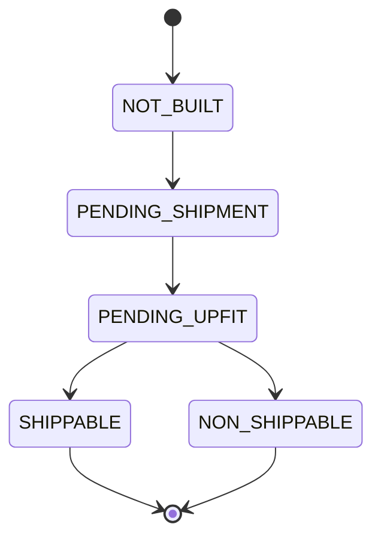
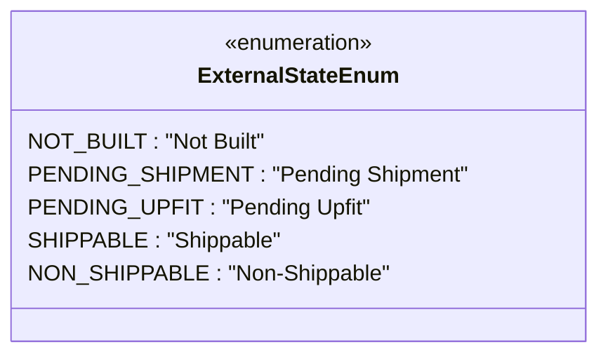

# Diagram: web/portal/src/shared/constants/external_state.conts.ts

> Auto-generated by Obscura crawlers

## Diagram 1

### SVG

<svg id="container" width="293.703125" xmlns="http://www.w3.org/2000/svg" class="statediagram" height="454" viewBox="0 0 293.703125 454" role="graphics-document document" aria-roledescription="stateDiagram"><g><defs><marker id="container_stateDiagram-barbEnd" refX="19" refY="7" markerWidth="20" markerHeight="14" markerUnits="userSpaceOnUse" orient="auto"><path d="M 19,7 L9,13 L14,7 L9,1 Z"></path></marker></defs><g class="root"><g class="clusters"></g><g class="edgePaths"><path d="M136.621,22L136.621,26.167C136.621,30.333,136.621,38.667,136.704,47.083C136.788,55.5,136.954,64,137.038,68.25L137.121,72.5" id="edge0" class="edge-thickness-normal edge-pattern-solid transition" style="fill:none;;;fill:none" data-edge="true" data-et="edge" data-id="edge0" data-points="W3sieCI6MTM2LjYyMTA5Mzc1LCJ5IjoyMn0seyJ4IjoxMzYuNjIxMDkzNzUsInkiOjQ3fSx7IngiOjEzNy4xMjEwOTM3NSwieSI6NzIuNX1d" marker-end="url(#container_stateDiagram-barbEnd)"></path><path d="M137.121,112.5L137.038,116.583C136.954,120.667,136.788,128.833,136.788,137.167C136.788,145.5,136.954,154,137.038,158.25L137.121,162.5" id="edge1" class="edge-thickness-normal edge-pattern-solid transition" style="fill:none;;;fill:none" data-edge="true" data-et="edge" data-id="edge1" data-points="W3sieCI6MTM3LjEyMTA5Mzc1LCJ5IjoxMTIuNX0seyJ4IjoxMzYuNjIxMDkzNzUsInkiOjEzN30seyJ4IjoxMzcuMTIxMDkzNzUsInkiOjE2Mi41fV0=" marker-end="url(#container_stateDiagram-barbEnd)"></path><path d="M137.121,202.5L137.038,206.583C136.954,210.667,136.788,218.833,136.788,227.167C136.788,235.5,136.954,244,137.038,248.25L137.121,252.5" id="edge2" class="edge-thickness-normal edge-pattern-solid transition" style="fill:none;;;fill:none" data-edge="true" data-et="edge" data-id="edge2" data-points="W3sieCI6MTM3LjEyMTA5Mzc1LCJ5IjoyMDIuNX0seyJ4IjoxMzYuNjIxMDkzNzUsInkiOjIyN30seyJ4IjoxMzcuMTIxMDkzNzUsInkiOjI1Mi41fV0=" marker-end="url(#container_stateDiagram-barbEnd)"></path><path d="M100.71,292.5L93.041,296.583C85.372,300.667,70.033,308.833,62.448,317.167C54.862,325.5,55.029,334,55.112,338.25L55.195,342.5" id="edge3" class="edge-thickness-normal edge-pattern-solid transition" style="fill:none;;;fill:none" data-edge="true" data-et="edge" data-id="edge3" data-points="W3sieCI6MTAwLjcwOTYzNTQxNjY2NjY3LCJ5IjoyOTIuNX0seyJ4Ijo1NC42OTUzMTI1LCJ5IjozMTd9LHsieCI6NTUuMTk1MzEyNSwieSI6MzQyLjV9XQ==" marker-end="url(#container_stateDiagram-barbEnd)"></path><path d="M173.533,292.5L181.035,296.583C188.537,300.667,203.542,308.833,211.128,317.167C218.714,325.5,218.88,334,218.964,338.25L219.047,342.5" id="edge4" class="edge-thickness-normal edge-pattern-solid transition" style="fill:none;;;fill:none" data-edge="true" data-et="edge" data-id="edge4" data-points="W3sieCI6MTczLjUzMjU1MjA4MzMzMzM0LCJ5IjoyOTIuNX0seyJ4IjoyMTguNTQ2ODc1LCJ5IjozMTd9LHsieCI6MjE5LjA0Njg3NSwieSI6MzQyLjV9XQ==" marker-end="url(#container_stateDiagram-barbEnd)"></path><path d="M55.195,382.5L55.112,386.583C55.029,390.667,54.862,398.833,67.346,407.826C79.83,416.818,104.966,426.635,117.533,431.544L130.101,436.453" id="edge5" class="edge-thickness-normal edge-pattern-solid transition" style="fill:none;;;fill:none" data-edge="true" data-et="edge" data-id="edge5" data-points="W3sieCI6NTUuMTk1MzEyNSwieSI6MzgyLjV9LHsieCI6NTQuNjk1MzEyNSwieSI6NDA3fSx7IngiOjEzMC4xMDA4MzEzOTIxOTA4LCJ5Ijo0MzYuNDUzMjAyMjQ4ODM1NX1d" marker-end="url(#container_stateDiagram-barbEnd)"></path><path d="M219.047,382.5L218.964,386.583C218.88,390.667,218.714,398.833,206.063,407.826C193.412,416.818,168.277,426.635,155.709,431.544L143.141,436.453" id="edge6" class="edge-thickness-normal edge-pattern-solid transition" style="fill:none;;;fill:none" data-edge="true" data-et="edge" data-id="edge6" data-points="W3sieCI6MjE5LjA0Njg3NSwieSI6MzgyLjV9LHsieCI6MjE4LjU0Njg3NSwieSI6NDA3fSx7IngiOjE0My4xNDEzNTYxMDc4MDkyLCJ5Ijo0MzYuNDUzMjAyMjQ4ODM1NX1d" marker-end="url(#container_stateDiagram-barbEnd)"></path></g><g class="edgeLabels"><g class="edgeLabel"><g class="label" data-id="edge0" transform="translate(0, 0)"><foreignObject width="0" height="0">

</foreignObject></g></g><g class="edgeLabel"><g class="label" data-id="edge1" transform="translate(0, 0)"><foreignObject width="0" height="0">

</foreignObject></g></g><g class="edgeLabel"><g class="label" data-id="edge2" transform="translate(0, 0)"><foreignObject width="0" height="0">

</foreignObject></g></g><g class="edgeLabel"><g class="label" data-id="edge3" transform="translate(0, 0)"><foreignObject width="0" height="0">

</foreignObject></g></g><g class="edgeLabel"><g class="label" data-id="edge4" transform="translate(0, 0)"><foreignObject width="0" height="0">

</foreignObject></g></g><g class="edgeLabel"><g class="label" data-id="edge5" transform="translate(0, 0)"><foreignObject width="0" height="0">

</foreignObject></g></g><g class="edgeLabel"><g class="label" data-id="edge6" transform="translate(0, 0)"><foreignObject width="0" height="0">

</foreignObject></g></g></g><g class="nodes"><g class="node default" id="state-root_start-0" transform="translate(136.62109375, 15)"><circle class="state-start" r="7" width="14" height="14"></circle></g><g class="node  statediagram-state" id="state-NOT_BUILT-1" transform="translate(136.62109375, 92)"><g class="basic label-container outer-path"><path d="M-41.59375 -20 C-11.161056305250462 -20, 19.271637389499077 -20, 41.59375 -20 C41.59375 -20, 41.59375 -20, 41.59375 -20 C41.726525635411235 -19.99450835909758, 41.85930127082246 -19.98901671819516, 42.00664672736166 -19.982922465033347 C42.095309939298936 -19.971870607190976, 42.183973151236216 -19.960818749348604, 42.41672295140367 -19.931806517013612 C42.505179946106345 -19.913259035661707, 42.59363694080902 -19.894711554309797, 42.821177435703994 -19.847001329696653 C42.96794870489337 -19.803305629661708, 43.11471997408274 -19.75960992962676, 43.21724734602342 -19.729086208503173 C43.34607960571931 -19.67881570477479, 43.47491186541521 -19.628545201046414, 43.602227123264846 -19.578866633275286 C43.67832957245732 -19.541662412883543, 43.75443202164979 -19.5044581924918, 43.973486965185366 -19.397368756032446 C44.05408082626469 -19.34934523862117, 44.134674687344 -19.301321721209895, 44.328490790612136 -19.185832391312644 C44.3978492268108 -19.13631141969674, 44.46720766300946 -19.086790448080837, 44.66481356344834 -18.94570254698197 C44.768805884380036 -18.8576255439853, 44.87279820531173 -18.76954854098863, 44.980157858128706 -18.678619553365657 C45.044040071010826 -18.61473734048354, 45.10792228389294 -18.55085512760142, 45.27236955336566 -18.386407858128706 C45.37640692278117 -18.26357116817507, 45.48044429219669 -18.140734478221432, 45.53945254698197 -18.07106356344834 C45.62351577688895 -17.953325684365932, 45.707579006795925 -17.835587805283527, 45.779582391312644 -17.734740790612136 C45.85219675754535 -17.612878160384483, 45.92481112377806 -17.49101553015683, 45.99111875603245 -17.37973696518537 C46.062674284191885 -17.23336779284807, 46.13422981235132 -17.086998620510773, 46.17261663327529 -17.008477123264846 C46.21202033154222 -16.907494099193055, 46.25142402980915 -16.806511075121264, 46.322836208503176 -16.623497346023417 C46.36880938164728 -16.469076179509845, 46.41478255479139 -16.314655012996276, 46.44075132969665 -16.227427435703994 C46.470520967538704 -16.08544952253444, 46.50029060538076 -15.943471609364883, 46.52555651701361 -15.82297295140367 C46.53877607928847 -15.716919392951278, 46.55199564156332 -15.610865834498883, 46.57667246503335 -15.412896727361662 C46.58128661663346 -15.301336827237987, 46.58590076823358 -15.18977692711431, 46.59375 -15 C46.59375 -15, 46.59375 -15, 46.59375 -15 C46.59375 -8.19029668804257, 46.59375 -1.380593376085141, 46.59375 15 C46.59375 15, 46.59375 15, 46.59375 15 C46.589502795069194 15.102687947633386, 46.585255590138395 15.205375895266771, 46.57667246503335 15.412896727361662 C46.562463642023054 15.526886601635214, 46.548254819012755 15.640876475908767, 46.52555651701361 15.822972951403669 C46.50656969665473 15.913525249909338, 46.487582876295846 16.004077548415005, 46.44075132969665 16.227427435703994 C46.4101475892295 16.330223587881758, 46.379543848762346 16.43301974005952, 46.322836208503176 16.623497346023417 C46.26973880795431 16.759574321373613, 46.21664140740544 16.89565129672381, 46.17261663327529 17.008477123264846 C46.10034191665379 17.15631741911496, 46.02806720003229 17.304157714965072, 45.99111875603245 17.379736965185366 C45.946363282687166 17.454846340669846, 45.901607809341876 17.52995571615433, 45.779582391312644 17.734740790612133 C45.720608430529765 17.81733896190948, 45.66163446974689 17.89993713320683, 45.53945254698197 18.07106356344834 C45.46983664264378 18.153258906382085, 45.400220738305585 18.235454249315826, 45.27236955336566 18.386407858128706 C45.17929676449358 18.479480647000788, 45.08622397562149 18.572553435872866, 44.980157858128706 18.678619553365657 C44.8736235714393 18.76884949153728, 44.76708928474991 18.859079429708903, 44.66481356344834 18.94570254698197 C44.55635919803844 19.023137475527665, 44.447904832628545 19.100572404073358, 44.328490790612136 19.185832391312644 C44.228057157949934 19.245677846564924, 44.12762352528773 19.305523301817203, 43.973486965185366 19.397368756032446 C43.864019461284975 19.450884157758136, 43.754551957384585 19.50439955948383, 43.602227123264846 19.578866633275286 C43.45163756469369 19.637626861369363, 43.30104800612254 19.696387089463443, 43.21724734602342 19.729086208503173 C43.1330008858344 19.754167466393476, 43.04875442564538 19.779248724283775, 42.821177435703994 19.847001329696653 C42.70865376425646 19.87059506250248, 42.59613009280892 19.894188795308306, 42.41672295140367 19.931806517013612 C42.27503726966586 19.949467618824062, 42.13335158792805 19.967128720634513, 42.00664672736166 19.982922465033347 C41.86789681377565 19.988661203908865, 41.72914690018965 19.994399942784387, 41.59375 20 C41.59375 20, 41.59375 20, 41.59375 20 C22.562330847340046 20, 3.5309116946800927 20, -41.59375 20 C-41.59375 20, -41.59375 20, -41.59375 20 C-41.74911833585121 19.993573918095297, -41.904486671702415 19.987147836190594, -42.00664672736166 19.982922465033347 C-42.14477568149944 19.965704708855892, -42.28290463563722 19.948486952678437, -42.41672295140367 19.931806517013612 C-42.520227292101524 19.910103938993778, -42.62373163279937 19.888401360973944, -42.821177435703994 19.847001329696653 C-42.96106588657909 19.80535473345509, -43.10095433745418 19.763708137213527, -43.21724734602342 19.729086208503173 C-43.32200916707314 19.68820801907994, -43.42677098812286 19.64732982965671, -43.602227123264846 19.578866633275286 C-43.70547780230756 19.528390452029303, -43.80872848135028 19.47791427078332, -43.973486965185366 19.397368756032446 C-44.088354487256474 19.328922569532672, -44.203222009327575 19.260476383032902, -44.328490790612136 19.185832391312644 C-44.44772805088059 19.100698623815354, -44.566965311149055 19.015564856318065, -44.66481356344834 18.94570254698197 C-44.789859214309345 18.839794283112766, -44.91490486517034 18.73388601924356, -44.980157858128706 18.67861955336566 C-45.07128773444962 18.587489677044744, -45.16241761077054 18.496359800723827, -45.27236955336566 18.386407858128706 C-45.37598138156987 18.264073603733834, -45.47959320977409 18.141739349338962, -45.53945254698197 18.07106356344834 C-45.60811116197625 17.974901189969387, -45.676769776970524 17.878738816490433, -45.779582391312644 17.734740790612133 C-45.83068364036465 17.648981829397236, -45.88178488941664 17.563222868182336, -45.99111875603244 17.37973696518537 C-46.02892817924232 17.302396553841476, -46.06673760245219 17.225056142497582, -46.17261663327528 17.00847712326485 C-46.21710014799053 16.89447564536152, -46.26158366270577 16.78047416745819, -46.322836208503176 16.623497346023417 C-46.3637728623523 16.485993549608743, -46.40470951620142 16.34848975319407, -46.44075132969665 16.227427435703994 C-46.45909477932976 16.139943512887825, -46.47743822896287 16.052459590071656, -46.52555651701361 15.82297295140367 C-46.536773101643355 15.732988223548528, -46.547989686273105 15.643003495693387, -46.57667246503335 15.412896727361664 C-46.58163481801942 15.292918093913508, -46.58659717100549 15.172939460465352, -46.59375 15 C-46.59375 15, -46.59375 15, -46.59375 15 C-46.59375 3.834889409852531, -46.59375 -7.330221180294938, -46.59375 -15 C-46.59375 -15, -46.59375 -15, -46.59375 -15 C-46.590075196984046 -15.088848545293517, -46.58640039396809 -15.177697090587033, -46.57667246503335 -15.41289672736166 C-46.56118929815263 -15.537109988714214, -46.545706131271906 -15.661323250066767, -46.52555651701361 -15.822972951403669 C-46.506789812957926 -15.912475467122304, -46.48802310890225 -16.001977982840938, -46.44075132969665 -16.227427435703994 C-46.40507248751 -16.34727055406013, -46.36939364532335 -16.467113672416268, -46.322836208503176 -16.623497346023417 C-46.271291047174145 -16.755596273185336, -46.219745885845114 -16.88769520034726, -46.17261663327529 -17.008477123264846 C-46.102319548866056 -17.152272107766652, -46.03202246445682 -17.296067092268462, -45.99111875603245 -17.379736965185366 C-45.92807072007433 -17.485545221748833, -45.86502268411621 -17.591353478312303, -45.779582391312644 -17.734740790612133 C-45.71349991087238 -17.82729506315378, -45.647417430432114 -17.919849335695428, -45.53945254698197 -18.07106356344834 C-45.45602161219623 -18.16957028200912, -45.37259067741049 -18.268077000569896, -45.27236955336566 -18.386407858128706 C-45.18617992925214 -18.47259748224222, -45.099990305138626 -18.558787106355737, -44.980157858128706 -18.678619553365657 C-44.89439295355664 -18.751258722193942, -44.80862804898458 -18.82389789102223, -44.66481356344834 -18.945702546981966 C-44.564311393355844 -19.017459717201774, -44.463809223263354 -19.089216887421586, -44.328490790612136 -19.185832391312644 C-44.25669852441194 -19.22861129655044, -44.18490625821174 -19.271390201788233, -43.973486965185366 -19.397368756032446 C-43.86135094290255 -19.45218871690272, -43.74921492061973 -19.507008677772994, -43.602227123264846 -19.578866633275286 C-43.52338508162077 -19.60963089338977, -43.4445430399767 -19.640395153504258, -43.21724734602342 -19.729086208503173 C-43.120619845581864 -19.75785346177924, -43.02399234514031 -19.78662071505531, -42.821177435703994 -19.847001329696653 C-42.735413369604224 -19.864984163298406, -42.649649303504454 -19.882966996900155, -42.41672295140367 -19.931806517013612 C-42.31101019791161 -19.944983597994465, -42.20529744441955 -19.958160678975315, -42.00664672736166 -19.982922465033347 C-41.85836117553924 -19.98905560082369, -41.71007562371681 -19.995188736614033, -41.59375 -20 C-41.59375 -20, -41.59375 -20, -41.59375 -20" stroke="none" stroke-width="0" fill="#ECECFF" style=""></path><path d="M-41.59375 -20 C-15.515166300416627 -20, 10.563417399166745 -20, 41.59375 -20 M-41.59375 -20 C-24.15494160896884 -20, -6.716133217937681 -20, 41.59375 -20 M41.59375 -20 C41.59375 -20, 41.59375 -20, 41.59375 -20 M41.59375 -20 C41.59375 -20, 41.59375 -20, 41.59375 -20 M41.59375 -20 C41.67790258224238 -19.99651942345254, 41.762055164484764 -19.993038846905076, 42.00664672736166 -19.982922465033347 M41.59375 -20 C41.72719788589017 -19.9944805546121, 41.86064577178034 -19.9889611092242, 42.00664672736166 -19.982922465033347 M42.00664672736166 -19.982922465033347 C42.10549473980277 -19.970601073132126, 42.20434275224388 -19.95827968123091, 42.41672295140367 -19.931806517013612 M42.00664672736166 -19.982922465033347 C42.14751794872951 -19.96536288560214, 42.28838917009735 -19.947803306170933, 42.41672295140367 -19.931806517013612 M42.41672295140367 -19.931806517013612 C42.54410709264491 -19.905096871358772, 42.67149123388615 -19.87838722570393, 42.821177435703994 -19.847001329696653 M42.41672295140367 -19.931806517013612 C42.54483333983593 -19.90494459333624, 42.672943728268194 -19.878082669658866, 42.821177435703994 -19.847001329696653 M42.821177435703994 -19.847001329696653 C42.94976436351489 -19.808719342649237, 43.07835129132578 -19.770437355601825, 43.21724734602342 -19.729086208503173 M42.821177435703994 -19.847001329696653 C42.900501213955266 -19.823385617716713, 42.979824992206545 -19.799769905736774, 43.21724734602342 -19.729086208503173 M43.21724734602342 -19.729086208503173 C43.36015302485055 -19.67332423958915, 43.50305870367768 -19.617562270675126, 43.602227123264846 -19.578866633275286 M43.21724734602342 -19.729086208503173 C43.32533000454576 -19.686912224277126, 43.433412663068104 -19.64473824005108, 43.602227123264846 -19.578866633275286 M43.602227123264846 -19.578866633275286 C43.70986169139274 -19.526247299247384, 43.81749625952063 -19.47362796521948, 43.973486965185366 -19.397368756032446 M43.602227123264846 -19.578866633275286 C43.71281844018113 -19.524801832843426, 43.823409757097416 -19.47073703241157, 43.973486965185366 -19.397368756032446 M43.973486965185366 -19.397368756032446 C44.05668163117426 -19.347795495276138, 44.13987629716314 -19.29822223451983, 44.328490790612136 -19.185832391312644 M43.973486965185366 -19.397368756032446 C44.078552287941406 -19.334763412534507, 44.183617610697446 -19.272158069036568, 44.328490790612136 -19.185832391312644 M44.328490790612136 -19.185832391312644 C44.397945699778255 -19.13624253932191, 44.467400608944374 -19.086652687331174, 44.66481356344834 -18.94570254698197 M44.328490790612136 -19.185832391312644 C44.4503000676273 -19.098862239154887, 44.57210934464246 -19.011892086997133, 44.66481356344834 -18.94570254698197 M44.66481356344834 -18.94570254698197 C44.76161780953691 -18.86371353282742, 44.85842205562548 -18.781724518672867, 44.980157858128706 -18.678619553365657 M44.66481356344834 -18.94570254698197 C44.74579929763572 -18.87711112899261, 44.8267850318231 -18.808519711003253, 44.980157858128706 -18.678619553365657 M44.980157858128706 -18.678619553365657 C45.08971913510771 -18.569058276386652, 45.199280412086715 -18.45949699940765, 45.27236955336566 -18.386407858128706 M44.980157858128706 -18.678619553365657 C45.05142399550302 -18.60735341599134, 45.12269013287734 -18.536087278617025, 45.27236955336566 -18.386407858128706 M45.27236955336566 -18.386407858128706 C45.358278409860084 -18.284975462934906, 45.44418726635452 -18.18354306774111, 45.53945254698197 -18.07106356344834 M45.27236955336566 -18.386407858128706 C45.33200783787378 -18.3159930686675, 45.39164612238191 -18.245578279206292, 45.53945254698197 -18.07106356344834 M45.53945254698197 -18.07106356344834 C45.62572251729397 -17.950234952124735, 45.71199248760597 -17.829406340801132, 45.779582391312644 -17.734740790612136 M45.53945254698197 -18.07106356344834 C45.601841088020215 -17.98368297494351, 45.66422962905846 -17.89630238643868, 45.779582391312644 -17.734740790612136 M45.779582391312644 -17.734740790612136 C45.84609675395794 -17.623115287279983, 45.91261111660323 -17.511489783947834, 45.99111875603245 -17.37973696518537 M45.779582391312644 -17.734740790612136 C45.83057669139184 -17.649161312932005, 45.88157099147103 -17.563581835251874, 45.99111875603245 -17.37973696518537 M45.99111875603245 -17.37973696518537 C46.058456157636094 -17.24199610862836, 46.12579355923974 -17.10425525207135, 46.17261663327529 -17.008477123264846 M45.99111875603245 -17.37973696518537 C46.0325678641975 -17.294951459267224, 46.07401697236255 -17.210165953349076, 46.17261663327529 -17.008477123264846 M46.17261663327529 -17.008477123264846 C46.22227261631237 -16.88121974512808, 46.27192859934945 -16.753962366991317, 46.322836208503176 -16.623497346023417 M46.17261663327529 -17.008477123264846 C46.226685187083596 -16.86991129541378, 46.2807537408919 -16.731345467562715, 46.322836208503176 -16.623497346023417 M46.322836208503176 -16.623497346023417 C46.36186503682912 -16.492401822578497, 46.40089386515507 -16.361306299133577, 46.44075132969665 -16.227427435703994 M46.322836208503176 -16.623497346023417 C46.34827434456349 -16.53805215319213, 46.3737124806238 -16.45260696036084, 46.44075132969665 -16.227427435703994 M46.44075132969665 -16.227427435703994 C46.46882729378115 -16.093527023072525, 46.49690325786565 -15.959626610441054, 46.52555651701361 -15.82297295140367 M46.44075132969665 -16.227427435703994 C46.46032177502656 -16.134091702079, 46.47989222035646 -16.040755968454008, 46.52555651701361 -15.82297295140367 M46.52555651701361 -15.82297295140367 C46.54566800390033 -15.661629125809537, 46.565779490787044 -15.500285300215403, 46.57667246503335 -15.412896727361662 M46.52555651701361 -15.82297295140367 C46.54059615235715 -15.702317909062158, 46.555635787700695 -15.581662866720643, 46.57667246503335 -15.412896727361662 M46.57667246503335 -15.412896727361662 C46.581276437446164 -15.301582937296049, 46.58588040985899 -15.190269147230433, 46.59375 -15 M46.57667246503335 -15.412896727361662 C46.58295858897039 -15.260912263183117, 46.589244712907444 -15.108927799004572, 46.59375 -15 M46.59375 -15 C46.59375 -15, 46.59375 -15, 46.59375 -15 M46.59375 -15 C46.59375 -15, 46.59375 -15, 46.59375 -15 M46.59375 -15 C46.59375 -4.5390080362514045, 46.59375 5.921983927497191, 46.59375 15 M46.59375 -15 C46.59375 -4.039354744558683, 46.59375 6.921290510882635, 46.59375 15 M46.59375 15 C46.59375 15, 46.59375 15, 46.59375 15 M46.59375 15 C46.59375 15, 46.59375 15, 46.59375 15 M46.59375 15 C46.58903104876901 15.114093721585668, 46.584312097538024 15.228187443171336, 46.57667246503335 15.412896727361662 M46.59375 15 C46.59031560279871 15.083036068591946, 46.58688120559742 15.166072137183892, 46.57667246503335 15.412896727361662 M46.57667246503335 15.412896727361662 C46.55674344193926 15.572776742422967, 46.536814418845175 15.732656757484271, 46.52555651701361 15.822972951403669 M46.57667246503335 15.412896727361662 C46.56535423180838 15.503696928150866, 46.55403599858341 15.59449712894007, 46.52555651701361 15.822972951403669 M46.52555651701361 15.822972951403669 C46.49710430925358 15.958667752404233, 46.46865210149355 16.094362553404796, 46.44075132969665 16.227427435703994 M46.52555651701361 15.822972951403669 C46.497245516101735 15.957994306064949, 46.46893451518986 16.09301566072623, 46.44075132969665 16.227427435703994 M46.44075132969665 16.227427435703994 C46.41061026046521 16.328669502595822, 46.38046919123377 16.429911569487654, 46.322836208503176 16.623497346023417 M46.44075132969665 16.227427435703994 C46.40410820732807 16.350509514096082, 46.36746508495949 16.473591592488166, 46.322836208503176 16.623497346023417 M46.322836208503176 16.623497346023417 C46.28584753543186 16.718291190952392, 46.24885886236056 16.81308503588137, 46.17261663327529 17.008477123264846 M46.322836208503176 16.623497346023417 C46.26813083404685 16.76369520532476, 46.21342545959052 16.9038930646261, 46.17261663327529 17.008477123264846 M46.17261663327529 17.008477123264846 C46.1001015343056 17.156809129067405, 46.02758643533591 17.305141134869963, 45.99111875603245 17.379736965185366 M46.17261663327529 17.008477123264846 C46.10769388130132 17.14127873505808, 46.042771129327356 17.274080346851317, 45.99111875603245 17.379736965185366 M45.99111875603245 17.379736965185366 C45.94796124573743 17.45216461265355, 45.90480373544241 17.524592260121736, 45.779582391312644 17.734740790612133 M45.99111875603245 17.379736965185366 C45.91850114290073 17.50160504441263, 45.84588352976901 17.6234731236399, 45.779582391312644 17.734740790612133 M45.779582391312644 17.734740790612133 C45.69230978819107 17.856973676558887, 45.605037185069484 17.979206562505645, 45.53945254698197 18.07106356344834 M45.779582391312644 17.734740790612133 C45.718789687623435 17.81988626984215, 45.657996983934225 17.905031749072165, 45.53945254698197 18.07106356344834 M45.53945254698197 18.07106356344834 C45.45656014677792 18.168934435430035, 45.373667746573865 18.26680530741173, 45.27236955336566 18.386407858128706 M45.53945254698197 18.07106356344834 C45.43438937153024 18.19511142030029, 45.329326196078505 18.319159277152234, 45.27236955336566 18.386407858128706 M45.27236955336566 18.386407858128706 C45.18834664590258 18.47043076559179, 45.10432373843949 18.554453673054873, 44.980157858128706 18.678619553365657 M45.27236955336566 18.386407858128706 C45.207351912028486 18.451425499465874, 45.14233427069132 18.51644314080304, 44.980157858128706 18.678619553365657 M44.980157858128706 18.678619553365657 C44.87932636302115 18.764019473448027, 44.778494867913594 18.849419393530397, 44.66481356344834 18.94570254698197 M44.980157858128706 18.678619553365657 C44.85627257309991 18.783545037506855, 44.73238728807111 18.88847052164805, 44.66481356344834 18.94570254698197 M44.66481356344834 18.94570254698197 C44.57863587506601 19.00723223384056, 44.49245818668369 19.068761920699156, 44.328490790612136 19.185832391312644 M44.66481356344834 18.94570254698197 C44.589151047608205 18.99972454494881, 44.513488531768076 19.053746542915643, 44.328490790612136 19.185832391312644 M44.328490790612136 19.185832391312644 C44.248537418926276 19.23347425988458, 44.16858404724042 19.28111612845652, 43.973486965185366 19.397368756032446 M44.328490790612136 19.185832391312644 C44.219783151466814 19.250608084291244, 44.11107551232149 19.315383777269847, 43.973486965185366 19.397368756032446 M43.973486965185366 19.397368756032446 C43.88263988869212 19.441781185483332, 43.79179281219887 19.48619361493422, 43.602227123264846 19.578866633275286 M43.973486965185366 19.397368756032446 C43.86010774128146 19.452796481141494, 43.746728517377555 19.508224206250546, 43.602227123264846 19.578866633275286 M43.602227123264846 19.578866633275286 C43.493090481101056 19.62145188319443, 43.38395383893727 19.66403713311357, 43.21724734602342 19.729086208503173 M43.602227123264846 19.578866633275286 C43.50112398410964 19.618317200593207, 43.400020844954426 19.65776776791113, 43.21724734602342 19.729086208503173 M43.21724734602342 19.729086208503173 C43.12268019602625 19.757240068875564, 43.02811304602908 19.785393929247952, 42.821177435703994 19.847001329696653 M43.21724734602342 19.729086208503173 C43.09292999564031 19.766097087277213, 42.968612645257195 19.80310796605125, 42.821177435703994 19.847001329696653 M42.821177435703994 19.847001329696653 C42.73363614896407 19.865356807279724, 42.64609486222414 19.883712284862796, 42.41672295140367 19.931806517013612 M42.821177435703994 19.847001329696653 C42.70744660568579 19.87084817703744, 42.593715775667576 19.89469502437823, 42.41672295140367 19.931806517013612 M42.41672295140367 19.931806517013612 C42.309175563932214 19.945212284881507, 42.20162817646076 19.958618052749397, 42.00664672736166 19.982922465033347 M42.41672295140367 19.931806517013612 C42.32806784073756 19.942857365033586, 42.23941273007146 19.95390821305356, 42.00664672736166 19.982922465033347 M42.00664672736166 19.982922465033347 C41.91421464525601 19.98674548422821, 41.82178256315036 19.990568503423074, 41.59375 20 M42.00664672736166 19.982922465033347 C41.908467490318095 19.986983188314746, 41.810288253274535 19.991043911596144, 41.59375 20 M41.59375 20 C41.59375 20, 41.59375 20, 41.59375 20 M41.59375 20 C41.59375 20, 41.59375 20, 41.59375 20 M41.59375 20 C12.725348443989617 20, -16.143053112020766 20, -41.59375 20 M41.59375 20 C8.652902991492248 20, -24.287944017015505 20, -41.59375 20 M-41.59375 20 C-41.59375 20, -41.59375 20, -41.59375 20 M-41.59375 20 C-41.59375 20, -41.59375 20, -41.59375 20 M-41.59375 20 C-41.71491914881965 19.994988406933935, -41.8360882976393 19.989976813867866, -42.00664672736166 19.982922465033347 M-41.59375 20 C-41.75621886298672 19.993280238120615, -41.91868772597344 19.98656047624123, -42.00664672736166 19.982922465033347 M-42.00664672736166 19.982922465033347 C-42.118360605482074 19.968997344647676, -42.230074483602486 19.955072224262008, -42.41672295140367 19.931806517013612 M-42.00664672736166 19.982922465033347 C-42.126941654042014 19.96792771806016, -42.24723658072236 19.95293297108697, -42.41672295140367 19.931806517013612 M-42.41672295140367 19.931806517013612 C-42.546237180543095 19.90465023889401, -42.67575140968252 19.877493960774405, -42.821177435703994 19.847001329696653 M-42.41672295140367 19.931806517013612 C-42.5720484754736 19.89923817947461, -42.72737399954354 19.86666984193561, -42.821177435703994 19.847001329696653 M-42.821177435703994 19.847001329696653 C-42.93810799576483 19.812189593683495, -43.05503855582566 19.777377857670338, -43.21724734602342 19.729086208503173 M-42.821177435703994 19.847001329696653 C-42.91215148705737 19.819917181137768, -43.00312553841075 19.792833032578883, -43.21724734602342 19.729086208503173 M-43.21724734602342 19.729086208503173 C-43.30266810362593 19.69575492545594, -43.38808886122845 19.66242364240871, -43.602227123264846 19.578866633275286 M-43.21724734602342 19.729086208503173 C-43.36119043684696 19.672919440172013, -43.505133527670495 19.61675267184085, -43.602227123264846 19.578866633275286 M-43.602227123264846 19.578866633275286 C-43.690054547173425 19.535930422020513, -43.777881971081996 19.492994210765737, -43.973486965185366 19.397368756032446 M-43.602227123264846 19.578866633275286 C-43.726768403862614 19.517982111155494, -43.85130968446038 19.457097589035705, -43.973486965185366 19.397368756032446 M-43.973486965185366 19.397368756032446 C-44.084408034699585 19.331274144833078, -44.19532910421381 19.26517953363371, -44.328490790612136 19.185832391312644 M-43.973486965185366 19.397368756032446 C-44.10095318108031 19.321415377494652, -44.22841939697524 19.245461998956856, -44.328490790612136 19.185832391312644 M-44.328490790612136 19.185832391312644 C-44.46203083552541 19.090486631861044, -44.595570880438686 18.995140872409447, -44.66481356344834 18.94570254698197 M-44.328490790612136 19.185832391312644 C-44.400945186226004 19.134100947161212, -44.47339958183987 19.08236950300978, -44.66481356344834 18.94570254698197 M-44.66481356344834 18.94570254698197 C-44.774052706863905 18.85318171202257, -44.88329185027947 18.760660877063174, -44.980157858128706 18.67861955336566 M-44.66481356344834 18.94570254698197 C-44.78192918254404 18.846510677412834, -44.89904480163973 18.747318807843698, -44.980157858128706 18.67861955336566 M-44.980157858128706 18.67861955336566 C-45.09070166084477 18.568075750649594, -45.20124546356083 18.457531947933532, -45.27236955336566 18.386407858128706 M-44.980157858128706 18.67861955336566 C-45.05716393208623 18.601613479408133, -45.13417000604376 18.524607405450602, -45.27236955336566 18.386407858128706 M-45.27236955336566 18.386407858128706 C-45.34079573788322 18.305617214732827, -45.40922192240078 18.224826571336948, -45.53945254698197 18.07106356344834 M-45.27236955336566 18.386407858128706 C-45.35487003463374 18.28899972396031, -45.437370515901826 18.191591589791912, -45.53945254698197 18.07106356344834 M-45.53945254698197 18.07106356344834 C-45.60079458290333 17.985148696556244, -45.66213661882469 17.899233829664144, -45.779582391312644 17.734740790612133 M-45.53945254698197 18.07106356344834 C-45.58811624801533 18.002905809406425, -45.6367799490487 17.93474805536451, -45.779582391312644 17.734740790612133 M-45.779582391312644 17.734740790612133 C-45.825713763660076 17.65732235866916, -45.8718451360075 17.579903926726185, -45.99111875603244 17.37973696518537 M-45.779582391312644 17.734740790612133 C-45.863232567699725 17.594357681285402, -45.946882744086814 17.45397457195867, -45.99111875603244 17.37973696518537 M-45.99111875603244 17.37973696518537 C-46.06210992094219 17.234522216327, -46.13310108585194 17.08930746746863, -46.17261663327528 17.00847712326485 M-45.99111875603244 17.37973696518537 C-46.042654478076926 17.274318960797945, -46.0941902001214 17.16890095641052, -46.17261663327528 17.00847712326485 M-46.17261663327528 17.00847712326485 C-46.21326981606432 16.904291944798352, -46.25392299885336 16.800106766331854, -46.322836208503176 16.623497346023417 M-46.17261663327528 17.00847712326485 C-46.22921185944833 16.86343598909859, -46.28580708562137 16.718394854932335, -46.322836208503176 16.623497346023417 M-46.322836208503176 16.623497346023417 C-46.35205885716872 16.525340199432637, -46.38128150583426 16.42718305284186, -46.44075132969665 16.227427435703994 M-46.322836208503176 16.623497346023417 C-46.36589369405973 16.47886980147821, -46.40895117961628 16.334242256933003, -46.44075132969665 16.227427435703994 M-46.44075132969665 16.227427435703994 C-46.473481065962446 16.071332165809807, -46.506210802228246 15.91523689591562, -46.52555651701361 15.82297295140367 M-46.44075132969665 16.227427435703994 C-46.47413692390474 16.068204235853912, -46.50752251811283 15.90898103600383, -46.52555651701361 15.82297295140367 M-46.52555651701361 15.82297295140367 C-46.54391709203164 15.675675765959202, -46.56227766704967 15.528378580514733, -46.57667246503335 15.412896727361664 M-46.52555651701361 15.82297295140367 C-46.542945149541374 15.683473146656105, -46.560333782069144 15.543973341908542, -46.57667246503335 15.412896727361664 M-46.57667246503335 15.412896727361664 C-46.58058894302378 15.318205019911423, -46.584505421014214 15.223513312461183, -46.59375 15 M-46.57667246503335 15.412896727361664 C-46.5829013673899 15.262295753444812, -46.589130269746455 15.11169477952796, -46.59375 15 M-46.59375 15 C-46.59375 15, -46.59375 15, -46.59375 15 M-46.59375 15 C-46.59375 15, -46.59375 15, -46.59375 15 M-46.59375 15 C-46.59375 8.619425330152353, -46.59375 2.238850660304708, -46.59375 -15 M-46.59375 15 C-46.59375 6.068615322041143, -46.59375 -2.862769355917713, -46.59375 -15 M-46.59375 -15 C-46.59375 -15, -46.59375 -15, -46.59375 -15 M-46.59375 -15 C-46.59375 -15, -46.59375 -15, -46.59375 -15 M-46.59375 -15 C-46.58845299519687 -15.128069768400591, -46.583155990393735 -15.256139536801182, -46.57667246503335 -15.41289672736166 M-46.59375 -15 C-46.58851840919929 -15.126488203638772, -46.58328681839857 -15.252976407277544, -46.57667246503335 -15.41289672736166 M-46.57667246503335 -15.41289672736166 C-46.5578803138125 -15.563656220490834, -46.539088162591646 -15.71441571362001, -46.52555651701361 -15.822972951403669 M-46.57667246503335 -15.41289672736166 C-46.564851372501714 -15.507731102487627, -46.55303027997008 -15.602565477613595, -46.52555651701361 -15.822972951403669 M-46.52555651701361 -15.822972951403669 C-46.5057879335271 -15.917253649228208, -46.48601935004059 -16.01153434705275, -46.44075132969665 -16.227427435703994 M-46.52555651701361 -15.822972951403669 C-46.505183211031806 -15.920137703054621, -46.48480990505 -16.017302454705575, -46.44075132969665 -16.227427435703994 M-46.44075132969665 -16.227427435703994 C-46.40640115207976 -16.342807648440715, -46.372050974462866 -16.458187861177432, -46.322836208503176 -16.623497346023417 M-46.44075132969665 -16.227427435703994 C-46.410631591367576 -16.328597853357785, -46.3805118530385 -16.42976827101158, -46.322836208503176 -16.623497346023417 M-46.322836208503176 -16.623497346023417 C-46.268253921206885 -16.763379759968313, -46.21367163391059 -16.90326217391321, -46.17261663327529 -17.008477123264846 M-46.322836208503176 -16.623497346023417 C-46.263674145144904 -16.77511672011803, -46.20451208178663 -16.926736094212647, -46.17261663327529 -17.008477123264846 M-46.17261663327529 -17.008477123264846 C-46.108067969663416 -17.140513525082707, -46.04351930605154 -17.272549926900567, -45.99111875603245 -17.379736965185366 M-46.17261663327529 -17.008477123264846 C-46.111200489438495 -17.134105853465968, -46.049784345601694 -17.25973458366709, -45.99111875603245 -17.379736965185366 M-45.99111875603245 -17.379736965185366 C-45.91126716353521 -17.513745228211388, -45.831415571037965 -17.647753491237413, -45.779582391312644 -17.734740790612133 M-45.99111875603245 -17.379736965185366 C-45.94463879742282 -17.4577404003581, -45.89815883881318 -17.535743835530834, -45.779582391312644 -17.734740790612133 M-45.779582391312644 -17.734740790612133 C-45.70818740440146 -17.834735691418835, -45.63679241749027 -17.93473059222554, -45.53945254698197 -18.07106356344834 M-45.779582391312644 -17.734740790612133 C-45.710042360351366 -17.832137663962893, -45.64050232939009 -17.929534537313653, -45.53945254698197 -18.07106356344834 M-45.53945254698197 -18.07106356344834 C-45.43658436850823 -18.192519792265582, -45.33371619003448 -18.313976021082826, -45.27236955336566 -18.386407858128706 M-45.53945254698197 -18.07106356344834 C-45.449685043892124 -18.177051854068413, -45.35991754080228 -18.283040144688485, -45.27236955336566 -18.386407858128706 M-45.27236955336566 -18.386407858128706 C-45.209194095005216 -18.449583316489147, -45.146018636644776 -18.51275877484959, -44.980157858128706 -18.678619553365657 M-45.27236955336566 -18.386407858128706 C-45.20328488662233 -18.455492524872035, -45.134200219879 -18.524577191615364, -44.980157858128706 -18.678619553365657 M-44.980157858128706 -18.678619553365657 C-44.90508958331056 -18.74219913892424, -44.83002130849243 -18.80577872448282, -44.66481356344834 -18.945702546981966 M-44.980157858128706 -18.678619553365657 C-44.912395759328646 -18.73601112348932, -44.84463366052858 -18.79340269361298, -44.66481356344834 -18.945702546981966 M-44.66481356344834 -18.945702546981966 C-44.560245625496236 -19.020362619657593, -44.45567768754413 -19.095022692333217, -44.328490790612136 -19.185832391312644 M-44.66481356344834 -18.945702546981966 C-44.587088902038374 -19.001196888586126, -44.50936424062841 -19.05669123019028, -44.328490790612136 -19.185832391312644 M-44.328490790612136 -19.185832391312644 C-44.24780100582744 -19.233913066845812, -44.167111221042745 -19.28199374237898, -43.973486965185366 -19.397368756032446 M-44.328490790612136 -19.185832391312644 C-44.208685554020846 -19.257220817035808, -44.08888031742955 -19.328609242758972, -43.973486965185366 -19.397368756032446 M-43.973486965185366 -19.397368756032446 C-43.87449233187652 -19.44576428330263, -43.77549769856767 -19.494159810572818, -43.602227123264846 -19.578866633275286 M-43.973486965185366 -19.397368756032446 C-43.837483615656076 -19.463856742208893, -43.70148026612679 -19.530344728385344, -43.602227123264846 -19.578866633275286 M-43.602227123264846 -19.578866633275286 C-43.46069642306998 -19.634092083862125, -43.31916572287511 -19.68931753444896, -43.21724734602342 -19.729086208503173 M-43.602227123264846 -19.578866633275286 C-43.496189079077084 -19.620242806512284, -43.39015103488932 -19.661618979749278, -43.21724734602342 -19.729086208503173 M-43.21724734602342 -19.729086208503173 C-43.10115995419178 -19.763646922458502, -42.98507256236013 -19.798207636413835, -42.821177435703994 -19.847001329696653 M-43.21724734602342 -19.729086208503173 C-43.119396370956984 -19.758217705956625, -43.02154539589055 -19.787349203410077, -42.821177435703994 -19.847001329696653 M-42.821177435703994 -19.847001329696653 C-42.6737256301095 -19.877918722083333, -42.52627382451501 -19.90883611447001, -42.41672295140367 -19.931806517013612 M-42.821177435703994 -19.847001329696653 C-42.68655011230994 -19.87522971094001, -42.55192278891589 -19.90345809218336, -42.41672295140367 -19.931806517013612 M-42.41672295140367 -19.931806517013612 C-42.32586445019975 -19.943132017377696, -42.23500594899584 -19.954457517741783, -42.00664672736166 -19.982922465033347 M-42.41672295140367 -19.931806517013612 C-42.33225972593082 -19.94233484708916, -42.24779650045797 -19.952863177164712, -42.00664672736166 -19.982922465033347 M-42.00664672736166 -19.982922465033347 C-41.91502212584178 -19.986712086584138, -41.8233975243219 -19.990501708134932, -41.59375 -20 M-42.00664672736166 -19.982922465033347 C-41.91278682050741 -19.986804539496646, -41.81892691365316 -19.990686613959944, -41.59375 -20 M-41.59375 -20 C-41.59375 -20, -41.59375 -20, -41.59375 -20 M-41.59375 -20 C-41.59375 -20, -41.59375 -20, -41.59375 -20" stroke="#9370DB" stroke-width="1.3" fill="none" stroke-dasharray="0 0" style=""></path></g><g class="label" style="" transform="translate(-38.59375, -12)"><rect></rect><foreignObject width="77.1875" height="24">

NOT_BUILT

</foreignObject></g></g><g class="node  statediagram-state" id="state-PENDING_SHIPMENT-2" transform="translate(136.62109375, 182)"><g class="basic label-container outer-path"><path d="M-76.09375 -20 C-16.916566232288865 -20, 42.26061753542227 -20, 76.09375 -20 C76.09375 -20, 76.09375 -20, 76.09375 -20 C76.23576632821593 -19.994126161216048, 76.37778265643185 -19.9882523224321, 76.50664672736166 -19.982922465033347 C76.59704038717715 -19.971654907087903, 76.68743404699265 -19.960387349142458, 76.91672295140367 -19.931806517013612 C77.06588451270783 -19.90053062655397, 77.21504607401198 -19.869254736094323, 77.321177435704 -19.847001329696653 C77.45344933430967 -19.80762227931133, 77.58572123291532 -19.768243228926007, 77.71724734602341 -19.729086208503173 C77.82303398550154 -19.68780813368829, 77.92882062497966 -19.646530058873406, 78.10222712326485 -19.578866633275286 C78.22541896384696 -19.518641812180636, 78.34861080442907 -19.458416991085986, 78.47348696518537 -19.397368756032446 C78.55463497458875 -19.349015037892073, 78.63578298399213 -19.3006613197517, 78.82849079061214 -19.185832391312644 C78.91399263461537 -19.124785248065873, 78.9994944786186 -19.063738104819105, 79.16481356344833 -18.94570254698197 C79.2436952379832 -18.878893176615538, 79.32257691251809 -18.812083806249106, 79.4801578581287 -18.678619553365657 C79.5659789824051 -18.59279842908926, 79.6518001066815 -18.506977304812864, 79.77236955336566 -18.386407858128706 C79.86128638343165 -18.281423955249984, 79.95020321349763 -18.176440052371262, 80.03945254698196 -18.07106356344834 C80.13159031310752 -17.942016592745237, 80.22372807923308 -17.812969622042132, 80.27958239131264 -17.734740790612136 C80.3452472981277 -17.624540858101643, 80.41091220494276 -17.51434092559115, 80.49111875603245 -17.37973696518537 C80.53213885958272 -17.29582900223295, 80.57315896313298 -17.21192103928053, 80.67261663327528 -17.008477123264846 C80.73149004535941 -16.857597498986838, 80.79036345744352 -16.706717874708826, 80.82283620850318 -16.623497346023417 C80.8494155033172 -16.534219068506534, 80.87599479813125 -16.44494079098965, 80.94075132969665 -16.227427435703994 C80.96791092083058 -16.09789740607478, 80.99507051196449 -15.968367376445565, 81.02555651701361 -15.82297295140367 C81.04447853781697 -15.67117158328092, 81.06340055862034 -15.51937021515817, 81.07667246503335 -15.412896727361662 C81.08337330760197 -15.25088529113565, 81.09007415017058 -15.088873854909636, 81.09375 -15 C81.09375 -15, 81.09375 -15, 81.09375 -15 C81.09375 -8.260732985674252, 81.09375 -1.5214659713485048, 81.09375 15 C81.09375 15, 81.09375 15, 81.09375 15 C81.08988292890129 15.09349715894295, 81.0860158578026 15.186994317885903, 81.07667246503335 15.412896727361662 C81.05776719221977 15.564563735217634, 81.0388619194062 15.716230743073604, 81.02555651701361 15.822972951403669 C80.99925887155385 15.948392173614522, 80.9729612260941 16.073811395825377, 80.94075132969665 16.227427435703994 C80.90685654773866 16.341278001386502, 80.87296176578066 16.455128567069014, 80.82283620850318 16.623497346023417 C80.7834136820304 16.724528622651384, 80.74399115555761 16.825559899279355, 80.67261663327528 17.008477123264846 C80.60581365062724 17.14512480837551, 80.5390106679792 17.28177249348617, 80.49111875603245 17.379736965185366 C80.4479874652995 17.452120610550896, 80.40485617456655 17.524504255916423, 80.27958239131264 17.734740790612133 C80.1928638970101 17.85619759887063, 80.10614540270754 17.977654407129126, 80.03945254698196 18.07106356344834 C79.96258798951618 18.161817374957533, 79.88572343205041 18.252571186466724, 79.77236955336566 18.386407858128706 C79.66674824357399 18.492029167920382, 79.5611269337823 18.59765047771206, 79.4801578581287 18.678619553365657 C79.3911004471231 18.754047332895343, 79.3020430361175 18.829475112425033, 79.16481356344833 18.94570254698197 C79.05310979689015 19.02545750335488, 78.94140603033198 19.105212459727785, 78.82849079061214 19.185832391312644 C78.69349943017913 19.266269782713284, 78.55850806974614 19.346707174113924, 78.47348696518537 19.397368756032446 C78.37023086116452 19.447847589388637, 78.26697475714366 19.498326422744825, 78.10222712326485 19.578866633275286 C77.95538194449699 19.636165799836277, 77.80853676572914 19.69346496639727, 77.71724734602341 19.729086208503173 C77.56080442531035 19.775661283951006, 77.40436150459728 19.82223635939884, 77.321177435704 19.847001329696653 C77.16047356396724 19.880697388151223, 76.99976969223049 19.91439344660579, 76.91672295140367 19.931806517013612 C76.80645533446034 19.945551361131564, 76.696187717517 19.959296205249515, 76.50664672736166 19.982922465033347 C76.34220571060325 19.989723795796095, 76.17776469384485 19.996525126558847, 76.09375 20 C76.09375 20, 76.09375 20, 76.09375 20 C41.01333103585221 20, 5.932912071704422 20, -76.09375 20 C-76.09375 20, -76.09375 20, -76.09375 20 C-76.22543222754854 19.9945535827813, -76.35711445509706 19.989107165562604, -76.50664672736166 19.982922465033347 C-76.632563175453 19.967226996147037, -76.75847962354435 19.951531527260727, -76.91672295140367 19.931806517013612 C-77.02769310612075 19.908538522411813, -77.13866326083783 19.88527052781001, -77.321177435704 19.847001329696653 C-77.47229535150693 19.802011576897613, -77.62341326730986 19.757021824098572, -77.71724734602341 19.729086208503173 C-77.80534342132306 19.69471101325114, -77.89343949662272 19.660335817999112, -78.10222712326485 19.578866633275286 C-78.22954119891989 19.516626574250882, -78.35685527457493 19.454386515226478, -78.47348696518537 19.397368756032446 C-78.57408770811149 19.33742372467646, -78.67468845103761 19.277478693320475, -78.82849079061214 19.185832391312644 C-78.90223478886915 19.133180188571668, -78.97597878712617 19.080527985830695, -79.16481356344833 18.94570254698197 C-79.23461095385815 18.886587172796574, -79.30440834426797 18.827471798611175, -79.4801578581287 18.67861955336566 C-79.59510523467567 18.563672176818702, -79.71005261122262 18.448724800271744, -79.77236955336566 18.386407858128706 C-79.8410841245495 18.30527671723937, -79.90979869573333 18.224145576350033, -80.03945254698196 18.07106356344834 C-80.10670512927985 17.97687046128787, -80.17395771157773 17.882677359127396, -80.27958239131264 17.734740790612133 C-80.35648595898905 17.605679951591586, -80.43338952666548 17.476619112571044, -80.49111875603245 17.37973696518537 C-80.54906354052362 17.26120901402081, -80.60700832501479 17.14268106285625, -80.67261663327528 17.00847712326485 C-80.71608119586692 16.89708699585276, -80.75954575845856 16.785696868440667, -80.82283620850318 16.623497346023417 C-80.8491350492973 16.5351610969537, -80.87543389009141 16.44682484788399, -80.94075132969665 16.227427435703994 C-80.96002151378627 16.135523713597834, -80.9792916978759 16.04361999149167, -81.02555651701361 15.82297295140367 C-81.0430382562248 15.682726200963977, -81.060519995436 15.542479450524283, -81.07667246503335 15.412896727361664 C-81.08012780327076 15.329354351196875, -81.08358314150816 15.245811975032083, -81.09375 15 C-81.09375 15, -81.09375 15, -81.09375 15 C-81.09375 7.658700255415733, -81.09375 0.31740051083146525, -81.09375 -15 C-81.09375 -15, -81.09375 -15, -81.09375 -15 C-81.0877989841992 -15.143882296445511, -81.08184796839839 -15.28776459289102, -81.07667246503335 -15.41289672736166 C-81.05795462161821 -15.563060088255032, -81.03923677820305 -15.713223449148403, -81.02555651701361 -15.822972951403669 C-81.00311115830675 -15.930019775636111, -80.98066579959989 -16.037066599868556, -80.94075132969665 -16.227427435703994 C-80.89670651899618 -16.375371346947986, -80.85266170829571 -16.52331525819198, -80.82283620850318 -16.623497346023417 C-80.77513160278933 -16.745753772679176, -80.72742699707548 -16.868010199334933, -80.67261663327528 -17.008477123264846 C-80.62154556636581 -17.112944660381846, -80.57047449945634 -17.21741219749885, -80.49111875603245 -17.379736965185366 C-80.42486960229986 -17.490917390534474, -80.3586204485673 -17.60209781588358, -80.27958239131264 -17.734740790612133 C-80.23127353330088 -17.80240155607989, -80.18296467528911 -17.870062321547643, -80.03945254698196 -18.07106356344834 C-79.97504809124658 -18.147105760643882, -79.9106436355112 -18.223147957839426, -79.77236955336566 -18.386407858128706 C-79.6987765277547 -18.460000883739667, -79.62518350214374 -18.533593909350632, -79.4801578581287 -18.678619553365657 C-79.39094132171508 -18.754182105241163, -79.30172478530145 -18.829744657116674, -79.16481356344833 -18.945702546981966 C-79.07693190969242 -19.00844884173319, -78.9890502559365 -19.07119513648442, -78.82849079061214 -19.185832391312644 C-78.74514572831536 -19.235495268816596, -78.6618006660186 -19.285158146320548, -78.47348696518537 -19.397368756032446 C-78.33135374769188 -19.466853452053748, -78.1892205301984 -19.536338148075046, -78.10222712326485 -19.578866633275286 C-78.00537265374005 -19.616659364558966, -77.90851818421525 -19.65445209584265, -77.71724734602341 -19.729086208503173 C-77.62590534693625 -19.756279899848547, -77.5345633478491 -19.783473591193925, -77.321177435704 -19.847001329696653 C-77.18675712091282 -19.87518630580043, -77.05233680612164 -19.90337128190421, -76.91672295140367 -19.931806517013612 C-76.80656094433122 -19.945538196874885, -76.69639893725878 -19.959269876736162, -76.50664672736167 -19.982922465033347 C-76.38108340413484 -19.988115802497262, -76.25552008090801 -19.993309139961177, -76.09375 -20 C-76.09375 -20, -76.09375 -20, -76.09375 -20" stroke="none" stroke-width="0" fill="#ECECFF" style=""></path><path d="M-76.09375 -20 C-43.3086820947777 -20, -10.523614189555403 -20, 76.09375 -20 M-76.09375 -20 C-36.029681071311785 -20, 4.03438785737643 -20, 76.09375 -20 M76.09375 -20 C76.09375 -20, 76.09375 -20, 76.09375 -20 M76.09375 -20 C76.09375 -20, 76.09375 -20, 76.09375 -20 M76.09375 -20 C76.2077044639973 -19.99528680850547, 76.3216589279946 -19.99057361701094, 76.50664672736166 -19.982922465033347 M76.09375 -20 C76.23012926121788 -19.994359312031712, 76.36650852243577 -19.988718624063424, 76.50664672736166 -19.982922465033347 M76.50664672736166 -19.982922465033347 C76.60922146364527 -19.97013653748961, 76.71179619992888 -19.95735060994587, 76.91672295140367 -19.931806517013612 M76.50664672736166 -19.982922465033347 C76.61773110424052 -19.969075811895607, 76.72881548111938 -19.955229158757863, 76.91672295140367 -19.931806517013612 M76.91672295140367 -19.931806517013612 C77.0469017727577 -19.904510888560566, 77.17708059411174 -19.87721526010752, 77.321177435704 -19.847001329696653 M76.91672295140367 -19.931806517013612 C77.0590226466642 -19.901969408562234, 77.20132234192472 -19.872132300110856, 77.321177435704 -19.847001329696653 M77.321177435704 -19.847001329696653 C77.42897479605188 -19.814908665046854, 77.53677215639973 -19.78281600039706, 77.71724734602341 -19.729086208503173 M77.321177435704 -19.847001329696653 C77.42361547462193 -19.816504204166243, 77.52605351353985 -19.78600707863583, 77.71724734602341 -19.729086208503173 M77.71724734602341 -19.729086208503173 C77.8570268951183 -19.67454405919591, 77.99680644421318 -19.62000190988865, 78.10222712326485 -19.578866633275286 M77.71724734602341 -19.729086208503173 C77.80824421942603 -19.693579118318965, 77.89924109282865 -19.65807202813476, 78.10222712326485 -19.578866633275286 M78.10222712326485 -19.578866633275286 C78.18489853260691 -19.53845104394939, 78.26756994194896 -19.498035454623494, 78.47348696518537 -19.397368756032446 M78.10222712326485 -19.578866633275286 C78.18222364495729 -19.539758716838968, 78.26222016664973 -19.50065080040265, 78.47348696518537 -19.397368756032446 M78.47348696518537 -19.397368756032446 C78.5692650144555 -19.340297426341277, 78.66504306372563 -19.283226096650107, 78.82849079061214 -19.185832391312644 M78.47348696518537 -19.397368756032446 C78.58043790847414 -19.333639826578057, 78.6873888517629 -19.269910897123673, 78.82849079061214 -19.185832391312644 M78.82849079061214 -19.185832391312644 C78.91919162514684 -19.121073240173967, 79.00989245968152 -19.056314089035286, 79.16481356344833 -18.94570254698197 M78.82849079061214 -19.185832391312644 C78.9573847752775 -19.09380385511855, 79.08627875994286 -19.00177531892446, 79.16481356344833 -18.94570254698197 M79.16481356344833 -18.94570254698197 C79.26569776282611 -18.860257988659733, 79.3665819622039 -18.774813430337495, 79.4801578581287 -18.678619553365657 M79.16481356344833 -18.94570254698197 C79.24115156204226 -18.881047560241807, 79.3174895606362 -18.816392573501645, 79.4801578581287 -18.678619553365657 M79.4801578581287 -18.678619553365657 C79.56007767310892 -18.59869973838544, 79.63999748808914 -18.518779923405223, 79.77236955336566 -18.386407858128706 M79.4801578581287 -18.678619553365657 C79.57835424293677 -18.58042316855759, 79.67655062774485 -18.482226783749525, 79.77236955336566 -18.386407858128706 M79.77236955336566 -18.386407858128706 C79.87892901588891 -18.26059333846974, 79.98548847841217 -18.134778818810776, 80.03945254698196 -18.07106356344834 M79.77236955336566 -18.386407858128706 C79.87683151349901 -18.263069854861808, 79.98129347363236 -18.13973185159491, 80.03945254698196 -18.07106356344834 M80.03945254698196 -18.07106356344834 C80.12772803679694 -17.947426047292034, 80.21600352661191 -17.823788531135726, 80.27958239131264 -17.734740790612136 M80.03945254698196 -18.07106356344834 C80.09942048432181 -17.987073241363966, 80.15938842166166 -17.90308291927959, 80.27958239131264 -17.734740790612136 M80.27958239131264 -17.734740790612136 C80.34987388189447 -17.61677644871493, 80.4201653724763 -17.498812106817724, 80.49111875603245 -17.37973696518537 M80.27958239131264 -17.734740790612136 C80.34351143489764 -17.62745401248011, 80.40744047848264 -17.52016723434809, 80.49111875603245 -17.37973696518537 M80.49111875603245 -17.37973696518537 C80.52790232145442 -17.304494979486755, 80.56468588687639 -17.22925299378814, 80.67261663327528 -17.008477123264846 M80.49111875603245 -17.37973696518537 C80.53113347713801 -17.297885544894264, 80.57114819824358 -17.21603412460316, 80.67261663327528 -17.008477123264846 M80.67261663327528 -17.008477123264846 C80.72358357569234 -16.877860044174916, 80.77455051810941 -16.747242965084983, 80.82283620850318 -16.623497346023417 M80.67261663327528 -17.008477123264846 C80.71739794302259 -16.893712462101732, 80.76217925276988 -16.778947800938617, 80.82283620850318 -16.623497346023417 M80.82283620850318 -16.623497346023417 C80.85325693727484 -16.52131591929468, 80.8836776660465 -16.419134492565938, 80.94075132969665 -16.227427435703994 M80.82283620850318 -16.623497346023417 C80.85824698355056 -16.50455464931579, 80.89365775859794 -16.385611952608162, 80.94075132969665 -16.227427435703994 M80.94075132969665 -16.227427435703994 C80.9643771473215 -16.114750744737975, 80.98800296494633 -16.00207405377196, 81.02555651701361 -15.82297295140367 M80.94075132969665 -16.227427435703994 C80.96545308080474 -16.1096193826613, 80.9901548319128 -15.991811329618603, 81.02555651701361 -15.82297295140367 M81.02555651701361 -15.82297295140367 C81.04088074865773 -15.70003474341941, 81.05620498030184 -15.57709653543515, 81.07667246503335 -15.412896727361662 M81.02555651701361 -15.82297295140367 C81.03917338332954 -15.713732032699335, 81.05279024964547 -15.604491113995001, 81.07667246503335 -15.412896727361662 M81.07667246503335 -15.412896727361662 C81.08178502042176 -15.289286534646449, 81.08689757581017 -15.165676341931235, 81.09375 -15 M81.07667246503335 -15.412896727361662 C81.08059962732516 -15.317946697321045, 81.08452678961696 -15.222996667280425, 81.09375 -15 M81.09375 -15 C81.09375 -15, 81.09375 -15, 81.09375 -15 M81.09375 -15 C81.09375 -15, 81.09375 -15, 81.09375 -15 M81.09375 -15 C81.09375 -6.781721881100918, 81.09375 1.4365562377981647, 81.09375 15 M81.09375 -15 C81.09375 -7.30523445444896, 81.09375 0.3895310911020804, 81.09375 15 M81.09375 15 C81.09375 15, 81.09375 15, 81.09375 15 M81.09375 15 C81.09375 15, 81.09375 15, 81.09375 15 M81.09375 15 C81.08909152227862 15.11263160692707, 81.08443304455723 15.225263213854143, 81.07667246503335 15.412896727361662 M81.09375 15 C81.08945914358782 15.103743343148198, 81.08516828717563 15.207486686296397, 81.07667246503335 15.412896727361662 M81.07667246503335 15.412896727361662 C81.06430113544627 15.512145363452477, 81.0519298058592 15.611393999543294, 81.02555651701361 15.822972951403669 M81.07667246503335 15.412896727361662 C81.05962306174878 15.549675075254365, 81.04257365846419 15.68645342314707, 81.02555651701361 15.822972951403669 M81.02555651701361 15.822972951403669 C81.00393056158588 15.9261118622033, 80.98230460615812 16.029250773002932, 80.94075132969665 16.227427435703994 M81.02555651701361 15.822972951403669 C80.99463599422467 15.97043968657115, 80.96371547143572 16.11790642173863, 80.94075132969665 16.227427435703994 M80.94075132969665 16.227427435703994 C80.90010184657947 16.363966642633464, 80.85945236346231 16.50050584956293, 80.82283620850318 16.623497346023417 M80.94075132969665 16.227427435703994 C80.91474803588903 16.314770959945438, 80.8887447420814 16.402114484186882, 80.82283620850318 16.623497346023417 M80.82283620850318 16.623497346023417 C80.78974600991675 16.708300257104426, 80.75665581133032 16.793103168185432, 80.67261663327528 17.008477123264846 M80.82283620850318 16.623497346023417 C80.78650033345104 16.716618213009085, 80.75016445839893 16.80973907999475, 80.67261663327528 17.008477123264846 M80.67261663327528 17.008477123264846 C80.63462118015453 17.086198064873653, 80.59662572703375 17.16391900648246, 80.49111875603245 17.379736965185366 M80.67261663327528 17.008477123264846 C80.63487765822576 17.08567343059345, 80.59713868317624 17.162869737922048, 80.49111875603245 17.379736965185366 M80.49111875603245 17.379736965185366 C80.41594855347482 17.50588884219908, 80.3407783509172 17.6320407192128, 80.27958239131264 17.734740790612133 M80.49111875603245 17.379736965185366 C80.41224505668487 17.512104111756305, 80.3333713573373 17.644471258327243, 80.27958239131264 17.734740790612133 M80.27958239131264 17.734740790612133 C80.22564128217668 17.81029001459566, 80.1717001730407 17.885839238579194, 80.03945254698196 18.07106356344834 M80.27958239131264 17.734740790612133 C80.20514589115442 17.838995595770633, 80.1307093909962 17.943250400929134, 80.03945254698196 18.07106356344834 M80.03945254698196 18.07106356344834 C79.97976456442747 18.141537031282017, 79.92007658187298 18.212010499115692, 79.77236955336566 18.386407858128706 M80.03945254698196 18.07106356344834 C79.97926072122208 18.14213191783052, 79.91906889546219 18.213200272212692, 79.77236955336566 18.386407858128706 M79.77236955336566 18.386407858128706 C79.69804124185025 18.460736169644125, 79.62371293033482 18.535064481159548, 79.4801578581287 18.678619553365657 M79.77236955336566 18.386407858128706 C79.67509407206185 18.483683339432506, 79.57781859075806 18.58095882073631, 79.4801578581287 18.678619553365657 M79.4801578581287 18.678619553365657 C79.38372447983103 18.7602944585241, 79.28729110153337 18.841969363682544, 79.16481356344833 18.94570254698197 M79.4801578581287 18.678619553365657 C79.38615133743446 18.758239014982756, 79.2921448167402 18.837858476599855, 79.16481356344833 18.94570254698197 M79.16481356344833 18.94570254698197 C79.06054104192516 19.020151696381436, 78.956268520402 19.0946008457809, 78.82849079061214 19.185832391312644 M79.16481356344833 18.94570254698197 C79.06655082770136 19.01586079181161, 78.9682880919544 19.086019036641247, 78.82849079061214 19.185832391312644 M78.82849079061214 19.185832391312644 C78.7054569531157 19.259144645596766, 78.58242311561926 19.332456899880885, 78.47348696518537 19.397368756032446 M78.82849079061214 19.185832391312644 C78.7270325808793 19.246288361982995, 78.62557437114647 19.30674433265335, 78.47348696518537 19.397368756032446 M78.47348696518537 19.397368756032446 C78.39821973969597 19.434164660436263, 78.32295251420658 19.47096056484008, 78.10222712326485 19.578866633275286 M78.47348696518537 19.397368756032446 C78.38635349402318 19.439965714461696, 78.299220022861 19.482562672890943, 78.10222712326485 19.578866633275286 M78.10222712326485 19.578866633275286 C77.95314149400484 19.637040026331142, 77.80405586474483 19.695213419386995, 77.71724734602341 19.729086208503173 M78.10222712326485 19.578866633275286 C77.95033738708153 19.638134192247932, 77.79844765089821 19.697401751220582, 77.71724734602341 19.729086208503173 M77.71724734602341 19.729086208503173 C77.57658470667567 19.770963290639273, 77.43592206732794 19.81284037277537, 77.321177435704 19.847001329696653 M77.71724734602341 19.729086208503173 C77.57277529176889 19.772097402594525, 77.42830323751438 19.815108596685874, 77.321177435704 19.847001329696653 M77.321177435704 19.847001329696653 C77.2128934052471 19.869706103268932, 77.1046093747902 19.892410876841215, 76.91672295140367 19.931806517013612 M77.321177435704 19.847001329696653 C77.19074630180725 19.874349862526525, 77.06031516791052 19.901698395356398, 76.91672295140367 19.931806517013612 M76.91672295140367 19.931806517013612 C76.7873466554428 19.9479332554871, 76.65797035948192 19.964059993960593, 76.50664672736166 19.982922465033347 M76.91672295140367 19.931806517013612 C76.80073906130066 19.94626389383784, 76.68475517119765 19.96072127066207, 76.50664672736166 19.982922465033347 M76.50664672736166 19.982922465033347 C76.39257534781586 19.98764049219073, 76.27850396827006 19.992358519348116, 76.09375 20 M76.50664672736166 19.982922465033347 C76.41075027449854 19.986888771662638, 76.31485382163544 19.990855078291933, 76.09375 20 M76.09375 20 C76.09375 20, 76.09375 20, 76.09375 20 M76.09375 20 C76.09375 20, 76.09375 20, 76.09375 20 M76.09375 20 C21.095262962819078 20, -33.903224074361844 20, -76.09375 20 M76.09375 20 C32.50269277451531 20, -11.08836445096938 20, -76.09375 20 M-76.09375 20 C-76.09375 20, -76.09375 20, -76.09375 20 M-76.09375 20 C-76.09375 20, -76.09375 20, -76.09375 20 M-76.09375 20 C-76.19390895051069 19.99585739516392, -76.29406790102136 19.991714790327844, -76.50664672736166 19.982922465033347 M-76.09375 20 C-76.2470305479591 19.99366026964126, -76.40031109591818 19.98732053928252, -76.50664672736166 19.982922465033347 M-76.50664672736166 19.982922465033347 C-76.62251517060682 19.96847947864494, -76.738383613852 19.954036492256538, -76.91672295140367 19.931806517013612 M-76.50664672736166 19.982922465033347 C-76.6629076316788 19.963444563623064, -76.81916853599596 19.943966662212777, -76.91672295140367 19.931806517013612 M-76.91672295140367 19.931806517013612 C-77.01464063644643 19.911275337501387, -77.1125583214892 19.89074415798916, -77.321177435704 19.847001329696653 M-76.91672295140367 19.931806517013612 C-77.00124163915476 19.914084811791543, -77.08576032690586 19.896363106569474, -77.321177435704 19.847001329696653 M-77.321177435704 19.847001329696653 C-77.47743363736723 19.80048184291844, -77.63368983903045 19.753962356140228, -77.71724734602341 19.729086208503173 M-77.321177435704 19.847001329696653 C-77.45742603584769 19.80643836396813, -77.59367463599138 19.76587539823961, -77.71724734602341 19.729086208503173 M-77.71724734602341 19.729086208503173 C-77.79484865442762 19.69880608400121, -77.87244996283184 19.668525959499245, -78.10222712326485 19.578866633275286 M-77.71724734602341 19.729086208503173 C-77.80141567301446 19.696243625397024, -77.88558400000552 19.66340104229088, -78.10222712326485 19.578866633275286 M-78.10222712326485 19.578866633275286 C-78.22095375451568 19.520824720008427, -78.3396803857665 19.462782806741572, -78.47348696518537 19.397368756032446 M-78.10222712326485 19.578866633275286 C-78.18932195097096 19.536288566480565, -78.27641677867707 19.493710499685843, -78.47348696518537 19.397368756032446 M-78.47348696518537 19.397368756032446 C-78.55364345107019 19.34960585766817, -78.633799936955 19.301842959303897, -78.82849079061214 19.185832391312644 M-78.47348696518537 19.397368756032446 C-78.61059886248768 19.3156677989222, -78.74771075979 19.233966841811952, -78.82849079061214 19.185832391312644 M-78.82849079061214 19.185832391312644 C-78.90744181063845 19.12946244648616, -78.98639283066477 19.073092501659673, -79.16481356344833 18.94570254698197 M-78.82849079061214 19.185832391312644 C-78.95798171426858 19.093377648870913, -79.08747263792505 19.00092290642918, -79.16481356344833 18.94570254698197 M-79.16481356344833 18.94570254698197 C-79.23427098342283 18.886875113067372, -79.30372840339733 18.828047679152775, -79.4801578581287 18.67861955336566 M-79.16481356344833 18.94570254698197 C-79.27119597041468 18.855601244374043, -79.37757837738101 18.76549994176612, -79.4801578581287 18.67861955336566 M-79.4801578581287 18.67861955336566 C-79.58203425077541 18.576743160718966, -79.6839106434221 18.47486676807227, -79.77236955336566 18.386407858128706 M-79.4801578581287 18.67861955336566 C-79.53920456896195 18.619572842532424, -79.59825127979518 18.560526131699184, -79.77236955336566 18.386407858128706 M-79.77236955336566 18.386407858128706 C-79.83206637586399 18.31592395299307, -79.89176319836231 18.245440047857436, -80.03945254698196 18.07106356344834 M-79.77236955336566 18.386407858128706 C-79.83666796944073 18.310490861723522, -79.90096638551579 18.234573865318342, -80.03945254698196 18.07106356344834 M-80.03945254698196 18.07106356344834 C-80.09100399224619 17.99886127196182, -80.1425554375104 17.926658980475302, -80.27958239131264 17.734740790612133 M-80.03945254698196 18.07106356344834 C-80.10054748606592 17.98549477721001, -80.16164242514988 17.899925990971685, -80.27958239131264 17.734740790612133 M-80.27958239131264 17.734740790612133 C-80.35886535190437 17.601686815053355, -80.4381483124961 17.46863283949458, -80.49111875603245 17.37973696518537 M-80.27958239131264 17.734740790612133 C-80.34480063216293 17.625290460310197, -80.4100188730132 17.515840130008257, -80.49111875603245 17.37973696518537 M-80.49111875603245 17.37973696518537 C-80.54453596305325 17.27047032176428, -80.59795317007405 17.16120367834319, -80.67261663327528 17.00847712326485 M-80.49111875603245 17.37973696518537 C-80.55047888705373 17.25831387641913, -80.60983901807501 17.136890787652895, -80.67261663327528 17.00847712326485 M-80.67261663327528 17.00847712326485 C-80.70567755613304 16.92374923944634, -80.7387384789908 16.839021355627832, -80.82283620850318 16.623497346023417 M-80.67261663327528 17.00847712326485 C-80.72675715911727 16.869726846899315, -80.78089768495926 16.73097657053378, -80.82283620850318 16.623497346023417 M-80.82283620850318 16.623497346023417 C-80.84940371328788 16.534258670516966, -80.87597121807258 16.445019995010515, -80.94075132969665 16.227427435703994 M-80.82283620850318 16.623497346023417 C-80.86318331916296 16.487973790274825, -80.90353042982274 16.352450234526234, -80.94075132969665 16.227427435703994 M-80.94075132969665 16.227427435703994 C-80.96618425750682 16.106132241068494, -80.991617185317 15.984837046432993, -81.02555651701361 15.82297295140367 M-80.94075132969665 16.227427435703994 C-80.96956988460931 16.089985445016364, -80.99838843952197 15.952543454328733, -81.02555651701361 15.82297295140367 M-81.02555651701361 15.82297295140367 C-81.0429701065997 15.683272929372954, -81.06038369618578 15.54357290734224, -81.07667246503335 15.412896727361664 M-81.02555651701361 15.82297295140367 C-81.04537127341263 15.664009637619856, -81.06518602981164 15.505046323836043, -81.07667246503335 15.412896727361664 M-81.07667246503335 15.412896727361664 C-81.08321034639931 15.254825329753471, -81.08974822776526 15.096753932145278, -81.09375 15 M-81.07667246503335 15.412896727361664 C-81.0816291554825 15.293055001433824, -81.08658584593164 15.173213275505985, -81.09375 15 M-81.09375 15 C-81.09375 15, -81.09375 15, -81.09375 15 M-81.09375 15 C-81.09375 15, -81.09375 15, -81.09375 15 M-81.09375 15 C-81.09375 6.469729950101694, -81.09375 -2.0605400997966115, -81.09375 -15 M-81.09375 15 C-81.09375 3.9965610609478475, -81.09375 -7.006877878104305, -81.09375 -15 M-81.09375 -15 C-81.09375 -15, -81.09375 -15, -81.09375 -15 M-81.09375 -15 C-81.09375 -15, -81.09375 -15, -81.09375 -15 M-81.09375 -15 C-81.08815444720275 -15.135287993394646, -81.0825588944055 -15.270575986789295, -81.07667246503335 -15.41289672736166 M-81.09375 -15 C-81.08763323753993 -15.147889681194812, -81.08151647507987 -15.295779362389622, -81.07667246503335 -15.41289672736166 M-81.07667246503335 -15.41289672736166 C-81.06624388280757 -15.496559728576303, -81.05581530058177 -15.580222729790947, -81.02555651701361 -15.822972951403669 M-81.07667246503335 -15.41289672736166 C-81.0649541198749 -15.506906814638995, -81.05323577471644 -15.60091690191633, -81.02555651701361 -15.822972951403669 M-81.02555651701361 -15.822972951403669 C-80.99637904984871 -15.962126673112493, -80.96720158268381 -16.101280394821316, -80.94075132969665 -16.227427435703994 M-81.02555651701361 -15.822972951403669 C-81.00453318064868 -15.92323784010645, -80.98350984428373 -16.02350272880923, -80.94075132969665 -16.227427435703994 M-80.94075132969665 -16.227427435703994 C-80.90594576225757 -16.34433727588973, -80.87114019481851 -16.461247116075462, -80.82283620850318 -16.623497346023417 M-80.94075132969665 -16.227427435703994 C-80.91579582185503 -16.311251508925167, -80.89084031401342 -16.395075582146344, -80.82283620850318 -16.623497346023417 M-80.82283620850318 -16.623497346023417 C-80.78880115751656 -16.710721706279724, -80.75476610652994 -16.79794606653603, -80.67261663327528 -17.008477123264846 M-80.82283620850318 -16.623497346023417 C-80.77788492885685 -16.73869760270573, -80.73293364921051 -16.853897859388045, -80.67261663327528 -17.008477123264846 M-80.67261663327528 -17.008477123264846 C-80.61461624456098 -17.127118814685797, -80.55661585584667 -17.245760506106745, -80.49111875603245 -17.379736965185366 M-80.67261663327528 -17.008477123264846 C-80.61336903884998 -17.129670014744658, -80.5541214444247 -17.25086290622447, -80.49111875603245 -17.379736965185366 M-80.49111875603245 -17.379736965185366 C-80.41668676130118 -17.50464996961723, -80.34225476656991 -17.629562974049097, -80.27958239131264 -17.734740790612133 M-80.49111875603245 -17.379736965185366 C-80.44524781623386 -17.456718334918126, -80.39937687643527 -17.533699704650886, -80.27958239131264 -17.734740790612133 M-80.27958239131264 -17.734740790612133 C-80.20640712125837 -17.83722913310156, -80.13323185120407 -17.939717475590985, -80.03945254698196 -18.07106356344834 M-80.27958239131264 -17.734740790612133 C-80.22991028501097 -17.804310904108675, -80.1802381787093 -17.873881017605214, -80.03945254698196 -18.07106356344834 M-80.03945254698196 -18.07106356344834 C-79.9411052952811 -18.187181944111366, -79.84275804358026 -18.303300324774394, -79.77236955336566 -18.386407858128706 M-80.03945254698196 -18.07106356344834 C-79.98103843163334 -18.140032979114146, -79.92262431628471 -18.20900239477995, -79.77236955336566 -18.386407858128706 M-79.77236955336566 -18.386407858128706 C-79.66407943644312 -18.494697975051253, -79.55578931952057 -18.602988091973796, -79.4801578581287 -18.678619553365657 M-79.77236955336566 -18.386407858128706 C-79.65766126482733 -18.501116146667044, -79.54295297628899 -18.615824435205383, -79.4801578581287 -18.678619553365657 M-79.4801578581287 -18.678619553365657 C-79.4095585991991 -18.738414075543787, -79.3389593402695 -18.798208597721914, -79.16481356344833 -18.945702546981966 M-79.4801578581287 -18.678619553365657 C-79.39147524515525 -18.753729895154702, -79.30279263218179 -18.828840236943748, -79.16481356344833 -18.945702546981966 M-79.16481356344833 -18.945702546981966 C-79.06839060619205 -19.014547215217178, -78.97196764893576 -19.083391883452393, -78.82849079061214 -19.185832391312644 M-79.16481356344833 -18.945702546981966 C-79.071701653433 -19.0121831729258, -78.97858974341766 -19.07866379886963, -78.82849079061214 -19.185832391312644 M-78.82849079061214 -19.185832391312644 C-78.75120358390689 -19.231885570390705, -78.67391637720165 -19.277938749468767, -78.47348696518537 -19.397368756032446 M-78.82849079061214 -19.185832391312644 C-78.75476865464563 -19.229761249327023, -78.68104651867912 -19.273690107341398, -78.47348696518537 -19.397368756032446 M-78.47348696518537 -19.397368756032446 C-78.33675217695142 -19.46421432080275, -78.20001738871747 -19.531059885573057, -78.10222712326485 -19.578866633275286 M-78.47348696518537 -19.397368756032446 C-78.32822072924067 -19.46838509144495, -78.18295449329597 -19.539401426857456, -78.10222712326485 -19.578866633275286 M-78.10222712326485 -19.578866633275286 C-77.97267365315307 -19.629418554181214, -77.84312018304128 -19.679970475087142, -77.71724734602341 -19.729086208503173 M-78.10222712326485 -19.578866633275286 C-77.956117106124 -19.635878938879262, -77.81000708898313 -19.69289124448324, -77.71724734602341 -19.729086208503173 M-77.71724734602341 -19.729086208503173 C-77.63045565005794 -19.75492521591503, -77.54366395409247 -19.780764223326887, -77.321177435704 -19.847001329696653 M-77.71724734602341 -19.729086208503173 C-77.60538597921068 -19.76238878029903, -77.49352461239795 -19.795691352094888, -77.321177435704 -19.847001329696653 M-77.321177435704 -19.847001329696653 C-77.17810716884738 -19.877000010020975, -77.03503690199075 -19.906998690345294, -76.91672295140367 -19.931806517013612 M-77.321177435704 -19.847001329696653 C-77.19527330000008 -19.87340065082378, -77.06936916429615 -19.89979997195091, -76.91672295140367 -19.931806517013612 M-76.91672295140367 -19.931806517013612 C-76.7670357171748 -19.950465011301926, -76.61734848294594 -19.96912350559024, -76.50664672736167 -19.982922465033347 M-76.91672295140367 -19.931806517013612 C-76.75668690021541 -19.95175498999064, -76.59665084902716 -19.971703462967664, -76.50664672736167 -19.982922465033347 M-76.50664672736167 -19.982922465033347 C-76.34386780951837 -19.98965505087646, -76.18108889167506 -19.996387636719575, -76.09375 -20 M-76.50664672736167 -19.982922465033347 C-76.41566131834969 -19.986685649386455, -76.3246759093377 -19.990448833739567, -76.09375 -20 M-76.09375 -20 C-76.09375 -20, -76.09375 -20, -76.09375 -20 M-76.09375 -20 C-76.09375 -20, -76.09375 -20, -76.09375 -20" stroke="#9370DB" stroke-width="1.3" fill="none" stroke-dasharray="0 0" style=""></path></g><g class="label" style="" transform="translate(-73.09375, -12)"><rect></rect><foreignObject width="146.1875" height="24">

PENDING_SHIPMENT

</foreignObject></g></g><g class="node  statediagram-state" id="state-PENDING_UPFIT-4" transform="translate(136.62109375, 272)"><g class="basic label-container outer-path"><path d="M-59.7109375 -20 C-27.2889950140032 -20, 5.132947471993603 -20, 59.7109375 -20 C59.7109375 -20, 59.7109375 -20, 59.7109375 -20 C59.81948732340821 -19.99551034609375, 59.928037146816415 -19.991020692187497, 60.12383422736166 -19.982922465033347 C60.27033546138638 -19.964661105256322, 60.4168366954111 -19.9463997454793, 60.53391045140367 -19.931806517013612 C60.672367105433835 -19.902775209570898, 60.810823759464 -19.873743902128183, 60.938364935703994 -19.847001329696653 C61.07542996084897 -19.80619530371421, 61.212494985993956 -19.76538927773177, 61.33443484602342 -19.729086208503173 C61.45243401610811 -19.683042789458206, 61.570433186192794 -19.63699937041324, 61.719414623264846 -19.578866633275286 C61.8520563927566 -19.514022023440965, 61.98469816224836 -19.449177413606645, 62.090674465185366 -19.397368756032446 C62.19771911701291 -19.33358398840896, 62.304763768840445 -19.269799220785476, 62.445678290612136 -19.185832391312644 C62.535372796776585 -19.121791744820126, 62.62506730294104 -19.05775109832761, 62.78200106344834 -18.94570254698197 C62.8938855044198 -18.850941259278844, 63.00576994539126 -18.756179971575722, 63.097345358128706 -18.678619553365657 C63.2118578369176 -18.564107074576764, 63.32637031570649 -18.44959459578787, 63.38955705336566 -18.386407858128706 C63.46830646117868 -18.293428608019774, 63.5470558689917 -18.200449357910838, 63.65664004698197 -18.07106356344834 C63.738151452031666 -17.956899737454528, 63.81966285708136 -17.842735911460718, 63.896769891312644 -17.734740790612136 C63.953220641739826 -17.64000420772529, 64.00967139216701 -17.54526762483844, 64.10830625603245 -17.37973696518537 C64.16069971868939 -17.272564424331573, 64.21309318134634 -17.165391883477778, 64.28980413327528 -17.008477123264846 C64.34167380080777 -16.875546557977653, 64.39354346834027 -16.74261599269046, 64.44002370850318 -16.623497346023417 C64.47595282336657 -16.502813576564797, 64.51188193822995 -16.38212980710618, 64.55793882969665 -16.227427435703994 C64.58323371690899 -16.106790586867568, 64.60852860412133 -15.98615373803114, 64.64274401701361 -15.82297295140367 C64.65473823786098 -15.726749659340008, 64.66673245870835 -15.630526367276348, 64.69385996503335 -15.412896727361662 C64.70053983009964 -15.251392480380208, 64.70721969516593 -15.089888233398753, 64.7109375 -15 C64.7109375 -15, 64.7109375 -15, 64.7109375 -15 C64.7109375 -8.791706406757406, 64.7109375 -2.5834128135148138, 64.7109375 15 C64.7109375 15, 64.7109375 15, 64.7109375 15 C64.70565058528977 15.12782581244624, 64.70036367057956 15.25565162489248, 64.69385996503335 15.412896727361662 C64.68152418524095 15.511860166246297, 64.66918840544855 15.610823605130932, 64.64274401701361 15.822972951403669 C64.62291527489133 15.91754055891828, 64.60308653276904 16.01210816643289, 64.55793882969665 16.227427435703994 C64.51744433854775 16.36344603378916, 64.47694984739883 16.49946463187433, 64.44002370850318 16.623497346023417 C64.39858773829842 16.72968863670579, 64.35715176809367 16.83587992738817, 64.28980413327528 17.008477123264846 C64.2247082023061 17.141632978354817, 64.15961227133694 17.274788833444788, 64.10830625603245 17.379736965185366 C64.06309548635697 17.455610426500368, 64.0178847166815 17.53148388781537, 63.896769891312644 17.734740790612133 C63.82668040113288 17.832907229480405, 63.756590910953115 17.931073668348674, 63.65664004698197 18.07106356344834 C63.56068921211849 18.18435250009806, 63.46473837725501 18.29764143674778, 63.38955705336566 18.386407858128706 C63.316420294949566 18.459544616544793, 63.24328353653348 18.53268137496088, 63.097345358128706 18.678619553365657 C63.00655152250108 18.755518009530572, 62.915757686873455 18.832416465695488, 62.78200106344834 18.94570254698197 C62.65889928210602 19.03359552949183, 62.53579750076369 19.121488512001694, 62.445678290612136 19.185832391312644 C62.358517221341714 19.23776911542087, 62.27135615207129 19.2897058395291, 62.090674465185366 19.397368756032446 C61.991142026715615 19.446027200225103, 61.891609588245856 19.494685644417757, 61.719414623264846 19.578866633275286 C61.61126136797389 19.621068164445926, 61.50310811268293 19.66326969561657, 61.33443484602342 19.729086208503173 C61.24127350962875 19.75682154003256, 61.14811217323408 19.784556871561946, 60.938364935703994 19.847001329696653 C60.798572181323244 19.87631278792247, 60.6587794269425 19.905624246148285, 60.53391045140367 19.931806517013612 C60.396321334255425 19.948956982580498, 60.25873221710718 19.966107448147383, 60.12383422736166 19.982922465033347 C59.98532189404281 19.98865137751633, 59.84680956072396 19.994380289999313, 59.7109375 20 C59.7109375 20, 59.7109375 20, 59.7109375 20 C21.7789154349193 20, -16.153106630161403 20, -59.7109375 20 C-59.7109375 20, -59.7109375 20, -59.7109375 20 C-59.86198519203689 19.99375262124533, -60.01303288407378 19.98750524249066, -60.12383422736166 19.982922465033347 C-60.21530433340438 19.97152072820561, -60.3067744394471 19.960118991377872, -60.53391045140367 19.931806517013612 C-60.67747661225782 19.90170385865225, -60.82104277311197 19.871601200290893, -60.938364935703994 19.847001329696653 C-61.01827485941782 19.823211114651844, -61.09818478313164 19.799420899607036, -61.33443484602342 19.729086208503173 C-61.43591729670643 19.68948763336782, -61.53739974738943 19.649889058232468, -61.719414623264846 19.578866633275286 C-61.799365262179954 19.539781147562003, -61.879315901095055 19.50069566184872, -62.090674465185366 19.397368756032446 C-62.17212485343638 19.34883485920775, -62.25357524168739 19.30030096238305, -62.445678290612136 19.185832391312644 C-62.57454534968043 19.093823079625352, -62.70341240874872 19.001813767938064, -62.78200106344834 18.94570254698197 C-62.90217454930254 18.84392079637893, -63.022348035156746 18.742139045775893, -63.097345358128706 18.67861955336566 C-63.15828672572187 18.61767818577249, -63.219228093315046 18.55673681817932, -63.38955705336566 18.386407858128706 C-63.48111126453488 18.278310005265595, -63.5726654757041 18.17021215240248, -63.65664004698197 18.07106356344834 C-63.738461026958674 17.956466150791687, -63.82028200693537 17.841868738135034, -63.896769891312644 17.734740790612133 C-63.976078461281034 17.601643836973935, -64.05538703124942 17.468546883335737, -64.10830625603245 17.37973696518537 C-64.16527926204874 17.263196818663193, -64.22225226806502 17.146656672141017, -64.28980413327528 17.00847712326485 C-64.34588030853942 16.864766202574348, -64.40195648380354 16.721055281883846, -64.44002370850318 16.623497346023417 C-64.47648956316799 16.501010699352246, -64.5129554178328 16.378524052681076, -64.55793882969665 16.227427435703994 C-64.58758284977331 16.086048621128842, -64.61722686984999 15.944669806553692, -64.64274401701361 15.82297295140367 C-64.66154431118838 15.67214813166073, -64.68034460536315 15.521323311917792, -64.69385996503335 15.412896727361664 C-64.69929749004713 15.281429493506113, -64.7047350150609 15.149962259650563, -64.7109375 15 C-64.7109375 15, -64.7109375 15, -64.7109375 15 C-64.7109375 5.7290609987689685, -64.7109375 -3.541878002462063, -64.7109375 -15 C-64.7109375 -15, -64.7109375 -15, -64.7109375 -15 C-64.70531030582885 -15.13605301128268, -64.69968311165769 -15.27210602256536, -64.69385996503335 -15.41289672736166 C-64.6752911685159 -15.56186436380149, -64.65672237199844 -15.71083200024132, -64.64274401701361 -15.822972951403669 C-64.61672737312345 -15.947052015677103, -64.59071072923328 -16.071131079950536, -64.55793882969665 -16.227427435703994 C-64.51896273968305 -16.358345814280383, -64.47998664966946 -16.489264192856773, -64.44002370850318 -16.623497346023417 C-64.38159384120628 -16.77324026243149, -64.32316397390937 -16.922983178839566, -64.28980413327528 -17.008477123264846 C-64.24258741726688 -17.105060459596853, -64.19537070125845 -17.20164379592886, -64.10830625603245 -17.379736965185366 C-64.0548743213547 -17.469407321559697, -64.00144238667694 -17.55907767793403, -63.896769891312644 -17.734740790612133 C-63.83434210725412 -17.822176342386655, -63.7719143231956 -17.909611894161173, -63.65664004698197 -18.07106356344834 C-63.598684786474884 -18.139491210226474, -63.5407295259678 -18.207918857004607, -63.38955705336566 -18.386407858128706 C-63.290334279797136 -18.485630631697227, -63.191111506228616 -18.58485340526575, -63.097345358128706 -18.678619553365657 C-63.00581835525187 -18.75613897051526, -62.91429135237503 -18.833658387664865, -62.78200106344834 -18.945702546981966 C-62.706040820174096 -18.999937118250944, -62.63008057689985 -19.05417168951992, -62.445678290612136 -19.185832391312644 C-62.37216222847633 -19.229638455976957, -62.29864616634052 -19.27344452064127, -62.090674465185366 -19.397368756032446 C-61.969597443651146 -19.456559705093, -61.84852042211693 -19.515750654153553, -61.719414623264846 -19.578866633275286 C-61.630995767785826 -19.61336777774414, -61.54257691230681 -19.647868922212997, -61.33443484602342 -19.729086208503173 C-61.243755649154 -19.756082575078867, -61.15307645228457 -19.78307894165456, -60.938364935703994 -19.847001329696653 C-60.838539742817595 -19.86793247154399, -60.7387145499312 -19.88886361339133, -60.53391045140367 -19.931806517013612 C-60.41498983699683 -19.94662995614056, -60.29606922258999 -19.961453395267505, -60.12383422736166 -19.982922465033347 C-60.040121936920755 -19.986384830977194, -59.95640964647984 -19.989847196921044, -59.7109375 -20 C-59.7109375 -20, -59.7109375 -20, -59.7109375 -20" stroke="none" stroke-width="0" fill="#ECECFF" style=""></path><path d="M-59.7109375 -20 C-34.87942825216999 -20, -10.047919004339981 -20, 59.7109375 -20 M-59.7109375 -20 C-25.015544745922917 -20, 9.679848008154167 -20, 59.7109375 -20 M59.7109375 -20 C59.7109375 -20, 59.7109375 -20, 59.7109375 -20 M59.7109375 -20 C59.7109375 -20, 59.7109375 -20, 59.7109375 -20 M59.7109375 -20 C59.82998261941657 -19.995076257439877, 59.94902773883313 -19.990152514879757, 60.12383422736166 -19.982922465033347 M59.7109375 -20 C59.820528781933376 -19.995467271050522, 59.93012006386675 -19.99093454210104, 60.12383422736166 -19.982922465033347 M60.12383422736166 -19.982922465033347 C60.24614842911229 -19.96767601568514, 60.368462630862915 -19.952429566336935, 60.53391045140367 -19.931806517013612 M60.12383422736166 -19.982922465033347 C60.286683233065084 -19.96262335764167, 60.449532238768505 -19.942324250249996, 60.53391045140367 -19.931806517013612 M60.53391045140367 -19.931806517013612 C60.69130634874956 -19.89880406784945, 60.848702246095456 -19.865801618685285, 60.938364935703994 -19.847001329696653 M60.53391045140367 -19.931806517013612 C60.66903544180821 -19.903473785971496, 60.80416043221275 -19.875141054929376, 60.938364935703994 -19.847001329696653 M60.938364935703994 -19.847001329696653 C61.07760467893058 -19.805547862089707, 61.216844422157166 -19.764094394482765, 61.33443484602342 -19.729086208503173 M60.938364935703994 -19.847001329696653 C61.086724083708 -19.8028328976566, 61.235083231712 -19.758664465616548, 61.33443484602342 -19.729086208503173 M61.33443484602342 -19.729086208503173 C61.438316868288375 -19.688551317631052, 61.54219889055332 -19.64801642675893, 61.719414623264846 -19.578866633275286 M61.33443484602342 -19.729086208503173 C61.467012109212966 -19.677354399876975, 61.599589372402505 -19.62562259125078, 61.719414623264846 -19.578866633275286 M61.719414623264846 -19.578866633275286 C61.834580162190164 -19.522565631964866, 61.94974570111548 -19.46626463065445, 62.090674465185366 -19.397368756032446 M61.719414623264846 -19.578866633275286 C61.81109133047459 -19.534048622081002, 61.90276803768433 -19.48923061088672, 62.090674465185366 -19.397368756032446 M62.090674465185366 -19.397368756032446 C62.16924759747916 -19.350549331621746, 62.247820729772954 -19.30372990721105, 62.445678290612136 -19.185832391312644 M62.090674465185366 -19.397368756032446 C62.18061977738026 -19.343772983247682, 62.27056508957515 -19.290177210462915, 62.445678290612136 -19.185832391312644 M62.445678290612136 -19.185832391312644 C62.54617947171487 -19.114075927217954, 62.6466806528176 -19.04231946312326, 62.78200106344834 -18.94570254698197 M62.445678290612136 -19.185832391312644 C62.55509654973228 -19.107709255885684, 62.66451480885243 -19.02958612045872, 62.78200106344834 -18.94570254698197 M62.78200106344834 -18.94570254698197 C62.88308973757042 -18.860084807385334, 62.9841784116925 -18.774467067788695, 63.097345358128706 -18.678619553365657 M62.78200106344834 -18.94570254698197 C62.87825575881487 -18.864178978546466, 62.97451045418141 -18.782655410110962, 63.097345358128706 -18.678619553365657 M63.097345358128706 -18.678619553365657 C63.17662067414021 -18.599344237354153, 63.255895990151714 -18.520068921342645, 63.38955705336566 -18.386407858128706 M63.097345358128706 -18.678619553365657 C63.16242368777299 -18.61354122372137, 63.22750201741728 -18.548462894077083, 63.38955705336566 -18.386407858128706 M63.38955705336566 -18.386407858128706 C63.485687330368066 -18.272907054545897, 63.58181760737048 -18.15940625096309, 63.65664004698197 -18.07106356344834 M63.38955705336566 -18.386407858128706 C63.44806223703322 -18.31733091830192, 63.506567420700776 -18.248253978475134, 63.65664004698197 -18.07106356344834 M63.65664004698197 -18.07106356344834 C63.71793233938413 -17.985218366689733, 63.77922463178628 -17.899373169931128, 63.896769891312644 -17.734740790612136 M63.65664004698197 -18.07106356344834 C63.73859892637909 -17.956273010636295, 63.82055780577622 -17.84148245782425, 63.896769891312644 -17.734740790612136 M63.896769891312644 -17.734740790612136 C63.96306131344714 -17.623489429731936, 64.02935273558164 -17.51223806885174, 64.10830625603245 -17.37973696518537 M63.896769891312644 -17.734740790612136 C63.96196233058174 -17.62533376095042, 64.02715476985084 -17.5159267312887, 64.10830625603245 -17.37973696518537 M64.10830625603245 -17.37973696518537 C64.18026438410152 -17.232544261570027, 64.25222251217058 -17.085351557954684, 64.28980413327528 -17.008477123264846 M64.10830625603245 -17.37973696518537 C64.15892440120422 -17.27619589429097, 64.209542546376 -17.17265482339657, 64.28980413327528 -17.008477123264846 M64.28980413327528 -17.008477123264846 C64.32693789554988 -16.913311446575108, 64.36407165782447 -16.81814576988537, 64.44002370850318 -16.623497346023417 M64.28980413327528 -17.008477123264846 C64.32230854782794 -16.925175448001394, 64.3548129623806 -16.841873772737944, 64.44002370850318 -16.623497346023417 M64.44002370850318 -16.623497346023417 C64.46552782585964 -16.53783052592511, 64.49103194321611 -16.452163705826802, 64.55793882969665 -16.227427435703994 M64.44002370850318 -16.623497346023417 C64.4777372134429 -16.496819915952365, 64.51545071838262 -16.370142485881313, 64.55793882969665 -16.227427435703994 M64.55793882969665 -16.227427435703994 C64.58941212143975 -16.07732442450952, 64.62088541318285 -15.927221413315047, 64.64274401701361 -15.82297295140367 M64.55793882969665 -16.227427435703994 C64.59183350985614 -16.065776293620015, 64.62572819001564 -15.904125151536034, 64.64274401701361 -15.82297295140367 M64.64274401701361 -15.82297295140367 C64.66304747486241 -15.660089044283005, 64.68335093271122 -15.49720513716234, 64.69385996503335 -15.412896727361662 M64.64274401701361 -15.82297295140367 C64.65980360500927 -15.686112896958976, 64.67686319300493 -15.549252842514283, 64.69385996503335 -15.412896727361662 M64.69385996503335 -15.412896727361662 C64.6987578705885 -15.294476289131334, 64.70365577614363 -15.176055850901005, 64.7109375 -15 M64.69385996503335 -15.412896727361662 C64.6990754785672 -15.286797236197474, 64.70429099210104 -15.160697745033284, 64.7109375 -15 M64.7109375 -15 C64.7109375 -15, 64.7109375 -15, 64.7109375 -15 M64.7109375 -15 C64.7109375 -15, 64.7109375 -15, 64.7109375 -15 M64.7109375 -15 C64.7109375 -7.918489046434867, 64.7109375 -0.8369780928697335, 64.7109375 15 M64.7109375 -15 C64.7109375 -4.140299922082914, 64.7109375 6.7194001558341725, 64.7109375 15 M64.7109375 15 C64.7109375 15, 64.7109375 15, 64.7109375 15 M64.7109375 15 C64.7109375 15, 64.7109375 15, 64.7109375 15 M64.7109375 15 C64.70630117614559 15.112095975807765, 64.70166485229117 15.224191951615529, 64.69385996503335 15.412896727361662 M64.7109375 15 C64.70694230419987 15.096594928615987, 64.70294710839975 15.193189857231976, 64.69385996503335 15.412896727361662 M64.69385996503335 15.412896727361662 C64.67923848136401 15.530197159913525, 64.66461699769468 15.647497592465387, 64.64274401701361 15.822972951403669 M64.69385996503335 15.412896727361662 C64.67616205038055 15.554877739069333, 64.65846413572774 15.696858750777004, 64.64274401701361 15.822972951403669 M64.64274401701361 15.822972951403669 C64.62329686747577 15.915720660432838, 64.60384971793793 16.00846836946201, 64.55793882969665 16.227427435703994 M64.64274401701361 15.822972951403669 C64.61747587945128 15.943482225309399, 64.59220774188893 16.06399149921513, 64.55793882969665 16.227427435703994 M64.55793882969665 16.227427435703994 C64.52766096489822 16.329128990805668, 64.49738310009978 16.43083054590734, 64.44002370850318 16.623497346023417 M64.55793882969665 16.227427435703994 C64.5318216849317 16.315153378569963, 64.50570454016676 16.402879321435936, 64.44002370850318 16.623497346023417 M64.44002370850318 16.623497346023417 C64.39066213975582 16.750000205000454, 64.34130057100846 16.87650306397749, 64.28980413327528 17.008477123264846 M64.44002370850318 16.623497346023417 C64.39520167728817 16.73836636736423, 64.35037964607316 16.853235388705038, 64.28980413327528 17.008477123264846 M64.28980413327528 17.008477123264846 C64.22119188938684 17.14882571139599, 64.15257964549842 17.289174299527133, 64.10830625603245 17.379736965185366 M64.28980413327528 17.008477123264846 C64.23849307230071 17.11343557608854, 64.18718201132614 17.218394028912236, 64.10830625603245 17.379736965185366 M64.10830625603245 17.379736965185366 C64.0353096527534 17.502241071945196, 63.96231304947435 17.624745178705027, 63.896769891312644 17.734740790612133 M64.10830625603245 17.379736965185366 C64.02674532368898 17.516613870608495, 63.94518439134551 17.653490776031624, 63.896769891312644 17.734740790612133 M63.896769891312644 17.734740790612133 C63.82947589001257 17.828991903694597, 63.76218188871249 17.923243016777064, 63.65664004698197 18.07106356344834 M63.896769891312644 17.734740790612133 C63.83715053248676 17.818242898111222, 63.77753117366087 17.90174500561031, 63.65664004698197 18.07106356344834 M63.65664004698197 18.07106356344834 C63.57284177556678 18.170003995547958, 63.48904350415159 18.268944427647575, 63.38955705336566 18.386407858128706 M63.65664004698197 18.07106356344834 C63.595227420257984 18.143573314805124, 63.53381479353399 18.216083066161907, 63.38955705336566 18.386407858128706 M63.38955705336566 18.386407858128706 C63.28234646218393 18.49361844931043, 63.17513587100221 18.600829040492155, 63.097345358128706 18.678619553365657 M63.38955705336566 18.386407858128706 C63.328889464950215 18.44707544654415, 63.26822187653477 18.507743034959596, 63.097345358128706 18.678619553365657 M63.097345358128706 18.678619553365657 C63.004703417329495 18.757083274766284, 62.91206147653029 18.83554699616691, 62.78200106344834 18.94570254698197 M63.097345358128706 18.678619553365657 C62.975477860173 18.781836059031413, 62.853610362217296 18.885052564697165, 62.78200106344834 18.94570254698197 M62.78200106344834 18.94570254698197 C62.653832849445315 19.037212892883154, 62.5256646354423 19.12872323878434, 62.445678290612136 19.185832391312644 M62.78200106344834 18.94570254698197 C62.67259642923322 19.023815954413724, 62.56319179501809 19.101929361845478, 62.445678290612136 19.185832391312644 M62.445678290612136 19.185832391312644 C62.35498968336774 19.23987107181114, 62.264301076123346 19.293909752309634, 62.090674465185366 19.397368756032446 M62.445678290612136 19.185832391312644 C62.36905382764191 19.231490660842113, 62.29242936467169 19.27714893037158, 62.090674465185366 19.397368756032446 M62.090674465185366 19.397368756032446 C61.9673655048063 19.45765083350694, 61.84405654442725 19.517932910981433, 61.719414623264846 19.578866633275286 M62.090674465185366 19.397368756032446 C61.965074223481366 19.458770972691642, 61.83947398177737 19.520173189350842, 61.719414623264846 19.578866633275286 M61.719414623264846 19.578866633275286 C61.63120158200957 19.613287468784833, 61.54298854075428 19.647708304294376, 61.33443484602342 19.729086208503173 M61.719414623264846 19.578866633275286 C61.61139075432475 19.621017677735153, 61.503366885384665 19.66316872219502, 61.33443484602342 19.729086208503173 M61.33443484602342 19.729086208503173 C61.19752023671874 19.769847453749748, 61.060605627414056 19.810608698996326, 60.938364935703994 19.847001329696653 M61.33443484602342 19.729086208503173 C61.1900902408421 19.772059459361472, 61.04574563566078 19.815032710219768, 60.938364935703994 19.847001329696653 M60.938364935703994 19.847001329696653 C60.830429236772304 19.86963306582865, 60.72249353784061 19.892264801960653, 60.53391045140367 19.931806517013612 M60.938364935703994 19.847001329696653 C60.81900967299776 19.87202749655589, 60.69965441029153 19.89705366341513, 60.53391045140367 19.931806517013612 M60.53391045140367 19.931806517013612 C60.37592247243518 19.95149969805468, 60.21793449346668 19.971192879095746, 60.12383422736166 19.982922465033347 M60.53391045140367 19.931806517013612 C60.440699971882545 19.943425191169197, 60.34748949236142 19.955043865324782, 60.12383422736166 19.982922465033347 M60.12383422736166 19.982922465033347 C59.992397895390525 19.988358711935735, 59.86096156341939 19.993794958838123, 59.7109375 20 M60.12383422736166 19.982922465033347 C60.0241885632435 19.987043840187194, 59.924542899125335 19.99116521534104, 59.7109375 20 M59.7109375 20 C59.7109375 20, 59.7109375 20, 59.7109375 20 M59.7109375 20 C59.7109375 20, 59.7109375 20, 59.7109375 20 M59.7109375 20 C17.824276585011404 20, -24.062384329977192 20, -59.7109375 20 M59.7109375 20 C18.055446565418222 20, -23.600044369163555 20, -59.7109375 20 M-59.7109375 20 C-59.7109375 20, -59.7109375 20, -59.7109375 20 M-59.7109375 20 C-59.7109375 20, -59.7109375 20, -59.7109375 20 M-59.7109375 20 C-59.855274637660585 19.994030171827383, -59.99961177532117 19.988060343654766, -60.12383422736166 19.982922465033347 M-59.7109375 20 C-59.85742895513467 19.993941068597554, -60.00392041026935 19.98788213719511, -60.12383422736166 19.982922465033347 M-60.12383422736166 19.982922465033347 C-60.24235364828975 19.968149034621373, -60.36087306921784 19.953375604209402, -60.53391045140367 19.931806517013612 M-60.12383422736166 19.982922465033347 C-60.217986312077365 19.971186419912662, -60.31213839679306 19.959450374791977, -60.53391045140367 19.931806517013612 M-60.53391045140367 19.931806517013612 C-60.62292447429146 19.91314223913351, -60.71193849717925 19.894477961253408, -60.938364935703994 19.847001329696653 M-60.53391045140367 19.931806517013612 C-60.659247570455655 19.905526086775932, -60.78458468950763 19.879245656538252, -60.938364935703994 19.847001329696653 M-60.938364935703994 19.847001329696653 C-61.090853326634935 19.801603568774294, -61.24334171756588 19.756205807851938, -61.33443484602342 19.729086208503173 M-60.938364935703994 19.847001329696653 C-61.050233817549014 19.813696520578745, -61.16210269939404 19.78039171146084, -61.33443484602342 19.729086208503173 M-61.33443484602342 19.729086208503173 C-61.42840478254336 19.692419025490686, -61.52237471906331 19.655751842478203, -61.719414623264846 19.578866633275286 M-61.33443484602342 19.729086208503173 C-61.45567516773145 19.68177808817027, -61.57691548943947 19.634469967837365, -61.719414623264846 19.578866633275286 M-61.719414623264846 19.578866633275286 C-61.81710957672086 19.531106480768944, -61.91480453017688 19.4833463282626, -62.090674465185366 19.397368756032446 M-61.719414623264846 19.578866633275286 C-61.81848809986593 19.530432561868192, -61.917561576467016 19.481998490461095, -62.090674465185366 19.397368756032446 M-62.090674465185366 19.397368756032446 C-62.16839110615191 19.35105968967652, -62.246107747118444 19.304750623320594, -62.445678290612136 19.185832391312644 M-62.090674465185366 19.397368756032446 C-62.19567977482092 19.334799172592383, -62.30068508445647 19.27222958915232, -62.445678290612136 19.185832391312644 M-62.445678290612136 19.185832391312644 C-62.522560955317964 19.13093922380023, -62.59944362002379 19.07604605628781, -62.78200106344834 18.94570254698197 M-62.445678290612136 19.185832391312644 C-62.57933561850369 19.090402893424066, -62.71299294639525 18.99497339553549, -62.78200106344834 18.94570254698197 M-62.78200106344834 18.94570254698197 C-62.9034487116578 18.842841635912304, -63.02489635986726 18.739980724842642, -63.097345358128706 18.67861955336566 M-62.78200106344834 18.94570254698197 C-62.89770925430153 18.847702708328406, -63.01341744515472 18.74970286967484, -63.097345358128706 18.67861955336566 M-63.097345358128706 18.67861955336566 C-63.21403465951283 18.56193025198153, -63.33072396089696 18.445240950597398, -63.38955705336566 18.386407858128706 M-63.097345358128706 18.67861955336566 C-63.164821346567564 18.611143564926802, -63.232297335006415 18.543667576487948, -63.38955705336566 18.386407858128706 M-63.38955705336566 18.386407858128706 C-63.49386509732668 18.26325158334308, -63.5981731412877 18.14009530855746, -63.65664004698197 18.07106356344834 M-63.38955705336566 18.386407858128706 C-63.49215581624185 18.26526972770641, -63.59475457911804 18.14413159728411, -63.65664004698197 18.07106356344834 M-63.65664004698197 18.07106356344834 C-63.72547221941835 17.974658107647247, -63.79430439185474 17.87825265184615, -63.896769891312644 17.734740790612133 M-63.65664004698197 18.07106356344834 C-63.71352079116447 17.99139712441088, -63.77040153534696 17.91173068537342, -63.896769891312644 17.734740790612133 M-63.896769891312644 17.734740790612133 C-63.97749485145662 17.599266827558573, -64.0582198116006 17.463792864505017, -64.10830625603245 17.37973696518537 M-63.896769891312644 17.734740790612133 C-63.94530929739386 17.65328115663572, -63.99384870347508 17.571821522659313, -64.10830625603245 17.37973696518537 M-64.10830625603245 17.37973696518537 C-64.16870187595798 17.256195750010484, -64.2290974958835 17.132654534835595, -64.28980413327528 17.00847712326485 M-64.10830625603245 17.37973696518537 C-64.17056137717888 17.252392079467253, -64.23281649832532 17.12504719374914, -64.28980413327528 17.00847712326485 M-64.28980413327528 17.00847712326485 C-64.34083435248954 16.877697879641765, -64.39186457170379 16.746918636018677, -64.44002370850318 16.623497346023417 M-64.28980413327528 17.00847712326485 C-64.3487167511294 16.857497023209458, -64.4076293689835 16.706516923154066, -64.44002370850318 16.623497346023417 M-64.44002370850318 16.623497346023417 C-64.48565058570874 16.470239367063176, -64.5312774629143 16.31698138810294, -64.55793882969665 16.227427435703994 M-64.44002370850318 16.623497346023417 C-64.46369056295991 16.54400178322075, -64.48735741741663 16.464506220418084, -64.55793882969665 16.227427435703994 M-64.55793882969665 16.227427435703994 C-64.58539806490785 16.096468337941296, -64.61285730011905 15.965509240178598, -64.64274401701361 15.82297295140367 M-64.55793882969665 16.227427435703994 C-64.59142341963563 16.067732103564012, -64.6249080095746 15.90803677142403, -64.64274401701361 15.82297295140367 M-64.64274401701361 15.82297295140367 C-64.65749414231509 15.704640495054838, -64.67224426761656 15.586308038706004, -64.69385996503335 15.412896727361664 M-64.64274401701361 15.82297295140367 C-64.65931967091188 15.689995244348218, -64.67589532481016 15.557017537292765, -64.69385996503335 15.412896727361664 M-64.69385996503335 15.412896727361664 C-64.6997165990785 15.27129637137834, -64.70557323312364 15.129696015395016, -64.7109375 15 M-64.69385996503335 15.412896727361664 C-64.70016603958597 15.260429901771385, -64.70647211413858 15.107963076181106, -64.7109375 15 M-64.7109375 15 C-64.7109375 15, -64.7109375 15, -64.7109375 15 M-64.7109375 15 C-64.7109375 15, -64.7109375 15, -64.7109375 15 M-64.7109375 15 C-64.7109375 3.450773128713916, -64.7109375 -8.098453742572168, -64.7109375 -15 M-64.7109375 15 C-64.7109375 8.228044368952093, -64.7109375 1.4560887379041851, -64.7109375 -15 M-64.7109375 -15 C-64.7109375 -15, -64.7109375 -15, -64.7109375 -15 M-64.7109375 -15 C-64.7109375 -15, -64.7109375 -15, -64.7109375 -15 M-64.7109375 -15 C-64.70516157802713 -15.139648917993787, -64.69938565605426 -15.279297835987572, -64.69385996503335 -15.41289672736166 M-64.7109375 -15 C-64.70640933191561 -15.109481010382543, -64.7018811638312 -15.218962020765087, -64.69385996503335 -15.41289672736166 M-64.69385996503335 -15.41289672736166 C-64.67522209890215 -15.562418472792857, -64.65658423277095 -15.711940218224052, -64.64274401701361 -15.822972951403669 M-64.69385996503335 -15.41289672736166 C-64.6757774589837 -15.557963112498342, -64.65769495293405 -15.703029497635022, -64.64274401701361 -15.822972951403669 M-64.64274401701361 -15.822972951403669 C-64.62179503234162 -15.922883240622857, -64.60084604766963 -16.022793529842044, -64.55793882969665 -16.227427435703994 M-64.64274401701361 -15.822972951403669 C-64.62468292226421 -15.909110262031444, -64.60662182751481 -15.995247572659217, -64.55793882969665 -16.227427435703994 M-64.55793882969665 -16.227427435703994 C-64.52150203941223 -16.349816456842376, -64.48506524912779 -16.472205477980754, -64.44002370850318 -16.623497346023417 M-64.55793882969665 -16.227427435703994 C-64.51969594816211 -16.355883010412615, -64.48145306662755 -16.484338585121236, -64.44002370850318 -16.623497346023417 M-64.44002370850318 -16.623497346023417 C-64.3858157777573 -16.762420366352856, -64.33160784701143 -16.9013433866823, -64.28980413327528 -17.008477123264846 M-64.44002370850318 -16.623497346023417 C-64.39871929955333 -16.729351474105417, -64.35741489060351 -16.835205602187422, -64.28980413327528 -17.008477123264846 M-64.28980413327528 -17.008477123264846 C-64.23901659267729 -17.11236469804191, -64.1882290520793 -17.21625227281898, -64.10830625603245 -17.379736965185366 M-64.28980413327528 -17.008477123264846 C-64.24857536960643 -17.092811907311916, -64.20734660593759 -17.17714669135898, -64.10830625603245 -17.379736965185366 M-64.10830625603245 -17.379736965185366 C-64.04703218573471 -17.48256812324172, -63.98575811543696 -17.585399281298074, -63.896769891312644 -17.734740790612133 M-64.10830625603245 -17.379736965185366 C-64.04140600257743 -17.492010076855838, -63.974505749122414 -17.604283188526306, -63.896769891312644 -17.734740790612133 M-63.896769891312644 -17.734740790612133 C-63.80535634850349 -17.86277342344897, -63.71394280569434 -17.990806056285805, -63.65664004698197 -18.07106356344834 M-63.896769891312644 -17.734740790612133 C-63.811600577811205 -17.854027836157016, -63.726431264309774 -17.973314881701903, -63.65664004698197 -18.07106356344834 M-63.65664004698197 -18.07106356344834 C-63.55009657099303 -18.196859207841907, -63.44355309500409 -18.32265485223547, -63.38955705336566 -18.386407858128706 M-63.65664004698197 -18.07106356344834 C-63.556751615857294 -18.189001611218576, -63.456863184732626 -18.306939658988814, -63.38955705336566 -18.386407858128706 M-63.38955705336566 -18.386407858128706 C-63.27839466040264 -18.49757025109172, -63.16723226743963 -18.608732644054736, -63.097345358128706 -18.678619553365657 M-63.38955705336566 -18.386407858128706 C-63.28781294467131 -18.48815196682305, -63.18606883597697 -18.589896075517398, -63.097345358128706 -18.678619553365657 M-63.097345358128706 -18.678619553365657 C-63.03296452308271 -18.73314733917206, -62.968583688036716 -18.78767512497846, -62.78200106344834 -18.945702546981966 M-63.097345358128706 -18.678619553365657 C-63.01681411811235 -18.746826034427897, -62.936282878095994 -18.815032515490138, -62.78200106344834 -18.945702546981966 M-62.78200106344834 -18.945702546981966 C-62.675790263258925 -19.021535600749463, -62.5695794630695 -19.09736865451696, -62.445678290612136 -19.185832391312644 M-62.78200106344834 -18.945702546981966 C-62.70932465507076 -18.997592505199933, -62.63664824669318 -19.049482463417903, -62.445678290612136 -19.185832391312644 M-62.445678290612136 -19.185832391312644 C-62.325414958486135 -19.257493782725657, -62.205151626360134 -19.32915517413867, -62.090674465185366 -19.397368756032446 M-62.445678290612136 -19.185832391312644 C-62.354420608314214 -19.240210166940415, -62.26316292601629 -19.294587942568185, -62.090674465185366 -19.397368756032446 M-62.090674465185366 -19.397368756032446 C-61.99355208552771 -19.44484899426519, -61.896429705870055 -19.492329232497934, -61.719414623264846 -19.578866633275286 M-62.090674465185366 -19.397368756032446 C-61.95020534192355 -19.46603992595564, -61.80973621866173 -19.534711095878833, -61.719414623264846 -19.578866633275286 M-61.719414623264846 -19.578866633275286 C-61.610587798860855 -19.62133099192942, -61.50176097445686 -19.66379535058355, -61.33443484602342 -19.729086208503173 M-61.719414623264846 -19.578866633275286 C-61.57701133115267 -19.634432570284826, -61.43460803904049 -19.68999850729437, -61.33443484602342 -19.729086208503173 M-61.33443484602342 -19.729086208503173 C-61.25304193094999 -19.753317929204787, -61.17164901587656 -19.7775496499064, -60.938364935703994 -19.847001329696653 M-61.33443484602342 -19.729086208503173 C-61.25199653819019 -19.753629156113863, -61.16955823035697 -19.778172103724554, -60.938364935703994 -19.847001329696653 M-60.938364935703994 -19.847001329696653 C-60.80115714739845 -19.875770777533848, -60.663949359092896 -19.904540225371044, -60.53391045140367 -19.931806517013612 M-60.938364935703994 -19.847001329696653 C-60.80590822466904 -19.87477458138934, -60.67345151363408 -19.90254783308202, -60.53391045140367 -19.931806517013612 M-60.53391045140367 -19.931806517013612 C-60.41358535843593 -19.9468050242106, -60.29326026546819 -19.961803531407593, -60.12383422736166 -19.982922465033347 M-60.53391045140367 -19.931806517013612 C-60.43634327270105 -19.943968253155827, -60.33877609399844 -19.956129989298045, -60.12383422736166 -19.982922465033347 M-60.12383422736166 -19.982922465033347 C-59.980739518395445 -19.988840905975053, -59.83764480942923 -19.99475934691676, -59.7109375 -20 M-60.12383422736166 -19.982922465033347 C-60.015884103370304 -19.987387315188244, -59.907933979378946 -19.99185216534314, -59.7109375 -20 M-59.7109375 -20 C-59.7109375 -20, -59.7109375 -20, -59.7109375 -20 M-59.7109375 -20 C-59.7109375 -20, -59.7109375 -20, -59.7109375 -20" stroke="#9370DB" stroke-width="1.3" fill="none" stroke-dasharray="0 0" style=""></path></g><g class="label" style="" transform="translate(-56.7109375, -12)"><rect></rect><foreignObject width="113.421875" height="24">

PENDING_UPFIT

</foreignObject></g></g><g class="node  statediagram-state" id="state-SHIPPABLE-5" transform="translate(54.6953125, 362)"><g class="basic label-container outer-path"><path d="M-41.6953125 -20 C-21.18388359415182 -20, -0.6724546883036382 -20, 41.6953125 -20 C41.6953125 -20, 41.6953125 -20, 41.6953125 -20 C41.77832465848932 -19.99656659172787, 41.86133681697864 -19.99313318345574, 42.10820922736166 -19.982922465033347 C42.233922521065615 -19.967252319315016, 42.359635814769575 -19.951582173596687, 42.51828545140367 -19.931806517013612 C42.64517921161086 -19.905199693448928, 42.77207297181805 -19.878592869884244, 42.922739935703994 -19.847001329696653 C43.06620076190395 -19.80429119124094, 43.20966158810391 -19.761581052785225, 43.31880984602342 -19.729086208503173 C43.39808118323653 -19.698154436737845, 43.47735252044963 -19.667222664972513, 43.703789623264846 -19.578866633275286 C43.789766542992105 -19.536835078390023, 43.87574346271937 -19.49480352350476, 44.075049465185366 -19.397368756032446 C44.216207038454236 -19.313257099302916, 44.357364611723106 -19.229145442573387, 44.430053290612136 -19.185832391312644 C44.556920519740096 -19.095250930758386, 44.683787748868056 -19.00466947020413, 44.76637606344834 -18.94570254698197 C44.86201110483547 -18.864703798695803, 44.957646146222594 -18.783705050409637, 45.081720358128706 -18.678619553365657 C45.16681149197318 -18.59352841952118, 45.25190262581766 -18.508437285676706, 45.37393205336566 -18.386407858128706 C45.44746283183248 -18.29959023204567, 45.52099361029931 -18.212772605962634, 45.64101504698197 -18.07106356344834 C45.727127887121895 -17.950455026623665, 45.813240727261814 -17.829846489798992, 45.881144891312644 -17.734740790612136 C45.948495987946686 -17.621711066463092, 46.01584708458072 -17.508681342314045, 46.09268125603245 -17.37973696518537 C46.16103240888886 -17.239922447296532, 46.229383561745266 -17.100107929407695, 46.27417913327529 -17.008477123264846 C46.31536120184456 -16.90293652670752, 46.35654327041383 -16.79739593015019, 46.424398708503176 -16.623497346023417 C46.454706250791126 -16.521696105991673, 46.48501379307907 -16.419894865959925, 46.54231382969665 -16.227427435703994 C46.574155519111294 -16.075567455449285, 46.60599720852594 -15.923707475194576, 46.62711901701361 -15.82297295140367 C46.645716634128384 -15.673774102550057, 46.66431425124316 -15.524575253696442, 46.67823496503335 -15.412896727361662 C46.684020450233696 -15.273016591845122, 46.689805935434045 -15.133136456328584, 46.6953125 -15 C46.6953125 -15, 46.6953125 -15, 46.6953125 -15 C46.6953125 -3.2369525580730922, 46.6953125 8.526094883853816, 46.6953125 15 C46.6953125 15, 46.6953125 15, 46.6953125 15 C46.691161386824696 15.100364663186854, 46.6870102736494 15.200729326373708, 46.67823496503335 15.412896727361662 C46.657801054839375 15.57682718467261, 46.6373671446454 15.740757641983556, 46.62711901701361 15.822972951403669 C46.601393910450184 15.9456616104098, 46.57566880388676 16.068350269415934, 46.54231382969665 16.227427435703994 C46.49591325040299 16.383284234167135, 46.44951267110934 16.539141032630273, 46.424398708503176 16.623497346023417 C46.37250183166324 16.756497642789366, 46.32060495482331 16.88949793955532, 46.27417913327529 17.008477123264846 C46.22266567328519 17.11384958989218, 46.171152213295095 17.21922205651951, 46.09268125603245 17.379736965185366 C46.04071002407348 17.466955946101546, 45.98873879211452 17.55417492701773, 45.881144891312644 17.734740790612133 C45.80277284032573 17.84450767766547, 45.724400789338816 17.954274564718805, 45.64101504698197 18.07106356344834 C45.56579055895558 18.159880948629564, 45.49056607092919 18.248698333810783, 45.37393205336566 18.386407858128706 C45.289103387310796 18.471236524183567, 45.204274721255935 18.556065190238424, 45.081720358128706 18.678619553365657 C44.998188806511244 18.749367168730064, 44.91465725489378 18.820114784094475, 44.76637606344834 18.94570254698197 C44.68541483789156 19.00350775097046, 44.604453612334765 19.06131295495895, 44.430053290612136 19.185832391312644 C44.29000722989829 19.269281730319403, 44.14996116918445 19.35273106932616, 44.075049465185366 19.397368756032446 C43.926588616031154 19.469946842678638, 43.778127766876935 19.542524929324834, 43.703789623264846 19.578866633275286 C43.61242113648833 19.61451872744795, 43.52105264971181 19.650170821620616, 43.31880984602342 19.729086208503173 C43.183167015798816 19.769468828712977, 43.04752418557421 19.80985144892278, 42.922739935703994 19.847001329696653 C42.77222961321163 19.87856002563788, 42.62171929071926 19.910118721579114, 42.51828545140367 19.931806517013612 C42.3931453549942 19.947405213763698, 42.26800525858473 19.96300391051378, 42.10820922736166 19.982922465033347 C42.021059998482315 19.986526983802516, 41.93391076960297 19.990131502571685, 41.6953125 20 C41.6953125 20, 41.6953125 20, 41.6953125 20 C13.21792767421098 20, -15.25945715157804 20, -41.6953125 20 C-41.6953125 20, -41.6953125 20, -41.6953125 20 C-41.84266351567448 19.99390551691065, -41.990014531348955 19.987811033821306, -42.10820922736166 19.982922465033347 C-42.200562899377225 19.971410591821954, -42.292916571392794 19.959898718610557, -42.51828545140367 19.931806517013612 C-42.66705149319011 19.900613558275804, -42.81581753497655 19.869420599537996, -42.922739935703994 19.847001329696653 C-43.07418034279264 19.80191556708205, -43.22562074988129 19.756829804467454, -43.31880984602342 19.729086208503173 C-43.41062295827325 19.69326062093245, -43.50243607052308 19.65743503336173, -43.703789623264846 19.578866633275286 C-43.80607294511771 19.528863364142786, -43.90835626697057 19.478860095010287, -44.075049465185366 19.397368756032446 C-44.14677561273344 19.354629248959707, -44.21850176028153 19.31188974188697, -44.430053290612136 19.185832391312644 C-44.52571894518447 19.117528426801044, -44.62138459975681 19.049224462289445, -44.76637606344834 18.94570254698197 C-44.83163218064447 18.89043343500966, -44.8968882978406 18.835164323037347, -45.081720358128706 18.67861955336566 C-45.14106251066547 18.619277400828896, -45.200404663202235 18.559935248292135, -45.37393205336566 18.386407858128706 C-45.427619979452686 18.323018643579584, -45.48130790553972 18.259629429030458, -45.64101504698197 18.07106356344834 C-45.6980570072159 17.991171327281847, -45.75509896744984 17.911279091115354, -45.881144891312644 17.734740790612133 C-45.927656380655876 17.656684440040845, -45.974167869999114 17.578628089469557, -46.09268125603244 17.37973696518537 C-46.137422898458595 17.288216472787695, -46.18216454088474 17.196695980390025, -46.27417913327528 17.00847712326485 C-46.31177921496849 16.9121163723271, -46.349379296661695 16.81575562138935, -46.424398708503176 16.623497346023417 C-46.450451194579216 16.53598858786505, -46.476503680655256 16.44847982970668, -46.54231382969665 16.227427435703994 C-46.57186799326949 16.086477166446244, -46.601422156842325 15.945526897188497, -46.62711901701361 15.82297295140367 C-46.64411179549377 15.686648874377129, -46.66110457397394 15.550324797350587, -46.67823496503335 15.412896727361664 C-46.68241606821871 15.311806972583403, -46.68659717140407 15.21071721780514, -46.6953125 15 C-46.6953125 15, -46.6953125 15, -46.6953125 15 C-46.6953125 8.227058242064812, -46.6953125 1.4541164841296244, -46.6953125 -15 C-46.6953125 -15, -46.6953125 -15, -46.6953125 -15 C-46.691346132373184 -15.095897927647213, -46.687379764746375 -15.191795855294426, -46.67823496503335 -15.41289672736166 C-46.66438572692801 -15.524001842068781, -46.650536488822674 -15.6351069567759, -46.62711901701361 -15.822972951403669 C-46.60301572031763 -15.93792684447952, -46.578912423621645 -16.052880737555373, -46.54231382969665 -16.227427435703994 C-46.51382901316739 -16.32310624783614, -46.48534419663813 -16.418785059968286, -46.424398708503176 -16.623497346023417 C-46.39210942551695 -16.706247686333366, -46.359820142530715 -16.788998026643316, -46.27417913327529 -17.008477123264846 C-46.22399241940279 -17.111135687331046, -46.1738057055303 -17.213794251397246, -46.09268125603245 -17.379736965185366 C-46.015513887141395 -17.509240519766763, -45.93834651825034 -17.638744074348164, -45.881144891312644 -17.734740790612133 C-45.80922038916109 -17.835477323656995, -45.73729588700954 -17.93621385670186, -45.64101504698197 -18.07106356344834 C-45.576421886394456 -18.14732856404178, -45.51182872580694 -18.223593564635213, -45.37393205336566 -18.386407858128706 C-45.278484583220866 -18.481855328273493, -45.18303711307608 -18.577302798418284, -45.081720358128706 -18.678619553365657 C-44.997235273070046 -18.750174770358775, -44.91275018801139 -18.821729987351894, -44.76637606344834 -18.945702546981966 C-44.66905445918957 -19.015188836844512, -44.57173285493079 -19.084675126707058, -44.430053290612136 -19.185832391312644 C-44.29512195968327 -19.266234012892873, -44.16019062875441 -19.346635634473103, -44.075049465185366 -19.397368756032446 C-43.962119006122514 -19.452577093378974, -43.84918854705966 -19.507785430725505, -43.703789623264846 -19.578866633275286 C-43.56133029462296 -19.63445443580657, -43.41887096598108 -19.690042238337853, -43.31880984602342 -19.729086208503173 C-43.19846413611111 -19.76491467867901, -43.078118426198806 -19.800743148854842, -42.922739935703994 -19.847001329696653 C-42.771965044136635 -19.87861549993928, -42.62119015256927 -19.910229670181906, -42.51828545140367 -19.931806517013612 C-42.40603873631127 -19.945798055458575, -42.293792021218856 -19.95978959390354, -42.10820922736166 -19.982922465033347 C-41.96535374984982 -19.98883101128891, -41.822498272337974 -19.99473955754447, -41.6953125 -20 C-41.6953125 -20, -41.6953125 -20, -41.6953125 -20" stroke="none" stroke-width="0" fill="#ECECFF" style=""></path><path d="M-41.6953125 -20 C-18.426616204775577 -20, 4.842080090448846 -20, 41.6953125 -20 M-41.6953125 -20 C-12.62465919598758 -20, 16.44599410802484 -20, 41.6953125 -20 M41.6953125 -20 C41.6953125 -20, 41.6953125 -20, 41.6953125 -20 M41.6953125 -20 C41.6953125 -20, 41.6953125 -20, 41.6953125 -20 M41.6953125 -20 C41.82485250711818 -19.994642185673698, 41.95439251423637 -19.9892843713474, 42.10820922736166 -19.982922465033347 M41.6953125 -20 C41.817171556547834 -19.994959872139223, 41.93903061309567 -19.989919744278446, 42.10820922736166 -19.982922465033347 M42.10820922736166 -19.982922465033347 C42.24020886923807 -19.966468726832503, 42.37220851111447 -19.950014988631658, 42.51828545140367 -19.931806517013612 M42.10820922736166 -19.982922465033347 C42.247373435586695 -19.96557566456849, 42.386537643811735 -19.948228864103633, 42.51828545140367 -19.931806517013612 M42.51828545140367 -19.931806517013612 C42.63278156675196 -19.907799206213305, 42.74727768210025 -19.883791895412998, 42.922739935703994 -19.847001329696653 M42.51828545140367 -19.931806517013612 C42.60927617674248 -19.912727768214936, 42.7002669020813 -19.89364901941626, 42.922739935703994 -19.847001329696653 M42.922739935703994 -19.847001329696653 C43.005045425989714 -19.822497923583065, 43.08735091627544 -19.797994517469473, 43.31880984602342 -19.729086208503173 M42.922739935703994 -19.847001329696653 C43.013027047176955 -19.82012169200098, 43.10331415864991 -19.79324205430531, 43.31880984602342 -19.729086208503173 M43.31880984602342 -19.729086208503173 C43.43461760423515 -19.68389788102448, 43.55042536244689 -19.638709553545784, 43.703789623264846 -19.578866633275286 M43.31880984602342 -19.729086208503173 C43.42910983618331 -19.686047018787328, 43.53940982634319 -19.64300782907148, 43.703789623264846 -19.578866633275286 M43.703789623264846 -19.578866633275286 C43.785805201497844 -19.538771660242034, 43.86782077973084 -19.49867668720878, 44.075049465185366 -19.397368756032446 M43.703789623264846 -19.578866633275286 C43.84137558078552 -19.511604957196212, 43.978961538306194 -19.44434328111714, 44.075049465185366 -19.397368756032446 M44.075049465185366 -19.397368756032446 C44.199493340549935 -19.323216301549405, 44.3239372159145 -19.24906384706636, 44.430053290612136 -19.185832391312644 M44.075049465185366 -19.397368756032446 C44.17989013294057 -19.334897277858733, 44.284730800695776 -19.27242579968502, 44.430053290612136 -19.185832391312644 M44.430053290612136 -19.185832391312644 C44.550676067593606 -19.099709383896194, 44.67129884457508 -19.01358637647974, 44.76637606344834 -18.94570254698197 M44.430053290612136 -19.185832391312644 C44.49914506816703 -19.13650181030894, 44.568236845721934 -19.087171229305234, 44.76637606344834 -18.94570254698197 M44.76637606344834 -18.94570254698197 C44.85003583419127 -18.874846335557805, 44.9336956049342 -18.80399012413364, 45.081720358128706 -18.678619553365657 M44.76637606344834 -18.94570254698197 C44.87237407436503 -18.855926811220847, 44.978372085281705 -18.76615107545972, 45.081720358128706 -18.678619553365657 M45.081720358128706 -18.678619553365657 C45.177070365748 -18.583269545746358, 45.272420373367304 -18.487919538127063, 45.37393205336566 -18.386407858128706 M45.081720358128706 -18.678619553365657 C45.17890179744435 -18.58143811405002, 45.27608323675998 -18.48425667473438, 45.37393205336566 -18.386407858128706 M45.37393205336566 -18.386407858128706 C45.44194856615872 -18.30610091322393, 45.509965078951794 -18.225793968319156, 45.64101504698197 -18.07106356344834 M45.37393205336566 -18.386407858128706 C45.4634523703378 -18.28071141960632, 45.55297268730993 -18.175014981083933, 45.64101504698197 -18.07106356344834 M45.64101504698197 -18.07106356344834 C45.714371900663224 -17.968320897265432, 45.787728754344485 -17.865578231082527, 45.881144891312644 -17.734740790612136 M45.64101504698197 -18.07106356344834 C45.706340123959386 -17.979570100459508, 45.7716652009368 -17.888076637470675, 45.881144891312644 -17.734740790612136 M45.881144891312644 -17.734740790612136 C45.93605291024926 -17.64259324522473, 45.99096092918588 -17.55044569983733, 46.09268125603245 -17.37973696518537 M45.881144891312644 -17.734740790612136 C45.924480474728874 -17.66201429788717, 45.9678160581451 -17.5892878051622, 46.09268125603245 -17.37973696518537 M46.09268125603245 -17.37973696518537 C46.15016174673098 -17.2621587421536, 46.20764223742952 -17.144580519121828, 46.27417913327529 -17.008477123264846 M46.09268125603245 -17.37973696518537 C46.162762279939095 -17.236383939505643, 46.23284330384573 -17.093030913825917, 46.27417913327529 -17.008477123264846 M46.27417913327529 -17.008477123264846 C46.322560523372275 -16.884486246883306, 46.37094191346926 -16.760495370501765, 46.424398708503176 -16.623497346023417 M46.27417913327529 -17.008477123264846 C46.324966577681224 -16.878320058152685, 46.37575402208716 -16.748162993040523, 46.424398708503176 -16.623497346023417 M46.424398708503176 -16.623497346023417 C46.45223410878751 -16.529999884605967, 46.48006950907184 -16.43650242318852, 46.54231382969665 -16.227427435703994 M46.424398708503176 -16.623497346023417 C46.45447461686154 -16.52247415064608, 46.484550525219895 -16.42145095526874, 46.54231382969665 -16.227427435703994 M46.54231382969665 -16.227427435703994 C46.56270020533975 -16.13020035198015, 46.58308658098285 -16.032973268256306, 46.62711901701361 -15.82297295140367 M46.54231382969665 -16.227427435703994 C46.573202486795665 -16.080112674980494, 46.60409114389467 -15.932797914256993, 46.62711901701361 -15.82297295140367 M46.62711901701361 -15.82297295140367 C46.64692232534196 -15.664101479437745, 46.66672563367031 -15.50523000747182, 46.67823496503335 -15.412896727361662 M46.62711901701361 -15.82297295140367 C46.64605221950595 -15.671081878502484, 46.66498542199828 -15.519190805601296, 46.67823496503335 -15.412896727361662 M46.67823496503335 -15.412896727361662 C46.682471516268635 -15.310466362337374, 46.686708067503915 -15.208035997313088, 46.6953125 -15 M46.67823496503335 -15.412896727361662 C46.684802456388326 -15.254109426223494, 46.69136994774331 -15.095322125085325, 46.6953125 -15 M46.6953125 -15 C46.6953125 -15, 46.6953125 -15, 46.6953125 -15 M46.6953125 -15 C46.6953125 -15, 46.6953125 -15, 46.6953125 -15 M46.6953125 -15 C46.6953125 -5.51295735844314, 46.6953125 3.9740852831137197, 46.6953125 15 M46.6953125 -15 C46.6953125 -7.982714645882237, 46.6953125 -0.9654292917644742, 46.6953125 15 M46.6953125 15 C46.6953125 15, 46.6953125 15, 46.6953125 15 M46.6953125 15 C46.6953125 15, 46.6953125 15, 46.6953125 15 M46.6953125 15 C46.69055863552459 15.114937846009417, 46.68580477104918 15.229875692018833, 46.67823496503335 15.412896727361662 M46.6953125 15 C46.69188756091297 15.082807392472688, 46.68846262182593 15.165614784945376, 46.67823496503335 15.412896727361662 M46.67823496503335 15.412896727361662 C46.66733430945059 15.500346923516405, 46.65643365386782 15.587797119671148, 46.62711901701361 15.822972951403669 M46.67823496503335 15.412896727361662 C46.65858008396336 15.570577445912809, 46.638925202893375 15.728258164463956, 46.62711901701361 15.822972951403669 M46.62711901701361 15.822972951403669 C46.60251570821073 15.940311511564598, 46.57791239940786 16.057650071725526, 46.54231382969665 16.227427435703994 M46.62711901701361 15.822972951403669 C46.59557198889555 15.97342762749572, 46.56402496077749 16.123882303587774, 46.54231382969665 16.227427435703994 M46.54231382969665 16.227427435703994 C46.50053468540019 16.36776110764731, 46.45875554110373 16.50809477959063, 46.424398708503176 16.623497346023417 M46.54231382969665 16.227427435703994 C46.506868003409274 16.34648786745138, 46.471422177121894 16.465548299198762, 46.424398708503176 16.623497346023417 M46.424398708503176 16.623497346023417 C46.38713383379515 16.71899903508267, 46.34986895908712 16.81450072414193, 46.27417913327529 17.008477123264846 M46.424398708503176 16.623497346023417 C46.38513752733048 16.724115130084993, 46.34587634615778 16.82473291414657, 46.27417913327529 17.008477123264846 M46.27417913327529 17.008477123264846 C46.206381730672284 17.14715892690565, 46.13858432806927 17.285840730546454, 46.09268125603245 17.379736965185366 M46.27417913327529 17.008477123264846 C46.211475629307216 17.136739190704358, 46.14877212533914 17.265001258143872, 46.09268125603245 17.379736965185366 M46.09268125603245 17.379736965185366 C46.04395000706077 17.461518553073027, 45.995218758089095 17.54330014096069, 45.881144891312644 17.734740790612133 M46.09268125603245 17.379736965185366 C46.049180659390984 17.452740385833735, 46.00568006274952 17.525743806482105, 45.881144891312644 17.734740790612133 M45.881144891312644 17.734740790612133 C45.814190937663035 17.828515637327037, 45.74723698401343 17.92229048404194, 45.64101504698197 18.07106356344834 M45.881144891312644 17.734740790612133 C45.831013714434405 17.804953872456366, 45.78088253755616 17.8751669543006, 45.64101504698197 18.07106356344834 M45.64101504698197 18.07106356344834 C45.572386780040524 18.152092805111238, 45.50375851309908 18.233122046774135, 45.37393205336566 18.386407858128706 M45.64101504698197 18.07106356344834 C45.550473121028816 18.17796621341533, 45.459931195075654 18.284868863382318, 45.37393205336566 18.386407858128706 M45.37393205336566 18.386407858128706 C45.27525688960737 18.485083021886997, 45.176581725849076 18.583758185645287, 45.081720358128706 18.678619553365657 M45.37393205336566 18.386407858128706 C45.308019859018856 18.452320052475503, 45.24210766467206 18.5182322468223, 45.081720358128706 18.678619553365657 M45.081720358128706 18.678619553365657 C44.99989665933034 18.747920691177516, 44.91807296053197 18.817221828989375, 44.76637606344834 18.94570254698197 M45.081720358128706 18.678619553365657 C45.00164857580545 18.746436893612024, 44.92157679348219 18.814254233858396, 44.76637606344834 18.94570254698197 M44.76637606344834 18.94570254698197 C44.648140128865876 19.030121381681, 44.52990419428342 19.114540216380025, 44.430053290612136 19.185832391312644 M44.76637606344834 18.94570254698197 C44.6885392539158 19.0012769608066, 44.61070244438325 19.05685137463123, 44.430053290612136 19.185832391312644 M44.430053290612136 19.185832391312644 C44.30941042457908 19.257719935846374, 44.18876755854602 19.329607480380105, 44.075049465185366 19.397368756032446 M44.430053290612136 19.185832391312644 C44.299239951078356 19.26378022263127, 44.168426611544575 19.341728053949897, 44.075049465185366 19.397368756032446 M44.075049465185366 19.397368756032446 C43.959749741838536 19.45373535610932, 43.8444500184917 19.51010195618619, 43.703789623264846 19.578866633275286 M44.075049465185366 19.397368756032446 C43.945985803668634 19.460464135466157, 43.8169221421519 19.52355951489987, 43.703789623264846 19.578866633275286 M43.703789623264846 19.578866633275286 C43.58319467776041 19.625922927032104, 43.462599732255974 19.67297922078892, 43.31880984602342 19.729086208503173 M43.703789623264846 19.578866633275286 C43.5864526447614 19.624651664363444, 43.46911566625796 19.670436695451603, 43.31880984602342 19.729086208503173 M43.31880984602342 19.729086208503173 C43.18207725678488 19.769793264028188, 43.045344667546345 19.810500319553203, 42.922739935703994 19.847001329696653 M43.31880984602342 19.729086208503173 C43.163415260194576 19.77534918113354, 43.008020674365724 19.821612153763905, 42.922739935703994 19.847001329696653 M42.922739935703994 19.847001329696653 C42.77239531509189 19.878525281607246, 42.622050694479796 19.910049233517835, 42.51828545140367 19.931806517013612 M42.922739935703994 19.847001329696653 C42.79083689857913 19.874658488178653, 42.658933861454265 19.902315646660654, 42.51828545140367 19.931806517013612 M42.51828545140367 19.931806517013612 C42.39223023043393 19.947519283921174, 42.266175009464185 19.963232050828736, 42.10820922736166 19.982922465033347 M42.51828545140367 19.931806517013612 C42.419613282459466 19.944105990045802, 42.32094111351526 19.95640546307799, 42.10820922736166 19.982922465033347 M42.10820922736166 19.982922465033347 C41.97203346886767 19.988554736066714, 41.83585771037368 19.994187007100084, 41.6953125 20 M42.10820922736166 19.982922465033347 C41.99683866631293 19.987528785511397, 41.885468105264195 19.992135105989444, 41.6953125 20 M41.6953125 20 C41.6953125 20, 41.6953125 20, 41.6953125 20 M41.6953125 20 C41.6953125 20, 41.6953125 20, 41.6953125 20 M41.6953125 20 C19.667398109407024 20, -2.3605162811859515 20, -41.6953125 20 M41.6953125 20 C13.537501876165503 20, -14.620308747668993 20, -41.6953125 20 M-41.6953125 20 C-41.6953125 20, -41.6953125 20, -41.6953125 20 M-41.6953125 20 C-41.6953125 20, -41.6953125 20, -41.6953125 20 M-41.6953125 20 C-41.83739647647836 19.99412336326322, -41.979480452956714 19.988246726526437, -42.10820922736166 19.982922465033347 M-41.6953125 20 C-41.811590793751336 19.995190694195884, -41.927869087502664 19.990381388391768, -42.10820922736166 19.982922465033347 M-42.10820922736166 19.982922465033347 C-42.26289923532423 19.963640375649454, -42.41758924328679 19.944358286265565, -42.51828545140367 19.931806517013612 M-42.10820922736166 19.982922465033347 C-42.22364617614548 19.968533264373455, -42.3390831249293 19.954144063713567, -42.51828545140367 19.931806517013612 M-42.51828545140367 19.931806517013612 C-42.61365623532534 19.911809366508447, -42.709027019247 19.891812216003284, -42.922739935703994 19.847001329696653 M-42.51828545140367 19.931806517013612 C-42.6069202057307 19.913221763387998, -42.695554960057734 19.89463700976238, -42.922739935703994 19.847001329696653 M-42.922739935703994 19.847001329696653 C-43.03696892618266 19.812993885795557, -43.151197916661324 19.778986441894457, -43.31880984602342 19.729086208503173 M-42.922739935703994 19.847001329696653 C-43.01805175160851 19.818625772678228, -43.11336356751302 19.790250215659803, -43.31880984602342 19.729086208503173 M-43.31880984602342 19.729086208503173 C-43.46552630003707 19.671837270497136, -43.61224275405071 19.614588332491103, -43.703789623264846 19.578866633275286 M-43.31880984602342 19.729086208503173 C-43.423701079514636 19.688157522188572, -43.52859231300585 19.647228835873968, -43.703789623264846 19.578866633275286 M-43.703789623264846 19.578866633275286 C-43.84300124138426 19.51081022015635, -43.98221285950366 19.442753807037416, -44.075049465185366 19.397368756032446 M-43.703789623264846 19.578866633275286 C-43.82568950927475 19.519273410284907, -43.94758939528466 19.459680187294527, -44.075049465185366 19.397368756032446 M-44.075049465185366 19.397368756032446 C-44.17247670401574 19.339314722665083, -44.26990394284613 19.281260689297724, -44.430053290612136 19.185832391312644 M-44.075049465185366 19.397368756032446 C-44.18141972470441 19.333985839000746, -44.28778998422346 19.270602921969047, -44.430053290612136 19.185832391312644 M-44.430053290612136 19.185832391312644 C-44.518001395964475 19.123038651033507, -44.60594950131682 19.06024491075437, -44.76637606344834 18.94570254698197 M-44.430053290612136 19.185832391312644 C-44.553190416504854 19.097914173278845, -44.67632754239758 19.009995955245042, -44.76637606344834 18.94570254698197 M-44.76637606344834 18.94570254698197 C-44.886843556700924 18.843671784814653, -45.00731104995351 18.741641022647336, -45.081720358128706 18.67861955336566 M-44.76637606344834 18.94570254698197 C-44.85252257626606 18.872740172456428, -44.938669089083774 18.799777797930886, -45.081720358128706 18.67861955336566 M-45.081720358128706 18.67861955336566 C-45.1584342670309 18.601905644463468, -45.23514817593309 18.525191735561272, -45.37393205336566 18.386407858128706 M-45.081720358128706 18.67861955336566 C-45.16880419425326 18.5915357172411, -45.255888030377825 18.50445188111654, -45.37393205336566 18.386407858128706 M-45.37393205336566 18.386407858128706 C-45.47191448591235 18.270720218627062, -45.569896918459044 18.15503257912542, -45.64101504698197 18.07106356344834 M-45.37393205336566 18.386407858128706 C-45.445862472122236 18.301479773185036, -45.51779289087881 18.216551688241367, -45.64101504698197 18.07106356344834 M-45.64101504698197 18.07106356344834 C-45.72903289643102 17.947786895076288, -45.817050745880074 17.824510226704234, -45.881144891312644 17.734740790612133 M-45.64101504698197 18.07106356344834 C-45.709691703739765 17.97487592090735, -45.77836836049756 17.87868827836636, -45.881144891312644 17.734740790612133 M-45.881144891312644 17.734740790612133 C-45.96350604079959 17.596520947545724, -46.04586719028652 17.458301104479315, -46.09268125603244 17.37973696518537 M-45.881144891312644 17.734740790612133 C-45.941432229407226 17.633565582856612, -46.00171956750181 17.53239037510109, -46.09268125603244 17.37973696518537 M-46.09268125603244 17.37973696518537 C-46.14523590051147 17.272234721644704, -46.197790544990504 17.16473247810404, -46.27417913327528 17.00847712326485 M-46.09268125603244 17.37973696518537 C-46.14170229815082 17.27946282080352, -46.190723340269194 17.179188676421674, -46.27417913327528 17.00847712326485 M-46.27417913327528 17.00847712326485 C-46.33224287023361 16.859672518498066, -46.39030660719193 16.710867913731285, -46.424398708503176 16.623497346023417 M-46.27417913327528 17.00847712326485 C-46.32250334237963 16.88463278920826, -46.37082755148399 16.760788455151673, -46.424398708503176 16.623497346023417 M-46.424398708503176 16.623497346023417 C-46.44816162905687 16.54367910288914, -46.47192454961056 16.463860859754863, -46.54231382969665 16.227427435703994 M-46.424398708503176 16.623497346023417 C-46.46673588495793 16.48128927710157, -46.50907306141267 16.339081208179724, -46.54231382969665 16.227427435703994 M-46.54231382969665 16.227427435703994 C-46.564319691687245 16.12247666742463, -46.586325553677845 16.017525899145262, -46.62711901701361 15.82297295140367 M-46.54231382969665 16.227427435703994 C-46.56260954384982 16.13063273645234, -46.58290525800298 16.033838037200688, -46.62711901701361 15.82297295140367 M-46.62711901701361 15.82297295140367 C-46.64492760963653 15.680104028861356, -46.662736202259445 15.537235106319041, -46.67823496503335 15.412896727361664 M-46.62711901701361 15.82297295140367 C-46.6466490800317 15.666293582086928, -46.66617914304979 15.509614212770185, -46.67823496503335 15.412896727361664 M-46.67823496503335 15.412896727361664 C-46.68243397825547 15.311373947818383, -46.68663299147759 15.209851168275101, -46.6953125 15 M-46.67823496503335 15.412896727361664 C-46.68464177912995 15.257994244159907, -46.69104859322654 15.103091760958149, -46.6953125 15 M-46.6953125 15 C-46.6953125 15, -46.6953125 15, -46.6953125 15 M-46.6953125 15 C-46.6953125 15, -46.6953125 15, -46.6953125 15 M-46.6953125 15 C-46.6953125 6.247926420237551, -46.6953125 -2.504147159524898, -46.6953125 -15 M-46.6953125 15 C-46.6953125 3.7518499439850537, -46.6953125 -7.496300112029893, -46.6953125 -15 M-46.6953125 -15 C-46.6953125 -15, -46.6953125 -15, -46.6953125 -15 M-46.6953125 -15 C-46.6953125 -15, -46.6953125 -15, -46.6953125 -15 M-46.6953125 -15 C-46.690971996430186 -15.104943700749327, -46.68663149286038 -15.209887401498655, -46.67823496503335 -15.41289672736166 M-46.6953125 -15 C-46.68989424944514 -15.131001220404164, -46.684475998890285 -15.262002440808327, -46.67823496503335 -15.41289672736166 M-46.67823496503335 -15.41289672736166 C-46.66576491539356 -15.512937342238368, -46.65329486575377 -15.612977957115076, -46.62711901701361 -15.822972951403669 M-46.67823496503335 -15.41289672736166 C-46.661545375010185 -15.546788483704807, -46.64485578498702 -15.680680240047955, -46.62711901701361 -15.822972951403669 M-46.62711901701361 -15.822972951403669 C-46.60539706979426 -15.926569668049881, -46.583675122574896 -16.030166384696095, -46.54231382969665 -16.227427435703994 M-46.62711901701361 -15.822972951403669 C-46.60600516839838 -15.92366951282216, -46.58489131978315 -16.024366074240653, -46.54231382969665 -16.227427435703994 M-46.54231382969665 -16.227427435703994 C-46.497367377119815 -16.37839990862436, -46.45242092454298 -16.529372381544725, -46.424398708503176 -16.623497346023417 M-46.54231382969665 -16.227427435703994 C-46.50949111251123 -16.337676999292537, -46.4766683953258 -16.447926562881076, -46.424398708503176 -16.623497346023417 M-46.424398708503176 -16.623497346023417 C-46.39324216346729 -16.703344727759994, -46.36208561843141 -16.78319210949657, -46.27417913327529 -17.008477123264846 M-46.424398708503176 -16.623497346023417 C-46.385772638685786 -16.722487479176525, -46.34714656886839 -16.821477612329634, -46.27417913327529 -17.008477123264846 M-46.27417913327529 -17.008477123264846 C-46.22796994312275 -17.102999532517895, -46.181760752970206 -17.197521941770948, -46.09268125603245 -17.379736965185366 M-46.27417913327529 -17.008477123264846 C-46.21448596396763 -17.13058145273446, -46.154792794659976 -17.25268578220408, -46.09268125603245 -17.379736965185366 M-46.09268125603245 -17.379736965185366 C-46.01902732918388 -17.503344203229666, -45.9453734023353 -17.626951441273967, -45.881144891312644 -17.734740790612133 M-46.09268125603245 -17.379736965185366 C-46.025887524554875 -17.491831309911742, -45.95909379307731 -17.603925654638118, -45.881144891312644 -17.734740790612133 M-45.881144891312644 -17.734740790612133 C-45.820571348973274 -17.81957931527312, -45.75999780663391 -17.904417839934112, -45.64101504698197 -18.07106356344834 M-45.881144891312644 -17.734740790612133 C-45.82077344474546 -17.81929626253276, -45.76040199817829 -17.903851734453387, -45.64101504698197 -18.07106356344834 M-45.64101504698197 -18.07106356344834 C-45.58489043889447 -18.137329762998995, -45.52876583080697 -18.203595962549652, -45.37393205336566 -18.386407858128706 M-45.64101504698197 -18.07106356344834 C-45.56640001150248 -18.159161369367165, -45.491784976023 -18.247259175285993, -45.37393205336566 -18.386407858128706 M-45.37393205336566 -18.386407858128706 C-45.26160938750229 -18.498730523992073, -45.14928672163892 -18.611053189855443, -45.081720358128706 -18.678619553365657 M-45.37393205336566 -18.386407858128706 C-45.294512097217876 -18.46582781427649, -45.21509214107009 -18.54524777042427, -45.081720358128706 -18.678619553365657 M-45.081720358128706 -18.678619553365657 C-44.98253099400058 -18.762628659454265, -44.88334162987244 -18.84663776554287, -44.76637606344834 -18.945702546981966 M-45.081720358128706 -18.678619553365657 C-45.014048468326 -18.7359347203659, -44.94637657852329 -18.793249887366148, -44.76637606344834 -18.945702546981966 M-44.76637606344834 -18.945702546981966 C-44.67071015057972 -19.014006695913565, -44.57504423771111 -19.082310844845168, -44.430053290612136 -19.185832391312644 M-44.76637606344834 -18.945702546981966 C-44.659246331013335 -19.022191705761987, -44.55211659857833 -19.098680864542008, -44.430053290612136 -19.185832391312644 M-44.430053290612136 -19.185832391312644 C-44.30092191878332 -19.262777987420268, -44.1717905469545 -19.33972358352789, -44.075049465185366 -19.397368756032446 M-44.430053290612136 -19.185832391312644 C-44.309379745821076 -19.257738216418232, -44.18870620103002 -19.329644041523824, -44.075049465185366 -19.397368756032446 M-44.075049465185366 -19.397368756032446 C-43.933916030599946 -19.466364687972558, -43.79278259601453 -19.53536061991267, -43.703789623264846 -19.578866633275286 M-44.075049465185366 -19.397368756032446 C-43.973134484064005 -19.44719195435383, -43.87121950294264 -19.497015152675214, -43.703789623264846 -19.578866633275286 M-43.703789623264846 -19.578866633275286 C-43.572590560991955 -19.630060666235025, -43.44139149871907 -19.681254699194763, -43.31880984602342 -19.729086208503173 M-43.703789623264846 -19.578866633275286 C-43.55612363957658 -19.636486078910085, -43.40845765588831 -19.694105524544884, -43.31880984602342 -19.729086208503173 M-43.31880984602342 -19.729086208503173 C-43.20701331232294 -19.762369478645233, -43.09521677862246 -19.795652748787294, -42.922739935703994 -19.847001329696653 M-43.31880984602342 -19.729086208503173 C-43.22895589300503 -19.755836889339623, -43.13910193998664 -19.782587570176076, -42.922739935703994 -19.847001329696653 M-42.922739935703994 -19.847001329696653 C-42.82243343193951 -19.868033391822436, -42.72212692817503 -19.88906545394822, -42.51828545140367 -19.931806517013612 M-42.922739935703994 -19.847001329696653 C-42.79676871554946 -19.873414716953892, -42.670797495394936 -19.899828104211128, -42.51828545140367 -19.931806517013612 M-42.51828545140367 -19.931806517013612 C-42.35507131783139 -19.95215113754668, -42.191857184259106 -19.97249575807974, -42.10820922736166 -19.982922465033347 M-42.51828545140367 -19.931806517013612 C-42.366955002979125 -19.95066983773781, -42.21562455455459 -19.969533158462006, -42.10820922736166 -19.982922465033347 M-42.10820922736166 -19.982922465033347 C-41.973961912346944 -19.98847497505442, -41.83971459733222 -19.994027485075488, -41.6953125 -20 M-42.10820922736166 -19.982922465033347 C-42.02218331336944 -19.986480523155116, -41.93615739937722 -19.99003858127688, -41.6953125 -20 M-41.6953125 -20 C-41.6953125 -20, -41.6953125 -20, -41.6953125 -20 M-41.6953125 -20 C-41.6953125 -20, -41.6953125 -20, -41.6953125 -20" stroke="#9370DB" stroke-width="1.3" fill="none" stroke-dasharray="0 0" style=""></path></g><g class="label" style="" transform="translate(-38.6953125, -12)"><rect></rect><foreignObject width="77.390625" height="24">

SHIPPABLE

</foreignObject></g></g><g class="node  statediagram-state" id="state-NON_SHIPPABLE-6" transform="translate(218.546875, 362)"><g class="basic label-container outer-path"><path d="M-62.15625 -20 C-31.881994472479974 -20, -1.607738944959948 -20, 62.15625 -20 C62.15625 -20, 62.15625 -20, 62.15625 -20 C62.28094646498838 -19.994842516058036, 62.40564292997677 -19.98968503211607, 62.56914672736166 -19.982922465033347 C62.709218522887966 -19.96546253392937, 62.84929031841427 -19.948002602825387, 62.97922295140367 -19.931806517013612 C63.131229973493745 -19.8999339961683, 63.28323699558382 -19.86806147532299, 63.383677435703994 -19.847001329696653 C63.53910800423182 -19.800727644552662, 63.69453857275964 -19.75445395940867, 63.77974734602342 -19.729086208503173 C63.873224073102065 -19.69261147641188, 63.96670080018071 -19.656136744320584, 64.16472712326485 -19.578866633275286 C64.2973792736141 -19.514016948548974, 64.43003142396334 -19.44916726382266, 64.53598696518537 -19.397368756032446 C64.62828737574632 -19.34236964922356, 64.72058778630728 -19.287370542414678, 64.89099079061214 -19.185832391312644 C64.9666708470067 -19.13179786963066, 65.04235090340126 -19.07776334794867, 65.22731356344833 -18.94570254698197 C65.31143636995343 -18.87445416427202, 65.39555917645852 -18.80320578156207, 65.5426578581287 -18.678619553365657 C65.6189838833522 -18.60229352814216, 65.69530990857571 -18.52596750291866, 65.83486955336566 -18.386407858128706 C65.92994407470712 -18.274153582899313, 66.02501859604857 -18.161899307669923, 66.10195254698196 -18.07106356344834 C66.15596389421223 -17.995415964892917, 66.2099752414425 -17.919768366337493, 66.34208239131264 -17.734740790612136 C66.38838025090254 -17.657042957025666, 66.43467811049244 -17.579345123439197, 66.55361875603245 -17.37973696518537 C66.59236098877976 -17.30048846143472, 66.63110322152707 -17.221239957684073, 66.73511663327528 -17.008477123264846 C66.78057076561669 -16.891988165571092, 66.82602489795809 -16.775499207877335, 66.88533620850318 -16.623497346023417 C66.91971444215855 -16.50802289471463, 66.95409267581392 -16.392548443405847, 67.00325132969665 -16.227427435703994 C67.02579093024734 -16.119931151508673, 67.04833053079801 -16.01243486731335, 67.08805651701361 -15.82297295140367 C67.10033557483614 -15.724464562892276, 67.11261463265868 -15.62595617438088, 67.13917246503335 -15.412896727361662 C67.1455849120431 -15.257858052876204, 67.15199735905287 -15.102819378390743, 67.15625 -15 C67.15625 -15, 67.15625 -15, 67.15625 -15 C67.15625 -4.870876001274761, 67.15625 5.2582479974504786, 67.15625 15 C67.15625 15, 67.15625 15, 67.15625 15 C67.14975053547744 15.157142563971243, 67.14325107095489 15.314285127942487, 67.13917246503335 15.412896727361662 C67.12633908686547 15.515852134913793, 67.1135057086976 15.618807542465925, 67.08805651701361 15.822972951403669 C67.06760724130763 15.920500019283018, 67.04715796560163 16.018027087162366, 67.00325132969665 16.227427435703994 C66.9758870919242 16.31934229014161, 66.94852285415176 16.411257144579224, 66.88533620850318 16.623497346023417 C66.85056688213832 16.71260349279867, 66.81579755577349 16.80170963957392, 66.73511663327528 17.008477123264846 C66.69444588484609 17.09167046889505, 66.6537751364169 17.174863814525253, 66.55361875603245 17.379736965185366 C66.49530365740212 17.477602328057273, 66.43698855877177 17.575467690929184, 66.34208239131264 17.734740790612133 C66.29017369075623 17.807443449267975, 66.23826499019984 17.88014610792382, 66.10195254698196 18.07106356344834 C65.99957195536935 18.19194409954649, 65.89719136375675 18.312824635644642, 65.83486955336566 18.386407858128706 C65.74997297940426 18.471304432090108, 65.66507640544286 18.556201006051513, 65.5426578581287 18.678619553365657 C65.449864973886 18.757211117341647, 65.35707208964328 18.835802681317638, 65.22731356344833 18.94570254698197 C65.1366925389531 19.010404714847738, 65.04607151445785 19.07510688271351, 64.89099079061214 19.185832391312644 C64.80137946362535 19.23922915211012, 64.71176813663857 19.292625912907596, 64.53598696518537 19.397368756032446 C64.41813157941351 19.454984743338198, 64.30027619364165 19.512600730643953, 64.16472712326485 19.578866633275286 C64.02975279262132 19.631533780524485, 63.89477846197781 19.684200927773684, 63.77974734602342 19.729086208503173 C63.6371253391767 19.771546619617528, 63.494503332329984 19.81400703073188, 63.383677435703994 19.847001329696653 C63.28258494260653 19.86819819645485, 63.18149244950907 19.889395063213044, 62.97922295140367 19.931806517013612 C62.83298133543303 19.950035515433942, 62.6867397194624 19.968264513854272, 62.56914672736166 19.982922465033347 C62.44792532149046 19.987936219467052, 62.326703915619255 19.99294997390076, 62.15625 20 C62.15625 20, 62.15625 20, 62.15625 20 C22.241430630773564 20, -17.67338873845287 20, -62.15625 20 C-62.15625 20, -62.15625 20, -62.15625 20 C-62.24308705263094 19.996408392935972, -62.32992410526188 19.992816785871945, -62.56914672736166 19.982922465033347 C-62.656647372798645 19.972015520954113, -62.74414801823563 19.961108576874878, -62.97922295140367 19.931806517013612 C-63.117766512512574 19.902756987072745, -63.256310073621485 19.873707457131882, -63.383677435703994 19.847001329696653 C-63.50225297819163 19.81169986119647, -63.62082852067926 19.776398392696283, -63.77974734602342 19.729086208503173 C-63.924591158275796 19.672567977579853, -64.06943497052818 19.616049746656532, -64.16472712326485 19.578866633275286 C-64.28804954621071 19.518577974352922, -64.41137196915658 19.458289315430555, -64.53598696518537 19.397368756032446 C-64.62844522241085 19.34227559302697, -64.72090347963632 19.287182430021492, -64.89099079061214 19.185832391312644 C-65.01166435208026 19.099673124469653, -65.13233791354838 19.013513857626666, -65.22731356344833 18.94570254698197 C-65.33429196249476 18.85509646483116, -65.44127036154117 18.764490382680354, -65.5426578581287 18.67861955336566 C-65.65387101374981 18.567406397744563, -65.76508416937091 18.456193242123465, -65.83486955336566 18.386407858128706 C-65.90718588003683 18.301024132571264, -65.97950220670799 18.215640407013822, -66.10195254698196 18.07106356344834 C-66.15865103131149 17.9916523952178, -66.21534951564102 17.912241226987252, -66.34208239131264 17.734740790612133 C-66.39436872106198 17.64699300737343, -66.4466550508113 17.55924522413472, -66.55361875603245 17.37973696518537 C-66.61396589476948 17.256294919866615, -66.67431303350652 17.13285287454786, -66.73511663327528 17.00847712326485 C-66.77829881938669 16.897810664750732, -66.82148100549809 16.78714420623661, -66.88533620850318 16.623497346023417 C-66.91655473743381 16.518636155798493, -66.94777326636446 16.41377496557357, -67.00325132969665 16.227427435703994 C-67.02442908341384 16.12642609687894, -67.04560683713102 16.025424758053887, -67.08805651701361 15.82297295140367 C-67.10572424114355 15.68123414229808, -67.1233919652735 15.539495333192491, -67.13917246503335 15.412896727361664 C-67.143090108375 15.318176844316604, -67.14700775171666 15.223456961271543, -67.15625 15 C-67.15625 15, -67.15625 15, -67.15625 15 C-67.15625 3.7866162847501954, -67.15625 -7.426767430499609, -67.15625 -15 C-67.15625 -15, -67.15625 -15, -67.15625 -15 C-67.14961731347229 -15.160363575085794, -67.1429846269446 -15.32072715017159, -67.13917246503335 -15.41289672736166 C-67.12678433339508 -15.512280157425355, -67.1143962017568 -15.611663587489051, -67.08805651701361 -15.822972951403669 C-67.0568697994549 -15.971709227642135, -67.02568308189618 -16.1204455038806, -67.00325132969665 -16.227427435703994 C-66.9796324177428 -16.306761962478177, -66.95601350578895 -16.386096489252363, -66.88533620850318 -16.623497346023417 C-66.84576216382152 -16.724916930541443, -66.80618811913986 -16.826336515059474, -66.73511663327528 -17.008477123264846 C-66.67026487673675 -17.141133511573724, -66.60541312019822 -17.2737898998826, -66.55361875603245 -17.379736965185366 C-66.50793439055862 -17.456405222800953, -66.4622500250848 -17.53307348041654, -66.34208239131264 -17.734740790612133 C-66.28416863307757 -17.815854055851094, -66.2262548748425 -17.896967321090056, -66.10195254698196 -18.07106356344834 C-65.9982870265723 -18.193461212110396, -65.89462150616264 -18.31585886077245, -65.83486955336566 -18.386407858128706 C-65.75945978866007 -18.461817622834296, -65.68405002395448 -18.537227387539886, -65.5426578581287 -18.678619553365657 C-65.46021898879401 -18.748441714044255, -65.37778011945933 -18.818263874722852, -65.22731356344833 -18.945702546981966 C-65.11950524062304 -19.02267620998812, -65.01169691779775 -19.09964987299427, -64.89099079061214 -19.185832391312644 C-64.76697891776448 -19.25972742816965, -64.64296704491682 -19.333622465026654, -64.53598696518537 -19.397368756032446 C-64.42111960997339 -19.453523984208022, -64.30625225476139 -19.5096792123836, -64.16472712326485 -19.578866633275286 C-64.04572668311349 -19.625300749112647, -63.92672624296211 -19.67173486495001, -63.77974734602342 -19.729086208503173 C-63.64280050786633 -19.769857048694828, -63.505853669709246 -19.810627888886486, -63.383677435703994 -19.847001329696653 C-63.25549121816691 -19.87387915306531, -63.127305000629825 -19.900756976433964, -62.97922295140367 -19.931806517013612 C-62.85545784993961 -19.94723382082249, -62.73169274847556 -19.96266112463137, -62.56914672736166 -19.982922465033347 C-62.45704526002289 -19.98755901601917, -62.344943792684106 -19.99219556700499, -62.15625 -20 C-62.15625 -20, -62.15625 -20, -62.15625 -20" stroke="none" stroke-width="0" fill="#ECECFF" style=""></path><path d="M-62.15625 -20 C-21.984411421455718 -20, 18.187427157088564 -20, 62.15625 -20 M-62.15625 -20 C-13.902996276761641 -20, 34.35025744647672 -20, 62.15625 -20 M62.15625 -20 C62.15625 -20, 62.15625 -20, 62.15625 -20 M62.15625 -20 C62.15625 -20, 62.15625 -20, 62.15625 -20 M62.15625 -20 C62.31902186838979 -19.993267705724442, 62.48179373677958 -19.98653541144888, 62.56914672736166 -19.982922465033347 M62.15625 -20 C62.28892660814965 -19.994512454895414, 62.4216032162993 -19.98902490979083, 62.56914672736166 -19.982922465033347 M62.56914672736166 -19.982922465033347 C62.71751520160003 -19.964428354006422, 62.8658836758384 -19.945934242979494, 62.97922295140367 -19.931806517013612 M62.56914672736166 -19.982922465033347 C62.691035611511516 -19.96772903146879, 62.81292449566137 -19.95253559790423, 62.97922295140367 -19.931806517013612 M62.97922295140367 -19.931806517013612 C63.12238008652255 -19.901789622330103, 63.26553722164142 -19.871772727646597, 63.383677435703994 -19.847001329696653 M62.97922295140367 -19.931806517013612 C63.1231389380015 -19.901630507907303, 63.267054924599336 -19.871454498800993, 63.383677435703994 -19.847001329696653 M63.383677435703994 -19.847001329696653 C63.48207083262896 -19.817708346259238, 63.58046422955393 -19.78841536282182, 63.77974734602342 -19.729086208503173 M63.383677435703994 -19.847001329696653 C63.46491746634497 -19.82281512466263, 63.546157496985956 -19.798628919628605, 63.77974734602342 -19.729086208503173 M63.77974734602342 -19.729086208503173 C63.913659077201494 -19.676833688852028, 64.04757080837956 -19.624581169200884, 64.16472712326485 -19.578866633275286 M63.77974734602342 -19.729086208503173 C63.86349424499883 -19.69640806711901, 63.947241143974246 -19.663729925734845, 64.16472712326485 -19.578866633275286 M64.16472712326485 -19.578866633275286 C64.25013285914702 -19.53711431315688, 64.33553859502916 -19.495361993038475, 64.53598696518537 -19.397368756032446 M64.16472712326485 -19.578866633275286 C64.31261602278167 -19.506568155768992, 64.46050492229848 -19.434269678262698, 64.53598696518537 -19.397368756032446 M64.53598696518537 -19.397368756032446 C64.61925630303689 -19.347751000503866, 64.70252564088841 -19.298133244975286, 64.89099079061214 -19.185832391312644 M64.53598696518537 -19.397368756032446 C64.67682980024856 -19.313444642566115, 64.81767263531175 -19.229520529099783, 64.89099079061214 -19.185832391312644 M64.89099079061214 -19.185832391312644 C65.02394355493053 -19.090905942146335, 65.15689631924892 -18.995979492980027, 65.22731356344833 -18.94570254698197 M64.89099079061214 -19.185832391312644 C64.97129769595568 -19.128494362976944, 65.05160460129922 -19.07115633464124, 65.22731356344833 -18.94570254698197 M65.22731356344833 -18.94570254698197 C65.30304283860734 -18.881563122692206, 65.37877211376635 -18.81742369840244, 65.5426578581287 -18.678619553365657 M65.22731356344833 -18.94570254698197 C65.33275172309925 -18.856400981055423, 65.43818988275015 -18.76709941512888, 65.5426578581287 -18.678619553365657 M65.5426578581287 -18.678619553365657 C65.60476007663306 -18.616517334861303, 65.66686229513742 -18.55441511635695, 65.83486955336566 -18.386407858128706 M65.5426578581287 -18.678619553365657 C65.6115949126712 -18.60968249882317, 65.68053196721368 -18.54074544428068, 65.83486955336566 -18.386407858128706 M65.83486955336566 -18.386407858128706 C65.92043163863501 -18.285384894946688, 66.00599372390435 -18.18436193176467, 66.10195254698196 -18.07106356344834 M65.83486955336566 -18.386407858128706 C65.93050793262147 -18.273487837117848, 66.02614631187728 -18.160567816106987, 66.10195254698196 -18.07106356344834 M66.10195254698196 -18.07106356344834 C66.19425410183986 -17.941787192352418, 66.28655565669774 -17.812510821256495, 66.34208239131264 -17.734740790612136 M66.10195254698196 -18.07106356344834 C66.18590080125885 -17.953486717755304, 66.26984905553573 -17.835909872062267, 66.34208239131264 -17.734740790612136 M66.34208239131264 -17.734740790612136 C66.41140932752852 -17.61839517980261, 66.48073626374439 -17.502049568993087, 66.55361875603245 -17.37973696518537 M66.34208239131264 -17.734740790612136 C66.4198432662782 -17.604241204321752, 66.49760414124376 -17.473741618031372, 66.55361875603245 -17.37973696518537 M66.55361875603245 -17.37973696518537 C66.61519816927176 -17.253774262083343, 66.67677758251108 -17.127811558981318, 66.73511663327528 -17.008477123264846 M66.55361875603245 -17.37973696518537 C66.60395219754324 -17.27677826493781, 66.65428563905404 -17.173819564690252, 66.73511663327528 -17.008477123264846 M66.73511663327528 -17.008477123264846 C66.77014737803701 -16.918701018556035, 66.80517812279875 -16.828924913847224, 66.88533620850318 -16.623497346023417 M66.73511663327528 -17.008477123264846 C66.78006137565708 -16.89329362015568, 66.82500611803889 -16.778110117046516, 66.88533620850318 -16.623497346023417 M66.88533620850318 -16.623497346023417 C66.91663812554866 -16.51835606005819, 66.94794004259413 -16.41321477409296, 67.00325132969665 -16.227427435703994 M66.88533620850318 -16.623497346023417 C66.9285472902799 -16.478353880869097, 66.97175837205663 -16.333210415714777, 67.00325132969665 -16.227427435703994 M67.00325132969665 -16.227427435703994 C67.02038811189121 -16.145698373787543, 67.03752489408575 -16.06396931187109, 67.08805651701361 -15.82297295140367 M67.00325132969665 -16.227427435703994 C67.02484393735241 -16.124447567721745, 67.04643654500818 -16.021467699739492, 67.08805651701361 -15.82297295140367 M67.08805651701361 -15.82297295140367 C67.10491878667982 -15.687695877586565, 67.12178105634604 -15.552418803769461, 67.13917246503335 -15.412896727361662 M67.08805651701361 -15.82297295140367 C67.1083664349768 -15.660037218200962, 67.12867635293999 -15.497101484998252, 67.13917246503335 -15.412896727361662 M67.13917246503335 -15.412896727361662 C67.14263894218915 -15.329085036980256, 67.14610541934495 -15.24527334659885, 67.15625 -15 M67.13917246503335 -15.412896727361662 C67.1456017276868 -15.257451488096367, 67.15203099034022 -15.10200624883107, 67.15625 -15 M67.15625 -15 C67.15625 -15, 67.15625 -15, 67.15625 -15 M67.15625 -15 C67.15625 -15, 67.15625 -15, 67.15625 -15 M67.15625 -15 C67.15625 -3.5488717128404534, 67.15625 7.902256574319093, 67.15625 15 M67.15625 -15 C67.15625 -4.088039657910143, 67.15625 6.823920684179715, 67.15625 15 M67.15625 15 C67.15625 15, 67.15625 15, 67.15625 15 M67.15625 15 C67.15625 15, 67.15625 15, 67.15625 15 M67.15625 15 C67.15226706134204 15.096298578241313, 67.14828412268407 15.192597156482627, 67.13917246503335 15.412896727361662 M67.15625 15 C67.15083889150338 15.1308285413567, 67.14542778300675 15.2616570827134, 67.13917246503335 15.412896727361662 M67.13917246503335 15.412896727361662 C67.1199571728976 15.567050856320648, 67.10074188076183 15.721204985279636, 67.08805651701361 15.822972951403669 M67.13917246503335 15.412896727361662 C67.11984344311912 15.56796325020016, 67.10051442120488 15.72302977303866, 67.08805651701361 15.822972951403669 M67.08805651701361 15.822972951403669 C67.06024967114446 15.955589880412864, 67.03244282527531 16.088206809422058, 67.00325132969665 16.227427435703994 M67.08805651701361 15.822972951403669 C67.05580400134426 15.976792251910434, 67.02355148567489 16.130611552417196, 67.00325132969665 16.227427435703994 M67.00325132969665 16.227427435703994 C66.95729793531478 16.381782166526314, 66.91134454093292 16.536136897348634, 66.88533620850318 16.623497346023417 M67.00325132969665 16.227427435703994 C66.95638797010143 16.384838685798815, 66.9095246105062 16.54224993589364, 66.88533620850318 16.623497346023417 M66.88533620850318 16.623497346023417 C66.82661181926285 16.773995057484, 66.76788743002253 16.92449276894459, 66.73511663327528 17.008477123264846 M66.88533620850318 16.623497346023417 C66.82586957828555 16.775897258083827, 66.7664029480679 16.928297170144234, 66.73511663327528 17.008477123264846 M66.73511663327528 17.008477123264846 C66.66835214313154 17.14504607069944, 66.60158765298782 17.28161501813403, 66.55361875603245 17.379736965185366 M66.73511663327528 17.008477123264846 C66.68797178632653 17.10491344908557, 66.64082693937779 17.20134977490629, 66.55361875603245 17.379736965185366 M66.55361875603245 17.379736965185366 C66.48901710001313 17.4881525326276, 66.4244154439938 17.59656810006983, 66.34208239131264 17.734740790612133 M66.55361875603245 17.379736965185366 C66.48601328360952 17.493193586989904, 66.4184078111866 17.606650208794445, 66.34208239131264 17.734740790612133 M66.34208239131264 17.734740790612133 C66.28142660209204 17.819694509197607, 66.22077081287144 17.90464822778308, 66.10195254698196 18.07106356344834 M66.34208239131264 17.734740790612133 C66.2739659699625 17.830143774643606, 66.20584954861235 17.92554675867508, 66.10195254698196 18.07106356344834 M66.10195254698196 18.07106356344834 C66.03877690513254 18.145654902830312, 65.97560126328311 18.220246242212284, 65.83486955336566 18.386407858128706 M66.10195254698196 18.07106356344834 C66.04483825682085 18.138498278415252, 65.98772396665974 18.205932993382167, 65.83486955336566 18.386407858128706 M65.83486955336566 18.386407858128706 C65.73216323310704 18.48911417838732, 65.62945691284843 18.591820498645937, 65.5426578581287 18.678619553365657 M65.83486955336566 18.386407858128706 C65.72887441925022 18.49240299224415, 65.62287928513477 18.59839812635959, 65.5426578581287 18.678619553365657 M65.5426578581287 18.678619553365657 C65.4304951925657 18.773616485277543, 65.3183325270027 18.868613417189433, 65.22731356344833 18.94570254698197 M65.5426578581287 18.678619553365657 C65.4545436869695 18.75324844949671, 65.3664295158103 18.82787734562776, 65.22731356344833 18.94570254698197 M65.22731356344833 18.94570254698197 C65.13738027635942 19.009913679777682, 65.04744698927051 19.07412481257339, 64.89099079061214 19.185832391312644 M65.22731356344833 18.94570254698197 C65.10218641098875 19.03504161667469, 64.97705925852915 19.12438068636741, 64.89099079061214 19.185832391312644 M64.89099079061214 19.185832391312644 C64.80689585057104 19.235942098965054, 64.72280091052995 19.286051806617465, 64.53598696518537 19.397368756032446 M64.89099079061214 19.185832391312644 C64.75379659602888 19.267582386958225, 64.61660240144563 19.34933238260381, 64.53598696518537 19.397368756032446 M64.53598696518537 19.397368756032446 C64.45307756549376 19.43790069175074, 64.37016816580213 19.47843262746904, 64.16472712326485 19.578866633275286 M64.53598696518537 19.397368756032446 C64.39586920392738 19.465868155538708, 64.25575144266938 19.53436755504497, 64.16472712326485 19.578866633275286 M64.16472712326485 19.578866633275286 C64.03672945402688 19.62881147879643, 63.908731784788905 19.678756324317575, 63.77974734602342 19.729086208503173 M64.16472712326485 19.578866633275286 C64.01536260280055 19.637148850016747, 63.86599808233624 19.69543106675821, 63.77974734602342 19.729086208503173 M63.77974734602342 19.729086208503173 C63.69966355713219 19.752928185453975, 63.61957976824096 19.77677016240478, 63.383677435703994 19.847001329696653 M63.77974734602342 19.729086208503173 C63.67573261819136 19.760052734660974, 63.5717178903593 19.79101926081877, 63.383677435703994 19.847001329696653 M63.383677435703994 19.847001329696653 C63.22576657561575 19.880111755193187, 63.0678557155275 19.913222180689726, 62.97922295140367 19.931806517013612 M63.383677435703994 19.847001329696653 C63.2912256985911 19.866386420449697, 63.19877396147821 19.88577151120274, 62.97922295140367 19.931806517013612 M62.97922295140367 19.931806517013612 C62.8654732279329 19.94598540525756, 62.751723504462134 19.960164293501503, 62.56914672736166 19.982922465033347 M62.97922295140367 19.931806517013612 C62.8853791458356 19.94350413517862, 62.79153534026752 19.95520175334363, 62.56914672736166 19.982922465033347 M62.56914672736166 19.982922465033347 C62.447407152637034 19.98795765108936, 62.325667577912405 19.992992837145376, 62.15625 20 M62.56914672736166 19.982922465033347 C62.44233189794768 19.988167565176052, 62.3155170685337 19.993412665318758, 62.15625 20 M62.15625 20 C62.15625 20, 62.15625 20, 62.15625 20 M62.15625 20 C62.15625 20, 62.15625 20, 62.15625 20 M62.15625 20 C22.841161692692395 20, -16.47392661461521 20, -62.15625 20 M62.15625 20 C17.067884146548884 20, -28.02048170690223 20, -62.15625 20 M-62.15625 20 C-62.15625 20, -62.15625 20, -62.15625 20 M-62.15625 20 C-62.15625 20, -62.15625 20, -62.15625 20 M-62.15625 20 C-62.24150674239499 19.99647375505082, -62.326763484789986 19.992947510101633, -62.56914672736166 19.982922465033347 M-62.15625 20 C-62.27167951384416 19.99522579999252, -62.387109027688325 19.990451599985047, -62.56914672736166 19.982922465033347 M-62.56914672736166 19.982922465033347 C-62.683529746248624 19.968664636598096, -62.797912765135585 19.954406808162847, -62.97922295140367 19.931806517013612 M-62.56914672736166 19.982922465033347 C-62.727368392170604 19.963200155082646, -62.885590056979545 19.943477845131945, -62.97922295140367 19.931806517013612 M-62.97922295140367 19.931806517013612 C-63.06482367657881 19.91385793240216, -63.15042440175395 19.89590934779071, -63.383677435703994 19.847001329696653 M-62.97922295140367 19.931806517013612 C-63.06037695260697 19.914790312370776, -63.14153095381027 19.897774107727944, -63.383677435703994 19.847001329696653 M-63.383677435703994 19.847001329696653 C-63.52589801550264 19.804660428592502, -63.668118595301294 19.76231952748835, -63.77974734602342 19.729086208503173 M-63.383677435703994 19.847001329696653 C-63.52260583410644 19.805640553459877, -63.66153423250889 19.764279777223106, -63.77974734602342 19.729086208503173 M-63.77974734602342 19.729086208503173 C-63.85984388967323 19.69783244018705, -63.93994043332304 19.666578671870926, -64.16472712326485 19.578866633275286 M-63.77974734602342 19.729086208503173 C-63.90017579534167 19.682094881759806, -64.02060424465992 19.635103555016443, -64.16472712326485 19.578866633275286 M-64.16472712326485 19.578866633275286 C-64.26135119813719 19.53163000140806, -64.35797527300954 19.484393369540836, -64.53598696518537 19.397368756032446 M-64.16472712326485 19.578866633275286 C-64.26108424601951 19.531760506346153, -64.35744136877416 19.48465437941702, -64.53598696518537 19.397368756032446 M-64.53598696518537 19.397368756032446 C-64.63339380541004 19.339326877595788, -64.73080064563472 19.28128499915913, -64.89099079061214 19.185832391312644 M-64.53598696518537 19.397368756032446 C-64.63387979541154 19.339037290411525, -64.7317726256377 19.28070582479061, -64.89099079061214 19.185832391312644 M-64.89099079061214 19.185832391312644 C-65.00444808460549 19.1048254404153, -65.11790537859882 19.023818489517954, -65.22731356344833 18.94570254698197 M-64.89099079061214 19.185832391312644 C-65.01943930093248 19.0941219176875, -65.14788781125282 19.002411444062357, -65.22731356344833 18.94570254698197 M-65.22731356344833 18.94570254698197 C-65.34221162501147 18.848388852836663, -65.4571096865746 18.751075158691357, -65.5426578581287 18.67861955336566 M-65.22731356344833 18.94570254698197 C-65.31915435301909 18.867917366059302, -65.41099514258985 18.790132185136635, -65.5426578581287 18.67861955336566 M-65.5426578581287 18.67861955336566 C-65.62818345640694 18.593093955087426, -65.71370905468518 18.50756835680919, -65.83486955336566 18.386407858128706 M-65.5426578581287 18.67861955336566 C-65.638942551858 18.582334859636372, -65.73522724558728 18.486050165907084, -65.83486955336566 18.386407858128706 M-65.83486955336566 18.386407858128706 C-65.88944308509107 18.321973010978198, -65.94401661681648 18.257538163827686, -66.10195254698196 18.07106356344834 M-65.83486955336566 18.386407858128706 C-65.91226681278721 18.29502508660884, -65.98966407220875 18.20364231508898, -66.10195254698196 18.07106356344834 M-66.10195254698196 18.07106356344834 C-66.16387680812942 17.984333239389727, -66.22580106927687 17.897602915331117, -66.34208239131264 17.734740790612133 M-66.10195254698196 18.07106356344834 C-66.18957499821359 17.94834068473635, -66.2771974494452 17.82561780602436, -66.34208239131264 17.734740790612133 M-66.34208239131264 17.734740790612133 C-66.40886124424924 17.622671415299262, -66.47564009718585 17.510602039986388, -66.55361875603245 17.37973696518537 M-66.34208239131264 17.734740790612133 C-66.41560828810957 17.61134841471773, -66.48913418490649 17.48795603882333, -66.55361875603245 17.37973696518537 M-66.55361875603245 17.37973696518537 C-66.59960538877283 17.285669804395326, -66.64559202151322 17.191602643605286, -66.73511663327528 17.00847712326485 M-66.55361875603245 17.37973696518537 C-66.61445160445854 17.255301384817507, -66.67528445288464 17.130865804449645, -66.73511663327528 17.00847712326485 M-66.73511663327528 17.00847712326485 C-66.77803631857789 16.89848339666829, -66.82095600388048 16.788489670071726, -66.88533620850318 16.623497346023417 M-66.73511663327528 17.00847712326485 C-66.78264018270957 16.886684704086612, -66.83016373214384 16.764892284908374, -66.88533620850318 16.623497346023417 M-66.88533620850318 16.623497346023417 C-66.93243507448467 16.46529504392149, -66.97953394046615 16.307092741819563, -67.00325132969665 16.227427435703994 M-66.88533620850318 16.623497346023417 C-66.92988382886858 16.473864526886345, -66.97443144923399 16.324231707749274, -67.00325132969665 16.227427435703994 M-67.00325132969665 16.227427435703994 C-67.02259594154039 16.135168751361903, -67.04194055338412 16.042910067019815, -67.08805651701361 15.82297295140367 M-67.00325132969665 16.227427435703994 C-67.02728087720516 16.112825268631383, -67.05131042471366 15.998223101558771, -67.08805651701361 15.82297295140367 M-67.08805651701361 15.82297295140367 C-67.09900149458235 15.735167183390077, -67.10994647215111 15.647361415376485, -67.13917246503335 15.412896727361664 M-67.08805651701361 15.82297295140367 C-67.10335839417665 15.700214081601475, -67.11866027133968 15.577455211799277, -67.13917246503335 15.412896727361664 M-67.13917246503335 15.412896727361664 C-67.14300302131124 15.32028241538966, -67.14683357758912 15.227668103417654, -67.15625 15 M-67.13917246503335 15.412896727361664 C-67.14300613552865 15.320207120554686, -67.14683980602395 15.227517513747706, -67.15625 15 M-67.15625 15 C-67.15625 15, -67.15625 15, -67.15625 15 M-67.15625 15 C-67.15625 15, -67.15625 15, -67.15625 15 M-67.15625 15 C-67.15625 7.233173682484257, -67.15625 -0.5336526350314852, -67.15625 -15 M-67.15625 15 C-67.15625 3.107983092505286, -67.15625 -8.784033814989428, -67.15625 -15 M-67.15625 -15 C-67.15625 -15, -67.15625 -15, -67.15625 -15 M-67.15625 -15 C-67.15625 -15, -67.15625 -15, -67.15625 -15 M-67.15625 -15 C-67.1498212560494 -15.155432698186777, -67.14339251209881 -15.310865396373552, -67.13917246503335 -15.41289672736166 M-67.15625 -15 C-67.15191502858876 -15.1048099454869, -67.14758005717754 -15.209619890973803, -67.13917246503335 -15.41289672736166 M-67.13917246503335 -15.41289672736166 C-67.12208903353321 -15.549948065635812, -67.10500560203307 -15.686999403909962, -67.08805651701361 -15.822972951403669 M-67.13917246503335 -15.41289672736166 C-67.12533012764538 -15.523946481261989, -67.11148779025741 -15.634996235162316, -67.08805651701361 -15.822972951403669 M-67.08805651701361 -15.822972951403669 C-67.0643561450739 -15.93600520820152, -67.04065577313419 -16.049037464999373, -67.00325132969665 -16.227427435703994 M-67.08805651701361 -15.822972951403669 C-67.06875669894724 -15.91501800442559, -67.04945688088087 -16.00706305744751, -67.00325132969665 -16.227427435703994 M-67.00325132969665 -16.227427435703994 C-66.97774690994339 -16.31309527153523, -66.95224249019013 -16.398763107366463, -66.88533620850318 -16.623497346023417 M-67.00325132969665 -16.227427435703994 C-66.97118853411723 -16.33512446761301, -66.93912573853783 -16.442821499522026, -66.88533620850318 -16.623497346023417 M-66.88533620850318 -16.623497346023417 C-66.82959458148413 -16.766350893041597, -66.77385295446507 -16.909204440059778, -66.73511663327528 -17.008477123264846 M-66.88533620850318 -16.623497346023417 C-66.85450616166837 -16.70250798458236, -66.82367611483355 -16.781518623141306, -66.73511663327528 -17.008477123264846 M-66.73511663327528 -17.008477123264846 C-66.68215208491596 -17.11681783859434, -66.62918753655664 -17.225158553923833, -66.55361875603245 -17.379736965185366 M-66.73511663327528 -17.008477123264846 C-66.69493338759187 -17.090673266089784, -66.65475014190847 -17.172869408914718, -66.55361875603245 -17.379736965185366 M-66.55361875603245 -17.379736965185366 C-66.50078684340973 -17.46840035462445, -66.447954930787 -17.557063744063534, -66.34208239131264 -17.734740790612133 M-66.55361875603245 -17.379736965185366 C-66.50821167531574 -17.455939878936128, -66.46280459459904 -17.53214279268689, -66.34208239131264 -17.734740790612133 M-66.34208239131264 -17.734740790612133 C-66.26469273326718 -17.843131750741403, -66.18730307522172 -17.951522710870673, -66.10195254698196 -18.07106356344834 M-66.34208239131264 -17.734740790612133 C-66.28236844989006 -17.81837536928019, -66.22265450846747 -17.902009947948244, -66.10195254698196 -18.07106356344834 M-66.10195254698196 -18.07106356344834 C-66.01738568725818 -18.170911466049134, -65.9328188275344 -18.270759368649927, -65.83486955336566 -18.386407858128706 M-66.10195254698196 -18.07106356344834 C-65.99856390086201 -18.19313430725426, -65.89517525474206 -18.315205051060182, -65.83486955336566 -18.386407858128706 M-65.83486955336566 -18.386407858128706 C-65.76832674543914 -18.452950666055223, -65.70178393751263 -18.519493473981736, -65.5426578581287 -18.678619553365657 M-65.83486955336566 -18.386407858128706 C-65.73085243195263 -18.490424979541736, -65.6268353105396 -18.594442100954762, -65.5426578581287 -18.678619553365657 M-65.5426578581287 -18.678619553365657 C-65.47642036816931 -18.734719845669705, -65.41018287820994 -18.790820137973753, -65.22731356344833 -18.945702546981966 M-65.5426578581287 -18.678619553365657 C-65.45499148089841 -18.75286918738518, -65.36732510366812 -18.827118821404703, -65.22731356344833 -18.945702546981966 M-65.22731356344833 -18.945702546981966 C-65.14215924494648 -19.006501561789968, -65.05700492644462 -19.067300576597965, -64.89099079061214 -19.185832391312644 M-65.22731356344833 -18.945702546981966 C-65.13731347232763 -19.009961376939597, -65.04731338120695 -19.074220206897223, -64.89099079061214 -19.185832391312644 M-64.89099079061214 -19.185832391312644 C-64.80238874272257 -19.238627752305607, -64.713786694833 -19.291423113298574, -64.53598696518537 -19.397368756032446 M-64.89099079061214 -19.185832391312644 C-64.81337326003896 -19.232082400692796, -64.73575572946578 -19.27833241007295, -64.53598696518537 -19.397368756032446 M-64.53598696518537 -19.397368756032446 C-64.4543953487697 -19.43725646676263, -64.372803732354 -19.47714417749281, -64.16472712326485 -19.578866633275286 M-64.53598696518537 -19.397368756032446 C-64.44309661999971 -19.44278007868005, -64.35020627481406 -19.488191401327658, -64.16472712326485 -19.578866633275286 M-64.16472712326485 -19.578866633275286 C-64.07542106221295 -19.61371396643294, -63.98611500116105 -19.648561299590597, -63.77974734602342 -19.729086208503173 M-64.16472712326485 -19.578866633275286 C-64.02797858034943 -19.632226080301265, -63.891230037434 -19.685585527327245, -63.77974734602342 -19.729086208503173 M-63.77974734602342 -19.729086208503173 C-63.63814689311063 -19.77124248983441, -63.49654644019784 -19.813398771165645, -63.383677435703994 -19.847001329696653 M-63.77974734602342 -19.729086208503173 C-63.63369921371825 -19.772566621359974, -63.48765108141308 -19.81604703421678, -63.383677435703994 -19.847001329696653 M-63.383677435703994 -19.847001329696653 C-63.238764501137176 -19.8773863768098, -63.09385156657036 -19.90777142392295, -62.97922295140367 -19.931806517013612 M-63.383677435703994 -19.847001329696653 C-63.27549281529063 -19.86968525917475, -63.167308194877265 -19.89236918865285, -62.97922295140367 -19.931806517013612 M-62.97922295140367 -19.931806517013612 C-62.84804797258767 -19.948157461071176, -62.71687299377168 -19.964508405128743, -62.56914672736166 -19.982922465033347 M-62.97922295140367 -19.931806517013612 C-62.81988710305051 -19.951667709798265, -62.660551254697346 -19.971528902582918, -62.56914672736166 -19.982922465033347 M-62.56914672736166 -19.982922465033347 C-62.44326688335569 -19.988128893893524, -62.31738703934972 -19.993335322753705, -62.15625 -20 M-62.56914672736166 -19.982922465033347 C-62.474854234821244 -19.98682243137297, -62.38056174228083 -19.9907223977126, -62.15625 -20 M-62.15625 -20 C-62.15625 -20, -62.15625 -20, -62.15625 -20 M-62.15625 -20 C-62.15625 -20, -62.15625 -20, -62.15625 -20" stroke="#9370DB" stroke-width="1.3" fill="none" stroke-dasharray="0 0" style=""></path></g><g class="label" style="" transform="translate(-59.15625, -12)"><rect></rect><foreignObject width="118.3125" height="24">

NON_SHIPPABLE

</foreignObject></g></g><g class="node default" id="state-root_end-6" transform="translate(136.62109375, 439)"><g><path d="M7 0 C7 0.40517908122283747, 6.964012880168563 0.816513743121899, 6.893654271085456 1.2155372436685123 C6.823295662002349 1.6145607442151257, 6.716427752933756 2.013397210557766, 6.5778483455013586 2.394141003279681 C6.439268938068961 2.7748847960015954, 6.26476736710249 3.149104622578984, 6.062177826491071 3.4999999999999996 C5.859588285879653 3.8508953774210153, 5.622755194947063 4.189128084166967, 5.362311101832846 4.499513267805774 C5.10186700871863 4.809898451444582, 4.809898451444583 5.10186700871863, 4.499513267805775 5.362311101832846 C4.189128084166968 5.622755194947063, 3.8508953774210166 5.859588285879652, 3.500000000000001 6.06217782649107 C3.149104622578985 6.264767367102489, 2.7748847960015963 6.439268938068961, 2.3941410032796817 6.5778483455013586 C2.013397210557767 6.716427752933756, 1.6145607442151264 6.823295662002349, 1.2155372436685128 6.893654271085456 C0.8165137431218992 6.964012880168563, 0.4051790812228379 7, 4.286263797015736e-16 7 C-0.405179081222837 7, -0.8165137431218985 6.964012880168563, -1.2155372436685121 6.893654271085456 C-1.6145607442151257 6.823295662002349, -2.0133972105577667 6.716427752933756, -2.394141003279681 6.5778483455013586 C-2.774884796001595 6.439268938068961, -3.149104622578983 6.26476736710249, -3.4999999999999982 6.062177826491071 C-3.8508953774210135 5.859588285879653, -4.189128084166966 5.6227551949470636, -4.499513267805773 5.362311101832848 C-4.809898451444581 5.101867008718632, -5.101867008718628 4.809898451444586, -5.3623111018328435 4.499513267805779 C-5.622755194947059 4.189128084166971, -5.859588285879649 3.8508953774210206, -6.062177826491068 3.5000000000000053 C-6.264767367102486 3.14910462257899, -6.439268938068958 2.774884796001602, -6.577848345501356 2.394141003279688 C-6.716427752933754 2.0133972105577738, -6.823295662002347 1.614560744215134, -6.893654271085454 1.215537243668521 C-6.9640128801685615 0.816513743121908, -6.999999999999999 0.4051790812228472, -7 1.0183126166254463e-14 C-7.000000000000001 -0.40517908122282686, -6.964012880168565 -0.8165137431218878, -6.893654271085459 -1.215537243668501 C-6.823295662002352 -1.6145607442151142, -6.716427752933759 -2.0133972105577542, -6.577848345501363 -2.394141003279669 C-6.439268938068967 -2.7748847960015834, -6.264767367102496 -3.149104622578972, -6.062177826491078 -3.4999999999999876 C-5.859588285879661 -3.8508953774210033, -5.6227551949470715 -4.1891280841669545, -5.362311101832856 -4.499513267805763 C-5.10186700871864 -4.809898451444571, -4.809898451444594 -5.10186700871862, -4.499513267805787 -5.362311101832836 C-4.189128084166979 -5.622755194947053, -3.850895377421028 -5.859588285879643, -3.5000000000000133 -6.062177826491062 C-3.1491046225789985 -6.264767367102482, -2.774884796001611 -6.439268938068954, -2.3941410032796973 -6.577848345501353 C-2.0133972105577835 -6.716427752933752, -1.6145607442151435 -6.823295662002345, -1.2155372436685306 -6.893654271085453 C-0.8165137431219176 -6.9640128801685615, -0.40517908122285695 -6.999999999999999, -1.9937625952807352e-14 -7 C0.4051790812228171 -7.000000000000001, 0.8165137431218781 -6.964012880168565, 1.2155372436684913 -6.89365427108546 C1.6145607442151044 -6.823295662002354, 2.013397210557745 -6.716427752933763, 2.3941410032796595 -6.5778483455013665 C2.774884796001574 -6.43926893806897, 3.149104622578963 -6.2647673671025, 3.499999999999979 -6.062177826491083 C3.8508953774209953 -5.859588285879665, 4.189128084166947 -5.622755194947077, 4.499513267805756 -5.362311101832862 C4.809898451444564 -5.1018670087186475, 5.101867008718613 -4.809898451444602, 5.362311101832829 -4.499513267805796 C5.622755194947046 -4.189128084166989, 5.859588285879637 -3.8508953774210393, 6.062177826491056 -3.500000000000025 C6.2647673671024755 -3.1491046225790105, 6.439268938068949 -2.774884796001623, 6.577848345501348 -2.3941410032797092 C6.716427752933747 -2.0133972105577955, 6.823295662002342 -1.6145607442151562, 6.893654271085451 -1.2155372436685434 C6.96401288016856 -0.8165137431219307, 6.982275711847575 -0.2025895406114567, 7 -3.2800750208310675e-14 C7.017724288152425 0.2025895406113911, 7.017724288152424 -0.2025895406114242, 7 0" stroke="none" stroke-width="0" fill="#ECECFF" style=""></path><path d="M7 0 C7 0.40517908122283747, 6.964012880168563 0.816513743121899, 6.893654271085456 1.2155372436685123 C6.823295662002349 1.6145607442151257, 6.716427752933756 2.013397210557766, 6.5778483455013586 2.394141003279681 C6.439268938068961 2.7748847960015954, 6.26476736710249 3.149104622578984, 6.062177826491071 3.4999999999999996 C5.859588285879653 3.8508953774210153, 5.622755194947063 4.189128084166967, 5.362311101832846 4.499513267805774 C5.10186700871863 4.809898451444582, 4.809898451444583 5.10186700871863, 4.499513267805775 5.362311101832846 C4.189128084166968 5.622755194947063, 3.8508953774210166 5.859588285879652, 3.500000000000001 6.06217782649107 C3.149104622578985 6.264767367102489, 2.7748847960015963 6.439268938068961, 2.3941410032796817 6.5778483455013586 C2.013397210557767 6.716427752933756, 1.6145607442151264 6.823295662002349, 1.2155372436685128 6.893654271085456 C0.8165137431218992 6.964012880168563, 0.4051790812228379 7, 4.286263797015736e-16 7 C-0.405179081222837 7, -0.8165137431218985 6.964012880168563, -1.2155372436685121 6.893654271085456 C-1.6145607442151257 6.823295662002349, -2.0133972105577667 6.716427752933756, -2.394141003279681 6.5778483455013586 C-2.774884796001595 6.439268938068961, -3.149104622578983 6.26476736710249, -3.4999999999999982 6.062177826491071 C-3.8508953774210135 5.859588285879653, -4.189128084166966 5.6227551949470636, -4.499513267805773 5.362311101832848 C-4.809898451444581 5.101867008718632, -5.101867008718628 4.809898451444586, -5.3623111018328435 4.499513267805779 C-5.622755194947059 4.189128084166971, -5.859588285879649 3.8508953774210206, -6.062177826491068 3.5000000000000053 C-6.264767367102486 3.14910462257899, -6.439268938068958 2.774884796001602, -6.577848345501356 2.394141003279688 C-6.716427752933754 2.0133972105577738, -6.823295662002347 1.614560744215134, -6.893654271085454 1.215537243668521 C-6.9640128801685615 0.816513743121908, -6.999999999999999 0.4051790812228472, -7 1.0183126166254463e-14 C-7.000000000000001 -0.40517908122282686, -6.964012880168565 -0.8165137431218878, -6.893654271085459 -1.215537243668501 C-6.823295662002352 -1.6145607442151142, -6.716427752933759 -2.0133972105577542, -6.577848345501363 -2.394141003279669 C-6.439268938068967 -2.7748847960015834, -6.264767367102496 -3.149104622578972, -6.062177826491078 -3.4999999999999876 C-5.859588285879661 -3.8508953774210033, -5.6227551949470715 -4.1891280841669545, -5.362311101832856 -4.499513267805763 C-5.10186700871864 -4.809898451444571, -4.809898451444594 -5.10186700871862, -4.499513267805787 -5.362311101832836 C-4.189128084166979 -5.622755194947053, -3.850895377421028 -5.859588285879643, -3.5000000000000133 -6.062177826491062 C-3.1491046225789985 -6.264767367102482, -2.774884796001611 -6.439268938068954, -2.3941410032796973 -6.577848345501353 C-2.0133972105577835 -6.716427752933752, -1.6145607442151435 -6.823295662002345, -1.2155372436685306 -6.893654271085453 C-0.8165137431219176 -6.9640128801685615, -0.40517908122285695 -6.999999999999999, -1.9937625952807352e-14 -7 C0.4051790812228171 -7.000000000000001, 0.8165137431218781 -6.964012880168565, 1.2155372436684913 -6.89365427108546 C1.6145607442151044 -6.823295662002354, 2.013397210557745 -6.716427752933763, 2.3941410032796595 -6.5778483455013665 C2.774884796001574 -6.43926893806897, 3.149104622578963 -6.2647673671025, 3.499999999999979 -6.062177826491083 C3.8508953774209953 -5.859588285879665, 4.189128084166947 -5.622755194947077, 4.499513267805756 -5.362311101832862 C4.809898451444564 -5.1018670087186475, 5.101867008718613 -4.809898451444602, 5.362311101832829 -4.499513267805796 C5.622755194947046 -4.189128084166989, 5.859588285879637 -3.8508953774210393, 6.062177826491056 -3.500000000000025 C6.2647673671024755 -3.1491046225790105, 6.439268938068949 -2.774884796001623, 6.577848345501348 -2.3941410032797092 C6.716427752933747 -2.0133972105577955, 6.823295662002342 -1.6145607442151562, 6.893654271085451 -1.2155372436685434 C6.96401288016856 -0.8165137431219307, 6.982275711847575 -0.2025895406114567, 7 -3.2800750208310675e-14 C7.017724288152425 0.2025895406113911, 7.017724288152424 -0.2025895406114242, 7 0" stroke="#333333" stroke-width="2" fill="none" stroke-dasharray="0 0" style=""></path><g><path d="M2.5 0 C2.5 0.14470681472244193, 2.487147457203058 0.29161205111496386, 2.46201938253052 0.4341204441673258 C2.436891307857982 0.5766288372196877, 2.3987241974763416 0.7190704323420595, 2.3492315519647713 0.8550503583141718 C2.299738906453201 0.991030284286284, 2.2374169168223177 1.124680222349637, 2.165063509461097 1.2499999999999998 C2.092710102099876 1.3753197776503625, 2.0081268553382365 1.496117172916774, 1.915111107797445 1.6069690242163481 C1.8220953602566536 1.7178208755159223, 1.7178208755159226 1.8220953602566536, 1.6069690242163484 1.915111107797445 C1.4961171729167742 2.0081268553382365, 1.375319777650363 2.0927101020998755, 1.2500000000000002 2.1650635094610964 C1.1246802223496375 2.2374169168223172, 0.9910302842862845 2.2997389064532, 0.8550503583141721 2.349231551964771 C0.7190704323420597 2.3987241974763416, 0.576628837219688 2.436891307857982, 0.43412044416732604 2.46201938253052 C0.291612051114964 2.487147457203058, 0.14470681472244212 2.5, 1.5308084989341916e-16 2.5 C-0.1447068147224418 2.5, -0.2916120511149638 2.487147457203058, -0.43412044416732576 2.46201938253052 C-0.5766288372196877 2.436891307857982, -0.7190704323420595 2.3987241974763416, -0.8550503583141718 2.3492315519647713 C-0.991030284286284 2.299738906453201, -1.124680222349637 2.2374169168223177, -1.2499999999999996 2.165063509461097 C-1.375319777650362 2.092710102099876, -1.4961171729167733 2.008126855338237, -1.6069690242163475 1.9151111077974459 C-1.7178208755159217 1.8220953602566548, -1.822095360256653 1.7178208755159234, -1.9151111077974443 1.6069690242163495 C-2.0081268553382357 1.4961171729167755, -2.0927101020998746 1.3753197776503645, -2.1650635094610955 1.250000000000002 C-2.2374169168223164 1.1246802223496395, -2.2997389064531992 0.9910302842862865, -2.34923155196477 0.8550503583141743 C-2.3987241974763407 0.7190704323420621, -2.436891307857981 0.5766288372196907, -2.4620193825305194 0.434120444167329 C-2.487147457203058 0.29161205111496724, -2.5 0.14470681472244545, -2.5 3.636830773662308e-15 C-2.5 -0.14470681472243818, -2.4871474572030587 -0.2916120511149599, -2.4620193825305208 -0.4341204441673218 C-2.436891307857983 -0.5766288372196837, -2.398724197476343 -0.7190704323420553, -2.3492315519647726 -0.8550503583141675 C-2.2997389064532023 -0.9910302842862798, -2.23741691682232 -1.1246802223496328, -2.165063509461099 -1.2499999999999956 C-2.092710102099878 -1.3753197776503583, -2.00812685533824 -1.4961171729167695, -1.9151111077974488 -1.606969024216344 C-1.8220953602566576 -1.7178208755159183, -1.7178208755159263 -1.82209536025665, -1.6069690242163523 -1.9151111077974416 C-1.4961171729167784 -2.0081268553382334, -1.3753197776503672 -2.0927101020998724, -1.2500000000000047 -2.1650635094610937 C-1.1246802223496422 -2.237416916822315, -0.9910302842862897 -2.299738906453198, -0.8550503583141776 -2.3492315519647686 C-0.7190704323420656 -2.3987241974763394, -0.5766288372196942 -2.4368913078579806, -0.43412044416733236 -2.462019382530519 C-0.29161205111497057 -2.4871474572030574, -0.1447068147224489 -2.4999999999999996, -7.120580697431198e-15 -2.5 C0.14470681472243463 -2.5000000000000004, 0.29161205111495647 -2.487147457203059, 0.4341204441673183 -2.4620193825305217 C0.5766288372196802 -2.436891307857984, 0.7190704323420518 -2.3987241974763442, 0.8550503583141642 -2.349231551964774 C0.9910302842862766 -2.2997389064532037, 1.1246802223496295 -2.2374169168223212, 1.2499999999999925 -2.165063509461101 C1.3753197776503554 -2.0927101020998804, 1.4961171729167668 -2.008126855338242, 1.6069690242163412 -1.915111107797451 C1.7178208755159157 -1.82209536025666, 1.8220953602566472 -1.7178208755159294, 1.915111107797439 -1.6069690242163557 C2.0081268553382308 -1.496117172916782, 2.09271010209987 -1.3753197776503712, 2.1650635094610915 -1.2500000000000089 C2.237416916822313 -1.1246802223496466, 2.299738906453196 -0.9910302842862939, 2.3492315519647673 -0.855050358314182 C2.3987241974763385 -0.71907043234207, 2.4368913078579792 -0.5766288372196986, 2.462019382530518 -0.4341204441673369 C2.487147457203057 -0.29161205111497523, 2.4936698970884197 -0.07235340736123454, 2.5 -1.1714553645825241e-14 C2.5063301029115803 0.07235340736121111, 2.50633010291158 -0.07235340736122292, 2.5 0" stroke="none" stroke-width="0" fill="#9370DB" style=""></path><path d="M2.5 0 C2.5 0.14470681472244193, 2.487147457203058 0.29161205111496386, 2.46201938253052 0.4341204441673258 C2.436891307857982 0.5766288372196877, 2.3987241974763416 0.7190704323420595, 2.3492315519647713 0.8550503583141718 C2.299738906453201 0.991030284286284, 2.2374169168223177 1.124680222349637, 2.165063509461097 1.2499999999999998 C2.092710102099876 1.3753197776503625, 2.0081268553382365 1.496117172916774, 1.915111107797445 1.6069690242163481 C1.8220953602566536 1.7178208755159223, 1.7178208755159226 1.8220953602566536, 1.6069690242163484 1.915111107797445 C1.4961171729167742 2.0081268553382365, 1.375319777650363 2.0927101020998755, 1.2500000000000002 2.1650635094610964 C1.1246802223496375 2.2374169168223172, 0.9910302842862845 2.2997389064532, 0.8550503583141721 2.349231551964771 C0.7190704323420597 2.3987241974763416, 0.576628837219688 2.436891307857982, 0.43412044416732604 2.46201938253052 C0.291612051114964 2.487147457203058, 0.14470681472244212 2.5, 1.5308084989341916e-16 2.5 C-0.1447068147224418 2.5, -0.2916120511149638 2.487147457203058, -0.43412044416732576 2.46201938253052 C-0.5766288372196877 2.436891307857982, -0.7190704323420595 2.3987241974763416, -0.8550503583141718 2.3492315519647713 C-0.991030284286284 2.299738906453201, -1.124680222349637 2.2374169168223177, -1.2499999999999996 2.165063509461097 C-1.375319777650362 2.092710102099876, -1.4961171729167733 2.008126855338237, -1.6069690242163475 1.9151111077974459 C-1.7178208755159217 1.8220953602566548, -1.822095360256653 1.7178208755159234, -1.9151111077974443 1.6069690242163495 C-2.0081268553382357 1.4961171729167755, -2.0927101020998746 1.3753197776503645, -2.1650635094610955 1.250000000000002 C-2.2374169168223164 1.1246802223496395, -2.2997389064531992 0.9910302842862865, -2.34923155196477 0.8550503583141743 C-2.3987241974763407 0.7190704323420621, -2.436891307857981 0.5766288372196907, -2.4620193825305194 0.434120444167329 C-2.487147457203058 0.29161205111496724, -2.5 0.14470681472244545, -2.5 3.636830773662308e-15 C-2.5 -0.14470681472243818, -2.4871474572030587 -0.2916120511149599, -2.4620193825305208 -0.4341204441673218 C-2.436891307857983 -0.5766288372196837, -2.398724197476343 -0.7190704323420553, -2.3492315519647726 -0.8550503583141675 C-2.2997389064532023 -0.9910302842862798, -2.23741691682232 -1.1246802223496328, -2.165063509461099 -1.2499999999999956 C-2.092710102099878 -1.3753197776503583, -2.00812685533824 -1.4961171729167695, -1.9151111077974488 -1.606969024216344 C-1.8220953602566576 -1.7178208755159183, -1.7178208755159263 -1.82209536025665, -1.6069690242163523 -1.9151111077974416 C-1.4961171729167784 -2.0081268553382334, -1.3753197776503672 -2.0927101020998724, -1.2500000000000047 -2.1650635094610937 C-1.1246802223496422 -2.237416916822315, -0.9910302842862897 -2.299738906453198, -0.8550503583141776 -2.3492315519647686 C-0.7190704323420656 -2.3987241974763394, -0.5766288372196942 -2.4368913078579806, -0.43412044416733236 -2.462019382530519 C-0.29161205111497057 -2.4871474572030574, -0.1447068147224489 -2.4999999999999996, -7.120580697431198e-15 -2.5 C0.14470681472243463 -2.5000000000000004, 0.29161205111495647 -2.487147457203059, 0.4341204441673183 -2.4620193825305217 C0.5766288372196802 -2.436891307857984, 0.7190704323420518 -2.3987241974763442, 0.8550503583141642 -2.349231551964774 C0.9910302842862766 -2.2997389064532037, 1.1246802223496295 -2.2374169168223212, 1.2499999999999925 -2.165063509461101 C1.3753197776503554 -2.0927101020998804, 1.4961171729167668 -2.008126855338242, 1.6069690242163412 -1.915111107797451 C1.7178208755159157 -1.82209536025666, 1.8220953602566472 -1.7178208755159294, 1.915111107797439 -1.6069690242163557 C2.0081268553382308 -1.496117172916782, 2.09271010209987 -1.3753197776503712, 2.1650635094610915 -1.2500000000000089 C2.237416916822313 -1.1246802223496466, 2.299738906453196 -0.9910302842862939, 2.3492315519647673 -0.855050358314182 C2.3987241974763385 -0.71907043234207, 2.4368913078579792 -0.5766288372196986, 2.462019382530518 -0.4341204441673369 C2.487147457203057 -0.29161205111497523, 2.4936698970884197 -0.07235340736123454, 2.5 -1.1714553645825241e-14 C2.5063301029115803 0.07235340736121111, 2.50633010291158 -0.07235340736122292, 2.5 0" stroke="#9370DB" stroke-width="2" fill="none" stroke-dasharray="0 0" style=""></path></g></g></g></g></g></g></svg>

## Diagram 2

### SVG

<svg id="container" width="413.21875" xmlns="http://www.w3.org/2000/svg" class="classDiagram" height="256" viewBox="0 0 413.21875 256" role="graphics-document document" aria-roledescription="class"><g><defs><marker id="container_class-aggregationStart" class="marker aggregation class" refX="18" refY="7" markerWidth="190" markerHeight="240" orient="auto"><path d="M 18,7 L9,13 L1,7 L9,1 Z"></path></marker></defs><defs><marker id="container_class-aggregationEnd" class="marker aggregation class" refX="1" refY="7" markerWidth="20" markerHeight="28" orient="auto"><path d="M 18,7 L9,13 L1,7 L9,1 Z"></path></marker></defs><defs><marker id="container_class-extensionStart" class="marker extension class" refX="18" refY="7" markerWidth="190" markerHeight="240" orient="auto"><path d="M 1,7 L18,13 V 1 Z"></path></marker></defs><defs><marker id="container_class-extensionEnd" class="marker extension class" refX="1" refY="7" markerWidth="20" markerHeight="28" orient="auto"><path d="M 1,1 V 13 L18,7 Z"></path></marker></defs><defs><marker id="container_class-compositionStart" class="marker composition class" refX="18" refY="7" markerWidth="190" markerHeight="240" orient="auto"><path d="M 18,7 L9,13 L1,7 L9,1 Z"></path></marker></defs><defs><marker id="container_class-compositionEnd" class="marker composition class" refX="1" refY="7" markerWidth="20" markerHeight="28" orient="auto"><path d="M 18,7 L9,13 L1,7 L9,1 Z"></path></marker></defs><defs><marker id="container_class-dependencyStart" class="marker dependency class" refX="6" refY="7" markerWidth="190" markerHeight="240" orient="auto"><path d="M 5,7 L9,13 L1,7 L9,1 Z"></path></marker></defs><defs><marker id="container_class-dependencyEnd" class="marker dependency class" refX="13" refY="7" markerWidth="20" markerHeight="28" orient="auto"><path d="M 18,7 L9,13 L14,7 L9,1 Z"></path></marker></defs><defs><marker id="container_class-lollipopStart" class="marker lollipop class" refX="13" refY="7" markerWidth="190" markerHeight="240" orient="auto"><circle stroke="black" fill="transparent" cx="7" cy="7" r="6"></circle></marker></defs><defs><marker id="container_class-lollipopEnd" class="marker lollipop class" refX="1" refY="7" markerWidth="190" markerHeight="240" orient="auto"><circle stroke="black" fill="transparent" cx="7" cy="7" r="6"></circle></marker></defs><g class="root"><g class="clusters"></g><g class="edgePaths"></g><g class="edgeLabels"></g><g class="nodes"><g class="node default" id="classId-ExternalStateEnum-0" transform="translate(206.609375, 128)"><g class="basic label-container"><path d="M-198.609375 -120 L198.609375 -120 L198.609375 120 L-198.609375 120" stroke="none" stroke-width="0" fill="#ECECFF" style=""></path><path d="M-198.609375 -120 C-93.80110007046459 -120, 11.00717485907083 -120, 198.609375 -120 M-198.609375 -120 C-112.63316221211616 -120, -26.656949424232323 -120, 198.609375 -120 M198.609375 -120 C198.609375 -43.96482652282745, 198.609375 32.0703469543451, 198.609375 120 M198.609375 -120 C198.609375 -63.737947283574286, 198.609375 -7.475894567148572, 198.609375 120 M198.609375 120 C66.78115085436102 120, -65.04707329127797 120, -198.609375 120 M198.609375 120 C114.22919633167257 120, 29.849017663345137 120, -198.609375 120 M-198.609375 120 C-198.609375 57.94885468879118, -198.609375 -4.102290622417641, -198.609375 -120 M-198.609375 120 C-198.609375 31.760744110810705, -198.609375 -56.47851177837859, -198.609375 -120" stroke="#9370DB" stroke-width="1.3" fill="none" stroke-dasharray="0 0" style=""></path></g><g class="annotation-group text" transform="translate(-55.5546875, -96)"><g class="label" style="" transform="translate(0,-12)"><foreignObject width="111.109375" height="24">

«enumeration»

</foreignObject></g></g><g class="label-group text" transform="translate(-69.5625, -72)"><g class="label" style="font-weight: bolder" transform="translate(0,-12)"><foreignObject width="139.125" height="24">

ExternalStateEnum

</foreignObject></g></g><g class="members-group text" transform="translate(-186.609375, -24)"><g class="label" style="" transform="translate(0,-12)"><foreignObject width="166.34375" height="24">

NOT_BUILT : "Not Built"

</foreignObject></g><g class="label" style="" transform="translate(0,12)"><foreignObject width="303.65625" height="24">

PENDING_SHIPMENT : "Pending Shipment"

</foreignObject></g><g class="label" style="" transform="translate(0,36)"><foreignObject width="236.265625" height="24">

PENDING_UPFIT : "Pending Upfit"

</foreignObject></g><g class="label" style="" transform="translate(0,60)"><foreignObject width="175.296875" height="24">

SHIPPABLE : "Shippable"

</foreignObject></g><g class="label" style="" transform="translate(0,84)"><foreignObject width="251.6875" height="24">

NON_SHIPPABLE : "Non-Shippable"

</foreignObject></g></g><g class="methods-group text" transform="translate(-186.609375, 120)"></g><g class="divider" style=""><path d="M-198.609375 -48 C-42.852324940869835 -48, 112.90472511826033 -48, 198.609375 -48 M-198.609375 -48 C-59.44936159387757 -48, 79.71065181224486 -48, 198.609375 -48" stroke="#9370DB" stroke-width="1.3" fill="none" stroke-dasharray="0 0" style=""></path></g><g class="divider" style=""><path d="M-198.609375 96 C-79.66187358709912 96, 39.285627825801754 96, 198.609375 96 M-198.609375 96 C-61.49678495403464 96, 75.61580509193072 96, 198.609375 96" stroke="#9370DB" stroke-width="1.3" fill="none" stroke-dasharray="0 0" style=""></path></g></g></g></g></g></svg>
