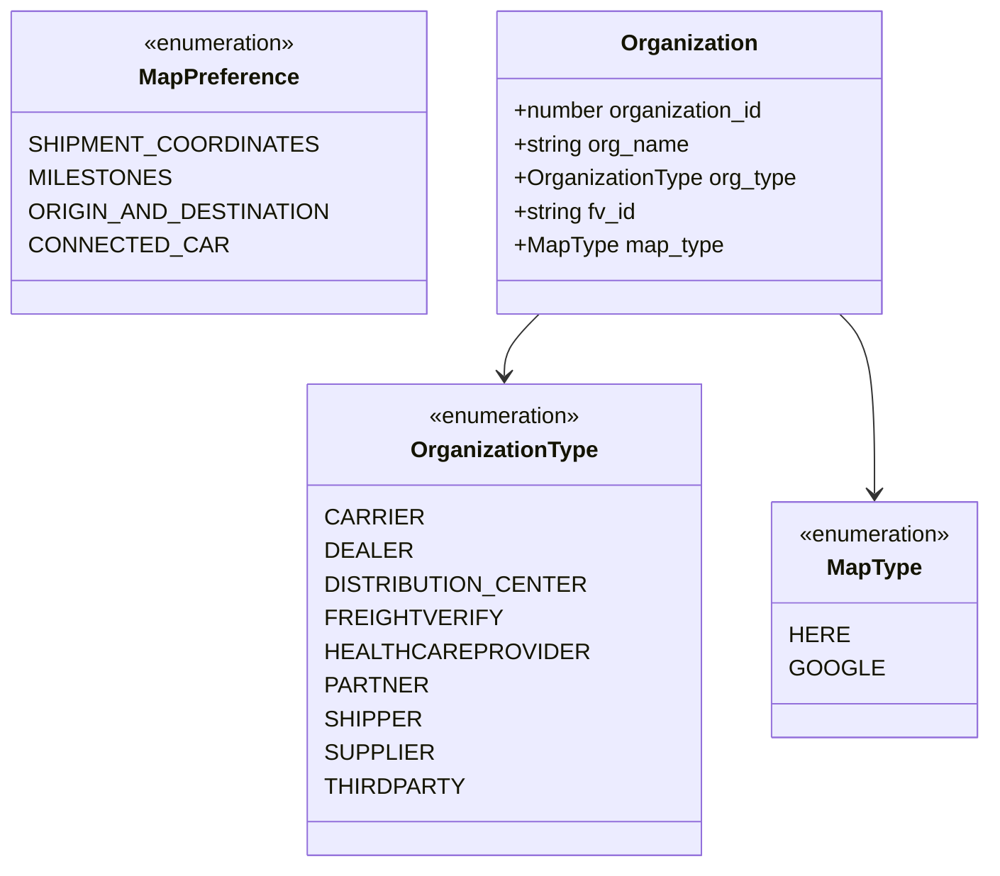

# Diagram: web/portal/src/shared/constants/organization.const.ts

> Auto-generated by Obscura crawlers

## Diagram 1

### SVG

<svg id="container" width="665.458984375" xmlns="http://www.w3.org/2000/svg" class="classDiagram" height="618" viewBox="0 0 665.458984375 618" role="graphics-document document" aria-roledescription="class"><g><defs><marker id="container_class-aggregationStart" class="marker aggregation class" refX="18" refY="7" markerWidth="190" markerHeight="240" orient="auto"><path d="M 18,7 L9,13 L1,7 L9,1 Z"></path></marker></defs><defs><marker id="container_class-aggregationEnd" class="marker aggregation class" refX="1" refY="7" markerWidth="20" markerHeight="28" orient="auto"><path d="M 18,7 L9,13 L1,7 L9,1 Z"></path></marker></defs><defs><marker id="container_class-extensionStart" class="marker extension class" refX="18" refY="7" markerWidth="190" markerHeight="240" orient="auto"><path d="M 1,7 L18,13 V 1 Z"></path></marker></defs><defs><marker id="container_class-extensionEnd" class="marker extension class" refX="1" refY="7" markerWidth="20" markerHeight="28" orient="auto"><path d="M 1,1 V 13 L18,7 Z"></path></marker></defs><defs><marker id="container_class-compositionStart" class="marker composition class" refX="18" refY="7" markerWidth="190" markerHeight="240" orient="auto"><path d="M 18,7 L9,13 L1,7 L9,1 Z"></path></marker></defs><defs><marker id="container_class-compositionEnd" class="marker composition class" refX="1" refY="7" markerWidth="20" markerHeight="28" orient="auto"><path d="M 18,7 L9,13 L1,7 L9,1 Z"></path></marker></defs><defs><marker id="container_class-dependencyStart" class="marker dependency class" refX="6" refY="7" markerWidth="190" markerHeight="240" orient="auto"><path d="M 5,7 L9,13 L1,7 L9,1 Z"></path></marker></defs><defs><marker id="container_class-dependencyEnd" class="marker dependency class" refX="13" refY="7" markerWidth="20" markerHeight="28" orient="auto"><path d="M 18,7 L9,13 L14,7 L9,1 Z"></path></marker></defs><defs><marker id="container_class-lollipopStart" class="marker lollipop class" refX="13" refY="7" markerWidth="190" markerHeight="240" orient="auto"><circle stroke="black" fill="transparent" cx="7" cy="7" r="6"></circle></marker></defs><defs><marker id="container_class-lollipopEnd" class="marker lollipop class" refX="1" refY="7" markerWidth="190" markerHeight="240" orient="auto"><circle stroke="black" fill="transparent" cx="7" cy="7" r="6"></circle></marker></defs><g class="root"><g class="clusters"></g><g class="edgePaths"><path d="M366.047,224L362.206,228.167C358.364,232.333,350.681,240.667,346.84,248C342.998,255.333,342.998,261.667,342.998,264.833L342.998,268" id="id_Organization_OrganizationType_1" class="edge-thickness-normal edge-pattern-solid relation" style=";;;" data-edge="true" data-et="edge" data-id="id_Organization_OrganizationType_1" data-points="W3sieCI6MzY2LjA0NzQ5MTc3NjMxNTgsInkiOjIyNH0seyJ4IjozNDIuOTk4MDQ2ODc1LCJ5IjoyNDl9LHsieCI6MzQyLjk5ODA0Njg3NSwieSI6Mjc0fV0=" marker-end="url(#container_class-dependencyEnd)"></path><path d="M565.195,224L569.036,228.167C572.878,232.333,580.561,240.667,584.403,262C588.244,283.333,588.244,317.667,588.244,334.833L588.244,352" id="id_Organization_MapType_2" class="edge-thickness-normal edge-pattern-solid relation" style=";;;" data-edge="true" data-et="edge" data-id="id_Organization_MapType_2" data-points="W3sieCI6NTY1LjE5NDY5NTcyMzY4NDIsInkiOjIyNH0seyJ4Ijo1ODguMjQ0MTQwNjI1LCJ5IjoyNDl9LHsieCI6NTg4LjI0NDE0MDYyNSwieSI6MzU4fV0=" marker-end="url(#container_class-dependencyEnd)"></path></g><g class="edgeLabels"><g class="edgeLabel"><g class="label" data-id="id_Organization_OrganizationType_1" transform="translate(0, 0)"><foreignObject width="0" height="0">

</foreignObject></g></g><g class="edgeLabel"><g class="label" data-id="id_Organization_MapType_2" transform="translate(0, 0)"><foreignObject width="0" height="0">

</foreignObject></g></g></g><g class="nodes"><g class="node default" id="classId-OrganizationType-0" transform="translate(342.998046875, 442)"><g class="basic label-container"><path d="M-126.03125 -168 L126.03125 -168 L126.03125 168 L-126.03125 168" stroke="none" stroke-width="0" fill="#ECECFF" style=""></path><path d="M-126.03125 -168 C-62.27182011062862 -168, 1.4876097787427653 -168, 126.03125 -168 M-126.03125 -168 C-41.77570806090317 -168, 42.47983387819366 -168, 126.03125 -168 M126.03125 -168 C126.03125 -70.30191328787247, 126.03125 27.396173424255068, 126.03125 168 M126.03125 -168 C126.03125 -74.15601137801242, 126.03125 19.687977243975155, 126.03125 168 M126.03125 168 C71.17554631988105 168, 16.319842639762086 168, -126.03125 168 M126.03125 168 C33.73870392254963 168, -58.553842154900735 168, -126.03125 168 M-126.03125 168 C-126.03125 42.59771729024493, -126.03125 -82.80456541951014, -126.03125 -168 M-126.03125 168 C-126.03125 56.54474254597869, -126.03125 -54.910514908042614, -126.03125 -168" stroke="#9370DB" stroke-width="1.3" fill="none" stroke-dasharray="0 0" style=""></path></g><g class="annotation-group text" transform="translate(-55.5546875, -144)"><g class="label" style="" transform="translate(0,-12)"><foreignObject width="111.109375" height="24">

«enumeration»

</foreignObject></g></g><g class="label-group text" transform="translate(-64.03125, -120)"><g class="label" style="font-weight: bolder" transform="translate(0,-12)"><foreignObject width="128.0625" height="24">

OrganizationType

</foreignObject></g></g><g class="members-group text" transform="translate(-114.03125, -72)"><g class="label" style="" transform="translate(0,-12)"><foreignObject width="60.453125" height="24">

CARRIER

</foreignObject></g><g class="label" style="" transform="translate(0,12)"><foreignObject width="54.25" height="24">

DEALER

</foreignObject></g><g class="label" style="" transform="translate(0,36)"><foreignObject width="164.03125" height="24">

DISTRIBUTION_CENTER

</foreignObject></g><g class="label" style="" transform="translate(0,60)"><foreignObject width="108.5" height="24">

FREIGHTVERIFY

</foreignObject></g><g class="label" style="" transform="translate(0,84)"><foreignObject width="162.765625" height="24">

HEALTHCAREPROVIDER

</foreignObject></g><g class="label" style="" transform="translate(0,108)"><foreignObject width="64.3125" height="24">

PARTNER

</foreignObject></g><g class="label" style="" transform="translate(0,132)"><foreignObject width="61.15625" height="24">

SHIPPER

</foreignObject></g><g class="label" style="" transform="translate(0,156)"><foreignObject width="68.84375" height="24">

SUPPLIER

</foreignObject></g><g class="label" style="" transform="translate(0,180)"><foreignObject width="87.796875" height="24">

THIRDPARTY

</foreignObject></g></g><g class="methods-group text" transform="translate(-114.03125, 168)"></g><g class="divider" style=""><path d="M-126.03125 -96 C-30.958437651062255 -96, 64.11437469787549 -96, 126.03125 -96 M-126.03125 -96 C-64.28081597329938 -96, -2.5303819465987516 -96, 126.03125 -96" stroke="#9370DB" stroke-width="1.3" fill="none" stroke-dasharray="0 0" style=""></path></g><g class="divider" style=""><path d="M-126.03125 144 C-38.60273640161856 144, 48.825777196762886 144, 126.03125 144 M-126.03125 144 C-41.000765427296855 144, 44.02971914540629 144, 126.03125 144" stroke="#9370DB" stroke-width="1.3" fill="none" stroke-dasharray="0 0" style=""></path></g></g><g class="node default" id="classId-MapType-1" transform="translate(588.244140625, 442)"><g class="basic label-container"><path d="M-69.21484375 -84 L69.21484375 -84 L69.21484375 84 L-69.21484375 84" stroke="none" stroke-width="0" fill="#ECECFF" style=""></path><path d="M-69.21484375 -84 C-26.037329358685405 -84, 17.14018503262919 -84, 69.21484375 -84 M-69.21484375 -84 C-19.722053166168216 -84, 29.770737417663568 -84, 69.21484375 -84 M69.21484375 -84 C69.21484375 -23.940218296899232, 69.21484375 36.119563406201536, 69.21484375 84 M69.21484375 -84 C69.21484375 -41.87719423183901, 69.21484375 0.24561153632197374, 69.21484375 84 M69.21484375 84 C30.875026830564472 84, -7.464790088871055 84, -69.21484375 84 M69.21484375 84 C39.97600890071544 84, 10.737174051430891 84, -69.21484375 84 M-69.21484375 84 C-69.21484375 49.08985853189329, -69.21484375 14.179717063786583, -69.21484375 -84 M-69.21484375 84 C-69.21484375 21.447901383010745, -69.21484375 -41.10419723397851, -69.21484375 -84" stroke="#9370DB" stroke-width="1.3" fill="none" stroke-dasharray="0 0" style=""></path></g><g class="annotation-group text" transform="translate(-55.5546875, -60)"><g class="label" style="" transform="translate(0,-12)"><foreignObject width="111.109375" height="24">

«enumeration»

</foreignObject></g></g><g class="label-group text" transform="translate(-32.7890625, -36)"><g class="label" style="font-weight: bolder" transform="translate(0,-12)"><foreignObject width="65.578125" height="24">

MapType

</foreignObject></g></g><g class="members-group text" transform="translate(-57.21484375, 12)"><g class="label" style="" transform="translate(0,-12)"><foreignObject width="37.6875" height="24">

HERE

</foreignObject></g><g class="label" style="" transform="translate(0,12)"><foreignObject width="58.875" height="24">

GOOGLE

</foreignObject></g></g><g class="methods-group text" transform="translate(-57.21484375, 84)"></g><g class="divider" style=""><path d="M-69.21484375 -12 C-28.39226057604494 -12, 12.43032259791012 -12, 69.21484375 -12 M-69.21484375 -12 C-20.563780461064127 -12, 28.087282827871746 -12, 69.21484375 -12" stroke="#9370DB" stroke-width="1.3" fill="none" stroke-dasharray="0 0" style=""></path></g><g class="divider" style=""><path d="M-69.21484375 60 C-20.097901179776095 60, 29.01904139044781 60, 69.21484375 60 M-69.21484375 60 C-33.9775081092276 60, 1.2598275315448006 60, 69.21484375 60" stroke="#9370DB" stroke-width="1.3" fill="none" stroke-dasharray="0 0" style=""></path></g></g><g class="node default" id="classId-MapPreference-2" transform="translate(143.76171875, 116)"><g class="basic label-container"><path d="M-135.76171875 -108 L135.76171875 -108 L135.76171875 108 L-135.76171875 108" stroke="none" stroke-width="0" fill="#ECECFF" style=""></path><path d="M-135.76171875 -108 C-29.80828963735574 -108, 76.14513947528852 -108, 135.76171875 -108 M-135.76171875 -108 C-56.465121357296454 -108, 22.831476035407093 -108, 135.76171875 -108 M135.76171875 -108 C135.76171875 -27.803124455992275, 135.76171875 52.39375108801545, 135.76171875 108 M135.76171875 -108 C135.76171875 -41.4778894042618, 135.76171875 25.044221191476396, 135.76171875 108 M135.76171875 108 C45.49571249948808 108, -44.77029375102384 108, -135.76171875 108 M135.76171875 108 C59.29227996269478 108, -17.177158824610444 108, -135.76171875 108 M-135.76171875 108 C-135.76171875 49.44191789178006, -135.76171875 -9.116164216439884, -135.76171875 -108 M-135.76171875 108 C-135.76171875 62.30211345049412, -135.76171875 16.604226900988238, -135.76171875 -108" stroke="#9370DB" stroke-width="1.3" fill="none" stroke-dasharray="0 0" style=""></path></g><g class="annotation-group text" transform="translate(-55.5546875, -84)"><g class="label" style="" transform="translate(0,-12)"><foreignObject width="111.109375" height="24">

«enumeration»

</foreignObject></g></g><g class="label-group text" transform="translate(-54.75, -60)"><g class="label" style="font-weight: bolder" transform="translate(0,-12)"><foreignObject width="109.5" height="24">

MapPreference

</foreignObject></g></g><g class="members-group text" transform="translate(-123.76171875, -12)"><g class="label" style="" transform="translate(0,-12)"><foreignObject width="180.40625" height="24">

SHIPMENT_COORDINATES

</foreignObject></g><g class="label" style="" transform="translate(0,12)"><foreignObject width="88.75" height="24">

MILESTONES

</foreignObject></g><g class="label" style="" transform="translate(0,36)"><foreignObject width="191.96875" height="24">

ORIGIN_AND_DESTINATION

</foreignObject></g><g class="label" style="" transform="translate(0,60)"><foreignObject width="120.734375" height="24">

CONNECTED_CAR

</foreignObject></g></g><g class="methods-group text" transform="translate(-123.76171875, 108)"></g><g class="divider" style=""><path d="M-135.76171875 -36 C-37.355796746250704 -36, 61.05012525749859 -36, 135.76171875 -36 M-135.76171875 -36 C-27.731014413080317 -36, 80.29968992383937 -36, 135.76171875 -36" stroke="#9370DB" stroke-width="1.3" fill="none" stroke-dasharray="0 0" style=""></path></g><g class="divider" style=""><path d="M-135.76171875 84 C-44.93799649817494 84, 45.88572575365012 84, 135.76171875 84 M-135.76171875 84 C-51.39101105326496 84, 32.97969664347008 84, 135.76171875 84" stroke="#9370DB" stroke-width="1.3" fill="none" stroke-dasharray="0 0" style=""></path></g></g><g class="node default" id="classId-Organization-3" transform="translate(465.62109375, 116)"><g class="basic label-container"><path d="M-136.09765625 -108 L136.09765625 -108 L136.09765625 108 L-136.09765625 108" stroke="none" stroke-width="0" fill="#ECECFF" style=""></path><path d="M-136.09765625 -108 C-54.87870952141188 -108, 26.340237207176244 -108, 136.09765625 -108 M-136.09765625 -108 C-35.94907261019078 -108, 64.19951102961844 -108, 136.09765625 -108 M136.09765625 -108 C136.09765625 -25.398967733371848, 136.09765625 57.202064533256305, 136.09765625 108 M136.09765625 -108 C136.09765625 -50.26905374235945, 136.09765625 7.461892515281093, 136.09765625 108 M136.09765625 108 C76.49898288502514 108, 16.900309520050286 108, -136.09765625 108 M136.09765625 108 C40.173926459118874 108, -55.74980333176225 108, -136.09765625 108 M-136.09765625 108 C-136.09765625 27.324229983305898, -136.09765625 -53.351540033388204, -136.09765625 -108 M-136.09765625 108 C-136.09765625 31.367529974222236, -136.09765625 -45.26494005155553, -136.09765625 -108" stroke="#9370DB" stroke-width="1.3" fill="none" stroke-dasharray="0 0" style=""></path></g><g class="annotation-group text" transform="translate(0, -84)"></g><g class="label-group text" transform="translate(-46.6953125, -84)"><g class="label" style="font-weight: bolder" transform="translate(0,-12)"><foreignObject width="93.390625" height="24">

Organization

</foreignObject></g></g><g class="members-group text" transform="translate(-124.09765625, -36)"><g class="label" style="" transform="translate(0,-12)"><foreignObject width="181.78125" height="24">

+number organization_id

</foreignObject></g><g class="label" style="" transform="translate(0,12)"><foreignObject width="126.359375" height="24">

+string org_name

</foreignObject></g><g class="label" style="" transform="translate(0,36)"><foreignObject width="201.5" height="24">

+OrganizationType org_type

</foreignObject></g><g class="label" style="" transform="translate(0,60)"><foreignObject width="89.015625" height="24">

+string fv_id

</foreignObject></g><g class="label" style="" transform="translate(0,84)"><foreignObject width="148.015625" height="24">

+MapType map_type

</foreignObject></g></g><g class="methods-group text" transform="translate(-124.09765625, 108)"></g><g class="divider" style=""><path d="M-136.09765625 -60 C-67.99048269168108 -60, 0.11669086663783901 -60, 136.09765625 -60 M-136.09765625 -60 C-56.23166969296378 -60, 23.634316864072446 -60, 136.09765625 -60" stroke="#9370DB" stroke-width="1.3" fill="none" stroke-dasharray="0 0" style=""></path></g><g class="divider" style=""><path d="M-136.09765625 84 C-64.01062842834806 84, 8.076399393303888 84, 136.09765625 84 M-136.09765625 84 C-56.82262661004722 84, 22.452403029905554 84, 136.09765625 84" stroke="#9370DB" stroke-width="1.3" fill="none" stroke-dasharray="0 0" style=""></path></g></g></g></g></g></svg>

## Diagram 2

```mermaid
graph TD
    MAP_OPTIONS[MAP_OPTIONS]
    MAP_OPTIONS --> SC[SHIPMENT_COORDINATES]
    MAP_OPTIONS --> CC[CONNECTED_CAR]
    MAP_OPTIONS --> MS[MILESTONES]
    MAP_OPTIONS --> OD[ORIGIN_AND_DESTINATION]
    
    SC --> SC_EC[enableCheckbox: false]
    SC --> SC_SM[showCoordinatesOnMap: true]
    SC --> SC_T[title: Shipment Coordinates]
    SC --> SC_D[display: true]
    
    CC --> CC_EC[enableCheckbox: false]
    CC --> CC_SM[showCoordinatesOnMap: true]
    CC --> CC_T[title: Connected Car]
    CC --> CC_D[display: true]
    
    MS --> MS_EC[enableCheckbox: false]
    MS --> MS_SM[showCoordinatesOnMap: true]
    MS --> MS_T[title: Milestones]
    MS --> MS_D[display: true]
    
    OD --> OD_EC[enableCheckbox: false]
    OD --> OD_SM[showCoordinatesOnMap: true]
    OD --> OD_T[title: Origin & Destination]
    OD --> OD_D[display: true]
```

### SVG

<svg id="container" width="4173.421875" xmlns="http://www.w3.org/2000/svg" class="flowchart" height="302" viewBox="0 0 4173.421875 302" role="graphics-document document" aria-roledescription="flowchart-v2"><g><marker id="container_flowchart-v2-pointEnd" class="marker flowchart-v2" viewBox="0 0 10 10" refX="5" refY="5" markerUnits="userSpaceOnUse" markerWidth="8" markerHeight="8" orient="auto"><path d="M 0 0 L 10 5 L 0 10 z" class="arrowMarkerPath" style="stroke-width: 1; stroke-dasharray: 1, 0;"></path></marker><marker id="container_flowchart-v2-pointStart" class="marker flowchart-v2" viewBox="0 0 10 10" refX="4.5" refY="5" markerUnits="userSpaceOnUse" markerWidth="8" markerHeight="8" orient="auto"><path d="M 0 5 L 10 10 L 10 0 z" class="arrowMarkerPath" style="stroke-width: 1; stroke-dasharray: 1, 0;"></path></marker><marker id="container_flowchart-v2-circleEnd" class="marker flowchart-v2" viewBox="0 0 10 10" refX="11" refY="5" markerUnits="userSpaceOnUse" markerWidth="11" markerHeight="11" orient="auto"><circle cx="5" cy="5" r="5" class="arrowMarkerPath" style="stroke-width: 1; stroke-dasharray: 1, 0;"></circle></marker><marker id="container_flowchart-v2-circleStart" class="marker flowchart-v2" viewBox="0 0 10 10" refX="-1" refY="5" markerUnits="userSpaceOnUse" markerWidth="11" markerHeight="11" orient="auto"><circle cx="5" cy="5" r="5" class="arrowMarkerPath" style="stroke-width: 1; stroke-dasharray: 1, 0;"></circle></marker><marker id="container_flowchart-v2-crossEnd" class="marker cross flowchart-v2" viewBox="0 0 11 11" refX="12" refY="5.2" markerUnits="userSpaceOnUse" markerWidth="11" markerHeight="11" orient="auto"><path d="M 1,1 l 9,9 M 10,1 l -9,9" class="arrowMarkerPath" style="stroke-width: 2; stroke-dasharray: 1, 0;"></path></marker><marker id="container_flowchart-v2-crossStart" class="marker cross flowchart-v2" viewBox="0 0 11 11" refX="-1" refY="5.2" markerUnits="userSpaceOnUse" markerWidth="11" markerHeight="11" orient="auto"><path d="M 1,1 l 9,9 M 10,1 l -9,9" class="arrowMarkerPath" style="stroke-width: 2; stroke-dasharray: 1, 0;"></path></marker><g class="root"><g class="clusters"></g><g class="edgePaths"><path d="M2069.563,37.634L1818.63,45.862C1567.697,54.09,1065.831,70.545,814.898,82.272C563.965,94,563.965,101,563.965,104.5L563.965,108" id="L_MAP_OPTIONS_SC_0" class="edge-thickness-normal edge-pattern-solid edge-thickness-normal edge-pattern-solid flowchart-link" style=";" data-edge="true" data-et="edge" data-id="L_MAP_OPTIONS_SC_0" data-points="W3sieCI6MjA2OS41NjI1LCJ5IjozNy42MzQzMTg2MzQ2ODMxN30seyJ4Ijo1NjMuOTY0ODQzNzUsInkiOjg3fSx7IngiOjU2My45NjQ4NDM3NSwieSI6MTEyfV0=" marker-end="url(#container_flowchart-v2-pointEnd)"></path><path d="M2069.563,43.189L1997.919,50.49C1926.275,57.792,1782.987,72.396,1711.343,83.198C1639.699,94,1639.699,101,1639.699,104.5L1639.699,108" id="L_MAP_OPTIONS_CC_0" class="edge-thickness-normal edge-pattern-solid edge-thickness-normal edge-pattern-solid flowchart-link" style=";" data-edge="true" data-et="edge" data-id="L_MAP_OPTIONS_CC_0" data-points="W3sieCI6MjA2OS41NjI1LCJ5Ijo0My4xODg1ODc2NTk3Mjc1OX0seyJ4IjoxNjM5LjY5OTIxODc1LCJ5Ijo4N30seyJ4IjoxNjM5LjY5OTIxODc1LCJ5IjoxMTJ9XQ==" marker-end="url(#container_flowchart-v2-pointEnd)"></path><path d="M2230.25,43.083L2303.004,50.403C2375.758,57.722,2521.266,72.361,2594.02,83.181C2666.773,94,2666.773,101,2666.773,104.5L2666.773,108" id="L_MAP_OPTIONS_MS_0" class="edge-thickness-normal edge-pattern-solid edge-thickness-normal edge-pattern-solid flowchart-link" style=";" data-edge="true" data-et="edge" data-id="L_MAP_OPTIONS_MS_0" data-points="W3sieCI6MjIzMC4yNSwieSI6NDMuMDgzMDcyNTk3ODMyNX0seyJ4IjoyNjY2Ljc3MzQzNzUsInkiOjg3fSx7IngiOjI2NjYuNzczNDM3NSwieSI6MTEyfV0=" marker-end="url(#container_flowchart-v2-pointEnd)"></path><path d="M2230.25,37.71L2473.76,45.925C2717.27,54.14,3204.289,70.57,3447.799,82.285C3691.309,94,3691.309,101,3691.309,104.5L3691.309,108" id="L_MAP_OPTIONS_OD_0" class="edge-thickness-normal edge-pattern-solid edge-thickness-normal edge-pattern-solid flowchart-link" style=";" data-edge="true" data-et="edge" data-id="L_MAP_OPTIONS_OD_0" data-points="W3sieCI6MjIzMC4yNSwieSI6MzcuNzEwNDM3Njg0ODM5NTV9LHsieCI6MzY5MS4zMDg1OTM3NSwieSI6ODd9LHsieCI6MzY5MS4zMDg1OTM3NSwieSI6MTEyfV0=" marker-end="url(#container_flowchart-v2-pointEnd)"></path><path d="M443.762,153.038L389.587,159.365C335.411,165.692,227.061,178.346,172.886,190.173C118.711,202,118.711,213,118.711,218.5L118.711,224" id="L_SC_SC_EC_0" class="edge-thickness-normal edge-pattern-solid edge-thickness-normal edge-pattern-solid flowchart-link" style=";" data-edge="true" data-et="edge" data-id="L_SC_SC_EC_0" data-points="W3sieCI6NDQzLjc2MTcxODc1LCJ5IjoxNTMuMDM4MTk4MDA4NTA5ODh9LHsieCI6MTE4LjcxMDkzNzUsInkiOjE5MX0seyJ4IjoxMTguNzEwOTM3NSwieSI6MjI4fV0=" marker-end="url(#container_flowchart-v2-pointEnd)"></path><path d="M483.721,166L471.338,170.167C458.955,174.333,434.188,182.667,421.805,190.333C409.422,198,409.422,205,409.422,208.5L409.422,212" id="L_SC_SC_SM_0" class="edge-thickness-normal edge-pattern-solid edge-thickness-normal edge-pattern-solid flowchart-link" style=";" data-edge="true" data-et="edge" data-id="L_SC_SC_SM_0" data-points="W3sieCI6NDgzLjcyMTM3OTIwNjczMDgsInkiOjE2Nn0seyJ4Ijo0MDkuNDIxODc1LCJ5IjoxOTF9LHsieCI6NDA5LjQyMTg3NSwieSI6MjE2fV0=" marker-end="url(#container_flowchart-v2-pointEnd)"></path><path d="M644.208,166L656.592,170.167C668.975,174.333,693.741,182.667,706.125,192.333C718.508,202,718.508,213,718.508,218.5L718.508,224" id="L_SC_SC_T_0" class="edge-thickness-normal edge-pattern-solid edge-thickness-normal edge-pattern-solid flowchart-link" style=";" data-edge="true" data-et="edge" data-id="L_SC_SC_T_0" data-points="W3sieCI6NjQ0LjIwODMwODI5MzI2OTMsInkiOjE2Nn0seyJ4Ijo3MTguNTA3ODEyNSwieSI6MTkxfSx7IngiOjcxOC41MDc4MTI1LCJ5IjoyMjh9XQ==" marker-end="url(#container_flowchart-v2-pointEnd)"></path><path d="M684.168,154.294L732.251,160.411C780.333,166.529,876.499,178.765,924.581,190.382C972.664,202,972.664,213,972.664,218.5L972.664,224" id="L_SC_SC_D_0" class="edge-thickness-normal edge-pattern-solid edge-thickness-normal edge-pattern-solid flowchart-link" style=";" data-edge="true" data-et="edge" data-id="L_SC_SC_D_0" data-points="W3sieCI6Njg0LjE2Nzk2ODc1LCJ5IjoxNTQuMjkzNzk2MDU2NDY3Mjd9LHsieCI6OTcyLjY2NDA2MjUsInkiOjE5MX0seyJ4Ijo5NzIuNjY0MDYyNSwieSI6MjI4fV0=" marker-end="url(#container_flowchart-v2-pointEnd)"></path><path d="M1549.332,149.896L1492.518,156.747C1435.703,163.598,1322.074,177.299,1265.26,189.649C1208.445,202,1208.445,213,1208.445,218.5L1208.445,224" id="L_CC_CC_EC_0" class="edge-thickness-normal edge-pattern-solid edge-thickness-normal edge-pattern-solid flowchart-link" style=";" data-edge="true" data-et="edge" data-id="L_CC_CC_EC_0" data-points="W3sieCI6MTU0OS4zMzIwMzEyNSwieSI6MTQ5Ljg5NjM1MDU3NjUzNDY0fSx7IngiOjEyMDguNDQ1MzEyNSwieSI6MTkxfSx7IngiOjEyMDguNDQ1MzEyNSwieSI6MjI4fV0=" marker-end="url(#container_flowchart-v2-pointEnd)"></path><path d="M1566.725,166L1555.464,170.167C1544.202,174.333,1521.679,182.667,1510.418,190.333C1499.156,198,1499.156,205,1499.156,208.5L1499.156,212" id="L_CC_CC_SM_0" class="edge-thickness-normal edge-pattern-solid edge-thickness-normal edge-pattern-solid flowchart-link" style=";" data-edge="true" data-et="edge" data-id="L_CC_CC_SM_0" data-points="W3sieCI6MTU2Ni43MjQ5ODQ5NzU5NjE0LCJ5IjoxNjZ9LHsieCI6MTQ5OS4xNTYyNSwieSI6MTkxfSx7IngiOjE0OTkuMTU2MjUsInkiOjIxNn1d" marker-end="url(#container_flowchart-v2-pointEnd)"></path><path d="M1712.673,166L1723.935,170.167C1735.196,174.333,1757.719,182.667,1768.981,192.333C1780.242,202,1780.242,213,1780.242,218.5L1780.242,224" id="L_CC_CC_T_0" class="edge-thickness-normal edge-pattern-solid edge-thickness-normal edge-pattern-solid flowchart-link" style=";" data-edge="true" data-et="edge" data-id="L_CC_CC_T_0" data-points="W3sieCI6MTcxMi42NzM0NTI1MjQwMzg2LCJ5IjoxNjZ9LHsieCI6MTc4MC4yNDIxODc1LCJ5IjoxOTF9LHsieCI6MTc4MC4yNDIxODc1LCJ5IjoyMjh9XQ==" marker-end="url(#container_flowchart-v2-pointEnd)"></path><path d="M1730.066,151.815L1776.122,158.345C1822.177,164.876,1914.288,177.938,1960.343,189.969C2006.398,202,2006.398,213,2006.398,218.5L2006.398,224" id="L_CC_CC_D_0" class="edge-thickness-normal edge-pattern-solid edge-thickness-normal edge-pattern-solid flowchart-link" style=";" data-edge="true" data-et="edge" data-id="L_CC_CC_D_0" data-points="W3sieCI6MTczMC4wNjY0MDYyNSwieSI6MTUxLjgxNDU3MjU2OTkwNjh9LHsieCI6MjAwNi4zOTg0Mzc1LCJ5IjoxOTF9LHsieCI6MjAwNi4zOTg0Mzc1LCJ5IjoyMjh9XQ==" marker-end="url(#container_flowchart-v2-pointEnd)"></path><path d="M2592.398,148.109L2534.029,155.257C2475.659,162.406,2358.919,176.703,2300.549,189.351C2242.18,202,2242.18,213,2242.18,218.5L2242.18,224" id="L_MS_MS_EC_0" class="edge-thickness-normal edge-pattern-solid edge-thickness-normal edge-pattern-solid flowchart-link" style=";" data-edge="true" data-et="edge" data-id="L_MS_MS_EC_0" data-points="W3sieCI6MjU5Mi4zOTg0Mzc1LCJ5IjoxNDguMTA4NzA2ODUyMTM4MDh9LHsieCI6MjI0Mi4xNzk2ODc1LCJ5IjoxOTF9LHsieCI6MjI0Mi4xNzk2ODc1LCJ5IjoyMjh9XQ==" marker-end="url(#container_flowchart-v2-pointEnd)"></path><path d="M2597.257,166L2586.53,170.167C2575.802,174.333,2554.346,182.667,2543.618,190.333C2532.891,198,2532.891,205,2532.891,208.5L2532.891,212" id="L_MS_MS_SM_0" class="edge-thickness-normal edge-pattern-solid edge-thickness-normal edge-pattern-solid flowchart-link" style=";" data-edge="true" data-et="edge" data-id="L_MS_MS_SM_0" data-points="W3sieCI6MjU5Ny4yNTczNjE3Nzg4NDYsInkiOjE2Nn0seyJ4IjoyNTMyLjg5MDYyNSwieSI6MTkxfSx7IngiOjI1MzIuODkwNjI1LCJ5IjoyMTZ9XQ==" marker-end="url(#container_flowchart-v2-pointEnd)"></path><path d="M2736.29,166L2747.017,170.167C2757.745,174.333,2779.201,182.667,2789.928,192.333C2800.656,202,2800.656,213,2800.656,218.5L2800.656,224" id="L_MS_MS_T_0" class="edge-thickness-normal edge-pattern-solid edge-thickness-normal edge-pattern-solid flowchart-link" style=";" data-edge="true" data-et="edge" data-id="L_MS_MS_T_0" data-points="W3sieCI6MjczNi4yODk1MTMyMjExNTQsInkiOjE2Nn0seyJ4IjoyODAwLjY1NjI1LCJ5IjoxOTF9LHsieCI6MjgwMC42NTYyNSwieSI6MjI4fV0=" marker-end="url(#container_flowchart-v2-pointEnd)"></path><path d="M2741.148,150.155L2786.539,156.962C2831.93,163.77,2922.711,177.385,2968.102,189.692C3013.492,202,3013.492,213,3013.492,218.5L3013.492,224" id="L_MS_MS_D_0" class="edge-thickness-normal edge-pattern-solid edge-thickness-normal edge-pattern-solid flowchart-link" style=";" data-edge="true" data-et="edge" data-id="L_MS_MS_D_0" data-points="W3sieCI6Mjc0MS4xNDg0Mzc1LCJ5IjoxNTAuMTU0NTc0MTMyNDkyMTJ9LHsieCI6MzAxMy40OTIxODc1LCJ5IjoxOTF9LHsieCI6MzAxMy40OTIxODc1LCJ5IjoyMjh9XQ==" marker-end="url(#container_flowchart-v2-pointEnd)"></path><path d="M3565.324,153.821L3512.649,160.017C3459.974,166.214,3354.624,178.607,3301.949,190.303C3249.273,202,3249.273,213,3249.273,218.5L3249.273,224" id="L_OD_OD_EC_0" class="edge-thickness-normal edge-pattern-solid edge-thickness-normal edge-pattern-solid flowchart-link" style=";" data-edge="true" data-et="edge" data-id="L_OD_OD_EC_0" data-points="W3sieCI6MzU2NS4zMjQyMTg3NSwieSI6MTUzLjgyMDUxMjM2NzMzNTAzfSx7IngiOjMyNDkuMjczNDM3NSwieSI6MTkxfSx7IngiOjMyNDkuMjczNDM3NSwieSI6MjI4fV0=" marker-end="url(#container_flowchart-v2-pointEnd)"></path><path d="M3612.736,166L3600.611,170.167C3588.486,174.333,3564.235,182.667,3552.11,190.333C3539.984,198,3539.984,205,3539.984,208.5L3539.984,212" id="L_OD_OD_SM_0" class="edge-thickness-normal edge-pattern-solid edge-thickness-normal edge-pattern-solid flowchart-link" style=";" data-edge="true" data-et="edge" data-id="L_OD_OD_SM_0" data-points="W3sieCI6MzYxMi43MzY0MDMyNDUxOTI0LCJ5IjoxNjZ9LHsieCI6MzUzOS45ODQzNzUsInkiOjE5MX0seyJ4IjozNTM5Ljk4NDM3NSwieSI6MjE2fV0=" marker-end="url(#container_flowchart-v2-pointEnd)"></path><path d="M3769.881,166L3782.006,170.167C3794.131,174.333,3818.382,182.667,3830.507,192.333C3842.633,202,3842.633,213,3842.633,218.5L3842.633,224" id="L_OD_OD_T_0" class="edge-thickness-normal edge-pattern-solid edge-thickness-normal edge-pattern-solid flowchart-link" style=";" data-edge="true" data-et="edge" data-id="L_OD_OD_T_0" data-points="W3sieCI6Mzc2OS44ODA3ODQyNTQ4MDc2LCJ5IjoxNjZ9LHsieCI6Mzg0Mi42MzI4MTI1LCJ5IjoxOTF9LHsieCI6Mzg0Mi42MzI4MTI1LCJ5IjoyMjh9XQ==" marker-end="url(#container_flowchart-v2-pointEnd)"></path><path d="M3817.293,155.417L3862.803,161.348C3908.313,167.278,3999.332,179.139,4044.842,190.57C4090.352,202,4090.352,213,4090.352,218.5L4090.352,224" id="L_OD_OD_D_0" class="edge-thickness-normal edge-pattern-solid edge-thickness-normal edge-pattern-solid flowchart-link" style=";" data-edge="true" data-et="edge" data-id="L_OD_OD_D_0" data-points="W3sieCI6MzgxNy4yOTI5Njg3NSwieSI6MTU1LjQxNzI0ODI5OTE1MzI0fSx7IngiOjQwOTAuMzUxNTYyNSwieSI6MTkxfSx7IngiOjQwOTAuMzUxNTYyNSwieSI6MjI4fV0=" marker-end="url(#container_flowchart-v2-pointEnd)"></path></g><g class="edgeLabels"><g class="edgeLabel"><g class="label" data-id="L_MAP_OPTIONS_SC_0" transform="translate(0, 0)"><foreignObject width="0" height="0">

</foreignObject></g></g><g class="edgeLabel"><g class="label" data-id="L_MAP_OPTIONS_CC_0" transform="translate(0, 0)"><foreignObject width="0" height="0">

</foreignObject></g></g><g class="edgeLabel"><g class="label" data-id="L_MAP_OPTIONS_MS_0" transform="translate(0, 0)"><foreignObject width="0" height="0">

</foreignObject></g></g><g class="edgeLabel"><g class="label" data-id="L_MAP_OPTIONS_OD_0" transform="translate(0, 0)"><foreignObject width="0" height="0">

</foreignObject></g></g><g class="edgeLabel"><g class="label" data-id="L_SC_SC_EC_0" transform="translate(0, 0)"><foreignObject width="0" height="0">

</foreignObject></g></g><g class="edgeLabel"><g class="label" data-id="L_SC_SC_SM_0" transform="translate(0, 0)"><foreignObject width="0" height="0">

</foreignObject></g></g><g class="edgeLabel"><g class="label" data-id="L_SC_SC_T_0" transform="translate(0, 0)"><foreignObject width="0" height="0">

</foreignObject></g></g><g class="edgeLabel"><g class="label" data-id="L_SC_SC_D_0" transform="translate(0, 0)"><foreignObject width="0" height="0">

</foreignObject></g></g><g class="edgeLabel"><g class="label" data-id="L_CC_CC_EC_0" transform="translate(0, 0)"><foreignObject width="0" height="0">

</foreignObject></g></g><g class="edgeLabel"><g class="label" data-id="L_CC_CC_SM_0" transform="translate(0, 0)"><foreignObject width="0" height="0">

</foreignObject></g></g><g class="edgeLabel"><g class="label" data-id="L_CC_CC_T_0" transform="translate(0, 0)"><foreignObject width="0" height="0">

</foreignObject></g></g><g class="edgeLabel"><g class="label" data-id="L_CC_CC_D_0" transform="translate(0, 0)"><foreignObject width="0" height="0">

</foreignObject></g></g><g class="edgeLabel"><g class="label" data-id="L_MS_MS_EC_0" transform="translate(0, 0)"><foreignObject width="0" height="0">

</foreignObject></g></g><g class="edgeLabel"><g class="label" data-id="L_MS_MS_SM_0" transform="translate(0, 0)"><foreignObject width="0" height="0">

</foreignObject></g></g><g class="edgeLabel"><g class="label" data-id="L_MS_MS_T_0" transform="translate(0, 0)"><foreignObject width="0" height="0">

</foreignObject></g></g><g class="edgeLabel"><g class="label" data-id="L_MS_MS_D_0" transform="translate(0, 0)"><foreignObject width="0" height="0">

</foreignObject></g></g><g class="edgeLabel"><g class="label" data-id="L_OD_OD_EC_0" transform="translate(0, 0)"><foreignObject width="0" height="0">

</foreignObject></g></g><g class="edgeLabel"><g class="label" data-id="L_OD_OD_SM_0" transform="translate(0, 0)"><foreignObject width="0" height="0">

</foreignObject></g></g><g class="edgeLabel"><g class="label" data-id="L_OD_OD_T_0" transform="translate(0, 0)"><foreignObject width="0" height="0">

</foreignObject></g></g><g class="edgeLabel"><g class="label" data-id="L_OD_OD_D_0" transform="translate(0, 0)"><foreignObject width="0" height="0">

</foreignObject></g></g></g><g class="nodes"><g class="node default" id="flowchart-MAP_OPTIONS-0" transform="translate(2149.90625, 35)"><rect class="basic label-container" style="" x="-80.34375" y="-27" width="160.6875" height="54"></rect><g class="label" style="" transform="translate(-50.34375, -12)"><rect></rect><foreignObject width="100.6875" height="24">

MAP_OPTIONS

</foreignObject></g></g><g class="node default" id="flowchart-SC-2" transform="translate(563.96484375, 139)"><rect class="basic label-container" style="" x="-120.203125" y="-27" width="240.40625" height="54"></rect><g class="label" style="" transform="translate(-90.203125, -12)"><rect></rect><foreignObject width="180.40625" height="24">

SHIPMENT_COORDINATES

</foreignObject></g></g><g class="node default" id="flowchart-CC-4" transform="translate(1639.69921875, 139)"><rect class="basic label-container" style="" x="-90.3671875" y="-27" width="180.734375" height="54"></rect><g class="label" style="" transform="translate(-60.3671875, -12)"><rect></rect><foreignObject width="120.734375" height="24">

CONNECTED_CAR

</foreignObject></g></g><g class="node default" id="flowchart-MS-6" transform="translate(2666.7734375, 139)"><rect class="basic label-container" style="" x="-74.375" y="-27" width="148.75" height="54"></rect><g class="label" style="" transform="translate(-44.375, -12)"><rect></rect><foreignObject width="88.75" height="24">

MILESTONES

</foreignObject></g></g><g class="node default" id="flowchart-OD-8" transform="translate(3691.30859375, 139)"><rect class="basic label-container" style="" x="-125.984375" y="-27" width="251.96875" height="54"></rect><g class="label" style="" transform="translate(-95.984375, -12)"><rect></rect><foreignObject width="191.96875" height="24">

ORIGIN_AND_DESTINATION

</foreignObject></g></g><g class="node default" id="flowchart-SC_EC-10" transform="translate(118.7109375, 255)"><rect class="basic label-container" style="" x="-110.7109375" y="-27" width="221.421875" height="54"></rect><g class="label" style="" transform="translate(-80.7109375, -12)"><rect></rect><foreignObject width="161.421875" height="24">

enableCheckbox: false

</foreignObject></g></g><g class="node default" id="flowchart-SC_SM-12" transform="translate(409.421875, 255)"><rect class="basic label-container" style="" x="-130" y="-39" width="260" height="78"></rect><g class="label" style="" transform="translate(-100, -24)"><rect></rect><foreignObject width="200" height="48">

showCoordinatesOnMap: true

</foreignObject></g></g><g class="node default" id="flowchart-SC_T-14" transform="translate(718.5078125, 255)"><rect class="basic label-container" style="" x="-129.0859375" y="-27" width="258.171875" height="54"></rect><g class="label" style="" transform="translate(-99.0859375, -12)"><rect></rect><foreignObject width="198.171875" height="24">

title: Shipment Coordinates

</foreignObject></g></g><g class="node default" id="flowchart-SC_D-16" transform="translate(972.6640625, 255)"><rect class="basic label-container" style="" x="-75.0703125" y="-27" width="150.140625" height="54"></rect><g class="label" style="" transform="translate(-45.0703125, -12)"><rect></rect><foreignObject width="90.140625" height="24">

display: true

</foreignObject></g></g><g class="node default" id="flowchart-CC_EC-18" transform="translate(1208.4453125, 255)"><rect class="basic label-container" style="" x="-110.7109375" y="-27" width="221.421875" height="54"></rect><g class="label" style="" transform="translate(-80.7109375, -12)"><rect></rect><foreignObject width="161.421875" height="24">

enableCheckbox: false

</foreignObject></g></g><g class="node default" id="flowchart-CC_SM-20" transform="translate(1499.15625, 255)"><rect class="basic label-container" style="" x="-130" y="-39" width="260" height="78"></rect><g class="label" style="" transform="translate(-100, -24)"><rect></rect><foreignObject width="200" height="48">

showCoordinatesOnMap: true

</foreignObject></g></g><g class="node default" id="flowchart-CC_T-22" transform="translate(1780.2421875, 255)"><rect class="basic label-container" style="" x="-101.0859375" y="-27" width="202.171875" height="54"></rect><g class="label" style="" transform="translate(-71.0859375, -12)"><rect></rect><foreignObject width="142.171875" height="24">

title: Connected Car

</foreignObject></g></g><g class="node default" id="flowchart-CC_D-24" transform="translate(2006.3984375, 255)"><rect class="basic label-container" style="" x="-75.0703125" y="-27" width="150.140625" height="54"></rect><g class="label" style="" transform="translate(-45.0703125, -12)"><rect></rect><foreignObject width="90.140625" height="24">

display: true

</foreignObject></g></g><g class="node default" id="flowchart-MS_EC-26" transform="translate(2242.1796875, 255)"><rect class="basic label-container" style="" x="-110.7109375" y="-27" width="221.421875" height="54"></rect><g class="label" style="" transform="translate(-80.7109375, -12)"><rect></rect><foreignObject width="161.421875" height="24">

enableCheckbox: false

</foreignObject></g></g><g class="node default" id="flowchart-MS_SM-28" transform="translate(2532.890625, 255)"><rect class="basic label-container" style="" x="-130" y="-39" width="260" height="78"></rect><g class="label" style="" transform="translate(-100, -24)"><rect></rect><foreignObject width="200" height="48">

showCoordinatesOnMap: true

</foreignObject></g></g><g class="node default" id="flowchart-MS_T-30" transform="translate(2800.65625, 255)"><rect class="basic label-container" style="" x="-87.765625" y="-27" width="175.53125" height="54"></rect><g class="label" style="" transform="translate(-57.765625, -12)"><rect></rect><foreignObject width="115.53125" height="24">

title: Milestones

</foreignObject></g></g><g class="node default" id="flowchart-MS_D-32" transform="translate(3013.4921875, 255)"><rect class="basic label-container" style="" x="-75.0703125" y="-27" width="150.140625" height="54"></rect><g class="label" style="" transform="translate(-45.0703125, -12)"><rect></rect><foreignObject width="90.140625" height="24">

display: true

</foreignObject></g></g><g class="node default" id="flowchart-OD_EC-34" transform="translate(3249.2734375, 255)"><rect class="basic label-container" style="" x="-110.7109375" y="-27" width="221.421875" height="54"></rect><g class="label" style="" transform="translate(-80.7109375, -12)"><rect></rect><foreignObject width="161.421875" height="24">

enableCheckbox: false

</foreignObject></g></g><g class="node default" id="flowchart-OD_SM-36" transform="translate(3539.984375, 255)"><rect class="basic label-container" style="" x="-130" y="-39" width="260" height="78"></rect><g class="label" style="" transform="translate(-100, -24)"><rect></rect><foreignObject width="200" height="48">

showCoordinatesOnMap: true

</foreignObject></g></g><g class="node default" id="flowchart-OD_T-38" transform="translate(3842.6328125, 255)"><rect class="basic label-container" style="" x="-122.6484375" y="-27" width="245.296875" height="54"></rect><g class="label" style="" transform="translate(-92.6484375, -12)"><rect></rect><foreignObject width="185.296875" height="24">

title: Origin &amp; Destination

</foreignObject></g></g><g class="node default" id="flowchart-OD_D-40" transform="translate(4090.3515625, 255)"><rect class="basic label-container" style="" x="-75.0703125" y="-27" width="150.140625" height="54"></rect><g class="label" style="" transform="translate(-45.0703125, -12)"><rect></rect><foreignObject width="90.140625" height="24">

display: true

</foreignObject></g></g></g></g></g></svg>
