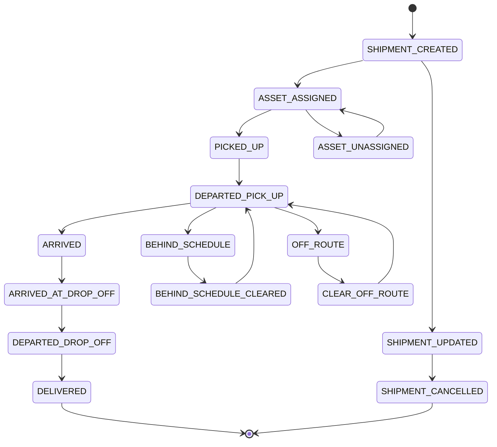
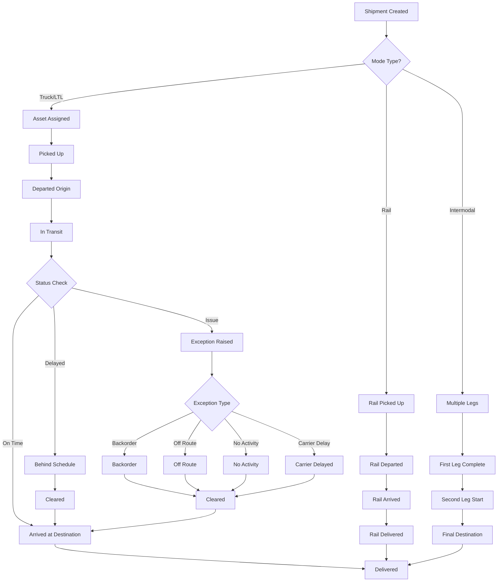

# Diagram: web/portal/src/shared/constants/shipments.const.ts

> Auto-generated by Obscura crawlers

## Diagram 1

```mermaid
classDiagram
    class ShipmentStatusCode {
        <<enumeration>>
        SHIPMENT_CREATED
        SHIPMENT_UPDATED
        SHIPMENT_CANCELLED
        ASSET_ASSIGNED
        ASSET_UNASSIGNED
        ARRIVED
        ARRIVED_AT_DROP_OFF
        DEPARTED_PICK_UP
        DEPARTED_DROP_OFF
        DELIVERED
        PICKED_UP
        ESTIMATED_DELIVERY
        BEHIND_SCHEDULE
        BEHIND_SCHEDULE_CLEARED
        MANUAL_CARRIER_DELAY
        MANUAL_SHIPPER_DELAY
        CLEAR_MANUAL_CARRIER_DELAY
        CLEAR_MANUAL_SHIPPER_DELAY
        BACKORDER
        CLEAR_BACK_ORDER
        OFF_ROUTE
        CLEAR_OFF_ROUTE
        NO_ACTIVITY
        RAIL_ARRIVED_AT_DROP_OFF
        RAIL_ARRIVED
        RAIL_DEPARTED_DROP_OFF
        RAIL_DEPARTED_PICK_UP
        RAIL_PICKED_UP
        RAIL_DELIVERED
        RAIL_PLACEMENT_ACTUAL
        RAIL_PLACEMENT_CONSTRUCTIVE
        RAIL_BAD_ORDER
        PASSING_LOCATION
        DEPARTED_FROM_ORIGIN_LOCATION
    }

    class ShipmentStatusActorType {
        <<enumeration>>
        SYSTEM
        HUMAN
    }

    class ShipmentStatusType {
        <<enumeration>>
        SENT_BY_CARRIER
        SYSTEM_GENERATED
        FOR_SUPPLEMENTAL_DATA
    }

    class Mode {
        <<enumeration>>
        TRUCK
        RAIL
        LTL
        INTERMODAL
        OCEAN
        MULTIMODAL
        AIR
        PARCEL
    }

    class ModeId {
        <<enumeration>>
        TRUCK
        RAIL
        LTL
        INTERMODAL
        OCEAN
        MULTIMODAL
        AIR
        PARCEL
    }

    class ShipmentStatus {
        <<enumeration>>
        ACTIVE
        ARRIVED
        AVAILABLE_FOR_UNLOAD
        CANCELED
        PENDING_ASSET_ID
        RELEASED
        SCHEDULED
        EXPIRED
    }

    class ShipmentStatusName {
        <<enumeration>>
        ASSET_ASSIGNED
        ESTIMATED_DELIVERY
        BAD_ORDER
        DEPARTED_FROM_LOCATION
        PULL_FROM_PATRON_SIDING
        RELEASE_EMPTY
    }

    class ShipmentEvent {
        <<enumeration>>
        ARRIVED_AT_DESTINATION
        ARRIVED_AT_ORIGIN
        ARRIVED_AT_STOP
        AVAILABLE_FOR_DELIVERY
        DEPARTED_DESTINATION
        DEPARTED_ORIGIN
        DEPARTED_STOP
    }

    class ShipmentException {
        <<enumeration>>
        BACKORDER
        BAD_ORDER
        BEHIND_SCHEDULE
        CARRIER_DELAYED
        SHIPPER_DELAYED
        EXPIRED
        IDLE_TRAIN
        IN_HOLD
        LOST
        MISSED_DROP_OFF
        MISSED_PICKUP
        UNDER_REVIEW
        OFF_ROUTE
        NO_ACTIVITY
        NOT_APPLICABLE
    }

    class ShipmentType {
        <<enumeration>>
        INBOUND
        RACK_RETURN
        MULTI_STOP
    }

    class LineOfBusiness {
        <<enumeration>>
        AFTERMARKET
        FINISHED_VEHICLE
        INBOUND
    }

    class LoadedStatus {
        <<enumeration>>
        EMPTY
        LOADED
    }

    class ETA {
        <<enumeration>>
        DELAYED
        TBD
    }

    class Region {
        <<enumeration>>
        AFRICA
        ASIA
        AUSTRALIA
        EUROPE
        NORTH_AMERICA
        SOUTH_AMERICA
    }

    class DeliveryType {
        <<enumeration>>
        ATTENDED
        UNATTENDED
    }

    class StatusUpdate {
        +string current_city
        +string current_state
        +object status_details
        +string status_code
        +string actor_type
        +string status_name
        +string stop_location_name
        +ModeId mode_id
        +string obc_asset_id
    }

    class ShipmentExceptionDetail {
        +string id
        +number shipment_id
        +string action_link
        +string details_link
        +number organization_id
        +string created_utc
        +string details
        +string event_utc
        +string resolution_steps
        +number shipment_exception_type_id
        +string created_at
        +string updated_at
        +string resolved_at
        +string name
        +string actor_id
        +string actor_type
        +string actor_email
        +string org_type
    }

    class ShipmentDetails {
        +string eta
        +string eta_metadata
        +boolean is_multileg
        +string line_of_business
        +string major_mode
        +Mode mode
        +Array~RelatedShipment~ related_shipments
        +string relation
        +string sub_mode
        +boolean is_back_order
        +boolean is_off_route
        +boolean is_no_activity
    }

    class RelatedShipment {
        +string active_status
        +number child_shipment_id
        +string creator_shipment_id
        +string current_exception
        +string destination_delivery_window
        +string origin_pickup_window
        +string trailer_number
    }

    class CurrentLocation {
        +string reported_at
        +number latitude
        +number longitude
        +string current_city
        +string current_state
        +string current_country
        +string destination_eta
        +string destination_progress
        +number remaining_miles
        +Array~LocationUpdate~ updates
    }

    class LocationUpdate {
        +string time
        +string db_time
        +string city
        +string state
        +string country
        +number latitude
        +number longitude
        +number mode_id
        +string equipment_description
        +Array~unknown~ event_references
    }

    class Shipment {
        +number id
        +string creator_shipment_id
        +string shipment_type_ng
        +string mode_name
        +string active_status_ng
        +string actor_type
        +string current_status_ng
        +string active_exceptions_ng
        +string current_exception
        +string shipper_name
        +string carrier_name
        +string carrier_scac
        +string loaded_status
        +string rail_train_id
        +string trailer_equipment_number
        +string current_road_name
        +CurrentLocation current_location
        +ShipmentDetails shipment_details
        +Array~StatusUpdate~ shipment_statuses
        +Array~ShipmentExceptionDetail~ shipment_exceptions
        +string origin_name
        +string origin_address
        +string origin_city
        +string origin_state
        +string origin_postal_code
        +string origin_country
        +string origin_earliest_arrival
        +string origin_latest_arrival
        +string origin_actual_arrival
        +string origin_actual_departure
        +string origin_calculated_eta
        +string destination_name
        +string destination_address
        +string destination_city
        +string destination_state
        +string destination_postal_code
        +string destination_country
        +string destination_earliest_arrival
        +string destination_latest_arrival
        +string destination_actual_arrival
        +string destination_actual_departure
        +string destination_calculated_eta
        +boolean destination_is_fv_eta
        +string destination_frozen_eta
        +string available_for_unload_ts
    }

    class ShipmentTrip {
        +number id
        +string creator_shipment_id
        +string mode_name
        +string shipper_name
        +number created_by_org_id
        +string carrier_fv_id
        +boolean watched
        +string active_status
        +string active_status_ng
        +string current_exception
        +string active_exception_ng
        +number active_shipment
        +string active_child_shipment
        +Array~number~ child_ids
        +Array~ChildShipmentRef~ child_shipments
        +string destination_calculated_eta
        +string destination_eta
        +ShipmentDetails shipment_details
    }

    class ChildShipmentRef {
        +number shipment_id
    }

    Shipment --> CurrentLocation
    Shipment --> ShipmentDetails
    Shipment --> StatusUpdate
    Shipment --> ShipmentExceptionDetail
    ShipmentTrip --> ShipmentDetails
    ShipmentTrip --> ChildShipmentRef
    ShipmentDetails --> Mode
    ShipmentDetails --> RelatedShipment
    CurrentLocation --> LocationUpdate
    StatusUpdate --> ModeId
```

### SVG

<svg id="container" width="4940.48046875" xmlns="http://www.w3.org/2000/svg" class="classDiagram" height="2156" viewBox="0 0 4940.48046875 2156" role="graphics-document document" aria-roledescription="class"><g><defs><marker id="container_class-aggregationStart" class="marker aggregation class" refX="18" refY="7" markerWidth="190" markerHeight="240" orient="auto"><path d="M 18,7 L9,13 L1,7 L9,1 Z"></path></marker></defs><defs><marker id="container_class-aggregationEnd" class="marker aggregation class" refX="1" refY="7" markerWidth="20" markerHeight="28" orient="auto"><path d="M 18,7 L9,13 L1,7 L9,1 Z"></path></marker></defs><defs><marker id="container_class-extensionStart" class="marker extension class" refX="18" refY="7" markerWidth="190" markerHeight="240" orient="auto"><path d="M 1,7 L18,13 V 1 Z"></path></marker></defs><defs><marker id="container_class-extensionEnd" class="marker extension class" refX="1" refY="7" markerWidth="20" markerHeight="28" orient="auto"><path d="M 1,1 V 13 L18,7 Z"></path></marker></defs><defs><marker id="container_class-compositionStart" class="marker composition class" refX="18" refY="7" markerWidth="190" markerHeight="240" orient="auto"><path d="M 18,7 L9,13 L1,7 L9,1 Z"></path></marker></defs><defs><marker id="container_class-compositionEnd" class="marker composition class" refX="1" refY="7" markerWidth="20" markerHeight="28" orient="auto"><path d="M 18,7 L9,13 L1,7 L9,1 Z"></path></marker></defs><defs><marker id="container_class-dependencyStart" class="marker dependency class" refX="6" refY="7" markerWidth="190" markerHeight="240" orient="auto"><path d="M 5,7 L9,13 L1,7 L9,1 Z"></path></marker></defs><defs><marker id="container_class-dependencyEnd" class="marker dependency class" refX="13" refY="7" markerWidth="20" markerHeight="28" orient="auto"><path d="M 18,7 L9,13 L14,7 L9,1 Z"></path></marker></defs><defs><marker id="container_class-lollipopStart" class="marker lollipop class" refX="13" refY="7" markerWidth="190" markerHeight="240" orient="auto"><circle stroke="black" fill="transparent" cx="7" cy="7" r="6"></circle></marker></defs><defs><marker id="container_class-lollipopEnd" class="marker lollipop class" refX="1" refY="7" markerWidth="190" markerHeight="240" orient="auto"><circle stroke="black" fill="transparent" cx="7" cy="7" r="6"></circle></marker></defs><g class="root"><g class="clusters"></g><g class="edgePaths"><path d="M3643.023,784.994L3556.617,855.662C3470.21,926.329,3297.397,1067.665,3210.991,1157.499C3124.584,1247.333,3124.584,1285.667,3124.584,1304.833L3124.584,1324" id="id_Shipment_CurrentLocation_1" class="edge-thickness-normal edge-pattern-solid relation" style=";;;" data-edge="true" data-et="edge" data-id="id_Shipment_CurrentLocation_1" data-points="W3sieCI6MzY0My4wMjM0Mzc1LCJ5Ijo3ODQuOTkzODM3MjQ1OTY1Nn0seyJ4IjozMTI0LjU4Mzk4NDM3NSwieSI6MTIwOX0seyJ4IjozMTI0LjU4Mzk4NDM3NSwieSI6MTMzMH1d" marker-end="url(#container_class-dependencyEnd)"></path><path d="M3971.191,1184L3971.879,1188.167C3972.567,1192.333,3973.942,1200.667,3975.155,1220.001C3976.368,1239.335,3977.418,1269.669,3977.942,1284.836L3978.467,1300.004" id="id_Shipment_ShipmentDetails_2" class="edge-thickness-normal edge-pattern-solid relation" style=";;;" data-edge="true" data-et="edge" data-id="id_Shipment_ShipmentDetails_2" data-points="W3sieCI6Mzk3MS4xOTA3NDk4OTgwNDIsInkiOjExODR9LHsieCI6Mzk3NS4zMTgzNTkzNzUsInkiOjEyMDl9LHsieCI6Mzk3OC42NzQ3NjA3NTkwODMzLCJ5IjoxMzA2fV0=" marker-end="url(#container_class-dependencyEnd)"></path><path d="M4105.195,824.11L4170.18,888.259C4235.165,952.407,4365.135,1080.703,4430.12,1166.018C4495.105,1251.333,4495.105,1293.667,4495.105,1314.833L4495.105,1336" id="id_Shipment_StatusUpdate_3" class="edge-thickness-normal edge-pattern-solid relation" style=";;;" data-edge="true" data-et="edge" data-id="id_Shipment_StatusUpdate_3" data-points="W3sieCI6NDEwNS4xOTUzMTI1LCJ5Ijo4MjQuMTEwNDE5ODc3MzM5Mn0seyJ4Ijo0NDk1LjEwNTQ2ODc1LCJ5IjoxMjA5fSx7IngiOjQ0OTUuMTA1NDY4NzUsInkiOjEzNDJ9XQ==" marker-end="url(#container_class-dependencyEnd)"></path><path d="M3643.023,1010.873L3624.631,1043.894C3606.238,1076.915,3569.452,1142.958,3551.059,1179.146C3532.666,1215.333,3532.666,1221.667,3532.666,1224.833L3532.666,1228" id="id_Shipment_ShipmentExceptionDetail_4" class="edge-thickness-normal edge-pattern-solid relation" style=";;;" data-edge="true" data-et="edge" data-id="id_Shipment_ShipmentExceptionDetail_4" data-points="W3sieCI6MzY0My4wMjM0Mzc1LCJ5IjoxMDEwLjg3MzE0MzA3OTQxMzZ9LHsieCI6MzUzMi42NjYwMTU2MjUsInkiOjEyMDl9LHsieCI6MzUzMi42NjYwMTU2MjUsInkiOjEyMzR9XQ==" marker-end="url(#container_class-dependencyEnd)"></path><path d="M4489.425,860L4455.942,918.167C4422.458,976.333,4355.492,1092.667,4305.771,1166.31C4256.05,1239.953,4223.575,1270.907,4207.338,1286.384L4191.1,1301.86" id="id_ShipmentTrip_ShipmentDetails_5" class="edge-thickness-normal edge-pattern-solid relation" style=";;;" data-edge="true" data-et="edge" data-id="id_ShipmentTrip_ShipmentDetails_5" data-points="W3sieCI6NDQ4OS40MjQ3ODcxNjM1NCwieSI6ODYwfSx7IngiOjQyODguNTI1MzkwNjI1LCJ5IjoxMjA5fSx7IngiOjQxODYuNzU2OTQwNjg5ODc5LCJ5IjoxMzA2fV0=" marker-end="url(#container_class-dependencyEnd)"></path><path d="M4713.01,860L4728.789,918.167C4744.568,976.333,4776.126,1092.667,4791.905,1188C4807.684,1283.333,4807.684,1357.667,4807.684,1394.833L4807.684,1432" id="id_ShipmentTrip_ChildShipmentRef_6" class="edge-thickness-normal edge-pattern-solid relation" style=";;;" data-edge="true" data-et="edge" data-id="id_ShipmentTrip_ChildShipmentRef_6" data-points="W3sieCI6NDcxMy4wMTAwNDkxOTQ1MzUsInkiOjg2MH0seyJ4Ijo0ODA3LjY4MzU5Mzc1LCJ5IjoxMjA5fSx7IngiOjQ4MDcuNjgzNTkzNzUsInkiOjE0Mzh9XQ==" marker-end="url(#container_class-dependencyEnd)"></path><path d="M3800.859,1690L3785.327,1706.167C3769.795,1722.333,3738.732,1754.667,3723.2,1776C3707.668,1797.333,3707.668,1807.667,3707.668,1812.833L3707.668,1818" id="id_ShipmentDetails_Mode_7" class="edge-thickness-normal edge-pattern-solid relation" style=";;;" data-edge="true" data-et="edge" data-id="id_ShipmentDetails_Mode_7" data-points="W3sieCI6MzgwMC44NTg1ODQyODg0OTUsInkiOjE2OTB9LHsieCI6MzcwNy42Njc5Njg3NSwieSI6MTc4N30seyJ4IjozNzA3LjY2Nzk2ODc1LCJ5IjoxODI0fV0=" marker-end="url(#container_class-dependencyEnd)"></path><path d="M4089.359,1690L4098.12,1706.167C4106.88,1722.333,4124.401,1754.667,4133.161,1780C4141.922,1805.333,4141.922,1823.667,4141.922,1832.833L4141.922,1842" id="id_ShipmentDetails_RelatedShipment_8" class="edge-thickness-normal edge-pattern-solid relation" style=";;;" data-edge="true" data-et="edge" data-id="id_ShipmentDetails_RelatedShipment_8" data-points="W3sieCI6NDA4OS4zNTk0NDkzNDAzOTgsInkiOjE2OTB9LHsieCI6NDE0MS45MjE4NzUsInkiOjE3ODd9LHsieCI6NDE0MS45MjE4NzUsInkiOjE4NDh9XQ==" marker-end="url(#container_class-dependencyEnd)"></path><path d="M3124.584,1666L3124.584,1686.167C3124.584,1706.333,3124.584,1746.667,3124.584,1770C3124.584,1793.333,3124.584,1799.667,3124.584,1802.833L3124.584,1806" id="id_CurrentLocation_LocationUpdate_9" class="edge-thickness-normal edge-pattern-solid relation" style=";;;" data-edge="true" data-et="edge" data-id="id_CurrentLocation_LocationUpdate_9" data-points="W3sieCI6MzEyNC41ODM5ODQzNzUsInkiOjE2NjZ9LHsieCI6MzEyNC41ODM5ODQzNzUsInkiOjE3ODd9LHsieCI6MzEyNC41ODM5ODQzNzUsInkiOjE4MTJ9XQ==" marker-end="url(#container_class-dependencyEnd)"></path><path d="M4495.105,1654L4495.105,1676.167C4495.105,1698.333,4495.105,1742.667,4495.105,1770C4495.105,1797.333,4495.105,1807.667,4495.105,1812.833L4495.105,1818" id="id_StatusUpdate_ModeId_10" class="edge-thickness-normal edge-pattern-solid relation" style=";;;" data-edge="true" data-et="edge" data-id="id_StatusUpdate_ModeId_10" data-points="W3sieCI6NDQ5NS4xMDU0Njg3NSwieSI6MTY1NH0seyJ4Ijo0NDk1LjEwNTQ2ODc1LCJ5IjoxNzg3fSx7IngiOjQ0OTUuMTA1NDY4NzUsInkiOjE4MjR9XQ==" marker-end="url(#container_class-dependencyEnd)"></path></g><g class="edgeLabels"><g class="edgeLabel"><g class="label" data-id="id_Shipment_CurrentLocation_1" transform="translate(0, 0)"><foreignObject width="0" height="0">

</foreignObject></g></g><g class="edgeLabel"><g class="label" data-id="id_Shipment_ShipmentDetails_2" transform="translate(0, 0)"><foreignObject width="0" height="0">

</foreignObject></g></g><g class="edgeLabel"><g class="label" data-id="id_Shipment_StatusUpdate_3" transform="translate(0, 0)"><foreignObject width="0" height="0">

</foreignObject></g></g><g class="edgeLabel"><g class="label" data-id="id_Shipment_ShipmentExceptionDetail_4" transform="translate(0, 0)"><foreignObject width="0" height="0">

</foreignObject></g></g><g class="edgeLabel"><g class="label" data-id="id_ShipmentTrip_ShipmentDetails_5" transform="translate(0, 0)"><foreignObject width="0" height="0">

</foreignObject></g></g><g class="edgeLabel"><g class="label" data-id="id_ShipmentTrip_ChildShipmentRef_6" transform="translate(0, 0)"><foreignObject width="0" height="0">

</foreignObject></g></g><g class="edgeLabel"><g class="label" data-id="id_ShipmentDetails_Mode_7" transform="translate(0, 0)"><foreignObject width="0" height="0">

</foreignObject></g></g><g class="edgeLabel"><g class="label" data-id="id_ShipmentDetails_RelatedShipment_8" transform="translate(0, 0)"><foreignObject width="0" height="0">

</foreignObject></g></g><g class="edgeLabel"><g class="label" data-id="id_CurrentLocation_LocationUpdate_9" transform="translate(0, 0)"><foreignObject width="0" height="0">

</foreignObject></g></g><g class="edgeLabel"><g class="label" data-id="id_StatusUpdate_ModeId_10" transform="translate(0, 0)"><foreignObject width="0" height="0">

</foreignObject></g></g></g><g class="nodes"><g class="node default" id="classId-ShipmentStatusCode-0" transform="translate(188.05859375, 596)"><g class="basic label-container"><path d="M-180.05859375 -468 L180.05859375 -468 L180.05859375 468 L-180.05859375 468" stroke="none" stroke-width="0" fill="#ECECFF" style=""></path><path d="M-180.05859375 -468 C-87.45348927709989 -468, 5.151615195800218 -468, 180.05859375 -468 M-180.05859375 -468 C-94.76118713171638 -468, -9.463780513432766 -468, 180.05859375 -468 M180.05859375 -468 C180.05859375 -120.51628574687118, 180.05859375 226.96742850625765, 180.05859375 468 M180.05859375 -468 C180.05859375 -106.79590948808112, 180.05859375 254.40818102383776, 180.05859375 468 M180.05859375 468 C36.05076175129139 468, -107.95707024741722 468, -180.05859375 468 M180.05859375 468 C63.81940123956885 468, -52.419791270862305 468, -180.05859375 468 M-180.05859375 468 C-180.05859375 101.16832204403471, -180.05859375 -265.6633559119306, -180.05859375 -468 M-180.05859375 468 C-180.05859375 137.136539037595, -180.05859375 -193.72692192480997, -180.05859375 -468" stroke="#9370DB" stroke-width="1.3" fill="none" stroke-dasharray="0 0" style=""></path></g><g class="annotation-group text" transform="translate(-55.5546875, -444)"><g class="label" style="" transform="translate(0,-12)"><foreignObject width="111.109375" height="24">

«enumeration»

</foreignObject></g></g><g class="label-group text" transform="translate(-76.9140625, -420)"><g class="label" style="font-weight: bolder" transform="translate(0,-12)"><foreignObject width="153.828125" height="24">

ShipmentStatusCode

</foreignObject></g></g><g class="members-group text" transform="translate(-168.05859375, -372)"><g class="label" style="" transform="translate(0,-12)"><foreignObject width="142.9375" height="24">

SHIPMENT_CREATED

</foreignObject></g><g class="label" style="" transform="translate(0,12)"><foreignObject width="145.921875" height="24">

SHIPMENT_UPDATED

</foreignObject></g><g class="label" style="" transform="translate(0,36)"><foreignObject width="161.609375" height="24">

SHIPMENT_CANCELLED

</foreignObject></g><g class="label" style="" transform="translate(0,60)"><foreignObject width="121.796875" height="24">

ASSET_ASSIGNED

</foreignObject></g><g class="label" style="" transform="translate(0,84)"><foreignObject width="142.84375" height="24">

ASSET_UNASSIGNED

</foreignObject></g><g class="label" style="" transform="translate(0,108)"><foreignObject width="61.015625" height="24">

ARRIVED

</foreignObject></g><g class="label" style="" transform="translate(0,132)"><foreignObject width="165.921875" height="24">

ARRIVED_AT_DROP_OFF

</foreignObject></g><g class="label" style="" transform="translate(0,156)"><foreignObject width="140.6875" height="24">

DEPARTED_PICK_UP

</foreignObject></g><g class="label" style="" transform="translate(0,180)"><foreignObject width="153.625" height="24">

DEPARTED_DROP_OFF

</foreignObject></g><g class="label" style="" transform="translate(0,204)"><foreignObject width="77.5625" height="24">

DELIVERED

</foreignObject></g><g class="label" style="" transform="translate(0,228)"><foreignObject width="78.359375" height="24">

PICKED_UP

</foreignObject></g><g class="label" style="" transform="translate(0,252)"><foreignObject width="152.46875" height="24">

ESTIMATED_DELIVERY

</foreignObject></g><g class="label" style="" transform="translate(0,276)"><foreignObject width="137.03125" height="24">

BEHIND_SCHEDULE

</foreignObject></g><g class="label" style="" transform="translate(0,300)"><foreignObject width="207.90625" height="24">

BEHIND_SCHEDULE_CLEARED

</foreignObject></g><g class="label" style="" transform="translate(0,324)"><foreignObject width="180.578125" height="24">

MANUAL_CARRIER_DELAY

</foreignObject></g><g class="label" style="" transform="translate(0,348)"><foreignObject width="181.609375" height="24">

MANUAL_SHIPPER_DELAY

</foreignObject></g><g class="label" style="" transform="translate(0,372)"><foreignObject width="233.234375" height="24">

CLEAR_MANUAL_CARRIER_DELAY

</foreignObject></g><g class="label" style="" transform="translate(0,396)"><foreignObject width="234.265625" height="24">

CLEAR_MANUAL_SHIPPER_DELAY

</foreignObject></g><g class="label" style="" transform="translate(0,420)"><foreignObject width="86.125" height="24">

BACKORDER

</foreignObject></g><g class="label" style="" transform="translate(0,444)"><foreignObject width="146.6875" height="24">

CLEAR_BACK_ORDER

</foreignObject></g><g class="label" style="" transform="translate(0,468)"><foreignObject width="81.546875" height="24">

OFF_ROUTE

</foreignObject></g><g class="label" style="" transform="translate(0,492)"><foreignObject width="133.5625" height="24">

CLEAR_OFF_ROUTE

</foreignObject></g><g class="label" style="" transform="translate(0,516)"><foreignObject width="91.171875" height="24">

NO_ACTIVITY

</foreignObject></g><g class="label" style="" transform="translate(0,540)"><foreignObject width="205.78125" height="24">

RAIL_ARRIVED_AT_DROP_OFF

</foreignObject></g><g class="label" style="" transform="translate(0,564)"><foreignObject width="100.875" height="24">

RAIL_ARRIVED

</foreignObject></g><g class="label" style="" transform="translate(0,588)"><foreignObject width="193.484375" height="24">

RAIL_DEPARTED_DROP_OFF

</foreignObject></g><g class="label" style="" transform="translate(0,612)"><foreignObject width="180.53125" height="24">

RAIL_DEPARTED_PICK_UP

</foreignObject></g><g class="label" style="" transform="translate(0,636)"><foreignObject width="118.21875" height="24">

RAIL_PICKED_UP

</foreignObject></g><g class="label" style="" transform="translate(0,660)"><foreignObject width="117.421875" height="24">

RAIL_DELIVERED

</foreignObject></g><g class="label" style="" transform="translate(0,684)"><foreignObject width="185.03125" height="24">

RAIL_PLACEMENT_ACTUAL

</foreignObject></g><g class="label" style="" transform="translate(0,708)"><foreignObject width="237.4375" height="24">

RAIL_PLACEMENT_CONSTRUCTIVE

</foreignObject></g><g class="label" style="" transform="translate(0,732)"><foreignObject width="125.3125" height="24">

RAIL_BAD_ORDER

</foreignObject></g><g class="label" style="" transform="translate(0,756)"><foreignObject width="139.46875" height="24">

PASSING_LOCATION

</foreignObject></g><g class="label" style="" transform="translate(0,780)"><foreignObject width="259.203125" height="24">

DEPARTED_FROM_ORIGIN_LOCATION

</foreignObject></g></g><g class="methods-group text" transform="translate(-168.05859375, 468)"></g><g class="divider" style=""><path d="M-180.05859375 -396 C-83.8347810853391 -396, 12.389031579321795 -396, 180.05859375 -396 M-180.05859375 -396 C-107.29412801264999 -396, -34.529662275299984 -396, 180.05859375 -396" stroke="#9370DB" stroke-width="1.3" fill="none" stroke-dasharray="0 0" style=""></path></g><g class="divider" style=""><path d="M-180.05859375 444 C-44.67592692366125 444, 90.7067399026775 444, 180.05859375 444 M-180.05859375 444 C-64.52329947706296 444, 51.011994795874074 444, 180.05859375 444" stroke="#9370DB" stroke-width="1.3" fill="none" stroke-dasharray="0 0" style=""></path></g></g><g class="node default" id="classId-ShipmentStatusActorType-1" transform="translate(525.4140625, 596)"><g class="basic label-container"><path d="M-107.296875 -84 L107.296875 -84 L107.296875 84 L-107.296875 84" stroke="none" stroke-width="0" fill="#ECECFF" style=""></path><path d="M-107.296875 -84 C-50.39189136777706 -84, 6.5130922644458735 -84, 107.296875 -84 M-107.296875 -84 C-35.64606977002509 -84, 36.00473545994981 -84, 107.296875 -84 M107.296875 -84 C107.296875 -43.115367921291224, 107.296875 -2.2307358425824475, 107.296875 84 M107.296875 -84 C107.296875 -28.783832990389698, 107.296875 26.432334019220605, 107.296875 84 M107.296875 84 C41.4878183250936 84, -24.321238349812802 84, -107.296875 84 M107.296875 84 C33.63159247362148 84, -40.03369005275704 84, -107.296875 84 M-107.296875 84 C-107.296875 29.793262627904845, -107.296875 -24.41347474419031, -107.296875 -84 M-107.296875 84 C-107.296875 48.82833659460811, -107.296875 13.656673189216221, -107.296875 -84" stroke="#9370DB" stroke-width="1.3" fill="none" stroke-dasharray="0 0" style=""></path></g><g class="annotation-group text" transform="translate(-55.5546875, -60)"><g class="label" style="" transform="translate(0,-12)"><foreignObject width="111.109375" height="24">

«enumeration»

</foreignObject></g></g><g class="label-group text" transform="translate(-95.296875, -36)"><g class="label" style="font-weight: bolder" transform="translate(0,-12)"><foreignObject width="190.59375" height="24">

ShipmentStatusActorType

</foreignObject></g></g><g class="members-group text" transform="translate(-95.296875, 12)"><g class="label" style="" transform="translate(0,-12)"><foreignObject width="54.53125" height="24">

SYSTEM

</foreignObject></g><g class="label" style="" transform="translate(0,12)"><foreignObject width="54.03125" height="24">

HUMAN

</foreignObject></g></g><g class="methods-group text" transform="translate(-95.296875, 84)"></g><g class="divider" style=""><path d="M-107.296875 -12 C-36.82973097963733 -12, 33.637413040725335 -12, 107.296875 -12 M-107.296875 -12 C-27.56919361082852 -12, 52.15848777834296 -12, 107.296875 -12" stroke="#9370DB" stroke-width="1.3" fill="none" stroke-dasharray="0 0" style=""></path></g><g class="divider" style=""><path d="M-107.296875 60 C-36.20834039083407 60, 34.880194218331866 60, 107.296875 60 M-107.296875 60 C-49.43838614799343 60, 8.420102704013146 60, 107.296875 60" stroke="#9370DB" stroke-width="1.3" fill="none" stroke-dasharray="0 0" style=""></path></g></g><g class="node default" id="classId-ShipmentStatusType-2" transform="translate(828.0703125, 596)"><g class="basic label-container"><path d="M-145.359375 -96 L145.359375 -96 L145.359375 96 L-145.359375 96" stroke="none" stroke-width="0" fill="#ECECFF" style=""></path><path d="M-145.359375 -96 C-60.507494950909475 -96, 24.34438509818105 -96, 145.359375 -96 M-145.359375 -96 C-45.798194916063565 -96, 53.76298516787287 -96, 145.359375 -96 M145.359375 -96 C145.359375 -19.31671699889371, 145.359375 57.36656600221258, 145.359375 96 M145.359375 -96 C145.359375 -23.424236013539286, 145.359375 49.15152797292143, 145.359375 96 M145.359375 96 C76.78086593646202 96, 8.202356872924042 96, -145.359375 96 M145.359375 96 C35.94151690149877 96, -73.47634119700245 96, -145.359375 96 M-145.359375 96 C-145.359375 47.608151214265035, -145.359375 -0.7836975714699292, -145.359375 -96 M-145.359375 96 C-145.359375 22.376797721478084, -145.359375 -51.24640455704383, -145.359375 -96" stroke="#9370DB" stroke-width="1.3" fill="none" stroke-dasharray="0 0" style=""></path></g><g class="annotation-group text" transform="translate(-55.5546875, -72)"><g class="label" style="" transform="translate(0,-12)"><foreignObject width="111.109375" height="24">

«enumeration»

</foreignObject></g></g><g class="label-group text" transform="translate(-75.921875, -48)"><g class="label" style="font-weight: bolder" transform="translate(0,-12)"><foreignObject width="151.84375" height="24">

ShipmentStatusType

</foreignObject></g></g><g class="members-group text" transform="translate(-133.359375, 0)"><g class="label" style="" transform="translate(0,-12)"><foreignObject width="129" height="24">

SENT_BY_CARRIER

</foreignObject></g><g class="label" style="" transform="translate(0,12)"><foreignObject width="145.546875" height="24">

SYSTEM_GENERATED

</foreignObject></g><g class="label" style="" transform="translate(0,36)"><foreignObject width="190.796875" height="24">

FOR_SUPPLEMENTAL_DATA

</foreignObject></g></g><g class="methods-group text" transform="translate(-133.359375, 96)"></g><g class="divider" style=""><path d="M-145.359375 -24 C-76.74610292096891 -24, -8.132830841937817 -24, 145.359375 -24 M-145.359375 -24 C-66.13151650166984 -24, 13.096341996660328 -24, 145.359375 -24" stroke="#9370DB" stroke-width="1.3" fill="none" stroke-dasharray="0 0" style=""></path></g><g class="divider" style=""><path d="M-145.359375 72 C-72.29666107092898 72, 0.7660528581420465 72, 145.359375 72 M-145.359375 72 C-35.21737681084977 72, 74.92462137830046 72, 145.359375 72" stroke="#9370DB" stroke-width="1.3" fill="none" stroke-dasharray="0 0" style=""></path></g></g><g class="node default" id="classId-Mode-3" transform="translate(3707.66796875, 1980)"><g class="basic label-container"><path d="M-86.43359375 -156 L86.43359375 -156 L86.43359375 156 L-86.43359375 156" stroke="none" stroke-width="0" fill="#ECECFF" style=""></path><path d="M-86.43359375 -156 C-42.731005580531125 -156, 0.9715825889377498 -156, 86.43359375 -156 M-86.43359375 -156 C-28.73299249561355 -156, 28.967608758772897 -156, 86.43359375 -156 M86.43359375 -156 C86.43359375 -46.39258524629297, 86.43359375 63.214829507414066, 86.43359375 156 M86.43359375 -156 C86.43359375 -79.22032540077245, 86.43359375 -2.440650801544905, 86.43359375 156 M86.43359375 156 C38.016754548488045 156, -10.40008465302391 156, -86.43359375 156 M86.43359375 156 C22.7422425339482 156, -40.9491086821036 156, -86.43359375 156 M-86.43359375 156 C-86.43359375 65.80001493003743, -86.43359375 -24.39997013992513, -86.43359375 -156 M-86.43359375 156 C-86.43359375 33.38895301361825, -86.43359375 -89.2220939727635, -86.43359375 -156" stroke="#9370DB" stroke-width="1.3" fill="none" stroke-dasharray="0 0" style=""></path></g><g class="annotation-group text" transform="translate(-55.5546875, -132)"><g class="label" style="" transform="translate(0,-12)"><foreignObject width="111.109375" height="24">

«enumeration»

</foreignObject></g></g><g class="label-group text" transform="translate(-20.1796875, -108)"><g class="label" style="font-weight: bolder" transform="translate(0,-12)"><foreignObject width="40.359375" height="24">

Mode

</foreignObject></g></g><g class="members-group text" transform="translate(-74.43359375, -60)"><g class="label" style="" transform="translate(0,-12)"><foreignObject width="46.828125" height="24">

TRUCK

</foreignObject></g><g class="label" style="" transform="translate(0,12)"><foreignObject width="31.546875" height="24">

RAIL

</foreignObject></g><g class="label" style="" transform="translate(0,36)"><foreignObject width="22.890625" height="24">

LTL

</foreignObject></g><g class="label" style="" transform="translate(0,60)"><foreignObject width="92.8125" height="24">

INTERMODAL

</foreignObject></g><g class="label" style="" transform="translate(0,84)"><foreignObject width="48.703125" height="24">

OCEAN

</foreignObject></g><g class="label" style="" transform="translate(0,108)"><foreignObject width="93.3125" height="24">

MULTIMODAL

</foreignObject></g><g class="label" style="" transform="translate(0,132)"><foreignObject width="23.578125" height="24">

AIR

</foreignObject></g><g class="label" style="" transform="translate(0,156)"><foreignObject width="52.53125" height="24">

PARCEL

</foreignObject></g></g><g class="methods-group text" transform="translate(-74.43359375, 156)"></g><g class="divider" style=""><path d="M-86.43359375 -84 C-51.51369261927578 -84, -16.59379148855156 -84, 86.43359375 -84 M-86.43359375 -84 C-19.81018655101687 -84, 46.81322064796626 -84, 86.43359375 -84" stroke="#9370DB" stroke-width="1.3" fill="none" stroke-dasharray="0 0" style=""></path></g><g class="divider" style=""><path d="M-86.43359375 132 C-42.45195886340969 132, 1.5296760231806132 132, 86.43359375 132 M-86.43359375 132 C-34.76950227065212 132, 16.894589208695763 132, 86.43359375 132" stroke="#9370DB" stroke-width="1.3" fill="none" stroke-dasharray="0 0" style=""></path></g></g><g class="node default" id="classId-ModeId-4" transform="translate(4495.10546875, 1980)"><g class="basic label-container"><path d="M-86.43359375 -156 L86.43359375 -156 L86.43359375 156 L-86.43359375 156" stroke="none" stroke-width="0" fill="#ECECFF" style=""></path><path d="M-86.43359375 -156 C-24.60814391320939 -156, 37.21730592358122 -156, 86.43359375 -156 M-86.43359375 -156 C-28.883904082524047 -156, 28.665785584951905 -156, 86.43359375 -156 M86.43359375 -156 C86.43359375 -88.88681123756339, 86.43359375 -21.773622475126786, 86.43359375 156 M86.43359375 -156 C86.43359375 -81.678471872482, 86.43359375 -7.356943744964013, 86.43359375 156 M86.43359375 156 C44.059488412751826 156, 1.6853830755036512 156, -86.43359375 156 M86.43359375 156 C23.683725307815585 156, -39.06614313436883 156, -86.43359375 156 M-86.43359375 156 C-86.43359375 71.98196209021279, -86.43359375 -12.036075819574421, -86.43359375 -156 M-86.43359375 156 C-86.43359375 88.78434566703282, -86.43359375 21.568691334065647, -86.43359375 -156" stroke="#9370DB" stroke-width="1.3" fill="none" stroke-dasharray="0 0" style=""></path></g><g class="annotation-group text" transform="translate(-55.5546875, -132)"><g class="label" style="" transform="translate(0,-12)"><foreignObject width="111.109375" height="24">

«enumeration»

</foreignObject></g></g><g class="label-group text" transform="translate(-27.3203125, -108)"><g class="label" style="font-weight: bolder" transform="translate(0,-12)"><foreignObject width="54.640625" height="24">

ModeId

</foreignObject></g></g><g class="members-group text" transform="translate(-74.43359375, -60)"><g class="label" style="" transform="translate(0,-12)"><foreignObject width="46.828125" height="24">

TRUCK

</foreignObject></g><g class="label" style="" transform="translate(0,12)"><foreignObject width="31.546875" height="24">

RAIL

</foreignObject></g><g class="label" style="" transform="translate(0,36)"><foreignObject width="22.890625" height="24">

LTL

</foreignObject></g><g class="label" style="" transform="translate(0,60)"><foreignObject width="92.8125" height="24">

INTERMODAL

</foreignObject></g><g class="label" style="" transform="translate(0,84)"><foreignObject width="48.703125" height="24">

OCEAN

</foreignObject></g><g class="label" style="" transform="translate(0,108)"><foreignObject width="93.3125" height="24">

MULTIMODAL

</foreignObject></g><g class="label" style="" transform="translate(0,132)"><foreignObject width="23.578125" height="24">

AIR

</foreignObject></g><g class="label" style="" transform="translate(0,156)"><foreignObject width="52.53125" height="24">

PARCEL

</foreignObject></g></g><g class="methods-group text" transform="translate(-74.43359375, 156)"></g><g class="divider" style=""><path d="M-86.43359375 -84 C-35.194544072115356 -84, 16.044505605769288 -84, 86.43359375 -84 M-86.43359375 -84 C-21.93464019307389 -84, 42.56431336385222 -84, 86.43359375 -84" stroke="#9370DB" stroke-width="1.3" fill="none" stroke-dasharray="0 0" style=""></path></g><g class="divider" style=""><path d="M-86.43359375 132 C-34.650373378189094 132, 17.13284699362181 132, 86.43359375 132 M-86.43359375 132 C-18.53966882714593 132, 49.35425609570814 132, 86.43359375 132" stroke="#9370DB" stroke-width="1.3" fill="none" stroke-dasharray="0 0" style=""></path></g></g><g class="node default" id="classId-ShipmentStatus-5" transform="translate(1153.99609375, 596)"><g class="basic label-container"><path d="M-130.56640625 -156 L130.56640625 -156 L130.56640625 156 L-130.56640625 156" stroke="none" stroke-width="0" fill="#ECECFF" style=""></path><path d="M-130.56640625 -156 C-30.671960872171923 -156, 69.22248450565615 -156, 130.56640625 -156 M-130.56640625 -156 C-35.08341826843606 -156, 60.399569713127875 -156, 130.56640625 -156 M130.56640625 -156 C130.56640625 -61.41967368522663, 130.56640625 33.160652629546746, 130.56640625 156 M130.56640625 -156 C130.56640625 -62.81412382050529, 130.56640625 30.371752358989426, 130.56640625 156 M130.56640625 156 C27.492595322431228 156, -75.58121560513754 156, -130.56640625 156 M130.56640625 156 C54.32518903557771 156, -21.916028178844584 156, -130.56640625 156 M-130.56640625 156 C-130.56640625 48.44980616597239, -130.56640625 -59.10038766805522, -130.56640625 -156 M-130.56640625 156 C-130.56640625 32.12800485744191, -130.56640625 -91.74399028511618, -130.56640625 -156" stroke="#9370DB" stroke-width="1.3" fill="none" stroke-dasharray="0 0" style=""></path></g><g class="annotation-group text" transform="translate(-55.5546875, -132)"><g class="label" style="" transform="translate(0,-12)"><foreignObject width="111.109375" height="24">

«enumeration»

</foreignObject></g></g><g class="label-group text" transform="translate(-58.5859375, -108)"><g class="label" style="font-weight: bolder" transform="translate(0,-12)"><foreignObject width="117.171875" height="24">

ShipmentStatus

</foreignObject></g></g><g class="members-group text" transform="translate(-118.56640625, -60)"><g class="label" style="" transform="translate(0,-12)"><foreignObject width="48.265625" height="24">

ACTIVE

</foreignObject></g><g class="label" style="" transform="translate(0,12)"><foreignObject width="61.015625" height="24">

ARRIVED

</foreignObject></g><g class="label" style="" transform="translate(0,36)"><foreignObject width="178.546875" height="24">

AVAILABLE_FOR_UNLOAD

</foreignObject></g><g class="label" style="" transform="translate(0,60)"><foreignObject width="73.421875" height="24">

CANCELED

</foreignObject></g><g class="label" style="" transform="translate(0,84)"><foreignObject width="138.953125" height="24">

PENDING_ASSET_ID

</foreignObject></g><g class="label" style="" transform="translate(0,108)"><foreignObject width="71.53125" height="24">

RELEASED

</foreignObject></g><g class="label" style="" transform="translate(0,132)"><foreignObject width="84.859375" height="24">

SCHEDULED

</foreignObject></g><g class="label" style="" transform="translate(0,156)"><foreignObject width="59.765625" height="24">

EXPIRED

</foreignObject></g></g><g class="methods-group text" transform="translate(-118.56640625, 156)"></g><g class="divider" style=""><path d="M-130.56640625 -84 C-69.60460085941062 -84, -8.642795468821248 -84, 130.56640625 -84 M-130.56640625 -84 C-75.78967509205837 -84, -21.01294393411675 -84, 130.56640625 -84" stroke="#9370DB" stroke-width="1.3" fill="none" stroke-dasharray="0 0" style=""></path></g><g class="divider" style=""><path d="M-130.56640625 132 C-35.336189166168154 132, 59.89402791766369 132, 130.56640625 132 M-130.56640625 132 C-77.4321387121666 132, -24.29787117433321 132, 130.56640625 132" stroke="#9370DB" stroke-width="1.3" fill="none" stroke-dasharray="0 0" style=""></path></g></g><g class="node default" id="classId-ShipmentStatusName-6" transform="translate(1489.921875, 596)"><g class="basic label-container"><path d="M-155.359375 -132 L155.359375 -132 L155.359375 132 L-155.359375 132" stroke="none" stroke-width="0" fill="#ECECFF" style=""></path><path d="M-155.359375 -132 C-84.50967087186602 -132, -13.659966743732042 -132, 155.359375 -132 M-155.359375 -132 C-83.41321574932194 -132, -11.46705649864387 -132, 155.359375 -132 M155.359375 -132 C155.359375 -42.542358149945144, 155.359375 46.91528370010971, 155.359375 132 M155.359375 -132 C155.359375 -48.19753798890359, 155.359375 35.60492402219282, 155.359375 132 M155.359375 132 C85.91999579485066 132, 16.480616589701327 132, -155.359375 132 M155.359375 132 C79.55644228116748 132, 3.753509562334955 132, -155.359375 132 M-155.359375 132 C-155.359375 60.21901891195857, -155.359375 -11.561962176082858, -155.359375 -132 M-155.359375 132 C-155.359375 59.76947617880782, -155.359375 -12.461047642384358, -155.359375 -132" stroke="#9370DB" stroke-width="1.3" fill="none" stroke-dasharray="0 0" style=""></path></g><g class="annotation-group text" transform="translate(-55.5546875, -108)"><g class="label" style="" transform="translate(0,-12)"><foreignObject width="111.109375" height="24">

«enumeration»

</foreignObject></g></g><g class="label-group text" transform="translate(-79.453125, -84)"><g class="label" style="font-weight: bolder" transform="translate(0,-12)"><foreignObject width="158.90625" height="24">

ShipmentStatusName

</foreignObject></g></g><g class="members-group text" transform="translate(-143.359375, -36)"><g class="label" style="" transform="translate(0,-12)"><foreignObject width="121.796875" height="24">

ASSET_ASSIGNED

</foreignObject></g><g class="label" style="" transform="translate(0,12)"><foreignObject width="152.46875" height="24">

ESTIMATED_DELIVERY

</foreignObject></g><g class="label" style="" transform="translate(0,36)"><foreignObject width="85.46875" height="24">

BAD_ORDER

</foreignObject></g><g class="label" style="" transform="translate(0,60)"><foreignObject width="200.3125" height="24">

DEPARTED_FROM_LOCATION

</foreignObject></g><g class="label" style="" transform="translate(0,84)"><foreignObject width="207.265625" height="24">

PULL_FROM_PATRON_SIDING

</foreignObject></g><g class="label" style="" transform="translate(0,108)"><foreignObject width="116.515625" height="24">

RELEASE_EMPTY

</foreignObject></g></g><g class="methods-group text" transform="translate(-143.359375, 132)"></g><g class="divider" style=""><path d="M-155.359375 -60 C-65.58419039695247 -60, 24.19099420609507 -60, 155.359375 -60 M-155.359375 -60 C-36.86695100669026 -60, 81.62547298661949 -60, 155.359375 -60" stroke="#9370DB" stroke-width="1.3" fill="none" stroke-dasharray="0 0" style=""></path></g><g class="divider" style=""><path d="M-155.359375 108 C-89.7598021445127 108, -24.16022928902541 108, 155.359375 108 M-155.359375 108 C-79.24900937318654 108, -3.138643746373077 108, 155.359375 108" stroke="#9370DB" stroke-width="1.3" fill="none" stroke-dasharray="0 0" style=""></path></g></g><g class="node default" id="classId-ShipmentEvent-7" transform="translate(1828.66015625, 596)"><g class="basic label-container"><path d="M-133.37890625 -144 L133.37890625 -144 L133.37890625 144 L-133.37890625 144" stroke="none" stroke-width="0" fill="#ECECFF" style=""></path><path d="M-133.37890625 -144 C-50.339969340583835 -144, 32.69896756883233 -144, 133.37890625 -144 M-133.37890625 -144 C-46.03384859065491 -144, 41.311209068690175 -144, 133.37890625 -144 M133.37890625 -144 C133.37890625 -57.63752797580068, 133.37890625 28.72494404839864, 133.37890625 144 M133.37890625 -144 C133.37890625 -42.561060197308294, 133.37890625 58.87787960538341, 133.37890625 144 M133.37890625 144 C77.65049547001962 144, 21.92208469003924 144, -133.37890625 144 M133.37890625 144 C52.41961377439219 144, -28.53967870121562 144, -133.37890625 144 M-133.37890625 144 C-133.37890625 70.06301413202019, -133.37890625 -3.8739717359596284, -133.37890625 -144 M-133.37890625 144 C-133.37890625 85.81595381003231, -133.37890625 27.631907620064624, -133.37890625 -144" stroke="#9370DB" stroke-width="1.3" fill="none" stroke-dasharray="0 0" style=""></path></g><g class="annotation-group text" transform="translate(-55.5546875, -120)"><g class="label" style="" transform="translate(0,-12)"><foreignObject width="111.109375" height="24">

«enumeration»

</foreignObject></g></g><g class="label-group text" transform="translate(-55.3125, -96)"><g class="label" style="font-weight: bolder" transform="translate(0,-12)"><foreignObject width="110.625" height="24">

ShipmentEvent

</foreignObject></g></g><g class="members-group text" transform="translate(-121.37890625, -48)"><g class="label" style="" transform="translate(0,-12)"><foreignObject width="187.203125" height="24">

ARRIVED_AT_DESTINATION

</foreignObject></g><g class="label" style="" transform="translate(0,12)"><foreignObject width="143.4375" height="24">

ARRIVED_AT_ORIGIN

</foreignObject></g><g class="label" style="" transform="translate(0,36)"><foreignObject width="128.984375" height="24">

ARRIVED_AT_STOP

</foreignObject></g><g class="label" style="" transform="translate(0,60)"><foreignObject width="186.953125" height="24">

AVAILABLE_FOR_DELIVERY

</foreignObject></g><g class="label" style="" transform="translate(0,84)"><foreignObject width="174.90625" height="24">

DEPARTED_DESTINATION

</foreignObject></g><g class="label" style="" transform="translate(0,108)"><foreignObject width="131.125" height="24">

DEPARTED_ORIGIN

</foreignObject></g><g class="label" style="" transform="translate(0,132)"><foreignObject width="116.6875" height="24">

DEPARTED_STOP

</foreignObject></g></g><g class="methods-group text" transform="translate(-121.37890625, 144)"></g><g class="divider" style=""><path d="M-133.37890625 -72 C-56.91614473237125 -72, 19.5466167852575 -72, 133.37890625 -72 M-133.37890625 -72 C-57.36305797935094 -72, 18.652790291298118 -72, 133.37890625 -72" stroke="#9370DB" stroke-width="1.3" fill="none" stroke-dasharray="0 0" style=""></path></g><g class="divider" style=""><path d="M-133.37890625 120 C-59.91557430042694 120, 13.54775764914612 120, 133.37890625 120 M-133.37890625 120 C-79.55865468204824 120, -25.738403114096485 120, 133.37890625 120" stroke="#9370DB" stroke-width="1.3" fill="none" stroke-dasharray="0 0" style=""></path></g></g><g class="node default" id="classId-ShipmentException-8" transform="translate(2127.95703125, 596)"><g class="basic label-container"><path d="M-115.91796875 -240 L115.91796875 -240 L115.91796875 240 L-115.91796875 240" stroke="none" stroke-width="0" fill="#ECECFF" style=""></path><path d="M-115.91796875 -240 C-46.08353655918441 -240, 23.75089563163118 -240, 115.91796875 -240 M-115.91796875 -240 C-67.49908469306308 -240, -19.08020063612615 -240, 115.91796875 -240 M115.91796875 -240 C115.91796875 -80.9617546681564, 115.91796875 78.0764906636872, 115.91796875 240 M115.91796875 -240 C115.91796875 -111.7574854708551, 115.91796875 16.485029058289797, 115.91796875 240 M115.91796875 240 C42.142061744720706 240, -31.633845260558587 240, -115.91796875 240 M115.91796875 240 C48.74173966091281 240, -18.434489428174373 240, -115.91796875 240 M-115.91796875 240 C-115.91796875 109.37937687660778, -115.91796875 -21.241246246784442, -115.91796875 -240 M-115.91796875 240 C-115.91796875 56.99560618772844, -115.91796875 -126.00878762454312, -115.91796875 -240" stroke="#9370DB" stroke-width="1.3" fill="none" stroke-dasharray="0 0" style=""></path></g><g class="annotation-group text" transform="translate(-55.5546875, -216)"><g class="label" style="" transform="translate(0,-12)"><foreignObject width="111.109375" height="24">

«enumeration»

</foreignObject></g></g><g class="label-group text" transform="translate(-70.8046875, -192)"><g class="label" style="font-weight: bolder" transform="translate(0,-12)"><foreignObject width="141.609375" height="24">

ShipmentException

</foreignObject></g></g><g class="members-group text" transform="translate(-103.91796875, -144)"><g class="label" style="" transform="translate(0,-12)"><foreignObject width="86.125" height="24">

BACKORDER

</foreignObject></g><g class="label" style="" transform="translate(0,12)"><foreignObject width="85.46875" height="24">

BAD_ORDER

</foreignObject></g><g class="label" style="" transform="translate(0,36)"><foreignObject width="137.03125" height="24">

BEHIND_SCHEDULE

</foreignObject></g><g class="label" style="" transform="translate(0,60)"><foreignObject width="131.65625" height="24">

CARRIER_DELAYED

</foreignObject></g><g class="label" style="" transform="translate(0,84)"><foreignObject width="132.359375" height="24">

SHIPPER_DELAYED

</foreignObject></g><g class="label" style="" transform="translate(0,108)"><foreignObject width="59.765625" height="24">

EXPIRED

</foreignObject></g><g class="label" style="" transform="translate(0,132)"><foreignObject width="81.84375" height="24">

IDLE_TRAIN

</foreignObject></g><g class="label" style="" transform="translate(0,156)"><foreignObject width="64.203125" height="24">

IN_HOLD

</foreignObject></g><g class="label" style="" transform="translate(0,180)"><foreignObject width="34.96875" height="24">

LOST

</foreignObject></g><g class="label" style="" transform="translate(0,204)"><foreignObject width="134.046875" height="24">

MISSED_DROP_OFF

</foreignObject></g><g class="label" style="" transform="translate(0,228)"><foreignObject width="113.140625" height="24">

MISSED_PICKUP

</foreignObject></g><g class="label" style="" transform="translate(0,252)"><foreignObject width="112.03125" height="24">

UNDER_REVIEW

</foreignObject></g><g class="label" style="" transform="translate(0,276)"><foreignObject width="81.546875" height="24">

OFF_ROUTE

</foreignObject></g><g class="label" style="" transform="translate(0,300)"><foreignObject width="91.171875" height="24">

NO_ACTIVITY

</foreignObject></g><g class="label" style="" transform="translate(0,324)"><foreignObject width="122.078125" height="24">

NOT_APPLICABLE

</foreignObject></g></g><g class="methods-group text" transform="translate(-103.91796875, 240)"></g><g class="divider" style=""><path d="M-115.91796875 -168 C-43.449855034292526 -168, 29.01825868141495 -168, 115.91796875 -168 M-115.91796875 -168 C-33.5603855964916 -168, 48.7971975570168 -168, 115.91796875 -168" stroke="#9370DB" stroke-width="1.3" fill="none" stroke-dasharray="0 0" style=""></path></g><g class="divider" style=""><path d="M-115.91796875 216 C-56.093261822144086 216, 3.7314451057118276 216, 115.91796875 216 M-115.91796875 216 C-36.878140097063735 216, 42.16168855587253 216, 115.91796875 216" stroke="#9370DB" stroke-width="1.3" fill="none" stroke-dasharray="0 0" style=""></path></g></g><g class="node default" id="classId-ShipmentType-9" transform="translate(2385.20703125, 596)"><g class="basic label-container"><path d="M-91.33203125 -96 L91.33203125 -96 L91.33203125 96 L-91.33203125 96" stroke="none" stroke-width="0" fill="#ECECFF" style=""></path><path d="M-91.33203125 -96 C-35.72685237215435 -96, 19.878326505691305 -96, 91.33203125 -96 M-91.33203125 -96 C-44.52515098791462 -96, 2.2817292741707575 -96, 91.33203125 -96 M91.33203125 -96 C91.33203125 -23.57017091601452, 91.33203125 48.85965816797096, 91.33203125 96 M91.33203125 -96 C91.33203125 -44.80780254438241, 91.33203125 6.3843949112351766, 91.33203125 96 M91.33203125 96 C29.09417599139102 96, -33.14367926721796 96, -91.33203125 96 M91.33203125 96 C39.097847273552276 96, -13.136336702895449 96, -91.33203125 96 M-91.33203125 96 C-91.33203125 28.44904854822188, -91.33203125 -39.10190290355624, -91.33203125 -96 M-91.33203125 96 C-91.33203125 56.912076696870166, -91.33203125 17.824153393740332, -91.33203125 -96" stroke="#9370DB" stroke-width="1.3" fill="none" stroke-dasharray="0 0" style=""></path></g><g class="annotation-group text" transform="translate(-55.5546875, -72)"><g class="label" style="" transform="translate(0,-12)"><foreignObject width="111.109375" height="24">

«enumeration»

</foreignObject></g></g><g class="label-group text" transform="translate(-52.4453125, -48)"><g class="label" style="font-weight: bolder" transform="translate(0,-12)"><foreignObject width="104.890625" height="24">

ShipmentType

</foreignObject></g></g><g class="members-group text" transform="translate(-79.33203125, 0)"><g class="label" style="" transform="translate(0,-12)"><foreignObject width="68.28125" height="24">

INBOUND

</foreignObject></g><g class="label" style="" transform="translate(0,12)"><foreignObject width="103.109375" height="24">

RACK_RETURN

</foreignObject></g><g class="label" style="" transform="translate(0,36)"><foreignObject width="87.125" height="24">

MULTI_STOP

</foreignObject></g></g><g class="methods-group text" transform="translate(-79.33203125, 96)"></g><g class="divider" style=""><path d="M-91.33203125 -24 C-24.230963975880798 -24, 42.870103298238405 -24, 91.33203125 -24 M-91.33203125 -24 C-18.772417891335408 -24, 53.787195467329184 -24, 91.33203125 -24" stroke="#9370DB" stroke-width="1.3" fill="none" stroke-dasharray="0 0" style=""></path></g><g class="divider" style=""><path d="M-91.33203125 72 C-52.14377608794457 72, -12.955520925889147 72, 91.33203125 72 M-91.33203125 72 C-50.84401851604067 72, -10.35600578208134 72, 91.33203125 72" stroke="#9370DB" stroke-width="1.3" fill="none" stroke-dasharray="0 0" style=""></path></g></g><g class="node default" id="classId-LineOfBusiness-10" transform="translate(2632.65625, 596)"><g class="basic label-container"><path d="M-106.1171875 -96 L106.1171875 -96 L106.1171875 96 L-106.1171875 96" stroke="none" stroke-width="0" fill="#ECECFF" style=""></path><path d="M-106.1171875 -96 C-63.06709428989454 -96, -20.017001079789082 -96, 106.1171875 -96 M-106.1171875 -96 C-33.34980539209444 -96, 39.41757671581112 -96, 106.1171875 -96 M106.1171875 -96 C106.1171875 -52.07064848861298, 106.1171875 -8.141296977225963, 106.1171875 96 M106.1171875 -96 C106.1171875 -25.599881766381472, 106.1171875 44.800236467237056, 106.1171875 96 M106.1171875 96 C39.75592211898872 96, -26.605343262022558 96, -106.1171875 96 M106.1171875 96 C58.92809948128215 96, 11.739011462564306 96, -106.1171875 96 M-106.1171875 96 C-106.1171875 21.372628137092917, -106.1171875 -53.254743725814166, -106.1171875 -96 M-106.1171875 96 C-106.1171875 22.424946777117185, -106.1171875 -51.15010644576563, -106.1171875 -96" stroke="#9370DB" stroke-width="1.3" fill="none" stroke-dasharray="0 0" style=""></path></g><g class="annotation-group text" transform="translate(-55.5546875, -72)"><g class="label" style="" transform="translate(0,-12)"><foreignObject width="111.109375" height="24">

«enumeration»

</foreignObject></g></g><g class="label-group text" transform="translate(-56.109375, -48)"><g class="label" style="font-weight: bolder" transform="translate(0,-12)"><foreignObject width="112.21875" height="24">

LineOfBusiness

</foreignObject></g></g><g class="members-group text" transform="translate(-94.1171875, 0)"><g class="label" style="" transform="translate(0,-12)"><foreignObject width="101.09375" height="24">

AFTERMARKET

</foreignObject></g><g class="label" style="" transform="translate(0,12)"><foreignObject width="132.125" height="24">

FINISHED_VEHICLE

</foreignObject></g><g class="label" style="" transform="translate(0,36)"><foreignObject width="68.28125" height="24">

INBOUND

</foreignObject></g></g><g class="methods-group text" transform="translate(-94.1171875, 96)"></g><g class="divider" style=""><path d="M-106.1171875 -24 C-45.03685113740223 -24, 16.04348522519554 -24, 106.1171875 -24 M-106.1171875 -24 C-32.800928844250066 -24, 40.51532981149987 -24, 106.1171875 -24" stroke="#9370DB" stroke-width="1.3" fill="none" stroke-dasharray="0 0" style=""></path></g><g class="divider" style=""><path d="M-106.1171875 72 C-62.05726343662475 72, -17.997339373249503 72, 106.1171875 72 M-106.1171875 72 C-22.378331418731264 72, 61.36052466253747 72, 106.1171875 72" stroke="#9370DB" stroke-width="1.3" fill="none" stroke-dasharray="0 0" style=""></path></g></g><g class="node default" id="classId-LoadedStatus-11" transform="translate(2856.80078125, 596)"><g class="basic label-container"><path d="M-68.02734375 -84 L68.02734375 -84 L68.02734375 84 L-68.02734375 84" stroke="none" stroke-width="0" fill="#ECECFF" style=""></path><path d="M-68.02734375 -84 C-23.848460017875176 -84, 20.330423714249648 -84, 68.02734375 -84 M-68.02734375 -84 C-37.74751398305645 -84, -7.467684216112893 -84, 68.02734375 -84 M68.02734375 -84 C68.02734375 -22.39485222040424, 68.02734375 39.21029555919152, 68.02734375 84 M68.02734375 -84 C68.02734375 -21.708387328485358, 68.02734375 40.583225343029284, 68.02734375 84 M68.02734375 84 C23.912113014572938 84, -20.203117720854124 84, -68.02734375 84 M68.02734375 84 C32.51528117946964 84, -2.996781391060722 84, -68.02734375 84 M-68.02734375 84 C-68.02734375 34.44693060259957, -68.02734375 -15.106138794800856, -68.02734375 -84 M-68.02734375 84 C-68.02734375 28.34391823430269, -68.02734375 -27.312163531394617, -68.02734375 -84" stroke="#9370DB" stroke-width="1.3" fill="none" stroke-dasharray="0 0" style=""></path></g><g class="annotation-group text" transform="translate(-55.5546875, -60)"><g class="label" style="" transform="translate(0,-12)"><foreignObject width="111.109375" height="24">

«enumeration»

</foreignObject></g></g><g class="label-group text" transform="translate(-50.3828125, -36)"><g class="label" style="font-weight: bolder" transform="translate(0,-12)"><foreignObject width="100.765625" height="24">

LoadedStatus

</foreignObject></g></g><g class="members-group text" transform="translate(-56.02734375, 12)"><g class="label" style="" transform="translate(0,-12)"><foreignObject width="46.984375" height="24">

EMPTY

</foreignObject></g><g class="label" style="" transform="translate(0,12)"><foreignObject width="56.5" height="24">

LOADED

</foreignObject></g></g><g class="methods-group text" transform="translate(-56.02734375, 84)"></g><g class="divider" style=""><path d="M-68.02734375 -12 C-21.563739910277718 -12, 24.899863929444564 -12, 68.02734375 -12 M-68.02734375 -12 C-17.40366095248011 -12, 33.22002184503978 -12, 68.02734375 -12" stroke="#9370DB" stroke-width="1.3" fill="none" stroke-dasharray="0 0" style=""></path></g><g class="divider" style=""><path d="M-68.02734375 60 C-21.01459495382027 60, 25.998153842359457 60, 68.02734375 60 M-68.02734375 60 C-21.68302074833219 60, 24.66130225333562 60, 68.02734375 60" stroke="#9370DB" stroke-width="1.3" fill="none" stroke-dasharray="0 0" style=""></path></g></g><g class="node default" id="classId-ETA-12" transform="translate(3046.05078125, 596)"><g class="basic label-container"><path d="M-71.22265625 -84 L71.22265625 -84 L71.22265625 84 L-71.22265625 84" stroke="none" stroke-width="0" fill="#ECECFF" style=""></path><path d="M-71.22265625 -84 C-41.353865167862764 -84, -11.485074085725529 -84, 71.22265625 -84 M-71.22265625 -84 C-39.691864765675405 -84, -8.161073281350816 -84, 71.22265625 -84 M71.22265625 -84 C71.22265625 -19.864362419273775, 71.22265625 44.27127516145245, 71.22265625 84 M71.22265625 -84 C71.22265625 -38.64693186803372, 71.22265625 6.706136263932564, 71.22265625 84 M71.22265625 84 C20.0369958737423 84, -31.148664502515402 84, -71.22265625 84 M71.22265625 84 C24.80379517393809 84, -21.615065902123817 84, -71.22265625 84 M-71.22265625 84 C-71.22265625 26.47293519382017, -71.22265625 -31.05412961235966, -71.22265625 -84 M-71.22265625 84 C-71.22265625 42.75312676884123, -71.22265625 1.5062535376824542, -71.22265625 -84" stroke="#9370DB" stroke-width="1.3" fill="none" stroke-dasharray="0 0" style=""></path></g><g class="annotation-group text" transform="translate(-55.5546875, -60)"><g class="label" style="" transform="translate(0,-12)"><foreignObject width="111.109375" height="24">

«enumeration»

</foreignObject></g></g><g class="label-group text" transform="translate(-12.8515625, -36)"><g class="label" style="font-weight: bolder" transform="translate(0,-12)"><foreignObject width="25.703125" height="24">

ETA

</foreignObject></g></g><g class="members-group text" transform="translate(-59.22265625, 12)"><g class="label" style="" transform="translate(0,-12)"><foreignObject width="62.890625" height="24">

DELAYED

</foreignObject></g><g class="label" style="" transform="translate(0,12)"><foreignObject width="28.3125" height="24">

TBD

</foreignObject></g></g><g class="methods-group text" transform="translate(-59.22265625, 84)"></g><g class="divider" style=""><path d="M-71.22265625 -12 C-35.64312065321787 -12, -0.0635850564357412 -12, 71.22265625 -12 M-71.22265625 -12 C-35.8110543636489 -12, -0.39945247729779965 -12, 71.22265625 -12" stroke="#9370DB" stroke-width="1.3" fill="none" stroke-dasharray="0 0" style=""></path></g><g class="divider" style=""><path d="M-71.22265625 60 C-22.715426176764282 60, 25.791803896471436 60, 71.22265625 60 M-71.22265625 60 C-18.84638092827762 60, 33.52989439344476 60, 71.22265625 60" stroke="#9370DB" stroke-width="1.3" fill="none" stroke-dasharray="0 0" style=""></path></g></g><g class="node default" id="classId-Region-13" transform="translate(3267.82421875, 596)"><g class="basic label-container"><path d="M-100.55078125 -132 L100.55078125 -132 L100.55078125 132 L-100.55078125 132" stroke="none" stroke-width="0" fill="#ECECFF" style=""></path><path d="M-100.55078125 -132 C-28.914797923151355 -132, 42.72118540369729 -132, 100.55078125 -132 M-100.55078125 -132 C-53.32382335095188 -132, -6.096865451903767 -132, 100.55078125 -132 M100.55078125 -132 C100.55078125 -46.5674611748387, 100.55078125 38.865077650322604, 100.55078125 132 M100.55078125 -132 C100.55078125 -33.721514095403464, 100.55078125 64.55697180919307, 100.55078125 132 M100.55078125 132 C41.69247932132084 132, -17.165822607358322 132, -100.55078125 132 M100.55078125 132 C56.31562028334173 132, 12.08045931668346 132, -100.55078125 132 M-100.55078125 132 C-100.55078125 45.513134217009764, -100.55078125 -40.97373156598047, -100.55078125 -132 M-100.55078125 132 C-100.55078125 27.69090237705217, -100.55078125 -76.61819524589566, -100.55078125 -132" stroke="#9370DB" stroke-width="1.3" fill="none" stroke-dasharray="0 0" style=""></path></g><g class="annotation-group text" transform="translate(-55.5546875, -108)"><g class="label" style="" transform="translate(0,-12)"><foreignObject width="111.109375" height="24">

«enumeration»

</foreignObject></g></g><g class="label-group text" transform="translate(-25.1875, -84)"><g class="label" style="font-weight: bolder" transform="translate(0,-12)"><foreignObject width="50.375" height="24">

Region

</foreignObject></g></g><g class="members-group text" transform="translate(-88.55078125, -36)"><g class="label" style="" transform="translate(0,-12)"><foreignObject width="49.5625" height="24">

AFRICA

</foreignObject></g><g class="label" style="" transform="translate(0,12)"><foreignObject width="31.78125" height="24">

ASIA

</foreignObject></g><g class="label" style="" transform="translate(0,36)"><foreignObject width="76.84375" height="24">

AUSTRALIA

</foreignObject></g><g class="label" style="" transform="translate(0,60)"><foreignObject width="57.625" height="24">

EUROPE

</foreignObject></g><g class="label" style="" transform="translate(0,84)"><foreignObject width="121.546875" height="24">

NORTH_AMERICA

</foreignObject></g><g class="label" style="" transform="translate(0,108)"><foreignObject width="120.5625" height="24">

SOUTH_AMERICA

</foreignObject></g></g><g class="methods-group text" transform="translate(-88.55078125, 132)"></g><g class="divider" style=""><path d="M-100.55078125 -60 C-44.43905864610355 -60, 11.672663957792906 -60, 100.55078125 -60 M-100.55078125 -60 C-51.742757381360526 -60, -2.9347335127210528 -60, 100.55078125 -60" stroke="#9370DB" stroke-width="1.3" fill="none" stroke-dasharray="0 0" style=""></path></g><g class="divider" style=""><path d="M-100.55078125 108 C-49.77418216756419 108, 1.0024169148716169 108, 100.55078125 108 M-100.55078125 108 C-57.375606639907204 108, -14.200432029814408 108, 100.55078125 108" stroke="#9370DB" stroke-width="1.3" fill="none" stroke-dasharray="0 0" style=""></path></g></g><g class="node default" id="classId-DeliveryType-14" transform="translate(3505.69921875, 596)"><g class="basic label-container"><path d="M-87.32421875 -84 L87.32421875 -84 L87.32421875 84 L-87.32421875 84" stroke="none" stroke-width="0" fill="#ECECFF" style=""></path><path d="M-87.32421875 -84 C-31.440573962308783 -84, 24.443070825382435 -84, 87.32421875 -84 M-87.32421875 -84 C-18.648690002518947 -84, 50.026838744962106 -84, 87.32421875 -84 M87.32421875 -84 C87.32421875 -21.46834973422132, 87.32421875 41.06330053155736, 87.32421875 84 M87.32421875 -84 C87.32421875 -32.91946536493665, 87.32421875 18.161069270126703, 87.32421875 84 M87.32421875 84 C50.21258608382671 84, 13.100953417653415 84, -87.32421875 84 M87.32421875 84 C30.98698117927151 84, -25.35025639145698 84, -87.32421875 84 M-87.32421875 84 C-87.32421875 46.19448263804048, -87.32421875 8.388965276080967, -87.32421875 -84 M-87.32421875 84 C-87.32421875 21.909248803041237, -87.32421875 -40.181502393917526, -87.32421875 -84" stroke="#9370DB" stroke-width="1.3" fill="none" stroke-dasharray="0 0" style=""></path></g><g class="annotation-group text" transform="translate(-55.5546875, -60)"><g class="label" style="" transform="translate(0,-12)"><foreignObject width="111.109375" height="24">

«enumeration»

</foreignObject></g></g><g class="label-group text" transform="translate(-47.40625, -36)"><g class="label" style="font-weight: bolder" transform="translate(0,-12)"><foreignObject width="94.8125" height="24">

DeliveryType

</foreignObject></g></g><g class="members-group text" transform="translate(-75.32421875, 12)"><g class="label" style="" transform="translate(0,-12)"><foreignObject width="73.578125" height="24">

ATTENDED

</foreignObject></g><g class="label" style="" transform="translate(0,12)"><foreignObject width="95.09375" height="24">

UNATTENDED

</foreignObject></g></g><g class="methods-group text" transform="translate(-75.32421875, 84)"></g><g class="divider" style=""><path d="M-87.32421875 -12 C-19.990966377009386 -12, 47.34228599598123 -12, 87.32421875 -12 M-87.32421875 -12 C-32.3306544378746 -12, 22.6629098742508 -12, 87.32421875 -12" stroke="#9370DB" stroke-width="1.3" fill="none" stroke-dasharray="0 0" style=""></path></g><g class="divider" style=""><path d="M-87.32421875 60 C-34.844417545073284 60, 17.63538365985343 60, 87.32421875 60 M-87.32421875 60 C-35.94568084639236 60, 15.432857057215287 60, 87.32421875 60" stroke="#9370DB" stroke-width="1.3" fill="none" stroke-dasharray="0 0" style=""></path></g></g><g class="node default" id="classId-StatusUpdate-15" transform="translate(4495.10546875, 1498)"><g class="basic label-container"><path d="M-137.78125 -156 L137.78125 -156 L137.78125 156 L-137.78125 156" stroke="none" stroke-width="0" fill="#ECECFF" style=""></path><path d="M-137.78125 -156 C-50.11699460702478 -156, 37.54726078595044 -156, 137.78125 -156 M-137.78125 -156 C-72.6987421031139 -156, -7.6162342062278015 -156, 137.78125 -156 M137.78125 -156 C137.78125 -40.29027083555013, 137.78125 75.41945832889974, 137.78125 156 M137.78125 -156 C137.78125 -83.36635154022498, 137.78125 -10.732703080449966, 137.78125 156 M137.78125 156 C35.94815860426357 156, -65.88493279147286 156, -137.78125 156 M137.78125 156 C40.01552123446943 156, -57.750207531061136 156, -137.78125 156 M-137.78125 156 C-137.78125 76.18688914085828, -137.78125 -3.626221718283432, -137.78125 -156 M-137.78125 156 C-137.78125 85.47752446256506, -137.78125 14.955048925130114, -137.78125 -156" stroke="#9370DB" stroke-width="1.3" fill="none" stroke-dasharray="0 0" style=""></path></g><g class="annotation-group text" transform="translate(0, -132)"></g><g class="label-group text" transform="translate(-50.015625, -132)"><g class="label" style="font-weight: bolder" transform="translate(0,-12)"><foreignObject width="100.03125" height="24">

StatusUpdate

</foreignObject></g></g><g class="members-group text" transform="translate(-125.78125, -84)"><g class="label" style="" transform="translate(0,-12)"><foreignObject width="140.140625" height="24">

+string current_city

</foreignObject></g><g class="label" style="" transform="translate(0,12)"><foreignObject width="150.828125" height="24">

+string current_state

</foreignObject></g><g class="label" style="" transform="translate(0,36)"><foreignObject width="159.109375" height="24">

+object status_details

</foreignObject></g><g class="label" style="" transform="translate(0,60)"><foreignObject width="140.90625" height="24">

+string status_code

</foreignObject></g><g class="label" style="" transform="translate(0,84)"><foreignObject width="129.78125" height="24">

+string actor_type

</foreignObject></g><g class="label" style="" transform="translate(0,108)"><foreignObject width="146.78125" height="24">

+string status_name

</foreignObject></g><g class="label" style="" transform="translate(0,132)"><foreignObject width="201.546875" height="24">

+string stop_location_name

</foreignObject></g><g class="label" style="" transform="translate(0,156)"><foreignObject width="130.03125" height="24">

+ModeId mode_id

</foreignObject></g><g class="label" style="" transform="translate(0,180)"><foreignObject width="148.578125" height="24">

+string obc_asset_id

</foreignObject></g></g><g class="methods-group text" transform="translate(-125.78125, 156)"></g><g class="divider" style=""><path d="M-137.78125 -108 C-57.63839123873359 -108, 22.50446752253282 -108, 137.78125 -108 M-137.78125 -108 C-60.28232023690539 -108, 17.216609526189217 -108, 137.78125 -108" stroke="#9370DB" stroke-width="1.3" fill="none" stroke-dasharray="0 0" style=""></path></g><g class="divider" style=""><path d="M-137.78125 132 C-72.70814345196167 132, -7.63503690392335 132, 137.78125 132 M-137.78125 132 C-63.65518250401426 132, 10.470884991971474 132, 137.78125 132" stroke="#9370DB" stroke-width="1.3" fill="none" stroke-dasharray="0 0" style=""></path></g></g><g class="node default" id="classId-ShipmentExceptionDetail-16" transform="translate(3532.666015625, 1498)"><g class="basic label-container"><path d="M-197.2734375 -264 L197.2734375 -264 L197.2734375 264 L-197.2734375 264" stroke="none" stroke-width="0" fill="#ECECFF" style=""></path><path d="M-197.2734375 -264 C-44.9447828396745 -264, 107.383871820651 -264, 197.2734375 -264 M-197.2734375 -264 C-99.87332130011008 -264, -2.473205100220156 -264, 197.2734375 -264 M197.2734375 -264 C197.2734375 -134.5403176700043, 197.2734375 -5.080635340008598, 197.2734375 264 M197.2734375 -264 C197.2734375 -76.87255973066465, 197.2734375 110.2548805386707, 197.2734375 264 M197.2734375 264 C94.51601010573746 264, -8.24141728852507 264, -197.2734375 264 M197.2734375 264 C50.691901350051324 264, -95.88963479989735 264, -197.2734375 264 M-197.2734375 264 C-197.2734375 118.17468883085684, -197.2734375 -27.650622338286325, -197.2734375 -264 M-197.2734375 264 C-197.2734375 141.43073394261887, -197.2734375 18.861467885237772, -197.2734375 -264" stroke="#9370DB" stroke-width="1.3" fill="none" stroke-dasharray="0 0" style=""></path></g><g class="annotation-group text" transform="translate(0, -240)"></g><g class="label-group text" transform="translate(-92.4375, -240)"><g class="label" style="font-weight: bolder" transform="translate(0,-12)"><foreignObject width="184.875" height="24">

ShipmentExceptionDetail

</foreignObject></g></g><g class="members-group text" transform="translate(-185.2734375, -192)"><g class="label" style="" transform="translate(0,-12)"><foreignObject width="67.9375" height="24">

+string id

</foreignObject></g><g class="label" style="" transform="translate(0,12)"><foreignObject width="159.875" height="24">

+number shipment_id

</foreignObject></g><g class="label" style="" transform="translate(0,36)"><foreignObject width="134.15625" height="24">

+string action_link

</foreignObject></g><g class="label" style="" transform="translate(0,60)"><foreignObject width="137.796875" height="24">

+string details_link

</foreignObject></g><g class="label" style="" transform="translate(0,84)"><foreignObject width="181.78125" height="24">

+number organization_id

</foreignObject></g><g class="label" style="" transform="translate(0,108)"><foreignObject width="138.796875" height="24">

+string created_utc

</foreignObject></g><g class="label" style="" transform="translate(0,132)"><foreignObject width="103.1875" height="24">

+string details

</foreignObject></g><g class="label" style="" transform="translate(0,156)"><foreignObject width="124.703125" height="24">

+string event_utc

</foreignObject></g><g class="label" style="" transform="translate(0,180)"><foreignObject width="175.125" height="24">

+string resolution_steps

</foreignObject></g><g class="label" style="" transform="translate(0,204)"><foreignObject width="278.109375" height="24">

+number shipment_exception_type_id

</foreignObject></g><g class="label" style="" transform="translate(0,228)"><foreignObject width="130.78125" height="24">

+string created_at

</foreignObject></g><g class="label" style="" transform="translate(0,252)"><foreignObject width="137.25" height="24">

+string updated_at

</foreignObject></g><g class="label" style="" transform="translate(0,276)"><foreignObject width="138.203125" height="24">

+string resolved_at

</foreignObject></g><g class="label" style="" transform="translate(0,300)"><foreignObject width="94.375" height="24">

+string name

</foreignObject></g><g class="label" style="" transform="translate(0,324)"><foreignObject width="112.390625" height="24">

+string actor_id

</foreignObject></g><g class="label" style="" transform="translate(0,348)"><foreignObject width="129.78125" height="24">

+string actor_type

</foreignObject></g><g class="label" style="" transform="translate(0,372)"><foreignObject width="138.328125" height="24">

+string actor_email

</foreignObject></g><g class="label" style="" transform="translate(0,396)"><foreignObject width="117.3125" height="24">

+string org_type

</foreignObject></g></g><g class="methods-group text" transform="translate(-185.2734375, 264)"></g><g class="divider" style=""><path d="M-197.2734375 -216 C-96.84696222273917 -216, 3.5795130545216693 -216, 197.2734375 -216 M-197.2734375 -216 C-79.3230806103764 -216, 38.62727627924721 -216, 197.2734375 -216" stroke="#9370DB" stroke-width="1.3" fill="none" stroke-dasharray="0 0" style=""></path></g><g class="divider" style=""><path d="M-197.2734375 240 C-116.1522032990332 240, -35.03096909806641 240, 197.2734375 240 M-197.2734375 240 C-56.78098865489335 240, 83.7114601902133 240, 197.2734375 240" stroke="#9370DB" stroke-width="1.3" fill="none" stroke-dasharray="0 0" style=""></path></g></g><g class="node default" id="classId-ShipmentDetails-17" transform="translate(3985.318359375, 1498)"><g class="basic label-container"><path d="M-205.37890625 -192 L205.37890625 -192 L205.37890625 192 L-205.37890625 192" stroke="none" stroke-width="0" fill="#ECECFF" style=""></path><path d="M-205.37890625 -192 C-83.7832790767509 -192, 37.8123480964982 -192, 205.37890625 -192 M-205.37890625 -192 C-99.31908020107879 -192, 6.740745847842419 -192, 205.37890625 -192 M205.37890625 -192 C205.37890625 -57.751743721623995, 205.37890625 76.49651255675201, 205.37890625 192 M205.37890625 -192 C205.37890625 -108.26633798417559, 205.37890625 -24.532675968351185, 205.37890625 192 M205.37890625 192 C48.209525042806206 192, -108.95985616438759 192, -205.37890625 192 M205.37890625 192 C87.37921265165467 192, -30.620480946690662 192, -205.37890625 192 M-205.37890625 192 C-205.37890625 72.04965810899651, -205.37890625 -47.90068378200698, -205.37890625 -192 M-205.37890625 192 C-205.37890625 98.32605538166347, -205.37890625 4.652110763326931, -205.37890625 -192" stroke="#9370DB" stroke-width="1.3" fill="none" stroke-dasharray="0 0" style=""></path></g><g class="annotation-group text" transform="translate(0, -168)"></g><g class="label-group text" transform="translate(-60.6015625, -168)"><g class="label" style="font-weight: bolder" transform="translate(0,-12)"><foreignObject width="121.203125" height="24">

ShipmentDetails

</foreignObject></g></g><g class="members-group text" transform="translate(-193.37890625, -120)"><g class="label" style="" transform="translate(0,-12)"><foreignObject width="76.953125" height="24">

+string eta

</foreignObject></g><g class="label" style="" transform="translate(0,12)"><foreignObject width="154.71875" height="24">

+string eta_metadata

</foreignObject></g><g class="label" style="" transform="translate(0,36)"><foreignObject width="151.296875" height="24">

+boolean is_multileg

</foreignObject></g><g class="label" style="" transform="translate(0,60)"><foreignObject width="175.0625" height="24">

+string line_of_business

</foreignObject></g><g class="label" style="" transform="translate(0,84)"><foreignObject width="144.5" height="24">

+string major_mode

</foreignObject></g><g class="label" style="" transform="translate(0,108)"><foreignObject width="93.65625" height="24">

+Mode mode

</foreignObject></g><g class="label" style="" transform="translate(0,132)"><foreignObject width="326.15625" height="24">

+Array&lt;RelatedShipment&gt; related_shipments

</foreignObject></g><g class="label" style="" transform="translate(0,156)"><foreignObject width="110.59375" height="24">

+string relation

</foreignObject></g><g class="label" style="" transform="translate(0,180)"><foreignObject width="129.5" height="24">

+string sub_mode

</foreignObject></g><g class="label" style="" transform="translate(0,204)"><foreignObject width="173.046875" height="24">

+boolean is_back_order

</foreignObject></g><g class="label" style="" transform="translate(0,228)"><foreignObject width="157.84375" height="24">

+boolean is_off_route

</foreignObject></g><g class="label" style="" transform="translate(0,252)"><foreignObject width="170.640625" height="24">

+boolean is_no_activity

</foreignObject></g></g><g class="methods-group text" transform="translate(-193.37890625, 192)"></g><g class="divider" style=""><path d="M-205.37890625 -144 C-51.38745373785372 -144, 102.60399877429256 -144, 205.37890625 -144 M-205.37890625 -144 C-53.2304939564938 -144, 98.9179183370124 -144, 205.37890625 -144" stroke="#9370DB" stroke-width="1.3" fill="none" stroke-dasharray="0 0" style=""></path></g><g class="divider" style=""><path d="M-205.37890625 168 C-42.6279400756799 168, 120.1230260986402 168, 205.37890625 168 M-205.37890625 168 C-98.48971607276158 168, 8.399474104476838 168, 205.37890625 168" stroke="#9370DB" stroke-width="1.3" fill="none" stroke-dasharray="0 0" style=""></path></g></g><g class="node default" id="classId-RelatedShipment-18" transform="translate(4141.921875, 1980)"><g class="basic label-container"><path d="M-176.7734375 -132 L176.7734375 -132 L176.7734375 132 L-176.7734375 132" stroke="none" stroke-width="0" fill="#ECECFF" style=""></path><path d="M-176.7734375 -132 C-45.816960981422795 -132, 85.13951553715441 -132, 176.7734375 -132 M-176.7734375 -132 C-78.82384230902295 -132, 19.1257528819541 -132, 176.7734375 -132 M176.7734375 -132 C176.7734375 -34.48194509303522, 176.7734375 63.036109813929556, 176.7734375 132 M176.7734375 -132 C176.7734375 -54.230606421957376, 176.7734375 23.53878715608525, 176.7734375 132 M176.7734375 132 C58.91329314117097 132, -58.946851217658065 132, -176.7734375 132 M176.7734375 132 C70.85105823593844 132, -35.07132102812312 132, -176.7734375 132 M-176.7734375 132 C-176.7734375 26.454844822111966, -176.7734375 -79.09031035577607, -176.7734375 -132 M-176.7734375 132 C-176.7734375 67.24499375034685, -176.7734375 2.489987500693701, -176.7734375 -132" stroke="#9370DB" stroke-width="1.3" fill="none" stroke-dasharray="0 0" style=""></path></g><g class="annotation-group text" transform="translate(0, -108)"></g><g class="label-group text" transform="translate(-63.21875, -108)"><g class="label" style="font-weight: bolder" transform="translate(0,-12)"><foreignObject width="126.4375" height="24">

RelatedShipment

</foreignObject></g></g><g class="members-group text" transform="translate(-164.7734375, -60)"><g class="label" style="" transform="translate(0,-12)"><foreignObject width="149.4375" height="24">

+string active_status

</foreignObject></g><g class="label" style="" transform="translate(0,12)"><foreignObject width="203.90625" height="24">

+number child_shipment_id

</foreignObject></g><g class="label" style="" transform="translate(0,36)"><foreignObject width="203.421875" height="24">

+string creator_shipment_id

</foreignObject></g><g class="label" style="" transform="translate(0,60)"><foreignObject width="185.15625" height="24">

+string current_exception

</foreignObject></g><g class="label" style="" transform="translate(0,84)"><foreignObject width="266.328125" height="24">

+string destination_delivery_window

</foreignObject></g><g class="label" style="" transform="translate(0,108)"><foreignObject width="216.40625" height="24">

+string origin_pickup_window

</foreignObject></g><g class="label" style="" transform="translate(0,132)"><foreignObject width="161.8125" height="24">

+string trailer_number

</foreignObject></g></g><g class="methods-group text" transform="translate(-164.7734375, 132)"></g><g class="divider" style=""><path d="M-176.7734375 -84 C-39.827300079534695 -84, 97.11883734093061 -84, 176.7734375 -84 M-176.7734375 -84 C-99.30073111434606 -84, -21.828024728692128 -84, 176.7734375 -84" stroke="#9370DB" stroke-width="1.3" fill="none" stroke-dasharray="0 0" style=""></path></g><g class="divider" style=""><path d="M-176.7734375 108 C-51.25090921734403 108, 74.27161906531194 108, 176.7734375 108 M-176.7734375 108 C-98.08055989879271 108, -19.387682297585428 108, 176.7734375 108" stroke="#9370DB" stroke-width="1.3" fill="none" stroke-dasharray="0 0" style=""></path></g></g><g class="node default" id="classId-CurrentLocation-19" transform="translate(3124.583984375, 1498)"><g class="basic label-container"><path d="M-160.80859375 -168 L160.80859375 -168 L160.80859375 168 L-160.80859375 168" stroke="none" stroke-width="0" fill="#ECECFF" style=""></path><path d="M-160.80859375 -168 C-65.20682097113574 -168, 30.394951807728518 -168, 160.80859375 -168 M-160.80859375 -168 C-35.89210929945011 -168, 89.02437515109978 -168, 160.80859375 -168 M160.80859375 -168 C160.80859375 -77.37686488241029, 160.80859375 13.246270235179423, 160.80859375 168 M160.80859375 -168 C160.80859375 -88.60445772978375, 160.80859375 -9.208915459567493, 160.80859375 168 M160.80859375 168 C83.12318214550392 168, 5.437770541007836 168, -160.80859375 168 M160.80859375 168 C93.0682645863719 168, 25.327935422743792 168, -160.80859375 168 M-160.80859375 168 C-160.80859375 35.9740180548917, -160.80859375 -96.0519638902166, -160.80859375 -168 M-160.80859375 168 C-160.80859375 64.08414226036855, -160.80859375 -39.8317154792629, -160.80859375 -168" stroke="#9370DB" stroke-width="1.3" fill="none" stroke-dasharray="0 0" style=""></path></g><g class="annotation-group text" transform="translate(0, -144)"></g><g class="label-group text" transform="translate(-58.6953125, -144)"><g class="label" style="font-weight: bolder" transform="translate(0,-12)"><foreignObject width="117.390625" height="24">

CurrentLocation

</foreignObject></g></g><g class="members-group text" transform="translate(-148.80859375, -96)"><g class="label" style="" transform="translate(0,-12)"><foreignObject width="139.609375" height="24">

+string reported_at

</foreignObject></g><g class="label" style="" transform="translate(0,12)"><foreignObject width="126.015625" height="24">

+number latitude

</foreignObject></g><g class="label" style="" transform="translate(0,36)"><foreignObject width="138.5625" height="24">

+number longitude

</foreignObject></g><g class="label" style="" transform="translate(0,60)"><foreignObject width="140.140625" height="24">

+string current_city

</foreignObject></g><g class="label" style="" transform="translate(0,84)"><foreignObject width="150.828125" height="24">

+string current_state

</foreignObject></g><g class="label" style="" transform="translate(0,108)"><foreignObject width="169.59375" height="24">

+string current_country

</foreignObject></g><g class="label" style="" transform="translate(0,132)"><foreignObject width="168.09375" height="24">

+string destination_eta

</foreignObject></g><g class="label" style="" transform="translate(0,156)"><foreignObject width="207.390625" height="24">

+string destination_progress

</foreignObject></g><g class="label" style="" transform="translate(0,180)"><foreignObject width="189.375" height="24">

+number remaining_miles

</foreignObject></g><g class="label" style="" transform="translate(0,204)"><foreignObject width="238.921875" height="24">

+Array&lt;LocationUpdate&gt; updates

</foreignObject></g></g><g class="methods-group text" transform="translate(-148.80859375, 168)"></g><g class="divider" style=""><path d="M-160.80859375 -120 C-56.6862488258019 -120, 47.436096098396206 -120, 160.80859375 -120 M-160.80859375 -120 C-93.47340908845781 -120, -26.138224426915627 -120, 160.80859375 -120" stroke="#9370DB" stroke-width="1.3" fill="none" stroke-dasharray="0 0" style=""></path></g><g class="divider" style=""><path d="M-160.80859375 144 C-87.52064153934188 144, -14.232689328683762 144, 160.80859375 144 M-160.80859375 144 C-76.515711543277 144, 7.777170663445986 144, 160.80859375 144" stroke="#9370DB" stroke-width="1.3" fill="none" stroke-dasharray="0 0" style=""></path></g></g><g class="node default" id="classId-LocationUpdate-20" transform="translate(3124.583984375, 1980)"><g class="basic label-container"><path d="M-169 -168 L169 -168 L169 168 L-169 168" stroke="none" stroke-width="0" fill="#ECECFF" style=""></path><path d="M-169 -168 C-47.07567419576149 -168, 74.84865160847701 -168, 169 -168 M-169 -168 C-79.74506186791638 -168, 9.509876264167247 -168, 169 -168 M169 -168 C169 -48.183803974043514, 169 71.63239205191297, 169 168 M169 -168 C169 -91.26630771188216, 169 -14.532615423764327, 169 168 M169 168 C76.89030131981919 168, -15.219397360361626 168, -169 168 M169 168 C93.9482812843171 168, 18.89656256863421 168, -169 168 M-169 168 C-169 59.202996308923304, -169 -49.59400738215339, -169 -168 M-169 168 C-169 88.93917469460804, -169 9.878349389216083, -169 -168" stroke="#9370DB" stroke-width="1.3" fill="none" stroke-dasharray="0 0" style=""></path></g><g class="annotation-group text" transform="translate(0, -144)"></g><g class="label-group text" transform="translate(-57.875, -144)"><g class="label" style="font-weight: bolder" transform="translate(0,-12)"><foreignObject width="115.75" height="24">

LocationUpdate

</foreignObject></g></g><g class="members-group text" transform="translate(-157, -96)"><g class="label" style="" transform="translate(0,-12)"><foreignObject width="86.578125" height="24">

+string time

</foreignObject></g><g class="label" style="" transform="translate(0,12)"><foreignObject width="113.34375" height="24">

+string db_time

</foreignObject></g><g class="label" style="" transform="translate(0,36)"><foreignObject width="79.59375" height="24">

+string city

</foreignObject></g><g class="label" style="" transform="translate(0,60)"><foreignObject width="89.953125" height="24">

+string state

</foreignObject></g><g class="label" style="" transform="translate(0,84)"><foreignObject width="109.046875" height="24">

+string country

</foreignObject></g><g class="label" style="" transform="translate(0,108)"><foreignObject width="126.015625" height="24">

+number latitude

</foreignObject></g><g class="label" style="" transform="translate(0,132)"><foreignObject width="138.5625" height="24">

+number longitude

</foreignObject></g><g class="label" style="" transform="translate(0,156)"><foreignObject width="132.453125" height="24">

+number mode_id

</foreignObject></g><g class="label" style="" transform="translate(0,180)"><foreignObject width="223.671875" height="24">

+string equipment_description

</foreignObject></g><g class="label" style="" transform="translate(0,204)"><foreignObject width="256.125" height="24">

+Array&lt;unknown&gt; event_references

</foreignObject></g></g><g class="methods-group text" transform="translate(-157, 168)"></g><g class="divider" style=""><path d="M-169 -120 C-38.526746892530184 -120, 91.94650621493963 -120, 169 -120 M-169 -120 C-95.69871276640713 -120, -22.397425532814253 -120, 169 -120" stroke="#9370DB" stroke-width="1.3" fill="none" stroke-dasharray="0 0" style=""></path></g><g class="divider" style=""><path d="M-169 144 C-61.24788637252033 144, 46.504227254959346 144, 169 144 M-169 144 C-75.4427319859416 144, 18.114536028116788 144, 169 144" stroke="#9370DB" stroke-width="1.3" fill="none" stroke-dasharray="0 0" style=""></path></g></g><g class="node default" id="classId-Shipment-21" transform="translate(3874.109375, 596)"><g class="basic label-container"><path d="M-231.0859375 -588 L231.0859375 -588 L231.0859375 588 L-231.0859375 588" stroke="none" stroke-width="0" fill="#ECECFF" style=""></path><path d="M-231.0859375 -588 C-92.34032145731618 -588, 46.40529458536764 -588, 231.0859375 -588 M-231.0859375 -588 C-137.6202129170728 -588, -44.15448833414558 -588, 231.0859375 -588 M231.0859375 -588 C231.0859375 -236.6467445931409, 231.0859375 114.70651081371818, 231.0859375 588 M231.0859375 -588 C231.0859375 -257.93944618074056, 231.0859375 72.12110763851888, 231.0859375 588 M231.0859375 588 C137.88328122922738 588, 44.68062495845476 588, -231.0859375 588 M231.0859375 588 C98.34037583492295 588, -34.405185830154096 588, -231.0859375 588 M-231.0859375 588 C-231.0859375 352.0023071420102, -231.0859375 116.0046142840203, -231.0859375 -588 M-231.0859375 588 C-231.0859375 128.17109915992006, -231.0859375 -331.6578016801599, -231.0859375 -588" stroke="#9370DB" stroke-width="1.3" fill="none" stroke-dasharray="0 0" style=""></path></g><g class="annotation-group text" transform="translate(0, -564)"></g><g class="label-group text" transform="translate(-35.109375, -564)"><g class="label" style="font-weight: bolder" transform="translate(0,-12)"><foreignObject width="70.21875" height="24">

Shipment

</foreignObject></g></g><g class="members-group text" transform="translate(-219.0859375, -516)"><g class="label" style="" transform="translate(0,-12)"><foreignObject width="83.109375" height="24">

+number id

</foreignObject></g><g class="label" style="" transform="translate(0,12)"><foreignObject width="203.421875" height="24">

+string creator_shipment_id

</foreignObject></g><g class="label" style="" transform="translate(0,36)"><foreignObject width="187.796875" height="24">

+string shipment_type_ng

</foreignObject></g><g class="label" style="" transform="translate(0,60)"><foreignObject width="143.71875" height="24">

+string mode_name

</foreignObject></g><g class="label" style="" transform="translate(0,84)"><foreignObject width="175.125" height="24">

+string active_status_ng

</foreignObject></g><g class="label" style="" transform="translate(0,108)"><foreignObject width="129.78125" height="24">

+string actor_type

</foreignObject></g><g class="label" style="" transform="translate(0,132)"><foreignObject width="184.828125" height="24">

+string current_status_ng

</foreignObject></g><g class="label" style="" transform="translate(0,156)"><foreignObject width="208.625" height="24">

+string active_exceptions_ng

</foreignObject></g><g class="label" style="" transform="translate(0,180)"><foreignObject width="185.15625" height="24">

+string current_exception

</foreignObject></g><g class="label" style="" transform="translate(0,204)"><foreignObject width="156.6875" height="24">

+string shipper_name

</foreignObject></g><g class="label" style="" transform="translate(0,228)"><foreignObject width="149.375" height="24">

+string carrier_name

</foreignObject></g><g class="label" style="" transform="translate(0,252)"><foreignObject width="140.171875" height="24">

+string carrier_scac

</foreignObject></g><g class="label" style="" transform="translate(0,276)"><foreignObject width="156.9375" height="24">

+string loaded_status

</foreignObject></g><g class="label" style="" transform="translate(0,300)"><foreignObject width="141.765625" height="24">

+string rail_train_id

</foreignObject></g><g class="label" style="" transform="translate(0,324)"><foreignObject width="249.015625" height="24">

+string trailer_equipment_number

</foreignObject></g><g class="label" style="" transform="translate(0,348)"><foreignObject width="196.71875" height="24">

+string current_road_name

</foreignObject></g><g class="label" style="" transform="translate(0,372)"><foreignObject width="247.9375" height="24">

+CurrentLocation current_location

</foreignObject></g><g class="label" style="" transform="translate(0,396)"><foreignObject width="257.125" height="24">

+ShipmentDetails shipment_details

</foreignObject></g><g class="label" style="" transform="translate(0,420)"><foreignObject width="301" height="24">

+Array&lt;StatusUpdate&gt; shipment_statuses

</foreignObject></g><g class="label" style="" transform="translate(0,444)"><foreignObject width="403.0625" height="24">

+Array&lt;ShipmentExceptionDetail&gt; shipment_exceptions

</foreignObject></g><g class="label" style="" transform="translate(0,468)"><foreignObject width="144.9375" height="24">

+string origin_name

</foreignObject></g><g class="label" style="" transform="translate(0,492)"><foreignObject width="161.140625" height="24">

+string origin_address

</foreignObject></g><g class="label" style="" transform="translate(0,516)"><foreignObject width="129.828125" height="24">

+string origin_city

</foreignObject></g><g class="label" style="" transform="translate(0,540)"><foreignObject width="140.515625" height="24">

+string origin_state

</foreignObject></g><g class="label" style="" transform="translate(0,564)"><foreignObject width="192.59375" height="24">

+string origin_postal_code

</foreignObject></g><g class="label" style="" transform="translate(0,588)"><foreignObject width="159.28125" height="24">

+string origin_country

</foreignObject></g><g class="label" style="" transform="translate(0,612)"><foreignObject width="213.125" height="24">

+string origin_earliest_arrival

</foreignObject></g><g class="label" style="" transform="translate(0,636)"><foreignObject width="199.5" height="24">

+string origin_latest_arrival

</foreignObject></g><g class="label" style="" transform="translate(0,660)"><foreignObject width="203.1875" height="24">

+string origin_actual_arrival

</foreignObject></g><g class="label" style="" transform="translate(0,684)"><foreignObject width="228.796875" height="24">

+string origin_actual_departure

</foreignObject></g><g class="label" style="" transform="translate(0,708)"><foreignObject width="209.765625" height="24">

+string origin_calculated_eta

</foreignObject></g><g class="label" style="" transform="translate(0,732)"><foreignObject width="185.828125" height="24">

+string destination_name

</foreignObject></g><g class="label" style="" transform="translate(0,756)"><foreignObject width="202.046875" height="24">

+string destination_address

</foreignObject></g><g class="label" style="" transform="translate(0,780)"><foreignObject width="170.734375" height="24">

+string destination_city

</foreignObject></g><g class="label" style="" transform="translate(0,804)"><foreignObject width="181.421875" height="24">

+string destination_state

</foreignObject></g><g class="label" style="" transform="translate(0,828)"><foreignObject width="233.5" height="24">

+string destination_postal_code

</foreignObject></g><g class="label" style="" transform="translate(0,852)"><foreignObject width="200.1875" height="24">

+string destination_country

</foreignObject></g><g class="label" style="" transform="translate(0,876)"><foreignObject width="254.03125" height="24">

+string destination_earliest_arrival

</foreignObject></g><g class="label" style="" transform="translate(0,900)"><foreignObject width="240.390625" height="24">

+string destination_latest_arrival

</foreignObject></g><g class="label" style="" transform="translate(0,924)"><foreignObject width="244.09375" height="24">

+string destination_actual_arrival

</foreignObject></g><g class="label" style="" transform="translate(0,948)"><foreignObject width="269.6875" height="24">

+string destination_actual_departure

</foreignObject></g><g class="label" style="" transform="translate(0,972)"><foreignObject width="250.671875" height="24">

+string destination_calculated_eta

</foreignObject></g><g class="label" style="" transform="translate(0,996)"><foreignObject width="226.625" height="24">

+boolean destination_is_fv_eta

</foreignObject></g><g class="label" style="" transform="translate(0,1020)"><foreignObject width="221.359375" height="24">

+string destination_frozen_eta

</foreignObject></g><g class="label" style="" transform="translate(0,1044)"><foreignObject width="226.421875" height="24">

+string available_for_unload_ts

</foreignObject></g></g><g class="methods-group text" transform="translate(-219.0859375, 588)"></g><g class="divider" style=""><path d="M-231.0859375 -540 C-93.47537350060449 -540, 44.13519049879102 -540, 231.0859375 -540 M-231.0859375 -540 C-114.56931283298228 -540, 1.947311834035446 -540, 231.0859375 -540" stroke="#9370DB" stroke-width="1.3" fill="none" stroke-dasharray="0 0" style=""></path></g><g class="divider" style=""><path d="M-231.0859375 564 C-111.73176835830017 564, 7.622400783399655 564, 231.0859375 564 M-231.0859375 564 C-89.77927679667718 564, 51.52738390664564 564, 231.0859375 564" stroke="#9370DB" stroke-width="1.3" fill="none" stroke-dasharray="0 0" style=""></path></g></g><g class="node default" id="classId-ShipmentTrip-22" transform="translate(4641.39453125, 596)"><g class="basic label-container"><path d="M-194.41796875 -264 L194.41796875 -264 L194.41796875 264 L-194.41796875 264" stroke="none" stroke-width="0" fill="#ECECFF" style=""></path><path d="M-194.41796875 -264 C-71.06638845152173 -264, 52.285191846956536 -264, 194.41796875 -264 M-194.41796875 -264 C-45.706734107206046 -264, 103.00450053558791 -264, 194.41796875 -264 M194.41796875 -264 C194.41796875 -91.82817902423795, 194.41796875 80.34364195152409, 194.41796875 264 M194.41796875 -264 C194.41796875 -77.13321800933701, 194.41796875 109.73356398132597, 194.41796875 264 M194.41796875 264 C75.14307235215422 264, -44.13182404569156 264, -194.41796875 264 M194.41796875 264 C90.33747081724832 264, -13.743027115503367 264, -194.41796875 264 M-194.41796875 264 C-194.41796875 81.43100250175749, -194.41796875 -101.13799499648502, -194.41796875 -264 M-194.41796875 264 C-194.41796875 60.23489488059835, -194.41796875 -143.5302102388033, -194.41796875 -264" stroke="#9370DB" stroke-width="1.3" fill="none" stroke-dasharray="0 0" style=""></path></g><g class="annotation-group text" transform="translate(0, -240)"></g><g class="label-group text" transform="translate(-49.4296875, -240)"><g class="label" style="font-weight: bolder" transform="translate(0,-12)"><foreignObject width="98.859375" height="24">

ShipmentTrip

</foreignObject></g></g><g class="members-group text" transform="translate(-182.41796875, -192)"><g class="label" style="" transform="translate(0,-12)"><foreignObject width="83.109375" height="24">

+number id

</foreignObject></g><g class="label" style="" transform="translate(0,12)"><foreignObject width="203.421875" height="24">

+string creator_shipment_id

</foreignObject></g><g class="label" style="" transform="translate(0,36)"><foreignObject width="143.71875" height="24">

+string mode_name

</foreignObject></g><g class="label" style="" transform="translate(0,60)"><foreignObject width="156.6875" height="24">

+string shipper_name

</foreignObject></g><g class="label" style="" transform="translate(0,84)"><foreignObject width="202.6875" height="24">

+number created_by_org_id

</foreignObject></g><g class="label" style="" transform="translate(0,108)"><foreignObject width="143.6875" height="24">

+string carrier_fv_id

</foreignObject></g><g class="label" style="" transform="translate(0,132)"><foreignObject width="132.5" height="24">

+boolean watched

</foreignObject></g><g class="label" style="" transform="translate(0,156)"><foreignObject width="149.4375" height="24">

+string active_status

</foreignObject></g><g class="label" style="" transform="translate(0,180)"><foreignObject width="175.125" height="24">

+string active_status_ng

</foreignObject></g><g class="label" style="" transform="translate(0,204)"><foreignObject width="185.15625" height="24">

+string current_exception

</foreignObject></g><g class="label" style="" transform="translate(0,228)"><foreignObject width="201.484375" height="24">

+string active_exception_ng

</foreignObject></g><g class="label" style="" transform="translate(0,252)"><foreignObject width="188.640625" height="24">

+number active_shipment

</foreignObject></g><g class="label" style="" transform="translate(0,276)"><foreignObject width="217.1875" height="24">

+string active_child_shipment

</foreignObject></g><g class="label" style="" transform="translate(0,300)"><foreignObject width="187.75" height="24">

+Array&lt;number&gt; child_ids

</foreignObject></g><g class="label" style="" transform="translate(0,324)"><foreignObject width="315.40625" height="24">

+Array&lt;ChildShipmentRef&gt; child_shipments

</foreignObject></g><g class="label" style="" transform="translate(0,348)"><foreignObject width="250.671875" height="24">

+string destination_calculated_eta

</foreignObject></g><g class="label" style="" transform="translate(0,372)"><foreignObject width="168.09375" height="24">

+string destination_eta

</foreignObject></g><g class="label" style="" transform="translate(0,396)"><foreignObject width="257.125" height="24">

+ShipmentDetails shipment_details

</foreignObject></g></g><g class="methods-group text" transform="translate(-182.41796875, 264)"></g><g class="divider" style=""><path d="M-194.41796875 -216 C-47.23086699416717 -216, 99.95623476166566 -216, 194.41796875 -216 M-194.41796875 -216 C-112.11345395632004 -216, -29.808939162640087 -216, 194.41796875 -216" stroke="#9370DB" stroke-width="1.3" fill="none" stroke-dasharray="0 0" style=""></path></g><g class="divider" style=""><path d="M-194.41796875 240 C-85.07147613242802 240, 24.275016485143965 240, 194.41796875 240 M-194.41796875 240 C-105.17429161539815 240, -15.930614480796294 240, 194.41796875 240" stroke="#9370DB" stroke-width="1.3" fill="none" stroke-dasharray="0 0" style=""></path></g></g><g class="node default" id="classId-ChildShipmentRef-23" transform="translate(4807.68359375, 1498)"><g class="basic label-container"><path d="M-124.796875 -60 L124.796875 -60 L124.796875 60 L-124.796875 60" stroke="none" stroke-width="0" fill="#ECECFF" style=""></path><path d="M-124.796875 -60 C-35.67896023389872 -60, 53.43895453220256 -60, 124.796875 -60 M-124.796875 -60 C-51.399348283252195 -60, 21.99817843349561 -60, 124.796875 -60 M124.796875 -60 C124.796875 -22.239877945405368, 124.796875 15.520244109189264, 124.796875 60 M124.796875 -60 C124.796875 -30.921706537007196, 124.796875 -1.8434130740143928, 124.796875 60 M124.796875 60 C63.60543913465878 60, 2.4140032693175613 60, -124.796875 60 M124.796875 60 C44.14123930251391 60, -36.51439639497218 60, -124.796875 60 M-124.796875 60 C-124.796875 26.978047443748792, -124.796875 -6.043905112502415, -124.796875 -60 M-124.796875 60 C-124.796875 30.336849016748022, -124.796875 0.673698033496045, -124.796875 -60" stroke="#9370DB" stroke-width="1.3" fill="none" stroke-dasharray="0 0" style=""></path></g><g class="annotation-group text" transform="translate(0, -36)"></g><g class="label-group text" transform="translate(-65.71875, -36)"><g class="label" style="font-weight: bolder" transform="translate(0,-12)"><foreignObject width="131.4375" height="24">

ChildShipmentRef

</foreignObject></g></g><g class="members-group text" transform="translate(-112.796875, 12)"><g class="label" style="" transform="translate(0,-12)"><foreignObject width="159.875" height="24">

+number shipment_id

</foreignObject></g></g><g class="methods-group text" transform="translate(-112.796875, 60)"></g><g class="divider" style=""><path d="M-124.796875 -12 C-67.07834078883624 -12, -9.359806577672487 -12, 124.796875 -12 M-124.796875 -12 C-29.497964126479573 -12, 65.80094674704085 -12, 124.796875 -12" stroke="#9370DB" stroke-width="1.3" fill="none" stroke-dasharray="0 0" style=""></path></g><g class="divider" style=""><path d="M-124.796875 36 C-27.14087423766732 36, 70.51512652466536 36, 124.796875 36 M-124.796875 36 C-32.7352094270248 36, 59.3264561459504 36, 124.796875 36" stroke="#9370DB" stroke-width="1.3" fill="none" stroke-dasharray="0 0" style=""></path></g></g></g></g></g></svg>

## Diagram 2

### SVG

<svg id="container" width="807.0078125" xmlns="http://www.w3.org/2000/svg" class="statediagram" height="814" viewBox="0 0 807.0078125 814" role="graphics-document document" aria-roledescription="stateDiagram"><g><defs><marker id="container_stateDiagram-barbEnd" refX="19" refY="7" markerWidth="20" markerHeight="14" markerUnits="userSpaceOnUse" orient="auto"><path d="M 19,7 L9,13 L14,7 L9,1 Z"></path></marker></defs><g class="root"><g class="clusters"></g><g class="edgePaths"><path d="M681.004,22L681.004,26.167C681.004,30.333,681.004,38.667,681.087,47.083C681.171,55.5,681.337,64,681.421,68.25L681.504,72.5" id="edge0" class="edge-thickness-normal edge-pattern-solid transition" style="fill:none;;;fill:none" data-edge="true" data-et="edge" data-id="edge0" data-points="W3sieCI6NjgxLjAwMzkwNjI1LCJ5IjoyMn0seyJ4Ijo2ODEuMDAzOTA2MjUsInkiOjQ3fSx7IngiOjY4MS41MDM5MDYyNSwieSI6NzIuNX1d" marker-end="url(#container_stateDiagram-barbEnd)"></path><path d="M603.356,110.886L584.419,115.238C565.482,119.591,527.608,128.295,508.755,136.898C489.901,145.5,490.068,154,490.151,158.25L490.234,162.5" id="edge1" class="edge-thickness-normal edge-pattern-solid transition" style="fill:none;;;fill:none" data-edge="true" data-et="edge" data-id="edge1" data-points="W3sieCI6NjAzLjM1NjA2NDE0MjY3ODEsInkiOjExMC44ODU4NDk5MTQ3NjI1OX0seyJ4Ijo0ODkuNzM0Mzc1LCJ5IjoxMzd9LHsieCI6NDkwLjIzNDM3NSwieSI6MTYyLjV9XQ==" marker-end="url(#container_stateDiagram-barbEnd)"></path><path d="M446.545,202.5L437.36,206.583C428.175,210.667,409.804,218.833,400.702,227.167C391.6,235.5,391.767,244,391.85,248.25L391.934,252.5" id="edge2" class="edge-thickness-normal edge-pattern-solid transition" style="fill:none;;;fill:none" data-edge="true" data-et="edge" data-id="edge2" data-points="W3sieCI6NDQ2LjU0NTEzODg4ODg4ODksInkiOjIwMi41fSx7IngiOjM5MS40MzM1OTM3NSwieSI6MjI3fSx7IngiOjM5MS45MzM1OTM3NSwieSI6MjUyLjV9XQ==" marker-end="url(#container_stateDiagram-barbEnd)"></path><path d="M391.934,292.5L391.85,296.583C391.767,300.667,391.6,308.833,391.6,317.167C391.6,325.5,391.767,334,391.85,338.25L391.934,342.5" id="edge3" class="edge-thickness-normal edge-pattern-solid transition" style="fill:none;;;fill:none" data-edge="true" data-et="edge" data-id="edge3" data-points="W3sieCI6MzkxLjkzMzU5Mzc1LCJ5IjoyOTIuNX0seyJ4IjozOTEuNDMzNTkzNzUsInkiOjMxN30seyJ4IjozOTEuOTMzNTkzNzUsInkiOjM0Mi41fV0=" marker-end="url(#container_stateDiagram-barbEnd)"></path><path d="M313.59,374.554L277.818,379.962C242.047,385.369,170.504,396.185,134.816,405.842C99.128,415.5,99.294,424,99.378,428.25L99.461,432.5" id="edge4" class="edge-thickness-normal edge-pattern-solid transition" style="fill:none;;;fill:none" data-edge="true" data-et="edge" data-id="edge4" data-points="W3sieCI6MzEzLjU4OTg0Mzc1LCJ5IjozNzQuNTU0MDExNDU5NDA0Nn0seyJ4Ijo5OC45NjA5Mzc1LCJ5Ijo0MDd9LHsieCI6OTkuNDYwOTM3NSwieSI6NDMyLjV9XQ==" marker-end="url(#container_stateDiagram-barbEnd)"></path><path d="M99.461,472.5L99.378,476.583C99.294,480.667,99.128,488.833,99.128,497.167C99.128,505.5,99.294,514,99.378,518.25L99.461,522.5" id="edge5" class="edge-thickness-normal edge-pattern-solid transition" style="fill:none;;;fill:none" data-edge="true" data-et="edge" data-id="edge5" data-points="W3sieCI6OTkuNDYwOTM3NSwieSI6NDcyLjV9LHsieCI6OTguOTYwOTM3NSwieSI6NDk3fSx7IngiOjk5LjQ2MDkzNzUsInkiOjUyMi41fV0=" marker-end="url(#container_stateDiagram-barbEnd)"></path><path d="M99.461,562.5L99.378,566.583C99.294,570.667,99.128,578.833,99.128,587.167C99.128,595.5,99.294,604,99.378,608.25L99.461,612.5" id="edge6" class="edge-thickness-normal edge-pattern-solid transition" style="fill:none;;;fill:none" data-edge="true" data-et="edge" data-id="edge6" data-points="W3sieCI6OTkuNDYwOTM3NSwieSI6NTYyLjV9LHsieCI6OTguOTYwOTM3NSwieSI6NTg3fSx7IngiOjk5LjQ2MDkzNzUsInkiOjYxMi41fV0=" marker-end="url(#container_stateDiagram-barbEnd)"></path><path d="M99.461,652.5L99.378,656.583C99.294,660.667,99.128,668.833,99.128,677.167C99.128,685.5,99.294,694,99.378,698.25L99.461,702.5" id="edge7" class="edge-thickness-normal edge-pattern-solid transition" style="fill:none;;;fill:none" data-edge="true" data-et="edge" data-id="edge7" data-points="W3sieCI6OTkuNDYwOTM3NSwieSI6NjUyLjV9LHsieCI6OTguOTYwOTM3NSwieSI6Njc3fSx7IngiOjk5LjQ2MDkzNzUsInkiOjcwMi41fV0=" marker-end="url(#container_stateDiagram-barbEnd)"></path><path d="M99.461,742.5L99.378,746.583C99.294,750.667,99.128,758.833,149.805,768.131C200.482,777.428,302.004,787.856,352.764,793.071L403.525,798.285" id="edge8" class="edge-thickness-normal edge-pattern-solid transition" style="fill:none;;;fill:none" data-edge="true" data-et="edge" data-id="edge8" data-points="W3sieCI6OTkuNDYwOTM3NSwieSI6NzQyLjV9LHsieCI6OTguOTYwOTM3NSwieSI6NzY3fSx7IngiOjQwMy41MjQ5MjEyNDI0MDY5NSwieSI6Nzk4LjI4NDcyNTY0Mzc4ODh9XQ==" marker-end="url(#container_stateDiagram-barbEnd)"></path><path d="M694.481,112.5L697.102,116.583C699.722,120.667,704.963,128.833,707.583,140.417C710.203,152,710.203,167,710.203,182C710.203,197,710.203,212,710.203,227C710.203,242,710.203,257,710.203,272C710.203,287,710.203,302,710.203,317C710.203,332,710.203,347,710.203,362C710.203,377,710.203,392,710.203,407C710.203,422,710.203,437,710.203,452C710.203,467,710.203,482,710.203,497C710.203,512,710.203,527,710.203,542C710.203,557,710.203,572,710.286,583.75C710.37,595.5,710.536,604,710.62,608.25L710.703,612.5" id="edge9" class="edge-thickness-normal edge-pattern-solid transition" style="fill:none;;;fill:none" data-edge="true" data-et="edge" data-id="edge9" data-points="W3sieCI6Njk0LjQ4MTMzNjgwNTU1NTUsInkiOjExMi41fSx7IngiOjcxMC4yMDMxMjUsInkiOjEzN30seyJ4Ijo3MTAuMjAzMTI1LCJ5IjoxODJ9LHsieCI6NzEwLjIwMzEyNSwieSI6MjI3fSx7IngiOjcxMC4yMDMxMjUsInkiOjI3Mn0seyJ4Ijo3MTAuMjAzMTI1LCJ5IjozMTd9LHsieCI6NzEwLjIwMzEyNSwieSI6MzYyfSx7IngiOjcxMC4yMDMxMjUsInkiOjQwN30seyJ4Ijo3MTAuMjAzMTI1LCJ5Ijo0NTJ9LHsieCI6NzEwLjIwMzEyNSwieSI6NDk3fSx7IngiOjcxMC4yMDMxMjUsInkiOjU0Mn0seyJ4Ijo3MTAuMjAzMTI1LCJ5Ijo1ODd9LHsieCI6NzEwLjcwMzEyNSwieSI6NjEyLjV9XQ==" marker-end="url(#container_stateDiagram-barbEnd)"></path><path d="M710.703,652.5L710.62,656.583C710.536,660.667,710.37,668.833,710.37,677.167C710.37,685.5,710.536,694,710.62,698.25L710.703,702.5" id="edge10" class="edge-thickness-normal edge-pattern-solid transition" style="fill:none;;;fill:none" data-edge="true" data-et="edge" data-id="edge10" data-points="W3sieCI6NzEwLjcwMzEyNSwieSI6NjUyLjV9LHsieCI6NzEwLjIwMzEyNSwieSI6Njc3fSx7IngiOjcxMC43MDMxMjUsInkiOjcwMi41fV0=" marker-end="url(#container_stateDiagram-barbEnd)"></path><path d="M710.703,742.5L710.62,746.583C710.536,750.667,710.37,758.833,661.494,768.126C612.618,777.419,515.034,787.838,466.241,793.047L417.449,798.257" id="edge11" class="edge-thickness-normal edge-pattern-solid transition" style="fill:none;;;fill:none" data-edge="true" data-et="edge" data-id="edge11" data-points="W3sieCI6NzEwLjcwMzEyNSwieSI6NzQyLjV9LHsieCI6NzEwLjIwMzEyNSwieSI6NzY3fSx7IngiOjQxNy40NDg3MjExMTg5NzcyLCJ5Ijo3OTguMjU2ODQ2Njk3OTQ2NX1d" marker-end="url(#container_stateDiagram-barbEnd)"></path><path d="M502.566,202.5L505.052,206.583C507.537,210.667,512.509,218.833,522.328,227.167C532.147,235.5,546.814,244,554.147,248.25L561.481,252.5" id="edge12" class="edge-thickness-normal edge-pattern-solid transition" style="fill:none;;;fill:none" data-edge="true" data-et="edge" data-id="edge12" data-points="W3sieCI6NTAyLjU2NTk3MjIyMjIyMjIzLCJ5IjoyMDIuNX0seyJ4Ijo1MTcuNDgwNDY4NzUsInkiOjIyN30seyJ4Ijo1NjEuNDgwOTAyNzc3Nzc3OCwieSI6MjUyLjV9XQ==" marker-end="url(#container_stateDiagram-barbEnd)"></path><path d="M617.264,252.5L621.552,248.25C625.84,244,634.416,235.5,624.277,227.073C614.139,218.646,585.285,210.291,570.858,206.114L556.432,201.937" id="edge13" class="edge-thickness-normal edge-pattern-solid transition" style="fill:none;;;fill:none" data-edge="true" data-et="edge" data-id="edge13" data-points="W3sieCI6NjE3LjI2Mzg4ODg4ODg4ODksInkiOjI1Mi41fSx7IngiOjY0Mi45OTIxODc1LCJ5IjoyMjd9LHsieCI6NTU2LjQzMTUwMTM1NDIzMSwieSI6MjAxLjkzNjk5MDc2MzEzMjU0fV0=" marker-end="url(#container_stateDiagram-barbEnd)"></path><path d="M354.821,382.5L347.006,386.583C339.19,390.667,323.56,398.833,315.828,407.167C308.096,415.5,308.263,424,308.346,428.25L308.43,432.5" id="edge14" class="edge-thickness-normal edge-pattern-solid transition" style="fill:none;;;fill:none" data-edge="true" data-et="edge" data-id="edge14" data-points="W3sieCI6MzU0LjgyMDc0NjUyNzc3Nzc3LCJ5IjozODIuNX0seyJ4IjozMDcuOTI5Njg3NSwieSI6NDA3fSx7IngiOjMwOC40Mjk2ODc1LCJ5Ijo0MzIuNX1d" marker-end="url(#container_stateDiagram-barbEnd)"></path><path d="M308.43,472.5L308.346,476.583C308.263,480.667,308.096,488.833,313.259,497.167C318.422,505.5,328.914,514,334.16,518.25L339.406,522.5" id="edge15" class="edge-thickness-normal edge-pattern-solid transition" style="fill:none;;;fill:none" data-edge="true" data-et="edge" data-id="edge15" data-points="W3sieCI6MzA4LjQyOTY4NzUsInkiOjQ3Mi41fSx7IngiOjMwNy45Mjk2ODc1LCJ5Ijo0OTd9LHsieCI6MzM5LjQwNjI1LCJ5Ijo1MjIuNX1d" marker-end="url(#container_stateDiagram-barbEnd)"></path><path d="M388.969,522.5L394.048,518.25C399.128,514,409.286,505.5,414.366,493.75C419.445,482,419.445,467,419.445,452C419.445,437,419.445,422,416.935,410.417C414.425,398.833,409.404,390.667,406.894,386.583L404.383,382.5" id="edge16" class="edge-thickness-normal edge-pattern-solid transition" style="fill:none;;;fill:none" data-edge="true" data-et="edge" data-id="edge16" data-points="W3sieCI6Mzg4Ljk2ODc1LCJ5Ijo1MjIuNX0seyJ4Ijo0MTkuNDQ1MzEyNSwieSI6NDk3fSx7IngiOjQxOS40NDUzMTI1LCJ5Ijo0NTJ9LHsieCI6NDE5LjQ0NTMxMjUsInkiOjQwN30seyJ4Ijo0MDQuMzgzMjQ2NTI3Nzc3NzcsInkiOjM4Mi41fV0=" marker-end="url(#container_stateDiagram-barbEnd)"></path><path d="M450.826,382.5L463.012,386.583C475.198,390.667,499.57,398.833,511.839,407.167C524.108,415.5,524.275,424,524.358,428.25L524.441,432.5" id="edge17" class="edge-thickness-normal edge-pattern-solid transition" style="fill:none;;;fill:none" data-edge="true" data-et="edge" data-id="edge17" data-points="W3sieCI6NDUwLjgyNTk1NDg2MTExMTEsInkiOjM4Mi41fSx7IngiOjUyMy45NDE0MDYyNSwieSI6NDA3fSx7IngiOjUyNC40NDE0MDYyNSwieSI6NDMyLjV9XQ==" marker-end="url(#container_stateDiagram-barbEnd)"></path><path d="M524.441,472.5L524.358,476.583C524.275,480.667,524.108,488.833,531.19,497.167C538.271,505.5,552.601,514,559.766,518.25L566.931,522.5" id="edge18" class="edge-thickness-normal edge-pattern-solid transition" style="fill:none;;;fill:none" data-edge="true" data-et="edge" data-id="edge18" data-points="W3sieCI6NTI0LjQ0MTQwNjI1LCJ5Ijo0NzIuNX0seyJ4Ijo1MjMuOTQxNDA2MjUsInkiOjQ5N30seyJ4Ijo1NjYuOTMwNTU1NTU1NTU1NSwieSI6NTIyLjV9XQ==" marker-end="url(#container_stateDiagram-barbEnd)"></path><path d="M620.873,522.5L624.946,518.25C629.02,514,637.166,505.5,641.239,493.75C645.313,482,645.313,467,645.313,452C645.313,437,645.313,422,616.14,409.398C586.967,396.795,528.622,386.591,499.45,381.489L470.277,376.386" id="edge19" class="edge-thickness-normal edge-pattern-solid transition" style="fill:none;;;fill:none" data-edge="true" data-et="edge" data-id="edge19" data-points="W3sieCI6NjIwLjg3MzI2Mzg4ODg4ODksInkiOjUyMi41fSx7IngiOjY0NS4zMTI1LCJ5Ijo0OTd9LHsieCI6NjQ1LjMxMjUsInkiOjQ1Mn0seyJ4Ijo2NDUuMzEyNSwieSI6NDA3fSx7IngiOjQ3MC4yNzczNDM3NSwieSI6Mzc2LjM4NjQxODUzNzM4MDk2fV0=" marker-end="url(#container_stateDiagram-barbEnd)"></path></g><g class="edgeLabels"><g class="edgeLabel"><g class="label" data-id="edge0" transform="translate(0, 0)"><foreignObject width="0" height="0">

</foreignObject></g></g><g class="edgeLabel"><g class="label" data-id="edge1" transform="translate(0, 0)"><foreignObject width="0" height="0">

</foreignObject></g></g><g class="edgeLabel"><g class="label" data-id="edge2" transform="translate(0, 0)"><foreignObject width="0" height="0">

</foreignObject></g></g><g class="edgeLabel"><g class="label" data-id="edge3" transform="translate(0, 0)"><foreignObject width="0" height="0">

</foreignObject></g></g><g class="edgeLabel"><g class="label" data-id="edge4" transform="translate(0, 0)"><foreignObject width="0" height="0">

</foreignObject></g></g><g class="edgeLabel"><g class="label" data-id="edge5" transform="translate(0, 0)"><foreignObject width="0" height="0">

</foreignObject></g></g><g class="edgeLabel"><g class="label" data-id="edge6" transform="translate(0, 0)"><foreignObject width="0" height="0">

</foreignObject></g></g><g class="edgeLabel"><g class="label" data-id="edge7" transform="translate(0, 0)"><foreignObject width="0" height="0">

</foreignObject></g></g><g class="edgeLabel"><g class="label" data-id="edge8" transform="translate(0, 0)"><foreignObject width="0" height="0">

</foreignObject></g></g><g class="edgeLabel"><g class="label" data-id="edge9" transform="translate(0, 0)"><foreignObject width="0" height="0">

</foreignObject></g></g><g class="edgeLabel"><g class="label" data-id="edge10" transform="translate(0, 0)"><foreignObject width="0" height="0">

</foreignObject></g></g><g class="edgeLabel"><g class="label" data-id="edge11" transform="translate(0, 0)"><foreignObject width="0" height="0">

</foreignObject></g></g><g class="edgeLabel"><g class="label" data-id="edge12" transform="translate(0, 0)"><foreignObject width="0" height="0">

</foreignObject></g></g><g class="edgeLabel"><g class="label" data-id="edge13" transform="translate(0, 0)"><foreignObject width="0" height="0">

</foreignObject></g></g><g class="edgeLabel"><g class="label" data-id="edge14" transform="translate(0, 0)"><foreignObject width="0" height="0">

</foreignObject></g></g><g class="edgeLabel"><g class="label" data-id="edge15" transform="translate(0, 0)"><foreignObject width="0" height="0">

</foreignObject></g></g><g class="edgeLabel"><g class="label" data-id="edge16" transform="translate(0, 0)"><foreignObject width="0" height="0">

</foreignObject></g></g><g class="edgeLabel"><g class="label" data-id="edge17" transform="translate(0, 0)"><foreignObject width="0" height="0">

</foreignObject></g></g><g class="edgeLabel"><g class="label" data-id="edge18" transform="translate(0, 0)"><foreignObject width="0" height="0">

</foreignObject></g></g><g class="edgeLabel"><g class="label" data-id="edge19" transform="translate(0, 0)"><foreignObject width="0" height="0">

</foreignObject></g></g></g><g class="nodes"><g class="node default" id="state-root_start-0" transform="translate(681.00390625, 15)"><circle class="state-start" r="7" width="14" height="14"></circle></g><g class="node  statediagram-state" id="state-SHIPMENT_CREATED-9" transform="translate(681.00390625, 92)"><g class="basic label-container outer-path"><path d="M-74.46875 -20 C-25.546890901401767 -20, 23.374968197196466 -20, 74.46875 -20 C74.46875 -20, 74.46875 -20, 74.46875 -20 C74.60576599749285 -19.994332976424573, 74.7427819949857 -19.988665952849146, 74.88164672736166 -19.982922465033347 C75.00008826342818 -19.968158742959243, 75.11852979949471 -19.95339502088514, 75.29172295140367 -19.931806517013612 C75.388624602608 -19.911488377394214, 75.48552625381234 -19.891170237774812, 75.696177435704 -19.847001329696653 C75.80399728531796 -19.814901969702248, 75.91181713493194 -19.782802609707847, 76.09224734602341 -19.729086208503173 C76.2037373984682 -19.685582655042786, 76.31522745091299 -19.6420791015824, 76.47722712326485 -19.578866633275286 C76.62082089829167 -19.508667914184542, 76.76441467331848 -19.4384691950938, 76.84848696518537 -19.397368756032446 C76.9838921398237 -19.31668478488704, 77.11929731446202 -19.236000813741637, 77.20349079061214 -19.185832391312644 C77.27788383418202 -19.132716779125357, 77.3522768777519 -19.07960116693807, 77.53981356344833 -18.94570254698197 C77.6602523136053 -18.843696128974845, 77.78069106376226 -18.741689710967716, 77.8551578581287 -18.678619553365657 C77.95075929483716 -18.583018116657207, 78.0463607315456 -18.48741667994876, 78.14736955336566 -18.386407858128706 C78.21837693537564 -18.302569600612376, 78.28938431738561 -18.218731343096046, 78.41445254698196 -18.07106356344834 C78.48449161238479 -17.9729677488744, 78.5545306777876 -17.874871934300455, 78.65458239131264 -17.734740790612136 C78.7001133515554 -17.65832998019217, 78.74564431179816 -17.581919169772203, 78.86611875603245 -17.37973696518537 C78.90822777940924 -17.29360158112586, 78.95033680278604 -17.207466197066353, 79.04761663327528 -17.008477123264846 C79.09111066149212 -16.89701148192717, 79.13460468970895 -16.785545840589496, 79.19783620850318 -16.623497346023417 C79.23714142443112 -16.49147345298835, 79.27644664035905 -16.359449559953287, 79.31575132969665 -16.227427435703994 C79.33463167364549 -16.13738294648308, 79.35351201759433 -16.04733845726216, 79.40055651701361 -15.82297295140367 C79.41806772871111 -15.68248975878956, 79.4355789404086 -15.542006566175449, 79.45167246503335 -15.412896727361662 C79.45617316777701 -15.304079767694448, 79.46067387052065 -15.195262808027232, 79.46875 -15 C79.46875 -15, 79.46875 -15, 79.46875 -15 C79.46875 -6.428036528541817, 79.46875 2.143926942916366, 79.46875 15 C79.46875 15, 79.46875 15, 79.46875 15 C79.46281504180686 15.143494059286615, 79.45688008361374 15.286988118573232, 79.45167246503335 15.412896727361662 C79.44099929681869 15.498521912643284, 79.43032612860402 15.584147097924907, 79.40055651701361 15.822972951403669 C79.3792719696949 15.924483612269047, 79.35798742237618 16.025994273134422, 79.31575132969665 16.227427435703994 C79.28753731414616 16.322196643382597, 79.25932329859567 16.4169658510612, 79.19783620850318 16.623497346023417 C79.15418007008782 16.735378440194186, 79.11052393167246 16.84725953436495, 79.04761663327528 17.008477123264846 C78.98018720359971 17.146406226251802, 78.91275777392416 17.284335329238758, 78.86611875603245 17.379736965185366 C78.80104599502897 17.488943148802615, 78.7359732340255 17.59814933241987, 78.65458239131264 17.734740790612133 C78.5801875490043 17.838937250321663, 78.50579270669594 17.94313371003119, 78.41445254698196 18.07106356344834 C78.34949407550738 18.14775988579111, 78.2845356040328 18.224456208133883, 78.14736955336566 18.386407858128706 C78.07846436435347 18.455313047140898, 78.00955917534128 18.52421823615309, 77.8551578581287 18.678619553365657 C77.76717567335928 18.753136662726842, 77.67919348858985 18.827653772088023, 77.53981356344833 18.94570254698197 C77.41271718033798 19.036447620334904, 77.28562079722761 19.12719269368784, 77.20349079061214 19.185832391312644 C77.12338910011472 19.233562638713114, 77.04328740961732 19.281292886113583, 76.84848696518537 19.397368756032446 C76.72022601914136 19.460071711783666, 76.59196507309734 19.522774667534883, 76.47722712326485 19.578866633275286 C76.36370920749155 19.623161461461873, 76.25019129171827 19.667456289648456, 76.09224734602341 19.729086208503173 C76.00844272580733 19.754035924934257, 75.92463810559123 19.778985641365338, 75.696177435704 19.847001329696653 C75.58348961941483 19.870629480056447, 75.47080180312567 19.894257630416245, 75.29172295140367 19.931806517013612 C75.19943456324633 19.94331025260057, 75.10714617508899 19.95481398818752, 74.88164672736166 19.982922465033347 C74.76301338942048 19.987829176185667, 74.64438005147932 19.992735887337982, 74.46875 20 C74.46875 20, 74.46875 20, 74.46875 20 C34.46234167742381 20, -5.544066645152384 20, -74.46875 20 C-74.46875 20, -74.46875 20, -74.46875 20 C-74.55898772152787 19.99626774022998, -74.64922544305576 19.992535480459967, -74.88164672736166 19.982922465033347 C-74.9835346249853 19.97022215183929, -75.08542252260894 19.95752183864523, -75.29172295140367 19.931806517013612 C-75.38198732216298 19.912880068754465, -75.4722516929223 19.893953620495314, -75.696177435704 19.847001329696653 C-75.80030904357132 19.816000006844725, -75.90444065143862 19.7849986839928, -76.09224734602341 19.729086208503173 C-76.23928263683588 19.67171285999218, -76.38631792764834 19.61433951148119, -76.47722712326485 19.578866633275286 C-76.5976119865918 19.520014059743545, -76.71799684991875 19.461161486211804, -76.84848696518537 19.397368756032446 C-76.97682553873881 19.32089556515857, -77.10516411229223 19.244422374284692, -77.20349079061214 19.185832391312644 C-77.29889727247664 19.11771347255772, -77.39430375434112 19.0495945538028, -77.53981356344833 18.94570254698197 C-77.64686884146934 18.855031351661133, -77.75392411949034 18.7643601563403, -77.8551578581287 18.67861955336566 C-77.93331472468014 18.600462686814225, -78.01147159123157 18.522305820262794, -78.14736955336566 18.386407858128706 C-78.23549378281353 18.282359777031434, -78.3236180122614 18.178311695934166, -78.41445254698196 18.07106356344834 C-78.50512433584944 17.944069821646156, -78.59579612471691 17.817076079843975, -78.65458239131264 17.734740790612133 C-78.72529555776454 17.616068785296573, -78.79600872421643 17.497396779981013, -78.86611875603245 17.37973696518537 C-78.91195498501041 17.28597746020878, -78.95779121398837 17.19221795523219, -79.04761663327528 17.00847712326485 C-79.07953892254491 16.92666730724444, -79.11146121181454 16.844857491224026, -79.19783620850318 16.623497346023417 C-79.23954811589377 16.483389518865824, -79.28126002328435 16.343281691708235, -79.31575132969665 16.227427435703994 C-79.33927818147997 16.115222734478994, -79.36280503326327 16.003018033253994, -79.40055651701361 15.82297295140367 C-79.41331122034049 15.720648710502537, -79.42606592366737 15.618324469601406, -79.45167246503335 15.412896727361664 C-79.45704007517301 15.283119879312721, -79.46240768531267 15.153343031263777, -79.46875 15 C-79.46875 15, -79.46875 15, -79.46875 15 C-79.46875 5.160516195451967, -79.46875 -4.678967609096066, -79.46875 -15 C-79.46875 -15, -79.46875 -15, -79.46875 -15 C-79.46332603173381 -15.131139461918512, -79.45790206346763 -15.262278923837025, -79.45167246503335 -15.41289672736166 C-79.44095661713993 -15.498864309139558, -79.43024076924651 -15.584831890917455, -79.40055651701361 -15.822972951403669 C-79.37931820055393 -15.924263127192146, -79.35807988409424 -16.025553302980626, -79.31575132969665 -16.227427435703994 C-79.28617981726771 -16.326756395019764, -79.25660830483876 -16.426085354335534, -79.19783620850318 -16.623497346023417 C-79.14449757909424 -16.760192537958726, -79.0911589496853 -16.896887729894036, -79.04761663327528 -17.008477123264846 C-78.98977793274219 -17.126788076224788, -78.93193923220909 -17.24509902918473, -78.86611875603245 -17.379736965185366 C-78.79108106460609 -17.505666459827275, -78.71604337317973 -17.63159595446918, -78.65458239131264 -17.734740790612133 C-78.57056146802873 -17.852419415582165, -78.48654054474483 -17.970098040552198, -78.41445254698196 -18.07106356344834 C-78.35139675021578 -18.14551340200791, -78.2883409534496 -18.219963240567477, -78.14736955336566 -18.386407858128706 C-78.07403856967792 -18.459738841816446, -78.00070758599018 -18.533069825504185, -77.8551578581287 -18.678619553365657 C-77.76217733363013 -18.757370040531644, -77.66919680913156 -18.83612052769763, -77.53981356344833 -18.945702546981966 C-77.44998932256733 -19.00983582228171, -77.36016508168633 -19.07396909758145, -77.20349079061214 -19.185832391312644 C-77.12989760048045 -19.229684414286982, -77.05630441034874 -19.273536437261317, -76.84848696518537 -19.397368756032446 C-76.7663841267929 -19.437506387958273, -76.68428128840043 -19.4776440198841, -76.47722712326485 -19.578866633275286 C-76.3679131869536 -19.62152106358544, -76.25859925064235 -19.6641754938956, -76.09224734602341 -19.729086208503173 C-76.00888431094506 -19.753904459342756, -75.92552127586673 -19.778722710182343, -75.696177435704 -19.847001329696653 C-75.60902042190305 -19.865276233717466, -75.52186340810209 -19.883551137738284, -75.29172295140367 -19.931806517013612 C-75.17911865784235 -19.945842627568243, -75.06651436428103 -19.959878738122875, -74.88164672736167 -19.982922465033347 C-74.79606958693343 -19.98646196174321, -74.71049244650519 -19.990001458453072, -74.46875 -20 C-74.46875 -20, -74.46875 -20, -74.46875 -20" stroke="none" stroke-width="0" fill="#ECECFF" style=""></path><path d="M-74.46875 -20 C-43.76429419715036 -20, -13.059838394300733 -20, 74.46875 -20 M-74.46875 -20 C-18.580766544765574 -20, 37.30721691046885 -20, 74.46875 -20 M74.46875 -20 C74.46875 -20, 74.46875 -20, 74.46875 -20 M74.46875 -20 C74.46875 -20, 74.46875 -20, 74.46875 -20 M74.46875 -20 C74.59096319611702 -19.994945224818295, 74.71317639223403 -19.98989044963659, 74.88164672736166 -19.982922465033347 M74.46875 -20 C74.59878240044648 -19.994621820134995, 74.72881480089296 -19.98924364026999, 74.88164672736166 -19.982922465033347 M74.88164672736166 -19.982922465033347 C74.98536259374013 -19.969994295771624, 75.0890784601186 -19.9570661265099, 75.29172295140367 -19.931806517013612 M74.88164672736166 -19.982922465033347 C74.99360955028038 -19.96896631371093, 75.10557237319912 -19.955010162388508, 75.29172295140367 -19.931806517013612 M75.29172295140367 -19.931806517013612 C75.39494103162791 -19.91016396150318, 75.49815911185215 -19.888521405992748, 75.696177435704 -19.847001329696653 M75.29172295140367 -19.931806517013612 C75.37896792574864 -19.913513169606208, 75.4662129000936 -19.895219822198804, 75.696177435704 -19.847001329696653 M75.696177435704 -19.847001329696653 C75.79382581448482 -19.81793014777071, 75.89147419326564 -19.788858965844767, 76.09224734602341 -19.729086208503173 M75.696177435704 -19.847001329696653 C75.82563566605253 -19.80845994464488, 75.95509389640107 -19.769918559593112, 76.09224734602341 -19.729086208503173 M76.09224734602341 -19.729086208503173 C76.24112041842176 -19.670995755392116, 76.38999349082009 -19.61290530228106, 76.47722712326485 -19.578866633275286 M76.09224734602341 -19.729086208503173 C76.23900888105878 -19.67181967982788, 76.38577041609415 -19.614553151152585, 76.47722712326485 -19.578866633275286 M76.47722712326485 -19.578866633275286 C76.57867223648927 -19.52927313937181, 76.68011734971368 -19.479679645468334, 76.84848696518537 -19.397368756032446 M76.47722712326485 -19.578866633275286 C76.59724009800262 -19.52019586499659, 76.71725307274039 -19.4615250967179, 76.84848696518537 -19.397368756032446 M76.84848696518537 -19.397368756032446 C76.97950460913526 -19.319299185705997, 77.11052225308515 -19.241229615379552, 77.20349079061214 -19.185832391312644 M76.84848696518537 -19.397368756032446 C76.94551617872946 -19.3395518942562, 77.04254539227355 -19.28173503247995, 77.20349079061214 -19.185832391312644 M77.20349079061214 -19.185832391312644 C77.28354745693716 -19.12867303020205, 77.36360412326218 -19.071513669091456, 77.53981356344833 -18.94570254698197 M77.20349079061214 -19.185832391312644 C77.27601800243201 -19.1340489573894, 77.3485452142519 -19.082265523466155, 77.53981356344833 -18.94570254698197 M77.53981356344833 -18.94570254698197 C77.62971454868672 -18.869560296522476, 77.71961553392512 -18.793418046062982, 77.8551578581287 -18.678619553365657 M77.53981356344833 -18.94570254698197 C77.61645712110952 -18.880788764913067, 77.6931006787707 -18.815874982844164, 77.8551578581287 -18.678619553365657 M77.8551578581287 -18.678619553365657 C77.95627721115724 -18.57750020033712, 78.05739656418578 -18.476380847308583, 78.14736955336566 -18.386407858128706 M77.8551578581287 -18.678619553365657 C77.92971999556218 -18.604057415932186, 78.00428213299566 -18.529495278498718, 78.14736955336566 -18.386407858128706 M78.14736955336566 -18.386407858128706 C78.22452285495781 -18.295313127073722, 78.30167615654996 -18.204218396018742, 78.41445254698196 -18.07106356344834 M78.14736955336566 -18.386407858128706 C78.21231745877496 -18.309724011115648, 78.27726536418426 -18.23304016410259, 78.41445254698196 -18.07106356344834 M78.41445254698196 -18.07106356344834 C78.49597764683628 -17.956880556687242, 78.5775027466906 -17.842697549926147, 78.65458239131264 -17.734740790612136 M78.41445254698196 -18.07106356344834 C78.46479577280388 -18.00055348857973, 78.51513899862579 -17.930043413711115, 78.65458239131264 -17.734740790612136 M78.65458239131264 -17.734740790612136 C78.70429319105264 -17.651315304426358, 78.75400399079264 -17.567889818240577, 78.86611875603245 -17.37973696518537 M78.65458239131264 -17.734740790612136 C78.7294832452108 -17.60904093897292, 78.80438409910896 -17.48334108733371, 78.86611875603245 -17.37973696518537 M78.86611875603245 -17.37973696518537 C78.92737332174401 -17.254438748322155, 78.98862788745558 -17.12914053145894, 79.04761663327528 -17.008477123264846 M78.86611875603245 -17.37973696518537 C78.93566096847235 -17.237486095977157, 79.00520318091223 -17.095235226768946, 79.04761663327528 -17.008477123264846 M79.04761663327528 -17.008477123264846 C79.0808345650506 -16.923346860075917, 79.1140524968259 -16.838216596886987, 79.19783620850318 -16.623497346023417 M79.04761663327528 -17.008477123264846 C79.08643692571603 -16.908989240186926, 79.12525721815679 -16.809501357109003, 79.19783620850318 -16.623497346023417 M79.19783620850318 -16.623497346023417 C79.23720672062059 -16.49125412695409, 79.276577232738 -16.359010907884763, 79.31575132969665 -16.227427435703994 M79.19783620850318 -16.623497346023417 C79.23125470220585 -16.51124660438947, 79.2646731959085 -16.398995862755527, 79.31575132969665 -16.227427435703994 M79.31575132969665 -16.227427435703994 C79.34544702467271 -16.085802172232906, 79.37514271964876 -15.944176908761815, 79.40055651701361 -15.82297295140367 M79.31575132969665 -16.227427435703994 C79.34838535947955 -16.0717886109567, 79.38101938926246 -15.916149786209399, 79.40055651701361 -15.82297295140367 M79.40055651701361 -15.82297295140367 C79.41258359296334 -15.726486080225506, 79.42461066891306 -15.629999209047343, 79.45167246503335 -15.412896727361662 M79.40055651701361 -15.82297295140367 C79.41569861260432 -15.701495924673706, 79.43084070819503 -15.580018897943742, 79.45167246503335 -15.412896727361662 M79.45167246503335 -15.412896727361662 C79.4573534711803 -15.27554266245843, 79.46303447732724 -15.138188597555196, 79.46875 -15 M79.45167246503335 -15.412896727361662 C79.45808951412616 -15.257746784766589, 79.46450656321898 -15.102596842171513, 79.46875 -15 M79.46875 -15 C79.46875 -15, 79.46875 -15, 79.46875 -15 M79.46875 -15 C79.46875 -15, 79.46875 -15, 79.46875 -15 M79.46875 -15 C79.46875 -5.216742770205105, 79.46875 4.56651445958979, 79.46875 15 M79.46875 -15 C79.46875 -7.572817903962598, 79.46875 -0.1456358079251956, 79.46875 15 M79.46875 15 C79.46875 15, 79.46875 15, 79.46875 15 M79.46875 15 C79.46875 15, 79.46875 15, 79.46875 15 M79.46875 15 C79.46355811265765 15.125528262519893, 79.4583662253153 15.251056525039784, 79.45167246503335 15.412896727361662 M79.46875 15 C79.46367849160045 15.122617768024021, 79.4586069832009 15.24523553604804, 79.45167246503335 15.412896727361662 M79.45167246503335 15.412896727361662 C79.43282154530158 15.564127689180854, 79.4139706255698 15.715358651000045, 79.40055651701361 15.822972951403669 M79.45167246503335 15.412896727361662 C79.43874219989314 15.516629407865048, 79.42581193475293 15.620362088368436, 79.40055651701361 15.822972951403669 M79.40055651701361 15.822972951403669 C79.36963853377135 15.970427574917641, 79.33872055052909 16.117882198431616, 79.31575132969665 16.227427435703994 M79.40055651701361 15.822972951403669 C79.37205134408903 15.958920354856872, 79.34354617116445 16.094867758310073, 79.31575132969665 16.227427435703994 M79.31575132969665 16.227427435703994 C79.27989706100448 16.34785980130517, 79.2440427923123 16.46829216690634, 79.19783620850318 16.623497346023417 M79.31575132969665 16.227427435703994 C79.26878064935454 16.385199169833133, 79.22180996901243 16.54297090396227, 79.19783620850318 16.623497346023417 M79.19783620850318 16.623497346023417 C79.1579739817345 16.725655477934467, 79.11811175496582 16.827813609845514, 79.04761663327528 17.008477123264846 M79.19783620850318 16.623497346023417 C79.16481244731162 16.70812999265362, 79.13178868612005 16.79276263928383, 79.04761663327528 17.008477123264846 M79.04761663327528 17.008477123264846 C78.99024095657478 17.12584094583678, 78.93286527987428 17.243204768408717, 78.86611875603245 17.379736965185366 M79.04761663327528 17.008477123264846 C78.99253283386548 17.121152835906383, 78.9374490344557 17.233828548547915, 78.86611875603245 17.379736965185366 M78.86611875603245 17.379736965185366 C78.7834295493697 17.518507359229258, 78.70074034270695 17.657277753273146, 78.65458239131264 17.734740790612133 M78.86611875603245 17.379736965185366 C78.81566830446752 17.46440374729528, 78.76521785290261 17.549070529405196, 78.65458239131264 17.734740790612133 M78.65458239131264 17.734740790612133 C78.60328702051669 17.806584427490517, 78.55199164972073 17.8784280643689, 78.41445254698196 18.07106356344834 M78.65458239131264 17.734740790612133 C78.5619560740205 17.86447201979828, 78.46932975672837 17.99420324898443, 78.41445254698196 18.07106356344834 M78.41445254698196 18.07106356344834 C78.35650671565507 18.139480077214465, 78.29856088432817 18.207896590980592, 78.14736955336566 18.386407858128706 M78.41445254698196 18.07106356344834 C78.35669967221965 18.13925225382916, 78.29894679745735 18.207440944209974, 78.14736955336566 18.386407858128706 M78.14736955336566 18.386407858128706 C78.0330812048309 18.500696206663456, 77.91879285629616 18.614984555198205, 77.8551578581287 18.678619553365657 M78.14736955336566 18.386407858128706 C78.04735396120778 18.486423450286598, 77.94733836904987 18.58643904244449, 77.8551578581287 18.678619553365657 M77.8551578581287 18.678619553365657 C77.73244199472735 18.78255458791152, 77.60972613132598 18.886489622457383, 77.53981356344833 18.94570254698197 M77.8551578581287 18.678619553365657 C77.73550644623938 18.779959129875863, 77.61585503435006 18.881298706386072, 77.53981356344833 18.94570254698197 M77.53981356344833 18.94570254698197 C77.4294423518206 19.024506077421652, 77.31907114019288 19.103309607861334, 77.20349079061214 19.185832391312644 M77.53981356344833 18.94570254698197 C77.46734875504093 18.997441425725093, 77.39488394663353 19.049180304468212, 77.20349079061214 19.185832391312644 M77.20349079061214 19.185832391312644 C77.13166036946193 19.228634031965786, 77.05982994831173 19.271435672618924, 76.84848696518537 19.397368756032446 M77.20349079061214 19.185832391312644 C77.11306501295266 19.2397144593722, 77.02263923529318 19.293596527431752, 76.84848696518537 19.397368756032446 M76.84848696518537 19.397368756032446 C76.76075129190116 19.440260113140134, 76.67301561861693 19.483151470247826, 76.47722712326485 19.578866633275286 M76.84848696518537 19.397368756032446 C76.74610420486404 19.44742063767, 76.64372144454272 19.497472519307557, 76.47722712326485 19.578866633275286 M76.47722712326485 19.578866633275286 C76.35175999236243 19.627824059673824, 76.22629286146001 19.676781486072365, 76.09224734602341 19.729086208503173 M76.47722712326485 19.578866633275286 C76.33368901721016 19.634875376059274, 76.19015091115546 19.690884118843258, 76.09224734602341 19.729086208503173 M76.09224734602341 19.729086208503173 C75.95948771573177 19.768610462902647, 75.82672808544011 19.80813471730212, 75.696177435704 19.847001329696653 M76.09224734602341 19.729086208503173 C75.98611224839888 19.760683996098766, 75.87997715077435 19.79228178369436, 75.696177435704 19.847001329696653 M75.696177435704 19.847001329696653 C75.56476971147046 19.87455463198677, 75.43336198723692 19.902107934276888, 75.29172295140367 19.931806517013612 M75.696177435704 19.847001329696653 C75.5936437250587 19.868500387996427, 75.4911100144134 19.8899994462962, 75.29172295140367 19.931806517013612 M75.29172295140367 19.931806517013612 C75.1828238091439 19.94538078094015, 75.07392466688411 19.958955044866688, 74.88164672736166 19.982922465033347 M75.29172295140367 19.931806517013612 C75.17762504228564 19.946028806553226, 75.06352713316763 19.96025109609284, 74.88164672736166 19.982922465033347 M74.88164672736166 19.982922465033347 C74.76103002036035 19.98791120893679, 74.64041331335906 19.992899952840233, 74.46875 20 M74.88164672736166 19.982922465033347 C74.74599330876919 19.988533131928584, 74.6103398901767 19.994143798823817, 74.46875 20 M74.46875 20 C74.46875 20, 74.46875 20, 74.46875 20 M74.46875 20 C74.46875 20, 74.46875 20, 74.46875 20 M74.46875 20 C33.115269869698174 20, -8.238210260603651 20, -74.46875 20 M74.46875 20 C32.52365802404078 20, -9.421433951918445 20, -74.46875 20 M-74.46875 20 C-74.46875 20, -74.46875 20, -74.46875 20 M-74.46875 20 C-74.46875 20, -74.46875 20, -74.46875 20 M-74.46875 20 C-74.56743309503776 19.99591843699781, -74.66611619007551 19.99183687399562, -74.88164672736166 19.982922465033347 M-74.46875 20 C-74.57520028412067 19.99559718368102, -74.68165056824134 19.99119436736204, -74.88164672736166 19.982922465033347 M-74.88164672736166 19.982922465033347 C-75.0316294704961 19.964227135598367, -75.18161221363056 19.94553180616339, -75.29172295140367 19.931806517013612 M-74.88164672736166 19.982922465033347 C-75.00917849734154 19.967025646483613, -75.13671026732142 19.95112882793388, -75.29172295140367 19.931806517013612 M-75.29172295140367 19.931806517013612 C-75.42328663449824 19.90422051358916, -75.55485031759282 19.876634510164706, -75.696177435704 19.847001329696653 M-75.29172295140367 19.931806517013612 C-75.40946879596908 19.907117809651556, -75.52721464053447 19.8824291022895, -75.696177435704 19.847001329696653 M-75.696177435704 19.847001329696653 C-75.82533067777057 19.80855074359046, -75.95448391983713 19.77010015748426, -76.09224734602341 19.729086208503173 M-75.696177435704 19.847001329696653 C-75.83933606916435 19.804381157917494, -75.98249470262468 19.761760986138338, -76.09224734602341 19.729086208503173 M-76.09224734602341 19.729086208503173 C-76.17663556315912 19.69615782399633, -76.26102378029482 19.663229439489488, -76.47722712326485 19.578866633275286 M-76.09224734602341 19.729086208503173 C-76.18126373003575 19.694351907677106, -76.27028011404809 19.65961760685104, -76.47722712326485 19.578866633275286 M-76.47722712326485 19.578866633275286 C-76.60001994799369 19.518836879145006, -76.72281277272252 19.45880712501473, -76.84848696518537 19.397368756032446 M-76.47722712326485 19.578866633275286 C-76.55418408755274 19.54124466590857, -76.63114105184063 19.503622698541857, -76.84848696518537 19.397368756032446 M-76.84848696518537 19.397368756032446 C-76.93844503494056 19.343765381391776, -77.02840310469574 19.290162006751107, -77.20349079061214 19.185832391312644 M-76.84848696518537 19.397368756032446 C-76.9635832468636 19.32878625839397, -77.07867952854185 19.260203760755495, -77.20349079061214 19.185832391312644 M-77.20349079061214 19.185832391312644 C-77.27621984898914 19.13390484171762, -77.34894890736615 19.081977292122595, -77.53981356344833 18.94570254698197 M-77.20349079061214 19.185832391312644 C-77.31878670719331 19.103512689119643, -77.43408262377449 19.021192986926646, -77.53981356344833 18.94570254698197 M-77.53981356344833 18.94570254698197 C-77.65342045437201 18.849482418585193, -77.76702734529569 18.753262290188413, -77.8551578581287 18.67861955336566 M-77.53981356344833 18.94570254698197 C-77.65806372502394 18.845549768948562, -77.77631388659954 18.745396990915154, -77.8551578581287 18.67861955336566 M-77.8551578581287 18.67861955336566 C-77.95503819644554 18.57873921504882, -78.05491853476238 18.478858876731984, -78.14736955336566 18.386407858128706 M-77.8551578581287 18.67861955336566 C-77.91716938424055 18.616608027253815, -77.9791809103524 18.55459650114197, -78.14736955336566 18.386407858128706 M-78.14736955336566 18.386407858128706 C-78.21942338828985 18.30133405599128, -78.29147722321405 18.216260253853854, -78.41445254698196 18.07106356344834 M-78.14736955336566 18.386407858128706 C-78.22776875364801 18.291480701732052, -78.30816795393035 18.196553545335398, -78.41445254698196 18.07106356344834 M-78.41445254698196 18.07106356344834 C-78.48745273563041 17.96882043772506, -78.56045292427886 17.866577312001777, -78.65458239131264 17.734740790612133 M-78.41445254698196 18.07106356344834 C-78.47517122957889 17.986021757208558, -78.5358899121758 17.900979950968775, -78.65458239131264 17.734740790612133 M-78.65458239131264 17.734740790612133 C-78.73122072285297 17.606125075261364, -78.80785905439329 17.47750935991059, -78.86611875603245 17.37973696518537 M-78.65458239131264 17.734740790612133 C-78.7137678762542 17.635414731039265, -78.77295336119573 17.5360886714664, -78.86611875603245 17.37973696518537 M-78.86611875603245 17.37973696518537 C-78.92445384424143 17.260410635005158, -78.98278893245042 17.141084304824943, -79.04761663327528 17.00847712326485 M-78.86611875603245 17.37973696518537 C-78.93368778918689 17.241522298718085, -79.00125682234132 17.103307632250804, -79.04761663327528 17.00847712326485 M-79.04761663327528 17.00847712326485 C-79.07854932793884 16.929203420866276, -79.1094820226024 16.849929718467703, -79.19783620850318 16.623497346023417 M-79.04761663327528 17.00847712326485 C-79.0841979096302 16.91472734663978, -79.12077918598514 16.82097757001471, -79.19783620850318 16.623497346023417 M-79.19783620850318 16.623497346023417 C-79.24156618079388 16.47661095835621, -79.28529615308459 16.329724570689006, -79.31575132969665 16.227427435703994 M-79.19783620850318 16.623497346023417 C-79.22288177755742 16.539370762521557, -79.24792734661168 16.4552441790197, -79.31575132969665 16.227427435703994 M-79.31575132969665 16.227427435703994 C-79.33642515700666 16.128829432118106, -79.35709898431665 16.03023142853222, -79.40055651701361 15.82297295140367 M-79.31575132969665 16.227427435703994 C-79.34497644839492 16.088046453411675, -79.37420156709318 15.948665471119359, -79.40055651701361 15.82297295140367 M-79.40055651701361 15.82297295140367 C-79.41813351621391 15.681961980438937, -79.4357105154142 15.540951009474204, -79.45167246503335 15.412896727361664 M-79.40055651701361 15.82297295140367 C-79.41976303164019 15.668889239759816, -79.43896954626678 15.514805528115962, -79.45167246503335 15.412896727361664 M-79.45167246503335 15.412896727361664 C-79.45619868044244 15.303462928315225, -79.46072489585154 15.194029129268786, -79.46875 15 M-79.45167246503335 15.412896727361664 C-79.4571369906516 15.280776679077988, -79.46260151626986 15.14865663079431, -79.46875 15 M-79.46875 15 C-79.46875 15, -79.46875 15, -79.46875 15 M-79.46875 15 C-79.46875 15, -79.46875 15, -79.46875 15 M-79.46875 15 C-79.46875 7.240872672852706, -79.46875 -0.5182546542945872, -79.46875 -15 M-79.46875 15 C-79.46875 3.772085137962936, -79.46875 -7.455829724074128, -79.46875 -15 M-79.46875 -15 C-79.46875 -15, -79.46875 -15, -79.46875 -15 M-79.46875 -15 C-79.46875 -15, -79.46875 -15, -79.46875 -15 M-79.46875 -15 C-79.46252269533713 -15.150562345245246, -79.45629539067424 -15.301124690490491, -79.45167246503335 -15.41289672736166 M-79.46875 -15 C-79.46300316490307 -15.138945662172269, -79.45725632980613 -15.277891324344537, -79.45167246503335 -15.41289672736166 M-79.45167246503335 -15.41289672736166 C-79.43747574154695 -15.526789533552481, -79.42327901806055 -15.640682339743302, -79.40055651701361 -15.822972951403669 M-79.45167246503335 -15.41289672736166 C-79.44058530131204 -15.501843179698156, -79.42949813759073 -15.590789632034651, -79.40055651701361 -15.822972951403669 M-79.40055651701361 -15.822972951403669 C-79.37161539578 -15.9609994876799, -79.34267427454637 -16.09902602395613, -79.31575132969665 -16.227427435703994 M-79.40055651701361 -15.822972951403669 C-79.3766265684894 -15.937100109138951, -79.35269661996519 -16.051227266874236, -79.31575132969665 -16.227427435703994 M-79.31575132969665 -16.227427435703994 C-79.27532721204228 -16.363209653387806, -79.23490309438793 -16.49899187107162, -79.19783620850318 -16.623497346023417 M-79.31575132969665 -16.227427435703994 C-79.28732540735038 -16.32290842576259, -79.25889948500412 -16.418389415821192, -79.19783620850318 -16.623497346023417 M-79.19783620850318 -16.623497346023417 C-79.14634814712478 -16.755449938553223, -79.09486008574639 -16.887402531083033, -79.04761663327528 -17.008477123264846 M-79.19783620850318 -16.623497346023417 C-79.140819359793 -16.769619006147625, -79.08380251108282 -16.915740666271837, -79.04761663327528 -17.008477123264846 M-79.04761663327528 -17.008477123264846 C-78.97683357842563 -17.153266176191213, -78.90605052357597 -17.29805522911758, -78.86611875603245 -17.379736965185366 M-79.04761663327528 -17.008477123264846 C-79.01105809478108 -17.083258809025516, -78.97449955628689 -17.158040494786185, -78.86611875603245 -17.379736965185366 M-78.86611875603245 -17.379736965185366 C-78.80218414966401 -17.487033078872535, -78.7382495432956 -17.594329192559705, -78.65458239131264 -17.734740790612133 M-78.86611875603245 -17.379736965185366 C-78.80658886158368 -17.479641018488735, -78.74705896713489 -17.5795450717921, -78.65458239131264 -17.734740790612133 M-78.65458239131264 -17.734740790612133 C-78.5914789291266 -17.823122688485483, -78.52837546694055 -17.91150458635883, -78.41445254698196 -18.07106356344834 M-78.65458239131264 -17.734740790612133 C-78.57876723400906 -17.84092652524427, -78.50295207670548 -17.947112259876405, -78.41445254698196 -18.07106356344834 M-78.41445254698196 -18.07106356344834 C-78.35576800486078 -18.14035227140117, -78.29708346273958 -18.209640979354003, -78.14736955336566 -18.386407858128706 M-78.41445254698196 -18.07106356344834 C-78.31157570865294 -18.192530016937393, -78.20869887032393 -18.313996470426446, -78.14736955336566 -18.386407858128706 M-78.14736955336566 -18.386407858128706 C-78.03337683084658 -18.50040058064779, -77.91938410832749 -18.614393303166874, -77.8551578581287 -18.678619553365657 M-78.14736955336566 -18.386407858128706 C-78.04737741333884 -18.486399998155537, -77.947385273312 -18.58639213818237, -77.8551578581287 -18.678619553365657 M-77.8551578581287 -18.678619553365657 C-77.7841755073421 -18.73873853779576, -77.71319315655549 -18.798857522225862, -77.53981356344833 -18.945702546981966 M-77.8551578581287 -18.678619553365657 C-77.7690054115105 -18.75158695356384, -77.68285296489232 -18.82455435376203, -77.53981356344833 -18.945702546981966 M-77.53981356344833 -18.945702546981966 C-77.44021051012756 -19.01681776016567, -77.34060745680677 -19.08793297334937, -77.20349079061214 -19.185832391312644 M-77.53981356344833 -18.945702546981966 C-77.4122755155075 -19.03676296296274, -77.28473746756667 -19.12782337894351, -77.20349079061214 -19.185832391312644 M-77.20349079061214 -19.185832391312644 C-77.09290512528061 -19.251727144999396, -76.98231945994908 -19.317621898686152, -76.84848696518537 -19.397368756032446 M-77.20349079061214 -19.185832391312644 C-77.10360952762866 -19.245348705678403, -77.00372826464519 -19.30486502004416, -76.84848696518537 -19.397368756032446 M-76.84848696518537 -19.397368756032446 C-76.73981422281946 -19.450495622519107, -76.63114148045356 -19.503622489005764, -76.47722712326485 -19.578866633275286 M-76.84848696518537 -19.397368756032446 C-76.71477337724437 -19.462737345978166, -76.58105978930337 -19.52810593592389, -76.47722712326485 -19.578866633275286 M-76.47722712326485 -19.578866633275286 C-76.39626346687727 -19.61045875003162, -76.31529981048969 -19.642050866787955, -76.09224734602341 -19.729086208503173 M-76.47722712326485 -19.578866633275286 C-76.39170587913306 -19.612237126287912, -76.30618463500127 -19.645607619300538, -76.09224734602341 -19.729086208503173 M-76.09224734602341 -19.729086208503173 C-75.97204646260164 -19.764871561964664, -75.85184557917987 -19.800656915426156, -75.696177435704 -19.847001329696653 M-76.09224734602341 -19.729086208503173 C-75.94613137284827 -19.772586818462045, -75.80001539967313 -19.816087428420918, -75.696177435704 -19.847001329696653 M-75.696177435704 -19.847001329696653 C-75.59653822250984 -19.8678934757033, -75.49689900931565 -19.88878562170995, -75.29172295140367 -19.931806517013612 M-75.696177435704 -19.847001329696653 C-75.60747868985135 -19.865599500934206, -75.5187799439987 -19.88419767217176, -75.29172295140367 -19.931806517013612 M-75.29172295140367 -19.931806517013612 C-75.12790139586558 -19.952226852615755, -74.96407984032749 -19.9726471882179, -74.88164672736167 -19.982922465033347 M-75.29172295140367 -19.931806517013612 C-75.20306367362018 -19.942857884464225, -75.11440439583669 -19.953909251914837, -74.88164672736167 -19.982922465033347 M-74.88164672736167 -19.982922465033347 C-74.7416498247395 -19.98871277975691, -74.60165292211734 -19.99450309448047, -74.46875 -20 M-74.88164672736167 -19.982922465033347 C-74.73987827030498 -19.988786051790317, -74.5981098132483 -19.994649638547287, -74.46875 -20 M-74.46875 -20 C-74.46875 -20, -74.46875 -20, -74.46875 -20 M-74.46875 -20 C-74.46875 -20, -74.46875 -20, -74.46875 -20" stroke="#9370DB" stroke-width="1.3" fill="none" stroke-dasharray="0 0" style=""></path></g><g class="label" style="" transform="translate(-71.46875, -12)"><rect></rect><foreignObject width="142.9375" height="24">

SHIPMENT_CREATED

</foreignObject></g></g><g class="node  statediagram-state" id="state-ASSET_ASSIGNED-13" transform="translate(489.734375, 182)"><g class="basic label-container outer-path"><path d="M-63.8984375 -20 C-38.192153241527734 -20, -12.485868983055468 -20, 63.8984375 -20 C63.8984375 -20, 63.8984375 -20, 63.8984375 -20 C63.986048277368646 -19.996376391444105, 64.07365905473729 -19.99275278288821, 64.31133422736166 -19.982922465033347 C64.40058409096561 -19.971797481136985, 64.48983395456956 -19.960672497240623, 64.72141045140367 -19.931806517013612 C64.80961515028982 -19.91331193653142, 64.89781984917597 -19.894817356049227, 65.125864935704 -19.847001329696653 C65.2319167366207 -19.815428340605422, 65.3379685375374 -19.783855351514188, 65.52193484602341 -19.729086208503173 C65.60159427504536 -19.698003002844118, 65.6812537040673 -19.666919797185066, 65.90691462326485 -19.578866633275286 C66.05335779236673 -19.507274930301943, 66.19980096146861 -19.435683227328596, 66.27817446518537 -19.397368756032446 C66.37019773445883 -19.342534789586207, 66.46222100373227 -19.28770082313997, 66.63317829061214 -19.185832391312644 C66.76220960628469 -19.093705802664065, 66.89124092195722 -19.001579214015486, 66.96950106344833 -18.94570254698197 C67.06985069015991 -18.860710748612597, 67.17020031687149 -18.77571895024322, 67.2848453581287 -18.678619553365657 C67.38416587723086 -18.579299034263506, 67.483486396333 -18.479978515161356, 67.57705705336566 -18.386407858128706 C67.67695827742033 -18.268454705774573, 67.77685950147497 -18.150501553420444, 67.84414004698196 -18.07106356344834 C67.91485203437568 -17.972025262985095, 67.9855640217694 -17.87298696252185, 68.08426989131264 -17.734740790612136 C68.16814848108545 -17.59397435416424, 68.25202707085826 -17.453207917716338, 68.29580625603245 -17.37973696518537 C68.33882524562081 -17.291740215489014, 68.38184423520919 -17.203743465792655, 68.47730413327528 -17.008477123264846 C68.51221094429305 -16.919018633521148, 68.54711775531081 -16.829560143777446, 68.62752370850318 -16.623497346023417 C68.66907087655657 -16.48394286854522, 68.71061804460996 -16.344388391067024, 68.74543882969665 -16.227427435703994 C68.77923583222213 -16.066242139617735, 68.81303283474759 -15.905056843531474, 68.83024401701361 -15.82297295140367 C68.84528897084185 -15.702275241671488, 68.8603339246701 -15.581577531939306, 68.88135996503335 -15.412896727361662 C68.88540518293136 -15.31509237592473, 68.88945040082938 -15.217288024487795, 68.8984375 -15 C68.8984375 -15, 68.8984375 -15, 68.8984375 -15 C68.8984375 -7.484307805532283, 68.8984375 0.03138438893543416, 68.8984375 15 C68.8984375 15, 68.8984375 15, 68.8984375 15 C68.89341531490268 15.121425240524363, 68.88839312980537 15.242850481048725, 68.88135996503335 15.412896727361662 C68.86199121316771 15.568281982593618, 68.84262246130206 15.723667237825572, 68.83024401701361 15.822972951403669 C68.7981369880015 15.976098394225597, 68.7660299589894 16.129223837047522, 68.74543882969665 16.227427435703994 C68.71750474836358 16.321256360921222, 68.68957066703052 16.415085286138453, 68.62752370850318 16.623497346023417 C68.59624843889773 16.703648992755227, 68.56497316929229 16.783800639487037, 68.47730413327528 17.008477123264846 C68.43129996810167 17.102580147220277, 68.38529580292806 17.196683171175707, 68.29580625603245 17.379736965185366 C68.22192598379888 17.503724059797808, 68.14804571156532 17.627711154410246, 68.08426989131264 17.734740790612133 C67.99344019571632 17.86195569454868, 67.90261050011999 17.989170598485224, 67.84414004698196 18.07106356344834 C67.76234120427823 18.167643274529226, 67.6805423615745 18.26422298561011, 67.57705705336566 18.386407858128706 C67.46224484408728 18.501220067407086, 67.3474326348089 18.616032276685466, 67.2848453581287 18.678619553365657 C67.18333816850873 18.764591757507674, 67.08183097888876 18.85056396164969, 66.96950106344833 18.94570254698197 C66.85916430469622 19.02448147854127, 66.7488275459441 19.10326041010057, 66.63317829061214 19.185832391312644 C66.53483303168557 19.244433445923104, 66.43648777275898 19.30303450053356, 66.27817446518537 19.397368756032446 C66.14578776881201 19.462088668217564, 66.01340107243865 19.52680858040268, 65.90691462326485 19.578866633275286 C65.81553062414424 19.614524780383398, 65.72414662502364 19.65018292749151, 65.52193484602341 19.729086208503173 C65.37996399500429 19.77135276212842, 65.23799314398516 19.813619315753666, 65.125864935704 19.847001329696653 C65.02791123455285 19.867540060992667, 64.9299575334017 19.88807879228868, 64.72141045140367 19.931806517013612 C64.56287935588279 19.951567397462334, 64.4043482603619 19.971328277911052, 64.31133422736166 19.982922465033347 C64.21827792942926 19.98677130198578, 64.12522163149686 19.990620138938212, 63.8984375 20 C63.8984375 20, 63.8984375 20, 63.8984375 20 C36.6933228700607 20, 9.488208240121395 20, -63.8984375 20 C-63.8984375 20, -63.8984375 20, -63.8984375 20 C-63.98602269717301 19.996377449448822, -64.07360789434603 19.992754898897644, -64.31133422736166 19.982922465033347 C-64.45464994448791 19.965058179523623, -64.59796566161417 19.947193894013896, -64.72141045140367 19.931806517013612 C-64.82047721346206 19.911034401387845, -64.91954397552044 19.89026228576208, -65.125864935704 19.847001329696653 C-65.27171728847493 19.803579202932543, -65.41756964124586 19.760157076168436, -65.52193484602341 19.729086208503173 C-65.60629927826459 19.69616710489098, -65.69066371050575 19.663248001278788, -65.90691462326485 19.578866633275286 C-66.01457254603037 19.526235881860764, -66.12223046879588 19.473605130446238, -66.27817446518537 19.397368756032446 C-66.36362836098638 19.346449286510786, -66.44908225678739 19.295529816989124, -66.63317829061214 19.185832391312644 C-66.70740912635804 19.13283259328564, -66.78163996210394 19.07983279525864, -66.96950106344833 18.94570254698197 C-67.0328706237673 18.892031267178762, -67.09624018408624 18.83835998737555, -67.2848453581287 18.67861955336566 C-67.3642704813277 18.59919443016668, -67.44369560452667 18.5197693069677, -67.57705705336566 18.386407858128706 C-67.67403423615261 18.271907114775605, -67.77101141893955 18.157406371422503, -67.84414004698196 18.07106356344834 C-67.93484507736662 17.944023264004546, -68.02555010775129 17.816982964560754, -68.08426989131264 17.734740790612133 C-68.15947588899488 17.608528841628363, -68.23468188667711 17.482316892644597, -68.29580625603245 17.37973696518537 C-68.35076265590489 17.267321852462796, -68.40571905577731 17.154906739740223, -68.47730413327528 17.00847712326485 C-68.5366285330262 16.856441716651286, -68.59595293277711 16.704406310037722, -68.62752370850318 16.623497346023417 C-68.65680725024716 16.52513566318766, -68.68609079199113 16.426773980351904, -68.74543882969665 16.227427435703994 C-68.7672650622606 16.123333359443315, -68.78909129482456 16.01923928318264, -68.83024401701361 15.82297295140367 C-68.84187799379715 15.72963970698952, -68.8535119705807 15.636306462575368, -68.88135996503335 15.412896727361664 C-68.8867568292205 15.282412581655654, -68.89215369340765 15.151928435949644, -68.8984375 15 C-68.8984375 15, -68.8984375 15, -68.8984375 15 C-68.8984375 3.836129623208281, -68.8984375 -7.327740753583438, -68.8984375 -15 C-68.8984375 -15, -68.8984375 -15, -68.8984375 -15 C-68.89379352306564 -15.11228101022097, -68.88914954613129 -15.224562020441942, -68.88135996503335 -15.41289672736166 C-68.86694113558137 -15.528571372278629, -68.85252230612937 -15.644246017195597, -68.83024401701361 -15.822972951403669 C-68.79856088912264 -15.974076717076262, -68.76687776123168 -16.125180482748853, -68.74543882969665 -16.227427435703994 C-68.70039455038415 -16.378728502837163, -68.65535027107163 -16.530029569970328, -68.62752370850318 -16.623497346023417 C-68.5755071538649 -16.75680435070058, -68.52349059922665 -16.890111355377744, -68.47730413327528 -17.008477123264846 C-68.41233685031679 -17.141369824642865, -68.3473695673583 -17.274262526020884, -68.29580625603245 -17.379736965185366 C-68.25170882215758 -17.453742007948676, -68.2076113882827 -17.527747050711984, -68.08426989131264 -17.734740790612133 C-67.99002685439862 -17.866736376515995, -67.89578381748458 -17.998731962419857, -67.84414004698196 -18.07106356344834 C-67.75427192260214 -18.177170657401, -67.66440379822232 -18.283277751353662, -67.57705705336566 -18.386407858128706 C-67.50645780801446 -18.457007103479906, -67.43585856266326 -18.527606348831107, -67.2848453581287 -18.678619553365657 C-67.17692239222882 -18.77002564283276, -67.06899942632892 -18.861431732299863, -66.96950106344833 -18.945702546981966 C-66.83984816907237 -19.038272934294646, -66.71019527469642 -19.130843321607323, -66.63317829061214 -19.185832391312644 C-66.54347960369377 -19.239281207330443, -66.45378091677541 -19.29273002334824, -66.27817446518537 -19.397368756032446 C-66.17479456144541 -19.44790811138343, -66.07141465770546 -19.498447466734415, -65.90691462326485 -19.578866633275286 C-65.81588352218687 -19.614387079139867, -65.72485242110888 -19.649907525004444, -65.52193484602341 -19.729086208503173 C-65.37905497285288 -19.771623389748335, -65.23617509968236 -19.814160570993497, -65.125864935704 -19.847001329696653 C-65.00050466281158 -19.873286614784142, -64.87514438991914 -19.89957189987163, -64.72141045140367 -19.931806517013612 C-64.57582663412536 -19.949953520912455, -64.43024281684704 -19.968100524811298, -64.31133422736167 -19.982922465033347 C-64.15545827748785 -19.989369542009324, -63.999582327614036 -19.995816618985305, -63.8984375 -20 C-63.8984375 -20, -63.8984375 -20, -63.8984375 -20" stroke="none" stroke-width="0" fill="#ECECFF" style=""></path><path d="M-63.8984375 -20 C-35.84027684070588 -20, -7.782116181411773 -20, 63.8984375 -20 M-63.8984375 -20 C-21.274810694403456 -20, 21.348816111193088 -20, 63.8984375 -20 M63.8984375 -20 C63.8984375 -20, 63.8984375 -20, 63.8984375 -20 M63.8984375 -20 C63.8984375 -20, 63.8984375 -20, 63.8984375 -20 M63.8984375 -20 C64.03642102409127 -19.994292959228456, 64.17440454818254 -19.98858591845691, 64.31133422736166 -19.982922465033347 M63.8984375 -20 C63.998497278445875 -19.995861496950862, 64.09855705689175 -19.991722993901725, 64.31133422736166 -19.982922465033347 M64.31133422736166 -19.982922465033347 C64.44620411531592 -19.96611095103201, 64.58107400327017 -19.949299437030675, 64.72141045140367 -19.931806517013612 M64.31133422736166 -19.982922465033347 C64.41549687260274 -19.969938604844476, 64.51965951784382 -19.956954744655608, 64.72141045140367 -19.931806517013612 M64.72141045140367 -19.931806517013612 C64.80874456368744 -19.913494479345893, 64.89607867597121 -19.895182441678173, 65.125864935704 -19.847001329696653 M64.72141045140367 -19.931806517013612 C64.8642134913944 -19.90186386827084, 65.00701653138512 -19.871921219528065, 65.125864935704 -19.847001329696653 M65.125864935704 -19.847001329696653 C65.26484443620463 -19.805625339706086, 65.40382393670525 -19.76424934971552, 65.52193484602341 -19.729086208503173 M65.125864935704 -19.847001329696653 C65.27922676102348 -19.801343536090428, 65.43258858634296 -19.755685742484204, 65.52193484602341 -19.729086208503173 M65.52193484602341 -19.729086208503173 C65.64826305965175 -19.67979278658235, 65.7745912732801 -19.630499364661524, 65.90691462326485 -19.578866633275286 M65.52193484602341 -19.729086208503173 C65.60696477759178 -19.695907426247693, 65.69199470916014 -19.662728643992217, 65.90691462326485 -19.578866633275286 M65.90691462326485 -19.578866633275286 C66.04553272738698 -19.51110037146941, 66.18415083150911 -19.443334109663535, 66.27817446518537 -19.397368756032446 M65.90691462326485 -19.578866633275286 C65.98997114339201 -19.538262774758632, 66.07302766351917 -19.497658916241978, 66.27817446518537 -19.397368756032446 M66.27817446518537 -19.397368756032446 C66.38984592644863 -19.330827008404288, 66.50151738771189 -19.26428526077613, 66.63317829061214 -19.185832391312644 M66.27817446518537 -19.397368756032446 C66.37994445823202 -19.33672700283227, 66.48171445127868 -19.276085249632093, 66.63317829061214 -19.185832391312644 M66.63317829061214 -19.185832391312644 C66.71160783330836 -19.12983477414343, 66.79003737600459 -19.073837156974214, 66.96950106344833 -18.94570254698197 M66.63317829061214 -19.185832391312644 C66.76203071305352 -19.093833529976095, 66.8908831354949 -19.00183466863955, 66.96950106344833 -18.94570254698197 M66.96950106344833 -18.94570254698197 C67.08061783552424 -18.851591441667395, 67.19173460760015 -18.75748033635282, 67.2848453581287 -18.678619553365657 M66.96950106344833 -18.94570254698197 C67.07513966734037 -18.85623121344309, 67.18077827123238 -18.76675987990421, 67.2848453581287 -18.678619553365657 M67.2848453581287 -18.678619553365657 C67.38343134682796 -18.580033564666405, 67.48201733552722 -18.481447575967152, 67.57705705336566 -18.386407858128706 M67.2848453581287 -18.678619553365657 C67.37082485618251 -18.59264005531185, 67.45680435423633 -18.506660557258048, 67.57705705336566 -18.386407858128706 M67.57705705336566 -18.386407858128706 C67.6518763639164 -18.298068865088997, 67.72669567446715 -18.209729872049287, 67.84414004698196 -18.07106356344834 M67.57705705336566 -18.386407858128706 C67.65489977811187 -18.29449912669387, 67.73274250285809 -18.20259039525904, 67.84414004698196 -18.07106356344834 M67.84414004698196 -18.07106356344834 C67.9133210684307 -17.974169514205382, 67.98250208987945 -17.87727546496242, 68.08426989131264 -17.734740790612136 M67.84414004698196 -18.07106356344834 C67.89904770082973 -17.99416060936747, 67.95395535467748 -17.9172576552866, 68.08426989131264 -17.734740790612136 M68.08426989131264 -17.734740790612136 C68.15598969756158 -17.61437942574248, 68.22770950381053 -17.494018060872822, 68.29580625603245 -17.37973696518537 M68.08426989131264 -17.734740790612136 C68.16313164793851 -17.602393686514265, 68.24199340456438 -17.470046582416394, 68.29580625603245 -17.37973696518537 M68.29580625603245 -17.37973696518537 C68.34690416128574 -17.27521452935862, 68.39800206653902 -17.17069209353187, 68.47730413327528 -17.008477123264846 M68.29580625603245 -17.37973696518537 C68.35485975349509 -17.25894110538862, 68.41391325095772 -17.13814524559187, 68.47730413327528 -17.008477123264846 M68.47730413327528 -17.008477123264846 C68.51229688205454 -16.918798393913704, 68.5472896308338 -16.82911966456256, 68.62752370850318 -16.623497346023417 M68.47730413327528 -17.008477123264846 C68.51534504824427 -16.910986613465408, 68.55338596321327 -16.813496103665965, 68.62752370850318 -16.623497346023417 M68.62752370850318 -16.623497346023417 C68.65974535058166 -16.515266758129354, 68.69196699266014 -16.40703617023529, 68.74543882969665 -16.227427435703994 M68.62752370850318 -16.623497346023417 C68.65152855271175 -16.542866495656707, 68.67553339692033 -16.462235645289997, 68.74543882969665 -16.227427435703994 M68.74543882969665 -16.227427435703994 C68.77175957331667 -16.10189805331553, 68.79808031693669 -15.976368670927068, 68.83024401701361 -15.82297295140367 M68.74543882969665 -16.227427435703994 C68.77385321077085 -16.09191303844046, 68.80226759184505 -15.956398641176927, 68.83024401701361 -15.82297295140367 M68.83024401701361 -15.82297295140367 C68.85012101746312 -15.663510286513443, 68.86999801791264 -15.504047621623213, 68.88135996503335 -15.412896727361662 M68.83024401701361 -15.82297295140367 C68.84949302219673 -15.668548360491076, 68.86874202737985 -15.51412376957848, 68.88135996503335 -15.412896727361662 M68.88135996503335 -15.412896727361662 C68.88582713683613 -15.304890471099855, 68.8902943086389 -15.196884214838045, 68.8984375 -15 M68.88135996503335 -15.412896727361662 C68.88747966439733 -15.264936038377162, 68.8935993637613 -15.116975349392659, 68.8984375 -15 M68.8984375 -15 C68.8984375 -15, 68.8984375 -15, 68.8984375 -15 M68.8984375 -15 C68.8984375 -15, 68.8984375 -15, 68.8984375 -15 M68.8984375 -15 C68.8984375 -5.438326755767221, 68.8984375 4.1233464884655575, 68.8984375 15 M68.8984375 -15 C68.8984375 -8.394713095034493, 68.8984375 -1.7894261900689852, 68.8984375 15 M68.8984375 15 C68.8984375 15, 68.8984375 15, 68.8984375 15 M68.8984375 15 C68.8984375 15, 68.8984375 15, 68.8984375 15 M68.8984375 15 C68.89199308063466 15.15581169477261, 68.88554866126934 15.31162338954522, 68.88135996503335 15.412896727361662 M68.8984375 15 C68.8942285912003 15.101762032550539, 68.8900196824006 15.203524065101078, 68.88135996503335 15.412896727361662 M68.88135996503335 15.412896727361662 C68.87002041381903 15.503867951107832, 68.8586808626047 15.594839174854002, 68.83024401701361 15.822972951403669 M68.88135996503335 15.412896727361662 C68.86139692654892 15.573049629914511, 68.84143388806449 15.73320253246736, 68.83024401701361 15.822972951403669 M68.83024401701361 15.822972951403669 C68.79684207697414 15.982274108098242, 68.76344013693469 16.141575264792813, 68.74543882969665 16.227427435703994 M68.83024401701361 15.822972951403669 C68.80758715426654 15.931028484657562, 68.78493029151947 16.039084017911456, 68.74543882969665 16.227427435703994 M68.74543882969665 16.227427435703994 C68.70068455998164 16.37775437777067, 68.65593029026662 16.528081319837348, 68.62752370850318 16.623497346023417 M68.74543882969665 16.227427435703994 C68.7141752449854 16.33243996562822, 68.68291166027414 16.43745249555245, 68.62752370850318 16.623497346023417 M68.62752370850318 16.623497346023417 C68.59058133483275 16.71817253575707, 68.55363896116232 16.812847725490727, 68.47730413327528 17.008477123264846 M68.62752370850318 16.623497346023417 C68.59503718178793 16.70675317868842, 68.5625506550727 16.790009011353426, 68.47730413327528 17.008477123264846 M68.47730413327528 17.008477123264846 C68.43917331805125 17.086474952481524, 68.40104250282721 17.1644727816982, 68.29580625603245 17.379736965185366 M68.47730413327528 17.008477123264846 C68.42113742844782 17.123367954343507, 68.36497072362035 17.23825878542217, 68.29580625603245 17.379736965185366 M68.29580625603245 17.379736965185366 C68.21798561663223 17.510336849138305, 68.14016497723202 17.640936733091245, 68.08426989131264 17.734740790612133 M68.29580625603245 17.379736965185366 C68.22497401570621 17.498608802245965, 68.15414177537997 17.61748063930656, 68.08426989131264 17.734740790612133 M68.08426989131264 17.734740790612133 C68.02642463140563 17.81575811797343, 67.96857937149862 17.896775445334733, 67.84414004698196 18.07106356344834 M68.08426989131264 17.734740790612133 C68.0264708832396 17.815693338249403, 67.96867187516655 17.896645885886677, 67.84414004698196 18.07106356344834 M67.84414004698196 18.07106356344834 C67.77751038989304 18.14973305091742, 67.71088073280411 18.2284025383865, 67.57705705336566 18.386407858128706 M67.84414004698196 18.07106356344834 C67.74142162601237 18.192342973914567, 67.63870320504276 18.313622384380793, 67.57705705336566 18.386407858128706 M67.57705705336566 18.386407858128706 C67.4956579206136 18.467806990880778, 67.41425878786151 18.54920612363285, 67.2848453581287 18.678619553365657 M67.57705705336566 18.386407858128706 C67.51600998915201 18.447454922342363, 67.45496292493834 18.50850198655602, 67.2848453581287 18.678619553365657 M67.2848453581287 18.678619553365657 C67.2063095793732 18.745135964950872, 67.1277738006177 18.811652376536085, 66.96950106344833 18.94570254698197 M67.2848453581287 18.678619553365657 C67.19329776191088 18.75615641218537, 67.10175016569305 18.833693271005085, 66.96950106344833 18.94570254698197 M66.96950106344833 18.94570254698197 C66.89758969547036 18.997046276853535, 66.82567832749238 19.048390006725096, 66.63317829061214 19.185832391312644 M66.96950106344833 18.94570254698197 C66.84933728565316 19.031497835278408, 66.72917350785801 19.117293123574846, 66.63317829061214 19.185832391312644 M66.63317829061214 19.185832391312644 C66.53636564127586 19.243520208830862, 66.43955299193958 19.30120802634908, 66.27817446518537 19.397368756032446 M66.63317829061214 19.185832391312644 C66.53512756681793 19.244257941078587, 66.43707684302373 19.30268349084453, 66.27817446518537 19.397368756032446 M66.27817446518537 19.397368756032446 C66.16484893052554 19.452770234069423, 66.05152339586569 19.5081717121064, 65.90691462326485 19.578866633275286 M66.27817446518537 19.397368756032446 C66.14758438114032 19.461210357969602, 66.01699429709527 19.525051959906758, 65.90691462326485 19.578866633275286 M65.90691462326485 19.578866633275286 C65.77473070276949 19.630444959105937, 65.64254678227412 19.682023284936587, 65.52193484602341 19.729086208503173 M65.90691462326485 19.578866633275286 C65.77278859626072 19.631202771417232, 65.6386625692566 19.68353890955918, 65.52193484602341 19.729086208503173 M65.52193484602341 19.729086208503173 C65.39106449287587 19.76804800072713, 65.26019413972833 19.80700979295109, 65.125864935704 19.847001329696653 M65.52193484602341 19.729086208503173 C65.41745015293138 19.760192649380933, 65.31296545983933 19.791299090258697, 65.125864935704 19.847001329696653 M65.125864935704 19.847001329696653 C65.00786058982445 19.87174423908445, 64.88985624394489 19.896487148472247, 64.72141045140367 19.931806517013612 M65.125864935704 19.847001329696653 C65.03212588953814 19.866656340773517, 64.93838684337226 19.886311351850377, 64.72141045140367 19.931806517013612 M64.72141045140367 19.931806517013612 C64.62056408531079 19.944377003437754, 64.51971771921791 19.956947489861893, 64.31133422736166 19.982922465033347 M64.72141045140367 19.931806517013612 C64.56998573220847 19.95068158857712, 64.41856101301325 19.969556660140626, 64.31133422736166 19.982922465033347 M64.31133422736166 19.982922465033347 C64.15000123728232 19.98959524686177, 63.988668247203 19.996268028690196, 63.8984375 20 M64.31133422736166 19.982922465033347 C64.2148251806782 19.986914108730467, 64.11831613399475 19.99090575242759, 63.8984375 20 M63.8984375 20 C63.8984375 20, 63.8984375 20, 63.8984375 20 M63.8984375 20 C63.8984375 20, 63.8984375 20, 63.8984375 20 M63.8984375 20 C22.83507260176055 20, -18.228292296478898 20, -63.8984375 20 M63.8984375 20 C36.694168003605284 20, 9.489898507210569 20, -63.8984375 20 M-63.8984375 20 C-63.8984375 20, -63.8984375 20, -63.8984375 20 M-63.8984375 20 C-63.8984375 20, -63.8984375 20, -63.8984375 20 M-63.8984375 20 C-64.04371708715799 19.993991191827835, -64.18899667431599 19.987982383655666, -64.31133422736166 19.982922465033347 M-63.8984375 20 C-63.999786706464825 19.995808165813507, -64.10113591292965 19.991616331627014, -64.31133422736166 19.982922465033347 M-64.31133422736166 19.982922465033347 C-64.43848978980101 19.967072540704635, -64.56564535224038 19.95122261637592, -64.72141045140367 19.931806517013612 M-64.31133422736166 19.982922465033347 C-64.4364281072774 19.967329529163198, -64.56152198719315 19.95173659329305, -64.72141045140367 19.931806517013612 M-64.72141045140367 19.931806517013612 C-64.80466173596876 19.91435055829397, -64.88791302053384 19.896894599574335, -65.125864935704 19.847001329696653 M-64.72141045140367 19.931806517013612 C-64.82533064197658 19.910016744444285, -64.92925083254947 19.888226971874957, -65.125864935704 19.847001329696653 M-65.125864935704 19.847001329696653 C-65.22786610131311 19.81663426698549, -65.32986726692222 19.786267204274328, -65.52193484602341 19.729086208503173 M-65.125864935704 19.847001329696653 C-65.20659808600102 19.822966029479254, -65.28733123629806 19.798930729261855, -65.52193484602341 19.729086208503173 M-65.52193484602341 19.729086208503173 C-65.64683420582483 19.68035032707573, -65.77173356562623 19.63161444564828, -65.90691462326485 19.578866633275286 M-65.52193484602341 19.729086208503173 C-65.67158727318314 19.67069165022055, -65.82123970034286 19.61229709193793, -65.90691462326485 19.578866633275286 M-65.90691462326485 19.578866633275286 C-66.01746871645074 19.52482003041636, -66.12802280963663 19.470773427557436, -66.27817446518537 19.397368756032446 M-65.90691462326485 19.578866633275286 C-66.00791410128939 19.52949099714599, -66.10891357931392 19.480115361016693, -66.27817446518537 19.397368756032446 M-66.27817446518537 19.397368756032446 C-66.39284650010914 19.329039054588705, -66.50751853503291 19.260709353144964, -66.63317829061214 19.185832391312644 M-66.27817446518537 19.397368756032446 C-66.38753563245575 19.332203644816868, -66.49689679972613 19.26703853360129, -66.63317829061214 19.185832391312644 M-66.63317829061214 19.185832391312644 C-66.71210471917185 19.129480004455843, -66.79103114773154 19.073127617599038, -66.96950106344833 18.94570254698197 M-66.63317829061214 19.185832391312644 C-66.73153294896711 19.11560851500237, -66.82988760732209 19.045384638692095, -66.96950106344833 18.94570254698197 M-66.96950106344833 18.94570254698197 C-67.04352765191223 18.883005224760936, -67.11755424037612 18.8203079025399, -67.2848453581287 18.67861955336566 M-66.96950106344833 18.94570254698197 C-67.0374554277836 18.888148136256532, -67.10540979211888 18.830593725531095, -67.2848453581287 18.67861955336566 M-67.2848453581287 18.67861955336566 C-67.38546811513066 18.577996796363706, -67.48609087213262 18.477374039361752, -67.57705705336566 18.386407858128706 M-67.2848453581287 18.67861955336566 C-67.40064272955149 18.562822181942877, -67.51644010097428 18.44702481052009, -67.57705705336566 18.386407858128706 M-67.57705705336566 18.386407858128706 C-67.64372852455486 18.30768900084472, -67.71039999574407 18.228970143560733, -67.84414004698196 18.07106356344834 M-67.57705705336566 18.386407858128706 C-67.64809179904537 18.30253729238858, -67.71912654472507 18.218666726648447, -67.84414004698196 18.07106356344834 M-67.84414004698196 18.07106356344834 C-67.91733096215106 17.968553308612254, -67.99052187732013 17.86604305377617, -68.08426989131264 17.734740790612133 M-67.84414004698196 18.07106356344834 C-67.89269607005028 18.003056621779958, -67.94125209311859 17.93504968011157, -68.08426989131264 17.734740790612133 M-68.08426989131264 17.734740790612133 C-68.13903901045998 17.642826349148073, -68.19380812960732 17.55091190768401, -68.29580625603245 17.37973696518537 M-68.08426989131264 17.734740790612133 C-68.13577530850334 17.648303547743193, -68.18728072569404 17.561866304874254, -68.29580625603245 17.37973696518537 M-68.29580625603245 17.37973696518537 C-68.36555206285139 17.23706963701836, -68.43529786967032 17.094402308851354, -68.47730413327528 17.00847712326485 M-68.29580625603245 17.37973696518537 C-68.3479115640245 17.27315385411975, -68.40001687201654 17.166570743054137, -68.47730413327528 17.00847712326485 M-68.47730413327528 17.00847712326485 C-68.50882698177118 16.927690986214785, -68.54034983026706 16.846904849164723, -68.62752370850318 16.623497346023417 M-68.47730413327528 17.00847712326485 C-68.51173532047765 16.920237552894495, -68.54616650768003 16.831997982524136, -68.62752370850318 16.623497346023417 M-68.62752370850318 16.623497346023417 C-68.65740120215854 16.523140613885285, -68.6872786958139 16.422783881747158, -68.74543882969665 16.227427435703994 M-68.62752370850318 16.623497346023417 C-68.65975124373259 16.51524696338434, -68.69197877896198 16.406996580745265, -68.74543882969665 16.227427435703994 M-68.74543882969665 16.227427435703994 C-68.76755121930334 16.12196861392704, -68.78966360891003 16.01650979215009, -68.83024401701361 15.82297295140367 M-68.74543882969665 16.227427435703994 C-68.76350156302348 16.141282310342117, -68.78156429635031 16.055137184980236, -68.83024401701361 15.82297295140367 M-68.83024401701361 15.82297295140367 C-68.84143901922734 15.73316136786079, -68.85263402144108 15.643349784317909, -68.88135996503335 15.412896727361664 M-68.83024401701361 15.82297295140367 C-68.84957754841555 15.66787025132969, -68.86891107981748 15.512767551255708, -68.88135996503335 15.412896727361664 M-68.88135996503335 15.412896727361664 C-68.88479086172076 15.329945293392221, -68.88822175840816 15.246993859422778, -68.8984375 15 M-68.88135996503335 15.412896727361664 C-68.88807129382911 15.250631757538404, -68.89478262262487 15.088366787715144, -68.8984375 15 M-68.8984375 15 C-68.8984375 15, -68.8984375 15, -68.8984375 15 M-68.8984375 15 C-68.8984375 15, -68.8984375 15, -68.8984375 15 M-68.8984375 15 C-68.8984375 8.08067504350468, -68.8984375 1.161350087009362, -68.8984375 -15 M-68.8984375 15 C-68.8984375 7.650380163962237, -68.8984375 0.3007603279244737, -68.8984375 -15 M-68.8984375 -15 C-68.8984375 -15, -68.8984375 -15, -68.8984375 -15 M-68.8984375 -15 C-68.8984375 -15, -68.8984375 -15, -68.8984375 -15 M-68.8984375 -15 C-68.89298766037565 -15.131764973688334, -68.88753782075129 -15.26352994737667, -68.88135996503335 -15.41289672736166 M-68.8984375 -15 C-68.89213345534912 -15.152417747091329, -68.88582941069825 -15.304835494182658, -68.88135996503335 -15.41289672736166 M-68.88135996503335 -15.41289672736166 C-68.86115860042577 -15.574961594388554, -68.8409572358182 -15.737026461415448, -68.83024401701361 -15.822972951403669 M-68.88135996503335 -15.41289672736166 C-68.87055347070346 -15.499591517571286, -68.85974697637354 -15.586286307780913, -68.83024401701361 -15.822972951403669 M-68.83024401701361 -15.822972951403669 C-68.80128361948552 -15.961091420543788, -68.77232322195742 -16.099209889683905, -68.74543882969665 -16.227427435703994 M-68.83024401701361 -15.822972951403669 C-68.80123873134278 -15.96130550191303, -68.77223344567196 -16.09963805242239, -68.74543882969665 -16.227427435703994 M-68.74543882969665 -16.227427435703994 C-68.70404494904922 -16.36646702986174, -68.66265106840179 -16.505506624019493, -68.62752370850318 -16.623497346023417 M-68.74543882969665 -16.227427435703994 C-68.70482542357755 -16.36384546213309, -68.66421201745844 -16.500263488562183, -68.62752370850318 -16.623497346023417 M-68.62752370850318 -16.623497346023417 C-68.57382995610864 -16.761102640171977, -68.5201362037141 -16.898707934320537, -68.47730413327528 -17.008477123264846 M-68.62752370850318 -16.623497346023417 C-68.57514738272845 -16.75772636510358, -68.52277105695373 -16.89195538418374, -68.47730413327528 -17.008477123264846 M-68.47730413327528 -17.008477123264846 C-68.43537829193589 -17.094237802477757, -68.3934524505965 -17.179998481690664, -68.29580625603245 -17.379736965185366 M-68.47730413327528 -17.008477123264846 C-68.41245204154718 -17.14113419721495, -68.34759994981908 -17.273791271165056, -68.29580625603245 -17.379736965185366 M-68.29580625603245 -17.379736965185366 C-68.2479558973097 -17.460040228490108, -68.20010553858693 -17.540343491794854, -68.08426989131264 -17.734740790612133 M-68.29580625603245 -17.379736965185366 C-68.2309670017739 -17.488551273921797, -68.16612774751535 -17.59736558265823, -68.08426989131264 -17.734740790612133 M-68.08426989131264 -17.734740790612133 C-68.00638049985743 -17.843831670930484, -67.92849110840221 -17.952922551248832, -67.84414004698196 -18.07106356344834 M-68.08426989131264 -17.734740790612133 C-68.0081123534504 -17.841406059053057, -67.93195481558816 -17.94807132749398, -67.84414004698196 -18.07106356344834 M-67.84414004698196 -18.07106356344834 C-67.76767897217813 -18.161340983878773, -67.6912178973743 -18.25161840430921, -67.57705705336566 -18.386407858128706 M-67.84414004698196 -18.07106356344834 C-67.78144249218042 -18.145090426519538, -67.71874493737886 -18.219117289590734, -67.57705705336566 -18.386407858128706 M-67.57705705336566 -18.386407858128706 C-67.49370659066031 -18.469758320834057, -67.41035612795496 -18.553108783539404, -67.2848453581287 -18.678619553365657 M-67.57705705336566 -18.386407858128706 C-67.50664234273728 -18.456822568757094, -67.43622763210888 -18.52723727938548, -67.2848453581287 -18.678619553365657 M-67.2848453581287 -18.678619553365657 C-67.16822969518853 -18.777387981670927, -67.05161403224834 -18.876156409976197, -66.96950106344833 -18.945702546981966 M-67.2848453581287 -18.678619553365657 C-67.17467651805507 -18.771927801228294, -67.06450767798142 -18.86523604909093, -66.96950106344833 -18.945702546981966 M-66.96950106344833 -18.945702546981966 C-66.86398157506707 -19.02104201360555, -66.75846208668582 -19.09638148022913, -66.63317829061214 -19.185832391312644 M-66.96950106344833 -18.945702546981966 C-66.863676584752 -19.021259772505022, -66.75785210605568 -19.096816998028082, -66.63317829061214 -19.185832391312644 M-66.63317829061214 -19.185832391312644 C-66.5544589196481 -19.232738955056696, -66.47573954868405 -19.27964551880075, -66.27817446518537 -19.397368756032446 M-66.63317829061214 -19.185832391312644 C-66.49937236100561 -19.265563419261124, -66.36556643139909 -19.3452944472096, -66.27817446518537 -19.397368756032446 M-66.27817446518537 -19.397368756032446 C-66.17773897664432 -19.446468674503972, -66.07730348810325 -19.4955685929755, -65.90691462326485 -19.578866633275286 M-66.27817446518537 -19.397368756032446 C-66.14047039108115 -19.464688175790638, -66.00276631697693 -19.532007595548826, -65.90691462326485 -19.578866633275286 M-65.90691462326485 -19.578866633275286 C-65.75304377614948 -19.638907224132428, -65.59917292903411 -19.698947814989566, -65.52193484602341 -19.729086208503173 M-65.90691462326485 -19.578866633275286 C-65.76955668132034 -19.6324638685403, -65.63219873937582 -19.68606110380531, -65.52193484602341 -19.729086208503173 M-65.52193484602341 -19.729086208503173 C-65.42423956978934 -19.758171352405878, -65.32654429355527 -19.78725649630858, -65.125864935704 -19.847001329696653 M-65.52193484602341 -19.729086208503173 C-65.42004688880392 -19.759419567616476, -65.31815893158443 -19.78975292672978, -65.125864935704 -19.847001329696653 M-65.125864935704 -19.847001329696653 C-64.98449662884902 -19.87664314653609, -64.84312832199402 -19.906284963375523, -64.72141045140367 -19.931806517013612 M-65.125864935704 -19.847001329696653 C-65.01302046166383 -19.8706623277326, -64.90017598762365 -19.89432332576855, -64.72141045140367 -19.931806517013612 M-64.72141045140367 -19.931806517013612 C-64.57896309471444 -19.949562561507744, -64.4365157380252 -19.96731860600188, -64.31133422736167 -19.982922465033347 M-64.72141045140367 -19.931806517013612 C-64.5807939523394 -19.94933434534279, -64.44017745327515 -19.96686217367197, -64.31133422736167 -19.982922465033347 M-64.31133422736167 -19.982922465033347 C-64.14904073876988 -19.989634973374102, -63.986747250178105 -19.99634748171486, -63.8984375 -20 M-64.31133422736167 -19.982922465033347 C-64.22180902299111 -19.986625254875747, -64.13228381862055 -19.990328044718147, -63.8984375 -20 M-63.8984375 -20 C-63.8984375 -20, -63.8984375 -20, -63.8984375 -20 M-63.8984375 -20 C-63.8984375 -20, -63.8984375 -20, -63.8984375 -20" stroke="#9370DB" stroke-width="1.3" fill="none" stroke-dasharray="0 0" style=""></path></g><g class="label" style="" transform="translate(-60.8984375, -12)"><rect></rect><foreignObject width="121.796875" height="24">

ASSET_ASSIGNED

</foreignObject></g></g><g class="node  statediagram-state" id="state-PICKED_UP-3" transform="translate(391.43359375, 272)"><g class="basic label-container outer-path"><path d="M-42.1796875 -20 C-25.22282286247006 -20, -8.265958224940121 -20, 42.1796875 -20 C42.1796875 -20, 42.1796875 -20, 42.1796875 -20 C42.28847107526493 -19.99550067804544, 42.39725465052987 -19.99100135609088, 42.59258422736166 -19.982922465033347 C42.69982367691353 -19.9695550815871, 42.8070631264654 -19.956187698140855, 43.00266045140367 -19.931806517013612 C43.14530284532825 -19.901897552208734, 43.28794523925283 -19.871988587403855, 43.407114935703994 -19.847001329696653 C43.562834674441724 -19.800641554851175, 43.718554413179454 -19.7542817800057, 43.80318484602342 -19.729086208503173 C43.91874876175633 -19.683993028654967, 44.034312677489254 -19.638899848806762, 44.188164623264846 -19.578866633275286 C44.29563967172968 -19.526325283658718, 44.40311472019451 -19.473783934042146, 44.559424465185366 -19.397368756032446 C44.66836688504781 -19.33245316411234, 44.77730930491026 -19.267537572192236, 44.914428290612136 -19.185832391312644 C45.00708085268133 -19.11967973349857, 45.09973341475052 -19.053527075684503, 45.25075106344834 -18.94570254698197 C45.35348210982652 -18.858693789040647, 45.456213156204704 -18.771685031099324, 45.566095358128706 -18.678619553365657 C45.64389019717969 -18.600824714314676, 45.72168503623067 -18.523029875263695, 45.85830705336566 -18.386407858128706 C45.95350390425368 -18.274009148676612, 46.0487007551417 -18.16161043922452, 46.12539004698197 -18.07106356344834 C46.20576461129365 -17.95849198197685, 46.286139175605335 -17.845920400505353, 46.365519891312644 -17.734740790612136 C46.413653266841585 -17.65396256382304, 46.46178664237053 -17.573184337033943, 46.57705625603245 -17.37973696518537 C46.61501828112703 -17.30208440169704, 46.65298030622161 -17.224431838208712, 46.75855413327529 -17.008477123264846 C46.81701376380975 -16.858657930216076, 46.875473394344205 -16.708838737167305, 46.908773708503176 -16.623497346023417 C46.934228900754405 -16.537994862456753, 46.95968409300563 -16.452492378890085, 47.02668882969665 -16.227427435703994 C47.05021730727989 -16.115214980683618, 47.07374578486312 -16.003002525663238, 47.11149401701361 -15.82297295140367 C47.12842063646262 -15.687179633303304, 47.14534725591163 -15.551386315202938, 47.16260996503335 -15.412896727361662 C47.1668697970536 -15.309903484852882, 47.17112962907385 -15.206910242344101, 47.1796875 -15 C47.1796875 -15, 47.1796875 -15, 47.1796875 -15 C47.1796875 -7.348877179098817, 47.1796875 0.30224564180236513, 47.1796875 15 C47.1796875 15, 47.1796875 15, 47.1796875 15 C47.174137668827726 15.134182546422263, 47.16858783765546 15.268365092844526, 47.16260996503335 15.412896727361662 C47.1504774575039 15.51022942035831, 47.13834494997445 15.607562113354957, 47.11149401701361 15.822972951403669 C47.08395285215156 15.954322789588426, 47.05641168728951 16.08567262777318, 47.02668882969665 16.227427435703994 C46.99225022654489 16.343104664576643, 46.957811623393134 16.45878189344929, 46.908773708503176 16.623497346023417 C46.850481128581855 16.772888425041547, 46.79218854866053 16.922279504059674, 46.75855413327529 17.008477123264846 C46.71019824100032 17.10739068189513, 46.661842348725344 17.206304240525412, 46.57705625603245 17.379736965185366 C46.529328121068225 17.459835110557336, 46.481599986103994 17.53993325592931, 46.365519891312644 17.734740790612133 C46.27084966216163 17.867334696471094, 46.17617943301061 17.99992860233006, 46.12539004698197 18.07106356344834 C46.06282016235673 18.144939686627207, 46.00025027773148 18.218815809806074, 45.85830705336566 18.386407858128706 C45.74235478017676 18.502360131317598, 45.62640250698787 18.61831240450649, 45.566095358128706 18.678619553365657 C45.452088460999754 18.77517846973664, 45.338081563870794 18.871737386107625, 45.25075106344834 18.94570254698197 C45.15741695765321 19.0123418176633, 45.064082851858075 19.07898108834463, 44.914428290612136 19.185832391312644 C44.77653731816343 19.26799757644667, 44.63864634571472 19.350162761580698, 44.559424465185366 19.397368756032446 C44.46445084704108 19.443798528770834, 44.36947722889679 19.490228301509223, 44.188164623264846 19.578866633275286 C44.042750762617295 19.63560729777264, 43.897336901969744 19.692347962269995, 43.80318484602342 19.729086208503173 C43.691553285499246 19.762320364002665, 43.579921724975065 19.795554519502158, 43.407114935703994 19.847001329696653 C43.25429138994305 19.879045057551764, 43.1014678441821 19.911088785406875, 43.00266045140367 19.931806517013612 C42.87030142188591 19.948305052837235, 42.73794239236815 19.964803588660853, 42.59258422736166 19.982922465033347 C42.44176799020456 19.989160270743376, 42.29095175304746 19.99539807645341, 42.1796875 20 C42.1796875 20, 42.1796875 20, 42.1796875 20 C16.483310711583858 20, -9.213066076832284 20, -42.1796875 20 C-42.1796875 20, -42.1796875 20, -42.1796875 20 C-42.333667243792924 19.993631350687657, -42.487646987585855 19.987262701375318, -42.59258422736166 19.982922465033347 C-42.730515796618164 19.965729312855682, -42.86844736587467 19.94853616067802, -43.00266045140367 19.931806517013612 C-43.09330850123938 19.912799619712096, -43.18395655107508 19.89379272241058, -43.407114935703994 19.847001329696653 C-43.53366640865879 19.80932532381516, -43.660217881613576 19.771649317933665, -43.80318484602342 19.729086208503173 C-43.953800717379146 19.670315713128694, -44.10441658873487 19.611545217754212, -44.188164623264846 19.578866633275286 C-44.26709846420991 19.540278229800126, -44.34603230515497 19.501689826324967, -44.559424465185366 19.397368756032446 C-44.700562282799005 19.31326887111829, -44.84170010041265 19.229168986204137, -44.914428290612136 19.185832391312644 C-44.98170023238368 19.137801148084016, -45.048972174155224 19.089769904855387, -45.25075106344834 18.94570254698197 C-45.36852781132726 18.845950729896522, -45.486304559206175 18.746198912811078, -45.566095358128706 18.67861955336566 C-45.64430159751225 18.60041331398211, -45.72250783689581 18.52220707459856, -45.85830705336566 18.386407858128706 C-45.91244609010672 18.32248601823683, -45.96658512684778 18.25856417834495, -46.12539004698197 18.07106356344834 C-46.2111216961445 17.950988917805965, -46.29685334530704 17.83091427216359, -46.365519891312644 17.734740790612133 C-46.435057213178894 17.618042107125017, -46.50459453504514 17.501343423637902, -46.57705625603244 17.37973696518537 C-46.63755877747159 17.255977079469254, -46.69806129891074 17.13221719375314, -46.75855413327528 17.00847712326485 C-46.79443136782447 16.916531651152887, -46.83030860237367 16.824586179040928, -46.908773708503176 16.623497346023417 C-46.95456810429951 16.469676682035583, -47.00036250009585 16.31585601804775, -47.02668882969665 16.227427435703994 C-47.057282297728804 16.081520496195036, -47.087875765760955 15.935613556686077, -47.11149401701361 15.82297295140367 C-47.12446070723745 15.718948051713584, -47.1374273974613 15.614923152023499, -47.16260996503335 15.412896727361664 C-47.16744452931497 15.29600773992877, -47.17227909359659 15.179118752495874, -47.1796875 15 C-47.1796875 15, -47.1796875 15, -47.1796875 15 C-47.1796875 7.192711312712715, -47.1796875 -0.6145773745745693, -47.1796875 -15 C-47.1796875 -15, -47.1796875 -15, -47.1796875 -15 C-47.17352743324824 -15.148936682436862, -47.16736736649647 -15.297873364873725, -47.16260996503335 -15.41289672736166 C-47.14300454204787 -15.570180669851124, -47.1233991190624 -15.727464612340588, -47.11149401701361 -15.822972951403669 C-47.08238441273633 -15.961803020160565, -47.053274808459044 -16.10063308891746, -47.02668882969665 -16.227427435703994 C-47.001394778601 -16.312388655670297, -46.97610072750534 -16.3973498756366, -46.908773708503176 -16.623497346023417 C-46.86081310760678 -16.74640983210553, -46.81285250671039 -16.869322318187645, -46.75855413327529 -17.008477123264846 C-46.714868464117664 -17.097837587817015, -46.67118279496004 -17.187198052369183, -46.57705625603245 -17.379736965185366 C-46.51212542067243 -17.488704966840743, -46.447194585312424 -17.59767296849612, -46.365519891312644 -17.734740790612133 C-46.280031329966654 -17.854474970583816, -46.19454276862067 -17.974209150555495, -46.12539004698197 -18.07106356344834 C-46.0679632836262 -18.13886721481904, -46.01053652027042 -18.206670866189736, -45.85830705336566 -18.386407858128706 C-45.74315463726263 -18.501560274231736, -45.6280022211596 -18.61671269033477, -45.566095358128706 -18.678619553365657 C-45.49183374377825 -18.74151593235867, -45.41757212942779 -18.80441231135168, -45.25075106344834 -18.945702546981966 C-45.154243151302325 -19.014607871842582, -45.05773523915631 -19.083513196703198, -44.914428290612136 -19.185832391312644 C-44.83949608210375 -19.230482296054475, -44.76456387359536 -19.275132200796307, -44.559424465185366 -19.397368756032446 C-44.43410539004412 -19.458633518734796, -44.30878631490287 -19.519898281437147, -44.188164623264846 -19.578866633275286 C-44.05863715314085 -19.6294084089545, -43.929109683016854 -19.67995018463371, -43.80318484602342 -19.729086208503173 C-43.68997849701717 -19.762789198846917, -43.57677214801092 -19.796492189190662, -43.407114935703994 -19.847001329696653 C-43.313531470046584 -19.866623718971372, -43.21994800438918 -19.88624610824609, -43.00266045140367 -19.931806517013612 C-42.87093690871563 -19.94822583948652, -42.73921336602759 -19.964645161959425, -42.59258422736166 -19.982922465033347 C-42.43074704205221 -19.989616100530743, -42.26890985674276 -19.99630973602814, -42.1796875 -20 C-42.1796875 -20, -42.1796875 -20, -42.1796875 -20" stroke="none" stroke-width="0" fill="#ECECFF" style=""></path><path d="M-42.1796875 -20 C-23.73196832229497 -20, -5.284249144589943 -20, 42.1796875 -20 M-42.1796875 -20 C-14.176361025231621 -20, 13.826965449536758 -20, 42.1796875 -20 M42.1796875 -20 C42.1796875 -20, 42.1796875 -20, 42.1796875 -20 M42.1796875 -20 C42.1796875 -20, 42.1796875 -20, 42.1796875 -20 M42.1796875 -20 C42.29118408976002 -19.995388466935893, 42.40268067952005 -19.99077693387179, 42.59258422736166 -19.982922465033347 M42.1796875 -20 C42.316186917209734 -19.994354342343126, 42.45268633441947 -19.988708684686255, 42.59258422736166 -19.982922465033347 M42.59258422736166 -19.982922465033347 C42.74222965757365 -19.964269181610305, 42.891875087785635 -19.94561589818726, 43.00266045140367 -19.931806517013612 M42.59258422736166 -19.982922465033347 C42.69559736214625 -19.97008189117345, 42.79861049693084 -19.957241317313553, 43.00266045140367 -19.931806517013612 M43.00266045140367 -19.931806517013612 C43.10055304544291 -19.91128059853158, 43.198445639482145 -19.89075468004955, 43.407114935703994 -19.847001329696653 M43.00266045140367 -19.931806517013612 C43.14821837561558 -19.901286229793623, 43.29377629982749 -19.870765942573634, 43.407114935703994 -19.847001329696653 M43.407114935703994 -19.847001329696653 C43.493889157330905 -19.821167524620787, 43.58066337895782 -19.795333719544924, 43.80318484602342 -19.729086208503173 M43.407114935703994 -19.847001329696653 C43.54951952226424 -19.804605647406078, 43.69192410882449 -19.762209965115503, 43.80318484602342 -19.729086208503173 M43.80318484602342 -19.729086208503173 C43.91641847883336 -19.68490230787311, 44.029652111643294 -19.640718407243046, 44.188164623264846 -19.578866633275286 M43.80318484602342 -19.729086208503173 C43.9566072925584 -19.669220584095438, 44.110029739093385 -19.609354959687707, 44.188164623264846 -19.578866633275286 M44.188164623264846 -19.578866633275286 C44.32766980039921 -19.51066670789878, 44.467174977533574 -19.44246678252227, 44.559424465185366 -19.397368756032446 M44.188164623264846 -19.578866633275286 C44.295735745199245 -19.52627831620138, 44.40330686713364 -19.47368999912748, 44.559424465185366 -19.397368756032446 M44.559424465185366 -19.397368756032446 C44.68390787676761 -19.323192743077172, 44.80839128834987 -19.249016730121898, 44.914428290612136 -19.185832391312644 M44.559424465185366 -19.397368756032446 C44.65217782260081 -19.342099751481204, 44.74493118001626 -19.28683074692996, 44.914428290612136 -19.185832391312644 M44.914428290612136 -19.185832391312644 C45.04589297354808 -19.091968411831942, 45.17735765648403 -18.998104432351244, 45.25075106344834 -18.94570254698197 M44.914428290612136 -19.185832391312644 C45.04101389881474 -19.09545200423431, 45.16759950701734 -19.005071617155973, 45.25075106344834 -18.94570254698197 M45.25075106344834 -18.94570254698197 C45.32792006428946 -18.880343737240647, 45.405089065130575 -18.814984927499328, 45.566095358128706 -18.678619553365657 M45.25075106344834 -18.94570254698197 C45.33989758435007 -18.870199295220125, 45.4290441052518 -18.79469604345828, 45.566095358128706 -18.678619553365657 M45.566095358128706 -18.678619553365657 C45.64176385617053 -18.60295105532384, 45.71743235421234 -18.527282557282017, 45.85830705336566 -18.386407858128706 M45.566095358128706 -18.678619553365657 C45.6777163107518 -18.56699860074256, 45.7893372633749 -18.455377648119466, 45.85830705336566 -18.386407858128706 M45.85830705336566 -18.386407858128706 C45.91398162719935 -18.320673013017466, 45.96965620103303 -18.254938167906225, 46.12539004698197 -18.07106356344834 M45.85830705336566 -18.386407858128706 C45.918219248900094 -18.31566966252985, 45.978131444434524 -18.244931466930996, 46.12539004698197 -18.07106356344834 M46.12539004698197 -18.07106356344834 C46.19852250019859 -17.968635189671286, 46.271654953415215 -17.86620681589423, 46.365519891312644 -17.734740790612136 M46.12539004698197 -18.07106356344834 C46.17669759514173 -17.99920287111076, 46.22800514330149 -17.92734217877318, 46.365519891312644 -17.734740790612136 M46.365519891312644 -17.734740790612136 C46.44049445728118 -17.60891723415745, 46.515469023249715 -17.48309367770276, 46.57705625603245 -17.37973696518537 M46.365519891312644 -17.734740790612136 C46.42109695397095 -17.641470444987085, 46.47667401662926 -17.548200099362038, 46.57705625603245 -17.37973696518537 M46.57705625603245 -17.37973696518537 C46.63831494323341 -17.254430317680853, 46.699573630434365 -17.129123670176337, 46.75855413327529 -17.008477123264846 M46.57705625603245 -17.37973696518537 C46.624399012428334 -17.282895809119932, 46.671741768824226 -17.186054653054494, 46.75855413327529 -17.008477123264846 M46.75855413327529 -17.008477123264846 C46.796184893178186 -16.912037750813788, 46.833815653081075 -16.81559837836273, 46.908773708503176 -16.623497346023417 M46.75855413327529 -17.008477123264846 C46.80137945128238 -16.89872523931995, 46.84420476928947 -16.788973355375056, 46.908773708503176 -16.623497346023417 M46.908773708503176 -16.623497346023417 C46.94488719707974 -16.502194276179054, 46.98100068565629 -16.38089120633469, 47.02668882969665 -16.227427435703994 M46.908773708503176 -16.623497346023417 C46.93958001531879 -16.52002078547516, 46.970386322134395 -16.416544224926906, 47.02668882969665 -16.227427435703994 M47.02668882969665 -16.227427435703994 C47.0544352248642 -16.095098809310652, 47.08218162003175 -15.962770182917312, 47.11149401701361 -15.82297295140367 M47.02668882969665 -16.227427435703994 C47.046894701377276 -16.131061214851474, 47.0671005730579 -16.034694993998954, 47.11149401701361 -15.82297295140367 M47.11149401701361 -15.82297295140367 C47.128445664415445 -15.68697884727104, 47.14539731181727 -15.550984743138411, 47.16260996503335 -15.412896727361662 M47.11149401701361 -15.82297295140367 C47.1245117482243 -15.718538576863434, 47.13752947943499 -15.6141042023232, 47.16260996503335 -15.412896727361662 M47.16260996503335 -15.412896727361662 C47.168600053252284 -15.26806974694353, 47.174590141471214 -15.123242766525399, 47.1796875 -15 M47.16260996503335 -15.412896727361662 C47.16623646473772 -15.32521604846751, 47.169862964442096 -15.237535369573358, 47.1796875 -15 M47.1796875 -15 C47.1796875 -15, 47.1796875 -15, 47.1796875 -15 M47.1796875 -15 C47.1796875 -15, 47.1796875 -15, 47.1796875 -15 M47.1796875 -15 C47.1796875 -6.400156850676632, 47.1796875 2.1996862986467356, 47.1796875 15 M47.1796875 -15 C47.1796875 -7.461040689028097, 47.1796875 0.07791862194380528, 47.1796875 15 M47.1796875 15 C47.1796875 15, 47.1796875 15, 47.1796875 15 M47.1796875 15 C47.1796875 15, 47.1796875 15, 47.1796875 15 M47.1796875 15 C47.17357946153506 15.14767875443939, 47.16747142307013 15.295357508878782, 47.16260996503335 15.412896727361662 M47.1796875 15 C47.1744582438614 15.126431756713098, 47.1692289877228 15.252863513426195, 47.16260996503335 15.412896727361662 M47.16260996503335 15.412896727361662 C47.148350288722575 15.527294570776911, 47.134090612411796 15.64169241419216, 47.11149401701361 15.822972951403669 M47.16260996503335 15.412896727361662 C47.15084215277979 15.507303662987908, 47.139074340526236 15.601710598614156, 47.11149401701361 15.822972951403669 M47.11149401701361 15.822972951403669 C47.093852541145544 15.907109007820223, 47.07621106527748 15.991245064236779, 47.02668882969665 16.227427435703994 M47.11149401701361 15.822972951403669 C47.08571752901858 15.9459066596937, 47.05994104102355 16.068840367983732, 47.02668882969665 16.227427435703994 M47.02668882969665 16.227427435703994 C46.991604396180925 16.345273970529508, 46.9565199626652 16.463120505355022, 46.908773708503176 16.623497346023417 M47.02668882969665 16.227427435703994 C46.9896553950263 16.35182055000731, 46.952621960355934 16.476213664310624, 46.908773708503176 16.623497346023417 M46.908773708503176 16.623497346023417 C46.858795964282535 16.751579327402368, 46.808818220061895 16.879661308781316, 46.75855413327529 17.008477123264846 M46.908773708503176 16.623497346023417 C46.85562488980471 16.759706094797604, 46.80247607110625 16.89591484357179, 46.75855413327529 17.008477123264846 M46.75855413327529 17.008477123264846 C46.69945609911531 17.12936408433211, 46.640358064955336 17.250251045399377, 46.57705625603245 17.379736965185366 M46.75855413327529 17.008477123264846 C46.70363220376808 17.12082172572835, 46.64871027426087 17.233166328191857, 46.57705625603245 17.379736965185366 M46.57705625603245 17.379736965185366 C46.534620066585255 17.45095408007832, 46.49218387713807 17.52217119497127, 46.365519891312644 17.734740790612133 M46.57705625603245 17.379736965185366 C46.50026091959205 17.50861616875581, 46.42346558315166 17.637495372326256, 46.365519891312644 17.734740790612133 M46.365519891312644 17.734740790612133 C46.28358232151647 17.849501497471046, 46.2016447517203 17.96426220432996, 46.12539004698197 18.07106356344834 M46.365519891312644 17.734740790612133 C46.27892142828497 17.85602948461018, 46.19232296525729 17.97731817860823, 46.12539004698197 18.07106356344834 M46.12539004698197 18.07106356344834 C46.05693689701845 18.151886044886094, 45.98848374705494 18.232708526323847, 45.85830705336566 18.386407858128706 M46.12539004698197 18.07106356344834 C46.06910715006833 18.137516654262864, 46.01282425315469 18.203969745077387, 45.85830705336566 18.386407858128706 M45.85830705336566 18.386407858128706 C45.754356447275725 18.490358464218637, 45.650405841185794 18.59430907030857, 45.566095358128706 18.678619553365657 M45.85830705336566 18.386407858128706 C45.7683435112851 18.476371400209263, 45.67837996920454 18.56633494228982, 45.566095358128706 18.678619553365657 M45.566095358128706 18.678619553365657 C45.44337600517603 18.782557543410732, 45.32065665222335 18.886495533455804, 45.25075106344834 18.94570254698197 M45.566095358128706 18.678619553365657 C45.45468153797196 18.77298224557119, 45.34326771781521 18.86734493777672, 45.25075106344834 18.94570254698197 M45.25075106344834 18.94570254698197 C45.125742135793885 19.034957205786263, 45.00073320813943 19.124211864590553, 44.914428290612136 19.185832391312644 M45.25075106344834 18.94570254698197 C45.17875701017935 18.997105313016597, 45.10676295691036 19.048508079051224, 44.914428290612136 19.185832391312644 M44.914428290612136 19.185832391312644 C44.83058159759966 19.235794175843594, 44.74673490458719 19.285755960374548, 44.559424465185366 19.397368756032446 M44.914428290612136 19.185832391312644 C44.81053256855493 19.247740804067067, 44.70663684649774 19.309649216821487, 44.559424465185366 19.397368756032446 M44.559424465185366 19.397368756032446 C44.46514031192653 19.44346146992683, 44.3708561586677 19.489554183821216, 44.188164623264846 19.578866633275286 M44.559424465185366 19.397368756032446 C44.48293105450775 19.434764105847908, 44.406437643830145 19.472159455663373, 44.188164623264846 19.578866633275286 M44.188164623264846 19.578866633275286 C44.09512692136408 19.615170057210584, 44.00208921946331 19.65147348114588, 43.80318484602342 19.729086208503173 M44.188164623264846 19.578866633275286 C44.06600210340018 19.626534596445545, 43.94383958353551 19.674202559615804, 43.80318484602342 19.729086208503173 M43.80318484602342 19.729086208503173 C43.667267816896114 19.769550461263194, 43.5313507877688 19.810014714023215, 43.407114935703994 19.847001329696653 M43.80318484602342 19.729086208503173 C43.64979249626195 19.77475308962951, 43.496400146500484 19.820419970755847, 43.407114935703994 19.847001329696653 M43.407114935703994 19.847001329696653 C43.30686962142658 19.8680205617362, 43.20662430714917 19.889039793775744, 43.00266045140367 19.931806517013612 M43.407114935703994 19.847001329696653 C43.29777105378249 19.86992833075181, 43.18842717186099 19.892855331806967, 43.00266045140367 19.931806517013612 M43.00266045140367 19.931806517013612 C42.867353110531994 19.94867255946424, 42.73204576966031 19.965538601914865, 42.59258422736166 19.982922465033347 M43.00266045140367 19.931806517013612 C42.90471252788526 19.944015712947625, 42.80676460436684 19.956224908881634, 42.59258422736166 19.982922465033347 M42.59258422736166 19.982922465033347 C42.49642617971007 19.986899591303125, 42.400268132058486 19.990876717572903, 42.1796875 20 M42.59258422736166 19.982922465033347 C42.478459138471344 19.987642713625654, 42.364334049581025 19.99236296221796, 42.1796875 20 M42.1796875 20 C42.1796875 20, 42.1796875 20, 42.1796875 20 M42.1796875 20 C42.1796875 20, 42.1796875 20, 42.1796875 20 M42.1796875 20 C10.938021490601724 20, -20.303644518796553 20, -42.1796875 20 M42.1796875 20 C25.22085362451884 20, 8.262019749037677 20, -42.1796875 20 M-42.1796875 20 C-42.1796875 20, -42.1796875 20, -42.1796875 20 M-42.1796875 20 C-42.1796875 20, -42.1796875 20, -42.1796875 20 M-42.1796875 20 C-42.29133324708338 19.995382297743365, -42.40297899416676 19.990764595486734, -42.59258422736166 19.982922465033347 M-42.1796875 20 C-42.28683516299356 19.99556833987748, -42.393982825987116 19.99113667975496, -42.59258422736166 19.982922465033347 M-42.59258422736166 19.982922465033347 C-42.75488294116211 19.96269195145584, -42.917181654962555 19.94246143787834, -43.00266045140367 19.931806517013612 M-42.59258422736166 19.982922465033347 C-42.69276999992225 19.970434321507135, -42.792955772482834 19.957946177980922, -43.00266045140367 19.931806517013612 M-43.00266045140367 19.931806517013612 C-43.13929955829534 19.903156309129738, -43.275938665187006 19.87450610124586, -43.407114935703994 19.847001329696653 M-43.00266045140367 19.931806517013612 C-43.08460437225293 19.914624683638394, -43.166548293102196 19.897442850263175, -43.407114935703994 19.847001329696653 M-43.407114935703994 19.847001329696653 C-43.54578405217072 19.805717745036613, -43.68445316863743 19.764434160376574, -43.80318484602342 19.729086208503173 M-43.407114935703994 19.847001329696653 C-43.49388010791596 19.821170218748346, -43.58064528012793 19.795339107800036, -43.80318484602342 19.729086208503173 M-43.80318484602342 19.729086208503173 C-43.94565410738316 19.673494530213354, -44.088123368742906 19.617902851923535, -44.188164623264846 19.578866633275286 M-43.80318484602342 19.729086208503173 C-43.91208019479506 19.68659511155781, -44.020975543566706 19.644104014612452, -44.188164623264846 19.578866633275286 M-44.188164623264846 19.578866633275286 C-44.3219009720861 19.513486916213235, -44.45563732090735 19.448107199151185, -44.559424465185366 19.397368756032446 M-44.188164623264846 19.578866633275286 C-44.331743505680514 19.508675194738494, -44.47532238809618 19.438483756201705, -44.559424465185366 19.397368756032446 M-44.559424465185366 19.397368756032446 C-44.66977653959322 19.331613192324184, -44.78012861400108 19.26585762861592, -44.914428290612136 19.185832391312644 M-44.559424465185366 19.397368756032446 C-44.639622633684404 19.34958102022121, -44.71982080218344 19.30179328440997, -44.914428290612136 19.185832391312644 M-44.914428290612136 19.185832391312644 C-45.03912288728669 19.09680216051433, -45.16381748396124 19.007771929716014, -45.25075106344834 18.94570254698197 M-44.914428290612136 19.185832391312644 C-45.034543694101075 19.100071641607, -45.154659097590006 19.014310891901353, -45.25075106344834 18.94570254698197 M-45.25075106344834 18.94570254698197 C-45.356947062698936 18.85575912365581, -45.46314306194953 18.765815700329657, -45.566095358128706 18.67861955336566 M-45.25075106344834 18.94570254698197 C-45.33426218525878 18.87497223478147, -45.41777330706922 18.80424192258097, -45.566095358128706 18.67861955336566 M-45.566095358128706 18.67861955336566 C-45.65586994084894 18.588844970645425, -45.745644523569176 18.49907038792519, -45.85830705336566 18.386407858128706 M-45.566095358128706 18.67861955336566 C-45.638849195000645 18.605865716493724, -45.71160303187258 18.533111879621785, -45.85830705336566 18.386407858128706 M-45.85830705336566 18.386407858128706 C-45.96401532987871 18.26159833189292, -46.069723606391776 18.136788805657137, -46.12539004698197 18.07106356344834 M-45.85830705336566 18.386407858128706 C-45.916208586094555 18.318043647618406, -45.974110118823454 18.24967943710811, -46.12539004698197 18.07106356344834 M-46.12539004698197 18.07106356344834 C-46.20899254751911 17.953970975998143, -46.292595048056256 17.83687838854794, -46.365519891312644 17.734740790612133 M-46.12539004698197 18.07106356344834 C-46.21439561730726 17.946403505915264, -46.30340118763256 17.821743448382186, -46.365519891312644 17.734740790612133 M-46.365519891312644 17.734740790612133 C-46.431522337660276 17.623974393676217, -46.49752478400791 17.513207996740306, -46.57705625603244 17.37973696518537 M-46.365519891312644 17.734740790612133 C-46.43993219652632 17.609860829454288, -46.51434450174 17.484980868296446, -46.57705625603244 17.37973696518537 M-46.57705625603244 17.37973696518537 C-46.62559344775473 17.28045255260806, -46.67413063947703 17.181168140030753, -46.75855413327528 17.00847712326485 M-46.57705625603244 17.37973696518537 C-46.619246707640606 17.293435017016325, -46.66143715924878 17.20713306884728, -46.75855413327528 17.00847712326485 M-46.75855413327528 17.00847712326485 C-46.81609641957576 16.86100888200326, -46.87363870587624 16.713540640741673, -46.908773708503176 16.623497346023417 M-46.75855413327528 17.00847712326485 C-46.7909747838466 16.92539011668776, -46.82339543441792 16.842303110110667, -46.908773708503176 16.623497346023417 M-46.908773708503176 16.623497346023417 C-46.94506827499658 16.501586046178005, -46.98136284148999 16.379674746332594, -47.02668882969665 16.227427435703994 M-46.908773708503176 16.623497346023417 C-46.951379918723966 16.480385608610955, -46.99398612894476 16.337273871198494, -47.02668882969665 16.227427435703994 M-47.02668882969665 16.227427435703994 C-47.046237167315134 16.134197138589503, -47.06578550493361 16.040966841475015, -47.11149401701361 15.82297295140367 M-47.02668882969665 16.227427435703994 C-47.05969087901406 16.070033445314703, -47.09269292833147 15.912639454925413, -47.11149401701361 15.82297295140367 M-47.11149401701361 15.82297295140367 C-47.12527482221552 15.7124168376977, -47.139055627417434 15.60186072399173, -47.16260996503335 15.412896727361664 M-47.11149401701361 15.82297295140367 C-47.129981422623274 15.674658271182608, -47.148468828232936 15.526343590961545, -47.16260996503335 15.412896727361664 M-47.16260996503335 15.412896727361664 C-47.1689187564105 15.260364215010169, -47.17522754778766 15.107831702658673, -47.1796875 15 M-47.16260996503335 15.412896727361664 C-47.16663820192175 15.315502938884164, -47.17066643881015 15.218109150406661, -47.1796875 15 M-47.1796875 15 C-47.1796875 15, -47.1796875 15, -47.1796875 15 M-47.1796875 15 C-47.1796875 15, -47.1796875 15, -47.1796875 15 M-47.1796875 15 C-47.1796875 5.376342347270443, -47.1796875 -4.247315305459114, -47.1796875 -15 M-47.1796875 15 C-47.1796875 7.188597895495732, -47.1796875 -0.6228042090085353, -47.1796875 -15 M-47.1796875 -15 C-47.1796875 -15, -47.1796875 -15, -47.1796875 -15 M-47.1796875 -15 C-47.1796875 -15, -47.1796875 -15, -47.1796875 -15 M-47.1796875 -15 C-47.17388932642274 -15.140186912186232, -47.16809115284547 -15.280373824372464, -47.16260996503335 -15.41289672736166 M-47.1796875 -15 C-47.1729411627508 -15.163111396188667, -47.166194825501606 -15.326222792377335, -47.16260996503335 -15.41289672736166 M-47.16260996503335 -15.41289672736166 C-47.14618240217717 -15.544686378287716, -47.12975483932099 -15.67647602921377, -47.11149401701361 -15.822972951403669 M-47.16260996503335 -15.41289672736166 C-47.14321817151419 -15.568466833596727, -47.123826377995044 -15.724036939831793, -47.11149401701361 -15.822972951403669 M-47.11149401701361 -15.822972951403669 C-47.08276624929827 -15.95998195809312, -47.05403848158292 -16.09699096478257, -47.02668882969665 -16.227427435703994 M-47.11149401701361 -15.822972951403669 C-47.08106228695493 -15.968108527146779, -47.05063055689626 -16.113244102889887, -47.02668882969665 -16.227427435703994 M-47.02668882969665 -16.227427435703994 C-46.982263882000865 -16.376648204607296, -46.93783893430507 -16.525868973510597, -46.908773708503176 -16.623497346023417 M-47.02668882969665 -16.227427435703994 C-46.99703751912851 -16.32702443224447, -46.96738620856037 -16.426621428784944, -46.908773708503176 -16.623497346023417 M-46.908773708503176 -16.623497346023417 C-46.87733643585958 -16.70406417095984, -46.84589916321599 -16.78463099589626, -46.75855413327529 -17.008477123264846 M-46.908773708503176 -16.623497346023417 C-46.86293521561807 -16.74097133537013, -46.81709672273298 -16.858445324716847, -46.75855413327529 -17.008477123264846 M-46.75855413327529 -17.008477123264846 C-46.69212776844815 -17.144354424309423, -46.625701403621015 -17.280231725354, -46.57705625603245 -17.379736965185366 M-46.75855413327529 -17.008477123264846 C-46.70101376139217 -17.126177835217483, -46.643473389509055 -17.243878547170123, -46.57705625603245 -17.379736965185366 M-46.57705625603245 -17.379736965185366 C-46.5159402287533 -17.482302892834365, -46.45482420147415 -17.58486882048337, -46.365519891312644 -17.734740790612133 M-46.57705625603245 -17.379736965185366 C-46.51979785790998 -17.47582895579044, -46.4625394597875 -17.571920946395515, -46.365519891312644 -17.734740790612133 M-46.365519891312644 -17.734740790612133 C-46.26992072458094 -17.86863575450409, -46.17432155784924 -18.002530718396052, -46.12539004698197 -18.07106356344834 M-46.365519891312644 -17.734740790612133 C-46.29844273735881 -17.828688190089263, -46.23136558340497 -17.922635589566394, -46.12539004698197 -18.07106356344834 M-46.12539004698197 -18.07106356344834 C-46.03019227667532 -18.18346335845595, -45.93499450636868 -18.29586315346356, -45.85830705336566 -18.386407858128706 M-46.12539004698197 -18.07106356344834 C-46.02191190014176 -18.193239980554978, -45.91843375330156 -18.315416397661618, -45.85830705336566 -18.386407858128706 M-45.85830705336566 -18.386407858128706 C-45.77173354244914 -18.47298136904522, -45.68516003153263 -18.559554879961734, -45.566095358128706 -18.678619553365657 M-45.85830705336566 -18.386407858128706 C-45.7907023285981 -18.454012582896265, -45.72309760383054 -18.52161730766382, -45.566095358128706 -18.678619553365657 M-45.566095358128706 -18.678619553365657 C-45.45840236043287 -18.769830869699355, -45.35070936273704 -18.861042186033053, -45.25075106344834 -18.945702546981966 M-45.566095358128706 -18.678619553365657 C-45.45143713547516 -18.775730114316428, -45.33677891282161 -18.8728406752672, -45.25075106344834 -18.945702546981966 M-45.25075106344834 -18.945702546981966 C-45.14973633664663 -19.017825675658163, -45.048721609844925 -19.089948804334355, -44.914428290612136 -19.185832391312644 M-45.25075106344834 -18.945702546981966 C-45.126973344759634 -19.034078139481025, -45.00319562607092 -19.122453731980087, -44.914428290612136 -19.185832391312644 M-44.914428290612136 -19.185832391312644 C-44.84041548252244 -19.2299344523177, -44.76640267443273 -19.274036513322756, -44.559424465185366 -19.397368756032446 M-44.914428290612136 -19.185832391312644 C-44.794816105512055 -19.2571057833158, -44.67520392041198 -19.328379175318958, -44.559424465185366 -19.397368756032446 M-44.559424465185366 -19.397368756032446 C-44.420898251009596 -19.46509009558086, -44.28237203683383 -19.53281143512927, -44.188164623264846 -19.578866633275286 M-44.559424465185366 -19.397368756032446 C-44.411534756243576 -19.469667629242497, -44.26364504730179 -19.541966502452553, -44.188164623264846 -19.578866633275286 M-44.188164623264846 -19.578866633275286 C-44.07542312801409 -19.622858501233857, -43.962681632763335 -19.66685036919243, -43.80318484602342 -19.729086208503173 M-44.188164623264846 -19.578866633275286 C-44.10248110032247 -19.612300447676297, -44.0167975773801 -19.645734262077305, -43.80318484602342 -19.729086208503173 M-43.80318484602342 -19.729086208503173 C-43.720258517409995 -19.75377444619509, -43.63733218879656 -19.77846268388701, -43.407114935703994 -19.847001329696653 M-43.80318484602342 -19.729086208503173 C-43.71699040558646 -19.754747405240213, -43.630795965149495 -19.780408601977253, -43.407114935703994 -19.847001329696653 M-43.407114935703994 -19.847001329696653 C-43.26928805367546 -19.875900587836817, -43.131461171646926 -19.90479984597698, -43.00266045140367 -19.931806517013612 M-43.407114935703994 -19.847001329696653 C-43.299715915882146 -19.869520536052853, -43.1923168960603 -19.892039742409054, -43.00266045140367 -19.931806517013612 M-43.00266045140367 -19.931806517013612 C-42.9092475528061 -19.943450422680762, -42.81583465420853 -19.95509432834791, -42.59258422736166 -19.982922465033347 M-43.00266045140367 -19.931806517013612 C-42.891891660839015 -19.945613832358312, -42.78112287027435 -19.95942114770301, -42.59258422736166 -19.982922465033347 M-42.59258422736166 -19.982922465033347 C-42.504101615081844 -19.9865821329479, -42.41561900280203 -19.990241800862453, -42.1796875 -20 M-42.59258422736166 -19.982922465033347 C-42.434748500382504 -19.989450598989983, -42.276912773403346 -19.995978732946618, -42.1796875 -20 M-42.1796875 -20 C-42.1796875 -20, -42.1796875 -20, -42.1796875 -20 M-42.1796875 -20 C-42.1796875 -20, -42.1796875 -20, -42.1796875 -20" stroke="#9370DB" stroke-width="1.3" fill="none" stroke-dasharray="0 0" style=""></path></g><g class="label" style="" transform="translate(-39.1796875, -12)"><rect></rect><foreignObject width="78.359375" height="24">

PICKED_UP

</foreignObject></g></g><g class="node  statediagram-state" id="state-DEPARTED_PICK_UP-19" transform="translate(391.43359375, 362)"><g class="basic label-container outer-path"><path d="M-73.34375 -20 C-32.4616417261623 -20, 8.420466547675403 -20, 73.34375 -20 C73.34375 -20, 73.34375 -20, 73.34375 -20 C73.48217689234792 -19.994274621381713, 73.62060378469586 -19.988549242763426, 73.75664672736166 -19.982922465033347 C73.85034469036027 -19.971243026125663, 73.94404265335889 -19.95956358721798, 74.16672295140367 -19.931806517013612 C74.3278735657179 -19.898016786491024, 74.4890241800321 -19.86422705596844, 74.571177435704 -19.847001329696653 C74.71480338755524 -19.804242031204602, 74.85842933940648 -19.76148273271255, 74.96724734602341 -19.729086208503173 C75.07647519417257 -19.686465369898105, 75.18570304232173 -19.643844531293034, 75.35222712326485 -19.578866633275286 C75.46163496598274 -19.525380398124472, 75.57104280870062 -19.47189416297366, 75.72348696518537 -19.397368756032446 C75.84562897855588 -19.324587913581258, 75.96777099192639 -19.251807071130067, 76.07849079061214 -19.185832391312644 C76.14797566859151 -19.136221142000508, 76.2174605465709 -19.086609892688372, 76.41481356344833 -18.94570254698197 C76.49037043784068 -18.88170913869325, 76.56592731223303 -18.817715730404533, 76.7301578581287 -18.678619553365657 C76.80673092311206 -18.602046488382303, 76.88330398809542 -18.525473423398953, 77.02236955336566 -18.386407858128706 C77.11307728570311 -18.279309440933698, 77.20378501804058 -18.17221102373869, 77.28945254698196 -18.07106356344834 C77.36699792218582 -17.96245450786893, 77.44454329738969 -17.85384545228952, 77.52958239131264 -17.734740790612136 C77.58339809726982 -17.644426382930284, 77.63721380322701 -17.554111975248432, 77.74111875603245 -17.37973696518537 C77.79395220408202 -17.27166441982576, 77.84678565213159 -17.16359187446615, 77.92261663327528 -17.008477123264846 C77.97797224873977 -16.866612839077845, 78.03332786420425 -16.724748554890844, 78.07283620850318 -16.623497346023417 C78.11116660996909 -16.4947477970474, 78.149497011435 -16.365998248071378, 78.19075132969665 -16.227427435703994 C78.22117195127294 -16.08234483874273, 78.25159257284922 -15.937262241781466, 78.27555651701361 -15.82297295140367 C78.29222474471227 -15.689252573694953, 78.30889297241093 -15.555532195986236, 78.32667246503335 -15.412896727361662 C78.33144661159355 -15.297468505753711, 78.33622075815373 -15.182040284145762, 78.34375 -15 C78.34375 -15, 78.34375 -15, 78.34375 -15 C78.34375 -7.881366806407176, 78.34375 -0.7627336128143511, 78.34375 15 C78.34375 15, 78.34375 15, 78.34375 15 C78.33909546827562 15.112536201515914, 78.33444093655122 15.225072403031826, 78.32667246503335 15.412896727361662 C78.30794630931207 15.563126773492101, 78.28922015359079 15.713356819622538, 78.27555651701361 15.822972951403669 C78.24571091403702 15.96531315891259, 78.21586531106043 16.10765336642151, 78.19075132969665 16.227427435703994 C78.15737721764313 16.3395291020063, 78.12400310558962 16.451630768308604, 78.07283620850318 16.623497346023417 C78.01680237317666 16.767099758753304, 77.96076853785014 16.910702171483187, 77.92261663327528 17.008477123264846 C77.86098904988657 17.13453835998238, 77.79936146649784 17.260599596699915, 77.74111875603245 17.379736965185366 C77.68232296810318 17.478409028787844, 77.62352718017392 17.577081092390326, 77.52958239131264 17.734740790612133 C77.46230523857169 17.828968305819306, 77.39502808583072 17.923195821026475, 77.28945254698196 18.07106356344834 C77.19300976179798 18.1849333447439, 77.096566976614 18.298803126039463, 77.02236955336566 18.386407858128706 C76.93721667043954 18.47156074105483, 76.85206378751342 18.556713623980958, 76.7301578581287 18.678619553365657 C76.62837072319435 18.764828859094344, 76.52658358825998 18.851038164823027, 76.41481356344833 18.94570254698197 C76.30016258703259 19.027561770747592, 76.18551161061684 19.109420994513215, 76.07849079061214 19.185832391312644 C75.98520773406933 19.241417028033936, 75.89192467752653 19.297001664755232, 75.72348696518537 19.397368756032446 C75.58245573562635 19.46631472297974, 75.44142450606735 19.53526068992703, 75.35222712326485 19.578866633275286 C75.21171224702199 19.63369570812605, 75.07119737077912 19.68852478297682, 74.96724734602341 19.729086208503173 C74.87828386247189 19.755571785093206, 74.78932037892037 19.78205736168324, 74.571177435704 19.847001329696653 C74.4658220349052 19.869092034204606, 74.36046663410642 19.89118273871256, 74.16672295140367 19.931806517013612 C74.0034271568323 19.9521613165796, 73.84013136226095 19.97251611614558, 73.75664672736166 19.982922465033347 C73.64263406434783 19.987638063657005, 73.52862140133401 19.992353662280664, 73.34375 20 C73.34375 20, 73.34375 20, 73.34375 20 C35.405307054441465 20, -2.5331358911170696 20, -73.34375 20 C-73.34375 20, -73.34375 20, -73.34375 20 C-73.50703330270831 19.993246552644557, -73.6703166054166 19.986493105289114, -73.75664672736166 19.982922465033347 C-73.84388633736631 19.972048058986818, -73.93112594737096 19.961173652940293, -74.16672295140367 19.931806517013612 C-74.29565598342178 19.90477210311521, -74.42458901543989 19.87773768921681, -74.571177435704 19.847001329696653 C-74.72904922493922 19.80000086165885, -74.88692101417443 19.753000393621054, -74.96724734602341 19.729086208503173 C-75.05809919194125 19.693635708219134, -75.14895103785909 19.658185207935094, -75.35222712326485 19.578866633275286 C-75.4319018884046 19.539916014032762, -75.51157665354435 19.50096539479024, -75.72348696518537 19.397368756032446 C-75.84150951280257 19.327042582369664, -75.95953206041979 19.256716408706886, -76.07849079061214 19.185832391312644 C-76.19386552462885 19.10345641455231, -76.30924025864556 19.02108043779197, -76.41481356344833 18.94570254698197 C-76.51115012703231 18.864109639703287, -76.6074866906163 18.782516732424604, -76.7301578581287 18.67861955336566 C-76.82339663393078 18.585380777563582, -76.91663540973286 18.4921420017615, -77.02236955336566 18.386407858128706 C-77.07690385602025 18.32201932865459, -77.13143815867485 18.257630799180475, -77.28945254698196 18.07106356344834 C-77.34873391236016 17.988034845226814, -77.40801527773836 17.905006127005283, -77.52958239131264 17.734740790612133 C-77.59340396344597 17.627634372847567, -77.65722553557927 17.520527955083004, -77.74111875603245 17.37973696518537 C-77.80167578478559 17.255865582976387, -77.86223281353872 17.1319942007674, -77.92261663327528 17.00847712326485 C-77.95469564315526 16.92626566674206, -77.98677465303524 16.844054210219273, -78.07283620850318 16.623497346023417 C-78.10141512277552 16.527502465143773, -78.12999403704788 16.431507584264132, -78.19075132969665 16.227427435703994 C-78.21369163342729 16.11802011041396, -78.23663193715794 16.008612785123923, -78.27555651701361 15.82297295140367 C-78.29366429947899 15.67770378694816, -78.31177208194438 15.532434622492648, -78.32667246503335 15.412896727361664 C-78.33320000384344 15.25507538969934, -78.33972754265353 15.097254052037014, -78.34375 15 C-78.34375 15, -78.34375 15, -78.34375 15 C-78.34375 7.09940269601247, -78.34375 -0.8011946079750594, -78.34375 -15 C-78.34375 -15, -78.34375 -15, -78.34375 -15 C-78.33743306356465 -15.152729441702515, -78.33111612712928 -15.305458883405032, -78.32667246503335 -15.41289672736166 C-78.31297346666689 -15.522796548081201, -78.29927446830041 -15.632696368800742, -78.27555651701361 -15.822972951403669 C-78.24719850078357 -15.958218532399012, -78.21884048455354 -16.093464113394358, -78.19075132969665 -16.227427435703994 C-78.16681962852826 -16.307812602929513, -78.14288792735988 -16.388197770155035, -78.07283620850318 -16.623497346023417 C-78.01960935241547 -16.759906087486183, -77.96638249632775 -16.89631482894895, -77.92261663327528 -17.008477123264846 C-77.85504812805421 -17.14669070982717, -77.78747962283315 -17.28490429638949, -77.74111875603245 -17.379736965185366 C-77.66976501990904 -17.499483985116694, -77.59841128378562 -17.61923100504802, -77.52958239131264 -17.734740790612133 C-77.44872166591311 -17.84799328305312, -77.3678609405136 -17.96124577549411, -77.28945254698196 -18.07106356344834 C-77.20123578432796 -18.175220898295628, -77.11301902167398 -18.279378233142914, -77.02236955336566 -18.386407858128706 C-76.94164461699197 -18.467132794502398, -76.86091968061828 -18.547857730876085, -76.7301578581287 -18.678619553365657 C-76.62308938582271 -18.769301923675847, -76.5160209135167 -18.85998429398604, -76.41481356344833 -18.945702546981966 C-76.31691303394203 -19.015602181526457, -76.21901250443572 -19.085501816070945, -76.07849079061214 -19.185832391312644 C-75.94958247708838 -19.262645073520204, -75.82067416356463 -19.339457755727768, -75.72348696518537 -19.397368756032446 C-75.60264461879208 -19.456444979407348, -75.48180227239878 -19.51552120278225, -75.35222712326485 -19.578866633275286 C-75.26393836766186 -19.613317012614985, -75.17564961205888 -19.64776739195468, -74.96724734602341 -19.729086208503173 C-74.81424829887258 -19.774635998369128, -74.66124925172174 -19.820185788235086, -74.571177435704 -19.847001329696653 C-74.43321947874325 -19.875928071359958, -74.2952615217825 -19.904854813023263, -74.16672295140367 -19.931806517013612 C-74.0430970393828 -19.94721647087649, -73.91947112736193 -19.962626424739373, -73.75664672736167 -19.982922465033347 C-73.60235288394519 -19.989304105602216, -73.44805904052869 -19.995685746171084, -73.34375 -20 C-73.34375 -20, -73.34375 -20, -73.34375 -20" stroke="none" stroke-width="0" fill="#ECECFF" style=""></path><path d="M-73.34375 -20 C-24.072341696126934 -20, 25.199066607746133 -20, 73.34375 -20 M-73.34375 -20 C-37.02538617697422 -20, -0.7070223539484459 -20, 73.34375 -20 M73.34375 -20 C73.34375 -20, 73.34375 -20, 73.34375 -20 M73.34375 -20 C73.34375 -20, 73.34375 -20, 73.34375 -20 M73.34375 -20 C73.45789964676176 -19.995278735686618, 73.5720492935235 -19.990557471373236, 73.75664672736166 -19.982922465033347 M73.34375 -20 C73.46745081970352 -19.99488369625163, 73.59115163940702 -19.98976739250326, 73.75664672736166 -19.982922465033347 M73.75664672736166 -19.982922465033347 C73.88524038873547 -19.966893281859395, 74.01383405010928 -19.950864098685447, 74.16672295140367 -19.931806517013612 M73.75664672736166 -19.982922465033347 C73.89310091347285 -19.965913468472696, 74.02955509958404 -19.948904471912048, 74.16672295140367 -19.931806517013612 M74.16672295140367 -19.931806517013612 C74.26436526422798 -19.911333076983762, 74.36200757705228 -19.890859636953916, 74.571177435704 -19.847001329696653 M74.16672295140367 -19.931806517013612 C74.28332500778451 -19.90735763681384, 74.39992706416535 -19.882908756614068, 74.571177435704 -19.847001329696653 M74.571177435704 -19.847001329696653 C74.7262734924115 -19.80082723303643, 74.88136954911897 -19.754653136376206, 74.96724734602341 -19.729086208503173 M74.571177435704 -19.847001329696653 C74.70807832998109 -19.806244167590698, 74.84497922425818 -19.765487005484747, 74.96724734602341 -19.729086208503173 M74.96724734602341 -19.729086208503173 C75.08855599324032 -19.681751427473973, 75.20986464045724 -19.63441664644477, 75.35222712326485 -19.578866633275286 M74.96724734602341 -19.729086208503173 C75.06794549217166 -19.68979366994695, 75.1686436383199 -19.65050113139073, 75.35222712326485 -19.578866633275286 M75.35222712326485 -19.578866633275286 C75.44320273207653 -19.534391368202776, 75.53417834088819 -19.48991610313027, 75.72348696518537 -19.397368756032446 M75.35222712326485 -19.578866633275286 C75.42667986588418 -19.542468905283986, 75.50113260850353 -19.506071177292682, 75.72348696518537 -19.397368756032446 M75.72348696518537 -19.397368756032446 C75.79528539289919 -19.35458617932945, 75.867083820613 -19.31180360262645, 76.07849079061214 -19.185832391312644 M75.72348696518537 -19.397368756032446 C75.79797270932823 -19.352984886307976, 75.8724584534711 -19.308601016583506, 76.07849079061214 -19.185832391312644 M76.07849079061214 -19.185832391312644 C76.17528014080915 -19.11672612354589, 76.27206949100615 -19.04761985577914, 76.41481356344833 -18.94570254698197 M76.07849079061214 -19.185832391312644 C76.19581945640073 -19.10206133408167, 76.31314812218932 -19.018290276850696, 76.41481356344833 -18.94570254698197 M76.41481356344833 -18.94570254698197 C76.4949817292204 -18.87780357411857, 76.57514989499246 -18.809904601255166, 76.7301578581287 -18.678619553365657 M76.41481356344833 -18.94570254698197 C76.51279924273126 -18.862712909953853, 76.61078492201419 -18.779723272925732, 76.7301578581287 -18.678619553365657 M76.7301578581287 -18.678619553365657 C76.8036590852621 -18.60511832623226, 76.8771603123955 -18.531617099098863, 77.02236955336566 -18.386407858128706 M76.7301578581287 -18.678619553365657 C76.81318084148359 -18.595596570010777, 76.89620382483847 -18.512573586655897, 77.02236955336566 -18.386407858128706 M77.02236955336566 -18.386407858128706 C77.12795188767701 -18.26174703156948, 77.23353422198836 -18.137086205010256, 77.28945254698196 -18.07106356344834 M77.02236955336566 -18.386407858128706 C77.09373085848111 -18.302151724391372, 77.16509216359657 -18.21789559065404, 77.28945254698196 -18.07106356344834 M77.28945254698196 -18.07106356344834 C77.35353951482668 -17.98130418019352, 77.41762648267138 -17.8915447969387, 77.52958239131264 -17.734740790612136 M77.28945254698196 -18.07106356344834 C77.37970355196082 -17.94465916615093, 77.46995455693965 -17.81825476885352, 77.52958239131264 -17.734740790612136 M77.52958239131264 -17.734740790612136 C77.58297292186887 -17.64513991931924, 77.6363634524251 -17.555539048026343, 77.74111875603245 -17.37973696518537 M77.52958239131264 -17.734740790612136 C77.5760606162465 -17.656740264922774, 77.62253884118034 -17.578739739233413, 77.74111875603245 -17.37973696518537 M77.74111875603245 -17.37973696518537 C77.78736242578391 -17.285144026785428, 77.83360609553536 -17.19055108838549, 77.92261663327528 -17.008477123264846 M77.74111875603245 -17.37973696518537 C77.78990230129644 -17.279948628384062, 77.83868584656042 -17.180160291582755, 77.92261663327528 -17.008477123264846 M77.92261663327528 -17.008477123264846 C77.96357804438041 -16.903502023323163, 78.00453945548553 -16.79852692338148, 78.07283620850318 -16.623497346023417 M77.92261663327528 -17.008477123264846 C77.96973497428377 -16.88772316428238, 78.01685331529225 -16.766969205299915, 78.07283620850318 -16.623497346023417 M78.07283620850318 -16.623497346023417 C78.100341909021 -16.531107326600118, 78.12784760953882 -16.438717307176823, 78.19075132969665 -16.227427435703994 M78.07283620850318 -16.623497346023417 C78.1003710201497 -16.531009544042472, 78.12790583179623 -16.43852174206153, 78.19075132969665 -16.227427435703994 M78.19075132969665 -16.227427435703994 C78.2174573047467 -16.100060800379715, 78.24416327979675 -15.972694165055437, 78.27555651701361 -15.82297295140367 M78.19075132969665 -16.227427435703994 C78.2080564621689 -16.144895474496842, 78.22536159464113 -16.062363513289686, 78.27555651701361 -15.82297295140367 M78.27555651701361 -15.82297295140367 C78.28763365301363 -15.726084474910635, 78.29971078901366 -15.629195998417599, 78.32667246503335 -15.412896727361662 M78.27555651701361 -15.82297295140367 C78.29042299431902 -15.703707064446967, 78.30528947162442 -15.58444117749026, 78.32667246503335 -15.412896727361662 M78.32667246503335 -15.412896727361662 C78.33221711407644 -15.278839473271313, 78.33776176311953 -15.144782219180962, 78.34375 -15 M78.32667246503335 -15.412896727361662 C78.33102591456756 -15.307640022051546, 78.33537936410177 -15.202383316741429, 78.34375 -15 M78.34375 -15 C78.34375 -15, 78.34375 -15, 78.34375 -15 M78.34375 -15 C78.34375 -15, 78.34375 -15, 78.34375 -15 M78.34375 -15 C78.34375 -3.523038884305791, 78.34375 7.953922231388418, 78.34375 15 M78.34375 -15 C78.34375 -6.584327485462287, 78.34375 1.8313450290754254, 78.34375 15 M78.34375 15 C78.34375 15, 78.34375 15, 78.34375 15 M78.34375 15 C78.34375 15, 78.34375 15, 78.34375 15 M78.34375 15 C78.33928963327882 15.107841724558073, 78.33482926655766 15.215683449116145, 78.32667246503335 15.412896727361662 M78.34375 15 C78.33970943268393 15.097691910732435, 78.33566886536785 15.19538382146487, 78.32667246503335 15.412896727361662 M78.32667246503335 15.412896727361662 C78.3095060129393 15.550614095964733, 78.29233956084524 15.688331464567803, 78.27555651701361 15.822972951403669 M78.32667246503335 15.412896727361662 C78.31100738394935 15.538569390182328, 78.29534230286534 15.664242053002992, 78.27555651701361 15.822972951403669 M78.27555651701361 15.822972951403669 C78.2459233487084 15.964300011507591, 78.21629018040319 16.105627071611515, 78.19075132969665 16.227427435703994 M78.27555651701361 15.822972951403669 C78.25661745731365 15.913297468882162, 78.2376783976137 16.003621986360656, 78.19075132969665 16.227427435703994 M78.19075132969665 16.227427435703994 C78.14388347083508 16.38485379856806, 78.09701561197352 16.542280161432124, 78.07283620850318 16.623497346023417 M78.19075132969665 16.227427435703994 C78.15934175519796 16.33293033668017, 78.12793218069926 16.438433237656348, 78.07283620850318 16.623497346023417 M78.07283620850318 16.623497346023417 C78.03177852420148 16.728719173022572, 77.99072083989978 16.83394100002173, 77.92261663327528 17.008477123264846 M78.07283620850318 16.623497346023417 C78.03275690219567 16.726211805113355, 77.99267759588817 16.82892626420329, 77.92261663327528 17.008477123264846 M77.92261663327528 17.008477123264846 C77.87578656496123 17.104269559096686, 77.8289564966472 17.200061994928525, 77.74111875603245 17.379736965185366 M77.92261663327528 17.008477123264846 C77.85957910541185 17.137422447503134, 77.79654157754842 17.266367771741418, 77.74111875603245 17.379736965185366 M77.74111875603245 17.379736965185366 C77.65698259952487 17.52093565438691, 77.57284644301728 17.662134343588452, 77.52958239131264 17.734740790612133 M77.74111875603245 17.379736965185366 C77.68124425485783 17.480219343194765, 77.62136975368321 17.580701721204164, 77.52958239131264 17.734740790612133 M77.52958239131264 17.734740790612133 C77.4765844992705 17.80896895686015, 77.42358660722836 17.883197123108165, 77.28945254698196 18.07106356344834 M77.52958239131264 17.734740790612133 C77.4618586213652 17.829593832136954, 77.39413485141775 17.92444687366178, 77.28945254698196 18.07106356344834 M77.28945254698196 18.07106356344834 C77.22312366997203 18.149377920549217, 77.1567947929621 18.227692277650092, 77.02236955336566 18.386407858128706 M77.28945254698196 18.07106356344834 C77.21731566838525 18.156235415064636, 77.14517878978855 18.241407266680927, 77.02236955336566 18.386407858128706 M77.02236955336566 18.386407858128706 C76.95522999829448 18.45354741319989, 76.88809044322329 18.520686968271075, 76.7301578581287 18.678619553365657 M77.02236955336566 18.386407858128706 C76.9510943131869 18.457683098307474, 76.87981907300812 18.528958338486245, 76.7301578581287 18.678619553365657 M76.7301578581287 18.678619553365657 C76.64120658510888 18.75395743860693, 76.55225531208904 18.829295323848196, 76.41481356344833 18.94570254698197 M76.7301578581287 18.678619553365657 C76.62292216295182 18.769443554222867, 76.51568646777496 18.86026755508008, 76.41481356344833 18.94570254698197 M76.41481356344833 18.94570254698197 C76.30852990277803 19.02158762213293, 76.20224624210772 19.09747269728389, 76.07849079061214 19.185832391312644 M76.41481356344833 18.94570254698197 C76.2866799660084 19.037188177132162, 76.15854636856848 19.12867380728235, 76.07849079061214 19.185832391312644 M76.07849079061214 19.185832391312644 C75.9666293409787 19.252487347436848, 75.85476789134526 19.31914230356105, 75.72348696518537 19.397368756032446 M76.07849079061214 19.185832391312644 C75.95146204079424 19.2615250966492, 75.82443329097634 19.337217801985762, 75.72348696518537 19.397368756032446 M75.72348696518537 19.397368756032446 C75.58563361975408 19.464761150095796, 75.44778027432277 19.532153544159147, 75.35222712326485 19.578866633275286 M75.72348696518537 19.397368756032446 C75.64910266082853 19.43373302659592, 75.5747183564717 19.470097297159395, 75.35222712326485 19.578866633275286 M75.35222712326485 19.578866633275286 C75.21910013553634 19.630812945082212, 75.08597314780783 19.68275925688914, 74.96724734602341 19.729086208503173 M75.35222712326485 19.578866633275286 C75.21522797034956 19.632323868626663, 75.07822881743427 19.685781103978037, 74.96724734602341 19.729086208503173 M74.96724734602341 19.729086208503173 C74.81687995242903 19.773852521159768, 74.66651255883465 19.818618833816366, 74.571177435704 19.847001329696653 M74.96724734602341 19.729086208503173 C74.85418918801501 19.762745080475344, 74.74113103000663 19.79640395244752, 74.571177435704 19.847001329696653 M74.571177435704 19.847001329696653 C74.41883734180084 19.878943688357083, 74.26649724789768 19.910886047017517, 74.16672295140367 19.931806517013612 M74.571177435704 19.847001329696653 C74.47716462727715 19.86671374268331, 74.3831518188503 19.886426155669966, 74.16672295140367 19.931806517013612 M74.16672295140367 19.931806517013612 C74.05433496833744 19.94581566449315, 73.94194698527122 19.959824811972688, 73.75664672736166 19.982922465033347 M74.16672295140367 19.931806517013612 C74.05106425166764 19.94622335890087, 73.93540555193162 19.960640200788124, 73.75664672736166 19.982922465033347 M73.75664672736166 19.982922465033347 C73.63444260309872 19.98797686500039, 73.51223847883578 19.993031264967435, 73.34375 20 M73.75664672736166 19.982922465033347 C73.6530453870153 19.987207448166206, 73.54944404666894 19.991492431299065, 73.34375 20 M73.34375 20 C73.34375 20, 73.34375 20, 73.34375 20 M73.34375 20 C73.34375 20, 73.34375 20, 73.34375 20 M73.34375 20 C24.950721056256057 20, -23.442307887487885 20, -73.34375 20 M73.34375 20 C18.738108161444437 20, -35.867533677111126 20, -73.34375 20 M-73.34375 20 C-73.34375 20, -73.34375 20, -73.34375 20 M-73.34375 20 C-73.34375 20, -73.34375 20, -73.34375 20 M-73.34375 20 C-73.43297283108627 19.996309716409147, -73.52219566217254 19.992619432818294, -73.75664672736166 19.982922465033347 M-73.34375 20 C-73.46087285851468 19.995155762738882, -73.57799571702935 19.990311525477765, -73.75664672736166 19.982922465033347 M-73.75664672736166 19.982922465033347 C-73.86626380163423 19.96925871097474, -73.97588087590681 19.955594956916133, -74.16672295140367 19.931806517013612 M-73.75664672736166 19.982922465033347 C-73.87947727241225 19.96761165355992, -74.00230781746285 19.952300842086494, -74.16672295140367 19.931806517013612 M-74.16672295140367 19.931806517013612 C-74.2696418207826 19.910226699419976, -74.3725606901615 19.888646881826343, -74.571177435704 19.847001329696653 M-74.16672295140367 19.931806517013612 C-74.26972013787037 19.910210278053526, -74.37271732433707 19.88861403909344, -74.571177435704 19.847001329696653 M-74.571177435704 19.847001329696653 C-74.71341268545785 19.80465606115761, -74.8556479352117 19.762310792618564, -74.96724734602341 19.729086208503173 M-74.571177435704 19.847001329696653 C-74.67687623383111 19.815533434089254, -74.7825750319582 19.78406553848186, -74.96724734602341 19.729086208503173 M-74.96724734602341 19.729086208503173 C-75.10112166628136 19.67684828663836, -75.23499598653932 19.62461036477355, -75.35222712326485 19.578866633275286 M-74.96724734602341 19.729086208503173 C-75.06537762335958 19.690795655466694, -75.16350790069576 19.65250510243022, -75.35222712326485 19.578866633275286 M-75.35222712326485 19.578866633275286 C-75.49287134509593 19.510109862877595, -75.63351556692702 19.441353092479908, -75.72348696518537 19.397368756032446 M-75.35222712326485 19.578866633275286 C-75.43067064712122 19.54051793121872, -75.50911417097758 19.502169229162153, -75.72348696518537 19.397368756032446 M-75.72348696518537 19.397368756032446 C-75.84252536034103 19.326437268623724, -75.96156375549668 19.255505781215007, -76.07849079061214 19.185832391312644 M-75.72348696518537 19.397368756032446 C-75.81871141965037 19.34062729724468, -75.91393587411537 19.283885838456914, -76.07849079061214 19.185832391312644 M-76.07849079061214 19.185832391312644 C-76.1771200766899 19.115412434577117, -76.27574936276766 19.044992477841586, -76.41481356344833 18.94570254698197 M-76.07849079061214 19.185832391312644 C-76.19167834876315 19.105018028105047, -76.30486590691415 19.02420366489745, -76.41481356344833 18.94570254698197 M-76.41481356344833 18.94570254698197 C-76.48014122795726 18.890372837526815, -76.54546889246618 18.835043128071664, -76.7301578581287 18.67861955336566 M-76.41481356344833 18.94570254698197 C-76.47954707650311 18.89087605813906, -76.54428058955787 18.83604956929615, -76.7301578581287 18.67861955336566 M-76.7301578581287 18.67861955336566 C-76.82457797660474 18.584199434889623, -76.91899809508078 18.489779316413586, -77.02236955336566 18.386407858128706 M-76.7301578581287 18.67861955336566 C-76.8223408174923 18.586436594002063, -76.9145237768559 18.494253634638465, -77.02236955336566 18.386407858128706 M-77.02236955336566 18.386407858128706 C-77.09335646069489 18.302593775022263, -77.1643433680241 18.21877969191582, -77.28945254698196 18.07106356344834 M-77.02236955336566 18.386407858128706 C-77.0834404602608 18.31430157461144, -77.14451136715594 18.242195291094173, -77.28945254698196 18.07106356344834 M-77.28945254698196 18.07106356344834 C-77.37371701668091 17.95304383050046, -77.45798148637986 17.835024097552576, -77.52958239131264 17.734740790612133 M-77.28945254698196 18.07106356344834 C-77.33912110363009 18.00149842155091, -77.38878966027822 17.93193327965348, -77.52958239131264 17.734740790612133 M-77.52958239131264 17.734740790612133 C-77.610437443172 17.59904850549051, -77.69129249503136 17.463356220368894, -77.74111875603245 17.37973696518537 M-77.52958239131264 17.734740790612133 C-77.60002381697555 17.616524825182402, -77.67046524263846 17.498308859752672, -77.74111875603245 17.37973696518537 M-77.74111875603245 17.37973696518537 C-77.79541881359769 17.26866442211108, -77.84971887116293 17.157591879036787, -77.92261663327528 17.00847712326485 M-77.74111875603245 17.37973696518537 C-77.79685066113107 17.2657355311677, -77.8525825662297 17.15173409715003, -77.92261663327528 17.00847712326485 M-77.92261663327528 17.00847712326485 C-77.96212748944721 16.907219477018593, -78.00163834561916 16.805961830772333, -78.07283620850318 16.623497346023417 M-77.92261663327528 17.00847712326485 C-77.97637451741106 16.870707473549306, -78.03013240154685 16.732937823833765, -78.07283620850318 16.623497346023417 M-78.07283620850318 16.623497346023417 C-78.11333789296528 16.487454586025166, -78.15383957742738 16.351411826026915, -78.19075132969665 16.227427435703994 M-78.07283620850318 16.623497346023417 C-78.11946641881535 16.466869230565585, -78.16609662912751 16.31024111510775, -78.19075132969665 16.227427435703994 M-78.19075132969665 16.227427435703994 C-78.22234535014854 16.076748642895183, -78.25393937060043 15.92606985008637, -78.27555651701361 15.82297295140367 M-78.19075132969665 16.227427435703994 C-78.21116977922372 16.13004738461327, -78.2315882287508 16.03266733352255, -78.27555651701361 15.82297295140367 M-78.27555651701361 15.82297295140367 C-78.28862771937538 15.718109606090481, -78.30169892173716 15.613246260777291, -78.32667246503335 15.412896727361664 M-78.27555651701361 15.82297295140367 C-78.29557039069773 15.662412224922207, -78.31558426438185 15.501851498440745, -78.32667246503335 15.412896727361664 M-78.32667246503335 15.412896727361664 C-78.33335550486653 15.25131572159376, -78.34003854469971 15.089734715825857, -78.34375 15 M-78.32667246503335 15.412896727361664 C-78.3332814105911 15.253107156007779, -78.33989035614883 15.093317584653896, -78.34375 15 M-78.34375 15 C-78.34375 15, -78.34375 15, -78.34375 15 M-78.34375 15 C-78.34375 15, -78.34375 15, -78.34375 15 M-78.34375 15 C-78.34375 8.46622990241119, -78.34375 1.9324598048223773, -78.34375 -15 M-78.34375 15 C-78.34375 5.322354561881044, -78.34375 -4.355290876237913, -78.34375 -15 M-78.34375 -15 C-78.34375 -15, -78.34375 -15, -78.34375 -15 M-78.34375 -15 C-78.34375 -15, -78.34375 -15, -78.34375 -15 M-78.34375 -15 C-78.33810823164896 -15.136405382464535, -78.33246646329792 -15.272810764929067, -78.32667246503335 -15.41289672736166 M-78.34375 -15 C-78.33976595200394 -15.096325399563709, -78.33578190400787 -15.192650799127417, -78.32667246503335 -15.41289672736166 M-78.32667246503335 -15.41289672736166 C-78.31269035956018 -15.52506776670892, -78.29870825408702 -15.637238806056182, -78.27555651701361 -15.822972951403669 M-78.32667246503335 -15.41289672736166 C-78.31456376883553 -15.510038394634638, -78.3024550726377 -15.607180061907615, -78.27555651701361 -15.822972951403669 M-78.27555651701361 -15.822972951403669 C-78.24589535172392 -15.96443353524922, -78.21623418643424 -16.105894119094774, -78.19075132969665 -16.227427435703994 M-78.27555651701361 -15.822972951403669 C-78.24550623292136 -15.966289327914785, -78.21545594882909 -16.109605704425903, -78.19075132969665 -16.227427435703994 M-78.19075132969665 -16.227427435703994 C-78.15060448937741 -16.362278295236738, -78.11045764905818 -16.49712915476948, -78.07283620850318 -16.623497346023417 M-78.19075132969665 -16.227427435703994 C-78.1462080113958 -16.377045804460952, -78.10166469309496 -16.52666417321791, -78.07283620850318 -16.623497346023417 M-78.07283620850318 -16.623497346023417 C-78.02362346741442 -16.749618792399808, -77.97441072632567 -16.875740238776196, -77.92261663327528 -17.008477123264846 M-78.07283620850318 -16.623497346023417 C-78.02279947433398 -16.75173050568401, -77.97276274016478 -16.8799636653446, -77.92261663327528 -17.008477123264846 M-77.92261663327528 -17.008477123264846 C-77.8669013894722 -17.12244447605772, -77.81118614566914 -17.236411828850592, -77.74111875603245 -17.379736965185366 M-77.92261663327528 -17.008477123264846 C-77.87639790862443 -17.10301903564593, -77.83017918397357 -17.19756094802701, -77.74111875603245 -17.379736965185366 M-77.74111875603245 -17.379736965185366 C-77.66135930222065 -17.513590599545807, -77.58159984840883 -17.647444233906246, -77.52958239131264 -17.734740790612133 M-77.74111875603245 -17.379736965185366 C-77.68704757704229 -17.47048011193588, -77.63297639805214 -17.5612232586864, -77.52958239131264 -17.734740790612133 M-77.52958239131264 -17.734740790612133 C-77.44473253547851 -17.85358040785517, -77.35988267964439 -17.972420025098202, -77.28945254698196 -18.07106356344834 M-77.52958239131264 -17.734740790612133 C-77.45009052495824 -17.846076076672702, -77.37059865860385 -17.95741136273327, -77.28945254698196 -18.07106356344834 M-77.28945254698196 -18.07106356344834 C-77.22088979686697 -18.152015449540418, -77.15232704675198 -18.232967335632498, -77.02236955336566 -18.386407858128706 M-77.28945254698196 -18.07106356344834 C-77.22089889829739 -18.15200470350183, -77.15234524961282 -18.232945843555317, -77.02236955336566 -18.386407858128706 M-77.02236955336566 -18.386407858128706 C-76.96390877993599 -18.444868631558382, -76.9054480065063 -18.503329404988058, -76.7301578581287 -18.678619553365657 M-77.02236955336566 -18.386407858128706 C-76.94792741524036 -18.460849996254016, -76.87348527711504 -18.535292134379326, -76.7301578581287 -18.678619553365657 M-76.7301578581287 -18.678619553365657 C-76.60405579891578 -18.7854225494684, -76.47795373970284 -18.892225545571144, -76.41481356344833 -18.945702546981966 M-76.7301578581287 -18.678619553365657 C-76.66391726289908 -18.734722475699446, -76.59767666766945 -18.790825398033235, -76.41481356344833 -18.945702546981966 M-76.41481356344833 -18.945702546981966 C-76.3238370044984 -19.01065856156926, -76.23286044554847 -19.07561457615656, -76.07849079061214 -19.185832391312644 M-76.41481356344833 -18.945702546981966 C-76.34551957987591 -18.995177500307243, -76.27622559630349 -19.04465245363252, -76.07849079061214 -19.185832391312644 M-76.07849079061214 -19.185832391312644 C-75.98304023504394 -19.242708577114612, -75.88758967947574 -19.29958476291658, -75.72348696518537 -19.397368756032446 M-76.07849079061214 -19.185832391312644 C-76.00530204303398 -19.229443418834578, -75.93211329545584 -19.273054446356507, -75.72348696518537 -19.397368756032446 M-75.72348696518537 -19.397368756032446 C-75.60612843717037 -19.454741844381786, -75.48876990915535 -19.51211493273113, -75.35222712326485 -19.578866633275286 M-75.72348696518537 -19.397368756032446 C-75.60609678752205 -19.454757316952033, -75.48870660985872 -19.512145877871625, -75.35222712326485 -19.578866633275286 M-75.35222712326485 -19.578866633275286 C-75.25310893644867 -19.617542669787063, -75.15399074963248 -19.65621870629884, -74.96724734602341 -19.729086208503173 M-75.35222712326485 -19.578866633275286 C-75.25537675803184 -19.61665776305934, -75.15852639279885 -19.654448892843394, -74.96724734602341 -19.729086208503173 M-74.96724734602341 -19.729086208503173 C-74.88274809296313 -19.75424272609202, -74.79824883990283 -19.779399243680864, -74.571177435704 -19.847001329696653 M-74.96724734602341 -19.729086208503173 C-74.85041358364633 -19.76386912659729, -74.73357982126925 -19.798652044691405, -74.571177435704 -19.847001329696653 M-74.571177435704 -19.847001329696653 C-74.4662602353065 -19.869000153242578, -74.36134303490901 -19.8909989767885, -74.16672295140367 -19.931806517013612 M-74.571177435704 -19.847001329696653 C-74.42984485839365 -19.8766356548384, -74.2885122810833 -19.90626997998014, -74.16672295140367 -19.931806517013612 M-74.16672295140367 -19.931806517013612 C-74.04773475299967 -19.94663838047702, -73.92874655459568 -19.961470243940425, -73.75664672736167 -19.982922465033347 M-74.16672295140367 -19.931806517013612 C-74.02071931181568 -19.95000585170878, -73.87471567222768 -19.968205186403953, -73.75664672736167 -19.982922465033347 M-73.75664672736167 -19.982922465033347 C-73.67015130434443 -19.986499942192033, -73.58365588132719 -19.99007741935072, -73.34375 -20 M-73.75664672736167 -19.982922465033347 C-73.67265339805495 -19.98639645483067, -73.58866006874823 -19.989870444627986, -73.34375 -20 M-73.34375 -20 C-73.34375 -20, -73.34375 -20, -73.34375 -20 M-73.34375 -20 C-73.34375 -20, -73.34375 -20, -73.34375 -20" stroke="#9370DB" stroke-width="1.3" fill="none" stroke-dasharray="0 0" style=""></path></g><g class="label" style="" transform="translate(-70.34375, -12)"><rect></rect><foreignObject width="140.6875" height="24">

DEPARTED_PICK_UP

</foreignObject></g></g><g class="node  statediagram-state" id="state-ARRIVED-5" transform="translate(98.9609375, 452)"><g class="basic label-container outer-path"><path d="M-33.5078125 -20 C-15.382975619348873 -20, 2.7418612613022546 -20, 33.5078125 -20 C33.5078125 -20, 33.5078125 -20, 33.5078125 -20 C33.650850966129575 -19.994083885279224, 33.79388943225914 -19.98816777055845, 33.92070922736166 -19.982922465033347 C34.06172569263909 -19.96534478096769, 34.202742157916504 -19.947767096902037, 34.33078545140367 -19.931806517013612 C34.41641884503258 -19.91385108254773, 34.502052238661484 -19.895895648081847, 34.735239935703994 -19.847001329696653 C34.861459932592005 -19.809424008515936, 34.98767992948002 -19.77184668733522, 35.13130984602342 -19.729086208503173 C35.216962233829285 -19.695664543070126, 35.30261462163516 -19.66224287763708, 35.516289623264846 -19.578866633275286 C35.59695973865352 -19.539429416946586, 35.67762985404219 -19.499992200617882, 35.887549465185366 -19.397368756032446 C36.01630912482797 -19.320644652311557, 36.145068784470574 -19.24392054859067, 36.242553290612136 -19.185832391312644 C36.31084587925934 -19.137072420221486, 36.379138467906536 -19.08831244913033, 36.57887606344834 -18.94570254698197 C36.672680775739416 -18.866254008363534, 36.76648548803049 -18.786805469745097, 36.894220358128706 -18.678619553365657 C37.008737717838464 -18.5641021936559, 37.12325507754822 -18.449584833946144, 37.18643205336566 -18.386407858128706 C37.2623309461128 -18.296794204798342, 37.33822983885994 -18.20718055146798, 37.45351504698197 -18.07106356344834 C37.51218353656169 -17.988893231190964, 37.57085202614141 -17.906722898933587, 37.693644891312644 -17.734740790612136 C37.748024163081304 -17.64348059746583, 37.802403434849964 -17.55222040431953, 37.90518125603245 -17.37973696518537 C37.94662643513442 -17.29495949629422, 37.98807161423638 -17.21018202740307, 38.08667913327529 -17.008477123264846 C38.13986694885492 -16.872168434049463, 38.19305476443455 -16.73585974483408, 38.236898708503176 -16.623497346023417 C38.2836442063594 -16.466481986531292, 38.33038970421562 -16.30946662703917, 38.35481382969665 -16.227427435703994 C38.37657770545004 -16.123630752709673, 38.398341581203425 -16.019834069715348, 38.43961901701361 -15.82297295140367 C38.45573214249026 -15.693705865318766, 38.471845267966906 -15.564438779233862, 38.49073496503335 -15.412896727361662 C38.49554376956024 -15.296630553376152, 38.50035257408714 -15.180364379390642, 38.5078125 -15 C38.5078125 -15, 38.5078125 -15, 38.5078125 -15 C38.5078125 -5.9290662370474205, 38.5078125 3.141867525905159, 38.5078125 15 C38.5078125 15, 38.5078125 15, 38.5078125 15 C38.50294862893595 15.117597560103262, 38.498084757871894 15.235195120206523, 38.49073496503335 15.412896727361662 C38.48047249962867 15.495227061152722, 38.470210034223996 15.577557394943781, 38.43961901701361 15.822972951403669 C38.41317079763248 15.949110293574458, 38.38672257825135 16.075247635745246, 38.35481382969665 16.227427435703994 C38.32941699599921 16.312733896343907, 38.304020162301775 16.39804035698382, 38.236898708503176 16.623497346023417 C38.197793084101484 16.723716472247226, 38.15868745969979 16.823935598471035, 38.08667913327529 17.008477123264846 C38.03335427902116 17.11755485608226, 37.98002942476703 17.226632588899676, 37.90518125603245 17.379736965185366 C37.85167937061723 17.46952471404409, 37.798177485202 17.559312462902817, 37.693644891312644 17.734740790612133 C37.623117307029005 17.83352081845011, 37.55258972274537 17.932300846288086, 37.45351504698197 18.07106356344834 C37.384029590734414 18.15310488661251, 37.31454413448685 18.23514620977668, 37.18643205336566 18.386407858128706 C37.10185117668679 18.470988734807566, 37.01727030000794 18.555569611486426, 36.894220358128706 18.678619553365657 C36.7974224371124 18.760603210457262, 36.700624516096106 18.842586867548867, 36.57887606344834 18.94570254698197 C36.44516905000326 19.041167519673916, 36.31146203655817 19.136632492365862, 36.242553290612136 19.185832391312644 C36.12169397557363 19.25784891145869, 36.00083466053512 19.32986543160474, 35.887549465185366 19.397368756032446 C35.75358664840885 19.462859186531563, 35.61962383163234 19.528349617030678, 35.516289623264846 19.578866633275286 C35.386596563432434 19.629473022259226, 35.256903503600014 19.680079411243167, 35.13130984602342 19.729086208503173 C34.97600637414178 19.77532205533618, 34.820702902260145 19.821557902169186, 34.735239935703994 19.847001329696653 C34.60888393907704 19.873495396096008, 34.48252794245008 19.899989462495366, 34.33078545140367 19.931806517013612 C34.21142225507991 19.94668512391897, 34.09205905875615 19.96156373082433, 33.92070922736166 19.982922465033347 C33.78532167971641 19.988522135424862, 33.64993413207116 19.99412180581638, 33.5078125 20 C33.5078125 20, 33.5078125 20, 33.5078125 20 C7.119175172847964 20, -19.269462154304072 20, -33.5078125 20 C-33.5078125 20, -33.5078125 20, -33.5078125 20 C-33.66487994618004 19.993503642372264, -33.82194739236008 19.987007284744532, -33.92070922736166 19.982922465033347 C-34.012796762644136 19.971443765731134, -34.10488429792662 19.959965066428925, -34.33078545140367 19.931806517013612 C-34.48131684078968 19.9002434038093, -34.6318482301757 19.86868029060499, -34.735239935703994 19.847001329696653 C-34.82911196619669 19.819054415367066, -34.92298399668938 19.79110750103748, -35.13130984602342 19.729086208503173 C-35.26633947345181 19.676397484381564, -35.4013691008802 19.62370876025995, -35.516289623264846 19.578866633275286 C-35.62857773848636 19.52397231869799, -35.74086585370786 19.46907800412069, -35.887549465185366 19.397368756032446 C-36.01679630959914 19.320354353199104, -36.1460431540129 19.243339950365765, -36.242553290612136 19.185832391312644 C-36.33294993452571 19.121290428102935, -36.423346578439286 19.056748464893225, -36.57887606344834 18.94570254698197 C-36.69720840713967 18.845480164247096, -36.815540750831005 18.74525778151222, -36.894220358128706 18.67861955336566 C-36.99802277474606 18.5748171367483, -37.10182519136342 18.471014720130945, -37.18643205336566 18.386407858128706 C-37.2601383569044 18.299382989984863, -37.33384466044314 18.212358121841024, -37.45351504698197 18.07106356344834 C-37.531618651327456 17.961672659309812, -37.60972225567295 17.852281755171283, -37.693644891312644 17.734740790612133 C-37.75054588185513 17.6392486073182, -37.80744687239762 17.54375642402427, -37.90518125603244 17.37973696518537 C-37.968355488236064 17.250512007749712, -38.03152972043969 17.12128705031406, -38.08667913327528 17.00847712326485 C-38.14166091312737 16.86757089764357, -38.19664269297946 16.72666467202229, -38.236898708503176 16.623497346023417 C-38.28010561002028 16.478367922113645, -38.32331251153739 16.333238498203873, -38.35481382969665 16.227427435703994 C-38.37682337489137 16.122459101418674, -38.39883292008609 16.017490767133356, -38.43961901701361 15.82297295140367 C-38.45991902368513 15.66011673125354, -38.48021903035665 15.497260511103407, -38.49073496503335 15.412896727361664 C-38.496254388299604 15.279449376323504, -38.50177381156586 15.146002025285341, -38.5078125 15 C-38.5078125 15, -38.5078125 15, -38.5078125 15 C-38.5078125 3.02048931280725, -38.5078125 -8.9590213743855, -38.5078125 -15 C-38.5078125 -15, -38.5078125 -15, -38.5078125 -15 C-38.502143707209555 -15.13705877316811, -38.49647491441912 -15.27411754633622, -38.49073496503335 -15.41289672736166 C-38.4766189439859 -15.5261421005552, -38.46250292293844 -15.63938747374874, -38.43961901701361 -15.822972951403669 C-38.40951570857848 -15.966542212601793, -38.37941240014335 -16.110111473799915, -38.35481382969665 -16.227427435703994 C-38.31449692149623 -16.362849543179905, -38.274180013295805 -16.49827165065582, -38.236898708503176 -16.623497346023417 C-38.185815972510504 -16.75441117861486, -38.13473323651783 -16.8853250112063, -38.08667913327529 -17.008477123264846 C-38.029558769991105 -17.125318693896308, -37.97243840670692 -17.242160264527765, -37.90518125603245 -17.379736965185366 C-37.842069893871695 -17.48565149682932, -37.778958531710934 -17.591566028473274, -37.693644891312644 -17.734740790612133 C-37.64489959438496 -17.803012826814623, -37.59615429745728 -17.871284863017117, -37.45351504698197 -18.07106356344834 C-37.38330472274522 -18.153960736630108, -37.313094398508476 -18.236857909811874, -37.18643205336566 -18.386407858128706 C-37.119773905075284 -18.453066006419075, -37.05311575678492 -18.519724154709444, -36.894220358128706 -18.678619553365657 C-36.78528787534636 -18.770880660017532, -36.67635539256402 -18.863141766669408, -36.57887606344834 -18.945702546981966 C-36.48602018271066 -19.012000371535127, -36.39316430197299 -19.078298196088284, -36.242553290612136 -19.185832391312644 C-36.16940964140777 -19.229416546036703, -36.0962659922034 -19.273000700760758, -35.887549465185366 -19.397368756032446 C-35.80493958239093 -19.437754266862026, -35.7223296995965 -19.478139777691606, -35.516289623264846 -19.578866633275286 C-35.43179826059201 -19.61183526529561, -35.34730689791917 -19.644803897315935, -35.13130984602342 -19.729086208503173 C-35.00875609527453 -19.765572040917498, -34.886202344525636 -19.802057873331822, -34.735239935703994 -19.847001329696653 C-34.64631669519845 -19.865646572512908, -34.55739345469291 -19.884291815329167, -34.33078545140367 -19.931806517013612 C-34.19662539364599 -19.94852955077322, -34.0624653358883 -19.965252584532827, -33.92070922736166 -19.982922465033347 C-33.770376850569065 -19.989140258130668, -33.62004447377647 -19.99535805122799, -33.5078125 -20 C-33.5078125 -20, -33.5078125 -20, -33.5078125 -20" stroke="none" stroke-width="0" fill="#ECECFF" style=""></path><path d="M-33.5078125 -20 C-17.77722128344253 -20, -2.0466300668850543 -20, 33.5078125 -20 M-33.5078125 -20 C-13.76972408943585 -20, 5.968364321128298 -20, 33.5078125 -20 M33.5078125 -20 C33.5078125 -20, 33.5078125 -20, 33.5078125 -20 M33.5078125 -20 C33.5078125 -20, 33.5078125 -20, 33.5078125 -20 M33.5078125 -20 C33.61783744492975 -19.995449334616314, 33.7278623898595 -19.990898669232628, 33.92070922736166 -19.982922465033347 M33.5078125 -20 C33.61360145329644 -19.99562453652624, 33.71939040659287 -19.991249073052483, 33.92070922736166 -19.982922465033347 M33.92070922736166 -19.982922465033347 C34.02150841980492 -19.9703578587985, 34.12230761224818 -19.957793252563654, 34.33078545140367 -19.931806517013612 M33.92070922736166 -19.982922465033347 C34.05846834293405 -19.96575080918499, 34.19622745850644 -19.948579153336635, 34.33078545140367 -19.931806517013612 M34.33078545140367 -19.931806517013612 C34.4562351163178 -19.905502488390226, 34.58168478123192 -19.87919845976684, 34.735239935703994 -19.847001329696653 M34.33078545140367 -19.931806517013612 C34.47835476796739 -19.90086448516775, 34.6259240845311 -19.86992245332189, 34.735239935703994 -19.847001329696653 M34.735239935703994 -19.847001329696653 C34.87044124011969 -19.806750157415383, 35.00564254453539 -19.766498985134117, 35.13130984602342 -19.729086208503173 M34.735239935703994 -19.847001329696653 C34.88450158801852 -19.802564210481986, 35.033763240333045 -19.75812709126732, 35.13130984602342 -19.729086208503173 M35.13130984602342 -19.729086208503173 C35.2249769237087 -19.692537201374684, 35.318644001393984 -19.6559881942462, 35.516289623264846 -19.578866633275286 M35.13130984602342 -19.729086208503173 C35.23901127809397 -19.68706097930022, 35.34671271016451 -19.645035750097268, 35.516289623264846 -19.578866633275286 M35.516289623264846 -19.578866633275286 C35.61304980169183 -19.531563464434594, 35.709809980118806 -19.4842602955939, 35.887549465185366 -19.397368756032446 M35.516289623264846 -19.578866633275286 C35.64825602279549 -19.514352191696332, 35.78022242232614 -19.44983775011738, 35.887549465185366 -19.397368756032446 M35.887549465185366 -19.397368756032446 C35.976723467126085 -19.344232584399986, 36.06589746906681 -19.291096412767526, 36.242553290612136 -19.185832391312644 M35.887549465185366 -19.397368756032446 C35.97462752039439 -19.345481497567995, 36.06170557560341 -19.293594239103548, 36.242553290612136 -19.185832391312644 M36.242553290612136 -19.185832391312644 C36.361383559669065 -19.100989209955106, 36.480213828725994 -19.016146028597568, 36.57887606344834 -18.94570254698197 M36.242553290612136 -19.185832391312644 C36.31952994764961 -19.13087211456532, 36.39650660468709 -19.075911837817994, 36.57887606344834 -18.94570254698197 M36.57887606344834 -18.94570254698197 C36.6526719716479 -18.883200600978633, 36.726467879847455 -18.8206986549753, 36.894220358128706 -18.678619553365657 M36.57887606344834 -18.94570254698197 C36.69807604626166 -18.844745311395815, 36.81727602907499 -18.74378807580966, 36.894220358128706 -18.678619553365657 M36.894220358128706 -18.678619553365657 C37.0000641777127 -18.57277573378166, 37.1059079972967 -18.466931914197666, 37.18643205336566 -18.386407858128706 M36.894220358128706 -18.678619553365657 C36.987248608940284 -18.58559130255408, 37.08027685975186 -18.4925630517425, 37.18643205336566 -18.386407858128706 M37.18643205336566 -18.386407858128706 C37.24427712551378 -18.31811031050016, 37.3021221976619 -18.249812762871613, 37.45351504698197 -18.07106356344834 M37.18643205336566 -18.386407858128706 C37.267313836384716 -18.290910917371495, 37.348195619403775 -18.195413976614283, 37.45351504698197 -18.07106356344834 M37.45351504698197 -18.07106356344834 C37.545000244128246 -17.942930572468125, 37.63648544127452 -17.81479758148791, 37.693644891312644 -17.734740790612136 M37.45351504698197 -18.07106356344834 C37.53534246904706 -17.95645712808551, 37.61716989111215 -17.84185069272268, 37.693644891312644 -17.734740790612136 M37.693644891312644 -17.734740790612136 C37.75065140595508 -17.639071515028625, 37.80765792059752 -17.54340223944512, 37.90518125603245 -17.37973696518537 M37.693644891312644 -17.734740790612136 C37.75399785686689 -17.633455445768533, 37.81435082242114 -17.532170100924933, 37.90518125603245 -17.37973696518537 M37.90518125603245 -17.37973696518537 C37.96324926811397 -17.260956947955854, 38.0213172801955 -17.14217693072634, 38.08667913327529 -17.008477123264846 M37.90518125603245 -17.37973696518537 C37.9444879698305 -17.299333796989895, 37.98379468362854 -17.21893062879442, 38.08667913327529 -17.008477123264846 M38.08667913327529 -17.008477123264846 C38.1391490393409 -16.87400827845302, 38.19161894540651 -16.739539433641195, 38.236898708503176 -16.623497346023417 M38.08667913327529 -17.008477123264846 C38.127711622888874 -16.903319864717584, 38.16874411250246 -16.79816260617032, 38.236898708503176 -16.623497346023417 M38.236898708503176 -16.623497346023417 C38.272336385489815 -16.504464287294706, 38.307774062476454 -16.38543122856599, 38.35481382969665 -16.227427435703994 M38.236898708503176 -16.623497346023417 C38.26403139040533 -16.532360274043672, 38.291164072307474 -16.44122320206393, 38.35481382969665 -16.227427435703994 M38.35481382969665 -16.227427435703994 C38.373381072032046 -16.13887619654956, 38.39194831436744 -16.05032495739513, 38.43961901701361 -15.82297295140367 M38.35481382969665 -16.227427435703994 C38.37268991436878 -16.142172478594475, 38.390565999040895 -16.05691752148496, 38.43961901701361 -15.82297295140367 M38.43961901701361 -15.82297295140367 C38.45707018843348 -15.68297143019144, 38.47452135985334 -15.542969908979211, 38.49073496503335 -15.412896727361662 M38.43961901701361 -15.82297295140367 C38.45748477575412 -15.679645415325817, 38.47535053449462 -15.536317879247964, 38.49073496503335 -15.412896727361662 M38.49073496503335 -15.412896727361662 C38.49489646490819 -15.31228093693337, 38.49905796478302 -15.211665146505078, 38.5078125 -15 M38.49073496503335 -15.412896727361662 C38.49562143469861 -15.294752783456417, 38.50050790436388 -15.17660883955117, 38.5078125 -15 M38.5078125 -15 C38.5078125 -15, 38.5078125 -15, 38.5078125 -15 M38.5078125 -15 C38.5078125 -15, 38.5078125 -15, 38.5078125 -15 M38.5078125 -15 C38.5078125 -6.724654766372817, 38.5078125 1.5506904672543662, 38.5078125 15 M38.5078125 -15 C38.5078125 -6.410157251562655, 38.5078125 2.17968549687469, 38.5078125 15 M38.5078125 15 C38.5078125 15, 38.5078125 15, 38.5078125 15 M38.5078125 15 C38.5078125 15, 38.5078125 15, 38.5078125 15 M38.5078125 15 C38.50288314203699 15.119180887340876, 38.497953784073985 15.238361774681755, 38.49073496503335 15.412896727361662 M38.5078125 15 C38.50190908169967 15.142731494985204, 38.496005663399345 15.285462989970407, 38.49073496503335 15.412896727361662 M38.49073496503335 15.412896727361662 C38.47873328327283 15.509179874386653, 38.466731601512315 15.605463021411644, 38.43961901701361 15.822972951403669 M38.49073496503335 15.412896727361662 C38.4797974229433 15.50064284446109, 38.46885988085325 15.588388961560518, 38.43961901701361 15.822972951403669 M38.43961901701361 15.822972951403669 C38.42204606262679 15.906782213891258, 38.40447310823996 15.990591476378848, 38.35481382969665 16.227427435703994 M38.43961901701361 15.822972951403669 C38.40771217643458 15.975143651809221, 38.375805335855546 16.127314352214775, 38.35481382969665 16.227427435703994 M38.35481382969665 16.227427435703994 C38.319200668296126 16.347049936188505, 38.2835875068956 16.466672436673015, 38.236898708503176 16.623497346023417 M38.35481382969665 16.227427435703994 C38.31602587746389 16.3577138706142, 38.277237925231134 16.48800030552441, 38.236898708503176 16.623497346023417 M38.236898708503176 16.623497346023417 C38.18303129893662 16.761547685361993, 38.129163889370055 16.899598024700573, 38.08667913327529 17.008477123264846 M38.236898708503176 16.623497346023417 C38.197449379386406 16.724597311941025, 38.15800005026964 16.825697277858634, 38.08667913327529 17.008477123264846 M38.08667913327529 17.008477123264846 C38.02038688614545 17.144080082174657, 37.95409463901562 17.279683041084464, 37.90518125603245 17.379736965185366 M38.08667913327529 17.008477123264846 C38.01876123015947 17.147405414644332, 37.95084332704366 17.286333706023818, 37.90518125603245 17.379736965185366 M37.90518125603245 17.379736965185366 C37.84474987239714 17.481153912549402, 37.784318488761826 17.58257085991344, 37.693644891312644 17.734740790612133 M37.90518125603245 17.379736965185366 C37.861048222269424 17.453801752269687, 37.81691518850639 17.527866539354008, 37.693644891312644 17.734740790612133 M37.693644891312644 17.734740790612133 C37.630916918753385 17.822596782541527, 37.568188946194134 17.910452774470922, 37.45351504698197 18.07106356344834 M37.693644891312644 17.734740790612133 C37.603677307347304 17.86074823208171, 37.51370972338197 17.98675567355129, 37.45351504698197 18.07106356344834 M37.45351504698197 18.07106356344834 C37.38454985512646 18.152490611605565, 37.315584663270954 18.233917659762792, 37.18643205336566 18.386407858128706 M37.45351504698197 18.07106356344834 C37.36255405888769 18.178460999150396, 37.27159307079341 18.285858434852447, 37.18643205336566 18.386407858128706 M37.18643205336566 18.386407858128706 C37.097643389517096 18.475196521977267, 37.008854725668535 18.563985185825832, 36.894220358128706 18.678619553365657 M37.18643205336566 18.386407858128706 C37.09592060903041 18.47691930246396, 37.00540916469515 18.567430746799207, 36.894220358128706 18.678619553365657 M36.894220358128706 18.678619553365657 C36.78156280755504 18.774035631500805, 36.668905256981375 18.869451709635957, 36.57887606344834 18.94570254698197 M36.894220358128706 18.678619553365657 C36.80485062518951 18.754311856079696, 36.71548089225031 18.83000415879373, 36.57887606344834 18.94570254698197 M36.57887606344834 18.94570254698197 C36.49677852838757 19.004319060362334, 36.414680993326805 19.062935573742696, 36.242553290612136 19.185832391312644 M36.57887606344834 18.94570254698197 C36.47028620517251 19.023234215574522, 36.361696346896686 19.100765884167075, 36.242553290612136 19.185832391312644 M36.242553290612136 19.185832391312644 C36.10868971547036 19.26559776854441, 35.97482614032859 19.34536314577618, 35.887549465185366 19.397368756032446 M36.242553290612136 19.185832391312644 C36.13744475156809 19.248463486128756, 36.032336212524044 19.311094580944868, 35.887549465185366 19.397368756032446 M35.887549465185366 19.397368756032446 C35.811716487460956 19.43444123985075, 35.735883509736546 19.47151372366905, 35.516289623264846 19.578866633275286 M35.887549465185366 19.397368756032446 C35.741484741225825 19.468775448449218, 35.59542001726628 19.540182140865994, 35.516289623264846 19.578866633275286 M35.516289623264846 19.578866633275286 C35.41205104234413 19.61954065376662, 35.307812461423424 19.660214674257954, 35.13130984602342 19.729086208503173 M35.516289623264846 19.578866633275286 C35.426302581032004 19.613979686114302, 35.33631553879916 19.64909273895332, 35.13130984602342 19.729086208503173 M35.13130984602342 19.729086208503173 C34.9831271882462 19.773202097126173, 34.83494453046898 19.81731798574917, 34.735239935703994 19.847001329696653 M35.13130984602342 19.729086208503173 C34.99148600814498 19.77071356862219, 34.85166217026654 19.812340928741207, 34.735239935703994 19.847001329696653 M34.735239935703994 19.847001329696653 C34.61761967081333 19.871663705769894, 34.499999405922665 19.896326081843135, 34.33078545140367 19.931806517013612 M34.735239935703994 19.847001329696653 C34.60467664436872 19.874377573027374, 34.47411335303345 19.90175381635809, 34.33078545140367 19.931806517013612 M34.33078545140367 19.931806517013612 C34.18264106047263 19.95027269608541, 34.03449666954159 19.968738875157207, 33.92070922736166 19.982922465033347 M34.33078545140367 19.931806517013612 C34.17340599515455 19.951423845776812, 34.01602653890543 19.971041174540016, 33.92070922736166 19.982922465033347 M33.92070922736166 19.982922465033347 C33.81872782404542 19.98714044707503, 33.71674642072917 19.991358429116715, 33.5078125 20 M33.92070922736166 19.982922465033347 C33.832056201594206 19.986589181301884, 33.74340317582675 19.990255897570425, 33.5078125 20 M33.5078125 20 C33.5078125 20, 33.5078125 20, 33.5078125 20 M33.5078125 20 C33.5078125 20, 33.5078125 20, 33.5078125 20 M33.5078125 20 C16.11594403069471 20, -1.2759244386105806 20, -33.5078125 20 M33.5078125 20 C15.696038759040658 20, -2.115734981918685 20, -33.5078125 20 M-33.5078125 20 C-33.5078125 20, -33.5078125 20, -33.5078125 20 M-33.5078125 20 C-33.5078125 20, -33.5078125 20, -33.5078125 20 M-33.5078125 20 C-33.66049490095872 19.993685009184194, -33.81317730191743 19.987370018368388, -33.92070922736166 19.982922465033347 M-33.5078125 20 C-33.64448245340765 19.994347288913808, -33.7811524068153 19.988694577827616, -33.92070922736166 19.982922465033347 M-33.92070922736166 19.982922465033347 C-34.02272494847879 19.97020621865744, -34.12474066959591 19.95748997228154, -34.33078545140367 19.931806517013612 M-33.92070922736166 19.982922465033347 C-34.01221528578285 19.971516246746308, -34.10372134420403 19.96011002845927, -34.33078545140367 19.931806517013612 M-34.33078545140367 19.931806517013612 C-34.420818279975606 19.912928618045754, -34.51085110854755 19.894050719077896, -34.735239935703994 19.847001329696653 M-34.33078545140367 19.931806517013612 C-34.48431275354556 19.899615226962933, -34.63784005568744 19.86742393691225, -34.735239935703994 19.847001329696653 M-34.735239935703994 19.847001329696653 C-34.86707820383135 19.807751376698107, -34.9989164719587 19.76850142369956, -35.13130984602342 19.729086208503173 M-34.735239935703994 19.847001329696653 C-34.857751033396234 19.810528195647475, -34.980262131088466 19.774055061598297, -35.13130984602342 19.729086208503173 M-35.13130984602342 19.729086208503173 C-35.228667303225386 19.69109721081882, -35.32602476042736 19.65310821313447, -35.516289623264846 19.578866633275286 M-35.13130984602342 19.729086208503173 C-35.22624954703609 19.692040622211398, -35.32118924804875 19.654995035919622, -35.516289623264846 19.578866633275286 M-35.516289623264846 19.578866633275286 C-35.64669508184551 19.515115289227857, -35.777100540426176 19.451363945180425, -35.887549465185366 19.397368756032446 M-35.516289623264846 19.578866633275286 C-35.640972299658785 19.51791298696279, -35.76565497605272 19.456959340650297, -35.887549465185366 19.397368756032446 M-35.887549465185366 19.397368756032446 C-35.99379740069646 19.334058728288433, -36.10004533620754 19.270748700544416, -36.242553290612136 19.185832391312644 M-35.887549465185366 19.397368756032446 C-36.016624773457394 19.320456566553563, -36.145700081729416 19.24354437707468, -36.242553290612136 19.185832391312644 M-36.242553290612136 19.185832391312644 C-36.37214768693897 19.093303770804255, -36.50174208326581 19.000775150295862, -36.57887606344834 18.94570254698197 M-36.242553290612136 19.185832391312644 C-36.343751172744234 19.113578492244056, -36.44494905487634 19.041324593175464, -36.57887606344834 18.94570254698197 M-36.57887606344834 18.94570254698197 C-36.69117508248156 18.85059012957176, -36.80347410151477 18.755477712161554, -36.894220358128706 18.67861955336566 M-36.57887606344834 18.94570254698197 C-36.65214564752931 18.88364637476803, -36.725415231610285 18.821590202554095, -36.894220358128706 18.67861955336566 M-36.894220358128706 18.67861955336566 C-36.9582684610896 18.61457145040476, -37.022316564050506 18.55052334744386, -37.18643205336566 18.386407858128706 M-36.894220358128706 18.67861955336566 C-36.95297694376586 18.619862967728505, -37.01173352940301 18.561106382091353, -37.18643205336566 18.386407858128706 M-37.18643205336566 18.386407858128706 C-37.250228116856064 18.31108398829944, -37.31402418034647 18.235760118470175, -37.45351504698197 18.07106356344834 M-37.18643205336566 18.386407858128706 C-37.27639077838137 18.280193792207395, -37.36634950339708 18.17397972628608, -37.45351504698197 18.07106356344834 M-37.45351504698197 18.07106356344834 C-37.50186956392862 18.003338848663372, -37.55022408087528 17.9356141338784, -37.693644891312644 17.734740790612133 M-37.45351504698197 18.07106356344834 C-37.543498644878646 17.945033693072403, -37.63348224277532 17.819003822696466, -37.693644891312644 17.734740790612133 M-37.693644891312644 17.734740790612133 C-37.739383568806886 17.657981385665725, -37.785122246301135 17.581221980719317, -37.90518125603244 17.37973696518537 M-37.693644891312644 17.734740790612133 C-37.76630241327788 17.612805735720496, -37.8389599352431 17.490870680828856, -37.90518125603244 17.37973696518537 M-37.90518125603244 17.37973696518537 C-37.97448734895405 17.237969086171677, -38.04379344187566 17.096201207157982, -38.08667913327528 17.00847712326485 M-37.90518125603244 17.37973696518537 C-37.97738442170834 17.23204302913383, -38.04958758738424 17.084349093082288, -38.08667913327528 17.00847712326485 M-38.08667913327528 17.00847712326485 C-38.13527020458597 16.883948879986757, -38.18386127589665 16.759420636708665, -38.236898708503176 16.623497346023417 M-38.08667913327528 17.00847712326485 C-38.12486124720497 16.91062475154193, -38.16304336113466 16.812772379819016, -38.236898708503176 16.623497346023417 M-38.236898708503176 16.623497346023417 C-38.26212024241894 16.538779706970647, -38.28734177633469 16.454062067917874, -38.35481382969665 16.227427435703994 M-38.236898708503176 16.623497346023417 C-38.28207957592069 16.471737487532945, -38.327260443338204 16.319977629042473, -38.35481382969665 16.227427435703994 M-38.35481382969665 16.227427435703994 C-38.38861397381579 16.0662271566705, -38.42241411793493 15.905026877637004, -38.43961901701361 15.82297295140367 M-38.35481382969665 16.227427435703994 C-38.37448556937115 16.13360860719763, -38.39415730904565 16.039789778691265, -38.43961901701361 15.82297295140367 M-38.43961901701361 15.82297295140367 C-38.45008760170976 15.738989031520152, -38.4605561864059 15.655005111636632, -38.49073496503335 15.412896727361664 M-38.43961901701361 15.82297295140367 C-38.4544381636398 15.704086773460828, -38.46925731026599 15.585200595517987, -38.49073496503335 15.412896727361664 M-38.49073496503335 15.412896727361664 C-38.496830502458565 15.265520220196128, -38.50292603988378 15.118143713030594, -38.5078125 15 M-38.49073496503335 15.412896727361664 C-38.49513662505681 15.306474399889087, -38.49953828508027 15.200052072416508, -38.5078125 15 M-38.5078125 15 C-38.5078125 15, -38.5078125 15, -38.5078125 15 M-38.5078125 15 C-38.5078125 15, -38.5078125 15, -38.5078125 15 M-38.5078125 15 C-38.5078125 7.324711521542437, -38.5078125 -0.35057695691512514, -38.5078125 -15 M-38.5078125 15 C-38.5078125 8.484145614612995, -38.5078125 1.9682912292259918, -38.5078125 -15 M-38.5078125 -15 C-38.5078125 -15, -38.5078125 -15, -38.5078125 -15 M-38.5078125 -15 C-38.5078125 -15, -38.5078125 -15, -38.5078125 -15 M-38.5078125 -15 C-38.50224321021381 -15.134653012330862, -38.496673920427625 -15.269306024661722, -38.49073496503335 -15.41289672736166 M-38.5078125 -15 C-38.50157069213578 -15.15091300032415, -38.49532888427155 -15.301826000648301, -38.49073496503335 -15.41289672736166 M-38.49073496503335 -15.41289672736166 C-38.47198807177224 -15.56329313980942, -38.45324117851113 -15.713689552257181, -38.43961901701361 -15.822972951403669 M-38.49073496503335 -15.41289672736166 C-38.4711245963099 -15.570220346891888, -38.45151422758645 -15.727543966422116, -38.43961901701361 -15.822972951403669 M-38.43961901701361 -15.822972951403669 C-38.40845311921839 -15.971609933636977, -38.37728722142317 -16.120246915870283, -38.35481382969665 -16.227427435703994 M-38.43961901701361 -15.822972951403669 C-38.414651622366065 -15.9420479165795, -38.38968422771852 -16.061122881755335, -38.35481382969665 -16.227427435703994 M-38.35481382969665 -16.227427435703994 C-38.32509857377645 -16.32723922089583, -38.29538331785625 -16.427051006087662, -38.236898708503176 -16.623497346023417 M-38.35481382969665 -16.227427435703994 C-38.307839603312416 -16.385211080778664, -38.26086537692818 -16.542994725853333, -38.236898708503176 -16.623497346023417 M-38.236898708503176 -16.623497346023417 C-38.18473356916992 -16.757185140638864, -38.13256842983666 -16.89087293525431, -38.08667913327529 -17.008477123264846 M-38.236898708503176 -16.623497346023417 C-38.1992093759985 -16.72008682718802, -38.16152004349382 -16.816676308352623, -38.08667913327529 -17.008477123264846 M-38.08667913327529 -17.008477123264846 C-38.01703554308183 -17.150935363982484, -37.947391952888374 -17.293393604700118, -37.90518125603245 -17.379736965185366 M-38.08667913327529 -17.008477123264846 C-38.0142489830516 -17.156635363630087, -37.94181883282791 -17.30479360399533, -37.90518125603245 -17.379736965185366 M-37.90518125603245 -17.379736965185366 C-37.859087811700284 -17.457091745705913, -37.81299436736811 -17.534446526226464, -37.693644891312644 -17.734740790612133 M-37.90518125603245 -17.379736965185366 C-37.843022218654866 -17.48405328962971, -37.780863181277276 -17.588369614074054, -37.693644891312644 -17.734740790612133 M-37.693644891312644 -17.734740790612133 C-37.63852058338723 -17.81194718760884, -37.583396275461816 -17.88915358460555, -37.45351504698197 -18.07106356344834 M-37.693644891312644 -17.734740790612133 C-37.645003524817696 -17.802867263186673, -37.596362158322755 -17.870993735761214, -37.45351504698197 -18.07106356344834 M-37.45351504698197 -18.07106356344834 C-37.367099480665715 -18.173094229798256, -37.28068391434947 -18.27512489614817, -37.18643205336566 -18.386407858128706 M-37.45351504698197 -18.07106356344834 C-37.384085781021454 -18.15303854286596, -37.31465651506094 -18.23501352228358, -37.18643205336566 -18.386407858128706 M-37.18643205336566 -18.386407858128706 C-37.12517098546161 -18.447668926032755, -37.06390991755756 -18.508929993936807, -36.894220358128706 -18.678619553365657 M-37.18643205336566 -18.386407858128706 C-37.107807739205334 -18.46503217228903, -37.02918342504501 -18.543656486449354, -36.894220358128706 -18.678619553365657 M-36.894220358128706 -18.678619553365657 C-36.81568007974569 -18.745139775940974, -36.73713980136267 -18.81165999851629, -36.57887606344834 -18.945702546981966 M-36.894220358128706 -18.678619553365657 C-36.82227567654902 -18.73955359040144, -36.750330994969325 -18.80048762743722, -36.57887606344834 -18.945702546981966 M-36.57887606344834 -18.945702546981966 C-36.496533536427606 -19.00449398125964, -36.41419100940687 -19.063285415537308, -36.242553290612136 -19.185832391312644 M-36.57887606344834 -18.945702546981966 C-36.45247387106766 -19.03595197768053, -36.32607167868698 -19.126201408379092, -36.242553290612136 -19.185832391312644 M-36.242553290612136 -19.185832391312644 C-36.16903970729968 -19.229636978918844, -36.09552612398722 -19.273441566525044, -35.887549465185366 -19.397368756032446 M-36.242553290612136 -19.185832391312644 C-36.166272175829036 -19.231286069730313, -36.08999106104594 -19.27673974814798, -35.887549465185366 -19.397368756032446 M-35.887549465185366 -19.397368756032446 C-35.80070323179047 -19.4398252924738, -35.71385699839557 -19.482281828915156, -35.516289623264846 -19.578866633275286 M-35.887549465185366 -19.397368756032446 C-35.7893204388508 -19.445390000859597, -35.69109141251624 -19.493411245686744, -35.516289623264846 -19.578866633275286 M-35.516289623264846 -19.578866633275286 C-35.42803332322961 -19.61330434841315, -35.33977702319437 -19.64774206355101, -35.13130984602342 -19.729086208503173 M-35.516289623264846 -19.578866633275286 C-35.36548544296451 -19.637710607027962, -35.21468126266417 -19.696554580780642, -35.13130984602342 -19.729086208503173 M-35.13130984602342 -19.729086208503173 C-35.022513282745855 -19.761476348753824, -34.91371671946828 -19.793866489004472, -34.735239935703994 -19.847001329696653 M-35.13130984602342 -19.729086208503173 C-34.99263382922398 -19.770371847481268, -34.853957812424554 -19.811657486459364, -34.735239935703994 -19.847001329696653 M-34.735239935703994 -19.847001329696653 C-34.594201779289016 -19.876573921268488, -34.45316362287404 -19.906146512840323, -34.33078545140367 -19.931806517013612 M-34.735239935703994 -19.847001329696653 C-34.60596328415771 -19.874107793033456, -34.47668663261142 -19.90121425637026, -34.33078545140367 -19.931806517013612 M-34.33078545140367 -19.931806517013612 C-34.180699036349246 -19.95051476913994, -34.030612621294814 -19.96922302126627, -33.92070922736166 -19.982922465033347 M-34.33078545140367 -19.931806517013612 C-34.19589744371578 -19.94862028963739, -34.061009436027895 -19.965434062261167, -33.92070922736166 -19.982922465033347 M-33.92070922736166 -19.982922465033347 C-33.82451185010922 -19.986901217987448, -33.728314472856766 -19.99087997094155, -33.5078125 -20 M-33.92070922736166 -19.982922465033347 C-33.783551323686325 -19.988595357891896, -33.64639342001099 -19.994268250750444, -33.5078125 -20 M-33.5078125 -20 C-33.5078125 -20, -33.5078125 -20, -33.5078125 -20 M-33.5078125 -20 C-33.5078125 -20, -33.5078125 -20, -33.5078125 -20" stroke="#9370DB" stroke-width="1.3" fill="none" stroke-dasharray="0 0" style=""></path></g><g class="label" style="" transform="translate(-30.5078125, -12)"><rect></rect><foreignObject width="61.015625" height="24">

ARRIVED

</foreignObject></g></g><g class="node  statediagram-state" id="state-ARRIVED_AT_DROP_OFF-6" transform="translate(98.9609375, 542)"><g class="basic label-container outer-path"><path d="M-85.9609375 -20 C-38.24524948370604 -20, 9.47043853258792 -20, 85.9609375 -20 C85.9609375 -20, 85.9609375 -20, 85.9609375 -20 C86.07332168316161 -19.995351755801252, 86.1857058663232 -19.990703511602504, 86.37383422736166 -19.982922465033347 C86.47047394768565 -19.970876336457465, 86.56711366800963 -19.958830207881583, 86.78391045140367 -19.931806517013612 C86.91795214582866 -19.903700929252214, 87.05199384025366 -19.875595341490815, 87.188364935704 -19.847001329696653 C87.28147487558492 -19.81928129957237, 87.37458481546584 -19.791561269448085, 87.58443484602341 -19.729086208503173 C87.66648035469485 -19.697071951675728, 87.74852586336631 -19.66505769484828, 87.96941462326485 -19.578866633275286 C88.10690563404236 -19.511651373830574, 88.24439664481987 -19.444436114385862, 88.34067446518537 -19.397368756032446 C88.46859655695533 -19.321143734434887, 88.5965186487253 -19.244918712837332, 88.69567829061214 -19.185832391312644 C88.79238390401296 -19.116785910469215, 88.8890895174138 -19.04773942962579, 89.03200106344833 -18.94570254698197 C89.15157919984256 -18.84442503165035, 89.2711573362368 -18.74314751631873, 89.3473453581287 -18.678619553365657 C89.41090636914386 -18.6150585423505, 89.47446738015901 -18.551497531335347, 89.63955705336566 -18.386407858128706 C89.73275702211951 -18.276366862957236, 89.82595699087335 -18.166325867785766, 89.90664004698196 -18.07106356344834 C89.98686998672544 -17.95869454128778, 90.06709992646891 -17.84632551912722, 90.14676989131264 -17.734740790612136 C90.19790885451782 -17.6489185368817, 90.24904781772301 -17.56309628315126, 90.35830625603245 -17.37973696518537 C90.40504519631594 -17.284130934719432, 90.45178413659943 -17.188524904253494, 90.53980413327528 -17.008477123264846 C90.57560390440226 -16.91673017289003, 90.61140367552925 -16.824983222515215, 90.69002370850318 -16.623497346023417 C90.73334663999145 -16.477978184310622, 90.77666957147973 -16.332459022597828, 90.80793882969665 -16.227427435703994 C90.83953376417932 -16.076744283682547, 90.87112869866198 -15.926061131661102, 90.89274401701361 -15.82297295140367 C90.90448490426218 -15.728782020856263, 90.91622579151073 -15.634591090308858, 90.94385996503335 -15.412896727361662 C90.9503959747227 -15.254870582721702, 90.95693198441204 -15.09684443808174, 90.9609375 -15 C90.9609375 -15, 90.9609375 -15, 90.9609375 -15 C90.9609375 -8.89421385127062, 90.9609375 -2.7884277025412434, 90.9609375 15 C90.9609375 15, 90.9609375 15, 90.9609375 15 C90.95564528200876 15.127954033959558, 90.95035306401752 15.255908067919117, 90.94385996503335 15.412896727361662 C90.92926598373981 15.529976522894007, 90.91467200244628 15.64705631842635, 90.89274401701361 15.822972951403669 C90.8748059717213 15.908523412260987, 90.85686792642899 15.994073873118305, 90.80793882969665 16.227427435703994 C90.7741414160203 16.340950947093663, 90.74034400234395 16.454474458483332, 90.69002370850318 16.623497346023417 C90.63301958609227 16.769586391437784, 90.57601546368136 16.915675436852148, 90.53980413327528 17.008477123264846 C90.4789239472523 17.13300953423483, 90.41804376122931 17.257541945204814, 90.35830625603245 17.379736965185366 C90.30697103467699 17.46588858258911, 90.25563581332152 17.552040199992856, 90.14676989131264 17.734740790612133 C90.06553556705623 17.84851654080906, 89.9843012427998 17.96229229100599, 89.90664004698196 18.07106356344834 C89.82981574680537 18.16176984326601, 89.75299144662877 18.252476123083685, 89.63955705336566 18.386407858128706 C89.53505998897768 18.490904922516695, 89.43056292458968 18.595401986904683, 89.3473453581287 18.678619553365657 C89.25939167081391 18.753112526613958, 89.17143798349912 18.827605499862255, 89.03200106344833 18.94570254698197 C88.94625662176226 19.006922901645034, 88.86051218007619 19.0681432563081, 88.69567829061214 19.185832391312644 C88.57058849662974 19.260369729750547, 88.44549870264734 19.33490706818845, 88.34067446518537 19.397368756032446 C88.22447786681951 19.454173811589083, 88.10828126845364 19.51097886714572, 87.96941462326485 19.578866633275286 C87.859819769535 19.62163067790233, 87.75022491580512 19.664394722529376, 87.58443484602341 19.729086208503173 C87.44276216135522 19.77126399415971, 87.30108947668703 19.813441779816248, 87.188364935704 19.847001329696653 C87.03025520227985 19.88015345454666, 86.87214546885569 19.91330557939667, 86.78391045140367 19.931806517013612 C86.63023264483338 19.950962435625534, 86.47655483826311 19.970118354237457, 86.37383422736166 19.982922465033347 C86.21848706609336 19.989347671150824, 86.06313990482505 19.995772877268298, 85.9609375 20 C85.9609375 20, 85.9609375 20, 85.9609375 20 C41.98076286556676 20, -1.99941176886648 20, -85.9609375 20 C-85.9609375 20, -85.9609375 20, -85.9609375 20 C-86.12180637155446 19.993346414255758, -86.28267524310891 19.98669282851152, -86.37383422736166 19.982922465033347 C-86.51882282659926 19.964849654985905, -86.66381142583685 19.946776844938462, -86.78391045140367 19.931806517013612 C-86.91278719098294 19.904783906398414, -87.04166393056221 19.877761295783216, -87.188364935704 19.847001329696653 C-87.33709576156373 19.802722244364688, -87.48582658742347 19.758443159032723, -87.58443484602341 19.729086208503173 C-87.70885448682432 19.680537514010584, -87.83327412762523 19.631988819517996, -87.96941462326485 19.578866633275286 C-88.10117986713031 19.514450530708814, -88.23294511099576 19.450034428142338, -88.34067446518537 19.397368756032446 C-88.47507659735439 19.317282468467948, -88.60947872952342 19.237196180903446, -88.69567829061214 19.185832391312644 C-88.80362363461442 19.1087608970665, -88.91156897861673 19.03168940282036, -89.03200106344833 18.94570254698197 C-89.13243319464002 18.86064087088243, -89.2328653258317 18.77557919478289, -89.3473453581287 18.67861955336566 C-89.43527419941873 18.590690712075645, -89.52320304070874 18.50276187078563, -89.63955705336566 18.386407858128706 C-89.69530998115773 18.320580500673618, -89.7510629089498 18.25475314321853, -89.90664004698196 18.07106356344834 C-89.99134203477728 17.95243104827948, -90.07604402257257 17.833798533110613, -90.14676989131264 17.734740790612133 C-90.20353660493097 17.63947395307286, -90.26030331854929 17.544207115533585, -90.35830625603245 17.37973696518537 C-90.42769575781121 17.237798470627354, -90.49708525958995 17.095859976069338, -90.53980413327528 17.00847712326485 C-90.59669840428987 16.862669602851625, -90.65359267530445 16.716862082438396, -90.69002370850318 16.623497346023417 C-90.73148629937575 16.484226958287785, -90.77294889024832 16.344956570552156, -90.80793882969665 16.227427435703994 C-90.82602520565592 16.14116955345758, -90.84411158161521 16.05491167121117, -90.89274401701361 15.82297295140367 C-90.90505628561543 15.724198130369857, -90.91736855421725 15.625423309336043, -90.94385996503335 15.412896727361664 C-90.94901854329765 15.288173804098568, -90.95417712156195 15.163450880835471, -90.9609375 15 C-90.9609375 15, -90.9609375 15, -90.9609375 15 C-90.9609375 4.549313791103124, -90.9609375 -5.901372417793752, -90.9609375 -15 C-90.9609375 -15, -90.9609375 -15, -90.9609375 -15 C-90.95421730508505 -15.162479332821501, -90.94749711017009 -15.324958665643003, -90.94385996503335 -15.41289672736166 C-90.92460838585367 -15.567341968087696, -90.90535680667399 -15.721787208813732, -90.89274401701361 -15.822972951403669 C-90.8698929555532 -15.931954660790655, -90.84704189409278 -16.04093637017764, -90.80793882969665 -16.227427435703994 C-90.76167916129315 -16.38281092283048, -90.71541949288964 -16.538194409956965, -90.69002370850318 -16.623497346023417 C-90.65740429728258 -16.70709373248902, -90.62478488606199 -16.790690118954625, -90.53980413327528 -17.008477123264846 C-90.503068350784 -17.083621367416487, -90.46633256829271 -17.15876561156813, -90.35830625603245 -17.379736965185366 C-90.28283351548271 -17.506396566460502, -90.20736077493295 -17.633056167735635, -90.14676989131264 -17.734740790612133 C-90.09736587904823 -17.803935415046734, -90.04796186678382 -17.87313003948134, -89.90664004698196 -18.07106356344834 C-89.80789455163678 -18.187652149493715, -89.7091490562916 -18.304240735539086, -89.63955705336566 -18.386407858128706 C-89.56644669659367 -18.459518214900694, -89.49333633982168 -18.53262857167268, -89.3473453581287 -18.678619553365657 C-89.26476988027123 -18.748557415561088, -89.18219440241376 -18.81849527775652, -89.03200106344833 -18.945702546981966 C-88.9604480087963 -18.996790446056067, -88.88889495414426 -19.04787834513017, -88.69567829061214 -19.185832391312644 C-88.56564153739032 -19.263317477630913, -88.4356047841685 -19.340802563949183, -88.34067446518537 -19.397368756032446 C-88.19422614972001 -19.468962974909594, -88.04777783425465 -19.540557193786743, -87.96941462326485 -19.578866633275286 C-87.83927953839105 -19.62964550096559, -87.70914445351725 -19.6804243686559, -87.58443484602341 -19.729086208503173 C-87.48190696792706 -19.759610080315834, -87.37937908983069 -19.790133952128496, -87.188364935704 -19.847001329696653 C-87.03123360738186 -19.879948304570163, -86.87410227905971 -19.912895279443674, -86.78391045140367 -19.931806517013612 C-86.62545332457282 -19.951558177274737, -86.46699619774196 -19.971309837535863, -86.37383422736167 -19.982922465033347 C-86.27630296327695 -19.986956387954926, -86.17877169919224 -19.9909903108765, -85.9609375 -20 C-85.9609375 -20, -85.9609375 -20, -85.9609375 -20" stroke="none" stroke-width="0" fill="#ECECFF" style=""></path><path d="M-85.9609375 -20 C-19.146760671739784 -20, 47.66741615652043 -20, 85.9609375 -20 M-85.9609375 -20 C-29.395860583574922 -20, 27.169216332850155 -20, 85.9609375 -20 M85.9609375 -20 C85.9609375 -20, 85.9609375 -20, 85.9609375 -20 M85.9609375 -20 C85.9609375 -20, 85.9609375 -20, 85.9609375 -20 M85.9609375 -20 C86.1119458752812 -19.993754247398375, 86.26295425056239 -19.987508494796746, 86.37383422736166 -19.982922465033347 M85.9609375 -20 C86.08279489424413 -19.994959940892613, 86.20465228848826 -19.989919881785227, 86.37383422736166 -19.982922465033347 M86.37383422736166 -19.982922465033347 C86.47545407053317 -19.970255564791902, 86.57707391370468 -19.957588664550457, 86.78391045140367 -19.931806517013612 M86.37383422736166 -19.982922465033347 C86.49493756069091 -19.967826950276457, 86.61604089402019 -19.95273143551957, 86.78391045140367 -19.931806517013612 M86.78391045140367 -19.931806517013612 C86.89300202957803 -19.908932418491048, 87.00209360775237 -19.886058319968484, 87.188364935704 -19.847001329696653 M86.78391045140367 -19.931806517013612 C86.88510196274316 -19.91058888831337, 86.98629347408266 -19.88937125961313, 87.188364935704 -19.847001329696653 M87.188364935704 -19.847001329696653 C87.27767291926303 -19.820413191010694, 87.36698090282205 -19.793825052324735, 87.58443484602341 -19.729086208503173 M87.188364935704 -19.847001329696653 C87.32562863195209 -19.806136156764165, 87.46289232820017 -19.765270983831677, 87.58443484602341 -19.729086208503173 M87.58443484602341 -19.729086208503173 C87.72351240619871 -19.67481797612233, 87.862589966374 -19.62054974374149, 87.96941462326485 -19.578866633275286 M87.58443484602341 -19.729086208503173 C87.71190895440134 -19.679345657063568, 87.83938306277926 -19.629605105623963, 87.96941462326485 -19.578866633275286 M87.96941462326485 -19.578866633275286 C88.04966229613368 -19.539635936510386, 88.12990996900248 -19.500405239745486, 88.34067446518537 -19.397368756032446 M87.96941462326485 -19.578866633275286 C88.06043205180372 -19.53437092378392, 88.15144948034258 -19.48987521429256, 88.34067446518537 -19.397368756032446 M88.34067446518537 -19.397368756032446 C88.46392541926745 -19.32392712834455, 88.58717637334954 -19.25048550065666, 88.69567829061214 -19.185832391312644 M88.34067446518537 -19.397368756032446 C88.41745108952982 -19.35161981800408, 88.49422771387427 -19.305870879975718, 88.69567829061214 -19.185832391312644 M88.69567829061214 -19.185832391312644 C88.78274328234966 -19.123669182035215, 88.86980827408718 -19.061505972757786, 89.03200106344833 -18.94570254698197 M88.69567829061214 -19.185832391312644 C88.79409884551521 -19.11556146577135, 88.89251940041828 -19.045290540230056, 89.03200106344833 -18.94570254698197 M89.03200106344833 -18.94570254698197 C89.14501145037639 -18.849987631698426, 89.25802183730443 -18.75427271641488, 89.3473453581287 -18.678619553365657 M89.03200106344833 -18.94570254698197 C89.11694481723696 -18.873758857390676, 89.20188857102556 -18.80181516779938, 89.3473453581287 -18.678619553365657 M89.3473453581287 -18.678619553365657 C89.4144093547048 -18.611555556789565, 89.4814733512809 -18.544491560213476, 89.63955705336566 -18.386407858128706 M89.3473453581287 -18.678619553365657 C89.44658678315888 -18.57937812833549, 89.54582820818904 -18.48013670330533, 89.63955705336566 -18.386407858128706 M89.63955705336566 -18.386407858128706 C89.73473667869936 -18.27402948685017, 89.82991630403305 -18.161651115571633, 89.90664004698196 -18.07106356344834 M89.63955705336566 -18.386407858128706 C89.70925510135498 -18.304115528369344, 89.7789531493443 -18.221823198609982, 89.90664004698196 -18.07106356344834 M89.90664004698196 -18.07106356344834 C89.97221205299327 -17.979224254829195, 90.03778405900457 -17.887384946210044, 90.14676989131264 -17.734740790612136 M89.90664004698196 -18.07106356344834 C89.97418318061838 -17.976463518818466, 90.0417263142548 -17.88186347418859, 90.14676989131264 -17.734740790612136 M90.14676989131264 -17.734740790612136 C90.21374124964916 -17.62234834955368, 90.28071260798568 -17.509955908495222, 90.35830625603245 -17.37973696518537 M90.14676989131264 -17.734740790612136 C90.19952872621111 -17.646200041418382, 90.25228756110958 -17.557659292224628, 90.35830625603245 -17.37973696518537 M90.35830625603245 -17.37973696518537 C90.42102791614253 -17.251437758763746, 90.48374957625263 -17.123138552342123, 90.53980413327528 -17.008477123264846 M90.35830625603245 -17.37973696518537 C90.40360968014636 -17.28706732997809, 90.44891310426027 -17.19439769477081, 90.53980413327528 -17.008477123264846 M90.53980413327528 -17.008477123264846 C90.57316024693792 -16.922992730248822, 90.60651636060055 -16.837508337232798, 90.69002370850318 -16.623497346023417 M90.53980413327528 -17.008477123264846 C90.59195761680505 -16.874819199913702, 90.6441111003348 -16.74116127656256, 90.69002370850318 -16.623497346023417 M90.69002370850318 -16.623497346023417 C90.73077972193748 -16.486600310066354, 90.7715357353718 -16.349703274109295, 90.80793882969665 -16.227427435703994 M90.69002370850318 -16.623497346023417 C90.71930846367668 -16.525131587349712, 90.74859321885019 -16.426765828676007, 90.80793882969665 -16.227427435703994 M90.80793882969665 -16.227427435703994 C90.82740123834223 -16.13460695265301, 90.84686364698781 -16.04178646960202, 90.89274401701361 -15.82297295140367 M90.80793882969665 -16.227427435703994 C90.83473684173359 -16.099621855861802, 90.86153485377051 -15.971816276019611, 90.89274401701361 -15.82297295140367 M90.89274401701361 -15.82297295140367 C90.90536129485504 -15.721751202510257, 90.91797857269647 -15.620529453616841, 90.94385996503335 -15.412896727361662 M90.89274401701361 -15.82297295140367 C90.9090610798543 -15.692069783676477, 90.92537814269498 -15.561166615949283, 90.94385996503335 -15.412896727361662 M90.94385996503335 -15.412896727361662 C90.9499066139486 -15.266702235388232, 90.95595326286383 -15.120507743414803, 90.9609375 -15 M90.94385996503335 -15.412896727361662 C90.9505828748476 -15.250351754327234, 90.95730578466184 -15.087806781292805, 90.9609375 -15 M90.9609375 -15 C90.9609375 -15, 90.9609375 -15, 90.9609375 -15 M90.9609375 -15 C90.9609375 -15, 90.9609375 -15, 90.9609375 -15 M90.9609375 -15 C90.9609375 -3.571858123493131, 90.9609375 7.856283753013738, 90.9609375 15 M90.9609375 -15 C90.9609375 -5.373866574678679, 90.9609375 4.252266850642641, 90.9609375 15 M90.9609375 15 C90.9609375 15, 90.9609375 15, 90.9609375 15 M90.9609375 15 C90.9609375 15, 90.9609375 15, 90.9609375 15 M90.9609375 15 C90.95439846826956 15.158099210857266, 90.94785943653912 15.316198421714532, 90.94385996503335 15.412896727361662 M90.9609375 15 C90.95458825947317 15.153510482624252, 90.94823901894632 15.307020965248503, 90.94385996503335 15.412896727361662 M90.94385996503335 15.412896727361662 C90.92677516878658 15.549959014276546, 90.90969037253979 15.687021301191427, 90.89274401701361 15.822972951403669 M90.94385996503335 15.412896727361662 C90.9260666472091 15.555643108270685, 90.90827332938484 15.698389489179709, 90.89274401701361 15.822972951403669 M90.89274401701361 15.822972951403669 C90.87155936455267 15.924007191846428, 90.8503747120917 16.025041432289186, 90.80793882969665 16.227427435703994 M90.89274401701361 15.822972951403669 C90.86297343517559 15.964955366696413, 90.83320285333758 16.106937781989156, 90.80793882969665 16.227427435703994 M90.80793882969665 16.227427435703994 C90.7768738062195 16.331773010199747, 90.74580878274233 16.436118584695496, 90.69002370850318 16.623497346023417 M90.80793882969665 16.227427435703994 C90.77663963810765 16.332559567022297, 90.74534044651865 16.4376916983406, 90.69002370850318 16.623497346023417 M90.69002370850318 16.623497346023417 C90.63903516876381 16.75416977430678, 90.58804662902446 16.884842202590146, 90.53980413327528 17.008477123264846 M90.69002370850318 16.623497346023417 C90.63586377213085 16.762297367314915, 90.5817038357585 16.90109738860641, 90.53980413327528 17.008477123264846 M90.53980413327528 17.008477123264846 C90.48420649009097 17.122203920147143, 90.42860884690664 17.23593071702944, 90.35830625603245 17.379736965185366 M90.53980413327528 17.008477123264846 C90.4699654072622 17.151334520681452, 90.4001266812491 17.29419191809806, 90.35830625603245 17.379736965185366 M90.35830625603245 17.379736965185366 C90.2755734355118 17.51858055272683, 90.19284061499114 17.657424140268297, 90.14676989131264 17.734740790612133 M90.35830625603245 17.379736965185366 C90.27549091703752 17.51871903659497, 90.19267557804258 17.657701108004574, 90.14676989131264 17.734740790612133 M90.14676989131264 17.734740790612133 C90.07374755550678 17.83701493535936, 90.00072521970091 17.939289080106587, 89.90664004698196 18.07106356344834 M90.14676989131264 17.734740790612133 C90.05336239024625 17.865566135749535, 89.95995488917984 17.99639148088694, 89.90664004698196 18.07106356344834 M89.90664004698196 18.07106356344834 C89.84246834131496 18.146830953157433, 89.77829663564796 18.222598342866522, 89.63955705336566 18.386407858128706 M89.90664004698196 18.07106356344834 C89.83801527907738 18.15208867380622, 89.7693905111728 18.2331137841641, 89.63955705336566 18.386407858128706 M89.63955705336566 18.386407858128706 C89.54325847555367 18.482706435940695, 89.44695989774168 18.57900501375268, 89.3473453581287 18.678619553365657 M89.63955705336566 18.386407858128706 C89.53495520179793 18.49100970969644, 89.43035335023019 18.59561156126417, 89.3473453581287 18.678619553365657 M89.3473453581287 18.678619553365657 C89.2816865124467 18.734229758966226, 89.21602766676469 18.7898399645668, 89.03200106344833 18.94570254698197 M89.3473453581287 18.678619553365657 C89.26964952655038 18.74442456598046, 89.19195369497206 18.810229578595262, 89.03200106344833 18.94570254698197 M89.03200106344833 18.94570254698197 C88.95940774841723 18.99753317769087, 88.88681443338614 19.049363808399768, 88.69567829061214 19.185832391312644 M89.03200106344833 18.94570254698197 C88.93576922380497 19.01441075986433, 88.83953738416162 19.08311897274669, 88.69567829061214 19.185832391312644 M88.69567829061214 19.185832391312644 C88.62270057570063 19.229317670659647, 88.54972286078913 19.272802950006646, 88.34067446518537 19.397368756032446 M88.69567829061214 19.185832391312644 C88.6047056808598 19.240040300573764, 88.51373307110745 19.29424820983488, 88.34067446518537 19.397368756032446 M88.34067446518537 19.397368756032446 C88.19487850339631 19.468644058630233, 88.04908254160726 19.53991936122802, 87.96941462326485 19.578866633275286 M88.34067446518537 19.397368756032446 C88.21465552063407 19.45897566404094, 88.08863657608276 19.520582572049435, 87.96941462326485 19.578866633275286 M87.96941462326485 19.578866633275286 C87.87820671929447 19.61445606784256, 87.78699881532407 19.65004550240983, 87.58443484602341 19.729086208503173 M87.96941462326485 19.578866633275286 C87.88387677683912 19.612243604523112, 87.7983389304134 19.645620575770934, 87.58443484602341 19.729086208503173 M87.58443484602341 19.729086208503173 C87.48584156954563 19.758438698661703, 87.38724829306783 19.787791188820236, 87.188364935704 19.847001329696653 M87.58443484602341 19.729086208503173 C87.49274873283778 19.756382347054377, 87.40106261965217 19.783678485605584, 87.188364935704 19.847001329696653 M87.188364935704 19.847001329696653 C87.06823148970474 19.872190664433845, 86.94809804370547 19.897379999171037, 86.78391045140367 19.931806517013612 M87.188364935704 19.847001329696653 C87.10445724775659 19.864594921732166, 87.02054955980917 19.882188513767677, 86.78391045140367 19.931806517013612 M86.78391045140367 19.931806517013612 C86.63165179502114 19.95078553873911, 86.47939313863863 19.969764560464608, 86.37383422736166 19.982922465033347 M86.78391045140367 19.931806517013612 C86.65222369749635 19.948221253769784, 86.52053694358904 19.964635990525952, 86.37383422736166 19.982922465033347 M86.37383422736166 19.982922465033347 C86.2775666192003 19.986904122759327, 86.18129901103896 19.990885780485307, 85.9609375 20 M86.37383422736166 19.982922465033347 C86.28925309902147 19.986420766378526, 86.20467197068126 19.9899190677237, 85.9609375 20 M85.9609375 20 C85.9609375 20, 85.9609375 20, 85.9609375 20 M85.9609375 20 C85.9609375 20, 85.9609375 20, 85.9609375 20 M85.9609375 20 C42.373217290237854 20, -1.2145029195242927 20, -85.9609375 20 M85.9609375 20 C32.690449091852976 20, -20.580039316294048 20, -85.9609375 20 M-85.9609375 20 C-85.9609375 20, -85.9609375 20, -85.9609375 20 M-85.9609375 20 C-85.9609375 20, -85.9609375 20, -85.9609375 20 M-85.9609375 20 C-86.05198039342788 19.996234438073863, -86.14302328685577 19.992468876147726, -86.37383422736166 19.982922465033347 M-85.9609375 20 C-86.12011943160985 19.993416186607977, -86.27930136321972 19.98683237321595, -86.37383422736166 19.982922465033347 M-86.37383422736166 19.982922465033347 C-86.50986253604464 19.96596655403876, -86.64589084472762 19.94901064304418, -86.78391045140367 19.931806517013612 M-86.37383422736166 19.982922465033347 C-86.46314935681703 19.97178934575709, -86.55246448627238 19.960656226480836, -86.78391045140367 19.931806517013612 M-86.78391045140367 19.931806517013612 C-86.92067055662157 19.903130938448687, -87.05743066183946 19.874455359883758, -87.188364935704 19.847001329696653 M-86.78391045140367 19.931806517013612 C-86.93384240762106 19.900369091727526, -87.08377436383846 19.86893166644144, -87.188364935704 19.847001329696653 M-87.188364935704 19.847001329696653 C-87.2835647386283 19.818659120387288, -87.37876454155258 19.790316911077927, -87.58443484602341 19.729086208503173 M-87.188364935704 19.847001329696653 C-87.29943035831927 19.813935720755232, -87.41049578093454 19.780870111813815, -87.58443484602341 19.729086208503173 M-87.58443484602341 19.729086208503173 C-87.72003519463924 19.676174788283173, -87.85563554325508 19.623263368063174, -87.96941462326485 19.578866633275286 M-87.58443484602341 19.729086208503173 C-87.67552738004814 19.693541791428395, -87.76661991407286 19.657997374353613, -87.96941462326485 19.578866633275286 M-87.96941462326485 19.578866633275286 C-88.08985914953719 19.51998489230684, -88.21030367580954 19.4611031513384, -88.34067446518537 19.397368756032446 M-87.96941462326485 19.578866633275286 C-88.06357044680938 19.53283665595541, -88.15772627035389 19.486806678635535, -88.34067446518537 19.397368756032446 M-88.34067446518537 19.397368756032446 C-88.42521285203179 19.34699481143827, -88.50975123887821 19.296620866844098, -88.69567829061214 19.185832391312644 M-88.34067446518537 19.397368756032446 C-88.47586310288457 19.31681381289646, -88.61105174058378 19.23625886976047, -88.69567829061214 19.185832391312644 M-88.69567829061214 19.185832391312644 C-88.76724952246983 19.13473151396316, -88.83882075432751 19.083630636613677, -89.03200106344833 18.94570254698197 M-88.69567829061214 19.185832391312644 C-88.76946532665112 19.133149460185965, -88.84325236269011 19.080466529059287, -89.03200106344833 18.94570254698197 M-89.03200106344833 18.94570254698197 C-89.10248932065718 18.886002038465662, -89.17297757786602 18.826301529949355, -89.3473453581287 18.67861955336566 M-89.03200106344833 18.94570254698197 C-89.13893760427004 18.85513191693908, -89.24587414509173 18.76456128689619, -89.3473453581287 18.67861955336566 M-89.3473453581287 18.67861955336566 C-89.45516778726693 18.57079712422744, -89.56299021640515 18.462974695089216, -89.63955705336566 18.386407858128706 M-89.3473453581287 18.67861955336566 C-89.42667527500227 18.5992896364921, -89.50600519187583 18.519959719618534, -89.63955705336566 18.386407858128706 M-89.63955705336566 18.386407858128706 C-89.72228515215005 18.288730976466642, -89.80501325093444 18.191054094804578, -89.90664004698196 18.07106356344834 M-89.63955705336566 18.386407858128706 C-89.69970002531706 18.31539718532922, -89.75984299726845 18.24438651252974, -89.90664004698196 18.07106356344834 M-89.90664004698196 18.07106356344834 C-89.95897727924117 17.997760708798804, -90.01131451150037 17.924457854149267, -90.14676989131264 17.734740790612133 M-89.90664004698196 18.07106356344834 C-89.9685055195873 17.984415577866027, -90.03037099219263 17.897767592283714, -90.14676989131264 17.734740790612133 M-90.14676989131264 17.734740790612133 C-90.20538193895435 17.63637708299873, -90.26399398659605 17.538013375385333, -90.35830625603245 17.37973696518537 M-90.14676989131264 17.734740790612133 C-90.22231755876072 17.607955445777172, -90.29786522620878 17.481170100942215, -90.35830625603245 17.37973696518537 M-90.35830625603245 17.37973696518537 C-90.4301899279573 17.232696564047327, -90.50207359988217 17.085656162909284, -90.53980413327528 17.00847712326485 M-90.35830625603245 17.37973696518537 C-90.4308157702092 17.23141638325936, -90.50332528438594 17.083095801333357, -90.53980413327528 17.00847712326485 M-90.53980413327528 17.00847712326485 C-90.59084134704997 16.877679954119625, -90.64187856082468 16.7468827849744, -90.69002370850318 16.623497346023417 M-90.53980413327528 17.00847712326485 C-90.58211974538801 16.90003150357593, -90.62443535750074 16.791585883887013, -90.69002370850318 16.623497346023417 M-90.69002370850318 16.623497346023417 C-90.73215562986431 16.481978716807866, -90.77428755122543 16.340460087592312, -90.80793882969665 16.227427435703994 M-90.69002370850318 16.623497346023417 C-90.73103985878608 16.485726525794657, -90.77205600906899 16.347955705565898, -90.80793882969665 16.227427435703994 M-90.80793882969665 16.227427435703994 C-90.82504316759146 16.14585310774821, -90.84214750548628 16.064278779792424, -90.89274401701361 15.82297295140367 M-90.80793882969665 16.227427435703994 C-90.83498028505309 16.098460821432578, -90.86202174040955 15.969494207161159, -90.89274401701361 15.82297295140367 M-90.89274401701361 15.82297295140367 C-90.90410687707592 15.73181473309443, -90.91546973713822 15.640656514785189, -90.94385996503335 15.412896727361664 M-90.89274401701361 15.82297295140367 C-90.90575284661509 15.718609989767561, -90.91876167621656 15.614247028131452, -90.94385996503335 15.412896727361664 M-90.94385996503335 15.412896727361664 C-90.95002391683053 15.263866113186875, -90.95618786862771 15.114835499012084, -90.9609375 15 M-90.94385996503335 15.412896727361664 C-90.9475712901007 15.323165160278187, -90.95128261516804 15.233433593194711, -90.9609375 15 M-90.9609375 15 C-90.9609375 15, -90.9609375 15, -90.9609375 15 M-90.9609375 15 C-90.9609375 15, -90.9609375 15, -90.9609375 15 M-90.9609375 15 C-90.9609375 3.9633768949889756, -90.9609375 -7.073246210022049, -90.9609375 -15 M-90.9609375 15 C-90.9609375 3.066504607222887, -90.9609375 -8.866990785554226, -90.9609375 -15 M-90.9609375 -15 C-90.9609375 -15, -90.9609375 -15, -90.9609375 -15 M-90.9609375 -15 C-90.9609375 -15, -90.9609375 -15, -90.9609375 -15 M-90.9609375 -15 C-90.95657469709388 -15.105482848992917, -90.95221189418777 -15.210965697985836, -90.94385996503335 -15.41289672736166 M-90.9609375 -15 C-90.95471483770322 -15.150450103181427, -90.94849217540644 -15.300900206362854, -90.94385996503335 -15.41289672736166 M-90.94385996503335 -15.41289672736166 C-90.92504352953037 -15.56385104044642, -90.90622709402737 -15.714805353531176, -90.89274401701361 -15.822972951403669 M-90.94385996503335 -15.41289672736166 C-90.92874087766661 -15.534189171276042, -90.91362179029987 -15.655481615190423, -90.89274401701361 -15.822972951403669 M-90.89274401701361 -15.822972951403669 C-90.86342315737458 -15.962810543179986, -90.83410229773557 -16.102648134956304, -90.80793882969665 -16.227427435703994 M-90.89274401701361 -15.822972951403669 C-90.86833081051672 -15.939404872093963, -90.84391760401985 -16.05583679278426, -90.80793882969665 -16.227427435703994 M-90.80793882969665 -16.227427435703994 C-90.76605888301536 -16.368099696889427, -90.72417893633407 -16.50877195807486, -90.69002370850318 -16.623497346023417 M-90.80793882969665 -16.227427435703994 C-90.76907149795447 -16.357980501686303, -90.73020416621227 -16.48853356766861, -90.69002370850318 -16.623497346023417 M-90.69002370850318 -16.623497346023417 C-90.6412720535742 -16.748437129844767, -90.59252039864522 -16.873376913666114, -90.53980413327528 -17.008477123264846 M-90.69002370850318 -16.623497346023417 C-90.6337007123971 -16.767840814320355, -90.57737771629102 -16.91218428261729, -90.53980413327528 -17.008477123264846 M-90.53980413327528 -17.008477123264846 C-90.47034164498413 -17.150564914120253, -90.40087915669298 -17.29265270497566, -90.35830625603245 -17.379736965185366 M-90.53980413327528 -17.008477123264846 C-90.48770245203669 -17.1150528156877, -90.43560077079809 -17.22162850811056, -90.35830625603245 -17.379736965185366 M-90.35830625603245 -17.379736965185366 C-90.27614801211445 -17.517616288770558, -90.19398976819643 -17.65549561235575, -90.14676989131264 -17.734740790612133 M-90.35830625603245 -17.379736965185366 C-90.29789027163547 -17.481128069292975, -90.2374742872385 -17.58251917340058, -90.14676989131264 -17.734740790612133 M-90.14676989131264 -17.734740790612133 C-90.09080425069111 -17.813125547366777, -90.03483861006957 -17.89151030412142, -89.90664004698196 -18.07106356344834 M-90.14676989131264 -17.734740790612133 C-90.07635129027771 -17.833368177913073, -90.00593268924277 -17.931995565214013, -89.90664004698196 -18.07106356344834 M-89.90664004698196 -18.07106356344834 C-89.85188307683144 -18.135714995938102, -89.79712610668093 -18.200366428427866, -89.63955705336566 -18.386407858128706 M-89.90664004698196 -18.07106356344834 C-89.81300760522366 -18.181615178531295, -89.71937516346536 -18.292166793614253, -89.63955705336566 -18.386407858128706 M-89.63955705336566 -18.386407858128706 C-89.57252132058348 -18.453443590910894, -89.50548558780129 -18.520479323693085, -89.3473453581287 -18.678619553365657 M-89.63955705336566 -18.386407858128706 C-89.55666585781356 -18.469299053680817, -89.47377466226143 -18.552190249232932, -89.3473453581287 -18.678619553365657 M-89.3473453581287 -18.678619553365657 C-89.26532811823935 -18.748084612119925, -89.18331087835 -18.81754967087419, -89.03200106344833 -18.945702546981966 M-89.3473453581287 -18.678619553365657 C-89.22349653194443 -18.783514158440685, -89.09964770576016 -18.888408763515717, -89.03200106344833 -18.945702546981966 M-89.03200106344833 -18.945702546981966 C-88.93355786827487 -19.015989637365617, -88.83511467310142 -19.08627672774927, -88.69567829061214 -19.185832391312644 M-89.03200106344833 -18.945702546981966 C-88.94658466557048 -19.006688682867818, -88.86116826769265 -19.067674818753666, -88.69567829061214 -19.185832391312644 M-88.69567829061214 -19.185832391312644 C-88.57814986118863 -19.25586413443989, -88.46062143176512 -19.325895877567135, -88.34067446518537 -19.397368756032446 M-88.69567829061214 -19.185832391312644 C-88.61729718498101 -19.232537392668597, -88.5389160793499 -19.27924239402455, -88.34067446518537 -19.397368756032446 M-88.34067446518537 -19.397368756032446 C-88.20262977458127 -19.464854693050793, -88.06458508397716 -19.53234063006914, -87.96941462326485 -19.578866633275286 M-88.34067446518537 -19.397368756032446 C-88.20360373633328 -19.46437855216362, -88.06653300748117 -19.53138834829479, -87.96941462326485 -19.578866633275286 M-87.96941462326485 -19.578866633275286 C-87.84628586966116 -19.62691162202046, -87.72315711605748 -19.674956610765637, -87.58443484602341 -19.729086208503173 M-87.96941462326485 -19.578866633275286 C-87.87925701857645 -19.614046239790987, -87.78909941388805 -19.649225846306685, -87.58443484602341 -19.729086208503173 M-87.58443484602341 -19.729086208503173 C-87.45918493131762 -19.766374723705187, -87.33393501661185 -19.8036632389072, -87.188364935704 -19.847001329696653 M-87.58443484602341 -19.729086208503173 C-87.46871513069772 -19.76353746042004, -87.352995415372 -19.797988712336906, -87.188364935704 -19.847001329696653 M-87.188364935704 -19.847001329696653 C-87.04636236706232 -19.876776137247568, -86.90435979842064 -19.906550944798482, -86.78391045140367 -19.931806517013612 M-87.188364935704 -19.847001329696653 C-87.07052622627234 -19.871709508773534, -86.95268751684067 -19.89641768785042, -86.78391045140367 -19.931806517013612 M-86.78391045140367 -19.931806517013612 C-86.66006427316539 -19.94724392703186, -86.5362180949271 -19.962681337050107, -86.37383422736167 -19.982922465033347 M-86.78391045140367 -19.931806517013612 C-86.65655540002169 -19.94768130761309, -86.5292003486397 -19.96355609821257, -86.37383422736167 -19.982922465033347 M-86.37383422736167 -19.982922465033347 C-86.27615350342154 -19.98696256966027, -86.1784727794814 -19.991002674287195, -85.9609375 -20 M-86.37383422736167 -19.982922465033347 C-86.23004498955635 -19.988869631900325, -86.08625575175101 -19.994816798767303, -85.9609375 -20 M-85.9609375 -20 C-85.9609375 -20, -85.9609375 -20, -85.9609375 -20 M-85.9609375 -20 C-85.9609375 -20, -85.9609375 -20, -85.9609375 -20" stroke="#9370DB" stroke-width="1.3" fill="none" stroke-dasharray="0 0" style=""></path></g><g class="label" style="" transform="translate(-82.9609375, -12)"><rect></rect><foreignObject width="165.921875" height="24">

ARRIVED_AT_DROP_OFF

</foreignObject></g></g><g class="node  statediagram-state" id="state-DEPARTED_DROP_OFF-7" transform="translate(98.9609375, 632)"><g class="basic label-container outer-path"><path d="M-79.8125 -20 C-28.123743962560773 -20, 23.565012074878453 -20, 79.8125 -20 C79.8125 -20, 79.8125 -20, 79.8125 -20 C79.91764095858467 -19.99565133778577, 80.02278191716933 -19.99130267557154, 80.22539672736166 -19.982922465033347 C80.35410701436302 -19.966878744490085, 80.48281730136439 -19.95083502394682, 80.63547295140367 -19.931806517013612 C80.77767260273666 -19.901990385567913, 80.91987225406965 -19.872174254122218, 81.039927435704 -19.847001329696653 C81.17812604031393 -19.805857822485493, 81.31632464492387 -19.764714315274336, 81.43599734602341 -19.729086208503173 C81.5697609613083 -19.676891483852895, 81.7035245765932 -19.624696759202617, 81.82097712326485 -19.578866633275286 C81.89609780138629 -19.54214237151416, 81.97121847950773 -19.505418109753037, 82.19223696518537 -19.397368756032446 C82.32433730311118 -19.31865404012906, 82.45643764103698 -19.23993932422568, 82.54724079061214 -19.185832391312644 C82.61509063489486 -19.13738853362179, 82.68294047917757 -19.088944675930943, 82.88356356344833 -18.94570254698197 C82.95398125012382 -18.886061808658518, 83.02439893679932 -18.82642107033507, 83.1989078581287 -18.678619553365657 C83.28401307723024 -18.59351433426413, 83.36911829633176 -18.508409115162596, 83.49111955336566 -18.386407858128706 C83.56103001594482 -18.303864730937033, 83.63094047852398 -18.22132160374536, 83.75820254698196 -18.07106356344834 C83.84206681093353 -17.953604353525165, 83.92593107488509 -17.836145143601986, 83.99833239131264 -17.734740790612136 C84.05014101848498 -17.64779469573787, 84.1019496456573 -17.5608486008636, 84.20986875603245 -17.37973696518537 C84.26862840811603 -17.25954217571866, 84.32738806019962 -17.13934738625195, 84.39136663327528 -17.008477123264846 C84.45043095606627 -16.85710823677656, 84.50949527885726 -16.70573935028828, 84.54158620850318 -16.623497346023417 C84.56726349567924 -16.53724885875446, 84.59294078285532 -16.4510003714855, 84.65950132969665 -16.227427435703994 C84.69041838799289 -16.07997722345988, 84.72133544628913 -15.93252701121577, 84.74430651701361 -15.82297295140367 C84.75490682204959 -15.737932308879206, 84.76550712708556 -15.65289166635474, 84.79542246503335 -15.412896727361662 C84.80063782601465 -15.286800924577777, 84.80585318699596 -15.160705121793892, 84.8125 -15 C84.8125 -15, 84.8125 -15, 84.8125 -15 C84.8125 -8.792337367833754, 84.8125 -2.584674735667509, 84.8125 15 C84.8125 15, 84.8125 15, 84.8125 15 C84.80821820143282 15.103524344647088, 84.80393640286565 15.207048689294178, 84.79542246503335 15.412896727361662 C84.77541737506239 15.57338698675679, 84.75541228509141 15.733877246151916, 84.74430651701361 15.822972951403669 C84.71951559162831 15.941206296075888, 84.69472466624302 16.059439640748106, 84.65950132969665 16.227427435703994 C84.63229330128736 16.318817592139926, 84.60508527287809 16.410207748575854, 84.54158620850318 16.623497346023417 C84.48811247029269 16.760538792141915, 84.43463873208222 16.897580238260417, 84.39136663327528 17.008477123264846 C84.34963026334148 17.093850232522918, 84.30789389340768 17.17922334178099, 84.20986875603245 17.379736965185366 C84.1432222127783 17.49158429620116, 84.07657566952415 17.60343162721696, 83.99833239131264 17.734740790612133 C83.92830277754089 17.832823367353107, 83.85827316376916 17.93090594409408, 83.75820254698196 18.07106356344834 C83.69902544657904 18.140933833865468, 83.63984834617614 18.210804104282595, 83.49111955336566 18.386407858128706 C83.3833557225623 18.49417168893207, 83.27559189175894 18.601935519735434, 83.1989078581287 18.678619553365657 C83.12147427119551 18.74420245609592, 83.04404068426233 18.80978535882618, 82.88356356344833 18.94570254698197 C82.77221843950385 19.025201437450473, 82.66087331555937 19.104700327918977, 82.54724079061214 19.185832391312644 C82.42291913441174 19.259912018981336, 82.29859747821135 19.333991646650027, 82.19223696518537 19.397368756032446 C82.05197352240535 19.465939374895115, 81.91171007962534 19.534509993757784, 81.82097712326485 19.578866633275286 C81.70152262761879 19.625477922116463, 81.58206813197273 19.67208921095764, 81.43599734602341 19.729086208503173 C81.3282799336207 19.761155071618447, 81.22056252121801 19.793223934733724, 81.039927435704 19.847001329696653 C80.91722324236713 19.872729693466713, 80.79451904903024 19.89845805723677, 80.63547295140367 19.931806517013612 C80.5239019870903 19.94571382321181, 80.41233102277694 19.95962112941001, 80.22539672736166 19.982922465033347 C80.0952793504758 19.98830415954988, 79.96516197358997 19.993685854066417, 79.8125 20 C79.8125 20, 79.8125 20, 79.8125 20 C41.32864626923348 20, 2.8447925384669617 20, -79.8125 20 C-79.8125 20, -79.8125 20, -79.8125 20 C-79.93428996833988 19.99496272964864, -80.05607993667978 19.989925459297282, -80.22539672736166 19.982922465033347 C-80.31093495643309 19.972260135898978, -80.39647318550452 19.96159780676461, -80.63547295140367 19.931806517013612 C-80.75913271424353 19.90587779138866, -80.88279247708338 19.879949065763707, -81.039927435704 19.847001329696653 C-81.17054400642866 19.80811509177352, -81.30116057715331 19.76922885385039, -81.43599734602341 19.729086208503173 C-81.54605450348903 19.686141772398663, -81.65611166095465 19.643197336294154, -81.82097712326485 19.578866633275286 C-81.95812736598064 19.5118179651848, -82.09527760869642 19.444769297094314, -82.19223696518537 19.397368756032446 C-82.29777124471666 19.33448397495006, -82.40330552424794 19.271599193867676, -82.54724079061214 19.185832391312644 C-82.61681649609274 19.1361562924111, -82.68639220157333 19.08648019350956, -82.88356356344833 18.94570254698197 C-82.97335701578719 18.86965137224259, -83.06315046812603 18.793600197503213, -83.1989078581287 18.67861955336566 C-83.30338521294104 18.574142198553332, -83.40786256775337 18.469664843741008, -83.49111955336566 18.386407858128706 C-83.55440665605171 18.311684917185612, -83.61769375873776 18.23696197624252, -83.75820254698196 18.07106356344834 C-83.85333612859117 17.937820692093357, -83.94846971020036 17.804577820738373, -83.99833239131264 17.734740790612133 C-84.07610404602535 17.604223113571837, -84.15387570073804 17.473705436531542, -84.20986875603245 17.37973696518537 C-84.28096937003934 17.23429833462036, -84.35206998404625 17.088859704055352, -84.39136663327528 17.00847712326485 C-84.44012622763037 16.88351699243817, -84.48888582198546 16.758556861611495, -84.54158620850318 16.623497346023417 C-84.56969652450599 16.52907645898539, -84.5978068405088 16.434655571947367, -84.65950132969665 16.227427435703994 C-84.67804886304086 16.138970193038706, -84.69659639638505 16.05051295037342, -84.74430651701361 15.82297295140367 C-84.76069685055319 15.691481971600263, -84.77708718409275 15.559990991796857, -84.79542246503335 15.412896727361664 C-84.80114435982087 15.274554066275915, -84.80686625460838 15.136211405190164, -84.8125 15 C-84.8125 15, -84.8125 15, -84.8125 15 C-84.8125 4.380820679700667, -84.8125 -6.2383586405986655, -84.8125 -15 C-84.8125 -15, -84.8125 -15, -84.8125 -15 C-84.80878528420689 -15.08981354727415, -84.80507056841378 -15.179627094548303, -84.79542246503335 -15.41289672736166 C-84.77519347184776 -15.575183243861739, -84.75496447866215 -15.737469760361815, -84.74430651701361 -15.822972951403669 C-84.72047432548348 -15.93663388465578, -84.69664213395335 -16.050294817907893, -84.65950132969665 -16.227427435703994 C-84.62888098539754 -16.330279359170188, -84.59826064109843 -16.433131282636385, -84.54158620850318 -16.623497346023417 C-84.49050232709388 -16.75441411406608, -84.4394184456846 -16.885330882108743, -84.39136663327528 -17.008477123264846 C-84.33384352378603 -17.12614252442646, -84.27632041429676 -17.243807925588072, -84.20986875603245 -17.379736965185366 C-84.14787248637509 -17.483780130149956, -84.08587621671772 -17.58782329511455, -83.99833239131264 -17.734740790612133 C-83.93739989910702 -17.820082055841095, -83.87646740690141 -17.905423321070053, -83.75820254698196 -18.07106356344834 C-83.67755305563624 -18.16628623794511, -83.59690356429051 -18.261508912441876, -83.49111955336566 -18.386407858128706 C-83.42759576599019 -18.44993164550418, -83.36407197861472 -18.513455432879653, -83.1989078581287 -18.678619553365657 C-83.12531330135592 -18.740950963409606, -83.05171874458313 -18.803282373453555, -82.88356356344833 -18.945702546981966 C-82.79515901204736 -19.00882218347586, -82.70675446064638 -19.071941819969755, -82.54724079061214 -19.185832391312644 C-82.43180160816097 -19.254619213461933, -82.31636242570978 -19.32340603561122, -82.19223696518537 -19.397368756032446 C-82.08212959788693 -19.45119696791253, -81.9720222305885 -19.505025179792618, -81.82097712326485 -19.578866633275286 C-81.71330873151528 -19.620878970104986, -81.60564033976571 -19.662891306934682, -81.43599734602341 -19.729086208503173 C-81.30857891408728 -19.767020319256286, -81.18116048215116 -19.8049544300094, -81.039927435704 -19.847001329696653 C-80.91909680642905 -19.872336848394177, -80.79826617715409 -19.8976723670917, -80.63547295140367 -19.931806517013612 C-80.54886887744293 -19.942601703574883, -80.46226480348217 -19.953396890136155, -80.22539672736167 -19.982922465033347 C-80.06325264884188 -19.989628793727814, -79.90110857032208 -19.996335122422284, -79.8125 -20 C-79.8125 -20, -79.8125 -20, -79.8125 -20" stroke="none" stroke-width="0" fill="#ECECFF" style=""></path><path d="M-79.8125 -20 C-29.39752338879952 -20, 21.01745322240096 -20, 79.8125 -20 M-79.8125 -20 C-42.16452907292639 -20, -4.516558145852784 -20, 79.8125 -20 M79.8125 -20 C79.8125 -20, 79.8125 -20, 79.8125 -20 M79.8125 -20 C79.8125 -20, 79.8125 -20, 79.8125 -20 M79.8125 -20 C79.91284656783502 -19.995849635253986, 80.01319313567004 -19.991699270507972, 80.22539672736166 -19.982922465033347 M79.8125 -20 C79.95282517004635 -19.994196108035343, 80.09315034009272 -19.988392216070682, 80.22539672736166 -19.982922465033347 M80.22539672736166 -19.982922465033347 C80.31191645810883 -19.972137791842687, 80.39843618885598 -19.961353118652024, 80.63547295140367 -19.931806517013612 M80.22539672736166 -19.982922465033347 C80.33068089452351 -19.969798807282842, 80.43596506168537 -19.95667514953234, 80.63547295140367 -19.931806517013612 M80.63547295140367 -19.931806517013612 C80.74052263729087 -19.909779914181748, 80.84557232317805 -19.88775331134988, 81.039927435704 -19.847001329696653 M80.63547295140367 -19.931806517013612 C80.76646647819135 -19.904340062795026, 80.89746000497901 -19.876873608576435, 81.039927435704 -19.847001329696653 M81.039927435704 -19.847001329696653 C81.15047000889295 -19.81409137977366, 81.26101258208192 -19.781181429850673, 81.43599734602341 -19.729086208503173 M81.039927435704 -19.847001329696653 C81.17534721878651 -19.806685113498126, 81.31076700186901 -19.7663688972996, 81.43599734602341 -19.729086208503173 M81.43599734602341 -19.729086208503173 C81.57963978878766 -19.673036753408788, 81.7232822315519 -19.616987298314402, 81.82097712326485 -19.578866633275286 M81.43599734602341 -19.729086208503173 C81.56089007879687 -19.68035291295006, 81.68578281157032 -19.631619617396947, 81.82097712326485 -19.578866633275286 M81.82097712326485 -19.578866633275286 C81.95815214076966 -19.511805853528465, 82.09532715827446 -19.444745073781647, 82.19223696518537 -19.397368756032446 M81.82097712326485 -19.578866633275286 C81.94199679652465 -19.51970372007775, 82.06301646978444 -19.46054080688021, 82.19223696518537 -19.397368756032446 M82.19223696518537 -19.397368756032446 C82.2791173211134 -19.345599300769575, 82.36599767704145 -19.2938298455067, 82.54724079061214 -19.185832391312644 M82.19223696518537 -19.397368756032446 C82.29351659726709 -19.33701919454541, 82.3947962293488 -19.276669633058376, 82.54724079061214 -19.185832391312644 M82.54724079061214 -19.185832391312644 C82.64469841833225 -19.116248982565395, 82.74215604605239 -19.046665573818142, 82.88356356344833 -18.94570254698197 M82.54724079061214 -19.185832391312644 C82.61509120078024 -19.137388129587386, 82.68294161094836 -19.08894386786213, 82.88356356344833 -18.94570254698197 M82.88356356344833 -18.94570254698197 C83.00395650542819 -18.84373492652177, 83.12434944740806 -18.741767306061572, 83.1989078581287 -18.678619553365657 M82.88356356344833 -18.94570254698197 C82.9891548335113 -18.856271303151328, 83.09474610357424 -18.766840059320685, 83.1989078581287 -18.678619553365657 M83.1989078581287 -18.678619553365657 C83.3141755855931 -18.563351825901265, 83.42944331305749 -18.448084098436873, 83.49111955336566 -18.386407858128706 M83.1989078581287 -18.678619553365657 C83.30301706681219 -18.57451034468218, 83.40712627549566 -18.470401135998706, 83.49111955336566 -18.386407858128706 M83.49111955336566 -18.386407858128706 C83.55143676307593 -18.315191463196065, 83.61175397278619 -18.243975068263424, 83.75820254698196 -18.07106356344834 M83.49111955336566 -18.386407858128706 C83.57848384985435 -18.283257028180884, 83.66584814634302 -18.180106198233062, 83.75820254698196 -18.07106356344834 M83.75820254698196 -18.07106356344834 C83.81990997313683 -17.98463693569268, 83.88161739929171 -17.898210307937024, 83.99833239131264 -17.734740790612136 M83.75820254698196 -18.07106356344834 C83.82220441199395 -17.981423374126948, 83.88620627700593 -17.891783184805554, 83.99833239131264 -17.734740790612136 M83.99833239131264 -17.734740790612136 C84.0578103491838 -17.6349238981322, 84.11728830705496 -17.535107005652264, 84.20986875603245 -17.37973696518537 M83.99833239131264 -17.734740790612136 C84.05016254943445 -17.647758562142414, 84.10199270755624 -17.560776333672695, 84.20986875603245 -17.37973696518537 M84.20986875603245 -17.37973696518537 C84.26030913436935 -17.27655952216374, 84.31074951270625 -17.17338207914211, 84.39136663327528 -17.008477123264846 M84.20986875603245 -17.37973696518537 C84.24807549749897 -17.3015838263573, 84.2862822389655 -17.22343068752923, 84.39136663327528 -17.008477123264846 M84.39136663327528 -17.008477123264846 C84.42531003776067 -16.921487632862064, 84.45925344224604 -16.834498142459285, 84.54158620850318 -16.623497346023417 M84.39136663327528 -17.008477123264846 C84.4364694713101 -16.892888455720968, 84.48157230934491 -16.777299788177093, 84.54158620850318 -16.623497346023417 M84.54158620850318 -16.623497346023417 C84.58322656181693 -16.48362986477321, 84.62486691513067 -16.343762383523003, 84.65950132969665 -16.227427435703994 M84.54158620850318 -16.623497346023417 C84.57037384452036 -16.526801381161295, 84.59916148053756 -16.430105416299178, 84.65950132969665 -16.227427435703994 M84.65950132969665 -16.227427435703994 C84.68506041286936 -16.10553057855574, 84.71061949604207 -15.983633721407482, 84.74430651701361 -15.82297295140367 M84.65950132969665 -16.227427435703994 C84.68819583087691 -16.09057708439541, 84.71689033205716 -15.953726733086825, 84.74430651701361 -15.82297295140367 M84.74430651701361 -15.82297295140367 C84.76059524511224 -15.692297098330345, 84.77688397321086 -15.561621245257019, 84.79542246503335 -15.412896727361662 M84.74430651701361 -15.82297295140367 C84.75991036789789 -15.697791506100788, 84.77551421878216 -15.572610060797906, 84.79542246503335 -15.412896727361662 M84.79542246503335 -15.412896727361662 C84.7997722327044 -15.307729041295415, 84.80412200037544 -15.202561355229168, 84.8125 -15 M84.79542246503335 -15.412896727361662 C84.80090788372176 -15.280271531215057, 84.80639330241017 -15.147646335068451, 84.8125 -15 M84.8125 -15 C84.8125 -15, 84.8125 -15, 84.8125 -15 M84.8125 -15 C84.8125 -15, 84.8125 -15, 84.8125 -15 M84.8125 -15 C84.8125 -6.142220188844979, 84.8125 2.7155596223100424, 84.8125 15 M84.8125 -15 C84.8125 -7.66205983929996, 84.8125 -0.32411967859992075, 84.8125 15 M84.8125 15 C84.8125 15, 84.8125 15, 84.8125 15 M84.8125 15 C84.8125 15, 84.8125 15, 84.8125 15 M84.8125 15 C84.80602454049823 15.156562176079078, 84.79954908099646 15.313124352158153, 84.79542246503335 15.412896727361662 M84.8125 15 C84.80648517130952 15.14542514987052, 84.80047034261902 15.290850299741042, 84.79542246503335 15.412896727361662 M84.79542246503335 15.412896727361662 C84.77962947919896 15.539595502366655, 84.76383649336455 15.666294277371648, 84.74430651701361 15.822972951403669 M84.79542246503335 15.412896727361662 C84.78038992638722 15.5334948366522, 84.76535738774108 15.654092945942736, 84.74430651701361 15.822972951403669 M84.74430651701361 15.822972951403669 C84.71558107030631 15.959970888698141, 84.68685562359903 16.09696882599261, 84.65950132969665 16.227427435703994 M84.74430651701361 15.822972951403669 C84.72145031498872 15.931979177266888, 84.69859411296382 16.040985403130104, 84.65950132969665 16.227427435703994 M84.65950132969665 16.227427435703994 C84.62608989509764 16.339654466226765, 84.59267846049862 16.451881496749536, 84.54158620850318 16.623497346023417 M84.65950132969665 16.227427435703994 C84.63242515677759 16.31837469735545, 84.60534898385853 16.4093219590069, 84.54158620850318 16.623497346023417 M84.54158620850318 16.623497346023417 C84.50335643535034 16.721471857867453, 84.46512666219749 16.819446369711493, 84.39136663327528 17.008477123264846 M84.54158620850318 16.623497346023417 C84.48537983204805 16.76754194376919, 84.42917345559292 16.911586541514964, 84.39136663327528 17.008477123264846 M84.39136663327528 17.008477123264846 C84.33953296945587 17.114504577294003, 84.28769930563647 17.220532031323163, 84.20986875603245 17.379736965185366 M84.39136663327528 17.008477123264846 C84.32139989163697 17.151596380828284, 84.25143314999866 17.294715638391718, 84.20986875603245 17.379736965185366 M84.20986875603245 17.379736965185366 C84.1405463812688 17.496074920890337, 84.07122400650515 17.61241287659531, 83.99833239131264 17.734740790612133 M84.20986875603245 17.379736965185366 C84.15795544413069 17.466858743703725, 84.10604213222894 17.55398052222208, 83.99833239131264 17.734740790612133 M83.99833239131264 17.734740790612133 C83.90544426799872 17.864838701946603, 83.81255614468478 17.994936613281073, 83.75820254698196 18.07106356344834 M83.99833239131264 17.734740790612133 C83.91688170751094 17.84881957120665, 83.83543102370923 17.96289835180117, 83.75820254698196 18.07106356344834 M83.75820254698196 18.07106356344834 C83.70332404347543 18.135858490100393, 83.64844553996892 18.20065341675245, 83.49111955336566 18.386407858128706 M83.75820254698196 18.07106356344834 C83.6658412131936 18.180114384187124, 83.57347987940524 18.289165204925908, 83.49111955336566 18.386407858128706 M83.49111955336566 18.386407858128706 C83.39755850959573 18.479968901898644, 83.30399746582577 18.573529945668586, 83.1989078581287 18.678619553365657 M83.49111955336566 18.386407858128706 C83.39303691527336 18.484490496221007, 83.29495427718106 18.582573134313304, 83.1989078581287 18.678619553365657 M83.1989078581287 18.678619553365657 C83.07413536252817 18.784296466530506, 82.94936286692764 18.889973379695356, 82.88356356344833 18.94570254698197 M83.1989078581287 18.678619553365657 C83.09093364369679 18.770069048125272, 82.98295942926487 18.861518542884887, 82.88356356344833 18.94570254698197 M82.88356356344833 18.94570254698197 C82.81300088778666 18.99608332904827, 82.742438212125 19.046464111114563, 82.54724079061214 19.185832391312644 M82.88356356344833 18.94570254698197 C82.77913989259606 19.020259614928147, 82.67471622174378 19.09481668287432, 82.54724079061214 19.185832391312644 M82.54724079061214 19.185832391312644 C82.45103500155035 19.24315859859693, 82.35482921248857 19.30048480588122, 82.19223696518537 19.397368756032446 M82.54724079061214 19.185832391312644 C82.47139991238677 19.231023745680915, 82.3955590341614 19.276215100049182, 82.19223696518537 19.397368756032446 M82.19223696518537 19.397368756032446 C82.0659137264212 19.459124424416977, 81.93959048765703 19.52088009280151, 81.82097712326485 19.578866633275286 M82.19223696518537 19.397368756032446 C82.10043705680285 19.44224699661006, 82.00863714842032 19.487125237187673, 81.82097712326485 19.578866633275286 M81.82097712326485 19.578866633275286 C81.72659421365478 19.615694958887584, 81.6322113040447 19.652523284499882, 81.43599734602341 19.729086208503173 M81.82097712326485 19.578866633275286 C81.69264659185903 19.62894136201737, 81.5643160604532 19.67901609075945, 81.43599734602341 19.729086208503173 M81.43599734602341 19.729086208503173 C81.2988136033489 19.76992757822549, 81.16162986067438 19.81076894794781, 81.039927435704 19.847001329696653 M81.43599734602341 19.729086208503173 C81.34012096408836 19.757629844111207, 81.2442445821533 19.786173479719242, 81.039927435704 19.847001329696653 M81.039927435704 19.847001329696653 C80.92309313714134 19.87149890596112, 80.80625883857866 19.895996482225588, 80.63547295140367 19.931806517013612 M81.039927435704 19.847001329696653 C80.92741026698634 19.870593699023406, 80.81489309826868 19.89418606835016, 80.63547295140367 19.931806517013612 M80.63547295140367 19.931806517013612 C80.54773975631291 19.94274244837696, 80.46000656122216 19.953678379740307, 80.22539672736166 19.982922465033347 M80.63547295140367 19.931806517013612 C80.55135785409122 19.94229145295922, 80.46724275677876 19.952776388904834, 80.22539672736166 19.982922465033347 M80.22539672736166 19.982922465033347 C80.13040049050728 19.986851538453102, 80.0354042536529 19.99078061187286, 79.8125 20 M80.22539672736166 19.982922465033347 C80.06809442887793 19.989428536224214, 79.91079213039419 19.99593460741508, 79.8125 20 M79.8125 20 C79.8125 20, 79.8125 20, 79.8125 20 M79.8125 20 C79.8125 20, 79.8125 20, 79.8125 20 M79.8125 20 C46.246987420757414 20, 12.681474841514827 20, -79.8125 20 M79.8125 20 C19.115575035357644 20, -41.58134992928471 20, -79.8125 20 M-79.8125 20 C-79.8125 20, -79.8125 20, -79.8125 20 M-79.8125 20 C-79.8125 20, -79.8125 20, -79.8125 20 M-79.8125 20 C-79.96994525884399 19.993488015924896, -80.12739051768799 19.98697603184979, -80.22539672736166 19.982922465033347 M-79.8125 20 C-79.92864711405872 19.995196119828105, -80.04479422811742 19.990392239656206, -80.22539672736166 19.982922465033347 M-80.22539672736166 19.982922465033347 C-80.36419262479725 19.965621574460517, -80.50298852223284 19.948320683887687, -80.63547295140367 19.931806517013612 M-80.22539672736166 19.982922465033347 C-80.36651930424935 19.965331554169264, -80.50764188113705 19.94774064330518, -80.63547295140367 19.931806517013612 M-80.63547295140367 19.931806517013612 C-80.75509613657267 19.9067241727215, -80.8747193217417 19.88164182842939, -81.039927435704 19.847001329696653 M-80.63547295140367 19.931806517013612 C-80.78087224547585 19.9013194910362, -80.92627153954804 19.87083246505879, -81.039927435704 19.847001329696653 M-81.039927435704 19.847001329696653 C-81.13513245794881 19.818657566528245, -81.23033748019364 19.790313803359837, -81.43599734602341 19.729086208503173 M-81.039927435704 19.847001329696653 C-81.14467005261604 19.81581810157073, -81.24941266952806 19.784634873444805, -81.43599734602341 19.729086208503173 M-81.43599734602341 19.729086208503173 C-81.5435184270121 19.68713135251074, -81.65103950800079 19.645176496518303, -81.82097712326485 19.578866633275286 M-81.43599734602341 19.729086208503173 C-81.5462543659147 19.686063785838165, -81.65651138580598 19.643041363173158, -81.82097712326485 19.578866633275286 M-81.82097712326485 19.578866633275286 C-81.9436251524786 19.518907665359013, -82.06627318169235 19.45894869744274, -82.19223696518537 19.397368756032446 M-81.82097712326485 19.578866633275286 C-81.90216221429617 19.539177660695522, -81.9833473053275 19.499488688115758, -82.19223696518537 19.397368756032446 M-82.19223696518537 19.397368756032446 C-82.31036101748701 19.326982098706086, -82.42848506978865 19.256595441379723, -82.54724079061214 19.185832391312644 M-82.19223696518537 19.397368756032446 C-82.27162760163145 19.35006220488076, -82.35101823807753 19.302755653729076, -82.54724079061214 19.185832391312644 M-82.54724079061214 19.185832391312644 C-82.66699796200692 19.10032741440608, -82.7867551334017 19.01482243749952, -82.88356356344833 18.94570254698197 M-82.54724079061214 19.185832391312644 C-82.67178628850569 19.096908614997826, -82.79633178639925 19.007984838683008, -82.88356356344833 18.94570254698197 M-82.88356356344833 18.94570254698197 C-82.96786550380921 18.874302445635387, -83.05216744417008 18.802902344288807, -83.1989078581287 18.67861955336566 M-82.88356356344833 18.94570254698197 C-82.98713397326196 18.85798288447427, -83.09070438307558 18.770263221966573, -83.1989078581287 18.67861955336566 M-83.1989078581287 18.67861955336566 C-83.28363822552116 18.593889185973204, -83.36836859291361 18.50915881858075, -83.49111955336566 18.386407858128706 M-83.1989078581287 18.67861955336566 C-83.29203107108003 18.585496340414334, -83.38515428403136 18.492373127463008, -83.49111955336566 18.386407858128706 M-83.49111955336566 18.386407858128706 C-83.5823488065517 18.278693682431314, -83.67357805973776 18.17097950673392, -83.75820254698196 18.07106356344834 M-83.49111955336566 18.386407858128706 C-83.55524726831271 18.310692408164517, -83.61937498325976 18.23497695820033, -83.75820254698196 18.07106356344834 M-83.75820254698196 18.07106356344834 C-83.84088537689499 17.955259054850902, -83.92356820680801 17.839454546253464, -83.99833239131264 17.734740790612133 M-83.75820254698196 18.07106356344834 C-83.83715103140509 17.960489331134934, -83.91609951582822 17.849915098821526, -83.99833239131264 17.734740790612133 M-83.99833239131264 17.734740790612133 C-84.06315908467565 17.62594756177833, -84.12798577803864 17.51715433294453, -84.20986875603245 17.37973696518537 M-83.99833239131264 17.734740790612133 C-84.04085238675552 17.66338303111133, -84.08337238219839 17.592025271610527, -84.20986875603245 17.37973696518537 M-84.20986875603245 17.37973696518537 C-84.26402479561992 17.26895901559324, -84.31818083520739 17.158181066001113, -84.39136663327528 17.00847712326485 M-84.20986875603245 17.37973696518537 C-84.27245756681239 17.25170950641204, -84.33504637759232 17.123682047638713, -84.39136663327528 17.00847712326485 M-84.39136663327528 17.00847712326485 C-84.42646627348134 16.91852445466436, -84.4615659136874 16.82857178606387, -84.54158620850318 16.623497346023417 M-84.39136663327528 17.00847712326485 C-84.43503563669537 16.89656305891259, -84.47870464011547 16.784648994560335, -84.54158620850318 16.623497346023417 M-84.54158620850318 16.623497346023417 C-84.57318036943354 16.517374430152625, -84.60477453036393 16.41125151428183, -84.65950132969665 16.227427435703994 M-84.54158620850318 16.623497346023417 C-84.58284727848053 16.48490385504272, -84.6241083484579 16.346310364062024, -84.65950132969665 16.227427435703994 M-84.65950132969665 16.227427435703994 C-84.68507799359207 16.105446732244374, -84.71065465748751 15.983466028784752, -84.74430651701361 15.82297295140367 M-84.65950132969665 16.227427435703994 C-84.68693650866618 16.09658306741864, -84.71437168763572 15.965738699133281, -84.74430651701361 15.82297295140367 M-84.74430651701361 15.82297295140367 C-84.75506824399159 15.736637305988399, -84.76582997096956 15.650301660573126, -84.79542246503335 15.412896727361664 M-84.74430651701361 15.82297295140367 C-84.75955433786277 15.700647746826137, -84.77480215871192 15.578322542248603, -84.79542246503335 15.412896727361664 M-84.79542246503335 15.412896727361664 C-84.80127574834235 15.271377384709192, -84.80712903165134 15.12985804205672, -84.8125 15 M-84.79542246503335 15.412896727361664 C-84.79885179879754 15.329983081391864, -84.80228113256172 15.247069435422064, -84.8125 15 M-84.8125 15 C-84.8125 15, -84.8125 15, -84.8125 15 M-84.8125 15 C-84.8125 15, -84.8125 15, -84.8125 15 M-84.8125 15 C-84.8125 7.788718421131378, -84.8125 0.577436842262756, -84.8125 -15 M-84.8125 15 C-84.8125 6.942141691009439, -84.8125 -1.1157166179811213, -84.8125 -15 M-84.8125 -15 C-84.8125 -15, -84.8125 -15, -84.8125 -15 M-84.8125 -15 C-84.8125 -15, -84.8125 -15, -84.8125 -15 M-84.8125 -15 C-84.80849138334445 -15.096919414983223, -84.8044827666889 -15.193838829966445, -84.79542246503335 -15.41289672736166 M-84.8125 -15 C-84.80730380839427 -15.125632330013703, -84.80210761678853 -15.251264660027406, -84.79542246503335 -15.41289672736166 M-84.79542246503335 -15.41289672736166 C-84.78005966919453 -15.53614431548976, -84.7646968733557 -15.659391903617859, -84.74430651701361 -15.822972951403669 M-84.79542246503335 -15.41289672736166 C-84.78189522744773 -15.521418602152826, -84.76836798986211 -15.629940476943993, -84.74430651701361 -15.822972951403669 M-84.74430651701361 -15.822972951403669 C-84.71928306123053 -15.942315284394851, -84.69425960544744 -16.061657617386036, -84.65950132969665 -16.227427435703994 M-84.74430651701361 -15.822972951403669 C-84.71843531839852 -15.946358355352992, -84.69256411978341 -16.069743759302312, -84.65950132969665 -16.227427435703994 M-84.65950132969665 -16.227427435703994 C-84.63540231145605 -16.308374611068235, -84.61130329321544 -16.389321786432472, -84.54158620850318 -16.623497346023417 M-84.65950132969665 -16.227427435703994 C-84.63295292030153 -16.316601970927483, -84.6064045109064 -16.40577650615097, -84.54158620850318 -16.623497346023417 M-84.54158620850318 -16.623497346023417 C-84.48309711283237 -16.773392051744963, -84.42460801716156 -16.92328675746651, -84.39136663327528 -17.008477123264846 M-84.54158620850318 -16.623497346023417 C-84.50818202028378 -16.70910494356937, -84.47477783206439 -16.794712541115324, -84.39136663327528 -17.008477123264846 M-84.39136663327528 -17.008477123264846 C-84.32795012396902 -17.138197666435143, -84.26453361466275 -17.26791820960544, -84.20986875603245 -17.379736965185366 M-84.39136663327528 -17.008477123264846 C-84.34108614400972 -17.111327507963516, -84.29080565474416 -17.214177892662182, -84.20986875603245 -17.379736965185366 M-84.20986875603245 -17.379736965185366 C-84.14925727714889 -17.481456151373223, -84.08864579826533 -17.58317533756108, -83.99833239131264 -17.734740790612133 M-84.20986875603245 -17.379736965185366 C-84.15551175569263 -17.47095978205148, -84.10115475535282 -17.562182598917598, -83.99833239131264 -17.734740790612133 M-83.99833239131264 -17.734740790612133 C-83.94006631905783 -17.816347502337756, -83.88180024680302 -17.89795421406338, -83.75820254698196 -18.07106356344834 M-83.99833239131264 -17.734740790612133 C-83.93036538293892 -17.8299345087497, -83.86239837456519 -17.92512822688727, -83.75820254698196 -18.07106356344834 M-83.75820254698196 -18.07106356344834 C-83.67792364865804 -18.165848679591086, -83.59764475033413 -18.260633795733835, -83.49111955336566 -18.386407858128706 M-83.75820254698196 -18.07106356344834 C-83.65549632869994 -18.19232856622858, -83.5527901104179 -18.313593569008813, -83.49111955336566 -18.386407858128706 M-83.49111955336566 -18.386407858128706 C-83.40590313879011 -18.471624272704258, -83.32068672421455 -18.55684068727981, -83.1989078581287 -18.678619553365657 M-83.49111955336566 -18.386407858128706 C-83.40945886770344 -18.468068543790938, -83.32779818204119 -18.54972922945317, -83.1989078581287 -18.678619553365657 M-83.1989078581287 -18.678619553365657 C-83.11413260408224 -18.75042053095512, -83.0293573500358 -18.822221508544587, -82.88356356344833 -18.945702546981966 M-83.1989078581287 -18.678619553365657 C-83.13234777401344 -18.734993068982543, -83.06578768989816 -18.791366584599434, -82.88356356344833 -18.945702546981966 M-82.88356356344833 -18.945702546981966 C-82.75062607538936 -19.040618089108698, -82.61768858733038 -19.135533631235432, -82.54724079061214 -19.185832391312644 M-82.88356356344833 -18.945702546981966 C-82.79308263670968 -19.01030468697214, -82.70260170997103 -19.074906826962316, -82.54724079061214 -19.185832391312644 M-82.54724079061214 -19.185832391312644 C-82.45868369195928 -19.238600968374143, -82.37012659330641 -19.291369545435643, -82.19223696518537 -19.397368756032446 M-82.54724079061214 -19.185832391312644 C-82.47559422374742 -19.228524478590845, -82.4039476568827 -19.27121656586905, -82.19223696518537 -19.397368756032446 M-82.19223696518537 -19.397368756032446 C-82.05631510974955 -19.46381690217423, -81.92039325431372 -19.530265048316018, -81.82097712326485 -19.578866633275286 M-82.19223696518537 -19.397368756032446 C-82.09416813160769 -19.445311687392742, -81.99609929803002 -19.49325461875304, -81.82097712326485 -19.578866633275286 M-81.82097712326485 -19.578866633275286 C-81.73615357299832 -19.611964885296896, -81.65133002273178 -19.645063137318505, -81.43599734602341 -19.729086208503173 M-81.82097712326485 -19.578866633275286 C-81.73357570082466 -19.61297077414044, -81.64617427838448 -19.647074915005597, -81.43599734602341 -19.729086208503173 M-81.43599734602341 -19.729086208503173 C-81.30934651536472 -19.76679179445473, -81.18269568470605 -19.804497380406286, -81.039927435704 -19.847001329696653 M-81.43599734602341 -19.729086208503173 C-81.30783587660713 -19.767241531098538, -81.17967440719086 -19.805396853693907, -81.039927435704 -19.847001329696653 M-81.039927435704 -19.847001329696653 C-80.95274015382749 -19.865282580265514, -80.86555287195098 -19.883563830834373, -80.63547295140367 -19.931806517013612 M-81.039927435704 -19.847001329696653 C-80.92416547517293 -19.87127406032047, -80.80840351464184 -19.895546790944287, -80.63547295140367 -19.931806517013612 M-80.63547295140367 -19.931806517013612 C-80.47335882349971 -19.952014021983114, -80.31124469559576 -19.972221526952616, -80.22539672736167 -19.982922465033347 M-80.63547295140367 -19.931806517013612 C-80.52189567730323 -19.945963909465963, -80.4083184032028 -19.960121301918317, -80.22539672736167 -19.982922465033347 M-80.22539672736167 -19.982922465033347 C-80.1289519191316 -19.986911451808382, -80.0325071109015 -19.99090043858342, -79.8125 -20 M-80.22539672736167 -19.982922465033347 C-80.077992084658 -19.989019166153028, -79.93058744195433 -19.995115867272713, -79.8125 -20 M-79.8125 -20 C-79.8125 -20, -79.8125 -20, -79.8125 -20 M-79.8125 -20 C-79.8125 -20, -79.8125 -20, -79.8125 -20" stroke="#9370DB" stroke-width="1.3" fill="none" stroke-dasharray="0 0" style=""></path></g><g class="label" style="" transform="translate(-76.8125, -12)"><rect></rect><foreignObject width="153.625" height="24">

DEPARTED_DROP_OFF

</foreignObject></g></g><g class="node  statediagram-state" id="state-DELIVERED-8" transform="translate(98.9609375, 722)"><g class="basic label-container outer-path"><path d="M-41.78125 -20 C-19.10782127397173 -20, 3.5656074520565397 -20, 41.78125 -20 C41.78125 -20, 41.78125 -20, 41.78125 -20 C41.88708030234325 -19.995622826317014, 41.99291060468651 -19.991245652634028, 42.19414672736166 -19.982922465033347 C42.29212099185731 -19.970709985699948, 42.39009525635295 -19.958497506366548, 42.60422295140367 -19.931806517013612 C42.72884494788663 -19.905676032210526, 42.85346694436958 -19.879545547407435, 43.008677435703994 -19.847001329696653 C43.123512380079084 -19.81281348550441, 43.238347324454175 -19.77862564131217, 43.40474734602342 -19.729086208503173 C43.485843783245045 -19.697442280504617, 43.56694022046668 -19.66579835250606, 43.789727123264846 -19.578866633275286 C43.92935116675322 -19.510608597679216, 44.068975210241604 -19.442350562083142, 44.160986965185366 -19.397368756032446 C44.29450018607387 -19.317812144621758, 44.42801340696237 -19.238255533211067, 44.515990790612136 -19.185832391312644 C44.624705095733034 -19.10821186938054, 44.73341940085393 -19.03059134744844, 44.85231356344834 -18.94570254698197 C44.94347684644122 -18.86849118486011, 45.034640129434095 -18.791279822738243, 45.167657858128706 -18.678619553365657 C45.23467151866731 -18.61160589282705, 45.30168517920592 -18.544592232288444, 45.45986955336566 -18.386407858128706 C45.52672414132252 -18.307472795285697, 45.59357872927938 -18.22853773244269, 45.72695254698197 -18.07106356344834 C45.77985961734643 -17.99696260087447, 45.8327666877109 -17.9228616383006, 45.967082391312644 -17.734740790612136 C46.02572491167053 -17.636325943182513, 46.084367432028415 -17.53791109575289, 46.17861875603245 -17.37973696518537 C46.21898336487751 -17.297169838083658, 46.25934797372257 -17.214602710981946, 46.36011663327529 -17.008477123264846 C46.40647446823525 -16.889672174248005, 46.45283230319521 -16.770867225231164, 46.510336208503176 -16.623497346023417 C46.5507437948062 -16.487770656169932, 46.59115138110923 -16.352043966316447, 46.62825132969665 -16.227427435703994 C46.64719582271375 -16.137077005547855, 46.666140315730836 -16.046726575391713, 46.71305651701361 -15.82297295140367 C46.72881183130841 -15.696576395242547, 46.744567145603206 -15.570179839081423, 46.76417246503335 -15.412896727361662 C46.77028327397694 -15.265150988923976, 46.77639408292054 -15.117405250486287, 46.78125 -15 C46.78125 -15, 46.78125 -15, 46.78125 -15 C46.78125 -4.0104635430259705, 46.78125 6.979072913948059, 46.78125 15 C46.78125 15, 46.78125 15, 46.78125 15 C46.77717668397006 15.098483701632293, 46.773103367940124 15.196967403264587, 46.76417246503335 15.412896727361662 C46.74393448110466 15.575255371839793, 46.72369649717597 15.737614016317924, 46.71305651701361 15.822972951403669 C46.69571832953145 15.905662559181893, 46.6783801420493 15.988352166960118, 46.62825132969665 16.227427435703994 C46.59585426077056 16.336247271992136, 46.56345719184446 16.445067108280277, 46.510336208503176 16.623497346023417 C46.46438147518615 16.741269234066234, 46.41842674186912 16.859041122109055, 46.36011663327529 17.008477123264846 C46.29479099078654 17.142102860778465, 46.229465348297786 17.275728598292083, 46.17861875603245 17.379736965185366 C46.110199320998056 17.49455959250489, 46.041779885963656 17.60938221982441, 45.967082391312644 17.734740790612133 C45.89684705223767 17.833111503567988, 45.82661171316269 17.931482216523847, 45.72695254698197 18.07106356344834 C45.657654909735584 18.152883129136864, 45.5883572724892 18.234702694825387, 45.45986955336566 18.386407858128706 C45.38984873876154 18.456428672732823, 45.31982792415742 18.52644948733694, 45.167657858128706 18.678619553365657 C45.042516837709485 18.78460859113037, 44.91737581729027 18.890597628895087, 44.85231356344834 18.94570254698197 C44.74791160496736 19.020244112593005, 44.643509646486386 19.094785678204037, 44.515990790612136 19.185832391312644 C44.42232569664212 19.241644672928867, 44.32866060267211 19.29745695454509, 44.160986965185366 19.397368756032446 C44.03999197707203 19.456519601397225, 43.918996988958696 19.515670446762005, 43.789727123264846 19.578866633275286 C43.65599082548349 19.63105069860261, 43.52225452770213 19.683234763929935, 43.40474734602342 19.729086208503173 C43.29311079228583 19.762321850546705, 43.18147423854824 19.795557492590238, 43.008677435703994 19.847001329696653 C42.88211360005263 19.87353897535667, 42.75554976440126 19.900076621016687, 42.60422295140367 19.931806517013612 C42.44480406930686 19.951678059943617, 42.28538518721005 19.97154960287362, 42.19414672736166 19.982922465033347 C42.03108599847369 19.989666706667485, 41.868025269585715 19.996410948301627, 41.78125 20 C41.78125 20, 41.78125 20, 41.78125 20 C16.31447468711503 20, -9.15230062576994 20, -41.78125 20 C-41.78125 20, -41.78125 20, -41.78125 20 C-41.886322736859974 19.995654159457175, -41.99139547371994 19.99130831891435, -42.19414672736166 19.982922465033347 C-42.30353432960616 19.96928731463321, -42.41292193185066 19.955652164233072, -42.60422295140367 19.931806517013612 C-42.7228856018095 19.906925575681978, -42.84154825221533 19.88204463435034, -43.008677435703994 19.847001329696653 C-43.13528114956092 19.80930977102474, -43.26188486341784 19.771618212352827, -43.40474734602342 19.729086208503173 C-43.487442548912306 19.696818440205405, -43.57013775180119 19.664550671907637, -43.789727123264846 19.578866633275286 C-43.89781930171177 19.526023587194178, -44.00591148015869 19.473180541113074, -44.160986965185366 19.397368756032446 C-44.29518566232458 19.317403689433977, -44.42938435946379 19.23743862283551, -44.515990790612136 19.185832391312644 C-44.61345504360713 19.11624425221006, -44.71091929660212 19.04665611310747, -44.85231356344834 18.94570254698197 C-44.93598065822125 18.874840132420836, -45.01964775299416 18.803977717859702, -45.167657858128706 18.67861955336566 C-45.28145544735514 18.564821964139227, -45.39525303658157 18.45102437491279, -45.45986955336566 18.386407858128706 C-45.534607984468714 18.298164359272434, -45.60934641557177 18.20992086041616, -45.72695254698197 18.07106356344834 C-45.8102335647842 17.95442124058365, -45.89351458258643 17.837778917718957, -45.967082391312644 17.734740790612133 C-46.0442102970991 17.605303463665457, -46.12133820288556 17.475866136718782, -46.17861875603244 17.37973696518537 C-46.23771467966344 17.258854321274132, -46.29681060329444 17.1379716773629, -46.36011663327528 17.00847712326485 C-46.41060601600614 16.879083924759957, -46.461095398737 16.74969072625506, -46.510336208503176 16.623497346023417 C-46.53424642042454 16.543184359906288, -46.55815663234589 16.46287137378916, -46.62825132969665 16.227427435703994 C-46.654011997262856 16.104569178498814, -46.67977266482906 15.981710921293633, -46.71305651701361 15.82297295140367 C-46.72574887030303 15.72114891188628, -46.73844122359244 15.619324872368889, -46.76417246503335 15.412896727361664 C-46.768683647500836 15.303826391332779, -46.773194829968325 15.194756055303893, -46.78125 15 C-46.78125 15, -46.78125 15, -46.78125 15 C-46.78125 4.250890436811243, -46.78125 -6.4982191263775135, -46.78125 -15 C-46.78125 -15, -46.78125 -15, -46.78125 -15 C-46.77526542949855 -15.144693574308953, -46.769280858997114 -15.289387148617905, -46.76417246503335 -15.41289672736166 C-46.745676822300574 -15.561277489666143, -46.72718117956781 -15.709658251970623, -46.71305651701361 -15.822972951403669 C-46.67956644961211 -15.982694406760297, -46.646076382210616 -16.142415862116927, -46.62825132969665 -16.227427435703994 C-46.58330780204145 -16.37839008398576, -46.53836427438626 -16.529352732267526, -46.510336208503176 -16.623497346023417 C-46.46225561057243 -16.746717358148558, -46.41417501264168 -16.869937370273703, -46.36011663327529 -17.008477123264846 C-46.31831480204638 -17.093984135742286, -46.27651297081748 -17.179491148219725, -46.17861875603245 -17.379736965185366 C-46.11734529333803 -17.48256710355176, -46.056071830643624 -17.585397241918148, -45.967082391312644 -17.734740790612133 C-45.900461163894285 -17.82804962524511, -45.83383993647593 -17.921358459878086, -45.72695254698197 -18.07106356344834 C-45.63419920177772 -18.180577231191258, -45.54144585657346 -18.29009089893417, -45.45986955336566 -18.386407858128706 C-45.39196717635559 -18.45431023513877, -45.32406479934553 -18.522212612148838, -45.167657858128706 -18.678619553365657 C-45.07971165867186 -18.753106184721773, -44.99176545921502 -18.82759281607789, -44.85231356344834 -18.945702546981966 C-44.78181390945486 -18.99603833244204, -44.71131425546138 -19.046374117902115, -44.515990790612136 -19.185832391312644 C-44.3989981002816 -19.255544903231524, -44.28200540995106 -19.3252574151504, -44.160986965185366 -19.397368756032446 C-44.068262065685914 -19.44269919721253, -43.97553716618647 -19.488029638392614, -43.789727123264846 -19.578866633275286 C-43.702452453025316 -19.61292131527827, -43.615177782785786 -19.646975997281253, -43.40474734602342 -19.729086208503173 C-43.27570746180907 -19.767503046514562, -43.14666757759473 -19.805919884525956, -43.008677435703994 -19.847001329696653 C-42.85067027171897 -19.880131947996887, -42.69266310773394 -19.91326256629712, -42.60422295140367 -19.931806517013612 C-42.50607970897334 -19.944040059424605, -42.407936466543006 -19.956273601835594, -42.19414672736166 -19.982922465033347 C-42.071716118589386 -19.98798623246899, -41.9492855098171 -19.99304999990463, -41.78125 -20 C-41.78125 -20, -41.78125 -20, -41.78125 -20" stroke="none" stroke-width="0" fill="#ECECFF" style=""></path><path d="M-41.78125 -20 C-20.75698695607683 -20, 0.2672760878463407 -20, 41.78125 -20 M-41.78125 -20 C-18.25051463692668 -20, 5.280220726146638 -20, 41.78125 -20 M41.78125 -20 C41.78125 -20, 41.78125 -20, 41.78125 -20 M41.78125 -20 C41.78125 -20, 41.78125 -20, 41.78125 -20 M41.78125 -20 C41.90427999036537 -19.99491144195829, 42.02730998073073 -19.98982288391658, 42.19414672736166 -19.982922465033347 M41.78125 -20 C41.915731280333326 -19.994437813101772, 42.050212560666644 -19.988875626203544, 42.19414672736166 -19.982922465033347 M42.19414672736166 -19.982922465033347 C42.35421314997674 -19.962970206261918, 42.5142795725918 -19.94301794749049, 42.60422295140367 -19.931806517013612 M42.19414672736166 -19.982922465033347 C42.30791848024066 -19.96874083082653, 42.421690233119655 -19.954559196619712, 42.60422295140367 -19.931806517013612 M42.60422295140367 -19.931806517013612 C42.72169223635213 -19.90717579810521, 42.8391615213006 -19.88254507919681, 43.008677435703994 -19.847001329696653 M42.60422295140367 -19.931806517013612 C42.72477629988971 -19.906529137983604, 42.84532964837575 -19.881251758953596, 43.008677435703994 -19.847001329696653 M43.008677435703994 -19.847001329696653 C43.12010010959225 -19.813829362443094, 43.23152278348051 -19.780657395189536, 43.40474734602342 -19.729086208503173 M43.008677435703994 -19.847001329696653 C43.158210842508325 -19.80248330566502, 43.307744249312655 -19.75796528163339, 43.40474734602342 -19.729086208503173 M43.40474734602342 -19.729086208503173 C43.49813077180198 -19.692647882692143, 43.591514197580544 -19.656209556881116, 43.789727123264846 -19.578866633275286 M43.40474734602342 -19.729086208503173 C43.533715946933036 -19.67876250426811, 43.66268454784266 -19.62843880003305, 43.789727123264846 -19.578866633275286 M43.789727123264846 -19.578866633275286 C43.89680526510225 -19.526519319485402, 44.00388340693965 -19.474172005695515, 44.160986965185366 -19.397368756032446 M43.789727123264846 -19.578866633275286 C43.928814379407264 -19.51087101702228, 44.067901635549674 -19.442875400769275, 44.160986965185366 -19.397368756032446 M44.160986965185366 -19.397368756032446 C44.26277882245567 -19.336713974582832, 44.364570679725986 -19.276059193133214, 44.515990790612136 -19.185832391312644 M44.160986965185366 -19.397368756032446 C44.24315611972568 -19.34840656746261, 44.32532527426599 -19.29944437889278, 44.515990790612136 -19.185832391312644 M44.515990790612136 -19.185832391312644 C44.60234817328817 -19.124174405194353, 44.6887055559642 -19.06251641907606, 44.85231356344834 -18.94570254698197 M44.515990790612136 -19.185832391312644 C44.64659346936439 -19.092583870989515, 44.777196148116644 -18.999335350666385, 44.85231356344834 -18.94570254698197 M44.85231356344834 -18.94570254698197 C44.973862333421884 -18.84275599014694, 45.09541110339543 -18.739809433311912, 45.167657858128706 -18.678619553365657 M44.85231356344834 -18.94570254698197 C44.94464333225933 -18.86750322176844, 45.036973101070316 -18.789303896554912, 45.167657858128706 -18.678619553365657 M45.167657858128706 -18.678619553365657 C45.248400808321165 -18.597876603173198, 45.329143758513624 -18.517133652980736, 45.45986955336566 -18.386407858128706 M45.167657858128706 -18.678619553365657 C45.24977076760141 -18.596506643892955, 45.33188367707411 -18.51439373442025, 45.45986955336566 -18.386407858128706 M45.45986955336566 -18.386407858128706 C45.534227316311565 -18.298613813316287, 45.608585079257466 -18.210819768503864, 45.72695254698197 -18.07106356344834 M45.45986955336566 -18.386407858128706 C45.53610840664189 -18.29639281416012, 45.612347259918124 -18.20637777019154, 45.72695254698197 -18.07106356344834 M45.72695254698197 -18.07106356344834 C45.80524685441861 -17.96140556301204, 45.883541161855256 -17.85174756257574, 45.967082391312644 -17.734740790612136 M45.72695254698197 -18.07106356344834 C45.78306184032844 -17.99247760853397, 45.83917113367491 -17.9138916536196, 45.967082391312644 -17.734740790612136 M45.967082391312644 -17.734740790612136 C46.050692293178784 -17.594425270652476, 46.134302195044924 -17.454109750692812, 46.17861875603245 -17.37973696518537 M45.967082391312644 -17.734740790612136 C46.02677737731546 -17.634559677932685, 46.08647236331827 -17.53437856525323, 46.17861875603245 -17.37973696518537 M46.17861875603245 -17.37973696518537 C46.23272512060946 -17.26906062745125, 46.28683148518647 -17.15838428971713, 46.36011663327529 -17.008477123264846 M46.17861875603245 -17.37973696518537 C46.24980706898905 -17.23411894355147, 46.32099538194564 -17.088500921917568, 46.36011663327529 -17.008477123264846 M46.36011663327529 -17.008477123264846 C46.39036659928084 -16.93095310446296, 46.420616565286394 -16.853429085661077, 46.510336208503176 -16.623497346023417 M46.36011663327529 -17.008477123264846 C46.401784706906575 -16.901691002479204, 46.44345278053787 -16.79490488169356, 46.510336208503176 -16.623497346023417 M46.510336208503176 -16.623497346023417 C46.53530906405187 -16.539615002881323, 46.56028191960057 -16.455732659739226, 46.62825132969665 -16.227427435703994 M46.510336208503176 -16.623497346023417 C46.545189923082276 -16.506425782445127, 46.58004363766138 -16.389354218866835, 46.62825132969665 -16.227427435703994 M46.62825132969665 -16.227427435703994 C46.646329344764354 -16.141209428377937, 46.664407359832055 -16.054991421051884, 46.71305651701361 -15.82297295140367 M46.62825132969665 -16.227427435703994 C46.64591630426393 -16.143179308852, 46.66358127883121 -16.05893118200001, 46.71305651701361 -15.82297295140367 M46.71305651701361 -15.82297295140367 C46.72945670850552 -15.691402886460882, 46.745856899997435 -15.559832821518093, 46.76417246503335 -15.412896727361662 M46.71305651701361 -15.82297295140367 C46.72848706631634 -15.699181813058459, 46.743917615619075 -15.575390674713248, 46.76417246503335 -15.412896727361662 M46.76417246503335 -15.412896727361662 C46.770519389342226 -15.259442245724431, 46.77686631365111 -15.105987764087201, 46.78125 -15 M46.76417246503335 -15.412896727361662 C46.76932054526174 -15.28842762320526, 46.77446862549014 -15.163958519048858, 46.78125 -15 M46.78125 -15 C46.78125 -15, 46.78125 -15, 46.78125 -15 M46.78125 -15 C46.78125 -15, 46.78125 -15, 46.78125 -15 M46.78125 -15 C46.78125 -8.50324398048306, 46.78125 -2.0064879609661173, 46.78125 15 M46.78125 -15 C46.78125 -7.941387818424304, 46.78125 -0.8827756368486082, 46.78125 15 M46.78125 15 C46.78125 15, 46.78125 15, 46.78125 15 M46.78125 15 C46.78125 15, 46.78125 15, 46.78125 15 M46.78125 15 C46.77595666684404 15.127980996156674, 46.77066333368807 15.255961992313349, 46.76417246503335 15.412896727361662 M46.78125 15 C46.77587444542604 15.129968926761158, 46.77049889085208 15.259937853522318, 46.76417246503335 15.412896727361662 M46.76417246503335 15.412896727361662 C46.74748348790655 15.546783566761356, 46.730794510779745 15.680670406161049, 46.71305651701361 15.822972951403669 M46.76417246503335 15.412896727361662 C46.751772766800784 15.512372950095623, 46.73937306856823 15.611849172829583, 46.71305651701361 15.822972951403669 M46.71305651701361 15.822972951403669 C46.68310254531105 15.96582999306583, 46.65314857360849 16.10868703472799, 46.62825132969665 16.227427435703994 M46.71305651701361 15.822972951403669 C46.68400074426723 15.96154628581731, 46.654944971520855 16.10011962023095, 46.62825132969665 16.227427435703994 M46.62825132969665 16.227427435703994 C46.58241714106578 16.3813817614669, 46.536582952434905 16.535336087229812, 46.510336208503176 16.623497346023417 M46.62825132969665 16.227427435703994 C46.59425844573611 16.341607520204434, 46.560265561775566 16.455787604704874, 46.510336208503176 16.623497346023417 M46.510336208503176 16.623497346023417 C46.462830112307955 16.74524503638336, 46.41532401611273 16.8669927267433, 46.36011663327529 17.008477123264846 M46.510336208503176 16.623497346023417 C46.46523112825807 16.7390917598598, 46.42012604801296 16.854686173696187, 46.36011663327529 17.008477123264846 M46.36011663327529 17.008477123264846 C46.30262959472977 17.126068740131696, 46.24514255618426 17.243660356998543, 46.17861875603245 17.379736965185366 M46.36011663327529 17.008477123264846 C46.301416015441795 17.128551156242885, 46.2427153976083 17.24862518922092, 46.17861875603245 17.379736965185366 M46.17861875603245 17.379736965185366 C46.115627535684425 17.485449872852424, 46.05263631533639 17.59116278051948, 45.967082391312644 17.734740790612133 M46.17861875603245 17.379736965185366 C46.0986671266053 17.513913111841457, 46.01871549717815 17.64808925849755, 45.967082391312644 17.734740790612133 M45.967082391312644 17.734740790612133 C45.87392232355411 17.86521958383957, 45.78076225579559 17.995698377067, 45.72695254698197 18.07106356344834 M45.967082391312644 17.734740790612133 C45.89451303175518 17.83638050264936, 45.82194367219772 17.93802021468658, 45.72695254698197 18.07106356344834 M45.72695254698197 18.07106356344834 C45.63431447651545 18.1804411265656, 45.54167640604893 18.289818689682857, 45.45986955336566 18.386407858128706 M45.72695254698197 18.07106356344834 C45.644934364574404 18.167902248428167, 45.562916182166845 18.264740933407992, 45.45986955336566 18.386407858128706 M45.45986955336566 18.386407858128706 C45.3952597045673 18.451017706927058, 45.330649855768954 18.51562755572541, 45.167657858128706 18.678619553365657 M45.45986955336566 18.386407858128706 C45.3739695842163 18.472307827278065, 45.28806961506694 18.55820779642743, 45.167657858128706 18.678619553365657 M45.167657858128706 18.678619553365657 C45.056392129947014 18.772856818066412, 44.945126401765314 18.867094082767164, 44.85231356344834 18.94570254698197 M45.167657858128706 18.678619553365657 C45.049052380886785 18.779073268417555, 44.930446903644864 18.879526983469457, 44.85231356344834 18.94570254698197 M44.85231356344834 18.94570254698197 C44.76210033576183 19.010113553522643, 44.67188710807532 19.074524560063313, 44.515990790612136 19.185832391312644 M44.85231356344834 18.94570254698197 C44.74246626900947 19.024132007738704, 44.63261897457059 19.102561468495434, 44.515990790612136 19.185832391312644 M44.515990790612136 19.185832391312644 C44.429643520085314 19.237284196624216, 44.34329624955849 19.28873600193579, 44.160986965185366 19.397368756032446 M44.515990790612136 19.185832391312644 C44.443593268313855 19.22897195090271, 44.371195746015566 19.272111510492778, 44.160986965185366 19.397368756032446 M44.160986965185366 19.397368756032446 C44.021049801025136 19.465779866997423, 43.881112636864906 19.5341909779624, 43.789727123264846 19.578866633275286 M44.160986965185366 19.397368756032446 C44.03003296888581 19.461388263830234, 43.89907897258626 19.525407771628018, 43.789727123264846 19.578866633275286 M43.789727123264846 19.578866633275286 C43.70968892769926 19.610097634098295, 43.629650732133676 19.641328634921305, 43.40474734602342 19.729086208503173 M43.789727123264846 19.578866633275286 C43.661339113217366 19.62896379025294, 43.53295110316989 19.679060947230592, 43.40474734602342 19.729086208503173 M43.40474734602342 19.729086208503173 C43.28719986378123 19.764081610207377, 43.169652381539045 19.799077011911578, 43.008677435703994 19.847001329696653 M43.40474734602342 19.729086208503173 C43.307926875910354 19.757910911339557, 43.211106405797295 19.786735614175946, 43.008677435703994 19.847001329696653 M43.008677435703994 19.847001329696653 C42.867199254010686 19.876666184866995, 42.72572107231737 19.906331040037337, 42.60422295140367 19.931806517013612 M43.008677435703994 19.847001329696653 C42.872195652801985 19.87561855020882, 42.73571386989998 19.904235770720987, 42.60422295140367 19.931806517013612 M42.60422295140367 19.931806517013612 C42.458884567442425 19.949922927681385, 42.313546183481186 19.96803933834916, 42.19414672736166 19.982922465033347 M42.60422295140367 19.931806517013612 C42.49478997983938 19.945447322693564, 42.38535700827509 19.959088128373516, 42.19414672736166 19.982922465033347 M42.19414672736166 19.982922465033347 C42.044741938154594 19.98910189282434, 41.89533714894752 19.995281320615334, 41.78125 20 M42.19414672736166 19.982922465033347 C42.095904061114105 19.98698581176603, 41.99766139486655 19.99104915849871, 41.78125 20 M41.78125 20 C41.78125 20, 41.78125 20, 41.78125 20 M41.78125 20 C41.78125 20, 41.78125 20, 41.78125 20 M41.78125 20 C23.873945417232953 20, 5.966640834465906 20, -41.78125 20 M41.78125 20 C23.7449363261808 20, 5.708622652361598 20, -41.78125 20 M-41.78125 20 C-41.78125 20, -41.78125 20, -41.78125 20 M-41.78125 20 C-41.78125 20, -41.78125 20, -41.78125 20 M-41.78125 20 C-41.869859864005484 19.99633506891514, -41.95846972801097 19.992670137830284, -42.19414672736166 19.982922465033347 M-41.78125 20 C-41.92005507751936 19.99425897952732, -42.058860155038715 19.98851795905464, -42.19414672736166 19.982922465033347 M-42.19414672736166 19.982922465033347 C-42.27678284862734 19.97262188325971, -42.35941896989303 19.96232130148607, -42.60422295140367 19.931806517013612 M-42.19414672736166 19.982922465033347 C-42.28885567687375 19.97111700678818, -42.383564626385834 19.959311548543013, -42.60422295140367 19.931806517013612 M-42.60422295140367 19.931806517013612 C-42.73362258171756 19.90467426774087, -42.86302221203145 19.877542018468127, -43.008677435703994 19.847001329696653 M-42.60422295140367 19.931806517013612 C-42.68856945904614 19.914120914163824, -42.772915966688615 19.896435311314036, -43.008677435703994 19.847001329696653 M-43.008677435703994 19.847001329696653 C-43.09487760718832 19.821338426752888, -43.18107777867266 19.79567552380912, -43.40474734602342 19.729086208503173 M-43.008677435703994 19.847001329696653 C-43.08994621307838 19.82280656638929, -43.17121499045277 19.79861180308193, -43.40474734602342 19.729086208503173 M-43.40474734602342 19.729086208503173 C-43.49340235135407 19.69449291807627, -43.58205735668472 19.65989962764937, -43.789727123264846 19.578866633275286 M-43.40474734602342 19.729086208503173 C-43.5469493012306 19.67359883339775, -43.689151256437775 19.61811145829233, -43.789727123264846 19.578866633275286 M-43.789727123264846 19.578866633275286 C-43.89338687668633 19.528190467751458, -43.99704663010781 19.477514302227625, -44.160986965185366 19.397368756032446 M-43.789727123264846 19.578866633275286 C-43.93363152254739 19.508516059239113, -44.077535921829934 19.438165485202937, -44.160986965185366 19.397368756032446 M-44.160986965185366 19.397368756032446 C-44.23979788148089 19.350407643111055, -44.31860879777642 19.303446530189664, -44.515990790612136 19.185832391312644 M-44.160986965185366 19.397368756032446 C-44.25349590851984 19.34224539066161, -44.34600485185431 19.287122025290774, -44.515990790612136 19.185832391312644 M-44.515990790612136 19.185832391312644 C-44.62772420242551 19.10605626863436, -44.73945761423889 19.02628014595608, -44.85231356344834 18.94570254698197 M-44.515990790612136 19.185832391312644 C-44.64256793698181 19.0954580458669, -44.76914508335148 19.00508370042115, -44.85231356344834 18.94570254698197 M-44.85231356344834 18.94570254698197 C-44.93000251936115 18.879903357758803, -45.00769147527397 18.814104168535632, -45.167657858128706 18.67861955336566 M-44.85231356344834 18.94570254698197 C-44.97644675804006 18.840567094151538, -45.10057995263179 18.735431641321107, -45.167657858128706 18.67861955336566 M-45.167657858128706 18.67861955336566 C-45.22791464705887 18.6183627644355, -45.28817143598903 18.558105975505335, -45.45986955336566 18.386407858128706 M-45.167657858128706 18.67861955336566 C-45.267486520411545 18.578790891082825, -45.36731518269438 18.478962228799986, -45.45986955336566 18.386407858128706 M-45.45986955336566 18.386407858128706 C-45.564137557352794 18.26329885845092, -45.668405561339924 18.140189858773134, -45.72695254698197 18.07106356344834 M-45.45986955336566 18.386407858128706 C-45.56079717136182 18.26724284473781, -45.661724789357976 18.148077831346917, -45.72695254698197 18.07106356344834 M-45.72695254698197 18.07106356344834 C-45.82152545927633 17.938605958327692, -45.9160983715707 17.806148353207043, -45.967082391312644 17.734740790612133 M-45.72695254698197 18.07106356344834 C-45.777591855395144 18.000138799108868, -45.828231163808326 17.929214034769394, -45.967082391312644 17.734740790612133 M-45.967082391312644 17.734740790612133 C-46.03640883048183 17.618396013954566, -46.10573526965103 17.502051237297, -46.17861875603244 17.37973696518537 M-45.967082391312644 17.734740790612133 C-46.02646174344754 17.635089379909417, -46.085841095582445 17.5354379692067, -46.17861875603244 17.37973696518537 M-46.17861875603244 17.37973696518537 C-46.238443681831875 17.257363123504085, -46.29826860763131 17.134989281822804, -46.36011663327528 17.00847712326485 M-46.17861875603244 17.37973696518537 C-46.217312331520766 17.30058799144881, -46.25600590700909 17.221439017712253, -46.36011663327528 17.00847712326485 M-46.36011663327528 17.00847712326485 C-46.40473070687643 16.894141051612774, -46.44934478047757 16.779804979960698, -46.510336208503176 16.623497346023417 M-46.36011663327528 17.00847712326485 C-46.40549981233204 16.892170003255536, -46.4508829913888 16.77586288324622, -46.510336208503176 16.623497346023417 M-46.510336208503176 16.623497346023417 C-46.53522126514204 16.539909914220868, -46.56010632178091 16.456322482418315, -46.62825132969665 16.227427435703994 M-46.510336208503176 16.623497346023417 C-46.534166908062986 16.543451437220792, -46.557997607622795 16.463405528418168, -46.62825132969665 16.227427435703994 M-46.62825132969665 16.227427435703994 C-46.65932154380961 16.079246789876407, -46.69039175792257 15.931066144048822, -46.71305651701361 15.82297295140367 M-46.62825132969665 16.227427435703994 C-46.655342003077216 16.098226089912117, -46.68243267645777 15.969024744120242, -46.71305651701361 15.82297295140367 M-46.71305651701361 15.82297295140367 C-46.731172479750704 15.677638160953435, -46.7492884424878 15.532303370503199, -46.76417246503335 15.412896727361664 M-46.71305651701361 15.82297295140367 C-46.73067960370999 15.681592244826065, -46.74830269040636 15.540211538248462, -46.76417246503335 15.412896727361664 M-46.76417246503335 15.412896727361664 C-46.770183933036286 15.267552831424796, -46.77619540103922 15.122208935487928, -46.78125 15 M-46.76417246503335 15.412896727361664 C-46.76892532816957 15.297983091501642, -46.7736781913058 15.183069455641622, -46.78125 15 M-46.78125 15 C-46.78125 15, -46.78125 15, -46.78125 15 M-46.78125 15 C-46.78125 15, -46.78125 15, -46.78125 15 M-46.78125 15 C-46.78125 6.433348211953005, -46.78125 -2.13330357609399, -46.78125 -15 M-46.78125 15 C-46.78125 6.879461646566453, -46.78125 -1.2410767068670943, -46.78125 -15 M-46.78125 -15 C-46.78125 -15, -46.78125 -15, -46.78125 -15 M-46.78125 -15 C-46.78125 -15, -46.78125 -15, -46.78125 -15 M-46.78125 -15 C-46.776900388749404 -15.105163904168514, -46.7725507774988 -15.210327808337027, -46.76417246503335 -15.41289672736166 M-46.78125 -15 C-46.77726511180017 -15.096345713817886, -46.77328022360034 -15.192691427635772, -46.76417246503335 -15.41289672736166 M-46.76417246503335 -15.41289672736166 C-46.74995090096436 -15.526988816412437, -46.73572933689537 -15.641080905463214, -46.71305651701361 -15.822972951403669 M-46.76417246503335 -15.41289672736166 C-46.75127954785086 -15.516329784947548, -46.738386630668366 -15.619762842533433, -46.71305651701361 -15.822972951403669 M-46.71305651701361 -15.822972951403669 C-46.68141523759913 -15.97387713254009, -46.649773958184646 -16.124781313676515, -46.62825132969665 -16.227427435703994 M-46.71305651701361 -15.822972951403669 C-46.679977220316346 -15.980735351440659, -46.64689792361908 -16.13849775147765, -46.62825132969665 -16.227427435703994 M-46.62825132969665 -16.227427435703994 C-46.587041686468886 -16.365848187277784, -46.54583204324113 -16.504268938851578, -46.510336208503176 -16.623497346023417 M-46.62825132969665 -16.227427435703994 C-46.58551290145318 -16.370983285625993, -46.54277447320971 -16.514539135547988, -46.510336208503176 -16.623497346023417 M-46.510336208503176 -16.623497346023417 C-46.458217340213956 -16.757066558115913, -46.40609847192474 -16.89063577020841, -46.36011663327529 -17.008477123264846 M-46.510336208503176 -16.623497346023417 C-46.475332472492745 -16.713204233234823, -46.440328736482314 -16.802911120446225, -46.36011663327529 -17.008477123264846 M-46.36011663327529 -17.008477123264846 C-46.30406480290988 -17.123132974875578, -46.24801297254447 -17.23778882648631, -46.17861875603245 -17.379736965185366 M-46.36011663327529 -17.008477123264846 C-46.30864003266124 -17.11377419283337, -46.25716343204718 -17.2190712624019, -46.17861875603245 -17.379736965185366 M-46.17861875603245 -17.379736965185366 C-46.13514555046071 -17.452694417687557, -46.09167234488897 -17.525651870189748, -45.967082391312644 -17.734740790612133 M-46.17861875603245 -17.379736965185366 C-46.118014645175485 -17.481443786229146, -46.05741053431853 -17.583150607272927, -45.967082391312644 -17.734740790612133 M-45.967082391312644 -17.734740790612133 C-45.87992956863369 -17.856805913610852, -45.79277674595474 -17.978871036609572, -45.72695254698197 -18.07106356344834 M-45.967082391312644 -17.734740790612133 C-45.899591986696144 -17.829266983654595, -45.83210158207965 -17.92379317669706, -45.72695254698197 -18.07106356344834 M-45.72695254698197 -18.07106356344834 C-45.65311292673671 -18.158245838330124, -45.57927330649145 -18.245428113211908, -45.45986955336566 -18.386407858128706 M-45.72695254698197 -18.07106356344834 C-45.626242265907706 -18.189971967620448, -45.52553198483344 -18.30888037179255, -45.45986955336566 -18.386407858128706 M-45.45986955336566 -18.386407858128706 C-45.380562204739824 -18.465715206754542, -45.301254856113985 -18.545022555380374, -45.167657858128706 -18.678619553365657 M-45.45986955336566 -18.386407858128706 C-45.3665011286974 -18.47977628279696, -45.27313270402915 -18.573144707465215, -45.167657858128706 -18.678619553365657 M-45.167657858128706 -18.678619553365657 C-45.07901419730171 -18.753696904369516, -44.99037053647472 -18.828774255373375, -44.85231356344834 -18.945702546981966 M-45.167657858128706 -18.678619553365657 C-45.077228656859035 -18.755209179982863, -44.98679945558936 -18.83179880660007, -44.85231356344834 -18.945702546981966 M-44.85231356344834 -18.945702546981966 C-44.76462463518972 -19.008311238372965, -44.6769357069311 -19.070919929763964, -44.515990790612136 -19.185832391312644 M-44.85231356344834 -18.945702546981966 C-44.77047594597135 -19.004133482774453, -44.688638328494356 -19.062564418566943, -44.515990790612136 -19.185832391312644 M-44.515990790612136 -19.185832391312644 C-44.41967933978064 -19.24322155934567, -44.32336788894915 -19.300610727378693, -44.160986965185366 -19.397368756032446 M-44.515990790612136 -19.185832391312644 C-44.37752702980654 -19.26833888422448, -44.23906326900094 -19.35084537713632, -44.160986965185366 -19.397368756032446 M-44.160986965185366 -19.397368756032446 C-44.02591718496591 -19.463400347983445, -43.89084740474645 -19.529431939934444, -43.789727123264846 -19.578866633275286 M-44.160986965185366 -19.397368756032446 C-44.04252627411847 -19.45528065906548, -43.924065583051586 -19.513192562098514, -43.789727123264846 -19.578866633275286 M-43.789727123264846 -19.578866633275286 C-43.68343951461264 -19.620340186868493, -43.57715190596043 -19.6618137404617, -43.40474734602342 -19.729086208503173 M-43.789727123264846 -19.578866633275286 C-43.65296226324193 -19.632232447256367, -43.51619740321901 -19.68559826123745, -43.40474734602342 -19.729086208503173 M-43.40474734602342 -19.729086208503173 C-43.297962084373374 -19.760877558315602, -43.19117682272332 -19.792668908128036, -43.008677435703994 -19.847001329696653 M-43.40474734602342 -19.729086208503173 C-43.32531189731305 -19.752735166219217, -43.24587644860269 -19.776384123935262, -43.008677435703994 -19.847001329696653 M-43.008677435703994 -19.847001329696653 C-42.91471733959132 -19.866702690073307, -42.82075724347864 -19.886404050449965, -42.60422295140367 -19.931806517013612 M-43.008677435703994 -19.847001329696653 C-42.88319919843517 -19.87331134931281, -42.75772096116635 -19.89962136892897, -42.60422295140367 -19.931806517013612 M-42.60422295140367 -19.931806517013612 C-42.502941867691256 -19.944431190932516, -42.40166078397885 -19.957055864851423, -42.19414672736166 -19.982922465033347 M-42.60422295140367 -19.931806517013612 C-42.51701873078067 -19.942676511778316, -42.42981451015767 -19.953546506543024, -42.19414672736166 -19.982922465033347 M-42.19414672736166 -19.982922465033347 C-42.06475839276557 -19.988274006137733, -41.935370058169475 -19.993625547242114, -41.78125 -20 M-42.19414672736166 -19.982922465033347 C-42.0310240442167 -19.98966926911451, -41.86790136107173 -19.99641607319567, -41.78125 -20 M-41.78125 -20 C-41.78125 -20, -41.78125 -20, -41.78125 -20 M-41.78125 -20 C-41.78125 -20, -41.78125 -20, -41.78125 -20" stroke="#9370DB" stroke-width="1.3" fill="none" stroke-dasharray="0 0" style=""></path></g><g class="label" style="" transform="translate(-38.78125, -12)"><rect></rect><foreignObject width="77.5625" height="24">

DELIVERED

</foreignObject></g></g><g class="node default" id="state-root_end-11" transform="translate(410.48828125, 799)"><g><path d="M7 0 C7 0.40517908122283747, 6.964012880168563 0.816513743121899, 6.893654271085456 1.2155372436685123 C6.823295662002349 1.6145607442151257, 6.716427752933756 2.013397210557766, 6.5778483455013586 2.394141003279681 C6.439268938068961 2.7748847960015954, 6.26476736710249 3.149104622578984, 6.062177826491071 3.4999999999999996 C5.859588285879653 3.8508953774210153, 5.622755194947063 4.189128084166967, 5.362311101832846 4.499513267805774 C5.10186700871863 4.809898451444582, 4.809898451444583 5.10186700871863, 4.499513267805775 5.362311101832846 C4.189128084166968 5.622755194947063, 3.8508953774210166 5.859588285879652, 3.500000000000001 6.06217782649107 C3.149104622578985 6.264767367102489, 2.7748847960015963 6.439268938068961, 2.3941410032796817 6.5778483455013586 C2.013397210557767 6.716427752933756, 1.6145607442151264 6.823295662002349, 1.2155372436685128 6.893654271085456 C0.8165137431218992 6.964012880168563, 0.4051790812228379 7, 4.286263797015736e-16 7 C-0.405179081222837 7, -0.8165137431218985 6.964012880168563, -1.2155372436685121 6.893654271085456 C-1.6145607442151257 6.823295662002349, -2.0133972105577667 6.716427752933756, -2.394141003279681 6.5778483455013586 C-2.774884796001595 6.439268938068961, -3.149104622578983 6.26476736710249, -3.4999999999999982 6.062177826491071 C-3.8508953774210135 5.859588285879653, -4.189128084166966 5.6227551949470636, -4.499513267805773 5.362311101832848 C-4.809898451444581 5.101867008718632, -5.101867008718628 4.809898451444586, -5.3623111018328435 4.499513267805779 C-5.622755194947059 4.189128084166971, -5.859588285879649 3.8508953774210206, -6.062177826491068 3.5000000000000053 C-6.264767367102486 3.14910462257899, -6.439268938068958 2.774884796001602, -6.577848345501356 2.394141003279688 C-6.716427752933754 2.0133972105577738, -6.823295662002347 1.614560744215134, -6.893654271085454 1.215537243668521 C-6.9640128801685615 0.816513743121908, -6.999999999999999 0.4051790812228472, -7 1.0183126166254463e-14 C-7.000000000000001 -0.40517908122282686, -6.964012880168565 -0.8165137431218878, -6.893654271085459 -1.215537243668501 C-6.823295662002352 -1.6145607442151142, -6.716427752933759 -2.0133972105577542, -6.577848345501363 -2.394141003279669 C-6.439268938068967 -2.7748847960015834, -6.264767367102496 -3.149104622578972, -6.062177826491078 -3.4999999999999876 C-5.859588285879661 -3.8508953774210033, -5.6227551949470715 -4.1891280841669545, -5.362311101832856 -4.499513267805763 C-5.10186700871864 -4.809898451444571, -4.809898451444594 -5.10186700871862, -4.499513267805787 -5.362311101832836 C-4.189128084166979 -5.622755194947053, -3.850895377421028 -5.859588285879643, -3.5000000000000133 -6.062177826491062 C-3.1491046225789985 -6.264767367102482, -2.774884796001611 -6.439268938068954, -2.3941410032796973 -6.577848345501353 C-2.0133972105577835 -6.716427752933752, -1.6145607442151435 -6.823295662002345, -1.2155372436685306 -6.893654271085453 C-0.8165137431219176 -6.9640128801685615, -0.40517908122285695 -6.999999999999999, -1.9937625952807352e-14 -7 C0.4051790812228171 -7.000000000000001, 0.8165137431218781 -6.964012880168565, 1.2155372436684913 -6.89365427108546 C1.6145607442151044 -6.823295662002354, 2.013397210557745 -6.716427752933763, 2.3941410032796595 -6.5778483455013665 C2.774884796001574 -6.43926893806897, 3.149104622578963 -6.2647673671025, 3.499999999999979 -6.062177826491083 C3.8508953774209953 -5.859588285879665, 4.189128084166947 -5.622755194947077, 4.499513267805756 -5.362311101832862 C4.809898451444564 -5.1018670087186475, 5.101867008718613 -4.809898451444602, 5.362311101832829 -4.499513267805796 C5.622755194947046 -4.189128084166989, 5.859588285879637 -3.8508953774210393, 6.062177826491056 -3.500000000000025 C6.2647673671024755 -3.1491046225790105, 6.439268938068949 -2.774884796001623, 6.577848345501348 -2.3941410032797092 C6.716427752933747 -2.0133972105577955, 6.823295662002342 -1.6145607442151562, 6.893654271085451 -1.2155372436685434 C6.96401288016856 -0.8165137431219307, 6.982275711847575 -0.2025895406114567, 7 -3.2800750208310675e-14 C7.017724288152425 0.2025895406113911, 7.017724288152424 -0.2025895406114242, 7 0" stroke="none" stroke-width="0" fill="#ECECFF" style=""></path><path d="M7 0 C7 0.40517908122283747, 6.964012880168563 0.816513743121899, 6.893654271085456 1.2155372436685123 C6.823295662002349 1.6145607442151257, 6.716427752933756 2.013397210557766, 6.5778483455013586 2.394141003279681 C6.439268938068961 2.7748847960015954, 6.26476736710249 3.149104622578984, 6.062177826491071 3.4999999999999996 C5.859588285879653 3.8508953774210153, 5.622755194947063 4.189128084166967, 5.362311101832846 4.499513267805774 C5.10186700871863 4.809898451444582, 4.809898451444583 5.10186700871863, 4.499513267805775 5.362311101832846 C4.189128084166968 5.622755194947063, 3.8508953774210166 5.859588285879652, 3.500000000000001 6.06217782649107 C3.149104622578985 6.264767367102489, 2.7748847960015963 6.439268938068961, 2.3941410032796817 6.5778483455013586 C2.013397210557767 6.716427752933756, 1.6145607442151264 6.823295662002349, 1.2155372436685128 6.893654271085456 C0.8165137431218992 6.964012880168563, 0.4051790812228379 7, 4.286263797015736e-16 7 C-0.405179081222837 7, -0.8165137431218985 6.964012880168563, -1.2155372436685121 6.893654271085456 C-1.6145607442151257 6.823295662002349, -2.0133972105577667 6.716427752933756, -2.394141003279681 6.5778483455013586 C-2.774884796001595 6.439268938068961, -3.149104622578983 6.26476736710249, -3.4999999999999982 6.062177826491071 C-3.8508953774210135 5.859588285879653, -4.189128084166966 5.6227551949470636, -4.499513267805773 5.362311101832848 C-4.809898451444581 5.101867008718632, -5.101867008718628 4.809898451444586, -5.3623111018328435 4.499513267805779 C-5.622755194947059 4.189128084166971, -5.859588285879649 3.8508953774210206, -6.062177826491068 3.5000000000000053 C-6.264767367102486 3.14910462257899, -6.439268938068958 2.774884796001602, -6.577848345501356 2.394141003279688 C-6.716427752933754 2.0133972105577738, -6.823295662002347 1.614560744215134, -6.893654271085454 1.215537243668521 C-6.9640128801685615 0.816513743121908, -6.999999999999999 0.4051790812228472, -7 1.0183126166254463e-14 C-7.000000000000001 -0.40517908122282686, -6.964012880168565 -0.8165137431218878, -6.893654271085459 -1.215537243668501 C-6.823295662002352 -1.6145607442151142, -6.716427752933759 -2.0133972105577542, -6.577848345501363 -2.394141003279669 C-6.439268938068967 -2.7748847960015834, -6.264767367102496 -3.149104622578972, -6.062177826491078 -3.4999999999999876 C-5.859588285879661 -3.8508953774210033, -5.6227551949470715 -4.1891280841669545, -5.362311101832856 -4.499513267805763 C-5.10186700871864 -4.809898451444571, -4.809898451444594 -5.10186700871862, -4.499513267805787 -5.362311101832836 C-4.189128084166979 -5.622755194947053, -3.850895377421028 -5.859588285879643, -3.5000000000000133 -6.062177826491062 C-3.1491046225789985 -6.264767367102482, -2.774884796001611 -6.439268938068954, -2.3941410032796973 -6.577848345501353 C-2.0133972105577835 -6.716427752933752, -1.6145607442151435 -6.823295662002345, -1.2155372436685306 -6.893654271085453 C-0.8165137431219176 -6.9640128801685615, -0.40517908122285695 -6.999999999999999, -1.9937625952807352e-14 -7 C0.4051790812228171 -7.000000000000001, 0.8165137431218781 -6.964012880168565, 1.2155372436684913 -6.89365427108546 C1.6145607442151044 -6.823295662002354, 2.013397210557745 -6.716427752933763, 2.3941410032796595 -6.5778483455013665 C2.774884796001574 -6.43926893806897, 3.149104622578963 -6.2647673671025, 3.499999999999979 -6.062177826491083 C3.8508953774209953 -5.859588285879665, 4.189128084166947 -5.622755194947077, 4.499513267805756 -5.362311101832862 C4.809898451444564 -5.1018670087186475, 5.101867008718613 -4.809898451444602, 5.362311101832829 -4.499513267805796 C5.622755194947046 -4.189128084166989, 5.859588285879637 -3.8508953774210393, 6.062177826491056 -3.500000000000025 C6.2647673671024755 -3.1491046225790105, 6.439268938068949 -2.774884796001623, 6.577848345501348 -2.3941410032797092 C6.716427752933747 -2.0133972105577955, 6.823295662002342 -1.6145607442151562, 6.893654271085451 -1.2155372436685434 C6.96401288016856 -0.8165137431219307, 6.982275711847575 -0.2025895406114567, 7 -3.2800750208310675e-14 C7.017724288152425 0.2025895406113911, 7.017724288152424 -0.2025895406114242, 7 0" stroke="#333333" stroke-width="2" fill="none" stroke-dasharray="0 0" style=""></path><g><path d="M2.5 0 C2.5 0.14470681472244193, 2.487147457203058 0.29161205111496386, 2.46201938253052 0.4341204441673258 C2.436891307857982 0.5766288372196877, 2.3987241974763416 0.7190704323420595, 2.3492315519647713 0.8550503583141718 C2.299738906453201 0.991030284286284, 2.2374169168223177 1.124680222349637, 2.165063509461097 1.2499999999999998 C2.092710102099876 1.3753197776503625, 2.0081268553382365 1.496117172916774, 1.915111107797445 1.6069690242163481 C1.8220953602566536 1.7178208755159223, 1.7178208755159226 1.8220953602566536, 1.6069690242163484 1.915111107797445 C1.4961171729167742 2.0081268553382365, 1.375319777650363 2.0927101020998755, 1.2500000000000002 2.1650635094610964 C1.1246802223496375 2.2374169168223172, 0.9910302842862845 2.2997389064532, 0.8550503583141721 2.349231551964771 C0.7190704323420597 2.3987241974763416, 0.576628837219688 2.436891307857982, 0.43412044416732604 2.46201938253052 C0.291612051114964 2.487147457203058, 0.14470681472244212 2.5, 1.5308084989341916e-16 2.5 C-0.1447068147224418 2.5, -0.2916120511149638 2.487147457203058, -0.43412044416732576 2.46201938253052 C-0.5766288372196877 2.436891307857982, -0.7190704323420595 2.3987241974763416, -0.8550503583141718 2.3492315519647713 C-0.991030284286284 2.299738906453201, -1.124680222349637 2.2374169168223177, -1.2499999999999996 2.165063509461097 C-1.375319777650362 2.092710102099876, -1.4961171729167733 2.008126855338237, -1.6069690242163475 1.9151111077974459 C-1.7178208755159217 1.8220953602566548, -1.822095360256653 1.7178208755159234, -1.9151111077974443 1.6069690242163495 C-2.0081268553382357 1.4961171729167755, -2.0927101020998746 1.3753197776503645, -2.1650635094610955 1.250000000000002 C-2.2374169168223164 1.1246802223496395, -2.2997389064531992 0.9910302842862865, -2.34923155196477 0.8550503583141743 C-2.3987241974763407 0.7190704323420621, -2.436891307857981 0.5766288372196907, -2.4620193825305194 0.434120444167329 C-2.487147457203058 0.29161205111496724, -2.5 0.14470681472244545, -2.5 3.636830773662308e-15 C-2.5 -0.14470681472243818, -2.4871474572030587 -0.2916120511149599, -2.4620193825305208 -0.4341204441673218 C-2.436891307857983 -0.5766288372196837, -2.398724197476343 -0.7190704323420553, -2.3492315519647726 -0.8550503583141675 C-2.2997389064532023 -0.9910302842862798, -2.23741691682232 -1.1246802223496328, -2.165063509461099 -1.2499999999999956 C-2.092710102099878 -1.3753197776503583, -2.00812685533824 -1.4961171729167695, -1.9151111077974488 -1.606969024216344 C-1.8220953602566576 -1.7178208755159183, -1.7178208755159263 -1.82209536025665, -1.6069690242163523 -1.9151111077974416 C-1.4961171729167784 -2.0081268553382334, -1.3753197776503672 -2.0927101020998724, -1.2500000000000047 -2.1650635094610937 C-1.1246802223496422 -2.237416916822315, -0.9910302842862897 -2.299738906453198, -0.8550503583141776 -2.3492315519647686 C-0.7190704323420656 -2.3987241974763394, -0.5766288372196942 -2.4368913078579806, -0.43412044416733236 -2.462019382530519 C-0.29161205111497057 -2.4871474572030574, -0.1447068147224489 -2.4999999999999996, -7.120580697431198e-15 -2.5 C0.14470681472243463 -2.5000000000000004, 0.29161205111495647 -2.487147457203059, 0.4341204441673183 -2.4620193825305217 C0.5766288372196802 -2.436891307857984, 0.7190704323420518 -2.3987241974763442, 0.8550503583141642 -2.349231551964774 C0.9910302842862766 -2.2997389064532037, 1.1246802223496295 -2.2374169168223212, 1.2499999999999925 -2.165063509461101 C1.3753197776503554 -2.0927101020998804, 1.4961171729167668 -2.008126855338242, 1.6069690242163412 -1.915111107797451 C1.7178208755159157 -1.82209536025666, 1.8220953602566472 -1.7178208755159294, 1.915111107797439 -1.6069690242163557 C2.0081268553382308 -1.496117172916782, 2.09271010209987 -1.3753197776503712, 2.1650635094610915 -1.2500000000000089 C2.237416916822313 -1.1246802223496466, 2.299738906453196 -0.9910302842862939, 2.3492315519647673 -0.855050358314182 C2.3987241974763385 -0.71907043234207, 2.4368913078579792 -0.5766288372196986, 2.462019382530518 -0.4341204441673369 C2.487147457203057 -0.29161205111497523, 2.4936698970884197 -0.07235340736123454, 2.5 -1.1714553645825241e-14 C2.5063301029115803 0.07235340736121111, 2.50633010291158 -0.07235340736122292, 2.5 0" stroke="none" stroke-width="0" fill="#9370DB" style=""></path><path d="M2.5 0 C2.5 0.14470681472244193, 2.487147457203058 0.29161205111496386, 2.46201938253052 0.4341204441673258 C2.436891307857982 0.5766288372196877, 2.3987241974763416 0.7190704323420595, 2.3492315519647713 0.8550503583141718 C2.299738906453201 0.991030284286284, 2.2374169168223177 1.124680222349637, 2.165063509461097 1.2499999999999998 C2.092710102099876 1.3753197776503625, 2.0081268553382365 1.496117172916774, 1.915111107797445 1.6069690242163481 C1.8220953602566536 1.7178208755159223, 1.7178208755159226 1.8220953602566536, 1.6069690242163484 1.915111107797445 C1.4961171729167742 2.0081268553382365, 1.375319777650363 2.0927101020998755, 1.2500000000000002 2.1650635094610964 C1.1246802223496375 2.2374169168223172, 0.9910302842862845 2.2997389064532, 0.8550503583141721 2.349231551964771 C0.7190704323420597 2.3987241974763416, 0.576628837219688 2.436891307857982, 0.43412044416732604 2.46201938253052 C0.291612051114964 2.487147457203058, 0.14470681472244212 2.5, 1.5308084989341916e-16 2.5 C-0.1447068147224418 2.5, -0.2916120511149638 2.487147457203058, -0.43412044416732576 2.46201938253052 C-0.5766288372196877 2.436891307857982, -0.7190704323420595 2.3987241974763416, -0.8550503583141718 2.3492315519647713 C-0.991030284286284 2.299738906453201, -1.124680222349637 2.2374169168223177, -1.2499999999999996 2.165063509461097 C-1.375319777650362 2.092710102099876, -1.4961171729167733 2.008126855338237, -1.6069690242163475 1.9151111077974459 C-1.7178208755159217 1.8220953602566548, -1.822095360256653 1.7178208755159234, -1.9151111077974443 1.6069690242163495 C-2.0081268553382357 1.4961171729167755, -2.0927101020998746 1.3753197776503645, -2.1650635094610955 1.250000000000002 C-2.2374169168223164 1.1246802223496395, -2.2997389064531992 0.9910302842862865, -2.34923155196477 0.8550503583141743 C-2.3987241974763407 0.7190704323420621, -2.436891307857981 0.5766288372196907, -2.4620193825305194 0.434120444167329 C-2.487147457203058 0.29161205111496724, -2.5 0.14470681472244545, -2.5 3.636830773662308e-15 C-2.5 -0.14470681472243818, -2.4871474572030587 -0.2916120511149599, -2.4620193825305208 -0.4341204441673218 C-2.436891307857983 -0.5766288372196837, -2.398724197476343 -0.7190704323420553, -2.3492315519647726 -0.8550503583141675 C-2.2997389064532023 -0.9910302842862798, -2.23741691682232 -1.1246802223496328, -2.165063509461099 -1.2499999999999956 C-2.092710102099878 -1.3753197776503583, -2.00812685533824 -1.4961171729167695, -1.9151111077974488 -1.606969024216344 C-1.8220953602566576 -1.7178208755159183, -1.7178208755159263 -1.82209536025665, -1.6069690242163523 -1.9151111077974416 C-1.4961171729167784 -2.0081268553382334, -1.3753197776503672 -2.0927101020998724, -1.2500000000000047 -2.1650635094610937 C-1.1246802223496422 -2.237416916822315, -0.9910302842862897 -2.299738906453198, -0.8550503583141776 -2.3492315519647686 C-0.7190704323420656 -2.3987241974763394, -0.5766288372196942 -2.4368913078579806, -0.43412044416733236 -2.462019382530519 C-0.29161205111497057 -2.4871474572030574, -0.1447068147224489 -2.4999999999999996, -7.120580697431198e-15 -2.5 C0.14470681472243463 -2.5000000000000004, 0.29161205111495647 -2.487147457203059, 0.4341204441673183 -2.4620193825305217 C0.5766288372196802 -2.436891307857984, 0.7190704323420518 -2.3987241974763442, 0.8550503583141642 -2.349231551964774 C0.9910302842862766 -2.2997389064532037, 1.1246802223496295 -2.2374169168223212, 1.2499999999999925 -2.165063509461101 C1.3753197776503554 -2.0927101020998804, 1.4961171729167668 -2.008126855338242, 1.6069690242163412 -1.915111107797451 C1.7178208755159157 -1.82209536025666, 1.8220953602566472 -1.7178208755159294, 1.915111107797439 -1.6069690242163557 C2.0081268553382308 -1.496117172916782, 2.09271010209987 -1.3753197776503712, 2.1650635094610915 -1.2500000000000089 C2.237416916822313 -1.1246802223496466, 2.299738906453196 -0.9910302842862939, 2.3492315519647673 -0.855050358314182 C2.3987241974763385 -0.71907043234207, 2.4368913078579792 -0.5766288372196986, 2.462019382530518 -0.4341204441673369 C2.487147457203057 -0.29161205111497523, 2.4936698970884197 -0.07235340736123454, 2.5 -1.1714553645825241e-14 C2.5063301029115803 0.07235340736121111, 2.50633010291158 -0.07235340736122292, 2.5 0" stroke="#9370DB" stroke-width="2" fill="none" stroke-dasharray="0 0" style=""></path></g></g></g><g class="node  statediagram-state" id="state-SHIPMENT_UPDATED-10" transform="translate(710.203125, 632)"><g class="basic label-container outer-path"><path d="M-75.9609375 -20 C-35.607734400545766 -20, 4.745468698908468 -20, 75.9609375 -20 C75.9609375 -20, 75.9609375 -20, 75.9609375 -20 C76.11265436030648 -19.993724944240974, 76.26437122061294 -19.987449888481944, 76.37383422736166 -19.982922465033347 C76.46705588120302 -19.971302398000198, 76.56027753504439 -19.95968233096705, 76.78391045140367 -19.931806517013612 C76.92268608386605 -19.902708326826993, 77.06146171632844 -19.873610136640373, 77.188364935704 -19.847001329696653 C77.29900703790665 -19.814061748702468, 77.40964914010928 -19.781122167708283, 77.58443484602341 -19.729086208503173 C77.69670385919912 -19.685278703622384, 77.80897287237482 -19.6414711987416, 77.96941462326485 -19.578866633275286 C78.10487982001167 -19.512641733963132, 78.2403450167585 -19.446416834650982, 78.34067446518537 -19.397368756032446 C78.43307384669522 -19.342310675338656, 78.52547322820507 -19.287252594644865, 78.69567829061214 -19.185832391312644 C78.80662126574624 -19.106620629575918, 78.91756424088035 -19.027408867839192, 79.03200106344833 -18.94570254698197 C79.11065346075571 -18.879087364521645, 79.1893058580631 -18.812472182061324, 79.3473453581287 -18.678619553365657 C79.4340341864976 -18.59193072499677, 79.52072301486648 -18.505241896627886, 79.63955705336566 -18.386407858128706 C79.71379717232583 -18.298752715307767, 79.788037291286 -18.211097572486825, 79.90664004698196 -18.07106356344834 C79.97522528271051 -17.975003964025596, 80.04381051843906 -17.878944364602855, 80.14676989131264 -17.734740790612136 C80.19586023561962 -17.652356562994452, 80.2449505799266 -17.569972335376765, 80.35830625603245 -17.37973696518537 C80.40751331538142 -17.27908231647654, 80.45672037473041 -17.17842766776771, 80.53980413327528 -17.008477123264846 C80.57578914888136 -16.916255431977003, 80.61177416448744 -16.82403374068916, 80.69002370850318 -16.623497346023417 C80.7153976348941 -16.53826782966975, 80.74077156128502 -16.453038313316082, 80.80793882969665 -16.227427435703994 C80.8413983272651 -16.067851774566517, 80.87485782483353 -15.90827611342904, 80.89274401701361 -15.82297295140367 C80.90969833300386 -15.686957438597222, 80.9266526489941 -15.550941925790772, 80.94385996503335 -15.412896727361662 C80.94962487993263 -15.273513935870941, 80.95538979483192 -15.13413114438022, 80.9609375 -15 C80.9609375 -15, 80.9609375 -15, 80.9609375 -15 C80.9609375 -5.0270666504364385, 80.9609375 4.945866699127123, 80.9609375 15 C80.9609375 15, 80.9609375 15, 80.9609375 15 C80.95703596571221 15.094330402031872, 80.95313443142443 15.188660804063746, 80.94385996503335 15.412896727361662 C80.92590849053404 15.55691191565122, 80.90795701603474 15.700927103940778, 80.89274401701361 15.822972951403669 C80.87046300281601 15.929235980731068, 80.84818198861842 16.03549901005847, 80.80793882969665 16.227427435703994 C80.78300793105738 16.31116884807158, 80.75807703241811 16.394910260439172, 80.69002370850318 16.623497346023417 C80.65425832540997 16.71515616742062, 80.61849294231676 16.806814988817823, 80.53980413327528 17.008477123264846 C80.49756625211278 17.094876090137994, 80.45532837095027 17.181275057011145, 80.35830625603245 17.379736965185366 C80.2920673480878 17.49090019588373, 80.22582844014316 17.60206342658209, 80.14676989131264 17.734740790612133 C80.07045642955465 17.84162444405686, 79.99414296779666 17.948508097501588, 79.90664004698196 18.07106356344834 C79.84716689000741 18.14128338719906, 79.78769373303288 18.211503210949783, 79.63955705336566 18.386407858128706 C79.52558441167612 18.500380499818252, 79.41161176998656 18.6143531415078, 79.3473453581287 18.678619553365657 C79.27205506239811 18.742387181045007, 79.19676476666751 18.806154808724358, 79.03200106344833 18.94570254698197 C78.96106727535752 18.996348298229773, 78.8901334872667 19.046994049477576, 78.69567829061214 19.185832391312644 C78.61198563993445 19.235702386535486, 78.52829298925674 19.28557238175833, 78.34067446518537 19.397368756032446 C78.22986299161133 19.451541184496026, 78.1190515180373 19.505713612959607, 77.96941462326485 19.578866633275286 C77.83440796479951 19.631546394879702, 77.69940130633417 19.68422615648412, 77.58443484602341 19.729086208503173 C77.47198238963956 19.762564755288796, 77.3595299332557 19.796043302074423, 77.188364935704 19.847001329696653 C77.07453934795025 19.87086804564522, 76.9607137601965 19.894734761593785, 76.78391045140367 19.931806517013612 C76.68011659993016 19.944744407107297, 76.57632274845663 19.95768229720098, 76.37383422736166 19.982922465033347 C76.27364597047334 19.98706628199017, 76.17345771358502 19.991210098946993, 75.9609375 20 C75.9609375 20, 75.9609375 20, 75.9609375 20 C41.57811752278955 20, 7.195297545579095 20, -75.9609375 20 C-75.9609375 20, -75.9609375 20, -75.9609375 20 C-76.09583932576479 19.994420419214062, -76.23074115152957 19.988840838428125, -76.37383422736166 19.982922465033347 C-76.52537280929508 19.964033200494324, -76.67691139122849 19.945143935955304, -76.78391045140367 19.931806517013612 C-76.93013588315745 19.901146268180337, -77.07636131491122 19.870486019347062, -77.188364935704 19.847001329696653 C-77.29688609128122 19.814693181870865, -77.40540724685846 19.78238503404508, -77.58443484602341 19.729086208503173 C-77.6853369724055 19.68971407661272, -77.78623909878759 19.650341944722264, -77.96941462326485 19.578866633275286 C-78.05908013365386 19.535031836295044, -78.14874564404289 19.4911970393148, -78.34067446518537 19.397368756032446 C-78.42731101188008 19.345744579539012, -78.51394755857478 19.29412040304558, -78.69567829061214 19.185832391312644 C-78.7774441352435 19.12745270034697, -78.85920997987486 19.0690730093813, -79.03200106344833 18.94570254698197 C-79.13957948819514 18.85458826898615, -79.24715791294194 18.763473990990327, -79.3473453581287 18.67861955336566 C-79.4149640559113 18.61100085558307, -79.48258275369389 18.543382157800483, -79.63955705336566 18.386407858128706 C-79.7234706987577 18.28733120423204, -79.80738434414972 18.188254550335376, -79.90664004698196 18.07106356344834 C-79.97282116409977 17.978371141644217, -80.03900228121758 17.885678719840094, -80.14676989131264 17.734740790612133 C-80.20637513269999 17.634710288830455, -80.26598037408733 17.534679787048777, -80.35830625603245 17.37973696518537 C-80.39994126480953 17.29457119348736, -80.4415762735866 17.209405421789352, -80.53980413327528 17.00847712326485 C-80.59006858363384 16.879660377026273, -80.64033303399239 16.750843630787692, -80.69002370850318 16.623497346023417 C-80.73544168709881 16.470941045125002, -80.78085966569446 16.318384744226584, -80.80793882969665 16.227427435703994 C-80.82496508400878 16.146225505430056, -80.84199133832092 16.065023575156115, -80.89274401701361 15.82297295140367 C-80.91078305365549 15.678255298341655, -80.92882209029737 15.53353764527964, -80.94385996503335 15.412896727361664 C-80.94729068775972 15.329949499382312, -80.9507214104861 15.24700227140296, -80.9609375 15 C-80.9609375 15, -80.9609375 15, -80.9609375 15 C-80.9609375 7.841602342032542, -80.9609375 0.6832046840650836, -80.9609375 -15 C-80.9609375 -15, -80.9609375 -15, -80.9609375 -15 C-80.95700882163986 -15.09498668519341, -80.95308014327973 -15.18997337038682, -80.94385996503335 -15.41289672736166 C-80.92601505075011 -15.556057039380077, -80.90817013646688 -15.699217351398495, -80.89274401701361 -15.822972951403669 C-80.86828388293495 -15.939628679994076, -80.84382374885627 -16.05628440858448, -80.80793882969665 -16.227427435703994 C-80.77128866108885 -16.350533181996443, -80.73463849248103 -16.473638928288892, -80.69002370850318 -16.623497346023417 C-80.65211979988723 -16.72063673863193, -80.61421589127129 -16.81777613124045, -80.53980413327528 -17.008477123264846 C-80.4701691245942 -17.150917810218356, -80.40053411591312 -17.29335849717187, -80.35830625603245 -17.379736965185366 C-80.28207891795108 -17.507662944516763, -80.20585157986972 -17.63558892384816, -80.14676989131264 -17.734740790612133 C-80.06513467530885 -17.849078024636526, -79.98349945930507 -17.96341525866092, -79.90664004698196 -18.07106356344834 C-79.84949575990318 -18.138533695709018, -79.79235147282441 -18.206003827969695, -79.63955705336566 -18.386407858128706 C-79.56255567031526 -18.4634092411791, -79.48555428726488 -18.540410624229498, -79.3473453581287 -18.678619553365657 C-79.2654908521607 -18.74794678351922, -79.18363634619269 -18.817274013672787, -79.03200106344833 -18.945702546981966 C-78.90404403121721 -19.03706211199614, -78.77608699898609 -19.128421677010312, -78.69567829061214 -19.185832391312644 C-78.58261105573362 -19.253205839489908, -78.46954382085511 -19.320579287667176, -78.34067446518537 -19.397368756032446 C-78.24900968845854 -19.44218093476903, -78.15734491173171 -19.48699311350562, -77.96941462326485 -19.578866633275286 C-77.87060558625781 -19.617422039157205, -77.77179654925077 -19.655977445039124, -77.58443484602341 -19.729086208503173 C-77.4383452595461 -19.77257896280174, -77.29225567306878 -19.816071717100307, -77.188364935704 -19.847001329696653 C-77.09115520645813 -19.86738406648838, -76.99394547721224 -19.88776680328011, -76.78391045140367 -19.931806517013612 C-76.62991056958462 -19.951002582263428, -76.47591068776558 -19.970198647513243, -76.37383422736167 -19.982922465033347 C-76.20897552770217 -19.989741071288673, -76.04411682804268 -19.996559677544, -75.9609375 -20 C-75.9609375 -20, -75.9609375 -20, -75.9609375 -20" stroke="none" stroke-width="0" fill="#ECECFF" style=""></path><path d="M-75.9609375 -20 C-36.460214976039275 -20, 3.0405075479214503 -20, 75.9609375 -20 M-75.9609375 -20 C-24.1469133063152 -20, 27.667110887369603 -20, 75.9609375 -20 M75.9609375 -20 C75.9609375 -20, 75.9609375 -20, 75.9609375 -20 M75.9609375 -20 C75.9609375 -20, 75.9609375 -20, 75.9609375 -20 M75.9609375 -20 C76.04721363485218 -19.996431592666912, 76.13348976970437 -19.99286318533382, 76.37383422736166 -19.982922465033347 M75.9609375 -20 C76.10096552768196 -19.994208397934443, 76.24099355536391 -19.988416795868883, 76.37383422736166 -19.982922465033347 M76.37383422736166 -19.982922465033347 C76.48876377219146 -19.968596512210365, 76.60369331702127 -19.954270559387385, 76.78391045140367 -19.931806517013612 M76.37383422736166 -19.982922465033347 C76.53270769969214 -19.963118907359817, 76.69158117202264 -19.943315349686284, 76.78391045140367 -19.931806517013612 M76.78391045140367 -19.931806517013612 C76.888427109977 -19.909891678256447, 76.99294376855033 -19.88797683949928, 77.188364935704 -19.847001329696653 M76.78391045140367 -19.931806517013612 C76.88551340426477 -19.91050261809839, 76.98711635712587 -19.88919871918317, 77.188364935704 -19.847001329696653 M77.188364935704 -19.847001329696653 C77.33418976007479 -19.803587398492354, 77.48001458444558 -19.760173467288055, 77.58443484602341 -19.729086208503173 M77.188364935704 -19.847001329696653 C77.30709454359136 -19.811653993939686, 77.42582415147872 -19.776306658182715, 77.58443484602341 -19.729086208503173 M77.58443484602341 -19.729086208503173 C77.67368830521886 -19.6942594006536, 77.7629417644143 -19.659432592804027, 77.96941462326485 -19.578866633275286 M77.58443484602341 -19.729086208503173 C77.72315071483756 -19.6749591085294, 77.8618665836517 -19.620832008555627, 77.96941462326485 -19.578866633275286 M77.96941462326485 -19.578866633275286 C78.07298241776314 -19.528235423729637, 78.17655021226143 -19.477604214183987, 78.34067446518537 -19.397368756032446 M77.96941462326485 -19.578866633275286 C78.11147323273464 -19.50941841089427, 78.25353184220444 -19.439970188513254, 78.34067446518537 -19.397368756032446 M78.34067446518537 -19.397368756032446 C78.4534579851444 -19.330164365252273, 78.56624150510343 -19.262959974472103, 78.69567829061214 -19.185832391312644 M78.34067446518537 -19.397368756032446 C78.4435616666836 -19.336061291091845, 78.54644886818184 -19.274753826151244, 78.69567829061214 -19.185832391312644 M78.69567829061214 -19.185832391312644 C78.77199424180272 -19.131343849472913, 78.84831019299328 -19.07685530763318, 79.03200106344833 -18.94570254698197 M78.69567829061214 -19.185832391312644 C78.78474341608155 -19.12224111399917, 78.87380854155097 -19.058649836685692, 79.03200106344833 -18.94570254698197 M79.03200106344833 -18.94570254698197 C79.13467570857331 -18.858741558465383, 79.23735035369829 -18.771780569948792, 79.3473453581287 -18.678619553365657 M79.03200106344833 -18.94570254698197 C79.15778229128676 -18.83917128119238, 79.28356351912521 -18.732640015402794, 79.3473453581287 -18.678619553365657 M79.3473453581287 -18.678619553365657 C79.42794927442688 -18.59801563706748, 79.50855319072507 -18.517411720769303, 79.63955705336566 -18.386407858128706 M79.3473453581287 -18.678619553365657 C79.43062706233141 -18.595337849162956, 79.51390876653412 -18.512056144960255, 79.63955705336566 -18.386407858128706 M79.63955705336566 -18.386407858128706 C79.70558430387285 -18.30844963076667, 79.77161155438004 -18.23049140340463, 79.90664004698196 -18.07106356344834 M79.63955705336566 -18.386407858128706 C79.72587968907919 -18.28448691473409, 79.81220232479272 -18.182565971339468, 79.90664004698196 -18.07106356344834 M79.90664004698196 -18.07106356344834 C79.97886954408493 -17.96989985839559, 80.05109904118788 -17.868736153342834, 80.14676989131264 -17.734740790612136 M79.90664004698196 -18.07106356344834 C79.9991070590864 -17.941555455060048, 80.09157407119083 -17.812047346671758, 80.14676989131264 -17.734740790612136 M80.14676989131264 -17.734740790612136 C80.20853808072151 -17.63108039369231, 80.27030627013038 -17.527419996772483, 80.35830625603245 -17.37973696518537 M80.14676989131264 -17.734740790612136 C80.21884320381845 -17.61378616569631, 80.29091651632426 -17.492831540780486, 80.35830625603245 -17.37973696518537 M80.35830625603245 -17.37973696518537 C80.40551334043406 -17.283173330619988, 80.45272042483566 -17.186609696054607, 80.53980413327528 -17.008477123264846 M80.35830625603245 -17.37973696518537 C80.42825182646665 -17.236661014012135, 80.49819739690085 -17.093585062838898, 80.53980413327528 -17.008477123264846 M80.53980413327528 -17.008477123264846 C80.59792566321512 -16.859524407780043, 80.65604719315495 -16.710571692295236, 80.69002370850318 -16.623497346023417 M80.53980413327528 -17.008477123264846 C80.5894320975735 -16.881291551001762, 80.63906006187173 -16.754105978738675, 80.69002370850318 -16.623497346023417 M80.69002370850318 -16.623497346023417 C80.72768952742743 -16.49698009045484, 80.76535534635167 -16.370462834886265, 80.80793882969665 -16.227427435703994 M80.69002370850318 -16.623497346023417 C80.729607853748 -16.49053654592835, 80.76919199899284 -16.357575745833284, 80.80793882969665 -16.227427435703994 M80.80793882969665 -16.227427435703994 C80.83238152529628 -16.110854875033752, 80.85682422089592 -15.994282314363506, 80.89274401701361 -15.82297295140367 M80.80793882969665 -16.227427435703994 C80.82874720772483 -16.128187730318324, 80.849555585753 -16.028948024932657, 80.89274401701361 -15.82297295140367 M80.89274401701361 -15.82297295140367 C80.90418855135148 -15.73115950356581, 80.91563308568935 -15.639346055727946, 80.94385996503335 -15.412896727361662 M80.89274401701361 -15.82297295140367 C80.91248014915395 -15.664640398475562, 80.9322162812943 -15.506307845547454, 80.94385996503335 -15.412896727361662 M80.94385996503335 -15.412896727361662 C80.949693813767 -15.271847269418782, 80.95552766250064 -15.130797811475901, 80.9609375 -15 M80.94385996503335 -15.412896727361662 C80.94741651329107 -15.326907318516414, 80.9509730615488 -15.240917909671165, 80.9609375 -15 M80.9609375 -15 C80.9609375 -15, 80.9609375 -15, 80.9609375 -15 M80.9609375 -15 C80.9609375 -15, 80.9609375 -15, 80.9609375 -15 M80.9609375 -15 C80.9609375 -3.079974342226482, 80.9609375 8.840051315547036, 80.9609375 15 M80.9609375 -15 C80.9609375 -7.4761975927592905, 80.9609375 0.047604814481418956, 80.9609375 15 M80.9609375 15 C80.9609375 15, 80.9609375 15, 80.9609375 15 M80.9609375 15 C80.9609375 15, 80.9609375 15, 80.9609375 15 M80.9609375 15 C80.95668938702407 15.102709902140475, 80.95244127404814 15.20541980428095, 80.94385996503335 15.412896727361662 M80.9609375 15 C80.95652081166588 15.106785678524325, 80.95210412333175 15.21357135704865, 80.94385996503335 15.412896727361662 M80.94385996503335 15.412896727361662 C80.9281999942021 15.538528393326384, 80.91254002337085 15.664160059291108, 80.89274401701361 15.822972951403669 M80.94385996503335 15.412896727361662 C80.9300507349181 15.52368087911802, 80.91624150480285 15.634465030874377, 80.89274401701361 15.822972951403669 M80.89274401701361 15.822972951403669 C80.8600811903476 15.978749114784062, 80.82741836368159 16.134525278164457, 80.80793882969665 16.227427435703994 M80.89274401701361 15.822972951403669 C80.86022395078118 15.978068259056178, 80.82770388454874 16.13316356670869, 80.80793882969665 16.227427435703994 M80.80793882969665 16.227427435703994 C80.77159256450734 16.34951238840786, 80.73524629931804 16.47159734111173, 80.69002370850318 16.623497346023417 M80.80793882969665 16.227427435703994 C80.77705337644024 16.331169844460636, 80.74616792318382 16.434912253217277, 80.69002370850318 16.623497346023417 M80.69002370850318 16.623497346023417 C80.6385471976442 16.7554203371089, 80.58707068678522 16.887343328194383, 80.53980413327528 17.008477123264846 M80.69002370850318 16.623497346023417 C80.64006244704719 16.751537085696814, 80.5901011855912 16.87957682537021, 80.53980413327528 17.008477123264846 M80.53980413327528 17.008477123264846 C80.49533863187924 17.099432760157093, 80.45087313048319 17.190388397049343, 80.35830625603245 17.379736965185366 M80.53980413327528 17.008477123264846 C80.50178589847745 17.086244665538935, 80.46376766367962 17.164012207813023, 80.35830625603245 17.379736965185366 M80.35830625603245 17.379736965185366 C80.30626131700087 17.46707964252969, 80.25421637796929 17.554422319874014, 80.14676989131264 17.734740790612133 M80.35830625603245 17.379736965185366 C80.2854222956686 17.50205203274216, 80.21253833530474 17.624367100298958, 80.14676989131264 17.734740790612133 M80.14676989131264 17.734740790612133 C80.0798917295764 17.828409484147556, 80.01301356784018 17.92207817768298, 79.90664004698196 18.07106356344834 M80.14676989131264 17.734740790612133 C80.08364257934979 17.82315609217627, 80.02051526738691 17.91157139374041, 79.90664004698196 18.07106356344834 M79.90664004698196 18.07106356344834 C79.8250169945556 18.167435719340936, 79.74339394212923 18.26380787523353, 79.63955705336566 18.386407858128706 M79.90664004698196 18.07106356344834 C79.83193099485096 18.159272374617856, 79.75722194271997 18.24748118578737, 79.63955705336566 18.386407858128706 M79.63955705336566 18.386407858128706 C79.57074295308202 18.455221958412345, 79.50192885279839 18.524036058695987, 79.3473453581287 18.678619553365657 M79.63955705336566 18.386407858128706 C79.52359042846054 18.502374483033826, 79.40762380355542 18.618341107938946, 79.3473453581287 18.678619553365657 M79.3473453581287 18.678619553365657 C79.22557757728143 18.781751602948706, 79.10380979643413 18.88488365253175, 79.03200106344833 18.94570254698197 M79.3473453581287 18.678619553365657 C79.2309192518335 18.77722743538215, 79.11449314553828 18.875835317398643, 79.03200106344833 18.94570254698197 M79.03200106344833 18.94570254698197 C78.93953898278956 19.01171920368305, 78.84707690213078 19.077735860384127, 78.69567829061214 19.185832391312644 M79.03200106344833 18.94570254698197 C78.91153380396798 19.031714517036846, 78.79106654448763 19.11772648709172, 78.69567829061214 19.185832391312644 M78.69567829061214 19.185832391312644 C78.61831129874842 19.231933112025956, 78.54094430688471 19.278033832739265, 78.34067446518537 19.397368756032446 M78.69567829061214 19.185832391312644 C78.59074875221344 19.248356824895588, 78.48581921381475 19.310881258478535, 78.34067446518537 19.397368756032446 M78.34067446518537 19.397368756032446 C78.21901527874547 19.456844308173253, 78.09735609230557 19.516319860314063, 77.96941462326485 19.578866633275286 M78.34067446518537 19.397368756032446 C78.2257639816518 19.453545068359695, 78.11085349811822 19.509721380686948, 77.96941462326485 19.578866633275286 M77.96941462326485 19.578866633275286 C77.8875182995099 19.61082267796768, 77.80562197575495 19.64277872266007, 77.58443484602341 19.729086208503173 M77.96941462326485 19.578866633275286 C77.84093761934457 19.62899851576986, 77.71246061542429 19.679130398264437, 77.58443484602341 19.729086208503173 M77.58443484602341 19.729086208503173 C77.47527120298638 19.761585633133166, 77.36610755994936 19.794085057763155, 77.188364935704 19.847001329696653 M77.58443484602341 19.729086208503173 C77.43518386170453 19.77352015171793, 77.28593287738566 19.817954094932688, 77.188364935704 19.847001329696653 M77.188364935704 19.847001329696653 C77.03504623727153 19.879148880149085, 76.88172753883907 19.91129643060152, 76.78391045140367 19.931806517013612 M77.188364935704 19.847001329696653 C77.03612404660068 19.878922887297982, 76.88388315749735 19.910844444899308, 76.78391045140367 19.931806517013612 M76.78391045140367 19.931806517013612 C76.64955367834074 19.948554071310447, 76.51519690527779 19.96530162560728, 76.37383422736166 19.982922465033347 M76.78391045140367 19.931806517013612 C76.66553908915508 19.94656149193043, 76.5471677269065 19.96131646684725, 76.37383422736166 19.982922465033347 M76.37383422736166 19.982922465033347 C76.24654517117271 19.988187179340553, 76.11925611498377 19.993451893647755, 75.9609375 20 M76.37383422736166 19.982922465033347 C76.27168745362829 19.987147286846078, 76.16954067989491 19.99137210865881, 75.9609375 20 M75.9609375 20 C75.9609375 20, 75.9609375 20, 75.9609375 20 M75.9609375 20 C75.9609375 20, 75.9609375 20, 75.9609375 20 M75.9609375 20 C16.431420250046976 20, -43.09809699990605 20, -75.9609375 20 M75.9609375 20 C43.76872754226127 20, 11.576517584522534 20, -75.9609375 20 M-75.9609375 20 C-75.9609375 20, -75.9609375 20, -75.9609375 20 M-75.9609375 20 C-75.9609375 20, -75.9609375 20, -75.9609375 20 M-75.9609375 20 C-76.11133057934461 19.993779696226557, -76.2617236586892 19.987559392453115, -76.37383422736166 19.982922465033347 M-75.9609375 20 C-76.0860991854065 19.994823274399213, -76.211260870813 19.989646548798422, -76.37383422736166 19.982922465033347 M-76.37383422736166 19.982922465033347 C-76.4947517272205 19.967850114394388, -76.61566922707937 19.952777763755428, -76.78391045140367 19.931806517013612 M-76.37383422736166 19.982922465033347 C-76.45752390657589 19.97249055739838, -76.5412135857901 19.96205864976341, -76.78391045140367 19.931806517013612 M-76.78391045140367 19.931806517013612 C-76.89147360864764 19.909252894659147, -76.99903676589162 19.886699272304686, -77.188364935704 19.847001329696653 M-76.78391045140367 19.931806517013612 C-76.93197396839572 19.90076086223483, -77.08003748538778 19.869715207456046, -77.188364935704 19.847001329696653 M-77.188364935704 19.847001329696653 C-77.28937136935504 19.816930411520417, -77.39037780300609 19.78685949334418, -77.58443484602341 19.729086208503173 M-77.188364935704 19.847001329696653 C-77.3379812057075 19.80245863622178, -77.48759747571098 19.757915942746905, -77.58443484602341 19.729086208503173 M-77.58443484602341 19.729086208503173 C-77.68542264199772 19.689680648234102, -77.78641043797202 19.65027508796503, -77.96941462326485 19.578866633275286 M-77.58443484602341 19.729086208503173 C-77.7166862262918 19.677481559787406, -77.84893760656018 19.62587691107164, -77.96941462326485 19.578866633275286 M-77.96941462326485 19.578866633275286 C-78.06930647676899 19.530032481778946, -78.16919833027313 19.48119833028261, -78.34067446518537 19.397368756032446 M-77.96941462326485 19.578866633275286 C-78.06644728077796 19.531430257526274, -78.16347993829108 19.483993881777263, -78.34067446518537 19.397368756032446 M-78.34067446518537 19.397368756032446 C-78.47844451718609 19.315275623845892, -78.61621456918682 19.233182491659342, -78.69567829061214 19.185832391312644 M-78.34067446518537 19.397368756032446 C-78.47683743785824 19.31623323527001, -78.61300041053109 19.235097714507567, -78.69567829061214 19.185832391312644 M-78.69567829061214 19.185832391312644 C-78.81614919074073 19.099817821884884, -78.93662009086934 19.01380325245712, -79.03200106344833 18.94570254698197 M-78.69567829061214 19.185832391312644 C-78.8015005788857 19.110276729721384, -78.90732286715927 19.03472106813012, -79.03200106344833 18.94570254698197 M-79.03200106344833 18.94570254698197 C-79.13366845509837 18.859594658641775, -79.23533584674841 18.773486770301584, -79.3473453581287 18.67861955336566 M-79.03200106344833 18.94570254698197 C-79.14221944463995 18.852352339932757, -79.25243782583156 18.75900213288355, -79.3473453581287 18.67861955336566 M-79.3473453581287 18.67861955336566 C-79.42074308210599 18.605221829388388, -79.49414080608325 18.53182410541111, -79.63955705336566 18.386407858128706 M-79.3473453581287 18.67861955336566 C-79.4153452048277 18.610619706666668, -79.4833450515267 18.542619859967676, -79.63955705336566 18.386407858128706 M-79.63955705336566 18.386407858128706 C-79.7365463204318 18.27189284689413, -79.83353558749792 18.157377835659553, -79.90664004698196 18.07106356344834 M-79.63955705336566 18.386407858128706 C-79.74314992403846 18.264095986848876, -79.84674279471126 18.14178411556905, -79.90664004698196 18.07106356344834 M-79.90664004698196 18.07106356344834 C-79.98466913952798 17.96177701957822, -80.062698232074 17.852490475708105, -80.14676989131264 17.734740790612133 M-79.90664004698196 18.07106356344834 C-79.97346478086644 17.977469700275226, -80.04028951475091 17.88387583710211, -80.14676989131264 17.734740790612133 M-80.14676989131264 17.734740790612133 C-80.22077867376886 17.610538028018873, -80.29478745622508 17.486335265425613, -80.35830625603245 17.37973696518537 M-80.14676989131264 17.734740790612133 C-80.19924289166943 17.646679733673047, -80.25171589202621 17.55861867673396, -80.35830625603245 17.37973696518537 M-80.35830625603245 17.37973696518537 C-80.39937245439421 17.295734713788978, -80.44043865275597 17.211732462392582, -80.53980413327528 17.00847712326485 M-80.35830625603245 17.37973696518537 C-80.40542255047933 17.283359044440733, -80.45253884492621 17.1869811236961, -80.53980413327528 17.00847712326485 M-80.53980413327528 17.00847712326485 C-80.5834353291885 16.89665995124871, -80.62706652510172 16.784842779232573, -80.69002370850318 16.623497346023417 M-80.53980413327528 17.00847712326485 C-80.57326515051295 16.92272388542692, -80.60672616775062 16.836970647588984, -80.69002370850318 16.623497346023417 M-80.69002370850318 16.623497346023417 C-80.71532060924042 16.538526554279752, -80.74061750997767 16.45355576253609, -80.80793882969665 16.227427435703994 M-80.69002370850318 16.623497346023417 C-80.72682486719297 16.499884432985738, -80.76362602588276 16.376271519948055, -80.80793882969665 16.227427435703994 M-80.80793882969665 16.227427435703994 C-80.83283997390964 16.108668433338856, -80.85774111812262 15.989909430973714, -80.89274401701361 15.82297295140367 M-80.80793882969665 16.227427435703994 C-80.83741724961676 16.086838404490408, -80.86689566953689 15.946249373276817, -80.89274401701361 15.82297295140367 M-80.89274401701361 15.82297295140367 C-80.90966386356983 15.68723396864108, -80.92658371012605 15.551494985878486, -80.94385996503335 15.412896727361664 M-80.89274401701361 15.82297295140367 C-80.91210081768688 15.66768357426918, -80.93145761836014 15.51239419713469, -80.94385996503335 15.412896727361664 M-80.94385996503335 15.412896727361664 C-80.95027065723612 15.257900480197714, -80.95668134943887 15.102904233033762, -80.9609375 15 M-80.94385996503335 15.412896727361664 C-80.95024142074742 15.258607353322326, -80.95662287646148 15.104317979282987, -80.9609375 15 M-80.9609375 15 C-80.9609375 15, -80.9609375 15, -80.9609375 15 M-80.9609375 15 C-80.9609375 15, -80.9609375 15, -80.9609375 15 M-80.9609375 15 C-80.9609375 6.840517482385543, -80.9609375 -1.3189650352289135, -80.9609375 -15 M-80.9609375 15 C-80.9609375 4.208955090052328, -80.9609375 -6.582089819895344, -80.9609375 -15 M-80.9609375 -15 C-80.9609375 -15, -80.9609375 -15, -80.9609375 -15 M-80.9609375 -15 C-80.9609375 -15, -80.9609375 -15, -80.9609375 -15 M-80.9609375 -15 C-80.95739354768645 -15.085684866993292, -80.9538495953729 -15.171369733986584, -80.94385996503335 -15.41289672736166 M-80.9609375 -15 C-80.95674914957482 -15.101264976882177, -80.95256079914964 -15.202529953764355, -80.94385996503335 -15.41289672736166 M-80.94385996503335 -15.41289672736166 C-80.93342014630588 -15.496649873088224, -80.92298032757839 -15.580403018814788, -80.89274401701361 -15.822972951403669 M-80.94385996503335 -15.41289672736166 C-80.9272670118572 -15.546013217376789, -80.91067405868104 -15.679129707391915, -80.89274401701361 -15.822972951403669 M-80.89274401701361 -15.822972951403669 C-80.86795120019438 -15.941215316737924, -80.84315838337517 -16.05945768207218, -80.80793882969665 -16.227427435703994 M-80.89274401701361 -15.822972951403669 C-80.87422400299474 -15.911298948388314, -80.85570398897586 -15.99962494537296, -80.80793882969665 -16.227427435703994 M-80.80793882969665 -16.227427435703994 C-80.77941715696251 -16.323230045646056, -80.75089548422838 -16.419032655588115, -80.69002370850318 -16.623497346023417 M-80.80793882969665 -16.227427435703994 C-80.76676037114484 -16.36574343979769, -80.72558191259304 -16.504059443891386, -80.69002370850318 -16.623497346023417 M-80.69002370850318 -16.623497346023417 C-80.63792526613686 -16.75701421096185, -80.58582682377053 -16.89053107590028, -80.53980413327528 -17.008477123264846 M-80.69002370850318 -16.623497346023417 C-80.65645901544961 -16.709516282206227, -80.62289432239605 -16.795535218389038, -80.53980413327528 -17.008477123264846 M-80.53980413327528 -17.008477123264846 C-80.48281082290254 -17.125058803011996, -80.4258175125298 -17.24164048275914, -80.35830625603245 -17.379736965185366 M-80.53980413327528 -17.008477123264846 C-80.4970209414756 -17.095991540875115, -80.45423774967591 -17.18350595848538, -80.35830625603245 -17.379736965185366 M-80.35830625603245 -17.379736965185366 C-80.30486868786134 -17.469416775781408, -80.25143111969022 -17.559096586377454, -80.14676989131264 -17.734740790612133 M-80.35830625603245 -17.379736965185366 C-80.29412795987653 -17.487442043103776, -80.2299496637206 -17.595147121022183, -80.14676989131264 -17.734740790612133 M-80.14676989131264 -17.734740790612133 C-80.07319742621522 -17.83778543937261, -79.99962496111779 -17.940830088133087, -79.90664004698196 -18.07106356344834 M-80.14676989131264 -17.734740790612133 C-80.07665089654262 -17.832948553230217, -80.00653190177258 -17.9311563158483, -79.90664004698196 -18.07106356344834 M-79.90664004698196 -18.07106356344834 C-79.85227802792757 -18.13524867806008, -79.79791600887317 -18.199433792671822, -79.63955705336566 -18.386407858128706 M-79.90664004698196 -18.07106356344834 C-79.82364950931657 -18.1690503061117, -79.74065897165116 -18.26703704877506, -79.63955705336566 -18.386407858128706 M-79.63955705336566 -18.386407858128706 C-79.54194645682907 -18.484018454665296, -79.44433586029247 -18.58162905120189, -79.3473453581287 -18.678619553365657 M-79.63955705336566 -18.386407858128706 C-79.54024775537253 -18.48571715612183, -79.44093845737942 -18.585026454114953, -79.3473453581287 -18.678619553365657 M-79.3473453581287 -18.678619553365657 C-79.22313325602241 -18.78382183745185, -79.09892115391611 -18.889024121538043, -79.03200106344833 -18.945702546981966 M-79.3473453581287 -18.678619553365657 C-79.2340239188021 -18.77459791659223, -79.12070247947548 -18.870576279818803, -79.03200106344833 -18.945702546981966 M-79.03200106344833 -18.945702546981966 C-78.90364389892808 -19.03734780095942, -78.77528673440783 -19.128993054936874, -78.69567829061214 -19.185832391312644 M-79.03200106344833 -18.945702546981966 C-78.93863566518597 -19.012364160055466, -78.8452702669236 -19.079025773128965, -78.69567829061214 -19.185832391312644 M-78.69567829061214 -19.185832391312644 C-78.61772386688759 -19.232283145438164, -78.53976944316304 -19.278733899563683, -78.34067446518537 -19.397368756032446 M-78.69567829061214 -19.185832391312644 C-78.5860539364977 -19.2511543278474, -78.47642958238328 -19.316476264382153, -78.34067446518537 -19.397368756032446 M-78.34067446518537 -19.397368756032446 C-78.23216942630954 -19.450413637278537, -78.12366438743369 -19.503458518524628, -77.96941462326485 -19.578866633275286 M-78.34067446518537 -19.397368756032446 C-78.25706636687697 -19.438242264690928, -78.17345826856857 -19.479115773349413, -77.96941462326485 -19.578866633275286 M-77.96941462326485 -19.578866633275286 C-77.8632090179446 -19.620308189069068, -77.75700341262436 -19.66174974486285, -77.58443484602341 -19.729086208503173 M-77.96941462326485 -19.578866633275286 C-77.86065850442382 -19.621303402533137, -77.75190238558278 -19.663740171790987, -77.58443484602341 -19.729086208503173 M-77.58443484602341 -19.729086208503173 C-77.50337479114528 -19.7532188324311, -77.42231473626714 -19.777351456359025, -77.188364935704 -19.847001329696653 M-77.58443484602341 -19.729086208503173 C-77.45712199895189 -19.766988885280156, -77.32980915188038 -19.804891562057136, -77.188364935704 -19.847001329696653 M-77.188364935704 -19.847001329696653 C-77.05830529679095 -19.874271968219745, -76.9282456578779 -19.901542606742836, -76.78391045140367 -19.931806517013612 M-77.188364935704 -19.847001329696653 C-77.09557822489678 -19.866456657047376, -77.00279151408955 -19.885911984398103, -76.78391045140367 -19.931806517013612 M-76.78391045140367 -19.931806517013612 C-76.67740290468187 -19.945082668867233, -76.57089535796005 -19.958358820720857, -76.37383422736167 -19.982922465033347 M-76.78391045140367 -19.931806517013612 C-76.68364255122373 -19.944304897736902, -76.58337465104378 -19.956803278460193, -76.37383422736167 -19.982922465033347 M-76.37383422736167 -19.982922465033347 C-76.21442327004695 -19.989515750998592, -76.05501231273223 -19.99610903696384, -75.9609375 -20 M-76.37383422736167 -19.982922465033347 C-76.28705431089293 -19.986511708928226, -76.20027439442418 -19.990100952823106, -75.9609375 -20 M-75.9609375 -20 C-75.9609375 -20, -75.9609375 -20, -75.9609375 -20 M-75.9609375 -20 C-75.9609375 -20, -75.9609375 -20, -75.9609375 -20" stroke="#9370DB" stroke-width="1.3" fill="none" stroke-dasharray="0 0" style=""></path></g><g class="label" style="" transform="translate(-72.9609375, -12)"><rect></rect><foreignObject width="145.921875" height="24">

SHIPMENT_UPDATED

</foreignObject></g></g><g class="node  statediagram-state" id="state-SHIPMENT_CANCELLED-11" transform="translate(710.203125, 722)"><g class="basic label-container outer-path"><path d="M-83.8046875 -20 C-44.41995328869778 -20, -5.035219077395567 -20, 83.8046875 -20 C83.8046875 -20, 83.8046875 -20, 83.8046875 -20 C83.96240733813202 -19.993476659241537, 84.12012717626406 -19.986953318483074, 84.21758422736166 -19.982922465033347 C84.33003681443981 -19.968905264672124, 84.44248940151796 -19.954888064310897, 84.62766045140367 -19.931806517013612 C84.73333312442249 -19.90964928751683, 84.83900579744129 -19.887492058020054, 85.032114935704 -19.847001329696653 C85.16701048957331 -19.806841183296907, 85.30190604344264 -19.766681036897157, 85.42818484602341 -19.729086208503173 C85.57430818781732 -19.672068703603443, 85.72043152961123 -19.615051198703714, 85.81316462326485 -19.578866633275286 C85.95309202339925 -19.51046029565168, 86.09301942353363 -19.442053958028076, 86.18442446518537 -19.397368756032446 C86.31486163905336 -19.31964507079838, 86.44529881292135 -19.241921385564318, 86.53942829061214 -19.185832391312644 C86.65582636152166 -19.102725766054444, 86.7722244324312 -19.019619140796248, 86.87575106344833 -18.94570254698197 C86.95139840130344 -18.881632520048637, 87.02704573915854 -18.8175624931153, 87.1910953581287 -18.678619553365657 C87.2618241150077 -18.607890796486668, 87.33255287188669 -18.537162039607683, 87.48330705336566 -18.386407858128706 C87.54385558143754 -18.314918346122603, 87.6044041095094 -18.2434288341165, 87.75039004698196 -18.07106356344834 C87.80140436953802 -17.999613559121578, 87.85241869209408 -17.92816355479481, 87.99051989131264 -17.734740790612136 C88.04005389241341 -17.651612010826423, 88.08958789351416 -17.568483231040705, 88.20205625603245 -17.37973696518537 C88.25104019670214 -17.279538713029844, 88.3000241373718 -17.179340460874315, 88.38355413327528 -17.008477123264846 C88.43420992529612 -16.878657454299724, 88.48486571731694 -16.7488377853346, 88.53377370850318 -16.623497346023417 C88.57931541993939 -16.470525433839732, 88.62485713137562 -16.31755352165605, 88.65168882969665 -16.227427435703994 C88.68128023276482 -16.08629956314912, 88.710871635833 -15.945171690594243, 88.73649401701361 -15.82297295140367 C88.7469202017394 -15.739329184063937, 88.75734638646517 -15.655685416724204, 88.78760996503335 -15.412896727361662 C88.79274037642337 -15.288854816331098, 88.79787078781338 -15.164812905300534, 88.8046875 -15 C88.8046875 -15, 88.8046875 -15, 88.8046875 -15 C88.8046875 -4.257756776075176, 88.8046875 6.484486447849648, 88.8046875 15 C88.8046875 15, 88.8046875 15, 88.8046875 15 C88.79860212552384 15.14713078971195, 88.79251675104769 15.2942615794239, 88.78760996503335 15.412896727361662 C88.77550848501222 15.509980503064472, 88.7634070049911 15.607064278767284, 88.73649401701361 15.822972951403669 C88.71248187088202 15.937492127504326, 88.68846972475042 16.052011303604985, 88.65168882969665 16.227427435703994 C88.61376574330772 16.354808837453614, 88.57584265691878 16.48219023920323, 88.53377370850318 16.623497346023417 C88.49677832666131 16.7183083840578, 88.45978294481945 16.813119422092182, 88.38355413327528 17.008477123264846 C88.31701176630935 17.14459171047699, 88.25046939934342 17.280706297689136, 88.20205625603245 17.379736965185366 C88.13350730977506 17.49477694038104, 88.06495836351766 17.609816915576715, 87.99051989131264 17.734740790612133 C87.93472868695665 17.812881234175837, 87.87893748260063 17.89102167773954, 87.75039004698196 18.07106356344834 C87.68408764491721 18.149346661640504, 87.61778524285246 18.227629759832666, 87.48330705336566 18.386407858128706 C87.4169020724929 18.452812839001467, 87.35049709162014 18.51921781987423, 87.1910953581287 18.678619553365657 C87.08113823814674 18.771748483457703, 86.97118111816475 18.86487741354975, 86.87575106344833 18.94570254698197 C86.742844792491 19.040595800526535, 86.60993852153365 19.1354890540711, 86.53942829061214 19.185832391312644 C86.42369830864563 19.254792492361847, 86.30796832667912 19.32375259341105, 86.18442446518537 19.397368756032446 C86.04805253807001 19.46403692881115, 85.91168061095466 19.53070510158986, 85.81316462326485 19.578866633275286 C85.6984477009958 19.62362931524832, 85.58373077872676 19.66839199722135, 85.42818484602341 19.729086208503173 C85.34185348388712 19.754788168596253, 85.25552212175081 19.780490128689337, 85.032114935704 19.847001329696653 C84.92770814038788 19.868893132551218, 84.82330134507174 19.890784935405783, 84.62766045140367 19.931806517013612 C84.48168426095039 19.950002430177708, 84.3357080704971 19.968198343341804, 84.21758422736166 19.982922465033347 C84.08516285266558 19.988399453604206, 83.95274147796948 19.993876442175065, 83.8046875 20 C83.8046875 20, 83.8046875 20, 83.8046875 20 C37.10132776659435 20, -9.602031966811296 20, -83.8046875 20 C-83.8046875 20, -83.8046875 20, -83.8046875 20 C-83.90224686509653 19.995964914811978, -83.99980623019306 19.991929829623952, -84.21758422736166 19.982922465033347 C-84.34410864163574 19.96715121324139, -84.47063305590983 19.951379961449433, -84.62766045140367 19.931806517013612 C-84.73121472850876 19.910093468430254, -84.83476900561386 19.888380419846897, -85.032114935704 19.847001329696653 C-85.18361891561288 19.801896640633444, -85.33512289552176 19.756791951570232, -85.42818484602341 19.729086208503173 C-85.52336595103344 19.69194642607933, -85.61854705604345 19.654806643655487, -85.81316462326485 19.578866633275286 C-85.95218681161867 19.51090282672582, -86.09120899997248 19.442939020176354, -86.18442446518537 19.397368756032446 C-86.31285456931803 19.320841024771664, -86.4412846734507 19.244313293510885, -86.53942829061214 19.185832391312644 C-86.64393082160194 19.111219018310496, -86.74843335259175 19.036605645308352, -86.87575106344833 18.94570254698197 C-86.94849496197216 18.884091607723473, -87.021238860496 18.822480668464976, -87.1910953581287 18.67861955336566 C-87.2859115955578 18.58380331593656, -87.3807278329869 18.48898707850746, -87.48330705336566 18.386407858128706 C-87.54608733623424 18.31228331821335, -87.60886761910281 18.238158778297993, -87.75039004698196 18.07106356344834 C-87.83591352729408 17.95128047642162, -87.9214370076062 17.8314973893949, -87.99051989131264 17.734740790612133 C-88.0671756190341 17.6060958807025, -88.14383134675556 17.47745097079287, -88.20205625603245 17.37973696518537 C-88.25496234679737 17.27151582677646, -88.3078684375623 17.163294688367557, -88.38355413327528 17.00847712326485 C-88.43225844838166 16.883658661011165, -88.48096276348802 16.75884019875748, -88.53377370850318 16.623497346023417 C-88.56498345883534 16.518665642590985, -88.59619320916751 16.413833939158554, -88.65168882969665 16.227427435703994 C-88.67680570818688 16.107639549391905, -88.70192258667711 15.987851663079814, -88.73649401701361 15.82297295140367 C-88.74683848396971 15.739984762522877, -88.75718295092581 15.656996573642083, -88.78760996503335 15.412896727361664 C-88.79433324840467 15.250342722549968, -88.80105653177598 15.087788717738274, -88.8046875 15 C-88.8046875 15, -88.8046875 15, -88.8046875 15 C-88.8046875 4.5504934473799885, -88.8046875 -5.899013105240023, -88.8046875 -15 C-88.8046875 -15, -88.8046875 -15, -88.8046875 -15 C-88.80075114151555 -15.095172373479231, -88.79681478303111 -15.190344746958464, -88.78760996503335 -15.41289672736166 C-88.77685593968602 -15.499170586666542, -88.76610191433866 -15.585444445971424, -88.73649401701361 -15.822972951403669 C-88.7033542529425 -15.981023733570087, -88.6702144888714 -16.139074515736507, -88.65168882969665 -16.227427435703994 C-88.62551603197007 -16.31534031357291, -88.59934323424346 -16.40325319144183, -88.53377370850318 -16.623497346023417 C-88.47514765496969 -16.773743044665718, -88.41652160143622 -16.92398874330802, -88.38355413327528 -17.008477123264846 C-88.32499185309679 -17.12826818204667, -88.2664295729183 -17.248059240828496, -88.20205625603245 -17.379736965185366 C-88.12373174158631 -17.51118246057291, -88.04540722714016 -17.642627955960457, -87.99051989131264 -17.734740790612133 C-87.91291802836453 -17.84342896219993, -87.83531616541643 -17.952117133787727, -87.75039004698196 -18.07106356344834 C-87.67142045626612 -18.164302783019398, -87.59245086555028 -18.257542002590455, -87.48330705336566 -18.386407858128706 C-87.3969822480034 -18.472732663490966, -87.31065744264114 -18.55905746885323, -87.1910953581287 -18.678619553365657 C-87.11226179312577 -18.745388177037036, -87.03342822812283 -18.812156800708415, -86.87575106344833 -18.945702546981966 C-86.75634183562265 -19.03095909695515, -86.63693260779695 -19.116215646928335, -86.53942829061214 -19.185832391312644 C-86.40959491370387 -19.263196291652186, -86.27976153679559 -19.340560191991724, -86.18442446518537 -19.397368756032446 C-86.03627138231158 -19.469796384912197, -85.88811829943779 -19.54222401379195, -85.81316462326485 -19.578866633275286 C-85.69791594674393 -19.623836806401265, -85.58266727022303 -19.66880697952724, -85.42818484602341 -19.729086208503173 C-85.29153235885568 -19.769769416608476, -85.15487987168794 -19.810452624713783, -85.032114935704 -19.847001329696653 C-84.87740598744983 -19.879440384882308, -84.72269703919568 -19.911879440067963, -84.62766045140367 -19.931806517013612 C-84.50948399796557 -19.94653719657254, -84.39130754452749 -19.96126787613147, -84.21758422736167 -19.982922465033347 C-84.06004846007961 -19.98943819256514, -83.90251269279757 -19.995953920096934, -83.8046875 -20 C-83.8046875 -20, -83.8046875 -20, -83.8046875 -20" stroke="none" stroke-width="0" fill="#ECECFF" style=""></path><path d="M-83.8046875 -20 C-32.600266637545936 -20, 18.60415422490813 -20, 83.8046875 -20 M-83.8046875 -20 C-45.76779218356396 -20, -7.730896867127925 -20, 83.8046875 -20 M83.8046875 -20 C83.8046875 -20, 83.8046875 -20, 83.8046875 -20 M83.8046875 -20 C83.8046875 -20, 83.8046875 -20, 83.8046875 -20 M83.8046875 -20 C83.91675486960362 -19.995364859306935, 84.02882223920726 -19.990729718613874, 84.21758422736166 -19.982922465033347 M83.8046875 -20 C83.9334851970118 -19.994672887846804, 84.0622828940236 -19.989345775693607, 84.21758422736166 -19.982922465033347 M84.21758422736166 -19.982922465033347 C84.33019302389464 -19.968885793183883, 84.4428018204276 -19.954849121334423, 84.62766045140367 -19.931806517013612 M84.21758422736166 -19.982922465033347 C84.35023724981107 -19.96638728302901, 84.48289027226049 -19.94985210102468, 84.62766045140367 -19.931806517013612 M84.62766045140367 -19.931806517013612 C84.76647440757665 -19.902700291189902, 84.90528836374963 -19.87359406536619, 85.032114935704 -19.847001329696653 M84.62766045140367 -19.931806517013612 C84.719421094417 -19.91256633345493, 84.81118173743033 -19.89332614989625, 85.032114935704 -19.847001329696653 M85.032114935704 -19.847001329696653 C85.12146021544227 -19.820402087457055, 85.21080549518052 -19.793802845217453, 85.42818484602341 -19.729086208503173 M85.032114935704 -19.847001329696653 C85.15013363051462 -19.811865641932673, 85.26815232532525 -19.77672995416869, 85.42818484602341 -19.729086208503173 M85.42818484602341 -19.729086208503173 C85.53291405005328 -19.68822074628058, 85.63764325408316 -19.64735528405799, 85.81316462326485 -19.578866633275286 M85.42818484602341 -19.729086208503173 C85.57057531203674 -19.673525276252935, 85.71296577805008 -19.617964344002697, 85.81316462326485 -19.578866633275286 M85.81316462326485 -19.578866633275286 C85.91073905834222 -19.531165398614142, 86.00831349341958 -19.483464163953, 86.18442446518537 -19.397368756032446 M85.81316462326485 -19.578866633275286 C85.94764397810793 -19.513123682702595, 86.08212333295101 -19.447380732129904, 86.18442446518537 -19.397368756032446 M86.18442446518537 -19.397368756032446 C86.26260901109859 -19.350780878845864, 86.34079355701179 -19.30419300165928, 86.53942829061214 -19.185832391312644 M86.18442446518537 -19.397368756032446 C86.27358129759114 -19.344242815222156, 86.3627381299969 -19.291116874411866, 86.53942829061214 -19.185832391312644 M86.53942829061214 -19.185832391312644 C86.65575746078949 -19.102774960231677, 86.77208663096683 -19.01971752915071, 86.87575106344833 -18.94570254698197 M86.53942829061214 -19.185832391312644 C86.66159604579995 -19.098606290659134, 86.78376380098776 -19.011380190005628, 86.87575106344833 -18.94570254698197 M86.87575106344833 -18.94570254698197 C86.98567043777213 -18.85260558583166, 87.09558981209591 -18.759508624681352, 87.1910953581287 -18.678619553365657 M86.87575106344833 -18.94570254698197 C86.99855023664598 -18.841696952637925, 87.12134940984363 -18.737691358293883, 87.1910953581287 -18.678619553365657 M87.1910953581287 -18.678619553365657 C87.29032031262501 -18.579394598869353, 87.38954526712132 -18.480169644373046, 87.48330705336566 -18.386407858128706 M87.1910953581287 -18.678619553365657 C87.27386496172191 -18.595849949772454, 87.35663456531512 -18.51308034617925, 87.48330705336566 -18.386407858128706 M87.48330705336566 -18.386407858128706 C87.5505418952134 -18.307023830365118, 87.61777673706112 -18.227639802601534, 87.75039004698196 -18.07106356344834 M87.48330705336566 -18.386407858128706 C87.57643497060303 -18.276451934021985, 87.6695628878404 -18.166496009915267, 87.75039004698196 -18.07106356344834 M87.75039004698196 -18.07106356344834 C87.80701786929212 -17.991751363533684, 87.86364569160229 -17.91243916361903, 87.99051989131264 -17.734740790612136 M87.75039004698196 -18.07106356344834 C87.82814996643627 -17.962154019949963, 87.90590988589057 -17.853244476451586, 87.99051989131264 -17.734740790612136 M87.99051989131264 -17.734740790612136 C88.04612066985965 -17.641430644590496, 88.10172144840665 -17.548120498568853, 88.20205625603245 -17.37973696518537 M87.99051989131264 -17.734740790612136 C88.05969951556075 -17.618642401183003, 88.12887913980884 -17.502544011753873, 88.20205625603245 -17.37973696518537 M88.20205625603245 -17.37973696518537 C88.27064650969527 -17.239433358779692, 88.33923676335807 -17.09912975237401, 88.38355413327528 -17.008477123264846 M88.20205625603245 -17.37973696518537 C88.25789747669707 -17.26551192260342, 88.31373869736169 -17.15128688002147, 88.38355413327528 -17.008477123264846 M88.38355413327528 -17.008477123264846 C88.42117506022821 -16.912062950504858, 88.45879598718113 -16.81564877774487, 88.53377370850318 -16.623497346023417 M88.38355413327528 -17.008477123264846 C88.41724184331497 -16.922142921565936, 88.45092955335464 -16.835808719867025, 88.53377370850318 -16.623497346023417 M88.53377370850318 -16.623497346023417 C88.56253759644275 -16.52688114954788, 88.59130148438233 -16.430264953072342, 88.65168882969665 -16.227427435703994 M88.53377370850318 -16.623497346023417 C88.56231493640799 -16.527629051420906, 88.59085616431281 -16.4317607568184, 88.65168882969665 -16.227427435703994 M88.65168882969665 -16.227427435703994 C88.68437661659927 -16.071532231496693, 88.71706440350188 -15.91563702728939, 88.73649401701361 -15.82297295140367 M88.65168882969665 -16.227427435703994 C88.6743674869806 -16.119267959537485, 88.69704614426456 -16.011108483370972, 88.73649401701361 -15.82297295140367 M88.73649401701361 -15.82297295140367 C88.75495961670329 -15.674833208549087, 88.77342521639297 -15.526693465694503, 88.78760996503335 -15.412896727361662 M88.73649401701361 -15.82297295140367 C88.75451415721395 -15.678406894500913, 88.77253429741428 -15.533840837598156, 88.78760996503335 -15.412896727361662 M88.78760996503335 -15.412896727361662 C88.79424972736662 -15.252362075070279, 88.80088948969988 -15.091827422778895, 88.8046875 -15 M88.78760996503335 -15.412896727361662 C88.79318149776743 -15.278189485550591, 88.79875303050152 -15.14348224373952, 88.8046875 -15 M88.8046875 -15 C88.8046875 -15, 88.8046875 -15, 88.8046875 -15 M88.8046875 -15 C88.8046875 -15, 88.8046875 -15, 88.8046875 -15 M88.8046875 -15 C88.8046875 -3.4494977721848272, 88.8046875 8.101004455630346, 88.8046875 15 M88.8046875 -15 C88.8046875 -3.2557965476431363, 88.8046875 8.488406904713727, 88.8046875 15 M88.8046875 15 C88.8046875 15, 88.8046875 15, 88.8046875 15 M88.8046875 15 C88.8046875 15, 88.8046875 15, 88.8046875 15 M88.8046875 15 C88.80012013300313 15.110428752706285, 88.79555276600627 15.22085750541257, 88.78760996503335 15.412896727361662 M88.8046875 15 C88.79838628518303 15.152349328015712, 88.79208507036604 15.304698656031421, 88.78760996503335 15.412896727361662 M88.78760996503335 15.412896727361662 C88.76986647875827 15.555243336099421, 88.7521229924832 15.697589944837182, 88.73649401701361 15.822972951403669 M88.78760996503335 15.412896727361662 C88.7740940112671 15.521328078036227, 88.76057805750085 15.629759428710791, 88.73649401701361 15.822972951403669 M88.73649401701361 15.822972951403669 C88.71715456181389 15.915207042582768, 88.69781510661417 16.00744113376187, 88.65168882969665 16.227427435703994 M88.73649401701361 15.822972951403669 C88.70812034421029 15.958293202020966, 88.67974667140695 16.093613452638266, 88.65168882969665 16.227427435703994 M88.65168882969665 16.227427435703994 C88.62675826557137 16.31116772445894, 88.60182770144607 16.394908013213886, 88.53377370850318 16.623497346023417 M88.65168882969665 16.227427435703994 C88.62642171942184 16.31229816304822, 88.60115460914704 16.397168890392443, 88.53377370850318 16.623497346023417 M88.53377370850318 16.623497346023417 C88.48344351245396 16.752482584026843, 88.43311331640476 16.88146782203027, 88.38355413327528 17.008477123264846 M88.53377370850318 16.623497346023417 C88.50035226119749 16.70914917481676, 88.4669308138918 16.7948010036101, 88.38355413327528 17.008477123264846 M88.38355413327528 17.008477123264846 C88.32659070122715 17.124997685922143, 88.26962726917903 17.241518248579435, 88.20205625603245 17.379736965185366 M88.38355413327528 17.008477123264846 C88.34567385209378 17.085962476906378, 88.30779357091228 17.16344783054791, 88.20205625603245 17.379736965185366 M88.20205625603245 17.379736965185366 C88.14477380545155 17.475869321023914, 88.08749135487066 17.572001676862463, 87.99051989131264 17.734740790612133 M88.20205625603245 17.379736965185366 C88.11871486743233 17.519601861741606, 88.03537347883223 17.659466758297842, 87.99051989131264 17.734740790612133 M87.99051989131264 17.734740790612133 C87.94194064439002 17.802780259312303, 87.89336139746737 17.870819728012478, 87.75039004698196 18.07106356344834 M87.99051989131264 17.734740790612133 C87.89908343920018 17.862805509924645, 87.80764698708774 17.99087022923716, 87.75039004698196 18.07106356344834 M87.75039004698196 18.07106356344834 C87.6769919139482 18.157724575364515, 87.60359378091442 18.24438558728069, 87.48330705336566 18.386407858128706 M87.75039004698196 18.07106356344834 C87.69141457080904 18.140695776586945, 87.63243909463613 18.21032798972555, 87.48330705336566 18.386407858128706 M87.48330705336566 18.386407858128706 C87.41663317863751 18.453081732856855, 87.34995930390936 18.519755607585004, 87.1910953581287 18.678619553365657 M87.48330705336566 18.386407858128706 C87.39415152929884 18.475563382195524, 87.30499600523203 18.564718906262343, 87.1910953581287 18.678619553365657 M87.1910953581287 18.678619553365657 C87.08345330053972 18.76978772562965, 86.97581124295073 18.860955897893643, 86.87575106344833 18.94570254698197 M87.1910953581287 18.678619553365657 C87.11088170306324 18.74655705369527, 87.03066804799779 18.81449455402488, 86.87575106344833 18.94570254698197 M86.87575106344833 18.94570254698197 C86.79167495728112 19.005731732979722, 86.70759885111389 19.065760918977475, 86.53942829061214 19.185832391312644 M86.87575106344833 18.94570254698197 C86.75512841898092 19.031825459785203, 86.63450577451351 19.11794837258844, 86.53942829061214 19.185832391312644 M86.53942829061214 19.185832391312644 C86.44484063958102 19.242194397616256, 86.35025298854988 19.298556403919864, 86.18442446518537 19.397368756032446 M86.53942829061214 19.185832391312644 C86.44990036187393 19.239179457540473, 86.36037243313572 19.2925265237683, 86.18442446518537 19.397368756032446 M86.18442446518537 19.397368756032446 C86.04678225645473 19.464657931652404, 85.9091400477241 19.53194710727236, 85.81316462326485 19.578866633275286 M86.18442446518537 19.397368756032446 C86.1008084013714 19.43824615878932, 86.01719233755742 19.479123561546196, 85.81316462326485 19.578866633275286 M85.81316462326485 19.578866633275286 C85.67971634001161 19.630938314985002, 85.54626805675835 19.683009996694718, 85.42818484602341 19.729086208503173 M85.81316462326485 19.578866633275286 C85.69353968236828 19.625544430059595, 85.57391474147171 19.6722222268439, 85.42818484602341 19.729086208503173 M85.42818484602341 19.729086208503173 C85.28354919260947 19.772146108174546, 85.13891353919551 19.81520600784592, 85.032114935704 19.847001329696653 M85.42818484602341 19.729086208503173 C85.30631813399062 19.76536750062963, 85.18445142195783 19.801648792756083, 85.032114935704 19.847001329696653 M85.032114935704 19.847001329696653 C84.92232944864594 19.87002092561175, 84.81254396158788 19.893040521526846, 84.62766045140367 19.931806517013612 M85.032114935704 19.847001329696653 C84.9439656954119 19.86548428173451, 84.85581645511981 19.883967233772367, 84.62766045140367 19.931806517013612 M84.62766045140367 19.931806517013612 C84.47750714813279 19.950523106747426, 84.3273538448619 19.96923969648124, 84.21758422736166 19.982922465033347 M84.62766045140367 19.931806517013612 C84.49525970252563 19.94831025315007, 84.36285895364757 19.964813989286526, 84.21758422736166 19.982922465033347 M84.21758422736166 19.982922465033347 C84.10649055183164 19.98751733344163, 83.99539687630163 19.992112201849913, 83.8046875 20 M84.21758422736166 19.982922465033347 C84.12410329497587 19.986788864996686, 84.03062236259008 19.990655264960022, 83.8046875 20 M83.8046875 20 C83.8046875 20, 83.8046875 20, 83.8046875 20 M83.8046875 20 C83.8046875 20, 83.8046875 20, 83.8046875 20 M83.8046875 20 C25.430607047969566 20, -32.94347340406087 20, -83.8046875 20 M83.8046875 20 C34.028360824571344 20, -15.747965850857312 20, -83.8046875 20 M-83.8046875 20 C-83.8046875 20, -83.8046875 20, -83.8046875 20 M-83.8046875 20 C-83.8046875 20, -83.8046875 20, -83.8046875 20 M-83.8046875 20 C-83.9144275716864 19.995461117060813, -84.0241676433728 19.990922234121626, -84.21758422736166 19.982922465033347 M-83.8046875 20 C-83.9570384799644 19.993698716857917, -84.10938945992878 19.98739743371583, -84.21758422736166 19.982922465033347 M-84.21758422736166 19.982922465033347 C-84.33022103953776 19.96888230103761, -84.44285785171385 19.954842137041876, -84.62766045140367 19.931806517013612 M-84.21758422736166 19.982922465033347 C-84.32914946957392 19.969015872094307, -84.44071471178619 19.955109279155266, -84.62766045140367 19.931806517013612 M-84.62766045140367 19.931806517013612 C-84.7643210179018 19.903151809523436, -84.90098158439994 19.87449710203326, -85.032114935704 19.847001329696653 M-84.62766045140367 19.931806517013612 C-84.77289570366418 19.90135388698706, -84.9181309559247 19.870901256960504, -85.032114935704 19.847001329696653 M-85.032114935704 19.847001329696653 C-85.11480840608598 19.822382416903864, -85.19750187646797 19.797763504111078, -85.42818484602341 19.729086208503173 M-85.032114935704 19.847001329696653 C-85.16100361633254 19.808629506943127, -85.28989229696107 19.770257684189602, -85.42818484602341 19.729086208503173 M-85.42818484602341 19.729086208503173 C-85.55064343942169 19.681302717081604, -85.67310203281997 19.633519225660034, -85.81316462326485 19.578866633275286 M-85.42818484602341 19.729086208503173 C-85.54576439441817 19.68320652634971, -85.66334394281294 19.63732684419625, -85.81316462326485 19.578866633275286 M-85.81316462326485 19.578866633275286 C-85.95902303027017 19.50756080307145, -86.1048814372755 19.436254972867616, -86.18442446518537 19.397368756032446 M-85.81316462326485 19.578866633275286 C-85.91489720145859 19.529132606311613, -86.01662977965233 19.479398579347937, -86.18442446518537 19.397368756032446 M-86.18442446518537 19.397368756032446 C-86.30263984311567 19.326927680443212, -86.42085522104597 19.25648660485398, -86.53942829061214 19.185832391312644 M-86.18442446518537 19.397368756032446 C-86.2868074999384 19.336361709264427, -86.38919053469142 19.275354662496408, -86.53942829061214 19.185832391312644 M-86.53942829061214 19.185832391312644 C-86.62092335760339 19.127646031866032, -86.70241842459464 19.069459672419423, -86.87575106344833 18.94570254698197 M-86.53942829061214 19.185832391312644 C-86.62894199730921 19.12192083315866, -86.71845570400627 19.05800927500468, -86.87575106344833 18.94570254698197 M-86.87575106344833 18.94570254698197 C-86.96145600710044 18.873114162462365, -87.04716095075256 18.800525777942756, -87.1910953581287 18.67861955336566 M-86.87575106344833 18.94570254698197 C-86.97148583157808 18.864619334453355, -87.06722059970781 18.78353612192474, -87.1910953581287 18.67861955336566 M-87.1910953581287 18.67861955336566 C-87.27483258112845 18.59488233036592, -87.3585698041282 18.51114510736618, -87.48330705336566 18.386407858128706 M-87.1910953581287 18.67861955336566 C-87.28020466331476 18.5895102481796, -87.36931396850082 18.500400942993544, -87.48330705336566 18.386407858128706 M-87.48330705336566 18.386407858128706 C-87.581637843709 18.270308913353773, -87.67996863405234 18.154209968578837, -87.75039004698196 18.07106356344834 M-87.48330705336566 18.386407858128706 C-87.5408634287875 18.31845117408077, -87.59841980420936 18.250494490032835, -87.75039004698196 18.07106356344834 M-87.75039004698196 18.07106356344834 C-87.83771056703357 17.948763565665413, -87.92503108708519 17.826463567882485, -87.99051989131264 17.734740790612133 M-87.75039004698196 18.07106356344834 C-87.84094973475051 17.944226829004133, -87.93150942251906 17.81739009455993, -87.99051989131264 17.734740790612133 M-87.99051989131264 17.734740790612133 C-88.03647980619994 17.657610101414136, -88.08243972108723 17.580479412216135, -88.20205625603245 17.37973696518537 M-87.99051989131264 17.734740790612133 C-88.03554821773372 17.65917350858372, -88.0805765441548 17.583606226555307, -88.20205625603245 17.37973696518537 M-88.20205625603245 17.37973696518537 C-88.26821852095642 17.24439988912737, -88.3343807858804 17.109062813069368, -88.38355413327528 17.00847712326485 M-88.20205625603245 17.37973696518537 C-88.26155382802924 17.25803273641014, -88.32105140002602 17.136328507634907, -88.38355413327528 17.00847712326485 M-88.38355413327528 17.00847712326485 C-88.43834031734535 16.868072166672444, -88.49312650141542 16.72766721008004, -88.53377370850318 16.623497346023417 M-88.38355413327528 17.00847712326485 C-88.41408256068298 16.930239469050225, -88.44461098809069 16.8520018148356, -88.53377370850318 16.623497346023417 M-88.53377370850318 16.623497346023417 C-88.56548585413412 16.51697812652928, -88.59719799976507 16.410458907035146, -88.65168882969665 16.227427435703994 M-88.53377370850318 16.623497346023417 C-88.5618171564015 16.52930106498908, -88.58986060429983 16.435104783954745, -88.65168882969665 16.227427435703994 M-88.65168882969665 16.227427435703994 C-88.6758661411479 16.11212055007405, -88.70004345259915 15.996813664444103, -88.73649401701361 15.82297295140367 M-88.65168882969665 16.227427435703994 C-88.67889711654067 16.097665165584107, -88.70610540338468 15.967902895464219, -88.73649401701361 15.82297295140367 M-88.73649401701361 15.82297295140367 C-88.75032899214537 15.711982260992183, -88.76416396727714 15.600991570580694, -88.78760996503335 15.412896727361664 M-88.73649401701361 15.82297295140367 C-88.75248506220235 15.694685250920228, -88.7684761073911 15.566397550436786, -88.78760996503335 15.412896727361664 M-88.78760996503335 15.412896727361664 C-88.79112628354638 15.327879984065564, -88.79464260205941 15.242863240769465, -88.8046875 15 M-88.78760996503335 15.412896727361664 C-88.79394799502761 15.259657290425583, -88.80028602502185 15.106417853489503, -88.8046875 15 M-88.8046875 15 C-88.8046875 15, -88.8046875 15, -88.8046875 15 M-88.8046875 15 C-88.8046875 15, -88.8046875 15, -88.8046875 15 M-88.8046875 15 C-88.8046875 7.554078869909351, -88.8046875 0.10815773981870258, -88.8046875 -15 M-88.8046875 15 C-88.8046875 3.059708765617705, -88.8046875 -8.88058246876459, -88.8046875 -15 M-88.8046875 -15 C-88.8046875 -15, -88.8046875 -15, -88.8046875 -15 M-88.8046875 -15 C-88.8046875 -15, -88.8046875 -15, -88.8046875 -15 M-88.8046875 -15 C-88.79838438319617 -15.15239531381809, -88.79208126639233 -15.30479062763618, -88.78760996503335 -15.41289672736166 M-88.8046875 -15 C-88.80010887429117 -15.110700963264517, -88.79553024858234 -15.221401926529035, -88.78760996503335 -15.41289672736166 M-88.78760996503335 -15.41289672736166 C-88.7751426151306 -15.512915683675539, -88.76267526522786 -15.612934639989417, -88.73649401701361 -15.822972951403669 M-88.78760996503335 -15.41289672736166 C-88.7733988030235 -15.526905366191977, -88.75918764101364 -15.640914005022294, -88.73649401701361 -15.822972951403669 M-88.73649401701361 -15.822972951403669 C-88.71631758481749 -15.919198768916514, -88.69614115262137 -16.01542458642936, -88.65168882969665 -16.227427435703994 M-88.73649401701361 -15.822972951403669 C-88.70291245793888 -15.983130750558168, -88.66933089886416 -16.14328854971267, -88.65168882969665 -16.227427435703994 M-88.65168882969665 -16.227427435703994 C-88.60519412376986 -16.383600399954577, -88.55869941784307 -16.539773364205164, -88.53377370850318 -16.623497346023417 M-88.65168882969665 -16.227427435703994 C-88.6139843526523 -16.354074541609076, -88.57627987560792 -16.48072164751416, -88.53377370850318 -16.623497346023417 M-88.53377370850318 -16.623497346023417 C-88.50343768540964 -16.70124191024031, -88.47310166231611 -16.778986474457206, -88.38355413327528 -17.008477123264846 M-88.53377370850318 -16.623497346023417 C-88.47642803459114 -16.770461712917164, -88.41908236067911 -16.91742607981091, -88.38355413327528 -17.008477123264846 M-88.38355413327528 -17.008477123264846 C-88.32407003530447 -17.130153790479415, -88.26458593733366 -17.251830457693984, -88.20205625603245 -17.379736965185366 M-88.38355413327528 -17.008477123264846 C-88.3404041105283 -17.096741905571253, -88.29725408778131 -17.185006687877657, -88.20205625603245 -17.379736965185366 M-88.20205625603245 -17.379736965185366 C-88.14146907467975 -17.48141537485514, -88.08088189332705 -17.583093784524912, -87.99051989131264 -17.734740790612133 M-88.20205625603245 -17.379736965185366 C-88.14998399701238 -17.46712549138615, -88.09791173799232 -17.554514017586936, -87.99051989131264 -17.734740790612133 M-87.99051989131264 -17.734740790612133 C-87.90200254459769 -17.85871704843322, -87.81348519788273 -17.98269330625431, -87.75039004698196 -18.07106356344834 M-87.99051989131264 -17.734740790612133 C-87.9265403937245 -17.824349652407253, -87.86256089613636 -17.913958514202374, -87.75039004698196 -18.07106356344834 M-87.75039004698196 -18.07106356344834 C-87.66645267186294 -18.170168234980725, -87.58251529674392 -18.26927290651311, -87.48330705336566 -18.386407858128706 M-87.75039004698196 -18.07106356344834 C-87.67547420273415 -18.1595165336088, -87.60055835848634 -18.247969503769266, -87.48330705336566 -18.386407858128706 M-87.48330705336566 -18.386407858128706 C-87.37878719214132 -18.490927719353046, -87.27426733091698 -18.595447580577382, -87.1910953581287 -18.678619553365657 M-87.48330705336566 -18.386407858128706 C-87.42462218688814 -18.44509272460622, -87.36593732041064 -18.503777591083736, -87.1910953581287 -18.678619553365657 M-87.1910953581287 -18.678619553365657 C-87.1239548253586 -18.735484683915782, -87.05681429258847 -18.792349814465904, -86.87575106344833 -18.945702546981966 M-87.1910953581287 -18.678619553365657 C-87.11814035581193 -18.740409288416355, -87.04518535349516 -18.802199023467054, -86.87575106344833 -18.945702546981966 M-86.87575106344833 -18.945702546981966 C-86.79316031927017 -19.00467120490367, -86.71056957509201 -19.063639862825372, -86.53942829061214 -19.185832391312644 M-86.87575106344833 -18.945702546981966 C-86.77873708562524 -19.014969195791103, -86.68172310780214 -19.084235844600244, -86.53942829061214 -19.185832391312644 M-86.53942829061214 -19.185832391312644 C-86.41138230132236 -19.26213123980744, -86.28333631203259 -19.33843008830224, -86.18442446518537 -19.397368756032446 M-86.53942829061214 -19.185832391312644 C-86.46105811961081 -19.232530877043494, -86.3826879486095 -19.27922936277434, -86.18442446518537 -19.397368756032446 M-86.18442446518537 -19.397368756032446 C-86.06687528005592 -19.454835050965546, -85.94932609492648 -19.512301345898646, -85.81316462326485 -19.578866633275286 M-86.18442446518537 -19.397368756032446 C-86.10916385302599 -19.434161427376225, -86.03390324086661 -19.470954098720004, -85.81316462326485 -19.578866633275286 M-85.81316462326485 -19.578866633275286 C-85.71893731993146 -19.61563424113001, -85.62471001659806 -19.652401848984738, -85.42818484602341 -19.729086208503173 M-85.81316462326485 -19.578866633275286 C-85.72912761855268 -19.611657974269207, -85.6450906138405 -19.644449315263124, -85.42818484602341 -19.729086208503173 M-85.42818484602341 -19.729086208503173 C-85.31088528777842 -19.76400780003545, -85.19358572953342 -19.79892939156773, -85.032114935704 -19.847001329696653 M-85.42818484602341 -19.729086208503173 C-85.27250394295038 -19.77543442147033, -85.11682303987736 -19.821782634437486, -85.032114935704 -19.847001329696653 M-85.032114935704 -19.847001329696653 C-84.87891849668048 -19.879123245046795, -84.72572205765695 -19.91124516039694, -84.62766045140367 -19.931806517013612 M-85.032114935704 -19.847001329696653 C-84.90109062376945 -19.874474238881742, -84.7700663118349 -19.90194714806683, -84.62766045140367 -19.931806517013612 M-84.62766045140367 -19.931806517013612 C-84.53161177686248 -19.943778971809504, -84.43556310232128 -19.955751426605392, -84.21758422736167 -19.982922465033347 M-84.62766045140367 -19.931806517013612 C-84.52844626552057 -19.944173552386776, -84.42923207963749 -19.95654058775994, -84.21758422736167 -19.982922465033347 M-84.21758422736167 -19.982922465033347 C-84.05445101557707 -19.989669704582266, -83.89131780379249 -19.996416944131184, -83.8046875 -20 M-84.21758422736167 -19.982922465033347 C-84.12840866958135 -19.986610793385804, -84.03923311180102 -19.990299121738257, -83.8046875 -20 M-83.8046875 -20 C-83.8046875 -20, -83.8046875 -20, -83.8046875 -20 M-83.8046875 -20 C-83.8046875 -20, -83.8046875 -20, -83.8046875 -20" stroke="#9370DB" stroke-width="1.3" fill="none" stroke-dasharray="0 0" style=""></path></g><g class="label" style="" transform="translate(-80.8046875, -12)"><rect></rect><foreignObject width="161.609375" height="24">

SHIPMENT_CANCELLED

</foreignObject></g></g><g class="node  statediagram-state" id="state-ASSET_UNASSIGNED-13" transform="translate(595.78125, 272)"><g class="basic label-container outer-path"><path d="M-74.421875 -20 C-27.792127431735338 -20, 18.837620136529324 -20, 74.421875 -20 C74.421875 -20, 74.421875 -20, 74.421875 -20 C74.56409545313204 -19.99411771854707, 74.70631590626408 -19.988235437094136, 74.83477172736166 -19.982922465033347 C74.92772339076339 -19.9713360522734, 75.02067505416511 -19.959749639513458, 75.24484795140367 -19.931806517013612 C75.3575470133726 -19.908176008682734, 75.47024607534152 -19.884545500351855, 75.649302435704 -19.847001329696653 C75.72964861566037 -19.823081235541185, 75.80999479561673 -19.79916114138572, 76.04537234602341 -19.729086208503173 C76.17019844529456 -19.680378913423347, 76.29502454456569 -19.631671618343518, 76.43035212326485 -19.578866633275286 C76.52930812446749 -19.530489992091017, 76.62826412567011 -19.482113350906747, 76.80161196518537 -19.397368756032446 C76.91783688871337 -19.328113733827, 77.03406181224136 -19.25885871162155, 77.15661579061214 -19.185832391312644 C77.27981068747002 -19.09787292560253, 77.40300558432789 -19.00991345989242, 77.49293856344833 -18.94570254698197 C77.58326985842464 -18.869195842765343, 77.67360115340095 -18.79268913854872, 77.8082828581287 -18.678619553365657 C77.90384562382461 -18.58305678766976, 77.9994083895205 -18.487494021973866, 78.10049455336566 -18.386407858128706 C78.19729073002608 -18.272120828305354, 78.2940869066865 -18.157833798482002, 78.36757754698196 -18.07106356344834 C78.42775826075696 -17.986775229424367, 78.48793897453196 -17.90248689540039, 78.60770739131264 -17.734740790612136 C78.68882458215784 -17.59860857950952, 78.76994177300303 -17.462476368406904, 78.81924375603245 -17.37973696518537 C78.88376020509939 -17.247766459272412, 78.94827665416632 -17.11579595335946, 79.00074163327528 -17.008477123264846 C79.03449047466223 -16.9219862553497, 79.06823931604919 -16.835495387434555, 79.15096120850318 -16.623497346023417 C79.191128251681 -16.48857862628493, 79.2312952948588 -16.35365990654644, 79.26887632969665 -16.227427435703994 C79.28751114512332 -16.13855392569976, 79.30614596054998 -16.049680415695526, 79.35368151701361 -15.82297295140367 C79.3711605753156 -15.682747708480983, 79.3886396336176 -15.542522465558294, 79.40479746503335 -15.412896727361662 C79.40953396472892 -15.298378723020296, 79.41427046442449 -15.183860718678929, 79.421875 -15 C79.421875 -15, 79.421875 -15, 79.421875 -15 C79.421875 -4.361592798998375, 79.421875 6.27681440200325, 79.421875 15 C79.421875 15, 79.421875 15, 79.421875 15 C79.41641520638157 15.13200563907619, 79.41095541276314 15.264011278152381, 79.40479746503335 15.412896727361662 C79.38935469559271 15.536785901412083, 79.37391192615208 15.660675075462505, 79.35368151701361 15.822972951403669 C79.33111600488108 15.930592813599397, 79.30855049274855 16.038212675795126, 79.26887632969665 16.227427435703994 C79.23715755757014 16.333968913204384, 79.20543878544363 16.440510390704773, 79.15096120850318 16.623497346023417 C79.12032288049143 16.702016651347748, 79.0896845524797 16.78053595667208, 79.00074163327528 17.008477123264846 C78.9348879199142 17.143183047012943, 78.86903420655312 17.277888970761044, 78.81924375603245 17.379736965185366 C78.75164893854758 17.493175705696675, 78.68405412106269 17.606614446207985, 78.60770739131264 17.734740790612133 C78.55507854623751 17.808452074422657, 78.50244970116238 17.882163358233186, 78.36757754698196 18.07106356344834 C78.26742714587483 18.1893109185924, 78.16727674476769 18.30755827373646, 78.10049455336566 18.386407858128706 C77.98793611780896 18.49896629368541, 77.87537768225225 18.611524729242113, 77.8082828581287 18.678619553365657 C77.70088597443184 18.769580073935394, 77.59348909073496 18.860540594505128, 77.49293856344833 18.94570254698197 C77.40264230001208 19.010172839908435, 77.31234603657582 19.0746431328349, 77.15661579061214 19.185832391312644 C77.01591090643193 19.269674303894917, 76.87520602225172 19.353516216477185, 76.80161196518537 19.397368756032446 C76.67264495999959 19.460416883065257, 76.5436779548138 19.523465010098064, 76.43035212326485 19.578866633275286 C76.28629295140213 19.63507869656849, 76.14223377953942 19.69129075986169, 76.04537234602341 19.729086208503173 C75.90457610443534 19.771003065749554, 75.76377986284724 19.81291992299593, 75.649302435704 19.847001329696653 C75.5544491126595 19.866889980065658, 75.459595789615 19.886778630434662, 75.24484795140367 19.931806517013612 C75.15559513213579 19.942931869333098, 75.0663423128679 19.954057221652587, 74.83477172736166 19.982922465033347 C74.73161217050732 19.987189175865815, 74.62845261365297 19.991455886698283, 74.421875 20 C74.421875 20, 74.421875 20, 74.421875 20 C42.60039260647788 20, 10.778910212955772 20, -74.421875 20 C-74.421875 20, -74.421875 20, -74.421875 20 C-74.54768775821957 19.994796345828473, -74.67350051643913 19.989592691656945, -74.83477172736166 19.982922465033347 C-74.94027031017804 19.96977208039938, -75.0457688929944 19.956621695765413, -75.24484795140367 19.931806517013612 C-75.33339187987325 19.913240807567636, -75.42193580834281 19.894675098121663, -75.649302435704 19.847001329696653 C-75.73052588404889 19.822820061426068, -75.81174933239377 19.798638793155483, -76.04537234602341 19.729086208503173 C-76.13733093999822 19.693203853787207, -76.22928953397304 19.657321499071244, -76.43035212326485 19.578866633275286 C-76.57418269983496 19.508552148964114, -76.71801327640507 19.43823766465294, -76.80161196518537 19.397368756032446 C-76.92909580388728 19.321404876580985, -77.05657964258918 19.245440997129524, -77.15661579061214 19.185832391312644 C-77.25545554880313 19.11526216037665, -77.35429530699412 19.044691929440653, -77.49293856344833 18.94570254698197 C-77.59216143025961 18.86166506556818, -77.69138429707088 18.777627584154388, -77.8082828581287 18.67861955336566 C-77.86770300965007 18.6191994018443, -77.92712316117142 18.55977925032294, -78.10049455336566 18.386407858128706 C-78.15691502515715 18.319792332962848, -78.21333549694863 18.253176807796994, -78.36757754698196 18.07106356344834 C-78.43509669622976 17.97649711104481, -78.50261584547758 17.881930658641284, -78.60770739131264 17.734740790612133 C-78.65454984449867 17.656129011046758, -78.7013922976847 17.577517231481384, -78.81924375603245 17.37973696518537 C-78.87022820837231 17.275446601002354, -78.92121266071216 17.17115623681934, -79.00074163327528 17.00847712326485 C-79.0350149343585 16.920642180339946, -79.06928823544172 16.83280723741504, -79.15096120850318 16.623497346023417 C-79.19598871911538 16.472252603961735, -79.24101622972756 16.32100786190005, -79.26887632969665 16.227427435703994 C-79.28627016966709 16.144472409038553, -79.30366400963753 16.061517382373115, -79.35368151701361 15.82297295140367 C-79.37399083721327 15.660042013741698, -79.39430015741293 15.497111076079726, -79.40479746503335 15.412896727361664 C-79.40914469187577 15.307790472867863, -79.41349191871818 15.20268421837406, -79.421875 15 C-79.421875 15, -79.421875 15, -79.421875 15 C-79.421875 5.883450044902117, -79.421875 -3.233099910195765, -79.421875 -15 C-79.421875 -15, -79.421875 -15, -79.421875 -15 C-79.41629339339987 -15.13495080543633, -79.41071178679972 -15.269901610872664, -79.40479746503335 -15.41289672736166 C-79.39041852635133 -15.52825134972293, -79.37603958766931 -15.6436059720842, -79.35368151701361 -15.822972951403669 C-79.33018962818154 -15.935010906668143, -79.30669773934949 -16.04704886193262, -79.26887632969665 -16.227427435703994 C-79.22841788814513 -16.363324945326053, -79.1879594465936 -16.49922245494811, -79.15096120850318 -16.623497346023417 C-79.11106030371099 -16.72575460121353, -79.0711593989188 -16.82801185640365, -79.00074163327528 -17.008477123264846 C-78.94578524398212 -17.120892214347176, -78.89082885468895 -17.23330730542951, -78.81924375603245 -17.379736965185366 C-78.75261070361101 -17.491561655662615, -78.68597765118956 -17.603386346139867, -78.60770739131264 -17.734740790612133 C-78.54019513258983 -17.829297592234948, -78.47268287386702 -17.92385439385776, -78.36757754698196 -18.07106356344834 C-78.30299869847875 -18.14731166579579, -78.23841984997551 -18.22355976814324, -78.10049455336566 -18.386407858128706 C-77.99257229143485 -18.494330120059512, -77.88465002950404 -18.602252381990322, -77.8082828581287 -18.678619553365657 C-77.69285900542769 -18.776378569888724, -77.5774351527267 -18.87413758641179, -77.49293856344833 -18.945702546981966 C-77.40936298196009 -19.005374365227805, -77.32578740047184 -19.065046183473648, -77.15661579061214 -19.185832391312644 C-77.03011727097434 -19.261209148040393, -76.90361875133657 -19.336585904768143, -76.80161196518537 -19.397368756032446 C-76.6886306697418 -19.452601945771146, -76.57564937429821 -19.507835135509847, -76.43035212326485 -19.578866633275286 C-76.32084244693289 -19.621597441578537, -76.21133277060092 -19.664328249881784, -76.04537234602341 -19.729086208503173 C-75.89379831812424 -19.77421175175664, -75.74222429022507 -19.8193372950101, -75.649302435704 -19.847001329696653 C-75.51197382170598 -19.875796112017404, -75.37464520770797 -19.904590894338156, -75.24484795140367 -19.931806517013612 C-75.15927574161432 -19.942473081840053, -75.07370353182499 -19.953139646666493, -74.83477172736167 -19.982922465033347 C-74.72960551571661 -19.98727217172188, -74.62443930407154 -19.991621878410417, -74.421875 -20 C-74.421875 -20, -74.421875 -20, -74.421875 -20" stroke="none" stroke-width="0" fill="#ECECFF" style=""></path><path d="M-74.421875 -20 C-38.27139924924979 -20, -2.120923498499579 -20, 74.421875 -20 M-74.421875 -20 C-34.80109423045932 -20, 4.81968653908136 -20, 74.421875 -20 M74.421875 -20 C74.421875 -20, 74.421875 -20, 74.421875 -20 M74.421875 -20 C74.421875 -20, 74.421875 -20, 74.421875 -20 M74.421875 -20 C74.56639172734205 -19.994022743943212, 74.7109084546841 -19.988045487886424, 74.83477172736166 -19.982922465033347 M74.421875 -20 C74.53796444284157 -19.995198505127288, 74.65405388568313 -19.99039701025458, 74.83477172736166 -19.982922465033347 M74.83477172736166 -19.982922465033347 C74.97079278199472 -19.965967458255143, 75.10681383662777 -19.94901245147694, 75.24484795140367 -19.931806517013612 M74.83477172736166 -19.982922465033347 C74.91957036496193 -19.972352325879715, 75.0043690025622 -19.961782186726083, 75.24484795140367 -19.931806517013612 M75.24484795140367 -19.931806517013612 C75.39451928542078 -19.900423738456322, 75.5441906194379 -19.869040959899028, 75.649302435704 -19.847001329696653 M75.24484795140367 -19.931806517013612 C75.36967335106944 -19.90563338304804, 75.49449875073519 -19.879460249082467, 75.649302435704 -19.847001329696653 M75.649302435704 -19.847001329696653 C75.77949597242176 -19.808241034454074, 75.90968950913951 -19.7694807392115, 76.04537234602341 -19.729086208503173 M75.649302435704 -19.847001329696653 C75.76927547272975 -19.81128380904624, 75.88924850975549 -19.775566288395826, 76.04537234602341 -19.729086208503173 M76.04537234602341 -19.729086208503173 C76.16529884297903 -19.682290744179493, 76.28522533993464 -19.63549527985581, 76.43035212326485 -19.578866633275286 M76.04537234602341 -19.729086208503173 C76.18019420249941 -19.676478556858765, 76.3150160589754 -19.623870905214357, 76.43035212326485 -19.578866633275286 M76.43035212326485 -19.578866633275286 C76.5242553553429 -19.53296014039891, 76.61815858742096 -19.487053647522536, 76.80161196518537 -19.397368756032446 M76.43035212326485 -19.578866633275286 C76.53606854610452 -19.5271850233391, 76.6417849689442 -19.47550341340291, 76.80161196518537 -19.397368756032446 M76.80161196518537 -19.397368756032446 C76.89251884706468 -19.343200012082594, 76.98342572894398 -19.28903126813274, 77.15661579061214 -19.185832391312644 M76.80161196518537 -19.397368756032446 C76.89535940972388 -19.341507404128397, 76.9891068542624 -19.285646052224347, 77.15661579061214 -19.185832391312644 M77.15661579061214 -19.185832391312644 C77.23737183373893 -19.12817368476337, 77.31812787686573 -19.0705149782141, 77.49293856344833 -18.94570254698197 M77.15661579061214 -19.185832391312644 C77.25058130254706 -19.1187423053125, 77.344546814482 -19.05165221931236, 77.49293856344833 -18.94570254698197 M77.49293856344833 -18.94570254698197 C77.58078212516142 -18.871302845360507, 77.6686256868745 -18.796903143739044, 77.8082828581287 -18.678619553365657 M77.49293856344833 -18.94570254698197 C77.56203003879462 -18.887185052357385, 77.6311215141409 -18.8286675577328, 77.8082828581287 -18.678619553365657 M77.8082828581287 -18.678619553365657 C77.92178710354709 -18.565115307947273, 78.03529134896547 -18.451611062528894, 78.10049455336566 -18.386407858128706 M77.8082828581287 -18.678619553365657 C77.87720388169528 -18.609698529799083, 77.94612490526185 -18.540777506232512, 78.10049455336566 -18.386407858128706 M78.10049455336566 -18.386407858128706 C78.18751898854845 -18.28365830166651, 78.27454342373122 -18.180908745204317, 78.36757754698196 -18.07106356344834 M78.10049455336566 -18.386407858128706 C78.18681994098368 -18.28448366556659, 78.27314532860171 -18.18255947300447, 78.36757754698196 -18.07106356344834 M78.36757754698196 -18.07106356344834 C78.46052800658173 -17.94087834471333, 78.5534784661815 -17.810693125978318, 78.60770739131264 -17.734740790612136 M78.36757754698196 -18.07106356344834 C78.45665826830407 -17.946298250395273, 78.54573898962619 -17.821532937342205, 78.60770739131264 -17.734740790612136 M78.60770739131264 -17.734740790612136 C78.6843364274104 -17.606140675026793, 78.76096546350816 -17.47754055944145, 78.81924375603245 -17.37973696518537 M78.60770739131264 -17.734740790612136 C78.66380388840821 -17.640598721524647, 78.71990038550378 -17.546456652437158, 78.81924375603245 -17.37973696518537 M78.81924375603245 -17.37973696518537 C78.85882924893372 -17.29876354521965, 78.89841474183498 -17.217790125253927, 79.00074163327528 -17.008477123264846 M78.81924375603245 -17.37973696518537 C78.86882262142433 -17.278321775059684, 78.91840148681622 -17.176906584934, 79.00074163327528 -17.008477123264846 M79.00074163327528 -17.008477123264846 C79.03109451713024 -16.93068934861969, 79.0614474009852 -16.85290157397453, 79.15096120850318 -16.623497346023417 M79.00074163327528 -17.008477123264846 C79.05770691551857 -16.862487616669302, 79.11467219776183 -16.716498110073754, 79.15096120850318 -16.623497346023417 M79.15096120850318 -16.623497346023417 C79.17905128168896 -16.529144453409245, 79.20714135487472 -16.43479156079507, 79.26887632969665 -16.227427435703994 M79.15096120850318 -16.623497346023417 C79.18699415873202 -16.50246479972036, 79.22302710896085 -16.38143225341731, 79.26887632969665 -16.227427435703994 M79.26887632969665 -16.227427435703994 C79.29602120479262 -16.097967590077964, 79.32316607988861 -15.968507744451935, 79.35368151701361 -15.82297295140367 M79.26887632969665 -16.227427435703994 C79.29987447068962 -16.079590522347292, 79.33087261168257 -15.931753608990592, 79.35368151701361 -15.82297295140367 M79.35368151701361 -15.82297295140367 C79.36531458784513 -15.729646974963524, 79.37694765867667 -15.636320998523376, 79.40479746503335 -15.412896727361662 M79.35368151701361 -15.82297295140367 C79.37316550541233 -15.66666321439673, 79.39264949381106 -15.51035347738979, 79.40479746503335 -15.412896727361662 M79.40479746503335 -15.412896727361662 C79.40889058454722 -15.313934221632536, 79.41298370406109 -15.21497171590341, 79.421875 -15 M79.40479746503335 -15.412896727361662 C79.41008308054492 -15.285102326642718, 79.41536869605649 -15.157307925923773, 79.421875 -15 M79.421875 -15 C79.421875 -15, 79.421875 -15, 79.421875 -15 M79.421875 -15 C79.421875 -15, 79.421875 -15, 79.421875 -15 M79.421875 -15 C79.421875 -8.795740914407228, 79.421875 -2.591481828814455, 79.421875 15 M79.421875 -15 C79.421875 -4.4111462709533775, 79.421875 6.177707458093245, 79.421875 15 M79.421875 15 C79.421875 15, 79.421875 15, 79.421875 15 M79.421875 15 C79.421875 15, 79.421875 15, 79.421875 15 M79.421875 15 C79.4180819834635 15.091706684706462, 79.414288966927 15.183413369412925, 79.40479746503335 15.412896727361662 M79.421875 15 C79.41839352226278 15.084174371002169, 79.41491204452554 15.168348742004337, 79.40479746503335 15.412896727361662 M79.40479746503335 15.412896727361662 C79.38561311801696 15.566802599989867, 79.36642877100056 15.720708472618071, 79.35368151701361 15.822972951403669 M79.40479746503335 15.412896727361662 C79.39148796752072 15.519671788674605, 79.37817847000808 15.626446849987548, 79.35368151701361 15.822972951403669 M79.35368151701361 15.822972951403669 C79.32536449172882 15.958023037616858, 79.29704746644403 16.09307312383005, 79.26887632969665 16.227427435703994 M79.35368151701361 15.822972951403669 C79.33364962103272 15.918509444097564, 79.31361772505181 16.014045936791458, 79.26887632969665 16.227427435703994 M79.26887632969665 16.227427435703994 C79.22194224200261 16.385076257294926, 79.17500815430857 16.542725078885862, 79.15096120850318 16.623497346023417 M79.26887632969665 16.227427435703994 C79.2359369457717 16.338068875962744, 79.20299756184676 16.44871031622149, 79.15096120850318 16.623497346023417 M79.15096120850318 16.623497346023417 C79.09954805257873 16.755257972326937, 79.04813489665426 16.88701859863046, 79.00074163327528 17.008477123264846 M79.15096120850318 16.623497346023417 C79.09811894200183 16.75892046884717, 79.04527667550049 16.894343591670918, 79.00074163327528 17.008477123264846 M79.00074163327528 17.008477123264846 C78.9551956229932 17.101642976410385, 78.90964961271114 17.194808829555928, 78.81924375603245 17.379736965185366 M79.00074163327528 17.008477123264846 C78.93314118334447 17.146756053775352, 78.86554073341368 17.28503498428586, 78.81924375603245 17.379736965185366 M78.81924375603245 17.379736965185366 C78.73703813331593 17.51769580065372, 78.65483251059942 17.655654636122076, 78.60770739131264 17.734740790612133 M78.81924375603245 17.379736965185366 C78.73925311504391 17.51397858168892, 78.65926247405537 17.648220198192476, 78.60770739131264 17.734740790612133 M78.60770739131264 17.734740790612133 C78.52777489588365 17.846693216089804, 78.44784240045466 17.958645641567475, 78.36757754698196 18.07106356344834 M78.60770739131264 17.734740790612133 C78.51701081273968 17.86176925255712, 78.42631423416672 17.98879771450211, 78.36757754698196 18.07106356344834 M78.36757754698196 18.07106356344834 C78.26856813027446 18.18796376085737, 78.16955871356697 18.304863958266402, 78.10049455336566 18.386407858128706 M78.36757754698196 18.07106356344834 C78.29880166050856 18.152267099163268, 78.23002577403517 18.233470634878195, 78.10049455336566 18.386407858128706 M78.10049455336566 18.386407858128706 C78.00408800515528 18.48281440633908, 77.9076814569449 18.57922095454946, 77.8082828581287 18.678619553365657 M78.10049455336566 18.386407858128706 C78.01124027818885 18.47566213330552, 77.92198600301204 18.56491640848233, 77.8082828581287 18.678619553365657 M77.8082828581287 18.678619553365657 C77.71371379700079 18.758715462426352, 77.61914473587287 18.838811371487047, 77.49293856344833 18.94570254698197 M77.8082828581287 18.678619553365657 C77.71429759498047 18.758221010759687, 77.62031233183222 18.837822468153718, 77.49293856344833 18.94570254698197 M77.49293856344833 18.94570254698197 C77.40254067988494 19.01024539528464, 77.31214279632154 19.074788243587317, 77.15661579061214 19.185832391312644 M77.49293856344833 18.94570254698197 C77.39480186138158 19.015770805493545, 77.29666515931481 19.08583906400512, 77.15661579061214 19.185832391312644 M77.15661579061214 19.185832391312644 C77.07628038468219 19.23370190288278, 76.99594497875226 19.281571414452916, 76.80161196518537 19.397368756032446 M77.15661579061214 19.185832391312644 C77.08189578247271 19.230355852079995, 77.00717577433329 19.274879312847343, 76.80161196518537 19.397368756032446 M76.80161196518537 19.397368756032446 C76.65534058326831 19.468876477368507, 76.50906920135127 19.54038419870457, 76.43035212326485 19.578866633275286 M76.80161196518537 19.397368756032446 C76.66122924064646 19.46599768819375, 76.52084651610754 19.534626620355052, 76.43035212326485 19.578866633275286 M76.43035212326485 19.578866633275286 C76.27730086494795 19.638587419590877, 76.12424960663104 19.698308205906464, 76.04537234602341 19.729086208503173 M76.43035212326485 19.578866633275286 C76.34247924399699 19.61315473716546, 76.25460636472911 19.647442841055632, 76.04537234602341 19.729086208503173 M76.04537234602341 19.729086208503173 C75.94050580686263 19.76030632988102, 75.83563926770185 19.79152645125886, 75.649302435704 19.847001329696653 M76.04537234602341 19.729086208503173 C75.9459747580139 19.75867815257948, 75.8465771700044 19.788270096655793, 75.649302435704 19.847001329696653 M75.649302435704 19.847001329696653 C75.50446649117184 19.87737023369713, 75.35963054663968 19.907739137697604, 75.24484795140367 19.931806517013612 M75.649302435704 19.847001329696653 C75.56306714923342 19.865082967819966, 75.47683186276284 19.883164605943275, 75.24484795140367 19.931806517013612 M75.24484795140367 19.931806517013612 C75.15411807607184 19.94311598417946, 75.06338820074002 19.954425451345312, 74.83477172736166 19.982922465033347 M75.24484795140367 19.931806517013612 C75.13819078078224 19.945101319466872, 75.0315336101608 19.95839612192013, 74.83477172736166 19.982922465033347 M74.83477172736166 19.982922465033347 C74.71772231801694 19.987763664414324, 74.60067290867222 19.9926048637953, 74.421875 20 M74.83477172736166 19.982922465033347 C74.69734937641404 19.988606295511985, 74.55992702546642 19.99429012599062, 74.421875 20 M74.421875 20 C74.421875 20, 74.421875 20, 74.421875 20 M74.421875 20 C74.421875 20, 74.421875 20, 74.421875 20 M74.421875 20 C21.23577971548103 20, -31.95031556903794 20, -74.421875 20 M74.421875 20 C35.86255286855327 20, -2.6967692628934543 20, -74.421875 20 M-74.421875 20 C-74.421875 20, -74.421875 20, -74.421875 20 M-74.421875 20 C-74.421875 20, -74.421875 20, -74.421875 20 M-74.421875 20 C-74.57246990294232 19.993771348740808, -74.72306480588463 19.98754269748162, -74.83477172736166 19.982922465033347 M-74.421875 20 C-74.56342660874843 19.994145382155402, -74.70497821749684 19.988290764310808, -74.83477172736166 19.982922465033347 M-74.83477172736166 19.982922465033347 C-74.9179717956613 19.972551587335236, -75.00117186396095 19.962180709637124, -75.24484795140367 19.931806517013612 M-74.83477172736166 19.982922465033347 C-74.954834879227 19.967956608760723, -75.07489803109233 19.952990752488095, -75.24484795140367 19.931806517013612 M-75.24484795140367 19.931806517013612 C-75.35635499987019 19.90842594763082, -75.4678620483367 19.885045378248034, -75.649302435704 19.847001329696653 M-75.24484795140367 19.931806517013612 C-75.36645270121925 19.906308682307735, -75.4880574510348 19.880810847601854, -75.649302435704 19.847001329696653 M-75.649302435704 19.847001329696653 C-75.74346350045369 19.818968366140517, -75.83762456520337 19.790935402584378, -76.04537234602341 19.729086208503173 M-75.649302435704 19.847001329696653 C-75.7841073218895 19.806868176235902, -75.91891220807497 19.766735022775148, -76.04537234602341 19.729086208503173 M-76.04537234602341 19.729086208503173 C-76.17886198263774 19.676998390661893, -76.31235161925207 19.62491057282061, -76.43035212326485 19.578866633275286 M-76.04537234602341 19.729086208503173 C-76.19705338795642 19.669900082279693, -76.34873442988943 19.61071395605621, -76.43035212326485 19.578866633275286 M-76.43035212326485 19.578866633275286 C-76.55749938968096 19.516708122318715, -76.68464665609704 19.454549611362143, -76.80161196518537 19.397368756032446 M-76.43035212326485 19.578866633275286 C-76.5427311262448 19.523927886380342, -76.65511012922475 19.4689891394854, -76.80161196518537 19.397368756032446 M-76.80161196518537 19.397368756032446 C-76.89234296205298 19.343304816801073, -76.98307395892058 19.2892408775697, -77.15661579061214 19.185832391312644 M-76.80161196518537 19.397368756032446 C-76.88026071618549 19.350504272653094, -76.95890946718562 19.303639789273742, -77.15661579061214 19.185832391312644 M-77.15661579061214 19.185832391312644 C-77.2797993185774 19.097881042835834, -77.40298284654267 19.009929694359027, -77.49293856344833 18.94570254698197 M-77.15661579061214 19.185832391312644 C-77.25396233761799 19.116328292670975, -77.35130888462386 19.04682419402931, -77.49293856344833 18.94570254698197 M-77.49293856344833 18.94570254698197 C-77.60598659311722 18.84995574992323, -77.71903462278613 18.754208952864488, -77.8082828581287 18.67861955336566 M-77.49293856344833 18.94570254698197 C-77.55965954372647 18.889192759266415, -77.6263805240046 18.83268297155086, -77.8082828581287 18.67861955336566 M-77.8082828581287 18.67861955336566 C-77.91629397011785 18.57060844137651, -78.024305082107 18.462597329387364, -78.10049455336566 18.386407858128706 M-77.8082828581287 18.67861955336566 C-77.87926706921671 18.607635342277657, -77.95025128030471 18.536651131189654, -78.10049455336566 18.386407858128706 M-78.10049455336566 18.386407858128706 C-78.1918015654698 18.27860187265021, -78.28310857757396 18.17079588717171, -78.36757754698196 18.07106356344834 M-78.10049455336566 18.386407858128706 C-78.16587650666389 18.30921153174159, -78.2312584599621 18.23201520535447, -78.36757754698196 18.07106356344834 M-78.36757754698196 18.07106356344834 C-78.45901432986244 17.94299838086639, -78.55045111274292 17.814933198284432, -78.60770739131264 17.734740790612133 M-78.36757754698196 18.07106356344834 C-78.44152276553207 17.967496840994208, -78.51546798408216 17.863930118540072, -78.60770739131264 17.734740790612133 M-78.60770739131264 17.734740790612133 C-78.65499226556237 17.655386532701385, -78.7022771398121 17.576032274790638, -78.81924375603245 17.37973696518537 M-78.60770739131264 17.734740790612133 C-78.67076849869547 17.62891059736757, -78.73382960607829 17.523080404123007, -78.81924375603245 17.37973696518537 M-78.81924375603245 17.37973696518537 C-78.88530815211003 17.244600083052468, -78.9513725481876 17.10946320091957, -79.00074163327528 17.00847712326485 M-78.81924375603245 17.37973696518537 C-78.89060783226694 17.233759414020003, -78.96197190850144 17.087781862854634, -79.00074163327528 17.00847712326485 M-79.00074163327528 17.00847712326485 C-79.03719078494576 16.915065953186303, -79.07363993661623 16.821654783107757, -79.15096120850318 16.623497346023417 M-79.00074163327528 17.00847712326485 C-79.05515751268378 16.869021176186724, -79.10957339209227 16.7295652291086, -79.15096120850318 16.623497346023417 M-79.15096120850318 16.623497346023417 C-79.19010534885047 16.49201449632647, -79.22924948919774 16.36053164662952, -79.26887632969665 16.227427435703994 M-79.15096120850318 16.623497346023417 C-79.18800390896504 16.499073108475073, -79.2250466094269 16.37464887092673, -79.26887632969665 16.227427435703994 M-79.26887632969665 16.227427435703994 C-79.28965375814859 16.128335335615763, -79.31043118660052 16.02924323552753, -79.35368151701361 15.82297295140367 M-79.26887632969665 16.227427435703994 C-79.29806186188176 16.088235250150024, -79.32724739406689 15.949043064596054, -79.35368151701361 15.82297295140367 M-79.35368151701361 15.82297295140367 C-79.36566594281877 15.726828239784739, -79.3776503686239 15.630683528165807, -79.40479746503335 15.412896727361664 M-79.35368151701361 15.82297295140367 C-79.37017493045488 15.690655016051178, -79.38666834389615 15.558337080698683, -79.40479746503335 15.412896727361664 M-79.40479746503335 15.412896727361664 C-79.41139991077605 15.253264307046571, -79.41800235651874 15.093631886731478, -79.421875 15 M-79.40479746503335 15.412896727361664 C-79.40833088944049 15.327466401677192, -79.41186431384763 15.24203607599272, -79.421875 15 M-79.421875 15 C-79.421875 15, -79.421875 15, -79.421875 15 M-79.421875 15 C-79.421875 15, -79.421875 15, -79.421875 15 M-79.421875 15 C-79.421875 4.38685846459833, -79.421875 -6.2262830708033405, -79.421875 -15 M-79.421875 15 C-79.421875 8.34014342940496, -79.421875 1.6802868588099216, -79.421875 -15 M-79.421875 -15 C-79.421875 -15, -79.421875 -15, -79.421875 -15 M-79.421875 -15 C-79.421875 -15, -79.421875 -15, -79.421875 -15 M-79.421875 -15 C-79.4165192156517 -15.12949092677512, -79.41116343130341 -15.258981853550239, -79.40479746503335 -15.41289672736166 M-79.421875 -15 C-79.41801966281645 -15.09321345903092, -79.41416432563291 -15.186426918061843, -79.40479746503335 -15.41289672736166 M-79.40479746503335 -15.41289672736166 C-79.3852399657174 -15.569796203589581, -79.36568246640144 -15.726695679817501, -79.35368151701361 -15.822972951403669 M-79.40479746503335 -15.41289672736166 C-79.39238790200851 -15.512452090108264, -79.37997833898365 -15.612007452854868, -79.35368151701361 -15.822972951403669 M-79.35368151701361 -15.822972951403669 C-79.33256754886602 -15.923670082898116, -79.31145358071844 -16.024367214392566, -79.26887632969665 -16.227427435703994 M-79.35368151701361 -15.822972951403669 C-79.32549446361543 -15.957403173266162, -79.29730741021724 -16.091833395128656, -79.26887632969665 -16.227427435703994 M-79.26887632969665 -16.227427435703994 C-79.23787735367152 -16.331551160719066, -79.20687837764639 -16.435674885734134, -79.15096120850318 -16.623497346023417 M-79.26887632969665 -16.227427435703994 C-79.23412949304041 -16.344140002667643, -79.19938265638417 -16.460852569631292, -79.15096120850318 -16.623497346023417 M-79.15096120850318 -16.623497346023417 C-79.11452213977462 -16.716882675736407, -79.07808307104608 -16.8102680054494, -79.00074163327528 -17.008477123264846 M-79.15096120850318 -16.623497346023417 C-79.11950291485631 -16.704118043174198, -79.08804462120943 -16.784738740324983, -79.00074163327528 -17.008477123264846 M-79.00074163327528 -17.008477123264846 C-78.9384178188532 -17.135962523324196, -78.87609400443112 -17.263447923383545, -78.81924375603245 -17.379736965185366 M-79.00074163327528 -17.008477123264846 C-78.93865933095107 -17.135468502431827, -78.87657702862687 -17.26245988159881, -78.81924375603245 -17.379736965185366 M-78.81924375603245 -17.379736965185366 C-78.74371917662104 -17.506483563295404, -78.66819459720962 -17.633230161405443, -78.60770739131264 -17.734740790612133 M-78.81924375603245 -17.379736965185366 C-78.76852757007126 -17.46484970715352, -78.71781138411006 -17.549962449121672, -78.60770739131264 -17.734740790612133 M-78.60770739131264 -17.734740790612133 C-78.52702289710588 -17.84774645591018, -78.44633840289912 -17.96075212120823, -78.36757754698196 -18.07106356344834 M-78.60770739131264 -17.734740790612133 C-78.5273968397729 -17.847222716618184, -78.44708628823318 -17.95970464262423, -78.36757754698196 -18.07106356344834 M-78.36757754698196 -18.07106356344834 C-78.27691310125007 -18.178110872244737, -78.18624865551818 -18.285158181041133, -78.10049455336566 -18.386407858128706 M-78.36757754698196 -18.07106356344834 C-78.31402582705155 -18.13429195969224, -78.26047410712113 -18.19752035593614, -78.10049455336566 -18.386407858128706 M-78.10049455336566 -18.386407858128706 C-78.03072842775488 -18.456173983739486, -77.9609623021441 -18.52594010935027, -77.8082828581287 -18.678619553365657 M-78.10049455336566 -18.386407858128706 C-77.99280431516323 -18.494098096331147, -77.88511407696078 -18.601788334533584, -77.8082828581287 -18.678619553365657 M-77.8082828581287 -18.678619553365657 C-77.73932561274358 -18.737023361012337, -77.67036836735848 -18.795427168659018, -77.49293856344833 -18.945702546981966 M-77.8082828581287 -18.678619553365657 C-77.70818612063526 -18.763397165492975, -77.60808938314182 -18.848174777620294, -77.49293856344833 -18.945702546981966 M-77.49293856344833 -18.945702546981966 C-77.41119924965344 -19.004063295294497, -77.32945993585854 -19.06242404360703, -77.15661579061214 -19.185832391312644 M-77.49293856344833 -18.945702546981966 C-77.38545893737972 -19.02244152501467, -77.27797931131111 -19.099180503047375, -77.15661579061214 -19.185832391312644 M-77.15661579061214 -19.185832391312644 C-77.07129546598571 -19.236672269689986, -76.98597514135928 -19.28751214806733, -76.80161196518537 -19.397368756032446 M-77.15661579061214 -19.185832391312644 C-77.01499326224346 -19.27022110114562, -76.8733707338748 -19.354609810978594, -76.80161196518537 -19.397368756032446 M-76.80161196518537 -19.397368756032446 C-76.71497672863974 -19.439722142399585, -76.62834149209411 -19.482075528766728, -76.43035212326485 -19.578866633275286 M-76.80161196518537 -19.397368756032446 C-76.65484213422477 -19.469120154257585, -76.50807230326416 -19.540871552482724, -76.43035212326485 -19.578866633275286 M-76.43035212326485 -19.578866633275286 C-76.34484438467938 -19.612231856407387, -76.2593366460939 -19.64559707953949, -76.04537234602341 -19.729086208503173 M-76.43035212326485 -19.578866633275286 C-76.34111867755946 -19.613685631836805, -76.25188523185408 -19.648504630398328, -76.04537234602341 -19.729086208503173 M-76.04537234602341 -19.729086208503173 C-75.9653267301643 -19.75291682084992, -75.88528111430522 -19.776747433196665, -75.649302435704 -19.847001329696653 M-76.04537234602341 -19.729086208503173 C-75.96353975343388 -19.753448826872717, -75.88170716084436 -19.77781144524226, -75.649302435704 -19.847001329696653 M-75.649302435704 -19.847001329696653 C-75.53555953995956 -19.870850706954187, -75.42181664421513 -19.894700084211724, -75.24484795140367 -19.931806517013612 M-75.649302435704 -19.847001329696653 C-75.56615863592816 -19.86443475122598, -75.48301483615234 -19.881868172755304, -75.24484795140367 -19.931806517013612 M-75.24484795140367 -19.931806517013612 C-75.14113142896669 -19.944734768052943, -75.0374149065297 -19.957663019092276, -74.83477172736167 -19.982922465033347 M-75.24484795140367 -19.931806517013612 C-75.11976133552899 -19.947398547421987, -74.99467471965431 -19.962990577830364, -74.83477172736167 -19.982922465033347 M-74.83477172736167 -19.982922465033347 C-74.67496447021962 -19.989532142080698, -74.51515721307757 -19.996141819128045, -74.421875 -20 M-74.83477172736167 -19.982922465033347 C-74.701377108483 -19.988439707281355, -74.56798248960433 -19.993956949529363, -74.421875 -20 M-74.421875 -20 C-74.421875 -20, -74.421875 -20, -74.421875 -20 M-74.421875 -20 C-74.421875 -20, -74.421875 -20, -74.421875 -20" stroke="#9370DB" stroke-width="1.3" fill="none" stroke-dasharray="0 0" style=""></path></g><g class="label" style="" transform="translate(-71.421875, -12)"><rect></rect><foreignObject width="142.84375" height="24">

ASSET_UNASSIGNED

</foreignObject></g></g><g class="node  statediagram-state" id="state-BEHIND_SCHEDULE-15" transform="translate(307.9296875, 452)"><g class="basic label-container outer-path"><path d="M-71.515625 -20 C-40.555631408777714 -20, -9.59563781755542 -20, 71.515625 -20 C71.515625 -20, 71.515625 -20, 71.515625 -20 C71.62359261760366 -19.995534426303948, 71.73156023520733 -19.991068852607892, 71.92852172736166 -19.982922465033347 C72.02281594052546 -19.97116870362008, 72.11711015368928 -19.959414942206813, 72.33859795140367 -19.931806517013612 C72.4529066104065 -19.907838511675617, 72.56721526940933 -19.883870506337626, 72.743052435704 -19.847001329696653 C72.85529857887754 -19.81358420501497, 72.96754472205106 -19.780167080333282, 73.13912234602341 -19.729086208503173 C73.27784834338149 -19.674955156359296, 73.41657434073956 -19.620824104215416, 73.52410212326485 -19.578866633275286 C73.64570596407097 -19.519418137966138, 73.7673098048771 -19.459969642656986, 73.89536196518537 -19.397368756032446 C74.03270764524616 -19.315528494634975, 74.17005332530695 -19.2336882332375, 74.25036579061214 -19.185832391312644 C74.3266889697569 -19.131338688812814, 74.40301214890167 -19.07684498631298, 74.58668856344833 -18.94570254698197 C74.67865887667911 -18.867807665115137, 74.7706291899099 -18.789912783248308, 74.9020328581287 -18.678619553365657 C75.01717300474225 -18.563479406752123, 75.13231315135577 -18.44833926013859, 75.19424455336566 -18.386407858128706 C75.2996076835723 -18.262005845366847, 75.40497081377896 -18.137603832604988, 75.46132754698196 -18.07106356344834 C75.53472705052941 -17.96826116241116, 75.60812655407686 -17.86545876137398, 75.70145739131264 -17.734740790612136 C75.74587312604365 -17.660201570088365, 75.79028886077465 -17.585662349564597, 75.91299375603245 -17.37973696518537 C75.95087148474698 -17.30225683269847, 75.98874921346152 -17.224776700211564, 76.09449163327528 -17.008477123264846 C76.13425719388422 -16.906566725489544, 76.17402275449317 -16.804656327714245, 76.24471120850318 -16.623497346023417 C76.27116423965836 -16.534643180660503, 76.29761727081356 -16.445789015297592, 76.36262632969665 -16.227427435703994 C76.38989867452773 -16.097359659034986, 76.41717101935882 -15.96729188236598, 76.44743151701361 -15.82297295140367 C76.46526474327074 -15.679906406238807, 76.48309796952788 -15.536839861073943, 76.49854746503335 -15.412896727361662 C76.50385171471073 -15.284651794051678, 76.5091559643881 -15.156406860741692, 76.515625 -15 C76.515625 -15, 76.515625 -15, 76.515625 -15 C76.515625 -3.235842555488036, 76.515625 8.528314889023928, 76.515625 15 C76.515625 15, 76.515625 15, 76.515625 15 C76.51081557416022 15.116281195946089, 76.50600614832045 15.232562391892179, 76.49854746503335 15.412896727361662 C76.48248914751673 15.54172411816236, 76.46643083000009 15.670551508963058, 76.44743151701361 15.822972951403669 C76.41701230669263 15.968048817779804, 76.38659309637164 16.113124684155938, 76.36262632969665 16.227427435703994 C76.32036829079944 16.36936968625585, 76.2781102519022 16.511311936807704, 76.24471120850318 16.623497346023417 C76.21416013902771 16.701793026884648, 76.18360906955225 16.78008870774588, 76.09449163327528 17.008477123264846 C76.05703580427878 17.08509424608462, 76.01957997528228 17.161711368904395, 75.91299375603245 17.379736965185366 C75.82872609665853 17.521156344671862, 75.74445843728459 17.662575724158355, 75.70145739131264 17.734740790612133 C75.62429864253201 17.84280834219368, 75.54713989375138 17.95087589377523, 75.46132754698196 18.07106356344834 C75.37464067610496 18.17341455848783, 75.28795380522797 18.275765553527325, 75.19424455336566 18.386407858128706 C75.10844791725584 18.47220449423852, 75.02265128114603 18.55800113034834, 74.9020328581287 18.678619553365657 C74.80518604658359 18.760644618622926, 74.70833923503847 18.842669683880196, 74.58668856344833 18.94570254698197 C74.47228342387545 19.02738624661549, 74.35787828430257 19.109069946249008, 74.25036579061214 19.185832391312644 C74.17876138218534 19.228499357614506, 74.10715697375855 19.271166323916372, 73.89536196518537 19.397368756032446 C73.8189257997294 19.434736120364335, 73.74248963427341 19.47210348469622, 73.52410212326485 19.578866633275286 C73.38411660705817 19.633489151198965, 73.24413109085148 19.688111669122645, 73.13912234602341 19.729086208503173 C72.99617672965262 19.771642962347073, 72.85323111328182 19.814199716190977, 72.743052435704 19.847001329696653 C72.64057983188528 19.86848757524227, 72.53810722806656 19.889973820787887, 72.33859795140367 19.931806517013612 C72.20504755651481 19.94845355637587, 72.07149716162594 19.965100595738132, 71.92852172736166 19.982922465033347 C71.8100805650829 19.987821227741474, 71.69163940280414 19.992719990449597, 71.515625 20 C71.515625 20, 71.515625 20, 71.515625 20 C27.27172237054561 20, -16.97218025890878 20, -71.515625 20 C-71.515625 20, -71.515625 20, -71.515625 20 C-71.63674019879745 19.994990638323358, -71.7578553975949 19.989981276646716, -71.92852172736166 19.982922465033347 C-72.07354047194949 19.96484589737192, -72.21855921653732 19.946769329710488, -72.33859795140367 19.931806517013612 C-72.43289257035958 19.912035014572808, -72.5271871893155 19.892263512132008, -72.743052435704 19.847001329696653 C-72.82365295399693 19.823005515737687, -72.90425347228987 19.799009701778726, -73.13912234602341 19.729086208503173 C-73.2915805724547 19.669596823947415, -73.444038798886 19.61010743939166, -73.52410212326485 19.578866633275286 C-73.6614085789088 19.511741597337654, -73.79871503455276 19.444616561400018, -73.89536196518537 19.397368756032446 C-74.03202505865079 19.315935227961912, -74.16868815211622 19.23450169989138, -74.25036579061214 19.185832391312644 C-74.32332641612345 19.133739505961596, -74.39628704163478 19.081646620610552, -74.58668856344833 18.94570254698197 C-74.70838181079085 18.842633624057346, -74.83007505813337 18.73956470113272, -74.9020328581287 18.67861955336566 C-74.99505400158311 18.58559840991126, -75.08807514503751 18.49257726645686, -75.19424455336566 18.386407858128706 C-75.28689411432764 18.2770167282091, -75.3795436752896 18.167625598289494, -75.46132754698196 18.07106356344834 C-75.51517470939005 17.99564592004409, -75.56902187179814 17.920228276639836, -75.70145739131264 17.734740790612133 C-75.76495447187384 17.628178939969974, -75.82845155243504 17.52161708932782, -75.91299375603245 17.37973696518537 C-75.95566165410082 17.292458384672006, -75.99832955216918 17.205179804158643, -76.09449163327528 17.00847712326485 C-76.13421460315385 16.906675876176923, -76.17393757303242 16.804874629088996, -76.24471120850318 16.623497346023417 C-76.29156463879978 16.466119447854734, -76.33841806909639 16.30874154968605, -76.36262632969665 16.227427435703994 C-76.38064607538598 16.141487327786262, -76.39866582107533 16.055547219868526, -76.44743151701361 15.82297295140367 C-76.46280377600279 15.699649445423889, -76.47817603499195 15.576325939444107, -76.49854746503335 15.412896727361664 C-76.50310659584191 15.302667107328842, -76.50766572665049 15.19243748729602, -76.515625 15 C-76.515625 15, -76.515625 15, -76.515625 15 C-76.515625 4.339883327713451, -76.515625 -6.320233344573097, -76.515625 -15 C-76.515625 -15, -76.515625 -15, -76.515625 -15 C-76.51114401629377 -15.108340197298817, -76.50666303258754 -15.216680394597633, -76.49854746503335 -15.41289672736166 C-76.48298837166075 -15.537719106813377, -76.46742927828815 -15.662541486265091, -76.44743151701361 -15.822972951403669 C-76.41605069849724 -15.97263493755697, -76.38466987998088 -16.12229692371027, -76.36262632969665 -16.227427435703994 C-76.3268920607569 -16.34745672924194, -76.29115779181717 -16.46748602277989, -76.24471120850318 -16.623497346023417 C-76.2067081083402 -16.720890944780674, -76.1687050081772 -16.81828454353793, -76.09449163327528 -17.008477123264846 C-76.05234501168752 -17.094689415694152, -76.01019839009976 -17.180901708123457, -75.91299375603245 -17.379736965185366 C-75.86152410215037 -17.46611418947836, -75.8100544482683 -17.552491413771357, -75.70145739131264 -17.734740790612133 C-75.63010620962113 -17.83467433839132, -75.55875502792962 -17.934607886170504, -75.46132754698196 -18.07106356344834 C-75.37935747830656 -18.16784544065196, -75.29738740963116 -18.264627317855574, -75.19424455336566 -18.386407858128706 C-75.09423690095716 -18.486415510537206, -74.99422924854866 -18.586423162945707, -74.9020328581287 -18.678619553365657 C-74.80909291843447 -18.757335666955775, -74.71615297874023 -18.836051780545898, -74.58668856344833 -18.945702546981966 C-74.48215326502445 -19.02033931548237, -74.37761796660055 -19.094976083982772, -74.25036579061214 -19.185832391312644 C-74.11267917844295 -19.267875804151483, -73.97499256627376 -19.349919216990326, -73.89536196518537 -19.397368756032446 C-73.80628691436947 -19.440914894916613, -73.71721186355357 -19.484461033800777, -73.52410212326485 -19.578866633275286 C-73.42627677736152 -19.617038201697447, -73.32845143145819 -19.655209770119605, -73.13912234602341 -19.729086208503173 C-73.04705517392655 -19.75649579320752, -72.95498800182968 -19.783905377911868, -72.743052435704 -19.847001329696653 C-72.63370806572077 -19.86992843308759, -72.52436369573755 -19.89285553647853, -72.33859795140367 -19.931806517013612 C-72.23223582264704 -19.945064542536777, -72.12587369389041 -19.958322568059945, -71.92852172736167 -19.982922465033347 C-71.77715962370812 -19.989182847948676, -71.62579752005455 -19.995443230864, -71.515625 -20 C-71.515625 -20, -71.515625 -20, -71.515625 -20" stroke="none" stroke-width="0" fill="#ECECFF" style=""></path><path d="M-71.515625 -20 C-29.038528878724712 -20, 13.438567242550576 -20, 71.515625 -20 M-71.515625 -20 C-38.44703065618195 -20, -5.3784363123639025 -20, 71.515625 -20 M71.515625 -20 C71.515625 -20, 71.515625 -20, 71.515625 -20 M71.515625 -20 C71.515625 -20, 71.515625 -20, 71.515625 -20 M71.515625 -20 C71.64441046314951 -19.99467339384309, 71.77319592629904 -19.98934678768618, 71.92852172736166 -19.982922465033347 M71.515625 -20 C71.61440978163895 -19.995914231208875, 71.71319456327792 -19.991828462417747, 71.92852172736166 -19.982922465033347 M71.92852172736166 -19.982922465033347 C72.06321276696458 -19.966133244455754, 72.19790380656752 -19.94934402387816, 72.33859795140367 -19.931806517013612 M71.92852172736166 -19.982922465033347 C72.07506631607323 -19.96465570110024, 72.22161090478482 -19.946388937167136, 72.33859795140367 -19.931806517013612 M72.33859795140367 -19.931806517013612 C72.41992400787993 -19.91475423617378, 72.50125006435619 -19.89770195533395, 72.743052435704 -19.847001329696653 M72.33859795140367 -19.931806517013612 C72.4806410022393 -19.902023221239244, 72.6226840530749 -19.87223992546487, 72.743052435704 -19.847001329696653 M72.743052435704 -19.847001329696653 C72.85041449694161 -19.815038259206887, 72.95777655817922 -19.78307518871712, 73.13912234602341 -19.729086208503173 M72.743052435704 -19.847001329696653 C72.86336316714657 -19.811183273062444, 72.98367389858915 -19.77536521642823, 73.13912234602341 -19.729086208503173 M73.13912234602341 -19.729086208503173 C73.24182303195752 -19.689012276497756, 73.34452371789162 -19.64893834449234, 73.52410212326485 -19.578866633275286 M73.13912234602341 -19.729086208503173 C73.26274339126847 -19.680849126963448, 73.38636443651353 -19.632612045423723, 73.52410212326485 -19.578866633275286 M73.52410212326485 -19.578866633275286 C73.6585332102704 -19.513147279410514, 73.79296429727594 -19.447427925545743, 73.89536196518537 -19.397368756032446 M73.52410212326485 -19.578866633275286 C73.599590624767 -19.541962553620433, 73.67507912626915 -19.50505847396558, 73.89536196518537 -19.397368756032446 M73.89536196518537 -19.397368756032446 C73.98723367583753 -19.34262509892232, 74.07910538648967 -19.287881441812193, 74.25036579061214 -19.185832391312644 M73.89536196518537 -19.397368756032446 C73.9836362984963 -19.344768670542642, 74.0719106318072 -19.29216858505284, 74.25036579061214 -19.185832391312644 M74.25036579061214 -19.185832391312644 C74.329770774862 -19.12913832226046, 74.40917575911185 -19.072444253208275, 74.58668856344833 -18.94570254698197 M74.25036579061214 -19.185832391312644 C74.35861164697984 -19.108546335361638, 74.46685750334754 -19.03126027941063, 74.58668856344833 -18.94570254698197 M74.58668856344833 -18.94570254698197 C74.65360384982736 -18.889028190393663, 74.72051913620639 -18.832353833805357, 74.9020328581287 -18.678619553365657 M74.58668856344833 -18.94570254698197 C74.70449418155782 -18.845926278058528, 74.8222997996673 -18.746150009135082, 74.9020328581287 -18.678619553365657 M74.9020328581287 -18.678619553365657 C74.96103080531316 -18.61962160618121, 75.02002875249761 -18.56062365899676, 75.19424455336566 -18.386407858128706 M74.9020328581287 -18.678619553365657 C74.99914806927528 -18.58150434221909, 75.09626328042184 -18.484389131072525, 75.19424455336566 -18.386407858128706 M75.19424455336566 -18.386407858128706 C75.27677801930014 -18.28896077903829, 75.35931148523461 -18.191513699947876, 75.46132754698196 -18.07106356344834 M75.19424455336566 -18.386407858128706 C75.26326181112648 -18.304919335873237, 75.3322790688873 -18.223430813617764, 75.46132754698196 -18.07106356344834 M75.46132754698196 -18.07106356344834 C75.55434747391311 -17.940781049662085, 75.64736740084425 -17.810498535875833, 75.70145739131264 -17.734740790612136 M75.46132754698196 -18.07106356344834 C75.52420325665459 -17.98300065281729, 75.58707896632721 -17.894937742186237, 75.70145739131264 -17.734740790612136 M75.70145739131264 -17.734740790612136 C75.77199313170073 -17.616366544650955, 75.84252887208879 -17.497992298689773, 75.91299375603245 -17.37973696518537 M75.70145739131264 -17.734740790612136 C75.75240903787103 -17.649232894775984, 75.8033606844294 -17.563724998939836, 75.91299375603245 -17.37973696518537 M75.91299375603245 -17.37973696518537 C75.96149578932564 -17.280524470324288, 76.00999782261881 -17.181311975463203, 76.09449163327528 -17.008477123264846 M75.91299375603245 -17.37973696518537 C75.97253578674773 -17.257941794647895, 76.032077817463 -17.13614662411042, 76.09449163327528 -17.008477123264846 M76.09449163327528 -17.008477123264846 C76.12486129659095 -16.93064634654734, 76.1552309599066 -16.85281556982984, 76.24471120850318 -16.623497346023417 M76.09449163327528 -17.008477123264846 C76.13277995964782 -16.910352552379294, 76.17106828602036 -16.812227981493745, 76.24471120850318 -16.623497346023417 M76.24471120850318 -16.623497346023417 C76.27720885386907 -16.514339679429128, 76.30970649923496 -16.405182012834842, 76.36262632969665 -16.227427435703994 M76.24471120850318 -16.623497346023417 C76.2778440782197 -16.512205998447058, 76.31097694793624 -16.400914650870696, 76.36262632969665 -16.227427435703994 M76.36262632969665 -16.227427435703994 C76.39108053756817 -16.091723095734356, 76.41953474543969 -15.956018755764715, 76.44743151701361 -15.82297295140367 M76.36262632969665 -16.227427435703994 C76.38017198413334 -16.143748372648844, 76.39771763857001 -16.060069309593693, 76.44743151701361 -15.82297295140367 M76.44743151701361 -15.82297295140367 C76.46330513347003 -15.695627319550624, 76.47917874992646 -15.568281687697578, 76.49854746503335 -15.412896727361662 M76.44743151701361 -15.82297295140367 C76.46492549825314 -15.68262798964352, 76.48241947949265 -15.542283027883368, 76.49854746503335 -15.412896727361662 M76.49854746503335 -15.412896727361662 C76.50450491447377 -15.268858879851923, 76.51046236391417 -15.124821032342181, 76.515625 -15 M76.49854746503335 -15.412896727361662 C76.50515566554422 -15.253125169580334, 76.51176386605509 -15.093353611799008, 76.515625 -15 M76.515625 -15 C76.515625 -15, 76.515625 -15, 76.515625 -15 M76.515625 -15 C76.515625 -15, 76.515625 -15, 76.515625 -15 M76.515625 -15 C76.515625 -7.531492513557185, 76.515625 -0.0629850271143706, 76.515625 15 M76.515625 -15 C76.515625 -3.562027136570334, 76.515625 7.875945726859332, 76.515625 15 M76.515625 15 C76.515625 15, 76.515625 15, 76.515625 15 M76.515625 15 C76.515625 15, 76.515625 15, 76.515625 15 M76.515625 15 C76.51181654895406 15.092079856739248, 76.5080080979081 15.184159713478497, 76.49854746503335 15.412896727361662 M76.515625 15 C76.51186608825573 15.09088210685469, 76.50810717651144 15.18176421370938, 76.49854746503335 15.412896727361662 M76.49854746503335 15.412896727361662 C76.48076800830675 15.555531908012995, 76.46298855158017 15.698167088664325, 76.44743151701361 15.822972951403669 M76.49854746503335 15.412896727361662 C76.48112250225569 15.55268799049504, 76.46369753947802 15.692479253628417, 76.44743151701361 15.822972951403669 M76.44743151701361 15.822972951403669 C76.42032266387567 15.95226100043426, 76.3932138107377 16.08154904946485, 76.36262632969665 16.227427435703994 M76.44743151701361 15.822972951403669 C76.41375800714299 15.983569284012464, 76.38008449727236 16.14416561662126, 76.36262632969665 16.227427435703994 M76.36262632969665 16.227427435703994 C76.3165109854374 16.38232614657535, 76.27039564117815 16.537224857446706, 76.24471120850318 16.623497346023417 M76.36262632969665 16.227427435703994 C76.31887976757274 16.374369547638672, 76.27513320544882 16.521311659573353, 76.24471120850318 16.623497346023417 M76.24471120850318 16.623497346023417 C76.19422707885295 16.75287708203643, 76.14374294920272 16.882256818049445, 76.09449163327528 17.008477123264846 M76.24471120850318 16.623497346023417 C76.21225830392628 16.70666701253258, 76.17980539934938 16.789836679041745, 76.09449163327528 17.008477123264846 M76.09449163327528 17.008477123264846 C76.0427202438365 17.11437719301241, 75.9909488543977 17.22027726275997, 75.91299375603245 17.379736965185366 M76.09449163327528 17.008477123264846 C76.04777992219896 17.104027455497267, 76.00106821112264 17.19957778772969, 75.91299375603245 17.379736965185366 M75.91299375603245 17.379736965185366 C75.86225101019957 17.464894280369414, 75.81150826436668 17.55005159555346, 75.70145739131264 17.734740790612133 M75.91299375603245 17.379736965185366 C75.83507399343269 17.510503199330966, 75.75715423083294 17.641269433476566, 75.70145739131264 17.734740790612133 M75.70145739131264 17.734740790612133 C75.64480070856689 17.814093412081835, 75.58814402582115 17.893446033551534, 75.46132754698196 18.07106356344834 M75.70145739131264 17.734740790612133 C75.63898192733642 17.82224312226641, 75.57650646336019 17.909745453920685, 75.46132754698196 18.07106356344834 M75.46132754698196 18.07106356344834 C75.40162435242823 18.141554992055585, 75.3419211578745 18.212046420662826, 75.19424455336566 18.386407858128706 M75.46132754698196 18.07106356344834 C75.3894776813859 18.15589653945512, 75.31762781578983 18.2407295154619, 75.19424455336566 18.386407858128706 M75.19424455336566 18.386407858128706 C75.13405303527135 18.446599376223013, 75.07386151717705 18.50679089431732, 74.9020328581287 18.678619553365657 M75.19424455336566 18.386407858128706 C75.10466716227985 18.47598524921452, 75.01508977119403 18.565562640300335, 74.9020328581287 18.678619553365657 M74.9020328581287 18.678619553365657 C74.77862359553922 18.78314186706659, 74.65521433294974 18.887664180767523, 74.58668856344833 18.94570254698197 M74.9020328581287 18.678619553365657 C74.79871784042687 18.766122909788503, 74.69540282272504 18.853626266211354, 74.58668856344833 18.94570254698197 M74.58668856344833 18.94570254698197 C74.46392825352088 19.03335172358775, 74.34116794359342 19.12100090019353, 74.25036579061214 19.185832391312644 M74.58668856344833 18.94570254698197 C74.51170988279729 18.999236296008302, 74.43673120214626 19.052770045034634, 74.25036579061214 19.185832391312644 M74.25036579061214 19.185832391312644 C74.15172545435543 19.24460927384736, 74.0530851180987 19.30338615638208, 73.89536196518537 19.397368756032446 M74.25036579061214 19.185832391312644 C74.145199802061 19.248497718604618, 74.04003381350987 19.311163045896595, 73.89536196518537 19.397368756032446 M73.89536196518537 19.397368756032446 C73.80657164691362 19.44077569765768, 73.71778132864189 19.484182639282913, 73.52410212326485 19.578866633275286 M73.89536196518537 19.397368756032446 C73.80809259107488 19.4400321533647, 73.72082321696439 19.482695550696953, 73.52410212326485 19.578866633275286 M73.52410212326485 19.578866633275286 C73.40122888109406 19.626811921149965, 73.27835563892324 19.674757209024648, 73.13912234602341 19.729086208503173 M73.52410212326485 19.578866633275286 C73.43098256689916 19.61520199692191, 73.33786301053345 19.651537360568536, 73.13912234602341 19.729086208503173 M73.13912234602341 19.729086208503173 C72.9855350759006 19.774811119935354, 72.83194780577779 19.82053603136754, 72.743052435704 19.847001329696653 M73.13912234602341 19.729086208503173 C73.00066603216324 19.770306439082308, 72.86220971830308 19.811526669661447, 72.743052435704 19.847001329696653 M72.743052435704 19.847001329696653 C72.59073766589796 19.878938378452304, 72.43842289609191 19.910875427207955, 72.33859795140367 19.931806517013612 M72.743052435704 19.847001329696653 C72.60808030487973 19.87530200945527, 72.47310817405545 19.903602689213894, 72.33859795140367 19.931806517013612 M72.33859795140367 19.931806517013612 C72.23618443387427 19.944572348660596, 72.13377091634489 19.957338180307577, 71.92852172736166 19.982922465033347 M72.33859795140367 19.931806517013612 C72.21208252813996 19.947576648077295, 72.08556710487626 19.963346779140977, 71.92852172736166 19.982922465033347 M71.92852172736166 19.982922465033347 C71.80918763542095 19.98785815958548, 71.68985354348025 19.992793854137606, 71.515625 20 M71.92852172736166 19.982922465033347 C71.80400023505453 19.988072712051682, 71.67947874274742 19.993222959070017, 71.515625 20 M71.515625 20 C71.515625 20, 71.515625 20, 71.515625 20 M71.515625 20 C71.515625 20, 71.515625 20, 71.515625 20 M71.515625 20 C33.286727655990155 20, -4.942169688019689 20, -71.515625 20 M71.515625 20 C27.35799703898497 20, -16.79963092203006 20, -71.515625 20 M-71.515625 20 C-71.515625 20, -71.515625 20, -71.515625 20 M-71.515625 20 C-71.515625 20, -71.515625 20, -71.515625 20 M-71.515625 20 C-71.60593659276941 19.996264684892832, -71.69624818553882 19.992529369785668, -71.92852172736166 19.982922465033347 M-71.515625 20 C-71.64477124402787 19.99465847183558, -71.77391748805574 19.989316943671167, -71.92852172736166 19.982922465033347 M-71.92852172736166 19.982922465033347 C-72.02619216227446 19.970747858017955, -72.12386259718724 19.958573251002562, -72.33859795140367 19.931806517013612 M-71.92852172736166 19.982922465033347 C-72.05878901898053 19.96668466406691, -72.18905631059941 19.950446863100474, -72.33859795140367 19.931806517013612 M-72.33859795140367 19.931806517013612 C-72.49412720917552 19.89919546100956, -72.64965646694738 19.8665844050055, -72.743052435704 19.847001329696653 M-72.33859795140367 19.931806517013612 C-72.47288405836233 19.903649681333093, -72.60717016532097 19.875492845652573, -72.743052435704 19.847001329696653 M-72.743052435704 19.847001329696653 C-72.89165145688524 19.80276148431762, -73.04025047806648 19.758521638938586, -73.13912234602341 19.729086208503173 M-72.743052435704 19.847001329696653 C-72.82738894646847 19.82189326258848, -72.91172545723295 19.796785195480307, -73.13912234602341 19.729086208503173 M-73.13912234602341 19.729086208503173 C-73.24397722031756 19.68817170959129, -73.34883209461172 19.64725721067941, -73.52410212326485 19.578866633275286 M-73.13912234602341 19.729086208503173 C-73.27212087175671 19.67719002272232, -73.40511939749003 19.625293836941474, -73.52410212326485 19.578866633275286 M-73.52410212326485 19.578866633275286 C-73.66372737064408 19.51060800913284, -73.8033526180233 19.4423493849904, -73.89536196518537 19.397368756032446 M-73.52410212326485 19.578866633275286 C-73.66366330767926 19.51063932760797, -73.80322449209366 19.44241202194065, -73.89536196518537 19.397368756032446 M-73.89536196518537 19.397368756032446 C-73.9962340530423 19.33726203819272, -74.09710614089921 19.277155320352993, -74.25036579061214 19.185832391312644 M-73.89536196518537 19.397368756032446 C-74.0338436937386 19.31485155666692, -74.17232542229183 19.232334357301394, -74.25036579061214 19.185832391312644 M-74.25036579061214 19.185832391312644 C-74.34395764955423 19.119009088421613, -74.43754950849633 19.052185785530586, -74.58668856344833 18.94570254698197 M-74.25036579061214 19.185832391312644 C-74.31839886970764 19.137257706480064, -74.38643194880312 19.088683021647487, -74.58668856344833 18.94570254698197 M-74.58668856344833 18.94570254698197 C-74.70051275627497 18.849298373261583, -74.81433694910162 18.752894199541196, -74.9020328581287 18.67861955336566 M-74.58668856344833 18.94570254698197 C-74.69183450807417 18.85664847455695, -74.7969804527 18.76759440213193, -74.9020328581287 18.67861955336566 M-74.9020328581287 18.67861955336566 C-74.99338586387884 18.587266547615524, -75.08473886962898 18.495913541865388, -75.19424455336566 18.386407858128706 M-74.9020328581287 18.67861955336566 C-74.98074138032516 18.599911031169214, -75.05944990252159 18.52120250897277, -75.19424455336566 18.386407858128706 M-75.19424455336566 18.386407858128706 C-75.27519716190501 18.290827293837708, -75.35614977044435 18.19524672954671, -75.46132754698196 18.07106356344834 M-75.19424455336566 18.386407858128706 C-75.26339671137565 18.30476005945002, -75.33254886938563 18.22311226077134, -75.46132754698196 18.07106356344834 M-75.46132754698196 18.07106356344834 C-75.52546603167099 17.98123202636367, -75.58960451636003 17.891400489279, -75.70145739131264 17.734740790612133 M-75.46132754698196 18.07106356344834 C-75.55366961730208 17.941730446916907, -75.64601168762218 17.812397330385473, -75.70145739131264 17.734740790612133 M-75.70145739131264 17.734740790612133 C-75.77615155757002 17.60938780558965, -75.8508457238274 17.484034820567164, -75.91299375603245 17.37973696518537 M-75.70145739131264 17.734740790612133 C-75.77546276613677 17.610543746763405, -75.8494681409609 17.48634670291468, -75.91299375603245 17.37973696518537 M-75.91299375603245 17.37973696518537 C-75.949423284581 17.305219173486474, -75.98585281312954 17.230701381787583, -76.09449163327528 17.00847712326485 M-75.91299375603245 17.37973696518537 C-75.96654133226465 17.270203647279978, -76.02008890849685 17.160670329374582, -76.09449163327528 17.00847712326485 M-76.09449163327528 17.00847712326485 C-76.13675569299745 16.900163621030018, -76.17901975271964 16.79185011879519, -76.24471120850318 16.623497346023417 M-76.09449163327528 17.00847712326485 C-76.13632846876322 16.901258502907297, -76.17816530425115 16.79403988254974, -76.24471120850318 16.623497346023417 M-76.24471120850318 16.623497346023417 C-76.26971603961506 16.539507598857874, -76.29472087072693 16.455517851692335, -76.36262632969665 16.227427435703994 M-76.24471120850318 16.623497346023417 C-76.27168104757313 16.53290725347507, -76.29865088664309 16.442317160926724, -76.36262632969665 16.227427435703994 M-76.36262632969665 16.227427435703994 C-76.3959072570281 16.068703415078122, -76.42918818435955 15.90997939445225, -76.44743151701361 15.82297295140367 M-76.36262632969665 16.227427435703994 C-76.39476251850473 16.07416292343813, -76.42689870731282 15.920898411172264, -76.44743151701361 15.82297295140367 M-76.44743151701361 15.82297295140367 C-76.46441488280081 15.686724387435985, -76.481398248588 15.5504758234683, -76.49854746503335 15.412896727361664 M-76.44743151701361 15.82297295140367 C-76.46387021581137 15.69109396270637, -76.48030891460913 15.559214974009071, -76.49854746503335 15.412896727361664 M-76.49854746503335 15.412896727361664 C-76.50412079831237 15.27814595238775, -76.50969413159137 15.143395177413836, -76.515625 15 M-76.49854746503335 15.412896727361664 C-76.5033976856304 15.295629205121772, -76.50824790622745 15.178361682881878, -76.515625 15 M-76.515625 15 C-76.515625 15, -76.515625 15, -76.515625 15 M-76.515625 15 C-76.515625 15, -76.515625 15, -76.515625 15 M-76.515625 15 C-76.515625 6.730979856687963, -76.515625 -1.5380402866240743, -76.515625 -15 M-76.515625 15 C-76.515625 4.671442585881726, -76.515625 -5.657114828236548, -76.515625 -15 M-76.515625 -15 C-76.515625 -15, -76.515625 -15, -76.515625 -15 M-76.515625 -15 C-76.515625 -15, -76.515625 -15, -76.515625 -15 M-76.515625 -15 C-76.51018615334428 -15.131499188211702, -76.50474730668854 -15.262998376423402, -76.49854746503335 -15.41289672736166 M-76.515625 -15 C-76.51016416424054 -15.132030835723512, -76.50470332848107 -15.264061671447022, -76.49854746503335 -15.41289672736166 M-76.49854746503335 -15.41289672736166 C-76.47987765844869 -15.562674714162954, -76.46120785186402 -15.71245270096425, -76.44743151701361 -15.822972951403669 M-76.49854746503335 -15.41289672736166 C-76.48089627674298 -15.554502878169481, -76.46324508845262 -15.696109028977304, -76.44743151701361 -15.822972951403669 M-76.44743151701361 -15.822972951403669 C-76.41577948534542 -15.97392841238939, -76.38412745367725 -16.12488387337511, -76.36262632969665 -16.227427435703994 M-76.44743151701361 -15.822972951403669 C-76.42804027508524 -15.915454024816912, -76.40864903315686 -16.007935098230156, -76.36262632969665 -16.227427435703994 M-76.36262632969665 -16.227427435703994 C-76.33069303217547 -16.33468949130299, -76.2987597346543 -16.441951546901983, -76.24471120850318 -16.623497346023417 M-76.36262632969665 -16.227427435703994 C-76.33204915079871 -16.33013436914351, -76.30147197190075 -16.43284130258303, -76.24471120850318 -16.623497346023417 M-76.24471120850318 -16.623497346023417 C-76.18547500626745 -16.77530672177714, -76.12623880403173 -16.92711609753087, -76.09449163327528 -17.008477123264846 M-76.24471120850318 -16.623497346023417 C-76.19980368938714 -16.738585454078102, -76.1548961702711 -16.853673562132787, -76.09449163327528 -17.008477123264846 M-76.09449163327528 -17.008477123264846 C-76.02680424589153 -17.14693388717777, -75.95911685850776 -17.285390651090694, -75.91299375603245 -17.379736965185366 M-76.09449163327528 -17.008477123264846 C-76.03121884091449 -17.137903688724382, -75.9679460485537 -17.267330254183918, -75.91299375603245 -17.379736965185366 M-75.91299375603245 -17.379736965185366 C-75.86606308300382 -17.458496796749483, -75.81913240997518 -17.537256628313596, -75.70145739131264 -17.734740790612133 M-75.91299375603245 -17.379736965185366 C-75.83671099699218 -17.50775595288648, -75.76042823795191 -17.635774940587595, -75.70145739131264 -17.734740790612133 M-75.70145739131264 -17.734740790612133 C-75.64969789264411 -17.807234479021968, -75.5979383939756 -17.879728167431804, -75.46132754698196 -18.07106356344834 M-75.70145739131264 -17.734740790612133 C-75.62094371050448 -17.84750721686011, -75.5404300296963 -17.96027364310809, -75.46132754698196 -18.07106356344834 M-75.46132754698196 -18.07106356344834 C-75.37623001608881 -18.171538028314842, -75.29113248519566 -18.272012493181347, -75.19424455336566 -18.386407858128706 M-75.46132754698196 -18.07106356344834 C-75.37769741847706 -18.169805469588926, -75.29406728997216 -18.26854737572951, -75.19424455336566 -18.386407858128706 M-75.19424455336566 -18.386407858128706 C-75.09344136704935 -18.487211044445022, -74.99263818073302 -18.58801423076134, -74.9020328581287 -18.678619553365657 M-75.19424455336566 -18.386407858128706 C-75.09452692883323 -18.48612548266113, -74.99480930430082 -18.585843107193554, -74.9020328581287 -18.678619553365657 M-74.9020328581287 -18.678619553365657 C-74.80945151161048 -18.757031954028182, -74.71687016509225 -18.835444354690704, -74.58668856344833 -18.945702546981966 M-74.9020328581287 -18.678619553365657 C-74.78191422151407 -18.78035484903246, -74.66179558489942 -18.882090144699266, -74.58668856344833 -18.945702546981966 M-74.58668856344833 -18.945702546981966 C-74.45479008158344 -19.03987625294476, -74.32289159971856 -19.13404995890756, -74.25036579061214 -19.185832391312644 M-74.58668856344833 -18.945702546981966 C-74.51249530586786 -18.99867551471455, -74.43830204828738 -19.05164848244713, -74.25036579061214 -19.185832391312644 M-74.25036579061214 -19.185832391312644 C-74.14295866852649 -19.249833144329042, -74.03555154644083 -19.313833897345443, -73.89536196518537 -19.397368756032446 M-74.25036579061214 -19.185832391312644 C-74.14363637946583 -19.249429316262486, -74.03690696831954 -19.31302624121233, -73.89536196518537 -19.397368756032446 M-73.89536196518537 -19.397368756032446 C-73.75827476274355 -19.4643866056109, -73.62118756030173 -19.531404455189353, -73.52410212326485 -19.578866633275286 M-73.89536196518537 -19.397368756032446 C-73.8198404492333 -19.434288975468398, -73.74431893328124 -19.47120919490435, -73.52410212326485 -19.578866633275286 M-73.52410212326485 -19.578866633275286 C-73.39020602567936 -19.631113052679677, -73.25630992809386 -19.683359472084067, -73.13912234602341 -19.729086208503173 M-73.52410212326485 -19.578866633275286 C-73.40939135144698 -19.62362691533482, -73.29468057962912 -19.668387197394356, -73.13912234602341 -19.729086208503173 M-73.13912234602341 -19.729086208503173 C-72.98542479958748 -19.774843950616223, -72.83172725315154 -19.82060169272927, -72.743052435704 -19.847001329696653 M-73.13912234602341 -19.729086208503173 C-73.04933761220758 -19.755816281890166, -72.95955287839176 -19.78254635527716, -72.743052435704 -19.847001329696653 M-72.743052435704 -19.847001329696653 C-72.62758213512427 -19.871212905659643, -72.51211183454454 -19.895424481622634, -72.33859795140367 -19.931806517013612 M-72.743052435704 -19.847001329696653 C-72.65579523069627 -19.865297241604356, -72.56853802568854 -19.883593153512063, -72.33859795140367 -19.931806517013612 M-72.33859795140367 -19.931806517013612 C-72.21795231007071 -19.94684498052266, -72.09730666873776 -19.961883444031706, -71.92852172736167 -19.982922465033347 M-72.33859795140367 -19.931806517013612 C-72.23826100817006 -19.944313503944567, -72.13792406493643 -19.956820490875522, -71.92852172736167 -19.982922465033347 M-71.92852172736167 -19.982922465033347 C-71.7699885098226 -19.989479447412933, -71.61145529228352 -19.99603642979252, -71.515625 -20 M-71.92852172736167 -19.982922465033347 C-71.83009882237286 -19.98699326649551, -71.73167591738405 -19.991064067957673, -71.515625 -20 M-71.515625 -20 C-71.515625 -20, -71.515625 -20, -71.515625 -20 M-71.515625 -20 C-71.515625 -20, -71.515625 -20, -71.515625 -20" stroke="#9370DB" stroke-width="1.3" fill="none" stroke-dasharray="0 0" style=""></path></g><g class="label" style="" transform="translate(-68.515625, -12)"><rect></rect><foreignObject width="137.03125" height="24">

BEHIND_SCHEDULE

</foreignObject></g></g><g class="node  statediagram-state" id="state-BEHIND_SCHEDULE_CLEARED-16" transform="translate(363.6875, 542)"><g class="basic label-container outer-path"><path d="M-106.953125 -20 C-21.864044020502618 -20, 63.225036958994764 -20, 106.953125 -20 C106.953125 -20, 106.953125 -20, 106.953125 -20 C107.10175325169334 -19.99385269003815, 107.25038150338668 -19.9877053800763, 107.36602172736166 -19.982922465033347 C107.44848304089884 -19.972643673020343, 107.53094435443602 -19.962364881007343, 107.77609795140367 -19.931806517013612 C107.89356207451364 -19.907176880428928, 108.01102619762361 -19.882547243844243, 108.180552435704 -19.847001329696653 C108.33750742847424 -19.8002738037922, 108.49446242124448 -19.753546277887747, 108.57662234602341 -19.729086208503173 C108.66111084216983 -19.696118695004927, 108.74559933831625 -19.66315118150668, 108.96160212326485 -19.578866633275286 C109.05546877111013 -19.53297802534051, 109.1493354189554 -19.487089417405727, 109.33286196518537 -19.397368756032446 C109.44417669425505 -19.331039574652888, 109.55549142332472 -19.26471039327333, 109.68786579061214 -19.185832391312644 C109.76707501357251 -19.129278093134655, 109.84628423653287 -19.072723794956662, 110.02418856344833 -18.94570254698197 C110.140483406146 -18.84720583956155, 110.25677824884366 -18.748709132141133, 110.3395328581287 -18.678619553365657 C110.44637228670979 -18.571780124784578, 110.55321171529087 -18.464940696203495, 110.63174455336566 -18.386407858128706 C110.72051794505416 -18.281593312622267, 110.80929133674265 -18.176778767115827, 110.89882754698196 -18.07106356344834 C110.95326559140932 -17.99481833828435, 111.00770363583666 -17.918573113120356, 111.13895739131264 -17.734740790612136 C111.19072586741092 -17.647862077934327, 111.24249434350918 -17.560983365256515, 111.35049375603245 -17.37973696518537 C111.41526752318785 -17.247240106709516, 111.48004129034325 -17.114743248233665, 111.53199163327528 -17.008477123264846 C111.59101465772326 -16.857214075358968, 111.65003768217123 -16.70595102745309, 111.68221120850318 -16.623497346023417 C111.72591266673888 -16.47670673537867, 111.76961412497457 -16.32991612473392, 111.80012632969665 -16.227427435703994 C111.8279989593519 -16.094496769432688, 111.85587158900715 -15.96156610316138, 111.88493151701361 -15.82297295140367 C111.90381127021931 -15.671510673868566, 111.922691023425 -15.520048396333461, 111.93604746503335 -15.412896727361662 C111.94285290731281 -15.248356303294203, 111.94965834959228 -15.083815879226746, 111.953125 -15 C111.953125 -15, 111.953125 -15, 111.953125 -15 C111.953125 -7.835077747820025, 111.953125 -0.6701554956400493, 111.953125 15 C111.953125 15, 111.953125 15, 111.953125 15 C111.94931169858087 15.092197127950593, 111.94549839716174 15.184394255901188, 111.93604746503335 15.412896727361662 C111.91715570488978 15.564455330210814, 111.89826394474622 15.716013933059966, 111.88493151701361 15.822972951403669 C111.85688921253407 15.956712834018079, 111.82884690805454 16.090452716632488, 111.80012632969665 16.227427435703994 C111.77230956555134 16.32086229943394, 111.74449280140601 16.414297163163887, 111.68221120850318 16.623497346023417 C111.64588267739323 16.716599392098278, 111.60955414628329 16.80970143817314, 111.53199163327528 17.008477123264846 C111.4671110061506 17.141192567301623, 111.40223037902591 17.2739080113384, 111.35049375603245 17.379736965185366 C111.2921367592831 17.477672642173466, 111.23377976253376 17.57560831916157, 111.13895739131264 17.734740790612133 C111.08928129359246 17.804316494438122, 111.03960519587228 17.873892198264112, 110.89882754698196 18.07106356344834 C110.7925798887466 18.196509936480254, 110.68633223051124 18.32195630951217, 110.63174455336566 18.386407858128706 C110.570188253239 18.447964158255374, 110.50863195311233 18.509520458382042, 110.3395328581287 18.678619553365657 C110.2524851275325 18.75234522041382, 110.16543739693628 18.82607088746198, 110.02418856344833 18.94570254698197 C109.94387355502504 19.00304636080542, 109.86355854660172 19.060390174628868, 109.68786579061214 19.185832391312644 C109.54919166949561 19.268464231762362, 109.41051754837908 19.35109607221208, 109.33286196518537 19.397368756032446 C109.23862427104486 19.44343875744786, 109.14438657690432 19.489508758863273, 108.96160212326485 19.578866633275286 C108.86363847466254 19.617092167578054, 108.7656748260602 19.655317701880822, 108.57662234602341 19.729086208503173 C108.46865414002984 19.761229736105427, 108.36068593403628 19.79337326370768, 108.180552435704 19.847001329696653 C108.03608905771635 19.877292114707668, 107.89162567972872 19.907582899718687, 107.77609795140367 19.931806517013612 C107.67542897873878 19.944354891370015, 107.57476000607389 19.956903265726414, 107.36602172736166 19.982922465033347 C107.21197541630283 19.989293867588174, 107.057929105244 19.995665270142997, 106.953125 20 C106.953125 20, 106.953125 20, 106.953125 20 C57.595253271403 20, 8.237381542806006 20, -106.953125 20 C-106.953125 20, -106.953125 20, -106.953125 20 C-107.11641333888886 19.993246344346588, -107.27970167777772 19.986492688693176, -107.36602172736166 19.982922465033347 C-107.47727888967489 19.969054274213672, -107.58853605198813 19.955186083393997, -107.77609795140367 19.931806517013612 C-107.90059474278318 19.90570228496, -108.0250915341627 19.879598052906385, -108.180552435704 19.847001329696653 C-108.2883871889416 19.814897532701256, -108.39622194217918 19.78279373570586, -108.57662234602341 19.729086208503173 C-108.72550061023203 19.67099372954146, -108.87437887444064 19.612901250579746, -108.96160212326485 19.578866633275286 C-109.05189541850494 19.53472493098246, -109.14218871374503 19.490583228689633, -109.33286196518537 19.397368756032446 C-109.42998338939643 19.339496948624966, -109.52710481360748 19.281625141217486, -109.68786579061214 19.185832391312644 C-109.81788572806583 19.092999940279523, -109.94790566551953 19.000167489246397, -110.02418856344833 18.94570254698197 C-110.0983923110852 18.88285517859532, -110.17259605872208 18.82000781020867, -110.3395328581287 18.67861955336566 C-110.41796002233947 18.600192389154902, -110.49638718655022 18.52176522494414, -110.63174455336566 18.386407858128706 C-110.68575437775401 18.322638578973393, -110.73976420214235 18.258869299818084, -110.89882754698196 18.07106356344834 C-110.96921380620462 17.972481473673888, -111.03960006542728 17.873899383899438, -111.13895739131264 17.734740790612133 C-111.19412579372639 17.642156265367475, -111.24929419614014 17.549571740122822, -111.35049375603245 17.37973696518537 C-111.40561737398649 17.266979802409722, -111.46074099194053 17.154222639634078, -111.53199163327528 17.00847712326485 C-111.56601762465904 16.921275980780823, -111.6000436160428 16.834074838296793, -111.68221120850318 16.623497346023417 C-111.71665432318757 16.50780496317979, -111.75109743787196 16.392112580336168, -111.80012632969665 16.227427435703994 C-111.8179275756594 16.142529400765913, -111.83572882162214 16.057631365827827, -111.88493151701361 15.82297295140367 C-111.89722483357066 15.724350172604348, -111.90951815012771 15.625727393805025, -111.93604746503335 15.412896727361664 C-111.94111534626298 15.290366656221206, -111.9461832274926 15.167836585080748, -111.953125 15 C-111.953125 15, -111.953125 15, -111.953125 15 C-111.953125 6.396841123448283, -111.953125 -2.206317753103434, -111.953125 -15 C-111.953125 -15, -111.953125 -15, -111.953125 -15 C-111.94714177620189 -15.144661014024594, -111.94115855240376 -15.28932202804919, -111.93604746503335 -15.41289672736166 C-111.9170504448869 -15.56529977555907, -111.89805342474044 -15.71770282375648, -111.88493151701361 -15.822972951403669 C-111.85717717138402 -15.955339495289174, -111.82942282575443 -16.08770603917468, -111.80012632969665 -16.227427435703994 C-111.7626894085655 -16.35317583713863, -111.72525248743435 -16.47892423857326, -111.68221120850318 -16.623497346023417 C-111.64472074384463 -16.71957717257751, -111.60723027918608 -16.8156569991316, -111.53199163327528 -17.008477123264846 C-111.47433778908655 -17.126409946528558, -111.41668394489783 -17.24434276979227, -111.35049375603245 -17.379736965185366 C-111.30504366664867 -17.45601205679244, -111.2595935772649 -17.532287148399515, -111.13895739131264 -17.734740790612133 C-111.07292860913144 -17.827219854062484, -111.00689982695023 -17.919698917512836, -110.89882754698196 -18.07106356344834 C-110.79651791427692 -18.191860318522647, -110.69420828157186 -18.312657073596952, -110.63174455336566 -18.386407858128706 C-110.52847097673067 -18.4896814347637, -110.42519740009567 -18.592955011398693, -110.3395328581287 -18.678619553365657 C-110.27012486454105 -18.737405125265987, -110.2007168709534 -18.79619069716632, -110.02418856344833 -18.945702546981966 C-109.93181832806545 -19.011653627416486, -109.83944809268256 -19.077604707851005, -109.68786579061214 -19.185832391312644 C-109.61405479985638 -19.22981419528918, -109.54024380910062 -19.273795999265715, -109.33286196518537 -19.397368756032446 C-109.22507624534235 -19.450061983631215, -109.11729052549931 -19.502755211229985, -108.96160212326485 -19.578866633275286 C-108.81720358814808 -19.635211116521134, -108.6728050530313 -19.691555599766986, -108.57662234602341 -19.729086208503173 C-108.44898344466483 -19.767085955847175, -108.32134454330624 -19.805085703191182, -108.180552435704 -19.847001329696653 C-108.04144635716052 -19.87616880714029, -107.90234027861705 -19.905336284583925, -107.77609795140367 -19.931806517013612 C-107.6830325319331 -19.943407109452753, -107.58996711246252 -19.95500770189189, -107.36602172736167 -19.982922465033347 C-107.25737228240801 -19.987416239317195, -107.14872283745436 -19.991910013601046, -106.953125 -20 C-106.953125 -20, -106.953125 -20, -106.953125 -20" stroke="none" stroke-width="0" fill="#ECECFF" style=""></path><path d="M-106.953125 -20 C-58.19681057451258 -20, -9.440496149025165 -20, 106.953125 -20 M-106.953125 -20 C-45.351506594615415 -20, 16.25011181076917 -20, 106.953125 -20 M106.953125 -20 C106.953125 -20, 106.953125 -20, 106.953125 -20 M106.953125 -20 C106.953125 -20, 106.953125 -20, 106.953125 -20 M106.953125 -20 C107.08663203553576 -19.994478108164664, 107.22013907107151 -19.988956216329324, 107.36602172736166 -19.982922465033347 M106.953125 -20 C107.06371033894912 -19.995426156548223, 107.17429567789826 -19.990852313096447, 107.36602172736166 -19.982922465033347 M107.36602172736166 -19.982922465033347 C107.48193738367065 -19.968473593542672, 107.59785303997965 -19.954024722051997, 107.77609795140367 -19.931806517013612 M107.36602172736166 -19.982922465033347 C107.48676338728178 -19.96787203281989, 107.60750504720193 -19.952821600606438, 107.77609795140367 -19.931806517013612 M107.77609795140367 -19.931806517013612 C107.89319144321635 -19.907254593639713, 108.01028493502903 -19.882702670265815, 108.180552435704 -19.847001329696653 M107.77609795140367 -19.931806517013612 C107.93084474726334 -19.899359526019605, 108.085591543123 -19.8669125350256, 108.180552435704 -19.847001329696653 M108.180552435704 -19.847001329696653 C108.290404512723 -19.81429694939014, 108.40025658974201 -19.78159256908363, 108.57662234602341 -19.729086208503173 M108.180552435704 -19.847001329696653 C108.32900325716851 -19.802805605284913, 108.47745407863302 -19.758609880873173, 108.57662234602341 -19.729086208503173 M108.57662234602341 -19.729086208503173 C108.68377901129935 -19.687273547963102, 108.79093567657529 -19.64546088742303, 108.96160212326485 -19.578866633275286 M108.57662234602341 -19.729086208503173 C108.72852993706066 -19.6698116825449, 108.88043752809791 -19.61053715658663, 108.96160212326485 -19.578866633275286 M108.96160212326485 -19.578866633275286 C109.06988028632222 -19.525932664858434, 109.17815844937958 -19.472998696441582, 109.33286196518537 -19.397368756032446 M108.96160212326485 -19.578866633275286 C109.0948236200382 -19.513738612042513, 109.22804511681154 -19.448610590809736, 109.33286196518537 -19.397368756032446 M109.33286196518537 -19.397368756032446 C109.45754315827591 -19.323074890878758, 109.58222435136643 -19.24878102572507, 109.68786579061214 -19.185832391312644 M109.33286196518537 -19.397368756032446 C109.42091946061728 -19.344897877873304, 109.5089769560492 -19.292426999714166, 109.68786579061214 -19.185832391312644 M109.68786579061214 -19.185832391312644 C109.78189853718375 -19.118694300704597, 109.87593128375536 -19.051556210096546, 110.02418856344833 -18.94570254698197 M109.68786579061214 -19.185832391312644 C109.812804810138 -19.09662764595279, 109.93774382966387 -19.007422900592935, 110.02418856344833 -18.94570254698197 M110.02418856344833 -18.94570254698197 C110.12192148881934 -18.862926981597397, 110.21965441419033 -18.780151416212828, 110.3395328581287 -18.678619553365657 M110.02418856344833 -18.94570254698197 C110.12993306138407 -18.85614152576307, 110.23567755931978 -18.76658050454417, 110.3395328581287 -18.678619553365657 M110.3395328581287 -18.678619553365657 C110.4537923428053 -18.564360068689066, 110.5680518274819 -18.450100584012475, 110.63174455336566 -18.386407858128706 M110.3395328581287 -18.678619553365657 C110.44652979180903 -18.571622619685343, 110.55352672548933 -18.46462568600503, 110.63174455336566 -18.386407858128706 M110.63174455336566 -18.386407858128706 C110.72262088276662 -18.279110378756982, 110.81349721216756 -18.17181289938526, 110.89882754698196 -18.07106356344834 M110.63174455336566 -18.386407858128706 C110.72610978649733 -18.274991037906133, 110.820475019629 -18.16357421768356, 110.89882754698196 -18.07106356344834 M110.89882754698196 -18.07106356344834 C110.9919562006812 -17.940628768348496, 111.08508485438044 -17.81019397324865, 111.13895739131264 -17.734740790612136 M110.89882754698196 -18.07106356344834 C110.96130855030296 -17.983553473458986, 111.02378955362397 -17.896043383469635, 111.13895739131264 -17.734740790612136 M111.13895739131264 -17.734740790612136 C111.18194001237472 -17.662606645146795, 111.2249226334368 -17.59047249968145, 111.35049375603245 -17.37973696518537 M111.13895739131264 -17.734740790612136 C111.22254530825705 -17.594462166111683, 111.30613322520146 -17.454183541611233, 111.35049375603245 -17.37973696518537 M111.35049375603245 -17.37973696518537 C111.41061785251243 -17.256751160095718, 111.47074194899241 -17.133765355006062, 111.53199163327528 -17.008477123264846 M111.35049375603245 -17.37973696518537 C111.41603079104192 -17.245678817359195, 111.48156782605139 -17.11162066953302, 111.53199163327528 -17.008477123264846 M111.53199163327528 -17.008477123264846 C111.58650105095455 -16.868781458143374, 111.64101046863382 -16.7290857930219, 111.68221120850318 -16.623497346023417 M111.53199163327528 -17.008477123264846 C111.57593600848458 -16.895857341499248, 111.61988038369387 -16.78323755973365, 111.68221120850318 -16.623497346023417 M111.68221120850318 -16.623497346023417 C111.70807736163991 -16.53661446917539, 111.73394351477664 -16.449731592327367, 111.80012632969665 -16.227427435703994 M111.68221120850318 -16.623497346023417 C111.70930828572128 -16.53247986806925, 111.73640536293937 -16.441462390115085, 111.80012632969665 -16.227427435703994 M111.80012632969665 -16.227427435703994 C111.83024187557365 -16.0837998114694, 111.86035742145066 -15.940172187234806, 111.88493151701361 -15.82297295140367 M111.80012632969665 -16.227427435703994 C111.82211019607128 -16.122581569327387, 111.8440940624459 -16.01773570295078, 111.88493151701361 -15.82297295140367 M111.88493151701361 -15.82297295140367 C111.90469002233965 -15.66446091023627, 111.92444852766569 -15.50594886906887, 111.93604746503335 -15.412896727361662 M111.88493151701361 -15.82297295140367 C111.89804132589188 -15.717799886421393, 111.91115113477014 -15.612626821439115, 111.93604746503335 -15.412896727361662 M111.93604746503335 -15.412896727361662 C111.94235039429176 -15.260505947973877, 111.94865332355018 -15.108115168586094, 111.953125 -15 M111.93604746503335 -15.412896727361662 C111.94147486993305 -15.281674175305524, 111.94690227483275 -15.150451623249387, 111.953125 -15 M111.953125 -15 C111.953125 -15, 111.953125 -15, 111.953125 -15 M111.953125 -15 C111.953125 -15, 111.953125 -15, 111.953125 -15 M111.953125 -15 C111.953125 -6.91468042519554, 111.953125 1.1706391496089203, 111.953125 15 M111.953125 -15 C111.953125 -5.868026809484288, 111.953125 3.263946381031424, 111.953125 15 M111.953125 15 C111.953125 15, 111.953125 15, 111.953125 15 M111.953125 15 C111.953125 15, 111.953125 15, 111.953125 15 M111.953125 15 C111.9490491880145 15.098544048273883, 111.94497337602901 15.197088096547764, 111.93604746503335 15.412896727361662 M111.953125 15 C111.94667242495767 15.156008880862514, 111.94021984991532 15.312017761725029, 111.93604746503335 15.412896727361662 M111.93604746503335 15.412896727361662 C111.922551520051 15.521167558142334, 111.90905557506866 15.629438388923006, 111.88493151701361 15.822972951403669 M111.93604746503335 15.412896727361662 C111.91764565349254 15.560524731625058, 111.89924384195174 15.708152735888453, 111.88493151701361 15.822972951403669 M111.88493151701361 15.822972951403669 C111.86184711715599 15.933067502635549, 111.83876271729837 16.043162053867427, 111.80012632969665 16.227427435703994 M111.88493151701361 15.822972951403669 C111.85118664556842 15.98390962296758, 111.81744177412322 16.14484629453149, 111.80012632969665 16.227427435703994 M111.80012632969665 16.227427435703994 C111.75345317383965 16.384199802704146, 111.70678001798262 16.5409721697043, 111.68221120850318 16.623497346023417 M111.80012632969665 16.227427435703994 C111.76128850583918 16.35788138644871, 111.72245068198171 16.488335337193426, 111.68221120850318 16.623497346023417 M111.68221120850318 16.623497346023417 C111.63575374975997 16.742557608915444, 111.58929629101677 16.861617871807475, 111.53199163327528 17.008477123264846 M111.68221120850318 16.623497346023417 C111.62881824504946 16.760331784181627, 111.57542528159573 16.897166222339838, 111.53199163327528 17.008477123264846 M111.53199163327528 17.008477123264846 C111.46632021212542 17.14281016233488, 111.40064879097558 17.277143201404915, 111.35049375603245 17.379736965185366 M111.53199163327528 17.008477123264846 C111.47788155793414 17.119161051488327, 111.423771482593 17.22984497971181, 111.35049375603245 17.379736965185366 M111.35049375603245 17.379736965185366 C111.30361675958757 17.45840671581898, 111.25673976314269 17.5370764664526, 111.13895739131264 17.734740790612133 M111.35049375603245 17.379736965185366 C111.29549255291461 17.472040893806682, 111.24049134979676 17.564344822427998, 111.13895739131264 17.734740790612133 M111.13895739131264 17.734740790612133 C111.05952333209933 17.84599511273408, 110.980089272886 17.957249434856028, 110.89882754698196 18.07106356344834 M111.13895739131264 17.734740790612133 C111.05053452805848 17.858584716112723, 110.96211166480431 17.982428641613314, 110.89882754698196 18.07106356344834 M110.89882754698196 18.07106356344834 C110.80891211167328 18.177226517309144, 110.71899667636461 18.283389471169947, 110.63174455336566 18.386407858128706 M110.89882754698196 18.07106356344834 C110.81185687153373 18.173749645911897, 110.7248861960855 18.276435728375457, 110.63174455336566 18.386407858128706 M110.63174455336566 18.386407858128706 C110.56491019168135 18.453242219813024, 110.49807582999702 18.520076581497346, 110.3395328581287 18.678619553365657 M110.63174455336566 18.386407858128706 C110.53682544857398 18.48132696292039, 110.44190634378229 18.576246067712077, 110.3395328581287 18.678619553365657 M110.3395328581287 18.678619553365657 C110.23460245885505 18.767491068189692, 110.12967205958141 18.856362583013727, 110.02418856344833 18.94570254698197 M110.3395328581287 18.678619553365657 C110.27436902083595 18.733810508246627, 110.20920518354319 18.7890014631276, 110.02418856344833 18.94570254698197 M110.02418856344833 18.94570254698197 C109.94352564691654 19.003294762420417, 109.86286273038475 19.060886977858864, 109.68786579061214 19.185832391312644 M110.02418856344833 18.94570254698197 C109.94938414479067 18.999111875336492, 109.874579726133 19.052521203691015, 109.68786579061214 19.185832391312644 M109.68786579061214 19.185832391312644 C109.5923752286325 19.242732415761505, 109.49688466665287 19.29963244021037, 109.33286196518537 19.397368756032446 M109.68786579061214 19.185832391312644 C109.55257032977333 19.26645098722362, 109.41727486893453 19.3470695831346, 109.33286196518537 19.397368756032446 M109.33286196518537 19.397368756032446 C109.25461202742603 19.43562281961292, 109.1763620896667 19.473876883193395, 108.96160212326485 19.578866633275286 M109.33286196518537 19.397368756032446 C109.19319922371265 19.465645709920288, 109.05353648223993 19.53392266380813, 108.96160212326485 19.578866633275286 M108.96160212326485 19.578866633275286 C108.88075567603562 19.610413014876112, 108.79990922880637 19.641959396476942, 108.57662234602341 19.729086208503173 M108.96160212326485 19.578866633275286 C108.86540242150667 19.616403873383618, 108.76920271974849 19.653941113491946, 108.57662234602341 19.729086208503173 M108.57662234602341 19.729086208503173 C108.44147655142802 19.769320854794916, 108.30633075683265 19.809555501086656, 108.180552435704 19.847001329696653 M108.57662234602341 19.729086208503173 C108.47806882994693 19.758426861477364, 108.37951531387046 19.787767514451556, 108.180552435704 19.847001329696653 M108.180552435704 19.847001329696653 C108.04341851087675 19.875755289991105, 107.9062845860495 19.904509250285557, 107.77609795140367 19.931806517013612 M108.180552435704 19.847001329696653 C108.06151392845011 19.87196107992185, 107.94247542119624 19.896920830147046, 107.77609795140367 19.931806517013612 M107.77609795140367 19.931806517013612 C107.67177327615086 19.944810574222384, 107.56744860089803 19.95781463143115, 107.36602172736166 19.982922465033347 M107.77609795140367 19.931806517013612 C107.61260341643985 19.952186089543684, 107.44910888147604 19.97256566207375, 107.36602172736166 19.982922465033347 M107.36602172736166 19.982922465033347 C107.23099206026033 19.988507333376077, 107.095962393159 19.994092201718804, 106.953125 20 M107.36602172736166 19.982922465033347 C107.21513860127459 19.989163037289984, 107.06425547518752 19.995403609546624, 106.953125 20 M106.953125 20 C106.953125 20, 106.953125 20, 106.953125 20 M106.953125 20 C106.953125 20, 106.953125 20, 106.953125 20 M106.953125 20 C50.4916909057997 20, -5.969743188400599 20, -106.953125 20 M106.953125 20 C52.22468673511508 20, -2.5037515297698434 20, -106.953125 20 M-106.953125 20 C-106.953125 20, -106.953125 20, -106.953125 20 M-106.953125 20 C-106.953125 20, -106.953125 20, -106.953125 20 M-106.953125 20 C-107.06540997099862 19.995355859246665, -107.17769494199725 19.990711718493333, -107.36602172736166 19.982922465033347 M-106.953125 20 C-107.04194217742626 19.99632649436863, -107.13075935485253 19.992652988737262, -107.36602172736166 19.982922465033347 M-107.36602172736166 19.982922465033347 C-107.50578908241954 19.96550048239418, -107.64555643747742 19.948078499755017, -107.77609795140367 19.931806517013612 M-107.36602172736166 19.982922465033347 C-107.48995240833631 19.967474521759996, -107.61388308931097 19.952026578486645, -107.77609795140367 19.931806517013612 M-107.77609795140367 19.931806517013612 C-107.9008112411639 19.905656890023256, -108.02552453092413 19.8795072630329, -108.180552435704 19.847001329696653 M-107.77609795140367 19.931806517013612 C-107.86466747933439 19.913235439925092, -107.95323700726509 19.894664362836576, -108.180552435704 19.847001329696653 M-108.180552435704 19.847001329696653 C-108.26163791409509 19.822861136860986, -108.34272339248618 19.79872094402532, -108.57662234602341 19.729086208503173 M-108.180552435704 19.847001329696653 C-108.27883657301753 19.8177408742549, -108.37712071033104 19.788480418813144, -108.57662234602341 19.729086208503173 M-108.57662234602341 19.729086208503173 C-108.6795298061714 19.68893159294913, -108.78243726631938 19.64877697739509, -108.96160212326485 19.578866633275286 M-108.57662234602341 19.729086208503173 C-108.67493776080933 19.690723414609636, -108.77325317559523 19.6523606207161, -108.96160212326485 19.578866633275286 M-108.96160212326485 19.578866633275286 C-109.05718173053681 19.532140610504207, -109.15276133780878 19.485414587733125, -109.33286196518537 19.397368756032446 M-108.96160212326485 19.578866633275286 C-109.10018880606731 19.511115732416588, -109.23877548886978 19.443364831557886, -109.33286196518537 19.397368756032446 M-109.33286196518537 19.397368756032446 C-109.4724975710393 19.314163995035074, -109.61213317689322 19.2309592340377, -109.68786579061214 19.185832391312644 M-109.33286196518537 19.397368756032446 C-109.42783634879787 19.340776307129286, -109.52281073241036 19.284183858226122, -109.68786579061214 19.185832391312644 M-109.68786579061214 19.185832391312644 C-109.80664646909425 19.10102461694498, -109.92542714757634 19.016216842577315, -110.02418856344833 18.94570254698197 M-109.68786579061214 19.185832391312644 C-109.76317938400348 19.13205951918586, -109.83849297739482 19.078286647059077, -110.02418856344833 18.94570254698197 M-110.02418856344833 18.94570254698197 C-110.10290246153056 18.879035276022407, -110.18161635961278 18.812368005062844, -110.3395328581287 18.67861955336566 M-110.02418856344833 18.94570254698197 C-110.09947783376406 18.881935787784712, -110.17476710407979 18.818169028587455, -110.3395328581287 18.67861955336566 M-110.3395328581287 18.67861955336566 C-110.4427974270857 18.57535498440867, -110.5460619960427 18.472090415451678, -110.63174455336566 18.386407858128706 M-110.3395328581287 18.67861955336566 C-110.43661610374743 18.581536307746944, -110.53369934936613 18.48445306212823, -110.63174455336566 18.386407858128706 M-110.63174455336566 18.386407858128706 C-110.72147723004086 18.280460686978703, -110.81120990671606 18.174513515828696, -110.89882754698196 18.07106356344834 M-110.63174455336566 18.386407858128706 C-110.71624614357401 18.28663701909916, -110.80074773378236 18.186866180069618, -110.89882754698196 18.07106356344834 M-110.89882754698196 18.07106356344834 C-110.96960586651677 17.971932359041055, -111.04038418605158 17.87280115463377, -111.13895739131264 17.734740790612133 M-110.89882754698196 18.07106356344834 C-110.97540718663055 17.963807104672057, -111.05198682627913 17.856550645895773, -111.13895739131264 17.734740790612133 M-111.13895739131264 17.734740790612133 C-111.21124759187603 17.613422180571433, -111.28353779243942 17.492103570530734, -111.35049375603245 17.37973696518537 M-111.13895739131264 17.734740790612133 C-111.1902382652173 17.64868037999906, -111.24151913912198 17.562619969385988, -111.35049375603245 17.37973696518537 M-111.35049375603245 17.37973696518537 C-111.40675380115846 17.264655203474316, -111.46301384628445 17.149573441763263, -111.53199163327528 17.00847712326485 M-111.35049375603245 17.37973696518537 C-111.40693921793465 17.26427592739647, -111.46338467983684 17.148814889607568, -111.53199163327528 17.00847712326485 M-111.53199163327528 17.00847712326485 C-111.58708314024611 16.867289691138602, -111.64217464721693 16.72610225901235, -111.68221120850318 16.623497346023417 M-111.53199163327528 17.00847712326485 C-111.58196374252248 16.8804095830852, -111.63193585176967 16.752342042905546, -111.68221120850318 16.623497346023417 M-111.68221120850318 16.623497346023417 C-111.7066271456118 16.54148565894631, -111.73104308272043 16.45947397186921, -111.80012632969665 16.227427435703994 M-111.68221120850318 16.623497346023417 C-111.71078921131883 16.527505526672876, -111.73936721413448 16.431513707322335, -111.80012632969665 16.227427435703994 M-111.80012632969665 16.227427435703994 C-111.82654783919527 16.101417478804056, -111.8529693486939 15.975407521904117, -111.88493151701361 15.82297295140367 M-111.80012632969665 16.227427435703994 C-111.82199586490631 16.123126839656123, -111.84386540011597 16.018826243608252, -111.88493151701361 15.82297295140367 M-111.88493151701361 15.82297295140367 C-111.90242345412685 15.682644388587901, -111.91991539124008 15.542315825772132, -111.93604746503335 15.412896727361664 M-111.88493151701361 15.82297295140367 C-111.89562312407404 15.73719984101181, -111.90631473113447 15.65142673061995, -111.93604746503335 15.412896727361664 M-111.93604746503335 15.412896727361664 C-111.94150899272606 15.28084916223498, -111.94697052041876 15.148801597108292, -111.953125 15 M-111.93604746503335 15.412896727361664 C-111.94261667561086 15.254067859255091, -111.94918588618837 15.095238991148518, -111.953125 15 M-111.953125 15 C-111.953125 15, -111.953125 15, -111.953125 15 M-111.953125 15 C-111.953125 15, -111.953125 15, -111.953125 15 M-111.953125 15 C-111.953125 6.489345916034845, -111.953125 -2.021308167930311, -111.953125 -15 M-111.953125 15 C-111.953125 3.6610802009299412, -111.953125 -7.6778395981401175, -111.953125 -15 M-111.953125 -15 C-111.953125 -15, -111.953125 -15, -111.953125 -15 M-111.953125 -15 C-111.953125 -15, -111.953125 -15, -111.953125 -15 M-111.953125 -15 C-111.94928073031143 -15.092945871673317, -111.94543646062286 -15.185891743346636, -111.93604746503335 -15.41289672736166 M-111.953125 -15 C-111.94730496971364 -15.14071535869059, -111.94148493942728 -15.28143071738118, -111.93604746503335 -15.41289672736166 M-111.93604746503335 -15.41289672736166 C-111.92484303630206 -15.502783934870708, -111.91363860757079 -15.592671142379755, -111.88493151701361 -15.822972951403669 M-111.93604746503335 -15.41289672736166 C-111.92572121968433 -15.495738733923279, -111.91539497433533 -15.578580740484899, -111.88493151701361 -15.822972951403669 M-111.88493151701361 -15.822972951403669 C-111.85272194906952 -15.976587424816408, -111.82051238112543 -16.130201898229146, -111.80012632969665 -16.227427435703994 M-111.88493151701361 -15.822972951403669 C-111.86024829478127 -15.940692636185936, -111.83556507254892 -16.058412320968202, -111.80012632969665 -16.227427435703994 M-111.80012632969665 -16.227427435703994 C-111.75950231902014 -16.36388108221349, -111.71887830834365 -16.500334728722983, -111.68221120850318 -16.623497346023417 M-111.80012632969665 -16.227427435703994 C-111.76633927486938 -16.34091615233297, -111.7325522200421 -16.454404868961944, -111.68221120850318 -16.623497346023417 M-111.68221120850318 -16.623497346023417 C-111.64275697433119 -16.724609882520202, -111.60330274015921 -16.825722419016984, -111.53199163327528 -17.008477123264846 M-111.68221120850318 -16.623497346023417 C-111.62460264621959 -16.771135438072925, -111.56699408393601 -16.91877353012243, -111.53199163327528 -17.008477123264846 M-111.53199163327528 -17.008477123264846 C-111.48290111502007 -17.10889338335609, -111.43381059676487 -17.209309643447337, -111.35049375603245 -17.379736965185366 M-111.53199163327528 -17.008477123264846 C-111.47339822617919 -17.128331853174327, -111.41480481908307 -17.24818658308381, -111.35049375603245 -17.379736965185366 M-111.35049375603245 -17.379736965185366 C-111.29814626811238 -17.46758738507757, -111.24579878019232 -17.555437804969777, -111.13895739131264 -17.734740790612133 M-111.35049375603245 -17.379736965185366 C-111.30620967846562 -17.45405523647903, -111.26192560089878 -17.52837350777269, -111.13895739131264 -17.734740790612133 M-111.13895739131264 -17.734740790612133 C-111.05260840468131 -17.85568007117675, -110.96625941804999 -17.976619351741363, -110.89882754698196 -18.07106356344834 M-111.13895739131264 -17.734740790612133 C-111.07719065779305 -17.82125048350036, -111.01542392427345 -17.90776017638859, -110.89882754698196 -18.07106356344834 M-110.89882754698196 -18.07106356344834 C-110.80600864996946 -18.180654628065014, -110.71318975295695 -18.290245692681687, -110.63174455336566 -18.386407858128706 M-110.89882754698196 -18.07106356344834 C-110.81327171454214 -18.172079143928496, -110.72771588210232 -18.27309472440865, -110.63174455336566 -18.386407858128706 M-110.63174455336566 -18.386407858128706 C-110.54093308871387 -18.477219322780492, -110.45012162406209 -18.56803078743228, -110.3395328581287 -18.678619553365657 M-110.63174455336566 -18.386407858128706 C-110.5361821655069 -18.481970245987466, -110.44061977764814 -18.577532633846225, -110.3395328581287 -18.678619553365657 M-110.3395328581287 -18.678619553365657 C-110.22578736957789 -18.774957067964724, -110.11204188102707 -18.871294582563788, -110.02418856344833 -18.945702546981966 M-110.3395328581287 -18.678619553365657 C-110.21982711459424 -18.780005146431982, -110.10012137105977 -18.881390739498308, -110.02418856344833 -18.945702546981966 M-110.02418856344833 -18.945702546981966 C-109.92125341557166 -19.01919682995108, -109.81831826769498 -19.0926911129202, -109.68786579061214 -19.185832391312644 M-110.02418856344833 -18.945702546981966 C-109.94707233644813 -19.000762474767317, -109.86995610944791 -19.055822402552664, -109.68786579061214 -19.185832391312644 M-109.68786579061214 -19.185832391312644 C-109.54651729909544 -19.27005781062503, -109.40516880757873 -19.354283229937415, -109.33286196518537 -19.397368756032446 M-109.68786579061214 -19.185832391312644 C-109.56538723271038 -19.2588137707767, -109.44290867480862 -19.331795150240755, -109.33286196518537 -19.397368756032446 M-109.33286196518537 -19.397368756032446 C-109.22922155663966 -19.448035464422777, -109.12558114809394 -19.49870217281311, -108.96160212326485 -19.578866633275286 M-109.33286196518537 -19.397368756032446 C-109.20416007962939 -19.460287273975908, -109.0754581940734 -19.523205791919366, -108.96160212326485 -19.578866633275286 M-108.96160212326485 -19.578866633275286 C-108.82664908211174 -19.631525473339547, -108.69169604095863 -19.684184313403808, -108.57662234602341 -19.729086208503173 M-108.96160212326485 -19.578866633275286 C-108.8565083630104 -19.61987434577813, -108.75141460275594 -19.66088205828097, -108.57662234602341 -19.729086208503173 M-108.57662234602341 -19.729086208503173 C-108.4238491931857 -19.774568746718312, -108.27107604034798 -19.820051284933452, -108.180552435704 -19.847001329696653 M-108.57662234602341 -19.729086208503173 C-108.43792478799267 -19.770378260583687, -108.29922722996194 -19.8116703126642, -108.180552435704 -19.847001329696653 M-108.180552435704 -19.847001329696653 C-108.03270361839843 -19.878001966685215, -107.88485480109286 -19.909002603673773, -107.77609795140367 -19.931806517013612 M-108.180552435704 -19.847001329696653 C-108.08767215676502 -19.86647627622147, -107.99479187782605 -19.885951222746286, -107.77609795140367 -19.931806517013612 M-107.77609795140367 -19.931806517013612 C-107.65334978578103 -19.947107059902052, -107.53060162015841 -19.962407602790492, -107.36602172736167 -19.982922465033347 M-107.77609795140367 -19.931806517013612 C-107.61605682554301 -19.951755622547893, -107.45601569968235 -19.971704728082173, -107.36602172736167 -19.982922465033347 M-107.36602172736167 -19.982922465033347 C-107.28168361268698 -19.98641071525897, -107.19734549801227 -19.989898965484596, -106.953125 -20 M-107.36602172736167 -19.982922465033347 C-107.28221396580481 -19.986388779691758, -107.19840620424796 -19.989855094350172, -106.953125 -20 M-106.953125 -20 C-106.953125 -20, -106.953125 -20, -106.953125 -20 M-106.953125 -20 C-106.953125 -20, -106.953125 -20, -106.953125 -20" stroke="#9370DB" stroke-width="1.3" fill="none" stroke-dasharray="0 0" style=""></path></g><g class="label" style="" transform="translate(-103.953125, -12)"><rect></rect><foreignObject width="207.90625" height="24">

BEHIND_SCHEDULE_CLEARED

</foreignObject></g></g><g class="node  statediagram-state" id="state-OFF_ROUTE-18" transform="translate(523.94140625, 452)"><g class="basic label-container outer-path"><path d="M-43.7734375 -20 C-20.220967824141542 -20, 3.331501851716915 -20, 43.7734375 -20 C43.7734375 -20, 43.7734375 -20, 43.7734375 -20 C43.89808732888174 -19.994844444941673, 44.02273715776349 -19.98968888988335, 44.18633422736166 -19.982922465033347 C44.28372684159449 -19.970782488329597, 44.381119455827324 -19.958642511625847, 44.59641045140367 -19.931806517013612 C44.691935301356764 -19.911777062258746, 44.78746015130986 -19.891747607503877, 45.000864935703994 -19.847001329696653 C45.100324969277004 -19.817390794770606, 45.199785002850014 -19.787780259844563, 45.39693484602342 -19.729086208503173 C45.50543605319652 -19.686748906086805, 45.613937260369624 -19.644411603670438, 45.781914623264846 -19.578866633275286 C45.90272437175033 -19.519806346046455, 46.02353412023581 -19.460746058817623, 46.153174465185366 -19.397368756032446 C46.253235132562686 -19.337745539851632, 46.35329579994001 -19.278122323670818, 46.508178290612136 -19.185832391312644 C46.640158951830536 -19.09160001041922, 46.77213961304893 -18.997367629525797, 46.84450106344834 -18.94570254698197 C46.91919320189377 -18.882441532680666, 46.9938853403392 -18.819180518379365, 47.159845358128706 -18.678619553365657 C47.245712731866774 -18.592752179627592, 47.331580105604836 -18.506884805889523, 47.45205705336566 -18.386407858128706 C47.553615830205196 -18.2664976368996, 47.65517460704473 -18.146587415670492, 47.71914004698197 -18.07106356344834 C47.79523685135076 -17.964483357557555, 47.871333655719546 -17.857903151666772, 47.959269891312644 -17.734740790612136 C48.020668120812125 -17.631701266530225, 48.08206635031161 -17.52866174244831, 48.17080625603245 -17.37973696518537 C48.211523517788784 -17.296448475023762, 48.25224077954512 -17.213159984862152, 48.35230413327529 -17.008477123264846 C48.39882234488141 -16.88926116412885, 48.44534055648753 -16.770045204992858, 48.502523708503176 -16.623497346023417 C48.54403970801928 -16.484047561816492, 48.58555570753538 -16.344597777609565, 48.62043882969665 -16.227427435703994 C48.64706692495165 -16.10043222615381, 48.67369502020665 -15.973437016603627, 48.70524401701361 -15.82297295140367 C48.72516262353004 -15.663176503037286, 48.745081230046466 -15.503380054670902, 48.75635996503335 -15.412896727361662 C48.76174916512931 -15.282597882296216, 48.76713836522527 -15.152299037230769, 48.7734375 -15 C48.7734375 -15, 48.7734375 -15, 48.7734375 -15 C48.7734375 -3.3343222797047147, 48.7734375 8.33135544059057, 48.7734375 15 C48.7734375 15, 48.7734375 15, 48.7734375 15 C48.767280572874654 15.148860773268703, 48.76112364574931 15.297721546537407, 48.75635996503335 15.412896727361662 C48.743775276930315 15.513857026015355, 48.731190588827275 15.614817324669046, 48.70524401701361 15.822972951403669 C48.67520065574276 15.96625631146554, 48.645157294471915 16.109539671527408, 48.62043882969665 16.227427435703994 C48.58602685132966 16.343015233501067, 48.551614872962666 16.45860303129814, 48.502523708503176 16.623497346023417 C48.456682675235164 16.74097784581356, 48.41084164196716 16.8584583456037, 48.35230413327529 17.008477123264846 C48.30069925859502 17.114036581629712, 48.24909438391474 17.219596039994574, 48.17080625603245 17.379736965185366 C48.10156774784396 17.49593417461702, 48.03232923965546 17.612131384048674, 47.959269891312644 17.734740790612133 C47.885792319443915 17.837652533136445, 47.81231474757519 17.94056427566076, 47.71914004698197 18.07106356344834 C47.62304916231634 18.184517856587, 47.52695827765071 18.297972149725656, 47.45205705336566 18.386407858128706 C47.374110060852146 18.464354850642216, 47.296163068338636 18.542301843155723, 47.159845358128706 18.678619553365657 C47.055202163635535 18.76724781814888, 46.950558969142364 18.855876082932106, 46.84450106344834 18.94570254698197 C46.772986071560894 18.9967632697645, 46.70147107967345 19.04782399254703, 46.508178290612136 19.185832391312644 C46.43648578400198 19.228551852737407, 46.364793277391826 19.271271314162174, 46.153174465185366 19.397368756032446 C46.05378338310105 19.44595809529913, 45.95439230101674 19.494547434565817, 45.781914623264846 19.578866633275286 C45.70051758997647 19.61062785422306, 45.61912055668809 19.642389075170836, 45.39693484602342 19.729086208503173 C45.24033490077419 19.775708032180876, 45.083734955524946 19.82232985585858, 45.000864935703994 19.847001329696653 C44.87194430554893 19.87403314319783, 44.74302367539386 19.901064956699006, 44.59641045140367 19.931806517013612 C44.495036489152334 19.94444276823032, 44.393662526901 19.95707901944703, 44.18633422736166 19.982922465033347 C44.05214461676027 19.98847258838223, 43.917955006158884 19.99402271173111, 43.7734375 20 C43.7734375 20, 43.7734375 20, 43.7734375 20 C20.8133137636675 20, -2.1468099726649967 20, -43.7734375 20 C-43.7734375 20, -43.7734375 20, -43.7734375 20 C-43.85985271786321 19.996425840151023, -43.946267935726425 19.992851680302046, -44.18633422736166 19.982922465033347 C-44.3191791487611 19.966363362849837, -44.45202407016053 19.94980426066633, -44.59641045140367 19.931806517013612 C-44.69343963065479 19.91146163757474, -44.79046880990591 19.891116758135865, -45.000864935703994 19.847001329696653 C-45.140178562109156 19.80552586611443, -45.279492188514325 19.764050402532202, -45.39693484602342 19.729086208503173 C-45.5016599834353 19.688222333079842, -45.60638512084719 19.64735845765651, -45.781914623264846 19.578866633275286 C-45.85971015041833 19.54083471750356, -45.937505677571814 19.50280280173184, -46.153174465185366 19.397368756032446 C-46.2827460674634 19.320160839515307, -46.412317669741434 19.242952922998168, -46.508178290612136 19.185832391312644 C-46.60924554184926 19.113671760910375, -46.71031279308638 19.041511130508106, -46.84450106344834 18.94570254698197 C-46.90988077814025 18.890328753270577, -46.97526049283216 18.83495495955918, -47.159845358128706 18.67861955336566 C-47.27672079476167 18.56174411673269, -47.39359623139464 18.44486868009972, -47.45205705336566 18.386407858128706 C-47.557879553524025 18.261463468289744, -47.66370205368239 18.13651907845078, -47.71914004698197 18.07106356344834 C-47.7877639504419 17.97494980649814, -47.85638785390183 17.878836049547942, -47.959269891312644 17.734740790612133 C-48.04031922675086 17.598722455575622, -48.12136856218907 17.46270412053911, -48.17080625603244 17.37973696518537 C-48.22293314248938 17.273109714664308, -48.27506002894633 17.166482464143243, -48.35230413327528 17.00847712326485 C-48.39349833027715 16.902905444198666, -48.43469252727901 16.797333765132482, -48.502523708503176 16.623497346023417 C-48.548790343189104 16.468090459566763, -48.59505697787503 16.31268357311011, -48.62043882969665 16.227427435703994 C-48.64384170231487 16.11581401823023, -48.66724457493309 16.004200600756462, -48.70524401701361 15.82297295140367 C-48.72469552375486 15.666923797560333, -48.744147030496116 15.510874643716994, -48.75635996503335 15.412896727361664 C-48.76162331320163 15.285640701366466, -48.76688666136992 15.158384675371268, -48.7734375 15 C-48.7734375 15, -48.7734375 15, -48.7734375 15 C-48.7734375 4.566748862229472, -48.7734375 -5.866502275541055, -48.7734375 -15 C-48.7734375 -15, -48.7734375 -15, -48.7734375 -15 C-48.767595927343535 -15.141236205178869, -48.76175435468707 -15.282472410357737, -48.75635996503335 -15.41289672736166 C-48.741527221666715 -15.531891984763996, -48.72669447830008 -15.650887242166332, -48.70524401701361 -15.822972951403669 C-48.675915964455484 -15.962844847784227, -48.64658791189735 -16.102716744164788, -48.62043882969665 -16.227427435703994 C-48.590962325318564 -16.326437268602394, -48.56148582094047 -16.425447101500797, -48.502523708503176 -16.623497346023417 C-48.45074830551974 -16.756186331975556, -48.3989729025363 -16.888875317927692, -48.35230413327529 -17.008477123264846 C-48.30521555934535 -17.104798340785763, -48.25812698541541 -17.20111955830668, -48.17080625603245 -17.379736965185366 C-48.092686392966456 -17.510839011242446, -48.014566529900456 -17.64194105729953, -47.959269891312644 -17.734740790612133 C-47.88912254578799 -17.832988260932662, -47.81897520026334 -17.931235731253192, -47.71914004698197 -18.07106356344834 C-47.62383586693834 -18.183588996194995, -47.52853168689472 -18.29611442894165, -47.45205705336566 -18.386407858128706 C-47.33652055822017 -18.501944353274194, -47.22098406307468 -18.61748084841968, -47.159845358128706 -18.678619553365657 C-47.08523487083639 -18.741811412667893, -47.01062438354407 -18.80500327197013, -46.84450106344834 -18.945702546981966 C-46.73802139932422 -19.02172756590913, -46.63154173520009 -19.097752584836297, -46.508178290612136 -19.185832391312644 C-46.39821367802293 -19.25135707789026, -46.28824906543372 -19.31688176446787, -46.153174465185366 -19.397368756032446 C-46.05113019947141 -19.447255157739885, -45.94908593375745 -19.497141559447325, -45.781914623264846 -19.578866633275286 C-45.66310907836283 -19.625224700750366, -45.54430353346081 -19.67158276822544, -45.39693484602342 -19.729086208503173 C-45.299896753932316 -19.75797570020952, -45.20285866184121 -19.786865191915865, -45.000864935703994 -19.847001329696653 C-44.889368390765505 -19.870379696721212, -44.777871845827015 -19.893758063745775, -44.59641045140367 -19.931806517013612 C-44.46788424215159 -19.947827292289357, -44.33935803289951 -19.963848067565102, -44.18633422736166 -19.982922465033347 C-44.100926424160534 -19.98645495790369, -44.0155186209594 -19.98998745077403, -43.7734375 -20 C-43.7734375 -20, -43.7734375 -20, -43.7734375 -20" stroke="none" stroke-width="0" fill="#ECECFF" style=""></path><path d="M-43.7734375 -20 C-15.51331599527105 -20, 12.7468055094579 -20, 43.7734375 -20 M-43.7734375 -20 C-16.821903856762678 -20, 10.129629786474645 -20, 43.7734375 -20 M43.7734375 -20 C43.7734375 -20, 43.7734375 -20, 43.7734375 -20 M43.7734375 -20 C43.7734375 -20, 43.7734375 -20, 43.7734375 -20 M43.7734375 -20 C43.91994221411624 -19.99394052020202, 44.06644692823248 -19.98788104040404, 44.18633422736166 -19.982922465033347 M43.7734375 -20 C43.93855939858353 -19.993170507756652, 44.10368129716705 -19.986341015513304, 44.18633422736166 -19.982922465033347 M44.18633422736166 -19.982922465033347 C44.271177940907535 -19.972346707168956, 44.35602165445341 -19.961770949304565, 44.59641045140367 -19.931806517013612 M44.18633422736166 -19.982922465033347 C44.321691772127146 -19.966050164673884, 44.457049316892636 -19.949177864314418, 44.59641045140367 -19.931806517013612 M44.59641045140367 -19.931806517013612 C44.74286271356359 -19.901098706845676, 44.88931497572351 -19.87039089667774, 45.000864935703994 -19.847001329696653 M44.59641045140367 -19.931806517013612 C44.69467736388884 -19.91120211220702, 44.79294427637402 -19.89059770740043, 45.000864935703994 -19.847001329696653 M45.000864935703994 -19.847001329696653 C45.10571809407238 -19.815785191953303, 45.21057125244077 -19.784569054209953, 45.39693484602342 -19.729086208503173 M45.000864935703994 -19.847001329696653 C45.12995330421995 -19.808570057283276, 45.259041672735904 -19.7701387848699, 45.39693484602342 -19.729086208503173 M45.39693484602342 -19.729086208503173 C45.50828733496714 -19.68563633248747, 45.61963982391086 -19.642186456471762, 45.781914623264846 -19.578866633275286 M45.39693484602342 -19.729086208503173 C45.52748063347319 -19.678147084170426, 45.65802642092296 -19.627207959837676, 45.781914623264846 -19.578866633275286 M45.781914623264846 -19.578866633275286 C45.87816703673826 -19.531811695594563, 45.97441945021168 -19.484756757913843, 46.153174465185366 -19.397368756032446 M45.781914623264846 -19.578866633275286 C45.877627176384976 -19.532075617239368, 45.9733397295051 -19.48528460120345, 46.153174465185366 -19.397368756032446 M46.153174465185366 -19.397368756032446 C46.26389650104086 -19.331392743151202, 46.37461853689636 -19.265416730269962, 46.508178290612136 -19.185832391312644 M46.153174465185366 -19.397368756032446 C46.23023978289114 -19.35144779409955, 46.307305100596906 -19.305526832166652, 46.508178290612136 -19.185832391312644 M46.508178290612136 -19.185832391312644 C46.580524337456566 -19.134178306695684, 46.652870384300996 -19.08252422207872, 46.84450106344834 -18.94570254698197 M46.508178290612136 -19.185832391312644 C46.6215928227298 -19.104855971807698, 46.73500735484747 -19.023879552302752, 46.84450106344834 -18.94570254698197 M46.84450106344834 -18.94570254698197 C46.91724575807973 -18.884090933454765, 46.98999045271112 -18.822479319927556, 47.159845358128706 -18.678619553365657 M46.84450106344834 -18.94570254698197 C46.967466919867086 -18.841555779150948, 47.09043277628584 -18.73740901131993, 47.159845358128706 -18.678619553365657 M47.159845358128706 -18.678619553365657 C47.26401625677642 -18.57444865471794, 47.36818715542414 -18.470277756070228, 47.45205705336566 -18.386407858128706 M47.159845358128706 -18.678619553365657 C47.244268074219846 -18.594196837274517, 47.328690790310986 -18.509774121183376, 47.45205705336566 -18.386407858128706 M47.45205705336566 -18.386407858128706 C47.53038611152217 -18.29392491392138, 47.60871516967868 -18.201441969714054, 47.71914004698197 -18.07106356344834 M47.45205705336566 -18.386407858128706 C47.55809316053742 -18.261211262965602, 47.66412926770918 -18.136014667802502, 47.71914004698197 -18.07106356344834 M47.71914004698197 -18.07106356344834 C47.8029555719907 -17.953672616661898, 47.88677109699943 -17.836281669875458, 47.959269891312644 -17.734740790612136 M47.71914004698197 -18.07106356344834 C47.78590698198937 -17.97755065263938, 47.85267391699677 -17.884037741830422, 47.959269891312644 -17.734740790612136 M47.959269891312644 -17.734740790612136 C48.04236875138734 -17.59528290943791, 48.12546761146205 -17.45582502826368, 48.17080625603245 -17.37973696518537 M47.959269891312644 -17.734740790612136 C48.009598682647436 -17.650278180712306, 48.05992747398223 -17.56581557081248, 48.17080625603245 -17.37973696518537 M48.17080625603245 -17.37973696518537 C48.21852706184649 -17.282122496674898, 48.26624786766052 -17.18450802816443, 48.35230413327529 -17.008477123264846 M48.17080625603245 -17.37973696518537 C48.23264181790066 -17.253250301688247, 48.294477379768864 -17.12676363819113, 48.35230413327529 -17.008477123264846 M48.35230413327529 -17.008477123264846 C48.40314986601228 -16.878170677962572, 48.453995598749266 -16.747864232660298, 48.502523708503176 -16.623497346023417 M48.35230413327529 -17.008477123264846 C48.40805512273471 -16.865599582368347, 48.463806112194135 -16.722722041471847, 48.502523708503176 -16.623497346023417 M48.502523708503176 -16.623497346023417 C48.5473265924489 -16.47300711163426, 48.59212947639461 -16.322516877245107, 48.62043882969665 -16.227427435703994 M48.502523708503176 -16.623497346023417 C48.53186603693166 -16.524938202195163, 48.56120836536015 -16.42637905836691, 48.62043882969665 -16.227427435703994 M48.62043882969665 -16.227427435703994 C48.65238406424829 -16.075073626046766, 48.684329298799916 -15.922719816389538, 48.70524401701361 -15.82297295140367 M48.62043882969665 -16.227427435703994 C48.643237316826536 -16.118696464796727, 48.666035803956426 -16.009965493889464, 48.70524401701361 -15.82297295140367 M48.70524401701361 -15.82297295140367 C48.72425902913216 -15.670425563127168, 48.743274041250714 -15.517878174850663, 48.75635996503335 -15.412896727361662 M48.70524401701361 -15.82297295140367 C48.72345594213628 -15.676868305472873, 48.741667867258954 -15.530763659542073, 48.75635996503335 -15.412896727361662 M48.75635996503335 -15.412896727361662 C48.76146379094036 -15.289497594047342, 48.766567616847375 -15.166098460733021, 48.7734375 -15 M48.75635996503335 -15.412896727361662 C48.76001625431533 -15.32449580288595, 48.763672543597316 -15.236094878410238, 48.7734375 -15 M48.7734375 -15 C48.7734375 -15, 48.7734375 -15, 48.7734375 -15 M48.7734375 -15 C48.7734375 -15, 48.7734375 -15, 48.7734375 -15 M48.7734375 -15 C48.7734375 -6.900256715956951, 48.7734375 1.1994865680860975, 48.7734375 15 M48.7734375 -15 C48.7734375 -3.227359710056705, 48.7734375 8.54528057988659, 48.7734375 15 M48.7734375 15 C48.7734375 15, 48.7734375 15, 48.7734375 15 M48.7734375 15 C48.7734375 15, 48.7734375 15, 48.7734375 15 M48.7734375 15 C48.770009871276486 15.082872421887158, 48.76658224255298 15.165744843774316, 48.75635996503335 15.412896727361662 M48.7734375 15 C48.76826805325675 15.124985698856861, 48.763098606513495 15.249971397713724, 48.75635996503335 15.412896727361662 M48.75635996503335 15.412896727361662 C48.739922928395195 15.544762381431335, 48.72348589175704 15.676628035501007, 48.70524401701361 15.822972951403669 M48.75635996503335 15.412896727361662 C48.74124657332837 15.534143477993254, 48.72613318162339 15.655390228624846, 48.70524401701361 15.822972951403669 M48.70524401701361 15.822972951403669 C48.6767010757668 15.959100480245114, 48.64815813451999 16.095228009086558, 48.62043882969665 16.227427435703994 M48.70524401701361 15.822972951403669 C48.680104144933125 15.94287049917615, 48.65496427285264 16.06276804694863, 48.62043882969665 16.227427435703994 M48.62043882969665 16.227427435703994 C48.5901918951319 16.329025097982104, 48.55994496056716 16.430622760260214, 48.502523708503176 16.623497346023417 M48.62043882969665 16.227427435703994 C48.59247430151607 16.321358630079256, 48.564509773335494 16.41528982445452, 48.502523708503176 16.623497346023417 M48.502523708503176 16.623497346023417 C48.445223354809436 16.770345567151775, 48.38792300111569 16.91719378828013, 48.35230413327529 17.008477123264846 M48.502523708503176 16.623497346023417 C48.45415992637614 16.74744309704537, 48.4057961442491 16.871388848067323, 48.35230413327529 17.008477123264846 M48.35230413327529 17.008477123264846 C48.297840120844384 17.11988504137731, 48.24337610841347 17.231292959489775, 48.17080625603245 17.379736965185366 M48.35230413327529 17.008477123264846 C48.31139651266562 17.09215499868469, 48.27048889205594 17.175832874104533, 48.17080625603245 17.379736965185366 M48.17080625603245 17.379736965185366 C48.09126455318265 17.513225166280446, 48.011722850332845 17.646713367375526, 47.959269891312644 17.734740790612133 M48.17080625603245 17.379736965185366 C48.106208301720606 17.488146320360883, 48.04161034740877 17.5965556755364, 47.959269891312644 17.734740790612133 M47.959269891312644 17.734740790612133 C47.89565118662565 17.823844330508294, 47.83203248193866 17.91294787040445, 47.71914004698197 18.07106356344834 M47.959269891312644 17.734740790612133 C47.89238744393854 17.828415486556864, 47.82550499656443 17.922090182501595, 47.71914004698197 18.07106356344834 M47.71914004698197 18.07106356344834 C47.628354145772946 18.178254274455607, 47.537568244563914 18.285444985462874, 47.45205705336566 18.386407858128706 M47.71914004698197 18.07106356344834 C47.64633282435711 18.157026888763077, 47.57352560173225 18.24299021407781, 47.45205705336566 18.386407858128706 M47.45205705336566 18.386407858128706 C47.364951213319074 18.47351369817529, 47.27784537327249 18.56061953822187, 47.159845358128706 18.678619553365657 M47.45205705336566 18.386407858128706 C47.35459637889909 18.483868532595274, 47.25713570443252 18.58132920706184, 47.159845358128706 18.678619553365657 M47.159845358128706 18.678619553365657 C47.03560393050243 18.78384667490031, 46.91136250287615 18.889073796434964, 46.84450106344834 18.94570254698197 M47.159845358128706 18.678619553365657 C47.05255679281341 18.769488332945933, 46.94526822749812 18.86035711252621, 46.84450106344834 18.94570254698197 M46.84450106344834 18.94570254698197 C46.75908571866784 19.006687930970767, 46.67367037388733 19.067673314959563, 46.508178290612136 19.185832391312644 M46.84450106344834 18.94570254698197 C46.77058658906334 18.99847646733882, 46.69667211467835 19.05125038769567, 46.508178290612136 19.185832391312644 M46.508178290612136 19.185832391312644 C46.41236102839514 19.24292708684845, 46.31654376617814 19.300021782384256, 46.153174465185366 19.397368756032446 M46.508178290612136 19.185832391312644 C46.37016211942164 19.268072178703907, 46.23214594823116 19.350311966095166, 46.153174465185366 19.397368756032446 M46.153174465185366 19.397368756032446 C46.009248621044456 19.467729813821055, 45.86532277690354 19.538090871609665, 45.781914623264846 19.578866633275286 M46.153174465185366 19.397368756032446 C46.063161017897606 19.44137364899778, 45.97314757060984 19.485378541963115, 45.781914623264846 19.578866633275286 M45.781914623264846 19.578866633275286 C45.67520386613927 19.620505299915163, 45.5684931090137 19.66214396655504, 45.39693484602342 19.729086208503173 M45.781914623264846 19.578866633275286 C45.70336130149125 19.60951823454672, 45.62480797971766 19.64016983581815, 45.39693484602342 19.729086208503173 M45.39693484602342 19.729086208503173 C45.27467479068901 19.76548460400424, 45.152414735354604 19.801882999505306, 45.000864935703994 19.847001329696653 M45.39693484602342 19.729086208503173 C45.27795025799177 19.764509455138075, 45.15896566996012 19.799932701772974, 45.000864935703994 19.847001329696653 M45.000864935703994 19.847001329696653 C44.90797780476584 19.866477712934614, 44.81509067382769 19.885954096172576, 44.59641045140367 19.931806517013612 M45.000864935703994 19.847001329696653 C44.89782466228481 19.86860660304063, 44.79478438886562 19.8902118763846, 44.59641045140367 19.931806517013612 M44.59641045140367 19.931806517013612 C44.50520762610674 19.943174937331133, 44.4140048008098 19.954543357648653, 44.18633422736166 19.982922465033347 M44.59641045140367 19.931806517013612 C44.485132824620294 19.945677258726832, 44.37385519783692 19.959548000440048, 44.18633422736166 19.982922465033347 M44.18633422736166 19.982922465033347 C44.08254445446536 19.98721524179412, 43.978754681569065 19.991508018554892, 43.7734375 20 M44.18633422736166 19.982922465033347 C44.02742913330524 19.989494828339463, 43.86852403924882 19.996067191645583, 43.7734375 20 M43.7734375 20 C43.7734375 20, 43.7734375 20, 43.7734375 20 M43.7734375 20 C43.7734375 20, 43.7734375 20, 43.7734375 20 M43.7734375 20 C9.788550893231985 20, -24.19633571353603 20, -43.7734375 20 M43.7734375 20 C19.782704835061587 20, -4.208027829876826 20, -43.7734375 20 M-43.7734375 20 C-43.7734375 20, -43.7734375 20, -43.7734375 20 M-43.7734375 20 C-43.7734375 20, -43.7734375 20, -43.7734375 20 M-43.7734375 20 C-43.86670043832089 19.99614261633788, -43.95996337664179 19.99228523267576, -44.18633422736166 19.982922465033347 M-43.7734375 20 C-43.897289360532206 19.994877449156746, -44.02114122106442 19.98975489831349, -44.18633422736166 19.982922465033347 M-44.18633422736166 19.982922465033347 C-44.29411333638316 19.96948781310436, -44.40189244540467 19.95605316117538, -44.59641045140367 19.931806517013612 M-44.18633422736166 19.982922465033347 C-44.34947864772341 19.962586534242913, -44.51262306808515 19.94225060345248, -44.59641045140367 19.931806517013612 M-44.59641045140367 19.931806517013612 C-44.7126492245088 19.90743380930652, -44.82888799761393 19.883061101599427, -45.000864935703994 19.847001329696653 M-44.59641045140367 19.931806517013612 C-44.6939297741709 19.911358865286857, -44.79144909693812 19.8909112135601, -45.000864935703994 19.847001329696653 M-45.000864935703994 19.847001329696653 C-45.12713713203106 19.809408468069613, -45.253409328358124 19.77181560644257, -45.39693484602342 19.729086208503173 M-45.000864935703994 19.847001329696653 C-45.145117329355486 19.804055531400216, -45.289369723006985 19.76110973310378, -45.39693484602342 19.729086208503173 M-45.39693484602342 19.729086208503173 C-45.541663216996454 19.672613022906834, -45.68639158796948 19.61613983731049, -45.781914623264846 19.578866633275286 M-45.39693484602342 19.729086208503173 C-45.53895854714067 19.673668388359477, -45.68098224825792 19.61825056821578, -45.781914623264846 19.578866633275286 M-45.781914623264846 19.578866633275286 C-45.89638472276548 19.522905611583127, -46.01085482226611 19.466944589890968, -46.153174465185366 19.397368756032446 M-45.781914623264846 19.578866633275286 C-45.89187196595768 19.525111763955795, -46.00182930865051 19.471356894636305, -46.153174465185366 19.397368756032446 M-46.153174465185366 19.397368756032446 C-46.25729172471956 19.335328335594795, -46.36140898425375 19.273287915157148, -46.508178290612136 19.185832391312644 M-46.153174465185366 19.397368756032446 C-46.225098739566235 19.354511190992554, -46.297023013947104 19.311653625952662, -46.508178290612136 19.185832391312644 M-46.508178290612136 19.185832391312644 C-46.63863466536726 19.09268833003568, -46.76909104012239 18.999544268758722, -46.84450106344834 18.94570254698197 M-46.508178290612136 19.185832391312644 C-46.590441611540996 19.127097509097602, -46.67270493246985 19.06836262688256, -46.84450106344834 18.94570254698197 M-46.84450106344834 18.94570254698197 C-46.9125934214001 18.88803126162517, -46.98068577935187 18.83035997626837, -47.159845358128706 18.67861955336566 M-46.84450106344834 18.94570254698197 C-46.93205341870432 18.871549484648533, -47.01960577396031 18.7973964223151, -47.159845358128706 18.67861955336566 M-47.159845358128706 18.67861955336566 C-47.23232525901803 18.60613965247633, -47.30480515990737 18.533659751587, -47.45205705336566 18.386407858128706 M-47.159845358128706 18.67861955336566 C-47.27010645898441 18.568358452509962, -47.3803675598401 18.45809735165426, -47.45205705336566 18.386407858128706 M-47.45205705336566 18.386407858128706 C-47.52425247890542 18.30116688026738, -47.59644790444518 18.215925902406052, -47.71914004698197 18.07106356344834 M-47.45205705336566 18.386407858128706 C-47.5585141921772 18.260714151847868, -47.66497133098874 18.135020445567033, -47.71914004698197 18.07106356344834 M-47.71914004698197 18.07106356344834 C-47.81209766889599 17.940868313268062, -47.90505529081001 17.810673063087787, -47.959269891312644 17.734740790612133 M-47.71914004698197 18.07106356344834 C-47.78398162376856 17.98024728461085, -47.848823200555145 17.889431005773364, -47.959269891312644 17.734740790612133 M-47.959269891312644 17.734740790612133 C-48.02042750759969 17.63210506760232, -48.08158512388674 17.52946934459251, -48.17080625603244 17.37973696518537 M-47.959269891312644 17.734740790612133 C-48.04040711959698 17.59857495234779, -48.12154434788131 17.462409114083446, -48.17080625603244 17.37973696518537 M-48.17080625603244 17.37973696518537 C-48.23482629683677 17.248781878603506, -48.2988463376411 17.117826792021642, -48.35230413327528 17.00847712326485 M-48.17080625603244 17.37973696518537 C-48.21869480210973 17.28177937848219, -48.26658334818703 17.18382179177901, -48.35230413327528 17.00847712326485 M-48.35230413327528 17.00847712326485 C-48.39704542903839 16.893815009154583, -48.44178672480151 16.779152895044316, -48.502523708503176 16.623497346023417 M-48.35230413327528 17.00847712326485 C-48.38405206745253 16.927114141051053, -48.41580000162977 16.845751158837256, -48.502523708503176 16.623497346023417 M-48.502523708503176 16.623497346023417 C-48.54482303096336 16.48141642642799, -48.58712235342353 16.33933550683257, -48.62043882969665 16.227427435703994 M-48.502523708503176 16.623497346023417 C-48.5464537233945 16.475939027105273, -48.59038373828583 16.328380708187133, -48.62043882969665 16.227427435703994 M-48.62043882969665 16.227427435703994 C-48.64198895893749 16.12465015657211, -48.66353908817832 16.021872877440224, -48.70524401701361 15.82297295140367 M-48.62043882969665 16.227427435703994 C-48.64921474046995 16.09018882424281, -48.67799065124324 15.952950212781623, -48.70524401701361 15.82297295140367 M-48.70524401701361 15.82297295140367 C-48.72141274601989 15.693259787600232, -48.73758147502616 15.563546623796793, -48.75635996503335 15.412896727361664 M-48.70524401701361 15.82297295140367 C-48.72353272332702 15.676252330576705, -48.741821429640424 15.529531709749742, -48.75635996503335 15.412896727361664 M-48.75635996503335 15.412896727361664 C-48.76122998903741 15.295150402884605, -48.76610001304148 15.177404078407548, -48.7734375 15 M-48.75635996503335 15.412896727361664 C-48.762024288718 15.275946007209312, -48.76768861240265 15.138995287056959, -48.7734375 15 M-48.7734375 15 C-48.7734375 15, -48.7734375 15, -48.7734375 15 M-48.7734375 15 C-48.7734375 15, -48.7734375 15, -48.7734375 15 M-48.7734375 15 C-48.7734375 3.616870551960499, -48.7734375 -7.766258896079002, -48.7734375 -15 M-48.7734375 15 C-48.7734375 7.979831547020032, -48.7734375 0.9596630940400637, -48.7734375 -15 M-48.7734375 -15 C-48.7734375 -15, -48.7734375 -15, -48.7734375 -15 M-48.7734375 -15 C-48.7734375 -15, -48.7734375 -15, -48.7734375 -15 M-48.7734375 -15 C-48.768712150596365 -15.11424841513781, -48.763986801192736 -15.228496830275622, -48.75635996503335 -15.41289672736166 M-48.7734375 -15 C-48.76879676336781 -15.112202666937566, -48.76415602673562 -15.224405333875135, -48.75635996503335 -15.41289672736166 M-48.75635996503335 -15.41289672736166 C-48.745411547115275 -15.500730095478861, -48.7344631291972 -15.588563463596062, -48.70524401701361 -15.822972951403669 M-48.75635996503335 -15.41289672736166 C-48.74072794937325 -15.538304123769207, -48.72509593371315 -15.663711520176753, -48.70524401701361 -15.822972951403669 M-48.70524401701361 -15.822972951403669 C-48.68353131229243 -15.926525588554833, -48.661818607571256 -16.030078225706, -48.62043882969665 -16.227427435703994 M-48.70524401701361 -15.822972951403669 C-48.6804703906654 -15.941123793184923, -48.655696764317184 -16.05927463496618, -48.62043882969665 -16.227427435703994 M-48.62043882969665 -16.227427435703994 C-48.58118960232764 -16.359263266484717, -48.54194037495863 -16.49109909726544, -48.502523708503176 -16.623497346023417 M-48.62043882969665 -16.227427435703994 C-48.58358140242025 -16.351229351592433, -48.54672397514385 -16.475031267480873, -48.502523708503176 -16.623497346023417 M-48.502523708503176 -16.623497346023417 C-48.466559522823474 -16.715665654785024, -48.43059533714377 -16.807833963546628, -48.35230413327529 -17.008477123264846 M-48.502523708503176 -16.623497346023417 C-48.459419976482955 -16.733962743933407, -48.416316244462735 -16.844428141843398, -48.35230413327529 -17.008477123264846 M-48.35230413327529 -17.008477123264846 C-48.287450677034556 -17.141136988370143, -48.22259722079383 -17.27379685347544, -48.17080625603245 -17.379736965185366 M-48.35230413327529 -17.008477123264846 C-48.288055907671165 -17.13989896931513, -48.22380768206703 -17.271320815365417, -48.17080625603245 -17.379736965185366 M-48.17080625603245 -17.379736965185366 C-48.09140613545835 -17.51298756056403, -48.01200601488424 -17.646238155942697, -47.959269891312644 -17.734740790612133 M-48.17080625603245 -17.379736965185366 C-48.0904311878967 -17.514623733684594, -48.01005611976095 -17.649510502183823, -47.959269891312644 -17.734740790612133 M-47.959269891312644 -17.734740790612133 C-47.88972281706601 -17.83214752869782, -47.820175742819366 -17.929554266783512, -47.71914004698197 -18.07106356344834 M-47.959269891312644 -17.734740790612133 C-47.87674139950746 -17.850329135239917, -47.794212907702274 -17.9659174798677, -47.71914004698197 -18.07106356344834 M-47.71914004698197 -18.07106356344834 C-47.660164646068864 -18.140695687727852, -47.60118924515576 -18.210327812007364, -47.45205705336566 -18.386407858128706 M-47.71914004698197 -18.07106356344834 C-47.627093955035804 -18.179742178847363, -47.535047863089645 -18.288420794246385, -47.45205705336566 -18.386407858128706 M-47.45205705336566 -18.386407858128706 C-47.36367213560024 -18.47479277589412, -47.27528721783483 -18.563177693659533, -47.159845358128706 -18.678619553365657 M-47.45205705336566 -18.386407858128706 C-47.34245605909765 -18.496008852396713, -47.23285506482964 -18.60560984666472, -47.159845358128706 -18.678619553365657 M-47.159845358128706 -18.678619553365657 C-47.0901224576321 -18.73767183781279, -47.02039955713549 -18.796724122259924, -46.84450106344834 -18.945702546981966 M-47.159845358128706 -18.678619553365657 C-47.03639368276093 -18.78317778885742, -46.91294200739316 -18.88773602434918, -46.84450106344834 -18.945702546981966 M-46.84450106344834 -18.945702546981966 C-46.72790243069697 -19.02895237064286, -46.611303797945595 -19.11220219430375, -46.508178290612136 -19.185832391312644 M-46.84450106344834 -18.945702546981966 C-46.752880947500394 -19.01111805243409, -46.66126083155244 -19.07653355788621, -46.508178290612136 -19.185832391312644 M-46.508178290612136 -19.185832391312644 C-46.417616467281455 -19.239795524996456, -46.327054643950774 -19.293758658680265, -46.153174465185366 -19.397368756032446 M-46.508178290612136 -19.185832391312644 C-46.37263856074379 -19.26659653997213, -46.23709883087544 -19.347360688631618, -46.153174465185366 -19.397368756032446 M-46.153174465185366 -19.397368756032446 C-46.054206147598165 -19.44575141833024, -45.955237830010965 -19.49413408062803, -45.781914623264846 -19.578866633275286 M-46.153174465185366 -19.397368756032446 C-46.03038996735438 -19.457394439390416, -45.907605469523396 -19.51742012274839, -45.781914623264846 -19.578866633275286 M-45.781914623264846 -19.578866633275286 C-45.6739099876055 -19.62101017288572, -45.56590535194615 -19.663153712496154, -45.39693484602342 -19.729086208503173 M-45.781914623264846 -19.578866633275286 C-45.683757327691566 -19.617167728860597, -45.58560003211829 -19.65546882444591, -45.39693484602342 -19.729086208503173 M-45.39693484602342 -19.729086208503173 C-45.274880209330284 -19.765423448225047, -45.15282557263714 -19.801760687946917, -45.000864935703994 -19.847001329696653 M-45.39693484602342 -19.729086208503173 C-45.25064587272178 -19.772638322831224, -45.10435689942015 -19.81619043715927, -45.000864935703994 -19.847001329696653 M-45.000864935703994 -19.847001329696653 C-44.89367991570797 -19.86947566500798, -44.786494895711954 -19.891950000319305, -44.59641045140367 -19.931806517013612 M-45.000864935703994 -19.847001329696653 C-44.868770043766126 -19.87469871590263, -44.73667515182826 -19.9023961021086, -44.59641045140367 -19.931806517013612 M-44.59641045140367 -19.931806517013612 C-44.493971057945615 -19.94457557409174, -44.39153166448756 -19.957344631169867, -44.18633422736166 -19.982922465033347 M-44.59641045140367 -19.931806517013612 C-44.451910328989264 -19.949818438488542, -44.30741020657486 -19.96783035996347, -44.18633422736166 -19.982922465033347 M-44.18633422736166 -19.982922465033347 C-44.0387860143352 -19.989025104265504, -43.89123780130874 -19.99512774349766, -43.7734375 -20 M-44.18633422736166 -19.982922465033347 C-44.07510504593884 -19.987522938006816, -43.96387586451602 -19.99212341098028, -43.7734375 -20 M-43.7734375 -20 C-43.7734375 -20, -43.7734375 -20, -43.7734375 -20 M-43.7734375 -20 C-43.7734375 -20, -43.7734375 -20, -43.7734375 -20" stroke="#9370DB" stroke-width="1.3" fill="none" stroke-dasharray="0 0" style=""></path></g><g class="label" style="" transform="translate(-40.7734375, -12)"><rect></rect><foreignObject width="81.546875" height="24">

OFF_ROUTE

</foreignObject></g></g><g class="node  statediagram-state" id="state-CLEAR_OFF_ROUTE-19" transform="translate(600.421875, 542)"><g class="basic label-container outer-path"><path d="M-69.78125 -20 C-38.357907560664 -20, -6.9345651213280135 -20, 69.78125 -20 C69.78125 -20, 69.78125 -20, 69.78125 -20 C69.92960995797212 -19.99386378674854, 70.07796991594425 -19.987727573497086, 70.19414672736166 -19.982922465033347 C70.28576246741129 -19.97150257494558, 70.37737820746094 -19.96008268485781, 70.60422295140367 -19.931806517013612 C70.70588832260094 -19.910489530349594, 70.80755369379821 -19.889172543685575, 71.008677435704 -19.847001329696653 C71.12662354047586 -19.811887252923544, 71.24456964524774 -19.77677317615044, 71.40474734602341 -19.729086208503173 C71.49492055327879 -19.69390051384695, 71.58509376053416 -19.658714819190724, 71.78972712326485 -19.578866633275286 C71.90318705441406 -19.523399452798195, 72.01664698556328 -19.467932272321107, 72.16098696518537 -19.397368756032446 C72.26743738214027 -19.33393807553632, 72.37388779909517 -19.270507395040198, 72.51599079061214 -19.185832391312644 C72.60604796371966 -19.12153280559978, 72.69610513682717 -19.057233219886918, 72.85231356344833 -18.94570254698197 C72.92598983226252 -18.883301930369203, 72.99966610107671 -18.820901313756437, 73.1676578581287 -18.678619553365657 C73.23720226785225 -18.609075143642116, 73.30674667757579 -18.539530733918575, 73.45986955336566 -18.386407858128706 C73.55799542454139 -18.27055086095778, 73.65612129571711 -18.154693863786854, 73.72695254698196 -18.07106356344834 C73.8127950350221 -17.950833678298952, 73.89863752306223 -17.830603793149564, 73.96708239131264 -17.734740790612136 C74.03935286160939 -17.613455292231198, 74.11162333190612 -17.49216979385026, 74.17861875603245 -17.37973696518537 C74.220496841429 -17.29407397231492, 74.26237492682553 -17.20841097944447, 74.36011663327528 -17.008477123264846 C74.41529416437842 -16.867069230181734, 74.47047169548155 -16.72566133709862, 74.51033620850318 -16.623497346023417 C74.55291538479534 -16.48047641397652, 74.59549456108752 -16.33745548192962, 74.62825132969665 -16.227427435703994 C74.65528289109838 -16.098508007866325, 74.68231445250011 -15.969588580028658, 74.71305651701361 -15.82297295140367 C74.72798894456734 -15.703177980474985, 74.74292137212109 -15.5833830095463, 74.76417246503335 -15.412896727361662 C74.77059920441673 -15.257512495141665, 74.77702594380011 -15.102128262921669, 74.78125 -15 C74.78125 -15, 74.78125 -15, 74.78125 -15 C74.78125 -3.56128637604653, 74.78125 7.87742724790694, 74.78125 15 C74.78125 15, 74.78125 15, 74.78125 15 C74.77584733489446 15.130624398981524, 74.77044466978894 15.261248797963047, 74.76417246503335 15.412896727361662 C74.74500758846287 15.56664639889706, 74.72584271189238 15.720396070432455, 74.71305651701361 15.822972951403669 C74.69573704351716 15.905573308091544, 74.6784175700207 15.988173664779419, 74.62825132969665 16.227427435703994 C74.59297070277931 16.34593297254888, 74.55769007586198 16.46443850939377, 74.51033620850318 16.623497346023417 C74.47136209444051 16.723379440133076, 74.43238798037785 16.823261534242736, 74.36011663327528 17.008477123264846 C74.2894152133738 17.153099189235686, 74.21871379347232 17.29772125520653, 74.17861875603245 17.379736965185366 C74.11620690590775 17.484477564162663, 74.05379505578304 17.58921816313996, 73.96708239131264 17.734740790612133 C73.91404195162124 17.809028548550703, 73.86100151192984 17.883316306489274, 73.72695254698196 18.07106356344834 C73.64693305081366 18.165542404044697, 73.56691355464535 18.26002124464105, 73.45986955336566 18.386407858128706 C73.40093334753027 18.445344063964097, 73.34199714169488 18.504280269799484, 73.1676578581287 18.678619553365657 C73.08464893374361 18.748924526043584, 73.0016400093585 18.81922949872151, 72.85231356344833 18.94570254698197 C72.7388518555098 19.02671264937561, 72.62539014757125 19.107722751769252, 72.51599079061214 19.185832391312644 C72.42365131349533 19.240854776736057, 72.33131183637852 19.29587716215947, 72.16098696518537 19.397368756032446 C72.06811978766174 19.442768752700232, 71.9752526101381 19.488168749368015, 71.78972712326485 19.578866633275286 C71.69694209690911 19.61507146290696, 71.60415707055338 19.651276292538636, 71.40474734602341 19.729086208503173 C71.2775179605151 19.766964037696223, 71.15028857500678 19.804841866889273, 71.008677435704 19.847001329696653 C70.87045477015943 19.87598357491328, 70.73223210461485 19.90496582012991, 70.60422295140367 19.931806517013612 C70.47287625490077 19.948178865658527, 70.34152955839788 19.96455121430344, 70.19414672736166 19.982922465033347 C70.08242321189806 19.98754338381398, 69.97069969643448 19.99216430259461, 69.78125 20 C69.78125 20, 69.78125 20, 69.78125 20 C18.476101205094736 20, -32.82904758981053 20, -69.78125 20 C-69.78125 20, -69.78125 20, -69.78125 20 C-69.88714012935992 19.9956203518533, -69.99303025871983 19.991240703706602, -70.19414672736166 19.982922465033347 C-70.33824048903521 19.96496119637194, -70.48233425070877 19.946999927710532, -70.60422295140367 19.931806517013612 C-70.69072754172271 19.913668411811308, -70.77723213204175 19.895530306609004, -71.008677435704 19.847001329696653 C-71.10034911363229 19.819709488707755, -71.19202079156058 19.79241764771886, -71.40474734602341 19.729086208503173 C-71.52785249338103 19.681050430943795, -71.65095764073865 19.63301465338442, -71.78972712326485 19.578866633275286 C-71.8744150566726 19.537465225403974, -71.95910299008037 19.496063817532658, -72.16098696518537 19.397368756032446 C-72.24994903422956 19.344358868995492, -72.33891110327374 19.291348981958542, -72.51599079061214 19.185832391312644 C-72.64294970855785 19.09518546620079, -72.76990862650355 19.004538541088934, -72.85231356344833 18.94570254698197 C-72.92984787073827 18.880034338461023, -73.0073821780282 18.814366129940073, -73.1676578581287 18.67861955336566 C-73.23667301642182 18.60960439507255, -73.30568817471493 18.54058923677944, -73.45986955336566 18.386407858128706 C-73.53440781926439 18.2984006938826, -73.60894608516313 18.210393529636487, -73.72695254698196 18.07106356344834 C-73.80441898421714 17.96256506737303, -73.88188542145232 17.85406657129772, -73.96708239131264 17.734740790612133 C-74.05019722687415 17.59525609911177, -74.13331206243565 17.455771407611408, -74.17861875603245 17.37973696518537 C-74.21837102500756 17.298422399307928, -74.25812329398265 17.21710783343049, -74.36011663327528 17.00847712326485 C-74.40901304531273 16.88316635876876, -74.4579094573502 16.757855594272673, -74.51033620850318 16.623497346023417 C-74.54601137306224 16.503666580600598, -74.58168653762131 16.38383581517778, -74.62825132969665 16.227427435703994 C-74.65679680085587 16.09128784115704, -74.68534227201508 15.955148246610086, -74.71305651701361 15.82297295140367 C-74.72575287280071 15.721116801963678, -74.7384492285878 15.619260652523687, -74.76417246503335 15.412896727361664 C-74.768034322073 15.319525632743838, -74.77189617911266 15.226154538126012, -74.78125 15 C-74.78125 15, -74.78125 15, -74.78125 15 C-74.78125 7.504905584097976, -74.78125 0.009811168195952291, -74.78125 -15 C-74.78125 -15, -74.78125 -15, -74.78125 -15 C-74.77593166829615 -15.128585405319447, -74.7706133365923 -15.257170810638893, -74.76417246503335 -15.41289672736166 C-74.74422773520018 -15.572902749285868, -74.72428300536701 -15.732908771210075, -74.71305651701361 -15.822972951403669 C-74.69180017279726 -15.924349105506161, -74.6705438285809 -16.025725259608652, -74.62825132969665 -16.227427435703994 C-74.58700671348663 -16.36596565945443, -74.54576209727661 -16.50450388320487, -74.51033620850318 -16.623497346023417 C-74.46526201012834 -16.73901261640915, -74.42018781175351 -16.854527886794877, -74.36011663327528 -17.008477123264846 C-74.2902646912003 -17.151361554568144, -74.22041274912533 -17.29424598587144, -74.17861875603245 -17.379736965185366 C-74.09668111392244 -17.5172460711683, -74.01474347181244 -17.654755177151237, -73.96708239131264 -17.734740790612133 C-73.90673188198427 -17.819266938105248, -73.84638137265591 -17.903793085598362, -73.72695254698196 -18.07106356344834 C-73.65773776766918 -18.15278529895952, -73.5885229883564 -18.234507034470706, -73.45986955336566 -18.386407858128706 C-73.35396359760752 -18.49231381388685, -73.24805764184937 -18.59821976964499, -73.1676578581287 -18.678619553365657 C-73.04676655152586 -18.781009267130422, -72.925875244923 -18.88339898089519, -72.85231356344833 -18.945702546981966 C-72.733442170399 -19.03057509030572, -72.61457077734968 -19.11544763362948, -72.51599079061214 -19.185832391312644 C-72.44004027931462 -19.23108907281227, -72.36408976801708 -19.2763457543119, -72.16098696518537 -19.397368756032446 C-72.02961496919217 -19.461592611428653, -71.89824297319895 -19.525816466824864, -71.78972712326485 -19.578866633275286 C-71.6864057679046 -19.619182751242313, -71.58308441254435 -19.659498869209344, -71.40474734602341 -19.729086208503173 C-71.26654720505903 -19.770230173106867, -71.12834706409465 -19.811374137710565, -71.008677435704 -19.847001329696653 C-70.90294777559369 -19.86917050812998, -70.79721811548337 -19.891339686563306, -70.60422295140367 -19.931806517013612 C-70.4957216186024 -19.94533119404286, -70.38722028580113 -19.958855871072107, -70.19414672736167 -19.982922465033347 C-70.04683134786325 -19.98901547419955, -69.89951596836481 -19.995108483365755, -69.78125 -20 C-69.78125 -20, -69.78125 -20, -69.78125 -20" stroke="none" stroke-width="0" fill="#ECECFF" style=""></path><path d="M-69.78125 -20 C-16.95695829622754 -20, 35.86733340754492 -20, 69.78125 -20 M-69.78125 -20 C-18.44426923794272 -20, 32.89271152411456 -20, 69.78125 -20 M69.78125 -20 C69.78125 -20, 69.78125 -20, 69.78125 -20 M69.78125 -20 C69.78125 -20, 69.78125 -20, 69.78125 -20 M69.78125 -20 C69.91788814457702 -19.994348604536775, 70.05452628915405 -19.988697209073546, 70.19414672736166 -19.982922465033347 M69.78125 -20 C69.9271150887127 -19.9939669753044, 70.07298017742538 -19.987933950608802, 70.19414672736166 -19.982922465033347 M70.19414672736166 -19.982922465033347 C70.30041750228564 -19.969675826753544, 70.40668827720962 -19.956429188473745, 70.60422295140367 -19.931806517013612 M70.19414672736166 -19.982922465033347 C70.33712523948371 -19.96510021208356, 70.48010375160577 -19.947277959133775, 70.60422295140367 -19.931806517013612 M70.60422295140367 -19.931806517013612 C70.72280003587423 -19.906943516971914, 70.84137712034477 -19.882080516930216, 71.008677435704 -19.847001329696653 M70.60422295140367 -19.931806517013612 C70.73472470847997 -19.904443176060198, 70.86522646555626 -19.87707983510678, 71.008677435704 -19.847001329696653 M71.008677435704 -19.847001329696653 C71.13932399768078 -19.808106162990907, 71.26997055965755 -19.76921099628516, 71.40474734602341 -19.729086208503173 M71.008677435704 -19.847001329696653 C71.15297898850518 -19.80404089608725, 71.29728054130636 -19.76108046247785, 71.40474734602341 -19.729086208503173 M71.40474734602341 -19.729086208503173 C71.52353605135981 -19.68273471184699, 71.64232475669621 -19.63638321519081, 71.78972712326485 -19.578866633275286 M71.40474734602341 -19.729086208503173 C71.53450351566086 -19.678455193996893, 71.6642596852983 -19.627824179490617, 71.78972712326485 -19.578866633275286 M71.78972712326485 -19.578866633275286 C71.89063604073259 -19.529535269504493, 71.99154495820034 -19.480203905733703, 72.16098696518537 -19.397368756032446 M71.78972712326485 -19.578866633275286 C71.8963136623388 -19.526759649432087, 72.00290020141274 -19.474652665588884, 72.16098696518537 -19.397368756032446 M72.16098696518537 -19.397368756032446 C72.25362474277433 -19.342168622109007, 72.3462625203633 -19.286968488185565, 72.51599079061214 -19.185832391312644 M72.16098696518537 -19.397368756032446 C72.28393397931818 -19.32410823724355, 72.40688099345098 -19.250847718454654, 72.51599079061214 -19.185832391312644 M72.51599079061214 -19.185832391312644 C72.61239997440794 -19.1169975571392, 72.70880915820374 -19.048162722965756, 72.85231356344833 -18.94570254698197 M72.51599079061214 -19.185832391312644 C72.64687343271346 -19.092383981000307, 72.7777560748148 -18.99893557068797, 72.85231356344833 -18.94570254698197 M72.85231356344833 -18.94570254698197 C72.93959911169661 -18.871775458657066, 73.02688465994488 -18.79784837033216, 73.1676578581287 -18.678619553365657 M72.85231356344833 -18.94570254698197 C72.9691678140065 -18.84673204527209, 73.08602206456466 -18.747761543562213, 73.1676578581287 -18.678619553365657 M73.1676578581287 -18.678619553365657 C73.27344069499823 -18.572836716496138, 73.37922353186775 -18.46705387962662, 73.45986955336566 -18.386407858128706 M73.1676578581287 -18.678619553365657 C73.25710789351322 -18.589169517981148, 73.34655792889772 -18.49971948259664, 73.45986955336566 -18.386407858128706 M73.45986955336566 -18.386407858128706 C73.54040039826492 -18.291325269226565, 73.6209312431642 -18.19624268032442, 73.72695254698196 -18.07106356344834 M73.45986955336566 -18.386407858128706 C73.52073685151342 -18.31454197500521, 73.58160414966116 -18.242676091881716, 73.72695254698196 -18.07106356344834 M73.72695254698196 -18.07106356344834 C73.80078494133657 -17.96765486111193, 73.87461733569118 -17.864246158775526, 73.96708239131264 -17.734740790612136 M73.72695254698196 -18.07106356344834 C73.78026182440055 -17.996399274845277, 73.83357110181915 -17.921734986242214, 73.96708239131264 -17.734740790612136 M73.96708239131264 -17.734740790612136 C74.02349215854399 -17.640072986402267, 74.07990192577535 -17.545405182192397, 74.17861875603245 -17.37973696518537 M73.96708239131264 -17.734740790612136 C74.04967490072431 -17.596132675494083, 74.13226741013597 -17.45752456037603, 74.17861875603245 -17.37973696518537 M74.17861875603245 -17.37973696518537 C74.23478825433907 -17.264840419953774, 74.29095775264568 -17.14994387472218, 74.36011663327528 -17.008477123264846 M74.17861875603245 -17.37973696518537 C74.24407810966667 -17.245837717152032, 74.3095374633009 -17.111938469118694, 74.36011663327528 -17.008477123264846 M74.36011663327528 -17.008477123264846 C74.39698123530685 -16.914001245159888, 74.43384583733842 -16.81952536705493, 74.51033620850318 -16.623497346023417 M74.36011663327528 -17.008477123264846 C74.40094008316723 -16.90385558761089, 74.44176353305917 -16.799234051956937, 74.51033620850318 -16.623497346023417 M74.51033620850318 -16.623497346023417 C74.54954784241802 -16.491787789429328, 74.58875947633287 -16.360078232835235, 74.62825132969665 -16.227427435703994 M74.51033620850318 -16.623497346023417 C74.53695714849093 -16.534079184833857, 74.56357808847866 -16.444661023644294, 74.62825132969665 -16.227427435703994 M74.62825132969665 -16.227427435703994 C74.66131704933028 -16.069729787652687, 74.69438276896389 -15.912032139601381, 74.71305651701361 -15.82297295140367 M74.62825132969665 -16.227427435703994 C74.64901339016488 -16.12840862889089, 74.6697754506331 -16.029389822077793, 74.71305651701361 -15.82297295140367 M74.71305651701361 -15.82297295140367 C74.7294489966912 -15.69146475426967, 74.7458414763688 -15.559956557135669, 74.76417246503335 -15.412896727361662 M74.71305651701361 -15.82297295140367 C74.72336578388405 -15.740267154198488, 74.7336750507545 -15.657561356993304, 74.76417246503335 -15.412896727361662 M74.76417246503335 -15.412896727361662 C74.7704908060711 -15.260133325504503, 74.77680914710884 -15.107369923647344, 74.78125 -15 M74.76417246503335 -15.412896727361662 C74.7692407634231 -15.290356570219137, 74.77430906181286 -15.167816413076611, 74.78125 -15 M74.78125 -15 C74.78125 -15, 74.78125 -15, 74.78125 -15 M74.78125 -15 C74.78125 -15, 74.78125 -15, 74.78125 -15 M74.78125 -15 C74.78125 -5.101554225881806, 74.78125 4.796891548236388, 74.78125 15 M74.78125 -15 C74.78125 -3.0103951576669044, 74.78125 8.979209684666191, 74.78125 15 M74.78125 15 C74.78125 15, 74.78125 15, 74.78125 15 M74.78125 15 C74.78125 15, 74.78125 15, 74.78125 15 M74.78125 15 C74.77666097752905 15.110952333796856, 74.7720719550581 15.221904667593712, 74.76417246503335 15.412896727361662 M74.78125 15 C74.77536053250257 15.14239419566926, 74.76947106500515 15.28478839133852, 74.76417246503335 15.412896727361662 M74.76417246503335 15.412896727361662 C74.74494309104524 15.5671638275765, 74.72571371705712 15.721430927791339, 74.71305651701361 15.822972951403669 M74.76417246503335 15.412896727361662 C74.7511212467428 15.51759975103783, 74.73807002845223 15.622302774713997, 74.71305651701361 15.822972951403669 M74.71305651701361 15.822972951403669 C74.68947711395592 15.935428281148631, 74.66589771089821 16.047883610893592, 74.62825132969665 16.227427435703994 M74.71305651701361 15.822972951403669 C74.68428367151843 15.960196943883203, 74.65551082602325 16.097420936362738, 74.62825132969665 16.227427435703994 M74.62825132969665 16.227427435703994 C74.5814739853117 16.384549765800465, 74.53469664092675 16.541672095896935, 74.51033620850318 16.623497346023417 M74.62825132969665 16.227427435703994 C74.59726022117994 16.33152473422415, 74.5662691126632 16.43562203274431, 74.51033620850318 16.623497346023417 M74.51033620850318 16.623497346023417 C74.46473010791237 16.74037576496223, 74.41912400732157 16.85725418390104, 74.36011663327528 17.008477123264846 M74.51033620850318 16.623497346023417 C74.46207832688461 16.747171697302022, 74.41382044526605 16.870846048580624, 74.36011663327528 17.008477123264846 M74.36011663327528 17.008477123264846 C74.3090485511555 17.11293855489696, 74.25798046903572 17.21739998652907, 74.17861875603245 17.379736965185366 M74.36011663327528 17.008477123264846 C74.29470300390803 17.142282840815163, 74.22928937454076 17.27608855836548, 74.17861875603245 17.379736965185366 M74.17861875603245 17.379736965185366 C74.1173962520666 17.482481583770777, 74.05617374810076 17.585226202356186, 73.96708239131264 17.734740790612133 M74.17861875603245 17.379736965185366 C74.12386981082359 17.471617550412248, 74.06912086561475 17.56349813563913, 73.96708239131264 17.734740790612133 M73.96708239131264 17.734740790612133 C73.8715755089136 17.868506502254196, 73.77606862651454 18.002272213896255, 73.72695254698196 18.07106356344834 M73.96708239131264 17.734740790612133 C73.88669728535234 17.84732713658116, 73.80631217939202 17.95991348255019, 73.72695254698196 18.07106356344834 M73.72695254698196 18.07106356344834 C73.62388837897844 18.192751196666137, 73.52082421097491 18.314438829883937, 73.45986955336566 18.386407858128706 M73.72695254698196 18.07106356344834 C73.63208460532142 18.18307393050937, 73.53721666366089 18.295084297570398, 73.45986955336566 18.386407858128706 M73.45986955336566 18.386407858128706 C73.38865761474631 18.457619796748066, 73.31744567612694 18.528831735367426, 73.1676578581287 18.678619553365657 M73.45986955336566 18.386407858128706 C73.38938061093748 18.456896800556887, 73.3188916685093 18.527385742985064, 73.1676578581287 18.678619553365657 M73.1676578581287 18.678619553365657 C73.10307750319664 18.733316323895597, 73.03849714826458 18.78801309442554, 72.85231356344833 18.94570254698197 M73.1676578581287 18.678619553365657 C73.09444684077165 18.74062612209472, 73.0212358234146 18.802632690823785, 72.85231356344833 18.94570254698197 M72.85231356344833 18.94570254698197 C72.75042885927591 19.018446827561853, 72.64854415510348 19.09119110814174, 72.51599079061214 19.185832391312644 M72.85231356344833 18.94570254698197 C72.78327797138752 18.99499301231396, 72.71424237932669 19.044283477645944, 72.51599079061214 19.185832391312644 M72.51599079061214 19.185832391312644 C72.38457463650225 19.264139422152226, 72.25315848239235 19.34244645299181, 72.16098696518537 19.397368756032446 M72.51599079061214 19.185832391312644 C72.43123704526346 19.236334661720278, 72.34648329991478 19.286836932127915, 72.16098696518537 19.397368756032446 M72.16098696518537 19.397368756032446 C72.08056734377242 19.436683513318393, 72.00014772235946 19.47599827060434, 71.78972712326485 19.578866633275286 M72.16098696518537 19.397368756032446 C72.01830143979242 19.467123458933074, 71.87561591439946 19.536878161833705, 71.78972712326485 19.578866633275286 M71.78972712326485 19.578866633275286 C71.63631617362175 19.638727771581884, 71.48290522397866 19.69858890988848, 71.40474734602341 19.729086208503173 M71.78972712326485 19.578866633275286 C71.67735889031701 19.622712853831302, 71.56499065736915 19.66655907438732, 71.40474734602341 19.729086208503173 M71.40474734602341 19.729086208503173 C71.28332491690632 19.765235231874836, 71.16190248778922 19.801384255246496, 71.008677435704 19.847001329696653 M71.40474734602341 19.729086208503173 C71.26598599091811 19.770397253795704, 71.1272246358128 19.811708299088234, 71.008677435704 19.847001329696653 M71.008677435704 19.847001329696653 C70.89816368696998 19.870173626027352, 70.78764993823597 19.89334592235805, 70.60422295140367 19.931806517013612 M71.008677435704 19.847001329696653 C70.88662054773569 19.872593967803716, 70.76456365976739 19.89818660591078, 70.60422295140367 19.931806517013612 M70.60422295140367 19.931806517013612 C70.4600018560292 19.949783657804286, 70.3157807606547 19.96776079859496, 70.19414672736166 19.982922465033347 M70.60422295140367 19.931806517013612 C70.51281066950843 19.943201046068882, 70.42139838761318 19.954595575124156, 70.19414672736166 19.982922465033347 M70.19414672736166 19.982922465033347 C70.07303422792867 19.98793171506345, 69.95192172849568 19.992940965093553, 69.78125 20 M70.19414672736166 19.982922465033347 C70.06882665360504 19.988105741624754, 69.94350657984842 19.99328901821616, 69.78125 20 M69.78125 20 C69.78125 20, 69.78125 20, 69.78125 20 M69.78125 20 C69.78125 20, 69.78125 20, 69.78125 20 M69.78125 20 C19.142965846768412 20, -31.495318306463176 20, -69.78125 20 M69.78125 20 C24.025358581929353 20, -21.730532836141293 20, -69.78125 20 M-69.78125 20 C-69.78125 20, -69.78125 20, -69.78125 20 M-69.78125 20 C-69.78125 20, -69.78125 20, -69.78125 20 M-69.78125 20 C-69.89195687549226 19.995421129759617, -70.00266375098451 19.990842259519233, -70.19414672736166 19.982922465033347 M-69.78125 20 C-69.94251050249152 19.993330216280384, -70.10377100498302 19.98666043256077, -70.19414672736166 19.982922465033347 M-70.19414672736166 19.982922465033347 C-70.34432587853625 19.964202653361696, -70.49450502971084 19.945482841690044, -70.60422295140367 19.931806517013612 M-70.19414672736166 19.982922465033347 C-70.31975207205885 19.96726577514468, -70.44535741675604 19.951609085256006, -70.60422295140367 19.931806517013612 M-70.60422295140367 19.931806517013612 C-70.68687823971504 19.914475525566925, -70.76953352802643 19.897144534120237, -71.008677435704 19.847001329696653 M-70.60422295140367 19.931806517013612 C-70.7073881508389 19.91017504943864, -70.8105533502741 19.888543581863665, -71.008677435704 19.847001329696653 M-71.008677435704 19.847001329696653 C-71.13441094244507 19.809568842907897, -71.26014444918614 19.772136356119145, -71.40474734602341 19.729086208503173 M-71.008677435704 19.847001329696653 C-71.09374123927932 19.821676738137363, -71.17880504285466 19.796352146578073, -71.40474734602341 19.729086208503173 M-71.40474734602341 19.729086208503173 C-71.52082929589018 19.683790891108682, -71.63691124575695 19.638495573714195, -71.78972712326485 19.578866633275286 M-71.40474734602341 19.729086208503173 C-71.50552627291714 19.689762149202252, -71.60630519981086 19.650438089901336, -71.78972712326485 19.578866633275286 M-71.78972712326485 19.578866633275286 C-71.90441943118921 19.52279698050414, -72.01911173911358 19.466727327732993, -72.16098696518537 19.397368756032446 M-71.78972712326485 19.578866633275286 C-71.92400552518262 19.513221922601584, -72.0582839271004 19.44757721192788, -72.16098696518537 19.397368756032446 M-72.16098696518537 19.397368756032446 C-72.28918782624623 19.320977623992775, -72.41738868730711 19.244586491953108, -72.51599079061214 19.185832391312644 M-72.16098696518537 19.397368756032446 C-72.29887649413784 19.315204431035475, -72.43676602309033 19.233040106038505, -72.51599079061214 19.185832391312644 M-72.51599079061214 19.185832391312644 C-72.610004436598 19.118707938260687, -72.70401808258389 19.05158348520873, -72.85231356344833 18.94570254698197 M-72.51599079061214 19.185832391312644 C-72.60520846003135 19.122132199712425, -72.69442612945058 19.05843200811221, -72.85231356344833 18.94570254698197 M-72.85231356344833 18.94570254698197 C-72.94431522051218 18.8677811182427, -73.03631687757601 18.78985968950343, -73.1676578581287 18.67861955336566 M-72.85231356344833 18.94570254698197 C-72.93977396698266 18.871627363784146, -73.02723437051698 18.79755218058632, -73.1676578581287 18.67861955336566 M-73.1676578581287 18.67861955336566 C-73.25608761075867 18.590189800735693, -73.34451736338865 18.501760048105726, -73.45986955336566 18.386407858128706 M-73.1676578581287 18.67861955336566 C-73.27819264253114 18.56808476896322, -73.38872742693358 18.457549984560785, -73.45986955336566 18.386407858128706 M-73.45986955336566 18.386407858128706 C-73.51361616771428 18.322949350480073, -73.56736278206289 18.25949084283144, -73.72695254698196 18.07106356344834 M-73.45986955336566 18.386407858128706 C-73.52391865909243 18.31078522189553, -73.58796776481918 18.23516258566235, -73.72695254698196 18.07106356344834 M-73.72695254698196 18.07106356344834 C-73.78325579877581 17.992205952826115, -73.83955905056968 17.91334834220389, -73.96708239131264 17.734740790612133 M-73.72695254698196 18.07106356344834 C-73.80828639684496 17.957148418966348, -73.88962024670796 17.843233274484355, -73.96708239131264 17.734740790612133 M-73.96708239131264 17.734740790612133 C-74.05070960833979 17.594396212062932, -74.13433682536694 17.45405163351373, -74.17861875603245 17.37973696518537 M-73.96708239131264 17.734740790612133 C-74.03763239244185 17.61634261203937, -74.10818239357104 17.49794443346661, -74.17861875603245 17.37973696518537 M-74.17861875603245 17.37973696518537 C-74.24110119566835 17.251927092064935, -74.30358363530426 17.1241172189445, -74.36011663327528 17.00847712326485 M-74.17861875603245 17.37973696518537 C-74.23436450047315 17.26570722234103, -74.29011024491383 17.15167747949669, -74.36011663327528 17.00847712326485 M-74.36011663327528 17.00847712326485 C-74.3975574443029 16.912524548060937, -74.43499825533054 16.81657197285702, -74.51033620850318 16.623497346023417 M-74.36011663327528 17.00847712326485 C-74.39568720681143 16.917317555974623, -74.43125778034758 16.826157988684393, -74.51033620850318 16.623497346023417 M-74.51033620850318 16.623497346023417 C-74.55738948657253 16.465448171019087, -74.60444276464189 16.30739899601476, -74.62825132969665 16.227427435703994 M-74.51033620850318 16.623497346023417 C-74.5561674271191 16.469552996364826, -74.60199864573505 16.315608646706238, -74.62825132969665 16.227427435703994 M-74.62825132969665 16.227427435703994 C-74.65253992698518 16.111589803578994, -74.67682852427373 15.995752171453995, -74.71305651701361 15.82297295140367 M-74.62825132969665 16.227427435703994 C-74.65251023962507 16.111731389091673, -74.67676914955351 15.996035342479354, -74.71305651701361 15.82297295140367 M-74.71305651701361 15.82297295140367 C-74.72619940041254 15.717534547029812, -74.73934228381148 15.612096142655954, -74.76417246503335 15.412896727361664 M-74.71305651701361 15.82297295140367 C-74.73067311296094 15.681644316673802, -74.74828970890826 15.540315681943934, -74.76417246503335 15.412896727361664 M-74.76417246503335 15.412896727361664 C-74.77015553962678 15.26823932077385, -74.77613861422022 15.123581914186037, -74.78125 15 M-74.76417246503335 15.412896727361664 C-74.76782348101997 15.324623299412929, -74.7714744970066 15.236349871464192, -74.78125 15 M-74.78125 15 C-74.78125 15, -74.78125 15, -74.78125 15 M-74.78125 15 C-74.78125 15, -74.78125 15, -74.78125 15 M-74.78125 15 C-74.78125 4.416129055208032, -74.78125 -6.167741889583937, -74.78125 -15 M-74.78125 15 C-74.78125 5.5855945363852335, -74.78125 -3.828810927229533, -74.78125 -15 M-74.78125 -15 C-74.78125 -15, -74.78125 -15, -74.78125 -15 M-74.78125 -15 C-74.78125 -15, -74.78125 -15, -74.78125 -15 M-74.78125 -15 C-74.77600944528348 -15.126704931141234, -74.77076889056696 -15.253409862282467, -74.76417246503335 -15.41289672736166 M-74.78125 -15 C-74.7763150926812 -15.119315058393607, -74.7713801853624 -15.238630116787213, -74.76417246503335 -15.41289672736166 M-74.76417246503335 -15.41289672736166 C-74.74756611264968 -15.546120712134025, -74.73095976026602 -15.679344696906387, -74.71305651701361 -15.822972951403669 M-74.76417246503335 -15.41289672736166 C-74.74625915802442 -15.556605718056609, -74.72834585101546 -15.700314708751556, -74.71305651701361 -15.822972951403669 M-74.71305651701361 -15.822972951403669 C-74.69054423559679 -15.930338944675206, -74.66803195417997 -16.037704937946746, -74.62825132969665 -16.227427435703994 M-74.71305651701361 -15.822972951403669 C-74.68898395537394 -15.937780262274567, -74.66491139373426 -16.052587573145463, -74.62825132969665 -16.227427435703994 M-74.62825132969665 -16.227427435703994 C-74.59429410762999 -16.341487734014425, -74.56033688556333 -16.455548032324856, -74.51033620850318 -16.623497346023417 M-74.62825132969665 -16.227427435703994 C-74.59231850768631 -16.348123657249698, -74.55638568567599 -16.468819878795404, -74.51033620850318 -16.623497346023417 M-74.51033620850318 -16.623497346023417 C-74.47463377952296 -16.714994829856195, -74.43893135054275 -16.806492313688974, -74.36011663327528 -17.008477123264846 M-74.51033620850318 -16.623497346023417 C-74.46501536719542 -16.73964470807385, -74.41969452588765 -16.855792070124284, -74.36011663327528 -17.008477123264846 M-74.36011663327528 -17.008477123264846 C-74.31478488436787 -17.101204697763322, -74.26945313546044 -17.193932272261797, -74.17861875603245 -17.379736965185366 M-74.36011663327528 -17.008477123264846 C-74.30483486553712 -17.121557786594593, -74.24955309779894 -17.234638449924343, -74.17861875603245 -17.379736965185366 M-74.17861875603245 -17.379736965185366 C-74.1301486490891 -17.46108030020262, -74.08167854214574 -17.54242363521988, -73.96708239131264 -17.734740790612133 M-74.17861875603245 -17.379736965185366 C-74.1259952718228 -17.468050566614853, -74.07337178761317 -17.55636416804434, -73.96708239131264 -17.734740790612133 M-73.96708239131264 -17.734740790612133 C-73.88112551540395 -17.85513088593963, -73.79516863949527 -17.975520981267127, -73.72695254698196 -18.07106356344834 M-73.96708239131264 -17.734740790612133 C-73.88965054933713 -17.84319083301151, -73.81221870736162 -17.951640875410884, -73.72695254698196 -18.07106356344834 M-73.72695254698196 -18.07106356344834 C-73.64300150803113 -18.170184367836463, -73.55905046908029 -18.269305172224584, -73.45986955336566 -18.386407858128706 M-73.72695254698196 -18.07106356344834 C-73.63496971584863 -18.179667486946812, -73.54298688471528 -18.288271410445283, -73.45986955336566 -18.386407858128706 M-73.45986955336566 -18.386407858128706 C-73.36844743642897 -18.477829975065397, -73.27702531949228 -18.56925209200209, -73.1676578581287 -18.678619553365657 M-73.45986955336566 -18.386407858128706 C-73.35093497555575 -18.495342435938618, -73.24200039774584 -18.604277013748526, -73.1676578581287 -18.678619553365657 M-73.1676578581287 -18.678619553365657 C-73.06846380318997 -18.76263263236818, -72.96926974825124 -18.84664571137071, -72.85231356344833 -18.945702546981966 M-73.1676578581287 -18.678619553365657 C-73.0731904814746 -18.75862934007016, -72.97872310482049 -18.838639126774662, -72.85231356344833 -18.945702546981966 M-72.85231356344833 -18.945702546981966 C-72.7813452429559 -18.996372953890624, -72.71037692246347 -19.047043360799282, -72.51599079061214 -19.185832391312644 M-72.85231356344833 -18.945702546981966 C-72.74674654140135 -19.02107595199056, -72.64117951935437 -19.096449356999152, -72.51599079061214 -19.185832391312644 M-72.51599079061214 -19.185832391312644 C-72.38415357400538 -19.264390320941274, -72.25231635739863 -19.3429482505699, -72.16098696518537 -19.397368756032446 M-72.51599079061214 -19.185832391312644 C-72.37742325046858 -19.268400723287368, -72.23885571032501 -19.35096905526209, -72.16098696518537 -19.397368756032446 M-72.16098696518537 -19.397368756032446 C-72.02843230139516 -19.46217078248408, -71.89587763760494 -19.526972808935714, -71.78972712326485 -19.578866633275286 M-72.16098696518537 -19.397368756032446 C-72.03813270741095 -19.45742854294868, -71.91527844963655 -19.517488329864914, -71.78972712326485 -19.578866633275286 M-71.78972712326485 -19.578866633275286 C-71.69197851812876 -19.617008257357146, -71.59422991299269 -19.655149881439005, -71.40474734602341 -19.729086208503173 M-71.78972712326485 -19.578866633275286 C-71.69419930255636 -19.616141704584493, -71.59867148184784 -19.6534167758937, -71.40474734602341 -19.729086208503173 M-71.40474734602341 -19.729086208503173 C-71.28355135714153 -19.765167817695964, -71.16235536825967 -19.80124942688876, -71.008677435704 -19.847001329696653 M-71.40474734602341 -19.729086208503173 C-71.25818084272326 -19.772720947091635, -71.1116143394231 -19.816355685680094, -71.008677435704 -19.847001329696653 M-71.008677435704 -19.847001329696653 C-70.9053332819236 -19.868670320051944, -70.80198912814322 -19.89033931040724, -70.60422295140367 -19.931806517013612 M-71.008677435704 -19.847001329696653 C-70.89804205494794 -19.870199129580442, -70.78740667419189 -19.893396929464235, -70.60422295140367 -19.931806517013612 M-70.60422295140367 -19.931806517013612 C-70.44266561694874 -19.951944617752073, -70.28110828249383 -19.97208271849053, -70.19414672736167 -19.982922465033347 M-70.60422295140367 -19.931806517013612 C-70.45818832174295 -19.95000971461732, -70.31215369208223 -19.968212912221027, -70.19414672736167 -19.982922465033347 M-70.19414672736167 -19.982922465033347 C-70.04160630923992 -19.989231583395576, -69.88906589111816 -19.995540701757808, -69.78125 -20 M-70.19414672736167 -19.982922465033347 C-70.09989445887733 -19.986820767693708, -70.005642190393 -19.990719070354064, -69.78125 -20 M-69.78125 -20 C-69.78125 -20, -69.78125 -20, -69.78125 -20 M-69.78125 -20 C-69.78125 -20, -69.78125 -20, -69.78125 -20" stroke="#9370DB" stroke-width="1.3" fill="none" stroke-dasharray="0 0" style=""></path></g><g class="label" style="" transform="translate(-66.78125, -12)"><rect></rect><foreignObject width="133.5625" height="24">

CLEAR_OFF_ROUTE

</foreignObject></g></g></g></g></g></svg>

## Diagram 3

### SVG

<svg id="container" width="1486.09375" xmlns="http://www.w3.org/2000/svg" class="flowchart" height="1724.109375" viewBox="0 0 1486.09375 1724.109375" role="graphics-document document" aria-roledescription="flowchart-v2"><g><marker id="container_flowchart-v2-pointEnd" class="marker flowchart-v2" viewBox="0 0 10 10" refX="5" refY="5" markerUnits="userSpaceOnUse" markerWidth="8" markerHeight="8" orient="auto"><path d="M 0 0 L 10 5 L 0 10 z" class="arrowMarkerPath" style="stroke-width: 1; stroke-dasharray: 1, 0;"></path></marker><marker id="container_flowchart-v2-pointStart" class="marker flowchart-v2" viewBox="0 0 10 10" refX="4.5" refY="5" markerUnits="userSpaceOnUse" markerWidth="8" markerHeight="8" orient="auto"><path d="M 0 5 L 10 10 L 10 0 z" class="arrowMarkerPath" style="stroke-width: 1; stroke-dasharray: 1, 0;"></path></marker><marker id="container_flowchart-v2-circleEnd" class="marker flowchart-v2" viewBox="0 0 10 10" refX="11" refY="5" markerUnits="userSpaceOnUse" markerWidth="11" markerHeight="11" orient="auto"><circle cx="5" cy="5" r="5" class="arrowMarkerPath" style="stroke-width: 1; stroke-dasharray: 1, 0;"></circle></marker><marker id="container_flowchart-v2-circleStart" class="marker flowchart-v2" viewBox="0 0 10 10" refX="-1" refY="5" markerUnits="userSpaceOnUse" markerWidth="11" markerHeight="11" orient="auto"><circle cx="5" cy="5" r="5" class="arrowMarkerPath" style="stroke-width: 1; stroke-dasharray: 1, 0;"></circle></marker><marker id="container_flowchart-v2-crossEnd" class="marker cross flowchart-v2" viewBox="0 0 11 11" refX="12" refY="5.2" markerUnits="userSpaceOnUse" markerWidth="11" markerHeight="11" orient="auto"><path d="M 1,1 l 9,9 M 10,1 l -9,9" class="arrowMarkerPath" style="stroke-width: 2; stroke-dasharray: 1, 0;"></path></marker><marker id="container_flowchart-v2-crossStart" class="marker cross flowchart-v2" viewBox="0 0 11 11" refX="-1" refY="5.2" markerUnits="userSpaceOnUse" markerWidth="11" markerHeight="11" orient="auto"><path d="M 1,1 l 9,9 M 10,1 l -9,9" class="arrowMarkerPath" style="stroke-width: 2; stroke-dasharray: 1, 0;"></path></marker><g class="root"><g class="clusters"></g><g class="edgePaths"><path d="M1155.844,62L1155.844,66.167C1155.844,70.333,1155.844,78.667,1155.844,86.333C1155.844,94,1155.844,101,1155.844,104.5L1155.844,108" id="L_A_B_0" class="edge-thickness-normal edge-pattern-solid edge-thickness-normal edge-pattern-solid flowchart-link" style=";" data-edge="true" data-et="edge" data-id="L_A_B_0" data-points="W3sieCI6MTE1NS44NDM3NSwieSI6NjJ9LHsieCI6MTE1NS44NDM3NSwieSI6ODd9LHsieCI6MTE1NS44NDM3NSwieSI6MTEyfV0=" marker-end="url(#container_flowchart-v2-pointEnd)"></path><path d="M1093.108,188.03L936.228,204.653C779.347,221.275,465.586,254.52,308.705,276.643C151.824,298.766,151.824,309.766,151.824,315.266L151.824,320.766" id="L_B_C_0" class="edge-thickness-normal edge-pattern-solid edge-thickness-normal edge-pattern-solid flowchart-link" style=";" data-edge="true" data-et="edge" data-id="L_B_C_0" data-points="W3sieCI6MTA5My4xMDgyMDI1ODc3MDA0LCJ5IjoxODguMDMwMDc3NTg3NzAwNDh9LHsieCI6MTUxLjgyNDIxODc1LCJ5IjoyODcuNzY1NjI1fSx7IngiOjE1MS44MjQyMTg3NSwieSI6MzI0Ljc2NTYyNX1d" marker-end="url(#container_flowchart-v2-pointEnd)"></path><path d="M1155.844,250.766L1155.844,256.932C1155.844,263.099,1155.844,275.432,1155.844,292.266C1155.844,309.099,1155.844,330.432,1155.844,349.766C1155.844,369.099,1155.844,386.432,1155.844,403.766C1155.844,421.099,1155.844,438.432,1155.844,455.766C1155.844,473.099,1155.844,490.432,1155.844,507.766C1155.844,525.099,1155.844,542.432,1155.844,561.766C1155.844,581.099,1155.844,602.432,1155.844,623.766C1155.844,645.099,1155.844,666.432,1155.844,685.766C1155.844,705.099,1155.844,722.432,1155.844,747.484C1155.844,772.536,1155.844,805.307,1155.844,840.078C1155.844,874.849,1155.844,911.62,1155.844,940.672C1155.844,969.724,1155.844,991.057,1155.844,1012.391C1155.844,1033.724,1155.844,1055.057,1155.844,1080.284C1155.844,1105.51,1155.844,1134.63,1155.844,1149.19L1155.844,1163.75" id="L_B_D_0" class="edge-thickness-normal edge-pattern-solid edge-thickness-normal edge-pattern-solid flowchart-link" style=";" data-edge="true" data-et="edge" data-id="L_B_D_0" data-points="W3sieCI6MTE1NS44NDM3NSwieSI6MjUwLjc2NTYyNX0seyJ4IjoxMTU1Ljg0Mzc1LCJ5IjoyODcuNzY1NjI1fSx7IngiOjExNTUuODQzNzUsInkiOjM1MS43NjU2MjV9LHsieCI6MTE1NS44NDM3NSwieSI6NDAzLjc2NTYyNX0seyJ4IjoxMTU1Ljg0Mzc1LCJ5Ijo0NTUuNzY1NjI1fSx7IngiOjExNTUuODQzNzUsInkiOjUwNy43NjU2MjV9LHsieCI6MTE1NS44NDM3NSwieSI6NTU5Ljc2NTYyNX0seyJ4IjoxMTU1Ljg0Mzc1LCJ5Ijo2MjMuNzY1NjI1fSx7IngiOjExNTUuODQzNzUsInkiOjY4Ny43NjU2MjV9LHsieCI6MTE1NS44NDM3NSwieSI6NzM5Ljc2NTYyNX0seyJ4IjoxMTU1Ljg0Mzc1LCJ5Ijo4MzguMDc4MTI1fSx7IngiOjExNTUuODQzNzUsInkiOjk0OC4zOTA2MjV9LHsieCI6MTE1NS44NDM3NSwieSI6MTAxMi4zOTA2MjV9LHsieCI6MTE1NS44NDM3NSwieSI6MTA3Ni4zOTA2MjV9LHsieCI6MTE1NS44NDM3NSwieSI6MTE2Ny43NX1d" marker-end="url(#container_flowchart-v2-pointEnd)"></path><path d="M1203.007,203.602L1232.782,217.629C1262.557,231.657,1322.107,259.711,1351.881,284.405C1381.656,309.099,1381.656,330.432,1381.656,349.766C1381.656,369.099,1381.656,386.432,1381.656,403.766C1381.656,421.099,1381.656,438.432,1381.656,455.766C1381.656,473.099,1381.656,490.432,1381.656,507.766C1381.656,525.099,1381.656,542.432,1381.656,561.766C1381.656,581.099,1381.656,602.432,1381.656,623.766C1381.656,645.099,1381.656,666.432,1381.656,685.766C1381.656,705.099,1381.656,722.432,1381.656,747.484C1381.656,772.536,1381.656,805.307,1381.656,840.078C1381.656,874.849,1381.656,911.62,1381.656,940.672C1381.656,969.724,1381.656,991.057,1381.656,1012.391C1381.656,1033.724,1381.656,1055.057,1381.656,1080.284C1381.656,1105.51,1381.656,1134.63,1381.656,1149.19L1381.656,1163.75" id="L_B_E_0" class="edge-thickness-normal edge-pattern-solid edge-thickness-normal edge-pattern-solid flowchart-link" style=";" data-edge="true" data-et="edge" data-id="L_B_E_0" data-points="W3sieCI6MTIwMy4wMDcyODgzMTA0ODIsInkiOjIwMy42MDIwODY2ODk1MTgxM30seyJ4IjoxMzgxLjY1NjI1LCJ5IjoyODcuNzY1NjI1fSx7IngiOjEzODEuNjU2MjUsInkiOjM1MS43NjU2MjV9LHsieCI6MTM4MS42NTYyNSwieSI6NDAzLjc2NTYyNX0seyJ4IjoxMzgxLjY1NjI1LCJ5Ijo0NTUuNzY1NjI1fSx7IngiOjEzODEuNjU2MjUsInkiOjUwNy43NjU2MjV9LHsieCI6MTM4MS42NTYyNSwieSI6NTU5Ljc2NTYyNX0seyJ4IjoxMzgxLjY1NjI1LCJ5Ijo2MjMuNzY1NjI1fSx7IngiOjEzODEuNjU2MjUsInkiOjY4Ny43NjU2MjV9LHsieCI6MTM4MS42NTYyNSwieSI6NzM5Ljc2NTYyNX0seyJ4IjoxMzgxLjY1NjI1LCJ5Ijo4MzguMDc4MTI1fSx7IngiOjEzODEuNjU2MjUsInkiOjk0OC4zOTA2MjV9LHsieCI6MTM4MS42NTYyNSwieSI6MTAxMi4zOTA2MjV9LHsieCI6MTM4MS42NTYyNSwieSI6MTA3Ni4zOTA2MjV9LHsieCI6MTM4MS42NTYyNSwieSI6MTE2Ny43NX1d" marker-end="url(#container_flowchart-v2-pointEnd)"></path><path d="M151.824,378.766L151.824,382.932C151.824,387.099,151.824,395.432,151.824,403.099C151.824,410.766,151.824,417.766,151.824,421.266L151.824,424.766" id="L_C_F_0" class="edge-thickness-normal edge-pattern-solid edge-thickness-normal edge-pattern-solid flowchart-link" style=";" data-edge="true" data-et="edge" data-id="L_C_F_0" data-points="W3sieCI6MTUxLjgyNDIxODc1LCJ5IjozNzguNzY1NjI1fSx7IngiOjE1MS44MjQyMTg3NSwieSI6NDAzLjc2NTYyNX0seyJ4IjoxNTEuODI0MjE4NzUsInkiOjQyOC43NjU2MjV9XQ==" marker-end="url(#container_flowchart-v2-pointEnd)"></path><path d="M151.824,482.766L151.824,486.932C151.824,491.099,151.824,499.432,151.824,507.099C151.824,514.766,151.824,521.766,151.824,525.266L151.824,528.766" id="L_F_G_0" class="edge-thickness-normal edge-pattern-solid edge-thickness-normal edge-pattern-solid flowchart-link" style=";" data-edge="true" data-et="edge" data-id="L_F_G_0" data-points="W3sieCI6MTUxLjgyNDIxODc1LCJ5Ijo0ODIuNzY1NjI1fSx7IngiOjE1MS44MjQyMTg3NSwieSI6NTA3Ljc2NTYyNX0seyJ4IjoxNTEuODI0MjE4NzUsInkiOjUzMi43NjU2MjV9XQ==" marker-end="url(#container_flowchart-v2-pointEnd)"></path><path d="M151.824,586.766L151.824,592.932C151.824,599.099,151.824,611.432,151.824,623.099C151.824,634.766,151.824,645.766,151.824,651.266L151.824,656.766" id="L_G_H_0" class="edge-thickness-normal edge-pattern-solid edge-thickness-normal edge-pattern-solid flowchart-link" style=";" data-edge="true" data-et="edge" data-id="L_G_H_0" data-points="W3sieCI6MTUxLjgyNDIxODc1LCJ5Ijo1ODYuNzY1NjI1fSx7IngiOjE1MS44MjQyMTg3NSwieSI6NjIzLjc2NTYyNX0seyJ4IjoxNTEuODI0MjE4NzUsInkiOjY2MC43NjU2MjV9XQ==" marker-end="url(#container_flowchart-v2-pointEnd)"></path><path d="M1155.844,1221.75L1155.844,1236.977C1155.844,1252.203,1155.844,1282.656,1155.844,1303.383C1155.844,1324.109,1155.844,1335.109,1155.844,1340.609L1155.844,1346.109" id="L_D_I_0" class="edge-thickness-normal edge-pattern-solid edge-thickness-normal edge-pattern-solid flowchart-link" style=";" data-edge="true" data-et="edge" data-id="L_D_I_0" data-points="W3sieCI6MTE1NS44NDM3NSwieSI6MTIyMS43NX0seyJ4IjoxMTU1Ljg0Mzc1LCJ5IjoxMzEzLjEwOTM3NX0seyJ4IjoxMTU1Ljg0Mzc1LCJ5IjoxMzUwLjEwOTM3NX1d" marker-end="url(#container_flowchart-v2-pointEnd)"></path><path d="M1155.844,1404.109L1155.844,1408.276C1155.844,1412.443,1155.844,1420.776,1155.844,1428.443C1155.844,1436.109,1155.844,1443.109,1155.844,1446.609L1155.844,1450.109" id="L_I_J_0" class="edge-thickness-normal edge-pattern-solid edge-thickness-normal edge-pattern-solid flowchart-link" style=";" data-edge="true" data-et="edge" data-id="L_I_J_0" data-points="W3sieCI6MTE1NS44NDM3NSwieSI6MTQwNC4xMDkzNzV9LHsieCI6MTE1NS44NDM3NSwieSI6MTQyOS4xMDkzNzV9LHsieCI6MTE1NS44NDM3NSwieSI6MTQ1NC4xMDkzNzV9XQ==" marker-end="url(#container_flowchart-v2-pointEnd)"></path><path d="M1155.844,1508.109L1155.844,1512.276C1155.844,1516.443,1155.844,1524.776,1155.844,1532.443C1155.844,1540.109,1155.844,1547.109,1155.844,1550.609L1155.844,1554.109" id="L_J_K_0" class="edge-thickness-normal edge-pattern-solid edge-thickness-normal edge-pattern-solid flowchart-link" style=";" data-edge="true" data-et="edge" data-id="L_J_K_0" data-points="W3sieCI6MTE1NS44NDM3NSwieSI6MTUwOC4xMDkzNzV9LHsieCI6MTE1NS44NDM3NSwieSI6MTUzMy4xMDkzNzV9LHsieCI6MTE1NS44NDM3NSwieSI6MTU1OC4xMDkzNzV9XQ==" marker-end="url(#container_flowchart-v2-pointEnd)"></path><path d="M1381.656,1221.75L1381.656,1236.977C1381.656,1252.203,1381.656,1282.656,1381.656,1303.383C1381.656,1324.109,1381.656,1335.109,1381.656,1340.609L1381.656,1346.109" id="L_E_L_0" class="edge-thickness-normal edge-pattern-solid edge-thickness-normal edge-pattern-solid flowchart-link" style=";" data-edge="true" data-et="edge" data-id="L_E_L_0" data-points="W3sieCI6MTM4MS42NTYyNSwieSI6MTIyMS43NX0seyJ4IjoxMzgxLjY1NjI1LCJ5IjoxMzEzLjEwOTM3NX0seyJ4IjoxMzgxLjY1NjI1LCJ5IjoxMzUwLjEwOTM3NX1d" marker-end="url(#container_flowchart-v2-pointEnd)"></path><path d="M1381.656,1404.109L1381.656,1408.276C1381.656,1412.443,1381.656,1420.776,1381.656,1428.443C1381.656,1436.109,1381.656,1443.109,1381.656,1446.609L1381.656,1450.109" id="L_L_M_0" class="edge-thickness-normal edge-pattern-solid edge-thickness-normal edge-pattern-solid flowchart-link" style=";" data-edge="true" data-et="edge" data-id="L_L_M_0" data-points="W3sieCI6MTM4MS42NTYyNSwieSI6MTQwNC4xMDkzNzV9LHsieCI6MTM4MS42NTYyNSwieSI6MTQyOS4xMDkzNzV9LHsieCI6MTM4MS42NTYyNSwieSI6MTQ1NC4xMDkzNzV9XQ==" marker-end="url(#container_flowchart-v2-pointEnd)"></path><path d="M1381.656,1508.109L1381.656,1512.276C1381.656,1516.443,1381.656,1524.776,1381.656,1532.443C1381.656,1540.109,1381.656,1547.109,1381.656,1550.609L1381.656,1554.109" id="L_M_N_0" class="edge-thickness-normal edge-pattern-solid edge-thickness-normal edge-pattern-solid flowchart-link" style=";" data-edge="true" data-et="edge" data-id="L_M_N_0" data-points="W3sieCI6MTM4MS42NTYyNSwieSI6MTUwOC4xMDkzNzV9LHsieCI6MTM4MS42NTYyNSwieSI6MTUzMy4xMDkzNzV9LHsieCI6MTM4MS42NTYyNSwieSI6MTU1OC4xMDkzNzV9XQ==" marker-end="url(#container_flowchart-v2-pointEnd)"></path><path d="M151.824,714.766L151.824,718.932C151.824,723.099,151.824,731.432,151.824,739.099C151.824,746.766,151.824,753.766,151.824,757.266L151.824,760.766" id="L_H_O_0" class="edge-thickness-normal edge-pattern-solid edge-thickness-normal edge-pattern-solid flowchart-link" style=";" data-edge="true" data-et="edge" data-id="L_H_O_0" data-points="W3sieCI6MTUxLjgyNDIxODc1LCJ5Ijo3MTQuNzY1NjI1fSx7IngiOjE1MS44MjQyMTg3NSwieSI6NzM5Ljc2NTYyNX0seyJ4IjoxNTEuODI0MjE4NzUsInkiOjc2NC43NjU2MjV9XQ==" marker-end="url(#container_flowchart-v2-pointEnd)"></path><path d="M114.586,874.153L101.814,886.526C89.042,898.899,63.497,923.645,50.725,946.684C37.953,969.724,37.953,991.057,37.953,1012.391C37.953,1033.724,37.953,1055.057,37.953,1085.451C37.953,1115.844,37.953,1155.297,37.953,1194.75C37.953,1234.203,37.953,1273.656,37.953,1304.049C37.953,1334.443,37.953,1355.776,37.953,1375.109C37.953,1394.443,37.953,1411.776,37.953,1429.109C37.953,1446.443,37.953,1463.776,37.953,1481.109C37.953,1498.443,37.953,1515.776,47.441,1528.355C56.929,1540.934,75.905,1548.759,85.393,1552.672L94.881,1556.584" id="L_O_P_0" class="edge-thickness-normal edge-pattern-solid edge-thickness-normal edge-pattern-solid flowchart-link" style=";" data-edge="true" data-et="edge" data-id="L_O_P_0" data-points="W3sieCI6MTE0LjU4NjEwMzIzNTM3MjI4LCJ5Ijo4NzQuMTUyNTA5NDg1MzcyM30seyJ4IjozNy45NTMxMjUsInkiOjk0OC4zOTA2MjV9LHsieCI6MzcuOTUzMTI1LCJ5IjoxMDEyLjM5MDYyNX0seyJ4IjozNy45NTMxMjUsInkiOjEwNzYuMzkwNjI1fSx7IngiOjM3Ljk1MzEyNSwieSI6MTE5NC43NX0seyJ4IjozNy45NTMxMjUsInkiOjEzMTMuMTA5Mzc1fSx7IngiOjM3Ljk1MzEyNSwieSI6MTM3Ny4xMDkzNzV9LHsieCI6MzcuOTUzMTI1LCJ5IjoxNDI5LjEwOTM3NX0seyJ4IjozNy45NTMxMjUsInkiOjE0ODEuMTA5Mzc1fSx7IngiOjM3Ljk1MzEyNSwieSI6MTUzMy4xMDkzNzV9LHsieCI6OTguNTc4ODc2MjAxOTIzMDgsInkiOjE1NTguMTA5Mzc1fV0=" marker-end="url(#container_flowchart-v2-pointEnd)"></path><path d="M159.141,904.074L159.96,911.46C160.779,918.846,162.417,933.618,163.236,951.671C164.055,969.724,164.055,991.057,164.055,1012.391C164.055,1033.724,164.055,1055.057,164.055,1085.451C164.055,1115.844,164.055,1155.297,164.055,1194.75C164.055,1234.203,164.055,1273.656,164.055,1298.883C164.055,1324.109,164.055,1335.109,164.055,1340.609L164.055,1346.109" id="L_O_Q_0" class="edge-thickness-normal edge-pattern-solid edge-thickness-normal edge-pattern-solid flowchart-link" style=";" data-edge="true" data-et="edge" data-id="L_O_Q_0" data-points="W3sieCI6MTU5LjE0MTIxMzM0NjkyMDcyLCJ5Ijo5MDQuMDczNjMwNDAzMDc5M30seyJ4IjoxNjQuMDU0Njg3NSwieSI6OTQ4LjM5MDYyNX0seyJ4IjoxNjQuMDU0Njg3NSwieSI6MTAxMi4zOTA2MjV9LHsieCI6MTY0LjA1NDY4NzUsInkiOjEwNzYuMzkwNjI1fSx7IngiOjE2NC4wNTQ2ODc1LCJ5IjoxMTk0Ljc1fSx7IngiOjE2NC4wNTQ2ODc1LCJ5IjoxMzEzLjEwOTM3NX0seyJ4IjoxNjQuMDU0Njg3NSwieSI6MTM1MC4xMDkzNzV9XQ==" marker-end="url(#container_flowchart-v2-pointEnd)"></path><path d="M211.447,851.768L281.581,867.872C351.716,883.976,491.985,916.183,562.119,937.787C632.254,959.391,632.254,970.391,632.254,975.891L632.254,981.391" id="L_O_R_0" class="edge-thickness-normal edge-pattern-solid edge-thickness-normal edge-pattern-solid flowchart-link" style=";" data-edge="true" data-et="edge" data-id="L_O_R_0" data-points="W3sieCI6MjExLjQ0NjY3NzA5MTU5ODksInkiOjg1MS43NjgxNjY2NTg0MDExfSx7IngiOjYzMi4yNTM5MDYyNSwieSI6OTQ4LjM5MDYyNX0seyJ4Ijo2MzIuMjUzOTA2MjUsInkiOjk4NS4zOTA2MjV9XQ==" marker-end="url(#container_flowchart-v2-pointEnd)"></path><path d="M164.055,1404.109L164.055,1408.276C164.055,1412.443,164.055,1420.776,164.055,1428.443C164.055,1436.109,164.055,1443.109,164.055,1446.609L164.055,1450.109" id="L_Q_S_0" class="edge-thickness-normal edge-pattern-solid edge-thickness-normal edge-pattern-solid flowchart-link" style=";" data-edge="true" data-et="edge" data-id="L_Q_S_0" data-points="W3sieCI6MTY0LjA1NDY4NzUsInkiOjE0MDQuMTA5Mzc1fSx7IngiOjE2NC4wNTQ2ODc1LCJ5IjoxNDI5LjEwOTM3NX0seyJ4IjoxNjQuMDU0Njg3NSwieSI6MTQ1NC4xMDkzNzV9XQ==" marker-end="url(#container_flowchart-v2-pointEnd)"></path><path d="M164.055,1508.109L164.055,1512.276C164.055,1516.443,164.055,1524.776,164.055,1532.443C164.055,1540.109,164.055,1547.109,164.055,1550.609L164.055,1554.109" id="L_S_P_0" class="edge-thickness-normal edge-pattern-solid edge-thickness-normal edge-pattern-solid flowchart-link" style=";" data-edge="true" data-et="edge" data-id="L_S_P_0" data-points="W3sieCI6MTY0LjA1NDY4NzUsInkiOjE1MDguMTA5Mzc1fSx7IngiOjE2NC4wNTQ2ODc1LCJ5IjoxNTMzLjEwOTM3NX0seyJ4IjoxNjQuMDU0Njg3NSwieSI6MTU1OC4xMDkzNzV9XQ==" marker-end="url(#container_flowchart-v2-pointEnd)"></path><path d="M632.254,1039.391L632.254,1045.557C632.254,1051.724,632.254,1064.057,632.254,1075.724C632.254,1087.391,632.254,1098.391,632.254,1103.891L632.254,1109.391" id="L_R_T_0" class="edge-thickness-normal edge-pattern-solid edge-thickness-normal edge-pattern-solid flowchart-link" style=";" data-edge="true" data-et="edge" data-id="L_R_T_0" data-points="W3sieCI6NjMyLjI1MzkwNjI1LCJ5IjoxMDM5LjM5MDYyNX0seyJ4Ijo2MzIuMjUzOTA2MjUsInkiOjEwNzYuMzkwNjI1fSx7IngiOjYzMi4yNTM5MDYyNSwieSI6MTExMy4zOTA2MjV9XQ==" marker-end="url(#container_flowchart-v2-pointEnd)"></path><path d="M576.327,1220.182L542.269,1235.67C508.21,1251.158,440.093,1282.134,406.035,1303.122C371.977,1324.109,371.977,1335.109,371.977,1340.609L371.977,1346.109" id="L_T_U_0" class="edge-thickness-normal edge-pattern-solid edge-thickness-normal edge-pattern-solid flowchart-link" style=";" data-edge="true" data-et="edge" data-id="L_T_U_0" data-points="W3sieCI6NTc2LjMyNjk0MjU3ODY3NzEsInkiOjEyMjAuMTgyNDExMzI4Njc3fSx7IngiOjM3MS45NzY1NjI1LCJ5IjoxMzEzLjEwOTM3NX0seyJ4IjozNzEuOTc2NTYyNSwieSI6MTM1MC4xMDkzNzV9XQ==" marker-end="url(#container_flowchart-v2-pointEnd)"></path><path d="M599.622,1243.478L591.851,1255.083C584.079,1266.688,568.536,1289.899,560.764,1307.004C552.992,1324.109,552.992,1335.109,552.992,1340.609L552.992,1346.109" id="L_T_V_0" class="edge-thickness-normal edge-pattern-solid edge-thickness-normal edge-pattern-solid flowchart-link" style=";" data-edge="true" data-et="edge" data-id="L_T_V_0" data-points="W3sieCI6NTk5LjYyMjM0OTY4NjA4NTUsInkiOjEyNDMuNDc3ODE4NDM2MDg1NX0seyJ4Ijo1NTIuOTkyMTg3NSwieSI6MTMxMy4xMDkzNzV9LHsieCI6NTUyLjk5MjE4NzUsInkiOjEzNTAuMTA5Mzc1fV0=" marker-end="url(#container_flowchart-v2-pointEnd)"></path><path d="M670.253,1238.111L681.207,1250.611C692.161,1263.11,714.069,1288.11,725.023,1306.11C735.977,1324.109,735.977,1335.109,735.977,1340.609L735.977,1346.109" id="L_T_W_0" class="edge-thickness-normal edge-pattern-solid edge-thickness-normal edge-pattern-solid flowchart-link" style=";" data-edge="true" data-et="edge" data-id="L_T_W_0" data-points="W3sieCI6NjcwLjI1MjUyNTIyMTI5NDQsInkiOjEyMzguMTEwNzU2MDI4NzA1NX0seyJ4Ijo3MzUuOTc2NTYyNSwieSI6MTMxMy4xMDkzNzV9LHsieCI6NzM1Ljk3NjU2MjUsInkiOjEzNTAuMTA5Mzc1fV0=" marker-end="url(#container_flowchart-v2-pointEnd)"></path><path d="M691.047,1217.317L732.642,1233.282C774.237,1249.247,857.427,1281.178,899.022,1302.644C940.617,1324.109,940.617,1335.109,940.617,1340.609L940.617,1346.109" id="L_T_X_0" class="edge-thickness-normal edge-pattern-solid edge-thickness-normal edge-pattern-solid flowchart-link" style=";" data-edge="true" data-et="edge" data-id="L_T_X_0" data-points="W3sieCI6NjkxLjA0Njc2MjYxMjMwOTEsInkiOjEyMTcuMzE2NTE4NjM3NjkxfSx7IngiOjk0MC42MTcxODc1LCJ5IjoxMzEzLjEwOTM3NX0seyJ4Ijo5NDAuNjE3MTg3NSwieSI6MTM1MC4xMDkzNzV9XQ==" marker-end="url(#container_flowchart-v2-pointEnd)"></path><path d="M371.977,1404.109L371.977,1408.276C371.977,1412.443,371.977,1420.776,407.185,1431.661C442.393,1442.546,512.81,1455.983,548.019,1462.702L583.227,1469.42" id="L_U_Y_0" class="edge-thickness-normal edge-pattern-solid edge-thickness-normal edge-pattern-solid flowchart-link" style=";" data-edge="true" data-et="edge" data-id="L_U_Y_0" data-points="W3sieCI6MzcxLjk3NjU2MjUsInkiOjE0MDQuMTA5Mzc1fSx7IngiOjM3MS45NzY1NjI1LCJ5IjoxNDI5LjEwOTM3NX0seyJ4Ijo1ODcuMTU2MjUsInkiOjE0NzAuMTcwMDA5NzI5NTA4OH1d" marker-end="url(#container_flowchart-v2-pointEnd)"></path><path d="M552.992,1404.109L552.992,1408.276C552.992,1412.443,552.992,1420.776,559.744,1428.78C566.495,1436.784,579.998,1444.458,586.75,1448.296L593.501,1452.133" id="L_V_Y_0" class="edge-thickness-normal edge-pattern-solid edge-thickness-normal edge-pattern-solid flowchart-link" style=";" data-edge="true" data-et="edge" data-id="L_V_Y_0" data-points="W3sieCI6NTUyLjk5MjE4NzUsInkiOjE0MDQuMTA5Mzc1fSx7IngiOjU1Mi45OTIxODc1LCJ5IjoxNDI5LjEwOTM3NX0seyJ4Ijo1OTYuOTc4ODE2MTA1NzY5MywieSI6MTQ1NC4xMDkzNzV9XQ==" marker-end="url(#container_flowchart-v2-pointEnd)"></path><path d="M735.977,1404.109L735.977,1408.276C735.977,1412.443,735.977,1420.776,729.225,1428.78C722.474,1436.784,708.971,1444.458,702.219,1448.296L695.468,1452.133" id="L_W_Y_0" class="edge-thickness-normal edge-pattern-solid edge-thickness-normal edge-pattern-solid flowchart-link" style=";" data-edge="true" data-et="edge" data-id="L_W_Y_0" data-points="W3sieCI6NzM1Ljk3NjU2MjUsInkiOjE0MDQuMTA5Mzc1fSx7IngiOjczNS45NzY1NjI1LCJ5IjoxNDI5LjEwOTM3NX0seyJ4Ijo2OTEuOTg5OTMzODk0MjMwNywieSI6MTQ1NC4xMDkzNzV9XQ==" marker-end="url(#container_flowchart-v2-pointEnd)"></path><path d="M940.617,1404.109L940.617,1408.276C940.617,1412.443,940.617,1420.776,901.473,1431.816C862.329,1442.857,784.041,1456.604,744.896,1463.477L705.752,1470.351" id="L_X_Y_0" class="edge-thickness-normal edge-pattern-solid edge-thickness-normal edge-pattern-solid flowchart-link" style=";" data-edge="true" data-et="edge" data-id="L_X_Y_0" data-points="W3sieCI6OTQwLjYxNzE4NzUsInkiOjE0MDQuMTA5Mzc1fSx7IngiOjk0MC42MTcxODc1LCJ5IjoxNDI5LjEwOTM3NX0seyJ4Ijo3MDEuODEyNSwieSI6MTQ3MS4wNDI3MzQ3MTUwNzcxfV0=" marker-end="url(#container_flowchart-v2-pointEnd)"></path><path d="M644.484,1508.109L644.484,1512.276C644.484,1516.443,644.484,1524.776,583.323,1535.563C522.162,1546.349,399.839,1559.589,338.677,1566.209L277.516,1572.829" id="L_Y_P_0" class="edge-thickness-normal edge-pattern-solid edge-thickness-normal edge-pattern-solid flowchart-link" style=";" data-edge="true" data-et="edge" data-id="L_Y_P_0" data-points="W3sieCI6NjQ0LjQ4NDM3NSwieSI6MTUwOC4xMDkzNzV9LHsieCI6NjQ0LjQ4NDM3NSwieSI6MTUzMy4xMDkzNzV9LHsieCI6MjczLjUzOTA2MjUsInkiOjE1NzMuMjU5MTc1Nzk2ODEyOH1d" marker-end="url(#container_flowchart-v2-pointEnd)"></path><path d="M164.055,1612.109L164.055,1616.276C164.055,1620.443,164.055,1628.776,317.958,1641.012C471.861,1653.248,779.668,1669.386,933.571,1677.456L1087.474,1685.525" id="L_P_Z_0" class="edge-thickness-normal edge-pattern-solid edge-thickness-normal edge-pattern-solid flowchart-link" style=";" data-edge="true" data-et="edge" data-id="L_P_Z_0" data-points="W3sieCI6MTY0LjA1NDY4NzUsInkiOjE2MTIuMTA5Mzc1fSx7IngiOjE2NC4wNTQ2ODc1LCJ5IjoxNjM3LjEwOTM3NX0seyJ4IjoxMDkxLjQ2ODc1LCJ5IjoxNjg1LjczNDE2MTMzMTUxODl9XQ==" marker-end="url(#container_flowchart-v2-pointEnd)"></path><path d="M1155.844,1612.109L1155.844,1616.276C1155.844,1620.443,1155.844,1628.776,1155.844,1636.443C1155.844,1644.109,1155.844,1651.109,1155.844,1654.609L1155.844,1658.109" id="L_K_Z_0" class="edge-thickness-normal edge-pattern-solid edge-thickness-normal edge-pattern-solid flowchart-link" style=";" data-edge="true" data-et="edge" data-id="L_K_Z_0" data-points="W3sieCI6MTE1NS44NDM3NSwieSI6MTYxMi4xMDkzNzV9LHsieCI6MTE1NS44NDM3NSwieSI6MTYzNy4xMDkzNzV9LHsieCI6MTE1NS44NDM3NSwieSI6MTY2Mi4xMDkzNzV9XQ==" marker-end="url(#container_flowchart-v2-pointEnd)"></path><path d="M1381.656,1612.109L1381.656,1616.276C1381.656,1620.443,1381.656,1628.776,1355.4,1638.989C1329.143,1649.202,1276.63,1661.295,1250.373,1667.341L1224.117,1673.388" id="L_N_Z_0" class="edge-thickness-normal edge-pattern-solid edge-thickness-normal edge-pattern-solid flowchart-link" style=";" data-edge="true" data-et="edge" data-id="L_N_Z_0" data-points="W3sieCI6MTM4MS42NTYyNSwieSI6MTYxMi4xMDkzNzV9LHsieCI6MTM4MS42NTYyNSwieSI6MTYzNy4xMDkzNzV9LHsieCI6MTIyMC4yMTg3NSwieSI6MTY3NC4yODUxMjkyMjA4Njl9XQ==" marker-end="url(#container_flowchart-v2-pointEnd)"></path></g><g class="edgeLabels"><g class="edgeLabel"><g class="label" data-id="L_A_B_0" transform="translate(0, 0)"><foreignObject width="0" height="0">

</foreignObject></g></g><g class="edgeLabel" transform="translate(151.82421875, 287.765625)"><g class="label" data-id="L_B_C_0" transform="translate(-35.1640625, -12)"><foreignObject width="70.328125" height="24">

Truck/LTL

</foreignObject></g></g><g class="edgeLabel" transform="translate(1155.84375, 623.765625)"><g class="label" data-id="L_B_D_0" transform="translate(-13.71875, -12)"><foreignObject width="27.4375" height="24">

Rail

</foreignObject></g></g><g class="edgeLabel" transform="translate(1381.65625, 623.765625)"><g class="label" data-id="L_B_E_0" transform="translate(-40.1953125, -12)"><foreignObject width="80.390625" height="24">

Intermodal

</foreignObject></g></g><g class="edgeLabel"><g class="label" data-id="L_C_F_0" transform="translate(0, 0)"><foreignObject width="0" height="0">

</foreignObject></g></g><g class="edgeLabel"><g class="label" data-id="L_F_G_0" transform="translate(0, 0)"><foreignObject width="0" height="0">

</foreignObject></g></g><g class="edgeLabel"><g class="label" data-id="L_G_H_0" transform="translate(0, 0)"><foreignObject width="0" height="0">

</foreignObject></g></g><g class="edgeLabel"><g class="label" data-id="L_D_I_0" transform="translate(0, 0)"><foreignObject width="0" height="0">

</foreignObject></g></g><g class="edgeLabel"><g class="label" data-id="L_I_J_0" transform="translate(0, 0)"><foreignObject width="0" height="0">

</foreignObject></g></g><g class="edgeLabel"><g class="label" data-id="L_J_K_0" transform="translate(0, 0)"><foreignObject width="0" height="0">

</foreignObject></g></g><g class="edgeLabel"><g class="label" data-id="L_E_L_0" transform="translate(0, 0)"><foreignObject width="0" height="0">

</foreignObject></g></g><g class="edgeLabel"><g class="label" data-id="L_L_M_0" transform="translate(0, 0)"><foreignObject width="0" height="0">

</foreignObject></g></g><g class="edgeLabel"><g class="label" data-id="L_M_N_0" transform="translate(0, 0)"><foreignObject width="0" height="0">

</foreignObject></g></g><g class="edgeLabel"><g class="label" data-id="L_H_O_0" transform="translate(0, 0)"><foreignObject width="0" height="0">

</foreignObject></g></g><g class="edgeLabel" transform="translate(37.953125, 1313.109375)"><g class="label" data-id="L_O_P_0" transform="translate(-29.953125, -12)"><foreignObject width="59.90625" height="24">

On Time

</foreignObject></g></g><g class="edgeLabel" transform="translate(164.0546875, 1076.390625)"><g class="label" data-id="L_O_Q_0" transform="translate(-29.1015625, -12)"><foreignObject width="58.203125" height="24">

Delayed

</foreignObject></g></g><g class="edgeLabel" transform="translate(632.25390625, 948.390625)"><g class="label" data-id="L_O_R_0" transform="translate(-18.7734375, -12)"><foreignObject width="37.546875" height="24">

Issue

</foreignObject></g></g><g class="edgeLabel"><g class="label" data-id="L_Q_S_0" transform="translate(0, 0)"><foreignObject width="0" height="0">

</foreignObject></g></g><g class="edgeLabel"><g class="label" data-id="L_S_P_0" transform="translate(0, 0)"><foreignObject width="0" height="0">

</foreignObject></g></g><g class="edgeLabel"><g class="label" data-id="L_R_T_0" transform="translate(0, 0)"><foreignObject width="0" height="0">

</foreignObject></g></g><g class="edgeLabel" transform="translate(371.9765625, 1313.109375)"><g class="label" data-id="L_T_U_0" transform="translate(-36.8203125, -12)"><foreignObject width="73.640625" height="24">

Backorder

</foreignObject></g></g><g class="edgeLabel" transform="translate(552.9921875, 1313.109375)"><g class="label" data-id="L_T_V_0" transform="translate(-34.1953125, -12)"><foreignObject width="68.390625" height="24">

Off Route

</foreignObject></g></g><g class="edgeLabel" transform="translate(735.9765625, 1313.109375)"><g class="label" data-id="L_T_W_0" transform="translate(-38.7890625, -12)"><foreignObject width="77.578125" height="24">

No Activity

</foreignObject></g></g><g class="edgeLabel" transform="translate(940.6171875, 1313.109375)"><g class="label" data-id="L_T_X_0" transform="translate(-46.7421875, -12)"><foreignObject width="93.484375" height="24">

Carrier Delay

</foreignObject></g></g><g class="edgeLabel"><g class="label" data-id="L_U_Y_0" transform="translate(0, 0)"><foreignObject width="0" height="0">

</foreignObject></g></g><g class="edgeLabel"><g class="label" data-id="L_V_Y_0" transform="translate(0, 0)"><foreignObject width="0" height="0">

</foreignObject></g></g><g class="edgeLabel"><g class="label" data-id="L_W_Y_0" transform="translate(0, 0)"><foreignObject width="0" height="0">

</foreignObject></g></g><g class="edgeLabel"><g class="label" data-id="L_X_Y_0" transform="translate(0, 0)"><foreignObject width="0" height="0">

</foreignObject></g></g><g class="edgeLabel"><g class="label" data-id="L_Y_P_0" transform="translate(0, 0)"><foreignObject width="0" height="0">

</foreignObject></g></g><g class="edgeLabel"><g class="label" data-id="L_P_Z_0" transform="translate(0, 0)"><foreignObject width="0" height="0">

</foreignObject></g></g><g class="edgeLabel"><g class="label" data-id="L_K_Z_0" transform="translate(0, 0)"><foreignObject width="0" height="0">

</foreignObject></g></g><g class="edgeLabel"><g class="label" data-id="L_N_Z_0" transform="translate(0, 0)"><foreignObject width="0" height="0">

</foreignObject></g></g></g><g class="nodes"><g class="node default" id="flowchart-A-0" transform="translate(1155.84375, 35)"><rect class="basic label-container" style="" x="-94.7265625" y="-27" width="189.453125" height="54"></rect><g class="label" style="" transform="translate(-64.7265625, -12)"><rect></rect><foreignObject width="129.453125" height="24">

Shipment Created

</foreignObject></g></g><g class="node default" id="flowchart-B-1" transform="translate(1155.84375, 181.3828125)"><polygon points="69.3828125,0 138.765625,-69.3828125 69.3828125,-138.765625 0,-69.3828125" class="label-container" transform="translate(-68.8828125, 69.3828125)"></polygon><g class="label" style="" transform="translate(-42.3828125, -12)"><rect></rect><foreignObject width="84.765625" height="24">

Mode Type?

</foreignObject></g></g><g class="node default" id="flowchart-C-3" transform="translate(151.82421875, 351.765625)"><rect class="basic label-container" style="" x="-83.5703125" y="-27" width="167.140625" height="54"></rect><g class="label" style="" transform="translate(-53.5703125, -12)"><rect></rect><foreignObject width="107.140625" height="24">

Asset Assigned

</foreignObject></g></g><g class="node default" id="flowchart-D-5" transform="translate(1155.84375, 1194.75)"><rect class="basic label-container" style="" x="-81.8984375" y="-27" width="163.796875" height="54"></rect><g class="label" style="" transform="translate(-51.8984375, -12)"><rect></rect><foreignObject width="103.796875" height="24">

Rail Picked Up

</foreignObject></g></g><g class="node default" id="flowchart-E-7" transform="translate(1381.65625, 1194.75)"><rect class="basic label-container" style="" x="-77.890625" y="-27" width="155.78125" height="54"></rect><g class="label" style="" transform="translate(-47.890625, -12)"><rect></rect><foreignObject width="95.78125" height="24">

Multiple Legs

</foreignObject></g></g><g class="node default" id="flowchart-F-9" transform="translate(151.82421875, 455.765625)"><rect class="basic label-container" style="" x="-66.0703125" y="-27" width="132.140625" height="54"></rect><g class="label" style="" transform="translate(-36.0703125, -12)"><rect></rect><foreignObject width="72.140625" height="24">

Picked Up

</foreignObject></g></g><g class="node default" id="flowchart-G-11" transform="translate(151.82421875, 559.765625)"><rect class="basic label-container" style="" x="-87.640625" y="-27" width="175.28125" height="54"></rect><g class="label" style="" transform="translate(-57.640625, -12)"><rect></rect><foreignObject width="115.28125" height="24">

Departed Origin

</foreignObject></g></g><g class="node default" id="flowchart-H-13" transform="translate(151.82421875, 687.765625)"><rect class="basic label-container" style="" x="-63.796875" y="-27" width="127.59375" height="54"></rect><g class="label" style="" transform="translate(-33.796875, -12)"><rect></rect><foreignObject width="67.59375" height="24">

In Transit

</foreignObject></g></g><g class="node default" id="flowchart-I-15" transform="translate(1155.84375, 1377.109375)"><rect class="basic label-container" style="" x="-79.375" y="-27" width="158.75" height="54"></rect><g class="label" style="" transform="translate(-49.375, -12)"><rect></rect><foreignObject width="98.75" height="24">

Rail Departed

</foreignObject></g></g><g class="node default" id="flowchart-J-17" transform="translate(1155.84375, 1481.109375)"><rect class="basic label-container" style="" x="-71.8984375" y="-27" width="143.796875" height="54"></rect><g class="label" style="" transform="translate(-41.8984375, -12)"><rect></rect><foreignObject width="83.796875" height="24">

Rail Arrived

</foreignObject></g></g><g class="node default" id="flowchart-K-19" transform="translate(1155.84375, 1585.109375)"><rect class="basic label-container" style="" x="-80.203125" y="-27" width="160.40625" height="54"></rect><g class="label" style="" transform="translate(-50.203125, -12)"><rect></rect><foreignObject width="100.40625" height="24">

Rail Delivered

</foreignObject></g></g><g class="node default" id="flowchart-L-21" transform="translate(1381.65625, 1377.109375)"><rect class="basic label-container" style="" x="-96.4375" y="-27" width="192.875" height="54"></rect><g class="label" style="" transform="translate(-66.4375, -12)"><rect></rect><foreignObject width="132.875" height="24">

First Leg Complete

</foreignObject></g></g><g class="node default" id="flowchart-M-23" transform="translate(1381.65625, 1481.109375)"><rect class="basic label-container" style="" x="-90.59375" y="-27" width="181.1875" height="54"></rect><g class="label" style="" transform="translate(-60.59375, -12)"><rect></rect><foreignObject width="121.1875" height="24">

Second Leg Start

</foreignObject></g></g><g class="node default" id="flowchart-N-25" transform="translate(1381.65625, 1585.109375)"><rect class="basic label-container" style="" x="-91.265625" y="-27" width="182.53125" height="54"></rect><g class="label" style="" transform="translate(-61.265625, -12)"><rect></rect><foreignObject width="122.53125" height="24">

Final Destination

</foreignObject></g></g><g class="node default" id="flowchart-O-27" transform="translate(151.82421875, 838.078125)"><polygon points="73.3125,0 146.625,-73.3125 73.3125,-146.625 0,-73.3125" class="label-container" transform="translate(-72.8125, 73.3125)"></polygon><g class="label" style="" transform="translate(-46.3125, -12)"><rect></rect><foreignObject width="92.625" height="24">

Status Check

</foreignObject></g></g><g class="node default" id="flowchart-P-29" transform="translate(164.0546875, 1585.109375)"><rect class="basic label-container" style="" x="-109.484375" y="-27" width="218.96875" height="54"></rect><g class="label" style="" transform="translate(-79.484375, -12)"><rect></rect><foreignObject width="158.96875" height="24">

Arrived at Destination

</foreignObject></g></g><g class="node default" id="flowchart-Q-31" transform="translate(164.0546875, 1377.109375)"><rect class="basic label-container" style="" x="-91.1015625" y="-27" width="182.203125" height="54"></rect><g class="label" style="" transform="translate(-61.1015625, -12)"><rect></rect><foreignObject width="122.203125" height="24">

Behind Schedule

</foreignObject></g></g><g class="node default" id="flowchart-R-33" transform="translate(632.25390625, 1012.390625)"><rect class="basic label-container" style="" x="-91.7421875" y="-27" width="183.484375" height="54"></rect><g class="label" style="" transform="translate(-61.7421875, -12)"><rect></rect><foreignObject width="123.484375" height="24">

Exception Raised

</foreignObject></g></g><g class="node default" id="flowchart-S-35" transform="translate(164.0546875, 1481.109375)"><rect class="basic label-container" style="" x="-57.328125" y="-27" width="114.65625" height="54"></rect><g class="label" style="" transform="translate(-27.328125, -12)"><rect></rect><foreignObject width="54.65625" height="24">

Cleared

</foreignObject></g></g><g class="node default" id="flowchart-T-39" transform="translate(632.25390625, 1194.75)"><polygon points="81.359375,0 162.71875,-81.359375 81.359375,-162.71875 0,-81.359375" class="label-container" transform="translate(-80.859375, 81.359375)"></polygon><g class="label" style="" transform="translate(-54.359375, -12)"><rect></rect><foreignObject width="108.71875" height="24">

Exception Type

</foreignObject></g></g><g class="node default" id="flowchart-U-41" transform="translate(371.9765625, 1377.109375)"><rect class="basic label-container" style="" x="-66.8203125" y="-27" width="133.640625" height="54"></rect><g class="label" style="" transform="translate(-36.8203125, -12)"><rect></rect><foreignObject width="73.640625" height="24">

Backorder

</foreignObject></g></g><g class="node default" id="flowchart-V-43" transform="translate(552.9921875, 1377.109375)"><rect class="basic label-container" style="" x="-64.1953125" y="-27" width="128.390625" height="54"></rect><g class="label" style="" transform="translate(-34.1953125, -12)"><rect></rect><foreignObject width="68.390625" height="24">

Off Route

</foreignObject></g></g><g class="node default" id="flowchart-W-45" transform="translate(735.9765625, 1377.109375)"><rect class="basic label-container" style="" x="-68.7890625" y="-27" width="137.578125" height="54"></rect><g class="label" style="" transform="translate(-38.7890625, -12)"><rect></rect><foreignObject width="77.578125" height="24">

No Activity

</foreignObject></g></g><g class="node default" id="flowchart-X-47" transform="translate(940.6171875, 1377.109375)"><rect class="basic label-container" style="" x="-85.8515625" y="-27" width="171.703125" height="54"></rect><g class="label" style="" transform="translate(-55.8515625, -12)"><rect></rect><foreignObject width="111.703125" height="24">

Carrier Delayed

</foreignObject></g></g><g class="node default" id="flowchart-Y-49" transform="translate(644.484375, 1481.109375)"><rect class="basic label-container" style="" x="-57.328125" y="-27" width="114.65625" height="54"></rect><g class="label" style="" transform="translate(-27.328125, -12)"><rect></rect><foreignObject width="54.65625" height="24">

Cleared

</foreignObject></g></g><g class="node default" id="flowchart-Z-59" transform="translate(1155.84375, 1689.109375)"><rect class="basic label-container" style="" x="-64.375" y="-27" width="128.75" height="54"></rect><g class="label" style="" transform="translate(-34.375, -12)"><rect></rect><foreignObject width="68.75" height="24">

Delivered

</foreignObject></g></g></g></g></g></svg>
