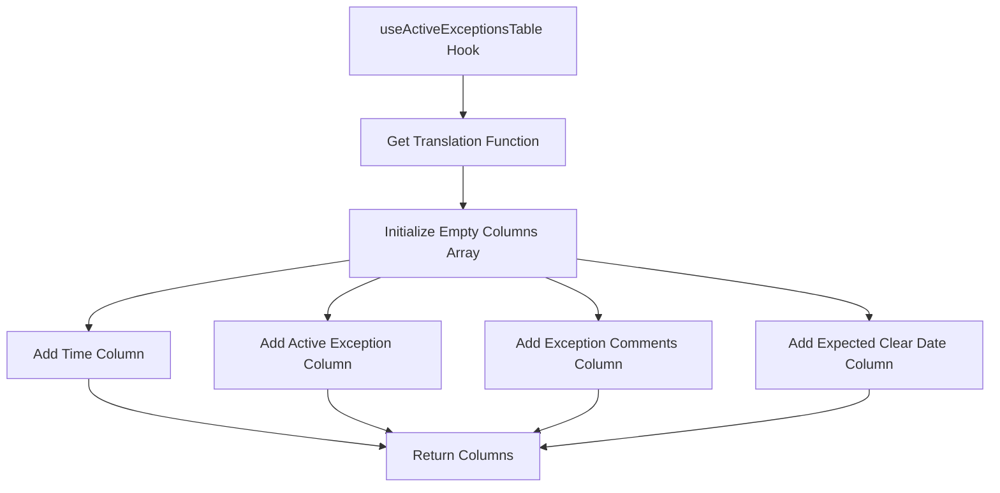
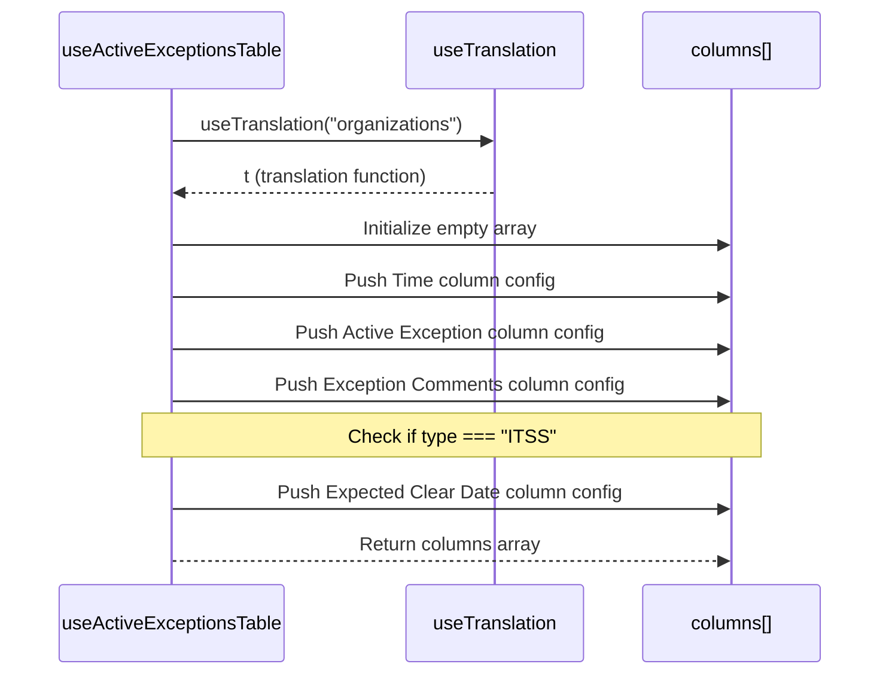
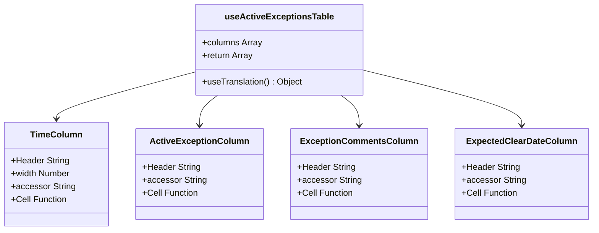

# Diagram: web/portal/src/shared/hooks/columns/useActiveExceptionsTable.js

> Auto-generated by Obscura crawlers

## Diagram 1

### SVG

<svg id="container" width="1133.078125" xmlns="http://www.w3.org/2000/svg" class="flowchart" height="558" viewBox="0 0 1133.078125 558" role="graphics-document document" aria-roledescription="flowchart-v2"><g><marker id="container_flowchart-v2-pointEnd" class="marker flowchart-v2" viewBox="0 0 10 10" refX="5" refY="5" markerUnits="userSpaceOnUse" markerWidth="8" markerHeight="8" orient="auto"><path d="M 0 0 L 10 5 L 0 10 z" class="arrowMarkerPath" style="stroke-width: 1; stroke-dasharray: 1, 0;"></path></marker><marker id="container_flowchart-v2-pointStart" class="marker flowchart-v2" viewBox="0 0 10 10" refX="4.5" refY="5" markerUnits="userSpaceOnUse" markerWidth="8" markerHeight="8" orient="auto"><path d="M 0 5 L 10 10 L 10 0 z" class="arrowMarkerPath" style="stroke-width: 1; stroke-dasharray: 1, 0;"></path></marker><marker id="container_flowchart-v2-circleEnd" class="marker flowchart-v2" viewBox="0 0 10 10" refX="11" refY="5" markerUnits="userSpaceOnUse" markerWidth="11" markerHeight="11" orient="auto"><circle cx="5" cy="5" r="5" class="arrowMarkerPath" style="stroke-width: 1; stroke-dasharray: 1, 0;"></circle></marker><marker id="container_flowchart-v2-circleStart" class="marker flowchart-v2" viewBox="0 0 10 10" refX="-1" refY="5" markerUnits="userSpaceOnUse" markerWidth="11" markerHeight="11" orient="auto"><circle cx="5" cy="5" r="5" class="arrowMarkerPath" style="stroke-width: 1; stroke-dasharray: 1, 0;"></circle></marker><marker id="container_flowchart-v2-crossEnd" class="marker cross flowchart-v2" viewBox="0 0 11 11" refX="12" refY="5.2" markerUnits="userSpaceOnUse" markerWidth="11" markerHeight="11" orient="auto"><path d="M 1,1 l 9,9 M 10,1 l -9,9" class="arrowMarkerPath" style="stroke-width: 2; stroke-dasharray: 1, 0;"></path></marker><marker id="container_flowchart-v2-crossStart" class="marker cross flowchart-v2" viewBox="0 0 11 11" refX="-1" refY="5.2" markerUnits="userSpaceOnUse" markerWidth="11" markerHeight="11" orient="auto"><path d="M 1,1 l 9,9 M 10,1 l -9,9" class="arrowMarkerPath" style="stroke-width: 2; stroke-dasharray: 1, 0;"></path></marker><g class="root"><g class="clusters"></g><g class="edgePaths"><path d="M530.078,86L530.078,90.167C530.078,94.333,530.078,102.667,530.078,110.333C530.078,118,530.078,125,530.078,128.5L530.078,132" id="L_A_B_0" class="edge-thickness-normal edge-pattern-solid edge-thickness-normal edge-pattern-solid flowchart-link" style=";" data-edge="true" data-et="edge" data-id="L_A_B_0" data-points="W3sieCI6NTMwLjA3ODEyNSwieSI6ODZ9LHsieCI6NTMwLjA3ODEyNSwieSI6MTExfSx7IngiOjUzMC4wNzgxMjUsInkiOjEzNn1d" marker-end="url(#container_flowchart-v2-pointEnd)"></path><path d="M530.078,190L530.078,194.167C530.078,198.333,530.078,206.667,530.078,214.333C530.078,222,530.078,229,530.078,232.5L530.078,236" id="L_B_C_0" class="edge-thickness-normal edge-pattern-solid edge-thickness-normal edge-pattern-solid flowchart-link" style=";" data-edge="true" data-et="edge" data-id="L_B_C_0" data-points="W3sieCI6NTMwLjA3ODEyNSwieSI6MTkwfSx7IngiOjUzMC4wNzgxMjUsInkiOjIxNX0seyJ4Ijo1MzAuMDc4MTI1LCJ5IjoyNDB9XQ==" marker-end="url(#container_flowchart-v2-pointEnd)"></path><path d="M400.078,298.415L350.322,305.846C300.565,313.277,201.052,328.138,151.296,341.069C101.539,354,101.539,365,101.539,370.5L101.539,376" id="L_C_D_0" class="edge-thickness-normal edge-pattern-solid edge-thickness-normal edge-pattern-solid flowchart-link" style=";" data-edge="true" data-et="edge" data-id="L_C_D_0" data-points="W3sieCI6NDAwLjA3ODEyNSwieSI6Mjk4LjQxNDc5OTU1NTE3NDc0fSx7IngiOjEwMS41MzkwNjI1LCJ5IjozNDN9LHsieCI6MTAxLjUzOTA2MjUsInkiOjM4MH1d" marker-end="url(#container_flowchart-v2-pointEnd)"></path><path d="M435.625,318L425.534,322.167C415.443,326.333,395.26,334.667,385.169,342.333C375.078,350,375.078,357,375.078,360.5L375.078,364" id="L_C_E_0" class="edge-thickness-normal edge-pattern-solid edge-thickness-normal edge-pattern-solid flowchart-link" style=";" data-edge="true" data-et="edge" data-id="L_C_E_0" data-points="W3sieCI6NDM1LjYyNSwieSI6MzE4fSx7IngiOjM3NS4wNzgxMjUsInkiOjM0M30seyJ4IjozNzUuMDc4MTI1LCJ5IjozNjh9XQ==" marker-end="url(#container_flowchart-v2-pointEnd)"></path><path d="M624.531,318L634.622,322.167C644.714,326.333,664.896,334.667,674.987,342.333C685.078,350,685.078,357,685.078,360.5L685.078,364" id="L_C_F_0" class="edge-thickness-normal edge-pattern-solid edge-thickness-normal edge-pattern-solid flowchart-link" style=";" data-edge="true" data-et="edge" data-id="L_C_F_0" data-points="W3sieCI6NjI0LjUzMTI1LCJ5IjozMTh9LHsieCI6Njg1LjA3ODEyNSwieSI6MzQzfSx7IngiOjY4NS4wNzgxMjUsInkiOjM2OH1d" marker-end="url(#container_flowchart-v2-pointEnd)"></path><path d="M660.078,296.892L715.911,304.577C771.745,312.262,883.411,327.631,939.245,338.815C995.078,350,995.078,357,995.078,360.5L995.078,364" id="L_C_G_0" class="edge-thickness-normal edge-pattern-solid edge-thickness-normal edge-pattern-solid flowchart-link" style=";" data-edge="true" data-et="edge" data-id="L_C_G_0" data-points="W3sieCI6NjYwLjA3ODEyNSwieSI6Mjk2Ljg5MjQ3MzExODI3OTU1fSx7IngiOjk5NS4wNzgxMjUsInkiOjM0M30seyJ4Ijo5OTUuMDc4MTI1LCJ5IjozNjh9XQ==" marker-end="url(#container_flowchart-v2-pointEnd)"></path><path d="M101.539,434L101.539,440.167C101.539,446.333,101.539,458.667,157.668,471.644C213.796,484.622,326.053,498.243,382.182,505.054L438.31,511.865" id="L_D_H_0" class="edge-thickness-normal edge-pattern-solid edge-thickness-normal edge-pattern-solid flowchart-link" style=";" data-edge="true" data-et="edge" data-id="L_D_H_0" data-points="W3sieCI6MTAxLjUzOTA2MjUsInkiOjQzNH0seyJ4IjoxMDEuNTM5MDYyNSwieSI6NDcxfSx7IngiOjQ0Mi4yODEyNSwieSI6NTEyLjM0NjUwNzkzOTQwMTd9XQ==" marker-end="url(#container_flowchart-v2-pointEnd)"></path><path d="M375.078,446L375.078,450.167C375.078,454.333,375.078,462.667,386.866,470.788C398.654,478.909,422.229,486.819,434.017,490.773L445.805,494.728" id="L_E_H_0" class="edge-thickness-normal edge-pattern-solid edge-thickness-normal edge-pattern-solid flowchart-link" style=";" data-edge="true" data-et="edge" data-id="L_E_H_0" data-points="W3sieCI6Mzc1LjA3ODEyNSwieSI6NDQ2fSx7IngiOjM3NS4wNzgxMjUsInkiOjQ3MX0seyJ4Ijo0NDkuNTk3MzU1NzY5MjMwOCwieSI6NDk2fV0=" marker-end="url(#container_flowchart-v2-pointEnd)"></path><path d="M685.078,446L685.078,450.167C685.078,454.333,685.078,462.667,673.29,470.788C661.502,478.909,637.927,486.819,626.139,490.773L614.351,494.728" id="L_F_H_0" class="edge-thickness-normal edge-pattern-solid edge-thickness-normal edge-pattern-solid flowchart-link" style=";" data-edge="true" data-et="edge" data-id="L_F_H_0" data-points="W3sieCI6Njg1LjA3ODEyNSwieSI6NDQ2fSx7IngiOjY4NS4wNzgxMjUsInkiOjQ3MX0seyJ4Ijo2MTAuNTU4ODk0MjMwNzY5MywieSI6NDk2fV0=" marker-end="url(#container_flowchart-v2-pointEnd)"></path><path d="M995.078,446L995.078,450.167C995.078,454.333,995.078,462.667,932.873,473.79C870.669,484.912,746.26,498.825,684.055,505.781L621.85,512.737" id="L_G_H_0" class="edge-thickness-normal edge-pattern-solid edge-thickness-normal edge-pattern-solid flowchart-link" style=";" data-edge="true" data-et="edge" data-id="L_G_H_0" data-points="W3sieCI6OTk1LjA3ODEyNSwieSI6NDQ2fSx7IngiOjk5NS4wNzgxMjUsInkiOjQ3MX0seyJ4Ijo2MTcuODc1LCJ5Ijo1MTMuMTgxODU0ODM4NzA5N31d" marker-end="url(#container_flowchart-v2-pointEnd)"></path></g><g class="edgeLabels"><g class="edgeLabel"><g class="label" data-id="L_A_B_0" transform="translate(0, 0)"><foreignObject width="0" height="0">

</foreignObject></g></g><g class="edgeLabel"><g class="label" data-id="L_B_C_0" transform="translate(0, 0)"><foreignObject width="0" height="0">

</foreignObject></g></g><g class="edgeLabel"><g class="label" data-id="L_C_D_0" transform="translate(0, 0)"><foreignObject width="0" height="0">

</foreignObject></g></g><g class="edgeLabel"><g class="label" data-id="L_C_E_0" transform="translate(0, 0)"><foreignObject width="0" height="0">

</foreignObject></g></g><g class="edgeLabel"><g class="label" data-id="L_C_F_0" transform="translate(0, 0)"><foreignObject width="0" height="0">

</foreignObject></g></g><g class="edgeLabel"><g class="label" data-id="L_C_G_0" transform="translate(0, 0)"><foreignObject width="0" height="0">

</foreignObject></g></g><g class="edgeLabel"><g class="label" data-id="L_D_H_0" transform="translate(0, 0)"><foreignObject width="0" height="0">

</foreignObject></g></g><g class="edgeLabel"><g class="label" data-id="L_E_H_0" transform="translate(0, 0)"><foreignObject width="0" height="0">

</foreignObject></g></g><g class="edgeLabel"><g class="label" data-id="L_F_H_0" transform="translate(0, 0)"><foreignObject width="0" height="0">

</foreignObject></g></g><g class="edgeLabel"><g class="label" data-id="L_G_H_0" transform="translate(0, 0)"><foreignObject width="0" height="0">

</foreignObject></g></g></g><g class="nodes"><g class="node default" id="flowchart-A-0" transform="translate(530.078125, 47)"><rect class="basic label-container" style="" x="-130" y="-39" width="260" height="78"></rect><g class="label" style="" transform="translate(-100, -24)"><rect></rect><foreignObject width="200" height="48">

useActiveExceptionsTable Hook

</foreignObject></g></g><g class="node default" id="flowchart-B-1" transform="translate(530.078125, 163)"><rect class="basic label-container" style="" x="-118.484375" y="-27" width="236.96875" height="54"></rect><g class="label" style="" transform="translate(-88.484375, -12)"><rect></rect><foreignObject width="176.96875" height="24">

Get Translation Function

</foreignObject></g></g><g class="node default" id="flowchart-C-3" transform="translate(530.078125, 279)"><rect class="basic label-container" style="" x="-130" y="-39" width="260" height="78"></rect><g class="label" style="" transform="translate(-100, -24)"><rect></rect><foreignObject width="200" height="48">

Initialize Empty Columns Array

</foreignObject></g></g><g class="node default" id="flowchart-D-5" transform="translate(101.5390625, 407)"><rect class="basic label-container" style="" x="-93.5390625" y="-27" width="187.078125" height="54"></rect><g class="label" style="" transform="translate(-63.5390625, -12)"><rect></rect><foreignObject width="127.078125" height="24">

Add Time Column

</foreignObject></g></g><g class="node default" id="flowchart-E-7" transform="translate(375.078125, 407)"><rect class="basic label-container" style="" x="-130" y="-39" width="260" height="78"></rect><g class="label" style="" transform="translate(-100, -24)"><rect></rect><foreignObject width="200" height="48">

Add Active Exception Column

</foreignObject></g></g><g class="node default" id="flowchart-F-9" transform="translate(685.078125, 407)"><rect class="basic label-container" style="" x="-130" y="-39" width="260" height="78"></rect><g class="label" style="" transform="translate(-100, -24)"><rect></rect><foreignObject width="200" height="48">

Add Exception Comments Column

</foreignObject></g></g><g class="node default" id="flowchart-G-11" transform="translate(995.078125, 407)"><rect class="basic label-container" style="" x="-130" y="-39" width="260" height="78"></rect><g class="label" style="" transform="translate(-100, -24)"><rect></rect><foreignObject width="200" height="48">

Add Expected Clear Date Column

</foreignObject></g></g><g class="node default" id="flowchart-H-13" transform="translate(530.078125, 523)"><rect class="basic label-container" style="" x="-87.796875" y="-27" width="175.59375" height="54"></rect><g class="label" style="" transform="translate(-57.796875, -12)"><rect></rect><foreignObject width="115.59375" height="24">

Return Columns

</foreignObject></g></g></g></g></g></svg>

## Diagram 2

### SVG

<svg id="container" width="775" xmlns="http://www.w3.org/2000/svg" height="604" viewBox="-50 -10 775 604" role="graphics-document document" aria-roledescription="sequence"><g><rect x="525" y="518" fill="#eaeaea" stroke="#666" width="150" height="65" name="Columns" rx="3" ry="3" class="actor actor-bottom"></rect><text x="600" y="550.5" dominant-baseline="central" alignment-baseline="central" class="actor actor-box" style="text-anchor: middle; font-size: 16px; font-weight: 400;"><tspan x="600" dy="0">columns[]</tspan></text></g><g><rect x="325" y="518" fill="#eaeaea" stroke="#666" width="150" height="65" name="i18n" rx="3" ry="3" class="actor actor-bottom"></rect><text x="400" y="550.5" dominant-baseline="central" alignment-baseline="central" class="actor actor-box" style="text-anchor: middle; font-size: 16px; font-weight: 400;"><tspan x="400" dy="0">useTranslation</tspan></text></g><g><rect x="0" y="518" fill="#eaeaea" stroke="#666" width="206" height="65" name="Hook" rx="3" ry="3" class="actor actor-bottom"></rect><text x="103" y="550.5" dominant-baseline="central" alignment-baseline="central" class="actor actor-box" style="text-anchor: middle; font-size: 16px; font-weight: 400;"><tspan x="103" dy="0">useActiveExceptionsTable</tspan></text></g><g><line id="actor2" x1="600" y1="65" x2="600" y2="518" class="actor-line 200" stroke-width="0.5px" stroke="#999" name="Columns"></line><g id="root-2"><rect x="525" y="0" fill="#eaeaea" stroke="#666" width="150" height="65" name="Columns" rx="3" ry="3" class="actor actor-top"></rect><text x="600" y="32.5" dominant-baseline="central" alignment-baseline="central" class="actor actor-box" style="text-anchor: middle; font-size: 16px; font-weight: 400;"><tspan x="600" dy="0">columns[]</tspan></text></g></g><g><line id="actor1" x1="400" y1="65" x2="400" y2="518" class="actor-line 200" stroke-width="0.5px" stroke="#999" name="i18n"></line><g id="root-1"><rect x="325" y="0" fill="#eaeaea" stroke="#666" width="150" height="65" name="i18n" rx="3" ry="3" class="actor actor-top"></rect><text x="400" y="32.5" dominant-baseline="central" alignment-baseline="central" class="actor actor-box" style="text-anchor: middle; font-size: 16px; font-weight: 400;"><tspan x="400" dy="0">useTranslation</tspan></text></g></g><g><line id="actor0" x1="103" y1="65" x2="103" y2="518" class="actor-line 200" stroke-width="0.5px" stroke="#999" name="Hook"></line><g id="root-0"><rect x="0" y="0" fill="#eaeaea" stroke="#666" width="206" height="65" name="Hook" rx="3" ry="3" class="actor actor-top"></rect><text x="103" y="32.5" dominant-baseline="central" alignment-baseline="central" class="actor actor-box" style="text-anchor: middle; font-size: 16px; font-weight: 400;"><tspan x="103" dy="0">useActiveExceptionsTable</tspan></text></g></g><g></g><defs><symbol id="computer" width="24" height="24"><path transform="scale(.5)" d="M2 2v13h20v-13h-20zm18 11h-16v-9h16v9zm-10.228 6l.466-1h3.524l.467 1h-4.457zm14.228 3h-24l2-6h2.104l-1.33 4h18.45l-1.297-4h2.073l2 6zm-5-10h-14v-7h14v7z"></path></symbol></defs><defs><symbol id="database" fill-rule="evenodd" clip-rule="evenodd"><path transform="scale(.5)" d="M12.258.001l.256.004.255.005.253.008.251.01.249.012.247.015.246.016.242.019.241.02.239.023.236.024.233.027.231.028.229.031.225.032.223.034.22.036.217.038.214.04.211.041.208.043.205.045.201.046.198.048.194.05.191.051.187.053.183.054.18.056.175.057.172.059.168.06.163.061.16.063.155.064.15.066.074.033.073.033.071.034.07.034.069.035.068.035.067.035.066.035.064.036.064.036.062.036.06.036.06.037.058.037.058.037.055.038.055.038.053.038.052.038.051.039.05.039.048.039.047.039.045.04.044.04.043.04.041.04.04.041.039.041.037.041.036.041.034.041.033.042.032.042.03.042.029.042.027.042.026.043.024.043.023.043.021.043.02.043.018.044.017.043.015.044.013.044.012.044.011.045.009.044.007.045.006.045.004.045.002.045.001.045v17l-.001.045-.002.045-.004.045-.006.045-.007.045-.009.044-.011.045-.012.044-.013.044-.015.044-.017.043-.018.044-.02.043-.021.043-.023.043-.024.043-.026.043-.027.042-.029.042-.03.042-.032.042-.033.042-.034.041-.036.041-.037.041-.039.041-.04.041-.041.04-.043.04-.044.04-.045.04-.047.039-.048.039-.05.039-.051.039-.052.038-.053.038-.055.038-.055.038-.058.037-.058.037-.06.037-.06.036-.062.036-.064.036-.064.036-.066.035-.067.035-.068.035-.069.035-.07.034-.071.034-.073.033-.074.033-.15.066-.155.064-.16.063-.163.061-.168.06-.172.059-.175.057-.18.056-.183.054-.187.053-.191.051-.194.05-.198.048-.201.046-.205.045-.208.043-.211.041-.214.04-.217.038-.22.036-.223.034-.225.032-.229.031-.231.028-.233.027-.236.024-.239.023-.241.02-.242.019-.246.016-.247.015-.249.012-.251.01-.253.008-.255.005-.256.004-.258.001-.258-.001-.256-.004-.255-.005-.253-.008-.251-.01-.249-.012-.247-.015-.245-.016-.243-.019-.241-.02-.238-.023-.236-.024-.234-.027-.231-.028-.228-.031-.226-.032-.223-.034-.22-.036-.217-.038-.214-.04-.211-.041-.208-.043-.204-.045-.201-.046-.198-.048-.195-.05-.19-.051-.187-.053-.184-.054-.179-.056-.176-.057-.172-.059-.167-.06-.164-.061-.159-.063-.155-.064-.151-.066-.074-.033-.072-.033-.072-.034-.07-.034-.069-.035-.068-.035-.067-.035-.066-.035-.064-.036-.063-.036-.062-.036-.061-.036-.06-.037-.058-.037-.057-.037-.056-.038-.055-.038-.053-.038-.052-.038-.051-.039-.049-.039-.049-.039-.046-.039-.046-.04-.044-.04-.043-.04-.041-.04-.04-.041-.039-.041-.037-.041-.036-.041-.034-.041-.033-.042-.032-.042-.03-.042-.029-.042-.027-.042-.026-.043-.024-.043-.023-.043-.021-.043-.02-.043-.018-.044-.017-.043-.015-.044-.013-.044-.012-.044-.011-.045-.009-.044-.007-.045-.006-.045-.004-.045-.002-.045-.001-.045v-17l.001-.045.002-.045.004-.045.006-.045.007-.045.009-.044.011-.045.012-.044.013-.044.015-.044.017-.043.018-.044.02-.043.021-.043.023-.043.024-.043.026-.043.027-.042.029-.042.03-.042.032-.042.033-.042.034-.041.036-.041.037-.041.039-.041.04-.041.041-.04.043-.04.044-.04.046-.04.046-.039.049-.039.049-.039.051-.039.052-.038.053-.038.055-.038.056-.038.057-.037.058-.037.06-.037.061-.036.062-.036.063-.036.064-.036.066-.035.067-.035.068-.035.069-.035.07-.034.072-.034.072-.033.074-.033.151-.066.155-.064.159-.063.164-.061.167-.06.172-.059.176-.057.179-.056.184-.054.187-.053.19-.051.195-.05.198-.048.201-.046.204-.045.208-.043.211-.041.214-.04.217-.038.22-.036.223-.034.226-.032.228-.031.231-.028.234-.027.236-.024.238-.023.241-.02.243-.019.245-.016.247-.015.249-.012.251-.01.253-.008.255-.005.256-.004.258-.001.258.001zm-9.258 20.499v.01l.001.021.003.021.004.022.005.021.006.022.007.022.009.023.01.022.011.023.012.023.013.023.015.023.016.024.017.023.018.024.019.024.021.024.022.025.023.024.024.025.052.049.056.05.061.051.066.051.07.051.075.051.079.052.084.052.088.052.092.052.097.052.102.051.105.052.11.052.114.051.119.051.123.051.127.05.131.05.135.05.139.048.144.049.147.047.152.047.155.047.16.045.163.045.167.043.171.043.176.041.178.041.183.039.187.039.19.037.194.035.197.035.202.033.204.031.209.03.212.029.216.027.219.025.222.024.226.021.23.02.233.018.236.016.24.015.243.012.246.01.249.008.253.005.256.004.259.001.26-.001.257-.004.254-.005.25-.008.247-.011.244-.012.241-.014.237-.016.233-.018.231-.021.226-.021.224-.024.22-.026.216-.027.212-.028.21-.031.205-.031.202-.034.198-.034.194-.036.191-.037.187-.039.183-.04.179-.04.175-.042.172-.043.168-.044.163-.045.16-.046.155-.046.152-.047.148-.048.143-.049.139-.049.136-.05.131-.05.126-.05.123-.051.118-.052.114-.051.11-.052.106-.052.101-.052.096-.052.092-.052.088-.053.083-.051.079-.052.074-.052.07-.051.065-.051.06-.051.056-.05.051-.05.023-.024.023-.025.021-.024.02-.024.019-.024.018-.024.017-.024.015-.023.014-.024.013-.023.012-.023.01-.023.01-.022.008-.022.006-.022.006-.022.004-.022.004-.021.001-.021.001-.021v-4.127l-.077.055-.08.053-.083.054-.085.053-.087.052-.09.052-.093.051-.095.05-.097.05-.1.049-.102.049-.105.048-.106.047-.109.047-.111.046-.114.045-.115.045-.118.044-.12.043-.122.042-.124.042-.126.041-.128.04-.13.04-.132.038-.134.038-.135.037-.138.037-.139.035-.142.035-.143.034-.144.033-.147.032-.148.031-.15.03-.151.03-.153.029-.154.027-.156.027-.158.026-.159.025-.161.024-.162.023-.163.022-.165.021-.166.02-.167.019-.169.018-.169.017-.171.016-.173.015-.173.014-.175.013-.175.012-.177.011-.178.01-.179.008-.179.008-.181.006-.182.005-.182.004-.184.003-.184.002h-.37l-.184-.002-.184-.003-.182-.004-.182-.005-.181-.006-.179-.008-.179-.008-.178-.01-.176-.011-.176-.012-.175-.013-.173-.014-.172-.015-.171-.016-.17-.017-.169-.018-.167-.019-.166-.02-.165-.021-.163-.022-.162-.023-.161-.024-.159-.025-.157-.026-.156-.027-.155-.027-.153-.029-.151-.03-.15-.03-.148-.031-.146-.032-.145-.033-.143-.034-.141-.035-.14-.035-.137-.037-.136-.037-.134-.038-.132-.038-.13-.04-.128-.04-.126-.041-.124-.042-.122-.042-.12-.044-.117-.043-.116-.045-.113-.045-.112-.046-.109-.047-.106-.047-.105-.048-.102-.049-.1-.049-.097-.05-.095-.05-.093-.052-.09-.051-.087-.052-.085-.053-.083-.054-.08-.054-.077-.054v4.127zm0-5.654v.011l.001.021.003.021.004.021.005.022.006.022.007.022.009.022.01.022.011.023.012.023.013.023.015.024.016.023.017.024.018.024.019.024.021.024.022.024.023.025.024.024.052.05.056.05.061.05.066.051.07.051.075.052.079.051.084.052.088.052.092.052.097.052.102.052.105.052.11.051.114.051.119.052.123.05.127.051.131.05.135.049.139.049.144.048.147.048.152.047.155.046.16.045.163.045.167.044.171.042.176.042.178.04.183.04.187.038.19.037.194.036.197.034.202.033.204.032.209.03.212.028.216.027.219.025.222.024.226.022.23.02.233.018.236.016.24.014.243.012.246.01.249.008.253.006.256.003.259.001.26-.001.257-.003.254-.006.25-.008.247-.01.244-.012.241-.015.237-.016.233-.018.231-.02.226-.022.224-.024.22-.025.216-.027.212-.029.21-.03.205-.032.202-.033.198-.035.194-.036.191-.037.187-.039.183-.039.179-.041.175-.042.172-.043.168-.044.163-.045.16-.045.155-.047.152-.047.148-.048.143-.048.139-.05.136-.049.131-.05.126-.051.123-.051.118-.051.114-.052.11-.052.106-.052.101-.052.096-.052.092-.052.088-.052.083-.052.079-.052.074-.051.07-.052.065-.051.06-.05.056-.051.051-.049.023-.025.023-.024.021-.025.02-.024.019-.024.018-.024.017-.024.015-.023.014-.023.013-.024.012-.022.01-.023.01-.023.008-.022.006-.022.006-.022.004-.021.004-.022.001-.021.001-.021v-4.139l-.077.054-.08.054-.083.054-.085.052-.087.053-.09.051-.093.051-.095.051-.097.05-.1.049-.102.049-.105.048-.106.047-.109.047-.111.046-.114.045-.115.044-.118.044-.12.044-.122.042-.124.042-.126.041-.128.04-.13.039-.132.039-.134.038-.135.037-.138.036-.139.036-.142.035-.143.033-.144.033-.147.033-.148.031-.15.03-.151.03-.153.028-.154.028-.156.027-.158.026-.159.025-.161.024-.162.023-.163.022-.165.021-.166.02-.167.019-.169.018-.169.017-.171.016-.173.015-.173.014-.175.013-.175.012-.177.011-.178.009-.179.009-.179.007-.181.007-.182.005-.182.004-.184.003-.184.002h-.37l-.184-.002-.184-.003-.182-.004-.182-.005-.181-.007-.179-.007-.179-.009-.178-.009-.176-.011-.176-.012-.175-.013-.173-.014-.172-.015-.171-.016-.17-.017-.169-.018-.167-.019-.166-.02-.165-.021-.163-.022-.162-.023-.161-.024-.159-.025-.157-.026-.156-.027-.155-.028-.153-.028-.151-.03-.15-.03-.148-.031-.146-.033-.145-.033-.143-.033-.141-.035-.14-.036-.137-.036-.136-.037-.134-.038-.132-.039-.13-.039-.128-.04-.126-.041-.124-.042-.122-.043-.12-.043-.117-.044-.116-.044-.113-.046-.112-.046-.109-.046-.106-.047-.105-.048-.102-.049-.1-.049-.097-.05-.095-.051-.093-.051-.09-.051-.087-.053-.085-.052-.083-.054-.08-.054-.077-.054v4.139zm0-5.666v.011l.001.02.003.022.004.021.005.022.006.021.007.022.009.023.01.022.011.023.012.023.013.023.015.023.016.024.017.024.018.023.019.024.021.025.022.024.023.024.024.025.052.05.056.05.061.05.066.051.07.051.075.052.079.051.084.052.088.052.092.052.097.052.102.052.105.051.11.052.114.051.119.051.123.051.127.05.131.05.135.05.139.049.144.048.147.048.152.047.155.046.16.045.163.045.167.043.171.043.176.042.178.04.183.04.187.038.19.037.194.036.197.034.202.033.204.032.209.03.212.028.216.027.219.025.222.024.226.021.23.02.233.018.236.017.24.014.243.012.246.01.249.008.253.006.256.003.259.001.26-.001.257-.003.254-.006.25-.008.247-.01.244-.013.241-.014.237-.016.233-.018.231-.02.226-.022.224-.024.22-.025.216-.027.212-.029.21-.03.205-.032.202-.033.198-.035.194-.036.191-.037.187-.039.183-.039.179-.041.175-.042.172-.043.168-.044.163-.045.16-.045.155-.047.152-.047.148-.048.143-.049.139-.049.136-.049.131-.051.126-.05.123-.051.118-.052.114-.051.11-.052.106-.052.101-.052.096-.052.092-.052.088-.052.083-.052.079-.052.074-.052.07-.051.065-.051.06-.051.056-.05.051-.049.023-.025.023-.025.021-.024.02-.024.019-.024.018-.024.017-.024.015-.023.014-.024.013-.023.012-.023.01-.022.01-.023.008-.022.006-.022.006-.022.004-.022.004-.021.001-.021.001-.021v-4.153l-.077.054-.08.054-.083.053-.085.053-.087.053-.09.051-.093.051-.095.051-.097.05-.1.049-.102.048-.105.048-.106.048-.109.046-.111.046-.114.046-.115.044-.118.044-.12.043-.122.043-.124.042-.126.041-.128.04-.13.039-.132.039-.134.038-.135.037-.138.036-.139.036-.142.034-.143.034-.144.033-.147.032-.148.032-.15.03-.151.03-.153.028-.154.028-.156.027-.158.026-.159.024-.161.024-.162.023-.163.023-.165.021-.166.02-.167.019-.169.018-.169.017-.171.016-.173.015-.173.014-.175.013-.175.012-.177.01-.178.01-.179.009-.179.007-.181.006-.182.006-.182.004-.184.003-.184.001-.185.001-.185-.001-.184-.001-.184-.003-.182-.004-.182-.006-.181-.006-.179-.007-.179-.009-.178-.01-.176-.01-.176-.012-.175-.013-.173-.014-.172-.015-.171-.016-.17-.017-.169-.018-.167-.019-.166-.02-.165-.021-.163-.023-.162-.023-.161-.024-.159-.024-.157-.026-.156-.027-.155-.028-.153-.028-.151-.03-.15-.03-.148-.032-.146-.032-.145-.033-.143-.034-.141-.034-.14-.036-.137-.036-.136-.037-.134-.038-.132-.039-.13-.039-.128-.041-.126-.041-.124-.041-.122-.043-.12-.043-.117-.044-.116-.044-.113-.046-.112-.046-.109-.046-.106-.048-.105-.048-.102-.048-.1-.05-.097-.049-.095-.051-.093-.051-.09-.052-.087-.052-.085-.053-.083-.053-.08-.054-.077-.054v4.153zm8.74-8.179l-.257.004-.254.005-.25.008-.247.011-.244.012-.241.014-.237.016-.233.018-.231.021-.226.022-.224.023-.22.026-.216.027-.212.028-.21.031-.205.032-.202.033-.198.034-.194.036-.191.038-.187.038-.183.04-.179.041-.175.042-.172.043-.168.043-.163.045-.16.046-.155.046-.152.048-.148.048-.143.048-.139.049-.136.05-.131.05-.126.051-.123.051-.118.051-.114.052-.11.052-.106.052-.101.052-.096.052-.092.052-.088.052-.083.052-.079.052-.074.051-.07.052-.065.051-.06.05-.056.05-.051.05-.023.025-.023.024-.021.024-.02.025-.019.024-.018.024-.017.023-.015.024-.014.023-.013.023-.012.023-.01.023-.01.022-.008.022-.006.023-.006.021-.004.022-.004.021-.001.021-.001.021.001.021.001.021.004.021.004.022.006.021.006.023.008.022.01.022.01.023.012.023.013.023.014.023.015.024.017.023.018.024.019.024.02.025.021.024.023.024.023.025.051.05.056.05.06.05.065.051.07.052.074.051.079.052.083.052.088.052.092.052.096.052.101.052.106.052.11.052.114.052.118.051.123.051.126.051.131.05.136.05.139.049.143.048.148.048.152.048.155.046.16.046.163.045.168.043.172.043.175.042.179.041.183.04.187.038.191.038.194.036.198.034.202.033.205.032.21.031.212.028.216.027.22.026.224.023.226.022.231.021.233.018.237.016.241.014.244.012.247.011.25.008.254.005.257.004.26.001.26-.001.257-.004.254-.005.25-.008.247-.011.244-.012.241-.014.237-.016.233-.018.231-.021.226-.022.224-.023.22-.026.216-.027.212-.028.21-.031.205-.032.202-.033.198-.034.194-.036.191-.038.187-.038.183-.04.179-.041.175-.042.172-.043.168-.043.163-.045.16-.046.155-.046.152-.048.148-.048.143-.048.139-.049.136-.05.131-.05.126-.051.123-.051.118-.051.114-.052.11-.052.106-.052.101-.052.096-.052.092-.052.088-.052.083-.052.079-.052.074-.051.07-.052.065-.051.06-.05.056-.05.051-.05.023-.025.023-.024.021-.024.02-.025.019-.024.018-.024.017-.023.015-.024.014-.023.013-.023.012-.023.01-.023.01-.022.008-.022.006-.023.006-.021.004-.022.004-.021.001-.021.001-.021-.001-.021-.001-.021-.004-.021-.004-.022-.006-.021-.006-.023-.008-.022-.01-.022-.01-.023-.012-.023-.013-.023-.014-.023-.015-.024-.017-.023-.018-.024-.019-.024-.02-.025-.021-.024-.023-.024-.023-.025-.051-.05-.056-.05-.06-.05-.065-.051-.07-.052-.074-.051-.079-.052-.083-.052-.088-.052-.092-.052-.096-.052-.101-.052-.106-.052-.11-.052-.114-.052-.118-.051-.123-.051-.126-.051-.131-.05-.136-.05-.139-.049-.143-.048-.148-.048-.152-.048-.155-.046-.16-.046-.163-.045-.168-.043-.172-.043-.175-.042-.179-.041-.183-.04-.187-.038-.191-.038-.194-.036-.198-.034-.202-.033-.205-.032-.21-.031-.212-.028-.216-.027-.22-.026-.224-.023-.226-.022-.231-.021-.233-.018-.237-.016-.241-.014-.244-.012-.247-.011-.25-.008-.254-.005-.257-.004-.26-.001-.26.001z"></path></symbol></defs><defs><symbol id="clock" width="24" height="24"><path transform="scale(.5)" d="M12 2c5.514 0 10 4.486 10 10s-4.486 10-10 10-10-4.486-10-10 4.486-10 10-10zm0-2c-6.627 0-12 5.373-12 12s5.373 12 12 12 12-5.373 12-12-5.373-12-12-12zm5.848 12.459c.202.038.202.333.001.372-1.907.361-6.045 1.111-6.547 1.111-.719 0-1.301-.582-1.301-1.301 0-.512.77-5.447 1.125-7.445.034-.192.312-.181.343.014l.985 6.238 5.394 1.011z"></path></symbol></defs><defs><marker id="arrowhead" refX="7.9" refY="5" markerUnits="userSpaceOnUse" markerWidth="12" markerHeight="12" orient="auto-start-reverse"><path d="M -1 0 L 10 5 L 0 10 z"></path></marker></defs><defs><marker id="crosshead" markerWidth="15" markerHeight="8" orient="auto" refX="4" refY="4.5"><path fill="none" stroke="#000000" stroke-width="1pt" d="M 1,2 L 6,7 M 6,2 L 1,7" style="stroke-dasharray: 0, 0;"></path></marker></defs><defs><marker id="filled-head" refX="15.5" refY="7" markerWidth="20" markerHeight="28" orient="auto"><path d="M 18,7 L9,13 L14,7 L9,1 Z"></path></marker></defs><defs><marker id="sequencenumber" refX="15" refY="15" markerWidth="60" markerHeight="40" orient="auto"><circle cx="15" cy="15" r="6"></circle></marker></defs><g><rect x="78" y="363" fill="#EDF2AE" stroke="#666" width="547" height="39" class="note"></rect><text x="352" y="368" text-anchor="middle" dominant-baseline="middle" alignment-baseline="middle" class="noteText" dy="1em" style="font-size: 16px; font-weight: 400;"><tspan x="352">Check if type === "ITSS"</tspan></text></g><text x="250" y="80" text-anchor="middle" dominant-baseline="middle" alignment-baseline="middle" class="messageText" dy="1em" style="font-size: 16px; font-weight: 400;">useTranslation("organizations")</text><line x1="104" y1="113" x2="396" y2="113" class="messageLine0" stroke-width="2" stroke="none" marker-end="url(#arrowhead)" style="fill: none;"></line><text x="253" y="128" text-anchor="middle" dominant-baseline="middle" alignment-baseline="middle" class="messageText" dy="1em" style="font-size: 16px; font-weight: 400;">t (translation function)</text><line x1="399" y1="161" x2="107" y2="161" class="messageLine1" stroke-width="2" stroke="none" marker-end="url(#arrowhead)" style="stroke-dasharray: 3, 3; fill: none;"></line><text x="350" y="176" text-anchor="middle" dominant-baseline="middle" alignment-baseline="middle" class="messageText" dy="1em" style="font-size: 16px; font-weight: 400;">Initialize empty array</text><line x1="104" y1="209" x2="596" y2="209" class="messageLine0" stroke-width="2" stroke="none" marker-end="url(#arrowhead)" style="fill: none;"></line><text x="350" y="224" text-anchor="middle" dominant-baseline="middle" alignment-baseline="middle" class="messageText" dy="1em" style="font-size: 16px; font-weight: 400;">Push Time column config</text><line x1="104" y1="257" x2="596" y2="257" class="messageLine0" stroke-width="2" stroke="none" marker-end="url(#arrowhead)" style="fill: none;"></line><text x="350" y="272" text-anchor="middle" dominant-baseline="middle" alignment-baseline="middle" class="messageText" dy="1em" style="font-size: 16px; font-weight: 400;">Push Active Exception column config</text><line x1="104" y1="305" x2="596" y2="305" class="messageLine0" stroke-width="2" stroke="none" marker-end="url(#arrowhead)" style="fill: none;"></line><text x="350" y="320" text-anchor="middle" dominant-baseline="middle" alignment-baseline="middle" class="messageText" dy="1em" style="font-size: 16px; font-weight: 400;">Push Exception Comments column config</text><line x1="104" y1="353" x2="596" y2="353" class="messageLine0" stroke-width="2" stroke="none" marker-end="url(#arrowhead)" style="fill: none;"></line><text x="350" y="417" text-anchor="middle" dominant-baseline="middle" alignment-baseline="middle" class="messageText" dy="1em" style="font-size: 16px; font-weight: 400;">Push Expected Clear Date column config</text><line x1="104" y1="450" x2="596" y2="450" class="messageLine0" stroke-width="2" stroke="none" marker-end="url(#arrowhead)" style="fill: none;"></line><text x="350" y="465" text-anchor="middle" dominant-baseline="middle" alignment-baseline="middle" class="messageText" dy="1em" style="font-size: 16px; font-weight: 400;">Return columns array</text><line x1="104" y1="498" x2="596" y2="498" class="messageLine1" stroke-width="2" stroke="none" marker-end="url(#arrowhead)" style="stroke-dasharray: 3, 3; fill: none;"></line></svg>

## Diagram 3

### SVG

<svg id="container" width="1060.03125" xmlns="http://www.w3.org/2000/svg" class="classDiagram" height="426" viewBox="0 0 1060.03125 426" role="graphics-document document" aria-roledescription="class"><g><defs><marker id="container_class-aggregationStart" class="marker aggregation class" refX="18" refY="7" markerWidth="190" markerHeight="240" orient="auto"><path d="M 18,7 L9,13 L1,7 L9,1 Z"></path></marker></defs><defs><marker id="container_class-aggregationEnd" class="marker aggregation class" refX="1" refY="7" markerWidth="20" markerHeight="28" orient="auto"><path d="M 18,7 L9,13 L1,7 L9,1 Z"></path></marker></defs><defs><marker id="container_class-extensionStart" class="marker extension class" refX="18" refY="7" markerWidth="190" markerHeight="240" orient="auto"><path d="M 1,7 L18,13 V 1 Z"></path></marker></defs><defs><marker id="container_class-extensionEnd" class="marker extension class" refX="1" refY="7" markerWidth="20" markerHeight="28" orient="auto"><path d="M 1,1 V 13 L18,7 Z"></path></marker></defs><defs><marker id="container_class-compositionStart" class="marker composition class" refX="18" refY="7" markerWidth="190" markerHeight="240" orient="auto"><path d="M 18,7 L9,13 L1,7 L9,1 Z"></path></marker></defs><defs><marker id="container_class-compositionEnd" class="marker composition class" refX="1" refY="7" markerWidth="20" markerHeight="28" orient="auto"><path d="M 18,7 L9,13 L1,7 L9,1 Z"></path></marker></defs><defs><marker id="container_class-dependencyStart" class="marker dependency class" refX="6" refY="7" markerWidth="190" markerHeight="240" orient="auto"><path d="M 5,7 L9,13 L1,7 L9,1 Z"></path></marker></defs><defs><marker id="container_class-dependencyEnd" class="marker dependency class" refX="13" refY="7" markerWidth="20" markerHeight="28" orient="auto"><path d="M 18,7 L9,13 L14,7 L9,1 Z"></path></marker></defs><defs><marker id="container_class-lollipopStart" class="marker lollipop class" refX="13" refY="7" markerWidth="190" markerHeight="240" orient="auto"><circle stroke="black" fill="transparent" cx="7" cy="7" r="6"></circle></marker></defs><defs><marker id="container_class-lollipopEnd" class="marker lollipop class" refX="1" refY="7" markerWidth="190" markerHeight="240" orient="auto"><circle stroke="black" fill="transparent" cx="7" cy="7" r="6"></circle></marker></defs><g class="root"><g class="clusters"></g><g class="edgePaths"><path d="M348.617,133.421L307.385,144.684C266.152,155.948,183.688,178.474,142.455,192.904C101.223,207.333,101.223,213.667,101.223,216.833L101.223,220" id="id_useActiveExceptionsTable_TimeColumn_1" class="edge-thickness-normal edge-pattern-solid relation" style=";;;" data-edge="true" data-et="edge" data-id="id_useActiveExceptionsTable_TimeColumn_1" data-points="W3sieCI6MzQ4LjYxNzE4NzUsInkiOjEzMy40MjEzMjMxMjYzMjE1N30seyJ4IjoxMDEuMjIyNjU2MjUsInkiOjIwMX0seyJ4IjoxMDEuMjIyNjU2MjUsInkiOjIyNn1d" marker-end="url(#container_class-dependencyEnd)"></path><path d="M390.486,176L385.041,180.167C379.596,184.333,368.706,192.667,363.261,202C357.816,211.333,357.816,221.667,357.816,226.833L357.816,232" id="id_useActiveExceptionsTable_ActiveExceptionColumn_2" class="edge-thickness-normal edge-pattern-solid relation" style=";;;" data-edge="true" data-et="edge" data-id="id_useActiveExceptionsTable_ActiveExceptionColumn_2" data-points="W3sieCI6MzkwLjQ4NTU1NzYyNjE0NjgsInkiOjE3Nn0seyJ4IjozNTcuODE2NDA2MjUsInkiOjIwMX0seyJ4IjozNTcuODE2NDA2MjUsInkiOjIzOH1d" marker-end="url(#container_class-dependencyEnd)"></path><path d="M610.022,176L615.467,180.167C620.912,184.333,631.802,192.667,637.247,202C642.691,211.333,642.691,221.667,642.691,226.833L642.691,232" id="id_useActiveExceptionsTable_ExceptionCommentsColumn_3" class="edge-thickness-normal edge-pattern-solid relation" style=";;;" data-edge="true" data-et="edge" data-id="id_useActiveExceptionsTable_ExceptionCommentsColumn_3" data-points="W3sieCI6NjEwLjAyMjI1NDg3Mzg1MzIsInkiOjE3Nn0seyJ4Ijo2NDIuNjkxNDA2MjUsInkiOjIwMX0seyJ4Ijo2NDIuNjkxNDA2MjUsInkiOjIzOH1d" marker-end="url(#container_class-dependencyEnd)"></path><path d="M651.891,130.184L698.761,141.987C745.632,153.789,839.372,177.395,886.243,194.364C933.113,211.333,933.113,221.667,933.113,226.833L933.113,232" id="id_useActiveExceptionsTable_ExpectedClearDateColumn_4" class="edge-thickness-normal edge-pattern-solid relation" style=";;;" data-edge="true" data-et="edge" data-id="id_useActiveExceptionsTable_ExpectedClearDateColumn_4" data-points="W3sieCI6NjUxLjg5MDYyNSwieSI6MTMwLjE4NDIzMDk0OTcxNjY0fSx7IngiOjkzMy4xMTMyODEyNSwieSI6MjAxfSx7IngiOjkzMy4xMTMyODEyNSwieSI6MjM4fV0=" marker-end="url(#container_class-dependencyEnd)"></path></g><g class="edgeLabels"><g class="edgeLabel"><g class="label" data-id="id_useActiveExceptionsTable_TimeColumn_1" transform="translate(0, 0)"><foreignObject width="0" height="0">

</foreignObject></g></g><g class="edgeLabel"><g class="label" data-id="id_useActiveExceptionsTable_ActiveExceptionColumn_2" transform="translate(0, 0)"><foreignObject width="0" height="0">

</foreignObject></g></g><g class="edgeLabel"><g class="label" data-id="id_useActiveExceptionsTable_ExceptionCommentsColumn_3" transform="translate(0, 0)"><foreignObject width="0" height="0">

</foreignObject></g></g><g class="edgeLabel"><g class="label" data-id="id_useActiveExceptionsTable_ExpectedClearDateColumn_4" transform="translate(0, 0)"><foreignObject width="0" height="0">

</foreignObject></g></g></g><g class="nodes"><g class="node default" id="classId-useActiveExceptionsTable-0" transform="translate(500.25390625, 92)"><g class="basic label-container"><path d="M-151.63671875 -84 L151.63671875 -84 L151.63671875 84 L-151.63671875 84" stroke="none" stroke-width="0" fill="#ECECFF" style=""></path><path d="M-151.63671875 -84 C-88.99002215123971 -84, -26.343325552479442 -84, 151.63671875 -84 M-151.63671875 -84 C-64.57943528956191 -84, 22.47784817087617 -84, 151.63671875 -84 M151.63671875 -84 C151.63671875 -41.96344366153909, 151.63671875 0.07311267692182355, 151.63671875 84 M151.63671875 -84 C151.63671875 -16.931236983847043, 151.63671875 50.137526032305914, 151.63671875 84 M151.63671875 84 C43.29032674333385 84, -65.0560652633323 84, -151.63671875 84 M151.63671875 84 C57.42454647035758 84, -36.78762580928483 84, -151.63671875 84 M-151.63671875 84 C-151.63671875 47.10024696097483, -151.63671875 10.200493921949658, -151.63671875 -84 M-151.63671875 84 C-151.63671875 20.550052303242218, -151.63671875 -42.899895393515564, -151.63671875 -84" stroke="#9370DB" stroke-width="1.3" fill="none" stroke-dasharray="0 0" style=""></path></g><g class="annotation-group text" transform="translate(0, -60)"></g><g class="label-group text" transform="translate(-94.6015625, -60)"><g class="label" style="font-weight: bolder" transform="translate(0,-12)"><foreignObject width="189.203125" height="24">

useActiveExceptionsTable

</foreignObject></g></g><g class="members-group text" transform="translate(-139.63671875, -12)"><g class="label" style="" transform="translate(0,-12)"><foreignObject width="110.765625" height="24">

+columns Array

</foreignObject></g><g class="label" style="" transform="translate(0,12)"><foreignObject width="94.578125" height="24">

+return Array

</foreignObject></g></g><g class="methods-group text" transform="translate(-139.63671875, 60)"><g class="label" style="" transform="translate(0,-12)"><foreignObject width="184.671875" height="24">

+useTranslation() : Object

</foreignObject></g></g><g class="divider" style=""><path d="M-151.63671875 -36 C-66.17717060876308 -36, 19.282377532473845 -36, 151.63671875 -36 M-151.63671875 -36 C-37.68928311869409 -36, 76.25815251261182 -36, 151.63671875 -36" stroke="#9370DB" stroke-width="1.3" fill="none" stroke-dasharray="0 0" style=""></path></g><g class="divider" style=""><path d="M-151.63671875 36 C-81.11170387574208 36, -10.58668900148416 36, 151.63671875 36 M-151.63671875 36 C-62.87566957678905 36, 25.8853795964219 36, 151.63671875 36" stroke="#9370DB" stroke-width="1.3" fill="none" stroke-dasharray="0 0" style=""></path></g></g><g class="node default" id="classId-TimeColumn-1" transform="translate(101.22265625, 322)"><g class="basic label-container"><path d="M-93.22265625 -96 L93.22265625 -96 L93.22265625 96 L-93.22265625 96" stroke="none" stroke-width="0" fill="#ECECFF" style=""></path><path d="M-93.22265625 -96 C-22.34471126304608 -96, 48.53323372390784 -96, 93.22265625 -96 M-93.22265625 -96 C-49.041898989200355 -96, -4.86114172840071 -96, 93.22265625 -96 M93.22265625 -96 C93.22265625 -22.042366396116222, 93.22265625 51.915267207767556, 93.22265625 96 M93.22265625 -96 C93.22265625 -51.370135044300746, 93.22265625 -6.740270088601491, 93.22265625 96 M93.22265625 96 C27.96051632763269 96, -37.30162359473462 96, -93.22265625 96 M93.22265625 96 C41.650154307672956 96, -9.922347634654088 96, -93.22265625 96 M-93.22265625 96 C-93.22265625 43.68644461394469, -93.22265625 -8.627110772110626, -93.22265625 -96 M-93.22265625 96 C-93.22265625 23.993039535336024, -93.22265625 -48.01392092932795, -93.22265625 -96" stroke="#9370DB" stroke-width="1.3" fill="none" stroke-dasharray="0 0" style=""></path></g><g class="annotation-group text" transform="translate(0, -72)"></g><g class="label-group text" transform="translate(-45.1953125, -72)"><g class="label" style="font-weight: bolder" transform="translate(0,-12)"><foreignObject width="90.390625" height="24">

TimeColumn

</foreignObject></g></g><g class="members-group text" transform="translate(-81.22265625, -24)"><g class="label" style="" transform="translate(0,-12)"><foreignObject width="107.71875" height="24">

+Header String

</foreignObject></g><g class="label" style="" transform="translate(0,12)"><foreignObject width="111.28125" height="24">

+width Number

</foreignObject></g><g class="label" style="" transform="translate(0,36)"><foreignObject width="117.25" height="24">

+accessor String

</foreignObject></g><g class="label" style="" transform="translate(0,60)"><foreignObject width="101.578125" height="24">

+Cell Function

</foreignObject></g></g><g class="methods-group text" transform="translate(-81.22265625, 96)"></g><g class="divider" style=""><path d="M-93.22265625 -48 C-43.11220097077298 -48, 6.998254308454037 -48, 93.22265625 -48 M-93.22265625 -48 C-55.11775334394375 -48, -17.012850437887494 -48, 93.22265625 -48" stroke="#9370DB" stroke-width="1.3" fill="none" stroke-dasharray="0 0" style=""></path></g><g class="divider" style=""><path d="M-93.22265625 72 C-26.643901407524197 72, 39.934853434951606 72, 93.22265625 72 M-93.22265625 72 C-28.300551448289838 72, 36.621553353420325 72, 93.22265625 72" stroke="#9370DB" stroke-width="1.3" fill="none" stroke-dasharray="0 0" style=""></path></g></g><g class="node default" id="classId-ActiveExceptionColumn-2" transform="translate(357.81640625, 322)"><g class="basic label-container"><path d="M-113.37109375 -84 L113.37109375 -84 L113.37109375 84 L-113.37109375 84" stroke="none" stroke-width="0" fill="#ECECFF" style=""></path><path d="M-113.37109375 -84 C-65.58122211196732 -84, -17.791350473934656 -84, 113.37109375 -84 M-113.37109375 -84 C-31.865971184906684 -84, 49.63915138018663 -84, 113.37109375 -84 M113.37109375 -84 C113.37109375 -40.51938193455656, 113.37109375 2.961236130886874, 113.37109375 84 M113.37109375 -84 C113.37109375 -36.95222277708697, 113.37109375 10.095554445826053, 113.37109375 84 M113.37109375 84 C53.10406835025753 84, -7.162957049484945 84, -113.37109375 84 M113.37109375 84 C59.03344097188673 84, 4.695788193773467 84, -113.37109375 84 M-113.37109375 84 C-113.37109375 24.38949337749115, -113.37109375 -35.2210132450177, -113.37109375 -84 M-113.37109375 84 C-113.37109375 29.354645018619223, -113.37109375 -25.290709962761554, -113.37109375 -84" stroke="#9370DB" stroke-width="1.3" fill="none" stroke-dasharray="0 0" style=""></path></g><g class="annotation-group text" transform="translate(0, -60)"></g><g class="label-group text" transform="translate(-85.4921875, -60)"><g class="label" style="font-weight: bolder" transform="translate(0,-12)"><foreignObject width="170.984375" height="24">

ActiveExceptionColumn

</foreignObject></g></g><g class="members-group text" transform="translate(-101.37109375, -12)"><g class="label" style="" transform="translate(0,-12)"><foreignObject width="107.71875" height="24">

+Header String

</foreignObject></g><g class="label" style="" transform="translate(0,12)"><foreignObject width="117.25" height="24">

+accessor String

</foreignObject></g><g class="label" style="" transform="translate(0,36)"><foreignObject width="101.578125" height="24">

+Cell Function

</foreignObject></g></g><g class="methods-group text" transform="translate(-101.37109375, 84)"></g><g class="divider" style=""><path d="M-113.37109375 -36 C-25.257482198984675 -36, 62.85612935203065 -36, 113.37109375 -36 M-113.37109375 -36 C-62.456251019886054 -36, -11.541408289772107 -36, 113.37109375 -36" stroke="#9370DB" stroke-width="1.3" fill="none" stroke-dasharray="0 0" style=""></path></g><g class="divider" style=""><path d="M-113.37109375 60 C-25.00976906811796 60, 63.35155561376408 60, 113.37109375 60 M-113.37109375 60 C-63.63099780032883 60, -13.890901850657656 60, 113.37109375 60" stroke="#9370DB" stroke-width="1.3" fill="none" stroke-dasharray="0 0" style=""></path></g></g><g class="node default" id="classId-ExceptionCommentsColumn-3" transform="translate(642.69140625, 322)"><g class="basic label-container"><path d="M-121.50390625 -84 L121.50390625 -84 L121.50390625 84 L-121.50390625 84" stroke="none" stroke-width="0" fill="#ECECFF" style=""></path><path d="M-121.50390625 -84 C-24.742850509006686 -84, 72.01820523198663 -84, 121.50390625 -84 M-121.50390625 -84 C-63.03237640872696 -84, -4.560846567453922 -84, 121.50390625 -84 M121.50390625 -84 C121.50390625 -18.75555570501855, 121.50390625 46.4888885899629, 121.50390625 84 M121.50390625 -84 C121.50390625 -23.498360033176667, 121.50390625 37.00327993364667, 121.50390625 84 M121.50390625 84 C72.46810562147931 84, 23.432304992958606 84, -121.50390625 84 M121.50390625 84 C40.982315818541494 84, -39.53927461291701 84, -121.50390625 84 M-121.50390625 84 C-121.50390625 21.925130205634517, -121.50390625 -40.14973958873097, -121.50390625 -84 M-121.50390625 84 C-121.50390625 24.594415032907264, -121.50390625 -34.81116993418547, -121.50390625 -84" stroke="#9370DB" stroke-width="1.3" fill="none" stroke-dasharray="0 0" style=""></path></g><g class="annotation-group text" transform="translate(0, -60)"></g><g class="label-group text" transform="translate(-101.7578125, -60)"><g class="label" style="font-weight: bolder" transform="translate(0,-12)"><foreignObject width="203.515625" height="24">

ExceptionCommentsColumn

</foreignObject></g></g><g class="members-group text" transform="translate(-109.50390625, -12)"><g class="label" style="" transform="translate(0,-12)"><foreignObject width="107.71875" height="24">

+Header String

</foreignObject></g><g class="label" style="" transform="translate(0,12)"><foreignObject width="117.25" height="24">

+accessor String

</foreignObject></g><g class="label" style="" transform="translate(0,36)"><foreignObject width="101.578125" height="24">

+Cell Function

</foreignObject></g></g><g class="methods-group text" transform="translate(-109.50390625, 84)"></g><g class="divider" style=""><path d="M-121.50390625 -36 C-48.16476436570933 -36, 25.174377518581338 -36, 121.50390625 -36 M-121.50390625 -36 C-47.22793683503937 -36, 27.048032579921255 -36, 121.50390625 -36" stroke="#9370DB" stroke-width="1.3" fill="none" stroke-dasharray="0 0" style=""></path></g><g class="divider" style=""><path d="M-121.50390625 60 C-47.51352707955779 60, 26.47685209088442 60, 121.50390625 60 M-121.50390625 60 C-56.32638089795026 60, 8.851144454099483 60, 121.50390625 60" stroke="#9370DB" stroke-width="1.3" fill="none" stroke-dasharray="0 0" style=""></path></g></g><g class="node default" id="classId-ExpectedClearDateColumn-4" transform="translate(933.11328125, 322)"><g class="basic label-container"><path d="M-118.91796875 -84 L118.91796875 -84 L118.91796875 84 L-118.91796875 84" stroke="none" stroke-width="0" fill="#ECECFF" style=""></path><path d="M-118.91796875 -84 C-36.18638782120185 -84, 46.545193107596305 -84, 118.91796875 -84 M-118.91796875 -84 C-39.70782766537339 -84, 39.50231341925323 -84, 118.91796875 -84 M118.91796875 -84 C118.91796875 -18.171582846675776, 118.91796875 47.65683430664845, 118.91796875 84 M118.91796875 -84 C118.91796875 -35.88962755014182, 118.91796875 12.220744899716365, 118.91796875 84 M118.91796875 84 C69.8609763492401 84, 20.803983948480223 84, -118.91796875 84 M118.91796875 84 C63.28549052958136 84, 7.653012309162719 84, -118.91796875 84 M-118.91796875 84 C-118.91796875 22.118037876082703, -118.91796875 -39.763924247834595, -118.91796875 -84 M-118.91796875 84 C-118.91796875 27.11486655557399, -118.91796875 -29.77026688885202, -118.91796875 -84" stroke="#9370DB" stroke-width="1.3" fill="none" stroke-dasharray="0 0" style=""></path></g><g class="annotation-group text" transform="translate(0, -60)"></g><g class="label-group text" transform="translate(-96.5859375, -60)"><g class="label" style="font-weight: bolder" transform="translate(0,-12)"><foreignObject width="193.171875" height="24">

ExpectedClearDateColumn

</foreignObject></g></g><g class="members-group text" transform="translate(-106.91796875, -12)"><g class="label" style="" transform="translate(0,-12)"><foreignObject width="107.71875" height="24">

+Header String

</foreignObject></g><g class="label" style="" transform="translate(0,12)"><foreignObject width="117.25" height="24">

+accessor String

</foreignObject></g><g class="label" style="" transform="translate(0,36)"><foreignObject width="101.578125" height="24">

+Cell Function

</foreignObject></g></g><g class="methods-group text" transform="translate(-106.91796875, 84)"></g><g class="divider" style=""><path d="M-118.91796875 -36 C-55.50417585547281 -36, 7.909617039054382 -36, 118.91796875 -36 M-118.91796875 -36 C-59.894471317888794 -36, -0.8709738857775875 -36, 118.91796875 -36" stroke="#9370DB" stroke-width="1.3" fill="none" stroke-dasharray="0 0" style=""></path></g><g class="divider" style=""><path d="M-118.91796875 60 C-62.860125406814895 60, -6.802282063629789 60, 118.91796875 60 M-118.91796875 60 C-51.226020148710035 60, 16.46592845257993 60, 118.91796875 60" stroke="#9370DB" stroke-width="1.3" fill="none" stroke-dasharray="0 0" style=""></path></g></g></g></g></g></svg>
