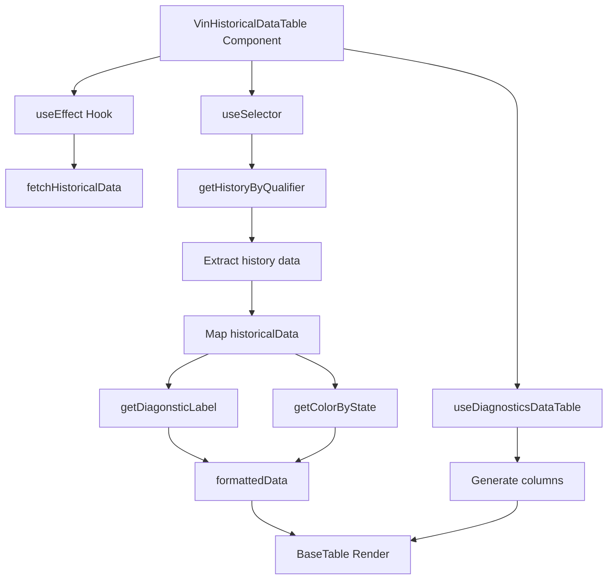
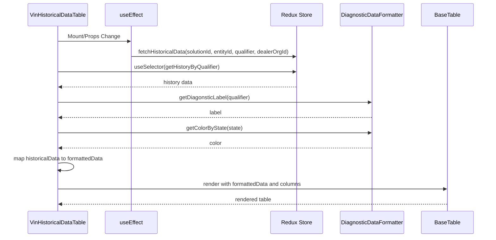
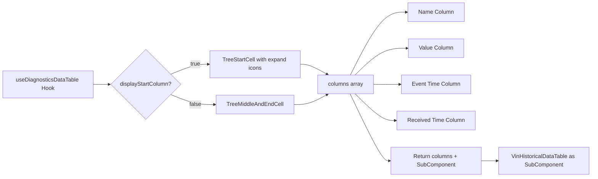
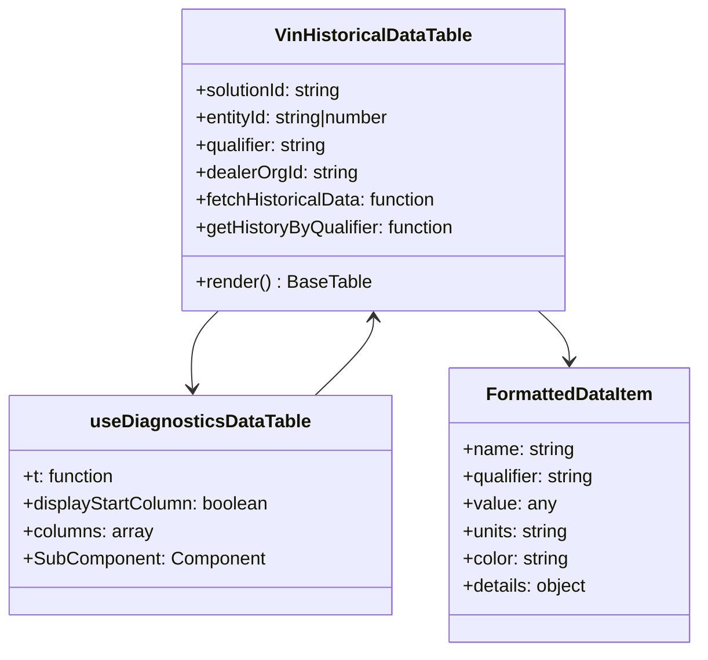
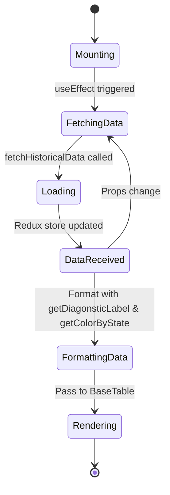

# Diagram: web/portal/src/shared/hooks/columns/useDiagnosticsDataTable.js

> Auto-generated by Obscura crawlers

## Diagram 1

### SVG

<svg id="container" width="869.06640625" xmlns="http://www.w3.org/2000/svg" class="flowchart" height="822" viewBox="0 0 869.06640625 822" role="graphics-document document" aria-roledescription="flowchart-v2"><g><marker id="container_flowchart-v2-pointEnd" class="marker flowchart-v2" viewBox="0 0 10 10" refX="5" refY="5" markerUnits="userSpaceOnUse" markerWidth="8" markerHeight="8" orient="auto"><path d="M 0 0 L 10 5 L 0 10 z" class="arrowMarkerPath" style="stroke-width: 1; stroke-dasharray: 1, 0;"></path></marker><marker id="container_flowchart-v2-pointStart" class="marker flowchart-v2" viewBox="0 0 10 10" refX="4.5" refY="5" markerUnits="userSpaceOnUse" markerWidth="8" markerHeight="8" orient="auto"><path d="M 0 5 L 10 10 L 10 0 z" class="arrowMarkerPath" style="stroke-width: 1; stroke-dasharray: 1, 0;"></path></marker><marker id="container_flowchart-v2-circleEnd" class="marker flowchart-v2" viewBox="0 0 10 10" refX="11" refY="5" markerUnits="userSpaceOnUse" markerWidth="11" markerHeight="11" orient="auto"><circle cx="5" cy="5" r="5" class="arrowMarkerPath" style="stroke-width: 1; stroke-dasharray: 1, 0;"></circle></marker><marker id="container_flowchart-v2-circleStart" class="marker flowchart-v2" viewBox="0 0 10 10" refX="-1" refY="5" markerUnits="userSpaceOnUse" markerWidth="11" markerHeight="11" orient="auto"><circle cx="5" cy="5" r="5" class="arrowMarkerPath" style="stroke-width: 1; stroke-dasharray: 1, 0;"></circle></marker><marker id="container_flowchart-v2-crossEnd" class="marker cross flowchart-v2" viewBox="0 0 11 11" refX="12" refY="5.2" markerUnits="userSpaceOnUse" markerWidth="11" markerHeight="11" orient="auto"><path d="M 1,1 l 9,9 M 10,1 l -9,9" class="arrowMarkerPath" style="stroke-width: 2; stroke-dasharray: 1, 0;"></path></marker><marker id="container_flowchart-v2-crossStart" class="marker cross flowchart-v2" viewBox="0 0 11 11" refX="-1" refY="5.2" markerUnits="userSpaceOnUse" markerWidth="11" markerHeight="11" orient="auto"><path d="M 1,1 l 9,9 M 10,1 l -9,9" class="arrowMarkerPath" style="stroke-width: 2; stroke-dasharray: 1, 0;"></path></marker><g class="root"><g class="clusters"></g><g class="edgePaths"><path d="M233.945,79.435L212.859,84.696C191.773,89.956,149.602,100.478,128.516,109.239C107.43,118,107.43,125,107.43,128.5L107.43,132" id="L_A_B_0" class="edge-thickness-normal edge-pattern-solid edge-thickness-normal edge-pattern-solid flowchart-link" style=";" data-edge="true" data-et="edge" data-id="L_A_B_0" data-points="W3sieCI6MjMzLjk0NTMxMjUsInkiOjc5LjQzNDY3MTM3NzIzMDkzfSx7IngiOjEwNy40Mjk2ODc1LCJ5IjoxMTF9LHsieCI6MTA3LjQyOTY4NzUsInkiOjEzNn1d" marker-end="url(#container_flowchart-v2-pointEnd)"></path><path d="M107.43,190L107.43,194.167C107.43,198.333,107.43,206.667,107.43,214.333C107.43,222,107.43,229,107.43,232.5L107.43,236" id="L_B_C_0" class="edge-thickness-normal edge-pattern-solid edge-thickness-normal edge-pattern-solid flowchart-link" style=";" data-edge="true" data-et="edge" data-id="L_B_C_0" data-points="W3sieCI6MTA3LjQyOTY4NzUsInkiOjE5MH0seyJ4IjoxMDcuNDI5Njg3NSwieSI6MjE1fSx7IngiOjEwNy40Mjk2ODc1LCJ5IjoyNDB9XQ==" marker-end="url(#container_flowchart-v2-pointEnd)"></path><path d="M363.945,86L363.945,90.167C363.945,94.333,363.945,102.667,363.945,110.333C363.945,118,363.945,125,363.945,128.5L363.945,132" id="L_A_D_0" class="edge-thickness-normal edge-pattern-solid edge-thickness-normal edge-pattern-solid flowchart-link" style=";" data-edge="true" data-et="edge" data-id="L_A_D_0" data-points="W3sieCI6MzYzLjk0NTMxMjUsInkiOjg2fSx7IngiOjM2My45NDUzMTI1LCJ5IjoxMTF9LHsieCI6MzYzLjk0NTMxMjUsInkiOjEzNn1d" marker-end="url(#container_flowchart-v2-pointEnd)"></path><path d="M363.945,190L363.945,194.167C363.945,198.333,363.945,206.667,363.945,214.333C363.945,222,363.945,229,363.945,232.5L363.945,236" id="L_D_E_0" class="edge-thickness-normal edge-pattern-solid edge-thickness-normal edge-pattern-solid flowchart-link" style=";" data-edge="true" data-et="edge" data-id="L_D_E_0" data-points="W3sieCI6MzYzLjk0NTMxMjUsInkiOjE5MH0seyJ4IjozNjMuOTQ1MzEyNSwieSI6MjE1fSx7IngiOjM2My45NDUzMTI1LCJ5IjoyNDB9XQ==" marker-end="url(#container_flowchart-v2-pointEnd)"></path><path d="M363.945,294L363.945,298.167C363.945,302.333,363.945,310.667,363.945,318.333C363.945,326,363.945,333,363.945,336.5L363.945,340" id="L_E_F_0" class="edge-thickness-normal edge-pattern-solid edge-thickness-normal edge-pattern-solid flowchart-link" style=";" data-edge="true" data-et="edge" data-id="L_E_F_0" data-points="W3sieCI6MzYzLjk0NTMxMjUsInkiOjI5NH0seyJ4IjozNjMuOTQ1MzEyNSwieSI6MzE5fSx7IngiOjM2My45NDUzMTI1LCJ5IjozNDR9XQ==" marker-end="url(#container_flowchart-v2-pointEnd)"></path><path d="M363.945,398L363.945,402.167C363.945,406.333,363.945,414.667,363.945,422.333C363.945,430,363.945,437,363.945,440.5L363.945,444" id="L_F_G_0" class="edge-thickness-normal edge-pattern-solid edge-thickness-normal edge-pattern-solid flowchart-link" style=";" data-edge="true" data-et="edge" data-id="L_F_G_0" data-points="W3sieCI6MzYzLjk0NTMxMjUsInkiOjM5OH0seyJ4IjozNjMuOTQ1MzEyNSwieSI6NDIzfSx7IngiOjM2My45NDUzMTI1LCJ5Ijo0NDh9XQ==" marker-end="url(#container_flowchart-v2-pointEnd)"></path><path d="M302.524,502L293.045,506.167C283.567,510.333,264.61,518.667,255.131,526.333C245.652,534,245.652,541,245.652,544.5L245.652,548" id="L_G_H_0" class="edge-thickness-normal edge-pattern-solid edge-thickness-normal edge-pattern-solid flowchart-link" style=";" data-edge="true" data-et="edge" data-id="L_G_H_0" data-points="W3sieCI6MzAyLjUyMzk2MzM0MTM0NjEzLCJ5Ijo1MDJ9LHsieCI6MjQ1LjY1MjM0Mzc1LCJ5Ijo1Mjd9LHsieCI6MjQ1LjY1MjM0Mzc1LCJ5Ijo1NTJ9XQ==" marker-end="url(#container_flowchart-v2-pointEnd)"></path><path d="M425.367,502L434.845,506.167C444.324,510.333,463.281,518.667,472.76,526.333C482.238,534,482.238,541,482.238,544.5L482.238,548" id="L_G_I_0" class="edge-thickness-normal edge-pattern-solid edge-thickness-normal edge-pattern-solid flowchart-link" style=";" data-edge="true" data-et="edge" data-id="L_G_I_0" data-points="W3sieCI6NDI1LjM2NjY2MTY1ODY1Mzg3LCJ5Ijo1MDJ9LHsieCI6NDgyLjIzODI4MTI1LCJ5Ijo1Mjd9LHsieCI6NDgyLjIzODI4MTI1LCJ5Ijo1NTJ9XQ==" marker-end="url(#container_flowchart-v2-pointEnd)"></path><path d="M245.652,606L245.652,610.167C245.652,614.333,245.652,622.667,254.521,630.732C263.389,638.797,281.126,646.594,289.994,650.492L298.862,654.39" id="L_H_J_0" class="edge-thickness-normal edge-pattern-solid edge-thickness-normal edge-pattern-solid flowchart-link" style=";" data-edge="true" data-et="edge" data-id="L_H_J_0" data-points="W3sieCI6MjQ1LjY1MjM0Mzc1LCJ5Ijo2MDZ9LHsieCI6MjQ1LjY1MjM0Mzc1LCJ5Ijo2MzF9LHsieCI6MzAyLjUyMzk2MzM0MTM0NjEzLCJ5Ijo2NTZ9XQ==" marker-end="url(#container_flowchart-v2-pointEnd)"></path><path d="M482.238,606L482.238,610.167C482.238,614.333,482.238,622.667,473.37,630.732C464.502,638.797,446.765,646.594,437.897,650.492L429.028,654.39" id="L_I_J_0" class="edge-thickness-normal edge-pattern-solid edge-thickness-normal edge-pattern-solid flowchart-link" style=";" data-edge="true" data-et="edge" data-id="L_I_J_0" data-points="W3sieCI6NDgyLjIzODI4MTI1LCJ5Ijo2MDZ9LHsieCI6NDgyLjIzODI4MTI1LCJ5Ijo2MzF9LHsieCI6NDI1LjM2NjY2MTY1ODY1Mzg3LCJ5Ijo2NTZ9XQ==" marker-end="url(#container_flowchart-v2-pointEnd)"></path><path d="M363.945,710L363.945,714.167C363.945,718.333,363.945,726.667,373.676,734.751C383.407,742.835,402.869,750.671,412.6,754.588L422.331,758.506" id="L_J_K_0" class="edge-thickness-normal edge-pattern-solid edge-thickness-normal edge-pattern-solid flowchart-link" style=";" data-edge="true" data-et="edge" data-id="L_J_K_0" data-points="W3sieCI6MzYzLjk0NTMxMjUsInkiOjcxMH0seyJ4IjozNjMuOTQ1MzEyNSwieSI6NzM1fSx7IngiOjQyNi4wNDE1NDE0NjYzNDYyLCJ5Ijo3NjB9XQ==" marker-end="url(#container_flowchart-v2-pointEnd)"></path><path d="M493.945,69.092L535.048,76.076C576.15,83.061,658.354,97.031,699.456,112.682C740.559,128.333,740.559,145.667,740.559,163C740.559,180.333,740.559,197.667,740.559,215C740.559,232.333,740.559,249.667,740.559,267C740.559,284.333,740.559,301.667,740.559,319C740.559,336.333,740.559,353.667,740.559,371C740.559,388.333,740.559,405.667,740.559,423C740.559,440.333,740.559,457.667,740.559,475C740.559,492.333,740.559,509.667,740.559,521.833C740.559,534,740.559,541,740.559,544.5L740.559,548" id="L_A_L_0" class="edge-thickness-normal edge-pattern-solid edge-thickness-normal edge-pattern-solid flowchart-link" style=";" data-edge="true" data-et="edge" data-id="L_A_L_0" data-points="W3sieCI6NDkzLjk0NTMxMjUsInkiOjY5LjA5MTYyNjY0Nzg1ODY5fSx7IngiOjc0MC41NTg1OTM3NSwieSI6MTExfSx7IngiOjc0MC41NTg1OTM3NSwieSI6MTYzfSx7IngiOjc0MC41NTg1OTM3NSwieSI6MjE1fSx7IngiOjc0MC41NTg1OTM3NSwieSI6MjY3fSx7IngiOjc0MC41NTg1OTM3NSwieSI6MzE5fSx7IngiOjc0MC41NTg1OTM3NSwieSI6MzcxfSx7IngiOjc0MC41NTg1OTM3NSwieSI6NDIzfSx7IngiOjc0MC41NTg1OTM3NSwieSI6NDc1fSx7IngiOjc0MC41NTg1OTM3NSwieSI6NTI3fSx7IngiOjc0MC41NTg1OTM3NSwieSI6NTUyfV0=" marker-end="url(#container_flowchart-v2-pointEnd)"></path><path d="M740.559,606L740.559,610.167C740.559,614.333,740.559,622.667,740.559,630.333C740.559,638,740.559,645,740.559,648.5L740.559,652" id="L_L_M_0" class="edge-thickness-normal edge-pattern-solid edge-thickness-normal edge-pattern-solid flowchart-link" style=";" data-edge="true" data-et="edge" data-id="L_L_M_0" data-points="W3sieCI6NzQwLjU1ODU5Mzc1LCJ5Ijo2MDZ9LHsieCI6NzQwLjU1ODU5Mzc1LCJ5Ijo2MzF9LHsieCI6NzQwLjU1ODU5Mzc1LCJ5Ijo2NTZ9XQ==" marker-end="url(#container_flowchart-v2-pointEnd)"></path><path d="M740.559,710L740.559,714.167C740.559,718.333,740.559,726.667,715.779,736.041C690.999,745.415,641.439,755.829,616.659,761.036L591.879,766.244" id="L_M_K_0" class="edge-thickness-normal edge-pattern-solid edge-thickness-normal edge-pattern-solid flowchart-link" style=";" data-edge="true" data-et="edge" data-id="L_M_K_0" data-points="W3sieCI6NzQwLjU1ODU5Mzc1LCJ5Ijo3MTB9LHsieCI6NzQwLjU1ODU5Mzc1LCJ5Ijo3MzV9LHsieCI6NTg3Ljk2NDg0Mzc1LCJ5Ijo3NjcuMDY2MTc0MTQ5MTQ0NH1d" marker-end="url(#container_flowchart-v2-pointEnd)"></path></g><g class="edgeLabels"><g class="edgeLabel"><g class="label" data-id="L_A_B_0" transform="translate(0, 0)"><foreignObject width="0" height="0">

</foreignObject></g></g><g class="edgeLabel"><g class="label" data-id="L_B_C_0" transform="translate(0, 0)"><foreignObject width="0" height="0">

</foreignObject></g></g><g class="edgeLabel"><g class="label" data-id="L_A_D_0" transform="translate(0, 0)"><foreignObject width="0" height="0">

</foreignObject></g></g><g class="edgeLabel"><g class="label" data-id="L_D_E_0" transform="translate(0, 0)"><foreignObject width="0" height="0">

</foreignObject></g></g><g class="edgeLabel"><g class="label" data-id="L_E_F_0" transform="translate(0, 0)"><foreignObject width="0" height="0">

</foreignObject></g></g><g class="edgeLabel"><g class="label" data-id="L_F_G_0" transform="translate(0, 0)"><foreignObject width="0" height="0">

</foreignObject></g></g><g class="edgeLabel"><g class="label" data-id="L_G_H_0" transform="translate(0, 0)"><foreignObject width="0" height="0">

</foreignObject></g></g><g class="edgeLabel"><g class="label" data-id="L_G_I_0" transform="translate(0, 0)"><foreignObject width="0" height="0">

</foreignObject></g></g><g class="edgeLabel"><g class="label" data-id="L_H_J_0" transform="translate(0, 0)"><foreignObject width="0" height="0">

</foreignObject></g></g><g class="edgeLabel"><g class="label" data-id="L_I_J_0" transform="translate(0, 0)"><foreignObject width="0" height="0">

</foreignObject></g></g><g class="edgeLabel"><g class="label" data-id="L_J_K_0" transform="translate(0, 0)"><foreignObject width="0" height="0">

</foreignObject></g></g><g class="edgeLabel"><g class="label" data-id="L_A_L_0" transform="translate(0, 0)"><foreignObject width="0" height="0">

</foreignObject></g></g><g class="edgeLabel"><g class="label" data-id="L_L_M_0" transform="translate(0, 0)"><foreignObject width="0" height="0">

</foreignObject></g></g><g class="edgeLabel"><g class="label" data-id="L_M_K_0" transform="translate(0, 0)"><foreignObject width="0" height="0">

</foreignObject></g></g></g><g class="nodes"><g class="node default" id="flowchart-A-0" transform="translate(363.9453125, 47)"><rect class="basic label-container" style="" x="-130" y="-39" width="260" height="78"></rect><g class="label" style="" transform="translate(-100, -24)"><rect></rect><foreignObject width="200" height="48">

VinHistoricalDataTable Component

</foreignObject></g></g><g class="node default" id="flowchart-B-1" transform="translate(107.4296875, 163)"><rect class="basic label-container" style="" x="-84.2265625" y="-27" width="168.453125" height="54"></rect><g class="label" style="" transform="translate(-54.2265625, -12)"><rect></rect><foreignObject width="108.453125" height="24">

useEffect Hook

</foreignObject></g></g><g class="node default" id="flowchart-C-3" transform="translate(107.4296875, 267)"><rect class="basic label-container" style="" x="-99.4296875" y="-27" width="198.859375" height="54"></rect><g class="label" style="" transform="translate(-69.4296875, -12)"><rect></rect><foreignObject width="138.859375" height="24">

fetchHistoricalData

</foreignObject></g></g><g class="node default" id="flowchart-D-5" transform="translate(363.9453125, 163)"><rect class="basic label-container" style="" x="-72.4921875" y="-27" width="144.984375" height="54"></rect><g class="label" style="" transform="translate(-42.4921875, -12)"><rect></rect><foreignObject width="84.984375" height="24">

useSelector

</foreignObject></g></g><g class="node default" id="flowchart-E-7" transform="translate(363.9453125, 267)"><rect class="basic label-container" style="" x="-107.0859375" y="-27" width="214.171875" height="54"></rect><g class="label" style="" transform="translate(-77.0859375, -12)"><rect></rect><foreignObject width="154.171875" height="24">

getHistoryByQualifier

</foreignObject></g></g><g class="node default" id="flowchart-F-9" transform="translate(363.9453125, 371)"><rect class="basic label-container" style="" x="-100.625" y="-27" width="201.25" height="54"></rect><g class="label" style="" transform="translate(-70.625, -12)"><rect></rect><foreignObject width="141.25" height="24">

Extract history data

</foreignObject></g></g><g class="node default" id="flowchart-G-11" transform="translate(363.9453125, 475)"><rect class="basic label-container" style="" x="-97.8828125" y="-27" width="195.765625" height="54"></rect><g class="label" style="" transform="translate(-67.8828125, -12)"><rect></rect><foreignObject width="135.765625" height="24">

Map historicalData

</foreignObject></g></g><g class="node default" id="flowchart-H-13" transform="translate(245.65234375, 579)"><rect class="basic label-container" style="" x="-98.7734375" y="-27" width="197.546875" height="54"></rect><g class="label" style="" transform="translate(-68.7734375, -12)"><rect></rect><foreignObject width="137.546875" height="24">

getDiagonsticLabel

</foreignObject></g></g><g class="node default" id="flowchart-I-15" transform="translate(482.23828125, 579)"><rect class="basic label-container" style="" x="-87.8125" y="-27" width="175.625" height="54"></rect><g class="label" style="" transform="translate(-57.8125, -12)"><rect></rect><foreignObject width="115.625" height="24">

getColorByState

</foreignObject></g></g><g class="node default" id="flowchart-J-17" transform="translate(363.9453125, 683)"><rect class="basic label-container" style="" x="-82.9765625" y="-27" width="165.953125" height="54"></rect><g class="label" style="" transform="translate(-52.9765625, -12)"><rect></rect><foreignObject width="105.953125" height="24">

formattedData

</foreignObject></g></g><g class="node default" id="flowchart-K-21" transform="translate(493.10546875, 787)"><rect class="basic label-container" style="" x="-94.859375" y="-27" width="189.71875" height="54"></rect><g class="label" style="" transform="translate(-64.859375, -12)"><rect></rect><foreignObject width="129.71875" height="24">

BaseTable Render

</foreignObject></g></g><g class="node default" id="flowchart-L-23" transform="translate(740.55859375, 579)"><rect class="basic label-container" style="" x="-120.5078125" y="-27" width="241.015625" height="54"></rect><g class="label" style="" transform="translate(-90.5078125, -12)"><rect></rect><foreignObject width="181.015625" height="24">

useDiagnosticsDataTable

</foreignObject></g></g><g class="node default" id="flowchart-M-25" transform="translate(740.55859375, 683)"><rect class="basic label-container" style="" x="-95.484375" y="-27" width="190.96875" height="54"></rect><g class="label" style="" transform="translate(-65.484375, -12)"><rect></rect><foreignObject width="130.96875" height="24">

Generate columns

</foreignObject></g></g></g></g></g></svg>

## Diagram 2

### SVG

<svg id="container" width="1500" xmlns="http://www.w3.org/2000/svg" height="729" viewBox="-90 -10 1500 729" role="graphics-document document" aria-roledescription="sequence"><g><rect x="1210" y="643" fill="#eaeaea" stroke="#666" width="150" height="65" name="Table" rx="3" ry="3" class="actor actor-bottom"></rect><text x="1285" y="675.5" dominant-baseline="central" alignment-baseline="central" class="actor actor-box" style="text-anchor: middle; font-size: 16px; font-weight: 400;"><tspan x="1285" dy="0">BaseTable</tspan></text></g><g><rect x="959" y="643" fill="#eaeaea" stroke="#666" width="201" height="65" name="Formatter" rx="3" ry="3" class="actor actor-bottom"></rect><text x="1059.5" y="675.5" dominant-baseline="central" alignment-baseline="central" class="actor actor-box" style="text-anchor: middle; font-size: 16px; font-weight: 400;"><tspan x="1059.5" dy="0">DiagnosticDataFormatter</tspan></text></g><g><rect x="759" y="643" fill="#eaeaea" stroke="#666" width="150" height="65" name="Redux" rx="3" ry="3" class="actor actor-bottom"></rect><text x="834" y="675.5" dominant-baseline="central" alignment-baseline="central" class="actor actor-box" style="text-anchor: middle; font-size: 16px; font-weight: 400;"><tspan x="834" dy="0">Redux Store</tspan></text></g><g><rect x="240" y="643" fill="#eaeaea" stroke="#666" width="150" height="65" name="Effect" rx="3" ry="3" class="actor actor-bottom"></rect><text x="315" y="675.5" dominant-baseline="central" alignment-baseline="central" class="actor actor-box" style="text-anchor: middle; font-size: 16px; font-weight: 400;"><tspan x="315" dy="0">useEffect</tspan></text></g><g><rect x="0" y="643" fill="#eaeaea" stroke="#666" width="184" height="65" name="Component" rx="3" ry="3" class="actor actor-bottom"></rect><text x="92" y="675.5" dominant-baseline="central" alignment-baseline="central" class="actor actor-box" style="text-anchor: middle; font-size: 16px; font-weight: 400;"><tspan x="92" dy="0">VinHistoricalDataTable</tspan></text></g><g><line id="actor4" x1="1285" y1="65" x2="1285" y2="643" class="actor-line 200" stroke-width="0.5px" stroke="#999" name="Table"></line><g id="root-4"><rect x="1210" y="0" fill="#eaeaea" stroke="#666" width="150" height="65" name="Table" rx="3" ry="3" class="actor actor-top"></rect><text x="1285" y="32.5" dominant-baseline="central" alignment-baseline="central" class="actor actor-box" style="text-anchor: middle; font-size: 16px; font-weight: 400;"><tspan x="1285" dy="0">BaseTable</tspan></text></g></g><g><line id="actor3" x1="1059.5" y1="65" x2="1059.5" y2="643" class="actor-line 200" stroke-width="0.5px" stroke="#999" name="Formatter"></line><g id="root-3"><rect x="959" y="0" fill="#eaeaea" stroke="#666" width="201" height="65" name="Formatter" rx="3" ry="3" class="actor actor-top"></rect><text x="1059.5" y="32.5" dominant-baseline="central" alignment-baseline="central" class="actor actor-box" style="text-anchor: middle; font-size: 16px; font-weight: 400;"><tspan x="1059.5" dy="0">DiagnosticDataFormatter</tspan></text></g></g><g><line id="actor2" x1="834" y1="65" x2="834" y2="643" class="actor-line 200" stroke-width="0.5px" stroke="#999" name="Redux"></line><g id="root-2"><rect x="759" y="0" fill="#eaeaea" stroke="#666" width="150" height="65" name="Redux" rx="3" ry="3" class="actor actor-top"></rect><text x="834" y="32.5" dominant-baseline="central" alignment-baseline="central" class="actor actor-box" style="text-anchor: middle; font-size: 16px; font-weight: 400;"><tspan x="834" dy="0">Redux Store</tspan></text></g></g><g><line id="actor1" x1="315" y1="65" x2="315" y2="643" class="actor-line 200" stroke-width="0.5px" stroke="#999" name="Effect"></line><g id="root-1"><rect x="240" y="0" fill="#eaeaea" stroke="#666" width="150" height="65" name="Effect" rx="3" ry="3" class="actor actor-top"></rect><text x="315" y="32.5" dominant-baseline="central" alignment-baseline="central" class="actor actor-box" style="text-anchor: middle; font-size: 16px; font-weight: 400;"><tspan x="315" dy="0">useEffect</tspan></text></g></g><g><line id="actor0" x1="92" y1="65" x2="92" y2="643" class="actor-line 200" stroke-width="0.5px" stroke="#999" name="Component"></line><g id="root-0"><rect x="0" y="0" fill="#eaeaea" stroke="#666" width="184" height="65" name="Component" rx="3" ry="3" class="actor actor-top"></rect><text x="92" y="32.5" dominant-baseline="central" alignment-baseline="central" class="actor actor-box" style="text-anchor: middle; font-size: 16px; font-weight: 400;"><tspan x="92" dy="0">VinHistoricalDataTable</tspan></text></g></g><g></g><defs><symbol id="computer" width="24" height="24"><path transform="scale(.5)" d="M2 2v13h20v-13h-20zm18 11h-16v-9h16v9zm-10.228 6l.466-1h3.524l.467 1h-4.457zm14.228 3h-24l2-6h2.104l-1.33 4h18.45l-1.297-4h2.073l2 6zm-5-10h-14v-7h14v7z"></path></symbol></defs><defs><symbol id="database" fill-rule="evenodd" clip-rule="evenodd"><path transform="scale(.5)" d="M12.258.001l.256.004.255.005.253.008.251.01.249.012.247.015.246.016.242.019.241.02.239.023.236.024.233.027.231.028.229.031.225.032.223.034.22.036.217.038.214.04.211.041.208.043.205.045.201.046.198.048.194.05.191.051.187.053.183.054.18.056.175.057.172.059.168.06.163.061.16.063.155.064.15.066.074.033.073.033.071.034.07.034.069.035.068.035.067.035.066.035.064.036.064.036.062.036.06.036.06.037.058.037.058.037.055.038.055.038.053.038.052.038.051.039.05.039.048.039.047.039.045.04.044.04.043.04.041.04.04.041.039.041.037.041.036.041.034.041.033.042.032.042.03.042.029.042.027.042.026.043.024.043.023.043.021.043.02.043.018.044.017.043.015.044.013.044.012.044.011.045.009.044.007.045.006.045.004.045.002.045.001.045v17l-.001.045-.002.045-.004.045-.006.045-.007.045-.009.044-.011.045-.012.044-.013.044-.015.044-.017.043-.018.044-.02.043-.021.043-.023.043-.024.043-.026.043-.027.042-.029.042-.03.042-.032.042-.033.042-.034.041-.036.041-.037.041-.039.041-.04.041-.041.04-.043.04-.044.04-.045.04-.047.039-.048.039-.05.039-.051.039-.052.038-.053.038-.055.038-.055.038-.058.037-.058.037-.06.037-.06.036-.062.036-.064.036-.064.036-.066.035-.067.035-.068.035-.069.035-.07.034-.071.034-.073.033-.074.033-.15.066-.155.064-.16.063-.163.061-.168.06-.172.059-.175.057-.18.056-.183.054-.187.053-.191.051-.194.05-.198.048-.201.046-.205.045-.208.043-.211.041-.214.04-.217.038-.22.036-.223.034-.225.032-.229.031-.231.028-.233.027-.236.024-.239.023-.241.02-.242.019-.246.016-.247.015-.249.012-.251.01-.253.008-.255.005-.256.004-.258.001-.258-.001-.256-.004-.255-.005-.253-.008-.251-.01-.249-.012-.247-.015-.245-.016-.243-.019-.241-.02-.238-.023-.236-.024-.234-.027-.231-.028-.228-.031-.226-.032-.223-.034-.22-.036-.217-.038-.214-.04-.211-.041-.208-.043-.204-.045-.201-.046-.198-.048-.195-.05-.19-.051-.187-.053-.184-.054-.179-.056-.176-.057-.172-.059-.167-.06-.164-.061-.159-.063-.155-.064-.151-.066-.074-.033-.072-.033-.072-.034-.07-.034-.069-.035-.068-.035-.067-.035-.066-.035-.064-.036-.063-.036-.062-.036-.061-.036-.06-.037-.058-.037-.057-.037-.056-.038-.055-.038-.053-.038-.052-.038-.051-.039-.049-.039-.049-.039-.046-.039-.046-.04-.044-.04-.043-.04-.041-.04-.04-.041-.039-.041-.037-.041-.036-.041-.034-.041-.033-.042-.032-.042-.03-.042-.029-.042-.027-.042-.026-.043-.024-.043-.023-.043-.021-.043-.02-.043-.018-.044-.017-.043-.015-.044-.013-.044-.012-.044-.011-.045-.009-.044-.007-.045-.006-.045-.004-.045-.002-.045-.001-.045v-17l.001-.045.002-.045.004-.045.006-.045.007-.045.009-.044.011-.045.012-.044.013-.044.015-.044.017-.043.018-.044.02-.043.021-.043.023-.043.024-.043.026-.043.027-.042.029-.042.03-.042.032-.042.033-.042.034-.041.036-.041.037-.041.039-.041.04-.041.041-.04.043-.04.044-.04.046-.04.046-.039.049-.039.049-.039.051-.039.052-.038.053-.038.055-.038.056-.038.057-.037.058-.037.06-.037.061-.036.062-.036.063-.036.064-.036.066-.035.067-.035.068-.035.069-.035.07-.034.072-.034.072-.033.074-.033.151-.066.155-.064.159-.063.164-.061.167-.06.172-.059.176-.057.179-.056.184-.054.187-.053.19-.051.195-.05.198-.048.201-.046.204-.045.208-.043.211-.041.214-.04.217-.038.22-.036.223-.034.226-.032.228-.031.231-.028.234-.027.236-.024.238-.023.241-.02.243-.019.245-.016.247-.015.249-.012.251-.01.253-.008.255-.005.256-.004.258-.001.258.001zm-9.258 20.499v.01l.001.021.003.021.004.022.005.021.006.022.007.022.009.023.01.022.011.023.012.023.013.023.015.023.016.024.017.023.018.024.019.024.021.024.022.025.023.024.024.025.052.049.056.05.061.051.066.051.07.051.075.051.079.052.084.052.088.052.092.052.097.052.102.051.105.052.11.052.114.051.119.051.123.051.127.05.131.05.135.05.139.048.144.049.147.047.152.047.155.047.16.045.163.045.167.043.171.043.176.041.178.041.183.039.187.039.19.037.194.035.197.035.202.033.204.031.209.03.212.029.216.027.219.025.222.024.226.021.23.02.233.018.236.016.24.015.243.012.246.01.249.008.253.005.256.004.259.001.26-.001.257-.004.254-.005.25-.008.247-.011.244-.012.241-.014.237-.016.233-.018.231-.021.226-.021.224-.024.22-.026.216-.027.212-.028.21-.031.205-.031.202-.034.198-.034.194-.036.191-.037.187-.039.183-.04.179-.04.175-.042.172-.043.168-.044.163-.045.16-.046.155-.046.152-.047.148-.048.143-.049.139-.049.136-.05.131-.05.126-.05.123-.051.118-.052.114-.051.11-.052.106-.052.101-.052.096-.052.092-.052.088-.053.083-.051.079-.052.074-.052.07-.051.065-.051.06-.051.056-.05.051-.05.023-.024.023-.025.021-.024.02-.024.019-.024.018-.024.017-.024.015-.023.014-.024.013-.023.012-.023.01-.023.01-.022.008-.022.006-.022.006-.022.004-.022.004-.021.001-.021.001-.021v-4.127l-.077.055-.08.053-.083.054-.085.053-.087.052-.09.052-.093.051-.095.05-.097.05-.1.049-.102.049-.105.048-.106.047-.109.047-.111.046-.114.045-.115.045-.118.044-.12.043-.122.042-.124.042-.126.041-.128.04-.13.04-.132.038-.134.038-.135.037-.138.037-.139.035-.142.035-.143.034-.144.033-.147.032-.148.031-.15.03-.151.03-.153.029-.154.027-.156.027-.158.026-.159.025-.161.024-.162.023-.163.022-.165.021-.166.02-.167.019-.169.018-.169.017-.171.016-.173.015-.173.014-.175.013-.175.012-.177.011-.178.01-.179.008-.179.008-.181.006-.182.005-.182.004-.184.003-.184.002h-.37l-.184-.002-.184-.003-.182-.004-.182-.005-.181-.006-.179-.008-.179-.008-.178-.01-.176-.011-.176-.012-.175-.013-.173-.014-.172-.015-.171-.016-.17-.017-.169-.018-.167-.019-.166-.02-.165-.021-.163-.022-.162-.023-.161-.024-.159-.025-.157-.026-.156-.027-.155-.027-.153-.029-.151-.03-.15-.03-.148-.031-.146-.032-.145-.033-.143-.034-.141-.035-.14-.035-.137-.037-.136-.037-.134-.038-.132-.038-.13-.04-.128-.04-.126-.041-.124-.042-.122-.042-.12-.044-.117-.043-.116-.045-.113-.045-.112-.046-.109-.047-.106-.047-.105-.048-.102-.049-.1-.049-.097-.05-.095-.05-.093-.052-.09-.051-.087-.052-.085-.053-.083-.054-.08-.054-.077-.054v4.127zm0-5.654v.011l.001.021.003.021.004.021.005.022.006.022.007.022.009.022.01.022.011.023.012.023.013.023.015.024.016.023.017.024.018.024.019.024.021.024.022.024.023.025.024.024.052.05.056.05.061.05.066.051.07.051.075.052.079.051.084.052.088.052.092.052.097.052.102.052.105.052.11.051.114.051.119.052.123.05.127.051.131.05.135.049.139.049.144.048.147.048.152.047.155.046.16.045.163.045.167.044.171.042.176.042.178.04.183.04.187.038.19.037.194.036.197.034.202.033.204.032.209.03.212.028.216.027.219.025.222.024.226.022.23.02.233.018.236.016.24.014.243.012.246.01.249.008.253.006.256.003.259.001.26-.001.257-.003.254-.006.25-.008.247-.01.244-.012.241-.015.237-.016.233-.018.231-.02.226-.022.224-.024.22-.025.216-.027.212-.029.21-.03.205-.032.202-.033.198-.035.194-.036.191-.037.187-.039.183-.039.179-.041.175-.042.172-.043.168-.044.163-.045.16-.045.155-.047.152-.047.148-.048.143-.048.139-.05.136-.049.131-.05.126-.051.123-.051.118-.051.114-.052.11-.052.106-.052.101-.052.096-.052.092-.052.088-.052.083-.052.079-.052.074-.051.07-.052.065-.051.06-.05.056-.051.051-.049.023-.025.023-.024.021-.025.02-.024.019-.024.018-.024.017-.024.015-.023.014-.023.013-.024.012-.022.01-.023.01-.023.008-.022.006-.022.006-.022.004-.021.004-.022.001-.021.001-.021v-4.139l-.077.054-.08.054-.083.054-.085.052-.087.053-.09.051-.093.051-.095.051-.097.05-.1.049-.102.049-.105.048-.106.047-.109.047-.111.046-.114.045-.115.044-.118.044-.12.044-.122.042-.124.042-.126.041-.128.04-.13.039-.132.039-.134.038-.135.037-.138.036-.139.036-.142.035-.143.033-.144.033-.147.033-.148.031-.15.03-.151.03-.153.028-.154.028-.156.027-.158.026-.159.025-.161.024-.162.023-.163.022-.165.021-.166.02-.167.019-.169.018-.169.017-.171.016-.173.015-.173.014-.175.013-.175.012-.177.011-.178.009-.179.009-.179.007-.181.007-.182.005-.182.004-.184.003-.184.002h-.37l-.184-.002-.184-.003-.182-.004-.182-.005-.181-.007-.179-.007-.179-.009-.178-.009-.176-.011-.176-.012-.175-.013-.173-.014-.172-.015-.171-.016-.17-.017-.169-.018-.167-.019-.166-.02-.165-.021-.163-.022-.162-.023-.161-.024-.159-.025-.157-.026-.156-.027-.155-.028-.153-.028-.151-.03-.15-.03-.148-.031-.146-.033-.145-.033-.143-.033-.141-.035-.14-.036-.137-.036-.136-.037-.134-.038-.132-.039-.13-.039-.128-.04-.126-.041-.124-.042-.122-.043-.12-.043-.117-.044-.116-.044-.113-.046-.112-.046-.109-.046-.106-.047-.105-.048-.102-.049-.1-.049-.097-.05-.095-.051-.093-.051-.09-.051-.087-.053-.085-.052-.083-.054-.08-.054-.077-.054v4.139zm0-5.666v.011l.001.02.003.022.004.021.005.022.006.021.007.022.009.023.01.022.011.023.012.023.013.023.015.023.016.024.017.024.018.023.019.024.021.025.022.024.023.024.024.025.052.05.056.05.061.05.066.051.07.051.075.052.079.051.084.052.088.052.092.052.097.052.102.052.105.051.11.052.114.051.119.051.123.051.127.05.131.05.135.05.139.049.144.048.147.048.152.047.155.046.16.045.163.045.167.043.171.043.176.042.178.04.183.04.187.038.19.037.194.036.197.034.202.033.204.032.209.03.212.028.216.027.219.025.222.024.226.021.23.02.233.018.236.017.24.014.243.012.246.01.249.008.253.006.256.003.259.001.26-.001.257-.003.254-.006.25-.008.247-.01.244-.013.241-.014.237-.016.233-.018.231-.02.226-.022.224-.024.22-.025.216-.027.212-.029.21-.03.205-.032.202-.033.198-.035.194-.036.191-.037.187-.039.183-.039.179-.041.175-.042.172-.043.168-.044.163-.045.16-.045.155-.047.152-.047.148-.048.143-.049.139-.049.136-.049.131-.051.126-.05.123-.051.118-.052.114-.051.11-.052.106-.052.101-.052.096-.052.092-.052.088-.052.083-.052.079-.052.074-.052.07-.051.065-.051.06-.051.056-.05.051-.049.023-.025.023-.025.021-.024.02-.024.019-.024.018-.024.017-.024.015-.023.014-.024.013-.023.012-.023.01-.022.01-.023.008-.022.006-.022.006-.022.004-.022.004-.021.001-.021.001-.021v-4.153l-.077.054-.08.054-.083.053-.085.053-.087.053-.09.051-.093.051-.095.051-.097.05-.1.049-.102.048-.105.048-.106.048-.109.046-.111.046-.114.046-.115.044-.118.044-.12.043-.122.043-.124.042-.126.041-.128.04-.13.039-.132.039-.134.038-.135.037-.138.036-.139.036-.142.034-.143.034-.144.033-.147.032-.148.032-.15.03-.151.03-.153.028-.154.028-.156.027-.158.026-.159.024-.161.024-.162.023-.163.023-.165.021-.166.02-.167.019-.169.018-.169.017-.171.016-.173.015-.173.014-.175.013-.175.012-.177.01-.178.01-.179.009-.179.007-.181.006-.182.006-.182.004-.184.003-.184.001-.185.001-.185-.001-.184-.001-.184-.003-.182-.004-.182-.006-.181-.006-.179-.007-.179-.009-.178-.01-.176-.01-.176-.012-.175-.013-.173-.014-.172-.015-.171-.016-.17-.017-.169-.018-.167-.019-.166-.02-.165-.021-.163-.023-.162-.023-.161-.024-.159-.024-.157-.026-.156-.027-.155-.028-.153-.028-.151-.03-.15-.03-.148-.032-.146-.032-.145-.033-.143-.034-.141-.034-.14-.036-.137-.036-.136-.037-.134-.038-.132-.039-.13-.039-.128-.041-.126-.041-.124-.041-.122-.043-.12-.043-.117-.044-.116-.044-.113-.046-.112-.046-.109-.046-.106-.048-.105-.048-.102-.048-.1-.05-.097-.049-.095-.051-.093-.051-.09-.052-.087-.052-.085-.053-.083-.053-.08-.054-.077-.054v4.153zm8.74-8.179l-.257.004-.254.005-.25.008-.247.011-.244.012-.241.014-.237.016-.233.018-.231.021-.226.022-.224.023-.22.026-.216.027-.212.028-.21.031-.205.032-.202.033-.198.034-.194.036-.191.038-.187.038-.183.04-.179.041-.175.042-.172.043-.168.043-.163.045-.16.046-.155.046-.152.048-.148.048-.143.048-.139.049-.136.05-.131.05-.126.051-.123.051-.118.051-.114.052-.11.052-.106.052-.101.052-.096.052-.092.052-.088.052-.083.052-.079.052-.074.051-.07.052-.065.051-.06.05-.056.05-.051.05-.023.025-.023.024-.021.024-.02.025-.019.024-.018.024-.017.023-.015.024-.014.023-.013.023-.012.023-.01.023-.01.022-.008.022-.006.023-.006.021-.004.022-.004.021-.001.021-.001.021.001.021.001.021.004.021.004.022.006.021.006.023.008.022.01.022.01.023.012.023.013.023.014.023.015.024.017.023.018.024.019.024.02.025.021.024.023.024.023.025.051.05.056.05.06.05.065.051.07.052.074.051.079.052.083.052.088.052.092.052.096.052.101.052.106.052.11.052.114.052.118.051.123.051.126.051.131.05.136.05.139.049.143.048.148.048.152.048.155.046.16.046.163.045.168.043.172.043.175.042.179.041.183.04.187.038.191.038.194.036.198.034.202.033.205.032.21.031.212.028.216.027.22.026.224.023.226.022.231.021.233.018.237.016.241.014.244.012.247.011.25.008.254.005.257.004.26.001.26-.001.257-.004.254-.005.25-.008.247-.011.244-.012.241-.014.237-.016.233-.018.231-.021.226-.022.224-.023.22-.026.216-.027.212-.028.21-.031.205-.032.202-.033.198-.034.194-.036.191-.038.187-.038.183-.04.179-.041.175-.042.172-.043.168-.043.163-.045.16-.046.155-.046.152-.048.148-.048.143-.048.139-.049.136-.05.131-.05.126-.051.123-.051.118-.051.114-.052.11-.052.106-.052.101-.052.096-.052.092-.052.088-.052.083-.052.079-.052.074-.051.07-.052.065-.051.06-.05.056-.05.051-.05.023-.025.023-.024.021-.024.02-.025.019-.024.018-.024.017-.023.015-.024.014-.023.013-.023.012-.023.01-.023.01-.022.008-.022.006-.023.006-.021.004-.022.004-.021.001-.021.001-.021-.001-.021-.001-.021-.004-.021-.004-.022-.006-.021-.006-.023-.008-.022-.01-.022-.01-.023-.012-.023-.013-.023-.014-.023-.015-.024-.017-.023-.018-.024-.019-.024-.02-.025-.021-.024-.023-.024-.023-.025-.051-.05-.056-.05-.06-.05-.065-.051-.07-.052-.074-.051-.079-.052-.083-.052-.088-.052-.092-.052-.096-.052-.101-.052-.106-.052-.11-.052-.114-.052-.118-.051-.123-.051-.126-.051-.131-.05-.136-.05-.139-.049-.143-.048-.148-.048-.152-.048-.155-.046-.16-.046-.163-.045-.168-.043-.172-.043-.175-.042-.179-.041-.183-.04-.187-.038-.191-.038-.194-.036-.198-.034-.202-.033-.205-.032-.21-.031-.212-.028-.216-.027-.22-.026-.224-.023-.226-.022-.231-.021-.233-.018-.237-.016-.241-.014-.244-.012-.247-.011-.25-.008-.254-.005-.257-.004-.26-.001-.26.001z"></path></symbol></defs><defs><symbol id="clock" width="24" height="24"><path transform="scale(.5)" d="M12 2c5.514 0 10 4.486 10 10s-4.486 10-10 10-10-4.486-10-10 4.486-10 10-10zm0-2c-6.627 0-12 5.373-12 12s5.373 12 12 12 12-5.373 12-12-5.373-12-12-12zm5.848 12.459c.202.038.202.333.001.372-1.907.361-6.045 1.111-6.547 1.111-.719 0-1.301-.582-1.301-1.301 0-.512.77-5.447 1.125-7.445.034-.192.312-.181.343.014l.985 6.238 5.394 1.011z"></path></symbol></defs><defs><marker id="arrowhead" refX="7.9" refY="5" markerUnits="userSpaceOnUse" markerWidth="12" markerHeight="12" orient="auto-start-reverse"><path d="M -1 0 L 10 5 L 0 10 z"></path></marker></defs><defs><marker id="crosshead" markerWidth="15" markerHeight="8" orient="auto" refX="4" refY="4.5"><path fill="none" stroke="#000000" stroke-width="1pt" d="M 1,2 L 6,7 M 6,2 L 1,7" style="stroke-dasharray: 0, 0;"></path></marker></defs><defs><marker id="filled-head" refX="15.5" refY="7" markerWidth="20" markerHeight="28" orient="auto"><path d="M 18,7 L9,13 L14,7 L9,1 Z"></path></marker></defs><defs><marker id="sequencenumber" refX="15" refY="15" markerWidth="60" markerHeight="40" orient="auto"><circle cx="15" cy="15" r="6"></circle></marker></defs><text x="202" y="80" text-anchor="middle" dominant-baseline="middle" alignment-baseline="middle" class="messageText" dy="1em" style="font-size: 16px; font-weight: 400;">Mount/Props Change</text><line x1="93" y1="113" x2="311" y2="113" class="messageLine0" stroke-width="2" stroke="none" marker-end="url(#arrowhead)" style="fill: none;"></line><text x="573" y="128" text-anchor="middle" dominant-baseline="middle" alignment-baseline="middle" class="messageText" dy="1em" style="font-size: 16px; font-weight: 400;">fetchHistoricalData(solutionId, entityId, qualifier, dealerOrgId)</text><line x1="316" y1="161" x2="830" y2="161" class="messageLine0" stroke-width="2" stroke="none" marker-end="url(#arrowhead)" style="fill: none;"></line><text x="462" y="176" text-anchor="middle" dominant-baseline="middle" alignment-baseline="middle" class="messageText" dy="1em" style="font-size: 16px; font-weight: 400;">useSelector(getHistoryByQualifier)</text><line x1="93" y1="209" x2="830" y2="209" class="messageLine0" stroke-width="2" stroke="none" marker-end="url(#arrowhead)" style="fill: none;"></line><text x="465" y="224" text-anchor="middle" dominant-baseline="middle" alignment-baseline="middle" class="messageText" dy="1em" style="font-size: 16px; font-weight: 400;">history data</text><line x1="833" y1="257" x2="96" y2="257" class="messageLine1" stroke-width="2" stroke="none" marker-end="url(#arrowhead)" style="stroke-dasharray: 3, 3; fill: none;"></line><text x="574" y="272" text-anchor="middle" dominant-baseline="middle" alignment-baseline="middle" class="messageText" dy="1em" style="font-size: 16px; font-weight: 400;">getDiagonsticLabel(qualifier)</text><line x1="93" y1="305" x2="1055.5" y2="305" class="messageLine0" stroke-width="2" stroke="none" marker-end="url(#arrowhead)" style="fill: none;"></line><text x="577" y="320" text-anchor="middle" dominant-baseline="middle" alignment-baseline="middle" class="messageText" dy="1em" style="font-size: 16px; font-weight: 400;">label</text><line x1="1058.5" y1="353" x2="96" y2="353" class="messageLine1" stroke-width="2" stroke="none" marker-end="url(#arrowhead)" style="stroke-dasharray: 3, 3; fill: none;"></line><text x="574" y="368" text-anchor="middle" dominant-baseline="middle" alignment-baseline="middle" class="messageText" dy="1em" style="font-size: 16px; font-weight: 400;">getColorByState(state)</text><line x1="93" y1="401" x2="1055.5" y2="401" class="messageLine0" stroke-width="2" stroke="none" marker-end="url(#arrowhead)" style="fill: none;"></line><text x="577" y="416" text-anchor="middle" dominant-baseline="middle" alignment-baseline="middle" class="messageText" dy="1em" style="font-size: 16px; font-weight: 400;">color</text><line x1="1058.5" y1="449" x2="96" y2="449" class="messageLine1" stroke-width="2" stroke="none" marker-end="url(#arrowhead)" style="stroke-dasharray: 3, 3; fill: none;"></line><text x="93" y="464" text-anchor="middle" dominant-baseline="middle" alignment-baseline="middle" class="messageText" dy="1em" style="font-size: 16px; font-weight: 400;">map historicalData to formattedData</text><path d="M 93,497 C 153,487 153,527 93,517" class="messageLine0" stroke-width="2" stroke="none" marker-end="url(#arrowhead)" style="fill: none;"></path><text x="687" y="542" text-anchor="middle" dominant-baseline="middle" alignment-baseline="middle" class="messageText" dy="1em" style="font-size: 16px; font-weight: 400;">render with formattedData and columns</text><line x1="93" y1="575" x2="1281" y2="575" class="messageLine0" stroke-width="2" stroke="none" marker-end="url(#arrowhead)" style="fill: none;"></line><text x="690" y="590" text-anchor="middle" dominant-baseline="middle" alignment-baseline="middle" class="messageText" dy="1em" style="font-size: 16px; font-weight: 400;">rendered table</text><line x1="1284" y1="623" x2="96" y2="623" class="messageLine1" stroke-width="2" stroke="none" marker-end="url(#arrowhead)" style="stroke-dasharray: 3, 3; fill: none;"></line></svg>

## Diagram 3

### SVG

<svg id="container" width="1705.734375" xmlns="http://www.w3.org/2000/svg" class="flowchart" height="510" viewBox="0 0 1705.734375 510" role="graphics-document document" aria-roledescription="flowchart-v2"><g><marker id="container_flowchart-v2-pointEnd" class="marker flowchart-v2" viewBox="0 0 10 10" refX="5" refY="5" markerUnits="userSpaceOnUse" markerWidth="8" markerHeight="8" orient="auto"><path d="M 0 0 L 10 5 L 0 10 z" class="arrowMarkerPath" style="stroke-width: 1; stroke-dasharray: 1, 0;"></path></marker><marker id="container_flowchart-v2-pointStart" class="marker flowchart-v2" viewBox="0 0 10 10" refX="4.5" refY="5" markerUnits="userSpaceOnUse" markerWidth="8" markerHeight="8" orient="auto"><path d="M 0 5 L 10 10 L 10 0 z" class="arrowMarkerPath" style="stroke-width: 1; stroke-dasharray: 1, 0;"></path></marker><marker id="container_flowchart-v2-circleEnd" class="marker flowchart-v2" viewBox="0 0 10 10" refX="11" refY="5" markerUnits="userSpaceOnUse" markerWidth="11" markerHeight="11" orient="auto"><circle cx="5" cy="5" r="5" class="arrowMarkerPath" style="stroke-width: 1; stroke-dasharray: 1, 0;"></circle></marker><marker id="container_flowchart-v2-circleStart" class="marker flowchart-v2" viewBox="0 0 10 10" refX="-1" refY="5" markerUnits="userSpaceOnUse" markerWidth="11" markerHeight="11" orient="auto"><circle cx="5" cy="5" r="5" class="arrowMarkerPath" style="stroke-width: 1; stroke-dasharray: 1, 0;"></circle></marker><marker id="container_flowchart-v2-crossEnd" class="marker cross flowchart-v2" viewBox="0 0 11 11" refX="12" refY="5.2" markerUnits="userSpaceOnUse" markerWidth="11" markerHeight="11" orient="auto"><path d="M 1,1 l 9,9 M 10,1 l -9,9" class="arrowMarkerPath" style="stroke-width: 2; stroke-dasharray: 1, 0;"></path></marker><marker id="container_flowchart-v2-crossStart" class="marker cross flowchart-v2" viewBox="0 0 11 11" refX="-1" refY="5.2" markerUnits="userSpaceOnUse" markerWidth="11" markerHeight="11" orient="auto"><path d="M 1,1 l 9,9 M 10,1 l -9,9" class="arrowMarkerPath" style="stroke-width: 2; stroke-dasharray: 1, 0;"></path></marker><g class="root"><g class="clusters"></g><g class="edgePaths"><path d="M268,243L272.167,243C276.333,243,284.667,243,292.333,243C300,243,307,243,310.5,243L314,243" id="L_A_B_0" class="edge-thickness-normal edge-pattern-solid edge-thickness-normal edge-pattern-solid flowchart-link" style=";" data-edge="true" data-et="edge" data-id="L_A_B_0" data-points="W3sieCI6MjY4LCJ5IjoyNDN9LHsieCI6MjkzLCJ5IjoyNDN9LHsieCI6MzE4LCJ5IjoyNDN9XQ==" marker-end="url(#container_flowchart-v2-pointEnd)"></path><path d="M491.801,213.817L503.702,209.014C515.602,204.211,539.403,194.606,557.673,189.803C575.943,185,588.682,185,595.052,185L601.422,185" id="L_B_C_0" class="edge-thickness-normal edge-pattern-solid edge-thickness-normal edge-pattern-solid flowchart-link" style=";" data-edge="true" data-et="edge" data-id="L_B_C_0" data-points="W3sieCI6NDkxLjgwMTI5Mjc3MzczMjU0LCJ5IjoyMTMuODE2OTE3NzczNzMyNX0seyJ4Ijo1NjMuMjAzMTI1LCJ5IjoxODV9LHsieCI6NjA1LjQyMTg3NSwieSI6MTg1fV0=" marker-end="url(#container_flowchart-v2-pointEnd)"></path><path d="M491.801,272.183L503.702,276.986C515.602,281.789,539.403,291.394,560.794,296.197C582.185,301,601.167,301,610.658,301L620.148,301" id="L_B_D_0" class="edge-thickness-normal edge-pattern-solid edge-thickness-normal edge-pattern-solid flowchart-link" style=";" data-edge="true" data-et="edge" data-id="L_B_D_0" data-points="W3sieCI6NDkxLjgwMTI5Mjc3MzczMjU0LCJ5IjoyNzIuMTgzMDgyMjI2MjY3NDZ9LHsieCI6NTYzLjIwMzEyNSwieSI6MzAxfSx7IngiOjYyNC4xNDg0Mzc1LCJ5IjozMDF9XQ==" marker-end="url(#container_flowchart-v2-pointEnd)"></path><path d="M865.422,185L869.589,185C873.755,185,882.089,185,895.127,189.847C908.165,194.694,925.908,204.388,934.779,209.235L943.65,214.082" id="L_C_E_0" class="edge-thickness-normal edge-pattern-solid edge-thickness-normal edge-pattern-solid flowchart-link" style=";" data-edge="true" data-et="edge" data-id="L_C_E_0" data-points="W3sieCI6ODY1LjQyMTg3NSwieSI6MTg1fSx7IngiOjg5MC40MjE4NzUsInkiOjE4NX0seyJ4Ijo5NDcuMTYwNTYwMzQ0ODI3NiwieSI6MjE2fV0=" marker-end="url(#container_flowchart-v2-pointEnd)"></path><path d="M846.695,301L853.983,301C861.271,301,875.846,301,892.006,296.153C908.165,291.306,925.908,281.612,934.779,276.765L943.65,271.918" id="L_D_E_0" class="edge-thickness-normal edge-pattern-solid edge-thickness-normal edge-pattern-solid flowchart-link" style=";" data-edge="true" data-et="edge" data-id="L_D_E_0" data-points="W3sieCI6ODQ2LjY5NTMxMjUsInkiOjMwMX0seyJ4Ijo4OTAuNDIxODc1LCJ5IjozMDF9LHsieCI6OTQ3LjE2MDU2MDM0NDgyNzYsInkiOjI3MH1d" marker-end="url(#container_flowchart-v2-pointEnd)"></path><path d="M1010.358,216L1025.754,185.833C1041.15,155.667,1071.942,95.333,1099.056,65.167C1126.169,35,1149.604,35,1161.322,35L1173.039,35" id="L_E_F_0" class="edge-thickness-normal edge-pattern-solid edge-thickness-normal edge-pattern-solid flowchart-link" style=";" data-edge="true" data-et="edge" data-id="L_E_F_0" data-points="W3sieCI6MTAxMC4zNTgwMjI4MzY1Mzg1LCJ5IjoyMTZ9LHsieCI6MTEwMi43MzQzNzUsInkiOjM1fSx7IngiOjExNzcuMDM5MDYyNSwieSI6MzV9XQ==" marker-end="url(#container_flowchart-v2-pointEnd)"></path><path d="M1024.138,216L1037.237,203.167C1050.337,190.333,1076.536,164.667,1101.565,151.833C1126.594,139,1150.453,139,1162.383,139L1174.313,139" id="L_E_G_0" class="edge-thickness-normal edge-pattern-solid edge-thickness-normal edge-pattern-solid flowchart-link" style=";" data-edge="true" data-et="edge" data-id="L_E_G_0" data-points="W3sieCI6MTAyNC4xMzc5MjA2NzMwNzcsInkiOjIxNn0seyJ4IjoxMTAyLjczNDM3NSwieSI6MTM5fSx7IngiOjExNzguMzEyNSwieSI6MTM5fV0=" marker-end="url(#container_flowchart-v2-pointEnd)"></path><path d="M1077.734,243L1081.901,243C1086.068,243,1094.401,243,1107.176,243C1119.951,243,1137.167,243,1145.775,243L1154.383,243" id="L_E_H_0" class="edge-thickness-normal edge-pattern-solid edge-thickness-normal edge-pattern-solid flowchart-link" style=";" data-edge="true" data-et="edge" data-id="L_E_H_0" data-points="W3sieCI6MTA3Ny43MzQzNzUsInkiOjI0M30seyJ4IjoxMTAyLjczNDM3NSwieSI6MjQzfSx7IngiOjExNTguMzgyODEyNSwieSI6MjQzfV0=" marker-end="url(#container_flowchart-v2-pointEnd)"></path><path d="M1024.138,270L1037.237,282.833C1050.337,295.667,1076.536,321.333,1096.169,334.167C1115.802,347,1128.87,347,1135.404,347L1141.938,347" id="L_E_I_0" class="edge-thickness-normal edge-pattern-solid edge-thickness-normal edge-pattern-solid flowchart-link" style=";" data-edge="true" data-et="edge" data-id="L_E_I_0" data-points="W3sieCI6MTAyNC4xMzc5MjA2NzMwNzcsInkiOjI3MH0seyJ4IjoxMTAyLjczNDM3NSwieSI6MzQ3fSx7IngiOjExNDUuOTM3NSwieSI6MzQ3fV0=" marker-end="url(#container_flowchart-v2-pointEnd)"></path><path d="M1009.606,270L1025.128,302.167C1040.649,334.333,1071.692,398.667,1090.713,430.833C1109.734,463,1116.734,463,1120.234,463L1123.734,463" id="L_E_J_0" class="edge-thickness-normal edge-pattern-solid edge-thickness-normal edge-pattern-solid flowchart-link" style=";" data-edge="true" data-et="edge" data-id="L_E_J_0" data-points="W3sieCI6MTAwOS42MDYzOTIwNDU0NTQ1LCJ5IjoyNzB9LHsieCI6MTEwMi43MzQzNzUsInkiOjQ2M30seyJ4IjoxMTI3LjczNDM3NSwieSI6NDYzfV0=" marker-end="url(#container_flowchart-v2-pointEnd)"></path><path d="M1387.734,463L1391.901,463C1396.068,463,1404.401,463,1412.068,463C1419.734,463,1426.734,463,1430.234,463L1433.734,463" id="L_J_K_0" class="edge-thickness-normal edge-pattern-solid edge-thickness-normal edge-pattern-solid flowchart-link" style=";" data-edge="true" data-et="edge" data-id="L_J_K_0" data-points="W3sieCI6MTM4Ny43MzQzNzUsInkiOjQ2M30seyJ4IjoxNDEyLjczNDM3NSwieSI6NDYzfSx7IngiOjE0MzcuNzM0Mzc1LCJ5Ijo0NjN9XQ==" marker-end="url(#container_flowchart-v2-pointEnd)"></path></g><g class="edgeLabels"><g class="edgeLabel"><g class="label" data-id="L_A_B_0" transform="translate(0, 0)"><foreignObject width="0" height="0">

</foreignObject></g></g><g class="edgeLabel" transform="translate(563.203125, 185)"><g class="label" data-id="L_B_C_0" transform="translate(-14.9921875, -12)"><foreignObject width="29.984375" height="24">

true

</foreignObject></g></g><g class="edgeLabel" transform="translate(563.203125, 301)"><g class="label" data-id="L_B_D_0" transform="translate(-17.21875, -12)"><foreignObject width="34.4375" height="24">

false

</foreignObject></g></g><g class="edgeLabel"><g class="label" data-id="L_C_E_0" transform="translate(0, 0)"><foreignObject width="0" height="0">

</foreignObject></g></g><g class="edgeLabel"><g class="label" data-id="L_D_E_0" transform="translate(0, 0)"><foreignObject width="0" height="0">

</foreignObject></g></g><g class="edgeLabel"><g class="label" data-id="L_E_F_0" transform="translate(0, 0)"><foreignObject width="0" height="0">

</foreignObject></g></g><g class="edgeLabel"><g class="label" data-id="L_E_G_0" transform="translate(0, 0)"><foreignObject width="0" height="0">

</foreignObject></g></g><g class="edgeLabel"><g class="label" data-id="L_E_H_0" transform="translate(0, 0)"><foreignObject width="0" height="0">

</foreignObject></g></g><g class="edgeLabel"><g class="label" data-id="L_E_I_0" transform="translate(0, 0)"><foreignObject width="0" height="0">

</foreignObject></g></g><g class="edgeLabel"><g class="label" data-id="L_E_J_0" transform="translate(0, 0)"><foreignObject width="0" height="0">

</foreignObject></g></g><g class="edgeLabel"><g class="label" data-id="L_J_K_0" transform="translate(0, 0)"><foreignObject width="0" height="0">

</foreignObject></g></g></g><g class="nodes"><g class="node default" id="flowchart-A-0" transform="translate(138, 243)"><rect class="basic label-container" style="" x="-130" y="-39" width="260" height="78"></rect><g class="label" style="" transform="translate(-100, -24)"><rect></rect><foreignObject width="200" height="48">

useDiagnosticsDataTable Hook

</foreignObject></g></g><g class="node default" id="flowchart-B-1" transform="translate(419.4921875, 243)"><polygon points="101.4921875,0 202.984375,-101.4921875 101.4921875,-202.984375 0,-101.4921875" class="label-container" transform="translate(-100.9921875, 101.4921875)"></polygon><g class="label" style="" transform="translate(-74.4921875, -12)"><rect></rect><foreignObject width="148.984375" height="24">

displayStartColumn?

</foreignObject></g></g><g class="node default" id="flowchart-C-3" transform="translate(735.421875, 185)"><rect class="basic label-container" style="" x="-130" y="-39" width="260" height="78"></rect><g class="label" style="" transform="translate(-100, -24)"><rect></rect><foreignObject width="200" height="48">

TreeStartCell with expand icons

</foreignObject></g></g><g class="node default" id="flowchart-D-5" transform="translate(735.421875, 301)"><rect class="basic label-container" style="" x="-111.2734375" y="-27" width="222.546875" height="54"></rect><g class="label" style="" transform="translate(-81.2734375, -12)"><rect></rect><foreignObject width="162.546875" height="24">

TreeMiddleAndEndCell

</foreignObject></g></g><g class="node default" id="flowchart-E-7" transform="translate(996.578125, 243)"><rect class="basic label-container" style="" x="-81.15625" y="-27" width="162.3125" height="54"></rect><g class="label" style="" transform="translate(-51.15625, -12)"><rect></rect><foreignObject width="102.3125" height="24">

columns array

</foreignObject></g></g><g class="node default" id="flowchart-F-11" transform="translate(1257.734375, 35)"><rect class="basic label-container" style="" x="-80.6953125" y="-27" width="161.390625" height="54"></rect><g class="label" style="" transform="translate(-50.6953125, -12)"><rect></rect><foreignObject width="101.390625" height="24">

Name Column

</foreignObject></g></g><g class="node default" id="flowchart-G-13" transform="translate(1257.734375, 139)"><rect class="basic label-container" style="" x="-79.421875" y="-27" width="158.84375" height="54"></rect><g class="label" style="" transform="translate(-49.421875, -12)"><rect></rect><foreignObject width="98.84375" height="24">

Value Column

</foreignObject></g></g><g class="node default" id="flowchart-H-15" transform="translate(1257.734375, 243)"><rect class="basic label-container" style="" x="-99.3515625" y="-27" width="198.703125" height="54"></rect><g class="label" style="" transform="translate(-69.3515625, -12)"><rect></rect><foreignObject width="138.703125" height="24">

Event Time Column

</foreignObject></g></g><g class="node default" id="flowchart-I-17" transform="translate(1257.734375, 347)"><rect class="basic label-container" style="" x="-111.796875" y="-27" width="223.59375" height="54"></rect><g class="label" style="" transform="translate(-81.796875, -12)"><rect></rect><foreignObject width="163.59375" height="24">

Received Time Column

</foreignObject></g></g><g class="node default" id="flowchart-J-19" transform="translate(1257.734375, 463)"><rect class="basic label-container" style="" x="-130" y="-39" width="260" height="78"></rect><g class="label" style="" transform="translate(-100, -24)"><rect></rect><foreignObject width="200" height="48">

Return columns + SubComponent

</foreignObject></g></g><g class="node default" id="flowchart-K-21" transform="translate(1567.734375, 463)"><rect class="basic label-container" style="" x="-130" y="-39" width="260" height="78"></rect><g class="label" style="" transform="translate(-100, -24)"><rect></rect><foreignObject width="200" height="48">

VinHistoricalDataTable as SubComponent

</foreignObject></g></g></g></g></g></svg>

## Diagram 4

### SVG

<svg id="container" width="613.390625" xmlns="http://www.w3.org/2000/svg" class="classDiagram" height="570" viewBox="0 0 613.390625 570" role="graphics-document document" aria-roledescription="class"><g><defs><marker id="container_class-aggregationStart" class="marker aggregation class" refX="18" refY="7" markerWidth="190" markerHeight="240" orient="auto"><path d="M 18,7 L9,13 L1,7 L9,1 Z"></path></marker></defs><defs><marker id="container_class-aggregationEnd" class="marker aggregation class" refX="1" refY="7" markerWidth="20" markerHeight="28" orient="auto"><path d="M 18,7 L9,13 L1,7 L9,1 Z"></path></marker></defs><defs><marker id="container_class-extensionStart" class="marker extension class" refX="18" refY="7" markerWidth="190" markerHeight="240" orient="auto"><path d="M 1,7 L18,13 V 1 Z"></path></marker></defs><defs><marker id="container_class-extensionEnd" class="marker extension class" refX="1" refY="7" markerWidth="20" markerHeight="28" orient="auto"><path d="M 1,1 V 13 L18,7 Z"></path></marker></defs><defs><marker id="container_class-compositionStart" class="marker composition class" refX="18" refY="7" markerWidth="190" markerHeight="240" orient="auto"><path d="M 18,7 L9,13 L1,7 L9,1 Z"></path></marker></defs><defs><marker id="container_class-compositionEnd" class="marker composition class" refX="1" refY="7" markerWidth="20" markerHeight="28" orient="auto"><path d="M 18,7 L9,13 L1,7 L9,1 Z"></path></marker></defs><defs><marker id="container_class-dependencyStart" class="marker dependency class" refX="6" refY="7" markerWidth="190" markerHeight="240" orient="auto"><path d="M 5,7 L9,13 L1,7 L9,1 Z"></path></marker></defs><defs><marker id="container_class-dependencyEnd" class="marker dependency class" refX="13" refY="7" markerWidth="20" markerHeight="28" orient="auto"><path d="M 18,7 L9,13 L14,7 L9,1 Z"></path></marker></defs><defs><marker id="container_class-lollipopStart" class="marker lollipop class" refX="13" refY="7" markerWidth="190" markerHeight="240" orient="auto"><circle stroke="black" fill="transparent" cx="7" cy="7" r="6"></circle></marker></defs><defs><marker id="container_class-lollipopEnd" class="marker lollipop class" refX="1" refY="7" markerWidth="190" markerHeight="240" orient="auto"><circle stroke="black" fill="transparent" cx="7" cy="7" r="6"></circle></marker></defs><g class="root"><g class="clusters"></g><g class="edgePaths"><path d="M190.557,272L186.262,276.167C181.966,280.333,173.376,288.667,169.575,300.002C165.774,311.338,166.763,325.676,167.257,332.845L167.752,340.014" id="id_VinHistoricalDataTable_useDiagnosticsDataTable_1" class="edge-thickness-normal edge-pattern-solid relation" style=";;;" data-edge="true" data-et="edge" data-id="id_VinHistoricalDataTable_useDiagnosticsDataTable_1" data-points="W3sieCI6MTkwLjU1NzA3NjAzNTAzMTg2LCJ5IjoyNzJ9LHsieCI6MTY0Ljc4NTE1NjI1LCJ5IjoyOTd9LHsieCI6MTY4LjE2NDQ2NjU5NDgyNzYsInkiOjM0Nn1d" marker-end="url(#container_class-dependencyEnd)"></path><path d="M471.116,272L475.677,276.167C480.238,280.333,489.359,288.667,493.92,296C498.48,303.333,498.48,309.667,498.48,312.833L498.48,316" id="id_VinHistoricalDataTable_FormattedDataItem_2" class="edge-thickness-normal edge-pattern-solid relation" style=";;;" data-edge="true" data-et="edge" data-id="id_VinHistoricalDataTable_FormattedDataItem_2" data-points="W3sieCI6NDcxLjExNjE5MjI3NzA3MDA3LCJ5IjoyNzJ9LHsieCI6NDk4LjQ4MDQ2ODc1LCJ5IjoyOTd9LHsieCI6NDk4LjQ4MDQ2ODc1LCJ5IjozMjJ9XQ==" marker-end="url(#container_class-dependencyEnd)"></path><path d="M275.319,346L283.871,337.833C292.423,329.667,309.528,313.333,318.08,302C326.633,290.667,326.633,284.333,326.633,281.167L326.633,278" id="id_useDiagnosticsDataTable_VinHistoricalDataTable_3" class="edge-thickness-normal edge-pattern-solid relation" style=";;;" data-edge="true" data-et="edge" data-id="id_useDiagnosticsDataTable_VinHistoricalDataTable_3" data-points="W3sieCI6Mjc1LjMxODc3NjkzOTY1NTE1LCJ5IjozNDZ9LHsieCI6MzI2LjYzMjgxMjUsInkiOjI5N30seyJ4IjozMjYuNjMyODEyNSwieSI6MjcyfV0=" marker-end="url(#container_class-dependencyEnd)"></path></g><g class="edgeLabels"><g class="edgeLabel"><g class="label" data-id="id_VinHistoricalDataTable_useDiagnosticsDataTable_1" transform="translate(0, 0)"><foreignObject width="0" height="0">

</foreignObject></g></g><g class="edgeLabel"><g class="label" data-id="id_VinHistoricalDataTable_FormattedDataItem_2" transform="translate(0, 0)"><foreignObject width="0" height="0">

</foreignObject></g></g><g class="edgeLabel"><g class="label" data-id="id_useDiagnosticsDataTable_VinHistoricalDataTable_3" transform="translate(0, 0)"><foreignObject width="0" height="0">

</foreignObject></g></g></g><g class="nodes"><g class="node default" id="classId-VinHistoricalDataTable-0" transform="translate(326.6328125, 140)"><g class="basic label-container"><path d="M-169.10546875 -132 L169.10546875 -132 L169.10546875 132 L-169.10546875 132" stroke="none" stroke-width="0" fill="#ECECFF" style=""></path><path d="M-169.10546875 -132 C-85.93293738491573 -132, -2.760406019831464 -132, 169.10546875 -132 M-169.10546875 -132 C-38.566323892609745 -132, 91.97282096478051 -132, 169.10546875 -132 M169.10546875 -132 C169.10546875 -46.225892532064066, 169.10546875 39.54821493587187, 169.10546875 132 M169.10546875 -132 C169.10546875 -39.51976397812359, 169.10546875 52.960472043752816, 169.10546875 132 M169.10546875 132 C101.29821093893814 132, 33.49095312787628 132, -169.10546875 132 M169.10546875 132 C52.263048703984936 132, -64.57937134203013 132, -169.10546875 132 M-169.10546875 132 C-169.10546875 76.13809312235773, -169.10546875 20.276186244715447, -169.10546875 -132 M-169.10546875 132 C-169.10546875 28.627803209139273, -169.10546875 -74.74439358172145, -169.10546875 -132" stroke="#9370DB" stroke-width="1.3" fill="none" stroke-dasharray="0 0" style=""></path></g><g class="annotation-group text" transform="translate(0, -108)"></g><g class="label-group text" transform="translate(-83.1171875, -108)"><g class="label" style="font-weight: bolder" transform="translate(0,-12)"><foreignObject width="166.234375" height="24">

VinHistoricalDataTable

</foreignObject></g></g><g class="members-group text" transform="translate(-157.10546875, -60)"><g class="label" style="" transform="translate(0,-12)"><foreignObject width="131.8125" height="24">

+solutionId: string

</foreignObject></g><g class="label" style="" transform="translate(0,12)"><foreignObject width="177.1875" height="24">

+entityId: string|number

</foreignObject></g><g class="label" style="" transform="translate(0,36)"><foreignObject width="118.578125" height="24">

+qualifier: string

</foreignObject></g><g class="label" style="" transform="translate(0,60)"><foreignObject width="143.5" height="24">

+dealerOrgId: string

</foreignObject></g><g class="label" style="" transform="translate(0,84)"><foreignObject width="215.390625" height="24">

+fetchHistoricalData: function

</foreignObject></g><g class="label" style="" transform="translate(0,108)"><foreignObject width="231.09375" height="24">

+getHistoryByQualifier: function

</foreignObject></g></g><g class="methods-group text" transform="translate(-157.10546875, 108)"><g class="label" style="" transform="translate(0,-12)"><foreignObject width="152.40625" height="24">

+render() : BaseTable

</foreignObject></g></g><g class="divider" style=""><path d="M-169.10546875 -84 C-35.690784925623774 -84, 97.72389889875245 -84, 169.10546875 -84 M-169.10546875 -84 C-64.3308318699736 -84, 40.44380501005281 -84, 169.10546875 -84" stroke="#9370DB" stroke-width="1.3" fill="none" stroke-dasharray="0 0" style=""></path></g><g class="divider" style=""><path d="M-169.10546875 84 C-50.96130119399258 84, 67.18286636201483 84, 169.10546875 84 M-169.10546875 84 C-64.85570636205091 84, 39.39405602589818 84, 169.10546875 84" stroke="#9370DB" stroke-width="1.3" fill="none" stroke-dasharray="0 0" style=""></path></g></g><g class="node default" id="classId-useDiagnosticsDataTable-1" transform="translate(174.78515625, 442)"><g class="basic label-container"><path d="M-166.78515625 -96 L166.78515625 -96 L166.78515625 96 L-166.78515625 96" stroke="none" stroke-width="0" fill="#ECECFF" style=""></path><path d="M-166.78515625 -96 C-76.62868850255784 -96, 13.527779244884329 -96, 166.78515625 -96 M-166.78515625 -96 C-41.08879220946338 -96, 84.60757183107324 -96, 166.78515625 -96 M166.78515625 -96 C166.78515625 -33.931387894942894, 166.78515625 28.137224210114212, 166.78515625 96 M166.78515625 -96 C166.78515625 -24.997131232378564, 166.78515625 46.00573753524287, 166.78515625 96 M166.78515625 96 C54.45249206584796 96, -57.880172118304074 96, -166.78515625 96 M166.78515625 96 C59.87274762782155 96, -47.03966099435689 96, -166.78515625 96 M-166.78515625 96 C-166.78515625 53.34186649191964, -166.78515625 10.683732983839278, -166.78515625 -96 M-166.78515625 96 C-166.78515625 24.787067373258054, -166.78515625 -46.42586525348389, -166.78515625 -96" stroke="#9370DB" stroke-width="1.3" fill="none" stroke-dasharray="0 0" style=""></path></g><g class="annotation-group text" transform="translate(0, -72)"></g><g class="label-group text" transform="translate(-91.9453125, -72)"><g class="label" style="font-weight: bolder" transform="translate(0,-12)"><foreignObject width="183.890625" height="24">

useDiagnosticsDataTable

</foreignObject></g></g><g class="members-group text" transform="translate(-154.78515625, -24)"><g class="label" style="" transform="translate(0,-12)"><foreignObject width="82.53125" height="24">

+t: function

</foreignObject></g><g class="label" style="" transform="translate(0,12)"><foreignObject width="217.625" height="24">

+displayStartColumn: boolean

</foreignObject></g><g class="label" style="" transform="translate(0,36)"><foreignObject width="114.140625" height="24">

+columns: array

</foreignObject></g><g class="label" style="" transform="translate(0,60)"><foreignObject width="210.609375" height="24">

+SubComponent: Component

</foreignObject></g></g><g class="methods-group text" transform="translate(-154.78515625, 96)"></g><g class="divider" style=""><path d="M-166.78515625 -48 C-58.24664804907941 -48, 50.29186015184118 -48, 166.78515625 -48 M-166.78515625 -48 C-51.589028999366874 -48, 63.60709825126625 -48, 166.78515625 -48" stroke="#9370DB" stroke-width="1.3" fill="none" stroke-dasharray="0 0" style=""></path></g><g class="divider" style=""><path d="M-166.78515625 72 C-49.538273233660135 72, 67.70860978267973 72, 166.78515625 72 M-166.78515625 72 C-90.04432766003261 72, -13.303499070065214 72, 166.78515625 72" stroke="#9370DB" stroke-width="1.3" fill="none" stroke-dasharray="0 0" style=""></path></g></g><g class="node default" id="classId-FormattedDataItem-2" transform="translate(498.48046875, 442)"><g class="basic label-container"><path d="M-106.91015625 -120 L106.91015625 -120 L106.91015625 120 L-106.91015625 120" stroke="none" stroke-width="0" fill="#ECECFF" style=""></path><path d="M-106.91015625 -120 C-44.37375018790193 -120, 18.162655874196133 -120, 106.91015625 -120 M-106.91015625 -120 C-60.56156914535488 -120, -14.212982040709761 -120, 106.91015625 -120 M106.91015625 -120 C106.91015625 -55.65921660835669, 106.91015625 8.681566783286627, 106.91015625 120 M106.91015625 -120 C106.91015625 -56.224487494521384, 106.91015625 7.5510250109572326, 106.91015625 120 M106.91015625 120 C59.71077571498615 120, 12.511395179972297 120, -106.91015625 120 M106.91015625 120 C47.84145497954619 120, -11.227246290907615 120, -106.91015625 120 M-106.91015625 120 C-106.91015625 25.88866397674215, -106.91015625 -68.2226720465157, -106.91015625 -120 M-106.91015625 120 C-106.91015625 57.68296189537545, -106.91015625 -4.634076209249102, -106.91015625 -120" stroke="#9370DB" stroke-width="1.3" fill="none" stroke-dasharray="0 0" style=""></path></g><g class="annotation-group text" transform="translate(0, -96)"></g><g class="label-group text" transform="translate(-71.2421875, -96)"><g class="label" style="font-weight: bolder" transform="translate(0,-12)"><foreignObject width="142.484375" height="24">

FormattedDataItem

</foreignObject></g></g><g class="members-group text" transform="translate(-94.91015625, -48)"><g class="label" style="" transform="translate(0,-12)"><foreignObject width="98.21875" height="24">

+name: string

</foreignObject></g><g class="label" style="" transform="translate(0,12)"><foreignObject width="118.578125" height="24">

+qualifier: string

</foreignObject></g><g class="label" style="" transform="translate(0,36)"><foreignObject width="80.625" height="24">

+value: any

</foreignObject></g><g class="label" style="" transform="translate(0,60)"><foreignObject width="94.15625" height="24">

+units: string

</foreignObject></g><g class="label" style="" transform="translate(0,84)"><foreignObject width="94.65625" height="24">

+color: string

</foreignObject></g><g class="label" style="" transform="translate(0,108)"><foreignObject width="110.875" height="24">

+details: object

</foreignObject></g></g><g class="methods-group text" transform="translate(-94.91015625, 120)"></g><g class="divider" style=""><path d="M-106.91015625 -72 C-56.47981186204186 -72, -6.049467474083727 -72, 106.91015625 -72 M-106.91015625 -72 C-28.120880473937163 -72, 50.668395302125674 -72, 106.91015625 -72" stroke="#9370DB" stroke-width="1.3" fill="none" stroke-dasharray="0 0" style=""></path></g><g class="divider" style=""><path d="M-106.91015625 96 C-52.168353957990504 96, 2.573448334018991 96, 106.91015625 96 M-106.91015625 96 C-25.936493983827575 96, 55.03716828234485 96, 106.91015625 96" stroke="#9370DB" stroke-width="1.3" fill="none" stroke-dasharray="0 0" style=""></path></g></g></g></g></g></svg>

## Diagram 5

### SVG

<svg id="container" width="278.1015625" xmlns="http://www.w3.org/2000/svg" class="statediagram" height="802" viewBox="0 0 278.1015625 802" role="graphics-document document" aria-roledescription="stateDiagram"><g><defs><marker id="container_stateDiagram-barbEnd" refX="19" refY="7" markerWidth="20" markerHeight="14" markerUnits="userSpaceOnUse" orient="auto"><path d="M 19,7 L9,13 L14,7 L9,1 Z"></path></marker></defs><g class="root"><g class="clusters"></g><g class="edgePaths"><path d="M161.449,22L161.449,26.167C161.449,30.333,161.449,38.667,161.533,47.083C161.616,55.5,161.783,64,161.866,68.25L161.949,72.5" id="edge0" class="edge-thickness-normal edge-pattern-solid transition" style="fill:none;;;fill:none" data-edge="true" data-et="edge" data-id="edge0" data-points="W3sieCI6MTYxLjQ0OTIxODc1LCJ5IjoyMn0seyJ4IjoxNjEuNDQ5MjE4NzUsInkiOjQ3fSx7IngiOjE2MS45NDkyMTg3NSwieSI6NzIuNX1d" marker-end="url(#container_stateDiagram-barbEnd)"></path><path d="M161.949,112.5L161.866,118.583C161.783,124.667,161.616,136.833,161.616,149.167C161.616,161.5,161.783,174,161.866,180.25L161.949,186.5" id="edge1" class="edge-thickness-normal edge-pattern-solid transition" style="fill:none;;;fill:none" data-edge="true" data-et="edge" data-id="edge1" data-points="W3sieCI6MTYxLjk0OTIxODc1LCJ5IjoxMTIuNX0seyJ4IjoxNjEuNDQ5MjE4NzUsInkiOjE0OX0seyJ4IjoxNjEuOTQ5MjE4NzUsInkiOjE4Ni41fV0=" marker-end="url(#container_stateDiagram-barbEnd)"></path><path d="M140.865,226.5L134.281,232.583C127.697,238.667,114.528,250.833,108.027,263.167C101.526,275.5,101.693,288,101.776,294.25L101.859,300.5" id="edge2" class="edge-thickness-normal edge-pattern-solid transition" style="fill:none;;;fill:none" data-edge="true" data-et="edge" data-id="edge2" data-points="W3sieCI6MTQwLjg2NTA2MzA0ODI0NTYyLCJ5IjoyMjYuNX0seyJ4IjoxMDEuMzU5Mzc1LCJ5IjoyNjN9LHsieCI6MTAxLjg1OTM3NSwieSI6MzAwLjV9XQ==" marker-end="url(#container_stateDiagram-barbEnd)"></path><path d="M101.859,340.5L101.776,346.583C101.693,352.667,101.526,364.833,108.027,377.167C114.528,389.5,127.697,402,134.281,408.25L140.865,414.5" id="edge3" class="edge-thickness-normal edge-pattern-solid transition" style="fill:none;;;fill:none" data-edge="true" data-et="edge" data-id="edge3" data-points="W3sieCI6MTAxLjg1OTM3NSwieSI6MzQwLjV9LHsieCI6MTAxLjM1OTM3NSwieSI6Mzc3fSx7IngiOjE0MC44NjUwNjMwNDgyNDU2MiwieSI6NDE0LjV9XQ==" marker-end="url(#container_stateDiagram-barbEnd)"></path><path d="M161.949,454.5L161.866,464.583C161.783,474.667,161.616,494.833,161.616,515.167C161.616,535.5,161.783,556,161.866,566.25L161.949,576.5" id="edge4" class="edge-thickness-normal edge-pattern-solid transition" style="fill:none;;;fill:none" data-edge="true" data-et="edge" data-id="edge4" data-points="W3sieCI6MTYxLjk0OTIxODc1LCJ5Ijo0NTQuNX0seyJ4IjoxNjEuNDQ5MjE4NzUsInkiOjUxNX0seyJ4IjoxNjEuOTQ5MjE4NzUsInkiOjU3Ni41fV0=" marker-end="url(#container_stateDiagram-barbEnd)"></path><path d="M161.949,616.5L161.866,622.583C161.783,628.667,161.616,640.833,161.616,653.167C161.616,665.5,161.783,678,161.866,684.25L161.949,690.5" id="edge5" class="edge-thickness-normal edge-pattern-solid transition" style="fill:none;;;fill:none" data-edge="true" data-et="edge" data-id="edge5" data-points="W3sieCI6MTYxLjk0OTIxODc1LCJ5Ijo2MTYuNX0seyJ4IjoxNjEuNDQ5MjE4NzUsInkiOjY1M30seyJ4IjoxNjEuOTQ5MjE4NzUsInkiOjY5MC41fV0=" marker-end="url(#container_stateDiagram-barbEnd)"></path><path d="M161.949,730.5L161.866,734.583C161.783,738.667,161.616,746.833,161.533,755.083C161.449,763.333,161.449,771.667,161.449,775.833L161.449,780" id="edge6" class="edge-thickness-normal edge-pattern-solid transition" style="fill:none;;;fill:none" data-edge="true" data-et="edge" data-id="edge6" data-points="W3sieCI6MTYxLjk0OTIxODc1LCJ5Ijo3MzAuNX0seyJ4IjoxNjEuNDQ5MjE4NzUsInkiOjc1NX0seyJ4IjoxNjEuNDQ5MjE4NzUsInkiOjc4MH1d" marker-end="url(#container_stateDiagram-barbEnd)"></path><path d="M183.033,414.5L189.451,408.25C195.869,402,208.704,389.5,215.121,373.75C221.539,358,221.539,339,221.539,320C221.539,301,221.539,282,215.121,266.417C208.704,250.833,195.869,238.667,189.451,232.583L183.033,226.5" id="edge7" class="edge-thickness-normal edge-pattern-solid transition" style="fill:none;;;fill:none" data-edge="true" data-et="edge" data-id="edge7" data-points="W3sieCI6MTgzLjAzMzM3NDQ1MTc1NDM4LCJ5Ijo0MTQuNX0seyJ4IjoyMjEuNTM5MDYyNSwieSI6Mzc3fSx7IngiOjIyMS41MzkwNjI1LCJ5IjozMjB9LHsieCI6MjIxLjUzOTA2MjUsInkiOjI2M30seyJ4IjoxODMuMDMzMzc0NDUxNzU0MzgsInkiOjIyNi41fV0=" marker-end="url(#container_stateDiagram-barbEnd)"></path></g><g class="edgeLabels"><g class="edgeLabel"><g class="label" data-id="edge0" transform="translate(0, 0)"><foreignObject width="0" height="0">

</foreignObject></g></g><g class="edgeLabel" transform="translate(161.44921875, 149)"><g class="label" data-id="edge1" transform="translate(-68.125, -12)"><foreignObject width="136.25" height="24">

useEffect triggered

</foreignObject></g></g><g class="edgeLabel" transform="translate(101.359375, 263)"><g class="label" data-id="edge2" transform="translate(-93.359375, -12)"><foreignObject width="186.71875" height="24">

fetchHistoricalData called

</foreignObject></g></g><g class="edgeLabel" transform="translate(101.359375, 377)"><g class="label" data-id="edge3" transform="translate(-75.484375, -12)"><foreignObject width="150.96875" height="24">

Redux store updated

</foreignObject></g></g><g class="edgeLabel" transform="translate(161.44921875, 515)"><g class="label" data-id="edge4" transform="translate(-100, -36)"><foreignObject width="200" height="72">

Format with getDiagonsticLabel &amp; getColorByState

</foreignObject></g></g><g class="edgeLabel" transform="translate(161.44921875, 653)"><g class="label" data-id="edge5" transform="translate(-64.2890625, -12)"><foreignObject width="128.578125" height="24">

Pass to BaseTable

</foreignObject></g></g><g class="edgeLabel"><g class="label" data-id="edge6" transform="translate(0, 0)"><foreignObject width="0" height="0">

</foreignObject></g></g><g class="edgeLabel" transform="translate(221.5390625, 320)"><g class="label" data-id="edge7" transform="translate(-48.5625, -12)"><foreignObject width="97.125" height="24">

Props change

</foreignObject></g></g></g><g class="nodes"><g class="node default" id="state-root_start-0" transform="translate(161.44921875, 15)"><circle class="state-start" r="7" width="14" height="14"></circle></g><g class="node  statediagram-state" id="state-Mounting-1" transform="translate(161.44921875, 92)"><g class="basic label-container outer-path"><path d="M-37.234375 -20 C-8.813270661971636 -20, 19.607833676056728 -20, 37.234375 -20 C37.234375 -20, 37.234375 -20, 37.234375 -20 C37.36722417132896 -19.994505317629525, 37.500073342657906 -19.98901063525905, 37.64727172736166 -19.982922465033347 C37.74696069358081 -19.97049624835301, 37.846649659799965 -19.95807003167268, 38.05734795140367 -19.931806517013612 C38.20006748082885 -19.901881378595064, 38.34278701025402 -19.871956240176512, 38.461802435703994 -19.847001329696653 C38.545730291170194 -19.822014924542007, 38.6296581466364 -19.797028519387357, 38.85787234602342 -19.729086208503173 C38.98954767039422 -19.677706337496154, 39.12122299476501 -19.626326466489136, 39.242852123264846 -19.578866633275286 C39.33348638579945 -19.53455824222926, 39.42412064833405 -19.49024985118323, 39.614111965185366 -19.397368756032446 C39.74606817516702 -19.318739921742658, 39.87802438514867 -19.240111087452874, 39.969115790612136 -19.185832391312644 C40.08704738891574 -19.101630848540207, 40.20497898721934 -19.017429305767774, 40.30543856344834 -18.94570254698197 C40.4114056928273 -18.855952966549104, 40.51737282220626 -18.766203386116242, 40.620782858128706 -18.678619553365657 C40.69809634115355 -18.601306070340815, 40.77540982417839 -18.523992587315973, 40.91299455336566 -18.386407858128706 C41.01089770125651 -18.270813829843323, 41.108800849147364 -18.15521980155794, 41.18007754698197 -18.07106356344834 C41.23885932764859 -17.988734557151133, 41.29764110831521 -17.906405550853925, 41.420207391312644 -17.734740790612136 C41.479423451894604 -17.635363418493895, 41.53863951247657 -17.535986046375655, 41.63174375603245 -17.37973696518537 C41.69037308111563 -17.25980876385899, 41.74900240619882 -17.13988056253261, 41.81324163327529 -17.008477123264846 C41.84739681083759 -16.920944904979528, 41.881551988399885 -16.83341268669421, 41.963461208503176 -16.623497346023417 C41.99996820538023 -16.50087250509737, 42.03647520225728 -16.378247664171322, 42.08137632969665 -16.227427435703994 C42.10304563254861 -16.124081791558687, 42.12471493540056 -16.020736147413377, 42.16618151701361 -15.82297295140367 C42.180764333147316 -15.705982728045223, 42.19534714928102 -15.588992504686775, 42.21729746503335 -15.412896727361662 C42.22137462950196 -15.314319979060947, 42.22545179397057 -15.215743230760234, 42.234375 -15 C42.234375 -15, 42.234375 -15, 42.234375 -15 C42.234375 -4.946882972938546, 42.234375 5.106234054122908, 42.234375 15 C42.234375 15, 42.234375 15, 42.234375 15 C42.228852346641524 15.133525447467782, 42.22332969328304 15.267050894935565, 42.21729746503335 15.412896727361662 C42.203562684037664 15.52308361319578, 42.18982790304198 15.633270499029898, 42.16618151701361 15.822972951403669 C42.13474941471077 15.972879521149903, 42.103317312407924 16.122786090896135, 42.08137632969665 16.227427435703994 C42.05567750669419 16.31374826053867, 42.029978683691716 16.400069085373346, 41.963461208503176 16.623497346023417 C41.92513493951437 16.721719155500782, 41.886808670525575 16.819940964978144, 41.81324163327529 17.008477123264846 C41.7461185082858 17.145779670001897, 41.678995383296304 17.283082216738944, 41.63174375603245 17.379736965185366 C41.565082210834206 17.49160947271183, 41.498420665635955 17.60348198023829, 41.420207391312644 17.734740790612133 C41.33614529309003 17.852477084671975, 41.25208319486741 17.97021337873182, 41.18007754698197 18.07106356344834 C41.09360235899411 18.173164624972905, 41.007127171006246 18.27526568649747, 40.91299455336566 18.386407858128706 C40.799556363211046 18.499846048283317, 40.686118173056435 18.613284238437924, 40.620782858128706 18.678619553365657 C40.53919216122401 18.74772334864008, 40.4576014643193 18.816827143914498, 40.30543856344834 18.94570254698197 C40.191900190155906 19.026767387386187, 40.07836181686347 19.107832227790404, 39.969115790612136 19.185832391312644 C39.828096308655496 19.269861763480442, 39.68707682669885 19.35389113564824, 39.614111965185366 19.397368756032446 C39.531506547960554 19.437752083778065, 39.44890113073574 19.47813541152368, 39.242852123264846 19.578866633275286 C39.094259095740654 19.636847812537365, 38.94566606821646 19.69482899179944, 38.85787234602342 19.729086208503173 C38.76323983595493 19.757259527411872, 38.66860732588644 19.78543284632057, 38.461802435703994 19.847001329696653 C38.31035438449022 19.878756646674265, 38.158906333276434 19.910511963651874, 38.05734795140367 19.931806517013612 C37.89359423794629 19.952218396109213, 37.729840524488914 19.972630275204814, 37.64727172736166 19.982922465033347 C37.52192405049127 19.988106883297984, 37.396576373620874 19.99329130156262, 37.234375 20 C37.234375 20, 37.234375 20, 37.234375 20 C16.215818671182245 20, -4.802737657635511 20, -37.234375 20 C-37.234375 20, -37.234375 20, -37.234375 20 C-37.38686942870585 19.993692783774083, -37.53936385741169 19.987385567548163, -37.64727172736166 19.982922465033347 C-37.79434977966303 19.964589204933123, -37.9414278319644 19.946255944832895, -38.05734795140367 19.931806517013612 C-38.21233785080254 19.89930855256776, -38.36732775020141 19.866810588121904, -38.461802435703994 19.847001329696653 C-38.56854727543268 19.815222014011614, -38.675292115161355 19.783442698326574, -38.85787234602342 19.729086208503173 C-38.97031042704623 19.685212733143732, -39.08274850806903 19.641339257784292, -39.242852123264846 19.578866633275286 C-39.32580708749137 19.538312422413203, -39.408762051717886 19.497758211551115, -39.614111965185366 19.397368756032446 C-39.72657367668476 19.330356121472384, -39.83903538818414 19.263343486912323, -39.969115790612136 19.185832391312644 C-40.05113067946176 19.127274886192858, -40.13314556831138 19.06871738107307, -40.30543856344834 18.94570254698197 C-40.424358179393835 18.84498277002004, -40.54327779533932 18.744262993058108, -40.620782858128706 18.67861955336566 C-40.694187518004554 18.60521489348981, -40.76759217788041 18.531810233613957, -40.91299455336566 18.386407858128706 C-41.008539122439075 18.273598598590905, -41.10408369151249 18.1607893390531, -41.18007754698197 18.07106356344834 C-41.2546175127893 17.966663845631864, -41.32915747859663 17.862264127815383, -41.420207391312644 17.734740790612133 C-41.476595531910846 17.64010928057564, -41.53298367250905 17.54547777053915, -41.63174375603244 17.37973696518537 C-41.670019853545945 17.301441956295626, -41.70829595105945 17.22314694740588, -41.81324163327528 17.00847712326485 C-41.87279018836247 16.855867255757662, -41.93233874344966 16.70325738825047, -41.963461208503176 16.623497346023417 C-42.010442382600665 16.465690363991293, -42.05742355669816 16.307883381959165, -42.08137632969665 16.227427435703994 C-42.11442499905984 16.06981110412108, -42.14747366842303 15.912194772538161, -42.16618151701361 15.82297295140367 C-42.18635407426884 15.661139190533182, -42.20652663152406 15.499305429662693, -42.21729746503335 15.412896727361664 C-42.2223560731775 15.290590858756872, -42.22741468132165 15.168284990152081, -42.234375 15 C-42.234375 15, -42.234375 15, -42.234375 15 C-42.234375 6.805609237673899, -42.234375 -1.3887815246522024, -42.234375 -15 C-42.234375 -15, -42.234375 -15, -42.234375 -15 C-42.22878181334044 -15.135230785459587, -42.22318862668089 -15.270461570919172, -42.21729746503335 -15.41289672736166 C-42.205300556453984 -15.509141581678016, -42.19330364787462 -15.605386435994372, -42.16618151701361 -15.822972951403669 C-42.13335638092309 -15.979523203924897, -42.10053124483257 -16.136073456446127, -42.08137632969665 -16.227427435703994 C-42.04780851834478 -16.340179726480507, -42.014240706992915 -16.45293201725702, -41.963461208503176 -16.623497346023417 C-41.92686587004666 -16.717283160726264, -41.89027053159015 -16.811068975429116, -41.81324163327529 -17.008477123264846 C-41.765083527261034 -17.106986103632266, -41.716925421246785 -17.205495083999683, -41.63174375603245 -17.379736965185366 C-41.58385184961437 -17.460109954519464, -41.53595994319629 -17.54048294385356, -41.420207391312644 -17.734740790612133 C-41.3483870480992 -17.83533143998736, -41.276566704885745 -17.93592208936259, -41.18007754698197 -18.07106356344834 C-41.07822799782894 -18.19131709889926, -40.9763784486759 -18.311570634350172, -40.91299455336566 -18.386407858128706 C-40.85308512785824 -18.44631728363612, -40.79317570235083 -18.506226709143533, -40.620782858128706 -18.678619553365657 C-40.54338188937665 -18.744174829905717, -40.465980920624595 -18.809730106445777, -40.30543856344834 -18.945702546981966 C-40.17130754711784 -19.04147025191536, -40.03717653078734 -19.137237956848754, -39.969115790612136 -19.185832391312644 C-39.842738278930376 -19.261137042949443, -39.71636076724862 -19.33644169458624, -39.614111965185366 -19.397368756032446 C-39.50912283483798 -19.448694814334495, -39.4041337044906 -19.500020872636544, -39.242852123264846 -19.578866633275286 C-39.1324284447292 -19.62195408634512, -39.022004766193554 -19.665041539414958, -38.85787234602342 -19.729086208503173 C-38.73978610038288 -19.764242007020556, -38.62169985474234 -19.799397805537936, -38.461802435703994 -19.847001329696653 C-38.33878376392924 -19.872795632661024, -38.2157650921545 -19.898589935625395, -38.05734795140367 -19.931806517013612 C-37.945977289048834 -19.945688855598718, -37.834606626694 -19.959571194183827, -37.64727172736166 -19.982922465033347 C-37.538837167711215 -19.987407351595312, -37.430402608060774 -19.99189223815728, -37.234375 -20 C-37.234375 -20, -37.234375 -20, -37.234375 -20" stroke="none" stroke-width="0" fill="#ECECFF" style=""></path><path d="M-37.234375 -20 C-21.631052992029314 -20, -6.027730984058628 -20, 37.234375 -20 M-37.234375 -20 C-20.819191361694052 -20, -4.404007723388105 -20, 37.234375 -20 M37.234375 -20 C37.234375 -20, 37.234375 -20, 37.234375 -20 M37.234375 -20 C37.234375 -20, 37.234375 -20, 37.234375 -20 M37.234375 -20 C37.35039394689943 -19.995201420861022, 37.46641289379886 -19.990402841722048, 37.64727172736166 -19.982922465033347 M37.234375 -20 C37.38431304171369 -19.993798516722187, 37.53425108342738 -19.987597033444374, 37.64727172736166 -19.982922465033347 M37.64727172736166 -19.982922465033347 C37.75180117834031 -19.969892882556973, 37.85633062931896 -19.956863300080595, 38.05734795140367 -19.931806517013612 M37.64727172736166 -19.982922465033347 C37.7694068575248 -19.967698336935243, 37.89154198768794 -19.95247420883714, 38.05734795140367 -19.931806517013612 M38.05734795140367 -19.931806517013612 C38.183377855836376 -19.905380824957202, 38.309407760269075 -19.878955132900796, 38.461802435703994 -19.847001329696653 M38.05734795140367 -19.931806517013612 C38.162224153477986 -19.909816289912065, 38.267100355552294 -19.887826062810518, 38.461802435703994 -19.847001329696653 M38.461802435703994 -19.847001329696653 C38.568877137621854 -19.815123809783014, 38.67595183953972 -19.783246289869375, 38.85787234602342 -19.729086208503173 M38.461802435703994 -19.847001329696653 C38.586559203320896 -19.809859630744086, 38.7113159709378 -19.772717931791522, 38.85787234602342 -19.729086208503173 M38.85787234602342 -19.729086208503173 C38.94754407128265 -19.694096192729056, 39.03721579654189 -19.65910617695494, 39.242852123264846 -19.578866633275286 M38.85787234602342 -19.729086208503173 C38.96735388011846 -19.686366381334846, 39.0768354142135 -19.643646554166523, 39.242852123264846 -19.578866633275286 M39.242852123264846 -19.578866633275286 C39.378895986802206 -19.512358841007167, 39.51493985033956 -19.445851048739048, 39.614111965185366 -19.397368756032446 M39.242852123264846 -19.578866633275286 C39.37102368857212 -19.516207373103693, 39.49919525387939 -19.4535481129321, 39.614111965185366 -19.397368756032446 M39.614111965185366 -19.397368756032446 C39.71505594286302 -19.337219201157602, 39.81599992054067 -19.277069646282758, 39.969115790612136 -19.185832391312644 M39.614111965185366 -19.397368756032446 C39.738414288023556 -19.323300648547104, 39.86271661086174 -19.24923254106176, 39.969115790612136 -19.185832391312644 M39.969115790612136 -19.185832391312644 C40.090018290210324 -19.099509665786588, 40.210920789808505 -19.013186940260532, 40.30543856344834 -18.94570254698197 M39.969115790612136 -19.185832391312644 C40.03734338954878 -19.137118821982945, 40.105570988485425 -19.08840525265325, 40.30543856344834 -18.94570254698197 M40.30543856344834 -18.94570254698197 C40.38851818661121 -18.875337695493712, 40.471597809774075 -18.804972844005455, 40.620782858128706 -18.678619553365657 M40.30543856344834 -18.94570254698197 C40.40300680636798 -18.863066460518837, 40.50057504928763 -18.780430374055705, 40.620782858128706 -18.678619553365657 M40.620782858128706 -18.678619553365657 C40.69323151491933 -18.60617089657503, 40.76568017170996 -18.533722239784403, 40.91299455336566 -18.386407858128706 M40.620782858128706 -18.678619553365657 C40.736724231331934 -18.562678180162425, 40.85266560453517 -18.446736806959194, 40.91299455336566 -18.386407858128706 M40.91299455336566 -18.386407858128706 C41.01100136787975 -18.270691430892555, 41.109008182393836 -18.154975003656407, 41.18007754698197 -18.07106356344834 M40.91299455336566 -18.386407858128706 C40.96678885130094 -18.322893050575676, 41.020583149236224 -18.25937824302265, 41.18007754698197 -18.07106356344834 M41.18007754698197 -18.07106356344834 C41.24735550599892 -17.97683491898139, 41.314633465015866 -17.882606274514433, 41.420207391312644 -17.734740790612136 M41.18007754698197 -18.07106356344834 C41.27083003977221 -17.943956788769473, 41.36158253256245 -17.8168500140906, 41.420207391312644 -17.734740790612136 M41.420207391312644 -17.734740790612136 C41.498560710131436 -17.603246955250082, 41.57691402895022 -17.47175311988803, 41.63174375603245 -17.37973696518537 M41.420207391312644 -17.734740790612136 C41.49583724927065 -17.607817512304226, 41.571467107228656 -17.48089423399632, 41.63174375603245 -17.37973696518537 M41.63174375603245 -17.37973696518537 C41.67159557924404 -17.298218757862298, 41.711447402455626 -17.216700550539226, 41.81324163327529 -17.008477123264846 M41.63174375603245 -17.37973696518537 C41.69822405388783 -17.243749342368194, 41.764704351743205 -17.107761719551018, 41.81324163327529 -17.008477123264846 M41.81324163327529 -17.008477123264846 C41.85008349439895 -16.914059525112073, 41.886925355522614 -16.8196419269593, 41.963461208503176 -16.623497346023417 M41.81324163327529 -17.008477123264846 C41.86010186771847 -16.888384634718992, 41.90696210216166 -16.768292146173142, 41.963461208503176 -16.623497346023417 M41.963461208503176 -16.623497346023417 C41.98919835341617 -16.53704780016032, 42.014935498329166 -16.450598254297226, 42.08137632969665 -16.227427435703994 M41.963461208503176 -16.623497346023417 C42.00409443484929 -16.487012744625353, 42.04472766119541 -16.35052814322729, 42.08137632969665 -16.227427435703994 M42.08137632969665 -16.227427435703994 C42.10865450731737 -16.097331841185653, 42.13593268493808 -15.967236246667309, 42.16618151701361 -15.82297295140367 M42.08137632969665 -16.227427435703994 C42.11211469758687 -16.080829437083867, 42.142853065477084 -15.93423143846374, 42.16618151701361 -15.82297295140367 M42.16618151701361 -15.82297295140367 C42.17675205058055 -15.73817114963398, 42.18732258414749 -15.65336934786429, 42.21729746503335 -15.412896727361662 M42.16618151701361 -15.82297295140367 C42.18007900782636 -15.711480730738044, 42.1939764986391 -15.599988510072416, 42.21729746503335 -15.412896727361662 M42.21729746503335 -15.412896727361662 C42.222654540435855 -15.283374585773585, 42.22801161583837 -15.153852444185507, 42.234375 -15 M42.21729746503335 -15.412896727361662 C42.22299804418387 -15.275069430862882, 42.228698623334395 -15.1372421343641, 42.234375 -15 M42.234375 -15 C42.234375 -15, 42.234375 -15, 42.234375 -15 M42.234375 -15 C42.234375 -15, 42.234375 -15, 42.234375 -15 M42.234375 -15 C42.234375 -3.8663099585106053, 42.234375 7.267380082978789, 42.234375 15 M42.234375 -15 C42.234375 -8.598086982291449, 42.234375 -2.196173964582897, 42.234375 15 M42.234375 15 C42.234375 15, 42.234375 15, 42.234375 15 M42.234375 15 C42.234375 15, 42.234375 15, 42.234375 15 M42.234375 15 C42.228750568620534 15.135986213138304, 42.22312613724107 15.271972426276607, 42.21729746503335 15.412896727361662 M42.234375 15 C42.22925757148323 15.123728014096073, 42.22414014296647 15.247456028192145, 42.21729746503335 15.412896727361662 M42.21729746503335 15.412896727361662 C42.2010182010571 15.543496654785155, 42.184738937080866 15.67409658220865, 42.16618151701361 15.822972951403669 M42.21729746503335 15.412896727361662 C42.203803645297235 15.521150508415513, 42.19030982556112 15.629404289469365, 42.16618151701361 15.822972951403669 M42.16618151701361 15.822972951403669 C42.147099696352534 15.913978327126078, 42.12801787569145 16.004983702848488, 42.08137632969665 16.227427435703994 M42.16618151701361 15.822972951403669 C42.13339228810567 15.979351954718675, 42.100603059197724 16.135730958033683, 42.08137632969665 16.227427435703994 M42.08137632969665 16.227427435703994 C42.03562261338089 16.381111459725236, 41.98986889706512 16.53479548374648, 41.963461208503176 16.623497346023417 M42.08137632969665 16.227427435703994 C42.04298425890242 16.35638412830238, 42.00459218810819 16.485340820900767, 41.963461208503176 16.623497346023417 M41.963461208503176 16.623497346023417 C41.903813818184766 16.776360506520163, 41.84416642786636 16.92922366701691, 41.81324163327529 17.008477123264846 M41.963461208503176 16.623497346023417 C41.90420295481441 16.775363234807948, 41.84494470112564 16.92722912359248, 41.81324163327529 17.008477123264846 M41.81324163327529 17.008477123264846 C41.75850031855046 17.120452272285846, 41.70375900382563 17.23242742130684, 41.63174375603245 17.379736965185366 M41.81324163327529 17.008477123264846 C41.76869298053192 17.09960284895665, 41.72414432778855 17.190728574648453, 41.63174375603245 17.379736965185366 M41.63174375603245 17.379736965185366 C41.58682077602515 17.455127453120085, 41.54189779601784 17.530517941054804, 41.420207391312644 17.734740790612133 M41.63174375603245 17.379736965185366 C41.5485706647704 17.519319422365747, 41.465397573508355 17.65890187954613, 41.420207391312644 17.734740790612133 M41.420207391312644 17.734740790612133 C41.35476785673156 17.826394561449185, 41.289328322150475 17.91804833228624, 41.18007754698197 18.07106356344834 M41.420207391312644 17.734740790612133 C41.371858795285426 17.802457212633456, 41.323510199258216 17.87017363465478, 41.18007754698197 18.07106356344834 M41.18007754698197 18.07106356344834 C41.122481391852666 18.139067215308117, 41.06488523672337 18.207070867167893, 40.91299455336566 18.386407858128706 M41.18007754698197 18.07106356344834 C41.12614764231296 18.134738481569336, 41.072217737643946 18.19841339969033, 40.91299455336566 18.386407858128706 M40.91299455336566 18.386407858128706 C40.821709757508344 18.477692653986015, 40.73042496165104 18.568977449843327, 40.620782858128706 18.678619553365657 M40.91299455336566 18.386407858128706 C40.84517899313456 18.4542234183598, 40.77736343290347 18.522038978590896, 40.620782858128706 18.678619553365657 M40.620782858128706 18.678619553365657 C40.53797072741502 18.74875785030607, 40.45515859670133 18.818896147246488, 40.30543856344834 18.94570254698197 M40.620782858128706 18.678619553365657 C40.51905740047508 18.76477662110224, 40.41733194282145 18.85093368883882, 40.30543856344834 18.94570254698197 M40.30543856344834 18.94570254698197 C40.20166463974198 19.019795704382666, 40.097890716035614 19.093888861783366, 39.969115790612136 19.185832391312644 M40.30543856344834 18.94570254698197 C40.19797132637313 19.022432679443405, 40.09050408929791 19.09916281190484, 39.969115790612136 19.185832391312644 M39.969115790612136 19.185832391312644 C39.82749222148423 19.270221721303514, 39.685868652356326 19.354611051294384, 39.614111965185366 19.397368756032446 M39.969115790612136 19.185832391312644 C39.8403774529013 19.262543789919917, 39.711639115190465 19.339255188527193, 39.614111965185366 19.397368756032446 M39.614111965185366 19.397368756032446 C39.514479227115224 19.446076233711903, 39.41484648904508 19.49478371139136, 39.242852123264846 19.578866633275286 M39.614111965185366 19.397368756032446 C39.530142785821866 19.43841878646251, 39.446173606458366 19.479468816892574, 39.242852123264846 19.578866633275286 M39.242852123264846 19.578866633275286 C39.15021828548378 19.615012468942062, 39.057584447702716 19.65115830460884, 38.85787234602342 19.729086208503173 M39.242852123264846 19.578866633275286 C39.11092843218154 19.63034341727426, 38.97900474109822 19.681820201273233, 38.85787234602342 19.729086208503173 M38.85787234602342 19.729086208503173 C38.761288347781765 19.7578405106132, 38.66470434954011 19.786594812723223, 38.461802435703994 19.847001329696653 M38.85787234602342 19.729086208503173 C38.70881163361129 19.77346350531698, 38.55975092119916 19.817840802130785, 38.461802435703994 19.847001329696653 M38.461802435703994 19.847001329696653 C38.36825914503943 19.866615295161214, 38.27471585437487 19.886229260625775, 38.05734795140367 19.931806517013612 M38.461802435703994 19.847001329696653 C38.31978843433385 19.87677853443864, 38.17777443296371 19.90655573918063, 38.05734795140367 19.931806517013612 M38.05734795140367 19.931806517013612 C37.91198755990631 19.949925670917903, 37.766627168408945 19.968044824822194, 37.64727172736166 19.982922465033347 M38.05734795140367 19.931806517013612 C37.90557767913228 19.950724661723147, 37.753807406860886 19.969642806432677, 37.64727172736166 19.982922465033347 M37.64727172736166 19.982922465033347 C37.48653186231796 19.989570715028833, 37.32579199727426 19.996218965024323, 37.234375 20 M37.64727172736166 19.982922465033347 C37.50731033338289 19.988711311108556, 37.36734893940412 19.994500157183765, 37.234375 20 M37.234375 20 C37.234375 20, 37.234375 20, 37.234375 20 M37.234375 20 C37.234375 20, 37.234375 20, 37.234375 20 M37.234375 20 C12.476465381807426 20, -12.281444236385148 20, -37.234375 20 M37.234375 20 C17.67091376165355 20, -1.8925474766928971 20, -37.234375 20 M-37.234375 20 C-37.234375 20, -37.234375 20, -37.234375 20 M-37.234375 20 C-37.234375 20, -37.234375 20, -37.234375 20 M-37.234375 20 C-37.3184242700024 19.99652369647839, -37.40247354000481 19.993047392956786, -37.64727172736166 19.982922465033347 M-37.234375 20 C-37.386101102967835 19.99372456196167, -37.53782720593566 19.98744912392334, -37.64727172736166 19.982922465033347 M-37.64727172736166 19.982922465033347 C-37.763052897132006 19.968490357272234, -37.87883406690236 19.954058249511117, -38.05734795140367 19.931806517013612 M-37.64727172736166 19.982922465033347 C-37.740676247384904 19.971279603754397, -37.834080767408146 19.95963674247545, -38.05734795140367 19.931806517013612 M-38.05734795140367 19.931806517013612 C-38.20492822401736 19.900862187925647, -38.35250849663105 19.869917858837685, -38.461802435703994 19.847001329696653 M-38.05734795140367 19.931806517013612 C-38.18106371051807 19.90586605020458, -38.304779469632464 19.87992558339555, -38.461802435703994 19.847001329696653 M-38.461802435703994 19.847001329696653 C-38.54137166555903 19.823312543608203, -38.62094089541407 19.79962375751975, -38.85787234602342 19.729086208503173 M-38.461802435703994 19.847001329696653 C-38.59701388894118 19.80674713598032, -38.73222534217836 19.766492942263984, -38.85787234602342 19.729086208503173 M-38.85787234602342 19.729086208503173 C-38.991056488147336 19.67711759498195, -39.12424063027126 19.62514898146073, -39.242852123264846 19.578866633275286 M-38.85787234602342 19.729086208503173 C-39.00990004049777 19.669764818038317, -39.16192773497212 19.61044342757346, -39.242852123264846 19.578866633275286 M-39.242852123264846 19.578866633275286 C-39.353198832917144 19.524921414048176, -39.46354554256945 19.470976194821066, -39.614111965185366 19.397368756032446 M-39.242852123264846 19.578866633275286 C-39.33088542927828 19.535829772392475, -39.41891873529172 19.492792911509664, -39.614111965185366 19.397368756032446 M-39.614111965185366 19.397368756032446 C-39.686306435042155 19.35435018943526, -39.75850090489894 19.311331622838072, -39.969115790612136 19.185832391312644 M-39.614111965185366 19.397368756032446 C-39.71484695561416 19.337343730528072, -39.81558194604296 19.277318705023703, -39.969115790612136 19.185832391312644 M-39.969115790612136 19.185832391312644 C-40.056657559888585 19.123328769415405, -40.14419932916503 19.060825147518166, -40.30543856344834 18.94570254698197 M-39.969115790612136 19.185832391312644 C-40.05322093058266 19.125782475577775, -40.137326070553186 19.065732559842907, -40.30543856344834 18.94570254698197 M-40.30543856344834 18.94570254698197 C-40.368649786000326 18.89216537242664, -40.43186100855231 18.838628197871305, -40.620782858128706 18.67861955336566 M-40.30543856344834 18.94570254698197 C-40.40550524456175 18.86095039131, -40.50557192567516 18.776198235638024, -40.620782858128706 18.67861955336566 M-40.620782858128706 18.67861955336566 C-40.70745671352299 18.591945697971376, -40.794130568917275 18.50527184257709, -40.91299455336566 18.386407858128706 M-40.620782858128706 18.67861955336566 C-40.68735039229804 18.612052019196327, -40.75391792646737 18.54548448502699, -40.91299455336566 18.386407858128706 M-40.91299455336566 18.386407858128706 C-40.97250259718838 18.316146843554176, -41.032010641011105 18.24588582897964, -41.18007754698197 18.07106356344834 M-40.91299455336566 18.386407858128706 C-41.013109009439155 18.26820294320567, -41.11322346551266 18.14999802828263, -41.18007754698197 18.07106356344834 M-41.18007754698197 18.07106356344834 C-41.24923536580711 17.9742020115017, -41.31839318463224 17.87734045955506, -41.420207391312644 17.734740790612133 M-41.18007754698197 18.07106356344834 C-41.240754939766155 17.98607958718945, -41.30143233255034 17.901095610930557, -41.420207391312644 17.734740790612133 M-41.420207391312644 17.734740790612133 C-41.47613154913436 17.64088794414398, -41.53205570695607 17.54703509767583, -41.63174375603244 17.37973696518537 M-41.420207391312644 17.734740790612133 C-41.464967823080805 17.65962309382038, -41.50972825484897 17.584505397028625, -41.63174375603244 17.37973696518537 M-41.63174375603244 17.37973696518537 C-41.66912006810131 17.303282496840854, -41.70649638017018 17.226828028496335, -41.81324163327528 17.00847712326485 M-41.63174375603244 17.37973696518537 C-41.67026403860265 17.300942467778576, -41.70878432117286 17.222147970371786, -41.81324163327528 17.00847712326485 M-41.81324163327528 17.00847712326485 C-41.848587837814954 16.917892564432435, -41.88393404235462 16.82730800560002, -41.963461208503176 16.623497346023417 M-41.81324163327528 17.00847712326485 C-41.86642491742298 16.872180047114238, -41.919608201570675 16.73588297096363, -41.963461208503176 16.623497346023417 M-41.963461208503176 16.623497346023417 C-42.00394717072567 16.487507396097087, -42.04443313294816 16.35151744617076, -42.08137632969665 16.227427435703994 M-41.963461208503176 16.623497346023417 C-42.0044672728185 16.48576040396258, -42.04547333713382 16.34802346190174, -42.08137632969665 16.227427435703994 M-42.08137632969665 16.227427435703994 C-42.10051654934442 16.13614354244285, -42.119656768992186 16.0448596491817, -42.16618151701361 15.82297295140367 M-42.08137632969665 16.227427435703994 C-42.10705895902298 16.104941359930898, -42.13274158834931 15.982455284157798, -42.16618151701361 15.82297295140367 M-42.16618151701361 15.82297295140367 C-42.17682939299401 15.737550672344668, -42.1874772689744 15.652128393285665, -42.21729746503335 15.412896727361664 M-42.16618151701361 15.82297295140367 C-42.18253635048297 15.69176676989335, -42.19889118395233 15.56056058838303, -42.21729746503335 15.412896727361664 M-42.21729746503335 15.412896727361664 C-42.222119886623794 15.296301323133699, -42.22694230821424 15.179705918905734, -42.234375 15 M-42.21729746503335 15.412896727361664 C-42.22244123128421 15.288531925565538, -42.22758499753507 15.164167123769412, -42.234375 15 M-42.234375 15 C-42.234375 15, -42.234375 15, -42.234375 15 M-42.234375 15 C-42.234375 15, -42.234375 15, -42.234375 15 M-42.234375 15 C-42.234375 6.783020169371037, -42.234375 -1.4339596612579264, -42.234375 -15 M-42.234375 15 C-42.234375 6.431205239380663, -42.234375 -2.1375895212386737, -42.234375 -15 M-42.234375 -15 C-42.234375 -15, -42.234375 -15, -42.234375 -15 M-42.234375 -15 C-42.234375 -15, -42.234375 -15, -42.234375 -15 M-42.234375 -15 C-42.228211949296664 -15.149008827734228, -42.22204889859333 -15.298017655468456, -42.21729746503335 -15.41289672736166 M-42.234375 -15 C-42.22940345616003 -15.120200847807753, -42.224431912320064 -15.240401695615509, -42.21729746503335 -15.41289672736166 M-42.21729746503335 -15.41289672736166 C-42.201706652412994 -15.537973573566953, -42.186115839792635 -15.663050419772246, -42.16618151701361 -15.822972951403669 M-42.21729746503335 -15.41289672736166 C-42.20208053446791 -15.534974115525783, -42.18686360390248 -15.657051503689907, -42.16618151701361 -15.822972951403669 M-42.16618151701361 -15.822972951403669 C-42.14318036020938 -15.932670498309598, -42.120179203405144 -16.042368045215525, -42.08137632969665 -16.227427435703994 M-42.16618151701361 -15.822972951403669 C-42.137896567821095 -15.957870059718083, -42.10961161862858 -16.0927671680325, -42.08137632969665 -16.227427435703994 M-42.08137632969665 -16.227427435703994 C-42.038628161404375 -16.371016001873215, -41.9958799931121 -16.514604568042436, -41.963461208503176 -16.623497346023417 M-42.08137632969665 -16.227427435703994 C-42.04080002409284 -16.36372084369894, -42.000223718489025 -16.500014251693884, -41.963461208503176 -16.623497346023417 M-41.963461208503176 -16.623497346023417 C-41.92617498897625 -16.719053737165346, -41.88888876944932 -16.81461012830728, -41.81324163327529 -17.008477123264846 M-41.963461208503176 -16.623497346023417 C-41.905845036659585 -16.771154939703877, -41.84822886481599 -16.918812533384337, -41.81324163327529 -17.008477123264846 M-41.81324163327529 -17.008477123264846 C-41.747119146891734 -17.143732831017868, -41.68099666050817 -17.278988538770893, -41.63174375603245 -17.379736965185366 M-41.81324163327529 -17.008477123264846 C-41.756281382055384 -17.124991179434, -41.69932113083548 -17.24150523560316, -41.63174375603245 -17.379736965185366 M-41.63174375603245 -17.379736965185366 C-41.5640292379664 -17.493376589191474, -41.49631471990035 -17.607016213197582, -41.420207391312644 -17.734740790612133 M-41.63174375603245 -17.379736965185366 C-41.5777944716721 -17.470275546352386, -41.52384518731175 -17.560814127519404, -41.420207391312644 -17.734740790612133 M-41.420207391312644 -17.734740790612133 C-41.33182389585459 -17.85852957808361, -41.24344040039654 -17.982318365555088, -41.18007754698197 -18.07106356344834 M-41.420207391312644 -17.734740790612133 C-41.358715029667536 -17.82086620178031, -41.29722266802243 -17.906991612948485, -41.18007754698197 -18.07106356344834 M-41.18007754698197 -18.07106356344834 C-41.08148387653328 -18.18747289017715, -40.98289020608459 -18.303882216905965, -40.91299455336566 -18.386407858128706 M-41.18007754698197 -18.07106356344834 C-41.09233345812208 -18.1746628134015, -41.004589369262185 -18.278262063354656, -40.91299455336566 -18.386407858128706 M-40.91299455336566 -18.386407858128706 C-40.825269390734476 -18.47413302075989, -40.73754422810329 -18.561858183391074, -40.620782858128706 -18.678619553365657 M-40.91299455336566 -18.386407858128706 C-40.79789271253382 -18.50150969896054, -40.68279087170199 -18.616611539792377, -40.620782858128706 -18.678619553365657 M-40.620782858128706 -18.678619553365657 C-40.521477906118 -18.762726557397, -40.4221729541073 -18.84683356142834, -40.30543856344834 -18.945702546981966 M-40.620782858128706 -18.678619553365657 C-40.51829668967938 -18.76542091028082, -40.41581052123006 -18.852222267195984, -40.30543856344834 -18.945702546981966 M-40.30543856344834 -18.945702546981966 C-40.23227156738947 -18.99794277807187, -40.159104571330595 -19.050183009161774, -39.969115790612136 -19.185832391312644 M-40.30543856344834 -18.945702546981966 C-40.22466630174421 -19.00337283337288, -40.143894040040074 -19.061043119763795, -39.969115790612136 -19.185832391312644 M-39.969115790612136 -19.185832391312644 C-39.830967691704366 -19.26815079056023, -39.69281959279659 -19.350469189807818, -39.614111965185366 -19.397368756032446 M-39.969115790612136 -19.185832391312644 C-39.854526617293025 -19.254112717957103, -39.739937443973915 -19.322393044601558, -39.614111965185366 -19.397368756032446 M-39.614111965185366 -19.397368756032446 C-39.53657805666714 -19.43527277424676, -39.45904414814891 -19.473176792461075, -39.242852123264846 -19.578866633275286 M-39.614111965185366 -19.397368756032446 C-39.52523103265406 -19.44081999626987, -39.43635010012276 -19.48427123650729, -39.242852123264846 -19.578866633275286 M-39.242852123264846 -19.578866633275286 C-39.14126764907817 -19.618505018105306, -39.03968317489149 -19.658143402935323, -38.85787234602342 -19.729086208503173 M-39.242852123264846 -19.578866633275286 C-39.11634121946384 -19.628231341122692, -38.98983031566284 -19.6775960489701, -38.85787234602342 -19.729086208503173 M-38.85787234602342 -19.729086208503173 C-38.74693694069679 -19.762113109620675, -38.63600153537016 -19.795140010738177, -38.461802435703994 -19.847001329696653 M-38.85787234602342 -19.729086208503173 C-38.7681247053168 -19.75580523879309, -38.67837706461019 -19.78252426908301, -38.461802435703994 -19.847001329696653 M-38.461802435703994 -19.847001329696653 C-38.35457659798548 -19.869484223584372, -38.24735076026697 -19.891967117472092, -38.05734795140367 -19.931806517013612 M-38.461802435703994 -19.847001329696653 C-38.372816178827506 -19.865659785656415, -38.283829921951025 -19.884318241616175, -38.05734795140367 -19.931806517013612 M-38.05734795140367 -19.931806517013612 C-37.95374329202422 -19.944720824337363, -37.850138632644764 -19.957635131661117, -37.64727172736166 -19.982922465033347 M-38.05734795140367 -19.931806517013612 C-37.94403696565727 -19.945930716657248, -37.83072597991087 -19.960054916300884, -37.64727172736166 -19.982922465033347 M-37.64727172736166 -19.982922465033347 C-37.48888710331215 -19.989473301540745, -37.33050247926264 -19.996024138048142, -37.234375 -20 M-37.64727172736166 -19.982922465033347 C-37.53136559186815 -19.98771637825806, -37.41545945637464 -19.992510291482773, -37.234375 -20 M-37.234375 -20 C-37.234375 -20, -37.234375 -20, -37.234375 -20 M-37.234375 -20 C-37.234375 -20, -37.234375 -20, -37.234375 -20" stroke="#9370DB" stroke-width="1.3" fill="none" stroke-dasharray="0 0" style=""></path></g><g class="label" style="" transform="translate(-34.234375, -12)"><rect></rect><foreignObject width="68.46875" height="24">

Mounting

</foreignObject></g></g><g class="node  statediagram-state" id="state-FetchingData-7" transform="translate(161.44921875, 206)"><g class="basic label-container outer-path"><path d="M-50.0078125 -20 C-18.244675041415647 -20, 13.518462417168706 -20, 50.0078125 -20 C50.0078125 -20, 50.0078125 -20, 50.0078125 -20 C50.11916796155112 -19.995394304041792, 50.230523423102234 -19.990788608083584, 50.42070922736166 -19.982922465033347 C50.50962232281672 -19.971839459242968, 50.598535418271766 -19.96075645345259, 50.83078545140367 -19.931806517013612 C50.983497511871825 -19.899786165166198, 51.13620957233997 -19.867765813318787, 51.235239935703994 -19.847001329696653 C51.341772244813505 -19.815285287118364, 51.448304553923016 -19.78356924454008, 51.63130984602342 -19.729086208503173 C51.78491266648025 -19.66915020197273, 51.93851548693708 -19.609214195442288, 52.016289623264846 -19.578866633275286 C52.14332815879739 -19.516761277608698, 52.27036669432992 -19.45465592194211, 52.387549465185366 -19.397368756032446 C52.515799567432126 -19.320948282614708, 52.64404966967888 -19.24452780919697, 52.742553290612136 -19.185832391312644 C52.83946910956645 -19.116635826588755, 52.93638492852076 -19.047439261864863, 53.07887606344834 -18.94570254698197 C53.20447926283089 -18.839322063603063, 53.33008246221343 -18.732941580224157, 53.394220358128706 -18.678619553365657 C53.4947682228196 -18.57807168867476, 53.5953160875105 -18.47752382398387, 53.68643205336566 -18.386407858128706 C53.74940814830421 -18.312052123339196, 53.81238424324277 -18.23769638854969, 53.95351504698197 -18.07106356344834 C54.0357977163295 -17.955819514594438, 54.11808038567702 -17.84057546574054, 54.193644891312644 -17.734740790612136 C54.27648574146198 -17.595715905961338, 54.35932659161132 -17.456691021310537, 54.40518125603245 -17.37973696518537 C54.449436170465 -17.289212090812036, 54.49369108489755 -17.1986872164387, 54.58667913327529 -17.008477123264846 C54.64383075364075 -16.862010072989253, 54.70098237400621 -16.71554302271366, 54.736898708503176 -16.623497346023417 C54.778972695280444 -16.482173315644733, 54.82104668205771 -16.34084928526605, 54.85481382969665 -16.227427435703994 C54.87980324162998 -16.108247465277326, 54.90479265356331 -15.98906749485066, 54.93961901701361 -15.82297295140367 C54.953469549850475 -15.711857449750125, 54.96732008268733 -15.60074194809658, 54.99073496503335 -15.412896727361662 C54.99466407606933 -15.31789958103089, 54.99859318710531 -15.222902434700119, 55.0078125 -15 C55.0078125 -15, 55.0078125 -15, 55.0078125 -15 C55.0078125 -8.004119504925486, 55.0078125 -1.0082390098509713, 55.0078125 15 C55.0078125 15, 55.0078125 15, 55.0078125 15 C55.00124858927042 15.158700729597745, 54.994684678540835 15.31740145919549, 54.99073496503335 15.412896727361662 C54.97562160308541 15.534143239268232, 54.960508241137475 15.655389751174804, 54.93961901701361 15.822972951403669 C54.91078364484628 15.960495147256585, 54.88194827267895 16.098017343109504, 54.85481382969665 16.227427435703994 C54.809444358634686 16.379820802668927, 54.764074887572725 16.53221416963386, 54.736898708503176 16.623497346023417 C54.68470525863022 16.757257694334022, 54.63251180875726 16.891018042644625, 54.58667913327529 17.008477123264846 C54.54112792286194 17.101653613448928, 54.49557671244859 17.194830103633006, 54.40518125603245 17.379736965185366 C54.34756290795665 17.476433029754567, 54.28994455988085 17.573129094323768, 54.193644891312644 17.734740790612133 C54.105651440384634 17.85798328672929, 54.017657989456616 17.981225782846444, 53.95351504698197 18.07106356344834 C53.857543952551644 18.184376420523435, 53.761572858121326 18.297689277598526, 53.68643205336566 18.386407858128706 C53.57866395588433 18.49417595561003, 53.47089585840301 18.601944053091355, 53.394220358128706 18.678619553365657 C53.28805705505068 18.768535284446237, 53.18189375197266 18.858451015526818, 53.07887606344834 18.94570254698197 C52.96516421909571 19.026891243342565, 52.851452374743076 19.108079939703156, 52.742553290612136 19.185832391312644 C52.60489127131929 19.26786114997796, 52.46722925202644 19.349889908643277, 52.387549465185366 19.397368756032446 C52.30708663908124 19.43670463480488, 52.226623812977124 19.47604051357731, 52.016289623264846 19.578866633275286 C51.89020516278926 19.62806494242076, 51.764120702313676 19.677263251566238, 51.63130984602342 19.729086208503173 C51.530104260124055 19.75921641687259, 51.42889867422469 19.789346625242008, 51.235239935703994 19.847001329696653 C51.137375155332435 19.867521416265852, 51.03951037496088 19.888041502835048, 50.83078545140367 19.931806517013612 C50.7145592161278 19.946294102132136, 50.598332980851936 19.960781687250655, 50.42070922736166 19.982922465033347 C50.26921293954596 19.989188397846675, 50.117716651730255 19.99545433066, 50.0078125 20 C50.0078125 20, 50.0078125 20, 50.0078125 20 C27.069705476533105 20, 4.131598453066211 20, -50.0078125 20 C-50.0078125 20, -50.0078125 20, -50.0078125 20 C-50.14268877855118 19.994421475854633, -50.277565057102365 19.988842951709266, -50.42070922736166 19.982922465033347 C-50.53513061291244 19.96865985419844, -50.64955199846321 19.954397243363534, -50.83078545140367 19.931806517013612 C-50.985995875692545 19.8992623133608, -51.14120629998143 19.86671810970799, -51.235239935703994 19.847001329696653 C-51.35969238247036 19.809950230986715, -51.484144829236726 19.772899132276777, -51.63130984602342 19.729086208503173 C-51.75667369694424 19.68016908207851, -51.88203754786506 19.631251955653845, -52.016289623264846 19.578866633275286 C-52.111562290118975 19.532290664531025, -52.20683495697311 19.485714695786765, -52.387549465185366 19.397368756032446 C-52.500732089568174 19.32992655063479, -52.61391471395098 19.262484345237134, -52.742553290612136 19.185832391312644 C-52.8389211719411 19.117027046533714, -52.93528905327006 19.048221701754784, -53.07887606344834 18.94570254698197 C-53.15678063990292 18.879720736475488, -53.2346852163575 18.813738925969005, -53.394220358128706 18.67861955336566 C-53.47558137420839 18.597258537285978, -53.556942390288064 18.5158975212063, -53.68643205336566 18.386407858128706 C-53.759509264875106 18.300125757540297, -53.83258647638456 18.213843656951887, -53.95351504698197 18.07106356344834 C-54.03446024580439 17.95769275861725, -54.11540544462681 17.844321953786153, -54.193644891312644 17.734740790612133 C-54.27218799262662 17.60292845912824, -54.350731093940595 17.47111612764435, -54.40518125603244 17.37973696518537 C-54.47714762219543 17.232527410279566, -54.54911398835843 17.085317855373763, -54.58667913327528 17.00847712326485 C-54.645307433647105 16.858225666469377, -54.70393573401893 16.707974209673907, -54.736898708503176 16.623497346023417 C-54.7629379039114 16.5360332304313, -54.788977099319624 16.448569114839184, -54.85481382969665 16.227427435703994 C-54.87400977620415 16.13587776886193, -54.89320572271165 16.04432810201987, -54.93961901701361 15.82297295140367 C-54.95672222715633 15.68576293953782, -54.97382543729904 15.548552927671972, -54.99073496503335 15.412896727361664 C-54.9975510636355 15.248098657166004, -55.00436716223765 15.083300586970344, -55.0078125 15 C-55.0078125 15, -55.0078125 15, -55.0078125 15 C-55.0078125 6.239132529506076, -55.0078125 -2.521734940987848, -55.0078125 -15 C-55.0078125 -15, -55.0078125 -15, -55.0078125 -15 C-55.00247196778808 -15.129122164116616, -54.99713143557616 -15.258244328233232, -54.99073496503335 -15.41289672736166 C-54.98046816010454 -15.495261874860358, -54.97020135517573 -15.577627022359056, -54.93961901701361 -15.822972951403669 C-54.921855170551446 -15.907692619944608, -54.90409132408928 -15.992412288485546, -54.85481382969665 -16.227427435703994 C-54.82037633499255 -16.343100941366583, -54.78593884028845 -16.45877444702917, -54.736898708503176 -16.623497346023417 C-54.68601342058647 -16.75390516256345, -54.63512813266976 -16.884312979103477, -54.58667913327529 -17.008477123264846 C-54.53535819476597 -17.11345578090881, -54.48403725625665 -17.21843443855278, -54.40518125603245 -17.379736965185366 C-54.34197628937649 -17.485808585441095, -54.27877132272053 -17.591880205696825, -54.193644891312644 -17.734740790612133 C-54.104775649792856 -17.859209907772872, -54.015906408273075 -17.98367902493361, -53.95351504698197 -18.07106356344834 C-53.85839126374886 -18.183376002083303, -53.76326748051574 -18.29568844071827, -53.68643205336566 -18.386407858128706 C-53.60355660846986 -18.4692833030245, -53.52068116357407 -18.5521587479203, -53.394220358128706 -18.678619553365657 C-53.32223560454134 -18.73958752966069, -53.250250850953975 -18.80055550595572, -53.07887606344834 -18.945702546981966 C-52.99204537426562 -19.007698467450684, -52.9052146850829 -19.069694387919398, -52.742553290612136 -19.185832391312644 C-52.66815754795166 -19.230162631794162, -52.59376180529118 -19.27449287227568, -52.387549465185366 -19.397368756032446 C-52.24045046929476 -19.469281073186355, -52.09335147340415 -19.541193390340265, -52.016289623264846 -19.578866633275286 C-51.91765820795155 -19.617352730957236, -51.81902679263825 -19.655838828639187, -51.63130984602342 -19.729086208503173 C-51.50882933282551 -19.76555023715388, -51.38634881962761 -19.802014265804587, -51.235239935703994 -19.847001329696653 C-51.08993221828937 -19.877469154068198, -50.94462450087475 -19.907936978439746, -50.83078545140367 -19.931806517013612 C-50.697394825137906 -19.94843364123777, -50.56400419887215 -19.96506076546193, -50.42070922736166 -19.982922465033347 C-50.33593165134995 -19.98642889151432, -50.25115407533825 -19.989935317995293, -50.0078125 -20 C-50.0078125 -20, -50.0078125 -20, -50.0078125 -20" stroke="none" stroke-width="0" fill="#ECECFF" style=""></path><path d="M-50.0078125 -20 C-13.046383381901023 -20, 23.915045736197953 -20, 50.0078125 -20 M-50.0078125 -20 C-21.879578169134252 -20, 6.248656161731496 -20, 50.0078125 -20 M50.0078125 -20 C50.0078125 -20, 50.0078125 -20, 50.0078125 -20 M50.0078125 -20 C50.0078125 -20, 50.0078125 -20, 50.0078125 -20 M50.0078125 -20 C50.16656670112522 -19.99343387767168, 50.32532090225043 -19.986867755343365, 50.42070922736166 -19.982922465033347 M50.0078125 -20 C50.13484806439067 -19.994745770191127, 50.261883628781334 -19.989491540382254, 50.42070922736166 -19.982922465033347 M50.42070922736166 -19.982922465033347 C50.56778404077814 -19.9645896086597, 50.71485885419462 -19.946256752286057, 50.83078545140367 -19.931806517013612 M50.42070922736166 -19.982922465033347 C50.530692532575046 -19.969213060335576, 50.64067583778843 -19.955503655637806, 50.83078545140367 -19.931806517013612 M50.83078545140367 -19.931806517013612 C50.985232643224485 -19.899422346380415, 51.13967983504531 -19.867038175747222, 51.235239935703994 -19.847001329696653 M50.83078545140367 -19.931806517013612 C50.98180585846813 -19.90014086758475, 51.13282626553259 -19.86847521815589, 51.235239935703994 -19.847001329696653 M51.235239935703994 -19.847001329696653 C51.3934247707617 -19.799907663879534, 51.5516096058194 -19.75281399806241, 51.63130984602342 -19.729086208503173 M51.235239935703994 -19.847001329696653 C51.37840070734956 -19.804380521352176, 51.521561478995125 -19.761759713007695, 51.63130984602342 -19.729086208503173 M51.63130984602342 -19.729086208503173 C51.728725506345306 -19.691074499890956, 51.826141166667185 -19.65306279127874, 52.016289623264846 -19.578866633275286 M51.63130984602342 -19.729086208503173 C51.77021200699049 -19.674886417105757, 51.90911416795756 -19.62068662570834, 52.016289623264846 -19.578866633275286 M52.016289623264846 -19.578866633275286 C52.12209231951461 -19.527142846838906, 52.227895015764375 -19.475419060402526, 52.387549465185366 -19.397368756032446 M52.016289623264846 -19.578866633275286 C52.10517248538173 -19.535414449720957, 52.194055347498605 -19.491962266166627, 52.387549465185366 -19.397368756032446 M52.387549465185366 -19.397368756032446 C52.50455534829473 -19.327648382923705, 52.62156123140409 -19.257928009814965, 52.742553290612136 -19.185832391312644 M52.387549465185366 -19.397368756032446 C52.48576925694776 -19.338842463624253, 52.583989048710166 -19.280316171216064, 52.742553290612136 -19.185832391312644 M52.742553290612136 -19.185832391312644 C52.81638656616566 -19.133116445807147, 52.89021984171918 -19.08040050030165, 53.07887606344834 -18.94570254698197 M52.742553290612136 -19.185832391312644 C52.847433414082055 -19.110949422461534, 52.952313537551966 -19.03606645361042, 53.07887606344834 -18.94570254698197 M53.07887606344834 -18.94570254698197 C53.176986432481094 -18.86260730312278, 53.27509680151385 -18.779512059263592, 53.394220358128706 -18.678619553365657 M53.07887606344834 -18.94570254698197 C53.20283662295236 -18.840713308612383, 53.32679718245638 -18.735724070242792, 53.394220358128706 -18.678619553365657 M53.394220358128706 -18.678619553365657 C53.461992948205015 -18.61084696328935, 53.52976553828132 -18.543074373213045, 53.68643205336566 -18.386407858128706 M53.394220358128706 -18.678619553365657 C53.4782237238494 -18.594616187644956, 53.56222708957011 -18.510612821924255, 53.68643205336566 -18.386407858128706 M53.68643205336566 -18.386407858128706 C53.7665023413514 -18.291869047746825, 53.84657262933714 -18.197330237364945, 53.95351504698197 -18.07106356344834 M53.68643205336566 -18.386407858128706 C53.77585522852914 -18.280826114723066, 53.86527840369263 -18.175244371317426, 53.95351504698197 -18.07106356344834 M53.95351504698197 -18.07106356344834 C54.00303829072404 -18.001701944938976, 54.052561534466115 -17.93234032642961, 54.193644891312644 -17.734740790612136 M53.95351504698197 -18.07106356344834 C54.00880706259581 -17.993622277219295, 54.06409907820964 -17.916180990990252, 54.193644891312644 -17.734740790612136 M54.193644891312644 -17.734740790612136 C54.259445540105695 -17.62431305366943, 54.32524618889874 -17.513885316726718, 54.40518125603245 -17.37973696518537 M54.193644891312644 -17.734740790612136 C54.25069668801989 -17.638995521918634, 54.30774848472714 -17.543250253225136, 54.40518125603245 -17.37973696518537 M54.40518125603245 -17.37973696518537 C54.47490790393623 -17.23710882720572, 54.544634551840005 -17.094480689226074, 54.58667913327529 -17.008477123264846 M54.40518125603245 -17.37973696518537 C54.45136896658969 -17.28525849314678, 54.497556677146925 -17.19078002110819, 54.58667913327529 -17.008477123264846 M54.58667913327529 -17.008477123264846 C54.62235868967942 -16.917038256820856, 54.65803824608355 -16.82559939037687, 54.736898708503176 -16.623497346023417 M54.58667913327529 -17.008477123264846 C54.618862830966314 -16.925997374875855, 54.651046528657346 -16.843517626486864, 54.736898708503176 -16.623497346023417 M54.736898708503176 -16.623497346023417 C54.77514878962917 -16.49501758831341, 54.81339887075517 -16.3665378306034, 54.85481382969665 -16.227427435703994 M54.736898708503176 -16.623497346023417 C54.77293956974081 -16.502438227110247, 54.80898043097843 -16.381379108197077, 54.85481382969665 -16.227427435703994 M54.85481382969665 -16.227427435703994 C54.881540244044835 -16.099963320897064, 54.908266658393025 -15.972499206090138, 54.93961901701361 -15.82297295140367 M54.85481382969665 -16.227427435703994 C54.87582880493542 -16.127202423040405, 54.89684378017419 -16.02697741037682, 54.93961901701361 -15.82297295140367 M54.93961901701361 -15.82297295140367 C54.95096181421329 -15.731975686833326, 54.962304611412954 -15.64097842226298, 54.99073496503335 -15.412896727361662 M54.93961901701361 -15.82297295140367 C54.95238530495041 -15.72055577330236, 54.9651515928872 -15.61813859520105, 54.99073496503335 -15.412896727361662 M54.99073496503335 -15.412896727361662 C54.994923496477114 -15.311627373853714, 54.99911202792088 -15.210358020345765, 55.0078125 -15 M54.99073496503335 -15.412896727361662 C54.99741813882812 -15.25131248270121, 55.004101312622886 -15.089728238040756, 55.0078125 -15 M55.0078125 -15 C55.0078125 -15, 55.0078125 -15, 55.0078125 -15 M55.0078125 -15 C55.0078125 -15, 55.0078125 -15, 55.0078125 -15 M55.0078125 -15 C55.0078125 -4.132903390297081, 55.0078125 6.734193219405839, 55.0078125 15 M55.0078125 -15 C55.0078125 -4.207902449814476, 55.0078125 6.584195100371048, 55.0078125 15 M55.0078125 15 C55.0078125 15, 55.0078125 15, 55.0078125 15 M55.0078125 15 C55.0078125 15, 55.0078125 15, 55.0078125 15 M55.0078125 15 C55.001191280454435 15.160086329019137, 54.99457006090887 15.320172658038272, 54.99073496503335 15.412896727361662 M55.0078125 15 C55.0022781735811 15.133807676048013, 54.99674384716219 15.267615352096028, 54.99073496503335 15.412896727361662 M54.99073496503335 15.412896727361662 C54.97204047825992 15.562872710268028, 54.95334599148649 15.712848693174394, 54.93961901701361 15.822972951403669 M54.99073496503335 15.412896727361662 C54.97431997982521 15.544585474467747, 54.957904994617074 15.67627422157383, 54.93961901701361 15.822972951403669 M54.93961901701361 15.822972951403669 C54.9150891821614 15.939961098225895, 54.89055934730919 16.05694924504812, 54.85481382969665 16.227427435703994 M54.93961901701361 15.822972951403669 C54.90924990150434 15.967809904667547, 54.878880785995065 16.112646857931427, 54.85481382969665 16.227427435703994 M54.85481382969665 16.227427435703994 C54.81322587803303 16.367118902914136, 54.771637926369415 16.50681037012428, 54.736898708503176 16.623497346023417 M54.85481382969665 16.227427435703994 C54.811914228264406 16.371524656823993, 54.76901462683217 16.515621877943993, 54.736898708503176 16.623497346023417 M54.736898708503176 16.623497346023417 C54.686881432836834 16.75168063781505, 54.63686415717049 16.87986392960668, 54.58667913327529 17.008477123264846 M54.736898708503176 16.623497346023417 C54.68670362928882 16.752136309256024, 54.63650855007447 16.880775272488634, 54.58667913327529 17.008477123264846 M54.58667913327529 17.008477123264846 C54.5238450974104 17.137006197967, 54.461011061545506 17.265535272669158, 54.40518125603245 17.379736965185366 M54.58667913327529 17.008477123264846 C54.52597870152861 17.13264184098564, 54.46527826978192 17.25680655870644, 54.40518125603245 17.379736965185366 M54.40518125603245 17.379736965185366 C54.342335238631044 17.4852061908662, 54.27948922122963 17.59067541654704, 54.193644891312644 17.734740790612133 M54.40518125603245 17.379736965185366 C54.333592277749645 17.499878772398766, 54.26200329946683 17.620020579612163, 54.193644891312644 17.734740790612133 M54.193644891312644 17.734740790612133 C54.12737003729544 17.827564499112466, 54.06109518327824 17.920388207612795, 53.95351504698197 18.07106356344834 M54.193644891312644 17.734740790612133 C54.12339560736983 17.833131034570602, 54.05314632342702 17.931521278529075, 53.95351504698197 18.07106356344834 M53.95351504698197 18.07106356344834 C53.85620308717142 18.185959577286287, 53.75889112736088 18.300855591124233, 53.68643205336566 18.386407858128706 M53.95351504698197 18.07106356344834 C53.858959721263645 18.182704825563864, 53.76440439554532 18.294346087679386, 53.68643205336566 18.386407858128706 M53.68643205336566 18.386407858128706 C53.623261262059 18.44957864943536, 53.56009047075235 18.512749440742013, 53.394220358128706 18.678619553365657 M53.68643205336566 18.386407858128706 C53.61180007363558 18.46103983785878, 53.53716809390551 18.535671817588856, 53.394220358128706 18.678619553365657 M53.394220358128706 18.678619553365657 C53.26991834160598 18.78389799107795, 53.14561632508325 18.889176428790247, 53.07887606344834 18.94570254698197 M53.394220358128706 18.678619553365657 C53.30331471377406 18.755612706691828, 53.212409069419415 18.832605860018, 53.07887606344834 18.94570254698197 M53.07887606344834 18.94570254698197 C53.00768462138297 18.996532259631728, 52.9364931793176 19.047361972281486, 52.742553290612136 19.185832391312644 M53.07887606344834 18.94570254698197 C52.96415885571747 19.027609058997673, 52.84944164798661 19.10951557101337, 52.742553290612136 19.185832391312644 M52.742553290612136 19.185832391312644 C52.64078098855034 19.246475520387204, 52.53900868648854 19.307118649461763, 52.387549465185366 19.397368756032446 M52.742553290612136 19.185832391312644 C52.63798215957883 19.248143260461255, 52.53341102854553 19.310454129609862, 52.387549465185366 19.397368756032446 M52.387549465185366 19.397368756032446 C52.2398339901364 19.46958245148256, 52.092118515087435 19.54179614693267, 52.016289623264846 19.578866633275286 M52.387549465185366 19.397368756032446 C52.30473691274213 19.437853346015995, 52.221924360298885 19.47833793599954, 52.016289623264846 19.578866633275286 M52.016289623264846 19.578866633275286 C51.87453625101666 19.63417897076695, 51.73278287876847 19.689491308258614, 51.63130984602342 19.729086208503173 M52.016289623264846 19.578866633275286 C51.93208947854461 19.611721631697886, 51.84788933382437 19.64457663012049, 51.63130984602342 19.729086208503173 M51.63130984602342 19.729086208503173 C51.53076739527019 19.75901899298583, 51.43022494451695 19.78895177746849, 51.235239935703994 19.847001329696653 M51.63130984602342 19.729086208503173 C51.52907650927768 19.759522391556477, 51.426843172531946 19.78995857460978, 51.235239935703994 19.847001329696653 M51.235239935703994 19.847001329696653 C51.13914986541361 19.867149298693395, 51.04305979512321 19.887297267690137, 50.83078545140367 19.931806517013612 M51.235239935703994 19.847001329696653 C51.0993430595252 19.875495908165895, 50.963446183346406 19.903990486635138, 50.83078545140367 19.931806517013612 M50.83078545140367 19.931806517013612 C50.69575894575364 19.948637553390366, 50.5607324401036 19.965468589767124, 50.42070922736166 19.982922465033347 M50.83078545140367 19.931806517013612 C50.68406260291227 19.950095501005098, 50.53733975442088 19.968384484996587, 50.42070922736166 19.982922465033347 M50.42070922736166 19.982922465033347 C50.292668626099 19.98821826347473, 50.16462802483634 19.993514061916116, 50.0078125 20 M50.42070922736166 19.982922465033347 C50.278385566467634 19.988809015190892, 50.136061905573605 19.994695565348433, 50.0078125 20 M50.0078125 20 C50.0078125 20, 50.0078125 20, 50.0078125 20 M50.0078125 20 C50.0078125 20, 50.0078125 20, 50.0078125 20 M50.0078125 20 C17.458577264475743 20, -15.090657971048515 20, -50.0078125 20 M50.0078125 20 C10.751209050101146 20, -28.50539439979771 20, -50.0078125 20 M-50.0078125 20 C-50.0078125 20, -50.0078125 20, -50.0078125 20 M-50.0078125 20 C-50.0078125 20, -50.0078125 20, -50.0078125 20 M-50.0078125 20 C-50.114815729798195 19.995574313678627, -50.22181895959639 19.99114862735726, -50.42070922736166 19.982922465033347 M-50.0078125 20 C-50.09269594088989 19.996489194915277, -50.17757938177978 19.992978389830554, -50.42070922736166 19.982922465033347 M-50.42070922736166 19.982922465033347 C-50.51254765853463 19.971474816526005, -50.604386089707596 19.960027168018662, -50.83078545140367 19.931806517013612 M-50.42070922736166 19.982922465033347 C-50.56133274222651 19.96539376218554, -50.70195625709137 19.94786505933773, -50.83078545140367 19.931806517013612 M-50.83078545140367 19.931806517013612 C-50.97854485964444 19.90082462713451, -51.1263042678852 19.86984273725541, -51.235239935703994 19.847001329696653 M-50.83078545140367 19.931806517013612 C-50.97937500223104 19.900650564538374, -51.127964553058405 19.869494612063136, -51.235239935703994 19.847001329696653 M-51.235239935703994 19.847001329696653 C-51.34100788121137 19.81551284802222, -51.446775826718735 19.78402436634779, -51.63130984602342 19.729086208503173 M-51.235239935703994 19.847001329696653 C-51.35265159584814 19.812046363983, -51.47006325599228 19.777091398269352, -51.63130984602342 19.729086208503173 M-51.63130984602342 19.729086208503173 C-51.77454069133242 19.673197359234198, -51.91777153664142 19.617308509965227, -52.016289623264846 19.578866633275286 M-51.63130984602342 19.729086208503173 C-51.77066397333006 19.6747100592928, -51.910018100636705 19.620333910082422, -52.016289623264846 19.578866633275286 M-52.016289623264846 19.578866633275286 C-52.123989207143566 19.526215514983562, -52.231688791022286 19.473564396691835, -52.387549465185366 19.397368756032446 M-52.016289623264846 19.578866633275286 C-52.12502822399675 19.525707570595344, -52.23376682472866 19.472548507915405, -52.387549465185366 19.397368756032446 M-52.387549465185366 19.397368756032446 C-52.51601216013049 19.320821604862648, -52.644474855075615 19.244274453692846, -52.742553290612136 19.185832391312644 M-52.387549465185366 19.397368756032446 C-52.47081429991675 19.347753683781043, -52.55407913464814 19.298138611529644, -52.742553290612136 19.185832391312644 M-52.742553290612136 19.185832391312644 C-52.81766060308041 19.132206800934064, -52.89276791554869 19.078581210555484, -53.07887606344834 18.94570254698197 M-52.742553290612136 19.185832391312644 C-52.872309360381976 19.09318833818465, -53.002065430151816 19.000544285056655, -53.07887606344834 18.94570254698197 M-53.07887606344834 18.94570254698197 C-53.16374087734084 18.8738257160722, -53.248605691233344 18.80194888516243, -53.394220358128706 18.67861955336566 M-53.07887606344834 18.94570254698197 C-53.144571454200516 18.89006138928584, -53.2102668449527 18.83442023158971, -53.394220358128706 18.67861955336566 M-53.394220358128706 18.67861955336566 C-53.50708119383476 18.56575871765961, -53.6199420295408 18.452897881953557, -53.68643205336566 18.386407858128706 M-53.394220358128706 18.67861955336566 C-53.48649574004474 18.58634417144963, -53.57877112196077 18.494068789533593, -53.68643205336566 18.386407858128706 M-53.68643205336566 18.386407858128706 C-53.771222343222036 18.28629615206885, -53.85601263307841 18.186184446008994, -53.95351504698197 18.07106356344834 M-53.68643205336566 18.386407858128706 C-53.74035292100745 18.32274361000559, -53.794273788649235 18.259079361882474, -53.95351504698197 18.07106356344834 M-53.95351504698197 18.07106356344834 C-54.043931277791344 17.944427752976853, -54.13434750860072 17.817791942505362, -54.193644891312644 17.734740790612133 M-53.95351504698197 18.07106356344834 C-54.02525701515606 17.970582685145644, -54.096998983330145 17.870101806842943, -54.193644891312644 17.734740790612133 M-54.193644891312644 17.734740790612133 C-54.24800146449372 17.643518690610875, -54.3023580376748 17.552296590609615, -54.40518125603244 17.37973696518537 M-54.193644891312644 17.734740790612133 C-54.26905188550519 17.608191525960887, -54.34445887969774 17.48164226130964, -54.40518125603244 17.37973696518537 M-54.40518125603244 17.37973696518537 C-54.45627910748092 17.275214639418135, -54.507376958929385 17.1706923136509, -54.58667913327528 17.00847712326485 M-54.40518125603244 17.37973696518537 C-54.4666103607916 17.25408172299381, -54.528039465550755 17.128426480802247, -54.58667913327528 17.00847712326485 M-54.58667913327528 17.00847712326485 C-54.63627836810914 16.88136517830883, -54.685877602943 16.754253233352813, -54.736898708503176 16.623497346023417 M-54.58667913327528 17.00847712326485 C-54.62420976623782 16.912294354170157, -54.661740399200355 16.816111585075465, -54.736898708503176 16.623497346023417 M-54.736898708503176 16.623497346023417 C-54.76961418421172 16.51360800020593, -54.80232965992027 16.403718654388445, -54.85481382969665 16.227427435703994 M-54.736898708503176 16.623497346023417 C-54.76050981592269 16.544189034217975, -54.7841209233422 16.464880722412534, -54.85481382969665 16.227427435703994 M-54.85481382969665 16.227427435703994 C-54.87915997913474 16.111315324791747, -54.90350612857283 15.995203213879496, -54.93961901701361 15.82297295140367 M-54.85481382969665 16.227427435703994 C-54.873583587154954 16.137910357640525, -54.892353344613255 16.04839327957706, -54.93961901701361 15.82297295140367 M-54.93961901701361 15.82297295140367 C-54.95563770250902 15.694463507354255, -54.97165638800443 15.565954063304842, -54.99073496503335 15.412896727361664 M-54.93961901701361 15.82297295140367 C-54.95999778716473 15.659484853501956, -54.98037655731584 15.495996755600242, -54.99073496503335 15.412896727361664 M-54.99073496503335 15.412896727361664 C-54.995890400619714 15.288249787045558, -55.00104583620608 15.163602846729454, -55.0078125 15 M-54.99073496503335 15.412896727361664 C-54.997180381445524 15.257060926218868, -55.00362579785771 15.10122512507607, -55.0078125 15 M-55.0078125 15 C-55.0078125 15, -55.0078125 15, -55.0078125 15 M-55.0078125 15 C-55.0078125 15, -55.0078125 15, -55.0078125 15 M-55.0078125 15 C-55.0078125 3.3942453097735914, -55.0078125 -8.211509380452817, -55.0078125 -15 M-55.0078125 15 C-55.0078125 6.265958251603033, -55.0078125 -2.468083496793934, -55.0078125 -15 M-55.0078125 -15 C-55.0078125 -15, -55.0078125 -15, -55.0078125 -15 M-55.0078125 -15 C-55.0078125 -15, -55.0078125 -15, -55.0078125 -15 M-55.0078125 -15 C-55.00242126337715 -15.130348083745808, -54.99703002675431 -15.260696167491615, -54.99073496503335 -15.41289672736166 M-55.0078125 -15 C-55.00322732033873 -15.110859423224746, -54.99864214067746 -15.221718846449493, -54.99073496503335 -15.41289672736166 M-54.99073496503335 -15.41289672736166 C-54.974232466551626 -15.54528754719016, -54.957729968069906 -15.67767836701866, -54.93961901701361 -15.822972951403669 M-54.99073496503335 -15.41289672736166 C-54.97947340280249 -15.50324228672917, -54.968211840571634 -15.59358784609668, -54.93961901701361 -15.822972951403669 M-54.93961901701361 -15.822972951403669 C-54.91234714940703 -15.953038452084655, -54.885075281800454 -16.083103952765644, -54.85481382969665 -16.227427435703994 M-54.93961901701361 -15.822972951403669 C-54.921300066035904 -15.910340034774633, -54.9029811150582 -15.997707118145597, -54.85481382969665 -16.227427435703994 M-54.85481382969665 -16.227427435703994 C-54.812617039956805 -16.369163953962794, -54.770420250216965 -16.510900472221593, -54.736898708503176 -16.623497346023417 M-54.85481382969665 -16.227427435703994 C-54.82205126515655 -16.337474950118526, -54.78928870061646 -16.44752246453306, -54.736898708503176 -16.623497346023417 M-54.736898708503176 -16.623497346023417 C-54.70256734204089 -16.71148109776146, -54.668235975578604 -16.7994648494995, -54.58667913327529 -17.008477123264846 M-54.736898708503176 -16.623497346023417 C-54.67774219503059 -16.775102496979983, -54.61858568155801 -16.92670764793655, -54.58667913327529 -17.008477123264846 M-54.58667913327529 -17.008477123264846 C-54.52552969037663 -17.133560307977305, -54.46438024747796 -17.258643492689764, -54.40518125603245 -17.379736965185366 M-54.58667913327529 -17.008477123264846 C-54.517439559884394 -17.150108934403626, -54.448199986493506 -17.291740745542402, -54.40518125603245 -17.379736965185366 M-54.40518125603245 -17.379736965185366 C-54.362084602761044 -17.452062481390133, -54.31898794948964 -17.524387997594904, -54.193644891312644 -17.734740790612133 M-54.40518125603245 -17.379736965185366 C-54.33444041296794 -17.498455417849897, -54.26369956990343 -17.61717387051443, -54.193644891312644 -17.734740790612133 M-54.193644891312644 -17.734740790612133 C-54.11426800505434 -17.845915037028306, -54.03489111879605 -17.957089283444475, -53.95351504698197 -18.07106356344834 M-54.193644891312644 -17.734740790612133 C-54.131484298371774 -17.821802117942305, -54.069323705430904 -17.90886344527248, -53.95351504698197 -18.07106356344834 M-53.95351504698197 -18.07106356344834 C-53.88847559798063 -18.14785549577628, -53.82343614897928 -18.224647428104223, -53.68643205336566 -18.386407858128706 M-53.95351504698197 -18.07106356344834 C-53.89412552120362 -18.141184644032304, -53.83473599542526 -18.211305724616267, -53.68643205336566 -18.386407858128706 M-53.68643205336566 -18.386407858128706 C-53.59649426495777 -18.47634564653659, -53.50655647654989 -18.566283434944474, -53.394220358128706 -18.678619553365657 M-53.68643205336566 -18.386407858128706 C-53.603176337473435 -18.469663574020927, -53.519920621581214 -18.552919289913145, -53.394220358128706 -18.678619553365657 M-53.394220358128706 -18.678619553365657 C-53.29018588757882 -18.76673225526792, -53.18615141702893 -18.85484495717019, -53.07887606344834 -18.945702546981966 M-53.394220358128706 -18.678619553365657 C-53.27574741209609 -18.77896102020909, -53.15727446606346 -18.879302487052524, -53.07887606344834 -18.945702546981966 M-53.07887606344834 -18.945702546981966 C-53.0089937460758 -18.995597562566612, -52.93911142870327 -19.04549257815126, -52.742553290612136 -19.185832391312644 M-53.07887606344834 -18.945702546981966 C-52.98153517548933 -19.015202605141845, -52.88419428753031 -19.084702663301723, -52.742553290612136 -19.185832391312644 M-52.742553290612136 -19.185832391312644 C-52.649436637391496 -19.241317873176087, -52.55631998417085 -19.296803355039525, -52.387549465185366 -19.397368756032446 M-52.742553290612136 -19.185832391312644 C-52.61003020115357 -19.264799012452013, -52.477507111695 -19.343765633591385, -52.387549465185366 -19.397368756032446 M-52.387549465185366 -19.397368756032446 C-52.265413017359386 -19.457077627047756, -52.143276569533406 -19.516786498063063, -52.016289623264846 -19.578866633275286 M-52.387549465185366 -19.397368756032446 C-52.25061953432527 -19.464309720219564, -52.11368960346516 -19.531250684406686, -52.016289623264846 -19.578866633275286 M-52.016289623264846 -19.578866633275286 C-51.86268848579623 -19.63880198310169, -51.70908734832761 -19.698737332928093, -51.63130984602342 -19.729086208503173 M-52.016289623264846 -19.578866633275286 C-51.89785591121296 -19.625079611122015, -51.77942219916107 -19.671292588968743, -51.63130984602342 -19.729086208503173 M-51.63130984602342 -19.729086208503173 C-51.499866661613204 -19.768218539982954, -51.36842347720299 -19.807350871462738, -51.235239935703994 -19.847001329696653 M-51.63130984602342 -19.729086208503173 C-51.51767837809889 -19.76291576223248, -51.404046910174365 -19.796745315961793, -51.235239935703994 -19.847001329696653 M-51.235239935703994 -19.847001329696653 C-51.1390371481506 -19.867172933018082, -51.0428343605972 -19.887344536339512, -50.83078545140367 -19.931806517013612 M-51.235239935703994 -19.847001329696653 C-51.138154732352845 -19.867357956153995, -51.04106952900169 -19.88771458261134, -50.83078545140367 -19.931806517013612 M-50.83078545140367 -19.931806517013612 C-50.70371983196924 -19.947645229958454, -50.576654212534805 -19.963483942903295, -50.42070922736166 -19.982922465033347 M-50.83078545140367 -19.931806517013612 C-50.73642213790036 -19.943568891775215, -50.64205882439706 -19.955331266536817, -50.42070922736166 -19.982922465033347 M-50.42070922736166 -19.982922465033347 C-50.25596093732667 -19.989736504712823, -50.09121264729168 -19.996550544392303, -50.0078125 -20 M-50.42070922736166 -19.982922465033347 C-50.26926965990373 -19.989186051875325, -50.11783009244579 -19.9954496387173, -50.0078125 -20 M-50.0078125 -20 C-50.0078125 -20, -50.0078125 -20, -50.0078125 -20 M-50.0078125 -20 C-50.0078125 -20, -50.0078125 -20, -50.0078125 -20" stroke="#9370DB" stroke-width="1.3" fill="none" stroke-dasharray="0 0" style=""></path></g><g class="label" style="" transform="translate(-47.0078125, -12)"><rect></rect><foreignObject width="94.015625" height="24">

FetchingData

</foreignObject></g></g><g class="node  statediagram-state" id="state-Loading-3" transform="translate(101.359375, 320)"><g class="basic label-container outer-path"><path d="M-31.6171875 -20 C-8.15354778218353 -20, 15.31009193563294 -20, 31.6171875 -20 C31.6171875 -20, 31.6171875 -20, 31.6171875 -20 C31.707282901593558 -19.99627362662601, 31.797378303187113 -19.992547253252017, 32.03008422736166 -19.982922465033347 C32.12573863314479 -19.9709991557869, 32.22139303892792 -19.95907584654045, 32.44016045140367 -19.931806517013612 C32.577286765558775 -19.9030541525093, 32.71441307971388 -19.87430178800498, 32.844614935703994 -19.847001329696653 C32.99210316278374 -19.803092182049728, 33.1395913898635 -19.759183034402803, 33.24068484602342 -19.729086208503173 C33.352324083518475 -19.68552444285553, 33.46396332101353 -19.64196267720789, 33.625664623264846 -19.578866633275286 C33.75161027057586 -19.51729555810412, 33.877555917886866 -19.455724482932954, 33.996924465185366 -19.397368756032446 C34.1229395993434 -19.32228003453086, 34.24895473350143 -19.247191313029276, 34.351928290612136 -19.185832391312644 C34.47156730440656 -19.10041177731122, 34.59120631820098 -19.014991163309794, 34.68825106344834 -18.94570254698197 C34.78342803590654 -18.865091763288426, 34.87860500836474 -18.78448097959488, 35.003595358128706 -18.678619553365657 C35.110873057138484 -18.571341854355882, 35.218150756148255 -18.464064155346108, 35.29580705336566 -18.386407858128706 C35.368094072563245 -18.30105873583993, 35.44038109176084 -18.21570961355116, 35.56289004698197 -18.07106356344834 C35.62712779405706 -17.98109300074188, 35.69136554113216 -17.891122438035413, 35.803019891312644 -17.734740790612136 C35.88549466793361 -17.59633025661037, 35.967969444554576 -17.4579197226086, 36.01455625603245 -17.37973696518537 C36.07589894319052 -17.254258493022213, 36.1372416303486 -17.12878002085906, 36.19605413327529 -17.008477123264846 C36.252373686663205 -16.864142477898397, 36.30869324005111 -16.71980783253195, 36.346273708503176 -16.623497346023417 C36.38062608300565 -16.508109754078095, 36.414978457508134 -16.392722162132777, 36.46418882969665 -16.227427435703994 C36.488275304396346 -16.112553770407224, 36.51236177909605 -15.997680105110454, 36.54899401701361 -15.82297295140367 C36.56420901010708 -15.70091110655273, 36.57942400320054 -15.578849261701793, 36.60010996503335 -15.412896727361662 C36.606882072648396 -15.24916226117225, 36.61365418026345 -15.08542779498284, 36.6171875 -15 C36.6171875 -15, 36.6171875 -15, 36.6171875 -15 C36.6171875 -4.7157025061168785, 36.6171875 5.568594987766243, 36.6171875 15 C36.6171875 15, 36.6171875 15, 36.6171875 15 C36.61062581788121 15.158646846756785, 36.60406413576241 15.31729369351357, 36.60010996503335 15.412896727361662 C36.58957796648818 15.497389383026599, 36.57904596794301 15.581882038691536, 36.54899401701361 15.822972951403669 C36.52301358318678 15.946879321966302, 36.49703314935996 16.070785692528933, 36.46418882969665 16.227427435703994 C36.428738184563905 16.34650405366764, 36.39328753943116 16.465580671631287, 36.346273708503176 16.623497346023417 C36.28623145353222 16.777372457897005, 36.22618919856125 16.931247569770594, 36.19605413327529 17.008477123264846 C36.157641746608235 17.08705091607411, 36.11922935994119 17.16562470888337, 36.01455625603245 17.379736965185366 C35.946867488907245 17.4933333735367, 35.87917872178205 17.606929781888038, 35.803019891312644 17.734740790612133 C35.719278295788875 17.852028192712382, 35.635536700265106 17.96931559481263, 35.56289004698197 18.07106356344834 C35.45671100741636 18.196428918569964, 35.350531967850756 18.321794273691584, 35.29580705336566 18.386407858128706 C35.22451051080231 18.457704400692048, 35.15321396823897 18.52900094325539, 35.003595358128706 18.678619553365657 C34.88011216286015 18.783204484851613, 34.756628967591595 18.88778941633757, 34.68825106344834 18.94570254698197 C34.55963841297218 19.03753021442582, 34.431025762496006 19.129357881869677, 34.351928290612136 19.185832391312644 C34.22145214921345 19.263579296155047, 34.09097600781477 19.341326200997454, 33.996924465185366 19.397368756032446 C33.889404290782785 19.44993216637572, 33.781884116380205 19.502495576719, 33.625664623264846 19.578866633275286 C33.52049163357164 19.619905261201065, 33.41531864387843 19.660943889126848, 33.24068484602342 19.729086208503173 C33.122728318875104 19.764203388152186, 33.00477179172679 19.799320567801196, 32.844614935703994 19.847001329696653 C32.74621121300335 19.86763442058882, 32.647807490302704 19.888267511480993, 32.44016045140367 19.931806517013612 C32.28938540552383 19.950600606882812, 32.138610359643984 19.96939469675201, 32.03008422736166 19.982922465033347 C31.912694491530573 19.987777740421922, 31.79530475569948 19.992633015810494, 31.6171875 20 C31.6171875 20, 31.6171875 20, 31.6171875 20 C15.489922223042257 20, -0.6373430539154867 20, -31.6171875 20 C-31.6171875 20, -31.6171875 20, -31.6171875 20 C-31.707494022481267 19.996264894601502, -31.797800544962534 19.992529789203004, -32.03008422736166 19.982922465033347 C-32.19390308074624 19.96250246625429, -32.357721934130815 19.94208246747523, -32.44016045140367 19.931806517013612 C-32.566556229135315 19.905304109393757, -32.69295200686695 19.878801701773906, -32.844614935703994 19.847001329696653 C-33.00098812142418 19.80044701525571, -33.15736130714437 19.753892700814767, -33.24068484602342 19.729086208503173 C-33.3617071026353 19.681863177434828, -33.48272935924718 19.63464014636648, -33.625664623264846 19.578866633275286 C-33.7732721343706 19.50670571818087, -33.92087964547635 19.434544803086457, -33.996924465185366 19.397368756032446 C-34.13821843850539 19.313175822514044, -34.279512411825415 19.22898288899564, -34.351928290612136 19.185832391312644 C-34.46781188565231 19.103093094764834, -34.58369548069249 19.020353798217023, -34.68825106344834 18.94570254698197 C-34.753930911621666 18.890074553178632, -34.819610759795 18.834446559375294, -35.003595358128706 18.67861955336566 C-35.09880706492481 18.583407846569553, -35.19401877172092 18.488196139773446, -35.29580705336566 18.386407858128706 C-35.393260704835534 18.27134454926471, -35.49071435630541 18.156281240400716, -35.56289004698197 18.07106356344834 C-35.631452709649835 17.97503557956419, -35.7000153723177 17.87900759568004, -35.803019891312644 17.734740790612133 C-35.87796264136002 17.608970628162467, -35.9529053914074 17.4832004657128, -36.01455625603244 17.37973696518537 C-36.07127133117399 17.26372442470045, -36.12798640631554 17.14771188421553, -36.19605413327528 17.00847712326485 C-36.237487741802376 16.902291885043596, -36.27892135032947 16.79610664682234, -36.346273708503176 16.623497346023417 C-36.37659592636949 16.52164681159288, -36.4069181442358 16.419796277162344, -36.46418882969665 16.227427435703994 C-36.48683668064567 16.1194148816858, -36.509484531594694 16.011402327667604, -36.54899401701361 15.82297295140367 C-36.56819686259603 15.668918674561128, -36.58739970817845 15.514864397718586, -36.60010996503335 15.412896727361664 C-36.60424875108313 15.31283010659103, -36.60838753713291 15.212763485820393, -36.6171875 15 C-36.6171875 15, -36.6171875 15, -36.6171875 15 C-36.6171875 5.767435788614614, -36.6171875 -3.4651284227707713, -36.6171875 -15 C-36.6171875 -15, -36.6171875 -15, -36.6171875 -15 C-36.61244983240154 -15.114546241629776, -36.60771216480308 -15.229092483259553, -36.60010996503335 -15.41289672736166 C-36.58344542778653 -15.54658749852657, -36.566780890539704 -15.68027826969148, -36.54899401701361 -15.822972951403669 C-36.5263201637124 -15.931109516325916, -36.503646310411185 -16.039246081248162, -36.46418882969665 -16.227427435703994 C-36.41809355383705 -16.382258738009185, -36.371998277977454 -16.53709004031437, -36.346273708503176 -16.623497346023417 C-36.287024675688606 -16.77533960373264, -36.227775642874036 -16.927181861441863, -36.19605413327529 -17.008477123264846 C-36.13189019981102 -17.139726546987156, -36.06772626634674 -17.270975970709465, -36.01455625603245 -17.379736965185366 C-35.947151376416464 -17.492856948824123, -35.87974649680047 -17.60597693246288, -35.803019891312644 -17.734740790612133 C-35.75301484333718 -17.80477721793666, -35.70300979536172 -17.874813645261185, -35.56289004698197 -18.07106356344834 C-35.4855402622559 -18.16239028170117, -35.408190477529836 -18.253716999954, -35.29580705336566 -18.386407858128706 C-35.21739010815063 -18.46482480334373, -35.138973162935606 -18.54324174855876, -35.003595358128706 -18.678619553365657 C-34.92890954643145 -18.741875209184595, -34.85422373473419 -18.805130865003534, -34.68825106344834 -18.945702546981966 C-34.597390867188516 -19.010575480205414, -34.50653067092868 -19.07544841342886, -34.351928290612136 -19.185832391312644 C-34.251608723245376 -19.24560987840174, -34.15128915587861 -19.305387365490834, -33.996924465185366 -19.397368756032446 C-33.915551150910495 -19.437149745348997, -33.83417783663562 -19.476930734665544, -33.625664623264846 -19.578866633275286 C-33.5027222110131 -19.626838911399307, -33.37977979876135 -19.67481118952333, -33.24068484602342 -19.729086208503173 C-33.08564143110859 -19.775244633022695, -32.93059801619376 -19.821403057542216, -32.844614935703994 -19.847001329696653 C-32.7098819613318 -19.875251863620566, -32.57514898695961 -19.90350239754448, -32.44016045140367 -19.931806517013612 C-32.311139446745415 -19.947888968472416, -32.18211844208716 -19.96397141993122, -32.03008422736166 -19.982922465033347 C-31.881840808579764 -19.989053858188242, -31.733597389797865 -19.995185251343138, -31.6171875 -20 C-31.6171875 -20, -31.6171875 -20, -31.6171875 -20" stroke="none" stroke-width="0" fill="#ECECFF" style=""></path><path d="M-31.6171875 -20 C-7.867561339650319 -20, 15.882064820699362 -20, 31.6171875 -20 M-31.6171875 -20 C-16.5073493399334 -20, -1.3975111798667932 -20, 31.6171875 -20 M31.6171875 -20 C31.6171875 -20, 31.6171875 -20, 31.6171875 -20 M31.6171875 -20 C31.6171875 -20, 31.6171875 -20, 31.6171875 -20 M31.6171875 -20 C31.703541487142736 -19.996428372672355, 31.789895474285473 -19.99285674534471, 32.03008422736166 -19.982922465033347 M31.6171875 -20 C31.76461141051404 -19.993902501957788, 31.912035321028082 -19.98780500391557, 32.03008422736166 -19.982922465033347 M32.03008422736166 -19.982922465033347 C32.16174545113608 -19.966510910604924, 32.293406674910486 -19.9500993561765, 32.44016045140367 -19.931806517013612 M32.03008422736166 -19.982922465033347 C32.13889429822276 -19.969359303845074, 32.247704369083856 -19.955796142656805, 32.44016045140367 -19.931806517013612 M32.44016045140367 -19.931806517013612 C32.56052067831008 -19.90656963132061, 32.68088090521648 -19.881332745627606, 32.844614935703994 -19.847001329696653 M32.44016045140367 -19.931806517013612 C32.580287458894084 -19.90242497328083, 32.7204144663845 -19.873043429548048, 32.844614935703994 -19.847001329696653 M32.844614935703994 -19.847001329696653 C32.936126374858446 -19.819757193857644, 33.0276378140129 -19.79251305801863, 33.24068484602342 -19.729086208503173 M32.844614935703994 -19.847001329696653 C32.94042222459103 -19.818478263980243, 33.03622951347808 -19.78995519826383, 33.24068484602342 -19.729086208503173 M33.24068484602342 -19.729086208503173 C33.394250247188175 -19.669164803025808, 33.54781564835293 -19.60924339754844, 33.625664623264846 -19.578866633275286 M33.24068484602342 -19.729086208503173 C33.34405052496061 -19.688752795422754, 33.447416203897795 -19.648419382342336, 33.625664623264846 -19.578866633275286 M33.625664623264846 -19.578866633275286 C33.75137249425769 -19.517411799862945, 33.87708036525052 -19.455956966450607, 33.996924465185366 -19.397368756032446 M33.625664623264846 -19.578866633275286 C33.70527846040518 -19.539945799916687, 33.784892297545525 -19.501024966558084, 33.996924465185366 -19.397368756032446 M33.996924465185366 -19.397368756032446 C34.07858903949412 -19.34870723201958, 34.160253613802865 -19.30004570800672, 34.351928290612136 -19.185832391312644 M33.996924465185366 -19.397368756032446 C34.08796793277663 -19.34311862466389, 34.1790114003679 -19.28886849329534, 34.351928290612136 -19.185832391312644 M34.351928290612136 -19.185832391312644 C34.45173007057542 -19.114575290033393, 34.5515318505387 -19.043318188754146, 34.68825106344834 -18.94570254698197 M34.351928290612136 -19.185832391312644 C34.47035530042173 -19.101277131523634, 34.58878231023133 -19.016721871734624, 34.68825106344834 -18.94570254698197 M34.68825106344834 -18.94570254698197 C34.75904947542218 -18.88573935077948, 34.82984788739602 -18.82577615457699, 35.003595358128706 -18.678619553365657 M34.68825106344834 -18.94570254698197 C34.79606444547235 -18.854389270323335, 34.903877827496345 -18.7630759936647, 35.003595358128706 -18.678619553365657 M35.003595358128706 -18.678619553365657 C35.07648809455578 -18.60572681693859, 35.14938083098284 -18.53283408051152, 35.29580705336566 -18.386407858128706 M35.003595358128706 -18.678619553365657 C35.08863402674576 -18.5935808847486, 35.17367269536282 -18.508542216131545, 35.29580705336566 -18.386407858128706 M35.29580705336566 -18.386407858128706 C35.39073619661071 -18.274325230493393, 35.485665339855764 -18.162242602858075, 35.56289004698197 -18.07106356344834 M35.29580705336566 -18.386407858128706 C35.37181727860072 -18.296662754778243, 35.44782750383579 -18.206917651427776, 35.56289004698197 -18.07106356344834 M35.56289004698197 -18.07106356344834 C35.63276385971699 -17.973199199636415, 35.702637672452 -17.87533483582449, 35.803019891312644 -17.734740790612136 M35.56289004698197 -18.07106356344834 C35.651244663686 -17.947315223188482, 35.73959928039003 -17.823566882928624, 35.803019891312644 -17.734740790612136 M35.803019891312644 -17.734740790612136 C35.861999308715745 -17.635760556990007, 35.92097872611885 -17.536780323367875, 36.01455625603245 -17.37973696518537 M35.803019891312644 -17.734740790612136 C35.864836380538755 -17.630999336140277, 35.926652869764865 -17.52725788166842, 36.01455625603245 -17.37973696518537 M36.01455625603245 -17.37973696518537 C36.063073369112644 -17.280493624126937, 36.11159048219284 -17.181250283068504, 36.19605413327529 -17.008477123264846 M36.01455625603245 -17.37973696518537 C36.0774748276918 -17.25103496975177, 36.14039339935115 -17.122332974318176, 36.19605413327529 -17.008477123264846 M36.19605413327529 -17.008477123264846 C36.23386483047772 -16.91157661103632, 36.271675527680145 -16.814676098807794, 36.346273708503176 -16.623497346023417 M36.19605413327529 -17.008477123264846 C36.24578173148407 -16.881036211172486, 36.295509329692855 -16.75359529908013, 36.346273708503176 -16.623497346023417 M36.346273708503176 -16.623497346023417 C36.38408949247207 -16.496476366749327, 36.42190527644097 -16.369455387475234, 36.46418882969665 -16.227427435703994 M36.346273708503176 -16.623497346023417 C36.390201188239644 -16.47594754254035, 36.434128667976104 -16.32839773905728, 36.46418882969665 -16.227427435703994 M36.46418882969665 -16.227427435703994 C36.48356420045598 -16.135022055366782, 36.502939571215315 -16.04261667502957, 36.54899401701361 -15.82297295140367 M36.46418882969665 -16.227427435703994 C36.486687365659456 -16.120126997508635, 36.50918590162227 -16.012826559313275, 36.54899401701361 -15.82297295140367 M36.54899401701361 -15.82297295140367 C36.562782500567856 -15.712355238336762, 36.5765709841221 -15.601737525269854, 36.60010996503335 -15.412896727361662 M36.54899401701361 -15.82297295140367 C36.55956569017798 -15.73816200724631, 36.57013736334236 -15.653351063088946, 36.60010996503335 -15.412896727361662 M36.60010996503335 -15.412896727361662 C36.60428907314381 -15.311855209047069, 36.608468181254274 -15.210813690732476, 36.6171875 -15 M36.60010996503335 -15.412896727361662 C36.606522245555496 -15.257862078175387, 36.61293452607765 -15.102827428989114, 36.6171875 -15 M36.6171875 -15 C36.6171875 -15, 36.6171875 -15, 36.6171875 -15 M36.6171875 -15 C36.6171875 -15, 36.6171875 -15, 36.6171875 -15 M36.6171875 -15 C36.6171875 -6.86030436980257, 36.6171875 1.2793912603948598, 36.6171875 15 M36.6171875 -15 C36.6171875 -5.958789350832591, 36.6171875 3.0824212983348183, 36.6171875 15 M36.6171875 15 C36.6171875 15, 36.6171875 15, 36.6171875 15 M36.6171875 15 C36.6171875 15, 36.6171875 15, 36.6171875 15 M36.6171875 15 C36.61057827680795 15.159796283932701, 36.60396905361589 15.319592567865403, 36.60010996503335 15.412896727361662 M36.6171875 15 C36.61231029827844 15.117919865685945, 36.60743309655688 15.23583973137189, 36.60010996503335 15.412896727361662 M36.60010996503335 15.412896727361662 C36.588698289042235 15.504446570056949, 36.577286613051115 15.595996412752235, 36.54899401701361 15.822972951403669 M36.60010996503335 15.412896727361662 C36.589868668874956 15.495057231482757, 36.579627372716566 15.57721773560385, 36.54899401701361 15.822972951403669 M36.54899401701361 15.822972951403669 C36.5316751076159 15.905570617781272, 36.51435619821819 15.988168284158876, 36.46418882969665 16.227427435703994 M36.54899401701361 15.822972951403669 C36.51516842505255 15.98429459676048, 36.48134283309149 16.14561624211729, 36.46418882969665 16.227427435703994 M36.46418882969665 16.227427435703994 C36.43708329434098 16.31847332404148, 36.4099777589853 16.409519212378964, 36.346273708503176 16.623497346023417 M36.46418882969665 16.227427435703994 C36.427644552964935 16.35017749745451, 36.391100276233225 16.472927559205022, 36.346273708503176 16.623497346023417 M36.346273708503176 16.623497346023417 C36.30672715802554 16.72484646893535, 36.26718060754789 16.826195591847284, 36.19605413327529 17.008477123264846 M36.346273708503176 16.623497346023417 C36.2989476098157 16.744783742305472, 36.25162151112822 16.866070138587528, 36.19605413327529 17.008477123264846 M36.19605413327529 17.008477123264846 C36.13378700785126 17.135846564125252, 36.071519882427225 17.263216004985658, 36.01455625603245 17.379736965185366 M36.19605413327529 17.008477123264846 C36.14710666169795 17.10860077669964, 36.098159190120604 17.208724430134435, 36.01455625603245 17.379736965185366 M36.01455625603245 17.379736965185366 C35.961263986726166 17.46917293282366, 35.90797171741989 17.55860890046196, 35.803019891312644 17.734740790612133 M36.01455625603245 17.379736965185366 C35.96960121593771 17.455181256889, 35.924646175842966 17.53062554859263, 35.803019891312644 17.734740790612133 M35.803019891312644 17.734740790612133 C35.74411429488069 17.817243211678484, 35.685208698448726 17.899745632744835, 35.56289004698197 18.07106356344834 M35.803019891312644 17.734740790612133 C35.72632562748869 17.84215779053482, 35.649631363664746 17.949574790457508, 35.56289004698197 18.07106356344834 M35.56289004698197 18.07106356344834 C35.47015375097113 18.180557101246634, 35.37741745496028 18.290050639044928, 35.29580705336566 18.386407858128706 M35.56289004698197 18.07106356344834 C35.458633877990806 18.194158589572783, 35.35437770899965 18.317253615697226, 35.29580705336566 18.386407858128706 M35.29580705336566 18.386407858128706 C35.191311938990914 18.49090297250345, 35.08681682461617 18.59539808687819, 35.003595358128706 18.678619553365657 M35.29580705336566 18.386407858128706 C35.23697832514624 18.44523658634812, 35.17814959692683 18.504065314567534, 35.003595358128706 18.678619553365657 M35.003595358128706 18.678619553365657 C34.92676536471486 18.74369123846239, 34.84993537130101 18.808762923559122, 34.68825106344834 18.94570254698197 M35.003595358128706 18.678619553365657 C34.90140399260443 18.765171224939827, 34.79921262708015 18.851722896513998, 34.68825106344834 18.94570254698197 M34.68825106344834 18.94570254698197 C34.614079914233415 18.998659729644952, 34.53990876501849 19.051616912307935, 34.351928290612136 19.185832391312644 M34.68825106344834 18.94570254698197 C34.55591254831987 19.04019043065623, 34.4235740331914 19.134678314330493, 34.351928290612136 19.185832391312644 M34.351928290612136 19.185832391312644 C34.26150926794091 19.23971043427287, 34.17109024526969 19.293588477233097, 33.996924465185366 19.397368756032446 M34.351928290612136 19.185832391312644 C34.26243348383822 19.239159721133657, 34.172938677064316 19.29248705095467, 33.996924465185366 19.397368756032446 M33.996924465185366 19.397368756032446 C33.877667698315165 19.45566983681139, 33.758410931444956 19.513970917590335, 33.625664623264846 19.578866633275286 M33.996924465185366 19.397368756032446 C33.87912323647824 19.454958267562535, 33.76132200777111 19.51254777909263, 33.625664623264846 19.578866633275286 M33.625664623264846 19.578866633275286 C33.4794543619451 19.635918054279244, 33.33324410062535 19.692969475283203, 33.24068484602342 19.729086208503173 M33.625664623264846 19.578866633275286 C33.509629946175245 19.624143504774885, 33.393595269085644 19.669420376274488, 33.24068484602342 19.729086208503173 M33.24068484602342 19.729086208503173 C33.134176257050484 19.760795189290835, 33.027667668077555 19.792504170078498, 32.844614935703994 19.847001329696653 M33.24068484602342 19.729086208503173 C33.155665059333074 19.75439769566803, 33.07064527264273 19.779709182832885, 32.844614935703994 19.847001329696653 M32.844614935703994 19.847001329696653 C32.75160959359919 19.86650249920976, 32.65860425149438 19.88600366872286, 32.44016045140367 19.931806517013612 M32.844614935703994 19.847001329696653 C32.70845813241897 19.875550409148794, 32.57230132913395 19.904099488600934, 32.44016045140367 19.931806517013612 M32.44016045140367 19.931806517013612 C32.3568490057453 19.942191277885012, 32.27353756008693 19.95257603875641, 32.03008422736166 19.982922465033347 M32.44016045140367 19.931806517013612 C32.297997440329546 19.949527117863784, 32.15583442925542 19.967247718713956, 32.03008422736166 19.982922465033347 M32.03008422736166 19.982922465033347 C31.888022665608432 19.98879817469024, 31.745961103855198 19.994673884347133, 31.6171875 20 M32.03008422736166 19.982922465033347 C31.902465224695728 19.988200826027786, 31.774846222029794 19.993479187022224, 31.6171875 20 M31.6171875 20 C31.6171875 20, 31.6171875 20, 31.6171875 20 M31.6171875 20 C31.6171875 20, 31.6171875 20, 31.6171875 20 M31.6171875 20 C15.733789913775242 20, -0.14960767244951612 20, -31.6171875 20 M31.6171875 20 C8.060308794669648 20, -15.496569910660703 20, -31.6171875 20 M-31.6171875 20 C-31.6171875 20, -31.6171875 20, -31.6171875 20 M-31.6171875 20 C-31.6171875 20, -31.6171875 20, -31.6171875 20 M-31.6171875 20 C-31.70895880790443 19.996204310628258, -31.800730115808864 19.99240862125652, -32.03008422736166 19.982922465033347 M-31.6171875 20 C-31.722983801909763 19.995624232585346, -31.828780103819525 19.991248465170692, -32.03008422736166 19.982922465033347 M-32.03008422736166 19.982922465033347 C-32.177487057289056 19.964548721444256, -32.32488988721644 19.946174977855165, -32.44016045140367 19.931806517013612 M-32.03008422736166 19.982922465033347 C-32.17450767118134 19.964920101535284, -32.31893111500102 19.946917738037218, -32.44016045140367 19.931806517013612 M-32.44016045140367 19.931806517013612 C-32.5643449577459 19.905767764246573, -32.688529464088134 19.87972901147953, -32.844614935703994 19.847001329696653 M-32.44016045140367 19.931806517013612 C-32.54814244913959 19.909165073043233, -32.6561244468755 19.886523629072858, -32.844614935703994 19.847001329696653 M-32.844614935703994 19.847001329696653 C-32.934177229200756 19.820337479661895, -33.023739522697525 19.793673629627136, -33.24068484602342 19.729086208503173 M-32.844614935703994 19.847001329696653 C-32.93395237693053 19.820404421083104, -33.02328981815706 19.793807512469556, -33.24068484602342 19.729086208503173 M-33.24068484602342 19.729086208503173 C-33.34707242615124 19.687573645919134, -33.453460006279066 19.646061083335095, -33.625664623264846 19.578866633275286 M-33.24068484602342 19.729086208503173 C-33.330624760287996 19.693991545054438, -33.42056467455257 19.6588968816057, -33.625664623264846 19.578866633275286 M-33.625664623264846 19.578866633275286 C-33.72642725075519 19.52960678631661, -33.82718987824553 19.48034693935793, -33.996924465185366 19.397368756032446 M-33.625664623264846 19.578866633275286 C-33.704542021539844 19.54030582294015, -33.783419419814834 19.501745012605014, -33.996924465185366 19.397368756032446 M-33.996924465185366 19.397368756032446 C-34.07170416106057 19.352809729094417, -34.14648385693579 19.308250702156393, -34.351928290612136 19.185832391312644 M-33.996924465185366 19.397368756032446 C-34.069686101228164 19.354012231744136, -34.142447737270956 19.31065570745583, -34.351928290612136 19.185832391312644 M-34.351928290612136 19.185832391312644 C-34.48070718985727 19.093886024529237, -34.609486089102404 19.001939657745833, -34.68825106344834 18.94570254698197 M-34.351928290612136 19.185832391312644 C-34.42741768618119 19.13193399884357, -34.50290708175023 19.0780356063745, -34.68825106344834 18.94570254698197 M-34.68825106344834 18.94570254698197 C-34.79313059491845 18.856874114989864, -34.89801012638856 18.768045682997762, -35.003595358128706 18.67861955336566 M-34.68825106344834 18.94570254698197 C-34.77761709186742 18.870013381836422, -34.8669831202865 18.794324216690878, -35.003595358128706 18.67861955336566 M-35.003595358128706 18.67861955336566 C-35.06697863587687 18.615236275617494, -35.13036191362504 18.55185299786933, -35.29580705336566 18.386407858128706 M-35.003595358128706 18.67861955336566 C-35.11055496681383 18.571659944680533, -35.21751457549895 18.464700335995406, -35.29580705336566 18.386407858128706 M-35.29580705336566 18.386407858128706 C-35.361451364007586 18.308901767011218, -35.427095674649514 18.23139567589373, -35.56289004698197 18.07106356344834 M-35.29580705336566 18.386407858128706 C-35.36268937274971 18.307440052851476, -35.42957169213377 18.22847224757425, -35.56289004698197 18.07106356344834 M-35.56289004698197 18.07106356344834 C-35.61613520545959 17.99648907900967, -35.66938036393722 17.921914594571, -35.803019891312644 17.734740790612133 M-35.56289004698197 18.07106356344834 C-35.619395563722996 17.99192266314144, -35.67590108046402 17.91278176283454, -35.803019891312644 17.734740790612133 M-35.803019891312644 17.734740790612133 C-35.86740943196213 17.626681198691294, -35.93179897261161 17.518621606770456, -36.01455625603244 17.37973696518537 M-35.803019891312644 17.734740790612133 C-35.88097770455306 17.60391069925213, -35.958935517793485 17.473080607892122, -36.01455625603244 17.37973696518537 M-36.01455625603244 17.37973696518537 C-36.050892892069456 17.305409188155917, -36.08722952810647 17.231081411126464, -36.19605413327528 17.00847712326485 M-36.01455625603244 17.37973696518537 C-36.060661460643075 17.285427261758073, -36.10676666525371 17.191117558330774, -36.19605413327528 17.00847712326485 M-36.19605413327528 17.00847712326485 C-36.241031752625126 16.893209363707662, -36.28600937197496 16.77794160415047, -36.346273708503176 16.623497346023417 M-36.19605413327528 17.00847712326485 C-36.2444313062599 16.884497054416084, -36.292808479244506 16.760516985567318, -36.346273708503176 16.623497346023417 M-36.346273708503176 16.623497346023417 C-36.37183526003058 16.53763760794563, -36.397396811557975 16.451777869867843, -36.46418882969665 16.227427435703994 M-36.346273708503176 16.623497346023417 C-36.39167769451458 16.47098804538695, -36.437081680525985 16.318478744750486, -36.46418882969665 16.227427435703994 M-36.46418882969665 16.227427435703994 C-36.48258424181836 16.139695692416062, -36.500979653940064 16.051963949128126, -36.54899401701361 15.82297295140367 M-36.46418882969665 16.227427435703994 C-36.49413859740597 16.084590443804963, -36.5240883651153 15.941753451905935, -36.54899401701361 15.82297295140367 M-36.54899401701361 15.82297295140367 C-36.56394477239411 15.70303094601147, -36.57889552777461 15.58308894061927, -36.60010996503335 15.412896727361664 M-36.54899401701361 15.82297295140367 C-36.567638455863346 15.673398476526883, -36.58628289471308 15.523824001650093, -36.60010996503335 15.412896727361664 M-36.60010996503335 15.412896727361664 C-36.604229262697984 15.31330129230167, -36.608348560362614 15.213705857241674, -36.6171875 15 M-36.60010996503335 15.412896727361664 C-36.606894536341414 15.24886091685839, -36.61367910764948 15.084825106355119, -36.6171875 15 M-36.6171875 15 C-36.6171875 15, -36.6171875 15, -36.6171875 15 M-36.6171875 15 C-36.6171875 15, -36.6171875 15, -36.6171875 15 M-36.6171875 15 C-36.6171875 5.953067678995662, -36.6171875 -3.0938646420086755, -36.6171875 -15 M-36.6171875 15 C-36.6171875 7.176411877068647, -36.6171875 -0.6471762458627062, -36.6171875 -15 M-36.6171875 -15 C-36.6171875 -15, -36.6171875 -15, -36.6171875 -15 M-36.6171875 -15 C-36.6171875 -15, -36.6171875 -15, -36.6171875 -15 M-36.6171875 -15 C-36.613498921134166 -15.089181614635445, -36.609810342268325 -15.178363229270888, -36.60010996503335 -15.41289672736166 M-36.6171875 -15 C-36.613384007097615 -15.091959979880244, -36.60958051419523 -15.183919959760487, -36.60010996503335 -15.41289672736166 M-36.60010996503335 -15.41289672736166 C-36.5860015839614 -15.526080809071281, -36.57189320288945 -15.639264890780904, -36.54899401701361 -15.822972951403669 M-36.60010996503335 -15.41289672736166 C-36.58083751799716 -15.567509379866879, -36.56156507096097 -15.722122032372098, -36.54899401701361 -15.822972951403669 M-36.54899401701361 -15.822972951403669 C-36.525864258948445 -15.933283825846697, -36.50273450088328 -16.043594700289727, -36.46418882969665 -16.227427435703994 M-36.54899401701361 -15.822972951403669 C-36.52944647455123 -15.916199456244849, -36.509898932088845 -16.009425961086027, -36.46418882969665 -16.227427435703994 M-36.46418882969665 -16.227427435703994 C-36.4243480123074 -16.36125038233458, -36.38450719491815 -16.495073328965166, -36.346273708503176 -16.623497346023417 M-36.46418882969665 -16.227427435703994 C-36.41762730080246 -16.383824854345487, -36.37106577190826 -16.540222272986977, -36.346273708503176 -16.623497346023417 M-36.346273708503176 -16.623497346023417 C-36.28799619729337 -16.772849807243606, -36.229718686083565 -16.922202268463796, -36.19605413327529 -17.008477123264846 M-36.346273708503176 -16.623497346023417 C-36.28784399082998 -16.77323987897882, -36.22941427315677 -16.92298241193423, -36.19605413327529 -17.008477123264846 M-36.19605413327529 -17.008477123264846 C-36.13056003848826 -17.142447435462092, -36.06506594370123 -17.276417747659337, -36.01455625603245 -17.379736965185366 M-36.19605413327529 -17.008477123264846 C-36.12878356350698 -17.14608127311764, -36.06151299373866 -17.283685422970436, -36.01455625603245 -17.379736965185366 M-36.01455625603245 -17.379736965185366 C-35.93038248426984 -17.52099878092994, -35.84620871250723 -17.662260596674514, -35.803019891312644 -17.734740790612133 M-36.01455625603245 -17.379736965185366 C-35.96296246972711 -17.466322510563856, -35.91136868342176 -17.55290805594235, -35.803019891312644 -17.734740790612133 M-35.803019891312644 -17.734740790612133 C-35.71528114395257 -17.85762655218652, -35.6275423965925 -17.980512313760908, -35.56289004698197 -18.07106356344834 M-35.803019891312644 -17.734740790612133 C-35.71978512370597 -17.851318336047527, -35.6365503560993 -17.967895881482924, -35.56289004698197 -18.07106356344834 M-35.56289004698197 -18.07106356344834 C-35.456325056439475 -18.196884610027286, -35.34976006589698 -18.32270565660623, -35.29580705336566 -18.386407858128706 M-35.56289004698197 -18.07106356344834 C-35.49378534414929 -18.152655331905056, -35.424680641316606 -18.234247100361767, -35.29580705336566 -18.386407858128706 M-35.29580705336566 -18.386407858128706 C-35.22054468952396 -18.461670221970405, -35.14528232568226 -18.536932585812103, -35.003595358128706 -18.678619553365657 M-35.29580705336566 -18.386407858128706 C-35.18908955601193 -18.493125355482437, -35.082372058658194 -18.59984285283617, -35.003595358128706 -18.678619553365657 M-35.003595358128706 -18.678619553365657 C-34.87898101049685 -18.784162522033586, -34.75436666286499 -18.889705490701516, -34.68825106344834 -18.945702546981966 M-35.003595358128706 -18.678619553365657 C-34.881632097989254 -18.78191716546378, -34.7596688378498 -18.88521477756191, -34.68825106344834 -18.945702546981966 M-34.68825106344834 -18.945702546981966 C-34.57209463756951 -19.02863664100442, -34.455938211690686 -19.11157073502688, -34.351928290612136 -19.185832391312644 M-34.68825106344834 -18.945702546981966 C-34.60367676813777 -19.006087433191247, -34.5191024728272 -19.066472319400532, -34.351928290612136 -19.185832391312644 M-34.351928290612136 -19.185832391312644 C-34.26179311632376 -19.239541297348875, -34.17165794203538 -19.293250203385107, -33.996924465185366 -19.397368756032446 M-34.351928290612136 -19.185832391312644 C-34.2721078537744 -19.233395047908534, -34.192287416936665 -19.280957704504424, -33.996924465185366 -19.397368756032446 M-33.996924465185366 -19.397368756032446 C-33.88498981995437 -19.452090269660914, -33.773055174723375 -19.50681178328938, -33.625664623264846 -19.578866633275286 M-33.996924465185366 -19.397368756032446 C-33.88074459535193 -19.45416563350791, -33.76456472551848 -19.51096251098337, -33.625664623264846 -19.578866633275286 M-33.625664623264846 -19.578866633275286 C-33.48956515622228 -19.631972810109755, -33.3534656891797 -19.68507898694422, -33.24068484602342 -19.729086208503173 M-33.625664623264846 -19.578866633275286 C-33.492077291144604 -19.63099257202127, -33.35848995902436 -19.683118510767255, -33.24068484602342 -19.729086208503173 M-33.24068484602342 -19.729086208503173 C-33.08937329018046 -19.774133610439886, -32.938061734337495 -19.819181012376596, -32.844614935703994 -19.847001329696653 M-33.24068484602342 -19.729086208503173 C-33.139854826615625 -19.759104605883632, -33.039024807207824 -19.78912300326409, -32.844614935703994 -19.847001329696653 M-32.844614935703994 -19.847001329696653 C-32.727656586015286 -19.871524916746978, -32.61069823632658 -19.896048503797303, -32.44016045140367 -19.931806517013612 M-32.844614935703994 -19.847001329696653 C-32.75366334002122 -19.86607187386925, -32.66271174433844 -19.88514241804185, -32.44016045140367 -19.931806517013612 M-32.44016045140367 -19.931806517013612 C-32.292244354720545 -19.950244239237083, -32.14432825803741 -19.968681961460558, -32.03008422736166 -19.982922465033347 M-32.44016045140367 -19.931806517013612 C-32.318557742466794 -19.946964278875075, -32.19695503352992 -19.962122040736535, -32.03008422736166 -19.982922465033347 M-32.03008422736166 -19.982922465033347 C-31.898164866980608 -19.988378690138546, -31.766245506599553 -19.99383491524375, -31.6171875 -20 M-32.03008422736166 -19.982922465033347 C-31.936553448479867 -19.986790926663012, -31.843022669598074 -19.990659388292674, -31.6171875 -20 M-31.6171875 -20 C-31.6171875 -20, -31.6171875 -20, -31.6171875 -20 M-31.6171875 -20 C-31.6171875 -20, -31.6171875 -20, -31.6171875 -20" stroke="#9370DB" stroke-width="1.3" fill="none" stroke-dasharray="0 0" style=""></path></g><g class="label" style="" transform="translate(-28.6171875, -12)"><rect></rect><foreignObject width="57.234375" height="24">

Loading

</foreignObject></g></g><g class="node  statediagram-state" id="state-DataReceived-7" transform="translate(161.44921875, 434)"><g class="basic label-container outer-path"><path d="M-52.0234375 -20 C-12.982396575556017 -20, 26.058644348887967 -20, 52.0234375 -20 C52.0234375 -20, 52.0234375 -20, 52.0234375 -20 C52.18315048191925 -19.993394222204707, 52.342863463838505 -19.986788444409417, 52.43633422736166 -19.982922465033347 C52.59635305252129 -19.962976139278553, 52.756371877680905 -19.943029813523758, 52.84641045140367 -19.931806517013612 C52.94547788992904 -19.911034259547634, 53.044545328454404 -19.89026200208166, 53.250864935703994 -19.847001329696653 C53.390929894016146 -19.805302184914314, 53.53099485232829 -19.76360304013198, 53.64693484602342 -19.729086208503173 C53.73216222885635 -19.695830380525177, 53.817389611689286 -19.66257455254718, 54.031914623264846 -19.578866633275286 C54.15651684333852 -19.517952319661052, 54.2811190634122 -19.45703800604682, 54.403174465185366 -19.397368756032446 C54.519912942500476 -19.32780772219154, 54.63665141981558 -19.25824668835063, 54.758178290612136 -19.185832391312644 C54.88742074315144 -19.093555053838703, 55.01666319569075 -19.001277716364765, 55.09450106344834 -18.94570254698197 C55.165894708495614 -18.885235214082435, 55.237288353542894 -18.824767881182897, 55.409845358128706 -18.678619553365657 C55.47330143706375 -18.615163474430613, 55.536757515998794 -18.551707395495566, 55.70205705336566 -18.386407858128706 C55.76052555148168 -18.317374232850774, 55.8189940495977 -18.24834060757284, 55.96914004698197 -18.07106356344834 C56.06476865786793 -17.937127360452465, 56.1603972687539 -17.803191157456588, 56.209269891312644 -17.734740790612136 C56.29051661496466 -17.598391195411043, 56.371763338616674 -17.46204160020995, 56.42080625603245 -17.37973696518537 C56.48200595442544 -17.25455098121617, 56.543205652818436 -17.129364997246967, 56.60230413327529 -17.008477123264846 C56.63407943424039 -16.927044005984584, 56.66585473520549 -16.845610888704325, 56.752523708503176 -16.623497346023417 C56.78199503347638 -16.524504910439376, 56.81146635844957 -16.42551247485534, 56.87043882969665 -16.227427435703994 C56.892357303354956 -16.12289344149223, 56.91427577701326 -16.018359447280464, 56.95524401701361 -15.82297295140367 C56.965705303428685 -15.73904758177033, 56.97616658984376 -15.655122212136991, 57.00635996503335 -15.412896727361662 C57.01085104716928 -15.304312372543395, 57.01534212930522 -15.195728017725129, 57.0234375 -15 C57.0234375 -15, 57.0234375 -15, 57.0234375 -15 C57.0234375 -4.231074239996834, 57.0234375 6.537851520006331, 57.0234375 15 C57.0234375 15, 57.0234375 15, 57.0234375 15 C57.01873278576988 15.113749502640882, 57.014028071539755 15.227499005281766, 57.00635996503335 15.412896727361662 C56.9859389227906 15.57672395190366, 56.965517880547864 15.740551176445658, 56.95524401701361 15.822972951403669 C56.926281400411774 15.96110200379174, 56.897318783809936 16.099231056179814, 56.87043882969665 16.227427435703994 C56.832292472819894 16.355558789802338, 56.794146115943136 16.483690143900677, 56.752523708503176 16.623497346023417 C56.71954766662887 16.70800769852452, 56.68657162475456 16.792518051025624, 56.60230413327529 17.008477123264846 C56.559643170497154 17.095741517415288, 56.51698220771902 17.183005911565726, 56.42080625603245 17.379736965185366 C56.34680676080031 17.503924141805587, 56.272807265568176 17.62811131842581, 56.209269891312644 17.734740790612133 C56.158172706409566 17.806306850876858, 56.10707552150649 17.87787291114158, 55.96914004698197 18.07106356344834 C55.879352179471034 18.177075898294962, 55.7895643119601 18.28308823314158, 55.70205705336566 18.386407858128706 C55.634474057100284 18.453990854394082, 55.566891060834905 18.521573850659454, 55.409845358128706 18.678619553365657 C55.34454789756904 18.733923681380702, 55.27925043700939 18.789227809395747, 55.09450106344834 18.94570254698197 C55.007129125786335 19.00808491143715, 54.919757188124336 19.070467275892337, 54.758178290612136 19.185832391312644 C54.67206565486647 19.237144384641674, 54.58595301912081 19.288456377970704, 54.403174465185366 19.397368756032446 C54.30725963513227 19.44425865923526, 54.21134480507917 19.491148562438074, 54.031914623264846 19.578866633275286 C53.91406605597754 19.624851286926358, 53.79621748869024 19.67083594057743, 53.64693484602342 19.729086208503173 C53.53553338517298 19.762251860361744, 53.42413192432255 19.795417512220315, 53.250864935703994 19.847001329696653 C53.12948511440156 19.8724520018529, 53.00810529309913 19.89790267400915, 52.84641045140367 19.931806517013612 C52.68733060635939 19.95163579901909, 52.52825076131511 19.97146508102457, 52.43633422736166 19.982922465033347 C52.31598375507932 19.98790019738736, 52.195633282796976 19.992877929741375, 52.0234375 20 C52.0234375 20, 52.0234375 20, 52.0234375 20 C23.24363642619231 20, -5.536164647615379 20, -52.0234375 20 C-52.0234375 20, -52.0234375 20, -52.0234375 20 C-52.18593858758939 19.99327890530119, -52.34843967517878 19.986557810602378, -52.43633422736166 19.982922465033347 C-52.5326398375642 19.97091798324067, -52.628945447766725 19.958913501447995, -52.84641045140367 19.931806517013612 C-52.98393580197625 19.902970483371128, -53.12146115254884 19.87413444972864, -53.250864935703994 19.847001329696653 C-53.396268178800746 19.8037129086756, -53.54167142189749 19.760424487654547, -53.64693484602342 19.729086208503173 C-53.76246543864681 19.684006031372654, -53.877996031270186 19.63892585424214, -54.031914623264846 19.578866633275286 C-54.11477699190981 19.53835768963469, -54.197639360554774 19.497848745994094, -54.403174465185366 19.397368756032446 C-54.49473230126064 19.34281212757445, -54.58629013733592 19.288255499116453, -54.758178290612136 19.185832391312644 C-54.874472024107554 19.102800261536267, -54.990765757602965 19.01976813175989, -55.09450106344834 18.94570254698197 C-55.21162081689896 18.846507175792837, -55.328740570349574 18.7473118046037, -55.409845358128706 18.67861955336566 C-55.50050862305884 18.587956288435524, -55.59117188798898 18.497293023505385, -55.70205705336566 18.386407858128706 C-55.77657243114759 18.298427717831032, -55.851087808929535 18.210447577533355, -55.96914004698197 18.07106356344834 C-56.0371923921992 17.97575032362485, -56.10524473741644 17.880437083801358, -56.209269891312644 17.734740790612133 C-56.27547725704447 17.623630494576933, -56.3416846227763 17.512520198541733, -56.42080625603244 17.37973696518537 C-56.47773434740496 17.26328869303549, -56.53466243877749 17.14684042088561, -56.60230413327528 17.00847712326485 C-56.634499081794225 16.92596854147504, -56.66669403031316 16.843459959685234, -56.752523708503176 16.623497346023417 C-56.79786329143059 16.471204371532775, -56.843202874358 16.318911397042132, -56.87043882969665 16.227427435703994 C-56.88744594627769 16.14631677745488, -56.90445306285872 16.065206119205765, -56.95524401701361 15.82297295140367 C-56.97445888426241 15.668822231088118, -56.9936737515112 15.514671510772565, -57.00635996503335 15.412896727361664 C-57.010675614247106 15.308553949537913, -57.01499126346087 15.204211171714162, -57.0234375 15 C-57.0234375 15, -57.0234375 15, -57.0234375 15 C-57.0234375 3.286023876355756, -57.0234375 -8.427952247288488, -57.0234375 -15 C-57.0234375 -15, -57.0234375 -15, -57.0234375 -15 C-57.01903203542533 -15.106514313039819, -57.01462657085067 -15.21302862607964, -57.00635996503335 -15.41289672736166 C-56.99601464565973 -15.495891754737531, -56.985669326286114 -15.578886782113402, -56.95524401701361 -15.822972951403669 C-56.93154568564329 -15.935995476279857, -56.907847354272974 -16.049018001156046, -56.87043882969665 -16.227427435703994 C-56.84583725238848 -16.3100626772196, -56.8212356750803 -16.392697918735212, -56.752523708503176 -16.623497346023417 C-56.712946518654526 -16.724924990913635, -56.67336932880588 -16.826352635803858, -56.60230413327529 -17.008477123264846 C-56.53410897573126 -17.147972547641995, -56.465913818187225 -17.287467972019144, -56.42080625603245 -17.379736965185366 C-56.365870231461024 -17.471931510092226, -56.310934206889605 -17.564126054999086, -56.209269891312644 -17.734740790612133 C-56.11854701805366 -17.861806080556313, -56.027824144794685 -17.988871370500497, -55.96914004698197 -18.07106356344834 C-55.90616497021975 -18.145418096079325, -55.84318989345752 -18.21977262871031, -55.70205705336566 -18.386407858128706 C-55.62398492755242 -18.464479983941946, -55.54591280173918 -18.542552109755185, -55.409845358128706 -18.678619553365657 C-55.3371592161126 -18.740181575357393, -55.26447307409649 -18.801743597349134, -55.09450106344834 -18.945702546981966 C-55.00885262596065 -19.006854355964887, -54.92320418847296 -19.068006164947807, -54.758178290612136 -19.185832391312644 C-54.68430870287031 -19.229849111514095, -54.61043911512849 -19.27386583171555, -54.403174465185366 -19.397368756032446 C-54.32607704577869 -19.435059387722713, -54.248979626372005 -19.47275001941298, -54.031914623264846 -19.578866633275286 C-53.904797277212865 -19.62846797562333, -53.777679931160876 -19.67806931797137, -53.64693484602342 -19.729086208503173 C-53.5033579584056 -19.771830899940056, -53.359781070787776 -19.81457559137694, -53.250864935703994 -19.847001329696653 C-53.10356019392029 -19.8778878860449, -52.95625545213659 -19.90877444239315, -52.84641045140367 -19.931806517013612 C-52.705800907074945 -19.94933347843591, -52.56519136274622 -19.96686043985821, -52.43633422736166 -19.982922465033347 C-52.28646403666584 -19.9891211419723, -52.13659384597002 -19.99531981891126, -52.0234375 -20 C-52.0234375 -20, -52.0234375 -20, -52.0234375 -20" stroke="none" stroke-width="0" fill="#ECECFF" style=""></path><path d="M-52.0234375 -20 C-15.514809180153144 -20, 20.993819139693713 -20, 52.0234375 -20 M-52.0234375 -20 C-12.71078626065816 -20, 26.60186497868368 -20, 52.0234375 -20 M52.0234375 -20 C52.0234375 -20, 52.0234375 -20, 52.0234375 -20 M52.0234375 -20 C52.0234375 -20, 52.0234375 -20, 52.0234375 -20 M52.0234375 -20 C52.13032863899549 -19.995578949788523, 52.23721977799099 -19.991157899577043, 52.43633422736166 -19.982922465033347 M52.0234375 -20 C52.15458805973481 -19.994575572724738, 52.28573861946963 -19.989151145449473, 52.43633422736166 -19.982922465033347 M52.43633422736166 -19.982922465033347 C52.52929298239549 -19.97133516830238, 52.62225173742931 -19.95974787157142, 52.84641045140367 -19.931806517013612 M52.43633422736166 -19.982922465033347 C52.534864815064466 -19.970640640084493, 52.63339540276728 -19.958358815135643, 52.84641045140367 -19.931806517013612 M52.84641045140367 -19.931806517013612 C52.96681198377633 -19.906560970475102, 53.087213516149 -19.881315423936595, 53.250864935703994 -19.847001329696653 M52.84641045140367 -19.931806517013612 C52.95950321465131 -19.908093458205524, 53.07259597789896 -19.884380399397433, 53.250864935703994 -19.847001329696653 M53.250864935703994 -19.847001329696653 C53.336118676727196 -19.821620191309137, 53.4213724177504 -19.79623905292162, 53.64693484602342 -19.729086208503173 M53.250864935703994 -19.847001329696653 C53.36045467554752 -19.81437505055116, 53.47004441539105 -19.78174877140567, 53.64693484602342 -19.729086208503173 M53.64693484602342 -19.729086208503173 C53.73695598102642 -19.69395985262396, 53.82697711602942 -19.658833496744744, 54.031914623264846 -19.578866633275286 M53.64693484602342 -19.729086208503173 C53.746118480246 -19.690384634334176, 53.84530211446857 -19.651683060165176, 54.031914623264846 -19.578866633275286 M54.031914623264846 -19.578866633275286 C54.13012172916211 -19.53085610469694, 54.228328835059386 -19.482845576118596, 54.403174465185366 -19.397368756032446 M54.031914623264846 -19.578866633275286 C54.13872509766808 -19.526650174120412, 54.24553557207132 -19.47443371496554, 54.403174465185366 -19.397368756032446 M54.403174465185366 -19.397368756032446 C54.489938816189515 -19.34566842470045, 54.576703167193656 -19.293968093368456, 54.758178290612136 -19.185832391312644 M54.403174465185366 -19.397368756032446 C54.49637894927923 -19.34183093832837, 54.5895834333731 -19.286293120624297, 54.758178290612136 -19.185832391312644 M54.758178290612136 -19.185832391312644 C54.83994487797647 -19.12745217004582, 54.92171146534081 -19.069071948778998, 55.09450106344834 -18.94570254698197 M54.758178290612136 -19.185832391312644 C54.88998233518579 -19.091726112279794, 55.02178637975945 -18.997619833246947, 55.09450106344834 -18.94570254698197 M55.09450106344834 -18.94570254698197 C55.19953163938773 -18.856746186850035, 55.30456221532712 -18.767789826718104, 55.409845358128706 -18.678619553365657 M55.09450106344834 -18.94570254698197 C55.21353974901892 -18.84488192319181, 55.33257843458951 -18.744061299401654, 55.409845358128706 -18.678619553365657 M55.409845358128706 -18.678619553365657 C55.4828364245362 -18.60562848695816, 55.5558274909437 -18.532637420550664, 55.70205705336566 -18.386407858128706 M55.409845358128706 -18.678619553365657 C55.50207199092994 -18.586392920564425, 55.59429862373117 -18.494166287763193, 55.70205705336566 -18.386407858128706 M55.70205705336566 -18.386407858128706 C55.80293090261579 -18.26730632937628, 55.90380475186593 -18.14820480062385, 55.96914004698197 -18.07106356344834 M55.70205705336566 -18.386407858128706 C55.76805217614206 -18.308487563906734, 55.834047298918456 -18.230567269684762, 55.96914004698197 -18.07106356344834 M55.96914004698197 -18.07106356344834 C56.03933095253683 -17.97275508350952, 56.10952185809169 -17.8744466035707, 56.209269891312644 -17.734740790612136 M55.96914004698197 -18.07106356344834 C56.03809485972388 -17.97448633921201, 56.10704967246578 -17.87790911497568, 56.209269891312644 -17.734740790612136 M56.209269891312644 -17.734740790612136 C56.29062762227026 -17.598204901115068, 56.37198535322787 -17.461669011618, 56.42080625603245 -17.37973696518537 M56.209269891312644 -17.734740790612136 C56.28507727018648 -17.60751959376765, 56.3608846490603 -17.480298396923157, 56.42080625603245 -17.37973696518537 M56.42080625603245 -17.37973696518537 C56.476349265574356 -17.266121923204864, 56.53189227511626 -17.152506881224358, 56.60230413327529 -17.008477123264846 M56.42080625603245 -17.37973696518537 C56.48742110871185 -17.243474106076434, 56.55403596139124 -17.1072112469675, 56.60230413327529 -17.008477123264846 M56.60230413327529 -17.008477123264846 C56.65560011212071 -16.871891235356106, 56.708896090966135 -16.735305347447365, 56.752523708503176 -16.623497346023417 M56.60230413327529 -17.008477123264846 C56.641064443252816 -16.90914296206568, 56.67982475323034 -16.809808800866517, 56.752523708503176 -16.623497346023417 M56.752523708503176 -16.623497346023417 C56.78499105609136 -16.51444144787053, 56.81745840367954 -16.405385549717646, 56.87043882969665 -16.227427435703994 M56.752523708503176 -16.623497346023417 C56.78103696290219 -16.527723012770576, 56.80955021730121 -16.43194867951774, 56.87043882969665 -16.227427435703994 M56.87043882969665 -16.227427435703994 C56.90117545055813 -16.080837769046006, 56.931912071419596 -15.934248102388016, 56.95524401701361 -15.82297295140367 M56.87043882969665 -16.227427435703994 C56.90293244035682 -16.072458300461197, 56.93542605101698 -15.917489165218395, 56.95524401701361 -15.82297295140367 M56.95524401701361 -15.82297295140367 C56.96878191679715 -15.714365539436143, 56.98231981658068 -15.605758127468613, 57.00635996503335 -15.412896727361662 M56.95524401701361 -15.82297295140367 C56.972269274837345 -15.686388309776728, 56.98929453266107 -15.549803668149785, 57.00635996503335 -15.412896727361662 M57.00635996503335 -15.412896727361662 C57.01187838796071 -15.279473562288219, 57.01739681088806 -15.146050397214776, 57.0234375 -15 M57.00635996503335 -15.412896727361662 C57.01026772645216 -15.318415767182724, 57.01417548787098 -15.223934807003788, 57.0234375 -15 M57.0234375 -15 C57.0234375 -15, 57.0234375 -15, 57.0234375 -15 M57.0234375 -15 C57.0234375 -15, 57.0234375 -15, 57.0234375 -15 M57.0234375 -15 C57.0234375 -7.183523326047881, 57.0234375 0.6329533479042375, 57.0234375 15 M57.0234375 -15 C57.0234375 -8.778171456061786, 57.0234375 -2.556342912123572, 57.0234375 15 M57.0234375 15 C57.0234375 15, 57.0234375 15, 57.0234375 15 M57.0234375 15 C57.0234375 15, 57.0234375 15, 57.0234375 15 M57.0234375 15 C57.01954294681753 15.094161614467126, 57.015648393635054 15.188323228934252, 57.00635996503335 15.412896727361662 M57.0234375 15 C57.01992466082529 15.084932620651587, 57.01641182165057 15.169865241303174, 57.00635996503335 15.412896727361662 M57.00635996503335 15.412896727361662 C56.98857085958862 15.555609314576948, 56.97078175414389 15.698321901792236, 56.95524401701361 15.822972951403669 M57.00635996503335 15.412896727361662 C56.99561050906991 15.499133928915429, 56.984861053106485 15.585371130469197, 56.95524401701361 15.822972951403669 M56.95524401701361 15.822972951403669 C56.93267545266159 15.930607370301633, 56.91010688830958 16.0382417891996, 56.87043882969665 16.227427435703994 M56.95524401701361 15.822972951403669 C56.926113971016875 15.961900511191024, 56.89698392502014 16.10082807097838, 56.87043882969665 16.227427435703994 M56.87043882969665 16.227427435703994 C56.841180570569264 16.32570419572761, 56.811922311441876 16.423980955751222, 56.752523708503176 16.623497346023417 M56.87043882969665 16.227427435703994 C56.83287386314656 16.35360593411926, 56.79530889659647 16.479784432534526, 56.752523708503176 16.623497346023417 M56.752523708503176 16.623497346023417 C56.70687259989977 16.740491110613036, 56.66122149129637 16.85748487520265, 56.60230413327529 17.008477123264846 M56.752523708503176 16.623497346023417 C56.721351344023624 16.70338526951955, 56.69017897954407 16.783273193015685, 56.60230413327529 17.008477123264846 M56.60230413327529 17.008477123264846 C56.53961314816872 17.136713582963853, 56.47692216306215 17.26495004266286, 56.42080625603245 17.379736965185366 M56.60230413327529 17.008477123264846 C56.553951859155056 17.107383280841322, 56.505599585034815 17.206289438417798, 56.42080625603245 17.379736965185366 M56.42080625603245 17.379736965185366 C56.34610984846141 17.505093711617505, 56.27141344089036 17.63045045804964, 56.209269891312644 17.734740790612133 M56.42080625603245 17.379736965185366 C56.36924643806478 17.46626550433784, 56.31768662009711 17.552794043490316, 56.209269891312644 17.734740790612133 M56.209269891312644 17.734740790612133 C56.15240822050135 17.814380515731095, 56.095546549690056 17.89402024085006, 55.96914004698197 18.07106356344834 M56.209269891312644 17.734740790612133 C56.118304434692924 17.86214583969269, 56.0273389780732 17.989550888773252, 55.96914004698197 18.07106356344834 M55.96914004698197 18.07106356344834 C55.87466532054351 18.182609662173956, 55.780190594105036 18.29415576089957, 55.70205705336566 18.386407858128706 M55.96914004698197 18.07106356344834 C55.86452115286995 18.19458685831372, 55.75990225875792 18.318110153179102, 55.70205705336566 18.386407858128706 M55.70205705336566 18.386407858128706 C55.64297263282998 18.44549227866438, 55.58388821229431 18.50457669920005, 55.409845358128706 18.678619553365657 M55.70205705336566 18.386407858128706 C55.60427451191937 18.48419039957499, 55.506491970473085 18.581972941021277, 55.409845358128706 18.678619553365657 M55.409845358128706 18.678619553365657 C55.3448659396732 18.73365431345902, 55.27988652121768 18.788689073552383, 55.09450106344834 18.94570254698197 M55.409845358128706 18.678619553365657 C55.3254196149827 18.750124510322536, 55.24099387183669 18.821629467279415, 55.09450106344834 18.94570254698197 M55.09450106344834 18.94570254698197 C54.9621315979166 19.040212528819417, 54.82976213238487 19.134722510656868, 54.758178290612136 19.185832391312644 M55.09450106344834 18.94570254698197 C54.970966532896206 19.033904506488867, 54.84743200234407 19.122106465995767, 54.758178290612136 19.185832391312644 M54.758178290612136 19.185832391312644 C54.629636154393374 19.262426879206814, 54.50109401817461 19.33902136710098, 54.403174465185366 19.397368756032446 M54.758178290612136 19.185832391312644 C54.68344166226426 19.23036575557462, 54.60870503391637 19.274899119836597, 54.403174465185366 19.397368756032446 M54.403174465185366 19.397368756032446 C54.29244973428362 19.45149877858752, 54.18172500338188 19.505628801142596, 54.031914623264846 19.578866633275286 M54.403174465185366 19.397368756032446 C54.306044309726126 19.44485279562295, 54.20891415426689 19.492336835213457, 54.031914623264846 19.578866633275286 M54.031914623264846 19.578866633275286 C53.89625982873004 19.631799298358796, 53.76060503419524 19.684731963442307, 53.64693484602342 19.729086208503173 M54.031914623264846 19.578866633275286 C53.923538201613674 19.621155244229904, 53.815161779962494 19.66344385518452, 53.64693484602342 19.729086208503173 M53.64693484602342 19.729086208503173 C53.495700737324164 19.774110553426215, 53.344466628624915 19.819134898349258, 53.250864935703994 19.847001329696653 M53.64693484602342 19.729086208503173 C53.55710048049573 19.755831057890983, 53.46726611496804 19.782575907278794, 53.250864935703994 19.847001329696653 M53.250864935703994 19.847001329696653 C53.12617542903641 19.87314596989689, 53.001485922368815 19.899290610097125, 52.84641045140367 19.931806517013612 M53.250864935703994 19.847001329696653 C53.09894927733864 19.87885469358342, 52.94703361897329 19.91070805747019, 52.84641045140367 19.931806517013612 M52.84641045140367 19.931806517013612 C52.69498531603175 19.950681640453492, 52.54356018065982 19.969556763893372, 52.43633422736166 19.982922465033347 M52.84641045140367 19.931806517013612 C52.702994896114795 19.94968324733733, 52.55957934082592 19.967559977661047, 52.43633422736166 19.982922465033347 M52.43633422736166 19.982922465033347 C52.30003048313424 19.988560029595806, 52.163726738906824 19.994197594158265, 52.0234375 20 M52.43633422736166 19.982922465033347 C52.338936917327956 19.98695084757439, 52.24153960729426 19.99097923011544, 52.0234375 20 M52.0234375 20 C52.0234375 20, 52.0234375 20, 52.0234375 20 M52.0234375 20 C52.0234375 20, 52.0234375 20, 52.0234375 20 M52.0234375 20 C17.31508618940415 20, -17.393265121191703 20, -52.0234375 20 M52.0234375 20 C22.27666267808212 20, -7.470112143835763 20, -52.0234375 20 M-52.0234375 20 C-52.0234375 20, -52.0234375 20, -52.0234375 20 M-52.0234375 20 C-52.0234375 20, -52.0234375 20, -52.0234375 20 M-52.0234375 20 C-52.15441853184894 19.99458258444996, -52.28539956369788 19.989165168899927, -52.43633422736166 19.982922465033347 M-52.0234375 20 C-52.12265586930893 19.99589629789019, -52.221874238617865 19.99179259578038, -52.43633422736166 19.982922465033347 M-52.43633422736166 19.982922465033347 C-52.56002806832415 19.967504043836726, -52.683721909286646 19.9520856226401, -52.84641045140367 19.931806517013612 M-52.43633422736166 19.982922465033347 C-52.585708947305214 19.964302925610074, -52.735083667248766 19.9456833861868, -52.84641045140367 19.931806517013612 M-52.84641045140367 19.931806517013612 C-52.99427497309556 19.900802587161515, -53.142139494787436 19.86979865730942, -53.250864935703994 19.847001329696653 M-52.84641045140367 19.931806517013612 C-52.937166903164695 19.91277689021857, -53.027923354925726 19.893747263423528, -53.250864935703994 19.847001329696653 M-53.250864935703994 19.847001329696653 C-53.347583267980326 19.81820703461173, -53.444301600256665 19.789412739526814, -53.64693484602342 19.729086208503173 M-53.250864935703994 19.847001329696653 C-53.34663607033152 19.81848902756965, -53.44240720495904 19.789976725442653, -53.64693484602342 19.729086208503173 M-53.64693484602342 19.729086208503173 C-53.77687898207983 19.67838184927262, -53.90682311813623 19.627677490042064, -54.031914623264846 19.578866633275286 M-53.64693484602342 19.729086208503173 C-53.75806540275589 19.685722930705023, -53.869195959488366 19.64235965290687, -54.031914623264846 19.578866633275286 M-54.031914623264846 19.578866633275286 C-54.15710076733034 19.517666856615985, -54.28228691139583 19.456467079956685, -54.403174465185366 19.397368756032446 M-54.031914623264846 19.578866633275286 C-54.15223069416172 19.520047690313344, -54.2725467650586 19.461228747351406, -54.403174465185366 19.397368756032446 M-54.403174465185366 19.397368756032446 C-54.54000364663029 19.315836261007497, -54.67683282807522 19.23430376598255, -54.758178290612136 19.185832391312644 M-54.403174465185366 19.397368756032446 C-54.54347712453502 19.313766517426515, -54.68377978388468 19.23016427882058, -54.758178290612136 19.185832391312644 M-54.758178290612136 19.185832391312644 C-54.84521913761012 19.123686421047893, -54.932259984608116 19.061540450783145, -55.09450106344834 18.94570254698197 M-54.758178290612136 19.185832391312644 C-54.88536171747371 19.095025169915882, -55.01254514433527 19.00421794851912, -55.09450106344834 18.94570254698197 M-55.09450106344834 18.94570254698197 C-55.175683647159 18.876944405950983, -55.25686623086966 18.808186264919996, -55.409845358128706 18.67861955336566 M-55.09450106344834 18.94570254698197 C-55.210261851535904 18.84765816074328, -55.32602263962346 18.749613774504592, -55.409845358128706 18.67861955336566 M-55.409845358128706 18.67861955336566 C-55.48709646951189 18.601368441982476, -55.564347580895074 18.52411733059929, -55.70205705336566 18.386407858128706 M-55.409845358128706 18.67861955336566 C-55.49735492872562 18.591109982768746, -55.58486449932253 18.503600412171835, -55.70205705336566 18.386407858128706 M-55.70205705336566 18.386407858128706 C-55.79409263526207 18.277741651921975, -55.88612821715848 18.169075445715244, -55.96914004698197 18.07106356344834 M-55.70205705336566 18.386407858128706 C-55.764335402268806 18.312875950526475, -55.826613751171955 18.239344042924248, -55.96914004698197 18.07106356344834 M-55.96914004698197 18.07106356344834 C-56.02571257552533 17.991828807272604, -56.08228510406869 17.912594051096868, -56.209269891312644 17.734740790612133 M-55.96914004698197 18.07106356344834 C-56.040456662555684 17.971178428529356, -56.11177327812939 17.871293293610368, -56.209269891312644 17.734740790612133 M-56.209269891312644 17.734740790612133 C-56.26373165850066 17.643342152288845, -56.318193425688676 17.551943513965558, -56.42080625603244 17.37973696518537 M-56.209269891312644 17.734740790612133 C-56.289608444110684 17.599915302756504, -56.369946996908716 17.465089814900875, -56.42080625603244 17.37973696518537 M-56.42080625603244 17.37973696518537 C-56.4757125191172 17.26742440890119, -56.53061878220197 17.15511185261701, -56.60230413327528 17.00847712326485 M-56.42080625603244 17.37973696518537 C-56.47277188072916 17.273439580867255, -56.524737505425875 17.16714219654914, -56.60230413327528 17.00847712326485 M-56.60230413327528 17.00847712326485 C-56.66133733016339 16.857188005629173, -56.7203705270515 16.705898887993495, -56.752523708503176 16.623497346023417 M-56.60230413327528 17.00847712326485 C-56.647941594586364 16.89151833368799, -56.693579055897445 16.77455954411113, -56.752523708503176 16.623497346023417 M-56.752523708503176 16.623497346023417 C-56.78555620065736 16.51254316073562, -56.81858869281154 16.401588975447826, -56.87043882969665 16.227427435703994 M-56.752523708503176 16.623497346023417 C-56.780789672966144 16.528553645023695, -56.80905563742911 16.43360994402397, -56.87043882969665 16.227427435703994 M-56.87043882969665 16.227427435703994 C-56.88996479707557 16.134303827154103, -56.90949076445449 16.041180218604215, -56.95524401701361 15.82297295140367 M-56.87043882969665 16.227427435703994 C-56.88972567611093 16.13544424732767, -56.9090125225252 16.043461058951344, -56.95524401701361 15.82297295140367 M-56.95524401701361 15.82297295140367 C-56.96845675788243 15.716974117485197, -56.981669498751245 15.610975283566724, -57.00635996503335 15.412896727361664 M-56.95524401701361 15.82297295140367 C-56.96852307998378 15.716442050332986, -56.98180214295396 15.609911149262304, -57.00635996503335 15.412896727361664 M-57.00635996503335 15.412896727361664 C-57.00992025668636 15.326816811562937, -57.01348054833936 15.240736895764208, -57.0234375 15 M-57.00635996503335 15.412896727361664 C-57.010147410777925 15.321324731985916, -57.0139348565225 15.229752736610168, -57.0234375 15 M-57.0234375 15 C-57.0234375 15, -57.0234375 15, -57.0234375 15 M-57.0234375 15 C-57.0234375 15, -57.0234375 15, -57.0234375 15 M-57.0234375 15 C-57.0234375 7.54529417311356, -57.0234375 0.0905883462271202, -57.0234375 -15 M-57.0234375 15 C-57.0234375 8.584230468893805, -57.0234375 2.1684609377876107, -57.0234375 -15 M-57.0234375 -15 C-57.0234375 -15, -57.0234375 -15, -57.0234375 -15 M-57.0234375 -15 C-57.0234375 -15, -57.0234375 -15, -57.0234375 -15 M-57.0234375 -15 C-57.01810244160764 -15.128989819361495, -57.012767383215284 -15.25797963872299, -57.00635996503335 -15.41289672736166 M-57.0234375 -15 C-57.017303220749874 -15.148313198131033, -57.011168941499754 -15.296626396262067, -57.00635996503335 -15.41289672736166 M-57.00635996503335 -15.41289672736166 C-56.9894980182648 -15.548171210741605, -56.97263607149624 -15.68344569412155, -56.95524401701361 -15.822972951403669 M-57.00635996503335 -15.41289672736166 C-56.986751452080604 -15.57020545902471, -56.96714293912787 -15.727514190687758, -56.95524401701361 -15.822972951403669 M-56.95524401701361 -15.822972951403669 C-56.924112667333205 -15.971445166122114, -56.8929813176528 -16.119917380840562, -56.87043882969665 -16.227427435703994 M-56.95524401701361 -15.822972951403669 C-56.9233119891995 -15.975263775241517, -56.891379961385375 -16.127554599079364, -56.87043882969665 -16.227427435703994 M-56.87043882969665 -16.227427435703994 C-56.83209428790828 -16.356224481185894, -56.79374974611991 -16.485021526667797, -56.752523708503176 -16.623497346023417 M-56.87043882969665 -16.227427435703994 C-56.84037105864825 -16.328423298338983, -56.81030328759985 -16.429419160973975, -56.752523708503176 -16.623497346023417 M-56.752523708503176 -16.623497346023417 C-56.717407426847124 -16.713492663005148, -56.682291145191066 -16.803487979986883, -56.60230413327529 -17.008477123264846 M-56.752523708503176 -16.623497346023417 C-56.72201128244698 -16.701693992288657, -56.69149885639079 -16.779890638553898, -56.60230413327529 -17.008477123264846 M-56.60230413327529 -17.008477123264846 C-56.56341553573681 -17.088025020981195, -56.52452693819832 -17.167572918697545, -56.42080625603245 -17.379736965185366 M-56.60230413327529 -17.008477123264846 C-56.53386102596725 -17.14847973699092, -56.46541791865921 -17.288482350716997, -56.42080625603245 -17.379736965185366 M-56.42080625603245 -17.379736965185366 C-56.3470840247984 -17.503458832778914, -56.27336179356435 -17.627180700372463, -56.209269891312644 -17.734740790612133 M-56.42080625603245 -17.379736965185366 C-56.36731490746737 -17.469507030927936, -56.313823558902286 -17.559277096670506, -56.209269891312644 -17.734740790612133 M-56.209269891312644 -17.734740790612133 C-56.120257539801365 -17.859410345787126, -56.031245188290086 -17.984079900962115, -55.96914004698197 -18.07106356344834 M-56.209269891312644 -17.734740790612133 C-56.13020185147921 -17.8454824706962, -56.05113381164578 -17.956224150780265, -55.96914004698197 -18.07106356344834 M-55.96914004698197 -18.07106356344834 C-55.91469517312389 -18.135346504541936, -55.86025029926581 -18.199629445635527, -55.70205705336566 -18.386407858128706 M-55.96914004698197 -18.07106356344834 C-55.88969123235477 -18.164868601622345, -55.81024241772757 -18.25867363979635, -55.70205705336566 -18.386407858128706 M-55.70205705336566 -18.386407858128706 C-55.604498250346936 -18.483966661147427, -55.506939447328214 -18.58152546416615, -55.409845358128706 -18.678619553365657 M-55.70205705336566 -18.386407858128706 C-55.588015393715295 -18.50044951777907, -55.47397373406493 -18.614491177429436, -55.409845358128706 -18.678619553365657 M-55.409845358128706 -18.678619553365657 C-55.34456353472733 -18.733910437383216, -55.27928171132595 -18.78920132140078, -55.09450106344834 -18.945702546981966 M-55.409845358128706 -18.678619553365657 C-55.32978334488304 -18.746428619625362, -55.24972133163737 -18.81423768588507, -55.09450106344834 -18.945702546981966 M-55.09450106344834 -18.945702546981966 C-55.019663956732 -18.999135214161793, -54.94482685001566 -19.052567881341616, -54.758178290612136 -19.185832391312644 M-55.09450106344834 -18.945702546981966 C-55.02059022458916 -18.998473871623275, -54.94667938572998 -19.05124519626459, -54.758178290612136 -19.185832391312644 M-54.758178290612136 -19.185832391312644 C-54.683703546295085 -19.230209706563617, -54.609228801978034 -19.27458702181459, -54.403174465185366 -19.397368756032446 M-54.758178290612136 -19.185832391312644 C-54.62686012971868 -19.264081030869406, -54.49554196882523 -19.34232967042617, -54.403174465185366 -19.397368756032446 M-54.403174465185366 -19.397368756032446 C-54.305643994521425 -19.445048497801526, -54.208113523857484 -19.49272823957061, -54.031914623264846 -19.578866633275286 M-54.403174465185366 -19.397368756032446 C-54.29582994462059 -19.449846294446978, -54.18848542405581 -19.50232383286151, -54.031914623264846 -19.578866633275286 M-54.031914623264846 -19.578866633275286 C-53.920423265030195 -19.62237069625646, -53.80893190679554 -19.665874759237635, -53.64693484602342 -19.729086208503173 M-54.031914623264846 -19.578866633275286 C-53.95080609883891 -19.6105152777156, -53.86969757441297 -19.642163922155913, -53.64693484602342 -19.729086208503173 M-53.64693484602342 -19.729086208503173 C-53.50006553752643 -19.772811096104604, -53.353196229029436 -19.816535983706032, -53.250864935703994 -19.847001329696653 M-53.64693484602342 -19.729086208503173 C-53.54076823367012 -19.760693378440028, -53.434601621316816 -19.792300548376883, -53.250864935703994 -19.847001329696653 M-53.250864935703994 -19.847001329696653 C-53.13669720384093 -19.870939785720818, -53.02252947197787 -19.894878241744983, -52.84641045140367 -19.931806517013612 M-53.250864935703994 -19.847001329696653 C-53.121124327992625 -19.874205074411247, -52.99138372028126 -19.90140881912584, -52.84641045140367 -19.931806517013612 M-52.84641045140367 -19.931806517013612 C-52.762907107592476 -19.942215197964813, -52.67940376378128 -19.952623878916018, -52.43633422736166 -19.982922465033347 M-52.84641045140367 -19.931806517013612 C-52.739600821880835 -19.945120323449114, -52.632791192358 -19.958434129884616, -52.43633422736166 -19.982922465033347 M-52.43633422736166 -19.982922465033347 C-52.27416991103871 -19.989629630769546, -52.112005594715754 -19.996336796505744, -52.0234375 -20 M-52.43633422736166 -19.982922465033347 C-52.329338901026134 -19.987347824465086, -52.222343574690605 -19.99177318389682, -52.0234375 -20 M-52.0234375 -20 C-52.0234375 -20, -52.0234375 -20, -52.0234375 -20 M-52.0234375 -20 C-52.0234375 -20, -52.0234375 -20, -52.0234375 -20" stroke="#9370DB" stroke-width="1.3" fill="none" stroke-dasharray="0 0" style=""></path></g><g class="label" style="" transform="translate(-49.0234375, -12)"><rect></rect><foreignObject width="98.046875" height="24">

DataReceived

</foreignObject></g></g><g class="node  statediagram-state" id="state-FormattingData-5" transform="translate(161.44921875, 596)"><g class="basic label-container outer-path"><path d="M-59.109375 -20 C-23.84010090529781 -20, 11.42917318940438 -20, 59.109375 -20 C59.109375 -20, 59.109375 -20, 59.109375 -20 C59.270301492405935 -19.99334403103971, 59.431227984811876 -19.986688062079427, 59.52227172736166 -19.982922465033347 C59.671594319429275 -19.964309423343035, 59.82091691149689 -19.94569638165272, 59.93234795140367 -19.931806517013612 C60.025200052413226 -19.912337478779286, 60.11805215342278 -19.892868440544955, 60.336802435703994 -19.847001329696653 C60.494085330560615 -19.80017618311149, 60.65136822541724 -19.753351036526325, 60.73287234602342 -19.729086208503173 C60.86597581592469 -19.67714907338091, 60.999079285825964 -19.625211938258648, 61.117852123264846 -19.578866633275286 C61.2455421863079 -19.51644276521718, 61.373232249350956 -19.454018897159077, 61.489111965185366 -19.397368756032446 C61.59762131048153 -19.332711220541153, 61.70613065577769 -19.268053685049857, 61.844115790612136 -19.185832391312644 C61.96113531431961 -19.102282057285123, 62.078154838027096 -19.018731723257606, 62.18043856344834 -18.94570254698197 C62.2490097226504 -18.88762573765206, 62.31758088185246 -18.829548928322147, 62.495782858128706 -18.678619553365657 C62.602166608085035 -18.572235803409328, 62.708550358041364 -18.465852053453, 62.78799455336566 -18.386407858128706 C62.88680829550757 -18.2697386932427, 62.985622037649485 -18.153069528356692, 63.05507754698197 -18.07106356344834 C63.13091806475563 -17.964842309267848, 63.20675858252929 -17.85862105508735, 63.295207391312644 -17.734740790612136 C63.36149279397215 -17.623499531714423, 63.42777819663165 -17.512258272816712, 63.50674375603245 -17.37973696518537 C63.559200841365566 -17.272434282067326, 63.61165792669869 -17.165131598949287, 63.68824163327529 -17.008477123264846 C63.72249822730855 -16.920684996839455, 63.756754821341815 -16.832892870414064, 63.838461208503176 -16.623497346023417 C63.869777714554516 -16.51830705645132, 63.90109422060585 -16.413116766879224, 63.95637632969665 -16.227427435703994 C63.987111569110496 -16.08084435747187, 64.01784680852434 -15.934261279239747, 64.04118151701361 -15.82297295140367 C64.05918159216654 -15.678567865767151, 64.07718166731945 -15.534162780130632, 64.09229746503335 -15.412896727361662 C64.09720232563618 -15.294308131582328, 64.10210718623898 -15.175719535802996, 64.109375 -15 C64.109375 -15, 64.109375 -15, 64.109375 -15 C64.109375 -3.5294812460223426, 64.109375 7.941037507955315, 64.109375 15 C64.109375 15, 64.109375 15, 64.109375 15 C64.10355035913334 15.140826832244732, 64.09772571826667 15.281653664489463, 64.09229746503335 15.412896727361662 C64.08182603240755 15.496903494679009, 64.07135459978174 15.580910261996355, 64.04118151701361 15.822972951403669 C64.01384752271693 15.953334747856188, 63.986513528420254 16.083696544308708, 63.95637632969665 16.227427435703994 C63.91888959962182 16.35334314243126, 63.88140286954698 16.47925884915853, 63.838461208503176 16.623497346023417 C63.78610654957854 16.757670837725687, 63.733751890653906 16.891844329427958, 63.68824163327529 17.008477123264846 C63.63796677765368 17.11131598416062, 63.58769192203208 17.21415484505639, 63.50674375603245 17.379736965185366 C63.44165958349682 17.488962299824582, 63.37657541096119 17.598187634463798, 63.295207391312644 17.734740790612133 C63.23551509815618 17.81834504899698, 63.175822804999704 17.90194930738183, 63.05507754698197 18.07106356344834 C62.98698273293884 18.15146295846437, 62.918887918895706 18.231862353480402, 62.78799455336566 18.386407858128706 C62.698680518273505 18.47572189322086, 62.60936648318135 18.565035928313016, 62.495782858128706 18.678619553365657 C62.42926271422848 18.734959241345962, 62.36274257032825 18.791298929326267, 62.18043856344834 18.94570254698197 C62.066151943377534 19.02730162531749, 61.951865323306734 19.108900703653013, 61.844115790612136 19.185832391312644 C61.76105999175586 19.235322905218613, 61.67800419289958 19.284813419124585, 61.489111965185366 19.397368756032446 C61.36567984037569 19.457711044928118, 61.242247715566016 19.518053333823786, 61.117852123264846 19.578866633275286 C61.0200807385585 19.617017145973048, 60.92230935385215 19.655167658670806, 60.73287234602342 19.729086208503173 C60.62164722243234 19.762199362485067, 60.510422098841254 19.79531251646696, 60.336802435703994 19.847001329696653 C60.199601485705145 19.875769343691715, 60.06240053570629 19.904537357686777, 59.93234795140367 19.931806517013612 C59.808955158109086 19.947187412657563, 59.6855623648145 19.962568308301517, 59.52227172736166 19.982922465033347 C59.41249538200267 19.98746284826273, 59.30271903664367 19.99200323149211, 59.109375 20 C59.109375 20, 59.109375 20, 59.109375 20 C23.879802725418934 20, -11.349769549162133 20, -59.109375 20 C-59.109375 20, -59.109375 20, -59.109375 20 C-59.2599962947506 19.993770257167544, -59.41061758950119 19.987540514335087, -59.52227172736166 19.982922465033347 C-59.64883199981329 19.96714674352422, -59.77539227226492 19.951371022015095, -59.93234795140367 19.931806517013612 C-60.09306430127441 19.898107842169484, -60.253780651145156 19.864409167325356, -60.336802435703994 19.847001329696653 C-60.4712609471129 19.806971296474764, -60.60571945852181 19.76694126325288, -60.73287234602342 19.729086208503173 C-60.81199333009479 19.6982131047158, -60.89111431416617 19.66734000092843, -61.117852123264846 19.578866633275286 C-61.19677600131842 19.54028310036099, -61.275699879372 19.501699567446693, -61.489111965185366 19.397368756032446 C-61.59584153241179 19.333771738079033, -61.70257109963822 19.270174720125624, -61.844115790612136 19.185832391312644 C-61.97804036325575 19.09021208433859, -62.111964935899366 18.994591777364533, -62.18043856344834 18.94570254698197 C-62.28927529906928 18.853522534039193, -62.398112034690215 18.761342521096417, -62.495782858128706 18.67861955336566 C-62.56613474163436 18.60826766986001, -62.63648662514001 18.537915786354354, -62.78799455336566 18.386407858128706 C-62.84882579006293 18.314584552679335, -62.90965702676021 18.242761247229964, -63.05507754698197 18.07106356344834 C-63.110676154603034 17.993192868395546, -63.1662747622241 17.91532217334275, -63.295207391312644 17.734740790612133 C-63.351654553059724 17.640010230307574, -63.408101714806804 17.545279670003012, -63.50674375603244 17.37973696518537 C-63.54689884998919 17.29759840763772, -63.587053943945946 17.215459850090074, -63.68824163327528 17.00847712326485 C-63.739829225268466 16.876269455630133, -63.79141681726165 16.74406178799542, -63.838461208503176 16.623497346023417 C-63.87917078552824 16.486756287215524, -63.91988036255329 16.350015228407635, -63.95637632969665 16.227427435703994 C-63.97716902560687 16.128262521768374, -63.997961721517086 16.029097607832757, -64.04118151701361 15.82297295140367 C-64.0570080074061 15.696005387044242, -64.0728344977986 15.569037822684813, -64.09229746503335 15.412896727361664 C-64.09752236563601 15.286570277798484, -64.10274726623867 15.160243828235304, -64.109375 15 C-64.109375 15, -64.109375 15, -64.109375 15 C-64.109375 7.013021084142043, -64.109375 -0.9739578317159143, -64.109375 -15 C-64.109375 -15, -64.109375 -15, -64.109375 -15 C-64.10507914945279 -15.10386409020056, -64.10078329890557 -15.207728180401121, -64.09229746503335 -15.41289672736166 C-64.07187293859002 -15.576751903802805, -64.05144841214667 -15.740607080243949, -64.04118151701361 -15.822972951403669 C-64.0077444293548 -15.98244173478131, -63.974307341696 -16.14191051815895, -63.95637632969665 -16.227427435703994 C-63.927541672990884 -16.324281340274943, -63.898707016285115 -16.421135244845892, -63.838461208503176 -16.623497346023417 C-63.80615055014579 -16.706302466714792, -63.77383989178839 -16.789107587406168, -63.68824163327529 -17.008477123264846 C-63.62439054148133 -17.139086619122246, -63.56053944968738 -17.26969611497965, -63.50674375603245 -17.379736965185366 C-63.46404987798178 -17.45138653735405, -63.4213559999311 -17.523036109522735, -63.295207391312644 -17.734740790612133 C-63.230934746227305 -17.82476023102309, -63.166662101141966 -17.914779671434054, -63.05507754698197 -18.07106356344834 C-62.96754270544672 -18.17441575555214, -62.880007863911466 -18.277767947655942, -62.78799455336566 -18.386407858128706 C-62.726935902871574 -18.44746650862279, -62.66587725237749 -18.508525159116875, -62.495782858128706 -18.678619553365657 C-62.411959562903384 -18.74961426296158, -62.32813626767806 -18.820608972557498, -62.18043856344834 -18.945702546981966 C-62.10092372075155 -19.002475053457633, -62.021408878054764 -19.0592475599333, -61.844115790612136 -19.185832391312644 C-61.73285932719312 -19.252126853900332, -61.62160286377409 -19.31842131648802, -61.489111965185366 -19.397368756032446 C-61.3736128544268 -19.453832830675356, -61.25811374366824 -19.510296905318267, -61.117852123264846 -19.578866633275286 C-60.999553382700924 -19.62502694508398, -60.881254642137 -19.671187256892676, -60.73287234602342 -19.729086208503173 C-60.5752355317152 -19.77601672147427, -60.41759871740698 -19.822947234445373, -60.336802435703994 -19.847001329696653 C-60.20655781784507 -19.87431075422599, -60.07631319998615 -19.901620178755326, -59.93234795140367 -19.931806517013612 C-59.84885304210812 -19.942214146603536, -59.76535813281257 -19.95262177619346, -59.52227172736166 -19.982922465033347 C-59.39792221181112 -19.988065599040414, -59.27357269626058 -19.99320873304748, -59.109375 -20 C-59.109375 -20, -59.109375 -20, -59.109375 -20" stroke="none" stroke-width="0" fill="#ECECFF" style=""></path><path d="M-59.109375 -20 C-18.984809770582594 -20, 21.139755458834813 -20, 59.109375 -20 M-59.109375 -20 C-12.424140680837773 -20, 34.26109363832445 -20, 59.109375 -20 M59.109375 -20 C59.109375 -20, 59.109375 -20, 59.109375 -20 M59.109375 -20 C59.109375 -20, 59.109375 -20, 59.109375 -20 M59.109375 -20 C59.27156911669375 -19.99329160171135, 59.433763233387495 -19.986583203422697, 59.52227172736166 -19.982922465033347 M59.109375 -20 C59.21373549912673 -19.995683617827726, 59.31809599825345 -19.991367235655453, 59.52227172736166 -19.982922465033347 M59.52227172736166 -19.982922465033347 C59.62968407471945 -19.96953352989807, 59.73709642207723 -19.95614459476279, 59.93234795140367 -19.931806517013612 M59.52227172736166 -19.982922465033347 C59.61364418129898 -19.971532900527855, 59.705016635236305 -19.96014333602236, 59.93234795140367 -19.931806517013612 M59.93234795140367 -19.931806517013612 C60.09330893591354 -19.898056547679744, 60.25426992042342 -19.86430657834587, 60.336802435703994 -19.847001329696653 M59.93234795140367 -19.931806517013612 C60.03175267340417 -19.91096353863985, 60.13115739540467 -19.890120560266087, 60.336802435703994 -19.847001329696653 M60.336802435703994 -19.847001329696653 C60.435960641647455 -19.81748065274919, 60.535118847590915 -19.787959975801723, 60.73287234602342 -19.729086208503173 M60.336802435703994 -19.847001329696653 C60.46505860897226 -19.80881781254297, 60.593314782240526 -19.770634295389286, 60.73287234602342 -19.729086208503173 M60.73287234602342 -19.729086208503173 C60.83880418596798 -19.68775147629047, 60.94473602591255 -19.646416744077765, 61.117852123264846 -19.578866633275286 M60.73287234602342 -19.729086208503173 C60.86425651122505 -19.677819948156507, 60.99564067642668 -19.626553687809846, 61.117852123264846 -19.578866633275286 M61.117852123264846 -19.578866633275286 C61.22274996881926 -19.527585201389236, 61.32764781437367 -19.476303769503186, 61.489111965185366 -19.397368756032446 M61.117852123264846 -19.578866633275286 C61.22031922793718 -19.52877351819706, 61.32278633260951 -19.478680403118833, 61.489111965185366 -19.397368756032446 M61.489111965185366 -19.397368756032446 C61.60973762990602 -19.32549146125614, 61.73036329462667 -19.25361416647983, 61.844115790612136 -19.185832391312644 M61.489111965185366 -19.397368756032446 C61.58827996558413 -19.338277453915723, 61.68744796598289 -19.279186151799, 61.844115790612136 -19.185832391312644 M61.844115790612136 -19.185832391312644 C61.9295733704818 -19.124816852049797, 62.01503095035145 -19.06380131278695, 62.18043856344834 -18.94570254698197 M61.844115790612136 -19.185832391312644 C61.950917461674116 -19.109577463850865, 62.057719132736096 -19.033322536389086, 62.18043856344834 -18.94570254698197 M62.18043856344834 -18.94570254698197 C62.25287785096654 -18.884349600084978, 62.32531713848474 -18.82299665318799, 62.495782858128706 -18.678619553365657 M62.18043856344834 -18.94570254698197 C62.24859596156165 -18.887976175418302, 62.31675335967496 -18.830249803854635, 62.495782858128706 -18.678619553365657 M62.495782858128706 -18.678619553365657 C62.61151480229076 -18.562887609203596, 62.72724674645283 -18.447155665041535, 62.78799455336566 -18.386407858128706 M62.495782858128706 -18.678619553365657 C62.59636715996292 -18.578035251531446, 62.69695146179713 -18.47745094969724, 62.78799455336566 -18.386407858128706 M62.78799455336566 -18.386407858128706 C62.8632470907471 -18.297557355136554, 62.93849962812854 -18.208706852144402, 63.05507754698197 -18.07106356344834 M62.78799455336566 -18.386407858128706 C62.858328422637264 -18.303364815599913, 62.92866229190887 -18.220321773071124, 63.05507754698197 -18.07106356344834 M63.05507754698197 -18.07106356344834 C63.12930345835926 -17.967103706229057, 63.20352936973656 -17.863143849009777, 63.295207391312644 -17.734740790612136 M63.05507754698197 -18.07106356344834 C63.147499764564465 -17.94161819369159, 63.23992198214696 -17.812172823934837, 63.295207391312644 -17.734740790612136 M63.295207391312644 -17.734740790612136 C63.340465559418924 -17.658787784466746, 63.3857237275252 -17.582834778321356, 63.50674375603245 -17.37973696518537 M63.295207391312644 -17.734740790612136 C63.378077723809994 -17.59566642819736, 63.46094805630734 -17.456592065782583, 63.50674375603245 -17.37973696518537 M63.50674375603245 -17.37973696518537 C63.54481619994788 -17.30185853638888, 63.582888643863306 -17.22398010759239, 63.68824163327529 -17.008477123264846 M63.50674375603245 -17.37973696518537 C63.56177070372706 -17.267177544585984, 63.616797651421685 -17.1546181239866, 63.68824163327529 -17.008477123264846 M63.68824163327529 -17.008477123264846 C63.74129594812176 -16.872510567106595, 63.79435026296823 -16.73654401094834, 63.838461208503176 -16.623497346023417 M63.68824163327529 -17.008477123264846 C63.72682819385864 -16.90958824360083, 63.765414754441984 -16.81069936393681, 63.838461208503176 -16.623497346023417 M63.838461208503176 -16.623497346023417 C63.87988333505046 -16.484362875560517, 63.92130546159775 -16.345228405097618, 63.95637632969665 -16.227427435703994 M63.838461208503176 -16.623497346023417 C63.86892160135828 -16.521182689986887, 63.89938199421339 -16.418868033950353, 63.95637632969665 -16.227427435703994 M63.95637632969665 -16.227427435703994 C63.98545982274528 -16.088721897106833, 64.0145433157939 -15.950016358509673, 64.04118151701361 -15.82297295140367 M63.95637632969665 -16.227427435703994 C63.97470725549205 -16.140003241808685, 63.99303818128745 -16.05257904791338, 64.04118151701361 -15.82297295140367 M64.04118151701361 -15.82297295140367 C64.0580722816338 -15.687467277637184, 64.07496304625398 -15.551961603870696, 64.09229746503335 -15.412896727361662 M64.04118151701361 -15.82297295140367 C64.05164210597698 -15.739053177056633, 64.06210269494034 -15.655133402709595, 64.09229746503335 -15.412896727361662 M64.09229746503335 -15.412896727361662 C64.09909104118799 -15.248643199741222, 64.10588461734264 -15.084389672120782, 64.109375 -15 M64.09229746503335 -15.412896727361662 C64.09906668204042 -15.249232149629966, 64.10583589904746 -15.08556757189827, 64.109375 -15 M64.109375 -15 C64.109375 -15, 64.109375 -15, 64.109375 -15 M64.109375 -15 C64.109375 -15, 64.109375 -15, 64.109375 -15 M64.109375 -15 C64.109375 -7.888641955322431, 64.109375 -0.7772839106448615, 64.109375 15 M64.109375 -15 C64.109375 -5.91532970573644, 64.109375 3.1693405885271204, 64.109375 15 M64.109375 15 C64.109375 15, 64.109375 15, 64.109375 15 M64.109375 15 C64.109375 15, 64.109375 15, 64.109375 15 M64.109375 15 C64.10281398527272 15.158630710717746, 64.09625297054544 15.317261421435495, 64.09229746503335 15.412896727361662 M64.109375 15 C64.10416269674958 15.12602187366734, 64.09895039349915 15.25204374733468, 64.09229746503335 15.412896727361662 M64.09229746503335 15.412896727361662 C64.0803937886622 15.508393628966843, 64.06849011229107 15.603890530572023, 64.04118151701361 15.822972951403669 M64.09229746503335 15.412896727361662 C64.07471178881035 15.553977309491794, 64.05712611258733 15.695057891621925, 64.04118151701361 15.822972951403669 M64.04118151701361 15.822972951403669 C64.00835378650272 15.979535577282977, 63.97552605599184 16.136098203162284, 63.95637632969665 16.227427435703994 M64.04118151701361 15.822972951403669 C64.0165927899125 15.940241968240072, 63.99200406281136 16.057510985076473, 63.95637632969665 16.227427435703994 M63.95637632969665 16.227427435703994 C63.920764021698155 16.347047069661617, 63.885151713699656 16.46666670361924, 63.838461208503176 16.623497346023417 M63.95637632969665 16.227427435703994 C63.93277709920764 16.306695853603117, 63.90917786871863 16.385964271502242, 63.838461208503176 16.623497346023417 M63.838461208503176 16.623497346023417 C63.7888516283807 16.750635803681938, 63.73924204825823 16.87777426134046, 63.68824163327529 17.008477123264846 M63.838461208503176 16.623497346023417 C63.78507378752894 16.76031758002407, 63.73168636655469 16.897137814024724, 63.68824163327529 17.008477123264846 M63.68824163327529 17.008477123264846 C63.624708479849765 17.138436265794727, 63.561175326424234 17.268395408324608, 63.50674375603245 17.379736965185366 M63.68824163327529 17.008477123264846 C63.63621575512815 17.114897757985766, 63.584189876981014 17.22131839270669, 63.50674375603245 17.379736965185366 M63.50674375603245 17.379736965185366 C63.44200878076022 17.488376271202508, 63.37727380548799 17.597015577219647, 63.295207391312644 17.734740790612133 M63.50674375603245 17.379736965185366 C63.42519717184966 17.516589791287963, 63.34365058766688 17.65344261739056, 63.295207391312644 17.734740790612133 M63.295207391312644 17.734740790612133 C63.21439346802565 17.847927732616004, 63.13357954473865 17.961114674619875, 63.05507754698197 18.07106356344834 M63.295207391312644 17.734740790612133 C63.2305006222068 17.825368259545076, 63.16579385310095 17.915995728478023, 63.05507754698197 18.07106356344834 M63.05507754698197 18.07106356344834 C62.99279138835739 18.144604691971242, 62.9305052297328 18.218145820494144, 62.78799455336566 18.386407858128706 M63.05507754698197 18.07106356344834 C62.958291861101905 18.185338206830732, 62.861506175221834 18.29961285021312, 62.78799455336566 18.386407858128706 M62.78799455336566 18.386407858128706 C62.69660113378536 18.47780127770901, 62.60520771420505 18.569194697289312, 62.495782858128706 18.678619553365657 M62.78799455336566 18.386407858128706 C62.69368294937301 18.480719462121346, 62.599371345380376 18.575031066113986, 62.495782858128706 18.678619553365657 M62.495782858128706 18.678619553365657 C62.38910038271813 18.76897500098185, 62.28241790730754 18.85933044859804, 62.18043856344834 18.94570254698197 M62.495782858128706 18.678619553365657 C62.4163139006845 18.74592632698361, 62.3368449432403 18.81323310060157, 62.18043856344834 18.94570254698197 M62.18043856344834 18.94570254698197 C62.065846909684545 19.027519415188202, 61.95125525592075 19.109336283394438, 61.844115790612136 19.185832391312644 M62.18043856344834 18.94570254698197 C62.08002138145778 19.017399036863317, 61.979604199467225 19.089095526744664, 61.844115790612136 19.185832391312644 M61.844115790612136 19.185832391312644 C61.71503658594791 19.26274690253733, 61.58595738128368 19.33966141376202, 61.489111965185366 19.397368756032446 M61.844115790612136 19.185832391312644 C61.75985904676549 19.236038513105896, 61.67560230291884 19.286244634899152, 61.489111965185366 19.397368756032446 M61.489111965185366 19.397368756032446 C61.35603560839851 19.462425822649408, 61.22295925161164 19.52748288926637, 61.117852123264846 19.578866633275286 M61.489111965185366 19.397368756032446 C61.37434316053518 19.45347580577408, 61.25957435588501 19.509582855515713, 61.117852123264846 19.578866633275286 M61.117852123264846 19.578866633275286 C61.01984356133409 19.61710969281319, 60.92183499940334 19.6553527523511, 60.73287234602342 19.729086208503173 M61.117852123264846 19.578866633275286 C60.98683958214268 19.629987885456167, 60.85582704102051 19.681109137637048, 60.73287234602342 19.729086208503173 M60.73287234602342 19.729086208503173 C60.59546439295171 19.769994328552816, 60.45805643988 19.81090244860246, 60.336802435703994 19.847001329696653 M60.73287234602342 19.729086208503173 C60.61102142231816 19.76536280024087, 60.4891704986129 19.80163939197856, 60.336802435703994 19.847001329696653 M60.336802435703994 19.847001329696653 C60.22113183036359 19.87125490515133, 60.105461225023184 19.895508480606, 59.93234795140367 19.931806517013612 M60.336802435703994 19.847001329696653 C60.17907499877635 19.88007329540081, 60.02134756184871 19.913145261104965, 59.93234795140367 19.931806517013612 M59.93234795140367 19.931806517013612 C59.79430654439494 19.949013360452813, 59.656265137386214 19.966220203892014, 59.52227172736166 19.982922465033347 M59.93234795140367 19.931806517013612 C59.79288923868368 19.94919002742548, 59.65343052596369 19.96657353783735, 59.52227172736166 19.982922465033347 M59.52227172736166 19.982922465033347 C59.413202255692376 19.98743361175066, 59.30413278402308 19.991944758467973, 59.109375 20 M59.52227172736166 19.982922465033347 C59.3823831518914 19.988708299312766, 59.242494576421144 19.994494133592184, 59.109375 20 M59.109375 20 C59.109375 20, 59.109375 20, 59.109375 20 M59.109375 20 C59.109375 20, 59.109375 20, 59.109375 20 M59.109375 20 C16.81315934577094 20, -25.483056308458117 20, -59.109375 20 M59.109375 20 C31.458776233460725 20, 3.8081774669214496 20, -59.109375 20 M-59.109375 20 C-59.109375 20, -59.109375 20, -59.109375 20 M-59.109375 20 C-59.109375 20, -59.109375 20, -59.109375 20 M-59.109375 20 C-59.256426509410566 19.99391790458136, -59.40347801882114 19.987835809162718, -59.52227172736166 19.982922465033347 M-59.109375 20 C-59.269889567085535 19.99336106839699, -59.43040413417108 19.986722136793983, -59.52227172736166 19.982922465033347 M-59.52227172736166 19.982922465033347 C-59.65705581049196 19.966121646592164, -59.79183989362227 19.949320828150977, -59.93234795140367 19.931806517013612 M-59.52227172736166 19.982922465033347 C-59.66938846025214 19.964584383402716, -59.81650519314261 19.94624630177209, -59.93234795140367 19.931806517013612 M-59.93234795140367 19.931806517013612 C-60.086591011573844 19.899465148286545, -60.24083407174402 19.867123779559478, -60.336802435703994 19.847001329696653 M-59.93234795140367 19.931806517013612 C-60.01363470159964 19.91476247783407, -60.09492145179561 19.89771843865453, -60.336802435703994 19.847001329696653 M-60.336802435703994 19.847001329696653 C-60.488779298614226 19.801755857264244, -60.64075616152446 19.75651038483183, -60.73287234602342 19.729086208503173 M-60.336802435703994 19.847001329696653 C-60.476224622092474 19.805493546407085, -60.61564680848096 19.763985763117514, -60.73287234602342 19.729086208503173 M-60.73287234602342 19.729086208503173 C-60.85493965756366 19.681455395736386, -60.977006969103904 19.633824582969602, -61.117852123264846 19.578866633275286 M-60.73287234602342 19.729086208503173 C-60.8610349118711 19.679077020125256, -60.98919747771878 19.62906783174734, -61.117852123264846 19.578866633275286 M-61.117852123264846 19.578866633275286 C-61.24296394969128 19.517703188295872, -61.36807577611771 19.456539743316455, -61.489111965185366 19.397368756032446 M-61.117852123264846 19.578866633275286 C-61.22198759216558 19.527957904624756, -61.32612306106631 19.477049175974223, -61.489111965185366 19.397368756032446 M-61.489111965185366 19.397368756032446 C-61.571549237529254 19.348246803929314, -61.653986509873135 19.299124851826186, -61.844115790612136 19.185832391312644 M-61.489111965185366 19.397368756032446 C-61.61222634703703 19.324008507729996, -61.735340728888694 19.25064825942755, -61.844115790612136 19.185832391312644 M-61.844115790612136 19.185832391312644 C-61.93731866620354 19.119286817195857, -62.03052154179495 19.05274124307907, -62.18043856344834 18.94570254698197 M-61.844115790612136 19.185832391312644 C-61.972462750123405 19.094194423571558, -62.100809709634675 19.002556455830476, -62.18043856344834 18.94570254698197 M-62.18043856344834 18.94570254698197 C-62.3011190071071 18.843491425020826, -62.42179945076585 18.741280303059682, -62.495782858128706 18.67861955336566 M-62.18043856344834 18.94570254698197 C-62.29685274711451 18.847104762917176, -62.41326693078068 18.748506978852383, -62.495782858128706 18.67861955336566 M-62.495782858128706 18.67861955336566 C-62.5808293112781 18.59357310021627, -62.66587576442749 18.508526647066873, -62.78799455336566 18.386407858128706 M-62.495782858128706 18.67861955336566 C-62.5843623979865 18.590040013507863, -62.6729419378443 18.501460473650067, -62.78799455336566 18.386407858128706 M-62.78799455336566 18.386407858128706 C-62.85265477050913 18.31006368400925, -62.91731498765261 18.2337195098898, -63.05507754698197 18.07106356344834 M-62.78799455336566 18.386407858128706 C-62.857274779730304 18.304608849429407, -62.92655500609495 18.222809840730108, -63.05507754698197 18.07106356344834 M-63.05507754698197 18.07106356344834 C-63.13198733832044 17.963344698459657, -63.208897129658915 17.85562583347097, -63.295207391312644 17.734740790612133 M-63.05507754698197 18.07106356344834 C-63.13928122627062 17.953128972767598, -63.22348490555926 17.835194382086858, -63.295207391312644 17.734740790612133 M-63.295207391312644 17.734740790612133 C-63.37792143412405 17.595928716132853, -63.46063547693545 17.457116641653574, -63.50674375603244 17.37973696518537 M-63.295207391312644 17.734740790612133 C-63.33768818888641 17.663448813623486, -63.38016898646017 17.59215683663484, -63.50674375603244 17.37973696518537 M-63.50674375603244 17.37973696518537 C-63.561721954675704 17.267277262364374, -63.61670015331896 17.154817559543375, -63.68824163327528 17.00847712326485 M-63.50674375603244 17.37973696518537 C-63.57548423180685 17.239126074538962, -63.64422470758126 17.09851518389256, -63.68824163327528 17.00847712326485 M-63.68824163327528 17.00847712326485 C-63.72110155366253 16.924264364630293, -63.75396147404977 16.840051605995736, -63.838461208503176 16.623497346023417 M-63.68824163327528 17.00847712326485 C-63.74812033921855 16.855021151627508, -63.80799904516182 16.701565179990165, -63.838461208503176 16.623497346023417 M-63.838461208503176 16.623497346023417 C-63.8846879358839 16.468224505842024, -63.93091466326462 16.31295166566063, -63.95637632969665 16.227427435703994 M-63.838461208503176 16.623497346023417 C-63.8786176609474 16.488614199931977, -63.91877411339162 16.353731053840537, -63.95637632969665 16.227427435703994 M-63.95637632969665 16.227427435703994 C-63.98277989979637 16.101503035720594, -64.00918346989609 15.975578635737195, -64.04118151701361 15.82297295140367 M-63.95637632969665 16.227427435703994 C-63.984993641046856 16.090945219575527, -64.01361095239706 15.954463003447062, -64.04118151701361 15.82297295140367 M-64.04118151701361 15.82297295140367 C-64.06145354609485 15.660341180667563, -64.0817255751761 15.497709409931456, -64.09229746503335 15.412896727361664 M-64.04118151701361 15.82297295140367 C-64.05358299203128 15.723482474462234, -64.06598446704895 15.623991997520795, -64.09229746503335 15.412896727361664 M-64.09229746503335 15.412896727361664 C-64.09688937298797 15.301874629002079, -64.10148128094258 15.190852530642493, -64.109375 15 M-64.09229746503335 15.412896727361664 C-64.09812603346987 15.27197493523311, -64.10395460190637 15.131053143104557, -64.109375 15 M-64.109375 15 C-64.109375 15, -64.109375 15, -64.109375 15 M-64.109375 15 C-64.109375 15, -64.109375 15, -64.109375 15 M-64.109375 15 C-64.109375 3.0681899773342813, -64.109375 -8.863620045331437, -64.109375 -15 M-64.109375 15 C-64.109375 7.4231811619147265, -64.109375 -0.1536376761705469, -64.109375 -15 M-64.109375 -15 C-64.109375 -15, -64.109375 -15, -64.109375 -15 M-64.109375 -15 C-64.109375 -15, -64.109375 -15, -64.109375 -15 M-64.109375 -15 C-64.10492074834093 -15.107693875987684, -64.10046649668188 -15.215387751975367, -64.09229746503335 -15.41289672736166 M-64.109375 -15 C-64.10516868288863 -15.101699371303903, -64.10096236577726 -15.203398742607806, -64.09229746503335 -15.41289672736166 M-64.09229746503335 -15.41289672736166 C-64.08066592928749 -15.506210388621204, -64.06903439354163 -15.599524049880747, -64.04118151701361 -15.822972951403669 M-64.09229746503335 -15.41289672736166 C-64.07798500159096 -15.527718054023289, -64.06367253814858 -15.642539380684918, -64.04118151701361 -15.822972951403669 M-64.04118151701361 -15.822972951403669 C-64.01870129143101 -15.930186063391528, -63.99622106584842 -16.037399175379388, -63.95637632969665 -16.227427435703994 M-64.04118151701361 -15.822972951403669 C-64.01445056973657 -15.95045868473966, -63.98771962245951 -16.07794441807565, -63.95637632969665 -16.227427435703994 M-63.95637632969665 -16.227427435703994 C-63.91890520977625 -16.353290708846803, -63.88143408985585 -16.479153981989608, -63.838461208503176 -16.623497346023417 M-63.95637632969665 -16.227427435703994 C-63.929532505096915 -16.317594253108204, -63.902688680497185 -16.407761070512414, -63.838461208503176 -16.623497346023417 M-63.838461208503176 -16.623497346023417 C-63.796847396743175 -16.730144405550977, -63.755233584983166 -16.83679146507854, -63.68824163327529 -17.008477123264846 M-63.838461208503176 -16.623497346023417 C-63.80400963121849 -16.711789171696285, -63.769558053933814 -16.800080997369154, -63.68824163327529 -17.008477123264846 M-63.68824163327529 -17.008477123264846 C-63.64831529215222 -17.090147759412194, -63.60838895102915 -17.17181839555954, -63.50674375603245 -17.379736965185366 M-63.68824163327529 -17.008477123264846 C-63.62468443481752 -17.138485450694336, -63.56112723635974 -17.268493778123826, -63.50674375603245 -17.379736965185366 M-63.50674375603245 -17.379736965185366 C-63.43948849019545 -17.49260586450608, -63.372233224358446 -17.60547476382679, -63.295207391312644 -17.734740790612133 M-63.50674375603245 -17.379736965185366 C-63.45088280642142 -17.47348373458908, -63.39502185681039 -17.567230503992796, -63.295207391312644 -17.734740790612133 M-63.295207391312644 -17.734740790612133 C-63.200709398954956 -17.86709346383265, -63.106211406597275 -17.99944613705317, -63.05507754698197 -18.07106356344834 M-63.295207391312644 -17.734740790612133 C-63.22474158358935 -17.833434294993893, -63.15427577586606 -17.932127799375653, -63.05507754698197 -18.07106356344834 M-63.05507754698197 -18.07106356344834 C-62.98660679341275 -18.151906829424075, -62.918136039843525 -18.232750095399812, -62.78799455336566 -18.386407858128706 M-63.05507754698197 -18.07106356344834 C-62.950553845518485 -18.194474464565975, -62.846030144055 -18.317885365683605, -62.78799455336566 -18.386407858128706 M-62.78799455336566 -18.386407858128706 C-62.68340363306096 -18.490998778433404, -62.57881271275626 -18.595589698738102, -62.495782858128706 -18.678619553365657 M-62.78799455336566 -18.386407858128706 C-62.72581941493268 -18.44858299656168, -62.66364427649971 -18.510758134994656, -62.495782858128706 -18.678619553365657 M-62.495782858128706 -18.678619553365657 C-62.41124054860142 -18.750223237011404, -62.32669823907413 -18.821826920657152, -62.18043856344834 -18.945702546981966 M-62.495782858128706 -18.678619553365657 C-62.417237149021815 -18.74514437552947, -62.338691439914925 -18.81166919769328, -62.18043856344834 -18.945702546981966 M-62.18043856344834 -18.945702546981966 C-62.09586274328945 -19.00608852191202, -62.01128692313056 -19.066474496842073, -61.844115790612136 -19.185832391312644 M-62.18043856344834 -18.945702546981966 C-62.05455864334621 -19.035579082440968, -61.92867872324408 -19.12545561789997, -61.844115790612136 -19.185832391312644 M-61.844115790612136 -19.185832391312644 C-61.70370739768318 -19.26949763345654, -61.56329900475422 -19.353162875600443, -61.489111965185366 -19.397368756032446 M-61.844115790612136 -19.185832391312644 C-61.733844847098965 -19.251539611500927, -61.62357390358579 -19.317246831689207, -61.489111965185366 -19.397368756032446 M-61.489111965185366 -19.397368756032446 C-61.384729298000906 -19.448398332560092, -61.280346630816446 -19.499427909087743, -61.117852123264846 -19.578866633275286 M-61.489111965185366 -19.397368756032446 C-61.396167060271665 -19.44280675130581, -61.30322215535797 -19.48824474657917, -61.117852123264846 -19.578866633275286 M-61.117852123264846 -19.578866633275286 C-60.969702975571025 -19.636674610090086, -60.82155382787721 -19.694482586904883, -60.73287234602342 -19.729086208503173 M-61.117852123264846 -19.578866633275286 C-61.008435543548586 -19.62156111516636, -60.899018963832326 -19.66425559705744, -60.73287234602342 -19.729086208503173 M-60.73287234602342 -19.729086208503173 C-60.61801983607043 -19.76327928219453, -60.50316732611744 -19.79747235588589, -60.336802435703994 -19.847001329696653 M-60.73287234602342 -19.729086208503173 C-60.574925654401994 -19.77610897594751, -60.41697896278057 -19.823131743391848, -60.336802435703994 -19.847001329696653 M-60.336802435703994 -19.847001329696653 C-60.1857028008508 -19.878683591445874, -60.034603165997595 -19.9103658531951, -59.93234795140367 -19.931806517013612 M-60.336802435703994 -19.847001329696653 C-60.180002236181444 -19.87987887416213, -60.0232020366589 -19.91275641862761, -59.93234795140367 -19.931806517013612 M-59.93234795140367 -19.931806517013612 C-59.78877386796838 -19.949703007850175, -59.645199784533084 -19.967599498686734, -59.52227172736166 -19.982922465033347 M-59.93234795140367 -19.931806517013612 C-59.81656113043577 -19.946239329195766, -59.70077430946788 -19.96067214137792, -59.52227172736166 -19.982922465033347 M-59.52227172736166 -19.982922465033347 C-59.35862147905783 -19.989691089370886, -59.194971230754 -19.996459713708425, -59.109375 -20 M-59.52227172736166 -19.982922465033347 C-59.3863349009968 -19.988544853760754, -59.25039807463194 -19.994167242488164, -59.109375 -20 M-59.109375 -20 C-59.109375 -20, -59.109375 -20, -59.109375 -20 M-59.109375 -20 C-59.109375 -20, -59.109375 -20, -59.109375 -20" stroke="#9370DB" stroke-width="1.3" fill="none" stroke-dasharray="0 0" style=""></path></g><g class="label" style="" transform="translate(-56.109375, -12)"><rect></rect><foreignObject width="112.21875" height="24">

FormattingData

</foreignObject></g></g><g class="node  statediagram-state" id="state-Rendering-6" transform="translate(161.44921875, 710)"><g class="basic label-container outer-path"><path d="M-40.109375 -20 C-14.847799537649774 -20, 10.413775924700452 -20, 40.109375 -20 C40.109375 -20, 40.109375 -20, 40.109375 -20 C40.20295423835334 -19.996129534071766, 40.29653347670668 -19.992259068143536, 40.52227172736166 -19.982922465033347 C40.62795394246396 -19.96974919065881, 40.73363615756626 -19.956575916284272, 40.93234795140367 -19.931806517013612 C41.04773943782807 -19.907611466641175, 41.16313092425248 -19.88341641626874, 41.336802435703994 -19.847001329696653 C41.47939553702973 -19.804549524128745, 41.62198863835547 -19.762097718560838, 41.73287234602342 -19.729086208503173 C41.818259093791305 -19.695768196134594, 41.9036458415592 -19.662450183766015, 42.117852123264846 -19.578866633275286 C42.23825351301277 -19.520005980468635, 42.35865490276069 -19.461145327661985, 42.489111965185366 -19.397368756032446 C42.59791193529909 -19.332538045738513, 42.70671190541282 -19.267707335444584, 42.844115790612136 -19.185832391312644 C42.928088413823744 -19.125877090725066, 43.01206103703535 -19.06592179013749, 43.18043856344834 -18.94570254698197 C43.289339008001555 -18.853468575326, 43.398239452554776 -18.761234603670033, 43.495782858128706 -18.678619553365657 C43.60388199514465 -18.570520416349716, 43.71198113216059 -18.46242127933377, 43.78799455336566 -18.386407858128706 C43.87203212635116 -18.287184883198925, 43.95606969933666 -18.187961908269145, 44.05507754698197 -18.07106356344834 C44.140718918342706 -17.95111535973454, 44.22636028970345 -17.831167156020737, 44.295207391312644 -17.734740790612136 C44.3520776779072 -17.639300135191373, 44.408947964501756 -17.543859479770614, 44.50674375603245 -17.37973696518537 C44.57443523342729 -17.241271835021074, 44.64212671082212 -17.10280670485678, 44.68824163327529 -17.008477123264846 C44.73663378508587 -16.884458666975057, 44.78502593689645 -16.760440210685264, 44.838461208503176 -16.623497346023417 C44.86646100651062 -16.52944768238805, 44.89446080451806 -16.43539801875268, 44.95637632969665 -16.227427435703994 C44.98597581657522 -16.0862610096895, 45.01557530345379 -15.94509458367501, 45.04118151701361 -15.82297295140367 C45.056318342982216 -15.701538200065619, 45.07145516895081 -15.580103448727566, 45.09229746503335 -15.412896727361662 C45.09821312788563 -15.269869186404948, 45.10412879073791 -15.126841645448234, 45.109375 -15 C45.109375 -15, 45.109375 -15, 45.109375 -15 C45.109375 -6.102556281201197, 45.109375 2.7948874375976054, 45.109375 15 C45.109375 15, 45.109375 15, 45.109375 15 C45.10393949352458 15.131418430097547, 45.09850398704916 15.262836860195096, 45.09229746503335 15.412896727361662 C45.07520304852197 15.550036192572817, 45.05810863201059 15.68717565778397, 45.04118151701361 15.822972951403669 C45.01702158014811 15.938196973834556, 44.99286164328261 16.05342099626544, 44.95637632969665 16.227427435703994 C44.912804602291175 16.373782288171412, 44.869232874885704 16.52013714063883, 44.838461208503176 16.623497346023417 C44.80612217261851 16.706375192084398, 44.77378313673384 16.789253038145375, 44.68824163327529 17.008477123264846 C44.618065332204445 17.15202504149901, 44.5478890311336 17.29557295973317, 44.50674375603245 17.379736965185366 C44.451845322000885 17.4718684250266, 44.39694688796933 17.563999884867833, 44.295207391312644 17.734740790612133 C44.20883342472732 17.85571505777917, 44.122459458141996 17.976689324946207, 44.05507754698197 18.07106356344834 C43.98124128019536 18.158241878908978, 43.907405013408756 18.24542019436961, 43.78799455336566 18.386407858128706 C43.71169170578799 18.462710705706368, 43.635388858210334 18.53901355328403, 43.495782858128706 18.678619553365657 C43.40160940625978 18.758380398475698, 43.30743595439085 18.838141243585735, 43.18043856344834 18.94570254698197 C43.05068266393352 19.038346478550217, 42.9209267644187 19.13099041011846, 42.844115790612136 19.185832391312644 C42.76468718634116 19.23316156637731, 42.68525858207019 19.280490741441973, 42.489111965185366 19.397368756032446 C42.37907260382211 19.45116372183665, 42.26903324245885 19.504958687640855, 42.117852123264846 19.578866633275286 C42.02259391924993 19.616036499824194, 41.92733571523501 19.653206366373105, 41.73287234602342 19.729086208503173 C41.58201246742363 19.773999140298425, 41.43115258882384 19.818912072093674, 41.336802435703994 19.847001329696653 C41.21933972301045 19.871630670548114, 41.1018770103169 19.896260011399576, 40.93234795140367 19.931806517013612 C40.800395338766315 19.948254393025923, 40.668442726128966 19.96470226903823, 40.52227172736166 19.982922465033347 C40.41631362560809 19.987304924539043, 40.310355523854525 19.991687384044738, 40.109375 20 C40.109375 20, 40.109375 20, 40.109375 20 C10.49340822013891 20, -19.12255855972218 20, -40.109375 20 C-40.109375 20, -40.109375 20, -40.109375 20 C-40.213898512220624 19.99567687555629, -40.31842202444125 19.99135375111258, -40.52227172736166 19.982922465033347 C-40.67715724101938 19.963616005889968, -40.832042754677104 19.94430954674659, -40.93234795140367 19.931806517013612 C-41.06776647673084 19.903412238170535, -41.203185002058 19.875017959327458, -41.336802435703994 19.847001329696653 C-41.42168117772691 19.821731833348622, -41.506559919749826 19.796462337000587, -41.73287234602342 19.729086208503173 C-41.864770587883335 19.67761935482198, -41.99666882974326 19.62615250114079, -42.117852123264846 19.578866633275286 C-42.25192508395858 19.513322356696122, -42.38599804465231 19.447778080116958, -42.489111965185366 19.397368756032446 C-42.58427840219552 19.340661868143947, -42.67944483920568 19.283954980255444, -42.844115790612136 19.185832391312644 C-42.95376446640125 19.107544741546125, -43.06341314219037 19.029257091779606, -43.18043856344834 18.94570254698197 C-43.24775649349104 18.888687168606154, -43.31507442353373 18.831671790230335, -43.495782858128706 18.67861955336566 C-43.56782988251662 18.606572528977747, -43.63987690690453 18.534525504589833, -43.78799455336566 18.386407858128706 C-43.852566499560076 18.310167905321865, -43.91713844575449 18.233927952515028, -44.05507754698197 18.07106356344834 C-44.12999861781497 17.966130074832428, -44.204919688647976 17.86119658621652, -44.295207391312644 17.734740790612133 C-44.366318176434106 17.615401495069932, -44.43742896155556 17.496062199527735, -44.50674375603244 17.37973696518537 C-44.56504553252481 17.260478775210608, -44.623347309017184 17.141220585235843, -44.68824163327528 17.00847712326485 C-44.72959736238757 16.902491472878385, -44.77095309149986 16.796505822491916, -44.838461208503176 16.623497346023417 C-44.86311437979651 16.540688803366564, -44.88776755108983 16.45788026070971, -44.95637632969665 16.227427435703994 C-44.98435410912359 16.093995287176355, -45.01233188855053 15.960563138648718, -45.04118151701361 15.82297295140367 C-45.059759111313326 15.67393473500847, -45.07833670561304 15.524896518613266, -45.09229746503335 15.412896727361664 C-45.09697816250946 15.299727896296172, -45.10165885998557 15.18655906523068, -45.109375 15 C-45.109375 15, -45.109375 15, -45.109375 15 C-45.109375 8.008786960920862, -45.109375 1.0175739218417235, -45.109375 -15 C-45.109375 -15, -45.109375 -15, -45.109375 -15 C-45.10411905140665 -15.127077120767968, -45.0988631028133 -15.254154241535936, -45.09229746503335 -15.41289672736166 C-45.07407356584761 -15.559097434869292, -45.05584966666188 -15.705298142376924, -45.04118151701361 -15.822972951403669 C-45.02363551977748 -15.906653649344376, -45.006089522541345 -15.990334347285081, -44.95637632969665 -16.227427435703994 C-44.91664522214456 -16.360881873487493, -44.876914114592466 -16.49433631127099, -44.838461208503176 -16.623497346023417 C-44.79961468968835 -16.723052441537764, -44.76076817087352 -16.822607537052114, -44.68824163327529 -17.008477123264846 C-44.649376861947786 -17.08797628368764, -44.61051209062029 -17.167475444110437, -44.50674375603245 -17.379736965185366 C-44.4340400813906 -17.501749474262127, -44.36133640674875 -17.623761983338888, -44.295207391312644 -17.734740790612133 C-44.23579022896303 -17.817959704326004, -44.17637306661342 -17.90117861803988, -44.05507754698197 -18.07106356344834 C-43.99019877779733 -18.147665781475194, -43.92532000861269 -18.224267999502043, -43.78799455336566 -18.386407858128706 C-43.71948579929276 -18.454916612201597, -43.650977045219875 -18.52342536627449, -43.495782858128706 -18.678619553365657 C-43.423159977613324 -18.7401279955994, -43.350537097097934 -18.80163643783315, -43.18043856344834 -18.945702546981966 C-43.067536953026284 -19.02631274743525, -42.954635342604234 -19.106922947888535, -42.844115790612136 -19.185832391312644 C-42.76319761354487 -19.234049159106586, -42.68227943647759 -19.28226592690053, -42.489111965185366 -19.397368756032446 C-42.366841952508935 -19.457142922924373, -42.244571939832504 -19.5169170898163, -42.117852123264846 -19.578866633275286 C-41.98365011005915 -19.63123242132509, -41.849448096853465 -19.6835982093749, -41.73287234602342 -19.729086208503173 C-41.596998417697655 -19.769537629598616, -41.4611244893719 -19.809989050694064, -41.336802435703994 -19.847001329696653 C-41.21552871228378 -19.872429755466413, -41.094254988863554 -19.89785818123617, -40.93234795140367 -19.931806517013612 C-40.78189609726171 -19.950560321074697, -40.63144424311974 -19.96931412513578, -40.52227172736166 -19.982922465033347 C-40.37569790566604 -19.988984803141953, -40.22912408397041 -19.99504714125056, -40.109375 -20 C-40.109375 -20, -40.109375 -20, -40.109375 -20" stroke="none" stroke-width="0" fill="#ECECFF" style=""></path><path d="M-40.109375 -20 C-22.286343226340648 -20, -4.463311452681296 -20, 40.109375 -20 M-40.109375 -20 C-10.273492512200118 -20, 19.562389975599764 -20, 40.109375 -20 M40.109375 -20 C40.109375 -20, 40.109375 -20, 40.109375 -20 M40.109375 -20 C40.109375 -20, 40.109375 -20, 40.109375 -20 M40.109375 -20 C40.232790816214774 -19.99489548408312, 40.356206632429554 -19.989790968166236, 40.52227172736166 -19.982922465033347 M40.109375 -20 C40.196091019845866 -19.996413398888993, 40.28280703969173 -19.992826797777983, 40.52227172736166 -19.982922465033347 M40.52227172736166 -19.982922465033347 C40.67349614153154 -19.96407236146521, 40.824720555701404 -19.945222257897075, 40.93234795140367 -19.931806517013612 M40.52227172736166 -19.982922465033347 C40.66154690766224 -19.9655618319137, 40.80082208796282 -19.948201198794052, 40.93234795140367 -19.931806517013612 M40.93234795140367 -19.931806517013612 C41.05180869936858 -19.906758232221534, 41.171269447333486 -19.881709947429453, 41.336802435703994 -19.847001329696653 M40.93234795140367 -19.931806517013612 C41.017576195943896 -19.91393603337827, 41.10280444048412 -19.89606554974293, 41.336802435703994 -19.847001329696653 M41.336802435703994 -19.847001329696653 C41.450732133124916 -19.813082989199415, 41.56466183054584 -19.779164648702178, 41.73287234602342 -19.729086208503173 M41.336802435703994 -19.847001329696653 C41.48335413548351 -19.803370998307237, 41.629905835263024 -19.759740666917825, 41.73287234602342 -19.729086208503173 M41.73287234602342 -19.729086208503173 C41.88186110744641 -19.670950613394613, 42.0308498688694 -19.612815018286053, 42.117852123264846 -19.578866633275286 M41.73287234602342 -19.729086208503173 C41.869256335682465 -19.675869010599246, 42.00564032534151 -19.62265181269532, 42.117852123264846 -19.578866633275286 M42.117852123264846 -19.578866633275286 C42.22354901893765 -19.52719456958928, 42.32924591461047 -19.475522505903278, 42.489111965185366 -19.397368756032446 M42.117852123264846 -19.578866633275286 C42.206296352462616 -19.53562888428866, 42.294740581660385 -19.492391135302032, 42.489111965185366 -19.397368756032446 M42.489111965185366 -19.397368756032446 C42.60517343169175 -19.32821113307079, 42.721234898198134 -19.259053510109137, 42.844115790612136 -19.185832391312644 M42.489111965185366 -19.397368756032446 C42.59830164814902 -19.332305827284365, 42.707491331112664 -19.26724289853628, 42.844115790612136 -19.185832391312644 M42.844115790612136 -19.185832391312644 C42.9734268557755 -19.09350606536672, 43.102737920938864 -19.001179739420795, 43.18043856344834 -18.94570254698197 M42.844115790612136 -19.185832391312644 C42.93182827696172 -19.123206879768, 43.01954076331129 -19.060581368223353, 43.18043856344834 -18.94570254698197 M43.18043856344834 -18.94570254698197 C43.26815121101676 -18.871413723985093, 43.355863858585174 -18.797124900988216, 43.495782858128706 -18.678619553365657 M43.18043856344834 -18.94570254698197 C43.25440834818102 -18.883053335067153, 43.328378132913706 -18.820404123152336, 43.495782858128706 -18.678619553365657 M43.495782858128706 -18.678619553365657 C43.56531541773405 -18.609086993760314, 43.63484797733939 -18.53955443415497, 43.78799455336566 -18.386407858128706 M43.495782858128706 -18.678619553365657 C43.57931397890203 -18.59508843259233, 43.66284509967536 -18.511557311819008, 43.78799455336566 -18.386407858128706 M43.78799455336566 -18.386407858128706 C43.88022423131623 -18.277512483143873, 43.9724539092668 -18.16861710815904, 44.05507754698197 -18.07106356344834 M43.78799455336566 -18.386407858128706 C43.890820579422424 -18.265001398576146, 43.99364660547919 -18.143594939023586, 44.05507754698197 -18.07106356344834 M44.05507754698197 -18.07106356344834 C44.12705421292561 -17.970253970466914, 44.19903087886924 -17.869444377485486, 44.295207391312644 -17.734740790612136 M44.05507754698197 -18.07106356344834 C44.14119985692521 -17.950441763338883, 44.227322166868454 -17.829819963229426, 44.295207391312644 -17.734740790612136 M44.295207391312644 -17.734740790612136 C44.362095761676976 -17.622487621340966, 44.42898413204131 -17.510234452069795, 44.50674375603245 -17.37973696518537 M44.295207391312644 -17.734740790612136 C44.371471941650434 -17.60675236105664, 44.447736491988216 -17.478763931501142, 44.50674375603245 -17.37973696518537 M44.50674375603245 -17.37973696518537 C44.57833699177557 -17.233290660752793, 44.6499302275187 -17.086844356320217, 44.68824163327529 -17.008477123264846 M44.50674375603245 -17.37973696518537 C44.56204091077799 -17.266624827228984, 44.617338065523526 -17.153512689272596, 44.68824163327529 -17.008477123264846 M44.68824163327529 -17.008477123264846 C44.727563336976374 -16.907704233256123, 44.76688504067746 -16.806931343247403, 44.838461208503176 -16.623497346023417 M44.68824163327529 -17.008477123264846 C44.7291330170205 -16.903681488065878, 44.77002440076571 -16.79888585286691, 44.838461208503176 -16.623497346023417 M44.838461208503176 -16.623497346023417 C44.86763848327317 -16.52549260766119, 44.89681575804317 -16.427487869298957, 44.95637632969665 -16.227427435703994 M44.838461208503176 -16.623497346023417 C44.881742596496466 -16.478117726450492, 44.92502398448976 -16.332738106877567, 44.95637632969665 -16.227427435703994 M44.95637632969665 -16.227427435703994 C44.983266262479454 -16.09918346572264, 45.01015619526226 -15.970939495741288, 45.04118151701361 -15.82297295140367 M44.95637632969665 -16.227427435703994 C44.97899941342229 -16.119533001990458, 45.00162249714792 -16.011638568276922, 45.04118151701361 -15.82297295140367 M45.04118151701361 -15.82297295140367 C45.05799478951231 -15.68808895595488, 45.074808062011 -15.55320496050609, 45.09229746503335 -15.412896727361662 M45.04118151701361 -15.82297295140367 C45.05917333470956 -15.67863411097839, 45.07716515240551 -15.534295270553109, 45.09229746503335 -15.412896727361662 M45.09229746503335 -15.412896727361662 C45.09873338289898 -15.257290579900948, 45.1051693007646 -15.101684432440232, 45.109375 -15 M45.09229746503335 -15.412896727361662 C45.09750505022204 -15.286988925909853, 45.10271263541073 -15.161081124458045, 45.109375 -15 M45.109375 -15 C45.109375 -15, 45.109375 -15, 45.109375 -15 M45.109375 -15 C45.109375 -15, 45.109375 -15, 45.109375 -15 M45.109375 -15 C45.109375 -7.3789071833005675, 45.109375 0.242185633398865, 45.109375 15 M45.109375 -15 C45.109375 -6.1218178928998075, 45.109375 2.756364214200385, 45.109375 15 M45.109375 15 C45.109375 15, 45.109375 15, 45.109375 15 M45.109375 15 C45.109375 15, 45.109375 15, 45.109375 15 M45.109375 15 C45.10451895364791 15.117408376010374, 45.099662907295816 15.234816752020748, 45.09229746503335 15.412896727361662 M45.109375 15 C45.104537963161015 15.116948768358167, 45.099700926322036 15.233897536716336, 45.09229746503335 15.412896727361662 M45.09229746503335 15.412896727361662 C45.07600103093562 15.543634401591314, 45.0597045968379 15.674372075820965, 45.04118151701361 15.822972951403669 M45.09229746503335 15.412896727361662 C45.07684195255528 15.536888132063666, 45.06138644007721 15.66087953676567, 45.04118151701361 15.822972951403669 M45.04118151701361 15.822972951403669 C45.02007788293318 15.92362079747188, 44.998974248852754 16.02426864354009, 44.95637632969665 16.227427435703994 M45.04118151701361 15.822972951403669 C45.015518722911054 15.945364428656855, 44.989855928808495 16.067755905910044, 44.95637632969665 16.227427435703994 M44.95637632969665 16.227427435703994 C44.93106406440242 16.31244983608484, 44.90575179910819 16.39747223646569, 44.838461208503176 16.623497346023417 M44.95637632969665 16.227427435703994 C44.91589767409137 16.36339284313576, 44.87541901848608 16.499358250567525, 44.838461208503176 16.623497346023417 M44.838461208503176 16.623497346023417 C44.79538229531967 16.733899138706104, 44.752303382136155 16.844300931388787, 44.68824163327529 17.008477123264846 M44.838461208503176 16.623497346023417 C44.78215221015193 16.767804941149187, 44.72584321180068 16.91211253627496, 44.68824163327529 17.008477123264846 M44.68824163327529 17.008477123264846 C44.63531262619432 17.116745137747454, 44.58238361911335 17.22501315223006, 44.50674375603245 17.379736965185366 M44.68824163327529 17.008477123264846 C44.6257331104566 17.136340350388444, 44.56322458763791 17.26420357751204, 44.50674375603245 17.379736965185366 M44.50674375603245 17.379736965185366 C44.45160681066509 17.472268698694567, 44.39646986529774 17.564800432203768, 44.295207391312644 17.734740790612133 M44.50674375603245 17.379736965185366 C44.45406963839978 17.468135540462697, 44.40139552076711 17.55653411574003, 44.295207391312644 17.734740790612133 M44.295207391312644 17.734740790612133 C44.24656899882106 17.802863097835793, 44.19793060632948 17.870985405059457, 44.05507754698197 18.07106356344834 M44.295207391312644 17.734740790612133 C44.222238994922044 17.836939388507794, 44.149270598531444 17.939137986403455, 44.05507754698197 18.07106356344834 M44.05507754698197 18.07106356344834 C43.98140530118636 18.158048219690844, 43.90773305539076 18.245032875933347, 43.78799455336566 18.386407858128706 M44.05507754698197 18.07106356344834 C43.95415001365334 18.19022847687247, 43.85322248032471 18.3093933902966, 43.78799455336566 18.386407858128706 M43.78799455336566 18.386407858128706 C43.68894237966623 18.485460031828133, 43.5898902059668 18.58451220552756, 43.495782858128706 18.678619553365657 M43.78799455336566 18.386407858128706 C43.693605647245235 18.480796764249128, 43.599216741124806 18.575185670369553, 43.495782858128706 18.678619553365657 M43.495782858128706 18.678619553365657 C43.376031598087074 18.780043696947082, 43.25628033804544 18.881467840528504, 43.18043856344834 18.94570254698197 M43.495782858128706 18.678619553365657 C43.41333255461197 18.748451398302457, 43.33088225109523 18.818283243239257, 43.18043856344834 18.94570254698197 M43.18043856344834 18.94570254698197 C43.08660588319923 19.012697792981328, 42.992773202950126 19.079693038980686, 42.844115790612136 19.185832391312644 M43.18043856344834 18.94570254698197 C43.05755206795213 19.033441818352152, 42.93466557245592 19.12118108972233, 42.844115790612136 19.185832391312644 M42.844115790612136 19.185832391312644 C42.748628917473454 19.242730217689402, 42.65314204433477 19.29962804406616, 42.489111965185366 19.397368756032446 M42.844115790612136 19.185832391312644 C42.717186739153135 19.261465689322012, 42.59025768769414 19.337098987331384, 42.489111965185366 19.397368756032446 M42.489111965185366 19.397368756032446 C42.353308248303044 19.463759147754654, 42.21750453142072 19.530149539476866, 42.117852123264846 19.578866633275286 M42.489111965185366 19.397368756032446 C42.38641573372948 19.447573884369685, 42.2837195022736 19.49777901270692, 42.117852123264846 19.578866633275286 M42.117852123264846 19.578866633275286 C41.995598306745535 19.626570220510732, 41.873344490226216 19.67427380774618, 41.73287234602342 19.729086208503173 M42.117852123264846 19.578866633275286 C42.00382840069601 19.623358827885944, 41.88980467812717 19.667851022496603, 41.73287234602342 19.729086208503173 M41.73287234602342 19.729086208503173 C41.64791850353246 19.75437806322926, 41.5629646610415 19.77966991795535, 41.336802435703994 19.847001329696653 M41.73287234602342 19.729086208503173 C41.623613474947604 19.761613983748653, 41.51435460387179 19.794141758994133, 41.336802435703994 19.847001329696653 M41.336802435703994 19.847001329696653 C41.21350973625058 19.872853090223053, 41.090217036797156 19.898704850749453, 40.93234795140367 19.931806517013612 M41.336802435703994 19.847001329696653 C41.18405866605247 19.879028330260645, 41.03131489640094 19.911055330824638, 40.93234795140367 19.931806517013612 M40.93234795140367 19.931806517013612 C40.81675531471159 19.946215124151028, 40.70116267801951 19.960623731288447, 40.52227172736166 19.982922465033347 M40.93234795140367 19.931806517013612 C40.84575511746556 19.942600302507522, 40.75916228352745 19.95339408800143, 40.52227172736166 19.982922465033347 M40.52227172736166 19.982922465033347 C40.37944188377248 19.988829951062026, 40.236612040183296 19.994737437090702, 40.109375 20 M40.52227172736166 19.982922465033347 C40.41701713541694 19.987275827158115, 40.31176254347222 19.991629189282882, 40.109375 20 M40.109375 20 C40.109375 20, 40.109375 20, 40.109375 20 M40.109375 20 C40.109375 20, 40.109375 20, 40.109375 20 M40.109375 20 C22.624234245305104 20, 5.1390934906102075 20, -40.109375 20 M40.109375 20 C15.263896508120528 20, -9.581581983758944 20, -40.109375 20 M-40.109375 20 C-40.109375 20, -40.109375 20, -40.109375 20 M-40.109375 20 C-40.109375 20, -40.109375 20, -40.109375 20 M-40.109375 20 C-40.2154909090876 19.99561101353469, -40.321606818175205 19.991222027069377, -40.52227172736166 19.982922465033347 M-40.109375 20 C-40.20821877876889 19.99591179106953, -40.307062557537776 19.99182358213906, -40.52227172736166 19.982922465033347 M-40.52227172736166 19.982922465033347 C-40.68317847114578 19.962865460337433, -40.8440852149299 19.94280845564152, -40.93234795140367 19.931806517013612 M-40.52227172736166 19.982922465033347 C-40.62657214721305 19.969921431257212, -40.73087256706444 19.956920397481078, -40.93234795140367 19.931806517013612 M-40.93234795140367 19.931806517013612 C-41.02152630711304 19.91310778216429, -41.110704662822414 19.894409047314966, -41.336802435703994 19.847001329696653 M-40.93234795140367 19.931806517013612 C-41.044370935791406 19.9083177672443, -41.156393920179134 19.88482901747499, -41.336802435703994 19.847001329696653 M-41.336802435703994 19.847001329696653 C-41.45928486708387 19.81053672997843, -41.58176729846375 19.774072130260205, -41.73287234602342 19.729086208503173 M-41.336802435703994 19.847001329696653 C-41.481117106034624 19.804036990829534, -41.625431776365254 19.761072651962415, -41.73287234602342 19.729086208503173 M-41.73287234602342 19.729086208503173 C-41.83716468790526 19.68839121041971, -41.9414570297871 19.64769621233625, -42.117852123264846 19.578866633275286 M-41.73287234602342 19.729086208503173 C-41.88352362791396 19.670301895895133, -42.0341749098045 19.611517583287096, -42.117852123264846 19.578866633275286 M-42.117852123264846 19.578866633275286 C-42.20361517620413 19.53693963149178, -42.289378229143416 19.495012629708278, -42.489111965185366 19.397368756032446 M-42.117852123264846 19.578866633275286 C-42.19771324694054 19.53982490889598, -42.27757437061622 19.500783184516674, -42.489111965185366 19.397368756032446 M-42.489111965185366 19.397368756032446 C-42.6166328135911 19.321382823584237, -42.74415366199684 19.245396891136025, -42.844115790612136 19.185832391312644 M-42.489111965185366 19.397368756032446 C-42.56550231960815 19.351849984918285, -42.641892674030935 19.306331213804125, -42.844115790612136 19.185832391312644 M-42.844115790612136 19.185832391312644 C-42.91348473096956 19.136303919871537, -42.98285367132698 19.086775448430433, -43.18043856344834 18.94570254698197 M-42.844115790612136 19.185832391312644 C-42.946726737614114 19.112569583318944, -43.049337684616084 19.039306775325247, -43.18043856344834 18.94570254698197 M-43.18043856344834 18.94570254698197 C-43.28668640080993 18.855715219015394, -43.392934238171506 18.76572789104882, -43.495782858128706 18.67861955336566 M-43.18043856344834 18.94570254698197 C-43.29043250346172 18.852542431914078, -43.4004264434751 18.759382316846185, -43.495782858128706 18.67861955336566 M-43.495782858128706 18.67861955336566 C-43.588213207002525 18.58618920449184, -43.68064355587634 18.493758855618026, -43.78799455336566 18.386407858128706 M-43.495782858128706 18.67861955336566 C-43.58202164905912 18.592380762435248, -43.66826043998953 18.50614197150483, -43.78799455336566 18.386407858128706 M-43.78799455336566 18.386407858128706 C-43.86352068067915 18.297234328114182, -43.93904680799264 18.20806079809966, -44.05507754698197 18.07106356344834 M-43.78799455336566 18.386407858128706 C-43.875649900001854 18.282913385921074, -43.96330524663805 18.17941891371344, -44.05507754698197 18.07106356344834 M-44.05507754698197 18.07106356344834 C-44.141778450348085 17.949631392829257, -44.22847935371421 17.82819922221017, -44.295207391312644 17.734740790612133 M-44.05507754698197 18.07106356344834 C-44.11625045450063 17.985385575622733, -44.17742336201929 17.899707587797124, -44.295207391312644 17.734740790612133 M-44.295207391312644 17.734740790612133 C-44.37454704051086 17.601591679296476, -44.45388668970909 17.46844256798082, -44.50674375603244 17.37973696518537 M-44.295207391312644 17.734740790612133 C-44.364852616157556 17.617861022561847, -44.43449784100247 17.50098125451156, -44.50674375603244 17.37973696518537 M-44.50674375603244 17.37973696518537 C-44.57647751302094 17.237094285340504, -44.64621127000944 17.09445160549564, -44.68824163327528 17.00847712326485 M-44.50674375603244 17.37973696518537 C-44.56649315418961 17.2575176177657, -44.626242552346774 17.13529827034603, -44.68824163327528 17.00847712326485 M-44.68824163327528 17.00847712326485 C-44.72153551824155 16.92315220872977, -44.75482940320782 16.837827294194692, -44.838461208503176 16.623497346023417 M-44.68824163327528 17.00847712326485 C-44.728174260099024 16.90613857147527, -44.76810688692276 16.803800019685692, -44.838461208503176 16.623497346023417 M-44.838461208503176 16.623497346023417 C-44.88035483904707 16.482779121553722, -44.92224846959096 16.342060897084032, -44.95637632969665 16.227427435703994 M-44.838461208503176 16.623497346023417 C-44.878380745352615 16.489409985387045, -44.91830028220206 16.355322624750674, -44.95637632969665 16.227427435703994 M-44.95637632969665 16.227427435703994 C-44.989767865832796 16.06817589749958, -45.02315940196894 15.90892435929516, -45.04118151701361 15.82297295140367 M-44.95637632969665 16.227427435703994 C-44.98431317373973 16.094190516974123, -45.012250017782804 15.960953598244254, -45.04118151701361 15.82297295140367 M-45.04118151701361 15.82297295140367 C-45.061479528539444 15.6601327372525, -45.081777540065275 15.497292523101331, -45.09229746503335 15.412896727361664 M-45.04118151701361 15.82297295140367 C-45.05855791418063 15.68357130448605, -45.07593431134766 15.544169657568428, -45.09229746503335 15.412896727361664 M-45.09229746503335 15.412896727361664 C-45.095894566516726 15.32592683191856, -45.09949166800011 15.238956936475454, -45.109375 15 M-45.09229746503335 15.412896727361664 C-45.09602242778374 15.322835431502325, -45.09974739053413 15.232774135642984, -45.109375 15 M-45.109375 15 C-45.109375 15, -45.109375 15, -45.109375 15 M-45.109375 15 C-45.109375 15, -45.109375 15, -45.109375 15 M-45.109375 15 C-45.109375 3.3167935466501195, -45.109375 -8.366412906699761, -45.109375 -15 M-45.109375 15 C-45.109375 6.270542454388364, -45.109375 -2.458915091223272, -45.109375 -15 M-45.109375 -15 C-45.109375 -15, -45.109375 -15, -45.109375 -15 M-45.109375 -15 C-45.109375 -15, -45.109375 -15, -45.109375 -15 M-45.109375 -15 C-45.104263654731575 -15.123580934711596, -45.09915230946314 -15.247161869423191, -45.09229746503335 -15.41289672736166 M-45.109375 -15 C-45.10310570518263 -15.151577573579177, -45.096836410365256 -15.303155147158352, -45.09229746503335 -15.41289672736166 M-45.09229746503335 -15.41289672736166 C-45.07833121033081 -15.52494060435702, -45.06436495562828 -15.636984481352378, -45.04118151701361 -15.822972951403669 M-45.09229746503335 -15.41289672736166 C-45.07257519900668 -15.571118039791338, -45.05285293298 -15.729339352221016, -45.04118151701361 -15.822972951403669 M-45.04118151701361 -15.822972951403669 C-45.0207510479818 -15.92041032614104, -45.00032057894999 -16.017847700878413, -44.95637632969665 -16.227427435703994 M-45.04118151701361 -15.822972951403669 C-45.02310376874313 -15.909189686315438, -45.00502602047265 -15.995406421227207, -44.95637632969665 -16.227427435703994 M-44.95637632969665 -16.227427435703994 C-44.9115149517183 -16.378114148085317, -44.86665357373995 -16.52880086046664, -44.838461208503176 -16.623497346023417 M-44.95637632969665 -16.227427435703994 C-44.93048025679667 -16.314410811265233, -44.90458418389669 -16.401394186826472, -44.838461208503176 -16.623497346023417 M-44.838461208503176 -16.623497346023417 C-44.803034247290746 -16.714288866470824, -44.76760728607831 -16.805080386918227, -44.68824163327529 -17.008477123264846 M-44.838461208503176 -16.623497346023417 C-44.80784178279595 -16.70196820889296, -44.777222357088725 -16.780439071762505, -44.68824163327529 -17.008477123264846 M-44.68824163327529 -17.008477123264846 C-44.63369274262575 -17.120058662548598, -44.5791438519762 -17.231640201832352, -44.50674375603245 -17.379736965185366 M-44.68824163327529 -17.008477123264846 C-44.6413150551896 -17.10446697298994, -44.59438847710391 -17.200456822715033, -44.50674375603245 -17.379736965185366 M-44.50674375603245 -17.379736965185366 C-44.45996295529165 -17.458245278597623, -44.413182154550846 -17.536753592009877, -44.295207391312644 -17.734740790612133 M-44.50674375603245 -17.379736965185366 C-44.46339765244509 -17.452481113035507, -44.42005154885772 -17.525225260885644, -44.295207391312644 -17.734740790612133 M-44.295207391312644 -17.734740790612133 C-44.22360609699731 -17.835024642916782, -44.15200480268197 -17.93530849522143, -44.05507754698197 -18.07106356344834 M-44.295207391312644 -17.734740790612133 C-44.22946243282538 -17.826822334245627, -44.16371747433811 -17.91890387787912, -44.05507754698197 -18.07106356344834 M-44.05507754698197 -18.07106356344834 C-43.972030901042956 -18.16911655302517, -43.88898425510394 -18.267169542601998, -43.78799455336566 -18.386407858128706 M-44.05507754698197 -18.07106356344834 C-43.971289602547124 -18.169991802505304, -43.88750165811228 -18.26892004156227, -43.78799455336566 -18.386407858128706 M-43.78799455336566 -18.386407858128706 C-43.70471375396225 -18.46968865753211, -43.62143295455885 -18.55296945693551, -43.495782858128706 -18.678619553365657 M-43.78799455336566 -18.386407858128706 C-43.70791537059369 -18.466487040900677, -43.627836187821714 -18.546566223672645, -43.495782858128706 -18.678619553365657 M-43.495782858128706 -18.678619553365657 C-43.41582266637133 -18.746342381223826, -43.335862474613954 -18.814065209081996, -43.18043856344834 -18.945702546981966 M-43.495782858128706 -18.678619553365657 C-43.4170352873679 -18.7453153436292, -43.3382877166071 -18.81201113389275, -43.18043856344834 -18.945702546981966 M-43.18043856344834 -18.945702546981966 C-43.07450530665047 -19.021337438576722, -42.968572049852604 -19.096972330171475, -42.844115790612136 -19.185832391312644 M-43.18043856344834 -18.945702546981966 C-43.0932134826309 -19.007980057665502, -43.005988401813454 -19.07025756834904, -42.844115790612136 -19.185832391312644 M-42.844115790612136 -19.185832391312644 C-42.751121600660035 -19.241244900907102, -42.65812741070793 -19.296657410501563, -42.489111965185366 -19.397368756032446 M-42.844115790612136 -19.185832391312644 C-42.73567024678705 -19.25045190937908, -42.627224702961975 -19.31507142744552, -42.489111965185366 -19.397368756032446 M-42.489111965185366 -19.397368756032446 C-42.39694616207871 -19.442425871641035, -42.30478035897205 -19.487482987249624, -42.117852123264846 -19.578866633275286 M-42.489111965185366 -19.397368756032446 C-42.343455188342254 -19.468576015256346, -42.19779841149914 -19.539783274480246, -42.117852123264846 -19.578866633275286 M-42.117852123264846 -19.578866633275286 C-42.03815418383618 -19.609964865741674, -41.95845624440751 -19.641063098208065, -41.73287234602342 -19.729086208503173 M-42.117852123264846 -19.578866633275286 C-42.003834176512626 -19.623356574155306, -41.88981622976041 -19.667846515035325, -41.73287234602342 -19.729086208503173 M-41.73287234602342 -19.729086208503173 C-41.60071734250496 -19.768430457713208, -41.468562338986494 -19.807774706923244, -41.336802435703994 -19.847001329696653 M-41.73287234602342 -19.729086208503173 C-41.58504881661286 -19.77309517997903, -41.4372252872023 -19.817104151454892, -41.336802435703994 -19.847001329696653 M-41.336802435703994 -19.847001329696653 C-41.19049432915542 -19.877678913611454, -41.04418622260685 -19.90835649752626, -40.93234795140367 -19.931806517013612 M-41.336802435703994 -19.847001329696653 C-41.244057208210606 -19.866447958911156, -41.15131198071722 -19.885894588125655, -40.93234795140367 -19.931806517013612 M-40.93234795140367 -19.931806517013612 C-40.83016567952159 -19.944543523920718, -40.72798340763951 -19.957280530827823, -40.52227172736166 -19.982922465033347 M-40.93234795140367 -19.931806517013612 C-40.839289368931226 -19.943406257221824, -40.746230786458774 -19.955005997430035, -40.52227172736166 -19.982922465033347 M-40.52227172736166 -19.982922465033347 C-40.363239345838295 -19.98950009298804, -40.204206964314935 -19.996077720942733, -40.109375 -20 M-40.52227172736166 -19.982922465033347 C-40.43531150114334 -19.986519166594633, -40.348351274925015 -19.990115868155918, -40.109375 -20 M-40.109375 -20 C-40.109375 -20, -40.109375 -20, -40.109375 -20 M-40.109375 -20 C-40.109375 -20, -40.109375 -20, -40.109375 -20" stroke="#9370DB" stroke-width="1.3" fill="none" stroke-dasharray="0 0" style=""></path></g><g class="label" style="" transform="translate(-37.109375, -12)"><rect></rect><foreignObject width="74.21875" height="24">

Rendering

</foreignObject></g></g><g class="node default" id="state-root_end-6" transform="translate(161.44921875, 787)"><g><path d="M7 0 C7 0.40517908122283747, 6.964012880168563 0.816513743121899, 6.893654271085456 1.2155372436685123 C6.823295662002349 1.6145607442151257, 6.716427752933756 2.013397210557766, 6.5778483455013586 2.394141003279681 C6.439268938068961 2.7748847960015954, 6.26476736710249 3.149104622578984, 6.062177826491071 3.4999999999999996 C5.859588285879653 3.8508953774210153, 5.622755194947063 4.189128084166967, 5.362311101832846 4.499513267805774 C5.10186700871863 4.809898451444582, 4.809898451444583 5.10186700871863, 4.499513267805775 5.362311101832846 C4.189128084166968 5.622755194947063, 3.8508953774210166 5.859588285879652, 3.500000000000001 6.06217782649107 C3.149104622578985 6.264767367102489, 2.7748847960015963 6.439268938068961, 2.3941410032796817 6.5778483455013586 C2.013397210557767 6.716427752933756, 1.6145607442151264 6.823295662002349, 1.2155372436685128 6.893654271085456 C0.8165137431218992 6.964012880168563, 0.4051790812228379 7, 4.286263797015736e-16 7 C-0.405179081222837 7, -0.8165137431218985 6.964012880168563, -1.2155372436685121 6.893654271085456 C-1.6145607442151257 6.823295662002349, -2.0133972105577667 6.716427752933756, -2.394141003279681 6.5778483455013586 C-2.774884796001595 6.439268938068961, -3.149104622578983 6.26476736710249, -3.4999999999999982 6.062177826491071 C-3.8508953774210135 5.859588285879653, -4.189128084166966 5.6227551949470636, -4.499513267805773 5.362311101832848 C-4.809898451444581 5.101867008718632, -5.101867008718628 4.809898451444586, -5.3623111018328435 4.499513267805779 C-5.622755194947059 4.189128084166971, -5.859588285879649 3.8508953774210206, -6.062177826491068 3.5000000000000053 C-6.264767367102486 3.14910462257899, -6.439268938068958 2.774884796001602, -6.577848345501356 2.394141003279688 C-6.716427752933754 2.0133972105577738, -6.823295662002347 1.614560744215134, -6.893654271085454 1.215537243668521 C-6.9640128801685615 0.816513743121908, -6.999999999999999 0.4051790812228472, -7 1.0183126166254463e-14 C-7.000000000000001 -0.40517908122282686, -6.964012880168565 -0.8165137431218878, -6.893654271085459 -1.215537243668501 C-6.823295662002352 -1.6145607442151142, -6.716427752933759 -2.0133972105577542, -6.577848345501363 -2.394141003279669 C-6.439268938068967 -2.7748847960015834, -6.264767367102496 -3.149104622578972, -6.062177826491078 -3.4999999999999876 C-5.859588285879661 -3.8508953774210033, -5.6227551949470715 -4.1891280841669545, -5.362311101832856 -4.499513267805763 C-5.10186700871864 -4.809898451444571, -4.809898451444594 -5.10186700871862, -4.499513267805787 -5.362311101832836 C-4.189128084166979 -5.622755194947053, -3.850895377421028 -5.859588285879643, -3.5000000000000133 -6.062177826491062 C-3.1491046225789985 -6.264767367102482, -2.774884796001611 -6.439268938068954, -2.3941410032796973 -6.577848345501353 C-2.0133972105577835 -6.716427752933752, -1.6145607442151435 -6.823295662002345, -1.2155372436685306 -6.893654271085453 C-0.8165137431219176 -6.9640128801685615, -0.40517908122285695 -6.999999999999999, -1.9937625952807352e-14 -7 C0.4051790812228171 -7.000000000000001, 0.8165137431218781 -6.964012880168565, 1.2155372436684913 -6.89365427108546 C1.6145607442151044 -6.823295662002354, 2.013397210557745 -6.716427752933763, 2.3941410032796595 -6.5778483455013665 C2.774884796001574 -6.43926893806897, 3.149104622578963 -6.2647673671025, 3.499999999999979 -6.062177826491083 C3.8508953774209953 -5.859588285879665, 4.189128084166947 -5.622755194947077, 4.499513267805756 -5.362311101832862 C4.809898451444564 -5.1018670087186475, 5.101867008718613 -4.809898451444602, 5.362311101832829 -4.499513267805796 C5.622755194947046 -4.189128084166989, 5.859588285879637 -3.8508953774210393, 6.062177826491056 -3.500000000000025 C6.2647673671024755 -3.1491046225790105, 6.439268938068949 -2.774884796001623, 6.577848345501348 -2.3941410032797092 C6.716427752933747 -2.0133972105577955, 6.823295662002342 -1.6145607442151562, 6.893654271085451 -1.2155372436685434 C6.96401288016856 -0.8165137431219307, 6.982275711847575 -0.2025895406114567, 7 -3.2800750208310675e-14 C7.017724288152425 0.2025895406113911, 7.017724288152424 -0.2025895406114242, 7 0" stroke="none" stroke-width="0" fill="#ECECFF" style=""></path><path d="M7 0 C7 0.40517908122283747, 6.964012880168563 0.816513743121899, 6.893654271085456 1.2155372436685123 C6.823295662002349 1.6145607442151257, 6.716427752933756 2.013397210557766, 6.5778483455013586 2.394141003279681 C6.439268938068961 2.7748847960015954, 6.26476736710249 3.149104622578984, 6.062177826491071 3.4999999999999996 C5.859588285879653 3.8508953774210153, 5.622755194947063 4.189128084166967, 5.362311101832846 4.499513267805774 C5.10186700871863 4.809898451444582, 4.809898451444583 5.10186700871863, 4.499513267805775 5.362311101832846 C4.189128084166968 5.622755194947063, 3.8508953774210166 5.859588285879652, 3.500000000000001 6.06217782649107 C3.149104622578985 6.264767367102489, 2.7748847960015963 6.439268938068961, 2.3941410032796817 6.5778483455013586 C2.013397210557767 6.716427752933756, 1.6145607442151264 6.823295662002349, 1.2155372436685128 6.893654271085456 C0.8165137431218992 6.964012880168563, 0.4051790812228379 7, 4.286263797015736e-16 7 C-0.405179081222837 7, -0.8165137431218985 6.964012880168563, -1.2155372436685121 6.893654271085456 C-1.6145607442151257 6.823295662002349, -2.0133972105577667 6.716427752933756, -2.394141003279681 6.5778483455013586 C-2.774884796001595 6.439268938068961, -3.149104622578983 6.26476736710249, -3.4999999999999982 6.062177826491071 C-3.8508953774210135 5.859588285879653, -4.189128084166966 5.6227551949470636, -4.499513267805773 5.362311101832848 C-4.809898451444581 5.101867008718632, -5.101867008718628 4.809898451444586, -5.3623111018328435 4.499513267805779 C-5.622755194947059 4.189128084166971, -5.859588285879649 3.8508953774210206, -6.062177826491068 3.5000000000000053 C-6.264767367102486 3.14910462257899, -6.439268938068958 2.774884796001602, -6.577848345501356 2.394141003279688 C-6.716427752933754 2.0133972105577738, -6.823295662002347 1.614560744215134, -6.893654271085454 1.215537243668521 C-6.9640128801685615 0.816513743121908, -6.999999999999999 0.4051790812228472, -7 1.0183126166254463e-14 C-7.000000000000001 -0.40517908122282686, -6.964012880168565 -0.8165137431218878, -6.893654271085459 -1.215537243668501 C-6.823295662002352 -1.6145607442151142, -6.716427752933759 -2.0133972105577542, -6.577848345501363 -2.394141003279669 C-6.439268938068967 -2.7748847960015834, -6.264767367102496 -3.149104622578972, -6.062177826491078 -3.4999999999999876 C-5.859588285879661 -3.8508953774210033, -5.6227551949470715 -4.1891280841669545, -5.362311101832856 -4.499513267805763 C-5.10186700871864 -4.809898451444571, -4.809898451444594 -5.10186700871862, -4.499513267805787 -5.362311101832836 C-4.189128084166979 -5.622755194947053, -3.850895377421028 -5.859588285879643, -3.5000000000000133 -6.062177826491062 C-3.1491046225789985 -6.264767367102482, -2.774884796001611 -6.439268938068954, -2.3941410032796973 -6.577848345501353 C-2.0133972105577835 -6.716427752933752, -1.6145607442151435 -6.823295662002345, -1.2155372436685306 -6.893654271085453 C-0.8165137431219176 -6.9640128801685615, -0.40517908122285695 -6.999999999999999, -1.9937625952807352e-14 -7 C0.4051790812228171 -7.000000000000001, 0.8165137431218781 -6.964012880168565, 1.2155372436684913 -6.89365427108546 C1.6145607442151044 -6.823295662002354, 2.013397210557745 -6.716427752933763, 2.3941410032796595 -6.5778483455013665 C2.774884796001574 -6.43926893806897, 3.149104622578963 -6.2647673671025, 3.499999999999979 -6.062177826491083 C3.8508953774209953 -5.859588285879665, 4.189128084166947 -5.622755194947077, 4.499513267805756 -5.362311101832862 C4.809898451444564 -5.1018670087186475, 5.101867008718613 -4.809898451444602, 5.362311101832829 -4.499513267805796 C5.622755194947046 -4.189128084166989, 5.859588285879637 -3.8508953774210393, 6.062177826491056 -3.500000000000025 C6.2647673671024755 -3.1491046225790105, 6.439268938068949 -2.774884796001623, 6.577848345501348 -2.3941410032797092 C6.716427752933747 -2.0133972105577955, 6.823295662002342 -1.6145607442151562, 6.893654271085451 -1.2155372436685434 C6.96401288016856 -0.8165137431219307, 6.982275711847575 -0.2025895406114567, 7 -3.2800750208310675e-14 C7.017724288152425 0.2025895406113911, 7.017724288152424 -0.2025895406114242, 7 0" stroke="#333333" stroke-width="2" fill="none" stroke-dasharray="0 0" style=""></path><g><path d="M2.5 0 C2.5 0.14470681472244193, 2.487147457203058 0.29161205111496386, 2.46201938253052 0.4341204441673258 C2.436891307857982 0.5766288372196877, 2.3987241974763416 0.7190704323420595, 2.3492315519647713 0.8550503583141718 C2.299738906453201 0.991030284286284, 2.2374169168223177 1.124680222349637, 2.165063509461097 1.2499999999999998 C2.092710102099876 1.3753197776503625, 2.0081268553382365 1.496117172916774, 1.915111107797445 1.6069690242163481 C1.8220953602566536 1.7178208755159223, 1.7178208755159226 1.8220953602566536, 1.6069690242163484 1.915111107797445 C1.4961171729167742 2.0081268553382365, 1.375319777650363 2.0927101020998755, 1.2500000000000002 2.1650635094610964 C1.1246802223496375 2.2374169168223172, 0.9910302842862845 2.2997389064532, 0.8550503583141721 2.349231551964771 C0.7190704323420597 2.3987241974763416, 0.576628837219688 2.436891307857982, 0.43412044416732604 2.46201938253052 C0.291612051114964 2.487147457203058, 0.14470681472244212 2.5, 1.5308084989341916e-16 2.5 C-0.1447068147224418 2.5, -0.2916120511149638 2.487147457203058, -0.43412044416732576 2.46201938253052 C-0.5766288372196877 2.436891307857982, -0.7190704323420595 2.3987241974763416, -0.8550503583141718 2.3492315519647713 C-0.991030284286284 2.299738906453201, -1.124680222349637 2.2374169168223177, -1.2499999999999996 2.165063509461097 C-1.375319777650362 2.092710102099876, -1.4961171729167733 2.008126855338237, -1.6069690242163475 1.9151111077974459 C-1.7178208755159217 1.8220953602566548, -1.822095360256653 1.7178208755159234, -1.9151111077974443 1.6069690242163495 C-2.0081268553382357 1.4961171729167755, -2.0927101020998746 1.3753197776503645, -2.1650635094610955 1.250000000000002 C-2.2374169168223164 1.1246802223496395, -2.2997389064531992 0.9910302842862865, -2.34923155196477 0.8550503583141743 C-2.3987241974763407 0.7190704323420621, -2.436891307857981 0.5766288372196907, -2.4620193825305194 0.434120444167329 C-2.487147457203058 0.29161205111496724, -2.5 0.14470681472244545, -2.5 3.636830773662308e-15 C-2.5 -0.14470681472243818, -2.4871474572030587 -0.2916120511149599, -2.4620193825305208 -0.4341204441673218 C-2.436891307857983 -0.5766288372196837, -2.398724197476343 -0.7190704323420553, -2.3492315519647726 -0.8550503583141675 C-2.2997389064532023 -0.9910302842862798, -2.23741691682232 -1.1246802223496328, -2.165063509461099 -1.2499999999999956 C-2.092710102099878 -1.3753197776503583, -2.00812685533824 -1.4961171729167695, -1.9151111077974488 -1.606969024216344 C-1.8220953602566576 -1.7178208755159183, -1.7178208755159263 -1.82209536025665, -1.6069690242163523 -1.9151111077974416 C-1.4961171729167784 -2.0081268553382334, -1.3753197776503672 -2.0927101020998724, -1.2500000000000047 -2.1650635094610937 C-1.1246802223496422 -2.237416916822315, -0.9910302842862897 -2.299738906453198, -0.8550503583141776 -2.3492315519647686 C-0.7190704323420656 -2.3987241974763394, -0.5766288372196942 -2.4368913078579806, -0.43412044416733236 -2.462019382530519 C-0.29161205111497057 -2.4871474572030574, -0.1447068147224489 -2.4999999999999996, -7.120580697431198e-15 -2.5 C0.14470681472243463 -2.5000000000000004, 0.29161205111495647 -2.487147457203059, 0.4341204441673183 -2.4620193825305217 C0.5766288372196802 -2.436891307857984, 0.7190704323420518 -2.3987241974763442, 0.8550503583141642 -2.349231551964774 C0.9910302842862766 -2.2997389064532037, 1.1246802223496295 -2.2374169168223212, 1.2499999999999925 -2.165063509461101 C1.3753197776503554 -2.0927101020998804, 1.4961171729167668 -2.008126855338242, 1.6069690242163412 -1.915111107797451 C1.7178208755159157 -1.82209536025666, 1.8220953602566472 -1.7178208755159294, 1.915111107797439 -1.6069690242163557 C2.0081268553382308 -1.496117172916782, 2.09271010209987 -1.3753197776503712, 2.1650635094610915 -1.2500000000000089 C2.237416916822313 -1.1246802223496466, 2.299738906453196 -0.9910302842862939, 2.3492315519647673 -0.855050358314182 C2.3987241974763385 -0.71907043234207, 2.4368913078579792 -0.5766288372196986, 2.462019382530518 -0.4341204441673369 C2.487147457203057 -0.29161205111497523, 2.4936698970884197 -0.07235340736123454, 2.5 -1.1714553645825241e-14 C2.5063301029115803 0.07235340736121111, 2.50633010291158 -0.07235340736122292, 2.5 0" stroke="none" stroke-width="0" fill="#9370DB" style=""></path><path d="M2.5 0 C2.5 0.14470681472244193, 2.487147457203058 0.29161205111496386, 2.46201938253052 0.4341204441673258 C2.436891307857982 0.5766288372196877, 2.3987241974763416 0.7190704323420595, 2.3492315519647713 0.8550503583141718 C2.299738906453201 0.991030284286284, 2.2374169168223177 1.124680222349637, 2.165063509461097 1.2499999999999998 C2.092710102099876 1.3753197776503625, 2.0081268553382365 1.496117172916774, 1.915111107797445 1.6069690242163481 C1.8220953602566536 1.7178208755159223, 1.7178208755159226 1.8220953602566536, 1.6069690242163484 1.915111107797445 C1.4961171729167742 2.0081268553382365, 1.375319777650363 2.0927101020998755, 1.2500000000000002 2.1650635094610964 C1.1246802223496375 2.2374169168223172, 0.9910302842862845 2.2997389064532, 0.8550503583141721 2.349231551964771 C0.7190704323420597 2.3987241974763416, 0.576628837219688 2.436891307857982, 0.43412044416732604 2.46201938253052 C0.291612051114964 2.487147457203058, 0.14470681472244212 2.5, 1.5308084989341916e-16 2.5 C-0.1447068147224418 2.5, -0.2916120511149638 2.487147457203058, -0.43412044416732576 2.46201938253052 C-0.5766288372196877 2.436891307857982, -0.7190704323420595 2.3987241974763416, -0.8550503583141718 2.3492315519647713 C-0.991030284286284 2.299738906453201, -1.124680222349637 2.2374169168223177, -1.2499999999999996 2.165063509461097 C-1.375319777650362 2.092710102099876, -1.4961171729167733 2.008126855338237, -1.6069690242163475 1.9151111077974459 C-1.7178208755159217 1.8220953602566548, -1.822095360256653 1.7178208755159234, -1.9151111077974443 1.6069690242163495 C-2.0081268553382357 1.4961171729167755, -2.0927101020998746 1.3753197776503645, -2.1650635094610955 1.250000000000002 C-2.2374169168223164 1.1246802223496395, -2.2997389064531992 0.9910302842862865, -2.34923155196477 0.8550503583141743 C-2.3987241974763407 0.7190704323420621, -2.436891307857981 0.5766288372196907, -2.4620193825305194 0.434120444167329 C-2.487147457203058 0.29161205111496724, -2.5 0.14470681472244545, -2.5 3.636830773662308e-15 C-2.5 -0.14470681472243818, -2.4871474572030587 -0.2916120511149599, -2.4620193825305208 -0.4341204441673218 C-2.436891307857983 -0.5766288372196837, -2.398724197476343 -0.7190704323420553, -2.3492315519647726 -0.8550503583141675 C-2.2997389064532023 -0.9910302842862798, -2.23741691682232 -1.1246802223496328, -2.165063509461099 -1.2499999999999956 C-2.092710102099878 -1.3753197776503583, -2.00812685533824 -1.4961171729167695, -1.9151111077974488 -1.606969024216344 C-1.8220953602566576 -1.7178208755159183, -1.7178208755159263 -1.82209536025665, -1.6069690242163523 -1.9151111077974416 C-1.4961171729167784 -2.0081268553382334, -1.3753197776503672 -2.0927101020998724, -1.2500000000000047 -2.1650635094610937 C-1.1246802223496422 -2.237416916822315, -0.9910302842862897 -2.299738906453198, -0.8550503583141776 -2.3492315519647686 C-0.7190704323420656 -2.3987241974763394, -0.5766288372196942 -2.4368913078579806, -0.43412044416733236 -2.462019382530519 C-0.29161205111497057 -2.4871474572030574, -0.1447068147224489 -2.4999999999999996, -7.120580697431198e-15 -2.5 C0.14470681472243463 -2.5000000000000004, 0.29161205111495647 -2.487147457203059, 0.4341204441673183 -2.4620193825305217 C0.5766288372196802 -2.436891307857984, 0.7190704323420518 -2.3987241974763442, 0.8550503583141642 -2.349231551964774 C0.9910302842862766 -2.2997389064532037, 1.1246802223496295 -2.2374169168223212, 1.2499999999999925 -2.165063509461101 C1.3753197776503554 -2.0927101020998804, 1.4961171729167668 -2.008126855338242, 1.6069690242163412 -1.915111107797451 C1.7178208755159157 -1.82209536025666, 1.8220953602566472 -1.7178208755159294, 1.915111107797439 -1.6069690242163557 C2.0081268553382308 -1.496117172916782, 2.09271010209987 -1.3753197776503712, 2.1650635094610915 -1.2500000000000089 C2.237416916822313 -1.1246802223496466, 2.299738906453196 -0.9910302842862939, 2.3492315519647673 -0.855050358314182 C2.3987241974763385 -0.71907043234207, 2.4368913078579792 -0.5766288372196986, 2.462019382530518 -0.4341204441673369 C2.487147457203057 -0.29161205111497523, 2.4936698970884197 -0.07235340736123454, 2.5 -1.1714553645825241e-14 C2.5063301029115803 0.07235340736121111, 2.50633010291158 -0.07235340736122292, 2.5 0" stroke="#9370DB" stroke-width="2" fill="none" stroke-dasharray="0 0" style=""></path></g></g></g></g></g></g></svg>
