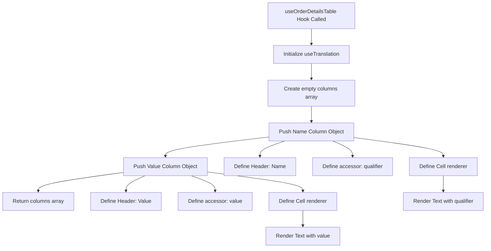
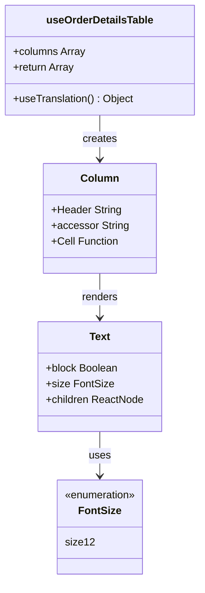
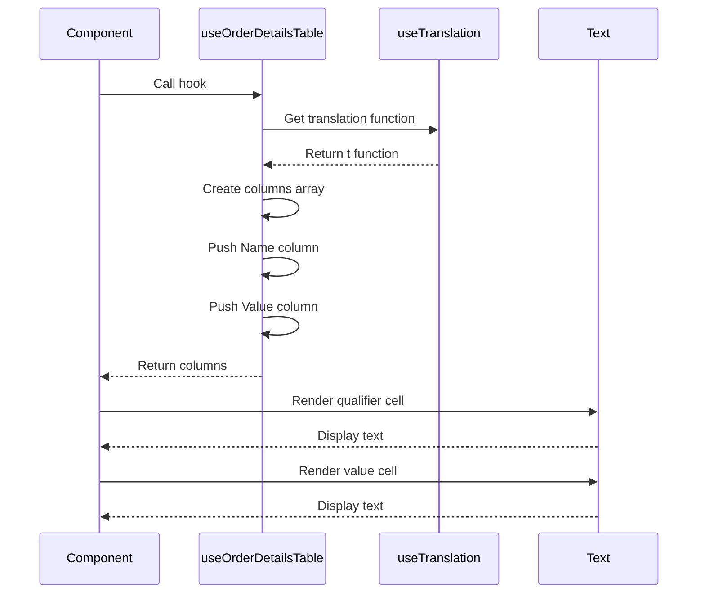

# Diagram: web/portal/src/shared/hooks/columns/useOrderDetailsTable.js

> Auto-generated by Obscura crawlers

## Diagram 1

### SVG

<svg id="container" width="1460.171875" xmlns="http://www.w3.org/2000/svg" class="flowchart" height="742" viewBox="0 0 1460.171875 742" role="graphics-document document" aria-roledescription="flowchart-v2"><g><marker id="container_flowchart-v2-pointEnd" class="marker flowchart-v2" viewBox="0 0 10 10" refX="5" refY="5" markerUnits="userSpaceOnUse" markerWidth="8" markerHeight="8" orient="auto"><path d="M 0 0 L 10 5 L 0 10 z" class="arrowMarkerPath" style="stroke-width: 1; stroke-dasharray: 1, 0;"></path></marker><marker id="container_flowchart-v2-pointStart" class="marker flowchart-v2" viewBox="0 0 10 10" refX="4.5" refY="5" markerUnits="userSpaceOnUse" markerWidth="8" markerHeight="8" orient="auto"><path d="M 0 5 L 10 10 L 10 0 z" class="arrowMarkerPath" style="stroke-width: 1; stroke-dasharray: 1, 0;"></path></marker><marker id="container_flowchart-v2-circleEnd" class="marker flowchart-v2" viewBox="0 0 10 10" refX="11" refY="5" markerUnits="userSpaceOnUse" markerWidth="11" markerHeight="11" orient="auto"><circle cx="5" cy="5" r="5" class="arrowMarkerPath" style="stroke-width: 1; stroke-dasharray: 1, 0;"></circle></marker><marker id="container_flowchart-v2-circleStart" class="marker flowchart-v2" viewBox="0 0 10 10" refX="-1" refY="5" markerUnits="userSpaceOnUse" markerWidth="11" markerHeight="11" orient="auto"><circle cx="5" cy="5" r="5" class="arrowMarkerPath" style="stroke-width: 1; stroke-dasharray: 1, 0;"></circle></marker><marker id="container_flowchart-v2-crossEnd" class="marker cross flowchart-v2" viewBox="0 0 11 11" refX="12" refY="5.2" markerUnits="userSpaceOnUse" markerWidth="11" markerHeight="11" orient="auto"><path d="M 1,1 l 9,9 M 10,1 l -9,9" class="arrowMarkerPath" style="stroke-width: 2; stroke-dasharray: 1, 0;"></path></marker><marker id="container_flowchart-v2-crossStart" class="marker cross flowchart-v2" viewBox="0 0 11 11" refX="-1" refY="5.2" markerUnits="userSpaceOnUse" markerWidth="11" markerHeight="11" orient="auto"><path d="M 1,1 l 9,9 M 10,1 l -9,9" class="arrowMarkerPath" style="stroke-width: 2; stroke-dasharray: 1, 0;"></path></marker><g class="root"><g class="clusters"></g><g class="edgePaths"><path d="M931.945,86L931.945,90.167C931.945,94.333,931.945,102.667,931.945,110.333C931.945,118,931.945,125,931.945,128.5L931.945,132" id="L_A_B_0" class="edge-thickness-normal edge-pattern-solid edge-thickness-normal edge-pattern-solid flowchart-link" style=";" data-edge="true" data-et="edge" data-id="L_A_B_0" data-points="W3sieCI6OTMxLjk0NTMxMjUsInkiOjg2fSx7IngiOjkzMS45NDUzMTI1LCJ5IjoxMTF9LHsieCI6OTMxLjk0NTMxMjUsInkiOjEzNn1d" marker-end="url(#container_flowchart-v2-pointEnd)"></path><path d="M931.945,190L931.945,194.167C931.945,198.333,931.945,206.667,931.945,214.333C931.945,222,931.945,229,931.945,232.5L931.945,236" id="L_B_C_0" class="edge-thickness-normal edge-pattern-solid edge-thickness-normal edge-pattern-solid flowchart-link" style=";" data-edge="true" data-et="edge" data-id="L_B_C_0" data-points="W3sieCI6OTMxLjk0NTMxMjUsInkiOjE5MH0seyJ4Ijo5MzEuOTQ1MzEyNSwieSI6MjE1fSx7IngiOjkzMS45NDUzMTI1LCJ5IjoyNDB9XQ==" marker-end="url(#container_flowchart-v2-pointEnd)"></path><path d="M931.945,318L931.945,322.167C931.945,326.333,931.945,334.667,931.945,342.333C931.945,350,931.945,357,931.945,360.5L931.945,364" id="L_C_D_0" class="edge-thickness-normal edge-pattern-solid edge-thickness-normal edge-pattern-solid flowchart-link" style=";" data-edge="true" data-et="edge" data-id="L_C_D_0" data-points="W3sieCI6OTMxLjk0NTMxMjUsInkiOjMxOH0seyJ4Ijo5MzEuOTQ1MzEyNSwieSI6MzQzfSx7IngiOjkzMS45NDUzMTI1LCJ5IjozNjh9XQ==" marker-end="url(#container_flowchart-v2-pointEnd)"></path><path d="M805.898,410.064L754.391,416.22C702.883,422.376,599.867,434.688,548.359,444.344C496.852,454,496.852,461,496.852,464.5L496.852,468" id="L_D_E_0" class="edge-thickness-normal edge-pattern-solid edge-thickness-normal edge-pattern-solid flowchart-link" style=";" data-edge="true" data-et="edge" data-id="L_D_E_0" data-points="W3sieCI6ODA1Ljg5ODQzNzUsInkiOjQxMC4wNjQ0MjU3NzAzMDgxfSx7IngiOjQ5Ni44NTE1NjI1LCJ5Ijo0NDd9LHsieCI6NDk2Ljg1MTU2MjUsInkiOjQ3Mn1d" marker-end="url(#container_flowchart-v2-pointEnd)"></path><path d="M372.078,516.022L329.345,521.851C286.612,527.681,201.146,539.341,158.413,548.67C115.68,558,115.68,565,115.68,568.5L115.68,572" id="L_E_F_0" class="edge-thickness-normal edge-pattern-solid edge-thickness-normal edge-pattern-solid flowchart-link" style=";" data-edge="true" data-et="edge" data-id="L_E_F_0" data-points="W3sieCI6MzcyLjA3ODEyNSwieSI6NTE2LjAyMTc2Njc1NTQ4MjZ9LHsieCI6MTE1LjY3OTY4NzUsInkiOjU1MX0seyJ4IjoxMTUuNjc5Njg3NSwieSI6NTc2fV0=" marker-end="url(#container_flowchart-v2-pointEnd)"></path><path d="M852.203,422L839.897,426.167C827.591,430.333,802.979,438.667,790.673,446.333C778.367,454,778.367,461,778.367,464.5L778.367,468" id="L_D_D1_0" class="edge-thickness-normal edge-pattern-solid edge-thickness-normal edge-pattern-solid flowchart-link" style=";" data-edge="true" data-et="edge" data-id="L_D_D1_0" data-points="W3sieCI6ODUyLjIwMjgyNDUxOTIzMDcsInkiOjQyMn0seyJ4Ijo3NzguMzY3MTg3NSwieSI6NDQ3fSx7IngiOjc3OC4zNjcxODc1LCJ5Ijo0NzJ9XQ==" marker-end="url(#container_flowchart-v2-pointEnd)"></path><path d="M996.391,422L1006.336,426.167C1016.281,430.333,1036.172,438.667,1046.117,446.333C1056.063,454,1056.063,461,1056.063,464.5L1056.063,468" id="L_D_D2_0" class="edge-thickness-normal edge-pattern-solid edge-thickness-normal edge-pattern-solid flowchart-link" style=";" data-edge="true" data-et="edge" data-id="L_D_D2_0" data-points="W3sieCI6OTk2LjM5MDc3NTI0MDM4NDYsInkiOjQyMn0seyJ4IjoxMDU2LjA2MjUsInkiOjQ0N30seyJ4IjoxMDU2LjA2MjUsInkiOjQ3Mn1d" marker-end="url(#container_flowchart-v2-pointEnd)"></path><path d="M1057.992,411.502L1103.181,417.419C1148.37,423.335,1238.747,435.167,1283.936,444.584C1329.125,454,1329.125,461,1329.125,464.5L1329.125,468" id="L_D_D3_0" class="edge-thickness-normal edge-pattern-solid edge-thickness-normal edge-pattern-solid flowchart-link" style=";" data-edge="true" data-et="edge" data-id="L_D_D3_0" data-points="W3sieCI6MTA1Ny45OTIxODc1LCJ5Ijo0MTEuNTAyNDQ4OTA3MzM0OX0seyJ4IjoxMzI5LjEyNSwieSI6NDQ3fSx7IngiOjEzMjkuMTI1LCJ5Ijo0NzJ9XQ==" marker-end="url(#container_flowchart-v2-pointEnd)"></path><path d="M1329.125,526L1329.125,530.167C1329.125,534.333,1329.125,542.667,1329.125,550.333C1329.125,558,1329.125,565,1329.125,568.5L1329.125,572" id="L_D3_D4_0" class="edge-thickness-normal edge-pattern-solid edge-thickness-normal edge-pattern-solid flowchart-link" style=";" data-edge="true" data-et="edge" data-id="L_D3_D4_0" data-points="W3sieCI6MTMyOS4xMjUsInkiOjUyNn0seyJ4IjoxMzI5LjEyNSwieSI6NTUxfSx7IngiOjEzMjkuMTI1LCJ5Ijo1NzZ9XQ==" marker-end="url(#container_flowchart-v2-pointEnd)"></path><path d="M435.57,526L426.113,530.167C416.656,534.333,397.742,542.667,388.285,550.333C378.828,558,378.828,565,378.828,568.5L378.828,572" id="L_E_E1_0" class="edge-thickness-normal edge-pattern-solid edge-thickness-normal edge-pattern-solid flowchart-link" style=";" data-edge="true" data-et="edge" data-id="L_E_E1_0" data-points="W3sieCI6NDM1LjU3MDE2MjI1OTYxNTM2LCJ5Ijo1MjZ9LHsieCI6Mzc4LjgyODEyNSwieSI6NTUxfSx7IngiOjM3OC44MjgxMjUsInkiOjU3Nn1d" marker-end="url(#container_flowchart-v2-pointEnd)"></path><path d="M573.43,526L585.248,530.167C597.065,534.333,620.701,542.667,632.518,550.333C644.336,558,644.336,565,644.336,568.5L644.336,572" id="L_E_E2_0" class="edge-thickness-normal edge-pattern-solid edge-thickness-normal edge-pattern-solid flowchart-link" style=";" data-edge="true" data-et="edge" data-id="L_E_E2_0" data-points="W3sieCI6NTczLjQyOTk4Nzk4MDc2OTMsInkiOjUyNn0seyJ4Ijo2NDQuMzM1OTM3NSwieSI6NTUxfSx7IngiOjY0NC4zMzU5Mzc1LCJ5Ijo1NzZ9XQ==" marker-end="url(#container_flowchart-v2-pointEnd)"></path><path d="M621.625,514.839L669.102,520.866C716.578,526.893,811.531,538.946,859.008,548.473C906.484,558,906.484,565,906.484,568.5L906.484,572" id="L_E_E3_0" class="edge-thickness-normal edge-pattern-solid edge-thickness-normal edge-pattern-solid flowchart-link" style=";" data-edge="true" data-et="edge" data-id="L_E_E3_0" data-points="W3sieCI6NjIxLjYyNSwieSI6NTE0LjgzOTEwODk1ODA5ODl9LHsieCI6OTA2LjQ4NDM3NSwieSI6NTUxfSx7IngiOjkwNi40ODQzNzUsInkiOjU3Nn1d" marker-end="url(#container_flowchart-v2-pointEnd)"></path><path d="M906.484,630L906.484,634.167C906.484,638.333,906.484,646.667,906.484,654.333C906.484,662,906.484,669,906.484,672.5L906.484,676" id="L_E3_E4_0" class="edge-thickness-normal edge-pattern-solid edge-thickness-normal edge-pattern-solid flowchart-link" style=";" data-edge="true" data-et="edge" data-id="L_E3_E4_0" data-points="W3sieCI6OTA2LjQ4NDM3NSwieSI6NjMwfSx7IngiOjkwNi40ODQzNzUsInkiOjY1NX0seyJ4Ijo5MDYuNDg0Mzc1LCJ5Ijo2ODB9XQ==" marker-end="url(#container_flowchart-v2-pointEnd)"></path></g><g class="edgeLabels"><g class="edgeLabel"><g class="label" data-id="L_A_B_0" transform="translate(0, 0)"><foreignObject width="0" height="0">

</foreignObject></g></g><g class="edgeLabel"><g class="label" data-id="L_B_C_0" transform="translate(0, 0)"><foreignObject width="0" height="0">

</foreignObject></g></g><g class="edgeLabel"><g class="label" data-id="L_C_D_0" transform="translate(0, 0)"><foreignObject width="0" height="0">

</foreignObject></g></g><g class="edgeLabel"><g class="label" data-id="L_D_E_0" transform="translate(0, 0)"><foreignObject width="0" height="0">

</foreignObject></g></g><g class="edgeLabel"><g class="label" data-id="L_E_F_0" transform="translate(0, 0)"><foreignObject width="0" height="0">

</foreignObject></g></g><g class="edgeLabel"><g class="label" data-id="L_D_D1_0" transform="translate(0, 0)"><foreignObject width="0" height="0">

</foreignObject></g></g><g class="edgeLabel"><g class="label" data-id="L_D_D2_0" transform="translate(0, 0)"><foreignObject width="0" height="0">

</foreignObject></g></g><g class="edgeLabel"><g class="label" data-id="L_D_D3_0" transform="translate(0, 0)"><foreignObject width="0" height="0">

</foreignObject></g></g><g class="edgeLabel"><g class="label" data-id="L_D3_D4_0" transform="translate(0, 0)"><foreignObject width="0" height="0">

</foreignObject></g></g><g class="edgeLabel"><g class="label" data-id="L_E_E1_0" transform="translate(0, 0)"><foreignObject width="0" height="0">

</foreignObject></g></g><g class="edgeLabel"><g class="label" data-id="L_E_E2_0" transform="translate(0, 0)"><foreignObject width="0" height="0">

</foreignObject></g></g><g class="edgeLabel"><g class="label" data-id="L_E_E3_0" transform="translate(0, 0)"><foreignObject width="0" height="0">

</foreignObject></g></g><g class="edgeLabel"><g class="label" data-id="L_E3_E4_0" transform="translate(0, 0)"><foreignObject width="0" height="0">

</foreignObject></g></g></g><g class="nodes"><g class="node default" id="flowchart-A-0" transform="translate(931.9453125, 47)"><rect class="basic label-container" style="" x="-130" y="-39" width="260" height="78"></rect><g class="label" style="" transform="translate(-100, -24)"><rect></rect><foreignObject width="200" height="48">

useOrderDetailsTable Hook Called

</foreignObject></g></g><g class="node default" id="flowchart-B-1" transform="translate(931.9453125, 163)"><rect class="basic label-container" style="" x="-116.6328125" y="-27" width="233.265625" height="54"></rect><g class="label" style="" transform="translate(-86.6328125, -12)"><rect></rect><foreignObject width="173.265625" height="24">

Initialize useTranslation

</foreignObject></g></g><g class="node default" id="flowchart-C-3" transform="translate(931.9453125, 279)"><rect class="basic label-container" style="" x="-130" y="-39" width="260" height="78"></rect><g class="label" style="" transform="translate(-100, -24)"><rect></rect><foreignObject width="200" height="48">

Create empty columns array

</foreignObject></g></g><g class="node default" id="flowchart-D-5" transform="translate(931.9453125, 395)"><rect class="basic label-container" style="" x="-126.046875" y="-27" width="252.09375" height="54"></rect><g class="label" style="" transform="translate(-96.046875, -12)"><rect></rect><foreignObject width="192.09375" height="24">

Push Name Column Object

</foreignObject></g></g><g class="node default" id="flowchart-E-7" transform="translate(496.8515625, 499)"><rect class="basic label-container" style="" x="-124.7734375" y="-27" width="249.546875" height="54"></rect><g class="label" style="" transform="translate(-94.7734375, -12)"><rect></rect><foreignObject width="189.546875" height="24">

Push Value Column Object

</foreignObject></g></g><g class="node default" id="flowchart-F-9" transform="translate(115.6796875, 603)"><rect class="basic label-container" style="" x="-107.6796875" y="-27" width="215.359375" height="54"></rect><g class="label" style="" transform="translate(-77.6796875, -12)"><rect></rect><foreignObject width="155.359375" height="24">

Return columns array

</foreignObject></g></g><g class="node default" id="flowchart-D1-11" transform="translate(778.3671875, 499)"><rect class="basic label-container" style="" x="-106.7421875" y="-27" width="213.484375" height="54"></rect><g class="label" style="" transform="translate(-76.7421875, -12)"><rect></rect><foreignObject width="153.484375" height="24">

Define Header: Name

</foreignObject></g></g><g class="node default" id="flowchart-D2-13" transform="translate(1056.0625, 499)"><rect class="basic label-container" style="" x="-120.953125" y="-27" width="241.90625" height="54"></rect><g class="label" style="" transform="translate(-90.953125, -12)"><rect></rect><foreignObject width="181.90625" height="24">

Define accessor: qualifier

</foreignObject></g></g><g class="node default" id="flowchart-D3-15" transform="translate(1329.125, 499)"><rect class="basic label-container" style="" x="-102.109375" y="-27" width="204.21875" height="54"></rect><g class="label" style="" transform="translate(-72.109375, -12)"><rect></rect><foreignObject width="144.21875" height="24">

Define Cell renderer

</foreignObject></g></g><g class="node default" id="flowchart-D4-17" transform="translate(1329.125, 603)"><rect class="basic label-container" style="" x="-123.046875" y="-27" width="246.09375" height="54"></rect><g class="label" style="" transform="translate(-93.046875, -12)"><rect></rect><foreignObject width="186.09375" height="24">

Render Text with qualifier

</foreignObject></g></g><g class="node default" id="flowchart-E1-19" transform="translate(378.828125, 603)"><rect class="basic label-container" style="" x="-105.46875" y="-27" width="210.9375" height="54"></rect><g class="label" style="" transform="translate(-75.46875, -12)"><rect></rect><foreignObject width="150.9375" height="24">

Define Header: Value

</foreignObject></g></g><g class="node default" id="flowchart-E2-21" transform="translate(644.3359375, 603)"><rect class="basic label-container" style="" x="-110.0390625" y="-27" width="220.078125" height="54"></rect><g class="label" style="" transform="translate(-80.0390625, -12)"><rect></rect><foreignObject width="160.078125" height="24">

Define accessor: value

</foreignObject></g></g><g class="node default" id="flowchart-E3-23" transform="translate(906.484375, 603)"><rect class="basic label-container" style="" x="-102.109375" y="-27" width="204.21875" height="54"></rect><g class="label" style="" transform="translate(-72.109375, -12)"><rect></rect><foreignObject width="144.21875" height="24">

Define Cell renderer

</foreignObject></g></g><g class="node default" id="flowchart-E4-25" transform="translate(906.484375, 707)"><rect class="basic label-container" style="" x="-112.125" y="-27" width="224.25" height="54"></rect><g class="label" style="" transform="translate(-82.125, -12)"><rect></rect><foreignObject width="164.25" height="24">

Render Text with value

</foreignObject></g></g></g></g></g></svg>

## Diagram 2

### SVG

<svg id="container" width="303.78125" xmlns="http://www.w3.org/2000/svg" class="classDiagram" height="886" viewBox="0 0 303.78125 886" role="graphics-document document" aria-roledescription="class"><g><defs><marker id="container_class-aggregationStart" class="marker aggregation class" refX="18" refY="7" markerWidth="190" markerHeight="240" orient="auto"><path d="M 18,7 L9,13 L1,7 L9,1 Z"></path></marker></defs><defs><marker id="container_class-aggregationEnd" class="marker aggregation class" refX="1" refY="7" markerWidth="20" markerHeight="28" orient="auto"><path d="M 18,7 L9,13 L1,7 L9,1 Z"></path></marker></defs><defs><marker id="container_class-extensionStart" class="marker extension class" refX="18" refY="7" markerWidth="190" markerHeight="240" orient="auto"><path d="M 1,7 L18,13 V 1 Z"></path></marker></defs><defs><marker id="container_class-extensionEnd" class="marker extension class" refX="1" refY="7" markerWidth="20" markerHeight="28" orient="auto"><path d="M 1,1 V 13 L18,7 Z"></path></marker></defs><defs><marker id="container_class-compositionStart" class="marker composition class" refX="18" refY="7" markerWidth="190" markerHeight="240" orient="auto"><path d="M 18,7 L9,13 L1,7 L9,1 Z"></path></marker></defs><defs><marker id="container_class-compositionEnd" class="marker composition class" refX="1" refY="7" markerWidth="20" markerHeight="28" orient="auto"><path d="M 18,7 L9,13 L1,7 L9,1 Z"></path></marker></defs><defs><marker id="container_class-dependencyStart" class="marker dependency class" refX="6" refY="7" markerWidth="190" markerHeight="240" orient="auto"><path d="M 5,7 L9,13 L1,7 L9,1 Z"></path></marker></defs><defs><marker id="container_class-dependencyEnd" class="marker dependency class" refX="13" refY="7" markerWidth="20" markerHeight="28" orient="auto"><path d="M 18,7 L9,13 L14,7 L9,1 Z"></path></marker></defs><defs><marker id="container_class-lollipopStart" class="marker lollipop class" refX="13" refY="7" markerWidth="190" markerHeight="240" orient="auto"><circle stroke="black" fill="transparent" cx="7" cy="7" r="6"></circle></marker></defs><defs><marker id="container_class-lollipopEnd" class="marker lollipop class" refX="1" refY="7" markerWidth="190" markerHeight="240" orient="auto"><circle stroke="black" fill="transparent" cx="7" cy="7" r="6"></circle></marker></defs><g class="root"><g class="clusters"></g><g class="edgePaths"><path d="M151.891,176L151.891,182.167C151.891,188.333,151.891,200.667,151.891,212C151.891,223.333,151.891,233.667,151.891,238.833L151.891,244" id="id_useOrderDetailsTable_Column_1" class="edge-thickness-normal edge-pattern-solid relation" style=";;;" data-edge="true" data-et="edge" data-id="id_useOrderDetailsTable_Column_1" data-points="W3sieCI6MTUxLjg5MDYyNSwieSI6MTc2fSx7IngiOjE1MS44OTA2MjUsInkiOjIxM30seyJ4IjoxNTEuODkwNjI1LCJ5IjoyNTB9XQ==" marker-end="url(#container_class-dependencyEnd)"></path><path d="M151.891,418L151.891,424.167C151.891,430.333,151.891,442.667,151.891,454C151.891,465.333,151.891,475.667,151.891,480.833L151.891,486" id="id_Column_Text_2" class="edge-thickness-normal edge-pattern-solid relation" style=";;;" data-edge="true" data-et="edge" data-id="id_Column_Text_2" data-points="W3sieCI6MTUxLjg5MDYyNSwieSI6NDE4fSx7IngiOjE1MS44OTA2MjUsInkiOjQ1NX0seyJ4IjoxNTEuODkwNjI1LCJ5Ijo0OTJ9XQ==" marker-end="url(#container_class-dependencyEnd)"></path><path d="M151.891,660L151.891,666.167C151.891,672.333,151.891,684.667,151.891,696C151.891,707.333,151.891,717.667,151.891,722.833L151.891,728" id="id_Text_FontSize_3" class="edge-thickness-normal edge-pattern-solid relation" style=";;;" data-edge="true" data-et="edge" data-id="id_Text_FontSize_3" data-points="W3sieCI6MTUxLjg5MDYyNSwieSI6NjYwfSx7IngiOjE1MS44OTA2MjUsInkiOjY5N30seyJ4IjoxNTEuODkwNjI1LCJ5Ijo3MzR9XQ==" marker-end="url(#container_class-dependencyEnd)"></path></g><g class="edgeLabels"><g class="edgeLabel" transform="translate(151.890625, 213)"><g class="label" data-id="id_useOrderDetailsTable_Column_1" transform="translate(-26.171875, -12)"><foreignObject width="52.34375" height="24">

creates

</foreignObject></g></g><g class="edgeLabel" transform="translate(151.890625, 455)"><g class="label" data-id="id_Column_Text_2" transform="translate(-27.75, -12)"><foreignObject width="55.5" height="24">

renders

</foreignObject></g></g><g class="edgeLabel" transform="translate(151.890625, 697)"><g class="label" data-id="id_Text_FontSize_3" transform="translate(-16.4921875, -12)"><foreignObject width="32.984375" height="24">

uses

</foreignObject></g></g></g><g class="nodes"><g class="node default" id="classId-useOrderDetailsTable-0" transform="translate(151.890625, 92)"><g class="basic label-container"><path d="M-143.890625 -84 L143.890625 -84 L143.890625 84 L-143.890625 84" stroke="none" stroke-width="0" fill="#ECECFF" style=""></path><path d="M-143.890625 -84 C-34.908703835188135 -84, 74.07321732962373 -84, 143.890625 -84 M-143.890625 -84 C-51.63497628444456 -84, 40.620672431110876 -84, 143.890625 -84 M143.890625 -84 C143.890625 -48.02946469812465, 143.890625 -12.058929396249297, 143.890625 84 M143.890625 -84 C143.890625 -44.22221944872943, 143.890625 -4.444438897458866, 143.890625 84 M143.890625 84 C49.244504665849206 84, -45.40161566830159 84, -143.890625 84 M143.890625 84 C66.77566164066795 84, -10.339301718664103 84, -143.890625 84 M-143.890625 84 C-143.890625 49.62106388644113, -143.890625 15.242127772882256, -143.890625 -84 M-143.890625 84 C-143.890625 44.96729003487605, -143.890625 5.934580069752101, -143.890625 -84" stroke="#9370DB" stroke-width="1.3" fill="none" stroke-dasharray="0 0" style=""></path></g><g class="annotation-group text" transform="translate(0, -60)"></g><g class="label-group text" transform="translate(-79.109375, -60)"><g class="label" style="font-weight: bolder" transform="translate(0,-12)"><foreignObject width="158.21875" height="24">

useOrderDetailsTable

</foreignObject></g></g><g class="members-group text" transform="translate(-131.890625, -12)"><g class="label" style="" transform="translate(0,-12)"><foreignObject width="110.765625" height="24">

+columns Array

</foreignObject></g><g class="label" style="" transform="translate(0,12)"><foreignObject width="94.578125" height="24">

+return Array

</foreignObject></g></g><g class="methods-group text" transform="translate(-131.890625, 60)"><g class="label" style="" transform="translate(0,-12)"><foreignObject width="184.671875" height="24">

+useTranslation() : Object

</foreignObject></g></g><g class="divider" style=""><path d="M-143.890625 -36 C-61.81202351760834 -36, 20.266577964783323 -36, 143.890625 -36 M-143.890625 -36 C-32.611059035410534 -36, 78.66850692917893 -36, 143.890625 -36" stroke="#9370DB" stroke-width="1.3" fill="none" stroke-dasharray="0 0" style=""></path></g><g class="divider" style=""><path d="M-143.890625 36 C-34.388565016273176 36, 75.11349496745365 36, 143.890625 36 M-143.890625 36 C-75.94978493579588 36, -8.008944871591751 36, 143.890625 36" stroke="#9370DB" stroke-width="1.3" fill="none" stroke-dasharray="0 0" style=""></path></g></g><g class="node default" id="classId-Column-1" transform="translate(151.890625, 334)"><g class="basic label-container"><path d="M-84.34765625 -84 L84.34765625 -84 L84.34765625 84 L-84.34765625 84" stroke="none" stroke-width="0" fill="#ECECFF" style=""></path><path d="M-84.34765625 -84 C-44.08794161461155 -84, -3.8282269792231034 -84, 84.34765625 -84 M-84.34765625 -84 C-45.96369673340291 -84, -7.579737216805825 -84, 84.34765625 -84 M84.34765625 -84 C84.34765625 -24.187981672032926, 84.34765625 35.62403665593415, 84.34765625 84 M84.34765625 -84 C84.34765625 -18.988903415580225, 84.34765625 46.02219316883955, 84.34765625 84 M84.34765625 84 C36.75949304838786 84, -10.82867015322428 84, -84.34765625 84 M84.34765625 84 C43.63776950668935 84, 2.9278827633787046 84, -84.34765625 84 M-84.34765625 84 C-84.34765625 21.671588603848193, -84.34765625 -40.656822792303615, -84.34765625 -84 M-84.34765625 84 C-84.34765625 21.326091737922347, -84.34765625 -41.347816524155306, -84.34765625 -84" stroke="#9370DB" stroke-width="1.3" fill="none" stroke-dasharray="0 0" style=""></path></g><g class="annotation-group text" transform="translate(0, -60)"></g><g class="label-group text" transform="translate(-27.4453125, -60)"><g class="label" style="font-weight: bolder" transform="translate(0,-12)"><foreignObject width="54.890625" height="24">

Column

</foreignObject></g></g><g class="members-group text" transform="translate(-72.34765625, -12)"><g class="label" style="" transform="translate(0,-12)"><foreignObject width="107.71875" height="24">

+Header String

</foreignObject></g><g class="label" style="" transform="translate(0,12)"><foreignObject width="117.25" height="24">

+accessor String

</foreignObject></g><g class="label" style="" transform="translate(0,36)"><foreignObject width="101.578125" height="24">

+Cell Function

</foreignObject></g></g><g class="methods-group text" transform="translate(-72.34765625, 84)"></g><g class="divider" style=""><path d="M-84.34765625 -36 C-31.739326977242598 -36, 20.869002295514804 -36, 84.34765625 -36 M-84.34765625 -36 C-22.71513596480316 -36, 38.91738432039368 -36, 84.34765625 -36" stroke="#9370DB" stroke-width="1.3" fill="none" stroke-dasharray="0 0" style=""></path></g><g class="divider" style=""><path d="M-84.34765625 60 C-26.32271725998298 60, 31.70222173003404 60, 84.34765625 60 M-84.34765625 60 C-37.7794129326806 60, 8.7888303846388 60, 84.34765625 60" stroke="#9370DB" stroke-width="1.3" fill="none" stroke-dasharray="0 0" style=""></path></g></g><g class="node default" id="classId-Text-2" transform="translate(151.890625, 576)"><g class="basic label-container"><path d="M-94.90234375 -84 L94.90234375 -84 L94.90234375 84 L-94.90234375 84" stroke="none" stroke-width="0" fill="#ECECFF" style=""></path><path d="M-94.90234375 -84 C-46.022825003972144 -84, 2.856693742055711 -84, 94.90234375 -84 M-94.90234375 -84 C-35.29661640429854 -84, 24.30911094140292 -84, 94.90234375 -84 M94.90234375 -84 C94.90234375 -23.678714688120394, 94.90234375 36.64257062375921, 94.90234375 84 M94.90234375 -84 C94.90234375 -43.98037236858684, 94.90234375 -3.960744737173684, 94.90234375 84 M94.90234375 84 C47.770201344301505 84, 0.6380589386030096 84, -94.90234375 84 M94.90234375 84 C37.17648044094684 84, -20.54938286810632 84, -94.90234375 84 M-94.90234375 84 C-94.90234375 38.84199870291613, -94.90234375 -6.316002594167742, -94.90234375 -84 M-94.90234375 84 C-94.90234375 32.905155869292805, -94.90234375 -18.18968826141439, -94.90234375 -84" stroke="#9370DB" stroke-width="1.3" fill="none" stroke-dasharray="0 0" style=""></path></g><g class="annotation-group text" transform="translate(0, -60)"></g><g class="label-group text" transform="translate(-15.3828125, -60)"><g class="label" style="font-weight: bolder" transform="translate(0,-12)"><foreignObject width="30.765625" height="24">

Text

</foreignObject></g></g><g class="members-group text" transform="translate(-82.90234375, -12)"><g class="label" style="" transform="translate(0,-12)"><foreignObject width="111.1875" height="24">

+block Boolean

</foreignObject></g><g class="label" style="" transform="translate(0,12)"><foreignObject width="100.4375" height="24">

+size FontSize

</foreignObject></g><g class="label" style="" transform="translate(0,36)"><foreignObject width="150.421875" height="24">

+children ReactNode

</foreignObject></g></g><g class="methods-group text" transform="translate(-82.90234375, 84)"></g><g class="divider" style=""><path d="M-94.90234375 -36 C-30.946037735558384 -36, 33.01026827888323 -36, 94.90234375 -36 M-94.90234375 -36 C-45.46106744315739 -36, 3.9802088636852204 -36, 94.90234375 -36" stroke="#9370DB" stroke-width="1.3" fill="none" stroke-dasharray="0 0" style=""></path></g><g class="divider" style=""><path d="M-94.90234375 60 C-53.73921880256501 60, -12.576093855130026 60, 94.90234375 60 M-94.90234375 60 C-25.512253389776006 60, 43.87783697044799 60, 94.90234375 60" stroke="#9370DB" stroke-width="1.3" fill="none" stroke-dasharray="0 0" style=""></path></g></g><g class="node default" id="classId-FontSize-3" transform="translate(151.890625, 806)"><g class="basic label-container"><path d="M-67.5546875 -72 L67.5546875 -72 L67.5546875 72 L-67.5546875 72" stroke="none" stroke-width="0" fill="#ECECFF" style=""></path><path d="M-67.5546875 -72 C-33.95249504458271 -72, -0.35030258916542323 -72, 67.5546875 -72 M-67.5546875 -72 C-35.95748982519419 -72, -4.360292150388382 -72, 67.5546875 -72 M67.5546875 -72 C67.5546875 -41.509003296819905, 67.5546875 -11.01800659363981, 67.5546875 72 M67.5546875 -72 C67.5546875 -40.57141191122389, 67.5546875 -9.142823822447774, 67.5546875 72 M67.5546875 72 C13.98547549126728 72, -39.58373651746544 72, -67.5546875 72 M67.5546875 72 C34.610721202204715 72, 1.66675490440943 72, -67.5546875 72 M-67.5546875 72 C-67.5546875 26.071924268544322, -67.5546875 -19.856151462911356, -67.5546875 -72 M-67.5546875 72 C-67.5546875 38.20945617354606, -67.5546875 4.418912347092117, -67.5546875 -72" stroke="#9370DB" stroke-width="1.3" fill="none" stroke-dasharray="0 0" style=""></path></g><g class="annotation-group text" transform="translate(-55.5546875, -48)"><g class="label" style="" transform="translate(0,-12)"><foreignObject width="111.109375" height="24">

«enumeration»

</foreignObject></g></g><g class="label-group text" transform="translate(-30.84375, -24)"><g class="label" style="font-weight: bolder" transform="translate(0,-12)"><foreignObject width="61.6875" height="24">

FontSize

</foreignObject></g></g><g class="members-group text" transform="translate(-55.5546875, 24)"><g class="label" style="" transform="translate(0,-12)"><foreignObject width="41.640625" height="24">

size12

</foreignObject></g></g><g class="methods-group text" transform="translate(-55.5546875, 72)"></g><g class="divider" style=""><path d="M-67.5546875 0 C-31.633788570646054 0, 4.287110358707892 0, 67.5546875 0 M-67.5546875 0 C-36.08287224145824 0, -4.61105698291648 0, 67.5546875 0" stroke="#9370DB" stroke-width="1.3" fill="none" stroke-dasharray="0 0" style=""></path></g><g class="divider" style=""><path d="M-67.5546875 48 C-22.407524529781924 48, 22.739638440436153 48, 67.5546875 48 M-67.5546875 48 C-39.35751010408832 48, -11.160332708176647 48, 67.5546875 48" stroke="#9370DB" stroke-width="1.3" fill="none" stroke-dasharray="0 0" style=""></path></g></g></g></g></g></svg>

## Diagram 3

### SVG

<svg id="container" width="906" xmlns="http://www.w3.org/2000/svg" height="789" viewBox="-50 -10 906 789" role="graphics-document document" aria-roledescription="sequence"><g><rect x="656" y="703" fill="#eaeaea" stroke="#666" width="150" height="65" name="Text" rx="3" ry="3" class="actor actor-bottom"></rect><text x="731" y="735.5" dominant-baseline="central" alignment-baseline="central" class="actor actor-box" style="text-anchor: middle; font-size: 16px; font-weight: 400;"><tspan x="731" dy="0">Text</tspan></text></g><g><rect x="456" y="703" fill="#eaeaea" stroke="#666" width="150" height="65" name="useTranslation" rx="3" ry="3" class="actor actor-bottom"></rect><text x="531" y="735.5" dominant-baseline="central" alignment-baseline="central" class="actor actor-box" style="text-anchor: middle; font-size: 16px; font-weight: 400;"><tspan x="531" dy="0">useTranslation</tspan></text></g><g><rect x="200" y="703" fill="#eaeaea" stroke="#666" width="176" height="65" name="useOrderDetailsTable" rx="3" ry="3" class="actor actor-bottom"></rect><text x="288" y="735.5" dominant-baseline="central" alignment-baseline="central" class="actor actor-box" style="text-anchor: middle; font-size: 16px; font-weight: 400;"><tspan x="288" dy="0">useOrderDetailsTable</tspan></text></g><g><rect x="0" y="703" fill="#eaeaea" stroke="#666" width="150" height="65" name="Component" rx="3" ry="3" class="actor actor-bottom"></rect><text x="75" y="735.5" dominant-baseline="central" alignment-baseline="central" class="actor actor-box" style="text-anchor: middle; font-size: 16px; font-weight: 400;"><tspan x="75" dy="0">Component</tspan></text></g><g><line id="actor3" x1="731" y1="65" x2="731" y2="703" class="actor-line 200" stroke-width="0.5px" stroke="#999" name="Text"></line><g id="root-3"><rect x="656" y="0" fill="#eaeaea" stroke="#666" width="150" height="65" name="Text" rx="3" ry="3" class="actor actor-top"></rect><text x="731" y="32.5" dominant-baseline="central" alignment-baseline="central" class="actor actor-box" style="text-anchor: middle; font-size: 16px; font-weight: 400;"><tspan x="731" dy="0">Text</tspan></text></g></g><g><line id="actor2" x1="531" y1="65" x2="531" y2="703" class="actor-line 200" stroke-width="0.5px" stroke="#999" name="useTranslation"></line><g id="root-2"><rect x="456" y="0" fill="#eaeaea" stroke="#666" width="150" height="65" name="useTranslation" rx="3" ry="3" class="actor actor-top"></rect><text x="531" y="32.5" dominant-baseline="central" alignment-baseline="central" class="actor actor-box" style="text-anchor: middle; font-size: 16px; font-weight: 400;"><tspan x="531" dy="0">useTranslation</tspan></text></g></g><g><line id="actor1" x1="288" y1="65" x2="288" y2="703" class="actor-line 200" stroke-width="0.5px" stroke="#999" name="useOrderDetailsTable"></line><g id="root-1"><rect x="200" y="0" fill="#eaeaea" stroke="#666" width="176" height="65" name="useOrderDetailsTable" rx="3" ry="3" class="actor actor-top"></rect><text x="288" y="32.5" dominant-baseline="central" alignment-baseline="central" class="actor actor-box" style="text-anchor: middle; font-size: 16px; font-weight: 400;"><tspan x="288" dy="0">useOrderDetailsTable</tspan></text></g></g><g><line id="actor0" x1="75" y1="65" x2="75" y2="703" class="actor-line 200" stroke-width="0.5px" stroke="#999" name="Component"></line><g id="root-0"><rect x="0" y="0" fill="#eaeaea" stroke="#666" width="150" height="65" name="Component" rx="3" ry="3" class="actor actor-top"></rect><text x="75" y="32.5" dominant-baseline="central" alignment-baseline="central" class="actor actor-box" style="text-anchor: middle; font-size: 16px; font-weight: 400;"><tspan x="75" dy="0">Component</tspan></text></g></g><g></g><defs><symbol id="computer" width="24" height="24"><path transform="scale(.5)" d="M2 2v13h20v-13h-20zm18 11h-16v-9h16v9zm-10.228 6l.466-1h3.524l.467 1h-4.457zm14.228 3h-24l2-6h2.104l-1.33 4h18.45l-1.297-4h2.073l2 6zm-5-10h-14v-7h14v7z"></path></symbol></defs><defs><symbol id="database" fill-rule="evenodd" clip-rule="evenodd"><path transform="scale(.5)" d="M12.258.001l.256.004.255.005.253.008.251.01.249.012.247.015.246.016.242.019.241.02.239.023.236.024.233.027.231.028.229.031.225.032.223.034.22.036.217.038.214.04.211.041.208.043.205.045.201.046.198.048.194.05.191.051.187.053.183.054.18.056.175.057.172.059.168.06.163.061.16.063.155.064.15.066.074.033.073.033.071.034.07.034.069.035.068.035.067.035.066.035.064.036.064.036.062.036.06.036.06.037.058.037.058.037.055.038.055.038.053.038.052.038.051.039.05.039.048.039.047.039.045.04.044.04.043.04.041.04.04.041.039.041.037.041.036.041.034.041.033.042.032.042.03.042.029.042.027.042.026.043.024.043.023.043.021.043.02.043.018.044.017.043.015.044.013.044.012.044.011.045.009.044.007.045.006.045.004.045.002.045.001.045v17l-.001.045-.002.045-.004.045-.006.045-.007.045-.009.044-.011.045-.012.044-.013.044-.015.044-.017.043-.018.044-.02.043-.021.043-.023.043-.024.043-.026.043-.027.042-.029.042-.03.042-.032.042-.033.042-.034.041-.036.041-.037.041-.039.041-.04.041-.041.04-.043.04-.044.04-.045.04-.047.039-.048.039-.05.039-.051.039-.052.038-.053.038-.055.038-.055.038-.058.037-.058.037-.06.037-.06.036-.062.036-.064.036-.064.036-.066.035-.067.035-.068.035-.069.035-.07.034-.071.034-.073.033-.074.033-.15.066-.155.064-.16.063-.163.061-.168.06-.172.059-.175.057-.18.056-.183.054-.187.053-.191.051-.194.05-.198.048-.201.046-.205.045-.208.043-.211.041-.214.04-.217.038-.22.036-.223.034-.225.032-.229.031-.231.028-.233.027-.236.024-.239.023-.241.02-.242.019-.246.016-.247.015-.249.012-.251.01-.253.008-.255.005-.256.004-.258.001-.258-.001-.256-.004-.255-.005-.253-.008-.251-.01-.249-.012-.247-.015-.245-.016-.243-.019-.241-.02-.238-.023-.236-.024-.234-.027-.231-.028-.228-.031-.226-.032-.223-.034-.22-.036-.217-.038-.214-.04-.211-.041-.208-.043-.204-.045-.201-.046-.198-.048-.195-.05-.19-.051-.187-.053-.184-.054-.179-.056-.176-.057-.172-.059-.167-.06-.164-.061-.159-.063-.155-.064-.151-.066-.074-.033-.072-.033-.072-.034-.07-.034-.069-.035-.068-.035-.067-.035-.066-.035-.064-.036-.063-.036-.062-.036-.061-.036-.06-.037-.058-.037-.057-.037-.056-.038-.055-.038-.053-.038-.052-.038-.051-.039-.049-.039-.049-.039-.046-.039-.046-.04-.044-.04-.043-.04-.041-.04-.04-.041-.039-.041-.037-.041-.036-.041-.034-.041-.033-.042-.032-.042-.03-.042-.029-.042-.027-.042-.026-.043-.024-.043-.023-.043-.021-.043-.02-.043-.018-.044-.017-.043-.015-.044-.013-.044-.012-.044-.011-.045-.009-.044-.007-.045-.006-.045-.004-.045-.002-.045-.001-.045v-17l.001-.045.002-.045.004-.045.006-.045.007-.045.009-.044.011-.045.012-.044.013-.044.015-.044.017-.043.018-.044.02-.043.021-.043.023-.043.024-.043.026-.043.027-.042.029-.042.03-.042.032-.042.033-.042.034-.041.036-.041.037-.041.039-.041.04-.041.041-.04.043-.04.044-.04.046-.04.046-.039.049-.039.049-.039.051-.039.052-.038.053-.038.055-.038.056-.038.057-.037.058-.037.06-.037.061-.036.062-.036.063-.036.064-.036.066-.035.067-.035.068-.035.069-.035.07-.034.072-.034.072-.033.074-.033.151-.066.155-.064.159-.063.164-.061.167-.06.172-.059.176-.057.179-.056.184-.054.187-.053.19-.051.195-.05.198-.048.201-.046.204-.045.208-.043.211-.041.214-.04.217-.038.22-.036.223-.034.226-.032.228-.031.231-.028.234-.027.236-.024.238-.023.241-.02.243-.019.245-.016.247-.015.249-.012.251-.01.253-.008.255-.005.256-.004.258-.001.258.001zm-9.258 20.499v.01l.001.021.003.021.004.022.005.021.006.022.007.022.009.023.01.022.011.023.012.023.013.023.015.023.016.024.017.023.018.024.019.024.021.024.022.025.023.024.024.025.052.049.056.05.061.051.066.051.07.051.075.051.079.052.084.052.088.052.092.052.097.052.102.051.105.052.11.052.114.051.119.051.123.051.127.05.131.05.135.05.139.048.144.049.147.047.152.047.155.047.16.045.163.045.167.043.171.043.176.041.178.041.183.039.187.039.19.037.194.035.197.035.202.033.204.031.209.03.212.029.216.027.219.025.222.024.226.021.23.02.233.018.236.016.24.015.243.012.246.01.249.008.253.005.256.004.259.001.26-.001.257-.004.254-.005.25-.008.247-.011.244-.012.241-.014.237-.016.233-.018.231-.021.226-.021.224-.024.22-.026.216-.027.212-.028.21-.031.205-.031.202-.034.198-.034.194-.036.191-.037.187-.039.183-.04.179-.04.175-.042.172-.043.168-.044.163-.045.16-.046.155-.046.152-.047.148-.048.143-.049.139-.049.136-.05.131-.05.126-.05.123-.051.118-.052.114-.051.11-.052.106-.052.101-.052.096-.052.092-.052.088-.053.083-.051.079-.052.074-.052.07-.051.065-.051.06-.051.056-.05.051-.05.023-.024.023-.025.021-.024.02-.024.019-.024.018-.024.017-.024.015-.023.014-.024.013-.023.012-.023.01-.023.01-.022.008-.022.006-.022.006-.022.004-.022.004-.021.001-.021.001-.021v-4.127l-.077.055-.08.053-.083.054-.085.053-.087.052-.09.052-.093.051-.095.05-.097.05-.1.049-.102.049-.105.048-.106.047-.109.047-.111.046-.114.045-.115.045-.118.044-.12.043-.122.042-.124.042-.126.041-.128.04-.13.04-.132.038-.134.038-.135.037-.138.037-.139.035-.142.035-.143.034-.144.033-.147.032-.148.031-.15.03-.151.03-.153.029-.154.027-.156.027-.158.026-.159.025-.161.024-.162.023-.163.022-.165.021-.166.02-.167.019-.169.018-.169.017-.171.016-.173.015-.173.014-.175.013-.175.012-.177.011-.178.01-.179.008-.179.008-.181.006-.182.005-.182.004-.184.003-.184.002h-.37l-.184-.002-.184-.003-.182-.004-.182-.005-.181-.006-.179-.008-.179-.008-.178-.01-.176-.011-.176-.012-.175-.013-.173-.014-.172-.015-.171-.016-.17-.017-.169-.018-.167-.019-.166-.02-.165-.021-.163-.022-.162-.023-.161-.024-.159-.025-.157-.026-.156-.027-.155-.027-.153-.029-.151-.03-.15-.03-.148-.031-.146-.032-.145-.033-.143-.034-.141-.035-.14-.035-.137-.037-.136-.037-.134-.038-.132-.038-.13-.04-.128-.04-.126-.041-.124-.042-.122-.042-.12-.044-.117-.043-.116-.045-.113-.045-.112-.046-.109-.047-.106-.047-.105-.048-.102-.049-.1-.049-.097-.05-.095-.05-.093-.052-.09-.051-.087-.052-.085-.053-.083-.054-.08-.054-.077-.054v4.127zm0-5.654v.011l.001.021.003.021.004.021.005.022.006.022.007.022.009.022.01.022.011.023.012.023.013.023.015.024.016.023.017.024.018.024.019.024.021.024.022.024.023.025.024.024.052.05.056.05.061.05.066.051.07.051.075.052.079.051.084.052.088.052.092.052.097.052.102.052.105.052.11.051.114.051.119.052.123.05.127.051.131.05.135.049.139.049.144.048.147.048.152.047.155.046.16.045.163.045.167.044.171.042.176.042.178.04.183.04.187.038.19.037.194.036.197.034.202.033.204.032.209.03.212.028.216.027.219.025.222.024.226.022.23.02.233.018.236.016.24.014.243.012.246.01.249.008.253.006.256.003.259.001.26-.001.257-.003.254-.006.25-.008.247-.01.244-.012.241-.015.237-.016.233-.018.231-.02.226-.022.224-.024.22-.025.216-.027.212-.029.21-.03.205-.032.202-.033.198-.035.194-.036.191-.037.187-.039.183-.039.179-.041.175-.042.172-.043.168-.044.163-.045.16-.045.155-.047.152-.047.148-.048.143-.048.139-.05.136-.049.131-.05.126-.051.123-.051.118-.051.114-.052.11-.052.106-.052.101-.052.096-.052.092-.052.088-.052.083-.052.079-.052.074-.051.07-.052.065-.051.06-.05.056-.051.051-.049.023-.025.023-.024.021-.025.02-.024.019-.024.018-.024.017-.024.015-.023.014-.023.013-.024.012-.022.01-.023.01-.023.008-.022.006-.022.006-.022.004-.021.004-.022.001-.021.001-.021v-4.139l-.077.054-.08.054-.083.054-.085.052-.087.053-.09.051-.093.051-.095.051-.097.05-.1.049-.102.049-.105.048-.106.047-.109.047-.111.046-.114.045-.115.044-.118.044-.12.044-.122.042-.124.042-.126.041-.128.04-.13.039-.132.039-.134.038-.135.037-.138.036-.139.036-.142.035-.143.033-.144.033-.147.033-.148.031-.15.03-.151.03-.153.028-.154.028-.156.027-.158.026-.159.025-.161.024-.162.023-.163.022-.165.021-.166.02-.167.019-.169.018-.169.017-.171.016-.173.015-.173.014-.175.013-.175.012-.177.011-.178.009-.179.009-.179.007-.181.007-.182.005-.182.004-.184.003-.184.002h-.37l-.184-.002-.184-.003-.182-.004-.182-.005-.181-.007-.179-.007-.179-.009-.178-.009-.176-.011-.176-.012-.175-.013-.173-.014-.172-.015-.171-.016-.17-.017-.169-.018-.167-.019-.166-.02-.165-.021-.163-.022-.162-.023-.161-.024-.159-.025-.157-.026-.156-.027-.155-.028-.153-.028-.151-.03-.15-.03-.148-.031-.146-.033-.145-.033-.143-.033-.141-.035-.14-.036-.137-.036-.136-.037-.134-.038-.132-.039-.13-.039-.128-.04-.126-.041-.124-.042-.122-.043-.12-.043-.117-.044-.116-.044-.113-.046-.112-.046-.109-.046-.106-.047-.105-.048-.102-.049-.1-.049-.097-.05-.095-.051-.093-.051-.09-.051-.087-.053-.085-.052-.083-.054-.08-.054-.077-.054v4.139zm0-5.666v.011l.001.02.003.022.004.021.005.022.006.021.007.022.009.023.01.022.011.023.012.023.013.023.015.023.016.024.017.024.018.023.019.024.021.025.022.024.023.024.024.025.052.05.056.05.061.05.066.051.07.051.075.052.079.051.084.052.088.052.092.052.097.052.102.052.105.051.11.052.114.051.119.051.123.051.127.05.131.05.135.05.139.049.144.048.147.048.152.047.155.046.16.045.163.045.167.043.171.043.176.042.178.04.183.04.187.038.19.037.194.036.197.034.202.033.204.032.209.03.212.028.216.027.219.025.222.024.226.021.23.02.233.018.236.017.24.014.243.012.246.01.249.008.253.006.256.003.259.001.26-.001.257-.003.254-.006.25-.008.247-.01.244-.013.241-.014.237-.016.233-.018.231-.02.226-.022.224-.024.22-.025.216-.027.212-.029.21-.03.205-.032.202-.033.198-.035.194-.036.191-.037.187-.039.183-.039.179-.041.175-.042.172-.043.168-.044.163-.045.16-.045.155-.047.152-.047.148-.048.143-.049.139-.049.136-.049.131-.051.126-.05.123-.051.118-.052.114-.051.11-.052.106-.052.101-.052.096-.052.092-.052.088-.052.083-.052.079-.052.074-.052.07-.051.065-.051.06-.051.056-.05.051-.049.023-.025.023-.025.021-.024.02-.024.019-.024.018-.024.017-.024.015-.023.014-.024.013-.023.012-.023.01-.022.01-.023.008-.022.006-.022.006-.022.004-.022.004-.021.001-.021.001-.021v-4.153l-.077.054-.08.054-.083.053-.085.053-.087.053-.09.051-.093.051-.095.051-.097.05-.1.049-.102.048-.105.048-.106.048-.109.046-.111.046-.114.046-.115.044-.118.044-.12.043-.122.043-.124.042-.126.041-.128.04-.13.039-.132.039-.134.038-.135.037-.138.036-.139.036-.142.034-.143.034-.144.033-.147.032-.148.032-.15.03-.151.03-.153.028-.154.028-.156.027-.158.026-.159.024-.161.024-.162.023-.163.023-.165.021-.166.02-.167.019-.169.018-.169.017-.171.016-.173.015-.173.014-.175.013-.175.012-.177.01-.178.01-.179.009-.179.007-.181.006-.182.006-.182.004-.184.003-.184.001-.185.001-.185-.001-.184-.001-.184-.003-.182-.004-.182-.006-.181-.006-.179-.007-.179-.009-.178-.01-.176-.01-.176-.012-.175-.013-.173-.014-.172-.015-.171-.016-.17-.017-.169-.018-.167-.019-.166-.02-.165-.021-.163-.023-.162-.023-.161-.024-.159-.024-.157-.026-.156-.027-.155-.028-.153-.028-.151-.03-.15-.03-.148-.032-.146-.032-.145-.033-.143-.034-.141-.034-.14-.036-.137-.036-.136-.037-.134-.038-.132-.039-.13-.039-.128-.041-.126-.041-.124-.041-.122-.043-.12-.043-.117-.044-.116-.044-.113-.046-.112-.046-.109-.046-.106-.048-.105-.048-.102-.048-.1-.05-.097-.049-.095-.051-.093-.051-.09-.052-.087-.052-.085-.053-.083-.053-.08-.054-.077-.054v4.153zm8.74-8.179l-.257.004-.254.005-.25.008-.247.011-.244.012-.241.014-.237.016-.233.018-.231.021-.226.022-.224.023-.22.026-.216.027-.212.028-.21.031-.205.032-.202.033-.198.034-.194.036-.191.038-.187.038-.183.04-.179.041-.175.042-.172.043-.168.043-.163.045-.16.046-.155.046-.152.048-.148.048-.143.048-.139.049-.136.05-.131.05-.126.051-.123.051-.118.051-.114.052-.11.052-.106.052-.101.052-.096.052-.092.052-.088.052-.083.052-.079.052-.074.051-.07.052-.065.051-.06.05-.056.05-.051.05-.023.025-.023.024-.021.024-.02.025-.019.024-.018.024-.017.023-.015.024-.014.023-.013.023-.012.023-.01.023-.01.022-.008.022-.006.023-.006.021-.004.022-.004.021-.001.021-.001.021.001.021.001.021.004.021.004.022.006.021.006.023.008.022.01.022.01.023.012.023.013.023.014.023.015.024.017.023.018.024.019.024.02.025.021.024.023.024.023.025.051.05.056.05.06.05.065.051.07.052.074.051.079.052.083.052.088.052.092.052.096.052.101.052.106.052.11.052.114.052.118.051.123.051.126.051.131.05.136.05.139.049.143.048.148.048.152.048.155.046.16.046.163.045.168.043.172.043.175.042.179.041.183.04.187.038.191.038.194.036.198.034.202.033.205.032.21.031.212.028.216.027.22.026.224.023.226.022.231.021.233.018.237.016.241.014.244.012.247.011.25.008.254.005.257.004.26.001.26-.001.257-.004.254-.005.25-.008.247-.011.244-.012.241-.014.237-.016.233-.018.231-.021.226-.022.224-.023.22-.026.216-.027.212-.028.21-.031.205-.032.202-.033.198-.034.194-.036.191-.038.187-.038.183-.04.179-.041.175-.042.172-.043.168-.043.163-.045.16-.046.155-.046.152-.048.148-.048.143-.048.139-.049.136-.05.131-.05.126-.051.123-.051.118-.051.114-.052.11-.052.106-.052.101-.052.096-.052.092-.052.088-.052.083-.052.079-.052.074-.051.07-.052.065-.051.06-.05.056-.05.051-.05.023-.025.023-.024.021-.024.02-.025.019-.024.018-.024.017-.023.015-.024.014-.023.013-.023.012-.023.01-.023.01-.022.008-.022.006-.023.006-.021.004-.022.004-.021.001-.021.001-.021-.001-.021-.001-.021-.004-.021-.004-.022-.006-.021-.006-.023-.008-.022-.01-.022-.01-.023-.012-.023-.013-.023-.014-.023-.015-.024-.017-.023-.018-.024-.019-.024-.02-.025-.021-.024-.023-.024-.023-.025-.051-.05-.056-.05-.06-.05-.065-.051-.07-.052-.074-.051-.079-.052-.083-.052-.088-.052-.092-.052-.096-.052-.101-.052-.106-.052-.11-.052-.114-.052-.118-.051-.123-.051-.126-.051-.131-.05-.136-.05-.139-.049-.143-.048-.148-.048-.152-.048-.155-.046-.16-.046-.163-.045-.168-.043-.172-.043-.175-.042-.179-.041-.183-.04-.187-.038-.191-.038-.194-.036-.198-.034-.202-.033-.205-.032-.21-.031-.212-.028-.216-.027-.22-.026-.224-.023-.226-.022-.231-.021-.233-.018-.237-.016-.241-.014-.244-.012-.247-.011-.25-.008-.254-.005-.257-.004-.26-.001-.26.001z"></path></symbol></defs><defs><symbol id="clock" width="24" height="24"><path transform="scale(.5)" d="M12 2c5.514 0 10 4.486 10 10s-4.486 10-10 10-10-4.486-10-10 4.486-10 10-10zm0-2c-6.627 0-12 5.373-12 12s5.373 12 12 12 12-5.373 12-12-5.373-12-12-12zm5.848 12.459c.202.038.202.333.001.372-1.907.361-6.045 1.111-6.547 1.111-.719 0-1.301-.582-1.301-1.301 0-.512.77-5.447 1.125-7.445.034-.192.312-.181.343.014l.985 6.238 5.394 1.011z"></path></symbol></defs><defs><marker id="arrowhead" refX="7.9" refY="5" markerUnits="userSpaceOnUse" markerWidth="12" markerHeight="12" orient="auto-start-reverse"><path d="M -1 0 L 10 5 L 0 10 z"></path></marker></defs><defs><marker id="crosshead" markerWidth="15" markerHeight="8" orient="auto" refX="4" refY="4.5"><path fill="none" stroke="#000000" stroke-width="1pt" d="M 1,2 L 6,7 M 6,2 L 1,7" style="stroke-dasharray: 0, 0;"></path></marker></defs><defs><marker id="filled-head" refX="15.5" refY="7" markerWidth="20" markerHeight="28" orient="auto"><path d="M 18,7 L9,13 L14,7 L9,1 Z"></path></marker></defs><defs><marker id="sequencenumber" refX="15" refY="15" markerWidth="60" markerHeight="40" orient="auto"><circle cx="15" cy="15" r="6"></circle></marker></defs><text x="180" y="80" text-anchor="middle" dominant-baseline="middle" alignment-baseline="middle" class="messageText" dy="1em" style="font-size: 16px; font-weight: 400;">Call hook</text><line x1="76" y1="113" x2="284" y2="113" class="messageLine0" stroke-width="2" stroke="none" marker-end="url(#arrowhead)" style="fill: none;"></line><text x="408" y="128" text-anchor="middle" dominant-baseline="middle" alignment-baseline="middle" class="messageText" dy="1em" style="font-size: 16px; font-weight: 400;">Get translation function</text><line x1="289" y1="161" x2="527" y2="161" class="messageLine0" stroke-width="2" stroke="none" marker-end="url(#arrowhead)" style="fill: none;"></line><text x="411" y="176" text-anchor="middle" dominant-baseline="middle" alignment-baseline="middle" class="messageText" dy="1em" style="font-size: 16px; font-weight: 400;">Return t function</text><line x1="530" y1="209" x2="292" y2="209" class="messageLine1" stroke-width="2" stroke="none" marker-end="url(#arrowhead)" style="stroke-dasharray: 3, 3; fill: none;"></line><text x="289" y="224" text-anchor="middle" dominant-baseline="middle" alignment-baseline="middle" class="messageText" dy="1em" style="font-size: 16px; font-weight: 400;">Create columns array</text><path d="M 289,257 C 349,247 349,287 289,277" class="messageLine0" stroke-width="2" stroke="none" marker-end="url(#arrowhead)" style="fill: none;"></path><text x="289" y="302" text-anchor="middle" dominant-baseline="middle" alignment-baseline="middle" class="messageText" dy="1em" style="font-size: 16px; font-weight: 400;">Push Name column</text><path d="M 289,335 C 349,325 349,365 289,355" class="messageLine0" stroke-width="2" stroke="none" marker-end="url(#arrowhead)" style="fill: none;"></path><text x="289" y="380" text-anchor="middle" dominant-baseline="middle" alignment-baseline="middle" class="messageText" dy="1em" style="font-size: 16px; font-weight: 400;">Push Value column</text><path d="M 289,413 C 349,403 349,443 289,433" class="messageLine0" stroke-width="2" stroke="none" marker-end="url(#arrowhead)" style="fill: none;"></path><text x="183" y="458" text-anchor="middle" dominant-baseline="middle" alignment-baseline="middle" class="messageText" dy="1em" style="font-size: 16px; font-weight: 400;">Return columns</text><line x1="287" y1="491" x2="79" y2="491" class="messageLine1" stroke-width="2" stroke="none" marker-end="url(#arrowhead)" style="stroke-dasharray: 3, 3; fill: none;"></line><text x="402" y="506" text-anchor="middle" dominant-baseline="middle" alignment-baseline="middle" class="messageText" dy="1em" style="font-size: 16px; font-weight: 400;">Render qualifier cell</text><line x1="76" y1="539" x2="727" y2="539" class="messageLine0" stroke-width="2" stroke="none" marker-end="url(#arrowhead)" style="fill: none;"></line><text x="405" y="554" text-anchor="middle" dominant-baseline="middle" alignment-baseline="middle" class="messageText" dy="1em" style="font-size: 16px; font-weight: 400;">Display text</text><line x1="730" y1="587" x2="79" y2="587" class="messageLine1" stroke-width="2" stroke="none" marker-end="url(#arrowhead)" style="stroke-dasharray: 3, 3; fill: none;"></line><text x="402" y="602" text-anchor="middle" dominant-baseline="middle" alignment-baseline="middle" class="messageText" dy="1em" style="font-size: 16px; font-weight: 400;">Render value cell</text><line x1="76" y1="635" x2="727" y2="635" class="messageLine0" stroke-width="2" stroke="none" marker-end="url(#arrowhead)" style="fill: none;"></line><text x="405" y="650" text-anchor="middle" dominant-baseline="middle" alignment-baseline="middle" class="messageText" dy="1em" style="font-size: 16px; font-weight: 400;">Display text</text><line x1="730" y1="683" x2="79" y2="683" class="messageLine1" stroke-width="2" stroke="none" marker-end="url(#arrowhead)" style="stroke-dasharray: 3, 3; fill: none;"></line></svg>
