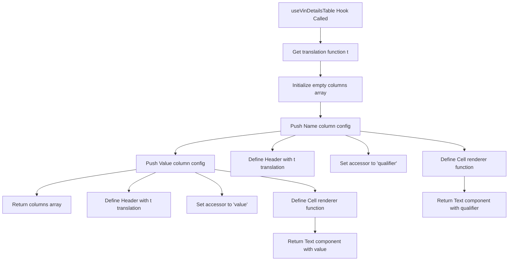
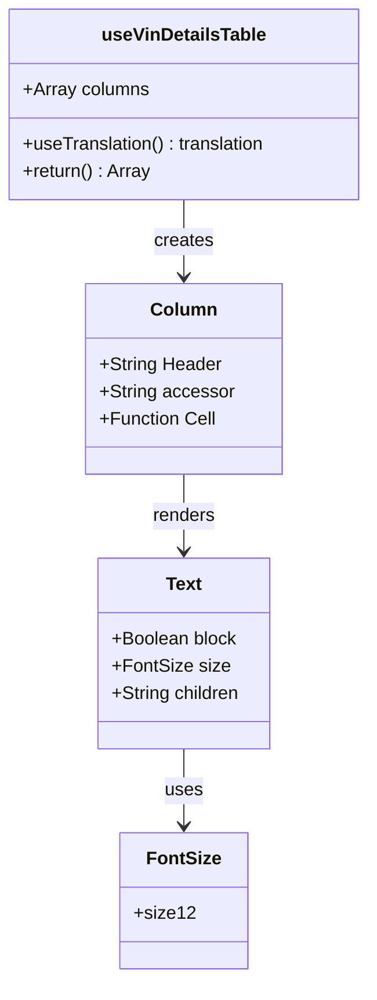
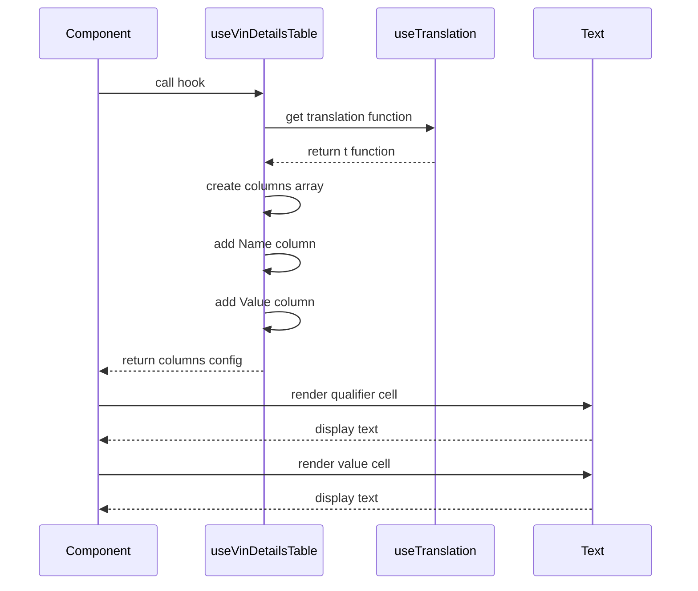

# Diagram: web/portal/src/shared/hooks/columns/useVinDetailsTable.js

> Auto-generated by Obscura crawlers

## Diagram 1

### SVG

<svg id="container" width="1589.234375" xmlns="http://www.w3.org/2000/svg" class="flowchart" height="814" viewBox="0 0 1589.234375 814" role="graphics-document document" aria-roledescription="flowchart-v2"><g><marker id="container_flowchart-v2-pointEnd" class="marker flowchart-v2" viewBox="0 0 10 10" refX="5" refY="5" markerUnits="userSpaceOnUse" markerWidth="8" markerHeight="8" orient="auto"><path d="M 0 0 L 10 5 L 0 10 z" class="arrowMarkerPath" style="stroke-width: 1; stroke-dasharray: 1, 0;"></path></marker><marker id="container_flowchart-v2-pointStart" class="marker flowchart-v2" viewBox="0 0 10 10" refX="4.5" refY="5" markerUnits="userSpaceOnUse" markerWidth="8" markerHeight="8" orient="auto"><path d="M 0 5 L 10 10 L 10 0 z" class="arrowMarkerPath" style="stroke-width: 1; stroke-dasharray: 1, 0;"></path></marker><marker id="container_flowchart-v2-circleEnd" class="marker flowchart-v2" viewBox="0 0 10 10" refX="11" refY="5" markerUnits="userSpaceOnUse" markerWidth="11" markerHeight="11" orient="auto"><circle cx="5" cy="5" r="5" class="arrowMarkerPath" style="stroke-width: 1; stroke-dasharray: 1, 0;"></circle></marker><marker id="container_flowchart-v2-circleStart" class="marker flowchart-v2" viewBox="0 0 10 10" refX="-1" refY="5" markerUnits="userSpaceOnUse" markerWidth="11" markerHeight="11" orient="auto"><circle cx="5" cy="5" r="5" class="arrowMarkerPath" style="stroke-width: 1; stroke-dasharray: 1, 0;"></circle></marker><marker id="container_flowchart-v2-crossEnd" class="marker cross flowchart-v2" viewBox="0 0 11 11" refX="12" refY="5.2" markerUnits="userSpaceOnUse" markerWidth="11" markerHeight="11" orient="auto"><path d="M 1,1 l 9,9 M 10,1 l -9,9" class="arrowMarkerPath" style="stroke-width: 2; stroke-dasharray: 1, 0;"></path></marker><marker id="container_flowchart-v2-crossStart" class="marker cross flowchart-v2" viewBox="0 0 11 11" refX="-1" refY="5.2" markerUnits="userSpaceOnUse" markerWidth="11" markerHeight="11" orient="auto"><path d="M 1,1 l 9,9 M 10,1 l -9,9" class="arrowMarkerPath" style="stroke-width: 2; stroke-dasharray: 1, 0;"></path></marker><g class="root"><g class="clusters"></g><g class="edgePaths"><path d="M1000.602,86L1000.602,90.167C1000.602,94.333,1000.602,102.667,1000.602,110.333C1000.602,118,1000.602,125,1000.602,128.5L1000.602,132" id="L_A_B_0" class="edge-thickness-normal edge-pattern-solid edge-thickness-normal edge-pattern-solid flowchart-link" style=";" data-edge="true" data-et="edge" data-id="L_A_B_0" data-points="W3sieCI6MTAwMC42MDE1NjI1LCJ5Ijo4Nn0seyJ4IjoxMDAwLjYwMTU2MjUsInkiOjExMX0seyJ4IjoxMDAwLjYwMTU2MjUsInkiOjEzNn1d" marker-end="url(#container_flowchart-v2-pointEnd)"></path><path d="M1000.602,190L1000.602,194.167C1000.602,198.333,1000.602,206.667,1000.602,214.333C1000.602,222,1000.602,229,1000.602,232.5L1000.602,236" id="L_B_C_0" class="edge-thickness-normal edge-pattern-solid edge-thickness-normal edge-pattern-solid flowchart-link" style=";" data-edge="true" data-et="edge" data-id="L_B_C_0" data-points="W3sieCI6MTAwMC42MDE1NjI1LCJ5IjoxOTB9LHsieCI6MTAwMC42MDE1NjI1LCJ5IjoyMTV9LHsieCI6MTAwMC42MDE1NjI1LCJ5IjoyNDB9XQ==" marker-end="url(#container_flowchart-v2-pointEnd)"></path><path d="M1000.602,318L1000.602,322.167C1000.602,326.333,1000.602,334.667,1000.602,342.333C1000.602,350,1000.602,357,1000.602,360.5L1000.602,364" id="L_C_D_0" class="edge-thickness-normal edge-pattern-solid edge-thickness-normal edge-pattern-solid flowchart-link" style=";" data-edge="true" data-et="edge" data-id="L_C_D_0" data-points="W3sieCI6MTAwMC42MDE1NjI1LCJ5IjozMTh9LHsieCI6MTAwMC42MDE1NjI1LCJ5IjozNDN9LHsieCI6MTAwMC42MDE1NjI1LCJ5IjozNjh9XQ==" marker-end="url(#container_flowchart-v2-pointEnd)"></path><path d="M877.031,409.2L822.208,415.5C767.385,421.8,657.74,434.4,602.917,446.2C548.094,458,548.094,469,548.094,474.5L548.094,480" id="L_D_E_0" class="edge-thickness-normal edge-pattern-solid edge-thickness-normal edge-pattern-solid flowchart-link" style=";" data-edge="true" data-et="edge" data-id="L_D_E_0" data-points="W3sieCI6ODc3LjAzMTI1LCJ5Ijo0MDkuMjAwMTAwMTM2MzkyN30seyJ4Ijo1NDguMDkzNzUsInkiOjQ0N30seyJ4Ijo1NDguMDkzNzUsInkiOjQ4NH1d" marker-end="url(#container_flowchart-v2-pointEnd)"></path><path d="M425.797,529.101L374.111,536.751C322.424,544.4,219.052,559.7,167.366,572.85C115.68,586,115.68,597,115.68,602.5L115.68,608" id="L_E_F_0" class="edge-thickness-normal edge-pattern-solid edge-thickness-normal edge-pattern-solid flowchart-link" style=";" data-edge="true" data-et="edge" data-id="L_E_F_0" data-points="W3sieCI6NDI1Ljc5Njg3NSwieSI6NTI5LjEwMDcwNjQyNjQ5Mzd9LHsieCI6MTE1LjY3OTY4NzUsInkiOjU3NX0seyJ4IjoxMTUuNjc5Njg3NSwieSI6NjEyfV0=" marker-end="url(#container_flowchart-v2-pointEnd)"></path><path d="M922.607,422L910.571,426.167C898.535,430.333,874.463,438.667,862.427,446.333C850.391,454,850.391,461,850.391,464.5L850.391,468" id="L_D_D1_0" class="edge-thickness-normal edge-pattern-solid edge-thickness-normal edge-pattern-solid flowchart-link" style=";" data-edge="true" data-et="edge" data-id="L_D_D1_0" data-points="W3sieCI6OTIyLjYwNzQyMTg3NSwieSI6NDIyfSx7IngiOjg1MC4zOTA2MjUsInkiOjQ0N30seyJ4Ijo4NTAuMzkwNjI1LCJ5Ijo0NzJ9XQ==" marker-end="url(#container_flowchart-v2-pointEnd)"></path><path d="M1078.596,422L1090.632,426.167C1102.668,430.333,1126.74,438.667,1138.776,448.333C1150.813,458,1150.813,469,1150.813,474.5L1150.813,480" id="L_D_D2_0" class="edge-thickness-normal edge-pattern-solid edge-thickness-normal edge-pattern-solid flowchart-link" style=";" data-edge="true" data-et="edge" data-id="L_D_D2_0" data-points="W3sieCI6MTA3OC41OTU3MDMxMjUsInkiOjQyMn0seyJ4IjoxMTUwLjgxMjUsInkiOjQ0N30seyJ4IjoxMTUwLjgxMjUsInkiOjQ4NH1d" marker-end="url(#container_flowchart-v2-pointEnd)"></path><path d="M1124.172,409.259L1178.682,415.549C1233.193,421.839,1342.214,434.42,1396.724,444.21C1451.234,454,1451.234,461,1451.234,464.5L1451.234,468" id="L_D_D3_0" class="edge-thickness-normal edge-pattern-solid edge-thickness-normal edge-pattern-solid flowchart-link" style=";" data-edge="true" data-et="edge" data-id="L_D_D3_0" data-points="W3sieCI6MTEyNC4xNzE4NzUsInkiOjQwOS4yNTkxODQxMzM0MjM1fSx7IngiOjE0NTEuMjM0Mzc1LCJ5Ijo0NDd9LHsieCI6MTQ1MS4yMzQzNzUsInkiOjQ3Mn1d" marker-end="url(#container_flowchart-v2-pointEnd)"></path><path d="M1451.234,550L1451.234,554.167C1451.234,558.333,1451.234,566.667,1451.234,574.333C1451.234,582,1451.234,589,1451.234,592.5L1451.234,596" id="L_D3_D4_0" class="edge-thickness-normal edge-pattern-solid edge-thickness-normal edge-pattern-solid flowchart-link" style=";" data-edge="true" data-et="edge" data-id="L_D3_D4_0" data-points="W3sieCI6MTQ1MS4yMzQzNzUsInkiOjU1MH0seyJ4IjoxNDUxLjIzNDM3NSwieSI6NTc1fSx7IngiOjE0NTEuMjM0Mzc1LCJ5Ijo2MDB9XQ==" marker-end="url(#container_flowchart-v2-pointEnd)"></path><path d="M487.034,538L473.088,544.167C459.142,550.333,431.251,562.667,417.305,572.333C403.359,582,403.359,589,403.359,592.5L403.359,596" id="L_E_E1_0" class="edge-thickness-normal edge-pattern-solid edge-thickness-normal edge-pattern-solid flowchart-link" style=";" data-edge="true" data-et="edge" data-id="L_E_E1_0" data-points="W3sieCI6NDg3LjAzMzkzNTU0Njg3NSwieSI6NTM4fSx7IngiOjQwMy4zNTkzNzUsInkiOjU3NX0seyJ4Ijo0MDMuMzU5Mzc1LCJ5Ijo2MDB9XQ==" marker-end="url(#container_flowchart-v2-pointEnd)"></path><path d="M609.154,538L623.099,544.167C637.045,550.333,664.937,562.667,678.882,574.333C692.828,586,692.828,597,692.828,602.5L692.828,608" id="L_E_E2_0" class="edge-thickness-normal edge-pattern-solid edge-thickness-normal edge-pattern-solid flowchart-link" style=";" data-edge="true" data-et="edge" data-id="L_E_E2_0" data-points="W3sieCI6NjA5LjE1MzU2NDQ1MzEyNSwieSI6NTM4fSx7IngiOjY5Mi44MjgxMjUsInkiOjU3NX0seyJ4Ijo2OTIuODI4MTI1LCJ5Ijo2MTJ9XQ==" marker-end="url(#container_flowchart-v2-pointEnd)"></path><path d="M670.391,529.026L722.375,536.688C774.359,544.351,878.328,559.675,930.313,570.838C982.297,582,982.297,589,982.297,592.5L982.297,596" id="L_E_E3_0" class="edge-thickness-normal edge-pattern-solid edge-thickness-normal edge-pattern-solid flowchart-link" style=";" data-edge="true" data-et="edge" data-id="L_E_E3_0" data-points="W3sieCI6NjcwLjM5MDYyNSwieSI6NTI5LjAyNjEyNTQ0NTMyMDF9LHsieCI6OTgyLjI5Njg3NSwieSI6NTc1fSx7IngiOjk4Mi4yOTY4NzUsInkiOjYwMH1d" marker-end="url(#container_flowchart-v2-pointEnd)"></path><path d="M982.297,678L982.297,682.167C982.297,686.333,982.297,694.667,982.297,702.333C982.297,710,982.297,717,982.297,720.5L982.297,724" id="L_E3_E4_0" class="edge-thickness-normal edge-pattern-solid edge-thickness-normal edge-pattern-solid flowchart-link" style=";" data-edge="true" data-et="edge" data-id="L_E3_E4_0" data-points="W3sieCI6OTgyLjI5Njg3NSwieSI6Njc4fSx7IngiOjk4Mi4yOTY4NzUsInkiOjcwM30seyJ4Ijo5ODIuMjk2ODc1LCJ5Ijo3Mjh9XQ==" marker-end="url(#container_flowchart-v2-pointEnd)"></path></g><g class="edgeLabels"><g class="edgeLabel"><g class="label" data-id="L_A_B_0" transform="translate(0, 0)"><foreignObject width="0" height="0">

</foreignObject></g></g><g class="edgeLabel"><g class="label" data-id="L_B_C_0" transform="translate(0, 0)"><foreignObject width="0" height="0">

</foreignObject></g></g><g class="edgeLabel"><g class="label" data-id="L_C_D_0" transform="translate(0, 0)"><foreignObject width="0" height="0">

</foreignObject></g></g><g class="edgeLabel"><g class="label" data-id="L_D_E_0" transform="translate(0, 0)"><foreignObject width="0" height="0">

</foreignObject></g></g><g class="edgeLabel"><g class="label" data-id="L_E_F_0" transform="translate(0, 0)"><foreignObject width="0" height="0">

</foreignObject></g></g><g class="edgeLabel"><g class="label" data-id="L_D_D1_0" transform="translate(0, 0)"><foreignObject width="0" height="0">

</foreignObject></g></g><g class="edgeLabel"><g class="label" data-id="L_D_D2_0" transform="translate(0, 0)"><foreignObject width="0" height="0">

</foreignObject></g></g><g class="edgeLabel"><g class="label" data-id="L_D_D3_0" transform="translate(0, 0)"><foreignObject width="0" height="0">

</foreignObject></g></g><g class="edgeLabel"><g class="label" data-id="L_D3_D4_0" transform="translate(0, 0)"><foreignObject width="0" height="0">

</foreignObject></g></g><g class="edgeLabel"><g class="label" data-id="L_E_E1_0" transform="translate(0, 0)"><foreignObject width="0" height="0">

</foreignObject></g></g><g class="edgeLabel"><g class="label" data-id="L_E_E2_0" transform="translate(0, 0)"><foreignObject width="0" height="0">

</foreignObject></g></g><g class="edgeLabel"><g class="label" data-id="L_E_E3_0" transform="translate(0, 0)"><foreignObject width="0" height="0">

</foreignObject></g></g><g class="edgeLabel"><g class="label" data-id="L_E3_E4_0" transform="translate(0, 0)"><foreignObject width="0" height="0">

</foreignObject></g></g></g><g class="nodes"><g class="node default" id="flowchart-A-0" transform="translate(1000.6015625, 47)"><rect class="basic label-container" style="" x="-130" y="-39" width="260" height="78"></rect><g class="label" style="" transform="translate(-100, -24)"><rect></rect><foreignObject width="200" height="48">

useVinDetailsTable Hook Called

</foreignObject></g></g><g class="node default" id="flowchart-B-1" transform="translate(1000.6015625, 163)"><rect class="basic label-container" style="" x="-121.53125" y="-27" width="243.0625" height="54"></rect><g class="label" style="" transform="translate(-91.53125, -12)"><rect></rect><foreignObject width="183.0625" height="24">

Get translation function t

</foreignObject></g></g><g class="node default" id="flowchart-C-3" transform="translate(1000.6015625, 279)"><rect class="basic label-container" style="" x="-130" y="-39" width="260" height="78"></rect><g class="label" style="" transform="translate(-100, -24)"><rect></rect><foreignObject width="200" height="48">

Initialize empty columns array

</foreignObject></g></g><g class="node default" id="flowchart-D-5" transform="translate(1000.6015625, 395)"><rect class="basic label-container" style="" x="-123.5703125" y="-27" width="247.140625" height="54"></rect><g class="label" style="" transform="translate(-93.5703125, -12)"><rect></rect><foreignObject width="187.140625" height="24">

Push Name column config

</foreignObject></g></g><g class="node default" id="flowchart-E-7" transform="translate(548.09375, 511)"><rect class="basic label-container" style="" x="-122.296875" y="-27" width="244.59375" height="54"></rect><g class="label" style="" transform="translate(-92.296875, -12)"><rect></rect><foreignObject width="184.59375" height="24">

Push Value column config

</foreignObject></g></g><g class="node default" id="flowchart-F-9" transform="translate(115.6796875, 639)"><rect class="basic label-container" style="" x="-107.6796875" y="-27" width="215.359375" height="54"></rect><g class="label" style="" transform="translate(-77.6796875, -12)"><rect></rect><foreignObject width="155.359375" height="24">

Return columns array

</foreignObject></g></g><g class="node default" id="flowchart-D1-11" transform="translate(850.390625, 511)"><rect class="basic label-container" style="" x="-130" y="-39" width="260" height="78"></rect><g class="label" style="" transform="translate(-100, -24)"><rect></rect><foreignObject width="200" height="48">

Define Header with t translation

</foreignObject></g></g><g class="node default" id="flowchart-D2-13" transform="translate(1150.8125, 511)"><rect class="basic label-container" style="" x="-120.421875" y="-27" width="240.84375" height="54"></rect><g class="label" style="" transform="translate(-90.421875, -12)"><rect></rect><foreignObject width="180.84375" height="24">

Set accessor to 'qualifier'

</foreignObject></g></g><g class="node default" id="flowchart-D3-15" transform="translate(1451.234375, 511)"><rect class="basic label-container" style="" x="-130" y="-39" width="260" height="78"></rect><g class="label" style="" transform="translate(-100, -24)"><rect></rect><foreignObject width="200" height="48">

Define Cell renderer function

</foreignObject></g></g><g class="node default" id="flowchart-D4-17" transform="translate(1451.234375, 639)"><rect class="basic label-container" style="" x="-130" y="-39" width="260" height="78"></rect><g class="label" style="" transform="translate(-100, -24)"><rect></rect><foreignObject width="200" height="48">

Return Text component with qualifier

</foreignObject></g></g><g class="node default" id="flowchart-E1-19" transform="translate(403.359375, 639)"><rect class="basic label-container" style="" x="-130" y="-39" width="260" height="78"></rect><g class="label" style="" transform="translate(-100, -24)"><rect></rect><foreignObject width="200" height="48">

Define Header with t translation

</foreignObject></g></g><g class="node default" id="flowchart-E2-21" transform="translate(692.828125, 639)"><rect class="basic label-container" style="" x="-109.46875" y="-27" width="218.9375" height="54"></rect><g class="label" style="" transform="translate(-79.46875, -12)"><rect></rect><foreignObject width="158.9375" height="24">

Set accessor to 'value'

</foreignObject></g></g><g class="node default" id="flowchart-E3-23" transform="translate(982.296875, 639)"><rect class="basic label-container" style="" x="-130" y="-39" width="260" height="78"></rect><g class="label" style="" transform="translate(-100, -24)"><rect></rect><foreignObject width="200" height="48">

Define Cell renderer function

</foreignObject></g></g><g class="node default" id="flowchart-E4-25" transform="translate(982.296875, 767)"><rect class="basic label-container" style="" x="-130" y="-39" width="260" height="78"></rect><g class="label" style="" transform="translate(-100, -24)"><rect></rect><foreignObject width="200" height="48">

Return Text component with value

</foreignObject></g></g></g></g></g></svg>

## Diagram 2

### SVG

<svg id="container" width="326.3515625" xmlns="http://www.w3.org/2000/svg" class="classDiagram" height="862" viewBox="0 0 326.3515625 862" role="graphics-document document" aria-roledescription="class"><g><defs><marker id="container_class-aggregationStart" class="marker aggregation class" refX="18" refY="7" markerWidth="190" markerHeight="240" orient="auto"><path d="M 18,7 L9,13 L1,7 L9,1 Z"></path></marker></defs><defs><marker id="container_class-aggregationEnd" class="marker aggregation class" refX="1" refY="7" markerWidth="20" markerHeight="28" orient="auto"><path d="M 18,7 L9,13 L1,7 L9,1 Z"></path></marker></defs><defs><marker id="container_class-extensionStart" class="marker extension class" refX="18" refY="7" markerWidth="190" markerHeight="240" orient="auto"><path d="M 1,7 L18,13 V 1 Z"></path></marker></defs><defs><marker id="container_class-extensionEnd" class="marker extension class" refX="1" refY="7" markerWidth="20" markerHeight="28" orient="auto"><path d="M 1,1 V 13 L18,7 Z"></path></marker></defs><defs><marker id="container_class-compositionStart" class="marker composition class" refX="18" refY="7" markerWidth="190" markerHeight="240" orient="auto"><path d="M 18,7 L9,13 L1,7 L9,1 Z"></path></marker></defs><defs><marker id="container_class-compositionEnd" class="marker composition class" refX="1" refY="7" markerWidth="20" markerHeight="28" orient="auto"><path d="M 18,7 L9,13 L1,7 L9,1 Z"></path></marker></defs><defs><marker id="container_class-dependencyStart" class="marker dependency class" refX="6" refY="7" markerWidth="190" markerHeight="240" orient="auto"><path d="M 5,7 L9,13 L1,7 L9,1 Z"></path></marker></defs><defs><marker id="container_class-dependencyEnd" class="marker dependency class" refX="13" refY="7" markerWidth="20" markerHeight="28" orient="auto"><path d="M 18,7 L9,13 L14,7 L9,1 Z"></path></marker></defs><defs><marker id="container_class-lollipopStart" class="marker lollipop class" refX="13" refY="7" markerWidth="190" markerHeight="240" orient="auto"><circle stroke="black" fill="transparent" cx="7" cy="7" r="6"></circle></marker></defs><defs><marker id="container_class-lollipopEnd" class="marker lollipop class" refX="1" refY="7" markerWidth="190" markerHeight="240" orient="auto"><circle stroke="black" fill="transparent" cx="7" cy="7" r="6"></circle></marker></defs><g class="root"><g class="clusters"></g><g class="edgePaths"><path d="M163.176,176L163.176,182.167C163.176,188.333,163.176,200.667,163.176,212C163.176,223.333,163.176,233.667,163.176,238.833L163.176,244" id="id_useVinDetailsTable_Column_1" class="edge-thickness-normal edge-pattern-solid relation" style=";;;" data-edge="true" data-et="edge" data-id="id_useVinDetailsTable_Column_1" data-points="W3sieCI6MTYzLjE3NTc4MTI1LCJ5IjoxNzZ9LHsieCI6MTYzLjE3NTc4MTI1LCJ5IjoyMTN9LHsieCI6MTYzLjE3NTc4MTI1LCJ5IjoyNTB9XQ==" marker-end="url(#container_class-dependencyEnd)"></path><path d="M163.176,418L163.176,424.167C163.176,430.333,163.176,442.667,163.176,454C163.176,465.333,163.176,475.667,163.176,480.833L163.176,486" id="id_Column_Text_2" class="edge-thickness-normal edge-pattern-solid relation" style=";;;" data-edge="true" data-et="edge" data-id="id_Column_Text_2" data-points="W3sieCI6MTYzLjE3NTc4MTI1LCJ5Ijo0MTh9LHsieCI6MTYzLjE3NTc4MTI1LCJ5Ijo0NTV9LHsieCI6MTYzLjE3NTc4MTI1LCJ5Ijo0OTJ9XQ==" marker-end="url(#container_class-dependencyEnd)"></path><path d="M163.176,660L163.176,666.167C163.176,672.333,163.176,684.667,163.176,696C163.176,707.333,163.176,717.667,163.176,722.833L163.176,728" id="id_Text_FontSize_3" class="edge-thickness-normal edge-pattern-solid relation" style=";;;" data-edge="true" data-et="edge" data-id="id_Text_FontSize_3" data-points="W3sieCI6MTYzLjE3NTc4MTI1LCJ5Ijo2NjB9LHsieCI6MTYzLjE3NTc4MTI1LCJ5Ijo2OTd9LHsieCI6MTYzLjE3NTc4MTI1LCJ5Ijo3MzR9XQ==" marker-end="url(#container_class-dependencyEnd)"></path></g><g class="edgeLabels"><g class="edgeLabel" transform="translate(163.17578125, 213)"><g class="label" data-id="id_useVinDetailsTable_Column_1" transform="translate(-26.171875, -12)"><foreignObject width="52.34375" height="24">

creates

</foreignObject></g></g><g class="edgeLabel" transform="translate(163.17578125, 455)"><g class="label" data-id="id_Column_Text_2" transform="translate(-27.75, -12)"><foreignObject width="55.5" height="24">

renders

</foreignObject></g></g><g class="edgeLabel" transform="translate(163.17578125, 697)"><g class="label" data-id="id_Text_FontSize_3" transform="translate(-16.4921875, -12)"><foreignObject width="32.984375" height="24">

uses

</foreignObject></g></g></g><g class="nodes"><g class="node default" id="classId-useVinDetailsTable-0" transform="translate(163.17578125, 92)"><g class="basic label-container"><path d="M-155.17578125 -84 L155.17578125 -84 L155.17578125 84 L-155.17578125 84" stroke="none" stroke-width="0" fill="#ECECFF" style=""></path><path d="M-155.17578125 -84 C-75.2437519724975 -84, 4.688277305004988 -84, 155.17578125 -84 M-155.17578125 -84 C-47.44454522722954 -84, 60.28669079554092 -84, 155.17578125 -84 M155.17578125 -84 C155.17578125 -21.639979412018576, 155.17578125 40.72004117596285, 155.17578125 84 M155.17578125 -84 C155.17578125 -27.298133479302855, 155.17578125 29.40373304139429, 155.17578125 84 M155.17578125 84 C64.86026702094772 84, -25.455247208104566 84, -155.17578125 84 M155.17578125 84 C58.077822841426695 84, -39.02013556714661 84, -155.17578125 84 M-155.17578125 84 C-155.17578125 36.32124970144134, -155.17578125 -11.357500597117323, -155.17578125 -84 M-155.17578125 84 C-155.17578125 43.7012284128304, -155.17578125 3.4024568256608063, -155.17578125 -84" stroke="#9370DB" stroke-width="1.3" fill="none" stroke-dasharray="0 0" style=""></path></g><g class="annotation-group text" transform="translate(0, -60)"></g><g class="label-group text" transform="translate(-69.6171875, -60)"><g class="label" style="font-weight: bolder" transform="translate(0,-12)"><foreignObject width="139.234375" height="24">

useVinDetailsTable

</foreignObject></g></g><g class="members-group text" transform="translate(-143.17578125, -12)"><g class="label" style="" transform="translate(0,-12)"><foreignObject width="110.59375" height="24">

+Array columns

</foreignObject></g></g><g class="methods-group text" transform="translate(-143.17578125, 36)"><g class="label" style="" transform="translate(0,-12)"><foreignObject width="216.734375" height="24">

+useTranslation() : translation

</foreignObject></g><g class="label" style="" transform="translate(0,12)"><foreignObject width="113.03125" height="24">

+return() : Array

</foreignObject></g></g><g class="divider" style=""><path d="M-155.17578125 -36 C-48.147804054772976 -36, 58.88017314045405 -36, 155.17578125 -36 M-155.17578125 -36 C-73.6320318084764 -36, 7.911717633047203 -36, 155.17578125 -36" stroke="#9370DB" stroke-width="1.3" fill="none" stroke-dasharray="0 0" style=""></path></g><g class="divider" style=""><path d="M-155.17578125 12 C-76.16233500559908 12, 2.851111238801849 12, 155.17578125 12 M-155.17578125 12 C-88.40325191391474 12, -21.630722577829488 12, 155.17578125 12" stroke="#9370DB" stroke-width="1.3" fill="none" stroke-dasharray="0 0" style=""></path></g></g><g class="node default" id="classId-Column-1" transform="translate(163.17578125, 334)"><g class="basic label-container"><path d="M-84.15234375 -84 L84.15234375 -84 L84.15234375 84 L-84.15234375 84" stroke="none" stroke-width="0" fill="#ECECFF" style=""></path><path d="M-84.15234375 -84 C-45.15414295983311 -84, -6.155942169666218 -84, 84.15234375 -84 M-84.15234375 -84 C-35.78323783777164 -84, 12.585868074456727 -84, 84.15234375 -84 M84.15234375 -84 C84.15234375 -31.361553868671074, 84.15234375 21.276892262657853, 84.15234375 84 M84.15234375 -84 C84.15234375 -45.70657004857779, 84.15234375 -7.413140097155576, 84.15234375 84 M84.15234375 84 C34.19887542223078 84, -15.754592905538445 84, -84.15234375 84 M84.15234375 84 C32.273683362237 84, -19.604977025525997 84, -84.15234375 84 M-84.15234375 84 C-84.15234375 28.280551998482892, -84.15234375 -27.438896003034216, -84.15234375 -84 M-84.15234375 84 C-84.15234375 20.02465275500007, -84.15234375 -43.95069448999986, -84.15234375 -84" stroke="#9370DB" stroke-width="1.3" fill="none" stroke-dasharray="0 0" style=""></path></g><g class="annotation-group text" transform="translate(0, -60)"></g><g class="label-group text" transform="translate(-27.4453125, -60)"><g class="label" style="font-weight: bolder" transform="translate(0,-12)"><foreignObject width="54.890625" height="24">

Column

</foreignObject></g></g><g class="members-group text" transform="translate(-72.15234375, -12)"><g class="label" style="" transform="translate(0,-12)"><foreignObject width="107.078125" height="24">

+String Header

</foreignObject></g><g class="label" style="" transform="translate(0,12)"><foreignObject width="116.859375" height="24">

+String accessor

</foreignObject></g><g class="label" style="" transform="translate(0,36)"><foreignObject width="101.578125" height="24">

+Function Cell

</foreignObject></g></g><g class="methods-group text" transform="translate(-72.15234375, 84)"></g><g class="divider" style=""><path d="M-84.15234375 -36 C-40.841329355572036 -36, 2.4696850388559284 -36, 84.15234375 -36 M-84.15234375 -36 C-41.12362351087021 -36, 1.9050967282595792 -36, 84.15234375 -36" stroke="#9370DB" stroke-width="1.3" fill="none" stroke-dasharray="0 0" style=""></path></g><g class="divider" style=""><path d="M-84.15234375 60 C-40.43424840387069 60, 3.28384694225862 60, 84.15234375 60 M-84.15234375 60 C-45.70914681882695 60, -7.265949887653903 60, 84.15234375 60" stroke="#9370DB" stroke-width="1.3" fill="none" stroke-dasharray="0 0" style=""></path></g></g><g class="node default" id="classId-Text-2" transform="translate(163.17578125, 576)"><g class="basic label-container"><path d="M-76.67578125 -84 L76.67578125 -84 L76.67578125 84 L-76.67578125 84" stroke="none" stroke-width="0" fill="#ECECFF" style=""></path><path d="M-76.67578125 -84 C-43.14347940731411 -84, -9.611177564628221 -84, 76.67578125 -84 M-76.67578125 -84 C-40.8910745351681 -84, -5.106367820336203 -84, 76.67578125 -84 M76.67578125 -84 C76.67578125 -20.89715919358656, 76.67578125 42.20568161282688, 76.67578125 84 M76.67578125 -84 C76.67578125 -41.87103207764896, 76.67578125 0.2579358447020752, 76.67578125 84 M76.67578125 84 C44.67608339691127 84, 12.676385543822533 84, -76.67578125 84 M76.67578125 84 C20.11683328108615 84, -36.4421146878277 84, -76.67578125 84 M-76.67578125 84 C-76.67578125 29.731716764181563, -76.67578125 -24.536566471636874, -76.67578125 -84 M-76.67578125 84 C-76.67578125 26.159867686118154, -76.67578125 -31.68026462776369, -76.67578125 -84" stroke="#9370DB" stroke-width="1.3" fill="none" stroke-dasharray="0 0" style=""></path></g><g class="annotation-group text" transform="translate(0, -60)"></g><g class="label-group text" transform="translate(-15.3828125, -60)"><g class="label" style="font-weight: bolder" transform="translate(0,-12)"><foreignObject width="30.765625" height="24">

Text

</foreignObject></g></g><g class="members-group text" transform="translate(-64.67578125, -12)"><g class="label" style="" transform="translate(0,-12)"><foreignObject width="111.1875" height="24">

+Boolean block

</foreignObject></g><g class="label" style="" transform="translate(0,12)"><foreignObject width="100.4375" height="24">

+FontSize size

</foreignObject></g><g class="label" style="" transform="translate(0,36)"><foreignObject width="113.96875" height="24">

+String children

</foreignObject></g></g><g class="methods-group text" transform="translate(-64.67578125, 84)"></g><g class="divider" style=""><path d="M-76.67578125 -36 C-31.828940800055747 -36, 13.017899649888506 -36, 76.67578125 -36 M-76.67578125 -36 C-16.318411343589574 -36, 44.03895856282085 -36, 76.67578125 -36" stroke="#9370DB" stroke-width="1.3" fill="none" stroke-dasharray="0 0" style=""></path></g><g class="divider" style=""><path d="M-76.67578125 60 C-26.48840220880004 60, 23.69897683239992 60, 76.67578125 60 M-76.67578125 60 C-34.60768263225009 60, 7.4604159854998215 60, 76.67578125 60" stroke="#9370DB" stroke-width="1.3" fill="none" stroke-dasharray="0 0" style=""></path></g></g><g class="node default" id="classId-FontSize-3" transform="translate(163.17578125, 794)"><g class="basic label-container"><path d="M-52.234375 -60 L52.234375 -60 L52.234375 60 L-52.234375 60" stroke="none" stroke-width="0" fill="#ECECFF" style=""></path><path d="M-52.234375 -60 C-13.78870988549641 -60, 24.65695522900718 -60, 52.234375 -60 M-52.234375 -60 C-30.77207294982272 -60, -9.309770899645443 -60, 52.234375 -60 M52.234375 -60 C52.234375 -29.17784507679496, 52.234375 1.6443098464100814, 52.234375 60 M52.234375 -60 C52.234375 -33.39057123683378, 52.234375 -6.7811424736675505, 52.234375 60 M52.234375 60 C22.254603801741677 60, -7.725167396516646 60, -52.234375 60 M52.234375 60 C24.483492558756968 60, -3.2673898824860643 60, -52.234375 60 M-52.234375 60 C-52.234375 17.557648965245633, -52.234375 -24.884702069508734, -52.234375 -60 M-52.234375 60 C-52.234375 33.867340643813485, -52.234375 7.7346812876269695, -52.234375 -60" stroke="#9370DB" stroke-width="1.3" fill="none" stroke-dasharray="0 0" style=""></path></g><g class="annotation-group text" transform="translate(0, -36)"></g><g class="label-group text" transform="translate(-30.84375, -36)"><g class="label" style="font-weight: bolder" transform="translate(0,-12)"><foreignObject width="61.6875" height="24">

FontSize

</foreignObject></g></g><g class="members-group text" transform="translate(-40.234375, 12)"><g class="label" style="" transform="translate(0,-12)"><foreignObject width="49.625" height="24">

+size12

</foreignObject></g></g><g class="methods-group text" transform="translate(-40.234375, 60)"></g><g class="divider" style=""><path d="M-52.234375 -12 C-20.669627352952833 -12, 10.895120294094333 -12, 52.234375 -12 M-52.234375 -12 C-25.88153596367981 -12, 0.4713030726403815 -12, 52.234375 -12" stroke="#9370DB" stroke-width="1.3" fill="none" stroke-dasharray="0 0" style=""></path></g><g class="divider" style=""><path d="M-52.234375 36 C-30.801165219920282 36, -9.367955439840564 36, 52.234375 36 M-52.234375 36 C-27.326607350818602 36, -2.4188397016372036 36, 52.234375 36" stroke="#9370DB" stroke-width="1.3" fill="none" stroke-dasharray="0 0" style=""></path></g></g></g></g></g></svg>

## Diagram 3

### SVG

<svg id="container" width="920" xmlns="http://www.w3.org/2000/svg" height="789" viewBox="-50 -10 920 789" role="graphics-document document" aria-roledescription="sequence"><g><rect x="670" y="703" fill="#eaeaea" stroke="#666" width="150" height="65" name="Text" rx="3" ry="3" class="actor actor-bottom"></rect><text x="745" y="735.5" dominant-baseline="central" alignment-baseline="central" class="actor actor-box" style="text-anchor: middle; font-size: 16px; font-weight: 400;"><tspan x="745" dy="0">Text</tspan></text></g><g><rect x="470" y="703" fill="#eaeaea" stroke="#666" width="150" height="65" name="useTranslation" rx="3" ry="3" class="actor actor-bottom"></rect><text x="545" y="735.5" dominant-baseline="central" alignment-baseline="central" class="actor actor-box" style="text-anchor: middle; font-size: 16px; font-weight: 400;"><tspan x="545" dy="0">useTranslation</tspan></text></g><g><rect x="225.5" y="703" fill="#eaeaea" stroke="#666" width="157" height="65" name="useVinDetailsTable" rx="3" ry="3" class="actor actor-bottom"></rect><text x="304" y="735.5" dominant-baseline="central" alignment-baseline="central" class="actor actor-box" style="text-anchor: middle; font-size: 16px; font-weight: 400;"><tspan x="304" dy="0">useVinDetailsTable</tspan></text></g><g><rect x="0" y="703" fill="#eaeaea" stroke="#666" width="150" height="65" name="Component" rx="3" ry="3" class="actor actor-bottom"></rect><text x="75" y="735.5" dominant-baseline="central" alignment-baseline="central" class="actor actor-box" style="text-anchor: middle; font-size: 16px; font-weight: 400;"><tspan x="75" dy="0">Component</tspan></text></g><g><line id="actor3" x1="745" y1="65" x2="745" y2="703" class="actor-line 200" stroke-width="0.5px" stroke="#999" name="Text"></line><g id="root-3"><rect x="670" y="0" fill="#eaeaea" stroke="#666" width="150" height="65" name="Text" rx="3" ry="3" class="actor actor-top"></rect><text x="745" y="32.5" dominant-baseline="central" alignment-baseline="central" class="actor actor-box" style="text-anchor: middle; font-size: 16px; font-weight: 400;"><tspan x="745" dy="0">Text</tspan></text></g></g><g><line id="actor2" x1="545" y1="65" x2="545" y2="703" class="actor-line 200" stroke-width="0.5px" stroke="#999" name="useTranslation"></line><g id="root-2"><rect x="470" y="0" fill="#eaeaea" stroke="#666" width="150" height="65" name="useTranslation" rx="3" ry="3" class="actor actor-top"></rect><text x="545" y="32.5" dominant-baseline="central" alignment-baseline="central" class="actor actor-box" style="text-anchor: middle; font-size: 16px; font-weight: 400;"><tspan x="545" dy="0">useTranslation</tspan></text></g></g><g><line id="actor1" x1="304" y1="65" x2="304" y2="703" class="actor-line 200" stroke-width="0.5px" stroke="#999" name="useVinDetailsTable"></line><g id="root-1"><rect x="225.5" y="0" fill="#eaeaea" stroke="#666" width="157" height="65" name="useVinDetailsTable" rx="3" ry="3" class="actor actor-top"></rect><text x="304" y="32.5" dominant-baseline="central" alignment-baseline="central" class="actor actor-box" style="text-anchor: middle; font-size: 16px; font-weight: 400;"><tspan x="304" dy="0">useVinDetailsTable</tspan></text></g></g><g><line id="actor0" x1="75" y1="65" x2="75" y2="703" class="actor-line 200" stroke-width="0.5px" stroke="#999" name="Component"></line><g id="root-0"><rect x="0" y="0" fill="#eaeaea" stroke="#666" width="150" height="65" name="Component" rx="3" ry="3" class="actor actor-top"></rect><text x="75" y="32.5" dominant-baseline="central" alignment-baseline="central" class="actor actor-box" style="text-anchor: middle; font-size: 16px; font-weight: 400;"><tspan x="75" dy="0">Component</tspan></text></g></g><g></g><defs><symbol id="computer" width="24" height="24"><path transform="scale(.5)" d="M2 2v13h20v-13h-20zm18 11h-16v-9h16v9zm-10.228 6l.466-1h3.524l.467 1h-4.457zm14.228 3h-24l2-6h2.104l-1.33 4h18.45l-1.297-4h2.073l2 6zm-5-10h-14v-7h14v7z"></path></symbol></defs><defs><symbol id="database" fill-rule="evenodd" clip-rule="evenodd"><path transform="scale(.5)" d="M12.258.001l.256.004.255.005.253.008.251.01.249.012.247.015.246.016.242.019.241.02.239.023.236.024.233.027.231.028.229.031.225.032.223.034.22.036.217.038.214.04.211.041.208.043.205.045.201.046.198.048.194.05.191.051.187.053.183.054.18.056.175.057.172.059.168.06.163.061.16.063.155.064.15.066.074.033.073.033.071.034.07.034.069.035.068.035.067.035.066.035.064.036.064.036.062.036.06.036.06.037.058.037.058.037.055.038.055.038.053.038.052.038.051.039.05.039.048.039.047.039.045.04.044.04.043.04.041.04.04.041.039.041.037.041.036.041.034.041.033.042.032.042.03.042.029.042.027.042.026.043.024.043.023.043.021.043.02.043.018.044.017.043.015.044.013.044.012.044.011.045.009.044.007.045.006.045.004.045.002.045.001.045v17l-.001.045-.002.045-.004.045-.006.045-.007.045-.009.044-.011.045-.012.044-.013.044-.015.044-.017.043-.018.044-.02.043-.021.043-.023.043-.024.043-.026.043-.027.042-.029.042-.03.042-.032.042-.033.042-.034.041-.036.041-.037.041-.039.041-.04.041-.041.04-.043.04-.044.04-.045.04-.047.039-.048.039-.05.039-.051.039-.052.038-.053.038-.055.038-.055.038-.058.037-.058.037-.06.037-.06.036-.062.036-.064.036-.064.036-.066.035-.067.035-.068.035-.069.035-.07.034-.071.034-.073.033-.074.033-.15.066-.155.064-.16.063-.163.061-.168.06-.172.059-.175.057-.18.056-.183.054-.187.053-.191.051-.194.05-.198.048-.201.046-.205.045-.208.043-.211.041-.214.04-.217.038-.22.036-.223.034-.225.032-.229.031-.231.028-.233.027-.236.024-.239.023-.241.02-.242.019-.246.016-.247.015-.249.012-.251.01-.253.008-.255.005-.256.004-.258.001-.258-.001-.256-.004-.255-.005-.253-.008-.251-.01-.249-.012-.247-.015-.245-.016-.243-.019-.241-.02-.238-.023-.236-.024-.234-.027-.231-.028-.228-.031-.226-.032-.223-.034-.22-.036-.217-.038-.214-.04-.211-.041-.208-.043-.204-.045-.201-.046-.198-.048-.195-.05-.19-.051-.187-.053-.184-.054-.179-.056-.176-.057-.172-.059-.167-.06-.164-.061-.159-.063-.155-.064-.151-.066-.074-.033-.072-.033-.072-.034-.07-.034-.069-.035-.068-.035-.067-.035-.066-.035-.064-.036-.063-.036-.062-.036-.061-.036-.06-.037-.058-.037-.057-.037-.056-.038-.055-.038-.053-.038-.052-.038-.051-.039-.049-.039-.049-.039-.046-.039-.046-.04-.044-.04-.043-.04-.041-.04-.04-.041-.039-.041-.037-.041-.036-.041-.034-.041-.033-.042-.032-.042-.03-.042-.029-.042-.027-.042-.026-.043-.024-.043-.023-.043-.021-.043-.02-.043-.018-.044-.017-.043-.015-.044-.013-.044-.012-.044-.011-.045-.009-.044-.007-.045-.006-.045-.004-.045-.002-.045-.001-.045v-17l.001-.045.002-.045.004-.045.006-.045.007-.045.009-.044.011-.045.012-.044.013-.044.015-.044.017-.043.018-.044.02-.043.021-.043.023-.043.024-.043.026-.043.027-.042.029-.042.03-.042.032-.042.033-.042.034-.041.036-.041.037-.041.039-.041.04-.041.041-.04.043-.04.044-.04.046-.04.046-.039.049-.039.049-.039.051-.039.052-.038.053-.038.055-.038.056-.038.057-.037.058-.037.06-.037.061-.036.062-.036.063-.036.064-.036.066-.035.067-.035.068-.035.069-.035.07-.034.072-.034.072-.033.074-.033.151-.066.155-.064.159-.063.164-.061.167-.06.172-.059.176-.057.179-.056.184-.054.187-.053.19-.051.195-.05.198-.048.201-.046.204-.045.208-.043.211-.041.214-.04.217-.038.22-.036.223-.034.226-.032.228-.031.231-.028.234-.027.236-.024.238-.023.241-.02.243-.019.245-.016.247-.015.249-.012.251-.01.253-.008.255-.005.256-.004.258-.001.258.001zm-9.258 20.499v.01l.001.021.003.021.004.022.005.021.006.022.007.022.009.023.01.022.011.023.012.023.013.023.015.023.016.024.017.023.018.024.019.024.021.024.022.025.023.024.024.025.052.049.056.05.061.051.066.051.07.051.075.051.079.052.084.052.088.052.092.052.097.052.102.051.105.052.11.052.114.051.119.051.123.051.127.05.131.05.135.05.139.048.144.049.147.047.152.047.155.047.16.045.163.045.167.043.171.043.176.041.178.041.183.039.187.039.19.037.194.035.197.035.202.033.204.031.209.03.212.029.216.027.219.025.222.024.226.021.23.02.233.018.236.016.24.015.243.012.246.01.249.008.253.005.256.004.259.001.26-.001.257-.004.254-.005.25-.008.247-.011.244-.012.241-.014.237-.016.233-.018.231-.021.226-.021.224-.024.22-.026.216-.027.212-.028.21-.031.205-.031.202-.034.198-.034.194-.036.191-.037.187-.039.183-.04.179-.04.175-.042.172-.043.168-.044.163-.045.16-.046.155-.046.152-.047.148-.048.143-.049.139-.049.136-.05.131-.05.126-.05.123-.051.118-.052.114-.051.11-.052.106-.052.101-.052.096-.052.092-.052.088-.053.083-.051.079-.052.074-.052.07-.051.065-.051.06-.051.056-.05.051-.05.023-.024.023-.025.021-.024.02-.024.019-.024.018-.024.017-.024.015-.023.014-.024.013-.023.012-.023.01-.023.01-.022.008-.022.006-.022.006-.022.004-.022.004-.021.001-.021.001-.021v-4.127l-.077.055-.08.053-.083.054-.085.053-.087.052-.09.052-.093.051-.095.05-.097.05-.1.049-.102.049-.105.048-.106.047-.109.047-.111.046-.114.045-.115.045-.118.044-.12.043-.122.042-.124.042-.126.041-.128.04-.13.04-.132.038-.134.038-.135.037-.138.037-.139.035-.142.035-.143.034-.144.033-.147.032-.148.031-.15.03-.151.03-.153.029-.154.027-.156.027-.158.026-.159.025-.161.024-.162.023-.163.022-.165.021-.166.02-.167.019-.169.018-.169.017-.171.016-.173.015-.173.014-.175.013-.175.012-.177.011-.178.01-.179.008-.179.008-.181.006-.182.005-.182.004-.184.003-.184.002h-.37l-.184-.002-.184-.003-.182-.004-.182-.005-.181-.006-.179-.008-.179-.008-.178-.01-.176-.011-.176-.012-.175-.013-.173-.014-.172-.015-.171-.016-.17-.017-.169-.018-.167-.019-.166-.02-.165-.021-.163-.022-.162-.023-.161-.024-.159-.025-.157-.026-.156-.027-.155-.027-.153-.029-.151-.03-.15-.03-.148-.031-.146-.032-.145-.033-.143-.034-.141-.035-.14-.035-.137-.037-.136-.037-.134-.038-.132-.038-.13-.04-.128-.04-.126-.041-.124-.042-.122-.042-.12-.044-.117-.043-.116-.045-.113-.045-.112-.046-.109-.047-.106-.047-.105-.048-.102-.049-.1-.049-.097-.05-.095-.05-.093-.052-.09-.051-.087-.052-.085-.053-.083-.054-.08-.054-.077-.054v4.127zm0-5.654v.011l.001.021.003.021.004.021.005.022.006.022.007.022.009.022.01.022.011.023.012.023.013.023.015.024.016.023.017.024.018.024.019.024.021.024.022.024.023.025.024.024.052.05.056.05.061.05.066.051.07.051.075.052.079.051.084.052.088.052.092.052.097.052.102.052.105.052.11.051.114.051.119.052.123.05.127.051.131.05.135.049.139.049.144.048.147.048.152.047.155.046.16.045.163.045.167.044.171.042.176.042.178.04.183.04.187.038.19.037.194.036.197.034.202.033.204.032.209.03.212.028.216.027.219.025.222.024.226.022.23.02.233.018.236.016.24.014.243.012.246.01.249.008.253.006.256.003.259.001.26-.001.257-.003.254-.006.25-.008.247-.01.244-.012.241-.015.237-.016.233-.018.231-.02.226-.022.224-.024.22-.025.216-.027.212-.029.21-.03.205-.032.202-.033.198-.035.194-.036.191-.037.187-.039.183-.039.179-.041.175-.042.172-.043.168-.044.163-.045.16-.045.155-.047.152-.047.148-.048.143-.048.139-.05.136-.049.131-.05.126-.051.123-.051.118-.051.114-.052.11-.052.106-.052.101-.052.096-.052.092-.052.088-.052.083-.052.079-.052.074-.051.07-.052.065-.051.06-.05.056-.051.051-.049.023-.025.023-.024.021-.025.02-.024.019-.024.018-.024.017-.024.015-.023.014-.023.013-.024.012-.022.01-.023.01-.023.008-.022.006-.022.006-.022.004-.021.004-.022.001-.021.001-.021v-4.139l-.077.054-.08.054-.083.054-.085.052-.087.053-.09.051-.093.051-.095.051-.097.05-.1.049-.102.049-.105.048-.106.047-.109.047-.111.046-.114.045-.115.044-.118.044-.12.044-.122.042-.124.042-.126.041-.128.04-.13.039-.132.039-.134.038-.135.037-.138.036-.139.036-.142.035-.143.033-.144.033-.147.033-.148.031-.15.03-.151.03-.153.028-.154.028-.156.027-.158.026-.159.025-.161.024-.162.023-.163.022-.165.021-.166.02-.167.019-.169.018-.169.017-.171.016-.173.015-.173.014-.175.013-.175.012-.177.011-.178.009-.179.009-.179.007-.181.007-.182.005-.182.004-.184.003-.184.002h-.37l-.184-.002-.184-.003-.182-.004-.182-.005-.181-.007-.179-.007-.179-.009-.178-.009-.176-.011-.176-.012-.175-.013-.173-.014-.172-.015-.171-.016-.17-.017-.169-.018-.167-.019-.166-.02-.165-.021-.163-.022-.162-.023-.161-.024-.159-.025-.157-.026-.156-.027-.155-.028-.153-.028-.151-.03-.15-.03-.148-.031-.146-.033-.145-.033-.143-.033-.141-.035-.14-.036-.137-.036-.136-.037-.134-.038-.132-.039-.13-.039-.128-.04-.126-.041-.124-.042-.122-.043-.12-.043-.117-.044-.116-.044-.113-.046-.112-.046-.109-.046-.106-.047-.105-.048-.102-.049-.1-.049-.097-.05-.095-.051-.093-.051-.09-.051-.087-.053-.085-.052-.083-.054-.08-.054-.077-.054v4.139zm0-5.666v.011l.001.02.003.022.004.021.005.022.006.021.007.022.009.023.01.022.011.023.012.023.013.023.015.023.016.024.017.024.018.023.019.024.021.025.022.024.023.024.024.025.052.05.056.05.061.05.066.051.07.051.075.052.079.051.084.052.088.052.092.052.097.052.102.052.105.051.11.052.114.051.119.051.123.051.127.05.131.05.135.05.139.049.144.048.147.048.152.047.155.046.16.045.163.045.167.043.171.043.176.042.178.04.183.04.187.038.19.037.194.036.197.034.202.033.204.032.209.03.212.028.216.027.219.025.222.024.226.021.23.02.233.018.236.017.24.014.243.012.246.01.249.008.253.006.256.003.259.001.26-.001.257-.003.254-.006.25-.008.247-.01.244-.013.241-.014.237-.016.233-.018.231-.02.226-.022.224-.024.22-.025.216-.027.212-.029.21-.03.205-.032.202-.033.198-.035.194-.036.191-.037.187-.039.183-.039.179-.041.175-.042.172-.043.168-.044.163-.045.16-.045.155-.047.152-.047.148-.048.143-.049.139-.049.136-.049.131-.051.126-.05.123-.051.118-.052.114-.051.11-.052.106-.052.101-.052.096-.052.092-.052.088-.052.083-.052.079-.052.074-.052.07-.051.065-.051.06-.051.056-.05.051-.049.023-.025.023-.025.021-.024.02-.024.019-.024.018-.024.017-.024.015-.023.014-.024.013-.023.012-.023.01-.022.01-.023.008-.022.006-.022.006-.022.004-.022.004-.021.001-.021.001-.021v-4.153l-.077.054-.08.054-.083.053-.085.053-.087.053-.09.051-.093.051-.095.051-.097.05-.1.049-.102.048-.105.048-.106.048-.109.046-.111.046-.114.046-.115.044-.118.044-.12.043-.122.043-.124.042-.126.041-.128.04-.13.039-.132.039-.134.038-.135.037-.138.036-.139.036-.142.034-.143.034-.144.033-.147.032-.148.032-.15.03-.151.03-.153.028-.154.028-.156.027-.158.026-.159.024-.161.024-.162.023-.163.023-.165.021-.166.02-.167.019-.169.018-.169.017-.171.016-.173.015-.173.014-.175.013-.175.012-.177.01-.178.01-.179.009-.179.007-.181.006-.182.006-.182.004-.184.003-.184.001-.185.001-.185-.001-.184-.001-.184-.003-.182-.004-.182-.006-.181-.006-.179-.007-.179-.009-.178-.01-.176-.01-.176-.012-.175-.013-.173-.014-.172-.015-.171-.016-.17-.017-.169-.018-.167-.019-.166-.02-.165-.021-.163-.023-.162-.023-.161-.024-.159-.024-.157-.026-.156-.027-.155-.028-.153-.028-.151-.03-.15-.03-.148-.032-.146-.032-.145-.033-.143-.034-.141-.034-.14-.036-.137-.036-.136-.037-.134-.038-.132-.039-.13-.039-.128-.041-.126-.041-.124-.041-.122-.043-.12-.043-.117-.044-.116-.044-.113-.046-.112-.046-.109-.046-.106-.048-.105-.048-.102-.048-.1-.05-.097-.049-.095-.051-.093-.051-.09-.052-.087-.052-.085-.053-.083-.053-.08-.054-.077-.054v4.153zm8.74-8.179l-.257.004-.254.005-.25.008-.247.011-.244.012-.241.014-.237.016-.233.018-.231.021-.226.022-.224.023-.22.026-.216.027-.212.028-.21.031-.205.032-.202.033-.198.034-.194.036-.191.038-.187.038-.183.04-.179.041-.175.042-.172.043-.168.043-.163.045-.16.046-.155.046-.152.048-.148.048-.143.048-.139.049-.136.05-.131.05-.126.051-.123.051-.118.051-.114.052-.11.052-.106.052-.101.052-.096.052-.092.052-.088.052-.083.052-.079.052-.074.051-.07.052-.065.051-.06.05-.056.05-.051.05-.023.025-.023.024-.021.024-.02.025-.019.024-.018.024-.017.023-.015.024-.014.023-.013.023-.012.023-.01.023-.01.022-.008.022-.006.023-.006.021-.004.022-.004.021-.001.021-.001.021.001.021.001.021.004.021.004.022.006.021.006.023.008.022.01.022.01.023.012.023.013.023.014.023.015.024.017.023.018.024.019.024.02.025.021.024.023.024.023.025.051.05.056.05.06.05.065.051.07.052.074.051.079.052.083.052.088.052.092.052.096.052.101.052.106.052.11.052.114.052.118.051.123.051.126.051.131.05.136.05.139.049.143.048.148.048.152.048.155.046.16.046.163.045.168.043.172.043.175.042.179.041.183.04.187.038.191.038.194.036.198.034.202.033.205.032.21.031.212.028.216.027.22.026.224.023.226.022.231.021.233.018.237.016.241.014.244.012.247.011.25.008.254.005.257.004.26.001.26-.001.257-.004.254-.005.25-.008.247-.011.244-.012.241-.014.237-.016.233-.018.231-.021.226-.022.224-.023.22-.026.216-.027.212-.028.21-.031.205-.032.202-.033.198-.034.194-.036.191-.038.187-.038.183-.04.179-.041.175-.042.172-.043.168-.043.163-.045.16-.046.155-.046.152-.048.148-.048.143-.048.139-.049.136-.05.131-.05.126-.051.123-.051.118-.051.114-.052.11-.052.106-.052.101-.052.096-.052.092-.052.088-.052.083-.052.079-.052.074-.051.07-.052.065-.051.06-.05.056-.05.051-.05.023-.025.023-.024.021-.024.02-.025.019-.024.018-.024.017-.023.015-.024.014-.023.013-.023.012-.023.01-.023.01-.022.008-.022.006-.023.006-.021.004-.022.004-.021.001-.021.001-.021-.001-.021-.001-.021-.004-.021-.004-.022-.006-.021-.006-.023-.008-.022-.01-.022-.01-.023-.012-.023-.013-.023-.014-.023-.015-.024-.017-.023-.018-.024-.019-.024-.02-.025-.021-.024-.023-.024-.023-.025-.051-.05-.056-.05-.06-.05-.065-.051-.07-.052-.074-.051-.079-.052-.083-.052-.088-.052-.092-.052-.096-.052-.101-.052-.106-.052-.11-.052-.114-.052-.118-.051-.123-.051-.126-.051-.131-.05-.136-.05-.139-.049-.143-.048-.148-.048-.152-.048-.155-.046-.16-.046-.163-.045-.168-.043-.172-.043-.175-.042-.179-.041-.183-.04-.187-.038-.191-.038-.194-.036-.198-.034-.202-.033-.205-.032-.21-.031-.212-.028-.216-.027-.22-.026-.224-.023-.226-.022-.231-.021-.233-.018-.237-.016-.241-.014-.244-.012-.247-.011-.25-.008-.254-.005-.257-.004-.26-.001-.26.001z"></path></symbol></defs><defs><symbol id="clock" width="24" height="24"><path transform="scale(.5)" d="M12 2c5.514 0 10 4.486 10 10s-4.486 10-10 10-10-4.486-10-10 4.486-10 10-10zm0-2c-6.627 0-12 5.373-12 12s5.373 12 12 12 12-5.373 12-12-5.373-12-12-12zm5.848 12.459c.202.038.202.333.001.372-1.907.361-6.045 1.111-6.547 1.111-.719 0-1.301-.582-1.301-1.301 0-.512.77-5.447 1.125-7.445.034-.192.312-.181.343.014l.985 6.238 5.394 1.011z"></path></symbol></defs><defs><marker id="arrowhead" refX="7.9" refY="5" markerUnits="userSpaceOnUse" markerWidth="12" markerHeight="12" orient="auto-start-reverse"><path d="M -1 0 L 10 5 L 0 10 z"></path></marker></defs><defs><marker id="crosshead" markerWidth="15" markerHeight="8" orient="auto" refX="4" refY="4.5"><path fill="none" stroke="#000000" stroke-width="1pt" d="M 1,2 L 6,7 M 6,2 L 1,7" style="stroke-dasharray: 0, 0;"></path></marker></defs><defs><marker id="filled-head" refX="15.5" refY="7" markerWidth="20" markerHeight="28" orient="auto"><path d="M 18,7 L9,13 L14,7 L9,1 Z"></path></marker></defs><defs><marker id="sequencenumber" refX="15" refY="15" markerWidth="60" markerHeight="40" orient="auto"><circle cx="15" cy="15" r="6"></circle></marker></defs><text x="188" y="80" text-anchor="middle" dominant-baseline="middle" alignment-baseline="middle" class="messageText" dy="1em" style="font-size: 16px; font-weight: 400;">call hook</text><line x1="76" y1="113" x2="300" y2="113" class="messageLine0" stroke-width="2" stroke="none" marker-end="url(#arrowhead)" style="fill: none;"></line><text x="423" y="128" text-anchor="middle" dominant-baseline="middle" alignment-baseline="middle" class="messageText" dy="1em" style="font-size: 16px; font-weight: 400;">get translation function</text><line x1="305" y1="161" x2="541" y2="161" class="messageLine0" stroke-width="2" stroke="none" marker-end="url(#arrowhead)" style="fill: none;"></line><text x="426" y="176" text-anchor="middle" dominant-baseline="middle" alignment-baseline="middle" class="messageText" dy="1em" style="font-size: 16px; font-weight: 400;">return t function</text><line x1="544" y1="209" x2="308" y2="209" class="messageLine1" stroke-width="2" stroke="none" marker-end="url(#arrowhead)" style="stroke-dasharray: 3, 3; fill: none;"></line><text x="305" y="224" text-anchor="middle" dominant-baseline="middle" alignment-baseline="middle" class="messageText" dy="1em" style="font-size: 16px; font-weight: 400;">create columns array</text><path d="M 305,257 C 365,247 365,287 305,277" class="messageLine0" stroke-width="2" stroke="none" marker-end="url(#arrowhead)" style="fill: none;"></path><text x="305" y="302" text-anchor="middle" dominant-baseline="middle" alignment-baseline="middle" class="messageText" dy="1em" style="font-size: 16px; font-weight: 400;">add Name column</text><path d="M 305,335 C 365,325 365,365 305,355" class="messageLine0" stroke-width="2" stroke="none" marker-end="url(#arrowhead)" style="fill: none;"></path><text x="305" y="380" text-anchor="middle" dominant-baseline="middle" alignment-baseline="middle" class="messageText" dy="1em" style="font-size: 16px; font-weight: 400;">add Value column</text><path d="M 305,413 C 365,403 365,443 305,433" class="messageLine0" stroke-width="2" stroke="none" marker-end="url(#arrowhead)" style="fill: none;"></path><text x="191" y="458" text-anchor="middle" dominant-baseline="middle" alignment-baseline="middle" class="messageText" dy="1em" style="font-size: 16px; font-weight: 400;">return columns config</text><line x1="303" y1="491" x2="79" y2="491" class="messageLine1" stroke-width="2" stroke="none" marker-end="url(#arrowhead)" style="stroke-dasharray: 3, 3; fill: none;"></line><text x="409" y="506" text-anchor="middle" dominant-baseline="middle" alignment-baseline="middle" class="messageText" dy="1em" style="font-size: 16px; font-weight: 400;">render qualifier cell</text><line x1="76" y1="539" x2="741" y2="539" class="messageLine0" stroke-width="2" stroke="none" marker-end="url(#arrowhead)" style="fill: none;"></line><text x="412" y="554" text-anchor="middle" dominant-baseline="middle" alignment-baseline="middle" class="messageText" dy="1em" style="font-size: 16px; font-weight: 400;">display text</text><line x1="744" y1="587" x2="79" y2="587" class="messageLine1" stroke-width="2" stroke="none" marker-end="url(#arrowhead)" style="stroke-dasharray: 3, 3; fill: none;"></line><text x="409" y="602" text-anchor="middle" dominant-baseline="middle" alignment-baseline="middle" class="messageText" dy="1em" style="font-size: 16px; font-weight: 400;">render value cell</text><line x1="76" y1="635" x2="741" y2="635" class="messageLine0" stroke-width="2" stroke="none" marker-end="url(#arrowhead)" style="fill: none;"></line><text x="412" y="650" text-anchor="middle" dominant-baseline="middle" alignment-baseline="middle" class="messageText" dy="1em" style="font-size: 16px; font-weight: 400;">display text</text><line x1="744" y1="683" x2="79" y2="683" class="messageLine1" stroke-width="2" stroke="none" marker-end="url(#arrowhead)" style="stroke-dasharray: 3, 3; fill: none;"></line></svg>
