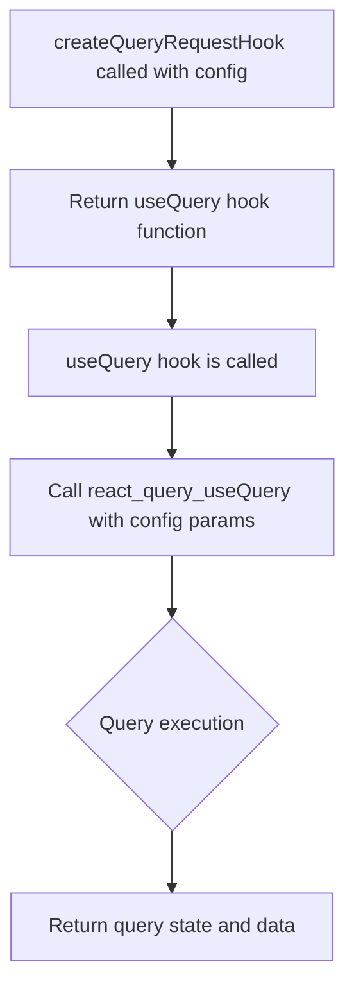
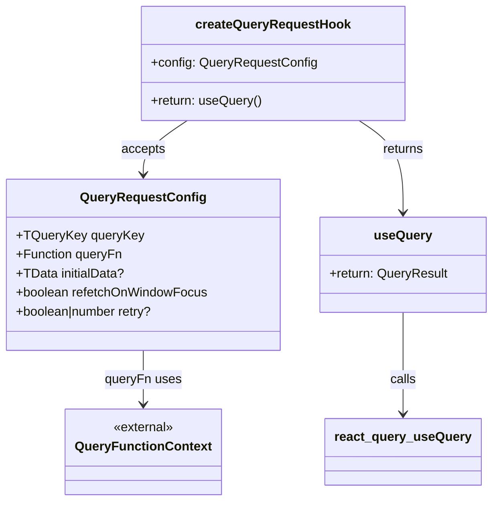
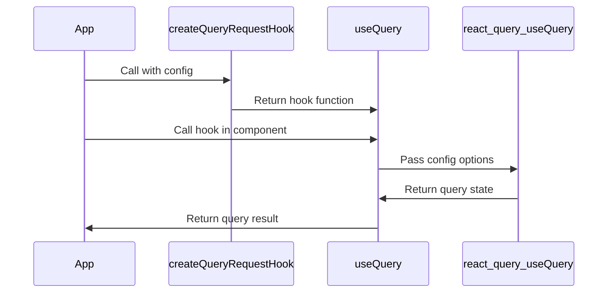
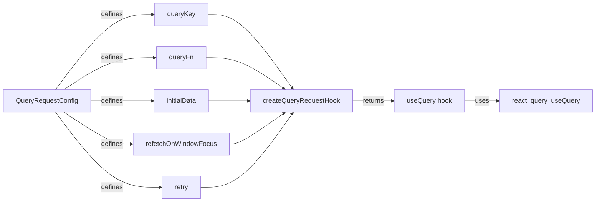

# Diagram: web/portal/src/shared/hooks/createQueryRequestHook.ts

> Auto-generated by Obscura crawlers

## Diagram 1

### SVG

<svg id="container" width="276" xmlns="http://www.w3.org/2000/svg" class="flowchart" height="804.109375" viewBox="0 0 276 804.109375" role="graphics-document document" aria-roledescription="flowchart-v2"><g><marker id="container_flowchart-v2-pointEnd" class="marker flowchart-v2" viewBox="0 0 10 10" refX="5" refY="5" markerUnits="userSpaceOnUse" markerWidth="8" markerHeight="8" orient="auto"><path d="M 0 0 L 10 5 L 0 10 z" class="arrowMarkerPath" style="stroke-width: 1; stroke-dasharray: 1, 0;"></path></marker><marker id="container_flowchart-v2-pointStart" class="marker flowchart-v2" viewBox="0 0 10 10" refX="4.5" refY="5" markerUnits="userSpaceOnUse" markerWidth="8" markerHeight="8" orient="auto"><path d="M 0 5 L 10 10 L 10 0 z" class="arrowMarkerPath" style="stroke-width: 1; stroke-dasharray: 1, 0;"></path></marker><marker id="container_flowchart-v2-circleEnd" class="marker flowchart-v2" viewBox="0 0 10 10" refX="11" refY="5" markerUnits="userSpaceOnUse" markerWidth="11" markerHeight="11" orient="auto"><circle cx="5" cy="5" r="5" class="arrowMarkerPath" style="stroke-width: 1; stroke-dasharray: 1, 0;"></circle></marker><marker id="container_flowchart-v2-circleStart" class="marker flowchart-v2" viewBox="0 0 10 10" refX="-1" refY="5" markerUnits="userSpaceOnUse" markerWidth="11" markerHeight="11" orient="auto"><circle cx="5" cy="5" r="5" class="arrowMarkerPath" style="stroke-width: 1; stroke-dasharray: 1, 0;"></circle></marker><marker id="container_flowchart-v2-crossEnd" class="marker cross flowchart-v2" viewBox="0 0 11 11" refX="12" refY="5.2" markerUnits="userSpaceOnUse" markerWidth="11" markerHeight="11" orient="auto"><path d="M 1,1 l 9,9 M 10,1 l -9,9" class="arrowMarkerPath" style="stroke-width: 2; stroke-dasharray: 1, 0;"></path></marker><marker id="container_flowchart-v2-crossStart" class="marker cross flowchart-v2" viewBox="0 0 11 11" refX="-1" refY="5.2" markerUnits="userSpaceOnUse" markerWidth="11" markerHeight="11" orient="auto"><path d="M 1,1 l 9,9 M 10,1 l -9,9" class="arrowMarkerPath" style="stroke-width: 2; stroke-dasharray: 1, 0;"></path></marker><g class="root"><g class="clusters"></g><g class="edgePaths"><path d="M138,86L138,90.167C138,94.333,138,102.667,138,110.333C138,118,138,125,138,128.5L138,132" id="L_A_B_0" class="edge-thickness-normal edge-pattern-solid edge-thickness-normal edge-pattern-solid flowchart-link" style=";" data-edge="true" data-et="edge" data-id="L_A_B_0" data-points="W3sieCI6MTM4LCJ5Ijo4Nn0seyJ4IjoxMzgsInkiOjExMX0seyJ4IjoxMzgsInkiOjEzNn1d" marker-end="url(#container_flowchart-v2-pointEnd)"></path><path d="M138,214L138,218.167C138,222.333,138,230.667,138,238.333C138,246,138,253,138,256.5L138,260" id="L_B_C_0" class="edge-thickness-normal edge-pattern-solid edge-thickness-normal edge-pattern-solid flowchart-link" style=";" data-edge="true" data-et="edge" data-id="L_B_C_0" data-points="W3sieCI6MTM4LCJ5IjoyMTR9LHsieCI6MTM4LCJ5IjoyMzl9LHsieCI6MTM4LCJ5IjoyNjR9XQ==" marker-end="url(#container_flowchart-v2-pointEnd)"></path><path d="M138,318L138,322.167C138,326.333,138,334.667,138,342.333C138,350,138,357,138,360.5L138,364" id="L_C_D_0" class="edge-thickness-normal edge-pattern-solid edge-thickness-normal edge-pattern-solid flowchart-link" style=";" data-edge="true" data-et="edge" data-id="L_C_D_0" data-points="W3sieCI6MTM4LCJ5IjozMTh9LHsieCI6MTM4LCJ5IjozNDN9LHsieCI6MTM4LCJ5IjozNjh9XQ==" marker-end="url(#container_flowchart-v2-pointEnd)"></path><path d="M138,446L138,450.167C138,454.333,138,462.667,138,470.333C138,478,138,485,138,488.5L138,492" id="L_D_E_0" class="edge-thickness-normal edge-pattern-solid edge-thickness-normal edge-pattern-solid flowchart-link" style=";" data-edge="true" data-et="edge" data-id="L_D_E_0" data-points="W3sieCI6MTM4LCJ5Ijo0NDZ9LHsieCI6MTM4LCJ5Ijo0NzF9LHsieCI6MTM4LCJ5Ijo0OTZ9XQ==" marker-end="url(#container_flowchart-v2-pointEnd)"></path><path d="M138,668.109L138,672.276C138,676.443,138,684.776,138,692.443C138,700.109,138,707.109,138,710.609L138,714.109" id="L_E_F_0" class="edge-thickness-normal edge-pattern-solid edge-thickness-normal edge-pattern-solid flowchart-link" style=";" data-edge="true" data-et="edge" data-id="L_E_F_0" data-points="W3sieCI6MTM4LCJ5Ijo2NjguMTA5Mzc1fSx7IngiOjEzOCwieSI6NjkzLjEwOTM3NX0seyJ4IjoxMzgsInkiOjcxOC4xMDkzNzV9XQ==" marker-end="url(#container_flowchart-v2-pointEnd)"></path></g><g class="edgeLabels"><g class="edgeLabel"><g class="label" data-id="L_A_B_0" transform="translate(0, 0)"><foreignObject width="0" height="0">

</foreignObject></g></g><g class="edgeLabel"><g class="label" data-id="L_B_C_0" transform="translate(0, 0)"><foreignObject width="0" height="0">

</foreignObject></g></g><g class="edgeLabel"><g class="label" data-id="L_C_D_0" transform="translate(0, 0)"><foreignObject width="0" height="0">

</foreignObject></g></g><g class="edgeLabel"><g class="label" data-id="L_D_E_0" transform="translate(0, 0)"><foreignObject width="0" height="0">

</foreignObject></g></g><g class="edgeLabel"><g class="label" data-id="L_E_F_0" transform="translate(0, 0)"><foreignObject width="0" height="0">

</foreignObject></g></g></g><g class="nodes"><g class="node default" id="flowchart-A-0" transform="translate(138, 47)"><rect class="basic label-container" style="" x="-130" y="-39" width="260" height="78"></rect><g class="label" style="" transform="translate(-100, -24)"><rect></rect><foreignObject width="200" height="48">

createQueryRequestHook called with config

</foreignObject></g></g><g class="node default" id="flowchart-B-1" transform="translate(138, 175)"><rect class="basic label-container" style="" x="-130" y="-39" width="260" height="78"></rect><g class="label" style="" transform="translate(-100, -24)"><rect></rect><foreignObject width="200" height="48">

Return useQuery hook function

</foreignObject></g></g><g class="node default" id="flowchart-C-3" transform="translate(138, 291)"><rect class="basic label-container" style="" x="-116.609375" y="-27" width="233.21875" height="54"></rect><g class="label" style="" transform="translate(-86.609375, -12)"><rect></rect><foreignObject width="173.21875" height="24">

useQuery hook is called

</foreignObject></g></g><g class="node default" id="flowchart-D-5" transform="translate(138, 407)"><rect class="basic label-container" style="" x="-130" y="-39" width="260" height="78"></rect><g class="label" style="" transform="translate(-100, -24)"><rect></rect><foreignObject width="200" height="48">

Call react_query_useQuery with config params

</foreignObject></g></g><g class="node default" id="flowchart-E-7" transform="translate(138, 582.0546875)"><polygon points="86.0546875,0 172.109375,-86.0546875 86.0546875,-172.109375 0,-86.0546875" class="label-container" transform="translate(-85.5546875, 86.0546875)"></polygon><g class="label" style="" transform="translate(-59.0546875, -12)"><rect></rect><foreignObject width="118.109375" height="24">

Query execution

</foreignObject></g></g><g class="node default" id="flowchart-F-9" transform="translate(138, 757.109375)"><rect class="basic label-container" style="" x="-130" y="-39" width="260" height="78"></rect><g class="label" style="" transform="translate(-100, -24)"><rect></rect><foreignObject width="200" height="48">

Return query state and data

</foreignObject></g></g></g></g></g></svg>

## Diagram 2

### SVG

<svg id="container" width="614.59375" xmlns="http://www.w3.org/2000/svg" class="classDiagram" height="632" viewBox="0 0 614.59375 632" role="graphics-document document" aria-roledescription="class"><g><defs><marker id="container_class-aggregationStart" class="marker aggregation class" refX="18" refY="7" markerWidth="190" markerHeight="240" orient="auto"><path d="M 18,7 L9,13 L1,7 L9,1 Z"></path></marker></defs><defs><marker id="container_class-aggregationEnd" class="marker aggregation class" refX="1" refY="7" markerWidth="20" markerHeight="28" orient="auto"><path d="M 18,7 L9,13 L1,7 L9,1 Z"></path></marker></defs><defs><marker id="container_class-extensionStart" class="marker extension class" refX="18" refY="7" markerWidth="190" markerHeight="240" orient="auto"><path d="M 1,7 L18,13 V 1 Z"></path></marker></defs><defs><marker id="container_class-extensionEnd" class="marker extension class" refX="1" refY="7" markerWidth="20" markerHeight="28" orient="auto"><path d="M 1,1 V 13 L18,7 Z"></path></marker></defs><defs><marker id="container_class-compositionStart" class="marker composition class" refX="18" refY="7" markerWidth="190" markerHeight="240" orient="auto"><path d="M 18,7 L9,13 L1,7 L9,1 Z"></path></marker></defs><defs><marker id="container_class-compositionEnd" class="marker composition class" refX="1" refY="7" markerWidth="20" markerHeight="28" orient="auto"><path d="M 18,7 L9,13 L1,7 L9,1 Z"></path></marker></defs><defs><marker id="container_class-dependencyStart" class="marker dependency class" refX="6" refY="7" markerWidth="190" markerHeight="240" orient="auto"><path d="M 5,7 L9,13 L1,7 L9,1 Z"></path></marker></defs><defs><marker id="container_class-dependencyEnd" class="marker dependency class" refX="13" refY="7" markerWidth="20" markerHeight="28" orient="auto"><path d="M 18,7 L9,13 L14,7 L9,1 Z"></path></marker></defs><defs><marker id="container_class-lollipopStart" class="marker lollipop class" refX="13" refY="7" markerWidth="190" markerHeight="240" orient="auto"><circle stroke="black" fill="transparent" cx="7" cy="7" r="6"></circle></marker></defs><defs><marker id="container_class-lollipopEnd" class="marker lollipop class" refX="1" refY="7" markerWidth="190" markerHeight="240" orient="auto"><circle stroke="black" fill="transparent" cx="7" cy="7" r="6"></circle></marker></defs><g class="root"><g class="clusters"></g><g class="edgePaths"><path d="M178.098,442L178.098,448.167C178.098,454.333,178.098,466.667,178.098,478C178.098,489.333,178.098,499.667,178.098,504.833L178.098,510" id="id_QueryRequestConfig_QueryFunctionContext_1" class="edge-thickness-normal edge-pattern-solid relation" style=";;;" data-edge="true" data-et="edge" data-id="id_QueryRequestConfig_QueryFunctionContext_1" data-points="W3sieCI6MTc4LjA5NzY1NjI1LCJ5Ijo0NDJ9LHsieCI6MTc4LjA5NzY1NjI1LCJ5Ijo0Nzl9LHsieCI6MTc4LjA5NzY1NjI1LCJ5Ijo1MTZ9XQ==" marker-end="url(#container_class-dependencyEnd)"></path><path d="M233.139,152L223.965,158.167C214.792,164.333,196.445,176.667,187.271,188C178.098,199.333,178.098,209.667,178.098,214.833L178.098,220" id="id_createQueryRequestHook_QueryRequestConfig_2" class="edge-thickness-normal edge-pattern-solid relation" style=";;;" data-edge="true" data-et="edge" data-id="id_createQueryRequestHook_QueryRequestConfig_2" data-points="W3sieCI6MjMzLjEzODg2ODk3OTM1NzgsInkiOjE1Mn0seyJ4IjoxNzguMDk3NjU2MjUsInkiOjE4OX0seyJ4IjoxNzguMDk3NjU2MjUsInkiOjIyNn1d" marker-end="url(#container_class-dependencyEnd)"></path><path d="M447.353,152L456.527,158.167C465.7,164.333,484.047,176.667,493.221,196C502.395,215.333,502.395,241.667,502.395,254.833L502.395,268" id="id_createQueryRequestHook_useQuery_3" class="edge-thickness-normal edge-pattern-solid relation" style=";;;" data-edge="true" data-et="edge" data-id="id_createQueryRequestHook_useQuery_3" data-points="W3sieCI6NDQ3LjM1MzMxODUyMDY0MjIzLCJ5IjoxNTJ9LHsieCI6NTAyLjM5NDUzMTI1LCJ5IjoxODl9LHsieCI6NTAyLjM5NDUzMTI1LCJ5IjoyNzR9XQ==" marker-end="url(#container_class-dependencyEnd)"></path><path d="M502.395,394L502.395,408.167C502.395,422.333,502.395,450.667,502.395,472C502.395,493.333,502.395,507.667,502.395,514.833L502.395,522" id="id_useQuery_react_query_useQuery_4" class="edge-thickness-normal edge-pattern-solid relation" style=";;;" data-edge="true" data-et="edge" data-id="id_useQuery_react_query_useQuery_4" data-points="W3sieCI6NTAyLjM5NDUzMTI1LCJ5IjozOTR9LHsieCI6NTAyLjM5NDUzMTI1LCJ5Ijo0Nzl9LHsieCI6NTAyLjM5NDUzMTI1LCJ5Ijo1Mjh9XQ==" marker-end="url(#container_class-dependencyEnd)"></path></g><g class="edgeLabels"><g class="edgeLabel" transform="translate(178.09765625, 479)"><g class="label" data-id="id_QueryRequestConfig_QueryFunctionContext_1" transform="translate(-47.7734375, -12)"><foreignObject width="95.546875" height="24">

queryFn uses

</foreignObject></g></g><g class="edgeLabel" transform="translate(178.09765625, 189)"><g class="label" data-id="id_createQueryRequestHook_QueryRequestConfig_2" transform="translate(-27.421875, -12)"><foreignObject width="54.84375" height="24">

accepts

</foreignObject></g></g><g class="edgeLabel" transform="translate(502.39453125, 189)"><g class="label" data-id="id_createQueryRequestHook_useQuery_3" transform="translate(-26.265625, -12)"><foreignObject width="52.53125" height="24">

returns

</foreignObject></g></g><g class="edgeLabel" transform="translate(502.39453125, 479)"><g class="label" data-id="id_useQuery_react_query_useQuery_4" transform="translate(-16.4453125, -12)"><foreignObject width="32.890625" height="24">

calls

</foreignObject></g></g></g><g class="nodes"><g class="node default" id="classId-QueryRequestConfig-0" transform="translate(178.09765625, 334)"><g class="basic label-container"><path d="M-170.09765625 -108 L170.09765625 -108 L170.09765625 108 L-170.09765625 108" stroke="none" stroke-width="0" fill="#ECECFF" style=""></path><path d="M-170.09765625 -108 C-67.15348095017184 -108, 35.79069434965632 -108, 170.09765625 -108 M-170.09765625 -108 C-60.28753146150997 -108, 49.52259332698006 -108, 170.09765625 -108 M170.09765625 -108 C170.09765625 -25.860130659326614, 170.09765625 56.27973868134677, 170.09765625 108 M170.09765625 -108 C170.09765625 -22.10950287059636, 170.09765625 63.78099425880728, 170.09765625 108 M170.09765625 108 C46.46531400798058 108, -77.16702823403884 108, -170.09765625 108 M170.09765625 108 C95.38894786179614 108, 20.68023947359228 108, -170.09765625 108 M-170.09765625 108 C-170.09765625 33.59608091173858, -170.09765625 -40.807838176522836, -170.09765625 -108 M-170.09765625 108 C-170.09765625 54.55433778313999, -170.09765625 1.1086755662799845, -170.09765625 -108" stroke="#9370DB" stroke-width="1.3" fill="none" stroke-dasharray="0 0" style=""></path></g><g class="annotation-group text" transform="translate(0, -84)"></g><g class="label-group text" transform="translate(-74.7734375, -84)"><g class="label" style="font-weight: bolder" transform="translate(0,-12)"><foreignObject width="149.546875" height="24">

QueryRequestConfig

</foreignObject></g></g><g class="members-group text" transform="translate(-158.09765625, -36)"><g class="label" style="" transform="translate(0,-12)"><foreignObject width="155.390625" height="24">

+TQueryKey queryKey

</foreignObject></g><g class="label" style="" transform="translate(0,12)"><foreignObject width="133.15625" height="24">

+Function queryFn

</foreignObject></g><g class="label" style="" transform="translate(0,36)"><foreignObject width="134.921875" height="24">

+TData initialData?

</foreignObject></g><g class="label" style="" transform="translate(0,60)"><foreignObject width="241.421875" height="24">

+boolean refetchOnWindowFocus

</foreignObject></g><g class="label" style="" transform="translate(0,84)"><foreignObject width="176.03125" height="24">

+boolean|number retry?

</foreignObject></g></g><g class="methods-group text" transform="translate(-158.09765625, 108)"></g><g class="divider" style=""><path d="M-170.09765625 -60 C-40.57554581058568 -60, 88.94656462882864 -60, 170.09765625 -60 M-170.09765625 -60 C-81.88617702293253 -60, 6.3253022041349425 -60, 170.09765625 -60" stroke="#9370DB" stroke-width="1.3" fill="none" stroke-dasharray="0 0" style=""></path></g><g class="divider" style=""><path d="M-170.09765625 84 C-68.26762103274216 84, 33.56241418451569 84, 170.09765625 84 M-170.09765625 84 C-39.50084635100157 84, 91.09596354799686 84, 170.09765625 84" stroke="#9370DB" stroke-width="1.3" fill="none" stroke-dasharray="0 0" style=""></path></g></g><g class="node default" id="classId-QueryFunctionContext-1" transform="translate(178.09765625, 570)"><g class="basic label-container"><path d="M-93.296875 -54 L93.296875 -54 L93.296875 54 L-93.296875 54" stroke="none" stroke-width="0" fill="#ECECFF" style=""></path><path d="M-93.296875 -54 C-24.588147994148997 -54, 44.120579011702006 -54, 93.296875 -54 M-93.296875 -54 C-37.532416539241275 -54, 18.23204192151745 -54, 93.296875 -54 M93.296875 -54 C93.296875 -17.735288327956972, 93.296875 18.529423344086055, 93.296875 54 M93.296875 -54 C93.296875 -25.01738897807117, 93.296875 3.9652220438576578, 93.296875 54 M93.296875 54 C29.442026414044363 54, -34.41282217191127 54, -93.296875 54 M93.296875 54 C47.485420935282605 54, 1.6739668705652093 54, -93.296875 54 M-93.296875 54 C-93.296875 17.870502606149316, -93.296875 -18.25899478770137, -93.296875 -54 M-93.296875 54 C-93.296875 19.29699444736258, -93.296875 -15.406011105274843, -93.296875 -54" stroke="#9370DB" stroke-width="1.3" fill="none" stroke-dasharray="0 0" style=""></path></g><g class="annotation-group text" transform="translate(-38.65625, -30)"><g class="label" style="" transform="translate(0,-12)"><foreignObject width="77.3125" height="24">

«external»

</foreignObject></g></g><g class="label-group text" transform="translate(-81.296875, -6)"><g class="label" style="font-weight: bolder" transform="translate(0,-12)"><foreignObject width="162.59375" height="24">

QueryFunctionContext

</foreignObject></g></g><g class="members-group text" transform="translate(-81.296875, 42)"></g><g class="methods-group text" transform="translate(-81.296875, 72)"></g><g class="divider" style=""><path d="M-93.296875 18 C-54.12311508087106 18, -14.949355161742119 18, 93.296875 18 M-93.296875 18 C-44.405406615508774 18, 4.486061768982452 18, 93.296875 18" stroke="#9370DB" stroke-width="1.3" fill="none" stroke-dasharray="0 0" style=""></path></g><g class="divider" style=""><path d="M-93.296875 36 C-28.40516240263888 36, 36.48655019472224 36, 93.296875 36 M-93.296875 36 C-39.51434527690439 36, 14.268184446191214 36, 93.296875 36" stroke="#9370DB" stroke-width="1.3" fill="none" stroke-dasharray="0 0" style=""></path></g></g><g class="node default" id="classId-createQueryRequestHook-2" transform="translate(340.24609375, 80)"><g class="basic label-container"><path d="M-162.2421875 -72 L162.2421875 -72 L162.2421875 72 L-162.2421875 72" stroke="none" stroke-width="0" fill="#ECECFF" style=""></path><path d="M-162.2421875 -72 C-90.86227383716572 -72, -19.482360174331433 -72, 162.2421875 -72 M-162.2421875 -72 C-84.66190587844395 -72, -7.081624256887892 -72, 162.2421875 -72 M162.2421875 -72 C162.2421875 -38.86867113736815, 162.2421875 -5.7373422747363065, 162.2421875 72 M162.2421875 -72 C162.2421875 -32.004214962290234, 162.2421875 7.991570075419531, 162.2421875 72 M162.2421875 72 C45.14182989011701 72, -71.95852771976598 72, -162.2421875 72 M162.2421875 72 C69.27442601157391 72, -23.693335476852184 72, -162.2421875 72 M-162.2421875 72 C-162.2421875 23.388996212888372, -162.2421875 -25.222007574223255, -162.2421875 -72 M-162.2421875 72 C-162.2421875 14.866462892886268, -162.2421875 -42.26707421422746, -162.2421875 -72" stroke="#9370DB" stroke-width="1.3" fill="none" stroke-dasharray="0 0" style=""></path></g><g class="annotation-group text" transform="translate(0, -48)"></g><g class="label-group text" transform="translate(-93.8125, -48)"><g class="label" style="font-weight: bolder" transform="translate(0,-12)"><foreignObject width="187.625" height="24">

createQueryRequestHook

</foreignObject></g></g><g class="members-group text" transform="translate(-150.2421875, 0)"><g class="label" style="" transform="translate(0,-12)"><foreignObject width="206.671875" height="24">

+config: QueryRequestConfig

</foreignObject></g></g><g class="methods-group text" transform="translate(-150.2421875, 48)"><g class="label" style="" transform="translate(0,-12)"><foreignObject width="140.140625" height="24">

+return: useQuery()

</foreignObject></g></g><g class="divider" style=""><path d="M-162.2421875 -24 C-63.28224036147593 -24, 35.677706777048144 -24, 162.2421875 -24 M-162.2421875 -24 C-48.690576956732414 -24, 64.86103358653517 -24, 162.2421875 -24" stroke="#9370DB" stroke-width="1.3" fill="none" stroke-dasharray="0 0" style=""></path></g><g class="divider" style=""><path d="M-162.2421875 24 C-58.397965686274006 24, 45.44625612745199 24, 162.2421875 24 M-162.2421875 24 C-58.32421098886907 24, 45.59376552226186 24, 162.2421875 24" stroke="#9370DB" stroke-width="1.3" fill="none" stroke-dasharray="0 0" style=""></path></g></g><g class="node default" id="classId-useQuery-3" transform="translate(502.39453125, 334)"><g class="basic label-container"><path d="M-104.19921875 -60 L104.19921875 -60 L104.19921875 60 L-104.19921875 60" stroke="none" stroke-width="0" fill="#ECECFF" style=""></path><path d="M-104.19921875 -60 C-21.584517255626622 -60, 61.030184238746756 -60, 104.19921875 -60 M-104.19921875 -60 C-27.74510470005943 -60, 48.70900934988114 -60, 104.19921875 -60 M104.19921875 -60 C104.19921875 -14.373999138714758, 104.19921875 31.252001722570483, 104.19921875 60 M104.19921875 -60 C104.19921875 -19.41047478721631, 104.19921875 21.179050425567382, 104.19921875 60 M104.19921875 60 C59.26174622789821 60, 14.324273705796415 60, -104.19921875 60 M104.19921875 60 C46.175890209466026 60, -11.847438331067949 60, -104.19921875 60 M-104.19921875 60 C-104.19921875 22.013618550861175, -104.19921875 -15.97276289827765, -104.19921875 -60 M-104.19921875 60 C-104.19921875 35.465071287130954, -104.19921875 10.930142574261907, -104.19921875 -60" stroke="#9370DB" stroke-width="1.3" fill="none" stroke-dasharray="0 0" style=""></path></g><g class="annotation-group text" transform="translate(0, -36)"></g><g class="label-group text" transform="translate(-34.7265625, -36)"><g class="label" style="font-weight: bolder" transform="translate(0,-12)"><foreignObject width="69.453125" height="24">

useQuery

</foreignObject></g></g><g class="members-group text" transform="translate(-92.19921875, 12)"><g class="label" style="" transform="translate(0,-12)"><foreignObject width="149.671875" height="24">

+return: QueryResult

</foreignObject></g></g><g class="methods-group text" transform="translate(-92.19921875, 60)"></g><g class="divider" style=""><path d="M-104.19921875 -12 C-33.69226137271991 -12, 36.814696004560176 -12, 104.19921875 -12 M-104.19921875 -12 C-53.33862890027247 -12, -2.478039050544936 -12, 104.19921875 -12" stroke="#9370DB" stroke-width="1.3" fill="none" stroke-dasharray="0 0" style=""></path></g><g class="divider" style=""><path d="M-104.19921875 36 C-41.572227490001396 36, 21.05476376999721 36, 104.19921875 36 M-104.19921875 36 C-53.35492494997972 36, -2.510631149959437 36, 104.19921875 36" stroke="#9370DB" stroke-width="1.3" fill="none" stroke-dasharray="0 0" style=""></path></g></g><g class="node default" id="classId-react_query_useQuery-4" transform="translate(502.39453125, 570)"><g class="basic label-container"><path d="M-94.234375 -42 L94.234375 -42 L94.234375 42 L-94.234375 42" stroke="none" stroke-width="0" fill="#ECECFF" style=""></path><path d="M-94.234375 -42 C-35.388705491073274 -42, 23.45696401785345 -42, 94.234375 -42 M-94.234375 -42 C-50.138595799458905 -42, -6.04281659891781 -42, 94.234375 -42 M94.234375 -42 C94.234375 -17.695193594082077, 94.234375 6.609612811835845, 94.234375 42 M94.234375 -42 C94.234375 -8.64451848607765, 94.234375 24.7109630278447, 94.234375 42 M94.234375 42 C51.275442827070606 42, 8.316510654141211 42, -94.234375 42 M94.234375 42 C46.01085903514469 42, -2.2126569297106187 42, -94.234375 42 M-94.234375 42 C-94.234375 20.13736884215308, -94.234375 -1.7252623156938398, -94.234375 -42 M-94.234375 42 C-94.234375 15.662265502954316, -94.234375 -10.675468994091368, -94.234375 -42" stroke="#9370DB" stroke-width="1.3" fill="none" stroke-dasharray="0 0" style=""></path></g><g class="annotation-group text" transform="translate(0, -18)"></g><g class="label-group text" transform="translate(-82.234375, -18)"><g class="label" style="font-weight: bolder" transform="translate(0,-12)"><foreignObject width="164.46875" height="24">

react_query_useQuery

</foreignObject></g></g><g class="members-group text" transform="translate(-82.234375, 30)"></g><g class="methods-group text" transform="translate(-82.234375, 60)"></g><g class="divider" style=""><path d="M-94.234375 6 C-34.9161498439153 6, 24.4020753121694 6, 94.234375 6 M-94.234375 6 C-21.541152624165917 6, 51.152069751668165 6, 94.234375 6" stroke="#9370DB" stroke-width="1.3" fill="none" stroke-dasharray="0 0" style=""></path></g><g class="divider" style=""><path d="M-94.234375 24 C-21.29263681491277 24, 51.64910137017446 24, 94.234375 24 M-94.234375 24 C-20.157880335604162 24, 53.918614328791676 24, 94.234375 24" stroke="#9370DB" stroke-width="1.3" fill="none" stroke-dasharray="0 0" style=""></path></g></g></g></g></g></svg>

## Diagram 3

### SVG

<svg id="container" width="938" xmlns="http://www.w3.org/2000/svg" height="459" viewBox="-50 -10 938 459" role="graphics-document document" aria-roledescription="sequence"><g><rect x="656" y="373" fill="#eaeaea" stroke="#666" width="182" height="65" name="react_query_useQuery" rx="3" ry="3" class="actor actor-bottom"></rect><text x="747" y="405.5" dominant-baseline="central" alignment-baseline="central" class="actor actor-box" style="text-anchor: middle; font-size: 16px; font-weight: 400;"><tspan x="747" dy="0">react_query_useQuery</tspan></text></g><g><rect x="456" y="373" fill="#eaeaea" stroke="#666" width="150" height="65" name="useQuery" rx="3" ry="3" class="actor actor-bottom"></rect><text x="531" y="405.5" dominant-baseline="central" alignment-baseline="central" class="actor actor-box" style="text-anchor: middle; font-size: 16px; font-weight: 400;"><tspan x="531" dy="0">useQuery</tspan></text></g><g><rect x="200" y="373" fill="#eaeaea" stroke="#666" width="206" height="65" name="createQueryRequestHook" rx="3" ry="3" class="actor actor-bottom"></rect><text x="303" y="405.5" dominant-baseline="central" alignment-baseline="central" class="actor actor-box" style="text-anchor: middle; font-size: 16px; font-weight: 400;"><tspan x="303" dy="0">createQueryRequestHook</tspan></text></g><g><rect x="0" y="373" fill="#eaeaea" stroke="#666" width="150" height="65" name="App" rx="3" ry="3" class="actor actor-bottom"></rect><text x="75" y="405.5" dominant-baseline="central" alignment-baseline="central" class="actor actor-box" style="text-anchor: middle; font-size: 16px; font-weight: 400;"><tspan x="75" dy="0">App</tspan></text></g><g><line id="actor3" x1="747" y1="65" x2="747" y2="373" class="actor-line 200" stroke-width="0.5px" stroke="#999" name="react_query_useQuery"></line><g id="root-3"><rect x="656" y="0" fill="#eaeaea" stroke="#666" width="182" height="65" name="react_query_useQuery" rx="3" ry="3" class="actor actor-top"></rect><text x="747" y="32.5" dominant-baseline="central" alignment-baseline="central" class="actor actor-box" style="text-anchor: middle; font-size: 16px; font-weight: 400;"><tspan x="747" dy="0">react_query_useQuery</tspan></text></g></g><g><line id="actor2" x1="531" y1="65" x2="531" y2="373" class="actor-line 200" stroke-width="0.5px" stroke="#999" name="useQuery"></line><g id="root-2"><rect x="456" y="0" fill="#eaeaea" stroke="#666" width="150" height="65" name="useQuery" rx="3" ry="3" class="actor actor-top"></rect><text x="531" y="32.5" dominant-baseline="central" alignment-baseline="central" class="actor actor-box" style="text-anchor: middle; font-size: 16px; font-weight: 400;"><tspan x="531" dy="0">useQuery</tspan></text></g></g><g><line id="actor1" x1="303" y1="65" x2="303" y2="373" class="actor-line 200" stroke-width="0.5px" stroke="#999" name="createQueryRequestHook"></line><g id="root-1"><rect x="200" y="0" fill="#eaeaea" stroke="#666" width="206" height="65" name="createQueryRequestHook" rx="3" ry="3" class="actor actor-top"></rect><text x="303" y="32.5" dominant-baseline="central" alignment-baseline="central" class="actor actor-box" style="text-anchor: middle; font-size: 16px; font-weight: 400;"><tspan x="303" dy="0">createQueryRequestHook</tspan></text></g></g><g><line id="actor0" x1="75" y1="65" x2="75" y2="373" class="actor-line 200" stroke-width="0.5px" stroke="#999" name="App"></line><g id="root-0"><rect x="0" y="0" fill="#eaeaea" stroke="#666" width="150" height="65" name="App" rx="3" ry="3" class="actor actor-top"></rect><text x="75" y="32.5" dominant-baseline="central" alignment-baseline="central" class="actor actor-box" style="text-anchor: middle; font-size: 16px; font-weight: 400;"><tspan x="75" dy="0">App</tspan></text></g></g><g></g><defs><symbol id="computer" width="24" height="24"><path transform="scale(.5)" d="M2 2v13h20v-13h-20zm18 11h-16v-9h16v9zm-10.228 6l.466-1h3.524l.467 1h-4.457zm14.228 3h-24l2-6h2.104l-1.33 4h18.45l-1.297-4h2.073l2 6zm-5-10h-14v-7h14v7z"></path></symbol></defs><defs><symbol id="database" fill-rule="evenodd" clip-rule="evenodd"><path transform="scale(.5)" d="M12.258.001l.256.004.255.005.253.008.251.01.249.012.247.015.246.016.242.019.241.02.239.023.236.024.233.027.231.028.229.031.225.032.223.034.22.036.217.038.214.04.211.041.208.043.205.045.201.046.198.048.194.05.191.051.187.053.183.054.18.056.175.057.172.059.168.06.163.061.16.063.155.064.15.066.074.033.073.033.071.034.07.034.069.035.068.035.067.035.066.035.064.036.064.036.062.036.06.036.06.037.058.037.058.037.055.038.055.038.053.038.052.038.051.039.05.039.048.039.047.039.045.04.044.04.043.04.041.04.04.041.039.041.037.041.036.041.034.041.033.042.032.042.03.042.029.042.027.042.026.043.024.043.023.043.021.043.02.043.018.044.017.043.015.044.013.044.012.044.011.045.009.044.007.045.006.045.004.045.002.045.001.045v17l-.001.045-.002.045-.004.045-.006.045-.007.045-.009.044-.011.045-.012.044-.013.044-.015.044-.017.043-.018.044-.02.043-.021.043-.023.043-.024.043-.026.043-.027.042-.029.042-.03.042-.032.042-.033.042-.034.041-.036.041-.037.041-.039.041-.04.041-.041.04-.043.04-.044.04-.045.04-.047.039-.048.039-.05.039-.051.039-.052.038-.053.038-.055.038-.055.038-.058.037-.058.037-.06.037-.06.036-.062.036-.064.036-.064.036-.066.035-.067.035-.068.035-.069.035-.07.034-.071.034-.073.033-.074.033-.15.066-.155.064-.16.063-.163.061-.168.06-.172.059-.175.057-.18.056-.183.054-.187.053-.191.051-.194.05-.198.048-.201.046-.205.045-.208.043-.211.041-.214.04-.217.038-.22.036-.223.034-.225.032-.229.031-.231.028-.233.027-.236.024-.239.023-.241.02-.242.019-.246.016-.247.015-.249.012-.251.01-.253.008-.255.005-.256.004-.258.001-.258-.001-.256-.004-.255-.005-.253-.008-.251-.01-.249-.012-.247-.015-.245-.016-.243-.019-.241-.02-.238-.023-.236-.024-.234-.027-.231-.028-.228-.031-.226-.032-.223-.034-.22-.036-.217-.038-.214-.04-.211-.041-.208-.043-.204-.045-.201-.046-.198-.048-.195-.05-.19-.051-.187-.053-.184-.054-.179-.056-.176-.057-.172-.059-.167-.06-.164-.061-.159-.063-.155-.064-.151-.066-.074-.033-.072-.033-.072-.034-.07-.034-.069-.035-.068-.035-.067-.035-.066-.035-.064-.036-.063-.036-.062-.036-.061-.036-.06-.037-.058-.037-.057-.037-.056-.038-.055-.038-.053-.038-.052-.038-.051-.039-.049-.039-.049-.039-.046-.039-.046-.04-.044-.04-.043-.04-.041-.04-.04-.041-.039-.041-.037-.041-.036-.041-.034-.041-.033-.042-.032-.042-.03-.042-.029-.042-.027-.042-.026-.043-.024-.043-.023-.043-.021-.043-.02-.043-.018-.044-.017-.043-.015-.044-.013-.044-.012-.044-.011-.045-.009-.044-.007-.045-.006-.045-.004-.045-.002-.045-.001-.045v-17l.001-.045.002-.045.004-.045.006-.045.007-.045.009-.044.011-.045.012-.044.013-.044.015-.044.017-.043.018-.044.02-.043.021-.043.023-.043.024-.043.026-.043.027-.042.029-.042.03-.042.032-.042.033-.042.034-.041.036-.041.037-.041.039-.041.04-.041.041-.04.043-.04.044-.04.046-.04.046-.039.049-.039.049-.039.051-.039.052-.038.053-.038.055-.038.056-.038.057-.037.058-.037.06-.037.061-.036.062-.036.063-.036.064-.036.066-.035.067-.035.068-.035.069-.035.07-.034.072-.034.072-.033.074-.033.151-.066.155-.064.159-.063.164-.061.167-.06.172-.059.176-.057.179-.056.184-.054.187-.053.19-.051.195-.05.198-.048.201-.046.204-.045.208-.043.211-.041.214-.04.217-.038.22-.036.223-.034.226-.032.228-.031.231-.028.234-.027.236-.024.238-.023.241-.02.243-.019.245-.016.247-.015.249-.012.251-.01.253-.008.255-.005.256-.004.258-.001.258.001zm-9.258 20.499v.01l.001.021.003.021.004.022.005.021.006.022.007.022.009.023.01.022.011.023.012.023.013.023.015.023.016.024.017.023.018.024.019.024.021.024.022.025.023.024.024.025.052.049.056.05.061.051.066.051.07.051.075.051.079.052.084.052.088.052.092.052.097.052.102.051.105.052.11.052.114.051.119.051.123.051.127.05.131.05.135.05.139.048.144.049.147.047.152.047.155.047.16.045.163.045.167.043.171.043.176.041.178.041.183.039.187.039.19.037.194.035.197.035.202.033.204.031.209.03.212.029.216.027.219.025.222.024.226.021.23.02.233.018.236.016.24.015.243.012.246.01.249.008.253.005.256.004.259.001.26-.001.257-.004.254-.005.25-.008.247-.011.244-.012.241-.014.237-.016.233-.018.231-.021.226-.021.224-.024.22-.026.216-.027.212-.028.21-.031.205-.031.202-.034.198-.034.194-.036.191-.037.187-.039.183-.04.179-.04.175-.042.172-.043.168-.044.163-.045.16-.046.155-.046.152-.047.148-.048.143-.049.139-.049.136-.05.131-.05.126-.05.123-.051.118-.052.114-.051.11-.052.106-.052.101-.052.096-.052.092-.052.088-.053.083-.051.079-.052.074-.052.07-.051.065-.051.06-.051.056-.05.051-.05.023-.024.023-.025.021-.024.02-.024.019-.024.018-.024.017-.024.015-.023.014-.024.013-.023.012-.023.01-.023.01-.022.008-.022.006-.022.006-.022.004-.022.004-.021.001-.021.001-.021v-4.127l-.077.055-.08.053-.083.054-.085.053-.087.052-.09.052-.093.051-.095.05-.097.05-.1.049-.102.049-.105.048-.106.047-.109.047-.111.046-.114.045-.115.045-.118.044-.12.043-.122.042-.124.042-.126.041-.128.04-.13.04-.132.038-.134.038-.135.037-.138.037-.139.035-.142.035-.143.034-.144.033-.147.032-.148.031-.15.03-.151.03-.153.029-.154.027-.156.027-.158.026-.159.025-.161.024-.162.023-.163.022-.165.021-.166.02-.167.019-.169.018-.169.017-.171.016-.173.015-.173.014-.175.013-.175.012-.177.011-.178.01-.179.008-.179.008-.181.006-.182.005-.182.004-.184.003-.184.002h-.37l-.184-.002-.184-.003-.182-.004-.182-.005-.181-.006-.179-.008-.179-.008-.178-.01-.176-.011-.176-.012-.175-.013-.173-.014-.172-.015-.171-.016-.17-.017-.169-.018-.167-.019-.166-.02-.165-.021-.163-.022-.162-.023-.161-.024-.159-.025-.157-.026-.156-.027-.155-.027-.153-.029-.151-.03-.15-.03-.148-.031-.146-.032-.145-.033-.143-.034-.141-.035-.14-.035-.137-.037-.136-.037-.134-.038-.132-.038-.13-.04-.128-.04-.126-.041-.124-.042-.122-.042-.12-.044-.117-.043-.116-.045-.113-.045-.112-.046-.109-.047-.106-.047-.105-.048-.102-.049-.1-.049-.097-.05-.095-.05-.093-.052-.09-.051-.087-.052-.085-.053-.083-.054-.08-.054-.077-.054v4.127zm0-5.654v.011l.001.021.003.021.004.021.005.022.006.022.007.022.009.022.01.022.011.023.012.023.013.023.015.024.016.023.017.024.018.024.019.024.021.024.022.024.023.025.024.024.052.05.056.05.061.05.066.051.07.051.075.052.079.051.084.052.088.052.092.052.097.052.102.052.105.052.11.051.114.051.119.052.123.05.127.051.131.05.135.049.139.049.144.048.147.048.152.047.155.046.16.045.163.045.167.044.171.042.176.042.178.04.183.04.187.038.19.037.194.036.197.034.202.033.204.032.209.03.212.028.216.027.219.025.222.024.226.022.23.02.233.018.236.016.24.014.243.012.246.01.249.008.253.006.256.003.259.001.26-.001.257-.003.254-.006.25-.008.247-.01.244-.012.241-.015.237-.016.233-.018.231-.02.226-.022.224-.024.22-.025.216-.027.212-.029.21-.03.205-.032.202-.033.198-.035.194-.036.191-.037.187-.039.183-.039.179-.041.175-.042.172-.043.168-.044.163-.045.16-.045.155-.047.152-.047.148-.048.143-.048.139-.05.136-.049.131-.05.126-.051.123-.051.118-.051.114-.052.11-.052.106-.052.101-.052.096-.052.092-.052.088-.052.083-.052.079-.052.074-.051.07-.052.065-.051.06-.05.056-.051.051-.049.023-.025.023-.024.021-.025.02-.024.019-.024.018-.024.017-.024.015-.023.014-.023.013-.024.012-.022.01-.023.01-.023.008-.022.006-.022.006-.022.004-.021.004-.022.001-.021.001-.021v-4.139l-.077.054-.08.054-.083.054-.085.052-.087.053-.09.051-.093.051-.095.051-.097.05-.1.049-.102.049-.105.048-.106.047-.109.047-.111.046-.114.045-.115.044-.118.044-.12.044-.122.042-.124.042-.126.041-.128.04-.13.039-.132.039-.134.038-.135.037-.138.036-.139.036-.142.035-.143.033-.144.033-.147.033-.148.031-.15.03-.151.03-.153.028-.154.028-.156.027-.158.026-.159.025-.161.024-.162.023-.163.022-.165.021-.166.02-.167.019-.169.018-.169.017-.171.016-.173.015-.173.014-.175.013-.175.012-.177.011-.178.009-.179.009-.179.007-.181.007-.182.005-.182.004-.184.003-.184.002h-.37l-.184-.002-.184-.003-.182-.004-.182-.005-.181-.007-.179-.007-.179-.009-.178-.009-.176-.011-.176-.012-.175-.013-.173-.014-.172-.015-.171-.016-.17-.017-.169-.018-.167-.019-.166-.02-.165-.021-.163-.022-.162-.023-.161-.024-.159-.025-.157-.026-.156-.027-.155-.028-.153-.028-.151-.03-.15-.03-.148-.031-.146-.033-.145-.033-.143-.033-.141-.035-.14-.036-.137-.036-.136-.037-.134-.038-.132-.039-.13-.039-.128-.04-.126-.041-.124-.042-.122-.043-.12-.043-.117-.044-.116-.044-.113-.046-.112-.046-.109-.046-.106-.047-.105-.048-.102-.049-.1-.049-.097-.05-.095-.051-.093-.051-.09-.051-.087-.053-.085-.052-.083-.054-.08-.054-.077-.054v4.139zm0-5.666v.011l.001.02.003.022.004.021.005.022.006.021.007.022.009.023.01.022.011.023.012.023.013.023.015.023.016.024.017.024.018.023.019.024.021.025.022.024.023.024.024.025.052.05.056.05.061.05.066.051.07.051.075.052.079.051.084.052.088.052.092.052.097.052.102.052.105.051.11.052.114.051.119.051.123.051.127.05.131.05.135.05.139.049.144.048.147.048.152.047.155.046.16.045.163.045.167.043.171.043.176.042.178.04.183.04.187.038.19.037.194.036.197.034.202.033.204.032.209.03.212.028.216.027.219.025.222.024.226.021.23.02.233.018.236.017.24.014.243.012.246.01.249.008.253.006.256.003.259.001.26-.001.257-.003.254-.006.25-.008.247-.01.244-.013.241-.014.237-.016.233-.018.231-.02.226-.022.224-.024.22-.025.216-.027.212-.029.21-.03.205-.032.202-.033.198-.035.194-.036.191-.037.187-.039.183-.039.179-.041.175-.042.172-.043.168-.044.163-.045.16-.045.155-.047.152-.047.148-.048.143-.049.139-.049.136-.049.131-.051.126-.05.123-.051.118-.052.114-.051.11-.052.106-.052.101-.052.096-.052.092-.052.088-.052.083-.052.079-.052.074-.052.07-.051.065-.051.06-.051.056-.05.051-.049.023-.025.023-.025.021-.024.02-.024.019-.024.018-.024.017-.024.015-.023.014-.024.013-.023.012-.023.01-.022.01-.023.008-.022.006-.022.006-.022.004-.022.004-.021.001-.021.001-.021v-4.153l-.077.054-.08.054-.083.053-.085.053-.087.053-.09.051-.093.051-.095.051-.097.05-.1.049-.102.048-.105.048-.106.048-.109.046-.111.046-.114.046-.115.044-.118.044-.12.043-.122.043-.124.042-.126.041-.128.04-.13.039-.132.039-.134.038-.135.037-.138.036-.139.036-.142.034-.143.034-.144.033-.147.032-.148.032-.15.03-.151.03-.153.028-.154.028-.156.027-.158.026-.159.024-.161.024-.162.023-.163.023-.165.021-.166.02-.167.019-.169.018-.169.017-.171.016-.173.015-.173.014-.175.013-.175.012-.177.01-.178.01-.179.009-.179.007-.181.006-.182.006-.182.004-.184.003-.184.001-.185.001-.185-.001-.184-.001-.184-.003-.182-.004-.182-.006-.181-.006-.179-.007-.179-.009-.178-.01-.176-.01-.176-.012-.175-.013-.173-.014-.172-.015-.171-.016-.17-.017-.169-.018-.167-.019-.166-.02-.165-.021-.163-.023-.162-.023-.161-.024-.159-.024-.157-.026-.156-.027-.155-.028-.153-.028-.151-.03-.15-.03-.148-.032-.146-.032-.145-.033-.143-.034-.141-.034-.14-.036-.137-.036-.136-.037-.134-.038-.132-.039-.13-.039-.128-.041-.126-.041-.124-.041-.122-.043-.12-.043-.117-.044-.116-.044-.113-.046-.112-.046-.109-.046-.106-.048-.105-.048-.102-.048-.1-.05-.097-.049-.095-.051-.093-.051-.09-.052-.087-.052-.085-.053-.083-.053-.08-.054-.077-.054v4.153zm8.74-8.179l-.257.004-.254.005-.25.008-.247.011-.244.012-.241.014-.237.016-.233.018-.231.021-.226.022-.224.023-.22.026-.216.027-.212.028-.21.031-.205.032-.202.033-.198.034-.194.036-.191.038-.187.038-.183.04-.179.041-.175.042-.172.043-.168.043-.163.045-.16.046-.155.046-.152.048-.148.048-.143.048-.139.049-.136.05-.131.05-.126.051-.123.051-.118.051-.114.052-.11.052-.106.052-.101.052-.096.052-.092.052-.088.052-.083.052-.079.052-.074.051-.07.052-.065.051-.06.05-.056.05-.051.05-.023.025-.023.024-.021.024-.02.025-.019.024-.018.024-.017.023-.015.024-.014.023-.013.023-.012.023-.01.023-.01.022-.008.022-.006.023-.006.021-.004.022-.004.021-.001.021-.001.021.001.021.001.021.004.021.004.022.006.021.006.023.008.022.01.022.01.023.012.023.013.023.014.023.015.024.017.023.018.024.019.024.02.025.021.024.023.024.023.025.051.05.056.05.06.05.065.051.07.052.074.051.079.052.083.052.088.052.092.052.096.052.101.052.106.052.11.052.114.052.118.051.123.051.126.051.131.05.136.05.139.049.143.048.148.048.152.048.155.046.16.046.163.045.168.043.172.043.175.042.179.041.183.04.187.038.191.038.194.036.198.034.202.033.205.032.21.031.212.028.216.027.22.026.224.023.226.022.231.021.233.018.237.016.241.014.244.012.247.011.25.008.254.005.257.004.26.001.26-.001.257-.004.254-.005.25-.008.247-.011.244-.012.241-.014.237-.016.233-.018.231-.021.226-.022.224-.023.22-.026.216-.027.212-.028.21-.031.205-.032.202-.033.198-.034.194-.036.191-.038.187-.038.183-.04.179-.041.175-.042.172-.043.168-.043.163-.045.16-.046.155-.046.152-.048.148-.048.143-.048.139-.049.136-.05.131-.05.126-.051.123-.051.118-.051.114-.052.11-.052.106-.052.101-.052.096-.052.092-.052.088-.052.083-.052.079-.052.074-.051.07-.052.065-.051.06-.05.056-.05.051-.05.023-.025.023-.024.021-.024.02-.025.019-.024.018-.024.017-.023.015-.024.014-.023.013-.023.012-.023.01-.023.01-.022.008-.022.006-.023.006-.021.004-.022.004-.021.001-.021.001-.021-.001-.021-.001-.021-.004-.021-.004-.022-.006-.021-.006-.023-.008-.022-.01-.022-.01-.023-.012-.023-.013-.023-.014-.023-.015-.024-.017-.023-.018-.024-.019-.024-.02-.025-.021-.024-.023-.024-.023-.025-.051-.05-.056-.05-.06-.05-.065-.051-.07-.052-.074-.051-.079-.052-.083-.052-.088-.052-.092-.052-.096-.052-.101-.052-.106-.052-.11-.052-.114-.052-.118-.051-.123-.051-.126-.051-.131-.05-.136-.05-.139-.049-.143-.048-.148-.048-.152-.048-.155-.046-.16-.046-.163-.045-.168-.043-.172-.043-.175-.042-.179-.041-.183-.04-.187-.038-.191-.038-.194-.036-.198-.034-.202-.033-.205-.032-.21-.031-.212-.028-.216-.027-.22-.026-.224-.023-.226-.022-.231-.021-.233-.018-.237-.016-.241-.014-.244-.012-.247-.011-.25-.008-.254-.005-.257-.004-.26-.001-.26.001z"></path></symbol></defs><defs><symbol id="clock" width="24" height="24"><path transform="scale(.5)" d="M12 2c5.514 0 10 4.486 10 10s-4.486 10-10 10-10-4.486-10-10 4.486-10 10-10zm0-2c-6.627 0-12 5.373-12 12s5.373 12 12 12 12-5.373 12-12-5.373-12-12-12zm5.848 12.459c.202.038.202.333.001.372-1.907.361-6.045 1.111-6.547 1.111-.719 0-1.301-.582-1.301-1.301 0-.512.77-5.447 1.125-7.445.034-.192.312-.181.343.014l.985 6.238 5.394 1.011z"></path></symbol></defs><defs><marker id="arrowhead" refX="7.9" refY="5" markerUnits="userSpaceOnUse" markerWidth="12" markerHeight="12" orient="auto-start-reverse"><path d="M -1 0 L 10 5 L 0 10 z"></path></marker></defs><defs><marker id="crosshead" markerWidth="15" markerHeight="8" orient="auto" refX="4" refY="4.5"><path fill="none" stroke="#000000" stroke-width="1pt" d="M 1,2 L 6,7 M 6,2 L 1,7" style="stroke-dasharray: 0, 0;"></path></marker></defs><defs><marker id="filled-head" refX="15.5" refY="7" markerWidth="20" markerHeight="28" orient="auto"><path d="M 18,7 L9,13 L14,7 L9,1 Z"></path></marker></defs><defs><marker id="sequencenumber" refX="15" refY="15" markerWidth="60" markerHeight="40" orient="auto"><circle cx="15" cy="15" r="6"></circle></marker></defs><text x="188" y="80" text-anchor="middle" dominant-baseline="middle" alignment-baseline="middle" class="messageText" dy="1em" style="font-size: 16px; font-weight: 400;">Call with config</text><line x1="76" y1="113" x2="299" y2="113" class="messageLine0" stroke-width="2" stroke="none" marker-end="url(#arrowhead)" style="fill: none;"></line><text x="416" y="128" text-anchor="middle" dominant-baseline="middle" alignment-baseline="middle" class="messageText" dy="1em" style="font-size: 16px; font-weight: 400;">Return hook function</text><line x1="304" y1="161" x2="527" y2="161" class="messageLine0" stroke-width="2" stroke="none" marker-end="url(#arrowhead)" style="fill: none;"></line><text x="302" y="176" text-anchor="middle" dominant-baseline="middle" alignment-baseline="middle" class="messageText" dy="1em" style="font-size: 16px; font-weight: 400;">Call hook in component</text><line x1="76" y1="209" x2="527" y2="209" class="messageLine0" stroke-width="2" stroke="none" marker-end="url(#arrowhead)" style="fill: none;"></line><text x="638" y="224" text-anchor="middle" dominant-baseline="middle" alignment-baseline="middle" class="messageText" dy="1em" style="font-size: 16px; font-weight: 400;">Pass config options</text><line x1="532" y1="257" x2="743" y2="257" class="messageLine0" stroke-width="2" stroke="none" marker-end="url(#arrowhead)" style="fill: none;"></line><text x="641" y="272" text-anchor="middle" dominant-baseline="middle" alignment-baseline="middle" class="messageText" dy="1em" style="font-size: 16px; font-weight: 400;">Return query state</text><line x1="746" y1="305" x2="535" y2="305" class="messageLine0" stroke-width="2" stroke="none" marker-end="url(#arrowhead)" style="fill: none;"></line><text x="305" y="320" text-anchor="middle" dominant-baseline="middle" alignment-baseline="middle" class="messageText" dy="1em" style="font-size: 16px; font-weight: 400;">Return query result</text><line x1="530" y1="353" x2="79" y2="353" class="messageLine0" stroke-width="2" stroke="none" marker-end="url(#arrowhead)" style="fill: none;"></line></svg>

## Diagram 4

### SVG

<svg id="container" width="1427.484375" xmlns="http://www.w3.org/2000/svg" class="flowchart" height="486" viewBox="0 0 1427.484375 486" role="graphics-document document" aria-roledescription="flowchart-v2"><g><marker id="container_flowchart-v2-pointEnd" class="marker flowchart-v2" viewBox="0 0 10 10" refX="5" refY="5" markerUnits="userSpaceOnUse" markerWidth="8" markerHeight="8" orient="auto"><path d="M 0 0 L 10 5 L 0 10 z" class="arrowMarkerPath" style="stroke-width: 1; stroke-dasharray: 1, 0;"></path></marker><marker id="container_flowchart-v2-pointStart" class="marker flowchart-v2" viewBox="0 0 10 10" refX="4.5" refY="5" markerUnits="userSpaceOnUse" markerWidth="8" markerHeight="8" orient="auto"><path d="M 0 5 L 10 10 L 10 0 z" class="arrowMarkerPath" style="stroke-width: 1; stroke-dasharray: 1, 0;"></path></marker><marker id="container_flowchart-v2-circleEnd" class="marker flowchart-v2" viewBox="0 0 10 10" refX="11" refY="5" markerUnits="userSpaceOnUse" markerWidth="11" markerHeight="11" orient="auto"><circle cx="5" cy="5" r="5" class="arrowMarkerPath" style="stroke-width: 1; stroke-dasharray: 1, 0;"></circle></marker><marker id="container_flowchart-v2-circleStart" class="marker flowchart-v2" viewBox="0 0 10 10" refX="-1" refY="5" markerUnits="userSpaceOnUse" markerWidth="11" markerHeight="11" orient="auto"><circle cx="5" cy="5" r="5" class="arrowMarkerPath" style="stroke-width: 1; stroke-dasharray: 1, 0;"></circle></marker><marker id="container_flowchart-v2-crossEnd" class="marker cross flowchart-v2" viewBox="0 0 11 11" refX="12" refY="5.2" markerUnits="userSpaceOnUse" markerWidth="11" markerHeight="11" orient="auto"><path d="M 1,1 l 9,9 M 10,1 l -9,9" class="arrowMarkerPath" style="stroke-width: 2; stroke-dasharray: 1, 0;"></path></marker><marker id="container_flowchart-v2-crossStart" class="marker cross flowchart-v2" viewBox="0 0 11 11" refX="-1" refY="5.2" markerUnits="userSpaceOnUse" markerWidth="11" markerHeight="11" orient="auto"><path d="M 1,1 l 9,9 M 10,1 l -9,9" class="arrowMarkerPath" style="stroke-width: 2; stroke-dasharray: 1, 0;"></path></marker><g class="root"><g class="clusters"></g><g class="edgePaths"><path d="M131.642,216L154.129,185.833C176.615,155.667,221.589,95.333,260.528,65.167C299.466,35,332.37,35,348.822,35L365.273,35" id="L_A_B_0" class="edge-thickness-normal edge-pattern-solid edge-thickness-normal edge-pattern-solid flowchart-link" style=";" data-edge="true" data-et="edge" data-id="L_A_B_0" data-points="W3sieCI6MTMxLjY0MTkwMjA0MzI2OTIzLCJ5IjoyMTZ9LHsieCI6MjY2LjU2MjUsInkiOjM1fSx7IngiOjM2OS4yNzM0Mzc1LCJ5IjozNX1d" marker-end="url(#container_flowchart-v2-pointEnd)"></path><path d="M151.768,216L170.901,203.167C190.033,190.333,228.298,164.667,264.637,151.833C300.977,139,335.391,139,352.598,139L369.805,139" id="L_A_C_0" class="edge-thickness-normal edge-pattern-solid edge-thickness-normal edge-pattern-solid flowchart-link" style=";" data-edge="true" data-et="edge" data-id="L_A_C_0" data-points="W3sieCI6MTUxLjc2ODE3OTA4NjUzODQ1LCJ5IjoyMTZ9LHsieCI6MjY2LjU2MjUsInkiOjEzOX0seyJ4IjozNzMuODA0Njg3NSwieSI6MTM5fV0=" marker-end="url(#container_flowchart-v2-pointEnd)"></path><path d="M215.031,243L223.62,243C232.208,243,249.385,243,273.78,243C298.174,243,329.786,243,345.592,243L361.398,243" id="L_A_D_0" class="edge-thickness-normal edge-pattern-solid edge-thickness-normal edge-pattern-solid flowchart-link" style=";" data-edge="true" data-et="edge" data-id="L_A_D_0" data-points="W3sieCI6MjE1LjAzMTI1LCJ5IjoyNDN9LHsieCI6MjY2LjU2MjUsInkiOjI0M30seyJ4IjozNjUuMzk4NDM3NSwieSI6MjQzfV0=" marker-end="url(#container_flowchart-v2-pointEnd)"></path><path d="M151.768,270L170.901,282.833C190.033,295.667,228.298,321.333,255.352,334.167C282.406,347,298.25,347,306.172,347L314.094,347" id="L_A_E_0" class="edge-thickness-normal edge-pattern-solid edge-thickness-normal edge-pattern-solid flowchart-link" style=";" data-edge="true" data-et="edge" data-id="L_A_E_0" data-points="W3sieCI6MTUxLjc2ODE3OTA4NjUzODQ1LCJ5IjoyNzB9LHsieCI6MjY2LjU2MjUsInkiOjM0N30seyJ4IjozMTguMDkzNzUsInkiOjM0N31d" marker-end="url(#container_flowchart-v2-pointEnd)"></path><path d="M131.642,270L154.129,300.167C176.615,330.333,221.589,390.667,263.289,420.833C304.99,451,343.417,451,362.63,451L381.844,451" id="L_A_F_0" class="edge-thickness-normal edge-pattern-solid edge-thickness-normal edge-pattern-solid flowchart-link" style=";" data-edge="true" data-et="edge" data-id="L_A_F_0" data-points="W3sieCI6MTMxLjY0MTkwMjA0MzI2OTIzLCJ5IjoyNzB9LHsieCI6MjY2LjU2MjUsInkiOjQ1MX0seyJ4IjozODUuODQzNzUsInkiOjQ1MX1d" marker-end="url(#container_flowchart-v2-pointEnd)"></path><path d="M496.664,35L509.361,35C522.057,35,547.451,35,581.138,64.623C614.826,94.245,656.807,153.491,677.798,183.114L698.789,212.736" id="L_B_G_0" class="edge-thickness-normal edge-pattern-solid edge-thickness-normal edge-pattern-solid flowchart-link" style=";" data-edge="true" data-et="edge" data-id="L_B_G_0" data-points="W3sieCI6NDk2LjY2NDA2MjUsInkiOjM1fSx7IngiOjU3Mi44NDM3NSwieSI6MzV9LHsieCI6NzAxLjEwMTkzODEwMDk2MTUsInkiOjIxNn1d" marker-end="url(#container_flowchart-v2-pointEnd)"></path><path d="M492.133,139L505.585,139C519.036,139,545.94,139,577.035,151.449C608.13,163.898,643.415,188.796,661.058,201.245L678.701,213.694" id="L_C_G_0" class="edge-thickness-normal edge-pattern-solid edge-thickness-normal edge-pattern-solid flowchart-link" style=";" data-edge="true" data-et="edge" data-id="L_C_G_0" data-points="W3sieCI6NDkyLjEzMjgxMjUsInkiOjEzOX0seyJ4Ijo1NzIuODQzNzUsInkiOjEzOX0seyJ4Ijo2ODEuOTY5NTAxMjAxOTIzMSwieSI6MjE2fV0=" marker-end="url(#container_flowchart-v2-pointEnd)"></path><path d="M500.539,243L512.59,243C524.641,243,548.742,243,564.293,243C579.844,243,586.844,243,590.344,243L593.844,243" id="L_D_G_0" class="edge-thickness-normal edge-pattern-solid edge-thickness-normal edge-pattern-solid flowchart-link" style=";" data-edge="true" data-et="edge" data-id="L_D_G_0" data-points="W3sieCI6NTAwLjUzOTA2MjUsInkiOjI0M30seyJ4Ijo1NzIuODQzNzUsInkiOjI0M30seyJ4Ijo1OTcuODQzNzUsInkiOjI0M31d" marker-end="url(#container_flowchart-v2-pointEnd)"></path><path d="M547.844,347L552.01,347C556.177,347,564.51,347,586.32,334.551C608.13,322.102,643.415,297.204,661.058,284.755L678.701,272.306" id="L_E_G_0" class="edge-thickness-normal edge-pattern-solid edge-thickness-normal edge-pattern-solid flowchart-link" style=";" data-edge="true" data-et="edge" data-id="L_E_G_0" data-points="W3sieCI6NTQ3Ljg0Mzc1LCJ5IjozNDd9LHsieCI6NTcyLjg0Mzc1LCJ5IjozNDd9LHsieCI6NjgxLjk2OTUwMTIwMTkyMzEsInkiOjI3MH1d" marker-end="url(#container_flowchart-v2-pointEnd)"></path><path d="M480.094,451L495.552,451C511.01,451,541.927,451,578.376,421.377C614.826,391.755,656.807,332.509,677.798,302.886L698.789,273.264" id="L_F_G_0" class="edge-thickness-normal edge-pattern-solid edge-thickness-normal edge-pattern-solid flowchart-link" style=";" data-edge="true" data-et="edge" data-id="L_F_G_0" data-points="W3sieCI6NDgwLjA5Mzc1LCJ5Ijo0NTF9LHsieCI6NTcyLjg0Mzc1LCJ5Ijo0NTF9LHsieCI6NzAxLjEwMTkzODEwMDk2MTUsInkiOjI3MH1d" marker-end="url(#container_flowchart-v2-pointEnd)"></path><path d="M842.625,243L851.169,243C859.714,243,876.802,243,893.224,243C909.646,243,925.401,243,933.279,243L941.156,243" id="L_G_H_0" class="edge-thickness-normal edge-pattern-solid edge-thickness-normal edge-pattern-solid flowchart-link" style=";" data-edge="true" data-et="edge" data-id="L_G_H_0" data-points="W3sieCI6ODQyLjYyNSwieSI6MjQzfSx7IngiOjg5My44OTA2MjUsInkiOjI0M30seyJ4Ijo5NDUuMTU2MjUsInkiOjI0M31d" marker-end="url(#container_flowchart-v2-pointEnd)"></path><path d="M1114.297,243L1121.212,243C1128.128,243,1141.958,243,1155.122,243C1168.286,243,1180.784,243,1187.033,243L1193.281,243" id="L_H_I_0" class="edge-thickness-normal edge-pattern-solid edge-thickness-normal edge-pattern-solid flowchart-link" style=";" data-edge="true" data-et="edge" data-id="L_H_I_0" data-points="W3sieCI6MTExNC4yOTY4NzUsInkiOjI0M30seyJ4IjoxMTU1Ljc4OTA2MjUsInkiOjI0M30seyJ4IjoxMTk3LjI4MTI1LCJ5IjoyNDN9XQ==" marker-end="url(#container_flowchart-v2-pointEnd)"></path></g><g class="edgeLabels"><g class="edgeLabel" transform="translate(266.5625, 35)"><g class="label" data-id="L_A_B_0" transform="translate(-26.53125, -12)"><foreignObject width="53.0625" height="24">

defines

</foreignObject></g></g><g class="edgeLabel" transform="translate(266.5625, 139)"><g class="label" data-id="L_A_C_0" transform="translate(-26.53125, -12)"><foreignObject width="53.0625" height="24">

defines

</foreignObject></g></g><g class="edgeLabel" transform="translate(266.5625, 243)"><g class="label" data-id="L_A_D_0" transform="translate(-26.53125, -12)"><foreignObject width="53.0625" height="24">

defines

</foreignObject></g></g><g class="edgeLabel" transform="translate(266.5625, 347)"><g class="label" data-id="L_A_E_0" transform="translate(-26.53125, -12)"><foreignObject width="53.0625" height="24">

defines

</foreignObject></g></g><g class="edgeLabel" transform="translate(266.5625, 451)"><g class="label" data-id="L_A_F_0" transform="translate(-26.53125, -12)"><foreignObject width="53.0625" height="24">

defines

</foreignObject></g></g><g class="edgeLabel"><g class="label" data-id="L_B_G_0" transform="translate(0, 0)"><foreignObject width="0" height="0">

</foreignObject></g></g><g class="edgeLabel"><g class="label" data-id="L_C_G_0" transform="translate(0, 0)"><foreignObject width="0" height="0">

</foreignObject></g></g><g class="edgeLabel"><g class="label" data-id="L_D_G_0" transform="translate(0, 0)"><foreignObject width="0" height="0">

</foreignObject></g></g><g class="edgeLabel"><g class="label" data-id="L_E_G_0" transform="translate(0, 0)"><foreignObject width="0" height="0">

</foreignObject></g></g><g class="edgeLabel"><g class="label" data-id="L_F_G_0" transform="translate(0, 0)"><foreignObject width="0" height="0">

</foreignObject></g></g><g class="edgeLabel" transform="translate(893.890625, 243)"><g class="label" data-id="L_G_H_0" transform="translate(-26.265625, -12)"><foreignObject width="52.53125" height="24">

returns

</foreignObject></g></g><g class="edgeLabel" transform="translate(1155.7890625, 243)"><g class="label" data-id="L_H_I_0" transform="translate(-16.4921875, -12)"><foreignObject width="32.984375" height="24">

uses

</foreignObject></g></g></g><g class="nodes"><g class="node default" id="flowchart-A-0" transform="translate(111.515625, 243)"><rect class="basic label-container" style="" x="-103.515625" y="-27" width="207.03125" height="54"></rect><g class="label" style="" transform="translate(-73.515625, -12)"><rect></rect><foreignObject width="147.03125" height="24">

QueryRequestConfig

</foreignObject></g></g><g class="node default" id="flowchart-B-1" transform="translate(432.96875, 35)"><rect class="basic label-container" style="" x="-63.6953125" y="-27" width="127.390625" height="54"></rect><g class="label" style="" transform="translate(-33.6953125, -12)"><rect></rect><foreignObject width="67.390625" height="24">

queryKey

</foreignObject></g></g><g class="node default" id="flowchart-C-3" transform="translate(432.96875, 139)"><rect class="basic label-container" style="" x="-59.1640625" y="-27" width="118.328125" height="54"></rect><g class="label" style="" transform="translate(-29.1640625, -12)"><rect></rect><foreignObject width="58.328125" height="24">

queryFn

</foreignObject></g></g><g class="node default" id="flowchart-D-5" transform="translate(432.96875, 243)"><rect class="basic label-container" style="" x="-67.5703125" y="-27" width="135.140625" height="54"></rect><g class="label" style="" transform="translate(-37.5703125, -12)"><rect></rect><foreignObject width="75.140625" height="24">

initialData

</foreignObject></g></g><g class="node default" id="flowchart-E-7" transform="translate(432.96875, 347)"><rect class="basic label-container" style="" x="-114.875" y="-27" width="229.75" height="54"></rect><g class="label" style="" transform="translate(-84.875, -12)"><rect></rect><foreignObject width="169.75" height="24">

refetchOnWindowFocus

</foreignObject></g></g><g class="node default" id="flowchart-F-9" transform="translate(432.96875, 451)"><rect class="basic label-container" style="" x="-47.125" y="-27" width="94.25" height="54"></rect><g class="label" style="" transform="translate(-17.125, -12)"><rect></rect><foreignObject width="34.25" height="24">

retry

</foreignObject></g></g><g class="node default" id="flowchart-G-11" transform="translate(720.234375, 243)"><rect class="basic label-container" style="" x="-122.390625" y="-27" width="244.78125" height="54"></rect><g class="label" style="" transform="translate(-92.390625, -12)"><rect></rect><foreignObject width="184.78125" height="24">

createQueryRequestHook

</foreignObject></g></g><g class="node default" id="flowchart-H-21" transform="translate(1029.7265625, 243)"><rect class="basic label-container" style="" x="-84.5703125" y="-27" width="169.140625" height="54"></rect><g class="label" style="" transform="translate(-54.5703125, -12)"><rect></rect><foreignObject width="109.140625" height="24">

useQuery hook

</foreignObject></g></g><g class="node default" id="flowchart-I-23" transform="translate(1308.3828125, 243)"><rect class="basic label-container" style="" x="-111.1015625" y="-27" width="222.203125" height="54"></rect><g class="label" style="" transform="translate(-81.1015625, -12)"><rect></rect><foreignObject width="162.203125" height="24">

react_query_useQuery

</foreignObject></g></g></g></g></g></svg>
