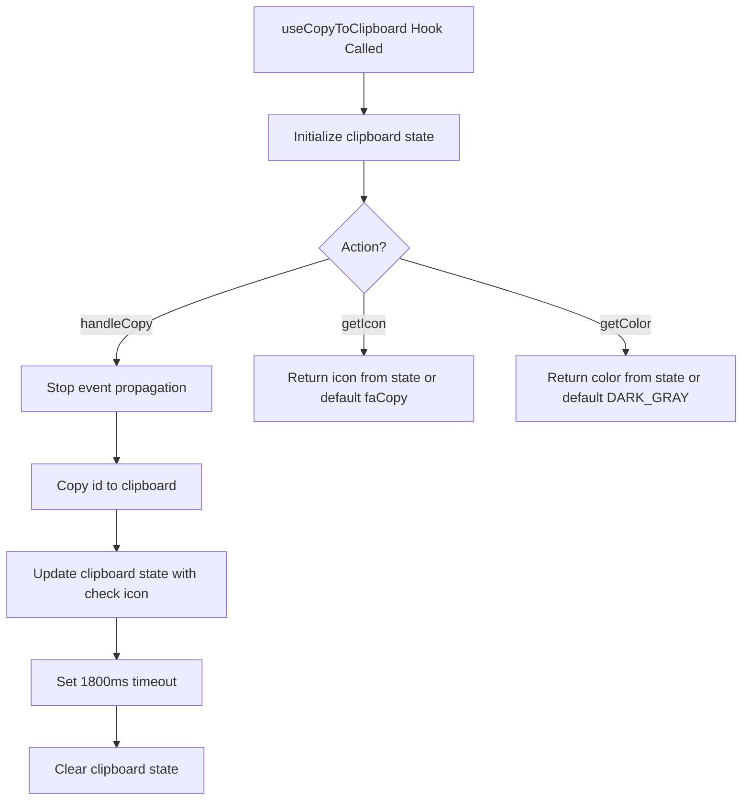
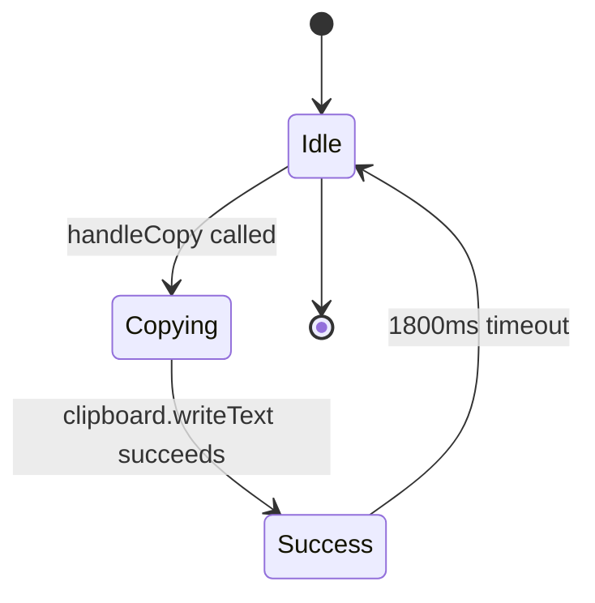
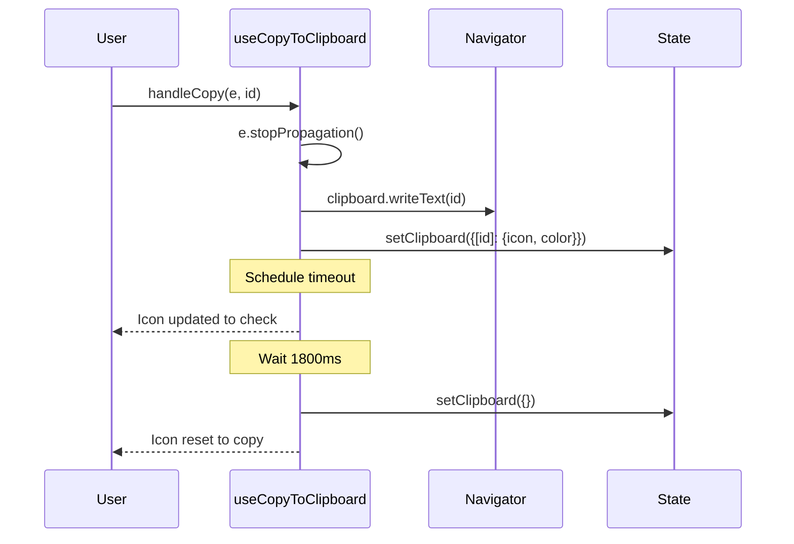

# Diagram: web/portal/src/shared/hooks/useCopyToClipboard.ts

> Auto-generated by Obscura crawlers

## Diagram 1

### SVG

<svg id="container" width="881.046875" xmlns="http://www.w3.org/2000/svg" class="flowchart" height="946.703125" viewBox="0 0 881.046875 946.703125" role="graphics-document document" aria-roledescription="flowchart-v2"><g><marker id="container_flowchart-v2-pointEnd" class="marker flowchart-v2" viewBox="0 0 10 10" refX="5" refY="5" markerUnits="userSpaceOnUse" markerWidth="8" markerHeight="8" orient="auto"><path d="M 0 0 L 10 5 L 0 10 z" class="arrowMarkerPath" style="stroke-width: 1; stroke-dasharray: 1, 0;"></path></marker><marker id="container_flowchart-v2-pointStart" class="marker flowchart-v2" viewBox="0 0 10 10" refX="4.5" refY="5" markerUnits="userSpaceOnUse" markerWidth="8" markerHeight="8" orient="auto"><path d="M 0 5 L 10 10 L 10 0 z" class="arrowMarkerPath" style="stroke-width: 1; stroke-dasharray: 1, 0;"></path></marker><marker id="container_flowchart-v2-circleEnd" class="marker flowchart-v2" viewBox="0 0 10 10" refX="11" refY="5" markerUnits="userSpaceOnUse" markerWidth="11" markerHeight="11" orient="auto"><circle cx="5" cy="5" r="5" class="arrowMarkerPath" style="stroke-width: 1; stroke-dasharray: 1, 0;"></circle></marker><marker id="container_flowchart-v2-circleStart" class="marker flowchart-v2" viewBox="0 0 10 10" refX="-1" refY="5" markerUnits="userSpaceOnUse" markerWidth="11" markerHeight="11" orient="auto"><circle cx="5" cy="5" r="5" class="arrowMarkerPath" style="stroke-width: 1; stroke-dasharray: 1, 0;"></circle></marker><marker id="container_flowchart-v2-crossEnd" class="marker cross flowchart-v2" viewBox="0 0 11 11" refX="12" refY="5.2" markerUnits="userSpaceOnUse" markerWidth="11" markerHeight="11" orient="auto"><path d="M 1,1 l 9,9 M 10,1 l -9,9" class="arrowMarkerPath" style="stroke-width: 2; stroke-dasharray: 1, 0;"></path></marker><marker id="container_flowchart-v2-crossStart" class="marker cross flowchart-v2" viewBox="0 0 11 11" refX="-1" refY="5.2" markerUnits="userSpaceOnUse" markerWidth="11" markerHeight="11" orient="auto"><path d="M 1,1 l 9,9 M 10,1 l -9,9" class="arrowMarkerPath" style="stroke-width: 2; stroke-dasharray: 1, 0;"></path></marker><g class="root"><g class="clusters"></g><g class="edgePaths"><path d="M433.047,86L433.047,90.167C433.047,94.333,433.047,102.667,433.047,110.333C433.047,118,433.047,125,433.047,128.5L433.047,132" id="L_A_B_0" class="edge-thickness-normal edge-pattern-solid edge-thickness-normal edge-pattern-solid flowchart-link" style=";" data-edge="true" data-et="edge" data-id="L_A_B_0" data-points="W3sieCI6NDMzLjA0Njg3NSwieSI6ODZ9LHsieCI6NDMzLjA0Njg3NSwieSI6MTExfSx7IngiOjQzMy4wNDY4NzUsInkiOjEzNn1d" marker-end="url(#container_flowchart-v2-pointEnd)"></path><path d="M433.047,190L433.047,194.167C433.047,198.333,433.047,206.667,433.047,214.333C433.047,222,433.047,229,433.047,232.5L433.047,236" id="L_B_C_0" class="edge-thickness-normal edge-pattern-solid edge-thickness-normal edge-pattern-solid flowchart-link" style=";" data-edge="true" data-et="edge" data-id="L_B_C_0" data-points="W3sieCI6NDMzLjA0Njg3NSwieSI6MTkwfSx7IngiOjQzMy4wNDY4NzUsInkiOjIxNX0seyJ4Ijo0MzMuMDQ2ODc1LCJ5IjoyNDB9XQ==" marker-end="url(#container_flowchart-v2-pointEnd)"></path><path d="M392.203,305.859L349.836,318.833C307.469,331.807,222.734,357.755,180.367,378.229C138,398.703,138,413.703,138,421.203L138,428.703" id="L_C_D_0" class="edge-thickness-normal edge-pattern-solid edge-thickness-normal edge-pattern-solid flowchart-link" style=";" data-edge="true" data-et="edge" data-id="L_C_D_0" data-points="W3sieCI6MzkyLjIwMjg4MDE2MTU2MTcsInkiOjMwNS44NTkxMzAxNjE1NjE3fSx7IngiOjEzOCwieSI6MzgzLjcwMzEyNX0seyJ4IjoxMzgsInkiOjQzMi43MDMxMjV9XQ==" marker-end="url(#container_flowchart-v2-pointEnd)"></path><path d="M138,486.703L138,492.87C138,499.036,138,511.37,138,521.036C138,530.703,138,537.703,138,541.203L138,544.703" id="L_D_E_0" class="edge-thickness-normal edge-pattern-solid edge-thickness-normal edge-pattern-solid flowchart-link" style=";" data-edge="true" data-et="edge" data-id="L_D_E_0" data-points="W3sieCI6MTM4LCJ5Ijo0ODYuNzAzMTI1fSx7IngiOjEzOCwieSI6NTIzLjcwMzEyNX0seyJ4IjoxMzgsInkiOjU0OC43MDMxMjV9XQ==" marker-end="url(#container_flowchart-v2-pointEnd)"></path><path d="M138,602.703L138,606.87C138,611.036,138,619.37,138,627.036C138,634.703,138,641.703,138,645.203L138,648.703" id="L_E_F_0" class="edge-thickness-normal edge-pattern-solid edge-thickness-normal edge-pattern-solid flowchart-link" style=";" data-edge="true" data-et="edge" data-id="L_E_F_0" data-points="W3sieCI6MTM4LCJ5Ijo2MDIuNzAzMTI1fSx7IngiOjEzOCwieSI6NjI3LjcwMzEyNX0seyJ4IjoxMzgsInkiOjY1Mi43MDMxMjV9XQ==" marker-end="url(#container_flowchart-v2-pointEnd)"></path><path d="M138,730.703L138,734.87C138,739.036,138,747.37,138,755.036C138,762.703,138,769.703,138,773.203L138,776.703" id="L_F_G_0" class="edge-thickness-normal edge-pattern-solid edge-thickness-normal edge-pattern-solid flowchart-link" style=";" data-edge="true" data-et="edge" data-id="L_F_G_0" data-points="W3sieCI6MTM4LCJ5Ijo3MzAuNzAzMTI1fSx7IngiOjEzOCwieSI6NzU1LjcwMzEyNX0seyJ4IjoxMzgsInkiOjc4MC43MDMxMjV9XQ==" marker-end="url(#container_flowchart-v2-pointEnd)"></path><path d="M138,834.703L138,838.87C138,843.036,138,851.37,138,859.036C138,866.703,138,873.703,138,877.203L138,880.703" id="L_G_H_0" class="edge-thickness-normal edge-pattern-solid edge-thickness-normal edge-pattern-solid flowchart-link" style=";" data-edge="true" data-et="edge" data-id="L_G_H_0" data-points="W3sieCI6MTM4LCJ5Ijo4MzQuNzAzMTI1fSx7IngiOjEzOCwieSI6ODU5LjcwMzEyNX0seyJ4IjoxMzgsInkiOjg4NC43MDMxMjV9XQ==" marker-end="url(#container_flowchart-v2-pointEnd)"></path><path d="M433.047,346.703L433.047,352.87C433.047,359.036,433.047,371.37,433.047,383.036C433.047,394.703,433.047,405.703,433.047,411.203L433.047,416.703" id="L_C_I_0" class="edge-thickness-normal edge-pattern-solid edge-thickness-normal edge-pattern-solid flowchart-link" style=";" data-edge="true" data-et="edge" data-id="L_C_I_0" data-points="W3sieCI6NDMzLjA0Njg3NSwieSI6MzQ2LjcwMzEyNX0seyJ4Ijo0MzMuMDQ2ODc1LCJ5IjozODMuNzAzMTI1fSx7IngiOjQzMy4wNDY4NzUsInkiOjQyMC43MDMxMjV9XQ==" marker-end="url(#container_flowchart-v2-pointEnd)"></path><path d="M474.358,305.392L519.14,318.444C563.921,331.496,653.484,357.599,698.265,376.151C743.047,394.703,743.047,405.703,743.047,411.203L743.047,416.703" id="L_C_J_0" class="edge-thickness-normal edge-pattern-solid edge-thickness-normal edge-pattern-solid flowchart-link" style=";" data-edge="true" data-et="edge" data-id="L_C_J_0" data-points="W3sieCI6NDc0LjM1ODAyNzMwNzU0MjIsInkiOjMwNS4zOTE5NzI2OTI0NTc4fSx7IngiOjc0My4wNDY4NzUsInkiOjM4My43MDMxMjV9LHsieCI6NzQzLjA0Njg3NSwieSI6NDIwLjcwMzEyNX1d" marker-end="url(#container_flowchart-v2-pointEnd)"></path></g><g class="edgeLabels"><g class="edgeLabel"><g class="label" data-id="L_A_B_0" transform="translate(0, 0)"><foreignObject width="0" height="0">

</foreignObject></g></g><g class="edgeLabel"><g class="label" data-id="L_B_C_0" transform="translate(0, 0)"><foreignObject width="0" height="0">

</foreignObject></g></g><g class="edgeLabel" transform="translate(138, 383.703125)"><g class="label" data-id="L_C_D_0" transform="translate(-42.828125, -12)"><foreignObject width="85.65625" height="24">

handleCopy

</foreignObject></g></g><g class="edgeLabel"><g class="label" data-id="L_D_E_0" transform="translate(0, 0)"><foreignObject width="0" height="0">

</foreignObject></g></g><g class="edgeLabel"><g class="label" data-id="L_E_F_0" transform="translate(0, 0)"><foreignObject width="0" height="0">

</foreignObject></g></g><g class="edgeLabel"><g class="label" data-id="L_F_G_0" transform="translate(0, 0)"><foreignObject width="0" height="0">

</foreignObject></g></g><g class="edgeLabel"><g class="label" data-id="L_G_H_0" transform="translate(0, 0)"><foreignObject width="0" height="0">

</foreignObject></g></g><g class="edgeLabel" transform="translate(433.046875, 383.703125)"><g class="label" data-id="L_C_I_0" transform="translate(-26.6640625, -12)"><foreignObject width="53.328125" height="24">

getIcon

</foreignObject></g></g><g class="edgeLabel" transform="translate(743.046875, 383.703125)"><g class="label" data-id="L_C_J_0" transform="translate(-30.34375, -12)"><foreignObject width="60.6875" height="24">

getColor

</foreignObject></g></g></g><g class="nodes"><g class="node default" id="flowchart-A-0" transform="translate(433.046875, 47)"><rect class="basic label-container" style="" x="-130" y="-39" width="260" height="78"></rect><g class="label" style="" transform="translate(-100, -24)"><rect></rect><foreignObject width="200" height="48">

useCopyToClipboard Hook Called

</foreignObject></g></g><g class="node default" id="flowchart-B-1" transform="translate(433.046875, 163)"><rect class="basic label-container" style="" x="-117.9140625" y="-27" width="235.828125" height="54"></rect><g class="label" style="" transform="translate(-87.9140625, -12)"><rect></rect><foreignObject width="175.828125" height="24">

Initialize clipboard state

</foreignObject></g></g><g class="node default" id="flowchart-C-3" transform="translate(433.046875, 293.3515625)"><polygon points="53.3515625,0 106.703125,-53.3515625 53.3515625,-106.703125 0,-53.3515625" class="label-container" transform="translate(-52.8515625, 53.3515625)"></polygon><g class="label" style="" transform="translate(-26.3515625, -12)"><rect></rect><foreignObject width="52.703125" height="24">

Action?

</foreignObject></g></g><g class="node default" id="flowchart-D-5" transform="translate(138, 459.703125)"><rect class="basic label-container" style="" x="-115.046875" y="-27" width="230.09375" height="54"></rect><g class="label" style="" transform="translate(-85.046875, -12)"><rect></rect><foreignObject width="170.09375" height="24">

Stop event propagation

</foreignObject></g></g><g class="node default" id="flowchart-E-7" transform="translate(138, 575.703125)"><rect class="basic label-container" style="" x="-102.9921875" y="-27" width="205.984375" height="54"></rect><g class="label" style="" transform="translate(-72.9921875, -12)"><rect></rect><foreignObject width="145.984375" height="24">

Copy id to clipboard

</foreignObject></g></g><g class="node default" id="flowchart-F-9" transform="translate(138, 691.703125)"><rect class="basic label-container" style="" x="-130" y="-39" width="260" height="78"></rect><g class="label" style="" transform="translate(-100, -24)"><rect></rect><foreignObject width="200" height="48">

Update clipboard state with check icon

</foreignObject></g></g><g class="node default" id="flowchart-G-11" transform="translate(138, 807.703125)"><rect class="basic label-container" style="" x="-101.8203125" y="-27" width="203.640625" height="54"></rect><g class="label" style="" transform="translate(-71.8203125, -12)"><rect></rect><foreignObject width="143.640625" height="24">

Set 1800ms timeout

</foreignObject></g></g><g class="node default" id="flowchart-H-13" transform="translate(138, 911.703125)"><rect class="basic label-container" style="" x="-105.21875" y="-27" width="210.4375" height="54"></rect><g class="label" style="" transform="translate(-75.21875, -12)"><rect></rect><foreignObject width="150.4375" height="24">

Clear clipboard state

</foreignObject></g></g><g class="node default" id="flowchart-I-15" transform="translate(433.046875, 459.703125)"><rect class="basic label-container" style="" x="-130" y="-39" width="260" height="78"></rect><g class="label" style="" transform="translate(-100, -24)"><rect></rect><foreignObject width="200" height="48">

Return icon from state or default faCopy

</foreignObject></g></g><g class="node default" id="flowchart-J-17" transform="translate(743.046875, 459.703125)"><rect class="basic label-container" style="" x="-130" y="-39" width="260" height="78"></rect><g class="label" style="" transform="translate(-100, -24)"><rect></rect><foreignObject width="200" height="48">

Return color from state or default DARK_GRAY

</foreignObject></g></g></g></g></g></svg>

## Diagram 2

### SVG

<svg id="container" width="367.9586181640625" xmlns="http://www.w3.org/2000/svg" class="statediagram" height="372" viewBox="0 0 367.9586181640625 372" role="graphics-document document" aria-roledescription="stateDiagram"><g><defs><marker id="container_stateDiagram-barbEnd" refX="19" refY="7" markerWidth="20" markerHeight="14" markerUnits="userSpaceOnUse" orient="auto"><path d="M 19,7 L9,13 L14,7 L9,1 Z"></path></marker></defs><g class="root"><g class="clusters"></g><g class="edgePaths"><path d="M201.764,22L201.764,26.167C201.764,30.333,201.764,38.667,201.848,47.083C201.931,55.5,202.098,64,202.181,68.25L202.264,72.5" id="edge0" class="edge-thickness-normal edge-pattern-solid transition" style="fill:none;;;fill:none" data-edge="true" data-et="edge" data-id="edge0" data-points="W3sieCI6MjAxLjc2NDQ1OTEzMzE0ODIsInkiOjIyfSx7IngiOjIwMS43NjQ0NTkxMzMxNDgyLCJ5Ijo0N30seyJ4IjoyMDIuMjY0NDU5MTMzMTQ4MiwieSI6NzIuNX1d" marker-end="url(#container_stateDiagram-barbEnd)"></path><path d="M180.452,105.76L168.377,112.967C156.301,120.173,132.151,134.587,120.159,148.043C108.167,161.5,108.333,174,108.417,180.25L108.5,186.5" id="edge1" class="edge-thickness-normal edge-pattern-solid transition" style="fill:none;;;fill:none" data-edge="true" data-et="edge" data-id="edge1" data-points="W3sieCI6MTgwLjQ1MTk1OTEzMzE0ODIsInkiOjEwNS43NTk5NTQ5MDcxNjIyMn0seyJ4IjoxMDgsInkiOjE0OX0seyJ4IjoxMDguNSwieSI6MTg2LjV9XQ==" marker-end="url(#container_stateDiagram-barbEnd)"></path><path d="M108.5,226.5L108.417,234.583C108.333,242.667,108.167,258.833,119.639,275.167C131.112,291.5,154.224,308,165.78,316.25L177.336,324.5" id="edge2" class="edge-thickness-normal edge-pattern-solid transition" style="fill:none;;;fill:none" data-edge="true" data-et="edge" data-id="edge2" data-points="W3sieCI6MTA4LjUsInkiOjIyNi41fSx7IngiOjEwOCwieSI6Mjc1fSx7IngiOjE3Ny4zMzYwNzE5NzQ5ODkzLCJ5IjozMjQuNX1d" marker-end="url(#container_stateDiagram-barbEnd)"></path><path d="M233.529,324.5L244.918,316.25C256.307,308,279.086,291.5,290.476,271.75C301.865,252,301.865,229,301.865,208C301.865,187,301.865,168,288.9,151.153C275.936,134.307,250.006,119.614,237.042,112.267L224.077,104.921" id="edge3" class="edge-thickness-normal edge-pattern-solid transition" style="fill:none;;;fill:none" data-edge="true" data-et="edge" data-id="edge3" data-points="W3sieCI6MjMzLjUyODc4Mzc5MTMwNzEsInkiOjMyNC41fSx7IngiOjMwMS44NjQ4NTU3NjYyOTY0LCJ5IjoyNzV9LHsieCI6MzAxLjg2NDg1NTc2NjI5NjQsInkiOjIwNn0seyJ4IjozMDEuODY0ODU1NzY2Mjk2NCwieSI6MTQ5fSx7IngiOjIyNC4wNzY5NTkxMzMxNDgyLCJ5IjoxMDQuOTIwNjU1MDgwNDg0MjR9XQ==" marker-end="url(#container_stateDiagram-barbEnd)"></path><path d="M202.264,112.5L202.181,118.583C202.098,124.667,201.931,136.833,201.848,151.25C201.764,165.667,201.764,182.333,201.764,190.667L201.764,199" id="edge4" class="edge-thickness-normal edge-pattern-solid transition" style="fill:none;;;fill:none" data-edge="true" data-et="edge" data-id="edge4" data-points="W3sieCI6MjAyLjI2NDQ1OTEzMzE0ODIsInkiOjExMi41fSx7IngiOjIwMS43NjQ0NTkxMzMxNDgyLCJ5IjoxNDl9LHsieCI6MjAxLjc2NDQ1OTEzMzE0ODIsInkiOjE5OX1d" marker-end="url(#container_stateDiagram-barbEnd)"></path></g><g class="edgeLabels"><g class="edgeLabel"><g class="label" data-id="edge0" transform="translate(0, 0)"><foreignObject width="0" height="0">

</foreignObject></g></g><g class="edgeLabel" transform="translate(108, 149)"><g class="label" data-id="edge1" transform="translate(-66.7578125, -12)"><foreignObject width="133.515625" height="24">

handleCopy called

</foreignObject></g></g><g class="edgeLabel" transform="translate(108, 275)"><g class="label" data-id="edge2" transform="translate(-100, -24)"><foreignObject width="200" height="48">

clipboard.writeText succeeds

</foreignObject></g></g><g class="edgeLabel" transform="translate(301.8648557662964, 206)"><g class="label" data-id="edge3" transform="translate(-58.09375, -12)"><foreignObject width="116.1875" height="24">

1800ms timeout

</foreignObject></g></g><g class="edgeLabel"><g class="label" data-id="edge4" transform="translate(0, 0)"><foreignObject width="0" height="0">

</foreignObject></g></g></g><g class="nodes"><g class="node default" id="state-root_start-0" transform="translate(201.7644591331482, 15)"><circle class="state-start" r="7" width="14" height="14"></circle></g><g class="node  statediagram-state" id="state-Idle-4" transform="translate(201.7644591331482, 92)"><g class="basic label-container outer-path"><path d="M-16.8125 -20 C-6.08746383944591 -20, 4.6375723211081805 -20, 16.8125 -20 C16.8125 -20, 16.8125 -20, 16.8125 -20 C16.964624470503374 -19.993708085358524, 17.116748941006744 -19.987416170717047, 17.225396727361662 -19.982922465033347 C17.389207473264314 -19.962503476850856, 17.55301821916697 -19.942084488668367, 17.63547295140367 -19.931806517013612 C17.767082801861733 -19.904210833311005, 17.898692652319795 -19.876615149608398, 18.039927435703998 -19.847001329696653 C18.140931525169762 -19.81693110941461, 18.24193561463553 -19.786860889132573, 18.435997346023417 -19.729086208503173 C18.58060857995826 -19.67265872992097, 18.725219813893105 -19.616231251338764, 18.820977123264846 -19.578866633275286 C18.92022702830125 -19.530346311261795, 19.01947693333766 -19.481825989248307, 19.19223696518537 -19.397368756032446 C19.32876909885187 -19.316013263064082, 19.465301232518367 -19.23465777009572, 19.547240790612136 -19.185832391312644 C19.615844890757455 -19.136850005286814, 19.684448990902773 -19.08786761926098, 19.88356356344834 -18.94570254698197 C19.990897093887366 -18.854795683884543, 20.09823062432639 -18.763888820787116, 20.198907858128706 -18.678619553365657 C20.28011577779069 -18.597411633703672, 20.36132369745268 -18.516203714041684, 20.491119553365657 -18.386407858128706 C20.571621975641566 -18.29135882775455, 20.652124397917472 -18.196309797380398, 20.75820254698197 -18.07106356344834 C20.83292299894661 -17.966411059040283, 20.90764345091125 -17.86175855463222, 20.998332391312644 -17.734740790612136 C21.05629867011241 -17.63746082294828, 21.114264948912176 -17.540180855284426, 21.209868756032446 -17.37973696518537 C21.27319057156253 -17.250210121230246, 21.336512387092615 -17.12068327727512, 21.391366633275286 -17.008477123264846 C21.428413530870063 -16.9135340616706, 21.465460428464837 -16.81859100007635, 21.541586208503173 -16.623497346023417 C21.58526699916622 -16.476776156531468, 21.62894778982927 -16.33005496703952, 21.659501329696653 -16.227427435703994 C21.688066662002193 -16.091193119006782, 21.716631994307736 -15.95495880230957, 21.744306517013612 -15.82297295140367 C21.754977282326777 -15.737367043330282, 21.765648047639946 -15.651761135256892, 21.795422465033347 -15.412896727361662 C21.799015503177483 -15.326025074403809, 21.802608541321614 -15.239153421445954, 21.8125 -15 C21.8125 -15, 21.8125 -15, 21.8125 -15 C21.8125 -4.19786598692272, 21.8125 6.6042680261545605, 21.8125 15 C21.8125 15, 21.8125 15, 21.8125 15 C21.808185538145704 15.10431407011864, 21.80387107629141 15.20862814023728, 21.795422465033347 15.412896727361662 C21.777277772762428 15.558461999671385, 21.75913308049151 15.704027271981108, 21.744306517013612 15.822972951403669 C21.7244245006281 15.917794635530115, 21.704542484242587 16.012616319656562, 21.659501329696653 16.227427435703994 C21.62619279114686 16.339308844489896, 21.59288425259707 16.451190253275797, 21.541586208503173 16.623497346023417 C21.510209851987188 16.70390805630433, 21.478833495471207 16.784318766585237, 21.391366633275286 17.008477123264846 C21.3244489847505 17.145359361175345, 21.257531336225714 17.282241599085847, 21.209868756032446 17.379736965185366 C21.133650601607005 17.50764753235352, 21.057432447181565 17.635558099521678, 20.998332391312644 17.734740790612133 C20.9343944648494 17.824291428424164, 20.870456538386158 17.913842066236192, 20.75820254698197 18.07106356344834 C20.69363005320876 18.147304162780237, 20.62905755943555 18.223544762112134, 20.491119553365657 18.386407858128706 C20.43062171599185 18.44690569550251, 20.37012387861805 18.507403532876314, 20.198907858128706 18.678619553365657 C20.116013787808217 18.748827249612955, 20.03311971748773 18.81903494586025, 19.88356356344834 18.94570254698197 C19.80441173514565 19.002215866162025, 19.725259906842954 19.05872918534208, 19.547240790612136 19.185832391312644 C19.447795221780144 19.245089088315623, 19.34834965294815 19.304345785318603, 19.19223696518537 19.397368756032446 C19.100418334125912 19.44225614956908, 19.00859970306646 19.487143543105713, 18.820977123264846 19.578866633275286 C18.714168250847337 19.62054358462088, 18.607359378429823 19.66222053596647, 18.435997346023417 19.729086208503173 C18.29264951633047 19.771762706441212, 18.149301686637525 19.81443920437925, 18.039927435703998 19.847001329696653 C17.934939036639566 19.869015082033133, 17.829950637575134 19.891028834369617, 17.63547295140367 19.931806517013612 C17.49604177059748 19.949186595576005, 17.356610589791288 19.9665666741384, 17.225396727361662 19.982922465033347 C17.080557936549486 19.98891304173379, 16.93571914573731 19.994903618434236, 16.8125 20 C16.8125 20, 16.8125 20, 16.8125 20 C9.91865551245888 20, 3.024811024917758 20, -16.8125 20 C-16.8125 20, -16.8125 20, -16.8125 20 C-16.90158371641771 19.9963154702344, -16.990667432835423 19.9926309404688, -17.225396727361662 19.982922465033347 C-17.351881933063847 19.96715610058478, -17.478367138766032 19.951389736136214, -17.63547295140367 19.931806517013612 C-17.72616171792526 19.91279108232085, -17.816850484446853 19.89377564762809, -18.039927435703994 19.847001329696653 C-18.188411473531527 19.802795716345184, -18.33689551135906 19.75859010299372, -18.435997346023417 19.729086208503173 C-18.569887187768938 19.676842230135115, -18.70377702951446 19.624598251767058, -18.820977123264846 19.578866633275286 C-18.96307637974515 19.509398539781667, -19.105175636225457 19.43993044628805, -19.19223696518537 19.397368756032446 C-19.26444258487809 19.35434354557513, -19.336648204570807 19.311318335117818, -19.547240790612133 19.185832391312644 C-19.632051655230807 19.1252785978639, -19.71686251984948 19.06472480441516, -19.88356356344834 18.94570254698197 C-19.968192161019463 18.874025781091042, -20.05282075859058 18.80234901520011, -20.198907858128706 18.67861955336566 C-20.30606326906711 18.571464142427253, -20.413218680005517 18.46430873148885, -20.491119553365657 18.386407858128706 C-20.577396002522473 18.284541447098555, -20.66367245167929 18.182675036068403, -20.758202546981966 18.07106356344834 C-20.83912390531799 17.957726149295997, -20.920045263654014 17.844388735143653, -20.998332391312644 17.734740790612133 C-21.057877700914176 17.6348108673445, -21.117423010515704 17.53488094407686, -21.209868756032446 17.37973696518537 C-21.257266363534303 17.282783609389334, -21.30466397103616 17.1858302535933, -21.391366633275286 17.00847712326485 C-21.42494501594485 16.922423103602995, -21.45852339861441 16.836369083941143, -21.541586208503173 16.623497346023417 C-21.57411787279174 16.514225411882148, -21.606649537080305 16.404953477740882, -21.659501329696653 16.227427435703994 C-21.691496889930953 16.07483361186045, -21.72349245016525 15.922239788016903, -21.744306517013612 15.82297295140367 C-21.75910091617357 15.704285309297465, -21.77389531533353 15.585597667191259, -21.795422465033347 15.412896727361664 C-21.79899125451076 15.326611353111613, -21.80256004398817 15.240325978861561, -21.8125 15 C-21.8125 15, -21.8125 15, -21.8125 15 C-21.8125 4.892489377086434, -21.8125 -5.215021245827131, -21.8125 -15 C-21.8125 -15, -21.8125 -15, -21.8125 -15 C-21.807383054838194 -15.123716327650623, -21.802266109676385 -15.247432655301244, -21.795422465033347 -15.41289672736166 C-21.78199784893148 -15.52059532424854, -21.76857323282961 -15.628293921135416, -21.744306517013612 -15.822972951403669 C-21.722768256005967 -15.925693628336028, -21.701229994998318 -16.028414305268385, -21.659501329696653 -16.227427435703994 C-21.619453268484804 -16.361946502063745, -21.579405207272956 -16.496465568423496, -21.541586208503173 -16.623497346023417 C-21.489398346577836 -16.7572433736516, -21.4372104846525 -16.890989401279786, -21.39136663327529 -17.008477123264846 C-21.324247618838882 -17.145771261731163, -21.257128604402475 -17.283065400197483, -21.209868756032446 -17.379736965185366 C-21.158078857309402 -17.466651629666334, -21.106288958586358 -17.553566294147302, -20.998332391312644 -17.734740790612133 C-20.903250661741545 -17.86791103866917, -20.80816893217045 -18.00108128672621, -20.75820254698197 -18.07106356344834 C-20.68183331756988 -18.161232542229655, -20.605464088157788 -18.251401521010965, -20.49111955336566 -18.386407858128706 C-20.419634777424328 -18.45789263407004, -20.348150001482995 -18.529377410011367, -20.198907858128706 -18.678619553365657 C-20.08937517404122 -18.77138900459219, -19.97984248995373 -18.864158455818725, -19.88356356344834 -18.945702546981966 C-19.77114943476776 -19.02596469216172, -19.658735306087184 -19.10622683734147, -19.547240790612136 -19.185832391312644 C-19.462533400283956 -19.236307040123496, -19.377826009955772 -19.286781688934344, -19.192236965185366 -19.397368756032446 C-19.05306963200189 -19.46540351956541, -18.913902298818414 -19.533438283098373, -18.82097712326485 -19.578866633275286 C-18.681427073694525 -19.63331923159018, -18.541877024124197 -19.687771829905074, -18.43599734602342 -19.729086208503173 C-18.332122259889847 -19.7600111615261, -18.228247173756273 -19.79093611454903, -18.039927435703994 -19.847001329696653 C-17.91779151993078 -19.87261053819188, -17.79565560415757 -19.898219746687104, -17.635472951403674 -19.931806517013612 C-17.530184515122063 -19.94493070690934, -17.424896078840447 -19.958054896805066, -17.225396727361662 -19.982922465033347 C-17.102294151014004 -19.98801402525349, -16.979191574666345 -19.993105585473636, -16.8125 -20 C-16.8125 -20, -16.8125 -20, -16.8125 -20" stroke="none" stroke-width="0" fill="#ECECFF" style=""></path><path d="M-16.8125 -20 C-8.991812907017868 -20, -1.1711258140357366 -20, 16.8125 -20 M-16.8125 -20 C-4.155152285896577 -20, 8.502195428206846 -20, 16.8125 -20 M16.8125 -20 C16.8125 -20, 16.8125 -20, 16.8125 -20 M16.8125 -20 C16.8125 -20, 16.8125 -20, 16.8125 -20 M16.8125 -20 C16.90081116468332 -19.99634742321049, 16.98912232936664 -19.99269484642098, 17.225396727361662 -19.982922465033347 M16.8125 -20 C16.90283723899239 -19.996263624157205, 16.993174477984777 -19.99252724831441, 17.225396727361662 -19.982922465033347 M17.225396727361662 -19.982922465033347 C17.347931585942646 -19.967648510839922, 17.47046644452363 -19.952374556646493, 17.63547295140367 -19.931806517013612 M17.225396727361662 -19.982922465033347 C17.313026877823987 -19.97199937816954, 17.400657028286307 -19.96107629130573, 17.63547295140367 -19.931806517013612 M17.63547295140367 -19.931806517013612 C17.759187249632397 -19.905866356520093, 17.882901547861128 -19.879926196026577, 18.039927435703998 -19.847001329696653 M17.63547295140367 -19.931806517013612 C17.72731124947106 -19.912550050902354, 17.81914954753845 -19.893293584791095, 18.039927435703998 -19.847001329696653 M18.039927435703998 -19.847001329696653 C18.185022420921864 -19.80380468102235, 18.330117406139735 -19.760608032348046, 18.435997346023417 -19.729086208503173 M18.039927435703998 -19.847001329696653 C18.16465162385091 -19.809869330072544, 18.28937581199782 -19.772737330448436, 18.435997346023417 -19.729086208503173 M18.435997346023417 -19.729086208503173 C18.540186876029804 -19.688431327738, 18.644376406036187 -19.64777644697283, 18.820977123264846 -19.578866633275286 M18.435997346023417 -19.729086208503173 C18.563665157955462 -19.679270073702206, 18.691332969887505 -19.62945393890124, 18.820977123264846 -19.578866633275286 M18.820977123264846 -19.578866633275286 C18.954217821103963 -19.51372922521344, 19.087458518943077 -19.44859181715159, 19.19223696518537 -19.397368756032446 M18.820977123264846 -19.578866633275286 C18.964313893315776 -19.508793556261324, 19.1076506633667 -19.438720479247362, 19.19223696518537 -19.397368756032446 M19.19223696518537 -19.397368756032446 C19.319679156890505 -19.32142969280455, 19.44712134859564 -19.24549062957665, 19.547240790612136 -19.185832391312644 M19.19223696518537 -19.397368756032446 C19.263483459076852 -19.35491506050193, 19.33472995296834 -19.312461364971416, 19.547240790612136 -19.185832391312644 M19.547240790612136 -19.185832391312644 C19.625505632434713 -19.129952368306967, 19.703770474257293 -19.07407234530129, 19.88356356344834 -18.94570254698197 M19.547240790612136 -19.185832391312644 C19.648866357729815 -19.113273131033623, 19.750491924847495 -19.040713870754598, 19.88356356344834 -18.94570254698197 M19.88356356344834 -18.94570254698197 C19.957468869668556 -18.883107945581514, 20.031374175888775 -18.820513344181055, 20.198907858128706 -18.678619553365657 M19.88356356344834 -18.94570254698197 C19.999174689327734 -18.847784918167665, 20.114785815207128 -18.749867289353357, 20.198907858128706 -18.678619553365657 M20.198907858128706 -18.678619553365657 C20.297199341058217 -18.580328070436146, 20.39549082398773 -18.482036587506634, 20.491119553365657 -18.386407858128706 M20.198907858128706 -18.678619553365657 C20.303632710615535 -18.573894700878828, 20.408357563102363 -18.469169848392, 20.491119553365657 -18.386407858128706 M20.491119553365657 -18.386407858128706 C20.592506671121374 -18.266700314396882, 20.693893788877087 -18.146992770665058, 20.75820254698197 -18.07106356344834 M20.491119553365657 -18.386407858128706 C20.55241710237601 -18.314033978771665, 20.613714651386363 -18.24166009941462, 20.75820254698197 -18.07106356344834 M20.75820254698197 -18.07106356344834 C20.81596555480099 -17.99016143730404, 20.87372856262001 -17.909259311159737, 20.998332391312644 -17.734740790612136 M20.75820254698197 -18.07106356344834 C20.80865948001575 -18.000394231720616, 20.859116413049527 -17.929724899992895, 20.998332391312644 -17.734740790612136 M20.998332391312644 -17.734740790612136 C21.055514423644475 -17.638776958339772, 21.112696455976305 -17.542813126067404, 21.209868756032446 -17.37973696518537 M20.998332391312644 -17.734740790612136 C21.074464818894445 -17.60697409165063, 21.15059724647625 -17.479207392689126, 21.209868756032446 -17.37973696518537 M21.209868756032446 -17.37973696518537 C21.276412214215497 -17.243620145852933, 21.342955672398546 -17.1075033265205, 21.391366633275286 -17.008477123264846 M21.209868756032446 -17.37973696518537 C21.261484971114168 -17.27415430965857, 21.31310118619589 -17.168571654131775, 21.391366633275286 -17.008477123264846 M21.391366633275286 -17.008477123264846 C21.42912158492137 -16.911719474653342, 21.466876536567447 -16.81496182604184, 21.541586208503173 -16.623497346023417 M21.391366633275286 -17.008477123264846 C21.433853532079848 -16.899592533405993, 21.476340430884413 -16.790707943547137, 21.541586208503173 -16.623497346023417 M21.541586208503173 -16.623497346023417 C21.581407066340102 -16.489741442347274, 21.621227924177035 -16.35598553867113, 21.659501329696653 -16.227427435703994 M21.541586208503173 -16.623497346023417 C21.575489044537033 -16.509619727176965, 21.60939188057089 -16.39574210833051, 21.659501329696653 -16.227427435703994 M21.659501329696653 -16.227427435703994 C21.681230838368677 -16.123794656836395, 21.702960347040705 -16.0201618779688, 21.744306517013612 -15.82297295140367 M21.659501329696653 -16.227427435703994 C21.677356441994338 -16.142272500434597, 21.695211554292023 -16.0571175651652, 21.744306517013612 -15.82297295140367 M21.744306517013612 -15.82297295140367 C21.761162208374525 -15.68774865185177, 21.778017899735435 -15.55252435229987, 21.795422465033347 -15.412896727361662 M21.744306517013612 -15.82297295140367 C21.756089618062052 -15.728443361859837, 21.767872719110493 -15.633913772316005, 21.795422465033347 -15.412896727361662 M21.795422465033347 -15.412896727361662 C21.800564944507414 -15.288563036960015, 21.80570742398148 -15.16422934655837, 21.8125 -15 M21.795422465033347 -15.412896727361662 C21.798953710630123 -15.327519080455048, 21.802484956226895 -15.242141433548433, 21.8125 -15 M21.8125 -15 C21.8125 -15, 21.8125 -15, 21.8125 -15 M21.8125 -15 C21.8125 -15, 21.8125 -15, 21.8125 -15 M21.8125 -15 C21.8125 -6.5078848912396925, 21.8125 1.984230217520615, 21.8125 15 M21.8125 -15 C21.8125 -8.84252289359577, 21.8125 -2.685045787191539, 21.8125 15 M21.8125 15 C21.8125 15, 21.8125 15, 21.8125 15 M21.8125 15 C21.8125 15, 21.8125 15, 21.8125 15 M21.8125 15 C21.807413482742188 15.122980648759912, 21.802326965484376 15.245961297519823, 21.795422465033347 15.412896727361662 M21.8125 15 C21.808735979133303 15.091005634045839, 21.804971958266606 15.182011268091678, 21.795422465033347 15.412896727361662 M21.795422465033347 15.412896727361662 C21.78456298925414 15.50001655972579, 21.773703513474935 15.587136392089917, 21.744306517013612 15.822972951403669 M21.795422465033347 15.412896727361662 C21.78094207250755 15.52906526026908, 21.766461679981756 15.645233793176496, 21.744306517013612 15.822972951403669 M21.744306517013612 15.822972951403669 C21.711175895706702 15.980980129728197, 21.678045274399793 16.138987308052723, 21.659501329696653 16.227427435703994 M21.744306517013612 15.822972951403669 C21.71606654192358 15.957655568387977, 21.68782656683355 16.092338185372284, 21.659501329696653 16.227427435703994 M21.659501329696653 16.227427435703994 C21.621723227664884 16.354321843582426, 21.583945125633118 16.481216251460857, 21.541586208503173 16.623497346023417 M21.659501329696653 16.227427435703994 C21.613527900057893 16.381849463767914, 21.567554470419132 16.536271491831837, 21.541586208503173 16.623497346023417 M21.541586208503173 16.623497346023417 C21.49764334091771 16.736113264080288, 21.453700473332244 16.848729182137163, 21.391366633275286 17.008477123264846 M21.541586208503173 16.623497346023417 C21.489324747022856 16.757431993145687, 21.43706328554254 16.891366640267954, 21.391366633275286 17.008477123264846 M21.391366633275286 17.008477123264846 C21.339746108589146 17.114068594228378, 21.28812558390301 17.21966006519191, 21.209868756032446 17.379736965185366 M21.391366633275286 17.008477123264846 C21.326836152533527 17.140476331427404, 21.26230567179177 17.272475539589966, 21.209868756032446 17.379736965185366 M21.209868756032446 17.379736965185366 C21.145743233764 17.4873534770931, 21.081617711495554 17.594969989000838, 20.998332391312644 17.734740790612133 M21.209868756032446 17.379736965185366 C21.133680033959767 17.507598138492394, 21.05749131188709 17.635459311799423, 20.998332391312644 17.734740790612133 M20.998332391312644 17.734740790612133 C20.928524345311388 17.83251304238226, 20.85871629931013 17.930285294152384, 20.75820254698197 18.07106356344834 M20.998332391312644 17.734740790612133 C20.93497111631007 17.82348377780184, 20.871609841307492 17.912226764991548, 20.75820254698197 18.07106356344834 M20.75820254698197 18.07106356344834 C20.694041927025946 18.146817864283207, 20.629881307069923 18.222572165118073, 20.491119553365657 18.386407858128706 M20.75820254698197 18.07106356344834 C20.686132592031075 18.156156398465328, 20.614062637080178 18.241249233482314, 20.491119553365657 18.386407858128706 M20.491119553365657 18.386407858128706 C20.399545956674274 18.47798145482009, 20.307972359982887 18.569555051511475, 20.198907858128706 18.678619553365657 M20.491119553365657 18.386407858128706 C20.38766068088725 18.489866730607112, 20.28420180840885 18.593325603085514, 20.198907858128706 18.678619553365657 M20.198907858128706 18.678619553365657 C20.10744627810012 18.75608356018929, 20.015984698071534 18.833547567012918, 19.88356356344834 18.94570254698197 M20.198907858128706 18.678619553365657 C20.135791093581428 18.73207672607192, 20.072674329034154 18.78553389877818, 19.88356356344834 18.94570254698197 M19.88356356344834 18.94570254698197 C19.78290534430381 19.01757113408342, 19.68224712515928 19.089439721184863, 19.547240790612136 19.185832391312644 M19.88356356344834 18.94570254698197 C19.76086896406685 19.033304807159695, 19.638174364685366 19.12090706733742, 19.547240790612136 19.185832391312644 M19.547240790612136 19.185832391312644 C19.41653463614923 19.263716354192056, 19.285828481686327 19.34160031707147, 19.19223696518537 19.397368756032446 M19.547240790612136 19.185832391312644 C19.460903409935536 19.23727830355261, 19.374566029258936 19.288724215792577, 19.19223696518537 19.397368756032446 M19.19223696518537 19.397368756032446 C19.048826489407535 19.46747786558067, 18.9054160136297 19.537586975128896, 18.820977123264846 19.578866633275286 M19.19223696518537 19.397368756032446 C19.09882868717209 19.443033280610756, 19.005420409158813 19.488697805189066, 18.820977123264846 19.578866633275286 M18.820977123264846 19.578866633275286 C18.710625116520696 19.621926119925295, 18.600273109776545 19.664985606575307, 18.435997346023417 19.729086208503173 M18.820977123264846 19.578866633275286 C18.724815631115135 19.616388963948125, 18.628654138965423 19.65391129462097, 18.435997346023417 19.729086208503173 M18.435997346023417 19.729086208503173 C18.34223721088631 19.756999810142066, 18.248477075749204 19.784913411780963, 18.039927435703998 19.847001329696653 M18.435997346023417 19.729086208503173 C18.281392540987042 19.775114053204266, 18.126787735950668 19.82114189790536, 18.039927435703998 19.847001329696653 M18.039927435703998 19.847001329696653 C17.93789762156596 19.86839473200955, 17.835867807427917 19.88978813432244, 17.63547295140367 19.931806517013612 M18.039927435703998 19.847001329696653 C17.91024682169347 19.874192495055016, 17.780566207682938 19.901383660413376, 17.63547295140367 19.931806517013612 M17.63547295140367 19.931806517013612 C17.52389049171752 19.945715256108535, 17.41230803203137 19.959623995203458, 17.225396727361662 19.982922465033347 M17.63547295140367 19.931806517013612 C17.5530497855063 19.94208055392827, 17.47062661960893 19.952354590842933, 17.225396727361662 19.982922465033347 M17.225396727361662 19.982922465033347 C17.11883605598997 19.9873298470028, 17.01227538461828 19.991737228972255, 16.8125 20 M17.225396727361662 19.982922465033347 C17.11129438111845 19.987641772982812, 16.997192034875244 19.992361080932277, 16.8125 20 M16.8125 20 C16.8125 20, 16.8125 20, 16.8125 20 M16.8125 20 C16.8125 20, 16.8125 20, 16.8125 20 M16.8125 20 C7.873428818114165 20, -1.0656423637716692 20, -16.8125 20 M16.8125 20 C9.371698782013029 20, 1.9308975640260577 20, -16.8125 20 M-16.8125 20 C-16.8125 20, -16.8125 20, -16.8125 20 M-16.8125 20 C-16.8125 20, -16.8125 20, -16.8125 20 M-16.8125 20 C-16.929493934240483 19.995161095086306, -17.046487868480966 19.990322190172613, -17.225396727361662 19.982922465033347 M-16.8125 20 C-16.97465280283994 19.99329331046498, -17.136805605679882 19.986586620929963, -17.225396727361662 19.982922465033347 M-17.225396727361662 19.982922465033347 C-17.38508109643951 19.963017829185667, -17.544765465517358 19.94311319333799, -17.63547295140367 19.931806517013612 M-17.225396727361662 19.982922465033347 C-17.36049896577578 19.966081988577393, -17.4956012041899 19.94924151212144, -17.63547295140367 19.931806517013612 M-17.63547295140367 19.931806517013612 C-17.732040515916115 19.91155842800704, -17.82860808042856 19.891310339000466, -18.039927435703994 19.847001329696653 M-17.63547295140367 19.931806517013612 C-17.756238536147787 19.906484636720002, -17.8770041208919 19.88116275642639, -18.039927435703994 19.847001329696653 M-18.039927435703994 19.847001329696653 C-18.177331991546446 19.806094221045978, -18.3147365473889 19.765187112395306, -18.435997346023417 19.729086208503173 M-18.039927435703994 19.847001329696653 C-18.17317739582459 19.807331097782356, -18.306427355945186 19.76766086586806, -18.435997346023417 19.729086208503173 M-18.435997346023417 19.729086208503173 C-18.582353639293963 19.671977805655192, -18.72870993256451 19.614869402807212, -18.820977123264846 19.578866633275286 M-18.435997346023417 19.729086208503173 C-18.56975114039674 19.676895315984478, -18.703504934770066 19.624704423465783, -18.820977123264846 19.578866633275286 M-18.820977123264846 19.578866633275286 C-18.928800385247587 19.526155052442757, -19.03662364723033 19.473443471610224, -19.19223696518537 19.397368756032446 M-18.820977123264846 19.578866633275286 C-18.913773391016182 19.533501302282847, -19.006569658767518 19.488135971290404, -19.19223696518537 19.397368756032446 M-19.19223696518537 19.397368756032446 C-19.29206529607909 19.337883982346085, -19.391893626972813 19.278399208659724, -19.547240790612133 19.185832391312644 M-19.19223696518537 19.397368756032446 C-19.27574598443779 19.347608181388676, -19.35925500369021 19.297847606744902, -19.547240790612133 19.185832391312644 M-19.547240790612133 19.185832391312644 C-19.667442921559093 19.100009719392162, -19.787645052506054 19.01418704747168, -19.88356356344834 18.94570254698197 M-19.547240790612133 19.185832391312644 C-19.672445199558144 19.09643816154884, -19.797649608504152 19.007043931785038, -19.88356356344834 18.94570254698197 M-19.88356356344834 18.94570254698197 C-19.998729675667185 18.848161825512005, -20.11389578788603 18.750621104042036, -20.198907858128706 18.67861955336566 M-19.88356356344834 18.94570254698197 C-19.951353301383367 18.888287567705103, -20.019143039318394 18.83087258842823, -20.198907858128706 18.67861955336566 M-20.198907858128706 18.67861955336566 C-20.263439561456675 18.61408785003769, -20.32797126478464 18.549556146709723, -20.491119553365657 18.386407858128706 M-20.198907858128706 18.67861955336566 C-20.28115930931613 18.596368102178232, -20.36341076050356 18.514116650990804, -20.491119553365657 18.386407858128706 M-20.491119553365657 18.386407858128706 C-20.54667239350288 18.32081674372128, -20.60222523364011 18.25522562931386, -20.758202546981966 18.07106356344834 M-20.491119553365657 18.386407858128706 C-20.59561325370541 18.26303237927093, -20.700106954045165 18.13965690041315, -20.758202546981966 18.07106356344834 M-20.758202546981966 18.07106356344834 C-20.82167935123281 17.982158767478765, -20.885156155483653 17.89325397150919, -20.998332391312644 17.734740790612133 M-20.758202546981966 18.07106356344834 C-20.807250632893194 18.002367444888183, -20.85629871880442 17.933671326328025, -20.998332391312644 17.734740790612133 M-20.998332391312644 17.734740790612133 C-21.05313159616855 17.64277585881442, -21.107930801024462 17.55081092701671, -21.209868756032446 17.37973696518537 M-20.998332391312644 17.734740790612133 C-21.066591776797242 17.6201867610938, -21.13485116228184 17.505632731575474, -21.209868756032446 17.37973696518537 M-21.209868756032446 17.37973696518537 C-21.27022226255737 17.256281894348305, -21.33057576908229 17.13282682351124, -21.391366633275286 17.00847712326485 M-21.209868756032446 17.37973696518537 C-21.280824010884913 17.234595671523234, -21.35177926573738 17.0894543778611, -21.391366633275286 17.00847712326485 M-21.391366633275286 17.00847712326485 C-21.433806361830968 16.89971342039345, -21.476246090386653 16.790949717522054, -21.541586208503173 16.623497346023417 M-21.391366633275286 17.00847712326485 C-21.436271175696714 16.893396643824644, -21.481175718118138 16.77831616438444, -21.541586208503173 16.623497346023417 M-21.541586208503173 16.623497346023417 C-21.572108652656997 16.520974263348563, -21.60263109681082 16.418451180673706, -21.659501329696653 16.227427435703994 M-21.541586208503173 16.623497346023417 C-21.58748399476151 16.469329399595484, -21.633381781019846 16.315161453167555, -21.659501329696653 16.227427435703994 M-21.659501329696653 16.227427435703994 C-21.67730499220022 16.142517875754262, -21.695108654703787 16.057608315804533, -21.744306517013612 15.82297295140367 M-21.659501329696653 16.227427435703994 C-21.683329636706148 16.113785028580295, -21.707157943715643 16.000142621456597, -21.744306517013612 15.82297295140367 M-21.744306517013612 15.82297295140367 C-21.759608654757276 15.700211991100828, -21.774910792500943 15.577451030797985, -21.795422465033347 15.412896727361664 M-21.744306517013612 15.82297295140367 C-21.759463975283673 15.701372678020086, -21.774621433553733 15.579772404636502, -21.795422465033347 15.412896727361664 M-21.795422465033347 15.412896727361664 C-21.801438223579023 15.267449095665572, -21.807453982124695 15.122001463969479, -21.8125 15 M-21.795422465033347 15.412896727361664 C-21.80017566173484 15.29797502663699, -21.804928858436334 15.183053325912315, -21.8125 15 M-21.8125 15 C-21.8125 15, -21.8125 15, -21.8125 15 M-21.8125 15 C-21.8125 15, -21.8125 15, -21.8125 15 M-21.8125 15 C-21.8125 8.701381463021043, -21.8125 2.4027629260420884, -21.8125 -15 M-21.8125 15 C-21.8125 3.35317461305198, -21.8125 -8.29365077389604, -21.8125 -15 M-21.8125 -15 C-21.8125 -15, -21.8125 -15, -21.8125 -15 M-21.8125 -15 C-21.8125 -15, -21.8125 -15, -21.8125 -15 M-21.8125 -15 C-21.807051681885863 -15.131728186962906, -21.801603363771726 -15.263456373925811, -21.795422465033347 -15.41289672736166 M-21.8125 -15 C-21.807253904325997 -15.12683889914161, -21.80200780865199 -15.253677798283222, -21.795422465033347 -15.41289672736166 M-21.795422465033347 -15.41289672736166 C-21.78368284749083 -15.507077471728847, -21.771943229948313 -15.601258216096035, -21.744306517013612 -15.822972951403669 M-21.795422465033347 -15.41289672736166 C-21.77599370804851 -15.568763371937944, -21.756564951063673 -15.724630016514228, -21.744306517013612 -15.822972951403669 M-21.744306517013612 -15.822972951403669 C-21.72395580253362 -15.92002995924195, -21.703605088053624 -16.017086967080232, -21.659501329696653 -16.227427435703994 M-21.744306517013612 -15.822972951403669 C-21.726998471884315 -15.905518803709288, -21.70969042675502 -15.988064656014906, -21.659501329696653 -16.227427435703994 M-21.659501329696653 -16.227427435703994 C-21.622456331704274 -16.3518593905213, -21.585411333711896 -16.476291345338606, -21.541586208503173 -16.623497346023417 M-21.659501329696653 -16.227427435703994 C-21.619496731564265 -16.36180051215329, -21.579492133431877 -16.496173588602584, -21.541586208503173 -16.623497346023417 M-21.541586208503173 -16.623497346023417 C-21.504753984099548 -16.71789024737934, -21.46792175969592 -16.81228314873527, -21.39136663327529 -17.008477123264846 M-21.541586208503173 -16.623497346023417 C-21.493302776546283 -16.747237177207317, -21.44501934458939 -16.87097700839122, -21.39136663327529 -17.008477123264846 M-21.39136663327529 -17.008477123264846 C-21.35099288082571 -17.091062953908548, -21.310619128376132 -17.17364878455225, -21.209868756032446 -17.379736965185366 M-21.39136663327529 -17.008477123264846 C-21.339879168308553 -17.113796416221987, -21.28839170334182 -17.219115709179132, -21.209868756032446 -17.379736965185366 M-21.209868756032446 -17.379736965185366 C-21.151576987441842 -17.47756317519879, -21.093285218851243 -17.575389385212215, -20.998332391312644 -17.734740790612133 M-21.209868756032446 -17.379736965185366 C-21.142675980758554 -17.492500991809674, -21.07548320548466 -17.605265018433983, -20.998332391312644 -17.734740790612133 M-20.998332391312644 -17.734740790612133 C-20.93377437567061 -17.82515991735605, -20.869216360028574 -17.91557904409997, -20.75820254698197 -18.07106356344834 M-20.998332391312644 -17.734740790612133 C-20.928805092408652 -17.83211983160714, -20.859277793504663 -17.929498872602153, -20.75820254698197 -18.07106356344834 M-20.75820254698197 -18.07106356344834 C-20.676467503421186 -18.16756794702348, -20.5947324598604 -18.26407233059862, -20.49111955336566 -18.386407858128706 M-20.75820254698197 -18.07106356344834 C-20.701212615264136 -18.138351448678726, -20.644222683546303 -18.20563933390911, -20.49111955336566 -18.386407858128706 M-20.49111955336566 -18.386407858128706 C-20.37958446869041 -18.497942942803952, -20.26804938401516 -18.609478027479202, -20.198907858128706 -18.678619553365657 M-20.49111955336566 -18.386407858128706 C-20.38335231891292 -18.494175092581447, -20.275585084460175 -18.601942327034187, -20.198907858128706 -18.678619553365657 M-20.198907858128706 -18.678619553365657 C-20.117294628082842 -18.747742433237132, -20.035681398036974 -18.81686531310861, -19.88356356344834 -18.945702546981966 M-20.198907858128706 -18.678619553365657 C-20.10443362746346 -18.758635145121477, -20.009959396798216 -18.838650736877298, -19.88356356344834 -18.945702546981966 M-19.88356356344834 -18.945702546981966 C-19.79914800355158 -19.005974098284167, -19.71473244365482 -19.06624564958637, -19.547240790612136 -19.185832391312644 M-19.88356356344834 -18.945702546981966 C-19.754458852694945 -19.037881538711048, -19.625354141941546 -19.13006053044013, -19.547240790612136 -19.185832391312644 M-19.547240790612136 -19.185832391312644 C-19.44415780761394 -19.24725651670537, -19.341074824615745 -19.308680642098096, -19.192236965185366 -19.397368756032446 M-19.547240790612136 -19.185832391312644 C-19.450486928122825 -19.243485179473403, -19.353733065633513 -19.301137967634162, -19.192236965185366 -19.397368756032446 M-19.192236965185366 -19.397368756032446 C-19.115156707691174 -19.435050997774937, -19.038076450196982 -19.472733239517424, -18.82097712326485 -19.578866633275286 M-19.192236965185366 -19.397368756032446 C-19.065061433235655 -19.459541085166396, -18.93788590128595 -19.52171341430035, -18.82097712326485 -19.578866633275286 M-18.82097712326485 -19.578866633275286 C-18.731582615557382 -19.613748478425038, -18.64218810784991 -19.648630323574793, -18.43599734602342 -19.729086208503173 M-18.82097712326485 -19.578866633275286 C-18.74336311269276 -19.609151714178537, -18.665749102120667 -19.63943679508179, -18.43599734602342 -19.729086208503173 M-18.43599734602342 -19.729086208503173 C-18.29705937575489 -19.770449834407945, -18.158121405486366 -19.811813460312717, -18.039927435703994 -19.847001329696653 M-18.43599734602342 -19.729086208503173 C-18.282245967491505 -19.774859977125573, -18.12849458895959 -19.82063374574797, -18.039927435703994 -19.847001329696653 M-18.039927435703994 -19.847001329696653 C-17.915943498136034 -19.87299802761418, -17.791959560568074 -19.898994725531708, -17.635472951403674 -19.931806517013612 M-18.039927435703994 -19.847001329696653 C-17.945258717411626 -19.866851272519586, -17.850589999119254 -19.886701215342523, -17.635472951403674 -19.931806517013612 M-17.635472951403674 -19.931806517013612 C-17.483525342225164 -19.950746766745564, -17.331577733046654 -19.96968701647752, -17.225396727361662 -19.982922465033347 M-17.635472951403674 -19.931806517013612 C-17.48698578227543 -19.95031542334313, -17.338498613147184 -19.968824329672653, -17.225396727361662 -19.982922465033347 M-17.225396727361662 -19.982922465033347 C-17.069192777520136 -19.98938310818834, -16.912988827678607 -19.995843751343333, -16.8125 -20 M-17.225396727361662 -19.982922465033347 C-17.08012008457963 -19.988931151425223, -16.9348434417976 -19.9949398378171, -16.8125 -20 M-16.8125 -20 C-16.8125 -20, -16.8125 -20, -16.8125 -20 M-16.8125 -20 C-16.8125 -20, -16.8125 -20, -16.8125 -20" stroke="#9370DB" stroke-width="1.3" fill="none" stroke-dasharray="0 0" style=""></path></g><g class="label" style="" transform="translate(-13.8125, -12)"><rect></rect><foreignObject width="27.625" height="24">

Idle

</foreignObject></g></g><g class="node  statediagram-state" id="state-Copying-2" transform="translate(108, 206)"><g class="basic label-container outer-path"><path d="M-31.7578125 -20 C-10.858706550156331 -20, 10.040399399687338 -20, 31.7578125 -20 C31.7578125 -20, 31.7578125 -20, 31.7578125 -20 C31.876906089308168 -19.99507425271033, 31.995999678616336 -19.990148505420663, 32.17070922736166 -19.982922465033347 C32.33232054190631 -19.96277763568372, 32.49393185645096 -19.942632806334093, 32.58078545140367 -19.931806517013612 C32.6686385112298 -19.91338566748882, 32.75649157105594 -19.89496481796403, 32.985239935703994 -19.847001329696653 C33.12813158802726 -19.804460641645782, 33.27102324035052 -19.761919953594916, 33.38130984602342 -19.729086208503173 C33.485871939915974 -19.688285952858504, 33.59043403380853 -19.647485697213835, 33.766289623264846 -19.578866633275286 C33.88291939590269 -19.521849811720923, 33.99954916854053 -19.46483299016656, 34.137549465185366 -19.397368756032446 C34.27881506162889 -19.31319273146225, 34.42008065807241 -19.229016706892054, 34.492553290612136 -19.185832391312644 C34.56985212401271 -19.130642085063407, 34.64715095741329 -19.07545177881417, 34.82887606344834 -18.94570254698197 C34.92268785897542 -18.866248009168658, 35.016499654502496 -18.786793471355345, 35.144220358128706 -18.678619553365657 C35.241761264532116 -18.581078646962247, 35.339302170935525 -18.48353774055884, 35.43643205336566 -18.386407858128706 C35.51373654292741 -18.29513461977532, 35.591041032489166 -18.203861381421937, 35.70351504698197 -18.07106356344834 C35.771066275790474 -17.976452180824516, 35.83861750459897 -17.881840798200695, 35.943644891312644 -17.734740790612136 C35.98861491744442 -17.659271349093324, 36.0335849435762 -17.58380190757451, 36.15518125603245 -17.37973696518537 C36.19666559918831 -17.29487938494153, 36.238149942344165 -17.21002180469769, 36.33667913327529 -17.008477123264846 C36.36700462317611 -16.930759553307382, 36.397330113076926 -16.853041983349918, 36.486898708503176 -16.623497346023417 C36.53300915897463 -16.468615073095496, 36.57911960944608 -16.313732800167575, 36.60481382969665 -16.227427435703994 C36.62803977910758 -16.116657803697017, 36.65126572851851 -16.005888171690035, 36.68961901701361 -15.82297295140367 C36.703044390408856 -15.715268279152433, 36.716469763804106 -15.607563606901195, 36.74073496503335 -15.412896727361662 C36.745286103869674 -15.302860335402519, 36.74983724270599 -15.192823943443374, 36.7578125 -15 C36.7578125 -15, 36.7578125 -15, 36.7578125 -15 C36.7578125 -8.482860467108264, 36.7578125 -1.9657209342165274, 36.7578125 15 C36.7578125 15, 36.7578125 15, 36.7578125 15 C36.75398783327843 15.092471915628925, 36.75016316655685 15.18494383125785, 36.74073496503335 15.412896727361662 C36.728560937552494 15.510562512975246, 36.71638691007165 15.608228298588832, 36.68961901701361 15.822972951403669 C36.66304278123744 15.949720831758205, 36.636466545461275 16.076468712112742, 36.60481382969665 16.227427435703994 C36.57042125966153 16.34295004206349, 36.536028689626406 16.458472648422987, 36.486898708503176 16.623497346023417 C36.43623272366883 16.75334313693085, 36.385566738834484 16.88318892783829, 36.33667913327529 17.008477123264846 C36.295445870607175 17.092821110162, 36.25421260793906 17.177165097059152, 36.15518125603245 17.379736965185366 C36.10448079649128 17.464823314815373, 36.05378033695011 17.549909664445376, 35.943644891312644 17.734740790612133 C35.89394137416105 17.804354897741252, 35.84423785700947 17.873969004870375, 35.70351504698197 18.07106356344834 C35.648554874629404 18.1359549163247, 35.593594702276846 18.200846269201055, 35.43643205336566 18.386407858128706 C35.328690597989755 18.494149313504607, 35.220949142613854 18.60189076888051, 35.144220358128706 18.678619553365657 C35.058671134256265 18.751076049959522, 34.97312191038383 18.82353254655339, 34.82887606344834 18.94570254698197 C34.70883726104717 19.031408604562174, 34.588798458646004 19.117114662142377, 34.492553290612136 19.185832391312644 C34.378034383100754 19.254070848623687, 34.263515475589365 19.32230930593473, 34.137549465185366 19.397368756032446 C34.01141764113324 19.459030847466316, 33.88528581708112 19.52069293890019, 33.766289623264846 19.578866633275286 C33.66549270448494 19.618197713031982, 33.56469578570503 19.65752879278868, 33.38130984602342 19.729086208503173 C33.301286036428294 19.752910328843853, 33.221262226833176 19.776734449184534, 32.985239935703994 19.847001329696653 C32.82632220474836 19.88032287381303, 32.66740447379272 19.913644417929405, 32.58078545140367 19.931806517013612 C32.48284366208547 19.944014948320365, 32.38490187276727 19.956223379627115, 32.17070922736166 19.982922465033347 C32.009862359497276 19.989575140698236, 31.84901549163289 19.996227816363124, 31.7578125 20 C31.7578125 20, 31.7578125 20, 31.7578125 20 C16.05198018917107 20, 0.34614787834214056 20, -31.7578125 20 C-31.7578125 20, -31.7578125 20, -31.7578125 20 C-31.90622394913137 19.993861657058442, -32.05463539826274 19.987723314116884, -32.17070922736166 19.982922465033347 C-32.30243142479092 19.966503310246775, -32.43415362222017 19.9500841554602, -32.58078545140367 19.931806517013612 C-32.674414397956056 19.91217459139805, -32.76804334450844 19.892542665782486, -32.985239935703994 19.847001329696653 C-33.13198628234821 19.803313049424876, -33.27873262899242 19.759624769153096, -33.38130984602342 19.729086208503173 C-33.48746010514147 19.687666248864502, -33.59361036425952 19.646246289225836, -33.766289623264846 19.578866633275286 C-33.854138239121255 19.535920061908502, -33.941986854977664 19.492973490541722, -34.137549465185366 19.397368756032446 C-34.223832482151764 19.345955237532504, -34.31011549911816 19.294541719032566, -34.492553290612136 19.185832391312644 C-34.56100919879765 19.136955812312426, -34.629465106983154 19.088079233312207, -34.82887606344834 18.94570254698197 C-34.92080048715878 18.867846531556278, -35.01272491086922 18.789990516130587, -35.144220358128706 18.67861955336566 C-35.2425086973669 18.580331214127465, -35.34079703660509 18.48204287488927, -35.43643205336566 18.386407858128706 C-35.522648374088796 18.284612440606047, -35.608864694811935 18.182817023083388, -35.70351504698197 18.07106356344834 C-35.75860384853622 17.99390689621861, -35.813692650090466 17.91675022898888, -35.943644891312644 17.734740790612133 C-35.992453118107996 17.652830017267803, -36.04126134490335 17.570919243923477, -36.15518125603244 17.37973696518537 C-36.19689927667902 17.294401389994256, -36.23861729732559 17.209065814803143, -36.33667913327528 17.00847712326485 C-36.36769240060478 16.92899693082038, -36.39870566793428 16.849516738375907, -36.486898708503176 16.623497346023417 C-36.519676717377614 16.513397955004294, -36.55245472625205 16.403298563985174, -36.60481382969665 16.227427435703994 C-36.629900660010485 16.107782855716362, -36.65498749032432 15.98813827572873, -36.68961901701361 15.82297295140367 C-36.70177833608644 15.72542516357073, -36.71393765515928 15.627877375737791, -36.74073496503335 15.412896727361664 C-36.744983851477215 15.310168124490705, -36.74923273792108 15.207439521619747, -36.7578125 15 C-36.7578125 15, -36.7578125 15, -36.7578125 15 C-36.7578125 5.776837244328126, -36.7578125 -3.4463255113437476, -36.7578125 -15 C-36.7578125 -15, -36.7578125 -15, -36.7578125 -15 C-36.75264153742208 -15.12502234836018, -36.74747057484415 -15.250044696720357, -36.74073496503335 -15.41289672736166 C-36.72393744993993 -15.547654309479427, -36.707139934846516 -15.682411891597194, -36.68961901701361 -15.822972951403669 C-36.664580407231455 -15.942387557130424, -36.639541797449304 -16.06180216285718, -36.60481382969665 -16.227427435703994 C-36.5674577358296 -16.35290434314431, -36.530101641962546 -16.47838125058463, -36.486898708503176 -16.623497346023417 C-36.45111902905076 -16.71519280584925, -36.41533934959834 -16.806888265675077, -36.33667913327529 -17.008477123264846 C-36.29284416588946 -17.098142982224065, -36.24900919850363 -17.187808841183283, -36.15518125603245 -17.379736965185366 C-36.10343256768741 -17.46658246972847, -36.05168387934238 -17.553427974271575, -35.943644891312644 -17.734740790612133 C-35.89393132241034 -17.804368976094075, -35.84421775350804 -17.873997161576018, -35.70351504698197 -18.07106356344834 C-35.64573851048622 -18.13928019118504, -35.58796197399047 -18.20749681892174, -35.43643205336566 -18.386407858128706 C-35.34156183881398 -18.48127807268038, -35.24669162426231 -18.576148287232055, -35.144220358128706 -18.678619553365657 C-35.0291899073097 -18.776045375491012, -34.91415945649069 -18.873471197616364, -34.82887606344834 -18.945702546981966 C-34.73226615319811 -19.014680697089236, -34.635656242947874 -19.083658847196507, -34.492553290612136 -19.185832391312644 C-34.35508892293853 -19.267743375176618, -34.217624555264926 -19.349654359040592, -34.137549465185366 -19.397368756032446 C-34.01950510722524 -19.45507712621174, -33.90146074926513 -19.512785496391036, -33.766289623264846 -19.578866633275286 C-33.622374004506206 -19.63502268197346, -33.47845838574756 -19.691178730671634, -33.38130984602342 -19.729086208503173 C-33.2341259300348 -19.77290475881297, -33.08694201404618 -19.816723309122768, -32.985239935703994 -19.847001329696653 C-32.86960077633015 -19.871248311625507, -32.75396161695631 -19.89549529355436, -32.58078545140367 -19.931806517013612 C-32.44180169552336 -19.949130824117155, -32.302817939643056 -19.966455131220698, -32.17070922736166 -19.982922465033347 C-32.070403265551796 -19.987071150301738, -31.970097303741927 -19.991219835570128, -31.7578125 -20 C-31.7578125 -20, -31.7578125 -20, -31.7578125 -20" stroke="none" stroke-width="0" fill="#ECECFF" style=""></path><path d="M-31.7578125 -20 C-9.565990873646939 -20, 12.625830752706122 -20, 31.7578125 -20 M-31.7578125 -20 C-9.908700963340326 -20, 11.940410573319348 -20, 31.7578125 -20 M31.7578125 -20 C31.7578125 -20, 31.7578125 -20, 31.7578125 -20 M31.7578125 -20 C31.7578125 -20, 31.7578125 -20, 31.7578125 -20 M31.7578125 -20 C31.883878038495382 -19.994785890758926, 32.009943576990764 -19.989571781517856, 32.17070922736166 -19.982922465033347 M31.7578125 -20 C31.907719692189286 -19.993799792667954, 32.05762688437857 -19.98759958533591, 32.17070922736166 -19.982922465033347 M32.17070922736166 -19.982922465033347 C32.2599281756406 -19.97180133472823, 32.34914712391954 -19.960680204423113, 32.58078545140367 -19.931806517013612 M32.17070922736166 -19.982922465033347 C32.31486029899349 -19.96495405269309, 32.45901137062531 -19.94698564035284, 32.58078545140367 -19.931806517013612 M32.58078545140367 -19.931806517013612 C32.72160869498616 -19.902278987924017, 32.86243193856864 -19.872751458834426, 32.985239935703994 -19.847001329696653 M32.58078545140367 -19.931806517013612 C32.67114590592122 -19.912859922108964, 32.76150636043877 -19.893913327204316, 32.985239935703994 -19.847001329696653 M32.985239935703994 -19.847001329696653 C33.13019039150721 -19.803847709293372, 33.27514084731043 -19.760694088890087, 33.38130984602342 -19.729086208503173 M32.985239935703994 -19.847001329696653 C33.08310226146502 -19.81786645299501, 33.18096458722605 -19.788731576293365, 33.38130984602342 -19.729086208503173 M33.38130984602342 -19.729086208503173 C33.46918471838792 -19.69479732690428, 33.557059590752424 -19.660508445305382, 33.766289623264846 -19.578866633275286 M33.38130984602342 -19.729086208503173 C33.51154417159111 -19.67826861697394, 33.64177849715881 -19.62745102544471, 33.766289623264846 -19.578866633275286 M33.766289623264846 -19.578866633275286 C33.8945464218843 -19.516165705076386, 34.022803220503754 -19.45346477687749, 34.137549465185366 -19.397368756032446 M33.766289623264846 -19.578866633275286 C33.84612061890196 -19.539839637596554, 33.92595161453908 -19.50081264191782, 34.137549465185366 -19.397368756032446 M34.137549465185366 -19.397368756032446 C34.2265785073205 -19.344318961695407, 34.31560754945563 -19.291269167358372, 34.492553290612136 -19.185832391312644 M34.137549465185366 -19.397368756032446 C34.274296756408525 -19.31588505698821, 34.41104404763169 -19.234401357943973, 34.492553290612136 -19.185832391312644 M34.492553290612136 -19.185832391312644 C34.6093364432267 -19.10245082300166, 34.726119595841276 -19.019069254690674, 34.82887606344834 -18.94570254698197 M34.492553290612136 -19.185832391312644 C34.62018182308379 -19.09470737061862, 34.747810355555444 -19.003582349924596, 34.82887606344834 -18.94570254698197 M34.82887606344834 -18.94570254698197 C34.9431656904069 -18.848904170660226, 35.057455317365466 -18.752105794338483, 35.144220358128706 -18.678619553365657 M34.82887606344834 -18.94570254698197 C34.92656515901513 -18.862964103547966, 35.02425425458191 -18.78022566011396, 35.144220358128706 -18.678619553365657 M35.144220358128706 -18.678619553365657 C35.20390939475607 -18.618930516738295, 35.26359843138343 -18.559241480110934, 35.43643205336566 -18.386407858128706 M35.144220358128706 -18.678619553365657 C35.210227269281944 -18.61261264221242, 35.27623418043518 -18.546605731059177, 35.43643205336566 -18.386407858128706 M35.43643205336566 -18.386407858128706 C35.53919073780693 -18.26508090867131, 35.6419494222482 -18.14375395921392, 35.70351504698197 -18.07106356344834 M35.43643205336566 -18.386407858128706 C35.52900298627663 -18.27710956417349, 35.62157391918761 -18.167811270218273, 35.70351504698197 -18.07106356344834 M35.70351504698197 -18.07106356344834 C35.761656879347534 -17.989630860514357, 35.81979871171309 -17.908198157580376, 35.943644891312644 -17.734740790612136 M35.70351504698197 -18.07106356344834 C35.75672320549523 -17.996540900684085, 35.80993136400849 -17.92201823791983, 35.943644891312644 -17.734740790612136 M35.943644891312644 -17.734740790612136 C36.01001895733458 -17.623350735393377, 36.07639302335651 -17.511960680174614, 36.15518125603245 -17.37973696518537 M35.943644891312644 -17.734740790612136 C36.00151704359233 -17.63761878763085, 36.05938919587201 -17.540496784649562, 36.15518125603245 -17.37973696518537 M36.15518125603245 -17.37973696518537 C36.22576101104516 -17.23536376872232, 36.29634076605787 -17.09099057225927, 36.33667913327529 -17.008477123264846 M36.15518125603245 -17.37973696518537 C36.20484625383893 -17.278145588389563, 36.254511251645404 -17.17655421159376, 36.33667913327529 -17.008477123264846 M36.33667913327529 -17.008477123264846 C36.39251903999685 -16.865371706955177, 36.44835894671841 -16.722266290645507, 36.486898708503176 -16.623497346023417 M36.33667913327529 -17.008477123264846 C36.376209312815966 -16.90716995546866, 36.41573949235664 -16.805862787672474, 36.486898708503176 -16.623497346023417 M36.486898708503176 -16.623497346023417 C36.51051156546877 -16.544183157596276, 36.53412442243437 -16.464868969169135, 36.60481382969665 -16.227427435703994 M36.486898708503176 -16.623497346023417 C36.51619456103416 -16.52509431198302, 36.545490413565155 -16.42669127794262, 36.60481382969665 -16.227427435703994 M36.60481382969665 -16.227427435703994 C36.6236453979737 -16.137615568328552, 36.642476966250754 -16.047803700953107, 36.68961901701361 -15.82297295140367 M36.60481382969665 -16.227427435703994 C36.62276139945417 -16.14183155058922, 36.64070896921168 -16.056235665474443, 36.68961901701361 -15.82297295140367 M36.68961901701361 -15.82297295140367 C36.70363020638973 -15.710568587280783, 36.71764139576585 -15.598164223157895, 36.74073496503335 -15.412896727361662 M36.68961901701361 -15.82297295140367 C36.70320330645538 -15.71399337973611, 36.71678759589714 -15.60501380806855, 36.74073496503335 -15.412896727361662 M36.74073496503335 -15.412896727361662 C36.7463192147057 -15.277882018330986, 36.751903464378046 -15.142867309300312, 36.7578125 -15 M36.74073496503335 -15.412896727361662 C36.74582167092929 -15.289911517752195, 36.75090837682524 -15.166926308142727, 36.7578125 -15 M36.7578125 -15 C36.7578125 -15, 36.7578125 -15, 36.7578125 -15 M36.7578125 -15 C36.7578125 -15, 36.7578125 -15, 36.7578125 -15 M36.7578125 -15 C36.7578125 -4.933277702371168, 36.7578125 5.133444595257664, 36.7578125 15 M36.7578125 -15 C36.7578125 -3.3977054999182315, 36.7578125 8.204589000163537, 36.7578125 15 M36.7578125 15 C36.7578125 15, 36.7578125 15, 36.7578125 15 M36.7578125 15 C36.7578125 15, 36.7578125 15, 36.7578125 15 M36.7578125 15 C36.75238533065797 15.131216856796728, 36.746958161315945 15.262433713593458, 36.74073496503335 15.412896727361662 M36.7578125 15 C36.75322846971222 15.110831633935932, 36.74864443942443 15.221663267871866, 36.74073496503335 15.412896727361662 M36.74073496503335 15.412896727361662 C36.721040016115715 15.570898889069085, 36.70134506719808 15.728901050776507, 36.68961901701361 15.822972951403669 M36.74073496503335 15.412896727361662 C36.7241170837978 15.546213202016894, 36.70749920256225 15.679529676672125, 36.68961901701361 15.822972951403669 M36.68961901701361 15.822972951403669 C36.65660592455336 15.980419608956169, 36.62359283209312 16.13786626650867, 36.60481382969665 16.227427435703994 M36.68961901701361 15.822972951403669 C36.6682915396825 15.924688354886522, 36.64696406235138 16.026403758369376, 36.60481382969665 16.227427435703994 M36.60481382969665 16.227427435703994 C36.573759731856406 16.33173631163226, 36.54270563401616 16.436045187560524, 36.486898708503176 16.623497346023417 M36.60481382969665 16.227427435703994 C36.56284258936615 16.36840634685162, 36.52087134903565 16.509385257999245, 36.486898708503176 16.623497346023417 M36.486898708503176 16.623497346023417 C36.44543227891381 16.72976669741848, 36.40396584932446 16.836036048813547, 36.33667913327529 17.008477123264846 M36.486898708503176 16.623497346023417 C36.445743692220546 16.72896861351182, 36.404588675937916 16.834439881000225, 36.33667913327529 17.008477123264846 M36.33667913327529 17.008477123264846 C36.27459446026344 17.135473351750914, 36.212509787251584 17.262469580236985, 36.15518125603245 17.379736965185366 M36.33667913327529 17.008477123264846 C36.271128396642695 17.14256329820908, 36.2055776600101 17.27664947315331, 36.15518125603245 17.379736965185366 M36.15518125603245 17.379736965185366 C36.10813527606115 17.45869030676749, 36.06108929608984 17.53764364834962, 35.943644891312644 17.734740790612133 M36.15518125603245 17.379736965185366 C36.093281300023364 17.48361849499269, 36.03138134401428 17.587500024800015, 35.943644891312644 17.734740790612133 M35.943644891312644 17.734740790612133 C35.88422453331555 17.817964180108785, 35.82480417531846 17.901187569605437, 35.70351504698197 18.07106356344834 M35.943644891312644 17.734740790612133 C35.853313333979074 17.861258008501984, 35.762981776645496 17.98777522639184, 35.70351504698197 18.07106356344834 M35.70351504698197 18.07106356344834 C35.59688409899319 18.196962485836952, 35.490253151004424 18.322861408225567, 35.43643205336566 18.386407858128706 M35.70351504698197 18.07106356344834 C35.63840462562712 18.14793929267573, 35.57329420427226 18.22481502190312, 35.43643205336566 18.386407858128706 M35.43643205336566 18.386407858128706 C35.32029563409454 18.502544277399824, 35.20415921482342 18.61868069667094, 35.144220358128706 18.678619553365657 M35.43643205336566 18.386407858128706 C35.323529364746975 18.499310546747388, 35.21062667612829 18.612213235366067, 35.144220358128706 18.678619553365657 M35.144220358128706 18.678619553365657 C35.04528002720725 18.762417739087315, 34.9463396962858 18.846215924808977, 34.82887606344834 18.94570254698197 M35.144220358128706 18.678619553365657 C35.03514028050987 18.771005666467424, 34.926060202891044 18.86339177956919, 34.82887606344834 18.94570254698197 M34.82887606344834 18.94570254698197 C34.70854620083282 19.031616417560898, 34.5882163382173 19.117530288139825, 34.492553290612136 19.185832391312644 M34.82887606344834 18.94570254698197 C34.70580581361155 19.033573016429603, 34.58273556377475 19.121443485877236, 34.492553290612136 19.185832391312644 M34.492553290612136 19.185832391312644 C34.377997783276776 19.25409265738505, 34.26344227594142 19.322352923457462, 34.137549465185366 19.397368756032446 M34.492553290612136 19.185832391312644 C34.36341509457528 19.262782053765633, 34.234276898538425 19.339731716218623, 34.137549465185366 19.397368756032446 M34.137549465185366 19.397368756032446 C34.03647959764898 19.446778803497253, 33.93540973011259 19.49618885096206, 33.766289623264846 19.578866633275286 M34.137549465185366 19.397368756032446 C34.04322650132419 19.443480443274186, 33.94890353746301 19.489592130515923, 33.766289623264846 19.578866633275286 M33.766289623264846 19.578866633275286 C33.63236628670407 19.631123681360812, 33.4984429501433 19.68338072944634, 33.38130984602342 19.729086208503173 M33.766289623264846 19.578866633275286 C33.67429459211945 19.614763205819333, 33.58229956097406 19.650659778363377, 33.38130984602342 19.729086208503173 M33.38130984602342 19.729086208503173 C33.26152948832585 19.764746366032224, 33.14174913062828 19.80040652356127, 32.985239935703994 19.847001329696653 M33.38130984602342 19.729086208503173 C33.23992469849898 19.77117839064308, 33.09853955097455 19.813270572782987, 32.985239935703994 19.847001329696653 M32.985239935703994 19.847001329696653 C32.826220492637624 19.880344200599943, 32.66720104957125 19.913687071503233, 32.58078545140367 19.931806517013612 M32.985239935703994 19.847001329696653 C32.89248078645526 19.866450877996282, 32.799721637206524 19.885900426295912, 32.58078545140367 19.931806517013612 M32.58078545140367 19.931806517013612 C32.4434827050987 19.94892128649211, 32.306179958793734 19.966036055970605, 32.17070922736166 19.982922465033347 M32.58078545140367 19.931806517013612 C32.463929580397156 19.94637258614411, 32.34707370939064 19.96093865527461, 32.17070922736166 19.982922465033347 M32.17070922736166 19.982922465033347 C32.06983496452545 19.987094655406054, 31.96896070168924 19.99126684577876, 31.7578125 20 M32.17070922736166 19.982922465033347 C32.03095147977831 19.988702888231337, 31.89119373219496 19.994483311429327, 31.7578125 20 M31.7578125 20 C31.7578125 20, 31.7578125 20, 31.7578125 20 M31.7578125 20 C31.7578125 20, 31.7578125 20, 31.7578125 20 M31.7578125 20 C12.21983423538553 20, -7.3181440292289395 20, -31.7578125 20 M31.7578125 20 C11.192417132446003 20, -9.372978235107993 20, -31.7578125 20 M-31.7578125 20 C-31.7578125 20, -31.7578125 20, -31.7578125 20 M-31.7578125 20 C-31.7578125 20, -31.7578125 20, -31.7578125 20 M-31.7578125 20 C-31.90804668406505 19.993786268183932, -32.0582808681301 19.987572536367864, -32.17070922736166 19.982922465033347 M-31.7578125 20 C-31.900261666174146 19.994108258905673, -32.04271083234829 19.98821651781135, -32.17070922736166 19.982922465033347 M-32.17070922736166 19.982922465033347 C-32.31006491812111 19.96555179629547, -32.44942060888055 19.94818112755759, -32.58078545140367 19.931806517013612 M-32.17070922736166 19.982922465033347 C-32.32786677952984 19.96333279658499, -32.48502433169802 19.94374312813663, -32.58078545140367 19.931806517013612 M-32.58078545140367 19.931806517013612 C-32.734546681761415 19.89956617737408, -32.88830791211916 19.867325837734548, -32.985239935703994 19.847001329696653 M-32.58078545140367 19.931806517013612 C-32.688237788853684 19.909276131126415, -32.79569012630369 19.88674574523922, -32.985239935703994 19.847001329696653 M-32.985239935703994 19.847001329696653 C-33.07607890669868 19.819957396302947, -33.16691787769337 19.79291346290924, -33.38130984602342 19.729086208503173 M-32.985239935703994 19.847001329696653 C-33.07987299401076 19.818827847570347, -33.17450605231753 19.79065436544404, -33.38130984602342 19.729086208503173 M-33.38130984602342 19.729086208503173 C-33.48333538717019 19.689275718811263, -33.58536092831697 19.64946522911935, -33.766289623264846 19.578866633275286 M-33.38130984602342 19.729086208503173 C-33.47862835764788 19.69111240743032, -33.575946869272336 19.653138606357473, -33.766289623264846 19.578866633275286 M-33.766289623264846 19.578866633275286 C-33.9005033463366 19.513253542162683, -34.034717069408345 19.447640451050084, -34.137549465185366 19.397368756032446 M-33.766289623264846 19.578866633275286 C-33.89594875377164 19.51548014679078, -34.02560788427843 19.45209366030627, -34.137549465185366 19.397368756032446 M-34.137549465185366 19.397368756032446 C-34.229357277112825 19.342663174297748, -34.321165089040285 19.287957592563053, -34.492553290612136 19.185832391312644 M-34.137549465185366 19.397368756032446 C-34.22654312794043 19.344340043230055, -34.3155367906955 19.29131133042766, -34.492553290612136 19.185832391312644 M-34.492553290612136 19.185832391312644 C-34.60155984766793 19.1080032055097, -34.71056640472372 19.030174019706756, -34.82887606344834 18.94570254698197 M-34.492553290612136 19.185832391312644 C-34.61666383803482 19.097219163665056, -34.7407743854575 19.008605936017464, -34.82887606344834 18.94570254698197 M-34.82887606344834 18.94570254698197 C-34.928434531037844 18.861380826208148, -35.02799299862734 18.777059105434322, -35.144220358128706 18.67861955336566 M-34.82887606344834 18.94570254698197 C-34.95202693862118 18.84139907625969, -35.07517781379403 18.73709560553741, -35.144220358128706 18.67861955336566 M-35.144220358128706 18.67861955336566 C-35.210069053658586 18.61277085783578, -35.275917749188466 18.546922162305897, -35.43643205336566 18.386407858128706 M-35.144220358128706 18.67861955336566 C-35.22472892911506 18.59811098237931, -35.305237500101406 18.517602411392957, -35.43643205336566 18.386407858128706 M-35.43643205336566 18.386407858128706 C-35.5342834683639 18.27087491075421, -35.63213488336214 18.155341963379712, -35.70351504698197 18.07106356344834 M-35.43643205336566 18.386407858128706 C-35.5369135317584 18.26776960077219, -35.637395010151145 18.149131343415675, -35.70351504698197 18.07106356344834 M-35.70351504698197 18.07106356344834 C-35.79508950591711 17.942805553554198, -35.886663964852254 17.81454754366006, -35.943644891312644 17.734740790612133 M-35.70351504698197 18.07106356344834 C-35.77176415036633 17.975474746665515, -35.84001325375069 17.87988592988269, -35.943644891312644 17.734740790612133 M-35.943644891312644 17.734740790612133 C-36.00167931795494 17.637346456111995, -36.05971374459723 17.53995212161186, -36.15518125603244 17.37973696518537 M-35.943644891312644 17.734740790612133 C-36.00764928123292 17.627327565014248, -36.0716536711532 17.51991433941636, -36.15518125603244 17.37973696518537 M-36.15518125603244 17.37973696518537 C-36.22501789540702 17.236883836056055, -36.29485453478161 17.094030706926745, -36.33667913327528 17.00847712326485 M-36.15518125603244 17.37973696518537 C-36.191812552624 17.304806450357752, -36.22844384921556 17.22987593553013, -36.33667913327528 17.00847712326485 M-36.33667913327528 17.00847712326485 C-36.3961037128267 16.856184977825983, -36.45552829237812 16.70389283238712, -36.486898708503176 16.623497346023417 M-36.33667913327528 17.00847712326485 C-36.36850714968782 16.92690890787116, -36.40033516610037 16.845340692477468, -36.486898708503176 16.623497346023417 M-36.486898708503176 16.623497346023417 C-36.52877870487359 16.482824917935165, -36.570658701244 16.342152489846914, -36.60481382969665 16.227427435703994 M-36.486898708503176 16.623497346023417 C-36.51389040973089 16.532833819781622, -36.540882110958606 16.442170293539824, -36.60481382969665 16.227427435703994 M-36.60481382969665 16.227427435703994 C-36.63520978833301 16.082462461696768, -36.66560574696936 15.937497487689544, -36.68961901701361 15.82297295140367 M-36.60481382969665 16.227427435703994 C-36.62337302197922 16.138914589011936, -36.64193221426179 16.050401742319877, -36.68961901701361 15.82297295140367 M-36.68961901701361 15.82297295140367 C-36.70455841901278 15.703122028186973, -36.719497821011934 15.583271104970276, -36.74073496503335 15.412896727361664 M-36.68961901701361 15.82297295140367 C-36.70908048321731 15.666843898059058, -36.72854194942101 15.510714844714448, -36.74073496503335 15.412896727361664 M-36.74073496503335 15.412896727361664 C-36.74747596862563 15.249914287107691, -36.75421697221792 15.086931846853716, -36.7578125 15 M-36.74073496503335 15.412896727361664 C-36.74591404638113 15.287678085244131, -36.75109312772891 15.1624594431266, -36.7578125 15 M-36.7578125 15 C-36.7578125 15, -36.7578125 15, -36.7578125 15 M-36.7578125 15 C-36.7578125 15, -36.7578125 15, -36.7578125 15 M-36.7578125 15 C-36.7578125 3.9246587230846774, -36.7578125 -7.150682553830645, -36.7578125 -15 M-36.7578125 15 C-36.7578125 7.181671966299339, -36.7578125 -0.6366560674013222, -36.7578125 -15 M-36.7578125 -15 C-36.7578125 -15, -36.7578125 -15, -36.7578125 -15 M-36.7578125 -15 C-36.7578125 -15, -36.7578125 -15, -36.7578125 -15 M-36.7578125 -15 C-36.75399174309004 -15.092377385099697, -36.75017098618007 -15.184754770199394, -36.74073496503335 -15.41289672736166 M-36.7578125 -15 C-36.75357422371411 -15.102472072902557, -36.74933594742822 -15.204944145805115, -36.74073496503335 -15.41289672736166 M-36.74073496503335 -15.41289672736166 C-36.72286837098303 -15.556230964688448, -36.70500177693272 -15.699565202015236, -36.68961901701361 -15.822972951403669 M-36.74073496503335 -15.41289672736166 C-36.725379397287696 -15.536086328320012, -36.71002382954204 -15.659275929278365, -36.68961901701361 -15.822972951403669 M-36.68961901701361 -15.822972951403669 C-36.66695990393197 -15.931039216995261, -36.64430079085032 -16.039105482586855, -36.60481382969665 -16.227427435703994 M-36.68961901701361 -15.822972951403669 C-36.65830811316144 -15.97230149923383, -36.62699720930927 -16.121630047063988, -36.60481382969665 -16.227427435703994 M-36.60481382969665 -16.227427435703994 C-36.55781220278324 -16.385303117533777, -36.51081057586983 -16.54317879936356, -36.486898708503176 -16.623497346023417 M-36.60481382969665 -16.227427435703994 C-36.56416492202616 -16.36396470974213, -36.52351601435567 -16.50050198378027, -36.486898708503176 -16.623497346023417 M-36.486898708503176 -16.623497346023417 C-36.44325872327959 -16.735337043111546, -36.39961873805601 -16.847176740199675, -36.33667913327529 -17.008477123264846 M-36.486898708503176 -16.623497346023417 C-36.438066741330964 -16.7486429524845, -36.389234774158744 -16.87378855894558, -36.33667913327529 -17.008477123264846 M-36.33667913327529 -17.008477123264846 C-36.27038106520295 -17.144091989102872, -36.204082997130605 -17.279706854940898, -36.15518125603245 -17.379736965185366 M-36.33667913327529 -17.008477123264846 C-36.266478288733445 -17.152075245971375, -36.1962774441916 -17.295673368677907, -36.15518125603245 -17.379736965185366 M-36.15518125603245 -17.379736965185366 C-36.07816601517863 -17.508985215978953, -36.00115077432481 -17.63823346677254, -35.943644891312644 -17.734740790612133 M-36.15518125603245 -17.379736965185366 C-36.09589917499863 -17.47922513391769, -36.03661709396481 -17.578713302650012, -35.943644891312644 -17.734740790612133 M-35.943644891312644 -17.734740790612133 C-35.85309597040336 -17.861562445131675, -35.76254704949408 -17.988384099651217, -35.70351504698197 -18.07106356344834 M-35.943644891312644 -17.734740790612133 C-35.86412586629362 -17.846114114749223, -35.7846068412746 -17.95748743888631, -35.70351504698197 -18.07106356344834 M-35.70351504698197 -18.07106356344834 C-35.60163193002867 -18.191356732326142, -35.499748813075364 -18.311649901203946, -35.43643205336566 -18.386407858128706 M-35.70351504698197 -18.07106356344834 C-35.64371572604591 -18.141668488260724, -35.58391640510985 -18.212273413073106, -35.43643205336566 -18.386407858128706 M-35.43643205336566 -18.386407858128706 C-35.35193363817695 -18.470906273317407, -35.267435222988254 -18.55540468850611, -35.144220358128706 -18.678619553365657 M-35.43643205336566 -18.386407858128706 C-35.35722949027028 -18.46561042122408, -35.278026927174906 -18.54481298431946, -35.144220358128706 -18.678619553365657 M-35.144220358128706 -18.678619553365657 C-35.07068986532699 -18.740896703993894, -34.997159372525275 -18.80317385462213, -34.82887606344834 -18.945702546981966 M-35.144220358128706 -18.678619553365657 C-35.035280904160025 -18.770886564311176, -34.92634145019135 -18.8631535752567, -34.82887606344834 -18.945702546981966 M-34.82887606344834 -18.945702546981966 C-34.722493571164556 -19.021658186548652, -34.61611107888077 -19.09761382611534, -34.492553290612136 -19.185832391312644 M-34.82887606344834 -18.945702546981966 C-34.760571607916305 -18.994470990866045, -34.69226715238426 -19.043239434750124, -34.492553290612136 -19.185832391312644 M-34.492553290612136 -19.185832391312644 C-34.40823656721493 -19.23607425316044, -34.32391984381772 -19.286316115008233, -34.137549465185366 -19.397368756032446 M-34.492553290612136 -19.185832391312644 C-34.39223074951045 -19.245611650363138, -34.29190820840876 -19.305390909413635, -34.137549465185366 -19.397368756032446 M-34.137549465185366 -19.397368756032446 C-34.0512335423496 -19.43956603943888, -33.964917619513834 -19.481763322845314, -33.766289623264846 -19.578866633275286 M-34.137549465185366 -19.397368756032446 C-34.04951824460606 -19.44040459740863, -33.961487024026766 -19.483440438784818, -33.766289623264846 -19.578866633275286 M-33.766289623264846 -19.578866633275286 C-33.64710802361712 -19.62537143776748, -33.527926423969404 -19.671876242259675, -33.38130984602342 -19.729086208503173 M-33.766289623264846 -19.578866633275286 C-33.64578577934923 -19.625887379081835, -33.525281935433625 -19.672908124888384, -33.38130984602342 -19.729086208503173 M-33.38130984602342 -19.729086208503173 C-33.23928022537807 -19.77137025860421, -33.09725060473272 -19.81365430870525, -32.985239935703994 -19.847001329696653 M-33.38130984602342 -19.729086208503173 C-33.25592276236094 -19.766415560672932, -33.13053567869845 -19.803744912842692, -32.985239935703994 -19.847001329696653 M-32.985239935703994 -19.847001329696653 C-32.85106549250329 -19.87513475194927, -32.71689104930258 -19.903268174201884, -32.58078545140367 -19.931806517013612 M-32.985239935703994 -19.847001329696653 C-32.888904259312184 -19.86720079687736, -32.792568582920374 -19.887400264058062, -32.58078545140367 -19.931806517013612 M-32.58078545140367 -19.931806517013612 C-32.48399217572211 -19.943871786244856, -32.38719890004054 -19.9559370554761, -32.17070922736166 -19.982922465033347 M-32.58078545140367 -19.931806517013612 C-32.44555440149702 -19.948663049805365, -32.31032335159036 -19.96551958259712, -32.17070922736166 -19.982922465033347 M-32.17070922736166 -19.982922465033347 C-32.027672985515025 -19.9888384877571, -31.88463674366839 -19.994754510480853, -31.7578125 -20 M-32.17070922736166 -19.982922465033347 C-32.02075503248648 -19.989124616410862, -31.87080083761129 -19.995326767788377, -31.7578125 -20 M-31.7578125 -20 C-31.7578125 -20, -31.7578125 -20, -31.7578125 -20 M-31.7578125 -20 C-31.7578125 -20, -31.7578125 -20, -31.7578125 -20" stroke="#9370DB" stroke-width="1.3" fill="none" stroke-dasharray="0 0" style=""></path></g><g class="label" style="" transform="translate(-28.7578125, -12)"><rect></rect><foreignObject width="57.515625" height="24">

Copying

</foreignObject></g></g><g class="node  statediagram-state" id="state-Success-3" transform="translate(204.9324278831482, 344)"><g class="basic label-container outer-path"><path d="M-31.1015625 -20 C-12.761478625466435 -20, 5.578605249067131 -20, 31.1015625 -20 C31.1015625 -20, 31.1015625 -20, 31.1015625 -20 C31.215163487038765 -19.995301428420618, 31.32876447407753 -19.99060285684124, 31.514459227361662 -19.982922465033347 C31.63861396163087 -19.967446593545954, 31.76276869590008 -19.951970722058565, 31.92453545140367 -19.931806517013612 C32.022624430612346 -19.911239420891754, 32.120713409821015 -19.8906723247699, 32.328989935703994 -19.847001329696653 C32.44419107646964 -19.812704464115388, 32.559392217235285 -19.778407598534127, 32.72505984602342 -19.729086208503173 C32.873114831921285 -19.67131497373517, 33.02116981781914 -19.61354373896717, 33.110039623264846 -19.578866633275286 C33.187663417210636 -19.540918672753037, 33.26528721115642 -19.502970712230788, 33.481299465185366 -19.397368756032446 C33.60640668131819 -19.32282103624622, 33.731513897451016 -19.248273316459997, 33.836303290612136 -19.185832391312644 C33.941413009984025 -19.11078549413835, 34.04652272935591 -19.03573859696406, 34.17262606344834 -18.94570254698197 C34.248668798638015 -18.8812976355888, 34.32471153382769 -18.81689272419563, 34.487970358128706 -18.678619553365657 C34.55190077060394 -18.61468914089042, 34.61583118307918 -18.550758728415186, 34.78018205336566 -18.386407858128706 C34.8784030925317 -18.27043849632395, 34.97662413169774 -18.154469134519193, 35.04726504698197 -18.07106356344834 C35.0956929833145 -18.0032360184154, 35.14412091964703 -17.935408473382463, 35.287394891312644 -17.734740790612136 C35.33636134385068 -17.652564480209872, 35.385327796388715 -17.570388169807607, 35.49893125603245 -17.37973696518537 C35.571527580365775 -17.23123881024585, 35.6441239046991 -17.08274065530633, 35.68042913327529 -17.008477123264846 C35.72327045064856 -16.898684236458497, 35.766111768021844 -16.788891349652147, 35.830648708503176 -16.623497346023417 C35.87586484293982 -16.471619027703852, 35.92108097737646 -16.319740709384288, 35.94856382969665 -16.227427435703994 C35.981480328110756 -16.070441456281653, 36.01439682652486 -15.913455476859314, 36.03336901701361 -15.82297295140367 C36.0530771440489 -15.66486506862607, 36.072785271084186 -15.50675718584847, 36.08448496503335 -15.412896727361662 C36.09035343983909 -15.271010088181704, 36.096221914644836 -15.129123449001744, 36.1015625 -15 C36.1015625 -15, 36.1015625 -15, 36.1015625 -15 C36.1015625 -8.315575874641258, 36.1015625 -1.6311517492825178, 36.1015625 15 C36.1015625 15, 36.1015625 15, 36.1015625 15 C36.09571972913861 15.141265175103056, 36.089876958277216 15.282530350206114, 36.08448496503335 15.412896727361662 C36.074090990243555 15.496282091415537, 36.06369701545377 15.579667455469414, 36.03336901701361 15.822972951403669 C36.01552451071773 15.908077304331044, 35.99768000442185 15.99318165725842, 35.94856382969665 16.227427435703994 C35.9157178304702 16.337755202289824, 35.88287183124374 16.448082968875653, 35.830648708503176 16.623497346023417 C35.77231141631802 16.7730030127532, 35.71397412413286 16.92250867948298, 35.68042913327529 17.008477123264846 C35.63240653985439 17.10670890819202, 35.58438394643348 17.204940693119195, 35.49893125603245 17.379736965185366 C35.42611806677441 17.50193326350205, 35.353304877516365 17.62412956181873, 35.287394891312644 17.734740790612133 C35.23627633570666 17.806336782408597, 35.18515778010068 17.87793277420506, 35.04726504698197 18.07106356344834 C34.94805719626244 18.18819805145265, 34.84884934554292 18.305332539456955, 34.78018205336566 18.386407858128706 C34.69057966173288 18.47601024976148, 34.60097727010011 18.56561264139425, 34.487970358128706 18.678619553365657 C34.39901328555197 18.753962350581062, 34.31005621297524 18.829305147796465, 34.17262606344834 18.94570254698197 C34.07255928413566 19.017148854160016, 33.97249250482297 19.08859516133806, 33.836303290612136 19.185832391312644 C33.73671253719359 19.245175599551427, 33.637121783775044 19.30451880779021, 33.481299465185366 19.397368756032446 C33.37027759503958 19.45164404111244, 33.2592557248938 19.505919326192437, 33.110039623264846 19.578866633275286 C32.99302318260374 19.624526590109244, 32.87600674194264 19.670186546943203, 32.72505984602342 19.729086208503173 C32.597318925347025 19.76711632831403, 32.46957800467063 19.80514644812489, 32.328989935703994 19.847001329696653 C32.24594867449193 19.864413251150086, 32.162907413279854 19.88182517260352, 31.92453545140367 19.931806517013612 C31.81091726056604 19.945969009731936, 31.697299069728405 19.96013150245026, 31.514459227361662 19.982922465033347 C31.36486275922602 19.98910982072347, 31.21526629109038 19.995297176413594, 31.1015625 20 C31.1015625 20, 31.1015625 20, 31.1015625 20 C12.143460042713173 20, -6.814642414573655 20, -31.1015625 20 C-31.1015625 20, -31.1015625 20, -31.1015625 20 C-31.226784946437792 19.994820761304368, -31.352007392875585 19.989641522608736, -31.514459227361662 19.982922465033347 C-31.65535966690034 19.965359243560943, -31.796260106439014 19.94779602208854, -31.92453545140367 19.931806517013612 C-32.0718003331187 19.90092831844287, -32.21906521483373 19.870050119872126, -32.328989935703994 19.847001329696653 C-32.438410014787536 19.814425560747857, -32.54783009387108 19.78184979179906, -32.72505984602342 19.729086208503173 C-32.835285990807975 19.686075833342194, -32.94551213559253 19.643065458181216, -33.110039623264846 19.578866633275286 C-33.243990978031825 19.51338180621119, -33.3779423327988 19.447896979147092, -33.481299465185366 19.397368756032446 C-33.61907138547223 19.315274510588992, -33.7568433057591 19.233180265145542, -33.836303290612136 19.185832391312644 C-33.904291989001656 19.137289393695077, -33.972280687391184 19.08874639607751, -34.17262606344834 18.94570254698197 C-34.2562284155124 18.87489496669812, -34.339830767576466 18.804087386414267, -34.487970358128706 18.67861955336566 C-34.579528802005086 18.587061109489277, -34.67108724588147 18.49550266561289, -34.78018205336566 18.386407858128706 C-34.87749867782808 18.27150633674669, -34.97481530229051 18.156604815364677, -35.04726504698197 18.07106356344834 C-35.141307320084785 17.93934916475742, -35.2353495931876 17.8076347660665, -35.287394891312644 17.734740790612133 C-35.35842193135448 17.615542037447444, -35.42944897139631 17.496343284282755, -35.49893125603244 17.37973696518537 C-35.55318380817003 17.268761596016525, -35.60743636030762 17.15778622684768, -35.68042913327528 17.00847712326485 C-35.719328233957135 16.90878727197435, -35.75822733463898 16.80909742068385, -35.830648708503176 16.623497346023417 C-35.86015871612321 16.52437497771907, -35.88966872374324 16.425252609414724, -35.94856382969665 16.227427435703994 C-35.96626944870709 16.142985466614064, -35.98397506771753 16.058543497524134, -36.03336901701361 15.82297295140367 C-36.05161185187753 15.676620332961974, -36.06985468674145 15.530267714520278, -36.08448496503335 15.412896727361664 C-36.090908812204994 15.257582422374288, -36.09733265937663 15.102268117386913, -36.1015625 15 C-36.1015625 15, -36.1015625 15, -36.1015625 15 C-36.1015625 3.9979357022050728, -36.1015625 -7.0041285955898545, -36.1015625 -15 C-36.1015625 -15, -36.1015625 -15, -36.1015625 -15 C-36.09762151174606 -15.095284310985136, -36.093680523492125 -15.19056862197027, -36.08448496503335 -15.41289672736166 C-36.066312258239776 -15.55868674537432, -36.0481395514462 -15.70447676338698, -36.03336901701361 -15.822972951403669 C-36.01571090746929 -15.907188337459877, -35.99805279792497 -15.991403723516083, -35.94856382969665 -16.227427435703994 C-35.912951476555 -16.347047221294794, -35.87733912341336 -16.46666700688559, -35.830648708503176 -16.623497346023417 C-35.80043208295569 -16.70093592055416, -35.77021545740819 -16.778374495084897, -35.68042913327529 -17.008477123264846 C-35.63026020120421 -17.111099314074874, -35.580091269133135 -17.2137215048849, -35.49893125603245 -17.379736965185366 C-35.426974607921736 -17.50049580198408, -35.355017959811015 -17.62125463878279, -35.287394891312644 -17.734740790612133 C-35.22988394416922 -17.815289883814714, -35.172372997025796 -17.8958389770173, -35.04726504698197 -18.07106356344834 C-34.98395774202596 -18.145810357166507, -34.920650437069945 -18.220557150884673, -34.78018205336566 -18.386407858128706 C-34.717352136087115 -18.449237775407248, -34.65452221880857 -18.51206769268579, -34.487970358128706 -18.678619553365657 C-34.40606931314162 -18.747986200057728, -34.324168268154544 -18.817352846749802, -34.17262606344834 -18.945702546981966 C-34.04972906833319 -19.03344931493598, -33.926832073218044 -19.12119608288999, -33.836303290612136 -19.185832391312644 C-33.740743246466295 -19.242773818145928, -33.64518320232046 -19.299715244979215, -33.481299465185366 -19.397368756032446 C-33.40046305597753 -19.436887268455603, -33.3196266467697 -19.476405780878757, -33.110039623264846 -19.578866633275286 C-33.030914102332176 -19.60974150735143, -32.951788581399505 -19.640616381427574, -32.72505984602342 -19.729086208503173 C-32.638137175441415 -19.754964208747808, -32.55121450485941 -19.78084220899244, -32.328989935703994 -19.847001329696653 C-32.20814575116672 -19.872339690633797, -32.08730156662945 -19.897678051570946, -31.924535451403674 -19.931806517013612 C-31.815097732567846 -19.945447914440344, -31.705660013732015 -19.959089311867075, -31.514459227361662 -19.982922465033347 C-31.38606136641973 -19.988233039844367, -31.257663505477804 -19.993543614655387, -31.1015625 -20 C-31.1015625 -20, -31.1015625 -20, -31.1015625 -20" stroke="none" stroke-width="0" fill="#ECECFF" style=""></path><path d="M-31.1015625 -20 C-16.24570869143104 -20, -1.3898548828620783 -20, 31.1015625 -20 M-31.1015625 -20 C-9.313829612159239 -20, 12.473903275681522 -20, 31.1015625 -20 M31.1015625 -20 C31.1015625 -20, 31.1015625 -20, 31.1015625 -20 M31.1015625 -20 C31.1015625 -20, 31.1015625 -20, 31.1015625 -20 M31.1015625 -20 C31.263316962489814 -19.993309785943733, 31.425071424979624 -19.986619571887466, 31.514459227361662 -19.982922465033347 M31.1015625 -20 C31.199810440022517 -19.995936435142372, 31.298058380045035 -19.991872870284745, 31.514459227361662 -19.982922465033347 M31.514459227361662 -19.982922465033347 C31.630571996246992 -19.968449023485654, 31.746684765132322 -19.953975581937964, 31.92453545140367 -19.931806517013612 M31.514459227361662 -19.982922465033347 C31.60688013692313 -19.971402210670597, 31.699301046484596 -19.959881956307843, 31.92453545140367 -19.931806517013612 M31.92453545140367 -19.931806517013612 C32.074015535430874 -19.900463839362228, 32.22349561945807 -19.869121161710847, 32.328989935703994 -19.847001329696653 M31.92453545140367 -19.931806517013612 C32.05505760208145 -19.904438899971638, 32.185579752759224 -19.87707128292966, 32.328989935703994 -19.847001329696653 M32.328989935703994 -19.847001329696653 C32.40953275982929 -19.82302269203559, 32.490075583954585 -19.799044054374527, 32.72505984602342 -19.729086208503173 M32.328989935703994 -19.847001329696653 C32.41033685301873 -19.822783303121124, 32.49168377033346 -19.798565276545595, 32.72505984602342 -19.729086208503173 M32.72505984602342 -19.729086208503173 C32.8052648538756 -19.69779011732395, 32.885469861727785 -19.66649402614473, 33.110039623264846 -19.578866633275286 M32.72505984602342 -19.729086208503173 C32.87427578185043 -19.670861969667094, 33.023491717677445 -19.612637730831015, 33.110039623264846 -19.578866633275286 M33.110039623264846 -19.578866633275286 C33.24711498027913 -19.51185457457349, 33.38419033729342 -19.444842515871695, 33.481299465185366 -19.397368756032446 M33.110039623264846 -19.578866633275286 C33.19289211378741 -19.538362518754475, 33.27574460430997 -19.49785840423366, 33.481299465185366 -19.397368756032446 M33.481299465185366 -19.397368756032446 C33.55813486171624 -19.351584797382404, 33.63497025824711 -19.305800838732367, 33.836303290612136 -19.185832391312644 M33.481299465185366 -19.397368756032446 C33.59936980155341 -19.32701410645504, 33.71744013792144 -19.25665945687763, 33.836303290612136 -19.185832391312644 M33.836303290612136 -19.185832391312644 C33.94814567688084 -19.10597846236875, 34.05998806314955 -19.02612453342486, 34.17262606344834 -18.94570254698197 M33.836303290612136 -19.185832391312644 C33.91400684844914 -19.13035311736997, 33.99171040628614 -19.0748738434273, 34.17262606344834 -18.94570254698197 M34.17262606344834 -18.94570254698197 C34.28628444634317 -18.84943880711026, 34.39994282923799 -18.753175067238548, 34.487970358128706 -18.678619553365657 M34.17262606344834 -18.94570254698197 C34.283978237664364 -18.851392066224914, 34.39533041188038 -18.75708158546786, 34.487970358128706 -18.678619553365657 M34.487970358128706 -18.678619553365657 C34.567763967323216 -18.598825944171143, 34.647557576517734 -18.51903233497663, 34.78018205336566 -18.386407858128706 M34.487970358128706 -18.678619553365657 C34.57416072713949 -18.592429184354874, 34.66035109615027 -18.50623881534409, 34.78018205336566 -18.386407858128706 M34.78018205336566 -18.386407858128706 C34.87041190723245 -18.27987367097783, 34.96064176109925 -18.173339483826954, 35.04726504698197 -18.07106356344834 M34.78018205336566 -18.386407858128706 C34.86621865728419 -18.284824631836283, 34.95225526120272 -18.183241405543857, 35.04726504698197 -18.07106356344834 M35.04726504698197 -18.07106356344834 C35.126284948639864 -17.960389305074067, 35.20530485029776 -17.849715046699792, 35.287394891312644 -17.734740790612136 M35.04726504698197 -18.07106356344834 C35.1385066713224 -17.94327171740859, 35.229748295662844 -17.81547987136884, 35.287394891312644 -17.734740790612136 M35.287394891312644 -17.734740790612136 C35.36136503302059 -17.610602875561625, 35.435335174728536 -17.486464960511118, 35.49893125603245 -17.37973696518537 M35.287394891312644 -17.734740790612136 C35.338927467707414 -17.648257968717793, 35.39046004410218 -17.56177514682345, 35.49893125603245 -17.37973696518537 M35.49893125603245 -17.37973696518537 C35.566684190246214 -17.241146123088633, 35.634437124459986 -17.1025552809919, 35.68042913327529 -17.008477123264846 M35.49893125603245 -17.37973696518537 C35.56983539086164 -17.2347002392022, 35.640739525690826 -17.089663513219037, 35.68042913327529 -17.008477123264846 M35.68042913327529 -17.008477123264846 C35.72891768472047 -16.88421161588469, 35.777406236165646 -16.75994610850454, 35.830648708503176 -16.623497346023417 M35.68042913327529 -17.008477123264846 C35.72212101322835 -16.9016299921053, 35.76381289318141 -16.794782860945748, 35.830648708503176 -16.623497346023417 M35.830648708503176 -16.623497346023417 C35.87080413531966 -16.488617644954825, 35.91095956213614 -16.35373794388623, 35.94856382969665 -16.227427435703994 M35.830648708503176 -16.623497346023417 C35.85843943078655 -16.530149955365815, 35.88623015306992 -16.43680256470821, 35.94856382969665 -16.227427435703994 M35.94856382969665 -16.227427435703994 C35.96687032792117 -16.14011974223626, 35.98517682614569 -16.052812048768526, 36.03336901701361 -15.82297295140367 M35.94856382969665 -16.227427435703994 C35.97535201745072 -16.099668710015234, 36.00214020520479 -15.971909984326471, 36.03336901701361 -15.82297295140367 M36.03336901701361 -15.82297295140367 C36.05112979185452 -15.680487645643376, 36.06889056669542 -15.538002339883082, 36.08448496503335 -15.412896727361662 M36.03336901701361 -15.82297295140367 C36.052234812964684 -15.671622645542664, 36.071100608915756 -15.520272339681656, 36.08448496503335 -15.412896727361662 M36.08448496503335 -15.412896727361662 C36.088391403437605 -15.318447754725538, 36.09229784184186 -15.223998782089415, 36.1015625 -15 M36.08448496503335 -15.412896727361662 C36.08932061450283 -15.295981502505258, 36.09415626397232 -15.179066277648856, 36.1015625 -15 M36.1015625 -15 C36.1015625 -15, 36.1015625 -15, 36.1015625 -15 M36.1015625 -15 C36.1015625 -15, 36.1015625 -15, 36.1015625 -15 M36.1015625 -15 C36.1015625 -8.623491254803998, 36.1015625 -2.246982509607994, 36.1015625 15 M36.1015625 -15 C36.1015625 -4.8657487858073125, 36.1015625 5.268502428385375, 36.1015625 15 M36.1015625 15 C36.1015625 15, 36.1015625 15, 36.1015625 15 M36.1015625 15 C36.1015625 15, 36.1015625 15, 36.1015625 15 M36.1015625 15 C36.095230566183176 15.153092044955118, 36.08889863236635 15.306184089910237, 36.08448496503335 15.412896727361662 M36.1015625 15 C36.09610018939532 15.132066494192959, 36.09063787879065 15.264132988385917, 36.08448496503335 15.412896727361662 M36.08448496503335 15.412896727361662 C36.06861974828048 15.540174972834286, 36.052754531527626 15.667453218306909, 36.03336901701361 15.822972951403669 M36.08448496503335 15.412896727361662 C36.07299369974551 15.505085072902705, 36.06150243445767 15.597273418443747, 36.03336901701361 15.822972951403669 M36.03336901701361 15.822972951403669 C36.00982533673442 15.93525791140573, 35.98628165645523 16.04754287140779, 35.94856382969665 16.227427435703994 M36.03336901701361 15.822972951403669 C36.01203581350786 15.924715664265628, 35.9907026100021 16.026458377127586, 35.94856382969665 16.227427435703994 M35.94856382969665 16.227427435703994 C35.90386086375851 16.37758205142187, 35.85915789782036 16.527736667139752, 35.830648708503176 16.623497346023417 M35.94856382969665 16.227427435703994 C35.90420811589973 16.376415652040357, 35.8598524021028 16.525403868376724, 35.830648708503176 16.623497346023417 M35.830648708503176 16.623497346023417 C35.793119399304565 16.71967672260193, 35.75559009010595 16.81585609918044, 35.68042913327529 17.008477123264846 M35.830648708503176 16.623497346023417 C35.78872426606111 16.730940483762513, 35.74679982361904 16.838383621501613, 35.68042913327529 17.008477123264846 M35.68042913327529 17.008477123264846 C35.64098524225673 17.089160891949852, 35.60154135123817 17.16984466063486, 35.49893125603245 17.379736965185366 M35.68042913327529 17.008477123264846 C35.63380446067565 17.103849415447524, 35.587179788076 17.199221707630198, 35.49893125603245 17.379736965185366 M35.49893125603245 17.379736965185366 C35.430770482330885 17.494125502778676, 35.36260970862932 17.608514040371986, 35.287394891312644 17.734740790612133 M35.49893125603245 17.379736965185366 C35.42802647193442 17.498730546403426, 35.35712168783639 17.617724127621486, 35.287394891312644 17.734740790612133 M35.287394891312644 17.734740790612133 C35.23343544548463 17.810315696730807, 35.17947599965662 17.885890602849486, 35.04726504698197 18.07106356344834 M35.287394891312644 17.734740790612133 C35.219437658280185 17.829920817532404, 35.15148042524772 17.925100844452672, 35.04726504698197 18.07106356344834 M35.04726504698197 18.07106356344834 C34.965481049998075 18.167625746220928, 34.883697053014174 18.264187928993515, 34.78018205336566 18.386407858128706 M35.04726504698197 18.07106356344834 C34.970181947084775 18.162075407518717, 34.89309884718758 18.253087251589093, 34.78018205336566 18.386407858128706 M34.78018205336566 18.386407858128706 C34.70634377025697 18.46024614123739, 34.632505487148286 18.534084424346077, 34.487970358128706 18.678619553365657 M34.78018205336566 18.386407858128706 C34.66397564642135 18.502614265073017, 34.547769239477034 18.61882067201733, 34.487970358128706 18.678619553365657 M34.487970358128706 18.678619553365657 C34.36910744980742 18.77929130141985, 34.25024454148614 18.879963049474046, 34.17262606344834 18.94570254698197 M34.487970358128706 18.678619553365657 C34.410814932133434 18.743966865799027, 34.33365950613816 18.8093141782324, 34.17262606344834 18.94570254698197 M34.17262606344834 18.94570254698197 C34.05501220903206 19.02967722497937, 33.937398354615766 19.113651902976773, 33.836303290612136 19.185832391312644 M34.17262606344834 18.94570254698197 C34.055392826776675 19.029405469133064, 33.938159590105 19.113108391284158, 33.836303290612136 19.185832391312644 M33.836303290612136 19.185832391312644 C33.73864511333556 19.244024034124983, 33.64098693605899 19.302215676937323, 33.481299465185366 19.397368756032446 M33.836303290612136 19.185832391312644 C33.73768754507591 19.24459462095845, 33.63907179953967 19.303356850604256, 33.481299465185366 19.397368756032446 M33.481299465185366 19.397368756032446 C33.396696541844236 19.438728605014553, 33.3120936185031 19.480088453996665, 33.110039623264846 19.578866633275286 M33.481299465185366 19.397368756032446 C33.35796715671636 19.457662247692593, 33.23463484824736 19.517955739352743, 33.110039623264846 19.578866633275286 M33.110039623264846 19.578866633275286 C32.995103102264885 19.62371500293902, 32.88016658126492 19.668563372602755, 32.72505984602342 19.729086208503173 M33.110039623264846 19.578866633275286 C32.97376598507336 19.63204077190295, 32.83749234688188 19.68521491053062, 32.72505984602342 19.729086208503173 M32.72505984602342 19.729086208503173 C32.58841948790058 19.76976580563536, 32.45177912977774 19.810445402767545, 32.328989935703994 19.847001329696653 M32.72505984602342 19.729086208503173 C32.62488426440846 19.758909771311135, 32.5247086827935 19.788733334119097, 32.328989935703994 19.847001329696653 M32.328989935703994 19.847001329696653 C32.21982686381287 19.86989041887522, 32.110663791921745 19.89277950805379, 31.92453545140367 19.931806517013612 M32.328989935703994 19.847001329696653 C32.177518971453146 19.878761451032915, 32.02604800720229 19.910521572369177, 31.92453545140367 19.931806517013612 M31.92453545140367 19.931806517013612 C31.83316545932914 19.943195774648228, 31.74179546725461 19.954585032282846, 31.514459227361662 19.982922465033347 M31.92453545140367 19.931806517013612 C31.784400654162592 19.94927430127315, 31.644265856921518 19.966742085532683, 31.514459227361662 19.982922465033347 M31.514459227361662 19.982922465033347 C31.408287849628113 19.987313745698824, 31.302116471894564 19.991705026364304, 31.1015625 20 M31.514459227361662 19.982922465033347 C31.41590776966041 19.986998583475025, 31.31735631195916 19.991074701916705, 31.1015625 20 M31.1015625 20 C31.1015625 20, 31.1015625 20, 31.1015625 20 M31.1015625 20 C31.1015625 20, 31.1015625 20, 31.1015625 20 M31.1015625 20 C15.525445666302133 20, -0.050671167395734074 20, -31.1015625 20 M31.1015625 20 C11.816167825366044 20, -7.469226849267912 20, -31.1015625 20 M-31.1015625 20 C-31.1015625 20, -31.1015625 20, -31.1015625 20 M-31.1015625 20 C-31.1015625 20, -31.1015625 20, -31.1015625 20 M-31.1015625 20 C-31.19344876870937 19.996199555814194, -31.28533503741874 19.99239911162839, -31.514459227361662 19.982922465033347 M-31.1015625 20 C-31.20392256335336 19.99576635646333, -31.306282626706714 19.991532712926666, -31.514459227361662 19.982922465033347 M-31.514459227361662 19.982922465033347 C-31.633645410293102 19.96806592282433, -31.752831593224546 19.953209380615313, -31.92453545140367 19.931806517013612 M-31.514459227361662 19.982922465033347 C-31.647836869894192 19.966296959229847, -31.781214512426722 19.949671453426348, -31.92453545140367 19.931806517013612 M-31.92453545140367 19.931806517013612 C-32.06977261656802 19.901353485893303, -32.21500978173237 19.870900454772993, -32.328989935703994 19.847001329696653 M-31.92453545140367 19.931806517013612 C-32.058983511923145 19.903615723242392, -32.19343157244262 19.87542492947117, -32.328989935703994 19.847001329696653 M-32.328989935703994 19.847001329696653 C-32.455204824526376 19.809425529252962, -32.58141971334876 19.771849728809272, -32.72505984602342 19.729086208503173 M-32.328989935703994 19.847001329696653 C-32.428855388910065 19.817270096116353, -32.52872084211614 19.78753886253605, -32.72505984602342 19.729086208503173 M-32.72505984602342 19.729086208503173 C-32.827349549753684 19.689172642251325, -32.929639253483955 19.649259075999478, -33.110039623264846 19.578866633275286 M-32.72505984602342 19.729086208503173 C-32.8392210666719 19.68454036197535, -32.95338228732037 19.63999451544753, -33.110039623264846 19.578866633275286 M-33.110039623264846 19.578866633275286 C-33.256660684392834 19.507187964189608, -33.40328174552082 19.435509295103927, -33.481299465185366 19.397368756032446 M-33.110039623264846 19.578866633275286 C-33.25361253665638 19.508678112816582, -33.39718545004791 19.438489592357882, -33.481299465185366 19.397368756032446 M-33.481299465185366 19.397368756032446 C-33.6089407891327 19.321311035743424, -33.73658211308003 19.245253315454406, -33.836303290612136 19.185832391312644 M-33.481299465185366 19.397368756032446 C-33.59255864785283 19.331072673124385, -33.7038178305203 19.26477659021632, -33.836303290612136 19.185832391312644 M-33.836303290612136 19.185832391312644 C-33.95190070304923 19.103297425216052, -34.06749811548633 19.020762459119457, -34.17262606344834 18.94570254698197 M-33.836303290612136 19.185832391312644 C-33.96790773844337 19.09186862161475, -34.0995121862746 18.997904851916857, -34.17262606344834 18.94570254698197 M-34.17262606344834 18.94570254698197 C-34.27658556625785 18.857653339516933, -34.38054506906736 18.7696041320519, -34.487970358128706 18.67861955336566 M-34.17262606344834 18.94570254698197 C-34.25087410173679 18.879429839140958, -34.329122140025234 18.813157131299945, -34.487970358128706 18.67861955336566 M-34.487970358128706 18.67861955336566 C-34.56962219505812 18.596967716436243, -34.65127403198754 18.515315879506822, -34.78018205336566 18.386407858128706 M-34.487970358128706 18.67861955336566 C-34.594573162274955 18.57201674921941, -34.701175966421204 18.465413945073163, -34.78018205336566 18.386407858128706 M-34.78018205336566 18.386407858128706 C-34.86815541953302 18.28253790097015, -34.956128785700386 18.178667943811597, -35.04726504698197 18.07106356344834 M-34.78018205336566 18.386407858128706 C-34.885513741280825 18.26204296921025, -34.990845429196 18.137678080291792, -35.04726504698197 18.07106356344834 M-35.04726504698197 18.07106356344834 C-35.12074404453226 17.968149824132762, -35.19422304208254 17.865236084817187, -35.287394891312644 17.734740790612133 M-35.04726504698197 18.07106356344834 C-35.116032881797175 17.97474821809234, -35.18480071661237 17.878432872736344, -35.287394891312644 17.734740790612133 M-35.287394891312644 17.734740790612133 C-35.36917335917253 17.597498813487988, -35.45095182703241 17.460256836363847, -35.49893125603244 17.37973696518537 M-35.287394891312644 17.734740790612133 C-35.34932440117167 17.630809663045103, -35.4112539110307 17.526878535478073, -35.49893125603244 17.37973696518537 M-35.49893125603244 17.37973696518537 C-35.53854193342248 17.29871202952447, -35.57815261081252 17.217687093863574, -35.68042913327528 17.00847712326485 M-35.49893125603244 17.37973696518537 C-35.56547671276302 17.243616057758622, -35.6320221694936 17.10749515033188, -35.68042913327528 17.00847712326485 M-35.68042913327528 17.00847712326485 C-35.729465521682876 16.882807630076368, -35.77850191009046 16.757138136887885, -35.830648708503176 16.623497346023417 M-35.68042913327528 17.00847712326485 C-35.737459326964185 16.862321262891246, -35.79448952065309 16.716165402517642, -35.830648708503176 16.623497346023417 M-35.830648708503176 16.623497346023417 C-35.85992131358243 16.525172398796904, -35.88919391866169 16.426847451570392, -35.94856382969665 16.227427435703994 M-35.830648708503176 16.623497346023417 C-35.874550013355424 16.4760354624266, -35.91845131820768 16.328573578829786, -35.94856382969665 16.227427435703994 M-35.94856382969665 16.227427435703994 C-35.980283046531405 16.076151553966213, -36.01200226336616 15.924875672228428, -36.03336901701361 15.82297295140367 M-35.94856382969665 16.227427435703994 C-35.97227742973607 16.114332091205814, -35.995991029775475 16.001236746707637, -36.03336901701361 15.82297295140367 M-36.03336901701361 15.82297295140367 C-36.04437456525722 15.734681256891609, -36.05538011350084 15.646389562379545, -36.08448496503335 15.412896727361664 M-36.03336901701361 15.82297295140367 C-36.053421127429125 15.662105471843448, -36.07347323784463 15.501237992283226, -36.08448496503335 15.412896727361664 M-36.08448496503335 15.412896727361664 C-36.09080238867875 15.260155506006264, -36.097119812324166 15.107414284650865, -36.1015625 15 M-36.08448496503335 15.412896727361664 C-36.09011978361127 15.27665937491919, -36.09575460218919 15.140422022476713, -36.1015625 15 M-36.1015625 15 C-36.1015625 15, -36.1015625 15, -36.1015625 15 M-36.1015625 15 C-36.1015625 15, -36.1015625 15, -36.1015625 15 M-36.1015625 15 C-36.1015625 3.3866683882645354, -36.1015625 -8.22666322347093, -36.1015625 -15 M-36.1015625 15 C-36.1015625 7.074188835726819, -36.1015625 -0.8516223285463624, -36.1015625 -15 M-36.1015625 -15 C-36.1015625 -15, -36.1015625 -15, -36.1015625 -15 M-36.1015625 -15 C-36.1015625 -15, -36.1015625 -15, -36.1015625 -15 M-36.1015625 -15 C-36.09619149359769 -15.12985896210914, -36.09082048719538 -15.259717924218279, -36.08448496503335 -15.41289672736166 M-36.1015625 -15 C-36.0953972103198 -15.149062961203702, -36.08923192063961 -15.298125922407404, -36.08448496503335 -15.41289672736166 M-36.08448496503335 -15.41289672736166 C-36.06647513544868 -15.55738006764659, -36.048465305864006 -15.70186340793152, -36.03336901701361 -15.822972951403669 M-36.08448496503335 -15.41289672736166 C-36.07365310094421 -15.499795045735688, -36.06282123685507 -15.586693364109715, -36.03336901701361 -15.822972951403669 M-36.03336901701361 -15.822972951403669 C-36.01511682403745 -15.910021651266002, -35.99686463106129 -15.997070351128336, -35.94856382969665 -16.227427435703994 M-36.03336901701361 -15.822972951403669 C-36.00423113330047 -15.961937890974593, -35.975093249587324 -16.100902830545515, -35.94856382969665 -16.227427435703994 M-35.94856382969665 -16.227427435703994 C-35.902269599499945 -16.382927013847418, -35.85597536930324 -16.538426591990838, -35.830648708503176 -16.623497346023417 M-35.94856382969665 -16.227427435703994 C-35.91381007023824 -16.34416325595024, -35.87905631077983 -16.46089907619648, -35.830648708503176 -16.623497346023417 M-35.830648708503176 -16.623497346023417 C-35.79121969855671 -16.72454523837043, -35.75179068861024 -16.82559313071744, -35.68042913327529 -17.008477123264846 M-35.830648708503176 -16.623497346023417 C-35.79270122309356 -16.720748416382953, -35.75475373768394 -16.817999486742494, -35.68042913327529 -17.008477123264846 M-35.68042913327529 -17.008477123264846 C-35.61367180233865 -17.145031426307252, -35.54691447140201 -17.281585729349654, -35.49893125603245 -17.379736965185366 M-35.68042913327529 -17.008477123264846 C-35.636239622186004 -17.098868212961186, -35.59205011109672 -17.189259302657526, -35.49893125603245 -17.379736965185366 M-35.49893125603245 -17.379736965185366 C-35.42847446830379 -17.497978711487878, -35.35801768057513 -17.616220457790394, -35.287394891312644 -17.734740790612133 M-35.49893125603245 -17.379736965185366 C-35.42782970706628 -17.499060760459017, -35.35672815810011 -17.618384555732668, -35.287394891312644 -17.734740790612133 M-35.287394891312644 -17.734740790612133 C-35.20742338953001 -17.846747847887258, -35.12745188774737 -17.958754905162383, -35.04726504698197 -18.07106356344834 M-35.287394891312644 -17.734740790612133 C-35.231385455444475 -17.81318688642617, -35.17537601957631 -17.891632982240203, -35.04726504698197 -18.07106356344834 M-35.04726504698197 -18.07106356344834 C-34.98365888156895 -18.146163221041313, -34.92005271615593 -18.22126287863429, -34.78018205336566 -18.386407858128706 M-35.04726504698197 -18.07106356344834 C-34.9802131445891 -18.15023159500572, -34.91316124219623 -18.229399626563097, -34.78018205336566 -18.386407858128706 M-34.78018205336566 -18.386407858128706 C-34.66915742165083 -18.497432489843536, -34.558132789935996 -18.608457121558363, -34.487970358128706 -18.678619553365657 M-34.78018205336566 -18.386407858128706 C-34.663898451857186 -18.50269145963718, -34.54761485034871 -18.618975061145655, -34.487970358128706 -18.678619553365657 M-34.487970358128706 -18.678619553365657 C-34.39289944986954 -18.75914050526497, -34.297828541610365 -18.839661457164283, -34.17262606344834 -18.945702546981966 M-34.487970358128706 -18.678619553365657 C-34.37848315796757 -18.771350481671636, -34.26899595780644 -18.86408140997761, -34.17262606344834 -18.945702546981966 M-34.17262606344834 -18.945702546981966 C-34.08653767806387 -19.007168472725628, -34.0004492926794 -19.06863439846929, -33.836303290612136 -19.185832391312644 M-34.17262606344834 -18.945702546981966 C-34.0579178358769 -19.027602647287075, -33.94320960830546 -19.109502747592188, -33.836303290612136 -19.185832391312644 M-33.836303290612136 -19.185832391312644 C-33.76450012035858 -19.228617793955934, -33.69269695010504 -19.271403196599227, -33.481299465185366 -19.397368756032446 M-33.836303290612136 -19.185832391312644 C-33.71284109817101 -19.259399889741527, -33.589378905729895 -19.33296738817041, -33.481299465185366 -19.397368756032446 M-33.481299465185366 -19.397368756032446 C-33.39039188673608 -19.441810763087346, -33.29948430828679 -19.486252770142244, -33.110039623264846 -19.578866633275286 M-33.481299465185366 -19.397368756032446 C-33.39123196218457 -19.441400075225612, -33.301164459183774 -19.485431394418782, -33.110039623264846 -19.578866633275286 M-33.110039623264846 -19.578866633275286 C-33.029726290539315 -19.610204992951253, -32.949412957813784 -19.64154335262722, -32.72505984602342 -19.729086208503173 M-33.110039623264846 -19.578866633275286 C-32.96570965951054 -19.635184359892474, -32.82137969575622 -19.691502086509665, -32.72505984602342 -19.729086208503173 M-32.72505984602342 -19.729086208503173 C-32.64350695043217 -19.753365557468527, -32.561954054840925 -19.777644906433878, -32.328989935703994 -19.847001329696653 M-32.72505984602342 -19.729086208503173 C-32.6379550877833 -19.755018418592368, -32.55085032954318 -19.780950628681566, -32.328989935703994 -19.847001329696653 M-32.328989935703994 -19.847001329696653 C-32.211242001733375 -19.871690475160914, -32.09349406776276 -19.896379620625176, -31.924535451403674 -19.931806517013612 M-32.328989935703994 -19.847001329696653 C-32.24524548803758 -19.864560693844616, -32.16150104037117 -19.882120057992577, -31.924535451403674 -19.931806517013612 M-31.924535451403674 -19.931806517013612 C-31.785108069428624 -19.949186122052197, -31.645680687453574 -19.96656572709078, -31.514459227361662 -19.982922465033347 M-31.924535451403674 -19.931806517013612 C-31.794910283347228 -19.947964277361464, -31.665285115290782 -19.964122037709316, -31.514459227361662 -19.982922465033347 M-31.514459227361662 -19.982922465033347 C-31.394310914564663 -19.987891836009197, -31.274162601767664 -19.99286120698505, -31.1015625 -20 M-31.514459227361662 -19.982922465033347 C-31.371598951874326 -19.98883120973464, -31.22873867638699 -19.99473995443594, -31.1015625 -20 M-31.1015625 -20 C-31.1015625 -20, -31.1015625 -20, -31.1015625 -20 M-31.1015625 -20 C-31.1015625 -20, -31.1015625 -20, -31.1015625 -20" stroke="#9370DB" stroke-width="1.3" fill="none" stroke-dasharray="0 0" style=""></path></g><g class="label" style="" transform="translate(-28.1015625, -12)"><rect></rect><foreignObject width="56.203125" height="24">

Success

</foreignObject></g></g><g class="node default" id="state-root_end-4" transform="translate(201.7644591331482, 206)"><g><path d="M7 0 C7 0.40517908122283747, 6.964012880168563 0.816513743121899, 6.893654271085456 1.2155372436685123 C6.823295662002349 1.6145607442151257, 6.716427752933756 2.013397210557766, 6.5778483455013586 2.394141003279681 C6.439268938068961 2.7748847960015954, 6.26476736710249 3.149104622578984, 6.062177826491071 3.4999999999999996 C5.859588285879653 3.8508953774210153, 5.622755194947063 4.189128084166967, 5.362311101832846 4.499513267805774 C5.10186700871863 4.809898451444582, 4.809898451444583 5.10186700871863, 4.499513267805775 5.362311101832846 C4.189128084166968 5.622755194947063, 3.8508953774210166 5.859588285879652, 3.500000000000001 6.06217782649107 C3.149104622578985 6.264767367102489, 2.7748847960015963 6.439268938068961, 2.3941410032796817 6.5778483455013586 C2.013397210557767 6.716427752933756, 1.6145607442151264 6.823295662002349, 1.2155372436685128 6.893654271085456 C0.8165137431218992 6.964012880168563, 0.4051790812228379 7, 4.286263797015736e-16 7 C-0.405179081222837 7, -0.8165137431218985 6.964012880168563, -1.2155372436685121 6.893654271085456 C-1.6145607442151257 6.823295662002349, -2.0133972105577667 6.716427752933756, -2.394141003279681 6.5778483455013586 C-2.774884796001595 6.439268938068961, -3.149104622578983 6.26476736710249, -3.4999999999999982 6.062177826491071 C-3.8508953774210135 5.859588285879653, -4.189128084166966 5.6227551949470636, -4.499513267805773 5.362311101832848 C-4.809898451444581 5.101867008718632, -5.101867008718628 4.809898451444586, -5.3623111018328435 4.499513267805779 C-5.622755194947059 4.189128084166971, -5.859588285879649 3.8508953774210206, -6.062177826491068 3.5000000000000053 C-6.264767367102486 3.14910462257899, -6.439268938068958 2.774884796001602, -6.577848345501356 2.394141003279688 C-6.716427752933754 2.0133972105577738, -6.823295662002347 1.614560744215134, -6.893654271085454 1.215537243668521 C-6.9640128801685615 0.816513743121908, -6.999999999999999 0.4051790812228472, -7 1.0183126166254463e-14 C-7.000000000000001 -0.40517908122282686, -6.964012880168565 -0.8165137431218878, -6.893654271085459 -1.215537243668501 C-6.823295662002352 -1.6145607442151142, -6.716427752933759 -2.0133972105577542, -6.577848345501363 -2.394141003279669 C-6.439268938068967 -2.7748847960015834, -6.264767367102496 -3.149104622578972, -6.062177826491078 -3.4999999999999876 C-5.859588285879661 -3.8508953774210033, -5.6227551949470715 -4.1891280841669545, -5.362311101832856 -4.499513267805763 C-5.10186700871864 -4.809898451444571, -4.809898451444594 -5.10186700871862, -4.499513267805787 -5.362311101832836 C-4.189128084166979 -5.622755194947053, -3.850895377421028 -5.859588285879643, -3.5000000000000133 -6.062177826491062 C-3.1491046225789985 -6.264767367102482, -2.774884796001611 -6.439268938068954, -2.3941410032796973 -6.577848345501353 C-2.0133972105577835 -6.716427752933752, -1.6145607442151435 -6.823295662002345, -1.2155372436685306 -6.893654271085453 C-0.8165137431219176 -6.9640128801685615, -0.40517908122285695 -6.999999999999999, -1.9937625952807352e-14 -7 C0.4051790812228171 -7.000000000000001, 0.8165137431218781 -6.964012880168565, 1.2155372436684913 -6.89365427108546 C1.6145607442151044 -6.823295662002354, 2.013397210557745 -6.716427752933763, 2.3941410032796595 -6.5778483455013665 C2.774884796001574 -6.43926893806897, 3.149104622578963 -6.2647673671025, 3.499999999999979 -6.062177826491083 C3.8508953774209953 -5.859588285879665, 4.189128084166947 -5.622755194947077, 4.499513267805756 -5.362311101832862 C4.809898451444564 -5.1018670087186475, 5.101867008718613 -4.809898451444602, 5.362311101832829 -4.499513267805796 C5.622755194947046 -4.189128084166989, 5.859588285879637 -3.8508953774210393, 6.062177826491056 -3.500000000000025 C6.2647673671024755 -3.1491046225790105, 6.439268938068949 -2.774884796001623, 6.577848345501348 -2.3941410032797092 C6.716427752933747 -2.0133972105577955, 6.823295662002342 -1.6145607442151562, 6.893654271085451 -1.2155372436685434 C6.96401288016856 -0.8165137431219307, 6.982275711847575 -0.2025895406114567, 7 -3.2800750208310675e-14 C7.017724288152425 0.2025895406113911, 7.017724288152424 -0.2025895406114242, 7 0" stroke="none" stroke-width="0" fill="#ECECFF" style=""></path><path d="M7 0 C7 0.40517908122283747, 6.964012880168563 0.816513743121899, 6.893654271085456 1.2155372436685123 C6.823295662002349 1.6145607442151257, 6.716427752933756 2.013397210557766, 6.5778483455013586 2.394141003279681 C6.439268938068961 2.7748847960015954, 6.26476736710249 3.149104622578984, 6.062177826491071 3.4999999999999996 C5.859588285879653 3.8508953774210153, 5.622755194947063 4.189128084166967, 5.362311101832846 4.499513267805774 C5.10186700871863 4.809898451444582, 4.809898451444583 5.10186700871863, 4.499513267805775 5.362311101832846 C4.189128084166968 5.622755194947063, 3.8508953774210166 5.859588285879652, 3.500000000000001 6.06217782649107 C3.149104622578985 6.264767367102489, 2.7748847960015963 6.439268938068961, 2.3941410032796817 6.5778483455013586 C2.013397210557767 6.716427752933756, 1.6145607442151264 6.823295662002349, 1.2155372436685128 6.893654271085456 C0.8165137431218992 6.964012880168563, 0.4051790812228379 7, 4.286263797015736e-16 7 C-0.405179081222837 7, -0.8165137431218985 6.964012880168563, -1.2155372436685121 6.893654271085456 C-1.6145607442151257 6.823295662002349, -2.0133972105577667 6.716427752933756, -2.394141003279681 6.5778483455013586 C-2.774884796001595 6.439268938068961, -3.149104622578983 6.26476736710249, -3.4999999999999982 6.062177826491071 C-3.8508953774210135 5.859588285879653, -4.189128084166966 5.6227551949470636, -4.499513267805773 5.362311101832848 C-4.809898451444581 5.101867008718632, -5.101867008718628 4.809898451444586, -5.3623111018328435 4.499513267805779 C-5.622755194947059 4.189128084166971, -5.859588285879649 3.8508953774210206, -6.062177826491068 3.5000000000000053 C-6.264767367102486 3.14910462257899, -6.439268938068958 2.774884796001602, -6.577848345501356 2.394141003279688 C-6.716427752933754 2.0133972105577738, -6.823295662002347 1.614560744215134, -6.893654271085454 1.215537243668521 C-6.9640128801685615 0.816513743121908, -6.999999999999999 0.4051790812228472, -7 1.0183126166254463e-14 C-7.000000000000001 -0.40517908122282686, -6.964012880168565 -0.8165137431218878, -6.893654271085459 -1.215537243668501 C-6.823295662002352 -1.6145607442151142, -6.716427752933759 -2.0133972105577542, -6.577848345501363 -2.394141003279669 C-6.439268938068967 -2.7748847960015834, -6.264767367102496 -3.149104622578972, -6.062177826491078 -3.4999999999999876 C-5.859588285879661 -3.8508953774210033, -5.6227551949470715 -4.1891280841669545, -5.362311101832856 -4.499513267805763 C-5.10186700871864 -4.809898451444571, -4.809898451444594 -5.10186700871862, -4.499513267805787 -5.362311101832836 C-4.189128084166979 -5.622755194947053, -3.850895377421028 -5.859588285879643, -3.5000000000000133 -6.062177826491062 C-3.1491046225789985 -6.264767367102482, -2.774884796001611 -6.439268938068954, -2.3941410032796973 -6.577848345501353 C-2.0133972105577835 -6.716427752933752, -1.6145607442151435 -6.823295662002345, -1.2155372436685306 -6.893654271085453 C-0.8165137431219176 -6.9640128801685615, -0.40517908122285695 -6.999999999999999, -1.9937625952807352e-14 -7 C0.4051790812228171 -7.000000000000001, 0.8165137431218781 -6.964012880168565, 1.2155372436684913 -6.89365427108546 C1.6145607442151044 -6.823295662002354, 2.013397210557745 -6.716427752933763, 2.3941410032796595 -6.5778483455013665 C2.774884796001574 -6.43926893806897, 3.149104622578963 -6.2647673671025, 3.499999999999979 -6.062177826491083 C3.8508953774209953 -5.859588285879665, 4.189128084166947 -5.622755194947077, 4.499513267805756 -5.362311101832862 C4.809898451444564 -5.1018670087186475, 5.101867008718613 -4.809898451444602, 5.362311101832829 -4.499513267805796 C5.622755194947046 -4.189128084166989, 5.859588285879637 -3.8508953774210393, 6.062177826491056 -3.500000000000025 C6.2647673671024755 -3.1491046225790105, 6.439268938068949 -2.774884796001623, 6.577848345501348 -2.3941410032797092 C6.716427752933747 -2.0133972105577955, 6.823295662002342 -1.6145607442151562, 6.893654271085451 -1.2155372436685434 C6.96401288016856 -0.8165137431219307, 6.982275711847575 -0.2025895406114567, 7 -3.2800750208310675e-14 C7.017724288152425 0.2025895406113911, 7.017724288152424 -0.2025895406114242, 7 0" stroke="#333333" stroke-width="2" fill="none" stroke-dasharray="0 0" style=""></path><g><path d="M2.5 0 C2.5 0.14470681472244193, 2.487147457203058 0.29161205111496386, 2.46201938253052 0.4341204441673258 C2.436891307857982 0.5766288372196877, 2.3987241974763416 0.7190704323420595, 2.3492315519647713 0.8550503583141718 C2.299738906453201 0.991030284286284, 2.2374169168223177 1.124680222349637, 2.165063509461097 1.2499999999999998 C2.092710102099876 1.3753197776503625, 2.0081268553382365 1.496117172916774, 1.915111107797445 1.6069690242163481 C1.8220953602566536 1.7178208755159223, 1.7178208755159226 1.8220953602566536, 1.6069690242163484 1.915111107797445 C1.4961171729167742 2.0081268553382365, 1.375319777650363 2.0927101020998755, 1.2500000000000002 2.1650635094610964 C1.1246802223496375 2.2374169168223172, 0.9910302842862845 2.2997389064532, 0.8550503583141721 2.349231551964771 C0.7190704323420597 2.3987241974763416, 0.576628837219688 2.436891307857982, 0.43412044416732604 2.46201938253052 C0.291612051114964 2.487147457203058, 0.14470681472244212 2.5, 1.5308084989341916e-16 2.5 C-0.1447068147224418 2.5, -0.2916120511149638 2.487147457203058, -0.43412044416732576 2.46201938253052 C-0.5766288372196877 2.436891307857982, -0.7190704323420595 2.3987241974763416, -0.8550503583141718 2.3492315519647713 C-0.991030284286284 2.299738906453201, -1.124680222349637 2.2374169168223177, -1.2499999999999996 2.165063509461097 C-1.375319777650362 2.092710102099876, -1.4961171729167733 2.008126855338237, -1.6069690242163475 1.9151111077974459 C-1.7178208755159217 1.8220953602566548, -1.822095360256653 1.7178208755159234, -1.9151111077974443 1.6069690242163495 C-2.0081268553382357 1.4961171729167755, -2.0927101020998746 1.3753197776503645, -2.1650635094610955 1.250000000000002 C-2.2374169168223164 1.1246802223496395, -2.2997389064531992 0.9910302842862865, -2.34923155196477 0.8550503583141743 C-2.3987241974763407 0.7190704323420621, -2.436891307857981 0.5766288372196907, -2.4620193825305194 0.434120444167329 C-2.487147457203058 0.29161205111496724, -2.5 0.14470681472244545, -2.5 3.636830773662308e-15 C-2.5 -0.14470681472243818, -2.4871474572030587 -0.2916120511149599, -2.4620193825305208 -0.4341204441673218 C-2.436891307857983 -0.5766288372196837, -2.398724197476343 -0.7190704323420553, -2.3492315519647726 -0.8550503583141675 C-2.2997389064532023 -0.9910302842862798, -2.23741691682232 -1.1246802223496328, -2.165063509461099 -1.2499999999999956 C-2.092710102099878 -1.3753197776503583, -2.00812685533824 -1.4961171729167695, -1.9151111077974488 -1.606969024216344 C-1.8220953602566576 -1.7178208755159183, -1.7178208755159263 -1.82209536025665, -1.6069690242163523 -1.9151111077974416 C-1.4961171729167784 -2.0081268553382334, -1.3753197776503672 -2.0927101020998724, -1.2500000000000047 -2.1650635094610937 C-1.1246802223496422 -2.237416916822315, -0.9910302842862897 -2.299738906453198, -0.8550503583141776 -2.3492315519647686 C-0.7190704323420656 -2.3987241974763394, -0.5766288372196942 -2.4368913078579806, -0.43412044416733236 -2.462019382530519 C-0.29161205111497057 -2.4871474572030574, -0.1447068147224489 -2.4999999999999996, -7.120580697431198e-15 -2.5 C0.14470681472243463 -2.5000000000000004, 0.29161205111495647 -2.487147457203059, 0.4341204441673183 -2.4620193825305217 C0.5766288372196802 -2.436891307857984, 0.7190704323420518 -2.3987241974763442, 0.8550503583141642 -2.349231551964774 C0.9910302842862766 -2.2997389064532037, 1.1246802223496295 -2.2374169168223212, 1.2499999999999925 -2.165063509461101 C1.3753197776503554 -2.0927101020998804, 1.4961171729167668 -2.008126855338242, 1.6069690242163412 -1.915111107797451 C1.7178208755159157 -1.82209536025666, 1.8220953602566472 -1.7178208755159294, 1.915111107797439 -1.6069690242163557 C2.0081268553382308 -1.496117172916782, 2.09271010209987 -1.3753197776503712, 2.1650635094610915 -1.2500000000000089 C2.237416916822313 -1.1246802223496466, 2.299738906453196 -0.9910302842862939, 2.3492315519647673 -0.855050358314182 C2.3987241974763385 -0.71907043234207, 2.4368913078579792 -0.5766288372196986, 2.462019382530518 -0.4341204441673369 C2.487147457203057 -0.29161205111497523, 2.4936698970884197 -0.07235340736123454, 2.5 -1.1714553645825241e-14 C2.5063301029115803 0.07235340736121111, 2.50633010291158 -0.07235340736122292, 2.5 0" stroke="none" stroke-width="0" fill="#9370DB" style=""></path><path d="M2.5 0 C2.5 0.14470681472244193, 2.487147457203058 0.29161205111496386, 2.46201938253052 0.4341204441673258 C2.436891307857982 0.5766288372196877, 2.3987241974763416 0.7190704323420595, 2.3492315519647713 0.8550503583141718 C2.299738906453201 0.991030284286284, 2.2374169168223177 1.124680222349637, 2.165063509461097 1.2499999999999998 C2.092710102099876 1.3753197776503625, 2.0081268553382365 1.496117172916774, 1.915111107797445 1.6069690242163481 C1.8220953602566536 1.7178208755159223, 1.7178208755159226 1.8220953602566536, 1.6069690242163484 1.915111107797445 C1.4961171729167742 2.0081268553382365, 1.375319777650363 2.0927101020998755, 1.2500000000000002 2.1650635094610964 C1.1246802223496375 2.2374169168223172, 0.9910302842862845 2.2997389064532, 0.8550503583141721 2.349231551964771 C0.7190704323420597 2.3987241974763416, 0.576628837219688 2.436891307857982, 0.43412044416732604 2.46201938253052 C0.291612051114964 2.487147457203058, 0.14470681472244212 2.5, 1.5308084989341916e-16 2.5 C-0.1447068147224418 2.5, -0.2916120511149638 2.487147457203058, -0.43412044416732576 2.46201938253052 C-0.5766288372196877 2.436891307857982, -0.7190704323420595 2.3987241974763416, -0.8550503583141718 2.3492315519647713 C-0.991030284286284 2.299738906453201, -1.124680222349637 2.2374169168223177, -1.2499999999999996 2.165063509461097 C-1.375319777650362 2.092710102099876, -1.4961171729167733 2.008126855338237, -1.6069690242163475 1.9151111077974459 C-1.7178208755159217 1.8220953602566548, -1.822095360256653 1.7178208755159234, -1.9151111077974443 1.6069690242163495 C-2.0081268553382357 1.4961171729167755, -2.0927101020998746 1.3753197776503645, -2.1650635094610955 1.250000000000002 C-2.2374169168223164 1.1246802223496395, -2.2997389064531992 0.9910302842862865, -2.34923155196477 0.8550503583141743 C-2.3987241974763407 0.7190704323420621, -2.436891307857981 0.5766288372196907, -2.4620193825305194 0.434120444167329 C-2.487147457203058 0.29161205111496724, -2.5 0.14470681472244545, -2.5 3.636830773662308e-15 C-2.5 -0.14470681472243818, -2.4871474572030587 -0.2916120511149599, -2.4620193825305208 -0.4341204441673218 C-2.436891307857983 -0.5766288372196837, -2.398724197476343 -0.7190704323420553, -2.3492315519647726 -0.8550503583141675 C-2.2997389064532023 -0.9910302842862798, -2.23741691682232 -1.1246802223496328, -2.165063509461099 -1.2499999999999956 C-2.092710102099878 -1.3753197776503583, -2.00812685533824 -1.4961171729167695, -1.9151111077974488 -1.606969024216344 C-1.8220953602566576 -1.7178208755159183, -1.7178208755159263 -1.82209536025665, -1.6069690242163523 -1.9151111077974416 C-1.4961171729167784 -2.0081268553382334, -1.3753197776503672 -2.0927101020998724, -1.2500000000000047 -2.1650635094610937 C-1.1246802223496422 -2.237416916822315, -0.9910302842862897 -2.299738906453198, -0.8550503583141776 -2.3492315519647686 C-0.7190704323420656 -2.3987241974763394, -0.5766288372196942 -2.4368913078579806, -0.43412044416733236 -2.462019382530519 C-0.29161205111497057 -2.4871474572030574, -0.1447068147224489 -2.4999999999999996, -7.120580697431198e-15 -2.5 C0.14470681472243463 -2.5000000000000004, 0.29161205111495647 -2.487147457203059, 0.4341204441673183 -2.4620193825305217 C0.5766288372196802 -2.436891307857984, 0.7190704323420518 -2.3987241974763442, 0.8550503583141642 -2.349231551964774 C0.9910302842862766 -2.2997389064532037, 1.1246802223496295 -2.2374169168223212, 1.2499999999999925 -2.165063509461101 C1.3753197776503554 -2.0927101020998804, 1.4961171729167668 -2.008126855338242, 1.6069690242163412 -1.915111107797451 C1.7178208755159157 -1.82209536025666, 1.8220953602566472 -1.7178208755159294, 1.915111107797439 -1.6069690242163557 C2.0081268553382308 -1.496117172916782, 2.09271010209987 -1.3753197776503712, 2.1650635094610915 -1.2500000000000089 C2.237416916822313 -1.1246802223496466, 2.299738906453196 -0.9910302842862939, 2.3492315519647673 -0.855050358314182 C2.3987241974763385 -0.71907043234207, 2.4368913078579792 -0.5766288372196986, 2.462019382530518 -0.4341204441673369 C2.487147457203057 -0.29161205111497523, 2.4936698970884197 -0.07235340736123454, 2.5 -1.1714553645825241e-14 C2.5063301029115803 0.07235340736121111, 2.50633010291158 -0.07235340736122292, 2.5 0" stroke="#9370DB" stroke-width="2" fill="none" stroke-dasharray="0 0" style=""></path></g></g></g></g></g></g></svg>

## Diagram 3

### SVG

<svg id="container" width="915" xmlns="http://www.w3.org/2000/svg" height="635" viewBox="-50 -10 915 635" role="graphics-document document" aria-roledescription="sequence"><g><rect x="665" y="549" fill="#eaeaea" stroke="#666" width="150" height="65" name="State" rx="3" ry="3" class="actor actor-bottom"></rect><text x="740" y="581.5" dominant-baseline="central" alignment-baseline="central" class="actor actor-box" style="text-anchor: middle; font-size: 16px; font-weight: 400;"><tspan x="740" dy="0">State</tspan></text></g><g><rect x="465" y="549" fill="#eaeaea" stroke="#666" width="150" height="65" name="Navigator" rx="3" ry="3" class="actor actor-bottom"></rect><text x="540" y="581.5" dominant-baseline="central" alignment-baseline="central" class="actor actor-box" style="text-anchor: middle; font-size: 16px; font-weight: 400;"><tspan x="540" dy="0">Navigator</tspan></text></g><g><rect x="223" y="549" fill="#eaeaea" stroke="#666" width="168" height="65" name="Hook" rx="3" ry="3" class="actor actor-bottom"></rect><text x="307" y="581.5" dominant-baseline="central" alignment-baseline="central" class="actor actor-box" style="text-anchor: middle; font-size: 16px; font-weight: 400;"><tspan x="307" dy="0">useCopyToClipboard</tspan></text></g><g><rect x="0" y="549" fill="#eaeaea" stroke="#666" width="150" height="65" name="User" rx="3" ry="3" class="actor actor-bottom"></rect><text x="75" y="581.5" dominant-baseline="central" alignment-baseline="central" class="actor actor-box" style="text-anchor: middle; font-size: 16px; font-weight: 400;"><tspan x="75" dy="0">User</tspan></text></g><g><line id="actor3" x1="740" y1="65" x2="740" y2="549" class="actor-line 200" stroke-width="0.5px" stroke="#999" name="State"></line><g id="root-3"><rect x="665" y="0" fill="#eaeaea" stroke="#666" width="150" height="65" name="State" rx="3" ry="3" class="actor actor-top"></rect><text x="740" y="32.5" dominant-baseline="central" alignment-baseline="central" class="actor actor-box" style="text-anchor: middle; font-size: 16px; font-weight: 400;"><tspan x="740" dy="0">State</tspan></text></g></g><g><line id="actor2" x1="540" y1="65" x2="540" y2="549" class="actor-line 200" stroke-width="0.5px" stroke="#999" name="Navigator"></line><g id="root-2"><rect x="465" y="0" fill="#eaeaea" stroke="#666" width="150" height="65" name="Navigator" rx="3" ry="3" class="actor actor-top"></rect><text x="540" y="32.5" dominant-baseline="central" alignment-baseline="central" class="actor actor-box" style="text-anchor: middle; font-size: 16px; font-weight: 400;"><tspan x="540" dy="0">Navigator</tspan></text></g></g><g><line id="actor1" x1="307" y1="65" x2="307" y2="549" class="actor-line 200" stroke-width="0.5px" stroke="#999" name="Hook"></line><g id="root-1"><rect x="223" y="0" fill="#eaeaea" stroke="#666" width="168" height="65" name="Hook" rx="3" ry="3" class="actor actor-top"></rect><text x="307" y="32.5" dominant-baseline="central" alignment-baseline="central" class="actor actor-box" style="text-anchor: middle; font-size: 16px; font-weight: 400;"><tspan x="307" dy="0">useCopyToClipboard</tspan></text></g></g><g><line id="actor0" x1="75" y1="65" x2="75" y2="549" class="actor-line 200" stroke-width="0.5px" stroke="#999" name="User"></line><g id="root-0"><rect x="0" y="0" fill="#eaeaea" stroke="#666" width="150" height="65" name="User" rx="3" ry="3" class="actor actor-top"></rect><text x="75" y="32.5" dominant-baseline="central" alignment-baseline="central" class="actor actor-box" style="text-anchor: middle; font-size: 16px; font-weight: 400;"><tspan x="75" dy="0">User</tspan></text></g></g><g></g><defs><symbol id="computer" width="24" height="24"><path transform="scale(.5)" d="M2 2v13h20v-13h-20zm18 11h-16v-9h16v9zm-10.228 6l.466-1h3.524l.467 1h-4.457zm14.228 3h-24l2-6h2.104l-1.33 4h18.45l-1.297-4h2.073l2 6zm-5-10h-14v-7h14v7z"></path></symbol></defs><defs><symbol id="database" fill-rule="evenodd" clip-rule="evenodd"><path transform="scale(.5)" d="M12.258.001l.256.004.255.005.253.008.251.01.249.012.247.015.246.016.242.019.241.02.239.023.236.024.233.027.231.028.229.031.225.032.223.034.22.036.217.038.214.04.211.041.208.043.205.045.201.046.198.048.194.05.191.051.187.053.183.054.18.056.175.057.172.059.168.06.163.061.16.063.155.064.15.066.074.033.073.033.071.034.07.034.069.035.068.035.067.035.066.035.064.036.064.036.062.036.06.036.06.037.058.037.058.037.055.038.055.038.053.038.052.038.051.039.05.039.048.039.047.039.045.04.044.04.043.04.041.04.04.041.039.041.037.041.036.041.034.041.033.042.032.042.03.042.029.042.027.042.026.043.024.043.023.043.021.043.02.043.018.044.017.043.015.044.013.044.012.044.011.045.009.044.007.045.006.045.004.045.002.045.001.045v17l-.001.045-.002.045-.004.045-.006.045-.007.045-.009.044-.011.045-.012.044-.013.044-.015.044-.017.043-.018.044-.02.043-.021.043-.023.043-.024.043-.026.043-.027.042-.029.042-.03.042-.032.042-.033.042-.034.041-.036.041-.037.041-.039.041-.04.041-.041.04-.043.04-.044.04-.045.04-.047.039-.048.039-.05.039-.051.039-.052.038-.053.038-.055.038-.055.038-.058.037-.058.037-.06.037-.06.036-.062.036-.064.036-.064.036-.066.035-.067.035-.068.035-.069.035-.07.034-.071.034-.073.033-.074.033-.15.066-.155.064-.16.063-.163.061-.168.06-.172.059-.175.057-.18.056-.183.054-.187.053-.191.051-.194.05-.198.048-.201.046-.205.045-.208.043-.211.041-.214.04-.217.038-.22.036-.223.034-.225.032-.229.031-.231.028-.233.027-.236.024-.239.023-.241.02-.242.019-.246.016-.247.015-.249.012-.251.01-.253.008-.255.005-.256.004-.258.001-.258-.001-.256-.004-.255-.005-.253-.008-.251-.01-.249-.012-.247-.015-.245-.016-.243-.019-.241-.02-.238-.023-.236-.024-.234-.027-.231-.028-.228-.031-.226-.032-.223-.034-.22-.036-.217-.038-.214-.04-.211-.041-.208-.043-.204-.045-.201-.046-.198-.048-.195-.05-.19-.051-.187-.053-.184-.054-.179-.056-.176-.057-.172-.059-.167-.06-.164-.061-.159-.063-.155-.064-.151-.066-.074-.033-.072-.033-.072-.034-.07-.034-.069-.035-.068-.035-.067-.035-.066-.035-.064-.036-.063-.036-.062-.036-.061-.036-.06-.037-.058-.037-.057-.037-.056-.038-.055-.038-.053-.038-.052-.038-.051-.039-.049-.039-.049-.039-.046-.039-.046-.04-.044-.04-.043-.04-.041-.04-.04-.041-.039-.041-.037-.041-.036-.041-.034-.041-.033-.042-.032-.042-.03-.042-.029-.042-.027-.042-.026-.043-.024-.043-.023-.043-.021-.043-.02-.043-.018-.044-.017-.043-.015-.044-.013-.044-.012-.044-.011-.045-.009-.044-.007-.045-.006-.045-.004-.045-.002-.045-.001-.045v-17l.001-.045.002-.045.004-.045.006-.045.007-.045.009-.044.011-.045.012-.044.013-.044.015-.044.017-.043.018-.044.02-.043.021-.043.023-.043.024-.043.026-.043.027-.042.029-.042.03-.042.032-.042.033-.042.034-.041.036-.041.037-.041.039-.041.04-.041.041-.04.043-.04.044-.04.046-.04.046-.039.049-.039.049-.039.051-.039.052-.038.053-.038.055-.038.056-.038.057-.037.058-.037.06-.037.061-.036.062-.036.063-.036.064-.036.066-.035.067-.035.068-.035.069-.035.07-.034.072-.034.072-.033.074-.033.151-.066.155-.064.159-.063.164-.061.167-.06.172-.059.176-.057.179-.056.184-.054.187-.053.19-.051.195-.05.198-.048.201-.046.204-.045.208-.043.211-.041.214-.04.217-.038.22-.036.223-.034.226-.032.228-.031.231-.028.234-.027.236-.024.238-.023.241-.02.243-.019.245-.016.247-.015.249-.012.251-.01.253-.008.255-.005.256-.004.258-.001.258.001zm-9.258 20.499v.01l.001.021.003.021.004.022.005.021.006.022.007.022.009.023.01.022.011.023.012.023.013.023.015.023.016.024.017.023.018.024.019.024.021.024.022.025.023.024.024.025.052.049.056.05.061.051.066.051.07.051.075.051.079.052.084.052.088.052.092.052.097.052.102.051.105.052.11.052.114.051.119.051.123.051.127.05.131.05.135.05.139.048.144.049.147.047.152.047.155.047.16.045.163.045.167.043.171.043.176.041.178.041.183.039.187.039.19.037.194.035.197.035.202.033.204.031.209.03.212.029.216.027.219.025.222.024.226.021.23.02.233.018.236.016.24.015.243.012.246.01.249.008.253.005.256.004.259.001.26-.001.257-.004.254-.005.25-.008.247-.011.244-.012.241-.014.237-.016.233-.018.231-.021.226-.021.224-.024.22-.026.216-.027.212-.028.21-.031.205-.031.202-.034.198-.034.194-.036.191-.037.187-.039.183-.04.179-.04.175-.042.172-.043.168-.044.163-.045.16-.046.155-.046.152-.047.148-.048.143-.049.139-.049.136-.05.131-.05.126-.05.123-.051.118-.052.114-.051.11-.052.106-.052.101-.052.096-.052.092-.052.088-.053.083-.051.079-.052.074-.052.07-.051.065-.051.06-.051.056-.05.051-.05.023-.024.023-.025.021-.024.02-.024.019-.024.018-.024.017-.024.015-.023.014-.024.013-.023.012-.023.01-.023.01-.022.008-.022.006-.022.006-.022.004-.022.004-.021.001-.021.001-.021v-4.127l-.077.055-.08.053-.083.054-.085.053-.087.052-.09.052-.093.051-.095.05-.097.05-.1.049-.102.049-.105.048-.106.047-.109.047-.111.046-.114.045-.115.045-.118.044-.12.043-.122.042-.124.042-.126.041-.128.04-.13.04-.132.038-.134.038-.135.037-.138.037-.139.035-.142.035-.143.034-.144.033-.147.032-.148.031-.15.03-.151.03-.153.029-.154.027-.156.027-.158.026-.159.025-.161.024-.162.023-.163.022-.165.021-.166.02-.167.019-.169.018-.169.017-.171.016-.173.015-.173.014-.175.013-.175.012-.177.011-.178.01-.179.008-.179.008-.181.006-.182.005-.182.004-.184.003-.184.002h-.37l-.184-.002-.184-.003-.182-.004-.182-.005-.181-.006-.179-.008-.179-.008-.178-.01-.176-.011-.176-.012-.175-.013-.173-.014-.172-.015-.171-.016-.17-.017-.169-.018-.167-.019-.166-.02-.165-.021-.163-.022-.162-.023-.161-.024-.159-.025-.157-.026-.156-.027-.155-.027-.153-.029-.151-.03-.15-.03-.148-.031-.146-.032-.145-.033-.143-.034-.141-.035-.14-.035-.137-.037-.136-.037-.134-.038-.132-.038-.13-.04-.128-.04-.126-.041-.124-.042-.122-.042-.12-.044-.117-.043-.116-.045-.113-.045-.112-.046-.109-.047-.106-.047-.105-.048-.102-.049-.1-.049-.097-.05-.095-.05-.093-.052-.09-.051-.087-.052-.085-.053-.083-.054-.08-.054-.077-.054v4.127zm0-5.654v.011l.001.021.003.021.004.021.005.022.006.022.007.022.009.022.01.022.011.023.012.023.013.023.015.024.016.023.017.024.018.024.019.024.021.024.022.024.023.025.024.024.052.05.056.05.061.05.066.051.07.051.075.052.079.051.084.052.088.052.092.052.097.052.102.052.105.052.11.051.114.051.119.052.123.05.127.051.131.05.135.049.139.049.144.048.147.048.152.047.155.046.16.045.163.045.167.044.171.042.176.042.178.04.183.04.187.038.19.037.194.036.197.034.202.033.204.032.209.03.212.028.216.027.219.025.222.024.226.022.23.02.233.018.236.016.24.014.243.012.246.01.249.008.253.006.256.003.259.001.26-.001.257-.003.254-.006.25-.008.247-.01.244-.012.241-.015.237-.016.233-.018.231-.02.226-.022.224-.024.22-.025.216-.027.212-.029.21-.03.205-.032.202-.033.198-.035.194-.036.191-.037.187-.039.183-.039.179-.041.175-.042.172-.043.168-.044.163-.045.16-.045.155-.047.152-.047.148-.048.143-.048.139-.05.136-.049.131-.05.126-.051.123-.051.118-.051.114-.052.11-.052.106-.052.101-.052.096-.052.092-.052.088-.052.083-.052.079-.052.074-.051.07-.052.065-.051.06-.05.056-.051.051-.049.023-.025.023-.024.021-.025.02-.024.019-.024.018-.024.017-.024.015-.023.014-.023.013-.024.012-.022.01-.023.01-.023.008-.022.006-.022.006-.022.004-.021.004-.022.001-.021.001-.021v-4.139l-.077.054-.08.054-.083.054-.085.052-.087.053-.09.051-.093.051-.095.051-.097.05-.1.049-.102.049-.105.048-.106.047-.109.047-.111.046-.114.045-.115.044-.118.044-.12.044-.122.042-.124.042-.126.041-.128.04-.13.039-.132.039-.134.038-.135.037-.138.036-.139.036-.142.035-.143.033-.144.033-.147.033-.148.031-.15.03-.151.03-.153.028-.154.028-.156.027-.158.026-.159.025-.161.024-.162.023-.163.022-.165.021-.166.02-.167.019-.169.018-.169.017-.171.016-.173.015-.173.014-.175.013-.175.012-.177.011-.178.009-.179.009-.179.007-.181.007-.182.005-.182.004-.184.003-.184.002h-.37l-.184-.002-.184-.003-.182-.004-.182-.005-.181-.007-.179-.007-.179-.009-.178-.009-.176-.011-.176-.012-.175-.013-.173-.014-.172-.015-.171-.016-.17-.017-.169-.018-.167-.019-.166-.02-.165-.021-.163-.022-.162-.023-.161-.024-.159-.025-.157-.026-.156-.027-.155-.028-.153-.028-.151-.03-.15-.03-.148-.031-.146-.033-.145-.033-.143-.033-.141-.035-.14-.036-.137-.036-.136-.037-.134-.038-.132-.039-.13-.039-.128-.04-.126-.041-.124-.042-.122-.043-.12-.043-.117-.044-.116-.044-.113-.046-.112-.046-.109-.046-.106-.047-.105-.048-.102-.049-.1-.049-.097-.05-.095-.051-.093-.051-.09-.051-.087-.053-.085-.052-.083-.054-.08-.054-.077-.054v4.139zm0-5.666v.011l.001.02.003.022.004.021.005.022.006.021.007.022.009.023.01.022.011.023.012.023.013.023.015.023.016.024.017.024.018.023.019.024.021.025.022.024.023.024.024.025.052.05.056.05.061.05.066.051.07.051.075.052.079.051.084.052.088.052.092.052.097.052.102.052.105.051.11.052.114.051.119.051.123.051.127.05.131.05.135.05.139.049.144.048.147.048.152.047.155.046.16.045.163.045.167.043.171.043.176.042.178.04.183.04.187.038.19.037.194.036.197.034.202.033.204.032.209.03.212.028.216.027.219.025.222.024.226.021.23.02.233.018.236.017.24.014.243.012.246.01.249.008.253.006.256.003.259.001.26-.001.257-.003.254-.006.25-.008.247-.01.244-.013.241-.014.237-.016.233-.018.231-.02.226-.022.224-.024.22-.025.216-.027.212-.029.21-.03.205-.032.202-.033.198-.035.194-.036.191-.037.187-.039.183-.039.179-.041.175-.042.172-.043.168-.044.163-.045.16-.045.155-.047.152-.047.148-.048.143-.049.139-.049.136-.049.131-.051.126-.05.123-.051.118-.052.114-.051.11-.052.106-.052.101-.052.096-.052.092-.052.088-.052.083-.052.079-.052.074-.052.07-.051.065-.051.06-.051.056-.05.051-.049.023-.025.023-.025.021-.024.02-.024.019-.024.018-.024.017-.024.015-.023.014-.024.013-.023.012-.023.01-.022.01-.023.008-.022.006-.022.006-.022.004-.022.004-.021.001-.021.001-.021v-4.153l-.077.054-.08.054-.083.053-.085.053-.087.053-.09.051-.093.051-.095.051-.097.05-.1.049-.102.048-.105.048-.106.048-.109.046-.111.046-.114.046-.115.044-.118.044-.12.043-.122.043-.124.042-.126.041-.128.04-.13.039-.132.039-.134.038-.135.037-.138.036-.139.036-.142.034-.143.034-.144.033-.147.032-.148.032-.15.03-.151.03-.153.028-.154.028-.156.027-.158.026-.159.024-.161.024-.162.023-.163.023-.165.021-.166.02-.167.019-.169.018-.169.017-.171.016-.173.015-.173.014-.175.013-.175.012-.177.01-.178.01-.179.009-.179.007-.181.006-.182.006-.182.004-.184.003-.184.001-.185.001-.185-.001-.184-.001-.184-.003-.182-.004-.182-.006-.181-.006-.179-.007-.179-.009-.178-.01-.176-.01-.176-.012-.175-.013-.173-.014-.172-.015-.171-.016-.17-.017-.169-.018-.167-.019-.166-.02-.165-.021-.163-.023-.162-.023-.161-.024-.159-.024-.157-.026-.156-.027-.155-.028-.153-.028-.151-.03-.15-.03-.148-.032-.146-.032-.145-.033-.143-.034-.141-.034-.14-.036-.137-.036-.136-.037-.134-.038-.132-.039-.13-.039-.128-.041-.126-.041-.124-.041-.122-.043-.12-.043-.117-.044-.116-.044-.113-.046-.112-.046-.109-.046-.106-.048-.105-.048-.102-.048-.1-.05-.097-.049-.095-.051-.093-.051-.09-.052-.087-.052-.085-.053-.083-.053-.08-.054-.077-.054v4.153zm8.74-8.179l-.257.004-.254.005-.25.008-.247.011-.244.012-.241.014-.237.016-.233.018-.231.021-.226.022-.224.023-.22.026-.216.027-.212.028-.21.031-.205.032-.202.033-.198.034-.194.036-.191.038-.187.038-.183.04-.179.041-.175.042-.172.043-.168.043-.163.045-.16.046-.155.046-.152.048-.148.048-.143.048-.139.049-.136.05-.131.05-.126.051-.123.051-.118.051-.114.052-.11.052-.106.052-.101.052-.096.052-.092.052-.088.052-.083.052-.079.052-.074.051-.07.052-.065.051-.06.05-.056.05-.051.05-.023.025-.023.024-.021.024-.02.025-.019.024-.018.024-.017.023-.015.024-.014.023-.013.023-.012.023-.01.023-.01.022-.008.022-.006.023-.006.021-.004.022-.004.021-.001.021-.001.021.001.021.001.021.004.021.004.022.006.021.006.023.008.022.01.022.01.023.012.023.013.023.014.023.015.024.017.023.018.024.019.024.02.025.021.024.023.024.023.025.051.05.056.05.06.05.065.051.07.052.074.051.079.052.083.052.088.052.092.052.096.052.101.052.106.052.11.052.114.052.118.051.123.051.126.051.131.05.136.05.139.049.143.048.148.048.152.048.155.046.16.046.163.045.168.043.172.043.175.042.179.041.183.04.187.038.191.038.194.036.198.034.202.033.205.032.21.031.212.028.216.027.22.026.224.023.226.022.231.021.233.018.237.016.241.014.244.012.247.011.25.008.254.005.257.004.26.001.26-.001.257-.004.254-.005.25-.008.247-.011.244-.012.241-.014.237-.016.233-.018.231-.021.226-.022.224-.023.22-.026.216-.027.212-.028.21-.031.205-.032.202-.033.198-.034.194-.036.191-.038.187-.038.183-.04.179-.041.175-.042.172-.043.168-.043.163-.045.16-.046.155-.046.152-.048.148-.048.143-.048.139-.049.136-.05.131-.05.126-.051.123-.051.118-.051.114-.052.11-.052.106-.052.101-.052.096-.052.092-.052.088-.052.083-.052.079-.052.074-.051.07-.052.065-.051.06-.05.056-.05.051-.05.023-.025.023-.024.021-.024.02-.025.019-.024.018-.024.017-.023.015-.024.014-.023.013-.023.012-.023.01-.023.01-.022.008-.022.006-.023.006-.021.004-.022.004-.021.001-.021.001-.021-.001-.021-.001-.021-.004-.021-.004-.022-.006-.021-.006-.023-.008-.022-.01-.022-.01-.023-.012-.023-.013-.023-.014-.023-.015-.024-.017-.023-.018-.024-.019-.024-.02-.025-.021-.024-.023-.024-.023-.025-.051-.05-.056-.05-.06-.05-.065-.051-.07-.052-.074-.051-.079-.052-.083-.052-.088-.052-.092-.052-.096-.052-.101-.052-.106-.052-.11-.052-.114-.052-.118-.051-.123-.051-.126-.051-.131-.05-.136-.05-.139-.049-.143-.048-.148-.048-.152-.048-.155-.046-.16-.046-.163-.045-.168-.043-.172-.043-.175-.042-.179-.041-.183-.04-.187-.038-.191-.038-.194-.036-.198-.034-.202-.033-.205-.032-.21-.031-.212-.028-.216-.027-.22-.026-.224-.023-.226-.022-.231-.021-.233-.018-.237-.016-.241-.014-.244-.012-.247-.011-.25-.008-.254-.005-.257-.004-.26-.001-.26.001z"></path></symbol></defs><defs><symbol id="clock" width="24" height="24"><path transform="scale(.5)" d="M12 2c5.514 0 10 4.486 10 10s-4.486 10-10 10-10-4.486-10-10 4.486-10 10-10zm0-2c-6.627 0-12 5.373-12 12s5.373 12 12 12 12-5.373 12-12-5.373-12-12-12zm5.848 12.459c.202.038.202.333.001.372-1.907.361-6.045 1.111-6.547 1.111-.719 0-1.301-.582-1.301-1.301 0-.512.77-5.447 1.125-7.445.034-.192.312-.181.343.014l.985 6.238 5.394 1.011z"></path></symbol></defs><defs><marker id="arrowhead" refX="7.9" refY="5" markerUnits="userSpaceOnUse" markerWidth="12" markerHeight="12" orient="auto-start-reverse"><path d="M -1 0 L 10 5 L 0 10 z"></path></marker></defs><defs><marker id="crosshead" markerWidth="15" markerHeight="8" orient="auto" refX="4" refY="4.5"><path fill="none" stroke="#000000" stroke-width="1pt" d="M 1,2 L 6,7 M 6,2 L 1,7" style="stroke-dasharray: 0, 0;"></path></marker></defs><defs><marker id="filled-head" refX="15.5" refY="7" markerWidth="20" markerHeight="28" orient="auto"><path d="M 18,7 L9,13 L14,7 L9,1 Z"></path></marker></defs><defs><marker id="sequencenumber" refX="15" refY="15" markerWidth="60" markerHeight="40" orient="auto"><circle cx="15" cy="15" r="6"></circle></marker></defs><g><rect x="223" y="297" fill="#EDF2AE" stroke="#666" width="168" height="39" class="note"></rect><text x="307" y="302" text-anchor="middle" dominant-baseline="middle" alignment-baseline="middle" class="noteText" dy="1em" style="font-size: 16px; font-weight: 400;"><tspan x="307">Schedule timeout</tspan></text></g><g><rect x="223" y="394" fill="#EDF2AE" stroke="#666" width="168" height="39" class="note"></rect><text x="307" y="399" text-anchor="middle" dominant-baseline="middle" alignment-baseline="middle" class="noteText" dy="1em" style="font-size: 16px; font-weight: 400;"><tspan x="307">Wait 1800ms</tspan></text></g><text x="190" y="80" text-anchor="middle" dominant-baseline="middle" alignment-baseline="middle" class="messageText" dy="1em" style="font-size: 16px; font-weight: 400;">handleCopy(e, id)</text><line x1="76" y1="113" x2="303" y2="113" class="messageLine0" stroke-width="2" stroke="none" marker-end="url(#arrowhead)" style="fill: none;"></line><text x="308" y="128" text-anchor="middle" dominant-baseline="middle" alignment-baseline="middle" class="messageText" dy="1em" style="font-size: 16px; font-weight: 400;">e.stopPropagation()</text><path d="M 308,161 C 368,151 368,191 308,181" class="messageLine0" stroke-width="2" stroke="none" marker-end="url(#arrowhead)" style="fill: none;"></path><text x="422" y="206" text-anchor="middle" dominant-baseline="middle" alignment-baseline="middle" class="messageText" dy="1em" style="font-size: 16px; font-weight: 400;">clipboard.writeText(id)</text><line x1="308" y1="239" x2="536" y2="239" class="messageLine0" stroke-width="2" stroke="none" marker-end="url(#arrowhead)" style="fill: none;"></line><text x="522" y="254" text-anchor="middle" dominant-baseline="middle" alignment-baseline="middle" class="messageText" dy="1em" style="font-size: 16px; font-weight: 400;">setClipboard({[id]: {icon, color}})</text><line x1="308" y1="287" x2="736" y2="287" class="messageLine0" stroke-width="2" stroke="none" marker-end="url(#arrowhead)" style="fill: none;"></line><text x="193" y="351" text-anchor="middle" dominant-baseline="middle" alignment-baseline="middle" class="messageText" dy="1em" style="font-size: 16px; font-weight: 400;">Icon updated to check</text><line x1="306" y1="384" x2="79" y2="384" class="messageLine1" stroke-width="2" stroke="none" marker-end="url(#arrowhead)" style="stroke-dasharray: 3, 3; fill: none;"></line><text x="522" y="448" text-anchor="middle" dominant-baseline="middle" alignment-baseline="middle" class="messageText" dy="1em" style="font-size: 16px; font-weight: 400;">setClipboard({})</text><line x1="308" y1="481" x2="736" y2="481" class="messageLine0" stroke-width="2" stroke="none" marker-end="url(#arrowhead)" style="fill: none;"></line><text x="193" y="496" text-anchor="middle" dominant-baseline="middle" alignment-baseline="middle" class="messageText" dy="1em" style="font-size: 16px; font-weight: 400;">Icon reset to copy</text><line x1="306" y1="529" x2="79" y2="529" class="messageLine1" stroke-width="2" stroke="none" marker-end="url(#arrowhead)" style="stroke-dasharray: 3, 3; fill: none;"></line></svg>
