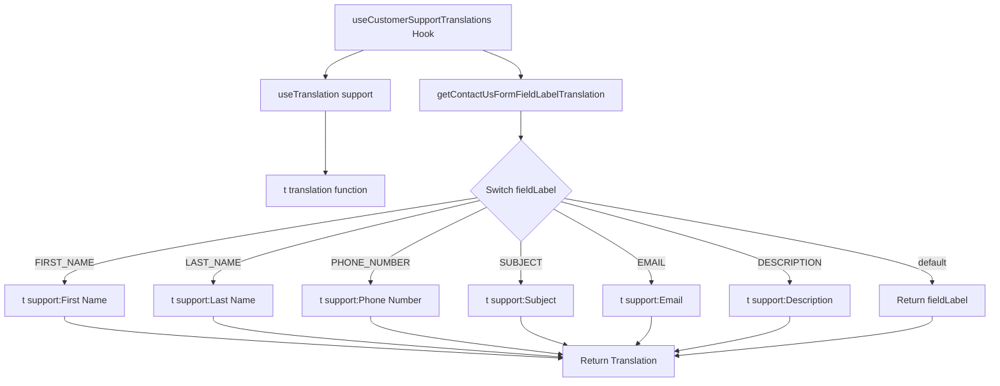
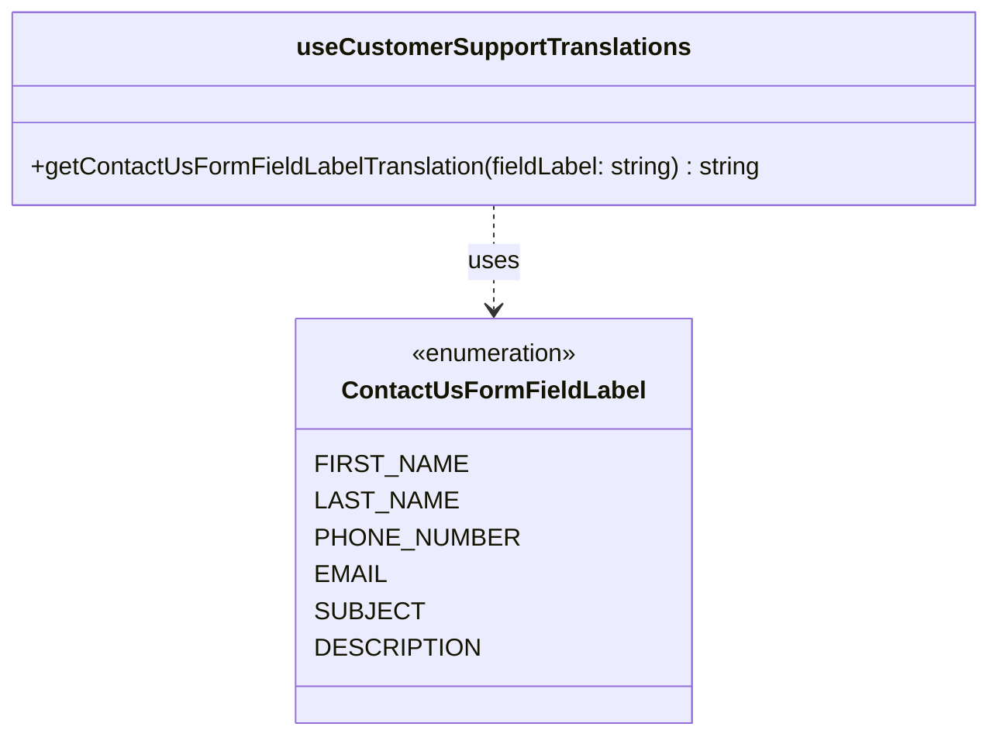

# Diagram: web/portal/src/shared/hooks/useCustomerSupportTranslations.ts

> Auto-generated by Obscura crawlers

## Diagram 1

### SVG

<svg id="container" width="1725.765625" xmlns="http://www.w3.org/2000/svg" class="flowchart" height="657.03125" viewBox="0 0 1725.765625 657.03125" role="graphics-document document" aria-roledescription="flowchart-v2"><g><marker id="container_flowchart-v2-pointEnd" class="marker flowchart-v2" viewBox="0 0 10 10" refX="5" refY="5" markerUnits="userSpaceOnUse" markerWidth="8" markerHeight="8" orient="auto"><path d="M 0 0 L 10 5 L 0 10 z" class="arrowMarkerPath" style="stroke-width: 1; stroke-dasharray: 1, 0;"></path></marker><marker id="container_flowchart-v2-pointStart" class="marker flowchart-v2" viewBox="0 0 10 10" refX="4.5" refY="5" markerUnits="userSpaceOnUse" markerWidth="8" markerHeight="8" orient="auto"><path d="M 0 5 L 10 10 L 10 0 z" class="arrowMarkerPath" style="stroke-width: 1; stroke-dasharray: 1, 0;"></path></marker><marker id="container_flowchart-v2-circleEnd" class="marker flowchart-v2" viewBox="0 0 10 10" refX="11" refY="5" markerUnits="userSpaceOnUse" markerWidth="11" markerHeight="11" orient="auto"><circle cx="5" cy="5" r="5" class="arrowMarkerPath" style="stroke-width: 1; stroke-dasharray: 1, 0;"></circle></marker><marker id="container_flowchart-v2-circleStart" class="marker flowchart-v2" viewBox="0 0 10 10" refX="-1" refY="5" markerUnits="userSpaceOnUse" markerWidth="11" markerHeight="11" orient="auto"><circle cx="5" cy="5" r="5" class="arrowMarkerPath" style="stroke-width: 1; stroke-dasharray: 1, 0;"></circle></marker><marker id="container_flowchart-v2-crossEnd" class="marker cross flowchart-v2" viewBox="0 0 11 11" refX="12" refY="5.2" markerUnits="userSpaceOnUse" markerWidth="11" markerHeight="11" orient="auto"><path d="M 1,1 l 9,9 M 10,1 l -9,9" class="arrowMarkerPath" style="stroke-width: 2; stroke-dasharray: 1, 0;"></path></marker><marker id="container_flowchart-v2-crossStart" class="marker cross flowchart-v2" viewBox="0 0 11 11" refX="-1" refY="5.2" markerUnits="userSpaceOnUse" markerWidth="11" markerHeight="11" orient="auto"><path d="M 1,1 l 9,9 M 10,1 l -9,9" class="arrowMarkerPath" style="stroke-width: 2; stroke-dasharray: 1, 0;"></path></marker><g class="root"><g class="clusters"></g><g class="edgePaths"><path d="M633.336,86L622.338,90.167C611.339,94.333,589.341,102.667,578.343,110.333C567.344,118,567.344,125,567.344,128.5L567.344,132" id="L_A_B_0" class="edge-thickness-normal edge-pattern-solid edge-thickness-normal edge-pattern-solid flowchart-link" style=";" data-edge="true" data-et="edge" data-id="L_A_B_0" data-points="W3sieCI6NjMzLjMzNjQ4NjgxNjQwNjIsInkiOjg2fSx7IngiOjU2Ny4zNDM3NSwieSI6MTExfSx7IngiOjU2Ny4zNDM3NSwieSI6MTM2fV0=" marker-end="url(#container_flowchart-v2-pointEnd)"></path><path d="M567.344,190L567.344,194.167C567.344,198.333,567.344,206.667,567.344,224.586C567.344,242.505,567.344,270.01,567.344,283.763L567.344,297.516" id="L_B_C_0" class="edge-thickness-normal edge-pattern-solid edge-thickness-normal edge-pattern-solid flowchart-link" style=";" data-edge="true" data-et="edge" data-id="L_B_C_0" data-points="W3sieCI6NTY3LjM0Mzc1LCJ5IjoxOTB9LHsieCI6NTY3LjM0Mzc1LCJ5IjoyMTV9LHsieCI6NTY3LjM0Mzc1LCJ5IjozMDEuNTE1NjI1fV0=" marker-end="url(#container_flowchart-v2-pointEnd)"></path><path d="M839.234,86L850.233,90.167C861.231,94.333,883.229,102.667,894.228,110.333C905.227,118,905.227,125,905.227,128.5L905.227,132" id="L_A_D_0" class="edge-thickness-normal edge-pattern-solid edge-thickness-normal edge-pattern-solid flowchart-link" style=";" data-edge="true" data-et="edge" data-id="L_A_D_0" data-points="W3sieCI6ODM5LjIzMzgyNTY4MzU5MzgsInkiOjg2fSx7IngiOjkwNS4yMjY1NjI1LCJ5IjoxMTF9LHsieCI6OTA1LjIyNjU2MjUsInkiOjEzNn1d" marker-end="url(#container_flowchart-v2-pointEnd)"></path><path d="M905.227,190L905.227,194.167C905.227,198.333,905.227,206.667,905.227,214.333C905.227,222,905.227,229,905.227,232.5L905.227,236" id="L_D_E_0" class="edge-thickness-normal edge-pattern-solid edge-thickness-normal edge-pattern-solid flowchart-link" style=";" data-edge="true" data-et="edge" data-id="L_D_E_0" data-points="W3sieCI6OTA1LjIyNjU2MjUsInkiOjE5MH0seyJ4Ijo5MDUuMjI2NTYyNSwieSI6MjE1fSx7IngiOjkwNS4yMjY1NjI1LCJ5IjoyNDB9XQ==" marker-end="url(#container_flowchart-v2-pointEnd)"></path><path d="M828.806,340.61L709.364,359.514C589.923,378.417,351.039,416.224,231.598,440.628C112.156,465.031,112.156,476.031,112.156,481.531L112.156,487.031" id="L_E_F_0" class="edge-thickness-normal edge-pattern-solid edge-thickness-normal edge-pattern-solid flowchart-link" style=";" data-edge="true" data-et="edge" data-id="L_E_F_0" data-points="W3sieCI6ODI4LjgwNTcxNjU5NTMzMTcsInkiOjM0MC42MTA0MDQwOTUzMzE2Nn0seyJ4IjoxMTIuMTU2MjUsInkiOjQ1NC4wMzEyNX0seyJ4IjoxMTIuMTU2MjUsInkiOjQ5MS4wMzEyNX1d" marker-end="url(#container_flowchart-v2-pointEnd)"></path><path d="M833.52,345.324L756.229,363.442C678.938,381.56,524.356,417.796,447.064,441.413C369.773,465.031,369.773,476.031,369.773,481.531L369.773,487.031" id="L_E_G_0" class="edge-thickness-normal edge-pattern-solid edge-thickness-normal edge-pattern-solid flowchart-link" style=";" data-edge="true" data-et="edge" data-id="L_E_G_0" data-points="W3sieCI6ODMzLjUxOTc0MTIzNTYzOSwieSI6MzQ1LjMyNDQyODczNTYzOX0seyJ4IjozNjkuNzczNDM3NSwieSI6NDU0LjAzMTI1fSx7IngiOjM2OS43NzM0Mzc1LCJ5Ijo0OTEuMDMxMjV9XQ==" marker-end="url(#container_flowchart-v2-pointEnd)"></path><path d="M845.36,357.164L811.623,373.309C777.886,389.453,710.412,421.742,676.675,443.387C642.938,465.031,642.938,476.031,642.938,481.531L642.938,487.031" id="L_E_H_0" class="edge-thickness-normal edge-pattern-solid edge-thickness-normal edge-pattern-solid flowchart-link" style=";" data-edge="true" data-et="edge" data-id="L_E_H_0" data-points="W3sieCI6ODQ1LjM1OTYyMTYyNDM3ODEsInkiOjM1Ny4xNjQzMDkxMjQzNzh9LHsieCI6NjQyLjkzNzUsInkiOjQ1NC4wMzEyNX0seyJ4Ijo2NDIuOTM3NSwieSI6NDkxLjAzMTI1fV0=" marker-end="url(#container_flowchart-v2-pointEnd)"></path><path d="M905.227,417.031L905.227,423.198C905.227,429.365,905.227,441.698,905.227,453.365C905.227,465.031,905.227,476.031,905.227,481.531L905.227,487.031" id="L_E_I_0" class="edge-thickness-normal edge-pattern-solid edge-thickness-normal edge-pattern-solid flowchart-link" style=";" data-edge="true" data-et="edge" data-id="L_E_I_0" data-points="W3sieCI6OTA1LjIyNjU2MjUsInkiOjQxNy4wMzEyNX0seyJ4Ijo5MDUuMjI2NTYyNSwieSI6NDU0LjAzMTI1fSx7IngiOjkwNS4yMjY1NjI1LCJ5Ijo0OTEuMDMxMjV9XQ==" marker-end="url(#container_flowchart-v2-pointEnd)"></path><path d="M962.324,359.934L990.824,375.617C1019.325,391.3,1076.327,422.666,1104.827,443.848C1133.328,465.031,1133.328,476.031,1133.328,481.531L1133.328,487.031" id="L_E_J_0" class="edge-thickness-normal edge-pattern-solid edge-thickness-normal edge-pattern-solid flowchart-link" style=";" data-edge="true" data-et="edge" data-id="L_E_J_0" data-points="W3sieCI6OTYyLjMyMzc2NTU4MjUzOTksInkiOjM1OS45MzQwNDY5MTc0NjAyfSx7IngiOjExMzMuMzI4MTI1LCJ5Ijo0NTQuMDMxMjV9LHsieCI6MTEzMy4zMjgxMjUsInkiOjQ5MS4wMzEyNX1d" marker-end="url(#container_flowchart-v2-pointEnd)"></path><path d="M975.111,347.147L1041.93,364.961C1108.748,382.775,1242.386,418.403,1309.205,441.717C1376.023,465.031,1376.023,476.031,1376.023,481.531L1376.023,487.031" id="L_E_K_0" class="edge-thickness-normal edge-pattern-solid edge-thickness-normal edge-pattern-solid flowchart-link" style=";" data-edge="true" data-et="edge" data-id="L_E_K_0" data-points="W3sieCI6OTc1LjExMDg1OTEzNzUzOCwieSI6MzQ3LjE0Njk1MzM2MjQ2Mn0seyJ4IjoxMzc2LjAyMzQzNzUsInkiOjQ1NC4wMzEyNX0seyJ4IjoxMzc2LjAyMzQzNzUsInkiOjQ5MS4wMzEyNX1d" marker-end="url(#container_flowchart-v2-pointEnd)"></path><path d="M980.606,341.652L1088.086,360.382C1195.566,379.112,1410.525,416.571,1518.005,440.801C1625.484,465.031,1625.484,476.031,1625.484,481.531L1625.484,487.031" id="L_E_L_0" class="edge-thickness-normal edge-pattern-solid edge-thickness-normal edge-pattern-solid flowchart-link" style=";" data-edge="true" data-et="edge" data-id="L_E_L_0" data-points="W3sieCI6OTgwLjYwNjE3MDgwNjIzNzksInkiOjM0MS42NTE2NDE2OTM3NjIyfSx7IngiOjE2MjUuNDg0Mzc1LCJ5Ijo0NTQuMDMxMjV9LHsieCI6MTYyNS40ODQzNzUsInkiOjQ5MS4wMzEyNX1d" marker-end="url(#container_flowchart-v2-pointEnd)"></path><path d="M112.156,545.031L112.156,549.198C112.156,553.365,112.156,561.698,255.632,573.62C399.107,585.542,686.059,601.053,829.534,608.808L973.01,616.563" id="L_F_M_0" class="edge-thickness-normal edge-pattern-solid edge-thickness-normal edge-pattern-solid flowchart-link" style=";" data-edge="true" data-et="edge" data-id="L_F_M_0" data-points="W3sieCI6MTEyLjE1NjI1LCJ5Ijo1NDUuMDMxMjV9LHsieCI6MTEyLjE1NjI1LCJ5Ijo1NzAuMDMxMjV9LHsieCI6OTc3LjAwMzkwNjI1LCJ5Ijo2MTYuNzc5MjAyNDkyMTMyOH1d" marker-end="url(#container_flowchart-v2-pointEnd)"></path><path d="M369.773,545.031L369.773,549.198C369.773,553.365,369.773,561.698,470.314,573.287C570.854,584.875,771.934,599.72,872.475,607.142L973.015,614.564" id="L_G_M_0" class="edge-thickness-normal edge-pattern-solid edge-thickness-normal edge-pattern-solid flowchart-link" style=";" data-edge="true" data-et="edge" data-id="L_G_M_0" data-points="W3sieCI6MzY5Ljc3MzQzNzUsInkiOjU0NS4wMzEyNX0seyJ4IjozNjkuNzczNDM3NSwieSI6NTcwLjAzMTI1fSx7IngiOjk3Ny4wMDM5MDYyNSwieSI6NjE0Ljg1ODM3ODc5NTIzMDh9XQ==" marker-end="url(#container_flowchart-v2-pointEnd)"></path><path d="M642.938,545.031L642.938,549.198C642.938,553.365,642.938,561.698,697.953,572.499C752.969,583.299,863.001,596.568,918.017,603.202L973.033,609.836" id="L_H_M_0" class="edge-thickness-normal edge-pattern-solid edge-thickness-normal edge-pattern-solid flowchart-link" style=";" data-edge="true" data-et="edge" data-id="L_H_M_0" data-points="W3sieCI6NjQyLjkzNzUsInkiOjU0NS4wMzEyNX0seyJ4Ijo2NDIuOTM3NSwieSI6NTcwLjAzMTI1fSx7IngiOjk3Ny4wMDM5MDYyNSwieSI6NjEwLjMxNDcwNDg2NjYxNTN9XQ==" marker-end="url(#container_flowchart-v2-pointEnd)"></path><path d="M905.227,545.031L905.227,549.198C905.227,553.365,905.227,561.698,918.126,569.835C931.026,577.972,956.826,585.913,969.726,589.884L982.625,593.855" id="L_I_M_0" class="edge-thickness-normal edge-pattern-solid edge-thickness-normal edge-pattern-solid flowchart-link" style=";" data-edge="true" data-et="edge" data-id="L_I_M_0" data-points="W3sieCI6OTA1LjIyNjU2MjUsInkiOjU0NS4wMzEyNX0seyJ4Ijo5MDUuMjI2NTYyNSwieSI6NTcwLjAzMTI1fSx7IngiOjk4Ni40NDgzOTI0Mjc4ODQ2LCJ5Ijo1OTUuMDMxMjV9XQ==" marker-end="url(#container_flowchart-v2-pointEnd)"></path><path d="M1133.328,545.031L1133.328,549.198C1133.328,553.365,1133.328,561.698,1129.088,569.591C1124.849,577.484,1116.369,584.937,1112.13,588.664L1107.89,592.39" id="L_J_M_0" class="edge-thickness-normal edge-pattern-solid edge-thickness-normal edge-pattern-solid flowchart-link" style=";" data-edge="true" data-et="edge" data-id="L_J_M_0" data-points="W3sieCI6MTEzMy4zMjgxMjUsInkiOjU0NS4wMzEyNX0seyJ4IjoxMTMzLjMyODEyNSwieSI6NTcwLjAzMTI1fSx7IngiOjExMDQuODg1NzQyMTg3NSwieSI6NTk1LjAzMTI1fV0=" marker-end="url(#container_flowchart-v2-pointEnd)"></path><path d="M1376.023,545.031L1376.023,549.198C1376.023,553.365,1376.023,561.698,1342.565,571.628C1309.107,581.559,1242.19,593.086,1208.732,598.85L1175.274,604.614" id="L_K_M_0" class="edge-thickness-normal edge-pattern-solid edge-thickness-normal edge-pattern-solid flowchart-link" style=";" data-edge="true" data-et="edge" data-id="L_K_M_0" data-points="W3sieCI6MTM3Ni4wMjM0Mzc1LCJ5Ijo1NDUuMDMxMjV9LHsieCI6MTM3Ni4wMjM0Mzc1LCJ5Ijo1NzAuMDMxMjV9LHsieCI6MTE3MS4zMzIwMzEyNSwieSI6NjA1LjI5MzAwMzQ3NzgzODl9XQ==" marker-end="url(#container_flowchart-v2-pointEnd)"></path><path d="M1625.484,545.031L1625.484,549.198C1625.484,553.365,1625.484,561.698,1550.456,572.941C1475.428,584.185,1325.371,598.338,1250.343,605.415L1175.314,612.491" id="L_L_M_0" class="edge-thickness-normal edge-pattern-solid edge-thickness-normal edge-pattern-solid flowchart-link" style=";" data-edge="true" data-et="edge" data-id="L_L_M_0" data-points="W3sieCI6MTYyNS40ODQzNzUsInkiOjU0NS4wMzEyNX0seyJ4IjoxNjI1LjQ4NDM3NSwieSI6NTcwLjAzMTI1fSx7IngiOjExNzEuMzMyMDMxMjUsInkiOjYxMi44NjY3NjQ0MjkyNDI1fV0=" marker-end="url(#container_flowchart-v2-pointEnd)"></path></g><g class="edgeLabels"><g class="edgeLabel"><g class="label" data-id="L_A_B_0" transform="translate(0, 0)"><foreignObject width="0" height="0">

</foreignObject></g></g><g class="edgeLabel"><g class="label" data-id="L_B_C_0" transform="translate(0, 0)"><foreignObject width="0" height="0">

</foreignObject></g></g><g class="edgeLabel"><g class="label" data-id="L_A_D_0" transform="translate(0, 0)"><foreignObject width="0" height="0">

</foreignObject></g></g><g class="edgeLabel"><g class="label" data-id="L_D_E_0" transform="translate(0, 0)"><foreignObject width="0" height="0">

</foreignObject></g></g><g class="edgeLabel" transform="translate(112.15625, 454.03125)"><g class="label" data-id="L_E_F_0" transform="translate(-43.7109375, -12)"><foreignObject width="87.421875" height="24">

FIRST_NAME

</foreignObject></g></g><g class="edgeLabel" transform="translate(369.7734375, 454.03125)"><g class="label" data-id="L_E_G_0" transform="translate(-41.203125, -12)"><foreignObject width="82.40625" height="24">

LAST_NAME

</foreignObject></g></g><g class="edgeLabel" transform="translate(642.9375, 454.03125)"><g class="label" data-id="L_E_H_0" transform="translate(-60.5, -12)"><foreignObject width="121" height="24">

PHONE_NUMBER

</foreignObject></g></g><g class="edgeLabel" transform="translate(905.2265625, 454.03125)"><g class="label" data-id="L_E_I_0" transform="translate(-29.5546875, -12)"><foreignObject width="59.109375" height="24">

SUBJECT

</foreignObject></g></g><g class="edgeLabel" transform="translate(1133.328125, 454.03125)"><g class="label" data-id="L_E_J_0" transform="translate(-21.4375, -12)"><foreignObject width="42.875" height="24">

EMAIL

</foreignObject></g></g><g class="edgeLabel" transform="translate(1376.0234375, 454.03125)"><g class="label" data-id="L_E_K_0" transform="translate(-47.34375, -12)"><foreignObject width="94.6875" height="24">

DESCRIPTION

</foreignObject></g></g><g class="edgeLabel" transform="translate(1625.484375, 454.03125)"><g class="label" data-id="L_E_L_0" transform="translate(-25.890625, -12)"><foreignObject width="51.78125" height="24">

default

</foreignObject></g></g><g class="edgeLabel"><g class="label" data-id="L_F_M_0" transform="translate(0, 0)"><foreignObject width="0" height="0">

</foreignObject></g></g><g class="edgeLabel"><g class="label" data-id="L_G_M_0" transform="translate(0, 0)"><foreignObject width="0" height="0">

</foreignObject></g></g><g class="edgeLabel"><g class="label" data-id="L_H_M_0" transform="translate(0, 0)"><foreignObject width="0" height="0">

</foreignObject></g></g><g class="edgeLabel"><g class="label" data-id="L_I_M_0" transform="translate(0, 0)"><foreignObject width="0" height="0">

</foreignObject></g></g><g class="edgeLabel"><g class="label" data-id="L_J_M_0" transform="translate(0, 0)"><foreignObject width="0" height="0">

</foreignObject></g></g><g class="edgeLabel"><g class="label" data-id="L_K_M_0" transform="translate(0, 0)"><foreignObject width="0" height="0">

</foreignObject></g></g><g class="edgeLabel"><g class="label" data-id="L_L_M_0" transform="translate(0, 0)"><foreignObject width="0" height="0">

</foreignObject></g></g></g><g class="nodes"><g class="node default" id="flowchart-A-0" transform="translate(736.28515625, 47)"><rect class="basic label-container" style="" x="-152.8984375" y="-39" width="305.796875" height="78"></rect><g class="label" style="" transform="translate(-122.8984375, -24)"><rect></rect><foreignObject width="245.796875" height="48">

useCustomerSupportTranslations Hook

</foreignObject></g></g><g class="node default" id="flowchart-B-1" transform="translate(567.34375, 163)"><rect class="basic label-container" style="" x="-114.0625" y="-27" width="228.125" height="54"></rect><g class="label" style="" transform="translate(-84.0625, -12)"><rect></rect><foreignObject width="168.125" height="24">

useTranslation support

</foreignObject></g></g><g class="node default" id="flowchart-C-3" transform="translate(567.34375, 328.515625)"><rect class="basic label-container" style="" x="-107.1171875" y="-27" width="214.234375" height="54"></rect><g class="label" style="" transform="translate(-77.1171875, -12)"><rect></rect><foreignObject width="154.234375" height="24">

t translation function

</foreignObject></g></g><g class="node default" id="flowchart-D-5" transform="translate(905.2265625, 163)"><rect class="basic label-container" style="" x="-173.8203125" y="-27" width="347.640625" height="54"></rect><g class="label" style="" transform="translate(-143.8203125, -12)"><rect></rect><foreignObject width="287.640625" height="24">

getContactUsFormFieldLabelTranslation

</foreignObject></g></g><g class="node default" id="flowchart-E-7" transform="translate(905.2265625, 328.515625)"><polygon points="88.515625,0 177.03125,-88.515625 88.515625,-177.03125 0,-88.515625" class="label-container" transform="translate(-88.015625, 88.515625)"></polygon><g class="label" style="" transform="translate(-61.515625, -12)"><rect></rect><foreignObject width="123.03125" height="24">

Switch fieldLabel

</foreignObject></g></g><g class="node default" id="flowchart-F-9" transform="translate(112.15625, 518.03125)"><rect class="basic label-container" style="" x="-104.15625" y="-27" width="208.3125" height="54"></rect><g class="label" style="" transform="translate(-74.15625, -12)"><rect></rect><foreignObject width="148.3125" height="24">

t support:First Name

</foreignObject></g></g><g class="node default" id="flowchart-G-11" transform="translate(369.7734375, 518.03125)"><rect class="basic label-container" style="" x="-103.4609375" y="-27" width="206.921875" height="54"></rect><g class="label" style="" transform="translate(-73.4609375, -12)"><rect></rect><foreignObject width="146.921875" height="24">

t support:Last Name

</foreignObject></g></g><g class="node default" id="flowchart-H-13" transform="translate(642.9375, 518.03125)"><rect class="basic label-container" style="" x="-119.703125" y="-27" width="239.40625" height="54"></rect><g class="label" style="" transform="translate(-89.703125, -12)"><rect></rect><foreignObject width="179.40625" height="24">

t support:Phone Number

</foreignObject></g></g><g class="node default" id="flowchart-I-15" transform="translate(905.2265625, 518.03125)"><rect class="basic label-container" style="" x="-92.5859375" y="-27" width="185.171875" height="54"></rect><g class="label" style="" transform="translate(-62.5859375, -12)"><rect></rect><foreignObject width="125.171875" height="24">

t support:Subject

</foreignObject></g></g><g class="node default" id="flowchart-J-17" transform="translate(1133.328125, 518.03125)"><rect class="basic label-container" style="" x="-85.515625" y="-27" width="171.03125" height="54"></rect><g class="label" style="" transform="translate(-55.515625, -12)"><rect></rect><foreignObject width="111.03125" height="24">

t support:Email

</foreignObject></g></g><g class="node default" id="flowchart-K-19" transform="translate(1376.0234375, 518.03125)"><rect class="basic label-container" style="" x="-107.1796875" y="-27" width="214.359375" height="54"></rect><g class="label" style="" transform="translate(-77.1796875, -12)"><rect></rect><foreignObject width="154.359375" height="24">

t support:Description

</foreignObject></g></g><g class="node default" id="flowchart-L-21" transform="translate(1625.484375, 518.03125)"><rect class="basic label-container" style="" x="-92.28125" y="-27" width="184.5625" height="54"></rect><g class="label" style="" transform="translate(-62.28125, -12)"><rect></rect><foreignObject width="124.5625" height="24">

Return fieldLabel

</foreignObject></g></g><g class="node default" id="flowchart-M-23" transform="translate(1074.16796875, 622.03125)"><rect class="basic label-container" style="" x="-97.1640625" y="-27" width="194.328125" height="54"></rect><g class="label" style="" transform="translate(-67.1640625, -12)"><rect></rect><foreignObject width="134.328125" height="24">

Return Translation

</foreignObject></g></g></g></g></g></svg>

## Diagram 2

### SVG

<svg id="container" width="643.875" xmlns="http://www.w3.org/2000/svg" class="classDiagram" height="480" viewBox="0 0 643.875 480" role="graphics-document document" aria-roledescription="class"><g><defs><marker id="container_class-aggregationStart" class="marker aggregation class" refX="18" refY="7" markerWidth="190" markerHeight="240" orient="auto"><path d="M 18,7 L9,13 L1,7 L9,1 Z"></path></marker></defs><defs><marker id="container_class-aggregationEnd" class="marker aggregation class" refX="1" refY="7" markerWidth="20" markerHeight="28" orient="auto"><path d="M 18,7 L9,13 L1,7 L9,1 Z"></path></marker></defs><defs><marker id="container_class-extensionStart" class="marker extension class" refX="18" refY="7" markerWidth="190" markerHeight="240" orient="auto"><path d="M 1,7 L18,13 V 1 Z"></path></marker></defs><defs><marker id="container_class-extensionEnd" class="marker extension class" refX="1" refY="7" markerWidth="20" markerHeight="28" orient="auto"><path d="M 1,1 V 13 L18,7 Z"></path></marker></defs><defs><marker id="container_class-compositionStart" class="marker composition class" refX="18" refY="7" markerWidth="190" markerHeight="240" orient="auto"><path d="M 18,7 L9,13 L1,7 L9,1 Z"></path></marker></defs><defs><marker id="container_class-compositionEnd" class="marker composition class" refX="1" refY="7" markerWidth="20" markerHeight="28" orient="auto"><path d="M 18,7 L9,13 L1,7 L9,1 Z"></path></marker></defs><defs><marker id="container_class-dependencyStart" class="marker dependency class" refX="6" refY="7" markerWidth="190" markerHeight="240" orient="auto"><path d="M 5,7 L9,13 L1,7 L9,1 Z"></path></marker></defs><defs><marker id="container_class-dependencyEnd" class="marker dependency class" refX="13" refY="7" markerWidth="20" markerHeight="28" orient="auto"><path d="M 18,7 L9,13 L14,7 L9,1 Z"></path></marker></defs><defs><marker id="container_class-lollipopStart" class="marker lollipop class" refX="13" refY="7" markerWidth="190" markerHeight="240" orient="auto"><circle stroke="black" fill="transparent" cx="7" cy="7" r="6"></circle></marker></defs><defs><marker id="container_class-lollipopEnd" class="marker lollipop class" refX="1" refY="7" markerWidth="190" markerHeight="240" orient="auto"><circle stroke="black" fill="transparent" cx="7" cy="7" r="6"></circle></marker></defs><g class="root"><g class="clusters"></g><g class="edgePaths"><path d="M321.938,134L321.938,140.167C321.938,146.333,321.938,158.667,321.938,170C321.938,181.333,321.938,191.667,321.938,196.833L321.938,202" id="id_useCustomerSupportTranslations_ContactUsFormFieldLabel_1" class="edge-thickness-normal edge-pattern-dashed relation" style=";;;" data-edge="true" data-et="edge" data-id="id_useCustomerSupportTranslations_ContactUsFormFieldLabel_1" data-points="W3sieCI6MzIxLjkzNzUsInkiOjEzNH0seyJ4IjozMjEuOTM3NSwieSI6MTcxfSx7IngiOjMyMS45Mzc1LCJ5IjoyMDh9XQ==" marker-end="url(#container_class-dependencyEnd)"></path></g><g class="edgeLabels"><g class="edgeLabel" transform="translate(321.9375, 171)"><g class="label" data-id="id_useCustomerSupportTranslations_ContactUsFormFieldLabel_1" transform="translate(-16.4921875, -12)"><foreignObject width="32.984375" height="24">

uses

</foreignObject></g></g></g><g class="nodes"><g class="node default" id="classId-ContactUsFormFieldLabel-0" transform="translate(321.9375, 340)"><g class="basic label-container"><path d="M-118.8828125 -132 L118.8828125 -132 L118.8828125 132 L-118.8828125 132" stroke="none" stroke-width="0" fill="#ECECFF" style=""></path><path d="M-118.8828125 -132 C-32.59820717242155 -132, 53.686398155156894 -132, 118.8828125 -132 M-118.8828125 -132 C-54.33167032533174 -132, 10.219471849336514 -132, 118.8828125 -132 M118.8828125 -132 C118.8828125 -29.879878143683513, 118.8828125 72.24024371263297, 118.8828125 132 M118.8828125 -132 C118.8828125 -60.13687212136867, 118.8828125 11.726255757262663, 118.8828125 132 M118.8828125 132 C41.681950508977806 132, -35.51891148204439 132, -118.8828125 132 M118.8828125 132 C55.641144916048084 132, -7.600522667903832 132, -118.8828125 132 M-118.8828125 132 C-118.8828125 76.25086705115093, -118.8828125 20.501734102301867, -118.8828125 -132 M-118.8828125 132 C-118.8828125 43.29408880669344, -118.8828125 -45.411822386613125, -118.8828125 -132" stroke="#9370DB" stroke-width="1.3" fill="none" stroke-dasharray="0 0" style=""></path></g><g class="annotation-group text" transform="translate(-55.5546875, -108)"><g class="label" style="" transform="translate(0,-12)"><foreignObject width="111.109375" height="24">

«enumeration»

</foreignObject></g></g><g class="label-group text" transform="translate(-92.765625, -84)"><g class="label" style="font-weight: bolder" transform="translate(0,-12)"><foreignObject width="185.53125" height="24">

ContactUsFormFieldLabel

</foreignObject></g></g><g class="members-group text" transform="translate(-106.8828125, -36)"><g class="label" style="" transform="translate(0,-12)"><foreignObject width="87.421875" height="24">

FIRST_NAME

</foreignObject></g><g class="label" style="" transform="translate(0,12)"><foreignObject width="82.40625" height="24">

LAST_NAME

</foreignObject></g><g class="label" style="" transform="translate(0,36)"><foreignObject width="121" height="24">

PHONE_NUMBER

</foreignObject></g><g class="label" style="" transform="translate(0,60)"><foreignObject width="42.875" height="24">

EMAIL

</foreignObject></g><g class="label" style="" transform="translate(0,84)"><foreignObject width="59.109375" height="24">

SUBJECT

</foreignObject></g><g class="label" style="" transform="translate(0,108)"><foreignObject width="94.6875" height="24">

DESCRIPTION

</foreignObject></g></g><g class="methods-group text" transform="translate(-106.8828125, 132)"></g><g class="divider" style=""><path d="M-118.8828125 -60 C-51.538740784885945 -60, 15.80533093022811 -60, 118.8828125 -60 M-118.8828125 -60 C-42.6136502128159 -60, 33.655512074368204 -60, 118.8828125 -60" stroke="#9370DB" stroke-width="1.3" fill="none" stroke-dasharray="0 0" style=""></path></g><g class="divider" style=""><path d="M-118.8828125 108 C-30.664375923484627 108, 57.554060653030746 108, 118.8828125 108 M-118.8828125 108 C-67.91127703500248 108, -16.939741570004983 108, 118.8828125 108" stroke="#9370DB" stroke-width="1.3" fill="none" stroke-dasharray="0 0" style=""></path></g></g><g class="node default" id="classId-useCustomerSupportTranslations-1" transform="translate(321.9375, 71)"><g class="basic label-container"><path d="M-313.9375 -63 L313.9375 -63 L313.9375 63 L-313.9375 63" stroke="none" stroke-width="0" fill="#ECECFF" style=""></path><path d="M-313.9375 -63 C-166.12716522950356 -63, -18.31683045900712 -63, 313.9375 -63 M-313.9375 -63 C-91.15779422396898 -63, 131.62191155206204 -63, 313.9375 -63 M313.9375 -63 C313.9375 -20.40178534167562, 313.9375 22.19642931664876, 313.9375 63 M313.9375 -63 C313.9375 -36.01320034593954, 313.9375 -9.026400691879068, 313.9375 63 M313.9375 63 C150.99799275412056 63, -11.94151449175888 63, -313.9375 63 M313.9375 63 C168.15065121490275 63, 22.363802429805503 63, -313.9375 63 M-313.9375 63 C-313.9375 25.457047381037704, -313.9375 -12.085905237924592, -313.9375 -63 M-313.9375 63 C-313.9375 30.00087769391407, -313.9375 -2.9982446121718596, -313.9375 -63" stroke="#9370DB" stroke-width="1.3" fill="none" stroke-dasharray="0 0" style=""></path></g><g class="annotation-group text" transform="translate(0, -39)"></g><g class="label-group text" transform="translate(-122.53125, -39)"><g class="label" style="font-weight: bolder" transform="translate(0,-12)"><foreignObject width="245.0625" height="24">

useCustomerSupportTranslations

</foreignObject></g></g><g class="members-group text" transform="translate(-301.9375, 9)"></g><g class="methods-group text" transform="translate(-301.9375, 39)"><g class="label" style="" transform="translate(0,-12)"><foreignObject width="481.34375" height="24">

+getContactUsFormFieldLabelTranslation(fieldLabel: string) : string

</foreignObject></g></g><g class="divider" style=""><path d="M-313.9375 -15 C-82.07909839959794 -15, 149.77930320080412 -15, 313.9375 -15 M-313.9375 -15 C-186.7992974400208 -15, -59.66109488004162 -15, 313.9375 -15" stroke="#9370DB" stroke-width="1.3" fill="none" stroke-dasharray="0 0" style=""></path></g><g class="divider" style=""><path d="M-313.9375 9 C-65.25432742905232 9, 183.42884514189535 9, 313.9375 9 M-313.9375 9 C-89.8972149135241 9, 134.1430701729518 9, 313.9375 9" stroke="#9370DB" stroke-width="1.3" fill="none" stroke-dasharray="0 0" style=""></path></g></g></g></g></g></svg>
