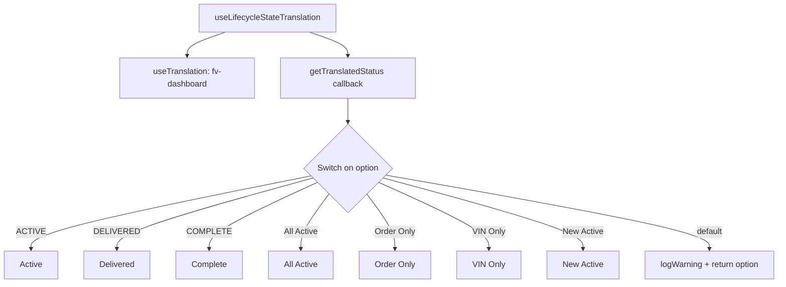
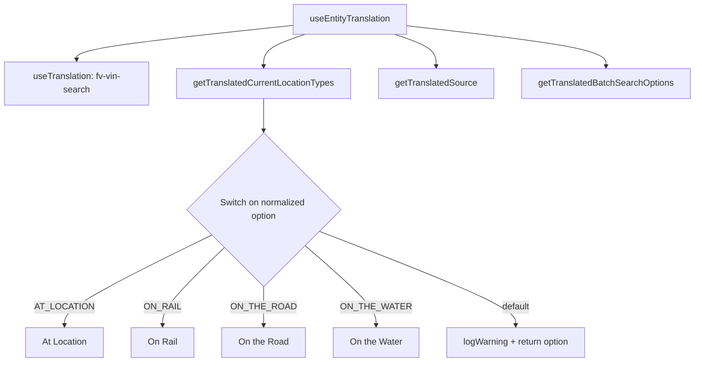
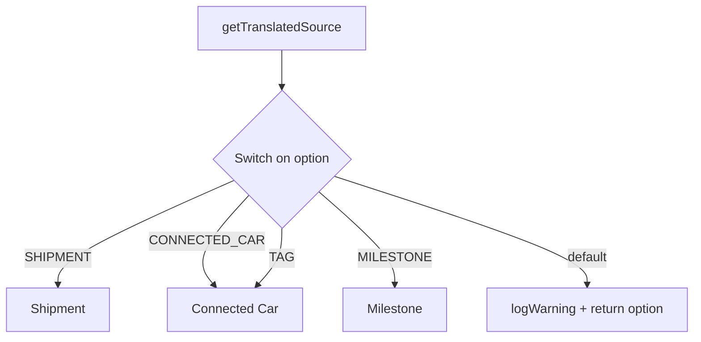
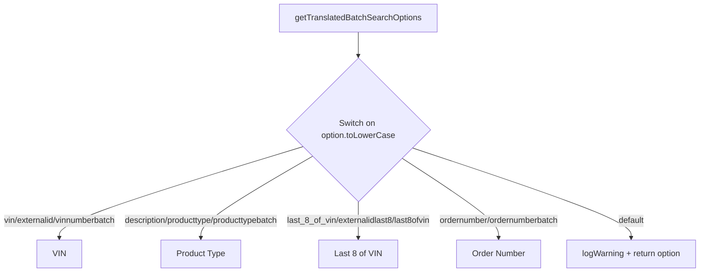
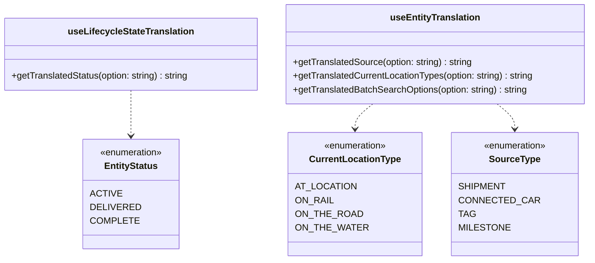

# Diagram: web/portal/src/shared/hooks/useEntityTranslation.ts

> Auto-generated by Obscura crawlers

## Diagram 1

### SVG

<svg id="container" width="1507.671875" xmlns="http://www.w3.org/2000/svg" class="flowchart" height="552.328125" viewBox="0 0 1507.671875 552.328125" role="graphics-document document" aria-roledescription="flowchart-v2"><g><marker id="container_flowchart-v2-pointEnd" class="marker flowchart-v2" viewBox="0 0 10 10" refX="5" refY="5" markerUnits="userSpaceOnUse" markerWidth="8" markerHeight="8" orient="auto"><path d="M 0 0 L 10 5 L 0 10 z" class="arrowMarkerPath" style="stroke-width: 1; stroke-dasharray: 1, 0;"></path></marker><marker id="container_flowchart-v2-pointStart" class="marker flowchart-v2" viewBox="0 0 10 10" refX="4.5" refY="5" markerUnits="userSpaceOnUse" markerWidth="8" markerHeight="8" orient="auto"><path d="M 0 5 L 10 10 L 10 0 z" class="arrowMarkerPath" style="stroke-width: 1; stroke-dasharray: 1, 0;"></path></marker><marker id="container_flowchart-v2-circleEnd" class="marker flowchart-v2" viewBox="0 0 10 10" refX="11" refY="5" markerUnits="userSpaceOnUse" markerWidth="11" markerHeight="11" orient="auto"><circle cx="5" cy="5" r="5" class="arrowMarkerPath" style="stroke-width: 1; stroke-dasharray: 1, 0;"></circle></marker><marker id="container_flowchart-v2-circleStart" class="marker flowchart-v2" viewBox="0 0 10 10" refX="-1" refY="5" markerUnits="userSpaceOnUse" markerWidth="11" markerHeight="11" orient="auto"><circle cx="5" cy="5" r="5" class="arrowMarkerPath" style="stroke-width: 1; stroke-dasharray: 1, 0;"></circle></marker><marker id="container_flowchart-v2-crossEnd" class="marker cross flowchart-v2" viewBox="0 0 11 11" refX="12" refY="5.2" markerUnits="userSpaceOnUse" markerWidth="11" markerHeight="11" orient="auto"><path d="M 1,1 l 9,9 M 10,1 l -9,9" class="arrowMarkerPath" style="stroke-width: 2; stroke-dasharray: 1, 0;"></path></marker><marker id="container_flowchart-v2-crossStart" class="marker cross flowchart-v2" viewBox="0 0 11 11" refX="-1" refY="5.2" markerUnits="userSpaceOnUse" markerWidth="11" markerHeight="11" orient="auto"><path d="M 1,1 l 9,9 M 10,1 l -9,9" class="arrowMarkerPath" style="stroke-width: 2; stroke-dasharray: 1, 0;"></path></marker><g class="root"><g class="clusters"></g><g class="edgePaths"><path d="M438.105,62L425.685,66.167C413.265,70.333,388.426,78.667,376.006,86.333C363.586,94,363.586,101,363.586,104.5L363.586,108" id="L_A_B_0" class="edge-thickness-normal edge-pattern-solid edge-thickness-normal edge-pattern-solid flowchart-link" style=";" data-edge="true" data-et="edge" data-id="L_A_B_0" data-points="W3sieCI6NDM4LjEwNTE2ODI2OTIzMDgsInkiOjYyfSx7IngiOjM2My41ODU5Mzc1LCJ5Ijo4N30seyJ4IjozNjMuNTg1OTM3NSwieSI6MTEyfV0=" marker-end="url(#container_flowchart-v2-pointEnd)"></path><path d="M599.067,62L611.487,66.167C623.906,70.333,648.746,78.667,661.166,86.333C673.586,94,673.586,101,673.586,104.5L673.586,108" id="L_A_C_0" class="edge-thickness-normal edge-pattern-solid edge-thickness-normal edge-pattern-solid flowchart-link" style=";" data-edge="true" data-et="edge" data-id="L_A_C_0" data-points="W3sieCI6NTk5LjA2NjcwNjczMDc2OTMsInkiOjYyfSx7IngiOjY3My41ODU5Mzc1LCJ5Ijo4N30seyJ4Ijo2NzMuNTg1OTM3NSwieSI6MTEyfV0=" marker-end="url(#container_flowchart-v2-pointEnd)"></path><path d="M673.586,190L673.586,194.167C673.586,198.333,673.586,206.667,673.586,214.333C673.586,222,673.586,229,673.586,232.5L673.586,236" id="L_C_D_0" class="edge-thickness-normal edge-pattern-solid edge-thickness-normal edge-pattern-solid flowchart-link" style=";" data-edge="true" data-et="edge" data-id="L_C_D_0" data-points="W3sieCI6NjczLjU4NTkzNzUsInkiOjE5MH0seyJ4Ijo2NzMuNTg1OTM3NSwieSI6MjE1fSx7IngiOjY3My41ODU5Mzc1LCJ5IjoyNDB9XQ==" marker-end="url(#container_flowchart-v2-pointEnd)"></path><path d="M600.356,343.098L510.266,361.47C420.177,379.841,239.999,416.585,149.91,440.456C59.82,464.328,59.82,475.328,59.82,480.828L59.82,486.328" id="L_D_E_0" class="edge-thickness-normal edge-pattern-solid edge-thickness-normal edge-pattern-solid flowchart-link" style=";" data-edge="true" data-et="edge" data-id="L_D_E_0" data-points="W3sieCI6NjAwLjM1NTU5OTI5ODM2NzYsInkiOjM0My4wOTc3ODY3OTgzNjc1N30seyJ4Ijo1OS44MjAzMTI1LCJ5Ijo0NTMuMzI4MTI1fSx7IngiOjU5LjgyMDMxMjUsInkiOjQ5MC4zMjgxMjV9XQ==" marker-end="url(#container_flowchart-v2-pointEnd)"></path><path d="M604.689,347.431L541.577,365.081C478.465,382.73,352.24,418.029,289.128,441.179C226.016,464.328,226.016,475.328,226.016,480.828L226.016,486.328" id="L_D_F_0" class="edge-thickness-normal edge-pattern-solid edge-thickness-normal edge-pattern-solid flowchart-link" style=";" data-edge="true" data-et="edge" data-id="L_D_F_0" data-points="W3sieCI6NjA0LjY4OTA0NzkwMDE4NDIsInkiOjM0Ny40MzEyMzU0MDAxODQxNn0seyJ4IjoyMjYuMDE1NjI1LCJ5Ijo0NTMuMzI4MTI1fSx7IngiOjIyNi4wMTU2MjUsInkiOjQ5MC4zMjgxMjV9XQ==" marker-end="url(#container_flowchart-v2-pointEnd)"></path><path d="M613.432,356.174L578.658,372.367C543.884,388.559,474.337,420.944,439.563,442.636C404.789,464.328,404.789,475.328,404.789,480.828L404.789,486.328" id="L_D_G_0" class="edge-thickness-normal edge-pattern-solid edge-thickness-normal edge-pattern-solid flowchart-link" style=";" data-edge="true" data-et="edge" data-id="L_D_G_0" data-points="W3sieCI6NjEzLjQzMjE5NTc2NjkwMDcsInkiOjM1Ni4xNzQzODMyNjY5MDA3fSx7IngiOjQwNC43ODkwNjI1LCJ5Ijo0NTMuMzI4MTI1fSx7IngiOjQwNC43ODkwNjI1LCJ5Ijo0OTAuMzI4MTI1fV0=" marker-end="url(#container_flowchart-v2-pointEnd)"></path><path d="M636.427,379.169L627.422,391.529C618.417,403.889,600.408,428.608,591.403,446.468C582.398,464.328,582.398,475.328,582.398,480.828L582.398,486.328" id="L_D_H_0" class="edge-thickness-normal edge-pattern-solid edge-thickness-normal edge-pattern-solid flowchart-link" style=";" data-edge="true" data-et="edge" data-id="L_D_H_0" data-points="W3sieCI6NjM2LjQyNjY5MzczODAzODUsInkiOjM3OS4xNjg4ODEyMzgwMzg0N30seyJ4Ijo1ODIuMzk4NDM3NSwieSI6NDUzLjMyODEyNX0seyJ4Ijo1ODIuMzk4NDM3NSwieSI6NDkwLjMyODEyNX1d" marker-end="url(#container_flowchart-v2-pointEnd)"></path><path d="M710.745,379.169L719.75,391.529C728.755,403.889,746.764,428.608,755.769,446.468C764.773,464.328,764.773,475.328,764.773,480.828L764.773,486.328" id="L_D_I_0" class="edge-thickness-normal edge-pattern-solid edge-thickness-normal edge-pattern-solid flowchart-link" style=";" data-edge="true" data-et="edge" data-id="L_D_I_0" data-points="W3sieCI6NzEwLjc0NTE4MTI2MTk2MTUsInkiOjM3OS4xNjg4ODEyMzgwMzg0N30seyJ4Ijo3NjQuNzczNDM3NSwieSI6NDUzLjMyODEyNX0seyJ4Ijo3NjQuNzczNDM3NSwieSI6NDkwLjMyODEyNX1d" marker-end="url(#container_flowchart-v2-pointEnd)"></path><path d="M733.908,356.007L769.049,372.227C804.191,388.447,874.474,420.888,909.616,442.608C944.758,464.328,944.758,475.328,944.758,480.828L944.758,486.328" id="L_D_J_0" class="edge-thickness-normal edge-pattern-solid edge-thickness-normal edge-pattern-solid flowchart-link" style=";" data-edge="true" data-et="edge" data-id="L_D_J_0" data-points="W3sieCI6NzMzLjkwNzUyODAzMzg5NDQsInkiOjM1Ni4wMDY1MzQ0NjYxMDU1Nn0seyJ4Ijo5NDQuNzU3ODEyNSwieSI6NDUzLjMyODEyNX0seyJ4Ijo5NDQuNzU3ODEyNSwieSI6NDkwLjMyODEyNX1d" marker-end="url(#container_flowchart-v2-pointEnd)"></path><path d="M742.614,347.3L806.358,364.972C870.102,382.643,997.59,417.985,1061.334,441.157C1125.078,464.328,1125.078,475.328,1125.078,480.828L1125.078,486.328" id="L_D_K_0" class="edge-thickness-normal edge-pattern-solid edge-thickness-normal edge-pattern-solid flowchart-link" style=";" data-edge="true" data-et="edge" data-id="L_D_K_0" data-points="W3sieCI6NzQyLjYxMzg2NDM0MDMxNzMsInkiOjM0Ny4zMDAxOTgxNTk2ODI3fSx7IngiOjExMjUuMDc4MTI1LCJ5Ijo0NTMuMzI4MTI1fSx7IngiOjExMjUuMDc4MTI1LCJ5Ijo0OTAuMzI4MTI1fV0=" marker-end="url(#container_flowchart-v2-pointEnd)"></path><path d="M748.353,341.561L852.315,360.189C956.277,378.817,1164.201,416.072,1268.163,440.2C1372.125,464.328,1372.125,475.328,1372.125,480.828L1372.125,486.328" id="L_D_L_0" class="edge-thickness-normal edge-pattern-solid edge-thickness-normal edge-pattern-solid flowchart-link" style=";" data-edge="true" data-et="edge" data-id="L_D_L_0" data-points="W3sieCI6NzQ4LjM1MzIxNjc0ODc0ODEsInkiOjM0MS41NjA4NDU3NTEyNTJ9LHsieCI6MTM3Mi4xMjUsInkiOjQ1My4zMjgxMjV9LHsieCI6MTM3Mi4xMjUsInkiOjQ5MC4zMjgxMjV9XQ==" marker-end="url(#container_flowchart-v2-pointEnd)"></path></g><g class="edgeLabels"><g class="edgeLabel"><g class="label" data-id="L_A_B_0" transform="translate(0, 0)"><foreignObject width="0" height="0">

</foreignObject></g></g><g class="edgeLabel"><g class="label" data-id="L_A_C_0" transform="translate(0, 0)"><foreignObject width="0" height="0">

</foreignObject></g></g><g class="edgeLabel"><g class="label" data-id="L_C_D_0" transform="translate(0, 0)"><foreignObject width="0" height="0">

</foreignObject></g></g><g class="edgeLabel" transform="translate(59.8203125, 453.328125)"><g class="label" data-id="L_D_E_0" transform="translate(-24.1328125, -12)"><foreignObject width="48.265625" height="24">

ACTIVE

</foreignObject></g></g><g class="edgeLabel" transform="translate(226.015625, 453.328125)"><g class="label" data-id="L_D_F_0" transform="translate(-38.78125, -12)"><foreignObject width="77.5625" height="24">

DELIVERED

</foreignObject></g></g><g class="edgeLabel" transform="translate(404.7890625, 453.328125)"><g class="label" data-id="L_D_G_0" transform="translate(-37.359375, -12)"><foreignObject width="74.71875" height="24">

COMPLETE

</foreignObject></g></g><g class="edgeLabel" transform="translate(582.3984375, 453.328125)"><g class="label" data-id="L_D_H_0" transform="translate(-33.2109375, -12)"><foreignObject width="66.421875" height="24">

All Active

</foreignObject></g></g><g class="edgeLabel" transform="translate(764.7734375, 453.328125)"><g class="label" data-id="L_D_I_0" transform="translate(-39.1640625, -12)"><foreignObject width="78.328125" height="24">

Order Only

</foreignObject></g></g><g class="edgeLabel" transform="translate(944.7578125, 453.328125)"><g class="label" data-id="L_D_J_0" transform="translate(-30.8203125, -12)"><foreignObject width="61.640625" height="24">

VIN Only

</foreignObject></g></g><g class="edgeLabel" transform="translate(1125.078125, 453.328125)"><g class="label" data-id="L_D_K_0" transform="translate(-39.5, -12)"><foreignObject width="79" height="24">

New Active

</foreignObject></g></g><g class="edgeLabel" transform="translate(1372.125, 453.328125)"><g class="label" data-id="L_D_L_0" transform="translate(-25.890625, -12)"><foreignObject width="51.78125" height="24">

default

</foreignObject></g></g></g><g class="nodes"><g class="node default" id="flowchart-A-0" transform="translate(518.5859375, 35)"><rect class="basic label-container" style="" x="-133.484375" y="-27" width="266.96875" height="54"></rect><g class="label" style="" transform="translate(-103.484375, -12)"><rect></rect><foreignObject width="206.96875" height="24">

useLifecycleStateTranslation

</foreignObject></g></g><g class="node default" id="flowchart-B-1" transform="translate(363.5859375, 151)"><rect class="basic label-container" style="" x="-130" y="-39" width="260" height="78"></rect><g class="label" style="" transform="translate(-100, -24)"><rect></rect><foreignObject width="200" height="48">

useTranslation: fv-dashboard

</foreignObject></g></g><g class="node default" id="flowchart-C-3" transform="translate(673.5859375, 151)"><rect class="basic label-container" style="" x="-130" y="-39" width="260" height="78"></rect><g class="label" style="" transform="translate(-100, -24)"><rect></rect><foreignObject width="200" height="48">

getTranslatedStatus callback

</foreignObject></g></g><g class="node default" id="flowchart-D-5" transform="translate(673.5859375, 328.1640625)"><polygon points="88.1640625,0 176.328125,-88.1640625 88.1640625,-176.328125 0,-88.1640625" class="label-container" transform="translate(-87.6640625, 88.1640625)"></polygon><g class="label" style="" transform="translate(-61.1640625, -12)"><rect></rect><foreignObject width="122.328125" height="24">

Switch on option

</foreignObject></g></g><g class="node default" id="flowchart-E-7" transform="translate(59.8203125, 517.328125)"><rect class="basic label-container" style="" x="-51.8203125" y="-27" width="103.640625" height="54"></rect><g class="label" style="" transform="translate(-21.8203125, -12)"><rect></rect><foreignObject width="43.640625" height="24">

Active

</foreignObject></g></g><g class="node default" id="flowchart-F-9" transform="translate(226.015625, 517.328125)"><rect class="basic label-container" style="" x="-64.375" y="-27" width="128.75" height="54"></rect><g class="label" style="" transform="translate(-34.375, -12)"><rect></rect><foreignObject width="68.75" height="24">

Delivered

</foreignObject></g></g><g class="node default" id="flowchart-G-11" transform="translate(404.7890625, 517.328125)"><rect class="basic label-container" style="" x="-64.3984375" y="-27" width="128.796875" height="54"></rect><g class="label" style="" transform="translate(-34.3984375, -12)"><rect></rect><foreignObject width="68.796875" height="24">

Complete

</foreignObject></g></g><g class="node default" id="flowchart-H-13" transform="translate(582.3984375, 517.328125)"><rect class="basic label-container" style="" x="-63.2109375" y="-27" width="126.421875" height="54"></rect><g class="label" style="" transform="translate(-33.2109375, -12)"><rect></rect><foreignObject width="66.421875" height="24">

All Active

</foreignObject></g></g><g class="node default" id="flowchart-I-15" transform="translate(764.7734375, 517.328125)"><rect class="basic label-container" style="" x="-69.1640625" y="-27" width="138.328125" height="54"></rect><g class="label" style="" transform="translate(-39.1640625, -12)"><rect></rect><foreignObject width="78.328125" height="24">

Order Only

</foreignObject></g></g><g class="node default" id="flowchart-J-17" transform="translate(944.7578125, 517.328125)"><rect class="basic label-container" style="" x="-60.8203125" y="-27" width="121.640625" height="54"></rect><g class="label" style="" transform="translate(-30.8203125, -12)"><rect></rect><foreignObject width="61.640625" height="24">

VIN Only

</foreignObject></g></g><g class="node default" id="flowchart-K-19" transform="translate(1125.078125, 517.328125)"><rect class="basic label-container" style="" x="-69.5" y="-27" width="139" height="54"></rect><g class="label" style="" transform="translate(-39.5, -12)"><rect></rect><foreignObject width="79" height="24">

New Active

</foreignObject></g></g><g class="node default" id="flowchart-L-21" transform="translate(1372.125, 517.328125)"><rect class="basic label-container" style="" x="-127.546875" y="-27" width="255.09375" height="54"></rect><g class="label" style="" transform="translate(-97.546875, -12)"><rect></rect><foreignObject width="195.09375" height="24">

logWarning + return option

</foreignObject></g></g></g></g></g></svg>

## Diagram 2

### SVG

<svg id="container" width="1254.921875" xmlns="http://www.w3.org/2000/svg" class="flowchart" height="654" viewBox="0 0 1254.921875 654" role="graphics-document document" aria-roledescription="flowchart-v2"><g><marker id="container_flowchart-v2-pointEnd" class="marker flowchart-v2" viewBox="0 0 10 10" refX="5" refY="5" markerUnits="userSpaceOnUse" markerWidth="8" markerHeight="8" orient="auto"><path d="M 0 0 L 10 5 L 0 10 z" class="arrowMarkerPath" style="stroke-width: 1; stroke-dasharray: 1, 0;"></path></marker><marker id="container_flowchart-v2-pointStart" class="marker flowchart-v2" viewBox="0 0 10 10" refX="4.5" refY="5" markerUnits="userSpaceOnUse" markerWidth="8" markerHeight="8" orient="auto"><path d="M 0 5 L 10 10 L 10 0 z" class="arrowMarkerPath" style="stroke-width: 1; stroke-dasharray: 1, 0;"></path></marker><marker id="container_flowchart-v2-circleEnd" class="marker flowchart-v2" viewBox="0 0 10 10" refX="11" refY="5" markerUnits="userSpaceOnUse" markerWidth="11" markerHeight="11" orient="auto"><circle cx="5" cy="5" r="5" class="arrowMarkerPath" style="stroke-width: 1; stroke-dasharray: 1, 0;"></circle></marker><marker id="container_flowchart-v2-circleStart" class="marker flowchart-v2" viewBox="0 0 10 10" refX="-1" refY="5" markerUnits="userSpaceOnUse" markerWidth="11" markerHeight="11" orient="auto"><circle cx="5" cy="5" r="5" class="arrowMarkerPath" style="stroke-width: 1; stroke-dasharray: 1, 0;"></circle></marker><marker id="container_flowchart-v2-crossEnd" class="marker cross flowchart-v2" viewBox="0 0 11 11" refX="12" refY="5.2" markerUnits="userSpaceOnUse" markerWidth="11" markerHeight="11" orient="auto"><path d="M 1,1 l 9,9 M 10,1 l -9,9" class="arrowMarkerPath" style="stroke-width: 2; stroke-dasharray: 1, 0;"></path></marker><marker id="container_flowchart-v2-crossStart" class="marker cross flowchart-v2" viewBox="0 0 11 11" refX="-1" refY="5.2" markerUnits="userSpaceOnUse" markerWidth="11" markerHeight="11" orient="auto"><path d="M 1,1 l 9,9 M 10,1 l -9,9" class="arrowMarkerPath" style="stroke-width: 2; stroke-dasharray: 1, 0;"></path></marker><g class="root"><g class="clusters"></g><g class="edgePaths"><path d="M527.523,45.975L462.603,52.813C397.682,59.65,267.841,73.325,202.921,83.663C138,94,138,101,138,104.5L138,108" id="L_A_B_0" class="edge-thickness-normal edge-pattern-solid edge-thickness-normal edge-pattern-solid flowchart-link" style=";" data-edge="true" data-et="edge" data-id="L_A_B_0" data-points="W3sieCI6NTI3LjUyMzQzNzUsInkiOjQ1Ljk3NTQ3MzkwNzQwMjEzfSx7IngiOjEzOCwieSI6ODd9LHsieCI6MTM4LCJ5IjoxMTJ9XQ==" marker-end="url(#container_flowchart-v2-pointEnd)"></path><path d="M550.799,62L538.309,66.167C525.819,70.333,500.839,78.667,488.349,88.333C475.859,98,475.859,109,475.859,114.5L475.859,120" id="L_A_C_0" class="edge-thickness-normal edge-pattern-solid edge-thickness-normal edge-pattern-solid flowchart-link" style=";" data-edge="true" data-et="edge" data-id="L_A_C_0" data-points="W3sieCI6NTUwLjc5OTI3ODg0NjE1MzgsInkiOjYyfSx7IngiOjQ3NS44NTkzNzUsInkiOjg3fSx7IngiOjQ3NS44NTkzNzUsInkiOjEyNH1d" marker-end="url(#container_flowchart-v2-pointEnd)"></path><path d="M712.669,62L725.159,66.167C737.649,70.333,762.629,78.667,775.119,88.333C787.609,98,787.609,109,787.609,114.5L787.609,120" id="L_A_D_0" class="edge-thickness-normal edge-pattern-solid edge-thickness-normal edge-pattern-solid flowchart-link" style=";" data-edge="true" data-et="edge" data-id="L_A_D_0" data-points="W3sieCI6NzEyLjY2OTQ3MTE1Mzg0NjIsInkiOjYyfSx7IngiOjc4Ny42MDkzNzUsInkiOjg3fSx7IngiOjc4Ny42MDkzNzUsInkiOjEyNH1d" marker-end="url(#container_flowchart-v2-pointEnd)"></path><path d="M735.945,46.717L795.656,53.431C855.367,60.145,974.789,73.572,1034.5,85.786C1094.211,98,1094.211,109,1094.211,114.5L1094.211,120" id="L_A_E_0" class="edge-thickness-normal edge-pattern-solid edge-thickness-normal edge-pattern-solid flowchart-link" style=";" data-edge="true" data-et="edge" data-id="L_A_E_0" data-points="W3sieCI6NzM1Ljk0NTMxMjUsInkiOjQ2LjcxNzI4Mjk3MDQyMDh9LHsieCI6MTA5NC4yMTA5Mzc1LCJ5Ijo4N30seyJ4IjoxMDk0LjIxMDkzNzUsInkiOjEyNH1d" marker-end="url(#container_flowchart-v2-pointEnd)"></path><path d="M475.859,178L475.859,184.167C475.859,190.333,475.859,202.667,475.859,212.333C475.859,222,475.859,229,475.859,232.5L475.859,236" id="L_C_F_0" class="edge-thickness-normal edge-pattern-solid edge-thickness-normal edge-pattern-solid flowchart-link" style=";" data-edge="true" data-et="edge" data-id="L_C_F_0" data-points="W3sieCI6NDc1Ljg1OTM3NSwieSI6MTc4fSx7IngiOjQ3NS44NTkzNzUsInkiOjIxNX0seyJ4Ijo0NzUuODU5Mzc1LCJ5IjoyNDB9XQ==" marker-end="url(#container_flowchart-v2-pointEnd)"></path><path d="M382.704,424.845L338.626,446.537C294.548,468.23,206.391,511.615,162.313,538.807C118.234,566,118.234,577,118.234,582.5L118.234,588" id="L_F_G_0" class="edge-thickness-normal edge-pattern-solid edge-thickness-normal edge-pattern-solid flowchart-link" style=";" data-edge="true" data-et="edge" data-id="L_F_G_0" data-points="W3sieCI6MzgyLjcwNDMwMzU1NDY5NjY1LCJ5Ijo0MjQuODQ0OTI4NTU0Njk2NjV9LHsieCI6MTE4LjIzNDM3NSwieSI6NTU1fSx7IngiOjExOC4yMzQzNzUsInkiOjU5Mn1d" marker-end="url(#container_flowchart-v2-pointEnd)"></path><path d="M405.402,447.543L386.993,465.453C368.583,483.362,331.764,519.181,313.355,542.591C294.945,566,294.945,577,294.945,582.5L294.945,588" id="L_F_H_0" class="edge-thickness-normal edge-pattern-solid edge-thickness-normal edge-pattern-solid flowchart-link" style=";" data-edge="true" data-et="edge" data-id="L_F_H_0" data-points="W3sieCI6NDA1LjQwMjQ4NTQzMDExOTI3LCJ5Ijo0NDcuNTQzMTEwNDMwMTE5Mjd9LHsieCI6Mjk0Ljk0NTMxMjUsInkiOjU1NX0seyJ4IjoyOTQuOTQ1MzEyNSwieSI6NTkyfV0=" marker-end="url(#container_flowchart-v2-pointEnd)"></path><path d="M475.859,518L475.859,524.167C475.859,530.333,475.859,542.667,475.859,554.333C475.859,566,475.859,577,475.859,582.5L475.859,588" id="L_F_I_0" class="edge-thickness-normal edge-pattern-solid edge-thickness-normal edge-pattern-solid flowchart-link" style=";" data-edge="true" data-et="edge" data-id="L_F_I_0" data-points="W3sieCI6NDc1Ljg1OTM3NSwieSI6NTE4fSx7IngiOjQ3NS44NTkzNzUsInkiOjU1NX0seyJ4Ijo0NzUuODU5Mzc1LCJ5Ijo1OTJ9XQ==" marker-end="url(#container_flowchart-v2-pointEnd)"></path><path d="M550.173,443.686L571.487,462.238C592.8,480.791,635.428,517.895,656.741,541.948C678.055,566,678.055,577,678.055,582.5L678.055,588" id="L_F_J_0" class="edge-thickness-normal edge-pattern-solid edge-thickness-normal edge-pattern-solid flowchart-link" style=";" data-edge="true" data-et="edge" data-id="L_F_J_0" data-points="W3sieCI6NTUwLjE3MzIyMTU5ODc3MywieSI6NDQzLjY4NjE1MzQwMTIyNzA1fSx7IngiOjY3OC4wNTQ2ODc1LCJ5Ijo1NTV9LHsieCI6Njc4LjA1NDY4NzUsInkiOjU5Mn1d" marker-end="url(#container_flowchart-v2-pointEnd)"></path><path d="M576.217,417.642L635.672,440.535C695.126,463.428,814.036,509.214,873.491,537.607C932.945,566,932.945,577,932.945,582.5L932.945,588" id="L_F_K_0" class="edge-thickness-normal edge-pattern-solid edge-thickness-normal edge-pattern-solid flowchart-link" style=";" data-edge="true" data-et="edge" data-id="L_F_K_0" data-points="W3sieCI6NTc2LjIxNjkxMTg2Njc4NiwieSI6NDE3LjY0MjQ2MzEzMzIxNDA1fSx7IngiOjkzMi45NDUzMTI1LCJ5Ijo1NTV9LHsieCI6OTMyLjk0NTMxMjUsInkiOjU5Mn1d" marker-end="url(#container_flowchart-v2-pointEnd)"></path></g><g class="edgeLabels"><g class="edgeLabel"><g class="label" data-id="L_A_B_0" transform="translate(0, 0)"><foreignObject width="0" height="0">

</foreignObject></g></g><g class="edgeLabel"><g class="label" data-id="L_A_C_0" transform="translate(0, 0)"><foreignObject width="0" height="0">

</foreignObject></g></g><g class="edgeLabel"><g class="label" data-id="L_A_D_0" transform="translate(0, 0)"><foreignObject width="0" height="0">

</foreignObject></g></g><g class="edgeLabel"><g class="label" data-id="L_A_E_0" transform="translate(0, 0)"><foreignObject width="0" height="0">

</foreignObject></g></g><g class="edgeLabel"><g class="label" data-id="L_C_F_0" transform="translate(0, 0)"><foreignObject width="0" height="0">

</foreignObject></g></g><g class="edgeLabel" transform="translate(118.234375, 555)"><g class="label" data-id="L_F_G_0" transform="translate(-47.40625, -12)"><foreignObject width="94.8125" height="24">

AT_LOCATION

</foreignObject></g></g><g class="edgeLabel" transform="translate(294.9453125, 555)"><g class="label" data-id="L_F_H_0" transform="translate(-30.9296875, -12)"><foreignObject width="61.859375" height="24">

ON_RAIL

</foreignObject></g></g><g class="edgeLabel" transform="translate(475.859375, 555)"><g class="label" data-id="L_F_I_0" transform="translate(-52.7421875, -12)"><foreignObject width="105.484375" height="24">

ON_THE_ROAD

</foreignObject></g></g><g class="edgeLabel" transform="translate(678.0546875, 555)"><g class="label" data-id="L_F_J_0" transform="translate(-56.3515625, -12)"><foreignObject width="112.703125" height="24">

ON_THE_WATER

</foreignObject></g></g><g class="edgeLabel" transform="translate(932.9453125, 555)"><g class="label" data-id="L_F_K_0" transform="translate(-25.890625, -12)"><foreignObject width="51.78125" height="24">

default

</foreignObject></g></g></g><g class="nodes"><g class="node default" id="flowchart-A-0" transform="translate(631.734375, 35)"><rect class="basic label-container" style="" x="-104.2109375" y="-27" width="208.421875" height="54"></rect><g class="label" style="" transform="translate(-74.2109375, -12)"><rect></rect><foreignObject width="148.421875" height="24">

useEntityTranslation

</foreignObject></g></g><g class="node default" id="flowchart-B-1" transform="translate(138, 151)"><rect class="basic label-container" style="" x="-130" y="-39" width="260" height="78"></rect><g class="label" style="" transform="translate(-100, -24)"><rect></rect><foreignObject width="200" height="48">

useTranslation: fv-vin-search

</foreignObject></g></g><g class="node default" id="flowchart-C-3" transform="translate(475.859375, 151)"><rect class="basic label-container" style="" x="-157.859375" y="-27" width="315.71875" height="54"></rect><g class="label" style="" transform="translate(-127.859375, -12)"><rect></rect><foreignObject width="255.71875" height="24">

getTranslatedCurrentLocationTypes

</foreignObject></g></g><g class="node default" id="flowchart-D-5" transform="translate(787.609375, 151)"><rect class="basic label-container" style="" x="-103.890625" y="-27" width="207.78125" height="54"></rect><g class="label" style="" transform="translate(-73.890625, -12)"><rect></rect><foreignObject width="147.78125" height="24">

getTranslatedSource

</foreignObject></g></g><g class="node default" id="flowchart-E-7" transform="translate(1094.2109375, 151)"><rect class="basic label-container" style="" x="-152.7109375" y="-27" width="305.421875" height="54"></rect><g class="label" style="" transform="translate(-122.7109375, -12)"><rect></rect><foreignObject width="245.421875" height="24">

getTranslatedBatchSearchOptions

</foreignObject></g></g><g class="node default" id="flowchart-F-9" transform="translate(475.859375, 379)"><polygon points="139,0 278,-139 139,-278 0,-139" class="label-container" transform="translate(-138.5, 139)"></polygon><g class="label" style="" transform="translate(-100, -24)"><rect></rect><foreignObject width="200" height="48">

Switch on normalized option

</foreignObject></g></g><g class="node default" id="flowchart-G-11" transform="translate(118.234375, 619)"><rect class="basic label-container" style="" x="-70.6484375" y="-27" width="141.296875" height="54"></rect><g class="label" style="" transform="translate(-40.6484375, -12)"><rect></rect><foreignObject width="81.296875" height="24">

At Location

</foreignObject></g></g><g class="node default" id="flowchart-H-13" transform="translate(294.9453125, 619)"><rect class="basic label-container" style="" x="-56.0625" y="-27" width="112.125" height="54"></rect><g class="label" style="" transform="translate(-26.0625, -12)"><rect></rect><foreignObject width="52.125" height="24">

On Rail

</foreignObject></g></g><g class="node default" id="flowchart-I-15" transform="translate(475.859375, 619)"><rect class="basic label-container" style="" x="-74.8515625" y="-27" width="149.703125" height="54"></rect><g class="label" style="" transform="translate(-44.8515625, -12)"><rect></rect><foreignObject width="89.703125" height="24">

On the Road

</foreignObject></g></g><g class="node default" id="flowchart-J-17" transform="translate(678.0546875, 619)"><rect class="basic label-container" style="" x="-77.34375" y="-27" width="154.6875" height="54"></rect><g class="label" style="" transform="translate(-47.34375, -12)"><rect></rect><foreignObject width="94.6875" height="24">

On the Water

</foreignObject></g></g><g class="node default" id="flowchart-K-19" transform="translate(932.9453125, 619)"><rect class="basic label-container" style="" x="-127.546875" y="-27" width="255.09375" height="54"></rect><g class="label" style="" transform="translate(-97.546875, -12)"><rect></rect><foreignObject width="195.09375" height="24">

logWarning + return option

</foreignObject></g></g></g></g></g></svg>

## Diagram 3

### SVG

<svg id="container" width="853.1171875" xmlns="http://www.w3.org/2000/svg" class="flowchart" height="424.328125" viewBox="0 0 853.1171875 424.328125" role="graphics-document document" aria-roledescription="flowchart-v2"><g><marker id="container_flowchart-v2-pointEnd" class="marker flowchart-v2" viewBox="0 0 10 10" refX="5" refY="5" markerUnits="userSpaceOnUse" markerWidth="8" markerHeight="8" orient="auto"><path d="M 0 0 L 10 5 L 0 10 z" class="arrowMarkerPath" style="stroke-width: 1; stroke-dasharray: 1, 0;"></path></marker><marker id="container_flowchart-v2-pointStart" class="marker flowchart-v2" viewBox="0 0 10 10" refX="4.5" refY="5" markerUnits="userSpaceOnUse" markerWidth="8" markerHeight="8" orient="auto"><path d="M 0 5 L 10 10 L 10 0 z" class="arrowMarkerPath" style="stroke-width: 1; stroke-dasharray: 1, 0;"></path></marker><marker id="container_flowchart-v2-circleEnd" class="marker flowchart-v2" viewBox="0 0 10 10" refX="11" refY="5" markerUnits="userSpaceOnUse" markerWidth="11" markerHeight="11" orient="auto"><circle cx="5" cy="5" r="5" class="arrowMarkerPath" style="stroke-width: 1; stroke-dasharray: 1, 0;"></circle></marker><marker id="container_flowchart-v2-circleStart" class="marker flowchart-v2" viewBox="0 0 10 10" refX="-1" refY="5" markerUnits="userSpaceOnUse" markerWidth="11" markerHeight="11" orient="auto"><circle cx="5" cy="5" r="5" class="arrowMarkerPath" style="stroke-width: 1; stroke-dasharray: 1, 0;"></circle></marker><marker id="container_flowchart-v2-crossEnd" class="marker cross flowchart-v2" viewBox="0 0 11 11" refX="12" refY="5.2" markerUnits="userSpaceOnUse" markerWidth="11" markerHeight="11" orient="auto"><path d="M 1,1 l 9,9 M 10,1 l -9,9" class="arrowMarkerPath" style="stroke-width: 2; stroke-dasharray: 1, 0;"></path></marker><marker id="container_flowchart-v2-crossStart" class="marker cross flowchart-v2" viewBox="0 0 11 11" refX="-1" refY="5.2" markerUnits="userSpaceOnUse" markerWidth="11" markerHeight="11" orient="auto"><path d="M 1,1 l 9,9 M 10,1 l -9,9" class="arrowMarkerPath" style="stroke-width: 2; stroke-dasharray: 1, 0;"></path></marker><g class="root"><g class="clusters"></g><g class="edgePaths"><path d="M339.055,62L339.055,66.167C339.055,70.333,339.055,78.667,339.055,86.333C339.055,94,339.055,101,339.055,104.5L339.055,108" id="L_A_B_0" class="edge-thickness-normal edge-pattern-solid edge-thickness-normal edge-pattern-solid flowchart-link" style=";" data-edge="true" data-et="edge" data-id="L_A_B_0" data-points="W3sieCI6MzM5LjA1NDY4NzUsInkiOjYyfSx7IngiOjMzOS4wNTQ2ODc1LCJ5Ijo4N30seyJ4IjozMzkuMDU0Njg3NSwieSI6MTEyfV0=" marker-end="url(#container_flowchart-v2-pointEnd)"></path><path d="M279.087,228.36L244.714,244.521C210.342,260.683,141.597,293.005,107.224,314.667C72.852,336.328,72.852,347.328,72.852,352.828L72.852,358.328" id="L_B_C_0" class="edge-thickness-normal edge-pattern-solid edge-thickness-normal edge-pattern-solid flowchart-link" style=";" data-edge="true" data-et="edge" data-id="L_B_C_0" data-points="W3sieCI6Mjc5LjA4NjU4MTU4ODczMTQsInkiOjIyOC4zNjAwMTkwODg3MzE0fSx7IngiOjcyLjg1MTU2MjUsInkiOjMyNS4zMjgxMjV9LHsieCI6NzIuODUxNTYyNSwieSI6MzYyLjMyODEyNX1d" marker-end="url(#container_flowchart-v2-pointEnd)"></path><path d="M298.008,247.281L286.676,260.289C275.344,273.297,252.68,299.312,245.466,317.949C238.252,336.585,246.489,347.843,250.608,353.471L254.726,359.1" id="L_B_D_0" class="edge-thickness-normal edge-pattern-solid edge-thickness-normal edge-pattern-solid flowchart-link" style=";" data-edge="true" data-et="edge" data-id="L_B_D_0" data-points="W3sieCI6Mjk4LjAwNzcyNTcxNzYwOTU2LCJ5IjoyNDcuMjgxMTYzMjE3NjA5Nn0seyJ4IjoyMzAuMDE1NjI1LCJ5IjozMjUuMzI4MTI1fSx7IngiOjI1Ny4wODgxMzQ3NjU2MjUsInkiOjM2Mi4zMjgxMjV9XQ==" marker-end="url(#container_flowchart-v2-pointEnd)"></path><path d="M339.055,288.328L339.055,294.495C339.055,300.661,339.055,312.995,333.525,324.85C327.995,336.705,316.936,348.083,311.407,353.771L305.877,359.46" id="L_B_D_2" class="edge-thickness-normal edge-pattern-solid edge-thickness-normal edge-pattern-solid flowchart-link" style=";" data-edge="true" data-et="edge" data-id="L_B_D_2" data-points="W3sieCI6MzM5LjA1NDY4NzUsInkiOjI4OC4zMjgxMjV9LHsieCI6MzM5LjA1NDY4NzUsInkiOjMyNS4zMjgxMjV9LHsieCI6MzAzLjA4ODk4OTI1NzgxMjUsInkiOjM2Mi4zMjgxMjV9XQ==" marker-end="url(#container_flowchart-v2-pointEnd)"></path><path d="M384.9,242.483L399.858,256.29C414.816,270.098,444.732,297.713,459.69,317.021C474.648,336.328,474.648,347.328,474.648,352.828L474.648,358.328" id="L_B_E_0" class="edge-thickness-normal edge-pattern-solid edge-thickness-normal edge-pattern-solid flowchart-link" style=";" data-edge="true" data-et="edge" data-id="L_B_E_0" data-points="W3sieCI6Mzg0Ljg5OTg5NDM0MTUzNzU2LCJ5IjoyNDIuNDgyOTE4MTU4NDYyNH0seyJ4Ijo0NzQuNjQ4NDM3NSwieSI6MzI1LjMyODEyNX0seyJ4Ijo0NzQuNjQ4NDM3NSwieSI6MzYyLjMyODEyNX1d" marker-end="url(#container_flowchart-v2-pointEnd)"></path><path d="M405.31,222.073L457.353,239.282C509.397,256.491,613.484,290.91,665.527,313.619C717.57,336.328,717.57,347.328,717.57,352.828L717.57,358.328" id="L_B_F_0" class="edge-thickness-normal edge-pattern-solid edge-thickness-normal edge-pattern-solid flowchart-link" style=";" data-edge="true" data-et="edge" data-id="L_B_F_0" data-points="W3sieCI6NDA1LjMxMDAzOTk1NDk3OTc0LCJ5IjoyMjIuMDcyNzcyNTQ1MDIwMjN9LHsieCI6NzE3LjU3MDMxMjUsInkiOjMyNS4zMjgxMjV9LHsieCI6NzE3LjU3MDMxMjUsInkiOjM2Mi4zMjgxMjV9XQ==" marker-end="url(#container_flowchart-v2-pointEnd)"></path></g><g class="edgeLabels"><g class="edgeLabel"><g class="label" data-id="L_A_B_0" transform="translate(0, 0)"><foreignObject width="0" height="0">

</foreignObject></g></g><g class="edgeLabel" transform="translate(72.8515625, 325.328125)"><g class="label" data-id="L_B_C_0" transform="translate(-36.6796875, -12)"><foreignObject width="73.359375" height="24">

SHIPMENT

</foreignObject></g></g><g class="edgeLabel" transform="translate(248.95408, 303.589)"><g class="label" data-id="L_B_D_0" transform="translate(-60.3671875, -12)"><foreignObject width="120.734375" height="24">

CONNECTED_CAR

</foreignObject></g></g><g class="edgeLabel" transform="translate(339.0546875, 325.328125)"><g class="label" data-id="L_B_D_2" transform="translate(-13.2890625, -12)"><foreignObject width="26.578125" height="24">

TAG

</foreignObject></g></g><g class="edgeLabel" transform="translate(474.6484375, 325.328125)"><g class="label" data-id="L_B_E_0" transform="translate(-40.09375, -12)"><foreignObject width="80.1875" height="24">

MILESTONE

</foreignObject></g></g><g class="edgeLabel" transform="translate(717.5703125, 325.328125)"><g class="label" data-id="L_B_F_0" transform="translate(-25.890625, -12)"><foreignObject width="51.78125" height="24">

default

</foreignObject></g></g></g><g class="nodes"><g class="node default" id="flowchart-A-0" transform="translate(339.0546875, 35)"><rect class="basic label-container" style="" x="-103.890625" y="-27" width="207.78125" height="54"></rect><g class="label" style="" transform="translate(-73.890625, -12)"><rect></rect><foreignObject width="147.78125" height="24">

getTranslatedSource

</foreignObject></g></g><g class="node default" id="flowchart-B-1" transform="translate(339.0546875, 200.1640625)"><polygon points="88.1640625,0 176.328125,-88.1640625 88.1640625,-176.328125 0,-88.1640625" class="label-container" transform="translate(-87.6640625, 88.1640625)"></polygon><g class="label" style="" transform="translate(-61.1640625, -12)"><rect></rect><foreignObject width="122.328125" height="24">

Switch on option

</foreignObject></g></g><g class="node default" id="flowchart-C-3" transform="translate(72.8515625, 389.328125)"><rect class="basic label-container" style="" x="-64.8515625" y="-27" width="129.703125" height="54"></rect><g class="label" style="" transform="translate(-34.8515625, -12)"><rect></rect><foreignObject width="69.703125" height="24">

Shipment

</foreignObject></g></g><g class="node default" id="flowchart-D-5" transform="translate(276.84375, 389.328125)"><rect class="basic label-container" style="" x="-82.4296875" y="-27" width="164.859375" height="54"></rect><g class="label" style="" transform="translate(-52.4296875, -12)"><rect></rect><foreignObject width="104.859375" height="24">

Connected Car

</foreignObject></g></g><g class="node default" id="flowchart-E-9" transform="translate(474.6484375, 389.328125)"><rect class="basic label-container" style="" x="-65.375" y="-27" width="130.75" height="54"></rect><g class="label" style="" transform="translate(-35.375, -12)"><rect></rect><foreignObject width="70.75" height="24">

Milestone

</foreignObject></g></g><g class="node default" id="flowchart-F-11" transform="translate(717.5703125, 389.328125)"><rect class="basic label-container" style="" x="-127.546875" y="-27" width="255.09375" height="54"></rect><g class="label" style="" transform="translate(-97.546875, -12)"><rect></rect><foreignObject width="195.09375" height="24">

logWarning + return option

</foreignObject></g></g></g></g></g></svg>

## Diagram 4

### SVG

<svg id="container" width="1419.9140625" xmlns="http://www.w3.org/2000/svg" class="flowchart" height="526" viewBox="0 0 1419.9140625 526" role="graphics-document document" aria-roledescription="flowchart-v2"><g><marker id="container_flowchart-v2-pointEnd" class="marker flowchart-v2" viewBox="0 0 10 10" refX="5" refY="5" markerUnits="userSpaceOnUse" markerWidth="8" markerHeight="8" orient="auto"><path d="M 0 0 L 10 5 L 0 10 z" class="arrowMarkerPath" style="stroke-width: 1; stroke-dasharray: 1, 0;"></path></marker><marker id="container_flowchart-v2-pointStart" class="marker flowchart-v2" viewBox="0 0 10 10" refX="4.5" refY="5" markerUnits="userSpaceOnUse" markerWidth="8" markerHeight="8" orient="auto"><path d="M 0 5 L 10 10 L 10 0 z" class="arrowMarkerPath" style="stroke-width: 1; stroke-dasharray: 1, 0;"></path></marker><marker id="container_flowchart-v2-circleEnd" class="marker flowchart-v2" viewBox="0 0 10 10" refX="11" refY="5" markerUnits="userSpaceOnUse" markerWidth="11" markerHeight="11" orient="auto"><circle cx="5" cy="5" r="5" class="arrowMarkerPath" style="stroke-width: 1; stroke-dasharray: 1, 0;"></circle></marker><marker id="container_flowchart-v2-circleStart" class="marker flowchart-v2" viewBox="0 0 10 10" refX="-1" refY="5" markerUnits="userSpaceOnUse" markerWidth="11" markerHeight="11" orient="auto"><circle cx="5" cy="5" r="5" class="arrowMarkerPath" style="stroke-width: 1; stroke-dasharray: 1, 0;"></circle></marker><marker id="container_flowchart-v2-crossEnd" class="marker cross flowchart-v2" viewBox="0 0 11 11" refX="12" refY="5.2" markerUnits="userSpaceOnUse" markerWidth="11" markerHeight="11" orient="auto"><path d="M 1,1 l 9,9 M 10,1 l -9,9" class="arrowMarkerPath" style="stroke-width: 2; stroke-dasharray: 1, 0;"></path></marker><marker id="container_flowchart-v2-crossStart" class="marker cross flowchart-v2" viewBox="0 0 11 11" refX="-1" refY="5.2" markerUnits="userSpaceOnUse" markerWidth="11" markerHeight="11" orient="auto"><path d="M 1,1 l 9,9 M 10,1 l -9,9" class="arrowMarkerPath" style="stroke-width: 2; stroke-dasharray: 1, 0;"></path></marker><g class="root"><g class="clusters"></g><g class="edgePaths"><path d="M739.555,62L739.555,66.167C739.555,70.333,739.555,78.667,739.555,86.333C739.555,94,739.555,101,739.555,104.5L739.555,108" id="L_A_B_0" class="edge-thickness-normal edge-pattern-solid edge-thickness-normal edge-pattern-solid flowchart-link" style=";" data-edge="true" data-et="edge" data-id="L_A_B_0" data-points="W3sieCI6NzM5LjU1NDY4NzUsInkiOjYyfSx7IngiOjczOS41NTQ2ODc1LCJ5Ijo4N30seyJ4Ijo3MzkuNTU0Njg3NSwieSI6MTEyfV0=" marker-end="url(#container_flowchart-v2-pointEnd)"></path><path d="M631.42,281.865L546.676,306.055C461.931,330.244,292.442,378.622,207.698,408.311C122.953,438,122.953,449,122.953,454.5L122.953,460" id="L_B_C_0" class="edge-thickness-normal edge-pattern-solid edge-thickness-normal edge-pattern-solid flowchart-link" style=";" data-edge="true" data-et="edge" data-id="L_B_C_0" data-points="W3sieCI6NjMxLjQyMDEzMjU4Mjk0NDgsInkiOjI4MS44NjU0NDUwODI5NDQ4fSx7IngiOjEyMi45NTMxMjUsInkiOjQyN30seyJ4IjoxMjIuOTUzMTI1LCJ5Ijo0NjR9XQ==" marker-end="url(#container_flowchart-v2-pointEnd)"></path><path d="M649.526,299.972L610.605,321.143C571.684,342.314,493.842,384.657,454.921,411.329C416,438,416,449,416,454.5L416,460" id="L_B_D_0" class="edge-thickness-normal edge-pattern-solid edge-thickness-normal edge-pattern-solid flowchart-link" style=";" data-edge="true" data-et="edge" data-id="L_B_D_0" data-points="W3sieCI6NjQ5LjUyNjMwMjg0NDkxNjYsInkiOjI5OS45NzE2MTUzNDQ5MTY2fSx7IngiOjQxNiwieSI6NDI3fSx7IngiOjQxNiwieSI6NDY0fV0=" marker-end="url(#container_flowchart-v2-pointEnd)"></path><path d="M739.555,390L739.555,396.167C739.555,402.333,739.555,414.667,739.555,426.333C739.555,438,739.555,449,739.555,454.5L739.555,460" id="L_B_E_0" class="edge-thickness-normal edge-pattern-solid edge-thickness-normal edge-pattern-solid flowchart-link" style=";" data-edge="true" data-et="edge" data-id="L_B_E_0" data-points="W3sieCI6NzM5LjU1NDY4NzUsInkiOjM5MH0seyJ4Ijo3MzkuNTU0Njg3NSwieSI6NDI3fSx7IngiOjczOS41NTQ2ODc1LCJ5Ijo0NjR9XQ==" marker-end="url(#container_flowchart-v2-pointEnd)"></path><path d="M825.528,304.027L858.758,324.522C891.987,345.018,958.447,386.009,991.677,412.004C1024.906,438,1024.906,449,1024.906,454.5L1024.906,460" id="L_B_F_0" class="edge-thickness-normal edge-pattern-solid edge-thickness-normal edge-pattern-solid flowchart-link" style=";" data-edge="true" data-et="edge" data-id="L_B_F_0" data-points="W3sieCI6ODI1LjUyNzg4MTA3MTg3NjEsInkiOjMwNC4wMjY4MDY0MjgxMjM5fSx7IngiOjEwMjQuOTA2MjUsInkiOjQyN30seyJ4IjoxMDI0LjkwNjI1LCJ5Ijo0NjR9XQ==" marker-end="url(#container_flowchart-v2-pointEnd)"></path><path d="M844.615,284.939L917.907,308.616C991.199,332.293,1137.783,379.646,1211.075,408.823C1284.367,438,1284.367,449,1284.367,454.5L1284.367,460" id="L_B_G_0" class="edge-thickness-normal edge-pattern-solid edge-thickness-normal edge-pattern-solid flowchart-link" style=";" data-edge="true" data-et="edge" data-id="L_B_G_0" data-points="W3sieCI6ODQ0LjYxNTIwOTQ4MDQwNCwieSI6Mjg0LjkzOTQ3ODAxOTU5NTl9LHsieCI6MTI4NC4zNjcxODc1LCJ5Ijo0Mjd9LHsieCI6MTI4NC4zNjcxODc1LCJ5Ijo0NjR9XQ==" marker-end="url(#container_flowchart-v2-pointEnd)"></path></g><g class="edgeLabels"><g class="edgeLabel"><g class="label" data-id="L_A_B_0" transform="translate(0, 0)"><foreignObject width="0" height="0">

</foreignObject></g></g><g class="edgeLabel" transform="translate(122.953125, 427)"><g class="label" data-id="L_B_C_0" transform="translate(-114.953125, -12)"><foreignObject width="229.90625" height="24">

vin/externalid/vinnumberbatch

</foreignObject></g></g><g class="edgeLabel" transform="translate(416, 427)"><g class="label" data-id="L_B_D_0" transform="translate(-158.09375, -12)"><foreignObject width="316.1875" height="24">

description/producttype/producttypebatch

</foreignObject></g></g><g class="edgeLabel" transform="translate(739.5546875, 427)"><g class="label" data-id="L_B_E_0" transform="translate(-145.4609375, -12)"><foreignObject width="290.921875" height="24">

last_8_of_vin/externalidlast8/last8ofvin

</foreignObject></g></g><g class="edgeLabel" transform="translate(1024.90625, 427)"><g class="label" data-id="L_B_F_0" transform="translate(-119.890625, -12)"><foreignObject width="239.78125" height="24">

ordernumber/ordernumberbatch

</foreignObject></g></g><g class="edgeLabel" transform="translate(1284.3671875, 427)"><g class="label" data-id="L_B_G_0" transform="translate(-25.890625, -12)"><foreignObject width="51.78125" height="24">

default

</foreignObject></g></g></g><g class="nodes"><g class="node default" id="flowchart-A-0" transform="translate(739.5546875, 35)"><rect class="basic label-container" style="" x="-152.7109375" y="-27" width="305.421875" height="54"></rect><g class="label" style="" transform="translate(-122.7109375, -12)"><rect></rect><foreignObject width="245.421875" height="24">

getTranslatedBatchSearchOptions

</foreignObject></g></g><g class="node default" id="flowchart-B-1" transform="translate(739.5546875, 251)"><polygon points="139,0 278,-139 139,-278 0,-139" class="label-container" transform="translate(-138.5, 139)"></polygon><g class="label" style="" transform="translate(-100, -24)"><rect></rect><foreignObject width="200" height="48">

Switch on option.toLowerCase

</foreignObject></g></g><g class="node default" id="flowchart-C-3" transform="translate(122.953125, 491)"><rect class="basic label-container" style="" x="-42.2734375" y="-27" width="84.546875" height="54"></rect><g class="label" style="" transform="translate(-12.2734375, -12)"><rect></rect><foreignObject width="24.546875" height="24">

VIN

</foreignObject></g></g><g class="node default" id="flowchart-D-5" transform="translate(416, 491)"><rect class="basic label-container" style="" x="-77.1484375" y="-27" width="154.296875" height="54"></rect><g class="label" style="" transform="translate(-47.1484375, -12)"><rect></rect><foreignObject width="94.296875" height="24">

Product Type

</foreignObject></g></g><g class="node default" id="flowchart-E-7" transform="translate(739.5546875, 491)"><rect class="basic label-container" style="" x="-75.1953125" y="-27" width="150.390625" height="54"></rect><g class="label" style="" transform="translate(-45.1953125, -12)"><rect></rect><foreignObject width="90.390625" height="24">

Last 8 of VIN

</foreignObject></g></g><g class="node default" id="flowchart-F-9" transform="translate(1024.90625, 491)"><rect class="basic label-container" style="" x="-81.9140625" y="-27" width="163.828125" height="54"></rect><g class="label" style="" transform="translate(-51.9140625, -12)"><rect></rect><foreignObject width="103.828125" height="24">

Order Number

</foreignObject></g></g><g class="node default" id="flowchart-G-11" transform="translate(1284.3671875, 491)"><rect class="basic label-container" style="" x="-127.546875" y="-27" width="255.09375" height="54"></rect><g class="label" style="" transform="translate(-97.546875, -12)"><rect></rect><foreignObject width="195.09375" height="24">

logWarning + return option

</foreignObject></g></g></g></g></g></svg>

## Diagram 5

### SVG

<svg id="container" width="1034.5859375" xmlns="http://www.w3.org/2000/svg" class="classDiagram" height="456" viewBox="0 0 1034.5859375 456" role="graphics-document document" aria-roledescription="class"><g><defs><marker id="container_class-aggregationStart" class="marker aggregation class" refX="18" refY="7" markerWidth="190" markerHeight="240" orient="auto"><path d="M 18,7 L9,13 L1,7 L9,1 Z"></path></marker></defs><defs><marker id="container_class-aggregationEnd" class="marker aggregation class" refX="1" refY="7" markerWidth="20" markerHeight="28" orient="auto"><path d="M 18,7 L9,13 L1,7 L9,1 Z"></path></marker></defs><defs><marker id="container_class-extensionStart" class="marker extension class" refX="18" refY="7" markerWidth="190" markerHeight="240" orient="auto"><path d="M 1,7 L18,13 V 1 Z"></path></marker></defs><defs><marker id="container_class-extensionEnd" class="marker extension class" refX="1" refY="7" markerWidth="20" markerHeight="28" orient="auto"><path d="M 1,1 V 13 L18,7 Z"></path></marker></defs><defs><marker id="container_class-compositionStart" class="marker composition class" refX="18" refY="7" markerWidth="190" markerHeight="240" orient="auto"><path d="M 18,7 L9,13 L1,7 L9,1 Z"></path></marker></defs><defs><marker id="container_class-compositionEnd" class="marker composition class" refX="1" refY="7" markerWidth="20" markerHeight="28" orient="auto"><path d="M 18,7 L9,13 L1,7 L9,1 Z"></path></marker></defs><defs><marker id="container_class-dependencyStart" class="marker dependency class" refX="6" refY="7" markerWidth="190" markerHeight="240" orient="auto"><path d="M 5,7 L9,13 L1,7 L9,1 Z"></path></marker></defs><defs><marker id="container_class-dependencyEnd" class="marker dependency class" refX="13" refY="7" markerWidth="20" markerHeight="28" orient="auto"><path d="M 18,7 L9,13 L14,7 L9,1 Z"></path></marker></defs><defs><marker id="container_class-lollipopStart" class="marker lollipop class" refX="13" refY="7" markerWidth="190" markerHeight="240" orient="auto"><circle stroke="black" fill="transparent" cx="7" cy="7" r="6"></circle></marker></defs><defs><marker id="container_class-lollipopEnd" class="marker lollipop class" refX="1" refY="7" markerWidth="190" markerHeight="240" orient="auto"><circle stroke="black" fill="transparent" cx="7" cy="7" r="6"></circle></marker></defs><g class="root"><g class="clusters"></g><g class="edgePaths"><path d="M229.813,158L229.813,166.167C229.813,174.333,229.813,190.667,229.813,204C229.813,217.333,229.813,227.667,229.813,232.833L229.813,238" id="id_useLifecycleStateTranslation_EntityStatus_1" class="edge-thickness-normal edge-pattern-dashed relation" style=";;;" data-edge="true" data-et="edge" data-id="id_useLifecycleStateTranslation_EntityStatus_1" data-points="W3sieCI6MjI5LjgxMjUsInkiOjE1OH0seyJ4IjoyMjkuODEyNSwieSI6MjA3fSx7IngiOjIyOS44MTI1LCJ5IjoyNDR9XQ==" marker-end="url(#container_class-dependencyEnd)"></path><path d="M647.833,182L642.265,186.167C636.696,190.333,625.559,198.667,619.99,206C614.422,213.333,614.422,219.667,614.422,222.833L614.422,226" id="id_useEntityTranslation_CurrentLocationType_2" class="edge-thickness-normal edge-pattern-dashed relation" style=";;;" data-edge="true" data-et="edge" data-id="id_useEntityTranslation_CurrentLocationType_2" data-points="W3sieCI6NjQ3LjgzMzM5MTQ2MjA1MzYsInkiOjE4Mn0seyJ4Ijo2MTQuNDIxODc1LCJ5IjoyMDd9LHsieCI6NjE0LjQyMTg3NSwieSI6MjMyfV0=" marker-end="url(#container_class-dependencyEnd)"></path><path d="M863.733,182L868.504,186.167C873.276,190.333,882.818,198.667,887.59,206C892.361,213.333,892.361,219.667,892.361,222.833L892.361,226" id="id_useEntityTranslation_SourceType_3" class="edge-thickness-normal edge-pattern-dashed relation" style=";;;" data-edge="true" data-et="edge" data-id="id_useEntityTranslation_SourceType_3" data-points="W3sieCI6ODYzLjczMjc4ODA4NTkzNzUsInkiOjE4Mn0seyJ4Ijo4OTIuMzYxMzI4MTI1LCJ5IjoyMDd9LHsieCI6ODkyLjM2MTMyODEyNSwieSI6MjMyfV0=" marker-end="url(#container_class-dependencyEnd)"></path></g><g class="edgeLabels"><g class="edgeLabel"><g class="label" data-id="id_useLifecycleStateTranslation_EntityStatus_1" transform="translate(0, 0)"><foreignObject width="0" height="0">

</foreignObject></g></g><g class="edgeLabel"><g class="label" data-id="id_useEntityTranslation_CurrentLocationType_2" transform="translate(0, 0)"><foreignObject width="0" height="0">

</foreignObject></g></g><g class="edgeLabel"><g class="label" data-id="id_useEntityTranslation_SourceType_3" transform="translate(0, 0)"><foreignObject width="0" height="0">

</foreignObject></g></g></g><g class="nodes"><g class="node default" id="classId-useLifecycleStateTranslation-0" transform="translate(229.8125, 95)"><g class="basic label-container"><path d="M-221.8125 -63 L221.8125 -63 L221.8125 63 L-221.8125 63" stroke="none" stroke-width="0" fill="#ECECFF" style=""></path><path d="M-221.8125 -63 C-85.51220814254717 -63, 50.78808371490567 -63, 221.8125 -63 M-221.8125 -63 C-55.8295950226796 -63, 110.1533099546408 -63, 221.8125 -63 M221.8125 -63 C221.8125 -28.227284722183853, 221.8125 6.545430555632294, 221.8125 63 M221.8125 -63 C221.8125 -33.446450320942425, 221.8125 -3.89290064188485, 221.8125 63 M221.8125 63 C104.49637474408091 63, -12.81975051183818 63, -221.8125 63 M221.8125 63 C97.95231963102971 63, -25.90786073794058 63, -221.8125 63 M-221.8125 63 C-221.8125 34.430075321929, -221.8125 5.860150643858006, -221.8125 -63 M-221.8125 63 C-221.8125 26.44548446340633, -221.8125 -10.109031073187339, -221.8125 -63" stroke="#9370DB" stroke-width="1.3" fill="none" stroke-dasharray="0 0" style=""></path></g><g class="annotation-group text" transform="translate(0, -39)"></g><g class="label-group text" transform="translate(-105.4375, -39)"><g class="label" style="font-weight: bolder" transform="translate(0,-12)"><foreignObject width="210.875" height="24">

useLifecycleStateTranslation

</foreignObject></g></g><g class="members-group text" transform="translate(-209.8125, 9)"></g><g class="methods-group text" transform="translate(-209.8125, 39)"><g class="label" style="" transform="translate(0,-12)"><foreignObject width="314.1875" height="24">

+getTranslatedStatus(option: string) : string

</foreignObject></g></g><g class="divider" style=""><path d="M-221.8125 -15 C-50.17005242746856 -15, 121.47239514506288 -15, 221.8125 -15 M-221.8125 -15 C-103.97675554684297 -15, 13.858988906314067 -15, 221.8125 -15" stroke="#9370DB" stroke-width="1.3" fill="none" stroke-dasharray="0 0" style=""></path></g><g class="divider" style=""><path d="M-221.8125 9 C-52.841028980660894 9, 116.13044203867821 9, 221.8125 9 M-221.8125 9 C-116.40675037185493 9, -11.001000743709852 9, 221.8125 9" stroke="#9370DB" stroke-width="1.3" fill="none" stroke-dasharray="0 0" style=""></path></g></g><g class="node default" id="classId-useEntityTranslation-1" transform="translate(764.10546875, 95)"><g class="basic label-container"><path d="M-262.48046875 -87 L262.48046875 -87 L262.48046875 87 L-262.48046875 87" stroke="none" stroke-width="0" fill="#ECECFF" style=""></path><path d="M-262.48046875 -87 C-52.725414073606515 -87, 157.02964060278697 -87, 262.48046875 -87 M-262.48046875 -87 C-154.7167431403143 -87, -46.953017530628614 -87, 262.48046875 -87 M262.48046875 -87 C262.48046875 -17.554720884866356, 262.48046875 51.89055823026729, 262.48046875 87 M262.48046875 -87 C262.48046875 -33.54095950939509, 262.48046875 19.918080981209826, 262.48046875 87 M262.48046875 87 C74.09026496292373 87, -114.29993882415255 87, -262.48046875 87 M262.48046875 87 C142.03923051737718 87, 21.597992284754326 87, -262.48046875 87 M-262.48046875 87 C-262.48046875 32.79496498107558, -262.48046875 -21.41007003784884, -262.48046875 -87 M-262.48046875 87 C-262.48046875 46.44873363433225, -262.48046875 5.897467268664499, -262.48046875 -87" stroke="#9370DB" stroke-width="1.3" fill="none" stroke-dasharray="0 0" style=""></path></g><g class="annotation-group text" transform="translate(0, -63)"></g><g class="label-group text" transform="translate(-75.3671875, -63)"><g class="label" style="font-weight: bolder" transform="translate(0,-12)"><foreignObject width="150.734375" height="24">

useEntityTranslation

</foreignObject></g></g><g class="members-group text" transform="translate(-250.48046875, -15)"></g><g class="methods-group text" transform="translate(-250.48046875, 15)"><g class="label" style="" transform="translate(0,-12)"><foreignObject width="317.65625" height="24">

+getTranslatedSource(option: string) : string

</foreignObject></g><g class="label" style="" transform="translate(0,12)"><foreignObject width="425.59375" height="24">

+getTranslatedCurrentLocationTypes(option: string) : string

</foreignObject></g><g class="label" style="" transform="translate(0,36)"><foreignObject width="415.28125" height="24">

+getTranslatedBatchSearchOptions(option: string) : string

</foreignObject></g></g><g class="divider" style=""><path d="M-262.48046875 -39 C-140.03871155569152 -39, -17.59695436138307 -39, 262.48046875 -39 M-262.48046875 -39 C-86.74291453805637 -39, 88.99463967388726 -39, 262.48046875 -39" stroke="#9370DB" stroke-width="1.3" fill="none" stroke-dasharray="0 0" style=""></path></g><g class="divider" style=""><path d="M-262.48046875 -15 C-108.49631381146628 -15, 45.48784112706744 -15, 262.48046875 -15 M-262.48046875 -15 C-115.47952860935482 -15, 31.52141153129037 -15, 262.48046875 -15" stroke="#9370DB" stroke-width="1.3" fill="none" stroke-dasharray="0 0" style=""></path></g></g><g class="node default" id="classId-EntityStatus-2" transform="translate(229.8125, 340)"><g class="basic label-container"><path d="M-78.55859375 -96 L78.55859375 -96 L78.55859375 96 L-78.55859375 96" stroke="none" stroke-width="0" fill="#ECECFF" style=""></path><path d="M-78.55859375 -96 C-22.389221984276084 -96, 33.78014978144783 -96, 78.55859375 -96 M-78.55859375 -96 C-19.794973463505706 -96, 38.96864682298859 -96, 78.55859375 -96 M78.55859375 -96 C78.55859375 -28.14208553214722, 78.55859375 39.71582893570556, 78.55859375 96 M78.55859375 -96 C78.55859375 -36.212520645898465, 78.55859375 23.57495870820307, 78.55859375 96 M78.55859375 96 C46.636483743524906 96, 14.714373737049812 96, -78.55859375 96 M78.55859375 96 C23.775095576642897 96, -31.008402596714205 96, -78.55859375 96 M-78.55859375 96 C-78.55859375 52.4079403257225, -78.55859375 8.815880651445, -78.55859375 -96 M-78.55859375 96 C-78.55859375 40.49103402869003, -78.55859375 -15.017931942619938, -78.55859375 -96" stroke="#9370DB" stroke-width="1.3" fill="none" stroke-dasharray="0 0" style=""></path></g><g class="annotation-group text" transform="translate(-55.5546875, -72)"><g class="label" style="" transform="translate(0,-12)"><foreignObject width="111.109375" height="24">

«enumeration»

</foreignObject></g></g><g class="label-group text" transform="translate(-44.765625, -48)"><g class="label" style="font-weight: bolder" transform="translate(0,-12)"><foreignObject width="89.53125" height="24">

EntityStatus

</foreignObject></g></g><g class="members-group text" transform="translate(-66.55859375, 0)"><g class="label" style="" transform="translate(0,-12)"><foreignObject width="48.265625" height="24">

ACTIVE

</foreignObject></g><g class="label" style="" transform="translate(0,12)"><foreignObject width="77.5625" height="24">

DELIVERED

</foreignObject></g><g class="label" style="" transform="translate(0,36)"><foreignObject width="74.71875" height="24">

COMPLETE

</foreignObject></g></g><g class="methods-group text" transform="translate(-66.55859375, 96)"></g><g class="divider" style=""><path d="M-78.55859375 -24 C-41.36983550709122 -24, -4.181077264182434 -24, 78.55859375 -24 M-78.55859375 -24 C-38.521008367563475 -24, 1.5165770148730502 -24, 78.55859375 -24" stroke="#9370DB" stroke-width="1.3" fill="none" stroke-dasharray="0 0" style=""></path></g><g class="divider" style=""><path d="M-78.55859375 72 C-24.10080955506872 72, 30.356974639862557 72, 78.55859375 72 M-78.55859375 72 C-33.31361349812338 72, 11.931366753753238 72, 78.55859375 72" stroke="#9370DB" stroke-width="1.3" fill="none" stroke-dasharray="0 0" style=""></path></g></g><g class="node default" id="classId-CurrentLocationType-3" transform="translate(614.421875, 340)"><g class="basic label-container"><path d="M-106.3671875 -108 L106.3671875 -108 L106.3671875 108 L-106.3671875 108" stroke="none" stroke-width="0" fill="#ECECFF" style=""></path><path d="M-106.3671875 -108 C-38.307124089999135 -108, 29.75293932000173 -108, 106.3671875 -108 M-106.3671875 -108 C-44.73495306253023 -108, 16.89728137493954 -108, 106.3671875 -108 M106.3671875 -108 C106.3671875 -35.21975598505588, 106.3671875 37.56048802988823, 106.3671875 108 M106.3671875 -108 C106.3671875 -47.032949424025915, 106.3671875 13.93410115194817, 106.3671875 108 M106.3671875 108 C24.444246132813532 108, -57.478695234372935 108, -106.3671875 108 M106.3671875 108 C45.05976012435693 108, -16.247667251286146 108, -106.3671875 108 M-106.3671875 108 C-106.3671875 42.25290685709835, -106.3671875 -23.494186285803295, -106.3671875 -108 M-106.3671875 108 C-106.3671875 47.70167680909453, -106.3671875 -12.596646381810942, -106.3671875 -108" stroke="#9370DB" stroke-width="1.3" fill="none" stroke-dasharray="0 0" style=""></path></g><g class="annotation-group text" transform="translate(-55.5546875, -84)"><g class="label" style="" transform="translate(0,-12)"><foreignObject width="111.109375" height="24">

«enumeration»

</foreignObject></g></g><g class="label-group text" transform="translate(-76.03125, -60)"><g class="label" style="font-weight: bolder" transform="translate(0,-12)"><foreignObject width="152.0625" height="24">

CurrentLocationType

</foreignObject></g></g><g class="members-group text" transform="translate(-94.3671875, -12)"><g class="label" style="" transform="translate(0,-12)"><foreignObject width="94.8125" height="24">

AT_LOCATION

</foreignObject></g><g class="label" style="" transform="translate(0,12)"><foreignObject width="61.859375" height="24">

ON_RAIL

</foreignObject></g><g class="label" style="" transform="translate(0,36)"><foreignObject width="105.484375" height="24">

ON_THE_ROAD

</foreignObject></g><g class="label" style="" transform="translate(0,60)"><foreignObject width="112.703125" height="24">

ON_THE_WATER

</foreignObject></g></g><g class="methods-group text" transform="translate(-94.3671875, 108)"></g><g class="divider" style=""><path d="M-106.3671875 -36 C-41.20256927964628 -36, 23.962048940707433 -36, 106.3671875 -36 M-106.3671875 -36 C-63.03965626711742 -36, -19.712125034234845 -36, 106.3671875 -36" stroke="#9370DB" stroke-width="1.3" fill="none" stroke-dasharray="0 0" style=""></path></g><g class="divider" style=""><path d="M-106.3671875 84 C-43.52865225684962 84, 19.309882986300764 84, 106.3671875 84 M-106.3671875 84 C-30.297414249279257 84, 45.77235900144149 84, 106.3671875 84" stroke="#9370DB" stroke-width="1.3" fill="none" stroke-dasharray="0 0" style=""></path></g></g><g class="node default" id="classId-SourceType-4" transform="translate(892.361328125, 340)"><g class="basic label-container"><path d="M-100.14453125 -108 L100.14453125 -108 L100.14453125 108 L-100.14453125 108" stroke="none" stroke-width="0" fill="#ECECFF" style=""></path><path d="M-100.14453125 -108 C-31.733253751990333 -108, 36.678023746019335 -108, 100.14453125 -108 M-100.14453125 -108 C-54.409428157384305 -108, -8.67432506476861 -108, 100.14453125 -108 M100.14453125 -108 C100.14453125 -55.796235965970844, 100.14453125 -3.592471931941688, 100.14453125 108 M100.14453125 -108 C100.14453125 -24.012418781410616, 100.14453125 59.97516243717877, 100.14453125 108 M100.14453125 108 C35.454436212584284 108, -29.235658824831432 108, -100.14453125 108 M100.14453125 108 C47.586157550574605 108, -4.972216148850791 108, -100.14453125 108 M-100.14453125 108 C-100.14453125 44.72858113559542, -100.14453125 -18.54283772880916, -100.14453125 -108 M-100.14453125 108 C-100.14453125 46.797823013104384, -100.14453125 -14.404353973791231, -100.14453125 -108" stroke="#9370DB" stroke-width="1.3" fill="none" stroke-dasharray="0 0" style=""></path></g><g class="annotation-group text" transform="translate(-55.5546875, -84)"><g class="label" style="" transform="translate(0,-12)"><foreignObject width="111.109375" height="24">

«enumeration»

</foreignObject></g></g><g class="label-group text" transform="translate(-42.21875, -60)"><g class="label" style="font-weight: bolder" transform="translate(0,-12)"><foreignObject width="84.4375" height="24">

SourceType

</foreignObject></g></g><g class="members-group text" transform="translate(-88.14453125, -12)"><g class="label" style="" transform="translate(0,-12)"><foreignObject width="73.359375" height="24">

SHIPMENT

</foreignObject></g><g class="label" style="" transform="translate(0,12)"><foreignObject width="120.734375" height="24">

CONNECTED_CAR

</foreignObject></g><g class="label" style="" transform="translate(0,36)"><foreignObject width="26.578125" height="24">

TAG

</foreignObject></g><g class="label" style="" transform="translate(0,60)"><foreignObject width="80.1875" height="24">

MILESTONE

</foreignObject></g></g><g class="methods-group text" transform="translate(-88.14453125, 108)"></g><g class="divider" style=""><path d="M-100.14453125 -36 C-45.08014694936352 -36, 9.984237351272967 -36, 100.14453125 -36 M-100.14453125 -36 C-54.57785818484885 -36, -9.0111851196977 -36, 100.14453125 -36" stroke="#9370DB" stroke-width="1.3" fill="none" stroke-dasharray="0 0" style=""></path></g><g class="divider" style=""><path d="M-100.14453125 84 C-29.763424639788937 84, 40.617681970422126 84, 100.14453125 84 M-100.14453125 84 C-20.250225540126294 84, 59.64408016974741 84, 100.14453125 84" stroke="#9370DB" stroke-width="1.3" fill="none" stroke-dasharray="0 0" style=""></path></g></g></g></g></g></svg>
