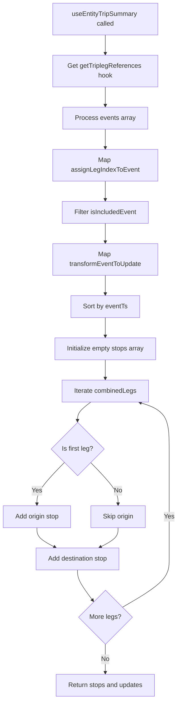
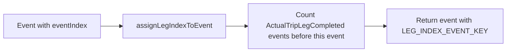
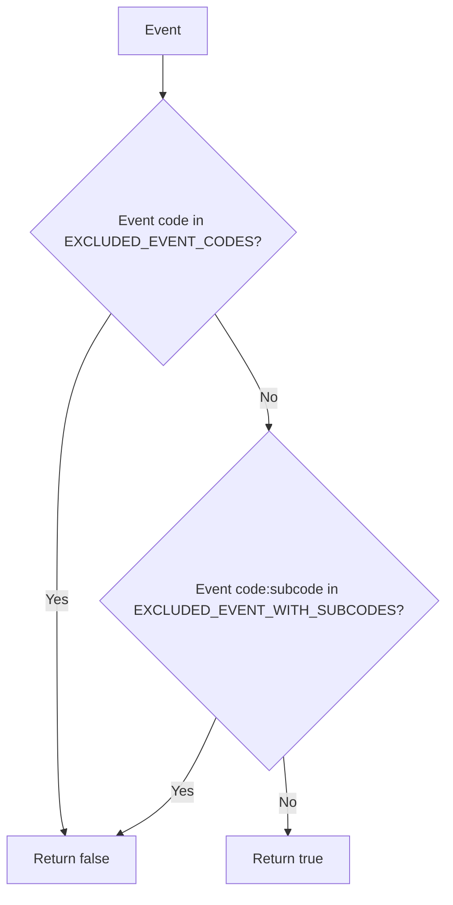
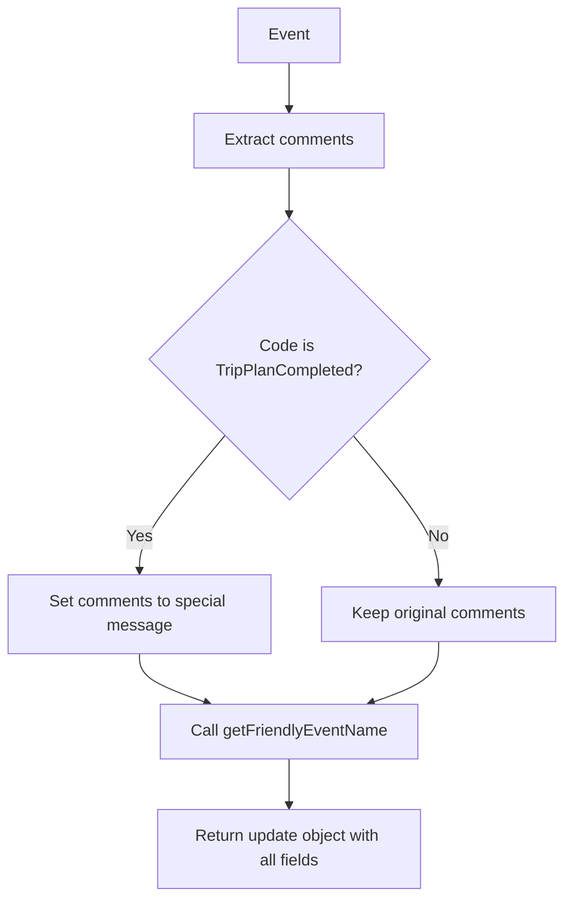
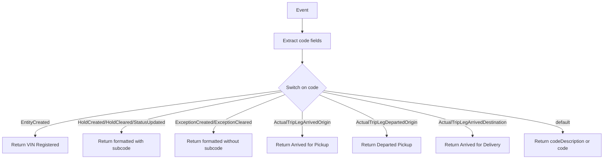
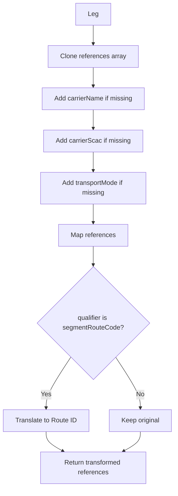

# Diagram: web/portal/src/shared/hooks/useEntityTripSummary.js

> Auto-generated by Obscura crawlers

## Diagram 1

### SVG

<svg id="container" width="445.94921875" xmlns="http://www.w3.org/2000/svg" class="flowchart" height="1720.0625" viewBox="0 0 445.94921875 1720.0625" role="graphics-document document" aria-roledescription="flowchart-v2"><g><marker id="container_flowchart-v2-pointEnd" class="marker flowchart-v2" viewBox="0 0 10 10" refX="5" refY="5" markerUnits="userSpaceOnUse" markerWidth="8" markerHeight="8" orient="auto"><path d="M 0 0 L 10 5 L 0 10 z" class="arrowMarkerPath" style="stroke-width: 1; stroke-dasharray: 1, 0;"></path></marker><marker id="container_flowchart-v2-pointStart" class="marker flowchart-v2" viewBox="0 0 10 10" refX="4.5" refY="5" markerUnits="userSpaceOnUse" markerWidth="8" markerHeight="8" orient="auto"><path d="M 0 5 L 10 10 L 10 0 z" class="arrowMarkerPath" style="stroke-width: 1; stroke-dasharray: 1, 0;"></path></marker><marker id="container_flowchart-v2-circleEnd" class="marker flowchart-v2" viewBox="0 0 10 10" refX="11" refY="5" markerUnits="userSpaceOnUse" markerWidth="11" markerHeight="11" orient="auto"><circle cx="5" cy="5" r="5" class="arrowMarkerPath" style="stroke-width: 1; stroke-dasharray: 1, 0;"></circle></marker><marker id="container_flowchart-v2-circleStart" class="marker flowchart-v2" viewBox="0 0 10 10" refX="-1" refY="5" markerUnits="userSpaceOnUse" markerWidth="11" markerHeight="11" orient="auto"><circle cx="5" cy="5" r="5" class="arrowMarkerPath" style="stroke-width: 1; stroke-dasharray: 1, 0;"></circle></marker><marker id="container_flowchart-v2-crossEnd" class="marker cross flowchart-v2" viewBox="0 0 11 11" refX="12" refY="5.2" markerUnits="userSpaceOnUse" markerWidth="11" markerHeight="11" orient="auto"><path d="M 1,1 l 9,9 M 10,1 l -9,9" class="arrowMarkerPath" style="stroke-width: 2; stroke-dasharray: 1, 0;"></path></marker><marker id="container_flowchart-v2-crossStart" class="marker cross flowchart-v2" viewBox="0 0 11 11" refX="-1" refY="5.2" markerUnits="userSpaceOnUse" markerWidth="11" markerHeight="11" orient="auto"><path d="M 1,1 l 9,9 M 10,1 l -9,9" class="arrowMarkerPath" style="stroke-width: 2; stroke-dasharray: 1, 0;"></path></marker><g class="root"><g class="clusters"></g><g class="edgePaths"><path d="M265.969,86L265.969,90.167C265.969,94.333,265.969,102.667,265.969,110.333C265.969,118,265.969,125,265.969,128.5L265.969,132" id="L_A_B_0" class="edge-thickness-normal edge-pattern-solid edge-thickness-normal edge-pattern-solid flowchart-link" style=";" data-edge="true" data-et="edge" data-id="L_A_B_0" data-points="W3sieCI6MjY1Ljk2ODc1LCJ5Ijo4Nn0seyJ4IjoyNjUuOTY4NzUsInkiOjExMX0seyJ4IjoyNjUuOTY4NzUsInkiOjEzNn1d" marker-end="url(#container_flowchart-v2-pointEnd)"></path><path d="M265.969,214L265.969,218.167C265.969,222.333,265.969,230.667,265.969,238.333C265.969,246,265.969,253,265.969,256.5L265.969,260" id="L_B_C_0" class="edge-thickness-normal edge-pattern-solid edge-thickness-normal edge-pattern-solid flowchart-link" style=";" data-edge="true" data-et="edge" data-id="L_B_C_0" data-points="W3sieCI6MjY1Ljk2ODc1LCJ5IjoyMTR9LHsieCI6MjY1Ljk2ODc1LCJ5IjoyMzl9LHsieCI6MjY1Ljk2ODc1LCJ5IjoyNjR9XQ==" marker-end="url(#container_flowchart-v2-pointEnd)"></path><path d="M265.969,318L265.969,322.167C265.969,326.333,265.969,334.667,265.969,342.333C265.969,350,265.969,357,265.969,360.5L265.969,364" id="L_C_D_0" class="edge-thickness-normal edge-pattern-solid edge-thickness-normal edge-pattern-solid flowchart-link" style=";" data-edge="true" data-et="edge" data-id="L_C_D_0" data-points="W3sieCI6MjY1Ljk2ODc1LCJ5IjozMTh9LHsieCI6MjY1Ljk2ODc1LCJ5IjozNDN9LHsieCI6MjY1Ljk2ODc1LCJ5IjozNjh9XQ==" marker-end="url(#container_flowchart-v2-pointEnd)"></path><path d="M265.969,446L265.969,450.167C265.969,454.333,265.969,462.667,265.969,470.333C265.969,478,265.969,485,265.969,488.5L265.969,492" id="L_D_E_0" class="edge-thickness-normal edge-pattern-solid edge-thickness-normal edge-pattern-solid flowchart-link" style=";" data-edge="true" data-et="edge" data-id="L_D_E_0" data-points="W3sieCI6MjY1Ljk2ODc1LCJ5Ijo0NDZ9LHsieCI6MjY1Ljk2ODc1LCJ5Ijo0NzF9LHsieCI6MjY1Ljk2ODc1LCJ5Ijo0OTZ9XQ==" marker-end="url(#container_flowchart-v2-pointEnd)"></path><path d="M265.969,550L265.969,554.167C265.969,558.333,265.969,566.667,265.969,574.333C265.969,582,265.969,589,265.969,592.5L265.969,596" id="L_E_F_0" class="edge-thickness-normal edge-pattern-solid edge-thickness-normal edge-pattern-solid flowchart-link" style=";" data-edge="true" data-et="edge" data-id="L_E_F_0" data-points="W3sieCI6MjY1Ljk2ODc1LCJ5Ijo1NTB9LHsieCI6MjY1Ljk2ODc1LCJ5Ijo1NzV9LHsieCI6MjY1Ljk2ODc1LCJ5Ijo2MDB9XQ==" marker-end="url(#container_flowchart-v2-pointEnd)"></path><path d="M265.969,678L265.969,682.167C265.969,686.333,265.969,694.667,265.969,702.333C265.969,710,265.969,717,265.969,720.5L265.969,724" id="L_F_G_0" class="edge-thickness-normal edge-pattern-solid edge-thickness-normal edge-pattern-solid flowchart-link" style=";" data-edge="true" data-et="edge" data-id="L_F_G_0" data-points="W3sieCI6MjY1Ljk2ODc1LCJ5Ijo2Nzh9LHsieCI6MjY1Ljk2ODc1LCJ5Ijo3MDN9LHsieCI6MjY1Ljk2ODc1LCJ5Ijo3Mjh9XQ==" marker-end="url(#container_flowchart-v2-pointEnd)"></path><path d="M265.969,782L265.969,786.167C265.969,790.333,265.969,798.667,265.969,806.333C265.969,814,265.969,821,265.969,824.5L265.969,828" id="L_G_H_0" class="edge-thickness-normal edge-pattern-solid edge-thickness-normal edge-pattern-solid flowchart-link" style=";" data-edge="true" data-et="edge" data-id="L_G_H_0" data-points="W3sieCI6MjY1Ljk2ODc1LCJ5Ijo3ODJ9LHsieCI6MjY1Ljk2ODc1LCJ5Ijo4MDd9LHsieCI6MjY1Ljk2ODc1LCJ5Ijo4MzJ9XQ==" marker-end="url(#container_flowchart-v2-pointEnd)"></path><path d="M265.969,886L265.969,890.167C265.969,894.333,265.969,902.667,265.969,910.333C265.969,918,265.969,925,265.969,928.5L265.969,932" id="L_H_I_0" class="edge-thickness-normal edge-pattern-solid edge-thickness-normal edge-pattern-solid flowchart-link" style=";" data-edge="true" data-et="edge" data-id="L_H_I_0" data-points="W3sieCI6MjY1Ljk2ODc1LCJ5Ijo4ODZ9LHsieCI6MjY1Ljk2ODc1LCJ5Ijo5MTF9LHsieCI6MjY1Ljk2ODc1LCJ5Ijo5MzZ9XQ==" marker-end="url(#container_flowchart-v2-pointEnd)"></path><path d="M229.391,990L223.747,994.167C218.102,998.333,206.813,1006.667,201.168,1014.333C195.523,1022,195.523,1029,195.523,1032.5L195.523,1036" id="L_I_J_0" class="edge-thickness-normal edge-pattern-solid edge-thickness-normal edge-pattern-solid flowchart-link" style=";" data-edge="true" data-et="edge" data-id="L_I_J_0" data-points="W3sieCI6MjI5LjM5MTM3NjIwMTkyMzEsInkiOjk5MH0seyJ4IjoxOTUuNTIzNDM3NSwieSI6MTAxNX0seyJ4IjoxOTUuNTIzNDM3NSwieSI6MTA0MH1d" marker-end="url(#container_flowchart-v2-pointEnd)"></path><path d="M162.717,1138.928L151.171,1150.562C139.626,1162.197,116.536,1185.465,104.991,1202.6C93.445,1219.734,93.445,1230.734,93.445,1236.234L93.445,1241.734" id="L_J_K_0" class="edge-thickness-normal edge-pattern-solid edge-thickness-normal edge-pattern-solid flowchart-link" style=";" data-edge="true" data-et="edge" data-id="L_J_K_0" data-points="W3sieCI6MTYyLjcxNjY0MTc4OTQ0NDYsInkiOjExMzguOTI3NTc5Mjg5NDQ0Nn0seyJ4Ijo5My40NDUzMTI1LCJ5IjoxMjA4LjczNDM3NX0seyJ4Ijo5My40NDUzMTI1LCJ5IjoxMjQ1LjczNDM3NX1d" marker-end="url(#container_flowchart-v2-pointEnd)"></path><path d="M228.33,1138.928L239.875,1150.562C251.421,1162.197,274.511,1185.465,286.056,1202.6C297.602,1219.734,297.602,1230.734,297.602,1236.234L297.602,1241.734" id="L_J_L_0" class="edge-thickness-normal edge-pattern-solid edge-thickness-normal edge-pattern-solid flowchart-link" style=";" data-edge="true" data-et="edge" data-id="L_J_L_0" data-points="W3sieCI6MjI4LjMzMDIzMzIxMDU1NTQsInkiOjExMzguOTI3NTc5Mjg5NDQ0Nn0seyJ4IjoyOTcuNjAxNTYyNSwieSI6MTIwOC43MzQzNzV9LHsieCI6Mjk3LjYwMTU2MjUsInkiOjEyNDUuNzM0Mzc1fV0=" marker-end="url(#container_flowchart-v2-pointEnd)"></path><path d="M93.445,1299.734L93.445,1303.901C93.445,1308.068,93.445,1316.401,101.031,1324.432C108.616,1332.462,123.787,1340.191,131.372,1344.055L138.957,1347.919" id="L_K_M_0" class="edge-thickness-normal edge-pattern-solid edge-thickness-normal edge-pattern-solid flowchart-link" style=";" data-edge="true" data-et="edge" data-id="L_K_M_0" data-points="W3sieCI6OTMuNDQ1MzEyNSwieSI6MTI5OS43MzQzNzV9LHsieCI6OTMuNDQ1MzEyNSwieSI6MTMyNC43MzQzNzV9LHsieCI6MTQyLjUyMTMzNDEzNDYxNTQsInkiOjEzNDkuNzM0Mzc1fV0=" marker-end="url(#container_flowchart-v2-pointEnd)"></path><path d="M297.602,1299.734L297.602,1303.901C297.602,1308.068,297.602,1316.401,290.016,1324.432C282.431,1332.462,267.26,1340.191,259.675,1344.055L252.09,1347.919" id="L_L_M_0" class="edge-thickness-normal edge-pattern-solid edge-thickness-normal edge-pattern-solid flowchart-link" style=";" data-edge="true" data-et="edge" data-id="L_L_M_0" data-points="W3sieCI6Mjk3LjYwMTU2MjUsInkiOjEyOTkuNzM0Mzc1fSx7IngiOjI5Ny42MDE1NjI1LCJ5IjoxMzI0LjczNDM3NX0seyJ4IjoyNDguNTI1NTQwODY1Mzg0NiwieSI6MTM0OS43MzQzNzV9XQ==" marker-end="url(#container_flowchart-v2-pointEnd)"></path><path d="M195.523,1403.734L195.523,1407.901C195.523,1412.068,195.523,1420.401,202.09,1432.973C208.657,1445.544,221.791,1462.354,228.357,1470.759L234.924,1479.164" id="L_M_N_0" class="edge-thickness-normal edge-pattern-solid edge-thickness-normal edge-pattern-solid flowchart-link" style=";" data-edge="true" data-et="edge" data-id="L_M_N_0" data-points="W3sieCI6MTk1LjUyMzQzNzUsInkiOjE0MDMuNzM0Mzc1fSx7IngiOjE5NS41MjM0Mzc1LCJ5IjoxNDI4LjczNDM3NX0seyJ4IjoyMzcuMzg2OTY0MjQ0NDU0NywieSI6MTQ4Mi4zMTYxNjA3NTU1NDUzfV0=" marker-end="url(#container_flowchart-v2-pointEnd)"></path><path d="M307.642,1495.407L327.354,1484.295C347.067,1473.183,386.493,1450.959,406.205,1431.18C425.918,1411.401,425.918,1394.068,425.918,1376.734C425.918,1359.401,425.918,1342.068,425.918,1324.734C425.918,1307.401,425.918,1290.068,425.918,1270.734C425.918,1251.401,425.918,1230.068,425.918,1202.257C425.918,1174.445,425.918,1140.156,425.918,1107.867C425.918,1075.578,425.918,1045.289,413.736,1026.184C401.553,1007.079,377.188,999.158,365.006,995.197L352.823,991.237" id="L_N_I_0" class="edge-thickness-normal edge-pattern-solid edge-thickness-normal edge-pattern-solid flowchart-link" style=";" data-edge="true" data-et="edge" data-id="L_N_I_0" data-points="W3sieCI6MzA3LjY0MTYzMDUyNTgxNjQsInkiOjE0OTUuNDA3MjU1NTI1ODE2NX0seyJ4Ijo0MjUuOTE3OTY4NzUsInkiOjE0MjguNzM0Mzc1fSx7IngiOjQyNS45MTc5Njg3NSwieSI6MTM3Ni43MzQzNzV9LHsieCI6NDI1LjkxNzk2ODc1LCJ5IjoxMzI0LjczNDM3NX0seyJ4Ijo0MjUuOTE3OTY4NzUsInkiOjEyNzIuNzM0Mzc1fSx7IngiOjQyNS45MTc5Njg3NSwieSI6MTIwOC43MzQzNzV9LHsieCI6NDI1LjkxNzk2ODc1LCJ5IjoxMTA1Ljg2NzE4NzV9LHsieCI6NDI1LjkxNzk2ODc1LCJ5IjoxMDE1fSx7IngiOjM0OS4wMTkzMDU4ODk0MjMxLCJ5Ijo5OTB9XQ==" marker-end="url(#container_flowchart-v2-pointEnd)"></path><path d="M265.969,1584.063L265.969,1590.229C265.969,1596.396,265.969,1608.729,265.969,1620.396C265.969,1632.063,265.969,1643.063,265.969,1648.563L265.969,1654.063" id="L_N_O_0" class="edge-thickness-normal edge-pattern-solid edge-thickness-normal edge-pattern-solid flowchart-link" style=";" data-edge="true" data-et="edge" data-id="L_N_O_0" data-points="W3sieCI6MjY1Ljk2ODc1LCJ5IjoxNTg0LjA2MjV9LHsieCI6MjY1Ljk2ODc1LCJ5IjoxNjIxLjA2MjV9LHsieCI6MjY1Ljk2ODc1LCJ5IjoxNjU4LjA2MjV9XQ==" marker-end="url(#container_flowchart-v2-pointEnd)"></path></g><g class="edgeLabels"><g class="edgeLabel"><g class="label" data-id="L_A_B_0" transform="translate(0, 0)"><foreignObject width="0" height="0">

</foreignObject></g></g><g class="edgeLabel"><g class="label" data-id="L_B_C_0" transform="translate(0, 0)"><foreignObject width="0" height="0">

</foreignObject></g></g><g class="edgeLabel"><g class="label" data-id="L_C_D_0" transform="translate(0, 0)"><foreignObject width="0" height="0">

</foreignObject></g></g><g class="edgeLabel"><g class="label" data-id="L_D_E_0" transform="translate(0, 0)"><foreignObject width="0" height="0">

</foreignObject></g></g><g class="edgeLabel"><g class="label" data-id="L_E_F_0" transform="translate(0, 0)"><foreignObject width="0" height="0">

</foreignObject></g></g><g class="edgeLabel"><g class="label" data-id="L_F_G_0" transform="translate(0, 0)"><foreignObject width="0" height="0">

</foreignObject></g></g><g class="edgeLabel"><g class="label" data-id="L_G_H_0" transform="translate(0, 0)"><foreignObject width="0" height="0">

</foreignObject></g></g><g class="edgeLabel"><g class="label" data-id="L_H_I_0" transform="translate(0, 0)"><foreignObject width="0" height="0">

</foreignObject></g></g><g class="edgeLabel"><g class="label" data-id="L_I_J_0" transform="translate(0, 0)"><foreignObject width="0" height="0">

</foreignObject></g></g><g class="edgeLabel" transform="translate(93.4453125, 1208.734375)"><g class="label" data-id="L_J_K_0" transform="translate(-12.03125, -12)"><foreignObject width="24.0625" height="24">

Yes

</foreignObject></g></g><g class="edgeLabel" transform="translate(297.6015625, 1208.734375)"><g class="label" data-id="L_J_L_0" transform="translate(-10.140625, -12)"><foreignObject width="20.28125" height="24">

No

</foreignObject></g></g><g class="edgeLabel"><g class="label" data-id="L_K_M_0" transform="translate(0, 0)"><foreignObject width="0" height="0">

</foreignObject></g></g><g class="edgeLabel"><g class="label" data-id="L_L_M_0" transform="translate(0, 0)"><foreignObject width="0" height="0">

</foreignObject></g></g><g class="edgeLabel"><g class="label" data-id="L_M_N_0" transform="translate(0, 0)"><foreignObject width="0" height="0">

</foreignObject></g></g><g class="edgeLabel" transform="translate(425.91796875, 1272.734375)"><g class="label" data-id="L_N_I_0" transform="translate(-12.03125, -12)"><foreignObject width="24.0625" height="24">

Yes

</foreignObject></g></g><g class="edgeLabel" transform="translate(265.96875, 1621.0625)"><g class="label" data-id="L_N_O_0" transform="translate(-10.140625, -12)"><foreignObject width="20.28125" height="24">

No

</foreignObject></g></g></g><g class="nodes"><g class="node default" id="flowchart-A-0" transform="translate(265.96875, 47)"><rect class="basic label-container" style="" x="-130" y="-39" width="260" height="78"></rect><g class="label" style="" transform="translate(-100, -24)"><rect></rect><foreignObject width="200" height="48">

useEntityTripSummary called

</foreignObject></g></g><g class="node default" id="flowchart-B-1" transform="translate(265.96875, 175)"><rect class="basic label-container" style="" x="-130" y="-39" width="260" height="78"></rect><g class="label" style="" transform="translate(-100, -24)"><rect></rect><foreignObject width="200" height="48">

Get getTriplegReferences hook

</foreignObject></g></g><g class="node default" id="flowchart-C-3" transform="translate(265.96875, 291)"><rect class="basic label-container" style="" x="-103.984375" y="-27" width="207.96875" height="54"></rect><g class="label" style="" transform="translate(-73.984375, -12)"><rect></rect><foreignObject width="147.96875" height="24">

Process events array

</foreignObject></g></g><g class="node default" id="flowchart-D-5" transform="translate(265.96875, 407)"><rect class="basic label-container" style="" x="-130" y="-39" width="260" height="78"></rect><g class="label" style="" transform="translate(-100, -24)"><rect></rect><foreignObject width="200" height="48">

Map assignLegIndexToEvent

</foreignObject></g></g><g class="node default" id="flowchart-E-7" transform="translate(265.96875, 523)"><rect class="basic label-container" style="" x="-108.34375" y="-27" width="216.6875" height="54"></rect><g class="label" style="" transform="translate(-78.34375, -12)"><rect></rect><foreignObject width="156.6875" height="24">

Filter isIncludedEvent

</foreignObject></g></g><g class="node default" id="flowchart-F-9" transform="translate(265.96875, 639)"><rect class="basic label-container" style="" x="-130" y="-39" width="260" height="78"></rect><g class="label" style="" transform="translate(-100, -24)"><rect></rect><foreignObject width="200" height="48">

Map transformEventToUpdate

</foreignObject></g></g><g class="node default" id="flowchart-G-11" transform="translate(265.96875, 755)"><rect class="basic label-container" style="" x="-85.546875" y="-27" width="171.09375" height="54"></rect><g class="label" style="" transform="translate(-55.546875, -12)"><rect></rect><foreignObject width="111.09375" height="24">

Sort by eventTs

</foreignObject></g></g><g class="node default" id="flowchart-H-13" transform="translate(265.96875, 859)"><rect class="basic label-container" style="" x="-128.3125" y="-27" width="256.625" height="54"></rect><g class="label" style="" transform="translate(-98.3125, -12)"><rect></rect><foreignObject width="196.625" height="24">

Initialize empty stops array

</foreignObject></g></g><g class="node default" id="flowchart-I-15" transform="translate(265.96875, 963)"><rect class="basic label-container" style="" x="-107.9140625" y="-27" width="215.828125" height="54"></rect><g class="label" style="" transform="translate(-77.9140625, -12)"><rect></rect><foreignObject width="155.828125" height="24">

Iterate combinedLegs

</foreignObject></g></g><g class="node default" id="flowchart-J-17" transform="translate(195.5234375, 1105.8671875)"><polygon points="65.8671875,0 131.734375,-65.8671875 65.8671875,-131.734375 0,-65.8671875" class="label-container" transform="translate(-65.3671875, 65.8671875)"></polygon><g class="label" style="" transform="translate(-38.8671875, -12)"><rect></rect><foreignObject width="77.734375" height="24">

Is first leg?

</foreignObject></g></g><g class="node default" id="flowchart-K-19" transform="translate(93.4453125, 1272.734375)"><rect class="basic label-container" style="" x="-85.4453125" y="-27" width="170.890625" height="54"></rect><g class="label" style="" transform="translate(-55.4453125, -12)"><rect></rect><foreignObject width="110.890625" height="24">

Add origin stop

</foreignObject></g></g><g class="node default" id="flowchart-L-21" transform="translate(297.6015625, 1272.734375)"><rect class="basic label-container" style="" x="-68.7109375" y="-27" width="137.421875" height="54"></rect><g class="label" style="" transform="translate(-38.7109375, -12)"><rect></rect><foreignObject width="77.421875" height="24">

Skip origin

</foreignObject></g></g><g class="node default" id="flowchart-M-23" transform="translate(195.5234375, 1376.734375)"><rect class="basic label-container" style="" x="-105.890625" y="-27" width="211.78125" height="54"></rect><g class="label" style="" transform="translate(-75.890625, -12)"><rect></rect><foreignObject width="151.78125" height="24">

Add destination stop

</foreignObject></g></g><g class="node default" id="flowchart-N-27" transform="translate(265.96875, 1518.8984375)"><polygon points="65.1640625,0 130.328125,-65.1640625 65.1640625,-130.328125 0,-65.1640625" class="label-container" transform="translate(-64.6640625, 65.1640625)"></polygon><g class="label" style="" transform="translate(-38.1640625, -12)"><rect></rect><foreignObject width="76.328125" height="24">

More legs?

</foreignObject></g></g><g class="node default" id="flowchart-O-31" transform="translate(265.96875, 1685.0625)"><rect class="basic label-container" style="" x="-123.65625" y="-27" width="247.3125" height="54"></rect><g class="label" style="" transform="translate(-93.65625, -12)"><rect></rect><foreignObject width="187.3125" height="24">

Return stops and updates

</foreignObject></g></g></g></g></g></svg>

## Diagram 2

### SVG

<svg id="container" width="1132.6875" xmlns="http://www.w3.org/2000/svg" class="flowchart" height="118" viewBox="0 0 1132.6875 118" role="graphics-document document" aria-roledescription="flowchart-v2"><g><marker id="container_flowchart-v2-pointEnd" class="marker flowchart-v2" viewBox="0 0 10 10" refX="5" refY="5" markerUnits="userSpaceOnUse" markerWidth="8" markerHeight="8" orient="auto"><path d="M 0 0 L 10 5 L 0 10 z" class="arrowMarkerPath" style="stroke-width: 1; stroke-dasharray: 1, 0;"></path></marker><marker id="container_flowchart-v2-pointStart" class="marker flowchart-v2" viewBox="0 0 10 10" refX="4.5" refY="5" markerUnits="userSpaceOnUse" markerWidth="8" markerHeight="8" orient="auto"><path d="M 0 5 L 10 10 L 10 0 z" class="arrowMarkerPath" style="stroke-width: 1; stroke-dasharray: 1, 0;"></path></marker><marker id="container_flowchart-v2-circleEnd" class="marker flowchart-v2" viewBox="0 0 10 10" refX="11" refY="5" markerUnits="userSpaceOnUse" markerWidth="11" markerHeight="11" orient="auto"><circle cx="5" cy="5" r="5" class="arrowMarkerPath" style="stroke-width: 1; stroke-dasharray: 1, 0;"></circle></marker><marker id="container_flowchart-v2-circleStart" class="marker flowchart-v2" viewBox="0 0 10 10" refX="-1" refY="5" markerUnits="userSpaceOnUse" markerWidth="11" markerHeight="11" orient="auto"><circle cx="5" cy="5" r="5" class="arrowMarkerPath" style="stroke-width: 1; stroke-dasharray: 1, 0;"></circle></marker><marker id="container_flowchart-v2-crossEnd" class="marker cross flowchart-v2" viewBox="0 0 11 11" refX="12" refY="5.2" markerUnits="userSpaceOnUse" markerWidth="11" markerHeight="11" orient="auto"><path d="M 1,1 l 9,9 M 10,1 l -9,9" class="arrowMarkerPath" style="stroke-width: 2; stroke-dasharray: 1, 0;"></path></marker><marker id="container_flowchart-v2-crossStart" class="marker cross flowchart-v2" viewBox="0 0 11 11" refX="-1" refY="5.2" markerUnits="userSpaceOnUse" markerWidth="11" markerHeight="11" orient="auto"><path d="M 1,1 l 9,9 M 10,1 l -9,9" class="arrowMarkerPath" style="stroke-width: 2; stroke-dasharray: 1, 0;"></path></marker><g class="root"><g class="clusters"></g><g class="edgePaths"><path d="M227.875,59L232.042,59C236.208,59,244.542,59,252.208,59C259.875,59,266.875,59,270.375,59L273.875,59" id="L_A_B_0" class="edge-thickness-normal edge-pattern-solid edge-thickness-normal edge-pattern-solid flowchart-link" style=";" data-edge="true" data-et="edge" data-id="L_A_B_0" data-points="W3sieCI6MjI3Ljg3NSwieSI6NTl9LHsieCI6MjUyLjg3NSwieSI6NTl9LHsieCI6Mjc3Ljg3NSwieSI6NTl9XQ==" marker-end="url(#container_flowchart-v2-pointEnd)"></path><path d="M504.688,59L508.854,59C513.021,59,521.354,59,529.021,59C536.688,59,543.688,59,547.188,59L550.688,59" id="L_B_C_0" class="edge-thickness-normal edge-pattern-solid edge-thickness-normal edge-pattern-solid flowchart-link" style=";" data-edge="true" data-et="edge" data-id="L_B_C_0" data-points="W3sieCI6NTA0LjY4NzUsInkiOjU5fSx7IngiOjUyOS42ODc1LCJ5Ijo1OX0seyJ4Ijo1NTQuNjg3NSwieSI6NTl9XQ==" marker-end="url(#container_flowchart-v2-pointEnd)"></path><path d="M814.688,59L818.854,59C823.021,59,831.354,59,839.021,59C846.688,59,853.688,59,857.188,59L860.688,59" id="L_C_D_0" class="edge-thickness-normal edge-pattern-solid edge-thickness-normal edge-pattern-solid flowchart-link" style=";" data-edge="true" data-et="edge" data-id="L_C_D_0" data-points="W3sieCI6ODE0LjY4NzUsInkiOjU5fSx7IngiOjgzOS42ODc1LCJ5Ijo1OX0seyJ4Ijo4NjQuNjg3NSwieSI6NTl9XQ==" marker-end="url(#container_flowchart-v2-pointEnd)"></path></g><g class="edgeLabels"><g class="edgeLabel"><g class="label" data-id="L_A_B_0" transform="translate(0, 0)"><foreignObject width="0" height="0">

</foreignObject></g></g><g class="edgeLabel"><g class="label" data-id="L_B_C_0" transform="translate(0, 0)"><foreignObject width="0" height="0">

</foreignObject></g></g><g class="edgeLabel"><g class="label" data-id="L_C_D_0" transform="translate(0, 0)"><foreignObject width="0" height="0">

</foreignObject></g></g></g><g class="nodes"><g class="node default" id="flowchart-A-0" transform="translate(117.9375, 59)"><rect class="basic label-container" style="" x="-109.9375" y="-27" width="219.875" height="54"></rect><g class="label" style="" transform="translate(-79.9375, -12)"><rect></rect><foreignObject width="159.875" height="24">

Event with eventIndex

</foreignObject></g></g><g class="node default" id="flowchart-B-1" transform="translate(391.28125, 59)"><rect class="basic label-container" style="" x="-113.40625" y="-27" width="226.8125" height="54"></rect><g class="label" style="" transform="translate(-83.40625, -12)"><rect></rect><foreignObject width="166.8125" height="24">

assignLegIndexToEvent

</foreignObject></g></g><g class="node default" id="flowchart-C-3" transform="translate(684.6875, 59)"><rect class="basic label-container" style="" x="-130" y="-51" width="260" height="102"></rect><g class="label" style="" transform="translate(-100, -36)"><rect></rect><foreignObject width="200" height="72">

Count ActualTripLegCompleted events before this event

</foreignObject></g></g><g class="node default" id="flowchart-D-5" transform="translate(994.6875, 59)"><rect class="basic label-container" style="" x="-130" y="-39" width="260" height="78"></rect><g class="label" style="" transform="translate(-100, -24)"><rect></rect><foreignObject width="200" height="48">

Return event with LEG_INDEX_EVENT_KEY

</foreignObject></g></g></g></g></g></svg>

## Diagram 3

### SVG

<svg id="container" width="465.63671875" xmlns="http://www.w3.org/2000/svg" class="flowchart" height="939" viewBox="0 0 465.63671875 939" role="graphics-document document" aria-roledescription="flowchart-v2"><g><marker id="container_flowchart-v2-pointEnd" class="marker flowchart-v2" viewBox="0 0 10 10" refX="5" refY="5" markerUnits="userSpaceOnUse" markerWidth="8" markerHeight="8" orient="auto"><path d="M 0 0 L 10 5 L 0 10 z" class="arrowMarkerPath" style="stroke-width: 1; stroke-dasharray: 1, 0;"></path></marker><marker id="container_flowchart-v2-pointStart" class="marker flowchart-v2" viewBox="0 0 10 10" refX="4.5" refY="5" markerUnits="userSpaceOnUse" markerWidth="8" markerHeight="8" orient="auto"><path d="M 0 5 L 10 10 L 10 0 z" class="arrowMarkerPath" style="stroke-width: 1; stroke-dasharray: 1, 0;"></path></marker><marker id="container_flowchart-v2-circleEnd" class="marker flowchart-v2" viewBox="0 0 10 10" refX="11" refY="5" markerUnits="userSpaceOnUse" markerWidth="11" markerHeight="11" orient="auto"><circle cx="5" cy="5" r="5" class="arrowMarkerPath" style="stroke-width: 1; stroke-dasharray: 1, 0;"></circle></marker><marker id="container_flowchart-v2-circleStart" class="marker flowchart-v2" viewBox="0 0 10 10" refX="-1" refY="5" markerUnits="userSpaceOnUse" markerWidth="11" markerHeight="11" orient="auto"><circle cx="5" cy="5" r="5" class="arrowMarkerPath" style="stroke-width: 1; stroke-dasharray: 1, 0;"></circle></marker><marker id="container_flowchart-v2-crossEnd" class="marker cross flowchart-v2" viewBox="0 0 11 11" refX="12" refY="5.2" markerUnits="userSpaceOnUse" markerWidth="11" markerHeight="11" orient="auto"><path d="M 1,1 l 9,9 M 10,1 l -9,9" class="arrowMarkerPath" style="stroke-width: 2; stroke-dasharray: 1, 0;"></path></marker><marker id="container_flowchart-v2-crossStart" class="marker cross flowchart-v2" viewBox="0 0 11 11" refX="-1" refY="5.2" markerUnits="userSpaceOnUse" markerWidth="11" markerHeight="11" orient="auto"><path d="M 1,1 l 9,9 M 10,1 l -9,9" class="arrowMarkerPath" style="stroke-width: 2; stroke-dasharray: 1, 0;"></path></marker><g class="root"><g class="clusters"></g><g class="edgePaths"><path d="M179.371,62L179.371,66.167C179.371,70.333,179.371,78.667,179.371,86.333C179.371,94,179.371,101,179.371,104.5L179.371,108" id="L_A_B_0" class="edge-thickness-normal edge-pattern-solid edge-thickness-normal edge-pattern-solid flowchart-link" style=";" data-edge="true" data-et="edge" data-id="L_A_B_0" data-points="W3sieCI6MTc5LjM3MTA5Mzc1LCJ5Ijo2Mn0seyJ4IjoxNzkuMzcxMDkzNzUsInkiOjg3fSx7IngiOjE3OS4zNzEwOTM3NSwieSI6MTEyfV0=" marker-end="url(#container_flowchart-v2-pointEnd)"></path><path d="M124.833,335.462L114.982,350.718C105.131,365.975,85.429,396.487,75.578,446.16C65.727,495.833,65.727,564.667,65.727,633.5C65.727,702.333,65.727,771.167,67.108,811.103C68.489,851.04,71.252,862.08,72.633,867.6L74.015,873.12" id="L_B_C_0" class="edge-thickness-normal edge-pattern-solid edge-thickness-normal edge-pattern-solid flowchart-link" style=";" data-edge="true" data-et="edge" data-id="L_B_C_0" data-points="W3sieCI6MTI0LjgzMzI0NDI4NDczNDEyLCJ5IjozMzUuNDYyMTUwNTM0NzM0MX0seyJ4Ijo2NS43MjY1NjI1LCJ5Ijo0Mjd9LHsieCI6NjUuNzI2NTYyNSwieSI6NjMzLjV9LHsieCI6NjUuNzI2NTYyNSwieSI6ODQwfSx7IngiOjc0Ljk4NTU5NTcwMzEyNSwieSI6ODc3fV0=" marker-end="url(#container_flowchart-v2-pointEnd)"></path><path d="M232.311,337.06L241.532,352.05C250.753,367.04,269.195,397.02,278.416,417.51C287.637,438,287.637,449,287.637,454.5L287.637,460" id="L_B_D_0" class="edge-thickness-normal edge-pattern-solid edge-thickness-normal edge-pattern-solid flowchart-link" style=";" data-edge="true" data-et="edge" data-id="L_B_D_0" data-points="W3sieCI6MjMyLjMxMDc0MDg2NzAyMzA0LCJ5IjozMzcuMDYwMzUyODgyOTc3fSx7IngiOjI4Ny42MzY3MTg3NSwieSI6NDI3fSx7IngiOjI4Ny42MzY3MTg3NSwieSI6NDY0fV0=" marker-end="url(#container_flowchart-v2-pointEnd)"></path><path d="M233.225,748.589L226.022,763.824C218.819,779.059,204.414,809.53,187.353,830.592C170.292,851.655,150.576,863.31,140.718,869.137L130.86,874.964" id="L_D_C_0" class="edge-thickness-normal edge-pattern-solid edge-thickness-normal edge-pattern-solid flowchart-link" style=";" data-edge="true" data-et="edge" data-id="L_D_C_0" data-points="W3sieCI6MjMzLjIyNTI1Mjg1NzQwMjA0LCJ5Ijo3NDguNTg4NTM0MTA3NDAyfSx7IngiOjE5MC4wMDc4MTI1LCJ5Ijo4NDB9LHsieCI6MTI3LjQxNjc0ODA0Njg3NSwieSI6ODc3fV0=" marker-end="url(#container_flowchart-v2-pointEnd)"></path><path d="M303.341,787.296L304.238,796.08C305.135,804.864,306.929,822.432,307.826,836.716C308.723,851,308.723,862,308.723,867.5L308.723,873" id="L_D_E_0" class="edge-thickness-normal edge-pattern-solid edge-thickness-normal edge-pattern-solid flowchart-link" style=";" data-edge="true" data-et="edge" data-id="L_D_E_0" data-points="W3sieCI6MzAzLjM0MDk2ODUxODI4ODEsInkiOjc4Ny4yOTU3NTAyMzE3MTJ9LHsieCI6MzA4LjcyMjY1NjI1LCJ5Ijo4NDB9LHsieCI6MzA4LjcyMjY1NjI1LCJ5Ijo4Nzd9XQ==" marker-end="url(#container_flowchart-v2-pointEnd)"></path></g><g class="edgeLabels"><g class="edgeLabel"><g class="label" data-id="L_A_B_0" transform="translate(0, 0)"><foreignObject width="0" height="0">

</foreignObject></g></g><g class="edgeLabel" transform="translate(65.7265625, 633.5)"><g class="label" data-id="L_B_C_0" transform="translate(-12.03125, -12)"><foreignObject width="24.0625" height="24">

Yes

</foreignObject></g></g><g class="edgeLabel" transform="translate(287.63671875, 427)"><g class="label" data-id="L_B_D_0" transform="translate(-10.140625, -12)"><foreignObject width="20.28125" height="24">

No

</foreignObject></g></g><g class="edgeLabel" transform="translate(196.0779, 827.16084)"><g class="label" data-id="L_D_C_0" transform="translate(-12.03125, -12)"><foreignObject width="24.0625" height="24">

Yes

</foreignObject></g></g><g class="edgeLabel" transform="translate(308.72265625, 840)"><g class="label" data-id="L_D_E_0" transform="translate(-10.140625, -12)"><foreignObject width="20.28125" height="24">

No

</foreignObject></g></g></g><g class="nodes"><g class="node default" id="flowchart-A-0" transform="translate(179.37109375, 35)"><rect class="basic label-container" style="" x="-49.9609375" y="-27" width="99.921875" height="54"></rect><g class="label" style="" transform="translate(-19.9609375, -12)"><rect></rect><foreignObject width="39.921875" height="24">

Event

</foreignObject></g></g><g class="node default" id="flowchart-B-1" transform="translate(179.37109375, 251)"><polygon points="139,0 278,-139 139,-278 0,-139" class="label-container" transform="translate(-138.5, 139)"></polygon><g class="label" style="" transform="translate(-100, -24)"><rect></rect><foreignObject width="200" height="48">

Event code in EXCLUDED_EVENT_CODES?

</foreignObject></g></g><g class="node default" id="flowchart-C-3" transform="translate(81.7421875, 904)"><rect class="basic label-container" style="" x="-73.7421875" y="-27" width="147.484375" height="54"></rect><g class="label" style="" transform="translate(-43.7421875, -12)"><rect></rect><foreignObject width="87.484375" height="24">

Return false

</foreignObject></g></g><g class="node default" id="flowchart-D-5" transform="translate(287.63671875, 633.5)"><polygon points="169.5,0 339,-169.5 169.5,-339 0,-169.5" class="label-container" transform="translate(-169, 169.5)"></polygon><g class="label" style="" transform="translate(-130.5, -24)"><rect></rect><foreignObject width="261" height="48">

Event code:subcode in EXCLUDED_EVENT_WITH_SUBCODES?

</foreignObject></g></g><g class="node default" id="flowchart-E-9" transform="translate(308.72265625, 904)"><rect class="basic label-container" style="" x="-71.515625" y="-27" width="143.03125" height="54"></rect><g class="label" style="" transform="translate(-41.515625, -12)"><rect></rect><foreignObject width="83.03125" height="24">

Return true

</foreignObject></g></g></g></g></g></svg>

## Diagram 4

### SVG

<svg id="container" width="561.546875" xmlns="http://www.w3.org/2000/svg" class="flowchart" height="886" viewBox="0 0 561.546875 886" role="graphics-document document" aria-roledescription="flowchart-v2"><g><marker id="container_flowchart-v2-pointEnd" class="marker flowchart-v2" viewBox="0 0 10 10" refX="5" refY="5" markerUnits="userSpaceOnUse" markerWidth="8" markerHeight="8" orient="auto"><path d="M 0 0 L 10 5 L 0 10 z" class="arrowMarkerPath" style="stroke-width: 1; stroke-dasharray: 1, 0;"></path></marker><marker id="container_flowchart-v2-pointStart" class="marker flowchart-v2" viewBox="0 0 10 10" refX="4.5" refY="5" markerUnits="userSpaceOnUse" markerWidth="8" markerHeight="8" orient="auto"><path d="M 0 5 L 10 10 L 10 0 z" class="arrowMarkerPath" style="stroke-width: 1; stroke-dasharray: 1, 0;"></path></marker><marker id="container_flowchart-v2-circleEnd" class="marker flowchart-v2" viewBox="0 0 10 10" refX="11" refY="5" markerUnits="userSpaceOnUse" markerWidth="11" markerHeight="11" orient="auto"><circle cx="5" cy="5" r="5" class="arrowMarkerPath" style="stroke-width: 1; stroke-dasharray: 1, 0;"></circle></marker><marker id="container_flowchart-v2-circleStart" class="marker flowchart-v2" viewBox="0 0 10 10" refX="-1" refY="5" markerUnits="userSpaceOnUse" markerWidth="11" markerHeight="11" orient="auto"><circle cx="5" cy="5" r="5" class="arrowMarkerPath" style="stroke-width: 1; stroke-dasharray: 1, 0;"></circle></marker><marker id="container_flowchart-v2-crossEnd" class="marker cross flowchart-v2" viewBox="0 0 11 11" refX="12" refY="5.2" markerUnits="userSpaceOnUse" markerWidth="11" markerHeight="11" orient="auto"><path d="M 1,1 l 9,9 M 10,1 l -9,9" class="arrowMarkerPath" style="stroke-width: 2; stroke-dasharray: 1, 0;"></path></marker><marker id="container_flowchart-v2-crossStart" class="marker cross flowchart-v2" viewBox="0 0 11 11" refX="-1" refY="5.2" markerUnits="userSpaceOnUse" markerWidth="11" markerHeight="11" orient="auto"><path d="M 1,1 l 9,9 M 10,1 l -9,9" class="arrowMarkerPath" style="stroke-width: 2; stroke-dasharray: 1, 0;"></path></marker><g class="root"><g class="clusters"></g><g class="edgePaths"><path d="M286.887,62L286.887,66.167C286.887,70.333,286.887,78.667,286.887,86.333C286.887,94,286.887,101,286.887,104.5L286.887,108" id="L_A_B_0" class="edge-thickness-normal edge-pattern-solid edge-thickness-normal edge-pattern-solid flowchart-link" style=";" data-edge="true" data-et="edge" data-id="L_A_B_0" data-points="W3sieCI6Mjg2Ljg4NjcxODc1LCJ5Ijo2Mn0seyJ4IjoyODYuODg2NzE4NzUsInkiOjg3fSx7IngiOjI4Ni44ODY3MTg3NSwieSI6MTEyfV0=" marker-end="url(#container_flowchart-v2-pointEnd)"></path><path d="M286.887,166L286.887,170.167C286.887,174.333,286.887,182.667,286.887,190.333C286.887,198,286.887,205,286.887,208.5L286.887,212" id="L_B_C_0" class="edge-thickness-normal edge-pattern-solid edge-thickness-normal edge-pattern-solid flowchart-link" style=";" data-edge="true" data-et="edge" data-id="L_B_C_0" data-points="W3sieCI6Mjg2Ljg4NjcxODc1LCJ5IjoxNjZ9LHsieCI6Mjg2Ljg4NjcxODc1LCJ5IjoxOTF9LHsieCI6Mjg2Ljg4NjcxODc1LCJ5IjoyMTZ9XQ==" marker-end="url(#container_flowchart-v2-pointEnd)"></path><path d="M223.187,430.3L208.989,447.083C194.791,463.867,166.396,497.433,152.198,519.717C138,542,138,553,138,558.5L138,564" id="L_C_D_0" class="edge-thickness-normal edge-pattern-solid edge-thickness-normal edge-pattern-solid flowchart-link" style=";" data-edge="true" data-et="edge" data-id="L_C_D_0" data-points="W3sieCI6MjIzLjE4NjgxMTMzMDM0NjUsInkiOjQzMC4zMDAwOTI1ODAzNDY1M30seyJ4IjoxMzgsInkiOjUzMX0seyJ4IjoxMzgsInkiOjU2OH1d" marker-end="url(#container_flowchart-v2-pointEnd)"></path><path d="M350.587,430.3L364.784,447.083C378.982,463.867,407.378,497.433,421.576,521.717C435.773,546,435.773,561,435.773,568.5L435.773,576" id="L_C_E_0" class="edge-thickness-normal edge-pattern-solid edge-thickness-normal edge-pattern-solid flowchart-link" style=";" data-edge="true" data-et="edge" data-id="L_C_E_0" data-points="W3sieCI6MzUwLjU4NjYyNjE2OTY1MzQ3LCJ5Ijo0MzAuMzAwMDkyNTgwMzQ2NTN9LHsieCI6NDM1Ljc3MzQzNzUsInkiOjUzMX0seyJ4Ijo0MzUuNzczNDM3NSwieSI6NTgwfV0=" marker-end="url(#container_flowchart-v2-pointEnd)"></path><path d="M138,646L138,650.167C138,654.333,138,662.667,149.301,670.78C160.601,678.894,183.203,686.787,194.503,690.734L205.804,694.681" id="L_D_F_0" class="edge-thickness-normal edge-pattern-solid edge-thickness-normal edge-pattern-solid flowchart-link" style=";" data-edge="true" data-et="edge" data-id="L_D_F_0" data-points="W3sieCI6MTM4LCJ5Ijo2NDZ9LHsieCI6MTM4LCJ5Ijo2NzF9LHsieCI6MjA5LjU4MDE1MzI0NTE5MjMyLCJ5Ijo2OTZ9XQ==" marker-end="url(#container_flowchart-v2-pointEnd)"></path><path d="M435.773,634L435.773,640.167C435.773,646.333,435.773,658.667,424.473,668.78C413.172,678.894,390.571,686.787,379.27,690.734L367.97,694.681" id="L_E_F_0" class="edge-thickness-normal edge-pattern-solid edge-thickness-normal edge-pattern-solid flowchart-link" style=";" data-edge="true" data-et="edge" data-id="L_E_F_0" data-points="W3sieCI6NDM1Ljc3MzQzNzUsInkiOjYzNH0seyJ4Ijo0MzUuNzczNDM3NSwieSI6NjcxfSx7IngiOjM2NC4xOTMyODQyNTQ4MDc3LCJ5Ijo2OTZ9XQ==" marker-end="url(#container_flowchart-v2-pointEnd)"></path><path d="M286.887,750L286.887,754.167C286.887,758.333,286.887,766.667,286.887,774.333C286.887,782,286.887,789,286.887,792.5L286.887,796" id="L_F_G_0" class="edge-thickness-normal edge-pattern-solid edge-thickness-normal edge-pattern-solid flowchart-link" style=";" data-edge="true" data-et="edge" data-id="L_F_G_0" data-points="W3sieCI6Mjg2Ljg4NjcxODc1LCJ5Ijo3NTB9LHsieCI6Mjg2Ljg4NjcxODc1LCJ5Ijo3NzV9LHsieCI6Mjg2Ljg4NjcxODc1LCJ5Ijo4MDB9XQ==" marker-end="url(#container_flowchart-v2-pointEnd)"></path></g><g class="edgeLabels"><g class="edgeLabel"><g class="label" data-id="L_A_B_0" transform="translate(0, 0)"><foreignObject width="0" height="0">

</foreignObject></g></g><g class="edgeLabel"><g class="label" data-id="L_B_C_0" transform="translate(0, 0)"><foreignObject width="0" height="0">

</foreignObject></g></g><g class="edgeLabel" transform="translate(138, 531)"><g class="label" data-id="L_C_D_0" transform="translate(-12.03125, -12)"><foreignObject width="24.0625" height="24">

Yes

</foreignObject></g></g><g class="edgeLabel" transform="translate(435.7734375, 531)"><g class="label" data-id="L_C_E_0" transform="translate(-10.140625, -12)"><foreignObject width="20.28125" height="24">

No

</foreignObject></g></g><g class="edgeLabel"><g class="label" data-id="L_D_F_0" transform="translate(0, 0)"><foreignObject width="0" height="0">

</foreignObject></g></g><g class="edgeLabel"><g class="label" data-id="L_E_F_0" transform="translate(0, 0)"><foreignObject width="0" height="0">

</foreignObject></g></g><g class="edgeLabel"><g class="label" data-id="L_F_G_0" transform="translate(0, 0)"><foreignObject width="0" height="0">

</foreignObject></g></g></g><g class="nodes"><g class="node default" id="flowchart-A-0" transform="translate(286.88671875, 35)"><rect class="basic label-container" style="" x="-49.9609375" y="-27" width="99.921875" height="54"></rect><g class="label" style="" transform="translate(-19.9609375, -12)"><rect></rect><foreignObject width="39.921875" height="24">

Event

</foreignObject></g></g><g class="node default" id="flowchart-B-1" transform="translate(286.88671875, 139)"><rect class="basic label-container" style="" x="-94.765625" y="-27" width="189.53125" height="54"></rect><g class="label" style="" transform="translate(-64.765625, -12)"><rect></rect><foreignObject width="129.53125" height="24">

Extract comments

</foreignObject></g></g><g class="node default" id="flowchart-C-3" transform="translate(286.88671875, 355)"><polygon points="139,0 278,-139 139,-278 0,-139" class="label-container" transform="translate(-138.5, 139)"></polygon><g class="label" style="" transform="translate(-100, -24)"><rect></rect><foreignObject width="200" height="48">

Code is TripPlanCompleted?

</foreignObject></g></g><g class="node default" id="flowchart-D-5" transform="translate(138, 607)"><rect class="basic label-container" style="" x="-130" y="-39" width="260" height="78"></rect><g class="label" style="" transform="translate(-100, -24)"><rect></rect><foreignObject width="200" height="48">

Set comments to special message

</foreignObject></g></g><g class="node default" id="flowchart-E-7" transform="translate(435.7734375, 607)"><rect class="basic label-container" style="" x="-117.7734375" y="-27" width="235.546875" height="54"></rect><g class="label" style="" transform="translate(-87.7734375, -12)"><rect></rect><foreignObject width="175.546875" height="24">

Keep original comments

</foreignObject></g></g><g class="node default" id="flowchart-F-9" transform="translate(286.88671875, 723)"><rect class="basic label-container" style="" x="-126.78125" y="-27" width="253.5625" height="54"></rect><g class="label" style="" transform="translate(-96.78125, -12)"><rect></rect><foreignObject width="193.5625" height="24">

Call getFriendlyEventName

</foreignObject></g></g><g class="node default" id="flowchart-G-13" transform="translate(286.88671875, 839)"><rect class="basic label-container" style="" x="-130" y="-39" width="260" height="78"></rect><g class="label" style="" transform="translate(-100, -24)"><rect></rect><foreignObject width="200" height="48">

Return update object with all fields

</foreignObject></g></g></g></g></g></svg>

## Diagram 5

### SVG

<svg id="container" width="2043.15625" xmlns="http://www.w3.org/2000/svg" class="flowchart" height="539.4375" viewBox="0 0 2043.15625 539.4375" role="graphics-document document" aria-roledescription="flowchart-v2"><g><marker id="container_flowchart-v2-pointEnd" class="marker flowchart-v2" viewBox="0 0 10 10" refX="5" refY="5" markerUnits="userSpaceOnUse" markerWidth="8" markerHeight="8" orient="auto"><path d="M 0 0 L 10 5 L 0 10 z" class="arrowMarkerPath" style="stroke-width: 1; stroke-dasharray: 1, 0;"></path></marker><marker id="container_flowchart-v2-pointStart" class="marker flowchart-v2" viewBox="0 0 10 10" refX="4.5" refY="5" markerUnits="userSpaceOnUse" markerWidth="8" markerHeight="8" orient="auto"><path d="M 0 5 L 10 10 L 10 0 z" class="arrowMarkerPath" style="stroke-width: 1; stroke-dasharray: 1, 0;"></path></marker><marker id="container_flowchart-v2-circleEnd" class="marker flowchart-v2" viewBox="0 0 10 10" refX="11" refY="5" markerUnits="userSpaceOnUse" markerWidth="11" markerHeight="11" orient="auto"><circle cx="5" cy="5" r="5" class="arrowMarkerPath" style="stroke-width: 1; stroke-dasharray: 1, 0;"></circle></marker><marker id="container_flowchart-v2-circleStart" class="marker flowchart-v2" viewBox="0 0 10 10" refX="-1" refY="5" markerUnits="userSpaceOnUse" markerWidth="11" markerHeight="11" orient="auto"><circle cx="5" cy="5" r="5" class="arrowMarkerPath" style="stroke-width: 1; stroke-dasharray: 1, 0;"></circle></marker><marker id="container_flowchart-v2-crossEnd" class="marker cross flowchart-v2" viewBox="0 0 11 11" refX="12" refY="5.2" markerUnits="userSpaceOnUse" markerWidth="11" markerHeight="11" orient="auto"><path d="M 1,1 l 9,9 M 10,1 l -9,9" class="arrowMarkerPath" style="stroke-width: 2; stroke-dasharray: 1, 0;"></path></marker><marker id="container_flowchart-v2-crossStart" class="marker cross flowchart-v2" viewBox="0 0 11 11" refX="-1" refY="5.2" markerUnits="userSpaceOnUse" markerWidth="11" markerHeight="11" orient="auto"><path d="M 1,1 l 9,9 M 10,1 l -9,9" class="arrowMarkerPath" style="stroke-width: 2; stroke-dasharray: 1, 0;"></path></marker><g class="root"><g class="clusters"></g><g class="edgePaths"><path d="M1017.898,62L1017.898,66.167C1017.898,70.333,1017.898,78.667,1017.898,86.333C1017.898,94,1017.898,101,1017.898,104.5L1017.898,108" id="L_A_B_0" class="edge-thickness-normal edge-pattern-solid edge-thickness-normal edge-pattern-solid flowchart-link" style=";" data-edge="true" data-et="edge" data-id="L_A_B_0" data-points="W3sieCI6MTAxNy44OTg0Mzc1LCJ5Ijo2Mn0seyJ4IjoxMDE3Ljg5ODQzNzUsInkiOjg3fSx7IngiOjEwMTcuODk4NDM3NSwieSI6MTEyfV0=" marker-end="url(#container_flowchart-v2-pointEnd)"></path><path d="M1017.898,166L1017.898,170.167C1017.898,174.333,1017.898,182.667,1017.898,190.333C1017.898,198,1017.898,205,1017.898,208.5L1017.898,212" id="L_B_C_0" class="edge-thickness-normal edge-pattern-solid edge-thickness-normal edge-pattern-solid flowchart-link" style=";" data-edge="true" data-et="edge" data-id="L_B_C_0" data-points="W3sieCI6MTAxNy44OTg0Mzc1LCJ5IjoxNjZ9LHsieCI6MTAxNy44OTg0Mzc1LCJ5IjoxOTF9LHsieCI6MTAxNy44OTg0Mzc1LCJ5IjoyMTZ9XQ==" marker-end="url(#container_flowchart-v2-pointEnd)"></path><path d="M945.697,307.236L807.625,325.436C669.553,343.637,393.409,380.037,255.338,405.737C117.266,431.438,117.266,446.438,117.266,453.938L117.266,461.438" id="L_C_D_0" class="edge-thickness-normal edge-pattern-solid edge-thickness-normal edge-pattern-solid flowchart-link" style=";" data-edge="true" data-et="edge" data-id="L_C_D_0" data-points="W3sieCI6OTQ1LjY5NzA1OTMzNTY0OTIsInkiOjMwNy4yMzYxMjE4MzU2NDkyfSx7IngiOjExNy4yNjU2MjUsInkiOjQxNi40Mzc1fSx7IngiOjExNy4yNjU2MjUsInkiOjQ2NS40Mzc1fV0=" marker-end="url(#container_flowchart-v2-pointEnd)"></path><path d="M949.468,311.007L858.978,328.579C768.489,346.15,587.51,381.294,497.021,404.366C406.531,427.438,406.531,438.438,406.531,443.938L406.531,449.438" id="L_C_E_0" class="edge-thickness-normal edge-pattern-solid edge-thickness-normal edge-pattern-solid flowchart-link" style=";" data-edge="true" data-et="edge" data-id="L_C_E_0" data-points="W3sieCI6OTQ5LjQ2NzkxNDc1Mjc4NDgsInkiOjMxMS4wMDY5NzcyNTI3ODQ5fSx7IngiOjQwNi41MzEyNSwieSI6NDE2LjQzNzV9LHsieCI6NDA2LjUzMTI1LCJ5Ijo0NTMuNDM3NX1d" marker-end="url(#container_flowchart-v2-pointEnd)"></path><path d="M959.274,320.813L918.817,336.75C878.36,352.688,797.445,384.563,756.988,406C716.531,427.438,716.531,438.438,716.531,443.938L716.531,449.438" id="L_C_F_0" class="edge-thickness-normal edge-pattern-solid edge-thickness-normal edge-pattern-solid flowchart-link" style=";" data-edge="true" data-et="edge" data-id="L_C_F_0" data-points="W3sieCI6OTU5LjI3Mzg4NTU4MDc0OTgsInkiOjMyMC44MTI5NDgwODA3NDk4M30seyJ4Ijo3MTYuNTMxMjUsInkiOjQxNi40Mzc1fSx7IngiOjcxNi41MzEyNSwieSI6NDUzLjQzNzV9XQ==" marker-end="url(#container_flowchart-v2-pointEnd)"></path><path d="M1017.898,379.438L1017.898,385.604C1017.898,391.771,1017.898,404.104,1017.898,417.771C1017.898,431.438,1017.898,446.438,1017.898,453.938L1017.898,461.438" id="L_C_G_0" class="edge-thickness-normal edge-pattern-solid edge-thickness-normal edge-pattern-solid flowchart-link" style=";" data-edge="true" data-et="edge" data-id="L_C_G_0" data-points="W3sieCI6MTAxNy44OTg0Mzc1LCJ5IjozNzkuNDM3NX0seyJ4IjoxMDE3Ljg5ODQzNzUsInkiOjQxNi40Mzc1fSx7IngiOjEwMTcuODk4NDM3NSwieSI6NDY1LjQzNzV9XQ==" marker-end="url(#container_flowchart-v2-pointEnd)"></path><path d="M1075.748,321.588L1114.061,337.396C1152.374,353.205,1228.999,384.821,1267.312,408.129C1305.625,431.438,1305.625,446.438,1305.625,453.938L1305.625,461.438" id="L_C_H_0" class="edge-thickness-normal edge-pattern-solid edge-thickness-normal edge-pattern-solid flowchart-link" style=";" data-edge="true" data-et="edge" data-id="L_C_H_0" data-points="W3sieCI6MTA3NS43NDc5Mjk5MzE1MjMyLCJ5IjozMjEuNTg4MDA3NTY4NDc2N30seyJ4IjoxMzA1LjYyNSwieSI6NDE2LjQzNzV9LHsieCI6MTMwNS42MjUsInkiOjQ2NS40Mzc1fV0=" marker-end="url(#container_flowchart-v2-pointEnd)"></path><path d="M1085.746,311.59L1171.217,329.065C1256.687,346.539,1427.629,381.488,1513.1,406.463C1598.57,431.438,1598.57,446.438,1598.57,453.938L1598.57,461.438" id="L_C_I_0" class="edge-thickness-normal edge-pattern-solid edge-thickness-normal edge-pattern-solid flowchart-link" style=";" data-edge="true" data-et="edge" data-id="L_C_I_0" data-points="W3sieCI6MTA4NS43NDU3NTc4NTE0MjIsInkiOjMxMS41OTAxNzk2NDg1Nzh9LHsieCI6MTU5OC41NzAzMTI1LCJ5Ijo0MTYuNDM3NX0seyJ4IjoxNTk4LjU3MDMxMjUsInkiOjQ2NS40Mzc1fV0=" marker-end="url(#container_flowchart-v2-pointEnd)"></path><path d="M1089.973,307.363L1225.837,325.542C1361.701,343.721,1633.429,380.079,1769.292,403.758C1905.156,427.438,1905.156,438.438,1905.156,443.938L1905.156,449.438" id="L_C_J_0" class="edge-thickness-normal edge-pattern-solid edge-thickness-normal edge-pattern-solid flowchart-link" style=";" data-edge="true" data-et="edge" data-id="L_C_J_0" data-points="W3sieCI6MTA4OS45NzMyNzcwODE3OTY0LCJ5IjozMDcuMzYyNjYwNDE4MjAzN30seyJ4IjoxOTA1LjE1NjI1LCJ5Ijo0MTYuNDM3NX0seyJ4IjoxOTA1LjE1NjI1LCJ5Ijo0NTMuNDM3NX1d" marker-end="url(#container_flowchart-v2-pointEnd)"></path></g><g class="edgeLabels"><g class="edgeLabel"><g class="label" data-id="L_A_B_0" transform="translate(0, 0)"><foreignObject width="0" height="0">

</foreignObject></g></g><g class="edgeLabel"><g class="label" data-id="L_B_C_0" transform="translate(0, 0)"><foreignObject width="0" height="0">

</foreignObject></g></g><g class="edgeLabel" transform="translate(117.265625, 416.4375)"><g class="label" data-id="L_C_D_0" transform="translate(-48.5703125, -12)"><foreignObject width="97.140625" height="24">

EntityCreated

</foreignObject></g></g><g class="edgeLabel" transform="translate(406.53125, 416.4375)"><g class="label" data-id="L_C_E_0" transform="translate(-151.7265625, -12)"><foreignObject width="303.453125" height="24">

HoldCreated/HoldCleared/StatusUpdated

</foreignObject></g></g><g class="edgeLabel" transform="translate(716.53125, 416.4375)"><g class="label" data-id="L_C_F_0" transform="translate(-129.9765625, -12)"><foreignObject width="259.953125" height="24">

ExceptionCreated/ExceptionCleared

</foreignObject></g></g><g class="edgeLabel" transform="translate(1017.8984375, 416.4375)"><g class="label" data-id="L_C_G_0" transform="translate(-96.9140625, -12)"><foreignObject width="193.828125" height="24">

ActualTripLegArrivedOrigin

</foreignObject></g></g><g class="edgeLabel" transform="translate(1305.625, 416.4375)"><g class="label" data-id="L_C_H_0" transform="translate(-104.390625, -12)"><foreignObject width="208.78125" height="24">

ActualTripLegDepartedOrigin

</foreignObject></g></g><g class="edgeLabel" transform="translate(1598.5703125, 416.4375)"><g class="label" data-id="L_C_I_0" transform="translate(-116.8671875, -12)"><foreignObject width="233.734375" height="24">

ActualTripLegArrivedDestination

</foreignObject></g></g><g class="edgeLabel" transform="translate(1905.15625, 416.4375)"><g class="label" data-id="L_C_J_0" transform="translate(-25.890625, -12)"><foreignObject width="51.78125" height="24">

default

</foreignObject></g></g></g><g class="nodes"><g class="node default" id="flowchart-A-0" transform="translate(1017.8984375, 35)"><rect class="basic label-container" style="" x="-49.9609375" y="-27" width="99.921875" height="54"></rect><g class="label" style="" transform="translate(-19.9609375, -12)"><rect></rect><foreignObject width="39.921875" height="24">

Event

</foreignObject></g></g><g class="node default" id="flowchart-B-1" transform="translate(1017.8984375, 139)"><rect class="basic label-container" style="" x="-96.4296875" y="-27" width="192.859375" height="54"></rect><g class="label" style="" transform="translate(-66.4296875, -12)"><rect></rect><foreignObject width="132.859375" height="24">

Extract code fields

</foreignObject></g></g><g class="node default" id="flowchart-C-3" transform="translate(1017.8984375, 297.71875)"><polygon points="81.71875,0 163.4375,-81.71875 81.71875,-163.4375 0,-81.71875" class="label-container" transform="translate(-81.21875, 81.71875)"></polygon><g class="label" style="" transform="translate(-54.71875, -12)"><rect></rect><foreignObject width="109.4375" height="24">

Switch on code

</foreignObject></g></g><g class="node default" id="flowchart-D-5" transform="translate(117.265625, 492.4375)"><rect class="basic label-container" style="" x="-109.265625" y="-27" width="218.53125" height="54"></rect><g class="label" style="" transform="translate(-79.265625, -12)"><rect></rect><foreignObject width="158.53125" height="24">

Return VIN Registered

</foreignObject></g></g><g class="node default" id="flowchart-E-7" transform="translate(406.53125, 492.4375)"><rect class="basic label-container" style="" x="-130" y="-39" width="260" height="78"></rect><g class="label" style="" transform="translate(-100, -24)"><rect></rect><foreignObject width="200" height="48">

Return formatted with subcode

</foreignObject></g></g><g class="node default" id="flowchart-F-9" transform="translate(716.53125, 492.4375)"><rect class="basic label-container" style="" x="-130" y="-39" width="260" height="78"></rect><g class="label" style="" transform="translate(-100, -24)"><rect></rect><foreignObject width="200" height="48">

Return formatted without subcode

</foreignObject></g></g><g class="node default" id="flowchart-G-11" transform="translate(1017.8984375, 492.4375)"><rect class="basic label-container" style="" x="-121.3671875" y="-27" width="242.734375" height="54"></rect><g class="label" style="" transform="translate(-91.3671875, -12)"><rect></rect><foreignObject width="182.734375" height="24">

Return Arrived for Pickup

</foreignObject></g></g><g class="node default" id="flowchart-H-13" transform="translate(1305.625, 492.4375)"><rect class="basic label-container" style="" x="-116.359375" y="-27" width="232.71875" height="54"></rect><g class="label" style="" transform="translate(-86.359375, -12)"><rect></rect><foreignObject width="172.71875" height="24">

Return Departed Pickup

</foreignObject></g></g><g class="node default" id="flowchart-I-15" transform="translate(1598.5703125, 492.4375)"><rect class="basic label-container" style="" x="-126.5859375" y="-27" width="253.171875" height="54"></rect><g class="label" style="" transform="translate(-96.5859375, -12)"><rect></rect><foreignObject width="193.171875" height="24">

Return Arrived for Delivery

</foreignObject></g></g><g class="node default" id="flowchart-J-17" transform="translate(1905.15625, 492.4375)"><rect class="basic label-container" style="" x="-130" y="-39" width="260" height="78"></rect><g class="label" style="" transform="translate(-100, -24)"><rect></rect><foreignObject width="200" height="48">

Return codeDescription or code

</foreignObject></g></g></g></g></g></svg>

## Diagram 6

### SVG

<svg id="container" width="433.375" xmlns="http://www.w3.org/2000/svg" class="flowchart" height="1198" viewBox="0 0 433.375 1198" role="graphics-document document" aria-roledescription="flowchart-v2"><g><marker id="container_flowchart-v2-pointEnd" class="marker flowchart-v2" viewBox="0 0 10 10" refX="5" refY="5" markerUnits="userSpaceOnUse" markerWidth="8" markerHeight="8" orient="auto"><path d="M 0 0 L 10 5 L 0 10 z" class="arrowMarkerPath" style="stroke-width: 1; stroke-dasharray: 1, 0;"></path></marker><marker id="container_flowchart-v2-pointStart" class="marker flowchart-v2" viewBox="0 0 10 10" refX="4.5" refY="5" markerUnits="userSpaceOnUse" markerWidth="8" markerHeight="8" orient="auto"><path d="M 0 5 L 10 10 L 10 0 z" class="arrowMarkerPath" style="stroke-width: 1; stroke-dasharray: 1, 0;"></path></marker><marker id="container_flowchart-v2-circleEnd" class="marker flowchart-v2" viewBox="0 0 10 10" refX="11" refY="5" markerUnits="userSpaceOnUse" markerWidth="11" markerHeight="11" orient="auto"><circle cx="5" cy="5" r="5" class="arrowMarkerPath" style="stroke-width: 1; stroke-dasharray: 1, 0;"></circle></marker><marker id="container_flowchart-v2-circleStart" class="marker flowchart-v2" viewBox="0 0 10 10" refX="-1" refY="5" markerUnits="userSpaceOnUse" markerWidth="11" markerHeight="11" orient="auto"><circle cx="5" cy="5" r="5" class="arrowMarkerPath" style="stroke-width: 1; stroke-dasharray: 1, 0;"></circle></marker><marker id="container_flowchart-v2-crossEnd" class="marker cross flowchart-v2" viewBox="0 0 11 11" refX="12" refY="5.2" markerUnits="userSpaceOnUse" markerWidth="11" markerHeight="11" orient="auto"><path d="M 1,1 l 9,9 M 10,1 l -9,9" class="arrowMarkerPath" style="stroke-width: 2; stroke-dasharray: 1, 0;"></path></marker><marker id="container_flowchart-v2-crossStart" class="marker cross flowchart-v2" viewBox="0 0 11 11" refX="-1" refY="5.2" markerUnits="userSpaceOnUse" markerWidth="11" markerHeight="11" orient="auto"><path d="M 1,1 l 9,9 M 10,1 l -9,9" class="arrowMarkerPath" style="stroke-width: 2; stroke-dasharray: 1, 0;"></path></marker><g class="root"><g class="clusters"></g><g class="edgePaths"><path d="M230.602,62L230.602,66.167C230.602,70.333,230.602,78.667,230.602,86.333C230.602,94,230.602,101,230.602,104.5L230.602,108" id="L_A_B_0" class="edge-thickness-normal edge-pattern-solid edge-thickness-normal edge-pattern-solid flowchart-link" style=";" data-edge="true" data-et="edge" data-id="L_A_B_0" data-points="W3sieCI6MjMwLjYwMTU2MjUsInkiOjYyfSx7IngiOjIzMC42MDE1NjI1LCJ5Ijo4N30seyJ4IjoyMzAuNjAxNTYyNSwieSI6MTEyfV0=" marker-end="url(#container_flowchart-v2-pointEnd)"></path><path d="M230.602,166L230.602,170.167C230.602,174.333,230.602,182.667,230.602,190.333C230.602,198,230.602,205,230.602,208.5L230.602,212" id="L_B_C_0" class="edge-thickness-normal edge-pattern-solid edge-thickness-normal edge-pattern-solid flowchart-link" style=";" data-edge="true" data-et="edge" data-id="L_B_C_0" data-points="W3sieCI6MjMwLjYwMTU2MjUsInkiOjE2Nn0seyJ4IjoyMzAuNjAxNTYyNSwieSI6MTkxfSx7IngiOjIzMC42MDE1NjI1LCJ5IjoyMTZ9XQ==" marker-end="url(#container_flowchart-v2-pointEnd)"></path><path d="M230.602,270L230.602,274.167C230.602,278.333,230.602,286.667,230.602,294.333C230.602,302,230.602,309,230.602,312.5L230.602,316" id="L_C_D_0" class="edge-thickness-normal edge-pattern-solid edge-thickness-normal edge-pattern-solid flowchart-link" style=";" data-edge="true" data-et="edge" data-id="L_C_D_0" data-points="W3sieCI6MjMwLjYwMTU2MjUsInkiOjI3MH0seyJ4IjoyMzAuNjAxNTYyNSwieSI6Mjk1fSx7IngiOjIzMC42MDE1NjI1LCJ5IjozMjB9XQ==" marker-end="url(#container_flowchart-v2-pointEnd)"></path><path d="M230.602,374L230.602,378.167C230.602,382.333,230.602,390.667,230.602,398.333C230.602,406,230.602,413,230.602,416.5L230.602,420" id="L_D_E_0" class="edge-thickness-normal edge-pattern-solid edge-thickness-normal edge-pattern-solid flowchart-link" style=";" data-edge="true" data-et="edge" data-id="L_D_E_0" data-points="W3sieCI6MjMwLjYwMTU2MjUsInkiOjM3NH0seyJ4IjoyMzAuNjAxNTYyNSwieSI6Mzk5fSx7IngiOjIzMC42MDE1NjI1LCJ5Ijo0MjR9XQ==" marker-end="url(#container_flowchart-v2-pointEnd)"></path><path d="M230.602,502L230.602,506.167C230.602,510.333,230.602,518.667,230.602,526.333C230.602,534,230.602,541,230.602,544.5L230.602,548" id="L_E_F_0" class="edge-thickness-normal edge-pattern-solid edge-thickness-normal edge-pattern-solid flowchart-link" style=";" data-edge="true" data-et="edge" data-id="L_E_F_0" data-points="W3sieCI6MjMwLjYwMTU2MjUsInkiOjUwMn0seyJ4IjoyMzAuNjAxNTYyNSwieSI6NTI3fSx7IngiOjIzMC42MDE1NjI1LCJ5Ijo1NTJ9XQ==" marker-end="url(#container_flowchart-v2-pointEnd)"></path><path d="M230.602,606L230.602,610.167C230.602,614.333,230.602,622.667,230.602,630.333C230.602,638,230.602,645,230.602,648.5L230.602,652" id="L_F_G_0" class="edge-thickness-normal edge-pattern-solid edge-thickness-normal edge-pattern-solid flowchart-link" style=";" data-edge="true" data-et="edge" data-id="L_F_G_0" data-points="W3sieCI6MjMwLjYwMTU2MjUsInkiOjYwNn0seyJ4IjoyMzAuNjAxNTYyNSwieSI6NjMxfSx7IngiOjIzMC42MDE1NjI1LCJ5Ijo2NTZ9XQ==" marker-end="url(#container_flowchart-v2-pointEnd)"></path><path d="M175.141,878.539L164.91,893.95C154.68,909.36,134.219,940.18,123.988,961.09C113.758,982,113.758,993,113.758,998.5L113.758,1004" id="L_G_H_0" class="edge-thickness-normal edge-pattern-solid edge-thickness-normal edge-pattern-solid flowchart-link" style=";" data-edge="true" data-et="edge" data-id="L_G_H_0" data-points="W3sieCI6MTc1LjE0MDk5MjY1Njg2NjkzLCJ5Ijo4NzguNTM5NDMwMTU2ODY3fSx7IngiOjExMy43NTc4MTI1LCJ5Ijo5NzF9LHsieCI6MTEzLjc1NzgxMjUsInkiOjEwMDh9XQ==" marker-end="url(#container_flowchart-v2-pointEnd)"></path><path d="M286.062,878.539L296.293,893.95C306.523,909.36,326.984,940.18,337.215,961.09C347.445,982,347.445,993,347.445,998.5L347.445,1004" id="L_G_I_0" class="edge-thickness-normal edge-pattern-solid edge-thickness-normal edge-pattern-solid flowchart-link" style=";" data-edge="true" data-et="edge" data-id="L_G_I_0" data-points="W3sieCI6Mjg2LjA2MjEzMjM0MzEzMzA0LCJ5Ijo4NzguNTM5NDMwMTU2ODY3fSx7IngiOjM0Ny40NDUzMTI1LCJ5Ijo5NzF9LHsieCI6MzQ3LjQ0NTMxMjUsInkiOjEwMDh9XQ==" marker-end="url(#container_flowchart-v2-pointEnd)"></path><path d="M113.758,1062L113.758,1066.167C113.758,1070.333,113.758,1078.667,120.78,1086.68C127.802,1094.693,141.847,1102.386,148.869,1106.232L155.892,1110.078" id="L_H_J_0" class="edge-thickness-normal edge-pattern-solid edge-thickness-normal edge-pattern-solid flowchart-link" style=";" data-edge="true" data-et="edge" data-id="L_H_J_0" data-points="W3sieCI6MTEzLjc1NzgxMjUsInkiOjEwNjJ9LHsieCI6MTEzLjc1NzgxMjUsInkiOjEwODd9LHsieCI6MTU5LjM5OTkwMjM0Mzc1LCJ5IjoxMTEyfV0=" marker-end="url(#container_flowchart-v2-pointEnd)"></path><path d="M347.445,1062L347.445,1066.167C347.445,1070.333,347.445,1078.667,340.423,1086.68C333.401,1094.693,319.356,1102.386,312.334,1106.232L305.311,1110.078" id="L_I_J_0" class="edge-thickness-normal edge-pattern-solid edge-thickness-normal edge-pattern-solid flowchart-link" style=";" data-edge="true" data-et="edge" data-id="L_I_J_0" data-points="W3sieCI6MzQ3LjQ0NTMxMjUsInkiOjEwNjJ9LHsieCI6MzQ3LjQ0NTMxMjUsInkiOjEwODd9LHsieCI6MzAxLjgwMzIyMjY1NjI1LCJ5IjoxMTEyfV0=" marker-end="url(#container_flowchart-v2-pointEnd)"></path></g><g class="edgeLabels"><g class="edgeLabel"><g class="label" data-id="L_A_B_0" transform="translate(0, 0)"><foreignObject width="0" height="0">

</foreignObject></g></g><g class="edgeLabel"><g class="label" data-id="L_B_C_0" transform="translate(0, 0)"><foreignObject width="0" height="0">

</foreignObject></g></g><g class="edgeLabel"><g class="label" data-id="L_C_D_0" transform="translate(0, 0)"><foreignObject width="0" height="0">

</foreignObject></g></g><g class="edgeLabel"><g class="label" data-id="L_D_E_0" transform="translate(0, 0)"><foreignObject width="0" height="0">

</foreignObject></g></g><g class="edgeLabel"><g class="label" data-id="L_E_F_0" transform="translate(0, 0)"><foreignObject width="0" height="0">

</foreignObject></g></g><g class="edgeLabel"><g class="label" data-id="L_F_G_0" transform="translate(0, 0)"><foreignObject width="0" height="0">

</foreignObject></g></g><g class="edgeLabel" transform="translate(113.7578125, 971)"><g class="label" data-id="L_G_H_0" transform="translate(-12.03125, -12)"><foreignObject width="24.0625" height="24">

Yes

</foreignObject></g></g><g class="edgeLabel" transform="translate(347.4453125, 971)"><g class="label" data-id="L_G_I_0" transform="translate(-10.140625, -12)"><foreignObject width="20.28125" height="24">

No

</foreignObject></g></g><g class="edgeLabel"><g class="label" data-id="L_H_J_0" transform="translate(0, 0)"><foreignObject width="0" height="0">

</foreignObject></g></g><g class="edgeLabel"><g class="label" data-id="L_I_J_0" transform="translate(0, 0)"><foreignObject width="0" height="0">

</foreignObject></g></g></g><g class="nodes"><g class="node default" id="flowchart-A-0" transform="translate(230.6015625, 35)"><rect class="basic label-container" style="" x="-42.3046875" y="-27" width="84.609375" height="54"></rect><g class="label" style="" transform="translate(-12.3046875, -12)"><rect></rect><foreignObject width="24.609375" height="24">

Leg

</foreignObject></g></g><g class="node default" id="flowchart-B-1" transform="translate(230.6015625, 139)"><rect class="basic label-container" style="" x="-110.90625" y="-27" width="221.8125" height="54"></rect><g class="label" style="" transform="translate(-80.90625, -12)"><rect></rect><foreignObject width="161.8125" height="24">

Clone references array

</foreignObject></g></g><g class="node default" id="flowchart-C-3" transform="translate(230.6015625, 243)"><rect class="basic label-container" style="" x="-128.0703125" y="-27" width="256.140625" height="54"></rect><g class="label" style="" transform="translate(-98.0703125, -12)"><rect></rect><foreignObject width="196.140625" height="24">

Add carrierName if missing

</foreignObject></g></g><g class="node default" id="flowchart-D-5" transform="translate(230.6015625, 347)"><rect class="basic label-container" style="" x="-123.3125" y="-27" width="246.625" height="54"></rect><g class="label" style="" transform="translate(-93.3125, -12)"><rect></rect><foreignObject width="186.625" height="24">

Add carrierScac if missing

</foreignObject></g></g><g class="node default" id="flowchart-E-7" transform="translate(230.6015625, 463)"><rect class="basic label-container" style="" x="-130" y="-39" width="260" height="78"></rect><g class="label" style="" transform="translate(-100, -24)"><rect></rect><foreignObject width="200" height="48">

Add transportMode if missing

</foreignObject></g></g><g class="node default" id="flowchart-F-9" transform="translate(230.6015625, 579)"><rect class="basic label-container" style="" x="-85.2734375" y="-27" width="170.546875" height="54"></rect><g class="label" style="" transform="translate(-55.2734375, -12)"><rect></rect><foreignObject width="110.546875" height="24">

Map references

</foreignObject></g></g><g class="node default" id="flowchart-G-11" transform="translate(230.6015625, 795)"><polygon points="139,0 278,-139 139,-278 0,-139" class="label-container" transform="translate(-138.5, 139)"></polygon><g class="label" style="" transform="translate(-100, -24)"><rect></rect><foreignObject width="200" height="48">

qualifier is segmentRouteCode?

</foreignObject></g></g><g class="node default" id="flowchart-H-13" transform="translate(113.7578125, 1035)"><rect class="basic label-container" style="" x="-105.7578125" y="-27" width="211.515625" height="54"></rect><g class="label" style="" transform="translate(-75.7578125, -12)"><rect></rect><foreignObject width="151.515625" height="24">

Translate to Route ID

</foreignObject></g></g><g class="node default" id="flowchart-I-15" transform="translate(347.4453125, 1035)"><rect class="basic label-container" style="" x="-77.9296875" y="-27" width="155.859375" height="54"></rect><g class="label" style="" transform="translate(-47.9296875, -12)"><rect></rect><foreignObject width="95.859375" height="24">

Keep original

</foreignObject></g></g><g class="node default" id="flowchart-J-17" transform="translate(230.6015625, 1151)"><rect class="basic label-container" style="" x="-130" y="-39" width="260" height="78"></rect><g class="label" style="" transform="translate(-100, -24)"><rect></rect><foreignObject width="200" height="48">

Return transformed references

</foreignObject></g></g></g></g></g></svg>
