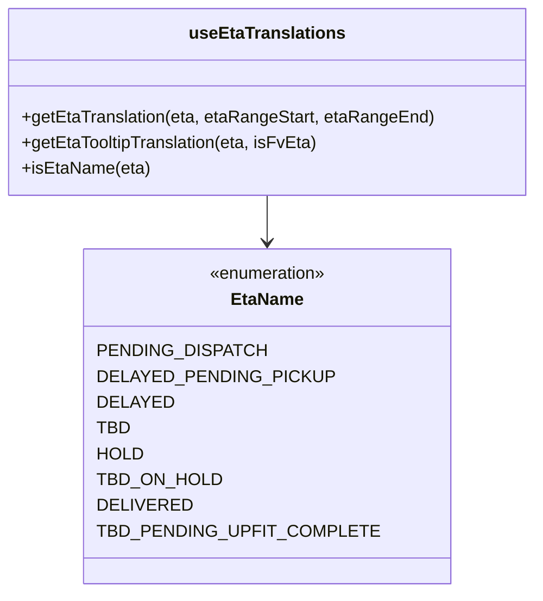
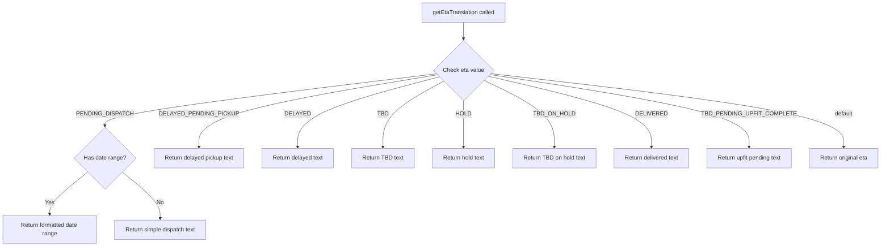
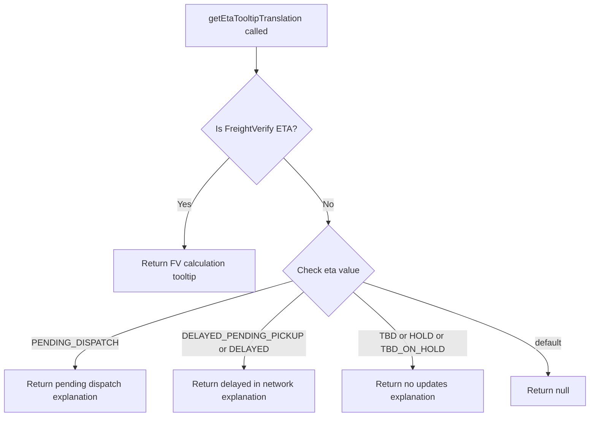
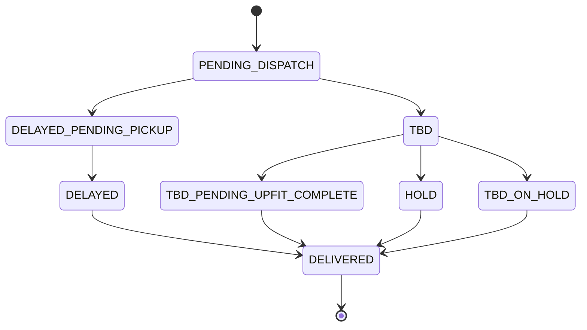

# Diagram: web/portal/src/shared/hooks/useEtaTranslations.ts

> Auto-generated by Obscura crawlers

## Diagram 1

### SVG

<svg id="container" width="490.9375" xmlns="http://www.w3.org/2000/svg" class="classDiagram" height="552" viewBox="0 0 490.9375 552" role="graphics-document document" aria-roledescription="class"><g><defs><marker id="container_class-aggregationStart" class="marker aggregation class" refX="18" refY="7" markerWidth="190" markerHeight="240" orient="auto"><path d="M 18,7 L9,13 L1,7 L9,1 Z"></path></marker></defs><defs><marker id="container_class-aggregationEnd" class="marker aggregation class" refX="1" refY="7" markerWidth="20" markerHeight="28" orient="auto"><path d="M 18,7 L9,13 L1,7 L9,1 Z"></path></marker></defs><defs><marker id="container_class-extensionStart" class="marker extension class" refX="18" refY="7" markerWidth="190" markerHeight="240" orient="auto"><path d="M 1,7 L18,13 V 1 Z"></path></marker></defs><defs><marker id="container_class-extensionEnd" class="marker extension class" refX="1" refY="7" markerWidth="20" markerHeight="28" orient="auto"><path d="M 1,1 V 13 L18,7 Z"></path></marker></defs><defs><marker id="container_class-compositionStart" class="marker composition class" refX="18" refY="7" markerWidth="190" markerHeight="240" orient="auto"><path d="M 18,7 L9,13 L1,7 L9,1 Z"></path></marker></defs><defs><marker id="container_class-compositionEnd" class="marker composition class" refX="1" refY="7" markerWidth="20" markerHeight="28" orient="auto"><path d="M 18,7 L9,13 L1,7 L9,1 Z"></path></marker></defs><defs><marker id="container_class-dependencyStart" class="marker dependency class" refX="6" refY="7" markerWidth="190" markerHeight="240" orient="auto"><path d="M 5,7 L9,13 L1,7 L9,1 Z"></path></marker></defs><defs><marker id="container_class-dependencyEnd" class="marker dependency class" refX="13" refY="7" markerWidth="20" markerHeight="28" orient="auto"><path d="M 18,7 L9,13 L14,7 L9,1 Z"></path></marker></defs><defs><marker id="container_class-lollipopStart" class="marker lollipop class" refX="13" refY="7" markerWidth="190" markerHeight="240" orient="auto"><circle stroke="black" fill="transparent" cx="7" cy="7" r="6"></circle></marker></defs><defs><marker id="container_class-lollipopEnd" class="marker lollipop class" refX="1" refY="7" markerWidth="190" markerHeight="240" orient="auto"><circle stroke="black" fill="transparent" cx="7" cy="7" r="6"></circle></marker></defs><g class="root"><g class="clusters"></g><g class="edgePaths"><path d="M245.469,182L245.469,186.167C245.469,190.333,245.469,198.667,245.469,206C245.469,213.333,245.469,219.667,245.469,222.833L245.469,226" id="id_useEtaTranslations_EtaName_1" class="edge-thickness-normal edge-pattern-solid relation" style=";;;" data-edge="true" data-et="edge" data-id="id_useEtaTranslations_EtaName_1" data-points="W3sieCI6MjQ1LjQ2ODc1LCJ5IjoxODJ9LHsieCI6MjQ1LjQ2ODc1LCJ5IjoyMDd9LHsieCI6MjQ1LjQ2ODc1LCJ5IjoyMzJ9XQ==" marker-end="url(#container_class-dependencyEnd)"></path></g><g class="edgeLabels"><g class="edgeLabel"><g class="label" data-id="id_useEtaTranslations_EtaName_1" transform="translate(0, 0)"><foreignObject width="0" height="0">

</foreignObject></g></g></g><g class="nodes"><g class="node default" id="classId-EtaName-0" transform="translate(245.46875, 388)"><g class="basic label-container"><path d="M-155.26953125 -156 L155.26953125 -156 L155.26953125 156 L-155.26953125 156" stroke="none" stroke-width="0" fill="#ECECFF" style=""></path><path d="M-155.26953125 -156 C-62.58705480737241 -156, 30.095421635255178 -156, 155.26953125 -156 M-155.26953125 -156 C-87.06474455825419 -156, -18.85995786650838 -156, 155.26953125 -156 M155.26953125 -156 C155.26953125 -88.02128826325357, 155.26953125 -20.042576526507133, 155.26953125 156 M155.26953125 -156 C155.26953125 -47.03481964446303, 155.26953125 61.930360711073945, 155.26953125 156 M155.26953125 156 C60.98131743844134 156, -33.306896373117326 156, -155.26953125 156 M155.26953125 156 C60.555114634512236 156, -34.15930198097553 156, -155.26953125 156 M-155.26953125 156 C-155.26953125 83.9635872968659, -155.26953125 11.927174593731792, -155.26953125 -156 M-155.26953125 156 C-155.26953125 73.38620682832664, -155.26953125 -9.22758634334673, -155.26953125 -156" stroke="#9370DB" stroke-width="1.3" fill="none" stroke-dasharray="0 0" style=""></path></g><g class="annotation-group text" transform="translate(-55.5546875, -132)"><g class="label" style="" transform="translate(0,-12)"><foreignObject width="111.109375" height="24">

«enumeration»

</foreignObject></g></g><g class="label-group text" transform="translate(-32.3046875, -108)"><g class="label" style="font-weight: bolder" transform="translate(0,-12)"><foreignObject width="64.609375" height="24">

EtaName

</foreignObject></g></g><g class="members-group text" transform="translate(-143.26953125, -60)"><g class="label" style="" transform="translate(0,-12)"><foreignObject width="141.15625" height="24">

PENDING_DISPATCH

</foreignObject></g><g class="label" style="" transform="translate(0,12)"><foreignObject width="195.890625" height="24">

DELAYED_PENDING_PICKUP

</foreignObject></g><g class="label" style="" transform="translate(0,36)"><foreignObject width="62.890625" height="24">

DELAYED

</foreignObject></g><g class="label" style="" transform="translate(0,60)"><foreignObject width="28.3125" height="24">

TBD

</foreignObject></g><g class="label" style="" transform="translate(0,84)"><foreignObject width="40.234375" height="24">

HOLD

</foreignObject></g><g class="label" style="" transform="translate(0,108)"><foreignObject width="105.890625" height="24">

TBD_ON_HOLD

</foreignObject></g><g class="label" style="" transform="translate(0,132)"><foreignObject width="77.5625" height="24">

DELIVERED

</foreignObject></g><g class="label" style="" transform="translate(0,156)"><foreignObject width="230.984375" height="24">

TBD_PENDING_UPFIT_COMPLETE

</foreignObject></g></g><g class="methods-group text" transform="translate(-143.26953125, 156)"></g><g class="divider" style=""><path d="M-155.26953125 -84 C-65.7635554775153 -84, 23.742420294969406 -84, 155.26953125 -84 M-155.26953125 -84 C-32.967892177085076 -84, 89.33374689582985 -84, 155.26953125 -84" stroke="#9370DB" stroke-width="1.3" fill="none" stroke-dasharray="0 0" style=""></path></g><g class="divider" style=""><path d="M-155.26953125 132 C-58.56187597055124 132, 38.14577930889752 132, 155.26953125 132 M-155.26953125 132 C-42.86317331878237 132, 69.54318461243525 132, 155.26953125 132" stroke="#9370DB" stroke-width="1.3" fill="none" stroke-dasharray="0 0" style=""></path></g></g><g class="node default" id="classId-useEtaTranslations-1" transform="translate(245.46875, 95)"><g class="basic label-container"><path d="M-237.46875 -87 L237.46875 -87 L237.46875 87 L-237.46875 87" stroke="none" stroke-width="0" fill="#ECECFF" style=""></path><path d="M-237.46875 -87 C-88.82661010015042 -87, 59.81552979969916 -87, 237.46875 -87 M-237.46875 -87 C-89.63211984798323 -87, 58.20451030403353 -87, 237.46875 -87 M237.46875 -87 C237.46875 -43.31030212691311, 237.46875 0.3793957461737847, 237.46875 87 M237.46875 -87 C237.46875 -45.387971061464874, 237.46875 -3.7759421229297487, 237.46875 87 M237.46875 87 C102.46837954475905 87, -32.53199091048191 87, -237.46875 87 M237.46875 87 C96.01305493782354 87, -45.44264012435292 87, -237.46875 87 M-237.46875 87 C-237.46875 50.65134161061993, -237.46875 14.30268322123986, -237.46875 -87 M-237.46875 87 C-237.46875 32.728855188281614, -237.46875 -21.542289623436773, -237.46875 -87" stroke="#9370DB" stroke-width="1.3" fill="none" stroke-dasharray="0 0" style=""></path></g><g class="annotation-group text" transform="translate(0, -63)"></g><g class="label-group text" transform="translate(-69.390625, -63)"><g class="label" style="font-weight: bolder" transform="translate(0,-12)"><foreignObject width="138.78125" height="24">

useEtaTranslations

</foreignObject></g></g><g class="members-group text" transform="translate(-225.46875, -15)"></g><g class="methods-group text" transform="translate(-225.46875, 15)"><g class="label" style="" transform="translate(0,-12)"><foreignObject width="381.546875" height="24">

+getEtaTranslation(eta, etaRangeStart, etaRangeEnd)

</foreignObject></g><g class="label" style="" transform="translate(0,12)"><foreignObject width="276.484375" height="24">

+getEtaTooltipTranslation(eta, isFvEta)

</foreignObject></g><g class="label" style="" transform="translate(0,36)"><foreignObject width="118.203125" height="24">

+isEtaName(eta)

</foreignObject></g></g><g class="divider" style=""><path d="M-237.46875 -39 C-133.34266066364057 -39, -29.216571327281173 -39, 237.46875 -39 M-237.46875 -39 C-92.06952506814014 -39, 53.329699863719725 -39, 237.46875 -39" stroke="#9370DB" stroke-width="1.3" fill="none" stroke-dasharray="0 0" style=""></path></g><g class="divider" style=""><path d="M-237.46875 -15 C-118.66084258902491 -15, 0.1470648219501811 -15, 237.46875 -15 M-237.46875 -15 C-122.468887827198 -15, -7.469025654396006 -15, 237.46875 -15" stroke="#9370DB" stroke-width="1.3" fill="none" stroke-dasharray="0 0" style=""></path></g></g></g></g></g></svg>

## Diagram 2

### SVG

<svg id="container" width="2478.62109375" xmlns="http://www.w3.org/2000/svg" class="flowchart" height="682.28125" viewBox="0 0 2478.62109375 682.28125" role="graphics-document document" aria-roledescription="flowchart-v2"><g><marker id="container_flowchart-v2-pointEnd" class="marker flowchart-v2" viewBox="0 0 10 10" refX="5" refY="5" markerUnits="userSpaceOnUse" markerWidth="8" markerHeight="8" orient="auto"><path d="M 0 0 L 10 5 L 0 10 z" class="arrowMarkerPath" style="stroke-width: 1; stroke-dasharray: 1, 0;"></path></marker><marker id="container_flowchart-v2-pointStart" class="marker flowchart-v2" viewBox="0 0 10 10" refX="4.5" refY="5" markerUnits="userSpaceOnUse" markerWidth="8" markerHeight="8" orient="auto"><path d="M 0 5 L 10 10 L 10 0 z" class="arrowMarkerPath" style="stroke-width: 1; stroke-dasharray: 1, 0;"></path></marker><marker id="container_flowchart-v2-circleEnd" class="marker flowchart-v2" viewBox="0 0 10 10" refX="11" refY="5" markerUnits="userSpaceOnUse" markerWidth="11" markerHeight="11" orient="auto"><circle cx="5" cy="5" r="5" class="arrowMarkerPath" style="stroke-width: 1; stroke-dasharray: 1, 0;"></circle></marker><marker id="container_flowchart-v2-circleStart" class="marker flowchart-v2" viewBox="0 0 10 10" refX="-1" refY="5" markerUnits="userSpaceOnUse" markerWidth="11" markerHeight="11" orient="auto"><circle cx="5" cy="5" r="5" class="arrowMarkerPath" style="stroke-width: 1; stroke-dasharray: 1, 0;"></circle></marker><marker id="container_flowchart-v2-crossEnd" class="marker cross flowchart-v2" viewBox="0 0 11 11" refX="12" refY="5.2" markerUnits="userSpaceOnUse" markerWidth="11" markerHeight="11" orient="auto"><path d="M 1,1 l 9,9 M 10,1 l -9,9" class="arrowMarkerPath" style="stroke-width: 2; stroke-dasharray: 1, 0;"></path></marker><marker id="container_flowchart-v2-crossStart" class="marker cross flowchart-v2" viewBox="0 0 11 11" refX="-1" refY="5.2" markerUnits="userSpaceOnUse" markerWidth="11" markerHeight="11" orient="auto"><path d="M 1,1 l 9,9 M 10,1 l -9,9" class="arrowMarkerPath" style="stroke-width: 2; stroke-dasharray: 1, 0;"></path></marker><g class="root"><g class="clusters"></g><g class="edgePaths"><path d="M1297.238,62L1297.238,66.167C1297.238,70.333,1297.238,78.667,1297.238,86.333C1297.238,94,1297.238,101,1297.238,104.5L1297.238,108" id="L_A_B_0" class="edge-thickness-normal edge-pattern-solid edge-thickness-normal edge-pattern-solid flowchart-link" style=";" data-edge="true" data-et="edge" data-id="L_A_B_0" data-points="W3sieCI6MTI5Ny4yMzgyODEyNSwieSI6NjJ9LHsieCI6MTI5Ny4yMzgyODEyNSwieSI6ODd9LHsieCI6MTI5Ny4yMzgyODEyNSwieSI6MTEyfV0=" marker-end="url(#container_flowchart-v2-pointEnd)"></path><path d="M1222.606,204.556L1067.666,223.161C912.726,241.766,602.845,278.977,447.905,303.082C292.965,327.188,292.965,338.188,292.965,343.688L292.965,349.188" id="L_B_C_0" class="edge-thickness-normal edge-pattern-solid edge-thickness-normal edge-pattern-solid flowchart-link" style=";" data-edge="true" data-et="edge" data-id="L_B_C_0" data-points="W3sieCI6MTIyMi42MDYzNzQ4MzU3MDEsInkiOjIwNC41NTU1OTM1ODU3MDExfSx7IngiOjI5Mi45NjQ4NDM3NSwieSI6MzE2LjE4NzV9LHsieCI6MjkyLjk2NDg0Mzc1LCJ5IjozNTMuMTg3NX1d" marker-end="url(#container_flowchart-v2-pointEnd)"></path><path d="M245.582,474.899L227.652,488.963C209.722,503.026,173.861,531.154,155.93,550.718C138,570.281,138,581.281,138,586.781L138,592.281" id="L_C_D_0" class="edge-thickness-normal edge-pattern-solid edge-thickness-normal edge-pattern-solid flowchart-link" style=";" data-edge="true" data-et="edge" data-id="L_C_D_0" data-points="W3sieCI6MjQ1LjU4MjQyNzc5NjE1MjUzLCJ5Ijo0NzQuODk4ODM0MDQ2MTUyNTZ9LHsieCI6MTM4LCJ5Ijo1NTkuMjgxMjV9LHsieCI6MTM4LCJ5Ijo1OTYuMjgxMjV9XQ==" marker-end="url(#container_flowchart-v2-pointEnd)"></path><path d="M340.347,474.899L358.278,488.963C376.208,503.026,412.069,531.154,429.999,552.718C447.93,574.281,447.93,589.281,447.93,596.781L447.93,604.281" id="L_C_E_0" class="edge-thickness-normal edge-pattern-solid edge-thickness-normal edge-pattern-solid flowchart-link" style=";" data-edge="true" data-et="edge" data-id="L_C_E_0" data-points="W3sieCI6MzQwLjM0NzI1OTcwMzg0NzQ0LCJ5Ijo0NzQuODk4ODM0MDQ2MTUyNTZ9LHsieCI6NDQ3LjkyOTY4NzUsInkiOjU1OS4yODEyNX0seyJ4Ijo0NDcuOTI5Njg3NSwieSI6NjA4LjI4MTI1fV0=" marker-end="url(#container_flowchart-v2-pointEnd)"></path><path d="M1225.329,207.279L1113.625,225.43C1001.921,243.582,778.513,279.885,666.809,313.127C555.105,346.37,555.105,376.552,555.105,391.643L555.105,406.734" id="L_B_F_0" class="edge-thickness-normal edge-pattern-solid edge-thickness-normal edge-pattern-solid flowchart-link" style=";" data-edge="true" data-et="edge" data-id="L_B_F_0" data-points="W3sieCI6MTIyNS4zMjk0NDMwNDg1MzEyLCJ5IjoyMDcuMjc4NjYxNzk4NTMxMTh9LHsieCI6NTU1LjEwNTQ2ODc1LCJ5IjozMTYuMTg3NX0seyJ4Ijo1NTUuMTA1NDY4NzUsInkiOjQxMC43MzQzNzV9XQ==" marker-end="url(#container_flowchart-v2-pointEnd)"></path><path d="M1230.908,212.857L1164.739,230.079C1098.57,247.301,966.232,281.744,900.063,314.057C833.895,346.37,833.895,376.552,833.895,391.643L833.895,406.734" id="L_B_G_0" class="edge-thickness-normal edge-pattern-solid edge-thickness-normal edge-pattern-solid flowchart-link" style=";" data-edge="true" data-et="edge" data-id="L_B_G_0" data-points="W3sieCI6MTIzMC45MDgxNjYxMjM3MDIxLCJ5IjoyMTIuODU3Mzg0ODczNzAyMjR9LHsieCI6ODMzLjg5NDUzMTI1LCJ5IjozMTYuMTg3NX0seyJ4Ijo4MzMuODk0NTMxMjUsInkiOjQxMC43MzQzNzV9XQ==" marker-end="url(#container_flowchart-v2-pointEnd)"></path><path d="M1242.77,224.719L1214.259,239.964C1185.749,255.208,1128.728,285.698,1100.217,316.034C1071.707,346.37,1071.707,376.552,1071.707,391.643L1071.707,406.734" id="L_B_H_0" class="edge-thickness-normal edge-pattern-solid edge-thickness-normal edge-pattern-solid flowchart-link" style=";" data-edge="true" data-et="edge" data-id="L_B_H_0" data-points="W3sieCI6MTI0Mi43Njk1MTE1MDAwOTAyLCJ5IjoyMjQuNzE4NzMwMjUwMDkwM30seyJ4IjoxMDcxLjcwNzAzMTI1LCJ5IjozMTYuMTg3NX0seyJ4IjoxMDcxLjcwNzAzMTI1LCJ5Ijo0MTAuNzM0Mzc1fV0=" marker-end="url(#container_flowchart-v2-pointEnd)"></path><path d="M1297.238,279.188L1297.238,285.354C1297.238,291.521,1297.238,303.854,1297.238,325.112C1297.238,346.37,1297.238,376.552,1297.238,391.643L1297.238,406.734" id="L_B_I_0" class="edge-thickness-normal edge-pattern-solid edge-thickness-normal edge-pattern-solid flowchart-link" style=";" data-edge="true" data-et="edge" data-id="L_B_I_0" data-points="W3sieCI6MTI5Ny4yMzgyODEyNSwieSI6Mjc5LjE4NzV9LHsieCI6MTI5Ny4yMzgyODEyNSwieSI6MzE2LjE4NzV9LHsieCI6MTI5Ny4yMzgyODEyNSwieSI6NDEwLjczNDM3NX1d" marker-end="url(#container_flowchart-v2-pointEnd)"></path><path d="M1354.034,222.392L1387.166,238.024C1420.297,253.657,1486.561,284.922,1519.693,315.646C1552.824,346.37,1552.824,376.552,1552.824,391.643L1552.824,406.734" id="L_B_J_0" class="edge-thickness-normal edge-pattern-solid edge-thickness-normal edge-pattern-solid flowchart-link" style=";" data-edge="true" data-et="edge" data-id="L_B_J_0" data-points="W3sieCI6MTM1NC4wMzM5NzY2OTI0NjIxLCJ5IjoyMjIuMzkxODA0NTU3NTM3NzR9LHsieCI6MTU1Mi44MjQyMTg3NSwieSI6MzE2LjE4NzV9LHsieCI6MTU1Mi44MjQyMTg3NSwieSI6NDEwLjczNDM3NX1d" marker-end="url(#container_flowchart-v2-pointEnd)"></path><path d="M1365.307,211.119L1442.083,228.63C1518.859,246.142,1672.412,281.165,1749.188,313.767C1825.965,346.37,1825.965,376.552,1825.965,391.643L1825.965,406.734" id="L_B_K_0" class="edge-thickness-normal edge-pattern-solid edge-thickness-normal edge-pattern-solid flowchart-link" style=";" data-edge="true" data-et="edge" data-id="L_B_K_0" data-points="W3sieCI6MTM2NS4zMDY3NDQ4OTI4NzE4LCJ5IjoyMTEuMTE5MDM2MzU3MTI4MjR9LHsieCI6MTgyNS45NjQ4NDM3NSwieSI6MzE2LjE4NzV9LHsieCI6MTgyNS45NjQ4NDM3NSwieSI6NDEwLjczNDM3NX1d" marker-end="url(#container_flowchart-v2-pointEnd)"></path><path d="M1369.957,206.469L1492.232,224.755C1614.506,243.042,1859.056,279.615,1981.331,312.992C2103.605,346.37,2103.605,376.552,2103.605,391.643L2103.605,406.734" id="L_B_L_0" class="edge-thickness-normal edge-pattern-solid edge-thickness-normal edge-pattern-solid flowchart-link" style=";" data-edge="true" data-et="edge" data-id="L_B_L_0" data-points="W3sieCI6MTM2OS45NTY4MzMxOTAxNDM3LCJ5IjoyMDYuNDY4OTQ4MDU5ODU2MjJ9LHsieCI6MjEwMy42MDU0Njg3NSwieSI6MzE2LjE4NzV9LHsieCI6MjEwMy42MDU0Njg3NSwieSI6NDEwLjczNDM3NX1d" marker-end="url(#container_flowchart-v2-pointEnd)"></path><path d="M1372.404,204.022L1539.12,222.716C1705.835,241.411,2039.267,278.799,2205.983,312.584C2372.699,346.37,2372.699,376.552,2372.699,391.643L2372.699,406.734" id="L_B_M_0" class="edge-thickness-normal edge-pattern-solid edge-thickness-normal edge-pattern-solid flowchart-link" style=";" data-edge="true" data-et="edge" data-id="L_B_M_0" data-points="W3sieCI6MTM3Mi40MDM1ODQwNDQwMTY3LCJ5IjoyMDQuMDIyMTk3MjA1OTgzMjJ9LHsieCI6MjM3Mi42OTkyMTg3NSwieSI6MzE2LjE4NzV9LHsieCI6MjM3Mi42OTkyMTg3NSwieSI6NDEwLjczNDM3NX1d" marker-end="url(#container_flowchart-v2-pointEnd)"></path></g><g class="edgeLabels"><g class="edgeLabel"><g class="label" data-id="L_A_B_0" transform="translate(0, 0)"><foreignObject width="0" height="0">

</foreignObject></g></g><g class="edgeLabel" transform="translate(292.96484375, 316.1875)"><g class="label" data-id="L_B_C_0" transform="translate(-70.578125, -12)"><foreignObject width="141.15625" height="24">

PENDING_DISPATCH

</foreignObject></g></g><g class="edgeLabel" transform="translate(138, 559.28125)"><g class="label" data-id="L_C_D_0" transform="translate(-12.03125, -12)"><foreignObject width="24.0625" height="24">

Yes

</foreignObject></g></g><g class="edgeLabel" transform="translate(447.9296875, 559.28125)"><g class="label" data-id="L_C_E_0" transform="translate(-10.140625, -12)"><foreignObject width="20.28125" height="24">

No

</foreignObject></g></g><g class="edgeLabel" transform="translate(555.10546875, 316.1875)"><g class="label" data-id="L_B_F_0" transform="translate(-97.9453125, -12)"><foreignObject width="195.890625" height="24">

DELAYED_PENDING_PICKUP

</foreignObject></g></g><g class="edgeLabel" transform="translate(833.89453125, 316.1875)"><g class="label" data-id="L_B_G_0" transform="translate(-31.4453125, -12)"><foreignObject width="62.890625" height="24">

DELAYED

</foreignObject></g></g><g class="edgeLabel" transform="translate(1071.70703125, 316.1875)"><g class="label" data-id="L_B_H_0" transform="translate(-14.15625, -12)"><foreignObject width="28.3125" height="24">

TBD

</foreignObject></g></g><g class="edgeLabel" transform="translate(1297.23828125, 316.1875)"><g class="label" data-id="L_B_I_0" transform="translate(-20.1171875, -12)"><foreignObject width="40.234375" height="24">

HOLD

</foreignObject></g></g><g class="edgeLabel" transform="translate(1552.82421875, 316.1875)"><g class="label" data-id="L_B_J_0" transform="translate(-52.9453125, -12)"><foreignObject width="105.890625" height="24">

TBD_ON_HOLD

</foreignObject></g></g><g class="edgeLabel" transform="translate(1825.96484375, 316.1875)"><g class="label" data-id="L_B_K_0" transform="translate(-38.78125, -12)"><foreignObject width="77.5625" height="24">

DELIVERED

</foreignObject></g></g><g class="edgeLabel" transform="translate(2103.60546875, 316.1875)"><g class="label" data-id="L_B_L_0" transform="translate(-115.4921875, -12)"><foreignObject width="230.984375" height="24">

TBD_PENDING_UPFIT_COMPLETE

</foreignObject></g></g><g class="edgeLabel" transform="translate(2372.69921875, 316.1875)"><g class="label" data-id="L_B_M_0" transform="translate(-25.890625, -12)"><foreignObject width="51.78125" height="24">

default

</foreignObject></g></g></g><g class="nodes"><g class="node default" id="flowchart-A-0" transform="translate(1297.23828125, 35)"><rect class="basic label-container" style="" x="-117.203125" y="-27" width="234.40625" height="54"></rect><g class="label" style="" transform="translate(-87.203125, -12)"><rect></rect><foreignObject width="174.40625" height="24">

getEtaTranslation called

</foreignObject></g></g><g class="node default" id="flowchart-B-1" transform="translate(1297.23828125, 195.59375)"><polygon points="83.59375,0 167.1875,-83.59375 83.59375,-167.1875 0,-83.59375" class="label-container" transform="translate(-83.09375, 83.59375)"></polygon><g class="label" style="" transform="translate(-56.59375, -12)"><rect></rect><foreignObject width="113.1875" height="24">

Check eta value

</foreignObject></g></g><g class="node default" id="flowchart-C-3" transform="translate(292.96484375, 437.734375)"><polygon points="84.546875,0 169.09375,-84.546875 84.546875,-169.09375 0,-84.546875" class="label-container" transform="translate(-84.046875, 84.546875)"></polygon><g class="label" style="" transform="translate(-57.546875, -12)"><rect></rect><foreignObject width="115.09375" height="24">

Has date range?

</foreignObject></g></g><g class="node default" id="flowchart-D-5" transform="translate(138, 635.28125)"><rect class="basic label-container" style="" x="-130" y="-39" width="260" height="78"></rect><g class="label" style="" transform="translate(-100, -24)"><rect></rect><foreignObject width="200" height="48">

Return formatted date range

</foreignObject></g></g><g class="node default" id="flowchart-E-7" transform="translate(447.9296875, 635.28125)"><rect class="basic label-container" style="" x="-129.9296875" y="-27" width="259.859375" height="54"></rect><g class="label" style="" transform="translate(-99.9296875, -12)"><rect></rect><foreignObject width="199.859375" height="24">

Return simple dispatch text

</foreignObject></g></g><g class="node default" id="flowchart-F-9" transform="translate(555.10546875, 437.734375)"><rect class="basic label-container" style="" x="-127.59375" y="-27" width="255.1875" height="54"></rect><g class="label" style="" transform="translate(-97.59375, -12)"><rect></rect><foreignObject width="195.1875" height="24">

Return delayed pickup text

</foreignObject></g></g><g class="node default" id="flowchart-G-11" transform="translate(833.89453125, 437.734375)"><rect class="basic label-container" style="" x="-101.1953125" y="-27" width="202.390625" height="54"></rect><g class="label" style="" transform="translate(-71.1953125, -12)"><rect></rect><foreignObject width="142.390625" height="24">

Return delayed text

</foreignObject></g></g><g class="node default" id="flowchart-H-13" transform="translate(1071.70703125, 437.734375)"><rect class="basic label-container" style="" x="-86.6171875" y="-27" width="173.234375" height="54"></rect><g class="label" style="" transform="translate(-56.6171875, -12)"><rect></rect><foreignObject width="113.234375" height="24">

Return TBD text

</foreignObject></g></g><g class="node default" id="flowchart-I-15" transform="translate(1297.23828125, 437.734375)"><rect class="basic label-container" style="" x="-88.9140625" y="-27" width="177.828125" height="54"></rect><g class="label" style="" transform="translate(-58.9140625, -12)"><rect></rect><foreignObject width="117.828125" height="24">

Return hold text

</foreignObject></g></g><g class="node default" id="flowchart-J-17" transform="translate(1552.82421875, 437.734375)"><rect class="basic label-container" style="" x="-116.671875" y="-27" width="233.34375" height="54"></rect><g class="label" style="" transform="translate(-86.671875, -12)"><rect></rect><foreignObject width="173.34375" height="24">

Return TBD on hold text

</foreignObject></g></g><g class="node default" id="flowchart-K-19" transform="translate(1825.96484375, 437.734375)"><rect class="basic label-container" style="" x="-106.46875" y="-27" width="212.9375" height="54"></rect><g class="label" style="" transform="translate(-76.46875, -12)"><rect></rect><foreignObject width="152.9375" height="24">

Return delivered text

</foreignObject></g></g><g class="node default" id="flowchart-L-21" transform="translate(2103.60546875, 437.734375)"><rect class="basic label-container" style="" x="-121.171875" y="-27" width="242.34375" height="54"></rect><g class="label" style="" transform="translate(-91.171875, -12)"><rect></rect><foreignObject width="182.34375" height="24">

Return upfit pending text

</foreignObject></g></g><g class="node default" id="flowchart-M-23" transform="translate(2372.69921875, 437.734375)"><rect class="basic label-container" style="" x="-97.921875" y="-27" width="195.84375" height="54"></rect><g class="label" style="" transform="translate(-67.921875, -12)"><rect></rect><foreignObject width="135.84375" height="24">

Return original eta

</foreignObject></g></g></g></g></g></svg>

## Diagram 3

### SVG

<svg id="container" width="1087.109375" xmlns="http://www.w3.org/2000/svg" class="flowchart" height="758.765625" viewBox="0 0 1087.109375 758.765625" role="graphics-document document" aria-roledescription="flowchart-v2"><g><marker id="container_flowchart-v2-pointEnd" class="marker flowchart-v2" viewBox="0 0 10 10" refX="5" refY="5" markerUnits="userSpaceOnUse" markerWidth="8" markerHeight="8" orient="auto"><path d="M 0 0 L 10 5 L 0 10 z" class="arrowMarkerPath" style="stroke-width: 1; stroke-dasharray: 1, 0;"></path></marker><marker id="container_flowchart-v2-pointStart" class="marker flowchart-v2" viewBox="0 0 10 10" refX="4.5" refY="5" markerUnits="userSpaceOnUse" markerWidth="8" markerHeight="8" orient="auto"><path d="M 0 5 L 10 10 L 10 0 z" class="arrowMarkerPath" style="stroke-width: 1; stroke-dasharray: 1, 0;"></path></marker><marker id="container_flowchart-v2-circleEnd" class="marker flowchart-v2" viewBox="0 0 10 10" refX="11" refY="5" markerUnits="userSpaceOnUse" markerWidth="11" markerHeight="11" orient="auto"><circle cx="5" cy="5" r="5" class="arrowMarkerPath" style="stroke-width: 1; stroke-dasharray: 1, 0;"></circle></marker><marker id="container_flowchart-v2-circleStart" class="marker flowchart-v2" viewBox="0 0 10 10" refX="-1" refY="5" markerUnits="userSpaceOnUse" markerWidth="11" markerHeight="11" orient="auto"><circle cx="5" cy="5" r="5" class="arrowMarkerPath" style="stroke-width: 1; stroke-dasharray: 1, 0;"></circle></marker><marker id="container_flowchart-v2-crossEnd" class="marker cross flowchart-v2" viewBox="0 0 11 11" refX="12" refY="5.2" markerUnits="userSpaceOnUse" markerWidth="11" markerHeight="11" orient="auto"><path d="M 1,1 l 9,9 M 10,1 l -9,9" class="arrowMarkerPath" style="stroke-width: 2; stroke-dasharray: 1, 0;"></path></marker><marker id="container_flowchart-v2-crossStart" class="marker cross flowchart-v2" viewBox="0 0 11 11" refX="-1" refY="5.2" markerUnits="userSpaceOnUse" markerWidth="11" markerHeight="11" orient="auto"><path d="M 1,1 l 9,9 M 10,1 l -9,9" class="arrowMarkerPath" style="stroke-width: 2; stroke-dasharray: 1, 0;"></path></marker><g class="root"><g class="clusters"></g><g class="edgePaths"><path d="M471.203,86L471.203,90.167C471.203,94.333,471.203,102.667,471.203,110.333C471.203,118,471.203,125,471.203,128.5L471.203,132" id="L_N_O_0" class="edge-thickness-normal edge-pattern-solid edge-thickness-normal edge-pattern-solid flowchart-link" style=";" data-edge="true" data-et="edge" data-id="L_N_O_0" data-points="W3sieCI6NDcxLjIwMzEyNSwieSI6ODZ9LHsieCI6NDcxLjIwMzEyNSwieSI6MTExfSx7IngiOjQ3MS4yMDMxMjUsInkiOjEzNn1d" marker-end="url(#container_flowchart-v2-pointEnd)"></path><path d="M422.546,284.921L408.689,299.197C394.832,313.473,367.119,342.026,353.263,369.234C339.406,396.443,339.406,422.307,339.406,435.24L339.406,448.172" id="L_O_P_0" class="edge-thickness-normal edge-pattern-solid edge-thickness-normal edge-pattern-solid flowchart-link" style=";" data-edge="true" data-et="edge" data-id="L_O_P_0" data-points="W3sieCI6NDIyLjU0NTUyNDIxODI3MSwieSI6Mjg0LjkyMDUyNDIxODI3MX0seyJ4IjozMzkuNDA2MjUsInkiOjM3MC41NzgxMjV9LHsieCI6MzM5LjQwNjI1LCJ5Ijo0NTIuMTcxODc1fV0=" marker-end="url(#container_flowchart-v2-pointEnd)"></path><path d="M519.861,284.921L533.717,299.197C547.574,313.473,575.287,342.026,589.143,361.802C603,381.578,603,392.578,603,398.078L603,403.578" id="L_O_Q_0" class="edge-thickness-normal edge-pattern-solid edge-thickness-normal edge-pattern-solid flowchart-link" style=";" data-edge="true" data-et="edge" data-id="L_O_Q_0" data-points="W3sieCI6NTE5Ljg2MDcyNTc4MTcyOSwieSI6Mjg0LjkyMDUyNDIxODI3MX0seyJ4Ijo2MDMsInkiOjM3MC41NzgxMjV9LHsieCI6NjAzLCJ5Ijo0MDcuNTc4MTI1fV0=" marker-end="url(#container_flowchart-v2-pointEnd)"></path><path d="M537.954,509.72L471.295,528.727C404.636,547.735,271.318,585.75,204.659,612.258C138,638.766,138,653.766,138,661.266L138,668.766" id="L_Q_R_0" class="edge-thickness-normal edge-pattern-solid edge-thickness-normal edge-pattern-solid flowchart-link" style=";" data-edge="true" data-et="edge" data-id="L_Q_R_0" data-points="W3sieCI6NTM3Ljk1Mzk4MjExNTc3NjksInkiOjUwOS43MTk2MDcxMTU3NzY4fSx7IngiOjEzOCwieSI6NjIzLjc2NTYyNX0seyJ4IjoxMzgsInkiOjY3Mi43NjU2MjV9XQ==" marker-end="url(#container_flowchart-v2-pointEnd)"></path><path d="M557.947,529.712L539.622,545.388C521.298,561.063,484.649,592.415,466.324,615.59C448,638.766,448,653.766,448,661.266L448,668.766" id="L_Q_S_0" class="edge-thickness-normal edge-pattern-solid edge-thickness-normal edge-pattern-solid flowchart-link" style=";" data-edge="true" data-et="edge" data-id="L_Q_S_0" data-points="W3sieCI6NTU3Ljk0Njc1NjQ5MjQ0ODEsInkiOjUyOS43MTIzODE0OTI0NDgxfSx7IngiOjQ0OCwieSI6NjIzLjc2NTYyNX0seyJ4Ijo0NDgsInkiOjY3Mi43NjU2MjV9XQ==" marker-end="url(#container_flowchart-v2-pointEnd)"></path><path d="M648.053,529.712L666.378,545.388C684.702,561.063,721.351,592.415,739.676,615.59C758,638.766,758,653.766,758,661.266L758,668.766" id="L_Q_T_0" class="edge-thickness-normal edge-pattern-solid edge-thickness-normal edge-pattern-solid flowchart-link" style=";" data-edge="true" data-et="edge" data-id="L_Q_T_0" data-points="W3sieCI6NjQ4LjA1MzI0MzUwNzU1MTksInkiOjUyOS43MTIzODE0OTI0NDgxfSx7IngiOjc1OCwieSI6NjIzLjc2NTYyNX0seyJ4Ijo3NTgsInkiOjY3Mi43NjU2MjV9XQ==" marker-end="url(#container_flowchart-v2-pointEnd)"></path><path d="M665.997,511.768L723.09,530.435C780.183,549.101,894.369,586.433,951.462,614.599C1008.555,642.766,1008.555,661.766,1008.555,671.266L1008.555,680.766" id="L_Q_U_0" class="edge-thickness-normal edge-pattern-solid edge-thickness-normal edge-pattern-solid flowchart-link" style=";" data-edge="true" data-et="edge" data-id="L_Q_U_0" data-points="W3sieCI6NjY1Ljk5NzE4NTg5ODU1MjYsInkiOjUxMS43Njg0MzkxMDE0NDczN30seyJ4IjoxMDA4LjU1NDY4NzUsInkiOjYyMy43NjU2MjV9LHsieCI6MTAwOC41NTQ2ODc1LCJ5Ijo2ODQuNzY1NjI1fV0=" marker-end="url(#container_flowchart-v2-pointEnd)"></path></g><g class="edgeLabels"><g class="edgeLabel"><g class="label" data-id="L_N_O_0" transform="translate(0, 0)"><foreignObject width="0" height="0">

</foreignObject></g></g><g class="edgeLabel" transform="translate(339.40625, 370.578125)"><g class="label" data-id="L_O_P_0" transform="translate(-12.03125, -12)"><foreignObject width="24.0625" height="24">

Yes

</foreignObject></g></g><g class="edgeLabel" transform="translate(603, 370.578125)"><g class="label" data-id="L_O_Q_0" transform="translate(-10.140625, -12)"><foreignObject width="20.28125" height="24">

No

</foreignObject></g></g><g class="edgeLabel" transform="translate(138, 623.765625)"><g class="label" data-id="L_Q_R_0" transform="translate(-70.578125, -12)"><foreignObject width="141.15625" height="24">

PENDING_DISPATCH

</foreignObject></g></g><g class="edgeLabel" transform="translate(448, 623.765625)"><g class="label" data-id="L_Q_S_0" transform="translate(-100.0703125, -24)"><foreignObject width="200.140625" height="48">

DELAYED_PENDING_PICKUP or DELAYED

</foreignObject></g></g><g class="edgeLabel" transform="translate(758, 623.765625)"><g class="label" data-id="L_Q_T_0" transform="translate(-100, -24)"><foreignObject width="200" height="48">

TBD or HOLD or TBD_ON_HOLD

</foreignObject></g></g><g class="edgeLabel" transform="translate(1008.5546875, 623.765625)"><g class="label" data-id="L_Q_U_0" transform="translate(-25.890625, -12)"><foreignObject width="51.78125" height="24">

default

</foreignObject></g></g></g><g class="nodes"><g class="node default" id="flowchart-N-0" transform="translate(471.203125, 47)"><rect class="basic label-container" style="" x="-130" y="-39" width="260" height="78"></rect><g class="label" style="" transform="translate(-100, -24)"><rect></rect><foreignObject width="200" height="48">

getEtaTooltipTranslation called

</foreignObject></g></g><g class="node default" id="flowchart-O-1" transform="translate(471.203125, 234.7890625)"><polygon points="98.7890625,0 197.578125,-98.7890625 98.7890625,-197.578125 0,-98.7890625" class="label-container" transform="translate(-98.2890625, 98.7890625)"></polygon><g class="label" style="" transform="translate(-71.7890625, -12)"><rect></rect><foreignObject width="143.578125" height="24">

Is FreightVerify ETA?

</foreignObject></g></g><g class="node default" id="flowchart-P-3" transform="translate(339.40625, 491.171875)"><rect class="basic label-container" style="" x="-130" y="-39" width="260" height="78"></rect><g class="label" style="" transform="translate(-100, -24)"><rect></rect><foreignObject width="200" height="48">

Return FV calculation tooltip

</foreignObject></g></g><g class="node default" id="flowchart-Q-5" transform="translate(603, 491.171875)"><polygon points="83.59375,0 167.1875,-83.59375 83.59375,-167.1875 0,-83.59375" class="label-container" transform="translate(-83.09375, 83.59375)"></polygon><g class="label" style="" transform="translate(-56.59375, -12)"><rect></rect><foreignObject width="113.1875" height="24">

Check eta value

</foreignObject></g></g><g class="node default" id="flowchart-R-7" transform="translate(138, 711.765625)"><rect class="basic label-container" style="" x="-130" y="-39" width="260" height="78"></rect><g class="label" style="" transform="translate(-100, -24)"><rect></rect><foreignObject width="200" height="48">

Return pending dispatch explanation

</foreignObject></g></g><g class="node default" id="flowchart-S-9" transform="translate(448, 711.765625)"><rect class="basic label-container" style="" x="-130" y="-39" width="260" height="78"></rect><g class="label" style="" transform="translate(-100, -24)"><rect></rect><foreignObject width="200" height="48">

Return delayed in network explanation

</foreignObject></g></g><g class="node default" id="flowchart-T-11" transform="translate(758, 711.765625)"><rect class="basic label-container" style="" x="-130" y="-39" width="260" height="78"></rect><g class="label" style="" transform="translate(-100, -24)"><rect></rect><foreignObject width="200" height="48">

Return no updates explanation

</foreignObject></g></g><g class="node default" id="flowchart-U-13" transform="translate(1008.5546875, 711.765625)"><rect class="basic label-container" style="" x="-70.5546875" y="-27" width="141.109375" height="54"></rect><g class="label" style="" transform="translate(-40.5546875, -12)"><rect></rect><foreignObject width="81.109375" height="24">

Return null

</foreignObject></g></g></g></g></g></svg>

## Diagram 4

### SVG

<svg id="container" width="736.5" xmlns="http://www.w3.org/2000/svg" class="statediagram" height="454" viewBox="0 0 736.5 454" role="graphics-document document" aria-roledescription="stateDiagram"><g><defs><marker id="container_stateDiagram-barbEnd" refX="19" refY="7" markerWidth="20" markerHeight="14" markerUnits="userSpaceOnUse" orient="auto"><path d="M 19,7 L9,13 L14,7 L9,1 Z"></path></marker></defs><g class="root"><g class="clusters"></g><g class="edgePaths"><path d="M321.219,22L321.219,26.167C321.219,30.333,321.219,38.667,321.302,47.083C321.385,55.5,321.552,64,321.635,68.25L321.719,72.5" id="edge0" class="edge-thickness-normal edge-pattern-solid transition" style="fill:none;;;fill:none" data-edge="true" data-et="edge" data-id="edge0" data-points="W3sieCI6MzIxLjIxODc1LCJ5IjoyMn0seyJ4IjozMjEuMjE4NzUsInkiOjQ3fSx7IngiOjMyMS43MTg3NSwieSI6NzIuNX1d" marker-end="url(#container_stateDiagram-barbEnd)"></path><path d="M243.547,109.471L221.947,114.059C200.347,118.648,157.146,127.824,135.629,136.662C114.112,145.5,114.279,154,114.362,158.25L114.445,162.5" id="edge1" class="edge-thickness-normal edge-pattern-solid transition" style="fill:none;;;fill:none" data-edge="true" data-et="edge" data-id="edge1" data-points="W3sieCI6MjQzLjU0NzI4MjU3Njg2MzQ0LCJ5IjoxMDkuNDcxMzc4ODUzMzEzNzJ9LHsieCI6MTEzLjk0NTMxMjUsInkiOjEzN30seyJ4IjoxMTQuNDQ1MzEyNSwieSI6MTYyLjV9XQ==" marker-end="url(#container_stateDiagram-barbEnd)"></path><path d="M399.89,109.471L421.324,114.059C442.758,118.648,485.625,127.824,507.142,136.662C528.659,145.5,528.826,154,528.909,158.25L528.992,162.5" id="edge2" class="edge-thickness-normal edge-pattern-solid transition" style="fill:none;;;fill:none" data-edge="true" data-et="edge" data-id="edge2" data-points="W3sieCI6Mzk5Ljg5MDIxNzQyMzEzMzgsInkiOjEwOS40NzEzNzg4NTMzMTMxMX0seyJ4Ijo1MjguNDkyMTg3NSwieSI6MTM3fSx7IngiOjUyOC45OTIxODc1LCJ5IjoxNjIuNX1d" marker-end="url(#container_stateDiagram-barbEnd)"></path><path d="M114.445,202.5L114.362,206.583C114.279,210.667,114.112,218.833,114.112,227.167C114.112,235.5,114.279,244,114.362,248.25L114.445,252.5" id="edge3" class="edge-thickness-normal edge-pattern-solid transition" style="fill:none;;;fill:none" data-edge="true" data-et="edge" data-id="edge3" data-points="W3sieCI6MTE0LjQ0NTMxMjUsInkiOjIwMi41fSx7IngiOjExMy45NDUzMTI1LCJ5IjoyMjd9LHsieCI6MTE0LjQ0NTMxMjUsInkiOjI1Mi41fV0=" marker-end="url(#container_stateDiagram-barbEnd)"></path><path d="M551.148,189.67L570.549,195.891C589.951,202.113,628.753,214.557,648.237,225.028C667.721,235.5,667.888,244,667.971,248.25L668.055,252.5" id="edge4" class="edge-thickness-normal edge-pattern-solid transition" style="fill:none;;;fill:none" data-edge="true" data-et="edge" data-id="edge4" data-points="W3sieCI6NTUxLjE0ODQzNzUsInkiOjE4OS42Njk2NjI5MjEzNDgzfSx7IngiOjY2Ny41NTQ2ODc1LCJ5IjoyMjd9LHsieCI6NjY4LjA1NDY4NzUsInkiOjI1Mi41fV0=" marker-end="url(#container_stateDiagram-barbEnd)"></path><path d="M528.992,202.5L528.909,206.583C528.826,210.667,528.659,218.833,528.659,227.167C528.659,235.5,528.826,244,528.909,248.25L528.992,252.5" id="edge5" class="edge-thickness-normal edge-pattern-solid transition" style="fill:none;;;fill:none" data-edge="true" data-et="edge" data-id="edge5" data-points="W3sieCI6NTI4Ljk5MjE4NzUsInkiOjIwMi41fSx7IngiOjUyOC40OTIxODc1LCJ5IjoyMjd9LHsieCI6NTI4Ljk5MjE4NzUsInkiOjI1Mi41fV0=" marker-end="url(#container_stateDiagram-barbEnd)"></path><path d="M506.836,187.445L476.844,194.038C446.852,200.63,386.867,213.815,356.958,224.658C327.049,235.5,327.216,244,327.299,248.25L327.383,252.5" id="edge6" class="edge-thickness-normal edge-pattern-solid transition" style="fill:none;;;fill:none" data-edge="true" data-et="edge" data-id="edge6" data-points="W3sieCI6NTA2LjgzNTkzNzUsInkiOjE4Ny40NDUzNjE1NDM4Mjd9LHsieCI6MzI2Ljg4MjgxMjUsInkiOjIyN30seyJ4IjozMjcuMzgyODEyNSwieSI6MjUyLjV9XQ==" marker-end="url(#container_stateDiagram-barbEnd)"></path><path d="M114.445,292.5L114.362,296.583C114.279,300.667,114.112,308.833,158.605,319.382C203.099,329.93,292.253,342.86,336.829,349.325L381.406,355.79" id="edge7" class="edge-thickness-normal edge-pattern-solid transition" style="fill:none;;;fill:none" data-edge="true" data-et="edge" data-id="edge7" data-points="W3sieCI6MTE0LjQ0NTMxMjUsInkiOjI5Mi41fSx7IngiOjExMy45NDUzMTI1LCJ5IjozMTd9LHsieCI6MzgxLjQwNjI1LCJ5IjozNTUuNzkwMTcxNTY4MDE3MX1d" marker-end="url(#container_stateDiagram-barbEnd)"></path><path d="M327.383,292.5L327.299,296.583C327.216,300.667,327.049,308.833,336.546,317.24C346.043,325.646,365.204,334.291,374.785,338.614L384.365,342.937" id="edge8" class="edge-thickness-normal edge-pattern-solid transition" style="fill:none;;;fill:none" data-edge="true" data-et="edge" data-id="edge8" data-points="W3sieCI6MzI3LjM4MjgxMjUsInkiOjI5Mi41fSx7IngiOjMyNi44ODI4MTI1LCJ5IjozMTd9LHsieCI6Mzg0LjM2NDg1MTgwNTgzMDI2LCJ5IjozNDIuOTM3MjI3NDk3NjAzOH1d" marker-end="url(#container_stateDiagram-barbEnd)"></path><path d="M528.992,292.5L528.909,296.583C528.826,300.667,528.659,308.833,519.162,317.24C509.665,325.646,490.837,334.291,481.424,338.614L472.01,342.937" id="edge9" class="edge-thickness-normal edge-pattern-solid transition" style="fill:none;;;fill:none" data-edge="true" data-et="edge" data-id="edge9" data-points="W3sieCI6NTI4Ljk5MjE4NzUsInkiOjI5Mi41fSx7IngiOjUyOC40OTIxODc1LCJ5IjozMTd9LHsieCI6NDcyLjAxMDE0ODE5NDIxMTA3LCJ5IjozNDIuOTM3MjI3NDk3NTg1NH1d" marker-end="url(#container_stateDiagram-barbEnd)"></path><path d="M668.055,292.5L667.971,296.583C667.888,300.667,667.721,308.833,635.54,319.037C603.359,329.241,539.164,341.482,507.066,347.603L474.969,353.724" id="edge10" class="edge-thickness-normal edge-pattern-solid transition" style="fill:none;;;fill:none" data-edge="true" data-et="edge" data-id="edge10" data-points="W3sieCI6NjY4LjA1NDY4NzUsInkiOjI5Mi41fSx7IngiOjY2Ny41NTQ2ODc1LCJ5IjozMTd9LHsieCI6NDc0Ljk2ODc1LCJ5IjozNTMuNzIzNjU4OTI1ODM3ODd9XQ==" marker-end="url(#container_stateDiagram-barbEnd)"></path><path d="M428.188,382.5L428.104,386.583C428.021,390.667,427.854,398.833,427.771,407.083C427.688,415.333,427.688,423.667,427.688,427.833L427.688,432" id="edge11" class="edge-thickness-normal edge-pattern-solid transition" style="fill:none;;;fill:none" data-edge="true" data-et="edge" data-id="edge11" data-points="W3sieCI6NDI4LjE4NzUsInkiOjM4Mi41fSx7IngiOjQyNy42ODc1LCJ5Ijo0MDd9LHsieCI6NDI3LjY4NzUsInkiOjQzMn1d" marker-end="url(#container_stateDiagram-barbEnd)"></path></g><g class="edgeLabels"><g class="edgeLabel"><g class="label" data-id="edge0" transform="translate(0, 0)"><foreignObject width="0" height="0">

</foreignObject></g></g><g class="edgeLabel"><g class="label" data-id="edge1" transform="translate(0, 0)"><foreignObject width="0" height="0">

</foreignObject></g></g><g class="edgeLabel"><g class="label" data-id="edge2" transform="translate(0, 0)"><foreignObject width="0" height="0">

</foreignObject></g></g><g class="edgeLabel"><g class="label" data-id="edge3" transform="translate(0, 0)"><foreignObject width="0" height="0">

</foreignObject></g></g><g class="edgeLabel"><g class="label" data-id="edge4" transform="translate(0, 0)"><foreignObject width="0" height="0">

</foreignObject></g></g><g class="edgeLabel"><g class="label" data-id="edge5" transform="translate(0, 0)"><foreignObject width="0" height="0">

</foreignObject></g></g><g class="edgeLabel"><g class="label" data-id="edge6" transform="translate(0, 0)"><foreignObject width="0" height="0">

</foreignObject></g></g><g class="edgeLabel"><g class="label" data-id="edge7" transform="translate(0, 0)"><foreignObject width="0" height="0">

</foreignObject></g></g><g class="edgeLabel"><g class="label" data-id="edge8" transform="translate(0, 0)"><foreignObject width="0" height="0">

</foreignObject></g></g><g class="edgeLabel"><g class="label" data-id="edge9" transform="translate(0, 0)"><foreignObject width="0" height="0">

</foreignObject></g></g><g class="edgeLabel"><g class="label" data-id="edge10" transform="translate(0, 0)"><foreignObject width="0" height="0">

</foreignObject></g></g><g class="edgeLabel"><g class="label" data-id="edge11" transform="translate(0, 0)"><foreignObject width="0" height="0">

</foreignObject></g></g></g><g class="nodes"><g class="node default" id="state-root_start-0" transform="translate(321.21875, 15)"><circle class="state-start" r="7" width="14" height="14"></circle></g><g class="node  statediagram-state" id="state-PENDING_DISPATCH-2" transform="translate(321.21875, 92)"><g class="basic label-container outer-path"><path d="M-73.578125 -20 C-28.23866555028294 -20, 17.100793899434123 -20, 73.578125 -20 C73.578125 -20, 73.578125 -20, 73.578125 -20 C73.69408977419266 -19.99520366146075, 73.81005454838531 -19.9904073229215, 73.99102172736166 -19.982922465033347 C74.07986327579086 -19.971848377570442, 74.16870482422004 -19.960774290107533, 74.40109795140367 -19.931806517013612 C74.5604116573487 -19.898401945673033, 74.71972536329373 -19.864997374332457, 74.805552435704 -19.847001329696653 C74.95552920494845 -19.80235131094768, 75.1055059741929 -19.757701292198707, 75.20162234602341 -19.729086208503173 C75.30350500186252 -19.68933147283133, 75.40538765770161 -19.64957673715949, 75.58660212326485 -19.578866633275286 C75.69846838369098 -19.524178550940803, 75.8103346441171 -19.46949046860632, 75.95786196518537 -19.397368756032446 C76.05583324002433 -19.33899054756812, 76.15380451486328 -19.28061233910379, 76.31286579061214 -19.185832391312644 C76.43568075015551 -19.098144195631075, 76.55849570969889 -19.010455999949503, 76.64918856344833 -18.94570254698197 C76.71732746702513 -18.887991839491704, 76.78546637060191 -18.830281132001442, 76.9645328581287 -18.678619553365657 C77.03302320621827 -18.610129205276092, 77.10151355430784 -18.541638857186523, 77.25674455336566 -18.386407858128706 C77.35032494240659 -18.275917701573025, 77.44390533144751 -18.165427545017348, 77.52382754698196 -18.07106356344834 C77.61269736392481 -17.946593640357474, 77.70156718086764 -17.822123717266606, 77.76395739131264 -17.734740790612136 C77.81262193556408 -17.65307114768907, 77.86128647981552 -17.571401504765998, 77.97549375603245 -17.37973696518537 C78.04152910676845 -17.244659496248282, 78.10756445750447 -17.109582027311195, 78.15699163327528 -17.008477123264846 C78.19892879239511 -16.90100139547374, 78.24086595151493 -16.793525667682637, 78.30721120850318 -16.623497346023417 C78.354190109554 -16.46569799902049, 78.4011690106048 -16.307898652017563, 78.42512632969665 -16.227427435703994 C78.44387847351184 -16.137994360956434, 78.46263061732704 -16.048561286208873, 78.50993151701361 -15.82297295140367 C78.52378291402812 -15.71185051690978, 78.53763431104264 -15.60072808241589, 78.56104746503335 -15.412896727361662 C78.56584241417026 -15.296965545820473, 78.57063736330717 -15.181034364279284, 78.578125 -15 C78.578125 -15, 78.578125 -15, 78.578125 -15 C78.578125 -3.654628099639803, 78.578125 7.690743800720394, 78.578125 15 C78.578125 15, 78.578125 15, 78.578125 15 C78.57444642933396 15.088939638674118, 78.5707678586679 15.177879277348238, 78.56104746503335 15.412896727361662 C78.54782130061156 15.519003251348193, 78.53459513618975 15.625109775334723, 78.50993151701361 15.822972951403669 C78.49119870563159 15.912313825549672, 78.47246589424957 16.001654699695674, 78.42512632969665 16.227427435703994 C78.38606813022396 16.358621615091753, 78.34700993075127 16.489815794479515, 78.30721120850318 16.623497346023417 C78.26635048274969 16.728214411523282, 78.2254897569962 16.83293147702315, 78.15699163327528 17.008477123264846 C78.0915732447703 17.142292575786968, 78.02615485626532 17.276108028309086, 77.97549375603245 17.379736965185366 C77.91667381006181 17.478449571212384, 77.85785386409117 17.5771621772394, 77.76395739131264 17.734740790612133 C77.7033206629073 17.819667812864797, 77.64268393450196 17.90459483511746, 77.52382754698196 18.07106356344834 C77.45494205023495 18.15239651576877, 77.38605655348795 18.2337294680892, 77.25674455336566 18.386407858128706 C77.17617229314162 18.466980118352744, 77.09560003291759 18.547552378576786, 76.9645328581287 18.678619553365657 C76.871061525741 18.757785733609126, 76.77759019335328 18.836951913852598, 76.64918856344833 18.94570254698197 C76.56134524063278 19.008421473967815, 76.47350191781722 19.071140400953656, 76.31286579061214 19.185832391312644 C76.18735418790567 19.260621073194493, 76.06184258519922 19.335409755076338, 75.95786196518537 19.397368756032446 C75.87529377074635 19.437733886666923, 75.79272557630732 19.4780990173014, 75.58660212326485 19.578866633275286 C75.4345919771942 19.638181176331766, 75.28258183112355 19.69749571938825, 75.20162234602341 19.729086208503173 C75.09833196455797 19.759837087404314, 74.99504158309254 19.790587966305452, 74.805552435704 19.847001329696653 C74.68582363583684 19.87210581906221, 74.56609483596966 19.897210308427766, 74.40109795140367 19.931806517013612 C74.31292083318453 19.942797783337205, 74.22474371496541 19.9537890496608, 73.99102172736166 19.982922465033347 C73.8908382914613 19.987066082592634, 73.79065485556093 19.99120970015192, 73.578125 20 C73.578125 20, 73.578125 20, 73.578125 20 C26.40600135040465 20, -20.766122299190698 20, -73.578125 20 C-73.578125 20, -73.578125 20, -73.578125 20 C-73.70854784855176 19.994605671081906, -73.8389706971035 19.989211342163813, -73.99102172736166 19.982922465033347 C-74.10559405483743 19.968641039307112, -74.2201663823132 19.954359613580873, -74.40109795140367 19.931806517013612 C-74.50606205472182 19.909797858959415, -74.61102615803996 19.88778920090522, -74.805552435704 19.847001329696653 C-74.93677145283864 19.80793573570633, -75.0679904699733 19.76887014171601, -75.20162234602341 19.729086208503173 C-75.31621777308905 19.684370934105626, -75.43081320015469 19.639655659708076, -75.58660212326485 19.578866633275286 C-75.68455707394507 19.530979375871095, -75.78251202462529 19.483092118466907, -75.95786196518537 19.397368756032446 C-76.04060511327201 19.348064541547778, -76.12334826135864 19.298760327063107, -76.31286579061214 19.185832391312644 C-76.41301328068309 19.114328457760823, -76.51316077075403 19.042824524209, -76.64918856344833 18.94570254698197 C-76.74569234370462 18.86396801440619, -76.8421961239609 18.78223348183041, -76.9645328581287 18.67861955336566 C-77.07487941056783 18.56827300092654, -77.18522596300696 18.457926448487413, -77.25674455336566 18.386407858128706 C-77.33780396571177 18.290701190821355, -77.41886337805786 18.194994523514005, -77.52382754698196 18.07106356344834 C-77.57951153194807 17.99307328998369, -77.6351955169142 17.915083016519045, -77.76395739131264 17.734740790612133 C-77.83185385461 17.620795823110022, -77.89975031790738 17.50685085560791, -77.97549375603245 17.37973696518537 C-78.04549155095137 17.23655418712117, -78.11548934587029 17.09337140905697, -78.15699163327528 17.00847712326485 C-78.19614715537911 16.908130120189963, -78.23530267748293 16.807783117115076, -78.30721120850318 16.623497346023417 C-78.34313878119491 16.502818756628056, -78.37906635388666 16.382140167232695, -78.42512632969665 16.227427435703994 C-78.44341869135877 16.14018716259388, -78.46171105302088 16.052946889483767, -78.50993151701361 15.82297295140367 C-78.52060569388868 15.737339674172917, -78.53127987076377 15.651706396942163, -78.56104746503335 15.412896727361664 C-78.5662373778873 15.287416203569672, -78.57142729074127 15.16193567977768, -78.578125 15 C-78.578125 15, -78.578125 15, -78.578125 15 C-78.578125 3.5000923701548547, -78.578125 -7.9998152596902905, -78.578125 -15 C-78.578125 -15, -78.578125 -15, -78.578125 -15 C-78.57166038173617 -15.156300059112336, -78.56519576347233 -15.31260011822467, -78.56104746503335 -15.41289672736166 C-78.55049998272828 -15.497513601045425, -78.53995250042321 -15.582130474729187, -78.50993151701361 -15.822972951403669 C-78.47987496172745 -15.96631923660998, -78.44981840644128 -16.109665521816293, -78.42512632969665 -16.227427435703994 C-78.39073476326766 -16.34294667100993, -78.35634319683867 -16.45846590631587, -78.30721120850318 -16.623497346023417 C-78.2550969135214 -16.757054837733417, -78.20298261853962 -16.890612329443417, -78.15699163327528 -17.008477123264846 C-78.11324657343349 -17.09795907340324, -78.0695015135917 -17.187441023541634, -77.97549375603245 -17.379736965185366 C-77.91304655226884 -17.484536895224117, -77.85059934850523 -17.589336825262865, -77.76395739131264 -17.734740790612133 C-77.69001716027367 -17.838300527622305, -77.6160769292347 -17.941860264632474, -77.52382754698196 -18.07106356344834 C-77.42004636331058 -18.193597775465456, -77.3162651796392 -18.316131987482574, -77.25674455336566 -18.386407858128706 C-77.17203961091751 -18.471112800576854, -77.08733466846937 -18.555817743025003, -76.9645328581287 -18.678619553365657 C-76.86747801391532 -18.76082081330521, -76.77042316970193 -18.843022073244757, -76.64918856344833 -18.945702546981966 C-76.5506993818451 -19.016022471045382, -76.45221020024188 -19.0863423951088, -76.31286579061214 -19.185832391312644 C-76.17556929505527 -19.26764334510717, -76.03827279949839 -19.3494542989017, -75.95786196518537 -19.397368756032446 C-75.83746010802308 -19.456229637344062, -75.71705825086077 -19.515090518655676, -75.58660212326485 -19.578866633275286 C-75.49896347534681 -19.61306333980914, -75.41132482742877 -19.647260046343, -75.20162234602341 -19.729086208503173 C-75.05261389305952 -19.773447947005145, -74.90360544009563 -19.81780968550712, -74.805552435704 -19.847001329696653 C-74.68208288699137 -19.872890171613264, -74.55861333827875 -19.89877901352987, -74.40109795140367 -19.931806517013612 C-74.29104840587571 -19.945524178557985, -74.18099886034774 -19.959241840102358, -73.99102172736167 -19.982922465033347 C-73.86829514767864 -19.98799847391641, -73.74556856799562 -19.993074482799468, -73.578125 -20 C-73.578125 -20, -73.578125 -20, -73.578125 -20" stroke="none" stroke-width="0" fill="#ECECFF" style=""></path><path d="M-73.578125 -20 C-16.935887693287384 -20, 39.70634961342523 -20, 73.578125 -20 M-73.578125 -20 C-36.82443476638056 -20, -0.07074453276112536 -20, 73.578125 -20 M73.578125 -20 C73.578125 -20, 73.578125 -20, 73.578125 -20 M73.578125 -20 C73.578125 -20, 73.578125 -20, 73.578125 -20 M73.578125 -20 C73.66917710804981 -19.99623405695428, 73.7602292160996 -19.99246811390856, 73.99102172736166 -19.982922465033347 M73.578125 -20 C73.69844807795353 -19.995023400683806, 73.81877115590706 -19.990046801367612, 73.99102172736166 -19.982922465033347 M73.99102172736166 -19.982922465033347 C74.07941327584572 -19.971904470005104, 74.1678048243298 -19.96088647497686, 74.40109795140367 -19.931806517013612 M73.99102172736166 -19.982922465033347 C74.08724161968597 -19.97092866796305, 74.18346151201027 -19.95893487089275, 74.40109795140367 -19.931806517013612 M74.40109795140367 -19.931806517013612 C74.51736186782047 -19.907428537308462, 74.63362578423728 -19.883050557603312, 74.805552435704 -19.847001329696653 M74.40109795140367 -19.931806517013612 C74.53480412469105 -19.90377128063668, 74.66851029797843 -19.87573604425975, 74.805552435704 -19.847001329696653 M74.805552435704 -19.847001329696653 C74.9347105012731 -19.808549307571532, 75.0638685668422 -19.77009728544641, 75.20162234602341 -19.729086208503173 M74.805552435704 -19.847001329696653 C74.92348506695731 -19.811891264163815, 75.04141769821062 -19.776781198630975, 75.20162234602341 -19.729086208503173 M75.20162234602341 -19.729086208503173 C75.2988650316764 -19.691141994816206, 75.39610771732939 -19.653197781129236, 75.58660212326485 -19.578866633275286 M75.20162234602341 -19.729086208503173 C75.34011152937686 -19.675047561470645, 75.4786007127303 -19.621008914438118, 75.58660212326485 -19.578866633275286 M75.58660212326485 -19.578866633275286 C75.72487302280804 -19.511270109445164, 75.86314392235124 -19.443673585615045, 75.95786196518537 -19.397368756032446 M75.58660212326485 -19.578866633275286 C75.73386164640834 -19.506875839129396, 75.88112116955183 -19.434885044983506, 75.95786196518537 -19.397368756032446 M75.95786196518537 -19.397368756032446 C76.04772301242792 -19.343823194260676, 76.13758405967047 -19.290277632488905, 76.31286579061214 -19.185832391312644 M75.95786196518537 -19.397368756032446 C76.03292726972207 -19.352639543272026, 76.10799257425876 -19.307910330511607, 76.31286579061214 -19.185832391312644 M76.31286579061214 -19.185832391312644 C76.42068348085853 -19.108852040096384, 76.5285011711049 -19.03187168888012, 76.64918856344833 -18.94570254698197 M76.31286579061214 -19.185832391312644 C76.39418226881381 -19.127773541810956, 76.4754987470155 -19.06971469230927, 76.64918856344833 -18.94570254698197 M76.64918856344833 -18.94570254698197 C76.76798749136043 -18.84508498757018, 76.88678641927254 -18.744467428158384, 76.9645328581287 -18.678619553365657 M76.64918856344833 -18.94570254698197 C76.75685281270037 -18.854515579338138, 76.8645170619524 -18.76332861169431, 76.9645328581287 -18.678619553365657 M76.9645328581287 -18.678619553365657 C77.03064926682332 -18.61250314467104, 77.09676567551794 -18.546386735976427, 77.25674455336566 -18.386407858128706 M76.9645328581287 -18.678619553365657 C77.049918104063 -18.59323430743137, 77.13530334999729 -18.50784906149708, 77.25674455336566 -18.386407858128706 M77.25674455336566 -18.386407858128706 C77.32823251732664 -18.302002178575055, 77.3997204812876 -18.217596499021404, 77.52382754698196 -18.07106356344834 M77.25674455336566 -18.386407858128706 C77.35371751416069 -18.271912099672047, 77.4506904749557 -18.157416341215384, 77.52382754698196 -18.07106356344834 M77.52382754698196 -18.07106356344834 C77.5961494588083 -17.969770423522117, 77.66847137063463 -17.868477283595897, 77.76395739131264 -17.734740790612136 M77.52382754698196 -18.07106356344834 C77.58366962605933 -17.98724951682834, 77.64351170513672 -17.903435470208333, 77.76395739131264 -17.734740790612136 M77.76395739131264 -17.734740790612136 C77.84472418983003 -17.599196613708433, 77.92549098834743 -17.463652436804733, 77.97549375603245 -17.37973696518537 M77.76395739131264 -17.734740790612136 C77.84242169155765 -17.603060704385324, 77.92088599180265 -17.471380618158516, 77.97549375603245 -17.37973696518537 M77.97549375603245 -17.37973696518537 C78.04540446639854 -17.236732321421208, 78.11531517676461 -17.093727677657043, 78.15699163327528 -17.008477123264846 M77.97549375603245 -17.37973696518537 C78.04755420356152 -17.232334963769272, 78.1196146510906 -17.084932962353175, 78.15699163327528 -17.008477123264846 M78.15699163327528 -17.008477123264846 C78.21560132413869 -16.858273358552065, 78.27421101500211 -16.708069593839284, 78.30721120850318 -16.623497346023417 M78.15699163327528 -17.008477123264846 C78.20625026898551 -16.882238059053876, 78.25550890469573 -16.755998994842905, 78.30721120850318 -16.623497346023417 M78.30721120850318 -16.623497346023417 C78.3534209111085 -16.468281691054532, 78.39963061371384 -16.31306603608565, 78.42512632969665 -16.227427435703994 M78.30721120850318 -16.623497346023417 C78.3470040293511 -16.489835616933274, 78.38679685019902 -16.356173887843127, 78.42512632969665 -16.227427435703994 M78.42512632969665 -16.227427435703994 C78.44790609449244 -16.118785755702408, 78.47068585928824 -16.010144075700822, 78.50993151701361 -15.82297295140367 M78.42512632969665 -16.227427435703994 C78.45550939795112 -16.08252393874699, 78.48589246620558 -15.937620441789992, 78.50993151701361 -15.82297295140367 M78.50993151701361 -15.82297295140367 C78.52148743260113 -15.730265950691356, 78.53304334818864 -15.637558949979042, 78.56104746503335 -15.412896727361662 M78.50993151701361 -15.82297295140367 C78.52875155737503 -15.671989718445818, 78.54757159773644 -15.521006485487968, 78.56104746503335 -15.412896727361662 M78.56104746503335 -15.412896727361662 C78.56728917740494 -15.26198603583633, 78.57353088977655 -15.111075344310997, 78.578125 -15 M78.56104746503335 -15.412896727361662 C78.56508029463461 -15.315391897324986, 78.56911312423588 -15.217887067288311, 78.578125 -15 M78.578125 -15 C78.578125 -15, 78.578125 -15, 78.578125 -15 M78.578125 -15 C78.578125 -15, 78.578125 -15, 78.578125 -15 M78.578125 -15 C78.578125 -4.661689424201958, 78.578125 5.676621151596084, 78.578125 15 M78.578125 -15 C78.578125 -5.225586513931832, 78.578125 4.548826972136336, 78.578125 15 M78.578125 15 C78.578125 15, 78.578125 15, 78.578125 15 M78.578125 15 C78.578125 15, 78.578125 15, 78.578125 15 M78.578125 15 C78.57404365459377 15.09867783405248, 78.56996230918755 15.197355668104963, 78.56104746503335 15.412896727361662 M78.578125 15 C78.57135284571608 15.16373559453879, 78.56458069143216 15.327471189077583, 78.56104746503335 15.412896727361662 M78.56104746503335 15.412896727361662 C78.5451239529036 15.540642645820116, 78.52920044077385 15.66838856427857, 78.50993151701361 15.822972951403669 M78.56104746503335 15.412896727361662 C78.55048286580164 15.497650921097566, 78.53991826656991 15.582405114833472, 78.50993151701361 15.822972951403669 M78.50993151701361 15.822972951403669 C78.49282069334377 15.904578211438944, 78.47570986967392 15.986183471474218, 78.42512632969665 16.227427435703994 M78.50993151701361 15.822972951403669 C78.49009838175384 15.917561510751721, 78.47026524649405 16.012150070099775, 78.42512632969665 16.227427435703994 M78.42512632969665 16.227427435703994 C78.38492289555587 16.36246839053235, 78.34471946141511 16.497509345360704, 78.30721120850318 16.623497346023417 M78.42512632969665 16.227427435703994 C78.39920749473619 16.314487267678643, 78.37328865977572 16.40154709965329, 78.30721120850318 16.623497346023417 M78.30721120850318 16.623497346023417 C78.26164602162443 16.74027091210449, 78.21608083474568 16.85704447818556, 78.15699163327528 17.008477123264846 M78.30721120850318 16.623497346023417 C78.25504500582655 16.757187865754386, 78.2028788031499 16.890878385485355, 78.15699163327528 17.008477123264846 M78.15699163327528 17.008477123264846 C78.09962801337588 17.125816283255954, 78.04226439347646 17.243155443247062, 77.97549375603245 17.379736965185366 M78.15699163327528 17.008477123264846 C78.11934769841231 17.08547902278454, 78.08170376354936 17.162480922304233, 77.97549375603245 17.379736965185366 M77.97549375603245 17.379736965185366 C77.92214411180656 17.46926922036255, 77.86879446758067 17.55880147553973, 77.76395739131264 17.734740790612133 M77.97549375603245 17.379736965185366 C77.9049402693508 17.49814099326989, 77.83438678266916 17.61654502135441, 77.76395739131264 17.734740790612133 M77.76395739131264 17.734740790612133 C77.68615271190977 17.84371302431905, 77.60834803250688 17.95268525802597, 77.52382754698196 18.07106356344834 M77.76395739131264 17.734740790612133 C77.67493294690999 17.85942728293531, 77.58590850250734 17.984113775258486, 77.52382754698196 18.07106356344834 M77.52382754698196 18.07106356344834 C77.46359605384383 18.142178753015507, 77.4033645607057 18.213293942582673, 77.25674455336566 18.386407858128706 M77.52382754698196 18.07106356344834 C77.42763782004121 18.184634559440717, 77.33144809310046 18.298205555433093, 77.25674455336566 18.386407858128706 M77.25674455336566 18.386407858128706 C77.15503559922674 18.488116812267627, 77.05332664508781 18.589825766406552, 76.9645328581287 18.678619553365657 M77.25674455336566 18.386407858128706 C77.19214477019922 18.45100764129515, 77.12754498703278 18.51560742446159, 76.9645328581287 18.678619553365657 M76.9645328581287 18.678619553365657 C76.85521500836339 18.771207049202907, 76.74589715859807 18.863794545040157, 76.64918856344833 18.94570254698197 M76.9645328581287 18.678619553365657 C76.8595630381433 18.767524455829435, 76.7545932181579 18.856429358293212, 76.64918856344833 18.94570254698197 M76.64918856344833 18.94570254698197 C76.51876698141139 19.038821766735623, 76.38834539937444 19.13194098648928, 76.31286579061214 19.185832391312644 M76.64918856344833 18.94570254698197 C76.53269744065298 19.02887561000966, 76.41620631785763 19.112048673037354, 76.31286579061214 19.185832391312644 M76.31286579061214 19.185832391312644 C76.21760224009103 19.242597146293274, 76.12233868956992 19.2993619012739, 75.95786196518537 19.397368756032446 M76.31286579061214 19.185832391312644 C76.2088092618234 19.24783662408075, 76.10475273303467 19.309840856848858, 75.95786196518537 19.397368756032446 M75.95786196518537 19.397368756032446 C75.84034194738987 19.454820791924842, 75.72282192959439 19.512272827817238, 75.58660212326485 19.578866633275286 M75.95786196518537 19.397368756032446 C75.84100991974566 19.454494240138352, 75.72415787430594 19.511619724244255, 75.58660212326485 19.578866633275286 M75.58660212326485 19.578866633275286 C75.47966919279645 19.62059199222255, 75.37273626232805 19.662317351169815, 75.20162234602341 19.729086208503173 M75.58660212326485 19.578866633275286 C75.48313620022415 19.619239161726274, 75.37967027718345 19.659611690177265, 75.20162234602341 19.729086208503173 M75.20162234602341 19.729086208503173 C75.06602374474143 19.769455661186257, 74.93042514345943 19.809825113869337, 74.805552435704 19.847001329696653 M75.20162234602341 19.729086208503173 C75.09054647808604 19.762154927151716, 74.97947061014867 19.79522364580026, 74.805552435704 19.847001329696653 M74.805552435704 19.847001329696653 C74.6943212613016 19.870324054371096, 74.58309008689919 19.893646779045543, 74.40109795140367 19.931806517013612 M74.805552435704 19.847001329696653 C74.68402579418328 19.872482786815354, 74.56249915266258 19.897964243934055, 74.40109795140367 19.931806517013612 M74.40109795140367 19.931806517013612 C74.29072788937225 19.945564130898475, 74.18035782734083 19.959321744783338, 73.99102172736166 19.982922465033347 M74.40109795140367 19.931806517013612 C74.30051151970532 19.944344602649263, 74.19992508800699 19.956882688284914, 73.99102172736166 19.982922465033347 M73.99102172736166 19.982922465033347 C73.82592878983051 19.98975075943871, 73.66083585229937 19.99657905384407, 73.578125 20 M73.99102172736166 19.982922465033347 C73.89349034886924 19.986956392686864, 73.79595897037683 19.990990320340376, 73.578125 20 M73.578125 20 C73.578125 20, 73.578125 20, 73.578125 20 M73.578125 20 C73.578125 20, 73.578125 20, 73.578125 20 M73.578125 20 C21.52421487761982 20, -30.52969524476036 20, -73.578125 20 M73.578125 20 C20.89581446753251 20, -31.78649606493498 20, -73.578125 20 M-73.578125 20 C-73.578125 20, -73.578125 20, -73.578125 20 M-73.578125 20 C-73.578125 20, -73.578125 20, -73.578125 20 M-73.578125 20 C-73.73078624375746 19.99368588425251, -73.88344748751491 19.987371768505025, -73.99102172736166 19.982922465033347 M-73.578125 20 C-73.7118428834039 19.99446938743233, -73.84556076680782 19.988938774864657, -73.99102172736166 19.982922465033347 M-73.99102172736166 19.982922465033347 C-74.07989203778232 19.971844792391945, -74.16876234820297 19.96076711975054, -74.40109795140367 19.931806517013612 M-73.99102172736166 19.982922465033347 C-74.07722577214022 19.972177142057635, -74.16342981691878 19.961431819081923, -74.40109795140367 19.931806517013612 M-74.40109795140367 19.931806517013612 C-74.52925594085303 19.904934612452536, -74.6574139303024 19.87806270789146, -74.805552435704 19.847001329696653 M-74.40109795140367 19.931806517013612 C-74.56000571128332 19.898487063612016, -74.71891347116296 19.865167610210417, -74.805552435704 19.847001329696653 M-74.805552435704 19.847001329696653 C-74.95266348057602 19.803204474058226, -75.09977452544804 19.7594076184198, -75.20162234602341 19.729086208503173 M-74.805552435704 19.847001329696653 C-74.89963441448899 19.818991911052333, -74.99371639327397 19.790982492408016, -75.20162234602341 19.729086208503173 M-75.20162234602341 19.729086208503173 C-75.35166774196583 19.670538313325725, -75.50171313790823 19.61199041814828, -75.58660212326485 19.578866633275286 M-75.20162234602341 19.729086208503173 C-75.31312235272124 19.6855787708812, -75.42462235941906 19.642071333259224, -75.58660212326485 19.578866633275286 M-75.58660212326485 19.578866633275286 C-75.73101480197406 19.50826757656857, -75.87542748068326 19.43766851986186, -75.95786196518537 19.397368756032446 M-75.58660212326485 19.578866633275286 C-75.68188826748447 19.53228407584852, -75.77717441170408 19.485701518421756, -75.95786196518537 19.397368756032446 M-75.95786196518537 19.397368756032446 C-76.09345229939176 19.316574453732514, -76.22904263359814 19.235780151432586, -76.31286579061214 19.185832391312644 M-75.95786196518537 19.397368756032446 C-76.0736862402779 19.32835246847576, -76.1895105153704 19.25933618091907, -76.31286579061214 19.185832391312644 M-76.31286579061214 19.185832391312644 C-76.39341393678362 19.12832212033643, -76.4739620829551 19.070811849360215, -76.64918856344833 18.94570254698197 M-76.31286579061214 19.185832391312644 C-76.43537438233803 19.098362938048368, -76.55788297406392 19.010893484784095, -76.64918856344833 18.94570254698197 M-76.64918856344833 18.94570254698197 C-76.73829104354674 18.870236595877824, -76.82739352364516 18.794770644773674, -76.9645328581287 18.67861955336566 M-76.64918856344833 18.94570254698197 C-76.72436771683867 18.88202905206308, -76.79954687022901 18.81835555714419, -76.9645328581287 18.67861955336566 M-76.9645328581287 18.67861955336566 C-77.0628639711999 18.580288440294467, -77.1611950842711 18.481957327223274, -77.25674455336566 18.386407858128706 M-76.9645328581287 18.67861955336566 C-77.05519849139885 18.58795392009551, -77.145864124669 18.497288286825363, -77.25674455336566 18.386407858128706 M-77.25674455336566 18.386407858128706 C-77.35568979677389 18.269583429990945, -77.45463504018213 18.152759001853184, -77.52382754698196 18.07106356344834 M-77.25674455336566 18.386407858128706 C-77.35998634021088 18.264510510740806, -77.4632281270561 18.142613163352905, -77.52382754698196 18.07106356344834 M-77.52382754698196 18.07106356344834 C-77.6144491740012 17.944140077685923, -77.70507080102043 17.817216591923504, -77.76395739131264 17.734740790612133 M-77.52382754698196 18.07106356344834 C-77.60525560427371 17.957016473252786, -77.68668366156545 17.842969383057227, -77.76395739131264 17.734740790612133 M-77.76395739131264 17.734740790612133 C-77.81525443713659 17.648653240016692, -77.86655148296053 17.562565689421252, -77.97549375603245 17.37973696518537 M-77.76395739131264 17.734740790612133 C-77.84105584145931 17.60535289660727, -77.91815429160597 17.475965002602408, -77.97549375603245 17.37973696518537 M-77.97549375603245 17.37973696518537 C-78.01857226306477 17.291618470611517, -78.06165077009707 17.203499976037662, -78.15699163327528 17.00847712326485 M-77.97549375603245 17.37973696518537 C-78.01745201161698 17.293909981574252, -78.05941026720151 17.20808299796314, -78.15699163327528 17.00847712326485 M-78.15699163327528 17.00847712326485 C-78.2078477132717 16.878144160209335, -78.25870379326811 16.74781119715382, -78.30721120850318 16.623497346023417 M-78.15699163327528 17.00847712326485 C-78.1897927204947 16.924415141117382, -78.22259380771412 16.84035315896992, -78.30721120850318 16.623497346023417 M-78.30721120850318 16.623497346023417 C-78.35130768695907 16.475379885848195, -78.39540416541497 16.327262425672977, -78.42512632969665 16.227427435703994 M-78.30721120850318 16.623497346023417 C-78.33450540162916 16.531817767405915, -78.36179959475514 16.440138188788413, -78.42512632969665 16.227427435703994 M-78.42512632969665 16.227427435703994 C-78.44997883179397 16.10890041822597, -78.47483133389129 15.990373400747949, -78.50993151701361 15.82297295140367 M-78.42512632969665 16.227427435703994 C-78.45402795397649 16.089589269037905, -78.48292957825633 15.951751102371817, -78.50993151701361 15.82297295140367 M-78.50993151701361 15.82297295140367 C-78.52247310207952 15.722358445626734, -78.5350146871454 15.621743939849798, -78.56104746503335 15.412896727361664 M-78.50993151701361 15.82297295140367 C-78.52902969378886 15.669758377058768, -78.54812787056412 15.516543802713867, -78.56104746503335 15.412896727361664 M-78.56104746503335 15.412896727361664 C-78.56572093552852 15.299902628585366, -78.5703944060237 15.186908529809068, -78.578125 15 M-78.56104746503335 15.412896727361664 C-78.56483663785767 15.321282975047888, -78.56862581068197 15.229669222734112, -78.578125 15 M-78.578125 15 C-78.578125 15, -78.578125 15, -78.578125 15 M-78.578125 15 C-78.578125 15, -78.578125 15, -78.578125 15 M-78.578125 15 C-78.578125 5.0848343369927935, -78.578125 -4.830331326014413, -78.578125 -15 M-78.578125 15 C-78.578125 3.9441993917127274, -78.578125 -7.111601216574545, -78.578125 -15 M-78.578125 -15 C-78.578125 -15, -78.578125 -15, -78.578125 -15 M-78.578125 -15 C-78.578125 -15, -78.578125 -15, -78.578125 -15 M-78.578125 -15 C-78.57225140284864 -15.142010486078828, -78.56637780569726 -15.284020972157657, -78.56104746503335 -15.41289672736166 M-78.578125 -15 C-78.57340334676637 -15.1141590499865, -78.56868169353274 -15.228318099972999, -78.56104746503335 -15.41289672736166 M-78.56104746503335 -15.41289672736166 C-78.54691592833419 -15.526266574425156, -78.53278439163503 -15.639636421488651, -78.50993151701361 -15.822972951403669 M-78.56104746503335 -15.41289672736166 C-78.54716685420054 -15.524253528873357, -78.53328624336773 -15.635610330385056, -78.50993151701361 -15.822972951403669 M-78.50993151701361 -15.822972951403669 C-78.49182139001238 -15.909344107563287, -78.47371126301114 -15.995715263722905, -78.42512632969665 -16.227427435703994 M-78.50993151701361 -15.822972951403669 C-78.47647437298768 -15.982537387982243, -78.44301722896175 -16.142101824560815, -78.42512632969665 -16.227427435703994 M-78.42512632969665 -16.227427435703994 C-78.39625258370683 -16.32441263886564, -78.36737883771698 -16.421397842027282, -78.30721120850318 -16.623497346023417 M-78.42512632969665 -16.227427435703994 C-78.3938079893445 -16.33262388658394, -78.36248964899234 -16.437820337463886, -78.30721120850318 -16.623497346023417 M-78.30721120850318 -16.623497346023417 C-78.2510396148603 -16.767452803061055, -78.19486802121742 -16.911408260098693, -78.15699163327528 -17.008477123264846 M-78.30721120850318 -16.623497346023417 C-78.27351562119672 -16.709851735426902, -78.23982003389028 -16.796206124830388, -78.15699163327528 -17.008477123264846 M-78.15699163327528 -17.008477123264846 C-78.08846915682753 -17.148642089161175, -78.01994668037976 -17.288807055057504, -77.97549375603245 -17.379736965185366 M-78.15699163327528 -17.008477123264846 C-78.11707762849163 -17.090122525026597, -78.07716362370796 -17.171767926788345, -77.97549375603245 -17.379736965185366 M-77.97549375603245 -17.379736965185366 C-77.91849043076456 -17.475400888307764, -77.86148710549666 -17.571064811430162, -77.76395739131264 -17.734740790612133 M-77.97549375603245 -17.379736965185366 C-77.91611779825965 -17.479382679413476, -77.85674184048685 -17.579028393641586, -77.76395739131264 -17.734740790612133 M-77.76395739131264 -17.734740790612133 C-77.67197097645665 -17.863575780672868, -77.57998456160065 -17.992410770733603, -77.52382754698196 -18.07106356344834 M-77.76395739131264 -17.734740790612133 C-77.67024710452702 -17.86599021353523, -77.57653681774141 -17.99723963645833, -77.52382754698196 -18.07106356344834 M-77.52382754698196 -18.07106356344834 C-77.4462956115664 -18.16260534661387, -77.36876367615085 -18.254147129779398, -77.25674455336566 -18.386407858128706 M-77.52382754698196 -18.07106356344834 C-77.45372202008811 -18.153837002641172, -77.38361649319425 -18.236610441834003, -77.25674455336566 -18.386407858128706 M-77.25674455336566 -18.386407858128706 C-77.16687792137624 -18.47627449011813, -77.07701128938682 -18.566141122107553, -76.9645328581287 -18.678619553365657 M-77.25674455336566 -18.386407858128706 C-77.16682897435578 -18.476323437138582, -77.0769133953459 -18.56623901614846, -76.9645328581287 -18.678619553365657 M-76.9645328581287 -18.678619553365657 C-76.84481150696656 -18.78001836541832, -76.72509015580442 -18.881417177470986, -76.64918856344833 -18.945702546981966 M-76.9645328581287 -18.678619553365657 C-76.87783965281844 -18.75204495281336, -76.79114644750815 -18.825470352261068, -76.64918856344833 -18.945702546981966 M-76.64918856344833 -18.945702546981966 C-76.55803132378313 -19.010787565120424, -76.46687408411792 -19.075872583258878, -76.31286579061214 -19.185832391312644 M-76.64918856344833 -18.945702546981966 C-76.5211742960622 -19.03710297711136, -76.39316002867606 -19.128503407240757, -76.31286579061214 -19.185832391312644 M-76.31286579061214 -19.185832391312644 C-76.1932229647809 -19.257124041228582, -76.07358013894967 -19.328415691144517, -75.95786196518537 -19.397368756032446 M-76.31286579061214 -19.185832391312644 C-76.18459060378522 -19.262267811895786, -76.0563154169583 -19.338703232478927, -75.95786196518537 -19.397368756032446 M-75.95786196518537 -19.397368756032446 C-75.81397390490162 -19.467711342418834, -75.67008584461786 -19.538053928805226, -75.58660212326485 -19.578866633275286 M-75.95786196518537 -19.397368756032446 C-75.84965266949953 -19.450269057242853, -75.74144337381368 -19.50316935845326, -75.58660212326485 -19.578866633275286 M-75.58660212326485 -19.578866633275286 C-75.49281068223468 -19.615464167131535, -75.3990192412045 -19.652061700987783, -75.20162234602341 -19.729086208503173 M-75.58660212326485 -19.578866633275286 C-75.49587631305508 -19.614267954273434, -75.40515050284529 -19.649669275271577, -75.20162234602341 -19.729086208503173 M-75.20162234602341 -19.729086208503173 C-75.08025208147795 -19.76521970180899, -74.9588818169325 -19.801353195114807, -74.805552435704 -19.847001329696653 M-75.20162234602341 -19.729086208503173 C-75.06920350903096 -19.768509004341595, -74.9367846720385 -19.80793180018002, -74.805552435704 -19.847001329696653 M-74.805552435704 -19.847001329696653 C-74.67188400567663 -19.875028652144184, -74.53821557564926 -19.903055974591716, -74.40109795140367 -19.931806517013612 M-74.805552435704 -19.847001329696653 C-74.6731054438363 -19.874772543494267, -74.54065845196861 -19.902543757291877, -74.40109795140367 -19.931806517013612 M-74.40109795140367 -19.931806517013612 C-74.28242853467256 -19.946598644382934, -74.16375911794144 -19.961390771752257, -73.99102172736167 -19.982922465033347 M-74.40109795140367 -19.931806517013612 C-74.30628013677052 -19.943625545281968, -74.2114623221374 -19.95544457355032, -73.99102172736167 -19.982922465033347 M-73.99102172736167 -19.982922465033347 C-73.82592995981992 -19.989750711047588, -73.66083819227816 -19.996578957061832, -73.578125 -20 M-73.99102172736167 -19.982922465033347 C-73.82859338760704 -19.989640550859455, -73.66616504785243 -19.996358636685564, -73.578125 -20 M-73.578125 -20 C-73.578125 -20, -73.578125 -20, -73.578125 -20 M-73.578125 -20 C-73.578125 -20, -73.578125 -20, -73.578125 -20" stroke="#9370DB" stroke-width="1.3" fill="none" stroke-dasharray="0 0" style=""></path></g><g class="label" style="" transform="translate(-70.578125, -12)"><rect></rect><foreignObject width="141.15625" height="24">

PENDING_DISPATCH

</foreignObject></g></g><g class="node  statediagram-state" id="state-DELAYED_PENDING_PICKUP-3" transform="translate(113.9453125, 182)"><g class="basic label-container outer-path"><path d="M-100.9453125 -20 C-39.411045575809176 -20, 22.123221348381648 -20, 100.9453125 -20 C100.9453125 -20, 100.9453125 -20, 100.9453125 -20 C101.10160499927957 -19.993535694413158, 101.25789749855916 -19.987071388826315, 101.35820922736166 -19.982922465033347 C101.46053517381563 -19.970167549109533, 101.56286112026962 -19.957412633185715, 101.76828545140367 -19.931806517013612 C101.90666077817625 -19.902792262103585, 102.04503610494882 -19.873778007193557, 102.172739935704 -19.847001329696653 C102.26497567413732 -19.819541560619612, 102.35721141257063 -19.792081791542575, 102.56880984602341 -19.729086208503173 C102.65556481902851 -19.695234312990337, 102.7423197920336 -19.6613824174775, 102.95378962326485 -19.578866633275286 C103.09783412498692 -19.508447567329945, 103.24187862670898 -19.438028501384608, 103.32504946518537 -19.397368756032446 C103.43700908450808 -19.330655303470444, 103.54896870383078 -19.263941850908438, 103.68005329061214 -19.185832391312644 C103.77842452095916 -19.115596682827473, 103.87679575130618 -19.0453609743423, 104.01637606344833 -18.94570254698197 C104.10638377690753 -18.869469902330483, 104.19639149036674 -18.793237257678996, 104.3317203581287 -18.678619553365657 C104.43544589797617 -18.574894013518204, 104.53917143782363 -18.471168473670748, 104.62393205336566 -18.386407858128706 C104.7068855089497 -18.28846489819608, 104.78983896453374 -18.19052193826345, 104.89101504698196 -18.07106356344834 C104.96074291093439 -17.973403613624978, 105.03047077488682 -17.875743663801615, 105.13114489131264 -17.734740790612136 C105.18234695786799 -17.648812635795917, 105.23354902442334 -17.5628844809797, 105.34268125603245 -17.37973696518537 C105.39746336607904 -17.267678367999906, 105.45224547612564 -17.155619770814447, 105.52417913327528 -17.008477123264846 C105.56216778891199 -16.911120542655873, 105.60015644454869 -16.813763962046902, 105.67439870850318 -16.623497346023417 C105.71356156196356 -16.491951640087578, 105.75272441542394 -16.360405934151736, 105.79231382969665 -16.227427435703994 C105.81781871866625 -16.10578904256205, 105.84332360763585 -15.98415064942011, 105.87711901701361 -15.82297295140367 C105.89612057027651 -15.67053353640985, 105.91512212353942 -15.518094121416032, 105.92823496503335 -15.412896727361662 C105.93430671639231 -15.266095314255683, 105.94037846775129 -15.119293901149703, 105.9453125 -15 C105.9453125 -15, 105.9453125 -15, 105.9453125 -15 C105.9453125 -6.41899744384787, 105.9453125 2.1620051123042607, 105.9453125 15 C105.9453125 15, 105.9453125 15, 105.9453125 15 C105.9387714452241 15.158148123586715, 105.93223039044821 15.31629624717343, 105.92823496503335 15.412896727361662 C105.90979118957036 15.560861385984936, 105.89134741410736 15.708826044608207, 105.87711901701361 15.822972951403669 C105.85344701087777 15.935869925479576, 105.82977500474193 16.048766899555485, 105.79231382969665 16.227427435703994 C105.75838347477809 16.341397488854767, 105.72445311985953 16.45536754200554, 105.67439870850318 16.623497346023417 C105.61923913879421 16.764859207998306, 105.56407956908524 16.906221069973196, 105.52417913327528 17.008477123264846 C105.48148375638159 17.095811912613826, 105.43878837948789 17.183146701962805, 105.34268125603245 17.379736965185366 C105.261801407513 17.51547086447201, 105.18092155899356 17.651204763758656, 105.13114489131264 17.734740790612133 C105.04677060395478 17.85291433276126, 104.96239631659692 17.97108787491038, 104.89101504698196 18.07106356344834 C104.81914353927144 18.15592209225138, 104.74727203156091 18.240780621054423, 104.62393205336566 18.386407858128706 C104.54112211209576 18.469217799398606, 104.45831217082586 18.552027740668507, 104.3317203581287 18.678619553365657 C104.23527808255096 18.76030199413593, 104.13883580697322 18.841984434906202, 104.01637606344833 18.94570254698197 C103.93782339048414 19.00178807747275, 103.85927071751996 19.057873607963533, 103.68005329061214 19.185832391312644 C103.56621474407883 19.253665441476794, 103.45237619754555 19.321498491640945, 103.32504946518537 19.397368756032446 C103.21431311683673 19.451504458011236, 103.10357676848808 19.50564015999003, 102.95378962326485 19.578866633275286 C102.8749579614113 19.60962684318294, 102.79612629955776 19.640387053090596, 102.56880984602341 19.729086208503173 C102.48166323907274 19.755030877493304, 102.39451663212208 19.780975546483436, 102.172739935704 19.847001329696653 C102.04300469092753 19.874203949922048, 101.91326944615105 19.901406570147447, 101.76828545140367 19.931806517013612 C101.669035569867 19.94417800184535, 101.56978568833033 19.956549486677094, 101.35820922736166 19.982922465033347 C101.25613604380206 19.987144243133976, 101.15406286024248 19.991366021234604, 100.9453125 20 C100.9453125 20, 100.9453125 20, 100.9453125 20 C57.81365552751292 20, 14.681998555025842 20, -100.9453125 20 C-100.9453125 20, -100.9453125 20, -100.9453125 20 C-101.05774010314192 19.99534995993758, -101.17016770628383 19.990699919875162, -101.35820922736166 19.982922465033347 C-101.47040883013149 19.968936799133267, -101.58260843290134 19.954951133233187, -101.76828545140367 19.931806517013612 C-101.88598629729803 19.907127244880673, -102.00368714319238 19.882447972747734, -102.172739935704 19.847001329696653 C-102.31948935917775 19.803312133413034, -102.4662387826515 19.75962293712941, -102.56880984602341 19.729086208503173 C-102.68525883971934 19.683647670162113, -102.80170783341528 19.638209131821053, -102.95378962326485 19.578866633275286 C-103.06533883407573 19.524333547053097, -103.17688804488661 19.469800460830907, -103.32504946518537 19.397368756032446 C-103.45445534731677 19.320259587288906, -103.58386122944816 19.24315041854537, -103.68005329061214 19.185832391312644 C-103.77172933977238 19.120376950314533, -103.86340538893263 19.054921509316422, -104.01637606344833 18.94570254698197 C-104.10828805278187 18.86785706293631, -104.2002000421154 18.790011578890653, -104.3317203581287 18.67861955336566 C-104.42916127875776 18.581178632736602, -104.52660219938683 18.483737712107544, -104.62393205336566 18.386407858128706 C-104.7145817291782 18.279377988143136, -104.80523140499075 18.172348118157565, -104.89101504698196 18.07106356344834 C-104.98332424199623 17.941776491647612, -105.07563343701051 17.812489419846884, -105.13114489131264 17.734740790612133 C-105.19095396539211 17.63436821343577, -105.2507630394716 17.53399563625941, -105.34268125603245 17.37973696518537 C-105.39868317062427 17.265183217921507, -105.45468508521607 17.150629470657645, -105.52417913327528 17.00847712326485 C-105.57285008257831 16.883744170236714, -105.62152103188133 16.759011217208577, -105.67439870850318 16.623497346023417 C-105.71421207371849 16.48976660961968, -105.75402543893378 16.35603587321594, -105.79231382969665 16.227427435703994 C-105.82111812392588 16.090053457334303, -105.84992241815512 15.952679478964615, -105.87711901701361 15.82297295140367 C-105.89629849709216 15.669106123644474, -105.91547797717072 15.515239295885278, -105.92823496503335 15.412896727361664 C-105.93192874266771 15.32358941809225, -105.93562252030206 15.234282108822839, -105.9453125 15 C-105.9453125 15, -105.9453125 15, -105.9453125 15 C-105.9453125 4.172455484793755, -105.9453125 -6.655089030412491, -105.9453125 -15 C-105.9453125 -15, -105.9453125 -15, -105.9453125 -15 C-105.94151237107295 -15.091878646455456, -105.9377122421459 -15.183757292910911, -105.92823496503335 -15.41289672736166 C-105.91275396704194 -15.537092588862093, -105.89727296905052 -15.661288450362525, -105.87711901701361 -15.822972951403669 C-105.85481968428118 -15.929323345829781, -105.83252035154874 -16.03567374025589, -105.79231382969665 -16.227427435703994 C-105.75617400374246 -16.34881897124042, -105.72003417778825 -16.470210506776848, -105.67439870850318 -16.623497346023417 C-105.63522465923172 -16.723891830159648, -105.59605060996027 -16.824286314295883, -105.52417913327528 -17.008477123264846 C-105.45228541889932 -17.155538066564944, -105.38039170452338 -17.30259900986504, -105.34268125603245 -17.379736965185366 C-105.27481025279452 -17.493639205194697, -105.2069392495566 -17.607541445204028, -105.13114489131264 -17.734740790612133 C-105.04791254771334 -17.85131494101397, -104.96468020411403 -17.96788909141581, -104.89101504698196 -18.07106356344834 C-104.8295158513509 -18.14367552652056, -104.76801665571986 -18.21628748959278, -104.62393205336566 -18.386407858128706 C-104.52516142488669 -18.485178486607673, -104.42639079640773 -18.58394911508664, -104.3317203581287 -18.678619553365657 C-104.20748751628166 -18.783839403116232, -104.08325467443461 -18.889059252866808, -104.01637606344833 -18.945702546981966 C-103.88435826394803 -19.039961444099013, -103.75234046444773 -19.134220341216057, -103.68005329061214 -19.185832391312644 C-103.53996904435128 -19.269304483966607, -103.39988479809044 -19.35277657662057, -103.32504946518537 -19.397368756032446 C-103.19212932252395 -19.462349454216945, -103.05920917986255 -19.527330152401444, -102.95378962326485 -19.578866633275286 C-102.8037396473612 -19.637416315559154, -102.65368967145756 -19.69596599784302, -102.56880984602341 -19.729086208503173 C-102.47741740354678 -19.756294917496263, -102.38602496107016 -19.78350362648935, -102.172739935704 -19.847001329696653 C-102.05367883901813 -19.87196581642765, -101.93461774233226 -19.896930303158644, -101.76828545140367 -19.931806517013612 C-101.61022745657208 -19.951508425522913, -101.45216946174048 -19.971210334032214, -101.35820922736167 -19.982922465033347 C-101.26428339333486 -19.986807266264673, -101.17035755930806 -19.990692067496, -100.9453125 -20 C-100.9453125 -20, -100.9453125 -20, -100.9453125 -20" stroke="none" stroke-width="0" fill="#ECECFF" style=""></path><path d="M-100.9453125 -20 C-20.77042297771763 -20, 59.40446654456474 -20, 100.9453125 -20 M-100.9453125 -20 C-30.587268605917245 -20, 39.77077528816551 -20, 100.9453125 -20 M100.9453125 -20 C100.9453125 -20, 100.9453125 -20, 100.9453125 -20 M100.9453125 -20 C100.9453125 -20, 100.9453125 -20, 100.9453125 -20 M100.9453125 -20 C101.09780551246398 -19.993692842350278, 101.25029852492796 -19.98738568470056, 101.35820922736166 -19.982922465033347 M100.9453125 -20 C101.06994186875652 -19.994845291178713, 101.19457123751302 -19.98969058235743, 101.35820922736166 -19.982922465033347 M101.35820922736166 -19.982922465033347 C101.52011144005395 -19.96274137526743, 101.68201365274625 -19.942560285501518, 101.76828545140367 -19.931806517013612 M101.35820922736166 -19.982922465033347 C101.44133437012101 -19.972560926794092, 101.52445951288036 -19.96219938855484, 101.76828545140367 -19.931806517013612 M101.76828545140367 -19.931806517013612 C101.85075299983146 -19.914514890480934, 101.93322054825923 -19.897223263948256, 102.172739935704 -19.847001329696653 M101.76828545140367 -19.931806517013612 C101.87142878176857 -19.91017963490048, 101.97457211213347 -19.88855275278735, 102.172739935704 -19.847001329696653 M102.172739935704 -19.847001329696653 C102.31217593596784 -19.805489433838204, 102.45161193623167 -19.763977537979756, 102.56880984602341 -19.729086208503173 M102.172739935704 -19.847001329696653 C102.27246642044348 -19.817311468821405, 102.37219290518296 -19.787621607946157, 102.56880984602341 -19.729086208503173 M102.56880984602341 -19.729086208503173 C102.66390735928252 -19.691979043681755, 102.75900487254162 -19.654871878860337, 102.95378962326485 -19.578866633275286 M102.56880984602341 -19.729086208503173 C102.68186885548963 -19.68497044611327, 102.79492786495585 -19.64085468372337, 102.95378962326485 -19.578866633275286 M102.95378962326485 -19.578866633275286 C103.09077440821828 -19.51189885255599, 103.2277591931717 -19.444931071836695, 103.32504946518537 -19.397368756032446 M102.95378962326485 -19.578866633275286 C103.040395019168 -19.536527835109332, 103.12700041507114 -19.49418903694338, 103.32504946518537 -19.397368756032446 M103.32504946518537 -19.397368756032446 C103.40233616371592 -19.351315879760776, 103.47962286224647 -19.30526300348911, 103.68005329061214 -19.185832391312644 M103.32504946518537 -19.397368756032446 C103.44522450573032 -19.325759974982343, 103.56539954627527 -19.25415119393224, 103.68005329061214 -19.185832391312644 M103.68005329061214 -19.185832391312644 C103.76378320949598 -19.126050378284372, 103.84751312837983 -19.066268365256096, 104.01637606344833 -18.94570254698197 M103.68005329061214 -19.185832391312644 C103.79362104961372 -19.104746569915363, 103.9071888086153 -19.023660748518086, 104.01637606344833 -18.94570254698197 M104.01637606344833 -18.94570254698197 C104.08665559828187 -18.886178817300017, 104.15693513311538 -18.826655087618064, 104.3317203581287 -18.678619553365657 M104.01637606344833 -18.94570254698197 C104.12043679322763 -18.857567604646885, 104.22449752300692 -18.769432662311804, 104.3317203581287 -18.678619553365657 M104.3317203581287 -18.678619553365657 C104.40441196608924 -18.605927945405124, 104.47710357404978 -18.533236337444592, 104.62393205336566 -18.386407858128706 M104.3317203581287 -18.678619553365657 C104.39283869501777 -18.617501216476587, 104.45395703190685 -18.556382879587513, 104.62393205336566 -18.386407858128706 M104.62393205336566 -18.386407858128706 C104.70349964718602 -18.292462577626335, 104.78306724100639 -18.198517297123967, 104.89101504698196 -18.07106356344834 M104.62393205336566 -18.386407858128706 C104.70499819520393 -18.290693245324977, 104.78606433704219 -18.19497863252125, 104.89101504698196 -18.07106356344834 M104.89101504698196 -18.07106356344834 C104.95913514659823 -17.975655427684618, 105.02725524621451 -17.8802472919209, 105.13114489131264 -17.734740790612136 M104.89101504698196 -18.07106356344834 C104.96435165058625 -17.968349259262894, 105.03768825419056 -17.865634955077446, 105.13114489131264 -17.734740790612136 M105.13114489131264 -17.734740790612136 C105.20217610233753 -17.61553503763472, 105.2732073133624 -17.49632928465731, 105.34268125603245 -17.37973696518537 M105.13114489131264 -17.734740790612136 C105.21385401338439 -17.595936974199528, 105.29656313545613 -17.457133157786924, 105.34268125603245 -17.37973696518537 M105.34268125603245 -17.37973696518537 C105.38999619604424 -17.282952708443055, 105.43731113605602 -17.18616845170074, 105.52417913327528 -17.008477123264846 M105.34268125603245 -17.37973696518537 C105.41285872295225 -17.236186662169057, 105.48303618987204 -17.092636359152742, 105.52417913327528 -17.008477123264846 M105.52417913327528 -17.008477123264846 C105.56788552753379 -16.89646723440623, 105.6115919217923 -16.784457345547615, 105.67439870850318 -16.623497346023417 M105.52417913327528 -17.008477123264846 C105.57275909828722 -16.883977342991066, 105.62133906329916 -16.759477562717287, 105.67439870850318 -16.623497346023417 M105.67439870850318 -16.623497346023417 C105.71254323967084 -16.495372124373812, 105.75068777083851 -16.367246902724204, 105.79231382969665 -16.227427435703994 M105.67439870850318 -16.623497346023417 C105.70732262191777 -16.51290787029296, 105.74024653533235 -16.402318394562503, 105.79231382969665 -16.227427435703994 M105.79231382969665 -16.227427435703994 C105.81234623630655 -16.131888507708684, 105.83237864291647 -16.03634957971337, 105.87711901701361 -15.82297295140367 M105.79231382969665 -16.227427435703994 C105.8123669544633 -16.131789698288323, 105.83242007922996 -16.036151960872647, 105.87711901701361 -15.82297295140367 M105.87711901701361 -15.82297295140367 C105.890188029127 -15.718127177295205, 105.9032570412404 -15.613281403186738, 105.92823496503335 -15.412896727361662 M105.87711901701361 -15.82297295140367 C105.89050808765258 -15.71555951697148, 105.90389715829154 -15.608146082539289, 105.92823496503335 -15.412896727361662 M105.92823496503335 -15.412896727361662 C105.93438122129774 -15.26429395172395, 105.94052747756214 -15.115691176086235, 105.9453125 -15 M105.92823496503335 -15.412896727361662 C105.93167460099923 -15.329733997120027, 105.93511423696509 -15.24657126687839, 105.9453125 -15 M105.9453125 -15 C105.9453125 -15, 105.9453125 -15, 105.9453125 -15 M105.9453125 -15 C105.9453125 -15, 105.9453125 -15, 105.9453125 -15 M105.9453125 -15 C105.9453125 -8.607365262589685, 105.9453125 -2.214730525179368, 105.9453125 15 M105.9453125 -15 C105.9453125 -7.1610658760452095, 105.9453125 0.677868247909581, 105.9453125 15 M105.9453125 15 C105.9453125 15, 105.9453125 15, 105.9453125 15 M105.9453125 15 C105.9453125 15, 105.9453125 15, 105.9453125 15 M105.9453125 15 C105.9396315729482 15.137352152558904, 105.9339506458964 15.274704305117808, 105.92823496503335 15.412896727361662 M105.9453125 15 C105.9413286299405 15.096321097454338, 105.937344759881 15.192642194908675, 105.92823496503335 15.412896727361662 M105.92823496503335 15.412896727361662 C105.9095983405167 15.56240851197595, 105.89096171600002 15.711920296590238, 105.87711901701361 15.822972951403669 M105.92823496503335 15.412896727361662 C105.90840580375354 15.57197560388779, 105.88857664247371 15.731054480413919, 105.87711901701361 15.822972951403669 M105.87711901701361 15.822972951403669 C105.84917003303916 15.95626776812116, 105.8212210490647 16.089562584838653, 105.79231382969665 16.227427435703994 M105.87711901701361 15.822972951403669 C105.85769539079281 15.915608472589607, 105.838271764572 16.008243993775544, 105.79231382969665 16.227427435703994 M105.79231382969665 16.227427435703994 C105.76425835827882 16.32166410302841, 105.736202886861 16.41590077035283, 105.67439870850318 16.623497346023417 M105.79231382969665 16.227427435703994 C105.75973975873599 16.33684181134594, 105.72716568777533 16.44625618698789, 105.67439870850318 16.623497346023417 M105.67439870850318 16.623497346023417 C105.62435482457384 16.751748828948877, 105.57431094064451 16.880000311874333, 105.52417913327528 17.008477123264846 M105.67439870850318 16.623497346023417 C105.63104883604147 16.734593547822904, 105.58769896357977 16.845689749622395, 105.52417913327528 17.008477123264846 M105.52417913327528 17.008477123264846 C105.469720877144 17.11987326667823, 105.41526262101272 17.231269410091613, 105.34268125603245 17.379736965185366 M105.52417913327528 17.008477123264846 C105.46587397240638 17.127742236092462, 105.40756881153747 17.247007348920082, 105.34268125603245 17.379736965185366 M105.34268125603245 17.379736965185366 C105.28665414619728 17.47376258742501, 105.23062703636211 17.567788209664656, 105.13114489131264 17.734740790612133 M105.34268125603245 17.379736965185366 C105.29395523107216 17.46150978605073, 105.24522920611187 17.54328260691609, 105.13114489131264 17.734740790612133 M105.13114489131264 17.734740790612133 C105.07607867821221 17.811865820743833, 105.0210124651118 17.888990850875537, 104.89101504698196 18.07106356344834 M105.13114489131264 17.734740790612133 C105.05729402559115 17.83817536370752, 104.98344315986967 17.941609936802912, 104.89101504698196 18.07106356344834 M104.89101504698196 18.07106356344834 C104.81553742345176 18.16017982515416, 104.74005979992154 18.249296086859978, 104.62393205336566 18.386407858128706 M104.89101504698196 18.07106356344834 C104.8314053457475 18.14144460470212, 104.77179564451302 18.2118256459559, 104.62393205336566 18.386407858128706 M104.62393205336566 18.386407858128706 C104.5600450237961 18.450294887698266, 104.49615799422654 18.514181917267823, 104.3317203581287 18.678619553365657 M104.62393205336566 18.386407858128706 C104.5341158376245 18.476224073869872, 104.44429962188333 18.56604028961104, 104.3317203581287 18.678619553365657 M104.3317203581287 18.678619553365657 C104.24299978216685 18.75376204816574, 104.15427920620499 18.828904542965823, 104.01637606344833 18.94570254698197 M104.3317203581287 18.678619553365657 C104.24098412319734 18.755469224229394, 104.15024788826595 18.832318895093135, 104.01637606344833 18.94570254698197 M104.01637606344833 18.94570254698197 C103.89349257534519 19.03343967111477, 103.77060908724205 19.121176795247575, 103.68005329061214 19.185832391312644 M104.01637606344833 18.94570254698197 C103.91343125383727 19.01920372829684, 103.81048644422621 19.092704909611715, 103.68005329061214 19.185832391312644 M103.68005329061214 19.185832391312644 C103.54502866353575 19.26628960533013, 103.41000403645936 19.346746819347615, 103.32504946518537 19.397368756032446 M103.68005329061214 19.185832391312644 C103.6007994548889 19.23305742692695, 103.52154561916565 19.280282462541262, 103.32504946518537 19.397368756032446 M103.32504946518537 19.397368756032446 C103.24842385128137 19.434828736067082, 103.17179823737739 19.472288716101716, 102.95378962326485 19.578866633275286 M103.32504946518537 19.397368756032446 C103.2110937331364 19.4530783188, 103.09713800108742 19.508787881567553, 102.95378962326485 19.578866633275286 M102.95378962326485 19.578866633275286 C102.82463698356904 19.62926214966756, 102.69548434387323 19.679657666059835, 102.56880984602341 19.729086208503173 M102.95378962326485 19.578866633275286 C102.82245157605873 19.63011489832426, 102.6911135288526 19.681363163373234, 102.56880984602341 19.729086208503173 M102.56880984602341 19.729086208503173 C102.42741168984853 19.771182263486118, 102.28601353367365 19.813278318469063, 102.172739935704 19.847001329696653 M102.56880984602341 19.729086208503173 C102.47848586663393 19.755976822253153, 102.38816188724444 19.782867436003134, 102.172739935704 19.847001329696653 M102.172739935704 19.847001329696653 C102.0347928006233 19.875925802250332, 101.89684566554259 19.90485027480401, 101.76828545140367 19.931806517013612 M102.172739935704 19.847001329696653 C102.06302260652458 19.87000663440745, 101.95330527734517 19.893011939118242, 101.76828545140367 19.931806517013612 M101.76828545140367 19.931806517013612 C101.65009037073135 19.946539518454866, 101.53189529005903 19.96127251989612, 101.35820922736166 19.982922465033347 M101.76828545140367 19.931806517013612 C101.6080708214382 19.951777249812004, 101.44785619147274 19.971747982610392, 101.35820922736166 19.982922465033347 M101.35820922736166 19.982922465033347 C101.25275654683584 19.987284020162434, 101.14730386631001 19.991645575291518, 100.9453125 20 M101.35820922736166 19.982922465033347 C101.24892565595026 19.987442466981495, 101.13964208453886 19.991962468929643, 100.9453125 20 M100.9453125 20 C100.9453125 20, 100.9453125 20, 100.9453125 20 M100.9453125 20 C100.9453125 20, 100.9453125 20, 100.9453125 20 M100.9453125 20 C36.797959800702074 20, -27.349392898595852 20, -100.9453125 20 M100.9453125 20 C25.43102954580425 20, -50.0832534083915 20, -100.9453125 20 M-100.9453125 20 C-100.9453125 20, -100.9453125 20, -100.9453125 20 M-100.9453125 20 C-100.9453125 20, -100.9453125 20, -100.9453125 20 M-100.9453125 20 C-101.09163123021943 19.993948212552894, -101.23794996043887 19.987896425105788, -101.35820922736166 19.982922465033347 M-100.9453125 20 C-101.10555111316722 19.993372481935477, -101.26578972633445 19.986744963870958, -101.35820922736166 19.982922465033347 M-101.35820922736166 19.982922465033347 C-101.49760851976824 19.96554636135582, -101.6370078121748 19.948170257678296, -101.76828545140367 19.931806517013612 M-101.35820922736166 19.982922465033347 C-101.44331163936948 19.972314460439303, -101.52841405137733 19.961706455845256, -101.76828545140367 19.931806517013612 M-101.76828545140367 19.931806517013612 C-101.89012140394696 19.906260204193647, -102.01195735649026 19.88071389137368, -102.172739935704 19.847001329696653 M-101.76828545140367 19.931806517013612 C-101.91176703390688 19.901721592867528, -102.0552486164101 19.871636668721443, -102.172739935704 19.847001329696653 M-102.172739935704 19.847001329696653 C-102.27259119848914 19.817274320787703, -102.37244246127428 19.787547311878757, -102.56880984602341 19.729086208503173 M-102.172739935704 19.847001329696653 C-102.25195871815743 19.82341687632007, -102.33117750061085 19.79983242294349, -102.56880984602341 19.729086208503173 M-102.56880984602341 19.729086208503173 C-102.70594366541548 19.675576426129503, -102.84307748480754 19.622066643755833, -102.95378962326485 19.578866633275286 M-102.56880984602341 19.729086208503173 C-102.65127147740037 19.69690958009218, -102.73373310877733 19.664732951681184, -102.95378962326485 19.578866633275286 M-102.95378962326485 19.578866633275286 C-103.06223463866498 19.52585109571843, -103.1706796540651 19.472835558161577, -103.32504946518537 19.397368756032446 M-102.95378962326485 19.578866633275286 C-103.06663140399098 19.52370164812594, -103.1794731847171 19.468536662976597, -103.32504946518537 19.397368756032446 M-103.32504946518537 19.397368756032446 C-103.44940515289268 19.323268849987173, -103.5737608406 19.2491689439419, -103.68005329061214 19.185832391312644 M-103.32504946518537 19.397368756032446 C-103.45309018780226 19.321073045793515, -103.58113091041915 19.244777335554584, -103.68005329061214 19.185832391312644 M-103.68005329061214 19.185832391312644 C-103.8138873275554 19.09027672558618, -103.94772136449868 18.99472105985971, -104.01637606344833 18.94570254698197 M-103.68005329061214 19.185832391312644 C-103.75054167318729 19.13550465349057, -103.82103005576244 19.0851769156685, -104.01637606344833 18.94570254698197 M-104.01637606344833 18.94570254698197 C-104.10494834412319 18.870685651883097, -104.19352062479805 18.795668756784227, -104.3317203581287 18.67861955336566 M-104.01637606344833 18.94570254698197 C-104.1363719384881 18.844071225065353, -104.25636781352786 18.74243990314874, -104.3317203581287 18.67861955336566 M-104.3317203581287 18.67861955336566 C-104.42004489156702 18.59029501992735, -104.50836942500533 18.501970486489036, -104.62393205336566 18.386407858128706 M-104.3317203581287 18.67861955336566 C-104.40711502156603 18.603224889928338, -104.48250968500335 18.527830226491016, -104.62393205336566 18.386407858128706 M-104.62393205336566 18.386407858128706 C-104.72761275257623 18.263992287890286, -104.8312934517868 18.141576717651862, -104.89101504698196 18.07106356344834 M-104.62393205336566 18.386407858128706 C-104.689680182375 18.308779188896448, -104.75542831138432 18.231150519664194, -104.89101504698196 18.07106356344834 M-104.89101504698196 18.07106356344834 C-104.94614432724013 17.9938502022663, -105.0012736074983 17.91663684108426, -105.13114489131264 17.734740790612133 M-104.89101504698196 18.07106356344834 C-104.9797520651994 17.946779636544985, -105.06848908341685 17.82249570964163, -105.13114489131264 17.734740790612133 M-105.13114489131264 17.734740790612133 C-105.17575361338828 17.659877695535194, -105.22036233546392 17.58501460045825, -105.34268125603245 17.37973696518537 M-105.13114489131264 17.734740790612133 C-105.18458895724454 17.645050075366473, -105.23803302317646 17.555359360120814, -105.34268125603245 17.37973696518537 M-105.34268125603245 17.37973696518537 C-105.40851854827005 17.245064631382245, -105.47435584050764 17.110392297579125, -105.52417913327528 17.00847712326485 M-105.34268125603245 17.37973696518537 C-105.41158756060824 17.238786866304018, -105.48049386518402 17.097836767422663, -105.52417913327528 17.00847712326485 M-105.52417913327528 17.00847712326485 C-105.56939301039107 16.892603886944958, -105.61460688750685 16.776730650625062, -105.67439870850318 16.623497346023417 M-105.52417913327528 17.00847712326485 C-105.5669104118765 16.898966241662492, -105.60964169047772 16.78945536006013, -105.67439870850318 16.623497346023417 M-105.67439870850318 16.623497346023417 C-105.70317818184189 16.52682879911496, -105.73195765518062 16.4301602522065, -105.79231382969665 16.227427435703994 M-105.67439870850318 16.623497346023417 C-105.7102425288445 16.503100075814093, -105.74608634918583 16.38270280560477, -105.79231382969665 16.227427435703994 M-105.79231382969665 16.227427435703994 C-105.81836182298379 16.103198859300598, -105.84440981627094 15.978970282897201, -105.87711901701361 15.82297295140367 M-105.79231382969665 16.227427435703994 C-105.81437063288577 16.12223371770857, -105.8364274360749 16.017039999713152, -105.87711901701361 15.82297295140367 M-105.87711901701361 15.82297295140367 C-105.89412340813676 15.686555712282464, -105.91112779925992 15.550138473161258, -105.92823496503335 15.412896727361664 M-105.87711901701361 15.82297295140367 C-105.89565090120249 15.674301443059138, -105.91418278539135 15.525629934714607, -105.92823496503335 15.412896727361664 M-105.92823496503335 15.412896727361664 C-105.93182511508319 15.326094902086012, -105.93541526513302 15.23929307681036, -105.9453125 15 M-105.92823496503335 15.412896727361664 C-105.93240392427387 15.31210058609921, -105.93657288351439 15.211304444836754, -105.9453125 15 M-105.9453125 15 C-105.9453125 15, -105.9453125 15, -105.9453125 15 M-105.9453125 15 C-105.9453125 15, -105.9453125 15, -105.9453125 15 M-105.9453125 15 C-105.9453125 6.884847944128847, -105.9453125 -1.2303041117423064, -105.9453125 -15 M-105.9453125 15 C-105.9453125 6.966262753240402, -105.9453125 -1.067474493519196, -105.9453125 -15 M-105.9453125 -15 C-105.9453125 -15, -105.9453125 -15, -105.9453125 -15 M-105.9453125 -15 C-105.9453125 -15, -105.9453125 -15, -105.9453125 -15 M-105.9453125 -15 C-105.94189095303484 -15.082725378527215, -105.93846940606969 -15.16545075705443, -105.92823496503335 -15.41289672736166 M-105.9453125 -15 C-105.94040400530967 -15.118676459914395, -105.93549551061936 -15.237352919828792, -105.92823496503335 -15.41289672736166 M-105.92823496503335 -15.41289672736166 C-105.9111557580454 -15.549914174608219, -105.89407655105744 -15.686931621854775, -105.87711901701361 -15.822972951403669 M-105.92823496503335 -15.41289672736166 C-105.91364803210645 -15.529919977575268, -105.89906109917953 -15.646943227788874, -105.87711901701361 -15.822972951403669 M-105.87711901701361 -15.822972951403669 C-105.85574616532149 -15.924904755137037, -105.83437331362937 -16.026836558870407, -105.79231382969665 -16.227427435703994 M-105.87711901701361 -15.822972951403669 C-105.84429997839143 -15.979494123764935, -105.81148093976925 -16.1360152961262, -105.79231382969665 -16.227427435703994 M-105.79231382969665 -16.227427435703994 C-105.76766656362594 -16.310216143067745, -105.74301929755522 -16.3930048504315, -105.67439870850318 -16.623497346023417 M-105.79231382969665 -16.227427435703994 C-105.76595881411022 -16.315952372574966, -105.73960379852379 -16.40447730944594, -105.67439870850318 -16.623497346023417 M-105.67439870850318 -16.623497346023417 C-105.64426247667437 -16.700729889110768, -105.61412624484555 -16.77796243219812, -105.52417913327528 -17.008477123264846 M-105.67439870850318 -16.623497346023417 C-105.62215397538935 -16.757389122016548, -105.56990924227554 -16.891280898009676, -105.52417913327528 -17.008477123264846 M-105.52417913327528 -17.008477123264846 C-105.45859142859642 -17.14263891755639, -105.39300372391756 -17.276800711847937, -105.34268125603245 -17.379736965185366 M-105.52417913327528 -17.008477123264846 C-105.47601127602803 -17.107006050098178, -105.42784341878078 -17.205534976931514, -105.34268125603245 -17.379736965185366 M-105.34268125603245 -17.379736965185366 C-105.28884131399687 -17.47009204625478, -105.23500137196129 -17.560447127324192, -105.13114489131264 -17.734740790612133 M-105.34268125603245 -17.379736965185366 C-105.29828113116766 -17.454249988973523, -105.25388100630286 -17.528763012761676, -105.13114489131264 -17.734740790612133 M-105.13114489131264 -17.734740790612133 C-105.04107217986382 -17.86089547228355, -104.950999468415 -17.987050153954964, -104.89101504698196 -18.07106356344834 M-105.13114489131264 -17.734740790612133 C-105.07738649275242 -17.810034112512216, -105.0236280941922 -17.8853274344123, -104.89101504698196 -18.07106356344834 M-104.89101504698196 -18.07106356344834 C-104.82061598792662 -18.154183575409352, -104.75021692887127 -18.23730358737036, -104.62393205336566 -18.386407858128706 M-104.89101504698196 -18.07106356344834 C-104.80417513957205 -18.173595248380817, -104.71733523216213 -18.27612693331329, -104.62393205336566 -18.386407858128706 M-104.62393205336566 -18.386407858128706 C-104.5396413827688 -18.470698528725556, -104.45535071217196 -18.554989199322407, -104.3317203581287 -18.678619553365657 M-104.62393205336566 -18.386407858128706 C-104.53759698149983 -18.472742929994535, -104.451261909634 -18.559078001860364, -104.3317203581287 -18.678619553365657 M-104.3317203581287 -18.678619553365657 C-104.25385395018823 -18.74456903678971, -104.17598754224774 -18.810518520213762, -104.01637606344833 -18.945702546981966 M-104.3317203581287 -18.678619553365657 C-104.23143580681656 -18.763556235683193, -104.13115125550442 -18.848492918000733, -104.01637606344833 -18.945702546981966 M-104.01637606344833 -18.945702546981966 C-103.94892590544877 -18.99386103415168, -103.8814757474492 -19.042019521321397, -103.68005329061214 -19.185832391312644 M-104.01637606344833 -18.945702546981966 C-103.94249048329922 -18.998455837250923, -103.8686049031501 -19.05120912751988, -103.68005329061214 -19.185832391312644 M-103.68005329061214 -19.185832391312644 C-103.55717876533225 -19.259049716120714, -103.43430424005236 -19.332267040928784, -103.32504946518537 -19.397368756032446 M-103.68005329061214 -19.185832391312644 C-103.56027987424295 -19.25720185629897, -103.44050645787378 -19.3285713212853, -103.32504946518537 -19.397368756032446 M-103.32504946518537 -19.397368756032446 C-103.22253354056738 -19.447485737727803, -103.1200176159494 -19.497602719423163, -102.95378962326485 -19.578866633275286 M-103.32504946518537 -19.397368756032446 C-103.20848785114192 -19.454352256880387, -103.09192623709848 -19.511335757728332, -102.95378962326485 -19.578866633275286 M-102.95378962326485 -19.578866633275286 C-102.86562088508383 -19.61327018167161, -102.77745214690282 -19.647673730067932, -102.56880984602341 -19.729086208503173 M-102.95378962326485 -19.578866633275286 C-102.83938323857448 -19.623508143109103, -102.72497685388413 -19.66814965294292, -102.56880984602341 -19.729086208503173 M-102.56880984602341 -19.729086208503173 C-102.41823505242306 -19.773914266816792, -102.26766025882272 -19.818742325130412, -102.172739935704 -19.847001329696653 M-102.56880984602341 -19.729086208503173 C-102.46247090395252 -19.76074468321983, -102.35613196188163 -19.792403157936487, -102.172739935704 -19.847001329696653 M-102.172739935704 -19.847001329696653 C-102.05144377241265 -19.8724344606126, -101.93014760912129 -19.897867591528545, -101.76828545140367 -19.931806517013612 M-102.172739935704 -19.847001329696653 C-102.07011388956624 -19.86851974871324, -101.96748784342849 -19.890038167729823, -101.76828545140367 -19.931806517013612 M-101.76828545140367 -19.931806517013612 C-101.65768903863083 -19.94559234548897, -101.547092625858 -19.95937817396433, -101.35820922736167 -19.982922465033347 M-101.76828545140367 -19.931806517013612 C-101.61648281292678 -19.950728696166454, -101.46468017444988 -19.969650875319296, -101.35820922736167 -19.982922465033347 M-101.35820922736167 -19.982922465033347 C-101.2518719829807 -19.987320605994107, -101.14553473859974 -19.99171874695487, -100.9453125 -20 M-101.35820922736167 -19.982922465033347 C-101.20760502675381 -19.98915150084683, -101.05700082614594 -19.995380536660313, -100.9453125 -20 M-100.9453125 -20 C-100.9453125 -20, -100.9453125 -20, -100.9453125 -20 M-100.9453125 -20 C-100.9453125 -20, -100.9453125 -20, -100.9453125 -20" stroke="#9370DB" stroke-width="1.3" fill="none" stroke-dasharray="0 0" style=""></path></g><g class="label" style="" transform="translate(-97.9453125, -12)"><rect></rect><foreignObject width="195.890625" height="24">

DELAYED_PENDING_PICKUP

</foreignObject></g></g><g class="node  statediagram-state" id="state-TBD-6" transform="translate(528.4921875, 182)"><g class="basic label-container outer-path"><path d="M-17.15625 -20 C-10.01116673243757 -20, -2.866083464875139 -20, 17.15625 -20 C17.15625 -20, 17.15625 -20, 17.15625 -20 C17.277927954246483 -19.994967362585815, 17.39960590849297 -19.98993472517163, 17.569146727361662 -19.982922465033347 C17.718898086124785 -19.964255977630174, 17.868649444887907 -19.945589490227004, 17.97922295140367 -19.931806517013612 C18.061132310240172 -19.914631930530394, 18.143041669076673 -19.897457344047176, 18.383677435703998 -19.847001329696653 C18.515353943203838 -19.80779953492346, 18.64703045070368 -19.76859774015027, 18.779747346023417 -19.729086208503173 C18.911584849328733 -19.677643055079532, 19.04342235263405 -19.62619990165589, 19.164727123264846 -19.578866633275286 C19.258869740554825 -19.532843112099854, 19.3530123578448 -19.486819590924426, 19.53598696518537 -19.397368756032446 C19.66467462122485 -19.320687557146268, 19.79336227726433 -19.24400635826009, 19.890990790612136 -19.185832391312644 C20.022382569999408 -19.092020463965216, 20.15377434938668 -18.99820853661779, 20.22731356344834 -18.94570254698197 C20.317749006519524 -18.869107633828552, 20.408184449590703 -18.79251272067513, 20.542657858128706 -18.678619553365657 C20.614557788537788 -18.606719622956575, 20.68645771894687 -18.534819692547494, 20.834869553365657 -18.386407858128706 C20.900887543591637 -18.308460564360036, 20.966905533817616 -18.230513270591366, 21.10195254698197 -18.07106356344834 C21.179838937701053 -17.961976885922436, 21.257725328420136 -17.85289020839653, 21.342082391312644 -17.734740790612136 C21.41942189444655 -17.604948357497808, 21.49676139758046 -17.475155924383483, 21.553618756032446 -17.37973696518537 C21.610373696946276 -17.26364287795985, 21.667128637860102 -17.147548790734334, 21.735116633275286 -17.008477123264846 C21.787435396203872 -16.874395625116296, 21.839754159132458 -16.740314126967743, 21.885336208503173 -16.623497346023417 C21.92626350905327 -16.486024966786363, 21.96719080960337 -16.34855258754931, 22.003251329696653 -16.227427435703994 C22.022426689881808 -16.13597594953519, 22.041602050066963 -16.044524463366386, 22.088056517013612 -15.82297295140367 C22.102051520257803 -15.710698440059028, 22.116046523501996 -15.598423928714386, 22.139172465033347 -15.412896727361662 C22.145909144353027 -15.250018838379878, 22.152645823672707 -15.087140949398094, 22.15625 -15 C22.15625 -15, 22.15625 -15, 22.15625 -15 C22.15625 -8.384016811107326, 22.15625 -1.7680336222146504, 22.15625 15 C22.15625 15, 22.15625 15, 22.15625 15 C22.150063237953717 15.149582115150888, 22.143876475907437 15.299164230301775, 22.139172465033347 15.412896727361662 C22.12779675135106 15.504158063467845, 22.116421037668772 15.595419399574029, 22.088056517013612 15.822972951403669 C22.059043420608113 15.961342753014794, 22.030030324202613 16.09971255462592, 22.003251329696653 16.227427435703994 C21.974534080461183 16.323886975533924, 21.945816831225713 16.420346515363853, 21.885336208503173 16.623497346023417 C21.84584668518167 16.72470032085955, 21.806357161860166 16.82590329569569, 21.735116633275286 17.008477123264846 C21.695809233428097 17.088881694796275, 21.656501833580908 17.1692862663277, 21.553618756032446 17.379736965185366 C21.47374560345484 17.513781410694794, 21.393872450877232 17.647825856204225, 21.342082391312644 17.734740790612133 C21.28916522394294 17.808855894921734, 21.23624805657324 17.882970999231336, 21.10195254698197 18.07106356344834 C21.031373577342602 18.15439599543451, 20.960794607703235 18.237728427420674, 20.834869553365657 18.386407858128706 C20.767247547101142 18.45402986439322, 20.699625540836628 18.521651870657735, 20.542657858128706 18.678619553365657 C20.430249181166992 18.773824846303697, 20.317840504205275 18.869030139241737, 20.22731356344834 18.94570254698197 C20.114323775861926 19.026375704720518, 20.001333988275515 19.107048862459067, 19.890990790612136 19.185832391312644 C19.757643812218856 19.26528994369754, 19.62429683382557 19.34474749608243, 19.53598696518537 19.397368756032446 C19.420434559480018 19.453858884987234, 19.304882153774667 19.510349013942022, 19.164727123264846 19.578866633275286 C19.080426775779713 19.61176073093808, 18.996126428294584 19.64465482860087, 18.779747346023417 19.729086208503173 C18.661561058349463 19.764271790824342, 18.543374770675506 19.79945737314551, 18.383677435703998 19.847001329696653 C18.270796177710665 19.870670040516508, 18.157914919717328 19.894338751336367, 17.97922295140367 19.931806517013612 C17.82811731562052 19.950641814871283, 17.67701167983737 19.969477112728956, 17.569146727361662 19.982922465033347 C17.436920115378726 19.988391398158804, 17.30469350339579 19.99386033128426, 17.15625 20 C17.15625 20, 17.15625 20, 17.15625 20 C9.305450934368531 20, 1.4546518687370629 20, -17.15625 20 C-17.15625 20, -17.15625 20, -17.15625 20 C-17.26026210435458 19.99569802754209, -17.364274208709165 19.991396055084184, -17.569146727361662 19.982922465033347 C-17.695963156636864 19.96711481360946, -17.822779585912066 19.951307162185575, -17.97922295140367 19.931806517013612 C-18.090896713670293 19.908390991422905, -18.202570475936913 19.8849754658322, -18.383677435703994 19.847001329696653 C-18.52516771689304 19.804877847908674, -18.666657998082083 19.7627543661207, -18.779747346023417 19.729086208503173 C-18.868654171976278 19.694394657364573, -18.95756099792914 19.65970310622597, -19.164727123264846 19.578866633275286 C-19.292595752769508 19.516355469393424, -19.420464382274172 19.453844305511566, -19.53598696518537 19.397368756032446 C-19.62686623200974 19.34321646708368, -19.71774549883411 19.289064178134907, -19.890990790612133 19.185832391312644 C-19.95978041948128 19.136717540324074, -20.028570048350428 19.0876026893355, -20.22731356344834 18.94570254698197 C-20.308798719694423 18.876688140085676, -20.3902838759405 18.80767373318938, -20.542657858128706 18.67861955336566 C-20.631897586551727 18.58937982494264, -20.721137314974747 18.50014009651962, -20.834869553365657 18.386407858128706 C-20.90588400418598 18.30256125448377, -20.97689845500631 18.218714650838837, -21.101952546981966 18.07106356344834 C-21.19681665944678 17.938198107112655, -21.291680771911597 17.80533265077697, -21.342082391312644 17.734740790612133 C-21.390124046624027 17.65411649020891, -21.438165701935407 17.57349218980569, -21.553618756032446 17.37973696518537 C-21.592092653891978 17.301037349220802, -21.630566551751507 17.222337733256236, -21.735116633275286 17.00847712326485 C-21.794065002601272 16.857405400039454, -21.853013371927258 16.706333676814058, -21.885336208503173 16.623497346023417 C-21.921723439937484 16.50127479012821, -21.958110671371795 16.379052234233004, -22.003251329696653 16.227427435703994 C-22.036515734794815 16.068782213221905, -22.069780139892977 15.910136990739817, -22.088056517013612 15.82297295140367 C-22.10367625721095 15.697664034543346, -22.11929599740829 15.572355117683019, -22.139172465033347 15.412896727361664 C-22.144046039559083 15.295064559185278, -22.148919614084814 15.177232391008893, -22.15625 15 C-22.15625 15, -22.15625 15, -22.15625 15 C-22.15625 7.645526059789035, -22.15625 0.29105211957807064, -22.15625 -15 C-22.15625 -15, -22.15625 -15, -22.15625 -15 C-22.15211456164682 -15.09998568092932, -22.147979123293634 -15.19997136185864, -22.139172465033347 -15.41289672736166 C-22.12140555923471 -15.555431218554164, -22.10363865343607 -15.697965709746667, -22.088056517013612 -15.822972951403669 C-22.061154292586597 -15.951275542924323, -22.03425206815958 -16.07957813444498, -22.003251329696653 -16.227427435703994 C-21.960091032529398 -16.37240031836206, -21.916930735362143 -16.51737320102013, -21.885336208503173 -16.623497346023417 C-21.843623831988996 -16.730397005367262, -21.801911455474823 -16.83729666471111, -21.73511663327529 -17.008477123264846 C-21.69000846632839 -17.100747353553125, -21.644900299381487 -17.193017583841403, -21.553618756032446 -17.379736965185366 C-21.49419255353202 -17.47946700094627, -21.43476635103159 -17.57919703670717, -21.342082391312644 -17.734740790612133 C-21.292583275120474 -17.80406861638529, -21.243084158928305 -17.873396442158445, -21.10195254698197 -18.07106356344834 C-21.023257519889146 -18.163978606362264, -20.944562492796326 -18.256893649276186, -20.83486955336566 -18.386407858128706 C-20.77252875865685 -18.448748652837516, -20.71018796394804 -18.511089447546322, -20.542657858128706 -18.678619553365657 C-20.433619329249648 -18.770970476479885, -20.32458080037059 -18.863321399594117, -20.22731356344834 -18.945702546981966 C-20.10954472533513 -19.029787881212076, -19.99177588722192 -19.11387321544219, -19.890990790612136 -19.185832391312644 C-19.815674607663517 -19.230711095158636, -19.7403584247149 -19.275589799004628, -19.535986965185366 -19.397368756032446 C-19.455567872899373 -19.436683254643984, -19.37514878061338 -19.475997753255523, -19.16472712326485 -19.578866633275286 C-19.015445437977096 -19.637116527630557, -18.866163752689342 -19.69536642198583, -18.77974734602342 -19.729086208503173 C-18.682096238069867 -19.75815820293904, -18.584445130116315 -19.787230197374907, -18.383677435703994 -19.847001329696653 C-18.250896874661965 -19.87484248559507, -18.118116313619936 -19.902683641493493, -17.979222951403674 -19.931806517013612 C-17.88376409417935 -19.943705451157626, -17.788305236955026 -19.95560438530164, -17.569146727361662 -19.982922465033347 C-17.477149282870702 -19.986727507483494, -17.385151838379745 -19.990532549933636, -17.15625 -20 C-17.15625 -20, -17.15625 -20, -17.15625 -20" stroke="none" stroke-width="0" fill="#ECECFF" style=""></path><path d="M-17.15625 -20 C-6.748851724918451 -20, 3.6585465501630985 -20, 17.15625 -20 M-17.15625 -20 C-4.285397162887294 -20, 8.585455674225411 -20, 17.15625 -20 M17.15625 -20 C17.15625 -20, 17.15625 -20, 17.15625 -20 M17.15625 -20 C17.15625 -20, 17.15625 -20, 17.15625 -20 M17.15625 -20 C17.239031368927222 -19.996576137254767, 17.321812737854444 -19.993152274509534, 17.569146727361662 -19.982922465033347 M17.15625 -20 C17.271921578851416 -19.995215788109764, 17.387593157702828 -19.990431576219528, 17.569146727361662 -19.982922465033347 M17.569146727361662 -19.982922465033347 C17.710972695010085 -19.965243876602376, 17.852798662658504 -19.947565288171404, 17.97922295140367 -19.931806517013612 M17.569146727361662 -19.982922465033347 C17.675506657249866 -19.969664713598846, 17.781866587138065 -19.956406962164344, 17.97922295140367 -19.931806517013612 M17.97922295140367 -19.931806517013612 C18.130676024486696 -19.90005014706075, 18.282129097569722 -19.86829377710789, 18.383677435703998 -19.847001329696653 M17.97922295140367 -19.931806517013612 C18.086488965797646 -19.909315198962926, 18.19375498019162 -19.886823880912242, 18.383677435703998 -19.847001329696653 M18.383677435703998 -19.847001329696653 C18.48962477247321 -19.815459440929608, 18.595572109242422 -19.783917552162563, 18.779747346023417 -19.729086208503173 M18.383677435703998 -19.847001329696653 C18.51215829779522 -19.80875091978212, 18.640639159886444 -19.770500509867592, 18.779747346023417 -19.729086208503173 M18.779747346023417 -19.729086208503173 C18.86796716141141 -19.69466272971884, 18.95618697679941 -19.66023925093451, 19.164727123264846 -19.578866633275286 M18.779747346023417 -19.729086208503173 C18.90721194681764 -19.67934936693424, 19.03467654761186 -19.629612525365307, 19.164727123264846 -19.578866633275286 M19.164727123264846 -19.578866633275286 C19.276770998853255 -19.524091720178948, 19.388814874441668 -19.469316807082606, 19.53598696518537 -19.397368756032446 M19.164727123264846 -19.578866633275286 C19.276366187376038 -19.524289620451217, 19.388005251487225 -19.469712607627148, 19.53598696518537 -19.397368756032446 M19.53598696518537 -19.397368756032446 C19.62597544785162 -19.343747259230305, 19.715963930517866 -19.290125762428165, 19.890990790612136 -19.185832391312644 M19.53598696518537 -19.397368756032446 C19.668942629551708 -19.318144376196113, 19.801898293918047 -19.23891999635978, 19.890990790612136 -19.185832391312644 M19.890990790612136 -19.185832391312644 C19.98632464533568 -19.117765327339676, 20.081658500059223 -19.049698263366707, 20.22731356344834 -18.94570254698197 M19.890990790612136 -19.185832391312644 C19.958390160359308 -19.137710166258156, 20.02578953010648 -19.089587941203664, 20.22731356344834 -18.94570254698197 M20.22731356344834 -18.94570254698197 C20.306234157390485 -18.878860213559037, 20.385154751332628 -18.8120178801361, 20.542657858128706 -18.678619553365657 M20.22731356344834 -18.94570254698197 C20.31831086051292 -18.868631767770204, 20.4093081575775 -18.791560988558434, 20.542657858128706 -18.678619553365657 M20.542657858128706 -18.678619553365657 C20.617790909603723 -18.60348650189064, 20.69292396107874 -18.528353450415622, 20.834869553365657 -18.386407858128706 M20.542657858128706 -18.678619553365657 C20.60204778194141 -18.619229629552954, 20.661437705754114 -18.55983970574025, 20.834869553365657 -18.386407858128706 M20.834869553365657 -18.386407858128706 C20.94016159380603 -18.26208978089528, 21.04545363424641 -18.13777170366186, 21.10195254698197 -18.07106356344834 M20.834869553365657 -18.386407858128706 C20.89884364965277 -18.310873785373573, 20.962817745939883 -18.23533971261844, 21.10195254698197 -18.07106356344834 M21.10195254698197 -18.07106356344834 C21.170221569513483 -17.975446848164097, 21.238490592044997 -17.879830132879853, 21.342082391312644 -17.734740790612136 M21.10195254698197 -18.07106356344834 C21.15184222115389 -18.001188727189803, 21.201731895325803 -17.931313890931264, 21.342082391312644 -17.734740790612136 M21.342082391312644 -17.734740790612136 C21.403065957153977 -17.632397161938574, 21.464049522995314 -17.53005353326501, 21.553618756032446 -17.37973696518537 M21.342082391312644 -17.734740790612136 C21.407064159912096 -17.625687311952053, 21.472045928511548 -17.51663383329197, 21.553618756032446 -17.37973696518537 M21.553618756032446 -17.37973696518537 C21.591709242615146 -17.30182162952308, 21.629799729197845 -17.223906293860793, 21.735116633275286 -17.008477123264846 M21.553618756032446 -17.37973696518537 C21.604016809711457 -17.27664609863525, 21.654414863390468 -17.173555232085132, 21.735116633275286 -17.008477123264846 M21.735116633275286 -17.008477123264846 C21.781519859528085 -16.889555846334154, 21.827923085780885 -16.77063456940346, 21.885336208503173 -16.623497346023417 M21.735116633275286 -17.008477123264846 C21.774699574928597 -16.907034737762594, 21.814282516581905 -16.80559235226034, 21.885336208503173 -16.623497346023417 M21.885336208503173 -16.623497346023417 C21.928991446810112 -16.47686198538268, 21.97264668511705 -16.33022662474194, 22.003251329696653 -16.227427435703994 M21.885336208503173 -16.623497346023417 C21.909675308778972 -16.54174374931826, 21.93401440905477 -16.459990152613102, 22.003251329696653 -16.227427435703994 M22.003251329696653 -16.227427435703994 C22.028475006000278 -16.107130207264287, 22.0536986823039 -15.986832978824577, 22.088056517013612 -15.82297295140367 M22.003251329696653 -16.227427435703994 C22.02857342345077 -16.10666083292005, 22.053895517204882 -15.985894230136106, 22.088056517013612 -15.82297295140367 M22.088056517013612 -15.82297295140367 C22.10012663166244 -15.726140803498767, 22.112196746311273 -15.629308655593864, 22.139172465033347 -15.412896727361662 M22.088056517013612 -15.82297295140367 C22.102336689048858 -15.708410681627855, 22.1166168610841 -15.593848411852038, 22.139172465033347 -15.412896727361662 M22.139172465033347 -15.412896727361662 C22.144464598004447 -15.284944748999619, 22.149756730975547 -15.156992770637576, 22.15625 -15 M22.139172465033347 -15.412896727361662 C22.142680176019198 -15.32808809488533, 22.14618788700505 -15.243279462409001, 22.15625 -15 M22.15625 -15 C22.15625 -15, 22.15625 -15, 22.15625 -15 M22.15625 -15 C22.15625 -15, 22.15625 -15, 22.15625 -15 M22.15625 -15 C22.15625 -4.393774351589354, 22.15625 6.212451296821293, 22.15625 15 M22.15625 -15 C22.15625 -4.152651051004581, 22.15625 6.694697897990839, 22.15625 15 M22.15625 15 C22.15625 15, 22.15625 15, 22.15625 15 M22.15625 15 C22.15625 15, 22.15625 15, 22.15625 15 M22.15625 15 C22.15106786686028 15.125292427643688, 22.145885733720565 15.250584855287375, 22.139172465033347 15.412896727361662 M22.15625 15 C22.151534827429963 15.114002361987026, 22.14681965485992 15.228004723974054, 22.139172465033347 15.412896727361662 M22.139172465033347 15.412896727361662 C22.11992802034994 15.567284731796429, 22.100683575666526 15.721672736231193, 22.088056517013612 15.822972951403669 M22.139172465033347 15.412896727361662 C22.126345068145405 15.515804150267412, 22.113517671257465 15.618711573173162, 22.088056517013612 15.822972951403669 M22.088056517013612 15.822972951403669 C22.06129002140946 15.95062822248566, 22.0345235258053 16.07828349356765, 22.003251329696653 16.227427435703994 M22.088056517013612 15.822972951403669 C22.06753631185293 15.920838297363947, 22.047016106692247 16.018703643324226, 22.003251329696653 16.227427435703994 M22.003251329696653 16.227427435703994 C21.97713160323999 16.315162050319568, 21.951011876783326 16.402896664935138, 21.885336208503173 16.623497346023417 M22.003251329696653 16.227427435703994 C21.97291973345269 16.32930947154975, 21.94258813720873 16.431191507395503, 21.885336208503173 16.623497346023417 M21.885336208503173 16.623497346023417 C21.85414446494742 16.703434933835446, 21.82295272139167 16.783372521647475, 21.735116633275286 17.008477123264846 M21.885336208503173 16.623497346023417 C21.82605514231722 16.775421698227717, 21.76677407613127 16.92734605043202, 21.735116633275286 17.008477123264846 M21.735116633275286 17.008477123264846 C21.685052205426658 17.11088554727112, 21.634987777578026 17.213293971277395, 21.553618756032446 17.379736965185366 M21.735116633275286 17.008477123264846 C21.696147884269706 17.08818897342767, 21.657179135264126 17.167900823590493, 21.553618756032446 17.379736965185366 M21.553618756032446 17.379736965185366 C21.480094337069815 17.50312686095382, 21.406569918107184 17.626516756722275, 21.342082391312644 17.734740790612133 M21.553618756032446 17.379736965185366 C21.47767223585514 17.507191671266312, 21.401725715677838 17.634646377347256, 21.342082391312644 17.734740790612133 M21.342082391312644 17.734740790612133 C21.25795691631745 17.852565849364865, 21.173831441322257 17.9703909081176, 21.10195254698197 18.07106356344834 M21.342082391312644 17.734740790612133 C21.266685523972495 17.840340673699068, 21.191288656632345 17.945940556786002, 21.10195254698197 18.07106356344834 M21.10195254698197 18.07106356344834 C21.008084823950007 18.18189297460617, 20.914217100918044 18.292722385763998, 20.834869553365657 18.386407858128706 M21.10195254698197 18.07106356344834 C21.01097816997122 18.1784768074142, 20.92000379296047 18.285890051380058, 20.834869553365657 18.386407858128706 M20.834869553365657 18.386407858128706 C20.73403100857076 18.487246402923603, 20.633192463775867 18.588084947718496, 20.542657858128706 18.678619553365657 M20.834869553365657 18.386407858128706 C20.725747781964866 18.495529629529496, 20.616626010564076 18.604651400930287, 20.542657858128706 18.678619553365657 M20.542657858128706 18.678619553365657 C20.468150239223235 18.741724287588507, 20.393642620317763 18.804829021811358, 20.22731356344834 18.94570254698197 M20.542657858128706 18.678619553365657 C20.45320196582425 18.754384829339685, 20.363746073519792 18.830150105313713, 20.22731356344834 18.94570254698197 M20.22731356344834 18.94570254698197 C20.11564539837875 19.025432084380594, 20.003977233309154 19.105161621779217, 19.890990790612136 19.185832391312644 M20.22731356344834 18.94570254698197 C20.14628553072685 19.00355545036924, 20.065257498005355 19.061408353756516, 19.890990790612136 19.185832391312644 M19.890990790612136 19.185832391312644 C19.794020845391056 19.24361393683398, 19.697050900169973 19.30139548235532, 19.53598696518537 19.397368756032446 M19.890990790612136 19.185832391312644 C19.76444529218032 19.261237141325527, 19.637899793748502 19.336641891338406, 19.53598696518537 19.397368756032446 M19.53598696518537 19.397368756032446 C19.445891975209673 19.44141351278883, 19.355796985233976 19.48545826954522, 19.164727123264846 19.578866633275286 M19.53598696518537 19.397368756032446 C19.39632014041782 19.46564770612149, 19.256653315650276 19.533926656210532, 19.164727123264846 19.578866633275286 M19.164727123264846 19.578866633275286 C19.013258100930102 19.637970029194804, 18.861789078595358 19.697073425114326, 18.779747346023417 19.729086208503173 M19.164727123264846 19.578866633275286 C19.08173918811098 19.6112486260573, 18.998751252957117 19.643630618839314, 18.779747346023417 19.729086208503173 M18.779747346023417 19.729086208503173 C18.674786346996534 19.76033445180159, 18.56982534796965 19.791582695100008, 18.383677435703998 19.847001329696653 M18.779747346023417 19.729086208503173 C18.674019330266905 19.76056280257572, 18.568291314510397 19.79203939664827, 18.383677435703998 19.847001329696653 M18.383677435703998 19.847001329696653 C18.245487201737884 19.87597677472638, 18.107296967771774 19.904952219756105, 17.97922295140367 19.931806517013612 M18.383677435703998 19.847001329696653 C18.22701542292113 19.879849899449777, 18.070353410138267 19.9126984692029, 17.97922295140367 19.931806517013612 M17.97922295140367 19.931806517013612 C17.864361590854838 19.946123970674833, 17.74950023030601 19.960441424336054, 17.569146727361662 19.982922465033347 M17.97922295140367 19.931806517013612 C17.83605312935277 19.94965261672116, 17.69288330730187 19.967498716428707, 17.569146727361662 19.982922465033347 M17.569146727361662 19.982922465033347 C17.457166636119926 19.987553995866662, 17.34518654487819 19.992185526699974, 17.15625 20 M17.569146727361662 19.982922465033347 C17.406684618683048 19.989641947552485, 17.24422251000443 19.99636143007162, 17.15625 20 M17.15625 20 C17.15625 20, 17.15625 20, 17.15625 20 M17.15625 20 C17.15625 20, 17.15625 20, 17.15625 20 M17.15625 20 C5.102134212891707 20, -6.951981574216585 20, -17.15625 20 M17.15625 20 C3.964384827344917 20, -9.227480345310166 20, -17.15625 20 M-17.15625 20 C-17.15625 20, -17.15625 20, -17.15625 20 M-17.15625 20 C-17.15625 20, -17.15625 20, -17.15625 20 M-17.15625 20 C-17.29176332448347 19.994395127439976, -17.427276648966938 19.988790254879948, -17.569146727361662 19.982922465033347 M-17.15625 20 C-17.26945125258939 19.995317961559742, -17.382652505178783 19.990635923119484, -17.569146727361662 19.982922465033347 M-17.569146727361662 19.982922465033347 C-17.696996066445276 19.966986061536115, -17.82484540552889 19.95104965803888, -17.97922295140367 19.931806517013612 M-17.569146727361662 19.982922465033347 C-17.6952900251831 19.967198719357672, -17.82143332300453 19.951474973681993, -17.97922295140367 19.931806517013612 M-17.97922295140367 19.931806517013612 C-18.07617478176948 19.911477855930478, -18.173126612135288 19.891149194847348, -18.383677435703994 19.847001329696653 M-17.97922295140367 19.931806517013612 C-18.086579279159707 19.909296262242272, -18.19393560691574 19.88678600747093, -18.383677435703994 19.847001329696653 M-18.383677435703994 19.847001329696653 C-18.49706596763677 19.81324410114571, -18.61045449956955 19.779486872594767, -18.779747346023417 19.729086208503173 M-18.383677435703994 19.847001329696653 C-18.53867129710919 19.800857657896138, -18.693665158514385 19.75471398609562, -18.779747346023417 19.729086208503173 M-18.779747346023417 19.729086208503173 C-18.9118016945928 19.67755844179493, -19.043856043162187 19.626030675086685, -19.164727123264846 19.578866633275286 M-18.779747346023417 19.729086208503173 C-18.895797386815595 19.683803342068224, -19.01184742760777 19.63852047563328, -19.164727123264846 19.578866633275286 M-19.164727123264846 19.578866633275286 C-19.291577486628906 19.5168532693764, -19.418427849992966 19.454839905477517, -19.53598696518537 19.397368756032446 M-19.164727123264846 19.578866633275286 C-19.25060753512137 19.53688225821315, -19.336487946977893 19.49489788315102, -19.53598696518537 19.397368756032446 M-19.53598696518537 19.397368756032446 C-19.642439772167943 19.333936651388946, -19.748892579150517 19.27050454674545, -19.890990790612133 19.185832391312644 M-19.53598696518537 19.397368756032446 C-19.673136620382028 19.31564530010067, -19.810286275578687 19.233921844168897, -19.890990790612133 19.185832391312644 M-19.890990790612133 19.185832391312644 C-20.01538640058359 19.09701563291724, -20.13978201055505 19.008198874521838, -20.22731356344834 18.94570254698197 M-19.890990790612133 19.185832391312644 C-20.011079549697993 19.100090665345146, -20.13116830878385 19.014348939377648, -20.22731356344834 18.94570254698197 M-20.22731356344834 18.94570254698197 C-20.303178549486134 18.88144818144106, -20.379043535523927 18.817193815900144, -20.542657858128706 18.67861955336566 M-20.22731356344834 18.94570254698197 C-20.293391975513874 18.88973698678129, -20.359470387579403 18.833771426580615, -20.542657858128706 18.67861955336566 M-20.542657858128706 18.67861955336566 C-20.638767741663486 18.582509669830877, -20.734877625198266 18.486399786296097, -20.834869553365657 18.386407858128706 M-20.542657858128706 18.67861955336566 C-20.62916369303105 18.592113718463317, -20.715669527933393 18.505607883560973, -20.834869553365657 18.386407858128706 M-20.834869553365657 18.386407858128706 C-20.929490527100338 18.274689085546733, -21.024111500835023 18.16297031296476, -21.101952546981966 18.07106356344834 M-20.834869553365657 18.386407858128706 C-20.891231026337167 18.319861992737966, -20.947592499308673 18.253316127347226, -21.101952546981966 18.07106356344834 M-21.101952546981966 18.07106356344834 C-21.162719917992447 17.98595356484247, -21.22348728900293 17.900843566236603, -21.342082391312644 17.734740790612133 M-21.101952546981966 18.07106356344834 C-21.15972205657179 17.990152331007437, -21.217491566161613 17.909241098566532, -21.342082391312644 17.734740790612133 M-21.342082391312644 17.734740790612133 C-21.403970924268247 17.63087843116206, -21.46585945722385 17.527016071711987, -21.553618756032446 17.37973696518537 M-21.342082391312644 17.734740790612133 C-21.419672170417023 17.604528340225375, -21.497261949521402 17.474315889838618, -21.553618756032446 17.37973696518537 M-21.553618756032446 17.37973696518537 C-21.603806708596252 17.277075867335597, -21.653994661160056 17.17441476948583, -21.735116633275286 17.00847712326485 M-21.553618756032446 17.37973696518537 C-21.61499897022462 17.254181730247037, -21.67637918441679 17.128626495308705, -21.735116633275286 17.00847712326485 M-21.735116633275286 17.00847712326485 C-21.792314985212045 16.861890310236085, -21.849513337148807 16.71530349720732, -21.885336208503173 16.623497346023417 M-21.735116633275286 17.00847712326485 C-21.795066772888372 16.85483808282138, -21.855016912501455 16.701199042377908, -21.885336208503173 16.623497346023417 M-21.885336208503173 16.623497346023417 C-21.915792120734938 16.5211977401354, -21.9462480329667 16.41889813424738, -22.003251329696653 16.227427435703994 M-21.885336208503173 16.623497346023417 C-21.92479391875705 16.49096123357674, -21.964251629010924 16.35842512113006, -22.003251329696653 16.227427435703994 M-22.003251329696653 16.227427435703994 C-22.033892918758134 16.081290996482597, -22.064534507819616 15.935154557261203, -22.088056517013612 15.82297295140367 M-22.003251329696653 16.227427435703994 C-22.026281644368954 16.11759082854875, -22.049311959041255 16.00775422139351, -22.088056517013612 15.82297295140367 M-22.088056517013612 15.82297295140367 C-22.104731094314058 15.689201634197076, -22.121405671614507 15.55543031699048, -22.139172465033347 15.412896727361664 M-22.088056517013612 15.82297295140367 C-22.10565131190139 15.681819215047508, -22.123246106789164 15.540665478691347, -22.139172465033347 15.412896727361664 M-22.139172465033347 15.412896727361664 C-22.144965060080782 15.2728446915914, -22.150757655128217 15.132792655821136, -22.15625 15 M-22.139172465033347 15.412896727361664 C-22.143544476906467 15.307191226074574, -22.14791648877959 15.201485724787485, -22.15625 15 M-22.15625 15 C-22.15625 15, -22.15625 15, -22.15625 15 M-22.15625 15 C-22.15625 15, -22.15625 15, -22.15625 15 M-22.15625 15 C-22.15625 3.7908231446105827, -22.15625 -7.418353710778835, -22.15625 -15 M-22.15625 15 C-22.15625 3.50376000960631, -22.15625 -7.99247998078738, -22.15625 -15 M-22.15625 -15 C-22.15625 -15, -22.15625 -15, -22.15625 -15 M-22.15625 -15 C-22.15625 -15, -22.15625 -15, -22.15625 -15 M-22.15625 -15 C-22.150013775048446 -15.150778017940878, -22.143777550096893 -15.301556035881756, -22.139172465033347 -15.41289672736166 M-22.15625 -15 C-22.1508561311285 -15.130411725650651, -22.145462262257 -15.260823451301302, -22.139172465033347 -15.41289672736166 M-22.139172465033347 -15.41289672736166 C-22.12151802697457 -15.554528949343167, -22.103863588915797 -15.696161171324672, -22.088056517013612 -15.822972951403669 M-22.139172465033347 -15.41289672736166 C-22.126237805530728 -15.516664661511209, -22.113303146028105 -15.620432595660755, -22.088056517013612 -15.822972951403669 M-22.088056517013612 -15.822972951403669 C-22.056377975982496 -15.974054841338534, -22.024699434951383 -16.125136731273397, -22.003251329696653 -16.227427435703994 M-22.088056517013612 -15.822972951403669 C-22.05866742125957 -15.963135976135014, -22.02927832550553 -16.10329900086636, -22.003251329696653 -16.227427435703994 M-22.003251329696653 -16.227427435703994 C-21.961949819990778 -16.366156761338335, -21.9206483102849 -16.50488608697268, -21.885336208503173 -16.623497346023417 M-22.003251329696653 -16.227427435703994 C-21.97220709909011 -16.331703168178485, -21.94116286848357 -16.435978900652977, -21.885336208503173 -16.623497346023417 M-21.885336208503173 -16.623497346023417 C-21.833900933090124 -16.755314659717907, -21.782465657677076 -16.887131973412398, -21.73511663327529 -17.008477123264846 M-21.885336208503173 -16.623497346023417 C-21.85029290183069 -16.7133056441504, -21.815249595158214 -16.80311394227738, -21.73511663327529 -17.008477123264846 M-21.73511663327529 -17.008477123264846 C-21.681968089201547 -17.11719420784387, -21.628819545127804 -17.22591129242289, -21.553618756032446 -17.379736965185366 M-21.73511663327529 -17.008477123264846 C-21.690862877988945 -17.098999626566712, -21.646609122702603 -17.189522129868582, -21.553618756032446 -17.379736965185366 M-21.553618756032446 -17.379736965185366 C-21.505469689076154 -17.46054152558733, -21.457320622119862 -17.541346085989293, -21.342082391312644 -17.734740790612133 M-21.553618756032446 -17.379736965185366 C-21.511015632768146 -17.45123423117076, -21.468412509503846 -17.52273149715615, -21.342082391312644 -17.734740790612133 M-21.342082391312644 -17.734740790612133 C-21.259207233027595 -17.850814671854835, -21.176332074742547 -17.966888553097537, -21.10195254698197 -18.07106356344834 M-21.342082391312644 -17.734740790612133 C-21.27717150622735 -17.825654141761753, -21.212260621142057 -17.916567492911373, -21.10195254698197 -18.07106356344834 M-21.10195254698197 -18.07106356344834 C-21.01127222783437 -18.178129613951242, -20.920591908686774 -18.28519566445414, -20.83486955336566 -18.386407858128706 M-21.10195254698197 -18.07106356344834 C-21.01408939853928 -18.17480338678528, -20.92622625009659 -18.278543210122212, -20.83486955336566 -18.386407858128706 M-20.83486955336566 -18.386407858128706 C-20.72655179938534 -18.494725612109026, -20.61823404540502 -18.603043366089345, -20.542657858128706 -18.678619553365657 M-20.83486955336566 -18.386407858128706 C-20.776153124010616 -18.445124287483747, -20.717436694655575 -18.50384071683879, -20.542657858128706 -18.678619553365657 M-20.542657858128706 -18.678619553365657 C-20.456848967733983 -18.751295976285395, -20.371040077339263 -18.82397239920513, -20.22731356344834 -18.945702546981966 M-20.542657858128706 -18.678619553365657 C-20.428622799681815 -18.775202321156264, -20.314587741234924 -18.871785088946872, -20.22731356344834 -18.945702546981966 M-20.22731356344834 -18.945702546981966 C-20.12683929236679 -19.017439797690834, -20.026365021285233 -19.089177048399698, -19.890990790612136 -19.185832391312644 M-20.22731356344834 -18.945702546981966 C-20.11147382304076 -19.02841053192394, -19.995634082633178 -19.111118516865908, -19.890990790612136 -19.185832391312644 M-19.890990790612136 -19.185832391312644 C-19.762329159805148 -19.26249808252629, -19.633667528998163 -19.339163773739934, -19.535986965185366 -19.397368756032446 M-19.890990790612136 -19.185832391312644 C-19.7572691932641 -19.265513168142366, -19.623547595916065 -19.34519394497209, -19.535986965185366 -19.397368756032446 M-19.535986965185366 -19.397368756032446 C-19.43178699762531 -19.44830901615617, -19.32758703006525 -19.49924927627989, -19.16472712326485 -19.578866633275286 M-19.535986965185366 -19.397368756032446 C-19.432102012032775 -19.44815501499633, -19.32821705888019 -19.49894127396022, -19.16472712326485 -19.578866633275286 M-19.16472712326485 -19.578866633275286 C-19.018015338594836 -19.63611374929778, -18.87130355392482 -19.693360865320276, -18.77974734602342 -19.729086208503173 M-19.16472712326485 -19.578866633275286 C-19.054292227528997 -19.621958463310225, -18.943857331793144 -19.66505029334516, -18.77974734602342 -19.729086208503173 M-18.77974734602342 -19.729086208503173 C-18.621356849409306 -19.776241102418457, -18.462966352795192 -19.82339599633374, -18.383677435703994 -19.847001329696653 M-18.77974734602342 -19.729086208503173 C-18.69886273942665 -19.753166599214634, -18.617978132829883 -19.777246989926095, -18.383677435703994 -19.847001329696653 M-18.383677435703994 -19.847001329696653 C-18.296760535963266 -19.865225887093448, -18.20984363622254 -19.88345044449024, -17.979222951403674 -19.931806517013612 M-18.383677435703994 -19.847001329696653 C-18.298291921510334 -19.864904789310593, -18.21290640731667 -19.882808248924537, -17.979222951403674 -19.931806517013612 M-17.979222951403674 -19.931806517013612 C-17.866423444646966 -19.945866960867672, -17.753623937890254 -19.959927404721732, -17.569146727361662 -19.982922465033347 M-17.979222951403674 -19.931806517013612 C-17.895282098900967 -19.942269733366338, -17.81134124639826 -19.952732949719064, -17.569146727361662 -19.982922465033347 M-17.569146727361662 -19.982922465033347 C-17.41188393169821 -19.98942690237548, -17.254621136034757 -19.995931339717615, -17.15625 -20 M-17.569146727361662 -19.982922465033347 C-17.484452293816226 -19.986425452716478, -17.399757860270785 -19.98992844039961, -17.15625 -20 M-17.15625 -20 C-17.15625 -20, -17.15625 -20, -17.15625 -20 M-17.15625 -20 C-17.15625 -20, -17.15625 -20, -17.15625 -20" stroke="#9370DB" stroke-width="1.3" fill="none" stroke-dasharray="0 0" style=""></path></g><g class="label" style="" transform="translate(-14.15625, -12)"><rect></rect><foreignObject width="28.3125" height="24">

TBD

</foreignObject></g></g><g class="node  statediagram-state" id="state-DELAYED-7" transform="translate(113.9453125, 272)"><g class="basic label-container outer-path"><path d="M-34.4453125 -20 C-13.25205364890294 -20, 7.941205202194119 -20, 34.4453125 -20 C34.4453125 -20, 34.4453125 -20, 34.4453125 -20 C34.597606597141144 -19.993701069548887, 34.749900694282296 -19.987402139097778, 34.85820922736166 -19.982922465033347 C34.99995073589953 -19.96525440441953, 35.14169224443741 -19.947586343805707, 35.26828545140367 -19.931806517013612 C35.40696208441841 -19.90272908482827, 35.54563871743315 -19.873651652642927, 35.672739935703994 -19.847001329696653 C35.76224771768597 -19.82035370844299, 35.851755499667945 -19.793706087189328, 36.06880984602342 -19.729086208503173 C36.20769071663615 -19.674894724627798, 36.34657158724888 -19.620703240752427, 36.453789623264846 -19.578866633275286 C36.54617805086959 -19.533700683181348, 36.63856647847434 -19.488534733087413, 36.825049465185366 -19.397368756032446 C36.94046642316482 -19.328595176793854, 37.05588338114427 -19.25982159755526, 37.180053290612136 -19.185832391312644 C37.29321255081778 -19.105038232449697, 37.40637181102342 -19.02424407358675, 37.51637606344834 -18.94570254698197 C37.636735470612514 -18.84376332906184, 37.75709487777668 -18.74182411114171, 37.831720358128706 -18.678619553365657 C37.94810998236012 -18.56222992913424, 38.06449960659154 -18.44584030490282, 38.12393205336566 -18.386407858128706 C38.22211181906362 -18.270487227815625, 38.320291584761584 -18.154566597502544, 38.39101504698197 -18.07106356344834 C38.475777321944584 -17.952346610848004, 38.5605395969072 -17.833629658247666, 38.631144891312644 -17.734740790612136 C38.708001171796894 -17.60575930973946, 38.78485745228115 -17.476777828866787, 38.84268125603245 -17.37973696518537 C38.899315099996215 -17.263890585730433, 38.95594894395998 -17.148044206275493, 39.02417913327529 -17.008477123264846 C39.07024650065459 -16.89041657885924, 39.11631386803389 -16.772356034453637, 39.174398708503176 -16.623497346023417 C39.211779840682325 -16.497936336375293, 39.249160972861475 -16.37237532672717, 39.29231382969665 -16.227427435703994 C39.325217626251714 -16.070502034225164, 39.35812142280678 -15.913576632746333, 39.37711901701361 -15.82297295140367 C39.38989693711902 -15.720462454563988, 39.40267485722442 -15.617951957724305, 39.42823496503335 -15.412896727361662 C39.43434564632839 -15.265154075181465, 39.44045632762343 -15.117411423001268, 39.4453125 -15 C39.4453125 -15, 39.4453125 -15, 39.4453125 -15 C39.4453125 -6.357389636865413, 39.4453125 2.2852207262691735, 39.4453125 15 C39.4453125 15, 39.4453125 15, 39.4453125 15 C39.440392810597835 15.118947123092246, 39.43547312119566 15.237894246184492, 39.42823496503335 15.412896727361662 C39.41736512053057 15.50009974251265, 39.4064952760278 15.587302757663636, 39.37711901701361 15.822972951403669 C39.35953721909243 15.906824390640587, 39.34195542117125 15.990675829877503, 39.29231382969665 16.227427435703994 C39.26474153770774 16.320041131935803, 39.237169245718825 16.41265482816761, 39.174398708503176 16.623497346023417 C39.13656445123115 16.720458237535617, 39.09873019395912 16.817419129047817, 39.02417913327529 17.008477123264846 C38.96873460857609 17.121890711279665, 38.91329008387689 17.23530429929448, 38.84268125603245 17.379736965185366 C38.78716725815051 17.47290147445981, 38.73165326026858 17.566065983734255, 38.631144891312644 17.734740790612133 C38.55683395966731 17.83881972612581, 38.48252302802197 17.94289866163949, 38.39101504698197 18.07106356344834 C38.28814126174819 18.19252641215465, 38.185267476514404 18.31398926086096, 38.12393205336566 18.386407858128706 C38.047417955622095 18.462921955872268, 37.97090385787853 18.53943605361583, 37.831720358128706 18.678619553365657 C37.732300704046494 18.76282370509604, 37.632881049964276 18.847027856826422, 37.51637606344834 18.94570254698197 C37.38940246640443 19.036359952768493, 37.26242886936051 19.12701735855502, 37.180053290612136 19.185832391312644 C37.08123765988568 19.244713726679215, 36.98242202915922 19.303595062045787, 36.825049465185366 19.397368756032446 C36.682928888675875 19.466847272253233, 36.54080831216638 19.53632578847402, 36.453789623264846 19.578866633275286 C36.36024213387183 19.61536897690733, 36.26669464447881 19.651871320539374, 36.06880984602342 19.729086208503173 C35.97304075918281 19.757597900977597, 35.8772716723422 19.786109593452018, 35.672739935703994 19.847001329696653 C35.52736332968354 19.87748359848988, 35.38198672366308 19.907965867283107, 35.26828545140367 19.931806517013612 C35.118936851770655 19.95042280054357, 34.96958825213764 19.969039084073533, 34.85820922736166 19.982922465033347 C34.716060426658515 19.988801782919897, 34.57391162595537 19.99468110080645, 34.4453125 20 C34.4453125 20, 34.4453125 20, 34.4453125 20 C14.689387709438499 20, -5.066537081123002 20, -34.4453125 20 C-34.4453125 20, -34.4453125 20, -34.4453125 20 C-34.56589462358331 19.995012686477306, -34.68647674716663 19.99002537295461, -34.85820922736166 19.982922465033347 C-34.95120332501806 19.971330762849075, -35.04419742267445 19.959739060664802, -35.26828545140367 19.931806517013612 C-35.42266573491132 19.89943637557839, -35.577046018418976 19.867066234143167, -35.672739935703994 19.847001329696653 C-35.77132540682032 19.81765116329491, -35.86991087793664 19.78830099689317, -36.06880984602342 19.729086208503173 C-36.20996233961917 19.674008334589256, -36.351114833214915 19.618930460675344, -36.453789623264846 19.578866633275286 C-36.598296270335126 19.50822163823607, -36.742802917405406 19.43757664319685, -36.825049465185366 19.397368756032446 C-36.90233005917969 19.351319517274824, -36.979610653174014 19.305270278517202, -37.180053290612136 19.185832391312644 C-37.30648140547847 19.09556445231507, -37.4329095203448 19.005296513317496, -37.51637606344834 18.94570254698197 C-37.634838846064824 18.84536968811291, -37.75330162868131 18.74503682924385, -37.831720358128706 18.67861955336566 C-37.90059027141274 18.609749640081624, -37.96946018469678 18.540879726797588, -38.12393205336566 18.386407858128706 C-38.184015878216464 18.31546702017893, -38.24409970306727 18.24452618222915, -38.39101504698197 18.07106356344834 C-38.46263184973905 17.970757990219568, -38.53424865249613 17.87045241699079, -38.631144891312644 17.734740790612133 C-38.677613825472875 17.656755856852694, -38.724082759633106 17.578770923093252, -38.84268125603244 17.37973696518537 C-38.91450485583923 17.232819443528875, -38.98632845564603 17.085901921872377, -39.02417913327528 17.00847712326485 C-39.07874133737908 16.868646178131264, -39.13330354148288 16.728815232997682, -39.174398708503176 16.623497346023417 C-39.21223350952725 16.496412489586977, -39.25006831055133 16.369327633150537, -39.29231382969665 16.227427435703994 C-39.322322024637685 16.084311791559525, -39.35233021957872 15.941196147415052, -39.37711901701361 15.82297295140367 C-39.39538686313247 15.676419680887944, -39.41365470925134 15.529866410372218, -39.42823496503335 15.412896727361664 C-39.43487874938786 15.252264831562147, -39.44152253374238 15.09163293576263, -39.4453125 15 C-39.4453125 15, -39.4453125 15, -39.4453125 15 C-39.4453125 4.482092644434561, -39.4453125 -6.035814711130879, -39.4453125 -15 C-39.4453125 -15, -39.4453125 -15, -39.4453125 -15 C-39.43900619146955 -15.152472482652685, -39.43269988293911 -15.30494496530537, -39.42823496503335 -15.41289672736166 C-39.40988724954236 -15.560090747620029, -39.39153953405137 -15.707284767878399, -39.37711901701361 -15.822972951403669 C-39.35180989695234 -15.943677679809236, -39.326500776891066 -16.0643824082148, -39.29231382969665 -16.227427435703994 C-39.26320528557209 -16.32520131189775, -39.23409674144754 -16.422975188091502, -39.174398708503176 -16.623497346023417 C-39.13605736559452 -16.72175778664656, -39.09771602268585 -16.820018227269706, -39.02417913327529 -17.008477123264846 C-38.953567729721605 -17.152915057853207, -38.88295632616792 -17.297352992441564, -38.84268125603245 -17.379736965185366 C-38.761503043555514 -17.515971583799484, -38.68032483107857 -17.652206202413602, -38.631144891312644 -17.734740790612133 C-38.55102741463034 -17.846952298455065, -38.47090993794803 -17.959163806297997, -38.39101504698197 -18.07106356344834 C-38.315500327691915 -18.160223624035048, -38.23998560840185 -18.249383684621755, -38.12393205336566 -18.386407858128706 C-38.0514275508802 -18.458912360614164, -37.97892304839474 -18.531416863099622, -37.831720358128706 -18.678619553365657 C-37.71409701062521 -18.778241446960553, -37.596473663121714 -18.877863340555454, -37.51637606344834 -18.945702546981966 C-37.425724136154976 -19.010426779021504, -37.33507220886161 -19.075151011061042, -37.180053290612136 -19.185832391312644 C-37.091371411178635 -19.238675321580594, -37.00268953174513 -19.291518251848544, -36.825049465185366 -19.397368756032446 C-36.68431224609552 -19.466170990019645, -36.54357502700569 -19.534973224006848, -36.453789623264846 -19.578866633275286 C-36.30917562221479 -19.6352951915892, -36.16456162116472 -19.69172374990311, -36.06880984602342 -19.729086208503173 C-35.98126737853867 -19.755148730280492, -35.893724911053916 -19.781211252057812, -35.672739935703994 -19.847001329696653 C-35.54927183183673 -19.872889868661048, -35.425803727969466 -19.898778407625443, -35.26828545140367 -19.931806517013612 C-35.13658482800264 -19.94822298260037, -35.004884204601616 -19.96463944818713, -34.85820922736166 -19.982922465033347 C-34.752276744739746 -19.98730386492392, -34.64634426211783 -19.991685264814492, -34.4453125 -20 C-34.4453125 -20, -34.4453125 -20, -34.4453125 -20" stroke="none" stroke-width="0" fill="#ECECFF" style=""></path><path d="M-34.4453125 -20 C-6.942661878586826 -20, 20.55998874282635 -20, 34.4453125 -20 M-34.4453125 -20 C-13.749066576675233 -20, 6.947179346649534 -20, 34.4453125 -20 M34.4453125 -20 C34.4453125 -20, 34.4453125 -20, 34.4453125 -20 M34.4453125 -20 C34.4453125 -20, 34.4453125 -20, 34.4453125 -20 M34.4453125 -20 C34.59388324004218 -19.993855068737638, 34.74245398008437 -19.987710137475275, 34.85820922736166 -19.982922465033347 M34.4453125 -20 C34.53523166304001 -19.996280915906503, 34.62515082608002 -19.992561831813006, 34.85820922736166 -19.982922465033347 M34.85820922736166 -19.982922465033347 C34.971110272173995 -19.968849364473854, 35.08401131698633 -19.954776263914358, 35.26828545140367 -19.931806517013612 M34.85820922736166 -19.982922465033347 C34.95239697247968 -19.971181974848147, 35.0465847175977 -19.95944148466295, 35.26828545140367 -19.931806517013612 M35.26828545140367 -19.931806517013612 C35.37123181960389 -19.910220933523487, 35.47417818780411 -19.88863535003336, 35.672739935703994 -19.847001329696653 M35.26828545140367 -19.931806517013612 C35.40860264211155 -19.90238509605358, 35.548919832819436 -19.872963675093555, 35.672739935703994 -19.847001329696653 M35.672739935703994 -19.847001329696653 C35.7851925328518 -19.813522741003784, 35.89764512999961 -19.780044152310918, 36.06880984602342 -19.729086208503173 M35.672739935703994 -19.847001329696653 C35.777625379180044 -19.815775580260308, 35.8825108226561 -19.78454983082396, 36.06880984602342 -19.729086208503173 M36.06880984602342 -19.729086208503173 C36.14680210916378 -19.69865353298978, 36.22479437230414 -19.66822085747639, 36.453789623264846 -19.578866633275286 M36.06880984602342 -19.729086208503173 C36.201963623684435 -19.677129443232143, 36.33511740134545 -19.625172677961114, 36.453789623264846 -19.578866633275286 M36.453789623264846 -19.578866633275286 C36.57389677296562 -19.52014982566256, 36.69400392266639 -19.461433018049835, 36.825049465185366 -19.397368756032446 M36.453789623264846 -19.578866633275286 C36.53306245697965 -19.54011250633327, 36.612335290694446 -19.501358379391252, 36.825049465185366 -19.397368756032446 M36.825049465185366 -19.397368756032446 C36.96206885824027 -19.315722919489403, 37.09908825129518 -19.23407708294636, 37.180053290612136 -19.185832391312644 M36.825049465185366 -19.397368756032446 C36.96327685656451 -19.315003108727396, 37.10150424794365 -19.232637461422343, 37.180053290612136 -19.185832391312644 M37.180053290612136 -19.185832391312644 C37.25926331045218 -19.129277524173506, 37.33847333029221 -19.07272265703437, 37.51637606344834 -18.94570254698197 M37.180053290612136 -19.185832391312644 C37.265790187356004 -19.12461742363477, 37.35152708409988 -19.0634024559569, 37.51637606344834 -18.94570254698197 M37.51637606344834 -18.94570254698197 C37.61771760195343 -18.85987064217755, 37.71905914045852 -18.77403873737313, 37.831720358128706 -18.678619553365657 M37.51637606344834 -18.94570254698197 C37.62687097461861 -18.852118130987897, 37.73736588578889 -18.75853371499382, 37.831720358128706 -18.678619553365657 M37.831720358128706 -18.678619553365657 C37.9300235226655 -18.58031638882886, 38.0283266872023 -18.482013224292064, 38.12393205336566 -18.386407858128706 M37.831720358128706 -18.678619553365657 C37.93915488984518 -18.571185021649185, 38.04658942156165 -18.463750489932718, 38.12393205336566 -18.386407858128706 M38.12393205336566 -18.386407858128706 C38.21718326014205 -18.276306366338336, 38.31043446691844 -18.166204874547965, 38.39101504698197 -18.07106356344834 M38.12393205336566 -18.386407858128706 C38.221529692891174 -18.271174542888666, 38.31912733241669 -18.155941227648622, 38.39101504698197 -18.07106356344834 M38.39101504698197 -18.07106356344834 C38.44163551945425 -18.000165180485528, 38.492255991926534 -17.92926679752271, 38.631144891312644 -17.734740790612136 M38.39101504698197 -18.07106356344834 C38.47730221687507 -17.95021086261257, 38.563589386768165 -17.829358161776796, 38.631144891312644 -17.734740790612136 M38.631144891312644 -17.734740790612136 C38.712686168828 -17.597896870246572, 38.79422744634336 -17.461052949881008, 38.84268125603245 -17.37973696518537 M38.631144891312644 -17.734740790612136 C38.675953230644666 -17.659542694554478, 38.72076156997668 -17.584344598496823, 38.84268125603245 -17.37973696518537 M38.84268125603245 -17.37973696518537 C38.897252015587156 -17.268110692341114, 38.951822775141856 -17.156484419496863, 39.02417913327529 -17.008477123264846 M38.84268125603245 -17.37973696518537 C38.89077997654959 -17.281349459793883, 38.938878697066734 -17.182961954402398, 39.02417913327529 -17.008477123264846 M39.02417913327529 -17.008477123264846 C39.06871102393625 -16.89435166843788, 39.11324291459721 -16.780226213610916, 39.174398708503176 -16.623497346023417 M39.02417913327529 -17.008477123264846 C39.06749647993643 -16.897464277948274, 39.110813826597564 -16.7864514326317, 39.174398708503176 -16.623497346023417 M39.174398708503176 -16.623497346023417 C39.208318638286244 -16.509562310285503, 39.242238568069304 -16.395627274547586, 39.29231382969665 -16.227427435703994 M39.174398708503176 -16.623497346023417 C39.19868463864843 -16.541922344638547, 39.222970568793684 -16.460347343253673, 39.29231382969665 -16.227427435703994 M39.29231382969665 -16.227427435703994 C39.323811624704796 -16.0772075630799, 39.35530941971294 -15.926987690455803, 39.37711901701361 -15.82297295140367 M39.29231382969665 -16.227427435703994 C39.31421297621439 -16.122985616852215, 39.33611212273213 -16.018543798000437, 39.37711901701361 -15.82297295140367 M39.37711901701361 -15.82297295140367 C39.38821979688599 -15.73391726388656, 39.39932057675837 -15.64486157636945, 39.42823496503335 -15.412896727361662 M39.37711901701361 -15.82297295140367 C39.38956131205584 -15.723154996988297, 39.40200360709807 -15.623337042572922, 39.42823496503335 -15.412896727361662 M39.42823496503335 -15.412896727361662 C39.43222266691408 -15.316482985011683, 39.43621036879481 -15.220069242661703, 39.4453125 -15 M39.42823496503335 -15.412896727361662 C39.432010222226474 -15.321619423990128, 39.43578547941959 -15.230342120618593, 39.4453125 -15 M39.4453125 -15 C39.4453125 -15, 39.4453125 -15, 39.4453125 -15 M39.4453125 -15 C39.4453125 -15, 39.4453125 -15, 39.4453125 -15 M39.4453125 -15 C39.4453125 -3.052037139725808, 39.4453125 8.895925720548384, 39.4453125 15 M39.4453125 -15 C39.4453125 -3.1492430649179433, 39.4453125 8.701513870164113, 39.4453125 15 M39.4453125 15 C39.4453125 15, 39.4453125 15, 39.4453125 15 M39.4453125 15 C39.4453125 15, 39.4453125 15, 39.4453125 15 M39.4453125 15 C39.441696810523936 15.08741931167098, 39.43808112104788 15.17483862334196, 39.42823496503335 15.412896727361662 M39.4453125 15 C39.43964889731881 15.136933287895811, 39.43398529463762 15.27386657579162, 39.42823496503335 15.412896727361662 M39.42823496503335 15.412896727361662 C39.4168062358373 15.50458337890347, 39.40537750664125 15.59627003044528, 39.37711901701361 15.822972951403669 M39.42823496503335 15.412896727361662 C39.41393936753611 15.527582747463022, 39.39964377003887 15.642268767564381, 39.37711901701361 15.822972951403669 M39.37711901701361 15.822972951403669 C39.35885500829008 15.910078003149222, 39.34059099956654 15.997183054894775, 39.29231382969665 16.227427435703994 M39.37711901701361 15.822972951403669 C39.350551175345515 15.949680798421106, 39.32398333367742 16.07638864543854, 39.29231382969665 16.227427435703994 M39.29231382969665 16.227427435703994 C39.245641519796344 16.38419696118566, 39.19896920989604 16.540966486667326, 39.174398708503176 16.623497346023417 M39.29231382969665 16.227427435703994 C39.26732236256995 16.311372294034605, 39.24233089544325 16.395317152365212, 39.174398708503176 16.623497346023417 M39.174398708503176 16.623497346023417 C39.13021267140989 16.736736454119335, 39.08602663431661 16.849975562215256, 39.02417913327529 17.008477123264846 M39.174398708503176 16.623497346023417 C39.13679413434671 16.719869610157797, 39.09918956019024 16.816241874292178, 39.02417913327529 17.008477123264846 M39.02417913327529 17.008477123264846 C38.96910106652307 17.12114110956787, 38.91402299977086 17.233805095870892, 38.84268125603245 17.379736965185366 M39.02417913327529 17.008477123264846 C38.98482261649612 17.088982165086513, 38.94546609971694 17.16948720690818, 38.84268125603245 17.379736965185366 M38.84268125603245 17.379736965185366 C38.79859109630307 17.45372980035742, 38.754500936573685 17.527722635529468, 38.631144891312644 17.734740790612133 M38.84268125603245 17.379736965185366 C38.7604542426235 17.517731698867493, 38.67822722921455 17.65572643254962, 38.631144891312644 17.734740790612133 M38.631144891312644 17.734740790612133 C38.55319387719696 17.843917978836508, 38.475242863081284 17.953095167060884, 38.39101504698197 18.07106356344834 M38.631144891312644 17.734740790612133 C38.579067742917196 17.80767937514576, 38.52699059452175 17.88061795967939, 38.39101504698197 18.07106356344834 M38.39101504698197 18.07106356344834 C38.318912632909125 18.156194722878194, 38.24681021883628 18.241325882308043, 38.12393205336566 18.386407858128706 M38.39101504698197 18.07106356344834 C38.30266087468339 18.175383137556416, 38.21430670238481 18.27970271166449, 38.12393205336566 18.386407858128706 M38.12393205336566 18.386407858128706 C38.01621563449692 18.494124276997436, 37.9084992156282 18.60184069586617, 37.831720358128706 18.678619553365657 M38.12393205336566 18.386407858128706 C38.04250705790029 18.467832853594075, 37.96108206243492 18.549257849059444, 37.831720358128706 18.678619553365657 M37.831720358128706 18.678619553365657 C37.72822827161127 18.766272879425323, 37.624736185093845 18.853926205484992, 37.51637606344834 18.94570254698197 M37.831720358128706 18.678619553365657 C37.74932009984215 18.74840901215462, 37.6669198415556 18.818198470943585, 37.51637606344834 18.94570254698197 M37.51637606344834 18.94570254698197 C37.393303187665076 19.033574891319347, 37.270230311881804 19.121447235656724, 37.180053290612136 19.185832391312644 M37.51637606344834 18.94570254698197 C37.4006980396255 19.028295068501727, 37.285020015802665 19.11088759002148, 37.180053290612136 19.185832391312644 M37.180053290612136 19.185832391312644 C37.0856170355481 19.242104185201015, 36.99118078048406 19.29837597908939, 36.825049465185366 19.397368756032446 M37.180053290612136 19.185832391312644 C37.07179347191462 19.25034124122424, 36.96353365321709 19.31485009113584, 36.825049465185366 19.397368756032446 M36.825049465185366 19.397368756032446 C36.73596934795108 19.440917371737637, 36.646889230716795 19.484465987442825, 36.453789623264846 19.578866633275286 M36.825049465185366 19.397368756032446 C36.68044587289029 19.468061144704162, 36.53584228059521 19.53875353337588, 36.453789623264846 19.578866633275286 M36.453789623264846 19.578866633275286 C36.3312025575473 19.626700254751395, 36.20861549182975 19.674533876227503, 36.06880984602342 19.729086208503173 M36.453789623264846 19.578866633275286 C36.33696154414267 19.62445309120868, 36.22013346502049 19.67003954914207, 36.06880984602342 19.729086208503173 M36.06880984602342 19.729086208503173 C35.9821244467582 19.754893570016247, 35.89543904749298 19.780700931529317, 35.672739935703994 19.847001329696653 M36.06880984602342 19.729086208503173 C35.989422612880325 19.752720811822908, 35.91003537973724 19.776355415142643, 35.672739935703994 19.847001329696653 M35.672739935703994 19.847001329696653 C35.58978605615 19.864394929143113, 35.506832176596 19.881788528589578, 35.26828545140367 19.931806517013612 M35.672739935703994 19.847001329696653 C35.511764513710915 19.88075432625241, 35.350789091717836 19.91450732280817, 35.26828545140367 19.931806517013612 M35.26828545140367 19.931806517013612 C35.18190038244491 19.942574404629855, 35.095515313486146 19.953342292246095, 34.85820922736166 19.982922465033347 M35.26828545140367 19.931806517013612 C35.14837762634507 19.946753011819972, 35.02846980128646 19.961699506626328, 34.85820922736166 19.982922465033347 M34.85820922736166 19.982922465033347 C34.727539311081856 19.98832701274826, 34.59686939480204 19.993731560463175, 34.4453125 20 M34.85820922736166 19.982922465033347 C34.74219033159564 19.98772104205743, 34.62617143582961 19.992519619081513, 34.4453125 20 M34.4453125 20 C34.4453125 20, 34.4453125 20, 34.4453125 20 M34.4453125 20 C34.4453125 20, 34.4453125 20, 34.4453125 20 M34.4453125 20 C14.387759467706278 20, -5.669793564587444 20, -34.4453125 20 M34.4453125 20 C9.401992895886153 20, -15.641326708227695 20, -34.4453125 20 M-34.4453125 20 C-34.4453125 20, -34.4453125 20, -34.4453125 20 M-34.4453125 20 C-34.4453125 20, -34.4453125 20, -34.4453125 20 M-34.4453125 20 C-34.528167947369354 19.996573073347736, -34.61102339473871 19.993146146695473, -34.85820922736166 19.982922465033347 M-34.4453125 20 C-34.604770326193616 19.993404775523583, -34.76422815238723 19.986809551047166, -34.85820922736166 19.982922465033347 M-34.85820922736166 19.982922465033347 C-35.00289415778164 19.964887507264546, -35.14757908820161 19.94685254949575, -35.26828545140367 19.931806517013612 M-34.85820922736166 19.982922465033347 C-34.97239956686594 19.968688654058102, -35.086589906370214 19.954454843082857, -35.26828545140367 19.931806517013612 M-35.26828545140367 19.931806517013612 C-35.35318495667576 19.914004962754245, -35.43808446194785 19.896203408494877, -35.672739935703994 19.847001329696653 M-35.26828545140367 19.931806517013612 C-35.38440776319231 19.90745822867667, -35.50053007498095 19.883109940339725, -35.672739935703994 19.847001329696653 M-35.672739935703994 19.847001329696653 C-35.823109999457714 19.80223422209918, -35.97348006321143 19.757467114501708, -36.06880984602342 19.729086208503173 M-35.672739935703994 19.847001329696653 C-35.78052800809774 19.814911430190605, -35.888316080491485 19.782821530684554, -36.06880984602342 19.729086208503173 M-36.06880984602342 19.729086208503173 C-36.191115031550424 19.681362577018724, -36.31342021707743 19.633638945534276, -36.453789623264846 19.578866633275286 M-36.06880984602342 19.729086208503173 C-36.150223776413526 19.697318394285844, -36.23163770680363 19.665550580068516, -36.453789623264846 19.578866633275286 M-36.453789623264846 19.578866633275286 C-36.54047118729039 19.536490598783264, -36.62715275131595 19.49411456429124, -36.825049465185366 19.397368756032446 M-36.453789623264846 19.578866633275286 C-36.529180096606545 19.542010476667915, -36.604570569948244 19.50515432006054, -36.825049465185366 19.397368756032446 M-36.825049465185366 19.397368756032446 C-36.93392350177735 19.33249391169703, -37.042797538369335 19.26761906736161, -37.180053290612136 19.185832391312644 M-36.825049465185366 19.397368756032446 C-36.90717735094987 19.348431158315403, -36.98930523671438 19.29949356059836, -37.180053290612136 19.185832391312644 M-37.180053290612136 19.185832391312644 C-37.28950855496872 19.107682834654703, -37.398963819325296 19.029533277996762, -37.51637606344834 18.94570254698197 M-37.180053290612136 19.185832391312644 C-37.2615701941047 19.12763044090377, -37.34308709759727 19.069428490494893, -37.51637606344834 18.94570254698197 M-37.51637606344834 18.94570254698197 C-37.62838764274223 18.850833578612566, -37.74039922203613 18.755964610243158, -37.831720358128706 18.67861955336566 M-37.51637606344834 18.94570254698197 C-37.58794545821426 18.88508636166375, -37.65951485298018 18.824470176345525, -37.831720358128706 18.67861955336566 M-37.831720358128706 18.67861955336566 C-37.89531812154157 18.61502178995279, -37.95891588495444 18.551424026539927, -38.12393205336566 18.386407858128706 M-37.831720358128706 18.67861955336566 C-37.907755608654554 18.602584302839812, -37.9837908591804 18.526549052313964, -38.12393205336566 18.386407858128706 M-38.12393205336566 18.386407858128706 C-38.188872602501775 18.309732696650986, -38.253813151637885 18.233057535173266, -38.39101504698197 18.07106356344834 M-38.12393205336566 18.386407858128706 C-38.23030959863125 18.260808127769987, -38.336687143896846 18.135208397411272, -38.39101504698197 18.07106356344834 M-38.39101504698197 18.07106356344834 C-38.445086566297014 17.995331688644555, -38.499158085612066 17.919599813840765, -38.631144891312644 17.734740790612133 M-38.39101504698197 18.07106356344834 C-38.45332324672249 17.98379549993222, -38.51563144646302 17.8965274364161, -38.631144891312644 17.734740790612133 M-38.631144891312644 17.734740790612133 C-38.70936622999413 17.603468446499036, -38.78758756867562 17.47219610238594, -38.84268125603244 17.37973696518537 M-38.631144891312644 17.734740790612133 C-38.691017275560306 17.634261965264564, -38.75088965980796 17.533783139916995, -38.84268125603244 17.37973696518537 M-38.84268125603244 17.37973696518537 C-38.908777622190485 17.244534687207633, -38.97487398834853 17.1093324092299, -39.02417913327528 17.00847712326485 M-38.84268125603244 17.37973696518537 C-38.883693600142614 17.29584487442136, -38.92470594425278 17.211952783657352, -39.02417913327528 17.00847712326485 M-39.02417913327528 17.00847712326485 C-39.08182251939441 16.860749785373525, -39.13946590551353 16.713022447482203, -39.174398708503176 16.623497346023417 M-39.02417913327528 17.00847712326485 C-39.07824154271367 16.86992704208435, -39.13230395215205 16.73137696090385, -39.174398708503176 16.623497346023417 M-39.174398708503176 16.623497346023417 C-39.21642789302836 16.482323803756735, -39.258457077553544 16.341150261490057, -39.29231382969665 16.227427435703994 M-39.174398708503176 16.623497346023417 C-39.204325359348005 16.52297549779647, -39.23425201019283 16.422453649569526, -39.29231382969665 16.227427435703994 M-39.29231382969665 16.227427435703994 C-39.31627900445611 16.11313227634919, -39.34024417921558 15.998837116994384, -39.37711901701361 15.82297295140367 M-39.29231382969665 16.227427435703994 C-39.32344026934386 16.078978638007627, -39.35456670899107 15.930529840311259, -39.37711901701361 15.82297295140367 M-39.37711901701361 15.82297295140367 C-39.39178401411893 15.70532343356207, -39.40644901122426 15.58767391572047, -39.42823496503335 15.412896727361664 M-39.37711901701361 15.82297295140367 C-39.39174357868256 15.705647825688372, -39.40636814035151 15.588322699973075, -39.42823496503335 15.412896727361664 M-39.42823496503335 15.412896727361664 C-39.432750315473584 15.303725619042677, -39.43726566591383 15.19455451072369, -39.4453125 15 M-39.42823496503335 15.412896727361664 C-39.43239047185721 15.312425835546591, -39.436545978681075 15.21195494373152, -39.4453125 15 M-39.4453125 15 C-39.4453125 15, -39.4453125 15, -39.4453125 15 M-39.4453125 15 C-39.4453125 15, -39.4453125 15, -39.4453125 15 M-39.4453125 15 C-39.4453125 7.450220431242895, -39.4453125 -0.09955913751421086, -39.4453125 -15 M-39.4453125 15 C-39.4453125 6.756050973712785, -39.4453125 -1.4878980525744296, -39.4453125 -15 M-39.4453125 -15 C-39.4453125 -15, -39.4453125 -15, -39.4453125 -15 M-39.4453125 -15 C-39.4453125 -15, -39.4453125 -15, -39.4453125 -15 M-39.4453125 -15 C-39.44080046664495 -15.109090908593265, -39.43628843328991 -15.21818181718653, -39.42823496503335 -15.41289672736166 M-39.4453125 -15 C-39.438996423844074 -15.152708642063532, -39.43268034768814 -15.305417284127063, -39.42823496503335 -15.41289672736166 M-39.42823496503335 -15.41289672736166 C-39.407825481675474 -15.576631221081993, -39.38741599831759 -15.740365714802323, -39.37711901701361 -15.822972951403669 M-39.42823496503335 -15.41289672736166 C-39.41313711570896 -15.534018789691547, -39.398039266384586 -15.655140852021436, -39.37711901701361 -15.822972951403669 M-39.37711901701361 -15.822972951403669 C-39.357676957100786 -15.915696386898118, -39.33823489718796 -16.008419822392565, -39.29231382969665 -16.227427435703994 M-39.37711901701361 -15.822972951403669 C-39.358994514805325 -15.90941266606943, -39.34087001259703 -15.995852380735192, -39.29231382969665 -16.227427435703994 M-39.29231382969665 -16.227427435703994 C-39.25936724136549 -16.338093075136655, -39.22642065303432 -16.44875871456932, -39.174398708503176 -16.623497346023417 M-39.29231382969665 -16.227427435703994 C-39.26477420366331 -16.319931408925207, -39.23723457762996 -16.41243538214642, -39.174398708503176 -16.623497346023417 M-39.174398708503176 -16.623497346023417 C-39.13569048160278 -16.72269802973537, -39.09698225470238 -16.821898713447325, -39.02417913327529 -17.008477123264846 M-39.174398708503176 -16.623497346023417 C-39.1159899413857 -16.773186187306063, -39.057581174268215 -16.922875028588713, -39.02417913327529 -17.008477123264846 M-39.02417913327529 -17.008477123264846 C-38.96789062488204 -17.123617107519653, -38.91160211648878 -17.23875709177446, -38.84268125603245 -17.379736965185366 M-39.02417913327529 -17.008477123264846 C-38.95269343445017 -17.154703457415753, -38.881207735625054 -17.30092979156666, -38.84268125603245 -17.379736965185366 M-38.84268125603245 -17.379736965185366 C-38.775584926353275 -17.492339135217705, -38.7084885966741 -17.60494130525004, -38.631144891312644 -17.734740790612133 M-38.84268125603245 -17.379736965185366 C-38.778711732212464 -17.48709167791716, -38.71474220839248 -17.594446390648958, -38.631144891312644 -17.734740790612133 M-38.631144891312644 -17.734740790612133 C-38.57009898311922 -17.820240904815524, -38.50905307492581 -17.905741019018915, -38.39101504698197 -18.07106356344834 M-38.631144891312644 -17.734740790612133 C-38.58238611522275 -17.803031705555934, -38.53362733913285 -17.871322620499736, -38.39101504698197 -18.07106356344834 M-38.39101504698197 -18.07106356344834 C-38.308765601628735 -18.168175300072154, -38.2265161562755 -18.265287036695966, -38.12393205336566 -18.386407858128706 M-38.39101504698197 -18.07106356344834 C-38.31594600167503 -18.15969741775751, -38.24087695636809 -18.248331272066682, -38.12393205336566 -18.386407858128706 M-38.12393205336566 -18.386407858128706 C-38.03994470558177 -18.4703952059126, -37.95595735779787 -18.554382553696488, -37.831720358128706 -18.678619553365657 M-38.12393205336566 -18.386407858128706 C-38.053507948592795 -18.456831962901568, -37.983083843819934 -18.52725606767443, -37.831720358128706 -18.678619553365657 M-37.831720358128706 -18.678619553365657 C-37.72545331855452 -18.768623144776704, -37.61918627898034 -18.858626736187748, -37.51637606344834 -18.945702546981966 M-37.831720358128706 -18.678619553365657 C-37.73484978160825 -18.760664746530313, -37.63797920508778 -18.84270993969497, -37.51637606344834 -18.945702546981966 M-37.51637606344834 -18.945702546981966 C-37.44357153853162 -18.997683978650688, -37.3707670136149 -19.04966541031941, -37.180053290612136 -19.185832391312644 M-37.51637606344834 -18.945702546981966 C-37.412483221807044 -19.019880610156253, -37.308590380165754 -19.094058673330544, -37.180053290612136 -19.185832391312644 M-37.180053290612136 -19.185832391312644 C-37.092890866717006 -19.237769922601995, -37.00572844282188 -19.289707453891346, -36.825049465185366 -19.397368756032446 M-37.180053290612136 -19.185832391312644 C-37.06110616333252 -19.256709494871586, -36.9421590360529 -19.32758659843053, -36.825049465185366 -19.397368756032446 M-36.825049465185366 -19.397368756032446 C-36.72578371560323 -19.44589682397235, -36.62651796602109 -19.494424891912256, -36.453789623264846 -19.578866633275286 M-36.825049465185366 -19.397368756032446 C-36.72681735300327 -19.445391509438533, -36.62858524082117 -19.493414262844617, -36.453789623264846 -19.578866633275286 M-36.453789623264846 -19.578866633275286 C-36.31134348790944 -19.634449287770213, -36.168897352554026 -19.690031942265136, -36.06880984602342 -19.729086208503173 M-36.453789623264846 -19.578866633275286 C-36.369307615759496 -19.61183161489793, -36.284825608254145 -19.64479659652057, -36.06880984602342 -19.729086208503173 M-36.06880984602342 -19.729086208503173 C-35.94622918057389 -19.76558005377105, -35.82364851512435 -19.802073899038927, -35.672739935703994 -19.847001329696653 M-36.06880984602342 -19.729086208503173 C-35.932526152746135 -19.76965962191023, -35.79624245946886 -19.810233035317285, -35.672739935703994 -19.847001329696653 M-35.672739935703994 -19.847001329696653 C-35.5577848324737 -19.871104880135338, -35.44282972924341 -19.895208430574023, -35.26828545140367 -19.931806517013612 M-35.672739935703994 -19.847001329696653 C-35.52741981629475 -19.877471754493012, -35.38209969688552 -19.90794217928937, -35.26828545140367 -19.931806517013612 M-35.26828545140367 -19.931806517013612 C-35.17429067692477 -19.94352295343373, -35.08029590244587 -19.955239389853848, -34.85820922736166 -19.982922465033347 M-35.26828545140367 -19.931806517013612 C-35.12770263727163 -19.949330146520367, -34.987119823139594 -19.966853776027122, -34.85820922736166 -19.982922465033347 M-34.85820922736166 -19.982922465033347 C-34.73990798382879 -19.987815440659336, -34.621606740295924 -19.992708416285325, -34.4453125 -20 M-34.85820922736166 -19.982922465033347 C-34.70469196678308 -19.98927198589845, -34.5511747062045 -19.995621506763552, -34.4453125 -20 M-34.4453125 -20 C-34.4453125 -20, -34.4453125 -20, -34.4453125 -20 M-34.4453125 -20 C-34.4453125 -20, -34.4453125 -20, -34.4453125 -20" stroke="#9370DB" stroke-width="1.3" fill="none" stroke-dasharray="0 0" style=""></path></g><g class="label" style="" transform="translate(-31.4453125, -12)"><rect></rect><foreignObject width="62.890625" height="24">

DELAYED

</foreignObject></g></g><g class="node  statediagram-state" id="state-TBD_ON_HOLD-10" transform="translate(667.5546875, 272)"><g class="basic label-container outer-path"><path d="M-55.9453125 -20 C-23.327271273075638 -20, 9.290769953848724 -20, 55.9453125 -20 C55.9453125 -20, 55.9453125 -20, 55.9453125 -20 C56.053199711496866 -19.995537751925124, 56.16108692299373 -19.991075503850247, 56.35820922736166 -19.982922465033347 C56.443952793973466 -19.972234540601264, 56.52969636058527 -19.961546616169176, 56.76828545140367 -19.931806517013612 C56.91010404430098 -19.90207028511971, 57.05192263719829 -19.872334053225803, 57.172739935703994 -19.847001329696653 C57.255780032731884 -19.822279221680255, 57.338820129759775 -19.797557113663856, 57.56880984602342 -19.729086208503173 C57.68177034631291 -19.68500888451331, 57.7947308466024 -19.64093156052344, 57.953789623264846 -19.578866633275286 C58.03826148766497 -19.53757085510532, 58.12273335206509 -19.49627507693535, 58.325049465185366 -19.397368756032446 C58.40596587744388 -19.349153039836263, 58.4868822897024 -19.300937323640085, 58.680053290612136 -19.185832391312644 C58.74958502455152 -19.13618768748809, 58.81911675849091 -19.086542983663534, 59.01637606344834 -18.94570254698197 C59.09102052672423 -18.882481911489535, 59.16566499000012 -18.819261275997096, 59.331720358128706 -18.678619553365657 C59.41115837868766 -18.599181532806703, 59.49059639924661 -18.51974351224775, 59.62393205336566 -18.386407858128706 C59.700451882660055 -18.29606106640235, 59.77697171195446 -18.205714274675994, 59.89101504698197 -18.07106356344834 C59.95992023879044 -17.974555837653444, 60.028825430598914 -17.87804811185855, 60.131144891312644 -17.734740790612136 C60.20649346864013 -17.608289562109874, 60.281842045967615 -17.48183833360761, 60.34268125603245 -17.37973696518537 C60.38955725225336 -17.283850582318433, 60.43643324847427 -17.187964199451496, 60.52417913327529 -17.008477123264846 C60.58141605639113 -16.86179146077584, 60.638652979506965 -16.71510579828683, 60.674398708503176 -16.623497346023417 C60.71402535529443 -16.490393785750445, 60.75365200208568 -16.357290225477474, 60.79231382969665 -16.227427435703994 C60.81994828857753 -16.095632657941056, 60.847582747458404 -15.963837880178117, 60.87711901701361 -15.82297295140367 C60.89267782632645 -15.698152850813239, 60.90823663563929 -15.573332750222807, 60.92823496503335 -15.412896727361662 C60.93167649299173 -15.32968825295864, 60.935118020950114 -15.246479778555617, 60.9453125 -15 C60.9453125 -15, 60.9453125 -15, 60.9453125 -15 C60.9453125 -3.442919460481612, 60.9453125 8.114161079036776, 60.9453125 15 C60.9453125 15, 60.9453125 15, 60.9453125 15 C60.938566632790824 15.16310003166878, 60.93182076558165 15.326200063337557, 60.92823496503335 15.412896727361662 C60.91733350895196 15.500353345493586, 60.906432052870585 15.58780996362551, 60.87711901701361 15.822972951403669 C60.859441003540105 15.907283263650946, 60.8417629900666 15.991593575898223, 60.79231382969665 16.227427435703994 C60.76201884181945 16.3291865062134, 60.73172385394224 16.43094557672281, 60.674398708503176 16.623497346023417 C60.62382144393546 16.753115766373895, 60.573244179367755 16.882734186724374, 60.52417913327529 17.008477123264846 C60.48588411271784 17.08681083985967, 60.447589092160385 17.165144556454493, 60.34268125603245 17.379736965185366 C60.260071159861766 17.518374594693235, 60.177461063691084 17.657012224201107, 60.131144891312644 17.734740790612133 C60.07670923972332 17.81098266439795, 60.02227358813399 17.887224538183773, 59.89101504698197 18.07106356344834 C59.831529503071884 18.14129801242622, 59.7720439591618 18.211532461404097, 59.62393205336566 18.386407858128706 C59.536245788046735 18.474094123447628, 59.44855952272781 18.56178038876655, 59.331720358128706 18.678619553365657 C59.239949353110475 18.756345629787276, 59.14817834809224 18.834071706208892, 59.01637606344834 18.94570254698197 C58.905402774477466 19.024935952382133, 58.7944294855066 19.1041693577823, 58.680053290612136 19.185832391312644 C58.58581499394508 19.241986227599817, 58.49157669727803 19.29814006388699, 58.325049465185366 19.397368756032446 C58.21914303713798 19.44914325385461, 58.1132366090906 19.500917751676777, 57.953789623264846 19.578866633275286 C57.84893290209828 19.619781852839022, 57.7440761809317 19.66069707240276, 57.56880984602342 19.729086208503173 C57.459817561688126 19.761534617437306, 57.350825277352826 19.793983026371443, 57.172739935703994 19.847001329696653 C57.07108110520623 19.868316944920206, 56.969422274708464 19.889632560143756, 56.76828545140367 19.931806517013612 C56.65839751862037 19.94550403355037, 56.54850958583707 19.95920155008713, 56.35820922736166 19.982922465033347 C56.23340596210145 19.988084366267227, 56.10860269684124 19.99324626750111, 55.9453125 20 C55.9453125 20, 55.9453125 20, 55.9453125 20 C27.12975386375985 20, -1.685804772480303 20, -55.9453125 20 C-55.9453125 20, -55.9453125 20, -55.9453125 20 C-56.03160093556062 19.996431083905847, -56.11788937112124 19.992862167811694, -56.35820922736166 19.982922465033347 C-56.447122404657925 19.97183944904147, -56.53603558195419 19.960756433049596, -56.76828545140367 19.931806517013612 C-56.89496061902423 19.905245527494476, -57.02163578664479 19.87868453797534, -57.172739935703994 19.847001329696653 C-57.27491413337904 19.81658275310753, -57.37708833105408 19.7861641765184, -57.56880984602342 19.729086208503173 C-57.67618519042012 19.687188219105394, -57.783560534816814 19.64529022970762, -57.953789623264846 19.578866633275286 C-58.09615935871585 19.5092663106702, -58.23852909416685 19.439665988065112, -58.325049465185366 19.397368756032446 C-58.46643933132822 19.313118682794155, -58.60782919747108 19.228868609555864, -58.680053290612136 19.185832391312644 C-58.7906817961256 19.106845156569488, -58.90131030163906 19.02785792182633, -59.01637606344834 18.94570254698197 C-59.13665092613606 18.843834934580777, -59.256925788823786 18.74196732217958, -59.331720358128706 18.67861955336566 C-59.43454764007289 18.575792271421474, -59.53737492201708 18.472964989477287, -59.62393205336566 18.386407858128706 C-59.6970496830489 18.30007803589268, -59.77016731273214 18.213748213656654, -59.89101504698197 18.07106356344834 C-59.97164042637223 17.9581406936023, -60.05226580576249 17.845217823756254, -60.131144891312644 17.734740790612133 C-60.1846367154941 17.6449699266823, -60.23812853967555 17.55519906275247, -60.34268125603244 17.37973696518537 C-60.39657999669842 17.26948532894947, -60.45047873736439 17.15923369271357, -60.52417913327528 17.00847712326485 C-60.57690795446158 16.873344735866542, -60.62963677564788 16.738212348468235, -60.674398708503176 16.623497346023417 C-60.71132392721052 16.49946772273238, -60.74824914591787 16.37543809944134, -60.79231382969665 16.227427435703994 C-60.82512254764918 16.070955484873345, -60.8579312656017 15.914483534042695, -60.87711901701361 15.82297295140367 C-60.89340273836276 15.692337264834153, -60.90968645971191 15.561701578264636, -60.92823496503335 15.412896727361664 C-60.93365173115483 15.281931397247405, -60.939068497276324 15.150966067133146, -60.9453125 15 C-60.9453125 15, -60.9453125 15, -60.9453125 15 C-60.9453125 6.9246672630072155, -60.9453125 -1.150665473985569, -60.9453125 -15 C-60.9453125 -15, -60.9453125 -15, -60.9453125 -15 C-60.93899766700444 -15.152678585216933, -60.93268283400889 -15.305357170433867, -60.92823496503335 -15.41289672736166 C-60.913602221880815 -15.530287488793867, -60.89896947872829 -15.647678250226075, -60.87711901701361 -15.822972951403669 C-60.85617509451974 -15.922859097988372, -60.83523117202587 -16.022745244573073, -60.79231382969665 -16.227427435703994 C-60.74612997341187 -16.382556274412533, -60.69994611712708 -16.537685113121068, -60.674398708503176 -16.623497346023417 C-60.62218607997269 -16.757306845020874, -60.56997345144221 -16.891116344018336, -60.52417913327529 -17.008477123264846 C-60.47214802181382 -17.114908462901333, -60.42011691035235 -17.22133980253782, -60.34268125603245 -17.379736965185366 C-60.27129622583435 -17.499536503350345, -60.19991119563625 -17.619336041515325, -60.131144891312644 -17.734740790612133 C-60.07973895382683 -17.806739285774874, -60.02833301634103 -17.878737780937612, -59.89101504698197 -18.07106356344834 C-59.8199299996417 -18.154993520246865, -59.74884495230143 -18.23892347704539, -59.62393205336566 -18.386407858128706 C-59.51924656611667 -18.491093345377696, -59.41456107886768 -18.595778832626685, -59.331720358128706 -18.678619553365657 C-59.21062459618305 -18.781182431972596, -59.0895288342374 -18.883745310579535, -59.01637606344834 -18.945702546981966 C-58.882724847823525 -19.041127680795974, -58.7490736321987 -19.136552814609985, -58.680053290612136 -19.185832391312644 C-58.55378361166595 -19.261072788585835, -58.427513932719755 -19.33631318585903, -58.325049465185366 -19.397368756032446 C-58.18345253750306 -19.466591275940612, -58.04185560982076 -19.53581379584878, -57.953789623264846 -19.578866633275286 C-57.86193138504643 -19.61470982905359, -57.77007314682801 -19.650553024831897, -57.56880984602342 -19.729086208503173 C-57.46446949477548 -19.760149676952086, -57.36012914352754 -19.791213145401, -57.172739935703994 -19.847001329696653 C-57.07984389981199 -19.866479580107086, -56.98694786391998 -19.88595783051752, -56.76828545140367 -19.931806517013612 C-56.6448158486051 -19.947196986952253, -56.52134624580653 -19.96258745689089, -56.35820922736166 -19.982922465033347 C-56.23721577617337 -19.987926791191626, -56.116222324985074 -19.992931117349908, -55.9453125 -20 C-55.9453125 -20, -55.9453125 -20, -55.9453125 -20" stroke="none" stroke-width="0" fill="#ECECFF" style=""></path><path d="M-55.9453125 -20 C-33.231320622502196 -20, -10.517328745004392 -20, 55.9453125 -20 M-55.9453125 -20 C-31.21290022036651 -20, -6.4804879407330205 -20, 55.9453125 -20 M55.9453125 -20 C55.9453125 -20, 55.9453125 -20, 55.9453125 -20 M55.9453125 -20 C55.9453125 -20, 55.9453125 -20, 55.9453125 -20 M55.9453125 -20 C56.05251197019386 -19.995566197115824, 56.159711440387724 -19.991132394231652, 56.35820922736166 -19.982922465033347 M55.9453125 -20 C56.04586992588504 -19.995840914100526, 56.14642735177009 -19.991681828201052, 56.35820922736166 -19.982922465033347 M56.35820922736166 -19.982922465033347 C56.44330564125913 -19.97231520810298, 56.528402055156604 -19.96170795117261, 56.76828545140367 -19.931806517013612 M56.35820922736166 -19.982922465033347 C56.44579707932152 -19.97200465067237, 56.53338493128138 -19.961086836311395, 56.76828545140367 -19.931806517013612 M56.76828545140367 -19.931806517013612 C56.877047516166364 -19.90900151018785, 56.98580958092906 -19.886196503362086, 57.172739935703994 -19.847001329696653 M56.76828545140367 -19.931806517013612 C56.9082121926704 -19.902466964692156, 57.048138933937125 -19.873127412370703, 57.172739935703994 -19.847001329696653 M57.172739935703994 -19.847001329696653 C57.27628363086067 -19.816175036042146, 57.37982732601734 -19.785348742387644, 57.56880984602342 -19.729086208503173 M57.172739935703994 -19.847001329696653 C57.28484458737571 -19.813626328860153, 57.39694923904743 -19.780251328023652, 57.56880984602342 -19.729086208503173 M57.56880984602342 -19.729086208503173 C57.69586092918439 -19.679510722015436, 57.82291201234536 -19.6299352355277, 57.953789623264846 -19.578866633275286 M57.56880984602342 -19.729086208503173 C57.67605964366899 -19.6872372075997, 57.78330944131457 -19.64538820669623, 57.953789623264846 -19.578866633275286 M57.953789623264846 -19.578866633275286 C58.03518438007878 -19.53907516134014, 58.11657913689272 -19.499283689404997, 58.325049465185366 -19.397368756032446 M57.953789623264846 -19.578866633275286 C58.0453689713287 -19.53409621806719, 58.13694831939256 -19.4893258028591, 58.325049465185366 -19.397368756032446 M58.325049465185366 -19.397368756032446 C58.42675812025977 -19.336763552330446, 58.52846677533417 -19.276158348628442, 58.680053290612136 -19.185832391312644 M58.325049465185366 -19.397368756032446 C58.39979003293748 -19.35283304439506, 58.4745306006896 -19.308297332757668, 58.680053290612136 -19.185832391312644 M58.680053290612136 -19.185832391312644 C58.78818370937388 -19.1086287562281, 58.89631412813563 -19.031425121143553, 59.01637606344834 -18.94570254698197 M58.680053290612136 -19.185832391312644 C58.782680487973735 -19.11255798078518, 58.88530768533534 -19.039283570257716, 59.01637606344834 -18.94570254698197 M59.01637606344834 -18.94570254698197 C59.10550363584969 -18.870215343781304, 59.194631208251046 -18.794728140580634, 59.331720358128706 -18.678619553365657 M59.01637606344834 -18.94570254698197 C59.082357684078524 -18.889818964945302, 59.14833930470871 -18.83393538290863, 59.331720358128706 -18.678619553365657 M59.331720358128706 -18.678619553365657 C59.4333727736785 -18.576967137815863, 59.53502518922829 -18.47531472226607, 59.62393205336566 -18.386407858128706 M59.331720358128706 -18.678619553365657 C59.42660374986669 -18.583736161627666, 59.52148714160469 -18.488852769889675, 59.62393205336566 -18.386407858128706 M59.62393205336566 -18.386407858128706 C59.67778718650328 -18.322821222588004, 59.7316423196409 -18.2592345870473, 59.89101504698197 -18.07106356344834 M59.62393205336566 -18.386407858128706 C59.7266825442686 -18.26509058276374, 59.82943303517154 -18.143773307398774, 59.89101504698197 -18.07106356344834 M59.89101504698197 -18.07106356344834 C59.97459868207624 -17.953997398694888, 60.05818231717052 -17.83693123394144, 60.131144891312644 -17.734740790612136 M59.89101504698197 -18.07106356344834 C59.94737342254165 -17.992128747188374, 60.003731798101335 -17.913193930928408, 60.131144891312644 -17.734740790612136 M60.131144891312644 -17.734740790612136 C60.200428067492346 -17.61846861861897, 60.26971124367205 -17.502196446625803, 60.34268125603245 -17.37973696518537 M60.131144891312644 -17.734740790612136 C60.198203659748316 -17.622201656479785, 60.265262428183995 -17.509662522347433, 60.34268125603245 -17.37973696518537 M60.34268125603245 -17.37973696518537 C60.40361004265075 -17.255105140108682, 60.46453882926905 -17.130473315032, 60.52417913327529 -17.008477123264846 M60.34268125603245 -17.37973696518537 C60.412423921521736 -17.237076062710873, 60.48216658701102 -17.094415160236377, 60.52417913327529 -17.008477123264846 M60.52417913327529 -17.008477123264846 C60.57924015885005 -16.867367808261804, 60.63430118442481 -16.726258493258765, 60.674398708503176 -16.623497346023417 M60.52417913327529 -17.008477123264846 C60.57823924091495 -16.869932941088916, 60.632299348554604 -16.73138875891298, 60.674398708503176 -16.623497346023417 M60.674398708503176 -16.623497346023417 C60.70885647547994 -16.50775574699727, 60.743314242456705 -16.392014147971118, 60.79231382969665 -16.227427435703994 M60.674398708503176 -16.623497346023417 C60.71680469253635 -16.481058156519744, 60.75921067656952 -16.338618967016075, 60.79231382969665 -16.227427435703994 M60.79231382969665 -16.227427435703994 C60.825961823760686 -16.066952793556887, 60.85960981782471 -15.906478151409779, 60.87711901701361 -15.82297295140367 M60.79231382969665 -16.227427435703994 C60.81014644643512 -16.142379786676063, 60.82797906317358 -16.05733213764813, 60.87711901701361 -15.82297295140367 M60.87711901701361 -15.82297295140367 C60.897062443471285 -15.662977385771894, 60.91700586992896 -15.50298182014012, 60.92823496503335 -15.412896727361662 M60.87711901701361 -15.82297295140367 C60.891781168423364 -15.705346263073004, 60.906443319833116 -15.587719574742337, 60.92823496503335 -15.412896727361662 M60.92823496503335 -15.412896727361662 C60.933762779971154 -15.279246484411685, 60.939290594908954 -15.145596241461705, 60.9453125 -15 M60.92823496503335 -15.412896727361662 C60.932616108613296 -15.306970441759285, 60.936997252193244 -15.201044156156906, 60.9453125 -15 M60.9453125 -15 C60.9453125 -15, 60.9453125 -15, 60.9453125 -15 M60.9453125 -15 C60.9453125 -15, 60.9453125 -15, 60.9453125 -15 M60.9453125 -15 C60.9453125 -7.548571776148692, 60.9453125 -0.0971435522973838, 60.9453125 15 M60.9453125 -15 C60.9453125 -8.397579555388528, 60.9453125 -1.7951591107770568, 60.9453125 15 M60.9453125 15 C60.9453125 15, 60.9453125 15, 60.9453125 15 M60.9453125 15 C60.9453125 15, 60.9453125 15, 60.9453125 15 M60.9453125 15 C60.94104391140667 15.103204956926113, 60.93677532281335 15.206409913852227, 60.92823496503335 15.412896727361662 M60.9453125 15 C60.94019731281534 15.123673823681946, 60.93508212563068 15.247347647363892, 60.92823496503335 15.412896727361662 M60.92823496503335 15.412896727361662 C60.91109955218436 15.55036508451317, 60.89396413933537 15.687833441664676, 60.87711901701361 15.822972951403669 M60.92823496503335 15.412896727361662 C60.91546487791342 15.515344384300452, 60.9026947907935 15.617792041239243, 60.87711901701361 15.822972951403669 M60.87711901701361 15.822972951403669 C60.84648819767957 15.969058027439681, 60.81585737834553 16.115143103475692, 60.79231382969665 16.227427435703994 M60.87711901701361 15.822972951403669 C60.84524560005796 15.974984247239927, 60.81337218310231 16.126995543076188, 60.79231382969665 16.227427435703994 M60.79231382969665 16.227427435703994 C60.76237747402052 16.32798188188467, 60.73244111834438 16.428536328065345, 60.674398708503176 16.623497346023417 M60.79231382969665 16.227427435703994 C60.75130124948238 16.365186264283587, 60.71028866926811 16.50294509286318, 60.674398708503176 16.623497346023417 M60.674398708503176 16.623497346023417 C60.6337754949273 16.727605719978992, 60.59315228135142 16.831714093934572, 60.52417913327529 17.008477123264846 M60.674398708503176 16.623497346023417 C60.62560267795852 16.748550854801152, 60.57680664741386 16.873604363578885, 60.52417913327529 17.008477123264846 M60.52417913327529 17.008477123264846 C60.45316723379057 17.15373428537422, 60.382155334305864 17.29899144748359, 60.34268125603245 17.379736965185366 M60.52417913327529 17.008477123264846 C60.46941232829328 17.120504413440305, 60.41464552331127 17.23253170361576, 60.34268125603245 17.379736965185366 M60.34268125603245 17.379736965185366 C60.26977239172505 17.502093826952056, 60.19686352741764 17.624450688718746, 60.131144891312644 17.734740790612133 M60.34268125603245 17.379736965185366 C60.292432225569215 17.464065719071552, 60.24218319510598 17.548394472957735, 60.131144891312644 17.734740790612133 M60.131144891312644 17.734740790612133 C60.044197539396464 17.856518133902064, 59.95725018748029 17.978295477191995, 59.89101504698197 18.07106356344834 M60.131144891312644 17.734740790612133 C60.040751394524754 17.8613447601054, 59.950357897736865 17.987948729598667, 59.89101504698197 18.07106356344834 M59.89101504698197 18.07106356344834 C59.80938267803731 18.167446719333295, 59.72775030909265 18.26382987521825, 59.62393205336566 18.386407858128706 M59.89101504698197 18.07106356344834 C59.833589004651245 18.13886636350637, 59.77616296232053 18.206669163564396, 59.62393205336566 18.386407858128706 M59.62393205336566 18.386407858128706 C59.55792387157007 18.452416039924298, 59.49191568977447 18.518424221719886, 59.331720358128706 18.678619553365657 M59.62393205336566 18.386407858128706 C59.51838850414931 18.49195140734506, 59.41284495493295 18.59749495656141, 59.331720358128706 18.678619553365657 M59.331720358128706 18.678619553365657 C59.22176724870265 18.771745086690114, 59.11181413927659 18.864870620014567, 59.01637606344834 18.94570254698197 M59.331720358128706 18.678619553365657 C59.24345070165188 18.75338013884322, 59.15518104517506 18.828140724320782, 59.01637606344834 18.94570254698197 M59.01637606344834 18.94570254698197 C58.940094427948246 19.000166587889623, 58.86381279244816 19.054630628797277, 58.680053290612136 19.185832391312644 M59.01637606344834 18.94570254698197 C58.93255412044313 19.005550263970015, 58.84873217743792 19.06539798095806, 58.680053290612136 19.185832391312644 M58.680053290612136 19.185832391312644 C58.5716203132027 19.250444421420664, 58.463187335793265 19.315056451528683, 58.325049465185366 19.397368756032446 M58.680053290612136 19.185832391312644 C58.5867679229919 19.241418405137175, 58.49348255537168 19.297004418961706, 58.325049465185366 19.397368756032446 M58.325049465185366 19.397368756032446 C58.18341062548903 19.466611765475754, 58.0417717857927 19.535854774919063, 57.953789623264846 19.578866633275286 M58.325049465185366 19.397368756032446 C58.210572207317426 19.45333327723714, 58.09609494944949 19.509297798441832, 57.953789623264846 19.578866633275286 M57.953789623264846 19.578866633275286 C57.81419137694022 19.633338038022064, 57.6745931306156 19.687809442768845, 57.56880984602342 19.729086208503173 M57.953789623264846 19.578866633275286 C57.8696547249885 19.61169617245648, 57.785519826712154 19.644525711637673, 57.56880984602342 19.729086208503173 M57.56880984602342 19.729086208503173 C57.428843810104055 19.770755902813182, 57.28887777418469 19.812425597123188, 57.172739935703994 19.847001329696653 M57.56880984602342 19.729086208503173 C57.41949526555513 19.773539085111935, 57.270180685086835 19.817991961720693, 57.172739935703994 19.847001329696653 M57.172739935703994 19.847001329696653 C57.040375120659675 19.874755312826366, 56.908010305615356 19.90250929595608, 56.76828545140367 19.931806517013612 M57.172739935703994 19.847001329696653 C57.080624763914805 19.86631585012243, 56.98850959212562 19.885630370548206, 56.76828545140367 19.931806517013612 M56.76828545140367 19.931806517013612 C56.65356807605372 19.94610602293851, 56.53885070070378 19.960405528863408, 56.35820922736166 19.982922465033347 M56.76828545140367 19.931806517013612 C56.6847863494642 19.942214669216057, 56.60128724752472 19.9526228214185, 56.35820922736166 19.982922465033347 M56.35820922736166 19.982922465033347 C56.207014529016185 19.989175924013917, 56.055819830670714 19.995429382994484, 55.9453125 20 M56.35820922736166 19.982922465033347 C56.22829759733652 19.988295649796775, 56.09838596731139 19.993668834560204, 55.9453125 20 M55.9453125 20 C55.9453125 20, 55.9453125 20, 55.9453125 20 M55.9453125 20 C55.9453125 20, 55.9453125 20, 55.9453125 20 M55.9453125 20 C32.20241022083369 20, 8.459507941667383 20, -55.9453125 20 M55.9453125 20 C23.437807393601766 20, -9.069697712796469 20, -55.9453125 20 M-55.9453125 20 C-55.9453125 20, -55.9453125 20, -55.9453125 20 M-55.9453125 20 C-55.9453125 20, -55.9453125 20, -55.9453125 20 M-55.9453125 20 C-56.060023640727294 19.995255512124416, -56.174734781454596 19.990511024248836, -56.35820922736166 19.982922465033347 M-55.9453125 20 C-56.05080872386741 19.995636643904984, -56.156304947734824 19.991273287809967, -56.35820922736166 19.982922465033347 M-56.35820922736166 19.982922465033347 C-56.52042230276821 19.96270262627051, -56.68263537817476 19.94248278750767, -56.76828545140367 19.931806517013612 M-56.35820922736166 19.982922465033347 C-56.47224527990118 19.968707885908202, -56.5862813324407 19.954493306783057, -56.76828545140367 19.931806517013612 M-56.76828545140367 19.931806517013612 C-56.92827346171681 19.89826055891515, -57.08826147202995 19.86471460081669, -57.172739935703994 19.847001329696653 M-56.76828545140367 19.931806517013612 C-56.899683917631606 19.904255155923135, -57.03108238385955 19.876703794832654, -57.172739935703994 19.847001329696653 M-57.172739935703994 19.847001329696653 C-57.26308841022143 19.82010342343112, -57.353436884738855 19.793205517165593, -57.56880984602342 19.729086208503173 M-57.172739935703994 19.847001329696653 C-57.256492290450495 19.822067173370037, -57.340244645197 19.797133017043425, -57.56880984602342 19.729086208503173 M-57.56880984602342 19.729086208503173 C-57.67106383231188 19.689186579240367, -57.77331781860035 19.649286949977558, -57.953789623264846 19.578866633275286 M-57.56880984602342 19.729086208503173 C-57.681375780155264 19.685162844705776, -57.793941714287115 19.64123948090838, -57.953789623264846 19.578866633275286 M-57.953789623264846 19.578866633275286 C-58.0524402678599 19.530639271840183, -58.15109091245495 19.482411910405084, -58.325049465185366 19.397368756032446 M-57.953789623264846 19.578866633275286 C-58.08028256345273 19.517028002919943, -58.20677550364061 19.4551893725646, -58.325049465185366 19.397368756032446 M-58.325049465185366 19.397368756032446 C-58.4146185572714 19.343997161773267, -58.50418764935745 19.290625567514088, -58.680053290612136 19.185832391312644 M-58.325049465185366 19.397368756032446 C-58.40266381906081 19.351120639553276, -58.48027817293626 19.304872523074103, -58.680053290612136 19.185832391312644 M-58.680053290612136 19.185832391312644 C-58.75741144743167 19.130599728956387, -58.8347696042512 19.07536706660013, -59.01637606344834 18.94570254698197 M-58.680053290612136 19.185832391312644 C-58.80460352446776 19.096905233585904, -58.92915375832338 19.007978075859167, -59.01637606344834 18.94570254698197 M-59.01637606344834 18.94570254698197 C-59.14133005478568 18.83987191476929, -59.26628404612303 18.73404128255661, -59.331720358128706 18.67861955336566 M-59.01637606344834 18.94570254698197 C-59.131864267770915 18.847889027415654, -59.24735247209348 18.750075507849335, -59.331720358128706 18.67861955336566 M-59.331720358128706 18.67861955336566 C-59.43392798102982 18.57641193046455, -59.53613560393092 18.47420430756344, -59.62393205336566 18.386407858128706 M-59.331720358128706 18.67861955336566 C-59.44572784399583 18.564612067498533, -59.55973532986296 18.450604581631403, -59.62393205336566 18.386407858128706 M-59.62393205336566 18.386407858128706 C-59.69551764211547 18.30188691320468, -59.76710323086529 18.21736596828065, -59.89101504698197 18.07106356344834 M-59.62393205336566 18.386407858128706 C-59.68131735359513 18.31865316217873, -59.738702653824596 18.25089846622875, -59.89101504698197 18.07106356344834 M-59.89101504698197 18.07106356344834 C-59.979115787661634 17.947670798684353, -60.0672165283413 17.824278033920365, -60.131144891312644 17.734740790612133 M-59.89101504698197 18.07106356344834 C-59.970828460986006 17.95927792188353, -60.05064187499005 17.84749228031872, -60.131144891312644 17.734740790612133 M-60.131144891312644 17.734740790612133 C-60.21345821246288 17.596601213851304, -60.29577153361312 17.45846163709048, -60.34268125603244 17.37973696518537 M-60.131144891312644 17.734740790612133 C-60.18920786821582 17.637298542592053, -60.24727084511899 17.539856294571976, -60.34268125603244 17.37973696518537 M-60.34268125603244 17.37973696518537 C-60.38679140659795 17.289508210035084, -60.43090155716346 17.199279454884802, -60.52417913327528 17.00847712326485 M-60.34268125603244 17.37973696518537 C-60.3930669995648 17.276671279442706, -60.44345274309716 17.173605593700042, -60.52417913327528 17.00847712326485 M-60.52417913327528 17.00847712326485 C-60.56714675645243 16.89836054242485, -60.61011437962958 16.788243961584854, -60.674398708503176 16.623497346023417 M-60.52417913327528 17.00847712326485 C-60.565446334066415 16.90271835152125, -60.60671353485755 16.796959579777653, -60.674398708503176 16.623497346023417 M-60.674398708503176 16.623497346023417 C-60.70723788812086 16.513192486099662, -60.74007706773854 16.402887626175907, -60.79231382969665 16.227427435703994 M-60.674398708503176 16.623497346023417 C-60.71236177112919 16.49598166646045, -60.7503248337552 16.368465986897483, -60.79231382969665 16.227427435703994 M-60.79231382969665 16.227427435703994 C-60.811950404353496 16.13377631685705, -60.83158697901034 16.040125198010106, -60.87711901701361 15.82297295140367 M-60.79231382969665 16.227427435703994 C-60.8160201425912 16.11436684519331, -60.83972645548574 16.001306254682625, -60.87711901701361 15.82297295140367 M-60.87711901701361 15.82297295140367 C-60.89616959756102 15.67014021642883, -60.91522017810842 15.51730748145399, -60.92823496503335 15.412896727361664 M-60.87711901701361 15.82297295140367 C-60.896336502810556 15.668801223860829, -60.915553988607506 15.514629496317989, -60.92823496503335 15.412896727361664 M-60.92823496503335 15.412896727361664 C-60.934970734419956 15.250040838533248, -60.94170650380656 15.087184949704833, -60.9453125 15 M-60.92823496503335 15.412896727361664 C-60.93499269713771 15.24950982897585, -60.94175042924206 15.086122930590033, -60.9453125 15 M-60.9453125 15 C-60.9453125 15, -60.9453125 15, -60.9453125 15 M-60.9453125 15 C-60.9453125 15, -60.9453125 15, -60.9453125 15 M-60.9453125 15 C-60.9453125 8.20506160046606, -60.9453125 1.4101232009321176, -60.9453125 -15 M-60.9453125 15 C-60.9453125 7.289542398375619, -60.9453125 -0.42091520324876264, -60.9453125 -15 M-60.9453125 -15 C-60.9453125 -15, -60.9453125 -15, -60.9453125 -15 M-60.9453125 -15 C-60.9453125 -15, -60.9453125 -15, -60.9453125 -15 M-60.9453125 -15 C-60.939054098174225 -15.151314205324262, -60.93279569634845 -15.302628410648525, -60.92823496503335 -15.41289672736166 M-60.9453125 -15 C-60.94136602613269 -15.095416940888219, -60.93741955226538 -15.190833881776438, -60.92823496503335 -15.41289672736166 M-60.92823496503335 -15.41289672736166 C-60.91577998519993 -15.512816445149804, -60.90332500536652 -15.612736162937946, -60.87711901701361 -15.822972951403669 M-60.92823496503335 -15.41289672736166 C-60.913903693719504 -15.527868939631587, -60.899572422405654 -15.642841151901512, -60.87711901701361 -15.822972951403669 M-60.87711901701361 -15.822972951403669 C-60.843202783251385 -15.984726887332616, -60.809286549489165 -16.146480823261562, -60.79231382969665 -16.227427435703994 M-60.87711901701361 -15.822972951403669 C-60.85105346100612 -15.947285288261202, -60.82498790499862 -16.071597625118734, -60.79231382969665 -16.227427435703994 M-60.79231382969665 -16.227427435703994 C-60.75820946962169 -16.34198196187226, -60.72410510954673 -16.456536488040527, -60.674398708503176 -16.623497346023417 M-60.79231382969665 -16.227427435703994 C-60.75900750839102 -16.339301396898055, -60.725701187085384 -16.45117535809212, -60.674398708503176 -16.623497346023417 M-60.674398708503176 -16.623497346023417 C-60.61755179157572 -16.76918350831214, -60.56070487464827 -16.91486967060086, -60.52417913327529 -17.008477123264846 M-60.674398708503176 -16.623497346023417 C-60.63067699201871 -16.73554650238183, -60.58695527553424 -16.847595658740243, -60.52417913327529 -17.008477123264846 M-60.52417913327529 -17.008477123264846 C-60.45578319222463 -17.14838325686937, -60.38738725117396 -17.288289390473892, -60.34268125603245 -17.379736965185366 M-60.52417913327529 -17.008477123264846 C-60.46915109515328 -17.121038774369115, -60.41412305703127 -17.233600425473384, -60.34268125603245 -17.379736965185366 M-60.34268125603245 -17.379736965185366 C-60.26088446619678 -17.51700969055226, -60.17908767636111 -17.654282415919152, -60.131144891312644 -17.734740790612133 M-60.34268125603245 -17.379736965185366 C-60.28271111007165 -17.48037985585659, -60.22274096411086 -17.581022746527815, -60.131144891312644 -17.734740790612133 M-60.131144891312644 -17.734740790612133 C-60.03569647445028 -17.868424616175147, -59.94024805758792 -18.002108441738162, -59.89101504698197 -18.07106356344834 M-60.131144891312644 -17.734740790612133 C-60.051101230315304 -17.846848913155682, -59.97105756931796 -17.958957035699232, -59.89101504698197 -18.07106356344834 M-59.89101504698197 -18.07106356344834 C-59.833530075956794 -18.138935940484437, -59.77604510493162 -18.20680831752053, -59.62393205336566 -18.386407858128706 M-59.89101504698197 -18.07106356344834 C-59.79021447870229 -18.19007856952245, -59.6894139104226 -18.30909357559656, -59.62393205336566 -18.386407858128706 M-59.62393205336566 -18.386407858128706 C-59.539271749456915 -18.471068162037447, -59.454611445548174 -18.55572846594619, -59.331720358128706 -18.678619553365657 M-59.62393205336566 -18.386407858128706 C-59.529885720663934 -18.48045419083043, -59.43583938796221 -18.57450052353215, -59.331720358128706 -18.678619553365657 M-59.331720358128706 -18.678619553365657 C-59.250565430406226 -18.74735427096949, -59.16941050268375 -18.81608898857332, -59.01637606344834 -18.945702546981966 M-59.331720358128706 -18.678619553365657 C-59.23472654629042 -18.760769121520315, -59.13773273445213 -18.84291868967497, -59.01637606344834 -18.945702546981966 M-59.01637606344834 -18.945702546981966 C-58.90731947823319 -19.023567452204137, -58.79826289301805 -19.101432357426308, -58.680053290612136 -19.185832391312644 M-59.01637606344834 -18.945702546981966 C-58.88794014419725 -19.03740403075646, -58.75950422494616 -19.129105514530952, -58.680053290612136 -19.185832391312644 M-58.680053290612136 -19.185832391312644 C-58.599808382011396 -19.233647978179256, -58.51956347341065 -19.281463565045872, -58.325049465185366 -19.397368756032446 M-58.680053290612136 -19.185832391312644 C-58.540335249685995 -19.269086272951125, -58.400617208759854 -19.35234015458961, -58.325049465185366 -19.397368756032446 M-58.325049465185366 -19.397368756032446 C-58.18987297535022 -19.463452515135778, -58.05469648551508 -19.52953627423911, -57.953789623264846 -19.578866633275286 M-58.325049465185366 -19.397368756032446 C-58.205692052013845 -19.455719039789948, -58.08633463884232 -19.514069323547453, -57.953789623264846 -19.578866633275286 M-57.953789623264846 -19.578866633275286 C-57.82843669459753 -19.627779497823408, -57.70308376593021 -19.67669236237153, -57.56880984602342 -19.729086208503173 M-57.953789623264846 -19.578866633275286 C-57.81210590513067 -19.634151791647323, -57.6704221869965 -19.68943695001936, -57.56880984602342 -19.729086208503173 M-57.56880984602342 -19.729086208503173 C-57.46362140130879 -19.760402165316645, -57.35843295659416 -19.79171812213012, -57.172739935703994 -19.847001329696653 M-57.56880984602342 -19.729086208503173 C-57.43897386668241 -19.767740054302575, -57.30913788734139 -19.806393900101973, -57.172739935703994 -19.847001329696653 M-57.172739935703994 -19.847001329696653 C-57.07960226174647 -19.866530246281414, -56.98646458778896 -19.88605916286617, -56.76828545140367 -19.931806517013612 M-57.172739935703994 -19.847001329696653 C-57.068368756045054 -19.868885664733217, -56.96399757638611 -19.890769999769777, -56.76828545140367 -19.931806517013612 M-56.76828545140367 -19.931806517013612 C-56.609441394058365 -19.951606408113065, -56.45059733671307 -19.971406299212518, -56.35820922736166 -19.982922465033347 M-56.76828545140367 -19.931806517013612 C-56.63084638611635 -19.948938278635538, -56.493407320829036 -19.966070040257467, -56.35820922736166 -19.982922465033347 M-56.35820922736166 -19.982922465033347 C-56.2281238008578 -19.988302838072308, -56.09803837435394 -19.993683211111268, -55.9453125 -20 M-56.35820922736166 -19.982922465033347 C-56.23119754024131 -19.988175707271015, -56.10418585312096 -19.993428949508683, -55.9453125 -20 M-55.9453125 -20 C-55.9453125 -20, -55.9453125 -20, -55.9453125 -20 M-55.9453125 -20 C-55.9453125 -20, -55.9453125 -20, -55.9453125 -20" stroke="#9370DB" stroke-width="1.3" fill="none" stroke-dasharray="0 0" style=""></path></g><g class="label" style="" transform="translate(-52.9453125, -12)"><rect></rect><foreignObject width="105.890625" height="24">

TBD_ON_HOLD

</foreignObject></g></g><g class="node  statediagram-state" id="state-HOLD-9" transform="translate(528.4921875, 272)"><g class="basic label-container outer-path"><path d="M-23.1171875 -20 C-5.41709153511426 -20, 12.28300442977148 -20, 23.1171875 -20 C23.1171875 -20, 23.1171875 -20, 23.1171875 -20 C23.208565533021936 -19.996220576597718, 23.299943566043872 -19.992441153195436, 23.530084227361662 -19.982922465033347 C23.661886259312467 -19.96649335888404, 23.79368829126327 -19.950064252734734, 23.94016045140367 -19.931806517013612 C24.07638673461163 -19.903242869153633, 24.212613017819596 -19.87467922129365, 24.344614935703998 -19.847001329696653 C24.46529908262789 -19.811072102456983, 24.585983229551783 -19.77514287521731, 24.740684846023417 -19.729086208503173 C24.873549909060703 -19.677242100027907, 25.006414972097993 -19.625397991552646, 25.125664623264846 -19.578866633275286 C25.268008981689977 -19.50927871674219, 25.410353340115112 -19.439690800209096, 25.49692446518537 -19.397368756032446 C25.613133413175664 -19.328123253181236, 25.72934236116596 -19.25887775033003, 25.851928290612136 -19.185832391312644 C25.92251782538832 -19.135432432207185, 25.9931073601645 -19.085032473101727, 26.18825106344834 -18.94570254698197 C26.293090866914067 -18.85690776289319, 26.39793067037979 -18.76811297880441, 26.503595358128706 -18.678619553365657 C26.58988373321262 -18.592331178281743, 26.676172108296537 -18.506042803197825, 26.795807053365657 -18.386407858128706 C26.872235875683455 -18.296168518136582, 26.948664698001252 -18.20592917814446, 27.06289004698197 -18.07106356344834 C27.114008307580725 -17.999467984835203, 27.16512656817948 -17.92787240622207, 27.303019891312644 -17.734740790612136 C27.346867337310393 -17.66115528163824, 27.39071478330814 -17.58756977266435, 27.514556256032446 -17.37973696518537 C27.56408791649585 -17.278418334284247, 27.613619576959255 -17.177099703383124, 27.696054133275286 -17.008477123264846 C27.73740131896228 -16.902513367800946, 27.778748504649272 -16.796549612337046, 27.846273708503173 -16.623497346023417 C27.89232935942894 -16.468799141524777, 27.938385010354704 -16.314100937026137, 27.964188829696653 -16.227427435703994 C27.98669335632866 -16.120098426697115, 28.00919788296067 -16.01276941769024, 28.048994017013612 -15.82297295140367 C28.06886543707931 -15.663555054982229, 28.08873685714501 -15.504137158560788, 28.100109965033347 -15.412896727361662 C28.104526448145567 -15.306116010645523, 28.10894293125779 -15.199335293929385, 28.1171875 -15 C28.1171875 -15, 28.1171875 -15, 28.1171875 -15 C28.1171875 -5.955386924524165, 28.1171875 3.0892261509516707, 28.1171875 15 C28.1171875 15, 28.1171875 15, 28.1171875 15 C28.1125471860966 15.1121924462978, 28.107906872193198 15.224384892595603, 28.100109965033347 15.412896727361662 C28.08798523218146 15.510167048231002, 28.075860499329572 15.60743736910034, 28.048994017013612 15.822972951403669 C28.015195687248614 15.984164577385508, 27.981397357483612 16.145356203367346, 27.964188829696653 16.227427435703994 C27.935585150583144 16.323505500218754, 27.906981471469635 16.419583564733518, 27.846273708503173 16.623497346023417 C27.796665570325246 16.750632108294766, 27.74705743214732 16.877766870566113, 27.696054133275286 17.008477123264846 C27.631527503952334 17.140468453224315, 27.567000874629382 17.272459783183784, 27.514556256032446 17.379736965185366 C27.457192363608836 17.476005998071155, 27.399828471185227 17.572275030956945, 27.303019891312644 17.734740790612133 C27.2219152083002 17.84833496694943, 27.14081052528776 17.961929143286728, 27.06289004698197 18.07106356344834 C26.959996581177986 18.19254964895998, 26.857103115374002 18.314035734471616, 26.795807053365657 18.386407858128706 C26.71792245533653 18.464292456157832, 26.64003785730741 18.542177054186954, 26.503595358128706 18.678619553365657 C26.43567345420675 18.736146471523423, 26.367751550284794 18.79367338968119, 26.18825106344834 18.94570254698197 C26.084430930736588 19.019828696978372, 25.980610798024838 19.09395484697478, 25.851928290612136 19.185832391312644 C25.71793516967575 19.265674961082897, 25.583942048739363 19.345517530853154, 25.49692446518537 19.397368756032446 C25.422533320557818 19.43373637060051, 25.348142175930263 19.470103985168574, 25.125664623264846 19.578866633275286 C25.027292320708366 19.617251624845782, 24.928920018151885 19.655636616416277, 24.740684846023417 19.729086208503173 C24.59980669747279 19.771027450508818, 24.45892854892216 19.81296869251446, 24.344614935703998 19.847001329696653 C24.199118127446468 19.877508802248588, 24.053621319188938 19.908016274800524, 23.94016045140367 19.931806517013612 C23.82147737548032 19.94660034699947, 23.70279429955697 19.96139417698533, 23.530084227361662 19.982922465033347 C23.439959138798542 19.986650066269483, 23.349834050235422 19.990377667505616, 23.1171875 20 C23.1171875 20, 23.1171875 20, 23.1171875 20 C8.076581234436842 20, -6.964025031126315 20, -23.1171875 20 C-23.1171875 20, -23.1171875 20, -23.1171875 20 C-23.230996791139578 19.99529281289928, -23.344806082279156 19.990585625798563, -23.530084227361662 19.982922465033347 C-23.680516650970866 19.964171082985644, -23.830949074580065 19.945419700937943, -23.94016045140367 19.931806517013612 C-24.101035300468713 19.898074608383276, -24.261910149533755 19.86434269975294, -24.344614935703994 19.847001329696653 C-24.444971202356886 19.81712397462225, -24.545327469009777 19.787246619547844, -24.740684846023417 19.729086208503173 C-24.887699993689516 19.671720719872283, -25.034715141355612 19.61435523124139, -25.125664623264846 19.578866633275286 C-25.204915167215372 19.54012340313503, -25.2841657111659 19.50138017299478, -25.49692446518537 19.397368756032446 C-25.569728078362637 19.353987218801198, -25.642531691539908 19.310605681569953, -25.851928290612133 19.185832391312644 C-25.923829858382405 19.134495658654888, -25.995731426152677 19.083158925997136, -26.18825106344834 18.94570254698197 C-26.26099723186662 18.884089685220943, -26.3337434002849 18.822476823459912, -26.503595358128706 18.67861955336566 C-26.57260029538866 18.609614616105706, -26.641605232648615 18.54060967884575, -26.795807053365657 18.386407858128706 C-26.87316951643734 18.295066170581492, -26.950531979509023 18.20372448303428, -27.062890046981966 18.07106356344834 C-27.12602401784931 17.98263893550819, -27.18915798871666 17.894214307568042, -27.303019891312644 17.734740790612133 C-27.37446871855035 17.61483418720028, -27.44591754578806 17.49492758378843, -27.514556256032446 17.37973696518537 C-27.55724948391074 17.29240657171765, -27.59994271178904 17.20507617824993, -27.696054133275286 17.00847712326485 C-27.740381442678213 16.894875965268206, -27.784708752081144 16.781274807271565, -27.846273708503173 16.623497346023417 C-27.89013954312399 16.4761546048338, -27.934005377744803 16.328811863644184, -27.964188829696653 16.227427435703994 C-27.99197037108807 16.094931189282914, -28.019751912479485 15.962434942861835, -28.048994017013612 15.82297295140367 C-28.065986060853838 15.686654768004894, -28.082978104694067 15.550336584606118, -28.100109965033347 15.412896727361664 C-28.104915013583565 15.296721364519618, -28.109720062133782 15.18054600167757, -28.1171875 15 C-28.1171875 15, -28.1171875 15, -28.1171875 15 C-28.1171875 3.9340817173222398, -28.1171875 -7.1318365653555205, -28.1171875 -15 C-28.1171875 -15, -28.1171875 -15, -28.1171875 -15 C-28.11362158736069 -15.08621581871758, -28.110055674721384 -15.172431637435158, -28.100109965033347 -15.41289672736166 C-28.08161937770804 -15.56123693280504, -28.063128790382734 -15.709577138248418, -28.048994017013612 -15.822972951403669 C-28.018141713363214 -15.970114334580632, -27.987289409712815 -16.117255717757597, -27.964188829696653 -16.227427435703994 C-27.9213591885349 -16.371289664417766, -27.878529547373148 -16.515151893131534, -27.846273708503173 -16.623497346023417 C-27.80855077352595 -16.720172942944743, -27.77082783854873 -16.816848539866065, -27.69605413327529 -17.008477123264846 C-27.654228282456938 -17.09403326859781, -27.612402431638586 -17.179589413930767, -27.514556256032446 -17.379736965185366 C-27.464812879388074 -17.46321712247079, -27.4150695027437 -17.54669727975622, -27.303019891312644 -17.734740790612133 C-27.20778829825595 -17.868120935540443, -27.11255670519925 -18.001501080468753, -27.06289004698197 -18.07106356344834 C-26.983819673771247 -18.164421776686243, -26.90474930056052 -18.257779989924146, -26.79580705336566 -18.386407858128706 C-26.691347998603835 -18.49086691289053, -26.586888943842006 -18.595325967652357, -26.503595358128706 -18.678619553365657 C-26.43596730234979 -18.735897594841532, -26.36833924657088 -18.79317563631741, -26.18825106344834 -18.945702546981966 C-26.064664635228933 -19.033941560711092, -25.94107820700952 -19.122180574440215, -25.851928290612136 -19.185832391312644 C-25.7439207840356 -19.250190895833505, -25.635913277459057 -19.314549400354363, -25.496924465185366 -19.397368756032446 C-25.377444881148605 -19.455778765486613, -25.257965297111845 -19.514188774940777, -25.12566462326485 -19.578866633275286 C-25.047973707416936 -19.609181722710282, -24.970282791569026 -19.63949681214528, -24.74068484602342 -19.729086208503173 C-24.63897185412007 -19.759367478184988, -24.537258862216717 -19.789648747866803, -24.344614935703994 -19.847001329696653 C-24.19905034596752 -19.877523014530173, -24.053485756231048 -19.908044699363693, -23.940160451403674 -19.931806517013612 C-23.822384843275643 -19.94648723125675, -23.704609235147615 -19.961167945499884, -23.530084227361662 -19.982922465033347 C-23.425526871949604 -19.987246989241807, -23.32096951653754 -19.99157151345027, -23.1171875 -20 C-23.1171875 -20, -23.1171875 -20, -23.1171875 -20" stroke="none" stroke-width="0" fill="#ECECFF" style=""></path><path d="M-23.1171875 -20 C-9.64956918956445 -20, 3.8180491208710983 -20, 23.1171875 -20 M-23.1171875 -20 C-7.194999434108347 -20, 8.727188631783307 -20, 23.1171875 -20 M23.1171875 -20 C23.1171875 -20, 23.1171875 -20, 23.1171875 -20 M23.1171875 -20 C23.1171875 -20, 23.1171875 -20, 23.1171875 -20 M23.1171875 -20 C23.21494706934722 -19.995956634302917, 23.312706638694443 -19.991913268605835, 23.530084227361662 -19.982922465033347 M23.1171875 -20 C23.258158776401107 -19.994169384878838, 23.399130052802214 -19.988338769757675, 23.530084227361662 -19.982922465033347 M23.530084227361662 -19.982922465033347 C23.66084856724597 -19.966622707065238, 23.791612907130283 -19.950322949097128, 23.94016045140367 -19.931806517013612 M23.530084227361662 -19.982922465033347 C23.64865885648309 -19.96814215292725, 23.767233485604518 -19.953361840821156, 23.94016045140367 -19.931806517013612 M23.94016045140367 -19.931806517013612 C24.051816256996993 -19.90839475654136, 24.163472062590312 -19.88498299606911, 24.344614935703998 -19.847001329696653 M23.94016045140367 -19.931806517013612 C24.086081472607344 -19.901210096360575, 24.232002493811013 -19.870613675707542, 24.344614935703998 -19.847001329696653 M24.344614935703998 -19.847001329696653 C24.47338888177575 -19.80866366490064, 24.602162827847504 -19.770326000104625, 24.740684846023417 -19.729086208503173 M24.344614935703998 -19.847001329696653 C24.43767734234183 -19.819295450831966, 24.53073974897966 -19.791589571967283, 24.740684846023417 -19.729086208503173 M24.740684846023417 -19.729086208503173 C24.883725089922653 -19.673271732135078, 25.02676533382189 -19.61745725576698, 25.125664623264846 -19.578866633275286 M24.740684846023417 -19.729086208503173 C24.835684133987478 -19.692017371310815, 24.93068342195154 -19.654948534118457, 25.125664623264846 -19.578866633275286 M25.125664623264846 -19.578866633275286 C25.25606749698664 -19.515116552888358, 25.38647037070843 -19.45136647250143, 25.49692446518537 -19.397368756032446 M25.125664623264846 -19.578866633275286 C25.27297828750424 -19.506849371160417, 25.420291951743636 -19.43483210904555, 25.49692446518537 -19.397368756032446 M25.49692446518537 -19.397368756032446 C25.62287813884014 -19.322316657041668, 25.748831812494906 -19.247264558050894, 25.851928290612136 -19.185832391312644 M25.49692446518537 -19.397368756032446 C25.635777729643706 -19.314630169320925, 25.774630994102047 -19.231891582609403, 25.851928290612136 -19.185832391312644 M25.851928290612136 -19.185832391312644 C25.94404118494889 -19.120065048853483, 26.036154079285645 -19.054297706394326, 26.18825106344834 -18.94570254698197 M25.851928290612136 -19.185832391312644 C25.981983088010168 -19.092975050757666, 26.1120378854082 -19.000117710202684, 26.18825106344834 -18.94570254698197 M26.18825106344834 -18.94570254698197 C26.312617135985835 -18.84036985659261, 26.43698320852333 -18.735037166203252, 26.503595358128706 -18.678619553365657 M26.18825106344834 -18.94570254698197 C26.276615149417164 -18.870861983804367, 26.364979235385988 -18.79602142062676, 26.503595358128706 -18.678619553365657 M26.503595358128706 -18.678619553365657 C26.572304242559397 -18.609910668934965, 26.64101312699009 -18.541201784504274, 26.795807053365657 -18.386407858128706 M26.503595358128706 -18.678619553365657 C26.612037618981613 -18.57017729251275, 26.720479879834517 -18.461735031659845, 26.795807053365657 -18.386407858128706 M26.795807053365657 -18.386407858128706 C26.855612055448546 -18.315796225598934, 26.91541705753143 -18.245184593069165, 27.06289004698197 -18.07106356344834 M26.795807053365657 -18.386407858128706 C26.88754659558628 -18.278091185306696, 26.9792861378069 -18.169774512484683, 27.06289004698197 -18.07106356344834 M27.06289004698197 -18.07106356344834 C27.12919347879044 -17.97819982926096, 27.195496910598912 -17.885336095073576, 27.303019891312644 -17.734740790612136 M27.06289004698197 -18.07106356344834 C27.137770946426553 -17.9661863383626, 27.21265184587114 -17.861309113276864, 27.303019891312644 -17.734740790612136 M27.303019891312644 -17.734740790612136 C27.351097569239084 -17.65405603646062, 27.399175247165527 -17.573371282309104, 27.514556256032446 -17.37973696518537 M27.303019891312644 -17.734740790612136 C27.379993394034937 -17.60556258544109, 27.45696689675723 -17.476384380270044, 27.514556256032446 -17.37973696518537 M27.514556256032446 -17.37973696518537 C27.565075670975546 -17.276397850201686, 27.615595085918642 -17.173058735218007, 27.696054133275286 -17.008477123264846 M27.514556256032446 -17.37973696518537 C27.57963806631882 -17.246609994413735, 27.644719876605198 -17.1134830236421, 27.696054133275286 -17.008477123264846 M27.696054133275286 -17.008477123264846 C27.73812379314211 -16.900661825161507, 27.780193453008927 -16.79284652705817, 27.846273708503173 -16.623497346023417 M27.696054133275286 -17.008477123264846 C27.738952564536508 -16.898537866108125, 27.78185099579773 -16.788598608951403, 27.846273708503173 -16.623497346023417 M27.846273708503173 -16.623497346023417 C27.878406416103832 -16.51556548377454, 27.910539123704496 -16.407633621525665, 27.964188829696653 -16.227427435703994 M27.846273708503173 -16.623497346023417 C27.887103090185146 -16.48635387046661, 27.927932471867116 -16.3492103949098, 27.964188829696653 -16.227427435703994 M27.964188829696653 -16.227427435703994 C27.98201671939898 -16.14240233094515, 27.999844609101306 -16.057377226186308, 28.048994017013612 -15.82297295140367 M27.964188829696653 -16.227427435703994 C27.991009072473844 -16.099515832599874, 28.01782931525103 -15.971604229495751, 28.048994017013612 -15.82297295140367 M28.048994017013612 -15.82297295140367 C28.06086335608851 -15.727751519770829, 28.072732695163413 -15.632530088137987, 28.100109965033347 -15.412896727361662 M28.048994017013612 -15.82297295140367 C28.06608872141185 -15.68583117662845, 28.08318342581009 -15.548689401853231, 28.100109965033347 -15.412896727361662 M28.100109965033347 -15.412896727361662 C28.104629938783454 -15.303613837716098, 28.109149912533557 -15.194330948070535, 28.1171875 -15 M28.100109965033347 -15.412896727361662 C28.105031395575796 -15.293907507378664, 28.109952826118242 -15.174918287395668, 28.1171875 -15 M28.1171875 -15 C28.1171875 -15, 28.1171875 -15, 28.1171875 -15 M28.1171875 -15 C28.1171875 -15, 28.1171875 -15, 28.1171875 -15 M28.1171875 -15 C28.1171875 -7.903847998959435, 28.1171875 -0.80769599791887, 28.1171875 15 M28.1171875 -15 C28.1171875 -8.74518003388345, 28.1171875 -2.490360067766902, 28.1171875 15 M28.1171875 15 C28.1171875 15, 28.1171875 15, 28.1171875 15 M28.1171875 15 C28.1171875 15, 28.1171875 15, 28.1171875 15 M28.1171875 15 C28.113671557569067 15.085007650469457, 28.11015561513813 15.170015300938914, 28.100109965033347 15.412896727361662 M28.1171875 15 C28.11336901767571 15.092322390688567, 28.109550535351413 15.184644781377134, 28.100109965033347 15.412896727361662 M28.100109965033347 15.412896727361662 C28.08328655416518 15.547862057588185, 28.066463143297014 15.682827387814708, 28.048994017013612 15.822972951403669 M28.100109965033347 15.412896727361662 C28.086192912994925 15.524545877398158, 28.0722758609565 15.636195027434653, 28.048994017013612 15.822972951403669 M28.048994017013612 15.822972951403669 C28.016981284877456 15.975648671802487, 27.9849685527413 16.128324392201307, 27.964188829696653 16.227427435703994 M28.048994017013612 15.822972951403669 C28.03079616360747 15.909762493973098, 28.01259831020133 15.996552036542528, 27.964188829696653 16.227427435703994 M27.964188829696653 16.227427435703994 C27.9391577212749 16.31150544679751, 27.91412661285315 16.395583457891032, 27.846273708503173 16.623497346023417 M27.964188829696653 16.227427435703994 C27.935042918989712 16.325326824035493, 27.90589700828277 16.42322621236699, 27.846273708503173 16.623497346023417 M27.846273708503173 16.623497346023417 C27.80837392780696 16.720626159680307, 27.77047414711075 16.8177549733372, 27.696054133275286 17.008477123264846 M27.846273708503173 16.623497346023417 C27.7904655039995 16.76652151651168, 27.73465729949583 16.909545686999945, 27.696054133275286 17.008477123264846 M27.696054133275286 17.008477123264846 C27.631052309787133 17.14144047842557, 27.56605048629898 17.27440383358629, 27.514556256032446 17.379736965185366 M27.696054133275286 17.008477123264846 C27.62517686778503 17.153458887136736, 27.554299602294776 17.298440651008626, 27.514556256032446 17.379736965185366 M27.514556256032446 17.379736965185366 C27.46720530697685 17.45920211092799, 27.41985435792126 17.53866725667061, 27.303019891312644 17.734740790612133 M27.514556256032446 17.379736965185366 C27.470031071256123 17.454459866585157, 27.4255058864798 17.529182767984945, 27.303019891312644 17.734740790612133 M27.303019891312644 17.734740790612133 C27.2507108959233 17.80800409706476, 27.19840190053396 17.881267403517388, 27.06289004698197 18.07106356344834 M27.303019891312644 17.734740790612133 C27.239692859255292 17.82343581757299, 27.17636582719794 17.91213084453385, 27.06289004698197 18.07106356344834 M27.06289004698197 18.07106356344834 C27.005537074784144 18.138780089763483, 26.948184102586318 18.206496616078624, 26.795807053365657 18.386407858128706 M27.06289004698197 18.07106356344834 C26.958443122913554 18.19438381366691, 26.853996198845135 18.317704063885483, 26.795807053365657 18.386407858128706 M26.795807053365657 18.386407858128706 C26.712088583069924 18.47012632842444, 26.62837011277419 18.553844798720174, 26.503595358128706 18.678619553365657 M26.795807053365657 18.386407858128706 C26.684964606684197 18.497250304810166, 26.574122160002734 18.60809275149163, 26.503595358128706 18.678619553365657 M26.503595358128706 18.678619553365657 C26.43730444158552 18.73476509567797, 26.371013525042333 18.790910637990287, 26.18825106344834 18.94570254698197 M26.503595358128706 18.678619553365657 C26.393748356474347 18.77165521799171, 26.283901354819992 18.864690882617765, 26.18825106344834 18.94570254698197 M26.18825106344834 18.94570254698197 C26.104482008331907 19.005512502743226, 26.020712953215476 19.065322458504482, 25.851928290612136 19.185832391312644 M26.18825106344834 18.94570254698197 C26.08910005471527 19.016495006533606, 25.9899490459822 19.087287466085243, 25.851928290612136 19.185832391312644 M25.851928290612136 19.185832391312644 C25.746855810413365 19.248441999720725, 25.641783330214594 19.31105160812881, 25.49692446518537 19.397368756032446 M25.851928290612136 19.185832391312644 C25.731961936941914 19.257316821976403, 25.61199558327169 19.32880125264016, 25.49692446518537 19.397368756032446 M25.49692446518537 19.397368756032446 C25.38154460465351 19.45377453279187, 25.26616474412165 19.51018030955129, 25.125664623264846 19.578866633275286 M25.49692446518537 19.397368756032446 C25.363567673031586 19.462562919146396, 25.230210880877802 19.527757082260347, 25.125664623264846 19.578866633275286 M25.125664623264846 19.578866633275286 C25.027712262859023 19.617087762910113, 24.9297599024532 19.65530889254494, 24.740684846023417 19.729086208503173 M25.125664623264846 19.578866633275286 C25.02620594041992 19.617675531749764, 24.926747257574995 19.656484430224243, 24.740684846023417 19.729086208503173 M24.740684846023417 19.729086208503173 C24.604758391885653 19.76955326721038, 24.46883193774789 19.810020325917588, 24.344614935703998 19.847001329696653 M24.740684846023417 19.729086208503173 C24.588585626494076 19.774368108079365, 24.436486406964733 19.81965000765556, 24.344614935703998 19.847001329696653 M24.344614935703998 19.847001329696653 C24.24513233197403 19.867860638151825, 24.145649728244063 19.888719946607, 23.94016045140367 19.931806517013612 M24.344614935703998 19.847001329696653 C24.221104933073832 19.87289865390778, 24.097594930443666 19.898795978118905, 23.94016045140367 19.931806517013612 M23.94016045140367 19.931806517013612 C23.847411930132026 19.94336760813345, 23.754663408860377 19.954928699253287, 23.530084227361662 19.982922465033347 M23.94016045140367 19.931806517013612 C23.849472432259645 19.943110766811092, 23.75878441311562 19.954415016608575, 23.530084227361662 19.982922465033347 M23.530084227361662 19.982922465033347 C23.42789304654502 19.98714912353663, 23.325701865728377 19.991375782039906, 23.1171875 20 M23.530084227361662 19.982922465033347 C23.385385817444135 19.98890723553704, 23.240687407526607 19.994892006040732, 23.1171875 20 M23.1171875 20 C23.1171875 20, 23.1171875 20, 23.1171875 20 M23.1171875 20 C23.1171875 20, 23.1171875 20, 23.1171875 20 M23.1171875 20 C6.1460710971930865 20, -10.825045305613827 20, -23.1171875 20 M23.1171875 20 C8.408488708640592 20, -6.3002100827188166 20, -23.1171875 20 M-23.1171875 20 C-23.1171875 20, -23.1171875 20, -23.1171875 20 M-23.1171875 20 C-23.1171875 20, -23.1171875 20, -23.1171875 20 M-23.1171875 20 C-23.242857542346428 19.99480224860065, -23.368527584692853 19.989604497201295, -23.530084227361662 19.982922465033347 M-23.1171875 20 C-23.275886784662166 19.993436149033396, -23.434586069324336 19.98687229806679, -23.530084227361662 19.982922465033347 M-23.530084227361662 19.982922465033347 C-23.638525474605625 19.969405277661007, -23.74696672184959 19.955888090288667, -23.94016045140367 19.931806517013612 M-23.530084227361662 19.982922465033347 C-23.662657751299818 19.966397192508108, -23.795231275237978 19.949871919982865, -23.94016045140367 19.931806517013612 M-23.94016045140367 19.931806517013612 C-24.091387600897164 19.90009751825596, -24.242614750390654 19.86838851949831, -24.344614935703994 19.847001329696653 M-23.94016045140367 19.931806517013612 C-24.075049551611464 19.90352324694448, -24.209938651819257 19.875239976875346, -24.344614935703994 19.847001329696653 M-24.344614935703994 19.847001329696653 C-24.495540093935066 19.80206896331313, -24.646465252166134 19.757136596929605, -24.740684846023417 19.729086208503173 M-24.344614935703994 19.847001329696653 C-24.446750330971224 19.816594305084845, -24.54888572623845 19.786187280473037, -24.740684846023417 19.729086208503173 M-24.740684846023417 19.729086208503173 C-24.839176252434747 19.6906547424643, -24.937667658846078 19.652223276425424, -25.125664623264846 19.578866633275286 M-24.740684846023417 19.729086208503173 C-24.863645641488848 19.681106757226914, -24.98660643695428 19.633127305950655, -25.125664623264846 19.578866633275286 M-25.125664623264846 19.578866633275286 C-25.202728718015198 19.54119229301679, -25.27979281276555 19.50351795275829, -25.49692446518537 19.397368756032446 M-25.125664623264846 19.578866633275286 C-25.272225538880633 19.507217367538846, -25.418786454496423 19.435568101802403, -25.49692446518537 19.397368756032446 M-25.49692446518537 19.397368756032446 C-25.596418710514577 19.33808305413281, -25.695912955843788 19.278797352233177, -25.851928290612133 19.185832391312644 M-25.49692446518537 19.397368756032446 C-25.594997220442682 19.33893007836398, -25.6930699757 19.280491400695514, -25.851928290612133 19.185832391312644 M-25.851928290612133 19.185832391312644 C-25.97030339530068 19.101314191067754, -26.08867849998922 19.016795990822864, -26.18825106344834 18.94570254698197 M-25.851928290612133 19.185832391312644 C-25.938745241072287 19.123846280103297, -26.02556219153244 19.061860168893954, -26.18825106344834 18.94570254698197 M-26.18825106344834 18.94570254698197 C-26.288557081793368 18.860747683015028, -26.388863100138394 18.775792819048085, -26.503595358128706 18.67861955336566 M-26.18825106344834 18.94570254698197 C-26.31414721246259 18.839073947921463, -26.44004336147684 18.732445348860956, -26.503595358128706 18.67861955336566 M-26.503595358128706 18.67861955336566 C-26.60503357685075 18.577181334643615, -26.706471795572796 18.47574311592157, -26.795807053365657 18.386407858128706 M-26.503595358128706 18.67861955336566 C-26.617135372343668 18.565079539150698, -26.73067538655863 18.451539524935733, -26.795807053365657 18.386407858128706 M-26.795807053365657 18.386407858128706 C-26.860926786262624 18.30952113478432, -26.92604651915959 18.23263441143993, -27.062890046981966 18.07106356344834 M-26.795807053365657 18.386407858128706 C-26.864317290547344 18.30551797393982, -26.93282752772903 18.22462808975094, -27.062890046981966 18.07106356344834 M-27.062890046981966 18.07106356344834 C-27.151019753177028 17.94763022995587, -27.23914945937209 17.824196896463402, -27.303019891312644 17.734740790612133 M-27.062890046981966 18.07106356344834 C-27.14700291956853 17.95325615546712, -27.231115792155087 17.835448747485902, -27.303019891312644 17.734740790612133 M-27.303019891312644 17.734740790612133 C-27.355099687899834 17.647339614741544, -27.407179484487028 17.55993843887095, -27.514556256032446 17.37973696518537 M-27.303019891312644 17.734740790612133 C-27.34635807301366 17.66200993740266, -27.38969625471468 17.589279084193187, -27.514556256032446 17.37973696518537 M-27.514556256032446 17.37973696518537 C-27.554963093976788 17.297083457080408, -27.59536993192113 17.214429948975447, -27.696054133275286 17.00847712326485 M-27.514556256032446 17.37973696518537 C-27.5671182323755 17.27221972407713, -27.619680208718556 17.164702482968885, -27.696054133275286 17.00847712326485 M-27.696054133275286 17.00847712326485 C-27.737569635847734 16.902082008592473, -27.77908513842018 16.795686893920095, -27.846273708503173 16.623497346023417 M-27.696054133275286 17.00847712326485 C-27.75108644272332 16.867441401387424, -27.80611875217135 16.726405679510002, -27.846273708503173 16.623497346023417 M-27.846273708503173 16.623497346023417 C-27.893198210672672 16.46588072164187, -27.94012271284217 16.308264097260327, -27.964188829696653 16.227427435703994 M-27.846273708503173 16.623497346023417 C-27.87511174901656 16.52663207544303, -27.90394978952995 16.42976680486264, -27.964188829696653 16.227427435703994 M-27.964188829696653 16.227427435703994 C-27.984346995343927 16.131288735357327, -28.004505160991197 16.03515003501066, -28.048994017013612 15.82297295140367 M-27.964188829696653 16.227427435703994 C-27.9824677652316 16.140251194730496, -28.00074670076655 16.053074953756994, -28.048994017013612 15.82297295140367 M-28.048994017013612 15.82297295140367 C-28.068167234041567 15.66915636878789, -28.087340451069522 15.515339786172111, -28.100109965033347 15.412896727361664 M-28.048994017013612 15.82297295140367 C-28.069012705860686 15.662373595415788, -28.089031394707757 15.501774239427906, -28.100109965033347 15.412896727361664 M-28.100109965033347 15.412896727361664 C-28.1038465325648 15.322554853764867, -28.10758310009625 15.23221298016807, -28.1171875 15 M-28.100109965033347 15.412896727361664 C-28.10352754946677 15.33026715401886, -28.106945133900187 15.247637580676058, -28.1171875 15 M-28.1171875 15 C-28.1171875 15, -28.1171875 15, -28.1171875 15 M-28.1171875 15 C-28.1171875 15, -28.1171875 15, -28.1171875 15 M-28.1171875 15 C-28.1171875 4.935082864296593, -28.1171875 -5.129834271406814, -28.1171875 -15 M-28.1171875 15 C-28.1171875 4.8072685129218815, -28.1171875 -5.385462974156237, -28.1171875 -15 M-28.1171875 -15 C-28.1171875 -15, -28.1171875 -15, -28.1171875 -15 M-28.1171875 -15 C-28.1171875 -15, -28.1171875 -15, -28.1171875 -15 M-28.1171875 -15 C-28.1117286043514 -15.131983928167495, -28.106269708702797 -15.26396785633499, -28.100109965033347 -15.41289672736166 M-28.1171875 -15 C-28.110976888216143 -15.150158748641198, -28.104766276432283 -15.300317497282396, -28.100109965033347 -15.41289672736166 M-28.100109965033347 -15.41289672736166 C-28.080123347531813 -15.573238791901595, -28.060136730030283 -15.73358085644153, -28.048994017013612 -15.822972951403669 M-28.100109965033347 -15.41289672736166 C-28.081305897311235 -15.563751820279746, -28.062501829589127 -15.71460691319783, -28.048994017013612 -15.822972951403669 M-28.048994017013612 -15.822972951403669 C-28.02249349018282 -15.949359759240961, -27.99599296335203 -16.075746567078255, -27.964188829696653 -16.227427435703994 M-28.048994017013612 -15.822972951403669 C-28.028903321102835 -15.918789873822076, -28.00881262519206 -16.014606796240486, -27.964188829696653 -16.227427435703994 M-27.964188829696653 -16.227427435703994 C-27.929870647131224 -16.34270017895727, -27.895552464565796 -16.45797292221054, -27.846273708503173 -16.623497346023417 M-27.964188829696653 -16.227427435703994 C-27.93527548438324 -16.32454565064886, -27.906362139069824 -16.42166386559373, -27.846273708503173 -16.623497346023417 M-27.846273708503173 -16.623497346023417 C-27.78628816489801 -16.777227119122486, -27.726302621292852 -16.930956892221552, -27.69605413327529 -17.008477123264846 M-27.846273708503173 -16.623497346023417 C-27.78644314883909 -16.77682992932201, -27.72661258917501 -16.9301625126206, -27.69605413327529 -17.008477123264846 M-27.69605413327529 -17.008477123264846 C-27.6259416854024 -17.151894427694923, -27.555829237529508 -17.295311732125004, -27.514556256032446 -17.379736965185366 M-27.69605413327529 -17.008477123264846 C-27.638766220024575 -17.125661422830834, -27.581478306773864 -17.242845722396822, -27.514556256032446 -17.379736965185366 M-27.514556256032446 -17.379736965185366 C-27.456847605778556 -17.47658457636315, -27.399138955524666 -17.57343218754094, -27.303019891312644 -17.734740790612133 M-27.514556256032446 -17.379736965185366 C-27.439503549723046 -17.505691658052292, -27.364450843413643 -17.63164635091922, -27.303019891312644 -17.734740790612133 M-27.303019891312644 -17.734740790612133 C-27.239778329249546 -17.823316109397847, -27.17653676718645 -17.911891428183562, -27.06289004698197 -18.07106356344834 M-27.303019891312644 -17.734740790612133 C-27.23450841534863 -17.830697083056933, -27.165996939384616 -17.926653375501733, -27.06289004698197 -18.07106356344834 M-27.06289004698197 -18.07106356344834 C-26.98558907554138 -18.162332647963915, -26.908288104100794 -18.25360173247949, -26.79580705336566 -18.386407858128706 M-27.06289004698197 -18.07106356344834 C-26.996223361680464 -18.1497767700454, -26.929556676378958 -18.228489976642457, -26.79580705336566 -18.386407858128706 M-26.79580705336566 -18.386407858128706 C-26.702632781706928 -18.479582129787435, -26.609458510048196 -18.572756401446167, -26.503595358128706 -18.678619553365657 M-26.79580705336566 -18.386407858128706 C-26.726019845310145 -18.456195066184222, -26.656232637254625 -18.525982274239738, -26.503595358128706 -18.678619553365657 M-26.503595358128706 -18.678619553365657 C-26.424421933943286 -18.745676023081494, -26.345248509757866 -18.81273249279733, -26.18825106344834 -18.945702546981966 M-26.503595358128706 -18.678619553365657 C-26.404413247827097 -18.762622515776588, -26.305231137525492 -18.84662547818752, -26.18825106344834 -18.945702546981966 M-26.18825106344834 -18.945702546981966 C-26.109492663747105 -19.00193496353974, -26.03073426404587 -19.058167380097515, -25.851928290612136 -19.185832391312644 M-26.18825106344834 -18.945702546981966 C-26.066037984756605 -19.032961007995286, -25.94382490606487 -19.120219469008607, -25.851928290612136 -19.185832391312644 M-25.851928290612136 -19.185832391312644 C-25.729061685727952 -19.259044996589278, -25.606195080843765 -19.33225760186591, -25.496924465185366 -19.397368756032446 M-25.851928290612136 -19.185832391312644 C-25.776989257660848 -19.230486362539786, -25.702050224709563 -19.27514033376693, -25.496924465185366 -19.397368756032446 M-25.496924465185366 -19.397368756032446 C-25.39303204290176 -19.44815866643199, -25.28913962061815 -19.49894857683153, -25.12566462326485 -19.578866633275286 M-25.496924465185366 -19.397368756032446 C-25.386121327433834 -19.451537109360718, -25.275318189682306 -19.50570546268899, -25.12566462326485 -19.578866633275286 M-25.12566462326485 -19.578866633275286 C-24.978143874579562 -19.636429408036065, -24.830623125894277 -19.693992182796844, -24.74068484602342 -19.729086208503173 M-25.12566462326485 -19.578866633275286 C-25.01172530466463 -19.62332589335519, -24.897785986064406 -19.667785153435094, -24.74068484602342 -19.729086208503173 M-24.74068484602342 -19.729086208503173 C-24.642303220513693 -19.75837568743843, -24.54392159500397 -19.787665166373692, -24.344614935703994 -19.847001329696653 M-24.74068484602342 -19.729086208503173 C-24.59804117057105 -19.77155307064093, -24.45539749511868 -19.81401993277869, -24.344614935703994 -19.847001329696653 M-24.344614935703994 -19.847001329696653 C-24.198898785640583 -19.877554793388892, -24.053182635577173 -19.908108257081135, -23.940160451403674 -19.931806517013612 M-24.344614935703994 -19.847001329696653 C-24.23563588142431 -19.869851834439608, -24.12665682714463 -19.89270233918256, -23.940160451403674 -19.931806517013612 M-23.940160451403674 -19.931806517013612 C-23.801589239972028 -19.94907940050526, -23.66301802854038 -19.966352283996905, -23.530084227361662 -19.982922465033347 M-23.940160451403674 -19.931806517013612 C-23.778708985781577 -19.95193142121582, -23.617257520159484 -19.97205632541803, -23.530084227361662 -19.982922465033347 M-23.530084227361662 -19.982922465033347 C-23.435010455631517 -19.986854745319288, -23.339936683901374 -19.990787025605226, -23.1171875 -20 M-23.530084227361662 -19.982922465033347 C-23.38407192108734 -19.988961578692336, -23.238059614813018 -19.995000692351322, -23.1171875 -20 M-23.1171875 -20 C-23.1171875 -20, -23.1171875 -20, -23.1171875 -20 M-23.1171875 -20 C-23.1171875 -20, -23.1171875 -20, -23.1171875 -20" stroke="#9370DB" stroke-width="1.3" fill="none" stroke-dasharray="0 0" style=""></path></g><g class="label" style="" transform="translate(-20.1171875, -12)"><rect></rect><foreignObject width="40.234375" height="24">

HOLD

</foreignObject></g></g><g class="node  statediagram-state" id="state-TBD_PENDING_UPFIT_COMPLETE-8" transform="translate(326.8828125, 272)"><g class="basic label-container outer-path"><path d="M-118.4921875 -20 C-35.412701320166704 -20, 47.66678485966659 -20, 118.4921875 -20 C118.4921875 -20, 118.4921875 -20, 118.4921875 -20 C118.65469845970873 -19.993278496987312, 118.81720941941744 -19.986556993974627, 118.90508422736166 -19.982922465033347 C119.03245777533782 -19.96704536883581, 119.159831323314 -19.951168272638267, 119.31516045140367 -19.931806517013612 C119.40336761115746 -19.91331142054174, 119.49157477091126 -19.89481632406986, 119.719614935704 -19.847001329696653 C119.84533925860515 -19.809571577055504, 119.9710635815063 -19.77214182441436, 120.11568484602341 -19.729086208503173 C120.21590764971877 -19.68997914914763, 120.31613045341413 -19.650872089792085, 120.50066462326485 -19.578866633275286 C120.6388626225819 -19.5113057481941, 120.77706062189895 -19.443744863112915, 120.87192446518537 -19.397368756032446 C120.98043794769366 -19.332708755297826, 121.08895143020193 -19.268048754563207, 121.22692829061214 -19.185832391312644 C121.36111684592036 -19.090023604338775, 121.4953054012286 -18.994214817364906, 121.56325106344833 -18.94570254698197 C121.66645773157244 -18.858290957970375, 121.76966439969655 -18.77087936895878, 121.8785953581287 -18.678619553365657 C121.99041995926822 -18.566794952226143, 122.10224456040774 -18.454970351086626, 122.17080705336566 -18.386407858128706 C122.24516493556713 -18.2986136725115, 122.3195228177686 -18.21081948689429, 122.43789004698196 -18.07106356344834 C122.5197906139329 -17.956354682298752, 122.60169118088385 -17.84164580114916, 122.67801989131264 -17.734740790612136 C122.7397578606288 -17.631131109551642, 122.80149582994495 -17.527521428491152, 122.88955625603245 -17.37973696518537 C122.94623054715306 -17.263807849748694, 123.00290483827366 -17.147878734312023, 123.07105413327528 -17.008477123264846 C123.12228353987125 -16.877187406131757, 123.1735129464672 -16.74589768899867, 123.22127370850318 -16.623497346023417 C123.25838197508564 -16.498852875758125, 123.29549024166812 -16.374208405492833, 123.33918882969665 -16.227427435703994 C123.3648462533106 -16.10506157148544, 123.39050367692455 -15.982695707266886, 123.42399401701361 -15.82297295140367 C123.43900932532246 -15.70251307199896, 123.45402463363129 -15.582053192594246, 123.47510996503335 -15.412896727361662 C123.48072102777336 -15.277233738125211, 123.48633209051334 -15.14157074888876, 123.4921875 -15 C123.4921875 -15, 123.4921875 -15, 123.4921875 -15 C123.4921875 -8.2901389822377, 123.4921875 -1.5802779644753997, 123.4921875 15 C123.4921875 15, 123.4921875 15, 123.4921875 15 C123.48797000541526 15.101969617693902, 123.48375251083053 15.203939235387802, 123.47510996503335 15.412896727361662 C123.46298266576079 15.510187637267078, 123.45085536648824 15.607478547172496, 123.42399401701361 15.822972951403669 C123.39797196212669 15.947077821903994, 123.37194990723975 16.07118269240432, 123.33918882969665 16.227427435703994 C123.31282914522424 16.315968055086536, 123.28646946075182 16.404508674469078, 123.22127370850318 16.623497346023417 C123.17981070489476 16.729757917381768, 123.13834770128636 16.83601848874012, 123.07105413327528 17.008477123264846 C123.0208836717114 17.11110244270242, 122.97071321014751 17.21372776214, 122.88955625603245 17.379736965185366 C122.83534337033947 17.470717926467948, 122.7811304846465 17.56169888775053, 122.67801989131264 17.734740790612133 C122.62213278358267 17.813015555208473, 122.5662456758527 17.891290319804817, 122.43789004698196 18.07106356344834 C122.35028155253737 18.17450271737788, 122.26267305809277 18.27794187130742, 122.17080705336566 18.386407858128706 C122.09329007283873 18.463924838655636, 122.0157730923118 18.541441819182566, 121.8785953581287 18.678619553365657 C121.76155575443349 18.77774704117472, 121.64451615073827 18.876874528983787, 121.56325106344833 18.94570254698197 C121.47340928567094 19.00984834338507, 121.38356750789355 19.073994139788173, 121.22692829061214 19.185832391312644 C121.12232682951901 19.248161333254103, 121.01772536842587 19.310490275195562, 120.87192446518537 19.397368756032446 C120.76082025797643 19.451684293249876, 120.6497160507675 19.505999830467307, 120.50066462326485 19.578866633275286 C120.41395011199616 19.612702740569585, 120.32723560072746 19.646538847863887, 120.11568484602341 19.729086208503173 C120.02296558045464 19.75668992984544, 119.93024631488585 19.784293651187703, 119.719614935704 19.847001329696653 C119.60684556512348 19.87064658019311, 119.49407619454294 19.894291830689568, 119.31516045140367 19.931806517013612 C119.20930093099754 19.945001892471225, 119.1034414105914 19.958197267928835, 118.90508422736166 19.982922465033347 C118.78707750286773 19.987803259261778, 118.66907077837381 19.992684053490212, 118.4921875 20 C118.4921875 20, 118.4921875 20, 118.4921875 20 C32.00706014071294 20, -54.478067218574125 20, -118.4921875 20 C-118.4921875 20, -118.4921875 20, -118.4921875 20 C-118.58303174975508 19.996242654036944, -118.67387599951014 19.992485308073885, -118.90508422736166 19.982922465033347 C-119.0547318630108 19.96426890670285, -119.20437949865995 19.945615348372353, -119.31516045140367 19.931806517013612 C-119.47668847846099 19.897937651360582, -119.63821650551829 19.86406878570755, -119.719614935704 19.847001329696653 C-119.830239589004 19.81406694346586, -119.94086424230397 19.78113255723507, -120.11568484602341 19.729086208503173 C-120.22022853428683 19.68829313475728, -120.32477222255025 19.647500061011385, -120.50066462326485 19.578866633275286 C-120.64721420313299 19.50722290924819, -120.79376378300113 19.43557918522109, -120.87192446518537 19.397368756032446 C-120.94427426682051 19.354257631785547, -121.01662406845566 19.31114650753865, -121.22692829061214 19.185832391312644 C-121.31164041514157 19.12534909693257, -121.39635253967101 19.064865802552497, -121.56325106344833 18.94570254698197 C-121.66753373193902 18.857379632146866, -121.77181640042971 18.769056717311763, -121.8785953581287 18.67861955336566 C-121.94651457522869 18.610700336265683, -122.01443379232866 18.542781119165703, -122.17080705336566 18.386407858128706 C-122.2476362007161 18.29569585526369, -122.32446534806654 18.204983852398676, -122.43789004698196 18.07106356344834 C-122.49139110934479 17.996130663317988, -122.54489217170762 17.921197763187635, -122.67801989131264 17.734740790612133 C-122.75289718072031 17.60908048529055, -122.82777447012798 17.48342017996897, -122.88955625603245 17.37973696518537 C-122.94282611138453 17.270771734420265, -122.9960959667366 17.16180650365516, -123.07105413327528 17.00847712326485 C-123.1277246694195 16.863242986183504, -123.18439520556369 16.718008849102162, -123.22127370850318 16.623497346023417 C-123.255894867228 16.507206923789983, -123.29051602595283 16.39091650155655, -123.33918882969665 16.227427435703994 C-123.36878452937418 16.0862790716795, -123.3983802290517 15.945130707655006, -123.42399401701361 15.82297295140367 C-123.43657093364104 15.72207499918971, -123.44914785026847 15.62117704697575, -123.47510996503335 15.412896727361664 C-123.48171341693514 15.253239980362629, -123.48831686883692 15.093583233363594, -123.4921875 15 C-123.4921875 15, -123.4921875 15, -123.4921875 15 C-123.4921875 3.861636239298589, -123.4921875 -7.276727521402822, -123.4921875 -15 C-123.4921875 -15, -123.4921875 -15, -123.4921875 -15 C-123.4874283505786 -15.115065624222861, -123.48266920115718 -15.230131248445723, -123.47510996503335 -15.41289672736166 C-123.45559370572293 -15.56946535683037, -123.4360774464125 -15.72603398629908, -123.42399401701361 -15.822972951403669 C-123.40419055468045 -15.91741999407552, -123.3843870923473 -16.01186703674737, -123.33918882969665 -16.227427435703994 C-123.31357341387682 -16.313468100750743, -123.287957998057 -16.399508765797496, -123.22127370850318 -16.623497346023417 C-123.18179188264719 -16.724680593946104, -123.14231005679119 -16.825863841868795, -123.07105413327528 -17.008477123264846 C-123.01871511802244 -17.115538290173422, -122.96637610276959 -17.222599457081998, -122.88955625603245 -17.379736965185366 C-122.80841463232859 -17.515910179915426, -122.72727300862475 -17.65208339464549, -122.67801989131264 -17.734740790612133 C-122.5920849240654 -17.855100200950076, -122.50614995681815 -17.975459611288017, -122.43789004698196 -18.07106356344834 C-122.34826293316965 -18.176886096761653, -122.25863581935734 -18.282708630074964, -122.17080705336566 -18.386407858128706 C-122.0703083270804 -18.486906584413976, -121.96980960079512 -18.58740531069925, -121.8785953581287 -18.678619553365657 C-121.7755779455627 -18.765870851096036, -121.67256053299671 -18.853122148826415, -121.56325106344833 -18.945702546981966 C-121.4577645428554 -19.021018475057115, -121.35227802226247 -19.096334403132268, -121.22692829061214 -19.185832391312644 C-121.1412662860544 -19.236875866737083, -121.05560428149668 -19.287919342161523, -120.87192446518537 -19.397368756032446 C-120.78800495922745 -19.43839450261425, -120.70408545326951 -19.479420249196053, -120.50066462326485 -19.578866633275286 C-120.36417054318453 -19.6321267885949, -120.22767646310419 -19.68538694391451, -120.11568484602341 -19.729086208503173 C-119.99464852824956 -19.765120281547517, -119.87361221047568 -19.801154354591866, -119.719614935704 -19.847001329696653 C-119.57607247695819 -19.877099018248515, -119.43253001821239 -19.907196706800374, -119.31516045140367 -19.931806517013612 C-119.19551242824322 -19.94672062754714, -119.07586440508277 -19.961634738080665, -118.90508422736167 -19.982922465033347 C-118.78349793177217 -19.987951311417437, -118.66191163618268 -19.992980157801526, -118.4921875 -20 C-118.4921875 -20, -118.4921875 -20, -118.4921875 -20" stroke="none" stroke-width="0" fill="#ECECFF" style=""></path><path d="M-118.4921875 -20 C-50.45997865579393 -20, 17.572230188412135 -20, 118.4921875 -20 M-118.4921875 -20 C-62.858997081456565 -20, -7.225806662913129 -20, 118.4921875 -20 M118.4921875 -20 C118.4921875 -20, 118.4921875 -20, 118.4921875 -20 M118.4921875 -20 C118.4921875 -20, 118.4921875 -20, 118.4921875 -20 M118.4921875 -20 C118.61198050572514 -19.995045324633345, 118.7317735114503 -19.990090649266687, 118.90508422736166 -19.982922465033347 M118.4921875 -20 C118.59356013823736 -19.995807196668228, 118.69493277647474 -19.99161439333645, 118.90508422736166 -19.982922465033347 M118.90508422736166 -19.982922465033347 C119.05952081957 -19.963671963890278, 119.21395741177835 -19.944421462747204, 119.31516045140367 -19.931806517013612 M118.90508422736166 -19.982922465033347 C119.03697503834209 -19.96648229258954, 119.16886584932251 -19.95004212014573, 119.31516045140367 -19.931806517013612 M119.31516045140367 -19.931806517013612 C119.46844284405341 -19.89966657908329, 119.62172523670314 -19.86752664115297, 119.719614935704 -19.847001329696653 M119.31516045140367 -19.931806517013612 C119.46431086160695 -19.900532964693944, 119.61346127181024 -19.869259412374277, 119.719614935704 -19.847001329696653 M119.719614935704 -19.847001329696653 C119.80163457914564 -19.822583023875673, 119.88365422258728 -19.798164718054693, 120.11568484602341 -19.729086208503173 M119.719614935704 -19.847001329696653 C119.86937230079151 -19.802416630395285, 120.01912966587902 -19.757831931093918, 120.11568484602341 -19.729086208503173 M120.11568484602341 -19.729086208503173 C120.2033960844454 -19.694861177066784, 120.29110732286739 -19.660636145630395, 120.50066462326485 -19.578866633275286 M120.11568484602341 -19.729086208503173 C120.26649779412062 -19.670238813545538, 120.41731074221785 -19.611391418587903, 120.50066462326485 -19.578866633275286 M120.50066462326485 -19.578866633275286 C120.57713492341142 -19.54148258151001, 120.65360522355799 -19.504098529744734, 120.87192446518537 -19.397368756032446 M120.50066462326485 -19.578866633275286 C120.58818849232514 -19.536078820943235, 120.67571236138542 -19.493291008611184, 120.87192446518537 -19.397368756032446 M120.87192446518537 -19.397368756032446 C120.97127689973043 -19.338167555018746, 121.07062933427548 -19.278966354005043, 121.22692829061214 -19.185832391312644 M120.87192446518537 -19.397368756032446 C120.96741485633646 -19.3404688333753, 121.06290524748755 -19.283568910718156, 121.22692829061214 -19.185832391312644 M121.22692829061214 -19.185832391312644 C121.29801188421749 -19.135079680983296, 121.36909547782284 -19.084326970653947, 121.56325106344833 -18.94570254698197 M121.22692829061214 -19.185832391312644 C121.35444079824175 -19.09479021076358, 121.48195330587137 -19.003748030214517, 121.56325106344833 -18.94570254698197 M121.56325106344833 -18.94570254698197 C121.67503646102759 -18.851025144753027, 121.78682185860684 -18.756347742524085, 121.8785953581287 -18.678619553365657 M121.56325106344833 -18.94570254698197 C121.63883316786824 -18.88168776994993, 121.71441527228815 -18.81767299291789, 121.8785953581287 -18.678619553365657 M121.8785953581287 -18.678619553365657 C121.94340848819542 -18.613806423298943, 122.00822161826214 -18.54899329323223, 122.17080705336566 -18.386407858128706 M121.8785953581287 -18.678619553365657 C121.95822718154864 -18.598987729945733, 122.03785900496855 -18.519355906525814, 122.17080705336566 -18.386407858128706 M122.17080705336566 -18.386407858128706 C122.22965655532245 -18.316924382466024, 122.28850605727924 -18.247440906803345, 122.43789004698196 -18.07106356344834 M122.17080705336566 -18.386407858128706 C122.25434178240135 -18.287778589928575, 122.33787651143705 -18.18914932172844, 122.43789004698196 -18.07106356344834 M122.43789004698196 -18.07106356344834 C122.53078829558935 -17.940951470758026, 122.62368654419674 -17.810839378067712, 122.67801989131264 -17.734740790612136 M122.43789004698196 -18.07106356344834 C122.528948383896 -17.943528427421654, 122.62000672081003 -17.81599329139497, 122.67801989131264 -17.734740790612136 M122.67801989131264 -17.734740790612136 C122.75008902285514 -17.613793182258085, 122.82215815439764 -17.49284557390403, 122.88955625603245 -17.37973696518537 M122.67801989131264 -17.734740790612136 C122.73799109537285 -17.634096124220974, 122.79796229943307 -17.533451457829816, 122.88955625603245 -17.37973696518537 M122.88955625603245 -17.37973696518537 C122.94563348538391 -17.265029159118253, 123.00171071473537 -17.150321353051133, 123.07105413327528 -17.008477123264846 M122.88955625603245 -17.37973696518537 C122.93679070361267 -17.283117358343503, 122.9840251511929 -17.186497751501637, 123.07105413327528 -17.008477123264846 M123.07105413327528 -17.008477123264846 C123.12211329629302 -16.8776237030306, 123.17317245931078 -16.746770282796355, 123.22127370850318 -16.623497346023417 M123.07105413327528 -17.008477123264846 C123.11893904462089 -16.885758612877023, 123.1668239559665 -16.763040102489196, 123.22127370850318 -16.623497346023417 M123.22127370850318 -16.623497346023417 C123.26795511986847 -16.46669724925975, 123.31463653123377 -16.30989715249608, 123.33918882969665 -16.227427435703994 M123.22127370850318 -16.623497346023417 C123.24521524464726 -16.54307914369686, 123.26915678079135 -16.462660941370306, 123.33918882969665 -16.227427435703994 M123.33918882969665 -16.227427435703994 C123.36697247109562 -16.094921173887677, 123.39475611249458 -15.962414912071361, 123.42399401701361 -15.82297295140367 M123.33918882969665 -16.227427435703994 C123.35981541507127 -16.129054739239255, 123.38044200044588 -16.03068204277452, 123.42399401701361 -15.82297295140367 M123.42399401701361 -15.82297295140367 C123.44259893117614 -15.673715562194172, 123.46120384533867 -15.524458172984673, 123.47510996503335 -15.412896727361662 M123.42399401701361 -15.82297295140367 C123.44180138246229 -15.680113873831512, 123.45960874791095 -15.537254796259353, 123.47510996503335 -15.412896727361662 M123.47510996503335 -15.412896727361662 C123.48059875058874 -15.280190127876676, 123.48608753614413 -15.14748352839169, 123.4921875 -15 M123.47510996503335 -15.412896727361662 C123.48023537176414 -15.28897581783495, 123.48536077849494 -15.165054908308237, 123.4921875 -15 M123.4921875 -15 C123.4921875 -15, 123.4921875 -15, 123.4921875 -15 M123.4921875 -15 C123.4921875 -15, 123.4921875 -15, 123.4921875 -15 M123.4921875 -15 C123.4921875 -3.5446253161495402, 123.4921875 7.9107493677009195, 123.4921875 15 M123.4921875 -15 C123.4921875 -4.543478318900103, 123.4921875 5.913043362199794, 123.4921875 15 M123.4921875 15 C123.4921875 15, 123.4921875 15, 123.4921875 15 M123.4921875 15 C123.4921875 15, 123.4921875 15, 123.4921875 15 M123.4921875 15 C123.4868684965329 15.12860164705708, 123.48154949306583 15.257203294114158, 123.47510996503335 15.412896727361662 M123.4921875 15 C123.48796012449972 15.1022085162058, 123.48373274899944 15.204417032411603, 123.47510996503335 15.412896727361662 M123.47510996503335 15.412896727361662 C123.46283020836114 15.511410722374611, 123.45055045168891 15.609924717387559, 123.42399401701361 15.822972951403669 M123.47510996503335 15.412896727361662 C123.46072985095779 15.5282607792838, 123.44634973688224 15.643624831205937, 123.42399401701361 15.822972951403669 M123.42399401701361 15.822972951403669 C123.39617481589372 15.955648805305625, 123.36835561477383 16.088324659207583, 123.33918882969665 16.227427435703994 M123.42399401701361 15.822972951403669 C123.39570609974226 15.957884215135168, 123.3674181824709 16.092795478866666, 123.33918882969665 16.227427435703994 M123.33918882969665 16.227427435703994 C123.30056169821712 16.357173683226332, 123.26193456673758 16.486919930748673, 123.22127370850318 16.623497346023417 M123.33918882969665 16.227427435703994 C123.31349375386948 16.31373567399872, 123.28779867804231 16.40004391229345, 123.22127370850318 16.623497346023417 M123.22127370850318 16.623497346023417 C123.16593097829943 16.765328608117247, 123.11058824809568 16.907159870211082, 123.07105413327528 17.008477123264846 M123.22127370850318 16.623497346023417 C123.19001852851781 16.703597507471432, 123.15876334853245 16.783697668919444, 123.07105413327528 17.008477123264846 M123.07105413327528 17.008477123264846 C123.00199765971257 17.14973439771868, 122.93294118614986 17.290991672172517, 122.88955625603245 17.379736965185366 M123.07105413327528 17.008477123264846 C123.00212028375346 17.1494835662339, 122.93318643423163 17.290490009202955, 122.88955625603245 17.379736965185366 M122.88955625603245 17.379736965185366 C122.81340182748141 17.507540586537253, 122.73724739893039 17.63534420788914, 122.67801989131264 17.734740790612133 M122.88955625603245 17.379736965185366 C122.8336416479254 17.473573785164433, 122.77772703981836 17.5674106051435, 122.67801989131264 17.734740790612133 M122.67801989131264 17.734740790612133 C122.61070669510336 17.82901878783765, 122.54339349889409 17.92329678506317, 122.43789004698196 18.07106356344834 M122.67801989131264 17.734740790612133 C122.58524090128203 17.864685851273002, 122.49246191125144 17.99463091193387, 122.43789004698196 18.07106356344834 M122.43789004698196 18.07106356344834 C122.33202993528744 18.19605236114414, 122.2261698235929 18.321041158839943, 122.17080705336566 18.386407858128706 M122.43789004698196 18.07106356344834 C122.36092668178607 18.161934037024032, 122.28396331659017 18.252804510599727, 122.17080705336566 18.386407858128706 M122.17080705336566 18.386407858128706 C122.10939063937161 18.447824272122762, 122.04797422537754 18.50924068611682, 121.8785953581287 18.678619553365657 M122.17080705336566 18.386407858128706 C122.10024947585303 18.456965435641337, 122.0296918983404 18.52752301315397, 121.8785953581287 18.678619553365657 M121.8785953581287 18.678619553365657 C121.77211773873022 18.768801496790104, 121.66564011933173 18.858983440214555, 121.56325106344833 18.94570254698197 M121.8785953581287 18.678619553365657 C121.8000548410634 18.745139978094556, 121.72151432399811 18.811660402823456, 121.56325106344833 18.94570254698197 M121.56325106344833 18.94570254698197 C121.46092423837035 19.01876249582104, 121.35859741329239 19.091822444660107, 121.22692829061214 19.185832391312644 M121.56325106344833 18.94570254698197 C121.4387816720856 19.03457198427822, 121.31431228072286 19.123441421574473, 121.22692829061214 19.185832391312644 M121.22692829061214 19.185832391312644 C121.12854298248887 19.244457310064476, 121.0301576743656 19.303082228816308, 120.87192446518537 19.397368756032446 M121.22692829061214 19.185832391312644 C121.12917138303007 19.24408286461755, 121.03141447544799 19.302333337922455, 120.87192446518537 19.397368756032446 M120.87192446518537 19.397368756032446 C120.7633868793419 19.450429548521473, 120.65484929349842 19.5034903410105, 120.50066462326485 19.578866633275286 M120.87192446518537 19.397368756032446 C120.79148531217116 19.436693061736424, 120.71104615915694 19.4760173674404, 120.50066462326485 19.578866633275286 M120.50066462326485 19.578866633275286 C120.36854213868828 19.630420986736034, 120.23641965411171 19.681975340196782, 120.11568484602341 19.729086208503173 M120.50066462326485 19.578866633275286 C120.36372447622811 19.6323008444614, 120.22678432919139 19.685735055647516, 120.11568484602341 19.729086208503173 M120.11568484602341 19.729086208503173 C119.99443189668793 19.765184775557735, 119.87317894735244 19.8012833426123, 119.719614935704 19.847001329696653 M120.11568484602341 19.729086208503173 C120.00160794094059 19.763048374620187, 119.88753103585776 19.7970105407372, 119.719614935704 19.847001329696653 M119.719614935704 19.847001329696653 C119.57172272286374 19.878011065771986, 119.42383051002346 19.90902080184732, 119.31516045140367 19.931806517013612 M119.719614935704 19.847001329696653 C119.5941309037534 19.873312564329808, 119.46864687180279 19.899623798962967, 119.31516045140367 19.931806517013612 M119.31516045140367 19.931806517013612 C119.19080283500057 19.94730767773262, 119.06644521859747 19.96280883845163, 118.90508422736166 19.982922465033347 M119.31516045140367 19.931806517013612 C119.17361108297743 19.949450627387495, 119.03206171455118 19.96709473776138, 118.90508422736166 19.982922465033347 M118.90508422736166 19.982922465033347 C118.77194542671167 19.98842912656115, 118.63880662606168 19.993935788088955, 118.4921875 20 M118.90508422736166 19.982922465033347 C118.77756782773307 19.98819658233477, 118.65005142810448 19.99347069963619, 118.4921875 20 M118.4921875 20 C118.4921875 20, 118.4921875 20, 118.4921875 20 M118.4921875 20 C118.4921875 20, 118.4921875 20, 118.4921875 20 M118.4921875 20 C58.26903361917583 20, -1.9541202616483417 20, -118.4921875 20 M118.4921875 20 C42.35770077221646 20, -33.77678595556708 20, -118.4921875 20 M-118.4921875 20 C-118.4921875 20, -118.4921875 20, -118.4921875 20 M-118.4921875 20 C-118.4921875 20, -118.4921875 20, -118.4921875 20 M-118.4921875 20 C-118.65672049155862 19.993194865131375, -118.82125348311723 19.986389730262747, -118.90508422736166 19.982922465033347 M-118.4921875 20 C-118.5812576611015 19.996316030886426, -118.67032782220299 19.992632061772852, -118.90508422736166 19.982922465033347 M-118.90508422736166 19.982922465033347 C-119.04910425605038 19.964970387178916, -119.19312428473913 19.94701830932448, -119.31516045140367 19.931806517013612 M-118.90508422736166 19.982922465033347 C-119.06776328442882 19.96264454171709, -119.23044234149599 19.942366618400833, -119.31516045140367 19.931806517013612 M-119.31516045140367 19.931806517013612 C-119.46595133418778 19.900188993765433, -119.61674221697187 19.868571470517256, -119.719614935704 19.847001329696653 M-119.31516045140367 19.931806517013612 C-119.45531108712804 19.902420018961163, -119.5954617228524 19.873033520908713, -119.719614935704 19.847001329696653 M-119.719614935704 19.847001329696653 C-119.85138136280055 19.80777276469965, -119.98314778989712 19.768544199702646, -120.11568484602341 19.729086208503173 M-119.719614935704 19.847001329696653 C-119.86509367310288 19.803690433048057, -120.01057241050175 19.760379536399462, -120.11568484602341 19.729086208503173 M-120.11568484602341 19.729086208503173 C-120.22131319954187 19.68786989706141, -120.32694155306032 19.64665358561965, -120.50066462326485 19.578866633275286 M-120.11568484602341 19.729086208503173 C-120.26966080771408 19.669004601811476, -120.42363676940474 19.60892299511978, -120.50066462326485 19.578866633275286 M-120.50066462326485 19.578866633275286 C-120.62775949805011 19.516733735026335, -120.75485437283537 19.454600836777388, -120.87192446518537 19.397368756032446 M-120.50066462326485 19.578866633275286 C-120.62595853782652 19.517614170830786, -120.75125245238819 19.456361708386282, -120.87192446518537 19.397368756032446 M-120.87192446518537 19.397368756032446 C-120.99705115969465 19.32280942965314, -121.12217785420391 19.248250103273833, -121.22692829061214 19.185832391312644 M-120.87192446518537 19.397368756032446 C-120.97205013719251 19.337706805499785, -121.07217580919965 19.27804485496712, -121.22692829061214 19.185832391312644 M-121.22692829061214 19.185832391312644 C-121.34601370304412 19.100807041086732, -121.46509911547612 19.01578169086082, -121.56325106344833 18.94570254698197 M-121.22692829061214 19.185832391312644 C-121.33247994684994 19.110469957280937, -121.43803160308774 19.035107523249234, -121.56325106344833 18.94570254698197 M-121.56325106344833 18.94570254698197 C-121.66847952327173 18.856578587749567, -121.77370798309512 18.76745462851716, -121.8785953581287 18.67861955336566 M-121.56325106344833 18.94570254698197 C-121.65155213218875 18.870915356674264, -121.73985320092918 18.796128166366554, -121.8785953581287 18.67861955336566 M-121.8785953581287 18.67861955336566 C-121.96779127146966 18.589423640024705, -122.05698718481062 18.50022772668375, -122.17080705336566 18.386407858128706 M-121.8785953581287 18.67861955336566 C-121.96229035517058 18.59492455632379, -122.04598535221245 18.51122955928192, -122.17080705336566 18.386407858128706 M-122.17080705336566 18.386407858128706 C-122.26621598510728 18.27375874528594, -122.3616249168489 18.161109632443168, -122.43789004698196 18.07106356344834 M-122.17080705336566 18.386407858128706 C-122.22802991017207 18.31884495876592, -122.28525276697847 18.251282059403128, -122.43789004698196 18.07106356344834 M-122.43789004698196 18.07106356344834 C-122.5170719372815 17.960162425865132, -122.59625382758102 17.849261288281923, -122.67801989131264 17.734740790612133 M-122.43789004698196 18.07106356344834 C-122.49023534044326 17.99774941838278, -122.54258063390456 17.924435273317226, -122.67801989131264 17.734740790612133 M-122.67801989131264 17.734740790612133 C-122.72033768774315 17.663722364837625, -122.76265548417366 17.592703939063114, -122.88955625603245 17.37973696518537 M-122.67801989131264 17.734740790612133 C-122.75504736616908 17.60547200851303, -122.83207484102553 17.476203226413926, -122.88955625603245 17.37973696518537 M-122.88955625603245 17.37973696518537 C-122.94905587754322 17.258028544062284, -123.00855549905398 17.136320122939196, -123.07105413327528 17.00847712326485 M-122.88955625603245 17.37973696518537 C-122.9571791110873 17.241412204261096, -123.02480196614215 17.103087443336822, -123.07105413327528 17.00847712326485 M-123.07105413327528 17.00847712326485 C-123.1171325196633 16.890388339560108, -123.16321090605132 16.77229955585537, -123.22127370850318 16.623497346023417 M-123.07105413327528 17.00847712326485 C-123.11178175839841 16.90410116544654, -123.15250938352152 16.799725207628228, -123.22127370850318 16.623497346023417 M-123.22127370850318 16.623497346023417 C-123.24978491048208 16.5277299067282, -123.27829611246099 16.431962467432985, -123.33918882969665 16.227427435703994 M-123.22127370850318 16.623497346023417 C-123.26736677873625 16.468673452287135, -123.31345984896932 16.313849558550853, -123.33918882969665 16.227427435703994 M-123.33918882969665 16.227427435703994 C-123.36797316367273 16.090148652146652, -123.39675749764882 15.95286986858931, -123.42399401701361 15.82297295140367 M-123.33918882969665 16.227427435703994 C-123.36575564457563 16.10072448566842, -123.3923224594546 15.974021535632843, -123.42399401701361 15.82297295140367 M-123.42399401701361 15.82297295140367 C-123.44162739892597 15.681509651751668, -123.45926078083833 15.540046352099663, -123.47510996503335 15.412896727361664 M-123.42399401701361 15.82297295140367 C-123.44212914594284 15.677484400727854, -123.46026427487207 15.531995850052038, -123.47510996503335 15.412896727361664 M-123.47510996503335 15.412896727361664 C-123.48084653605994 15.274199227530202, -123.48658310708655 15.13550172769874, -123.4921875 15 M-123.47510996503335 15.412896727361664 C-123.48088537610565 15.273260161804842, -123.48666078717794 15.13362359624802, -123.4921875 15 M-123.4921875 15 C-123.4921875 15, -123.4921875 15, -123.4921875 15 M-123.4921875 15 C-123.4921875 15, -123.4921875 15, -123.4921875 15 M-123.4921875 15 C-123.4921875 6.143122868578434, -123.4921875 -2.713754262843132, -123.4921875 -15 M-123.4921875 15 C-123.4921875 8.78727200418197, -123.4921875 2.57454400836394, -123.4921875 -15 M-123.4921875 -15 C-123.4921875 -15, -123.4921875 -15, -123.4921875 -15 M-123.4921875 -15 C-123.4921875 -15, -123.4921875 -15, -123.4921875 -15 M-123.4921875 -15 C-123.48750172622613 -15.113291564629728, -123.48281595245226 -15.226583129259454, -123.47510996503335 -15.41289672736166 M-123.4921875 -15 C-123.48736051566709 -15.116705721169817, -123.48253353133418 -15.233411442339635, -123.47510996503335 -15.41289672736166 M-123.47510996503335 -15.41289672736166 C-123.46018875009251 -15.532601745425563, -123.44526753515169 -15.652306763489465, -123.42399401701361 -15.822972951403669 M-123.47510996503335 -15.41289672736166 C-123.45545536970862 -15.570575153529692, -123.43580077438389 -15.728253579697723, -123.42399401701361 -15.822972951403669 M-123.42399401701361 -15.822972951403669 C-123.3941581623893 -15.965266666888697, -123.364322307765 -16.107560382373727, -123.33918882969665 -16.227427435703994 M-123.42399401701361 -15.822972951403669 C-123.39646018672661 -15.954287809396028, -123.3689263564396 -16.08560266738839, -123.33918882969665 -16.227427435703994 M-123.33918882969665 -16.227427435703994 C-123.2923286372396 -16.384828047569222, -123.24546844478255 -16.54222865943445, -123.22127370850318 -16.623497346023417 M-123.33918882969665 -16.227427435703994 C-123.2929497031391 -16.38274192398619, -123.24671057658155 -16.53805641226838, -123.22127370850318 -16.623497346023417 M-123.22127370850318 -16.623497346023417 C-123.16552071260273 -16.76638002898757, -123.10976771670228 -16.909262711951722, -123.07105413327528 -17.008477123264846 M-123.22127370850318 -16.623497346023417 C-123.16783821187018 -16.76044078737816, -123.11440271523719 -16.8973842287329, -123.07105413327528 -17.008477123264846 M-123.07105413327528 -17.008477123264846 C-122.99932501873475 -17.155201372220027, -122.92759590419423 -17.30192562117521, -122.88955625603245 -17.379736965185366 M-123.07105413327528 -17.008477123264846 C-123.01315211358288 -17.126917597635362, -122.95525009389046 -17.245358072005878, -122.88955625603245 -17.379736965185366 M-122.88955625603245 -17.379736965185366 C-122.80526667750398 -17.52119312975949, -122.72097709897551 -17.66264929433361, -122.67801989131264 -17.734740790612133 M-122.88955625603245 -17.379736965185366 C-122.8443514516963 -17.45560041536925, -122.79914664736015 -17.53146386555314, -122.67801989131264 -17.734740790612133 M-122.67801989131264 -17.734740790612133 C-122.5828684422615 -17.8680086868766, -122.48771699321036 -18.001276583141067, -122.43789004698196 -18.07106356344834 M-122.67801989131264 -17.734740790612133 C-122.58811332768434 -17.860662767782138, -122.49820676405604 -17.986584744952147, -122.43789004698196 -18.07106356344834 M-122.43789004698196 -18.07106356344834 C-122.3434179312434 -18.182606579726414, -122.24894581550483 -18.29414959600449, -122.17080705336566 -18.386407858128706 M-122.43789004698196 -18.07106356344834 C-122.3324979219374 -18.195499810350636, -122.22710579689284 -18.319936057252928, -122.17080705336566 -18.386407858128706 M-122.17080705336566 -18.386407858128706 C-122.09108881587038 -18.466126095623995, -122.01137057837508 -18.545844333119284, -121.8785953581287 -18.678619553365657 M-122.17080705336566 -18.386407858128706 C-122.08091918968644 -18.476295721807933, -121.9910313260072 -18.56618358548716, -121.8785953581287 -18.678619553365657 M-121.8785953581287 -18.678619553365657 C-121.79161783997078 -18.752285753512016, -121.70464032181285 -18.825951953658375, -121.56325106344833 -18.945702546981966 M-121.8785953581287 -18.678619553365657 C-121.76589976775777 -18.77406784956564, -121.65320417738684 -18.86951614576562, -121.56325106344833 -18.945702546981966 M-121.56325106344833 -18.945702546981966 C-121.47445455956655 -19.00910203216826, -121.38565805568476 -19.072501517354553, -121.22692829061214 -19.185832391312644 M-121.56325106344833 -18.945702546981966 C-121.48025093244615 -19.004963501477857, -121.39725080144399 -19.064224455973747, -121.22692829061214 -19.185832391312644 M-121.22692829061214 -19.185832391312644 C-121.15544233064463 -19.22842877765257, -121.08395637067714 -19.271025163992494, -120.87192446518537 -19.397368756032446 M-121.22692829061214 -19.185832391312644 C-121.08932902238138 -19.26782375846101, -120.95172975415062 -19.349815125609375, -120.87192446518537 -19.397368756032446 M-120.87192446518537 -19.397368756032446 C-120.77494636961237 -19.444778458074293, -120.67796827403934 -19.49218816011614, -120.50066462326485 -19.578866633275286 M-120.87192446518537 -19.397368756032446 C-120.77810228266335 -19.443235626195268, -120.68428010014132 -19.489102496358086, -120.50066462326485 -19.578866633275286 M-120.50066462326485 -19.578866633275286 C-120.36737438611081 -19.630876645205724, -120.23408414895677 -19.682886657136162, -120.11568484602341 -19.729086208503173 M-120.50066462326485 -19.578866633275286 C-120.38911383042169 -19.622393887712665, -120.27756303757853 -19.665921142150044, -120.11568484602341 -19.729086208503173 M-120.11568484602341 -19.729086208503173 C-120.01328798411099 -19.759571075107903, -119.91089112219858 -19.790055941712634, -119.719614935704 -19.847001329696653 M-120.11568484602341 -19.729086208503173 C-119.96848285338307 -19.77291014046536, -119.82128086074272 -19.81673407242755, -119.719614935704 -19.847001329696653 M-119.719614935704 -19.847001329696653 C-119.61184412551737 -19.869598492294536, -119.50407331533073 -19.892195654892422, -119.31516045140367 -19.931806517013612 M-119.719614935704 -19.847001329696653 C-119.6376615312619 -19.86418515157218, -119.55570812681981 -19.881368973447703, -119.31516045140367 -19.931806517013612 M-119.31516045140367 -19.931806517013612 C-119.21548554006966 -19.94423098175434, -119.11581062873566 -19.95665544649507, -118.90508422736167 -19.982922465033347 M-119.31516045140367 -19.931806517013612 C-119.22366752130196 -19.943211098857336, -119.13217459120025 -19.95461568070106, -118.90508422736167 -19.982922465033347 M-118.90508422736167 -19.982922465033347 C-118.75857553533079 -19.988982109359092, -118.61206684329991 -19.995041753684838, -118.4921875 -20 M-118.90508422736167 -19.982922465033347 C-118.80189543248471 -19.987190385159376, -118.69870663760776 -19.991458305285402, -118.4921875 -20 M-118.4921875 -20 C-118.4921875 -20, -118.4921875 -20, -118.4921875 -20 M-118.4921875 -20 C-118.4921875 -20, -118.4921875 -20, -118.4921875 -20" stroke="#9370DB" stroke-width="1.3" fill="none" stroke-dasharray="0 0" style=""></path></g><g class="label" style="" transform="translate(-115.4921875, -12)"><rect></rect><foreignObject width="230.984375" height="24">

TBD_PENDING_UPFIT_COMPLETE

</foreignObject></g></g><g class="node  statediagram-state" id="state-DELIVERED-11" transform="translate(427.6875, 362)"><g class="basic label-container outer-path"><path d="M-41.78125 -20 C-11.754438993535128 -20, 18.272372012929743 -20, 41.78125 -20 C41.78125 -20, 41.78125 -20, 41.78125 -20 C41.869002678853086 -19.996370522355296, 41.956755357706164 -19.99274104471059, 42.19414672736166 -19.982922465033347 C42.28417888713309 -19.971699968021404, 42.37421104690451 -19.960477471009458, 42.60422295140367 -19.931806517013612 C42.74775022349042 -19.901712012769295, 42.89127749557717 -19.87161750852498, 43.008677435703994 -19.847001329696653 C43.1645039910811 -19.80060975415981, 43.320330546458194 -19.75421817862297, 43.40474734602342 -19.729086208503173 C43.54062047802637 -19.67606834787522, 43.676493610029326 -19.62305048724727, 43.789727123264846 -19.578866633275286 C43.92730508128109 -19.51160886791563, 44.064883039297335 -19.444351102555977, 44.160986965185366 -19.397368756032446 C44.26574960183339 -19.33494377430628, 44.370512238481425 -19.27251879258011, 44.515990790612136 -19.185832391312644 C44.61113894695083 -19.117897913438053, 44.706287103289526 -19.049963435563466, 44.85231356344834 -18.94570254698197 C44.95807728384754 -18.856125245166986, 45.06384100424673 -18.766547943352002, 45.167657858128706 -18.678619553365657 C45.25072293120833 -18.595554480286033, 45.33378800428795 -18.512489407206406, 45.45986955336566 -18.386407858128706 C45.53223499938 -18.30096613747237, 45.60460044539435 -18.215524416816027, 45.72695254698197 -18.07106356344834 C45.77663763447761 -18.001475268658414, 45.82632272197324 -17.93188697386849, 45.967082391312644 -17.734740790612136 C46.01224613000803 -17.658946257465672, 46.057409868703424 -17.583151724319208, 46.17861875603245 -17.37973696518537 C46.237751439168576 -17.258779128504553, 46.296884122304704 -17.137821291823734, 46.36011663327529 -17.008477123264846 C46.415865429387935 -16.865605203434384, 46.47161422550058 -16.722733283603922, 46.510336208503176 -16.623497346023417 C46.54049081798951 -16.522209798217133, 46.57064542747584 -16.420922250410854, 46.62825132969665 -16.227427435703994 C46.64879685029817 -16.12944135487016, 46.669342370899685 -16.03145527403633, 46.71305651701361 -15.82297295140367 C46.72532904087836 -15.724516981380809, 46.73760156474311 -15.626061011357946, 46.76417246503335 -15.412896727361662 C46.769243379162994 -15.290293327459247, 46.77431429329265 -15.167689927556832, 46.78125 -15 C46.78125 -15, 46.78125 -15, 46.78125 -15 C46.78125 -4.079021305787128, 46.78125 6.841957388425744, 46.78125 15 C46.78125 15, 46.78125 15, 46.78125 15 C46.77744714632584 15.091944524766784, 46.773644292651674 15.18388904953357, 46.76417246503335 15.412896727361662 C46.74791709101016 15.543304998323299, 46.73166171698698 15.673713269284935, 46.71305651701361 15.822972951403669 C46.689526840202994 15.935191125801703, 46.665997163392376 16.047409300199735, 46.62825132969665 16.227427435703994 C46.600421023924355 16.320907784957157, 46.572590718152064 16.414388134210323, 46.510336208503176 16.623497346023417 C46.461011240658706 16.749906404925344, 46.41168627281424 16.876315463827268, 46.36011663327529 17.008477123264846 C46.30086331092881 17.129681731394705, 46.24160998858233 17.250886339524563, 46.17861875603245 17.379736965185366 C46.13443038686754 17.453894617056193, 46.090242017702636 17.52805226892702, 45.967082391312644 17.734740790612133 C45.91291632209582 17.81060509079281, 45.85875025287899 17.886469390973488, 45.72695254698197 18.07106356344834 C45.62478566377355 18.19169177451046, 45.522618780565125 18.312319985572575, 45.45986955336566 18.386407858128706 C45.38567081812873 18.46060659336563, 45.31147208289181 18.534805328602555, 45.167657858128706 18.678619553365657 C45.09745616633527 18.73807735335575, 45.02725447454183 18.797535153345837, 44.85231356344834 18.94570254698197 C44.74943385303899 19.0191572483602, 44.64655414262963 19.092611949738437, 44.515990790612136 19.185832391312644 C44.38529089056055 19.26371262737184, 44.25459099050896 19.341592863431035, 44.160986965185366 19.397368756032446 C44.077410062235394 19.438227014209474, 43.993833159285415 19.479085272386502, 43.789727123264846 19.578866633275286 C43.63789938073753 19.6381100022483, 43.48607163821022 19.69735337122131, 43.40474734602342 19.729086208503173 C43.27168550090802 19.768700436153935, 43.138623655792614 19.808314663804698, 43.008677435703994 19.847001329696653 C42.90627734198301 19.86847237147359, 42.80387724826202 19.88994341325053, 42.60422295140367 19.931806517013612 C42.45681368022933 19.950181063503297, 42.30940440905499 19.968555609992983, 42.19414672736166 19.982922465033347 C42.05165488921833 19.988815971053373, 41.909163051074984 19.994709477073403, 41.78125 20 C41.78125 20, 41.78125 20, 41.78125 20 C11.445026411541168 20, -18.891197176917665 20, -41.78125 20 C-41.78125 20, -41.78125 20, -41.78125 20 C-41.92145155638599 19.994201220734155, -42.06165311277198 19.988402441468306, -42.19414672736166 19.982922465033347 C-42.33587973203823 19.965255464424732, -42.477612736714796 19.947588463816118, -42.60422295140367 19.931806517013612 C-42.73043286142747 19.905343081753795, -42.85664277145126 19.878879646493978, -43.008677435703994 19.847001329696653 C-43.148216106771095 19.805458867415727, -43.28775477783819 19.763916405134804, -43.40474734602342 19.729086208503173 C-43.53018309890354 19.68014102584693, -43.655618851783665 19.631195843190685, -43.789727123264846 19.578866633275286 C-43.88648753670739 19.531563349542484, -43.98324795014994 19.484260065809682, -44.160986965185366 19.397368756032446 C-44.27966475501757 19.32665214275678, -44.39834254484978 19.25593552948112, -44.515990790612136 19.185832391312644 C-44.60171273539375 19.124628099130632, -44.687434680175365 19.06342380694862, -44.85231356344834 18.94570254698197 C-44.928625459561154 18.881069667915593, -45.004937355673974 18.816436788849217, -45.167657858128706 18.67861955336566 C-45.28257122517993 18.563706186314437, -45.39748459223115 18.448792819263215, -45.45986955336566 18.386407858128706 C-45.54383960225351 18.287264608750366, -45.62780965114136 18.188121359372023, -45.72695254698197 18.07106356344834 C-45.81208422725807 17.95182922651504, -45.897215907534175 17.832594889581745, -45.967082391312644 17.734740790612133 C-46.01429713168343 17.65550423253682, -46.06151187205422 17.576267674461505, -46.17861875603244 17.37973696518537 C-46.233581085156764 17.267309723984212, -46.28854341428108 17.154882482783055, -46.36011663327528 17.00847712326485 C-46.40664591593511 16.889232791449857, -46.45317519859493 16.769988459634863, -46.510336208503176 16.623497346023417 C-46.55346887302957 16.478617279769864, -46.59660153755596 16.33373721351631, -46.62825132969665 16.227427435703994 C-46.654354378785555 16.102936286141876, -46.680457427874465 15.978445136579762, -46.71305651701361 15.82297295140367 C-46.72662998187717 15.714080219603732, -46.740203446740715 15.605187487803793, -46.76417246503335 15.412896727361664 C-46.76793173894862 15.322005864019768, -46.77169101286388 15.231115000677875, -46.78125 15 C-46.78125 15, -46.78125 15, -46.78125 15 C-46.78125 6.27108226144529, -46.78125 -2.4578354771094197, -46.78125 -15 C-46.78125 -15, -46.78125 -15, -46.78125 -15 C-46.77624995765116 -15.120889878225313, -46.77124991530231 -15.241779756450624, -46.76417246503335 -15.41289672736166 C-46.74746499670974 -15.546931911856365, -46.73075752838613 -15.680967096351072, -46.71305651701361 -15.822972951403669 C-46.68317303533984 -15.9654938107031, -46.65328955366608 -16.108014670002532, -46.62825132969665 -16.227427435703994 C-46.596598154006514 -16.333748578658575, -46.564944978316376 -16.440069721613156, -46.510336208503176 -16.623497346023417 C-46.45306931384021 -16.770259819004796, -46.395802419177244 -16.91702229198617, -46.36011663327529 -17.008477123264846 C-46.303027737931416 -17.125254325195563, -46.24593884258754 -17.24203152712628, -46.17861875603245 -17.379736965185366 C-46.10998786073515 -17.494914468614986, -46.041356965437856 -17.610091972044604, -45.967082391312644 -17.734740790612133 C-45.899745094626304 -17.82905254265599, -45.83240779793996 -17.92336429469985, -45.72695254698197 -18.07106356344834 C-45.65294082464282 -18.158449038888406, -45.578929102303675 -18.24583451432847, -45.45986955336566 -18.386407858128706 C-45.388026173544006 -18.458251237950357, -45.316182793722355 -18.530094617772008, -45.167657858128706 -18.678619553365657 C-45.04964290096857 -18.778573123420816, -44.931627943808444 -18.878526693475973, -44.85231356344834 -18.945702546981966 C-44.7827993311141 -18.995334754900632, -44.713285098779856 -19.044966962819295, -44.515990790612136 -19.185832391312644 C-44.42394023321909 -19.24068261794879, -44.33188967582604 -19.295532844584933, -44.160986965185366 -19.397368756032446 C-44.045540159289835 -19.45380726038593, -43.930093353394305 -19.510245764739416, -43.789727123264846 -19.578866633275286 C-43.675705397121924 -19.623358048878135, -43.561683670978994 -19.667849464480984, -43.40474734602342 -19.729086208503173 C-43.24795258128425 -19.775766032455998, -43.09115781654508 -19.822445856408827, -43.008677435703994 -19.847001329696653 C-42.92056541606833 -19.865476477383556, -42.83245339643266 -19.883951625070456, -42.60422295140367 -19.931806517013612 C-42.50739266586322 -19.943876399518956, -42.41056238032277 -19.955946282024296, -42.19414672736166 -19.982922465033347 C-42.03141583858665 -19.989653064379503, -41.868684949811644 -19.996383663725656, -41.78125 -20 C-41.78125 -20, -41.78125 -20, -41.78125 -20" stroke="none" stroke-width="0" fill="#ECECFF" style=""></path><path d="M-41.78125 -20 C-17.592403994897207 -20, 6.596442010205585 -20, 41.78125 -20 M-41.78125 -20 C-21.162017112629037 -20, -0.5427842252580746 -20, 41.78125 -20 M41.78125 -20 C41.78125 -20, 41.78125 -20, 41.78125 -20 M41.78125 -20 C41.78125 -20, 41.78125 -20, 41.78125 -20 M41.78125 -20 C41.94403515205449 -19.993267156308004, 42.10682030410897 -19.98653431261601, 42.19414672736166 -19.982922465033347 M41.78125 -20 C41.922983063444434 -19.99413787713366, 42.064716126888875 -19.988275754267324, 42.19414672736166 -19.982922465033347 M42.19414672736166 -19.982922465033347 C42.32983426840301 -19.966009030680993, 42.46552180944437 -19.94909559632864, 42.60422295140367 -19.931806517013612 M42.19414672736166 -19.982922465033347 C42.2804488272466 -19.97216491950137, 42.36675092713155 -19.961407373969397, 42.60422295140367 -19.931806517013612 M42.60422295140367 -19.931806517013612 C42.745552273493765 -19.90217287441978, 42.88688159558386 -19.872539231825943, 43.008677435703994 -19.847001329696653 M42.60422295140367 -19.931806517013612 C42.71942945927145 -19.907650252565805, 42.83463596713924 -19.883493988117998, 43.008677435703994 -19.847001329696653 M43.008677435703994 -19.847001329696653 C43.142308197501215 -19.807217728211278, 43.27593895929844 -19.7674341267259, 43.40474734602342 -19.729086208503173 M43.008677435703994 -19.847001329696653 C43.09116628650946 -19.822443334791174, 43.17365513731493 -19.797885339885696, 43.40474734602342 -19.729086208503173 M43.40474734602342 -19.729086208503173 C43.48393194543418 -19.698188281933344, 43.56311654484494 -19.667290355363516, 43.789727123264846 -19.578866633275286 M43.40474734602342 -19.729086208503173 C43.512767477946824 -19.68693662223174, 43.620787609870234 -19.64478703596031, 43.789727123264846 -19.578866633275286 M43.789727123264846 -19.578866633275286 C43.91106389691351 -19.519548699143744, 44.03240067056218 -19.460230765012202, 44.160986965185366 -19.397368756032446 M43.789727123264846 -19.578866633275286 C43.92650055643822 -19.51200217614529, 44.063273989611595 -19.4451377190153, 44.160986965185366 -19.397368756032446 M44.160986965185366 -19.397368756032446 C44.29404308701129 -19.318084516543095, 44.42709920883721 -19.23880027705375, 44.515990790612136 -19.185832391312644 M44.160986965185366 -19.397368756032446 C44.274538893214476 -19.32970649342633, 44.38809082124359 -19.26204423082021, 44.515990790612136 -19.185832391312644 M44.515990790612136 -19.185832391312644 C44.58423893347119 -19.137104153904275, 44.65248707633025 -19.08837591649591, 44.85231356344834 -18.94570254698197 M44.515990790612136 -19.185832391312644 C44.58380842977035 -19.137411527638726, 44.651626068928564 -19.08899066396481, 44.85231356344834 -18.94570254698197 M44.85231356344834 -18.94570254698197 C44.923672027396314 -18.8852650109536, 44.99503049134428 -18.82482747492523, 45.167657858128706 -18.678619553365657 M44.85231356344834 -18.94570254698197 C44.956276433588286 -18.857650487533533, 45.06023930372824 -18.769598428085093, 45.167657858128706 -18.678619553365657 M45.167657858128706 -18.678619553365657 C45.233745568994756 -18.612531842499607, 45.299833279860806 -18.546444131633557, 45.45986955336566 -18.386407858128706 M45.167657858128706 -18.678619553365657 C45.234942436074896 -18.611334975419467, 45.302227014021085 -18.544050397473274, 45.45986955336566 -18.386407858128706 M45.45986955336566 -18.386407858128706 C45.529295934510955 -18.304436284805973, 45.598722315656254 -18.22246471148324, 45.72695254698197 -18.07106356344834 M45.45986955336566 -18.386407858128706 C45.54067235824612 -18.29100416668353, 45.62147516312658 -18.195600475238354, 45.72695254698197 -18.07106356344834 M45.72695254698197 -18.07106356344834 C45.81645584012949 -17.945706401729222, 45.905959133277015 -17.820349240010106, 45.967082391312644 -17.734740790612136 M45.72695254698197 -18.07106356344834 C45.811308213817426 -17.95291610096351, 45.895663880652876 -17.83476863847868, 45.967082391312644 -17.734740790612136 M45.967082391312644 -17.734740790612136 C46.04037691918191 -17.611736701878254, 46.113671447051175 -17.488732613144375, 46.17861875603245 -17.37973696518537 M45.967082391312644 -17.734740790612136 C46.04529500180173 -17.603483094295864, 46.12350761229082 -17.472225397979592, 46.17861875603245 -17.37973696518537 M46.17861875603245 -17.37973696518537 C46.22193377829663 -17.291134670971935, 46.26524880056081 -17.202532376758505, 46.36011663327529 -17.008477123264846 M46.17861875603245 -17.37973696518537 C46.24845772244045 -17.23687907603312, 46.31829668884845 -17.094021186880873, 46.36011663327529 -17.008477123264846 M46.36011663327529 -17.008477123264846 C46.396725232183904 -16.914657324935778, 46.43333383109251 -16.820837526606713, 46.510336208503176 -16.623497346023417 M46.36011663327529 -17.008477123264846 C46.398254996220594 -16.910736875705478, 46.436393359165905 -16.81299662814611, 46.510336208503176 -16.623497346023417 M46.510336208503176 -16.623497346023417 C46.55495497169771 -16.473625562335677, 46.599573734892246 -16.323753778647934, 46.62825132969665 -16.227427435703994 M46.510336208503176 -16.623497346023417 C46.53395390965434 -16.544166886263753, 46.55757161080552 -16.46483642650409, 46.62825132969665 -16.227427435703994 M46.62825132969665 -16.227427435703994 C46.65314295535297 -16.108713829417198, 46.67803458100929 -15.990000223130403, 46.71305651701361 -15.82297295140367 M46.62825132969665 -16.227427435703994 C46.654709802570046 -16.10124119238628, 46.68116827544344 -15.975054949068566, 46.71305651701361 -15.82297295140367 M46.71305651701361 -15.82297295140367 C46.731515594218656 -15.674885534994576, 46.7499746714237 -15.526798118585482, 46.76417246503335 -15.412896727361662 M46.71305651701361 -15.82297295140367 C46.72729219599007 -15.70876762591336, 46.74152787496653 -15.59456230042305, 46.76417246503335 -15.412896727361662 M46.76417246503335 -15.412896727361662 C46.770989463956575 -15.248076889409335, 46.7778064628798 -15.083257051457007, 46.78125 -15 M46.76417246503335 -15.412896727361662 C46.76814853635629 -15.316764185972904, 46.77212460767923 -15.220631644584143, 46.78125 -15 M46.78125 -15 C46.78125 -15, 46.78125 -15, 46.78125 -15 M46.78125 -15 C46.78125 -15, 46.78125 -15, 46.78125 -15 M46.78125 -15 C46.78125 -4.091121625883748, 46.78125 6.8177567482325045, 46.78125 15 M46.78125 -15 C46.78125 -4.269630867553813, 46.78125 6.460738264892374, 46.78125 15 M46.78125 15 C46.78125 15, 46.78125 15, 46.78125 15 M46.78125 15 C46.78125 15, 46.78125 15, 46.78125 15 M46.78125 15 C46.77515146537152 15.147448972859205, 46.769052930743044 15.29489794571841, 46.76417246503335 15.412896727361662 M46.78125 15 C46.77666058400481 15.110961848335602, 46.77207116800962 15.221923696671203, 46.76417246503335 15.412896727361662 M46.76417246503335 15.412896727361662 C46.74806265692916 15.542137199921374, 46.73195284882497 15.671377672481084, 46.71305651701361 15.822972951403669 M46.76417246503335 15.412896727361662 C46.745403406204815 15.56347096243707, 46.72663434737629 15.714045197512474, 46.71305651701361 15.822972951403669 M46.71305651701361 15.822972951403669 C46.69146836052231 15.925931590809213, 46.669880204030996 16.028890230214756, 46.62825132969665 16.227427435703994 M46.71305651701361 15.822972951403669 C46.68091106298574 15.97628165152894, 46.648765608957866 16.12959035165421, 46.62825132969665 16.227427435703994 M46.62825132969665 16.227427435703994 C46.58218460653158 16.3821628311989, 46.536117883366494 16.536898226693808, 46.510336208503176 16.623497346023417 M46.62825132969665 16.227427435703994 C46.59686242822722 16.33286089719893, 46.565473526757785 16.438294358693867, 46.510336208503176 16.623497346023417 M46.510336208503176 16.623497346023417 C46.45424414402435 16.76724898728129, 46.39815207954553 16.911000628539167, 46.36011663327529 17.008477123264846 M46.510336208503176 16.623497346023417 C46.45990162580406 16.752750104083184, 46.40946704310494 16.882002862142947, 46.36011663327529 17.008477123264846 M46.36011663327529 17.008477123264846 C46.29501846241807 17.141637560119047, 46.229920291560845 17.27479799697325, 46.17861875603245 17.379736965185366 M46.36011663327529 17.008477123264846 C46.304377971840644 17.122492377588728, 46.248639310406 17.236507631912612, 46.17861875603245 17.379736965185366 M46.17861875603245 17.379736965185366 C46.101532091708705 17.509105080027304, 46.02444542738496 17.638473194869242, 45.967082391312644 17.734740790612133 M46.17861875603245 17.379736965185366 C46.109280359774345 17.49610180842728, 46.039941963516235 17.612466651669195, 45.967082391312644 17.734740790612133 M45.967082391312644 17.734740790612133 C45.893897303275104 17.837242884042695, 45.820712215237556 17.939744977473254, 45.72695254698197 18.07106356344834 M45.967082391312644 17.734740790612133 C45.91419048999842 17.80882050760925, 45.8612985886842 17.88290022460637, 45.72695254698197 18.07106356344834 M45.72695254698197 18.07106356344834 C45.64704165705064 18.165414172903, 45.56713076711932 18.259764782357657, 45.45986955336566 18.386407858128706 M45.72695254698197 18.07106356344834 C45.67089523122992 18.137250311088657, 45.61483791547788 18.203437058728976, 45.45986955336566 18.386407858128706 M45.45986955336566 18.386407858128706 C45.35601880983715 18.49025860165721, 45.25216806630865 18.594109345185714, 45.167657858128706 18.678619553365657 M45.45986955336566 18.386407858128706 C45.39190151683503 18.454375894659336, 45.3239334803044 18.522343931189965, 45.167657858128706 18.678619553365657 M45.167657858128706 18.678619553365657 C45.10177589759362 18.734418727607444, 45.03589393705853 18.79021790184923, 44.85231356344834 18.94570254698197 M45.167657858128706 18.678619553365657 C45.05802227173507 18.77147615839976, 44.94838668534143 18.86433276343386, 44.85231356344834 18.94570254698197 M44.85231356344834 18.94570254698197 C44.781579574348065 18.996205644492434, 44.710845585247796 19.046708742002895, 44.515990790612136 19.185832391312644 M44.85231356344834 18.94570254698197 C44.7548044635462 19.01532270616081, 44.65729536364405 19.084942865339652, 44.515990790612136 19.185832391312644 M44.515990790612136 19.185832391312644 C44.403412582353106 19.252914442874076, 44.29083437409407 19.31999649443551, 44.160986965185366 19.397368756032446 M44.515990790612136 19.185832391312644 C44.39171961519351 19.259881938964448, 44.26744843977489 19.333931486616255, 44.160986965185366 19.397368756032446 M44.160986965185366 19.397368756032446 C44.03301040961531 19.459932681752665, 43.90503385404525 19.522496607472885, 43.789727123264846 19.578866633275286 M44.160986965185366 19.397368756032446 C44.06011527867436 19.446681918697564, 43.959243592163354 19.495995081362683, 43.789727123264846 19.578866633275286 M43.789727123264846 19.578866633275286 C43.64551123702364 19.635139846708732, 43.501295350782435 19.691413060142178, 43.40474734602342 19.729086208503173 M43.789727123264846 19.578866633275286 C43.64631535674665 19.634826078219156, 43.50290359022845 19.690785523163026, 43.40474734602342 19.729086208503173 M43.40474734602342 19.729086208503173 C43.312123647709136 19.756661478241057, 43.21949994939485 19.784236747978937, 43.008677435703994 19.847001329696653 M43.40474734602342 19.729086208503173 C43.26861282398038 19.769615211709638, 43.13247830193735 19.810144214916107, 43.008677435703994 19.847001329696653 M43.008677435703994 19.847001329696653 C42.86243430344665 19.87766528993524, 42.716191171189294 19.90832925017383, 42.60422295140367 19.931806517013612 M43.008677435703994 19.847001329696653 C42.855180818624376 19.87918618576637, 42.70168420154476 19.911371041836084, 42.60422295140367 19.931806517013612 M42.60422295140367 19.931806517013612 C42.47842832241208 19.947486801164974, 42.352633693420486 19.963167085316336, 42.19414672736166 19.982922465033347 M42.60422295140367 19.931806517013612 C42.52142025368864 19.942127862520007, 42.43861755597361 19.9524492080264, 42.19414672736166 19.982922465033347 M42.19414672736166 19.982922465033347 C42.07630740714591 19.987796335369616, 41.958468086930154 19.99267020570589, 41.78125 20 M42.19414672736166 19.982922465033347 C42.07209990948004 19.987970358760332, 41.95005309159841 19.99301825248732, 41.78125 20 M41.78125 20 C41.78125 20, 41.78125 20, 41.78125 20 M41.78125 20 C41.78125 20, 41.78125 20, 41.78125 20 M41.78125 20 C19.033912074930594 20, -3.7134258501388118 20, -41.78125 20 M41.78125 20 C8.372802451378199 20, -25.035645097243602 20, -41.78125 20 M-41.78125 20 C-41.78125 20, -41.78125 20, -41.78125 20 M-41.78125 20 C-41.78125 20, -41.78125 20, -41.78125 20 M-41.78125 20 C-41.88915945841244 19.995536831785888, -41.997068916824894 19.99107366357178, -42.19414672736166 19.982922465033347 M-41.78125 20 C-41.882387360414086 19.99581692783098, -41.98352472082817 19.99163385566196, -42.19414672736166 19.982922465033347 M-42.19414672736166 19.982922465033347 C-42.33475997147429 19.965395042433467, -42.47537321558692 19.947867619833588, -42.60422295140367 19.931806517013612 M-42.19414672736166 19.982922465033347 C-42.3207915767171 19.967136201024154, -42.44743642607254 19.951349937014964, -42.60422295140367 19.931806517013612 M-42.60422295140367 19.931806517013612 C-42.753452690571734 19.900516331159196, -42.9026824297398 19.869226145304783, -43.008677435703994 19.847001329696653 M-42.60422295140367 19.931806517013612 C-42.75213390728388 19.900792850936078, -42.90004486316409 19.869779184858544, -43.008677435703994 19.847001329696653 M-43.008677435703994 19.847001329696653 C-43.14927488809277 19.805143654559085, -43.28987234048154 19.763285979421514, -43.40474734602342 19.729086208503173 M-43.008677435703994 19.847001329696653 C-43.160328279349386 19.801852917404698, -43.31197912299477 19.75670450511274, -43.40474734602342 19.729086208503173 M-43.40474734602342 19.729086208503173 C-43.49923322846781 19.692217702766243, -43.5937191109122 19.65534919702931, -43.789727123264846 19.578866633275286 M-43.40474734602342 19.729086208503173 C-43.50847771739374 19.68861049199376, -43.61220808876406 19.648134775484348, -43.789727123264846 19.578866633275286 M-43.789727123264846 19.578866633275286 C-43.9017244924722 19.524114455763264, -44.01372186167955 19.469362278251243, -44.160986965185366 19.397368756032446 M-43.789727123264846 19.578866633275286 C-43.92238223691299 19.51401549988042, -44.05503735056113 19.449164366485547, -44.160986965185366 19.397368756032446 M-44.160986965185366 19.397368756032446 C-44.27079927519171 19.331934822095814, -44.38061158519806 19.266500888159182, -44.515990790612136 19.185832391312644 M-44.160986965185366 19.397368756032446 C-44.27923357420157 19.32690907075536, -44.39748018321778 19.256449385478273, -44.515990790612136 19.185832391312644 M-44.515990790612136 19.185832391312644 C-44.5879405659856 19.13446123908778, -44.659890341359066 19.083090086862917, -44.85231356344834 18.94570254698197 M-44.515990790612136 19.185832391312644 C-44.58802367739279 19.134401898683613, -44.660056564173445 19.082971406054586, -44.85231356344834 18.94570254698197 M-44.85231356344834 18.94570254698197 C-44.941299202082476 18.8703355555501, -45.03028484071661 18.79496856411823, -45.167657858128706 18.67861955336566 M-44.85231356344834 18.94570254698197 C-44.934123662891515 18.876412927236423, -45.01593376233469 18.807123307490873, -45.167657858128706 18.67861955336566 M-45.167657858128706 18.67861955336566 C-45.243209283156226 18.60306812833814, -45.31876070818374 18.527516703310624, -45.45986955336566 18.386407858128706 M-45.167657858128706 18.67861955336566 C-45.277183049590526 18.56909436190384, -45.38670824105235 18.459569170442016, -45.45986955336566 18.386407858128706 M-45.45986955336566 18.386407858128706 C-45.51976157195364 18.31569348540551, -45.57965359054162 18.24497911268232, -45.72695254698197 18.07106356344834 M-45.45986955336566 18.386407858128706 C-45.54969298361505 18.280353534436134, -45.63951641386444 18.17429921074356, -45.72695254698197 18.07106356344834 M-45.72695254698197 18.07106356344834 C-45.79762751525914 17.972077111483813, -45.868302483536304 17.873090659519285, -45.967082391312644 17.734740790612133 M-45.72695254698197 18.07106356344834 C-45.8213907186527 17.93879467431291, -45.91582889032344 17.806525785177474, -45.967082391312644 17.734740790612133 M-45.967082391312644 17.734740790612133 C-46.01040111370095 17.662042594343053, -46.05371983608925 17.589344398073973, -46.17861875603244 17.37973696518537 M-45.967082391312644 17.734740790612133 C-46.04775603779344 17.59935294299669, -46.12842968427424 17.463965095381248, -46.17861875603244 17.37973696518537 M-46.17861875603244 17.37973696518537 C-46.237115636592655 17.260079683460958, -46.295612517152875 17.140422401736547, -46.36011663327528 17.00847712326485 M-46.17861875603244 17.37973696518537 C-46.232657525690605 17.269198895067742, -46.28669629534877 17.158660824950115, -46.36011663327528 17.00847712326485 M-46.36011663327528 17.00847712326485 C-46.395781630191436 16.917075569590725, -46.43144662710758 16.825674015916604, -46.510336208503176 16.623497346023417 M-46.36011663327528 17.00847712326485 C-46.40287930593436 16.898885785587556, -46.445641978593436 16.78929444791026, -46.510336208503176 16.623497346023417 M-46.510336208503176 16.623497346023417 C-46.53810038880768 16.53023910830128, -46.56586456911218 16.43698087057915, -46.62825132969665 16.227427435703994 M-46.510336208503176 16.623497346023417 C-46.54279207563092 16.51448001005738, -46.575247942758665 16.405462674091343, -46.62825132969665 16.227427435703994 M-46.62825132969665 16.227427435703994 C-46.65665188696396 16.091978967198663, -46.68505244423126 15.956530498693335, -46.71305651701361 15.82297295140367 M-46.62825132969665 16.227427435703994 C-46.64999463413536 16.123728861808114, -46.67173793857406 16.020030287912235, -46.71305651701361 15.82297295140367 M-46.71305651701361 15.82297295140367 C-46.732380089322724 15.667950147865621, -46.75170366163184 15.512927344327572, -46.76417246503335 15.412896727361664 M-46.71305651701361 15.82297295140367 C-46.723881649533425 15.73612863685111, -46.73470678205323 15.64928432229855, -46.76417246503335 15.412896727361664 M-46.76417246503335 15.412896727361664 C-46.76949993506798 15.2840903775745, -46.77482740510261 15.155284027787339, -46.78125 15 M-46.76417246503335 15.412896727361664 C-46.76987401215477 15.275046027484258, -46.77557555927619 15.13719532760685, -46.78125 15 M-46.78125 15 C-46.78125 15, -46.78125 15, -46.78125 15 M-46.78125 15 C-46.78125 15, -46.78125 15, -46.78125 15 M-46.78125 15 C-46.78125 3.6243331584339327, -46.78125 -7.751333683132135, -46.78125 -15 M-46.78125 15 C-46.78125 7.538316561883937, -46.78125 0.07663312376787346, -46.78125 -15 M-46.78125 -15 C-46.78125 -15, -46.78125 -15, -46.78125 -15 M-46.78125 -15 C-46.78125 -15, -46.78125 -15, -46.78125 -15 M-46.78125 -15 C-46.77720326865791 -15.097840943141168, -46.773156537315806 -15.195681886282337, -46.76417246503335 -15.41289672736166 M-46.78125 -15 C-46.7767907280606 -15.107815255175355, -46.772331456121194 -15.21563051035071, -46.76417246503335 -15.41289672736166 M-46.76417246503335 -15.41289672736166 C-46.75012282280957 -15.52560957834983, -46.7360731805858 -15.638322429337997, -46.71305651701361 -15.822972951403669 M-46.76417246503335 -15.41289672736166 C-46.74974948027939 -15.52860470806925, -46.735326495525435 -15.644312688776843, -46.71305651701361 -15.822972951403669 M-46.71305651701361 -15.822972951403669 C-46.69044794259951 -15.930798187037485, -46.66783936818541 -16.0386234226713, -46.62825132969665 -16.227427435703994 M-46.71305651701361 -15.822972951403669 C-46.68127028126017 -15.97456846102099, -46.64948404550673 -16.126163970638313, -46.62825132969665 -16.227427435703994 M-46.62825132969665 -16.227427435703994 C-46.602670509842824 -16.31335189494937, -46.577089689989 -16.399276354194743, -46.510336208503176 -16.623497346023417 M-46.62825132969665 -16.227427435703994 C-46.59541544422151 -16.33772123079801, -46.562579558746364 -16.448015025892026, -46.510336208503176 -16.623497346023417 M-46.510336208503176 -16.623497346023417 C-46.46797004879715 -16.732072508091736, -46.42560388909112 -16.840647670160052, -46.36011663327529 -17.008477123264846 M-46.510336208503176 -16.623497346023417 C-46.45703152417556 -16.76010554417095, -46.40372683984795 -16.896713742318486, -46.36011663327529 -17.008477123264846 M-46.36011663327529 -17.008477123264846 C-46.29130504251281 -17.14923348194444, -46.22249345175033 -17.289989840624028, -46.17861875603245 -17.379736965185366 M-46.36011663327529 -17.008477123264846 C-46.31893960058069 -17.09270608991275, -46.27776256788609 -17.176935056560655, -46.17861875603245 -17.379736965185366 M-46.17861875603245 -17.379736965185366 C-46.10202333970566 -17.5082806595151, -46.02542792337887 -17.636824353844837, -45.967082391312644 -17.734740790612133 M-46.17861875603245 -17.379736965185366 C-46.11985516088374 -17.478355002331156, -46.06109156573502 -17.576973039476947, -45.967082391312644 -17.734740790612133 M-45.967082391312644 -17.734740790612133 C-45.9056557728245 -17.820774122759865, -45.84422915433636 -17.906807454907597, -45.72695254698197 -18.07106356344834 M-45.967082391312644 -17.734740790612133 C-45.87618440578448 -17.86205134054927, -45.78528642025632 -17.989361890486407, -45.72695254698197 -18.07106356344834 M-45.72695254698197 -18.07106356344834 C-45.66376013910277 -18.14567469844426, -45.60056773122356 -18.22028583344018, -45.45986955336566 -18.386407858128706 M-45.72695254698197 -18.07106356344834 C-45.66582570813144 -18.14323588570054, -45.604698869280924 -18.21540820795274, -45.45986955336566 -18.386407858128706 M-45.45986955336566 -18.386407858128706 C-45.39802365393763 -18.44825375755673, -45.336177754509606 -18.51009965698476, -45.167657858128706 -18.678619553365657 M-45.45986955336566 -18.386407858128706 C-45.346160448025714 -18.50011696346865, -45.23245134268577 -18.613826068808596, -45.167657858128706 -18.678619553365657 M-45.167657858128706 -18.678619553365657 C-45.070461586955034 -18.76094059583043, -44.97326531578137 -18.843261638295203, -44.85231356344834 -18.945702546981966 M-45.167657858128706 -18.678619553365657 C-45.09579994158241 -18.739480104166706, -45.02394202503611 -18.800340654967755, -44.85231356344834 -18.945702546981966 M-44.85231356344834 -18.945702546981966 C-44.777322099885936 -18.999245422831592, -44.70233063632352 -19.052788298681218, -44.515990790612136 -19.185832391312644 M-44.85231356344834 -18.945702546981966 C-44.750080061646294 -19.01869586428273, -44.64784655984425 -19.09168918158349, -44.515990790612136 -19.185832391312644 M-44.515990790612136 -19.185832391312644 C-44.377702668504185 -19.268234226277315, -44.23941454639623 -19.35063606124199, -44.160986965185366 -19.397368756032446 M-44.515990790612136 -19.185832391312644 C-44.37738907796545 -19.26842108567945, -44.238787365318764 -19.351009780046258, -44.160986965185366 -19.397368756032446 M-44.160986965185366 -19.397368756032446 C-44.068412013383096 -19.442625892250177, -43.975837061580826 -19.487883028467905, -43.789727123264846 -19.578866633275286 M-44.160986965185366 -19.397368756032446 C-44.02610063632947 -19.46331066407664, -43.89121430747357 -19.529252572120836, -43.789727123264846 -19.578866633275286 M-43.789727123264846 -19.578866633275286 C-43.6640116379389 -19.6279209678706, -43.53829615261296 -19.67697530246592, -43.40474734602342 -19.729086208503173 M-43.789727123264846 -19.578866633275286 C-43.653505319983765 -19.632020545858147, -43.51728351670269 -19.68517445844101, -43.40474734602342 -19.729086208503173 M-43.40474734602342 -19.729086208503173 C-43.249063248274894 -19.77543537256643, -43.09337915052637 -19.82178453662969, -43.008677435703994 -19.847001329696653 M-43.40474734602342 -19.729086208503173 C-43.28157966068575 -19.765754817163696, -43.15841197534808 -19.80242342582422, -43.008677435703994 -19.847001329696653 M-43.008677435703994 -19.847001329696653 C-42.879397114175966 -19.874108562547704, -42.75011679264794 -19.90121579539876, -42.60422295140367 -19.931806517013612 M-43.008677435703994 -19.847001329696653 C-42.8701242233755 -19.87605288328546, -42.73157101104701 -19.905104436874268, -42.60422295140367 -19.931806517013612 M-42.60422295140367 -19.931806517013612 C-42.45241302734767 -19.950729604312944, -42.30060310329167 -19.96965269161227, -42.19414672736166 -19.982922465033347 M-42.60422295140367 -19.931806517013612 C-42.447216884005854 -19.951377302905037, -42.290210816608045 -19.970948088796458, -42.19414672736166 -19.982922465033347 M-42.19414672736166 -19.982922465033347 C-42.08065342898092 -19.987616582576884, -41.967160130600185 -19.992310700120424, -41.78125 -20 M-42.19414672736166 -19.982922465033347 C-42.053652934276805 -19.988733331298466, -41.91315914119195 -19.994544197563588, -41.78125 -20 M-41.78125 -20 C-41.78125 -20, -41.78125 -20, -41.78125 -20 M-41.78125 -20 C-41.78125 -20, -41.78125 -20, -41.78125 -20" stroke="#9370DB" stroke-width="1.3" fill="none" stroke-dasharray="0 0" style=""></path></g><g class="label" style="" transform="translate(-38.78125, -12)"><rect></rect><foreignObject width="77.5625" height="24">

DELIVERED

</foreignObject></g></g><g class="node default" id="state-root_end-11" transform="translate(427.6875, 439)"><g><path d="M7 0 C7 0.40517908122283747, 6.964012880168563 0.816513743121899, 6.893654271085456 1.2155372436685123 C6.823295662002349 1.6145607442151257, 6.716427752933756 2.013397210557766, 6.5778483455013586 2.394141003279681 C6.439268938068961 2.7748847960015954, 6.26476736710249 3.149104622578984, 6.062177826491071 3.4999999999999996 C5.859588285879653 3.8508953774210153, 5.622755194947063 4.189128084166967, 5.362311101832846 4.499513267805774 C5.10186700871863 4.809898451444582, 4.809898451444583 5.10186700871863, 4.499513267805775 5.362311101832846 C4.189128084166968 5.622755194947063, 3.8508953774210166 5.859588285879652, 3.500000000000001 6.06217782649107 C3.149104622578985 6.264767367102489, 2.7748847960015963 6.439268938068961, 2.3941410032796817 6.5778483455013586 C2.013397210557767 6.716427752933756, 1.6145607442151264 6.823295662002349, 1.2155372436685128 6.893654271085456 C0.8165137431218992 6.964012880168563, 0.4051790812228379 7, 4.286263797015736e-16 7 C-0.405179081222837 7, -0.8165137431218985 6.964012880168563, -1.2155372436685121 6.893654271085456 C-1.6145607442151257 6.823295662002349, -2.0133972105577667 6.716427752933756, -2.394141003279681 6.5778483455013586 C-2.774884796001595 6.439268938068961, -3.149104622578983 6.26476736710249, -3.4999999999999982 6.062177826491071 C-3.8508953774210135 5.859588285879653, -4.189128084166966 5.6227551949470636, -4.499513267805773 5.362311101832848 C-4.809898451444581 5.101867008718632, -5.101867008718628 4.809898451444586, -5.3623111018328435 4.499513267805779 C-5.622755194947059 4.189128084166971, -5.859588285879649 3.8508953774210206, -6.062177826491068 3.5000000000000053 C-6.264767367102486 3.14910462257899, -6.439268938068958 2.774884796001602, -6.577848345501356 2.394141003279688 C-6.716427752933754 2.0133972105577738, -6.823295662002347 1.614560744215134, -6.893654271085454 1.215537243668521 C-6.9640128801685615 0.816513743121908, -6.999999999999999 0.4051790812228472, -7 1.0183126166254463e-14 C-7.000000000000001 -0.40517908122282686, -6.964012880168565 -0.8165137431218878, -6.893654271085459 -1.215537243668501 C-6.823295662002352 -1.6145607442151142, -6.716427752933759 -2.0133972105577542, -6.577848345501363 -2.394141003279669 C-6.439268938068967 -2.7748847960015834, -6.264767367102496 -3.149104622578972, -6.062177826491078 -3.4999999999999876 C-5.859588285879661 -3.8508953774210033, -5.6227551949470715 -4.1891280841669545, -5.362311101832856 -4.499513267805763 C-5.10186700871864 -4.809898451444571, -4.809898451444594 -5.10186700871862, -4.499513267805787 -5.362311101832836 C-4.189128084166979 -5.622755194947053, -3.850895377421028 -5.859588285879643, -3.5000000000000133 -6.062177826491062 C-3.1491046225789985 -6.264767367102482, -2.774884796001611 -6.439268938068954, -2.3941410032796973 -6.577848345501353 C-2.0133972105577835 -6.716427752933752, -1.6145607442151435 -6.823295662002345, -1.2155372436685306 -6.893654271085453 C-0.8165137431219176 -6.9640128801685615, -0.40517908122285695 -6.999999999999999, -1.9937625952807352e-14 -7 C0.4051790812228171 -7.000000000000001, 0.8165137431218781 -6.964012880168565, 1.2155372436684913 -6.89365427108546 C1.6145607442151044 -6.823295662002354, 2.013397210557745 -6.716427752933763, 2.3941410032796595 -6.5778483455013665 C2.774884796001574 -6.43926893806897, 3.149104622578963 -6.2647673671025, 3.499999999999979 -6.062177826491083 C3.8508953774209953 -5.859588285879665, 4.189128084166947 -5.622755194947077, 4.499513267805756 -5.362311101832862 C4.809898451444564 -5.1018670087186475, 5.101867008718613 -4.809898451444602, 5.362311101832829 -4.499513267805796 C5.622755194947046 -4.189128084166989, 5.859588285879637 -3.8508953774210393, 6.062177826491056 -3.500000000000025 C6.2647673671024755 -3.1491046225790105, 6.439268938068949 -2.774884796001623, 6.577848345501348 -2.3941410032797092 C6.716427752933747 -2.0133972105577955, 6.823295662002342 -1.6145607442151562, 6.893654271085451 -1.2155372436685434 C6.96401288016856 -0.8165137431219307, 6.982275711847575 -0.2025895406114567, 7 -3.2800750208310675e-14 C7.017724288152425 0.2025895406113911, 7.017724288152424 -0.2025895406114242, 7 0" stroke="none" stroke-width="0" fill="#ECECFF" style=""></path><path d="M7 0 C7 0.40517908122283747, 6.964012880168563 0.816513743121899, 6.893654271085456 1.2155372436685123 C6.823295662002349 1.6145607442151257, 6.716427752933756 2.013397210557766, 6.5778483455013586 2.394141003279681 C6.439268938068961 2.7748847960015954, 6.26476736710249 3.149104622578984, 6.062177826491071 3.4999999999999996 C5.859588285879653 3.8508953774210153, 5.622755194947063 4.189128084166967, 5.362311101832846 4.499513267805774 C5.10186700871863 4.809898451444582, 4.809898451444583 5.10186700871863, 4.499513267805775 5.362311101832846 C4.189128084166968 5.622755194947063, 3.8508953774210166 5.859588285879652, 3.500000000000001 6.06217782649107 C3.149104622578985 6.264767367102489, 2.7748847960015963 6.439268938068961, 2.3941410032796817 6.5778483455013586 C2.013397210557767 6.716427752933756, 1.6145607442151264 6.823295662002349, 1.2155372436685128 6.893654271085456 C0.8165137431218992 6.964012880168563, 0.4051790812228379 7, 4.286263797015736e-16 7 C-0.405179081222837 7, -0.8165137431218985 6.964012880168563, -1.2155372436685121 6.893654271085456 C-1.6145607442151257 6.823295662002349, -2.0133972105577667 6.716427752933756, -2.394141003279681 6.5778483455013586 C-2.774884796001595 6.439268938068961, -3.149104622578983 6.26476736710249, -3.4999999999999982 6.062177826491071 C-3.8508953774210135 5.859588285879653, -4.189128084166966 5.6227551949470636, -4.499513267805773 5.362311101832848 C-4.809898451444581 5.101867008718632, -5.101867008718628 4.809898451444586, -5.3623111018328435 4.499513267805779 C-5.622755194947059 4.189128084166971, -5.859588285879649 3.8508953774210206, -6.062177826491068 3.5000000000000053 C-6.264767367102486 3.14910462257899, -6.439268938068958 2.774884796001602, -6.577848345501356 2.394141003279688 C-6.716427752933754 2.0133972105577738, -6.823295662002347 1.614560744215134, -6.893654271085454 1.215537243668521 C-6.9640128801685615 0.816513743121908, -6.999999999999999 0.4051790812228472, -7 1.0183126166254463e-14 C-7.000000000000001 -0.40517908122282686, -6.964012880168565 -0.8165137431218878, -6.893654271085459 -1.215537243668501 C-6.823295662002352 -1.6145607442151142, -6.716427752933759 -2.0133972105577542, -6.577848345501363 -2.394141003279669 C-6.439268938068967 -2.7748847960015834, -6.264767367102496 -3.149104622578972, -6.062177826491078 -3.4999999999999876 C-5.859588285879661 -3.8508953774210033, -5.6227551949470715 -4.1891280841669545, -5.362311101832856 -4.499513267805763 C-5.10186700871864 -4.809898451444571, -4.809898451444594 -5.10186700871862, -4.499513267805787 -5.362311101832836 C-4.189128084166979 -5.622755194947053, -3.850895377421028 -5.859588285879643, -3.5000000000000133 -6.062177826491062 C-3.1491046225789985 -6.264767367102482, -2.774884796001611 -6.439268938068954, -2.3941410032796973 -6.577848345501353 C-2.0133972105577835 -6.716427752933752, -1.6145607442151435 -6.823295662002345, -1.2155372436685306 -6.893654271085453 C-0.8165137431219176 -6.9640128801685615, -0.40517908122285695 -6.999999999999999, -1.9937625952807352e-14 -7 C0.4051790812228171 -7.000000000000001, 0.8165137431218781 -6.964012880168565, 1.2155372436684913 -6.89365427108546 C1.6145607442151044 -6.823295662002354, 2.013397210557745 -6.716427752933763, 2.3941410032796595 -6.5778483455013665 C2.774884796001574 -6.43926893806897, 3.149104622578963 -6.2647673671025, 3.499999999999979 -6.062177826491083 C3.8508953774209953 -5.859588285879665, 4.189128084166947 -5.622755194947077, 4.499513267805756 -5.362311101832862 C4.809898451444564 -5.1018670087186475, 5.101867008718613 -4.809898451444602, 5.362311101832829 -4.499513267805796 C5.622755194947046 -4.189128084166989, 5.859588285879637 -3.8508953774210393, 6.062177826491056 -3.500000000000025 C6.2647673671024755 -3.1491046225790105, 6.439268938068949 -2.774884796001623, 6.577848345501348 -2.3941410032797092 C6.716427752933747 -2.0133972105577955, 6.823295662002342 -1.6145607442151562, 6.893654271085451 -1.2155372436685434 C6.96401288016856 -0.8165137431219307, 6.982275711847575 -0.2025895406114567, 7 -3.2800750208310675e-14 C7.017724288152425 0.2025895406113911, 7.017724288152424 -0.2025895406114242, 7 0" stroke="#333333" stroke-width="2" fill="none" stroke-dasharray="0 0" style=""></path><g><path d="M2.5 0 C2.5 0.14470681472244193, 2.487147457203058 0.29161205111496386, 2.46201938253052 0.4341204441673258 C2.436891307857982 0.5766288372196877, 2.3987241974763416 0.7190704323420595, 2.3492315519647713 0.8550503583141718 C2.299738906453201 0.991030284286284, 2.2374169168223177 1.124680222349637, 2.165063509461097 1.2499999999999998 C2.092710102099876 1.3753197776503625, 2.0081268553382365 1.496117172916774, 1.915111107797445 1.6069690242163481 C1.8220953602566536 1.7178208755159223, 1.7178208755159226 1.8220953602566536, 1.6069690242163484 1.915111107797445 C1.4961171729167742 2.0081268553382365, 1.375319777650363 2.0927101020998755, 1.2500000000000002 2.1650635094610964 C1.1246802223496375 2.2374169168223172, 0.9910302842862845 2.2997389064532, 0.8550503583141721 2.349231551964771 C0.7190704323420597 2.3987241974763416, 0.576628837219688 2.436891307857982, 0.43412044416732604 2.46201938253052 C0.291612051114964 2.487147457203058, 0.14470681472244212 2.5, 1.5308084989341916e-16 2.5 C-0.1447068147224418 2.5, -0.2916120511149638 2.487147457203058, -0.43412044416732576 2.46201938253052 C-0.5766288372196877 2.436891307857982, -0.7190704323420595 2.3987241974763416, -0.8550503583141718 2.3492315519647713 C-0.991030284286284 2.299738906453201, -1.124680222349637 2.2374169168223177, -1.2499999999999996 2.165063509461097 C-1.375319777650362 2.092710102099876, -1.4961171729167733 2.008126855338237, -1.6069690242163475 1.9151111077974459 C-1.7178208755159217 1.8220953602566548, -1.822095360256653 1.7178208755159234, -1.9151111077974443 1.6069690242163495 C-2.0081268553382357 1.4961171729167755, -2.0927101020998746 1.3753197776503645, -2.1650635094610955 1.250000000000002 C-2.2374169168223164 1.1246802223496395, -2.2997389064531992 0.9910302842862865, -2.34923155196477 0.8550503583141743 C-2.3987241974763407 0.7190704323420621, -2.436891307857981 0.5766288372196907, -2.4620193825305194 0.434120444167329 C-2.487147457203058 0.29161205111496724, -2.5 0.14470681472244545, -2.5 3.636830773662308e-15 C-2.5 -0.14470681472243818, -2.4871474572030587 -0.2916120511149599, -2.4620193825305208 -0.4341204441673218 C-2.436891307857983 -0.5766288372196837, -2.398724197476343 -0.7190704323420553, -2.3492315519647726 -0.8550503583141675 C-2.2997389064532023 -0.9910302842862798, -2.23741691682232 -1.1246802223496328, -2.165063509461099 -1.2499999999999956 C-2.092710102099878 -1.3753197776503583, -2.00812685533824 -1.4961171729167695, -1.9151111077974488 -1.606969024216344 C-1.8220953602566576 -1.7178208755159183, -1.7178208755159263 -1.82209536025665, -1.6069690242163523 -1.9151111077974416 C-1.4961171729167784 -2.0081268553382334, -1.3753197776503672 -2.0927101020998724, -1.2500000000000047 -2.1650635094610937 C-1.1246802223496422 -2.237416916822315, -0.9910302842862897 -2.299738906453198, -0.8550503583141776 -2.3492315519647686 C-0.7190704323420656 -2.3987241974763394, -0.5766288372196942 -2.4368913078579806, -0.43412044416733236 -2.462019382530519 C-0.29161205111497057 -2.4871474572030574, -0.1447068147224489 -2.4999999999999996, -7.120580697431198e-15 -2.5 C0.14470681472243463 -2.5000000000000004, 0.29161205111495647 -2.487147457203059, 0.4341204441673183 -2.4620193825305217 C0.5766288372196802 -2.436891307857984, 0.7190704323420518 -2.3987241974763442, 0.8550503583141642 -2.349231551964774 C0.9910302842862766 -2.2997389064532037, 1.1246802223496295 -2.2374169168223212, 1.2499999999999925 -2.165063509461101 C1.3753197776503554 -2.0927101020998804, 1.4961171729167668 -2.008126855338242, 1.6069690242163412 -1.915111107797451 C1.7178208755159157 -1.82209536025666, 1.8220953602566472 -1.7178208755159294, 1.915111107797439 -1.6069690242163557 C2.0081268553382308 -1.496117172916782, 2.09271010209987 -1.3753197776503712, 2.1650635094610915 -1.2500000000000089 C2.237416916822313 -1.1246802223496466, 2.299738906453196 -0.9910302842862939, 2.3492315519647673 -0.855050358314182 C2.3987241974763385 -0.71907043234207, 2.4368913078579792 -0.5766288372196986, 2.462019382530518 -0.4341204441673369 C2.487147457203057 -0.29161205111497523, 2.4936698970884197 -0.07235340736123454, 2.5 -1.1714553645825241e-14 C2.5063301029115803 0.07235340736121111, 2.50633010291158 -0.07235340736122292, 2.5 0" stroke="none" stroke-width="0" fill="#9370DB" style=""></path><path d="M2.5 0 C2.5 0.14470681472244193, 2.487147457203058 0.29161205111496386, 2.46201938253052 0.4341204441673258 C2.436891307857982 0.5766288372196877, 2.3987241974763416 0.7190704323420595, 2.3492315519647713 0.8550503583141718 C2.299738906453201 0.991030284286284, 2.2374169168223177 1.124680222349637, 2.165063509461097 1.2499999999999998 C2.092710102099876 1.3753197776503625, 2.0081268553382365 1.496117172916774, 1.915111107797445 1.6069690242163481 C1.8220953602566536 1.7178208755159223, 1.7178208755159226 1.8220953602566536, 1.6069690242163484 1.915111107797445 C1.4961171729167742 2.0081268553382365, 1.375319777650363 2.0927101020998755, 1.2500000000000002 2.1650635094610964 C1.1246802223496375 2.2374169168223172, 0.9910302842862845 2.2997389064532, 0.8550503583141721 2.349231551964771 C0.7190704323420597 2.3987241974763416, 0.576628837219688 2.436891307857982, 0.43412044416732604 2.46201938253052 C0.291612051114964 2.487147457203058, 0.14470681472244212 2.5, 1.5308084989341916e-16 2.5 C-0.1447068147224418 2.5, -0.2916120511149638 2.487147457203058, -0.43412044416732576 2.46201938253052 C-0.5766288372196877 2.436891307857982, -0.7190704323420595 2.3987241974763416, -0.8550503583141718 2.3492315519647713 C-0.991030284286284 2.299738906453201, -1.124680222349637 2.2374169168223177, -1.2499999999999996 2.165063509461097 C-1.375319777650362 2.092710102099876, -1.4961171729167733 2.008126855338237, -1.6069690242163475 1.9151111077974459 C-1.7178208755159217 1.8220953602566548, -1.822095360256653 1.7178208755159234, -1.9151111077974443 1.6069690242163495 C-2.0081268553382357 1.4961171729167755, -2.0927101020998746 1.3753197776503645, -2.1650635094610955 1.250000000000002 C-2.2374169168223164 1.1246802223496395, -2.2997389064531992 0.9910302842862865, -2.34923155196477 0.8550503583141743 C-2.3987241974763407 0.7190704323420621, -2.436891307857981 0.5766288372196907, -2.4620193825305194 0.434120444167329 C-2.487147457203058 0.29161205111496724, -2.5 0.14470681472244545, -2.5 3.636830773662308e-15 C-2.5 -0.14470681472243818, -2.4871474572030587 -0.2916120511149599, -2.4620193825305208 -0.4341204441673218 C-2.436891307857983 -0.5766288372196837, -2.398724197476343 -0.7190704323420553, -2.3492315519647726 -0.8550503583141675 C-2.2997389064532023 -0.9910302842862798, -2.23741691682232 -1.1246802223496328, -2.165063509461099 -1.2499999999999956 C-2.092710102099878 -1.3753197776503583, -2.00812685533824 -1.4961171729167695, -1.9151111077974488 -1.606969024216344 C-1.8220953602566576 -1.7178208755159183, -1.7178208755159263 -1.82209536025665, -1.6069690242163523 -1.9151111077974416 C-1.4961171729167784 -2.0081268553382334, -1.3753197776503672 -2.0927101020998724, -1.2500000000000047 -2.1650635094610937 C-1.1246802223496422 -2.237416916822315, -0.9910302842862897 -2.299738906453198, -0.8550503583141776 -2.3492315519647686 C-0.7190704323420656 -2.3987241974763394, -0.5766288372196942 -2.4368913078579806, -0.43412044416733236 -2.462019382530519 C-0.29161205111497057 -2.4871474572030574, -0.1447068147224489 -2.4999999999999996, -7.120580697431198e-15 -2.5 C0.14470681472243463 -2.5000000000000004, 0.29161205111495647 -2.487147457203059, 0.4341204441673183 -2.4620193825305217 C0.5766288372196802 -2.436891307857984, 0.7190704323420518 -2.3987241974763442, 0.8550503583141642 -2.349231551964774 C0.9910302842862766 -2.2997389064532037, 1.1246802223496295 -2.2374169168223212, 1.2499999999999925 -2.165063509461101 C1.3753197776503554 -2.0927101020998804, 1.4961171729167668 -2.008126855338242, 1.6069690242163412 -1.915111107797451 C1.7178208755159157 -1.82209536025666, 1.8220953602566472 -1.7178208755159294, 1.915111107797439 -1.6069690242163557 C2.0081268553382308 -1.496117172916782, 2.09271010209987 -1.3753197776503712, 2.1650635094610915 -1.2500000000000089 C2.237416916822313 -1.1246802223496466, 2.299738906453196 -0.9910302842862939, 2.3492315519647673 -0.855050358314182 C2.3987241974763385 -0.71907043234207, 2.4368913078579792 -0.5766288372196986, 2.462019382530518 -0.4341204441673369 C2.487147457203057 -0.29161205111497523, 2.4936698970884197 -0.07235340736123454, 2.5 -1.1714553645825241e-14 C2.5063301029115803 0.07235340736121111, 2.50633010291158 -0.07235340736122292, 2.5 0" stroke="#9370DB" stroke-width="2" fill="none" stroke-dasharray="0 0" style=""></path></g></g></g></g></g></g></svg>
