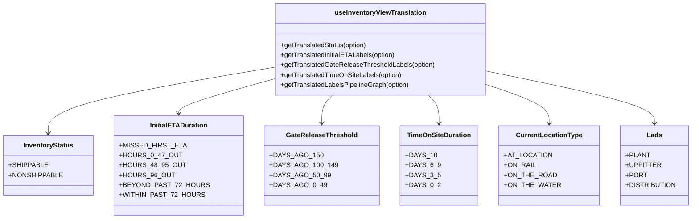
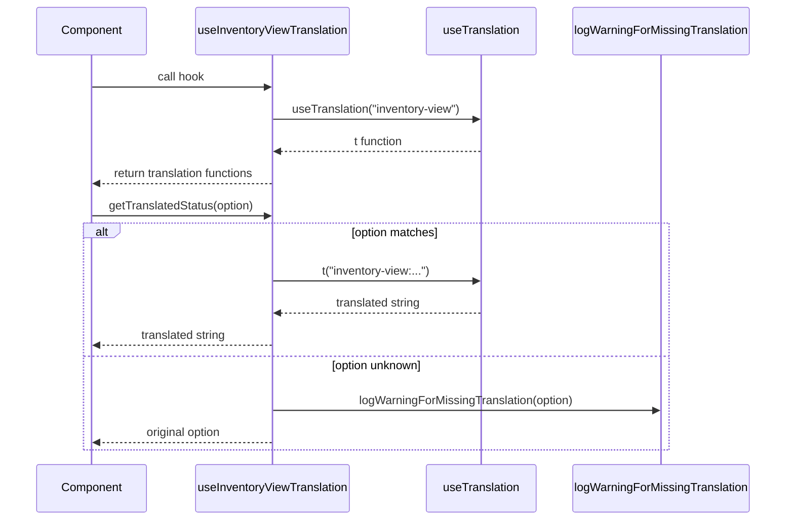

# Diagram: web/portal/src/shared/hooks/useInventoryViewTranslation.ts


> Auto-generated by Obscura crawlers

## Diagram 1

```mermaid
flowchart TD
      A[useInventoryViewTranslation] --> B[useTranslation hook]
      A --> C[getTranslatedStatus]
      A --> D[getTranslatedInitialETALabels]...
  └ 229 lines...
```

> SVG rendering failed for this diagram.

## Diagram 2

```mermaid
flowchart TD
    A[useInventoryViewTranslation] --> B[useTranslation hook]
    A --> C[getTranslatedStatus]
    A --> D[getTranslatedInitialETALabels]
    A --> E[getTranslatedGateReleaseThresholdLabels]
    A --> F[getTranslatedTimeOnSiteLabels]
    A --> G[getTranslatedLabelsPipelineGraph]
    
    C --> C1[InventoryStatus.SHIPPABLE]
    C --> C2[InventoryStatus.NONSHIPPABLE]
    
    D --> D1[InitialETADuration.MISSED_FIRST_ETA]
    D --> D2[InitialETADuration.HOURS_0_47_OUT]
    D --> D3[InitialETADuration.HOURS_48_95_OUT]
    D --> D4[InitialETADuration.HOURS_96_OUT]
    D --> D5[InitialETADuration.BEYOND_PAST_72_HOURS]
    D --> D6[InitialETADuration.WITHIN_PAST_72_HOURS]
    
    E --> E1[GateReleaseThreshold.DAYS_AGO_150]
    E --> E2[GateReleaseThreshold.DAYS_AGO_100_149]
    E --> E3[GateReleaseThreshold.DAYS_AGO_50_99]
    E --> E4[GateReleaseThreshold.DAYS_AGO_0_49]
    
    F --> F1[TimeOnSiteDuration.DAYS_10]
    F --> F2[TimeOnSiteDuration.DAYS_6_9]
    F --> F3[TimeOnSiteDuration.DAYS_3_5]
    F --> F4[TimeOnSiteDuration.DAYS_0_2]
    
    G --> G1[CurrentLocationType.AT_LOCATION]
    G --> G2[CurrentLocationType.ON_RAIL]
    G --> G3[CurrentLocationType.ON_THE_ROAD]
    G --> G4[CurrentLocationType.ON_THE_WATER]
    G --> G5[Lads.PLANT]
    G --> G6[Lads.UPFITTER]
    G --> G7[Lads.PORT]
    G --> G8[Lads.DISTRIBUTION]
```



### SVG

<svg id="container" width="8153.95703125" xmlns="http://www.w3.org/2000/svg" class="flowchart" height="278" viewBox="0 0 8153.95703125 278" role="graphics-document document" aria-roledescription="flowchart-v2"><style>#container{font-family:"trebuchet ms",verdana,arial,sans-serif;font-size:16px;fill:#333;}@keyframes edge-animation-frame{from{stroke-dashoffset:0;}}@keyframes dash{to{stroke-dashoffset:0;}}#container .edge-animation-slow{stroke-dasharray:9,5!important;stroke-dashoffset:900;animation:dash 50s linear infinite;stroke-linecap:round;}#container .edge-animation-fast{stroke-dasharray:9,5!important;stroke-dashoffset:900;animation:dash 20s linear infinite;stroke-linecap:round;}#container .error-icon{fill:#552222;}#container .error-text{fill:#552222;stroke:#552222;}#container .edge-thickness-normal{stroke-width:1px;}#container .edge-thickness-thick{stroke-width:3.5px;}#container .edge-pattern-solid{stroke-dasharray:0;}#container .edge-thickness-invisible{stroke-width:0;fill:none;}#container .edge-pattern-dashed{stroke-dasharray:3;}#container .edge-pattern-dotted{stroke-dasharray:2;}#container .marker{fill:#333333;stroke:#333333;}#container .marker.cross{stroke:#333333;}#container svg{font-family:"trebuchet ms",verdana,arial,sans-serif;font-size:16px;}#container p{margin:0;}#container .label{font-family:"trebuchet ms",verdana,arial,sans-serif;color:#333;}#container .cluster-label text{fill:#333;}#container .cluster-label span{color:#333;}#container .cluster-label span p{background-color:transparent;}#container .label text,#container span{fill:#333;color:#333;}#container .node rect,#container .node circle,#container .node ellipse,#container .node polygon,#container .node path{fill:#ECECFF;stroke:#9370DB;stroke-width:1px;}#container .rough-node .label text,#container .node .label text,#container .image-shape .label,#container .icon-shape .label{text-anchor:middle;}#container .node .katex path{fill:#000;stroke:#000;stroke-width:1px;}#container .rough-node .label,#container .node .label,#container .image-shape .label,#container .icon-shape .label{text-align:center;}#container .node.clickable{cursor:pointer;}#container .root .anchor path{fill:#333333!important;stroke-width:0;stroke:#333333;}#container .arrowheadPath{fill:#333333;}#container .edgePath .path{stroke:#333333;stroke-width:2.0px;}#container .flowchart-link{stroke:#333333;fill:none;}#container .edgeLabel{background-color:rgba(232,232,232, 0.8);text-align:center;}#container .edgeLabel p{background-color:rgba(232,232,232, 0.8);}#container .edgeLabel rect{opacity:0.5;background-color:rgba(232,232,232, 0.8);fill:rgba(232,232,232, 0.8);}#container .labelBkg{background-color:rgba(232, 232, 232, 0.5);}#container .cluster rect{fill:#ffffde;stroke:#aaaa33;stroke-width:1px;}#container .cluster text{fill:#333;}#container .cluster span{color:#333;}#container div.mermaidTooltip{position:absolute;text-align:center;max-width:200px;padding:2px;font-family:"trebuchet ms",verdana,arial,sans-serif;font-size:12px;background:hsl(80, 100%, 96.2745098039%);border:1px solid #aaaa33;border-radius:2px;pointer-events:none;z-index:100;}#container .flowchartTitleText{text-anchor:middle;font-size:18px;fill:#333;}#container rect.text{fill:none;stroke-width:0;}#container .icon-shape,#container .image-shape{background-color:rgba(232,232,232, 0.8);text-align:center;}#container .icon-shape p,#container .image-shape p{background-color:rgba(232,232,232, 0.8);padding:2px;}#container .icon-shape rect,#container .image-shape rect{opacity:0.5;background-color:rgba(232,232,232, 0.8);fill:rgba(232,232,232, 0.8);}#container .label-icon{display:inline-block;height:1em;overflow:visible;vertical-align:-0.125em;}#container .node .label-icon path{fill:currentColor;stroke:revert;stroke-width:revert;}#container :root{--mermaid-font-family:"trebuchet ms",verdana,arial,sans-serif;}</style><g><marker id="container_flowchart-v2-pointEnd" class="marker flowchart-v2" viewBox="0 0 10 10" refX="5" refY="5" markerUnits="userSpaceOnUse" markerWidth="8" markerHeight="8" orient="auto"><path d="M 0 0 L 10 5 L 0 10 z" class="arrowMarkerPath" style="stroke-width: 1; stroke-dasharray: 1, 0;"></path></marker><marker id="container_flowchart-v2-pointStart" class="marker flowchart-v2" viewBox="0 0 10 10" refX="4.5" refY="5" markerUnits="userSpaceOnUse" markerWidth="8" markerHeight="8" orient="auto"><path d="M 0 5 L 10 10 L 10 0 z" class="arrowMarkerPath" style="stroke-width: 1; stroke-dasharray: 1, 0;"></path></marker><marker id="container_flowchart-v2-circleEnd" class="marker flowchart-v2" viewBox="0 0 10 10" refX="11" refY="5" markerUnits="userSpaceOnUse" markerWidth="11" markerHeight="11" orient="auto"><circle cx="5" cy="5" r="5" class="arrowMarkerPath" style="stroke-width: 1; stroke-dasharray: 1, 0;"></circle></marker><marker id="container_flowchart-v2-circleStart" class="marker flowchart-v2" viewBox="0 0 10 10" refX="-1" refY="5" markerUnits="userSpaceOnUse" markerWidth="11" markerHeight="11" orient="auto"><circle cx="5" cy="5" r="5" class="arrowMarkerPath" style="stroke-width: 1; stroke-dasharray: 1, 0;"></circle></marker><marker id="container_flowchart-v2-crossEnd" class="marker cross flowchart-v2" viewBox="0 0 11 11" refX="12" refY="5.2" markerUnits="userSpaceOnUse" markerWidth="11" markerHeight="11" orient="auto"><path d="M 1,1 l 9,9 M 10,1 l -9,9" class="arrowMarkerPath" style="stroke-width: 2; stroke-dasharray: 1, 0;"></path></marker><marker id="container_flowchart-v2-crossStart" class="marker cross flowchart-v2" viewBox="0 0 11 11" refX="-1" refY="5.2" markerUnits="userSpaceOnUse" markerWidth="11" markerHeight="11" orient="auto"><path d="M 1,1 l 9,9 M 10,1 l -9,9" class="arrowMarkerPath" style="stroke-width: 2; stroke-dasharray: 1, 0;"></path></marker><g class="root"><g class="clusters"></g><g class="edgePaths"><path d="M2688.926,37.581L2259.378,45.817C1829.831,54.054,970.736,70.527,541.188,82.263C111.641,94,111.641,101,111.641,104.5L111.641,108" id="L_A_B_0" class="edge-thickness-normal edge-pattern-solid edge-thickness-normal edge-pattern-solid flowchart-link" style=";" data-edge="true" data-et="edge" data-id="L_A_B_0" data-points="W3sieCI6MjY4OC45MjU3ODEyNSwieSI6MzcuNTgwOTYzNzI1OTU3NjJ9LHsieCI6MTExLjY0MDYyNSwieSI6ODd9LHsieCI6MTExLjY0MDYyNSwieSI6MTEyfV0=" marker-end="url(#container_flowchart-v2-pointEnd)"></path><path d="M2688.926,37.85L2302.011,46.041C1915.096,54.233,1141.267,70.617,754.352,82.308C367.438,94,367.438,101,367.438,104.5L367.438,108" id="L_A_C_0" class="edge-thickness-normal edge-pattern-solid edge-thickness-normal edge-pattern-solid flowchart-link" style=";" data-edge="true" data-et="edge" data-id="L_A_C_0" data-points="W3sieCI6MjY4OC45MjU3ODEyNSwieSI6MzcuODQ5NzY1OTY3NTY0Njh9LHsieCI6MzY3LjQzNzUsInkiOjg3fSx7IngiOjM2Ny40Mzc1LCJ5IjoxMTJ9XQ==" marker-end="url(#container_flowchart-v2-pointEnd)"></path><path d="M2688.926,41.954L2543.602,49.461C2398.279,56.969,2107.632,71.985,1962.308,82.992C1816.984,94,1816.984,101,1816.984,104.5L1816.984,108" id="L_A_D_0" class="edge-thickness-normal edge-pattern-solid edge-thickness-normal edge-pattern-solid flowchart-link" style=";" data-edge="true" data-et="edge" data-id="L_A_D_0" data-points="W3sieCI6MjY4OC45MjU3ODEyNSwieSI6NDEuOTUzNzgyODY2MDEzMzl9LHsieCI6MTgxNi45ODQzNzUsInkiOjg3fSx7IngiOjE4MTYuOTg0Mzc1LCJ5IjoxMTJ9XQ==" marker-end="url(#container_flowchart-v2-pointEnd)"></path><path d="M2958.129,42.079L3100.484,49.566C3242.839,57.053,3527.548,72.026,3669.903,83.013C3812.258,94,3812.258,101,3812.258,104.5L3812.258,108" id="L_A_E_0" class="edge-thickness-normal edge-pattern-solid edge-thickness-normal edge-pattern-solid flowchart-link" style=";" data-edge="true" data-et="edge" data-id="L_A_E_0" data-points="W3sieCI6Mjk1OC4xMjg5MDYyNSwieSI6NDIuMDc5MDU4OTI1Nzg0NzJ9LHsieCI6MzgxMi4yNTc4MTI1LCJ5Ijo4N30seyJ4IjozODEyLjI1NzgxMjUsInkiOjExMn1d" marker-end="url(#container_flowchart-v2-pointEnd)"></path><path d="M2958.129,37.888L3339.59,46.074C3721.051,54.259,4483.973,70.629,4865.434,82.315C5246.895,94,5246.895,101,5246.895,104.5L5246.895,108" id="L_A_F_0" class="edge-thickness-normal edge-pattern-solid edge-thickness-normal edge-pattern-solid flowchart-link" style=";" data-edge="true" data-et="edge" data-id="L_A_F_0" data-points="W3sieCI6Mjk1OC4xMjg5MDYyNSwieSI6MzcuODg4MjQ2Mjc0MDY5ODV9LHsieCI6NTI0Ni44OTQ1MzEyNSwieSI6ODd9LHsieCI6NTI0Ni44OTQ1MzEyNSwieSI6MTEyfV0=" marker-end="url(#container_flowchart-v2-pointEnd)"></path><path d="M2958.129,36.569L3679.041,44.974C4399.953,53.38,5841.777,70.19,6562.689,82.095C7283.602,94,7283.602,101,7283.602,104.5L7283.602,108" id="L_A_G_0" class="edge-thickness-normal edge-pattern-solid edge-thickness-normal edge-pattern-solid flowchart-link" style=";" data-edge="true" data-et="edge" data-id="L_A_G_0" data-points="W3sieCI6Mjk1OC4xMjg5MDYyNSwieSI6MzYuNTY5MzE5NDU2NzQyNTA1fSx7IngiOjcyODMuNjAxNTYyNSwieSI6ODd9LHsieCI6NzI4My42MDE1NjI1LCJ5IjoxMTJ9XQ==" marker-end="url(#container_flowchart-v2-pointEnd)"></path><path d="M283.803,166L270.896,170.167C257.99,174.333,232.176,182.667,219.27,190.333C206.363,198,206.363,205,206.363,208.5L206.363,212" id="L_C_C1_0" class="edge-thickness-normal edge-pattern-solid edge-thickness-normal edge-pattern-solid flowchart-link" style=";" data-edge="true" data-et="edge" data-id="L_C_C1_0" data-points="W3sieCI6MjgzLjgwMjgwOTQ5NTE5MjMsInkiOjE2Nn0seyJ4IjoyMDYuMzYzMjgxMjUsInkiOjE5MX0seyJ4IjoyMDYuMzYzMjgxMjUsInkiOjIxNn1d" marker-end="url(#container_flowchart-v2-pointEnd)"></path><path d="M451.072,166L463.979,170.167C476.885,174.333,502.699,182.667,515.605,190.333C528.512,198,528.512,205,528.512,208.5L528.512,212" id="L_C_C2_0" class="edge-thickness-normal edge-pattern-solid edge-thickness-normal edge-pattern-solid flowchart-link" style=";" data-edge="true" data-et="edge" data-id="L_C_C2_0" data-points="W3sieCI6NDUxLjA3MjE5MDUwNDgwNzcsInkiOjE2Nn0seyJ4Ijo1MjguNTExNzE4NzUsInkiOjE5MX0seyJ4Ijo1MjguNTExNzE4NzUsInkiOjIxNn1d" marker-end="url(#container_flowchart-v2-pointEnd)"></path><path d="M1680.539,146.622L1548.133,154.018C1415.728,161.415,1150.917,176.207,1018.511,187.104C886.105,198,886.105,205,886.105,208.5L886.105,212" id="L_D_D1_0" class="edge-thickness-normal edge-pattern-solid edge-thickness-normal edge-pattern-solid flowchart-link" style=";" data-edge="true" data-et="edge" data-id="L_D_D1_0" data-points="W3sieCI6MTY4MC41MzkwNjI1LCJ5IjoxNDYuNjIxOTk3MDIwNjI0ODN9LHsieCI6ODg2LjEwNTQ2ODc1LCJ5IjoxOTF9LHsieCI6ODg2LjEwNTQ2ODc1LCJ5IjoyMTZ9XQ==" marker-end="url(#container_flowchart-v2-pointEnd)"></path><path d="M1680.539,151.707L1610.215,158.255C1539.892,164.804,1399.245,177.902,1328.921,187.951C1258.598,198,1258.598,205,1258.598,208.5L1258.598,212" id="L_D_D2_0" class="edge-thickness-normal edge-pattern-solid edge-thickness-normal edge-pattern-solid flowchart-link" style=";" data-edge="true" data-et="edge" data-id="L_D_D2_0" data-points="W3sieCI6MTY4MC41MzkwNjI1LCJ5IjoxNTEuNzA2NTI3NTk0MTQzM30seyJ4IjoxMjU4LjU5NzY1NjI1LCJ5IjoxOTF9LHsieCI6MTI1OC41OTc2NTYyNSwieSI6MjE2fV0=" marker-end="url(#container_flowchart-v2-pointEnd)"></path><path d="M1721.326,166L1706.564,170.167C1691.802,174.333,1662.278,182.667,1647.516,190.333C1632.754,198,1632.754,205,1632.754,208.5L1632.754,212" id="L_D_D3_0" class="edge-thickness-normal edge-pattern-solid edge-thickness-normal edge-pattern-solid flowchart-link" style=";" data-edge="true" data-et="edge" data-id="L_D_D3_0" data-points="W3sieCI6MTcyMS4zMjYyNDY5OTUxOTI0LCJ5IjoxNjZ9LHsieCI6MTYzMi43NTM5MDYyNSwieSI6MTkxfSx7IngiOjE2MzIuNzUzOTA2MjUsInkiOjIxNn1d" marker-end="url(#container_flowchart-v2-pointEnd)"></path><path d="M1912.643,166L1927.405,170.167C1942.167,174.333,1971.691,182.667,1986.453,190.333C2001.215,198,2001.215,205,2001.215,208.5L2001.215,212" id="L_D_D4_0" class="edge-thickness-normal edge-pattern-solid edge-thickness-normal edge-pattern-solid flowchart-link" style=";" data-edge="true" data-et="edge" data-id="L_D_D4_0" data-points="W3sieCI6MTkxMi42NDI1MDMwMDQ4MDc2LCJ5IjoxNjZ9LHsieCI6MjAwMS4yMTQ4NDM3NSwieSI6MTkxfSx7IngiOjIwMDEuMjE0ODQzNzUsInkiOjIxNn1d" marker-end="url(#container_flowchart-v2-pointEnd)"></path><path d="M1953.43,151.321L2026.663,157.934C2099.897,164.547,2246.365,177.774,2319.598,187.887C2392.832,198,2392.832,205,2392.832,208.5L2392.832,212" id="L_D_D5_0" class="edge-thickness-normal edge-pattern-solid edge-thickness-normal edge-pattern-solid flowchart-link" style=";" data-edge="true" data-et="edge" data-id="L_D_D5_0" data-points="W3sieCI6MTk1My40Mjk2ODc1LCJ5IjoxNTEuMzIxMjM4MzkxNzczfSx7IngiOjIzOTIuODMyMDMxMjUsInkiOjE5MX0seyJ4IjoyMzkyLjgzMjAzMTI1LCJ5IjoyMTZ9XQ==" marker-end="url(#container_flowchart-v2-pointEnd)"></path><path d="M1953.43,146.102L2097.206,153.585C2240.983,161.068,2528.536,176.034,2672.313,187.017C2816.09,198,2816.09,205,2816.09,208.5L2816.09,212" id="L_D_D6_0" class="edge-thickness-normal edge-pattern-solid edge-thickness-normal edge-pattern-solid flowchart-link" style=";" data-edge="true" data-et="edge" data-id="L_D_D6_0" data-points="W3sieCI6MTk1My40Mjk2ODc1LCJ5IjoxNDYuMTAxNTA4NzcxNTE4Mjd9LHsieCI6MjgxNi4wODk4NDM3NSwieSI6MTkxfSx7IngiOjI4MTYuMDg5ODQzNzUsInkiOjIxNn1d" marker-end="url(#container_flowchart-v2-pointEnd)"></path><path d="M3628.703,155.002L3559.883,161.002C3491.064,167.001,3353.424,179.001,3284.605,188.5C3215.785,198,3215.785,205,3215.785,208.5L3215.785,212" id="L_E_E1_0" class="edge-thickness-normal edge-pattern-solid edge-thickness-normal edge-pattern-solid flowchart-link" style=";" data-edge="true" data-et="edge" data-id="L_E_E1_0" data-points="W3sieCI6MzYyOC43MDMxMjUsInkiOjE1NS4wMDIxNDgwNDQ4MjA3OX0seyJ4IjozMjE1Ljc4NTE1NjI1LCJ5IjoxOTF9LHsieCI6MzIxNS43ODUxNTYyNSwieSI6MjE2fV0=" marker-end="url(#container_flowchart-v2-pointEnd)"></path><path d="M3707.351,166L3691.162,170.167C3674.972,174.333,3642.594,182.667,3626.404,190.333C3610.215,198,3610.215,205,3610.215,208.5L3610.215,212" id="L_E_E2_0" class="edge-thickness-normal edge-pattern-solid edge-thickness-normal edge-pattern-solid flowchart-link" style=";" data-edge="true" data-et="edge" data-id="L_E_E2_0" data-points="W3sieCI6MzcwNy4zNTA4ODY0MTgyNjksInkiOjE2Nn0seyJ4IjozNjEwLjIxNDg0Mzc1LCJ5IjoxOTF9LHsieCI6MzYxMC4yMTQ4NDM3NSwieSI6MjE2fV0=" marker-end="url(#container_flowchart-v2-pointEnd)"></path><path d="M3917.165,166L3933.354,170.167C3949.543,174.333,3981.922,182.667,3998.111,190.333C4014.301,198,4014.301,205,4014.301,208.5L4014.301,212" id="L_E_E3_0" class="edge-thickness-normal edge-pattern-solid edge-thickness-normal edge-pattern-solid flowchart-link" style=";" data-edge="true" data-et="edge" data-id="L_E_E3_0" data-points="W3sieCI6MzkxNy4xNjQ3Mzg1ODE3MzEsInkiOjE2Nn0seyJ4Ijo0MDE0LjMwMDc4MTI1LCJ5IjoxOTF9LHsieCI6NDAxNC4zMDA3ODEyNSwieSI6MjE2fV0=" marker-end="url(#container_flowchart-v2-pointEnd)"></path><path d="M3995.813,155.038L4064.41,161.032C4133.007,167.025,4270.201,179.013,4338.798,188.506C4407.395,198,4407.395,205,4407.395,208.5L4407.395,212" id="L_E_E4_0" class="edge-thickness-normal edge-pattern-solid edge-thickness-normal edge-pattern-solid flowchart-link" style=";" data-edge="true" data-et="edge" data-id="L_E_E4_0" data-points="W3sieCI6Mzk5NS44MTI1LCJ5IjoxNTUuMDM4MDY4OTgzNjIzNzZ9LHsieCI6NDQwNy4zOTQ1MzEyNSwieSI6MTkxfSx7IngiOjQ0MDcuMzk0NTMxMjUsInkiOjIxNn1d" marker-end="url(#container_flowchart-v2-pointEnd)"></path><path d="M5102.535,154.423L5045.474,160.519C4988.413,166.615,4874.29,178.808,4817.229,188.404C4760.168,198,4760.168,205,4760.168,208.5L4760.168,212" id="L_F_F1_0" class="edge-thickness-normal edge-pattern-solid edge-thickness-normal edge-pattern-solid flowchart-link" style=";" data-edge="true" data-et="edge" data-id="L_F_F1_0" data-points="W3sieCI6NTEwMi41MzUxNTYyNSwieSI6MTU0LjQyMjgwMjIwMjIxMTg0fSx7IngiOjQ3NjAuMTY3OTY4NzUsInkiOjE5MX0seyJ4Ijo0NzYwLjE2Nzk2ODc1LCJ5IjoyMTZ9XQ==" marker-end="url(#container_flowchart-v2-pointEnd)"></path><path d="M5161.81,166L5148.679,170.167C5135.549,174.333,5109.288,182.667,5096.158,190.333C5083.027,198,5083.027,205,5083.027,208.5L5083.027,212" id="L_F_F2_0" class="edge-thickness-normal edge-pattern-solid edge-thickness-normal edge-pattern-solid flowchart-link" style=";" data-edge="true" data-et="edge" data-id="L_F_F2_0" data-points="W3sieCI6NTE2MS44MDk2NDU0MzI2OTIsInkiOjE2Nn0seyJ4Ijo1MDgzLjAyNzM0Mzc1LCJ5IjoxOTF9LHsieCI6NTA4My4wMjczNDM3NSwieSI6MjE2fV0=" marker-end="url(#container_flowchart-v2-pointEnd)"></path><path d="M5331.979,166L5345.11,170.167C5358.24,174.333,5384.501,182.667,5397.631,190.333C5410.762,198,5410.762,205,5410.762,208.5L5410.762,212" id="L_F_F3_0" class="edge-thickness-normal edge-pattern-solid edge-thickness-normal edge-pattern-solid flowchart-link" style=";" data-edge="true" data-et="edge" data-id="L_F_F3_0" data-points="W3sieCI6NTMzMS45Nzk0MTcwNjczMDgsInkiOjE2Nn0seyJ4Ijo1NDEwLjc2MTcxODc1LCJ5IjoxOTF9LHsieCI6NTQxMC43NjE3MTg3NSwieSI6MjE2fV0=" marker-end="url(#container_flowchart-v2-pointEnd)"></path><path d="M5391.254,154.274L5449.108,160.395C5506.962,166.516,5622.671,178.758,5680.525,188.379C5738.379,198,5738.379,205,5738.379,208.5L5738.379,212" id="L_F_F4_0" class="edge-thickness-normal edge-pattern-solid edge-thickness-normal edge-pattern-solid flowchart-link" style=";" data-edge="true" data-et="edge" data-id="L_F_F4_0" data-points="W3sieCI6NTM5MS4yNTM5MDYyNSwieSI6MTU0LjI3MzUwMTgyODAwODI4fSx7IngiOjU3MzguMzc4OTA2MjUsInkiOjE5MX0seyJ4Ijo1NzM4LjM3ODkwNjI1LCJ5IjoyMTZ9XQ==" marker-end="url(#container_flowchart-v2-pointEnd)"></path><path d="M7129.508,145.665L6954.808,153.221C6780.108,160.776,6430.708,175.888,6256.008,186.944C6081.309,198,6081.309,205,6081.309,208.5L6081.309,212" id="L_G_G1_0" class="edge-thickness-normal edge-pattern-solid edge-thickness-normal edge-pattern-solid flowchart-link" style=";" data-edge="true" data-et="edge" data-id="L_G_G1_0" data-points="W3sieCI6NzEyOS41MDc4MTI1LCJ5IjoxNDUuNjY0NjYwOTUwNTkyNDZ9LHsieCI6NjA4MS4zMDg1OTM3NSwieSI6MTkxfSx7IngiOjYwODEuMzA4NTkzNzUsInkiOjIxNn1d" marker-end="url(#container_flowchart-v2-pointEnd)"></path><path d="M7129.508,148.308L7011.721,155.424C6893.934,162.539,6658.359,176.769,6540.572,187.385C6422.785,198,6422.785,205,6422.785,208.5L6422.785,212" id="L_G_G2_0" class="edge-thickness-normal edge-pattern-solid edge-thickness-normal edge-pattern-solid flowchart-link" style=";" data-edge="true" data-et="edge" data-id="L_G_G2_0" data-points="W3sieCI6NzEyOS41MDc4MTI1LCJ5IjoxNDguMzA4NDU5OTAxMzQ3Mjh9LHsieCI6NjQyMi43ODUxNTYyNSwieSI6MTkxfSx7IngiOjY0MjIuNzg1MTU2MjUsInkiOjIxNn1d" marker-end="url(#container_flowchart-v2-pointEnd)"></path><path d="M7129.508,154.583L7069.49,160.653C7009.473,166.722,6889.438,178.861,6829.42,188.431C6769.402,198,6769.402,205,6769.402,208.5L6769.402,212" id="L_G_G3_0" class="edge-thickness-normal edge-pattern-solid edge-thickness-normal edge-pattern-solid flowchart-link" style=";" data-edge="true" data-et="edge" data-id="L_G_G3_0" data-points="W3sieCI6NzEyOS41MDc4MTI1LCJ5IjoxNTQuNTgzMjExMTUyMDQ5MjJ9LHsieCI6Njc2OS40MDIzNDM3NSwieSI6MTkxfSx7IngiOjY3NjkuNDAyMzQzNzUsInkiOjIxNn1d" marker-end="url(#container_flowchart-v2-pointEnd)"></path><path d="M7209.784,166L7198.392,170.167C7187,174.333,7164.217,182.667,7152.825,190.333C7141.434,198,7141.434,205,7141.434,208.5L7141.434,212" id="L_G_G4_0" class="edge-thickness-normal edge-pattern-solid edge-thickness-normal edge-pattern-solid flowchart-link" style=";" data-edge="true" data-et="edge" data-id="L_G_G4_0" data-points="W3sieCI6NzIwOS43ODM1Nzg3MjU5NjIsInkiOjE2Nn0seyJ4Ijo3MTQxLjQzMzU5Mzc1LCJ5IjoxOTF9LHsieCI6NzE0MS40MzM1OTM3NSwieSI6MjE2fV0=" marker-end="url(#container_flowchart-v2-pointEnd)"></path><path d="M7357.42,166L7368.811,170.167C7380.203,174.333,7402.986,182.667,7414.378,190.333C7425.77,198,7425.77,205,7425.77,208.5L7425.77,212" id="L_G_G5_0" class="edge-thickness-normal edge-pattern-solid edge-thickness-normal edge-pattern-solid flowchart-link" style=";" data-edge="true" data-et="edge" data-id="L_G_G5_0" data-points="W3sieCI6NzM1Ny40MTk1NDYyNzQwMzgsInkiOjE2Nn0seyJ4Ijo3NDI1Ljc2OTUzMTI1LCJ5IjoxOTF9LHsieCI6NzQyNS43Njk1MzEyNSwieSI6MjE2fV0=" marker-end="url(#container_flowchart-v2-pointEnd)"></path><path d="M7437.695,162.164L7469.667,166.97C7501.639,171.776,7565.583,181.388,7597.555,189.694C7629.527,198,7629.527,205,7629.527,208.5L7629.527,212" id="L_G_G6_0" class="edge-thickness-normal edge-pattern-solid edge-thickness-normal edge-pattern-solid flowchart-link" style=";" data-edge="true" data-et="edge" data-id="L_G_G6_0" data-points="W3sieCI6NzQzNy42OTUzMTI1LCJ5IjoxNjIuMTYzNTY2OTY4MTY3NH0seyJ4Ijo3NjI5LjUyNzM0Mzc1LCJ5IjoxOTF9LHsieCI6NzYyOS41MjczNDM3NSwieSI6MjE2fV0=" marker-end="url(#container_flowchart-v2-pointEnd)"></path><path d="M7437.695,153.679L7502.992,159.899C7568.288,166.119,7698.88,178.56,7764.176,188.28C7829.473,198,7829.473,205,7829.473,208.5L7829.473,212" id="L_G_G7_0" class="edge-thickness-normal edge-pattern-solid edge-thickness-normal edge-pattern-solid flowchart-link" style=";" data-edge="true" data-et="edge" data-id="L_G_G7_0" data-points="W3sieCI6NzQzNy42OTUzMTI1LCJ5IjoxNTMuNjc5MDYwODQ3NDEyNzZ9LHsieCI6NzgyOS40NzI2NTYyNSwieSI6MTkxfSx7IngiOjc4MjkuNDcyNjU2MjUsInkiOjIxNn1d" marker-end="url(#container_flowchart-v2-pointEnd)"></path><path d="M7437.695,149.502L7539.174,156.419C7640.652,163.335,7843.609,177.167,7945.088,187.584C8046.566,198,8046.566,205,8046.566,208.5L8046.566,212" id="L_G_G8_0" class="edge-thickness-normal edge-pattern-solid edge-thickness-normal edge-pattern-solid flowchart-link" style=";" data-edge="true" data-et="edge" data-id="L_G_G8_0" data-points="W3sieCI6NzQzNy42OTUzMTI1LCJ5IjoxNDkuNTAyMjg2MDAzOTIxOH0seyJ4Ijo4MDQ2LjU2NjQwNjI1LCJ5IjoxOTF9LHsieCI6ODA0Ni41NjY0MDYyNSwieSI6MjE2fV0=" marker-end="url(#container_flowchart-v2-pointEnd)"></path></g><g class="edgeLabels"><g class="edgeLabel"><g class="label" data-id="L_A_B_0" transform="translate(0, 0)"><foreignObject width="0" height="0"><div xmlns="http://www.w3.org/1999/xhtml" class="labelBkg" style="display: table-cell; white-space: nowrap; line-height: 1.5; max-width: 200px; text-align: center;"><span class="edgeLabel"></span></div></foreignObject></g></g><g class="edgeLabel"><g class="label" data-id="L_A_C_0" transform="translate(0, 0)"><foreignObject width="0" height="0"><div xmlns="http://www.w3.org/1999/xhtml" class="labelBkg" style="display: table-cell; white-space: nowrap; line-height: 1.5; max-width: 200px; text-align: center;"><span class="edgeLabel"></span></div></foreignObject></g></g><g class="edgeLabel"><g class="label" data-id="L_A_D_0" transform="translate(0, 0)"><foreignObject width="0" height="0"><div xmlns="http://www.w3.org/1999/xhtml" class="labelBkg" style="display: table-cell; white-space: nowrap; line-height: 1.5; max-width: 200px; text-align: center;"><span class="edgeLabel"></span></div></foreignObject></g></g><g class="edgeLabel"><g class="label" data-id="L_A_E_0" transform="translate(0, 0)"><foreignObject width="0" height="0"><div xmlns="http://www.w3.org/1999/xhtml" class="labelBkg" style="display: table-cell; white-space: nowrap; line-height: 1.5; max-width: 200px; text-align: center;"><span class="edgeLabel"></span></div></foreignObject></g></g><g class="edgeLabel"><g class="label" data-id="L_A_F_0" transform="translate(0, 0)"><foreignObject width="0" height="0"><div xmlns="http://www.w3.org/1999/xhtml" class="labelBkg" style="display: table-cell; white-space: nowrap; line-height: 1.5; max-width: 200px; text-align: center;"><span class="edgeLabel"></span></div></foreignObject></g></g><g class="edgeLabel"><g class="label" data-id="L_A_G_0" transform="translate(0, 0)"><foreignObject width="0" height="0"><div xmlns="http://www.w3.org/1999/xhtml" class="labelBkg" style="display: table-cell; white-space: nowrap; line-height: 1.5; max-width: 200px; text-align: center;"><span class="edgeLabel"></span></div></foreignObject></g></g><g class="edgeLabel"><g class="label" data-id="L_C_C1_0" transform="translate(0, 0)"><foreignObject width="0" height="0"><div xmlns="http://www.w3.org/1999/xhtml" class="labelBkg" style="display: table-cell; white-space: nowrap; line-height: 1.5; max-width: 200px; text-align: center;"><span class="edgeLabel"></span></div></foreignObject></g></g><g class="edgeLabel"><g class="label" data-id="L_C_C2_0" transform="translate(0, 0)"><foreignObject width="0" height="0"><div xmlns="http://www.w3.org/1999/xhtml" class="labelBkg" style="display: table-cell; white-space: nowrap; line-height: 1.5; max-width: 200px; text-align: center;"><span class="edgeLabel"></span></div></foreignObject></g></g><g class="edgeLabel"><g class="label" data-id="L_D_D1_0" transform="translate(0, 0)"><foreignObject width="0" height="0"><div xmlns="http://www.w3.org/1999/xhtml" class="labelBkg" style="display: table-cell; white-space: nowrap; line-height: 1.5; max-width: 200px; text-align: center;"><span class="edgeLabel"></span></div></foreignObject></g></g><g class="edgeLabel"><g class="label" data-id="L_D_D2_0" transform="translate(0, 0)"><foreignObject width="0" height="0"><div xmlns="http://www.w3.org/1999/xhtml" class="labelBkg" style="display: table-cell; white-space: nowrap; line-height: 1.5; max-width: 200px; text-align: center;"><span class="edgeLabel"></span></div></foreignObject></g></g><g class="edgeLabel"><g class="label" data-id="L_D_D3_0" transform="translate(0, 0)"><foreignObject width="0" height="0"><div xmlns="http://www.w3.org/1999/xhtml" class="labelBkg" style="display: table-cell; white-space: nowrap; line-height: 1.5; max-width: 200px; text-align: center;"><span class="edgeLabel"></span></div></foreignObject></g></g><g class="edgeLabel"><g class="label" data-id="L_D_D4_0" transform="translate(0, 0)"><foreignObject width="0" height="0"><div xmlns="http://www.w3.org/1999/xhtml" class="labelBkg" style="display: table-cell; white-space: nowrap; line-height: 1.5; max-width: 200px; text-align: center;"><span class="edgeLabel"></span></div></foreignObject></g></g><g class="edgeLabel"><g class="label" data-id="L_D_D5_0" transform="translate(0, 0)"><foreignObject width="0" height="0"><div xmlns="http://www.w3.org/1999/xhtml" class="labelBkg" style="display: table-cell; white-space: nowrap; line-height: 1.5; max-width: 200px; text-align: center;"><span class="edgeLabel"></span></div></foreignObject></g></g><g class="edgeLabel"><g class="label" data-id="L_D_D6_0" transform="translate(0, 0)"><foreignObject width="0" height="0"><div xmlns="http://www.w3.org/1999/xhtml" class="labelBkg" style="display: table-cell; white-space: nowrap; line-height: 1.5; max-width: 200px; text-align: center;"><span class="edgeLabel"></span></div></foreignObject></g></g><g class="edgeLabel"><g class="label" data-id="L_E_E1_0" transform="translate(0, 0)"><foreignObject width="0" height="0"><div xmlns="http://www.w3.org/1999/xhtml" class="labelBkg" style="display: table-cell; white-space: nowrap; line-height: 1.5; max-width: 200px; text-align: center;"><span class="edgeLabel"></span></div></foreignObject></g></g><g class="edgeLabel"><g class="label" data-id="L_E_E2_0" transform="translate(0, 0)"><foreignObject width="0" height="0"><div xmlns="http://www.w3.org/1999/xhtml" class="labelBkg" style="display: table-cell; white-space: nowrap; line-height: 1.5; max-width: 200px; text-align: center;"><span class="edgeLabel"></span></div></foreignObject></g></g><g class="edgeLabel"><g class="label" data-id="L_E_E3_0" transform="translate(0, 0)"><foreignObject width="0" height="0"><div xmlns="http://www.w3.org/1999/xhtml" class="labelBkg" style="display: table-cell; white-space: nowrap; line-height: 1.5; max-width: 200px; text-align: center;"><span class="edgeLabel"></span></div></foreignObject></g></g><g class="edgeLabel"><g class="label" data-id="L_E_E4_0" transform="translate(0, 0)"><foreignObject width="0" height="0"><div xmlns="http://www.w3.org/1999/xhtml" class="labelBkg" style="display: table-cell; white-space: nowrap; line-height: 1.5; max-width: 200px; text-align: center;"><span class="edgeLabel"></span></div></foreignObject></g></g><g class="edgeLabel"><g class="label" data-id="L_F_F1_0" transform="translate(0, 0)"><foreignObject width="0" height="0"><div xmlns="http://www.w3.org/1999/xhtml" class="labelBkg" style="display: table-cell; white-space: nowrap; line-height: 1.5; max-width: 200px; text-align: center;"><span class="edgeLabel"></span></div></foreignObject></g></g><g class="edgeLabel"><g class="label" data-id="L_F_F2_0" transform="translate(0, 0)"><foreignObject width="0" height="0"><div xmlns="http://www.w3.org/1999/xhtml" class="labelBkg" style="display: table-cell; white-space: nowrap; line-height: 1.5; max-width: 200px; text-align: center;"><span class="edgeLabel"></span></div></foreignObject></g></g><g class="edgeLabel"><g class="label" data-id="L_F_F3_0" transform="translate(0, 0)"><foreignObject width="0" height="0"><div xmlns="http://www.w3.org/1999/xhtml" class="labelBkg" style="display: table-cell; white-space: nowrap; line-height: 1.5; max-width: 200px; text-align: center;"><span class="edgeLabel"></span></div></foreignObject></g></g><g class="edgeLabel"><g class="label" data-id="L_F_F4_0" transform="translate(0, 0)"><foreignObject width="0" height="0"><div xmlns="http://www.w3.org/1999/xhtml" class="labelBkg" style="display: table-cell; white-space: nowrap; line-height: 1.5; max-width: 200px; text-align: center;"><span class="edgeLabel"></span></div></foreignObject></g></g><g class="edgeLabel"><g class="label" data-id="L_G_G1_0" transform="translate(0, 0)"><foreignObject width="0" height="0"><div xmlns="http://www.w3.org/1999/xhtml" class="labelBkg" style="display: table-cell; white-space: nowrap; line-height: 1.5; max-width: 200px; text-align: center;"><span class="edgeLabel"></span></div></foreignObject></g></g><g class="edgeLabel"><g class="label" data-id="L_G_G2_0" transform="translate(0, 0)"><foreignObject width="0" height="0"><div xmlns="http://www.w3.org/1999/xhtml" class="labelBkg" style="display: table-cell; white-space: nowrap; line-height: 1.5; max-width: 200px; text-align: center;"><span class="edgeLabel"></span></div></foreignObject></g></g><g class="edgeLabel"><g class="label" data-id="L_G_G3_0" transform="translate(0, 0)"><foreignObject width="0" height="0"><div xmlns="http://www.w3.org/1999/xhtml" class="labelBkg" style="display: table-cell; white-space: nowrap; line-height: 1.5; max-width: 200px; text-align: center;"><span class="edgeLabel"></span></div></foreignObject></g></g><g class="edgeLabel"><g class="label" data-id="L_G_G4_0" transform="translate(0, 0)"><foreignObject width="0" height="0"><div xmlns="http://www.w3.org/1999/xhtml" class="labelBkg" style="display: table-cell; white-space: nowrap; line-height: 1.5; max-width: 200px; text-align: center;"><span class="edgeLabel"></span></div></foreignObject></g></g><g class="edgeLabel"><g class="label" data-id="L_G_G5_0" transform="translate(0, 0)"><foreignObject width="0" height="0"><div xmlns="http://www.w3.org/1999/xhtml" class="labelBkg" style="display: table-cell; white-space: nowrap; line-height: 1.5; max-width: 200px; text-align: center;"><span class="edgeLabel"></span></div></foreignObject></g></g><g class="edgeLabel"><g class="label" data-id="L_G_G6_0" transform="translate(0, 0)"><foreignObject width="0" height="0"><div xmlns="http://www.w3.org/1999/xhtml" class="labelBkg" style="display: table-cell; white-space: nowrap; line-height: 1.5; max-width: 200px; text-align: center;"><span class="edgeLabel"></span></div></foreignObject></g></g><g class="edgeLabel"><g class="label" data-id="L_G_G7_0" transform="translate(0, 0)"><foreignObject width="0" height="0"><div xmlns="http://www.w3.org/1999/xhtml" class="labelBkg" style="display: table-cell; white-space: nowrap; line-height: 1.5; max-width: 200px; text-align: center;"><span class="edgeLabel"></span></div></foreignObject></g></g><g class="edgeLabel"><g class="label" data-id="L_G_G8_0" transform="translate(0, 0)"><foreignObject width="0" height="0"><div xmlns="http://www.w3.org/1999/xhtml" class="labelBkg" style="display: table-cell; white-space: nowrap; line-height: 1.5; max-width: 200px; text-align: center;"><span class="edgeLabel"></span></div></foreignObject></g></g></g><g class="nodes"><g class="node default" id="flowchart-A-0" transform="translate(2823.52734375, 35)"><rect class="basic label-container" style="" x="-134.6015625" y="-27" width="269.203125" height="54"></rect><g class="label" style="" transform="translate(-104.6015625, -12)"><rect></rect><foreignObject width="209.203125" height="24"><div xmlns="http://www.w3.org/1999/xhtml" style="display: table; white-space: break-spaces; line-height: 1.5; max-width: 200px; text-align: center; width: 200px;"><span class="nodeLabel"><p>useInventoryViewTranslation</p></span></div></foreignObject></g></g><g class="node default" id="flowchart-B-1" transform="translate(111.640625, 139)"><rect class="basic label-container" style="" x="-103.640625" y="-27" width="207.28125" height="54"></rect><g class="label" style="" transform="translate(-73.640625, -12)"><rect></rect><foreignObject width="147.28125" height="24"><div xmlns="http://www.w3.org/1999/xhtml" style="display: table-cell; white-space: nowrap; line-height: 1.5; max-width: 200px; text-align: center;"><span class="nodeLabel"><p>useTranslation hook</p></span></div></foreignObject></g></g><g class="node default" id="flowchart-C-3" transform="translate(367.4375, 139)"><rect class="basic label-container" style="" x="-102.15625" y="-27" width="204.3125" height="54"></rect><g class="label" style="" transform="translate(-72.15625, -12)"><rect></rect><foreignObject width="144.3125" height="24"><div xmlns="http://www.w3.org/1999/xhtml" style="display: table-cell; white-space: nowrap; line-height: 1.5; max-width: 200px; text-align: center;"><span class="nodeLabel"><p>getTranslatedStatus</p></span></div></foreignObject></g></g><g class="node default" id="flowchart-D-5" transform="translate(1816.984375, 139)"><rect class="basic label-container" style="" x="-136.4453125" y="-27" width="272.890625" height="54"></rect><g class="label" style="" transform="translate(-106.4453125, -12)"><rect></rect><foreignObject width="212.890625" height="24"><div xmlns="http://www.w3.org/1999/xhtml" style="display: table; white-space: break-spaces; line-height: 1.5; max-width: 200px; text-align: center; width: 200px;"><span class="nodeLabel"><p>getTranslatedInitialETALabels</p></span></div></foreignObject></g></g><g class="node default" id="flowchart-E-7" transform="translate(3812.2578125, 139)"><rect class="basic label-container" style="" x="-183.5546875" y="-27" width="367.109375" height="54"></rect><g class="label" style="" transform="translate(-153.5546875, -12)"><rect></rect><foreignObject width="307.109375" height="24"><div xmlns="http://www.w3.org/1999/xhtml" style="display: table; white-space: break-spaces; line-height: 1.5; max-width: 200px; text-align: center; width: 200px;"><span class="nodeLabel"><p>getTranslatedGateReleaseThresholdLabels</p></span></div></foreignObject></g></g><g class="node default" id="flowchart-F-9" transform="translate(5246.89453125, 139)"><rect class="basic label-container" style="" x="-144.359375" y="-27" width="288.71875" height="54"></rect><g class="label" style="" transform="translate(-114.359375, -12)"><rect></rect><foreignObject width="228.71875" height="24"><div xmlns="http://www.w3.org/1999/xhtml" style="display: table; white-space: break-spaces; line-height: 1.5; max-width: 200px; text-align: center; width: 200px;"><span class="nodeLabel"><p>getTranslatedTimeOnSiteLabels</p></span></div></foreignObject></g></g><g class="node default" id="flowchart-G-11" transform="translate(7283.6015625, 139)"><rect class="basic label-container" style="" x="-154.09375" y="-27" width="308.1875" height="54"></rect><g class="label" style="" transform="translate(-124.09375, -12)"><rect></rect><foreignObject width="248.1875" height="24"><div xmlns="http://www.w3.org/1999/xhtml" style="display: table; white-space: break-spaces; line-height: 1.5; max-width: 200px; text-align: center; width: 200px;"><span class="nodeLabel"><p>getTranslatedLabelsPipelineGraph</p></span></div></foreignObject></g></g><g class="node default" id="flowchart-C1-13" transform="translate(206.36328125, 243)"><rect class="basic label-container" style="" x="-127.84375" y="-27" width="255.6875" height="54"></rect><g class="label" style="" transform="translate(-97.84375, -12)"><rect></rect><foreignObject width="195.6875" height="24"><div xmlns="http://www.w3.org/1999/xhtml" style="display: table-cell; white-space: nowrap; line-height: 1.5; max-width: 200px; text-align: center;"><span class="nodeLabel"><p>InventoryStatus.SHIPPABLE</p></span></div></foreignObject></g></g><g class="node default" id="flowchart-C2-15" transform="translate(528.51171875, 243)"><rect class="basic label-container" style="" x="-144.3046875" y="-27" width="288.609375" height="54"></rect><g class="label" style="" transform="translate(-114.3046875, -12)"><rect></rect><foreignObject width="228.609375" height="24"><div xmlns="http://www.w3.org/1999/xhtml" style="display: table; white-space: break-spaces; line-height: 1.5; max-width: 200px; text-align: center; width: 200px;"><span class="nodeLabel"><p>InventoryStatus.NONSHIPPABLE</p></span></div></foreignObject></g></g><g class="node default" id="flowchart-D1-17" transform="translate(886.10546875, 243)"><rect class="basic label-container" style="" x="-163.2890625" y="-27" width="326.578125" height="54"></rect><g class="label" style="" transform="translate(-133.2890625, -12)"><rect></rect><foreignObject width="266.578125" height="24"><div xmlns="http://www.w3.org/1999/xhtml" style="display: table; white-space: break-spaces; line-height: 1.5; max-width: 200px; text-align: center; width: 200px;"><span class="nodeLabel"><p>InitialETADuration.MISSED_FIRST_ETA</p></span></div></foreignObject></g></g><g class="node default" id="flowchart-D2-19" transform="translate(1258.59765625, 243)"><rect class="basic label-container" style="" x="-159.203125" y="-27" width="318.40625" height="54"></rect><g class="label" style="" transform="translate(-129.203125, -12)"><rect></rect><foreignObject width="258.40625" height="24"><div xmlns="http://www.w3.org/1999/xhtml" style="display: table; white-space: break-spaces; line-height: 1.5; max-width: 200px; text-align: center; width: 200px;"><span class="nodeLabel"><p>InitialETADuration.HOURS_0_47_OUT</p></span></div></foreignObject></g></g><g class="node default" id="flowchart-D3-21" transform="translate(1632.75390625, 243)"><rect class="basic label-container" style="" x="-164.953125" y="-27" width="329.90625" height="54"></rect><g class="label" style="" transform="translate(-134.953125, -12)"><rect></rect><foreignObject width="269.90625" height="24"><div xmlns="http://www.w3.org/1999/xhtml" style="display: table; white-space: break-spaces; line-height: 1.5; max-width: 200px; text-align: center; width: 200px;"><span class="nodeLabel"><p>InitialETADuration.HOURS_48_95_OUT</p></span></div></foreignObject></g></g><g class="node default" id="flowchart-D4-23" transform="translate(2001.21484375, 243)"><rect class="basic label-container" style="" x="-153.5078125" y="-27" width="307.015625" height="54"></rect><g class="label" style="" transform="translate(-123.5078125, -12)"><rect></rect><foreignObject width="247.015625" height="24"><div xmlns="http://www.w3.org/1999/xhtml" style="display: table; white-space: break-spaces; line-height: 1.5; max-width: 200px; text-align: center; width: 200px;"><span class="nodeLabel"><p>InitialETADuration.HOURS_96_OUT</p></span></div></foreignObject></g></g><g class="node default" id="flowchart-D5-25" transform="translate(2392.83203125, 243)"><rect class="basic label-container" style="" x="-188.109375" y="-27" width="376.21875" height="54"></rect><g class="label" style="" transform="translate(-158.109375, -12)"><rect></rect><foreignObject width="316.21875" height="24"><div xmlns="http://www.w3.org/1999/xhtml" style="display: table; white-space: break-spaces; line-height: 1.5; max-width: 200px; text-align: center; width: 200px;"><span class="nodeLabel"><p>InitialETADuration.BEYOND_PAST_72_HOURS</p></span></div></foreignObject></g></g><g class="node default" id="flowchart-D6-27" transform="translate(2816.08984375, 243)"><rect class="basic label-container" style="" x="-185.1484375" y="-27" width="370.296875" height="54"></rect><g class="label" style="" transform="translate(-155.1484375, -12)"><rect></rect><foreignObject width="310.296875" height="24"><div xmlns="http://www.w3.org/1999/xhtml" style="display: table; white-space: break-spaces; line-height: 1.5; max-width: 200px; text-align: center; width: 200px;"><span class="nodeLabel"><p>InitialETADuration.WITHIN_PAST_72_HOURS</p></span></div></foreignObject></g></g><g class="node default" id="flowchart-E1-29" transform="translate(3215.78515625, 243)"><rect class="basic label-container" style="" x="-164.546875" y="-27" width="329.09375" height="54"></rect><g class="label" style="" transform="translate(-134.546875, -12)"><rect></rect><foreignObject width="269.09375" height="24"><div xmlns="http://www.w3.org/1999/xhtml" style="display: table; white-space: break-spaces; line-height: 1.5; max-width: 200px; text-align: center; width: 200px;"><span class="nodeLabel"><p>GateReleaseThreshold.DAYS_AGO_150</p></span></div></foreignObject></g></g><g class="node default" id="flowchart-E2-31" transform="translate(3610.21484375, 243)"><rect class="basic label-container" style="" x="-179.8828125" y="-27" width="359.765625" height="54"></rect><g class="label" style="" transform="translate(-149.8828125, -12)"><rect></rect><foreignObject width="299.765625" height="24"><div xmlns="http://www.w3.org/1999/xhtml" style="display: table; white-space: break-spaces; line-height: 1.5; max-width: 200px; text-align: center; width: 200px;"><span class="nodeLabel"><p>GateReleaseThreshold.DAYS_AGO_100_149</p></span></div></foreignObject></g></g><g class="node default" id="flowchart-E3-33" transform="translate(4014.30078125, 243)"><rect class="basic label-container" style="" x="-174.203125" y="-27" width="348.40625" height="54"></rect><g class="label" style="" transform="translate(-144.203125, -12)"><rect></rect><foreignObject width="288.40625" height="24"><div xmlns="http://www.w3.org/1999/xhtml" style="display: table; white-space: break-spaces; line-height: 1.5; max-width: 200px; text-align: center; width: 200px;"><span class="nodeLabel"><p>GateReleaseThreshold.DAYS_AGO_50_99</p></span></div></foreignObject></g></g><g class="node default" id="flowchart-E4-35" transform="translate(4407.39453125, 243)"><rect class="basic label-container" style="" x="-168.890625" y="-27" width="337.78125" height="54"></rect><g class="label" style="" transform="translate(-138.890625, -12)"><rect></rect><foreignObject width="277.78125" height="24"><div xmlns="http://www.w3.org/1999/xhtml" style="display: table; white-space: break-spaces; line-height: 1.5; max-width: 200px; text-align: center; width: 200px;"><span class="nodeLabel"><p>GateReleaseThreshold.DAYS_AGO_0_49</p></span></div></foreignObject></g></g><g class="node default" id="flowchart-F1-37" transform="translate(4760.16796875, 243)"><rect class="basic label-container" style="" x="-133.8828125" y="-27" width="267.765625" height="54"></rect><g class="label" style="" transform="translate(-103.8828125, -12)"><rect></rect><foreignObject width="207.765625" height="24"><div xmlns="http://www.w3.org/1999/xhtml" style="display: table; white-space: break-spaces; line-height: 1.5; max-width: 200px; text-align: center; width: 200px;"><span class="nodeLabel"><p>TimeOnSiteDuration.DAYS_10</p></span></div></foreignObject></g></g><g class="node default" id="flowchart-F2-39" transform="translate(5083.02734375, 243)"><rect class="basic label-container" style="" x="-138.9765625" y="-27" width="277.953125" height="54"></rect><g class="label" style="" transform="translate(-108.9765625, -12)"><rect></rect><foreignObject width="217.953125" height="24"><div xmlns="http://www.w3.org/1999/xhtml" style="display: table; white-space: break-spaces; line-height: 1.5; max-width: 200px; text-align: center; width: 200px;"><span class="nodeLabel"><p>TimeOnSiteDuration.DAYS_6_9</p></span></div></foreignObject></g></g><g class="node default" id="flowchart-F3-41" transform="translate(5410.76171875, 243)"><rect class="basic label-container" style="" x="-138.7578125" y="-27" width="277.515625" height="54"></rect><g class="label" style="" transform="translate(-108.7578125, -12)"><rect></rect><foreignObject width="217.515625" height="24"><div xmlns="http://www.w3.org/1999/xhtml" style="display: table; white-space: break-spaces; line-height: 1.5; max-width: 200px; text-align: center; width: 200px;"><span class="nodeLabel"><p>TimeOnSiteDuration.DAYS_3_5</p></span></div></foreignObject></g></g><g class="node default" id="flowchart-F4-43" transform="translate(5738.37890625, 243)"><rect class="basic label-container" style="" x="-138.859375" y="-27" width="277.71875" height="54"></rect><g class="label" style="" transform="translate(-108.859375, -12)"><rect></rect><foreignObject width="217.71875" height="24"><div xmlns="http://www.w3.org/1999/xhtml" style="display: table; white-space: break-spaces; line-height: 1.5; max-width: 200px; text-align: center; width: 200px;"><span class="nodeLabel"><p>TimeOnSiteDuration.DAYS_0_2</p></span></div></foreignObject></g></g><g class="node default" id="flowchart-G1-45" transform="translate(6081.30859375, 243)"><rect class="basic label-container" style="" x="-154.0703125" y="-27" width="308.140625" height="54"></rect><g class="label" style="" transform="translate(-124.0703125, -12)"><rect></rect><foreignObject width="248.140625" height="24"><div xmlns="http://www.w3.org/1999/xhtml" style="display: table; white-space: break-spaces; line-height: 1.5; max-width: 200px; text-align: center; width: 200px;"><span class="nodeLabel"><p>CurrentLocationType.AT_LOCATION</p></span></div></foreignObject></g></g><g class="node default" id="flowchart-G2-47" transform="translate(6422.78515625, 243)"><rect class="basic label-container" style="" x="-137.40625" y="-27" width="274.8125" height="54"></rect><g class="label" style="" transform="translate(-107.40625, -12)"><rect></rect><foreignObject width="214.8125" height="24"><div xmlns="http://www.w3.org/1999/xhtml" style="display: table; white-space: break-spaces; line-height: 1.5; max-width: 200px; text-align: center; width: 200px;"><span class="nodeLabel"><p>CurrentLocationType.ON_RAIL</p></span></div></foreignObject></g></g><g class="node default" id="flowchart-G3-49" transform="translate(6769.40234375, 243)"><rect class="basic label-container" style="" x="-159.2109375" y="-27" width="318.421875" height="54"></rect><g class="label" style="" transform="translate(-129.2109375, -12)"><rect></rect><foreignObject width="258.421875" height="24"><div xmlns="http://www.w3.org/1999/xhtml" style="display: table; white-space: break-spaces; line-height: 1.5; max-width: 200px; text-align: center; width: 200px;"><span class="nodeLabel"><p>CurrentLocationType.ON_THE_ROAD</p></span></div></foreignObject></g></g><g class="node default" id="flowchart-G4-51" transform="translate(7141.43359375, 243)"><rect class="basic label-container" style="" x="-162.8203125" y="-27" width="325.640625" height="54"></rect><g class="label" style="" transform="translate(-132.8203125, -12)"><rect></rect><foreignObject width="265.640625" height="24"><div xmlns="http://www.w3.org/1999/xhtml" style="display: table; white-space: break-spaces; line-height: 1.5; max-width: 200px; text-align: center; width: 200px;"><span class="nodeLabel"><p>CurrentLocationType.ON_THE_WATER</p></span></div></foreignObject></g></g><g class="node default" id="flowchart-G5-53" transform="translate(7425.76953125, 243)"><rect class="basic label-container" style="" x="-71.515625" y="-27" width="143.03125" height="54"></rect><g class="label" style="" transform="translate(-41.515625, -12)"><rect></rect><foreignObject width="83.03125" height="24"><div xmlns="http://www.w3.org/1999/xhtml" style="display: table-cell; white-space: nowrap; line-height: 1.5; max-width: 200px; text-align: center;"><span class="nodeLabel"><p>Lads.PLANT</p></span></div></foreignObject></g></g><g class="node default" id="flowchart-G6-55" transform="translate(7629.52734375, 243)"><rect class="basic label-container" style="" x="-82.2421875" y="-27" width="164.484375" height="54"></rect><g class="label" style="" transform="translate(-52.2421875, -12)"><rect></rect><foreignObject width="104.484375" height="24"><div xmlns="http://www.w3.org/1999/xhtml" style="display: table-cell; white-space: nowrap; line-height: 1.5; max-width: 200px; text-align: center;"><span class="nodeLabel"><p>Lads.UPFITTER</p></span></div></foreignObject></g></g><g class="node default" id="flowchart-G7-57" transform="translate(7829.47265625, 243)"><rect class="basic label-container" style="" x="-67.703125" y="-27" width="135.40625" height="54"></rect><g class="label" style="" transform="translate(-37.703125, -12)"><rect></rect><foreignObject width="75.40625" height="24"><div xmlns="http://www.w3.org/1999/xhtml" style="display: table-cell; white-space: nowrap; line-height: 1.5; max-width: 200px; text-align: center;"><span class="nodeLabel"><p>Lads.PORT</p></span></div></foreignObject></g></g><g class="node default" id="flowchart-G8-59" transform="translate(8046.56640625, 243)"><rect class="basic label-container" style="" x="-99.390625" y="-27" width="198.78125" height="54"></rect><g class="label" style="" transform="translate(-69.390625, -12)"><rect></rect><foreignObject width="138.78125" height="24"><div xmlns="http://www.w3.org/1999/xhtml" style="display: table-cell; white-space: nowrap; line-height: 1.5; max-width: 200px; text-align: center;"><span class="nodeLabel"><p>Lads.DISTRIBUTION</p></span></div></foreignObject></g></g></g></g></g></svg>

## Diagram 3



### SVG

<svg id="container" width="1540.0234375" xmlns="http://www.w3.org/2000/svg" class="classDiagram" height="528" viewBox="0 0 1540.0234375 528" role="graphics-document document" aria-roledescription="class"><style>#container{font-family:"trebuchet ms",verdana,arial,sans-serif;font-size:16px;fill:#333;}@keyframes edge-animation-frame{from{stroke-dashoffset:0;}}@keyframes dash{to{stroke-dashoffset:0;}}#container .edge-animation-slow{stroke-dasharray:9,5!important;stroke-dashoffset:900;animation:dash 50s linear infinite;stroke-linecap:round;}#container .edge-animation-fast{stroke-dasharray:9,5!important;stroke-dashoffset:900;animation:dash 20s linear infinite;stroke-linecap:round;}#container .error-icon{fill:#552222;}#container .error-text{fill:#552222;stroke:#552222;}#container .edge-thickness-normal{stroke-width:1px;}#container .edge-thickness-thick{stroke-width:3.5px;}#container .edge-pattern-solid{stroke-dasharray:0;}#container .edge-thickness-invisible{stroke-width:0;fill:none;}#container .edge-pattern-dashed{stroke-dasharray:3;}#container .edge-pattern-dotted{stroke-dasharray:2;}#container .marker{fill:#333333;stroke:#333333;}#container .marker.cross{stroke:#333333;}#container svg{font-family:"trebuchet ms",verdana,arial,sans-serif;font-size:16px;}#container p{margin:0;}#container g.classGroup text{fill:#9370DB;stroke:none;font-family:"trebuchet ms",verdana,arial,sans-serif;font-size:10px;}#container g.classGroup text .title{font-weight:bolder;}#container .nodeLabel,#container .edgeLabel{color:#131300;}#container .edgeLabel .label rect{fill:#ECECFF;}#container .label text{fill:#131300;}#container .labelBkg{background:#ECECFF;}#container .edgeLabel .label span{background:#ECECFF;}#container .classTitle{font-weight:bolder;}#container .node rect,#container .node circle,#container .node ellipse,#container .node polygon,#container .node path{fill:#ECECFF;stroke:#9370DB;stroke-width:1px;}#container .divider{stroke:#9370DB;stroke-width:1;}#container g.clickable{cursor:pointer;}#container g.classGroup rect{fill:#ECECFF;stroke:#9370DB;}#container g.classGroup line{stroke:#9370DB;stroke-width:1;}#container .classLabel .box{stroke:none;stroke-width:0;fill:#ECECFF;opacity:0.5;}#container .classLabel .label{fill:#9370DB;font-size:10px;}#container .relation{stroke:#333333;stroke-width:1;fill:none;}#container .dashed-line{stroke-dasharray:3;}#container .dotted-line{stroke-dasharray:1 2;}#container #compositionStart,#container .composition{fill:#333333!important;stroke:#333333!important;stroke-width:1;}#container #compositionEnd,#container .composition{fill:#333333!important;stroke:#333333!important;stroke-width:1;}#container #dependencyStart,#container .dependency{fill:#333333!important;stroke:#333333!important;stroke-width:1;}#container #dependencyStart,#container .dependency{fill:#333333!important;stroke:#333333!important;stroke-width:1;}#container #extensionStart,#container .extension{fill:transparent!important;stroke:#333333!important;stroke-width:1;}#container #extensionEnd,#container .extension{fill:transparent!important;stroke:#333333!important;stroke-width:1;}#container #aggregationStart,#container .aggregation{fill:transparent!important;stroke:#333333!important;stroke-width:1;}#container #aggregationEnd,#container .aggregation{fill:transparent!important;stroke:#333333!important;stroke-width:1;}#container #lollipopStart,#container .lollipop{fill:#ECECFF!important;stroke:#333333!important;stroke-width:1;}#container #lollipopEnd,#container .lollipop{fill:#ECECFF!important;stroke:#333333!important;stroke-width:1;}#container .edgeTerminals{font-size:11px;line-height:initial;}#container .classTitleText{text-anchor:middle;font-size:18px;fill:#333;}#container .label-icon{display:inline-block;height:1em;overflow:visible;vertical-align:-0.125em;}#container .node .label-icon path{fill:currentColor;stroke:revert;stroke-width:revert;}#container :root{--mermaid-font-family:"trebuchet ms",verdana,arial,sans-serif;}</style><g><defs><marker id="container_class-aggregationStart" class="marker aggregation class" refX="18" refY="7" markerWidth="190" markerHeight="240" orient="auto"><path d="M 18,7 L9,13 L1,7 L9,1 Z"></path></marker></defs><defs><marker id="container_class-aggregationEnd" class="marker aggregation class" refX="1" refY="7" markerWidth="20" markerHeight="28" orient="auto"><path d="M 18,7 L9,13 L1,7 L9,1 Z"></path></marker></defs><defs><marker id="container_class-extensionStart" class="marker extension class" refX="18" refY="7" markerWidth="190" markerHeight="240" orient="auto"><path d="M 1,7 L18,13 V 1 Z"></path></marker></defs><defs><marker id="container_class-extensionEnd" class="marker extension class" refX="1" refY="7" markerWidth="20" markerHeight="28" orient="auto"><path d="M 1,1 V 13 L18,7 Z"></path></marker></defs><defs><marker id="container_class-compositionStart" class="marker composition class" refX="18" refY="7" markerWidth="190" markerHeight="240" orient="auto"><path d="M 18,7 L9,13 L1,7 L9,1 Z"></path></marker></defs><defs><marker id="container_class-compositionEnd" class="marker composition class" refX="1" refY="7" markerWidth="20" markerHeight="28" orient="auto"><path d="M 18,7 L9,13 L1,7 L9,1 Z"></path></marker></defs><defs><marker id="container_class-dependencyStart" class="marker dependency class" refX="6" refY="7" markerWidth="190" markerHeight="240" orient="auto"><path d="M 5,7 L9,13 L1,7 L9,1 Z"></path></marker></defs><defs><marker id="container_class-dependencyEnd" class="marker dependency class" refX="13" refY="7" markerWidth="20" markerHeight="28" orient="auto"><path d="M 18,7 L9,13 L14,7 L9,1 Z"></path></marker></defs><defs><marker id="container_class-lollipopStart" class="marker lollipop class" refX="13" refY="7" markerWidth="190" markerHeight="240" orient="auto"><circle stroke="black" fill="transparent" cx="7" cy="7" r="6"></circle></marker></defs><defs><marker id="container_class-lollipopEnd" class="marker lollipop class" refX="1" refY="7" markerWidth="190" markerHeight="240" orient="auto"><circle stroke="black" fill="transparent" cx="7" cy="7" r="6"></circle></marker></defs><g class="root"><g class="clusters"></g><g class="edgePaths"><path d="M591.59,165.589L511.053,180.491C430.516,195.393,269.441,225.196,188.904,251.265C108.367,277.333,108.367,299.667,108.367,310.833L108.367,322" id="id_useInventoryViewTranslation_InventoryStatus_1" class="edge-thickness-normal edge-pattern-solid relation" style=";;;" data-edge="true" data-et="edge" data-id="id_useInventoryViewTranslation_InventoryStatus_1" data-points="W3sieCI6NTkxLjU4OTg0Mzc1LCJ5IjoxNjUuNTg5MjczMTg3MjE5NjV9LHsieCI6MTA4LjM2NzE4NzUsInkiOjI1NX0seyJ4IjoxMDguMzY3MTg3NSwieSI6MzI4fV0=" marker-end="url(#container_class-dependencyEnd)"></path><path d="M591.59,196.006L559.44,205.838C527.29,215.671,462.991,235.335,430.841,248.334C398.691,261.333,398.691,267.667,398.691,270.833L398.691,274" id="id_useInventoryViewTranslation_InitialETADuration_2" class="edge-thickness-normal edge-pattern-solid relation" style=";;;" data-edge="true" data-et="edge" data-id="id_useInventoryViewTranslation_InitialETADuration_2" data-points="W3sieCI6NTkxLjU4OTg0Mzc1LCJ5IjoxOTYuMDA1ODU5MDQ5MDI0NTR9LHsieCI6Mzk4LjY5MTQwNjI1LCJ5IjoyNTV9LHsieCI6Mzk4LjY5MTQwNjI1LCJ5IjoyODB9XQ==" marker-end="url(#container_class-dependencyEnd)"></path><path d="M736.83,230L732.831,234.167C728.831,238.333,720.831,246.667,716.832,258C712.832,269.333,712.832,283.667,712.832,290.833L712.832,298" id="id_useInventoryViewTranslation_GateReleaseThreshold_3" class="edge-thickness-normal edge-pattern-solid relation" style=";;;" data-edge="true" data-et="edge" data-id="id_useInventoryViewTranslation_GateReleaseThreshold_3" data-points="W3sieCI6NzM2LjgzMDMzNjYyNjgzODMsInkiOjIzMH0seyJ4Ijo3MTIuODMyMDMxMjUsInkiOjI1NX0seyJ4Ijo3MTIuODMyMDMxMjUsInkiOjMwNH1d" marker-end="url(#container_class-dependencyEnd)"></path><path d="M949.935,230L953.935,234.167C957.935,238.333,965.934,246.667,969.934,258C973.934,269.333,973.934,283.667,973.934,290.833L973.934,298" id="id_useInventoryViewTranslation_TimeOnSiteDuration_4" class="edge-thickness-normal edge-pattern-solid relation" style=";;;" data-edge="true" data-et="edge" data-id="id_useInventoryViewTranslation_TimeOnSiteDuration_4" data-points="W3sieCI6OTQ5LjkzNTI4ODM3MzE2MTcsInkiOjIzMH0seyJ4Ijo5NzMuOTMzNTkzNzUsInkiOjI1NX0seyJ4Ijo5NzMuOTMzNTkzNzUsInkiOjMwNH1d" marker-end="url(#container_class-dependencyEnd)"></path><path d="M1095.176,209.633L1116.182,217.194C1137.188,224.756,1179.199,239.878,1200.205,254.606C1221.211,269.333,1221.211,283.667,1221.211,290.833L1221.211,298" id="id_useInventoryViewTranslation_CurrentLocationType_5" class="edge-thickness-normal edge-pattern-solid relation" style=";;;" data-edge="true" data-et="edge" data-id="id_useInventoryViewTranslation_CurrentLocationType_5" data-points="W3sieCI6MTA5NS4xNzU3ODEyNSwieSI6MjA5LjYzMzM4OTg1MTUzNjMyfSx7IngiOjEyMjEuMjEwOTM3NSwieSI6MjU1fSx7IngiOjEyMjEuMjEwOTM3NSwieSI6MzA0fV0=" marker-end="url(#container_class-dependencyEnd)"></path><path d="M1095.176,174.825L1155.446,188.188C1215.716,201.55,1336.257,228.275,1396.527,248.804C1456.797,269.333,1456.797,283.667,1456.797,290.833L1456.797,298" id="id_useInventoryViewTranslation_Lads_6" class="edge-thickness-normal edge-pattern-solid relation" style=";;;" data-edge="true" data-et="edge" data-id="id_useInventoryViewTranslation_Lads_6" data-points="W3sieCI6MTA5NS4xNzU3ODEyNSwieSI6MTc0LjgyNTAwNjA0OTY0NTN9LHsieCI6MTQ1Ni43OTY4NzUsInkiOjI1NX0seyJ4IjoxNDU2Ljc5Njg3NSwieSI6MzA0fV0=" marker-end="url(#container_class-dependencyEnd)"></path></g><g class="edgeLabels"><g class="edgeLabel"><g class="label" data-id="id_useInventoryViewTranslation_InventoryStatus_1" transform="translate(0, 0)"><foreignObject width="0" height="0"><div xmlns="http://www.w3.org/1999/xhtml" class="labelBkg" style="display: table-cell; white-space: nowrap; line-height: 1.5; max-width: 200px; text-align: center;"><span class="edgeLabel"></span></div></foreignObject></g></g><g class="edgeLabel"><g class="label" data-id="id_useInventoryViewTranslation_InitialETADuration_2" transform="translate(0, 0)"><foreignObject width="0" height="0"><div xmlns="http://www.w3.org/1999/xhtml" class="labelBkg" style="display: table-cell; white-space: nowrap; line-height: 1.5; max-width: 200px; text-align: center;"><span class="edgeLabel"></span></div></foreignObject></g></g><g class="edgeLabel"><g class="label" data-id="id_useInventoryViewTranslation_GateReleaseThreshold_3" transform="translate(0, 0)"><foreignObject width="0" height="0"><div xmlns="http://www.w3.org/1999/xhtml" class="labelBkg" style="display: table-cell; white-space: nowrap; line-height: 1.5; max-width: 200px; text-align: center;"><span class="edgeLabel"></span></div></foreignObject></g></g><g class="edgeLabel"><g class="label" data-id="id_useInventoryViewTranslation_TimeOnSiteDuration_4" transform="translate(0, 0)"><foreignObject width="0" height="0"><div xmlns="http://www.w3.org/1999/xhtml" class="labelBkg" style="display: table-cell; white-space: nowrap; line-height: 1.5; max-width: 200px; text-align: center;"><span class="edgeLabel"></span></div></foreignObject></g></g><g class="edgeLabel"><g class="label" data-id="id_useInventoryViewTranslation_CurrentLocationType_5" transform="translate(0, 0)"><foreignObject width="0" height="0"><div xmlns="http://www.w3.org/1999/xhtml" class="labelBkg" style="display: table-cell; white-space: nowrap; line-height: 1.5; max-width: 200px; text-align: center;"><span class="edgeLabel"></span></div></foreignObject></g></g><g class="edgeLabel"><g class="label" data-id="id_useInventoryViewTranslation_Lads_6" transform="translate(0, 0)"><foreignObject width="0" height="0"><div xmlns="http://www.w3.org/1999/xhtml" class="labelBkg" style="display: table-cell; white-space: nowrap; line-height: 1.5; max-width: 200px; text-align: center;"><span class="edgeLabel"></span></div></foreignObject></g></g></g><g class="nodes"><g class="node default" id="classId-InventoryStatus-0" transform="translate(108.3671875, 400)"><g class="basic label-container"><path d="M-100.3671875 -72 L100.3671875 -72 L100.3671875 72 L-100.3671875 72" stroke="none" stroke-width="0" fill="#ECECFF" style=""></path><path d="M-100.3671875 -72 C-25.641299088914636 -72, 49.08458932217073 -72, 100.3671875 -72 M-100.3671875 -72 C-43.01369473665289 -72, 14.339798026694226 -72, 100.3671875 -72 M100.3671875 -72 C100.3671875 -16.66339630484869, 100.3671875 38.67320739030262, 100.3671875 72 M100.3671875 -72 C100.3671875 -34.9023709783972, 100.3671875 2.195258043205598, 100.3671875 72 M100.3671875 72 C38.44538970635653 72, -23.47640808728694 72, -100.3671875 72 M100.3671875 72 C37.52626708200972 72, -25.314653335980566 72, -100.3671875 72 M-100.3671875 72 C-100.3671875 32.896913440386925, -100.3671875 -6.2061731192261504, -100.3671875 -72 M-100.3671875 72 C-100.3671875 39.8702098009665, -100.3671875 7.740419601932999, -100.3671875 -72" stroke="#9370DB" stroke-width="1.3" fill="none" stroke-dasharray="0 0" style=""></path></g><g class="annotation-group text" transform="translate(0, -48)"></g><g class="label-group text" transform="translate(-58.4375, -48)"><g class="label" style="font-weight: bolder" transform="translate(0,-12)"><foreignObject width="116.875" height="24"><div xmlns="http://www.w3.org/1999/xhtml" style="display: table-cell; white-space: nowrap; line-height: 1.5; max-width: 164px; text-align: center;"><span class="nodeLabel markdown-node-label" style=""><p>InventoryStatus</p></span></div></foreignObject></g></g><g class="members-group text" transform="translate(-88.3671875, 0)"><g class="label" style="" transform="translate(0,-12)"><foreignObject width="84.734375" height="24"><div xmlns="http://www.w3.org/1999/xhtml" style="display: table-cell; white-space: nowrap; line-height: 1.5; max-width: 142px; text-align: center;"><span class="nodeLabel markdown-node-label" style=""><p>+SHIPPABLE</p></span></div></foreignObject></g><g class="label" style="" transform="translate(0,12)"><foreignObject width="118.296875" height="24"><div xmlns="http://www.w3.org/1999/xhtml" style="display: table-cell; white-space: nowrap; line-height: 1.5; max-width: 176px; text-align: center;"><span class="nodeLabel markdown-node-label" style=""><p>+NONSHIPPABLE</p></span></div></foreignObject></g></g><g class="methods-group text" transform="translate(-88.3671875, 72)"></g><g class="divider" style=""><path d="M-100.3671875 -24 C-27.314233404448018 -24, 45.738720691103964 -24, 100.3671875 -24 M-100.3671875 -24 C-39.50844251184407 -24, 21.350302476311853 -24, 100.3671875 -24" stroke="#9370DB" stroke-width="1.3" fill="none" stroke-dasharray="0 0" style=""></path></g><g class="divider" style=""><path d="M-100.3671875 48 C-39.86145111718819 48, 20.644285265623623 48, 100.3671875 48 M-100.3671875 48 C-35.04926287898711 48, 30.268661742025785 48, 100.3671875 48" stroke="#9370DB" stroke-width="1.3" fill="none" stroke-dasharray="0 0" style=""></path></g></g><g class="node default" id="classId-InitialETADuration-1" transform="translate(398.69140625, 400)"><g class="basic label-container"><path d="M-139.95703125 -120 L139.95703125 -120 L139.95703125 120 L-139.95703125 120" stroke="none" stroke-width="0" fill="#ECECFF" style=""></path><path d="M-139.95703125 -120 C-56.87292746704799 -120, 26.211176315904027 -120, 139.95703125 -120 M-139.95703125 -120 C-52.92916419682828 -120, 34.09870285634344 -120, 139.95703125 -120 M139.95703125 -120 C139.95703125 -71.31353607017175, 139.95703125 -22.6270721403435, 139.95703125 120 M139.95703125 -120 C139.95703125 -31.967538351389038, 139.95703125 56.064923297221924, 139.95703125 120 M139.95703125 120 C38.441886638920565 120, -63.07325797215887 120, -139.95703125 120 M139.95703125 120 C58.684951498023906 120, -22.587128253952187 120, -139.95703125 120 M-139.95703125 120 C-139.95703125 63.018214907563944, -139.95703125 6.036429815127889, -139.95703125 -120 M-139.95703125 120 C-139.95703125 61.56042157162084, -139.95703125 3.120843143241686, -139.95703125 -120" stroke="#9370DB" stroke-width="1.3" fill="none" stroke-dasharray="0 0" style=""></path></g><g class="annotation-group text" transform="translate(0, -96)"></g><g class="label-group text" transform="translate(-65.8203125, -96)"><g class="label" style="font-weight: bolder" transform="translate(0,-12)"><foreignObject width="131.640625" height="24"><div xmlns="http://www.w3.org/1999/xhtml" style="display: table-cell; white-space: nowrap; line-height: 1.5; max-width: 180px; text-align: center;"><span class="nodeLabel markdown-node-label" style=""><p>InitialETADuration</p></span></div></foreignObject></g></g><g class="members-group text" transform="translate(-127.95703125, -48)"><g class="label" style="" transform="translate(0,-12)"><foreignObject width="140.453125" height="24"><div xmlns="http://www.w3.org/1999/xhtml" style="display: table-cell; white-space: nowrap; line-height: 1.5; max-width: 199px; text-align: center;"><span class="nodeLabel markdown-node-label" style=""><p>+MISSED_FIRST_ETA</p></span></div></foreignObject></g><g class="label" style="" transform="translate(0,12)"><foreignObject width="132.28125" height="24"><div xmlns="http://www.w3.org/1999/xhtml" style="display: table-cell; white-space: nowrap; line-height: 1.5; max-width: 190px; text-align: center;"><span class="nodeLabel markdown-node-label" style=""><p>+HOURS_0_47_OUT</p></span></div></foreignObject></g><g class="label" style="" transform="translate(0,36)"><foreignObject width="143.78125" height="24"><div xmlns="http://www.w3.org/1999/xhtml" style="display: table-cell; white-space: nowrap; line-height: 1.5; max-width: 202px; text-align: center;"><span class="nodeLabel markdown-node-label" style=""><p>+HOURS_48_95_OUT</p></span></div></foreignObject></g><g class="label" style="" transform="translate(0,60)"><foreignObject width="120.890625" height="24"><div xmlns="http://www.w3.org/1999/xhtml" style="display: table-cell; white-space: nowrap; line-height: 1.5; max-width: 179px; text-align: center;"><span class="nodeLabel markdown-node-label" style=""><p>+HOURS_96_OUT</p></span></div></foreignObject></g><g class="label" style="" transform="translate(0,84)"><foreignObject width="190.09375" height="24"><div xmlns="http://www.w3.org/1999/xhtml" style="display: table-cell; white-space: nowrap; line-height: 1.5; max-width: 248px; text-align: center;"><span class="nodeLabel markdown-node-label" style=""><p>+BEYOND_PAST_72_HOURS</p></span></div></foreignObject></g><g class="label" style="" transform="translate(0,108)"><foreignObject width="184.640625" height="24"><div xmlns="http://www.w3.org/1999/xhtml" style="display: table-cell; white-space: nowrap; line-height: 1.5; max-width: 242px; text-align: center;"><span class="nodeLabel markdown-node-label" style=""><p>+WITHIN_PAST_72_HOURS</p></span></div></foreignObject></g></g><g class="methods-group text" transform="translate(-127.95703125, 120)"></g><g class="divider" style=""><path d="M-139.95703125 -72 C-33.77471415403406 -72, 72.40760294193188 -72, 139.95703125 -72 M-139.95703125 -72 C-57.629849531532756 -72, 24.69733218693449 -72, 139.95703125 -72" stroke="#9370DB" stroke-width="1.3" fill="none" stroke-dasharray="0 0" style=""></path></g><g class="divider" style=""><path d="M-139.95703125 96 C-63.19881507667222 96, 13.559401096655563 96, 139.95703125 96 M-139.95703125 96 C-48.53694259030998 96, 42.88314606938005 96, 139.95703125 96" stroke="#9370DB" stroke-width="1.3" fill="none" stroke-dasharray="0 0" style=""></path></g></g><g class="node default" id="classId-GateReleaseThreshold-2" transform="translate(712.83203125, 400)"><g class="basic label-container"><path d="M-124.18359375 -96 L124.18359375 -96 L124.18359375 96 L-124.18359375 96" stroke="none" stroke-width="0" fill="#ECECFF" style=""></path><path d="M-124.18359375 -96 C-66.94365201373063 -96, -9.70371027746124 -96, 124.18359375 -96 M-124.18359375 -96 C-31.477086670181507 -96, 61.22942040963699 -96, 124.18359375 -96 M124.18359375 -96 C124.18359375 -22.164751182745206, 124.18359375 51.67049763450959, 124.18359375 96 M124.18359375 -96 C124.18359375 -31.385987488211867, 124.18359375 33.228025023576265, 124.18359375 96 M124.18359375 96 C61.3579544547087 96, -1.4676848405826064 96, -124.18359375 96 M124.18359375 96 C32.576113720645395 96, -59.03136630870921 96, -124.18359375 96 M-124.18359375 96 C-124.18359375 33.382074925875976, -124.18359375 -29.235850148248048, -124.18359375 -96 M-124.18359375 96 C-124.18359375 21.667454236725774, -124.18359375 -52.66509152654845, -124.18359375 -96" stroke="#9370DB" stroke-width="1.3" fill="none" stroke-dasharray="0 0" style=""></path></g><g class="annotation-group text" transform="translate(0, -72)"></g><g class="label-group text" transform="translate(-82.0078125, -72)"><g class="label" style="font-weight: bolder" transform="translate(0,-12)"><foreignObject width="164.015625" height="24"><div xmlns="http://www.w3.org/1999/xhtml" style="display: table-cell; white-space: nowrap; line-height: 1.5; max-width: 212px; text-align: center;"><span class="nodeLabel markdown-node-label" style=""><p>GateReleaseThreshold</p></span></div></foreignObject></g></g><g class="members-group text" transform="translate(-112.18359375, -24)"><g class="label" style="" transform="translate(0,-12)"><foreignObject width="111.6875" height="24"><div xmlns="http://www.w3.org/1999/xhtml" style="display: table-cell; white-space: nowrap; line-height: 1.5; max-width: 169px; text-align: center;"><span class="nodeLabel markdown-node-label" style=""><p>+DAYS_AGO_150</p></span></div></foreignObject></g><g class="label" style="" transform="translate(0,12)"><foreignObject width="142.359375" height="24"><div xmlns="http://www.w3.org/1999/xhtml" style="display: table-cell; white-space: nowrap; line-height: 1.5; max-width: 200px; text-align: center;"><span class="nodeLabel markdown-node-label" style=""><p>+DAYS_AGO_100_149</p></span></div></foreignObject></g><g class="label" style="" transform="translate(0,36)"><foreignObject width="131" height="24"><div xmlns="http://www.w3.org/1999/xhtml" style="display: table-cell; white-space: nowrap; line-height: 1.5; max-width: 188px; text-align: center;"><span class="nodeLabel markdown-node-label" style=""><p>+DAYS_AGO_50_99</p></span></div></foreignObject></g><g class="label" style="" transform="translate(0,60)"><foreignObject width="120.375" height="24"><div xmlns="http://www.w3.org/1999/xhtml" style="display: table-cell; white-space: nowrap; line-height: 1.5; max-width: 178px; text-align: center;"><span class="nodeLabel markdown-node-label" style=""><p>+DAYS_AGO_0_49</p></span></div></foreignObject></g></g><g class="methods-group text" transform="translate(-112.18359375, 96)"></g><g class="divider" style=""><path d="M-124.18359375 -48 C-57.02375405514704 -48, 10.136085639705925 -48, 124.18359375 -48 M-124.18359375 -48 C-70.6384763228657 -48, -17.093358895731384 -48, 124.18359375 -48" stroke="#9370DB" stroke-width="1.3" fill="none" stroke-dasharray="0 0" style=""></path></g><g class="divider" style=""><path d="M-124.18359375 72 C-56.354514639370805 72, 11.47456447125839 72, 124.18359375 72 M-124.18359375 72 C-30.659382610561423 72, 62.864828528877155 72, 124.18359375 72" stroke="#9370DB" stroke-width="1.3" fill="none" stroke-dasharray="0 0" style=""></path></g></g><g class="node default" id="classId-TimeOnSiteDuration-3" transform="translate(973.93359375, 400)"><g class="basic label-container"><path d="M-86.91796875 -96 L86.91796875 -96 L86.91796875 96 L-86.91796875 96" stroke="none" stroke-width="0" fill="#ECECFF" style=""></path><path d="M-86.91796875 -96 C-40.50942123878179 -96, 5.899126272436419 -96, 86.91796875 -96 M-86.91796875 -96 C-25.806402667144646 -96, 35.30516341571071 -96, 86.91796875 -96 M86.91796875 -96 C86.91796875 -21.375002012877147, 86.91796875 53.24999597424571, 86.91796875 96 M86.91796875 -96 C86.91796875 -54.56035716397331, 86.91796875 -13.120714327946615, 86.91796875 96 M86.91796875 96 C42.37663128995168 96, -2.164706170096636 96, -86.91796875 96 M86.91796875 96 C45.46053359971438 96, 4.003098449428762 96, -86.91796875 96 M-86.91796875 96 C-86.91796875 26.607757443582457, -86.91796875 -42.784485112835085, -86.91796875 -96 M-86.91796875 96 C-86.91796875 51.91458392299858, -86.91796875 7.829167845997162, -86.91796875 -96" stroke="#9370DB" stroke-width="1.3" fill="none" stroke-dasharray="0 0" style=""></path></g><g class="annotation-group text" transform="translate(0, -72)"></g><g class="label-group text" transform="translate(-73.8203125, -72)"><g class="label" style="font-weight: bolder" transform="translate(0,-12)"><foreignObject width="147.640625" height="24"><div xmlns="http://www.w3.org/1999/xhtml" style="display: table-cell; white-space: nowrap; line-height: 1.5; max-width: 196px; text-align: center;"><span class="nodeLabel markdown-node-label" style=""><p>TimeOnSiteDuration</p></span></div></foreignObject></g></g><g class="members-group text" transform="translate(-74.91796875, -24)"><g class="label" style="" transform="translate(0,-12)"><foreignObject width="65.8125" height="24"><div xmlns="http://www.w3.org/1999/xhtml" style="display: table-cell; white-space: nowrap; line-height: 1.5; max-width: 123px; text-align: center;"><span class="nodeLabel markdown-node-label" style=""><p>+DAYS_10</p></span></div></foreignObject></g><g class="label" style="" transform="translate(0,12)"><foreignObject width="76.015625" height="24"><div xmlns="http://www.w3.org/1999/xhtml" style="display: table-cell; white-space: nowrap; line-height: 1.5; max-width: 133px; text-align: center;"><span class="nodeLabel markdown-node-label" style=""><p>+DAYS_6_9</p></span></div></foreignObject></g><g class="label" style="" transform="translate(0,36)"><foreignObject width="75.5625" height="24"><div xmlns="http://www.w3.org/1999/xhtml" style="display: table-cell; white-space: nowrap; line-height: 1.5; max-width: 133px; text-align: center;"><span class="nodeLabel markdown-node-label" style=""><p>+DAYS_3_5</p></span></div></foreignObject></g><g class="label" style="" transform="translate(0,60)"><foreignObject width="75.765625" height="24"><div xmlns="http://www.w3.org/1999/xhtml" style="display: table-cell; white-space: nowrap; line-height: 1.5; max-width: 133px; text-align: center;"><span class="nodeLabel markdown-node-label" style=""><p>+DAYS_0_2</p></span></div></foreignObject></g></g><g class="methods-group text" transform="translate(-74.91796875, 96)"></g><g class="divider" style=""><path d="M-86.91796875 -48 C-35.32244297501487 -48, 16.273082799970254 -48, 86.91796875 -48 M-86.91796875 -48 C-45.36388710986327 -48, -3.809805469726541 -48, 86.91796875 -48" stroke="#9370DB" stroke-width="1.3" fill="none" stroke-dasharray="0 0" style=""></path></g><g class="divider" style=""><path d="M-86.91796875 72 C-33.47934849713523 72, 19.959271755729546 72, 86.91796875 72 M-86.91796875 72 C-21.339000827380843 72, 44.23996709523831 72, 86.91796875 72" stroke="#9370DB" stroke-width="1.3" fill="none" stroke-dasharray="0 0" style=""></path></g></g><g class="node default" id="classId-CurrentLocationType-4" transform="translate(1221.2109375, 400)"><g class="basic label-container"><path d="M-110.359375 -96 L110.359375 -96 L110.359375 96 L-110.359375 96" stroke="none" stroke-width="0" fill="#ECECFF" style=""></path><path d="M-110.359375 -96 C-56.30694536526176 -96, -2.254515730523522 -96, 110.359375 -96 M-110.359375 -96 C-64.01316841003454 -96, -17.666961820069076 -96, 110.359375 -96 M110.359375 -96 C110.359375 -26.828359847048375, 110.359375 42.34328030590325, 110.359375 96 M110.359375 -96 C110.359375 -34.44915500698324, 110.359375 27.10168998603352, 110.359375 96 M110.359375 96 C37.30849063097472 96, -35.742393738050566 96, -110.359375 96 M110.359375 96 C48.254380697961444 96, -13.850613604077111 96, -110.359375 96 M-110.359375 96 C-110.359375 39.40380205384799, -110.359375 -17.19239589230402, -110.359375 -96 M-110.359375 96 C-110.359375 50.6957004264252, -110.359375 5.391400852850396, -110.359375 -96" stroke="#9370DB" stroke-width="1.3" fill="none" stroke-dasharray="0 0" style=""></path></g><g class="annotation-group text" transform="translate(0, -72)"></g><g class="label-group text" transform="translate(-76.03125, -72)"><g class="label" style="font-weight: bolder" transform="translate(0,-12)"><foreignObject width="152.0625" height="24"><div xmlns="http://www.w3.org/1999/xhtml" style="display: table-cell; white-space: nowrap; line-height: 1.5; max-width: 200px; text-align: center;"><span class="nodeLabel markdown-node-label" style=""><p>CurrentLocationType</p></span></div></foreignObject></g></g><g class="members-group text" transform="translate(-98.359375, -24)"><g class="label" style="" transform="translate(0,-12)"><foreignObject width="102.625" height="24"><div xmlns="http://www.w3.org/1999/xhtml" style="display: table-cell; white-space: nowrap; line-height: 1.5; max-width: 160px; text-align: center;"><span class="nodeLabel markdown-node-label" style=""><p>+AT_LOCATION</p></span></div></foreignObject></g><g class="label" style="" transform="translate(0,12)"><foreignObject width="69.84375" height="24"><div xmlns="http://www.w3.org/1999/xhtml" style="display: table-cell; white-space: nowrap; line-height: 1.5; max-width: 127px; text-align: center;"><span class="nodeLabel markdown-node-label" style=""><p>+ON_RAIL</p></span></div></foreignObject></g><g class="label" style="" transform="translate(0,36)"><foreignObject width="113.46875" height="24"><div xmlns="http://www.w3.org/1999/xhtml" style="display: table-cell; white-space: nowrap; line-height: 1.5; max-width: 171px; text-align: center;"><span class="nodeLabel markdown-node-label" style=""><p>+ON_THE_ROAD</p></span></div></foreignObject></g><g class="label" style="" transform="translate(0,60)"><foreignObject width="120.6875" height="24"><div xmlns="http://www.w3.org/1999/xhtml" style="display: table-cell; white-space: nowrap; line-height: 1.5; max-width: 178px; text-align: center;"><span class="nodeLabel markdown-node-label" style=""><p>+ON_THE_WATER</p></span></div></foreignObject></g></g><g class="methods-group text" transform="translate(-98.359375, 96)"></g><g class="divider" style=""><path d="M-110.359375 -48 C-24.83196444903082 -48, 60.69544610193836 -48, 110.359375 -48 M-110.359375 -48 C-24.596473323503773 -48, 61.166428352992455 -48, 110.359375 -48" stroke="#9370DB" stroke-width="1.3" fill="none" stroke-dasharray="0 0" style=""></path></g><g class="divider" style=""><path d="M-110.359375 72 C-38.63280948931747 72, 33.09375602136507 72, 110.359375 72 M-110.359375 72 C-33.071774109483144 72, 44.21582678103371 72, 110.359375 72" stroke="#9370DB" stroke-width="1.3" fill="none" stroke-dasharray="0 0" style=""></path></g></g><g class="node default" id="classId-Lads-5" transform="translate(1456.796875, 400)"><g class="basic label-container"><path d="M-75.2265625 -96 L75.2265625 -96 L75.2265625 96 L-75.2265625 96" stroke="none" stroke-width="0" fill="#ECECFF" style=""></path><path d="M-75.2265625 -96 C-36.56176878223702 -96, 2.1030249355259656 -96, 75.2265625 -96 M-75.2265625 -96 C-38.24978773376927 -96, -1.2730129675385342 -96, 75.2265625 -96 M75.2265625 -96 C75.2265625 -57.30507645396537, 75.2265625 -18.61015290793074, 75.2265625 96 M75.2265625 -96 C75.2265625 -35.455414133270274, 75.2265625 25.08917173345945, 75.2265625 96 M75.2265625 96 C34.19469934665786 96, -6.8371638066842735 96, -75.2265625 96 M75.2265625 96 C40.07316200368692 96, 4.919761507373835 96, -75.2265625 96 M-75.2265625 96 C-75.2265625 44.00818511530045, -75.2265625 -7.983629769399101, -75.2265625 -96 M-75.2265625 96 C-75.2265625 51.48183443086499, -75.2265625 6.963668861729985, -75.2265625 -96" stroke="#9370DB" stroke-width="1.3" fill="none" stroke-dasharray="0 0" style=""></path></g><g class="annotation-group text" transform="translate(0, -72)"></g><g class="label-group text" transform="translate(-17.078125, -72)"><g class="label" style="font-weight: bolder" transform="translate(0,-12)"><foreignObject width="34.15625" height="24"><div xmlns="http://www.w3.org/1999/xhtml" style="display: table-cell; white-space: nowrap; line-height: 1.5; max-width: 84px; text-align: center;"><span class="nodeLabel markdown-node-label" style=""><p>Lads</p></span></div></foreignObject></g></g><g class="members-group text" transform="translate(-63.2265625, -24)"><g class="label" style="" transform="translate(0,-12)"><foreignObject width="53.625" height="24"><div xmlns="http://www.w3.org/1999/xhtml" style="display: table-cell; white-space: nowrap; line-height: 1.5; max-width: 112px; text-align: center;"><span class="nodeLabel markdown-node-label" style=""><p>+PLANT</p></span></div></foreignObject></g><g class="label" style="" transform="translate(0,12)"><foreignObject width="75.234375" height="24"><div xmlns="http://www.w3.org/1999/xhtml" style="display: table-cell; white-space: nowrap; line-height: 1.5; max-width: 133px; text-align: center;"><span class="nodeLabel markdown-node-label" style=""><p>+UPFITTER</p></span></div></foreignObject></g><g class="label" style="" transform="translate(0,36)"><foreignObject width="45.984375" height="24"><div xmlns="http://www.w3.org/1999/xhtml" style="display: table-cell; white-space: nowrap; line-height: 1.5; max-width: 104px; text-align: center;"><span class="nodeLabel markdown-node-label" style=""><p>+PORT</p></span></div></foreignObject></g><g class="label" style="" transform="translate(0,60)"><foreignObject width="109.375" height="24"><div xmlns="http://www.w3.org/1999/xhtml" style="display: table-cell; white-space: nowrap; line-height: 1.5; max-width: 167px; text-align: center;"><span class="nodeLabel markdown-node-label" style=""><p>+DISTRIBUTION</p></span></div></foreignObject></g></g><g class="methods-group text" transform="translate(-63.2265625, 96)"></g><g class="divider" style=""><path d="M-75.2265625 -48 C-30.325447624654025 -48, 14.57566725069195 -48, 75.2265625 -48 M-75.2265625 -48 C-19.65612273884672 -48, 35.91431702230656 -48, 75.2265625 -48" stroke="#9370DB" stroke-width="1.3" fill="none" stroke-dasharray="0 0" style=""></path></g><g class="divider" style=""><path d="M-75.2265625 72 C-43.8979682638782 72, -12.569374027756389 72, 75.2265625 72 M-75.2265625 72 C-25.079576165723402 72, 25.067410168553195 72, 75.2265625 72" stroke="#9370DB" stroke-width="1.3" fill="none" stroke-dasharray="0 0" style=""></path></g></g><g class="node default" id="classId-useInventoryViewTranslation-6" transform="translate(843.3828125, 119)"><g class="basic label-container"><path d="M-251.79296875 -111 L251.79296875 -111 L251.79296875 111 L-251.79296875 111" stroke="none" stroke-width="0" fill="#ECECFF" style=""></path><path d="M-251.79296875 -111 C-119.12645881665827 -111, 13.540051116683458 -111, 251.79296875 -111 M-251.79296875 -111 C-121.3166439099204 -111, 9.159680930159197 -111, 251.79296875 -111 M251.79296875 -111 C251.79296875 -57.75068235121743, 251.79296875 -4.501364702434856, 251.79296875 111 M251.79296875 -111 C251.79296875 -61.89428881141432, 251.79296875 -12.78857762282864, 251.79296875 111 M251.79296875 111 C88.9934167040989 111, -73.80613534180219 111, -251.79296875 111 M251.79296875 111 C120.21752406720034 111, -11.357920615599312 111, -251.79296875 111 M-251.79296875 111 C-251.79296875 30.325518768167356, -251.79296875 -50.34896246366529, -251.79296875 -111 M-251.79296875 111 C-251.79296875 36.75679816198016, -251.79296875 -37.486403676039686, -251.79296875 -111" stroke="#9370DB" stroke-width="1.3" fill="none" stroke-dasharray="0 0" style=""></path></g><g class="annotation-group text" transform="translate(0, -87)"></g><g class="label-group text" transform="translate(-106.2578125, -87)"><g class="label" style="font-weight: bolder" transform="translate(0,-12)"><foreignObject width="212.515625" height="24"><div xmlns="http://www.w3.org/1999/xhtml" style="display: table-cell; white-space: nowrap; line-height: 1.5; max-width: 259px; text-align: center;"><span class="nodeLabel markdown-node-label" style=""><p>useInventoryViewTranslation</p></span></div></foreignObject></g></g><g class="members-group text" transform="translate(-239.79296875, -39)"></g><g class="methods-group text" transform="translate(-239.79296875, -9)"><g class="label" style="" transform="translate(0,-12)"><foreignObject width="210.515625" height="24"><div xmlns="http://www.w3.org/1999/xhtml" style="display: table-cell; white-space: nowrap; line-height: 1.5; max-width: 268px; text-align: center;"><span class="nodeLabel markdown-node-label" style=""><p>+getTranslatedStatus(option)</p></span></div></foreignObject></g><g class="label" style="" transform="translate(0,12)"><foreignObject width="279.09375" height="24"><div xmlns="http://www.w3.org/1999/xhtml" style="display: table-cell; white-space: nowrap; line-height: 1.5; max-width: 336px; text-align: center;"><span class="nodeLabel markdown-node-label" style=""><p>+getTranslatedInitialETALabels(option)</p></span></div></foreignObject></g><g class="label" style="" transform="translate(0,36)"><foreignObject width="373.328125" height="24"><div xmlns="http://www.w3.org/1999/xhtml" style="display: table-cell; white-space: nowrap; line-height: 1.5; max-width: 431px; text-align: center;"><span class="nodeLabel markdown-node-label" style=""><p>+getTranslatedGateReleaseThresholdLabels(option)</p></span></div></foreignObject></g><g class="label" style="" transform="translate(0,60)"><foreignObject width="294.921875" height="24"><div xmlns="http://www.w3.org/1999/xhtml" style="display: table-cell; white-space: nowrap; line-height: 1.5; max-width: 352px; text-align: center;"><span class="nodeLabel markdown-node-label" style=""><p>+getTranslatedTimeOnSiteLabels(option)</p></span></div></foreignObject></g><g class="label" style="" transform="translate(0,84)"><foreignObject width="314.390625" height="24"><div xmlns="http://www.w3.org/1999/xhtml" style="display: table-cell; white-space: nowrap; line-height: 1.5; max-width: 372px; text-align: center;"><span class="nodeLabel markdown-node-label" style=""><p>+getTranslatedLabelsPipelineGraph(option)</p></span></div></foreignObject></g></g><g class="divider" style=""><path d="M-251.79296875 -63 C-145.8347877958506 -63, -39.876606841701175 -63, 251.79296875 -63 M-251.79296875 -63 C-131.09703444638603 -63, -10.401100142772037 -63, 251.79296875 -63" stroke="#9370DB" stroke-width="1.3" fill="none" stroke-dasharray="0 0" style=""></path></g><g class="divider" style=""><path d="M-251.79296875 -39 C-59.649106172053564 -39, 132.49475640589287 -39, 251.79296875 -39 M-251.79296875 -39 C-109.85846142715138 -39, 32.076045895697234 -39, 251.79296875 -39" stroke="#9370DB" stroke-width="1.3" fill="none" stroke-dasharray="0 0" style=""></path></g></g></g></g></g></svg>

## Diagram 4



### SVG

<svg id="container" width="1140" xmlns="http://www.w3.org/2000/svg" height="751" viewBox="-50 -10 1140 751" role="graphics-document document" aria-roledescription="sequence"><g><rect x="780" y="665" fill="#eaeaea" stroke="#666" width="260" height="65" name="Logger" rx="3" ry="3" class="actor actor-bottom"></rect><text x="910" y="697.5" dominant-baseline="central" alignment-baseline="central" class="actor actor-box" style="text-anchor: middle; font-size: 16px; font-weight: 400;"><tspan x="910" dy="0">logWarningForMissingTranslation</tspan></text></g><g><rect x="580" y="665" fill="#eaeaea" stroke="#666" width="150" height="65" name="i18n" rx="3" ry="3" class="actor actor-bottom"></rect><text x="655" y="697.5" dominant-baseline="central" alignment-baseline="central" class="actor actor-box" style="text-anchor: middle; font-size: 16px; font-weight: 400;"><tspan x="655" dy="0">useTranslation</tspan></text></g><g><rect x="233.5" y="665" fill="#eaeaea" stroke="#666" width="229" height="65" name="Hook" rx="3" ry="3" class="actor actor-bottom"></rect><text x="348" y="697.5" dominant-baseline="central" alignment-baseline="central" class="actor actor-box" style="text-anchor: middle; font-size: 16px; font-weight: 400;"><tspan x="348" dy="0">useInventoryViewTranslation</tspan></text></g><g><rect x="0" y="665" fill="#eaeaea" stroke="#666" width="150" height="65" name="Component" rx="3" ry="3" class="actor actor-bottom"></rect><text x="75" y="697.5" dominant-baseline="central" alignment-baseline="central" class="actor actor-box" style="text-anchor: middle; font-size: 16px; font-weight: 400;"><tspan x="75" dy="0">Component</tspan></text></g><g><line id="actor3" x1="910" y1="65" x2="910" y2="665" class="actor-line 200" stroke-width="0.5px" stroke="#999" name="Logger"></line><g id="root-3"><rect x="780" y="0" fill="#eaeaea" stroke="#666" width="260" height="65" name="Logger" rx="3" ry="3" class="actor actor-top"></rect><text x="910" y="32.5" dominant-baseline="central" alignment-baseline="central" class="actor actor-box" style="text-anchor: middle; font-size: 16px; font-weight: 400;"><tspan x="910" dy="0">logWarningForMissingTranslation</tspan></text></g></g><g><line id="actor2" x1="655" y1="65" x2="655" y2="665" class="actor-line 200" stroke-width="0.5px" stroke="#999" name="i18n"></line><g id="root-2"><rect x="580" y="0" fill="#eaeaea" stroke="#666" width="150" height="65" name="i18n" rx="3" ry="3" class="actor actor-top"></rect><text x="655" y="32.5" dominant-baseline="central" alignment-baseline="central" class="actor actor-box" style="text-anchor: middle; font-size: 16px; font-weight: 400;"><tspan x="655" dy="0">useTranslation</tspan></text></g></g><g><line id="actor1" x1="348" y1="65" x2="348" y2="665" class="actor-line 200" stroke-width="0.5px" stroke="#999" name="Hook"></line><g id="root-1"><rect x="233.5" y="0" fill="#eaeaea" stroke="#666" width="229" height="65" name="Hook" rx="3" ry="3" class="actor actor-top"></rect><text x="348" y="32.5" dominant-baseline="central" alignment-baseline="central" class="actor actor-box" style="text-anchor: middle; font-size: 16px; font-weight: 400;"><tspan x="348" dy="0">useInventoryViewTranslation</tspan></text></g></g><g><line id="actor0" x1="75" y1="65" x2="75" y2="665" class="actor-line 200" stroke-width="0.5px" stroke="#999" name="Component"></line><g id="root-0"><rect x="0" y="0" fill="#eaeaea" stroke="#666" width="150" height="65" name="Component" rx="3" ry="3" class="actor actor-top"></rect><text x="75" y="32.5" dominant-baseline="central" alignment-baseline="central" class="actor actor-box" style="text-anchor: middle; font-size: 16px; font-weight: 400;"><tspan x="75" dy="0">Component</tspan></text></g></g><style>#container{font-family:"trebuchet ms",verdana,arial,sans-serif;font-size:16px;fill:#333;}@keyframes edge-animation-frame{from{stroke-dashoffset:0;}}@keyframes dash{to{stroke-dashoffset:0;}}#container .edge-animation-slow{stroke-dasharray:9,5!important;stroke-dashoffset:900;animation:dash 50s linear infinite;stroke-linecap:round;}#container .edge-animation-fast{stroke-dasharray:9,5!important;stroke-dashoffset:900;animation:dash 20s linear infinite;stroke-linecap:round;}#container .error-icon{fill:#552222;}#container .error-text{fill:#552222;stroke:#552222;}#container .edge-thickness-normal{stroke-width:1px;}#container .edge-thickness-thick{stroke-width:3.5px;}#container .edge-pattern-solid{stroke-dasharray:0;}#container .edge-thickness-invisible{stroke-width:0;fill:none;}#container .edge-pattern-dashed{stroke-dasharray:3;}#container .edge-pattern-dotted{stroke-dasharray:2;}#container .marker{fill:#333333;stroke:#333333;}#container .marker.cross{stroke:#333333;}#container svg{font-family:"trebuchet ms",verdana,arial,sans-serif;font-size:16px;}#container p{margin:0;}#container .actor{stroke:hsl(259.6261682243, 59.7765363128%, 87.9019607843%);fill:#ECECFF;}#container text.actor&gt;tspan{fill:black;stroke:none;}#container .actor-line{stroke:hsl(259.6261682243, 59.7765363128%, 87.9019607843%);}#container .innerArc{stroke-width:1.5;stroke-dasharray:none;}#container .messageLine0{stroke-width:1.5;stroke-dasharray:none;stroke:#333;}#container .messageLine1{stroke-width:1.5;stroke-dasharray:2,2;stroke:#333;}#container #arrowhead path{fill:#333;stroke:#333;}#container .sequenceNumber{fill:white;}#container #sequencenumber{fill:#333;}#container #crosshead path{fill:#333;stroke:#333;}#container .messageText{fill:#333;stroke:none;}#container .labelBox{stroke:hsl(259.6261682243, 59.7765363128%, 87.9019607843%);fill:#ECECFF;}#container .labelText,#container .labelText&gt;tspan{fill:black;stroke:none;}#container .loopText,#container .loopText&gt;tspan{fill:black;stroke:none;}#container .loopLine{stroke-width:2px;stroke-dasharray:2,2;stroke:hsl(259.6261682243, 59.7765363128%, 87.9019607843%);fill:hsl(259.6261682243, 59.7765363128%, 87.9019607843%);}#container .note{stroke:#aaaa33;fill:#fff5ad;}#container .noteText,#container .noteText&gt;tspan{fill:black;stroke:none;}#container .activation0{fill:#f4f4f4;stroke:#666;}#container .activation1{fill:#f4f4f4;stroke:#666;}#container .activation2{fill:#f4f4f4;stroke:#666;}#container .actorPopupMenu{position:absolute;}#container .actorPopupMenuPanel{position:absolute;fill:#ECECFF;box-shadow:0px 8px 16px 0px rgba(0,0,0,0.2);filter:drop-shadow(3px 5px 2px rgb(0 0 0 / 0.4));}#container .actor-man line{stroke:hsl(259.6261682243, 59.7765363128%, 87.9019607843%);fill:#ECECFF;}#container .actor-man circle,#container line{stroke:hsl(259.6261682243, 59.7765363128%, 87.9019607843%);fill:#ECECFF;stroke-width:2px;}#container :root{--mermaid-font-family:"trebuchet ms",verdana,arial,sans-serif;}</style><g></g><defs><symbol id="computer" width="24" height="24"><path transform="scale(.5)" d="M2 2v13h20v-13h-20zm18 11h-16v-9h16v9zm-10.228 6l.466-1h3.524l.467 1h-4.457zm14.228 3h-24l2-6h2.104l-1.33 4h18.45l-1.297-4h2.073l2 6zm-5-10h-14v-7h14v7z"></path></symbol></defs><defs><symbol id="database" fill-rule="evenodd" clip-rule="evenodd"><path transform="scale(.5)" d="M12.258.001l.256.004.255.005.253.008.251.01.249.012.247.015.246.016.242.019.241.02.239.023.236.024.233.027.231.028.229.031.225.032.223.034.22.036.217.038.214.04.211.041.208.043.205.045.201.046.198.048.194.05.191.051.187.053.183.054.18.056.175.057.172.059.168.06.163.061.16.063.155.064.15.066.074.033.073.033.071.034.07.034.069.035.068.035.067.035.066.035.064.036.064.036.062.036.06.036.06.037.058.037.058.037.055.038.055.038.053.038.052.038.051.039.05.039.048.039.047.039.045.04.044.04.043.04.041.04.04.041.039.041.037.041.036.041.034.041.033.042.032.042.03.042.029.042.027.042.026.043.024.043.023.043.021.043.02.043.018.044.017.043.015.044.013.044.012.044.011.045.009.044.007.045.006.045.004.045.002.045.001.045v17l-.001.045-.002.045-.004.045-.006.045-.007.045-.009.044-.011.045-.012.044-.013.044-.015.044-.017.043-.018.044-.02.043-.021.043-.023.043-.024.043-.026.043-.027.042-.029.042-.03.042-.032.042-.033.042-.034.041-.036.041-.037.041-.039.041-.04.041-.041.04-.043.04-.044.04-.045.04-.047.039-.048.039-.05.039-.051.039-.052.038-.053.038-.055.038-.055.038-.058.037-.058.037-.06.037-.06.036-.062.036-.064.036-.064.036-.066.035-.067.035-.068.035-.069.035-.07.034-.071.034-.073.033-.074.033-.15.066-.155.064-.16.063-.163.061-.168.06-.172.059-.175.057-.18.056-.183.054-.187.053-.191.051-.194.05-.198.048-.201.046-.205.045-.208.043-.211.041-.214.04-.217.038-.22.036-.223.034-.225.032-.229.031-.231.028-.233.027-.236.024-.239.023-.241.02-.242.019-.246.016-.247.015-.249.012-.251.01-.253.008-.255.005-.256.004-.258.001-.258-.001-.256-.004-.255-.005-.253-.008-.251-.01-.249-.012-.247-.015-.245-.016-.243-.019-.241-.02-.238-.023-.236-.024-.234-.027-.231-.028-.228-.031-.226-.032-.223-.034-.22-.036-.217-.038-.214-.04-.211-.041-.208-.043-.204-.045-.201-.046-.198-.048-.195-.05-.19-.051-.187-.053-.184-.054-.179-.056-.176-.057-.172-.059-.167-.06-.164-.061-.159-.063-.155-.064-.151-.066-.074-.033-.072-.033-.072-.034-.07-.034-.069-.035-.068-.035-.067-.035-.066-.035-.064-.036-.063-.036-.062-.036-.061-.036-.06-.037-.058-.037-.057-.037-.056-.038-.055-.038-.053-.038-.052-.038-.051-.039-.049-.039-.049-.039-.046-.039-.046-.04-.044-.04-.043-.04-.041-.04-.04-.041-.039-.041-.037-.041-.036-.041-.034-.041-.033-.042-.032-.042-.03-.042-.029-.042-.027-.042-.026-.043-.024-.043-.023-.043-.021-.043-.02-.043-.018-.044-.017-.043-.015-.044-.013-.044-.012-.044-.011-.045-.009-.044-.007-.045-.006-.045-.004-.045-.002-.045-.001-.045v-17l.001-.045.002-.045.004-.045.006-.045.007-.045.009-.044.011-.045.012-.044.013-.044.015-.044.017-.043.018-.044.02-.043.021-.043.023-.043.024-.043.026-.043.027-.042.029-.042.03-.042.032-.042.033-.042.034-.041.036-.041.037-.041.039-.041.04-.041.041-.04.043-.04.044-.04.046-.04.046-.039.049-.039.049-.039.051-.039.052-.038.053-.038.055-.038.056-.038.057-.037.058-.037.06-.037.061-.036.062-.036.063-.036.064-.036.066-.035.067-.035.068-.035.069-.035.07-.034.072-.034.072-.033.074-.033.151-.066.155-.064.159-.063.164-.061.167-.06.172-.059.176-.057.179-.056.184-.054.187-.053.19-.051.195-.05.198-.048.201-.046.204-.045.208-.043.211-.041.214-.04.217-.038.22-.036.223-.034.226-.032.228-.031.231-.028.234-.027.236-.024.238-.023.241-.02.243-.019.245-.016.247-.015.249-.012.251-.01.253-.008.255-.005.256-.004.258-.001.258.001zm-9.258 20.499v.01l.001.021.003.021.004.022.005.021.006.022.007.022.009.023.01.022.011.023.012.023.013.023.015.023.016.024.017.023.018.024.019.024.021.024.022.025.023.024.024.025.052.049.056.05.061.051.066.051.07.051.075.051.079.052.084.052.088.052.092.052.097.052.102.051.105.052.11.052.114.051.119.051.123.051.127.05.131.05.135.05.139.048.144.049.147.047.152.047.155.047.16.045.163.045.167.043.171.043.176.041.178.041.183.039.187.039.19.037.194.035.197.035.202.033.204.031.209.03.212.029.216.027.219.025.222.024.226.021.23.02.233.018.236.016.24.015.243.012.246.01.249.008.253.005.256.004.259.001.26-.001.257-.004.254-.005.25-.008.247-.011.244-.012.241-.014.237-.016.233-.018.231-.021.226-.021.224-.024.22-.026.216-.027.212-.028.21-.031.205-.031.202-.034.198-.034.194-.036.191-.037.187-.039.183-.04.179-.04.175-.042.172-.043.168-.044.163-.045.16-.046.155-.046.152-.047.148-.048.143-.049.139-.049.136-.05.131-.05.126-.05.123-.051.118-.052.114-.051.11-.052.106-.052.101-.052.096-.052.092-.052.088-.053.083-.051.079-.052.074-.052.07-.051.065-.051.06-.051.056-.05.051-.05.023-.024.023-.025.021-.024.02-.024.019-.024.018-.024.017-.024.015-.023.014-.024.013-.023.012-.023.01-.023.01-.022.008-.022.006-.022.006-.022.004-.022.004-.021.001-.021.001-.021v-4.127l-.077.055-.08.053-.083.054-.085.053-.087.052-.09.052-.093.051-.095.05-.097.05-.1.049-.102.049-.105.048-.106.047-.109.047-.111.046-.114.045-.115.045-.118.044-.12.043-.122.042-.124.042-.126.041-.128.04-.13.04-.132.038-.134.038-.135.037-.138.037-.139.035-.142.035-.143.034-.144.033-.147.032-.148.031-.15.03-.151.03-.153.029-.154.027-.156.027-.158.026-.159.025-.161.024-.162.023-.163.022-.165.021-.166.02-.167.019-.169.018-.169.017-.171.016-.173.015-.173.014-.175.013-.175.012-.177.011-.178.01-.179.008-.179.008-.181.006-.182.005-.182.004-.184.003-.184.002h-.37l-.184-.002-.184-.003-.182-.004-.182-.005-.181-.006-.179-.008-.179-.008-.178-.01-.176-.011-.176-.012-.175-.013-.173-.014-.172-.015-.171-.016-.17-.017-.169-.018-.167-.019-.166-.02-.165-.021-.163-.022-.162-.023-.161-.024-.159-.025-.157-.026-.156-.027-.155-.027-.153-.029-.151-.03-.15-.03-.148-.031-.146-.032-.145-.033-.143-.034-.141-.035-.14-.035-.137-.037-.136-.037-.134-.038-.132-.038-.13-.04-.128-.04-.126-.041-.124-.042-.122-.042-.12-.044-.117-.043-.116-.045-.113-.045-.112-.046-.109-.047-.106-.047-.105-.048-.102-.049-.1-.049-.097-.05-.095-.05-.093-.052-.09-.051-.087-.052-.085-.053-.083-.054-.08-.054-.077-.054v4.127zm0-5.654v.011l.001.021.003.021.004.021.005.022.006.022.007.022.009.022.01.022.011.023.012.023.013.023.015.024.016.023.017.024.018.024.019.024.021.024.022.024.023.025.024.024.052.05.056.05.061.05.066.051.07.051.075.052.079.051.084.052.088.052.092.052.097.052.102.052.105.052.11.051.114.051.119.052.123.05.127.051.131.05.135.049.139.049.144.048.147.048.152.047.155.046.16.045.163.045.167.044.171.042.176.042.178.04.183.04.187.038.19.037.194.036.197.034.202.033.204.032.209.03.212.028.216.027.219.025.222.024.226.022.23.02.233.018.236.016.24.014.243.012.246.01.249.008.253.006.256.003.259.001.26-.001.257-.003.254-.006.25-.008.247-.01.244-.012.241-.015.237-.016.233-.018.231-.02.226-.022.224-.024.22-.025.216-.027.212-.029.21-.03.205-.032.202-.033.198-.035.194-.036.191-.037.187-.039.183-.039.179-.041.175-.042.172-.043.168-.044.163-.045.16-.045.155-.047.152-.047.148-.048.143-.048.139-.05.136-.049.131-.05.126-.051.123-.051.118-.051.114-.052.11-.052.106-.052.101-.052.096-.052.092-.052.088-.052.083-.052.079-.052.074-.051.07-.052.065-.051.06-.05.056-.051.051-.049.023-.025.023-.024.021-.025.02-.024.019-.024.018-.024.017-.024.015-.023.014-.023.013-.024.012-.022.01-.023.01-.023.008-.022.006-.022.006-.022.004-.021.004-.022.001-.021.001-.021v-4.139l-.077.054-.08.054-.083.054-.085.052-.087.053-.09.051-.093.051-.095.051-.097.05-.1.049-.102.049-.105.048-.106.047-.109.047-.111.046-.114.045-.115.044-.118.044-.12.044-.122.042-.124.042-.126.041-.128.04-.13.039-.132.039-.134.038-.135.037-.138.036-.139.036-.142.035-.143.033-.144.033-.147.033-.148.031-.15.03-.151.03-.153.028-.154.028-.156.027-.158.026-.159.025-.161.024-.162.023-.163.022-.165.021-.166.02-.167.019-.169.018-.169.017-.171.016-.173.015-.173.014-.175.013-.175.012-.177.011-.178.009-.179.009-.179.007-.181.007-.182.005-.182.004-.184.003-.184.002h-.37l-.184-.002-.184-.003-.182-.004-.182-.005-.181-.007-.179-.007-.179-.009-.178-.009-.176-.011-.176-.012-.175-.013-.173-.014-.172-.015-.171-.016-.17-.017-.169-.018-.167-.019-.166-.02-.165-.021-.163-.022-.162-.023-.161-.024-.159-.025-.157-.026-.156-.027-.155-.028-.153-.028-.151-.03-.15-.03-.148-.031-.146-.033-.145-.033-.143-.033-.141-.035-.14-.036-.137-.036-.136-.037-.134-.038-.132-.039-.13-.039-.128-.04-.126-.041-.124-.042-.122-.043-.12-.043-.117-.044-.116-.044-.113-.046-.112-.046-.109-.046-.106-.047-.105-.048-.102-.049-.1-.049-.097-.05-.095-.051-.093-.051-.09-.051-.087-.053-.085-.052-.083-.054-.08-.054-.077-.054v4.139zm0-5.666v.011l.001.02.003.022.004.021.005.022.006.021.007.022.009.023.01.022.011.023.012.023.013.023.015.023.016.024.017.024.018.023.019.024.021.025.022.024.023.024.024.025.052.05.056.05.061.05.066.051.07.051.075.052.079.051.084.052.088.052.092.052.097.052.102.052.105.051.11.052.114.051.119.051.123.051.127.05.131.05.135.05.139.049.144.048.147.048.152.047.155.046.16.045.163.045.167.043.171.043.176.042.178.04.183.04.187.038.19.037.194.036.197.034.202.033.204.032.209.03.212.028.216.027.219.025.222.024.226.021.23.02.233.018.236.017.24.014.243.012.246.01.249.008.253.006.256.003.259.001.26-.001.257-.003.254-.006.25-.008.247-.01.244-.013.241-.014.237-.016.233-.018.231-.02.226-.022.224-.024.22-.025.216-.027.212-.029.21-.03.205-.032.202-.033.198-.035.194-.036.191-.037.187-.039.183-.039.179-.041.175-.042.172-.043.168-.044.163-.045.16-.045.155-.047.152-.047.148-.048.143-.049.139-.049.136-.049.131-.051.126-.05.123-.051.118-.052.114-.051.11-.052.106-.052.101-.052.096-.052.092-.052.088-.052.083-.052.079-.052.074-.052.07-.051.065-.051.06-.051.056-.05.051-.049.023-.025.023-.025.021-.024.02-.024.019-.024.018-.024.017-.024.015-.023.014-.024.013-.023.012-.023.01-.022.01-.023.008-.022.006-.022.006-.022.004-.022.004-.021.001-.021.001-.021v-4.153l-.077.054-.08.054-.083.053-.085.053-.087.053-.09.051-.093.051-.095.051-.097.05-.1.049-.102.048-.105.048-.106.048-.109.046-.111.046-.114.046-.115.044-.118.044-.12.043-.122.043-.124.042-.126.041-.128.04-.13.039-.132.039-.134.038-.135.037-.138.036-.139.036-.142.034-.143.034-.144.033-.147.032-.148.032-.15.03-.151.03-.153.028-.154.028-.156.027-.158.026-.159.024-.161.024-.162.023-.163.023-.165.021-.166.02-.167.019-.169.018-.169.017-.171.016-.173.015-.173.014-.175.013-.175.012-.177.01-.178.01-.179.009-.179.007-.181.006-.182.006-.182.004-.184.003-.184.001-.185.001-.185-.001-.184-.001-.184-.003-.182-.004-.182-.006-.181-.006-.179-.007-.179-.009-.178-.01-.176-.01-.176-.012-.175-.013-.173-.014-.172-.015-.171-.016-.17-.017-.169-.018-.167-.019-.166-.02-.165-.021-.163-.023-.162-.023-.161-.024-.159-.024-.157-.026-.156-.027-.155-.028-.153-.028-.151-.03-.15-.03-.148-.032-.146-.032-.145-.033-.143-.034-.141-.034-.14-.036-.137-.036-.136-.037-.134-.038-.132-.039-.13-.039-.128-.041-.126-.041-.124-.041-.122-.043-.12-.043-.117-.044-.116-.044-.113-.046-.112-.046-.109-.046-.106-.048-.105-.048-.102-.048-.1-.05-.097-.049-.095-.051-.093-.051-.09-.052-.087-.052-.085-.053-.083-.053-.08-.054-.077-.054v4.153zm8.74-8.179l-.257.004-.254.005-.25.008-.247.011-.244.012-.241.014-.237.016-.233.018-.231.021-.226.022-.224.023-.22.026-.216.027-.212.028-.21.031-.205.032-.202.033-.198.034-.194.036-.191.038-.187.038-.183.04-.179.041-.175.042-.172.043-.168.043-.163.045-.16.046-.155.046-.152.048-.148.048-.143.048-.139.049-.136.05-.131.05-.126.051-.123.051-.118.051-.114.052-.11.052-.106.052-.101.052-.096.052-.092.052-.088.052-.083.052-.079.052-.074.051-.07.052-.065.051-.06.05-.056.05-.051.05-.023.025-.023.024-.021.024-.02.025-.019.024-.018.024-.017.023-.015.024-.014.023-.013.023-.012.023-.01.023-.01.022-.008.022-.006.023-.006.021-.004.022-.004.021-.001.021-.001.021.001.021.001.021.004.021.004.022.006.021.006.023.008.022.01.022.01.023.012.023.013.023.014.023.015.024.017.023.018.024.019.024.02.025.021.024.023.024.023.025.051.05.056.05.06.05.065.051.07.052.074.051.079.052.083.052.088.052.092.052.096.052.101.052.106.052.11.052.114.052.118.051.123.051.126.051.131.05.136.05.139.049.143.048.148.048.152.048.155.046.16.046.163.045.168.043.172.043.175.042.179.041.183.04.187.038.191.038.194.036.198.034.202.033.205.032.21.031.212.028.216.027.22.026.224.023.226.022.231.021.233.018.237.016.241.014.244.012.247.011.25.008.254.005.257.004.26.001.26-.001.257-.004.254-.005.25-.008.247-.011.244-.012.241-.014.237-.016.233-.018.231-.021.226-.022.224-.023.22-.026.216-.027.212-.028.21-.031.205-.032.202-.033.198-.034.194-.036.191-.038.187-.038.183-.04.179-.041.175-.042.172-.043.168-.043.163-.045.16-.046.155-.046.152-.048.148-.048.143-.048.139-.049.136-.05.131-.05.126-.051.123-.051.118-.051.114-.052.11-.052.106-.052.101-.052.096-.052.092-.052.088-.052.083-.052.079-.052.074-.051.07-.052.065-.051.06-.05.056-.05.051-.05.023-.025.023-.024.021-.024.02-.025.019-.024.018-.024.017-.023.015-.024.014-.023.013-.023.012-.023.01-.023.01-.022.008-.022.006-.023.006-.021.004-.022.004-.021.001-.021.001-.021-.001-.021-.001-.021-.004-.021-.004-.022-.006-.021-.006-.023-.008-.022-.01-.022-.01-.023-.012-.023-.013-.023-.014-.023-.015-.024-.017-.023-.018-.024-.019-.024-.02-.025-.021-.024-.023-.024-.023-.025-.051-.05-.056-.05-.06-.05-.065-.051-.07-.052-.074-.051-.079-.052-.083-.052-.088-.052-.092-.052-.096-.052-.101-.052-.106-.052-.11-.052-.114-.052-.118-.051-.123-.051-.126-.051-.131-.05-.136-.05-.139-.049-.143-.048-.148-.048-.152-.048-.155-.046-.16-.046-.163-.045-.168-.043-.172-.043-.175-.042-.179-.041-.183-.04-.187-.038-.191-.038-.194-.036-.198-.034-.202-.033-.205-.032-.21-.031-.212-.028-.216-.027-.22-.026-.224-.023-.226-.022-.231-.021-.233-.018-.237-.016-.241-.014-.244-.012-.247-.011-.25-.008-.254-.005-.257-.004-.26-.001-.26.001z"></path></symbol></defs><defs><symbol id="clock" width="24" height="24"><path transform="scale(.5)" d="M12 2c5.514 0 10 4.486 10 10s-4.486 10-10 10-10-4.486-10-10 4.486-10 10-10zm0-2c-6.627 0-12 5.373-12 12s5.373 12 12 12 12-5.373 12-12-5.373-12-12-12zm5.848 12.459c.202.038.202.333.001.372-1.907.361-6.045 1.111-6.547 1.111-.719 0-1.301-.582-1.301-1.301 0-.512.77-5.447 1.125-7.445.034-.192.312-.181.343.014l.985 6.238 5.394 1.011z"></path></symbol></defs><defs><marker id="arrowhead" refX="7.9" refY="5" markerUnits="userSpaceOnUse" markerWidth="12" markerHeight="12" orient="auto-start-reverse"><path d="M -1 0 L 10 5 L 0 10 z"></path></marker></defs><defs><marker id="crosshead" markerWidth="15" markerHeight="8" orient="auto" refX="4" refY="4.5"><path fill="none" stroke="#000000" stroke-width="1pt" d="M 1,2 L 6,7 M 6,2 L 1,7" style="stroke-dasharray: 0, 0;"></path></marker></defs><defs><marker id="filled-head" refX="15.5" refY="7" markerWidth="20" markerHeight="28" orient="auto"><path d="M 18,7 L9,13 L14,7 L9,1 Z"></path></marker></defs><defs><marker id="sequencenumber" refX="15" refY="15" markerWidth="60" markerHeight="40" orient="auto"><circle cx="15" cy="15" r="6"></circle></marker></defs><g><line x1="64" y1="315" x2="921" y2="315" class="loopLine"></line><line x1="921" y1="315" x2="921" y2="645" class="loopLine"></line><line x1="64" y1="645" x2="921" y2="645" class="loopLine"></line><line x1="64" y1="315" x2="64" y2="645" class="loopLine"></line><line x1="64" y1="509" x2="921" y2="509" class="loopLine" style="stroke-dasharray: 3, 3;"></line><polygon points="64,315 114,315 114,328 105.6,335 64,335" class="labelBox"></polygon><text x="89" y="328" text-anchor="middle" dominant-baseline="middle" alignment-baseline="middle" class="labelText" style="font-size: 16px; font-weight: 400;">alt</text><text x="517.5" y="333" text-anchor="middle" class="loopText" style="font-size: 16px; font-weight: 400;"><tspan x="517.5">[option matches]</tspan></text><text x="492.5" y="527" text-anchor="middle" class="loopText" style="font-size: 16px; font-weight: 400;">[option unknown]</text></g><text x="210" y="80" text-anchor="middle" dominant-baseline="middle" alignment-baseline="middle" class="messageText" dy="1em" style="font-size: 16px; font-weight: 400;">call hook</text><line x1="76" y1="113" x2="344" y2="113" class="messageLine0" stroke-width="2" stroke="none" marker-end="url(#arrowhead)" style="fill: none;"></line><text x="500" y="128" text-anchor="middle" dominant-baseline="middle" alignment-baseline="middle" class="messageText" dy="1em" style="font-size: 16px; font-weight: 400;">useTranslation("inventory-view")</text><line x1="349" y1="161" x2="651" y2="161" class="messageLine0" stroke-width="2" stroke="none" marker-end="url(#arrowhead)" style="fill: none;"></line><text x="503" y="176" text-anchor="middle" dominant-baseline="middle" alignment-baseline="middle" class="messageText" dy="1em" style="font-size: 16px; font-weight: 400;">t function</text><line x1="654" y1="209" x2="352" y2="209" class="messageLine1" stroke-width="2" stroke="none" marker-end="url(#arrowhead)" style="stroke-dasharray: 3, 3; fill: none;"></line><text x="213" y="224" text-anchor="middle" dominant-baseline="middle" alignment-baseline="middle" class="messageText" dy="1em" style="font-size: 16px; font-weight: 400;">return translation functions</text><line x1="347" y1="257" x2="79" y2="257" class="messageLine1" stroke-width="2" stroke="none" marker-end="url(#arrowhead)" style="stroke-dasharray: 3, 3; fill: none;"></line><text x="210" y="272" text-anchor="middle" dominant-baseline="middle" alignment-baseline="middle" class="messageText" dy="1em" style="font-size: 16px; font-weight: 400;">getTranslatedStatus(option)</text><line x1="76" y1="305" x2="344" y2="305" class="messageLine0" stroke-width="2" stroke="none" marker-end="url(#arrowhead)" style="fill: none;"></line><text x="500" y="365" text-anchor="middle" dominant-baseline="middle" alignment-baseline="middle" class="messageText" dy="1em" style="font-size: 16px; font-weight: 400;">t("inventory-view:...")</text><line x1="349" y1="398" x2="651" y2="398" class="messageLine0" stroke-width="2" stroke="none" marker-end="url(#arrowhead)" style="fill: none;"></line><text x="503" y="413" text-anchor="middle" dominant-baseline="middle" alignment-baseline="middle" class="messageText" dy="1em" style="font-size: 16px; font-weight: 400;">translated string</text><line x1="654" y1="446" x2="352" y2="446" class="messageLine1" stroke-width="2" stroke="none" marker-end="url(#arrowhead)" style="stroke-dasharray: 3, 3; fill: none;"></line><text x="213" y="461" text-anchor="middle" dominant-baseline="middle" alignment-baseline="middle" class="messageText" dy="1em" style="font-size: 16px; font-weight: 400;">translated string</text><line x1="347" y1="494" x2="79" y2="494" class="messageLine1" stroke-width="2" stroke="none" marker-end="url(#arrowhead)" style="stroke-dasharray: 3, 3; fill: none;"></line><text x="628" y="554" text-anchor="middle" dominant-baseline="middle" alignment-baseline="middle" class="messageText" dy="1em" style="font-size: 16px; font-weight: 400;">logWarningForMissingTranslation(option)</text><line x1="349" y1="587" x2="906" y2="587" class="messageLine0" stroke-width="2" stroke="none" marker-end="url(#arrowhead)" style="fill: none;"></line><text x="213" y="602" text-anchor="middle" dominant-baseline="middle" alignment-baseline="middle" class="messageText" dy="1em" style="font-size: 16px; font-weight: 400;">original option</text><line x1="347" y1="635" x2="79" y2="635" class="messageLine1" stroke-width="2" stroke="none" marker-end="url(#arrowhead)" style="stroke-dasharray: 3, 3; fill: none;"></line></svg>
