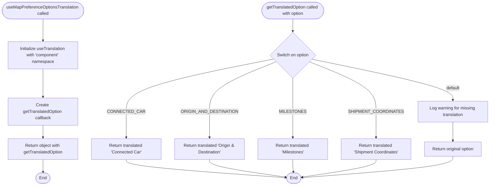
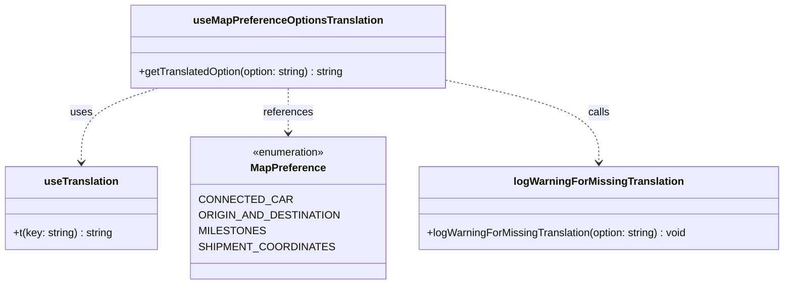
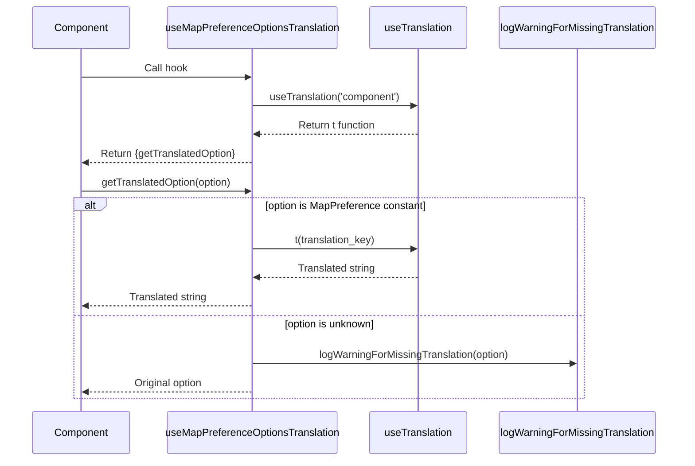

# Diagram: web/portal/src/shared/hooks/useMapPreferenceHook.ts

> Auto-generated by Obscura crawlers

## Diagram 1

### SVG

<svg id="container" width="1829.6087646484375" xmlns="http://www.w3.org/2000/svg" class="flowchart" height="698.328125" viewBox="0 0 1829.6087646484375 698.328125" role="graphics-document document" aria-roledescription="flowchart-v2"><g><marker id="container_flowchart-v2-pointEnd" class="marker flowchart-v2" viewBox="0 0 10 10" refX="5" refY="5" markerUnits="userSpaceOnUse" markerWidth="8" markerHeight="8" orient="auto"><path d="M 0 0 L 10 5 L 0 10 z" class="arrowMarkerPath" style="stroke-width: 1; stroke-dasharray: 1, 0;"></path></marker><marker id="container_flowchart-v2-pointStart" class="marker flowchart-v2" viewBox="0 0 10 10" refX="4.5" refY="5" markerUnits="userSpaceOnUse" markerWidth="8" markerHeight="8" orient="auto"><path d="M 0 5 L 10 10 L 10 0 z" class="arrowMarkerPath" style="stroke-width: 1; stroke-dasharray: 1, 0;"></path></marker><marker id="container_flowchart-v2-circleEnd" class="marker flowchart-v2" viewBox="0 0 10 10" refX="11" refY="5" markerUnits="userSpaceOnUse" markerWidth="11" markerHeight="11" orient="auto"><circle cx="5" cy="5" r="5" class="arrowMarkerPath" style="stroke-width: 1; stroke-dasharray: 1, 0;"></circle></marker><marker id="container_flowchart-v2-circleStart" class="marker flowchart-v2" viewBox="0 0 10 10" refX="-1" refY="5" markerUnits="userSpaceOnUse" markerWidth="11" markerHeight="11" orient="auto"><circle cx="5" cy="5" r="5" class="arrowMarkerPath" style="stroke-width: 1; stroke-dasharray: 1, 0;"></circle></marker><marker id="container_flowchart-v2-crossEnd" class="marker cross flowchart-v2" viewBox="0 0 11 11" refX="12" refY="5.2" markerUnits="userSpaceOnUse" markerWidth="11" markerHeight="11" orient="auto"><path d="M 1,1 l 9,9 M 10,1 l -9,9" class="arrowMarkerPath" style="stroke-width: 2; stroke-dasharray: 1, 0;"></path></marker><marker id="container_flowchart-v2-crossStart" class="marker cross flowchart-v2" viewBox="0 0 11 11" refX="-1" refY="5.2" markerUnits="userSpaceOnUse" markerWidth="11" markerHeight="11" orient="auto"><path d="M 1,1 l 9,9 M 10,1 l -9,9" class="arrowMarkerPath" style="stroke-width: 2; stroke-dasharray: 1, 0;"></path></marker><g class="root"><g class="clusters"></g><g class="edgePaths"><path d="M161.804,71.5L161.721,75.583C161.637,79.667,161.471,87.833,161.387,101.611C161.304,115.388,161.304,134.776,161.304,144.47L161.304,154.164" id="L_Start_Init_0" class="edge-thickness-normal edge-pattern-solid edge-thickness-normal edge-pattern-solid flowchart-link" style=";" data-edge="true" data-et="edge" data-id="L_Start_Init_0" data-points="W3sieCI6MTYxLjgwNDEyMjkyNDgwNDcsInkiOjcxLjQ5OTk5OTk5OTk5OTk5fSx7IngiOjE2MS4zMDQxMjI5MjQ4MDQ3LCJ5Ijo5Nn0seyJ4IjoxNjEuMzA0MTIyOTI0ODA0NywieSI6MTU4LjE2NDA2MjV9XQ==" marker-end="url(#container_flowchart-v2-pointEnd)"></path><path d="M161.304,260.164L161.304,272.525C161.304,284.885,161.304,309.607,161.304,327.467C161.304,345.328,161.304,356.328,161.304,361.828L161.304,367.328" id="L_Init_CreateCallback_0" class="edge-thickness-normal edge-pattern-solid edge-thickness-normal edge-pattern-solid flowchart-link" style=";" data-edge="true" data-et="edge" data-id="L_Init_CreateCallback_0" data-points="W3sieCI6MTYxLjMwNDEyMjkyNDgwNDcsInkiOjI2MC4xNjQwNjI1fSx7IngiOjE2MS4zMDQxMjI5MjQ4MDQ3LCJ5IjozMzQuMzI4MTI1fSx7IngiOjE2MS4zMDQxMjI5MjQ4MDQ3LCJ5IjozNzEuMzI4MTI1fV0=" marker-end="url(#container_flowchart-v2-pointEnd)"></path><path d="M161.304,473.328L161.304,477.495C161.304,481.661,161.304,489.995,161.304,497.661C161.304,505.328,161.304,512.328,161.304,515.828L161.304,519.328" id="L_CreateCallback_Return_0" class="edge-thickness-normal edge-pattern-solid edge-thickness-normal edge-pattern-solid flowchart-link" style=";" data-edge="true" data-et="edge" data-id="L_CreateCallback_Return_0" data-points="W3sieCI6MTYxLjMwNDEyMjkyNDgwNDcsInkiOjQ3My4zMjgxMjV9LHsieCI6MTYxLjMwNDEyMjkyNDgwNDcsInkiOjQ5OC4zMjgxMjV9LHsieCI6MTYxLjMwNDEyMjkyNDgwNDcsInkiOjUyMy4zMjgxMjV9XQ==" marker-end="url(#container_flowchart-v2-pointEnd)"></path><path d="M161.304,601.328L161.304,605.495C161.304,609.661,161.304,617.995,161.374,625.745C161.445,633.495,161.585,640.662,161.655,644.245L161.726,647.829" id="L_Return_End_0" class="edge-thickness-normal edge-pattern-solid edge-thickness-normal edge-pattern-solid flowchart-link" style=";" data-edge="true" data-et="edge" data-id="L_Return_End_0" data-points="W3sieCI6MTYxLjMwNDEyMjkyNDgwNDcsInkiOjYwMS4zMjgxMjV9LHsieCI6MTYxLjMwNDEyMjkyNDgwNDcsInkiOjYyNi4zMjgxMjV9LHsieCI6MTYxLjgwNDEyMjkyNDgwNDcsInkiOjY1MS44MjgxMjV9XQ==" marker-end="url(#container_flowchart-v2-pointEnd)"></path><path d="M1091.804,71.5L1091.721,75.583C1091.637,79.667,1091.471,87.833,1091.387,95.417C1091.304,103,1091.304,110,1091.304,113.5L1091.304,117" id="L_CallFunc_Switch_0" class="edge-thickness-normal edge-pattern-solid edge-thickness-normal edge-pattern-solid flowchart-link" style=";" data-edge="true" data-et="edge" data-id="L_CallFunc_Switch_0" data-points="W3sieCI6MTA5MS44MDQxMjI5MjQ4MDQ3LCJ5Ijo3MS41fSx7IngiOjEwOTEuMzA0MTIyOTI0ODA0NywieSI6OTZ9LHsieCI6MTA5MS4zMDQxMjI5MjQ4MDQ3LCJ5IjoxMjF9XQ==" marker-end="url(#container_flowchart-v2-pointEnd)"></path><path d="M1017.949,223.973L926.841,242.365C835.734,260.758,653.519,297.543,562.412,330.602C471.304,363.661,471.304,392.995,471.304,420.328C471.304,447.661,471.304,472.995,471.304,489.161C471.304,505.328,471.304,512.328,471.304,515.828L471.304,519.328" id="L_Switch_TransCC_0" class="edge-thickness-normal edge-pattern-solid edge-thickness-normal edge-pattern-solid flowchart-link" style=";" data-edge="true" data-et="edge" data-id="L_Switch_TransCC_0" data-points="W3sieCI6MTAxNy45NDg4NDI1MjMwNDc1LCJ5IjoyMjMuOTcyODQ0NTk4MjQyODN9LHsieCI6NDcxLjMwNDEyMjkyNDgwNDcsInkiOjMzNC4zMjgxMjV9LHsieCI6NDcxLjMwNDEyMjkyNDgwNDcsInkiOjQyMi4zMjgxMjV9LHsieCI6NDcxLjMwNDEyMjkyNDgwNDcsInkiOjQ5OC4zMjgxMjV9LHsieCI6NDcxLjMwNDEyMjkyNDgwNDcsInkiOjUyMy4zMjgxMjV9XQ==" marker-end="url(#container_flowchart-v2-pointEnd)"></path><path d="M1028.498,234.522L987.299,251.157C946.1,267.791,863.702,301.06,822.503,332.36C781.304,363.661,781.304,392.995,781.304,420.328C781.304,447.661,781.304,472.995,781.304,489.161C781.304,505.328,781.304,512.328,781.304,515.828L781.304,519.328" id="L_Switch_TransOD_0" class="edge-thickness-normal edge-pattern-solid edge-thickness-normal edge-pattern-solid flowchart-link" style=";" data-edge="true" data-et="edge" data-id="L_Switch_TransOD_0" data-points="W3sieCI6MTAyOC40OTgyNDg3MDM1MTU5LCJ5IjoyMzQuNTIyMjUwNzc4NzExMzR9LHsieCI6NzgxLjMwNDEyMjkyNDgwNDcsInkiOjMzNC4zMjgxMjV9LHsieCI6NzgxLjMwNDEyMjkyNDgwNDcsInkiOjQyMi4zMjgxMjV9LHsieCI6NzgxLjMwNDEyMjkyNDgwNDcsInkiOjQ5OC4zMjgxMjV9LHsieCI6NzgxLjMwNDEyMjkyNDgwNDcsInkiOjUyMy4zMjgxMjV9XQ==" marker-end="url(#container_flowchart-v2-pointEnd)"></path><path d="M1091.304,297.328L1091.304,303.495C1091.304,309.661,1091.304,321.995,1091.304,342.828C1091.304,363.661,1091.304,392.995,1091.304,420.328C1091.304,447.661,1091.304,472.995,1091.304,489.161C1091.304,505.328,1091.304,512.328,1091.304,515.828L1091.304,519.328" id="L_Switch_TransM_0" class="edge-thickness-normal edge-pattern-solid edge-thickness-normal edge-pattern-solid flowchart-link" style=";" data-edge="true" data-et="edge" data-id="L_Switch_TransM_0" data-points="W3sieCI6MTA5MS4zMDQxMjI5MjQ4MDQ3LCJ5IjoyOTcuMzI4MTI1fSx7IngiOjEwOTEuMzA0MTIyOTI0ODA0NywieSI6MzM0LjMyODEyNX0seyJ4IjoxMDkxLjMwNDEyMjkyNDgwNDcsInkiOjQyMi4zMjgxMjV9LHsieCI6MTA5MS4zMDQxMjI5MjQ4MDQ3LCJ5Ijo0OTguMzI4MTI1fSx7IngiOjEwOTEuMzA0MTIyOTI0ODA0NywieSI6NTIzLjMyODEyNX1d" marker-end="url(#container_flowchart-v2-pointEnd)"></path><path d="M1154.11,234.522L1195.309,251.157C1236.508,267.791,1318.906,301.06,1360.105,332.36C1401.304,363.661,1401.304,392.995,1401.304,420.328C1401.304,447.661,1401.304,472.995,1401.304,489.161C1401.304,505.328,1401.304,512.328,1401.304,515.828L1401.304,519.328" id="L_Switch_TransSC_0" class="edge-thickness-normal edge-pattern-solid edge-thickness-normal edge-pattern-solid flowchart-link" style=";" data-edge="true" data-et="edge" data-id="L_Switch_TransSC_0" data-points="W3sieCI6MTE1NC4xMDk5OTcxNDYwOTMzLCJ5IjoyMzQuNTIyMjUwNzc4NzExMzR9LHsieCI6MTQwMS4zMDQxMjI5MjQ4MDQ3LCJ5IjozMzQuMzI4MTI1fSx7IngiOjE0MDEuMzA0MTIyOTI0ODA0NywieSI6NDIyLjMyODEyNX0seyJ4IjoxNDAxLjMwNDEyMjkyNDgwNDcsInkiOjQ5OC4zMjgxMjV9LHsieCI6MTQwMS4zMDQxMjI5MjQ4MDQ3LCJ5Ijo1MjMuMzI4MTI1fV0=" marker-end="url(#container_flowchart-v2-pointEnd)"></path><path d="M1164.257,224.375L1252.149,242.7C1340.041,261.026,1515.825,297.677,1603.717,323.503C1691.609,349.328,1691.609,364.328,1691.609,371.828L1691.609,379.328" id="L_Switch_LogWarn_0" class="edge-thickness-normal edge-pattern-solid edge-thickness-normal edge-pattern-solid flowchart-link" style=";" data-edge="true" data-et="edge" data-id="L_Switch_LogWarn_0" data-points="W3sieCI6MTE2NC4yNTczNjg2NTQyNjMsInkiOjIyNC4zNzQ4NzkyNzA1NDE2N30seyJ4IjoxNjkxLjYwODgxMDQyNDgwNDcsInkiOjMzNC4zMjgxMjV9LHsieCI6MTY5MS42MDg4MTA0MjQ4MDQ3LCJ5IjozODMuMzI4MTI1fV0=" marker-end="url(#container_flowchart-v2-pointEnd)"></path><path d="M1691.609,461.328L1691.609,467.495C1691.609,473.661,1691.609,485.995,1691.609,497.661C1691.609,509.328,1691.609,520.328,1691.609,525.828L1691.609,531.328" id="L_LogWarn_ReturnOrig_0" class="edge-thickness-normal edge-pattern-solid edge-thickness-normal edge-pattern-solid flowchart-link" style=";" data-edge="true" data-et="edge" data-id="L_LogWarn_ReturnOrig_0" data-points="W3sieCI6MTY5MS42MDg4MTA0MjQ4MDQ3LCJ5Ijo0NjEuMzI4MTI1fSx7IngiOjE2OTEuNjA4ODEwNDI0ODA0NywieSI6NDk4LjMyODEyNX0seyJ4IjoxNjkxLjYwODgxMDQyNDgwNDcsInkiOjUzNS4zMjgxMjV9XQ==" marker-end="url(#container_flowchart-v2-pointEnd)"></path><path d="M471.304,601.328L471.304,605.495C471.304,609.661,471.304,617.995,570.45,629.305C669.596,640.615,867.888,654.903,967.034,662.046L1066.18,669.19" id="L_TransCC_CallEnd_0" class="edge-thickness-normal edge-pattern-solid edge-thickness-normal edge-pattern-solid flowchart-link" style=";" data-edge="true" data-et="edge" data-id="L_TransCC_CallEnd_0" data-points="W3sieCI6NDcxLjMwNDEyMjkyNDgwNDcsInkiOjYwMS4zMjgxMjV9LHsieCI6NDcxLjMwNDEyMjkyNDgwNDcsInkiOjYyNi4zMjgxMjV9LHsieCI6MTA3MC4xNjk2MjEwNTAwMDA0LCJ5Ijo2NjkuNDc3MzY4MTEwNzA1N31d" marker-end="url(#container_flowchart-v2-pointEnd)"></path><path d="M781.304,601.328L781.304,605.495C781.304,609.661,781.304,617.995,828.832,628.961C876.361,639.926,971.417,653.525,1018.945,660.324L1066.474,667.123" id="L_TransOD_CallEnd_0" class="edge-thickness-normal edge-pattern-solid edge-thickness-normal edge-pattern-solid flowchart-link" style=";" data-edge="true" data-et="edge" data-id="L_TransOD_CallEnd_0" data-points="W3sieCI6NzgxLjMwNDEyMjkyNDgwNDcsInkiOjYwMS4zMjgxMjV9LHsieCI6NzgxLjMwNDEyMjkyNDgwNDcsInkiOjYyNi4zMjgxMjV9LHsieCI6MTA3MC40MzMzOTE3NTY5Nzc1LCJ5Ijo2NjcuNjg5NDU2NjQ3ODYyfV0=" marker-end="url(#container_flowchart-v2-pointEnd)"></path><path d="M1091.304,601.328L1091.304,605.495C1091.304,609.661,1091.304,617.995,1091.717,625.749C1092.13,633.504,1092.955,640.679,1093.368,644.267L1093.78,647.854" id="L_TransM_CallEnd_0" class="edge-thickness-normal edge-pattern-solid edge-thickness-normal edge-pattern-solid flowchart-link" style=";" data-edge="true" data-et="edge" data-id="L_TransM_CallEnd_0" data-points="W3sieCI6MTA5MS4zMDQxMjI5MjQ4MDQ3LCJ5Ijo2MDEuMzI4MTI1fSx7IngiOjEwOTEuMzA0MTIyOTI0ODA0NywieSI6NjI2LjMyODEyNX0seyJ4IjoxMDk0LjIzNzUzMzMxMjE2NTQsInkiOjY1MS44MjgxMjV9XQ==" marker-end="url(#container_flowchart-v2-pointEnd)"></path><path d="M1401.304,601.328L1401.304,605.495C1401.304,609.661,1401.304,617.995,1355.383,628.941C1309.461,639.887,1217.618,653.446,1171.697,660.226L1125.775,667.005" id="L_TransSC_CallEnd_0" class="edge-thickness-normal edge-pattern-solid edge-thickness-normal edge-pattern-solid flowchart-link" style=";" data-edge="true" data-et="edge" data-id="L_TransSC_CallEnd_0" data-points="W3sieCI6MTQwMS4zMDQxMjI5MjQ4MDQ3LCJ5Ijo2MDEuMzI4MTI1fSx7IngiOjE0MDEuMzA0MTIyOTI0ODA0NywieSI6NjI2LjMyODEyNX0seyJ4IjoxMTIxLjgxODI2NjUxMTA0MzIsInkiOjY2Ny41ODkxNzYyOTQyNDAyfV0=" marker-end="url(#container_flowchart-v2-pointEnd)"></path><path d="M1691.609,589.328L1691.609,595.495C1691.609,601.661,1691.609,613.995,1597.354,627.288C1503.099,640.582,1314.59,654.835,1220.335,661.962L1126.08,669.088" id="L_ReturnOrig_CallEnd_0" class="edge-thickness-normal edge-pattern-solid edge-thickness-normal edge-pattern-solid flowchart-link" style=";" data-edge="true" data-et="edge" data-id="L_ReturnOrig_CallEnd_0" data-points="W3sieCI6MTY5MS42MDg4MTA0MjQ4MDQ3LCJ5Ijo1ODkuMzI4MTI1fSx7IngiOjE2OTEuNjA4ODEwNDI0ODA0NywieSI6NjI2LjMyODEyNX0seyJ4IjoxMTIyLjA5MTcxMTIwNDc4NiwieSI6NjY5LjM5MDAzOTE3ODg0NDd9XQ==" marker-end="url(#container_flowchart-v2-pointEnd)"></path></g><g class="edgeLabels"><g class="edgeLabel"><g class="label" data-id="L_Start_Init_0" transform="translate(0, 0)"><foreignObject width="0" height="0">

</foreignObject></g></g><g class="edgeLabel"><g class="label" data-id="L_Init_CreateCallback_0" transform="translate(0, 0)"><foreignObject width="0" height="0">

</foreignObject></g></g><g class="edgeLabel"><g class="label" data-id="L_CreateCallback_Return_0" transform="translate(0, 0)"><foreignObject width="0" height="0">

</foreignObject></g></g><g class="edgeLabel"><g class="label" data-id="L_Return_End_0" transform="translate(0, 0)"><foreignObject width="0" height="0">

</foreignObject></g></g><g class="edgeLabel"><g class="label" data-id="L_CallFunc_Switch_0" transform="translate(0, 0)"><foreignObject width="0" height="0">

</foreignObject></g></g><g class="edgeLabel" transform="translate(471.3041229248047, 422.328125)"><g class="label" data-id="L_Switch_TransCC_0" transform="translate(-60.3671875, -12)"><foreignObject width="120.734375" height="24">

CONNECTED_CAR

</foreignObject></g></g><g class="edgeLabel" transform="translate(781.3041229248047, 422.328125)"><g class="label" data-id="L_Switch_TransOD_0" transform="translate(-95.984375, -12)"><foreignObject width="191.96875" height="24">

ORIGIN_AND_DESTINATION

</foreignObject></g></g><g class="edgeLabel" transform="translate(1091.3041229248047, 422.328125)"><g class="label" data-id="L_Switch_TransM_0" transform="translate(-44.375, -12)"><foreignObject width="88.75" height="24">

MILESTONES

</foreignObject></g></g><g class="edgeLabel" transform="translate(1401.3041229248047, 422.328125)"><g class="label" data-id="L_Switch_TransSC_0" transform="translate(-90.203125, -12)"><foreignObject width="180.40625" height="24">

SHIPMENT_COORDINATES

</foreignObject></g></g><g class="edgeLabel" transform="translate(1691.6088104248047, 334.328125)"><g class="label" data-id="L_Switch_LogWarn_0" transform="translate(-25.890625, -12)"><foreignObject width="51.78125" height="24">

default

</foreignObject></g></g><g class="edgeLabel"><g class="label" data-id="L_LogWarn_ReturnOrig_0" transform="translate(0, 0)"><foreignObject width="0" height="0">

</foreignObject></g></g><g class="edgeLabel"><g class="label" data-id="L_TransCC_CallEnd_0" transform="translate(0, 0)"><foreignObject width="0" height="0">

</foreignObject></g></g><g class="edgeLabel"><g class="label" data-id="L_TransOD_CallEnd_0" transform="translate(0, 0)"><foreignObject width="0" height="0">

</foreignObject></g></g><g class="edgeLabel"><g class="label" data-id="L_TransM_CallEnd_0" transform="translate(0, 0)"><foreignObject width="0" height="0">

</foreignObject></g></g><g class="edgeLabel"><g class="label" data-id="L_TransSC_CallEnd_0" transform="translate(0, 0)"><foreignObject width="0" height="0">

</foreignObject></g></g><g class="edgeLabel"><g class="label" data-id="L_ReturnOrig_CallEnd_0" transform="translate(0, 0)"><foreignObject width="0" height="0">

</foreignObject></g></g></g><g class="nodes"><g class="node default" id="flowchart-Start-0" transform="translate(161.3041229248047, 39.5)"><g class="basic label-container outer-path"><path d="M-121.8203125 -31.5 C-43.914993899151426 -31.5, 33.99032470169715 -31.5, 121.8203125 -31.5 C121.8203125 -31.5, 121.8203125 -31.5, 121.8203125 -31.5 C122.43367996466009 -31.480330499255693, 123.04704742932016 -31.46066099851139, 123.83852442939245 -31.435279871635593 C124.44486374858005 -31.37678704674329, 125.05120306776763 -31.318294221850984, 125.84844309306193 -31.241385435432253 C126.52287120750177 -31.132349128157763, 127.19729932194161 -31.023312820883273, 127.84180930409322 -30.91911344521856 C128.3343970955977 -30.806683496243405, 128.82698488710218 -30.694253547268254, 129.81043189314948 -30.469788185729428 C130.52254473801065 -30.258436831331235, 131.23465758287182 -30.04708547693304, 131.74622136774406 -29.895256030836062 C132.2550502339714 -29.708002304501928, 132.76387910019872 -29.52074857816779, 133.64122315370028 -29.197877856399685 C134.0555788718612 -29.01445487139551, 134.46993459002212 -28.831031886391333, 135.48765028220308 -28.380519338926202 C136.01660654058395 -28.10456319774155, 136.54556279896482 -27.828607056556905, 137.27791538812403 -27.44653917988677 C137.72677471975175 -27.174438015263828, 138.17563405137946 -26.902336850640886, 139.0046618881323 -26.399775304092984 C139.47225519504886 -26.073602454976, 139.93984850196543 -25.74742960585902, 140.6607942104733 -25.244529088840633 C141.01497604509825 -24.962078500901693, 141.3691578797232 -24.679627912962754, 142.2395069521953 -23.985547688627737 C142.81237960778282 -23.465279900203036, 143.38525226337032 -22.945012111778336, 143.73431284400982 -22.62800452807842 C144.12111269762084 -22.228601922366444, 144.5079125512319 -21.829199316654467, 145.13906940787243 -21.177478043231485 C145.564750288266 -20.67744905919292, 145.99043116865957 -20.17742007515435, 146.44800419774293 -19.63992875855011 C146.81115054498346 -19.15334573656062, 147.174296892224 -18.66676271457113, 147.65573851980412 -18.02167479384835 C148.0785328050348 -17.372149235571857, 148.5013270902655 -16.72262367729536, 148.7573095346684 -16.329365901781543 C149.13417694637397 -15.660199650334723, 149.51104435807954 -14.991033398887902, 149.7481906507495 -14.56995614258631 C150.07089180475745 -13.89986029159024, 150.39359295876537 -13.22976444059417, 150.6243101249981 -12.750675308355413 C150.8414566531529 -12.214319185570469, 151.05860318130775 -11.677963062785524, 151.38206779456743 -10.878999214271206 C151.5185259638259 -10.468008950121412, 151.65498413308438 -10.057018685971617, 152.01834987065482 -8.962618978877531 C152.19538169269185 -8.287519915373215, 152.37241351472892 -7.6124208518689, 152.53054173372743 -7.009409419623907 C152.62266413429572 -6.536380362782034, 152.714786534864 -6.063351305940161, 152.91653867755517 -5.027396693551458 C152.99339519340947 -4.431312733621201, 153.07025170926377 -3.835228773690944, 153.17475455789975 -3.024725316091981 C153.21619994690437 -2.379179928229254, 153.25764533590896 -1.733634540366527, 153.30412831032166 -1.0096246935071378 C153.30412831032166 -0.3259311412892436, 153.30412831032166 0.3577624109286506, 153.30412831032166 1.00962469350713 C153.26954944530013 1.54821842777516, 153.23497058027857 2.0868121620431896, 153.17475455789975 3.02472531609196 C153.1025588751805 3.5846607746123396, 153.03036319246127 4.144596233132719, 152.9165386775552 5.027396693551435 C152.81073748262634 5.570663468420595, 152.70493628769748 6.113930243289755, 152.53054173372743 7.0094094196239 C152.42074497053747 7.428112063885422, 152.3109482073475 7.846814708146943, 152.01834987065482 8.96261897887751 C151.81212689975638 9.583729710055291, 151.60590392885794 10.204840441233072, 151.38206779456746 10.878999214271184 C151.22839810900882 11.258566308602257, 151.0747284234502 11.63813340293333, 150.6243101249981 12.750675308355405 C150.28123436035872 13.463079474274492, 149.93815859571933 14.175483640193582, 149.7481906507495 14.569956142586303 C149.35361700495136 15.27056160561509, 148.95904335915324 15.971167068643874, 148.7573095346684 16.329365901781536 C148.52527909013233 16.68582697348738, 148.29324864559624 17.042288045193224, 147.65573851980412 18.021674793848334 C147.30523449983932 18.49131824902805, 146.9547304798745 18.96096170420777, 146.44800419774293 19.639928758550102 C146.09570234942055 20.053762556132643, 145.74340050109817 20.467596353715187, 145.13906940787246 21.177478043231467 C144.7961884039547 21.53153083083051, 144.45330740003695 21.88558361842955, 143.73431284400982 22.628004528078414 C143.33943224434296 22.986624640727715, 142.94455164467612 23.345244753377017, 142.23950695219537 23.985547688627715 C141.71703374469672 24.402206168011926, 141.19456053719804 24.81886464739614, 140.6607942104733 25.24452908884063 C140.21070803425644 25.558489721452975, 139.76062185803957 25.872450354065325, 139.0046618881323 26.399775304092973 C138.57015707864147 26.66317467303999, 138.13565226915068 26.926574041987003, 137.27791538812403 27.446539179886766 C136.85066761855822 27.66943406760399, 136.4234198489924 27.892328955321215, 135.48765028220308 28.3805193389262 C135.09381272487016 28.554859542781436, 134.69997516753722 28.729199746636677, 133.6412231537003 29.197877856399682 C133.01349311794576 29.428888312230196, 132.3857630821912 29.65989876806071, 131.74622136774408 29.895256030836055 C131.16522876222643 30.067691586461272, 130.5842361567088 30.24012714208649, 129.8104318931495 30.46978818572942 C129.33793852803572 30.577631713009286, 128.86544516292193 30.68547524028915, 127.84180930409323 30.919113445218557 C127.07592984795926 31.042934896202407, 126.31005039182529 31.16675634718626, 125.84844309306196 31.24138543543225 C125.05949071388572 31.317494722597324, 124.27053833470947 31.3936040097624, 123.83852442939245 31.435279871635593 C123.03232966063112 31.46113296870685, 122.22613489186978 31.4869860657781, 121.8203125 31.5 C121.8203125 31.5, 121.8203125 31.5, 121.8203125 31.5 C68.96864635790556 31.5, 16.11698021581111 31.5, -121.8203125 31.5 C-122.25365978443152 31.4861033960476, -122.68700706886305 31.4722067920952, -123.83852442939244 31.435279871635593 C-124.54487048582715 31.367139517076758, -125.25121654226186 31.29899916251792, -125.84844309306195 31.24138543543225 C-126.56922412823668 31.124855147405608, -127.29000516341142 31.00832485937897, -127.84180930409323 30.919113445218557 C-128.3149764893714 30.811116122883263, -128.78814367464955 30.703118800547966, -129.81043189314948 30.469788185729428 C-130.52728591900853 30.25702967369803, -131.24413994486756 30.044271161666636, -131.74622136774403 29.89525603083607 C-132.3338402212376 29.6790068608613, -132.92145907473116 29.46275769088653, -133.64122315370028 29.197877856399685 C-134.27890324775885 28.915595794867862, -134.91658334181741 28.63331373333604, -135.48765028220308 28.380519338926206 C-136.07148683587002 28.07593218284333, -136.65532338953693 27.771345026760454, -137.27791538812403 27.446539179886773 C-137.82925982317118 27.112310943301637, -138.38060425821837 26.778082706716503, -139.00466188813226 26.399775304092994 C-139.51502985614215 26.04376470308255, -140.025397824152 25.687754102072113, -140.66079421047328 25.244529088840636 C-141.23154097588204 24.78937373163645, -141.8022877412908 24.33421837443226, -142.2395069521953 23.98554768862774 C-142.61507093150286 23.644470419498997, -142.9906349108104 23.30339315037026, -143.73431284400982 22.628004528078435 C-144.05171321483573 22.30026258614561, -144.36911358566164 21.972520644212786, -145.13906940787246 21.177478043231478 C-145.61985555942374 20.612719272112287, -146.10064171097505 20.047960500993096, -146.44800419774293 19.639928758550113 C-146.79969485281833 19.16869532042688, -147.15138550789374 18.697461882303646, -147.65573851980412 18.021674793848355 C-147.97186085929974 17.536025989649083, -148.2879831987954 17.050377185449808, -148.7573095346684 16.329365901781557 C-149.09538762866276 15.729074011775309, -149.43346572265716 15.12878212176906, -149.7481906507495 14.569956142586314 C-149.9947983516566 14.057869975093215, -150.2414060525637 13.545783807600115, -150.6243101249981 12.750675308355417 C-150.89879673319552 12.07268807927017, -151.173283341393 11.394700850184922, -151.38206779456743 10.878999214271209 C-151.5443767111493 10.390150617940535, -151.7066856277312 9.90130202160986, -152.01834987065482 8.962618978877522 C-152.15688031622807 8.43434235043176, -152.29541076180135 7.906065721985995, -152.53054173372743 7.009409419623911 C-152.62204177679016 6.539576037037845, -152.71354181985285 6.069742654451778, -152.91653867755517 5.027396693551461 C-152.98423455255656 4.502360855103255, -153.05193042755795 3.9773250166550502, -153.17475455789975 3.024725316091999 C-153.22420476518025 2.2544984222090387, -153.27365497246078 1.4842715283260788, -153.30412831032166 1.0096246935071416 C-153.30412831032166 0.43152937721202955, -153.30412831032166 -0.14656593908308246, -153.30412831032166 -1.0096246935071262 C-153.25765257914318 -1.733521721147142, -153.21117684796468 -2.457418748787158, -153.17475455789975 -3.024725316091956 C-153.07953562613136 -3.7632245477826856, -152.984316694363 -4.501723779473415, -152.9165386775552 -5.027396693551446 C-152.78322341408986 -5.711942395255014, -152.6499081506245 -6.396488096958582, -152.53054173372743 -7.009409419623896 C-152.36249420415473 -7.650247482144689, -152.19444667458203 -8.291085544665481, -152.01834987065482 -8.962618978877506 C-151.89062221846694 -9.347314316629642, -151.7628945662791 -9.732009654381779, -151.38206779456746 -10.878999214271168 C-151.16094126908345 -11.425186007407175, -150.93981474359947 -11.971372800543183, -150.6243101249981 -12.750675308355401 C-150.29078187801483 -13.443253849577406, -149.95725363103156 -14.13583239079941, -149.7481906507495 -14.5699561425863 C-149.43282649293155 -15.129917138875859, -149.1174623351136 -15.689878135165419, -148.7573095346684 -16.329365901781546 C-148.41328661861436 -16.857877483928338, -148.06926370256036 -17.38638906607513, -147.65573851980412 -18.021674793848344 C-147.4073214068148 -18.354531093989486, -147.15890429382546 -18.687387394130624, -146.44800419774293 -19.639928758550102 C-145.95518428201873 -20.21882307380737, -145.4623643662945 -20.797717389064637, -145.13906940787246 -21.177478043231467 C-144.8379984498728 -21.488358525751465, -144.53692749187314 -21.799239008271464, -143.73431284400985 -22.628004528078403 C-143.35960517348101 -22.968304120231007, -142.98489750295218 -23.30860371238361, -142.23950695219537 -23.98554768862771 C-141.63519401451117 -24.4674711749882, -141.030881076827 -24.94939466134869, -140.6607942104733 -25.244529088840626 C-140.28070371768555 -25.50966376275711, -139.90061322489782 -25.7747984366736, -139.0046618881323 -26.39977530409297 C-138.4535524604948 -26.73386107780531, -137.90244303285726 -27.06794685151765, -137.27791538812403 -27.446539179886763 C-136.69673164967372 -27.749742363970338, -136.11554791122342 -28.052945548053913, -135.48765028220308 -28.3805193389262 C-134.75909675314628 -28.70302837446707, -134.03054322408948 -29.025537410007942, -133.6412231537003 -29.19787785639968 C-133.2351837538032 -29.347304108948887, -132.82914435390606 -29.496730361498095, -131.74622136774408 -29.895256030836055 C-131.32727785510812 -30.019596266307037, -130.90833434247216 -30.14393650177802, -129.8104318931495 -30.469788185729417 C-129.184101910369 -30.61274391711396, -128.5577719275885 -30.755699648498506, -127.84180930409325 -30.919113445218553 C-127.23409343235976 -31.01736423445345, -126.62637756062627 -31.11561502368835, -125.84844309306196 -31.24138543543225 C-125.36564046835359 -31.287960823982758, -124.88283784364522 -31.334536212533266, -123.83852442939246 -31.435279871635593 C-123.29260513501545 -31.45278644083882, -122.74668584063843 -31.470293010042045, -121.82031250000001 -31.5 C-121.82031250000001 -31.5, -121.8203125 -31.5, -121.8203125 -31.5" stroke="none" stroke-width="0" fill="#ECECFF" style=""></path><path d="M-121.8203125 -31.5 C-26.43053474752773 -31.5, 68.95924300494454 -31.5, 121.8203125 -31.5 M-121.8203125 -31.5 C-29.624232565132047 -31.5, 62.571847369735906 -31.5, 121.8203125 -31.5 M121.8203125 -31.5 C121.8203125 -31.5, 121.8203125 -31.5, 121.8203125 -31.5 M121.8203125 -31.5 C121.8203125 -31.5, 121.8203125 -31.5, 121.8203125 -31.5 M121.8203125 -31.5 C122.37444558635883 -31.482230030475094, 122.92857867271765 -31.464460060950184, 123.83852442939245 -31.435279871635593 M121.8203125 -31.5 C122.38173902649227 -31.481996144045834, 122.94316555298455 -31.463992288091667, 123.83852442939245 -31.435279871635593 M123.83852442939245 -31.435279871635593 C124.6285258210456 -31.359069387498497, 125.41852721269873 -31.282858903361397, 125.84844309306193 -31.241385435432253 M123.83852442939245 -31.435279871635593 C124.28642593899086 -31.39207135168501, 124.73432744858927 -31.34886283173443, 125.84844309306193 -31.241385435432253 M125.84844309306193 -31.241385435432253 C126.5765528737051 -31.12367029267355, 127.30466265434826 -31.00595514991484, 127.84180930409322 -30.91911344521856 M125.84844309306193 -31.241385435432253 C126.5157218746548 -31.133504976848556, 127.18300065624769 -31.025624518264856, 127.84180930409322 -30.91911344521856 M127.84180930409322 -30.91911344521856 C128.28565148656796 -30.81780936340962, 128.72949366904268 -30.716505281600682, 129.81043189314948 -30.469788185729428 M127.84180930409322 -30.91911344521856 C128.32194207626515 -30.809526273129464, 128.8020748484371 -30.699939101040368, 129.81043189314948 -30.469788185729428 M129.81043189314948 -30.469788185729428 C130.35846381354986 -30.30713518843285, 130.90649573395024 -30.144482191136273, 131.74622136774406 -29.895256030836062 M129.81043189314948 -30.469788185729428 C130.43327916590948 -30.28493038456631, 131.05612643866948 -30.10007258340319, 131.74622136774406 -29.895256030836062 M131.74622136774406 -29.895256030836062 C132.24184393323668 -29.712862345250006, 132.7374664987293 -29.530468659663946, 133.64122315370028 -29.197877856399685 M131.74622136774406 -29.895256030836062 C132.41891724624722 -29.647697729214364, 133.09161312475035 -29.40013942759267, 133.64122315370028 -29.197877856399685 M133.64122315370028 -29.197877856399685 C134.2217141340984 -28.940911719030563, 134.8022051144965 -28.683945581661437, 135.48765028220308 -28.380519338926202 M133.64122315370028 -29.197877856399685 C134.3511154885854 -28.88362957795396, 135.0610078234705 -28.569381299508237, 135.48765028220308 -28.380519338926202 M135.48765028220308 -28.380519338926202 C136.18433105362573 -28.01706142672034, 136.88101182504838 -27.653603514514472, 137.27791538812403 -27.44653917988677 M135.48765028220308 -28.380519338926202 C136.12022011115403 -28.0505080643428, 136.752789940105 -27.720496789759395, 137.27791538812403 -27.44653917988677 M137.27791538812403 -27.44653917988677 C137.85762671726178 -27.09511476540156, 138.4373380463995 -26.743690350916353, 139.0046618881323 -26.399775304092984 M137.27791538812403 -27.44653917988677 C137.78214486225423 -27.14087230948775, 138.28637433638443 -26.835205439088735, 139.0046618881323 -26.399775304092984 M139.0046618881323 -26.399775304092984 C139.48593951900804 -26.06405686296691, 139.9672171498838 -25.72833842184084, 140.6607942104733 -25.244529088840633 M139.0046618881323 -26.399775304092984 C139.55132530202366 -26.01844657124014, 140.09798871591502 -25.6371178383873, 140.6607942104733 -25.244529088840633 M140.6607942104733 -25.244529088840633 C141.21385130398212 -24.803480774234703, 141.76690839749094 -24.36243245962877, 142.2395069521953 -23.985547688627737 M140.6607942104733 -25.244529088840633 C141.20362139886325 -24.81163885133779, 141.7464485872532 -24.378748613834944, 142.2395069521953 -23.985547688627737 M142.2395069521953 -23.985547688627737 C142.80518171563418 -23.471816835406646, 143.37085647907304 -22.958085982185555, 143.73431284400982 -22.62800452807842 M142.2395069521953 -23.985547688627737 C142.80561123853747 -23.471426754070436, 143.37171552487962 -22.957305819513138, 143.73431284400982 -22.62800452807842 M143.73431284400982 -22.62800452807842 C144.09692739152678 -22.253575236559133, 144.45954193904376 -21.87914594503985, 145.13906940787243 -21.177478043231485 M143.73431284400982 -22.62800452807842 C144.2191234111919 -22.127397813775094, 144.703933978374 -21.62679109947177, 145.13906940787243 -21.177478043231485 M145.13906940787243 -21.177478043231485 C145.42195243897325 -20.845187538399994, 145.70483547007407 -20.512897033568503, 146.44800419774293 -19.63992875855011 M145.13906940787243 -21.177478043231485 C145.64178741161348 -20.586956870572475, 146.14450541535453 -19.996435697913462, 146.44800419774293 -19.63992875855011 M146.44800419774293 -19.63992875855011 C146.68974694285794 -19.31601550331316, 146.9314896879729 -18.992102248076215, 147.65573851980412 -18.02167479384835 M146.44800419774293 -19.63992875855011 C146.83700260435307 -19.1187063321764, 147.22600101096322 -18.597483905802694, 147.65573851980412 -18.02167479384835 M147.65573851980412 -18.02167479384835 C147.97705263689267 -17.528050025078866, 148.2983667539812 -17.03442525630938, 148.7573095346684 -16.329365901781543 M147.65573851980412 -18.02167479384835 C147.98071894648652 -17.52241758900075, 148.3056993731689 -17.02316038415315, 148.7573095346684 -16.329365901781543 M148.7573095346684 -16.329365901781543 C149.09416823883043 -15.731239161899225, 149.43102694299247 -15.133112422016907, 149.7481906507495 -14.56995614258631 M148.7573095346684 -16.329365901781543 C149.0233587782831 -15.856968529336422, 149.2894080218978 -15.3845711568913, 149.7481906507495 -14.56995614258631 M149.7481906507495 -14.56995614258631 C150.08583666256322 -13.86882697458781, 150.42348267437694 -13.16769780658931, 150.6243101249981 -12.750675308355413 M149.7481906507495 -14.56995614258631 C149.99063385369718 -14.06651764421195, 150.23307705664485 -13.563079145837593, 150.6243101249981 -12.750675308355413 M150.6243101249981 -12.750675308355413 C150.88579607767497 -12.104799949756535, 151.14728203035185 -11.458924591157656, 151.38206779456743 -10.878999214271206 M150.6243101249981 -12.750675308355413 C150.81095618414173 -12.28965593371456, 150.99760224328537 -11.828636559073708, 151.38206779456743 -10.878999214271206 M151.38206779456743 -10.878999214271206 C151.5208735637974 -10.46093835304648, 151.65967933302738 -10.042877491821754, 152.01834987065482 -8.962618978877531 M151.38206779456743 -10.878999214271206 C151.61503425382048 -10.177341357165604, 151.84800071307353 -9.475683500060002, 152.01834987065482 -8.962618978877531 M152.01834987065482 -8.962618978877531 C152.15753267495654 -8.4318546238661, 152.29671547925824 -7.901090268854667, 152.53054173372743 -7.009409419623907 M152.01834987065482 -8.962618978877531 C152.17990096685133 -8.346554632392134, 152.34145206304788 -7.730490285906738, 152.53054173372743 -7.009409419623907 M152.53054173372743 -7.009409419623907 C152.63784163793042 -6.458447089384305, 152.74514154213344 -5.907484759144702, 152.91653867755517 -5.027396693551458 M152.53054173372743 -7.009409419623907 C152.67691776122717 -6.2577994549970875, 152.82329378872691 -5.506189490370268, 152.91653867755517 -5.027396693551458 M152.91653867755517 -5.027396693551458 C153.00943777255964 -4.306889657698037, 153.10233686756413 -3.586382621844617, 153.17475455789975 -3.024725316091981 M152.91653867755517 -5.027396693551458 C152.99249828772693 -4.438268956981005, 153.06845789789867 -3.8491412204105533, 153.17475455789975 -3.024725316091981 M153.17475455789975 -3.024725316091981 C153.20288296118164 -2.5866027301377446, 153.23101136446357 -2.148480144183508, 153.30412831032166 -1.0096246935071378 M153.17475455789975 -3.024725316091981 C153.2254338599453 -2.23535427913624, 153.27611316199082 -1.4459832421804986, 153.30412831032166 -1.0096246935071378 M153.30412831032166 -1.0096246935071378 C153.30412831032166 -0.4337262129784898, 153.30412831032166 0.14217226755015822, 153.30412831032166 1.00962469350713 M153.30412831032166 -1.0096246935071378 C153.30412831032166 -0.31818392873822543, 153.30412831032166 0.37325683603068693, 153.30412831032166 1.00962469350713 M153.30412831032166 1.00962469350713 C153.26763933040758 1.577970009043674, 153.23115035049346 2.1463153245802173, 153.17475455789975 3.02472531609196 M153.30412831032166 1.00962469350713 C153.2549450958947 1.7756929581834358, 153.2057618814677 2.5417612228597415, 153.17475455789975 3.02472531609196 M153.17475455789975 3.02472531609196 C153.09487473550078 3.644257444563338, 153.0149949131018 4.263789573034717, 152.9165386775552 5.027396693551435 M153.17475455789975 3.02472531609196 C153.112657757039 3.5063358411676786, 153.05056095617823 3.987946366243398, 152.9165386775552 5.027396693551435 M152.9165386775552 5.027396693551435 C152.77778922176336 5.73984582433464, 152.63903976597152 6.452294955117846, 152.53054173372743 7.0094094196239 M152.9165386775552 5.027396693551435 C152.76636611258587 5.798501075686023, 152.61619354761655 6.569605457820609, 152.53054173372743 7.0094094196239 M152.53054173372743 7.0094094196239 C152.33414710134517 7.758347270869637, 152.13775246896287 8.507285122115373, 152.01834987065482 8.96261897887751 M152.53054173372743 7.0094094196239 C152.40738836673765 7.479046582962844, 152.28423499974787 7.948683746301788, 152.01834987065482 8.96261897887751 M152.01834987065482 8.96261897887751 C151.77772519545942 9.687342162230523, 151.537100520264 10.412065345583535, 151.38206779456746 10.878999214271184 M152.01834987065482 8.96261897887751 C151.7782073611667 9.685889955942889, 151.53806485167857 10.409160933008266, 151.38206779456746 10.878999214271184 M151.38206779456746 10.878999214271184 C151.22110861395703 11.276571502313026, 151.06014943334657 11.674143790354867, 150.6243101249981 12.750675308355405 M151.38206779456746 10.878999214271184 C151.20453001573048 11.317520960457944, 151.0269922368935 11.756042706644704, 150.6243101249981 12.750675308355405 M150.6243101249981 12.750675308355405 C150.39423571574062 13.2284297419823, 150.16416130648312 13.706184175609195, 149.7481906507495 14.569956142586303 M150.6243101249981 12.750675308355405 C150.38426851294122 13.249126851859204, 150.14422690088435 13.747578395363004, 149.7481906507495 14.569956142586303 M149.7481906507495 14.569956142586303 C149.41284050018524 15.165404292798161, 149.07749034962097 15.760852443010021, 148.7573095346684 16.329365901781536 M149.7481906507495 14.569956142586303 C149.53258221088973 14.95279076027934, 149.31697377102995 15.335625377972377, 148.7573095346684 16.329365901781536 M148.7573095346684 16.329365901781536 C148.35172297001048 16.952455780338273, 147.94613640535258 17.57554565889501, 147.65573851980412 18.021674793848334 M148.7573095346684 16.329365901781536 C148.4992233723695 16.72585555291097, 148.24113721007058 17.122345204040403, 147.65573851980412 18.021674793848334 M147.65573851980412 18.021674793848334 C147.19802599911793 18.63496787309937, 146.74031347843174 19.248260952350403, 146.44800419774293 19.639928758550102 M147.65573851980412 18.021674793848334 C147.31892320939568 18.47297662528964, 146.9821078989872 18.924278456730946, 146.44800419774293 19.639928758550102 M146.44800419774293 19.639928758550102 C146.12121615143565 20.023792592509245, 145.79442810512836 20.40765642646839, 145.13906940787246 21.177478043231467 M146.44800419774293 19.639928758550102 C146.16570404259153 19.971534584124832, 145.88340388744012 20.303140409699566, 145.13906940787246 21.177478043231467 M145.13906940787246 21.177478043231467 C144.60082497998945 21.733259605710018, 144.06258055210645 22.289041168188568, 143.73431284400982 22.628004528078414 M145.13906940787246 21.177478043231467 C144.66988149521418 21.661953084095163, 144.20069358255589 22.14642812495886, 143.73431284400982 22.628004528078414 M143.73431284400982 22.628004528078414 C143.25224649106784 23.065804435043578, 142.77018013812585 23.503604342008742, 142.23950695219537 23.985547688627715 M143.73431284400982 22.628004528078414 C143.18947613162388 23.12281081467787, 142.64463941923793 23.61761710127733, 142.23950695219537 23.985547688627715 M142.23950695219537 23.985547688627715 C141.80298059933224 24.33366583858195, 141.36645424646912 24.681783988536182, 140.6607942104733 25.24452908884063 M142.23950695219537 23.985547688627715 C141.7208353897848 24.3991744572202, 141.20216382737422 24.812801225812688, 140.6607942104733 25.24452908884063 M140.6607942104733 25.24452908884063 C140.2863838132485 25.50570157397978, 139.9119734160237 25.766874059118933, 139.0046618881323 26.399775304092973 M140.6607942104733 25.24452908884063 C140.00792272975585 25.699943971438245, 139.35505124903838 26.15535885403586, 139.0046618881323 26.399775304092973 M139.0046618881323 26.399775304092973 C138.5237799159427 26.691288781610453, 138.0428979437531 26.982802259127933, 137.27791538812403 27.446539179886766 M139.0046618881323 26.399775304092973 C138.31557988133557 26.817500866108496, 137.62649787453887 27.23522642812402, 137.27791538812403 27.446539179886766 M137.27791538812403 27.446539179886766 C136.81209972759768 27.68955491161419, 136.34628406707134 27.932570643341613, 135.48765028220308 28.3805193389262 M137.27791538812403 27.446539179886766 C136.826717395623 27.681928883568446, 136.37551940312196 27.91731858725013, 135.48765028220308 28.3805193389262 M135.48765028220308 28.3805193389262 C134.99633410353647 28.598010436845293, 134.5050179248699 28.815501534764387, 133.6412231537003 29.197877856399682 M135.48765028220308 28.3805193389262 C134.82121886297674 28.675528759232048, 134.1547874437504 28.970538179537897, 133.6412231537003 29.197877856399682 M133.6412231537003 29.197877856399682 C132.9980934217387 29.434555542787624, 132.3549636897771 29.671233229175566, 131.74622136774408 29.895256030836055 M133.6412231537003 29.197877856399682 C132.9603853765309 29.44843245199345, 132.27954759936145 29.69898704758722, 131.74622136774408 29.895256030836055 M131.74622136774408 29.895256030836055 C131.04259459343314 30.10408876403924, 130.33896781912216 30.312921497242424, 129.8104318931495 30.46978818572942 M131.74622136774408 29.895256030836055 C131.0244496682249 30.10947408259639, 130.3026779687057 30.323692134356723, 129.8104318931495 30.46978818572942 M129.8104318931495 30.46978818572942 C129.35804865572388 30.57304170759531, 128.90566541829824 30.6762952294612, 127.84180930409323 30.919113445218557 M129.8104318931495 30.46978818572942 C129.38708986503156 30.566413241082437, 128.96374783691357 30.663038296435456, 127.84180930409323 30.919113445218557 M127.84180930409323 30.919113445218557 C127.17492717678242 31.026929775814033, 126.50804504947159 31.13474610640951, 125.84844309306196 31.24138543543225 M127.84180930409323 30.919113445218557 C127.0462149135059 31.04773897636207, 126.25062052291858 31.176364507505582, 125.84844309306196 31.24138543543225 M125.84844309306196 31.24138543543225 C125.24963658006587 31.299151579570786, 124.65083006706976 31.356917723709323, 123.83852442939245 31.435279871635593 M125.84844309306196 31.24138543543225 C125.42105953255927 31.282614613510013, 124.99367597205658 31.323843791587773, 123.83852442939245 31.435279871635593 M123.83852442939245 31.435279871635593 C123.33944991198129 31.451284220019353, 122.84037539457015 31.46728856840311, 121.8203125 31.5 M123.83852442939245 31.435279871635593 C123.15363186310478 31.457243043173932, 122.4687392968171 31.47920621471227, 121.8203125 31.5 M121.8203125 31.5 C121.8203125 31.5, 121.8203125 31.5, 121.8203125 31.5 M121.8203125 31.5 C121.8203125 31.5, 121.8203125 31.5, 121.8203125 31.5 M121.8203125 31.5 C53.318268302583974 31.5, -15.183775894832053 31.5, -121.8203125 31.5 M121.8203125 31.5 C53.263463561358705 31.5, -15.29338537728259 31.5, -121.8203125 31.5 M-121.8203125 31.5 C-122.5537315757518 31.476480677754267, -123.28715065150358 31.45296135550854, -123.83852442939244 31.435279871635593 M-121.8203125 31.5 C-122.3777606696163 31.482123722207444, -122.93520883923259 31.464247444414887, -123.83852442939244 31.435279871635593 M-123.83852442939244 31.435279871635593 C-124.3282580320486 31.38803585997818, -124.81799163470477 31.340791848320773, -125.84844309306195 31.24138543543225 M-123.83852442939244 31.435279871635593 C-124.2460308834403 31.39596821411181, -124.65353733748816 31.356656556588028, -125.84844309306195 31.24138543543225 M-125.84844309306195 31.24138543543225 C-126.50181118771788 31.13575394883353, -127.15517928237381 31.030122462234807, -127.84180930409323 30.919113445218557 M-125.84844309306195 31.24138543543225 C-126.56153458756812 31.126098332707624, -127.27462608207429 31.010811229983, -127.84180930409323 30.919113445218557 M-127.84180930409323 30.919113445218557 C-128.4814735492113 30.773114255469658, -129.12113779432937 30.62711506572076, -129.81043189314948 30.469788185729428 M-127.84180930409323 30.919113445218557 C-128.32837134247833 30.80805883507119, -128.81493338086344 30.69700422492382, -129.81043189314948 30.469788185729428 M-129.81043189314948 30.469788185729428 C-130.2715103042925 30.33294253355215, -130.7325887154355 30.196096881374874, -131.74622136774403 29.89525603083607 M-129.81043189314948 30.469788185729428 C-130.44529887716544 30.281362997358297, -131.08016586118137 30.092937808987166, -131.74622136774403 29.89525603083607 M-131.74622136774403 29.89525603083607 C-132.1754700758006 29.737288538339687, -132.60471878385718 29.579321045843308, -133.64122315370028 29.197877856399685 M-131.74622136774403 29.89525603083607 C-132.17533250828112 29.737339164458525, -132.60444364881818 29.579422298080978, -133.64122315370028 29.197877856399685 M-133.64122315370028 29.197877856399685 C-134.1003058579153 28.994655561448262, -134.55938856213032 28.791433266496842, -135.48765028220308 28.380519338926206 M-133.64122315370028 29.197877856399685 C-134.24202827076127 28.931919253327365, -134.84283338782222 28.665960650255048, -135.48765028220308 28.380519338926206 M-135.48765028220308 28.380519338926206 C-136.05204365714405 28.08607567673071, -136.616437032085 27.79163201453522, -137.27791538812403 27.446539179886773 M-135.48765028220308 28.380519338926206 C-135.9639634451026 28.132027066934675, -136.44027660800208 27.883534794943145, -137.27791538812403 27.446539179886773 M-137.27791538812403 27.446539179886773 C-137.81368305691714 27.12175367054409, -138.34945072571023 26.796968161201406, -139.00466188813226 26.399775304092994 M-137.27791538812403 27.446539179886773 C-137.90598387626105 27.065800371437987, -138.53405236439806 26.685061562989205, -139.00466188813226 26.399775304092994 M-139.00466188813226 26.399775304092994 C-139.55794135446914 26.013831499458455, -140.11122082080604 25.627887694823915, -140.66079421047328 25.244529088840636 M-139.00466188813226 26.399775304092994 C-139.52863623043183 26.034273485388507, -140.05261057273142 25.66877166668402, -140.66079421047328 25.244529088840636 M-140.66079421047328 25.244529088840636 C-141.13082367842497 24.869693096158603, -141.60085314637666 24.494857103476573, -142.2395069521953 23.98554768862774 M-140.66079421047328 25.244529088840636 C-141.022389649032 24.956166349048807, -141.3839850875907 24.66780360925698, -142.2395069521953 23.98554768862774 M-142.2395069521953 23.98554768862774 C-142.77361726586065 23.500482833541383, -143.30772757952602 23.015417978455027, -143.73431284400982 22.628004528078435 M-142.2395069521953 23.98554768862774 C-142.64892038601334 23.61372924052007, -143.05833381983138 23.241910792412394, -143.73431284400982 22.628004528078435 M-143.73431284400982 22.628004528078435 C-144.23344038786956 22.11261435990978, -144.73256793172933 21.59722419174113, -145.13906940787246 21.177478043231478 M-143.73431284400982 22.628004528078435 C-144.190236939491 22.15722546742974, -144.64616103497218 21.686446406781048, -145.13906940787246 21.177478043231478 M-145.13906940787246 21.177478043231478 C-145.5699660846947 20.67132228792056, -146.00086276151694 20.165166532609643, -146.44800419774293 19.639928758550113 M-145.13906940787246 21.177478043231478 C-145.49270596683772 20.76207641858062, -145.84634252580298 20.346674793929765, -146.44800419774293 19.639928758550113 M-146.44800419774293 19.639928758550113 C-146.73235221055296 19.258928326021557, -147.016700223363 18.877927893493002, -147.65573851980412 18.021674793848355 M-146.44800419774293 19.639928758550113 C-146.90505638874626 19.027520460916826, -147.36210857974962 18.41511216328354, -147.65573851980412 18.021674793848355 M-147.65573851980412 18.021674793848355 C-148.06682274868015 17.390139026723023, -148.4779069775562 16.758603259597688, -148.7573095346684 16.329365901781557 M-147.65573851980412 18.021674793848355 C-147.91602668029077 17.621802282183232, -148.17631484077742 17.221929770518106, -148.7573095346684 16.329365901781557 M-148.7573095346684 16.329365901781557 C-149.02968588019175 15.845734119209048, -149.30206222571513 15.362102336636537, -149.7481906507495 14.569956142586314 M-148.7573095346684 16.329365901781557 C-149.12673614505312 15.673411546542734, -149.49616275543787 15.017457191303913, -149.7481906507495 14.569956142586314 M-149.7481906507495 14.569956142586314 C-150.06422027151504 13.91371387311603, -150.38024989228057 13.257471603645747, -150.6243101249981 12.750675308355417 M-149.7481906507495 14.569956142586314 C-150.02902088854776 13.986806144993707, -150.30985112634605 13.403656147401101, -150.6243101249981 12.750675308355417 M-150.6243101249981 12.750675308355417 C-150.86464852145033 12.15703482249158, -151.10498691790258 11.563394336627743, -151.38206779456743 10.878999214271209 M-150.6243101249981 12.750675308355417 C-150.8925424114229 12.088136374967627, -151.16077469784773 11.425597441579836, -151.38206779456743 10.878999214271209 M-151.38206779456743 10.878999214271209 C-151.61192100557648 10.18671796484776, -151.84177421658552 9.494436715424312, -152.01834987065482 8.962618978877522 M-151.38206779456743 10.878999214271209 C-151.61417037729592 10.179943215617524, -151.8462729600244 9.48088721696384, -152.01834987065482 8.962618978877522 M-152.01834987065482 8.962618978877522 C-152.1725903285486 8.374433264691195, -152.32683078644237 7.786247550504867, -152.53054173372743 7.009409419623911 M-152.01834987065482 8.962618978877522 C-152.18294202753938 8.334957749984637, -152.34753418442395 7.707296521091751, -152.53054173372743 7.009409419623911 M-152.53054173372743 7.009409419623911 C-152.6453315822873 6.419987808112061, -152.76012143084716 5.830566196600209, -152.91653867755517 5.027396693551461 M-152.53054173372743 7.009409419623911 C-152.62104863823095 6.544675593639353, -152.7115555427345 6.079941767654794, -152.91653867755517 5.027396693551461 M-152.91653867755517 5.027396693551461 C-153.01789980102572 4.241259835931625, -153.1192609244963 3.4551229783117883, -153.17475455789975 3.024725316091999 M-152.91653867755517 5.027396693551461 C-152.98300996419815 4.511858520588852, -153.0494812508411 3.9963203476262428, -153.17475455789975 3.024725316091999 M-153.17475455789975 3.024725316091999 C-153.2126448154993 2.4345539695137393, -153.2505350730988 1.8443826229354796, -153.30412831032166 1.0096246935071416 M-153.17475455789975 3.024725316091999 C-153.20476471249222 2.5572929345531907, -153.23477486708472 2.089860553014383, -153.30412831032166 1.0096246935071416 M-153.30412831032166 1.0096246935071416 C-153.30412831032166 0.3276129840212606, -153.30412831032166 -0.35439872546462037, -153.30412831032166 -1.0096246935071262 M-153.30412831032166 1.0096246935071416 C-153.30412831032166 0.38872642838502525, -153.30412831032166 -0.23217183673709108, -153.30412831032166 -1.0096246935071262 M-153.30412831032166 -1.0096246935071262 C-153.26077341845067 -1.684912129836622, -153.21741852657968 -2.360199566166118, -153.17475455789975 -3.024725316091956 M-153.30412831032166 -1.0096246935071262 C-153.2614186799073 -1.6748616618037717, -153.21870904949296 -2.3400986301004174, -153.17475455789975 -3.024725316091956 M-153.17475455789975 -3.024725316091956 C-153.08567166954472 -3.7156346067674777, -152.99658878118973 -4.406543897443, -152.9165386775552 -5.027396693551446 M-153.17475455789975 -3.024725316091956 C-153.1153970496772 -3.4850904284001696, -153.05603954145468 -3.945455540708384, -152.9165386775552 -5.027396693551446 M-152.9165386775552 -5.027396693551446 C-152.7645502971377 -5.807824904239612, -152.6125619167202 -6.588253114927778, -152.53054173372743 -7.009409419623896 M-152.9165386775552 -5.027396693551446 C-152.8361633676653 -5.440106922508281, -152.7557880577754 -5.852817151465116, -152.53054173372743 -7.009409419623896 M-152.53054173372743 -7.009409419623896 C-152.42515315124024 -7.411301760348187, -152.31976456875302 -7.813194101072478, -152.01834987065482 -8.962618978877506 M-152.53054173372743 -7.009409419623896 C-152.4207608738476 -7.428051417671326, -152.3109800139678 -7.846693415718755, -152.01834987065482 -8.962618978877506 M-152.01834987065482 -8.962618978877506 C-151.8532167742238 -9.459973554941863, -151.68808367779278 -9.957328131006218, -151.38206779456746 -10.878999214271168 M-152.01834987065482 -8.962618978877506 C-151.79425751608434 -9.637549446575807, -151.57016516151387 -10.312479914274109, -151.38206779456746 -10.878999214271168 M-151.38206779456746 -10.878999214271168 C-151.11167587983047 -11.54687247134357, -150.84128396509348 -12.214745728415974, -150.6243101249981 -12.750675308355401 M-151.38206779456746 -10.878999214271168 C-151.22456872898007 -11.268024951309307, -151.0670696633927 -11.657050688347447, -150.6243101249981 -12.750675308355401 M-150.6243101249981 -12.750675308355401 C-150.3434635119074 -13.333859309593066, -150.06261689881674 -13.917043310830731, -149.7481906507495 -14.5699561425863 M-150.6243101249981 -12.750675308355401 C-150.27860325033146 -13.468543030542829, -149.93289637566482 -14.186410752730255, -149.7481906507495 -14.5699561425863 M-149.7481906507495 -14.5699561425863 C-149.50534434712142 -15.00115434553272, -149.26249804349337 -15.432352548479143, -148.7573095346684 -16.329365901781546 M-149.7481906507495 -14.5699561425863 C-149.54865871100787 -14.924245306397419, -149.3491267712662 -15.27853447020854, -148.7573095346684 -16.329365901781546 M-148.7573095346684 -16.329365901781546 C-148.53153182974296 -16.676221086349777, -148.3057541248175 -17.02307627091801, -147.65573851980412 -18.021674793848344 M-148.7573095346684 -16.329365901781546 C-148.3559397244221 -16.945977713204954, -147.95456991417578 -17.56258952462836, -147.65573851980412 -18.021674793848344 M-147.65573851980412 -18.021674793848344 C-147.2042795445655 -18.626588691909337, -146.7528205693269 -19.23150258997033, -146.44800419774293 -19.639928758550102 M-147.65573851980412 -18.021674793848344 C-147.3247223266707 -18.465206336451562, -146.99370613353727 -18.908737879054776, -146.44800419774293 -19.639928758550102 M-146.44800419774293 -19.639928758550102 C-146.08914138398723 -20.06146943946014, -145.73027857023152 -20.483010120370178, -145.13906940787246 -21.177478043231467 M-146.44800419774293 -19.639928758550102 C-146.09729973463297 -20.05188617656833, -145.74659527152303 -20.46384359458656, -145.13906940787246 -21.177478043231467 M-145.13906940787246 -21.177478043231467 C-144.7789915010518 -21.549288044969746, -144.41891359423113 -21.92109804670803, -143.73431284400985 -22.628004528078403 M-145.13906940787246 -21.177478043231467 C-144.67190680875956 -21.659861781578233, -144.20474420964663 -22.142245519925, -143.73431284400985 -22.628004528078403 M-143.73431284400985 -22.628004528078403 C-143.3021890818547 -23.020447895499498, -142.87006531969953 -23.412891262920596, -142.23950695219537 -23.98554768862771 M-143.73431284400985 -22.628004528078403 C-143.20635552695754 -23.10748139444018, -142.67839820990523 -23.586958260801953, -142.23950695219537 -23.98554768862771 M-142.23950695219537 -23.98554768862771 C-141.8623994117411 -24.286280916886877, -141.48529187128685 -24.587014145146046, -140.6607942104733 -25.244529088840626 M-142.23950695219537 -23.98554768862771 C-141.7920438271619 -24.34238762334805, -141.34458070212847 -24.699227558068387, -140.6607942104733 -25.244529088840626 M-140.6607942104733 -25.244529088840626 C-140.01941029430168 -25.691930743699718, -139.37802637813004 -26.13933239855881, -139.0046618881323 -26.39977530409297 M-140.6607942104733 -25.244529088840626 C-140.0398230911496 -25.67769166027435, -139.41885197182586 -26.11085423170807, -139.0046618881323 -26.39977530409297 M-139.0046618881323 -26.39977530409297 C-138.4529955010742 -26.734198709879124, -137.9013291140161 -27.068622115665278, -137.27791538812403 -27.446539179886763 M-139.0046618881323 -26.39977530409297 C-138.37245013965207 -26.783025781310297, -137.74023839117189 -27.16627625852762, -137.27791538812403 -27.446539179886763 M-137.27791538812403 -27.446539179886763 C-136.890083853811 -27.648870642919906, -136.502252319498 -27.85120210595305, -135.48765028220308 -28.3805193389262 M-137.27791538812403 -27.446539179886763 C-136.71060979691293 -27.742502143445023, -136.1433042057018 -28.038465107003287, -135.48765028220308 -28.3805193389262 M-135.48765028220308 -28.3805193389262 C-134.75713561373226 -28.70389651271052, -134.02662094526147 -29.027273686494844, -133.6412231537003 -29.19787785639968 M-135.48765028220308 -28.3805193389262 C-134.75876320015072 -28.703176028483703, -134.0298761180984 -29.02583271804121, -133.6412231537003 -29.19787785639968 M-133.6412231537003 -29.19787785639968 C-133.1217181569612 -29.38906049745122, -132.60221316022208 -29.58024313850276, -131.74622136774408 -29.895256030836055 M-133.6412231537003 -29.19787785639968 C-133.09779216152467 -29.397865484941338, -132.55436116934902 -29.597853113482998, -131.74622136774408 -29.895256030836055 M-131.74622136774408 -29.895256030836055 C-131.28842841653866 -30.03112657574958, -130.83063546533327 -30.16699712066311, -129.8104318931495 -30.469788185729417 M-131.74622136774408 -29.895256030836055 C-131.2160941622431 -30.052595002734257, -130.68596695674213 -30.20993397463246, -129.8104318931495 -30.469788185729417 M-129.8104318931495 -30.469788185729417 C-129.40220007372764 -30.562964434550874, -128.9939682543058 -30.656140683372332, -127.84180930409325 -30.919113445218553 M-129.8104318931495 -30.469788185729417 C-129.10557323212552 -30.63066757547552, -128.40071457110156 -30.791546965221624, -127.84180930409325 -30.919113445218553 M-127.84180930409325 -30.919113445218553 C-127.27399215306858 -31.01091371870845, -126.70617500204389 -31.10271399219835, -125.84844309306196 -31.24138543543225 M-127.84180930409325 -30.919113445218553 C-127.25329734646793 -31.01425949454902, -126.66478538884263 -31.109405543879486, -125.84844309306196 -31.24138543543225 M-125.84844309306196 -31.24138543543225 C-125.24249831583155 -31.29984019933645, -124.63655353860115 -31.358294963240652, -123.83852442939246 -31.435279871635593 M-125.84844309306196 -31.24138543543225 C-125.33089179057471 -31.291312987136685, -124.81334048808746 -31.341240538841124, -123.83852442939246 -31.435279871635593 M-123.83852442939246 -31.435279871635593 C-123.40184559484847 -31.449283311915632, -122.96516676030447 -31.463286752195668, -121.82031250000001 -31.5 M-123.83852442939246 -31.435279871635593 C-123.28567292024266 -31.453008743473845, -122.73282141109286 -31.4707376153121, -121.82031250000001 -31.5 M-121.82031250000001 -31.5 C-121.82031250000001 -31.5, -121.8203125 -31.5, -121.8203125 -31.5 M-121.82031250000001 -31.5 C-121.82031250000001 -31.5, -121.8203125 -31.5, -121.8203125 -31.5" stroke="#9370DB" stroke-width="1.3" fill="none" stroke-dasharray="0 0" style=""></path></g><g class="label" style="" transform="translate(-137.9453125, -24)"><rect></rect><foreignObject width="275.890625" height="48">

useMapPreferenceOptionsTranslation called

</foreignObject></g></g><g class="node default" id="flowchart-Init-1" transform="translate(161.3041229248047, 209.1640625)"><rect class="basic label-container" style="" x="-130" y="-51" width="260" height="102"></rect><g class="label" style="" transform="translate(-100, -36)"><rect></rect><foreignObject width="200" height="72">

Initialize useTranslation with 'component' namespace

</foreignObject></g></g><g class="node default" id="flowchart-CreateCallback-3" transform="translate(161.3041229248047, 422.328125)"><rect class="basic label-container" style="" x="-130" y="-51" width="260" height="102"></rect><g class="label" style="" transform="translate(-100, -36)"><rect></rect><foreignObject width="200" height="72">

Create getTranslatedOption callback

</foreignObject></g></g><g class="node default" id="flowchart-Return-5" transform="translate(161.3041229248047, 562.328125)"><rect class="basic label-container" style="" x="-130" y="-39" width="260" height="78"></rect><g class="label" style="" transform="translate(-100, -24)"><rect></rect><foreignObject width="200" height="48">

Return object with getTranslatedOption

</foreignObject></g></g><g class="node default" id="flowchart-End-7" transform="translate(161.3041229248047, 670.828125)"><g class="basic label-container outer-path"><path d="M-6.5546875 -19.5 C-3.046814811497919 -19.5, 0.461057877004162 -19.5, 6.5546875 -19.5 C6.5546875 -19.5, 6.5546875 -19.5, 6.554687499999999 -19.5 C6.89196662097052 -19.489184115064457, 7.229245741941041 -19.47836823012892, 7.8040567896239 -19.45993515863156 C8.0667027196902 -19.43459802163601, 8.3293486497565 -19.409260884640457, 9.048292152847864 -19.3399052695533 C9.5234912304477 -19.263078767910844, 9.998690308047538 -19.18625226626839, 10.282280759676757 -19.140403561325776 C10.726694264311499 -19.03896907896204, 11.171107768946241 -18.9375345965983, 11.50095188623539 -18.862249829261074 C11.885991053669846 -18.74797222547836, 12.271030221104304 -18.633694621695646, 12.699297751460602 -18.50658706670804 C12.940246537446933 -18.417915686158906, 13.181195323433263 -18.329244305609777, 13.872394095147794 -18.074876768247425 C14.158930974185235 -17.948035391712068, 14.445467853222679 -17.821194015176708, 15.015420412792382 -17.568892924097174 C15.428399343245319 -17.353442080605507, 15.841378273698258 -17.137991237113837, 16.123679764076783 -16.990714730406097 C16.4644435527436 -16.78414171916597, 16.805207341410416 -16.577568707925845, 17.192618073605697 -16.342718045390892 C17.568910640201103 -16.080232640376607, 17.94520320679651 -15.817747235362319, 18.217842844578712 -15.627565626425154 C18.514453179090893 -15.39102677778418, 18.811063513603074 -15.154487929143208, 19.19514120850187 -14.848196188198123 C19.42128667374251 -14.642816860147697, 19.647432138983156 -14.437437532097272, 20.120497236767985 -14.007812326905688 C20.396485635402545 -13.722831646246576, 20.672474034037105 -13.437850965587463, 20.990108442968648 -13.10986736009568 C21.273468553341985 -12.777016450804117, 21.556828663715322 -12.444165541512554, 21.800401408126582 -12.158051136245305 C21.9881608777666 -11.906470552167253, 22.175920347406617 -11.6548899680892, 22.548046464640635 -11.156274872382312 C22.782378739684535 -10.796277570888419, 23.016711014728433 -10.436280269394528, 23.229971378604247 -10.108655082055241 C23.44529622109468 -9.726324020208834, 23.660621063585108 -9.343992958362428, 23.8433739742735 -9.019496659696287 C24.01561654621126 -8.661831273666884, 24.187859118149017 -8.30416588763748, 24.38573364880834 -7.893275190886684 C24.536713728703784 -7.5203514745436735, 24.687693808599228 -7.147427758200662, 24.854821729970325 -6.734618561215508 C25.003570218847024 -6.286611812572095, 25.15231870772372 -5.83860506392868, 25.24871063421488 -5.548287939305138 C25.36314136989934 -5.111913949545736, 25.477572105583796 -4.675539959786334, 25.56578178754556 -4.339158212148133 C25.65171911517502 -3.8978881976314845, 25.73765644280448 -3.4566181831148364, 25.804732276581777 -3.1121979531509023 C25.86599515733655 -2.6370551477410413, 25.92725803809132 -2.1619123423311803, 25.964580202509367 -1.872449005199798 C25.992165759060107 -1.4427816952615367, 26.019751315610847 -1.0131143853232754, 26.044668715913414 -0.6250057626472757 C26.044668715913414 -0.24183125994418625, 26.044668715913414 0.1413432427589032, 26.044668715913414 0.625005762647271 C26.018858239128832 1.027024772408987, 25.993047762344254 1.429043782170703, 25.964580202509367 1.8724490051997846 C25.924459711163294 2.1836156133927838, 25.884339219817225 2.4947822215857833, 25.804732276581777 3.1121979531508885 C25.735404507695765 3.4681813939514177, 25.666076738809753 3.8241648347519472, 25.56578178754556 4.339158212148129 C25.446770741911415 4.792998908864581, 25.32775969627727 5.246839605581033, 25.248710634214884 5.548287939305125 C25.11444493184958 5.952674842494889, 24.980179229484275 6.357061745684653, 24.85482172997033 6.734618561215495 C24.741605343327283 7.014265225113743, 24.62838895668424 7.293911889011991, 24.385733648808344 7.893275190886679 C24.260955902129957 8.152378851680432, 24.13617815545157 8.411482512474185, 23.843373974273504 9.019496659696284 C23.695095046571208 9.282780910701298, 23.54681611886891 9.546065161706313, 23.22997137860425 10.108655082055236 C23.03348153113035 10.41051625268698, 22.836991683656446 10.712377423318722, 22.54804646464064 11.156274872382301 C22.284826810161288 11.508965229580802, 22.021607155681934 11.861655586779301, 21.800401408126582 12.158051136245302 C21.530079083372247 12.47558712067777, 21.25975675861791 12.793123105110238, 20.99010844296866 13.10986736009567 C20.802380198003178 13.30371218579808, 20.614651953037697 13.497557011500488, 20.12049723676799 14.007812326905684 C19.763505670656528 14.332022621768871, 19.406514104545064 14.65623291663206, 19.195141208501887 14.848196188198111 C18.850814051834938 15.122787932709546, 18.50648689516799 15.397379677220982, 18.217842844578715 15.627565626425152 C18.00852073684236 15.773579667374035, 17.799198629106 15.919593708322918, 17.192618073605708 16.34271804539089 C16.862086803199997 16.54308804392818, 16.531555532794286 16.743458042465473, 16.123679764076787 16.990714730406093 C15.716570978939792 17.20310312284644, 15.309462193802798 17.41549151528679, 15.015420412792386 17.56889292409717 C14.63969454464992 17.735215620411964, 14.263968676507456 17.901538316726754, 13.872394095147804 18.07487676824742 C13.565305487834227 18.187888214434786, 13.25821688052065 18.30089966062215, 12.699297751460616 18.506587066708033 C12.297431674219123 18.625858808995226, 11.895565596977631 18.745130551282415, 11.500951886235413 18.86224982926107 C11.219085319955067 18.926584033663318, 10.93721875367472 18.990918238065564, 10.282280759676766 19.140403561325773 C10.020703628156468 19.182693323389024, 9.75912649663617 19.224983085452273, 9.048292152847878 19.3399052695533 C8.66231267115426 19.37714024594404, 8.27633318946064 19.41437522233478, 7.804056789623901 19.45993515863156 C7.401587563641128 19.472841563350002, 6.999118337658356 19.485747968068445, 6.5546875000000036 19.5 C6.554687500000003 19.5, 6.554687500000001 19.5, 6.5546875 19.5 C3.7169218733363913 19.5, 0.8791562466727827 19.5, -6.5546874999999964 19.5 C-6.856163569098278 19.490332249251587, -7.15763963819656 19.480664498503177, -7.8040567896238935 19.45993515863156 C-8.23875164880213 19.41800066836369, -8.673446507980369 19.376066178095822, -9.048292152847871 19.3399052695533 C-9.31709720322879 19.29644695362201, -9.58590225360971 19.252988637690724, -10.282280759676759 19.140403561325773 C-10.593650808101321 19.069335379652323, -10.905020856525885 18.99826719797887, -11.500951886235388 18.862249829261074 C-11.769998073815854 18.78239833303945, -12.03904426139632 18.702546836817827, -12.699297751460593 18.506587066708043 C-13.129884558554753 18.34812714139658, -13.560471365648914 18.189667216085116, -13.872394095147797 18.074876768247425 C-14.205402041385085 17.927464028777923, -14.538409987622375 17.780051289308425, -15.01542041279238 17.568892924097174 C-15.37237243026412 17.382671285220848, -15.729324447735857 17.196449646344522, -16.12367976407678 16.990714730406097 C-16.52550150034641 16.747128032512816, -16.927323236616047 16.503541334619534, -17.192618073605686 16.3427180453909 C-17.50297059585404 16.1262295608146, -17.8133231181024 15.909741076238305, -18.217842844578712 15.627565626425156 C-18.571033417771538 15.345905543099754, -18.924223990964364 15.06424545977435, -19.19514120850187 14.848196188198125 C-19.53084624015668 14.54331776071763, -19.866551271811495 14.238439333237132, -20.120497236767974 14.007812326905697 C-20.415627206194735 13.70306640285145, -20.710757175621495 13.398320478797203, -20.990108442968655 13.109867360095677 C-21.28821618444751 12.759693044143589, -21.586323925926365 12.4095187281915, -21.80040140812658 12.158051136245307 C-21.969740295045465 11.931152454863962, -22.13907918196435 11.70425377348262, -22.548046464640635 11.156274872382316 C-22.740363467149482 10.860824312182665, -22.932680469658326 10.565373751983012, -23.229971378604244 10.108655082055249 C-23.38235598408143 9.838080784415965, -23.534740589558613 9.56750648677668, -23.8433739742735 9.019496659696289 C-24.019666529626623 8.65342139644912, -24.19595908497974 8.287346133201954, -24.38573364880834 7.893275190886686 C-24.50232092854051 7.605302355886522, -24.618908208272675 7.317329520886359, -24.854821729970325 6.73461856121551 C-24.96578371068711 6.400418754687273, -25.076745691403893 6.066218948159036, -25.24871063421488 5.5482879393051325 C-25.35893241729627 5.127964509992822, -25.469154200377663 4.707641080680511, -25.565781787545557 4.339158212148136 C-25.630515358239347 4.006765008080542, -25.695248928933136 3.6743718040129485, -25.804732276581777 3.112197953150904 C-25.848663756990035 2.771474066356486, -25.892595237398297 2.430750179562068, -25.964580202509364 1.872449005199809 C-25.987727406321056 1.5119126217460643, -26.01087461013275 1.1513762382923196, -26.044668715913414 0.6250057626472781 C-26.044668715913414 0.23884160192244946, -26.044668715913414 -0.1473225588023792, -26.044668715913414 -0.6250057626472687 C-26.027972812855985 -0.8850579294571026, -26.011276909798557 -1.1451100962669365, -25.964580202509367 -1.8724490051997822 C-25.90734490424269 -2.3163546761681038, -25.850109605976012 -2.7602603471364255, -25.804732276581777 -3.112197953150895 C-25.736391371441663 -3.4631140571899643, -25.66805046630155 -3.8140301612290335, -25.56578178754556 -4.339158212148126 C-25.458564365288666 -4.748024711538416, -25.35134694303177 -5.156891210928705, -25.248710634214884 -5.548287939305123 C-25.15019504946044 -5.84500118425868, -25.051679464705998 -6.141714429212238, -24.854821729970332 -6.734618561215485 C-24.731394011658452 -7.039487411758426, -24.60796629334657 -7.344356262301368, -24.385733648808344 -7.893275190886676 C-24.19537367648136 -8.288561746474576, -24.005013704154376 -8.683848302062477, -23.843373974273504 -9.019496659696282 C-23.64140469094349 -9.37811357385636, -23.43943540761347 -9.736730488016438, -23.229971378604247 -10.108655082055243 C-22.99129654032558 -10.475323726819248, -22.75262170204691 -10.841992371583252, -22.54804646464064 -11.156274872382308 C-22.338186679356323 -11.437467866043551, -22.128326894072 -11.718660859704796, -21.800401408126586 -12.158051136245302 C-21.479807322974178 -12.534639190985548, -21.15921323782177 -12.911227245725792, -20.990108442968662 -13.10986736009567 C-20.78135289562697 -13.325424601875147, -20.57259734828528 -13.540981843654624, -20.120497236767996 -14.007812326905677 C-19.915312780578887 -14.19415542113341, -19.71012832438978 -14.380498515361142, -19.195141208501887 -14.848196188198107 C-18.87541088498231 -15.103172612823736, -18.555680561462726 -15.358149037449364, -18.21784284457872 -15.627565626425149 C-17.870626988860476 -15.869768376642053, -17.523411133142236 -16.111971126858958, -17.19261807360571 -16.342718045390885 C-16.951411327835764 -16.488938992164805, -16.710204582065817 -16.635159938938724, -16.12367976407679 -16.99071473040609 C-15.85221244896743 -17.132339054815528, -15.58074513385807 -17.27396337922497, -15.01542041279239 -17.56889292409717 C-14.72360048537086 -17.698072949436103, -14.431780557949327 -17.827252974775035, -13.872394095147806 -18.07487676824742 C-13.59580904860668 -18.176662622098696, -13.319224002065557 -18.278448475949975, -12.699297751460618 -18.506587066708033 C-12.41464806120836 -18.591069600618187, -12.129998370956105 -18.675552134528342, -11.500951886235413 -18.862249829261067 C-11.033957145304857 -18.968838331452986, -10.566962404374301 -19.075426833644904, -10.282280759676768 -19.140403561325773 C-9.967817263982978 -19.191243580608713, -9.65335376828919 -19.242083599891654, -9.04829215284788 -19.3399052695533 C-8.642423816527868 -19.37905889983, -8.236555480207857 -19.4182125301067, -7.804056789623903 -19.45993515863156 C-7.306557870253272 -19.475888980652872, -6.809058950882641 -19.49184280267419, -6.554687500000006 -19.5 C-6.554687500000004 -19.5, -6.554687500000003 -19.5, -6.5546875 -19.5" stroke="none" stroke-width="0" fill="#ECECFF" style=""></path><path d="M-6.5546875 -19.5 C-3.1110537313674524 -19.5, 0.3325800372650951 -19.5, 6.5546875 -19.5 M-6.5546875 -19.5 C-2.391100239337299 -19.5, 1.7724870213254018 -19.5, 6.5546875 -19.5 M6.5546875 -19.5 C6.5546875 -19.5, 6.554687499999999 -19.5, 6.554687499999999 -19.5 M6.5546875 -19.5 C6.5546875 -19.5, 6.554687499999999 -19.5, 6.554687499999999 -19.5 M6.554687499999999 -19.5 C6.809405585432225 -19.491831686778866, 7.0641236708644515 -19.48366337355773, 7.8040567896239 -19.45993515863156 M6.554687499999999 -19.5 C6.913300743273146 -19.488499971286565, 7.271913986546292 -19.476999942573126, 7.8040567896239 -19.45993515863156 M7.8040567896239 -19.45993515863156 C8.203769111476989 -19.42137539166679, 8.603481433330078 -19.382815624702022, 9.048292152847864 -19.3399052695533 M7.8040567896239 -19.45993515863156 C8.058302182987683 -19.435408411308575, 8.312547576351466 -19.410881663985595, 9.048292152847864 -19.3399052695533 M9.048292152847864 -19.3399052695533 C9.382060099106095 -19.28594425641135, 9.715828045364326 -19.2319832432694, 10.282280759676757 -19.140403561325776 M9.048292152847864 -19.3399052695533 C9.416452472563597 -19.280383964187582, 9.78461279227933 -19.22086265882186, 10.282280759676757 -19.140403561325776 M10.282280759676757 -19.140403561325776 C10.568182853558916 -19.075148274082693, 10.854084947441073 -19.00989298683961, 11.50095188623539 -18.862249829261074 M10.282280759676757 -19.140403561325776 C10.565281729174888 -19.07581043679174, 10.84828269867302 -19.011217312257706, 11.50095188623539 -18.862249829261074 M11.50095188623539 -18.862249829261074 C11.796437252767522 -18.77455132350868, 12.091922619299655 -18.686852817756282, 12.699297751460602 -18.50658706670804 M11.50095188623539 -18.862249829261074 C11.974833651907414 -18.721604208665767, 12.448715417579436 -18.58095858807046, 12.699297751460602 -18.50658706670804 M12.699297751460602 -18.50658706670804 C13.116197327071028 -18.35316416910597, 13.533096902681454 -18.199741271503903, 13.872394095147794 -18.074876768247425 M12.699297751460602 -18.50658706670804 C13.150148074052922 -18.34066998037937, 13.60099839664524 -18.174752894050698, 13.872394095147794 -18.074876768247425 M13.872394095147794 -18.074876768247425 C14.327420484716058 -17.873450083463823, 14.782446874284322 -17.672023398680217, 15.015420412792382 -17.568892924097174 M13.872394095147794 -18.074876768247425 C14.299183638097645 -17.885949697845497, 14.725973181047495 -17.697022627443573, 15.015420412792382 -17.568892924097174 M15.015420412792382 -17.568892924097174 C15.433016817704896 -17.351033147137578, 15.850613222617412 -17.133173370177985, 16.123679764076783 -16.990714730406097 M15.015420412792382 -17.568892924097174 C15.361984500645853 -17.38809066144891, 15.708548588499324 -17.20728839880065, 16.123679764076783 -16.990714730406097 M16.123679764076783 -16.990714730406097 C16.50589816967559 -16.759011686767426, 16.8881165752744 -16.52730864312876, 17.192618073605697 -16.342718045390892 M16.123679764076783 -16.990714730406097 C16.531056891356553 -16.743760321835367, 16.938434018636322 -16.49680591326464, 17.192618073605697 -16.342718045390892 M17.192618073605697 -16.342718045390892 C17.601371857895256 -16.05758910013663, 18.01012564218481 -15.77246015488237, 18.217842844578712 -15.627565626425154 M17.192618073605697 -16.342718045390892 C17.46574846916117 -16.152194105075655, 17.738878864716646 -15.961670164760415, 18.217842844578712 -15.627565626425154 M18.217842844578712 -15.627565626425154 C18.509313004797267 -15.395125929997565, 18.800783165015826 -15.162686233569975, 19.19514120850187 -14.848196188198123 M18.217842844578712 -15.627565626425154 C18.563771355881524 -15.351696844205454, 18.909699867184337 -15.075828061985755, 19.19514120850187 -14.848196188198123 M19.19514120850187 -14.848196188198123 C19.51024713720382 -14.56202532099702, 19.82535306590577 -14.275854453795915, 20.120497236767985 -14.007812326905688 M19.19514120850187 -14.848196188198123 C19.38835139527709 -14.672727808630277, 19.581561582052313 -14.497259429062431, 20.120497236767985 -14.007812326905688 M20.120497236767985 -14.007812326905688 C20.412834007927486 -13.705950609388227, 20.705170779086988 -13.404088891870767, 20.990108442968648 -13.10986736009568 M20.120497236767985 -14.007812326905688 C20.345153367781425 -13.77583642702293, 20.569809498794864 -13.543860527140176, 20.990108442968648 -13.10986736009568 M20.990108442968648 -13.10986736009568 C21.298349840663953 -12.747789474930377, 21.60659123835926 -12.385711589765073, 21.800401408126582 -12.158051136245305 M20.990108442968648 -13.10986736009568 C21.274675288931764 -12.775598950515164, 21.55924213489488 -12.441330540934645, 21.800401408126582 -12.158051136245305 M21.800401408126582 -12.158051136245305 C22.073321117923367 -11.792363588614664, 22.346240827720152 -11.426676040984024, 22.548046464640635 -11.156274872382312 M21.800401408126582 -12.158051136245305 C22.021431997453845 -11.861890282847702, 22.24246258678111 -11.5657294294501, 22.548046464640635 -11.156274872382312 M22.548046464640635 -11.156274872382312 C22.72680652413352 -10.881651417204106, 22.9055665836264 -10.6070279620259, 23.229971378604247 -10.108655082055241 M22.548046464640635 -11.156274872382312 C22.78871109508236 -10.786549372521847, 23.029375725524083 -10.416823872661382, 23.229971378604247 -10.108655082055241 M23.229971378604247 -10.108655082055241 C23.3879834559318 -9.828088638302313, 23.54599553325935 -9.547522194549387, 23.8433739742735 -9.019496659696287 M23.229971378604247 -10.108655082055241 C23.367518234953188 -9.864426710478178, 23.50506509130213 -9.620198338901112, 23.8433739742735 -9.019496659696287 M23.8433739742735 -9.019496659696287 C23.95965339070383 -8.778039963497763, 24.07593280713416 -8.536583267299239, 24.38573364880834 -7.893275190886684 M23.8433739742735 -9.019496659696287 C24.025478008590188 -8.64135373603554, 24.20758204290688 -8.263210812374794, 24.38573364880834 -7.893275190886684 M24.38573364880834 -7.893275190886684 C24.541787699211827 -7.507818669290261, 24.697841749615314 -7.1223621476938375, 24.854821729970325 -6.734618561215508 M24.38573364880834 -7.893275190886684 C24.49672764200808 -7.61911788176046, 24.607721635207817 -7.3449605726342355, 24.854821729970325 -6.734618561215508 M24.854821729970325 -6.734618561215508 C25.006942629731007 -6.276454648310233, 25.159063529491693 -5.8182907354049584, 25.24871063421488 -5.548287939305138 M24.854821729970325 -6.734618561215508 C24.941608882471993 -6.4732294855354064, 25.02839603497366 -6.211840409855304, 25.24871063421488 -5.548287939305138 M25.24871063421488 -5.548287939305138 C25.37406553319335 -5.070255380343351, 25.499420432171817 -4.592222821381564, 25.56578178754556 -4.339158212148133 M25.24871063421488 -5.548287939305138 C25.316385228145492 -5.290215382293171, 25.384059822076104 -5.032142825281205, 25.56578178754556 -4.339158212148133 M25.56578178754556 -4.339158212148133 C25.646151320132752 -3.926477648419638, 25.72652085271994 -3.5137970846911433, 25.804732276581777 -3.1121979531509023 M25.56578178754556 -4.339158212148133 C25.613610570100516 -4.093567522345205, 25.661439352655474 -3.8479768325422756, 25.804732276581777 -3.1121979531509023 M25.804732276581777 -3.1121979531509023 C25.848741315310296 -2.7708725393401963, 25.89275035403881 -2.4295471255294903, 25.964580202509367 -1.872449005199798 M25.804732276581777 -3.1121979531509023 C25.856709210619442 -2.7090751167613445, 25.908686144657107 -2.3059522803717867, 25.964580202509367 -1.872449005199798 M25.964580202509367 -1.872449005199798 C25.982900031159005 -1.5871028864821701, 26.00121985980864 -1.3017567677645423, 26.044668715913414 -0.6250057626472757 M25.964580202509367 -1.872449005199798 C25.985996613784355 -1.5388711125758345, 26.00741302505934 -1.205293219951871, 26.044668715913414 -0.6250057626472757 M26.044668715913414 -0.6250057626472757 C26.044668715913414 -0.272843867628284, 26.044668715913414 0.0793180273907077, 26.044668715913414 0.625005762647271 M26.044668715913414 -0.6250057626472757 C26.044668715913414 -0.16954691229889057, 26.044668715913414 0.28591193804949455, 26.044668715913414 0.625005762647271 M26.044668715913414 0.625005762647271 C26.014888628452358 1.088854662907186, 25.9851085409913 1.552703563167101, 25.964580202509367 1.8724490051997846 M26.044668715913414 0.625005762647271 C26.016969113598854 1.0564494274130922, 25.989269511284295 1.4878930921789135, 25.964580202509367 1.8724490051997846 M25.964580202509367 1.8724490051997846 C25.90428702984866 2.3400709461225904, 25.843993857187954 2.807692887045396, 25.804732276581777 3.1121979531508885 M25.964580202509367 1.8724490051997846 C25.9161071966579 2.2483960665060887, 25.86763419080643 2.624343127812393, 25.804732276581777 3.1121979531508885 M25.804732276581777 3.1121979531508885 C25.74740700027626 3.4065511312782846, 25.690081723970742 3.7009043094056806, 25.56578178754556 4.339158212148129 M25.804732276581777 3.1121979531508885 C25.7308164860337 3.4917399155074142, 25.656900695485618 3.8712818778639395, 25.56578178754556 4.339158212148129 M25.56578178754556 4.339158212148129 C25.440797011343484 4.815779332551307, 25.315812235141408 5.292400452954486, 25.248710634214884 5.548287939305125 M25.56578178754556 4.339158212148129 C25.45538148865056 4.760162399626986, 25.344981189755554 5.181166587105843, 25.248710634214884 5.548287939305125 M25.248710634214884 5.548287939305125 C25.106602013724498 5.9762964622883255, 24.964493393234115 6.404304985271526, 24.85482172997033 6.734618561215495 M25.248710634214884 5.548287939305125 C25.131792062899653 5.900428047662058, 25.01487349158442 6.252568156018992, 24.85482172997033 6.734618561215495 M24.85482172997033 6.734618561215495 C24.712687501766787 7.085692852856605, 24.570553273563245 7.436767144497716, 24.385733648808344 7.893275190886679 M24.85482172997033 6.734618561215495 C24.732470902018157 7.036827471749695, 24.610120074065986 7.339036382283896, 24.385733648808344 7.893275190886679 M24.385733648808344 7.893275190886679 C24.212991430633323 8.251978103018477, 24.040249212458303 8.610681015150275, 23.843373974273504 9.019496659696284 M24.385733648808344 7.893275190886679 C24.239947072846125 8.196004135205248, 24.0941604968839 8.498733079523818, 23.843373974273504 9.019496659696284 M23.843373974273504 9.019496659696284 C23.65596644094179 9.352257712197297, 23.468558907610074 9.685018764698311, 23.22997137860425 10.108655082055236 M23.843373974273504 9.019496659696284 C23.649721929856575 9.363345473954407, 23.456069885439646 9.707194288212532, 23.22997137860425 10.108655082055236 M23.22997137860425 10.108655082055236 C23.058419144863887 10.372205381305356, 22.88686691112352 10.635755680555476, 22.54804646464064 11.156274872382301 M23.22997137860425 10.108655082055236 C23.01483580848175 10.439161089752815, 22.79970023835925 10.769667097450395, 22.54804646464064 11.156274872382301 M22.54804646464064 11.156274872382301 C22.306946054106977 11.479327457798158, 22.06584564357331 11.802380043214015, 21.800401408126582 12.158051136245302 M22.54804646464064 11.156274872382301 C22.388219665212166 11.370428223095495, 22.22839286578369 11.584581573808688, 21.800401408126582 12.158051136245302 M21.800401408126582 12.158051136245302 C21.52302628766133 12.483871735835256, 21.245651167196076 12.809692335425213, 20.99010844296866 13.10986736009567 M21.800401408126582 12.158051136245302 C21.607180495795667 12.38501941445057, 21.413959583464752 12.611987692655838, 20.99010844296866 13.10986736009567 M20.99010844296866 13.10986736009567 C20.7200268881165 13.38874873958856, 20.44994533326434 13.667630119081451, 20.12049723676799 14.007812326905684 M20.99010844296866 13.10986736009567 C20.81188850119289 13.293894082108492, 20.63366855941712 13.477920804121315, 20.12049723676799 14.007812326905684 M20.12049723676799 14.007812326905684 C19.86092359191743 14.24355024321667, 19.601349947066872 14.479288159527657, 19.195141208501887 14.848196188198111 M20.12049723676799 14.007812326905684 C19.829398334205287 14.27218064815823, 19.538299431642585 14.536548969410774, 19.195141208501887 14.848196188198111 M19.195141208501887 14.848196188198111 C18.88421726918249 15.096149755771819, 18.573293329863088 15.344103323345527, 18.217842844578715 15.627565626425152 M19.195141208501887 14.848196188198111 C18.996665512886196 15.00647527379155, 18.7981898172705 15.16475435938499, 18.217842844578715 15.627565626425152 M18.217842844578715 15.627565626425152 C17.96293760271051 15.80537648848234, 17.708032360842303 15.983187350539529, 17.192618073605708 16.34271804539089 M18.217842844578715 15.627565626425152 C17.97155895514159 15.79936260623875, 17.725275065704462 15.97115958605235, 17.192618073605708 16.34271804539089 M17.192618073605708 16.34271804539089 C16.963081315297888 16.48186457718481, 16.73354455699007 16.621011108978724, 16.123679764076787 16.990714730406093 M17.192618073605708 16.34271804539089 C16.79270784202976 16.585145977905608, 16.392797610453815 16.82757391042033, 16.123679764076787 16.990714730406093 M16.123679764076787 16.990714730406093 C15.858788194391963 17.128908492639518, 15.593896624707138 17.267102254872942, 15.015420412792386 17.56889292409717 M16.123679764076787 16.990714730406093 C15.705607702800265 17.20882265698612, 15.287535641523743 17.426930583566143, 15.015420412792386 17.56889292409717 M15.015420412792386 17.56889292409717 C14.705137802609658 17.70624583141846, 14.394855192426931 17.843598738739747, 13.872394095147804 18.07487676824742 M15.015420412792386 17.56889292409717 C14.65606039331159 17.727970944685094, 14.296700373830792 17.887048965273017, 13.872394095147804 18.07487676824742 M13.872394095147804 18.07487676824742 C13.465484950614389 18.224623094862615, 13.058575806080974 18.374369421477812, 12.699297751460616 18.506587066708033 M13.872394095147804 18.07487676824742 C13.552058899850625 18.192763081262868, 13.231723704553445 18.310649394278315, 12.699297751460616 18.506587066708033 M12.699297751460616 18.506587066708033 C12.340388126267014 18.613109559510427, 11.981478501073411 18.719632052312825, 11.500951886235413 18.86224982926107 M12.699297751460616 18.506587066708033 C12.29677963793853 18.626052329940695, 11.894261524416443 18.74551759317336, 11.500951886235413 18.86224982926107 M11.500951886235413 18.86224982926107 C11.24743831839571 18.920112646789846, 10.99392475055601 18.97797546431862, 10.282280759676766 19.140403561325773 M11.500951886235413 18.86224982926107 C11.135187700966162 18.945733117714408, 10.76942351569691 19.02921640616774, 10.282280759676766 19.140403561325773 M10.282280759676766 19.140403561325773 C9.914904325888687 19.199798134093836, 9.547527892100605 19.2591927068619, 9.048292152847878 19.3399052695533 M10.282280759676766 19.140403561325773 C9.871876862830714 19.20675448063809, 9.46147296598466 19.273105399950406, 9.048292152847878 19.3399052695533 M9.048292152847878 19.3399052695533 C8.597401223167873 19.38340217526385, 8.146510293487866 19.426899080974398, 7.804056789623901 19.45993515863156 M9.048292152847878 19.3399052695533 C8.58846574140863 19.384264170442673, 8.128639329969381 19.428623071332048, 7.804056789623901 19.45993515863156 M7.804056789623901 19.45993515863156 C7.486957197927147 19.47010392534036, 7.169857606230393 19.480272692049166, 6.5546875000000036 19.5 M7.804056789623901 19.45993515863156 C7.318429047088621 19.475508295117606, 6.832801304553341 19.491081431603657, 6.5546875000000036 19.5 M6.5546875000000036 19.5 C6.554687500000003 19.5, 6.554687500000002 19.5, 6.5546875 19.5 M6.5546875000000036 19.5 C6.554687500000002 19.5, 6.554687500000001 19.5, 6.5546875 19.5 M6.5546875 19.5 C2.7352144287272155 19.5, -1.084258642545569 19.5, -6.5546874999999964 19.5 M6.5546875 19.5 C2.5952536067652625 19.5, -1.364180286469475 19.5, -6.5546874999999964 19.5 M-6.5546874999999964 19.5 C-6.988136267771203 19.486100141674424, -7.421585035542411 19.472200283348844, -7.8040567896238935 19.45993515863156 M-6.5546874999999964 19.5 C-6.848294017530734 19.490584610453208, -7.141900535061473 19.481169220906413, -7.8040567896238935 19.45993515863156 M-7.8040567896238935 19.45993515863156 C-8.118821159474384 19.42957021843162, -8.433585529324876 19.399205278231683, -9.048292152847871 19.3399052695533 M-7.8040567896238935 19.45993515863156 C-8.268676191001111 19.415113883767283, -8.73329559237833 19.370292608903007, -9.048292152847871 19.3399052695533 M-9.048292152847871 19.3399052695533 C-9.528049211546367 19.262341868874483, -10.007806270244863 19.184778468195667, -10.282280759676759 19.140403561325773 M-9.048292152847871 19.3399052695533 C-9.464015238052788 19.272694385118044, -9.879738323257705 19.20548350068279, -10.282280759676759 19.140403561325773 M-10.282280759676759 19.140403561325773 C-10.708745448807077 19.043065778973954, -11.135210137937396 18.945727996622136, -11.500951886235388 18.862249829261074 M-10.282280759676759 19.140403561325773 C-10.667089473007463 19.05257348361957, -11.051898186338166 18.964743405913367, -11.500951886235388 18.862249829261074 M-11.500951886235388 18.862249829261074 C-11.947502736898345 18.729715880777558, -12.394053587561304 18.59718193229404, -12.699297751460593 18.506587066708043 M-11.500951886235388 18.862249829261074 C-11.780673922048083 18.779229797322795, -12.060395957860777 18.696209765384516, -12.699297751460593 18.506587066708043 M-12.699297751460593 18.506587066708043 C-12.959444852332387 18.410850528813786, -13.219591953204182 18.315113990919524, -13.872394095147797 18.074876768247425 M-12.699297751460593 18.506587066708043 C-13.084255108312863 18.36491920087961, -13.469212465165135 18.223251335051177, -13.872394095147797 18.074876768247425 M-13.872394095147797 18.074876768247425 C-14.168984139946678 17.943585153446044, -14.465574184745561 17.812293538644663, -15.01542041279238 17.568892924097174 M-13.872394095147797 18.074876768247425 C-14.223463292806908 17.91946884854147, -14.574532490466018 17.76406092883552, -15.01542041279238 17.568892924097174 M-15.01542041279238 17.568892924097174 C-15.376547410057718 17.38049320093673, -15.737674407323057 17.192093477776282, -16.12367976407678 16.990714730406097 M-15.01542041279238 17.568892924097174 C-15.439187468128646 17.347813922763997, -15.86295452346491 17.12673492143082, -16.12367976407678 16.990714730406097 M-16.12367976407678 16.990714730406097 C-16.492980829893366 16.766842254054126, -16.86228189570995 16.542969777702154, -17.192618073605686 16.3427180453909 M-16.12367976407678 16.990714730406097 C-16.51669347234972 16.75246751084613, -16.909707180622654 16.51422029128616, -17.192618073605686 16.3427180453909 M-17.192618073605686 16.3427180453909 C-17.48775983329383 16.136839930313307, -17.782901592981972 15.930961815235717, -18.217842844578712 15.627565626425156 M-17.192618073605686 16.3427180453909 C-17.40660824034008 16.193447768562006, -17.62059840707447 16.04417749173311, -18.217842844578712 15.627565626425156 M-18.217842844578712 15.627565626425156 C-18.48088578182122 15.417795883840789, -18.743928719063735 15.208026141256422, -19.19514120850187 14.848196188198125 M-18.217842844578712 15.627565626425156 C-18.492547484510307 15.408495986277186, -18.7672521244419 15.189426346129217, -19.19514120850187 14.848196188198125 M-19.19514120850187 14.848196188198125 C-19.381107007223147 14.679306970184866, -19.567072805944424 14.510417752171607, -20.120497236767974 14.007812326905697 M-19.19514120850187 14.848196188198125 C-19.472502633206293 14.596303880862724, -19.749864057910713 14.344411573527324, -20.120497236767974 14.007812326905697 M-20.120497236767974 14.007812326905697 C-20.40347097370781 13.715618710939445, -20.686444710647653 13.423425094973194, -20.990108442968655 13.109867360095677 M-20.120497236767974 14.007812326905697 C-20.46069509968435 13.65653010268055, -20.80089296260073 13.305247878455406, -20.990108442968655 13.109867360095677 M-20.990108442968655 13.109867360095677 C-21.28188359279357 12.767131666634977, -21.573658742618488 12.424395973174278, -21.80040140812658 12.158051136245307 M-20.990108442968655 13.109867360095677 C-21.210023882928024 12.851542170776376, -21.42993932288739 12.593216981457076, -21.80040140812658 12.158051136245307 M-21.80040140812658 12.158051136245307 C-22.074586583026306 11.790667980662967, -22.348771757926038 11.423284825080625, -22.548046464640635 11.156274872382316 M-21.80040140812658 12.158051136245307 C-22.099404695236316 11.757413971278089, -22.398407982346054 11.356776806310872, -22.548046464640635 11.156274872382316 M-22.548046464640635 11.156274872382316 C-22.720196750025906 10.89180580520627, -22.892347035411174 10.627336738030223, -23.229971378604244 10.108655082055249 M-22.548046464640635 11.156274872382316 C-22.818707916138674 10.74046620010505, -23.089369367636714 10.324657527827785, -23.229971378604244 10.108655082055249 M-23.229971378604244 10.108655082055249 C-23.42074397853724 9.769919013053721, -23.611516578470233 9.431182944052196, -23.8433739742735 9.019496659696289 M-23.229971378604244 10.108655082055249 C-23.423218837782322 9.7655246498574, -23.616466296960404 9.422394217659551, -23.8433739742735 9.019496659696289 M-23.8433739742735 9.019496659696289 C-24.056348358900323 8.577250793096866, -24.269322743527145 8.135004926497443, -24.38573364880834 7.893275190886686 M-23.8433739742735 9.019496659696289 C-23.975301585713716 8.745546151741998, -24.107229197153934 8.471595643787706, -24.38573364880834 7.893275190886686 M-24.38573364880834 7.893275190886686 C-24.501026343735717 7.60850000538345, -24.616319038663093 7.323724819880215, -24.854821729970325 6.73461856121551 M-24.38573364880834 7.893275190886686 C-24.486329901011214 7.6448005030493595, -24.58692615321409 7.396325815212034, -24.854821729970325 6.73461856121551 M-24.854821729970325 6.73461856121551 C-24.967320467238146 6.395790288804456, -25.079819204505966 6.056962016393402, -25.24871063421488 5.5482879393051325 M-24.854821729970325 6.73461856121551 C-24.95812765661855 6.4234775697152156, -25.061433583266773 6.112336578214921, -25.24871063421488 5.5482879393051325 M-25.24871063421488 5.5482879393051325 C-25.319628334121898 5.277848013634112, -25.390546034028915 5.007408087963092, -25.565781787545557 4.339158212148136 M-25.24871063421488 5.5482879393051325 C-25.343958433195233 5.185066801135846, -25.439206232175582 4.821845662966559, -25.565781787545557 4.339158212148136 M-25.565781787545557 4.339158212148136 C-25.65490248647901 3.8815422587912476, -25.744023185412466 3.4239263054343594, -25.804732276581777 3.112197953150904 M-25.565781787545557 4.339158212148136 C-25.64459333414487 3.934477577186955, -25.723404880744177 3.529796942225774, -25.804732276581777 3.112197953150904 M-25.804732276581777 3.112197953150904 C-25.853937017162067 2.730575701785227, -25.903141757742354 2.3489534504195495, -25.964580202509364 1.872449005199809 M-25.804732276581777 3.112197953150904 C-25.84959325531866 2.764265060869882, -25.894454234055544 2.41633216858886, -25.964580202509364 1.872449005199809 M-25.964580202509364 1.872449005199809 C-25.992243579477382 1.441569579446972, -26.019906956445396 1.010690153694135, -26.044668715913414 0.6250057626472781 M-25.964580202509364 1.872449005199809 C-25.988722320202506 1.4964160349624738, -26.012864437895647 1.1203830647251385, -26.044668715913414 0.6250057626472781 M-26.044668715913414 0.6250057626472781 C-26.044668715913414 0.2738255577968185, -26.044668715913414 -0.07735464705364115, -26.044668715913414 -0.6250057626472687 M-26.044668715913414 0.6250057626472781 C-26.044668715913414 0.299630929631642, -26.044668715913414 -0.025743903383994127, -26.044668715913414 -0.6250057626472687 M-26.044668715913414 -0.6250057626472687 C-26.02237776400561 -0.9722053315438532, -26.000086812097805 -1.3194049004404378, -25.964580202509367 -1.8724490051997822 M-26.044668715913414 -0.6250057626472687 C-26.016564297735854 -1.0627547612408021, -25.988459879558295 -1.5005037598343356, -25.964580202509367 -1.8724490051997822 M-25.964580202509367 -1.8724490051997822 C-25.923486284754166 -2.1911653163972002, -25.882392366998968 -2.509881627594618, -25.804732276581777 -3.112197953150895 M-25.964580202509367 -1.8724490051997822 C-25.920564618327152 -2.2138251842568435, -25.876549034144933 -2.5552013633139046, -25.804732276581777 -3.112197953150895 M-25.804732276581777 -3.112197953150895 C-25.750441663356206 -3.3909687777390283, -25.696151050130638 -3.669739602327162, -25.56578178754556 -4.339158212148126 M-25.804732276581777 -3.112197953150895 C-25.720251605117564 -3.5459883461233908, -25.63577093365335 -3.979778739095886, -25.56578178754556 -4.339158212148126 M-25.56578178754556 -4.339158212148126 C-25.440792537302684 -4.815796394007931, -25.31580328705981 -5.292434575867736, -25.248710634214884 -5.548287939305123 M-25.56578178754556 -4.339158212148126 C-25.488272599295815 -4.634734339639093, -25.41076341104607 -4.930310467130059, -25.248710634214884 -5.548287939305123 M-25.248710634214884 -5.548287939305123 C-25.156280215846152 -5.826673632644518, -25.063849797477417 -6.105059325983913, -24.854821729970332 -6.734618561215485 M-25.248710634214884 -5.548287939305123 C-25.16315757027874 -5.805960136851172, -25.077604506342603 -6.063632334397221, -24.854821729970332 -6.734618561215485 M-24.854821729970332 -6.734618561215485 C-24.69708522126714 -7.124230787340304, -24.539348712563946 -7.513843013465122, -24.385733648808344 -7.893275190886676 M-24.854821729970332 -6.734618561215485 C-24.698531767568223 -7.120657790009558, -24.542241805166114 -7.5066970188036315, -24.385733648808344 -7.893275190886676 M-24.385733648808344 -7.893275190886676 C-24.219506611262048 -8.238449191040397, -24.05327957371575 -8.583623191194118, -23.843373974273504 -9.019496659696282 M-24.385733648808344 -7.893275190886676 C-24.196855220960646 -8.285485287663363, -24.007976793112952 -8.677695384440048, -23.843373974273504 -9.019496659696282 M-23.843373974273504 -9.019496659696282 C-23.613019040945733 -9.42851516978612, -23.382664107617963 -9.83753367987596, -23.229971378604247 -10.108655082055243 M-23.843373974273504 -9.019496659696282 C-23.628650068231156 -9.400760698027705, -23.413926162188808 -9.78202473635913, -23.229971378604247 -10.108655082055243 M-23.229971378604247 -10.108655082055243 C-23.011811992458494 -10.443806483172834, -22.79365260631274 -10.778957884290424, -22.54804646464064 -11.156274872382308 M-23.229971378604247 -10.108655082055243 C-23.081602578924812 -10.33658940096406, -22.933233779245377 -10.564523719872875, -22.54804646464064 -11.156274872382308 M-22.54804646464064 -11.156274872382308 C-22.258439645908748 -11.544321625759093, -21.968832827176858 -11.932368379135879, -21.800401408126586 -12.158051136245302 M-22.54804646464064 -11.156274872382308 C-22.27406544403349 -11.523384479811437, -22.000084423426337 -11.890494087240565, -21.800401408126586 -12.158051136245302 M-21.800401408126586 -12.158051136245302 C-21.608878789992684 -12.383024501451079, -21.417356171858785 -12.607997866656856, -20.990108442968662 -13.10986736009567 M-21.800401408126586 -12.158051136245302 C-21.496069539491913 -12.515536666117482, -21.19173767085724 -12.873022195989662, -20.990108442968662 -13.10986736009567 M-20.990108442968662 -13.10986736009567 C-20.789833486175365 -13.316667695864497, -20.589558529382067 -13.523468031633325, -20.120497236767996 -14.007812326905677 M-20.990108442968662 -13.10986736009567 C-20.728171696083287 -13.380338556661684, -20.46623494919791 -13.6508097532277, -20.120497236767996 -14.007812326905677 M-20.120497236767996 -14.007812326905677 C-19.916122758352717 -14.193419820750051, -19.711748279937442 -14.379027314594428, -19.195141208501887 -14.848196188198107 M-20.120497236767996 -14.007812326905677 C-19.91142181397725 -14.19768909405168, -19.702346391186506 -14.387565861197684, -19.195141208501887 -14.848196188198107 M-19.195141208501887 -14.848196188198107 C-18.914969903524852 -15.07162534824575, -18.634798598547818 -15.295054508293394, -18.21784284457872 -15.627565626425149 M-19.195141208501887 -14.848196188198107 C-18.88925839872801 -15.092129589109355, -18.58337558895413 -15.336062990020602, -18.21784284457872 -15.627565626425149 M-18.21784284457872 -15.627565626425149 C-17.902744177851552 -15.84736481593258, -17.58764551112439 -16.067164005440013, -17.19261807360571 -16.342718045390885 M-18.21784284457872 -15.627565626425149 C-17.822489111731645 -15.903347275872012, -17.42713537888457 -16.179128925318874, -17.19261807360571 -16.342718045390885 M-17.19261807360571 -16.342718045390885 C-16.97262543865952 -16.47607887351549, -16.75263280371333 -16.609439701640095, -16.12367976407679 -16.99071473040609 M-17.19261807360571 -16.342718045390885 C-16.822411277091394 -16.567139581014484, -16.45220448057708 -16.791561116638086, -16.12367976407679 -16.99071473040609 M-16.12367976407679 -16.99071473040609 C-15.777745453370963 -17.17118843871982, -15.431811142665136 -17.351662147033547, -15.01542041279239 -17.56889292409717 M-16.12367976407679 -16.99071473040609 C-15.817798271624518 -17.150292909091995, -15.511916779172246 -17.3098710877779, -15.01542041279239 -17.56889292409717 M-15.01542041279239 -17.56889292409717 C-14.750027518494436 -17.68637448580238, -14.484634624196483 -17.803856047507587, -13.872394095147806 -18.07487676824742 M-15.01542041279239 -17.56889292409717 C-14.647948891917615 -17.731561665733068, -14.28047737104284 -17.894230407368966, -13.872394095147806 -18.07487676824742 M-13.872394095147806 -18.07487676824742 C-13.45883324788672 -18.227070982954064, -13.045272400625631 -18.37926519766071, -12.699297751460618 -18.506587066708033 M-13.872394095147806 -18.07487676824742 C-13.481740670514021 -18.218640839673323, -13.091087245880239 -18.362404911099226, -12.699297751460618 -18.506587066708033 M-12.699297751460618 -18.506587066708033 C-12.286073066155879 -18.629229984245843, -11.87284838085114 -18.751872901783656, -11.500951886235413 -18.862249829261067 M-12.699297751460618 -18.506587066708033 C-12.226224360663576 -18.646992765883695, -11.753150969866535 -18.787398465059354, -11.500951886235413 -18.862249829261067 M-11.500951886235413 -18.862249829261067 C-11.092766131251292 -18.955415564175212, -10.68458037626717 -19.048581299089353, -10.282280759676768 -19.140403561325773 M-11.500951886235413 -18.862249829261067 C-11.244154417645118 -18.920862175706713, -10.987356949054824 -18.979474522152355, -10.282280759676768 -19.140403561325773 M-10.282280759676768 -19.140403561325773 C-9.881174124206968 -19.205251371520117, -9.480067488737168 -19.270099181714457, -9.04829215284788 -19.3399052695533 M-10.282280759676768 -19.140403561325773 C-9.946657832580932 -19.194664473383956, -9.611034905485099 -19.24892538544214, -9.04829215284788 -19.3399052695533 M-9.04829215284788 -19.3399052695533 C-8.550871327260998 -19.387890858361597, -8.053450501674117 -19.435876447169896, -7.804056789623903 -19.45993515863156 M-9.04829215284788 -19.3399052695533 C-8.758170912078146 -19.367892916728515, -8.468049671308412 -19.39588056390373, -7.804056789623903 -19.45993515863156 M-7.804056789623903 -19.45993515863156 C-7.535874612282118 -19.46853523907397, -7.267692434940333 -19.47713531951638, -6.554687500000006 -19.5 M-7.804056789623903 -19.45993515863156 C-7.322801436188777 -19.475368081109504, -6.84154608275365 -19.49080100358745, -6.554687500000006 -19.5 M-6.554687500000006 -19.5 C-6.554687500000004 -19.5, -6.554687500000003 -19.5, -6.5546875 -19.5 M-6.554687500000006 -19.5 C-6.5546875000000036 -19.5, -6.554687500000001 -19.5, -6.5546875 -19.5" stroke="#9370DB" stroke-width="1.3" fill="none" stroke-dasharray="0 0" style=""></path></g><g class="label" style="" transform="translate(-13.6796875, -12)"><rect></rect><foreignObject width="27.359375" height="24">

End

</foreignObject></g></g><g class="node default" id="flowchart-CallFunc-8" transform="translate(1091.3041229248047, 39.5)"><g class="basic label-container outer-path"><path d="M-83.875 -31.5 C-27.330125499170855 -31.5, 29.21474900165829 -31.5, 83.875 -31.5 C83.875 -31.5, 83.875 -31.5, 83.875 -31.5 C84.58889478105978 -31.477106783883308, 85.30278956211956 -31.454213567766615, 85.89321192939245 -31.435279871635593 C86.3937941974351 -31.386989302275776, 86.89437646547776 -31.33869873291596, 87.90313059306193 -31.241385435432253 C88.35010818443307 -31.16912156482236, 88.7970857758042 -31.096857694212463, 89.89649680409322 -30.91911344521856 C90.30952908877067 -30.824841521528473, 90.72256137344814 -30.73056959783839, 91.86511939314947 -30.469788185729428 C92.36384645720209 -30.321768610990393, 92.8625735212547 -30.17374903625136, 93.80090886774406 -29.895256030836062 C94.52283118164176 -29.629581945944988, 95.24475349553948 -29.363907861053914, 95.69591065370028 -29.197877856399685 C96.36016832862362 -28.903830688214953, 97.02442600354694 -28.60978352003022, 97.54233778220308 -28.380519338926202 C98.00726821052606 -28.137965432272253, 98.47219863884905 -27.8954115256183, 99.33260288812403 -27.44653917988677 C99.71906665418712 -27.212262573786145, 100.1055304202502 -26.97798596768552, 101.05934938813228 -26.399775304092984 C101.61294576314772 -26.013610437683035, 102.16654213816318 -25.627445571273086, 102.7154817104733 -25.244529088840633 C103.13273771454239 -24.91177852924413, 103.54999371861146 -24.579027969647633, 104.29419445219533 -23.985547688627737 C104.78679274480587 -23.538182952715463, 105.27939103741639 -23.09081821680319, 105.78900034400982 -22.62800452807842 C106.2957758828391 -22.104717177191663, 106.80255142166838 -21.581429826304902, 107.19375690787243 -21.177478043231485 C107.64330843324753 -20.649409241319454, 108.09285995862261 -20.12134043940742, 108.50269169774293 -19.63992875855011 C108.7911206358355 -19.2534602579229, 109.07954957392805 -18.86699175729569, 109.7104260198041 -18.02167479384835 C109.99098656905147 -17.59065844914818, 110.27154711829884 -17.159642104448004, 110.8119970346684 -16.329365901781543 C111.04617898132976 -15.913552141990785, 111.28036092799114 -15.497738382200025, 111.8028781507495 -14.56995614258631 C112.10310207983858 -13.946534730069848, 112.40332600892764 -13.323113317553387, 112.67899762499809 -12.750675308355413 C112.95423100792084 -12.070843531260767, 113.22946439084359 -11.39101175416612, 113.43675529456745 -10.878999214271206 C113.5809048864845 -10.444843610535495, 113.72505447840157 -10.010688006799784, 114.07303737065482 -8.962618978877531 C114.26635004371757 -8.225433974246789, 114.4596627167803 -7.4882489696160475, 114.58522923372745 -7.009409419623907 C114.67103240217916 -6.56882828413044, 114.75683557063087 -6.128247148636972, 114.97122617755518 -5.027396693551458 C115.05650544343003 -4.36598754772195, 115.14178470930487 -3.7045784018924435, 115.22944205789975 -3.024725316091981 C115.26019570131558 -2.5457124959961828, 115.29094934473142 -2.066699675900385, 115.35881581032167 -1.0096246935071378 C115.35881581032167 -0.5112206334140974, 115.35881581032167 -0.012816573321056901, 115.35881581032167 1.00962469350713 C115.32829495943807 1.4850115820066965, 115.29777410855446 1.960398470506263, 115.22944205789975 3.02472531609196 C115.16920710579778 3.4918957098581136, 115.10897215369582 3.9590661036242674, 114.97122617755518 5.027396693551435 C114.83702554064868 5.716488600751629, 114.7028249037422 6.4055805079518215, 114.58522923372745 7.0094094196239 C114.41393291165168 7.6626365359944115, 114.24263658957591 8.315863652364923, 114.07303737065482 8.96261897887751 C113.93235319049147 9.38633731454943, 113.79166901032812 9.81005565022135, 113.43675529456746 10.878999214271184 C113.13483071240492 11.624758769527336, 112.83290613024238 12.370518324783488, 112.67899762499809 12.750675308355405 C112.48095572687095 13.161913547234223, 112.2829138287438 13.57315178611304, 111.8028781507495 14.569956142586303 C111.41166530538757 15.264594164122677, 111.02045246002564 15.95923218565905, 110.81199703466841 16.329365901781536 C110.41868617809328 16.93359699623393, 110.02537532151817 17.53782809068632, 109.71042601980412 18.021674793848334 C109.4661659988029 18.348960969444292, 109.22190597780165 18.67624714504025, 108.50269169774295 19.639928758550102 C108.06417016188982 20.155041107145458, 107.62564862603668 20.67015345574081, 107.19375690787246 21.177478043231467 C106.80336369910971 21.580591083157525, 106.41297049034695 21.983704123083587, 105.78900034400982 22.628004528078414 C105.47815896659374 22.910302442635537, 105.16731758917766 23.19260035719266, 104.29419445219536 23.985547688627715 C103.91414775469593 24.288624816416142, 103.53410105719652 24.59170194420457, 102.71548171047331 25.24452908884063 C102.15332576469292 25.636664741278356, 101.59116981891252 26.028800393716082, 101.05934938813229 26.399775304092973 C100.65147344401463 26.647032098362207, 100.24359749989696 26.894288892631444, 99.33260288812404 27.446539179886766 C98.80213525792942 27.72328380277857, 98.27166762773479 28.000028425670372, 97.54233778220309 28.3805193389262 C96.98145932727837 28.62880359305315, 96.42058087235367 28.877087847180096, 95.6959106537003 29.197877856399682 C95.09650209740434 29.41846574598855, 94.49709354110838 29.639053635577415, 93.80090886774407 29.895256030836055 C93.263343286024 30.054802673751254, 92.72577770430394 30.21434931666645, 91.86511939314951 30.46978818572942 C91.09700872894385 30.645104432443848, 90.32889806473817 30.820420679158275, 89.89649680409323 30.919113445218557 C89.49574625701865 30.983903685802666, 89.09499570994407 31.048693926386775, 87.90313059306196 31.24138543543225 C87.30643018080762 31.298948406565188, 86.70972976855327 31.356511377698123, 85.89321192939245 31.435279871635593 C85.31282323226941 31.453891807494262, 84.73243453514637 31.47250374335293, 83.875 31.5 C83.875 31.5, 83.875 31.5, 83.875 31.5 C26.374551547418207 31.5, -31.125896905163586 31.5, -83.875 31.5 C-84.4159925371731 31.48265142231095, -84.95698507434618 31.465302844621903, -85.89321192939244 31.435279871635593 C-86.35593481198487 31.390641551657588, -86.81865769457731 31.346003231679582, -87.90313059306195 31.24138543543225 C-88.6435360529745 31.121682422603687, -89.38394151288706 31.00197940977512, -89.89649680409323 30.919113445218557 C-90.34781820928893 30.816102279630048, -90.79913961448462 30.713091114041536, -91.86511939314947 30.469788185729428 C-92.43839768608403 30.29964219758562, -93.01167597901858 30.12949620944181, -93.80090886774403 29.89525603083607 C-94.48613382071836 29.643086913991485, -95.1713587736927 29.390917797146898, -95.69591065370028 29.197877856399685 C-96.31568846917484 28.923520602544773, -96.93546628464941 28.649163348689857, -97.54233778220308 28.380519338926206 C-98.23565449863655 28.018816452053414, -98.92897121507002 27.65711356518062, -99.33260288812403 27.446539179886773 C-99.81450717446324 27.154405969524014, -100.29641146080245 26.86227275916125, -101.05934938813226 26.399775304092994 C-101.4950751229298 26.09583189376128, -101.93080085772735 25.791888483429563, -102.7154817104733 25.244529088840636 C-103.29929831107913 24.7789508858697, -103.88311491168496 24.31337268289877, -104.29419445219533 23.98554768862774 C-104.70729052223342 23.61038476774221, -105.12038659227153 23.235221846856682, -105.7890003440098 22.628004528078435 C-106.22735928533784 22.175362931218835, -106.66571822666587 21.722721334359235, -107.19375690787244 21.177478043231478 C-107.59336228388237 20.708078830380177, -107.99296765989229 20.238679617528877, -108.50269169774293 19.639928758550113 C-108.89298895100839 19.11696599598565, -109.28328620427384 18.59400323342119, -109.7104260198041 18.021674793848355 C-109.9599890075537 17.63827902761949, -110.2095519953033 17.254883261390624, -110.8119970346684 16.329365901781557 C-111.09880323777026 15.820112445896918, -111.3856094408721 15.310858990012278, -111.8028781507495 14.569956142586314 C-112.14944532240447 13.850301995295224, -112.49601249405943 13.130647848004134, -112.67899762499809 12.750675308355417 C-112.83318505570324 12.369829373502515, -112.98737248640839 11.988983438649614, -113.43675529456745 10.878999214271209 C-113.64089924522088 10.264150160824508, -113.84504319587431 9.64930110737781, -114.07303737065482 8.962618978877522 C-114.22626427133542 8.378298397623531, -114.37949117201602 7.793977816369541, -114.58522923372743 7.009409419623911 C-114.72736820948745 6.279555820179375, -114.86950718524749 5.549702220734838, -114.97122617755518 5.027396693551461 C-115.06322296224269 4.313887798335109, -115.15521974693019 3.600378903118758, -115.22944205789975 3.024725316091999 C-115.27124465491808 2.3736161250824455, -115.31304725193641 1.722506934072892, -115.35881581032167 1.0096246935071416 C-115.35881581032167 0.5063671835966838, -115.35881581032167 0.0031096736862259444, -115.35881581032167 -1.0096246935071262 C-115.3171772006644 -1.6581796489997993, -115.27553859100715 -2.3067346044924726, -115.22944205789975 -3.024725316091956 C-115.17235868951 -3.467452648936703, -115.11527532112027 -3.9101799817814493, -114.97122617755518 -5.027396693551446 C-114.8670749522623 -5.562191223061134, -114.76292372696942 -6.096985752570823, -114.58522923372745 -7.009409419623896 C-114.482734174113 -7.4002675035736205, -114.38023911449855 -7.791125587523344, -114.07303737065482 -8.962618978877506 C-113.86036516284972 -9.603153784071806, -113.6476929550446 -10.243688589266103, -113.43675529456746 -10.878999214271168 C-113.2089111918588 -11.441778553027607, -112.98106708915014 -12.004557891784046, -112.67899762499809 -12.750675308355401 C-112.33879937988237 -13.457104243414541, -111.99860113476667 -14.16353317847368, -111.8028781507495 -14.5699561425863 C-111.50023531973108 -15.107329134969302, -111.19759248871263 -15.644702127352305, -110.8119970346684 -16.329365901781546 C-110.57317171363746 -16.696265728463302, -110.33434639260653 -17.063165555145062, -109.71042601980412 -18.021674793848344 C-109.45732934577035 -18.360801279472252, -109.20423267173658 -18.699927765096163, -108.50269169774295 -19.639928758550102 C-108.14860296606942 -20.055861530993432, -107.79451423439589 -20.471794303436766, -107.19375690787246 -21.177478043231467 C-106.70355917253876 -21.68364745094605, -106.21336143720505 -22.189816858660638, -105.78900034400984 -22.628004528078403 C-105.41424520680066 -22.968347228214192, -105.0394900695915 -23.308689928349985, -104.29419445219536 -23.98554768862771 C-103.69333731729192 -24.46471526423333, -103.09248018238848 -24.94388283983895, -102.71548171047331 -25.244529088840626 C-102.28428451093598 -25.54531358901195, -101.85308731139864 -25.84609808918328, -101.0593493881323 -26.39977530409297 C-100.69526698258552 -26.620484197921137, -100.33118457703874 -26.8411930917493, -99.33260288812404 -27.446539179886763 C-98.77537542244791 -27.737244391808776, -98.21814795677177 -28.02794960373079, -97.54233778220309 -28.3805193389262 C-97.05256962063507 -28.597325175596048, -96.56280145906703 -28.814131012265896, -95.6959106537003 -29.19787785639968 C-95.08191045084813 -29.423835606804932, -94.46791024799597 -29.649793357210186, -93.80090886774407 -29.895256030836055 C-93.28196803439933 -30.049274946196757, -92.76302720105458 -30.203293861557455, -91.86511939314951 -30.469788185729417 C-91.27501829054691 -30.60447491162889, -90.68491718794432 -30.73916163752837, -89.89649680409325 -30.919113445218553 C-89.38714530948171 -31.001461444787513, -88.87779381487017 -31.08380944435647, -87.90313059306196 -31.24138543543225 C-87.16350913601774 -31.312735827868362, -86.4238876789735 -31.384086220304475, -85.89321192939246 -31.435279871635593 C-85.17364077197745 -31.458355118093603, -84.45406961456243 -31.48143036455161, -83.87500000000001 -31.5 C-83.87500000000001 -31.5, -83.875 -31.5, -83.875 -31.5" stroke="none" stroke-width="0" fill="#ECECFF" style=""></path><path d="M-83.875 -31.5 C-27.272907153363107 -31.5, 29.329185693273786 -31.5, 83.875 -31.5 M-83.875 -31.5 C-47.50512177813958 -31.5, -11.135243556279164 -31.5, 83.875 -31.5 M83.875 -31.5 C83.875 -31.5, 83.875 -31.5, 83.875 -31.5 M83.875 -31.5 C83.875 -31.5, 83.875 -31.5, 83.875 -31.5 M83.875 -31.5 C84.57797930701506 -31.47745682189024, 85.28095861403011 -31.45491364378048, 85.89321192939245 -31.435279871635593 M83.875 -31.5 C84.66528938196436 -31.47465695772537, 85.45557876392871 -31.449313915450734, 85.89321192939245 -31.435279871635593 M85.89321192939245 -31.435279871635593 C86.53070965241291 -31.373781232998994, 87.16820737543337 -31.312282594362397, 87.90313059306193 -31.241385435432253 M85.89321192939245 -31.435279871635593 C86.33928173821761 -31.392248053655667, 86.78535154704277 -31.349216235675737, 87.90313059306193 -31.241385435432253 M87.90313059306193 -31.241385435432253 C88.56741641910281 -31.133988854691484, 89.2317022451437 -31.026592273950715, 89.89649680409322 -30.91911344521856 M87.90313059306193 -31.241385435432253 C88.4592534836642 -31.151475799277108, 89.01537637426647 -31.061566163121963, 89.89649680409322 -30.91911344521856 M89.89649680409322 -30.91911344521856 C90.62317089879205 -30.75325482509518, 91.34984499349089 -30.5873962049718, 91.86511939314947 -30.469788185729428 M89.89649680409322 -30.91911344521856 C90.53291977663541 -30.773854054783822, 91.1693427491776 -30.628594664349084, 91.86511939314947 -30.469788185729428 M91.86511939314947 -30.469788185729428 C92.34679830169208 -30.32682841405817, 92.82847721023468 -30.18386864238691, 93.80090886774406 -29.895256030836062 M91.86511939314947 -30.469788185729428 C92.60947621600057 -30.248866987915918, 93.35383303885168 -30.027945790102407, 93.80090886774406 -29.895256030836062 M93.80090886774406 -29.895256030836062 C94.29939875952141 -29.71180714267195, 94.79788865129876 -29.52835825450784, 95.69591065370028 -29.197877856399685 M93.80090886774406 -29.895256030836062 C94.28822415925873 -29.71591949886549, 94.7755394507734 -29.536582966894915, 95.69591065370028 -29.197877856399685 M95.69591065370028 -29.197877856399685 C96.11099789893197 -29.01413104606126, 96.52608514416366 -28.830384235722832, 97.54233778220308 -28.380519338926202 M95.69591065370028 -29.197877856399685 C96.19875182275646 -28.975284987111817, 96.70159299181266 -28.752692117823948, 97.54233778220308 -28.380519338926202 M97.54233778220308 -28.380519338926202 C98.14044851338966 -28.06848535357437, 98.73855924457624 -27.75645136822254, 99.33260288812403 -27.44653917988677 M97.54233778220308 -28.380519338926202 C98.07371240558112 -28.103301538271566, 98.60508702895918 -27.826083737616926, 99.33260288812403 -27.44653917988677 M99.33260288812403 -27.44653917988677 C99.81349570342093 -27.155019129213926, 100.29438851871781 -26.863499078541082, 101.05934938813228 -26.399775304092984 M99.33260288812403 -27.44653917988677 C99.82325795072812 -27.149101197526974, 100.3139130133322 -26.851663215167175, 101.05934938813228 -26.399775304092984 M101.05934938813228 -26.399775304092984 C101.47721821305718 -26.108288101075246, 101.89508703798211 -25.816800898057508, 102.7154817104733 -25.244529088840633 M101.05934938813228 -26.399775304092984 C101.67549503150677 -25.969978775789954, 102.29164067488126 -25.540182247486925, 102.7154817104733 -25.244529088840633 M102.7154817104733 -25.244529088840633 C103.17595632795022 -24.877312835146988, 103.63643094542714 -24.51009658145334, 104.29419445219533 -23.985547688627737 M102.7154817104733 -25.244529088840633 C103.32370640041373 -24.75948608415189, 103.93193109035415 -24.274443079463147, 104.29419445219533 -23.985547688627737 M104.29419445219533 -23.985547688627737 C104.59838915206264 -23.709286110758956, 104.90258385192995 -23.433024532890176, 105.78900034400982 -22.62800452807842 M104.29419445219533 -23.985547688627737 C104.78031004965396 -23.5440703649297, 105.26642564711261 -23.10259304123166, 105.78900034400982 -22.62800452807842 M105.78900034400982 -22.62800452807842 C106.28243676009998 -22.11849091658214, 106.77587317619016 -21.608977305085862, 107.19375690787243 -21.177478043231485 M105.78900034400982 -22.62800452807842 C106.10992530850814 -22.29662315380431, 106.43085027300646 -21.9652417795302, 107.19375690787243 -21.177478043231485 M107.19375690787243 -21.177478043231485 C107.70493976061154 -20.5770135772758, 108.21612261335066 -19.976549111320114, 108.50269169774293 -19.63992875855011 M107.19375690787243 -21.177478043231485 C107.56607207448002 -20.740135463201067, 107.93838724108763 -20.30279288317065, 108.50269169774293 -19.63992875855011 M108.50269169774293 -19.63992875855011 C108.7466399477322 -19.31306032770725, 108.99058819772148 -18.986191896864394, 109.7104260198041 -18.02167479384835 M108.50269169774293 -19.63992875855011 C108.96227485682857 -19.02412919426247, 109.42185801591421 -18.408329629974833, 109.7104260198041 -18.02167479384835 M109.7104260198041 -18.02167479384835 C110.06255171507294 -17.480715166926736, 110.41467741034177 -16.93975554000512, 110.8119970346684 -16.329365901781543 M109.7104260198041 -18.02167479384835 C110.011963582228 -17.558432123792272, 110.31350114465191 -17.095189453736197, 110.8119970346684 -16.329365901781543 M110.8119970346684 -16.329365901781543 C111.11055659860872 -15.799243163571349, 111.40911616254905 -15.269120425361157, 111.8028781507495 -14.56995614258631 M110.8119970346684 -16.329365901781543 C111.11836821846421 -15.785372841505641, 111.42473940226003 -15.24137978122974, 111.8028781507495 -14.56995614258631 M111.8028781507495 -14.56995614258631 C112.06615860017953 -14.023248656045679, 112.32943904960956 -13.476541169505046, 112.67899762499809 -12.750675308355413 M111.8028781507495 -14.56995614258631 C111.98066649271857 -14.20077484642644, 112.15845483468762 -13.831593550266568, 112.67899762499809 -12.750675308355413 M112.67899762499809 -12.750675308355413 C112.98152946470911 -12.003415815213984, 113.28406130442012 -11.256156322072552, 113.43675529456745 -10.878999214271206 M112.67899762499809 -12.750675308355413 C112.84017577399851 -12.352562164156854, 113.00135392299893 -11.954449019958297, 113.43675529456745 -10.878999214271206 M113.43675529456745 -10.878999214271206 C113.64714606017661 -10.245335749472629, 113.85753682578579 -9.61167228467405, 114.07303737065482 -8.962618978877531 M113.43675529456745 -10.878999214271206 C113.61418787323753 -10.344600557359206, 113.7916204519076 -9.810201900447204, 114.07303737065482 -8.962618978877531 M114.07303737065482 -8.962618978877531 C114.18352618581501 -8.541277240516312, 114.2940150009752 -8.119935502155094, 114.58522923372745 -7.009409419623907 M114.07303737065482 -8.962618978877531 C114.24972861288819 -8.288818693772889, 114.42641985512155 -7.615018408668246, 114.58522923372745 -7.009409419623907 M114.58522923372745 -7.009409419623907 C114.67078334186857 -6.570107156186425, 114.75633745000968 -6.130804892748943, 114.97122617755518 -5.027396693551458 M114.58522923372745 -7.009409419623907 C114.68393582629403 -6.502571928440213, 114.78264241886062 -5.9957344372565196, 114.97122617755518 -5.027396693551458 M114.97122617755518 -5.027396693551458 C115.05143447115856 -4.405317007282756, 115.13164276476193 -3.7832373210140533, 115.22944205789975 -3.024725316091981 M114.97122617755518 -5.027396693551458 C115.06257602547825 -4.31890531212793, 115.15392587340132 -3.6104139307044014, 115.22944205789975 -3.024725316091981 M115.22944205789975 -3.024725316091981 C115.26263035933812 -2.507790732074565, 115.29581866077649 -1.9908561480571487, 115.35881581032167 -1.0096246935071378 M115.22944205789975 -3.024725316091981 C115.27757329063415 -2.2750425154219314, 115.32570452336854 -1.5253597147518818, 115.35881581032167 -1.0096246935071378 M115.35881581032167 -1.0096246935071378 C115.35881581032167 -0.2987465154456531, 115.35881581032167 0.41213166261583156, 115.35881581032167 1.00962469350713 M115.35881581032167 -1.0096246935071378 C115.35881581032167 -0.4856659722467209, 115.35881581032167 0.03829274901369595, 115.35881581032167 1.00962469350713 M115.35881581032167 1.00962469350713 C115.33134943096023 1.437435722524025, 115.30388305159877 1.8652467515409201, 115.22944205789975 3.02472531609196 M115.35881581032167 1.00962469350713 C115.32485178911617 1.538641739047304, 115.29088776791066 2.0676587845874783, 115.22944205789975 3.02472531609196 M115.22944205789975 3.02472531609196 C115.15423275324352 3.6080338312486493, 115.07902344858728 4.191342346405339, 114.97122617755518 5.027396693551435 M115.22944205789975 3.02472531609196 C115.12863799098778 3.806541753046601, 115.02783392407582 4.588358190001242, 114.97122617755518 5.027396693551435 M114.97122617755518 5.027396693551435 C114.88734598104017 5.458103774570222, 114.80346578452516 5.888810855589009, 114.58522923372745 7.0094094196239 M114.97122617755518 5.027396693551435 C114.84036668736576 5.699332518511113, 114.70950719717632 6.37126834347079, 114.58522923372745 7.0094094196239 M114.58522923372745 7.0094094196239 C114.45895412238866 7.4909511471381265, 114.33267901104988 7.972492874652353, 114.07303737065482 8.96261897887751 M114.58522923372745 7.0094094196239 C114.44613031698191 7.539853875026507, 114.30703140023637 8.070298330429114, 114.07303737065482 8.96261897887751 M114.07303737065482 8.96261897887751 C113.83071022849782 9.692469721467571, 113.58838308634083 10.422320464057632, 113.43675529456746 10.878999214271184 M114.07303737065482 8.96261897887751 C113.9368047775056 9.372929843726915, 113.8005721843564 9.783240708576322, 113.43675529456746 10.878999214271184 M113.43675529456746 10.878999214271184 C113.23933552937828 11.366629851139953, 113.0419157641891 11.854260488008721, 112.67899762499809 12.750675308355405 M113.43675529456746 10.878999214271184 C113.26815526877462 11.295444537639227, 113.0995552429818 11.711889861007272, 112.67899762499809 12.750675308355405 M112.67899762499809 12.750675308355405 C112.39049279601761 13.349761758747803, 112.10198796703715 13.948848209140202, 111.8028781507495 14.569956142586303 M112.67899762499809 12.750675308355405 C112.39416235393283 13.342141843220901, 112.10932708286757 13.933608378086397, 111.8028781507495 14.569956142586303 M111.8028781507495 14.569956142586303 C111.49956325037883 15.108522462158614, 111.19624835000815 15.647088781730925, 110.81199703466841 16.329365901781536 M111.8028781507495 14.569956142586303 C111.60095013304931 14.928499785442035, 111.39902211534911 15.287043428297768, 110.81199703466841 16.329365901781536 M110.81199703466841 16.329365901781536 C110.4204063570094 16.930954339486078, 110.02881567935037 17.53254277719062, 109.71042601980412 18.021674793848334 M110.81199703466841 16.329365901781536 C110.58080022279552 16.684546289855003, 110.34960341092264 17.039726677928467, 109.71042601980412 18.021674793848334 M109.71042601980412 18.021674793848334 C109.33454450613088 18.52532177866012, 108.95866299245765 19.028968763471912, 108.50269169774295 19.639928758550102 M109.71042601980412 18.021674793848334 C109.45595182743273 18.36264702855015, 109.20147763506134 18.703619263251966, 108.50269169774295 19.639928758550102 M108.50269169774295 19.639928758550102 C108.23831136633467 19.950484939489293, 107.9739310349264 20.261041120428484, 107.19375690787246 21.177478043231467 M108.50269169774295 19.639928758550102 C108.00088670440607 20.2293774572366, 107.49908171106921 20.818826155923094, 107.19375690787246 21.177478043231467 M107.19375690787246 21.177478043231467 C106.74767670836545 21.638092473087937, 106.30159650885845 22.098706902944407, 105.78900034400982 22.628004528078414 M107.19375690787246 21.177478043231467 C106.67310575289117 21.71509310700443, 106.1524545979099 22.252708170777392, 105.78900034400982 22.628004528078414 M105.78900034400982 22.628004528078414 C105.33731857275178 23.03820996189019, 104.88563680149373 23.44841539570196, 104.29419445219536 23.985547688627715 M105.78900034400982 22.628004528078414 C105.43525147038945 22.949269895418144, 105.08150259676906 23.27053526275787, 104.29419445219536 23.985547688627715 M104.29419445219536 23.985547688627715 C103.6755025691081 24.478938001307345, 103.05681068602085 24.972328313986974, 102.71548171047331 25.24452908884063 M104.29419445219536 23.985547688627715 C103.95396648259299 24.25687044053909, 103.61373851299064 24.528193192450466, 102.71548171047331 25.24452908884063 M102.71548171047331 25.24452908884063 C102.14160510977761 25.64484056276829, 101.56772850908193 26.045152036695956, 101.05934938813229 26.399775304092973 M102.71548171047331 25.24452908884063 C102.1993318069036 25.604572917801654, 101.68318190333389 25.964616746762676, 101.05934938813229 26.399775304092973 M101.05934938813229 26.399775304092973 C100.43182580824386 26.780183785959235, 99.80430222835543 27.160592267825493, 99.33260288812404 27.446539179886766 M101.05934938813229 26.399775304092973 C100.51086930811609 26.73226715182552, 99.96238922809988 27.06475899955807, 99.33260288812404 27.446539179886766 M99.33260288812404 27.446539179886766 C98.82211670120951 27.712859496618073, 98.31163051429496 27.979179813349383, 97.54233778220309 28.3805193389262 M99.33260288812404 27.446539179886766 C98.90789922626958 27.66810680824056, 98.48319556441513 27.889674436594355, 97.54233778220309 28.3805193389262 M97.54233778220309 28.3805193389262 C96.9393399621015 28.64744858659038, 96.3363421419999 28.91437783425456, 95.6959106537003 29.197877856399682 M97.54233778220309 28.3805193389262 C97.06298434255496 28.592714887143863, 96.5836309029068 28.804910435361528, 95.6959106537003 29.197877856399682 M95.6959106537003 29.197877856399682 C95.02431545478522 29.445031097758392, 94.35272025587015 29.6921843391171, 93.80090886774407 29.895256030836055 M95.6959106537003 29.197877856399682 C94.94149694407224 29.47550907526669, 94.1870832344442 29.753140294133694, 93.80090886774407 29.895256030836055 M93.80090886774407 29.895256030836055 C93.15733390512348 30.086265701547934, 92.51375894250288 30.277275372259812, 91.86511939314951 30.46978818572942 M93.80090886774407 29.895256030836055 C93.18323481040717 30.07857844881636, 92.56556075307027 30.261900866796662, 91.86511939314951 30.46978818572942 M91.86511939314951 30.46978818572942 C91.37163331737658 30.582423162226995, 90.87814724160366 30.69505813872457, 89.89649680409323 30.919113445218557 M91.86511939314951 30.46978818572942 C91.2236498488592 30.616199423233706, 90.5821803045689 30.762610660737995, 89.89649680409323 30.919113445218557 M89.89649680409323 30.919113445218557 C89.22615202316118 31.027489590798236, 88.55580724222911 31.135865736377912, 87.90313059306196 31.24138543543225 M89.89649680409323 30.919113445218557 C89.18453844010207 31.034217352189074, 88.47258007611092 31.14932125915959, 87.90313059306196 31.24138543543225 M87.90313059306196 31.24138543543225 C87.41370322314941 31.288599905185183, 86.92427585323686 31.335814374938114, 85.89321192939245 31.435279871635593 M87.90313059306196 31.24138543543225 C87.45064897585985 31.285035792854977, 86.99816735865774 31.3286861502777, 85.89321192939245 31.435279871635593 M85.89321192939245 31.435279871635593 C85.29803614258329 31.454366000679173, 84.70286035577412 31.47345212972275, 83.875 31.5 M85.89321192939245 31.435279871635593 C85.35956055474581 31.452393032531123, 84.82590918009916 31.469506193426657, 83.875 31.5 M83.875 31.5 C83.875 31.5, 83.875 31.5, 83.875 31.5 M83.875 31.5 C83.875 31.5, 83.875 31.5, 83.875 31.5 M83.875 31.5 C20.205911022887875 31.5, -43.46317795422425 31.5, -83.875 31.5 M83.875 31.5 C20.634460918173914 31.5, -42.60607816365217 31.5, -83.875 31.5 M-83.875 31.5 C-84.33092249776918 31.48537945289585, -84.78684499553837 31.470758905791698, -85.89321192939244 31.435279871635593 M-83.875 31.5 C-84.45218098911018 31.481490929093876, -85.02936197822035 31.462981858187757, -85.89321192939244 31.435279871635593 M-85.89321192939244 31.435279871635593 C-86.537864914358 31.37309097348461, -87.18251789932356 31.31090207533363, -87.90313059306195 31.24138543543225 M-85.89321192939244 31.435279871635593 C-86.68746241676388 31.358659482344834, -87.48171290413534 31.282039093054077, -87.90313059306195 31.24138543543225 M-87.90313059306195 31.24138543543225 C-88.34740762656673 31.16955817007505, -88.79168466007152 31.097730904717846, -89.89649680409323 30.919113445218557 M-87.90313059306195 31.24138543543225 C-88.66175823491834 31.118736401542137, -89.42038587677474 30.996087367652024, -89.89649680409323 30.919113445218557 M-89.89649680409323 30.919113445218557 C-90.32322055505867 30.821716533693408, -90.7499443060241 30.72431962216826, -91.86511939314947 30.469788185729428 M-89.89649680409323 30.919113445218557 C-90.37629958491236 30.809601591502343, -90.85610236573149 30.70008973778613, -91.86511939314947 30.469788185729428 M-91.86511939314947 30.469788185729428 C-92.5357972081187 30.270734530706253, -93.20647502308792 30.07168087568308, -93.80090886774403 29.89525603083607 M-91.86511939314947 30.469788185729428 C-92.37574665469285 30.318236694840543, -92.88637391623624 30.166685203951662, -93.80090886774403 29.89525603083607 M-93.80090886774403 29.89525603083607 C-94.26878153567128 29.72307456407131, -94.73665420359852 29.550893097306552, -95.69591065370028 29.197877856399685 M-93.80090886774403 29.89525603083607 C-94.4135113214101 29.669812665051953, -95.02611377507615 29.444369299267834, -95.69591065370028 29.197877856399685 M-95.69591065370028 29.197877856399685 C-96.32065534944311 28.921321911987274, -96.94540004518596 28.644765967574866, -97.54233778220308 28.380519338926206 M-95.69591065370028 29.197877856399685 C-96.18852011188693 28.97981426200084, -96.6811295700736 28.761750667601994, -97.54233778220308 28.380519338926206 M-97.54233778220308 28.380519338926206 C-98.02512117314754 28.128651553108, -98.507904564092 27.876783767289794, -99.33260288812403 27.446539179886773 M-97.54233778220308 28.380519338926206 C-97.95803375424707 28.16365101657683, -98.37372972629107 27.946782694227455, -99.33260288812403 27.446539179886773 M-99.33260288812403 27.446539179886773 C-99.70133187572421 27.22301350071149, -100.07006086332439 26.99948782153621, -101.05934938813226 26.399775304092994 M-99.33260288812403 27.446539179886773 C-100.00179703677395 27.04086975435386, -100.67099118542387 26.635200328820947, -101.05934938813226 26.399775304092994 M-101.05934938813226 26.399775304092994 C-101.48085485992048 26.105751333651316, -101.90236033170872 25.811727363209638, -102.7154817104733 25.244529088840636 M-101.05934938813226 26.399775304092994 C-101.57638046237294 26.039116808617166, -102.09341153661363 25.678458313141334, -102.7154817104733 25.244529088840636 M-102.7154817104733 25.244529088840636 C-103.32937881897261 24.754962481300577, -103.94327592747193 24.26539587376052, -104.29419445219533 23.98554768862774 M-102.7154817104733 25.244529088840636 C-103.11362283719441 24.927022135260895, -103.51176396391553 24.60951518168115, -104.29419445219533 23.98554768862774 M-104.29419445219533 23.98554768862774 C-104.59606855546369 23.7113936151905, -104.89794265873206 23.437239541753257, -105.7890003440098 22.628004528078435 M-104.29419445219533 23.98554768862774 C-104.83262941322273 23.496555303231048, -105.37106437425014 23.00756291783436, -105.7890003440098 22.628004528078435 M-105.7890003440098 22.628004528078435 C-106.30393197037253 22.096295347186153, -106.81886359673527 21.564586166293875, -107.19375690787244 21.177478043231478 M-105.7890003440098 22.628004528078435 C-106.10443638009845 22.302290923036722, -106.41987241618708 21.976577317995005, -107.19375690787244 21.177478043231478 M-107.19375690787244 21.177478043231478 C-107.65232948067883 20.638812605694504, -108.11090205348522 20.100147168157527, -108.50269169774293 19.639928758550113 M-107.19375690787244 21.177478043231478 C-107.63814713433217 20.65547199671165, -108.08253736079192 20.13346595019182, -108.50269169774293 19.639928758550113 M-108.50269169774293 19.639928758550113 C-108.79217738337925 19.25204431248595, -109.08166306901556 18.864159866421787, -109.7104260198041 18.021674793848355 M-108.50269169774293 19.639928758550113 C-108.95707542124192 19.031095964270254, -109.41145914474092 18.422263169990398, -109.7104260198041 18.021674793848355 M-109.7104260198041 18.021674793848355 C-110.00232994464923 17.57323197810718, -110.29423386949436 17.124789162366003, -110.8119970346684 16.329365901781557 M-109.7104260198041 18.021674793848355 C-110.04859963583885 17.502149307288153, -110.38677325187359 16.98262382072795, -110.8119970346684 16.329365901781557 M-110.8119970346684 16.329365901781557 C-111.01195519459911 15.97431994086527, -111.21191335452983 15.61927397994898, -111.8028781507495 14.569956142586314 M-110.8119970346684 16.329365901781557 C-111.20708795906262 15.627841958225282, -111.60217888345684 14.926318014669008, -111.8028781507495 14.569956142586314 M-111.8028781507495 14.569956142586314 C-111.98540813757191 14.19092871943353, -112.16793812439431 13.811901296280743, -112.67899762499809 12.750675308355417 M-111.8028781507495 14.569956142586314 C-112.09522860800415 13.962884162799341, -112.38757906525879 13.355812183012368, -112.67899762499809 12.750675308355417 M-112.67899762499809 12.750675308355417 C-112.9062229050779 12.189424473456357, -113.1334481851577 11.628173638557298, -113.43675529456745 10.878999214271209 M-112.67899762499809 12.750675308355417 C-112.95620973880929 12.065956027710119, -113.23342185262051 11.381236747064822, -113.43675529456745 10.878999214271209 M-113.43675529456745 10.878999214271209 C-113.63065118789619 10.295015676680253, -113.82454708122495 9.711032139089296, -114.07303737065482 8.962618978877522 M-113.43675529456745 10.878999214271209 C-113.58596407415612 10.429606143340688, -113.7351728537448 9.980213072410168, -114.07303737065482 8.962618978877522 M-114.07303737065482 8.962618978877522 C-114.1891387415656 8.519874132942235, -114.30524011247638 8.077129287006947, -114.58522923372743 7.009409419623911 M-114.07303737065482 8.962618978877522 C-114.19764894194762 8.487421050541425, -114.32226051324042 8.012223122205327, -114.58522923372743 7.009409419623911 M-114.58522923372743 7.009409419623911 C-114.67655570597091 6.540467286510402, -114.76788217821439 6.071525153396893, -114.97122617755518 5.027396693551461 M-114.58522923372743 7.009409419623911 C-114.7096745937719 6.370408797331817, -114.83411995381634 5.731408175039723, -114.97122617755518 5.027396693551461 M-114.97122617755518 5.027396693551461 C-115.0336600031445 4.543172271234024, -115.09609382873383 4.058947848916587, -115.22944205789975 3.024725316091999 M-114.97122617755518 5.027396693551461 C-115.0357166086531 4.527221645031985, -115.10020703975104 4.027046596512509, -115.22944205789975 3.024725316091999 M-115.22944205789975 3.024725316091999 C-115.27095051430531 2.3781976025524556, -115.31245897071086 1.7316698890129123, -115.35881581032167 1.0096246935071416 M-115.22944205789975 3.024725316091999 C-115.26614737505204 2.4530103734462774, -115.30285269220434 1.8812954308005558, -115.35881581032167 1.0096246935071416 M-115.35881581032167 1.0096246935071416 C-115.35881581032167 0.37789694004638996, -115.35881581032167 -0.25383081341436164, -115.35881581032167 -1.0096246935071262 M-115.35881581032167 1.0096246935071416 C-115.35881581032167 0.4499027971204511, -115.35881581032167 -0.10981909926623934, -115.35881581032167 -1.0096246935071262 M-115.35881581032167 -1.0096246935071262 C-115.31203910063458 -1.7382097043640234, -115.26526239094748 -2.466794715220921, -115.22944205789975 -3.024725316091956 M-115.35881581032167 -1.0096246935071262 C-115.32572049125847 -1.5251110019772973, -115.29262517219526 -2.0405973104474686, -115.22944205789975 -3.024725316091956 M-115.22944205789975 -3.024725316091956 C-115.1291397994707 -3.802649825546384, -115.02883754104165 -4.5805743350008115, -114.97122617755518 -5.027396693551446 M-115.22944205789975 -3.024725316091956 C-115.1707102197059 -3.4802378552101776, -115.11197838151205 -3.935750394328399, -114.97122617755518 -5.027396693551446 M-114.97122617755518 -5.027396693551446 C-114.85991510478591 -5.5989555266180995, -114.74860403201663 -6.170514359684753, -114.58522923372745 -7.009409419623896 M-114.97122617755518 -5.027396693551446 C-114.84210679069727 -5.690397455674752, -114.71298740383935 -6.353398217798057, -114.58522923372745 -7.009409419623896 M-114.58522923372745 -7.009409419623896 C-114.39192779306775 -7.7465515902336355, -114.19862635240806 -8.483693760843375, -114.07303737065482 -8.962618978877506 M-114.58522923372745 -7.009409419623896 C-114.45919950190957 -7.490015408676764, -114.33316977009169 -7.970621397729632, -114.07303737065482 -8.962618978877506 M-114.07303737065482 -8.962618978877506 C-113.84310090840019 -9.655150967788389, -113.61316444614555 -10.347682956699273, -113.43675529456746 -10.878999214271168 M-114.07303737065482 -8.962618978877506 C-113.86430725100719 -9.591280842627919, -113.65557713135956 -10.219942706378331, -113.43675529456746 -10.878999214271168 M-113.43675529456746 -10.878999214271168 C-113.19564856004276 -11.4745375100288, -112.95454182551804 -12.07007580578643, -112.67899762499809 -12.750675308355401 M-113.43675529456746 -10.878999214271168 C-113.15970619809475 -11.563315838938653, -112.88265710162203 -12.24763246360614, -112.67899762499809 -12.750675308355401 M-112.67899762499809 -12.750675308355401 C-112.38776265200617 -13.355430961203295, -112.09652767901424 -13.960186614051189, -111.8028781507495 -14.5699561425863 M-112.67899762499809 -12.750675308355401 C-112.34290390267114 -13.448581114020964, -112.00681018034419 -14.146486919686529, -111.8028781507495 -14.5699561425863 M-111.8028781507495 -14.5699561425863 C-111.45032161570404 -15.195955970779899, -111.09776508065858 -15.821955798973498, -110.8119970346684 -16.329365901781546 M-111.8028781507495 -14.5699561425863 C-111.58031289678237 -14.965143288180746, -111.35774764281526 -15.360330433775193, -110.8119970346684 -16.329365901781546 M-110.8119970346684 -16.329365901781546 C-110.49466441778104 -16.816874017059483, -110.1773318008937 -17.30438213233742, -109.71042601980412 -18.021674793848344 M-110.8119970346684 -16.329365901781546 C-110.44945043042631 -16.886334843291948, -110.08690382618424 -17.443303784802346, -109.71042601980412 -18.021674793848344 M-109.71042601980412 -18.021674793848344 C-109.38973093933139 -18.451376985758937, -109.06903585885867 -18.88107917766953, -108.50269169774295 -19.639928758550102 M-109.71042601980412 -18.021674793848344 C-109.36335135680662 -18.486723223112723, -109.01627669380912 -18.9517716523771, -108.50269169774295 -19.639928758550102 M-108.50269169774295 -19.639928758550102 C-108.15633308383367 -20.046781294811378, -107.8099744699244 -20.453633831072654, -107.19375690787246 -21.177478043231467 M-108.50269169774295 -19.639928758550102 C-108.23864004043358 -19.950098860190632, -107.9745883831242 -20.26026896183116, -107.19375690787246 -21.177478043231467 M-107.19375690787246 -21.177478043231467 C-106.87548755828722 -21.506117277077784, -106.55721820870198 -21.8347565109241, -105.78900034400984 -22.628004528078403 M-107.19375690787246 -21.177478043231467 C-106.73417359166538 -21.652035549707264, -106.2745902754583 -22.126593056183058, -105.78900034400984 -22.628004528078403 M-105.78900034400984 -22.628004528078403 C-105.20163552298726 -23.16143371770955, -104.61427070196468 -23.6948629073407, -104.29419445219536 -23.98554768862771 M-105.78900034400984 -22.628004528078403 C-105.45340088738253 -22.932787075112277, -105.11780143075524 -23.237569622146147, -104.29419445219536 -23.98554768862771 M-104.29419445219536 -23.98554768862771 C-103.97373178757312 -24.241108135794292, -103.65326912295089 -24.496668582960872, -102.71548171047331 -25.244529088840626 M-104.29419445219536 -23.98554768862771 C-103.76601182654868 -24.40675927705098, -103.23782920090198 -24.827970865474246, -102.71548171047331 -25.244529088840626 M-102.71548171047331 -25.244529088840626 C-102.2915883226693 -25.540218766123704, -101.86769493486527 -25.83590844340678, -101.0593493881323 -26.39977530409297 M-102.71548171047331 -25.244529088840626 C-102.27045442547157 -25.554960857937175, -101.82542714046981 -25.865392627033724, -101.0593493881323 -26.39977530409297 M-101.0593493881323 -26.39977530409297 C-100.61069484211832 -26.671752326473417, -100.16204029610434 -26.94372934885386, -99.33260288812404 -27.446539179886763 M-101.0593493881323 -26.39977530409297 C-100.66387166997771 -26.639516220923326, -100.26839395182311 -26.87925713775368, -99.33260288812404 -27.446539179886763 M-99.33260288812404 -27.446539179886763 C-98.69362604857133 -27.77989298779721, -98.05464920901863 -28.11324679570766, -97.54233778220309 -28.3805193389262 M-99.33260288812404 -27.446539179886763 C-98.69900331669272 -27.777087670462585, -98.06540374526142 -28.10763616103841, -97.54233778220309 -28.3805193389262 M-97.54233778220309 -28.3805193389262 C-97.06846218843478 -28.590290007267384, -96.59458659466648 -28.80006067560857, -95.6959106537003 -29.19787785639968 M-97.54233778220309 -28.3805193389262 C-97.04169340315309 -28.602139754443787, -96.54104902410309 -28.82376016996138, -95.6959106537003 -29.19787785639968 M-95.6959106537003 -29.19787785639968 C-95.17299509024959 -29.390315617528017, -94.65007952679889 -29.58275337865636, -93.80090886774407 -29.895256030836055 M-95.6959106537003 -29.19787785639968 C-95.22613257675953 -29.37076053129482, -94.75635449981877 -29.543643206189962, -93.80090886774407 -29.895256030836055 M-93.80090886774407 -29.895256030836055 C-93.13740580780556 -30.09218025622717, -92.47390274786706 -30.28910448161829, -91.86511939314951 -30.469788185729417 M-93.80090886774407 -29.895256030836055 C-93.39546460485249 -30.01558975984191, -92.99002034196093 -30.135923488847762, -91.86511939314951 -30.469788185729417 M-91.86511939314951 -30.469788185729417 C-91.31228135218453 -30.59596986097431, -90.75944331121954 -30.722151536219204, -89.89649680409325 -30.919113445218553 M-91.86511939314951 -30.469788185729417 C-91.4108660030295 -30.573468557743915, -90.95661261290947 -30.677148929758413, -89.89649680409325 -30.919113445218553 M-89.89649680409325 -30.919113445218553 C-89.1488991223157 -31.039979240701737, -88.40130144053816 -31.16084503618492, -87.90313059306196 -31.24138543543225 M-89.89649680409325 -30.919113445218553 C-89.46324375274949 -30.989158438632217, -89.02999070140574 -31.059203432045884, -87.90313059306196 -31.24138543543225 M-87.90313059306196 -31.24138543543225 C-87.22435001005938 -31.30686658192142, -86.54556942705682 -31.372347728410592, -85.89321192939246 -31.435279871635593 M-87.90313059306196 -31.24138543543225 C-87.15365647258604 -31.313686302460056, -86.40418235211013 -31.385987169487862, -85.89321192939246 -31.435279871635593 M-85.89321192939246 -31.435279871635593 C-85.45414761342215 -31.449359809661914, -85.01508329745185 -31.463439747688238, -83.87500000000001 -31.5 M-85.89321192939246 -31.435279871635593 C-85.34027533112838 -31.453011472116124, -84.78733873286428 -31.470743072596658, -83.87500000000001 -31.5 M-83.87500000000001 -31.5 C-83.87500000000001 -31.5, -83.875 -31.5, -83.875 -31.5 M-83.87500000000001 -31.5 C-83.87500000000001 -31.5, -83.875 -31.5, -83.875 -31.5" stroke="#9370DB" stroke-width="1.3" fill="none" stroke-dasharray="0 0" style=""></path></g><g class="label" style="" transform="translate(-100, -24)"><rect></rect><foreignObject width="200" height="48">

getTranslatedOption called with option

</foreignObject></g></g><g class="node default" id="flowchart-Switch-9" transform="translate(1091.3041229248047, 209.1640625)"><polygon points="88.1640625,0 176.328125,-88.1640625 88.1640625,-176.328125 0,-88.1640625" class="label-container" transform="translate(-87.6640625, 88.1640625)"></polygon><g class="label" style="" transform="translate(-61.1640625, -12)"><rect></rect><foreignObject width="122.328125" height="24">

Switch on option

</foreignObject></g></g><g class="node default" id="flowchart-TransCC-11" transform="translate(471.3041229248047, 562.328125)"><rect class="basic label-container" style="" x="-130" y="-39" width="260" height="78"></rect><g class="label" style="" transform="translate(-100, -24)"><rect></rect><foreignObject width="200" height="48">

Return translated 'Connected Car'

</foreignObject></g></g><g class="node default" id="flowchart-TransOD-13" transform="translate(781.3041229248047, 562.328125)"><rect class="basic label-container" style="" x="-130" y="-39" width="260" height="78"></rect><g class="label" style="" transform="translate(-100, -24)"><rect></rect><foreignObject width="200" height="48">

Return translated 'Origin &amp; Destination'

</foreignObject></g></g><g class="node default" id="flowchart-TransM-15" transform="translate(1091.3041229248047, 562.328125)"><rect class="basic label-container" style="" x="-130" y="-39" width="260" height="78"></rect><g class="label" style="" transform="translate(-100, -24)"><rect></rect><foreignObject width="200" height="48">

Return translated 'Milestones'

</foreignObject></g></g><g class="node default" id="flowchart-TransSC-17" transform="translate(1401.3041229248047, 562.328125)"><rect class="basic label-container" style="" x="-130" y="-39" width="260" height="78"></rect><g class="label" style="" transform="translate(-100, -24)"><rect></rect><foreignObject width="200" height="48">

Return translated 'Shipment Coordinates'

</foreignObject></g></g><g class="node default" id="flowchart-LogWarn-19" transform="translate(1691.6088104248047, 422.328125)"><rect class="basic label-container" style="" x="-130" y="-39" width="260" height="78"></rect><g class="label" style="" transform="translate(-100, -24)"><rect></rect><foreignObject width="200" height="48">

Log warning for missing translation

</foreignObject></g></g><g class="node default" id="flowchart-ReturnOrig-21" transform="translate(1691.6088104248047, 562.328125)"><rect class="basic label-container" style="" x="-110.3046875" y="-27" width="220.609375" height="54"></rect><g class="label" style="" transform="translate(-80.3046875, -12)"><rect></rect><foreignObject width="160.609375" height="24">

Return original option

</foreignObject></g></g><g class="node default" id="flowchart-CallEnd-23" transform="translate(1095.6355934143066, 670.828125)"><g class="basic label-container outer-path"><path d="M-6.5546875 -19.5 C-2.524899389877702 -19.5, 1.5048887202445957 -19.5, 6.5546875 -19.5 C6.5546875 -19.5, 6.554687499999999 -19.5, 6.554687499999999 -19.5 C6.948026566989236 -19.487386381709705, 7.341365633978473 -19.47477276341941, 7.8040567896239 -19.45993515863156 C8.217335276301425 -19.42006668006188, 8.63061376297895 -19.380198201492195, 9.048292152847864 -19.3399052695533 C9.415759156491736 -19.280496054153332, 9.783226160135609 -19.221086838753365, 10.282280759676757 -19.140403561325776 C10.568948645188401 -19.07497348714052, 10.855616530700045 -19.009543412955264, 11.50095188623539 -18.862249829261074 C11.82115263623048 -18.767215927430566, 12.14135338622557 -18.67218202560006, 12.699297751460602 -18.50658706670804 C13.074716888756852 -18.368429353846558, 13.450136026053102 -18.230271640985073, 13.872394095147794 -18.074876768247425 C14.174100358650886 -17.941320355192925, 14.475806622153977 -17.80776394213843, 15.015420412792382 -17.568892924097174 C15.450218344964886 -17.342059121384146, 15.885016277137389 -17.11522531867112, 16.123679764076783 -16.990714730406097 C16.374793489876883 -16.83848811411802, 16.62590721567698 -16.68626149782995, 17.192618073605697 -16.342718045390892 C17.40924495573576 -16.191608510043547, 17.625871837865823 -16.040498974696202, 18.217842844578712 -15.627565626425154 C18.492411182452898 -15.408604683540819, 18.76697952032708 -15.189643740656484, 19.19514120850187 -14.848196188198123 C19.47860073800187 -14.59076574343439, 19.76206026750187 -14.333335298670658, 20.120497236767985 -14.007812326905688 C20.403619773920795 -13.715465062502817, 20.686742311073605 -13.423117798099947, 20.990108442968648 -13.10986736009568 C21.271344871224525 -12.779511048660224, 21.552581299480398 -12.449154737224767, 21.800401408126582 -12.158051136245305 C22.051216014790818 -11.821982412995958, 22.302030621455053 -11.485913689746612, 22.548046464640635 -11.156274872382312 C22.737978432928717 -10.864488365217117, 22.9279104012168 -10.57270185805192, 23.229971378604247 -10.108655082055241 C23.471671916710317 -9.679491301814473, 23.713372454816387 -9.250327521573706, 23.8433739742735 -9.019496659696287 C24.03659982216963 -8.618259052169138, 24.229825670065765 -8.21702144464199, 24.38573364880834 -7.893275190886684 C24.500423903038712 -7.609988045552448, 24.615114157269087 -7.32670090021821, 24.854821729970325 -6.734618561215508 C24.974800264478638 -6.373262331259946, 25.094778798986948 -6.011906101304384, 25.24871063421488 -5.548287939305138 C25.346959884759336 -5.1736209654845915, 25.445209135303788 -4.798953991664044, 25.56578178754556 -4.339158212148133 C25.654182368411107 -3.8852399128729296, 25.742582949276656 -3.4313216135977256, 25.804732276581777 -3.1121979531509023 C25.85689694698975 -2.707619070545979, 25.90906161739772 -2.303040187941056, 25.964580202509367 -1.872449005199798 C25.98368194403349 -1.574923962313334, 26.002783685557613 -1.27739891942687, 26.044668715913414 -0.6250057626472757 C26.044668715913414 -0.2554324498009715, 26.044668715913414 0.11414086304533266, 26.044668715913414 0.625005762647271 C26.0230034195598 0.962460241267249, 26.00133812320619 1.299914719887227, 25.964580202509367 1.8724490051997846 C25.90636274233493 2.3239721299748624, 25.8481452821605 2.7754952547499405, 25.804732276581777 3.1121979531508885 C25.73250436537579 3.4830730118191995, 25.6602764541698 3.8539480704875104, 25.56578178754556 4.339158212148129 C25.46272497801922 4.732158491975846, 25.35966816849288 5.125158771803563, 25.248710634214884 5.548287939305125 C25.14250363737172 5.868166492009808, 25.03629664052856 6.1880450447144915, 24.85482172997033 6.734618561215495 C24.730925863897273 7.040643745779563, 24.607029997824213 7.346668930343631, 24.385733648808344 7.893275190886679 C24.216363569019574 8.24497578550722, 24.046993489230807 8.596676380127763, 23.843373974273504 9.019496659696284 C23.708598689551206 9.258803825198182, 23.573823404828907 9.498110990700082, 23.22997137860425 10.108655082055236 C22.972517517514813 10.504173348730275, 22.71506365642537 10.899691615405313, 22.54804646464064 11.156274872382301 C22.30787424124097 11.478083771598191, 22.067702017841302 11.799892670814081, 21.800401408126582 12.158051136245302 C21.50224737935599 12.508279823884088, 21.204093350585396 12.858508511522874, 20.99010844296866 13.10986736009567 C20.745886505638893 13.362046561382607, 20.501664568309124 13.614225762669545, 20.12049723676799 14.007812326905684 C19.893828103448527 14.213667236449796, 19.667158970129066 14.41952214599391, 19.195141208501887 14.848196188198111 C18.92604450742635 15.062793646341895, 18.656947806350814 15.277391104485678, 18.217842844578715 15.627565626425152 C17.95904129147356 15.808094386532641, 17.700239738368403 15.988623146640132, 17.192618073605708 16.34271804539089 C16.915136041676618 16.510929283811723, 16.637654009747532 16.679140522232558, 16.123679764076787 16.990714730406093 C15.70329796965725 17.210027643287376, 15.282916175237714 17.429340556168658, 15.015420412792386 17.56889292409717 C14.740484637864247 17.690598835977866, 14.465548862936107 17.812304747858562, 13.872394095147804 18.07487676824742 C13.584101172158492 18.180971228858052, 13.29580824916918 18.287065689468687, 12.699297751460616 18.506587066708033 C12.377266656819408 18.602164205221833, 12.0552355621782 18.697741343735636, 11.500951886235413 18.86224982926107 C11.171943377259735 18.937343874453603, 10.842934868284058 19.012437919646132, 10.282280759676766 19.140403561325773 C9.947956163517254 19.194454569306878, 9.613631567357743 19.248505577287983, 9.048292152847878 19.3399052695533 C8.660771553265663 19.37728891573329, 8.27325095368345 19.414672561913275, 7.804056789623901 19.45993515863156 C7.475787690934731 19.470462109689482, 7.147518592245561 19.480989060747405, 6.5546875000000036 19.5 C6.554687500000003 19.5, 6.554687500000001 19.5, 6.5546875 19.5 C3.8602017747280746 19.5, 1.1657160494561492 19.5, -6.5546874999999964 19.5 C-7.029161684649435 19.484784536406266, -7.503635869298874 19.469569072812536, -7.8040567896238935 19.45993515863156 C-8.218191970343533 19.41998403581796, -8.632327151063171 19.380032913004364, -9.048292152847871 19.3399052695533 C-9.410085401793978 19.28141334281224, -9.771878650740087 19.222921416071184, -10.282280759676759 19.140403561325773 C-10.690549870893902 19.047218800895394, -11.098818982111045 18.954034040465014, -11.500951886235388 18.862249829261074 C-11.771745415187679 18.781879731292275, -12.04253894413997 18.701509633323475, -12.699297751460593 18.506587066708043 C-13.164083672337766 18.33554155139129, -13.628869593214937 18.164496036074535, -13.872394095147797 18.074876768247425 C-14.242930148843566 17.91085144883781, -14.613466202539335 17.746826129428193, -15.01542041279238 17.568892924097174 C-15.353967590164762 17.392273078511817, -15.692514767537146 17.215653232926464, -16.12367976407678 16.990714730406097 C-16.54557211261489 16.734961109407653, -16.967464461153007 16.47920748840921, -17.192618073605686 16.3427180453909 C-17.463338798112286 16.15387498728638, -17.734059522618885 15.965031929181857, -18.217842844578712 15.627565626425156 C-18.491553068560073 15.409289006534978, -18.765263292541434 15.1910123866448, -19.19514120850187 14.848196188198125 C-19.53485261976922 14.539679272756514, -19.874564031036577 14.231162357314902, -20.120497236767974 14.007812326905697 C-20.341602985453147 13.779502488268689, -20.56270873413832 13.55119264963168, -20.990108442968655 13.109867360095677 C-21.26801529362173 12.7834221599708, -21.545922144274805 12.456976959845923, -21.80040140812658 12.158051136245307 C-22.03575593676109 11.84269750911371, -22.271110465395598 11.527343881982114, -22.548046464640635 11.156274872382316 C-22.737093973566843 10.86584713230755, -22.926141482493055 10.575419392232785, -23.229971378604244 10.108655082055249 C-23.449298441649717 9.719217672344588, -23.66862550469519 9.329780262633928, -23.8433739742735 9.019496659696289 C-24.053016847181837 8.584168748463235, -24.262659720090173 8.148840837230182, -24.38573364880834 7.893275190886686 C-24.572469495268784 7.4320340398374105, -24.759205341729224 6.970792888788134, -24.854821729970325 6.73461856121551 C-24.95486623754484 6.433300444328666, -25.054910745119354 6.131982327441823, -25.24871063421488 5.5482879393051325 C-25.325426544467266 5.255736924626958, -25.40214245471965 4.963185909948783, -25.565781787545557 4.339158212148136 C-25.644305151788362 3.935957332680248, -25.722828516031168 3.53275645321236, -25.804732276581777 3.112197953150904 C-25.853498273613376 2.733978510109159, -25.902264270644974 2.355759067067414, -25.964580202509364 1.872449005199809 C-25.983342760532864 1.5802070191195379, -26.002105318556364 1.2879650330392667, -26.044668715913414 0.6250057626472781 C-26.044668715913414 0.3426997154587573, -26.044668715913414 0.06039366827023651, -26.044668715913414 -0.6250057626472687 C-26.028491793766605 -0.8769743828603387, -26.012314871619797 -1.1289430030734087, -25.964580202509367 -1.8724490051997822 C-25.92705136929869 -2.1635152246754457, -25.889522536088013 -2.454581444151109, -25.804732276581777 -3.112197953150895 C-25.712213015451304 -3.587264805103111, -25.61969375432083 -4.062331657055327, -25.56578178754556 -4.339158212148126 C-25.45678746688846 -4.754800795251035, -25.34779314623136 -5.170443378353944, -25.248710634214884 -5.548287939305123 C-25.104381145265616 -5.982985364239146, -24.960051656316345 -6.417682789173169, -24.854821729970332 -6.734618561215485 C-24.725489734877456 -7.054071089558908, -24.59615773978458 -7.3735236179023325, -24.385733648808344 -7.893275190886676 C-24.259261259782892 -8.155897812773645, -24.132788870757444 -8.418520434660614, -23.843373974273504 -9.019496659696282 C-23.69039868957667 -9.291119768102808, -23.53742340487984 -9.562742876509335, -23.229971378604247 -10.108655082055243 C-23.065015464216504 -10.362071663419977, -22.90005954982876 -10.61548824478471, -22.54804646464064 -11.156274872382308 C-22.290808785454576 -11.500949927656965, -22.033571106268507 -11.84562498293162, -21.800401408126586 -12.158051136245302 C-21.5862529719825 -12.409602074731358, -21.372104535838414 -12.661153013217415, -20.990108442968662 -13.10986736009567 C-20.692842077749727 -13.416819288206693, -20.395575712530796 -13.723771216317715, -20.120497236767996 -14.007812326905677 C-19.822163056854887 -14.278751535612912, -19.523828876941778 -14.549690744320145, -19.195141208501887 -14.848196188198107 C-18.903270438042522 -15.080955360632057, -18.611399667583157 -15.313714533066006, -18.21784284457872 -15.627565626425149 C-17.90507931232019 -15.845735927213603, -17.59231578006166 -16.063906228002057, -17.19261807360571 -16.342718045390885 C-16.895664639199257 -16.52273296242016, -16.598711204792806 -16.702747879449433, -16.12367976407679 -16.99071473040609 C-15.719849287459741 -17.20139283139144, -15.316018810842692 -17.41207093237679, -15.01542041279239 -17.56889292409717 C-14.737544330884887 -17.691900422656524, -14.459668248977385 -17.814907921215873, -13.872394095147806 -18.07487676824742 C-13.628748202082013 -18.16454070913358, -13.38510230901622 -18.254204650019737, -12.699297751460618 -18.506587066708033 C-12.342837071853728 -18.61238272531507, -11.986376392246836 -18.718178383922105, -11.500951886235413 -18.862249829261067 C-11.05004604624877 -18.965166144802428, -10.59914020626213 -19.06808246034379, -10.282280759676768 -19.140403561325773 C-9.940760441246113 -19.195617917880018, -9.599240122815457 -19.25083227443426, -9.04829215284788 -19.3399052695533 C-8.616494428641863 -19.38156027669471, -8.184696704435847 -19.423215283836125, -7.804056789623903 -19.45993515863156 C-7.419210995498363 -19.47227641419227, -7.0343652013728235 -19.48461766975298, -6.554687500000006 -19.5 C-6.554687500000004 -19.5, -6.554687500000003 -19.5, -6.5546875 -19.5" stroke="none" stroke-width="0" fill="#ECECFF" style=""></path><path d="M-6.5546875 -19.5 C-2.8708024602526723 -19.5, 0.8130825794946555 -19.5, 6.5546875 -19.5 M-6.5546875 -19.5 C-2.6911752949633727 -19.5, 1.1723369100732546 -19.5, 6.5546875 -19.5 M6.5546875 -19.5 C6.5546875 -19.5, 6.5546875 -19.5, 6.554687499999999 -19.5 M6.5546875 -19.5 C6.5546875 -19.5, 6.554687499999999 -19.5, 6.554687499999999 -19.5 M6.554687499999999 -19.5 C6.83235318495035 -19.491095801927113, 7.1100188699007 -19.482191603854222, 7.8040567896239 -19.45993515863156 M6.554687499999999 -19.5 C6.9489410128856814 -19.487357057209667, 7.343194525771365 -19.47471411441933, 7.8040567896239 -19.45993515863156 M7.8040567896239 -19.45993515863156 C8.294825178119451 -19.412591322428735, 8.785593566615004 -19.365247486225908, 9.048292152847864 -19.3399052695533 M7.8040567896239 -19.45993515863156 C8.19824695658887 -19.421908107307484, 8.59243712355384 -19.38388105598341, 9.048292152847864 -19.3399052695533 M9.048292152847864 -19.3399052695533 C9.442007784339857 -19.276252379564, 9.83572341583185 -19.212599489574696, 10.282280759676757 -19.140403561325776 M9.048292152847864 -19.3399052695533 C9.448285896596417 -19.275237383061846, 9.84827964034497 -19.21056949657039, 10.282280759676757 -19.140403561325776 M10.282280759676757 -19.140403561325776 C10.72343238961873 -19.039713580574944, 11.164584019560703 -18.939023599824107, 11.50095188623539 -18.862249829261074 M10.282280759676757 -19.140403561325776 C10.670230680078967 -19.051856523603792, 11.05818060048118 -18.96330948588181, 11.50095188623539 -18.862249829261074 M11.50095188623539 -18.862249829261074 C11.741683463421307 -18.79080196077813, 11.982415040607222 -18.719354092295184, 12.699297751460602 -18.50658706670804 M11.50095188623539 -18.862249829261074 C11.950676494278165 -18.728773926246618, 12.400401102320938 -18.595298023232164, 12.699297751460602 -18.50658706670804 M12.699297751460602 -18.50658706670804 C13.017722437190738 -18.38940383887382, 13.336147122920874 -18.272220611039604, 13.872394095147794 -18.074876768247425 M12.699297751460602 -18.50658706670804 C13.08112945647661 -18.366069469648558, 13.46296116149262 -18.22555187258908, 13.872394095147794 -18.074876768247425 M13.872394095147794 -18.074876768247425 C14.213852059047495 -17.923723456619644, 14.555310022947197 -17.77257014499186, 15.015420412792382 -17.568892924097174 M13.872394095147794 -18.074876768247425 C14.194053545600301 -17.93248767122068, 14.515712996052809 -17.790098574193937, 15.015420412792382 -17.568892924097174 M15.015420412792382 -17.568892924097174 C15.367182189117711 -17.38537903070242, 15.718943965443039 -17.20186513730767, 16.123679764076783 -16.990714730406097 M15.015420412792382 -17.568892924097174 C15.434107227182512 -17.350464281211547, 15.852794041572642 -17.13203563832592, 16.123679764076783 -16.990714730406097 M16.123679764076783 -16.990714730406097 C16.53235005834009 -16.742976396410455, 16.941020352603395 -16.495238062414813, 17.192618073605697 -16.342718045390892 M16.123679764076783 -16.990714730406097 C16.340809443217207 -16.859089442915543, 16.557939122357634 -16.72746415542499, 17.192618073605697 -16.342718045390892 M17.192618073605697 -16.342718045390892 C17.52508458223107 -16.110803801217028, 17.857551090856443 -15.878889557043166, 18.217842844578712 -15.627565626425154 M17.192618073605697 -16.342718045390892 C17.59190061345006 -16.064195830258036, 17.991183153294426 -15.785673615125177, 18.217842844578712 -15.627565626425154 M18.217842844578712 -15.627565626425154 C18.41398838348115 -15.47114477880246, 18.61013392238359 -15.314723931179767, 19.19514120850187 -14.848196188198123 M18.217842844578712 -15.627565626425154 C18.60160606813142 -15.32152466801014, 18.98536929168413 -15.015483709595125, 19.19514120850187 -14.848196188198123 M19.19514120850187 -14.848196188198123 C19.438379945289554 -14.627293203191856, 19.68161868207724 -14.40639021818559, 20.120497236767985 -14.007812326905688 M19.19514120850187 -14.848196188198123 C19.4278928258544 -14.636817327588888, 19.66064444320693 -14.425438466979655, 20.120497236767985 -14.007812326905688 M20.120497236767985 -14.007812326905688 C20.413092818604895 -13.705683366115052, 20.705688400441804 -13.403554405324414, 20.990108442968648 -13.10986736009568 M20.120497236767985 -14.007812326905688 C20.41794673945779 -13.700671294320122, 20.715396242147598 -13.393530261734556, 20.990108442968648 -13.10986736009568 M20.990108442968648 -13.10986736009568 C21.300483249514073 -12.745283451500624, 21.6108580560595 -12.380699542905568, 21.800401408126582 -12.158051136245305 M20.990108442968648 -13.10986736009568 C21.274624151125355 -12.775659019892394, 21.559139859282062 -12.441450679689108, 21.800401408126582 -12.158051136245305 M21.800401408126582 -12.158051136245305 C22.045868627314622 -11.829147425057041, 22.29133584650266 -11.500243713868777, 22.548046464640635 -11.156274872382312 M21.800401408126582 -12.158051136245305 C22.019501354173087 -11.864477168958697, 22.23860130021959 -11.57090320167209, 22.548046464640635 -11.156274872382312 M22.548046464640635 -11.156274872382312 C22.789522295318488 -10.78530315112139, 23.03099812599634 -10.414331429860468, 23.229971378604247 -10.108655082055241 M22.548046464640635 -11.156274872382312 C22.720316213243027 -10.891622277624402, 22.892585961845416 -10.626969682866491, 23.229971378604247 -10.108655082055241 M23.229971378604247 -10.108655082055241 C23.415794180671305 -9.77870788038607, 23.60161698273836 -9.4487606787169, 23.8433739742735 -9.019496659696287 M23.229971378604247 -10.108655082055241 C23.460281802442843 -9.699715603070509, 23.69059222628144 -9.290776124085777, 23.8433739742735 -9.019496659696287 M23.8433739742735 -9.019496659696287 C23.95259869530425 -8.792689189441292, 24.061823416335 -8.565881719186297, 24.38573364880834 -7.893275190886684 M23.8433739742735 -9.019496659696287 C24.012437242454762 -8.668433165943448, 24.181500510636027 -8.31736967219061, 24.38573364880834 -7.893275190886684 M24.38573364880834 -7.893275190886684 C24.493764517043964 -7.626436857709946, 24.601795385279587 -7.359598524533207, 24.854821729970325 -6.734618561215508 M24.38573364880834 -7.893275190886684 C24.498197442960404 -7.615487444991551, 24.610661237112463 -7.337699699096419, 24.854821729970325 -6.734618561215508 M24.854821729970325 -6.734618561215508 C24.960295675926442 -6.416947840986804, 25.065769621882563 -6.099277120758101, 25.24871063421488 -5.548287939305138 M24.854821729970325 -6.734618561215508 C24.940599841372844 -6.476268556557173, 25.026377952775363 -6.217918551898838, 25.24871063421488 -5.548287939305138 M25.24871063421488 -5.548287939305138 C25.354713641465242 -5.144052530665558, 25.4607166487156 -4.739817122025979, 25.56578178754556 -4.339158212148133 M25.24871063421488 -5.548287939305138 C25.361388362593594 -5.118598926160716, 25.474066090972304 -4.6889099130162935, 25.56578178754556 -4.339158212148133 M25.56578178754556 -4.339158212148133 C25.61471439048951 -4.087899637940253, 25.663646993433456 -3.836641063732373, 25.804732276581777 -3.1121979531509023 M25.56578178754556 -4.339158212148133 C25.632527117735883 -3.9964350482513655, 25.6992724479262 -3.653711884354598, 25.804732276581777 -3.1121979531509023 M25.804732276581777 -3.1121979531509023 C25.867866500105194 -2.6225413827658763, 25.931000723628607 -2.1328848123808504, 25.964580202509367 -1.872449005199798 M25.804732276581777 -3.1121979531509023 C25.858498846422492 -2.695195054876433, 25.91226541626321 -2.278192156601964, 25.964580202509367 -1.872449005199798 M25.964580202509367 -1.872449005199798 C25.991342191666337 -1.4556094221911098, 26.01810418082331 -1.0387698391824216, 26.044668715913414 -0.6250057626472757 M25.964580202509367 -1.872449005199798 C25.991585807678184 -1.451814906163298, 26.018591412847005 -1.0311808071267978, 26.044668715913414 -0.6250057626472757 M26.044668715913414 -0.6250057626472757 C26.044668715913414 -0.2402782426861414, 26.044668715913414 0.1444492772749929, 26.044668715913414 0.625005762647271 M26.044668715913414 -0.6250057626472757 C26.044668715913414 -0.23706740091671974, 26.044668715913414 0.15087096081383622, 26.044668715913414 0.625005762647271 M26.044668715913414 0.625005762647271 C26.016366682896223 1.0658327718799177, 25.98806464987903 1.5066597811125642, 25.964580202509367 1.8724490051997846 M26.044668715913414 0.625005762647271 C26.01290269577665 1.1197871673473354, 25.981136675639885 1.6145685720474, 25.964580202509367 1.8724490051997846 M25.964580202509367 1.8724490051997846 C25.92441786282097 2.1839401808719634, 25.884255523132573 2.4954313565441426, 25.804732276581777 3.1121979531508885 M25.964580202509367 1.8724490051997846 C25.915267086619153 2.254911794068118, 25.86595397072894 2.6373745829364514, 25.804732276581777 3.1121979531508885 M25.804732276581777 3.1121979531508885 C25.710101141562987 3.5981088311749065, 25.6154700065442 4.084019709198925, 25.56578178754556 4.339158212148129 M25.804732276581777 3.1121979531508885 C25.75004531874363 3.3930039235571385, 25.695358360905484 3.6738098939633885, 25.56578178754556 4.339158212148129 M25.56578178754556 4.339158212148129 C25.491346565671407 4.623011973583514, 25.41691134379725 4.9068657350189, 25.248710634214884 5.548287939305125 M25.56578178754556 4.339158212148129 C25.482097344594806 4.658283262186358, 25.39841290164405 4.977408312224586, 25.248710634214884 5.548287939305125 M25.248710634214884 5.548287939305125 C25.14276082584194 5.867391881314929, 25.036811017468995 6.186495823324733, 24.85482172997033 6.734618561215495 M25.248710634214884 5.548287939305125 C25.10342259766618 5.9858723568848236, 24.95813456111748 6.423456774464523, 24.85482172997033 6.734618561215495 M24.85482172997033 6.734618561215495 C24.70935604366701 7.093921618772413, 24.563890357363693 7.45322467632933, 24.385733648808344 7.893275190886679 M24.85482172997033 6.734618561215495 C24.695222064362582 7.128832820916248, 24.53562239875484 7.523047080617, 24.385733648808344 7.893275190886679 M24.385733648808344 7.893275190886679 C24.216344547334018 8.245015284444278, 24.046955445859695 8.596755378001879, 23.843373974273504 9.019496659696284 M24.385733648808344 7.893275190886679 C24.185302989213945 8.309473744063554, 23.984872329619545 8.72567229724043, 23.843373974273504 9.019496659696284 M23.843373974273504 9.019496659696284 C23.664875337198612 9.336439064769737, 23.48637670012372 9.65338146984319, 23.22997137860425 10.108655082055236 M23.843373974273504 9.019496659696284 C23.620662909747793 9.414942706702414, 23.397951845222085 9.810388753708542, 23.22997137860425 10.108655082055236 M23.22997137860425 10.108655082055236 C23.00648839982228 10.451984951046837, 22.78300542104031 10.79531482003844, 22.54804646464064 11.156274872382301 M23.22997137860425 10.108655082055236 C23.09355188614987 10.318232056228098, 22.957132393695492 10.52780903040096, 22.54804646464064 11.156274872382301 M22.54804646464064 11.156274872382301 C22.342050208916948 11.43229108840709, 22.13605395319325 11.70830730443188, 21.800401408126582 12.158051136245302 M22.54804646464064 11.156274872382301 C22.355691024374167 11.414013638398268, 22.163335584107692 11.671752404414233, 21.800401408126582 12.158051136245302 M21.800401408126582 12.158051136245302 C21.485161221135783 12.528350197559485, 21.169921034144984 12.89864925887367, 20.99010844296866 13.10986736009567 M21.800401408126582 12.158051136245302 C21.50506626633252 12.504968598842243, 21.209731124538454 12.851886061439185, 20.99010844296866 13.10986736009567 M20.99010844296866 13.10986736009567 C20.76205822143961 13.345347937095806, 20.534007999910564 13.580828514095941, 20.12049723676799 14.007812326905684 M20.99010844296866 13.10986736009567 C20.647593486376405 13.46354217377809, 20.30507852978415 13.817216987460508, 20.12049723676799 14.007812326905684 M20.12049723676799 14.007812326905684 C19.826700845416116 14.27463043610491, 19.532904454064244 14.541448545304137, 19.195141208501887 14.848196188198111 M20.12049723676799 14.007812326905684 C19.850527359463783 14.252991826461836, 19.580557482159577 14.498171326017987, 19.195141208501887 14.848196188198111 M19.195141208501887 14.848196188198111 C18.850299729295152 15.123198091248327, 18.50545825008842 15.398199994298542, 18.217842844578715 15.627565626425152 M19.195141208501887 14.848196188198111 C18.955443887843067 15.039348422809933, 18.715746567184244 15.230500657421757, 18.217842844578715 15.627565626425152 M18.217842844578715 15.627565626425152 C17.867016766718066 15.872286711324602, 17.516190688857417 16.11700779622405, 17.192618073605708 16.34271804539089 M18.217842844578715 15.627565626425152 C17.900419138396224 15.848986662807286, 17.58299543221373 16.07040769918942, 17.192618073605708 16.34271804539089 M17.192618073605708 16.34271804539089 C16.77303814653978 16.597069862903595, 16.35345821947385 16.851421680416305, 16.123679764076787 16.990714730406093 M17.192618073605708 16.34271804539089 C16.875884920808993 16.534723543946868, 16.559151768012278 16.726729042502846, 16.123679764076787 16.990714730406093 M16.123679764076787 16.990714730406093 C15.723786447981812 17.19933881726895, 15.323893131886837 17.4079629041318, 15.015420412792386 17.56889292409717 M16.123679764076787 16.990714730406093 C15.870508845690777 17.122793836364362, 15.617337927304767 17.25487294232263, 15.015420412792386 17.56889292409717 M15.015420412792386 17.56889292409717 C14.663655249330892 17.724608927218746, 14.311890085869399 17.880324930340322, 13.872394095147804 18.07487676824742 M15.015420412792386 17.56889292409717 C14.749253784423987 17.68671699492336, 14.483087156055587 17.80454106574955, 13.872394095147804 18.07487676824742 M13.872394095147804 18.07487676824742 C13.458257414891497 18.227282894819247, 13.044120734635191 18.379689021391076, 12.699297751460616 18.506587066708033 M13.872394095147804 18.07487676824742 C13.450894950196659 18.229992349884824, 13.029395805245514 18.38510793152223, 12.699297751460616 18.506587066708033 M12.699297751460616 18.506587066708033 C12.373064145868266 18.603411488412704, 12.046830540275918 18.700235910117375, 11.500951886235413 18.86224982926107 M12.699297751460616 18.506587066708033 C12.361696425898725 18.606785368029282, 12.024095100336835 18.706983669350535, 11.500951886235413 18.86224982926107 M11.500951886235413 18.86224982926107 C11.016016925666033 18.972933069514674, 10.531081965096652 19.08361630976828, 10.282280759676766 19.140403561325773 M11.500951886235413 18.86224982926107 C11.184019345897093 18.934587613415186, 10.867086805558776 19.006925397569297, 10.282280759676766 19.140403561325773 M10.282280759676766 19.140403561325773 C9.967445260095873 19.19130372331225, 9.652609760514983 19.24220388529872, 9.048292152847878 19.3399052695533 M10.282280759676766 19.140403561325773 C9.915561311342174 19.199691917780715, 9.548841863007581 19.258980274235654, 9.048292152847878 19.3399052695533 M9.048292152847878 19.3399052695533 C8.661689090528775 19.377200402017014, 8.275086028209671 19.414495534480732, 7.804056789623901 19.45993515863156 M9.048292152847878 19.3399052695533 C8.662860901347884 19.377087358836604, 8.277429649847889 19.41426944811991, 7.804056789623901 19.45993515863156 M7.804056789623901 19.45993515863156 C7.444909246730147 19.471452321293878, 7.085761703836395 19.482969483956197, 6.5546875000000036 19.5 M7.804056789623901 19.45993515863156 C7.364478558353998 19.474031576921263, 6.924900327084096 19.488127995210967, 6.5546875000000036 19.5 M6.5546875000000036 19.5 C6.554687500000003 19.5, 6.554687500000002 19.5, 6.5546875 19.5 M6.5546875000000036 19.5 C6.554687500000003 19.5, 6.554687500000002 19.5, 6.5546875 19.5 M6.5546875 19.5 C3.3948586627041797 19.5, 0.23502982540835937 19.5, -6.5546874999999964 19.5 M6.5546875 19.5 C2.34770690502259 19.5, -1.8592736899548203 19.5, -6.5546874999999964 19.5 M-6.5546874999999964 19.5 C-7.037998986671773 19.484501141331176, -7.521310473343549 19.469002282662352, -7.8040567896238935 19.45993515863156 M-6.5546874999999964 19.5 C-6.96359622244137 19.48688709316385, -7.372504944882744 19.4737741863277, -7.8040567896238935 19.45993515863156 M-7.8040567896238935 19.45993515863156 C-8.227954376888707 19.419042268199558, -8.651851964153522 19.37814937776756, -9.048292152847871 19.3399052695533 M-7.8040567896238935 19.45993515863156 C-8.079841851229416 19.43333050541854, -8.355626912834937 19.406725852205515, -9.048292152847871 19.3399052695533 M-9.048292152847871 19.3399052695533 C-9.43242707101653 19.277801314994573, -9.816561989185189 19.215697360435843, -10.282280759676759 19.140403561325773 M-9.048292152847871 19.3399052695533 C-9.501033612259036 19.266709541458155, -9.953775071670202 19.193513813363015, -10.282280759676759 19.140403561325773 M-10.282280759676759 19.140403561325773 C-10.615335479754481 19.064385994853193, -10.948390199832204 18.988368428380618, -11.500951886235388 18.862249829261074 M-10.282280759676759 19.140403561325773 C-10.529423499828376 19.083994843643264, -10.77656623997999 19.02758612596076, -11.500951886235388 18.862249829261074 M-11.500951886235388 18.862249829261074 C-11.811088652305694 18.770202865032513, -12.121225418375998 18.678155900803954, -12.699297751460593 18.506587066708043 M-11.500951886235388 18.862249829261074 C-11.908404792087147 18.74131994556822, -12.315857697938908 18.620390061875366, -12.699297751460593 18.506587066708043 M-12.699297751460593 18.506587066708043 C-13.01539071422985 18.39026193447764, -13.331483676999108 18.273936802247235, -13.872394095147797 18.074876768247425 M-12.699297751460593 18.506587066708043 C-12.958241763505717 18.41129327662323, -13.21718577555084 18.315999486538416, -13.872394095147797 18.074876768247425 M-13.872394095147797 18.074876768247425 C-14.11527970116864 17.967358515407508, -14.358165307189484 17.85984026256759, -15.01542041279238 17.568892924097174 M-13.872394095147797 18.074876768247425 C-14.278279519268603 17.895203331152462, -14.684164943389407 17.7155298940575, -15.01542041279238 17.568892924097174 M-15.01542041279238 17.568892924097174 C-15.314395017421923 17.412918064364316, -15.613369622051465 17.256943204631458, -16.12367976407678 16.990714730406097 M-15.01542041279238 17.568892924097174 C-15.324973672128205 17.40739918698, -15.63452693146403 17.245905449862825, -16.12367976407678 16.990714730406097 M-16.12367976407678 16.990714730406097 C-16.37953444743091 16.835614117787813, -16.635389130785036 16.680513505169525, -17.192618073605686 16.3427180453909 M-16.12367976407678 16.990714730406097 C-16.382244802173382 16.83397108481511, -16.640809840269984 16.677227439224126, -17.192618073605686 16.3427180453909 M-17.192618073605686 16.3427180453909 C-17.492829499794503 16.133303550424763, -17.793040925983323 15.923889055458627, -18.217842844578712 15.627565626425156 M-17.192618073605686 16.3427180453909 C-17.432394274008537 16.175460547734296, -17.672170474411388 16.00820305007769, -18.217842844578712 15.627565626425156 M-18.217842844578712 15.627565626425156 C-18.480612915173015 15.418013487731448, -18.74338298576732 15.208461349037739, -19.19514120850187 14.848196188198125 M-18.217842844578712 15.627565626425156 C-18.550940361606315 15.36192922069284, -18.88403787863392 15.096292814960522, -19.19514120850187 14.848196188198125 M-19.19514120850187 14.848196188198125 C-19.539170930209345 14.53575749747103, -19.883200651916816 14.223318806743935, -20.120497236767974 14.007812326905697 M-19.19514120850187 14.848196188198125 C-19.40731219982406 14.655508107616118, -19.61948319114625 14.46282002703411, -20.120497236767974 14.007812326905697 M-20.120497236767974 14.007812326905697 C-20.31801386369494 13.803860193186953, -20.515530490621902 13.599908059468207, -20.990108442968655 13.109867360095677 M-20.120497236767974 14.007812326905697 C-20.364056870307916 13.75631700865791, -20.607616503847858 13.504821690410122, -20.990108442968655 13.109867360095677 M-20.990108442968655 13.109867360095677 C-21.249073419072378 12.805672363639662, -21.508038395176104 12.501477367183648, -21.80040140812658 12.158051136245307 M-20.990108442968655 13.109867360095677 C-21.289738974444422 12.757904288364008, -21.589369505920192 12.405941216632339, -21.80040140812658 12.158051136245307 M-21.80040140812658 12.158051136245307 C-21.996761141172545 11.894946982703399, -22.19312087421851 11.63184282916149, -22.548046464640635 11.156274872382316 M-21.80040140812658 12.158051136245307 C-22.08560560223694 11.775903498774023, -22.370809796347295 11.39375586130274, -22.548046464640635 11.156274872382316 M-22.548046464640635 11.156274872382316 C-22.6881484331657 10.941040626081596, -22.82825040169077 10.725806379780876, -23.229971378604244 10.108655082055249 M-22.548046464640635 11.156274872382316 C-22.762263461105682 10.827180040494145, -22.976480457570734 10.498085208605977, -23.229971378604244 10.108655082055249 M-23.229971378604244 10.108655082055249 C-23.464203363948805 9.69275247351551, -23.69843534929337 9.276849864975773, -23.8433739742735 9.019496659696289 M-23.229971378604244 10.108655082055249 C-23.38216921535919 9.838412411194678, -23.534367052114142 9.568169740334108, -23.8433739742735 9.019496659696289 M-23.8433739742735 9.019496659696289 C-24.024953581563402 8.642442719977609, -24.206533188853303 8.265388780258927, -24.38573364880834 7.893275190886686 M-23.8433739742735 9.019496659696289 C-24.047463226863563 8.59570095988257, -24.251552479453622 8.171905260068852, -24.38573364880834 7.893275190886686 M-24.38573364880834 7.893275190886686 C-24.4837079213191 7.65127684358142, -24.581682193829852 7.409278496276155, -24.854821729970325 6.73461856121551 M-24.38573364880834 7.893275190886686 C-24.51114636588544 7.583503355016315, -24.636559082962542 7.273731519145944, -24.854821729970325 6.73461856121551 M-24.854821729970325 6.73461856121551 C-24.960246843806917 6.417094915550479, -25.06567195764351 6.099571269885447, -25.24871063421488 5.5482879393051325 M-24.854821729970325 6.73461856121551 C-24.980575901563515 6.355867032583088, -25.10633007315671 5.9771155039506665, -25.24871063421488 5.5482879393051325 M-25.24871063421488 5.5482879393051325 C-25.32261844032565 5.266445442758986, -25.396526246436416 4.984602946212839, -25.565781787545557 4.339158212148136 M-25.24871063421488 5.5482879393051325 C-25.339736879085063 5.201165416591042, -25.43076312395525 4.854042893876953, -25.565781787545557 4.339158212148136 M-25.565781787545557 4.339158212148136 C-25.648180590053265 3.9160577762641386, -25.730579392560973 3.492957340380142, -25.804732276581777 3.112197953150904 M-25.565781787545557 4.339158212148136 C-25.62571829319347 4.031396923231063, -25.685654798841384 3.723635634313991, -25.804732276581777 3.112197953150904 M-25.804732276581777 3.112197953150904 C-25.837294155779883 2.8596544481607427, -25.869856034977985 2.6071109431705812, -25.964580202509364 1.872449005199809 M-25.804732276581777 3.112197953150904 C-25.83877353637323 2.8481806644154952, -25.872814796164675 2.5841633756800864, -25.964580202509364 1.872449005199809 M-25.964580202509364 1.872449005199809 C-25.995722964605765 1.3873753475632373, -26.02686572670217 0.9023016899266655, -26.044668715913414 0.6250057626472781 M-25.964580202509364 1.872449005199809 C-25.99645816192799 1.3759240558289858, -26.02833612134662 0.8793991064581628, -26.044668715913414 0.6250057626472781 M-26.044668715913414 0.6250057626472781 C-26.044668715913414 0.16247168037218568, -26.044668715913414 -0.3000624019029068, -26.044668715913414 -0.6250057626472687 M-26.044668715913414 0.6250057626472781 C-26.044668715913414 0.3236118892486026, -26.044668715913414 0.02221801584992711, -26.044668715913414 -0.6250057626472687 M-26.044668715913414 -0.6250057626472687 C-26.017178470887398 -1.053188518653846, -25.989688225861386 -1.4813712746604233, -25.964580202509367 -1.8724490051997822 M-26.044668715913414 -0.6250057626472687 C-26.019860012737357 -1.0114213398391256, -25.9950513095613 -1.3978369170309828, -25.964580202509367 -1.8724490051997822 M-25.964580202509367 -1.8724490051997822 C-25.925134942581703 -2.1783786518511365, -25.88568968265404 -2.484308298502491, -25.804732276581777 -3.112197953150895 M-25.964580202509367 -1.8724490051997822 C-25.915225079084784 -2.255237596209354, -25.8658699556602 -2.638026187218926, -25.804732276581777 -3.112197953150895 M-25.804732276581777 -3.112197953150895 C-25.74623251802976 -3.412581849387156, -25.687732759477743 -3.712965745623417, -25.56578178754556 -4.339158212148126 M-25.804732276581777 -3.112197953150895 C-25.718592043365806 -3.554509844970172, -25.632451810149835 -3.9968217367894487, -25.56578178754556 -4.339158212148126 M-25.56578178754556 -4.339158212148126 C-25.500255226400604 -4.589039389185086, -25.43472866525565 -4.838920566222045, -25.248710634214884 -5.548287939305123 M-25.56578178754556 -4.339158212148126 C-25.495496934356737 -4.607184819005176, -25.425212081167913 -4.8752114258622266, -25.248710634214884 -5.548287939305123 M-25.248710634214884 -5.548287939305123 C-25.152285494318818 -5.838705097412404, -25.05586035442275 -6.129122255519686, -24.854821729970332 -6.734618561215485 M-25.248710634214884 -5.548287939305123 C-25.143030137690715 -5.866580756935434, -25.037349641166546 -6.184873574565745, -24.854821729970332 -6.734618561215485 M-24.854821729970332 -6.734618561215485 C-24.72639250263535 -7.051841235743091, -24.597963275300362 -7.369063910270698, -24.385733648808344 -7.893275190886676 M-24.854821729970332 -6.734618561215485 C-24.73346592159455 -7.034369754158609, -24.612110113218765 -7.334120947101734, -24.385733648808344 -7.893275190886676 M-24.385733648808344 -7.893275190886676 C-24.232898058254523 -8.210641564829452, -24.080062467700706 -8.528007938772227, -23.843373974273504 -9.019496659696282 M-24.385733648808344 -7.893275190886676 C-24.171515397240714 -8.338103973803175, -23.957297145673085 -8.782932756719674, -23.843373974273504 -9.019496659696282 M-23.843373974273504 -9.019496659696282 C-23.676751409976305 -9.315351894970169, -23.51012884567911 -9.611207130244058, -23.229971378604247 -10.108655082055243 M-23.843373974273504 -9.019496659696282 C-23.60260380754261 -9.44700847135011, -23.361833640811717 -9.874520283003935, -23.229971378604247 -10.108655082055243 M-23.229971378604247 -10.108655082055243 C-23.066058410690015 -10.360469417566323, -22.902145442775783 -10.612283753077401, -22.54804646464064 -11.156274872382308 M-23.229971378604247 -10.108655082055243 C-23.04088921694224 -10.399136058037758, -22.851807055280233 -10.689617034020273, -22.54804646464064 -11.156274872382308 M-22.54804646464064 -11.156274872382308 C-22.364878140583084 -11.401703739641832, -22.181709816525526 -11.647132606901355, -21.800401408126586 -12.158051136245302 M-22.54804646464064 -11.156274872382308 C-22.3689716803326 -11.396218769306621, -22.18989689602456 -11.636162666230934, -21.800401408126586 -12.158051136245302 M-21.800401408126586 -12.158051136245302 C-21.562299482396597 -12.437739206591132, -21.324197556666604 -12.717427276936961, -20.990108442968662 -13.10986736009567 M-21.800401408126586 -12.158051136245302 C-21.608466621086393 -12.383508658501485, -21.416531834046197 -12.60896618075767, -20.990108442968662 -13.10986736009567 M-20.990108442968662 -13.10986736009567 C-20.765749831112387 -13.341536047021876, -20.541391219256113 -13.57320473394808, -20.120497236767996 -14.007812326905677 M-20.990108442968662 -13.10986736009567 C-20.782476196130396 -13.324264701880672, -20.574843949292134 -13.538662043665674, -20.120497236767996 -14.007812326905677 M-20.120497236767996 -14.007812326905677 C-19.88595266682447 -14.220819499619129, -19.651408096880942 -14.43382667233258, -19.195141208501887 -14.848196188198107 M-20.120497236767996 -14.007812326905677 C-19.879002058286122 -14.227131858390633, -19.637506879804246 -14.446451389875588, -19.195141208501887 -14.848196188198107 M-19.195141208501887 -14.848196188198107 C-18.99964721190293 -15.004097448172045, -18.80415321530397 -15.159998708145983, -18.21784284457872 -15.627565626425149 M-19.195141208501887 -14.848196188198107 C-18.979177067608507 -15.020421843513429, -18.763212926715127 -15.192647498828752, -18.21784284457872 -15.627565626425149 M-18.21784284457872 -15.627565626425149 C-17.870461213999928 -15.869884014008496, -17.523079583421133 -16.112202401591844, -17.19261807360571 -16.342718045390885 M-18.21784284457872 -15.627565626425149 C-17.84458272142157 -15.887935730169268, -17.471322598264425 -16.148305833913387, -17.19261807360571 -16.342718045390885 M-17.19261807360571 -16.342718045390885 C-16.94169998337134 -16.494826066249335, -16.690781893136965 -16.64693408710778, -16.12367976407679 -16.99071473040609 M-17.19261807360571 -16.342718045390885 C-16.93958248048277 -16.49610970894421, -16.686546887359828 -16.64950137249754, -16.12367976407679 -16.99071473040609 M-16.12367976407679 -16.99071473040609 C-15.728548767796573 -17.196854318072, -15.333417771516356 -17.402993905737905, -15.01542041279239 -17.56889292409717 M-16.12367976407679 -16.99071473040609 C-15.87323535158738 -17.121371419984513, -15.62279093909797 -17.252028109562936, -15.01542041279239 -17.56889292409717 M-15.01542041279239 -17.56889292409717 C-14.776811221431494 -17.674518135022463, -14.538202030070599 -17.780143345947753, -13.872394095147806 -18.07487676824742 M-15.01542041279239 -17.56889292409717 C-14.709617787772908 -17.704262674880727, -14.403815162753428 -17.839632425664284, -13.872394095147806 -18.07487676824742 M-13.872394095147806 -18.07487676824742 C-13.472936523778538 -18.221880847056624, -13.073478952409268 -18.368884925865824, -12.699297751460618 -18.506587066708033 M-13.872394095147806 -18.07487676824742 C-13.51940629010831 -18.204779543485454, -13.166418485068814 -18.33468231872349, -12.699297751460618 -18.506587066708033 M-12.699297751460618 -18.506587066708033 C-12.363896097154427 -18.6061325171469, -12.028494442848235 -18.705677967585768, -11.500951886235413 -18.862249829261067 M-12.699297751460618 -18.506587066708033 C-12.32144610785508 -18.618731451146406, -11.94359446424954 -18.73087583558478, -11.500951886235413 -18.862249829261067 M-11.500951886235413 -18.862249829261067 C-11.040883008770237 -18.967257548312496, -10.580814131305061 -19.072265267363925, -10.282280759676768 -19.140403561325773 M-11.500951886235413 -18.862249829261067 C-11.198914809494553 -18.931187821051047, -10.896877732753694 -19.000125812841024, -10.282280759676768 -19.140403561325773 M-10.282280759676768 -19.140403561325773 C-9.983594091684736 -19.18869290545702, -9.684907423692703 -19.236982249588266, -9.04829215284788 -19.3399052695533 M-10.282280759676768 -19.140403561325773 C-9.910553554531784 -19.200501533066085, -9.538826349386799 -19.260599504806393, -9.04829215284788 -19.3399052695533 M-9.04829215284788 -19.3399052695533 C-8.571050315270101 -19.385944215657144, -8.09380847769232 -19.43198316176099, -7.804056789623903 -19.45993515863156 M-9.04829215284788 -19.3399052695533 C-8.699241167753783 -19.3735777982901, -8.350190182659684 -19.407250327026897, -7.804056789623903 -19.45993515863156 M-7.804056789623903 -19.45993515863156 C-7.354992605640778 -19.47433577296149, -6.905928421657653 -19.488736387291418, -6.554687500000006 -19.5 M-7.804056789623903 -19.45993515863156 C-7.494390956165766 -19.46986553918258, -7.184725122707629 -19.479795919733604, -6.554687500000006 -19.5 M-6.554687500000006 -19.5 C-6.554687500000005 -19.5, -6.5546875000000036 -19.5, -6.5546875 -19.5 M-6.554687500000006 -19.5 C-6.554687500000004 -19.5, -6.554687500000003 -19.5, -6.5546875 -19.5" stroke="#9370DB" stroke-width="1.3" fill="none" stroke-dasharray="0 0" style=""></path></g><g class="label" style="" transform="translate(-13.6796875, -12)"><rect></rect><foreignObject width="27.359375" height="24">

End

</foreignObject></g></g></g></g></g></svg>

## Diagram 2

### SVG

<svg id="container" width="1162.6328125" xmlns="http://www.w3.org/2000/svg" class="classDiagram" height="432" viewBox="0 0 1162.6328125 432" role="graphics-document document" aria-roledescription="class"><g><defs><marker id="container_class-aggregationStart" class="marker aggregation class" refX="18" refY="7" markerWidth="190" markerHeight="240" orient="auto"><path d="M 18,7 L9,13 L1,7 L9,1 Z"></path></marker></defs><defs><marker id="container_class-aggregationEnd" class="marker aggregation class" refX="1" refY="7" markerWidth="20" markerHeight="28" orient="auto"><path d="M 18,7 L9,13 L1,7 L9,1 Z"></path></marker></defs><defs><marker id="container_class-extensionStart" class="marker extension class" refX="18" refY="7" markerWidth="190" markerHeight="240" orient="auto"><path d="M 1,7 L18,13 V 1 Z"></path></marker></defs><defs><marker id="container_class-extensionEnd" class="marker extension class" refX="1" refY="7" markerWidth="20" markerHeight="28" orient="auto"><path d="M 1,1 V 13 L18,7 Z"></path></marker></defs><defs><marker id="container_class-compositionStart" class="marker composition class" refX="18" refY="7" markerWidth="190" markerHeight="240" orient="auto"><path d="M 18,7 L9,13 L1,7 L9,1 Z"></path></marker></defs><defs><marker id="container_class-compositionEnd" class="marker composition class" refX="1" refY="7" markerWidth="20" markerHeight="28" orient="auto"><path d="M 18,7 L9,13 L1,7 L9,1 Z"></path></marker></defs><defs><marker id="container_class-dependencyStart" class="marker dependency class" refX="6" refY="7" markerWidth="190" markerHeight="240" orient="auto"><path d="M 5,7 L9,13 L1,7 L9,1 Z"></path></marker></defs><defs><marker id="container_class-dependencyEnd" class="marker dependency class" refX="13" refY="7" markerWidth="20" markerHeight="28" orient="auto"><path d="M 18,7 L9,13 L14,7 L9,1 Z"></path></marker></defs><defs><marker id="container_class-lollipopStart" class="marker lollipop class" refX="13" refY="7" markerWidth="190" markerHeight="240" orient="auto"><circle stroke="black" fill="transparent" cx="7" cy="7" r="6"></circle></marker></defs><defs><marker id="container_class-lollipopEnd" class="marker lollipop class" refX="1" refY="7" markerWidth="190" markerHeight="240" orient="auto"><circle stroke="black" fill="transparent" cx="7" cy="7" r="6"></circle></marker></defs><g class="root"><g class="clusters"></g><g class="edgePaths"><path d="M234.587,134L216.026,140.167C197.465,146.333,160.344,158.667,141.783,177.5C123.223,196.333,123.223,221.667,123.223,234.333L123.223,247" id="id_useMapPreferenceOptionsTranslation_useTranslation_1" class="edge-thickness-normal edge-pattern-dashed relation" style=";;;" data-edge="true" data-et="edge" data-id="id_useMapPreferenceOptionsTranslation_useTranslation_1" data-points="W3sieCI6MjM0LjU4Njg3NSwieSI6MTM0fSx7IngiOjEyMy4yMjI2NTYyNSwieSI6MTcxfSx7IngiOjEyMy4yMjI2NTYyNSwieSI6MjUzfV0=" marker-end="url(#container_class-dependencyEnd)"></path><path d="M424.207,134L424.207,140.167C424.207,146.333,424.207,158.667,424.207,170C424.207,181.333,424.207,191.667,424.207,196.833L424.207,202" id="id_useMapPreferenceOptionsTranslation_MapPreference_2" class="edge-thickness-normal edge-pattern-dashed relation" style=";;;" data-edge="true" data-et="edge" data-id="id_useMapPreferenceOptionsTranslation_MapPreference_2" data-points="W3sieCI6NDI0LjIwNzAzMTI1LCJ5IjoxMzR9LHsieCI6NDI0LjIwNzAzMTI1LCJ5IjoxNzF9LHsieCI6NDI0LjIwNzAzMTI1LCJ5IjoyMDh9XQ==" marker-end="url(#container_class-dependencyEnd)"></path><path d="M664.082,123.364L700.452,131.303C736.822,139.242,809.561,155.121,845.931,175.727C882.301,196.333,882.301,221.667,882.301,234.333L882.301,247" id="id_useMapPreferenceOptionsTranslation_logWarningForMissingTranslation_3" class="edge-thickness-normal edge-pattern-dashed relation" style=";;;" data-edge="true" data-et="edge" data-id="id_useMapPreferenceOptionsTranslation_logWarningForMissingTranslation_3" data-points="W3sieCI6NjY0LjA4MjAzMTI1LCJ5IjoxMjMuMzYzNzM1NTg5MDU3OTF9LHsieCI6ODgyLjMwMDc4MTI1LCJ5IjoxNzF9LHsieCI6ODgyLjMwMDc4MTI1LCJ5IjoyNTN9XQ==" marker-end="url(#container_class-dependencyEnd)"></path></g><g class="edgeLabels"><g class="edgeLabel" transform="translate(123.22265625, 171)"><g class="label" data-id="id_useMapPreferenceOptionsTranslation_useTranslation_1" transform="translate(-16.4921875, -12)"><foreignObject width="32.984375" height="24">

uses

</foreignObject></g></g><g class="edgeLabel" transform="translate(424.20703125, 171)"><g class="label" data-id="id_useMapPreferenceOptionsTranslation_MapPreference_2" transform="translate(-37.828125, -12)"><foreignObject width="75.65625" height="24">

references

</foreignObject></g></g><g class="edgeLabel" transform="translate(882.30078125, 171)"><g class="label" data-id="id_useMapPreferenceOptionsTranslation_logWarningForMissingTranslation_3" transform="translate(-16.4453125, -12)"><foreignObject width="32.890625" height="24">

calls

</foreignObject></g></g></g><g class="nodes"><g class="node default" id="classId-useMapPreferenceOptionsTranslation-0" transform="translate(424.20703125, 71)"><g class="basic label-container"><path d="M-239.875 -63 L239.875 -63 L239.875 63 L-239.875 63" stroke="none" stroke-width="0" fill="#ECECFF" style=""></path><path d="M-239.875 -63 C-88.13107356790496 -63, 63.612852864190074 -63, 239.875 -63 M-239.875 -63 C-78.55873527535286 -63, 82.75752944929428 -63, 239.875 -63 M239.875 -63 C239.875 -21.19889523518271, 239.875 20.602209529634578, 239.875 63 M239.875 -63 C239.875 -15.4038912296337, 239.875 32.1922175407326, 239.875 63 M239.875 63 C93.93368426310147 63, -52.00763147379706 63, -239.875 63 M239.875 63 C100.61722232512551 63, -38.64055534974898 63, -239.875 63 M-239.875 63 C-239.875 23.211136201334575, -239.875 -16.57772759733085, -239.875 -63 M-239.875 63 C-239.875 29.640248530435606, -239.875 -3.7195029391287875, -239.875 -63" stroke="#9370DB" stroke-width="1.3" fill="none" stroke-dasharray="0 0" style=""></path></g><g class="annotation-group text" transform="translate(0, -39)"></g><g class="label-group text" transform="translate(-137.625, -39)"><g class="label" style="font-weight: bolder" transform="translate(0,-12)"><foreignObject width="275.25" height="24">

useMapPreferenceOptionsTranslation

</foreignObject></g></g><g class="members-group text" transform="translate(-227.875, 9)"></g><g class="methods-group text" transform="translate(-227.875, 39)"><g class="label" style="" transform="translate(0,-12)"><foreignObject width="318.125" height="24">

+getTranslatedOption(option: string) : string

</foreignObject></g></g><g class="divider" style=""><path d="M-239.875 -15 C-51.09798807266438 -15, 137.67902385467124 -15, 239.875 -15 M-239.875 -15 C-105.4917534974669 -15, 28.891493005066195 -15, 239.875 -15" stroke="#9370DB" stroke-width="1.3" fill="none" stroke-dasharray="0 0" style=""></path></g><g class="divider" style=""><path d="M-239.875 9 C-49.551655151515405 9, 140.7716896969692 9, 239.875 9 M-239.875 9 C-108.1338427156461 9, 23.607314568707807 9, 239.875 9" stroke="#9370DB" stroke-width="1.3" fill="none" stroke-dasharray="0 0" style=""></path></g></g><g class="node default" id="classId-useTranslation-1" transform="translate(123.22265625, 316)"><g class="basic label-container"><path d="M-115.22265625 -63 L115.22265625 -63 L115.22265625 63 L-115.22265625 63" stroke="none" stroke-width="0" fill="#ECECFF" style=""></path><path d="M-115.22265625 -63 C-35.55435132083372 -63, 44.113953608332565 -63, 115.22265625 -63 M-115.22265625 -63 C-43.2971758358202 -63, 28.628304578359604 -63, 115.22265625 -63 M115.22265625 -63 C115.22265625 -29.03188537403701, 115.22265625 4.93622925192598, 115.22265625 63 M115.22265625 -63 C115.22265625 -32.84527733612656, 115.22265625 -2.690554672253107, 115.22265625 63 M115.22265625 63 C40.74692550994013 63, -33.72880523011975 63, -115.22265625 63 M115.22265625 63 C55.349990920540364 63, -4.522674408919272 63, -115.22265625 63 M-115.22265625 63 C-115.22265625 35.49984053544836, -115.22265625 7.99968107089672, -115.22265625 -63 M-115.22265625 63 C-115.22265625 31.14100844599501, -115.22265625 -0.7179831080099817, -115.22265625 -63" stroke="#9370DB" stroke-width="1.3" fill="none" stroke-dasharray="0 0" style=""></path></g><g class="annotation-group text" transform="translate(0, -39)"></g><g class="label-group text" transform="translate(-54.0859375, -39)"><g class="label" style="font-weight: bolder" transform="translate(0,-12)"><foreignObject width="108.171875" height="24">

useTranslation

</foreignObject></g></g><g class="members-group text" transform="translate(-103.22265625, 9)"></g><g class="methods-group text" transform="translate(-103.22265625, 39)"><g class="label" style="" transform="translate(0,-12)"><foreignObject width="152.359375" height="24">

+t(key: string) : string

</foreignObject></g></g><g class="divider" style=""><path d="M-115.22265625 -15 C-25.051001078711124 -15, 65.12065409257775 -15, 115.22265625 -15 M-115.22265625 -15 C-62.872542240681256 -15, -10.522428231362511 -15, 115.22265625 -15" stroke="#9370DB" stroke-width="1.3" fill="none" stroke-dasharray="0 0" style=""></path></g><g class="divider" style=""><path d="M-115.22265625 9 C-45.194829312296974 9, 24.83299762540605 9, 115.22265625 9 M-115.22265625 9 C-62.39016577620533 9, -9.557675302410658 9, 115.22265625 9" stroke="#9370DB" stroke-width="1.3" fill="none" stroke-dasharray="0 0" style=""></path></g></g><g class="node default" id="classId-MapPreference-2" transform="translate(424.20703125, 316)"><g class="basic label-container"><path d="M-135.76171875 -108 L135.76171875 -108 L135.76171875 108 L-135.76171875 108" stroke="none" stroke-width="0" fill="#ECECFF" style=""></path><path d="M-135.76171875 -108 C-60.36790702444951 -108, 15.025904701100984 -108, 135.76171875 -108 M-135.76171875 -108 C-77.95935596237709 -108, -20.156993174754177 -108, 135.76171875 -108 M135.76171875 -108 C135.76171875 -39.19177523887741, 135.76171875 29.616449522245176, 135.76171875 108 M135.76171875 -108 C135.76171875 -25.262032872877455, 135.76171875 57.47593425424509, 135.76171875 108 M135.76171875 108 C39.70082682666158 108, -56.360065096676834 108, -135.76171875 108 M135.76171875 108 C35.326272577419616 108, -65.10917359516077 108, -135.76171875 108 M-135.76171875 108 C-135.76171875 41.40251484856552, -135.76171875 -25.194970302868967, -135.76171875 -108 M-135.76171875 108 C-135.76171875 36.865846895081035, -135.76171875 -34.26830620983793, -135.76171875 -108" stroke="#9370DB" stroke-width="1.3" fill="none" stroke-dasharray="0 0" style=""></path></g><g class="annotation-group text" transform="translate(-55.5546875, -84)"><g class="label" style="" transform="translate(0,-12)"><foreignObject width="111.109375" height="24">

«enumeration»

</foreignObject></g></g><g class="label-group text" transform="translate(-54.75, -60)"><g class="label" style="font-weight: bolder" transform="translate(0,-12)"><foreignObject width="109.5" height="24">

MapPreference

</foreignObject></g></g><g class="members-group text" transform="translate(-123.76171875, -12)"><g class="label" style="" transform="translate(0,-12)"><foreignObject width="120.734375" height="24">

CONNECTED_CAR

</foreignObject></g><g class="label" style="" transform="translate(0,12)"><foreignObject width="191.96875" height="24">

ORIGIN_AND_DESTINATION

</foreignObject></g><g class="label" style="" transform="translate(0,36)"><foreignObject width="88.75" height="24">

MILESTONES

</foreignObject></g><g class="label" style="" transform="translate(0,60)"><foreignObject width="180.40625" height="24">

SHIPMENT_COORDINATES

</foreignObject></g></g><g class="methods-group text" transform="translate(-123.76171875, 108)"></g><g class="divider" style=""><path d="M-135.76171875 -36 C-70.92152281936326 -36, -6.081326888726522 -36, 135.76171875 -36 M-135.76171875 -36 C-33.96905870660687 -36, 67.82360133678625 -36, 135.76171875 -36" stroke="#9370DB" stroke-width="1.3" fill="none" stroke-dasharray="0 0" style=""></path></g><g class="divider" style=""><path d="M-135.76171875 84 C-46.078275687614024 84, 43.60516737477195 84, 135.76171875 84 M-135.76171875 84 C-62.454402333899196 84, 10.852914082201607 84, 135.76171875 84" stroke="#9370DB" stroke-width="1.3" fill="none" stroke-dasharray="0 0" style=""></path></g></g><g class="node default" id="classId-logWarningForMissingTranslation-3" transform="translate(882.30078125, 316)"><g class="basic label-container"><path d="M-272.33203125 -63 L272.33203125 -63 L272.33203125 63 L-272.33203125 63" stroke="none" stroke-width="0" fill="#ECECFF" style=""></path><path d="M-272.33203125 -63 C-65.20253732020404 -63, 141.9269566095919 -63, 272.33203125 -63 M-272.33203125 -63 C-73.98301030868953 -63, 124.36601063262094 -63, 272.33203125 -63 M272.33203125 -63 C272.33203125 -18.05791694564703, 272.33203125 26.88416610870594, 272.33203125 63 M272.33203125 -63 C272.33203125 -15.2222444064761, 272.33203125 32.5555111870478, 272.33203125 63 M272.33203125 63 C136.4621589362278 63, 0.5922866224556174 63, -272.33203125 63 M272.33203125 63 C77.74132404850309 63, -116.84938315299382 63, -272.33203125 63 M-272.33203125 63 C-272.33203125 15.686491738337558, -272.33203125 -31.627016523324883, -272.33203125 -63 M-272.33203125 63 C-272.33203125 32.36713721032645, -272.33203125 1.7342744206528877, -272.33203125 -63" stroke="#9370DB" stroke-width="1.3" fill="none" stroke-dasharray="0 0" style=""></path></g><g class="annotation-group text" transform="translate(0, -39)"></g><g class="label-group text" transform="translate(-121.6640625, -39)"><g class="label" style="font-weight: bolder" transform="translate(0,-12)"><foreignObject width="243.328125" height="24">

logWarningForMissingTranslation

</foreignObject></g></g><g class="members-group text" transform="translate(-260.33203125, 9)"></g><g class="methods-group text" transform="translate(-260.33203125, 39)"><g class="label" style="" transform="translate(0,-12)"><foreignObject width="399" height="24">

+logWarningForMissingTranslation(option: string) : void

</foreignObject></g></g><g class="divider" style=""><path d="M-272.33203125 -15 C-150.6729173110332 -15, -29.013803372066377 -15, 272.33203125 -15 M-272.33203125 -15 C-125.52956546211587 -15, 21.272900325768262 -15, 272.33203125 -15" stroke="#9370DB" stroke-width="1.3" fill="none" stroke-dasharray="0 0" style=""></path></g><g class="divider" style=""><path d="M-272.33203125 9 C-59.29375138117845 9, 153.7445284876431 9, 272.33203125 9 M-272.33203125 9 C-114.59520381707657 9, 43.14162361584687 9, 272.33203125 9" stroke="#9370DB" stroke-width="1.3" fill="none" stroke-dasharray="0 0" style=""></path></g></g></g></g></g></svg>

## Diagram 3

### SVG

<svg id="container" width="1118" xmlns="http://www.w3.org/2000/svg" height="751" viewBox="-50 -10 1118 751" role="graphics-document document" aria-roledescription="sequence"><g><rect x="758" y="665" fill="#eaeaea" stroke="#666" width="260" height="65" name="Logger" rx="3" ry="3" class="actor actor-bottom"></rect><text x="888" y="697.5" dominant-baseline="central" alignment-baseline="central" class="actor actor-box" style="text-anchor: middle; font-size: 16px; font-weight: 400;"><tspan x="888" dy="0">logWarningForMissingTranslation</tspan></text></g><g><rect x="558" y="665" fill="#eaeaea" stroke="#666" width="150" height="65" name="i18n" rx="3" ry="3" class="actor actor-bottom"></rect><text x="633" y="697.5" dominant-baseline="central" alignment-baseline="central" class="actor actor-box" style="text-anchor: middle; font-size: 16px; font-weight: 400;"><tspan x="633" dy="0">useTranslation</tspan></text></g><g><rect x="211" y="665" fill="#eaeaea" stroke="#666" width="292" height="65" name="Hook" rx="3" ry="3" class="actor actor-bottom"></rect><text x="357" y="697.5" dominant-baseline="central" alignment-baseline="central" class="actor actor-box" style="text-anchor: middle; font-size: 16px; font-weight: 400;"><tspan x="357" dy="0">useMapPreferenceOptionsTranslation</tspan></text></g><g><rect x="0" y="665" fill="#eaeaea" stroke="#666" width="150" height="65" name="Component" rx="3" ry="3" class="actor actor-bottom"></rect><text x="75" y="697.5" dominant-baseline="central" alignment-baseline="central" class="actor actor-box" style="text-anchor: middle; font-size: 16px; font-weight: 400;"><tspan x="75" dy="0">Component</tspan></text></g><g><line id="actor3" x1="888" y1="65" x2="888" y2="665" class="actor-line 200" stroke-width="0.5px" stroke="#999" name="Logger"></line><g id="root-3"><rect x="758" y="0" fill="#eaeaea" stroke="#666" width="260" height="65" name="Logger" rx="3" ry="3" class="actor actor-top"></rect><text x="888" y="32.5" dominant-baseline="central" alignment-baseline="central" class="actor actor-box" style="text-anchor: middle; font-size: 16px; font-weight: 400;"><tspan x="888" dy="0">logWarningForMissingTranslation</tspan></text></g></g><g><line id="actor2" x1="633" y1="65" x2="633" y2="665" class="actor-line 200" stroke-width="0.5px" stroke="#999" name="i18n"></line><g id="root-2"><rect x="558" y="0" fill="#eaeaea" stroke="#666" width="150" height="65" name="i18n" rx="3" ry="3" class="actor actor-top"></rect><text x="633" y="32.5" dominant-baseline="central" alignment-baseline="central" class="actor actor-box" style="text-anchor: middle; font-size: 16px; font-weight: 400;"><tspan x="633" dy="0">useTranslation</tspan></text></g></g><g><line id="actor1" x1="357" y1="65" x2="357" y2="665" class="actor-line 200" stroke-width="0.5px" stroke="#999" name="Hook"></line><g id="root-1"><rect x="211" y="0" fill="#eaeaea" stroke="#666" width="292" height="65" name="Hook" rx="3" ry="3" class="actor actor-top"></rect><text x="357" y="32.5" dominant-baseline="central" alignment-baseline="central" class="actor actor-box" style="text-anchor: middle; font-size: 16px; font-weight: 400;"><tspan x="357" dy="0">useMapPreferenceOptionsTranslation</tspan></text></g></g><g><line id="actor0" x1="75" y1="65" x2="75" y2="665" class="actor-line 200" stroke-width="0.5px" stroke="#999" name="Component"></line><g id="root-0"><rect x="0" y="0" fill="#eaeaea" stroke="#666" width="150" height="65" name="Component" rx="3" ry="3" class="actor actor-top"></rect><text x="75" y="32.5" dominant-baseline="central" alignment-baseline="central" class="actor actor-box" style="text-anchor: middle; font-size: 16px; font-weight: 400;"><tspan x="75" dy="0">Component</tspan></text></g></g><g></g><defs><symbol id="computer" width="24" height="24"><path transform="scale(.5)" d="M2 2v13h20v-13h-20zm18 11h-16v-9h16v9zm-10.228 6l.466-1h3.524l.467 1h-4.457zm14.228 3h-24l2-6h2.104l-1.33 4h18.45l-1.297-4h2.073l2 6zm-5-10h-14v-7h14v7z"></path></symbol></defs><defs><symbol id="database" fill-rule="evenodd" clip-rule="evenodd"><path transform="scale(.5)" d="M12.258.001l.256.004.255.005.253.008.251.01.249.012.247.015.246.016.242.019.241.02.239.023.236.024.233.027.231.028.229.031.225.032.223.034.22.036.217.038.214.04.211.041.208.043.205.045.201.046.198.048.194.05.191.051.187.053.183.054.18.056.175.057.172.059.168.06.163.061.16.063.155.064.15.066.074.033.073.033.071.034.07.034.069.035.068.035.067.035.066.035.064.036.064.036.062.036.06.036.06.037.058.037.058.037.055.038.055.038.053.038.052.038.051.039.05.039.048.039.047.039.045.04.044.04.043.04.041.04.04.041.039.041.037.041.036.041.034.041.033.042.032.042.03.042.029.042.027.042.026.043.024.043.023.043.021.043.02.043.018.044.017.043.015.044.013.044.012.044.011.045.009.044.007.045.006.045.004.045.002.045.001.045v17l-.001.045-.002.045-.004.045-.006.045-.007.045-.009.044-.011.045-.012.044-.013.044-.015.044-.017.043-.018.044-.02.043-.021.043-.023.043-.024.043-.026.043-.027.042-.029.042-.03.042-.032.042-.033.042-.034.041-.036.041-.037.041-.039.041-.04.041-.041.04-.043.04-.044.04-.045.04-.047.039-.048.039-.05.039-.051.039-.052.038-.053.038-.055.038-.055.038-.058.037-.058.037-.06.037-.06.036-.062.036-.064.036-.064.036-.066.035-.067.035-.068.035-.069.035-.07.034-.071.034-.073.033-.074.033-.15.066-.155.064-.16.063-.163.061-.168.06-.172.059-.175.057-.18.056-.183.054-.187.053-.191.051-.194.05-.198.048-.201.046-.205.045-.208.043-.211.041-.214.04-.217.038-.22.036-.223.034-.225.032-.229.031-.231.028-.233.027-.236.024-.239.023-.241.02-.242.019-.246.016-.247.015-.249.012-.251.01-.253.008-.255.005-.256.004-.258.001-.258-.001-.256-.004-.255-.005-.253-.008-.251-.01-.249-.012-.247-.015-.245-.016-.243-.019-.241-.02-.238-.023-.236-.024-.234-.027-.231-.028-.228-.031-.226-.032-.223-.034-.22-.036-.217-.038-.214-.04-.211-.041-.208-.043-.204-.045-.201-.046-.198-.048-.195-.05-.19-.051-.187-.053-.184-.054-.179-.056-.176-.057-.172-.059-.167-.06-.164-.061-.159-.063-.155-.064-.151-.066-.074-.033-.072-.033-.072-.034-.07-.034-.069-.035-.068-.035-.067-.035-.066-.035-.064-.036-.063-.036-.062-.036-.061-.036-.06-.037-.058-.037-.057-.037-.056-.038-.055-.038-.053-.038-.052-.038-.051-.039-.049-.039-.049-.039-.046-.039-.046-.04-.044-.04-.043-.04-.041-.04-.04-.041-.039-.041-.037-.041-.036-.041-.034-.041-.033-.042-.032-.042-.03-.042-.029-.042-.027-.042-.026-.043-.024-.043-.023-.043-.021-.043-.02-.043-.018-.044-.017-.043-.015-.044-.013-.044-.012-.044-.011-.045-.009-.044-.007-.045-.006-.045-.004-.045-.002-.045-.001-.045v-17l.001-.045.002-.045.004-.045.006-.045.007-.045.009-.044.011-.045.012-.044.013-.044.015-.044.017-.043.018-.044.02-.043.021-.043.023-.043.024-.043.026-.043.027-.042.029-.042.03-.042.032-.042.033-.042.034-.041.036-.041.037-.041.039-.041.04-.041.041-.04.043-.04.044-.04.046-.04.046-.039.049-.039.049-.039.051-.039.052-.038.053-.038.055-.038.056-.038.057-.037.058-.037.06-.037.061-.036.062-.036.063-.036.064-.036.066-.035.067-.035.068-.035.069-.035.07-.034.072-.034.072-.033.074-.033.151-.066.155-.064.159-.063.164-.061.167-.06.172-.059.176-.057.179-.056.184-.054.187-.053.19-.051.195-.05.198-.048.201-.046.204-.045.208-.043.211-.041.214-.04.217-.038.22-.036.223-.034.226-.032.228-.031.231-.028.234-.027.236-.024.238-.023.241-.02.243-.019.245-.016.247-.015.249-.012.251-.01.253-.008.255-.005.256-.004.258-.001.258.001zm-9.258 20.499v.01l.001.021.003.021.004.022.005.021.006.022.007.022.009.023.01.022.011.023.012.023.013.023.015.023.016.024.017.023.018.024.019.024.021.024.022.025.023.024.024.025.052.049.056.05.061.051.066.051.07.051.075.051.079.052.084.052.088.052.092.052.097.052.102.051.105.052.11.052.114.051.119.051.123.051.127.05.131.05.135.05.139.048.144.049.147.047.152.047.155.047.16.045.163.045.167.043.171.043.176.041.178.041.183.039.187.039.19.037.194.035.197.035.202.033.204.031.209.03.212.029.216.027.219.025.222.024.226.021.23.02.233.018.236.016.24.015.243.012.246.01.249.008.253.005.256.004.259.001.26-.001.257-.004.254-.005.25-.008.247-.011.244-.012.241-.014.237-.016.233-.018.231-.021.226-.021.224-.024.22-.026.216-.027.212-.028.21-.031.205-.031.202-.034.198-.034.194-.036.191-.037.187-.039.183-.04.179-.04.175-.042.172-.043.168-.044.163-.045.16-.046.155-.046.152-.047.148-.048.143-.049.139-.049.136-.05.131-.05.126-.05.123-.051.118-.052.114-.051.11-.052.106-.052.101-.052.096-.052.092-.052.088-.053.083-.051.079-.052.074-.052.07-.051.065-.051.06-.051.056-.05.051-.05.023-.024.023-.025.021-.024.02-.024.019-.024.018-.024.017-.024.015-.023.014-.024.013-.023.012-.023.01-.023.01-.022.008-.022.006-.022.006-.022.004-.022.004-.021.001-.021.001-.021v-4.127l-.077.055-.08.053-.083.054-.085.053-.087.052-.09.052-.093.051-.095.05-.097.05-.1.049-.102.049-.105.048-.106.047-.109.047-.111.046-.114.045-.115.045-.118.044-.12.043-.122.042-.124.042-.126.041-.128.04-.13.04-.132.038-.134.038-.135.037-.138.037-.139.035-.142.035-.143.034-.144.033-.147.032-.148.031-.15.03-.151.03-.153.029-.154.027-.156.027-.158.026-.159.025-.161.024-.162.023-.163.022-.165.021-.166.02-.167.019-.169.018-.169.017-.171.016-.173.015-.173.014-.175.013-.175.012-.177.011-.178.01-.179.008-.179.008-.181.006-.182.005-.182.004-.184.003-.184.002h-.37l-.184-.002-.184-.003-.182-.004-.182-.005-.181-.006-.179-.008-.179-.008-.178-.01-.176-.011-.176-.012-.175-.013-.173-.014-.172-.015-.171-.016-.17-.017-.169-.018-.167-.019-.166-.02-.165-.021-.163-.022-.162-.023-.161-.024-.159-.025-.157-.026-.156-.027-.155-.027-.153-.029-.151-.03-.15-.03-.148-.031-.146-.032-.145-.033-.143-.034-.141-.035-.14-.035-.137-.037-.136-.037-.134-.038-.132-.038-.13-.04-.128-.04-.126-.041-.124-.042-.122-.042-.12-.044-.117-.043-.116-.045-.113-.045-.112-.046-.109-.047-.106-.047-.105-.048-.102-.049-.1-.049-.097-.05-.095-.05-.093-.052-.09-.051-.087-.052-.085-.053-.083-.054-.08-.054-.077-.054v4.127zm0-5.654v.011l.001.021.003.021.004.021.005.022.006.022.007.022.009.022.01.022.011.023.012.023.013.023.015.024.016.023.017.024.018.024.019.024.021.024.022.024.023.025.024.024.052.05.056.05.061.05.066.051.07.051.075.052.079.051.084.052.088.052.092.052.097.052.102.052.105.052.11.051.114.051.119.052.123.05.127.051.131.05.135.049.139.049.144.048.147.048.152.047.155.046.16.045.163.045.167.044.171.042.176.042.178.04.183.04.187.038.19.037.194.036.197.034.202.033.204.032.209.03.212.028.216.027.219.025.222.024.226.022.23.02.233.018.236.016.24.014.243.012.246.01.249.008.253.006.256.003.259.001.26-.001.257-.003.254-.006.25-.008.247-.01.244-.012.241-.015.237-.016.233-.018.231-.02.226-.022.224-.024.22-.025.216-.027.212-.029.21-.03.205-.032.202-.033.198-.035.194-.036.191-.037.187-.039.183-.039.179-.041.175-.042.172-.043.168-.044.163-.045.16-.045.155-.047.152-.047.148-.048.143-.048.139-.05.136-.049.131-.05.126-.051.123-.051.118-.051.114-.052.11-.052.106-.052.101-.052.096-.052.092-.052.088-.052.083-.052.079-.052.074-.051.07-.052.065-.051.06-.05.056-.051.051-.049.023-.025.023-.024.021-.025.02-.024.019-.024.018-.024.017-.024.015-.023.014-.023.013-.024.012-.022.01-.023.01-.023.008-.022.006-.022.006-.022.004-.021.004-.022.001-.021.001-.021v-4.139l-.077.054-.08.054-.083.054-.085.052-.087.053-.09.051-.093.051-.095.051-.097.05-.1.049-.102.049-.105.048-.106.047-.109.047-.111.046-.114.045-.115.044-.118.044-.12.044-.122.042-.124.042-.126.041-.128.04-.13.039-.132.039-.134.038-.135.037-.138.036-.139.036-.142.035-.143.033-.144.033-.147.033-.148.031-.15.03-.151.03-.153.028-.154.028-.156.027-.158.026-.159.025-.161.024-.162.023-.163.022-.165.021-.166.02-.167.019-.169.018-.169.017-.171.016-.173.015-.173.014-.175.013-.175.012-.177.011-.178.009-.179.009-.179.007-.181.007-.182.005-.182.004-.184.003-.184.002h-.37l-.184-.002-.184-.003-.182-.004-.182-.005-.181-.007-.179-.007-.179-.009-.178-.009-.176-.011-.176-.012-.175-.013-.173-.014-.172-.015-.171-.016-.17-.017-.169-.018-.167-.019-.166-.02-.165-.021-.163-.022-.162-.023-.161-.024-.159-.025-.157-.026-.156-.027-.155-.028-.153-.028-.151-.03-.15-.03-.148-.031-.146-.033-.145-.033-.143-.033-.141-.035-.14-.036-.137-.036-.136-.037-.134-.038-.132-.039-.13-.039-.128-.04-.126-.041-.124-.042-.122-.043-.12-.043-.117-.044-.116-.044-.113-.046-.112-.046-.109-.046-.106-.047-.105-.048-.102-.049-.1-.049-.097-.05-.095-.051-.093-.051-.09-.051-.087-.053-.085-.052-.083-.054-.08-.054-.077-.054v4.139zm0-5.666v.011l.001.02.003.022.004.021.005.022.006.021.007.022.009.023.01.022.011.023.012.023.013.023.015.023.016.024.017.024.018.023.019.024.021.025.022.024.023.024.024.025.052.05.056.05.061.05.066.051.07.051.075.052.079.051.084.052.088.052.092.052.097.052.102.052.105.051.11.052.114.051.119.051.123.051.127.05.131.05.135.05.139.049.144.048.147.048.152.047.155.046.16.045.163.045.167.043.171.043.176.042.178.04.183.04.187.038.19.037.194.036.197.034.202.033.204.032.209.03.212.028.216.027.219.025.222.024.226.021.23.02.233.018.236.017.24.014.243.012.246.01.249.008.253.006.256.003.259.001.26-.001.257-.003.254-.006.25-.008.247-.01.244-.013.241-.014.237-.016.233-.018.231-.02.226-.022.224-.024.22-.025.216-.027.212-.029.21-.03.205-.032.202-.033.198-.035.194-.036.191-.037.187-.039.183-.039.179-.041.175-.042.172-.043.168-.044.163-.045.16-.045.155-.047.152-.047.148-.048.143-.049.139-.049.136-.049.131-.051.126-.05.123-.051.118-.052.114-.051.11-.052.106-.052.101-.052.096-.052.092-.052.088-.052.083-.052.079-.052.074-.052.07-.051.065-.051.06-.051.056-.05.051-.049.023-.025.023-.025.021-.024.02-.024.019-.024.018-.024.017-.024.015-.023.014-.024.013-.023.012-.023.01-.022.01-.023.008-.022.006-.022.006-.022.004-.022.004-.021.001-.021.001-.021v-4.153l-.077.054-.08.054-.083.053-.085.053-.087.053-.09.051-.093.051-.095.051-.097.05-.1.049-.102.048-.105.048-.106.048-.109.046-.111.046-.114.046-.115.044-.118.044-.12.043-.122.043-.124.042-.126.041-.128.04-.13.039-.132.039-.134.038-.135.037-.138.036-.139.036-.142.034-.143.034-.144.033-.147.032-.148.032-.15.03-.151.03-.153.028-.154.028-.156.027-.158.026-.159.024-.161.024-.162.023-.163.023-.165.021-.166.02-.167.019-.169.018-.169.017-.171.016-.173.015-.173.014-.175.013-.175.012-.177.01-.178.01-.179.009-.179.007-.181.006-.182.006-.182.004-.184.003-.184.001-.185.001-.185-.001-.184-.001-.184-.003-.182-.004-.182-.006-.181-.006-.179-.007-.179-.009-.178-.01-.176-.01-.176-.012-.175-.013-.173-.014-.172-.015-.171-.016-.17-.017-.169-.018-.167-.019-.166-.02-.165-.021-.163-.023-.162-.023-.161-.024-.159-.024-.157-.026-.156-.027-.155-.028-.153-.028-.151-.03-.15-.03-.148-.032-.146-.032-.145-.033-.143-.034-.141-.034-.14-.036-.137-.036-.136-.037-.134-.038-.132-.039-.13-.039-.128-.041-.126-.041-.124-.041-.122-.043-.12-.043-.117-.044-.116-.044-.113-.046-.112-.046-.109-.046-.106-.048-.105-.048-.102-.048-.1-.05-.097-.049-.095-.051-.093-.051-.09-.052-.087-.052-.085-.053-.083-.053-.08-.054-.077-.054v4.153zm8.74-8.179l-.257.004-.254.005-.25.008-.247.011-.244.012-.241.014-.237.016-.233.018-.231.021-.226.022-.224.023-.22.026-.216.027-.212.028-.21.031-.205.032-.202.033-.198.034-.194.036-.191.038-.187.038-.183.04-.179.041-.175.042-.172.043-.168.043-.163.045-.16.046-.155.046-.152.048-.148.048-.143.048-.139.049-.136.05-.131.05-.126.051-.123.051-.118.051-.114.052-.11.052-.106.052-.101.052-.096.052-.092.052-.088.052-.083.052-.079.052-.074.051-.07.052-.065.051-.06.05-.056.05-.051.05-.023.025-.023.024-.021.024-.02.025-.019.024-.018.024-.017.023-.015.024-.014.023-.013.023-.012.023-.01.023-.01.022-.008.022-.006.023-.006.021-.004.022-.004.021-.001.021-.001.021.001.021.001.021.004.021.004.022.006.021.006.023.008.022.01.022.01.023.012.023.013.023.014.023.015.024.017.023.018.024.019.024.02.025.021.024.023.024.023.025.051.05.056.05.06.05.065.051.07.052.074.051.079.052.083.052.088.052.092.052.096.052.101.052.106.052.11.052.114.052.118.051.123.051.126.051.131.05.136.05.139.049.143.048.148.048.152.048.155.046.16.046.163.045.168.043.172.043.175.042.179.041.183.04.187.038.191.038.194.036.198.034.202.033.205.032.21.031.212.028.216.027.22.026.224.023.226.022.231.021.233.018.237.016.241.014.244.012.247.011.25.008.254.005.257.004.26.001.26-.001.257-.004.254-.005.25-.008.247-.011.244-.012.241-.014.237-.016.233-.018.231-.021.226-.022.224-.023.22-.026.216-.027.212-.028.21-.031.205-.032.202-.033.198-.034.194-.036.191-.038.187-.038.183-.04.179-.041.175-.042.172-.043.168-.043.163-.045.16-.046.155-.046.152-.048.148-.048.143-.048.139-.049.136-.05.131-.05.126-.051.123-.051.118-.051.114-.052.11-.052.106-.052.101-.052.096-.052.092-.052.088-.052.083-.052.079-.052.074-.051.07-.052.065-.051.06-.05.056-.05.051-.05.023-.025.023-.024.021-.024.02-.025.019-.024.018-.024.017-.023.015-.024.014-.023.013-.023.012-.023.01-.023.01-.022.008-.022.006-.023.006-.021.004-.022.004-.021.001-.021.001-.021-.001-.021-.001-.021-.004-.021-.004-.022-.006-.021-.006-.023-.008-.022-.01-.022-.01-.023-.012-.023-.013-.023-.014-.023-.015-.024-.017-.023-.018-.024-.019-.024-.02-.025-.021-.024-.023-.024-.023-.025-.051-.05-.056-.05-.06-.05-.065-.051-.07-.052-.074-.051-.079-.052-.083-.052-.088-.052-.092-.052-.096-.052-.101-.052-.106-.052-.11-.052-.114-.052-.118-.051-.123-.051-.126-.051-.131-.05-.136-.05-.139-.049-.143-.048-.148-.048-.152-.048-.155-.046-.16-.046-.163-.045-.168-.043-.172-.043-.175-.042-.179-.041-.183-.04-.187-.038-.191-.038-.194-.036-.198-.034-.202-.033-.205-.032-.21-.031-.212-.028-.216-.027-.22-.026-.224-.023-.226-.022-.231-.021-.233-.018-.237-.016-.241-.014-.244-.012-.247-.011-.25-.008-.254-.005-.257-.004-.26-.001-.26.001z"></path></symbol></defs><defs><symbol id="clock" width="24" height="24"><path transform="scale(.5)" d="M12 2c5.514 0 10 4.486 10 10s-4.486 10-10 10-10-4.486-10-10 4.486-10 10-10zm0-2c-6.627 0-12 5.373-12 12s5.373 12 12 12 12-5.373 12-12-5.373-12-12-12zm5.848 12.459c.202.038.202.333.001.372-1.907.361-6.045 1.111-6.547 1.111-.719 0-1.301-.582-1.301-1.301 0-.512.77-5.447 1.125-7.445.034-.192.312-.181.343.014l.985 6.238 5.394 1.011z"></path></symbol></defs><defs><marker id="arrowhead" refX="7.9" refY="5" markerUnits="userSpaceOnUse" markerWidth="12" markerHeight="12" orient="auto-start-reverse"><path d="M -1 0 L 10 5 L 0 10 z"></path></marker></defs><defs><marker id="crosshead" markerWidth="15" markerHeight="8" orient="auto" refX="4" refY="4.5"><path fill="none" stroke="#000000" stroke-width="1pt" d="M 1,2 L 6,7 M 6,2 L 1,7" style="stroke-dasharray: 0, 0;"></path></marker></defs><defs><marker id="filled-head" refX="15.5" refY="7" markerWidth="20" markerHeight="28" orient="auto"><path d="M 18,7 L9,13 L14,7 L9,1 Z"></path></marker></defs><defs><marker id="sequencenumber" refX="15" refY="15" markerWidth="60" markerHeight="40" orient="auto"><circle cx="15" cy="15" r="6"></circle></marker></defs><g><line x1="64" y1="315" x2="899" y2="315" class="loopLine"></line><line x1="899" y1="315" x2="899" y2="645" class="loopLine"></line><line x1="64" y1="645" x2="899" y2="645" class="loopLine"></line><line x1="64" y1="315" x2="64" y2="645" class="loopLine"></line><line x1="64" y1="509" x2="899" y2="509" class="loopLine" style="stroke-dasharray: 3, 3;"></line><polygon points="64,315 114,315 114,328 105.6,335 64,335" class="labelBox"></polygon><text x="89" y="328" text-anchor="middle" dominant-baseline="middle" alignment-baseline="middle" class="labelText" style="font-size: 16px; font-weight: 400;">alt</text><text x="506.5" y="333" text-anchor="middle" class="loopText" style="font-size: 16px; font-weight: 400;"><tspan x="506.5">[option is MapPreference constant]</tspan></text><text x="481.5" y="527" text-anchor="middle" class="loopText" style="font-size: 16px; font-weight: 400;">[option is unknown]</text></g><text x="215" y="80" text-anchor="middle" dominant-baseline="middle" alignment-baseline="middle" class="messageText" dy="1em" style="font-size: 16px; font-weight: 400;">Call hook</text><line x1="76" y1="113" x2="353" y2="113" class="messageLine0" stroke-width="2" stroke="none" marker-end="url(#arrowhead)" style="fill: none;"></line><text x="494" y="128" text-anchor="middle" dominant-baseline="middle" alignment-baseline="middle" class="messageText" dy="1em" style="font-size: 16px; font-weight: 400;">useTranslation('component')</text><line x1="358" y1="161" x2="629" y2="161" class="messageLine0" stroke-width="2" stroke="none" marker-end="url(#arrowhead)" style="fill: none;"></line><text x="497" y="176" text-anchor="middle" dominant-baseline="middle" alignment-baseline="middle" class="messageText" dy="1em" style="font-size: 16px; font-weight: 400;">Return t function</text><line x1="632" y1="209" x2="361" y2="209" class="messageLine1" stroke-width="2" stroke="none" marker-end="url(#arrowhead)" style="stroke-dasharray: 3, 3; fill: none;"></line><text x="218" y="224" text-anchor="middle" dominant-baseline="middle" alignment-baseline="middle" class="messageText" dy="1em" style="font-size: 16px; font-weight: 400;">Return {getTranslatedOption}</text><line x1="356" y1="257" x2="79" y2="257" class="messageLine1" stroke-width="2" stroke="none" marker-end="url(#arrowhead)" style="stroke-dasharray: 3, 3; fill: none;"></line><text x="215" y="272" text-anchor="middle" dominant-baseline="middle" alignment-baseline="middle" class="messageText" dy="1em" style="font-size: 16px; font-weight: 400;">getTranslatedOption(option)</text><line x1="76" y1="305" x2="353" y2="305" class="messageLine0" stroke-width="2" stroke="none" marker-end="url(#arrowhead)" style="fill: none;"></line><text x="494" y="365" text-anchor="middle" dominant-baseline="middle" alignment-baseline="middle" class="messageText" dy="1em" style="font-size: 16px; font-weight: 400;">t(translation_key)</text><line x1="358" y1="398" x2="629" y2="398" class="messageLine0" stroke-width="2" stroke="none" marker-end="url(#arrowhead)" style="fill: none;"></line><text x="497" y="413" text-anchor="middle" dominant-baseline="middle" alignment-baseline="middle" class="messageText" dy="1em" style="font-size: 16px; font-weight: 400;">Translated string</text><line x1="632" y1="446" x2="361" y2="446" class="messageLine1" stroke-width="2" stroke="none" marker-end="url(#arrowhead)" style="stroke-dasharray: 3, 3; fill: none;"></line><text x="218" y="461" text-anchor="middle" dominant-baseline="middle" alignment-baseline="middle" class="messageText" dy="1em" style="font-size: 16px; font-weight: 400;">Translated string</text><line x1="356" y1="494" x2="79" y2="494" class="messageLine1" stroke-width="2" stroke="none" marker-end="url(#arrowhead)" style="stroke-dasharray: 3, 3; fill: none;"></line><text x="621" y="554" text-anchor="middle" dominant-baseline="middle" alignment-baseline="middle" class="messageText" dy="1em" style="font-size: 16px; font-weight: 400;">logWarningForMissingTranslation(option)</text><line x1="358" y1="587" x2="884" y2="587" class="messageLine0" stroke-width="2" stroke="none" marker-end="url(#arrowhead)" style="fill: none;"></line><text x="218" y="602" text-anchor="middle" dominant-baseline="middle" alignment-baseline="middle" class="messageText" dy="1em" style="font-size: 16px; font-weight: 400;">Original option</text><line x1="356" y1="635" x2="79" y2="635" class="messageLine1" stroke-width="2" stroke="none" marker-end="url(#arrowhead)" style="stroke-dasharray: 3, 3; fill: none;"></line></svg>
