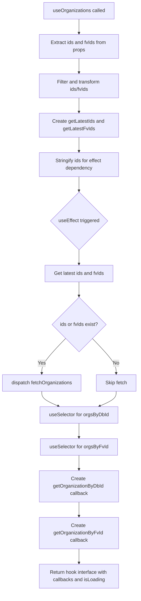
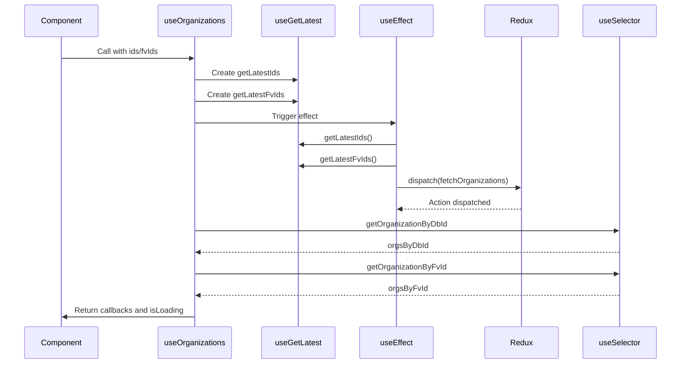
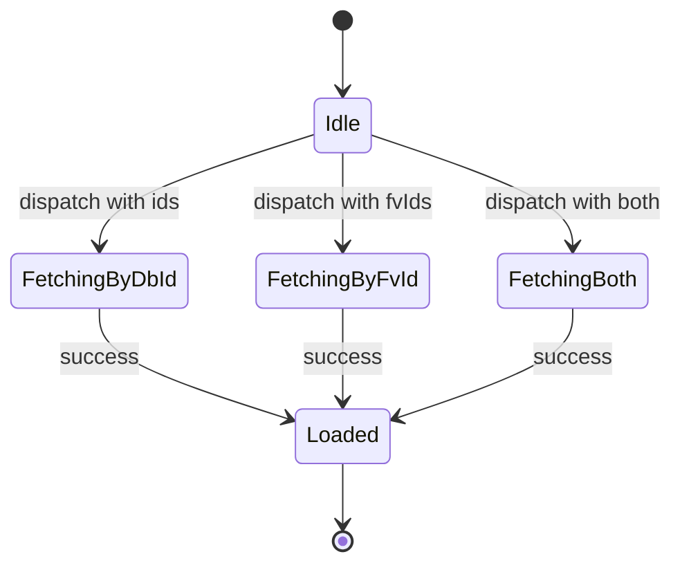

# Diagram: web/portal/src/shared/hooks/useOrganizations.ts

> Auto-generated by Obscura crawlers

## Diagram 1

### SVG

<svg id="container" width="457.65625" xmlns="http://www.w3.org/2000/svg" class="flowchart" height="1948" viewBox="0 0 457.65625 1948" role="graphics-document document" aria-roledescription="flowchart-v2"><g><marker id="container_flowchart-v2-pointEnd" class="marker flowchart-v2" viewBox="0 0 10 10" refX="5" refY="5" markerUnits="userSpaceOnUse" markerWidth="8" markerHeight="8" orient="auto"><path d="M 0 0 L 10 5 L 0 10 z" class="arrowMarkerPath" style="stroke-width: 1; stroke-dasharray: 1, 0;"></path></marker><marker id="container_flowchart-v2-pointStart" class="marker flowchart-v2" viewBox="0 0 10 10" refX="4.5" refY="5" markerUnits="userSpaceOnUse" markerWidth="8" markerHeight="8" orient="auto"><path d="M 0 5 L 10 10 L 10 0 z" class="arrowMarkerPath" style="stroke-width: 1; stroke-dasharray: 1, 0;"></path></marker><marker id="container_flowchart-v2-circleEnd" class="marker flowchart-v2" viewBox="0 0 10 10" refX="11" refY="5" markerUnits="userSpaceOnUse" markerWidth="11" markerHeight="11" orient="auto"><circle cx="5" cy="5" r="5" class="arrowMarkerPath" style="stroke-width: 1; stroke-dasharray: 1, 0;"></circle></marker><marker id="container_flowchart-v2-circleStart" class="marker flowchart-v2" viewBox="0 0 10 10" refX="-1" refY="5" markerUnits="userSpaceOnUse" markerWidth="11" markerHeight="11" orient="auto"><circle cx="5" cy="5" r="5" class="arrowMarkerPath" style="stroke-width: 1; stroke-dasharray: 1, 0;"></circle></marker><marker id="container_flowchart-v2-crossEnd" class="marker cross flowchart-v2" viewBox="0 0 11 11" refX="12" refY="5.2" markerUnits="userSpaceOnUse" markerWidth="11" markerHeight="11" orient="auto"><path d="M 1,1 l 9,9 M 10,1 l -9,9" class="arrowMarkerPath" style="stroke-width: 2; stroke-dasharray: 1, 0;"></path></marker><marker id="container_flowchart-v2-crossStart" class="marker cross flowchart-v2" viewBox="0 0 11 11" refX="-1" refY="5.2" markerUnits="userSpaceOnUse" markerWidth="11" markerHeight="11" orient="auto"><path d="M 1,1 l 9,9 M 10,1 l -9,9" class="arrowMarkerPath" style="stroke-width: 2; stroke-dasharray: 1, 0;"></path></marker><g class="root"><g class="clusters"></g><g class="edgePaths"><path d="M260.914,62L260.914,66.167C260.914,70.333,260.914,78.667,260.914,86.333C260.914,94,260.914,101,260.914,104.5L260.914,108" id="L_A_B_0" class="edge-thickness-normal edge-pattern-solid edge-thickness-normal edge-pattern-solid flowchart-link" style=";" data-edge="true" data-et="edge" data-id="L_A_B_0" data-points="W3sieCI6MjYwLjkxNDA2MjUsInkiOjYyfSx7IngiOjI2MC45MTQwNjI1LCJ5Ijo4N30seyJ4IjoyNjAuOTE0MDYyNSwieSI6MTEyfV0=" marker-end="url(#container_flowchart-v2-pointEnd)"></path><path d="M260.914,190L260.914,194.167C260.914,198.333,260.914,206.667,260.914,214.333C260.914,222,260.914,229,260.914,232.5L260.914,236" id="L_B_C_0" class="edge-thickness-normal edge-pattern-solid edge-thickness-normal edge-pattern-solid flowchart-link" style=";" data-edge="true" data-et="edge" data-id="L_B_C_0" data-points="W3sieCI6MjYwLjkxNDA2MjUsInkiOjE5MH0seyJ4IjoyNjAuOTE0MDYyNSwieSI6MjE1fSx7IngiOjI2MC45MTQwNjI1LCJ5IjoyNDB9XQ==" marker-end="url(#container_flowchart-v2-pointEnd)"></path><path d="M260.914,318L260.914,322.167C260.914,326.333,260.914,334.667,260.914,342.333C260.914,350,260.914,357,260.914,360.5L260.914,364" id="L_C_D_0" class="edge-thickness-normal edge-pattern-solid edge-thickness-normal edge-pattern-solid flowchart-link" style=";" data-edge="true" data-et="edge" data-id="L_C_D_0" data-points="W3sieCI6MjYwLjkxNDA2MjUsInkiOjMxOH0seyJ4IjoyNjAuOTE0MDYyNSwieSI6MzQzfSx7IngiOjI2MC45MTQwNjI1LCJ5IjozNjh9XQ==" marker-end="url(#container_flowchart-v2-pointEnd)"></path><path d="M260.914,446L260.914,450.167C260.914,454.333,260.914,462.667,260.914,470.333C260.914,478,260.914,485,260.914,488.5L260.914,492" id="L_D_E_0" class="edge-thickness-normal edge-pattern-solid edge-thickness-normal edge-pattern-solid flowchart-link" style=";" data-edge="true" data-et="edge" data-id="L_D_E_0" data-points="W3sieCI6MjYwLjkxNDA2MjUsInkiOjQ0Nn0seyJ4IjoyNjAuOTE0MDYyNSwieSI6NDcxfSx7IngiOjI2MC45MTQwNjI1LCJ5Ijo0OTZ9XQ==" marker-end="url(#container_flowchart-v2-pointEnd)"></path><path d="M260.914,574L260.914,578.167C260.914,582.333,260.914,590.667,260.914,598.333C260.914,606,260.914,613,260.914,616.5L260.914,620" id="L_E_F_0" class="edge-thickness-normal edge-pattern-solid edge-thickness-normal edge-pattern-solid flowchart-link" style=";" data-edge="true" data-et="edge" data-id="L_E_F_0" data-points="W3sieCI6MjYwLjkxNDA2MjUsInkiOjU3NH0seyJ4IjoyNjAuOTE0MDYyNSwieSI6NTk5fSx7IngiOjI2MC45MTQwNjI1LCJ5Ijo2MjR9XQ==" marker-end="url(#container_flowchart-v2-pointEnd)"></path><path d="M260.914,814.25L260.914,818.417C260.914,822.583,260.914,830.917,260.914,838.583C260.914,846.25,260.914,853.25,260.914,856.75L260.914,860.25" id="L_F_G_0" class="edge-thickness-normal edge-pattern-solid edge-thickness-normal edge-pattern-solid flowchart-link" style=";" data-edge="true" data-et="edge" data-id="L_F_G_0" data-points="W3sieCI6MjYwLjkxNDA2MjUsInkiOjgxNC4yNX0seyJ4IjoyNjAuOTE0MDYyNSwieSI6ODM5LjI1fSx7IngiOjI2MC45MTQwNjI1LCJ5Ijo4NjQuMjV9XQ==" marker-end="url(#container_flowchart-v2-pointEnd)"></path><path d="M260.914,918.25L260.914,922.417C260.914,926.583,260.914,934.917,260.914,942.583C260.914,950.25,260.914,957.25,260.914,960.75L260.914,964.25" id="L_G_H_0" class="edge-thickness-normal edge-pattern-solid edge-thickness-normal edge-pattern-solid flowchart-link" style=";" data-edge="true" data-et="edge" data-id="L_G_H_0" data-points="W3sieCI6MjYwLjkxNDA2MjUsInkiOjkxOC4yNX0seyJ4IjoyNjAuOTE0MDYyNSwieSI6OTQzLjI1fSx7IngiOjI2MC45MTQwNjI1LCJ5Ijo5NjguMjV9XQ==" marker-end="url(#container_flowchart-v2-pointEnd)"></path><path d="M216.689,1103.775L203.574,1117.313C190.459,1130.85,164.23,1157.925,151.115,1176.963C138,1196,138,1207,138,1212.5L138,1218" id="L_H_I_0" class="edge-thickness-normal edge-pattern-solid edge-thickness-normal edge-pattern-solid flowchart-link" style=";" data-edge="true" data-et="edge" data-id="L_H_I_0" data-points="W3sieCI6MjE2LjY4OTE0MjI1NDc5MzEsInkiOjExMDMuNzc1MDc5NzU0NzkzfSx7IngiOjEzOCwieSI6MTE4NX0seyJ4IjoxMzgsInkiOjEyMjJ9XQ==" marker-end="url(#container_flowchart-v2-pointEnd)"></path><path d="M305.139,1103.775L318.254,1117.313C331.369,1130.85,357.598,1157.925,370.713,1178.963C383.828,1200,383.828,1215,383.828,1222.5L383.828,1230" id="L_H_J_0" class="edge-thickness-normal edge-pattern-solid edge-thickness-normal edge-pattern-solid flowchart-link" style=";" data-edge="true" data-et="edge" data-id="L_H_J_0" data-points="W3sieCI6MzA1LjEzODk4Mjc0NTIwNjksInkiOjExMDMuNzc1MDc5NzU0NzkzfSx7IngiOjM4My44MjgxMjUsInkiOjExODV9LHsieCI6MzgzLjgyODEyNSwieSI6MTIzNH1d" marker-end="url(#container_flowchart-v2-pointEnd)"></path><path d="M138,1300L138,1304.167C138,1308.333,138,1316.667,147.235,1324.74C156.47,1332.814,174.94,1340.628,184.175,1344.535L193.409,1348.441" id="L_I_K_0" class="edge-thickness-normal edge-pattern-solid edge-thickness-normal edge-pattern-solid flowchart-link" style=";" data-edge="true" data-et="edge" data-id="L_I_K_0" data-points="W3sieCI6MTM4LCJ5IjoxMzAwfSx7IngiOjEzOCwieSI6MTMyNX0seyJ4IjoxOTcuMDkzMjk5Mjc4ODQ2MTYsInkiOjEzNTB9XQ==" marker-end="url(#container_flowchart-v2-pointEnd)"></path><path d="M383.828,1288L383.828,1294.167C383.828,1300.333,383.828,1312.667,374.593,1322.74C365.358,1332.814,346.889,1340.628,337.654,1344.535L328.419,1348.441" id="L_J_K_0" class="edge-thickness-normal edge-pattern-solid edge-thickness-normal edge-pattern-solid flowchart-link" style=";" data-edge="true" data-et="edge" data-id="L_J_K_0" data-points="W3sieCI6MzgzLjgyODEyNSwieSI6MTI4OH0seyJ4IjozODMuODI4MTI1LCJ5IjoxMzI1fSx7IngiOjMyNC43MzQ4MjU3MjExNTM4NywieSI6MTM1MH1d" marker-end="url(#container_flowchart-v2-pointEnd)"></path><path d="M260.914,1404L260.914,1408.167C260.914,1412.333,260.914,1420.667,260.914,1428.333C260.914,1436,260.914,1443,260.914,1446.5L260.914,1450" id="L_K_L_0" class="edge-thickness-normal edge-pattern-solid edge-thickness-normal edge-pattern-solid flowchart-link" style=";" data-edge="true" data-et="edge" data-id="L_K_L_0" data-points="W3sieCI6MjYwLjkxNDA2MjUsInkiOjE0MDR9LHsieCI6MjYwLjkxNDA2MjUsInkiOjE0Mjl9LHsieCI6MjYwLjkxNDA2MjUsInkiOjE0NTR9XQ==" marker-end="url(#container_flowchart-v2-pointEnd)"></path><path d="M260.914,1508L260.914,1512.167C260.914,1516.333,260.914,1524.667,260.914,1532.333C260.914,1540,260.914,1547,260.914,1550.5L260.914,1554" id="L_L_M_0" class="edge-thickness-normal edge-pattern-solid edge-thickness-normal edge-pattern-solid flowchart-link" style=";" data-edge="true" data-et="edge" data-id="L_L_M_0" data-points="W3sieCI6MjYwLjkxNDA2MjUsInkiOjE1MDh9LHsieCI6MjYwLjkxNDA2MjUsInkiOjE1MzN9LHsieCI6MjYwLjkxNDA2MjUsInkiOjE1NTh9XQ==" marker-end="url(#container_flowchart-v2-pointEnd)"></path><path d="M260.914,1660L260.914,1664.167C260.914,1668.333,260.914,1676.667,260.914,1684.333C260.914,1692,260.914,1699,260.914,1702.5L260.914,1706" id="L_M_N_0" class="edge-thickness-normal edge-pattern-solid edge-thickness-normal edge-pattern-solid flowchart-link" style=";" data-edge="true" data-et="edge" data-id="L_M_N_0" data-points="W3sieCI6MjYwLjkxNDA2MjUsInkiOjE2NjB9LHsieCI6MjYwLjkxNDA2MjUsInkiOjE2ODV9LHsieCI6MjYwLjkxNDA2MjUsInkiOjE3MTB9XQ==" marker-end="url(#container_flowchart-v2-pointEnd)"></path><path d="M260.914,1812L260.914,1816.167C260.914,1820.333,260.914,1828.667,260.914,1836.333C260.914,1844,260.914,1851,260.914,1854.5L260.914,1858" id="L_N_O_0" class="edge-thickness-normal edge-pattern-solid edge-thickness-normal edge-pattern-solid flowchart-link" style=";" data-edge="true" data-et="edge" data-id="L_N_O_0" data-points="W3sieCI6MjYwLjkxNDA2MjUsInkiOjE4MTJ9LHsieCI6MjYwLjkxNDA2MjUsInkiOjE4Mzd9LHsieCI6MjYwLjkxNDA2MjUsInkiOjE4NjJ9XQ==" marker-end="url(#container_flowchart-v2-pointEnd)"></path></g><g class="edgeLabels"><g class="edgeLabel"><g class="label" data-id="L_A_B_0" transform="translate(0, 0)"><foreignObject width="0" height="0">

</foreignObject></g></g><g class="edgeLabel"><g class="label" data-id="L_B_C_0" transform="translate(0, 0)"><foreignObject width="0" height="0">

</foreignObject></g></g><g class="edgeLabel"><g class="label" data-id="L_C_D_0" transform="translate(0, 0)"><foreignObject width="0" height="0">

</foreignObject></g></g><g class="edgeLabel"><g class="label" data-id="L_D_E_0" transform="translate(0, 0)"><foreignObject width="0" height="0">

</foreignObject></g></g><g class="edgeLabel"><g class="label" data-id="L_E_F_0" transform="translate(0, 0)"><foreignObject width="0" height="0">

</foreignObject></g></g><g class="edgeLabel"><g class="label" data-id="L_F_G_0" transform="translate(0, 0)"><foreignObject width="0" height="0">

</foreignObject></g></g><g class="edgeLabel"><g class="label" data-id="L_G_H_0" transform="translate(0, 0)"><foreignObject width="0" height="0">

</foreignObject></g></g><g class="edgeLabel" transform="translate(138, 1185)"><g class="label" data-id="L_H_I_0" transform="translate(-12.03125, -12)"><foreignObject width="24.0625" height="24">

Yes

</foreignObject></g></g><g class="edgeLabel" transform="translate(383.828125, 1185)"><g class="label" data-id="L_H_J_0" transform="translate(-10.140625, -12)"><foreignObject width="20.28125" height="24">

No

</foreignObject></g></g><g class="edgeLabel"><g class="label" data-id="L_I_K_0" transform="translate(0, 0)"><foreignObject width="0" height="0">

</foreignObject></g></g><g class="edgeLabel"><g class="label" data-id="L_J_K_0" transform="translate(0, 0)"><foreignObject width="0" height="0">

</foreignObject></g></g><g class="edgeLabel"><g class="label" data-id="L_K_L_0" transform="translate(0, 0)"><foreignObject width="0" height="0">

</foreignObject></g></g><g class="edgeLabel"><g class="label" data-id="L_L_M_0" transform="translate(0, 0)"><foreignObject width="0" height="0">

</foreignObject></g></g><g class="edgeLabel"><g class="label" data-id="L_M_N_0" transform="translate(0, 0)"><foreignObject width="0" height="0">

</foreignObject></g></g><g class="edgeLabel"><g class="label" data-id="L_N_O_0" transform="translate(0, 0)"><foreignObject width="0" height="0">

</foreignObject></g></g></g><g class="nodes"><g class="node default" id="flowchart-A-0" transform="translate(260.9140625, 35)"><rect class="basic label-container" style="" x="-116.4609375" y="-27" width="232.921875" height="54"></rect><g class="label" style="" transform="translate(-86.4609375, -12)"><rect></rect><foreignObject width="172.921875" height="24">

useOrganizations called

</foreignObject></g></g><g class="node default" id="flowchart-B-1" transform="translate(260.9140625, 151)"><rect class="basic label-container" style="" x="-130" y="-39" width="260" height="78"></rect><g class="label" style="" transform="translate(-100, -24)"><rect></rect><foreignObject width="200" height="48">

Extract ids and fvIds from props

</foreignObject></g></g><g class="node default" id="flowchart-C-3" transform="translate(260.9140625, 279)"><rect class="basic label-container" style="" x="-130" y="-39" width="260" height="78"></rect><g class="label" style="" transform="translate(-100, -24)"><rect></rect><foreignObject width="200" height="48">

Filter and transform ids/fvIds

</foreignObject></g></g><g class="node default" id="flowchart-D-5" transform="translate(260.9140625, 407)"><rect class="basic label-container" style="" x="-130" y="-39" width="260" height="78"></rect><g class="label" style="" transform="translate(-100, -24)"><rect></rect><foreignObject width="200" height="48">

Create getLatestIds and getLatestFvIds

</foreignObject></g></g><g class="node default" id="flowchart-E-7" transform="translate(260.9140625, 535)"><rect class="basic label-container" style="" x="-130" y="-39" width="260" height="78"></rect><g class="label" style="" transform="translate(-100, -24)"><rect></rect><foreignObject width="200" height="48">

Stringify ids for effect dependency

</foreignObject></g></g><g class="node default" id="flowchart-F-9" transform="translate(260.9140625, 719.125)"><polygon points="95.125,0 190.25,-95.125 95.125,-190.25 0,-95.125" class="label-container" transform="translate(-94.625, 95.125)"></polygon><g class="label" style="" transform="translate(-68.125, -12)"><rect></rect><foreignObject width="136.25" height="24">

useEffect triggered

</foreignObject></g></g><g class="node default" id="flowchart-G-11" transform="translate(260.9140625, 891.25)"><rect class="basic label-container" style="" x="-113.28125" y="-27" width="226.5625" height="54"></rect><g class="label" style="" transform="translate(-83.28125, -12)"><rect></rect><foreignObject width="166.5625" height="24">

Get latest ids and fvIds

</foreignObject></g></g><g class="node default" id="flowchart-H-13" transform="translate(260.9140625, 1058.125)"><polygon points="89.875,0 179.75,-89.875 89.875,-179.75 0,-89.875" class="label-container" transform="translate(-89.375, 89.875)"></polygon><g class="label" style="" transform="translate(-62.875, -12)"><rect></rect><foreignObject width="125.75" height="24">

ids or fvIds exist?

</foreignObject></g></g><g class="node default" id="flowchart-I-15" transform="translate(138, 1261)"><rect class="basic label-container" style="" x="-130" y="-39" width="260" height="78"></rect><g class="label" style="" transform="translate(-100, -24)"><rect></rect><foreignObject width="200" height="48">

dispatch fetchOrganizations

</foreignObject></g></g><g class="node default" id="flowchart-J-17" transform="translate(383.828125, 1261)"><rect class="basic label-container" style="" x="-65.828125" y="-27" width="131.65625" height="54"></rect><g class="label" style="" transform="translate(-35.828125, -12)"><rect></rect><foreignObject width="71.65625" height="24">

Skip fetch

</foreignObject></g></g><g class="node default" id="flowchart-K-19" transform="translate(260.9140625, 1377)"><rect class="basic label-container" style="" x="-128.421875" y="-27" width="256.84375" height="54"></rect><g class="label" style="" transform="translate(-98.421875, -12)"><rect></rect><foreignObject width="196.84375" height="24">

useSelector for orgsByDbId

</foreignObject></g></g><g class="node default" id="flowchart-L-23" transform="translate(260.9140625, 1481)"><rect class="basic label-container" style="" x="-126.1015625" y="-27" width="252.203125" height="54"></rect><g class="label" style="" transform="translate(-96.1015625, -12)"><rect></rect><foreignObject width="192.203125" height="24">

useSelector for orgsByFvId

</foreignObject></g></g><g class="node default" id="flowchart-M-25" transform="translate(260.9140625, 1609)"><rect class="basic label-container" style="" x="-130" y="-51" width="260" height="102"></rect><g class="label" style="" transform="translate(-100, -36)"><rect></rect><foreignObject width="200" height="72">

Create getOrganizationByDbId callback

</foreignObject></g></g><g class="node default" id="flowchart-N-27" transform="translate(260.9140625, 1761)"><rect class="basic label-container" style="" x="-130" y="-51" width="260" height="102"></rect><g class="label" style="" transform="translate(-100, -36)"><rect></rect><foreignObject width="200" height="72">

Create getOrganizationByFvId callback

</foreignObject></g></g><g class="node default" id="flowchart-O-29" transform="translate(260.9140625, 1901)"><rect class="basic label-container" style="" x="-130" y="-39" width="260" height="78"></rect><g class="label" style="" transform="translate(-100, -24)"><rect></rect><foreignObject width="200" height="48">

Return hook interface with callbacks and isLoading

</foreignObject></g></g></g></g></g></svg>

## Diagram 2

### SVG

<svg id="container" width="1449" xmlns="http://www.w3.org/2000/svg" height="795" viewBox="-50 -10 1449 795" role="graphics-document document" aria-roledescription="sequence"><g><rect x="1199" y="709" fill="#eaeaea" stroke="#666" width="150" height="65" name="useSelector" rx="3" ry="3" class="actor actor-bottom"></rect><text x="1274" y="741.5" dominant-baseline="central" alignment-baseline="central" class="actor actor-box" style="text-anchor: middle; font-size: 16px; font-weight: 400;"><tspan x="1274" dy="0">useSelector</tspan></text></g><g><rect x="999" y="709" fill="#eaeaea" stroke="#666" width="150" height="65" name="Redux" rx="3" ry="3" class="actor actor-bottom"></rect><text x="1074" y="741.5" dominant-baseline="central" alignment-baseline="central" class="actor actor-box" style="text-anchor: middle; font-size: 16px; font-weight: 400;"><tspan x="1074" dy="0">Redux</tspan></text></g><g><rect x="720" y="709" fill="#eaeaea" stroke="#666" width="150" height="65" name="useEffect" rx="3" ry="3" class="actor actor-bottom"></rect><text x="795" y="741.5" dominant-baseline="central" alignment-baseline="central" class="actor actor-box" style="text-anchor: middle; font-size: 16px; font-weight: 400;"><tspan x="795" dy="0">useEffect</tspan></text></g><g><rect x="520" y="709" fill="#eaeaea" stroke="#666" width="150" height="65" name="useGetLatest" rx="3" ry="3" class="actor actor-bottom"></rect><text x="595" y="741.5" dominant-baseline="central" alignment-baseline="central" class="actor actor-box" style="text-anchor: middle; font-size: 16px; font-weight: 400;"><tspan x="595" dy="0">useGetLatest</tspan></text></g><g><rect x="296" y="709" fill="#eaeaea" stroke="#666" width="150" height="65" name="useOrganizations" rx="3" ry="3" class="actor actor-bottom"></rect><text x="371" y="741.5" dominant-baseline="central" alignment-baseline="central" class="actor actor-box" style="text-anchor: middle; font-size: 16px; font-weight: 400;"><tspan x="371" dy="0">useOrganizations</tspan></text></g><g><rect x="0" y="709" fill="#eaeaea" stroke="#666" width="150" height="65" name="Component" rx="3" ry="3" class="actor actor-bottom"></rect><text x="75" y="741.5" dominant-baseline="central" alignment-baseline="central" class="actor actor-box" style="text-anchor: middle; font-size: 16px; font-weight: 400;"><tspan x="75" dy="0">Component</tspan></text></g><g><line id="actor5" x1="1274" y1="65" x2="1274" y2="709" class="actor-line 200" stroke-width="0.5px" stroke="#999" name="useSelector"></line><g id="root-5"><rect x="1199" y="0" fill="#eaeaea" stroke="#666" width="150" height="65" name="useSelector" rx="3" ry="3" class="actor actor-top"></rect><text x="1274" y="32.5" dominant-baseline="central" alignment-baseline="central" class="actor actor-box" style="text-anchor: middle; font-size: 16px; font-weight: 400;"><tspan x="1274" dy="0">useSelector</tspan></text></g></g><g><line id="actor4" x1="1074" y1="65" x2="1074" y2="709" class="actor-line 200" stroke-width="0.5px" stroke="#999" name="Redux"></line><g id="root-4"><rect x="999" y="0" fill="#eaeaea" stroke="#666" width="150" height="65" name="Redux" rx="3" ry="3" class="actor actor-top"></rect><text x="1074" y="32.5" dominant-baseline="central" alignment-baseline="central" class="actor actor-box" style="text-anchor: middle; font-size: 16px; font-weight: 400;"><tspan x="1074" dy="0">Redux</tspan></text></g></g><g><line id="actor3" x1="795" y1="65" x2="795" y2="709" class="actor-line 200" stroke-width="0.5px" stroke="#999" name="useEffect"></line><g id="root-3"><rect x="720" y="0" fill="#eaeaea" stroke="#666" width="150" height="65" name="useEffect" rx="3" ry="3" class="actor actor-top"></rect><text x="795" y="32.5" dominant-baseline="central" alignment-baseline="central" class="actor actor-box" style="text-anchor: middle; font-size: 16px; font-weight: 400;"><tspan x="795" dy="0">useEffect</tspan></text></g></g><g><line id="actor2" x1="595" y1="65" x2="595" y2="709" class="actor-line 200" stroke-width="0.5px" stroke="#999" name="useGetLatest"></line><g id="root-2"><rect x="520" y="0" fill="#eaeaea" stroke="#666" width="150" height="65" name="useGetLatest" rx="3" ry="3" class="actor actor-top"></rect><text x="595" y="32.5" dominant-baseline="central" alignment-baseline="central" class="actor actor-box" style="text-anchor: middle; font-size: 16px; font-weight: 400;"><tspan x="595" dy="0">useGetLatest</tspan></text></g></g><g><line id="actor1" x1="371" y1="65" x2="371" y2="709" class="actor-line 200" stroke-width="0.5px" stroke="#999" name="useOrganizations"></line><g id="root-1"><rect x="296" y="0" fill="#eaeaea" stroke="#666" width="150" height="65" name="useOrganizations" rx="3" ry="3" class="actor actor-top"></rect><text x="371" y="32.5" dominant-baseline="central" alignment-baseline="central" class="actor actor-box" style="text-anchor: middle; font-size: 16px; font-weight: 400;"><tspan x="371" dy="0">useOrganizations</tspan></text></g></g><g><line id="actor0" x1="75" y1="65" x2="75" y2="709" class="actor-line 200" stroke-width="0.5px" stroke="#999" name="Component"></line><g id="root-0"><rect x="0" y="0" fill="#eaeaea" stroke="#666" width="150" height="65" name="Component" rx="3" ry="3" class="actor actor-top"></rect><text x="75" y="32.5" dominant-baseline="central" alignment-baseline="central" class="actor actor-box" style="text-anchor: middle; font-size: 16px; font-weight: 400;"><tspan x="75" dy="0">Component</tspan></text></g></g><g></g><defs><symbol id="computer" width="24" height="24"><path transform="scale(.5)" d="M2 2v13h20v-13h-20zm18 11h-16v-9h16v9zm-10.228 6l.466-1h3.524l.467 1h-4.457zm14.228 3h-24l2-6h2.104l-1.33 4h18.45l-1.297-4h2.073l2 6zm-5-10h-14v-7h14v7z"></path></symbol></defs><defs><symbol id="database" fill-rule="evenodd" clip-rule="evenodd"><path transform="scale(.5)" d="M12.258.001l.256.004.255.005.253.008.251.01.249.012.247.015.246.016.242.019.241.02.239.023.236.024.233.027.231.028.229.031.225.032.223.034.22.036.217.038.214.04.211.041.208.043.205.045.201.046.198.048.194.05.191.051.187.053.183.054.18.056.175.057.172.059.168.06.163.061.16.063.155.064.15.066.074.033.073.033.071.034.07.034.069.035.068.035.067.035.066.035.064.036.064.036.062.036.06.036.06.037.058.037.058.037.055.038.055.038.053.038.052.038.051.039.05.039.048.039.047.039.045.04.044.04.043.04.041.04.04.041.039.041.037.041.036.041.034.041.033.042.032.042.03.042.029.042.027.042.026.043.024.043.023.043.021.043.02.043.018.044.017.043.015.044.013.044.012.044.011.045.009.044.007.045.006.045.004.045.002.045.001.045v17l-.001.045-.002.045-.004.045-.006.045-.007.045-.009.044-.011.045-.012.044-.013.044-.015.044-.017.043-.018.044-.02.043-.021.043-.023.043-.024.043-.026.043-.027.042-.029.042-.03.042-.032.042-.033.042-.034.041-.036.041-.037.041-.039.041-.04.041-.041.04-.043.04-.044.04-.045.04-.047.039-.048.039-.05.039-.051.039-.052.038-.053.038-.055.038-.055.038-.058.037-.058.037-.06.037-.06.036-.062.036-.064.036-.064.036-.066.035-.067.035-.068.035-.069.035-.07.034-.071.034-.073.033-.074.033-.15.066-.155.064-.16.063-.163.061-.168.06-.172.059-.175.057-.18.056-.183.054-.187.053-.191.051-.194.05-.198.048-.201.046-.205.045-.208.043-.211.041-.214.04-.217.038-.22.036-.223.034-.225.032-.229.031-.231.028-.233.027-.236.024-.239.023-.241.02-.242.019-.246.016-.247.015-.249.012-.251.01-.253.008-.255.005-.256.004-.258.001-.258-.001-.256-.004-.255-.005-.253-.008-.251-.01-.249-.012-.247-.015-.245-.016-.243-.019-.241-.02-.238-.023-.236-.024-.234-.027-.231-.028-.228-.031-.226-.032-.223-.034-.22-.036-.217-.038-.214-.04-.211-.041-.208-.043-.204-.045-.201-.046-.198-.048-.195-.05-.19-.051-.187-.053-.184-.054-.179-.056-.176-.057-.172-.059-.167-.06-.164-.061-.159-.063-.155-.064-.151-.066-.074-.033-.072-.033-.072-.034-.07-.034-.069-.035-.068-.035-.067-.035-.066-.035-.064-.036-.063-.036-.062-.036-.061-.036-.06-.037-.058-.037-.057-.037-.056-.038-.055-.038-.053-.038-.052-.038-.051-.039-.049-.039-.049-.039-.046-.039-.046-.04-.044-.04-.043-.04-.041-.04-.04-.041-.039-.041-.037-.041-.036-.041-.034-.041-.033-.042-.032-.042-.03-.042-.029-.042-.027-.042-.026-.043-.024-.043-.023-.043-.021-.043-.02-.043-.018-.044-.017-.043-.015-.044-.013-.044-.012-.044-.011-.045-.009-.044-.007-.045-.006-.045-.004-.045-.002-.045-.001-.045v-17l.001-.045.002-.045.004-.045.006-.045.007-.045.009-.044.011-.045.012-.044.013-.044.015-.044.017-.043.018-.044.02-.043.021-.043.023-.043.024-.043.026-.043.027-.042.029-.042.03-.042.032-.042.033-.042.034-.041.036-.041.037-.041.039-.041.04-.041.041-.04.043-.04.044-.04.046-.04.046-.039.049-.039.049-.039.051-.039.052-.038.053-.038.055-.038.056-.038.057-.037.058-.037.06-.037.061-.036.062-.036.063-.036.064-.036.066-.035.067-.035.068-.035.069-.035.07-.034.072-.034.072-.033.074-.033.151-.066.155-.064.159-.063.164-.061.167-.06.172-.059.176-.057.179-.056.184-.054.187-.053.19-.051.195-.05.198-.048.201-.046.204-.045.208-.043.211-.041.214-.04.217-.038.22-.036.223-.034.226-.032.228-.031.231-.028.234-.027.236-.024.238-.023.241-.02.243-.019.245-.016.247-.015.249-.012.251-.01.253-.008.255-.005.256-.004.258-.001.258.001zm-9.258 20.499v.01l.001.021.003.021.004.022.005.021.006.022.007.022.009.023.01.022.011.023.012.023.013.023.015.023.016.024.017.023.018.024.019.024.021.024.022.025.023.024.024.025.052.049.056.05.061.051.066.051.07.051.075.051.079.052.084.052.088.052.092.052.097.052.102.051.105.052.11.052.114.051.119.051.123.051.127.05.131.05.135.05.139.048.144.049.147.047.152.047.155.047.16.045.163.045.167.043.171.043.176.041.178.041.183.039.187.039.19.037.194.035.197.035.202.033.204.031.209.03.212.029.216.027.219.025.222.024.226.021.23.02.233.018.236.016.24.015.243.012.246.01.249.008.253.005.256.004.259.001.26-.001.257-.004.254-.005.25-.008.247-.011.244-.012.241-.014.237-.016.233-.018.231-.021.226-.021.224-.024.22-.026.216-.027.212-.028.21-.031.205-.031.202-.034.198-.034.194-.036.191-.037.187-.039.183-.04.179-.04.175-.042.172-.043.168-.044.163-.045.16-.046.155-.046.152-.047.148-.048.143-.049.139-.049.136-.05.131-.05.126-.05.123-.051.118-.052.114-.051.11-.052.106-.052.101-.052.096-.052.092-.052.088-.053.083-.051.079-.052.074-.052.07-.051.065-.051.06-.051.056-.05.051-.05.023-.024.023-.025.021-.024.02-.024.019-.024.018-.024.017-.024.015-.023.014-.024.013-.023.012-.023.01-.023.01-.022.008-.022.006-.022.006-.022.004-.022.004-.021.001-.021.001-.021v-4.127l-.077.055-.08.053-.083.054-.085.053-.087.052-.09.052-.093.051-.095.05-.097.05-.1.049-.102.049-.105.048-.106.047-.109.047-.111.046-.114.045-.115.045-.118.044-.12.043-.122.042-.124.042-.126.041-.128.04-.13.04-.132.038-.134.038-.135.037-.138.037-.139.035-.142.035-.143.034-.144.033-.147.032-.148.031-.15.03-.151.03-.153.029-.154.027-.156.027-.158.026-.159.025-.161.024-.162.023-.163.022-.165.021-.166.02-.167.019-.169.018-.169.017-.171.016-.173.015-.173.014-.175.013-.175.012-.177.011-.178.01-.179.008-.179.008-.181.006-.182.005-.182.004-.184.003-.184.002h-.37l-.184-.002-.184-.003-.182-.004-.182-.005-.181-.006-.179-.008-.179-.008-.178-.01-.176-.011-.176-.012-.175-.013-.173-.014-.172-.015-.171-.016-.17-.017-.169-.018-.167-.019-.166-.02-.165-.021-.163-.022-.162-.023-.161-.024-.159-.025-.157-.026-.156-.027-.155-.027-.153-.029-.151-.03-.15-.03-.148-.031-.146-.032-.145-.033-.143-.034-.141-.035-.14-.035-.137-.037-.136-.037-.134-.038-.132-.038-.13-.04-.128-.04-.126-.041-.124-.042-.122-.042-.12-.044-.117-.043-.116-.045-.113-.045-.112-.046-.109-.047-.106-.047-.105-.048-.102-.049-.1-.049-.097-.05-.095-.05-.093-.052-.09-.051-.087-.052-.085-.053-.083-.054-.08-.054-.077-.054v4.127zm0-5.654v.011l.001.021.003.021.004.021.005.022.006.022.007.022.009.022.01.022.011.023.012.023.013.023.015.024.016.023.017.024.018.024.019.024.021.024.022.024.023.025.024.024.052.05.056.05.061.05.066.051.07.051.075.052.079.051.084.052.088.052.092.052.097.052.102.052.105.052.11.051.114.051.119.052.123.05.127.051.131.05.135.049.139.049.144.048.147.048.152.047.155.046.16.045.163.045.167.044.171.042.176.042.178.04.183.04.187.038.19.037.194.036.197.034.202.033.204.032.209.03.212.028.216.027.219.025.222.024.226.022.23.02.233.018.236.016.24.014.243.012.246.01.249.008.253.006.256.003.259.001.26-.001.257-.003.254-.006.25-.008.247-.01.244-.012.241-.015.237-.016.233-.018.231-.02.226-.022.224-.024.22-.025.216-.027.212-.029.21-.03.205-.032.202-.033.198-.035.194-.036.191-.037.187-.039.183-.039.179-.041.175-.042.172-.043.168-.044.163-.045.16-.045.155-.047.152-.047.148-.048.143-.048.139-.05.136-.049.131-.05.126-.051.123-.051.118-.051.114-.052.11-.052.106-.052.101-.052.096-.052.092-.052.088-.052.083-.052.079-.052.074-.051.07-.052.065-.051.06-.05.056-.051.051-.049.023-.025.023-.024.021-.025.02-.024.019-.024.018-.024.017-.024.015-.023.014-.023.013-.024.012-.022.01-.023.01-.023.008-.022.006-.022.006-.022.004-.021.004-.022.001-.021.001-.021v-4.139l-.077.054-.08.054-.083.054-.085.052-.087.053-.09.051-.093.051-.095.051-.097.05-.1.049-.102.049-.105.048-.106.047-.109.047-.111.046-.114.045-.115.044-.118.044-.12.044-.122.042-.124.042-.126.041-.128.04-.13.039-.132.039-.134.038-.135.037-.138.036-.139.036-.142.035-.143.033-.144.033-.147.033-.148.031-.15.03-.151.03-.153.028-.154.028-.156.027-.158.026-.159.025-.161.024-.162.023-.163.022-.165.021-.166.02-.167.019-.169.018-.169.017-.171.016-.173.015-.173.014-.175.013-.175.012-.177.011-.178.009-.179.009-.179.007-.181.007-.182.005-.182.004-.184.003-.184.002h-.37l-.184-.002-.184-.003-.182-.004-.182-.005-.181-.007-.179-.007-.179-.009-.178-.009-.176-.011-.176-.012-.175-.013-.173-.014-.172-.015-.171-.016-.17-.017-.169-.018-.167-.019-.166-.02-.165-.021-.163-.022-.162-.023-.161-.024-.159-.025-.157-.026-.156-.027-.155-.028-.153-.028-.151-.03-.15-.03-.148-.031-.146-.033-.145-.033-.143-.033-.141-.035-.14-.036-.137-.036-.136-.037-.134-.038-.132-.039-.13-.039-.128-.04-.126-.041-.124-.042-.122-.043-.12-.043-.117-.044-.116-.044-.113-.046-.112-.046-.109-.046-.106-.047-.105-.048-.102-.049-.1-.049-.097-.05-.095-.051-.093-.051-.09-.051-.087-.053-.085-.052-.083-.054-.08-.054-.077-.054v4.139zm0-5.666v.011l.001.02.003.022.004.021.005.022.006.021.007.022.009.023.01.022.011.023.012.023.013.023.015.023.016.024.017.024.018.023.019.024.021.025.022.024.023.024.024.025.052.05.056.05.061.05.066.051.07.051.075.052.079.051.084.052.088.052.092.052.097.052.102.052.105.051.11.052.114.051.119.051.123.051.127.05.131.05.135.05.139.049.144.048.147.048.152.047.155.046.16.045.163.045.167.043.171.043.176.042.178.04.183.04.187.038.19.037.194.036.197.034.202.033.204.032.209.03.212.028.216.027.219.025.222.024.226.021.23.02.233.018.236.017.24.014.243.012.246.01.249.008.253.006.256.003.259.001.26-.001.257-.003.254-.006.25-.008.247-.01.244-.013.241-.014.237-.016.233-.018.231-.02.226-.022.224-.024.22-.025.216-.027.212-.029.21-.03.205-.032.202-.033.198-.035.194-.036.191-.037.187-.039.183-.039.179-.041.175-.042.172-.043.168-.044.163-.045.16-.045.155-.047.152-.047.148-.048.143-.049.139-.049.136-.049.131-.051.126-.05.123-.051.118-.052.114-.051.11-.052.106-.052.101-.052.096-.052.092-.052.088-.052.083-.052.079-.052.074-.052.07-.051.065-.051.06-.051.056-.05.051-.049.023-.025.023-.025.021-.024.02-.024.019-.024.018-.024.017-.024.015-.023.014-.024.013-.023.012-.023.01-.022.01-.023.008-.022.006-.022.006-.022.004-.022.004-.021.001-.021.001-.021v-4.153l-.077.054-.08.054-.083.053-.085.053-.087.053-.09.051-.093.051-.095.051-.097.05-.1.049-.102.048-.105.048-.106.048-.109.046-.111.046-.114.046-.115.044-.118.044-.12.043-.122.043-.124.042-.126.041-.128.04-.13.039-.132.039-.134.038-.135.037-.138.036-.139.036-.142.034-.143.034-.144.033-.147.032-.148.032-.15.03-.151.03-.153.028-.154.028-.156.027-.158.026-.159.024-.161.024-.162.023-.163.023-.165.021-.166.02-.167.019-.169.018-.169.017-.171.016-.173.015-.173.014-.175.013-.175.012-.177.01-.178.01-.179.009-.179.007-.181.006-.182.006-.182.004-.184.003-.184.001-.185.001-.185-.001-.184-.001-.184-.003-.182-.004-.182-.006-.181-.006-.179-.007-.179-.009-.178-.01-.176-.01-.176-.012-.175-.013-.173-.014-.172-.015-.171-.016-.17-.017-.169-.018-.167-.019-.166-.02-.165-.021-.163-.023-.162-.023-.161-.024-.159-.024-.157-.026-.156-.027-.155-.028-.153-.028-.151-.03-.15-.03-.148-.032-.146-.032-.145-.033-.143-.034-.141-.034-.14-.036-.137-.036-.136-.037-.134-.038-.132-.039-.13-.039-.128-.041-.126-.041-.124-.041-.122-.043-.12-.043-.117-.044-.116-.044-.113-.046-.112-.046-.109-.046-.106-.048-.105-.048-.102-.048-.1-.05-.097-.049-.095-.051-.093-.051-.09-.052-.087-.052-.085-.053-.083-.053-.08-.054-.077-.054v4.153zm8.74-8.179l-.257.004-.254.005-.25.008-.247.011-.244.012-.241.014-.237.016-.233.018-.231.021-.226.022-.224.023-.22.026-.216.027-.212.028-.21.031-.205.032-.202.033-.198.034-.194.036-.191.038-.187.038-.183.04-.179.041-.175.042-.172.043-.168.043-.163.045-.16.046-.155.046-.152.048-.148.048-.143.048-.139.049-.136.05-.131.05-.126.051-.123.051-.118.051-.114.052-.11.052-.106.052-.101.052-.096.052-.092.052-.088.052-.083.052-.079.052-.074.051-.07.052-.065.051-.06.05-.056.05-.051.05-.023.025-.023.024-.021.024-.02.025-.019.024-.018.024-.017.023-.015.024-.014.023-.013.023-.012.023-.01.023-.01.022-.008.022-.006.023-.006.021-.004.022-.004.021-.001.021-.001.021.001.021.001.021.004.021.004.022.006.021.006.023.008.022.01.022.01.023.012.023.013.023.014.023.015.024.017.023.018.024.019.024.02.025.021.024.023.024.023.025.051.05.056.05.06.05.065.051.07.052.074.051.079.052.083.052.088.052.092.052.096.052.101.052.106.052.11.052.114.052.118.051.123.051.126.051.131.05.136.05.139.049.143.048.148.048.152.048.155.046.16.046.163.045.168.043.172.043.175.042.179.041.183.04.187.038.191.038.194.036.198.034.202.033.205.032.21.031.212.028.216.027.22.026.224.023.226.022.231.021.233.018.237.016.241.014.244.012.247.011.25.008.254.005.257.004.26.001.26-.001.257-.004.254-.005.25-.008.247-.011.244-.012.241-.014.237-.016.233-.018.231-.021.226-.022.224-.023.22-.026.216-.027.212-.028.21-.031.205-.032.202-.033.198-.034.194-.036.191-.038.187-.038.183-.04.179-.041.175-.042.172-.043.168-.043.163-.045.16-.046.155-.046.152-.048.148-.048.143-.048.139-.049.136-.05.131-.05.126-.051.123-.051.118-.051.114-.052.11-.052.106-.052.101-.052.096-.052.092-.052.088-.052.083-.052.079-.052.074-.051.07-.052.065-.051.06-.05.056-.05.051-.05.023-.025.023-.024.021-.024.02-.025.019-.024.018-.024.017-.023.015-.024.014-.023.013-.023.012-.023.01-.023.01-.022.008-.022.006-.023.006-.021.004-.022.004-.021.001-.021.001-.021-.001-.021-.001-.021-.004-.021-.004-.022-.006-.021-.006-.023-.008-.022-.01-.022-.01-.023-.012-.023-.013-.023-.014-.023-.015-.024-.017-.023-.018-.024-.019-.024-.02-.025-.021-.024-.023-.024-.023-.025-.051-.05-.056-.05-.06-.05-.065-.051-.07-.052-.074-.051-.079-.052-.083-.052-.088-.052-.092-.052-.096-.052-.101-.052-.106-.052-.11-.052-.114-.052-.118-.051-.123-.051-.126-.051-.131-.05-.136-.05-.139-.049-.143-.048-.148-.048-.152-.048-.155-.046-.16-.046-.163-.045-.168-.043-.172-.043-.175-.042-.179-.041-.183-.04-.187-.038-.191-.038-.194-.036-.198-.034-.202-.033-.205-.032-.21-.031-.212-.028-.216-.027-.22-.026-.224-.023-.226-.022-.231-.021-.233-.018-.237-.016-.241-.014-.244-.012-.247-.011-.25-.008-.254-.005-.257-.004-.26-.001-.26.001z"></path></symbol></defs><defs><symbol id="clock" width="24" height="24"><path transform="scale(.5)" d="M12 2c5.514 0 10 4.486 10 10s-4.486 10-10 10-10-4.486-10-10 4.486-10 10-10zm0-2c-6.627 0-12 5.373-12 12s5.373 12 12 12 12-5.373 12-12-5.373-12-12-12zm5.848 12.459c.202.038.202.333.001.372-1.907.361-6.045 1.111-6.547 1.111-.719 0-1.301-.582-1.301-1.301 0-.512.77-5.447 1.125-7.445.034-.192.312-.181.343.014l.985 6.238 5.394 1.011z"></path></symbol></defs><defs><marker id="arrowhead" refX="7.9" refY="5" markerUnits="userSpaceOnUse" markerWidth="12" markerHeight="12" orient="auto-start-reverse"><path d="M -1 0 L 10 5 L 0 10 z"></path></marker></defs><defs><marker id="crosshead" markerWidth="15" markerHeight="8" orient="auto" refX="4" refY="4.5"><path fill="none" stroke="#000000" stroke-width="1pt" d="M 1,2 L 6,7 M 6,2 L 1,7" style="stroke-dasharray: 0, 0;"></path></marker></defs><defs><marker id="filled-head" refX="15.5" refY="7" markerWidth="20" markerHeight="28" orient="auto"><path d="M 18,7 L9,13 L14,7 L9,1 Z"></path></marker></defs><defs><marker id="sequencenumber" refX="15" refY="15" markerWidth="60" markerHeight="40" orient="auto"><circle cx="15" cy="15" r="6"></circle></marker></defs><text x="222" y="80" text-anchor="middle" dominant-baseline="middle" alignment-baseline="middle" class="messageText" dy="1em" style="font-size: 16px; font-weight: 400;">Call with ids/fvIds</text><line x1="76" y1="113" x2="367" y2="113" class="messageLine0" stroke-width="2" stroke="none" marker-end="url(#arrowhead)" style="fill: none;"></line><text x="482" y="128" text-anchor="middle" dominant-baseline="middle" alignment-baseline="middle" class="messageText" dy="1em" style="font-size: 16px; font-weight: 400;">Create getLatestIds</text><line x1="372" y1="161" x2="591" y2="161" class="messageLine0" stroke-width="2" stroke="none" marker-end="url(#arrowhead)" style="fill: none;"></line><text x="482" y="176" text-anchor="middle" dominant-baseline="middle" alignment-baseline="middle" class="messageText" dy="1em" style="font-size: 16px; font-weight: 400;">Create getLatestFvIds</text><line x1="372" y1="209" x2="591" y2="209" class="messageLine0" stroke-width="2" stroke="none" marker-end="url(#arrowhead)" style="fill: none;"></line><text x="582" y="224" text-anchor="middle" dominant-baseline="middle" alignment-baseline="middle" class="messageText" dy="1em" style="font-size: 16px; font-weight: 400;">Trigger effect</text><line x1="372" y1="257" x2="791" y2="257" class="messageLine0" stroke-width="2" stroke="none" marker-end="url(#arrowhead)" style="fill: none;"></line><text x="697" y="272" text-anchor="middle" dominant-baseline="middle" alignment-baseline="middle" class="messageText" dy="1em" style="font-size: 16px; font-weight: 400;">getLatestIds()</text><line x1="794" y1="305" x2="599" y2="305" class="messageLine0" stroke-width="2" stroke="none" marker-end="url(#arrowhead)" style="fill: none;"></line><text x="697" y="320" text-anchor="middle" dominant-baseline="middle" alignment-baseline="middle" class="messageText" dy="1em" style="font-size: 16px; font-weight: 400;">getLatestFvIds()</text><line x1="794" y1="353" x2="599" y2="353" class="messageLine0" stroke-width="2" stroke="none" marker-end="url(#arrowhead)" style="fill: none;"></line><text x="933" y="368" text-anchor="middle" dominant-baseline="middle" alignment-baseline="middle" class="messageText" dy="1em" style="font-size: 16px; font-weight: 400;">dispatch(fetchOrganizations)</text><line x1="796" y1="401" x2="1070" y2="401" class="messageLine0" stroke-width="2" stroke="none" marker-end="url(#arrowhead)" style="fill: none;"></line><text x="936" y="416" text-anchor="middle" dominant-baseline="middle" alignment-baseline="middle" class="messageText" dy="1em" style="font-size: 16px; font-weight: 400;">Action dispatched</text><line x1="1073" y1="449" x2="799" y2="449" class="messageLine1" stroke-width="2" stroke="none" marker-end="url(#arrowhead)" style="stroke-dasharray: 3, 3; fill: none;"></line><text x="821" y="464" text-anchor="middle" dominant-baseline="middle" alignment-baseline="middle" class="messageText" dy="1em" style="font-size: 16px; font-weight: 400;">getOrganizationByDbId</text><line x1="372" y1="497" x2="1270" y2="497" class="messageLine0" stroke-width="2" stroke="none" marker-end="url(#arrowhead)" style="fill: none;"></line><text x="824" y="512" text-anchor="middle" dominant-baseline="middle" alignment-baseline="middle" class="messageText" dy="1em" style="font-size: 16px; font-weight: 400;">orgsByDbId</text><line x1="1273" y1="545" x2="375" y2="545" class="messageLine1" stroke-width="2" stroke="none" marker-end="url(#arrowhead)" style="stroke-dasharray: 3, 3; fill: none;"></line><text x="821" y="560" text-anchor="middle" dominant-baseline="middle" alignment-baseline="middle" class="messageText" dy="1em" style="font-size: 16px; font-weight: 400;">getOrganizationByFvId</text><line x1="372" y1="593" x2="1270" y2="593" class="messageLine0" stroke-width="2" stroke="none" marker-end="url(#arrowhead)" style="fill: none;"></line><text x="824" y="608" text-anchor="middle" dominant-baseline="middle" alignment-baseline="middle" class="messageText" dy="1em" style="font-size: 16px; font-weight: 400;">orgsByFvId</text><line x1="1273" y1="641" x2="375" y2="641" class="messageLine1" stroke-width="2" stroke="none" marker-end="url(#arrowhead)" style="stroke-dasharray: 3, 3; fill: none;"></line><text x="225" y="656" text-anchor="middle" dominant-baseline="middle" alignment-baseline="middle" class="messageText" dy="1em" style="font-size: 16px; font-weight: 400;">Return callbacks and isLoading</text><line x1="370" y1="689" x2="79" y2="689" class="messageLine0" stroke-width="2" stroke="none" marker-end="url(#arrowhead)" style="fill: none;"></line></svg>

## Diagram 3

### SVG

<svg id="container" width="491.7265625" xmlns="http://www.w3.org/2000/svg" class="statediagram" height="412" viewBox="0 0 491.7265625 412" role="graphics-document document" aria-roledescription="stateDiagram"><g><defs><marker id="container_stateDiagram-barbEnd" refX="19" refY="7" markerWidth="20" markerHeight="14" markerUnits="userSpaceOnUse" orient="auto"><path d="M 19,7 L9,13 L14,7 L9,1 Z"></path></marker></defs><g class="root"><g class="clusters"></g><g class="edgePaths"><path d="M248.406,22L248.406,26.167C248.406,30.333,248.406,38.667,248.49,47.083C248.573,55.5,248.74,64,248.823,68.25L248.906,72.5" id="edge0" class="edge-thickness-normal edge-pattern-solid transition" style="fill:none;;;fill:none" data-edge="true" data-et="edge" data-id="edge0" data-points="W3sieCI6MjQ4LjQwNjI1LCJ5IjoyMn0seyJ4IjoyNDguNDA2MjUsInkiOjQ3fSx7IngiOjI0OC45MDYyNSwieSI6NzIuNX1d" marker-end="url(#container_stateDiagram-barbEnd)"></path><path d="M227.094,99.558L201.285,107.798C175.477,116.038,123.859,132.519,98.134,147.01C72.409,161.5,72.576,174,72.659,180.25L72.742,186.5" id="edge1" class="edge-thickness-normal edge-pattern-solid transition" style="fill:none;;;fill:none" data-edge="true" data-et="edge" data-id="edge1" data-points="W3sieCI6MjI3LjA5Mzc1LCJ5Ijo5OS41NTc2OTY1NzE5MTAwNn0seyJ4Ijo3Mi4yNDIxODc1LCJ5IjoxNDl9LHsieCI6NzIuNzQyMTg3NSwieSI6MTg2LjV9XQ==" marker-end="url(#container_stateDiagram-barbEnd)"></path><path d="M248.906,112.5L248.823,118.583C248.74,124.667,248.573,136.833,248.573,149.167C248.573,161.5,248.74,174,248.823,180.25L248.906,186.5" id="edge2" class="edge-thickness-normal edge-pattern-solid transition" style="fill:none;;;fill:none" data-edge="true" data-et="edge" data-id="edge2" data-points="W3sieCI6MjQ4LjkwNjI1LCJ5IjoxMTIuNX0seyJ4IjoyNDguNDA2MjUsInkiOjE0OX0seyJ4IjoyNDguOTA2MjUsInkiOjE4Ni41fV0=" marker-end="url(#container_stateDiagram-barbEnd)"></path><path d="M270.719,99.926L294.905,108.105C319.091,116.284,367.464,132.642,391.733,147.071C416.003,161.5,416.169,174,416.253,180.25L416.336,186.5" id="edge3" class="edge-thickness-normal edge-pattern-solid transition" style="fill:none;;;fill:none" data-edge="true" data-et="edge" data-id="edge3" data-points="W3sieCI6MjcwLjcxODc1LCJ5Ijo5OS45MjU4Nzg0MDA0NDc5NH0seyJ4Ijo0MTUuODM1OTM3NSwieSI6MTQ5fSx7IngiOjQxNi4zMzU5Mzc1LCJ5IjoxODYuNX1d" marker-end="url(#container_stateDiagram-barbEnd)"></path><path d="M72.742,226.5L72.659,232.583C72.576,238.667,72.409,250.833,95.993,264.631C119.578,278.429,166.914,293.858,190.582,301.572L214.25,309.287" id="edge4" class="edge-thickness-normal edge-pattern-solid transition" style="fill:none;;;fill:none" data-edge="true" data-et="edge" data-id="edge4" data-points="W3sieCI6NzIuNzQyMTg3NSwieSI6MjI2LjV9LHsieCI6NzIuMjQyMTg3NSwieSI6MjYzfSx7IngiOjIxNC4yNSwieSI6MzA5LjI4NjU1MzcyNzQzODA1fV0=" marker-end="url(#container_stateDiagram-barbEnd)"></path><path d="M248.906,226.5L248.823,232.583C248.74,238.667,248.573,250.833,248.573,263.167C248.573,275.5,248.74,288,248.823,294.25L248.906,300.5" id="edge5" class="edge-thickness-normal edge-pattern-solid transition" style="fill:none;;;fill:none" data-edge="true" data-et="edge" data-id="edge5" data-points="W3sieCI6MjQ4LjkwNjI1LCJ5IjoyMjYuNX0seyJ4IjoyNDguNDA2MjUsInkiOjI2M30seyJ4IjoyNDguOTA2MjUsInkiOjMwMC41fV0=" marker-end="url(#container_stateDiagram-barbEnd)"></path><path d="M416.336,226.5L416.253,232.583C416.169,238.667,416.003,250.833,393.874,264.534C371.745,278.234,327.654,293.468,305.608,301.085L283.563,308.702" id="edge6" class="edge-thickness-normal edge-pattern-solid transition" style="fill:none;;;fill:none" data-edge="true" data-et="edge" data-id="edge6" data-points="W3sieCI6NDE2LjMzNTkzNzUsInkiOjIyNi41fSx7IngiOjQxNS44MzU5Mzc1LCJ5IjoyNjN9LHsieCI6MjgzLjU2MjUsInkiOjMwOC43MDE1NzcxNTQ1ODkxM31d" marker-end="url(#container_stateDiagram-barbEnd)"></path><path d="M248.906,340.5L248.823,344.583C248.74,348.667,248.573,356.833,248.49,365.083C248.406,373.333,248.406,381.667,248.406,385.833L248.406,390" id="edge7" class="edge-thickness-normal edge-pattern-solid transition" style="fill:none;;;fill:none" data-edge="true" data-et="edge" data-id="edge7" data-points="W3sieCI6MjQ4LjkwNjI1LCJ5IjozNDAuNX0seyJ4IjoyNDguNDA2MjUsInkiOjM2NX0seyJ4IjoyNDguNDA2MjUsInkiOjM5MH1d" marker-end="url(#container_stateDiagram-barbEnd)"></path></g><g class="edgeLabels"><g class="edgeLabel"><g class="label" data-id="edge0" transform="translate(0, 0)"><foreignObject width="0" height="0">

</foreignObject></g></g><g class="edgeLabel" transform="translate(72.2421875, 149)"><g class="label" data-id="edge1" transform="translate(-61.671875, -12)"><foreignObject width="123.34375" height="24">

dispatch with ids

</foreignObject></g></g><g class="edgeLabel" transform="translate(248.40625, 149)"><g class="label" data-id="edge2" transform="translate(-68.390625, -12)"><foreignObject width="136.78125" height="24">

dispatch with fvIds

</foreignObject></g></g><g class="edgeLabel" transform="translate(415.8359375, 149)"><g class="label" data-id="edge3" transform="translate(-67.890625, -12)"><foreignObject width="135.78125" height="24">

dispatch with both

</foreignObject></g></g><g class="edgeLabel" transform="translate(72.2421875, 263)"><g class="label" data-id="edge4" transform="translate(-27.4765625, -12)"><foreignObject width="54.953125" height="24">

success

</foreignObject></g></g><g class="edgeLabel" transform="translate(248.40625, 263)"><g class="label" data-id="edge5" transform="translate(-27.4765625, -12)"><foreignObject width="54.953125" height="24">

success

</foreignObject></g></g><g class="edgeLabel" transform="translate(415.8359375, 263)"><g class="label" data-id="edge6" transform="translate(-27.4765625, -12)"><foreignObject width="54.953125" height="24">

success

</foreignObject></g></g><g class="edgeLabel"><g class="label" data-id="edge7" transform="translate(0, 0)"><foreignObject width="0" height="0">

</foreignObject></g></g></g><g class="nodes"><g class="node default" id="state-root_start-0" transform="translate(248.40625, 15)"><circle class="state-start" r="7" width="14" height="14"></circle></g><g class="node  statediagram-state" id="state-Idle-3" transform="translate(248.40625, 92)"><g class="basic label-container outer-path"><path d="M-16.8125 -20 C-4.857632551237401 -20, 7.0972348975251975 -20, 16.8125 -20 C16.8125 -20, 16.8125 -20, 16.8125 -20 C16.972634440257174 -19.99337679055891, 17.13276888051435 -19.986753581117817, 17.225396727361662 -19.982922465033347 C17.3362183836827 -19.969108559978988, 17.44704004000374 -19.955294654924625, 17.63547295140367 -19.931806517013612 C17.730606869589458 -19.911859032030478, 17.825740787775242 -19.891911547047343, 18.039927435703998 -19.847001329696653 C18.150416625193223 -19.814107272789666, 18.26090581468245 -19.781213215882683, 18.435997346023417 -19.729086208503173 C18.525584242702834 -19.694129292943614, 18.61517113938225 -19.659172377384053, 18.820977123264846 -19.578866633275286 C18.91721771916532 -19.53181747285394, 19.01345831506579 -19.484768312432596, 19.19223696518537 -19.397368756032446 C19.31454685498653 -19.324487880941273, 19.43685674478769 -19.251607005850097, 19.547240790612136 -19.185832391312644 C19.658102550939446 -19.106678615833438, 19.768964311266753 -19.02752484035423, 19.88356356344834 -18.94570254698197 C19.988149478321454 -18.857122795562255, 20.092735393194566 -18.76854304414254, 20.198907858128706 -18.678619553365657 C20.29540135608518 -18.582126055409184, 20.391894854041652 -18.48563255745271, 20.491119553365657 -18.386407858128706 C20.590127661355407 -18.269509205919807, 20.68913576934516 -18.152610553710904, 20.75820254698197 -18.07106356344834 C20.831085906524976 -17.968984067068178, 20.903969266067982 -17.866904570688018, 20.998332391312644 -17.734740790612136 C21.051791652771946 -17.645024573981107, 21.10525091423125 -17.555308357350082, 21.209868756032446 -17.37973696518537 C21.249618539853717 -17.298427482771345, 21.289368323674985 -17.217118000357317, 21.391366633275286 -17.008477123264846 C21.43046085324838 -16.90828722408668, 21.46955507322147 -16.808097324908516, 21.541586208503173 -16.623497346023417 C21.566054829494387 -16.54130869690412, 21.590523450485602 -16.459120047784825, 21.659501329696653 -16.227427435703994 C21.691482671028318 -16.07490142491662, 21.723464012359987 -15.922375414129247, 21.744306517013612 -15.82297295140367 C21.764201910479425 -15.663362729068737, 21.784097303945238 -15.503752506733802, 21.795422465033347 -15.412896727361662 C21.801889708750004 -15.256533190652641, 21.80835695246666 -15.10016965394362, 21.8125 -15 C21.8125 -15, 21.8125 -15, 21.8125 -15 C21.8125 -4.153501735403342, 21.8125 6.692996529193316, 21.8125 15 C21.8125 15, 21.8125 15, 21.8125 15 C21.808775520272413 15.090049617444697, 21.805051040544825 15.180099234889392, 21.795422465033347 15.412896727361662 C21.776334001801043 15.566033375087446, 21.75724553856874 15.719170022813232, 21.744306517013612 15.822972951403669 C21.72587053175299 15.910898196864009, 21.707434546492365 15.99882344232435, 21.659501329696653 16.227427435703994 C21.632313370794822 16.318750179852707, 21.605125411892992 16.410072924001415, 21.541586208503173 16.623497346023417 C21.489804729492818 16.756201903498013, 21.43802325048246 16.888906460972613, 21.391366633275286 17.008477123264846 C21.3346876792476 17.124415776830382, 21.27800872521992 17.24035443039592, 21.209868756032446 17.379736965185366 C21.161109131830678 17.46156617285341, 21.112349507628906 17.543395380521453, 20.998332391312644 17.734740790612133 C20.925611055760644 17.83659335827349, 20.852889720208644 17.938445925934847, 20.75820254698197 18.07106356344834 C20.690137838836876 18.15142741249773, 20.62207313069178 18.231791261547116, 20.491119553365657 18.386407858128706 C20.377233723241332 18.50029368825303, 20.263347893117007 18.614179518377355, 20.198907858128706 18.678619553365657 C20.12981710894417 18.737136432962618, 20.060726359759634 18.79565331255958, 19.88356356344834 18.94570254698197 C19.80882561477139 18.99906441668245, 19.73408766609444 19.052426286382932, 19.547240790612136 19.185832391312644 C19.422119599059325 19.260388438641638, 19.296998407506518 19.334944485970627, 19.19223696518537 19.397368756032446 C19.112506798594048 19.43634645939429, 19.032776632002722 19.475324162756134, 18.820977123264846 19.578866633275286 C18.679775133143774 19.633963820793316, 18.538573143022703 19.68906100831134, 18.435997346023417 19.729086208503173 C18.34246861500006 19.75693091815253, 18.248939883976707 19.78477562780189, 18.039927435703998 19.847001329696653 C17.894083233442014 19.87758164311144, 17.74823903118003 19.908161956526225, 17.63547295140367 19.931806517013612 C17.498708091867652 19.94885423897628, 17.361943232331633 19.96590196093895, 17.225396727361662 19.982922465033347 C17.121148676987566 19.98723419629081, 17.01690062661347 19.99154592754827, 16.8125 20 C16.8125 20, 16.8125 20, 16.8125 20 C3.430849120638973 20, -9.950801758722054 20, -16.8125 20 C-16.8125 20, -16.8125 20, -16.8125 20 C-16.904424598433177 19.996197970485092, -16.996349196866355 19.992395940970184, -17.225396727361662 19.982922465033347 C-17.361535042371173 19.965952841764462, -17.497673357380684 19.948983218495574, -17.63547295140367 19.931806517013612 C-17.72853401577211 19.912293663770473, -17.821595080140547 19.892780810527338, -18.039927435703994 19.847001329696653 C-18.12208284029476 19.822542606030403, -18.204238244885527 19.79808388236415, -18.435997346023417 19.729086208503173 C-18.56124944769063 19.680212686772578, -18.686501549357843 19.631339165041982, -18.820977123264846 19.578866633275286 C-18.90115626153061 19.539669441036242, -18.98133539979637 19.500472248797198, -19.19223696518537 19.397368756032446 C-19.26684453051099 19.352912296639072, -19.341452095836612 19.3084558372457, -19.547240790612133 19.185832391312644 C-19.677131920050655 19.093091907434683, -19.807023049489178 19.00035142355672, -19.88356356344834 18.94570254698197 C-20.00339885635471 18.844207231194627, -20.12323414926108 18.742711915407284, -20.198907858128706 18.67861955336566 C-20.25822058007922 18.619306831415145, -20.317533302029734 18.55999410946463, -20.491119553365657 18.386407858128706 C-20.58941875864121 18.270346205772842, -20.68771796391676 18.154284553416982, -20.758202546981966 18.07106356344834 C-20.84233704869708 17.953225861987736, -20.92647155041219 17.835388160527135, -20.998332391312644 17.734740790612133 C-21.06841826187538 17.617121523631287, -21.138504132438115 17.49950225665044, -21.209868756032446 17.37973696518537 C-21.26581440512076 17.2652983108485, -21.32176005420908 17.150859656511628, -21.391366633275286 17.00847712326485 C-21.451120221185338 16.855341801665848, -21.51087380909539 16.702206480066845, -21.541586208503173 16.623497346023417 C-21.58115890899689 16.490574988169698, -21.62073160949061 16.35765263031598, -21.659501329696653 16.227427435703994 C-21.6878316695501 16.092313849401155, -21.716162009403547 15.957200263098313, -21.744306517013612 15.82297295140367 C-21.761486530449478 15.685146787325678, -21.77866654388534 15.547320623247684, -21.795422465033347 15.412896727361664 C-21.80024167163173 15.29637905447512, -21.80506087823012 15.179861381588575, -21.8125 15 C-21.8125 15, -21.8125 15, -21.8125 15 C-21.8125 3.4192009854804972, -21.8125 -8.161598029039006, -21.8125 -15 C-21.8125 -15, -21.8125 -15, -21.8125 -15 C-21.80858597756024 -15.094632337708687, -21.804671955120483 -15.189264675417373, -21.795422465033347 -15.41289672736166 C-21.77799842087454 -15.55268062090163, -21.76057437671573 -15.692464514441598, -21.744306517013612 -15.822972951403669 C-21.716527326416006 -15.955457986374965, -21.688748135818404 -16.087943021346263, -21.659501329696653 -16.227427435703994 C-21.633552725295765 -16.314587261466382, -21.607604120894873 -16.401747087228767, -21.541586208503173 -16.623497346023417 C-21.488412123950667 -16.759770845632147, -21.43523803939816 -16.896044345240874, -21.39136663327529 -17.008477123264846 C-21.331063281536792 -17.131829600846476, -21.2707599297983 -17.255182078428106, -21.209868756032446 -17.379736965185366 C-21.13834858638616 -17.49976329660707, -21.06682841673988 -17.61978962802878, -20.998332391312644 -17.734740790612133 C-20.9371028343124 -17.820498120973355, -20.875873277312156 -17.906255451334577, -20.75820254698197 -18.07106356344834 C-20.679133139398527 -18.164420636572267, -20.600063731815084 -18.257777709696192, -20.49111955336566 -18.386407858128706 C-20.375441267735177 -18.502086143759186, -20.259762982104693 -18.61776442938967, -20.198907858128706 -18.678619553365657 C-20.117878073427466 -18.74724828023712, -20.036848288726226 -18.81587700710858, -19.88356356344834 -18.945702546981966 C-19.76609876365298 -19.029570802025557, -19.648633963857623 -19.113439057069144, -19.547240790612136 -19.185832391312644 C-19.45914124716202 -19.238328324652258, -19.371041703711903 -19.290824257991876, -19.192236965185366 -19.397368756032446 C-19.09797812046908 -19.443449097334298, -19.00371927575279 -19.489529438636147, -18.82097712326485 -19.578866633275286 C-18.72212060492729 -19.617440566429867, -18.62326408658973 -19.656014499584444, -18.43599734602342 -19.729086208503173 C-18.31982426601505 -19.763672432934005, -18.203651186006677 -19.798258657364837, -18.039927435703994 -19.847001329696653 C-17.913156245633715 -19.873582453006243, -17.786385055563436 -19.900163576315837, -17.635472951403674 -19.931806517013612 C-17.532812274829187 -19.94460315700344, -17.430151598254696 -19.95739979699326, -17.225396727361662 -19.982922465033347 C-17.141914169961794 -19.98637532914833, -17.05843161256192 -19.989828193263318, -16.8125 -20 C-16.8125 -20, -16.8125 -20, -16.8125 -20" stroke="none" stroke-width="0" fill="#ECECFF" style=""></path><path d="M-16.8125 -20 C-4.021778844546908 -20, 8.768942310906183 -20, 16.8125 -20 M-16.8125 -20 C-5.993024304130001 -20, 4.826451391739997 -20, 16.8125 -20 M16.8125 -20 C16.8125 -20, 16.8125 -20, 16.8125 -20 M16.8125 -20 C16.8125 -20, 16.8125 -20, 16.8125 -20 M16.8125 -20 C16.91448829197758 -19.995781733041177, 17.01647658395516 -19.99156346608235, 17.225396727361662 -19.982922465033347 M16.8125 -20 C16.899974246227025 -19.996382038413895, 16.98744849245405 -19.992764076827786, 17.225396727361662 -19.982922465033347 M17.225396727361662 -19.982922465033347 C17.3696631815779 -19.964939670268944, 17.513929635794135 -19.946956875504544, 17.63547295140367 -19.931806517013612 M17.225396727361662 -19.982922465033347 C17.3684836681948 -19.96508669645882, 17.51157060902793 -19.94725092788429, 17.63547295140367 -19.931806517013612 M17.63547295140367 -19.931806517013612 C17.77459108164061 -19.902636512595592, 17.91370921187755 -19.87346650817757, 18.039927435703998 -19.847001329696653 M17.63547295140367 -19.931806517013612 C17.733917691336256 -19.911164825712316, 17.83236243126884 -19.89052313441102, 18.039927435703998 -19.847001329696653 M18.039927435703998 -19.847001329696653 C18.137096968103158 -19.818072706515153, 18.234266500502315 -19.789144083333653, 18.435997346023417 -19.729086208503173 M18.039927435703998 -19.847001329696653 C18.170773602216244 -19.808046738146007, 18.301619768728486 -19.769092146595362, 18.435997346023417 -19.729086208503173 M18.435997346023417 -19.729086208503173 C18.559108893561508 -19.681047933585624, 18.6822204410996 -19.63300965866808, 18.820977123264846 -19.578866633275286 M18.435997346023417 -19.729086208503173 C18.58408970517919 -19.67130039064468, 18.732182064334964 -19.61351457278619, 18.820977123264846 -19.578866633275286 M18.820977123264846 -19.578866633275286 C18.90843794774328 -19.536109641561264, 18.995898772221715 -19.493352649847246, 19.19223696518537 -19.397368756032446 M18.820977123264846 -19.578866633275286 C18.932017142232173 -19.524582475777077, 19.0430571611995 -19.470298318278864, 19.19223696518537 -19.397368756032446 M19.19223696518537 -19.397368756032446 C19.28885597061261 -19.339796325238634, 19.385474976039845 -19.282223894444822, 19.547240790612136 -19.185832391312644 M19.19223696518537 -19.397368756032446 C19.291196064879525 -19.338401931717016, 19.39015516457368 -19.279435107401586, 19.547240790612136 -19.185832391312644 M19.547240790612136 -19.185832391312644 C19.63384140346639 -19.124000742185032, 19.720442016320646 -19.062169093057424, 19.88356356344834 -18.94570254698197 M19.547240790612136 -19.185832391312644 C19.625185579579988 -19.130180881653043, 19.70313036854784 -19.074529371993442, 19.88356356344834 -18.94570254698197 M19.88356356344834 -18.94570254698197 C19.995360046431493 -18.85101575589485, 20.107156529414645 -18.75632896480773, 20.198907858128706 -18.678619553365657 M19.88356356344834 -18.94570254698197 C19.998591845890406 -18.848278561378205, 20.113620128332474 -18.750854575774436, 20.198907858128706 -18.678619553365657 M20.198907858128706 -18.678619553365657 C20.271623472166038 -18.605903939328325, 20.344339086203373 -18.53318832529099, 20.491119553365657 -18.386407858128706 M20.198907858128706 -18.678619553365657 C20.26837376032131 -18.609153651173052, 20.337839662513918 -18.539687748980445, 20.491119553365657 -18.386407858128706 M20.491119553365657 -18.386407858128706 C20.5707960665822 -18.292333976738277, 20.650472579798745 -18.198260095347848, 20.75820254698197 -18.07106356344834 M20.491119553365657 -18.386407858128706 C20.5815226792272 -18.279669089120215, 20.671925805088737 -18.172930320111725, 20.75820254698197 -18.07106356344834 M20.75820254698197 -18.07106356344834 C20.847084684657094 -17.94657638409823, 20.93596682233222 -17.822089204748114, 20.998332391312644 -17.734740790612136 M20.75820254698197 -18.07106356344834 C20.816895089095233 -17.98885954352171, 20.875587631208493 -17.906655523595074, 20.998332391312644 -17.734740790612136 M20.998332391312644 -17.734740790612136 C21.05309150042063 -17.642843148161646, 21.107850609528615 -17.550945505711155, 21.209868756032446 -17.37973696518537 M20.998332391312644 -17.734740790612136 C21.07826093690931 -17.600603383622094, 21.158189482505975 -17.46646597663205, 21.209868756032446 -17.37973696518537 M21.209868756032446 -17.37973696518537 C21.263543311022875 -17.269943908078485, 21.317217866013305 -17.160150850971604, 21.391366633275286 -17.008477123264846 M21.209868756032446 -17.37973696518537 C21.255751116451876 -17.285883096837, 21.301633476871306 -17.192029228488632, 21.391366633275286 -17.008477123264846 M21.391366633275286 -17.008477123264846 C21.42207039401827 -16.92979012822191, 21.452774154761258 -16.851103133178974, 21.541586208503173 -16.623497346023417 M21.391366633275286 -17.008477123264846 C21.449577553896113 -16.859295319098326, 21.50778847451694 -16.710113514931802, 21.541586208503173 -16.623497346023417 M21.541586208503173 -16.623497346023417 C21.58548146196537 -16.4760557886875, 21.62937671542756 -16.328614231351587, 21.659501329696653 -16.227427435703994 M21.541586208503173 -16.623497346023417 C21.56618303102795 -16.54087807554371, 21.59077985355273 -16.458258805064006, 21.659501329696653 -16.227427435703994 M21.659501329696653 -16.227427435703994 C21.687281860906502 -16.094936007059726, 21.71506239211635 -15.962444578415457, 21.744306517013612 -15.82297295140367 M21.659501329696653 -16.227427435703994 C21.684164792379757 -16.10980198853326, 21.708828255062862 -15.992176541362525, 21.744306517013612 -15.82297295140367 M21.744306517013612 -15.82297295140367 C21.75468658005232 -15.739699193973061, 21.765066643091025 -15.65642543654245, 21.795422465033347 -15.412896727361662 M21.744306517013612 -15.82297295140367 C21.758736061885152 -15.707212342341299, 21.773165606756688 -15.591451733278927, 21.795422465033347 -15.412896727361662 M21.795422465033347 -15.412896727361662 C21.800036892347816 -15.301330161079534, 21.804651319662284 -15.189763594797405, 21.8125 -15 M21.795422465033347 -15.412896727361662 C21.799728961492566 -15.308775242740062, 21.80403545795178 -15.20465375811846, 21.8125 -15 M21.8125 -15 C21.8125 -15, 21.8125 -15, 21.8125 -15 M21.8125 -15 C21.8125 -15, 21.8125 -15, 21.8125 -15 M21.8125 -15 C21.8125 -3.7719557020624634, 21.8125 7.456088595875073, 21.8125 15 M21.8125 -15 C21.8125 -8.21290721887128, 21.8125 -1.4258144377425577, 21.8125 15 M21.8125 15 C21.8125 15, 21.8125 15, 21.8125 15 M21.8125 15 C21.8125 15, 21.8125 15, 21.8125 15 M21.8125 15 C21.80673915488861 15.139284393091573, 21.80097830977722 15.278568786183147, 21.795422465033347 15.412896727361662 M21.8125 15 C21.806391771042268 15.147683360130625, 21.800283542084536 15.295366720261251, 21.795422465033347 15.412896727361662 M21.795422465033347 15.412896727361662 C21.783711309860273 15.506849133187934, 21.772000154687195 15.600801539014206, 21.744306517013612 15.822972951403669 M21.795422465033347 15.412896727361662 C21.781209500866964 15.52691982394091, 21.766996536700585 15.640942920520159, 21.744306517013612 15.822972951403669 M21.744306517013612 15.822972951403669 C21.710709752479218 15.983203268720603, 21.67711298794482 16.14343358603754, 21.659501329696653 16.227427435703994 M21.744306517013612 15.822972951403669 C21.716756317425506 15.954365878172784, 21.6892061178374 16.085758804941896, 21.659501329696653 16.227427435703994 M21.659501329696653 16.227427435703994 C21.633138467040506 16.315978730417502, 21.606775604384364 16.404530025131006, 21.541586208503173 16.623497346023417 M21.659501329696653 16.227427435703994 C21.616399569019734 16.372203697756984, 21.57329780834281 16.51697995980997, 21.541586208503173 16.623497346023417 M21.541586208503173 16.623497346023417 C21.50593072596613 16.714874516433614, 21.47027524342909 16.806251686843808, 21.391366633275286 17.008477123264846 M21.541586208503173 16.623497346023417 C21.491091311219847 16.752904677115072, 21.440596413936525 16.88231200820673, 21.391366633275286 17.008477123264846 M21.391366633275286 17.008477123264846 C21.33955994135018 17.114449405402365, 21.28775324942508 17.220421687539883, 21.209868756032446 17.379736965185366 M21.391366633275286 17.008477123264846 C21.34410208080572 17.105158310642135, 21.29683752833615 17.201839498019428, 21.209868756032446 17.379736965185366 M21.209868756032446 17.379736965185366 C21.133454389533593 17.50797681869986, 21.057040023034737 17.636216672214356, 20.998332391312644 17.734740790612133 M21.209868756032446 17.379736965185366 C21.1258705205946 17.5207041929669, 21.041872285156753 17.66167142074843, 20.998332391312644 17.734740790612133 M20.998332391312644 17.734740790612133 C20.924718002909547 17.83784415661556, 20.851103614506446 17.940947522618988, 20.75820254698197 18.07106356344834 M20.998332391312644 17.734740790612133 C20.933886908471543 17.825002305361796, 20.86944142563044 17.91526382011146, 20.75820254698197 18.07106356344834 M20.75820254698197 18.07106356344834 C20.654805031614668 18.193144779154817, 20.551407516247362 18.315225994861294, 20.491119553365657 18.386407858128706 M20.75820254698197 18.07106356344834 C20.672597214432496 18.172137588597515, 20.586991881883026 18.273211613746685, 20.491119553365657 18.386407858128706 M20.491119553365657 18.386407858128706 C20.395924644254237 18.481602767240126, 20.300729735142816 18.576797676351546, 20.198907858128706 18.678619553365657 M20.491119553365657 18.386407858128706 C20.426581877060343 18.45094553443402, 20.36204420075503 18.515483210739333, 20.198907858128706 18.678619553365657 M20.198907858128706 18.678619553365657 C20.087237661816186 18.773199385098778, 19.97556746550367 18.8677792168319, 19.88356356344834 18.94570254698197 M20.198907858128706 18.678619553365657 C20.075119361988808 18.783463061499575, 19.951330865848906 18.888306569633496, 19.88356356344834 18.94570254698197 M19.88356356344834 18.94570254698197 C19.786779225732747 19.01480523590578, 19.689994888017154 19.083907924829585, 19.547240790612136 19.185832391312644 M19.88356356344834 18.94570254698197 C19.794997474164777 19.00893751930719, 19.706431384881213 19.07217249163241, 19.547240790612136 19.185832391312644 M19.547240790612136 19.185832391312644 C19.441794512986696 19.248664734641075, 19.336348235361257 19.311497077969506, 19.19223696518537 19.397368756032446 M19.547240790612136 19.185832391312644 C19.466112833572147 19.234174160837952, 19.384984876532158 19.28251593036326, 19.19223696518537 19.397368756032446 M19.19223696518537 19.397368756032446 C19.074536143336985 19.45490918164032, 18.9568353214886 19.512449607248197, 18.820977123264846 19.578866633275286 M19.19223696518537 19.397368756032446 C19.08018276278794 19.45214871759809, 18.968128560390507 19.506928679163735, 18.820977123264846 19.578866633275286 M18.820977123264846 19.578866633275286 C18.705009261177906 19.624117433479945, 18.58904139909097 19.669368233684605, 18.435997346023417 19.729086208503173 M18.820977123264846 19.578866633275286 C18.674365492384144 19.63607466916792, 18.527753861503445 19.693282705060557, 18.435997346023417 19.729086208503173 M18.435997346023417 19.729086208503173 C18.324054593239723 19.76241300995238, 18.212111840456032 19.79573981140159, 18.039927435703998 19.847001329696653 M18.435997346023417 19.729086208503173 C18.326608917054365 19.76165255480463, 18.217220488085314 19.794218901106092, 18.039927435703998 19.847001329696653 M18.039927435703998 19.847001329696653 C17.951490516465057 19.86554460166647, 17.863053597226113 19.88408787363629, 17.63547295140367 19.931806517013612 M18.039927435703998 19.847001329696653 C17.928969042329577 19.87026685820423, 17.818010648955152 19.893532386711808, 17.63547295140367 19.931806517013612 M17.63547295140367 19.931806517013612 C17.52924272070546 19.94504810146094, 17.423012490007256 19.95828968590827, 17.225396727361662 19.982922465033347 M17.63547295140367 19.931806517013612 C17.47490611966886 19.951821151716768, 17.314339287934047 19.971835786419923, 17.225396727361662 19.982922465033347 M17.225396727361662 19.982922465033347 C17.128117219479485 19.986945975241365, 17.030837711597307 19.990969485449384, 16.8125 20 M17.225396727361662 19.982922465033347 C17.104917392355226 19.987905527189056, 16.984438057348786 19.992888589344762, 16.8125 20 M16.8125 20 C16.8125 20, 16.8125 20, 16.8125 20 M16.8125 20 C16.8125 20, 16.8125 20, 16.8125 20 M16.8125 20 C6.371005739189815 20, -4.070488521620369 20, -16.8125 20 M16.8125 20 C3.4080119371027475 20, -9.996476125794505 20, -16.8125 20 M-16.8125 20 C-16.8125 20, -16.8125 20, -16.8125 20 M-16.8125 20 C-16.8125 20, -16.8125 20, -16.8125 20 M-16.8125 20 C-16.912343240956396 19.995870453007676, -17.01218648191279 19.99174090601535, -17.225396727361662 19.982922465033347 M-16.8125 20 C-16.93972624559137 19.994737883558326, -17.06695249118274 19.989475767116655, -17.225396727361662 19.982922465033347 M-17.225396727361662 19.982922465033347 C-17.366695172510166 19.965309632213415, -17.507993617658673 19.947696799393487, -17.63547295140367 19.931806517013612 M-17.225396727361662 19.982922465033347 C-17.346922510251705 19.967774291993624, -17.468448293141744 19.952626118953898, -17.63547295140367 19.931806517013612 M-17.63547295140367 19.931806517013612 C-17.75059253344495 19.907668478994946, -17.86571211548623 19.883530440976283, -18.039927435703994 19.847001329696653 M-17.63547295140367 19.931806517013612 C-17.791896065745114 19.89900803899605, -17.948319180086557 19.86620956097849, -18.039927435703994 19.847001329696653 M-18.039927435703994 19.847001329696653 C-18.141565481550757 19.81674237242261, -18.243203527397522 19.786483415148567, -18.435997346023417 19.729086208503173 M-18.039927435703994 19.847001329696653 C-18.125087397936685 19.82164811046472, -18.210247360169376 19.796294891232787, -18.435997346023417 19.729086208503173 M-18.435997346023417 19.729086208503173 C-18.569200508704178 19.677110173137642, -18.702403671384943 19.625134137772108, -18.820977123264846 19.578866633275286 M-18.435997346023417 19.729086208503173 C-18.534701408292122 19.69057176389126, -18.633405470560827 19.652057319279347, -18.820977123264846 19.578866633275286 M-18.820977123264846 19.578866633275286 C-18.916902664869617 19.531971493513947, -19.01282820647439 19.485076353752607, -19.19223696518537 19.397368756032446 M-18.820977123264846 19.578866633275286 C-18.968835838475474 19.506582911977123, -19.116694553686106 19.434299190678963, -19.19223696518537 19.397368756032446 M-19.19223696518537 19.397368756032446 C-19.271737417689977 19.34999676871319, -19.351237870194584 19.302624781393934, -19.547240790612133 19.185832391312644 M-19.19223696518537 19.397368756032446 C-19.313944877584003 19.32484658161505, -19.435652789982633 19.25232440719765, -19.547240790612133 19.185832391312644 M-19.547240790612133 19.185832391312644 C-19.670871180231433 19.097561989747295, -19.794501569850738 19.00929158818195, -19.88356356344834 18.94570254698197 M-19.547240790612133 19.185832391312644 C-19.668961187883603 19.098925698072158, -19.790681585155077 19.01201900483167, -19.88356356344834 18.94570254698197 M-19.88356356344834 18.94570254698197 C-19.95647739629026 18.88394768069781, -20.02939122913218 18.822192814413647, -20.198907858128706 18.67861955336566 M-19.88356356344834 18.94570254698197 C-19.985604675232953 18.85927813383381, -20.08764578701756 18.772853720685656, -20.198907858128706 18.67861955336566 M-20.198907858128706 18.67861955336566 C-20.313071885406057 18.564455526088306, -20.42723591268341 18.450291498810955, -20.491119553365657 18.386407858128706 M-20.198907858128706 18.67861955336566 C-20.308284284098455 18.569243127395907, -20.41766071006821 18.459866701426158, -20.491119553365657 18.386407858128706 M-20.491119553365657 18.386407858128706 C-20.561284348628938 18.303564440904328, -20.631449143892223 18.22072102367995, -20.758202546981966 18.07106356344834 M-20.491119553365657 18.386407858128706 C-20.596444510750597 18.262050915932274, -20.701769468135538 18.137693973735843, -20.758202546981966 18.07106356344834 M-20.758202546981966 18.07106356344834 C-20.822372239761357 17.981188316713524, -20.886541932540748 17.89131306997871, -20.998332391312644 17.734740790612133 M-20.758202546981966 18.07106356344834 C-20.842884564416853 17.952459018509536, -20.927566581851742 17.833854473570735, -20.998332391312644 17.734740790612133 M-20.998332391312644 17.734740790612133 C-21.069104572329003 17.615969746078573, -21.139876753345362 17.497198701545013, -21.209868756032446 17.37973696518537 M-20.998332391312644 17.734740790612133 C-21.055013960179974 17.639616844402003, -21.111695529047303 17.544492898191873, -21.209868756032446 17.37973696518537 M-21.209868756032446 17.37973696518537 C-21.262140289718648 17.272813834027655, -21.31441182340485 17.165890702869945, -21.391366633275286 17.00847712326485 M-21.209868756032446 17.37973696518537 C-21.248149596741555 17.30143225393394, -21.286430437450665 17.223127542682505, -21.391366633275286 17.00847712326485 M-21.391366633275286 17.00847712326485 C-21.42981403127606 16.909944886734444, -21.468261429276836 16.81141265020404, -21.541586208503173 16.623497346023417 M-21.391366633275286 17.00847712326485 C-21.429525298670143 16.91068484498649, -21.467683964065 16.812892566708133, -21.541586208503173 16.623497346023417 M-21.541586208503173 16.623497346023417 C-21.57969900977902 16.4954787032017, -21.61781181105487 16.367460060379987, -21.659501329696653 16.227427435703994 M-21.541586208503173 16.623497346023417 C-21.57069803713429 16.52571243736661, -21.599809865765405 16.427927528709805, -21.659501329696653 16.227427435703994 M-21.659501329696653 16.227427435703994 C-21.68378942104764 16.111592216505823, -21.708077512398624 15.995756997307655, -21.744306517013612 15.82297295140367 M-21.659501329696653 16.227427435703994 C-21.67814448635738 16.1385141445304, -21.696787643018105 16.049600853356804, -21.744306517013612 15.82297295140367 M-21.744306517013612 15.82297295140367 C-21.755151559271752 15.735968911547506, -21.765996601529896 15.648964871691339, -21.795422465033347 15.412896727361664 M-21.744306517013612 15.82297295140367 C-21.758338827341866 15.710399145049252, -21.77237113767012 15.597825338694834, -21.795422465033347 15.412896727361664 M-21.795422465033347 15.412896727361664 C-21.801311349026147 15.27051663953354, -21.80720023301895 15.128136551705417, -21.8125 15 M-21.795422465033347 15.412896727361664 C-21.80119465314274 15.273338085863463, -21.806966841252134 15.13377944436526, -21.8125 15 M-21.8125 15 C-21.8125 15, -21.8125 15, -21.8125 15 M-21.8125 15 C-21.8125 15, -21.8125 15, -21.8125 15 M-21.8125 15 C-21.8125 3.0918495183362946, -21.8125 -8.81630096332741, -21.8125 -15 M-21.8125 15 C-21.8125 3.31332336986468, -21.8125 -8.37335326027064, -21.8125 -15 M-21.8125 -15 C-21.8125 -15, -21.8125 -15, -21.8125 -15 M-21.8125 -15 C-21.8125 -15, -21.8125 -15, -21.8125 -15 M-21.8125 -15 C-21.80651305760637 -15.144750921374753, -21.80052611521274 -15.289501842749505, -21.795422465033347 -15.41289672736166 M-21.8125 -15 C-21.806557362731606 -15.143679722208644, -21.800614725463213 -15.287359444417287, -21.795422465033347 -15.41289672736166 M-21.795422465033347 -15.41289672736166 C-21.77835048996048 -15.549856156777256, -21.761278514887614 -15.68681558619285, -21.744306517013612 -15.822972951403669 M-21.795422465033347 -15.41289672736166 C-21.777829433920665 -15.554036313882811, -21.760236402807983 -15.695175900403962, -21.744306517013612 -15.822972951403669 M-21.744306517013612 -15.822972951403669 C-21.71282540943708 -15.973113238017053, -21.681344301860545 -16.123253524630435, -21.659501329696653 -16.227427435703994 M-21.744306517013612 -15.822972951403669 C-21.721476394165258 -15.931854799970713, -21.6986462713169 -16.040736648537756, -21.659501329696653 -16.227427435703994 M-21.659501329696653 -16.227427435703994 C-21.614978296551485 -16.376977667824104, -21.570455263406313 -16.526527899944213, -21.541586208503173 -16.623497346023417 M-21.659501329696653 -16.227427435703994 C-21.624453298198098 -16.345151698309188, -21.589405266699544 -16.462875960914385, -21.541586208503173 -16.623497346023417 M-21.541586208503173 -16.623497346023417 C-21.498237246609953 -16.734591214235884, -21.45488828471673 -16.84568508244835, -21.39136663327529 -17.008477123264846 M-21.541586208503173 -16.623497346023417 C-21.511450110655666 -16.70072954574612, -21.481314012808156 -16.777961745468822, -21.39136663327529 -17.008477123264846 M-21.39136663327529 -17.008477123264846 C-21.338399598985124 -17.116822923647153, -21.285432564694958 -17.22516872402946, -21.209868756032446 -17.379736965185366 M-21.39136663327529 -17.008477123264846 C-21.343407934751117 -17.106578209091733, -21.295449236226943 -17.204679294918623, -21.209868756032446 -17.379736965185366 M-21.209868756032446 -17.379736965185366 C-21.15340101432833 -17.47450206311415, -21.096933272624216 -17.569267161042937, -20.998332391312644 -17.734740790612133 M-21.209868756032446 -17.379736965185366 C-21.14878631114972 -17.482246534301346, -21.087703866266992 -17.584756103417327, -20.998332391312644 -17.734740790612133 M-20.998332391312644 -17.734740790612133 C-20.923259393170447 -17.839887066664108, -20.848186395028254 -17.945033342716084, -20.75820254698197 -18.07106356344834 M-20.998332391312644 -17.734740790612133 C-20.92911836442072 -17.831681066854497, -20.859904337528796 -17.92862134309686, -20.75820254698197 -18.07106356344834 M-20.75820254698197 -18.07106356344834 C-20.673871702807602 -18.17063280301651, -20.58954085863323 -18.27020204258468, -20.49111955336566 -18.386407858128706 M-20.75820254698197 -18.07106356344834 C-20.66764788448091 -18.177981251429024, -20.577093221979847 -18.284898939409707, -20.49111955336566 -18.386407858128706 M-20.49111955336566 -18.386407858128706 C-20.40913072991904 -18.468396681575328, -20.327141906472413 -18.55038550502195, -20.198907858128706 -18.678619553365657 M-20.49111955336566 -18.386407858128706 C-20.419134838269404 -18.458392573224963, -20.347150123173147 -18.53037728832122, -20.198907858128706 -18.678619553365657 M-20.198907858128706 -18.678619553365657 C-20.08326488943578 -18.7765641516673, -19.967621920742854 -18.874508749968946, -19.88356356344834 -18.945702546981966 M-20.198907858128706 -18.678619553365657 C-20.095594811620007 -18.766121240273083, -19.992281765111308 -18.853622927180506, -19.88356356344834 -18.945702546981966 M-19.88356356344834 -18.945702546981966 C-19.801491573851926 -19.004300821251352, -19.71941958425551 -19.062899095520738, -19.547240790612136 -19.185832391312644 M-19.88356356344834 -18.945702546981966 C-19.75847139957501 -19.035016635304256, -19.633379235701682 -19.124330723626546, -19.547240790612136 -19.185832391312644 M-19.547240790612136 -19.185832391312644 C-19.463005172901255 -19.236025924661377, -19.378769555190374 -19.286219458010113, -19.192236965185366 -19.397368756032446 M-19.547240790612136 -19.185832391312644 C-19.46129825207881 -19.237043028703035, -19.375355713545478 -19.288253666093425, -19.192236965185366 -19.397368756032446 M-19.192236965185366 -19.397368756032446 C-19.04534619448137 -19.46917927809545, -18.89845542377737 -19.540989800158453, -18.82097712326485 -19.578866633275286 M-19.192236965185366 -19.397368756032446 C-19.11490527575294 -19.435173915359623, -19.037573586320512 -19.4729790746868, -18.82097712326485 -19.578866633275286 M-18.82097712326485 -19.578866633275286 C-18.69969880622564 -19.626189579432424, -18.57842048918643 -19.67351252558956, -18.43599734602342 -19.729086208503173 M-18.82097712326485 -19.578866633275286 C-18.679761923218532 -19.63396897532214, -18.538546723172214 -19.689071317368995, -18.43599734602342 -19.729086208503173 M-18.43599734602342 -19.729086208503173 C-18.314789401743944 -19.76517137697204, -18.193581457464468 -19.801256545440914, -18.039927435703994 -19.847001329696653 M-18.43599734602342 -19.729086208503173 C-18.349528340839207 -19.75482914670707, -18.26305933565499 -19.78057208491097, -18.039927435703994 -19.847001329696653 M-18.039927435703994 -19.847001329696653 C-17.924544699508647 -19.871194545338994, -17.809161963313297 -19.895387760981336, -17.635472951403674 -19.931806517013612 M-18.039927435703994 -19.847001329696653 C-17.88864949450087 -19.87872097835588, -17.73737155329775 -19.910440627015106, -17.635472951403674 -19.931806517013612 M-17.635472951403674 -19.931806517013612 C-17.485998045426417 -19.95043854461296, -17.336523139449163 -19.969070572212313, -17.225396727361662 -19.982922465033347 M-17.635472951403674 -19.931806517013612 C-17.480352519540308 -19.951142258680786, -17.32523208767694 -19.97047800034796, -17.225396727361662 -19.982922465033347 M-17.225396727361662 -19.982922465033347 C-17.121150948927557 -19.987234102322677, -17.016905170493455 -19.991545739612004, -16.8125 -20 M-17.225396727361662 -19.982922465033347 C-17.0698973517537 -19.98935396678248, -16.914397976145732 -19.99578546853161, -16.8125 -20 M-16.8125 -20 C-16.8125 -20, -16.8125 -20, -16.8125 -20 M-16.8125 -20 C-16.8125 -20, -16.8125 -20, -16.8125 -20" stroke="#9370DB" stroke-width="1.3" fill="none" stroke-dasharray="0 0" style=""></path></g><g class="label" style="" transform="translate(-13.8125, -12)"><rect></rect><foreignObject width="27.625" height="24">

Idle

</foreignObject></g></g><g class="node  statediagram-state" id="state-FetchingByDbId-4" transform="translate(72.2421875, 206)"><g class="basic label-container outer-path"><path d="M-59.2421875 -20 C-23.420804419291876 -20, 12.400578661416247 -20, 59.2421875 -20 C59.2421875 -20, 59.2421875 -20, 59.2421875 -20 C59.39037506956716 -19.993870916785713, 59.53856263913432 -19.987741833571427, 59.65508422736166 -19.982922465033347 C59.81061556385757 -19.963535504157143, 59.96614690035347 -19.944148543280935, 60.06516045140367 -19.931806517013612 C60.21048766727159 -19.90133460424634, 60.35581488313951 -19.87086269147907, 60.469614935703994 -19.847001329696653 C60.621875996822595 -19.80167124779175, 60.77413705794119 -19.756341165886845, 60.86568484602342 -19.729086208503173 C60.972666321172426 -19.687341907362757, 61.07964779632143 -19.64559760622234, 61.250664623264846 -19.578866633275286 C61.36537983551483 -19.52278578326164, 61.48009504776482 -19.466704933247996, 61.621924465185366 -19.397368756032446 C61.69852702054539 -19.35172354060518, 61.775129575905424 -19.306078325177918, 61.976928290612136 -19.185832391312644 C62.09759348250508 -19.09967910023147, 62.21825867439804 -19.0135258091503, 62.31325106344834 -18.94570254698197 C62.42359827829004 -18.852243223397203, 62.53394549313173 -18.758783899812432, 62.628595358128706 -18.678619553365657 C62.70420533959465 -18.603009571899708, 62.7798153210606 -18.52739959043376, 62.92080705336566 -18.386407858128706 C62.99265053331979 -18.301582421635118, 63.064494013273915 -18.21675698514153, 63.18789004698197 -18.07106356344834 C63.23809386285688 -18.000748744359232, 63.28829767873179 -17.930433925270123, 63.428019891312644 -17.734740790612136 C63.49309547750382 -17.625529865718175, 63.55817106369499 -17.51631894082421, 63.63955625603245 -17.37973696518537 C63.69168825645568 -17.273099253879064, 63.74382025687891 -17.166461542572762, 63.82105413327529 -17.008477123264846 C63.85561904409478 -16.919894848634716, 63.89018395491427 -16.83131257400459, 63.971273708503176 -16.623497346023417 C63.99846174431798 -16.532174343528578, 64.02564978013278 -16.44085134103374, 64.08918882969665 -16.227427435703994 C64.11633125628853 -16.097979267529464, 64.14347368288041 -15.968531099354934, 64.17399401701361 -15.82297295140367 C64.18763470575853 -15.713540917947423, 64.20127539450343 -15.604108884491177, 64.22510996503335 -15.412896727361662 C64.22960056436442 -15.304324045688881, 64.23409116369548 -15.1957513640161, 64.2421875 -15 C64.2421875 -15, 64.2421875 -15, 64.2421875 -15 C64.2421875 -6.241012494005618, 64.2421875 2.5179750119887636, 64.2421875 15 C64.2421875 15, 64.2421875 15, 64.2421875 15 C64.23817221572257 15.097080623217442, 64.23415693144513 15.194161246434886, 64.22510996503335 15.412896727361662 C64.21327082156114 15.507875915639694, 64.20143167808892 15.602855103917726, 64.17399401701361 15.822972951403669 C64.14631576407554 15.954976592602694, 64.11863751113745 16.08698023380172, 64.08918882969665 16.227427435703994 C64.06446757835941 16.31046465519734, 64.03974632702216 16.393501874690685, 63.971273708503176 16.623497346023417 C63.935346817072414 16.715570077816256, 63.89941992564165 16.8076428096091, 63.82105413327529 17.008477123264846 C63.75221023454589 17.149299568947065, 63.683366335816494 17.290122014629286, 63.63955625603245 17.379736965185366 C63.591692123042804 17.46006334469258, 63.54382799005316 17.540389724199795, 63.428019891312644 17.734740790612133 C63.347300391333604 17.847795484544793, 63.26658089135457 17.960850178477454, 63.18789004698197 18.07106356344834 C63.09791852264206 18.177292741503177, 63.00794699830215 18.283521919558012, 62.92080705336566 18.386407858128706 C62.86080206259296 18.4464128489014, 62.80079707182027 18.506417839674093, 62.628595358128706 18.678619553365657 C62.52505890260495 18.76631045805679, 62.42152244708119 18.854001362747923, 62.31325106344834 18.94570254698197 C62.227814354625956 19.006703184603484, 62.14237764580357 19.067703822225003, 61.976928290612136 19.185832391312644 C61.83899231903479 19.268024390107275, 61.70105634745744 19.350216388901906, 61.621924465185366 19.397368756032446 C61.50923633187768 19.452458627535925, 61.396548198569995 19.5075484990394, 61.250664623264846 19.578866633275286 C61.10161250549191 19.637026950108307, 60.952560387718975 19.69518726694133, 60.86568484602342 19.729086208503173 C60.71392323738793 19.774267596961437, 60.562161628752435 19.8194489854197, 60.469614935703994 19.847001329696653 C60.36575582634486 19.86877829488227, 60.26189671698573 19.89055526006788, 60.06516045140367 19.931806517013612 C59.97512873594534 19.943028958641985, 59.88509702048701 19.954251400270362, 59.65508422736166 19.982922465033347 C59.4989688617865 19.989379444315983, 59.34285349621134 19.995836423598615, 59.2421875 20 C59.2421875 20, 59.2421875 20, 59.2421875 20 C25.544132788650487 20, -8.153921922699027 20, -59.2421875 20 C-59.2421875 20, -59.2421875 20, -59.2421875 20 C-59.379586451700064 19.9943171373214, -59.51698540340013 19.988634274642802, -59.65508422736166 19.982922465033347 C-59.76287240723369 19.969486682424023, -59.87066058710572 19.956050899814702, -60.06516045140367 19.931806517013612 C-60.18098482305451 19.90752070015412, -60.296809194705354 19.883234883294627, -60.469614935703994 19.847001329696653 C-60.55412171798559 19.821842570561508, -60.638628500267174 19.796683811426362, -60.86568484602342 19.729086208503173 C-60.946098470668346 19.69770871479882, -61.02651209531328 19.666331221094467, -61.250664623264846 19.578866633275286 C-61.361439323139706 19.524712182377783, -61.472214023014565 19.470557731480277, -61.621924465185366 19.397368756032446 C-61.70400869882522 19.348457169335845, -61.78609293246508 19.299545582639244, -61.976928290612136 19.185832391312644 C-62.088059180174945 19.106486461252647, -62.199190069737746 19.02714053119265, -62.31325106344834 18.94570254698197 C-62.382158693644186 18.887340761257047, -62.45106632384003 18.828978975532127, -62.628595358128706 18.67861955336566 C-62.73113957761911 18.57607533387526, -62.83368379710951 18.473531114384855, -62.92080705336566 18.386407858128706 C-62.98238266371101 18.31370567237381, -63.04395827405635 18.241003486618915, -63.18789004698197 18.07106356344834 C-63.251258976038706 17.98230985608878, -63.314627905095435 17.89355614872922, -63.428019891312644 17.734740790612133 C-63.48007943780669 17.64737359878274, -63.53213898430073 17.560006406953345, -63.63955625603244 17.37973696518537 C-63.68225809726123 17.292388952827604, -63.724959938490024 17.20504094046984, -63.82105413327528 17.00847712326485 C-63.864065382709164 16.898248737910865, -63.907076632143045 16.78802035255688, -63.971273708503176 16.623497346023417 C-64.00140281644141 16.522295456407214, -64.03153192437966 16.42109356679101, -64.08918882969665 16.227427435703994 C-64.12158619741761 16.072917304085585, -64.15398356513856 15.918407172467175, -64.17399401701361 15.82297295140367 C-64.19257352270252 15.673919400943612, -64.21115302839142 15.524865850483554, -64.22510996503335 15.412896727361664 C-64.23047872402526 15.283092102626297, -64.23584748301717 15.15328747789093, -64.2421875 15 C-64.2421875 15, -64.2421875 15, -64.2421875 15 C-64.2421875 5.567667656553008, -64.2421875 -3.8646646868939847, -64.2421875 -15 C-64.2421875 -15, -64.2421875 -15, -64.2421875 -15 C-64.23648912691851 -15.137773958667266, -64.23079075383701 -15.275547917334533, -64.22510996503335 -15.41289672736166 C-64.20739318471507 -15.555029088328512, -64.18967640439678 -15.697161449295365, -64.17399401701361 -15.822972951403669 C-64.14850693553893 -15.944526416708023, -64.12301985406425 -16.066079882012374, -64.08918882969665 -16.227427435703994 C-64.05997489884476 -16.325555299674907, -64.03076096799286 -16.423683163645823, -63.971273708503176 -16.623497346023417 C-63.91414767607767 -16.76989882002903, -63.85702164365215 -16.91630029403465, -63.82105413327529 -17.008477123264846 C-63.78434354225554 -17.08356983743784, -63.747632951235786 -17.158662551610835, -63.63955625603245 -17.379736965185366 C-63.584399658886674 -17.472301678634093, -63.52924306174089 -17.56486639208282, -63.428019891312644 -17.734740790612133 C-63.338448449084424 -17.860193401057543, -63.248877006856205 -17.985646011502958, -63.18789004698197 -18.07106356344834 C-63.11876949669399 -18.152674042960165, -63.049648946406016 -18.23428452247199, -62.92080705336566 -18.386407858128706 C-62.82427622307113 -18.48293868842323, -62.72774539277661 -18.57946951871775, -62.628595358128706 -18.678619553365657 C-62.50251314890246 -18.785405737387272, -62.37643093967621 -18.892191921408887, -62.31325106344834 -18.945702546981966 C-62.19742128666236 -19.028403418034845, -62.08159150987638 -19.111104289087727, -61.976928290612136 -19.185832391312644 C-61.87489335011448 -19.24663201892603, -61.77285840961682 -19.307431646539417, -61.621924465185366 -19.397368756032446 C-61.509890079368155 -19.452139029862337, -61.397855693550945 -19.50690930369223, -61.250664623264846 -19.578866633275286 C-61.14730434482715 -19.619197939074265, -61.04394406638945 -19.659529244873248, -60.86568484602342 -19.729086208503173 C-60.76555654557233 -19.758895695098772, -60.66542824512124 -19.788705181694375, -60.469614935703994 -19.847001329696653 C-60.33382992836141 -19.8754724517376, -60.19804492101882 -19.903943573778548, -60.06516045140367 -19.931806517013612 C-59.9482302441807 -19.94638185214383, -59.831300036957735 -19.960957187274047, -59.65508422736166 -19.982922465033347 C-59.55240747809641 -19.987169206796217, -59.449730728831156 -19.99141594855909, -59.2421875 -20 C-59.2421875 -20, -59.2421875 -20, -59.2421875 -20" stroke="none" stroke-width="0" fill="#ECECFF" style=""></path><path d="M-59.2421875 -20 C-35.504725220517244 -20, -11.767262941034495 -20, 59.2421875 -20 M-59.2421875 -20 C-35.055038162156904 -20, -10.867888824313816 -20, 59.2421875 -20 M59.2421875 -20 C59.2421875 -20, 59.2421875 -20, 59.2421875 -20 M59.2421875 -20 C59.2421875 -20, 59.2421875 -20, 59.2421875 -20 M59.2421875 -20 C59.33486223559304 -19.99616694458266, 59.427536971186086 -19.99233388916532, 59.65508422736166 -19.982922465033347 M59.2421875 -20 C59.358334212982854 -19.995196136416723, 59.47448092596571 -19.99039227283345, 59.65508422736166 -19.982922465033347 M59.65508422736166 -19.982922465033347 C59.81296406581159 -19.963242763693863, 59.97084390426152 -19.943563062354375, 60.06516045140367 -19.931806517013612 M59.65508422736166 -19.982922465033347 C59.79412658014907 -19.96559085383295, 59.93316893293648 -19.948259242632552, 60.06516045140367 -19.931806517013612 M60.06516045140367 -19.931806517013612 C60.22034496178867 -19.899267746935053, 60.37552947217366 -19.866728976856496, 60.469614935703994 -19.847001329696653 M60.06516045140367 -19.931806517013612 C60.219258802294114 -19.89949549063173, 60.37335715318456 -19.867184464249846, 60.469614935703994 -19.847001329696653 M60.469614935703994 -19.847001329696653 C60.58627064059269 -19.812271421613588, 60.70292634548138 -19.777541513530522, 60.86568484602342 -19.729086208503173 M60.469614935703994 -19.847001329696653 C60.611960305100844 -19.80462327711946, 60.75430567449769 -19.76224522454227, 60.86568484602342 -19.729086208503173 M60.86568484602342 -19.729086208503173 C60.97764675693031 -19.685398535299527, 61.08960866783721 -19.64171086209588, 61.250664623264846 -19.578866633275286 M60.86568484602342 -19.729086208503173 C60.98581091185756 -19.682212872161443, 61.1059369776917 -19.635339535819714, 61.250664623264846 -19.578866633275286 M61.250664623264846 -19.578866633275286 C61.327215453803795 -19.5414432126001, 61.40376628434274 -19.50401979192491, 61.621924465185366 -19.397368756032446 M61.250664623264846 -19.578866633275286 C61.38476007492086 -19.513311361534647, 61.51885552657688 -19.447756089794005, 61.621924465185366 -19.397368756032446 M61.621924465185366 -19.397368756032446 C61.75943784010532 -19.315428570188114, 61.896951215025275 -19.23348838434378, 61.976928290612136 -19.185832391312644 M61.621924465185366 -19.397368756032446 C61.71987245430377 -19.339004422845857, 61.81782044342217 -19.280640089659265, 61.976928290612136 -19.185832391312644 M61.976928290612136 -19.185832391312644 C62.08982796237499 -19.105223575035424, 62.20272763413785 -19.024614758758204, 62.31325106344834 -18.94570254698197 M61.976928290612136 -19.185832391312644 C62.09867506676909 -19.09890686390993, 62.22042184292604 -19.011981336507215, 62.31325106344834 -18.94570254698197 M62.31325106344834 -18.94570254698197 C62.41847858925439 -18.856579378821895, 62.52370611506045 -18.76745621066182, 62.628595358128706 -18.678619553365657 M62.31325106344834 -18.94570254698197 C62.40944570649769 -18.864229840264652, 62.505640349547036 -18.782757133547335, 62.628595358128706 -18.678619553365657 M62.628595358128706 -18.678619553365657 C62.704040428760386 -18.60317448273398, 62.77948549939206 -18.5277294121023, 62.92080705336566 -18.386407858128706 M62.628595358128706 -18.678619553365657 C62.70369721930371 -18.60351769219065, 62.77879908047872 -18.528415831015643, 62.92080705336566 -18.386407858128706 M62.92080705336566 -18.386407858128706 C62.98631089585686 -18.309067617443382, 63.051814738348064 -18.231727376758055, 63.18789004698197 -18.07106356344834 M62.92080705336566 -18.386407858128706 C63.020113551439344 -18.269156897413428, 63.11942004951304 -18.151905936698153, 63.18789004698197 -18.07106356344834 M63.18789004698197 -18.07106356344834 C63.272454173825324 -17.952624134556427, 63.35701830066868 -17.834184705664516, 63.428019891312644 -17.734740790612136 M63.18789004698197 -18.07106356344834 C63.27809844744545 -17.94471883748742, 63.36830684790893 -17.818374111526502, 63.428019891312644 -17.734740790612136 M63.428019891312644 -17.734740790612136 C63.470346356559084 -17.663707816687385, 63.51267282180552 -17.592674842762634, 63.63955625603245 -17.37973696518537 M63.428019891312644 -17.734740790612136 C63.508133925994905 -17.600292092771234, 63.58824796067717 -17.46584339493033, 63.63955625603245 -17.37973696518537 M63.63955625603245 -17.37973696518537 C63.71061224140147 -17.23438962395826, 63.7816682267705 -17.089042282731153, 63.82105413327529 -17.008477123264846 M63.63955625603245 -17.37973696518537 C63.7081288924023 -17.23946939552845, 63.77670152877214 -17.09920182587153, 63.82105413327529 -17.008477123264846 M63.82105413327529 -17.008477123264846 C63.86450187607082 -16.8971301012959, 63.90794961886635 -16.785783079326954, 63.971273708503176 -16.623497346023417 M63.82105413327529 -17.008477123264846 C63.85512615908214 -16.921158004665376, 63.88919818488899 -16.83383888606591, 63.971273708503176 -16.623497346023417 M63.971273708503176 -16.623497346023417 C64.01223829952787 -16.485899710290163, 64.05320289055257 -16.348302074556905, 64.08918882969665 -16.227427435703994 M63.971273708503176 -16.623497346023417 C63.99736707790295 -16.535851263201323, 64.02346044730272 -16.448205180379226, 64.08918882969665 -16.227427435703994 M64.08918882969665 -16.227427435703994 C64.1135209122145 -16.11138241301066, 64.13785299473236 -15.995337390317323, 64.17399401701361 -15.82297295140367 M64.08918882969665 -16.227427435703994 C64.12076140316587 -16.07685092824577, 64.15233397663509 -15.92627442078754, 64.17399401701361 -15.82297295140367 M64.17399401701361 -15.82297295140367 C64.19225182486511 -15.676500212599443, 64.21050963271661 -15.530027473795213, 64.22510996503335 -15.412896727361662 M64.17399401701361 -15.82297295140367 C64.19185814573382 -15.679658492116909, 64.20972227445401 -15.536344032830145, 64.22510996503335 -15.412896727361662 M64.22510996503335 -15.412896727361662 C64.23026341995605 -15.288297675077848, 64.23541687487875 -15.163698622794033, 64.2421875 -15 M64.22510996503335 -15.412896727361662 C64.22983588529198 -15.298634510222767, 64.2345618055506 -15.184372293083872, 64.2421875 -15 M64.2421875 -15 C64.2421875 -15, 64.2421875 -15, 64.2421875 -15 M64.2421875 -15 C64.2421875 -15, 64.2421875 -15, 64.2421875 -15 M64.2421875 -15 C64.2421875 -3.429339780388492, 64.2421875 8.141320439223016, 64.2421875 15 M64.2421875 -15 C64.2421875 -5.181039717129394, 64.2421875 4.6379205657412115, 64.2421875 15 M64.2421875 15 C64.2421875 15, 64.2421875 15, 64.2421875 15 M64.2421875 15 C64.2421875 15, 64.2421875 15, 64.2421875 15 M64.2421875 15 C64.2362164679866 15.144366243847516, 64.23024543597317 15.28873248769503, 64.22510996503335 15.412896727361662 M64.2421875 15 C64.23624262685654 15.143733780683858, 64.23029775371307 15.287467561367716, 64.22510996503335 15.412896727361662 M64.22510996503335 15.412896727361662 C64.20703169663271 15.55792911608094, 64.18895342823207 15.702961504800218, 64.17399401701361 15.822972951403669 M64.22510996503335 15.412896727361662 C64.21472716906065 15.496192409676716, 64.20434437308795 15.57948809199177, 64.17399401701361 15.822972951403669 M64.17399401701361 15.822972951403669 C64.14392214409216 15.966392289762439, 64.11385027117072 16.109811628121207, 64.08918882969665 16.227427435703994 M64.17399401701361 15.822972951403669 C64.15480875020789 15.914471684412455, 64.13562348340216 16.00597041742124, 64.08918882969665 16.227427435703994 M64.08918882969665 16.227427435703994 C64.05602264925872 16.338830672021214, 64.02285646882079 16.450233908338433, 63.971273708503176 16.623497346023417 M64.08918882969665 16.227427435703994 C64.05633213120835 16.337791140476842, 64.02347543272006 16.44815484524969, 63.971273708503176 16.623497346023417 M63.971273708503176 16.623497346023417 C63.93580437495909 16.71439745745024, 63.900335041415 16.805297568877066, 63.82105413327529 17.008477123264846 M63.971273708503176 16.623497346023417 C63.940427977374554 16.70254817998252, 63.909582246245925 16.78159901394163, 63.82105413327529 17.008477123264846 M63.82105413327529 17.008477123264846 C63.769828756749156 17.113260305747833, 63.71860338022302 17.218043488230823, 63.63955625603245 17.379736965185366 M63.82105413327529 17.008477123264846 C63.76487789358976 17.123387458207397, 63.70870165390424 17.238297793149947, 63.63955625603245 17.379736965185366 M63.63955625603245 17.379736965185366 C63.578512043691006 17.48218237181831, 63.51746783134957 17.584627778451253, 63.428019891312644 17.734740790612133 M63.63955625603245 17.379736965185366 C63.562859689102424 17.508450412130173, 63.48616312217239 17.63716385907498, 63.428019891312644 17.734740790612133 M63.428019891312644 17.734740790612133 C63.33725987756451 17.861858099047936, 63.24649986381638 17.988975407483736, 63.18789004698197 18.07106356344834 M63.428019891312644 17.734740790612133 C63.340013003355395 17.858002106459683, 63.25200611539815 17.981263422307233, 63.18789004698197 18.07106356344834 M63.18789004698197 18.07106356344834 C63.10894238978033 18.164276886168107, 63.02999473257869 18.257490208887873, 62.92080705336566 18.386407858128706 M63.18789004698197 18.07106356344834 C63.12172190618455 18.149188139661714, 63.05555376538713 18.22731271587509, 62.92080705336566 18.386407858128706 M62.92080705336566 18.386407858128706 C62.824255694746526 18.482959216747837, 62.727704336127395 18.57951057536697, 62.628595358128706 18.678619553365657 M62.92080705336566 18.386407858128706 C62.83412687309493 18.47308803839943, 62.74744669282421 18.55976821867015, 62.628595358128706 18.678619553365657 M62.628595358128706 18.678619553365657 C62.553190175154725 18.742484485576625, 62.477784992180744 18.806349417787594, 62.31325106344834 18.94570254698197 M62.628595358128706 18.678619553365657 C62.54515645079769 18.749288703022003, 62.46171754346667 18.819957852678353, 62.31325106344834 18.94570254698197 M62.31325106344834 18.94570254698197 C62.205997866935704 19.022279857419075, 62.098744670423066 19.098857167856185, 61.976928290612136 19.185832391312644 M62.31325106344834 18.94570254698197 C62.24596339003724 18.993745022385355, 62.17867571662613 19.04178749778874, 61.976928290612136 19.185832391312644 M61.976928290612136 19.185832391312644 C61.904603018710944 19.228928899010715, 61.83227774680975 19.272025406708785, 61.621924465185366 19.397368756032446 M61.976928290612136 19.185832391312644 C61.893666573955095 19.235445605595018, 61.81040485729805 19.285058819877392, 61.621924465185366 19.397368756032446 M61.621924465185366 19.397368756032446 C61.5203714394187 19.44701500516322, 61.41881841365203 19.49666125429399, 61.250664623264846 19.578866633275286 M61.621924465185366 19.397368756032446 C61.48865699957677 19.462519250059408, 61.35538953396817 19.527669744086367, 61.250664623264846 19.578866633275286 M61.250664623264846 19.578866633275286 C61.108522864966105 19.63433051947415, 60.966381106667356 19.689794405673013, 60.86568484602342 19.729086208503173 M61.250664623264846 19.578866633275286 C61.097129890941154 19.638776071733734, 60.94359515861746 19.69868551019218, 60.86568484602342 19.729086208503173 M60.86568484602342 19.729086208503173 C60.78180256503229 19.75405904554873, 60.69792028404115 19.779031882594285, 60.469614935703994 19.847001329696653 M60.86568484602342 19.729086208503173 C60.71557723345195 19.77377518099834, 60.56546962088049 19.818464153493508, 60.469614935703994 19.847001329696653 M60.469614935703994 19.847001329696653 C60.365741723938626 19.868781251845903, 60.26186851217326 19.890561173995152, 60.06516045140367 19.931806517013612 M60.469614935703994 19.847001329696653 C60.33746654456369 19.874709933505745, 60.20531815342339 19.902418537314837, 60.06516045140367 19.931806517013612 M60.06516045140367 19.931806517013612 C59.91966650904565 19.949942318015324, 59.77417256668763 19.968078119017033, 59.65508422736166 19.982922465033347 M60.06516045140367 19.931806517013612 C59.92047302502491 19.94984178590335, 59.775785598646145 19.96787705479309, 59.65508422736166 19.982922465033347 M59.65508422736166 19.982922465033347 C59.537864716359266 19.98777069987093, 59.42064520535686 19.992618934708506, 59.2421875 20 M59.65508422736166 19.982922465033347 C59.49638280707673 19.989486404329963, 59.33768138679179 19.996050343626578, 59.2421875 20 M59.2421875 20 C59.2421875 20, 59.2421875 20, 59.2421875 20 M59.2421875 20 C59.2421875 20, 59.2421875 20, 59.2421875 20 M59.2421875 20 C23.42579646414154 20, -12.390594571716917 20, -59.2421875 20 M59.2421875 20 C31.26202413821535 20, 3.2818607764306975 20, -59.2421875 20 M-59.2421875 20 C-59.2421875 20, -59.2421875 20, -59.2421875 20 M-59.2421875 20 C-59.2421875 20, -59.2421875 20, -59.2421875 20 M-59.2421875 20 C-59.34876642916467 19.995591862882645, -59.455345358329346 19.991183725765286, -59.65508422736166 19.982922465033347 M-59.2421875 20 C-59.34270416428209 19.995842600012896, -59.443220828564186 19.991685200025792, -59.65508422736166 19.982922465033347 M-59.65508422736166 19.982922465033347 C-59.78900327856719 19.966229472709138, -59.922922329772724 19.94953648038493, -60.06516045140367 19.931806517013612 M-59.65508422736166 19.982922465033347 C-59.77260532742594 19.968273475187274, -59.89012642749022 19.953624485341198, -60.06516045140367 19.931806517013612 M-60.06516045140367 19.931806517013612 C-60.205902479827735 19.902296016951983, -60.3466445082518 19.87278551689035, -60.469614935703994 19.847001329696653 M-60.06516045140367 19.931806517013612 C-60.226110199828476 19.89805890363903, -60.38705994825328 19.86431129026445, -60.469614935703994 19.847001329696653 M-60.469614935703994 19.847001329696653 C-60.57840289422524 19.81461375119295, -60.68719085274649 19.78222617268925, -60.86568484602342 19.729086208503173 M-60.469614935703994 19.847001329696653 C-60.60268620163619 19.807384297347213, -60.73575746756839 19.767767264997772, -60.86568484602342 19.729086208503173 M-60.86568484602342 19.729086208503173 C-60.986860536760425 19.68180330725342, -61.10803622749742 19.634520406003666, -61.250664623264846 19.578866633275286 M-60.86568484602342 19.729086208503173 C-61.002569777185954 19.67567354261803, -61.13945470834848 19.62226087673288, -61.250664623264846 19.578866633275286 M-61.250664623264846 19.578866633275286 C-61.32752307260584 19.541292826931443, -61.40438152194684 19.5037190205876, -61.621924465185366 19.397368756032446 M-61.250664623264846 19.578866633275286 C-61.33576047389443 19.53726580682568, -61.42085632452402 19.495664980376073, -61.621924465185366 19.397368756032446 M-61.621924465185366 19.397368756032446 C-61.73624149110601 19.329250594038665, -61.850558517026656 19.261132432044885, -61.976928290612136 19.185832391312644 M-61.621924465185366 19.397368756032446 C-61.70453664122409 19.34814258394876, -61.78714881726282 19.29891641186508, -61.976928290612136 19.185832391312644 M-61.976928290612136 19.185832391312644 C-62.05533338779629 19.129852227903577, -62.13373848498044 19.073872064494505, -62.31325106344834 18.94570254698197 M-61.976928290612136 19.185832391312644 C-62.06483229363173 19.123070139493855, -62.15273629665133 19.06030788767507, -62.31325106344834 18.94570254698197 M-62.31325106344834 18.94570254698197 C-62.42586302047233 18.850325084613598, -62.538474977496314 18.754947622245222, -62.628595358128706 18.67861955336566 M-62.31325106344834 18.94570254698197 C-62.410932944667394 18.86297021378881, -62.50861482588645 18.78023788059565, -62.628595358128706 18.67861955336566 M-62.628595358128706 18.67861955336566 C-62.72712636423436 18.580088547260004, -62.82565737034001 18.481557541154352, -62.92080705336566 18.386407858128706 M-62.628595358128706 18.67861955336566 C-62.716386508702676 18.59082840279169, -62.80417765927665 18.50303725221772, -62.92080705336566 18.386407858128706 M-62.92080705336566 18.386407858128706 C-63.00509395390865 18.28689050270807, -63.08938085445163 18.187373147287428, -63.18789004698197 18.07106356344834 M-62.92080705336566 18.386407858128706 C-62.97556742613186 18.321752408178195, -63.030327798898064 18.257096958227685, -63.18789004698197 18.07106356344834 M-63.18789004698197 18.07106356344834 C-63.26045530146267 17.96942960092886, -63.333020555943364 17.867795638409373, -63.428019891312644 17.734740790612133 M-63.18789004698197 18.07106356344834 C-63.25677828687759 17.97457958028465, -63.325666526773205 17.87809559712096, -63.428019891312644 17.734740790612133 M-63.428019891312644 17.734740790612133 C-63.50977371920495 17.597540164689043, -63.591527547097265 17.460339538765957, -63.63955625603244 17.37973696518537 M-63.428019891312644 17.734740790612133 C-63.48253985240632 17.643244490314025, -63.537059813499994 17.551748190015918, -63.63955625603244 17.37973696518537 M-63.63955625603244 17.37973696518537 C-63.70918547468701 17.23730812192041, -63.77881469334157 17.094879278655448, -63.82105413327528 17.00847712326485 M-63.63955625603244 17.37973696518537 C-63.69446035738322 17.267428830798735, -63.749364458734 17.155120696412098, -63.82105413327528 17.00847712326485 M-63.82105413327528 17.00847712326485 C-63.86852432480209 16.886821448684003, -63.915994516328894 16.765165774103156, -63.971273708503176 16.623497346023417 M-63.82105413327528 17.00847712326485 C-63.86091839844149 16.906313767388635, -63.9007826636077 16.804150411512424, -63.971273708503176 16.623497346023417 M-63.971273708503176 16.623497346023417 C-64.00206711821843 16.52006410607163, -64.03286052793368 16.41663086611984, -64.08918882969665 16.227427435703994 M-63.971273708503176 16.623497346023417 C-64.00302822776372 16.516835796016416, -64.03478274702427 16.41017424600941, -64.08918882969665 16.227427435703994 M-64.08918882969665 16.227427435703994 C-64.11917227846655 16.084429811461387, -64.14915572723645 15.94143218721878, -64.17399401701361 15.82297295140367 M-64.08918882969665 16.227427435703994 C-64.12102465384679 16.07559542817836, -64.15286047799694 15.923763420652723, -64.17399401701361 15.82297295140367 M-64.17399401701361 15.82297295140367 C-64.19155025334405 15.682128549965688, -64.2091064896745 15.541284148527705, -64.22510996503335 15.412896727361664 M-64.17399401701361 15.82297295140367 C-64.18724048283053 15.716703560058232, -64.20048694864745 15.610434168712793, -64.22510996503335 15.412896727361664 M-64.22510996503335 15.412896727361664 C-64.23016939296814 15.290571038046744, -64.23522882090292 15.168245348731825, -64.2421875 15 M-64.22510996503335 15.412896727361664 C-64.22929303061467 15.311759526223495, -64.23347609619599 15.210622325085327, -64.2421875 15 M-64.2421875 15 C-64.2421875 15, -64.2421875 15, -64.2421875 15 M-64.2421875 15 C-64.2421875 15, -64.2421875 15, -64.2421875 15 M-64.2421875 15 C-64.2421875 8.050255025656238, -64.2421875 1.1005100513124777, -64.2421875 -15 M-64.2421875 15 C-64.2421875 3.6323980051834877, -64.2421875 -7.735203989633025, -64.2421875 -15 M-64.2421875 -15 C-64.2421875 -15, -64.2421875 -15, -64.2421875 -15 M-64.2421875 -15 C-64.2421875 -15, -64.2421875 -15, -64.2421875 -15 M-64.2421875 -15 C-64.23618326861165 -15.145168930727499, -64.23017903722331 -15.290337861454995, -64.22510996503335 -15.41289672736166 M-64.2421875 -15 C-64.23617148145057 -15.145453918007412, -64.23015546290114 -15.290907836014824, -64.22510996503335 -15.41289672736166 M-64.22510996503335 -15.41289672736166 C-64.21204081392305 -15.517743616568856, -64.19897166281275 -15.622590505776051, -64.17399401701361 -15.822972951403669 M-64.22510996503335 -15.41289672736166 C-64.21487444314378 -15.495010907577031, -64.20463892125422 -15.577125087792401, -64.17399401701361 -15.822972951403669 M-64.17399401701361 -15.822972951403669 C-64.15180815489727 -15.928782179646847, -64.12962229278092 -16.034591407890023, -64.08918882969665 -16.227427435703994 M-64.17399401701361 -15.822972951403669 C-64.1502121044697 -15.936394093175027, -64.12643019192579 -16.049815234946383, -64.08918882969665 -16.227427435703994 M-64.08918882969665 -16.227427435703994 C-64.05490449614487 -16.34258648212463, -64.02062016259309 -16.457745528545264, -63.971273708503176 -16.623497346023417 M-64.08918882969665 -16.227427435703994 C-64.04534583512992 -16.374693458504307, -64.00150284056319 -16.521959481304624, -63.971273708503176 -16.623497346023417 M-63.971273708503176 -16.623497346023417 C-63.93563688642463 -16.71482669377704, -63.900000064346095 -16.80615604153067, -63.82105413327529 -17.008477123264846 M-63.971273708503176 -16.623497346023417 C-63.917484596257204 -16.76134702652647, -63.86369548401123 -16.89919670702952, -63.82105413327529 -17.008477123264846 M-63.82105413327529 -17.008477123264846 C-63.755464119651656 -17.142643640578406, -63.68987410602802 -17.276810157891962, -63.63955625603245 -17.379736965185366 M-63.82105413327529 -17.008477123264846 C-63.76112363669327 -17.13106691343352, -63.70119314011124 -17.253656703602193, -63.63955625603245 -17.379736965185366 M-63.63955625603245 -17.379736965185366 C-63.58499891581312 -17.471295995750282, -63.530441575593784 -17.5628550263152, -63.428019891312644 -17.734740790612133 M-63.63955625603245 -17.379736965185366 C-63.58177158612145 -17.47671215380885, -63.52398691621044 -17.573687342432336, -63.428019891312644 -17.734740790612133 M-63.428019891312644 -17.734740790612133 C-63.35679277201442 -17.834500578198245, -63.285565652716194 -17.934260365784354, -63.18789004698197 -18.07106356344834 M-63.428019891312644 -17.734740790612133 C-63.33951852474612 -17.858694666842773, -63.25101715817959 -17.982648543073413, -63.18789004698197 -18.07106356344834 M-63.18789004698197 -18.07106356344834 C-63.09390738435778 -18.182028683526276, -62.999924721733585 -18.29299380360421, -62.92080705336566 -18.386407858128706 M-63.18789004698197 -18.07106356344834 C-63.130485327311945 -18.138841187888456, -63.07308060764192 -18.206618812328575, -62.92080705336566 -18.386407858128706 M-62.92080705336566 -18.386407858128706 C-62.849633210751804 -18.45758170074256, -62.77845936813795 -18.52875554335641, -62.628595358128706 -18.678619553365657 M-62.92080705336566 -18.386407858128706 C-62.8539296897853 -18.453285221709056, -62.78705232620496 -18.52016258528941, -62.628595358128706 -18.678619553365657 M-62.628595358128706 -18.678619553365657 C-62.52719029795273 -18.76450525828096, -62.42578523777675 -18.85039096319626, -62.31325106344834 -18.945702546981966 M-62.628595358128706 -18.678619553365657 C-62.54293978077528 -18.751166126763078, -62.45728420342185 -18.823712700160502, -62.31325106344834 -18.945702546981966 M-62.31325106344834 -18.945702546981966 C-62.19286121505889 -19.031659246580276, -62.07247136666945 -19.117615946178585, -61.976928290612136 -19.185832391312644 M-62.31325106344834 -18.945702546981966 C-62.20549204359666 -19.022641008341562, -62.09773302374497 -19.099579469701162, -61.976928290612136 -19.185832391312644 M-61.976928290612136 -19.185832391312644 C-61.84044888750097 -19.267156463690057, -61.703969484389795 -19.34848053606747, -61.621924465185366 -19.397368756032446 M-61.976928290612136 -19.185832391312644 C-61.84612881740954 -19.26377196009132, -61.71532934420694 -19.341711528869993, -61.621924465185366 -19.397368756032446 M-61.621924465185366 -19.397368756032446 C-61.49949463627848 -19.457221052318673, -61.37706480737159 -19.517073348604896, -61.250664623264846 -19.578866633275286 M-61.621924465185366 -19.397368756032446 C-61.519293953505475 -19.447541755928928, -61.416663441825584 -19.497714755825413, -61.250664623264846 -19.578866633275286 M-61.250664623264846 -19.578866633275286 C-61.17015423967081 -19.61028188243874, -61.08964385607677 -19.641697131602196, -60.86568484602342 -19.729086208503173 M-61.250664623264846 -19.578866633275286 C-61.1483188337289 -19.61880208427642, -61.045973044192955 -19.658737535277552, -60.86568484602342 -19.729086208503173 M-60.86568484602342 -19.729086208503173 C-60.722649583739674 -19.771669651091695, -60.57961432145593 -19.81425309368022, -60.469614935703994 -19.847001329696653 M-60.86568484602342 -19.729086208503173 C-60.72279938183731 -19.77162505426579, -60.5799139176512 -19.814163900028408, -60.469614935703994 -19.847001329696653 M-60.469614935703994 -19.847001329696653 C-60.31836323494223 -19.878715476313918, -60.167111534180464 -19.91042962293118, -60.06516045140367 -19.931806517013612 M-60.469614935703994 -19.847001329696653 C-60.38095706584132 -19.865590930140403, -60.29229919597864 -19.884180530584157, -60.06516045140367 -19.931806517013612 M-60.06516045140367 -19.931806517013612 C-59.94022325985996 -19.947379921698555, -59.815286068316254 -19.9629533263835, -59.65508422736166 -19.982922465033347 M-60.06516045140367 -19.931806517013612 C-59.96043724063068 -19.944860251623165, -59.855714029857694 -19.957913986232718, -59.65508422736166 -19.982922465033347 M-59.65508422736166 -19.982922465033347 C-59.513685989921356 -19.98877073939372, -59.37228775248105 -19.994619013754086, -59.2421875 -20 M-59.65508422736166 -19.982922465033347 C-59.5338584811594 -19.987936398984473, -59.412632734957135 -19.9929503329356, -59.2421875 -20 M-59.2421875 -20 C-59.2421875 -20, -59.2421875 -20, -59.2421875 -20 M-59.2421875 -20 C-59.2421875 -20, -59.2421875 -20, -59.2421875 -20" stroke="#9370DB" stroke-width="1.3" fill="none" stroke-dasharray="0 0" style=""></path></g><g class="label" style="" transform="translate(-56.2421875, -12)"><rect></rect><foreignObject width="112.484375" height="24">

FetchingByDbId

</foreignObject></g></g><g class="node  statediagram-state" id="state-FetchingByFvId-5" transform="translate(248.40625, 206)"><g class="basic label-container outer-path"><path d="M-56.921875 -20 C-17.71854331837551 -20, 21.48478836324898 -20, 56.921875 -20 C56.921875 -20, 56.921875 -20, 56.921875 -20 C57.03115227659203 -19.995480258407508, 57.14042955318406 -19.99096051681501, 57.33477172736166 -19.982922465033347 C57.41832114438083 -19.97250804106276, 57.501870561400004 -19.962093617092172, 57.74484795140367 -19.931806517013612 C57.85041088147212 -19.90967229819374, 57.95597381154058 -19.887538079373865, 58.149302435703994 -19.847001329696653 C58.30000290324506 -19.80213585662982, 58.45070337078612 -19.75727038356299, 58.54537234602342 -19.729086208503173 C58.63682584494495 -19.693400942488587, 58.728279343866475 -19.657715676474, 58.930352123264846 -19.578866633275286 C59.067179068072384 -19.51197601590141, 59.204006012879915 -19.445085398527535, 59.301611965185366 -19.397368756032446 C59.4159188472023 -19.329256638493295, 59.530225729219225 -19.261144520954144, 59.656615790612136 -19.185832391312644 C59.75722983703935 -19.11399534292517, 59.85784388346655 -19.042158294537693, 59.99293856344834 -18.94570254698197 C60.097856501744594 -18.856841586067432, 60.20277444004085 -18.76798062515289, 60.308282858128706 -18.678619553365657 C60.41759543725619 -18.569306974238177, 60.526908016383665 -18.459994395110698, 60.60049455336566 -18.386407858128706 C60.68889234024622 -18.282036788380992, 60.77729012712678 -18.17766571863328, 60.86757754698197 -18.07106356344834 C60.9184149820674 -17.999861305438852, 60.96925241715282 -17.92865904742936, 61.107707391312644 -17.734740790612136 C61.154770165531595 -17.655759264645887, 61.201832939750545 -17.576777738679638, 61.31924375603245 -17.37973696518537 C61.38540692754145 -17.24439803467806, 61.45157009905046 -17.10905910417075, 61.50074163327529 -17.008477123264846 C61.53149319592728 -16.92966762242829, 61.56224475857927 -16.850858121591735, 61.650961208503176 -16.623497346023417 C61.683318894887954 -16.514809793359724, 61.715676581272724 -16.406122240696032, 61.76887632969665 -16.227427435703994 C61.7916027521662 -16.119040156921663, 61.814329174635745 -16.010652878139336, 61.85368151701361 -15.82297295140367 C61.864873906198554 -15.733182330809127, 61.8760662953835 -15.643391710214583, 61.90479746503335 -15.412896727361662 C61.91032670030871 -15.279212143815725, 61.91585593558406 -15.145527560269786, 61.921875 -15 C61.921875 -15, 61.921875 -15, 61.921875 -15 C61.921875 -3.9845523906282523, 61.921875 7.030895218743495, 61.921875 15 C61.921875 15, 61.921875 15, 61.921875 15 C61.91682404375976 15.122120862625271, 61.91177308751953 15.244241725250543, 61.90479746503335 15.412896727361662 C61.89087288224663 15.524606292609917, 61.87694829945991 15.636315857858174, 61.85368151701361 15.822972951403669 C61.827619062365464 15.947270497200245, 61.801556607717316 16.07156804299682, 61.76887632969665 16.227427435703994 C61.730308088439536 16.356975874456136, 61.69173984718242 16.486524313208275, 61.650961208503176 16.623497346023417 C61.606162527057606 16.73830652703369, 61.56136384561204 16.853115708043962, 61.50074163327529 17.008477123264846 C61.43167494713815 17.149755287873575, 61.362608261001014 17.2910334524823, 61.31924375603245 17.379736965185366 C61.252705957120305 17.491401799648116, 61.186168158208154 17.603066634110863, 61.107707391312644 17.734740790612133 C61.0232163859785 17.853077806458302, 60.93872538064436 17.971414822304475, 60.86757754698197 18.07106356344834 C60.80587184801503 18.143919344548515, 60.74416614904809 18.216775125648685, 60.60049455336566 18.386407858128706 C60.50541119891095 18.48149121258341, 60.41032784445625 18.57657456703812, 60.308282858128706 18.678619553365657 C60.24488331345578 18.73231622862125, 60.181483768782854 18.786012903876845, 59.99293856344834 18.94570254698197 C59.889196138887755 19.01977321442486, 59.78545371432717 19.093843881867745, 59.656615790612136 19.185832391312644 C59.54626606484298 19.251586555536008, 59.43591633907383 19.317340719759372, 59.301611965185366 19.397368756032446 C59.1665787159932 19.463382489052428, 59.03154546680103 19.52939622207241, 58.930352123264846 19.578866633275286 C58.81618675428523 19.62341409848694, 58.70202138530563 19.66796156369859, 58.54537234602342 19.729086208503173 C58.39313821777713 19.774408272144584, 58.24090408953084 19.819730335785994, 58.149302435703994 19.847001329696653 C58.01292742194867 19.875596163072974, 57.87655240819334 19.904190996449294, 57.74484795140367 19.931806517013612 C57.62330818080923 19.946956433618872, 57.50176841021479 19.96210635022413, 57.33477172736166 19.982922465033347 C57.20473319531172 19.988300898503347, 57.074694663261766 19.993679331973347, 56.921875 20 C56.921875 20, 56.921875 20, 56.921875 20 C25.547223614277662 20, -5.827427771444675 20, -56.921875 20 C-56.921875 20, -56.921875 20, -56.921875 20 C-57.02650366804882 19.995672526279066, -57.13113233609764 19.991345052558128, -57.33477172736166 19.982922465033347 C-57.42360595518686 19.97184929008278, -57.51244018301205 19.96077611513221, -57.74484795140367 19.931806517013612 C-57.88771078189035 19.90185133152219, -58.030573612377026 19.871896146030767, -58.149302435703994 19.847001329696653 C-58.257531439577726 19.81478015920145, -58.365760443451464 19.782558988706253, -58.54537234602342 19.729086208503173 C-58.68638682765326 19.674062187025466, -58.82740130928309 19.61903816554776, -58.930352123264846 19.578866633275286 C-59.03122820709867 19.529551320890032, -59.132104290932496 19.480236008504782, -59.301611965185366 19.397368756032446 C-59.374875560284146 19.353713129068797, -59.448139155382925 19.31005750210515, -59.656615790612136 19.185832391312644 C-59.73415757443877 19.130468621793295, -59.8116993582654 19.075104852273945, -59.99293856344834 18.94570254698197 C-60.09656947068111 18.857931645773952, -60.20020037791389 18.77016074456593, -60.308282858128706 18.67861955336566 C-60.373482120793476 18.613420290700887, -60.43868138345825 18.548221028036114, -60.60049455336566 18.386407858128706 C-60.66833445738642 18.30630943480736, -60.73617436140719 18.226211011486015, -60.86757754698197 18.07106356344834 C-60.915789875060945 18.003537996563452, -60.96400220313991 17.93601242967856, -61.107707391312644 17.734740790612133 C-61.152541310881894 17.659499765377333, -61.19737523045115 17.58425874014253, -61.31924375603244 17.37973696518537 C-61.36163395753885 17.293026422068714, -61.40402415904525 17.206315878952058, -61.50074163327528 17.00847712326485 C-61.542205409094414 16.90221457290001, -61.58366918491355 16.79595202253517, -61.650961208503176 16.623497346023417 C-61.69433655263011 16.47780213336073, -61.73771189675705 16.33210692069804, -61.76887632969665 16.227427435703994 C-61.79564726682335 16.099750982029676, -61.82241820395005 15.972074528355357, -61.85368151701361 15.82297295140367 C-61.87299869721291 15.668001428382961, -61.8923158774122 15.513029905362252, -61.90479746503335 15.412896727361664 C-61.90890717174489 15.313533180167886, -61.91301687845643 15.214169632974109, -61.921875 15 C-61.921875 15, -61.921875 15, -61.921875 15 C-61.921875 6.89501002640621, -61.921875 -1.2099799471875805, -61.921875 -15 C-61.921875 -15, -61.921875 -15, -61.921875 -15 C-61.91798021898352 -15.094167122985569, -61.91408543796704 -15.188334245971138, -61.90479746503335 -15.41289672736166 C-61.8863945289615 -15.560533753142996, -61.867991592889666 -15.708170778924332, -61.85368151701361 -15.822972951403669 C-61.821770786274136 -15.975162204835103, -61.78986005553466 -16.12735145826654, -61.76887632969665 -16.227427435703994 C-61.744505875148874 -16.309286349552234, -61.720135420601096 -16.39114526340047, -61.650961208503176 -16.623497346023417 C-61.5921941047654 -16.77410452535921, -61.533427001027626 -16.924711704695003, -61.50074163327529 -17.008477123264846 C-61.43936822383748 -17.134018438855662, -61.37799481439966 -17.259559754446474, -61.31924375603245 -17.379736965185366 C-61.26692369280744 -17.46754136050081, -61.21460362958243 -17.555345755816255, -61.107707391312644 -17.734740790612133 C-61.02732243080258 -17.84732693286542, -60.94693747029252 -17.959913075118713, -60.86757754698197 -18.07106356344834 C-60.783133872679365 -18.170766021297183, -60.69869019837676 -18.27046847914603, -60.60049455336566 -18.386407858128706 C-60.54093421232478 -18.44596819916958, -60.48137387128391 -18.50552854021046, -60.308282858128706 -18.678619553365657 C-60.23371051429791 -18.74177910680391, -60.159138170467116 -18.804938660242165, -59.99293856344834 -18.945702546981966 C-59.90247337167459 -19.010293452423138, -59.81200817990084 -19.074884357864306, -59.656615790612136 -19.185832391312644 C-59.560264519194654 -19.243245287264635, -59.46391324777717 -19.300658183216623, -59.301611965185366 -19.397368756032446 C-59.15723355466781 -19.46795106004108, -59.01285514415025 -19.538533364049716, -58.930352123264846 -19.578866633275286 C-58.79883381328963 -19.63018523707503, -58.66731550331443 -19.681503840874772, -58.54537234602342 -19.729086208503173 C-58.45814570236317 -19.75505470545414, -58.37091905870291 -19.781023202405105, -58.149302435703994 -19.847001329696653 C-58.055393559791504 -19.86669195032671, -57.96148468387902 -19.88638257095677, -57.74484795140367 -19.931806517013612 C-57.614826126219064 -19.948013720620924, -57.484804301034465 -19.96422092422824, -57.33477172736166 -19.982922465033347 C-57.24230291990638 -19.986747003199905, -57.14983411245109 -19.990571541366467, -56.921875 -20 C-56.921875 -20, -56.921875 -20, -56.921875 -20" stroke="none" stroke-width="0" fill="#ECECFF" style=""></path><path d="M-56.921875 -20 C-12.09155834289438 -20, 32.73875831421124 -20, 56.921875 -20 M-56.921875 -20 C-30.830570331414556 -20, -4.739265662829112 -20, 56.921875 -20 M56.921875 -20 C56.921875 -20, 56.921875 -20, 56.921875 -20 M56.921875 -20 C56.921875 -20, 56.921875 -20, 56.921875 -20 M56.921875 -20 C57.04127938033997 -19.995061398298173, 57.16068376067994 -19.990122796596346, 57.33477172736166 -19.982922465033347 M56.921875 -20 C57.086456713358764 -19.993192849982815, 57.25103842671753 -19.986385699965627, 57.33477172736166 -19.982922465033347 M57.33477172736166 -19.982922465033347 C57.4875388019276 -19.963880069047377, 57.64030587649353 -19.944837673061407, 57.74484795140367 -19.931806517013612 M57.33477172736166 -19.982922465033347 C57.44465568025799 -19.969225444588982, 57.55453963315432 -19.955528424144617, 57.74484795140367 -19.931806517013612 M57.74484795140367 -19.931806517013612 C57.84613577034451 -19.91056869473291, 57.94742358928536 -19.889330872452202, 58.149302435703994 -19.847001329696653 M57.74484795140367 -19.931806517013612 C57.8885887199498 -19.901667247269266, 58.032329488495925 -19.87152797752492, 58.149302435703994 -19.847001329696653 M58.149302435703994 -19.847001329696653 C58.258354276498316 -19.814535190036448, 58.36740611729264 -19.782069050376247, 58.54537234602342 -19.729086208503173 M58.149302435703994 -19.847001329696653 C58.30144125219031 -19.80170764159561, 58.45358006867662 -19.756413953494565, 58.54537234602342 -19.729086208503173 M58.54537234602342 -19.729086208503173 C58.63705312350934 -19.693312258117565, 58.72873390099526 -19.657538307731958, 58.930352123264846 -19.578866633275286 M58.54537234602342 -19.729086208503173 C58.639205324220846 -19.69247246679397, 58.733038302418265 -19.655858725084766, 58.930352123264846 -19.578866633275286 M58.930352123264846 -19.578866633275286 C59.040721332865516 -19.52491041449367, 59.15109054246618 -19.470954195712057, 59.301611965185366 -19.397368756032446 M58.930352123264846 -19.578866633275286 C59.017521255672854 -19.536252241125272, 59.10469038808086 -19.493637848975258, 59.301611965185366 -19.397368756032446 M59.301611965185366 -19.397368756032446 C59.419013279144224 -19.327412757281362, 59.53641459310309 -19.257456758530274, 59.656615790612136 -19.185832391312644 M59.301611965185366 -19.397368756032446 C59.39567981831541 -19.341316482048626, 59.48974767144545 -19.28526420806481, 59.656615790612136 -19.185832391312644 M59.656615790612136 -19.185832391312644 C59.7709052252845 -19.104231303390236, 59.88519465995686 -19.022630215467828, 59.99293856344834 -18.94570254698197 M59.656615790612136 -19.185832391312644 C59.7713921193156 -19.103883667733847, 59.88616844801906 -19.021934944155046, 59.99293856344834 -18.94570254698197 M59.99293856344834 -18.94570254698197 C60.06260117890512 -18.886701321359045, 60.132263794361904 -18.827700095736116, 60.308282858128706 -18.678619553365657 M59.99293856344834 -18.94570254698197 C60.112511298187684 -18.844429606618668, 60.23208403292702 -18.743156666255366, 60.308282858128706 -18.678619553365657 M60.308282858128706 -18.678619553365657 C60.399013158046486 -18.587889253447873, 60.48974345796427 -18.497158953530093, 60.60049455336566 -18.386407858128706 M60.308282858128706 -18.678619553365657 C60.39644034896501 -18.590462062529355, 60.48459783980131 -18.502304571693053, 60.60049455336566 -18.386407858128706 M60.60049455336566 -18.386407858128706 C60.66310406036841 -18.31248495289711, 60.72571356737117 -18.23856204766551, 60.86757754698197 -18.07106356344834 M60.60049455336566 -18.386407858128706 C60.70429726309081 -18.263848230347936, 60.80809997281596 -18.14128860256717, 60.86757754698197 -18.07106356344834 M60.86757754698197 -18.07106356344834 C60.9604946969707 -17.940924997726317, 61.05341184695943 -17.810786432004292, 61.107707391312644 -17.734740790612136 M60.86757754698197 -18.07106356344834 C60.922682295038136 -17.99388456175304, 60.9777870430943 -17.916705560057736, 61.107707391312644 -17.734740790612136 M61.107707391312644 -17.734740790612136 C61.15323732391829 -17.658331704789774, 61.19876725652393 -17.58192261896741, 61.31924375603245 -17.37973696518537 M61.107707391312644 -17.734740790612136 C61.18996097420835 -17.59670146757796, 61.27221455710405 -17.458662144543787, 61.31924375603245 -17.37973696518537 M61.31924375603245 -17.37973696518537 C61.365404799360455 -17.285313041836055, 61.411565842688454 -17.190889118486744, 61.50074163327529 -17.008477123264846 M61.31924375603245 -17.37973696518537 C61.38114768394934 -17.253110456700465, 61.443051611866224 -17.12648394821556, 61.50074163327529 -17.008477123264846 M61.50074163327529 -17.008477123264846 C61.55165965466001 -16.87798541803584, 61.60257767604473 -16.747493712806833, 61.650961208503176 -16.623497346023417 M61.50074163327529 -17.008477123264846 C61.53255360004611 -16.92695003957777, 61.564365566816925 -16.845422955890687, 61.650961208503176 -16.623497346023417 M61.650961208503176 -16.623497346023417 C61.676601481785355 -16.53737318623245, 61.70224175506753 -16.45124902644148, 61.76887632969665 -16.227427435703994 M61.650961208503176 -16.623497346023417 C61.68177283829058 -16.52000290592808, 61.712584468077985 -16.41650846583275, 61.76887632969665 -16.227427435703994 M61.76887632969665 -16.227427435703994 C61.792764343809154 -16.11350027234875, 61.81665235792166 -15.999573108993511, 61.85368151701361 -15.82297295140367 M61.76887632969665 -16.227427435703994 C61.78654326548693 -16.143169955350622, 61.8042102012772 -16.05891247499725, 61.85368151701361 -15.82297295140367 M61.85368151701361 -15.82297295140367 C61.87217780966756 -15.674586975125203, 61.89067410232151 -15.526200998846738, 61.90479746503335 -15.412896727361662 M61.85368151701361 -15.82297295140367 C61.86965315970008 -15.694840906937115, 61.885624802386545 -15.566708862470557, 61.90479746503335 -15.412896727361662 M61.90479746503335 -15.412896727361662 C61.90835813317669 -15.326807708865767, 61.91191880132004 -15.24071869036987, 61.921875 -15 M61.90479746503335 -15.412896727361662 C61.910971097874 -15.263632047136163, 61.91714473071465 -15.114367366910662, 61.921875 -15 M61.921875 -15 C61.921875 -15, 61.921875 -15, 61.921875 -15 M61.921875 -15 C61.921875 -15, 61.921875 -15, 61.921875 -15 M61.921875 -15 C61.921875 -3.1622142448710573, 61.921875 8.675571510257885, 61.921875 15 M61.921875 -15 C61.921875 -6.847340481708146, 61.921875 1.3053190365837075, 61.921875 15 M61.921875 15 C61.921875 15, 61.921875 15, 61.921875 15 M61.921875 15 C61.921875 15, 61.921875 15, 61.921875 15 M61.921875 15 C61.917892878588056 15.096278819054387, 61.913910757176104 15.192557638108772, 61.90479746503335 15.412896727361662 M61.921875 15 C61.916886934759546 15.120600298443007, 61.91189886951909 15.241200596886015, 61.90479746503335 15.412896727361662 M61.90479746503335 15.412896727361662 C61.89192508695197 15.51616501059907, 61.8790527088706 15.619433293836478, 61.85368151701361 15.822972951403669 M61.90479746503335 15.412896727361662 C61.893556266159706 15.503078922281091, 61.88231506728607 15.59326111720052, 61.85368151701361 15.822972951403669 M61.85368151701361 15.822972951403669 C61.83186310471926 15.927029731088394, 61.81004469242492 16.031086510773118, 61.76887632969665 16.227427435703994 M61.85368151701361 15.822972951403669 C61.83451442141593 15.914385021947446, 61.815347325818244 16.005797092491225, 61.76887632969665 16.227427435703994 M61.76887632969665 16.227427435703994 C61.73153663829598 16.352849248230946, 61.694196946895296 16.478271060757898, 61.650961208503176 16.623497346023417 M61.76887632969665 16.227427435703994 C61.74297040962325 16.31444388733771, 61.71706448954984 16.401460338971425, 61.650961208503176 16.623497346023417 M61.650961208503176 16.623497346023417 C61.60891225183442 16.73125958637734, 61.56686329516567 16.839021826731265, 61.50074163327529 17.008477123264846 M61.650961208503176 16.623497346023417 C61.600219712546824 16.75353665535137, 61.54947821659047 16.88357596467932, 61.50074163327529 17.008477123264846 M61.50074163327529 17.008477123264846 C61.4408161245407 17.13105671062852, 61.38089061580611 17.253636297992195, 61.31924375603245 17.379736965185366 M61.50074163327529 17.008477123264846 C61.436512652959486 17.139859602448652, 61.372283672643675 17.271242081632458, 61.31924375603245 17.379736965185366 M61.31924375603245 17.379736965185366 C61.26745222724887 17.466654365260883, 61.215660698465285 17.5535717653364, 61.107707391312644 17.734740790612133 M61.31924375603245 17.379736965185366 C61.26107765552347 17.477352276946043, 61.2029115550145 17.57496758870672, 61.107707391312644 17.734740790612133 M61.107707391312644 17.734740790612133 C61.01414556591845 17.865782280419044, 60.92058374052425 17.99682377022596, 60.86757754698197 18.07106356344834 M61.107707391312644 17.734740790612133 C61.04575692947643 17.82150781101859, 60.983806467640214 17.90827483142505, 60.86757754698197 18.07106356344834 M60.86757754698197 18.07106356344834 C60.77369978160505 18.18190483158045, 60.67982201622814 18.292746099712563, 60.60049455336566 18.386407858128706 M60.86757754698197 18.07106356344834 C60.78610000367422 18.167263917049222, 60.70462246036647 18.263464270650104, 60.60049455336566 18.386407858128706 M60.60049455336566 18.386407858128706 C60.5114017723334 18.475500639160966, 60.422308991301136 18.564593420193223, 60.308282858128706 18.678619553365657 M60.60049455336566 18.386407858128706 C60.511679409698495 18.475223001795868, 60.42286426603133 18.56403814546303, 60.308282858128706 18.678619553365657 M60.308282858128706 18.678619553365657 C60.21871455896806 18.75448003309051, 60.12914625980741 18.830340512815358, 59.99293856344834 18.94570254698197 M60.308282858128706 18.678619553365657 C60.18936716366772 18.779336008999632, 60.07045146920674 18.88005246463361, 59.99293856344834 18.94570254698197 M59.99293856344834 18.94570254698197 C59.88589576480039 19.022129636231053, 59.778852966152435 19.09855672548014, 59.656615790612136 19.185832391312644 M59.99293856344834 18.94570254698197 C59.915660682487236 19.000877893476964, 59.83838280152613 19.05605323997196, 59.656615790612136 19.185832391312644 M59.656615790612136 19.185832391312644 C59.535109943043956 19.25823416122561, 59.413604095475776 19.330635931138573, 59.301611965185366 19.397368756032446 M59.656615790612136 19.185832391312644 C59.55162371284966 19.24839409026773, 59.44663163508718 19.310955789222813, 59.301611965185366 19.397368756032446 M59.301611965185366 19.397368756032446 C59.21534331758457 19.43954292798479, 59.12907466998377 19.481717099937132, 58.930352123264846 19.578866633275286 M59.301611965185366 19.397368756032446 C59.190275078418374 19.45179804335451, 59.078938191651375 19.506227330676573, 58.930352123264846 19.578866633275286 M58.930352123264846 19.578866633275286 C58.848961557678734 19.610625330517806, 58.76757099209262 19.642384027760325, 58.54537234602342 19.729086208503173 M58.930352123264846 19.578866633275286 C58.83154716363728 19.617420448158796, 58.732742204009725 19.655974263042307, 58.54537234602342 19.729086208503173 M58.54537234602342 19.729086208503173 C58.42378542959215 19.76528420186998, 58.302198513160874 19.80148219523679, 58.149302435703994 19.847001329696653 M58.54537234602342 19.729086208503173 C58.387191748813606 19.776178612658313, 58.22901115160379 19.82327101681345, 58.149302435703994 19.847001329696653 M58.149302435703994 19.847001329696653 C58.0594789178158 19.865835340829335, 57.96965539992762 19.88466935196202, 57.74484795140367 19.931806517013612 M58.149302435703994 19.847001329696653 C58.041804375579666 19.86954130262049, 57.93430631545534 19.892081275544324, 57.74484795140367 19.931806517013612 M57.74484795140367 19.931806517013612 C57.59243608532138 19.95080463630827, 57.44002421923909 19.969802755602927, 57.33477172736166 19.982922465033347 M57.74484795140367 19.931806517013612 C57.591454374245885 19.950927006466216, 57.4380607970881 19.97004749591882, 57.33477172736166 19.982922465033347 M57.33477172736166 19.982922465033347 C57.18709644216007 19.989030360009544, 57.03942115695848 19.99513825498574, 56.921875 20 M57.33477172736166 19.982922465033347 C57.19079191677529 19.988877514048852, 57.046812106188916 19.99483256306436, 56.921875 20 M56.921875 20 C56.921875 20, 56.921875 20, 56.921875 20 M56.921875 20 C56.921875 20, 56.921875 20, 56.921875 20 M56.921875 20 C12.267176938652511 20, -32.38752112269498 20, -56.921875 20 M56.921875 20 C30.13272275971382 20, 3.3435705194276366 20, -56.921875 20 M-56.921875 20 C-56.921875 20, -56.921875 20, -56.921875 20 M-56.921875 20 C-56.921875 20, -56.921875 20, -56.921875 20 M-56.921875 20 C-57.069214823773294 19.99390597981111, -57.216554647546594 19.987811959622217, -57.33477172736166 19.982922465033347 M-56.921875 20 C-57.01405204358456 19.996187529276398, -57.106229087169126 19.992375058552792, -57.33477172736166 19.982922465033347 M-57.33477172736166 19.982922465033347 C-57.437327415799565 19.9701389118011, -57.53988310423746 19.957355358568854, -57.74484795140367 19.931806517013612 M-57.33477172736166 19.982922465033347 C-57.47362023579271 19.965615016506774, -57.61246874422375 19.948307567980198, -57.74484795140367 19.931806517013612 M-57.74484795140367 19.931806517013612 C-57.88717214234758 19.901964272357546, -58.02949633329148 19.872122027701483, -58.149302435703994 19.847001329696653 M-57.74484795140367 19.931806517013612 C-57.834594393864634 19.91298866689854, -57.9243408363256 19.894170816783465, -58.149302435703994 19.847001329696653 M-58.149302435703994 19.847001329696653 C-58.29553403682171 19.803466295807798, -58.44176563793942 19.759931261918943, -58.54537234602342 19.729086208503173 M-58.149302435703994 19.847001329696653 C-58.264561119521495 19.812687332806608, -58.379819803339 19.77837333591656, -58.54537234602342 19.729086208503173 M-58.54537234602342 19.729086208503173 C-58.68059916311526 19.67632054073612, -58.8158259802071 19.623554872969066, -58.930352123264846 19.578866633275286 M-58.54537234602342 19.729086208503173 C-58.66626060382656 19.68191546393225, -58.787148861629696 19.634744719361322, -58.930352123264846 19.578866633275286 M-58.930352123264846 19.578866633275286 C-59.067804783701646 19.51167012216973, -59.20525744413844 19.444473611064172, -59.301611965185366 19.397368756032446 M-58.930352123264846 19.578866633275286 C-59.01875061039218 19.53565124622428, -59.107149097519525 19.492435859173277, -59.301611965185366 19.397368756032446 M-59.301611965185366 19.397368756032446 C-59.4263441899905 19.32304448257716, -59.55107641479564 19.248720209121874, -59.656615790612136 19.185832391312644 M-59.301611965185366 19.397368756032446 C-59.43941945857742 19.31525331361923, -59.57722695196947 19.23313787120602, -59.656615790612136 19.185832391312644 M-59.656615790612136 19.185832391312644 C-59.78755470408474 19.09234380401345, -59.91849361755735 18.998855216714254, -59.99293856344834 18.94570254698197 M-59.656615790612136 19.185832391312644 C-59.77643671850351 19.100281893142466, -59.896257646394886 19.014731394972287, -59.99293856344834 18.94570254698197 M-59.99293856344834 18.94570254698197 C-60.08515909956456 18.867595737141677, -60.17737963568077 18.789488927301385, -60.308282858128706 18.67861955336566 M-59.99293856344834 18.94570254698197 C-60.06455508350851 18.885046448575494, -60.136171603568684 18.82439035016902, -60.308282858128706 18.67861955336566 M-60.308282858128706 18.67861955336566 C-60.42133814241859 18.56556426907577, -60.53439342670848 18.452508984785883, -60.60049455336566 18.386407858128706 M-60.308282858128706 18.67861955336566 C-60.42471025606312 18.562192155431244, -60.54113765399753 18.445764757496832, -60.60049455336566 18.386407858128706 M-60.60049455336566 18.386407858128706 C-60.693643851922026 18.276426689146355, -60.78679315047839 18.166445520164, -60.86757754698197 18.07106356344834 M-60.60049455336566 18.386407858128706 C-60.66094537400534 18.315033709069798, -60.721396194645024 18.243659560010894, -60.86757754698197 18.07106356344834 M-60.86757754698197 18.07106356344834 C-60.93584932939314 17.97544298271212, -61.004121111804324 17.879822401975904, -61.107707391312644 17.734740790612133 M-60.86757754698197 18.07106356344834 C-60.933497969386906 17.97873626730754, -60.99941839179184 17.886408971166738, -61.107707391312644 17.734740790612133 M-61.107707391312644 17.734740790612133 C-61.16000443358817 17.64697502943481, -61.2123014758637 17.559209268257487, -61.31924375603244 17.37973696518537 M-61.107707391312644 17.734740790612133 C-61.15391151910283 17.657200259281975, -61.20011564689302 17.579659727951817, -61.31924375603244 17.37973696518537 M-61.31924375603244 17.37973696518537 C-61.375093247064505 17.26549500529643, -61.43094273809656 17.151253045407486, -61.50074163327528 17.00847712326485 M-61.31924375603244 17.37973696518537 C-61.38000694282192 17.255443879972773, -61.4407701296114 17.13115079476018, -61.50074163327528 17.00847712326485 M-61.50074163327528 17.00847712326485 C-61.53937107527926 16.909478347938187, -61.57800051728324 16.810479572611523, -61.650961208503176 16.623497346023417 M-61.50074163327528 17.00847712326485 C-61.54091711696448 16.905516182669935, -61.58109260065367 16.80255524207502, -61.650961208503176 16.623497346023417 M-61.650961208503176 16.623497346023417 C-61.67569344851863 16.54042321621061, -61.70042568853409 16.457349086397798, -61.76887632969665 16.227427435703994 M-61.650961208503176 16.623497346023417 C-61.69420971848049 16.478228161759453, -61.7374582284578 16.332958977495494, -61.76887632969665 16.227427435703994 M-61.76887632969665 16.227427435703994 C-61.793320059028225 16.110849944940057, -61.81776378835979 15.994272454176121, -61.85368151701361 15.82297295140367 M-61.76887632969665 16.227427435703994 C-61.786087192972104 16.14534506491198, -61.80329805624756 16.06326269411996, -61.85368151701361 15.82297295140367 M-61.85368151701361 15.82297295140367 C-61.87360509694915 15.663136603925413, -61.89352867688468 15.503300256447153, -61.90479746503335 15.412896727361664 M-61.85368151701361 15.82297295140367 C-61.867075048519716 15.715523729793004, -61.88046858002583 15.608074508182337, -61.90479746503335 15.412896727361664 M-61.90479746503335 15.412896727361664 C-61.909367187313705 15.302411029150692, -61.91393690959407 15.191925330939721, -61.921875 15 M-61.90479746503335 15.412896727361664 C-61.91102982404556 15.262212179216357, -61.91726218305777 15.11152763107105, -61.921875 15 M-61.921875 15 C-61.921875 15, -61.921875 15, -61.921875 15 M-61.921875 15 C-61.921875 15, -61.921875 15, -61.921875 15 M-61.921875 15 C-61.921875 6.444751345950223, -61.921875 -2.1104973080995535, -61.921875 -15 M-61.921875 15 C-61.921875 4.125646377748401, -61.921875 -6.748707244503198, -61.921875 -15 M-61.921875 -15 C-61.921875 -15, -61.921875 -15, -61.921875 -15 M-61.921875 -15 C-61.921875 -15, -61.921875 -15, -61.921875 -15 M-61.921875 -15 C-61.91591459763417 -15.144109242663914, -61.909954195268334 -15.288218485327828, -61.90479746503335 -15.41289672736166 M-61.921875 -15 C-61.91698172880936 -15.118308389627336, -61.912088457618715 -15.236616779254673, -61.90479746503335 -15.41289672736166 M-61.90479746503335 -15.41289672736166 C-61.885436600839824 -15.568218703970715, -61.866075736646295 -15.723540680579768, -61.85368151701361 -15.822972951403669 M-61.90479746503335 -15.41289672736166 C-61.89061533148784 -15.526672486170963, -61.876433197942326 -15.640448244980263, -61.85368151701361 -15.822972951403669 M-61.85368151701361 -15.822972951403669 C-61.83239596003303 -15.924488427567274, -61.81111040305245 -16.026003903730878, -61.76887632969665 -16.227427435703994 M-61.85368151701361 -15.822972951403669 C-61.820259837922656 -15.982368247951534, -61.7868381588317 -16.1417635444994, -61.76887632969665 -16.227427435703994 M-61.76887632969665 -16.227427435703994 C-61.73980995319701 -16.3250596733424, -61.710743576697375 -16.422691910980802, -61.650961208503176 -16.623497346023417 M-61.76887632969665 -16.227427435703994 C-61.736849843180394 -16.33500250761972, -61.70482335666414 -16.442577579535445, -61.650961208503176 -16.623497346023417 M-61.650961208503176 -16.623497346023417 C-61.60550434495658 -16.739993303196215, -61.560047481409974 -16.856489260369017, -61.50074163327529 -17.008477123264846 M-61.650961208503176 -16.623497346023417 C-61.614566968976696 -16.716767788337748, -61.578172729450216 -16.810038230652083, -61.50074163327529 -17.008477123264846 M-61.50074163327529 -17.008477123264846 C-61.452923292657864 -17.106291102404523, -61.40510495204044 -17.2041050815442, -61.31924375603245 -17.379736965185366 M-61.50074163327529 -17.008477123264846 C-61.43889080994175 -17.134995004588266, -61.377039986608224 -17.26151288591168, -61.31924375603245 -17.379736965185366 M-61.31924375603245 -17.379736965185366 C-61.261273431929745 -17.477023721743507, -61.20330310782704 -17.574310478301648, -61.107707391312644 -17.734740790612133 M-61.31924375603245 -17.379736965185366 C-61.25373119661474 -17.489681225774284, -61.18821863719702 -17.599625486363205, -61.107707391312644 -17.734740790612133 M-61.107707391312644 -17.734740790612133 C-61.05153486901736 -17.81341530317933, -60.99536234672208 -17.892089815746527, -60.86757754698197 -18.07106356344834 M-61.107707391312644 -17.734740790612133 C-61.047456208593786 -17.819127822532927, -60.98720502587492 -17.90351485445372, -60.86757754698197 -18.07106356344834 M-60.86757754698197 -18.07106356344834 C-60.76094288594307 -18.19696686982696, -60.65430822490416 -18.322870176205576, -60.60049455336566 -18.386407858128706 M-60.86757754698197 -18.07106356344834 C-60.78137735804129 -18.17283993421144, -60.69517716910062 -18.274616304974536, -60.60049455336566 -18.386407858128706 M-60.60049455336566 -18.386407858128706 C-60.50082943480739 -18.48607297668697, -60.40116431624913 -18.58573809524523, -60.308282858128706 -18.678619553365657 M-60.60049455336566 -18.386407858128706 C-60.53782023549767 -18.44908217599669, -60.47514591762969 -18.511756493864677, -60.308282858128706 -18.678619553365657 M-60.308282858128706 -18.678619553365657 C-60.2152056494121 -18.75745192788722, -60.1221284406955 -18.836284302408785, -59.99293856344834 -18.945702546981966 M-60.308282858128706 -18.678619553365657 C-60.20952279756115 -18.762265057885873, -60.11076273699359 -18.84591056240609, -59.99293856344834 -18.945702546981966 M-59.99293856344834 -18.945702546981966 C-59.88714794160015 -19.02123559918008, -59.781357319751955 -19.0967686513782, -59.656615790612136 -19.185832391312644 M-59.99293856344834 -18.945702546981966 C-59.87064277567555 -19.033020061144114, -59.74834698790276 -19.120337575306262, -59.656615790612136 -19.185832391312644 M-59.656615790612136 -19.185832391312644 C-59.528390288185626 -19.262238206419187, -59.400164785759124 -19.33864402152573, -59.301611965185366 -19.397368756032446 M-59.656615790612136 -19.185832391312644 C-59.57947317890356 -19.231799410474213, -59.50233056719499 -19.277766429635786, -59.301611965185366 -19.397368756032446 M-59.301611965185366 -19.397368756032446 C-59.179474265461884 -19.45707823906315, -59.057336565738396 -19.516787722093856, -58.930352123264846 -19.578866633275286 M-59.301611965185366 -19.397368756032446 C-59.19881204487303 -19.447624574762813, -59.096012124560694 -19.497880393493176, -58.930352123264846 -19.578866633275286 M-58.930352123264846 -19.578866633275286 C-58.83191899104764 -19.617275360653053, -58.73348585883042 -19.655684088030824, -58.54537234602342 -19.729086208503173 M-58.930352123264846 -19.578866633275286 C-58.815625716710294 -19.623633016028005, -58.70089931015574 -19.66839939878073, -58.54537234602342 -19.729086208503173 M-58.54537234602342 -19.729086208503173 C-58.413358314872404 -19.768388488421024, -58.28134428372138 -19.807690768338876, -58.149302435703994 -19.847001329696653 M-58.54537234602342 -19.729086208503173 C-58.46089088513724 -19.754237429132285, -58.37640942425106 -19.779388649761394, -58.149302435703994 -19.847001329696653 M-58.149302435703994 -19.847001329696653 C-58.01984840399745 -19.874144985741907, -57.8903943722909 -19.901288641787165, -57.74484795140367 -19.931806517013612 M-58.149302435703994 -19.847001329696653 C-58.05680111214301 -19.866396817634502, -57.96429978858203 -19.885792305572352, -57.74484795140367 -19.931806517013612 M-57.74484795140367 -19.931806517013612 C-57.60415262110561 -19.949344171645837, -57.463457290807554 -19.96688182627806, -57.33477172736166 -19.982922465033347 M-57.74484795140367 -19.931806517013612 C-57.58131938547796 -19.95219033149866, -57.417790819552245 -19.972574145983703, -57.33477172736166 -19.982922465033347 M-57.33477172736166 -19.982922465033347 C-57.24938992398825 -19.98645388254286, -57.16400812061484 -19.98998530005237, -56.921875 -20 M-57.33477172736166 -19.982922465033347 C-57.17921686021548 -19.989356261929476, -57.0236619930693 -19.99579005882561, -56.921875 -20 M-56.921875 -20 C-56.921875 -20, -56.921875 -20, -56.921875 -20 M-56.921875 -20 C-56.921875 -20, -56.921875 -20, -56.921875 -20" stroke="#9370DB" stroke-width="1.3" fill="none" stroke-dasharray="0 0" style=""></path></g><g class="label" style="" transform="translate(-53.921875, -12)"><rect></rect><foreignObject width="107.84375" height="24">

FetchingByFvId

</foreignObject></g></g><g class="node  statediagram-state" id="state-FetchingBoth-6" transform="translate(415.8359375, 206)"><g class="basic label-container outer-path"><path d="M-50.5078125 -20 C-29.925183768186557 -20, -9.342555036373113 -20, 50.5078125 -20 C50.5078125 -20, 50.5078125 -20, 50.5078125 -20 C50.62151902349653 -19.99529706340044, 50.735225546993064 -19.990594126800875, 50.92070922736166 -19.982922465033347 C51.01400327362488 -19.971293374294223, 51.1072973198881 -19.959664283555103, 51.33078545140367 -19.931806517013612 C51.41236278790859 -19.91470154829238, 51.49394012441351 -19.89759657957115, 51.735239935703994 -19.847001329696653 C51.85004648879942 -19.812821937954585, 51.964853041894855 -19.778642546212517, 52.13130984602342 -19.729086208503173 C52.234456928795936 -19.688838091910895, 52.337604011568445 -19.648589975318615, 52.516289623264846 -19.578866633275286 C52.62821283038258 -19.524150711399663, 52.740136037500314 -19.46943478952404, 52.887549465185366 -19.397368756032446 C52.98910649027689 -19.336853904188825, 53.09066351536842 -19.276339052345207, 53.242553290612136 -19.185832391312644 C53.330591823279654 -19.122974087171436, 53.41863035594718 -19.060115783030227, 53.57887606344834 -18.94570254698197 C53.670905420631925 -18.86775765743802, 53.7629347778155 -18.78981276789407, 53.894220358128706 -18.678619553365657 C53.975234660389795 -18.597605251104568, 54.05624896265088 -18.516590948843483, 54.18643205336566 -18.386407858128706 C54.25756835451477 -18.302417386072435, 54.32870465566388 -18.218426914016163, 54.45351504698197 -18.07106356344834 C54.54126047655434 -17.948168442853312, 54.629005906126714 -17.825273322258283, 54.693644891312644 -17.734740790612136 C54.755457798931914 -17.631005346852103, 54.81727070655119 -17.52726990309207, 54.90518125603245 -17.37973696518537 C54.96893484651789 -17.24932691144231, 55.03268843700333 -17.11891685769925, 55.08667913327529 -17.008477123264846 C55.139190271280654 -16.87390261004757, 55.19170140928602 -16.73932809683029, 55.236898708503176 -16.623497346023417 C55.27019351840747 -16.511662050944878, 55.30348832831176 -16.39982675586634, 55.35481382969665 -16.227427435703994 C55.38418749187177 -16.08733801708569, 55.41356115404689 -15.947248598467386, 55.43961901701361 -15.82297295140367 C55.45899108122269 -15.66756112299168, 55.47836314543177 -15.512149294579691, 55.49073496503335 -15.412896727361662 C55.49515677167048 -15.305987299679936, 55.49957857830762 -15.19907787199821, 55.5078125 -15 C55.5078125 -15, 55.5078125 -15, 55.5078125 -15 C55.5078125 -8.82635113320936, 55.5078125 -2.6527022664187196, 55.5078125 15 C55.5078125 15, 55.5078125 15, 55.5078125 15 C55.50300435895871 15.116250132382536, 55.498196217917425 15.23250026476507, 55.49073496503335 15.412896727361662 C55.47098175392119 15.571366295850387, 55.45122854280903 15.72983586433911, 55.43961901701361 15.822972951403669 C55.40753339421239 15.975996303324562, 55.37544777141118 16.129019655245454, 55.35481382969665 16.227427435703994 C55.327399855415536 16.319509352129334, 55.29998588113442 16.41159126855467, 55.236898708503176 16.623497346023417 C55.200545975945225 16.71666141509395, 55.164193243387274 16.809825484164485, 55.08667913327529 17.008477123264846 C55.0162803047517 17.152480228679053, 54.945881476228124 17.296483334093264, 54.90518125603245 17.379736965185366 C54.84798110209043 17.47573120944363, 54.7907809481484 17.571725453701895, 54.693644891312644 17.734740790612133 C54.6140378950457 17.846237326148103, 54.534430898778744 17.957733861684073, 54.45351504698197 18.07106356344834 C54.35278885753092 18.18999075060543, 54.252062668079866 18.30891793776252, 54.18643205336566 18.386407858128706 C54.10531820911693 18.467521702377432, 54.024204364868204 18.548635546626162, 53.894220358128706 18.678619553365657 C53.824510942991616 18.737660416295896, 53.754801527854525 18.796701279226138, 53.57887606344834 18.94570254698197 C53.48065238976576 19.0158329020337, 53.382428716083176 19.085963257085428, 53.242553290612136 19.185832391312644 C53.13542709140904 19.249665750624843, 53.02830089220595 19.31349910993704, 52.887549465185366 19.397368756032446 C52.79313581548879 19.443524776877666, 52.69872216579222 19.48968079772289, 52.516289623264846 19.578866633275286 C52.39101630797563 19.627748432586873, 52.26574299268642 19.67663023189846, 52.13130984602342 19.729086208503173 C52.02070776747588 19.76201387393897, 51.91010568892835 19.794941539374765, 51.735239935703994 19.847001329696653 C51.615056143919 19.872201220835013, 51.494872352134 19.89740111197337, 51.33078545140367 19.931806517013612 C51.20846105321071 19.947054237347032, 51.08613665501775 19.96230195768045, 50.92070922736166 19.982922465033347 C50.82912118282602 19.986710574576087, 50.737533138290374 19.990498684118826, 50.5078125 20 C50.5078125 20, 50.5078125 20, 50.5078125 20 C26.886148424339424 20, 3.264484348678849 20, -50.5078125 20 C-50.5078125 20, -50.5078125 20, -50.5078125 20 C-50.596774930567136 19.996320486654287, -50.685737361134265 19.992640973308575, -50.92070922736166 19.982922465033347 C-51.07446044011286 19.963757396350516, -51.22821165286406 19.944592327667685, -51.33078545140367 19.931806517013612 C-51.4756983897339 19.90142146911136, -51.62061132806413 19.87103642120911, -51.735239935703994 19.847001329696653 C-51.86825600972174 19.807400728692063, -52.00127208373949 19.767800127687472, -52.13130984602342 19.729086208503173 C-52.20928646715814 19.698659636519324, -52.28726308829285 19.66823306453547, -52.516289623264846 19.578866633275286 C-52.64204220610901 19.517389941570755, -52.767794788953175 19.455913249866228, -52.887549465185366 19.397368756032446 C-52.99856427623912 19.331218286999793, -53.10957908729288 19.26506781796714, -53.242553290612136 19.185832391312644 C-53.341941123922695 19.114870842262707, -53.441328957233246 19.043909293212774, -53.57887606344834 18.94570254698197 C-53.6885595468388 18.85280537526087, -53.79824303022927 18.759908203539776, -53.894220358128706 18.67861955336566 C-53.97908967596288 18.593750235531484, -54.06395899379705 18.50888091769731, -54.18643205336566 18.386407858128706 C-54.24271810715052 18.319951040003367, -54.29900416093539 18.253494221878032, -54.45351504698197 18.07106356344834 C-54.53498970721979 17.956951201765637, -54.61646436745762 17.842838840082933, -54.693644891312644 17.734740790612133 C-54.75295379466379 17.635207608223315, -54.81226269801493 17.535674425834497, -54.90518125603244 17.37973696518537 C-54.94402333067915 17.300284231565193, -54.98286540532586 17.220831497945017, -55.08667913327528 17.00847712326485 C-55.13424291447058 16.886581598919584, -55.181806695665884 16.764686074574314, -55.236898708503176 16.623497346023417 C-55.27551505571433 16.493787322220015, -55.31413140292549 16.364077298416618, -55.35481382969665 16.227427435703994 C-55.37492974840405 16.13149022025256, -55.39504566711144 16.03555300480112, -55.43961901701361 15.82297295140367 C-55.45361143169229 15.710719206751518, -55.467603846370956 15.598465462099366, -55.49073496503335 15.412896727361664 C-55.49480927638198 15.314388961142035, -55.49888358773061 15.215881194922405, -55.5078125 15 C-55.5078125 15, -55.5078125 15, -55.5078125 15 C-55.5078125 4.634388837409126, -55.5078125 -5.731222325181747, -55.5078125 -15 C-55.5078125 -15, -55.5078125 -15, -55.5078125 -15 C-55.501457286084275 -15.153654905852047, -55.49510207216855 -15.307309811704094, -55.49073496503335 -15.41289672736166 C-55.477966459195386 -15.51533169851132, -55.465197953357425 -15.61776666966098, -55.43961901701361 -15.822972951403669 C-55.41011758573122 -15.96367172883629, -55.38061615444883 -16.10437050626891, -55.35481382969665 -16.227427435703994 C-55.31273290536428 -16.3687747689195, -55.270651981031904 -16.51012210213501, -55.236898708503176 -16.623497346023417 C-55.20102332030943 -16.715438086331897, -55.16514793211569 -16.807378826640374, -55.08667913327529 -17.008477123264846 C-55.0248961360461 -17.134856264074262, -54.96311313881692 -17.261235404883678, -54.90518125603245 -17.379736965185366 C-54.85269446190968 -17.467821171050634, -54.800207667786914 -17.555905376915902, -54.693644891312644 -17.734740790612133 C-54.61141507998743 -17.849910807199535, -54.52918526866222 -17.965080823786938, -54.45351504698197 -18.07106356344834 C-54.353967189791796 -18.18859949633396, -54.25441933260162 -18.30613542921958, -54.18643205336566 -18.386407858128706 C-54.11977200893928 -18.453067902555084, -54.0531119645129 -18.51972794698146, -53.894220358128706 -18.678619553365657 C-53.771274437543184 -18.78274943640723, -53.64832851695767 -18.886879319448802, -53.57887606344834 -18.945702546981966 C-53.49313092057876 -19.006923402280435, -53.40738577770917 -19.068144257578904, -53.242553290612136 -19.185832391312644 C-53.11630565901846 -19.261059651215287, -52.99005802742478 -19.336286911117927, -52.887549465185366 -19.397368756032446 C-52.78977545072114 -19.445167559110555, -52.69200143625691 -19.49296636218866, -52.516289623264846 -19.578866633275286 C-52.42038060391253 -19.61629044875688, -52.32447158456021 -19.653714264238474, -52.13130984602342 -19.729086208503173 C-52.01400308350187 -19.764009944841508, -51.89669632098031 -19.798933681179843, -51.735239935703994 -19.847001329696653 C-51.582738324662635 -19.878977554939585, -51.43023671362128 -19.910953780182513, -51.33078545140367 -19.931806517013612 C-51.221105113709434 -19.945478156849507, -51.11142477601519 -19.9591497966854, -50.92070922736166 -19.982922465033347 C-50.78303206847328 -19.988616834446372, -50.6453549095849 -19.994311203859393, -50.5078125 -20 C-50.5078125 -20, -50.5078125 -20, -50.5078125 -20" stroke="none" stroke-width="0" fill="#ECECFF" style=""></path><path d="M-50.5078125 -20 C-11.464420826104423 -20, 27.578970847791155 -20, 50.5078125 -20 M-50.5078125 -20 C-19.984205195051914 -20, 10.539402109896173 -20, 50.5078125 -20 M50.5078125 -20 C50.5078125 -20, 50.5078125 -20, 50.5078125 -20 M50.5078125 -20 C50.5078125 -20, 50.5078125 -20, 50.5078125 -20 M50.5078125 -20 C50.59763706352043 -19.996284828571575, 50.687461627040854 -19.99256965714315, 50.92070922736166 -19.982922465033347 M50.5078125 -20 C50.60935878656873 -19.995800014520114, 50.710905073137454 -19.991600029040228, 50.92070922736166 -19.982922465033347 M50.92070922736166 -19.982922465033347 C51.023855996998 -19.97006523360655, 51.12700276663434 -19.957208002179755, 51.33078545140367 -19.931806517013612 M50.92070922736166 -19.982922465033347 C51.01282326669274 -19.97144046200492, 51.10493730602382 -19.959958458976498, 51.33078545140367 -19.931806517013612 M51.33078545140367 -19.931806517013612 C51.41666993128323 -19.91379843529731, 51.502554411162784 -19.895790353581006, 51.735239935703994 -19.847001329696653 M51.33078545140367 -19.931806517013612 C51.46820988410417 -19.902991643623707, 51.60563431680467 -19.874176770233806, 51.735239935703994 -19.847001329696653 M51.735239935703994 -19.847001329696653 C51.843097710504935 -19.814890678884893, 51.95095548530587 -19.782780028073134, 52.13130984602342 -19.729086208503173 M51.735239935703994 -19.847001329696653 C51.88263664941048 -19.803119426761377, 52.03003336311696 -19.7592375238261, 52.13130984602342 -19.729086208503173 M52.13130984602342 -19.729086208503173 C52.2375572183432 -19.6876283551756, 52.34380459066298 -19.64617050184803, 52.516289623264846 -19.578866633275286 M52.13130984602342 -19.729086208503173 C52.266378601048956 -19.67638221674578, 52.4014473560745 -19.62367822498838, 52.516289623264846 -19.578866633275286 M52.516289623264846 -19.578866633275286 C52.642982073940054 -19.516930468185915, 52.769674524615255 -19.454994303096544, 52.887549465185366 -19.397368756032446 M52.516289623264846 -19.578866633275286 C52.648850537765405 -19.51406155103757, 52.781411452265964 -19.449256468799852, 52.887549465185366 -19.397368756032446 M52.887549465185366 -19.397368756032446 C53.00544804048051 -19.32711645383937, 53.12334661577566 -19.256864151646298, 53.242553290612136 -19.185832391312644 M52.887549465185366 -19.397368756032446 C53.01461539696093 -19.321653895058134, 53.14168132873649 -19.245939034083822, 53.242553290612136 -19.185832391312644 M53.242553290612136 -19.185832391312644 C53.360398715594506 -19.101692375108986, 53.47824414057687 -19.017552358905323, 53.57887606344834 -18.94570254698197 M53.242553290612136 -19.185832391312644 C53.32666998158467 -19.125774228320854, 53.410786672557215 -19.065716065329067, 53.57887606344834 -18.94570254698197 M53.57887606344834 -18.94570254698197 C53.70095307592097 -18.842308591572138, 53.82303008839361 -18.738914636162306, 53.894220358128706 -18.678619553365657 M53.57887606344834 -18.94570254698197 C53.69384484979413 -18.848328952001307, 53.80881363613993 -18.750955357020644, 53.894220358128706 -18.678619553365657 M53.894220358128706 -18.678619553365657 C53.962617819222544 -18.61022209227182, 54.03101528031638 -18.54182463117798, 54.18643205336566 -18.386407858128706 M53.894220358128706 -18.678619553365657 C53.958254825049806 -18.614585086444553, 54.022289291970914 -18.55055061952345, 54.18643205336566 -18.386407858128706 M54.18643205336566 -18.386407858128706 C54.264100507702665 -18.29470488737721, 54.34176896203967 -18.20300191662572, 54.45351504698197 -18.07106356344834 M54.18643205336566 -18.386407858128706 C54.26094495964641 -18.298430635926966, 54.33545786592717 -18.210453413725222, 54.45351504698197 -18.07106356344834 M54.45351504698197 -18.07106356344834 C54.51598495516122 -17.983569013171884, 54.57845486334047 -17.896074462895424, 54.693644891312644 -17.734740790612136 M54.45351504698197 -18.07106356344834 C54.5461971495388 -17.941254202137646, 54.63887925209562 -17.81144484082695, 54.693644891312644 -17.734740790612136 M54.693644891312644 -17.734740790612136 C54.77004018878098 -17.606532939059996, 54.84643548624933 -17.47832508750785, 54.90518125603245 -17.37973696518537 M54.693644891312644 -17.734740790612136 C54.77314643662243 -17.601319982564785, 54.85264798193223 -17.467899174517434, 54.90518125603245 -17.37973696518537 M54.90518125603245 -17.37973696518537 C54.95219214968949 -17.28357464520241, 54.99920304334652 -17.18741232521945, 55.08667913327529 -17.008477123264846 M54.90518125603245 -17.37973696518537 C54.96998393499713 -17.24718096665837, 55.03478661396182 -17.11462496813137, 55.08667913327529 -17.008477123264846 M55.08667913327529 -17.008477123264846 C55.14385867884539 -16.86193850682322, 55.20103822441549 -16.715399890381594, 55.236898708503176 -16.623497346023417 M55.08667913327529 -17.008477123264846 C55.127078997334415 -16.90494114506446, 55.16747886139354 -16.801405166864072, 55.236898708503176 -16.623497346023417 M55.236898708503176 -16.623497346023417 C55.282058189247536 -16.47180932410177, 55.327217669991896 -16.320121302180127, 55.35481382969665 -16.227427435703994 M55.236898708503176 -16.623497346023417 C55.268509356557644 -16.517319050878992, 55.30012000461211 -16.41114075573457, 55.35481382969665 -16.227427435703994 M55.35481382969665 -16.227427435703994 C55.38525234322624 -16.082259508104634, 55.41569085675583 -15.937091580505271, 55.43961901701361 -15.82297295140367 M55.35481382969665 -16.227427435703994 C55.38227809524191 -16.0964443471781, 55.409742360787156 -15.965461258652205, 55.43961901701361 -15.82297295140367 M55.43961901701361 -15.82297295140367 C55.45610243238461 -15.690735225282538, 55.47258584775561 -15.558497499161405, 55.49073496503335 -15.412896727361662 M55.43961901701361 -15.82297295140367 C55.45139928576763 -15.728466083860473, 55.46317955452164 -15.633959216317276, 55.49073496503335 -15.412896727361662 M55.49073496503335 -15.412896727361662 C55.49731392291301 -15.253832191217171, 55.50389288079267 -15.094767655072678, 55.5078125 -15 M55.49073496503335 -15.412896727361662 C55.49618217173733 -15.281195411818778, 55.501629378441315 -15.149494096275893, 55.5078125 -15 M55.5078125 -15 C55.5078125 -15, 55.5078125 -15, 55.5078125 -15 M55.5078125 -15 C55.5078125 -15, 55.5078125 -15, 55.5078125 -15 M55.5078125 -15 C55.5078125 -5.606657987056382, 55.5078125 3.7866840258872365, 55.5078125 15 M55.5078125 -15 C55.5078125 -8.323868830929094, 55.5078125 -1.6477376618581854, 55.5078125 15 M55.5078125 15 C55.5078125 15, 55.5078125 15, 55.5078125 15 M55.5078125 15 C55.5078125 15, 55.5078125 15, 55.5078125 15 M55.5078125 15 C55.50172495991524 15.147183149300544, 55.49563741983047 15.294366298601087, 55.49073496503335 15.412896727361662 M55.5078125 15 C55.50426903261768 15.085673142437155, 55.500725565235356 15.171346284874309, 55.49073496503335 15.412896727361662 M55.49073496503335 15.412896727361662 C55.47296955724419 15.555419200816138, 55.455204149455035 15.697941674270613, 55.43961901701361 15.822972951403669 M55.49073496503335 15.412896727361662 C55.47864174118686 15.509914268140626, 55.466548517340385 15.60693180891959, 55.43961901701361 15.822972951403669 M55.43961901701361 15.822972951403669 C55.42054676050393 15.913932713596466, 55.40147450399425 16.004892475789262, 55.35481382969665 16.227427435703994 M55.43961901701361 15.822972951403669 C55.41772343791053 15.927397756474802, 55.39582785880744 16.031822561545937, 55.35481382969665 16.227427435703994 M55.35481382969665 16.227427435703994 C55.316433035279225 16.356346251620366, 55.2780522408618 16.485265067536737, 55.236898708503176 16.623497346023417 M55.35481382969665 16.227427435703994 C55.32561526961143 16.32550367017975, 55.29641670952622 16.423579904655504, 55.236898708503176 16.623497346023417 M55.236898708503176 16.623497346023417 C55.204185602995146 16.707333850368823, 55.17147249748711 16.79117035471423, 55.08667913327529 17.008477123264846 M55.236898708503176 16.623497346023417 C55.18938331396681 16.745268865989434, 55.14186791943044 16.867040385955452, 55.08667913327529 17.008477123264846 M55.08667913327529 17.008477123264846 C55.03134110033192 17.12167287891139, 54.976003067388554 17.23486863455793, 54.90518125603245 17.379736965185366 M55.08667913327529 17.008477123264846 C55.04985150124648 17.083809248648485, 55.013023869217676 17.159141374032124, 54.90518125603245 17.379736965185366 M54.90518125603245 17.379736965185366 C54.844534430135866 17.481515471315014, 54.78388760423928 17.58329397744466, 54.693644891312644 17.734740790612133 M54.90518125603245 17.379736965185366 C54.855085816294306 17.46380796057679, 54.804990376556155 17.54787895596822, 54.693644891312644 17.734740790612133 M54.693644891312644 17.734740790612133 C54.64268948349274 17.80610827971687, 54.591734075672825 17.877475768821608, 54.45351504698197 18.07106356344834 M54.693644891312644 17.734740790612133 C54.62960720967527 17.824431144238588, 54.5655695280379 17.914121497865043, 54.45351504698197 18.07106356344834 M54.45351504698197 18.07106356344834 C54.38917803314593 18.147026132143793, 54.32484101930989 18.222988700839245, 54.18643205336566 18.386407858128706 M54.45351504698197 18.07106356344834 C54.348913051437094 18.194566906213186, 54.244311055892226 18.31807024897803, 54.18643205336566 18.386407858128706 M54.18643205336566 18.386407858128706 C54.124327572754744 18.448512338739615, 54.06222309214384 18.510616819350524, 53.894220358128706 18.678619553365657 M54.18643205336566 18.386407858128706 C54.09835670186192 18.474483209632446, 54.01028135035818 18.562558561136186, 53.894220358128706 18.678619553365657 M53.894220358128706 18.678619553365657 C53.829934616414185 18.73306679922867, 53.76564887469966 18.78751404509168, 53.57887606344834 18.94570254698197 M53.894220358128706 18.678619553365657 C53.815134343872884 18.74560199064754, 53.73604832961706 18.812584427929423, 53.57887606344834 18.94570254698197 M53.57887606344834 18.94570254698197 C53.498654082633806 19.002979940369404, 53.41843210181928 19.060257333756837, 53.242553290612136 19.185832391312644 M53.57887606344834 18.94570254698197 C53.50815980326641 18.99619298628804, 53.43744354308448 19.046683425594107, 53.242553290612136 19.185832391312644 M53.242553290612136 19.185832391312644 C53.11908956967799 19.25940080052568, 52.99562584874385 19.33296920973871, 52.887549465185366 19.397368756032446 M53.242553290612136 19.185832391312644 C53.14978736779357 19.241108883218967, 53.05702144497501 19.29638537512529, 52.887549465185366 19.397368756032446 M52.887549465185366 19.397368756032446 C52.77682507012703 19.451498614403683, 52.6661006750687 19.505628472774916, 52.516289623264846 19.578866633275286 M52.887549465185366 19.397368756032446 C52.80227468972745 19.439057053500626, 52.71699991426953 19.480745350968807, 52.516289623264846 19.578866633275286 M52.516289623264846 19.578866633275286 C52.4049122048107 19.622326236816146, 52.29353478635655 19.665785840357003, 52.13130984602342 19.729086208503173 M52.516289623264846 19.578866633275286 C52.38600799003781 19.629702684310477, 52.25572635681077 19.680538735345664, 52.13130984602342 19.729086208503173 M52.13130984602342 19.729086208503173 C52.018809570753994 19.762578991587844, 51.906309295484576 19.796071774672516, 51.735239935703994 19.847001329696653 M52.13130984602342 19.729086208503173 C52.00221998755041 19.767517924495984, 51.87313012907741 19.80594964048879, 51.735239935703994 19.847001329696653 M51.735239935703994 19.847001329696653 C51.59998842154059 19.875360589981213, 51.46473690737719 19.90371985026577, 51.33078545140367 19.931806517013612 M51.735239935703994 19.847001329696653 C51.62453526543191 19.870213658064152, 51.513830595159824 19.893425986431648, 51.33078545140367 19.931806517013612 M51.33078545140367 19.931806517013612 C51.234206272630885 19.943845099093007, 51.1376270938581 19.955883681172402, 50.92070922736166 19.982922465033347 M51.33078545140367 19.931806517013612 C51.23078851238264 19.944271122463665, 51.13079157336161 19.95673572791372, 50.92070922736166 19.982922465033347 M50.92070922736166 19.982922465033347 C50.7791493313838 19.98877742564029, 50.637589435405935 19.99463238624723, 50.5078125 20 M50.92070922736166 19.982922465033347 C50.79308335176941 19.98820111029412, 50.66545747617715 19.993479755554894, 50.5078125 20 M50.5078125 20 C50.5078125 20, 50.5078125 20, 50.5078125 20 M50.5078125 20 C50.5078125 20, 50.5078125 20, 50.5078125 20 M50.5078125 20 C20.85469042525372 20, -8.798431649492557 20, -50.5078125 20 M50.5078125 20 C14.701218094570123 20, -21.105376310859754 20, -50.5078125 20 M-50.5078125 20 C-50.5078125 20, -50.5078125 20, -50.5078125 20 M-50.5078125 20 C-50.5078125 20, -50.5078125 20, -50.5078125 20 M-50.5078125 20 C-50.606379876962386 19.99592322313281, -50.70494725392477 19.99184644626562, -50.92070922736166 19.982922465033347 M-50.5078125 20 C-50.631604700845664 19.994879916699634, -50.75539690169132 19.989759833399265, -50.92070922736166 19.982922465033347 M-50.92070922736166 19.982922465033347 C-51.04390033312658 19.96756670971375, -51.16709143889149 19.952210954394154, -51.33078545140367 19.931806517013612 M-50.92070922736166 19.982922465033347 C-51.052589702145454 19.966483580995106, -51.184470176929246 19.950044696956866, -51.33078545140367 19.931806517013612 M-51.33078545140367 19.931806517013612 C-51.430860531407106 19.91082297934773, -51.53093561141054 19.889839441681847, -51.735239935703994 19.847001329696653 M-51.33078545140367 19.931806517013612 C-51.47381374870858 19.901816636778875, -51.61684204601349 19.87182675654414, -51.735239935703994 19.847001329696653 M-51.735239935703994 19.847001329696653 C-51.87246624785662 19.806147286491598, -52.009692560009256 19.765293243286546, -52.13130984602342 19.729086208503173 M-51.735239935703994 19.847001329696653 C-51.818100807880136 19.822332579230437, -51.90096168005627 19.797663828764218, -52.13130984602342 19.729086208503173 M-52.13130984602342 19.729086208503173 C-52.22231609492754 19.693575459986928, -52.313322343831665 19.658064711470683, -52.516289623264846 19.578866633275286 M-52.13130984602342 19.729086208503173 C-52.230765548068156 19.690278473140538, -52.33022125011289 19.651470737777903, -52.516289623264846 19.578866633275286 M-52.516289623264846 19.578866633275286 C-52.64407578116725 19.51639578730302, -52.77186193906966 19.45392494133075, -52.887549465185366 19.397368756032446 M-52.516289623264846 19.578866633275286 C-52.61582773591076 19.53020541514693, -52.71536584855669 19.481544197018575, -52.887549465185366 19.397368756032446 M-52.887549465185366 19.397368756032446 C-53.005319907218606 19.327192804691055, -53.12309034925185 19.25701685334967, -53.242553290612136 19.185832391312644 M-52.887549465185366 19.397368756032446 C-52.97544684470437 19.34499328624844, -53.06334422422337 19.292617816464432, -53.242553290612136 19.185832391312644 M-53.242553290612136 19.185832391312644 C-53.33926307971476 19.116782929075438, -53.43597286881739 19.047733466838235, -53.57887606344834 18.94570254698197 M-53.242553290612136 19.185832391312644 C-53.36487968338467 19.098493025600682, -53.48720607615721 19.01115365988872, -53.57887606344834 18.94570254698197 M-53.57887606344834 18.94570254698197 C-53.69932707588922 18.843685743350132, -53.81977808833011 18.7416689397183, -53.894220358128706 18.67861955336566 M-53.57887606344834 18.94570254698197 C-53.698920430058934 18.844030154799864, -53.81896479666953 18.74235776261776, -53.894220358128706 18.67861955336566 M-53.894220358128706 18.67861955336566 C-54.00598366596666 18.566856245527706, -54.117746973804614 18.455092937689752, -54.18643205336566 18.386407858128706 M-53.894220358128706 18.67861955336566 C-54.00612180811348 18.566718103380886, -54.118023258098255 18.45481665339611, -54.18643205336566 18.386407858128706 M-54.18643205336566 18.386407858128706 C-54.274145732960285 18.2828445123272, -54.361859412554914 18.17928116652569, -54.45351504698197 18.07106356344834 M-54.18643205336566 18.386407858128706 C-54.2453724242612 18.316817093712782, -54.30431279515673 18.247226329296858, -54.45351504698197 18.07106356344834 M-54.45351504698197 18.07106356344834 C-54.513673779751734 17.9868060157377, -54.573832512521506 17.902548468027057, -54.693644891312644 17.734740790612133 M-54.45351504698197 18.07106356344834 C-54.5283689002889 17.96622421883529, -54.60322275359583 17.86138487422224, -54.693644891312644 17.734740790612133 M-54.693644891312644 17.734740790612133 C-54.760475671929186 17.62258426940806, -54.82730645254573 17.510427748203984, -54.90518125603244 17.37973696518537 M-54.693644891312644 17.734740790612133 C-54.74375968627574 17.650637312962125, -54.793874481238824 17.56653383531212, -54.90518125603244 17.37973696518537 M-54.90518125603244 17.37973696518537 C-54.947179512617794 17.293828158219252, -54.989177769203145 17.207919351253132, -55.08667913327528 17.00847712326485 M-54.90518125603244 17.37973696518537 C-54.96751454340886 17.252232187888215, -55.02984783078527 17.12472741059106, -55.08667913327528 17.00847712326485 M-55.08667913327528 17.00847712326485 C-55.13515742057865 16.88423792062576, -55.18363570788202 16.75999871798667, -55.236898708503176 16.623497346023417 M-55.08667913327528 17.00847712326485 C-55.128620386924304 16.900990902094733, -55.170561640573325 16.793504680924617, -55.236898708503176 16.623497346023417 M-55.236898708503176 16.623497346023417 C-55.26293118132317 16.536055811207113, -55.28896365414317 16.448614276390806, -55.35481382969665 16.227427435703994 M-55.236898708503176 16.623497346023417 C-55.282325623163736 16.47091102941205, -55.32775253782429 16.31832471280069, -55.35481382969665 16.227427435703994 M-55.35481382969665 16.227427435703994 C-55.384550000340646 16.085609134920926, -55.41428617098463 15.943790834137854, -55.43961901701361 15.82297295140367 M-55.35481382969665 16.227427435703994 C-55.37777530334722 16.1179191464362, -55.40073677699778 16.008410857168407, -55.43961901701361 15.82297295140367 M-55.43961901701361 15.82297295140367 C-55.45456764030616 15.703048050625798, -55.469516263598706 15.583123149847927, -55.49073496503335 15.412896727361664 M-55.43961901701361 15.82297295140367 C-55.45177483308508 15.725453266298514, -55.463930649156545 15.627933581193355, -55.49073496503335 15.412896727361664 M-55.49073496503335 15.412896727361664 C-55.49511697315872 15.306949538978097, -55.49949898128409 15.201002350594532, -55.5078125 15 M-55.49073496503335 15.412896727361664 C-55.495409571143966 15.299875171935264, -55.500084177254585 15.186853616508863, -55.5078125 15 M-55.5078125 15 C-55.5078125 15, -55.5078125 15, -55.5078125 15 M-55.5078125 15 C-55.5078125 15, -55.5078125 15, -55.5078125 15 M-55.5078125 15 C-55.5078125 3.825014586046633, -55.5078125 -7.349970827906734, -55.5078125 -15 M-55.5078125 15 C-55.5078125 3.293000485321299, -55.5078125 -8.413999029357402, -55.5078125 -15 M-55.5078125 -15 C-55.5078125 -15, -55.5078125 -15, -55.5078125 -15 M-55.5078125 -15 C-55.5078125 -15, -55.5078125 -15, -55.5078125 -15 M-55.5078125 -15 C-55.504108697747924 -15.08954968217972, -55.50040489549585 -15.17909936435944, -55.49073496503335 -15.41289672736166 M-55.5078125 -15 C-55.50253791807475 -15.127527633197085, -55.497263336149494 -15.255055266394168, -55.49073496503335 -15.41289672736166 M-55.49073496503335 -15.41289672736166 C-55.47134952443747 -15.568415867452288, -55.4519640838416 -15.723935007542915, -55.43961901701361 -15.822972951403669 M-55.49073496503335 -15.41289672736166 C-55.47418993034147 -15.545628792713789, -55.45764489564958 -15.678360858065918, -55.43961901701361 -15.822972951403669 M-55.43961901701361 -15.822972951403669 C-55.419086672259226 -15.920896193741106, -55.39855432750485 -16.018819436078545, -55.35481382969665 -16.227427435703994 M-55.43961901701361 -15.822972951403669 C-55.407203298774306 -15.97757060065716, -55.374787580535 -16.132168249910652, -55.35481382969665 -16.227427435703994 M-55.35481382969665 -16.227427435703994 C-55.311743564910714 -16.372097904924065, -55.26867330012477 -16.51676837414414, -55.236898708503176 -16.623497346023417 M-55.35481382969665 -16.227427435703994 C-55.32589437383112 -16.32456617563163, -55.296974917965585 -16.421704915559268, -55.236898708503176 -16.623497346023417 M-55.236898708503176 -16.623497346023417 C-55.20546957693511 -16.704043307171354, -55.17404044536705 -16.78458926831929, -55.08667913327529 -17.008477123264846 M-55.236898708503176 -16.623497346023417 C-55.194243666984946 -16.732812848726713, -55.151588625466715 -16.842128351430006, -55.08667913327529 -17.008477123264846 M-55.08667913327529 -17.008477123264846 C-55.02671417261599 -17.131137410830387, -54.96674921195669 -17.253797698395925, -54.90518125603245 -17.379736965185366 M-55.08667913327529 -17.008477123264846 C-55.02737426687107 -17.12978716645003, -54.96806940046685 -17.251097209635216, -54.90518125603245 -17.379736965185366 M-54.90518125603245 -17.379736965185366 C-54.82936867982646 -17.50696688427864, -54.75355610362046 -17.63419680337191, -54.693644891312644 -17.734740790612133 M-54.90518125603245 -17.379736965185366 C-54.84372077767947 -17.482880956322617, -54.782260299326495 -17.58602494745987, -54.693644891312644 -17.734740790612133 M-54.693644891312644 -17.734740790612133 C-54.641740753016286 -17.80743705942521, -54.58983661471993 -17.88013332823829, -54.45351504698197 -18.07106356344834 M-54.693644891312644 -17.734740790612133 C-54.64055379486811 -17.80909949774789, -54.58746269842358 -17.88345820488365, -54.45351504698197 -18.07106356344834 M-54.45351504698197 -18.07106356344834 C-54.35950703350382 -18.18205861522299, -54.265499020025665 -18.293053666997636, -54.18643205336566 -18.386407858128706 M-54.45351504698197 -18.07106356344834 C-54.39630204244497 -18.13861483025862, -54.339089037907975 -18.206166097068905, -54.18643205336566 -18.386407858128706 M-54.18643205336566 -18.386407858128706 C-54.09876583601012 -18.474074075484246, -54.011099618654576 -18.561740292839783, -53.894220358128706 -18.678619553365657 M-54.18643205336566 -18.386407858128706 C-54.11211718058914 -18.460722730905225, -54.03780230781262 -18.535037603681747, -53.894220358128706 -18.678619553365657 M-53.894220358128706 -18.678619553365657 C-53.77684497106919 -18.778031435177265, -53.65946958400967 -18.87744331698887, -53.57887606344834 -18.945702546981966 M-53.894220358128706 -18.678619553365657 C-53.77919951451969 -18.776037238599212, -53.66417867091067 -18.873454923832767, -53.57887606344834 -18.945702546981966 M-53.57887606344834 -18.945702546981966 C-53.44697376441313 -19.039878978351986, -53.315071465377926 -19.134055409722002, -53.242553290612136 -19.185832391312644 M-53.57887606344834 -18.945702546981966 C-53.48237361312705 -19.01460397217468, -53.38587116280576 -19.083505397367393, -53.242553290612136 -19.185832391312644 M-53.242553290612136 -19.185832391312644 C-53.14668118521122 -19.242959766292795, -53.0508090798103 -19.300087141272947, -52.887549465185366 -19.397368756032446 M-53.242553290612136 -19.185832391312644 C-53.1190817689394 -19.25940544875695, -52.99561024726666 -19.33297850620126, -52.887549465185366 -19.397368756032446 M-52.887549465185366 -19.397368756032446 C-52.768247943049694 -19.45569171632746, -52.64894642091402 -19.514014676622477, -52.516289623264846 -19.578866633275286 M-52.887549465185366 -19.397368756032446 C-52.79422925015567 -19.442990229241396, -52.70090903512597 -19.488611702450346, -52.516289623264846 -19.578866633275286 M-52.516289623264846 -19.578866633275286 C-52.40616128180955 -19.62183884545876, -52.29603294035426 -19.664811057642236, -52.13130984602342 -19.729086208503173 M-52.516289623264846 -19.578866633275286 C-52.394208469536096 -19.62650284728079, -52.272127315807346 -19.67413906128629, -52.13130984602342 -19.729086208503173 M-52.13130984602342 -19.729086208503173 C-51.992226462798804 -19.77049312572065, -51.85314307957418 -19.811900042938127, -51.735239935703994 -19.847001329696653 M-52.13130984602342 -19.729086208503173 C-51.99415896744625 -19.769917794159795, -51.857008088869094 -19.810749379816418, -51.735239935703994 -19.847001329696653 M-51.735239935703994 -19.847001329696653 C-51.61979978803938 -19.871206583258203, -51.50435964037476 -19.895411836819754, -51.33078545140367 -19.931806517013612 M-51.735239935703994 -19.847001329696653 C-51.59362026703106 -19.876695851566897, -51.45200059835813 -19.906390373437137, -51.33078545140367 -19.931806517013612 M-51.33078545140367 -19.931806517013612 C-51.19709978245599 -19.948470418269718, -51.063414113508315 -19.965134319525824, -50.92070922736166 -19.982922465033347 M-51.33078545140367 -19.931806517013612 C-51.17431610664299 -19.951310400498087, -51.01784676188231 -19.970814283982563, -50.92070922736166 -19.982922465033347 M-50.92070922736166 -19.982922465033347 C-50.784969816860084 -19.98853668858025, -50.6492304063585 -19.994150912127157, -50.5078125 -20 M-50.92070922736166 -19.982922465033347 C-50.770099701231125 -19.989151721112076, -50.61949017510059 -19.995380977190806, -50.5078125 -20 M-50.5078125 -20 C-50.5078125 -20, -50.5078125 -20, -50.5078125 -20 M-50.5078125 -20 C-50.5078125 -20, -50.5078125 -20, -50.5078125 -20" stroke="#9370DB" stroke-width="1.3" fill="none" stroke-dasharray="0 0" style=""></path></g><g class="label" style="" transform="translate(-47.5078125, -12)"><rect></rect><foreignObject width="95.015625" height="24">

FetchingBoth

</foreignObject></g></g><g class="node  statediagram-state" id="state-Loaded-7" transform="translate(248.40625, 320)"><g class="basic label-container outer-path"><path d="M-29.65625 -20 C-15.839025211597697 -20, -2.021800423195394 -20, 29.65625 -20 C29.65625 -20, 29.65625 -20, 29.65625 -20 C29.76887644806161 -19.995341735650868, 29.88150289612322 -19.990683471301736, 30.069146727361662 -19.982922465033347 C30.156143219417913 -19.972078363607483, 30.243139711474164 -19.96123426218162, 30.47922295140367 -19.931806517013612 C30.61188744791757 -19.90398969728757, 30.74455194443147 -19.87617287756153, 30.883677435703998 -19.847001329696653 C30.99292095200981 -19.814478125764264, 31.102164468315625 -19.781954921831872, 31.279747346023417 -19.729086208503173 C31.36386234103796 -19.696264435598835, 31.44797733605251 -19.663442662694496, 31.664727123264846 -19.578866633275286 C31.747805347577472 -19.5382521642289, 31.8308835718901 -19.49763769518252, 32.035986965185366 -19.397368756032446 C32.12050627865958 -19.347006176701207, 32.2050255921338 -19.296643597369965, 32.390990790612136 -19.185832391312644 C32.48440184088853 -19.119138183327625, 32.577812891164925 -19.05244397534261, 32.72731356344834 -18.94570254698197 C32.80981528150409 -18.87582715615191, 32.89231699955985 -18.80595176532185, 33.042657858128706 -18.678619553365657 C33.13890906562036 -18.582368345874002, 33.235160273112015 -18.486117138382344, 33.33486955336566 -18.386407858128706 C33.43220798436925 -18.27148058981218, 33.52954641537285 -18.15655332149566, 33.60195254698197 -18.07106356344834 C33.681703131422715 -17.959365920162142, 33.76145371586345 -17.847668276875943, 33.842082391312644 -17.734740790612136 C33.88490937295354 -17.66286784179723, 33.92773635459442 -17.590994892982327, 34.05361875603245 -17.37973696518537 C34.11786824020567 -17.248312544690858, 34.182117724378884 -17.116888124196347, 34.23511663327529 -17.008477123264846 C34.27235369538362 -16.91304671178989, 34.309590757491954 -16.817616300314935, 34.385336208503176 -16.623497346023417 C34.427715522933966 -16.481147738135043, 34.470094837364755 -16.33879813024667, 34.50325132969665 -16.227427435703994 C34.531397621904375 -16.09319161287285, 34.5595439141121 -15.958955790041708, 34.58805651701361 -15.82297295140367 C34.60599846836782 -15.679034162271964, 34.62394041972203 -15.535095373140258, 34.63917246503335 -15.412896727361662 C34.644518227690426 -15.283648102740518, 34.649863990347505 -15.154399478119371, 34.65625 -15 C34.65625 -15, 34.65625 -15, 34.65625 -15 C34.65625 -7.731981155809826, 34.65625 -0.4639623116196514, 34.65625 15 C34.65625 15, 34.65625 15, 34.65625 15 C34.65246627642758 15.091482001550245, 34.648682552855156 15.18296400310049, 34.63917246503335 15.412896727361662 C34.62002010509718 15.56654598455793, 34.60086774516102 15.7201952417542, 34.58805651701361 15.822972951403669 C34.557681641548704 15.967837375155609, 34.52730676608379 16.112701798907548, 34.50325132969665 16.227427435703994 C34.463886959543466 16.35965002427913, 34.424522589390286 16.49187261285427, 34.385336208503176 16.623497346023417 C34.33018502397724 16.764837718615905, 34.27503383945131 16.906178091208396, 34.23511663327529 17.008477123264846 C34.19817049809696 17.08405165071527, 34.16122436291862 17.159626178165695, 34.05361875603245 17.379736965185366 C33.99331945861133 17.480932243280442, 33.93302016119022 17.58212752137552, 33.842082391312644 17.734740790612133 C33.77512574303983 17.82851941138166, 33.708169094767015 17.92229803215119, 33.60195254698197 18.07106356344834 C33.53418726616844 18.1510738793154, 33.4664219853549 18.23108419518246, 33.33486955336566 18.386407858128706 C33.27011635097971 18.451161060514654, 33.20536314859376 18.5159142629006, 33.042657858128706 18.678619553365657 C32.946411582716884 18.760135990463294, 32.850165307305055 18.84165242756093, 32.72731356344834 18.94570254698197 C32.60385078112912 19.033853279235196, 32.480387998809896 19.12200401148842, 32.390990790612136 19.185832391312644 C32.29526687692971 19.24287146319529, 32.19954296324729 19.299910535077938, 32.035986965185366 19.397368756032446 C31.897370189564516 19.46513436837362, 31.758753413943662 19.532899980714795, 31.664727123264846 19.578866633275286 C31.56662115559774 19.617147700649458, 31.468515187930635 19.655428768023633, 31.279747346023417 19.729086208503173 C31.187555290374927 19.756532972651705, 31.095363234726435 19.78397973680024, 30.883677435703998 19.847001329696653 C30.743462308068192 19.87640135028091, 30.603247180432387 19.905801370865174, 30.47922295140367 19.931806517013612 C30.342482670538196 19.948851175248194, 30.205742389672718 19.965895833482776, 30.069146727361662 19.982922465033347 C29.93087128530017 19.98864157962145, 29.79259584323868 19.994360694209554, 29.65625 20 C29.65625 20, 29.65625 20, 29.65625 20 C17.316244983784777 20, 4.976239967569558 20, -29.65625 20 C-29.65625 20, -29.65625 20, -29.65625 20 C-29.80922419879628 19.99367294033636, -29.962198397592562 19.98734588067272, -30.069146727361662 19.982922465033347 C-30.221818270255252 19.963891977057916, -30.374489813148845 19.944861489082484, -30.47922295140367 19.931806517013612 C-30.630142304080334 19.900162056461667, -30.781061656757 19.868517595909722, -30.883677435703994 19.847001329696653 C-31.03791149226469 19.80108386159904, -31.19214554882539 19.755166393501426, -31.279747346023417 19.729086208503173 C-31.430707418755667 19.6701814053348, -31.581667491487917 19.61127660216643, -31.664727123264846 19.578866633275286 C-31.752585588153927 19.535915247009825, -31.840444053043008 19.49296386074436, -32.035986965185366 19.397368756032446 C-32.15118044865272 19.328728338699477, -32.26637393212006 19.26008792136651, -32.390990790612136 19.185832391312644 C-32.499110743720216 19.108636228561195, -32.60723069682829 19.031440065809743, -32.72731356344834 18.94570254698197 C-32.80248496989846 18.882035613386755, -32.87765637634857 18.818368679791536, -33.042657858128706 18.67861955336566 C-33.129124937161954 18.592152474332412, -33.2155920161952 18.505685395299164, -33.33486955336566 18.386407858128706 C-33.41728576071961 18.289099225982707, -33.49970196807356 18.191790593836707, -33.60195254698197 18.07106356344834 C-33.691957464136166 17.94500383359441, -33.781962381290356 17.818944103740478, -33.842082391312644 17.734740790612133 C-33.916172702177164 17.610401205695837, -33.99026301304168 17.48606162077954, -34.05361875603244 17.37973696518537 C-34.089956484864985 17.305406952806937, -34.12629421369752 17.231076940428505, -34.23511663327528 17.00847712326485 C-34.27802725333702 16.898506628889542, -34.32093787339876 16.78853613451424, -34.385336208503176 16.623497346023417 C-34.40944372943095 16.54252161063645, -34.43355125035871 16.461545875249485, -34.50325132969665 16.227427435703994 C-34.533837781481935 16.081553958210726, -34.56442423326722 15.935680480717455, -34.58805651701361 15.82297295140367 C-34.60226538718066 15.70898269881643, -34.616474257347704 15.594992446229186, -34.63917246503335 15.412896727361664 C-34.64554452601008 15.258834497128856, -34.65191658698681 15.104772266896045, -34.65625 15 C-34.65625 15, -34.65625 15, -34.65625 15 C-34.65625 6.603352008637341, -34.65625 -1.7932959827253185, -34.65625 -15 C-34.65625 -15, -34.65625 -15, -34.65625 -15 C-34.65095621736195 -15.127991863631571, -34.645662434723896 -15.255983727263143, -34.63917246503335 -15.41289672736166 C-34.626317125709136 -15.51602831765942, -34.61346178638492 -15.619159907957178, -34.58805651701361 -15.822972951403669 C-34.56417859121936 -15.936852001362961, -34.54030066542511 -16.050731051322252, -34.50325132969665 -16.227427435703994 C-34.46557433530746 -16.353982228997612, -34.42789734091827 -16.48053702229123, -34.385336208503176 -16.623497346023417 C-34.337871437847696 -16.7451391281017, -34.29040666719221 -16.86678091017999, -34.23511663327529 -17.008477123264846 C-34.1751009863148 -17.131241091316646, -34.11508533935431 -17.254005059368446, -34.05361875603245 -17.379736965185366 C-33.978030246601044 -17.50659085171216, -33.90244173716963 -17.633444738238957, -33.842082391312644 -17.734740790612133 C-33.78531201214175 -17.814252653833204, -33.72854163297086 -17.893764517054276, -33.60195254698197 -18.07106356344834 C-33.54257520018581 -18.1411702643352, -33.483197853389655 -18.211276965222062, -33.33486955336566 -18.386407858128706 C-33.26644219395016 -18.454835217544204, -33.19801483453466 -18.5232625769597, -33.042657858128706 -18.678619553365657 C-32.979421444901654 -18.732178063334445, -32.9161850316746 -18.785736573303236, -32.72731356344834 -18.945702546981966 C-32.651165847581304 -19.00007097110944, -32.57501813171427 -19.05443939523692, -32.390990790612136 -19.185832391312644 C-32.29399340782614 -19.24363028607397, -32.19699602504014 -19.3014281808353, -32.035986965185366 -19.397368756032446 C-31.924157509325468 -19.452038845710874, -31.81232805346557 -19.5067089353893, -31.66472712326485 -19.578866633275286 C-31.541354449938048 -19.62700679979177, -31.417981776611246 -19.67514696630825, -31.27974734602342 -19.729086208503173 C-31.16855849218314 -19.76218856451241, -31.05736963834286 -19.795290920521648, -30.883677435703994 -19.847001329696653 C-30.737630125964586 -19.877624230271028, -30.591582816225174 -19.908247130845403, -30.479222951403674 -19.931806517013612 C-30.327912461196686 -19.950667349948585, -30.176601970989697 -19.969528182883558, -30.069146727361662 -19.982922465033347 C-29.9815000305737 -19.986547559227414, -29.89385333378573 -19.99017265342148, -29.65625 -20 C-29.65625 -20, -29.65625 -20, -29.65625 -20" stroke="none" stroke-width="0" fill="#ECECFF" style=""></path><path d="M-29.65625 -20 C-9.939476785599975 -20, 9.77729642880005 -20, 29.65625 -20 M-29.65625 -20 C-15.36670823606157 -20, -1.0771664721231389 -20, 29.65625 -20 M29.65625 -20 C29.65625 -20, 29.65625 -20, 29.65625 -20 M29.65625 -20 C29.65625 -20, 29.65625 -20, 29.65625 -20 M29.65625 -20 C29.807101990158905 -19.993760715534876, 29.957953980317814 -19.98752143106975, 30.069146727361662 -19.982922465033347 M29.65625 -20 C29.740275653140582 -19.996524673279023, 29.824301306281164 -19.993049346558045, 30.069146727361662 -19.982922465033347 M30.069146727361662 -19.982922465033347 C30.160019942198534 -19.971595130616826, 30.25089315703541 -19.960267796200306, 30.47922295140367 -19.931806517013612 M30.069146727361662 -19.982922465033347 C30.2131177509217 -19.964976495661837, 30.35708877448174 -19.947030526290323, 30.47922295140367 -19.931806517013612 M30.47922295140367 -19.931806517013612 C30.59267553332906 -19.908018012162643, 30.70612811525445 -19.88422950731167, 30.883677435703998 -19.847001329696653 M30.47922295140367 -19.931806517013612 C30.620053843346852 -19.902277384231425, 30.76088473529003 -19.872748251449234, 30.883677435703998 -19.847001329696653 M30.883677435703998 -19.847001329696653 C31.021869515220367 -19.805859765090016, 31.160061594736735 -19.764718200483376, 31.279747346023417 -19.729086208503173 M30.883677435703998 -19.847001329696653 C31.02504307186185 -19.80491495634225, 31.16640870801971 -19.76282858298785, 31.279747346023417 -19.729086208503173 M31.279747346023417 -19.729086208503173 C31.367874633529663 -19.694698834210335, 31.45600192103591 -19.660311459917498, 31.664727123264846 -19.578866633275286 M31.279747346023417 -19.729086208503173 C31.399879547148032 -19.68221047816367, 31.520011748272644 -19.63533474782417, 31.664727123264846 -19.578866633275286 M31.664727123264846 -19.578866633275286 C31.739596567098303 -19.542265192473526, 31.814466010931763 -19.505663751671765, 32.035986965185366 -19.397368756032446 M31.664727123264846 -19.578866633275286 C31.808047728695445 -19.50880145866267, 31.951368334126048 -19.43873628405006, 32.035986965185366 -19.397368756032446 M32.035986965185366 -19.397368756032446 C32.14518712101553 -19.332299586810457, 32.25438727684569 -19.267230417588465, 32.390990790612136 -19.185832391312644 M32.035986965185366 -19.397368756032446 C32.16822909493316 -19.318569550542126, 32.30047122468096 -19.23977034505181, 32.390990790612136 -19.185832391312644 M32.390990790612136 -19.185832391312644 C32.45939397099872 -19.13699345923726, 32.52779715138529 -19.088154527161876, 32.72731356344834 -18.94570254698197 M32.390990790612136 -19.185832391312644 C32.471489252772635 -19.12835759403844, 32.55198771493313 -19.070882796764238, 32.72731356344834 -18.94570254698197 M32.72731356344834 -18.94570254698197 C32.828007426416484 -18.860419195375492, 32.92870128938463 -18.775135843769014, 33.042657858128706 -18.678619553365657 M32.72731356344834 -18.94570254698197 C32.82206571243767 -18.865451570412695, 32.916817861427 -18.78520059384342, 33.042657858128706 -18.678619553365657 M33.042657858128706 -18.678619553365657 C33.14185536463683 -18.57942204685753, 33.24105287114496 -18.4802245403494, 33.33486955336566 -18.386407858128706 M33.042657858128706 -18.678619553365657 C33.13568648285124 -18.58559092864312, 33.22871510757378 -18.492562303920586, 33.33486955336566 -18.386407858128706 M33.33486955336566 -18.386407858128706 C33.44082125394713 -18.26131092163844, 33.546772954528606 -18.136213985148174, 33.60195254698197 -18.07106356344834 M33.33486955336566 -18.386407858128706 C33.407983081659 -18.30008287839458, 33.481096609952345 -18.213757898660457, 33.60195254698197 -18.07106356344834 M33.60195254698197 -18.07106356344834 C33.67167642339505 -17.97340919852132, 33.74140029980813 -17.875754833594304, 33.842082391312644 -17.734740790612136 M33.60195254698197 -18.07106356344834 C33.675002877634405 -17.96875020947891, 33.74805320828684 -17.866436855509477, 33.842082391312644 -17.734740790612136 M33.842082391312644 -17.734740790612136 C33.89772852216381 -17.641354533603664, 33.953374653014976 -17.547968276595192, 34.05361875603245 -17.37973696518537 M33.842082391312644 -17.734740790612136 C33.913938651561715 -17.614150426382935, 33.98579491181079 -17.493560062153733, 34.05361875603245 -17.37973696518537 M34.05361875603245 -17.37973696518537 C34.10861539599829 -17.267239540036094, 34.163612035964135 -17.154742114886822, 34.23511663327529 -17.008477123264846 M34.05361875603245 -17.37973696518537 C34.11082143199202 -17.26272702128522, 34.16802410795159 -17.14571707738507, 34.23511663327529 -17.008477123264846 M34.23511663327529 -17.008477123264846 C34.28220716175949 -16.887794441673414, 34.329297690243685 -16.76711176008198, 34.385336208503176 -16.623497346023417 M34.23511663327529 -17.008477123264846 C34.28503490033509 -16.880547568785634, 34.33495316739489 -16.75261801430642, 34.385336208503176 -16.623497346023417 M34.385336208503176 -16.623497346023417 C34.43248385479502 -16.465131193747304, 34.479631501086864 -16.30676504147119, 34.50325132969665 -16.227427435703994 M34.385336208503176 -16.623497346023417 C34.4093499367668 -16.542836654641842, 34.43336366503042 -16.462175963260268, 34.50325132969665 -16.227427435703994 M34.50325132969665 -16.227427435703994 C34.53638391187926 -16.069410905534447, 34.569516494061865 -15.9113943753649, 34.58805651701361 -15.82297295140367 M34.50325132969665 -16.227427435703994 C34.52248210394118 -16.13571166776758, 34.541712878185706 -16.043995899831163, 34.58805651701361 -15.82297295140367 M34.58805651701361 -15.82297295140367 C34.60579691530539 -15.680651115923165, 34.623537313597176 -15.538329280442658, 34.63917246503335 -15.412896727361662 M34.58805651701361 -15.82297295140367 C34.59917241440909 -15.73379598399193, 34.61028831180457 -15.64461901658019, 34.63917246503335 -15.412896727361662 M34.63917246503335 -15.412896727361662 C34.64287726892449 -15.32332282778216, 34.646582072815626 -15.23374892820266, 34.65625 -15 M34.63917246503335 -15.412896727361662 C34.64557189345183 -15.258172813392939, 34.65197132187032 -15.103448899424217, 34.65625 -15 M34.65625 -15 C34.65625 -15, 34.65625 -15, 34.65625 -15 M34.65625 -15 C34.65625 -15, 34.65625 -15, 34.65625 -15 M34.65625 -15 C34.65625 -6.671958710997693, 34.65625 1.6560825780046144, 34.65625 15 M34.65625 -15 C34.65625 -6.47349544799544, 34.65625 2.0530091040091207, 34.65625 15 M34.65625 15 C34.65625 15, 34.65625 15, 34.65625 15 M34.65625 15 C34.65625 15, 34.65625 15, 34.65625 15 M34.65625 15 C34.65003172049564 15.150344137030553, 34.64381344099128 15.300688274061107, 34.63917246503335 15.412896727361662 M34.65625 15 C34.64951513652034 15.162833986017791, 34.642780273040685 15.32566797203558, 34.63917246503335 15.412896727361662 M34.63917246503335 15.412896727361662 C34.62687790685777 15.511529467009952, 34.61458334868219 15.610162206658242, 34.58805651701361 15.822972951403669 M34.63917246503335 15.412896727361662 C34.626379967062626 15.515524174706922, 34.613587469091904 15.61815162205218, 34.58805651701361 15.822972951403669 M34.58805651701361 15.822972951403669 C34.55570320522169 15.977272970661971, 34.52334989342976 16.131572989920276, 34.50325132969665 16.227427435703994 M34.58805651701361 15.822972951403669 C34.559120389246104 15.960975672747981, 34.5301842614786 16.098978394092292, 34.50325132969665 16.227427435703994 M34.50325132969665 16.227427435703994 C34.4774539955366 16.314079153684155, 34.45165666137654 16.400730871664315, 34.385336208503176 16.623497346023417 M34.50325132969665 16.227427435703994 C34.47242009817658 16.33098771685876, 34.441588866656495 16.434547998013528, 34.385336208503176 16.623497346023417 M34.385336208503176 16.623497346023417 C34.327590665232265 16.771486490257093, 34.26984512196135 16.91947563449077, 34.23511663327529 17.008477123264846 M34.385336208503176 16.623497346023417 C34.33334934383019 16.75672826184065, 34.2813624791572 16.88995917765788, 34.23511663327529 17.008477123264846 M34.23511663327529 17.008477123264846 C34.17934255356607 17.122564826827357, 34.12356847385686 17.23665253038987, 34.05361875603245 17.379736965185366 M34.23511663327529 17.008477123264846 C34.1803144818587 17.12057671572787, 34.12551233044211 17.232676308190896, 34.05361875603245 17.379736965185366 M34.05361875603245 17.379736965185366 C33.975428784084826 17.510956669126973, 33.89723881213721 17.64217637306858, 33.842082391312644 17.734740790612133 M34.05361875603245 17.379736965185366 C33.97361541469743 17.513999895620397, 33.89361207336241 17.648262826055433, 33.842082391312644 17.734740790612133 M33.842082391312644 17.734740790612133 C33.753314454578145 17.859068021592986, 33.66454651784365 17.983395252573835, 33.60195254698197 18.07106356344834 M33.842082391312644 17.734740790612133 C33.78747562601376 17.81122232405971, 33.73286886071487 17.887703857507283, 33.60195254698197 18.07106356344834 M33.60195254698197 18.07106356344834 C33.537914598912415 18.146673025860547, 33.47387665084286 18.222282488272754, 33.33486955336566 18.386407858128706 M33.60195254698197 18.07106356344834 C33.50974538040734 18.179932359301823, 33.41753821383271 18.28880115515531, 33.33486955336566 18.386407858128706 M33.33486955336566 18.386407858128706 C33.23544298756641 18.48583442392795, 33.13601642176717 18.5852609897272, 33.042657858128706 18.678619553365657 M33.33486955336566 18.386407858128706 C33.22854616978091 18.49273124171345, 33.12222278619617 18.599054625298194, 33.042657858128706 18.678619553365657 M33.042657858128706 18.678619553365657 C32.94026097399752 18.765345290320756, 32.83786408986632 18.85207102727586, 32.72731356344834 18.94570254698197 M33.042657858128706 18.678619553365657 C32.9585868823438 18.749824037694875, 32.8745159065589 18.821028522024093, 32.72731356344834 18.94570254698197 M32.72731356344834 18.94570254698197 C32.6389943762139 19.008761234632438, 32.55067518897947 19.071819922282902, 32.390990790612136 19.185832391312644 M32.72731356344834 18.94570254698197 C32.60120817965662 19.03574006042122, 32.475102795864906 19.125777573860468, 32.390990790612136 19.185832391312644 M32.390990790612136 19.185832391312644 C32.26633296710283 19.26011233121848, 32.14167514359351 19.334392271124315, 32.035986965185366 19.397368756032446 M32.390990790612136 19.185832391312644 C32.25619018926421 19.266156114970844, 32.12138958791628 19.34647983862904, 32.035986965185366 19.397368756032446 M32.035986965185366 19.397368756032446 C31.960386570741917 19.434327536813118, 31.88478617629847 19.47128631759379, 31.664727123264846 19.578866633275286 M32.035986965185366 19.397368756032446 C31.906171211969514 19.460831810693772, 31.776355458753667 19.5242948653551, 31.664727123264846 19.578866633275286 M31.664727123264846 19.578866633275286 C31.52328392423399 19.634057940801977, 31.381840725203134 19.689249248328668, 31.279747346023417 19.729086208503173 M31.664727123264846 19.578866633275286 C31.585396383115224 19.609821584138373, 31.506065642965602 19.640776535001457, 31.279747346023417 19.729086208503173 M31.279747346023417 19.729086208503173 C31.124176214217375 19.77540174114821, 30.968605082411333 19.821717273793247, 30.883677435703998 19.847001329696653 M31.279747346023417 19.729086208503173 C31.144250538300277 19.769425355930753, 31.00875373057714 19.809764503358334, 30.883677435703998 19.847001329696653 M30.883677435703998 19.847001329696653 C30.769768546771793 19.870885512065588, 30.65585965783959 19.894769694434522, 30.47922295140367 19.931806517013612 M30.883677435703998 19.847001329696653 C30.764202187247893 19.87205265492201, 30.644726938791788 19.89710398014736, 30.47922295140367 19.931806517013612 M30.47922295140367 19.931806517013612 C30.39325226271828 19.942522752182644, 30.307281574032892 19.95323898735168, 30.069146727361662 19.982922465033347 M30.47922295140367 19.931806517013612 C30.326036040205793 19.95090124558118, 30.17284912900791 19.969995974148745, 30.069146727361662 19.982922465033347 M30.069146727361662 19.982922465033347 C29.91322330107019 19.989371505648485, 29.757299874778717 19.995820546263623, 29.65625 20 M30.069146727361662 19.982922465033347 C29.964827497959863 19.987237140277173, 29.860508268558068 19.991551815520996, 29.65625 20 M29.65625 20 C29.65625 20, 29.65625 20, 29.65625 20 M29.65625 20 C29.65625 20, 29.65625 20, 29.65625 20 M29.65625 20 C6.68761720791986 20, -16.28101558416028 20, -29.65625 20 M29.65625 20 C14.421930137002523 20, -0.8123897259949544 20, -29.65625 20 M-29.65625 20 C-29.65625 20, -29.65625 20, -29.65625 20 M-29.65625 20 C-29.65625 20, -29.65625 20, -29.65625 20 M-29.65625 20 C-29.774333249208624 19.995116040685957, -29.892416498417248 19.99023208137191, -30.069146727361662 19.982922465033347 M-29.65625 20 C-29.787261241796365 19.994581334957296, -29.918272483592734 19.989162669914588, -30.069146727361662 19.982922465033347 M-30.069146727361662 19.982922465033347 C-30.21147899512478 19.965180766358895, -30.353811262887895 19.947439067684442, -30.47922295140367 19.931806517013612 M-30.069146727361662 19.982922465033347 C-30.18109226205916 19.968968468685457, -30.293037796756654 19.955014472337567, -30.47922295140367 19.931806517013612 M-30.47922295140367 19.931806517013612 C-30.622646515444377 19.901733758059834, -30.766070079485086 19.871660999106055, -30.883677435703994 19.847001329696653 M-30.47922295140367 19.931806517013612 C-30.57903519297956 19.910878090770517, -30.678847434555447 19.88994966452742, -30.883677435703994 19.847001329696653 M-30.883677435703994 19.847001329696653 C-30.983985936887308 19.817138195018668, -31.084294438070618 19.787275060340683, -31.279747346023417 19.729086208503173 M-30.883677435703994 19.847001329696653 C-31.02648957767557 19.80448431290308, -31.169301719647144 19.761967296109514, -31.279747346023417 19.729086208503173 M-31.279747346023417 19.729086208503173 C-31.37999785486801 19.68996833856485, -31.4802483637126 19.65085046862653, -31.664727123264846 19.578866633275286 M-31.279747346023417 19.729086208503173 C-31.364294171546895 19.69609593481137, -31.448840997070377 19.66310566111957, -31.664727123264846 19.578866633275286 M-31.664727123264846 19.578866633275286 C-31.76921062762962 19.527787760454025, -31.87369413199439 19.476708887632768, -32.035986965185366 19.397368756032446 M-31.664727123264846 19.578866633275286 C-31.753892934147075 19.53527612449835, -31.843058745029303 19.491685615721412, -32.035986965185366 19.397368756032446 M-32.035986965185366 19.397368756032446 C-32.118595961529245 19.34814447863564, -32.201204957873124 19.29892020123883, -32.390990790612136 19.185832391312644 M-32.035986965185366 19.397368756032446 C-32.13434408574604 19.338760633422222, -32.2327012063067 19.280152510811995, -32.390990790612136 19.185832391312644 M-32.390990790612136 19.185832391312644 C-32.508413994190846 19.101993835396907, -32.62583719776955 19.018155279481167, -32.72731356344834 18.94570254698197 M-32.390990790612136 19.185832391312644 C-32.50819930886428 19.102147117773875, -32.62540782711641 19.018461844235105, -32.72731356344834 18.94570254698197 M-32.72731356344834 18.94570254698197 C-32.802251197107005 18.88223360884131, -32.87718883076566 18.818764670700656, -33.042657858128706 18.67861955336566 M-32.72731356344834 18.94570254698197 C-32.843367590015056 18.847409800420362, -32.95942161658178 18.749117053858754, -33.042657858128706 18.67861955336566 M-33.042657858128706 18.67861955336566 C-33.145651553549435 18.57562585794493, -33.24864524897016 18.472632162524203, -33.33486955336566 18.386407858128706 M-33.042657858128706 18.67861955336566 C-33.14449884425478 18.576778567239586, -33.24633983038085 18.47493758111351, -33.33486955336566 18.386407858128706 M-33.33486955336566 18.386407858128706 C-33.40812055756891 18.299920560894474, -33.48137156177216 18.213433263660242, -33.60195254698197 18.07106356344834 M-33.33486955336566 18.386407858128706 C-33.418947997369365 18.28713662687892, -33.503026441373066 18.187865395629128, -33.60195254698197 18.07106356344834 M-33.60195254698197 18.07106356344834 C-33.68417366420442 17.955905723709495, -33.76639478142687 17.840747883970653, -33.842082391312644 17.734740790612133 M-33.60195254698197 18.07106356344834 C-33.68576647885881 17.953674847981944, -33.76958041073565 17.836286132515546, -33.842082391312644 17.734740790612133 M-33.842082391312644 17.734740790612133 C-33.897252062747526 17.642154135675213, -33.952421734182415 17.549567480738297, -34.05361875603244 17.37973696518537 M-33.842082391312644 17.734740790612133 C-33.91536451126372 17.61175752505175, -33.988646631214785 17.488774259491368, -34.05361875603244 17.37973696518537 M-34.05361875603244 17.37973696518537 C-34.09262683595987 17.299944662335992, -34.1316349158873 17.22015235948662, -34.23511663327528 17.00847712326485 M-34.05361875603244 17.37973696518537 C-34.117173335582784 17.249733994816662, -34.180727915133126 17.119731024447955, -34.23511663327528 17.00847712326485 M-34.23511663327528 17.00847712326485 C-34.283290862243824 16.885017155354863, -34.33146509121237 16.761557187444875, -34.385336208503176 16.623497346023417 M-34.23511663327528 17.00847712326485 C-34.281772376843755 16.888908699916737, -34.32842812041222 16.76934027656862, -34.385336208503176 16.623497346023417 M-34.385336208503176 16.623497346023417 C-34.4302498459788 16.47263509708503, -34.47516348345443 16.321772848146644, -34.50325132969665 16.227427435703994 M-34.385336208503176 16.623497346023417 C-34.432490348894255 16.465109380452493, -34.479644489285334 16.306721414881572, -34.50325132969665 16.227427435703994 M-34.50325132969665 16.227427435703994 C-34.52412528975885 16.12787495525598, -34.544999249821046 16.02832247480797, -34.58805651701361 15.82297295140367 M-34.50325132969665 16.227427435703994 C-34.52502233215607 16.123596763890088, -34.54679333461549 16.019766092076182, -34.58805651701361 15.82297295140367 M-34.58805651701361 15.82297295140367 C-34.60520819574635 15.685374101667263, -34.62235987447908 15.547775251930855, -34.63917246503335 15.412896727361664 M-34.58805651701361 15.82297295140367 C-34.60283272207039 15.704431270967358, -34.61760892712717 15.585889590531046, -34.63917246503335 15.412896727361664 M-34.63917246503335 15.412896727361664 C-34.644451860357606 15.285252716906339, -34.649731255681864 15.157608706451015, -34.65625 15 M-34.63917246503335 15.412896727361664 C-34.6428051809592 15.32506575408894, -34.646437896885054 15.237234780816213, -34.65625 15 M-34.65625 15 C-34.65625 15, -34.65625 15, -34.65625 15 M-34.65625 15 C-34.65625 15, -34.65625 15, -34.65625 15 M-34.65625 15 C-34.65625 8.71635850336739, -34.65625 2.43271700673478, -34.65625 -15 M-34.65625 15 C-34.65625 7.143468098885614, -34.65625 -0.7130638022287723, -34.65625 -15 M-34.65625 -15 C-34.65625 -15, -34.65625 -15, -34.65625 -15 M-34.65625 -15 C-34.65625 -15, -34.65625 -15, -34.65625 -15 M-34.65625 -15 C-34.650674544135235 -15.134802094365781, -34.64509908827048 -15.269604188731561, -34.63917246503335 -15.41289672736166 M-34.65625 -15 C-34.65237255442758 -15.093747990591336, -34.64849510885515 -15.18749598118267, -34.63917246503335 -15.41289672736166 M-34.63917246503335 -15.41289672736166 C-34.62891907597003 -15.495154246464988, -34.618665686906716 -15.577411765568314, -34.58805651701361 -15.822972951403669 M-34.63917246503335 -15.41289672736166 C-34.62559874545489 -15.521791502604618, -34.61202502587643 -15.630686277847575, -34.58805651701361 -15.822972951403669 M-34.58805651701361 -15.822972951403669 C-34.55514576270488 -15.979931535931323, -34.52223500839615 -16.136890120458975, -34.50325132969665 -16.227427435703994 M-34.58805651701361 -15.822972951403669 C-34.57058208207657 -15.906312353090112, -34.55310764713952 -15.989651754776554, -34.50325132969665 -16.227427435703994 M-34.50325132969665 -16.227427435703994 C-34.46988752867036 -16.339494467876357, -34.43652372764407 -16.45156150004872, -34.385336208503176 -16.623497346023417 M-34.50325132969665 -16.227427435703994 C-34.47142095475342 -16.334343780457722, -34.439590579810194 -16.441260125211446, -34.385336208503176 -16.623497346023417 M-34.385336208503176 -16.623497346023417 C-34.35268572129651 -16.70717337341584, -34.32003523408984 -16.790849400808263, -34.23511663327529 -17.008477123264846 M-34.385336208503176 -16.623497346023417 C-34.34322790163379 -16.731411687905954, -34.301119594764394 -16.83932602978849, -34.23511663327529 -17.008477123264846 M-34.23511663327529 -17.008477123264846 C-34.17059833059497 -17.140451420804574, -34.10608002791465 -17.2724257183443, -34.05361875603245 -17.379736965185366 M-34.23511663327529 -17.008477123264846 C-34.18879670783041 -17.103226045178822, -34.14247678238554 -17.1979749670928, -34.05361875603245 -17.379736965185366 M-34.05361875603245 -17.379736965185366 C-34.00913167405848 -17.45439592183215, -33.964644592084504 -17.52905487847893, -33.842082391312644 -17.734740790612133 M-34.05361875603245 -17.379736965185366 C-33.990157028224125 -17.48623948625303, -33.926695300415794 -17.592742007320695, -33.842082391312644 -17.734740790612133 M-33.842082391312644 -17.734740790612133 C-33.761487508219346 -17.84762094773671, -33.680892625126056 -17.960501104861287, -33.60195254698197 -18.07106356344834 M-33.842082391312644 -17.734740790612133 C-33.77698898429023 -17.82590977964037, -33.7118955772678 -17.91707876866861, -33.60195254698197 -18.07106356344834 M-33.60195254698197 -18.07106356344834 C-33.500249367437995 -18.191144280628404, -33.39854618789402 -18.311224997808466, -33.33486955336566 -18.386407858128706 M-33.60195254698197 -18.07106356344834 C-33.513265346029144 -18.175776343745476, -33.42457814507631 -18.280489124042607, -33.33486955336566 -18.386407858128706 M-33.33486955336566 -18.386407858128706 C-33.26486026573219 -18.456417145762174, -33.19485097809872 -18.526426433395645, -33.042657858128706 -18.678619553365657 M-33.33486955336566 -18.386407858128706 C-33.255353362294954 -18.465924049199412, -33.175837171224245 -18.545440240270114, -33.042657858128706 -18.678619553365657 M-33.042657858128706 -18.678619553365657 C-32.95945805794546 -18.74908618959811, -32.87625825776221 -18.81955282583056, -32.72731356344834 -18.945702546981966 M-33.042657858128706 -18.678619553365657 C-32.97588447486122 -18.735173724149202, -32.90911109159373 -18.791727894932748, -32.72731356344834 -18.945702546981966 M-32.72731356344834 -18.945702546981966 C-32.62190310407542 -19.02096416838984, -32.5164926447025 -19.09622578979771, -32.390990790612136 -19.185832391312644 M-32.72731356344834 -18.945702546981966 C-32.600426383990296 -19.03629825179812, -32.47353920453226 -19.126893956614268, -32.390990790612136 -19.185832391312644 M-32.390990790612136 -19.185832391312644 C-32.27622518909149 -19.25421784634647, -32.161459587570846 -19.322603301380298, -32.035986965185366 -19.397368756032446 M-32.390990790612136 -19.185832391312644 C-32.305023134903635 -19.23705799529085, -32.219055479195134 -19.288283599269057, -32.035986965185366 -19.397368756032446 M-32.035986965185366 -19.397368756032446 C-31.906513009185574 -19.46066471621665, -31.77703905318578 -19.523960676400854, -31.66472712326485 -19.578866633275286 M-32.035986965185366 -19.397368756032446 C-31.95590341884698 -19.43651921622579, -31.87581987250859 -19.47566967641913, -31.66472712326485 -19.578866633275286 M-31.66472712326485 -19.578866633275286 C-31.567135973562472 -19.616946818056263, -31.46954482386009 -19.655027002837237, -31.27974734602342 -19.729086208503173 M-31.66472712326485 -19.578866633275286 C-31.515678788188623 -19.63702547409547, -31.366630453112396 -19.695184314915654, -31.27974734602342 -19.729086208503173 M-31.27974734602342 -19.729086208503173 C-31.124376502126392 -19.77534211285419, -30.969005658229364 -19.821598017205208, -30.883677435703994 -19.847001329696653 M-31.27974734602342 -19.729086208503173 C-31.171218665442186 -19.761396596619715, -31.062689984860956 -19.793706984736257, -30.883677435703994 -19.847001329696653 M-30.883677435703994 -19.847001329696653 C-30.752767728034858 -19.87445020889426, -30.621858020365718 -19.901899088091866, -30.479222951403674 -19.931806517013612 M-30.883677435703994 -19.847001329696653 C-30.77278870486936 -19.870252251505665, -30.66189997403472 -19.893503173314677, -30.479222951403674 -19.931806517013612 M-30.479222951403674 -19.931806517013612 C-30.348670746095884 -19.948079832434335, -30.218118540788097 -19.964353147855057, -30.069146727361662 -19.982922465033347 M-30.479222951403674 -19.931806517013612 C-30.345072923610683 -19.948528300539422, -30.210922895817692 -19.965250084065236, -30.069146727361662 -19.982922465033347 M-30.069146727361662 -19.982922465033347 C-29.97959051928489 -19.98662653719852, -29.890034311208122 -19.990330609363696, -29.65625 -20 M-30.069146727361662 -19.982922465033347 C-29.955242928189296 -19.987633561015215, -29.84133912901693 -19.992344656997087, -29.65625 -20 M-29.65625 -20 C-29.65625 -20, -29.65625 -20, -29.65625 -20 M-29.65625 -20 C-29.65625 -20, -29.65625 -20, -29.65625 -20" stroke="#9370DB" stroke-width="1.3" fill="none" stroke-dasharray="0 0" style=""></path></g><g class="label" style="" transform="translate(-26.65625, -12)"><rect></rect><foreignObject width="53.3125" height="24">

Loaded

</foreignObject></g></g><g class="node default" id="state-root_end-7" transform="translate(248.40625, 397)"><g><path d="M7 0 C7 0.40517908122283747, 6.964012880168563 0.816513743121899, 6.893654271085456 1.2155372436685123 C6.823295662002349 1.6145607442151257, 6.716427752933756 2.013397210557766, 6.5778483455013586 2.394141003279681 C6.439268938068961 2.7748847960015954, 6.26476736710249 3.149104622578984, 6.062177826491071 3.4999999999999996 C5.859588285879653 3.8508953774210153, 5.622755194947063 4.189128084166967, 5.362311101832846 4.499513267805774 C5.10186700871863 4.809898451444582, 4.809898451444583 5.10186700871863, 4.499513267805775 5.362311101832846 C4.189128084166968 5.622755194947063, 3.8508953774210166 5.859588285879652, 3.500000000000001 6.06217782649107 C3.149104622578985 6.264767367102489, 2.7748847960015963 6.439268938068961, 2.3941410032796817 6.5778483455013586 C2.013397210557767 6.716427752933756, 1.6145607442151264 6.823295662002349, 1.2155372436685128 6.893654271085456 C0.8165137431218992 6.964012880168563, 0.4051790812228379 7, 4.286263797015736e-16 7 C-0.405179081222837 7, -0.8165137431218985 6.964012880168563, -1.2155372436685121 6.893654271085456 C-1.6145607442151257 6.823295662002349, -2.0133972105577667 6.716427752933756, -2.394141003279681 6.5778483455013586 C-2.774884796001595 6.439268938068961, -3.149104622578983 6.26476736710249, -3.4999999999999982 6.062177826491071 C-3.8508953774210135 5.859588285879653, -4.189128084166966 5.6227551949470636, -4.499513267805773 5.362311101832848 C-4.809898451444581 5.101867008718632, -5.101867008718628 4.809898451444586, -5.3623111018328435 4.499513267805779 C-5.622755194947059 4.189128084166971, -5.859588285879649 3.8508953774210206, -6.062177826491068 3.5000000000000053 C-6.264767367102486 3.14910462257899, -6.439268938068958 2.774884796001602, -6.577848345501356 2.394141003279688 C-6.716427752933754 2.0133972105577738, -6.823295662002347 1.614560744215134, -6.893654271085454 1.215537243668521 C-6.9640128801685615 0.816513743121908, -6.999999999999999 0.4051790812228472, -7 1.0183126166254463e-14 C-7.000000000000001 -0.40517908122282686, -6.964012880168565 -0.8165137431218878, -6.893654271085459 -1.215537243668501 C-6.823295662002352 -1.6145607442151142, -6.716427752933759 -2.0133972105577542, -6.577848345501363 -2.394141003279669 C-6.439268938068967 -2.7748847960015834, -6.264767367102496 -3.149104622578972, -6.062177826491078 -3.4999999999999876 C-5.859588285879661 -3.8508953774210033, -5.6227551949470715 -4.1891280841669545, -5.362311101832856 -4.499513267805763 C-5.10186700871864 -4.809898451444571, -4.809898451444594 -5.10186700871862, -4.499513267805787 -5.362311101832836 C-4.189128084166979 -5.622755194947053, -3.850895377421028 -5.859588285879643, -3.5000000000000133 -6.062177826491062 C-3.1491046225789985 -6.264767367102482, -2.774884796001611 -6.439268938068954, -2.3941410032796973 -6.577848345501353 C-2.0133972105577835 -6.716427752933752, -1.6145607442151435 -6.823295662002345, -1.2155372436685306 -6.893654271085453 C-0.8165137431219176 -6.9640128801685615, -0.40517908122285695 -6.999999999999999, -1.9937625952807352e-14 -7 C0.4051790812228171 -7.000000000000001, 0.8165137431218781 -6.964012880168565, 1.2155372436684913 -6.89365427108546 C1.6145607442151044 -6.823295662002354, 2.013397210557745 -6.716427752933763, 2.3941410032796595 -6.5778483455013665 C2.774884796001574 -6.43926893806897, 3.149104622578963 -6.2647673671025, 3.499999999999979 -6.062177826491083 C3.8508953774209953 -5.859588285879665, 4.189128084166947 -5.622755194947077, 4.499513267805756 -5.362311101832862 C4.809898451444564 -5.1018670087186475, 5.101867008718613 -4.809898451444602, 5.362311101832829 -4.499513267805796 C5.622755194947046 -4.189128084166989, 5.859588285879637 -3.8508953774210393, 6.062177826491056 -3.500000000000025 C6.2647673671024755 -3.1491046225790105, 6.439268938068949 -2.774884796001623, 6.577848345501348 -2.3941410032797092 C6.716427752933747 -2.0133972105577955, 6.823295662002342 -1.6145607442151562, 6.893654271085451 -1.2155372436685434 C6.96401288016856 -0.8165137431219307, 6.982275711847575 -0.2025895406114567, 7 -3.2800750208310675e-14 C7.017724288152425 0.2025895406113911, 7.017724288152424 -0.2025895406114242, 7 0" stroke="none" stroke-width="0" fill="#ECECFF" style=""></path><path d="M7 0 C7 0.40517908122283747, 6.964012880168563 0.816513743121899, 6.893654271085456 1.2155372436685123 C6.823295662002349 1.6145607442151257, 6.716427752933756 2.013397210557766, 6.5778483455013586 2.394141003279681 C6.439268938068961 2.7748847960015954, 6.26476736710249 3.149104622578984, 6.062177826491071 3.4999999999999996 C5.859588285879653 3.8508953774210153, 5.622755194947063 4.189128084166967, 5.362311101832846 4.499513267805774 C5.10186700871863 4.809898451444582, 4.809898451444583 5.10186700871863, 4.499513267805775 5.362311101832846 C4.189128084166968 5.622755194947063, 3.8508953774210166 5.859588285879652, 3.500000000000001 6.06217782649107 C3.149104622578985 6.264767367102489, 2.7748847960015963 6.439268938068961, 2.3941410032796817 6.5778483455013586 C2.013397210557767 6.716427752933756, 1.6145607442151264 6.823295662002349, 1.2155372436685128 6.893654271085456 C0.8165137431218992 6.964012880168563, 0.4051790812228379 7, 4.286263797015736e-16 7 C-0.405179081222837 7, -0.8165137431218985 6.964012880168563, -1.2155372436685121 6.893654271085456 C-1.6145607442151257 6.823295662002349, -2.0133972105577667 6.716427752933756, -2.394141003279681 6.5778483455013586 C-2.774884796001595 6.439268938068961, -3.149104622578983 6.26476736710249, -3.4999999999999982 6.062177826491071 C-3.8508953774210135 5.859588285879653, -4.189128084166966 5.6227551949470636, -4.499513267805773 5.362311101832848 C-4.809898451444581 5.101867008718632, -5.101867008718628 4.809898451444586, -5.3623111018328435 4.499513267805779 C-5.622755194947059 4.189128084166971, -5.859588285879649 3.8508953774210206, -6.062177826491068 3.5000000000000053 C-6.264767367102486 3.14910462257899, -6.439268938068958 2.774884796001602, -6.577848345501356 2.394141003279688 C-6.716427752933754 2.0133972105577738, -6.823295662002347 1.614560744215134, -6.893654271085454 1.215537243668521 C-6.9640128801685615 0.816513743121908, -6.999999999999999 0.4051790812228472, -7 1.0183126166254463e-14 C-7.000000000000001 -0.40517908122282686, -6.964012880168565 -0.8165137431218878, -6.893654271085459 -1.215537243668501 C-6.823295662002352 -1.6145607442151142, -6.716427752933759 -2.0133972105577542, -6.577848345501363 -2.394141003279669 C-6.439268938068967 -2.7748847960015834, -6.264767367102496 -3.149104622578972, -6.062177826491078 -3.4999999999999876 C-5.859588285879661 -3.8508953774210033, -5.6227551949470715 -4.1891280841669545, -5.362311101832856 -4.499513267805763 C-5.10186700871864 -4.809898451444571, -4.809898451444594 -5.10186700871862, -4.499513267805787 -5.362311101832836 C-4.189128084166979 -5.622755194947053, -3.850895377421028 -5.859588285879643, -3.5000000000000133 -6.062177826491062 C-3.1491046225789985 -6.264767367102482, -2.774884796001611 -6.439268938068954, -2.3941410032796973 -6.577848345501353 C-2.0133972105577835 -6.716427752933752, -1.6145607442151435 -6.823295662002345, -1.2155372436685306 -6.893654271085453 C-0.8165137431219176 -6.9640128801685615, -0.40517908122285695 -6.999999999999999, -1.9937625952807352e-14 -7 C0.4051790812228171 -7.000000000000001, 0.8165137431218781 -6.964012880168565, 1.2155372436684913 -6.89365427108546 C1.6145607442151044 -6.823295662002354, 2.013397210557745 -6.716427752933763, 2.3941410032796595 -6.5778483455013665 C2.774884796001574 -6.43926893806897, 3.149104622578963 -6.2647673671025, 3.499999999999979 -6.062177826491083 C3.8508953774209953 -5.859588285879665, 4.189128084166947 -5.622755194947077, 4.499513267805756 -5.362311101832862 C4.809898451444564 -5.1018670087186475, 5.101867008718613 -4.809898451444602, 5.362311101832829 -4.499513267805796 C5.622755194947046 -4.189128084166989, 5.859588285879637 -3.8508953774210393, 6.062177826491056 -3.500000000000025 C6.2647673671024755 -3.1491046225790105, 6.439268938068949 -2.774884796001623, 6.577848345501348 -2.3941410032797092 C6.716427752933747 -2.0133972105577955, 6.823295662002342 -1.6145607442151562, 6.893654271085451 -1.2155372436685434 C6.96401288016856 -0.8165137431219307, 6.982275711847575 -0.2025895406114567, 7 -3.2800750208310675e-14 C7.017724288152425 0.2025895406113911, 7.017724288152424 -0.2025895406114242, 7 0" stroke="#333333" stroke-width="2" fill="none" stroke-dasharray="0 0" style=""></path><g><path d="M2.5 0 C2.5 0.14470681472244193, 2.487147457203058 0.29161205111496386, 2.46201938253052 0.4341204441673258 C2.436891307857982 0.5766288372196877, 2.3987241974763416 0.7190704323420595, 2.3492315519647713 0.8550503583141718 C2.299738906453201 0.991030284286284, 2.2374169168223177 1.124680222349637, 2.165063509461097 1.2499999999999998 C2.092710102099876 1.3753197776503625, 2.0081268553382365 1.496117172916774, 1.915111107797445 1.6069690242163481 C1.8220953602566536 1.7178208755159223, 1.7178208755159226 1.8220953602566536, 1.6069690242163484 1.915111107797445 C1.4961171729167742 2.0081268553382365, 1.375319777650363 2.0927101020998755, 1.2500000000000002 2.1650635094610964 C1.1246802223496375 2.2374169168223172, 0.9910302842862845 2.2997389064532, 0.8550503583141721 2.349231551964771 C0.7190704323420597 2.3987241974763416, 0.576628837219688 2.436891307857982, 0.43412044416732604 2.46201938253052 C0.291612051114964 2.487147457203058, 0.14470681472244212 2.5, 1.5308084989341916e-16 2.5 C-0.1447068147224418 2.5, -0.2916120511149638 2.487147457203058, -0.43412044416732576 2.46201938253052 C-0.5766288372196877 2.436891307857982, -0.7190704323420595 2.3987241974763416, -0.8550503583141718 2.3492315519647713 C-0.991030284286284 2.299738906453201, -1.124680222349637 2.2374169168223177, -1.2499999999999996 2.165063509461097 C-1.375319777650362 2.092710102099876, -1.4961171729167733 2.008126855338237, -1.6069690242163475 1.9151111077974459 C-1.7178208755159217 1.8220953602566548, -1.822095360256653 1.7178208755159234, -1.9151111077974443 1.6069690242163495 C-2.0081268553382357 1.4961171729167755, -2.0927101020998746 1.3753197776503645, -2.1650635094610955 1.250000000000002 C-2.2374169168223164 1.1246802223496395, -2.2997389064531992 0.9910302842862865, -2.34923155196477 0.8550503583141743 C-2.3987241974763407 0.7190704323420621, -2.436891307857981 0.5766288372196907, -2.4620193825305194 0.434120444167329 C-2.487147457203058 0.29161205111496724, -2.5 0.14470681472244545, -2.5 3.636830773662308e-15 C-2.5 -0.14470681472243818, -2.4871474572030587 -0.2916120511149599, -2.4620193825305208 -0.4341204441673218 C-2.436891307857983 -0.5766288372196837, -2.398724197476343 -0.7190704323420553, -2.3492315519647726 -0.8550503583141675 C-2.2997389064532023 -0.9910302842862798, -2.23741691682232 -1.1246802223496328, -2.165063509461099 -1.2499999999999956 C-2.092710102099878 -1.3753197776503583, -2.00812685533824 -1.4961171729167695, -1.9151111077974488 -1.606969024216344 C-1.8220953602566576 -1.7178208755159183, -1.7178208755159263 -1.82209536025665, -1.6069690242163523 -1.9151111077974416 C-1.4961171729167784 -2.0081268553382334, -1.3753197776503672 -2.0927101020998724, -1.2500000000000047 -2.1650635094610937 C-1.1246802223496422 -2.237416916822315, -0.9910302842862897 -2.299738906453198, -0.8550503583141776 -2.3492315519647686 C-0.7190704323420656 -2.3987241974763394, -0.5766288372196942 -2.4368913078579806, -0.43412044416733236 -2.462019382530519 C-0.29161205111497057 -2.4871474572030574, -0.1447068147224489 -2.4999999999999996, -7.120580697431198e-15 -2.5 C0.14470681472243463 -2.5000000000000004, 0.29161205111495647 -2.487147457203059, 0.4341204441673183 -2.4620193825305217 C0.5766288372196802 -2.436891307857984, 0.7190704323420518 -2.3987241974763442, 0.8550503583141642 -2.349231551964774 C0.9910302842862766 -2.2997389064532037, 1.1246802223496295 -2.2374169168223212, 1.2499999999999925 -2.165063509461101 C1.3753197776503554 -2.0927101020998804, 1.4961171729167668 -2.008126855338242, 1.6069690242163412 -1.915111107797451 C1.7178208755159157 -1.82209536025666, 1.8220953602566472 -1.7178208755159294, 1.915111107797439 -1.6069690242163557 C2.0081268553382308 -1.496117172916782, 2.09271010209987 -1.3753197776503712, 2.1650635094610915 -1.2500000000000089 C2.237416916822313 -1.1246802223496466, 2.299738906453196 -0.9910302842862939, 2.3492315519647673 -0.855050358314182 C2.3987241974763385 -0.71907043234207, 2.4368913078579792 -0.5766288372196986, 2.462019382530518 -0.4341204441673369 C2.487147457203057 -0.29161205111497523, 2.4936698970884197 -0.07235340736123454, 2.5 -1.1714553645825241e-14 C2.5063301029115803 0.07235340736121111, 2.50633010291158 -0.07235340736122292, 2.5 0" stroke="none" stroke-width="0" fill="#9370DB" style=""></path><path d="M2.5 0 C2.5 0.14470681472244193, 2.487147457203058 0.29161205111496386, 2.46201938253052 0.4341204441673258 C2.436891307857982 0.5766288372196877, 2.3987241974763416 0.7190704323420595, 2.3492315519647713 0.8550503583141718 C2.299738906453201 0.991030284286284, 2.2374169168223177 1.124680222349637, 2.165063509461097 1.2499999999999998 C2.092710102099876 1.3753197776503625, 2.0081268553382365 1.496117172916774, 1.915111107797445 1.6069690242163481 C1.8220953602566536 1.7178208755159223, 1.7178208755159226 1.8220953602566536, 1.6069690242163484 1.915111107797445 C1.4961171729167742 2.0081268553382365, 1.375319777650363 2.0927101020998755, 1.2500000000000002 2.1650635094610964 C1.1246802223496375 2.2374169168223172, 0.9910302842862845 2.2997389064532, 0.8550503583141721 2.349231551964771 C0.7190704323420597 2.3987241974763416, 0.576628837219688 2.436891307857982, 0.43412044416732604 2.46201938253052 C0.291612051114964 2.487147457203058, 0.14470681472244212 2.5, 1.5308084989341916e-16 2.5 C-0.1447068147224418 2.5, -0.2916120511149638 2.487147457203058, -0.43412044416732576 2.46201938253052 C-0.5766288372196877 2.436891307857982, -0.7190704323420595 2.3987241974763416, -0.8550503583141718 2.3492315519647713 C-0.991030284286284 2.299738906453201, -1.124680222349637 2.2374169168223177, -1.2499999999999996 2.165063509461097 C-1.375319777650362 2.092710102099876, -1.4961171729167733 2.008126855338237, -1.6069690242163475 1.9151111077974459 C-1.7178208755159217 1.8220953602566548, -1.822095360256653 1.7178208755159234, -1.9151111077974443 1.6069690242163495 C-2.0081268553382357 1.4961171729167755, -2.0927101020998746 1.3753197776503645, -2.1650635094610955 1.250000000000002 C-2.2374169168223164 1.1246802223496395, -2.2997389064531992 0.9910302842862865, -2.34923155196477 0.8550503583141743 C-2.3987241974763407 0.7190704323420621, -2.436891307857981 0.5766288372196907, -2.4620193825305194 0.434120444167329 C-2.487147457203058 0.29161205111496724, -2.5 0.14470681472244545, -2.5 3.636830773662308e-15 C-2.5 -0.14470681472243818, -2.4871474572030587 -0.2916120511149599, -2.4620193825305208 -0.4341204441673218 C-2.436891307857983 -0.5766288372196837, -2.398724197476343 -0.7190704323420553, -2.3492315519647726 -0.8550503583141675 C-2.2997389064532023 -0.9910302842862798, -2.23741691682232 -1.1246802223496328, -2.165063509461099 -1.2499999999999956 C-2.092710102099878 -1.3753197776503583, -2.00812685533824 -1.4961171729167695, -1.9151111077974488 -1.606969024216344 C-1.8220953602566576 -1.7178208755159183, -1.7178208755159263 -1.82209536025665, -1.6069690242163523 -1.9151111077974416 C-1.4961171729167784 -2.0081268553382334, -1.3753197776503672 -2.0927101020998724, -1.2500000000000047 -2.1650635094610937 C-1.1246802223496422 -2.237416916822315, -0.9910302842862897 -2.299738906453198, -0.8550503583141776 -2.3492315519647686 C-0.7190704323420656 -2.3987241974763394, -0.5766288372196942 -2.4368913078579806, -0.43412044416733236 -2.462019382530519 C-0.29161205111497057 -2.4871474572030574, -0.1447068147224489 -2.4999999999999996, -7.120580697431198e-15 -2.5 C0.14470681472243463 -2.5000000000000004, 0.29161205111495647 -2.487147457203059, 0.4341204441673183 -2.4620193825305217 C0.5766288372196802 -2.436891307857984, 0.7190704323420518 -2.3987241974763442, 0.8550503583141642 -2.349231551964774 C0.9910302842862766 -2.2997389064532037, 1.1246802223496295 -2.2374169168223212, 1.2499999999999925 -2.165063509461101 C1.3753197776503554 -2.0927101020998804, 1.4961171729167668 -2.008126855338242, 1.6069690242163412 -1.915111107797451 C1.7178208755159157 -1.82209536025666, 1.8220953602566472 -1.7178208755159294, 1.915111107797439 -1.6069690242163557 C2.0081268553382308 -1.496117172916782, 2.09271010209987 -1.3753197776503712, 2.1650635094610915 -1.2500000000000089 C2.237416916822313 -1.1246802223496466, 2.299738906453196 -0.9910302842862939, 2.3492315519647673 -0.855050358314182 C2.3987241974763385 -0.71907043234207, 2.4368913078579792 -0.5766288372196986, 2.462019382530518 -0.4341204441673369 C2.487147457203057 -0.29161205111497523, 2.4936698970884197 -0.07235340736123454, 2.5 -1.1714553645825241e-14 C2.5063301029115803 0.07235340736121111, 2.50633010291158 -0.07235340736122292, 2.5 0" stroke="#9370DB" stroke-width="2" fill="none" stroke-dasharray="0 0" style=""></path></g></g></g></g></g></g></svg>
