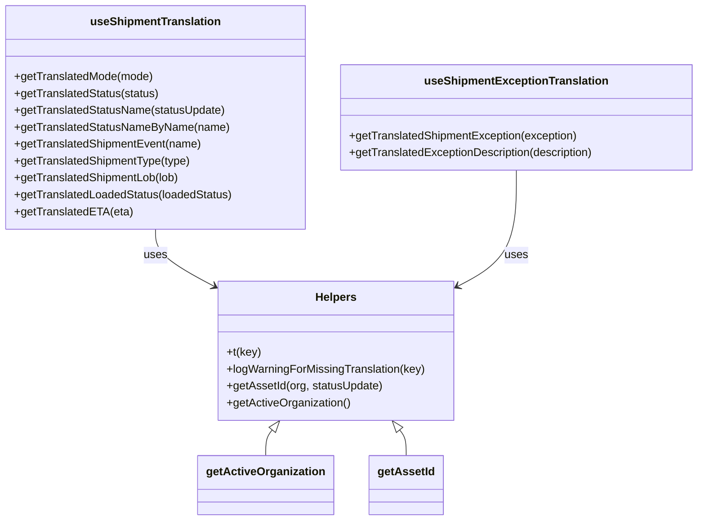

# Diagram: web/portal/src/shared/hooks/useShipmentTranslation.ts


> Auto-generated by Obscura crawlers

## Diagram 1



### SVG

<svg id="container" width="993.7421875" xmlns="http://www.w3.org/2000/svg" class="classDiagram" height="740" viewBox="0 0 993.7421875 740" role="graphics-document document" aria-roledescription="class"><style>#container{font-family:"trebuchet ms",verdana,arial,sans-serif;font-size:16px;fill:#333;}@keyframes edge-animation-frame{from{stroke-dashoffset:0;}}@keyframes dash{to{stroke-dashoffset:0;}}#container .edge-animation-slow{stroke-dasharray:9,5!important;stroke-dashoffset:900;animation:dash 50s linear infinite;stroke-linecap:round;}#container .edge-animation-fast{stroke-dasharray:9,5!important;stroke-dashoffset:900;animation:dash 20s linear infinite;stroke-linecap:round;}#container .error-icon{fill:#552222;}#container .error-text{fill:#552222;stroke:#552222;}#container .edge-thickness-normal{stroke-width:1px;}#container .edge-thickness-thick{stroke-width:3.5px;}#container .edge-pattern-solid{stroke-dasharray:0;}#container .edge-thickness-invisible{stroke-width:0;fill:none;}#container .edge-pattern-dashed{stroke-dasharray:3;}#container .edge-pattern-dotted{stroke-dasharray:2;}#container .marker{fill:#333333;stroke:#333333;}#container .marker.cross{stroke:#333333;}#container svg{font-family:"trebuchet ms",verdana,arial,sans-serif;font-size:16px;}#container p{margin:0;}#container g.classGroup text{fill:#9370DB;stroke:none;font-family:"trebuchet ms",verdana,arial,sans-serif;font-size:10px;}#container g.classGroup text .title{font-weight:bolder;}#container .nodeLabel,#container .edgeLabel{color:#131300;}#container .edgeLabel .label rect{fill:#ECECFF;}#container .label text{fill:#131300;}#container .labelBkg{background:#ECECFF;}#container .edgeLabel .label span{background:#ECECFF;}#container .classTitle{font-weight:bolder;}#container .node rect,#container .node circle,#container .node ellipse,#container .node polygon,#container .node path{fill:#ECECFF;stroke:#9370DB;stroke-width:1px;}#container .divider{stroke:#9370DB;stroke-width:1;}#container g.clickable{cursor:pointer;}#container g.classGroup rect{fill:#ECECFF;stroke:#9370DB;}#container g.classGroup line{stroke:#9370DB;stroke-width:1;}#container .classLabel .box{stroke:none;stroke-width:0;fill:#ECECFF;opacity:0.5;}#container .classLabel .label{fill:#9370DB;font-size:10px;}#container .relation{stroke:#333333;stroke-width:1;fill:none;}#container .dashed-line{stroke-dasharray:3;}#container .dotted-line{stroke-dasharray:1 2;}#container #compositionStart,#container .composition{fill:#333333!important;stroke:#333333!important;stroke-width:1;}#container #compositionEnd,#container .composition{fill:#333333!important;stroke:#333333!important;stroke-width:1;}#container #dependencyStart,#container .dependency{fill:#333333!important;stroke:#333333!important;stroke-width:1;}#container #dependencyStart,#container .dependency{fill:#333333!important;stroke:#333333!important;stroke-width:1;}#container #extensionStart,#container .extension{fill:transparent!important;stroke:#333333!important;stroke-width:1;}#container #extensionEnd,#container .extension{fill:transparent!important;stroke:#333333!important;stroke-width:1;}#container #aggregationStart,#container .aggregation{fill:transparent!important;stroke:#333333!important;stroke-width:1;}#container #aggregationEnd,#container .aggregation{fill:transparent!important;stroke:#333333!important;stroke-width:1;}#container #lollipopStart,#container .lollipop{fill:#ECECFF!important;stroke:#333333!important;stroke-width:1;}#container #lollipopEnd,#container .lollipop{fill:#ECECFF!important;stroke:#333333!important;stroke-width:1;}#container .edgeTerminals{font-size:11px;line-height:initial;}#container .classTitleText{text-anchor:middle;font-size:18px;fill:#333;}#container .label-icon{display:inline-block;height:1em;overflow:visible;vertical-align:-0.125em;}#container .node .label-icon path{fill:currentColor;stroke:revert;stroke-width:revert;}#container :root{--mermaid-font-family:"trebuchet ms",verdana,arial,sans-serif;}</style><g><defs><marker id="container_class-aggregationStart" class="marker aggregation class" refX="18" refY="7" markerWidth="190" markerHeight="240" orient="auto"><path d="M 18,7 L9,13 L1,7 L9,1 Z"></path></marker></defs><defs><marker id="container_class-aggregationEnd" class="marker aggregation class" refX="1" refY="7" markerWidth="20" markerHeight="28" orient="auto"><path d="M 18,7 L9,13 L1,7 L9,1 Z"></path></marker></defs><defs><marker id="container_class-extensionStart" class="marker extension class" refX="18" refY="7" markerWidth="190" markerHeight="240" orient="auto"><path d="M 1,7 L18,13 V 1 Z"></path></marker></defs><defs><marker id="container_class-extensionEnd" class="marker extension class" refX="1" refY="7" markerWidth="20" markerHeight="28" orient="auto"><path d="M 1,1 V 13 L18,7 Z"></path></marker></defs><defs><marker id="container_class-compositionStart" class="marker composition class" refX="18" refY="7" markerWidth="190" markerHeight="240" orient="auto"><path d="M 18,7 L9,13 L1,7 L9,1 Z"></path></marker></defs><defs><marker id="container_class-compositionEnd" class="marker composition class" refX="1" refY="7" markerWidth="20" markerHeight="28" orient="auto"><path d="M 18,7 L9,13 L1,7 L9,1 Z"></path></marker></defs><defs><marker id="container_class-dependencyStart" class="marker dependency class" refX="6" refY="7" markerWidth="190" markerHeight="240" orient="auto"><path d="M 5,7 L9,13 L1,7 L9,1 Z"></path></marker></defs><defs><marker id="container_class-dependencyEnd" class="marker dependency class" refX="13" refY="7" markerWidth="20" markerHeight="28" orient="auto"><path d="M 18,7 L9,13 L14,7 L9,1 Z"></path></marker></defs><defs><marker id="container_class-lollipopStart" class="marker lollipop class" refX="13" refY="7" markerWidth="190" markerHeight="240" orient="auto"><circle stroke="black" fill="transparent" cx="7" cy="7" r="6"></circle></marker></defs><defs><marker id="container_class-lollipopEnd" class="marker lollipop class" refX="1" refY="7" markerWidth="190" markerHeight="240" orient="auto"><circle stroke="black" fill="transparent" cx="7" cy="7" r="6"></circle></marker></defs><g class="root"><g class="clusters"></g><g class="edgePaths"><path d="M220.578,326L220.578,332.167C220.578,338.333,220.578,350.667,234.622,364.267C248.665,377.867,276.752,392.734,290.796,400.167L304.84,407.601" id="id_useShipmentTranslation_Helpers_1" class="edge-thickness-normal edge-pattern-solid relation" style=";;;" data-edge="true" data-et="edge" data-id="id_useShipmentTranslation_Helpers_1" data-points="W3sieCI6MjIwLjU3ODEyNSwieSI6MzI2fSx7IngiOjIyMC41NzgxMjUsInkiOjM2M30seyJ4IjozMTAuMTQyNTc4MTI1LCJ5Ijo0MTAuNDA3ODY0NjMwNDQ3NTN9XQ==" marker-end="url(#container_class-dependencyEnd)"></path><path d="M734.449,242L734.449,262.167C734.449,282.333,734.449,322.667,720.406,350.267C706.362,377.867,678.275,392.734,664.231,400.167L650.188,407.601" id="id_useShipmentExceptionTranslation_Helpers_2" class="edge-thickness-normal edge-pattern-solid relation" style=";;;" data-edge="true" data-et="edge" data-id="id_useShipmentExceptionTranslation_Helpers_2" data-points="W3sieCI6NzM0LjQ0OTIxODc1LCJ5IjoyNDJ9LHsieCI6NzM0LjQ0OTIxODc1LCJ5IjozNjN9LHsieCI6NjQ0Ljg4NDc2NTYyNSwieSI6NDEwLjQwNzg2NDYzMDQ0NzUzfV0=" marker-end="url(#container_class-dependencyEnd)"></path><path d="M389.631,611.598L388.148,613.499C386.665,615.399,383.699,619.199,382.216,625.266C380.732,631.333,380.732,639.667,380.732,643.833L380.732,648" id="id_Helpers_getActiveOrganization_3" class="edge-thickness-normal edge-pattern-solid relation" style=";;;" data-edge="true" data-et="edge" data-id="id_Helpers_getActiveOrganization_3" data-points="W3sieCI6NDAwLjI0NDc3MDY2NTMyMjU2LCJ5Ijo1OTh9LHsieCI6MzgwLjczMjQyMTg3NSwieSI6NjIzfSx7IngiOjM4MC43MzI0MjE4NzUsInkiOjY0OH1d" marker-start="url(#container_class-extensionStart)"></path><path d="M565.396,611.598L566.879,613.499C568.362,615.399,571.329,619.199,572.812,625.266C574.295,631.333,574.295,639.667,574.295,643.833L574.295,648" id="id_Helpers_getAssetId_4" class="edge-thickness-normal edge-pattern-solid relation" style=";;;" data-edge="true" data-et="edge" data-id="id_Helpers_getAssetId_4" data-points="W3sieCI6NTU0Ljc4MjU3MzA4NDY3NzQsInkiOjU5OH0seyJ4Ijo1NzQuMjk0OTIxODc1LCJ5Ijo2MjN9LHsieCI6NTc0LjI5NDkyMTg3NSwieSI6NjQ4fV0=" marker-start="url(#container_class-extensionStart)"></path></g><g class="edgeLabels"><g class="edgeLabel" transform="translate(220.578125, 363)"><g class="label" data-id="id_useShipmentTranslation_Helpers_1" transform="translate(-16.4921875, -12)"><foreignObject width="32.984375" height="24"><div xmlns="http://www.w3.org/1999/xhtml" class="labelBkg" style="display: table-cell; white-space: nowrap; line-height: 1.5; max-width: 200px; text-align: center;"><span class="edgeLabel"><p>uses</p></span></div></foreignObject></g></g><g class="edgeLabel" transform="translate(734.44921875, 363)"><g class="label" data-id="id_useShipmentExceptionTranslation_Helpers_2" transform="translate(-16.4921875, -12)"><foreignObject width="32.984375" height="24"><div xmlns="http://www.w3.org/1999/xhtml" class="labelBkg" style="display: table-cell; white-space: nowrap; line-height: 1.5; max-width: 200px; text-align: center;"><span class="edgeLabel"><p>uses</p></span></div></foreignObject></g></g><g class="edgeLabel"><g class="label" data-id="id_Helpers_getActiveOrganization_3" transform="translate(0, 0)"><foreignObject width="0" height="0"><div xmlns="http://www.w3.org/1999/xhtml" class="labelBkg" style="display: table-cell; white-space: nowrap; line-height: 1.5; max-width: 200px; text-align: center;"><span class="edgeLabel"></span></div></foreignObject></g></g><g class="edgeLabel"><g class="label" data-id="id_Helpers_getAssetId_4" transform="translate(0, 0)"><foreignObject width="0" height="0"><div xmlns="http://www.w3.org/1999/xhtml" class="labelBkg" style="display: table-cell; white-space: nowrap; line-height: 1.5; max-width: 200px; text-align: center;"><span class="edgeLabel"></span></div></foreignObject></g></g></g><g class="nodes"><g class="node default" id="classId-useShipmentTranslation-0" transform="translate(220.578125, 167)"><g class="basic label-container"><path d="M-212.578125 -159 L212.578125 -159 L212.578125 159 L-212.578125 159" stroke="none" stroke-width="0" fill="#ECECFF" style=""></path><path d="M-212.578125 -159 C-70.64055023940318 -159, 71.29702452119363 -159, 212.578125 -159 M-212.578125 -159 C-107.68524123026083 -159, -2.7923574605216572 -159, 212.578125 -159 M212.578125 -159 C212.578125 -38.82654617355858, 212.578125 81.34690765288283, 212.578125 159 M212.578125 -159 C212.578125 -80.04432435563893, 212.578125 -1.0886487112778696, 212.578125 159 M212.578125 159 C99.83733751478863 159, -12.903449970422741 159, -212.578125 159 M212.578125 159 C61.03261770625676 159, -90.51288958748648 159, -212.578125 159 M-212.578125 159 C-212.578125 65.59051735031144, -212.578125 -27.818965299377112, -212.578125 -159 M-212.578125 159 C-212.578125 32.986940993736184, -212.578125 -93.02611801252763, -212.578125 -159" stroke="#9370DB" stroke-width="1.3" fill="none" stroke-dasharray="0 0" style=""></path></g><g class="annotation-group text" transform="translate(0, -135)"></g><g class="label-group text" transform="translate(-89.1875, -135)"><g class="label" style="font-weight: bolder" transform="translate(0,-12)"><foreignObject width="178.375" height="24"><div xmlns="http://www.w3.org/1999/xhtml" style="display: table-cell; white-space: nowrap; line-height: 1.5; max-width: 226px; text-align: center;"><span class="nodeLabel markdown-node-label" style=""><p>useShipmentTranslation</p></span></div></foreignObject></g></g><g class="members-group text" transform="translate(-200.578125, -87)"></g><g class="methods-group text" transform="translate(-200.578125, -57)"><g class="label" style="" transform="translate(0,-12)"><foreignObject width="198.4375" height="24"><div xmlns="http://www.w3.org/1999/xhtml" style="display: table-cell; white-space: nowrap; line-height: 1.5; max-width: 256px; text-align: center;"><span class="nodeLabel markdown-node-label" style=""><p>+getTranslatedMode(mode)</p></span></div></foreignObject></g><g class="label" style="" transform="translate(0,12)"><foreignObject width="207.0625" height="24"><div xmlns="http://www.w3.org/1999/xhtml" style="display: table-cell; white-space: nowrap; line-height: 1.5; max-width: 264px; text-align: center;"><span class="nodeLabel markdown-node-label" style=""><p>+getTranslatedStatus(status)</p></span></div></foreignObject></g><g class="label" style="" transform="translate(0,36)"><foreignObject width="301.75" height="24"><div xmlns="http://www.w3.org/1999/xhtml" style="display: table-cell; white-space: nowrap; line-height: 1.5; max-width: 359px; text-align: center;"><span class="nodeLabel markdown-node-label" style=""><p>+getTranslatedStatusName(statusUpdate)</p></span></div></foreignObject></g><g class="label" style="" transform="translate(0,60)"><foreignObject width="304.90625" height="24"><div xmlns="http://www.w3.org/1999/xhtml" style="display: table-cell; white-space: nowrap; line-height: 1.5; max-width: 362px; text-align: center;"><span class="nodeLabel markdown-node-label" style=""><p>+getTranslatedStatusNameByName(name)</p></span></div></foreignObject></g><g class="label" style="" transform="translate(0,84)"><foreignObject width="267.140625" height="24"><div xmlns="http://www.w3.org/1999/xhtml" style="display: table-cell; white-space: nowrap; line-height: 1.5; max-width: 325px; text-align: center;"><span class="nodeLabel markdown-node-label" style=""><p>+getTranslatedShipmentEvent(name)</p></span></div></foreignObject></g><g class="label" style="" transform="translate(0,108)"><foreignObject width="252.234375" height="24"><div xmlns="http://www.w3.org/1999/xhtml" style="display: table-cell; white-space: nowrap; line-height: 1.5; max-width: 310px; text-align: center;"><span class="nodeLabel markdown-node-label" style=""><p>+getTranslatedShipmentType(type)</p></span></div></foreignObject></g><g class="label" style="" transform="translate(0,132)"><foreignObject width="236.578125" height="24"><div xmlns="http://www.w3.org/1999/xhtml" style="display: table-cell; white-space: nowrap; line-height: 1.5; max-width: 294px; text-align: center;"><span class="nodeLabel markdown-node-label" style=""><p>+getTranslatedShipmentLob(lob)</p></span></div></foreignObject></g><g class="label" style="" transform="translate(0,156)"><foreignObject width="311.96875" height="24"><div xmlns="http://www.w3.org/1999/xhtml" style="display: table-cell; white-space: nowrap; line-height: 1.5; max-width: 369px; text-align: center;"><span class="nodeLabel markdown-node-label" style=""><p>+getTranslatedLoadedStatus(loadedStatus)</p></span></div></foreignObject></g><g class="label" style="" transform="translate(0,180)"><foreignObject width="165.296875" height="24"><div xmlns="http://www.w3.org/1999/xhtml" style="display: table-cell; white-space: nowrap; line-height: 1.5; max-width: 223px; text-align: center;"><span class="nodeLabel markdown-node-label" style=""><p>+getTranslatedETA(eta)</p></span></div></foreignObject></g></g><g class="divider" style=""><path d="M-212.578125 -111 C-115.53884994931077 -111, -18.499574898621546 -111, 212.578125 -111 M-212.578125 -111 C-125.0102239323083 -111, -37.442322864616614 -111, 212.578125 -111" stroke="#9370DB" stroke-width="1.3" fill="none" stroke-dasharray="0 0" style=""></path></g><g class="divider" style=""><path d="M-212.578125 -87 C-93.80901996742698 -87, 24.960085065146046 -87, 212.578125 -87 M-212.578125 -87 C-121.15214842160644 -87, -29.72617184321288 -87, 212.578125 -87" stroke="#9370DB" stroke-width="1.3" fill="none" stroke-dasharray="0 0" style=""></path></g></g><g class="node default" id="classId-useShipmentExceptionTranslation-1" transform="translate(734.44921875, 167)"><g class="basic label-container"><path d="M-251.29296875 -75 L251.29296875 -75 L251.29296875 75 L-251.29296875 75" stroke="none" stroke-width="0" fill="#ECECFF" style=""></path><path d="M-251.29296875 -75 C-148.91361610205252 -75, -46.53426345410506 -75, 251.29296875 -75 M-251.29296875 -75 C-128.6624345972826 -75, -6.031900444565224 -75, 251.29296875 -75 M251.29296875 -75 C251.29296875 -40.83589254010572, 251.29296875 -6.671785080211436, 251.29296875 75 M251.29296875 -75 C251.29296875 -24.82021623164684, 251.29296875 25.359567536706322, 251.29296875 75 M251.29296875 75 C87.86947570852021 75, -75.55401733295957 75, -251.29296875 75 M251.29296875 75 C123.63151508526298 75, -4.029938579474049 75, -251.29296875 75 M-251.29296875 75 C-251.29296875 26.366676365204846, -251.29296875 -22.266647269590308, -251.29296875 -75 M-251.29296875 75 C-251.29296875 33.32004239695902, -251.29296875 -8.359915206081965, -251.29296875 -75" stroke="#9370DB" stroke-width="1.3" fill="none" stroke-dasharray="0 0" style=""></path></g><g class="annotation-group text" transform="translate(0, -51)"></g><g class="label-group text" transform="translate(-124.8828125, -51)"><g class="label" style="font-weight: bolder" transform="translate(0,-12)"><foreignObject width="249.765625" height="24"><div xmlns="http://www.w3.org/1999/xhtml" style="display: table-cell; white-space: nowrap; line-height: 1.5; max-width: 297px; text-align: center;"><span class="nodeLabel markdown-node-label" style=""><p>useShipmentExceptionTranslation</p></span></div></foreignObject></g></g><g class="members-group text" transform="translate(-239.29296875, -3)"></g><g class="methods-group text" transform="translate(-239.29296875, 27)"><g class="label" style="" transform="translate(0,-12)"><foreignObject width="328.203125" height="24"><div xmlns="http://www.w3.org/1999/xhtml" style="display: table-cell; white-space: nowrap; line-height: 1.5; max-width: 386px; text-align: center;"><span class="nodeLabel markdown-node-label" style=""><p>+getTranslatedShipmentException(exception)</p></span></div></foreignObject></g><g class="label" style="" transform="translate(0,12)"><foreignObject width="353.703125" height="24"><div xmlns="http://www.w3.org/1999/xhtml" style="display: table-cell; white-space: nowrap; line-height: 1.5; max-width: 411px; text-align: center;"><span class="nodeLabel markdown-node-label" style=""><p>+getTranslatedExceptionDescription(description)</p></span></div></foreignObject></g></g><g class="divider" style=""><path d="M-251.29296875 -27 C-129.31606774278862 -27, -7.3391667355772086 -27, 251.29296875 -27 M-251.29296875 -27 C-120.05712873609255 -27, 11.178711277814898 -27, 251.29296875 -27" stroke="#9370DB" stroke-width="1.3" fill="none" stroke-dasharray="0 0" style=""></path></g><g class="divider" style=""><path d="M-251.29296875 -3 C-50.7075536278459 -3, 149.8778614943082 -3, 251.29296875 -3 M-251.29296875 -3 C-111.52039084012293 -3, 28.252187069754143 -3, 251.29296875 -3" stroke="#9370DB" stroke-width="1.3" fill="none" stroke-dasharray="0 0" style=""></path></g></g><g class="node default" id="classId-Helpers-2" transform="translate(477.513671875, 499)"><g class="basic label-container"><path d="M-167.37109375 -99 L167.37109375 -99 L167.37109375 99 L-167.37109375 99" stroke="none" stroke-width="0" fill="#ECECFF" style=""></path><path d="M-167.37109375 -99 C-90.01239656810061 -99, -12.653699386201225 -99, 167.37109375 -99 M-167.37109375 -99 C-60.37589127317777 -99, 46.61931120364446 -99, 167.37109375 -99 M167.37109375 -99 C167.37109375 -48.79276781985504, 167.37109375 1.4144643602899265, 167.37109375 99 M167.37109375 -99 C167.37109375 -24.180087665316464, 167.37109375 50.63982466936707, 167.37109375 99 M167.37109375 99 C47.18678738417253 99, -72.99751898165493 99, -167.37109375 99 M167.37109375 99 C52.60255219392715 99, -62.165989362145694 99, -167.37109375 99 M-167.37109375 99 C-167.37109375 43.57834825683069, -167.37109375 -11.843303486338627, -167.37109375 -99 M-167.37109375 99 C-167.37109375 33.27397493440094, -167.37109375 -32.45205013119812, -167.37109375 -99" stroke="#9370DB" stroke-width="1.3" fill="none" stroke-dasharray="0 0" style=""></path></g><g class="annotation-group text" transform="translate(0, -75)"></g><g class="label-group text" transform="translate(-28.2890625, -75)"><g class="label" style="font-weight: bolder" transform="translate(0,-12)"><foreignObject width="56.578125" height="24"><div xmlns="http://www.w3.org/1999/xhtml" style="display: table-cell; white-space: nowrap; line-height: 1.5; max-width: 106px; text-align: center;"><span class="nodeLabel markdown-node-label" style=""><p>Helpers</p></span></div></foreignObject></g></g><g class="members-group text" transform="translate(-155.37109375, -27)"></g><g class="methods-group text" transform="translate(-155.37109375, 3)"><g class="label" style="" transform="translate(0,-12)"><foreignObject width="48.625" height="24"><div xmlns="http://www.w3.org/1999/xhtml" style="display: table-cell; white-space: nowrap; line-height: 1.5; max-width: 106px; text-align: center;"><span class="nodeLabel markdown-node-label" style=""><p>+t(key)</p></span></div></foreignObject></g><g class="label" style="" transform="translate(0,12)"><foreignObject width="282.453125" height="24"><div xmlns="http://www.w3.org/1999/xhtml" style="display: table-cell; white-space: nowrap; line-height: 1.5; max-width: 340px; text-align: center;"><span class="nodeLabel markdown-node-label" style=""><p>+logWarningForMissingTranslation(key)</p></span></div></foreignObject></g><g class="label" style="" transform="translate(0,36)"><foreignObject width="222.359375" height="24"><div xmlns="http://www.w3.org/1999/xhtml" style="display: table-cell; white-space: nowrap; line-height: 1.5; max-width: 280px; text-align: center;"><span class="nodeLabel markdown-node-label" style=""><p>+getAssetId(org, statusUpdate)</p></span></div></foreignObject></g><g class="label" style="" transform="translate(0,60)"><foreignObject width="176.625" height="24"><div xmlns="http://www.w3.org/1999/xhtml" style="display: table-cell; white-space: nowrap; line-height: 1.5; max-width: 234px; text-align: center;"><span class="nodeLabel markdown-node-label" style=""><p>+getActiveOrganization()</p></span></div></foreignObject></g></g><g class="divider" style=""><path d="M-167.37109375 -51 C-94.76846468624343 -51, -22.165835622486867 -51, 167.37109375 -51 M-167.37109375 -51 C-44.77754221611234 -51, 77.81600931777533 -51, 167.37109375 -51" stroke="#9370DB" stroke-width="1.3" fill="none" stroke-dasharray="0 0" style=""></path></g><g class="divider" style=""><path d="M-167.37109375 -27 C-35.89820039453349 -27, 95.57469296093302 -27, 167.37109375 -27 M-167.37109375 -27 C-69.50727349103735 -27, 28.356546767925295 -27, 167.37109375 -27" stroke="#9370DB" stroke-width="1.3" fill="none" stroke-dasharray="0 0" style=""></path></g></g><g class="node default" id="classId-getActiveOrganization-3" transform="translate(380.732421875, 690)"><g class="basic label-container"><path d="M-92.78125 -42 L92.78125 -42 L92.78125 42 L-92.78125 42" stroke="none" stroke-width="0" fill="#ECECFF" style=""></path><path d="M-92.78125 -42 C-24.012107447410685 -42, 44.75703510517863 -42, 92.78125 -42 M-92.78125 -42 C-52.32179364208204 -42, -11.862337284164084 -42, 92.78125 -42 M92.78125 -42 C92.78125 -11.931123333577702, 92.78125 18.137753332844596, 92.78125 42 M92.78125 -42 C92.78125 -25.108555118613456, 92.78125 -8.217110237226912, 92.78125 42 M92.78125 42 C41.356004914538225 42, -10.06924017092355 42, -92.78125 42 M92.78125 42 C26.801705506217587 42, -39.177838987564826 42, -92.78125 42 M-92.78125 42 C-92.78125 20.231653047039057, -92.78125 -1.5366939059218865, -92.78125 -42 M-92.78125 42 C-92.78125 10.099993428085345, -92.78125 -21.80001314382931, -92.78125 -42" stroke="#9370DB" stroke-width="1.3" fill="none" stroke-dasharray="0 0" style=""></path></g><g class="annotation-group text" transform="translate(0, -18)"></g><g class="label-group text" transform="translate(-80.78125, -18)"><g class="label" style="font-weight: bolder" transform="translate(0,-12)"><foreignObject width="161.5625" height="24"><div xmlns="http://www.w3.org/1999/xhtml" style="display: table-cell; white-space: nowrap; line-height: 1.5; max-width: 208px; text-align: center;"><span class="nodeLabel markdown-node-label" style=""><p>getActiveOrganization</p></span></div></foreignObject></g></g><g class="members-group text" transform="translate(-80.78125, 30)"></g><g class="methods-group text" transform="translate(-80.78125, 60)"></g><g class="divider" style=""><path d="M-92.78125 6 C-22.893209495105125 6, 46.99483100978975 6, 92.78125 6 M-92.78125 6 C-43.77533999968487 6, 5.230570000630266 6, 92.78125 6" stroke="#9370DB" stroke-width="1.3" fill="none" stroke-dasharray="0 0" style=""></path></g><g class="divider" style=""><path d="M-92.78125 24 C-19.30203179923724 24, 54.17718640152552 24, 92.78125 24 M-92.78125 24 C-46.920054124404885 24, -1.05885824880977 24, 92.78125 24" stroke="#9370DB" stroke-width="1.3" fill="none" stroke-dasharray="0 0" style=""></path></g></g><g class="node default" id="classId-getAssetId-4" transform="translate(574.294921875, 690)"><g class="basic label-container"><path d="M-50.78125 -42 L50.78125 -42 L50.78125 42 L-50.78125 42" stroke="none" stroke-width="0" fill="#ECECFF" style=""></path><path d="M-50.78125 -42 C-18.669484873554914 -42, 13.442280252890171 -42, 50.78125 -42 M-50.78125 -42 C-11.812495605234147 -42, 27.156258789531705 -42, 50.78125 -42 M50.78125 -42 C50.78125 -18.216657622999332, 50.78125 5.566684754001336, 50.78125 42 M50.78125 -42 C50.78125 -19.251727204448358, 50.78125 3.496545591103285, 50.78125 42 M50.78125 42 C21.13099330650303 42, -8.519263386993941 42, -50.78125 42 M50.78125 42 C25.844257034964002 42, 0.9072640699280043 42, -50.78125 42 M-50.78125 42 C-50.78125 11.797542943834653, -50.78125 -18.404914112330694, -50.78125 -42 M-50.78125 42 C-50.78125 20.06296409108792, -50.78125 -1.8740718178241593, -50.78125 -42" stroke="#9370DB" stroke-width="1.3" fill="none" stroke-dasharray="0 0" style=""></path></g><g class="annotation-group text" transform="translate(0, -18)"></g><g class="label-group text" transform="translate(-38.78125, -18)"><g class="label" style="font-weight: bolder" transform="translate(0,-12)"><foreignObject width="77.5625" height="24"><div xmlns="http://www.w3.org/1999/xhtml" style="display: table-cell; white-space: nowrap; line-height: 1.5; max-width: 125px; text-align: center;"><span class="nodeLabel markdown-node-label" style=""><p>getAssetId</p></span></div></foreignObject></g></g><g class="members-group text" transform="translate(-38.78125, 30)"></g><g class="methods-group text" transform="translate(-38.78125, 60)"></g><g class="divider" style=""><path d="M-50.78125 6 C-18.12488307870396 6, 14.531483842592081 6, 50.78125 6 M-50.78125 6 C-13.80326315738715 6, 23.1747236852257 6, 50.78125 6" stroke="#9370DB" stroke-width="1.3" fill="none" stroke-dasharray="0 0" style=""></path></g><g class="divider" style=""><path d="M-50.78125 24 C-11.76706314205947 24, 27.24712371588106 24, 50.78125 24 M-50.78125 24 C-14.033865696503362 24, 22.713518606993276 24, 50.78125 24" stroke="#9370DB" stroke-width="1.3" fill="none" stroke-dasharray="0 0" style=""></path></g></g></g></g></g></svg>

## Diagram 2

```mermaid
flowchart TD
    Start([statusUpdate]) --> Extract[/"extract fields:\nstatus_code, status_name,\ncurrent_city,current_state,\nstop_location_name,mode_id,status_details"/]
    Extract --> Switch{"switch status_code"}
    Switch --> |SHIPMENT_CREATED| SCreated["Shipment Created -> t('Shipment Created')"]
    Switch --> |ASSET_ASSIGNED| AssetAssigned["Asset Assigned -> appendAssetId(t('Asset Assigned'))"]
    Switch --> |ARRIVED_AT_DROP_OFF| ArrivedDropOff{"mode_id === AIR?"}
    ArrivedDropOff --> |yes| ArrivedAir["appendStopLocationName('Arrived')"]
    ArrivedDropOff --> |no| ArrivedDropOffAlt["appendStopLocationName('Arrived at Drop Off')"]
    Switch --> |ARRIVED| Arrived["appendStopLocationName('Arrived')"]
    Switch --> |DEPARTED_PICK_UP| DepartedPickup{"mode_id === LTL ? AIR ?\n(three-way)"}
    DepartedPickup --> |LTL| DepartedOrigin["appendStopLocationName('Departed Origin')"]
    DepartedPickup --> |AIR| DepartedAir["appendStopLocationName('Departed')"]
    DepartedPickup --> |other| DepartedPickupAlt["appendStopLocationName('Departed Pickup')"]
    Switch --> |PICKED_UP| PickedUp["appendStopLocationName('Picked Up')"]
    Switch --> |DELIVERED| Delivered["appendStopLocationName('Delivered')"]
    Switch --> |RAIL_ARRIVED| RailArrived["prependLocation('Arrival INTRANSIT')"]
    Switch --> |RAIL_DEPARTED_PICK_UP| RailDepartedPickup["prependLocation('Departed from location')"]
    Switch --> |PASSING_LOCATION| Passing["prependLocation('Passing Location')"]
    Switch --> |default| Fallback["return status_name (backend)"]
    appendAssetId([appendAssetId(label)]) --> GetAssetId[getAssetId(activeOrganization, statusUpdate)]
    GetAssetId --> |found| ConcatAsset["label: assetId"]
    GetAssetId --> |not found| ReturnLabel["label"]
    appendStopLocationName([appendStopLocationName(label)]) --> IfStop["stop_location_name ?"]
    IfStop --> |yes & geofence| StopWithGeofence["label: stop_location_name - geofence_name"]
    IfStop --> |yes & no geofence| StopWithName["label: stop_location_name"]
    IfStop --> |no| ReturnLabel2["label"]
    prependLocation([prependLocation(label)]) --> IfCityState["current_city && current_state ?"]
    IfCityState --> |yes| Prepend["current_city, current_state - label"]
    IfCityState --> |no| ReturnLabel3["label"]
```

> SVG rendering failed for this diagram.
