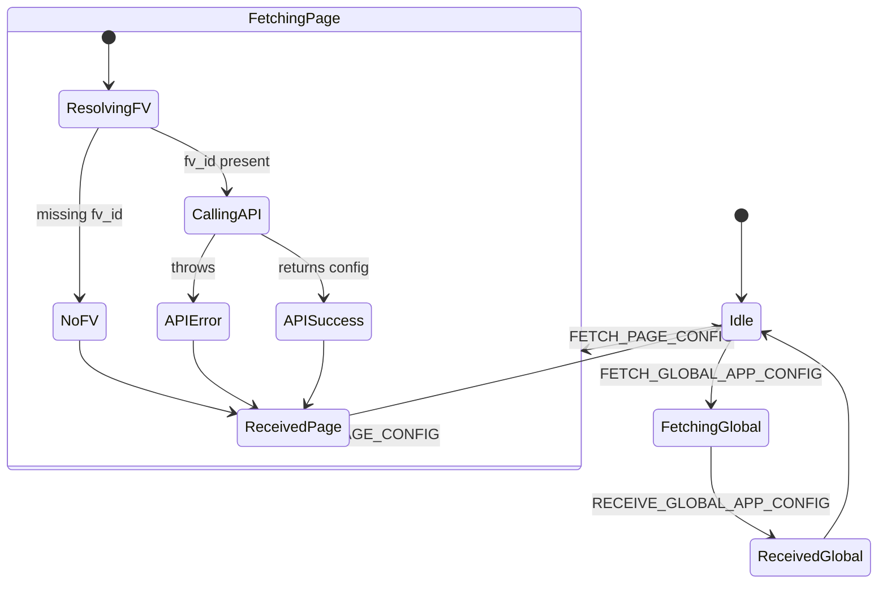

# Diagram: web/portal/src/shared/redux/AppConfigurationState.ts


> Auto-generated by Obscura crawlers

## Diagram 1

```mermaid
flowchart LR
  subgraph Actions
    FG[fetchGlobalAppConfig(fvId)]
    FP[fetchPageConfig()]
  end

  FG --> D1[dispatch: FETCH_GLOBAL_APP_CONFIG]
  D1 --> TryGetApp[getAppConfig(fvId)]
  TryGetApp -->|success| D2[dispatch: RECEIVE_GLOBAL_APP_CONFIG(payload)]
  TryGetApp -->|throw| D3[dispatch: RECEIVE_GLOBAL_APP_CONFIG(payload: {})]
  D2 --> Reducer1[configurationsReducer]
  D3 --> Reducer1

  FP --> D4[dispatch: FETCH_PAGE_CONFIG]
  D4 --> S[read state -> routeKey, navGroupKey]
  S --> AO[getActiveOrganization(state) -> fv_id]
  AO -->|no fv_id| D6[dispatch: RECEIVE_PAGE_CONFIG(payload: {routeKey, navGroupKey, config: {}})]
  AO -->|fv_id| CallPage[getPageConfig(fvId, routeKey, routesMap)]
  CallPage -->|success| D5[dispatch: RECEIVE_PAGE_CONFIG(payload: {routeKey, navGroupKey, config})]
  CallPage -->|throw| D6
  D5 --> Reducer2[configurationsReducer -> pageConfigReducer]
  D6 --> Reducer2

  Reducer1 --> StateUpdate1[globalAppConfigLoading / globalAppConfig updated]
  Reducer2 --> StateUpdate2[pageConfigs / isPageConfigLoading updated]
```

> SVG rendering failed for this diagram.

## Diagram 2

```mermaid
classDiagram
  class AppConfigurationState {
    +string mountPoint = "appConfiguration"
    +object actionCreators
    +object selectors
    +function reducer(state, action)
  }
  class initialState {
    +object globalAppConfig = {}
    +boolean globalAppConfigLoading = false
    +object pageConfigs = {}
    +boolean isPageConfigLoading = false
  }
  class Selectors {
    +getGlobalAppConfig(state)
    +getGlobalAppConfigLoading(state)
    +getProductConfig(state)
    +getUnleashConfig(state)
    +getProductConfigIsLoading(state)
    +getPageConfigForRoute(state)
    +getIsPageConfigLoading(state)
  }
  class ActionCreators {
    +fetchGlobalAppConfig(fvId)
    +fetchPageConfig()
  }

  AppConfigurationState o-- initialState
  AppConfigurationState o-- Selectors
  AppConfigurationState o-- ActionCreators
```

> SVG rendering failed for this diagram.

## Diagram 3



### SVG

<svg id="container" width="872.375" xmlns="http://www.w3.org/2000/svg" class="statediagram" height="626" viewBox="0 0 872.375 626" role="graphics-document document" aria-roledescription="stateDiagram"><style>#container{font-family:"trebuchet ms",verdana,arial,sans-serif;font-size:16px;fill:#333;}@keyframes edge-animation-frame{from{stroke-dashoffset:0;}}@keyframes dash{to{stroke-dashoffset:0;}}#container .edge-animation-slow{stroke-dasharray:9,5!important;stroke-dashoffset:900;animation:dash 50s linear infinite;stroke-linecap:round;}#container .edge-animation-fast{stroke-dasharray:9,5!important;stroke-dashoffset:900;animation:dash 20s linear infinite;stroke-linecap:round;}#container .error-icon{fill:#552222;}#container .error-text{fill:#552222;stroke:#552222;}#container .edge-thickness-normal{stroke-width:1px;}#container .edge-thickness-thick{stroke-width:3.5px;}#container .edge-pattern-solid{stroke-dasharray:0;}#container .edge-thickness-invisible{stroke-width:0;fill:none;}#container .edge-pattern-dashed{stroke-dasharray:3;}#container .edge-pattern-dotted{stroke-dasharray:2;}#container .marker{fill:#333333;stroke:#333333;}#container .marker.cross{stroke:#333333;}#container svg{font-family:"trebuchet ms",verdana,arial,sans-serif;font-size:16px;}#container p{margin:0;}#container defs #statediagram-barbEnd{fill:#333333;stroke:#333333;}#container g.stateGroup text{fill:#9370DB;stroke:none;font-size:10px;}#container g.stateGroup text{fill:#333;stroke:none;font-size:10px;}#container g.stateGroup .state-title{font-weight:bolder;fill:#131300;}#container g.stateGroup rect{fill:#ECECFF;stroke:#9370DB;}#container g.stateGroup line{stroke:#333333;stroke-width:1;}#container .transition{stroke:#333333;stroke-width:1;fill:none;}#container .stateGroup .composit{fill:white;border-bottom:1px;}#container .stateGroup .alt-composit{fill:#e0e0e0;border-bottom:1px;}#container .state-note{stroke:#aaaa33;fill:#fff5ad;}#container .state-note text{fill:black;stroke:none;font-size:10px;}#container .stateLabel .box{stroke:none;stroke-width:0;fill:#ECECFF;opacity:0.5;}#container .edgeLabel .label rect{fill:#ECECFF;opacity:0.5;}#container .edgeLabel{background-color:rgba(232,232,232, 0.8);text-align:center;}#container .edgeLabel p{background-color:rgba(232,232,232, 0.8);}#container .edgeLabel rect{opacity:0.5;background-color:rgba(232,232,232, 0.8);fill:rgba(232,232,232, 0.8);}#container .edgeLabel .label text{fill:#333;}#container .label div .edgeLabel{color:#333;}#container .stateLabel text{fill:#131300;font-size:10px;font-weight:bold;}#container .node circle.state-start{fill:#333333;stroke:#333333;}#container .node .fork-join{fill:#333333;stroke:#333333;}#container .node circle.state-end{fill:#9370DB;stroke:white;stroke-width:1.5;}#container .end-state-inner{fill:white;stroke-width:1.5;}#container .node rect{fill:#ECECFF;stroke:#9370DB;stroke-width:1px;}#container .node polygon{fill:#ECECFF;stroke:#9370DB;stroke-width:1px;}#container #statediagram-barbEnd{fill:#333333;}#container .statediagram-cluster rect{fill:#ECECFF;stroke:#9370DB;stroke-width:1px;}#container .cluster-label,#container .nodeLabel{color:#131300;}#container .statediagram-cluster rect.outer{rx:5px;ry:5px;}#container .statediagram-state .divider{stroke:#9370DB;}#container .statediagram-state .title-state{rx:5px;ry:5px;}#container .statediagram-cluster.statediagram-cluster .inner{fill:white;}#container .statediagram-cluster.statediagram-cluster-alt .inner{fill:#f0f0f0;}#container .statediagram-cluster .inner{rx:0;ry:0;}#container .statediagram-state rect.basic{rx:5px;ry:5px;}#container .statediagram-state rect.divider{stroke-dasharray:10,10;fill:#f0f0f0;}#container .note-edge{stroke-dasharray:5;}#container .statediagram-note rect{fill:#fff5ad;stroke:#aaaa33;stroke-width:1px;rx:0;ry:0;}#container .statediagram-note rect{fill:#fff5ad;stroke:#aaaa33;stroke-width:1px;rx:0;ry:0;}#container .statediagram-note text{fill:black;}#container .statediagram-note .nodeLabel{color:black;}#container .statediagram .edgeLabel{color:red;}#container #dependencyStart,#container #dependencyEnd{fill:#333333;stroke:#333333;stroke-width:1;}#container .statediagramTitleText{text-anchor:middle;font-size:18px;fill:#333;}#container :root{--mermaid-font-family:"trebuchet ms",verdana,arial,sans-serif;}</style><g><defs><marker id="container_stateDiagram-barbEnd" refX="19" refY="7" markerWidth="20" markerHeight="14" markerUnits="userSpaceOnUse" orient="auto"><path d="M 19,7 L9,13 L14,7 L9,1 Z"></path></marker></defs><g class="root"><g class="clusters"><g class="statediagram-state statediagram-cluster" id="FetchingPage" data-id="FetchingPage" data-look="classic"><g><rect class="outer" x="8" y="8" width="577.48046875" height="496" data-look="classic"></rect></g><g class="cluster-label" transform="translate(248.974609375, 9)"><foreignObject width="95.53125" height="19"><div xmlns="http://www.w3.org/1999/xhtml" style="display: inline-block; padding-right: 1px; white-space: nowrap;"><span class="nodeLabel">FetchingPage</span></div></foreignObject></g><rect class="inner" x="8" y="29" width="577.48046875" height="471"></rect></g></g><g class="edgePaths"><path d="M736.621,238L736.621,246.333C736.621,254.667,736.621,271.333,736.704,285.917C736.788,300.5,736.954,313,737.038,319.25L737.121,325.5" id="edge0" class="edge-thickness-normal edge-pattern-solid transition" style="fill:none;;;fill:none" data-edge="true" data-et="edge" data-id="edge0" data-points="W3sieCI6NzM2LjYyMTA5Mzc1LCJ5IjoyMzh9LHsieCI6NzM2LjYyMTA5Mzc1LCJ5IjoyODh9LHsieCI6NzM3LjEyMTA5Mzc1LCJ5IjozMjUuNX1d" marker-end="url(#container_stateDiagram-barbEnd)"></path><path d="M726.603,365.5L723.277,371.583C719.95,377.667,713.297,389.833,710.054,402.167C706.811,414.5,706.978,427,707.061,433.25L707.145,439.5" id="edge1" class="edge-thickness-normal edge-pattern-solid transition" style="fill:none;;;fill:none" data-edge="true" data-et="edge" data-id="edge1" data-points="W3sieCI6NzI2LjYwMzAwMTY0NDczNjksInkiOjM2NS41fSx7IngiOjcwNi42NDQ1MzEyNSwieSI6NDAyfSx7IngiOjcwNy4xNDQ1MzEyNSwieSI6NDM5LjV9XQ==" marker-end="url(#container_stateDiagram-barbEnd)"></path><path d="M707.145,479.5L707.061,483.583C706.978,487.667,706.811,495.833,706.728,506.083C706.645,516.333,706.645,528.667,716.898,541.083C727.151,553.5,747.658,566,757.911,572.25L768.165,578.5" id="edge2" class="edge-thickness-normal edge-pattern-solid transition" style="fill:none;;;fill:none" data-edge="true" data-et="edge" data-id="edge2" data-points="W3sieCI6NzA3LjE0NDUzMTI1LCJ5Ijo0NzkuNX0seyJ4Ijo3MDYuNjQ0NTMxMjUsInkiOjUwNH0seyJ4Ijo3MDYuNjQ0NTMxMjUsInkiOjU0MX0seyJ4Ijo3NjguMTY0NjEwNzQ1NjE0LCJ5Ijo1NzguNX1d" marker-end="url(#container_stateDiagram-barbEnd)"></path><path d="M813.096,578.5L816.697,572.25C820.297,566,827.498,553.5,831.099,541.083C834.699,528.667,834.699,516.333,834.699,502.667C834.699,489,834.699,474,834.699,457C834.699,440,834.699,421,822.072,404.196C809.444,387.392,784.189,372.785,771.561,365.481L758.934,358.177" id="edge3" class="edge-thickness-normal edge-pattern-solid transition" style="fill:none;;;fill:none" data-edge="true" data-et="edge" data-id="edge3" data-points="W3sieCI6ODEzLjA5NjA4MDA0Mzg1OTYsInkiOjU3OC41fSx7IngiOjgzNC42OTkyMTg3NSwieSI6NTQxfSx7IngiOjgzNC42OTkyMTg3NSwieSI6NTA0fSx7IngiOjgzNC42OTkyMTg3NSwieSI6NDU5fSx7IngiOjgzNC42OTkyMTg3NSwieSI6NDAyfSx7IngiOjc1OC45MzM1OTM3NSwieSI6MzU4LjE3Njc1NjQxMjI5ODg2fV0=" marker-end="url(#container_stateDiagram-barbEnd)"></path><path d="M367.918,444.813L395.34,437.678C422.762,430.542,477.605,416.271,535.504,400.734C593.402,385.197,654.355,368.393,684.832,359.991L715.309,351.59" id="edge6" class="edge-thickness-normal edge-pattern-solid transition" style="fill:none;;;fill:none" data-edge="true" data-et="edge" data-id="edge6" data-points="W3sieCI6MzY3LjkxNzk2ODc1LCJ5Ijo0NDQuODEzMzI1ODM2Mzc4OTd9LHsieCI6NTMyLjQ0OTIxODc1LCJ5Ijo0MDJ9LHsieCI6NzE1LjMwODU5Mzc1LCJ5IjozNTEuNTg5NTM4NTMyMTgwM31d" marker-end="url(#container_stateDiagram-barbEnd)"></path><path d="M117.75,47L117.75,51.167C117.75,55.333,117.75,63.667,117.833,72.083C117.917,80.5,118.083,89,118.167,93.25L118.25,97.5" id="edge7" class="edge-thickness-normal edge-pattern-solid transition" style="fill:none;;;fill:none" data-edge="true" data-et="edge" data-id="edge7" data-points="W3sieCI6MTE3Ljc1LCJ5Ijo0N30seyJ4IjoxMTcuNzUsInkiOjcyfSx7IngiOjExOC4yNSwieSI6OTcuNX1d" marker-end="url(#container_stateDiagram-barbEnd)"></path><path d="M106.667,137.5L103.012,143.583C99.357,149.667,92.048,161.833,88.393,177.417C84.738,193,84.738,212,84.738,231C84.738,250,84.738,269,84.822,284.75C84.905,300.5,85.072,313,85.155,319.25L85.238,325.5" id="edge8" class="edge-thickness-normal edge-pattern-solid transition" style="fill:none;;;fill:none" data-edge="true" data-et="edge" data-id="edge8" data-points="W3sieCI6MTA2LjY2Njk0MDc4OTQ3MzY4LCJ5IjoxMzcuNX0seyJ4Ijo4NC43MzgyODEyNSwieSI6MTc0fSx7IngiOjg0LjczODI4MTI1LCJ5IjoyMzF9LHsieCI6ODQuNzM4MjgxMjUsInkiOjI4OH0seyJ4Ijo4NS4yMzgyODEyNSwieSI6MzI1LjV9XQ==" marker-end="url(#container_stateDiagram-barbEnd)"></path><path d="M160.428,137.5L173.349,143.583C186.271,149.667,212.114,161.833,225.119,174.167C238.124,186.5,238.29,199,238.374,205.25L238.457,211.5" id="edge9" class="edge-thickness-normal edge-pattern-solid transition" style="fill:none;;;fill:none" data-edge="true" data-et="edge" data-id="edge9" data-points="W3sieCI6MTYwLjQyNzkwNTcwMTc1NDM4LCJ5IjoxMzcuNX0seyJ4IjoyMzcuOTU3MDMxMjUsInkiOjE3NH0seyJ4IjoyMzguNDU3MDMxMjUsInkiOjIxMS41fV0=" marker-end="url(#container_stateDiagram-barbEnd)"></path><path d="M226.867,251.5L223.21,257.583C219.553,263.667,212.24,275.833,208.666,288.167C205.092,300.5,205.259,313,205.342,319.25L205.426,325.5" id="edge10" class="edge-thickness-normal edge-pattern-solid transition" style="fill:none;;;fill:none" data-edge="true" data-et="edge" data-id="edge10" data-points="W3sieCI6MjI2Ljg2NzExODk2OTI5ODI1LCJ5IjoyNTEuNX0seyJ4IjoyMDQuOTI1NzgxMjUsInkiOjI4OH0seyJ4IjoyMDUuNDI1NzgxMjUsInkiOjMyNS41fV0=" marker-end="url(#container_stateDiagram-barbEnd)"></path><path d="M274.301,251.5L285.27,257.583C296.239,263.667,318.176,275.833,329.228,288.167C340.28,300.5,340.447,313,340.53,319.25L340.613,325.5" id="edge11" class="edge-thickness-normal edge-pattern-solid transition" style="fill:none;;;fill:none" data-edge="true" data-et="edge" data-id="edge11" data-points="W3sieCI6Mjc0LjMwMTMyOTQ5NTYxNCwieSI6MjUxLjV9LHsieCI6MzQwLjExMzI4MTI1LCJ5IjoyODh9LHsieCI6MzQwLjYxMzI4MTI1LCJ5IjozMjUuNX1d" marker-end="url(#container_stateDiagram-barbEnd)"></path><path d="M85.238,365.5L85.155,371.583C85.072,377.667,84.905,389.833,112.924,403.086C140.944,416.338,197.15,430.676,225.253,437.845L253.355,445.014" id="edge12" class="edge-thickness-normal edge-pattern-solid transition" style="fill:none;;;fill:none" data-edge="true" data-et="edge" data-id="edge12" data-points="W3sieCI6ODUuMjM4MjgxMjUsInkiOjM2NS41fSx7IngiOjg0LjczODI4MTI1LCJ5Ijo0MDJ9LHsieCI6MjUzLjM1NTQ2ODc1LCJ5Ijo0NDUuMDE0NDAxNTgwNTM0NDd9XQ==" marker-end="url(#container_stateDiagram-barbEnd)"></path><path d="M205.426,365.5L205.342,371.583C205.259,377.667,205.092,389.833,216.475,402.167C227.857,414.5,250.789,427,262.255,433.25L273.721,439.5" id="edge13" class="edge-thickness-normal edge-pattern-solid transition" style="fill:none;;;fill:none" data-edge="true" data-et="edge" data-id="edge13" data-points="W3sieCI6MjA1LjQyNTc4MTI1LCJ5IjozNjUuNX0seyJ4IjoyMDQuOTI1NzgxMjUsInkiOjQwMn0seyJ4IjoyNzMuNzIwNjAwMzI4OTQ3MzQsInkiOjQzOS41fV0=" marker-end="url(#container_stateDiagram-barbEnd)"></path><path d="M340.613,365.5L340.53,371.583C340.447,377.667,340.28,389.833,337.037,402.167C333.794,414.5,327.474,427,324.315,433.25L321.155,439.5" id="edge14" class="edge-thickness-normal edge-pattern-solid transition" style="fill:none;;;fill:none" data-edge="true" data-et="edge" data-id="edge14" data-points="W3sieCI6MzQwLjYxMzI4MTI1LCJ5IjozNjUuNX0seyJ4IjozNDAuMTEzMjgxMjUsInkiOjQwMn0seyJ4IjozMjEuMTU0ODEwODU1MjYzMiwieSI6NDM5LjV9XQ==" marker-end="url(#container_stateDiagram-barbEnd)"></path><path d="M714.809,349.161L585.48,377.33" id="edge4" class="edge-thickness-normal edge-pattern-solid transition" style="fill:none;;;fill:none" data-edge="true" data-et="edge" data-id="edge4" data-points="W3sieCI6NzE1LjMwODU5Mzc1LCJ5IjozNDkuNjYwODQ1MDExNTAzODV9LHsieCI6NDM3LjgwODU5Mzc1LCJ5Ijo0MDJ9LHsieCI6MzU1LjQzMzg2Nzg3MjgwNywieSI6NDM5LjV9XQ==" marker-end="url(#container_stateDiagram-barbEnd)"></path><path d="M367.918,467.988Z" id="edge5" class="edge-thickness-normal edge-pattern-solid transition" style="fill:none;;;fill:none" data-edge="true" data-et="edge" data-id="edge5" data-points="W3sieCI6MzY3LjkxNzk2ODc1LCJ5Ijo0NTEuMDExOTI0MDU2NDk0NTR9LHsieCI6NDQ1LjEwNTQ2ODc1LCJ5Ijo0Mzl9LHsieCI6NDY0LjUyNzM0Mzc1LCJ5Ijo0Mzl9LHsieCI6NDgzLjk0OTIxODc1LCJ5Ijo0NTl9LHsieCI6NDY0LjUyNzM0Mzc1LCJ5Ijo0Nzl9LHsieCI6NDQ1LjEwNTQ2ODc1LCJ5Ijo0Nzl9LHsieCI6MzY3LjkxNzk2ODc1LCJ5Ijo0NjcuOTg4MDc1OTQzNTA1NDZ9XQ==" marker-end="url(#container_stateDiagram-barbEnd)"></path></g><g class="edgeLabels"><g class="edgeLabel"><g class="label" data-id="edge0" transform="translate(0, 0)"><foreignObject width="0" height="0"><div xmlns="http://www.w3.org/1999/xhtml" class="labelBkg" style="display: table-cell; white-space: nowrap; line-height: 1.5; max-width: 200px; text-align: center;"><span class="edgeLabel"></span></div></foreignObject></g></g><g class="edgeLabel" transform="translate(706.64453125, 402)"><g class="label" data-id="edge1" transform="translate(-101.1640625, -12)"><foreignObject width="202.328125" height="24"><div xmlns="http://www.w3.org/1999/xhtml" class="labelBkg" style="display: table; white-space: break-spaces; line-height: 1.5; max-width: 200px; text-align: center; width: 200px;"><span class="edgeLabel"><p>FETCH_GLOBAL_APP_CONFIG</p></span></div></foreignObject></g></g><g class="edgeLabel" transform="translate(706.64453125, 541)"><g class="label" data-id="edge2" transform="translate(-108.0546875, -12)"><foreignObject width="216.109375" height="24"><div xmlns="http://www.w3.org/1999/xhtml" class="labelBkg" style="display: table; white-space: break-spaces; line-height: 1.5; max-width: 200px; text-align: center; width: 200px;"><span class="edgeLabel"><p>RECEIVE_GLOBAL_APP_CONFIG</p></span></div></foreignObject></g></g><g class="edgeLabel"><g class="label" data-id="edge3" transform="translate(0, 0)"><foreignObject width="0" height="0"><div xmlns="http://www.w3.org/1999/xhtml" class="labelBkg" style="display: table-cell; white-space: nowrap; line-height: 1.5; max-width: 200px; text-align: center;"><span class="edgeLabel"></span></div></foreignObject></g></g><g class="edgeLabel"><g class="label" data-id="edge6" transform="translate(0, 0)"><foreignObject width="0" height="0"><div xmlns="http://www.w3.org/1999/xhtml" class="labelBkg" style="display: table-cell; white-space: nowrap; line-height: 1.5; max-width: 200px; text-align: center;"><span class="edgeLabel"></span></div></foreignObject></g></g><g class="edgeLabel"><g class="label" data-id="edge7" transform="translate(0, 0)"><foreignObject width="0" height="0"><div xmlns="http://www.w3.org/1999/xhtml" class="labelBkg" style="display: table-cell; white-space: nowrap; line-height: 1.5; max-width: 200px; text-align: center;"><span class="edgeLabel"></span></div></foreignObject></g></g><g class="edgeLabel" transform="translate(84.73828125, 231)"><g class="label" data-id="edge8" transform="translate(-47.3046875, -12)"><foreignObject width="94.609375" height="24"><div xmlns="http://www.w3.org/1999/xhtml" class="labelBkg" style="display: table-cell; white-space: nowrap; line-height: 1.5; max-width: 200px; text-align: center;"><span class="edgeLabel"><p>missing fv_id</p></span></div></foreignObject></g></g><g class="edgeLabel" transform="translate(237.95703125, 174)"><g class="label" data-id="edge9" transform="translate(-47.328125, -12)"><foreignObject width="94.65625" height="24"><div xmlns="http://www.w3.org/1999/xhtml" class="labelBkg" style="display: table-cell; white-space: nowrap; line-height: 1.5; max-width: 200px; text-align: center;"><span class="edgeLabel"><p>fv_id present</p></span></div></foreignObject></g></g><g class="edgeLabel" transform="translate(204.92578125, 288)"><g class="label" data-id="edge10" transform="translate(-24.5703125, -12)"><foreignObject width="49.140625" height="24"><div xmlns="http://www.w3.org/1999/xhtml" class="labelBkg" style="display: table-cell; white-space: nowrap; line-height: 1.5; max-width: 200px; text-align: center;"><span class="edgeLabel"><p>throws</p></span></div></foreignObject></g></g><g class="edgeLabel" transform="translate(340.11328125, 288)"><g class="label" data-id="edge11" transform="translate(-50.171875, -12)"><foreignObject width="100.34375" height="24"><div xmlns="http://www.w3.org/1999/xhtml" class="labelBkg" style="display: table-cell; white-space: nowrap; line-height: 1.5; max-width: 200px; text-align: center;"><span class="edgeLabel"><p>returns config</p></span></div></foreignObject></g></g><g class="edgeLabel"><g class="label" data-id="edge12" transform="translate(0, 0)"><foreignObject width="0" height="0"><div xmlns="http://www.w3.org/1999/xhtml" class="labelBkg" style="display: table-cell; white-space: nowrap; line-height: 1.5; max-width: 200px; text-align: center;"><span class="edgeLabel"></span></div></foreignObject></g></g><g class="edgeLabel"><g class="label" data-id="edge13" transform="translate(0, 0)"><foreignObject width="0" height="0"><div xmlns="http://www.w3.org/1999/xhtml" class="labelBkg" style="display: table-cell; white-space: nowrap; line-height: 1.5; max-width: 200px; text-align: center;"><span class="edgeLabel"></span></div></foreignObject></g></g><g class="edgeLabel"><g class="label" data-id="edge14" transform="translate(0, 0)"><foreignObject width="0" height="0"><div xmlns="http://www.w3.org/1999/xhtml" class="labelBkg" style="display: table-cell; white-space: nowrap; line-height: 1.5; max-width: 200px; text-align: center;"><span class="edgeLabel"></span></div></foreignObject></g></g><g class="edgeLabel" transform="translate(650.14453, 363.24542)"><g class="label" data-id="edge4" transform="translate(-74.640625, -12)"><foreignObject width="149.28125" height="24"><div xmlns="http://www.w3.org/1999/xhtml" class="labelBkg" style="display: table-cell; white-space: nowrap; line-height: 1.5; max-width: 200px; text-align: center;"><span class="edgeLabel"><p>FETCH_PAGE_CONFIG</p></span></div></foreignObject></g></g><g class="edgeLabel" transform="translate(367.91796875, 467.98807594350546)"><g class="label" data-id="edge5" transform="translate(-81.53125, -12)"><foreignObject width="163.0625" height="24"><div xmlns="http://www.w3.org/1999/xhtml" class="labelBkg" style="display: table-cell; white-space: nowrap; line-height: 1.5; max-width: 200px; text-align: center;"><span class="edgeLabel"><p>RECEIVE_PAGE_CONFIG</p></span></div></foreignObject></g></g></g><g class="nodes"><g class="node default" id="state-root_start-0" transform="translate(736.62109375, 231)"><circle class="state-start" r="7" width="14" height="14"></circle></g><g class="node  statediagram-state" id="state-Idle-6" transform="translate(736.62109375, 345)"><g class="basic label-container outer-path"><path d="M-16.8125 -20 C-5.2064088476526535 -20, 6.399682304694693 -20, 16.8125 -20 C16.8125 -20, 16.8125 -20, 16.8125 -20 C16.911288795021775 -19.995914065214134, 17.010077590043554 -19.991828130428264, 17.225396727361662 -19.982922465033347 C17.313446178092356 -19.97194711244559, 17.40149562882305 -19.960971759857838, 17.63547295140367 -19.931806517013612 C17.78377143847861 -19.900711594189435, 17.93206992555355 -19.869616671365254, 18.039927435703998 -19.847001329696653 C18.17976626566075 -19.80536950624254, 18.3196050956175 -19.763737682788424, 18.435997346023417 -19.729086208503173 C18.52964686820257 -19.69254405155443, 18.623296390381725 -19.656001894605694, 18.820977123264846 -19.578866633275286 C18.925176600916306 -19.527926612653285, 19.029376078567765 -19.47698659203128, 19.19223696518537 -19.397368756032446 C19.30453374196446 -19.33045440123347, 19.41683051874355 -19.263540046434496, 19.547240790612136 -19.185832391312644 C19.676154414903287 -19.09378983269526, 19.80506803919444 -19.00174727407788, 19.88356356344834 -18.94570254698197 C19.959562320396273 -18.88133488325954, 20.035561077344205 -18.816967219537112, 20.198907858128706 -18.678619553365657 C20.304075481098984 -18.57345193039538, 20.409243104069258 -18.468284307425105, 20.491119553365657 -18.386407858128706 C20.570357765123326 -18.292851478292885, 20.649595976881 -18.199295098457064, 20.75820254698197 -18.07106356344834 C20.844967213323276 -17.94954208722595, 20.931731879664582 -17.82802061100356, 20.998332391312644 -17.734740790612136 C21.061862406797502 -17.62812366803645, 21.125392422282356 -17.521506545460767, 21.209868756032446 -17.37973696518537 C21.254141596453433 -17.2891754226166, 21.29841443687442 -17.198613880047834, 21.391366633275286 -17.008477123264846 C21.447895694678852 -16.863605554870393, 21.50442475608242 -16.71873398647594, 21.541586208503173 -16.623497346023417 C21.583391742347235 -16.48307503315224, 21.625197276191297 -16.342652720281066, 21.659501329696653 -16.227427435703994 C21.682110705738747 -16.119598376930973, 21.70472008178084 -16.01176931815795, 21.744306517013612 -15.82297295140367 C21.762023263383 -15.680840862790875, 21.779740009752384 -15.53870877417808, 21.795422465033347 -15.412896727361662 C21.801450979222004 -15.267140692652312, 21.80747949341066 -15.121384657942961, 21.8125 -15 C21.8125 -15, 21.8125 -15, 21.8125 -15 C21.8125 -5.359345201101078, 21.8125 4.2813095977978435, 21.8125 15 C21.8125 15, 21.8125 15, 21.8125 15 C21.807502857889595 15.120819756924861, 21.802505715779194 15.241639513849723, 21.795422465033347 15.412896727361662 C21.776717781820594 15.562954510909503, 21.75801309860784 15.713012294457341, 21.744306517013612 15.822972951403669 C21.72667471313685 15.90706287997853, 21.709042909260084 15.991152808553394, 21.659501329696653 16.227427435703994 C21.633549666326413 16.314597536363312, 21.60759800295617 16.401767637022626, 21.541586208503173 16.623497346023417 C21.48917937376672 16.75780455287153, 21.436772539030272 16.89211175971964, 21.391366633275286 17.008477123264846 C21.332653430201383 17.128576899763605, 21.273940227127483 17.248676676262363, 21.209868756032446 17.379736965185366 C21.135534146422376 17.504486536296387, 21.061199536812307 17.629236107407408, 20.998332391312644 17.734740790612133 C20.948644911221518 17.80433243644054, 20.898957431130395 17.87392408226895, 20.75820254698197 18.07106356344834 C20.652489191385772 18.195879086546256, 20.54677583578958 18.32069460964417, 20.491119553365657 18.386407858128706 C20.398408051897768 18.479119359596595, 20.30569655042988 18.571830861064484, 20.198907858128706 18.678619553365657 C20.12042207305244 18.74509362246446, 20.04193628797617 18.811567691563265, 19.88356356344834 18.94570254698197 C19.798091083893265 19.006728724415733, 19.71261860433819 19.067754901849494, 19.547240790612136 19.185832391312644 C19.41637025231174 19.26381430569824, 19.285499714011348 19.341796220083836, 19.19223696518537 19.397368756032446 C19.11205208713343 19.436568754281968, 19.031867209081494 19.475768752531494, 18.820977123264846 19.578866633275286 C18.741427976735917 19.60990680657203, 18.661878830206987 19.64094697986878, 18.435997346023417 19.729086208503173 C18.337529267405802 19.758401425643807, 18.23906118878819 19.78771664278444, 18.039927435703998 19.847001329696653 C17.951612332094694 19.865519059614915, 17.863297228485393 19.884036789533177, 17.63547295140367 19.931806517013612 C17.511221052146656 19.947294500104103, 17.38696915288964 19.962782483194594, 17.225396727361662 19.982922465033347 C17.10406361222563 19.987940839796423, 16.982730497089598 19.992959214559498, 16.8125 20 C16.8125 20, 16.8125 20, 16.8125 20 C9.207409351816924 20, 1.6023187036338502 20, -16.8125 20 C-16.8125 20, -16.8125 20, -16.8125 20 C-16.895090200113792 19.99658404405538, -16.977680400227584 19.993168088110757, -17.225396727361662 19.982922465033347 C-17.316236721522294 19.9715992715698, -17.40707671568293 19.960276078106254, -17.63547295140367 19.931806517013612 C-17.752659937725912 19.90723498990257, -17.869846924048158 19.88266346279153, -18.039927435703994 19.847001329696653 C-18.16252402443753 19.810502743861733, -18.28512061317107 19.774004158026813, -18.435997346023417 19.729086208503173 C-18.587841188519988 19.669836557302663, -18.73968503101656 19.610586906102153, -18.820977123264846 19.578866633275286 C-18.968688380102652 19.506654999982956, -19.116399636940457 19.434443366690623, -19.19223696518537 19.397368756032446 C-19.32375056345725 19.31900366107548, -19.45526416172913 19.240638566118516, -19.547240790612133 19.185832391312644 C-19.640969368185395 19.1189114731952, -19.734697945758654 19.05199055507776, -19.88356356344834 18.94570254698197 C-20.004765805142437 18.8430494846284, -20.125968046836537 18.740396422274824, -20.198907858128706 18.67861955336566 C-20.276088322292043 18.601439089202323, -20.35326878645538 18.524258625038982, -20.491119553365657 18.386407858128706 C-20.592790588904442 18.26636509330385, -20.694461624443232 18.146322328478995, -20.758202546981966 18.07106356344834 C-20.827463760143853 17.974057198722896, -20.89672497330574 17.87705083399745, -20.998332391312644 17.734740790612133 C-21.080379958767484 17.59704720609767, -21.16242752622232 17.459353621583208, -21.209868756032446 17.37973696518537 C-21.271395893691697 17.25388119349151, -21.332923031350948 17.128025421797645, -21.391366633275286 17.00847712326485 C-21.42600856173819 16.91969746933073, -21.460650490201093 16.83091781539661, -21.541586208503173 16.623497346023417 C-21.57053844498762 16.526248497937807, -21.599490681472062 16.428999649852198, -21.659501329696653 16.227427435703994 C-21.693422996339912 16.065647589177278, -21.727344662983175 15.903867742650558, -21.744306517013612 15.82297295140367 C-21.76068140163475 15.69160591010441, -21.777056286255885 15.560238868805149, -21.795422465033347 15.412896727361664 C-21.800753612621754 15.284001462521983, -21.80608476021016 15.155106197682302, -21.8125 15 C-21.8125 15, -21.8125 15, -21.8125 15 C-21.8125 7.543583077468677, -21.8125 0.08716615493735347, -21.8125 -15 C-21.8125 -15, -21.8125 -15, -21.8125 -15 C-21.808806692007135 -15.089295954385157, -21.805113384014266 -15.178591908770317, -21.795422465033347 -15.41289672736166 C-21.78447465171857 -15.5007252450663, -21.773526838403793 -15.588553762770939, -21.744306517013612 -15.822972951403669 C-21.718727354757757 -15.944965570090533, -21.693148192501905 -16.066958188777395, -21.659501329696653 -16.227427435703994 C-21.62488123814209 -16.343714273375696, -21.59026114658753 -16.460001111047394, -21.541586208503173 -16.623497346023417 C-21.48421894726839 -16.770517036483966, -21.426851686033604 -16.917536726944512, -21.39136663327529 -17.008477123264846 C-21.323663045690964 -17.14696702521768, -21.255959458106638 -17.28545692717051, -21.209868756032446 -17.379736965185366 C-21.146810687637952 -17.485562058349466, -21.08375261924346 -17.591387151513562, -20.998332391312644 -17.734740790612133 C-20.928604416490153 -17.83240089571869, -20.858876441667658 -17.93006100082524, -20.75820254698197 -18.07106356344834 C-20.6547899458928 -18.193162590832966, -20.551377344803633 -18.31526161821759, -20.49111955336566 -18.386407858128706 C-20.41390798050593 -18.463619430988434, -20.3366964076462 -18.540831003848165, -20.198907858128706 -18.678619553365657 C-20.12991217933752 -18.737055912446824, -20.060916500546337 -18.79549227152799, -19.88356356344834 -18.945702546981966 C-19.75511910236595 -19.037410129506785, -19.62667464128356 -19.129117712031604, -19.547240790612136 -19.185832391312644 C-19.429423081035754 -19.25603650799629, -19.311605371459372 -19.326240624679933, -19.192236965185366 -19.397368756032446 C-19.064977646736843 -19.459582045889746, -18.937718328288323 -19.52179533574705, -18.82097712326485 -19.578866633275286 C-18.725154986982865 -19.616256546877636, -18.629332850700877 -19.653646460479983, -18.43599734602342 -19.729086208503173 C-18.314331934430317 -19.765307570892166, -18.192666522837214 -19.801528933281155, -18.039927435703994 -19.847001329696653 C-17.921332845387518 -19.871868000328245, -17.80273825507104 -19.896734670959837, -17.635472951403674 -19.931806517013612 C-17.471926531448204 -19.952192557001148, -17.308380111492735 -19.97257859698868, -17.225396727361662 -19.982922465033347 C-17.115622786348226 -19.98746274881826, -17.00584884533479 -19.992003032603176, -16.8125 -20 C-16.8125 -20, -16.8125 -20, -16.8125 -20" stroke="none" stroke-width="0" fill="#ECECFF" style=""></path><path d="M-16.8125 -20 C-6.224312444449366 -20, 4.363875111101269 -20, 16.8125 -20 M-16.8125 -20 C-8.184714692708896 -20, 0.44307061458220787 -20, 16.8125 -20 M16.8125 -20 C16.8125 -20, 16.8125 -20, 16.8125 -20 M16.8125 -20 C16.8125 -20, 16.8125 -20, 16.8125 -20 M16.8125 -20 C16.94407171613786 -19.994558153567056, 17.075643432275722 -19.989116307134115, 17.225396727361662 -19.982922465033347 M16.8125 -20 C16.926285152174202 -19.995293811294275, 17.040070304348404 -19.990587622588546, 17.225396727361662 -19.982922465033347 M17.225396727361662 -19.982922465033347 C17.36465982385369 -19.965563338158866, 17.503922920345715 -19.948204211284384, 17.63547295140367 -19.931806517013612 M17.225396727361662 -19.982922465033347 C17.353609638311102 -19.9669407423503, 17.481822549260546 -19.950959019667252, 17.63547295140367 -19.931806517013612 M17.63547295140367 -19.931806517013612 C17.73744028316707 -19.91042621587697, 17.839407614930476 -19.88904591474033, 18.039927435703998 -19.847001329696653 M17.63547295140367 -19.931806517013612 C17.7902054926014 -19.899362514907907, 17.94493803379913 -19.866918512802197, 18.039927435703998 -19.847001329696653 M18.039927435703998 -19.847001329696653 C18.141063552120404 -19.816891803288396, 18.242199668536806 -19.78678227688014, 18.435997346023417 -19.729086208503173 M18.039927435703998 -19.847001329696653 C18.17201281588241 -19.80767780825302, 18.304098196060824 -19.76835428680938, 18.435997346023417 -19.729086208503173 M18.435997346023417 -19.729086208503173 C18.569576827706133 -19.676963333007418, 18.70315630938885 -19.62484045751166, 18.820977123264846 -19.578866633275286 M18.435997346023417 -19.729086208503173 C18.516639843470763 -19.69761940835419, 18.597282340918106 -19.666152608205206, 18.820977123264846 -19.578866633275286 M18.820977123264846 -19.578866633275286 C18.909964353350713 -19.53536342732994, 18.998951583436575 -19.491860221384595, 19.19223696518537 -19.397368756032446 M18.820977123264846 -19.578866633275286 C18.963633034329625 -19.509126407937522, 19.1062889453944 -19.439386182599755, 19.19223696518537 -19.397368756032446 M19.19223696518537 -19.397368756032446 C19.30277624254909 -19.33150164357481, 19.413315519912814 -19.265634531117175, 19.547240790612136 -19.185832391312644 M19.19223696518537 -19.397368756032446 C19.281307481695972 -19.34429424833181, 19.37037799820657 -19.291219740631178, 19.547240790612136 -19.185832391312644 M19.547240790612136 -19.185832391312644 C19.68038980860366 -19.090765819716975, 19.813538826595188 -18.995699248121305, 19.88356356344834 -18.94570254698197 M19.547240790612136 -19.185832391312644 C19.618059491873666 -19.135268810481577, 19.688878193135196 -19.08470522965051, 19.88356356344834 -18.94570254698197 M19.88356356344834 -18.94570254698197 C19.973810077461923 -18.86926764857794, 20.064056591475506 -18.792832750173908, 20.198907858128706 -18.678619553365657 M19.88356356344834 -18.94570254698197 C19.957389610851607 -18.88317507437521, 20.031215658254872 -18.820647601768453, 20.198907858128706 -18.678619553365657 M20.198907858128706 -18.678619553365657 C20.29812261026142 -18.579404801232943, 20.397337362394133 -18.48019004910023, 20.491119553365657 -18.386407858128706 M20.198907858128706 -18.678619553365657 C20.26839536205263 -18.609132049441733, 20.337882865976553 -18.53964454551781, 20.491119553365657 -18.386407858128706 M20.491119553365657 -18.386407858128706 C20.588914847074008 -18.270941173035975, 20.686710140782356 -18.15547448794324, 20.75820254698197 -18.07106356344834 M20.491119553365657 -18.386407858128706 C20.54722841168923 -18.32016025428918, 20.6033372700128 -18.25391265044966, 20.75820254698197 -18.07106356344834 M20.75820254698197 -18.07106356344834 C20.853643826064186 -17.937389734968438, 20.9490851051464 -17.803715906488534, 20.998332391312644 -17.734740790612136 M20.75820254698197 -18.07106356344834 C20.842888085298398 -17.952454087208118, 20.927573623614826 -17.833844610967894, 20.998332391312644 -17.734740790612136 M20.998332391312644 -17.734740790612136 C21.069789375927844 -17.61482049735448, 21.141246360543043 -17.49490020409682, 21.209868756032446 -17.37973696518537 M20.998332391312644 -17.734740790612136 C21.06901956023837 -17.61611241477491, 21.139706729164097 -17.497484038937685, 21.209868756032446 -17.37973696518537 M21.209868756032446 -17.37973696518537 C21.27586664526043 -17.244736124987746, 21.34186453448841 -17.10973528479012, 21.391366633275286 -17.008477123264846 M21.209868756032446 -17.37973696518537 C21.25143297486063 -17.294715996642275, 21.292997193688816 -17.20969502809918, 21.391366633275286 -17.008477123264846 M21.391366633275286 -17.008477123264846 C21.437293477643834 -16.890776708471478, 21.483220322012382 -16.773076293678113, 21.541586208503173 -16.623497346023417 M21.391366633275286 -17.008477123264846 C21.44849939274258 -16.862058409328665, 21.505632152209873 -16.71563969539248, 21.541586208503173 -16.623497346023417 M21.541586208503173 -16.623497346023417 C21.587765497918056 -16.46838384716048, 21.63394478733294 -16.313270348297547, 21.659501329696653 -16.227427435703994 M21.541586208503173 -16.623497346023417 C21.569852305636203 -16.528553199392803, 21.598118402769238 -16.43360905276219, 21.659501329696653 -16.227427435703994 M21.659501329696653 -16.227427435703994 C21.68290973900676 -16.115787612535804, 21.706318148316868 -16.004147789367615, 21.744306517013612 -15.82297295140367 M21.659501329696653 -16.227427435703994 C21.677831354958798 -16.14000753664872, 21.69616138022094 -16.052587637593447, 21.744306517013612 -15.82297295140367 M21.744306517013612 -15.82297295140367 C21.754585354817543 -15.740511270510105, 21.76486419262147 -15.658049589616539, 21.795422465033347 -15.412896727361662 M21.744306517013612 -15.82297295140367 C21.762392248471702 -15.677880690520462, 21.780477979929795 -15.532788429637252, 21.795422465033347 -15.412896727361662 M21.795422465033347 -15.412896727361662 C21.799677483769287 -15.31001985933807, 21.80393250250523 -15.207142991314477, 21.8125 -15 M21.795422465033347 -15.412896727361662 C21.801220166245113 -15.272721235920248, 21.807017867456878 -15.132545744478833, 21.8125 -15 M21.8125 -15 C21.8125 -15, 21.8125 -15, 21.8125 -15 M21.8125 -15 C21.8125 -15, 21.8125 -15, 21.8125 -15 M21.8125 -15 C21.8125 -7.496797225096744, 21.8125 0.006405549806512312, 21.8125 15 M21.8125 -15 C21.8125 -5.433003203541395, 21.8125 4.133993592917211, 21.8125 15 M21.8125 15 C21.8125 15, 21.8125 15, 21.8125 15 M21.8125 15 C21.8125 15, 21.8125 15, 21.8125 15 M21.8125 15 C21.806175777878803 15.152905593345226, 21.79985155575761 15.305811186690454, 21.795422465033347 15.412896727361662 M21.8125 15 C21.80621581565164 15.151937569247645, 21.79993163130328 15.30387513849529, 21.795422465033347 15.412896727361662 M21.795422465033347 15.412896727361662 C21.776499495358195 15.56470570778108, 21.757576525683042 15.716514688200498, 21.744306517013612 15.822972951403669 M21.795422465033347 15.412896727361662 C21.78495188621553 15.496896645028968, 21.774481307397718 15.580896562696275, 21.744306517013612 15.822972951403669 M21.744306517013612 15.822972951403669 C21.71961073166455 15.940752552436988, 21.694914946315482 16.05853215347031, 21.659501329696653 16.227427435703994 M21.744306517013612 15.822972951403669 C21.723534320211524 15.92204010060969, 21.702762123409435 16.021107249815714, 21.659501329696653 16.227427435703994 M21.659501329696653 16.227427435703994 C21.635713970593923 16.30732776647747, 21.611926611491196 16.38722809725095, 21.541586208503173 16.623497346023417 M21.659501329696653 16.227427435703994 C21.633744257069004 16.31394391758068, 21.60798718444136 16.400460399457366, 21.541586208503173 16.623497346023417 M21.541586208503173 16.623497346023417 C21.496040732488307 16.740220397489633, 21.45049525647344 16.856943448955846, 21.391366633275286 17.008477123264846 M21.541586208503173 16.623497346023417 C21.482875475621096 16.773960059237282, 21.424164742739023 16.92442277245115, 21.391366633275286 17.008477123264846 M21.391366633275286 17.008477123264846 C21.32397910639044 17.14632051272339, 21.25659157950559 17.28416390218193, 21.209868756032446 17.379736965185366 M21.391366633275286 17.008477123264846 C21.319123259693782 17.156253305901892, 21.24687988611228 17.304029488538937, 21.209868756032446 17.379736965185366 M21.209868756032446 17.379736965185366 C21.12678774808214 17.519164886629216, 21.043706740131835 17.658592808073067, 20.998332391312644 17.734740790612133 M21.209868756032446 17.379736965185366 C21.15168218521175 17.477386630561686, 21.093495614391056 17.57503629593801, 20.998332391312644 17.734740790612133 M20.998332391312644 17.734740790612133 C20.912587925075183 17.85483338768487, 20.826843458837725 17.974925984757608, 20.75820254698197 18.07106356344834 M20.998332391312644 17.734740790612133 C20.92511990056416 17.83728126392735, 20.85190740981567 17.93982173724256, 20.75820254698197 18.07106356344834 M20.75820254698197 18.07106356344834 C20.65674850528375 18.190850124129764, 20.555294463585536 18.310636684811186, 20.491119553365657 18.386407858128706 M20.75820254698197 18.07106356344834 C20.668072385278606 18.177480044284273, 20.577942223575246 18.28389652512021, 20.491119553365657 18.386407858128706 M20.491119553365657 18.386407858128706 C20.390513551289512 18.48701386020485, 20.28990754921337 18.58761986228099, 20.198907858128706 18.678619553365657 M20.491119553365657 18.386407858128706 C20.42836934325285 18.449158068241513, 20.365619133140044 18.51190827835432, 20.198907858128706 18.678619553365657 M20.198907858128706 18.678619553365657 C20.1182985799682 18.746892129364472, 20.037689301807696 18.815164705363287, 19.88356356344834 18.94570254698197 M20.198907858128706 18.678619553365657 C20.114741783701863 18.749904582136004, 20.03057570927502 18.821189610906348, 19.88356356344834 18.94570254698197 M19.88356356344834 18.94570254698197 C19.80607297911183 19.001029760768002, 19.728582394775312 19.056356974554035, 19.547240790612136 19.185832391312644 M19.88356356344834 18.94570254698197 C19.79122326521085 19.011632252705514, 19.698882966973358 19.077561958429055, 19.547240790612136 19.185832391312644 M19.547240790612136 19.185832391312644 C19.408799075309872 19.2683257479558, 19.270357360007612 19.35081910459895, 19.19223696518537 19.397368756032446 M19.547240790612136 19.185832391312644 C19.468602648064874 19.23269055342616, 19.389964505517614 19.279548715539672, 19.19223696518537 19.397368756032446 M19.19223696518537 19.397368756032446 C19.09660615538329 19.44411981019522, 19.000975345581217 19.490870864358, 18.820977123264846 19.578866633275286 M19.19223696518537 19.397368756032446 C19.117221973577415 19.43404135080543, 19.042206981969464 19.47071394557841, 18.820977123264846 19.578866633275286 M18.820977123264846 19.578866633275286 C18.736060973701466 19.61200101765465, 18.65114482413809 19.645135402034008, 18.435997346023417 19.729086208503173 M18.820977123264846 19.578866633275286 C18.73270433405466 19.61331078250918, 18.644431544844473 19.647754931743073, 18.435997346023417 19.729086208503173 M18.435997346023417 19.729086208503173 C18.29451323552638 19.771207853196543, 18.15302912502935 19.813329497889914, 18.039927435703998 19.847001329696653 M18.435997346023417 19.729086208503173 C18.31420710052563 19.765344735555818, 18.192416855027837 19.801603262608463, 18.039927435703998 19.847001329696653 M18.039927435703998 19.847001329696653 C17.89180220821063 19.878059923806873, 17.743676980717268 19.909118517917094, 17.63547295140367 19.931806517013612 M18.039927435703998 19.847001329696653 C17.88373423733025 19.87975159940533, 17.727541038956502 19.912501869114013, 17.63547295140367 19.931806517013612 M17.63547295140367 19.931806517013612 C17.472843768190934 19.9520782235604, 17.310214584978194 19.972349930107185, 17.225396727361662 19.982922465033347 M17.63547295140367 19.931806517013612 C17.52960582309092 19.945002840795794, 17.423738694778173 19.958199164577977, 17.225396727361662 19.982922465033347 M17.225396727361662 19.982922465033347 C17.092421207509982 19.98842237321738, 16.9594456876583 19.99392228140141, 16.8125 20 M17.225396727361662 19.982922465033347 C17.094400208020325 19.988340521150807, 16.963403688678987 19.99375857726827, 16.8125 20 M16.8125 20 C16.8125 20, 16.8125 20, 16.8125 20 M16.8125 20 C16.8125 20, 16.8125 20, 16.8125 20 M16.8125 20 C7.423008376010406 20, -1.9664832479791876 20, -16.8125 20 M16.8125 20 C7.144490646300163 20, -2.523518707399674 20, -16.8125 20 M-16.8125 20 C-16.8125 20, -16.8125 20, -16.8125 20 M-16.8125 20 C-16.8125 20, -16.8125 20, -16.8125 20 M-16.8125 20 C-16.93937688684313 19.99475233314304, -17.066253773686263 19.989504666286077, -17.225396727361662 19.982922465033347 M-16.8125 20 C-16.92995178013849 19.99514215843989, -17.047403560276987 19.99028431687978, -17.225396727361662 19.982922465033347 M-17.225396727361662 19.982922465033347 C-17.332133059120114 19.969617795154647, -17.43886939087857 19.95631312527595, -17.63547295140367 19.931806517013612 M-17.225396727361662 19.982922465033347 C-17.36600250069382 19.96539597366528, -17.50660827402598 19.947869482297214, -17.63547295140367 19.931806517013612 M-17.63547295140367 19.931806517013612 C-17.769493065454938 19.903705454180745, -17.903513179506202 19.87560439134788, -18.039927435703994 19.847001329696653 M-17.63547295140367 19.931806517013612 C-17.73264076261098 19.911432569510296, -17.82980857381829 19.891058622006984, -18.039927435703994 19.847001329696653 M-18.039927435703994 19.847001329696653 C-18.16069911106229 19.811046044113034, -18.281470786420584 19.775090758529416, -18.435997346023417 19.729086208503173 M-18.039927435703994 19.847001329696653 C-18.15955151042959 19.811387699624248, -18.279175585155187 19.775774069551844, -18.435997346023417 19.729086208503173 M-18.435997346023417 19.729086208503173 C-18.554850690797316 19.68270948946021, -18.673704035571216 19.636332770417244, -18.820977123264846 19.578866633275286 M-18.435997346023417 19.729086208503173 C-18.54219851736021 19.687646382855103, -18.648399688697 19.646206557207037, -18.820977123264846 19.578866633275286 M-18.820977123264846 19.578866633275286 C-18.956748744295115 19.512491932259042, -19.09252036532538 19.4461172312428, -19.19223696518537 19.397368756032446 M-18.820977123264846 19.578866633275286 C-18.962900641051768 19.509484453193775, -19.10482415883869 19.440102273112267, -19.19223696518537 19.397368756032446 M-19.19223696518537 19.397368756032446 C-19.30012485656419 19.33308152669872, -19.40801274794301 19.268794297364995, -19.547240790612133 19.185832391312644 M-19.19223696518537 19.397368756032446 C-19.31029895728022 19.327019078562632, -19.428360949375072 19.256669401092818, -19.547240790612133 19.185832391312644 M-19.547240790612133 19.185832391312644 C-19.623246470953777 19.131565378601096, -19.69925215129542 19.077298365889547, -19.88356356344834 18.94570254698197 M-19.547240790612133 19.185832391312644 C-19.64123217587472 19.118723832111627, -19.735223561137303 19.05161527291061, -19.88356356344834 18.94570254698197 M-19.88356356344834 18.94570254698197 C-19.957913266730838 18.88273156046927, -20.03226297001333 18.819760573956575, -20.198907858128706 18.67861955336566 M-19.88356356344834 18.94570254698197 C-19.95741234282006 18.883155821380033, -20.03126112219178 18.820609095778096, -20.198907858128706 18.67861955336566 M-20.198907858128706 18.67861955336566 C-20.29327502852156 18.584252382972807, -20.38764219891441 18.489885212579953, -20.491119553365657 18.386407858128706 M-20.198907858128706 18.67861955336566 C-20.304691946433113 18.57283546506125, -20.410476034737524 18.467051376756842, -20.491119553365657 18.386407858128706 M-20.491119553365657 18.386407858128706 C-20.54775469434844 18.319538873527627, -20.604389835331226 18.252669888926548, -20.758202546981966 18.07106356344834 M-20.491119553365657 18.386407858128706 C-20.54532387008189 18.322408942315793, -20.59952818679812 18.258410026502876, -20.758202546981966 18.07106356344834 M-20.758202546981966 18.07106356344834 C-20.8393281736502 17.957440053696, -20.920453800318427 17.843816543943664, -20.998332391312644 17.734740790612133 M-20.758202546981966 18.07106356344834 C-20.838826053876836 17.95814331619527, -20.91944956077171 17.845223068942193, -20.998332391312644 17.734740790612133 M-20.998332391312644 17.734740790612133 C-21.049159927228793 17.649441179308187, -21.099987463144938 17.564141568004242, -21.209868756032446 17.37973696518537 M-20.998332391312644 17.734740790612133 C-21.06625764260581 17.62074751061941, -21.13418289389897 17.506754230626687, -21.209868756032446 17.37973696518537 M-21.209868756032446 17.37973696518537 C-21.262630882134157 17.271810311201957, -21.31539300823587 17.163883657218545, -21.391366633275286 17.00847712326485 M-21.209868756032446 17.37973696518537 C-21.270153890780442 17.256421751053406, -21.330439025528435 17.133106536921442, -21.391366633275286 17.00847712326485 M-21.391366633275286 17.00847712326485 C-21.43690616605563 16.891769303003347, -21.482445698835974 16.77506148274184, -21.541586208503173 16.623497346023417 M-21.391366633275286 17.00847712326485 C-21.423853930039243 16.925219317134115, -21.4563412268032 16.84196151100338, -21.541586208503173 16.623497346023417 M-21.541586208503173 16.623497346023417 C-21.58131412226457 16.490053635993764, -21.621042036025965 16.356609925964108, -21.659501329696653 16.227427435703994 M-21.541586208503173 16.623497346023417 C-21.577230682681808 16.503769667771273, -21.612875156860444 16.38404198951913, -21.659501329696653 16.227427435703994 M-21.659501329696653 16.227427435703994 C-21.681262635070308 16.123643011412728, -21.703023940443963 16.01985858712146, -21.744306517013612 15.82297295140367 M-21.659501329696653 16.227427435703994 C-21.684920845716356 16.106196204830262, -21.710340361736055 15.984964973956531, -21.744306517013612 15.82297295140367 M-21.744306517013612 15.82297295140367 C-21.755214690422907 15.7354624437016, -21.766122863832205 15.64795193599953, -21.795422465033347 15.412896727361664 M-21.744306517013612 15.82297295140367 C-21.762857984314095 15.674144338108974, -21.78140945161458 15.525315724814277, -21.795422465033347 15.412896727361664 M-21.795422465033347 15.412896727361664 C-21.801681753510895 15.261561084773954, -21.807941041988446 15.110225442186241, -21.8125 15 M-21.795422465033347 15.412896727361664 C-21.799143883490796 15.32292112460495, -21.80286530194824 15.232945521848237, -21.8125 15 M-21.8125 15 C-21.8125 15, -21.8125 15, -21.8125 15 M-21.8125 15 C-21.8125 15, -21.8125 15, -21.8125 15 M-21.8125 15 C-21.8125 5.183962619499503, -21.8125 -4.632074761000993, -21.8125 -15 M-21.8125 15 C-21.8125 7.146570369913771, -21.8125 -0.7068592601724575, -21.8125 -15 M-21.8125 -15 C-21.8125 -15, -21.8125 -15, -21.8125 -15 M-21.8125 -15 C-21.8125 -15, -21.8125 -15, -21.8125 -15 M-21.8125 -15 C-21.807775926943417 -15.114217555911242, -21.80305185388684 -15.228435111822485, -21.795422465033347 -15.41289672736166 M-21.8125 -15 C-21.806554971507722 -15.143737536671834, -21.80060994301544 -15.287475073343666, -21.795422465033347 -15.41289672736166 M-21.795422465033347 -15.41289672736166 C-21.779514096709665 -15.540521155071106, -21.763605728385986 -15.668145582780554, -21.744306517013612 -15.822972951403669 M-21.795422465033347 -15.41289672736166 C-21.782375563275743 -15.517565121776247, -21.76932866151814 -15.622233516190832, -21.744306517013612 -15.822972951403669 M-21.744306517013612 -15.822972951403669 C-21.715154525465465 -15.962005174324965, -21.686002533917314 -16.10103739724626, -21.659501329696653 -16.227427435703994 M-21.744306517013612 -15.822972951403669 C-21.72288988023106 -15.925113575808629, -21.70147324344851 -16.027254200213587, -21.659501329696653 -16.227427435703994 M-21.659501329696653 -16.227427435703994 C-21.630889656990906 -16.323532350221775, -21.602277984285163 -16.419637264739556, -21.541586208503173 -16.623497346023417 M-21.659501329696653 -16.227427435703994 C-21.629474002209182 -16.328287450812493, -21.59944667472171 -16.429147465920988, -21.541586208503173 -16.623497346023417 M-21.541586208503173 -16.623497346023417 C-21.485124452710824 -16.768196424919253, -21.428662696918472 -16.912895503815093, -21.39136663327529 -17.008477123264846 M-21.541586208503173 -16.623497346023417 C-21.500068283264323 -16.729898669457675, -21.458550358025473 -16.836299992891934, -21.39136663327529 -17.008477123264846 M-21.39136663327529 -17.008477123264846 C-21.33331558595349 -17.127222438523688, -21.27526453863169 -17.245967753782534, -21.209868756032446 -17.379736965185366 M-21.39136663327529 -17.008477123264846 C-21.334823320438364 -17.124138318339938, -21.278280007601435 -17.239799513415033, -21.209868756032446 -17.379736965185366 M-21.209868756032446 -17.379736965185366 C-21.13456180645429 -17.506118333310315, -21.05925485687613 -17.63249970143526, -20.998332391312644 -17.734740790612133 M-21.209868756032446 -17.379736965185366 C-21.12986946243714 -17.51399310263668, -21.04987016884183 -17.648249240087996, -20.998332391312644 -17.734740790612133 M-20.998332391312644 -17.734740790612133 C-20.903775934884052 -17.86717534785874, -20.809219478455464 -17.99960990510535, -20.75820254698197 -18.07106356344834 M-20.998332391312644 -17.734740790612133 C-20.94557625398909 -17.80863035830932, -20.892820116665533 -17.882519926006506, -20.75820254698197 -18.07106356344834 M-20.75820254698197 -18.07106356344834 C-20.672279343232436 -18.172512898414233, -20.586356139482902 -18.27396223338012, -20.49111955336566 -18.386407858128706 M-20.75820254698197 -18.07106356344834 C-20.68314849821891 -18.159679711371613, -20.60809444945585 -18.24829585929488, -20.49111955336566 -18.386407858128706 M-20.49111955336566 -18.386407858128706 C-20.404125992299754 -18.47340141919461, -20.31713243123385 -18.56039498026051, -20.198907858128706 -18.678619553365657 M-20.49111955336566 -18.386407858128706 C-20.376190955003477 -18.501336456490886, -20.261262356641293 -18.61626505485307, -20.198907858128706 -18.678619553365657 M-20.198907858128706 -18.678619553365657 C-20.133687583615885 -18.733858308133737, -20.068467309103063 -18.789097062901817, -19.88356356344834 -18.945702546981966 M-20.198907858128706 -18.678619553365657 C-20.082149347926325 -18.777508967130508, -19.965390837723945 -18.876398380895363, -19.88356356344834 -18.945702546981966 M-19.88356356344834 -18.945702546981966 C-19.754852979091712 -19.037600137872488, -19.626142394735087 -19.12949772876301, -19.547240790612136 -19.185832391312644 M-19.88356356344834 -18.945702546981966 C-19.806141766075637 -19.000980647819826, -19.728719968702933 -19.056258748657687, -19.547240790612136 -19.185832391312644 M-19.547240790612136 -19.185832391312644 C-19.476153865820557 -19.22819100429785, -19.405066941028977 -19.27054961728306, -19.192236965185366 -19.397368756032446 M-19.547240790612136 -19.185832391312644 C-19.439996131363827 -19.24973633749049, -19.332751472115515 -19.313640283668335, -19.192236965185366 -19.397368756032446 M-19.192236965185366 -19.397368756032446 C-19.112318336351613 -19.436438592970507, -19.032399707517857 -19.47550842990857, -18.82097712326485 -19.578866633275286 M-19.192236965185366 -19.397368756032446 C-19.090153906838143 -19.447274122302694, -18.98807084849092 -19.497179488572943, -18.82097712326485 -19.578866633275286 M-18.82097712326485 -19.578866633275286 C-18.67737354878798 -19.634900921916877, -18.53376997431111 -19.690935210558468, -18.43599734602342 -19.729086208503173 M-18.82097712326485 -19.578866633275286 C-18.74157037932957 -19.609851240907563, -18.66216363539429 -19.64083584853984, -18.43599734602342 -19.729086208503173 M-18.43599734602342 -19.729086208503173 C-18.338259334821178 -19.758184075157136, -18.240521323618935 -19.7872819418111, -18.039927435703994 -19.847001329696653 M-18.43599734602342 -19.729086208503173 C-18.330600559289415 -19.76046419142321, -18.22520377255541 -19.791842174343248, -18.039927435703994 -19.847001329696653 M-18.039927435703994 -19.847001329696653 C-17.885789750054254 -19.879320603710248, -17.731652064404514 -19.91163987772384, -17.635472951403674 -19.931806517013612 M-18.039927435703994 -19.847001329696653 C-17.907379319438988 -19.874793747050635, -17.774831203173985 -19.902586164404617, -17.635472951403674 -19.931806517013612 M-17.635472951403674 -19.931806517013612 C-17.477447436161203 -19.95150437694635, -17.319421920918735 -19.97120223687909, -17.225396727361662 -19.982922465033347 M-17.635472951403674 -19.931806517013612 C-17.476350840020547 -19.951641067512735, -17.317228728637424 -19.971475618011855, -17.225396727361662 -19.982922465033347 M-17.225396727361662 -19.982922465033347 C-17.07356131797512 -19.989202424018597, -16.92172590858858 -19.995482383003846, -16.8125 -20 M-17.225396727361662 -19.982922465033347 C-17.11024692866796 -19.987685095936623, -16.995097129974255 -19.992447726839902, -16.8125 -20 M-16.8125 -20 C-16.8125 -20, -16.8125 -20, -16.8125 -20 M-16.8125 -20 C-16.8125 -20, -16.8125 -20, -16.8125 -20" stroke="#9370DB" stroke-width="1.3" fill="none" stroke-dasharray="0 0" style=""></path></g><g class="label" style="" transform="translate(-13.8125, -12)"><rect></rect><foreignObject width="27.625" height="24"><div xmlns="http://www.w3.org/1999/xhtml" style="display: table-cell; white-space: nowrap; line-height: 1.5; max-width: 200px; text-align: center;"><span class="nodeLabel"><p>Idle</p></span></div></foreignObject></g></g><g class="node  statediagram-state" id="state-FetchingGlobal-2" transform="translate(706.64453125, 459)"><g class="basic label-container outer-path"><path d="M-56.7109375 -20 C-18.280540456402868 -20, 20.149856587194265 -20, 56.7109375 -20 C56.7109375 -20, 56.7109375 -20, 56.7109375 -20 C56.7980343127812 -19.996397649176686, 56.885131125562395 -19.99279529835337, 57.12383422736166 -19.982922465033347 C57.22624322291384 -19.970157197050238, 57.32865221846601 -19.957391929067125, 57.53391045140367 -19.931806517013612 C57.68421502778272 -19.900290961495735, 57.83451960416178 -19.868775405977853, 57.938364935703994 -19.847001329696653 C58.03625599212865 -19.81785789950585, 58.13414704855331 -19.78871446931505, 58.33443484602342 -19.729086208503173 C58.42404552412316 -19.69412001340461, 58.51365620222289 -19.659153818306045, 58.719414623264846 -19.578866633275286 C58.80094521084946 -19.539008757722623, 58.88247579843407 -19.499150882169964, 59.090674465185366 -19.397368756032446 C59.20576578176765 -19.328789216948987, 59.32085709834994 -19.26020967786553, 59.445678290612136 -19.185832391312644 C59.57543529480303 -19.09318767102084, 59.70519229899393 -19.000542950729034, 59.78200106344834 -18.94570254698197 C59.86022389553023 -18.879451187708913, 59.938446727612124 -18.813199828435852, 60.097345358128706 -18.678619553365657 C60.166121055132 -18.609843856362364, 60.23489675213529 -18.54106815935907, 60.38955705336566 -18.386407858128706 C60.45341648319974 -18.311009171798837, 60.51727591303382 -18.235610485468964, 60.65664004698197 -18.07106356344834 C60.731421183063276 -17.966326065646648, 60.806202319144575 -17.86158856784495, 60.896769891312644 -17.734740790612136 C60.94655957339985 -17.651182922766793, 60.99634925548706 -17.56762505492145, 61.10830625603245 -17.37973696518537 C61.17981188695025 -17.23346985928722, 61.25131751786804 -17.087202753389064, 61.28980413327529 -17.008477123264846 C61.346765485719594 -16.862497687880936, 61.40372683816389 -16.716518252497025, 61.440023708503176 -16.623497346023417 C61.4712000510204 -16.518777857463284, 61.50237639353764 -16.414058368903152, 61.55793882969665 -16.227427435703994 C61.58336642181563 -16.106157688146638, 61.60879401393462 -15.98488794058928, 61.64274401701361 -15.82297295140367 C61.658487099793405 -15.696674522220183, 61.67423018257319 -15.570376093036698, 61.69385996503335 -15.412896727361662 C61.698493729228005 -15.300862638420995, 61.70312749342267 -15.188828549480329, 61.7109375 -15 C61.7109375 -15, 61.7109375 -15, 61.7109375 -15 C61.7109375 -7.252060984530473, 61.7109375 0.49587803093905336, 61.7109375 15 C61.7109375 15, 61.7109375 15, 61.7109375 15 C61.706377218395154 15.110257443721595, 61.7018169367903 15.220514887443192, 61.69385996503335 15.412896727361662 C61.67479252346861 15.565864729363529, 61.65572508190387 15.718832731365396, 61.64274401701361 15.822972951403669 C61.62248435193901 15.919595724716107, 61.60222468686441 16.016218498028547, 61.55793882969665 16.227427435703994 C61.512780428078116 16.37911183290591, 61.46762202645957 16.530796230107825, 61.440023708503176 16.623497346023417 C61.38891347699565 16.75448164358036, 61.33780324548812 16.885465941137298, 61.28980413327529 17.008477123264846 C61.22216238000851 17.146840541099483, 61.154520626741736 17.285203958934115, 61.10830625603245 17.379736965185366 C61.03155255870239 17.508546289312275, 60.95479886137232 17.637355613439183, 60.896769891312644 17.734740790612133 C60.82782440627494 17.831304950585878, 60.75887892123724 17.92786911055962, 60.65664004698197 18.07106356344834 C60.55389464770708 18.192374827139425, 60.451149248432195 18.313686090830505, 60.38955705336566 18.386407858128706 C60.31548332114762 18.460481590346745, 60.24140958892958 18.53455532256479, 60.097345358128706 18.678619553365657 C60.0239036540979 18.740821503740925, 59.95046195006709 18.80302345411619, 59.78200106344834 18.94570254698197 C59.65512384025957 19.036291143158497, 59.52824661707079 19.12687973933502, 59.445678290612136 19.185832391312644 C59.325502555704595 19.257441586113043, 59.205326820797055 19.32905078091344, 59.090674465185366 19.397368756032446 C58.95532658189547 19.463536304290162, 58.819978698605574 19.529703852547875, 58.719414623264846 19.578866633275286 C58.611242220174276 19.62107563594052, 58.503069817083706 19.663284638605756, 58.33443484602342 19.729086208503173 C58.23466918924339 19.75878773140017, 58.13490353246337 19.78848925429717, 57.938364935703994 19.847001329696653 C57.83703948845659 19.868247041803556, 57.735714041209185 19.88949275391046, 57.53391045140367 19.931806517013612 C57.43827614015105 19.943727321479447, 57.342641828898444 19.955648125945277, 57.12383422736166 19.982922465033347 C56.96667763767768 19.989422509663676, 56.80952104799369 19.995922554294008, 56.7109375 20 C56.7109375 20, 56.7109375 20, 56.7109375 20 C27.66368110939793 20, -1.3835752812041378 20, -56.7109375 20 C-56.7109375 20, -56.7109375 20, -56.7109375 20 C-56.847233469358216 19.99436275700851, -56.983529438716424 19.98872551401702, -57.12383422736166 19.982922465033347 C-57.2592216383984 19.966046441847055, -57.39460904943514 19.94917041866076, -57.53391045140367 19.931806517013612 C-57.617976792437325 19.914179658924144, -57.70204313347097 19.89655280083468, -57.938364935703994 19.847001329696653 C-58.021088504364485 19.822373456258116, -58.10381207302497 19.797745582819584, -58.33443484602342 19.729086208503173 C-58.47193896781937 19.67543193368313, -58.60944308961532 19.62177765886308, -58.719414623264846 19.578866633275286 C-58.85023394974034 19.514912961542798, -58.98105327621584 19.450959289810307, -59.090674465185366 19.397368756032446 C-59.20645772974708 19.32837690544793, -59.32224099430879 19.259385054863408, -59.445678290612136 19.185832391312644 C-59.57629945241041 19.092570674348305, -59.706920614208684 18.999308957383967, -59.78200106344834 18.94570254698197 C-59.89049022333 18.853816915673875, -59.998979383211655 18.76193128436578, -60.097345358128706 18.67861955336566 C-60.17701939532294 18.598945516171426, -60.256693432517174 18.519271478977192, -60.38955705336566 18.386407858128706 C-60.444269817117195 18.321808620035593, -60.498982580868734 18.257209381942477, -60.65664004698197 18.07106356344834 C-60.74164238679094 17.952010379110487, -60.826644726599916 17.832957194772636, -60.896769891312644 17.734740790612133 C-60.95176190722112 17.642452280117503, -61.0067539231296 17.550163769622873, -61.10830625603244 17.37973696518537 C-61.161927282819505 17.270053401768564, -61.21554830960657 17.16036983835176, -61.28980413327528 17.00847712326485 C-61.33048000987932 16.90423378553497, -61.37115588648335 16.79999044780509, -61.440023708503176 16.623497346023417 C-61.482846643261745 16.47965764372085, -61.52566957802031 16.33581794141828, -61.55793882969665 16.227427435703994 C-61.5789404608437 16.127266063932062, -61.599942091990734 16.02710469216013, -61.64274401701361 15.82297295140367 C-61.65650758217628 15.712555145417083, -61.67027114733895 15.602137339430493, -61.69385996503335 15.412896727361664 C-61.700317126675195 15.256776952747279, -61.706774288317035 15.100657178132893, -61.7109375 15 C-61.7109375 15, -61.7109375 15, -61.7109375 15 C-61.7109375 8.252979432750667, -61.7109375 1.5059588655013343, -61.7109375 -15 C-61.7109375 -15, -61.7109375 -15, -61.7109375 -15 C-61.70666996736844 -15.103179426124516, -61.702402434736875 -15.206358852249034, -61.69385996503335 -15.41289672736166 C-61.681569862418925 -15.511493722398594, -61.66927975980451 -15.610090717435526, -61.64274401701361 -15.822972951403669 C-61.60939081248903 -15.98204167776982, -61.57603760796446 -16.141110404135972, -61.55793882969665 -16.227427435703994 C-61.51688385047486 -16.365328680039404, -61.475828871253064 -16.503229924374814, -61.440023708503176 -16.623497346023417 C-61.40903041709783 -16.702926344561778, -61.37803712569248 -16.78235534310014, -61.28980413327529 -17.008477123264846 C-61.2431182793739 -17.10397456380055, -61.19643242547251 -17.19947200433625, -61.10830625603245 -17.379736965185366 C-61.0295609689794 -17.511888608120078, -60.950815681926365 -17.644040251054793, -60.896769891312644 -17.734740790612133 C-60.828266487997965 -17.830685776608057, -60.759763084683286 -17.92663076260398, -60.65664004698197 -18.07106356344834 C-60.56128037241993 -18.183654518449078, -60.46592069785788 -18.29624547344982, -60.38955705336566 -18.386407858128706 C-60.31553546859758 -18.460429442896782, -60.241513883829505 -18.534451027664858, -60.097345358128706 -18.678619553365657 C-59.97392840005521 -18.78314838480908, -59.8505114419817 -18.887677216252506, -59.78200106344834 -18.945702546981966 C-59.67296602154361 -19.023552070576148, -59.563930979638876 -19.10140159417033, -59.445678290612136 -19.185832391312644 C-59.357038007326096 -19.238650535656642, -59.26839772404005 -19.29146868000064, -59.090674465185366 -19.397368756032446 C-58.99581956470163 -19.443740491243076, -58.900964664217895 -19.490112226453707, -58.719414623264846 -19.578866633275286 C-58.590940248238645 -19.62899748997221, -58.46246587321245 -19.679128346669135, -58.33443484602342 -19.729086208503173 C-58.20011778503768 -19.76907413010952, -58.06580072405195 -19.809062051715863, -57.938364935703994 -19.847001329696653 C-57.799320294341 -19.876155925118205, -57.66027565297801 -19.905310520539757, -57.53391045140367 -19.931806517013612 C-57.44132529401111 -19.943347244847157, -57.348740136618545 -19.954887972680705, -57.12383422736166 -19.982922465033347 C-57.01703450045808 -19.987339734412735, -56.9102347735545 -19.991757003792127, -56.7109375 -20 C-56.7109375 -20, -56.7109375 -20, -56.7109375 -20" stroke="none" stroke-width="0" fill="#ECECFF" style=""></path><path d="M-56.7109375 -20 C-29.242181070896187 -20, -1.7734246417923742 -20, 56.7109375 -20 M-56.7109375 -20 C-31.448364460686204 -20, -6.185791421372407 -20, 56.7109375 -20 M56.7109375 -20 C56.7109375 -20, 56.7109375 -20, 56.7109375 -20 M56.7109375 -20 C56.7109375 -20, 56.7109375 -20, 56.7109375 -20 M56.7109375 -20 C56.82298932890888 -19.995365502074826, 56.935041157817764 -19.99073100414965, 57.12383422736166 -19.982922465033347 M56.7109375 -20 C56.83376523279235 -19.99491980739339, 56.95659296558471 -19.98983961478678, 57.12383422736166 -19.982922465033347 M57.12383422736166 -19.982922465033347 C57.24688778453459 -19.967583855127863, 57.36994134170752 -19.952245245222375, 57.53391045140367 -19.931806517013612 M57.12383422736166 -19.982922465033347 C57.23636311748991 -19.968895753506846, 57.348892007618154 -19.954869041980345, 57.53391045140367 -19.931806517013612 M57.53391045140367 -19.931806517013612 C57.64501672652655 -19.908509980964112, 57.75612300164942 -19.88521344491461, 57.938364935703994 -19.847001329696653 M57.53391045140367 -19.931806517013612 C57.66148280128836 -19.905057408156157, 57.789055151173045 -19.8783082992987, 57.938364935703994 -19.847001329696653 M57.938364935703994 -19.847001329696653 C58.05031901532917 -19.81367115610063, 58.16227309495435 -19.780340982504608, 58.33443484602342 -19.729086208503173 M57.938364935703994 -19.847001329696653 C58.05088927778167 -19.813501381612728, 58.16341361985935 -19.7800014335288, 58.33443484602342 -19.729086208503173 M58.33443484602342 -19.729086208503173 C58.430972156416615 -19.69141723309667, 58.52750946680982 -19.653748257690165, 58.719414623264846 -19.578866633275286 M58.33443484602342 -19.729086208503173 C58.417590733708344 -19.696638680440177, 58.50074662139326 -19.66419115237718, 58.719414623264846 -19.578866633275286 M58.719414623264846 -19.578866633275286 C58.79849653632855 -19.54020584175225, 58.87757844939225 -19.50154505022921, 59.090674465185366 -19.397368756032446 M58.719414623264846 -19.578866633275286 C58.8021158887797 -19.538436448155895, 58.88481715429456 -19.4980062630365, 59.090674465185366 -19.397368756032446 M59.090674465185366 -19.397368756032446 C59.1810214868989 -19.343533616330593, 59.27136850861243 -19.28969847662874, 59.445678290612136 -19.185832391312644 M59.090674465185366 -19.397368756032446 C59.21352931659126 -19.32416315430871, 59.33638416799715 -19.25095755258498, 59.445678290612136 -19.185832391312644 M59.445678290612136 -19.185832391312644 C59.55231087752293 -19.109698187614413, 59.65894346443372 -19.03356398391618, 59.78200106344834 -18.94570254698197 M59.445678290612136 -19.185832391312644 C59.54551327035544 -19.114551585846073, 59.64534825009874 -19.0432707803795, 59.78200106344834 -18.94570254698197 M59.78200106344834 -18.94570254698197 C59.883944354624305 -18.859360983663144, 59.98588764580027 -18.773019420344315, 60.097345358128706 -18.678619553365657 M59.78200106344834 -18.94570254698197 C59.88279557256733 -18.860333952433994, 59.983590081686316 -18.774965357886014, 60.097345358128706 -18.678619553365657 M60.097345358128706 -18.678619553365657 C60.166530758628504 -18.60943415286586, 60.2357161591283 -18.54024875236606, 60.38955705336566 -18.386407858128706 M60.097345358128706 -18.678619553365657 C60.17934958573176 -18.596615325762606, 60.26135381333481 -18.51461109815956, 60.38955705336566 -18.386407858128706 M60.38955705336566 -18.386407858128706 C60.47055087179164 -18.2907786374165, 60.551544690217625 -18.195149416704293, 60.65664004698197 -18.07106356344834 M60.38955705336566 -18.386407858128706 C60.44330930448384 -18.322942695158815, 60.49706155560202 -18.259477532188924, 60.65664004698197 -18.07106356344834 M60.65664004698197 -18.07106356344834 C60.73324796217055 -17.963767502314244, 60.809855877359134 -17.85647144118015, 60.896769891312644 -17.734740790612136 M60.65664004698197 -18.07106356344834 C60.708082053755994 -17.99901455010423, 60.759524060530026 -17.92696553676012, 60.896769891312644 -17.734740790612136 M60.896769891312644 -17.734740790612136 C60.97829076712443 -17.59793110872289, 61.05981164293621 -17.461121426833646, 61.10830625603245 -17.37973696518537 M60.896769891312644 -17.734740790612136 C60.96266306091318 -17.624157783720293, 61.02855623051372 -17.513574776828445, 61.10830625603245 -17.37973696518537 M61.10830625603245 -17.37973696518537 C61.15479877794697 -17.284634991549737, 61.201291299861495 -17.1895330179141, 61.28980413327529 -17.008477123264846 M61.10830625603245 -17.37973696518537 C61.16212443455278 -17.269650121452347, 61.2159426130731 -17.159563277719325, 61.28980413327529 -17.008477123264846 M61.28980413327529 -17.008477123264846 C61.34897828056825 -16.85682678069973, 61.40815242786121 -16.705176438134615, 61.440023708503176 -16.623497346023417 M61.28980413327529 -17.008477123264846 C61.33123752357127 -16.902292444322, 61.37267091386725 -16.796107765379155, 61.440023708503176 -16.623497346023417 M61.440023708503176 -16.623497346023417 C61.48462925471744 -16.47366995738982, 61.529234800931704 -16.323842568756227, 61.55793882969665 -16.227427435703994 M61.440023708503176 -16.623497346023417 C61.483685126992484 -16.47684122651602, 61.5273465454818 -16.33018510700862, 61.55793882969665 -16.227427435703994 M61.55793882969665 -16.227427435703994 C61.591057605819664 -16.069476749651912, 61.62417638194267 -15.911526063599831, 61.64274401701361 -15.82297295140367 M61.55793882969665 -16.227427435703994 C61.590282954168984 -16.073171232782002, 61.622627078641315 -15.918915029860008, 61.64274401701361 -15.82297295140367 M61.64274401701361 -15.82297295140367 C61.65861760056331 -15.695627583543889, 61.674491184113 -15.568282215684107, 61.69385996503335 -15.412896727361662 M61.64274401701361 -15.82297295140367 C61.655749632090576 -15.71863577819802, 61.668755247167546 -15.61429860499237, 61.69385996503335 -15.412896727361662 M61.69385996503335 -15.412896727361662 C61.700058005644586 -15.263041921651565, 61.706256046255824 -15.11318711594147, 61.7109375 -15 M61.69385996503335 -15.412896727361662 C61.697406958363864 -15.327138335357041, 61.70095395169437 -15.24137994335242, 61.7109375 -15 M61.7109375 -15 C61.7109375 -15, 61.7109375 -15, 61.7109375 -15 M61.7109375 -15 C61.7109375 -15, 61.7109375 -15, 61.7109375 -15 M61.7109375 -15 C61.7109375 -8.641387660341705, 61.7109375 -2.2827753206834096, 61.7109375 15 M61.7109375 -15 C61.7109375 -8.478226501597426, 61.7109375 -1.956453003194854, 61.7109375 15 M61.7109375 15 C61.7109375 15, 61.7109375 15, 61.7109375 15 M61.7109375 15 C61.7109375 15, 61.7109375 15, 61.7109375 15 M61.7109375 15 C61.70649868657341 15.107320613940178, 61.70205987314683 15.214641227880357, 61.69385996503335 15.412896727361662 M61.7109375 15 C61.70663745264281 15.103965559710494, 61.70233740528562 15.207931119420987, 61.69385996503335 15.412896727361662 M61.69385996503335 15.412896727361662 C61.679308841408705 15.529632698476941, 61.66475771778406 15.646368669592222, 61.64274401701361 15.822972951403669 M61.69385996503335 15.412896727361662 C61.68168461081714 15.510573156671509, 61.66950925660094 15.608249585981355, 61.64274401701361 15.822972951403669 M61.64274401701361 15.822972951403669 C61.6156256607697 15.95230632282482, 61.588507304525784 16.08163969424597, 61.55793882969665 16.227427435703994 M61.64274401701361 15.822972951403669 C61.620619724068035 15.928488542806905, 61.598495431122466 16.034004134210143, 61.55793882969665 16.227427435703994 M61.55793882969665 16.227427435703994 C61.53296017024172 16.311329273823475, 61.50798151078679 16.39523111194295, 61.440023708503176 16.623497346023417 M61.55793882969665 16.227427435703994 C61.53004669625166 16.32111546044891, 61.50215456280667 16.414803485193833, 61.440023708503176 16.623497346023417 M61.440023708503176 16.623497346023417 C61.38430024208405 16.766304351412764, 61.32857677566493 16.90911135680211, 61.28980413327529 17.008477123264846 M61.440023708503176 16.623497346023417 C61.383795826284626 16.767597058317346, 61.327567944066075 16.91169677061127, 61.28980413327529 17.008477123264846 M61.28980413327529 17.008477123264846 C61.23505603254549 17.12046615328088, 61.18030793181569 17.23245518329691, 61.10830625603245 17.379736965185366 M61.28980413327529 17.008477123264846 C61.24775507952067 17.09448983750149, 61.205706025766055 17.180502551738137, 61.10830625603245 17.379736965185366 M61.10830625603245 17.379736965185366 C61.0433981056798 17.48866689648625, 60.97848995532715 17.597596827787132, 60.896769891312644 17.734740790612133 M61.10830625603245 17.379736965185366 C61.06544938950054 17.45166006731858, 61.02259252296864 17.523583169451797, 60.896769891312644 17.734740790612133 M60.896769891312644 17.734740790612133 C60.80684215604772 17.860692420504215, 60.71691442078279 17.986644050396293, 60.65664004698197 18.07106356344834 M60.896769891312644 17.734740790612133 C60.80517830157662 17.863022793685754, 60.7135867118406 17.991304796759376, 60.65664004698197 18.07106356344834 M60.65664004698197 18.07106356344834 C60.5835493881617 18.15736154124663, 60.51045872934143 18.24365951904492, 60.38955705336566 18.386407858128706 M60.65664004698197 18.07106356344834 C60.577707134060994 18.16425947762882, 60.498774221140025 18.257455391809298, 60.38955705336566 18.386407858128706 M60.38955705336566 18.386407858128706 C60.31224605799491 18.463718853499454, 60.23493506262416 18.541029848870203, 60.097345358128706 18.678619553365657 M60.38955705336566 18.386407858128706 C60.32210614962843 18.45385876186593, 60.25465524589121 18.521309665603155, 60.097345358128706 18.678619553365657 M60.097345358128706 18.678619553365657 C59.99897990757781 18.761930840250294, 59.900614457026926 18.84524212713493, 59.78200106344834 18.94570254698197 M60.097345358128706 18.678619553365657 C60.00147563065733 18.75981707062592, 59.90560590318596 18.841014587886185, 59.78200106344834 18.94570254698197 M59.78200106344834 18.94570254698197 C59.71042863433175 18.99680427915788, 59.638856205215156 19.04790601133379, 59.445678290612136 19.185832391312644 M59.78200106344834 18.94570254698197 C59.705096001151446 19.000611706067037, 59.62819093885455 19.055520865152104, 59.445678290612136 19.185832391312644 M59.445678290612136 19.185832391312644 C59.33545420866761 19.25151168806696, 59.22523012672309 19.317190984821274, 59.090674465185366 19.397368756032446 M59.445678290612136 19.185832391312644 C59.32501090968417 19.25773454355305, 59.2043435287562 19.329636695793457, 59.090674465185366 19.397368756032446 M59.090674465185366 19.397368756032446 C58.94593912201384 19.468125553782926, 58.801203778842314 19.53888235153341, 58.719414623264846 19.578866633275286 M59.090674465185366 19.397368756032446 C58.99533447955746 19.443977634919847, 58.89999449392955 19.490586513807244, 58.719414623264846 19.578866633275286 M58.719414623264846 19.578866633275286 C58.636444360795885 19.61124173015425, 58.553474098326916 19.64361682703322, 58.33443484602342 19.729086208503173 M58.719414623264846 19.578866633275286 C58.602018888419494 19.624674591159202, 58.484623153574134 19.67048254904312, 58.33443484602342 19.729086208503173 M58.33443484602342 19.729086208503173 C58.22644014720709 19.76123762336049, 58.11844544839076 19.79338903821781, 57.938364935703994 19.847001329696653 M58.33443484602342 19.729086208503173 C58.25136053140263 19.753818503538348, 58.16828621678185 19.778550798573523, 57.938364935703994 19.847001329696653 M57.938364935703994 19.847001329696653 C57.80537524040969 19.874886336436457, 57.67238554511538 19.902771343176262, 57.53391045140367 19.931806517013612 M57.938364935703994 19.847001329696653 C57.83846282683615 19.86794859912934, 57.73856071796831 19.888895868562024, 57.53391045140367 19.931806517013612 M57.53391045140367 19.931806517013612 C57.432848117638244 19.94440392378006, 57.331785783872824 19.95700133054651, 57.12383422736166 19.982922465033347 M57.53391045140367 19.931806517013612 C57.40191112214175 19.948260216247103, 57.269911792879824 19.96471391548059, 57.12383422736166 19.982922465033347 M57.12383422736166 19.982922465033347 C57.00591077461765 19.987799815116727, 56.88798732187363 19.992677165200107, 56.7109375 20 M57.12383422736166 19.982922465033347 C57.03123317377722 19.986752472940267, 56.938632120192764 19.99058248084719, 56.7109375 20 M56.7109375 20 C56.7109375 20, 56.7109375 20, 56.7109375 20 M56.7109375 20 C56.7109375 20, 56.7109375 20, 56.7109375 20 M56.7109375 20 C16.83319893942641 20, -23.04453962114718 20, -56.7109375 20 M56.7109375 20 C14.842342726185244 20, -27.026252047629512 20, -56.7109375 20 M-56.7109375 20 C-56.7109375 20, -56.7109375 20, -56.7109375 20 M-56.7109375 20 C-56.7109375 20, -56.7109375 20, -56.7109375 20 M-56.7109375 20 C-56.859475160783106 19.99385643690591, -57.00801282156621 19.987712873811827, -57.12383422736166 19.982922465033347 M-56.7109375 20 C-56.84363491219203 19.994511594433856, -56.97633232438406 19.989023188867716, -57.12383422736166 19.982922465033347 M-57.12383422736166 19.982922465033347 C-57.20792628418059 19.97244040108226, -57.292018340999505 19.961958337131172, -57.53391045140367 19.931806517013612 M-57.12383422736166 19.982922465033347 C-57.22901392554896 19.96981182932694, -57.33419362373626 19.956701193620535, -57.53391045140367 19.931806517013612 M-57.53391045140367 19.931806517013612 C-57.67032185473191 19.903204053546226, -57.806733258060156 19.87460159007884, -57.938364935703994 19.847001329696653 M-57.53391045140367 19.931806517013612 C-57.653093462365234 19.906816467547156, -57.7722764733268 19.881826418080703, -57.938364935703994 19.847001329696653 M-57.938364935703994 19.847001329696653 C-58.04299571015544 19.8158513985139, -58.14762648460688 19.784701467331146, -58.33443484602342 19.729086208503173 M-57.938364935703994 19.847001329696653 C-58.03057651340593 19.819548753580992, -58.12278809110788 19.792096177465336, -58.33443484602342 19.729086208503173 M-58.33443484602342 19.729086208503173 C-58.41273883140071 19.698531898595483, -58.491042816778005 19.667977588687794, -58.719414623264846 19.578866633275286 M-58.33443484602342 19.729086208503173 C-58.470250558115474 19.67609075319398, -58.606066270207535 19.623095297884785, -58.719414623264846 19.578866633275286 M-58.719414623264846 19.578866633275286 C-58.793924226716975 19.542441107716662, -58.868433830169096 19.50601558215804, -59.090674465185366 19.397368756032446 M-58.719414623264846 19.578866633275286 C-58.84544687287154 19.51725322082156, -58.97147912247823 19.45563980836783, -59.090674465185366 19.397368756032446 M-59.090674465185366 19.397368756032446 C-59.2121767692399 19.324969097595304, -59.33367907329444 19.25256943915816, -59.445678290612136 19.185832391312644 M-59.090674465185366 19.397368756032446 C-59.19538806791421 19.334972992180198, -59.30010167064305 19.27257722832795, -59.445678290612136 19.185832391312644 M-59.445678290612136 19.185832391312644 C-59.53271671803774 19.12368814858937, -59.619755145463344 19.0615439058661, -59.78200106344834 18.94570254698197 M-59.445678290612136 19.185832391312644 C-59.54287913878282 19.116432319639816, -59.64007998695351 19.047032247966992, -59.78200106344834 18.94570254698197 M-59.78200106344834 18.94570254698197 C-59.86894312156124 18.872066379961755, -59.955885179674134 18.79843021294154, -60.097345358128706 18.67861955336566 M-59.78200106344834 18.94570254698197 C-59.8777101160779 18.864641114371008, -59.973419168707466 18.783579681760042, -60.097345358128706 18.67861955336566 M-60.097345358128706 18.67861955336566 C-60.17419940437185 18.601765507122522, -60.25105345061498 18.52491146087938, -60.38955705336566 18.386407858128706 M-60.097345358128706 18.67861955336566 C-60.20474191629984 18.57122299519453, -60.31213847447096 18.4638264370234, -60.38955705336566 18.386407858128706 M-60.38955705336566 18.386407858128706 C-60.469159349988736 18.292421604104597, -60.548761646611815 18.198435350080487, -60.65664004698197 18.07106356344834 M-60.38955705336566 18.386407858128706 C-60.49078124331132 18.26689268289871, -60.59200543325698 18.147377507668715, -60.65664004698197 18.07106356344834 M-60.65664004698197 18.07106356344834 C-60.739141923195156 17.955512496276537, -60.82164379940834 17.83996142910473, -60.896769891312644 17.734740790612133 M-60.65664004698197 18.07106356344834 C-60.72637263584276 17.973396995979073, -60.79610522470354 17.875730428509808, -60.896769891312644 17.734740790612133 M-60.896769891312644 17.734740790612133 C-60.94682815026061 17.650732192637637, -60.99688640920858 17.566723594663145, -61.10830625603244 17.37973696518537 M-60.896769891312644 17.734740790612133 C-60.95520654899641 17.636671425326544, -61.01364320668018 17.538602060040958, -61.10830625603244 17.37973696518537 M-61.10830625603244 17.37973696518537 C-61.17114707996501 17.251194005268854, -61.23398790389757 17.122651045352338, -61.28980413327528 17.00847712326485 M-61.10830625603244 17.37973696518537 C-61.16283713838772 17.268192262456306, -61.21736802074301 17.15664755972724, -61.28980413327528 17.00847712326485 M-61.28980413327528 17.00847712326485 C-61.34783785025161 16.859749453118376, -61.40587156722793 16.7110217829719, -61.440023708503176 16.623497346023417 M-61.28980413327528 17.00847712326485 C-61.33035769094237 16.904547262104355, -61.37091124860946 16.80061740094386, -61.440023708503176 16.623497346023417 M-61.440023708503176 16.623497346023417 C-61.4741925221954 16.508726323971082, -61.50836133588762 16.393955301918748, -61.55793882969665 16.227427435703994 M-61.440023708503176 16.623497346023417 C-61.48207791610811 16.482239752713465, -61.52413212371305 16.340982159403517, -61.55793882969665 16.227427435703994 M-61.55793882969665 16.227427435703994 C-61.587046167908014 16.08860817431105, -61.616153506119375 15.949788912918107, -61.64274401701361 15.82297295140367 M-61.55793882969665 16.227427435703994 C-61.576976645229806 16.13663193006013, -61.59601446076296 16.04583642441627, -61.64274401701361 15.82297295140367 M-61.64274401701361 15.82297295140367 C-61.662120970914934 15.667521895576211, -61.681497924816256 15.512070839748752, -61.69385996503335 15.412896727361664 M-61.64274401701361 15.82297295140367 C-61.654814314459855 15.726139337011759, -61.666884611906106 15.629305722619845, -61.69385996503335 15.412896727361664 M-61.69385996503335 15.412896727361664 C-61.69911930399477 15.285737635051344, -61.70437864295619 15.158578542741024, -61.7109375 15 M-61.69385996503335 15.412896727361664 C-61.698890245233464 15.29127576529676, -61.70392052543359 15.169654803231856, -61.7109375 15 M-61.7109375 15 C-61.7109375 15, -61.7109375 15, -61.7109375 15 M-61.7109375 15 C-61.7109375 15, -61.7109375 15, -61.7109375 15 M-61.7109375 15 C-61.7109375 7.4074065021460545, -61.7109375 -0.1851869957078911, -61.7109375 -15 M-61.7109375 15 C-61.7109375 5.669970480009656, -61.7109375 -3.6600590399806876, -61.7109375 -15 M-61.7109375 -15 C-61.7109375 -15, -61.7109375 -15, -61.7109375 -15 M-61.7109375 -15 C-61.7109375 -15, -61.7109375 -15, -61.7109375 -15 M-61.7109375 -15 C-61.70724528467427 -15.089269536129406, -61.70355306934855 -15.178539072258811, -61.69385996503335 -15.41289672736166 M-61.7109375 -15 C-61.70656184268241 -15.105793640008072, -61.70218618536483 -15.211587280016143, -61.69385996503335 -15.41289672736166 M-61.69385996503335 -15.41289672736166 C-61.67768134047734 -15.54268927792841, -61.661502715921344 -15.67248182849516, -61.64274401701361 -15.822972951403669 M-61.69385996503335 -15.41289672736166 C-61.67664867536189 -15.550973804140892, -61.65943738569043 -15.689050880920123, -61.64274401701361 -15.822972951403669 M-61.64274401701361 -15.822972951403669 C-61.61058979027256 -15.976323490516577, -61.578435563531514 -16.129674029629484, -61.55793882969665 -16.227427435703994 M-61.64274401701361 -15.822972951403669 C-61.6154831407656 -15.952986031891967, -61.58822226451758 -16.082999112380264, -61.55793882969665 -16.227427435703994 M-61.55793882969665 -16.227427435703994 C-61.52234702188015 -16.346978210764124, -61.48675521406364 -16.46652898582425, -61.440023708503176 -16.623497346023417 M-61.55793882969665 -16.227427435703994 C-61.52586418072447 -16.33516428245747, -61.49378953175229 -16.442901129210945, -61.440023708503176 -16.623497346023417 M-61.440023708503176 -16.623497346023417 C-61.387860890031035 -16.75717919278158, -61.33569807155889 -16.890861039539747, -61.28980413327529 -17.008477123264846 M-61.440023708503176 -16.623497346023417 C-61.38808437029215 -16.75660646195731, -61.33614503208112 -16.88971557789121, -61.28980413327529 -17.008477123264846 M-61.28980413327529 -17.008477123264846 C-61.22491809752692 -17.1412036308182, -61.160032061778544 -17.273930138371554, -61.10830625603245 -17.379736965185366 M-61.28980413327529 -17.008477123264846 C-61.24114538724181 -17.108010179159873, -61.19248664120833 -17.2075432350549, -61.10830625603245 -17.379736965185366 M-61.10830625603245 -17.379736965185366 C-61.062347923814706 -17.456864998321148, -61.01638959159697 -17.533993031456934, -60.896769891312644 -17.734740790612133 M-61.10830625603245 -17.379736965185366 C-61.040606960886 -17.49335104183606, -60.97290766573955 -17.60696511848676, -60.896769891312644 -17.734740790612133 M-60.896769891312644 -17.734740790612133 C-60.828301199179194 -17.830637160573882, -60.759832507045736 -17.926533530535632, -60.65664004698197 -18.07106356344834 M-60.896769891312644 -17.734740790612133 C-60.80202562167506 -17.867438396624713, -60.70728135203747 -18.000136002637294, -60.65664004698197 -18.07106356344834 M-60.65664004698197 -18.07106356344834 C-60.57087141942404 -18.172330390649677, -60.48510279186611 -18.27359721785101, -60.38955705336566 -18.386407858128706 M-60.65664004698197 -18.07106356344834 C-60.582942100366544 -18.15807856459147, -60.50924415375111 -18.245093565734596, -60.38955705336566 -18.386407858128706 M-60.38955705336566 -18.386407858128706 C-60.28578601327668 -18.490178898217682, -60.182014973187705 -18.59394993830666, -60.097345358128706 -18.678619553365657 M-60.38955705336566 -18.386407858128706 C-60.277288881614375 -18.498676029879988, -60.16502070986309 -18.610944201631266, -60.097345358128706 -18.678619553365657 M-60.097345358128706 -18.678619553365657 C-59.97379446478466 -18.78326182219676, -59.850243571440615 -18.887904091027863, -59.78200106344834 -18.945702546981966 M-60.097345358128706 -18.678619553365657 C-60.02943643062805 -18.736135481055204, -59.9615275031274 -18.79365140874475, -59.78200106344834 -18.945702546981966 M-59.78200106344834 -18.945702546981966 C-59.65543103015174 -19.036071813791157, -59.52886099685514 -19.126441080600348, -59.445678290612136 -19.185832391312644 M-59.78200106344834 -18.945702546981966 C-59.70319438089344 -19.001969436834653, -59.624387698338545 -19.058236326687336, -59.445678290612136 -19.185832391312644 M-59.445678290612136 -19.185832391312644 C-59.354517740183006 -19.240152288909385, -59.26335718975388 -19.294472186506127, -59.090674465185366 -19.397368756032446 M-59.445678290612136 -19.185832391312644 C-59.35505800708686 -19.23983035971135, -59.264437723561585 -19.293828328110056, -59.090674465185366 -19.397368756032446 M-59.090674465185366 -19.397368756032446 C-58.959479641671734 -19.461505997081183, -58.8282848181581 -19.525643238129923, -58.719414623264846 -19.578866633275286 M-59.090674465185366 -19.397368756032446 C-58.9426128488654 -19.469751669638732, -58.79455123254544 -19.542134583245023, -58.719414623264846 -19.578866633275286 M-58.719414623264846 -19.578866633275286 C-58.62689110426415 -19.614969422420383, -58.53436758526345 -19.65107221156548, -58.33443484602342 -19.729086208503173 M-58.719414623264846 -19.578866633275286 C-58.57673328430273 -19.63454106450234, -58.43405194534062 -19.690215495729397, -58.33443484602342 -19.729086208503173 M-58.33443484602342 -19.729086208503173 C-58.180950818407794 -19.774780383309242, -58.027466790792175 -19.820474558115308, -57.938364935703994 -19.847001329696653 M-58.33443484602342 -19.729086208503173 C-58.25097481466066 -19.75393333638778, -58.1675147832979 -19.778780464272387, -57.938364935703994 -19.847001329696653 M-57.938364935703994 -19.847001329696653 C-57.845142916805116 -19.866547931555846, -57.75192089790624 -19.886094533415044, -57.53391045140367 -19.931806517013612 M-57.938364935703994 -19.847001329696653 C-57.785898765750424 -19.878970123724933, -57.633432595796855 -19.910938917753217, -57.53391045140367 -19.931806517013612 M-57.53391045140367 -19.931806517013612 C-57.383153806755494 -19.950598313171675, -57.23239716210731 -19.96939010932974, -57.12383422736166 -19.982922465033347 M-57.53391045140367 -19.931806517013612 C-57.451309388952794 -19.94210272871054, -57.36870832650192 -19.95239894040747, -57.12383422736166 -19.982922465033347 M-57.12383422736166 -19.982922465033347 C-57.0261855691216 -19.986961243413106, -56.92853691088155 -19.991000021792864, -56.7109375 -20 M-57.12383422736166 -19.982922465033347 C-57.01496804727741 -19.987425203548508, -56.906101867193144 -19.99192794206367, -56.7109375 -20 M-56.7109375 -20 C-56.7109375 -20, -56.7109375 -20, -56.7109375 -20 M-56.7109375 -20 C-56.7109375 -20, -56.7109375 -20, -56.7109375 -20" stroke="#9370DB" stroke-width="1.3" fill="none" stroke-dasharray="0 0" style=""></path></g><g class="label" style="" transform="translate(-53.7109375, -12)"><rect></rect><foreignObject width="107.421875" height="24"><div xmlns="http://www.w3.org/1999/xhtml" style="display: table-cell; white-space: nowrap; line-height: 1.5; max-width: 200px; text-align: center;"><span class="nodeLabel"><p>FetchingGlobal</p></span></div></foreignObject></g></g><g class="node  statediagram-state" id="state-ReceivedGlobal-3" transform="translate(800.6484375, 598)"><g class="basic label-container outer-path"><path d="M-58.7265625 -20 C-26.203490839629822 -20, 6.319580820740356 -20, 58.7265625 -20 C58.7265625 -20, 58.7265625 -20, 58.7265625 -20 C58.854505206402855 -19.994708250519967, 58.98244791280572 -19.989416501039937, 59.13945922736166 -19.982922465033347 C59.24669309981202 -19.96955577677208, 59.35392697226238 -19.95618908851081, 59.54953545140367 -19.931806517013612 C59.68459055194146 -19.90348844033551, 59.81964565247925 -19.87517036365741, 59.953989935703994 -19.847001329696653 C60.0747595116523 -19.81104666913447, 60.195529087600605 -19.775092008572283, 60.35005984602342 -19.729086208503173 C60.45490492609574 -19.688175531308506, 60.55975000616807 -19.64726485411384, 60.735039623264846 -19.578866633275286 C60.83594466822393 -19.529537162658617, 60.936849713183015 -19.48020769204195, 61.106299465185366 -19.397368756032446 C61.237508536340464 -19.31918511985037, 61.36871760749556 -19.241001483668295, 61.461303290612136 -19.185832391312644 C61.58755326684499 -19.095691640854714, 61.713803243077855 -19.005550890396783, 61.79762606344834 -18.94570254698197 C61.870629741721714 -18.883871585499005, 61.94363341999508 -18.82204062401604, 62.112970358128706 -18.678619553365657 C62.222109275225016 -18.569480636269347, 62.331248192321326 -18.460341719173037, 62.40518205336566 -18.386407858128706 C62.49365000116104 -18.28195394954539, 62.58211794895644 -18.177500040962073, 62.67226504698197 -18.07106356344834 C62.72317919466515 -17.999753862760663, 62.77409334234833 -17.92844416207298, 62.912394891312644 -17.734740790612136 C62.98427685624805 -17.614107288353253, 63.05615882118346 -17.493473786094373, 63.12393125603245 -17.37973696518537 C63.19152941769858 -17.241462715395066, 63.259127579364716 -17.103188465604763, 63.30542913327529 -17.008477123264846 C63.35470376349706 -16.882197068633808, 63.40397839371882 -16.75591701400277, 63.455648708503176 -16.623497346023417 C63.497664617009676 -16.482368397117423, 63.539680525516175 -16.34123944821143, 63.57356382969665 -16.227427435703994 C63.599193846196876 -16.105192282004452, 63.6248238626971 -15.982957128304907, 63.65836901701361 -15.82297295140367 C63.67798511195873 -15.665603393424622, 63.69760120690386 -15.508233835445575, 63.70948496503335 -15.412896727361662 C63.71476777515586 -15.285170154696445, 63.720050585278386 -15.157443582031227, 63.7265625 -15 C63.7265625 -15, 63.7265625 -15, 63.7265625 -15 C63.7265625 -4.29261824688307, 63.7265625 6.414763506233861, 63.7265625 15 C63.7265625 15, 63.7265625 15, 63.7265625 15 C63.71979331762001 15.163663740526347, 63.71302413524002 15.327327481052697, 63.70948496503335 15.412896727361662 C63.6891037258095 15.576404633328414, 63.66872248658565 15.739912539295167, 63.65836901701361 15.822972951403669 C63.62984359231898 15.959016939977099, 63.60131816762434 16.09506092855053, 63.57356382969665 16.227427435703994 C63.53117902601092 16.369795481674718, 63.488794222325176 16.512163527645445, 63.455648708503176 16.623497346023417 C63.41811864378839 16.719678658823938, 63.3805885790736 16.81585997162446, 63.30542913327529 17.008477123264846 C63.26768088128119 17.085692406886903, 63.22993262928708 17.162907690508963, 63.12393125603245 17.379736965185366 C63.06192332845611 17.483799694662373, 62.99991540087977 17.587862424139377, 62.912394891312644 17.734740790612133 C62.82392093079899 17.858656282277458, 62.73544697028533 17.982571773942784, 62.67226504698197 18.07106356344834 C62.59460441981545 18.162757292677107, 62.516943792648924 18.254451021905872, 62.40518205336566 18.386407858128706 C62.33682263812362 18.45476727337074, 62.268463222881586 18.52312668861278, 62.112970358128706 18.678619553365657 C62.021838573698965 18.755804237565393, 61.93070678926922 18.83298892176513, 61.79762606344834 18.94570254698197 C61.6735183946562 19.034313719326857, 61.549410725864064 19.122924891671744, 61.461303290612136 19.185832391312644 C61.35888420697396 19.246860918553743, 61.25646512333579 19.307889445794842, 61.106299465185366 19.397368756032446 C60.9672970025115 19.465322919284596, 60.828294539837636 19.533277082536742, 60.735039623264846 19.578866633275286 C60.64320713744909 19.61469978043489, 60.55137465163334 19.650532927594494, 60.35005984602342 19.729086208503173 C60.25553449692886 19.75722762420767, 60.1610091478343 19.785369039912165, 59.953989935703994 19.847001329696653 C59.81903945813748 19.875297469244565, 59.68408898057097 19.90359360879248, 59.54953545140367 19.931806517013612 C59.400471450012375 19.95038732540974, 59.25140744862108 19.968968133805863, 59.13945922736166 19.982922465033347 C58.98261394073341 19.98940963407405, 58.82576865410515 19.995896803114757, 58.7265625 20 C58.7265625 20, 58.7265625 20, 58.7265625 20 C13.858512747146754 20, -31.00953700570649 20, -58.7265625 20 C-58.7265625 20, -58.7265625 20, -58.7265625 20 C-58.81869285188942 19.996189460459192, -58.91082320377885 19.992378920918384, -59.13945922736166 19.982922465033347 C-59.250701489262326 19.96905613154816, -59.36194375116299 19.955189798062975, -59.54953545140367 19.931806517013612 C-59.66030775858323 19.90858000667798, -59.77108006576278 19.88535349634235, -59.953989935703994 19.847001329696653 C-60.084507319207866 19.808144621088562, -60.21502470271174 19.76928791248047, -60.35005984602342 19.729086208503173 C-60.48963027776394 19.67462565704079, -60.629200709504474 19.6201651055784, -60.735039623264846 19.578866633275286 C-60.84116972427572 19.526982788404272, -60.9472998252866 19.475098943533254, -61.106299465185366 19.397368756032446 C-61.20842153280955 19.336517211920434, -61.31054360043374 19.275665667808422, -61.461303290612136 19.185832391312644 C-61.54099556046292 19.12893320428392, -61.6206878303137 19.0720340172552, -61.79762606344834 18.94570254698197 C-61.910225261814595 18.85033589064548, -62.02282446018085 18.754969234308987, -62.112970358128706 18.67861955336566 C-62.21292794349806 18.578661967996304, -62.31288552886742 18.478704382626947, -62.40518205336566 18.386407858128706 C-62.50652007809591 18.266758278422515, -62.607858102826164 18.147108698716327, -62.67226504698197 18.07106356344834 C-62.7412808348853 17.97440093818482, -62.81029662278863 17.877738312921302, -62.912394891312644 17.734740790612133 C-62.98798560987129 17.607883196691475, -63.06357632842993 17.48102560277082, -63.12393125603244 17.37973696518537 C-63.16441344964132 17.29692931460486, -63.204895643250204 17.214121664024347, -63.30542913327528 17.00847712326485 C-63.33947218165826 16.92123226743821, -63.37351523004123 16.83398741161157, -63.455648708503176 16.623497346023417 C-63.490302811503234 16.507096265920104, -63.5249569145033 16.39069518581679, -63.57356382969665 16.227427435703994 C-63.59873021923608 16.10740342037073, -63.62389660877551 15.987379405037466, -63.65836901701361 15.82297295140367 C-63.6698760997257 15.730657711031157, -63.681383182437784 15.638342470658644, -63.70948496503335 15.412896727361664 C-63.71502706351548 15.27890114014974, -63.72056916199762 15.144905552937814, -63.7265625 15 C-63.7265625 15, -63.7265625 15, -63.7265625 15 C-63.7265625 4.648274783437222, -63.7265625 -5.703450433125557, -63.7265625 -15 C-63.7265625 -15, -63.7265625 -15, -63.7265625 -15 C-63.72015538807576 -15.154909684010214, -63.71374827615153 -15.309819368020428, -63.70948496503335 -15.41289672736166 C-63.69524067013952 -15.527171173801507, -63.680996375245684 -15.641445620241354, -63.65836901701361 -15.822972951403669 C-63.631766245432125 -15.94984738681688, -63.60516347385063 -16.07672182223009, -63.57356382969665 -16.227427435703994 C-63.54308163567621 -16.329815320564038, -63.512599441655766 -16.432203205424077, -63.455648708503176 -16.623497346023417 C-63.404689761586944 -16.75409393440085, -63.35373081467071 -16.884690522778286, -63.30542913327529 -17.008477123264846 C-63.267639821309004 -17.08577639640244, -63.229850509342725 -17.163075669540035, -63.12393125603245 -17.379736965185366 C-63.04202620273489 -17.51719138008434, -62.96012114943733 -17.65464579498332, -62.912394891312644 -17.734740790612133 C-62.819489865455914 -17.864862375430754, -62.72658483959918 -17.994983960249375, -62.67226504698197 -18.07106356344834 C-62.596915069642485 -18.160029113581555, -62.52156509230301 -18.248994663714768, -62.40518205336566 -18.386407858128706 C-62.290494434378495 -18.501095477115868, -62.17580681539133 -18.61578309610303, -62.112970358128706 -18.678619553365657 C-62.026118209770765 -18.752179570707845, -61.939266061412816 -18.825739588050034, -61.79762606344834 -18.945702546981966 C-61.69448599654447 -19.01934313932432, -61.59134592964061 -19.092983731666674, -61.461303290612136 -19.185832391312644 C-61.32464762380158 -19.26726149405742, -61.18799195699103 -19.348690596802196, -61.106299465185366 -19.397368756032446 C-60.99914132657961 -19.449755177859352, -60.89198318797386 -19.502141599686258, -60.735039623264846 -19.578866633275286 C-60.598465422453 -19.63215805180135, -60.46189122164115 -19.685449470327413, -60.35005984602342 -19.729086208503173 C-60.20407497107127 -19.772547788830025, -60.05809009611912 -19.81600936915688, -59.953989935703994 -19.847001329696653 C-59.81440699271888 -19.87626879509905, -59.67482404973377 -19.905536260501453, -59.54953545140367 -19.931806517013612 C-59.409198369049186 -19.94929951608624, -59.268861286694694 -19.966792515158865, -59.13945922736166 -19.982922465033347 C-59.04131643469535 -19.986981680964153, -58.94317364202903 -19.991040896894958, -58.7265625 -20 C-58.7265625 -20, -58.7265625 -20, -58.7265625 -20" stroke="none" stroke-width="0" fill="#ECECFF" style=""></path><path d="M-58.7265625 -20 C-13.205828341955105 -20, 32.31490581608979 -20, 58.7265625 -20 M-58.7265625 -20 C-15.859595945694338 -20, 27.007370608611325 -20, 58.7265625 -20 M58.7265625 -20 C58.7265625 -20, 58.7265625 -20, 58.7265625 -20 M58.7265625 -20 C58.7265625 -20, 58.7265625 -20, 58.7265625 -20 M58.7265625 -20 C58.847793391169986 -19.994985853251436, 58.96902428233998 -19.989971706502867, 59.13945922736166 -19.982922465033347 M58.7265625 -20 C58.871671540834015 -19.99399824567597, 59.01678058166804 -19.987996491351943, 59.13945922736166 -19.982922465033347 M59.13945922736166 -19.982922465033347 C59.24599234964483 -19.969643125189325, 59.352525471928004 -19.956363785345307, 59.54953545140367 -19.931806517013612 M59.13945922736166 -19.982922465033347 C59.26837059739663 -19.966853679516085, 59.39728196743161 -19.95078489399882, 59.54953545140367 -19.931806517013612 M59.54953545140367 -19.931806517013612 C59.67388761462577 -19.905732610295622, 59.798239777847876 -19.879658703577633, 59.953989935703994 -19.847001329696653 M59.54953545140367 -19.931806517013612 C59.65344197851642 -19.910019609370604, 59.75734850562917 -19.8882327017276, 59.953989935703994 -19.847001329696653 M59.953989935703994 -19.847001329696653 C60.09641303754333 -19.804600135168666, 60.23883613938267 -19.762198940640676, 60.35005984602342 -19.729086208503173 M59.953989935703994 -19.847001329696653 C60.073748165119724 -19.811347760042537, 60.19350639453546 -19.77569419038842, 60.35005984602342 -19.729086208503173 M60.35005984602342 -19.729086208503173 C60.49026941255228 -19.67437626587249, 60.63047897908114 -19.619666323241805, 60.735039623264846 -19.578866633275286 M60.35005984602342 -19.729086208503173 C60.45343486899706 -19.688749149368416, 60.5568098919707 -19.648412090233656, 60.735039623264846 -19.578866633275286 M60.735039623264846 -19.578866633275286 C60.8428699059042 -19.526151620252875, 60.950700188543564 -19.47343660723046, 61.106299465185366 -19.397368756032446 M60.735039623264846 -19.578866633275286 C60.815645613821715 -19.539460765666636, 60.89625160437859 -19.500054898057986, 61.106299465185366 -19.397368756032446 M61.106299465185366 -19.397368756032446 C61.24769249222033 -19.31311679931128, 61.38908551925529 -19.228864842590113, 61.461303290612136 -19.185832391312644 M61.106299465185366 -19.397368756032446 C61.18281091610352 -19.351777827069334, 61.25932236702168 -19.306186898106223, 61.461303290612136 -19.185832391312644 M61.461303290612136 -19.185832391312644 C61.53292174158969 -19.13469780015958, 61.60454019256725 -19.083563209006513, 61.79762606344834 -18.94570254698197 M61.461303290612136 -19.185832391312644 C61.57119885857745 -19.10736846392051, 61.681094426542764 -19.028904536528373, 61.79762606344834 -18.94570254698197 M61.79762606344834 -18.94570254698197 C61.8863054073229 -18.870594973978456, 61.974984751197454 -18.79548740097494, 62.112970358128706 -18.678619553365657 M61.79762606344834 -18.94570254698197 C61.892149012895395 -18.86564569252278, 61.98667196234245 -18.785588838063585, 62.112970358128706 -18.678619553365657 M62.112970358128706 -18.678619553365657 C62.208481607301806 -18.583108304192557, 62.303992856474906 -18.48759705501946, 62.40518205336566 -18.386407858128706 M62.112970358128706 -18.678619553365657 C62.217125938979585 -18.574463972514778, 62.321281519830464 -18.470308391663902, 62.40518205336566 -18.386407858128706 M62.40518205336566 -18.386407858128706 C62.48837246926957 -18.288185119675077, 62.57156288517349 -18.189962381221452, 62.67226504698197 -18.07106356344834 M62.40518205336566 -18.386407858128706 C62.463841613998525 -18.317148645763407, 62.522501174631394 -18.24788943339811, 62.67226504698197 -18.07106356344834 M62.67226504698197 -18.07106356344834 C62.74005395788483 -17.976119286338818, 62.807842868787695 -17.8811750092293, 62.912394891312644 -17.734740790612136 M62.67226504698197 -18.07106356344834 C62.745849185708295 -17.968002564753313, 62.81943332443461 -17.864941566058285, 62.912394891312644 -17.734740790612136 M62.912394891312644 -17.734740790612136 C62.96754181975926 -17.64219230333423, 63.02268874820588 -17.549643816056324, 63.12393125603245 -17.37973696518537 M62.912394891312644 -17.734740790612136 C62.97280936257038 -17.633352225879825, 63.03322383382812 -17.53196366114751, 63.12393125603245 -17.37973696518537 M63.12393125603245 -17.37973696518537 C63.19429684914857 -17.235801843883742, 63.264662442264694 -17.091866722582118, 63.30542913327529 -17.008477123264846 M63.12393125603245 -17.37973696518537 C63.1681424226772 -17.289301578342307, 63.21235358932194 -17.198866191499242, 63.30542913327529 -17.008477123264846 M63.30542913327529 -17.008477123264846 C63.34003811308442 -16.919781909493548, 63.37464709289355 -16.83108669572225, 63.455648708503176 -16.623497346023417 M63.30542913327529 -17.008477123264846 C63.350928999945815 -16.89187095853058, 63.39642886661635 -16.77526479379631, 63.455648708503176 -16.623497346023417 M63.455648708503176 -16.623497346023417 C63.485540378636095 -16.523092995936555, 63.51543204876902 -16.422688645849696, 63.57356382969665 -16.227427435703994 M63.455648708503176 -16.623497346023417 C63.48233115262558 -16.533872596087207, 63.509013596747984 -16.444247846150997, 63.57356382969665 -16.227427435703994 M63.57356382969665 -16.227427435703994 C63.60301471235292 -16.08696973572379, 63.63246559500919 -15.946512035743586, 63.65836901701361 -15.82297295140367 M63.57356382969665 -16.227427435703994 C63.595067683113875 -16.124870856094944, 63.6165715365311 -16.022314276485897, 63.65836901701361 -15.82297295140367 M63.65836901701361 -15.82297295140367 C63.674324737959516 -15.694968638643212, 63.69028045890543 -15.566964325882756, 63.70948496503335 -15.412896727361662 M63.65836901701361 -15.82297295140367 C63.67221267629971 -15.711912592613613, 63.6860563355858 -15.600852233823558, 63.70948496503335 -15.412896727361662 M63.70948496503335 -15.412896727361662 C63.715048029921995 -15.27839421917711, 63.72061109481065 -15.143891710992557, 63.7265625 -15 M63.70948496503335 -15.412896727361662 C63.71519662541665 -15.274801511355786, 63.72090828579996 -15.136706295349912, 63.7265625 -15 M63.7265625 -15 C63.7265625 -15, 63.7265625 -15, 63.7265625 -15 M63.7265625 -15 C63.7265625 -15, 63.7265625 -15, 63.7265625 -15 M63.7265625 -15 C63.7265625 -4.267087454181565, 63.7265625 6.465825091636869, 63.7265625 15 M63.7265625 -15 C63.7265625 -3.8888044293202935, 63.7265625 7.222391141359413, 63.7265625 15 M63.7265625 15 C63.7265625 15, 63.7265625 15, 63.7265625 15 M63.7265625 15 C63.7265625 15, 63.7265625 15, 63.7265625 15 M63.7265625 15 C63.72267188939162 15.094066291814173, 63.71878127878323 15.188132583628347, 63.70948496503335 15.412896727361662 M63.7265625 15 C63.72010481271463 15.156132483503137, 63.713647125429254 15.312264967006275, 63.70948496503335 15.412896727361662 M63.70948496503335 15.412896727361662 C63.69637538317835 15.518067971056317, 63.68326580132335 15.623239214750972, 63.65836901701361 15.822972951403669 M63.70948496503335 15.412896727361662 C63.69016443442314 15.567895128957646, 63.67084390381293 15.72289353055363, 63.65836901701361 15.822972951403669 M63.65836901701361 15.822972951403669 C63.640692391218096 15.907276645511141, 63.62301576542258 15.991580339618615, 63.57356382969665 16.227427435703994 M63.65836901701361 15.822972951403669 C63.63859593439875 15.91727510655525, 63.61882285178388 16.01157726170683, 63.57356382969665 16.227427435703994 M63.57356382969665 16.227427435703994 C63.541359804452526 16.33559884969455, 63.5091557792084 16.443770263685103, 63.455648708503176 16.623497346023417 M63.57356382969665 16.227427435703994 C63.52664002466719 16.385041718433456, 63.479716219637716 16.54265600116292, 63.455648708503176 16.623497346023417 M63.455648708503176 16.623497346023417 C63.398145785720494 16.770864707234665, 63.34064286293781 16.918232068445917, 63.30542913327529 17.008477123264846 M63.455648708503176 16.623497346023417 C63.39972571110313 16.766815705492093, 63.343802713703084 16.910134064960772, 63.30542913327529 17.008477123264846 M63.30542913327529 17.008477123264846 C63.237519796380106 17.14738789215996, 63.16961045948492 17.28629866105507, 63.12393125603245 17.379736965185366 M63.30542913327529 17.008477123264846 C63.26300769813809 17.095251555794473, 63.22058626300088 17.182025988324103, 63.12393125603245 17.379736965185366 M63.12393125603245 17.379736965185366 C63.04409228927399 17.513724039487773, 62.96425332251553 17.64771111379018, 62.912394891312644 17.734740790612133 M63.12393125603245 17.379736965185366 C63.05162572848275 17.501081297227973, 62.97932020093304 17.622425629270577, 62.912394891312644 17.734740790612133 M62.912394891312644 17.734740790612133 C62.853272790479245 17.817546444959742, 62.79415068964584 17.900352099307355, 62.67226504698197 18.07106356344834 M62.912394891312644 17.734740790612133 C62.833206469711364 17.8456510758526, 62.75401804811009 17.95656136109307, 62.67226504698197 18.07106356344834 M62.67226504698197 18.07106356344834 C62.601380823553676 18.154756407902045, 62.53049660012539 18.23844925235575, 62.40518205336566 18.386407858128706 M62.67226504698197 18.07106356344834 C62.588091219034695 18.17044741430749, 62.50391739108743 18.26983126516664, 62.40518205336566 18.386407858128706 M62.40518205336566 18.386407858128706 C62.31990501150941 18.471684899984947, 62.234627969653175 18.55696194184119, 62.112970358128706 18.678619553365657 M62.40518205336566 18.386407858128706 C62.303540852749244 18.48804905874512, 62.20189965213283 18.589690259361536, 62.112970358128706 18.678619553365657 M62.112970358128706 18.678619553365657 C62.03988536268859 18.74051938697567, 61.96680036724847 18.802419220585683, 61.79762606344834 18.94570254698197 M62.112970358128706 18.678619553365657 C61.99469862153424 18.77879060450793, 61.87642688493977 18.8789616556502, 61.79762606344834 18.94570254698197 M61.79762606344834 18.94570254698197 C61.677706750563566 19.03132329068726, 61.5577874376788 19.116944034392553, 61.461303290612136 19.185832391312644 M61.79762606344834 18.94570254698197 C61.703957510216874 19.012580608543107, 61.61028895698541 19.07945867010424, 61.461303290612136 19.185832391312644 M61.461303290612136 19.185832391312644 C61.322581013349144 19.26849292659727, 61.18385873608615 19.351153461881893, 61.106299465185366 19.397368756032446 M61.461303290612136 19.185832391312644 C61.3623342744262 19.2448051245746, 61.26336525824027 19.30377785783656, 61.106299465185366 19.397368756032446 M61.106299465185366 19.397368756032446 C60.99807125362613 19.45027830464987, 60.88984304206689 19.503187853267292, 60.735039623264846 19.578866633275286 M61.106299465185366 19.397368756032446 C61.000161456462465 19.44925646674831, 60.89402344773956 19.50114417746417, 60.735039623264846 19.578866633275286 M60.735039623264846 19.578866633275286 C60.622678758349764 19.622709978815998, 60.510317893434674 19.66655332435671, 60.35005984602342 19.729086208503173 M60.735039623264846 19.578866633275286 C60.58301862428955 19.638185411148303, 60.43099762531425 19.697504189021323, 60.35005984602342 19.729086208503173 M60.35005984602342 19.729086208503173 C60.20128281721213 19.773379049049783, 60.05250578840085 19.817671889596394, 59.953989935703994 19.847001329696653 M60.35005984602342 19.729086208503173 C60.242218283144034 19.76119203281677, 60.13437672026464 19.793297857130366, 59.953989935703994 19.847001329696653 M59.953989935703994 19.847001329696653 C59.87010431974594 19.864590293722674, 59.78621870378789 19.882179257748692, 59.54953545140367 19.931806517013612 M59.953989935703994 19.847001329696653 C59.80626603100238 19.87797577526643, 59.65854212630077 19.908950220836207, 59.54953545140367 19.931806517013612 M59.54953545140367 19.931806517013612 C59.45136981296156 19.94404285108456, 59.35320417451945 19.95627918515551, 59.13945922736166 19.982922465033347 M59.54953545140367 19.931806517013612 C59.44278073501862 19.945113478533628, 59.336026018633575 19.95842044005364, 59.13945922736166 19.982922465033347 M59.13945922736166 19.982922465033347 C59.03839823558579 19.98710237857213, 58.93733724380992 19.991282292110906, 58.7265625 20 M59.13945922736166 19.982922465033347 C59.04827537227326 19.986693857176892, 58.95709151718486 19.990465249320433, 58.7265625 20 M58.7265625 20 C58.7265625 20, 58.7265625 20, 58.7265625 20 M58.7265625 20 C58.7265625 20, 58.7265625 20, 58.7265625 20 M58.7265625 20 C26.83200405387299 20, -5.062554392254022 20, -58.7265625 20 M58.7265625 20 C13.924455551347691 20, -30.877651397304618 20, -58.7265625 20 M-58.7265625 20 C-58.7265625 20, -58.7265625 20, -58.7265625 20 M-58.7265625 20 C-58.7265625 20, -58.7265625 20, -58.7265625 20 M-58.7265625 20 C-58.849796405264776 19.994903007975665, -58.97303031052955 19.98980601595133, -59.13945922736166 19.982922465033347 M-58.7265625 20 C-58.835219118762325 19.99550592900523, -58.94387573752464 19.99101185801046, -59.13945922736166 19.982922465033347 M-59.13945922736166 19.982922465033347 C-59.28038983873503 19.96535548264567, -59.42132045010841 19.947788500257992, -59.54953545140367 19.931806517013612 M-59.13945922736166 19.982922465033347 C-59.2648332664397 19.967294607360035, -59.390207305517734 19.951666749686726, -59.54953545140367 19.931806517013612 M-59.54953545140367 19.931806517013612 C-59.63862923577809 19.91312551490847, -59.72772302015251 19.894444512803325, -59.953989935703994 19.847001329696653 M-59.54953545140367 19.931806517013612 C-59.64137266516564 19.912550278257292, -59.73320987892761 19.893294039500972, -59.953989935703994 19.847001329696653 M-59.953989935703994 19.847001329696653 C-60.04507656199801 19.81988366612584, -60.136163188292024 19.792766002555027, -60.35005984602342 19.729086208503173 M-59.953989935703994 19.847001329696653 C-60.05633850123234 19.816530841548435, -60.158687066760685 19.786060353400217, -60.35005984602342 19.729086208503173 M-60.35005984602342 19.729086208503173 C-60.45019431831486 19.690013616168393, -60.55032879060629 19.650941023833617, -60.735039623264846 19.578866633275286 M-60.35005984602342 19.729086208503173 C-60.46005541079468 19.686165805942576, -60.57005097556595 19.643245403381982, -60.735039623264846 19.578866633275286 M-60.735039623264846 19.578866633275286 C-60.82309228834645 19.535820308320734, -60.911144953428064 19.49277398336618, -61.106299465185366 19.397368756032446 M-60.735039623264846 19.578866633275286 C-60.84868267616819 19.523309930027626, -60.96232572907152 19.467753226779962, -61.106299465185366 19.397368756032446 M-61.106299465185366 19.397368756032446 C-61.203191336972935 19.339633732179678, -61.3000832087605 19.281898708326906, -61.461303290612136 19.185832391312644 M-61.106299465185366 19.397368756032446 C-61.24131122837034 19.316919207230466, -61.37632299155532 19.236469658428483, -61.461303290612136 19.185832391312644 M-61.461303290612136 19.185832391312644 C-61.54015944207752 19.129530181336754, -61.6190155935429 19.07322797136086, -61.79762606344834 18.94570254698197 M-61.461303290612136 19.185832391312644 C-61.580379908214624 19.100813320474305, -61.699456525817105 19.015794249635967, -61.79762606344834 18.94570254698197 M-61.79762606344834 18.94570254698197 C-61.876875855981496 18.878581396574983, -61.95612564851464 18.811460246167997, -62.112970358128706 18.67861955336566 M-61.79762606344834 18.94570254698197 C-61.88628777401531 18.870609908628165, -61.974949484582275 18.795517270274363, -62.112970358128706 18.67861955336566 M-62.112970358128706 18.67861955336566 C-62.18782703307677 18.603762878417594, -62.26268370802483 18.528906203469532, -62.40518205336566 18.386407858128706 M-62.112970358128706 18.67861955336566 C-62.22801838752711 18.563571523967255, -62.34306641692551 18.448523494568853, -62.40518205336566 18.386407858128706 M-62.40518205336566 18.386407858128706 C-62.46608644686611 18.314498176605046, -62.52699084036656 18.24258849508138, -62.67226504698197 18.07106356344834 M-62.40518205336566 18.386407858128706 C-62.46322371956059 18.317878192347713, -62.52126538575551 18.24934852656672, -62.67226504698197 18.07106356344834 M-62.67226504698197 18.07106356344834 C-62.74106087025169 17.97470901782277, -62.809856693521404 17.878354472197202, -62.912394891312644 17.734740790612133 M-62.67226504698197 18.07106356344834 C-62.740101380644475 17.976052866631342, -62.80793771430697 17.881042169814343, -62.912394891312644 17.734740790612133 M-62.912394891312644 17.734740790612133 C-62.984680182398286 17.61343041973816, -63.05696547348393 17.49212004886419, -63.12393125603244 17.37973696518537 M-62.912394891312644 17.734740790612133 C-62.97386301217637 17.631583973686954, -63.0353311330401 17.528427156761772, -63.12393125603244 17.37973696518537 M-63.12393125603244 17.37973696518537 C-63.172558709601894 17.28026791904861, -63.22118616317134 17.180798872911858, -63.30542913327528 17.00847712326485 M-63.12393125603244 17.37973696518537 C-63.16098875595649 17.30393463750656, -63.19804625588053 17.228132309827753, -63.30542913327528 17.00847712326485 M-63.30542913327528 17.00847712326485 C-63.3433838076208 16.911207629241574, -63.38133848196632 16.813938135218297, -63.455648708503176 16.623497346023417 M-63.30542913327528 17.00847712326485 C-63.35351904827104 16.88523323354849, -63.40160896326679 16.761989343832134, -63.455648708503176 16.623497346023417 M-63.455648708503176 16.623497346023417 C-63.50095783819837 16.471306662136648, -63.546266967893565 16.31911597824988, -63.57356382969665 16.227427435703994 M-63.455648708503176 16.623497346023417 C-63.48160561824464 16.536309623113787, -63.50756252798611 16.44912190020416, -63.57356382969665 16.227427435703994 M-63.57356382969665 16.227427435703994 C-63.59329247993638 16.133337188266335, -63.6130211301761 16.039246940828676, -63.65836901701361 15.82297295140367 M-63.57356382969665 16.227427435703994 C-63.59707481650983 16.115298397991076, -63.620585803323 16.003169360278157, -63.65836901701361 15.82297295140367 M-63.65836901701361 15.82297295140367 C-63.67461316106569 15.692654772562511, -63.690857305117774 15.562336593721351, -63.70948496503335 15.412896727361664 M-63.65836901701361 15.82297295140367 C-63.66962329484236 15.732685830942753, -63.68087757267111 15.642398710481835, -63.70948496503335 15.412896727361664 M-63.70948496503335 15.412896727361664 C-63.71369823055358 15.311029359020269, -63.71791149607382 15.209161990678874, -63.7265625 15 M-63.70948496503335 15.412896727361664 C-63.71622891278424 15.249843103915547, -63.72297286053513 15.08678948046943, -63.7265625 15 M-63.7265625 15 C-63.7265625 15, -63.7265625 15, -63.7265625 15 M-63.7265625 15 C-63.7265625 15, -63.7265625 15, -63.7265625 15 M-63.7265625 15 C-63.7265625 8.359206669610996, -63.7265625 1.7184133392219927, -63.7265625 -15 M-63.7265625 15 C-63.7265625 7.8248845972967125, -63.7265625 0.649769194593425, -63.7265625 -15 M-63.7265625 -15 C-63.7265625 -15, -63.7265625 -15, -63.7265625 -15 M-63.7265625 -15 C-63.7265625 -15, -63.7265625 -15, -63.7265625 -15 M-63.7265625 -15 C-63.72238590092172 -15.100980855509311, -63.718209301843444 -15.201961711018622, -63.70948496503335 -15.41289672736166 M-63.7265625 -15 C-63.721716533617574 -15.11716466481349, -63.71687056723515 -15.234329329626982, -63.70948496503335 -15.41289672736166 M-63.70948496503335 -15.41289672736166 C-63.692995503409485 -15.545182959372648, -63.676506041785615 -15.677469191383636, -63.65836901701361 -15.822972951403669 M-63.70948496503335 -15.41289672736166 C-63.69216407794057 -15.55185304630388, -63.674843190847795 -15.690809365246098, -63.65836901701361 -15.822972951403669 M-63.65836901701361 -15.822972951403669 C-63.633656673968574 -15.940831519710082, -63.608944330923535 -16.058690088016494, -63.57356382969665 -16.227427435703994 M-63.65836901701361 -15.822972951403669 C-63.63756701409786 -15.922182252484005, -63.61676501118212 -16.02139155356434, -63.57356382969665 -16.227427435703994 M-63.57356382969665 -16.227427435703994 C-63.549070393277724 -16.309699438375663, -63.524576956858795 -16.391971441047332, -63.455648708503176 -16.623497346023417 M-63.57356382969665 -16.227427435703994 C-63.54955846497126 -16.308060034455846, -63.52555310024588 -16.388692633207697, -63.455648708503176 -16.623497346023417 M-63.455648708503176 -16.623497346023417 C-63.40541562218622 -16.75223371311215, -63.35518253586927 -16.880970080200882, -63.30542913327529 -17.008477123264846 M-63.455648708503176 -16.623497346023417 C-63.41636495167866 -16.724172986522106, -63.37708119485414 -16.8248486270208, -63.30542913327529 -17.008477123264846 M-63.30542913327529 -17.008477123264846 C-63.2598120506262 -17.101788357260805, -63.21419496797711 -17.195099591256763, -63.12393125603245 -17.379736965185366 M-63.30542913327529 -17.008477123264846 C-63.23422706521067 -17.154123281421928, -63.163024997146046 -17.299769439579013, -63.12393125603245 -17.379736965185366 M-63.12393125603245 -17.379736965185366 C-63.047257379368126 -17.508412332951043, -62.9705835027038 -17.63708770071672, -62.912394891312644 -17.734740790612133 M-63.12393125603245 -17.379736965185366 C-63.05674673641351 -17.492487137033006, -62.989562216794575 -17.605237308880643, -62.912394891312644 -17.734740790612133 M-62.912394891312644 -17.734740790612133 C-62.835008646060736 -17.843126970826635, -62.75762240080883 -17.95151315104114, -62.67226504698197 -18.07106356344834 M-62.912394891312644 -17.734740790612133 C-62.86023342692188 -17.80779746704483, -62.80807196253111 -17.880854143477528, -62.67226504698197 -18.07106356344834 M-62.67226504698197 -18.07106356344834 C-62.58060833260566 -18.17928244161937, -62.48895161822934 -18.2875013197904, -62.40518205336566 -18.386407858128706 M-62.67226504698197 -18.07106356344834 C-62.58918387115709 -18.169157322384375, -62.5061026953322 -18.26725108132041, -62.40518205336566 -18.386407858128706 M-62.40518205336566 -18.386407858128706 C-62.30607615525644 -18.48551375623792, -62.206970257147226 -18.584619654347136, -62.112970358128706 -18.678619553365657 M-62.40518205336566 -18.386407858128706 C-62.330015097414744 -18.46157481407962, -62.25484814146383 -18.53674177003053, -62.112970358128706 -18.678619553365657 M-62.112970358128706 -18.678619553365657 C-62.00726781007006 -18.76814504485105, -61.901565262011424 -18.857670536336443, -61.79762606344834 -18.945702546981966 M-62.112970358128706 -18.678619553365657 C-62.038489269184105 -18.741701817857834, -61.96400818023951 -18.804784082350015, -61.79762606344834 -18.945702546981966 M-61.79762606344834 -18.945702546981966 C-61.714856891336986 -19.00479859999934, -61.63208771922563 -19.063894653016717, -61.461303290612136 -19.185832391312644 M-61.79762606344834 -18.945702546981966 C-61.69790524052361 -19.016901846046693, -61.59818441759888 -19.088101145111416, -61.461303290612136 -19.185832391312644 M-61.461303290612136 -19.185832391312644 C-61.34720247112081 -19.253821722238108, -61.23310165162948 -19.321811053163568, -61.106299465185366 -19.397368756032446 M-61.461303290612136 -19.185832391312644 C-61.32363302212788 -19.26786606542911, -61.18596275364363 -19.349899739545577, -61.106299465185366 -19.397368756032446 M-61.106299465185366 -19.397368756032446 C-61.00007255329006 -19.449299928860956, -60.893845641394755 -19.501231101689466, -60.735039623264846 -19.578866633275286 M-61.106299465185366 -19.397368756032446 C-60.976184085230265 -19.460978289280998, -60.84606870527517 -19.52458782252955, -60.735039623264846 -19.578866633275286 M-60.735039623264846 -19.578866633275286 C-60.62792164013511 -19.620664199995073, -60.520803657005374 -19.66246176671486, -60.35005984602342 -19.729086208503173 M-60.735039623264846 -19.578866633275286 C-60.635381043496 -19.617753531771523, -60.535722463727154 -19.656640430267757, -60.35005984602342 -19.729086208503173 M-60.35005984602342 -19.729086208503173 C-60.231182131192604 -19.764477637607634, -60.11230441636179 -19.79986906671209, -59.953989935703994 -19.847001329696653 M-60.35005984602342 -19.729086208503173 C-60.23760139974044 -19.762566538559028, -60.12514295345747 -19.796046868614884, -59.953989935703994 -19.847001329696653 M-59.953989935703994 -19.847001329696653 C-59.849163731108554 -19.868981073429303, -59.74433752651312 -19.89096081716195, -59.54953545140367 -19.931806517013612 M-59.953989935703994 -19.847001329696653 C-59.86655810825796 -19.86533385607932, -59.77912628081193 -19.883666382461993, -59.54953545140367 -19.931806517013612 M-59.54953545140367 -19.931806517013612 C-59.405357913416665 -19.9497782283816, -59.26118037542965 -19.967749939749588, -59.13945922736166 -19.982922465033347 M-59.54953545140367 -19.931806517013612 C-59.44285981637505 -19.945103621052827, -59.33618418134642 -19.958400725092044, -59.13945922736166 -19.982922465033347 M-59.13945922736166 -19.982922465033347 C-59.04855439691891 -19.98668231663218, -58.95764956647616 -19.990442168231013, -58.7265625 -20 M-59.13945922736166 -19.982922465033347 C-59.01177427807643 -19.988203553600137, -58.88408932879119 -19.993484642166923, -58.7265625 -20 M-58.7265625 -20 C-58.7265625 -20, -58.7265625 -20, -58.7265625 -20 M-58.7265625 -20 C-58.7265625 -20, -58.7265625 -20, -58.7265625 -20" stroke="#9370DB" stroke-width="1.3" fill="none" stroke-dasharray="0 0" style=""></path></g><g class="label" style="" transform="translate(-55.7265625, -12)"><rect></rect><foreignObject width="111.453125" height="24"><div xmlns="http://www.w3.org/1999/xhtml" style="display: table-cell; white-space: nowrap; line-height: 1.5; max-width: 200px; text-align: center;"><span class="nodeLabel"><p>ReceivedGlobal</p></span></div></foreignObject></g></g><g class="node  statediagram-state" id="state-ReceivedPage-14" transform="translate(310.13671875, 459)"><g class="basic label-container outer-path"><path d="M-52.28125 -20 C-16.4036603775659 -20, 19.473929244868202 -20, 52.28125 -20 C52.28125 -20, 52.28125 -20, 52.28125 -20 C52.42289525372313 -19.9941415089706, 52.56454050744625 -19.9882830179412, 52.69414672736166 -19.982922465033347 C52.84480573589351 -19.96414283920449, 52.995464744425355 -19.945363213375636, 53.10422295140367 -19.931806517013612 C53.214903798805054 -19.90859918377682, 53.32558464620643 -19.88539185054002, 53.508677435703994 -19.847001329696653 C53.60901591703559 -19.81712926954181, 53.70935439836719 -19.787257209386965, 53.90474734602342 -19.729086208503173 C54.026300758095154 -19.68165591993125, 54.14785417016688 -19.634225631359325, 54.289727123264846 -19.578866633275286 C54.4319066617109 -19.509359292320134, 54.57408620015695 -19.439851951364986, 54.660986965185366 -19.397368756032446 C54.77029907473858 -19.332232876871306, 54.879611184291804 -19.267096997710166, 55.015990790612136 -19.185832391312644 C55.124164233445114 -19.108598037631676, 55.232337676278085 -19.031363683950705, 55.35231356344834 -18.94570254698197 C55.434849645926946 -18.87579805097042, 55.51738572840554 -18.805893554958875, 55.667657858128706 -18.678619553365657 C55.73204145356711 -18.61423595792725, 55.79642504900552 -18.549852362488842, 55.95986955336566 -18.386407858128706 C56.06545153656573 -18.26174744612579, 56.17103351976581 -18.13708703412287, 56.22695254698197 -18.07106356344834 C56.28019749219997 -17.99648937769836, 56.33344243741797 -17.921915191948383, 56.467082391312644 -17.734740790612136 C56.543171255928705 -17.607047199740137, 56.619260120544766 -17.479353608868138, 56.67861875603245 -17.37973696518537 C56.72790333024123 -17.278923757296486, 56.77718790445002 -17.1781105494076, 56.86011663327529 -17.008477123264846 C56.911824997285905 -16.875959943475692, 56.96353336129651 -16.743442763686538, 57.010336208503176 -16.623497346023417 C57.05263606251923 -16.4814146409633, 57.09493591653527 -16.339331935903186, 57.12825132969665 -16.227427435703994 C57.15829722044139 -16.084132012027993, 57.18834311118613 -15.940836588351994, 57.21305651701361 -15.82297295140367 C57.228426853668466 -15.69966486729569, 57.24379719032332 -15.57635678318771, 57.26417246503335 -15.412896727361662 C57.269136303971 -15.292882166916645, 57.27410014290865 -15.172867606471629, 57.28125 -15 C57.28125 -15, 57.28125 -15, 57.28125 -15 C57.28125 -8.834734237502897, 57.28125 -2.669468475005793, 57.28125 15 C57.28125 15, 57.28125 15, 57.28125 15 C57.27691456217054 15.104821222439876, 57.27257912434108 15.209642444879753, 57.26417246503335 15.412896727361662 C57.25038670922763 15.523492557144433, 57.236600953421906 15.634088386927203, 57.21305651701361 15.822972951403669 C57.1934506012341 15.91647785135987, 57.17384468545458 16.009982751316073, 57.12825132969665 16.227427435703994 C57.08846513447792 16.36106690969798, 57.0486789392592 16.49470638369196, 57.010336208503176 16.623497346023417 C56.95257614125036 16.771523712032668, 56.89481607399755 16.91955007804192, 56.86011663327529 17.008477123264846 C56.80535059626163 17.120502842535927, 56.750584559247976 17.23252856180701, 56.67861875603245 17.379736965185366 C56.62479425185537 17.470066138185352, 56.570969747678284 17.560395311185335, 56.467082391312644 17.734740790612133 C56.37383221236334 17.865345792414885, 56.280582033414035 17.995950794217638, 56.22695254698197 18.07106356344834 C56.148575919962454 18.16360267210608, 56.070199292942945 18.256141780763823, 55.95986955336566 18.386407858128706 C55.894163572646384 18.45211383884798, 55.82845759192711 18.517819819567247, 55.667657858128706 18.678619553365657 C55.596616375387526 18.738788620006574, 55.52557489264635 18.798957686647494, 55.35231356344834 18.94570254698197 C55.28397464315628 18.994495598231733, 55.21563572286422 19.043288649481493, 55.015990790612136 19.185832391312644 C54.90708425245496 19.250726602377252, 54.79817771429777 19.315620813441864, 54.660986965185366 19.397368756032446 C54.55973409670252 19.446868267208554, 54.458481228219675 19.49636777838466, 54.289727123264846 19.578866633275286 C54.14854745158567 19.63395511211026, 54.0073677799065 19.689043590945236, 53.90474734602342 19.729086208503173 C53.76249324936997 19.771437088007332, 53.620239152716515 19.81378796751149, 53.508677435703994 19.847001329696653 C53.347296374764284 19.88083937979536, 53.18591531382457 19.91467742989407, 53.10422295140367 19.931806517013612 C52.99657761557163 19.94522449413192, 52.888932279739585 19.958642471250226, 52.69414672736166 19.982922465033347 C52.56935054870355 19.988084073163197, 52.44455437004544 19.993245681293047, 52.28125 20 C52.28125 20, 52.28125 20, 52.28125 20 C18.573518388915872 20, -15.134213222168256 20, -52.28125 20 C-52.28125 20, -52.28125 20, -52.28125 20 C-52.41389769401635 19.994513650792815, -52.5465453880327 19.98902730158563, -52.69414672736166 19.982922465033347 C-52.8334481565933 19.965558559987855, -52.972749585824936 19.948194654942366, -53.10422295140367 19.931806517013612 C-53.19377239086446 19.913029974083848, -53.28332183032525 19.89425343115408, -53.508677435703994 19.847001329696653 C-53.59566897295959 19.821102826954984, -53.68266051021518 19.795204324213312, -53.90474734602342 19.729086208503173 C-54.05180250671249 19.671705106742266, -54.19885766740156 19.614324004981363, -54.289727123264846 19.578866633275286 C-54.40817446467213 19.520961256493162, -54.52662180607941 19.463055879711035, -54.660986965185366 19.397368756032446 C-54.74517882353049 19.347201297605984, -54.82937068187561 19.297033839179527, -55.015990790612136 19.185832391312644 C-55.095566055181436 19.129016744449196, -55.175141319750736 19.072201097585744, -55.35231356344834 18.94570254698197 C-55.433289632305694 18.877119315109567, -55.51426570116305 18.808536083237165, -55.667657858128706 18.67861955336566 C-55.74197347614866 18.604303935345705, -55.81628909416861 18.529988317325753, -55.95986955336566 18.386407858128706 C-56.06637553317642 18.260656485389053, -56.17288151298719 18.134905112649403, -56.22695254698197 18.07106356344834 C-56.29362084666795 17.977688800002493, -56.360289146353935 17.884314036556646, -56.467082391312644 17.734740790612133 C-56.5099554520351 17.66279051112054, -56.55282851275755 17.59084023162895, -56.67861875603244 17.37973696518537 C-56.71834647743177 17.298472612176738, -56.75807419883111 17.21720825916811, -56.86011663327528 17.00847712326485 C-56.893942775935564 16.92178814916453, -56.927768918595845 16.835099175064215, -57.010336208503176 16.623497346023417 C-57.052613667666186 16.481489863948656, -57.09489112682919 16.3394823818739, -57.12825132969665 16.227427435703994 C-57.16032488047616 16.07446165789466, -57.19239843125566 15.921495880085326, -57.21305651701361 15.82297295140367 C-57.23008878270348 15.68633208937202, -57.24712104839335 15.549691227340368, -57.26417246503335 15.412896727361664 C-57.2678408350558 15.324203717510962, -57.27150920507825 15.23551070766026, -57.28125 15 C-57.28125 15, -57.28125 15, -57.28125 15 C-57.28125 7.855206792905617, -57.28125 0.7104135858112333, -57.28125 -15 C-57.28125 -15, -57.28125 -15, -57.28125 -15 C-57.276107602215276 -15.124331715335472, -57.270965204430546 -15.248663430670947, -57.26417246503335 -15.41289672736166 C-57.25214860291618 -15.509357815660467, -57.24012474079902 -15.605818903959271, -57.21305651701361 -15.822972951403669 C-57.183502942769366 -15.963920410024503, -57.15394936852511 -16.104867868645336, -57.12825132969665 -16.227427435703994 C-57.10147610427624 -16.317363832526627, -57.07470087885583 -16.40730022934926, -57.010336208503176 -16.623497346023417 C-56.95406064552684 -16.767719253627, -56.897785082550506 -16.911941161230583, -56.86011663327529 -17.008477123264846 C-56.79296967950579 -17.14582841255048, -56.725822725736286 -17.28317970183611, -56.67861875603245 -17.379736965185366 C-56.6324277416693 -17.45725548934542, -56.58623672730614 -17.534774013505476, -56.467082391312644 -17.734740790612133 C-56.38857502065302 -17.844697204659376, -56.3100676499934 -17.95465361870662, -56.22695254698197 -18.07106356344834 C-56.15118906707385 -18.16051733514179, -56.075425587165725 -18.249971106835236, -55.95986955336566 -18.386407858128706 C-55.892514446251816 -18.453762965242543, -55.82515933913798 -18.521118072356384, -55.667657858128706 -18.678619553365657 C-55.59038978634204 -18.74406227191765, -55.51312171455536 -18.809504990469645, -55.35231356344834 -18.945702546981966 C-55.21927427014806 -19.040690776653875, -55.086234976847784 -19.135679006325788, -55.015990790612136 -19.185832391312644 C-54.88572548908184 -19.263453662862943, -54.75546018755155 -19.341074934413246, -54.660986965185366 -19.397368756032446 C-54.525201405162214 -19.463750271407083, -54.38941584513906 -19.53013178678172, -54.289727123264846 -19.578866633275286 C-54.143114061990694 -19.63607522730918, -53.996501000716535 -19.693283821343073, -53.90474734602342 -19.729086208503173 C-53.77642846204171 -19.767288395445153, -53.648109578059994 -19.805490582387133, -53.508677435703994 -19.847001329696653 C-53.42752450267759 -19.864017310366346, -53.34637156965119 -19.881033291036037, -53.10422295140367 -19.931806517013612 C-52.956297125679384 -19.9502454519608, -52.80837129995509 -19.968684386907988, -52.69414672736166 -19.982922465033347 C-52.60211923970474 -19.98672875007803, -52.51009175204782 -19.990535035122708, -52.28125 -20 C-52.28125 -20, -52.28125 -20, -52.28125 -20" stroke="none" stroke-width="0" fill="#ECECFF" style=""></path><path d="M-52.28125 -20 C-13.52784186292834 -20, 25.22556627414332 -20, 52.28125 -20 M-52.28125 -20 C-27.896566835755486 -20, -3.5118836715109722 -20, 52.28125 -20 M52.28125 -20 C52.28125 -20, 52.28125 -20, 52.28125 -20 M52.28125 -20 C52.28125 -20, 52.28125 -20, 52.28125 -20 M52.28125 -20 C52.43425835853638 -19.99367152747906, 52.587266717072765 -19.987343054958117, 52.69414672736166 -19.982922465033347 M52.28125 -20 C52.375207674871966 -19.99611388182158, 52.46916534974393 -19.992227763643154, 52.69414672736166 -19.982922465033347 M52.69414672736166 -19.982922465033347 C52.78602472016853 -19.97146988517348, 52.877902712975384 -19.960017305313617, 53.10422295140367 -19.931806517013612 M52.69414672736166 -19.982922465033347 C52.821976050941515 -19.966988556466056, 52.94980537452137 -19.951054647898765, 53.10422295140367 -19.931806517013612 M53.10422295140367 -19.931806517013612 C53.2213387118303 -19.907249924402382, 53.33845447225692 -19.882693331791153, 53.508677435703994 -19.847001329696653 M53.10422295140367 -19.931806517013612 C53.220915388351 -19.907338686001896, 53.33760782529834 -19.88287085499018, 53.508677435703994 -19.847001329696653 M53.508677435703994 -19.847001329696653 C53.637237897897634 -19.808727221804876, 53.765798360091274 -19.770453113913096, 53.90474734602342 -19.729086208503173 M53.508677435703994 -19.847001329696653 C53.62006783444593 -19.81383897117047, 53.73145823318788 -19.780676612644285, 53.90474734602342 -19.729086208503173 M53.90474734602342 -19.729086208503173 C54.0059852664297 -19.689583049377887, 54.107223186835974 -19.6500798902526, 54.289727123264846 -19.578866633275286 M53.90474734602342 -19.729086208503173 C54.03627581159971 -19.677763641975595, 54.167804277175996 -19.626441075448014, 54.289727123264846 -19.578866633275286 M54.289727123264846 -19.578866633275286 C54.419827912692305 -19.515264232901057, 54.54992870211977 -19.451661832526828, 54.660986965185366 -19.397368756032446 M54.289727123264846 -19.578866633275286 C54.41265309579014 -19.51877178715366, 54.535579068315435 -19.458676941032035, 54.660986965185366 -19.397368756032446 M54.660986965185366 -19.397368756032446 C54.735438806132606 -19.35300508822762, 54.80989064707984 -19.308641420422795, 55.015990790612136 -19.185832391312644 M54.660986965185366 -19.397368756032446 C54.77983274480789 -19.326552042569098, 54.898678524430416 -19.25573532910575, 55.015990790612136 -19.185832391312644 M55.015990790612136 -19.185832391312644 C55.084544880579564 -19.136885711867517, 55.15309897054699 -19.087939032422394, 55.35231356344834 -18.94570254698197 M55.015990790612136 -19.185832391312644 C55.10985274836522 -19.11881624157723, 55.20371470611831 -19.051800091841812, 55.35231356344834 -18.94570254698197 M55.35231356344834 -18.94570254698197 C55.45040126057452 -18.86262650524814, 55.5484889577007 -18.779550463514315, 55.667657858128706 -18.678619553365657 M55.35231356344834 -18.94570254698197 C55.425876100906244 -18.88339825591438, 55.49943863836415 -18.821093964846792, 55.667657858128706 -18.678619553365657 M55.667657858128706 -18.678619553365657 C55.73758992761139 -18.608687483882978, 55.807521997094064 -18.5387554144003, 55.95986955336566 -18.386407858128706 M55.667657858128706 -18.678619553365657 C55.74646785011668 -18.599809561377683, 55.825277842104654 -18.52099956938971, 55.95986955336566 -18.386407858128706 M55.95986955336566 -18.386407858128706 C56.050726317926866 -18.27913347891962, 56.141583082488076 -18.171859099710527, 56.22695254698197 -18.07106356344834 M55.95986955336566 -18.386407858128706 C56.02058271453969 -18.31472396418619, 56.08129587571373 -18.243040070243673, 56.22695254698197 -18.07106356344834 M56.22695254698197 -18.07106356344834 C56.29405614865828 -17.977079121631128, 56.361159750334586 -17.88309467981392, 56.467082391312644 -17.734740790612136 M56.22695254698197 -18.07106356344834 C56.277089333385 -18.000842624975803, 56.32722611978804 -17.930621686503265, 56.467082391312644 -17.734740790612136 M56.467082391312644 -17.734740790612136 C56.51017848126007 -17.662416219786984, 56.5532745712075 -17.59009164896183, 56.67861875603245 -17.37973696518537 M56.467082391312644 -17.734740790612136 C56.546023402531624 -17.60226068014548, 56.624964413750604 -17.469780569678825, 56.67861875603245 -17.37973696518537 M56.67861875603245 -17.37973696518537 C56.71844971374379 -17.29826143892525, 56.758280671455125 -17.21678591266513, 56.86011663327529 -17.008477123264846 M56.67861875603245 -17.37973696518537 C56.72901093432554 -17.27665811692925, 56.779403112618624 -17.173579268673134, 56.86011663327529 -17.008477123264846 M56.86011663327529 -17.008477123264846 C56.89103677571097 -16.929235589469368, 56.921956918146655 -16.84999405567389, 57.010336208503176 -16.623497346023417 M56.86011663327529 -17.008477123264846 C56.908820545532116 -16.88365969342607, 56.957524457788935 -16.75884226358729, 57.010336208503176 -16.623497346023417 M57.010336208503176 -16.623497346023417 C57.035338294682056 -16.53951681892529, 57.060340380860936 -16.455536291827165, 57.12825132969665 -16.227427435703994 M57.010336208503176 -16.623497346023417 C57.03885267097989 -16.527712237027526, 57.06736913345661 -16.431927128031635, 57.12825132969665 -16.227427435703994 M57.12825132969665 -16.227427435703994 C57.15822101205231 -16.084495466501476, 57.188190694407965 -15.941563497298958, 57.21305651701361 -15.82297295140367 M57.12825132969665 -16.227427435703994 C57.15953688558233 -16.078219777869368, 57.19082244146801 -15.929012120034741, 57.21305651701361 -15.82297295140367 M57.21305651701361 -15.82297295140367 C57.22537635115282 -15.724137436063538, 57.23769618529203 -15.625301920723404, 57.26417246503335 -15.412896727361662 M57.21305651701361 -15.82297295140367 C57.22769460642836 -15.705539299736492, 57.242332695843096 -15.588105648069313, 57.26417246503335 -15.412896727361662 M57.26417246503335 -15.412896727361662 C57.26788830882423 -15.323055907615688, 57.271604152615126 -15.233215087869711, 57.28125 -15 M57.26417246503335 -15.412896727361662 C57.26921739498107 -15.29092156705598, 57.27426232492879 -15.168946406750297, 57.28125 -15 M57.28125 -15 C57.28125 -15, 57.28125 -15, 57.28125 -15 M57.28125 -15 C57.28125 -15, 57.28125 -15, 57.28125 -15 M57.28125 -15 C57.28125 -6.723505747382079, 57.28125 1.5529885052358416, 57.28125 15 M57.28125 -15 C57.28125 -3.7983845890534855, 57.28125 7.403230821893029, 57.28125 15 M57.28125 15 C57.28125 15, 57.28125 15, 57.28125 15 M57.28125 15 C57.28125 15, 57.28125 15, 57.28125 15 M57.28125 15 C57.27484176393479 15.154936863233088, 57.268433527869576 15.309873726466176, 57.26417246503335 15.412896727361662 M57.28125 15 C57.27639968147869 15.117269889830098, 57.27154936295739 15.234539779660198, 57.26417246503335 15.412896727361662 M57.26417246503335 15.412896727361662 C57.24601812686985 15.558539383567387, 57.22786378870636 15.70418203977311, 57.21305651701361 15.822972951403669 M57.26417246503335 15.412896727361662 C57.249920125747956 15.527235709701616, 57.235667786462564 15.641574692041567, 57.21305651701361 15.822972951403669 M57.21305651701361 15.822972951403669 C57.183827284702026 15.962373552417528, 57.15459805239044 16.101774153431386, 57.12825132969665 16.227427435703994 M57.21305651701361 15.822972951403669 C57.1891960885215 15.936768552902606, 57.16533566002938 16.050564154401542, 57.12825132969665 16.227427435703994 M57.12825132969665 16.227427435703994 C57.09829772495233 16.328039820483397, 57.068344120208 16.428652205262797, 57.010336208503176 16.623497346023417 M57.12825132969665 16.227427435703994 C57.08281247939409 16.380053843430122, 57.03737362909154 16.53268025115625, 57.010336208503176 16.623497346023417 M57.010336208503176 16.623497346023417 C56.96001106957437 16.75246962373798, 56.90968593064557 16.881441901452543, 56.86011663327529 17.008477123264846 M57.010336208503176 16.623497346023417 C56.95452517211295 16.76652877401492, 56.89871413572273 16.909560202006418, 56.86011663327529 17.008477123264846 M56.86011663327529 17.008477123264846 C56.796969847723574 17.13764593767666, 56.73382306217186 17.26681475208847, 56.67861875603245 17.379736965185366 M56.86011663327529 17.008477123264846 C56.80511148925388 17.120991943737817, 56.750106345232474 17.233506764210784, 56.67861875603245 17.379736965185366 M56.67861875603245 17.379736965185366 C56.62131899849558 17.475898365843626, 56.56401924095872 17.572059766501887, 56.467082391312644 17.734740790612133 M56.67861875603245 17.379736965185366 C56.60351018296646 17.505785414567065, 56.52840160990046 17.631833863948767, 56.467082391312644 17.734740790612133 M56.467082391312644 17.734740790612133 C56.39775932526335 17.831833785696496, 56.32843625921405 17.928926780780856, 56.22695254698197 18.07106356344834 M56.467082391312644 17.734740790612133 C56.37198455757281 17.867933593960863, 56.27688672383298 18.001126397309598, 56.22695254698197 18.07106356344834 M56.22695254698197 18.07106356344834 C56.13058399739202 18.184845694943647, 56.03421544780208 18.29862782643895, 55.95986955336566 18.386407858128706 M56.22695254698197 18.07106356344834 C56.12988081580567 18.1856759398738, 56.03280908462938 18.30028831629926, 55.95986955336566 18.386407858128706 M55.95986955336566 18.386407858128706 C55.89189432519008 18.454383086304283, 55.8239190970145 18.52235831447986, 55.667657858128706 18.678619553365657 M55.95986955336566 18.386407858128706 C55.88069645521689 18.465580956277467, 55.801523357068135 18.54475405442623, 55.667657858128706 18.678619553365657 M55.667657858128706 18.678619553365657 C55.59010393267904 18.744304377620324, 55.51255000722938 18.809989201874995, 55.35231356344834 18.94570254698197 M55.667657858128706 18.678619553365657 C55.557399647101434 18.77200349456488, 55.44714143607416 18.86538743576411, 55.35231356344834 18.94570254698197 M55.35231356344834 18.94570254698197 C55.27999199483171 18.99733915448021, 55.207670426215074 19.048975761978447, 55.015990790612136 19.185832391312644 M55.35231356344834 18.94570254698197 C55.25795811348219 19.013071043385146, 55.163602663516045 19.080439539788323, 55.015990790612136 19.185832391312644 M55.015990790612136 19.185832391312644 C54.90446862947162 19.252285175377715, 54.79294646833112 19.31873795944279, 54.660986965185366 19.397368756032446 M55.015990790612136 19.185832391312644 C54.922280341330016 19.24167169882875, 54.828569892047895 19.297511006344852, 54.660986965185366 19.397368756032446 M54.660986965185366 19.397368756032446 C54.53357819318276 19.45965510928026, 54.40616942118016 19.521941462528076, 54.289727123264846 19.578866633275286 M54.660986965185366 19.397368756032446 C54.5562136965591 19.448589285969355, 54.45144042793283 19.49980981590626, 54.289727123264846 19.578866633275286 M54.289727123264846 19.578866633275286 C54.154328345227846 19.63169940041136, 54.018929567190845 19.68453216754743, 53.90474734602342 19.729086208503173 M54.289727123264846 19.578866633275286 C54.19652838398276 19.615232894191767, 54.103329644700665 19.651599155108247, 53.90474734602342 19.729086208503173 M53.90474734602342 19.729086208503173 C53.81085853379472 19.757038118972034, 53.716969721566024 19.7849900294409, 53.508677435703994 19.847001329696653 M53.90474734602342 19.729086208503173 C53.748290397807246 19.77566546011962, 53.59183344959107 19.82224471173607, 53.508677435703994 19.847001329696653 M53.508677435703994 19.847001329696653 C53.357751674023454 19.878647134075393, 53.20682591234291 19.910292938454138, 53.10422295140367 19.931806517013612 M53.508677435703994 19.847001329696653 C53.39187754408218 19.871491691584282, 53.275077652460354 19.895982053471908, 53.10422295140367 19.931806517013612 M53.10422295140367 19.931806517013612 C53.01239177698703 19.94325326096722, 52.9205606025704 19.95470000492083, 52.69414672736166 19.982922465033347 M53.10422295140367 19.931806517013612 C53.0100143893348 19.94354960202903, 52.91580582726593 19.955292687044444, 52.69414672736166 19.982922465033347 M52.69414672736166 19.982922465033347 C52.56842320708863 19.988122428296105, 52.44269968681559 19.993322391558863, 52.28125 20 M52.69414672736166 19.982922465033347 C52.55928423027677 19.98850041917305, 52.42442173319189 19.994078373312757, 52.28125 20 M52.28125 20 C52.28125 20, 52.28125 20, 52.28125 20 M52.28125 20 C52.28125 20, 52.28125 20, 52.28125 20 M52.28125 20 C19.891214217997558 20, -12.498821564004885 20, -52.28125 20 M52.28125 20 C15.831939961422833 20, -20.617370077154334 20, -52.28125 20 M-52.28125 20 C-52.28125 20, -52.28125 20, -52.28125 20 M-52.28125 20 C-52.28125 20, -52.28125 20, -52.28125 20 M-52.28125 20 C-52.44381347735896 19.993276324841233, -52.606376954717916 19.986552649682462, -52.69414672736166 19.982922465033347 M-52.28125 20 C-52.424361159466315 19.994080878660576, -52.56747231893263 19.988161757321155, -52.69414672736166 19.982922465033347 M-52.69414672736166 19.982922465033347 C-52.841176448927186 19.964595229353062, -52.98820617049272 19.946267993672777, -53.10422295140367 19.931806517013612 M-52.69414672736166 19.982922465033347 C-52.84467279939793 19.964159409721386, -52.99519887143419 19.945396354409425, -53.10422295140367 19.931806517013612 M-53.10422295140367 19.931806517013612 C-53.24587219603345 19.902105793717354, -53.38752144066324 19.872405070421095, -53.508677435703994 19.847001329696653 M-53.10422295140367 19.931806517013612 C-53.23266299552442 19.904875471807124, -53.36110303964518 19.877944426600635, -53.508677435703994 19.847001329696653 M-53.508677435703994 19.847001329696653 C-53.66669164357368 19.79995846179432, -53.82470585144337 19.752915593891988, -53.90474734602342 19.729086208503173 M-53.508677435703994 19.847001329696653 C-53.60974330956269 19.816912715403884, -53.710809183421375 19.786824101111115, -53.90474734602342 19.729086208503173 M-53.90474734602342 19.729086208503173 C-54.02457821984058 19.6823280564439, -54.14440909365773 19.635569904384628, -54.289727123264846 19.578866633275286 M-53.90474734602342 19.729086208503173 C-54.05182317751491 19.671697040970134, -54.1988990090064 19.6143078734371, -54.289727123264846 19.578866633275286 M-54.289727123264846 19.578866633275286 C-54.38160798128282 19.533948818832314, -54.473488839300785 19.489031004389346, -54.660986965185366 19.397368756032446 M-54.289727123264846 19.578866633275286 C-54.365328951648074 19.541907151484175, -54.440930780031294 19.50494766969306, -54.660986965185366 19.397368756032446 M-54.660986965185366 19.397368756032446 C-54.765607376466136 19.33502852223012, -54.870227787746906 19.272688288427794, -55.015990790612136 19.185832391312644 M-54.660986965185366 19.397368756032446 C-54.79298436571849 19.318715377501455, -54.92498176625162 19.240061998970468, -55.015990790612136 19.185832391312644 M-55.015990790612136 19.185832391312644 C-55.10890918937751 19.119489929745665, -55.2018275881429 19.053147468178683, -55.35231356344834 18.94570254698197 M-55.015990790612136 19.185832391312644 C-55.11934700068029 19.112037475717194, -55.222703210748456 19.038242560121745, -55.35231356344834 18.94570254698197 M-55.35231356344834 18.94570254698197 C-55.424942215190796 18.884189216768235, -55.49757086693325 18.822675886554496, -55.667657858128706 18.67861955336566 M-55.35231356344834 18.94570254698197 C-55.455101957334236 18.85864521817923, -55.557890351220124 18.77158788937649, -55.667657858128706 18.67861955336566 M-55.667657858128706 18.67861955336566 C-55.75285741907246 18.5934199924219, -55.83805698001622 18.508220431478144, -55.95986955336566 18.386407858128706 M-55.667657858128706 18.67861955336566 C-55.77493099487994 18.57134641661443, -55.88220413163116 18.464073279863197, -55.95986955336566 18.386407858128706 M-55.95986955336566 18.386407858128706 C-56.05142436021681 18.278309301945274, -56.14297916706795 18.170210745761842, -56.22695254698197 18.07106356344834 M-55.95986955336566 18.386407858128706 C-56.02029558950218 18.315062972077374, -56.080721625638716 18.243718086026046, -56.22695254698197 18.07106356344834 M-56.22695254698197 18.07106356344834 C-56.3092093446123 17.95585575018893, -56.39146614224263 17.84064793692952, -56.467082391312644 17.734740790612133 M-56.22695254698197 18.07106356344834 C-56.28165320141955 17.99445053008016, -56.336353855857126 17.917837496711982, -56.467082391312644 17.734740790612133 M-56.467082391312644 17.734740790612133 C-56.52786473500262 17.63273485628056, -56.5886470786926 17.53072892194899, -56.67861875603244 17.37973696518537 M-56.467082391312644 17.734740790612133 C-56.528029773645834 17.632457885700305, -56.588977155979016 17.530174980788477, -56.67861875603244 17.37973696518537 M-56.67861875603244 17.37973696518537 C-56.72202886072601 17.290940176753924, -56.76543896541959 17.20214338832248, -56.86011663327528 17.00847712326485 M-56.67861875603244 17.37973696518537 C-56.72167414620712 17.29166575689961, -56.7647295363818 17.203594548613854, -56.86011663327528 17.00847712326485 M-56.86011663327528 17.00847712326485 C-56.8935653745865 16.92275534593015, -56.92701411589772 16.837033568595448, -57.010336208503176 16.623497346023417 M-56.86011663327528 17.00847712326485 C-56.916571594404516 16.863795457598208, -56.97302655553376 16.719113791931562, -57.010336208503176 16.623497346023417 M-57.010336208503176 16.623497346023417 C-57.05115387801949 16.486393210937564, -57.091971547535806 16.34928907585171, -57.12825132969665 16.227427435703994 M-57.010336208503176 16.623497346023417 C-57.03987142576438 16.524290300027044, -57.06940664302558 16.42508325403067, -57.12825132969665 16.227427435703994 M-57.12825132969665 16.227427435703994 C-57.147759295351996 16.134389681310612, -57.16726726100734 16.04135192691723, -57.21305651701361 15.82297295140367 M-57.12825132969665 16.227427435703994 C-57.16018161830878 16.075144906500775, -57.192111906920914 15.922862377297555, -57.21305651701361 15.82297295140367 M-57.21305651701361 15.82297295140367 C-57.22397770959194 15.735357997792187, -57.234898902170265 15.647743044180702, -57.26417246503335 15.412896727361664 M-57.21305651701361 15.82297295140367 C-57.231417576561846 15.675671878829526, -57.249778636110086 15.528370806255383, -57.26417246503335 15.412896727361664 M-57.26417246503335 15.412896727361664 C-57.26846636273871 15.309079852524006, -57.272760260444066 15.205262977686347, -57.28125 15 M-57.26417246503335 15.412896727361664 C-57.270266400560566 15.265558950518928, -57.276360336087784 15.11822117367619, -57.28125 15 M-57.28125 15 C-57.28125 15, -57.28125 15, -57.28125 15 M-57.28125 15 C-57.28125 15, -57.28125 15, -57.28125 15 M-57.28125 15 C-57.28125 5.772931826008541, -57.28125 -3.4541363479829172, -57.28125 -15 M-57.28125 15 C-57.28125 3.2956185248027463, -57.28125 -8.408762950394507, -57.28125 -15 M-57.28125 -15 C-57.28125 -15, -57.28125 -15, -57.28125 -15 M-57.28125 -15 C-57.28125 -15, -57.28125 -15, -57.28125 -15 M-57.28125 -15 C-57.2755991125337 -15.136625862343747, -57.2699482250674 -15.273251724687496, -57.26417246503335 -15.41289672736166 M-57.28125 -15 C-57.27608656798262 -15.12484027619305, -57.270923135965226 -15.2496805523861, -57.26417246503335 -15.41289672736166 M-57.26417246503335 -15.41289672736166 C-57.2487281028655 -15.536798679020306, -57.23328374069766 -15.66070063067895, -57.21305651701361 -15.822972951403669 M-57.26417246503335 -15.41289672736166 C-57.252723387009794 -15.504746626787338, -57.24127430898624 -15.596596526213014, -57.21305651701361 -15.822972951403669 M-57.21305651701361 -15.822972951403669 C-57.17950018468837 -15.98301043867305, -57.14594385236313 -16.14304792594243, -57.12825132969665 -16.227427435703994 M-57.21305651701361 -15.822972951403669 C-57.186193037973666 -15.951090757700186, -57.15932955893372 -16.079208563996705, -57.12825132969665 -16.227427435703994 M-57.12825132969665 -16.227427435703994 C-57.09388443211693 -16.342863809805866, -57.05951753453721 -16.45830018390774, -57.010336208503176 -16.623497346023417 M-57.12825132969665 -16.227427435703994 C-57.085034640462574 -16.37258973597554, -57.0418179512285 -16.517752036247085, -57.010336208503176 -16.623497346023417 M-57.010336208503176 -16.623497346023417 C-56.965866635644026 -16.737463094011765, -56.92139706278487 -16.851428842000118, -56.86011663327529 -17.008477123264846 M-57.010336208503176 -16.623497346023417 C-56.975002278591624 -16.71405044767997, -56.939668348680065 -16.80460354933652, -56.86011663327529 -17.008477123264846 M-56.86011663327529 -17.008477123264846 C-56.790687721936024 -17.150496231367367, -56.72125881059676 -17.29251533946989, -56.67861875603245 -17.379736965185366 M-56.86011663327529 -17.008477123264846 C-56.80707914229319 -17.11696704511407, -56.754041651311084 -17.225456966963296, -56.67861875603245 -17.379736965185366 M-56.67861875603245 -17.379736965185366 C-56.63111282907635 -17.45946219740347, -56.583606902120245 -17.539187429621578, -56.467082391312644 -17.734740790612133 M-56.67861875603245 -17.379736965185366 C-56.63234522377273 -17.45739397224402, -56.58607169151302 -17.535050979302678, -56.467082391312644 -17.734740790612133 M-56.467082391312644 -17.734740790612133 C-56.37256226377249 -17.867124466084647, -56.27804213623234 -17.999508141557158, -56.22695254698197 -18.07106356344834 M-56.467082391312644 -17.734740790612133 C-56.37881680885019 -17.858364430657875, -56.290551226387734 -17.98198807070362, -56.22695254698197 -18.07106356344834 M-56.22695254698197 -18.07106356344834 C-56.127036187985354 -18.189034585594673, -56.02711982898873 -18.307005607741008, -55.95986955336566 -18.386407858128706 M-56.22695254698197 -18.07106356344834 C-56.142344639308455 -18.170959931271803, -56.05773673163494 -18.270856299095264, -55.95986955336566 -18.386407858128706 M-55.95986955336566 -18.386407858128706 C-55.856386238830865 -18.489891172663498, -55.75290292429607 -18.59337448719829, -55.667657858128706 -18.678619553365657 M-55.95986955336566 -18.386407858128706 C-55.87251047943066 -18.4737669320637, -55.78515140549567 -18.561126005998698, -55.667657858128706 -18.678619553365657 M-55.667657858128706 -18.678619553365657 C-55.56098095977787 -18.768970277453192, -55.45430406142703 -18.859321001540728, -55.35231356344834 -18.945702546981966 M-55.667657858128706 -18.678619553365657 C-55.590398560790725 -18.7440548403387, -55.51313926345274 -18.809490127311737, -55.35231356344834 -18.945702546981966 M-55.35231356344834 -18.945702546981966 C-55.26556090392762 -19.007642755342843, -55.1788082444069 -19.06958296370372, -55.015990790612136 -19.185832391312644 M-55.35231356344834 -18.945702546981966 C-55.259922109665354 -19.01166877706297, -55.167530655882366 -19.077635007143968, -55.015990790612136 -19.185832391312644 M-55.015990790612136 -19.185832391312644 C-54.9359583842897 -19.233521354305857, -54.85592597796727 -19.281210317299067, -54.660986965185366 -19.397368756032446 M-55.015990790612136 -19.185832391312644 C-54.904320171143766 -19.25237363733992, -54.792649551675396 -19.3189148833672, -54.660986965185366 -19.397368756032446 M-54.660986965185366 -19.397368756032446 C-54.58134014274449 -19.43630571492188, -54.50169332030361 -19.475242673811312, -54.289727123264846 -19.578866633275286 M-54.660986965185366 -19.397368756032446 C-54.550507319286766 -19.45137896383033, -54.440027673388165 -19.505389171628213, -54.289727123264846 -19.578866633275286 M-54.289727123264846 -19.578866633275286 C-54.21009175924553 -19.609940448741177, -54.13045639522621 -19.64101426420707, -53.90474734602342 -19.729086208503173 M-54.289727123264846 -19.578866633275286 C-54.18271831889305 -19.620621598311526, -54.07570951452126 -19.662376563347767, -53.90474734602342 -19.729086208503173 M-53.90474734602342 -19.729086208503173 C-53.80418067481104 -19.759026203728936, -53.703614003598666 -19.7889661989547, -53.508677435703994 -19.847001329696653 M-53.90474734602342 -19.729086208503173 C-53.74714536692825 -19.77600635058201, -53.589543387833075 -19.822926492660844, -53.508677435703994 -19.847001329696653 M-53.508677435703994 -19.847001329696653 C-53.422377747106566 -19.865096471525927, -53.33607805850913 -19.8831916133552, -53.10422295140367 -19.931806517013612 M-53.508677435703994 -19.847001329696653 C-53.349038584290355 -19.880474076872687, -53.18939973287672 -19.91394682404872, -53.10422295140367 -19.931806517013612 M-53.10422295140367 -19.931806517013612 C-53.009362975430015 -19.943630800687583, -52.91450299945636 -19.95545508436155, -52.69414672736166 -19.982922465033347 M-53.10422295140367 -19.931806517013612 C-53.005460020240655 -19.944117303544576, -52.90669708907763 -19.956428090075544, -52.69414672736166 -19.982922465033347 M-52.69414672736166 -19.982922465033347 C-52.58866279716384 -19.98728531265843, -52.483178866966014 -19.991648160283507, -52.28125 -20 M-52.69414672736166 -19.982922465033347 C-52.56324655199567 -19.98833653633451, -52.432346376629674 -19.99375060763568, -52.28125 -20 M-52.28125 -20 C-52.28125 -20, -52.28125 -20, -52.28125 -20 M-52.28125 -20 C-52.28125 -20, -52.28125 -20, -52.28125 -20" stroke="#9370DB" stroke-width="1.3" fill="none" stroke-dasharray="0 0" style=""></path></g><g class="label" style="" transform="translate(-49.28125, -12)"><rect></rect><foreignObject width="98.5625" height="24"><div xmlns="http://www.w3.org/1999/xhtml" style="display: table-cell; white-space: nowrap; line-height: 1.5; max-width: 200px; text-align: center;"><span class="nodeLabel"><p>ReceivedPage</p></span></div></foreignObject></g></g><g class="node default" id="state-FetchingPage_start-7" transform="translate(117.75, 40)"><circle class="state-start" r="7" width="14" height="14"></circle></g><g class="node  statediagram-state" id="state-ResolvingFV-9" transform="translate(117.75, 117)"><g class="basic label-container outer-path"><path d="M-46.171875 -20 C-20.361685571764315 -20, 5.448503856471369 -20, 46.171875 -20 C46.171875 -20, 46.171875 -20, 46.171875 -20 C46.2667294989885 -19.99607678890174, 46.36158399797699 -19.99215357780348, 46.58477172736166 -19.982922465033347 C46.6843659748001 -19.970508055036717, 46.78396022223855 -19.958093645040083, 46.99484795140367 -19.931806517013612 C47.0881455806854 -19.91224406132431, 47.181443209967135 -19.892681605635005, 47.399302435703994 -19.847001329696653 C47.50606305573543 -19.815217316011935, 47.61282367576687 -19.783433302327214, 47.79537234602342 -19.729086208503173 C47.9176362582052 -19.681378681928006, 48.039900170386986 -19.63367115535284, 48.180352123264846 -19.578866633275286 C48.30593516336352 -19.51747282596851, 48.4315182034622 -19.456079018661736, 48.551611965185366 -19.397368756032446 C48.65859601472193 -19.333620099536247, 48.76558006425849 -19.26987144304005, 48.906615790612136 -19.185832391312644 C49.021161346740335 -19.104048436185614, 49.13570690286853 -19.022264481058585, 49.24293856344834 -18.94570254698197 C49.361759088372374 -18.845066695834134, 49.480579613296406 -18.7444308446863, 49.558282858128706 -18.678619553365657 C49.66386465696084 -18.573037754533523, 49.76944645579297 -18.467455955701386, 49.85049455336566 -18.386407858128706 C49.912174501162944 -18.31358248137709, 49.97385444896023 -18.240757104625473, 50.11757754698197 -18.07106356344834 C50.21346080940911 -17.936770698777714, 50.30934407183626 -17.802477834107084, 50.357707391312644 -17.734740790612136 C50.4061779308463 -17.653396729614695, 50.454648470379944 -17.57205266861725, 50.56924375603245 -17.37973696518537 C50.61407139753843 -17.288040558858185, 50.658899039044414 -17.196344152531, 50.75074163327529 -17.008477123264846 C50.797696389160805 -16.888142397022882, 50.84465114504632 -16.767807670780915, 50.900961208503176 -16.623497346023417 C50.926446042309706 -16.537895298227575, 50.95193087611623 -16.452293250431733, 51.01887632969665 -16.227427435703994 C51.04567429121254 -16.09962209680769, 51.07247225272843 -15.971816757911382, 51.10368151701361 -15.82297295140367 C51.122813118785174 -15.669490225986374, 51.14194472055674 -15.51600750056908, 51.15479746503335 -15.412896727361662 C51.16112662399122 -15.259871772310461, 51.16745578294909 -15.106846817259258, 51.171875 -15 C51.171875 -15, 51.171875 -15, 51.171875 -15 C51.171875 -8.468776677978635, 51.171875 -1.937553355957272, 51.171875 15 C51.171875 15, 51.171875 15, 51.171875 15 C51.166462271643745 15.130867705951616, 51.1610495432875 15.26173541190323, 51.15479746503335 15.412896727361662 C51.14343760205032 15.504030901688543, 51.13207773906729 15.595165076015421, 51.10368151701361 15.822972951403669 C51.08377237197872 15.91792401799175, 51.06386322694383 16.01287508457983, 51.01887632969665 16.227427435703994 C50.98947925194145 16.32617047927899, 50.96008217418623 16.424913522853988, 50.900961208503176 16.623497346023417 C50.843593308441235 16.770518673657644, 50.7862254083793 16.917540001291872, 50.75074163327529 17.008477123264846 C50.68838163008929 17.136036548623967, 50.626021626903295 17.263595973983087, 50.56924375603245 17.379736965185366 C50.524399777484874 17.454994871563933, 50.4795557989373 17.5302527779425, 50.357707391312644 17.734740790612133 C50.27866392611883 17.845448051771882, 50.19962046092502 17.956155312931628, 50.11757754698197 18.07106356344834 C50.01670306395821 18.190165840495872, 49.91582858093445 18.3092681175434, 49.85049455336566 18.386407858128706 C49.77552046113747 18.4613819503569, 49.70054636890927 18.53635604258509, 49.558282858128706 18.678619553365657 C49.43872510395738 18.779879805835062, 49.319167349786056 18.881140058304467, 49.24293856344834 18.94570254698197 C49.169643972397935 18.9980338791448, 49.09634938134752 19.05036521130763, 48.906615790612136 19.185832391312644 C48.79338924184211 19.253300769964024, 48.68016269307207 19.320769148615405, 48.551611965185366 19.397368756032446 C48.459180672158794 19.44255566175419, 48.36674937913222 19.48774256747594, 48.180352123264846 19.578866633275286 C48.029934293304024 19.637559852657677, 47.879516463343194 19.696253072040072, 47.79537234602342 19.729086208503173 C47.68171101273676 19.76292465353602, 47.5680496794501 19.79676309856887, 47.399302435703994 19.847001329696653 C47.26675863650179 19.874792841857754, 47.13421483729959 19.902584354018856, 46.99484795140367 19.931806517013612 C46.88349839156776 19.945686225172476, 46.77214883173186 19.959565933331344, 46.58477172736166 19.982922465033347 C46.469927150499444 19.987672471868294, 46.35508257363723 19.99242247870324, 46.171875 20 C46.171875 20, 46.171875 20, 46.171875 20 C13.714649761113236 20, -18.742575477773528 20, -46.171875 20 C-46.171875 20, -46.171875 20, -46.171875 20 C-46.26019653590404 19.996346994253628, -46.34851807180809 19.99269398850726, -46.58477172736166 19.982922465033347 C-46.698323131185035 19.96876829730767, -46.811874535008414 19.95461412958199, -46.99484795140367 19.931806517013612 C-47.084966743467284 19.912910593397005, -47.175085535530904 19.8940146697804, -47.399302435703994 19.847001329696653 C-47.537386109943476 19.805892038739263, -47.67546978418295 19.76478274778187, -47.79537234602342 19.729086208503173 C-47.90449654014397 19.686505815825576, -48.01362073426451 19.64392542314798, -48.180352123264846 19.578866633275286 C-48.31335374797756 19.51384610094318, -48.44635537269027 19.448825568611074, -48.551611965185366 19.397368756032446 C-48.654726038959964 19.33592610455818, -48.75784011273457 19.274483453083914, -48.906615790612136 19.185832391312644 C-49.014298724208615 19.108948254495104, -49.121981657805094 19.032064117677567, -49.24293856344834 18.94570254698197 C-49.350216969487036 18.854842371870056, -49.45749537552574 18.76398219675814, -49.558282858128706 18.67861955336566 C-49.647993970321046 18.588908441173317, -49.73770508251339 18.499197328980973, -49.85049455336566 18.386407858128706 C-49.90666029804159 18.320093088699874, -49.96282604271751 18.253778319271046, -50.11757754698197 18.07106356344834 C-50.19678006165122 17.960133539638054, -50.275982576320466 17.849203515827767, -50.357707391312644 17.734740790612133 C-50.430367064560684 17.612802125402105, -50.50302673780873 17.490863460192077, -50.56924375603244 17.37973696518537 C-50.6187831297139 17.278402556644544, -50.66832250339535 17.177068148103718, -50.75074163327528 17.00847712326485 C-50.78620076845266 16.91760314801196, -50.82165990363003 16.826729172759073, -50.900961208503176 16.623497346023417 C-50.92795007427795 16.532843343900147, -50.954938940052735 16.442189341776878, -51.01887632969665 16.227427435703994 C-51.04358850951993 16.109569645837865, -51.068300689343204 15.991711855971735, -51.10368151701361 15.82297295140367 C-51.1185397556369 15.703773159037471, -51.13339799426019 15.584573366671272, -51.15479746503335 15.412896727361664 C-51.158893634049676 15.313860491460872, -51.162989803066 15.214824255560078, -51.171875 15 C-51.171875 15, -51.171875 15, -51.171875 15 C-51.171875 3.944745749316688, -51.171875 -7.110508501366624, -51.171875 -15 C-51.171875 -15, -51.171875 -15, -51.171875 -15 C-51.16771203522561 -15.100651208433963, -51.163549070451225 -15.201302416867925, -51.15479746503335 -15.41289672736166 C-51.13482850583599 -15.57309712866382, -51.11485954663863 -15.733297529965977, -51.10368151701361 -15.822972951403669 C-51.07314703745913 -15.968598561962477, -51.042612557904654 -16.114224172521286, -51.01887632969665 -16.227427435703994 C-50.99502101383653 -16.307556029201834, -50.9711656979764 -16.387684622699673, -50.900961208503176 -16.623497346023417 C-50.849602068012096 -16.75511954263509, -50.79824292752102 -16.886741739246762, -50.75074163327529 -17.008477123264846 C-50.70104765226561 -17.1101277861504, -50.651353671255926 -17.211778449035958, -50.56924375603245 -17.379736965185366 C-50.4993402557647 -17.49705017532133, -50.42943675549695 -17.614363385457292, -50.357707391312644 -17.734740790612133 C-50.2644993073587 -17.865286834705568, -50.17129122340475 -17.995832878799003, -50.11757754698197 -18.07106356344834 C-50.04172467152123 -18.160622884271316, -49.96587179606049 -18.250182205094294, -49.85049455336566 -18.386407858128706 C-49.780714364926936 -18.456188046567426, -49.710934176488216 -18.525968235006143, -49.558282858128706 -18.678619553365657 C-49.45140452501989 -18.769140883990516, -49.344526191911065 -18.859662214615376, -49.24293856344834 -18.945702546981966 C-49.111614466028975 -19.039466150333133, -48.980290368609616 -19.1332297536843, -48.906615790612136 -19.185832391312644 C-48.80938712014592 -19.24376810361726, -48.712158449679706 -19.301703815921872, -48.551611965185366 -19.397368756032446 C-48.427390777593445 -19.45809679421694, -48.303169590001524 -19.518824832401435, -48.180352123264846 -19.578866633275286 C-48.093612093161155 -19.6127126980499, -48.00687206305747 -19.646558762824515, -47.79537234602342 -19.729086208503173 C-47.66828334223927 -19.766922244246157, -47.54119433845513 -19.80475827998914, -47.399302435703994 -19.847001329696653 C-47.24656652643921 -19.879026682110865, -47.09383061717443 -19.911052034525074, -46.99484795140367 -19.931806517013612 C-46.90745143910428 -19.942700480910784, -46.820054926804886 -19.953594444807955, -46.58477172736166 -19.982922465033347 C-46.465400443037105 -19.98785969787385, -46.34602915871254 -19.992796930714356, -46.171875 -20 C-46.171875 -20, -46.171875 -20, -46.171875 -20" stroke="none" stroke-width="0" fill="#ECECFF" style=""></path><path d="M-46.171875 -20 C-16.925531175692186 -20, 12.320812648615629 -20, 46.171875 -20 M-46.171875 -20 C-24.521933511802665 -20, -2.87199202360533 -20, 46.171875 -20 M46.171875 -20 C46.171875 -20, 46.171875 -20, 46.171875 -20 M46.171875 -20 C46.171875 -20, 46.171875 -20, 46.171875 -20 M46.171875 -20 C46.28833217953446 -19.995183295425164, 46.404789359068914 -19.99036659085033, 46.58477172736166 -19.982922465033347 M46.171875 -20 C46.33512716280844 -19.993247840600343, 46.49837932561688 -19.986495681200687, 46.58477172736166 -19.982922465033347 M46.58477172736166 -19.982922465033347 C46.66844591565154 -19.972492488340084, 46.752120103941415 -19.962062511646824, 46.99484795140367 -19.931806517013612 M46.58477172736166 -19.982922465033347 C46.69175326177489 -19.969587230675607, 46.798734796188114 -19.956251996317864, 46.99484795140367 -19.931806517013612 M46.99484795140367 -19.931806517013612 C47.09515880882079 -19.910773542022866, 47.19546966623791 -19.88974056703212, 47.399302435703994 -19.847001329696653 M46.99484795140367 -19.931806517013612 C47.10976873601181 -19.907710162433283, 47.22468952061995 -19.883613807852953, 47.399302435703994 -19.847001329696653 M47.399302435703994 -19.847001329696653 C47.523370493280126 -19.81006466860687, 47.647438550856265 -19.773128007517087, 47.79537234602342 -19.729086208503173 M47.399302435703994 -19.847001329696653 C47.53704810748275 -19.8059926664317, 47.6747937792615 -19.76498400316675, 47.79537234602342 -19.729086208503173 M47.79537234602342 -19.729086208503173 C47.932777840194404 -19.675470418301813, 48.07018333436538 -19.62185462810045, 48.180352123264846 -19.578866633275286 M47.79537234602342 -19.729086208503173 C47.90434762181225 -19.68656392393893, 48.01332289760107 -19.644041639374684, 48.180352123264846 -19.578866633275286 M48.180352123264846 -19.578866633275286 C48.288066304910025 -19.52620837857039, 48.3957804865552 -19.473550123865497, 48.551611965185366 -19.397368756032446 M48.180352123264846 -19.578866633275286 C48.32053541567464 -19.51033519754102, 48.460718708084435 -19.441803761806753, 48.551611965185366 -19.397368756032446 M48.551611965185366 -19.397368756032446 C48.63844730379244 -19.345626125270453, 48.725282642399506 -19.293883494508457, 48.906615790612136 -19.185832391312644 M48.551611965185366 -19.397368756032446 C48.687503008512884 -19.316395269989222, 48.82339405184041 -19.235421783946002, 48.906615790612136 -19.185832391312644 M48.906615790612136 -19.185832391312644 C48.99443679359869 -19.123129400378414, 49.08225779658524 -19.060426409444183, 49.24293856344834 -18.94570254698197 M48.906615790612136 -19.185832391312644 C49.002058489978126 -19.117687613758683, 49.09750118934412 -19.04954283620472, 49.24293856344834 -18.94570254698197 M49.24293856344834 -18.94570254698197 C49.34578389817731 -18.858596991745184, 49.448629232906285 -18.771491436508402, 49.558282858128706 -18.678619553365657 M49.24293856344834 -18.94570254698197 C49.326544060601904 -18.87489230294319, 49.41014955775546 -18.804082058904413, 49.558282858128706 -18.678619553365657 M49.558282858128706 -18.678619553365657 C49.62119111739081 -18.61571129410356, 49.6840993766529 -18.552803034841457, 49.85049455336566 -18.386407858128706 M49.558282858128706 -18.678619553365657 C49.651619634164334 -18.58528277733003, 49.74495641019996 -18.491946001294398, 49.85049455336566 -18.386407858128706 M49.85049455336566 -18.386407858128706 C49.951778752581 -18.266821830087878, 50.05306295179635 -18.14723580204705, 50.11757754698197 -18.07106356344834 M49.85049455336566 -18.386407858128706 C49.94856903835768 -18.270611532510234, 50.046643523349715 -18.154815206891758, 50.11757754698197 -18.07106356344834 M50.11757754698197 -18.07106356344834 C50.16775160261038 -18.000790426177876, 50.21792565823879 -17.930517288907414, 50.357707391312644 -17.734740790612136 M50.11757754698197 -18.07106356344834 C50.17562021347699 -17.989769750957752, 50.23366287997201 -17.908475938467163, 50.357707391312644 -17.734740790612136 M50.357707391312644 -17.734740790612136 C50.438223463450576 -17.599617386864686, 50.5187395355885 -17.464493983117233, 50.56924375603245 -17.37973696518537 M50.357707391312644 -17.734740790612136 C50.411486853600344 -17.644487207655764, 50.465266315888044 -17.554233624699393, 50.56924375603245 -17.37973696518537 M50.56924375603245 -17.37973696518537 C50.64101415265051 -17.23292827239088, 50.71278454926858 -17.08611957959639, 50.75074163327529 -17.008477123264846 M50.56924375603245 -17.37973696518537 C50.6417768990004 -17.231368049794423, 50.714310041968346 -17.082999134403476, 50.75074163327529 -17.008477123264846 M50.75074163327529 -17.008477123264846 C50.784688385499074 -16.921479053343816, 50.818635137722865 -16.834480983422782, 50.900961208503176 -16.623497346023417 M50.75074163327529 -17.008477123264846 C50.79880972641754 -16.885289158166092, 50.846877819559786 -16.762101193067338, 50.900961208503176 -16.623497346023417 M50.900961208503176 -16.623497346023417 C50.92721776225914 -16.535303136611052, 50.953474316015104 -16.447108927198684, 51.01887632969665 -16.227427435703994 M50.900961208503176 -16.623497346023417 C50.926074856728434 -16.53914208861712, 50.951188504953684 -16.454786831210825, 51.01887632969665 -16.227427435703994 M51.01887632969665 -16.227427435703994 C51.04555399530882 -16.10019581427995, 51.07223166092099 -15.972964192855905, 51.10368151701361 -15.82297295140367 M51.01887632969665 -16.227427435703994 C51.0425090522038 -16.114717813844244, 51.06614177471094 -16.00200819198449, 51.10368151701361 -15.82297295140367 M51.10368151701361 -15.82297295140367 C51.114374969710454 -15.737185034446702, 51.1250684224073 -15.651397117489733, 51.15479746503335 -15.412896727361662 M51.10368151701361 -15.82297295140367 C51.116011418750674 -15.724056669049093, 51.12834132048773 -15.625140386694515, 51.15479746503335 -15.412896727361662 M51.15479746503335 -15.412896727361662 C51.15931946014917 -15.303564965598852, 51.163841455265 -15.19423320383604, 51.171875 -15 M51.15479746503335 -15.412896727361662 C51.161356946970315 -15.254303076097013, 51.167916428907276 -15.095709424832366, 51.171875 -15 M51.171875 -15 C51.171875 -15, 51.171875 -15, 51.171875 -15 M51.171875 -15 C51.171875 -15, 51.171875 -15, 51.171875 -15 M51.171875 -15 C51.171875 -4.495470612986313, 51.171875 6.009058774027373, 51.171875 15 M51.171875 -15 C51.171875 -5.9588734106786365, 51.171875 3.082253178642727, 51.171875 15 M51.171875 15 C51.171875 15, 51.171875 15, 51.171875 15 M51.171875 15 C51.171875 15, 51.171875 15, 51.171875 15 M51.171875 15 C51.16582729168695 15.146220105850873, 51.159779583373904 15.292440211701745, 51.15479746503335 15.412896727361662 M51.171875 15 C51.16731883848424 15.11015782915158, 51.16276267696849 15.22031565830316, 51.15479746503335 15.412896727361662 M51.15479746503335 15.412896727361662 C51.134979618806305 15.571884829202071, 51.11516177257926 15.730872931042478, 51.10368151701361 15.822972951403669 M51.15479746503335 15.412896727361662 C51.139120755719404 15.538662677322787, 51.12344404640546 15.664428627283913, 51.10368151701361 15.822972951403669 M51.10368151701361 15.822972951403669 C51.073791655178525 15.965524239087694, 51.043901793343444 16.10807552677172, 51.01887632969665 16.227427435703994 M51.10368151701361 15.822972951403669 C51.07553491216828 15.957210265271922, 51.047388307322954 16.091447579140173, 51.01887632969665 16.227427435703994 M51.01887632969665 16.227427435703994 C50.98173469082682 16.352184001506558, 50.944593051956986 16.476940567309125, 50.900961208503176 16.623497346023417 M51.01887632969665 16.227427435703994 C50.98480336710133 16.341876499597213, 50.950730404506 16.456325563490427, 50.900961208503176 16.623497346023417 M50.900961208503176 16.623497346023417 C50.84673715199011 16.76246169315234, 50.79251309547704 16.90142604028126, 50.75074163327529 17.008477123264846 M50.900961208503176 16.623497346023417 C50.86536999945056 16.714709797609995, 50.82977879039794 16.80592224919657, 50.75074163327529 17.008477123264846 M50.75074163327529 17.008477123264846 C50.71212171689796 17.087475424881596, 50.67350180052064 17.166473726498342, 50.56924375603245 17.379736965185366 M50.75074163327529 17.008477123264846 C50.687506302804636 17.137827059203307, 50.624270972333974 17.26717699514177, 50.56924375603245 17.379736965185366 M50.56924375603245 17.379736965185366 C50.48576778329872 17.51982772306025, 50.40229181056498 17.659918480935133, 50.357707391312644 17.734740790612133 M50.56924375603245 17.379736965185366 C50.490359745036656 17.512121416934864, 50.41147573404086 17.644505868684366, 50.357707391312644 17.734740790612133 M50.357707391312644 17.734740790612133 C50.27820383315813 17.84609245205764, 50.19870027500361 17.95744411350315, 50.11757754698197 18.07106356344834 M50.357707391312644 17.734740790612133 C50.2670708784601 17.861685125281312, 50.17643436560756 17.988629459950488, 50.11757754698197 18.07106356344834 M50.11757754698197 18.07106356344834 C50.02055614466782 18.18561651669855, 49.923534742353674 18.300169469948752, 49.85049455336566 18.386407858128706 M50.11757754698197 18.07106356344834 C50.045959948995105 18.15562230160714, 49.97434235100824 18.240181039765936, 49.85049455336566 18.386407858128706 M49.85049455336566 18.386407858128706 C49.77618719096089 18.460715220533476, 49.701879828556116 18.535022582938243, 49.558282858128706 18.678619553365657 M49.85049455336566 18.386407858128706 C49.76931613649053 18.467586275003836, 49.6881377196154 18.54876469187896, 49.558282858128706 18.678619553365657 M49.558282858128706 18.678619553365657 C49.4368978819473 18.78142738393521, 49.31551290576589 18.884235214504766, 49.24293856344834 18.94570254698197 M49.558282858128706 18.678619553365657 C49.45679923375453 18.764571798762585, 49.35531560938036 18.85052404415951, 49.24293856344834 18.94570254698197 M49.24293856344834 18.94570254698197 C49.15676257327867 19.00723102134003, 49.070586583109005 19.068759495698092, 48.906615790612136 19.185832391312644 M49.24293856344834 18.94570254698197 C49.14028899295535 19.01899293161821, 49.037639422462355 19.092283316254452, 48.906615790612136 19.185832391312644 M48.906615790612136 19.185832391312644 C48.79409489336802 19.25288029292164, 48.68157399612391 19.31992819453063, 48.551611965185366 19.397368756032446 M48.906615790612136 19.185832391312644 C48.787618855439845 19.256739173933603, 48.668621920267555 19.32764595655456, 48.551611965185366 19.397368756032446 M48.551611965185366 19.397368756032446 C48.423576574744175 19.459961444368528, 48.29554118430299 19.52255413270461, 48.180352123264846 19.578866633275286 M48.551611965185366 19.397368756032446 C48.44580634697025 19.449093970930644, 48.340000728755136 19.500819185828842, 48.180352123264846 19.578866633275286 M48.180352123264846 19.578866633275286 C48.06843671108467 19.622536162619465, 47.95652129890449 19.666205691963643, 47.79537234602342 19.729086208503173 M48.180352123264846 19.578866633275286 C48.09623626652914 19.611688742424267, 48.01212040979343 19.644510851573244, 47.79537234602342 19.729086208503173 M47.79537234602342 19.729086208503173 C47.714817966275916 19.753068286422025, 47.634263586528405 19.777050364340873, 47.399302435703994 19.847001329696653 M47.79537234602342 19.729086208503173 C47.66446088386318 19.768060239410474, 47.533549421702936 19.80703427031777, 47.399302435703994 19.847001329696653 M47.399302435703994 19.847001329696653 C47.295721921356666 19.868719879651188, 47.19214140700934 19.890438429605723, 46.99484795140367 19.931806517013612 M47.399302435703994 19.847001329696653 C47.26814367473636 19.874502429879442, 47.136984913768714 19.902003530062228, 46.99484795140367 19.931806517013612 M46.99484795140367 19.931806517013612 C46.866714107308745 19.947778384023522, 46.73858026321382 19.96375025103343, 46.58477172736166 19.982922465033347 M46.99484795140367 19.931806517013612 C46.85036120723873 19.949816770891484, 46.70587446307378 19.967827024769356, 46.58477172736166 19.982922465033347 M46.58477172736166 19.982922465033347 C46.46168479975612 19.988013378016728, 46.33859787215058 19.99310429100011, 46.171875 20 M46.58477172736166 19.982922465033347 C46.453900344688805 19.988335345459916, 46.32302896201595 19.993748225886485, 46.171875 20 M46.171875 20 C46.171875 20, 46.171875 20, 46.171875 20 M46.171875 20 C46.171875 20, 46.171875 20, 46.171875 20 M46.171875 20 C23.499151680868895 20, 0.8264283617377899 20, -46.171875 20 M46.171875 20 C26.279245372637856 20, 6.386615745275712 20, -46.171875 20 M-46.171875 20 C-46.171875 20, -46.171875 20, -46.171875 20 M-46.171875 20 C-46.171875 20, -46.171875 20, -46.171875 20 M-46.171875 20 C-46.31828423419837 19.993944469280635, -46.46469346839675 19.98788893856127, -46.58477172736166 19.982922465033347 M-46.171875 20 C-46.30631386890818 19.99443956725129, -46.44075273781636 19.988879134502582, -46.58477172736166 19.982922465033347 M-46.58477172736166 19.982922465033347 C-46.68107864879129 19.970917819796384, -46.77738557022092 19.95891317455942, -46.99484795140367 19.931806517013612 M-46.58477172736166 19.982922465033347 C-46.686963044061706 19.97018433069086, -46.78915436076175 19.957446196348368, -46.99484795140367 19.931806517013612 M-46.99484795140367 19.931806517013612 C-47.10524908538348 19.908657833513765, -47.21565021936329 19.885509150013917, -47.399302435703994 19.847001329696653 M-46.99484795140367 19.931806517013612 C-47.1072832925303 19.908231305128435, -47.21971863365693 19.884656093243258, -47.399302435703994 19.847001329696653 M-47.399302435703994 19.847001329696653 C-47.52492521058825 19.809601809209997, -47.65054798547251 19.772202288723346, -47.79537234602342 19.729086208503173 M-47.399302435703994 19.847001329696653 C-47.478528853766846 19.82341460310065, -47.5577552718297 19.79982787650465, -47.79537234602342 19.729086208503173 M-47.79537234602342 19.729086208503173 C-47.87612678230817 19.697575729684296, -47.95688121859292 19.666065250865415, -48.180352123264846 19.578866633275286 M-47.79537234602342 19.729086208503173 C-47.934960396513034 19.674618782183558, -48.074548447002655 19.620151355863943, -48.180352123264846 19.578866633275286 M-48.180352123264846 19.578866633275286 C-48.26193841161431 19.53898152727796, -48.34352469996377 19.499096421280637, -48.551611965185366 19.397368756032446 M-48.180352123264846 19.578866633275286 C-48.30166398800592 19.519560876366654, -48.422975852746994 19.460255119458022, -48.551611965185366 19.397368756032446 M-48.551611965185366 19.397368756032446 C-48.62831384034822 19.35166435884845, -48.70501571551108 19.305959961664456, -48.906615790612136 19.185832391312644 M-48.551611965185366 19.397368756032446 C-48.686519511353936 19.316981307093098, -48.8214270575225 19.23659385815375, -48.906615790612136 19.185832391312644 M-48.906615790612136 19.185832391312644 C-49.00657028425051 19.114466254565126, -49.10652477788888 19.043100117817605, -49.24293856344834 18.94570254698197 M-48.906615790612136 19.185832391312644 C-48.98236716710087 19.131746948062176, -49.05811854358959 19.077661504811704, -49.24293856344834 18.94570254698197 M-49.24293856344834 18.94570254698197 C-49.31672508142526 18.88320855409152, -49.390511599402174 18.82071456120107, -49.558282858128706 18.67861955336566 M-49.24293856344834 18.94570254698197 C-49.33125001111559 18.87090656617164, -49.419561458782844 18.796110585361312, -49.558282858128706 18.67861955336566 M-49.558282858128706 18.67861955336566 C-49.661551047021135 18.575351364473228, -49.76481923591357 18.472083175580796, -49.85049455336566 18.386407858128706 M-49.558282858128706 18.67861955336566 C-49.667721356535964 18.569181054958403, -49.777159854943214 18.45974255655115, -49.85049455336566 18.386407858128706 M-49.85049455336566 18.386407858128706 C-49.922385068430664 18.301526887384643, -49.99427558349567 18.216645916640584, -50.11757754698197 18.07106356344834 M-49.85049455336566 18.386407858128706 C-49.950538059539674 18.268286713593692, -50.05058156571369 18.150165569058682, -50.11757754698197 18.07106356344834 M-50.11757754698197 18.07106356344834 C-50.2036518896237 17.95050894572471, -50.28972623226542 17.82995432800108, -50.357707391312644 17.734740790612133 M-50.11757754698197 18.07106356344834 C-50.19344782594094 17.96480062613431, -50.26931810489992 17.858537688820277, -50.357707391312644 17.734740790612133 M-50.357707391312644 17.734740790612133 C-50.43567350157963 17.603896775044944, -50.51363961184661 17.47305275947776, -50.56924375603244 17.37973696518537 M-50.357707391312644 17.734740790612133 C-50.416985527428636 17.635259242306145, -50.47626366354463 17.53577769400016, -50.56924375603244 17.37973696518537 M-50.56924375603244 17.37973696518537 C-50.62604802459353 17.26354197664463, -50.68285229315462 17.14734698810389, -50.75074163327528 17.00847712326485 M-50.56924375603244 17.37973696518537 C-50.60923748949464 17.297928475804962, -50.64923122295684 17.216119986424555, -50.75074163327528 17.00847712326485 M-50.75074163327528 17.00847712326485 C-50.80297553744664 16.874613099472782, -50.855209441618 16.740749075680718, -50.900961208503176 16.623497346023417 M-50.75074163327528 17.00847712326485 C-50.80079612751801 16.880198448436595, -50.850850621760735 16.751919773608343, -50.900961208503176 16.623497346023417 M-50.900961208503176 16.623497346023417 C-50.93515886057349 16.508629457566602, -50.969356512643806 16.393761569109785, -51.01887632969665 16.227427435703994 M-50.900961208503176 16.623497346023417 C-50.93888590943291 16.49611052112685, -50.97681061036264 16.368723696230287, -51.01887632969665 16.227427435703994 M-51.01887632969665 16.227427435703994 C-51.04269551424033 16.11382853561478, -51.066514698784005 16.000229635525564, -51.10368151701361 15.82297295140367 M-51.01887632969665 16.227427435703994 C-51.04215982511765 16.116383354190315, -51.06544332053864 16.005339272676636, -51.10368151701361 15.82297295140367 M-51.10368151701361 15.82297295140367 C-51.12202754010427 15.675792508378342, -51.14037356319493 15.52861206535301, -51.15479746503335 15.412896727361664 M-51.10368151701361 15.82297295140367 C-51.118651872642914 15.702873703578733, -51.13362222827221 15.582774455753796, -51.15479746503335 15.412896727361664 M-51.15479746503335 15.412896727361664 C-51.161186288966924 15.258429206199205, -51.1675751129005 15.103961685036747, -51.171875 15 M-51.15479746503335 15.412896727361664 C-51.15840512493048 15.325671553010118, -51.16201278482762 15.23844637865857, -51.171875 15 M-51.171875 15 C-51.171875 15, -51.171875 15, -51.171875 15 M-51.171875 15 C-51.171875 15, -51.171875 15, -51.171875 15 M-51.171875 15 C-51.171875 8.16494164016396, -51.171875 1.3298832803279197, -51.171875 -15 M-51.171875 15 C-51.171875 4.17983205295751, -51.171875 -6.640335894084981, -51.171875 -15 M-51.171875 -15 C-51.171875 -15, -51.171875 -15, -51.171875 -15 M-51.171875 -15 C-51.171875 -15, -51.171875 -15, -51.171875 -15 M-51.171875 -15 C-51.16648030608964 -15.130431673251188, -51.16108561217928 -15.260863346502374, -51.15479746503335 -15.41289672736166 M-51.171875 -15 C-51.16536609469054 -15.157370821153727, -51.158857189381074 -15.314741642307455, -51.15479746503335 -15.41289672736166 M-51.15479746503335 -15.41289672736166 C-51.13831058351529 -15.54516226054795, -51.12182370199723 -15.67742779373424, -51.10368151701361 -15.822972951403669 M-51.15479746503335 -15.41289672736166 C-51.135095931295815 -15.570951715597522, -51.115394397558276 -15.729006703833383, -51.10368151701361 -15.822972951403669 M-51.10368151701361 -15.822972951403669 C-51.072332949452665 -15.97248112569765, -51.04098438189171 -16.12198929999163, -51.01887632969665 -16.227427435703994 M-51.10368151701361 -15.822972951403669 C-51.08002026393757 -15.935818641785827, -51.05635901086153 -16.048664332167988, -51.01887632969665 -16.227427435703994 M-51.01887632969665 -16.227427435703994 C-50.988799055686286 -16.32845521822556, -50.95872178167592 -16.429483000747126, -50.900961208503176 -16.623497346023417 M-51.01887632969665 -16.227427435703994 C-50.98195226217732 -16.351453192222646, -50.94502819465799 -16.475478948741298, -50.900961208503176 -16.623497346023417 M-50.900961208503176 -16.623497346023417 C-50.86466303359325 -16.716521595825046, -50.82836485868332 -16.809545845626676, -50.75074163327529 -17.008477123264846 M-50.900961208503176 -16.623497346023417 C-50.85139755811875 -16.750518095851284, -50.80183390773432 -16.877538845679148, -50.75074163327529 -17.008477123264846 M-50.75074163327529 -17.008477123264846 C-50.69441860152124 -17.12368772618289, -50.638095569767195 -17.238898329100934, -50.56924375603245 -17.379736965185366 M-50.75074163327529 -17.008477123264846 C-50.69660929021332 -17.11920660083932, -50.642476947151344 -17.229936078413797, -50.56924375603245 -17.379736965185366 M-50.56924375603245 -17.379736965185366 C-50.495220759098004 -17.503963582751048, -50.42119776216356 -17.62819020031673, -50.357707391312644 -17.734740790612133 M-50.56924375603245 -17.379736965185366 C-50.52439273652464 -17.45500668781983, -50.47954171701683 -17.530276410454295, -50.357707391312644 -17.734740790612133 M-50.357707391312644 -17.734740790612133 C-50.29940331714081 -17.816400727334184, -50.24109924296898 -17.89806066405624, -50.11757754698197 -18.07106356344834 M-50.357707391312644 -17.734740790612133 C-50.3013948924872 -17.813611352507923, -50.245082393661754 -17.892481914403717, -50.11757754698197 -18.07106356344834 M-50.11757754698197 -18.07106356344834 C-50.056747207703815 -18.142885809316958, -49.99591686842566 -18.21470805518558, -49.85049455336566 -18.386407858128706 M-50.11757754698197 -18.07106356344834 C-50.058433774508906 -18.140894483653042, -49.99929000203584 -18.210725403857747, -49.85049455336566 -18.386407858128706 M-49.85049455336566 -18.386407858128706 C-49.761649904793835 -18.47525250670053, -49.672805256222006 -18.564097155272353, -49.558282858128706 -18.678619553365657 M-49.85049455336566 -18.386407858128706 C-49.78855708733777 -18.44834532415659, -49.72661962130989 -18.510282790184473, -49.558282858128706 -18.678619553365657 M-49.558282858128706 -18.678619553365657 C-49.48786607761859 -18.738259524206185, -49.417449297108476 -18.79789949504671, -49.24293856344834 -18.945702546981966 M-49.558282858128706 -18.678619553365657 C-49.46312880722164 -18.759210923495683, -49.36797475631458 -18.839802293625706, -49.24293856344834 -18.945702546981966 M-49.24293856344834 -18.945702546981966 C-49.13702452036714 -19.021323720246695, -49.03111047728594 -19.096944893511424, -48.906615790612136 -19.185832391312644 M-49.24293856344834 -18.945702546981966 C-49.165165744817145 -19.001231272181204, -49.08739292618595 -19.056759997380443, -48.906615790612136 -19.185832391312644 M-48.906615790612136 -19.185832391312644 C-48.77102157936538 -19.266629003827187, -48.63542736811862 -19.34742561634173, -48.551611965185366 -19.397368756032446 M-48.906615790612136 -19.185832391312644 C-48.81888830620405 -19.238106625584315, -48.731160821795974 -19.290380859855986, -48.551611965185366 -19.397368756032446 M-48.551611965185366 -19.397368756032446 C-48.45672248338125 -19.443757397020466, -48.36183300157714 -19.490146038008483, -48.180352123264846 -19.578866633275286 M-48.551611965185366 -19.397368756032446 C-48.476821650346054 -19.433931513026145, -48.40203133550674 -19.47049427001984, -48.180352123264846 -19.578866633275286 M-48.180352123264846 -19.578866633275286 C-48.08284184923206 -19.61691526027206, -47.98533157519927 -19.654963887268835, -47.79537234602342 -19.729086208503173 M-48.180352123264846 -19.578866633275286 C-48.08858728552998 -19.614673384071814, -47.99682244779512 -19.650480134868346, -47.79537234602342 -19.729086208503173 M-47.79537234602342 -19.729086208503173 C-47.64324380470706 -19.774376837553582, -47.49111526339071 -19.81966746660399, -47.399302435703994 -19.847001329696653 M-47.79537234602342 -19.729086208503173 C-47.65611005337017 -19.7705463893653, -47.51684776071692 -19.812006570227428, -47.399302435703994 -19.847001329696653 M-47.399302435703994 -19.847001329696653 C-47.286266878985124 -19.870702393557035, -47.173231322266254 -19.894403457417422, -46.99484795140367 -19.931806517013612 M-47.399302435703994 -19.847001329696653 C-47.26385609809628 -19.875401440161713, -47.12840976048855 -19.903801550626778, -46.99484795140367 -19.931806517013612 M-46.99484795140367 -19.931806517013612 C-46.86420299373794 -19.948091394003693, -46.73355803607222 -19.964376270993778, -46.58477172736166 -19.982922465033347 M-46.99484795140367 -19.931806517013612 C-46.86683918272288 -19.94776279338941, -46.738830414042084 -19.963719069765208, -46.58477172736166 -19.982922465033347 M-46.58477172736166 -19.982922465033347 C-46.42834842103722 -19.989392180839584, -46.27192511471278 -19.99586189664582, -46.171875 -20 M-46.58477172736166 -19.982922465033347 C-46.49776640830551 -19.986521031648202, -46.410761089249355 -19.990119598263057, -46.171875 -20 M-46.171875 -20 C-46.171875 -20, -46.171875 -20, -46.171875 -20 M-46.171875 -20 C-46.171875 -20, -46.171875 -20, -46.171875 -20" stroke="#9370DB" stroke-width="1.3" fill="none" stroke-dasharray="0 0" style=""></path></g><g class="label" style="" transform="translate(-43.171875, -12)"><rect></rect><foreignObject width="86.34375" height="24"><div xmlns="http://www.w3.org/1999/xhtml" style="display: table-cell; white-space: nowrap; line-height: 1.5; max-width: 200px; text-align: center;"><span class="nodeLabel"><p>ResolvingFV</p></span></div></foreignObject></g></g><g class="node  statediagram-state" id="state-NoFV-12" transform="translate(84.73828125, 345)"><g class="basic label-container outer-path"><path d="M-21.515625 -20 C-9.144421576245035 -20, 3.2267818475099297 -20, 21.515625 -20 C21.515625 -20, 21.515625 -20, 21.515625 -20 C21.6239506995304 -19.995519615925904, 21.7322763990608 -19.991039231851808, 21.928521727361662 -19.982922465033347 C22.053333649906484 -19.96736467511283, 22.17814557245131 -19.951806885192312, 22.33859795140367 -19.931806517013612 C22.424323901922477 -19.91383167540876, 22.51004985244128 -19.8958568338039, 22.743052435703998 -19.847001329696653 C22.826069893697124 -19.822285961612923, 22.909087351690253 -19.797570593529194, 23.139122346023417 -19.729086208503173 C23.276928418362505 -19.67531411221558, 23.414734490701594 -19.621542015927993, 23.524102123264846 -19.578866633275286 C23.65527033060123 -19.51474240408273, 23.786438537937613 -19.45061817489018, 23.89536196518537 -19.397368756032446 C23.990500080549747 -19.340678744181783, 24.085638195914125 -19.28398873233112, 24.250365790612136 -19.185832391312644 C24.367021461999997 -19.10254184284806, 24.483677133387857 -19.019251294383473, 24.58668856344834 -18.94570254698197 C24.660488418368985 -18.883197258276383, 24.734288273289632 -18.8206919695708, 24.902032858128706 -18.678619553365657 C25.016310122784414 -18.56434228870995, 25.130587387440123 -18.45006502405424, 25.194244553365657 -18.386407858128706 C25.25059380519887 -18.319876422208683, 25.30694305703209 -18.25334498628866, 25.46132754698197 -18.07106356344834 C25.533299310803923 -17.97026083631552, 25.605271074625875 -17.869458109182702, 25.701457391312644 -17.734740790612136 C25.777739209458584 -17.60672338193544, 25.854021027604528 -17.478705973258737, 25.912993756032446 -17.37973696518537 C25.98234191624653 -17.237883036149544, 26.05169007646061 -17.096029107113715, 26.094491633275286 -17.008477123264846 C26.13577212881126 -16.90268428001025, 26.17705262434724 -16.79689143675565, 26.244711208503173 -16.623497346023417 C26.269803792121156 -16.53921284338571, 26.29489637573914 -16.454928340748005, 26.362626329696653 -16.227427435703994 C26.395810501047446 -16.069164865509368, 26.42899467239824 -15.910902295314738, 26.447431517013612 -15.82297295140367 C26.459228534109943 -15.728331720765535, 26.471025551206274 -15.6336904901274, 26.498547465033347 -15.412896727361662 C26.503583254349277 -15.291142567157031, 26.508619043665206 -15.169388406952399, 26.515625 -15 C26.515625 -15, 26.515625 -15, 26.515625 -15 C26.515625 -5.366159388550255, 26.515625 4.2676812228994905, 26.515625 15 C26.515625 15, 26.515625 15, 26.515625 15 C26.510667497434984 15.119861361079291, 26.505709994869967 15.239722722158582, 26.498547465033347 15.412896727361662 C26.485195937202473 15.52000897569486, 26.4718444093716 15.627121224028057, 26.447431517013612 15.822972951403669 C26.41533740128558 15.976036807949871, 26.383243285557544 16.12910066449607, 26.362626329696653 16.227427435703994 C26.33854208065748 16.308325002195097, 26.314457831618306 16.3892225686862, 26.244711208503173 16.623497346023417 C26.20924429340222 16.71439125951166, 26.173777378301274 16.805285172999906, 26.094491633275286 17.008477123264846 C26.02594716879746 17.148687066395556, 25.95740270431964 17.288897009526266, 25.912993756032446 17.379736965185366 C25.856719431292404 17.474177467566527, 25.800445106552363 17.568617969947688, 25.701457391312644 17.734740790612133 C25.646102906174438 17.812269570853896, 25.590748421036235 17.88979835109566, 25.46132754698197 18.07106356344834 C25.38378130056937 18.162622243576138, 25.306235054156772 18.254180923703938, 25.194244553365657 18.386407858128706 C25.086537113641537 18.494115297852826, 24.978829673917417 18.601822737576946, 24.902032858128706 18.678619553365657 C24.78082432107987 18.781277947612715, 24.659615784031033 18.883936341859773, 24.58668856344834 18.94570254698197 C24.47340376839907 19.02658633600051, 24.360118973349802 19.10747012501905, 24.250365790612136 19.185832391312644 C24.111011523236645 19.26886951096443, 23.97165725586115 19.35190663061621, 23.89536196518537 19.397368756032446 C23.791579357895408 19.448104981152877, 23.68779675060545 19.49884120627331, 23.524102123264846 19.578866633275286 C23.40709803939875 19.62452176847287, 23.29009395553265 19.670176903670452, 23.139122346023417 19.729086208503173 C23.026017562725148 19.762758961425558, 22.91291277942688 19.796431714347946, 22.743052435703998 19.847001329696653 C22.64770253997565 19.866994100408252, 22.552352644247303 19.886986871119852, 22.33859795140367 19.931806517013612 C22.215126755893206 19.94719718548358, 22.09165556038274 19.96258785395355, 21.928521727361662 19.982922465033347 C21.815335787738086 19.987603870124655, 21.70214984811451 19.992285275215963, 21.515625 20 C21.515625 20, 21.515625 20, 21.515625 20 C10.649014007994689 20, -0.21759698401062266 20, -21.515625 20 C-21.515625 20, -21.515625 20, -21.515625 20 C-21.637170993997405 19.99497282050209, -21.75871698799481 19.989945641004176, -21.928521727361662 19.982922465033347 C-22.05303661869444 19.9674017000148, -22.17755151002721 19.951880934996254, -22.33859795140367 19.931806517013612 C-22.45486353760757 19.907428187190927, -22.571129123811467 19.883049857368242, -22.743052435703994 19.847001329696653 C-22.829526924469878 19.82125675895976, -22.916001413235765 19.795512188222865, -23.139122346023417 19.729086208503173 C-23.23147143895901 19.693051480619882, -23.3238205318946 19.657016752736588, -23.524102123264846 19.578866633275286 C-23.628402090559725 19.527877486260106, -23.7327020578546 19.476888339244926, -23.89536196518537 19.397368756032446 C-24.014901908829874 19.326138410593295, -24.134441852474378 19.254908065154144, -24.250365790612133 19.185832391312644 C-24.340097062798215 19.121765494385237, -24.429828334984297 19.05769859745783, -24.58668856344834 18.94570254698197 C-24.68138010653894 18.86550290099053, -24.77607164962954 18.785303254999093, -24.902032858128706 18.67861955336566 C-25.00310150843737 18.57755090305699, -25.10417015874604 18.476482252748326, -25.194244553365657 18.386407858128706 C-25.252134641303755 18.318057160457368, -25.310024729241857 18.24970646278603, -25.461327546981966 18.07106356344834 C-25.535587841746203 17.96705554929934, -25.609848136510443 17.863047535150336, -25.701457391312644 17.734740790612133 C-25.757274187541846 17.64106812014396, -25.813090983771048 17.54739544967579, -25.912993756032446 17.37973696518537 C-25.956474986033854 17.29079468761132, -25.999956216035265 17.201852410037276, -26.094491633275286 17.00847712326485 C-26.133584500474523 16.908290690948952, -26.172677367673764 16.808104258633055, -26.244711208503173 16.623497346023417 C-26.271081269597875 16.534921872181013, -26.29745133069258 16.44634639833861, -26.362626329696653 16.227427435703994 C-26.38096413258856 16.13997044343149, -26.39930193548047 16.05251345115899, -26.447431517013612 15.82297295140367 C-26.465831972623743 15.675355825055139, -26.48423242823387 15.527738698706605, -26.498547465033347 15.412896727361664 C-26.503855825097226 15.284552414068623, -26.509164185161104 15.156208100775581, -26.515625 15 C-26.515625 15, -26.515625 15, -26.515625 15 C-26.515625 3.6145242955698933, -26.515625 -7.770951408860213, -26.515625 -15 C-26.515625 -15, -26.515625 -15, -26.515625 -15 C-26.511980109036045 -15.0881253385542, -26.508335218072087 -15.1762506771084, -26.498547465033347 -15.41289672736166 C-26.479981680610084 -15.561840199362424, -26.46141589618682 -15.710783671363185, -26.447431517013612 -15.822972951403669 C-26.41901611567827 -15.958492214515692, -26.390600714342934 -16.094011477627713, -26.362626329696653 -16.227427435703994 C-26.335904540365775 -16.317184343865836, -26.309182751034896 -16.40694125202768, -26.244711208503173 -16.623497346023417 C-26.186763989450256 -16.772003340990516, -26.128816770397343 -16.920509335957615, -26.09449163327529 -17.008477123264846 C-26.056016295468037 -17.087179684689556, -26.017540957660785 -17.165882246114265, -25.912993756032446 -17.379736965185366 C-25.829552148857065 -17.519770050211925, -25.746110541681688 -17.659803135238484, -25.701457391312644 -17.734740790612133 C-25.622099082490994 -17.845889017709368, -25.54274077366934 -17.957037244806607, -25.46132754698197 -18.07106356344834 C-25.370518091028345 -18.178282085490004, -25.279708635074716 -18.28550060753167, -25.19424455336566 -18.386407858128706 C-25.098157982347207 -18.48249442914716, -25.002071411328753 -18.57858100016561, -24.902032858128706 -18.678619553365657 C-24.780347025841586 -18.781682196058714, -24.658661193554465 -18.884744838751768, -24.58668856344834 -18.945702546981966 C-24.500968842334125 -19.006905251495972, -24.41524912121991 -19.068107956009978, -24.250365790612136 -19.185832391312644 C-24.119527377055388 -19.263795163505954, -23.98868896349864 -19.341757935699263, -23.895361965185366 -19.397368756032446 C-23.749031954071967 -19.468905139436092, -23.602701942958568 -19.54044152283974, -23.52410212326485 -19.578866633275286 C-23.374786944664766 -19.637129596761586, -23.225471766064683 -19.695392560247882, -23.13912234602342 -19.729086208503173 C-23.048204845609373 -19.75615352111797, -22.95728734519533 -19.783220833732766, -22.743052435703994 -19.847001329696653 C-22.587027722621883 -19.879716271754702, -22.431003009539772 -19.912431213812752, -22.338597951403674 -19.931806517013612 C-22.21530671740535 -19.947174753304488, -22.092015483407028 -19.962542989595363, -21.928521727361662 -19.982922465033347 C-21.78613663552326 -19.988811555993543, -21.64375154368486 -19.994700646953742, -21.515625 -20 C-21.515625 -20, -21.515625 -20, -21.515625 -20" stroke="none" stroke-width="0" fill="#ECECFF" style=""></path><path d="M-21.515625 -20 C-4.841714715659268 -20, 11.832195568681463 -20, 21.515625 -20 M-21.515625 -20 C-5.051068044075251 -20, 11.413488911849498 -20, 21.515625 -20 M21.515625 -20 C21.515625 -20, 21.515625 -20, 21.515625 -20 M21.515625 -20 C21.515625 -20, 21.515625 -20, 21.515625 -20 M21.515625 -20 C21.65400829399766 -19.994276424622818, 21.792391587995322 -19.98855284924564, 21.928521727361662 -19.982922465033347 M21.515625 -20 C21.648816675970966 -19.994491151532745, 21.782008351941933 -19.988982303065487, 21.928521727361662 -19.982922465033347 M21.928521727361662 -19.982922465033347 C22.01378389556446 -19.972294546850367, 22.099046063767258 -19.961666628667388, 22.33859795140367 -19.931806517013612 M21.928521727361662 -19.982922465033347 C22.025795659674845 -19.970797282015454, 22.123069591988024 -19.95867209899756, 22.33859795140367 -19.931806517013612 M22.33859795140367 -19.931806517013612 C22.470603758876354 -19.904127809855712, 22.60260956634904 -19.876449102697816, 22.743052435703998 -19.847001329696653 M22.33859795140367 -19.931806517013612 C22.465357203448637 -19.905227896844703, 22.5921164554936 -19.87864927667579, 22.743052435703998 -19.847001329696653 M22.743052435703998 -19.847001329696653 C22.858324576337537 -19.81268332653889, 22.973596716971077 -19.77836532338113, 23.139122346023417 -19.729086208503173 M22.743052435703998 -19.847001329696653 C22.90140481773243 -19.799857782985164, 23.059757199760863 -19.752714236273675, 23.139122346023417 -19.729086208503173 M23.139122346023417 -19.729086208503173 C23.290600534696 -19.66997923586753, 23.44207872336859 -19.610872263231887, 23.524102123264846 -19.578866633275286 M23.139122346023417 -19.729086208503173 C23.251658191578965 -19.68517458530468, 23.36419403713451 -19.641262962106186, 23.524102123264846 -19.578866633275286 M23.524102123264846 -19.578866633275286 C23.6625493698315 -19.511183898638603, 23.80099661639815 -19.44350116400192, 23.89536196518537 -19.397368756032446 M23.524102123264846 -19.578866633275286 C23.629631267146447 -19.52727657844284, 23.735160411028048 -19.475686523610396, 23.89536196518537 -19.397368756032446 M23.89536196518537 -19.397368756032446 C24.00029029894991 -19.334845040255654, 24.10521863271445 -19.272321324478863, 24.250365790612136 -19.185832391312644 M23.89536196518537 -19.397368756032446 C23.9881070283312 -19.34210469379314, 24.080852091477027 -19.28684063155383, 24.250365790612136 -19.185832391312644 M24.250365790612136 -19.185832391312644 C24.336980967604905 -19.123990343590002, 24.423596144597674 -19.062148295867363, 24.58668856344834 -18.94570254698197 M24.250365790612136 -19.185832391312644 C24.381070848954142 -19.092510773367422, 24.511775907296148 -18.9991891554222, 24.58668856344834 -18.94570254698197 M24.58668856344834 -18.94570254698197 C24.67621916693434 -18.86987399386496, 24.765749770420342 -18.79404544074795, 24.902032858128706 -18.678619553365657 M24.58668856344834 -18.94570254698197 C24.68619813636365 -18.861422237884764, 24.78570770927896 -18.777141928787557, 24.902032858128706 -18.678619553365657 M24.902032858128706 -18.678619553365657 C24.981623954913307 -18.599028456581056, 25.06121505169791 -18.519437359796452, 25.194244553365657 -18.386407858128706 M24.902032858128706 -18.678619553365657 C25.014291422992137 -18.566360988502225, 25.126549987855565 -18.454102423638798, 25.194244553365657 -18.386407858128706 M25.194244553365657 -18.386407858128706 C25.263914841886763 -18.304148303911536, 25.333585130407865 -18.221888749694365, 25.46132754698197 -18.07106356344834 M25.194244553365657 -18.386407858128706 C25.265654802422098 -18.30209393638945, 25.337065051478536 -18.21778001465019, 25.46132754698197 -18.07106356344834 M25.46132754698197 -18.07106356344834 C25.55612267995915 -17.93829471889623, 25.650917812936328 -17.80552587434412, 25.701457391312644 -17.734740790612136 M25.46132754698197 -18.07106356344834 C25.519232243964613 -17.989962989283036, 25.57713694094726 -17.90886241511773, 25.701457391312644 -17.734740790612136 M25.701457391312644 -17.734740790612136 C25.772811053941098 -17.614993894021257, 25.844164716569555 -17.495246997430378, 25.912993756032446 -17.37973696518537 M25.701457391312644 -17.734740790612136 C25.779661858316224 -17.603496760827912, 25.8578663253198 -17.472252731043692, 25.912993756032446 -17.37973696518537 M25.912993756032446 -17.37973696518537 C25.970027818592555 -17.26307192550658, 26.027061881152665 -17.146406885827794, 26.094491633275286 -17.008477123264846 M25.912993756032446 -17.37973696518537 C25.967674892251576 -17.2678849132653, 26.022356028470707 -17.156032861345224, 26.094491633275286 -17.008477123264846 M26.094491633275286 -17.008477123264846 C26.127139344547654 -16.924808209982327, 26.159787055820022 -16.84113929669981, 26.244711208503173 -16.623497346023417 M26.094491633275286 -17.008477123264846 C26.129628444620394 -16.91842919319918, 26.164765255965506 -16.82838126313352, 26.244711208503173 -16.623497346023417 M26.244711208503173 -16.623497346023417 C26.290052367242048 -16.47119907847537, 26.335393525980923 -16.31890081092732, 26.362626329696653 -16.227427435703994 M26.244711208503173 -16.623497346023417 C26.286377289829247 -16.48354344590316, 26.328043371155324 -16.3435895457829, 26.362626329696653 -16.227427435703994 M26.362626329696653 -16.227427435703994 C26.39104025450681 -16.091915214463466, 26.419454179316965 -15.95640299322294, 26.447431517013612 -15.82297295140367 M26.362626329696653 -16.227427435703994 C26.394306357596736 -16.076338454565857, 26.42598638549682 -15.925249473427717, 26.447431517013612 -15.82297295140367 M26.447431517013612 -15.82297295140367 C26.461207515173655 -15.712455402052944, 26.4749835133337 -15.601937852702216, 26.498547465033347 -15.412896727361662 M26.447431517013612 -15.82297295140367 C26.461093068412534 -15.713373547905112, 26.47475461981146 -15.603774144406554, 26.498547465033347 -15.412896727361662 M26.498547465033347 -15.412896727361662 C26.505252246056468 -15.250790068085042, 26.511957027079593 -15.08868340880842, 26.515625 -15 M26.498547465033347 -15.412896727361662 C26.50520709230365 -15.251881785174449, 26.51186671957395 -15.090866842987236, 26.515625 -15 M26.515625 -15 C26.515625 -15, 26.515625 -15, 26.515625 -15 M26.515625 -15 C26.515625 -15, 26.515625 -15, 26.515625 -15 M26.515625 -15 C26.515625 -3.2454417978170547, 26.515625 8.50911640436589, 26.515625 15 M26.515625 -15 C26.515625 -5.656805630596278, 26.515625 3.6863887388074446, 26.515625 15 M26.515625 15 C26.515625 15, 26.515625 15, 26.515625 15 M26.515625 15 C26.515625 15, 26.515625 15, 26.515625 15 M26.515625 15 C26.510834963006154 15.115812416871758, 26.506044926012308 15.231624833743517, 26.498547465033347 15.412896727361662 M26.515625 15 C26.509613101147842 15.145354312910682, 26.50360120229568 15.290708625821363, 26.498547465033347 15.412896727361662 M26.498547465033347 15.412896727361662 C26.479455984617022 15.566057580359548, 26.460364504200697 15.719218433357431, 26.447431517013612 15.822972951403669 M26.498547465033347 15.412896727361662 C26.484179572639878 15.528162731190465, 26.46981168024641 15.643428735019267, 26.447431517013612 15.822972951403669 M26.447431517013612 15.822972951403669 C26.425793003580146 15.926171754078885, 26.404154490146684 16.029370556754102, 26.362626329696653 16.227427435703994 M26.447431517013612 15.822972951403669 C26.427510724077894 15.917979569378065, 26.407589931142176 16.01298618735246, 26.362626329696653 16.227427435703994 M26.362626329696653 16.227427435703994 C26.32963539958374 16.338242016556055, 26.29664446947083 16.449056597408113, 26.244711208503173 16.623497346023417 M26.362626329696653 16.227427435703994 C26.330470363916426 16.335437420800915, 26.2983143981362 16.44344740589783, 26.244711208503173 16.623497346023417 M26.244711208503173 16.623497346023417 C26.21151771440707 16.70856498080801, 26.178324220310966 16.793632615592603, 26.094491633275286 17.008477123264846 M26.244711208503173 16.623497346023417 C26.201108899188178 16.73524048803293, 26.157506589873186 16.846983630042438, 26.094491633275286 17.008477123264846 M26.094491633275286 17.008477123264846 C26.02197061813743 17.156821230782818, 25.949449602999575 17.305165338300792, 25.912993756032446 17.379736965185366 M26.094491633275286 17.008477123264846 C26.033841491738908 17.13253897071624, 25.973191350202526 17.256600818167637, 25.912993756032446 17.379736965185366 M25.912993756032446 17.379736965185366 C25.865537311183207 17.459379155713457, 25.81808086633397 17.539021346241547, 25.701457391312644 17.734740790612133 M25.912993756032446 17.379736965185366 C25.83651973376409 17.508076933998762, 25.760045711495735 17.636416902812154, 25.701457391312644 17.734740790612133 M25.701457391312644 17.734740790612133 C25.612631217852545 17.859149587202165, 25.523805044392443 17.983558383792197, 25.46132754698197 18.07106356344834 M25.701457391312644 17.734740790612133 C25.6093299978655 17.8637732334752, 25.517202604418358 17.99280567633827, 25.46132754698197 18.07106356344834 M25.46132754698197 18.07106356344834 C25.38684833449773 18.159001003459707, 25.312369122013493 18.246938443471077, 25.194244553365657 18.386407858128706 M25.46132754698197 18.07106356344834 C25.389933567447063 18.155358275799824, 25.318539587912152 18.239652988151306, 25.194244553365657 18.386407858128706 M25.194244553365657 18.386407858128706 C25.086366040281884 18.49428637121248, 24.978487527198112 18.60216488429625, 24.902032858128706 18.678619553365657 M25.194244553365657 18.386407858128706 C25.09317002848833 18.487482383006032, 24.992095503611008 18.588556907883355, 24.902032858128706 18.678619553365657 M24.902032858128706 18.678619553365657 C24.784118099120487 18.778488259915058, 24.66620334011227 18.87835696646446, 24.58668856344834 18.94570254698197 M24.902032858128706 18.678619553365657 C24.808132312492496 18.75814925868709, 24.714231766856283 18.83767896400852, 24.58668856344834 18.94570254698197 M24.58668856344834 18.94570254698197 C24.504776483426276 19.004186648009764, 24.422864403404212 19.062670749037558, 24.250365790612136 19.185832391312644 M24.58668856344834 18.94570254698197 C24.479628175718936 19.02214219459383, 24.372567787989535 19.09858184220569, 24.250365790612136 19.185832391312644 M24.250365790612136 19.185832391312644 C24.131803590100393 19.25648012830332, 24.01324138958865 19.327127865294, 23.89536196518537 19.397368756032446 M24.250365790612136 19.185832391312644 C24.14889027004947 19.246298676998638, 24.047414749486805 19.306764962684632, 23.89536196518537 19.397368756032446 M23.89536196518537 19.397368756032446 C23.817200804156606 19.435579419313914, 23.739039643127843 19.473790082595382, 23.524102123264846 19.578866633275286 M23.89536196518537 19.397368756032446 C23.76900075016343 19.459142989878124, 23.642639535141484 19.520917223723806, 23.524102123264846 19.578866633275286 M23.524102123264846 19.578866633275286 C23.42926841208466 19.61587086220609, 23.334434700904474 19.65287509113689, 23.139122346023417 19.729086208503173 M23.524102123264846 19.578866633275286 C23.38852677497333 19.631768298338468, 23.25295142668181 19.68466996340165, 23.139122346023417 19.729086208503173 M23.139122346023417 19.729086208503173 C23.013128860021116 19.766596094471456, 22.887135374018815 19.804105980439743, 22.743052435703998 19.847001329696653 M23.139122346023417 19.729086208503173 C23.002844614292624 19.769657847080943, 22.866566882561827 19.810229485658713, 22.743052435703998 19.847001329696653 M22.743052435703998 19.847001329696653 C22.61438090128951 19.87398091331348, 22.48570936687502 19.900960496930306, 22.33859795140367 19.931806517013612 M22.743052435703998 19.847001329696653 C22.654565927386933 19.865554999402736, 22.56607941906987 19.88410866910882, 22.33859795140367 19.931806517013612 M22.33859795140367 19.931806517013612 C22.201041430032173 19.94895291952116, 22.06348490866068 19.966099322028715, 21.928521727361662 19.982922465033347 M22.33859795140367 19.931806517013612 C22.20968173285179 19.947875906897877, 22.080765514299912 19.963945296782143, 21.928521727361662 19.982922465033347 M21.928521727361662 19.982922465033347 C21.779560782163806 19.989083535300328, 21.630599836965953 19.99524460556731, 21.515625 20 M21.928521727361662 19.982922465033347 C21.766254292075487 19.98963389580141, 21.603986856789316 19.99634532656948, 21.515625 20 M21.515625 20 C21.515625 20, 21.515625 20, 21.515625 20 M21.515625 20 C21.515625 20, 21.515625 20, 21.515625 20 M21.515625 20 C7.715476196422234 20, -6.084672607155532 20, -21.515625 20 M21.515625 20 C5.0509346936101664 20, -11.413755612779667 20, -21.515625 20 M-21.515625 20 C-21.515625 20, -21.515625 20, -21.515625 20 M-21.515625 20 C-21.515625 20, -21.515625 20, -21.515625 20 M-21.515625 20 C-21.655221396813175 19.99422625031923, -21.79481779362635 19.98845250063846, -21.928521727361662 19.982922465033347 M-21.515625 20 C-21.622565566452362 19.995576905453785, -21.729506132904724 19.99115381090757, -21.928521727361662 19.982922465033347 M-21.928521727361662 19.982922465033347 C-22.07689309086273 19.964427993860202, -22.225264454363792 19.945933522687053, -22.33859795140367 19.931806517013612 M-21.928521727361662 19.982922465033347 C-22.030074992117264 19.97026386378279, -22.131628256872865 19.957605262532233, -22.33859795140367 19.931806517013612 M-22.33859795140367 19.931806517013612 C-22.426326778231296 19.913411716409325, -22.51405560505892 19.89501691580504, -22.743052435703994 19.847001329696653 M-22.33859795140367 19.931806517013612 C-22.445135296056574 19.909467984940786, -22.55167264070948 19.88712945286796, -22.743052435703994 19.847001329696653 M-22.743052435703994 19.847001329696653 C-22.841795238252004 19.817604323698287, -22.940538040800014 19.78820731769992, -23.139122346023417 19.729086208503173 M-22.743052435703994 19.847001329696653 C-22.865378706545805 19.81058322098492, -22.98770497738762 19.774165112273188, -23.139122346023417 19.729086208503173 M-23.139122346023417 19.729086208503173 C-23.217956933974936 19.69832485682855, -23.29679152192645 19.66756350515392, -23.524102123264846 19.578866633275286 M-23.139122346023417 19.729086208503173 C-23.27642124842232 19.675512010540345, -23.413720150821224 19.621937812577514, -23.524102123264846 19.578866633275286 M-23.524102123264846 19.578866633275286 C-23.642323321474663 19.521071811165815, -23.760544519684476 19.463276989056347, -23.89536196518537 19.397368756032446 M-23.524102123264846 19.578866633275286 C-23.653594261109372 19.51556178452881, -23.783086398953902 19.452256935782337, -23.89536196518537 19.397368756032446 M-23.89536196518537 19.397368756032446 C-24.02545201818613 19.319851909939572, -24.15554207118689 19.242335063846703, -24.250365790612133 19.185832391312644 M-23.89536196518537 19.397368756032446 C-23.985320811082076 19.343764918911813, -24.07527965697878 19.29016108179118, -24.250365790612133 19.185832391312644 M-24.250365790612133 19.185832391312644 C-24.383658021346946 19.090663567783626, -24.51695025208176 18.995494744254607, -24.58668856344834 18.94570254698197 M-24.250365790612133 19.185832391312644 C-24.323041038495763 19.133943261671433, -24.395716286379393 19.082054132030223, -24.58668856344834 18.94570254698197 M-24.58668856344834 18.94570254698197 C-24.66328182227459 18.88083136585317, -24.73987508110084 18.815960184724368, -24.902032858128706 18.67861955336566 M-24.58668856344834 18.94570254698197 C-24.69416144702006 18.854677657801695, -24.80163433059178 18.76365276862142, -24.902032858128706 18.67861955336566 M-24.902032858128706 18.67861955336566 C-24.98794658569982 18.592705825794543, -25.073860313270938 18.50679209822343, -25.194244553365657 18.386407858128706 M-24.902032858128706 18.67861955336566 C-25.016718452502797 18.56393395899157, -25.131404046876888 18.449248364617475, -25.194244553365657 18.386407858128706 M-25.194244553365657 18.386407858128706 C-25.254949560977224 18.314733591079204, -25.31565456858879 18.243059324029705, -25.461327546981966 18.07106356344834 M-25.194244553365657 18.386407858128706 C-25.273003058965763 18.29341786628286, -25.351761564565873 18.200427874437008, -25.461327546981966 18.07106356344834 M-25.461327546981966 18.07106356344834 C-25.55206060771443 17.943984005059768, -25.6427936684469 17.8169044466712, -25.701457391312644 17.734740790612133 M-25.461327546981966 18.07106356344834 C-25.52929963982845 17.97586272406359, -25.59727173267494 17.880661884678833, -25.701457391312644 17.734740790612133 M-25.701457391312644 17.734740790612133 C-25.745616461557844 17.66063230867287, -25.78977553180304 17.586523826733607, -25.912993756032446 17.37973696518537 M-25.701457391312644 17.734740790612133 C-25.76645918771643 17.62565370095962, -25.831460984120216 17.51656661130711, -25.912993756032446 17.37973696518537 M-25.912993756032446 17.37973696518537 C-25.966222385039934 17.270856064256016, -26.019451014047423 17.16197516332666, -26.094491633275286 17.00847712326485 M-25.912993756032446 17.37973696518537 C-25.977782193058097 17.247210099010303, -26.042570630083745 17.11468323283524, -26.094491633275286 17.00847712326485 M-26.094491633275286 17.00847712326485 C-26.13303627582042 16.909695670325938, -26.171580918365557 16.81091421738703, -26.244711208503173 16.623497346023417 M-26.094491633275286 17.00847712326485 C-26.137613879237925 16.897964278186816, -26.180736125200568 16.78745143310878, -26.244711208503173 16.623497346023417 M-26.244711208503173 16.623497346023417 C-26.269889413378177 16.53892524665302, -26.295067618253185 16.45435314728262, -26.362626329696653 16.227427435703994 M-26.244711208503173 16.623497346023417 C-26.277115641962265 16.514652772704988, -26.30952007542136 16.405808199386563, -26.362626329696653 16.227427435703994 M-26.362626329696653 16.227427435703994 C-26.389596215664177 16.098802151499797, -26.416566101631705 15.9701768672956, -26.447431517013612 15.82297295140367 M-26.362626329696653 16.227427435703994 C-26.382805897908767 16.131186661845085, -26.40298546612088 16.034945887986172, -26.447431517013612 15.82297295140367 M-26.447431517013612 15.82297295140367 C-26.461425144208647 15.710709479373861, -26.475418771403678 15.598446007344052, -26.498547465033347 15.412896727361664 M-26.447431517013612 15.82297295140367 C-26.46758483765849 15.661293515686904, -26.48773815830336 15.499614079970137, -26.498547465033347 15.412896727361664 M-26.498547465033347 15.412896727361664 C-26.50271718826617 15.312082114468273, -26.50688691149899 15.211267501574884, -26.515625 15 M-26.498547465033347 15.412896727361664 C-26.502333668179723 15.321354775240485, -26.5061198713261 15.229812823119303, -26.515625 15 M-26.515625 15 C-26.515625 15, -26.515625 15, -26.515625 15 M-26.515625 15 C-26.515625 15, -26.515625 15, -26.515625 15 M-26.515625 15 C-26.515625 3.2763132204200165, -26.515625 -8.447373559159967, -26.515625 -15 M-26.515625 15 C-26.515625 4.927574216838714, -26.515625 -5.144851566322572, -26.515625 -15 M-26.515625 -15 C-26.515625 -15, -26.515625 -15, -26.515625 -15 M-26.515625 -15 C-26.515625 -15, -26.515625 -15, -26.515625 -15 M-26.515625 -15 C-26.511326155872297 -15.103936468303706, -26.50702731174459 -15.20787293660741, -26.498547465033347 -15.41289672736166 M-26.515625 -15 C-26.50987588014047 -15.139000902638804, -26.504126760280936 -15.27800180527761, -26.498547465033347 -15.41289672736166 M-26.498547465033347 -15.41289672736166 C-26.483788999178017 -15.531296095564137, -26.469030533322684 -15.649695463766612, -26.447431517013612 -15.822972951403669 M-26.498547465033347 -15.41289672736166 C-26.48742794354835 -15.50210276892742, -26.47630842206335 -15.591308810493182, -26.447431517013612 -15.822972951403669 M-26.447431517013612 -15.822972951403669 C-26.415288508260975 -15.976269989476588, -26.383145499508338 -16.12956702754951, -26.362626329696653 -16.227427435703994 M-26.447431517013612 -15.822972951403669 C-26.41737801808644 -15.966304660165546, -26.38732451915926 -16.109636368927426, -26.362626329696653 -16.227427435703994 M-26.362626329696653 -16.227427435703994 C-26.326151870720842 -16.349942983746338, -26.289677411745032 -16.47245853178868, -26.244711208503173 -16.623497346023417 M-26.362626329696653 -16.227427435703994 C-26.315615502792948 -16.38533401975644, -26.268604675889243 -16.543240603808883, -26.244711208503173 -16.623497346023417 M-26.244711208503173 -16.623497346023417 C-26.18989712248922 -16.763973809169663, -26.135083036475265 -16.904450272315906, -26.09449163327529 -17.008477123264846 M-26.244711208503173 -16.623497346023417 C-26.200304744843947 -16.737301358993587, -26.155898281184726 -16.851105371963758, -26.09449163327529 -17.008477123264846 M-26.09449163327529 -17.008477123264846 C-26.02617190147013 -17.14822736836605, -25.95785216966497 -17.287977613467255, -25.912993756032446 -17.379736965185366 M-26.09449163327529 -17.008477123264846 C-26.026584327298373 -17.147383737850237, -25.958677021321456 -17.286290352435625, -25.912993756032446 -17.379736965185366 M-25.912993756032446 -17.379736965185366 C-25.85115395661705 -17.483517539202357, -25.78931415720166 -17.587298113219347, -25.701457391312644 -17.734740790612133 M-25.912993756032446 -17.379736965185366 C-25.867412412145452 -17.456232330270275, -25.821831068258458 -17.532727695355188, -25.701457391312644 -17.734740790612133 M-25.701457391312644 -17.734740790612133 C-25.620641817033 -17.847930044975083, -25.539826242753357 -17.961119299338034, -25.46132754698197 -18.07106356344834 M-25.701457391312644 -17.734740790612133 C-25.640610216931737 -17.819962560792664, -25.579763042550827 -17.905184330973192, -25.46132754698197 -18.07106356344834 M-25.46132754698197 -18.07106356344834 C-25.359172958440613 -18.191677258224484, -25.25701836989926 -18.31229095300063, -25.19424455336566 -18.386407858128706 M-25.46132754698197 -18.07106356344834 C-25.383743099105615 -18.162667347959168, -25.306158651229257 -18.254271132469995, -25.19424455336566 -18.386407858128706 M-25.19424455336566 -18.386407858128706 C-25.078030727068914 -18.502621684425453, -24.961816900772167 -18.618835510722196, -24.902032858128706 -18.678619553365657 M-25.19424455336566 -18.386407858128706 C-25.130077989908592 -18.450574421585774, -25.065911426451525 -18.51474098504284, -24.902032858128706 -18.678619553365657 M-24.902032858128706 -18.678619553365657 C-24.777133548303198 -18.784403872700246, -24.652234238477686 -18.89018819203483, -24.58668856344834 -18.945702546981966 M-24.902032858128706 -18.678619553365657 C-24.779473720985703 -18.782421847541816, -24.656914583842703 -18.886224141717978, -24.58668856344834 -18.945702546981966 M-24.58668856344834 -18.945702546981966 C-24.518953625439533 -18.994064363170143, -24.45121868743073 -19.042426179358323, -24.250365790612136 -19.185832391312644 M-24.58668856344834 -18.945702546981966 C-24.504805516160246 -19.004165919036133, -24.422922468872148 -19.0626292910903, -24.250365790612136 -19.185832391312644 M-24.250365790612136 -19.185832391312644 C-24.160557857468262 -19.239346303951237, -24.070749924324385 -19.29286021658983, -23.895361965185366 -19.397368756032446 M-24.250365790612136 -19.185832391312644 C-24.152956110847374 -19.24387596174794, -24.055546431082607 -19.301919532183234, -23.895361965185366 -19.397368756032446 M-23.895361965185366 -19.397368756032446 C-23.753245139826817 -19.46684543842728, -23.61112831446827 -19.536322120822113, -23.52410212326485 -19.578866633275286 M-23.895361965185366 -19.397368756032446 C-23.804988879931948 -19.44154946528592, -23.71461579467853 -19.4857301745394, -23.52410212326485 -19.578866633275286 M-23.52410212326485 -19.578866633275286 C-23.42756441089882 -19.616535765532074, -23.331026698532796 -19.654204897788865, -23.13912234602342 -19.729086208503173 M-23.52410212326485 -19.578866633275286 C-23.403584950431068 -19.625892580041842, -23.28306777759728 -19.672918526808402, -23.13912234602342 -19.729086208503173 M-23.13912234602342 -19.729086208503173 C-23.017111885199537 -19.765410296498946, -22.895101424375657 -19.80173438449472, -22.743052435703994 -19.847001329696653 M-23.13912234602342 -19.729086208503173 C-23.005818250402747 -19.768772557254135, -22.872514154782074 -19.808458906005097, -22.743052435703994 -19.847001329696653 M-22.743052435703994 -19.847001329696653 C-22.660997128367708 -19.864206518362177, -22.57894182103142 -19.881411707027702, -22.338597951403674 -19.931806517013612 M-22.743052435703994 -19.847001329696653 C-22.642602504809908 -19.868063465329012, -22.542152573915825 -19.889125600961368, -22.338597951403674 -19.931806517013612 M-22.338597951403674 -19.931806517013612 C-22.230585071299565 -19.945270308477653, -22.122572191195452 -19.958734099941697, -21.928521727361662 -19.982922465033347 M-22.338597951403674 -19.931806517013612 C-22.175051820186354 -19.952192521009973, -22.011505688969034 -19.972578525006334, -21.928521727361662 -19.982922465033347 M-21.928521727361662 -19.982922465033347 C-21.843733080804224 -19.98642934939548, -21.758944434246782 -19.98993623375761, -21.515625 -20 M-21.928521727361662 -19.982922465033347 C-21.775211885703598 -19.98926340698844, -21.621902044045534 -19.99560434894353, -21.515625 -20 M-21.515625 -20 C-21.515625 -20, -21.515625 -20, -21.515625 -20 M-21.515625 -20 C-21.515625 -20, -21.515625 -20, -21.515625 -20" stroke="#9370DB" stroke-width="1.3" fill="none" stroke-dasharray="0 0" style=""></path></g><g class="label" style="" transform="translate(-18.515625, -12)"><rect></rect><foreignObject width="37.03125" height="24"><div xmlns="http://www.w3.org/1999/xhtml" style="display: table-cell; white-space: nowrap; line-height: 1.5; max-width: 200px; text-align: center;"><span class="nodeLabel"><p>NoFV</p></span></div></foreignObject></g></g><g class="node  statediagram-state" id="state-CallingAPI-11" transform="translate(237.95703125, 231)"><g class="basic label-container outer-path"><path d="M-39.0625 -20 C-15.406040615825113 -20, 8.250418768349775 -20, 39.0625 -20 C39.0625 -20, 39.0625 -20, 39.0625 -20 C39.19928898582297 -19.994342365696692, 39.33607797164593 -19.988684731393384, 39.47539672736166 -19.982922465033347 C39.60212215121356 -19.967126157423646, 39.72884757506545 -19.951329849813945, 39.88547295140367 -19.931806517013612 C40.02355568763546 -19.902853611888496, 40.161638423867245 -19.87390070676338, 40.289927435703994 -19.847001329696653 C40.42955543022493 -19.80543227467134, 40.56918342474587 -19.763863219646026, 40.68599734602342 -19.729086208503173 C40.80859898909045 -19.681246898927647, 40.93120063215748 -19.633407589352117, 41.070977123264846 -19.578866633275286 C41.217096668155044 -19.507433140538577, 41.36321621304524 -19.435999647801868, 41.442236965185366 -19.397368756032446 C41.52518501132928 -19.347942448806602, 41.60813305747319 -19.29851614158076, 41.797240790612136 -19.185832391312644 C41.891017002408596 -19.118877463013536, 41.98479321420506 -19.051922534714432, 42.13356356344834 -18.94570254698197 C42.249945745246286 -18.847131867116968, 42.366327927044225 -18.74856118725197, 42.448907858128706 -18.678619553365657 C42.51688996316972 -18.610637448324646, 42.58487206821073 -18.542655343283634, 42.74111955336566 -18.386407858128706 C42.83674662313596 -18.273501190202158, 42.93237369290626 -18.16059452227561, 43.00820254698197 -18.07106356344834 C43.06714027964394 -17.988516132791386, 43.1260780123059 -17.905968702134434, 43.248332391312644 -17.734740790612136 C43.32900204315278 -17.59935964686872, 43.4096716949929 -17.463978503125304, 43.45986875603245 -17.37973696518537 C43.517004663087704 -17.262863599261994, 43.57414057014295 -17.145990233338615, 43.64136663327529 -17.008477123264846 C43.69812063416676 -16.86302908436836, 43.754874635058236 -16.717581045471878, 43.791586208503176 -16.623497346023417 C43.8373070190749 -16.469923850448062, 43.88302782964662 -16.31635035487271, 43.90950132969665 -16.227427435703994 C43.94054432671754 -16.079376594140562, 43.97158732373843 -15.93132575257713, 43.99430651701361 -15.82297295140367 C44.008899397711936 -15.705901985364802, 44.02349227841025 -15.588831019325934, 44.04542246503335 -15.412896727361662 C44.051561048064016 -15.264479473410772, 44.057699631094685 -15.116062219459883, 44.0625 -15 C44.0625 -15, 44.0625 -15, 44.0625 -15 C44.0625 -6.282611664912984, 44.0625 2.434776670174031, 44.0625 15 C44.0625 15, 44.0625 15, 44.0625 15 C44.057137415765844 15.129655332857384, 44.05177483153169 15.259310665714768, 44.04542246503335 15.412896727361662 C44.03035067150563 15.533809757811586, 44.01527887797791 15.654722788261509, 43.99430651701361 15.822972951403669 C43.96650551085638 15.955562029549673, 43.93870450469914 16.08815110769568, 43.90950132969665 16.227427435703994 C43.877205737421406 16.335906417930374, 43.844910145146166 16.44438540015675, 43.791586208503176 16.623497346023417 C43.75092587234423 16.727700857005825, 43.71026553618529 16.831904367988233, 43.64136663327529 17.008477123264846 C43.58742212435311 17.11882237996519, 43.53347761543093 17.229167636665533, 43.45986875603245 17.379736965185366 C43.41524830744693 17.454619739885114, 43.37062785886141 17.529502514584866, 43.248332391312644 17.734740790612133 C43.189715377646614 17.816839026366573, 43.131098363980584 17.898937262121013, 43.00820254698197 18.07106356344834 C42.92971972276347 18.163728058901988, 42.85123689854497 18.25639255435564, 42.74111955336566 18.386407858128706 C42.65878718474474 18.468740226749624, 42.57645481612382 18.551072595370545, 42.448907858128706 18.678619553365657 C42.381403257889126 18.73579303333343, 42.313898657649545 18.792966513301206, 42.13356356344834 18.94570254698197 C42.04144205649914 19.01147603872822, 41.94932054954995 19.077249530474464, 41.797240790612136 19.185832391312644 C41.71431741185761 19.23524399996483, 41.63139403310308 19.284655608617015, 41.442236965185366 19.397368756032446 C41.31501990325702 19.459561387935814, 41.18780284132867 19.521754019839186, 41.070977123264846 19.578866633275286 C40.95086836451359 19.62573321637232, 40.830759605762324 19.672599799469353, 40.68599734602342 19.729086208503173 C40.54079569368643 19.772314613354734, 40.39559404134943 19.815543018206295, 40.289927435703994 19.847001329696653 C40.14988938080293 19.876364222032812, 40.00985132590186 19.905727114368972, 39.88547295140367 19.931806517013612 C39.75019546842016 19.948668837682362, 39.61491798543664 19.96553115835111, 39.47539672736166 19.982922465033347 C39.36195675296815 19.987614377080458, 39.248516778574626 19.992306289127573, 39.0625 20 C39.0625 20, 39.0625 20, 39.0625 20 C12.692534401009624 20, -13.677431197980752 20, -39.0625 20 C-39.0625 20, -39.0625 20, -39.0625 20 C-39.17344971321316 19.995411085917187, -39.284399426426326 19.99082217183437, -39.47539672736166 19.982922465033347 C-39.6347806715119 19.963055277113842, -39.79416461566213 19.943188089194336, -39.88547295140367 19.931806517013612 C-40.03267810498491 19.900940842115546, -40.17988325856614 19.87007516721748, -40.289927435703994 19.847001329696653 C-40.423156733470876 19.80733724923158, -40.55638603123776 19.767673168766507, -40.68599734602342 19.729086208503173 C-40.82979439833773 19.672976424575143, -40.97359145065204 19.61686664064711, -41.070977123264846 19.578866633275286 C-41.17904178126711 19.526037041119768, -41.287106439269365 19.473207448964246, -41.442236965185366 19.397368756032446 C-41.53572439894729 19.341662336922152, -41.62921183270922 19.28595591781186, -41.797240790612136 19.185832391312644 C-41.872739167340626 19.131927586418982, -41.948237544069116 19.07802278152532, -42.13356356344834 18.94570254698197 C-42.204885544094644 18.88529591073391, -42.27620752474094 18.824889274485844, -42.448907858128706 18.67861955336566 C-42.56019808007149 18.567329331422876, -42.67148830201427 18.45603910948009, -42.74111955336566 18.386407858128706 C-42.824431925633846 18.288041126067878, -42.907744297902035 18.18967439400705, -43.00820254698197 18.07106356344834 C-43.05790634647689 18.001449060872783, -43.10761014597181 17.931834558297222, -43.248332391312644 17.734740790612133 C-43.293109231944776 17.65959555619352, -43.3378860725769 17.584450321774906, -43.45986875603244 17.37973696518537 C-43.52400727750287 17.24853952252732, -43.58814579897329 17.11734207986927, -43.64136663327528 17.00847712326485 C-43.67473051311235 16.92297282724951, -43.70809439294942 16.83746853123417, -43.791586208503176 16.623497346023417 C-43.81832237536826 16.533692144575465, -43.845058542233346 16.443886943127513, -43.90950132969665 16.227427435703994 C-43.927881968392256 16.139766150115918, -43.94626260708787 16.05210486452784, -43.99430651701361 15.82297295140367 C-44.01240652628158 15.677766147201027, -44.03050653554955 15.53255934299838, -44.04542246503335 15.412896727361664 C-44.04943578776795 15.315863529877426, -44.05344911050255 15.218830332393186, -44.0625 15 C-44.0625 15, -44.0625 15, -44.0625 15 C-44.0625 5.988938908205396, -44.0625 -3.0221221835892074, -44.0625 -15 C-44.0625 -15, -44.0625 -15, -44.0625 -15 C-44.056356514899726 -15.14853577506657, -44.05021302979945 -15.297071550133142, -44.04542246503335 -15.41289672736166 C-44.03028314836882 -15.534351460236241, -44.01514383170428 -15.655806193110823, -43.99430651701361 -15.822972951403669 C-43.969953352777935 -15.939118517419685, -43.94560018854226 -16.055264083435702, -43.90950132969665 -16.227427435703994 C-43.87970954954426 -16.327496261260748, -43.84991776939187 -16.427565086817506, -43.791586208503176 -16.623497346023417 C-43.73968503589441 -16.756508651901363, -43.687783863285645 -16.88951995777931, -43.64136663327529 -17.008477123264846 C-43.604695364420806 -17.08348940266315, -43.56802409556633 -17.15850168206146, -43.45986875603245 -17.379736965185366 C-43.4089860730923 -17.46512912513695, -43.358103390152145 -17.55052128508854, -43.248332391312644 -17.734740790612133 C-43.1731866903084 -17.83998889335802, -43.09804098930415 -17.945236996103908, -43.00820254698197 -18.07106356344834 C-42.91150128997895 -18.18523852184397, -42.814800032975924 -18.2994134802396, -42.74111955336566 -18.386407858128706 C-42.65853288212975 -18.46899452936461, -42.57594621089385 -18.55158120060052, -42.448907858128706 -18.678619553365657 C-42.38543862580763 -18.732375251048484, -42.321969393486555 -18.78613094873131, -42.13356356344834 -18.945702546981966 C-42.04547749080703 -19.008594794012055, -41.95739141816571 -19.071487041042147, -41.797240790612136 -19.185832391312644 C-41.663020467867405 -19.265810343975005, -41.52880014512267 -19.345788296637366, -41.442236965185366 -19.397368756032446 C-41.298984273339606 -19.46740072971651, -41.155731581493846 -19.537432703400576, -41.070977123264846 -19.578866633275286 C-40.919989807844544 -19.63778206657352, -40.76900249242424 -19.696697499871757, -40.68599734602342 -19.729086208503173 C-40.59633777127106 -19.755779020422548, -40.5066781965187 -19.782471832341923, -40.289927435703994 -19.847001329696653 C-40.1835196889062 -19.869312687956835, -40.07711194210842 -19.891624046217018, -39.88547295140367 -19.931806517013612 C-39.800231704397675 -19.942431827372133, -39.71499045739168 -19.95305713773065, -39.47539672736166 -19.982922465033347 C-39.316863269651385 -19.989479457346487, -39.158329811941115 -19.99603644965963, -39.0625 -20 C-39.0625 -20, -39.0625 -20, -39.0625 -20" stroke="none" stroke-width="0" fill="#ECECFF" style=""></path><path d="M-39.0625 -20 C-14.276052073146317 -20, 10.510395853707365 -20, 39.0625 -20 M-39.0625 -20 C-16.677066114347753 -20, 5.708367771304495 -20, 39.0625 -20 M39.0625 -20 C39.0625 -20, 39.0625 -20, 39.0625 -20 M39.0625 -20 C39.0625 -20, 39.0625 -20, 39.0625 -20 M39.0625 -20 C39.17523447532693 -19.995337267610125, 39.28796895065387 -19.990674535220247, 39.47539672736166 -19.982922465033347 M39.0625 -20 C39.17863086778253 -19.99519679177906, 39.29476173556507 -19.990393583558113, 39.47539672736166 -19.982922465033347 M39.47539672736166 -19.982922465033347 C39.60860163579092 -19.966318490513366, 39.741806544220175 -19.949714515993385, 39.88547295140367 -19.931806517013612 M39.47539672736166 -19.982922465033347 C39.55962714229751 -19.97242315476097, 39.64385755723336 -19.961923844488595, 39.88547295140367 -19.931806517013612 M39.88547295140367 -19.931806517013612 C40.006272907827565 -19.906477429736633, 40.12707286425146 -19.881148342459653, 40.289927435703994 -19.847001329696653 M39.88547295140367 -19.931806517013612 C39.98200688569878 -19.911565479522086, 40.07854081999388 -19.891324442030555, 40.289927435703994 -19.847001329696653 M40.289927435703994 -19.847001329696653 C40.40618084892334 -19.8123911890327, 40.52243426214269 -19.777781048368745, 40.68599734602342 -19.729086208503173 M40.289927435703994 -19.847001329696653 C40.43067425940416 -19.805099184792947, 40.57142108310432 -19.763197039889242, 40.68599734602342 -19.729086208503173 M40.68599734602342 -19.729086208503173 C40.77664336839142 -19.6937160208175, 40.86728939075941 -19.658345833131825, 41.070977123264846 -19.578866633275286 M40.68599734602342 -19.729086208503173 C40.797701103468476 -19.68549926709292, 40.90940486091353 -19.64191232568266, 41.070977123264846 -19.578866633275286 M41.070977123264846 -19.578866633275286 C41.20982315172761 -19.51098894604892, 41.34866918019038 -19.443111258822555, 41.442236965185366 -19.397368756032446 M41.070977123264846 -19.578866633275286 C41.21112297915403 -19.51035349914075, 41.35126883504321 -19.441840365006215, 41.442236965185366 -19.397368756032446 M41.442236965185366 -19.397368756032446 C41.552702506378466 -19.331545580795662, 41.66316804757157 -19.265722405558883, 41.797240790612136 -19.185832391312644 M41.442236965185366 -19.397368756032446 C41.51360268831229 -19.354844015298397, 41.58496841143921 -19.31231927456435, 41.797240790612136 -19.185832391312644 M41.797240790612136 -19.185832391312644 C41.89989732367259 -19.112537035498786, 42.002553856733044 -19.039241679684924, 42.13356356344834 -18.94570254698197 M41.797240790612136 -19.185832391312644 C41.89283951412147 -19.117576214661508, 41.9884382376308 -19.049320038010375, 42.13356356344834 -18.94570254698197 M42.13356356344834 -18.94570254698197 C42.24821351287092 -18.8485989931004, 42.3628634622935 -18.751495439218825, 42.448907858128706 -18.678619553365657 M42.13356356344834 -18.94570254698197 C42.25233800000239 -18.84510573069233, 42.371112436556444 -18.74450891440269, 42.448907858128706 -18.678619553365657 M42.448907858128706 -18.678619553365657 C42.52590425249908 -18.601623158995277, 42.602900646869465 -18.524626764624898, 42.74111955336566 -18.386407858128706 M42.448907858128706 -18.678619553365657 C42.52526641483886 -18.602260996655506, 42.60162497154901 -18.525902439945355, 42.74111955336566 -18.386407858128706 M42.74111955336566 -18.386407858128706 C42.80059365227756 -18.316186922234646, 42.86006775118946 -18.245965986340586, 43.00820254698197 -18.07106356344834 M42.74111955336566 -18.386407858128706 C42.79515614392371 -18.322606976216537, 42.849192734481775 -18.258806094304372, 43.00820254698197 -18.07106356344834 M43.00820254698197 -18.07106356344834 C43.070387859062606 -17.983967614808808, 43.132573171143235 -17.89687166616927, 43.248332391312644 -17.734740790612136 M43.00820254698197 -18.07106356344834 C43.07131708659093 -17.982666150678874, 43.1344316261999 -17.894268737909403, 43.248332391312644 -17.734740790612136 M43.248332391312644 -17.734740790612136 C43.3100365967189 -17.63118777270358, 43.37174080212516 -17.527634754795024, 43.45986875603245 -17.37973696518537 M43.248332391312644 -17.734740790612136 C43.302712205508215 -17.643479687156017, 43.35709201970379 -17.5522185836999, 43.45986875603245 -17.37973696518537 M43.45986875603245 -17.37973696518537 C43.504291323337945 -17.288869151379068, 43.548713890643434 -17.198001337572766, 43.64136663327529 -17.008477123264846 M43.45986875603245 -17.37973696518537 C43.49807808064602 -17.301578542445565, 43.536287405259586 -17.22342011970576, 43.64136663327529 -17.008477123264846 M43.64136663327529 -17.008477123264846 C43.69646787114235 -16.86726475298881, 43.75156910900942 -16.726052382712773, 43.791586208503176 -16.623497346023417 M43.64136663327529 -17.008477123264846 C43.69170628340232 -16.879467656536452, 43.742045933529354 -16.750458189808054, 43.791586208503176 -16.623497346023417 M43.791586208503176 -16.623497346023417 C43.83794026820108 -16.467796804127982, 43.884294327898985 -16.312096262232547, 43.90950132969665 -16.227427435703994 M43.791586208503176 -16.623497346023417 C43.822995139226784 -16.517996607449632, 43.8544040699504 -16.412495868875848, 43.90950132969665 -16.227427435703994 M43.90950132969665 -16.227427435703994 C43.93719628219904 -16.09534415063075, 43.96489123470143 -15.963260865557512, 43.99430651701361 -15.82297295140367 M43.90950132969665 -16.227427435703994 C43.94202450960431 -16.07231727825344, 43.974547689511965 -15.917207120802887, 43.99430651701361 -15.82297295140367 M43.99430651701361 -15.82297295140367 C44.01429113508613 -15.662646927225554, 44.034275753158646 -15.502320903047439, 44.04542246503335 -15.412896727361662 M43.99430651701361 -15.82297295140367 C44.00469823174157 -15.739605718630859, 44.01508994646954 -15.656238485858045, 44.04542246503335 -15.412896727361662 M44.04542246503335 -15.412896727361662 C44.05127174996831 -15.271474056480434, 44.05712103490327 -15.130051385599204, 44.0625 -15 M44.04542246503335 -15.412896727361662 C44.05107273363584 -15.276285827765282, 44.05672300223833 -15.139674928168903, 44.0625 -15 M44.0625 -15 C44.0625 -15, 44.0625 -15, 44.0625 -15 M44.0625 -15 C44.0625 -15, 44.0625 -15, 44.0625 -15 M44.0625 -15 C44.0625 -4.567540490942243, 44.0625 5.864919018115515, 44.0625 15 M44.0625 -15 C44.0625 -8.155689285234514, 44.0625 -1.311378570469028, 44.0625 15 M44.0625 15 C44.0625 15, 44.0625 15, 44.0625 15 M44.0625 15 C44.0625 15, 44.0625 15, 44.0625 15 M44.0625 15 C44.058421780370736 15.098602259733234, 44.05434356074147 15.197204519466467, 44.04542246503335 15.412896727361662 M44.0625 15 C44.05855274950628 15.095435717983513, 44.054605499012574 15.190871435967024, 44.04542246503335 15.412896727361662 M44.04542246503335 15.412896727361662 C44.02747320667016 15.556894136762894, 44.00952394830698 15.700891546164126, 43.99430651701361 15.822972951403669 M44.04542246503335 15.412896727361662 C44.034861624623794 15.497620766054789, 44.02430078421424 15.582344804747914, 43.99430651701361 15.822972951403669 M43.99430651701361 15.822972951403669 C43.962737880378256 15.973530683240243, 43.9311692437429 16.124088415076816, 43.90950132969665 16.227427435703994 M43.99430651701361 15.822972951403669 C43.96592030084691 15.95835302406396, 43.937534084680216 16.09373309672425, 43.90950132969665 16.227427435703994 M43.90950132969665 16.227427435703994 C43.865856714102456 16.374027115281596, 43.82221209850827 16.5206267948592, 43.791586208503176 16.623497346023417 M43.90950132969665 16.227427435703994 C43.86616961366125 16.372976104190442, 43.822837897625845 16.51852477267689, 43.791586208503176 16.623497346023417 M43.791586208503176 16.623497346023417 C43.73308705355825 16.773417831455113, 43.67458789861333 16.92333831688681, 43.64136663327529 17.008477123264846 M43.791586208503176 16.623497346023417 C43.74515798604297 16.74248268274355, 43.69872976358277 16.861468019463683, 43.64136663327529 17.008477123264846 M43.64136663327529 17.008477123264846 C43.59056816523465 17.112387050483104, 43.53976969719401 17.216296977701365, 43.45986875603245 17.379736965185366 M43.64136663327529 17.008477123264846 C43.58667741199535 17.120345713441136, 43.53198819071542 17.23221430361743, 43.45986875603245 17.379736965185366 M43.45986875603245 17.379736965185366 C43.38002546376254 17.513731298632617, 43.30018217149263 17.647725632079872, 43.248332391312644 17.734740790612133 M43.45986875603245 17.379736965185366 C43.397498736052825 17.48440736412145, 43.3351287160732 17.58907776305753, 43.248332391312644 17.734740790612133 M43.248332391312644 17.734740790612133 C43.18053819034244 17.82969247692196, 43.11274398937224 17.924644163231786, 43.00820254698197 18.07106356344834 M43.248332391312644 17.734740790612133 C43.180279602206944 17.830054652140102, 43.112226813101245 17.92536851366807, 43.00820254698197 18.07106356344834 M43.00820254698197 18.07106356344834 C42.94819796943227 18.141910834286506, 42.888193391882574 18.21275810512467, 42.74111955336566 18.386407858128706 M43.00820254698197 18.07106356344834 C42.913660521586856 18.182689121901923, 42.81911849619174 18.29431468035551, 42.74111955336566 18.386407858128706 M42.74111955336566 18.386407858128706 C42.638279570988544 18.489247840505815, 42.53543958861144 18.592087822882924, 42.448907858128706 18.678619553365657 M42.74111955336566 18.386407858128706 C42.638409631896884 18.48911777959748, 42.53569971042811 18.59182770106625, 42.448907858128706 18.678619553365657 M42.448907858128706 18.678619553365657 C42.37176360174444 18.74395740562107, 42.294619345360175 18.80929525787649, 42.13356356344834 18.94570254698197 M42.448907858128706 18.678619553365657 C42.35543400317029 18.75778787011753, 42.26196014821188 18.8369561868694, 42.13356356344834 18.94570254698197 M42.13356356344834 18.94570254698197 C42.03115631829181 19.01881991465349, 41.928749073135286 19.091937282325013, 41.797240790612136 19.185832391312644 M42.13356356344834 18.94570254698197 C42.06366873968406 18.99560649195869, 41.99377391591979 19.04551043693541, 41.797240790612136 19.185832391312644 M41.797240790612136 19.185832391312644 C41.69767498067197 19.245160736464435, 41.59810917073181 19.30448908161622, 41.442236965185366 19.397368756032446 M41.797240790612136 19.185832391312644 C41.695944238337866 19.24619203504603, 41.594647686063595 19.306551678779414, 41.442236965185366 19.397368756032446 M41.442236965185366 19.397368756032446 C41.32125945499259 19.456511056962512, 41.20028194479981 19.51565335789258, 41.070977123264846 19.578866633275286 M41.442236965185366 19.397368756032446 C41.33382709428116 19.450367112492167, 41.225417223376965 19.503365468951884, 41.070977123264846 19.578866633275286 M41.070977123264846 19.578866633275286 C40.92344598500782 19.636433462059543, 40.77591484675078 19.694000290843796, 40.68599734602342 19.729086208503173 M41.070977123264846 19.578866633275286 C40.950601445440725 19.625837368517747, 40.830225767616604 19.672808103760207, 40.68599734602342 19.729086208503173 M40.68599734602342 19.729086208503173 C40.52831307460138 19.776030850069205, 40.37062880317934 19.822975491635233, 40.289927435703994 19.847001329696653 M40.68599734602342 19.729086208503173 C40.60292213399097 19.753818770709376, 40.519846921958525 19.778551332915576, 40.289927435703994 19.847001329696653 M40.289927435703994 19.847001329696653 C40.183123464496276 19.869395767479027, 40.07631949328855 19.8917902052614, 39.88547295140367 19.931806517013612 M40.289927435703994 19.847001329696653 C40.190994092769145 19.867745470274045, 40.09206074983429 19.88848961085144, 39.88547295140367 19.931806517013612 M39.88547295140367 19.931806517013612 C39.77338410593229 19.945778377030837, 39.661295260460896 19.959750237048063, 39.47539672736166 19.982922465033347 M39.88547295140367 19.931806517013612 C39.726103071870654 19.95167195178041, 39.56673319233763 19.971537386547208, 39.47539672736166 19.982922465033347 M39.47539672736166 19.982922465033347 C39.391925733967305 19.986374850857526, 39.30845474057294 19.989827236681705, 39.0625 20 M39.47539672736166 19.982922465033347 C39.3776861685312 19.986963803640464, 39.279975609700735 19.99100514224758, 39.0625 20 M39.0625 20 C39.0625 20, 39.0625 20, 39.0625 20 M39.0625 20 C39.0625 20, 39.0625 20, 39.0625 20 M39.0625 20 C22.452895412262947 20, 5.843290824525894 20, -39.0625 20 M39.0625 20 C16.638955776331297 20, -5.784588447337406 20, -39.0625 20 M-39.0625 20 C-39.0625 20, -39.0625 20, -39.0625 20 M-39.0625 20 C-39.0625 20, -39.0625 20, -39.0625 20 M-39.0625 20 C-39.176646863000016 19.995278850823855, -39.29079372600003 19.99055770164771, -39.47539672736166 19.982922465033347 M-39.0625 20 C-39.20266134965142 19.994202883696996, -39.34282269930285 19.988405767393992, -39.47539672736166 19.982922465033347 M-39.47539672736166 19.982922465033347 C-39.56676876863594 19.97153295196625, -39.65814080991021 19.96014343889915, -39.88547295140367 19.931806517013612 M-39.47539672736166 19.982922465033347 C-39.57313333056048 19.970739610149703, -39.6708699337593 19.95855675526606, -39.88547295140367 19.931806517013612 M-39.88547295140367 19.931806517013612 C-39.968424496707925 19.914413407007853, -40.05137604201219 19.89702029700209, -40.289927435703994 19.847001329696653 M-39.88547295140367 19.931806517013612 C-40.03280117533071 19.90091503697768, -40.18012939925775 19.870023556941742, -40.289927435703994 19.847001329696653 M-40.289927435703994 19.847001329696653 C-40.424381262680086 19.80697269109084, -40.55883508965618 19.766944052485027, -40.68599734602342 19.729086208503173 M-40.289927435703994 19.847001329696653 C-40.39981669832746 19.81428587875604, -40.509705960950924 19.781570427815428, -40.68599734602342 19.729086208503173 M-40.68599734602342 19.729086208503173 C-40.77719858765258 19.693499373589514, -40.868399829281735 19.657912538675856, -41.070977123264846 19.578866633275286 M-40.68599734602342 19.729086208503173 C-40.76491606469368 19.698292028920225, -40.84383478336394 19.66749784933728, -41.070977123264846 19.578866633275286 M-41.070977123264846 19.578866633275286 C-41.15775145466643 19.53644524757657, -41.244525786068024 19.494023861877853, -41.442236965185366 19.397368756032446 M-41.070977123264846 19.578866633275286 C-41.15553551338893 19.537528555256394, -41.24009390351301 19.4961904772375, -41.442236965185366 19.397368756032446 M-41.442236965185366 19.397368756032446 C-41.54700076043605 19.33494308392895, -41.65176455568673 19.272517411825447, -41.797240790612136 19.185832391312644 M-41.442236965185366 19.397368756032446 C-41.51638215148379 19.35318781473643, -41.59052733778221 19.309006873440413, -41.797240790612136 19.185832391312644 M-41.797240790612136 19.185832391312644 C-41.86494223027365 19.137494492484723, -41.93264366993516 19.089156593656806, -42.13356356344834 18.94570254698197 M-41.797240790612136 19.185832391312644 C-41.86950976581692 19.13423333478871, -41.9417787410217 19.082634278264774, -42.13356356344834 18.94570254698197 M-42.13356356344834 18.94570254698197 C-42.25151302080001 18.845804452434752, -42.36946247815169 18.745906357887538, -42.448907858128706 18.67861955336566 M-42.13356356344834 18.94570254698197 C-42.24381375556721 18.852325397451718, -42.35406394768608 18.758948247921463, -42.448907858128706 18.67861955336566 M-42.448907858128706 18.67861955336566 C-42.54810210100111 18.57942531049325, -42.64729634387353 18.48023106762084, -42.74111955336566 18.386407858128706 M-42.448907858128706 18.67861955336566 C-42.547688135115756 18.57983927637861, -42.646468412102806 18.481058999391557, -42.74111955336566 18.386407858128706 M-42.74111955336566 18.386407858128706 C-42.80953686874635 18.305627686502945, -42.877954184127034 18.224847514877183, -43.00820254698197 18.07106356344834 M-42.74111955336566 18.386407858128706 C-42.845249880852094 18.26346141278813, -42.94938020833853 18.14051496744755, -43.00820254698197 18.07106356344834 M-43.00820254698197 18.07106356344834 C-43.07399421313281 17.97891660166172, -43.13978587928366 17.886769639875098, -43.248332391312644 17.734740790612133 M-43.00820254698197 18.07106356344834 C-43.057543969714125 18.001956601107953, -43.10688539244629 17.932849638767568, -43.248332391312644 17.734740790612133 M-43.248332391312644 17.734740790612133 C-43.315989908002976 17.62119682725737, -43.383647424693315 17.507652863902614, -43.45986875603244 17.37973696518537 M-43.248332391312644 17.734740790612133 C-43.29322732202942 17.65939737546062, -43.338122252746196 17.58405396030911, -43.45986875603244 17.37973696518537 M-43.45986875603244 17.37973696518537 C-43.50294923819052 17.29161443042719, -43.5460297203486 17.203491895669014, -43.64136663327528 17.00847712326485 M-43.45986875603244 17.37973696518537 C-43.5187603989155 17.259272184222954, -43.57765204179855 17.13880740326054, -43.64136663327528 17.00847712326485 M-43.64136663327528 17.00847712326485 C-43.685923036878414 16.894288847151095, -43.73047944048155 16.780100571037337, -43.791586208503176 16.623497346023417 M-43.64136663327528 17.00847712326485 C-43.68262391658328 16.902743767852254, -43.72388119989128 16.797010412439658, -43.791586208503176 16.623497346023417 M-43.791586208503176 16.623497346023417 C-43.82264374734789 16.519176911964895, -43.853701286192596 16.414856477906376, -43.90950132969665 16.227427435703994 M-43.791586208503176 16.623497346023417 C-43.82992457181424 16.49472105368098, -43.868262935125294 16.365944761338543, -43.90950132969665 16.227427435703994 M-43.90950132969665 16.227427435703994 C-43.94142056343254 16.07519762962316, -43.97333979716843 15.922967823542322, -43.99430651701361 15.82297295140367 M-43.90950132969665 16.227427435703994 C-43.93444449822121 16.1084680102067, -43.95938766674577 15.989508584709407, -43.99430651701361 15.82297295140367 M-43.99430651701361 15.82297295140367 C-44.006024119664595 15.7289688208712, -44.01774172231557 15.63496469033873, -44.04542246503335 15.412896727361664 M-43.99430651701361 15.82297295140367 C-44.01175711950441 15.682975994408567, -44.0292077219952 15.542979037413463, -44.04542246503335 15.412896727361664 M-44.04542246503335 15.412896727361664 C-44.04966749540839 15.310261355639177, -44.05391252578343 15.20762598391669, -44.0625 15 M-44.04542246503335 15.412896727361664 C-44.05171042004996 15.260867991761105, -44.05799837506656 15.108839256160545, -44.0625 15 M-44.0625 15 C-44.0625 15, -44.0625 15, -44.0625 15 M-44.0625 15 C-44.0625 15, -44.0625 15, -44.0625 15 M-44.0625 15 C-44.0625 6.708334156868737, -44.0625 -1.5833316862625253, -44.0625 -15 M-44.0625 15 C-44.0625 4.897538285278291, -44.0625 -5.204923429443419, -44.0625 -15 M-44.0625 -15 C-44.0625 -15, -44.0625 -15, -44.0625 -15 M-44.0625 -15 C-44.0625 -15, -44.0625 -15, -44.0625 -15 M-44.0625 -15 C-44.0577982032386 -15.113678964750708, -44.053096406477195 -15.227357929501418, -44.04542246503335 -15.41289672736166 M-44.0625 -15 C-44.05856519337459 -15.095134852987012, -44.05463038674918 -15.190269705974025, -44.04542246503335 -15.41289672736166 M-44.04542246503335 -15.41289672736166 C-44.02938654437322 -15.541544440024719, -44.01335062371309 -15.670192152687775, -43.99430651701361 -15.822972951403669 M-44.04542246503335 -15.41289672736166 C-44.03202033267532 -15.520414949059697, -44.01861820031729 -15.627933170757734, -43.99430651701361 -15.822972951403669 M-43.99430651701361 -15.822972951403669 C-43.9763743743997 -15.908495261096864, -43.95844223178578 -15.994017570790056, -43.90950132969665 -16.227427435703994 M-43.99430651701361 -15.822972951403669 C-43.97069878408525 -15.935563392497263, -43.94709105115688 -16.04815383359086, -43.90950132969665 -16.227427435703994 M-43.90950132969665 -16.227427435703994 C-43.87177467758942 -16.354149026332273, -43.83404802548219 -16.48087061696055, -43.791586208503176 -16.623497346023417 M-43.90950132969665 -16.227427435703994 C-43.881171533656435 -16.32258554319222, -43.852841737616224 -16.417743650680443, -43.791586208503176 -16.623497346023417 M-43.791586208503176 -16.623497346023417 C-43.738973658860445 -16.75833175499333, -43.68636110921771 -16.89316616396324, -43.64136663327529 -17.008477123264846 M-43.791586208503176 -16.623497346023417 C-43.75570836377576 -16.71544438188814, -43.71983051904835 -16.807391417752864, -43.64136663327529 -17.008477123264846 M-43.64136663327529 -17.008477123264846 C-43.602521499005455 -17.087936115444155, -43.56367636473562 -17.167395107623463, -43.45986875603245 -17.379736965185366 M-43.64136663327529 -17.008477123264846 C-43.59063475147171 -17.112250846158183, -43.53990286966813 -17.216024569051516, -43.45986875603245 -17.379736965185366 M-43.45986875603245 -17.379736965185366 C-43.38766965776237 -17.500902685850892, -43.31547055949229 -17.62206840651642, -43.248332391312644 -17.734740790612133 M-43.45986875603245 -17.379736965185366 C-43.40546706793048 -17.47103477779293, -43.351065379828505 -17.56233259040049, -43.248332391312644 -17.734740790612133 M-43.248332391312644 -17.734740790612133 C-43.17058238396392 -17.84363645134288, -43.092832376615185 -17.952532112073627, -43.00820254698197 -18.07106356344834 M-43.248332391312644 -17.734740790612133 C-43.160918785616865 -17.857171162951573, -43.07350517992108 -17.979601535291014, -43.00820254698197 -18.07106356344834 M-43.00820254698197 -18.07106356344834 C-42.94407438437935 -18.14677954195846, -42.87994622177673 -18.22249552046858, -42.74111955336566 -18.386407858128706 M-43.00820254698197 -18.07106356344834 C-42.93636252197278 -18.15588492069615, -42.86452249696359 -18.240706277943953, -42.74111955336566 -18.386407858128706 M-42.74111955336566 -18.386407858128706 C-42.67093519500699 -18.456592216487373, -42.600750836648324 -18.52677657484604, -42.448907858128706 -18.678619553365657 M-42.74111955336566 -18.386407858128706 C-42.675304923733805 -18.45222248776056, -42.609490294101946 -18.518037117392417, -42.448907858128706 -18.678619553365657 M-42.448907858128706 -18.678619553365657 C-42.36312231598789 -18.751276201323066, -42.27733677384707 -18.82393284928047, -42.13356356344834 -18.945702546981966 M-42.448907858128706 -18.678619553365657 C-42.350976192421506 -18.761563443228713, -42.253044526714305 -18.844507333091766, -42.13356356344834 -18.945702546981966 M-42.13356356344834 -18.945702546981966 C-42.05661472010671 -19.000642965132155, -41.979665876765075 -19.055583383282343, -41.797240790612136 -19.185832391312644 M-42.13356356344834 -18.945702546981966 C-42.0441733344727 -19.009525943737373, -41.954783105497064 -19.07334934049278, -41.797240790612136 -19.185832391312644 M-41.797240790612136 -19.185832391312644 C-41.71526131850376 -19.234681553686055, -41.633281846395384 -19.283530716059467, -41.442236965185366 -19.397368756032446 M-41.797240790612136 -19.185832391312644 C-41.72357238522542 -19.22972923285084, -41.64990397983869 -19.273626074389032, -41.442236965185366 -19.397368756032446 M-41.442236965185366 -19.397368756032446 C-41.3533123330703 -19.4408413596946, -41.26438770095524 -19.484313963356755, -41.070977123264846 -19.578866633275286 M-41.442236965185366 -19.397368756032446 C-41.32113624796898 -19.45657128920614, -41.200035530752594 -19.51577382237983, -41.070977123264846 -19.578866633275286 M-41.070977123264846 -19.578866633275286 C-40.95157135071017 -19.625458910307213, -40.83216557815548 -19.67205118733914, -40.68599734602342 -19.729086208503173 M-41.070977123264846 -19.578866633275286 C-40.98650093747265 -19.611829343258407, -40.90202475168045 -19.644792053241527, -40.68599734602342 -19.729086208503173 M-40.68599734602342 -19.729086208503173 C-40.53701884947379 -19.773439028594215, -40.38804035292416 -19.817791848685253, -40.289927435703994 -19.847001329696653 M-40.68599734602342 -19.729086208503173 C-40.60131688076591 -19.75429667530058, -40.5166364155084 -19.779507142097984, -40.289927435703994 -19.847001329696653 M-40.289927435703994 -19.847001329696653 C-40.193934023399464 -19.867129031645025, -40.097940611094934 -19.8872567335934, -39.88547295140367 -19.931806517013612 M-40.289927435703994 -19.847001329696653 C-40.153725756304524 -19.875559818680497, -40.017524076905055 -19.904118307664337, -39.88547295140367 -19.931806517013612 M-39.88547295140367 -19.931806517013612 C-39.75565097470991 -19.94798880953252, -39.62582899801615 -19.96417110205143, -39.47539672736166 -19.982922465033347 M-39.88547295140367 -19.931806517013612 C-39.722619260164954 -19.95210620845665, -39.55976556892624 -19.972405899899695, -39.47539672736166 -19.982922465033347 M-39.47539672736166 -19.982922465033347 C-39.34077164568931 -19.988490599598954, -39.20614656401695 -19.99405873416456, -39.0625 -20 M-39.47539672736166 -19.982922465033347 C-39.32609337709425 -19.989097697278762, -39.17679002682685 -19.995272929524177, -39.0625 -20 M-39.0625 -20 C-39.0625 -20, -39.0625 -20, -39.0625 -20 M-39.0625 -20 C-39.0625 -20, -39.0625 -20, -39.0625 -20" stroke="#9370DB" stroke-width="1.3" fill="none" stroke-dasharray="0 0" style=""></path></g><g class="label" style="" transform="translate(-36.0625, -12)"><rect></rect><foreignObject width="72.125" height="24"><div xmlns="http://www.w3.org/1999/xhtml" style="display: table-cell; white-space: nowrap; line-height: 1.5; max-width: 200px; text-align: center;"><span class="nodeLabel"><p>CallingAPI</p></span></div></foreignObject></g></g><g class="node  statediagram-state" id="state-APIError-13" transform="translate(204.92578125, 345)"><g class="basic label-container outer-path"><path d="M-32.4921875 -20 C-11.081542824888626 -20, 10.329101850222749 -20, 32.4921875 -20 C32.4921875 -20, 32.4921875 -20, 32.4921875 -20 C32.62401306173977 -19.9945476544353, 32.755838623479534 -19.9890953088706, 32.90508422736166 -19.982922465033347 C33.04244498706508 -19.965800464192274, 33.1798057467685 -19.9486784633512, 33.31516045140367 -19.931806517013612 C33.459981747473165 -19.901440684472767, 33.60480304354265 -19.87107485193192, 33.719614935703994 -19.847001329696653 C33.821800247646216 -19.816579444246827, 33.92398555958843 -19.786157558797, 34.11568484602342 -19.729086208503173 C34.237748853874706 -19.68145668483982, 34.35981286172599 -19.633827161176466, 34.500664623264846 -19.578866633275286 C34.57956042960233 -19.540296823786758, 34.65845623593982 -19.501727014298226, 34.871924465185366 -19.397368756032446 C34.974352848900224 -19.33633468714849, 35.07678123261508 -19.27530061826453, 35.226928290612136 -19.185832391312644 C35.35903038457774 -19.091513309104176, 35.49113247854335 -18.99719422689571, 35.56325106344834 -18.94570254698197 C35.66979245578774 -18.85546659063178, 35.77633384812715 -18.765230634281593, 35.878595358128706 -18.678619553365657 C35.96993347957768 -18.587281431916683, 36.061271601026654 -18.495943310467705, 36.17080705336566 -18.386407858128706 C36.273187615714605 -18.265527356582105, 36.375568178063546 -18.144646855035507, 36.43789004698197 -18.07106356344834 C36.531313101354684 -17.94021643455007, 36.62473615572739 -17.8093693056518, 36.678019891312644 -17.734740790612136 C36.72421345625962 -17.657217986020136, 36.770407021206594 -17.579695181428136, 36.88955625603245 -17.37973696518537 C36.9601095431926 -17.235417909580082, 37.03066283035275 -17.091098853974795, 37.07105413327529 -17.008477123264846 C37.11034706269809 -16.90777797541142, 37.14963999212088 -16.807078827557994, 37.221273708503176 -16.623497346023417 C37.26728383797933 -16.468952045378686, 37.313293967455486 -16.314406744733958, 37.33918882969665 -16.227427435703994 C37.370961675868244 -16.075895783930683, 37.40273452203983 -15.924364132157374, 37.42399401701361 -15.82297295140367 C37.44126320294174 -15.684431403569079, 37.45853238886987 -15.545889855734487, 37.47510996503335 -15.412896727361662 C37.479693791134814 -15.302070030195733, 37.48427761723628 -15.191243333029805, 37.4921875 -15 C37.4921875 -15, 37.4921875 -15, 37.4921875 -15 C37.4921875 -6.040058527051457, 37.4921875 2.9198829458970863, 37.4921875 15 C37.4921875 15, 37.4921875 15, 37.4921875 15 C37.48665574603757 15.133745479784894, 37.48112399207513 15.267490959569788, 37.47510996503335 15.412896727361662 C37.45740770228986 15.554912621501858, 37.43970543954639 15.696928515642051, 37.42399401701361 15.822972951403669 C37.395267419316234 15.95997637802156, 37.366540821618855 16.09697980463945, 37.33918882969665 16.227427435703994 C37.31253352012063 16.316961042305557, 37.2858782105446 16.406494648907117, 37.221273708503176 16.623497346023417 C37.16428013734006 16.769559350907176, 37.10728656617693 16.915621355790936, 37.07105413327529 17.008477123264846 C37.02822213887951 17.096091368181014, 36.98539014448372 17.183705613097185, 36.88955625603245 17.379736965185366 C36.82181504736076 17.49342138180724, 36.75407383868907 17.60710579842912, 36.678019891312644 17.734740790612133 C36.60855633253928 17.832030557999634, 36.539092773765915 17.929320325387135, 36.43789004698197 18.07106356344834 C36.37649707006672 18.143550114319787, 36.31510409315147 18.216036665191236, 36.17080705336566 18.386407858128706 C36.10480197621997 18.452412935274396, 36.03879689907428 18.51841801242008, 35.878595358128706 18.678619553365657 C35.78254375451028 18.75997111186479, 35.68649215089185 18.84132267036392, 35.56325106344834 18.94570254698197 C35.45491609118369 19.02305223046043, 35.34658111891904 19.100401913938892, 35.226928290612136 19.185832391312644 C35.11107740880529 19.254864533029824, 34.99522652699846 19.323896674747008, 34.871924465185366 19.397368756032446 C34.78729295093599 19.4387425822579, 34.70266143668662 19.48011640848335, 34.500664623264846 19.578866633275286 C34.40695926963757 19.615430575722687, 34.3132539160103 19.651994518170085, 34.11568484602342 19.729086208503173 C34.007631596253546 19.761255054734608, 33.899578346483665 19.793423900966044, 33.719614935703994 19.847001329696653 C33.576853420204316 19.87693527166925, 33.43409190470464 19.90686921364185, 33.31516045140367 19.931806517013612 C33.17390023455471 19.949414584680973, 33.03264001770575 19.967022652348337, 32.90508422736166 19.982922465033347 C32.810823312863405 19.98682112529549, 32.71656239836514 19.990719785557626, 32.4921875 20 C32.4921875 20, 32.4921875 20, 32.4921875 20 C19.090989010442915 20, 5.689790520885829 20, -32.4921875 20 C-32.4921875 20, -32.4921875 20, -32.4921875 20 C-32.620803554567956 19.994680400633854, -32.749419609135906 19.989360801267708, -32.90508422736166 19.982922465033347 C-33.041243343195674 19.96595024894439, -33.17740245902969 19.948978032855432, -33.31516045140367 19.931806517013612 C-33.467861391102076 19.899788496946407, -33.62056233080048 19.8677704768792, -33.719614935703994 19.847001329696653 C-33.85157100484727 19.807716305816154, -33.98352707399056 19.76843128193566, -34.11568484602342 19.729086208503173 C-34.261336072777624 19.672252923463592, -34.40698729953182 19.615419638424008, -34.500664623264846 19.578866633275286 C-34.61922801501041 19.520904522939805, -34.737791406755974 19.46294241260432, -34.871924465185366 19.397368756032446 C-34.999876780867204 19.321125724892493, -35.127829096549036 19.244882693752537, -35.226928290612136 19.185832391312644 C-35.35840770671411 19.091957892553584, -35.48988712281609 18.998083393794527, -35.56325106344834 18.94570254698197 C-35.680992121257134 18.84598095784398, -35.798733179065934 18.746259368705996, -35.878595358128706 18.67861955336566 C-35.95825181575757 18.598963095736796, -36.037908273386435 18.51930663810793, -36.17080705336566 18.386407858128706 C-36.22830893343954 18.31851551661652, -36.285810813513436 18.250623175104337, -36.43789004698197 18.07106356344834 C-36.52884920613393 17.94366733452017, -36.619808365285884 17.816271105592, -36.678019891312644 17.734740790612133 C-36.723924802367726 17.657702409754936, -36.769829713422816 17.58066402889774, -36.88955625603244 17.37973696518537 C-36.94329543210548 17.269811723541245, -36.99703460817852 17.159886481897125, -37.07105413327528 17.00847712326485 C-37.12741187925391 16.86404459867697, -37.18376962523255 16.719612074089092, -37.221273708503176 16.623497346023417 C-37.25803995303535 16.5000017075739, -37.294806197567524 16.37650606912439, -37.33918882969665 16.227427435703994 C-37.370430843488585 16.078427439636638, -37.40167285728051 15.92942744356928, -37.42399401701361 15.82297295140367 C-37.43439407672653 15.739538771228894, -37.44479413643944 15.656104591054117, -37.47510996503335 15.412896727361664 C-37.48040412998142 15.28489562032592, -37.4856982949295 15.156894513290174, -37.4921875 15 C-37.4921875 15, -37.4921875 15, -37.4921875 15 C-37.4921875 8.43762165113144, -37.4921875 1.8752433022628825, -37.4921875 -15 C-37.4921875 -15, -37.4921875 -15, -37.4921875 -15 C-37.48649893837666 -15.137536739480165, -37.48081037675332 -15.275073478960328, -37.47510996503335 -15.41289672736166 C-37.45627057871719 -15.56403516268552, -37.437431192401036 -15.71517359800938, -37.42399401701361 -15.822972951403669 C-37.400760368430724 -15.933779302445455, -37.377526719847836 -16.044585653487243, -37.33918882969665 -16.227427435703994 C-37.300104829528784 -16.3587082780992, -37.26102082936091 -16.48998912049441, -37.221273708503176 -16.623497346023417 C-37.16560904320653 -16.766153657050864, -37.10994437790989 -16.908809968078312, -37.07105413327529 -17.008477123264846 C-37.000735809816646 -17.152315552936624, -36.930417486358 -17.296153982608402, -36.88955625603245 -17.379736965185366 C-36.80723838709742 -17.517884174113824, -36.7249205181624 -17.656031383042283, -36.678019891312644 -17.734740790612133 C-36.59093010375736 -17.85671762742703, -36.50384031620207 -17.97869446424193, -36.43789004698197 -18.07106356344834 C-36.333277733652544 -18.194579088398388, -36.22866542032312 -18.318094613348435, -36.17080705336566 -18.386407858128706 C-36.10883014813192 -18.44838476336244, -36.046853242898194 -18.510361668596172, -35.878595358128706 -18.678619553365657 C-35.79127894140769 -18.752572785953348, -35.70396252468667 -18.826526018541035, -35.56325106344834 -18.945702546981966 C-35.446961117034974 -19.028731972833736, -35.3306711706216 -19.111761398685505, -35.226928290612136 -19.185832391312644 C-35.12753662668281 -19.245056967965546, -35.02814496275349 -19.304281544618448, -34.871924465185366 -19.397368756032446 C-34.730049920297866 -19.466726994722286, -34.588175375410366 -19.536085233412123, -34.500664623264846 -19.578866633275286 C-34.40449985007382 -19.616390244214422, -34.3083350768828 -19.653913855153554, -34.11568484602342 -19.729086208503173 C-33.992163064333475 -19.765860236215246, -33.86864128264352 -19.80263426392732, -33.719614935703994 -19.847001329696653 C-33.59390084087136 -19.873360803443386, -33.46818674603873 -19.89972027719012, -33.31516045140367 -19.931806517013612 C-33.1780379528844 -19.948898818629054, -33.04091545436513 -19.965991120244496, -32.90508422736166 -19.982922465033347 C-32.816072756012744 -19.9866040067208, -32.727061284663826 -19.990285548408252, -32.4921875 -20 C-32.4921875 -20, -32.4921875 -20, -32.4921875 -20" stroke="none" stroke-width="0" fill="#ECECFF" style=""></path><path d="M-32.4921875 -20 C-9.780373032861288 -20, 12.931441434277424 -20, 32.4921875 -20 M-32.4921875 -20 C-12.601126154928934 -20, 7.289935190142131 -20, 32.4921875 -20 M32.4921875 -20 C32.4921875 -20, 32.4921875 -20, 32.4921875 -20 M32.4921875 -20 C32.4921875 -20, 32.4921875 -20, 32.4921875 -20 M32.4921875 -20 C32.63714163604236 -19.994004652585545, 32.78209577208471 -19.988009305171094, 32.90508422736166 -19.982922465033347 M32.4921875 -20 C32.59576113600715 -19.99571616272709, 32.699334772014296 -19.991432325454177, 32.90508422736166 -19.982922465033347 M32.90508422736166 -19.982922465033347 C33.042806716612695 -19.965755374651188, 33.18052920586373 -19.948588284269025, 33.31516045140367 -19.931806517013612 M32.90508422736166 -19.982922465033347 C32.99069586000748 -19.97225098615297, 33.07630749265329 -19.961579507272596, 33.31516045140367 -19.931806517013612 M33.31516045140367 -19.931806517013612 C33.4169953987269 -19.91045397397506, 33.51883034605012 -19.889101430936503, 33.719614935703994 -19.847001329696653 M33.31516045140367 -19.931806517013612 C33.412359772320094 -19.911425962619074, 33.50955909323651 -19.89104540822453, 33.719614935703994 -19.847001329696653 M33.719614935703994 -19.847001329696653 C33.84515795954619 -19.809625552123926, 33.97070098338839 -19.7722497745512, 34.11568484602342 -19.729086208503173 M33.719614935703994 -19.847001329696653 C33.85152493833495 -19.807730020411086, 33.98343494096591 -19.76845871112552, 34.11568484602342 -19.729086208503173 M34.11568484602342 -19.729086208503173 C34.25890263169888 -19.673202455119018, 34.40212041737434 -19.617318701734863, 34.500664623264846 -19.578866633275286 M34.11568484602342 -19.729086208503173 C34.216076366827565 -19.68991331552749, 34.31646788763171 -19.65074042255181, 34.500664623264846 -19.578866633275286 M34.500664623264846 -19.578866633275286 C34.604637919779755 -19.528037185873227, 34.70861121629466 -19.477207738471165, 34.871924465185366 -19.397368756032446 M34.500664623264846 -19.578866633275286 C34.607477694103146 -19.526648904800652, 34.71429076494145 -19.474431176326018, 34.871924465185366 -19.397368756032446 M34.871924465185366 -19.397368756032446 C34.94682959238601 -19.35273498824741, 35.02173471958665 -19.308101220462373, 35.226928290612136 -19.185832391312644 M34.871924465185366 -19.397368756032446 C34.986912563406584 -19.3288507217422, 35.10190066162781 -19.26033268745195, 35.226928290612136 -19.185832391312644 M35.226928290612136 -19.185832391312644 C35.3452097637365 -19.10138104271964, 35.463491236860854 -19.016929694126638, 35.56325106344834 -18.94570254698197 M35.226928290612136 -19.185832391312644 C35.3610915729854 -19.090041648867512, 35.495254855358674 -18.994250906422383, 35.56325106344834 -18.94570254698197 M35.56325106344834 -18.94570254698197 C35.633391836083064 -18.88629634288739, 35.703532608717786 -18.826890138792812, 35.878595358128706 -18.678619553365657 M35.56325106344834 -18.94570254698197 C35.66228850052551 -18.861822116541745, 35.76132593760268 -18.777941686101524, 35.878595358128706 -18.678619553365657 M35.878595358128706 -18.678619553365657 C35.96479453596675 -18.59242037552761, 36.0509937138048 -18.50622119768956, 36.17080705336566 -18.386407858128706 M35.878595358128706 -18.678619553365657 C35.93958376174741 -18.617631149746956, 36.00057216536611 -18.556642746128258, 36.17080705336566 -18.386407858128706 M36.17080705336566 -18.386407858128706 C36.25226804257757 -18.29022704991185, 36.333729031789474 -18.194046241694995, 36.43789004698197 -18.07106356344834 M36.17080705336566 -18.386407858128706 C36.22986555701248 -18.316677614636898, 36.28892406065931 -18.24694737114509, 36.43789004698197 -18.07106356344834 M36.43789004698197 -18.07106356344834 C36.51102955661461 -17.968625306545736, 36.58416906624724 -17.866187049643127, 36.678019891312644 -17.734740790612136 M36.43789004698197 -18.07106356344834 C36.50913153223712 -17.97128365508765, 36.58037301749227 -17.871503746726955, 36.678019891312644 -17.734740790612136 M36.678019891312644 -17.734740790612136 C36.7288638921676 -17.649413547575598, 36.77970789302256 -17.56408630453906, 36.88955625603245 -17.37973696518537 M36.678019891312644 -17.734740790612136 C36.739690985316 -17.631243340807483, 36.80136207931936 -17.527745891002834, 36.88955625603245 -17.37973696518537 M36.88955625603245 -17.37973696518537 C36.93689279716318 -17.28290852264801, 36.984229338293915 -17.186080080110653, 37.07105413327529 -17.008477123264846 M36.88955625603245 -17.37973696518537 C36.93780966762607 -17.28103303413936, 36.9860630792197 -17.182329103093352, 37.07105413327529 -17.008477123264846 M37.07105413327529 -17.008477123264846 C37.11633085388331 -16.892442832877226, 37.16160757449133 -16.7764085424896, 37.221273708503176 -16.623497346023417 M37.07105413327529 -17.008477123264846 C37.1018875620831 -16.929457817451915, 37.13272099089091 -16.850438511638988, 37.221273708503176 -16.623497346023417 M37.221273708503176 -16.623497346023417 C37.26172848101099 -16.48761216050194, 37.302183253518805 -16.35172697498046, 37.33918882969665 -16.227427435703994 M37.221273708503176 -16.623497346023417 C37.24892525760207 -16.530617429852008, 37.27657680670096 -16.4377375136806, 37.33918882969665 -16.227427435703994 M37.33918882969665 -16.227427435703994 C37.37202720890683 -16.070814023849007, 37.404865588117005 -15.914200611994017, 37.42399401701361 -15.82297295140367 M37.33918882969665 -16.227427435703994 C37.36191084664315 -16.11906116782452, 37.384632863589644 -16.010694899945044, 37.42399401701361 -15.82297295140367 M37.42399401701361 -15.82297295140367 C37.442870773542566 -15.671534714621595, 37.46174753007151 -15.52009647783952, 37.47510996503335 -15.412896727361662 M37.42399401701361 -15.82297295140367 C37.44290883733407 -15.671229348948044, 37.46182365765454 -15.519485746492418, 37.47510996503335 -15.412896727361662 M37.47510996503335 -15.412896727361662 C37.4811636276121 -15.266532660639026, 37.48721729019085 -15.12016859391639, 37.4921875 -15 M37.47510996503335 -15.412896727361662 C37.47895567379433 -15.319916062125245, 37.48280138255532 -15.226935396888825, 37.4921875 -15 M37.4921875 -15 C37.4921875 -15, 37.4921875 -15, 37.4921875 -15 M37.4921875 -15 C37.4921875 -15, 37.4921875 -15, 37.4921875 -15 M37.4921875 -15 C37.4921875 -7.457112424757085, 37.4921875 0.08577515048582995, 37.4921875 15 M37.4921875 -15 C37.4921875 -4.9358962993447335, 37.4921875 5.128207401310533, 37.4921875 15 M37.4921875 15 C37.4921875 15, 37.4921875 15, 37.4921875 15 M37.4921875 15 C37.4921875 15, 37.4921875 15, 37.4921875 15 M37.4921875 15 C37.48606198915317 15.148101197685257, 37.47993647830635 15.296202395370512, 37.47510996503335 15.412896727361662 M37.4921875 15 C37.4866942510005 15.132814515614012, 37.481201002000994 15.265629031228022, 37.47510996503335 15.412896727361662 M37.47510996503335 15.412896727361662 C37.4608075440553 15.527637488641759, 37.446505123077245 15.642378249921855, 37.42399401701361 15.822972951403669 M37.47510996503335 15.412896727361662 C37.4576416838014 15.553035511549654, 37.44017340256944 15.693174295737643, 37.42399401701361 15.822972951403669 M37.42399401701361 15.822972951403669 C37.393863475762714 15.966672091855715, 37.363732934511816 16.110371232307763, 37.33918882969665 16.227427435703994 M37.42399401701361 15.822972951403669 C37.405645302107644 15.910481985457585, 37.38729658720167 15.997991019511499, 37.33918882969665 16.227427435703994 M37.33918882969665 16.227427435703994 C37.31358990566859 16.31341270579868, 37.287990981640526 16.399397975893365, 37.221273708503176 16.623497346023417 M37.33918882969665 16.227427435703994 C37.30960927341528 16.326783413843792, 37.280029717133914 16.426139391983593, 37.221273708503176 16.623497346023417 M37.221273708503176 16.623497346023417 C37.164011498289625 16.770247813789837, 37.10674928807607 16.91699828155626, 37.07105413327529 17.008477123264846 M37.221273708503176 16.623497346023417 C37.173133423912695 16.746870321947938, 37.124993139322214 16.870243297872463, 37.07105413327529 17.008477123264846 M37.07105413327529 17.008477123264846 C36.99876416890339 17.15634860888691, 36.9264742045315 17.304220094508974, 36.88955625603245 17.379736965185366 M37.07105413327529 17.008477123264846 C37.01536190461716 17.12239739782627, 36.95966967595902 17.236317672387692, 36.88955625603245 17.379736965185366 M36.88955625603245 17.379736965185366 C36.8057354243038 17.520406471128418, 36.721914592575146 17.66107597707147, 36.678019891312644 17.734740790612133 M36.88955625603245 17.379736965185366 C36.823064151626255 17.49132511437258, 36.75657204722006 17.602913263559792, 36.678019891312644 17.734740790612133 M36.678019891312644 17.734740790612133 C36.59858367209232 17.845998138012128, 36.519147452872 17.957255485412123, 36.43789004698197 18.07106356344834 M36.678019891312644 17.734740790612133 C36.61682158269372 17.820454354892217, 36.55562327407479 17.906167919172297, 36.43789004698197 18.07106356344834 M36.43789004698197 18.07106356344834 C36.375456447307016 18.144778775290465, 36.31302284763206 18.218493987132586, 36.17080705336566 18.386407858128706 M36.43789004698197 18.07106356344834 C36.365895846358 18.156066955500542, 36.293901645734024 18.241070347552743, 36.17080705336566 18.386407858128706 M36.17080705336566 18.386407858128706 C36.0826606472291 18.47455426426526, 35.994514241092546 18.562700670401817, 35.878595358128706 18.678619553365657 M36.17080705336566 18.386407858128706 C36.095918336853615 18.461296574640752, 36.021029620341565 18.536185291152798, 35.878595358128706 18.678619553365657 M35.878595358128706 18.678619553365657 C35.813880725597286 18.733430051220992, 35.749166093065874 18.788240549076328, 35.56325106344834 18.94570254698197 M35.878595358128706 18.678619553365657 C35.793451198757026 18.75073297782759, 35.70830703938534 18.82284640228952, 35.56325106344834 18.94570254698197 M35.56325106344834 18.94570254698197 C35.47422989338508 19.009262440738667, 35.38520872332181 19.07282233449536, 35.226928290612136 19.185832391312644 M35.56325106344834 18.94570254698197 C35.48687763125249 19.000232129470636, 35.410504199056646 19.0547617119593, 35.226928290612136 19.185832391312644 M35.226928290612136 19.185832391312644 C35.148274182238076 19.232700066993953, 35.06962007386402 19.27956774267526, 34.871924465185366 19.397368756032446 M35.226928290612136 19.185832391312644 C35.12822418048965 19.24464727482302, 35.02952007036717 19.303462158333396, 34.871924465185366 19.397368756032446 M34.871924465185366 19.397368756032446 C34.734548124403105 19.46452795673239, 34.59717178362084 19.531687157432337, 34.500664623264846 19.578866633275286 M34.871924465185366 19.397368756032446 C34.753603674059796 19.45521226615165, 34.63528288293422 19.51305577627086, 34.500664623264846 19.578866633275286 M34.500664623264846 19.578866633275286 C34.368291352950564 19.630518843634555, 34.235918082636275 19.68217105399382, 34.11568484602342 19.729086208503173 M34.500664623264846 19.578866633275286 C34.356076938183904 19.635284923066187, 34.211489253102954 19.691703212857085, 34.11568484602342 19.729086208503173 M34.11568484602342 19.729086208503173 C33.984739988806794 19.768070181549522, 33.85379513159016 19.807054154595868, 33.719614935703994 19.847001329696653 M34.11568484602342 19.729086208503173 C33.96188592796425 19.774874130256045, 33.80808700990509 19.820662052008917, 33.719614935703994 19.847001329696653 M33.719614935703994 19.847001329696653 C33.60371980427789 19.871301983320798, 33.48782467285177 19.895602636944947, 33.31516045140367 19.931806517013612 M33.719614935703994 19.847001329696653 C33.60719986664495 19.87057229097625, 33.4947847975859 19.89414325225584, 33.31516045140367 19.931806517013612 M33.31516045140367 19.931806517013612 C33.160999003319816 19.951022721477333, 33.00683755523596 19.97023892594105, 32.90508422736166 19.982922465033347 M33.31516045140367 19.931806517013612 C33.21423107880411 19.94438735018802, 33.11330170620455 19.956968183362427, 32.90508422736166 19.982922465033347 M32.90508422736166 19.982922465033347 C32.75058116102209 19.989312759126324, 32.59607809468252 19.9957030532193, 32.4921875 20 M32.90508422736166 19.982922465033347 C32.81645308654166 19.986588276133762, 32.72782194572166 19.99025408723418, 32.4921875 20 M32.4921875 20 C32.4921875 20, 32.4921875 20, 32.4921875 20 M32.4921875 20 C32.4921875 20, 32.4921875 20, 32.4921875 20 M32.4921875 20 C16.199767726773867 20, -0.09265204645226532 20, -32.4921875 20 M32.4921875 20 C19.046356680506634 20, 5.600525861013271 20, -32.4921875 20 M-32.4921875 20 C-32.4921875 20, -32.4921875 20, -32.4921875 20 M-32.4921875 20 C-32.4921875 20, -32.4921875 20, -32.4921875 20 M-32.4921875 20 C-32.65101608568859 19.993430801103383, -32.809844671377185 19.986861602206766, -32.90508422736166 19.982922465033347 M-32.4921875 20 C-32.64146406141986 19.993825875749515, -32.79074062283972 19.98765175149903, -32.90508422736166 19.982922465033347 M-32.90508422736166 19.982922465033347 C-33.06774753660078 19.962646504681807, -33.23041084583989 19.94237054433027, -33.31516045140367 19.931806517013612 M-32.90508422736166 19.982922465033347 C-33.059768864293986 19.96364104514768, -33.2144535012263 19.944359625262006, -33.31516045140367 19.931806517013612 M-33.31516045140367 19.931806517013612 C-33.441724290855 19.905268870556828, -33.56828813030633 19.87873122410004, -33.719614935703994 19.847001329696653 M-33.31516045140367 19.931806517013612 C-33.42949617002578 19.90783283787011, -33.54383188864788 19.883859158726608, -33.719614935703994 19.847001329696653 M-33.719614935703994 19.847001329696653 C-33.85147294753701 19.807745498742257, -33.98333095937003 19.768489667787865, -34.11568484602342 19.729086208503173 M-33.719614935703994 19.847001329696653 C-33.81985262714784 19.81715927599148, -33.92009031859169 19.787317222286305, -34.11568484602342 19.729086208503173 M-34.11568484602342 19.729086208503173 C-34.22075621447209 19.688087233310057, -34.32582758292076 19.647088258116945, -34.500664623264846 19.578866633275286 M-34.11568484602342 19.729086208503173 C-34.25862622116582 19.67331031084371, -34.40156759630821 19.617534413184245, -34.500664623264846 19.578866633275286 M-34.500664623264846 19.578866633275286 C-34.589156275623516 19.535605700517984, -34.67764792798219 19.49234476776068, -34.871924465185366 19.397368756032446 M-34.500664623264846 19.578866633275286 C-34.64051473534373 19.51049807947968, -34.78036484742262 19.442129525684074, -34.871924465185366 19.397368756032446 M-34.871924465185366 19.397368756032446 C-34.94796172978379 19.352060380785918, -35.02399899438222 19.30675200553939, -35.226928290612136 19.185832391312644 M-34.871924465185366 19.397368756032446 C-34.978881890789246 19.33363596395666, -35.08583931639313 19.26990317188087, -35.226928290612136 19.185832391312644 M-35.226928290612136 19.185832391312644 C-35.31153547326615 19.12542402399147, -35.39614265592016 19.065015656670298, -35.56325106344834 18.94570254698197 M-35.226928290612136 19.185832391312644 C-35.320002379619055 19.119378769049796, -35.413076468625974 19.05292514678695, -35.56325106344834 18.94570254698197 M-35.56325106344834 18.94570254698197 C-35.64283756087251 18.878296222079125, -35.72242405829667 18.810889897176285, -35.878595358128706 18.67861955336566 M-35.56325106344834 18.94570254698197 C-35.64937060891961 18.872763012633783, -35.73549015439088 18.7998234782856, -35.878595358128706 18.67861955336566 M-35.878595358128706 18.67861955336566 C-35.94516636138864 18.61204855010573, -36.01173736464857 18.545477546845795, -36.17080705336566 18.386407858128706 M-35.878595358128706 18.67861955336566 C-35.96753131574346 18.58968359575091, -36.05646727335821 18.500747638136158, -36.17080705336566 18.386407858128706 M-36.17080705336566 18.386407858128706 C-36.24248662672253 18.30177594578881, -36.314166200079406 18.217144033448914, -36.43789004698197 18.07106356344834 M-36.17080705336566 18.386407858128706 C-36.251125837268596 18.291575649171804, -36.331444621171535 18.196743440214902, -36.43789004698197 18.07106356344834 M-36.43789004698197 18.07106356344834 C-36.487930784385426 18.000977149969795, -36.53797152178888 17.930890736491246, -36.678019891312644 17.734740790612133 M-36.43789004698197 18.07106356344834 C-36.518931303176366 17.95755822189698, -36.599972559370755 17.84405288034562, -36.678019891312644 17.734740790612133 M-36.678019891312644 17.734740790612133 C-36.7363902432121 17.636782700790267, -36.794760595111555 17.538824610968405, -36.88955625603244 17.37973696518537 M-36.678019891312644 17.734740790612133 C-36.76153337872912 17.594587074976296, -36.84504686614559 17.45443335934046, -36.88955625603244 17.37973696518537 M-36.88955625603244 17.37973696518537 C-36.94414314205241 17.26807770512917, -36.99873002807238 17.15641844507297, -37.07105413327528 17.00847712326485 M-36.88955625603244 17.37973696518537 C-36.951667920125836 17.252685525559553, -37.01377958421922 17.125634085933736, -37.07105413327528 17.00847712326485 M-37.07105413327528 17.00847712326485 C-37.12469064983758 16.8710185119831, -37.17832716639988 16.733559900701348, -37.221273708503176 16.623497346023417 M-37.07105413327528 17.00847712326485 C-37.10966874258606 16.909516360873035, -37.14828335189683 16.81055559848122, -37.221273708503176 16.623497346023417 M-37.221273708503176 16.623497346023417 C-37.2526029365951 16.518264323870245, -37.28393216468704 16.41303130171707, -37.33918882969665 16.227427435703994 M-37.221273708503176 16.623497346023417 C-37.26574825391824 16.474109981317774, -37.310222799333296 16.324722616612128, -37.33918882969665 16.227427435703994 M-37.33918882969665 16.227427435703994 C-37.364146043755035 16.10840102398427, -37.389103257813424 15.989374612264552, -37.42399401701361 15.82297295140367 M-37.33918882969665 16.227427435703994 C-37.36249319879279 16.11628380306872, -37.38579756788892 16.005140170433446, -37.42399401701361 15.82297295140367 M-37.42399401701361 15.82297295140367 C-37.435343996064546 15.731918070637988, -37.44669397511547 15.640863189872306, -37.47510996503335 15.412896727361664 M-37.42399401701361 15.82297295140367 C-37.44084575474054 15.687780369766736, -37.45769749246748 15.552587788129802, -37.47510996503335 15.412896727361664 M-37.47510996503335 15.412896727361664 C-37.48041867502527 15.284543953588539, -37.48572738501719 15.156191179815414, -37.4921875 15 M-37.47510996503335 15.412896727361664 C-37.481804235783684 15.251044183052093, -37.48849850653403 15.089191638742522, -37.4921875 15 M-37.4921875 15 C-37.4921875 15, -37.4921875 15, -37.4921875 15 M-37.4921875 15 C-37.4921875 15, -37.4921875 15, -37.4921875 15 M-37.4921875 15 C-37.4921875 6.431313606949667, -37.4921875 -2.1373727861006664, -37.4921875 -15 M-37.4921875 15 C-37.4921875 5.247906893063499, -37.4921875 -4.504186213873002, -37.4921875 -15 M-37.4921875 -15 C-37.4921875 -15, -37.4921875 -15, -37.4921875 -15 M-37.4921875 -15 C-37.4921875 -15, -37.4921875 -15, -37.4921875 -15 M-37.4921875 -15 C-37.486007933226155 -15.149408149502559, -37.47982836645231 -15.298816299005118, -37.47510996503335 -15.41289672736166 M-37.4921875 -15 C-37.485656926186785 -15.157894717272434, -37.47912635237357 -15.315789434544866, -37.47510996503335 -15.41289672736166 M-37.47510996503335 -15.41289672736166 C-37.45876697500562 -15.544007895201897, -37.442423984977886 -15.675119063042132, -37.42399401701361 -15.822972951403669 M-37.47510996503335 -15.41289672736166 C-37.454853002479084 -15.575407627318084, -37.43459603992482 -15.737918527274507, -37.42399401701361 -15.822972951403669 M-37.42399401701361 -15.822972951403669 C-37.396197512802196 -15.95554055878553, -37.36840100859078 -16.088108166167395, -37.33918882969665 -16.227427435703994 M-37.42399401701361 -15.822972951403669 C-37.39437835989919 -15.964216496809213, -37.364762702784766 -16.10546004221476, -37.33918882969665 -16.227427435703994 M-37.33918882969665 -16.227427435703994 C-37.29380516892645 -16.379868465058742, -37.24842150815624 -16.532309494413486, -37.221273708503176 -16.623497346023417 M-37.33918882969665 -16.227427435703994 C-37.31027145799385 -16.324559175052414, -37.28135408629105 -16.42169091440083, -37.221273708503176 -16.623497346023417 M-37.221273708503176 -16.623497346023417 C-37.180935673858606 -16.72687486901445, -37.140597639214036 -16.830252392005477, -37.07105413327529 -17.008477123264846 M-37.221273708503176 -16.623497346023417 C-37.18777905014193 -16.709336798672176, -37.154284391780685 -16.79517625132093, -37.07105413327529 -17.008477123264846 M-37.07105413327529 -17.008477123264846 C-37.02637646217543 -17.099866760223073, -36.981698791075566 -17.191256397181302, -36.88955625603245 -17.379736965185366 M-37.07105413327529 -17.008477123264846 C-37.02692442648939 -17.09874588130333, -36.982794719703485 -17.189014639341814, -36.88955625603245 -17.379736965185366 M-36.88955625603245 -17.379736965185366 C-36.80821485230527 -17.51624545405432, -36.72687344857808 -17.652753942923276, -36.678019891312644 -17.734740790612133 M-36.88955625603245 -17.379736965185366 C-36.81453082562072 -17.505645883189757, -36.739505395208994 -17.63155480119415, -36.678019891312644 -17.734740790612133 M-36.678019891312644 -17.734740790612133 C-36.59584093589761 -17.84983957906555, -36.513661980482574 -17.96493836751896, -36.43789004698197 -18.07106356344834 M-36.678019891312644 -17.734740790612133 C-36.61568908468405 -17.822040517045053, -36.55335827805545 -17.909340243477974, -36.43789004698197 -18.07106356344834 M-36.43789004698197 -18.07106356344834 C-36.36365299491256 -18.1587150851982, -36.28941594284315 -18.246366606948055, -36.17080705336566 -18.386407858128706 M-36.43789004698197 -18.07106356344834 C-36.38310877905581 -18.135743684267595, -36.32832751112965 -18.20042380508685, -36.17080705336566 -18.386407858128706 M-36.17080705336566 -18.386407858128706 C-36.09785009635636 -18.459364815138, -36.02489313934707 -18.532321772147295, -35.878595358128706 -18.678619553365657 M-36.17080705336566 -18.386407858128706 C-36.104353950154945 -18.452860961339415, -36.03790084694424 -18.519314064550127, -35.878595358128706 -18.678619553365657 M-35.878595358128706 -18.678619553365657 C-35.804420928590126 -18.741442090589697, -35.730246499051546 -18.804264627813733, -35.56325106344834 -18.945702546981966 M-35.878595358128706 -18.678619553365657 C-35.765399670675514 -18.774491410188364, -35.65220398322233 -18.870363267011072, -35.56325106344834 -18.945702546981966 M-35.56325106344834 -18.945702546981966 C-35.454506670610314 -19.0233445511312, -35.34576227777228 -19.100986555280432, -35.226928290612136 -19.185832391312644 M-35.56325106344834 -18.945702546981966 C-35.44851322608042 -19.027623788275417, -35.3337753887125 -19.109545029568867, -35.226928290612136 -19.185832391312644 M-35.226928290612136 -19.185832391312644 C-35.12200831516645 -19.24835112661244, -35.01708833972076 -19.310869861912238, -34.871924465185366 -19.397368756032446 M-35.226928290612136 -19.185832391312644 C-35.14236148653904 -19.236223268898513, -35.05779468246594 -19.28661414648438, -34.871924465185366 -19.397368756032446 M-34.871924465185366 -19.397368756032446 C-34.75524275606421 -19.454410967786362, -34.63856104694306 -19.51145317954028, -34.500664623264846 -19.578866633275286 M-34.871924465185366 -19.397368756032446 C-34.757404263272775 -19.453354271301308, -34.642884061360185 -19.50933978657017, -34.500664623264846 -19.578866633275286 M-34.500664623264846 -19.578866633275286 C-34.354474614548145 -19.635910151689014, -34.208284605831444 -19.69295367010274, -34.11568484602342 -19.729086208503173 M-34.500664623264846 -19.578866633275286 C-34.383060011639685 -19.6247560951316, -34.26545540001453 -19.67064555698791, -34.11568484602342 -19.729086208503173 M-34.11568484602342 -19.729086208503173 C-34.0271540666219 -19.755442963486313, -33.93862328722038 -19.781799718469454, -33.719614935703994 -19.847001329696653 M-34.11568484602342 -19.729086208503173 C-34.03574011181225 -19.752886787082062, -33.955795377601085 -19.776687365660948, -33.719614935703994 -19.847001329696653 M-33.719614935703994 -19.847001329696653 C-33.61754665789877 -19.86840279699245, -33.51547838009354 -19.889804264288244, -33.31516045140367 -19.931806517013612 M-33.719614935703994 -19.847001329696653 C-33.55904464581669 -19.880669378982812, -33.39847435592939 -19.914337428268972, -33.31516045140367 -19.931806517013612 M-33.31516045140367 -19.931806517013612 C-33.19537792756468 -19.946737393039236, -33.075595403725686 -19.96166826906486, -32.90508422736166 -19.982922465033347 M-33.31516045140367 -19.931806517013612 C-33.19897101488089 -19.946289515172346, -33.082781578358116 -19.96077251333108, -32.90508422736166 -19.982922465033347 M-32.90508422736166 -19.982922465033347 C-32.76127044495203 -19.98887064707267, -32.6174566625424 -19.99481882911199, -32.4921875 -20 M-32.90508422736166 -19.982922465033347 C-32.79140757728959 -19.987624166058936, -32.67773092721751 -19.99232586708452, -32.4921875 -20 M-32.4921875 -20 C-32.4921875 -20, -32.4921875 -20, -32.4921875 -20 M-32.4921875 -20 C-32.4921875 -20, -32.4921875 -20, -32.4921875 -20" stroke="#9370DB" stroke-width="1.3" fill="none" stroke-dasharray="0 0" style=""></path></g><g class="label" style="" transform="translate(-29.4921875, -12)"><rect></rect><foreignObject width="58.984375" height="24"><div xmlns="http://www.w3.org/1999/xhtml" style="display: table-cell; white-space: nowrap; line-height: 1.5; max-width: 200px; text-align: center;"><span class="nodeLabel"><p>APIError</p></span></div></foreignObject></g></g><g class="node  statediagram-state" id="state-APISuccess-14" transform="translate(340.11328125, 345)"><g class="basic label-container outer-path"><path d="M-42.6953125 -20 C-17.941154804291113 -20, 6.813002891417774 -20, 42.6953125 -20 C42.6953125 -20, 42.6953125 -20, 42.6953125 -20 C42.851882721100324 -19.993524207753687, 43.008452942200655 -19.98704841550737, 43.10820922736166 -19.982922465033347 C43.26050702091203 -19.963938564864964, 43.4128048144624 -19.94495466469658, 43.51828545140367 -19.931806517013612 C43.60639024768226 -19.913332883905415, 43.69449504396086 -19.89485925079722, 43.922739935703994 -19.847001329696653 C44.01317184785623 -19.820078582970982, 44.10360376000846 -19.79315583624531, 44.31880984602342 -19.729086208503173 C44.428634158181694 -19.686232628919523, 44.53845847033997 -19.643379049335877, 44.703789623264846 -19.578866633275286 C44.82377973794428 -19.52020704059813, 44.94376985262372 -19.461547447920978, 45.075049465185366 -19.397368756032446 C45.20559784757535 -19.31957880490268, 45.33614622996534 -19.241788853772917, 45.430053290612136 -19.185832391312644 C45.54455382344187 -19.104080582202844, 45.65905435627161 -19.022328773093044, 45.76637606344834 -18.94570254698197 C45.88747382643536 -18.843137973579445, 46.008571589422374 -18.74057340017692, 46.081720358128706 -18.678619553365657 C46.15840344818937 -18.60193646330499, 46.23508653825004 -18.525253373244325, 46.37393205336566 -18.386407858128706 C46.458791400464484 -18.28621461633676, 46.54365074756331 -18.186021374544815, 46.64101504698197 -18.07106356344834 C46.72450995262384 -17.954121672025206, 46.80800485826572 -17.83717978060207, 46.881144891312644 -17.734740790612136 C46.94829106064519 -17.622054978849313, 47.01543722997774 -17.50936916708649, 47.09268125603245 -17.37973696518537 C47.162245108730126 -17.237441830122354, 47.231808961427795 -17.095146695059338, 47.27417913327529 -17.008477123264846 C47.321804726411145 -16.886423188492238, 47.36943031954701 -16.764369253719632, 47.424398708503176 -16.623497346023417 C47.451884900701835 -16.5311728538891, 47.479371092900486 -16.438848361754783, 47.54231382969665 -16.227427435703994 C47.56248004358772 -16.131250351522596, 47.58264625747879 -16.035073267341197, 47.62711901701361 -15.82297295140367 C47.644355801747025 -15.684691341222564, 47.66159258648044 -15.546409731041459, 47.67823496503335 -15.412896727361662 C47.68352104272819 -15.28509115208151, 47.688807120423036 -15.157285576801357, 47.6953125 -15 C47.6953125 -15, 47.6953125 -15, 47.6953125 -15 C47.6953125 -8.08919686292473, 47.6953125 -1.1783937258494621, 47.6953125 15 C47.6953125 15, 47.6953125 15, 47.6953125 15 C47.689797845341104 15.133332056742017, 47.68428319068221 15.266664113484033, 47.67823496503335 15.412896727361662 C47.66272595883259 15.537317283916646, 47.64721695263183 15.661737840471629, 47.62711901701361 15.822972951403669 C47.59407352479142 15.980574130506373, 47.56102803256922 16.13817530960908, 47.54231382969665 16.227427435703994 C47.50066972423259 16.367307520204967, 47.459025618768514 16.50718760470594, 47.424398708503176 16.623497346023417 C47.36524673195919 16.775090869828478, 47.3060947554152 16.92668439363354, 47.27417913327529 17.008477123264846 C47.22171200592975 17.115800347647607, 47.169244878584216 17.223123572030364, 47.09268125603245 17.379736965185366 C47.03451342005772 17.477355189433364, 46.976345584083 17.574973413681366, 46.881144891312644 17.734740790612133 C46.82674550892837 17.810931866215636, 46.7723461265441 17.88712294181914, 46.64101504698197 18.07106356344834 C46.57946831272008 18.143731655275918, 46.5179215784582 18.216399747103495, 46.37393205336566 18.386407858128706 C46.31444710108563 18.445892810408736, 46.254962148805596 18.50537776268877, 46.081720358128706 18.678619553365657 C45.99276014912877 18.753965006996008, 45.903799940128835 18.82931046062636, 45.76637606344834 18.94570254698197 C45.651450118981884 19.027758094162312, 45.536524174515435 19.109813641342658, 45.430053290612136 19.185832391312644 C45.333875987245534 19.243141624806867, 45.237698683878925 19.30045085830109, 45.075049465185366 19.397368756032446 C44.986270052993625 19.44077036600005, 44.897490640801884 19.48417197596765, 44.703789623264846 19.578866633275286 C44.57452673177308 19.62930517005184, 44.445263840281314 19.679743706828397, 44.31880984602342 19.729086208503173 C44.164803879699114 19.774935771195285, 44.01079791337481 19.820785333887397, 43.922739935703994 19.847001329696653 C43.78531178789644 19.87581698206259, 43.647883640088885 19.904632634428527, 43.51828545140367 19.931806517013612 C43.43468262277044 19.94222759873495, 43.351079794137206 19.95264868045629, 43.10820922736166 19.982922465033347 C42.99736244692578 19.987507121785, 42.88651566648989 19.992091778536658, 42.6953125 20 C42.6953125 20, 42.6953125 20, 42.6953125 20 C19.468535499429052 20, -3.758241501141896 20, -42.6953125 20 C-42.6953125 20, -42.6953125 20, -42.6953125 20 C-42.785468801621775 19.99627110778221, -42.87562510324354 19.99254221556442, -43.10820922736166 19.982922465033347 C-43.21539738870874 19.969561474655162, -43.32258555005582 19.956200484276977, -43.51828545140367 19.931806517013612 C-43.62302987472221 19.90984392101149, -43.72777429804074 19.887881325009364, -43.922739935703994 19.847001329696653 C-44.041858058125435 19.811538328151453, -44.16097618054688 19.776075326606257, -44.31880984602342 19.729086208503173 C-44.44387531744545 19.680285510120225, -44.56894078886749 19.631484811737273, -44.703789623264846 19.578866633275286 C-44.80372309798127 19.530012134408114, -44.9036565726977 19.481157635540942, -45.075049465185366 19.397368756032446 C-45.19205813416148 19.32764672290744, -45.3090668031376 19.257924689782428, -45.430053290612136 19.185832391312644 C-45.556678106718465 19.095424010329115, -45.683302922824794 19.005015629345586, -45.76637606344834 18.94570254698197 C-45.85647037283411 18.869396559321927, -45.94656468221987 18.79309057166189, -46.081720358128706 18.67861955336566 C-46.16057612416196 18.5997637873324, -46.23943189019523 18.520908021299135, -46.37393205336566 18.386407858128706 C-46.43287773634687 18.316810821745076, -46.491823419328085 18.24721378536145, -46.64101504698197 18.07106356344834 C-46.71216162585231 17.971416579750084, -46.78330820472265 17.871769596051827, -46.881144891312644 17.734740790612133 C-46.96302764478696 17.59732379964529, -47.04491039826127 17.45990680867845, -47.09268125603244 17.37973696518537 C-47.13482596759764 17.29352857976967, -47.17697067916284 17.207320194353972, -47.27417913327528 17.00847712326485 C-47.30592040511194 16.927131215166664, -47.3376616769486 16.845785307068482, -47.424398708503176 16.623497346023417 C-47.44891544318415 16.541147085869028, -47.47343217786513 16.45879682571464, -47.54231382969665 16.227427435703994 C-47.56894927418071 16.100397176073226, -47.59558471866477 15.973366916442457, -47.62711901701361 15.82297295140367 C-47.64067327026355 15.714234344221897, -47.65422752351348 15.605495737040124, -47.67823496503335 15.412896727361664 C-47.68190452492144 15.324174949212088, -47.685574084809545 15.235453171062513, -47.6953125 15 C-47.6953125 15, -47.6953125 15, -47.6953125 15 C-47.6953125 7.311237182577204, -47.6953125 -0.37752563484559154, -47.6953125 -15 C-47.6953125 -15, -47.6953125 -15, -47.6953125 -15 C-47.690235212062206 -15.122757504375338, -47.68515792412441 -15.245515008750676, -47.67823496503335 -15.41289672736166 C-47.66315984331848 -15.533836458097317, -47.648084721603624 -15.654776188832976, -47.62711901701361 -15.822972951403669 C-47.60850543561597 -15.911745191679826, -47.58989185421833 -16.000517431955984, -47.54231382969665 -16.227427435703994 C-47.49745178250008 -16.378116395949714, -47.452589735303505 -16.528805356195434, -47.424398708503176 -16.623497346023417 C-47.37751017316807 -16.743662363539293, -47.33062163783296 -16.863827381055167, -47.27417913327529 -17.008477123264846 C-47.21608441412955 -17.127311770667397, -47.15798969498381 -17.246146418069948, -47.09268125603245 -17.379736965185366 C-47.03893644092832 -17.46993240266531, -46.98519162582419 -17.56012784014526, -46.881144891312644 -17.734740790612133 C-46.82335174311496 -17.815685130983304, -46.76555859491728 -17.896629471354476, -46.64101504698197 -18.07106356344834 C-46.564433327522735 -18.161483428754234, -46.4878516080635 -18.251903294060128, -46.37393205336566 -18.386407858128706 C-46.3033213762993 -18.45701853519506, -46.232710699232946 -18.52762921226142, -46.081720358128706 -18.678619553365657 C-45.963108680446204 -18.779078519922844, -45.8444970027637 -18.879537486480032, -45.76637606344834 -18.945702546981966 C-45.6694791568779 -19.014885608523315, -45.572582250307455 -19.084068670064667, -45.430053290612136 -19.185832391312644 C-45.31322170134049 -19.2554489078368, -45.19639011206883 -19.325065424360957, -45.075049465185366 -19.397368756032446 C-44.99355924681374 -19.437206896279438, -44.912069028442104 -19.477045036526434, -44.703789623264846 -19.578866633275286 C-44.56684390987279 -19.632303016459993, -44.42989819648072 -19.685739399644696, -44.31880984602342 -19.729086208503173 C-44.211993515388926 -19.76088680795303, -44.10517718475443 -19.792687407402887, -43.922739935703994 -19.847001329696653 C-43.76131195045089 -19.88084921878922, -43.59988396519779 -19.914697107881786, -43.51828545140367 -19.931806517013612 C-43.39658988347081 -19.946975853736852, -43.27489431553795 -19.962145190460095, -43.10820922736166 -19.982922465033347 C-42.9845623505982 -19.988036537685215, -42.860915473834744 -19.99315061033708, -42.6953125 -20 C-42.6953125 -20, -42.6953125 -20, -42.6953125 -20" stroke="none" stroke-width="0" fill="#ECECFF" style=""></path><path d="M-42.6953125 -20 C-24.986961045684783 -20, -7.278609591369566 -20, 42.6953125 -20 M-42.6953125 -20 C-9.666769441207236 -20, 23.361773617585527 -20, 42.6953125 -20 M42.6953125 -20 C42.6953125 -20, 42.6953125 -20, 42.6953125 -20 M42.6953125 -20 C42.6953125 -20, 42.6953125 -20, 42.6953125 -20 M42.6953125 -20 C42.802679517098866 -19.995559267324573, 42.91004653419773 -19.99111853464915, 43.10820922736166 -19.982922465033347 M42.6953125 -20 C42.852519090428714 -19.99349788732357, 43.00972568085743 -19.98699577464714, 43.10820922736166 -19.982922465033347 M43.10820922736166 -19.982922465033347 C43.2166873668966 -19.969400679041733, 43.325165506431546 -19.955878893050116, 43.51828545140367 -19.931806517013612 M43.10820922736166 -19.982922465033347 C43.191154651331644 -19.972583328717825, 43.274100075301625 -19.962244192402306, 43.51828545140367 -19.931806517013612 M43.51828545140367 -19.931806517013612 C43.666295600825016 -19.900772052237674, 43.81430575024637 -19.869737587461735, 43.922739935703994 -19.847001329696653 M43.51828545140367 -19.931806517013612 C43.675699934967675 -19.898800170729327, 43.83311441853168 -19.865793824445046, 43.922739935703994 -19.847001329696653 M43.922739935703994 -19.847001329696653 C44.01635005585584 -19.81913238945391, 44.10996017600768 -19.791263449211165, 44.31880984602342 -19.729086208503173 M43.922739935703994 -19.847001329696653 C44.02533416771034 -19.81645770346909, 44.12792839971668 -19.785914077241532, 44.31880984602342 -19.729086208503173 M44.31880984602342 -19.729086208503173 C44.430167455904666 -19.685634334291443, 44.54152506578591 -19.642182460079717, 44.703789623264846 -19.578866633275286 M44.31880984602342 -19.729086208503173 C44.45051834373122 -19.677693393219887, 44.582226841439024 -19.6263005779366, 44.703789623264846 -19.578866633275286 M44.703789623264846 -19.578866633275286 C44.81799563076935 -19.523034718292987, 44.93220163827386 -19.467202803310688, 45.075049465185366 -19.397368756032446 M44.703789623264846 -19.578866633275286 C44.798074179695995 -19.532773722281966, 44.89235873612715 -19.486680811288643, 45.075049465185366 -19.397368756032446 M45.075049465185366 -19.397368756032446 C45.17207906642253 -19.339551663241267, 45.26910866765971 -19.281734570450087, 45.430053290612136 -19.185832391312644 M45.075049465185366 -19.397368756032446 C45.14978890241494 -19.35283371804027, 45.22452833964452 -19.308298680048097, 45.430053290612136 -19.185832391312644 M45.430053290612136 -19.185832391312644 C45.50183199531355 -19.13458338119996, 45.57361070001497 -19.083334371087275, 45.76637606344834 -18.94570254698197 M45.430053290612136 -19.185832391312644 C45.554103823784935 -19.097262013015875, 45.678154356957734 -19.008691634719103, 45.76637606344834 -18.94570254698197 M45.76637606344834 -18.94570254698197 C45.841206312203894 -18.88232455921484, 45.91603656095945 -18.81894657144771, 46.081720358128706 -18.678619553365657 M45.76637606344834 -18.94570254698197 C45.84777777201091 -18.876758816668378, 45.929179480573474 -18.807815086354783, 46.081720358128706 -18.678619553365657 M46.081720358128706 -18.678619553365657 C46.18732554072128 -18.573014370773077, 46.292930723313866 -18.467409188180497, 46.37393205336566 -18.386407858128706 M46.081720358128706 -18.678619553365657 C46.17132839569112 -18.58901151580324, 46.26093643325354 -18.499403478240826, 46.37393205336566 -18.386407858128706 M46.37393205336566 -18.386407858128706 C46.44694582621212 -18.30020065942815, 46.51995959905859 -18.213993460727593, 46.64101504698197 -18.07106356344834 M46.37393205336566 -18.386407858128706 C46.4521089198409 -18.294104606299904, 46.53028578631614 -18.2018013544711, 46.64101504698197 -18.07106356344834 M46.64101504698197 -18.07106356344834 C46.70342185362751 -17.98365739236875, 46.76582866027305 -17.896251221289166, 46.881144891312644 -17.734740790612136 M46.64101504698197 -18.07106356344834 C46.71035621173204 -17.97394521955635, 46.77969737648212 -17.876826875664356, 46.881144891312644 -17.734740790612136 M46.881144891312644 -17.734740790612136 C46.964930442955406 -17.594130492292642, 47.04871599459817 -17.453520193973148, 47.09268125603245 -17.37973696518537 M46.881144891312644 -17.734740790612136 C46.94471921889126 -17.62804930274793, 47.008293546469865 -17.521357814883725, 47.09268125603245 -17.37973696518537 M47.09268125603245 -17.37973696518537 C47.13715471460369 -17.288765051631106, 47.18162817317493 -17.197793138076843, 47.27417913327529 -17.008477123264846 M47.09268125603245 -17.37973696518537 C47.15340364138025 -17.255527340655718, 47.21412602672805 -17.13131771612607, 47.27417913327529 -17.008477123264846 M47.27417913327529 -17.008477123264846 C47.324124701555 -16.880477601755405, 47.37407026983472 -16.752478080245968, 47.424398708503176 -16.623497346023417 M47.27417913327529 -17.008477123264846 C47.307698229675616 -16.922575041289477, 47.34121732607594 -16.836672959314107, 47.424398708503176 -16.623497346023417 M47.424398708503176 -16.623497346023417 C47.45022543562266 -16.536746898832895, 47.47605216274215 -16.449996451642374, 47.54231382969665 -16.227427435703994 M47.424398708503176 -16.623497346023417 C47.46267321265285 -16.49493555282295, 47.500947716802536 -16.366373759622483, 47.54231382969665 -16.227427435703994 M47.54231382969665 -16.227427435703994 C47.568579696390294 -16.102159773378435, 47.59484556308393 -15.976892111052878, 47.62711901701361 -15.82297295140367 M47.54231382969665 -16.227427435703994 C47.569009910899865 -16.10010798629898, 47.59570599210308 -15.972788536893962, 47.62711901701361 -15.82297295140367 M47.62711901701361 -15.82297295140367 C47.64731586896628 -15.660944287021097, 47.66751272091896 -15.498915622638526, 47.67823496503335 -15.412896727361662 M47.62711901701361 -15.82297295140367 C47.63813098075637 -15.734629788734043, 47.64914294449914 -15.646286626064416, 47.67823496503335 -15.412896727361662 M47.67823496503335 -15.412896727361662 C47.68233421554846 -15.313785987689316, 47.68643346606357 -15.21467524801697, 47.6953125 -15 M47.67823496503335 -15.412896727361662 C47.68239408379862 -15.312338506854767, 47.6865532025639 -15.21178028634787, 47.6953125 -15 M47.6953125 -15 C47.6953125 -15, 47.6953125 -15, 47.6953125 -15 M47.6953125 -15 C47.6953125 -15, 47.6953125 -15, 47.6953125 -15 M47.6953125 -15 C47.6953125 -8.411964239613189, 47.6953125 -1.8239284792263781, 47.6953125 15 M47.6953125 -15 C47.6953125 -8.85163831366011, 47.6953125 -2.7032766273202196, 47.6953125 15 M47.6953125 15 C47.6953125 15, 47.6953125 15, 47.6953125 15 M47.6953125 15 C47.6953125 15, 47.6953125 15, 47.6953125 15 M47.6953125 15 C47.689852928402665 15.132000271101155, 47.68439335680532 15.264000542202309, 47.67823496503335 15.412896727361662 M47.6953125 15 C47.69098952372182 15.104519929908438, 47.686666547443636 15.209039859816878, 47.67823496503335 15.412896727361662 M47.67823496503335 15.412896727361662 C47.660689086421186 15.55365803430242, 47.643143207809025 15.69441934124318, 47.62711901701361 15.822972951403669 M47.67823496503335 15.412896727361662 C47.664605003123874 15.522242705088887, 47.65097504121441 15.631588682816114, 47.62711901701361 15.822972951403669 M47.62711901701361 15.822972951403669 C47.60980841633023 15.905530991705577, 47.59249781564686 15.988089032007483, 47.54231382969665 16.227427435703994 M47.62711901701361 15.822972951403669 C47.59406787829145 15.980601059899557, 47.56101673956928 16.138229168395444, 47.54231382969665 16.227427435703994 M47.54231382969665 16.227427435703994 C47.51348014231625 16.324278084368437, 47.48464645493585 16.421128733032884, 47.424398708503176 16.623497346023417 M47.54231382969665 16.227427435703994 C47.51540786308314 16.31780298445305, 47.48850189646962 16.408178533202108, 47.424398708503176 16.623497346023417 M47.424398708503176 16.623497346023417 C47.38509789270428 16.724216704926633, 47.34579707690538 16.82493606382985, 47.27417913327529 17.008477123264846 M47.424398708503176 16.623497346023417 C47.38812496025181 16.7164589956642, 47.35185121200045 16.809420645304982, 47.27417913327529 17.008477123264846 M47.27417913327529 17.008477123264846 C47.22506506741066 17.10894155076104, 47.17595100154603 17.20940597825723, 47.09268125603245 17.379736965185366 M47.27417913327529 17.008477123264846 C47.2033352756211 17.153390550315798, 47.13249141796692 17.29830397736675, 47.09268125603245 17.379736965185366 M47.09268125603245 17.379736965185366 C47.03971022748104 17.468633821276523, 46.98673919892962 17.557530677367676, 46.881144891312644 17.734740790612133 M47.09268125603245 17.379736965185366 C47.030407938129564 17.484245077097107, 46.968134620226685 17.58875318900885, 46.881144891312644 17.734740790612133 M46.881144891312644 17.734740790612133 C46.81277764963841 17.830495070364954, 46.74441040796418 17.926249350117775, 46.64101504698197 18.07106356344834 M46.881144891312644 17.734740790612133 C46.785871260526555 17.868179813043785, 46.690597629740466 18.001618835475437, 46.64101504698197 18.07106356344834 M46.64101504698197 18.07106356344834 C46.57829697534732 18.14511465069859, 46.51557890371268 18.219165737948845, 46.37393205336566 18.386407858128706 M46.64101504698197 18.07106356344834 C46.54455045075369 18.184959096995243, 46.44808585452541 18.298854630542145, 46.37393205336566 18.386407858128706 M46.37393205336566 18.386407858128706 C46.28748326195765 18.47285664953672, 46.20103447054963 18.559305440944733, 46.081720358128706 18.678619553365657 M46.37393205336566 18.386407858128706 C46.31331607480603 18.44702383668833, 46.25270009624641 18.507639815247956, 46.081720358128706 18.678619553365657 M46.081720358128706 18.678619553365657 C45.97029587128196 18.772991279796777, 45.85887138443522 18.867363006227897, 45.76637606344834 18.94570254698197 M46.081720358128706 18.678619553365657 C45.973424174004805 18.770341742544165, 45.8651279898809 18.862063931722673, 45.76637606344834 18.94570254698197 M45.76637606344834 18.94570254698197 C45.664050904819405 19.01876130599929, 45.561725746190476 19.09182006501661, 45.430053290612136 19.185832391312644 M45.76637606344834 18.94570254698197 C45.6921546432828 18.99869562241381, 45.61793322311725 19.05168869784565, 45.430053290612136 19.185832391312644 M45.430053290612136 19.185832391312644 C45.34575677566172 19.236062211539856, 45.261460260711296 19.286292031767072, 45.075049465185366 19.397368756032446 M45.430053290612136 19.185832391312644 C45.350088899557235 19.233480826003316, 45.270124508502334 19.281129260693987, 45.075049465185366 19.397368756032446 M45.075049465185366 19.397368756032446 C44.98342299178951 19.44216220941154, 44.89179651839365 19.48695566279063, 44.703789623264846 19.578866633275286 M45.075049465185366 19.397368756032446 C44.98046615120368 19.443607720692526, 44.88588283722199 19.489846685352603, 44.703789623264846 19.578866633275286 M44.703789623264846 19.578866633275286 C44.59097196449089 19.622888220332833, 44.478154305716934 19.66690980739038, 44.31880984602342 19.729086208503173 M44.703789623264846 19.578866633275286 C44.58916993485594 19.623591374478355, 44.47455024644704 19.668316115681428, 44.31880984602342 19.729086208503173 M44.31880984602342 19.729086208503173 C44.233346675431925 19.754529696774593, 44.147883504840436 19.779973185046014, 43.922739935703994 19.847001329696653 M44.31880984602342 19.729086208503173 C44.183155067790274 19.76947238578924, 44.04750028955712 19.809858563075306, 43.922739935703994 19.847001329696653 M43.922739935703994 19.847001329696653 C43.82864170182955 19.866731654516077, 43.7345434679551 19.886461979335497, 43.51828545140367 19.931806517013612 M43.922739935703994 19.847001329696653 C43.7916675989936 19.874484308618314, 43.6605952622832 19.901967287539975, 43.51828545140367 19.931806517013612 M43.51828545140367 19.931806517013612 C43.3766307628813 19.949463755523787, 43.23497607435892 19.967120994033962, 43.10820922736166 19.982922465033347 M43.51828545140367 19.931806517013612 C43.356649535023 19.9519544129789, 43.19501361864234 19.972102308944187, 43.10820922736166 19.982922465033347 M43.10820922736166 19.982922465033347 C42.967979461030716 19.988722411071148, 42.82774969469976 19.99452235710895, 42.6953125 20 M43.10820922736166 19.982922465033347 C43.00186774370386 19.987320781331896, 42.895526260046054 19.991719097630444, 42.6953125 20 M42.6953125 20 C42.6953125 20, 42.6953125 20, 42.6953125 20 M42.6953125 20 C42.6953125 20, 42.6953125 20, 42.6953125 20 M42.6953125 20 C19.998065969102996 20, -2.699180561794009 20, -42.6953125 20 M42.6953125 20 C14.513300761184649 20, -13.668710977630703 20, -42.6953125 20 M-42.6953125 20 C-42.6953125 20, -42.6953125 20, -42.6953125 20 M-42.6953125 20 C-42.6953125 20, -42.6953125 20, -42.6953125 20 M-42.6953125 20 C-42.857727171138926 19.99328247951202, -43.02014184227786 19.986564959024037, -43.10820922736166 19.982922465033347 M-42.6953125 20 C-42.78628998646787 19.99623714332574, -42.87726747293574 19.99247428665148, -43.10820922736166 19.982922465033347 M-43.10820922736166 19.982922465033347 C-43.263494105945085 19.963566225103893, -43.418778984528515 19.944209985174442, -43.51828545140367 19.931806517013612 M-43.10820922736166 19.982922465033347 C-43.207056216766595 19.970601200653455, -43.30590320617153 19.95827993627356, -43.51828545140367 19.931806517013612 M-43.51828545140367 19.931806517013612 C-43.66202115301442 19.90166830969389, -43.80575685462517 19.87153010237417, -43.922739935703994 19.847001329696653 M-43.51828545140367 19.931806517013612 C-43.66019558711632 19.90205109060981, -43.80210572282897 19.872295664206007, -43.922739935703994 19.847001329696653 M-43.922739935703994 19.847001329696653 C-44.03414835212674 19.813833607074482, -44.14555676854949 19.780665884452315, -44.31880984602342 19.729086208503173 M-43.922739935703994 19.847001329696653 C-44.06665364141298 19.804156363169426, -44.21056734712196 19.7613113966422, -44.31880984602342 19.729086208503173 M-44.31880984602342 19.729086208503173 C-44.42248494896197 19.688632057802756, -44.52616005190053 19.64817790710234, -44.703789623264846 19.578866633275286 M-44.31880984602342 19.729086208503173 C-44.437146607569936 19.68291106086103, -44.55548336911645 19.636735913218892, -44.703789623264846 19.578866633275286 M-44.703789623264846 19.578866633275286 C-44.81536723126939 19.524319664511037, -44.926944839273936 19.469772695746787, -45.075049465185366 19.397368756032446 M-44.703789623264846 19.578866633275286 C-44.80503841161203 19.52936911675596, -44.906287199959216 19.47987160023663, -45.075049465185366 19.397368756032446 M-45.075049465185366 19.397368756032446 C-45.168318015158896 19.341792763350202, -45.26158656513242 19.286216770667956, -45.430053290612136 19.185832391312644 M-45.075049465185366 19.397368756032446 C-45.19883656375747 19.323607655571976, -45.322623662329576 19.24984655511151, -45.430053290612136 19.185832391312644 M-45.430053290612136 19.185832391312644 C-45.5252657127462 19.117852028542103, -45.620478134880265 19.049871665771565, -45.76637606344834 18.94570254698197 M-45.430053290612136 19.185832391312644 C-45.551915036999624 19.098824776743104, -45.67377678338711 19.011817162173564, -45.76637606344834 18.94570254698197 M-45.76637606344834 18.94570254698197 C-45.84852494637453 18.876125992262942, -45.930673829300716 18.806549437543914, -46.081720358128706 18.67861955336566 M-45.76637606344834 18.94570254698197 C-45.85915959186591 18.86711890698567, -45.95194312028348 18.78853526698937, -46.081720358128706 18.67861955336566 M-46.081720358128706 18.67861955336566 C-46.15109329752916 18.60924661396521, -46.2204662369296 18.53987367456476, -46.37393205336566 18.386407858128706 M-46.081720358128706 18.67861955336566 C-46.141593973165996 18.618745938328367, -46.20146758820329 18.558872323291073, -46.37393205336566 18.386407858128706 M-46.37393205336566 18.386407858128706 C-46.43909910399438 18.309465266844, -46.50426615462311 18.232522675559295, -46.64101504698197 18.07106356344834 M-46.37393205336566 18.386407858128706 C-46.431516864991195 18.31841759951852, -46.489101676616734 18.250427340908328, -46.64101504698197 18.07106356344834 M-46.64101504698197 18.07106356344834 C-46.71717400895322 17.964396300418656, -46.79333297092447 17.857729037388967, -46.881144891312644 17.734740790612133 M-46.64101504698197 18.07106356344834 C-46.71720839277558 17.964348142879093, -46.793401738569194 17.857632722309848, -46.881144891312644 17.734740790612133 M-46.881144891312644 17.734740790612133 C-46.935467432737845 17.643575803266362, -46.989789974163045 17.552410815920595, -47.09268125603244 17.37973696518537 M-46.881144891312644 17.734740790612133 C-46.95406163360947 17.612370707873318, -47.02697837590629 17.490000625134503, -47.09268125603244 17.37973696518537 M-47.09268125603244 17.37973696518537 C-47.16138804586802 17.23919498022819, -47.230094835703596 17.098652995271014, -47.27417913327528 17.00847712326485 M-47.09268125603244 17.37973696518537 C-47.15382825704715 17.25465877542637, -47.21497525806186 17.12958058566737, -47.27417913327528 17.00847712326485 M-47.27417913327528 17.00847712326485 C-47.310423820851376 16.91558994975194, -47.34666850842746 16.82270277623903, -47.424398708503176 16.623497346023417 M-47.27417913327528 17.00847712326485 C-47.31747652091285 16.89751542854192, -47.360773908550414 16.786553733818987, -47.424398708503176 16.623497346023417 M-47.424398708503176 16.623497346023417 C-47.46194323696998 16.49738749791977, -47.49948776543678 16.371277649816125, -47.54231382969665 16.227427435703994 M-47.424398708503176 16.623497346023417 C-47.45262458347598 16.528688303247442, -47.480850458448785 16.43387926047147, -47.54231382969665 16.227427435703994 M-47.54231382969665 16.227427435703994 C-47.560480824642156 16.140785063881772, -47.57864781958765 16.054142692059553, -47.62711901701361 15.82297295140367 M-47.54231382969665 16.227427435703994 C-47.57223459807372 16.08472874796234, -47.60215536645078 15.94203006022069, -47.62711901701361 15.82297295140367 M-47.62711901701361 15.82297295140367 C-47.64732618632424 15.660861516313387, -47.667533355634866 15.498750081223104, -47.67823496503335 15.412896727361664 M-47.62711901701361 15.82297295140367 C-47.64397124211051 15.687776459855206, -47.66082346720741 15.552579968306743, -47.67823496503335 15.412896727361664 M-47.67823496503335 15.412896727361664 C-47.68350079346554 15.285580734114093, -47.68876662189773 15.158264740866523, -47.6953125 15 M-47.67823496503335 15.412896727361664 C-47.683575445090696 15.28377582422624, -47.68891592514805 15.154654921090815, -47.6953125 15 M-47.6953125 15 C-47.6953125 15, -47.6953125 15, -47.6953125 15 M-47.6953125 15 C-47.6953125 15, -47.6953125 15, -47.6953125 15 M-47.6953125 15 C-47.6953125 6.614315225756204, -47.6953125 -1.7713695484875913, -47.6953125 -15 M-47.6953125 15 C-47.6953125 5.777623155560663, -47.6953125 -3.4447536888786736, -47.6953125 -15 M-47.6953125 -15 C-47.6953125 -15, -47.6953125 -15, -47.6953125 -15 M-47.6953125 -15 C-47.6953125 -15, -47.6953125 -15, -47.6953125 -15 M-47.6953125 -15 C-47.69038009079853 -15.119254659485247, -47.68544768159706 -15.238509318970493, -47.67823496503335 -15.41289672736166 M-47.6953125 -15 C-47.68917283043123 -15.148443524020122, -47.683033160862465 -15.296887048040244, -47.67823496503335 -15.41289672736166 M-47.67823496503335 -15.41289672736166 C-47.66288671576708 -15.536027616029456, -47.64753846650081 -15.65915850469725, -47.62711901701361 -15.822972951403669 M-47.67823496503335 -15.41289672736166 C-47.665685366373545 -15.51357552196542, -47.653135767713735 -15.61425431656918, -47.62711901701361 -15.822972951403669 M-47.62711901701361 -15.822972951403669 C-47.59603535659047 -15.971217725625106, -47.56495169616732 -16.119462499846545, -47.54231382969665 -16.227427435703994 M-47.62711901701361 -15.822972951403669 C-47.604048239210066 -15.933002536080663, -47.580977461406526 -16.043032120757655, -47.54231382969665 -16.227427435703994 M-47.54231382969665 -16.227427435703994 C-47.51642018830587 -16.3144026439698, -47.490526546915085 -16.40137785223561, -47.424398708503176 -16.623497346023417 M-47.54231382969665 -16.227427435703994 C-47.51610838151144 -16.315449984530176, -47.48990293332623 -16.403472533356357, -47.424398708503176 -16.623497346023417 M-47.424398708503176 -16.623497346023417 C-47.38565934481323 -16.722777826488137, -47.34691998112328 -16.822058306952858, -47.27417913327529 -17.008477123264846 M-47.424398708503176 -16.623497346023417 C-47.36680925337058 -16.771086470641617, -47.30921979823798 -16.91867559525982, -47.27417913327529 -17.008477123264846 M-47.27417913327529 -17.008477123264846 C-47.218829464750094 -17.12169667987444, -47.1634797962249 -17.234916236484032, -47.09268125603245 -17.379736965185366 M-47.27417913327529 -17.008477123264846 C-47.22926120525592 -17.100358213607052, -47.18434327723655 -17.192239303949258, -47.09268125603245 -17.379736965185366 M-47.09268125603245 -17.379736965185366 C-47.013186475207426 -17.51314642096252, -46.9336916943824 -17.646555876739672, -46.881144891312644 -17.734740790612133 M-47.09268125603245 -17.379736965185366 C-47.02788445210968 -17.4884800330663, -46.96308764818691 -17.597223100947232, -46.881144891312644 -17.734740790612133 M-46.881144891312644 -17.734740790612133 C-46.80617671157839 -17.839740259349508, -46.731208531844125 -17.944739728086883, -46.64101504698197 -18.07106356344834 M-46.881144891312644 -17.734740790612133 C-46.8071558690339 -17.838368864005457, -46.73316684675516 -17.94199693739878, -46.64101504698197 -18.07106356344834 M-46.64101504698197 -18.07106356344834 C-46.539527956755535 -18.190889144453298, -46.4380408665291 -18.31071472545825, -46.37393205336566 -18.386407858128706 M-46.64101504698197 -18.07106356344834 C-46.5864302321408 -18.135511732548448, -46.531845417299635 -18.19995990164855, -46.37393205336566 -18.386407858128706 M-46.37393205336566 -18.386407858128706 C-46.25952826363876 -18.500811647855606, -46.14512447391186 -18.615215437582506, -46.081720358128706 -18.678619553365657 M-46.37393205336566 -18.386407858128706 C-46.27527732589934 -18.485062585595024, -46.17662259843302 -18.583717313061346, -46.081720358128706 -18.678619553365657 M-46.081720358128706 -18.678619553365657 C-45.98678497807538 -18.759025718729916, -45.89184959802205 -18.839431884094175, -45.76637606344834 -18.945702546981966 M-46.081720358128706 -18.678619553365657 C-45.95858954003758 -18.78290603660626, -45.83545872194645 -18.887192519846863, -45.76637606344834 -18.945702546981966 M-45.76637606344834 -18.945702546981966 C-45.64201548817337 -19.034494291084872, -45.5176549128984 -19.12328603518778, -45.430053290612136 -19.185832391312644 M-45.76637606344834 -18.945702546981966 C-45.65881427298659 -19.0225001892638, -45.55125248252484 -19.09929783154563, -45.430053290612136 -19.185832391312644 M-45.430053290612136 -19.185832391312644 C-45.33784053834263 -19.24077926511731, -45.24562778607313 -19.295726138921978, -45.075049465185366 -19.397368756032446 M-45.430053290612136 -19.185832391312644 C-45.32577052161568 -19.247971433983256, -45.221487752619225 -19.310110476653872, -45.075049465185366 -19.397368756032446 M-45.075049465185366 -19.397368756032446 C-44.97936099425199 -19.444147999004645, -44.883672523318616 -19.490927241976845, -44.703789623264846 -19.578866633275286 M-45.075049465185366 -19.397368756032446 C-44.955208304245794 -19.45595552966337, -44.83536714330622 -19.51454230329429, -44.703789623264846 -19.578866633275286 M-44.703789623264846 -19.578866633275286 C-44.59795650640628 -19.620162843620296, -44.49212338954771 -19.66145905396531, -44.31880984602342 -19.729086208503173 M-44.703789623264846 -19.578866633275286 C-44.576644762249835 -19.628478711995218, -44.44949990123483 -19.67809079071515, -44.31880984602342 -19.729086208503173 M-44.31880984602342 -19.729086208503173 C-44.20530054731502 -19.762879390880986, -44.09179124860661 -19.7966725732588, -43.922739935703994 -19.847001329696653 M-44.31880984602342 -19.729086208503173 C-44.20852920274097 -19.76191817851437, -44.098248559458526 -19.794750148525566, -43.922739935703994 -19.847001329696653 M-43.922739935703994 -19.847001329696653 C-43.77167900748934 -19.878675475517237, -43.620618079274685 -19.910349621337822, -43.51828545140367 -19.931806517013612 M-43.922739935703994 -19.847001329696653 C-43.82714098985906 -19.86704632072626, -43.73154204401412 -19.887091311755864, -43.51828545140367 -19.931806517013612 M-43.51828545140367 -19.931806517013612 C-43.39386783772082 -19.94731515638574, -43.26945022403797 -19.96282379575787, -43.10820922736166 -19.982922465033347 M-43.51828545140367 -19.931806517013612 C-43.38281152206974 -19.948693324694403, -43.24733759273581 -19.965580132375194, -43.10820922736166 -19.982922465033347 M-43.10820922736166 -19.982922465033347 C-42.959834847051006 -19.98905927479714, -42.81146046674034 -19.99519608456093, -42.6953125 -20 M-43.10820922736166 -19.982922465033347 C-42.94457275769623 -19.989690519482185, -42.780936288030794 -19.996458573931026, -42.6953125 -20 M-42.6953125 -20 C-42.6953125 -20, -42.6953125 -20, -42.6953125 -20 M-42.6953125 -20 C-42.6953125 -20, -42.6953125 -20, -42.6953125 -20" stroke="#9370DB" stroke-width="1.3" fill="none" stroke-dasharray="0 0" style=""></path></g><g class="label" style="" transform="translate(-39.6953125, -12)"><rect></rect><foreignObject width="79.390625" height="24"><div xmlns="http://www.w3.org/1999/xhtml" style="display: table-cell; white-space: nowrap; line-height: 1.5; max-width: 200px; text-align: center;"><span class="nodeLabel"><p>APISuccess</p></span></div></foreignObject></g></g></g></g></g></svg>
