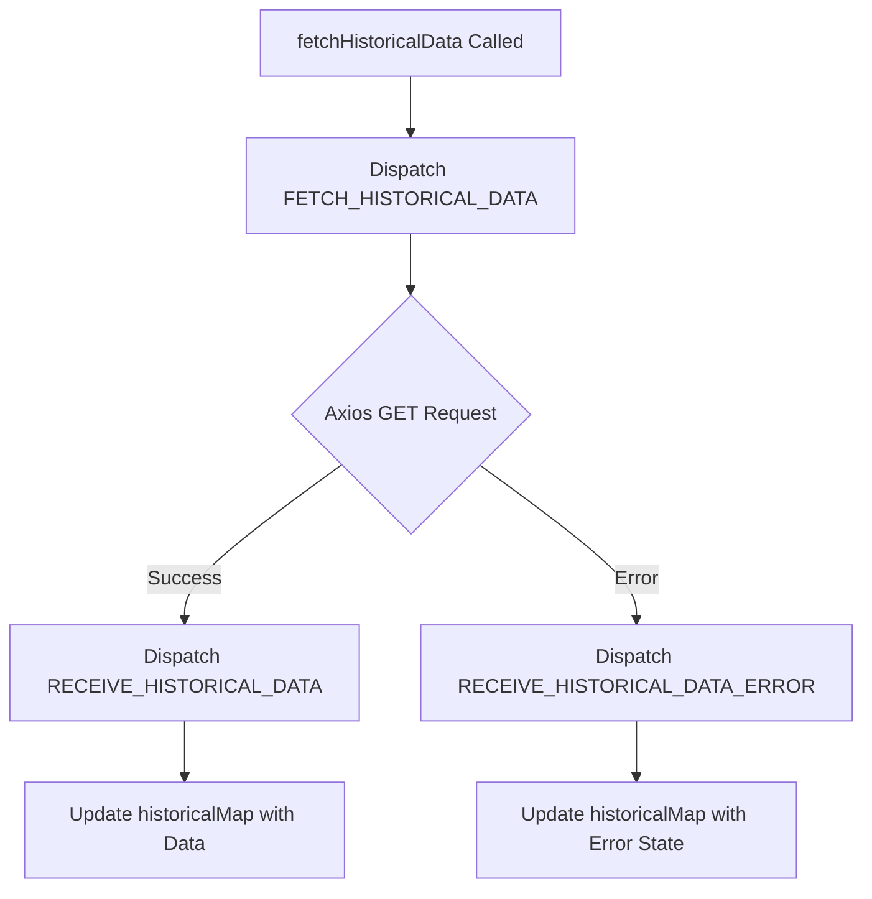
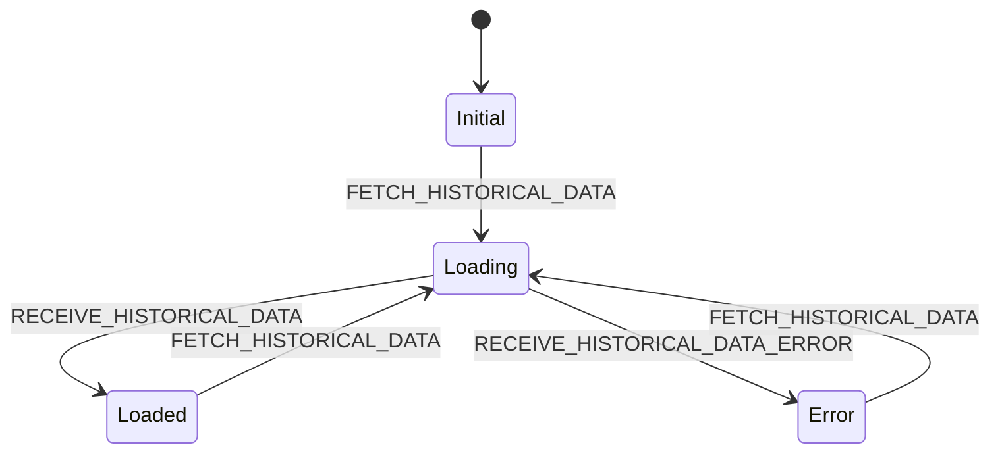
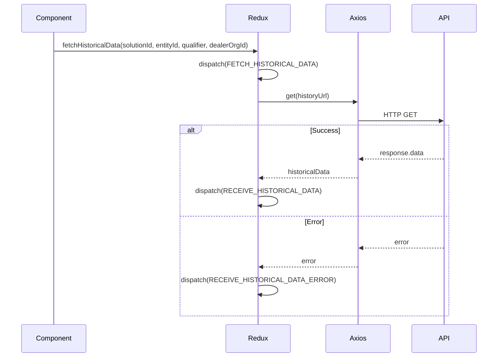
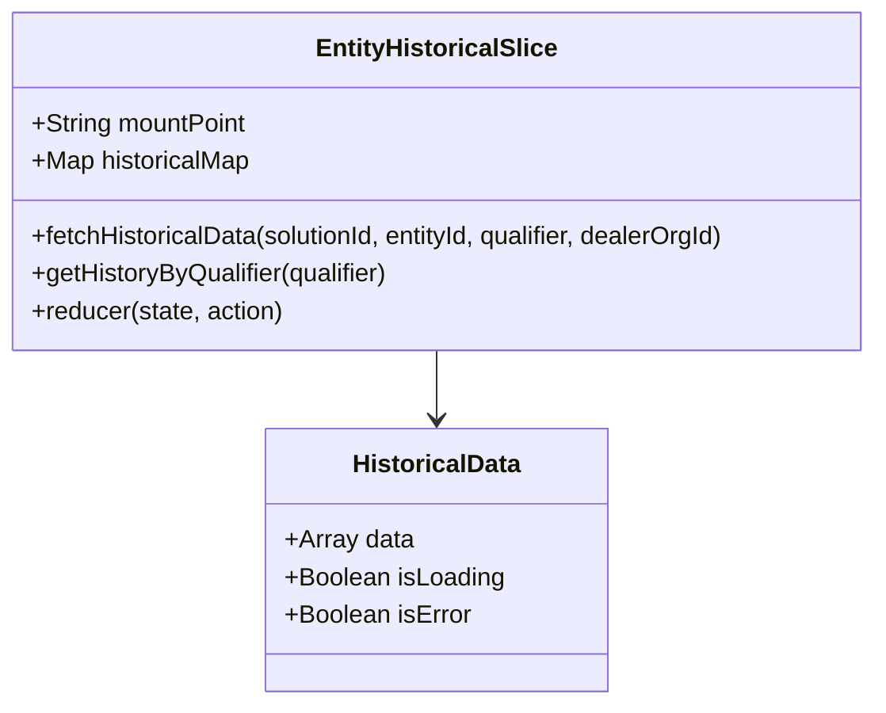

# Diagram: web/portal/src/shared/redux/EntityHistoricalSlice.js

> Auto-generated by Obscura crawlers

## Diagram 1

### SVG

<svg id="container" width="635.640625" xmlns="http://www.w3.org/2000/svg" class="flowchart" height="714.6875" viewBox="0 0 635.640625 714.6875" role="graphics-document document" aria-roledescription="flowchart-v2"><g><marker id="container_flowchart-v2-pointEnd" class="marker flowchart-v2" viewBox="0 0 10 10" refX="5" refY="5" markerUnits="userSpaceOnUse" markerWidth="8" markerHeight="8" orient="auto"><path d="M 0 0 L 10 5 L 0 10 z" class="arrowMarkerPath" style="stroke-width: 1; stroke-dasharray: 1, 0;"></path></marker><marker id="container_flowchart-v2-pointStart" class="marker flowchart-v2" viewBox="0 0 10 10" refX="4.5" refY="5" markerUnits="userSpaceOnUse" markerWidth="8" markerHeight="8" orient="auto"><path d="M 0 5 L 10 10 L 10 0 z" class="arrowMarkerPath" style="stroke-width: 1; stroke-dasharray: 1, 0;"></path></marker><marker id="container_flowchart-v2-circleEnd" class="marker flowchart-v2" viewBox="0 0 10 10" refX="11" refY="5" markerUnits="userSpaceOnUse" markerWidth="11" markerHeight="11" orient="auto"><circle cx="5" cy="5" r="5" class="arrowMarkerPath" style="stroke-width: 1; stroke-dasharray: 1, 0;"></circle></marker><marker id="container_flowchart-v2-circleStart" class="marker flowchart-v2" viewBox="0 0 10 10" refX="-1" refY="5" markerUnits="userSpaceOnUse" markerWidth="11" markerHeight="11" orient="auto"><circle cx="5" cy="5" r="5" class="arrowMarkerPath" style="stroke-width: 1; stroke-dasharray: 1, 0;"></circle></marker><marker id="container_flowchart-v2-crossEnd" class="marker cross flowchart-v2" viewBox="0 0 11 11" refX="12" refY="5.2" markerUnits="userSpaceOnUse" markerWidth="11" markerHeight="11" orient="auto"><path d="M 1,1 l 9,9 M 10,1 l -9,9" class="arrowMarkerPath" style="stroke-width: 2; stroke-dasharray: 1, 0;"></path></marker><marker id="container_flowchart-v2-crossStart" class="marker cross flowchart-v2" viewBox="0 0 11 11" refX="-1" refY="5.2" markerUnits="userSpaceOnUse" markerWidth="11" markerHeight="11" orient="auto"><path d="M 1,1 l 9,9 M 10,1 l -9,9" class="arrowMarkerPath" style="stroke-width: 2; stroke-dasharray: 1, 0;"></path></marker><g class="root"><g class="clusters"></g><g class="edgePaths"><path d="M305.41,62L305.41,66.167C305.41,70.333,305.41,78.667,305.41,86.333C305.41,94,305.41,101,305.41,104.5L305.41,108" id="L_A_B_0" class="edge-thickness-normal edge-pattern-solid edge-thickness-normal edge-pattern-solid flowchart-link" style=";" data-edge="true" data-et="edge" data-id="L_A_B_0" data-points="W3sieCI6MzA1LjQxMDE1NjI1LCJ5Ijo2Mn0seyJ4IjozMDUuNDEwMTU2MjUsInkiOjg3fSx7IngiOjMwNS40MTAxNTYyNSwieSI6MTEyfV0=" marker-end="url(#container_flowchart-v2-pointEnd)"></path><path d="M305.41,190L305.41,194.167C305.41,198.333,305.41,206.667,305.41,214.333C305.41,222,305.41,229,305.41,232.5L305.41,236" id="L_B_C_0" class="edge-thickness-normal edge-pattern-solid edge-thickness-normal edge-pattern-solid flowchart-link" style=";" data-edge="true" data-et="edge" data-id="L_B_C_0" data-points="W3sieCI6MzA1LjQxMDE1NjI1LCJ5IjoxOTB9LHsieCI6MzA1LjQxMDE1NjI1LCJ5IjoyMTV9LHsieCI6MzA1LjQxMDE1NjI1LCJ5IjoyNDB9XQ==" marker-end="url(#container_flowchart-v2-pointEnd)"></path><path d="M252.928,374.206L233.774,389.119C214.619,404.033,176.309,433.86,157.155,454.274C138,474.688,138,485.688,138,491.188L138,496.688" id="L_C_D_0" class="edge-thickness-normal edge-pattern-solid edge-thickness-normal edge-pattern-solid flowchart-link" style=";" data-edge="true" data-et="edge" data-id="L_C_D_0" data-points="W3sieCI6MjUyLjkyODI1Mjc1NzA1MTUsInkiOjM3NC4yMDU1OTY1MDcwNTE1fSx7IngiOjEzOCwieSI6NDYzLjY4NzV9LHsieCI6MTM4LCJ5Ijo1MDAuNjg3NX1d" marker-end="url(#container_flowchart-v2-pointEnd)"></path><path d="M357.892,374.206L377.047,389.119C396.201,404.033,434.511,433.86,453.666,454.274C472.82,474.688,472.82,485.688,472.82,491.188L472.82,496.688" id="L_C_E_0" class="edge-thickness-normal edge-pattern-solid edge-thickness-normal edge-pattern-solid flowchart-link" style=";" data-edge="true" data-et="edge" data-id="L_C_E_0" data-points="W3sieCI6MzU3Ljg5MjA1OTc0Mjk0ODUsInkiOjM3NC4yMDU1OTY1MDcwNTE1fSx7IngiOjQ3Mi44MjAzMTI1LCJ5Ijo0NjMuNjg3NX0seyJ4Ijo0NzIuODIwMzEyNSwieSI6NTAwLjY4NzV9XQ==" marker-end="url(#container_flowchart-v2-pointEnd)"></path><path d="M138,578.688L138,582.854C138,587.021,138,595.354,138,603.021C138,610.688,138,617.688,138,621.188L138,624.688" id="L_D_F_0" class="edge-thickness-normal edge-pattern-solid edge-thickness-normal edge-pattern-solid flowchart-link" style=";" data-edge="true" data-et="edge" data-id="L_D_F_0" data-points="W3sieCI6MTM4LCJ5Ijo1NzguNjg3NX0seyJ4IjoxMzgsInkiOjYwMy42ODc1fSx7IngiOjEzOCwieSI6NjI4LjY4NzV9XQ==" marker-end="url(#container_flowchart-v2-pointEnd)"></path><path d="M472.82,578.688L472.82,582.854C472.82,587.021,472.82,595.354,472.82,603.021C472.82,610.688,472.82,617.688,472.82,621.188L472.82,624.688" id="L_E_G_0" class="edge-thickness-normal edge-pattern-solid edge-thickness-normal edge-pattern-solid flowchart-link" style=";" data-edge="true" data-et="edge" data-id="L_E_G_0" data-points="W3sieCI6NDcyLjgyMDMxMjUsInkiOjU3OC42ODc1fSx7IngiOjQ3Mi44MjAzMTI1LCJ5Ijo2MDMuNjg3NX0seyJ4Ijo0NzIuODIwMzEyNSwieSI6NjI4LjY4NzV9XQ==" marker-end="url(#container_flowchart-v2-pointEnd)"></path></g><g class="edgeLabels"><g class="edgeLabel"><g class="label" data-id="L_A_B_0" transform="translate(0, 0)"><foreignObject width="0" height="0">

</foreignObject></g></g><g class="edgeLabel"><g class="label" data-id="L_B_C_0" transform="translate(0, 0)"><foreignObject width="0" height="0">

</foreignObject></g></g><g class="edgeLabel" transform="translate(138, 463.6875)"><g class="label" data-id="L_C_D_0" transform="translate(-28.1015625, -12)"><foreignObject width="56.203125" height="24">

Success

</foreignObject></g></g><g class="edgeLabel" transform="translate(472.8203125, 463.6875)"><g class="label" data-id="L_C_E_0" transform="translate(-17.8984375, -12)"><foreignObject width="35.796875" height="24">

Error

</foreignObject></g></g><g class="edgeLabel"><g class="label" data-id="L_D_F_0" transform="translate(0, 0)"><foreignObject width="0" height="0">

</foreignObject></g></g><g class="edgeLabel"><g class="label" data-id="L_E_G_0" transform="translate(0, 0)"><foreignObject width="0" height="0">

</foreignObject></g></g></g><g class="nodes"><g class="node default" id="flowchart-A-0" transform="translate(305.41015625, 35)"><rect class="basic label-container" style="" x="-124.015625" y="-27" width="248.03125" height="54"></rect><g class="label" style="" transform="translate(-94.015625, -12)"><rect></rect><foreignObject width="188.03125" height="24">

fetchHistoricalData Called

</foreignObject></g></g><g class="node default" id="flowchart-B-1" transform="translate(305.41015625, 151)"><rect class="basic label-container" style="" x="-130" y="-39" width="260" height="78"></rect><g class="label" style="" transform="translate(-100, -24)"><rect></rect><foreignObject width="200" height="48">

Dispatch FETCH_HISTORICAL_DATA

</foreignObject></g></g><g class="node default" id="flowchart-C-3" transform="translate(305.41015625, 333.34375)"><polygon points="93.34375,0 186.6875,-93.34375 93.34375,-186.6875 0,-93.34375" class="label-container" transform="translate(-92.84375, 93.34375)"></polygon><g class="label" style="" transform="translate(-66.34375, -12)"><rect></rect><foreignObject width="132.6875" height="24">

Axios GET Request

</foreignObject></g></g><g class="node default" id="flowchart-D-5" transform="translate(138, 539.6875)"><rect class="basic label-container" style="" x="-130" y="-39" width="260" height="78"></rect><g class="label" style="" transform="translate(-100, -24)"><rect></rect><foreignObject width="200" height="48">

Dispatch RECEIVE_HISTORICAL_DATA

</foreignObject></g></g><g class="node default" id="flowchart-E-7" transform="translate(472.8203125, 539.6875)"><rect class="basic label-container" style="" x="-154.8203125" y="-39" width="309.640625" height="78"></rect><g class="label" style="" transform="translate(-124.8203125, -24)"><rect></rect><foreignObject width="249.640625" height="48">

Dispatch RECEIVE_HISTORICAL_DATA_ERROR

</foreignObject></g></g><g class="node default" id="flowchart-F-9" transform="translate(138, 667.6875)"><rect class="basic label-container" style="" x="-130" y="-39" width="260" height="78"></rect><g class="label" style="" transform="translate(-100, -24)"><rect></rect><foreignObject width="200" height="48">

Update historicalMap with Data

</foreignObject></g></g><g class="node default" id="flowchart-G-11" transform="translate(472.8203125, 667.6875)"><rect class="basic label-container" style="" x="-130" y="-39" width="260" height="78"></rect><g class="label" style="" transform="translate(-100, -24)"><rect></rect><foreignObject width="200" height="48">

Update historicalMap with Error State

</foreignObject></g></g></g></g></g></svg>

## Diagram 2

### SVG

<svg id="container" width="665.3509521484375" xmlns="http://www.w3.org/2000/svg" class="statediagram" height="348" viewBox="103.91998291015625 0 665.3509521484375 348" role="graphics-document document" aria-roledescription="stateDiagram"><g><defs><marker id="container_stateDiagram-barbEnd" refX="19" refY="7" markerWidth="20" markerHeight="14" markerUnits="userSpaceOnUse" orient="auto"><path d="M 19,7 L9,13 L14,7 L9,1 Z"></path></marker></defs><g class="root"><g class="clusters"></g><g class="edgePaths"><path d="M427.469,22L427.469,26.167C427.469,30.333,427.469,38.667,427.552,47.083C427.635,55.5,427.802,64,427.885,68.25L427.969,72.5" id="edge0" class="edge-thickness-normal edge-pattern-solid transition" style="fill:none;;;fill:none" data-edge="true" data-et="edge" data-id="edge0" data-points="W3sieCI6NDI3LjQ2ODc1LCJ5IjoyMn0seyJ4Ijo0MjcuNDY4NzUsInkiOjQ3fSx7IngiOjQyNy45Njg3NSwieSI6NzIuNX1d" marker-end="url(#container_stateDiagram-barbEnd)"></path><path d="M427.969,112.5L427.885,118.583C427.802,124.667,427.635,136.833,427.635,149.167C427.635,161.5,427.802,174,427.885,180.25L427.969,186.5" id="edge1" class="edge-thickness-normal edge-pattern-solid transition" style="fill:none;;;fill:none" data-edge="true" data-et="edge" data-id="edge1" data-points="W3sieCI6NDI3Ljk2ODc1LCJ5IjoxMTIuNX0seyJ4Ijo0MjcuNDY4NzUsInkiOjE0OX0seyJ4Ijo0MjcuOTY4NzUsInkiOjE4Ni41fV0=" marker-end="url(#container_stateDiagram-barbEnd)"></path><path d="M391.352,212.96L343.526,221.3C295.701,229.64,200.049,246.32,163.918,261.172C127.786,276.023,151.174,289.046,162.868,295.557L174.561,302.069" id="edge2" class="edge-thickness-normal edge-pattern-solid transition" style="fill:none;;;fill:none" data-edge="true" data-et="edge" data-id="edge2" data-points="W3sieCI6MzkxLjM1MTU2MjUsInkiOjIxMi45NjA0NTAyNjk2Mjk3N30seyJ4IjoxMDQuMzk4NDM3NSwieSI6MjYzfSx7IngiOjE3NC41NjEzODk5MDQwODc1NSwieSI6MzAyLjA2ODg5NTE4NDQxNTF9XQ==" marker-end="url(#container_stateDiagram-barbEnd)"></path><path d="M463.918,223.989L477.371,230.491C490.823,236.993,517.728,249.996,546.475,263.982C575.221,277.967,605.81,292.934,621.104,300.417L636.398,307.9" id="edge3" class="edge-thickness-normal edge-pattern-solid transition" style="fill:none;;;fill:none" data-edge="true" data-et="edge" data-id="edge3" data-points="W3sieCI6NDYzLjkxODA1NjM0MDY2ODEsInkiOjIyMy45ODkyNDA0NTIxOTE0NH0seyJ4Ijo1NDQuNjMyODEyNSwieSI6MjYzfSx7IngiOjYzNi4zOTg0Mzc1LCJ5IjozMDcuOTAwNDgwMDk2MDE5Mn1d" marker-end="url(#container_stateDiagram-barbEnd)"></path><path d="M241.142,302.069L252.669,295.557C264.196,289.046,287.25,276.023,312.397,263.01C337.543,249.996,364.781,236.993,378.4,230.491L392.019,223.989" id="edge4" class="edge-thickness-normal edge-pattern-solid transition" style="fill:none;;;fill:none" data-edge="true" data-et="edge" data-id="edge4" data-points="W3sieCI6MjQxLjE0MTczNTA5NTg5ODY0LCJ5IjozMDIuMDY4ODk1MTg0NDIyNzN9LHsieCI6MzEwLjMwNDY4NzUsInkiOjI2M30seyJ4IjozOTIuMDE5NDQzNjU5MzE1NywieSI6MjIzLjk4OTI0MDQ1MjE5OTM3fV0=" marker-end="url(#container_stateDiagram-barbEnd)"></path><path d="M688.195,307.9L703.323,300.417C718.451,292.934,748.706,277.967,711.438,262.056C674.169,246.146,569.378,229.292,516.982,220.865L464.586,212.438" id="edge5" class="edge-thickness-normal edge-pattern-solid transition" style="fill:none;;;fill:none" data-edge="true" data-et="edge" data-id="edge5" data-points="W3sieCI6Njg4LjE5NTMxMjUsInkiOjMwNy45MDA0ODAwOTYwMTkyfSx7IngiOjc3OC45NjA5Mzc1LCJ5IjoyNjN9LHsieCI6NDY0LjU4NTkzNzUsInkiOjIxMi40MzgwNTQyNzc1MjIxOH1d" marker-end="url(#container_stateDiagram-barbEnd)"></path></g><g class="edgeLabels"><g class="edgeLabel"><g class="label" data-id="edge0" transform="translate(0, 0)"><foreignObject width="0" height="0">

</foreignObject></g></g><g class="edgeLabel" transform="translate(427.46875, 149)"><g class="label" data-id="edge1" transform="translate(-89.5078125, -12)"><foreignObject width="179.015625" height="24">

FETCH_HISTORICAL_DATA

</foreignObject></g></g><g class="edgeLabel" transform="translate(208.31842, 244.87819)"><g class="label" data-id="edge2" transform="translate(-96.3984375, -12)"><foreignObject width="192.796875" height="24">

RECEIVE_HISTORICAL_DATA

</foreignObject></g></g><g class="edgeLabel" transform="translate(550.25303, 265.74995)"><g class="label" data-id="edge3" transform="translate(-124.8203125, -12)"><foreignObject width="249.640625" height="24">

RECEIVE_HISTORICAL_DATA_ERROR

</foreignObject></g></g><g class="edgeLabel" transform="translate(310.3046875, 263)"><g class="label" data-id="edge4" transform="translate(-89.5078125, -12)"><foreignObject width="179.015625" height="24">

FETCH_HISTORICAL_DATA

</foreignObject></g></g><g class="edgeLabel" transform="translate(671.76315, 245.75903)"><g class="label" data-id="edge5" transform="translate(-89.5078125, -12)"><foreignObject width="179.015625" height="24">

FETCH_HISTORICAL_DATA

</foreignObject></g></g></g><g class="nodes"><g class="node default" id="state-root_start-0" transform="translate(427.46875, 15)"><circle class="state-start" r="7" width="14" height="14"></circle></g><g class="node  statediagram-state" id="state-Initial-1" transform="translate(427.46875, 92)"><g class="basic label-container outer-path"><path d="M-24.0703125 -20 C-5.523091679008196 -20, 13.024129141983607 -20, 24.0703125 -20 C24.0703125 -20, 24.0703125 -20, 24.0703125 -20 C24.193024071425405 -19.994924611863066, 24.31573564285081 -19.989849223726132, 24.483209227361662 -19.982922465033347 C24.583398896687402 -19.970433835775864, 24.683588566013146 -19.95794520651838, 24.89328545140367 -19.931806517013612 C24.9924422977046 -19.911015512708502, 25.091599144005528 -19.890224508403392, 25.297739935703998 -19.847001329696653 C25.4398597690086 -19.804690422123304, 25.581979602313197 -19.762379514549956, 25.693809846023417 -19.729086208503173 C25.782636432762036 -19.694425966803124, 25.871463019500656 -19.659765725103078, 26.078789623264846 -19.578866633275286 C26.214483865860974 -19.512529760270464, 26.3501781084571 -19.446192887265642, 26.45004946518537 -19.397368756032446 C26.556651283682893 -19.333847859798787, 26.663253102180413 -19.270326963565125, 26.805053290612136 -19.185832391312644 C26.887526784277075 -19.126947448648313, 26.970000277942017 -19.06806250598398, 27.14137606344834 -18.94570254698197 C27.265830841280845 -18.840294727040117, 27.39028561911335 -18.734886907098264, 27.456720358128706 -18.678619553365657 C27.56894618388237 -18.56639372761199, 27.681172009636033 -18.45416790185833, 27.748932053365657 -18.386407858128706 C27.81247144981723 -18.311387034499543, 27.87601084626881 -18.23636621087038, 28.01601504698197 -18.07106356344834 C28.081257190923722 -17.979686255403063, 28.14649933486547 -17.888308947357785, 28.256144891312644 -17.734740790612136 C28.33028209598884 -17.610322507725606, 28.404419300665037 -17.48590422483907, 28.467681256032446 -17.37973696518537 C28.523707727023307 -17.26513298700439, 28.579734198014172 -17.15052900882341, 28.649179133275286 -17.008477123264846 C28.69813280549172 -16.883019613506598, 28.74708647770815 -16.75756210374835, 28.799398708503173 -16.623497346023417 C28.842488781354547 -16.4787603426844, 28.88557885420592 -16.334023339345382, 28.917313829696653 -16.227427435703994 C28.942155152322265 -16.108953735571372, 28.96699647494788 -15.990480035438752, 29.002119017013612 -15.82297295140367 C29.01881343468107 -15.689042465422872, 29.035507852348534 -15.555111979442074, 29.053234965033347 -15.412896727361662 C29.05970443532491 -15.256479357034706, 29.066173905616477 -15.10006198670775, 29.0703125 -15 C29.0703125 -15, 29.0703125 -15, 29.0703125 -15 C29.0703125 -6.146132527878176, 29.0703125 2.707734944243647, 29.0703125 15 C29.0703125 15, 29.0703125 15, 29.0703125 15 C29.06501040348925 15.128192874540666, 29.059708306978504 15.256385749081332, 29.053234965033347 15.412896727361662 C29.03424717780358 15.56522570475028, 29.015259390573814 15.717554682138896, 29.002119017013612 15.822972951403669 C28.973372357115384 15.960072059044801, 28.94462569721716 16.097171166685936, 28.917313829696653 16.227427435703994 C28.886941917215577 16.329444891403092, 28.856570004734497 16.43146234710219, 28.799398708503173 16.623497346023417 C28.757660206638676 16.730463958901986, 28.715921704774182 16.837430571780555, 28.649179133275286 17.008477123264846 C28.58483777038774 17.14008948467346, 28.520496407500197 17.27170184608207, 28.467681256032446 17.379736965185366 C28.400213782485636 17.49296199499394, 28.332746308938827 17.606187024802512, 28.256144891312644 17.734740790612133 C28.17590035187479 17.847130260916952, 28.095655812436938 17.95951973122177, 28.01601504698197 18.07106356344834 C27.95712857709972 18.140590687058133, 27.898242107217467 18.210117810667928, 27.748932053365657 18.386407858128706 C27.65454287619058 18.480797035303784, 27.560153699015498 18.575186212478865, 27.456720358128706 18.678619553365657 C27.381614127675196 18.742231285707582, 27.30650789722168 18.805843018049508, 27.14137606344834 18.94570254698197 C27.069198458192993 18.99723636661591, 26.99702085293765 19.048770186249847, 26.805053290612136 19.185832391312644 C26.667800402783826 19.267617360541053, 26.530547514955515 19.34940232976946, 26.45004946518537 19.397368756032446 C26.349862827531297 19.446347018718352, 26.249676189877228 19.49532528140426, 26.078789623264846 19.578866633275286 C25.971229597317564 19.62083668563772, 25.86366957137028 19.662806738000157, 25.693809846023417 19.729086208503173 C25.590014407818714 19.7599874493103, 25.48621896961401 19.790888690117427, 25.297739935703998 19.847001329696653 C25.175672854860302 19.872596105024936, 25.053605774016606 19.898190880353223, 24.89328545140367 19.931806517013612 C24.780816836648697 19.94582571522267, 24.668348221893723 19.959844913431727, 24.483209227361662 19.982922465033347 C24.386423728703928 19.986925542868704, 24.289638230046194 19.990928620704057, 24.0703125 20 C24.0703125 20, 24.0703125 20, 24.0703125 20 C11.787817689820395 20, -0.49467712035920997 20, -24.0703125 20 C-24.0703125 20, -24.0703125 20, -24.0703125 20 C-24.208491483187867 19.99428487498042, -24.346670466375734 19.98856974996084, -24.483209227361662 19.982922465033347 C-24.578629872317094 19.971028294043684, -24.674050517272526 19.959134123054017, -24.89328545140367 19.931806517013612 C-24.987561378765147 19.912038933788022, -25.081837306126626 19.89227135056243, -25.297739935703994 19.847001329696653 C-25.380291318158715 19.8224247183126, -25.462842700613432 19.797848106928544, -25.693809846023417 19.729086208503173 C-25.8362292963103 19.673513966554296, -25.978648746597184 19.617941724605423, -26.078789623264846 19.578866633275286 C-26.159470045881736 19.539424378049752, -26.24015046849863 19.499982122824218, -26.45004946518537 19.397368756032446 C-26.55227302207338 19.33645673744554, -26.65449657896139 19.275544718858633, -26.805053290612133 19.185832391312644 C-26.888859353845703 19.125996012263627, -26.972665417079273 19.06615963321461, -27.14137606344834 18.94570254698197 C-27.263873185864764 18.841952776599967, -27.38637030828119 18.738203006217965, -27.456720358128706 18.67861955336566 C-27.551283169491338 18.58405674200303, -27.645845980853966 18.489493930640396, -27.748932053365657 18.386407858128706 C-27.81054523766023 18.313661308895792, -27.8721584219548 18.24091475966288, -28.016015046981966 18.07106356344834 C-28.11100615486649 17.938020238960476, -28.205997262751016 17.804976914472615, -28.256144891312644 17.734740790612133 C-28.307206022049193 17.649049156617657, -28.35826715278574 17.563357522623186, -28.467681256032446 17.37973696518537 C-28.526885377925648 17.258632998191285, -28.58608949981885 17.137529031197197, -28.649179133275286 17.00847712326485 C-28.695363604158654 16.89011646829881, -28.741548075042022 16.771755813332774, -28.799398708503173 16.623497346023417 C-28.83330250649338 16.509616496022556, -28.86720630448358 16.395735646021695, -28.917313829696653 16.227427435703994 C-28.939397721427074 16.122104526531135, -28.961481613157492 16.016781617358276, -29.002119017013612 15.82297295140367 C-29.02186954897444 15.664524876329526, -29.041620080935267 15.50607680125538, -29.053234965033347 15.412896727361664 C-29.0578845283485 15.300480650905943, -29.062534091663647 15.188064574450221, -29.0703125 15 C-29.0703125 15, -29.0703125 15, -29.0703125 15 C-29.0703125 7.095448099567631, -29.0703125 -0.8091038008647384, -29.0703125 -15 C-29.0703125 -15, -29.0703125 -15, -29.0703125 -15 C-29.063924059179985 -15.154458258330555, -29.057535618359967 -15.308916516661112, -29.053234965033347 -15.41289672736166 C-29.04251379687693 -15.498906990796598, -29.03179262872051 -15.584917254231536, -29.002119017013612 -15.822972951403669 C-28.979693948614162 -15.929923006722815, -28.95726888021471 -16.03687306204196, -28.917313829696653 -16.227427435703994 C-28.891185649718466 -16.31519044519783, -28.865057469740282 -16.40295345469166, -28.799398708503173 -16.623497346023417 C-28.759797378002148 -16.724986858103453, -28.720196047501126 -16.82647637018349, -28.64917913327529 -17.008477123264846 C-28.595580247307655 -17.11811539691162, -28.541981361340024 -17.227753670558393, -28.467681256032446 -17.379736965185366 C-28.3843523555492 -17.519580903977367, -28.301023455065955 -17.659424842769365, -28.256144891312644 -17.734740790612133 C-28.190847852525618 -17.82619498367197, -28.12555081373859 -17.917649176731807, -28.01601504698197 -18.07106356344834 C-27.929100172762467 -18.17368376152563, -27.842185298542965 -18.27630395960292, -27.74893205336566 -18.386407858128706 C-27.686097794835 -18.449242116659367, -27.623263536304336 -18.512076375190027, -27.456720358128706 -18.678619553365657 C-27.36863472856822 -18.753224275995688, -27.280549099007736 -18.82782899862572, -27.14137606344834 -18.945702546981966 C-27.040286250025122 -19.01787928647548, -26.9391964366019 -19.090056025968995, -26.805053290612136 -19.185832391312644 C-26.680289050167318 -19.260175741948363, -26.555524809722503 -19.33451909258408, -26.450049465185366 -19.397368756032446 C-26.31358733178566 -19.464081027976412, -26.17712519838595 -19.530793299920383, -26.07878962326485 -19.578866633275286 C-25.92825350249501 -19.637606009874588, -25.77771738172517 -19.696345386473887, -25.69380984602342 -19.729086208503173 C-25.570732826268973 -19.765727824850078, -25.447655806514526 -19.802369441196987, -25.297739935703994 -19.847001329696653 C-25.18096093115157 -19.871487312026378, -25.064181926599144 -19.895973294356107, -24.893285451403674 -19.931806517013612 C-24.786275523107236 -19.945145290665206, -24.679265594810794 -19.9584840643168, -24.483209227361662 -19.982922465033347 C-24.38570362045931 -19.98695532676601, -24.288198013556954 -19.99098818849868, -24.0703125 -20 C-24.0703125 -20, -24.0703125 -20, -24.0703125 -20" stroke="none" stroke-width="0" fill="#ECECFF" style=""></path><path d="M-24.0703125 -20 C-11.878394884495243 -20, 0.3135227310095132 -20, 24.0703125 -20 M-24.0703125 -20 C-12.419222166818932 -20, -0.7681318336378631 -20, 24.0703125 -20 M24.0703125 -20 C24.0703125 -20, 24.0703125 -20, 24.0703125 -20 M24.0703125 -20 C24.0703125 -20, 24.0703125 -20, 24.0703125 -20 M24.0703125 -20 C24.22151394579225 -19.993746261942967, 24.3727153915845 -19.987492523885937, 24.483209227361662 -19.982922465033347 M24.0703125 -20 C24.184585166876317 -19.995273647537044, 24.29885783375263 -19.990547295074084, 24.483209227361662 -19.982922465033347 M24.483209227361662 -19.982922465033347 C24.59817184579499 -19.968592389589986, 24.713134464228318 -19.954262314146625, 24.89328545140367 -19.931806517013612 M24.483209227361662 -19.982922465033347 C24.5943527088892 -19.96906844450883, 24.705496190416735 -19.955214423984316, 24.89328545140367 -19.931806517013612 M24.89328545140367 -19.931806517013612 C25.00765145232092 -19.90782648834053, 25.122017453238172 -19.883846459667446, 25.297739935703998 -19.847001329696653 M24.89328545140367 -19.931806517013612 C25.041047391846817 -19.900824096187506, 25.188809332289964 -19.8698416753614, 25.297739935703998 -19.847001329696653 M25.297739935703998 -19.847001329696653 C25.41589974445068 -19.811823630493684, 25.53405955319736 -19.776645931290716, 25.693809846023417 -19.729086208503173 M25.297739935703998 -19.847001329696653 C25.413762276034838 -19.812459982412207, 25.529784616365674 -19.77791863512776, 25.693809846023417 -19.729086208503173 M25.693809846023417 -19.729086208503173 C25.805049811500233 -19.6856802392805, 25.916289776977052 -19.64227427005783, 26.078789623264846 -19.578866633275286 M25.693809846023417 -19.729086208503173 C25.83156590310413 -19.67533362822996, 25.96932196018485 -19.621581047956745, 26.078789623264846 -19.578866633275286 M26.078789623264846 -19.578866633275286 C26.201126844525916 -19.51905961010841, 26.323464065786986 -19.45925258694153, 26.45004946518537 -19.397368756032446 M26.078789623264846 -19.578866633275286 C26.172959973410233 -19.53282955433298, 26.267130323555616 -19.48679247539068, 26.45004946518537 -19.397368756032446 M26.45004946518537 -19.397368756032446 C26.530864155172488 -19.349213653153534, 26.611678845159606 -19.301058550274625, 26.805053290612136 -19.185832391312644 M26.45004946518537 -19.397368756032446 C26.546227788571063 -19.340058914738773, 26.642406111956753 -19.2827490734451, 26.805053290612136 -19.185832391312644 M26.805053290612136 -19.185832391312644 C26.87634612633939 -19.134930284979763, 26.947638962066645 -19.084028178646882, 27.14137606344834 -18.94570254698197 M26.805053290612136 -19.185832391312644 C26.914966037712837 -19.107356198253598, 27.024878784813538 -19.02888000519455, 27.14137606344834 -18.94570254698197 M27.14137606344834 -18.94570254698197 C27.239086904755485 -18.862945685845375, 27.336797746062626 -18.78018882470878, 27.456720358128706 -18.678619553365657 M27.14137606344834 -18.94570254698197 C27.214490757127166 -18.88377756024684, 27.28760545080599 -18.821852573511713, 27.456720358128706 -18.678619553365657 M27.456720358128706 -18.678619553365657 C27.546142864240444 -18.58919704725392, 27.63556537035218 -18.499774541142184, 27.748932053365657 -18.386407858128706 M27.456720358128706 -18.678619553365657 C27.526501652662656 -18.608838258831707, 27.596282947196606 -18.539056964297757, 27.748932053365657 -18.386407858128706 M27.748932053365657 -18.386407858128706 C27.83937671485404 -18.27962004809827, 27.929821376342424 -18.172832238067834, 28.01601504698197 -18.07106356344834 M27.748932053365657 -18.386407858128706 C27.817291521535537 -18.30569598657569, 27.885650989705415 -18.224984115022668, 28.01601504698197 -18.07106356344834 M28.01601504698197 -18.07106356344834 C28.105521940514432 -17.945701359076367, 28.19502883404689 -17.820339154704392, 28.256144891312644 -17.734740790612136 M28.01601504698197 -18.07106356344834 C28.09037226252055 -17.966919803308816, 28.164729478059133 -17.862776043169294, 28.256144891312644 -17.734740790612136 M28.256144891312644 -17.734740790612136 C28.31840816746349 -17.63024953093472, 28.380671443614336 -17.5257582712573, 28.467681256032446 -17.37973696518537 M28.256144891312644 -17.734740790612136 C28.319649240651376 -17.628166741387314, 28.38315358999011 -17.521592692162493, 28.467681256032446 -17.37973696518537 M28.467681256032446 -17.37973696518537 C28.529478052476158 -17.253329597631478, 28.591274848919866 -17.126922230077586, 28.649179133275286 -17.008477123264846 M28.467681256032446 -17.37973696518537 C28.504456304165657 -17.304512401879386, 28.54123135229887 -17.2292878385734, 28.649179133275286 -17.008477123264846 M28.649179133275286 -17.008477123264846 C28.686790738935272 -16.912086838931344, 28.72440234459526 -16.815696554597842, 28.799398708503173 -16.623497346023417 M28.649179133275286 -17.008477123264846 C28.68095917360835 -16.927031860025444, 28.712739213941415 -16.84558659678604, 28.799398708503173 -16.623497346023417 M28.799398708503173 -16.623497346023417 C28.837332682307554 -16.496079374089966, 28.875266656111933 -16.368661402156516, 28.917313829696653 -16.227427435703994 M28.799398708503173 -16.623497346023417 C28.82930979275971 -16.523027785044853, 28.859220877016245 -16.42255822406629, 28.917313829696653 -16.227427435703994 M28.917313829696653 -16.227427435703994 C28.94838079636733 -16.07926227763881, 28.97944776303801 -15.93109711957363, 29.002119017013612 -15.82297295140367 M28.917313829696653 -16.227427435703994 C28.946854964134907 -16.086539305238404, 28.97639609857316 -15.945651174772815, 29.002119017013612 -15.82297295140367 M29.002119017013612 -15.82297295140367 C29.02152568826997 -15.667283488949426, 29.040932359526327 -15.511594026495182, 29.053234965033347 -15.412896727361662 M29.002119017013612 -15.82297295140367 C29.02066501230591 -15.674188237137393, 29.039211007598208 -15.525403522871118, 29.053234965033347 -15.412896727361662 M29.053234965033347 -15.412896727361662 C29.057229871627754 -15.316308791095294, 29.061224778222158 -15.219720854828923, 29.0703125 -15 M29.053234965033347 -15.412896727361662 C29.056852222518575 -15.325439504724342, 29.060469480003803 -15.237982282087021, 29.0703125 -15 M29.0703125 -15 C29.0703125 -15, 29.0703125 -15, 29.0703125 -15 M29.0703125 -15 C29.0703125 -15, 29.0703125 -15, 29.0703125 -15 M29.0703125 -15 C29.0703125 -6.32453149349403, 29.0703125 2.35093701301194, 29.0703125 15 M29.0703125 -15 C29.0703125 -6.697983573971225, 29.0703125 1.60403285205755, 29.0703125 15 M29.0703125 15 C29.0703125 15, 29.0703125 15, 29.0703125 15 M29.0703125 15 C29.0703125 15, 29.0703125 15, 29.0703125 15 M29.0703125 15 C29.064731023231015 15.134947666408463, 29.05914954646203 15.269895332816926, 29.053234965033347 15.412896727361662 M29.0703125 15 C29.064932642473813 15.130072962554149, 29.059552784947627 15.260145925108295, 29.053234965033347 15.412896727361662 M29.053234965033347 15.412896727361662 C29.039515186751625 15.522963254354183, 29.0257954084699 15.633029781346705, 29.002119017013612 15.822972951403669 M29.053234965033347 15.412896727361662 C29.035123810276495 15.55819294592857, 29.017012655519643 15.703489164495474, 29.002119017013612 15.822972951403669 M29.002119017013612 15.822972951403669 C28.97938756179891 15.931384232448274, 28.956656106584205 16.039795513492876, 28.917313829696653 16.227427435703994 M29.002119017013612 15.822972951403669 C28.972315810020337 15.96511096319661, 28.942512603027065 16.10724897498955, 28.917313829696653 16.227427435703994 M28.917313829696653 16.227427435703994 C28.871687650222317 16.38068307102634, 28.82606147074798 16.53393870634869, 28.799398708503173 16.623497346023417 M28.917313829696653 16.227427435703994 C28.893423654689467 16.307673119012794, 28.869533479682286 16.387918802321593, 28.799398708503173 16.623497346023417 M28.799398708503173 16.623497346023417 C28.742569597568078 16.76913787546462, 28.68574048663298 16.914778404905817, 28.649179133275286 17.008477123264846 M28.799398708503173 16.623497346023417 C28.742152613430676 16.77020651422282, 28.684906518358183 16.91691568242222, 28.649179133275286 17.008477123264846 M28.649179133275286 17.008477123264846 C28.576760951971487 17.156610880813137, 28.504342770667687 17.304744638361424, 28.467681256032446 17.379736965185366 M28.649179133275286 17.008477123264846 C28.5795879395124 17.150828185370663, 28.50999674574951 17.293179247476484, 28.467681256032446 17.379736965185366 M28.467681256032446 17.379736965185366 C28.392685922807594 17.50559537359303, 28.317690589582742 17.631453782000698, 28.256144891312644 17.734740790612133 M28.467681256032446 17.379736965185366 C28.422336981149343 17.455834477147565, 28.376992706266236 17.53193198910976, 28.256144891312644 17.734740790612133 M28.256144891312644 17.734740790612133 C28.171139370484486 17.85379843024456, 28.086133849656328 17.972856069876986, 28.01601504698197 18.07106356344834 M28.256144891312644 17.734740790612133 C28.18911224015294 17.828625860047932, 28.122079588993238 17.922510929483735, 28.01601504698197 18.07106356344834 M28.01601504698197 18.07106356344834 C27.95295792959421 18.145514961262858, 27.889900812206445 18.21996635907738, 27.748932053365657 18.386407858128706 M28.01601504698197 18.07106356344834 C27.932946375023995 18.169142559096613, 27.84987770306602 18.26722155474489, 27.748932053365657 18.386407858128706 M27.748932053365657 18.386407858128706 C27.68421667323931 18.451123238255054, 27.61950129311296 18.5158386183814, 27.456720358128706 18.678619553365657 M27.748932053365657 18.386407858128706 C27.63365889691275 18.501681014581614, 27.51838574045984 18.61695417103452, 27.456720358128706 18.678619553365657 M27.456720358128706 18.678619553365657 C27.351623509844664 18.767632043310314, 27.246526661560623 18.856644533254972, 27.14137606344834 18.94570254698197 M27.456720358128706 18.678619553365657 C27.338469824515936 18.77877264649847, 27.22021929090317 18.87892573963129, 27.14137606344834 18.94570254698197 M27.14137606344834 18.94570254698197 C27.06019819557431 19.003662430611918, 26.979020327700272 19.061622314241866, 26.805053290612136 19.185832391312644 M27.14137606344834 18.94570254698197 C27.068327798010316 18.99785800603797, 26.99527953257229 19.05001346509397, 26.805053290612136 19.185832391312644 M26.805053290612136 19.185832391312644 C26.714559773569203 19.23975482328351, 26.62406625652627 19.293677255254373, 26.45004946518537 19.397368756032446 M26.805053290612136 19.185832391312644 C26.722133092814417 19.235242104525987, 26.639212895016698 19.28465181773933, 26.45004946518537 19.397368756032446 M26.45004946518537 19.397368756032446 C26.320713072741437 19.460597465492075, 26.191376680297505 19.523826174951704, 26.078789623264846 19.578866633275286 M26.45004946518537 19.397368756032446 C26.34044390655837 19.45095164860146, 26.230838347931368 19.50453454117047, 26.078789623264846 19.578866633275286 M26.078789623264846 19.578866633275286 C25.933450649663776 19.635578076756428, 25.78811167606271 19.69228952023757, 25.693809846023417 19.729086208503173 M26.078789623264846 19.578866633275286 C25.959640068772597 19.625358933709013, 25.840490514280347 19.67185123414274, 25.693809846023417 19.729086208503173 M25.693809846023417 19.729086208503173 C25.549577856948932 19.772025932093836, 25.40534586787445 19.8149656556845, 25.297739935703998 19.847001329696653 M25.693809846023417 19.729086208503173 C25.56417796839363 19.767679290590443, 25.434546090763842 19.80627237267771, 25.297739935703998 19.847001329696653 M25.297739935703998 19.847001329696653 C25.18922058997893 19.86975544369207, 25.08070124425386 19.892509557687493, 24.89328545140367 19.931806517013612 M25.297739935703998 19.847001329696653 C25.177612711365374 19.872189359888793, 25.05748548702675 19.897377390080933, 24.89328545140367 19.931806517013612 M24.89328545140367 19.931806517013612 C24.76147179815795 19.94823707175582, 24.629658144912224 19.964667626498027, 24.483209227361662 19.982922465033347 M24.89328545140367 19.931806517013612 C24.734028735309433 19.951657845972477, 24.574772019215196 19.97150917493134, 24.483209227361662 19.982922465033347 M24.483209227361662 19.982922465033347 C24.353343384441928 19.98829375602809, 24.223477541522193 19.99366504702283, 24.0703125 20 M24.483209227361662 19.982922465033347 C24.327010776990157 19.989382880728577, 24.170812326618655 19.995843296423807, 24.0703125 20 M24.0703125 20 C24.0703125 20, 24.0703125 20, 24.0703125 20 M24.0703125 20 C24.0703125 20, 24.0703125 20, 24.0703125 20 M24.0703125 20 C7.081900114941146 20, -9.906512270117709 20, -24.0703125 20 M24.0703125 20 C9.0575334504591 20, -5.955245599081799 20, -24.0703125 20 M-24.0703125 20 C-24.0703125 20, -24.0703125 20, -24.0703125 20 M-24.0703125 20 C-24.0703125 20, -24.0703125 20, -24.0703125 20 M-24.0703125 20 C-24.174235100699526 19.995701729440647, -24.278157701399053 19.991403458881294, -24.483209227361662 19.982922465033347 M-24.0703125 20 C-24.226159071775815 19.993554138111143, -24.382005643551633 19.987108276222287, -24.483209227361662 19.982922465033347 M-24.483209227361662 19.982922465033347 C-24.634047085020256 19.964120545684093, -24.78488494267885 19.94531862633484, -24.89328545140367 19.931806517013612 M-24.483209227361662 19.982922465033347 C-24.58535150288503 19.970190443667157, -24.687493778408395 19.957458422300963, -24.89328545140367 19.931806517013612 M-24.89328545140367 19.931806517013612 C-24.997965856584422 19.90985734420341, -25.10264626176517 19.88790817139321, -25.297739935703994 19.847001329696653 M-24.89328545140367 19.931806517013612 C-25.005933909086785 19.908186619285665, -25.1185823667699 19.884566721557718, -25.297739935703994 19.847001329696653 M-25.297739935703994 19.847001329696653 C-25.45396845161345 19.800490085324455, -25.610196967522903 19.753978840952257, -25.693809846023417 19.729086208503173 M-25.297739935703994 19.847001329696653 C-25.440757121931526 19.804423268583225, -25.583774308159057 19.7618452074698, -25.693809846023417 19.729086208503173 M-25.693809846023417 19.729086208503173 C-25.839018905795246 19.672425457555505, -25.984227965567076 19.615764706607838, -26.078789623264846 19.578866633275286 M-25.693809846023417 19.729086208503173 C-25.82909692600447 19.67629702608378, -25.964384005985526 19.623507843664388, -26.078789623264846 19.578866633275286 M-26.078789623264846 19.578866633275286 C-26.207239630515826 19.516071251131933, -26.335689637766805 19.45327586898858, -26.45004946518537 19.397368756032446 M-26.078789623264846 19.578866633275286 C-26.183888214722547 19.527487062697144, -26.288986806180247 19.476107492119002, -26.45004946518537 19.397368756032446 M-26.45004946518537 19.397368756032446 C-26.571168876841476 19.3251972519425, -26.692288288497583 19.253025747852554, -26.805053290612133 19.185832391312644 M-26.45004946518537 19.397368756032446 C-26.540292405050796 19.3435956356504, -26.630535344916222 19.289822515268355, -26.805053290612133 19.185832391312644 M-26.805053290612133 19.185832391312644 C-26.92237149141146 19.102068805940394, -27.03968969221079 19.018305220568145, -27.14137606344834 18.94570254698197 M-26.805053290612133 19.185832391312644 C-26.933143854648556 19.094377486421994, -27.061234418684982 19.002922581531344, -27.14137606344834 18.94570254698197 M-27.14137606344834 18.94570254698197 C-27.24704797206758 18.85620300577802, -27.352719880686823 18.76670346457407, -27.456720358128706 18.67861955336566 M-27.14137606344834 18.94570254698197 C-27.266984684247266 18.83931747189762, -27.392593305046187 18.73293239681327, -27.456720358128706 18.67861955336566 M-27.456720358128706 18.67861955336566 C-27.5650370691211 18.570302842373266, -27.67335378011349 18.461986131380872, -27.748932053365657 18.386407858128706 M-27.456720358128706 18.67861955336566 C-27.519879412753525 18.61546049874084, -27.583038467378344 18.552301444116022, -27.748932053365657 18.386407858128706 M-27.748932053365657 18.386407858128706 C-27.85161582605423 18.265169356810596, -27.954299598742796 18.14393085549248, -28.016015046981966 18.07106356344834 M-27.748932053365657 18.386407858128706 C-27.810849887398096 18.31330160962999, -27.87276772143053 18.240195361131274, -28.016015046981966 18.07106356344834 M-28.016015046981966 18.07106356344834 C-28.066731952212013 18.00003011800475, -28.11744885744206 17.928996672561166, -28.256144891312644 17.734740790612133 M-28.016015046981966 18.07106356344834 C-28.082677056972383 17.977697609269242, -28.1493390669628 17.884331655090147, -28.256144891312644 17.734740790612133 M-28.256144891312644 17.734740790612133 C-28.309127429944386 17.645824618113828, -28.36210996857613 17.556908445615523, -28.467681256032446 17.37973696518537 M-28.256144891312644 17.734740790612133 C-28.300392967588348 17.660482937280594, -28.34464104386405 17.586225083949053, -28.467681256032446 17.37973696518537 M-28.467681256032446 17.37973696518537 C-28.51170185681391 17.289691387046144, -28.55572245759538 17.199645808906922, -28.649179133275286 17.00847712326485 M-28.467681256032446 17.37973696518537 C-28.537188554433886 17.237557513784324, -28.606695852835326 17.09537806238328, -28.649179133275286 17.00847712326485 M-28.649179133275286 17.00847712326485 C-28.707575620549882 16.858819752522376, -28.76597210782448 16.709162381779905, -28.799398708503173 16.623497346023417 M-28.649179133275286 17.00847712326485 C-28.685363570940524 16.91574435704023, -28.721548008605758 16.823011590815607, -28.799398708503173 16.623497346023417 M-28.799398708503173 16.623497346023417 C-28.83163956082338 16.51520223206485, -28.863880413143587 16.406907118106286, -28.917313829696653 16.227427435703994 M-28.799398708503173 16.623497346023417 C-28.8349426111602 16.504107481557497, -28.87048651381723 16.38471761709158, -28.917313829696653 16.227427435703994 M-28.917313829696653 16.227427435703994 C-28.940879492834515 16.115037634641517, -28.964445155972378 16.002647833579044, -29.002119017013612 15.82297295140367 M-28.917313829696653 16.227427435703994 C-28.937229892742 16.13244337561116, -28.957145955787343 16.037459315518326, -29.002119017013612 15.82297295140367 M-29.002119017013612 15.82297295140367 C-29.01399005183611 15.727737915684452, -29.025861086658608 15.632502879965234, -29.053234965033347 15.412896727361664 M-29.002119017013612 15.82297295140367 C-29.018647517439245 15.690373531727392, -29.035176017864874 15.557774112051113, -29.053234965033347 15.412896727361664 M-29.053234965033347 15.412896727361664 C-29.058912335584985 15.275630563048828, -29.064589706136623 15.138364398735993, -29.0703125 15 M-29.053234965033347 15.412896727361664 C-29.0584712910151 15.286294037600742, -29.06370761699685 15.15969134783982, -29.0703125 15 M-29.0703125 15 C-29.0703125 15, -29.0703125 15, -29.0703125 15 M-29.0703125 15 C-29.0703125 15, -29.0703125 15, -29.0703125 15 M-29.0703125 15 C-29.0703125 3.142313916830677, -29.0703125 -8.715372166338646, -29.0703125 -15 M-29.0703125 15 C-29.0703125 3.2131545916704294, -29.0703125 -8.573690816659141, -29.0703125 -15 M-29.0703125 -15 C-29.0703125 -15, -29.0703125 -15, -29.0703125 -15 M-29.0703125 -15 C-29.0703125 -15, -29.0703125 -15, -29.0703125 -15 M-29.0703125 -15 C-29.065582369723245 -15.11436400599266, -29.06085223944649 -15.228728011985321, -29.053234965033347 -15.41289672736166 M-29.0703125 -15 C-29.06573302593278 -15.1107214746792, -29.061153551865555 -15.221442949358401, -29.053234965033347 -15.41289672736166 M-29.053234965033347 -15.41289672736166 C-29.041617048755263 -15.506101126832307, -29.029999132477183 -15.599305526302954, -29.002119017013612 -15.822972951403669 M-29.053234965033347 -15.41289672736166 C-29.037964578797336 -15.535402962106813, -29.022694192561325 -15.657909196851964, -29.002119017013612 -15.822972951403669 M-29.002119017013612 -15.822972951403669 C-28.97532782534751 -15.950746003405856, -28.948536633681403 -16.078519055408044, -28.917313829696653 -16.227427435703994 M-29.002119017013612 -15.822972951403669 C-28.98044548699991 -15.926338755807794, -28.958771956986205 -16.029704560211922, -28.917313829696653 -16.227427435703994 M-28.917313829696653 -16.227427435703994 C-28.892831537142673 -16.309662006793122, -28.868349244588693 -16.391896577882253, -28.799398708503173 -16.623497346023417 M-28.917313829696653 -16.227427435703994 C-28.886729653508155 -16.330157872628163, -28.856145477319654 -16.43288830955233, -28.799398708503173 -16.623497346023417 M-28.799398708503173 -16.623497346023417 C-28.7536432365916 -16.740758570849618, -28.70788776468003 -16.858019795675823, -28.64917913327529 -17.008477123264846 M-28.799398708503173 -16.623497346023417 C-28.755793384157982 -16.735248214893105, -28.712188059812792 -16.846999083762796, -28.64917913327529 -17.008477123264846 M-28.64917913327529 -17.008477123264846 C-28.60826663867526 -17.09216496859131, -28.567354144075235 -17.17585281391777, -28.467681256032446 -17.379736965185366 M-28.64917913327529 -17.008477123264846 C-28.607562833984602 -17.093604624096745, -28.56594653469391 -17.178732124928644, -28.467681256032446 -17.379736965185366 M-28.467681256032446 -17.379736965185366 C-28.41814042480556 -17.462877207401693, -28.368599593578676 -17.54601744961802, -28.256144891312644 -17.734740790612133 M-28.467681256032446 -17.379736965185366 C-28.388222834299448 -17.513085402533015, -28.30876441256645 -17.64643383988066, -28.256144891312644 -17.734740790612133 M-28.256144891312644 -17.734740790612133 C-28.162530373887357 -17.865856080200377, -28.06891585646207 -17.996971369788618, -28.01601504698197 -18.07106356344834 M-28.256144891312644 -17.734740790612133 C-28.17597784292066 -17.847021727954342, -28.095810794528674 -17.95930266529655, -28.01601504698197 -18.07106356344834 M-28.01601504698197 -18.07106356344834 C-27.940397237140118 -18.160345342819546, -27.864779427298267 -18.249627122190752, -27.74893205336566 -18.386407858128706 M-28.01601504698197 -18.07106356344834 C-27.944683753334207 -18.15528426271273, -27.873352459686444 -18.23950496197712, -27.74893205336566 -18.386407858128706 M-27.74893205336566 -18.386407858128706 C-27.648469657579337 -18.48687025391503, -27.548007261793014 -18.58733264970135, -27.456720358128706 -18.678619553365657 M-27.74893205336566 -18.386407858128706 C-27.632570349257705 -18.50276956223666, -27.516208645149746 -18.619131266344617, -27.456720358128706 -18.678619553365657 M-27.456720358128706 -18.678619553365657 C-27.343937035969173 -18.774142154600263, -27.23115371380964 -18.86966475583487, -27.14137606344834 -18.945702546981966 M-27.456720358128706 -18.678619553365657 C-27.37974719461598 -18.74381249735069, -27.302774031103255 -18.80900544133572, -27.14137606344834 -18.945702546981966 M-27.14137606344834 -18.945702546981966 C-27.060359476434837 -19.00354727829081, -26.97934288942133 -19.061392009599658, -26.805053290612136 -19.185832391312644 M-27.14137606344834 -18.945702546981966 C-27.052086764595217 -19.009453881015, -26.96279746574209 -19.07320521504803, -26.805053290612136 -19.185832391312644 M-26.805053290612136 -19.185832391312644 C-26.664201591604712 -19.2697617865433, -26.52334989259729 -19.353691181773954, -26.450049465185366 -19.397368756032446 M-26.805053290612136 -19.185832391312644 C-26.733267759380617 -19.22860728338019, -26.661482228149097 -19.27138217544773, -26.450049465185366 -19.397368756032446 M-26.450049465185366 -19.397368756032446 C-26.320205192645524 -19.460845752941708, -26.190360920105686 -19.52432274985097, -26.07878962326485 -19.578866633275286 M-26.450049465185366 -19.397368756032446 C-26.324466097600098 -19.45876272343766, -26.198882730014834 -19.520156690842875, -26.07878962326485 -19.578866633275286 M-26.07878962326485 -19.578866633275286 C-25.943341758087655 -19.631718554272897, -25.80789389291046 -19.68457047527051, -25.69380984602342 -19.729086208503173 M-26.07878962326485 -19.578866633275286 C-25.95518035595269 -19.627099119051334, -25.831571088640533 -19.675331604827377, -25.69380984602342 -19.729086208503173 M-25.69380984602342 -19.729086208503173 C-25.608481386789673 -19.754489591465756, -25.523152927555927 -19.77989297442834, -25.297739935703994 -19.847001329696653 M-25.69380984602342 -19.729086208503173 C-25.595524778992836 -19.758346940733688, -25.497239711962248 -19.787607672964203, -25.297739935703994 -19.847001329696653 M-25.297739935703994 -19.847001329696653 C-25.158215006435956 -19.876256630901757, -25.018690077167918 -19.905511932106865, -24.893285451403674 -19.931806517013612 M-25.297739935703994 -19.847001329696653 C-25.184678211873212 -19.87070788022343, -25.071616488042427 -19.89441443075021, -24.893285451403674 -19.931806517013612 M-24.893285451403674 -19.931806517013612 C-24.74760972385178 -19.949964977516107, -24.601933996299888 -19.968123438018605, -24.483209227361662 -19.982922465033347 M-24.893285451403674 -19.931806517013612 C-24.73682447224941 -19.951309357726334, -24.580363493095145 -19.97081219843906, -24.483209227361662 -19.982922465033347 M-24.483209227361662 -19.982922465033347 C-24.387616857044893 -19.986876194715492, -24.292024486728124 -19.990829924397634, -24.0703125 -20 M-24.483209227361662 -19.982922465033347 C-24.367760025384957 -19.98769747934801, -24.25231082340825 -19.992472493662675, -24.0703125 -20 M-24.0703125 -20 C-24.0703125 -20, -24.0703125 -20, -24.0703125 -20 M-24.0703125 -20 C-24.0703125 -20, -24.0703125 -20, -24.0703125 -20" stroke="#9370DB" stroke-width="1.3" fill="none" stroke-dasharray="0 0" style=""></path></g><g class="label" style="" transform="translate(-21.0703125, -12)"><rect></rect><foreignObject width="42.140625" height="24">

Initial

</foreignObject></g></g><g class="node  statediagram-state" id="state-Loading-5" transform="translate(427.46875, 206)"><g class="basic label-container outer-path"><path d="M-31.6171875 -20 C-12.11023881294279 -20, 7.396709874114421 -20, 31.6171875 -20 C31.6171875 -20, 31.6171875 -20, 31.6171875 -20 C31.758880798374218 -19.99413952182913, 31.900574096748436 -19.988279043658263, 32.03008422736166 -19.982922465033347 C32.14612936625232 -19.9684574535557, 32.26217450514297 -19.953992442078054, 32.44016045140367 -19.931806517013612 C32.54519479299615 -19.90978313154201, 32.650229134588635 -19.887759746070408, 32.844614935703994 -19.847001329696653 C32.95831156335495 -19.813152377076293, 33.07200819100591 -19.779303424455932, 33.24068484602342 -19.729086208503173 C33.32299977282048 -19.69696682439689, 33.40531469961754 -19.664847440290604, 33.625664623264846 -19.578866633275286 C33.73813848684602 -19.523881511858214, 33.85061235042719 -19.468896390441138, 33.996924465185366 -19.397368756032446 C34.099583780400074 -19.336197081842634, 34.20224309561478 -19.27502540765282, 34.351928290612136 -19.185832391312644 C34.45799724544232 -19.110100613185043, 34.564066200272514 -19.034368835057446, 34.68825106344834 -18.94570254698197 C34.75946494958137 -18.885387462116583, 34.83067883571441 -18.825072377251196, 35.003595358128706 -18.678619553365657 C35.080824021405455 -18.601390890088908, 35.158052684682204 -18.524162226812155, 35.29580705336566 -18.386407858128706 C35.388231328117804 -18.27728272313441, 35.48065560286996 -18.16815758814011, 35.56289004698197 -18.07106356344834 C35.63814383368796 -17.965664077258147, 35.71339762039396 -17.860264591067953, 35.803019891312644 -17.734740790612136 C35.880438529995736 -17.604815550910516, 35.95785716867883 -17.474890311208895, 36.01455625603245 -17.37973696518537 C36.07311083235421 -17.259961664894377, 36.131665408675964 -17.140186364603384, 36.19605413327529 -17.008477123264846 C36.23384975224679 -16.911615253230423, 36.271645371218284 -16.814753383196003, 36.346273708503176 -16.623497346023417 C36.38274984101664 -16.500976176667173, 36.41922597353011 -16.378455007310926, 36.46418882969665 -16.227427435703994 C36.4815457164849 -16.144648646845695, 36.498902603273145 -16.061869857987393, 36.54899401701361 -15.82297295140367 C36.56671979699874 -15.680768390868193, 36.58444557698387 -15.538563830332716, 36.60010996503335 -15.412896727361662 C36.60603946132907 -15.269534724579156, 36.611968957624796 -15.12617272179665, 36.6171875 -15 C36.6171875 -15, 36.6171875 -15, 36.6171875 -15 C36.6171875 -3.543508213669295, 36.6171875 7.91298357266141, 36.6171875 15 C36.6171875 15, 36.6171875 15, 36.6171875 15 C36.613181179078644 15.096863909247967, 36.60917485815729 15.193727818495935, 36.60010996503335 15.412896727361662 C36.588583389089905 15.505368351622566, 36.57705681314646 15.59783997588347, 36.54899401701361 15.822972951403669 C36.52542939741462 15.93535777560107, 36.501864777815626 16.047742599798468, 36.46418882969665 16.227427435703994 C36.43432097261304 16.32775179916821, 36.40445311552942 16.428076162632426, 36.346273708503176 16.623497346023417 C36.30801773081152 16.721539014344906, 36.26976175311986 16.819580682666395, 36.19605413327529 17.008477123264846 C36.15119046735188 17.100247218715683, 36.10632680142847 17.192017314166517, 36.01455625603245 17.379736965185366 C35.94092072357896 17.503313333451644, 35.867285191125475 17.62688970171792, 35.803019891312644 17.734740790612133 C35.709873804017654 17.865200002982068, 35.616727716722664 17.995659215352003, 35.56289004698197 18.07106356344834 C35.459080074841395 18.193631765946794, 35.35527010270083 18.316199968445247, 35.29580705336566 18.386407858128706 C35.23045429849364 18.451760613000722, 35.165101543621624 18.517113367872742, 35.003595358128706 18.678619553365657 C34.92815106102877 18.74251761355144, 34.852706763928836 18.80641567373722, 34.68825106344834 18.94570254698197 C34.600969120682734 19.008020656316155, 34.513687177917134 19.07033876565034, 34.351928290612136 19.185832391312644 C34.26391148541516 19.23827902335453, 34.175894680218185 19.290725655396415, 33.996924465185366 19.397368756032446 C33.916420256805196 19.4367248653669, 33.83591604842503 19.476080974701354, 33.625664623264846 19.578866633275286 C33.50083295418102 19.62757610170277, 33.376001285097196 19.67628557013025, 33.24068484602342 19.729086208503173 C33.08348474617896 19.775886705945247, 32.9262846463345 19.82268720338732, 32.844614935703994 19.847001329696653 C32.715374740413765 19.874100148960405, 32.586134545123535 19.901198968224158, 32.44016045140367 19.931806517013612 C32.32571696513973 19.946071882699542, 32.21127347887579 19.960337248385475, 32.03008422736166 19.982922465033347 C31.92886956323485 19.987108734507576, 31.82765489910804 19.991295003981808, 31.6171875 20 C31.6171875 20, 31.6171875 20, 31.6171875 20 C8.919511903654595 20, -13.77816369269081 20, -31.6171875 20 C-31.6171875 20, -31.6171875 20, -31.6171875 20 C-31.775545655526802 19.9934502582388, -31.933903811053604 19.9869005164776, -32.03008422736166 19.982922465033347 C-32.14024694823085 19.9691906961974, -32.250409669100044 19.955458927361455, -32.44016045140367 19.931806517013612 C-32.52255092736345 19.91453105087806, -32.60494140332323 19.897255584742506, -32.844614935703994 19.847001329696653 C-32.94541521124686 19.81699178744845, -33.04621548678972 19.786982245200246, -33.24068484602342 19.729086208503173 C-33.32093714207396 19.697771665411693, -33.4011894381245 19.666457122320217, -33.625664623264846 19.578866633275286 C-33.730268985927104 19.527728676432638, -33.83487334858936 19.47659071958999, -33.996924465185366 19.397368756032446 C-34.07490920505454 19.350899937405735, -34.15289394492371 19.30443111877903, -34.351928290612136 19.185832391312644 C-34.4393873528906 19.12338782107695, -34.52684641516906 19.060943250841255, -34.68825106344834 18.94570254698197 C-34.784669835391206 18.864040012775, -34.88108860733407 18.78237747856803, -35.003595358128706 18.67861955336566 C-35.07375485924233 18.608460052252035, -35.14391436035596 18.538300551138413, -35.29580705336566 18.386407858128706 C-35.375513385152885 18.2922987700184, -35.45521971694011 18.198189681908094, -35.56289004698197 18.07106356344834 C-35.63976323342049 17.963395966811934, -35.716636419859014 17.855728370175527, -35.803019891312644 17.734740790612133 C-35.848032096111794 17.65920056415623, -35.89304430091095 17.583660337700326, -36.01455625603244 17.37973696518537 C-36.06079354769411 17.28515707337663, -36.10703083935578 17.190577181567892, -36.19605413327528 17.00847712326485 C-36.237097722631574 16.90329141851497, -36.278141311987866 16.79810571376509, -36.346273708503176 16.623497346023417 C-36.37979272173912 16.51090896522895, -36.41331173497507 16.398320584434483, -36.46418882969665 16.227427435703994 C-36.49798661958371 16.066238384518098, -36.53178440947078 15.905049333332197, -36.54899401701361 15.82297295140367 C-36.56624518719129 15.684575934409324, -36.58349635736897 15.546178917414979, -36.60010996503335 15.412896727361664 C-36.606429812011285 15.260096915227555, -36.61274965898923 15.107297103093446, -36.6171875 15 C-36.6171875 15, -36.6171875 15, -36.6171875 15 C-36.6171875 6.347505048267349, -36.6171875 -2.3049899034653016, -36.6171875 -15 C-36.6171875 -15, -36.6171875 -15, -36.6171875 -15 C-36.610919705298194 -15.151541304128756, -36.60465191059639 -15.303082608257514, -36.60010996503335 -15.41289672736166 C-36.58414413597581 -15.540982132157172, -36.56817830691828 -15.669067536952683, -36.54899401701361 -15.822972951403669 C-36.52539271265475 -15.935532733243452, -36.50179140829589 -16.048092515083237, -36.46418882969665 -16.227427435703994 C-36.424104200157714 -16.362069332909233, -36.384019570618776 -16.496711230114467, -36.346273708503176 -16.623497346023417 C-36.313812911688814 -16.706687238603756, -36.28135211487445 -16.789877131184095, -36.19605413327529 -17.008477123264846 C-36.13785933953251 -17.127516476527557, -36.079664545789726 -17.246555829790264, -36.01455625603245 -17.379736965185366 C-35.966761940684954 -17.459946175570952, -35.918967625337466 -17.54015538595654, -35.803019891312644 -17.734740790612133 C-35.752821962496306 -17.805047364362697, -35.70262403367997 -17.87535393811326, -35.56289004698197 -18.07106356344834 C-35.466115839167855 -18.185324654703866, -35.36934163135375 -18.29958574595939, -35.29580705336566 -18.386407858128706 C-35.220068430623286 -18.462146480871077, -35.144329807880915 -18.53788510361345, -35.003595358128706 -18.678619553365657 C-34.91736083704846 -18.751656467087294, -34.83112631596821 -18.824693380808935, -34.68825106344834 -18.945702546981966 C-34.5852551919338 -19.019240185795187, -34.48225932041925 -19.092777824608408, -34.351928290612136 -19.185832391312644 C-34.27226640372048 -19.233300572647096, -34.192604516828816 -19.280768753981548, -33.996924465185366 -19.397368756032446 C-33.88745419950757 -19.45088550790884, -33.77798393382977 -19.504402259785234, -33.625664623264846 -19.578866633275286 C-33.5329274379365 -19.61505279528015, -33.44019025260815 -19.651238957285013, -33.24068484602342 -19.729086208503173 C-33.086771353613436 -19.774908240518172, -32.93285786120345 -19.820730272533172, -32.844614935703994 -19.847001329696653 C-32.73919296932644 -19.86910599153873, -32.63377100294888 -19.89121065338081, -32.44016045140367 -19.931806517013612 C-32.35508921109591 -19.942410636059297, -32.270017970788146 -19.95301475510498, -32.03008422736166 -19.982922465033347 C-31.90921076790912 -19.987921828296727, -31.788337308456576 -19.992921191560104, -31.6171875 -20 C-31.6171875 -20, -31.6171875 -20, -31.6171875 -20" stroke="none" stroke-width="0" fill="#ECECFF" style=""></path><path d="M-31.6171875 -20 C-16.684968956669394 -20, -1.752750413338788 -20, 31.6171875 -20 M-31.6171875 -20 C-16.41358143875436 -20, -1.2099753775087194 -20, 31.6171875 -20 M31.6171875 -20 C31.6171875 -20, 31.6171875 -20, 31.6171875 -20 M31.6171875 -20 C31.6171875 -20, 31.6171875 -20, 31.6171875 -20 M31.6171875 -20 C31.77539509073637 -19.993456485644597, 31.933602681472742 -19.986912971289193, 32.03008422736166 -19.982922465033347 M31.6171875 -20 C31.74741877520981 -19.99461359461394, 31.877650050419618 -19.98922718922788, 32.03008422736166 -19.982922465033347 M32.03008422736166 -19.982922465033347 C32.147092337301714 -19.968337419339573, 32.26410044724177 -19.9537523736458, 32.44016045140367 -19.931806517013612 M32.03008422736166 -19.982922465033347 C32.12669924388518 -19.97087941578298, 32.2233142604087 -19.958836366532616, 32.44016045140367 -19.931806517013612 M32.44016045140367 -19.931806517013612 C32.58783832906891 -19.900841722298487, 32.73551620673415 -19.86987692758336, 32.844614935703994 -19.847001329696653 M32.44016045140367 -19.931806517013612 C32.563310827440716 -19.905984598569457, 32.68646120347776 -19.880162680125302, 32.844614935703994 -19.847001329696653 M32.844614935703994 -19.847001329696653 C32.940056970410296 -19.818587004861246, 33.035499005116606 -19.79017268002584, 33.24068484602342 -19.729086208503173 M32.844614935703994 -19.847001329696653 C32.92737673541283 -19.822362074381882, 33.01013853512167 -19.797722819067115, 33.24068484602342 -19.729086208503173 M33.24068484602342 -19.729086208503173 C33.34058341401597 -19.690105666311464, 33.440481982008514 -19.651125124119755, 33.625664623264846 -19.578866633275286 M33.24068484602342 -19.729086208503173 C33.33973788009965 -19.690435594669413, 33.438790914175875 -19.651784980835657, 33.625664623264846 -19.578866633275286 M33.625664623264846 -19.578866633275286 C33.75902782803208 -19.513669335225643, 33.89239103279932 -19.448472037176, 33.996924465185366 -19.397368756032446 M33.625664623264846 -19.578866633275286 C33.73807472110875 -19.52391268502764, 33.850484818952665 -19.468958736779992, 33.996924465185366 -19.397368756032446 M33.996924465185366 -19.397368756032446 C34.131706773409064 -19.317055932710304, 34.26648908163276 -19.23674310938816, 34.351928290612136 -19.185832391312644 M33.996924465185366 -19.397368756032446 C34.08497656747745 -19.344901091487106, 34.173028669769536 -19.29243342694177, 34.351928290612136 -19.185832391312644 M34.351928290612136 -19.185832391312644 C34.44138290994155 -19.121963020728295, 34.53083752927096 -19.058093650143945, 34.68825106344834 -18.94570254698197 M34.351928290612136 -19.185832391312644 C34.48486112633285 -19.090920170891586, 34.617793962053575 -18.996007950470528, 34.68825106344834 -18.94570254698197 M34.68825106344834 -18.94570254698197 C34.803580316064995 -18.848023652643292, 34.918909568681656 -18.750344758304614, 35.003595358128706 -18.678619553365657 M34.68825106344834 -18.94570254698197 C34.79949963770262 -18.85147981091663, 34.9107482119569 -18.757257074851285, 35.003595358128706 -18.678619553365657 M35.003595358128706 -18.678619553365657 C35.119069276053835 -18.563145635440527, 35.234543193978965 -18.447671717515398, 35.29580705336566 -18.386407858128706 M35.003595358128706 -18.678619553365657 C35.08125275167221 -18.600962159822153, 35.158910145215714 -18.523304766278653, 35.29580705336566 -18.386407858128706 M35.29580705336566 -18.386407858128706 C35.4015633555677 -18.26154162806908, 35.507319657769756 -18.13667539800945, 35.56289004698197 -18.07106356344834 M35.29580705336566 -18.386407858128706 C35.355152005708526 -18.31633940530057, 35.414496958051394 -18.246270952472436, 35.56289004698197 -18.07106356344834 M35.56289004698197 -18.07106356344834 C35.62841728518553 -17.979286956045176, 35.69394452338909 -17.88751034864201, 35.803019891312644 -17.734740790612136 M35.56289004698197 -18.07106356344834 C35.62526096181101 -17.983707661985516, 35.687631876640054 -17.89635176052269, 35.803019891312644 -17.734740790612136 M35.803019891312644 -17.734740790612136 C35.869863185513424 -17.62256326890406, 35.9367064797142 -17.510385747195983, 36.01455625603245 -17.37973696518537 M35.803019891312644 -17.734740790612136 C35.86093691385369 -17.63754348561621, 35.91885393639474 -17.540346180620283, 36.01455625603245 -17.37973696518537 M36.01455625603245 -17.37973696518537 C36.07018504475543 -17.26594645908545, 36.12581383347841 -17.152155952985524, 36.19605413327529 -17.008477123264846 M36.01455625603245 -17.37973696518537 C36.07230934037987 -17.26160114293244, 36.13006242472728 -17.143465320679514, 36.19605413327529 -17.008477123264846 M36.19605413327529 -17.008477123264846 C36.24339933419073 -16.887141772168132, 36.29074453510616 -16.765806421071417, 36.346273708503176 -16.623497346023417 M36.19605413327529 -17.008477123264846 C36.24973594510604 -16.87090243015866, 36.30341775693679 -16.73332773705248, 36.346273708503176 -16.623497346023417 M36.346273708503176 -16.623497346023417 C36.37970248239957 -16.51121207382741, 36.413131256295976 -16.3989268016314, 36.46418882969665 -16.227427435703994 M36.346273708503176 -16.623497346023417 C36.384011961736064 -16.496736787900968, 36.42175021496895 -16.36997622977852, 36.46418882969665 -16.227427435703994 M36.46418882969665 -16.227427435703994 C36.48299663058715 -16.137728920192686, 36.50180443147765 -16.048030404681377, 36.54899401701361 -15.82297295140367 M36.46418882969665 -16.227427435703994 C36.493710816667694 -16.086630623696887, 36.523232803638734 -15.945833811689784, 36.54899401701361 -15.82297295140367 M36.54899401701361 -15.82297295140367 C36.56940229600302 -15.659248119694752, 36.589810574992434 -15.495523287985831, 36.60010996503335 -15.412896727361662 M36.54899401701361 -15.82297295140367 C36.569065491944926 -15.661950120571907, 36.58913696687624 -15.500927289740142, 36.60010996503335 -15.412896727361662 M36.60010996503335 -15.412896727361662 C36.60664177863442 -15.254972034782428, 36.6131735922355 -15.097047342203194, 36.6171875 -15 M36.60010996503335 -15.412896727361662 C36.60460265119183 -15.304273590853754, 36.60909533735032 -15.195650454345847, 36.6171875 -15 M36.6171875 -15 C36.6171875 -15, 36.6171875 -15, 36.6171875 -15 M36.6171875 -15 C36.6171875 -15, 36.6171875 -15, 36.6171875 -15 M36.6171875 -15 C36.6171875 -4.24150354307065, 36.6171875 6.516992913858701, 36.6171875 15 M36.6171875 -15 C36.6171875 -5.191865564742399, 36.6171875 4.616268870515203, 36.6171875 15 M36.6171875 15 C36.6171875 15, 36.6171875 15, 36.6171875 15 M36.6171875 15 C36.6171875 15, 36.6171875 15, 36.6171875 15 M36.6171875 15 C36.61074216969405 15.155833719286038, 36.604296839388105 15.311667438572078, 36.60010996503335 15.412896727361662 M36.6171875 15 C36.61118740820149 15.145068844672947, 36.60518731640298 15.290137689345892, 36.60010996503335 15.412896727361662 M36.60010996503335 15.412896727361662 C36.58459328044076 15.537378883594439, 36.56907659584817 15.661861039827214, 36.54899401701361 15.822972951403669 M36.60010996503335 15.412896727361662 C36.58046952915598 15.57046155977016, 36.560829093278606 15.72802639217866, 36.54899401701361 15.822972951403669 M36.54899401701361 15.822972951403669 C36.52393336535602 15.942492679654698, 36.49887271369843 16.06201240790573, 36.46418882969665 16.227427435703994 M36.54899401701361 15.822972951403669 C36.52002476862368 15.961133632239488, 36.491055520233736 16.09929431307531, 36.46418882969665 16.227427435703994 M36.46418882969665 16.227427435703994 C36.43118527076659 16.338284436005114, 36.39818171183653 16.44914143630623, 36.346273708503176 16.623497346023417 M36.46418882969665 16.227427435703994 C36.43454457096341 16.327000745548595, 36.40490031223016 16.426574055393196, 36.346273708503176 16.623497346023417 M36.346273708503176 16.623497346023417 C36.294960882785155 16.755000848044276, 36.243648057067126 16.886504350065138, 36.19605413327529 17.008477123264846 M36.346273708503176 16.623497346023417 C36.298688353260836 16.745448159912748, 36.251102998018496 16.867398973802075, 36.19605413327529 17.008477123264846 M36.19605413327529 17.008477123264846 C36.14080447999231 17.12149209542651, 36.08555482670934 17.23450706758818, 36.01455625603245 17.379736965185366 M36.19605413327529 17.008477123264846 C36.13983480220876 17.123475603036105, 36.08361547114223 17.23847408280736, 36.01455625603245 17.379736965185366 M36.01455625603245 17.379736965185366 C35.97036687538497 17.45389631454298, 35.92617749473748 17.5280556639006, 35.803019891312644 17.734740790612133 M36.01455625603245 17.379736965185366 C35.94645778449387 17.494020946258466, 35.8783593129553 17.608304927331567, 35.803019891312644 17.734740790612133 M35.803019891312644 17.734740790612133 C35.7189810068061 17.852444571839673, 35.63494212229957 17.97014835306721, 35.56289004698197 18.07106356344834 M35.803019891312644 17.734740790612133 C35.74801086748797 17.81178572217945, 35.693001843663296 17.888830653746773, 35.56289004698197 18.07106356344834 M35.56289004698197 18.07106356344834 C35.48500950148176 18.16301694976303, 35.407128955981555 18.254970336077722, 35.29580705336566 18.386407858128706 M35.56289004698197 18.07106356344834 C35.484156852263126 18.164023670793146, 35.40542365754429 18.256983778137954, 35.29580705336566 18.386407858128706 M35.29580705336566 18.386407858128706 C35.18306360522869 18.499151306265674, 35.07032015709172 18.611894754402638, 35.003595358128706 18.678619553365657 M35.29580705336566 18.386407858128706 C35.18590110710854 18.49631380438582, 35.07599516085143 18.606219750642936, 35.003595358128706 18.678619553365657 M35.003595358128706 18.678619553365657 C34.92801208296923 18.74263532196353, 34.85242880780976 18.806651090561406, 34.68825106344834 18.94570254698197 M35.003595358128706 18.678619553365657 C34.938894573423546 18.73341832271043, 34.87419378871838 18.788217092055202, 34.68825106344834 18.94570254698197 M34.68825106344834 18.94570254698197 C34.55717878034423 19.039286358367782, 34.42610649724012 19.13287016975359, 34.351928290612136 19.185832391312644 M34.68825106344834 18.94570254698197 C34.56306916781316 19.0350807025508, 34.437887272177974 19.12445885811963, 34.351928290612136 19.185832391312644 M34.351928290612136 19.185832391312644 C34.258773268224815 19.24134073623686, 34.1656182458375 19.296849081161074, 33.996924465185366 19.397368756032446 M34.351928290612136 19.185832391312644 C34.235133937782 19.25542671973372, 34.11833958495186 19.325021048154795, 33.996924465185366 19.397368756032446 M33.996924465185366 19.397368756032446 C33.88572250100049 19.451732083723325, 33.774520536815615 19.506095411414204, 33.625664623264846 19.578866633275286 M33.996924465185366 19.397368756032446 C33.848621963225 19.469869431452576, 33.70031946126463 19.54237010687271, 33.625664623264846 19.578866633275286 M33.625664623264846 19.578866633275286 C33.53155470041061 19.615588439124913, 33.43744477755637 19.652310244974544, 33.24068484602342 19.729086208503173 M33.625664623264846 19.578866633275286 C33.492304064860754 19.630904084642644, 33.358943506456654 19.682941536010002, 33.24068484602342 19.729086208503173 M33.24068484602342 19.729086208503173 C33.1031105085404 19.770043863338252, 32.96553617105738 19.811001518173327, 32.844614935703994 19.847001329696653 M33.24068484602342 19.729086208503173 C33.1389454949756 19.759375325642303, 33.03720614392778 19.789664442781433, 32.844614935703994 19.847001329696653 M32.844614935703994 19.847001329696653 C32.75402617795255 19.865995794755463, 32.6634374202011 19.884990259814277, 32.44016045140367 19.931806517013612 M32.844614935703994 19.847001329696653 C32.753795801218466 19.866044099676895, 32.662976666732945 19.88508686965714, 32.44016045140367 19.931806517013612 M32.44016045140367 19.931806517013612 C32.35033640523563 19.943003072691948, 32.26051235906759 19.954199628370283, 32.03008422736166 19.982922465033347 M32.44016045140367 19.931806517013612 C32.345533138792526 19.94360179922969, 32.25090582618138 19.955397081445767, 32.03008422736166 19.982922465033347 M32.03008422736166 19.982922465033347 C31.86623544721027 19.98969930070884, 31.702386667058875 19.996476136384334, 31.6171875 20 M32.03008422736166 19.982922465033347 C31.89972981110795 19.988313963570658, 31.769375394854237 19.993705462107968, 31.6171875 20 M31.6171875 20 C31.6171875 20, 31.6171875 20, 31.6171875 20 M31.6171875 20 C31.6171875 20, 31.6171875 20, 31.6171875 20 M31.6171875 20 C8.80853882223078 20, -14.00010985553844 20, -31.6171875 20 M31.6171875 20 C7.694175569536586 20, -16.228836360926827 20, -31.6171875 20 M-31.6171875 20 C-31.6171875 20, -31.6171875 20, -31.6171875 20 M-31.6171875 20 C-31.6171875 20, -31.6171875 20, -31.6171875 20 M-31.6171875 20 C-31.755931288827615 19.99426151444636, -31.89467507765523 19.988523028892722, -32.03008422736166 19.982922465033347 M-31.6171875 20 C-31.7352343082388 19.995117547895617, -31.853281116477607 19.990235095791235, -32.03008422736166 19.982922465033347 M-32.03008422736166 19.982922465033347 C-32.13596526361812 19.96972440762779, -32.24184629987457 19.956526350222234, -32.44016045140367 19.931806517013612 M-32.03008422736166 19.982922465033347 C-32.11648595551763 19.97215250085034, -32.202887683673595 19.96138253666733, -32.44016045140367 19.931806517013612 M-32.44016045140367 19.931806517013612 C-32.53914544900989 19.911051545590595, -32.638130446616096 19.890296574167582, -32.844614935703994 19.847001329696653 M-32.44016045140367 19.931806517013612 C-32.59267432553797 19.899827720470487, -32.74518819967226 19.867848923927365, -32.844614935703994 19.847001329696653 M-32.844614935703994 19.847001329696653 C-32.98147923169722 19.806255063371886, -33.11834352769045 19.76550879704712, -33.24068484602342 19.729086208503173 M-32.844614935703994 19.847001329696653 C-32.9318903416517 19.82101831558373, -33.01916574759941 19.795035301470804, -33.24068484602342 19.729086208503173 M-33.24068484602342 19.729086208503173 C-33.35114664872372 19.685983879338128, -33.46160845142402 19.642881550173083, -33.625664623264846 19.578866633275286 M-33.24068484602342 19.729086208503173 C-33.35508310654782 19.68444786872875, -33.46948136707223 19.639809528954324, -33.625664623264846 19.578866633275286 M-33.625664623264846 19.578866633275286 C-33.70719872208214 19.539007041185563, -33.78873282089944 19.49914744909584, -33.996924465185366 19.397368756032446 M-33.625664623264846 19.578866633275286 C-33.75126523402011 19.51746423619792, -33.87686584477537 19.45606183912055, -33.996924465185366 19.397368756032446 M-33.996924465185366 19.397368756032446 C-34.07247058785709 19.352353037851262, -34.14801671052882 19.30733731967008, -34.351928290612136 19.185832391312644 M-33.996924465185366 19.397368756032446 C-34.09288693181516 19.340187537446962, -34.18884939844495 19.283006318861478, -34.351928290612136 19.185832391312644 M-34.351928290612136 19.185832391312644 C-34.46570626799552 19.10459647687566, -34.57948424537891 19.023360562438672, -34.68825106344834 18.94570254698197 M-34.351928290612136 19.185832391312644 C-34.47533758180745 19.097719850987808, -34.59874687300277 19.009607310662975, -34.68825106344834 18.94570254698197 M-34.68825106344834 18.94570254698197 C-34.80801598127957 18.84426683584282, -34.9277808991108 18.742831124703674, -35.003595358128706 18.67861955336566 M-34.68825106344834 18.94570254698197 C-34.80331355571972 18.84824958713076, -34.9183760479911 18.75079662727955, -35.003595358128706 18.67861955336566 M-35.003595358128706 18.67861955336566 C-35.10616318148176 18.57605173001261, -35.20873100483481 18.473483906659553, -35.29580705336566 18.386407858128706 M-35.003595358128706 18.67861955336566 C-35.11707397327363 18.565140938220736, -35.230552588418554 18.451662323075812, -35.29580705336566 18.386407858128706 M-35.29580705336566 18.386407858128706 C-35.39772226169357 18.266076799036494, -35.4996374700215 18.145745739944278, -35.56289004698197 18.07106356344834 M-35.29580705336566 18.386407858128706 C-35.372238178970655 18.296165798650524, -35.44866930457565 18.20592373917234, -35.56289004698197 18.07106356344834 M-35.56289004698197 18.07106356344834 C-35.65824006428137 17.937517555048174, -35.75359008158077 17.80397154664801, -35.803019891312644 17.734740790612133 M-35.56289004698197 18.07106356344834 C-35.61129436663092 18.003269095638796, -35.65969868627988 17.935474627829255, -35.803019891312644 17.734740790612133 M-35.803019891312644 17.734740790612133 C-35.8683583695798 17.62508867588884, -35.93369684784695 17.51543656116555, -36.01455625603244 17.37973696518537 M-35.803019891312644 17.734740790612133 C-35.86463032093873 17.631345148768624, -35.92624075056481 17.527949506925115, -36.01455625603244 17.37973696518537 M-36.01455625603244 17.37973696518537 C-36.06166264039732 17.28337931583747, -36.10876902476221 17.187021666489567, -36.19605413327528 17.00847712326485 M-36.01455625603244 17.37973696518537 C-36.051681186197676 17.303796706743594, -36.08880611636291 17.22785644830182, -36.19605413327528 17.00847712326485 M-36.19605413327528 17.00847712326485 C-36.25108221103576 16.867452246273203, -36.306110288796226 16.726427369281556, -36.346273708503176 16.623497346023417 M-36.19605413327528 17.00847712326485 C-36.24623865531884 16.879865215742228, -36.2964231773624 16.75125330821961, -36.346273708503176 16.623497346023417 M-36.346273708503176 16.623497346023417 C-36.38571569838947 16.491014037360646, -36.42515768827576 16.358530728697875, -36.46418882969665 16.227427435703994 M-36.346273708503176 16.623497346023417 C-36.379784145700576 16.510937771634644, -36.413294582897976 16.398378197245872, -36.46418882969665 16.227427435703994 M-36.46418882969665 16.227427435703994 C-36.49661111626323 16.072798460661343, -36.5290334028298 15.918169485618687, -36.54899401701361 15.82297295140367 M-36.46418882969665 16.227427435703994 C-36.493603295256285 16.08714341682169, -36.52301776081591 15.946859397939381, -36.54899401701361 15.82297295140367 M-36.54899401701361 15.82297295140367 C-36.56546737394614 15.69081591881611, -36.58194073087867 15.558658886228551, -36.60010996503335 15.412896727361664 M-36.54899401701361 15.82297295140367 C-36.56905232843272 15.662055724470301, -36.589110639851825 15.50113849753693, -36.60010996503335 15.412896727361664 M-36.60010996503335 15.412896727361664 C-36.60504359199383 15.293612625178168, -36.6099772189543 15.174328522994674, -36.6171875 15 M-36.60010996503335 15.412896727361664 C-36.604522792616166 15.30620439319772, -36.60893562019899 15.199512059033779, -36.6171875 15 M-36.6171875 15 C-36.6171875 15, -36.6171875 15, -36.6171875 15 M-36.6171875 15 C-36.6171875 15, -36.6171875 15, -36.6171875 15 M-36.6171875 15 C-36.6171875 8.02679956966578, -36.6171875 1.0535991393315598, -36.6171875 -15 M-36.6171875 15 C-36.6171875 7.987955122628707, -36.6171875 0.9759102452574133, -36.6171875 -15 M-36.6171875 -15 C-36.6171875 -15, -36.6171875 -15, -36.6171875 -15 M-36.6171875 -15 C-36.6171875 -15, -36.6171875 -15, -36.6171875 -15 M-36.6171875 -15 C-36.61268363891348 -15.108893321357284, -36.60817977782697 -15.217786642714568, -36.60010996503335 -15.41289672736166 M-36.6171875 -15 C-36.61314767212714 -15.09767403264371, -36.60910784425429 -15.19534806528742, -36.60010996503335 -15.41289672736166 M-36.60010996503335 -15.41289672736166 C-36.58796114690255 -15.510360271688892, -36.575812328771754 -15.607823816016124, -36.54899401701361 -15.822972951403669 M-36.60010996503335 -15.41289672736166 C-36.58514996598917 -15.532912889780093, -36.57018996694499 -15.652929052198527, -36.54899401701361 -15.822972951403669 M-36.54899401701361 -15.822972951403669 C-36.528708156055124 -15.919720658615116, -36.508422295096636 -16.016468365826565, -36.46418882969665 -16.227427435703994 M-36.54899401701361 -15.822972951403669 C-36.52162725881931 -15.95349100604908, -36.494260500625 -16.08400906069449, -36.46418882969665 -16.227427435703994 M-36.46418882969665 -16.227427435703994 C-36.43236262205552 -16.334329782736724, -36.40053641441438 -16.44123212976945, -36.346273708503176 -16.623497346023417 M-36.46418882969665 -16.227427435703994 C-36.427142564551104 -16.351863646813776, -36.390096299405556 -16.476299857923557, -36.346273708503176 -16.623497346023417 M-36.346273708503176 -16.623497346023417 C-36.31513904493895 -16.703288650354157, -36.28400438137472 -16.783079954684897, -36.19605413327529 -17.008477123264846 M-36.346273708503176 -16.623497346023417 C-36.30388323173631 -16.732134827377696, -36.26149275496944 -16.840772308731975, -36.19605413327529 -17.008477123264846 M-36.19605413327529 -17.008477123264846 C-36.12603245625307 -17.151708752952157, -36.056010779230846 -17.29494038263947, -36.01455625603245 -17.379736965185366 M-36.19605413327529 -17.008477123264846 C-36.14628880169197 -17.110273736081556, -36.09652347010866 -17.212070348898266, -36.01455625603245 -17.379736965185366 M-36.01455625603245 -17.379736965185366 C-35.948770145194835 -17.490140304290847, -35.88298403435723 -17.60054364339633, -35.803019891312644 -17.734740790612133 M-36.01455625603245 -17.379736965185366 C-35.93212833994391 -17.518068857066687, -35.849700423855374 -17.656400748948005, -35.803019891312644 -17.734740790612133 M-35.803019891312644 -17.734740790612133 C-35.72322866177834 -17.846495360893837, -35.643437432244035 -17.95824993117554, -35.56289004698197 -18.07106356344834 M-35.803019891312644 -17.734740790612133 C-35.72615941677759 -17.84239058311997, -35.64929894224254 -17.950040375627804, -35.56289004698197 -18.07106356344834 M-35.56289004698197 -18.07106356344834 C-35.48874726038882 -18.158603786160697, -35.41460447379566 -18.246144008873053, -35.29580705336566 -18.386407858128706 M-35.56289004698197 -18.07106356344834 C-35.474833727198536 -18.175031463756312, -35.3867774074151 -18.27899936406428, -35.29580705336566 -18.386407858128706 M-35.29580705336566 -18.386407858128706 C-35.19076723204541 -18.491447679448953, -35.08572741072516 -18.5964875007692, -35.003595358128706 -18.678619553365657 M-35.29580705336566 -18.386407858128706 C-35.22261982044641 -18.459595091047955, -35.14943258752716 -18.5327823239672, -35.003595358128706 -18.678619553365657 M-35.003595358128706 -18.678619553365657 C-34.923143018141175 -18.746759209512238, -34.84269067815365 -18.81489886565882, -34.68825106344834 -18.945702546981966 M-35.003595358128706 -18.678619553365657 C-34.88998445700487 -18.774843078228717, -34.77637355588104 -18.87106660309178, -34.68825106344834 -18.945702546981966 M-34.68825106344834 -18.945702546981966 C-34.57895741803985 -19.023736709928926, -34.46966377263136 -19.101770872875882, -34.351928290612136 -19.185832391312644 M-34.68825106344834 -18.945702546981966 C-34.61111170560897 -19.00077898986904, -34.533972347769605 -19.055855432756115, -34.351928290612136 -19.185832391312644 M-34.351928290612136 -19.185832391312644 C-34.27167370621398 -19.233653743703073, -34.191419121815834 -19.281475096093498, -33.996924465185366 -19.397368756032446 M-34.351928290612136 -19.185832391312644 C-34.22064878883161 -19.26405799503817, -34.08936928705108 -19.342283598763693, -33.996924465185366 -19.397368756032446 M-33.996924465185366 -19.397368756032446 C-33.90112940888483 -19.444200105415575, -33.80533435258429 -19.49103145479871, -33.625664623264846 -19.578866633275286 M-33.996924465185366 -19.397368756032446 C-33.89726765365921 -19.44608800250742, -33.79761084213306 -19.494807248982397, -33.625664623264846 -19.578866633275286 M-33.625664623264846 -19.578866633275286 C-33.50272649892839 -19.626837238249568, -33.37978837459193 -19.67480784322385, -33.24068484602342 -19.729086208503173 M-33.625664623264846 -19.578866633275286 C-33.51737842529215 -19.621120038841315, -33.40909222731945 -19.663373444407345, -33.24068484602342 -19.729086208503173 M-33.24068484602342 -19.729086208503173 C-33.14974456588658 -19.75616030293528, -33.05880428574973 -19.78323439736739, -32.844614935703994 -19.847001329696653 M-33.24068484602342 -19.729086208503173 C-33.13269534638744 -19.761236075497436, -33.02470584675146 -19.793385942491703, -32.844614935703994 -19.847001329696653 M-32.844614935703994 -19.847001329696653 C-32.72105956773241 -19.872908166019588, -32.59750419976082 -19.898815002342527, -32.44016045140367 -19.931806517013612 M-32.844614935703994 -19.847001329696653 C-32.72124719224894 -19.87286882529551, -32.59787944879388 -19.898736320894365, -32.44016045140367 -19.931806517013612 M-32.44016045140367 -19.931806517013612 C-32.35636462933629 -19.942251655341426, -32.27256880726891 -19.952696793669244, -32.03008422736166 -19.982922465033347 M-32.44016045140367 -19.931806517013612 C-32.351255639354264 -19.942888490278555, -32.26235082730486 -19.953970463543495, -32.03008422736166 -19.982922465033347 M-32.03008422736166 -19.982922465033347 C-31.90492279856562 -19.988099180020647, -31.77976136976958 -19.993275895007947, -31.6171875 -20 M-32.03008422736166 -19.982922465033347 C-31.91640191079593 -19.987624400426846, -31.802719594230197 -19.992326335820344, -31.6171875 -20 M-31.6171875 -20 C-31.6171875 -20, -31.6171875 -20, -31.6171875 -20 M-31.6171875 -20 C-31.6171875 -20, -31.6171875 -20, -31.6171875 -20" stroke="#9370DB" stroke-width="1.3" fill="none" stroke-dasharray="0 0" style=""></path></g><g class="label" style="" transform="translate(-28.6171875, -12)"><rect></rect><foreignObject width="57.234375" height="24">

Loading

</foreignObject></g></g><g class="node  statediagram-state" id="state-Loaded-4" transform="translate(207.3515625, 320)"><g class="basic label-container outer-path"><path d="M-29.65625 -20 C-6.6042195755267095 -20, 16.44781084894658 -20, 29.65625 -20 C29.65625 -20, 29.65625 -20, 29.65625 -20 C29.74250151207726 -19.996432611072414, 29.828753024154526 -19.99286522214483, 30.069146727361662 -19.982922465033347 C30.191729925569255 -19.967642485311746, 30.314313123776845 -19.95236250559015, 30.47922295140367 -19.931806517013612 C30.589030544512482 -19.9087822859471, 30.698838137621294 -19.88575805488059, 30.883677435703998 -19.847001329696653 C30.98208699305231 -19.817703535092754, 31.080496550400618 -19.788405740488855, 31.279747346023417 -19.729086208503173 C31.42267622889181 -19.67331518534415, 31.565605111760203 -19.61754416218513, 31.664727123264846 -19.578866633275286 C31.790777022770015 -19.517244592311968, 31.916826922275185 -19.45562255134865, 32.035986965185366 -19.397368756032446 C32.11031071826977 -19.35308141202733, 32.18463447135418 -19.308794068022213, 32.390990790612136 -19.185832391312644 C32.52104726457424 -19.09297385371392, 32.65110373853636 -19.0001153161152, 32.72731356344834 -18.94570254698197 C32.84287411542287 -18.847827752080114, 32.9584346673974 -18.74995295717826, 33.042657858128706 -18.678619553365657 C33.139741103968284 -18.58153630752608, 33.23682434980786 -18.4844530616865, 33.33486955336566 -18.386407858128706 C33.4215382550218 -18.284078315447744, 33.508206956677945 -18.181748772766777, 33.60195254698197 -18.07106356344834 C33.653759400213104 -17.99850355084691, 33.70556625344424 -17.92594353824548, 33.842082391312644 -17.734740790612136 C33.919932803730404 -17.6040909410888, 33.997783216148164 -17.473441091565462, 34.05361875603245 -17.37973696518537 C34.09753207878402 -17.289910827763723, 34.14144540153559 -17.200084690342077, 34.23511663327529 -17.008477123264846 C34.27176526590589 -16.914554727299286, 34.30841389853649 -16.820632331333726, 34.385336208503176 -16.623497346023417 C34.40964402641975 -16.541848824910684, 34.43395184433631 -16.460200303797947, 34.50325132969665 -16.227427435703994 C34.523984526378065 -16.128546286602397, 34.54471772305948 -16.0296651375008, 34.58805651701361 -15.82297295140367 C34.60806807209241 -15.66243082586676, 34.62807962717121 -15.50188870032985, 34.63917246503335 -15.412896727361662 C34.64268896291439 -15.327875647346794, 34.64620546079543 -15.242854567331923, 34.65625 -15 C34.65625 -15, 34.65625 -15, 34.65625 -15 C34.65625 -6.978765888386578, 34.65625 1.0424682232268445, 34.65625 15 C34.65625 15, 34.65625 15, 34.65625 15 C34.651602931825366 15.112355749520088, 34.646955863650724 15.224711499040176, 34.63917246503335 15.412896727361662 C34.62844287525482 15.498974553017966, 34.617713285476285 15.58505237867427, 34.58805651701361 15.822972951403669 C34.55985557101955 15.957469430094088, 34.531654625025475 16.091965908784506, 34.50325132969665 16.227427435703994 C34.47331738008176 16.32797380006743, 34.44338343046686 16.42852016443086, 34.385336208503176 16.623497346023417 C34.32740372662627 16.771965572845247, 34.269471244749376 16.920433799667073, 34.23511663327529 17.008477123264846 C34.18826678042514 17.10431002901214, 34.14141692757499 17.20014293475943, 34.05361875603245 17.379736965185366 C33.980197881059375 17.502953091718254, 33.906777006086294 17.62616921825114, 33.842082391312644 17.734740790612133 C33.7498119433971 17.86397359372452, 33.65754149548156 17.99320639683691, 33.60195254698197 18.07106356344834 C33.54670775638241 18.13629096445392, 33.49146296578286 18.2015183654595, 33.33486955336566 18.386407858128706 C33.26989113350559 18.451386277988775, 33.20491271364552 18.51636469784884, 33.042657858128706 18.678619553365657 C32.9515378139548 18.755794294075915, 32.8604177697809 18.832969034786174, 32.72731356344834 18.94570254698197 C32.61512111055409 19.02580641869242, 32.50292865765984 19.105910290402864, 32.390990790612136 19.185832391312644 C32.298510028170895 19.240938964515955, 32.206029265729654 19.296045537719266, 32.035986965185366 19.397368756032446 C31.89617636790112 19.46571799222206, 31.756365770616874 19.534067228411672, 31.664727123264846 19.578866633275286 C31.531471885848745 19.6308629882656, 31.398216648432644 19.682859343255917, 31.279747346023417 19.729086208503173 C31.182782065739588 19.757954023195296, 31.08581678545576 19.786821837887423, 30.883677435703998 19.847001329696653 C30.800916241964117 19.86435452717653, 30.71815504822424 19.88170772465641, 30.47922295140367 19.931806517013612 C30.3691115782524 19.945531885363195, 30.25900020510113 19.959257253712774, 30.069146727361662 19.982922465033347 C29.940690063473372 19.98823547195222, 29.81223339958508 19.99354847887109, 29.65625 20 C29.65625 20, 29.65625 20, 29.65625 20 C13.402959441458762 20, -2.850331117082476 20, -29.65625 20 C-29.65625 20, -29.65625 20, -29.65625 20 C-29.788808829810755 19.994517326243546, -29.921367659621513 19.989034652487092, -30.069146727361662 19.982922465033347 C-30.153069504196278 19.972461501810297, -30.236992281030894 19.96200053858725, -30.47922295140367 19.931806517013612 C-30.614022629910316 19.903541996703503, -30.748822308416962 19.87527747639339, -30.883677435703994 19.847001329696653 C-31.02423673837556 19.805155012221988, -31.16479604104713 19.763308694747323, -31.279747346023417 19.729086208503173 C-31.367854308649186 19.694706765003307, -31.45596127127496 19.66032732150344, -31.664727123264846 19.578866633275286 C-31.78845458831653 19.5183799613332, -31.912182053368213 19.45789328939111, -32.035986965185366 19.397368756032446 C-32.152456152824065 19.327968184009478, -32.26892534046277 19.25856761198651, -32.390990790612136 19.185832391312644 C-32.51563862544106 19.096835547830374, -32.64028646027 19.007838704348107, -32.72731356344834 18.94570254698197 C-32.80622179546339 18.878870683577208, -32.88513002747843 18.812038820172447, -33.042657858128706 18.67861955336566 C-33.14799699378732 18.573280417707046, -33.25333612944593 18.467941282048436, -33.33486955336566 18.386407858128706 C-33.39707396784734 18.312963244732945, -33.45927838232903 18.239518631337184, -33.60195254698197 18.07106356344834 C-33.67811394201343 17.9643928927058, -33.754275337044895 17.857722221963257, -33.842082391312644 17.734740790612133 C-33.92438313778811 17.59662231687845, -34.00668388426359 17.458503843144765, -34.05361875603244 17.37973696518537 C-34.09375618852472 17.297634534740734, -34.133893621017 17.215532104296102, -34.23511663327528 17.00847712326485 C-34.293430380415735 16.859031797313236, -34.351744127556195 16.709586471361625, -34.385336208503176 16.623497346023417 C-34.41011590890191 16.54026379959332, -34.43489560930064 16.457030253163218, -34.50325132969665 16.227427435703994 C-34.53392224834118 16.081151117286993, -34.56459316698571 15.93487479886999, -34.58805651701361 15.82297295140367 C-34.60137703666307 15.716109465314842, -34.614697556312514 15.609245979226014, -34.63917246503335 15.412896727361664 C-34.64464292091001 15.280633298648945, -34.65011337678668 15.148369869936225, -34.65625 15 C-34.65625 15, -34.65625 15, -34.65625 15 C-34.65625 6.409831181251315, -34.65625 -2.18033763749737, -34.65625 -15 C-34.65625 -15, -34.65625 -15, -34.65625 -15 C-34.6496662859403 -15.159179529975793, -34.64308257188059 -15.318359059951588, -34.63917246503335 -15.41289672736166 C-34.62809321573646 -15.501779686455595, -34.61701396643958 -15.59066264554953, -34.58805651701361 -15.822972951403669 C-34.56181343823849 -15.948131933162346, -34.53557035946337 -16.073290914921024, -34.50325132969665 -16.227427435703994 C-34.47312802616044 -16.32860982867747, -34.443004722624224 -16.429792221650946, -34.385336208503176 -16.623497346023417 C-34.3377740967842 -16.745388591867545, -34.29021198506523 -16.867279837711674, -34.23511663327529 -17.008477123264846 C-34.19739134413404 -17.08564543562062, -34.1596660549928 -17.16281374797639, -34.05361875603245 -17.379736965185366 C-33.99104688324688 -17.484746116838405, -33.928475010461305 -17.589755268491448, -33.842082391312644 -17.734740790612133 C-33.78044937284119 -17.821063203922993, -33.718816354369736 -17.90738561723385, -33.60195254698197 -18.07106356344834 C-33.52070008704931 -18.166998161610426, -33.43944762711666 -18.26293275977251, -33.33486955336566 -18.386407858128706 C-33.25829766402235 -18.462979747472012, -33.181725774679045 -18.53955163681532, -33.042657858128706 -18.678619553365657 C-32.97325913166908 -18.737397276408924, -32.90386040520945 -18.796174999452187, -32.72731356344834 -18.945702546981966 C-32.60792060105413 -19.030947483660288, -32.488527638659924 -19.11619242033861, -32.390990790612136 -19.185832391312644 C-32.30207707592496 -19.23881346540684, -32.21316336123778 -19.291794539501037, -32.035986965185366 -19.397368756032446 C-31.950457584396027 -19.43918152246271, -31.864928203606688 -19.480994288892976, -31.66472712326485 -19.578866633275286 C-31.5672410273141 -19.616905825955172, -31.46975493136335 -19.654945018635058, -31.27974734602342 -19.729086208503173 C-31.135304243173664 -19.772088783387883, -30.990861140323904 -19.815091358272593, -30.883677435703994 -19.847001329696653 C-30.791831874360273 -19.866259318756807, -30.699986313016552 -19.88551730781696, -30.479222951403674 -19.931806517013612 C-30.35908103715693 -19.946782191006843, -30.238939122910185 -19.961757865000074, -30.069146727361662 -19.982922465033347 C-29.98183822696485 -19.986533571321207, -29.89452972656804 -19.990144677609067, -29.65625 -20 C-29.65625 -20, -29.65625 -20, -29.65625 -20" stroke="none" stroke-width="0" fill="#ECECFF" style=""></path><path d="M-29.65625 -20 C-13.07748893869476 -20, 3.50127212261048 -20, 29.65625 -20 M-29.65625 -20 C-14.53138282010933 -20, 0.5934843597813391 -20, 29.65625 -20 M29.65625 -20 C29.65625 -20, 29.65625 -20, 29.65625 -20 M29.65625 -20 C29.65625 -20, 29.65625 -20, 29.65625 -20 M29.65625 -20 C29.80789044876521 -19.993728104645697, 29.95953089753042 -19.98745620929139, 30.069146727361662 -19.982922465033347 M29.65625 -20 C29.739148606563365 -19.996571288270268, 29.82204721312673 -19.99314257654054, 30.069146727361662 -19.982922465033347 M30.069146727361662 -19.982922465033347 C30.16701422910481 -19.97072329366317, 30.26488173084796 -19.958524122292992, 30.47922295140367 -19.931806517013612 M30.069146727361662 -19.982922465033347 C30.203287326290486 -19.96620185681423, 30.337427925219313 -19.94948124859511, 30.47922295140367 -19.931806517013612 M30.47922295140367 -19.931806517013612 C30.617865812184668 -19.902736166121024, 30.75650867296567 -19.873665815228435, 30.883677435703998 -19.847001329696653 M30.47922295140367 -19.931806517013612 C30.632005289251683 -19.899771429549226, 30.784787627099696 -19.867736342084843, 30.883677435703998 -19.847001329696653 M30.883677435703998 -19.847001329696653 C31.023784854733798 -19.80528954381097, 31.163892273763597 -19.76357775792529, 31.279747346023417 -19.729086208503173 M30.883677435703998 -19.847001329696653 C31.010943854876604 -19.809112475104047, 31.138210274049214 -19.771223620511446, 31.279747346023417 -19.729086208503173 M31.279747346023417 -19.729086208503173 C31.382134091953134 -19.689134776267597, 31.48452083788285 -19.649183344032025, 31.664727123264846 -19.578866633275286 M31.279747346023417 -19.729086208503173 C31.41345187752342 -19.676914538417297, 31.547156409023426 -19.624742868331417, 31.664727123264846 -19.578866633275286 M31.664727123264846 -19.578866633275286 C31.769825459754557 -19.5274871873434, 31.874923796244268 -19.47610774141151, 32.035986965185366 -19.397368756032446 M31.664727123264846 -19.578866633275286 C31.801844182168768 -19.511834187761906, 31.93896124107269 -19.444801742248526, 32.035986965185366 -19.397368756032446 M32.035986965185366 -19.397368756032446 C32.1176136523581 -19.348729807852425, 32.199240339530846 -19.300090859672405, 32.390990790612136 -19.185832391312644 M32.035986965185366 -19.397368756032446 C32.160775438650454 -19.32301096565088, 32.28556391211554 -19.24865317526931, 32.390990790612136 -19.185832391312644 M32.390990790612136 -19.185832391312644 C32.50698598746252 -19.103013412603897, 32.622981184312906 -19.02019443389515, 32.72731356344834 -18.94570254698197 M32.390990790612136 -19.185832391312644 C32.51383165097632 -19.098125702800463, 32.63667251134051 -19.010419014288285, 32.72731356344834 -18.94570254698197 M32.72731356344834 -18.94570254698197 C32.82854805849267 -18.859961303364162, 32.929782553536995 -18.77422005974635, 33.042657858128706 -18.678619553365657 M32.72731356344834 -18.94570254698197 C32.82691102072846 -18.861347803624685, 32.92650847800858 -18.776993060267397, 33.042657858128706 -18.678619553365657 M33.042657858128706 -18.678619553365657 C33.125756513187 -18.595520898307363, 33.20885516824529 -18.51242224324907, 33.33486955336566 -18.386407858128706 M33.042657858128706 -18.678619553365657 C33.11449970450909 -18.60677770698527, 33.18634155088948 -18.53493586060488, 33.33486955336566 -18.386407858128706 M33.33486955336566 -18.386407858128706 C33.436260454585096 -18.26669584726971, 33.53765135580453 -18.14698383641071, 33.60195254698197 -18.07106356344834 M33.33486955336566 -18.386407858128706 C33.38962242891706 -18.321761260122983, 33.444375304468466 -18.25711466211726, 33.60195254698197 -18.07106356344834 M33.60195254698197 -18.07106356344834 C33.687835490426664 -17.950777016979426, 33.77371843387136 -17.83049047051051, 33.842082391312644 -17.734740790612136 M33.60195254698197 -18.07106356344834 C33.69086594707563 -17.946532598356747, 33.77977934716928 -17.822001633265153, 33.842082391312644 -17.734740790612136 M33.842082391312644 -17.734740790612136 C33.921389175443274 -17.6016468339964, 34.000695959573896 -17.46855287738067, 34.05361875603245 -17.37973696518537 M33.842082391312644 -17.734740790612136 C33.885396812735074 -17.662049812295106, 33.92871123415751 -17.589358833978075, 34.05361875603245 -17.37973696518537 M34.05361875603245 -17.37973696518537 C34.11816982695986 -17.24769563912487, 34.182720897887265 -17.115654313064372, 34.23511663327529 -17.008477123264846 M34.05361875603245 -17.37973696518537 C34.092901917034155 -17.299381975004856, 34.13218507803587 -17.21902698482434, 34.23511663327529 -17.008477123264846 M34.23511663327529 -17.008477123264846 C34.27023133589046 -16.91848585301808, 34.30534603850563 -16.82849458277131, 34.385336208503176 -16.623497346023417 M34.23511663327529 -17.008477123264846 C34.29017439119987 -16.867376182531515, 34.34523214912444 -16.726275241798188, 34.385336208503176 -16.623497346023417 M34.385336208503176 -16.623497346023417 C34.41395446422885 -16.527370319531478, 34.44257271995452 -16.431243293039543, 34.50325132969665 -16.227427435703994 M34.385336208503176 -16.623497346023417 C34.41657666890028 -16.518562489301225, 34.44781712929738 -16.413627632579033, 34.50325132969665 -16.227427435703994 M34.50325132969665 -16.227427435703994 C34.52233679025739 -16.136404700504116, 34.54142225081813 -16.045381965304234, 34.58805651701361 -15.82297295140367 M34.50325132969665 -16.227427435703994 C34.524016445708135 -16.128394056336866, 34.54478156171962 -16.02936067696974, 34.58805651701361 -15.82297295140367 M34.58805651701361 -15.82297295140367 C34.60358617095661 -15.698386748929947, 34.6191158248996 -15.573800546456225, 34.63917246503335 -15.412896727361662 M34.58805651701361 -15.82297295140367 C34.607165906470975 -15.669668423638715, 34.62627529592834 -15.516363895873758, 34.63917246503335 -15.412896727361662 M34.63917246503335 -15.412896727361662 C34.64544230255445 -15.261306032416096, 34.65171214007555 -15.10971533747053, 34.65625 -15 M34.63917246503335 -15.412896727361662 C34.64443847208744 -15.285576415434665, 34.64970447914153 -15.158256103507666, 34.65625 -15 M34.65625 -15 C34.65625 -15, 34.65625 -15, 34.65625 -15 M34.65625 -15 C34.65625 -15, 34.65625 -15, 34.65625 -15 M34.65625 -15 C34.65625 -7.286033869735796, 34.65625 0.42793226052840794, 34.65625 15 M34.65625 -15 C34.65625 -5.1232124576639535, 34.65625 4.753575084672093, 34.65625 15 M34.65625 15 C34.65625 15, 34.65625 15, 34.65625 15 M34.65625 15 C34.65625 15, 34.65625 15, 34.65625 15 M34.65625 15 C34.64992188199667 15.152999787090884, 34.64359376399333 15.305999574181767, 34.63917246503335 15.412896727361662 M34.65625 15 C34.65154833418109 15.113675798852944, 34.646846668362194 15.227351597705885, 34.63917246503335 15.412896727361662 M34.63917246503335 15.412896727361662 C34.62017355304761 15.565314952785398, 34.60117464106186 15.717733178209134, 34.58805651701361 15.822972951403669 M34.63917246503335 15.412896727361662 C34.6217126359994 15.552967704034062, 34.604252806965455 15.693038680706461, 34.58805651701361 15.822972951403669 M34.58805651701361 15.822972951403669 C34.55659036296878 15.973041921354218, 34.525124208923934 16.12311089130477, 34.50325132969665 16.227427435703994 M34.58805651701361 15.822972951403669 C34.55472344637494 15.981945654864852, 34.521390375736274 16.140918358326036, 34.50325132969665 16.227427435703994 M34.50325132969665 16.227427435703994 C34.462478085872 16.36438234752201, 34.42170484204734 16.50133725934003, 34.385336208503176 16.623497346023417 M34.50325132969665 16.227427435703994 C34.47886238657759 16.30934845156847, 34.454473443458525 16.391269467432952, 34.385336208503176 16.623497346023417 M34.385336208503176 16.623497346023417 C34.34290460108646 16.732240236199367, 34.300472993669736 16.84098312637532, 34.23511663327529 17.008477123264846 M34.385336208503176 16.623497346023417 C34.33649719045771 16.748661022323986, 34.28765817241225 16.873824698624556, 34.23511663327529 17.008477123264846 M34.23511663327529 17.008477123264846 C34.17875663143481 17.123763349703417, 34.12239662959432 17.23904957614199, 34.05361875603245 17.379736965185366 M34.23511663327529 17.008477123264846 C34.174282418260084 17.13291549903541, 34.11344820324488 17.25735387480597, 34.05361875603245 17.379736965185366 M34.05361875603245 17.379736965185366 C33.98463868154983 17.49550046689813, 33.915658607067215 17.611263968610892, 33.842082391312644 17.734740790612133 M34.05361875603245 17.379736965185366 C33.991782922293794 17.48351088393807, 33.929947088555146 17.587284802690775, 33.842082391312644 17.734740790612133 M33.842082391312644 17.734740790612133 C33.79287537292854 17.80365950795055, 33.74366835454444 17.87257822528897, 33.60195254698197 18.07106356344834 M33.842082391312644 17.734740790612133 C33.777793934198066 17.824782377147965, 33.71350547708349 17.914823963683794, 33.60195254698197 18.07106356344834 M33.60195254698197 18.07106356344834 C33.49861378059054 18.193075414370075, 33.395275014199115 18.315087265291808, 33.33486955336566 18.386407858128706 M33.60195254698197 18.07106356344834 C33.50206650590671 18.188998789292565, 33.40218046483145 18.306934015136786, 33.33486955336566 18.386407858128706 M33.33486955336566 18.386407858128706 C33.240396785791106 18.480880625703257, 33.145924018216554 18.57535339327781, 33.042657858128706 18.678619553365657 M33.33486955336566 18.386407858128706 C33.26887980806216 18.452397603432203, 33.20289006275866 18.518387348735704, 33.042657858128706 18.678619553365657 M33.042657858128706 18.678619553365657 C32.926987359699545 18.776587468164514, 32.811316861270384 18.87455538296337, 32.72731356344834 18.94570254698197 M33.042657858128706 18.678619553365657 C32.94880909459941 18.7581054014797, 32.85496033107012 18.83759124959374, 32.72731356344834 18.94570254698197 M32.72731356344834 18.94570254698197 C32.60898614260635 19.030186701614806, 32.490658721764355 19.114670856247642, 32.390990790612136 19.185832391312644 M32.72731356344834 18.94570254698197 C32.60912654311963 19.030086457575088, 32.49093952279092 19.114470368168206, 32.390990790612136 19.185832391312644 M32.390990790612136 19.185832391312644 C32.314319594482726 19.23151850776065, 32.23764839835331 19.277204624208657, 32.035986965185366 19.397368756032446 M32.390990790612136 19.185832391312644 C32.253188863536714 19.26794451692108, 32.11538693646129 19.350056642529513, 32.035986965185366 19.397368756032446 M32.035986965185366 19.397368756032446 C31.9562312563551 19.43635894623403, 31.876475547524834 19.475349136435614, 31.664727123264846 19.578866633275286 M32.035986965185366 19.397368756032446 C31.897532281618012 19.465055126397232, 31.759077598050656 19.532741496762018, 31.664727123264846 19.578866633275286 M31.664727123264846 19.578866633275286 C31.56610591637214 19.61734874761916, 31.467484709479432 19.655830861963032, 31.279747346023417 19.729086208503173 M31.664727123264846 19.578866633275286 C31.567907216250198 19.616645878225658, 31.47108730923555 19.654425123176033, 31.279747346023417 19.729086208503173 M31.279747346023417 19.729086208503173 C31.185072840838348 19.75727202989977, 31.090398335653276 19.78545785129637, 30.883677435703998 19.847001329696653 M31.279747346023417 19.729086208503173 C31.14795148884015 19.768323535216606, 31.016155631656886 19.80756086193004, 30.883677435703998 19.847001329696653 M30.883677435703998 19.847001329696653 C30.7963364597685 19.865314806520797, 30.708995483833007 19.883628283344944, 30.47922295140367 19.931806517013612 M30.883677435703998 19.847001329696653 C30.79759944885166 19.865049985558407, 30.711521461999318 19.88309864142016, 30.47922295140367 19.931806517013612 M30.47922295140367 19.931806517013612 C30.34287072496293 19.948802804314596, 30.20651849852219 19.965799091615576, 30.069146727361662 19.982922465033347 M30.47922295140367 19.931806517013612 C30.36387805700112 19.946184243106845, 30.24853316259857 19.960561969200075, 30.069146727361662 19.982922465033347 M30.069146727361662 19.982922465033347 C29.930018748022913 19.988676840824066, 29.790890768684164 19.994431216614785, 29.65625 20 M30.069146727361662 19.982922465033347 C29.98207894902406 19.98652361498319, 29.895011170686463 19.990124764933036, 29.65625 20 M29.65625 20 C29.65625 20, 29.65625 20, 29.65625 20 M29.65625 20 C29.65625 20, 29.65625 20, 29.65625 20 M29.65625 20 C10.668548097741436 20, -8.319153804517128 20, -29.65625 20 M29.65625 20 C9.846030061904958 20, -9.964189876190083 20, -29.65625 20 M-29.65625 20 C-29.65625 20, -29.65625 20, -29.65625 20 M-29.65625 20 C-29.65625 20, -29.65625 20, -29.65625 20 M-29.65625 20 C-29.75142955343356 19.996063344550443, -29.846609106867124 19.99212668910089, -30.069146727361662 19.982922465033347 M-29.65625 20 C-29.802497553028484 19.993951156463286, -29.948745106056972 19.987902312926575, -30.069146727361662 19.982922465033347 M-30.069146727361662 19.982922465033347 C-30.172152468192063 19.970082812828878, -30.27515820902246 19.95724316062441, -30.47922295140367 19.931806517013612 M-30.069146727361662 19.982922465033347 C-30.159273080668896 19.97168822680941, -30.24939943397613 19.96045398858547, -30.47922295140367 19.931806517013612 M-30.47922295140367 19.931806517013612 C-30.635091123526255 19.89912439814312, -30.79095929564884 19.866442279272622, -30.883677435703994 19.847001329696653 M-30.47922295140367 19.931806517013612 C-30.584172026677784 19.909801010008888, -30.689121101951898 19.887795503004163, -30.883677435703994 19.847001329696653 M-30.883677435703994 19.847001329696653 C-31.02646326205141 19.80449214740384, -31.169249088398825 19.761982965111024, -31.279747346023417 19.729086208503173 M-30.883677435703994 19.847001329696653 C-31.004614628594627 19.810996767408653, -31.125551821485256 19.774992205120654, -31.279747346023417 19.729086208503173 M-31.279747346023417 19.729086208503173 C-31.41444405841274 19.676527388232913, -31.549140770802065 19.623968567962653, -31.664727123264846 19.578866633275286 M-31.279747346023417 19.729086208503173 C-31.377730252448526 19.690853159774633, -31.47571315887363 19.652620111046097, -31.664727123264846 19.578866633275286 M-31.664727123264846 19.578866633275286 C-31.767782400371598 19.528485978214963, -31.87083767747835 19.478105323154637, -32.035986965185366 19.397368756032446 M-31.664727123264846 19.578866633275286 C-31.76938910285953 19.527700509230726, -31.87405108245422 19.476534385186167, -32.035986965185366 19.397368756032446 M-32.035986965185366 19.397368756032446 C-32.13473294668539 19.338528922596588, -32.23347892818541 19.27968908916073, -32.390990790612136 19.185832391312644 M-32.035986965185366 19.397368756032446 C-32.15643797304298 19.32559553415686, -32.2768889809006 19.25382231228128, -32.390990790612136 19.185832391312644 M-32.390990790612136 19.185832391312644 C-32.472848446273986 19.127387148531163, -32.55470610193583 19.06894190574968, -32.72731356344834 18.94570254698197 M-32.390990790612136 19.185832391312644 C-32.474402387263126 19.126277655990187, -32.55781398391411 19.066722920667733, -32.72731356344834 18.94570254698197 M-32.72731356344834 18.94570254698197 C-32.83898267245971 18.85112363614595, -32.95065178147107 18.75654472530993, -33.042657858128706 18.67861955336566 M-32.72731356344834 18.94570254698197 C-32.817906128254 18.868974558507656, -32.90849869305966 18.792246570033345, -33.042657858128706 18.67861955336566 M-33.042657858128706 18.67861955336566 C-33.13329341233256 18.5879839991618, -33.22392896653643 18.49734844495794, -33.33486955336566 18.386407858128706 M-33.042657858128706 18.67861955336566 C-33.14832671953791 18.57295069195645, -33.25399558094713 18.46728183054724, -33.33486955336566 18.386407858128706 M-33.33486955336566 18.386407858128706 C-33.422274540282025 18.2832089850837, -33.5096795271984 18.180010112038698, -33.60195254698197 18.07106356344834 M-33.33486955336566 18.386407858128706 C-33.42438175940298 18.280720996168956, -33.51389396544031 18.175034134209206, -33.60195254698197 18.07106356344834 M-33.60195254698197 18.07106356344834 C-33.650648763966565 18.002860267983156, -33.69934498095117 17.93465697251797, -33.842082391312644 17.734740790612133 M-33.60195254698197 18.07106356344834 C-33.67546218644714 17.968106907460708, -33.74897182591232 17.86515025147307, -33.842082391312644 17.734740790612133 M-33.842082391312644 17.734740790612133 C-33.88902939985236 17.655953544523168, -33.93597640839209 17.577166298434204, -34.05361875603244 17.37973696518537 M-33.842082391312644 17.734740790612133 C-33.906805048886675 17.626122156359806, -33.971527706460705 17.517503522107475, -34.05361875603244 17.37973696518537 M-34.05361875603244 17.37973696518537 C-34.112639141252316 17.259008837563798, -34.17165952647218 17.138280709942226, -34.23511663327528 17.00847712326485 M-34.05361875603244 17.37973696518537 C-34.10363426015212 17.27742861626621, -34.1536497642718 17.17512026734705, -34.23511663327528 17.00847712326485 M-34.23511663327528 17.00847712326485 C-34.28807777256552 16.872749355592248, -34.34103891185576 16.73702158791965, -34.385336208503176 16.623497346023417 M-34.23511663327528 17.00847712326485 C-34.281864285563586 16.888673158054534, -34.32861193785189 16.768869192844218, -34.385336208503176 16.623497346023417 M-34.385336208503176 16.623497346023417 C-34.426334978466286 16.48578490525977, -34.46733374842939 16.348072464496127, -34.50325132969665 16.227427435703994 M-34.385336208503176 16.623497346023417 C-34.414411598982475 16.52583483096105, -34.443486989461775 16.428172315898685, -34.50325132969665 16.227427435703994 M-34.50325132969665 16.227427435703994 C-34.52813008707437 16.108775201051984, -34.553008844452094 15.990122966399973, -34.58805651701361 15.82297295140367 M-34.50325132969665 16.227427435703994 C-34.52806870916996 16.10906792570085, -34.55288608864326 15.990708415697702, -34.58805651701361 15.82297295140367 M-34.58805651701361 15.82297295140367 C-34.598392961310466 15.740049124076087, -34.60872940560732 15.657125296748504, -34.63917246503335 15.412896727361664 M-34.58805651701361 15.82297295140367 C-34.602206018564786 15.70945898183117, -34.61635552011596 15.59594501225867, -34.63917246503335 15.412896727361664 M-34.63917246503335 15.412896727361664 C-34.64300468867712 15.320242102199385, -34.646836912320886 15.227587477037108, -34.65625 15 M-34.63917246503335 15.412896727361664 C-34.64548339243633 15.260312570666988, -34.651794319839325 15.10772841397231, -34.65625 15 M-34.65625 15 C-34.65625 15, -34.65625 15, -34.65625 15 M-34.65625 15 C-34.65625 15, -34.65625 15, -34.65625 15 M-34.65625 15 C-34.65625 8.348935207611554, -34.65625 1.6978704152231057, -34.65625 -15 M-34.65625 15 C-34.65625 5.055282446222478, -34.65625 -4.889435107555045, -34.65625 -15 M-34.65625 -15 C-34.65625 -15, -34.65625 -15, -34.65625 -15 M-34.65625 -15 C-34.65625 -15, -34.65625 -15, -34.65625 -15 M-34.65625 -15 C-34.651569282136485 -15.1131693239875, -34.64688856427297 -15.226338647975, -34.63917246503335 -15.41289672736166 M-34.65625 -15 C-34.65277780732836 -15.083949878813776, -34.649305614656726 -15.167899757627552, -34.63917246503335 -15.41289672736166 M-34.63917246503335 -15.41289672736166 C-34.62112690328136 -15.55766672793205, -34.60308134152937 -15.702436728502441, -34.58805651701361 -15.822972951403669 M-34.63917246503335 -15.41289672736166 C-34.61911219547056 -15.573829663446476, -34.599051925907766 -15.734762599531292, -34.58805651701361 -15.822972951403669 M-34.58805651701361 -15.822972951403669 C-34.555971748869666 -15.975992227277148, -34.52388698072571 -16.12901150315063, -34.50325132969665 -16.227427435703994 M-34.58805651701361 -15.822972951403669 C-34.56318334551138 -15.941598545793875, -34.538310174009155 -16.06022414018408, -34.50325132969665 -16.227427435703994 M-34.50325132969665 -16.227427435703994 C-34.46564253650583 -16.353753145210476, -34.42803374331502 -16.480078854716954, -34.385336208503176 -16.623497346023417 M-34.50325132969665 -16.227427435703994 C-34.46979083188428 -16.33981926665537, -34.43633033407192 -16.45221109760674, -34.385336208503176 -16.623497346023417 M-34.385336208503176 -16.623497346023417 C-34.34444954062046 -16.728280895502593, -34.30356287273774 -16.83306444498177, -34.23511663327529 -17.008477123264846 M-34.385336208503176 -16.623497346023417 C-34.344681386566926 -16.72768672526421, -34.30402656463067 -16.831876104505, -34.23511663327529 -17.008477123264846 M-34.23511663327529 -17.008477123264846 C-34.16388161789594 -17.154190676231416, -34.09264660251658 -17.29990422919799, -34.05361875603245 -17.379736965185366 M-34.23511663327529 -17.008477123264846 C-34.18146854336166 -17.118216045191865, -34.12782045344803 -17.227954967118883, -34.05361875603245 -17.379736965185366 M-34.05361875603245 -17.379736965185366 C-34.005107665267374 -17.461149079929978, -33.9565965745023 -17.54256119467459, -33.842082391312644 -17.734740790612133 M-34.05361875603245 -17.379736965185366 C-33.975503676569474 -17.510830983320748, -33.897388597106506 -17.64192500145613, -33.842082391312644 -17.734740790612133 M-33.842082391312644 -17.734740790612133 C-33.77081499397227 -17.834556991106258, -33.6995475966319 -17.934373191600383, -33.60195254698197 -18.07106356344834 M-33.842082391312644 -17.734740790612133 C-33.78313628296799 -17.817299952142587, -33.72419017462333 -17.899859113673042, -33.60195254698197 -18.07106356344834 M-33.60195254698197 -18.07106356344834 C-33.499937465422335 -18.191512542642418, -33.3979223838627 -18.311961521836494, -33.33486955336566 -18.386407858128706 M-33.60195254698197 -18.07106356344834 C-33.53360439522653 -18.15176207373607, -33.4652562434711 -18.2324605840238, -33.33486955336566 -18.386407858128706 M-33.33486955336566 -18.386407858128706 C-33.23544246398886 -18.4858349475055, -33.13601537461207 -18.58526203688229, -33.042657858128706 -18.678619553365657 M-33.33486955336566 -18.386407858128706 C-33.25957396452181 -18.461703446972546, -33.18427837567798 -18.53699903581639, -33.042657858128706 -18.678619553365657 M-33.042657858128706 -18.678619553365657 C-32.974079880290475 -18.736702137785816, -32.905501902452244 -18.794784722205975, -32.72731356344834 -18.945702546981966 M-33.042657858128706 -18.678619553365657 C-32.96571439542784 -18.74378734204622, -32.88877093272697 -18.80895513072679, -32.72731356344834 -18.945702546981966 M-32.72731356344834 -18.945702546981966 C-32.64932956515491 -19.001382051561947, -32.57134556686148 -19.057061556141928, -32.390990790612136 -19.185832391312644 M-32.72731356344834 -18.945702546981966 C-32.60116204533909 -19.03577299969082, -32.47501052722983 -19.12584345239968, -32.390990790612136 -19.185832391312644 M-32.390990790612136 -19.185832391312644 C-32.3141556516216 -19.231616196501957, -32.23732051263105 -19.27740000169127, -32.035986965185366 -19.397368756032446 M-32.390990790612136 -19.185832391312644 C-32.25388241984908 -19.26753124706161, -32.11677404908602 -19.349230102810573, -32.035986965185366 -19.397368756032446 M-32.035986965185366 -19.397368756032446 C-31.902167013372548 -19.46278934410662, -31.768347061559734 -19.528209932180797, -31.66472712326485 -19.578866633275286 M-32.035986965185366 -19.397368756032446 C-31.89053437310526 -19.46847619540818, -31.745081781025156 -19.539583634783916, -31.66472712326485 -19.578866633275286 M-31.66472712326485 -19.578866633275286 C-31.55028430706082 -19.62352235872985, -31.43584149085679 -19.668178084184415, -31.27974734602342 -19.729086208503173 M-31.66472712326485 -19.578866633275286 C-31.579619563789535 -19.61207570603405, -31.494512004314224 -19.645284778792817, -31.27974734602342 -19.729086208503173 M-31.27974734602342 -19.729086208503173 C-31.13299559062298 -19.772776099031447, -30.986243835222538 -19.81646598955972, -30.883677435703994 -19.847001329696653 M-31.27974734602342 -19.729086208503173 C-31.18914052750263 -19.75606102711087, -31.098533708981844 -19.783035845718572, -30.883677435703994 -19.847001329696653 M-30.883677435703994 -19.847001329696653 C-30.73465808400526 -19.8782474019377, -30.58563873230653 -19.909493474178745, -30.479222951403674 -19.931806517013612 M-30.883677435703994 -19.847001329696653 C-30.775449360137287 -19.86969437076224, -30.667221284570584 -19.89238741182783, -30.479222951403674 -19.931806517013612 M-30.479222951403674 -19.931806517013612 C-30.356917787012755 -19.947051839856105, -30.23461262262184 -19.9622971626986, -30.069146727361662 -19.982922465033347 M-30.479222951403674 -19.931806517013612 C-30.39146586830607 -19.942745426013907, -30.303708785208464 -19.953684335014206, -30.069146727361662 -19.982922465033347 M-30.069146727361662 -19.982922465033347 C-29.977556816440078 -19.98671065177038, -29.885966905518494 -19.990498838507413, -29.65625 -20 M-30.069146727361662 -19.982922465033347 C-29.953443255318465 -19.987707996035752, -29.83773978327527 -19.992493527038157, -29.65625 -20 M-29.65625 -20 C-29.65625 -20, -29.65625 -20, -29.65625 -20 M-29.65625 -20 C-29.65625 -20, -29.65625 -20, -29.65625 -20" stroke="#9370DB" stroke-width="1.3" fill="none" stroke-dasharray="0 0" style=""></path></g><g class="label" style="" transform="translate(-26.65625, -12)"><rect></rect><foreignObject width="53.3125" height="24">

Loaded

</foreignObject></g></g><g class="node  statediagram-state" id="state-Error-5" transform="translate(661.796875, 320)"><g class="basic label-container outer-path"><path d="M-20.8984375 -20 C-7.939749944246154 -20, 5.018937611507692 -20, 20.8984375 -20 C20.8984375 -20, 20.8984375 -20, 20.8984375 -20 C21.031485467523297 -19.994497095358106, 21.164533435046597 -19.988994190716213, 21.311334227361662 -19.982922465033347 C21.466328286218904 -19.96360247574496, 21.62132234507615 -19.94428248645657, 21.72141045140367 -19.931806517013612 C21.83916484606337 -19.907116016885308, 21.956919240723067 -19.882425516757003, 22.125864935703998 -19.847001329696653 C22.255519900324632 -19.80840137431441, 22.385174864945267 -19.76980141893217, 22.521934846023417 -19.729086208503173 C22.603093657707028 -19.697417941914026, 22.68425246939064 -19.66574967532488, 22.906914623264846 -19.578866633275286 C23.009938004507635 -19.528501571152706, 23.112961385750427 -19.478136509030126, 23.27817446518537 -19.397368756032446 C23.381528170348496 -19.335783315243894, 23.484881875511622 -19.27419787445534, 23.633178290612136 -19.185832391312644 C23.76679823118621 -19.09042958745567, 23.900418171760286 -18.995026783598693, 23.96950106344834 -18.94570254698197 C24.03380640836726 -18.891238698051765, 24.098111753286172 -18.836774849121557, 24.284845358128706 -18.678619553365657 C24.39574813333986 -18.5677167781545, 24.506650908551016 -18.456814002943347, 24.577057053365657 -18.386407858128706 C24.635809478891822 -18.31703900039108, 24.694561904417988 -18.247670142653455, 24.84414004698197 -18.07106356344834 C24.92993369786799 -17.95090207898915, 25.015727348754016 -17.830740594529956, 25.084269891312644 -17.734740790612136 C25.1609347756425 -17.60608051393087, 25.237599659972354 -17.477420237249603, 25.295806256032446 -17.37973696518537 C25.367594504900893 -17.23289175502905, 25.43938275376934 -17.08604654487273, 25.477304133275286 -17.008477123264846 C25.51485676395679 -16.91223797884799, 25.552409394638296 -16.815998834431138, 25.627523708503173 -16.623497346023417 C25.674472086463027 -16.465800524275757, 25.72142046442288 -16.308103702528097, 25.745438829696653 -16.227427435703994 C25.76926398214673 -16.113800073364033, 25.793089134596805 -16.000172711024074, 25.830244017013612 -15.82297295140367 C25.84309713504671 -15.719859181350085, 25.855950253079804 -15.616745411296499, 25.881359965033347 -15.412896727361662 C25.88485902582944 -15.328297237191297, 25.88835808662553 -15.243697747020931, 25.8984375 -15 C25.8984375 -15, 25.8984375 -15, 25.8984375 -15 C25.8984375 -3.116883771295905, 25.8984375 8.76623245740819, 25.8984375 15 C25.8984375 15, 25.8984375 15, 25.8984375 15 C25.893296572255423 15.1242961730416, 25.888155644510842 15.248592346083202, 25.881359965033347 15.412896727361662 C25.869656756719166 15.506785379740817, 25.85795354840499 15.600674032119972, 25.830244017013612 15.822972951403669 C25.799152810303056 15.97125371552007, 25.768061603592496 16.11953447963647, 25.745438829696653 16.227427435703994 C25.705210896155062 16.36255068256908, 25.664982962613475 16.49767392943416, 25.627523708503173 16.623497346023417 C25.567845511520506 16.77643945723431, 25.508167314537843 16.929381568445205, 25.477304133275286 17.008477123264846 C25.417293181549898 17.131231487059733, 25.35728222982451 17.253985850854622, 25.295806256032446 17.379736965185366 C25.235886540235533 17.480295223121608, 25.175966824438618 17.58085348105785, 25.084269891312644 17.734740790612133 C25.025628550153833 17.816873099140206, 24.96698720899502 17.899005407668284, 24.84414004698197 18.07106356344834 C24.782940512747313 18.143321716978395, 24.72174097851266 18.21557987050845, 24.577057053365657 18.386407858128706 C24.496834179763603 18.46663073173076, 24.41661130616155 18.546853605332814, 24.284845358128706 18.678619553365657 C24.17471066646642 18.77189887899921, 24.064575974804136 18.865178204632763, 23.96950106344834 18.94570254698197 C23.897014534391154 18.997456933970955, 23.824528005333963 19.04921132095994, 23.633178290612136 19.185832391312644 C23.502150427525493 19.263908050922883, 23.371122564438846 19.34198371053312, 23.27817446518537 19.397368756032446 C23.19625264633195 19.437417892898026, 23.114330827478533 19.477467029763602, 22.906914623264846 19.578866633275286 C22.808962186413012 19.61708779273944, 22.711009749561175 19.655308952203594, 22.521934846023417 19.729086208503173 C22.42676348513838 19.757419950250576, 22.331592124253344 19.78575369199798, 22.125864935703998 19.847001329696653 C22.044499415475265 19.86406188521522, 21.963133895246532 19.88112244073379, 21.72141045140367 19.931806517013612 C21.6326706925863 19.942867916414638, 21.543930933768923 19.95392931581566, 21.311334227361662 19.982922465033347 C21.20456935672347 19.987338292746937, 21.09780448608528 19.991754120460527, 20.8984375 20 C20.8984375 20, 20.8984375 20, 20.8984375 20 C5.345080817792507 20, -10.208275864414986 20, -20.8984375 20 C-20.8984375 20, -20.8984375 20, -20.8984375 20 C-21.0318970991328 19.9944800701488, -21.165356698265597 19.988960140297603, -21.311334227361662 19.982922465033347 C-21.416591708036886 19.969802133749933, -21.521849188712107 19.956681802466516, -21.72141045140367 19.931806517013612 C-21.834409921939557 19.908113019630115, -21.947409392475443 19.88441952224662, -22.125864935703994 19.847001329696653 C-22.256853838280197 19.80800424377862, -22.3878427408564 19.76900715786059, -22.521934846023417 19.729086208503173 C-22.601695555842742 19.697963482954346, -22.681456265662067 19.666840757405517, -22.906914623264846 19.578866633275286 C-23.00941930193248 19.52875514939005, -23.111923980600114 19.478643665504816, -23.27817446518537 19.397368756032446 C-23.409200384305517 19.31929425477481, -23.540226303425666 19.24121975351718, -23.633178290612133 19.185832391312644 C-23.761921041671073 19.09391183383811, -23.89066379273001 19.001991276363572, -23.96950106344834 18.94570254698197 C-24.060562221602996 18.868577680185933, -24.151623379757655 18.791452813389892, -24.284845358128706 18.67861955336566 C-24.38320540908984 18.580259502404523, -24.481565460050977 18.48189945144339, -24.577057053365657 18.386407858128706 C-24.658238381538993 18.290557245076144, -24.739419709712333 18.194706632023586, -24.844140046981966 18.07106356344834 C-24.911593247056505 17.976589478609043, -24.97904644713104 17.882115393769745, -25.084269891312644 17.734740790612133 C-25.153367753436655 17.618779615731743, -25.222465615560665 17.50281844085135, -25.295806256032446 17.37973696518537 C-25.357340285727776 17.25386709560637, -25.41887431542311 17.12799722602737, -25.477304133275286 17.00847712326485 C-25.52058326766154 16.8975622076159, -25.563862402047796 16.786647291966947, -25.627523708503173 16.623497346023417 C-25.660023171841086 16.514333572968766, -25.692522635179 16.40516979991412, -25.745438829696653 16.227427435703994 C-25.76895477292496 16.1152747597634, -25.792470716153268 16.003122083822802, -25.830244017013612 15.82297295140367 C-25.841550295234907 15.73226865928789, -25.852856573456204 15.641564367172109, -25.881359965033347 15.412896727361664 C-25.886858590362607 15.279952224078684, -25.892357215691867 15.147007720795703, -25.8984375 15 C-25.8984375 15, -25.8984375 15, -25.8984375 15 C-25.8984375 4.71660631871435, -25.8984375 -5.566787362571301, -25.8984375 -15 C-25.8984375 -15, -25.8984375 -15, -25.8984375 -15 C-25.89446381942423 -15.096074738451406, -25.89049013884846 -15.192149476902811, -25.881359965033347 -15.41289672736166 C-25.866514426037753 -15.531994637329632, -25.85166888704216 -15.651092547297603, -25.830244017013612 -15.822972951403669 C-25.811722891975958 -15.91130424707983, -25.793201766938303 -15.999635542755989, -25.745438829696653 -16.227427435703994 C-25.704878335810665 -16.363667733074976, -25.664317841924674 -16.499908030445958, -25.627523708503173 -16.623497346023417 C-25.571996934780664 -16.765800271232717, -25.51647016105816 -16.908103196442017, -25.47730413327529 -17.008477123264846 C-25.424896802589583 -17.11567803162489, -25.372489471903876 -17.22287893998493, -25.295806256032446 -17.379736965185366 C-25.252264632432116 -17.45280923795456, -25.208723008831786 -17.525881510723757, -25.084269891312644 -17.734740790612133 C-25.031811280959676 -17.80821364585935, -24.97935267060671 -17.881686501106564, -24.84414004698197 -18.07106356344834 C-24.759485116828536 -18.171015450608934, -24.674830186675102 -18.270967337769523, -24.57705705336566 -18.386407858128706 C-24.469243515248387 -18.49422139624598, -24.36142997713111 -18.602034934363253, -24.284845358128706 -18.678619553365657 C-24.183223974166587 -18.764688475181874, -24.08160259020447 -18.850757396998095, -23.96950106344834 -18.945702546981966 C-23.84679440109229 -19.033313419957985, -23.724087738736237 -19.120924292934006, -23.633178290612136 -19.185832391312644 C-23.526006631645377 -19.249692838764343, -23.418834972678614 -19.313553286216045, -23.278174465185366 -19.397368756032446 C-23.181006180241948 -19.444871435991928, -23.08383789529853 -19.49237411595141, -22.90691462326485 -19.578866633275286 C-22.780000529158254 -19.628388666468133, -22.653086435051662 -19.677910699660977, -22.52193484602342 -19.729086208503173 C-22.4237043377969 -19.758330697873966, -22.325473829570377 -19.78757518724476, -22.125864935703994 -19.847001329696653 C-21.97666786977438 -19.878284664693396, -21.82747080384477 -19.909567999690136, -21.721410451403674 -19.931806517013612 C-21.576526660292824 -19.94986626274168, -21.43164286918197 -19.967926008469746, -21.311334227361662 -19.982922465033347 C-21.151010234990544 -19.989553514407863, -20.99068624261943 -19.99618456378238, -20.8984375 -20 C-20.8984375 -20, -20.8984375 -20, -20.8984375 -20" stroke="none" stroke-width="0" fill="#ECECFF" style=""></path><path d="M-20.8984375 -20 C-9.11132419745807 -20, 2.6757891050838616 -20, 20.8984375 -20 M-20.8984375 -20 C-5.321515673374574 -20, 10.255406153250853 -20, 20.8984375 -20 M20.8984375 -20 C20.8984375 -20, 20.8984375 -20, 20.8984375 -20 M20.8984375 -20 C20.8984375 -20, 20.8984375 -20, 20.8984375 -20 M20.8984375 -20 C21.016208655162565 -19.995128948991184, 21.13397981032513 -19.990257897982367, 21.311334227361662 -19.982922465033347 M20.8984375 -20 C21.027878438258217 -19.994646283192058, 21.157319376516437 -19.989292566384112, 21.311334227361662 -19.982922465033347 M21.311334227361662 -19.982922465033347 C21.459288682531575 -19.964479961429483, 21.60724313770149 -19.94603745782562, 21.72141045140367 -19.931806517013612 M21.311334227361662 -19.982922465033347 C21.443598320988805 -19.96643576295615, 21.57586241461595 -19.949949060878954, 21.72141045140367 -19.931806517013612 M21.72141045140367 -19.931806517013612 C21.84396701285692 -19.906109108394332, 21.966523574310166 -19.880411699775056, 22.125864935703998 -19.847001329696653 M21.72141045140367 -19.931806517013612 C21.842224742356365 -19.90647442410201, 21.96303903330906 -19.881142331190414, 22.125864935703998 -19.847001329696653 M22.125864935703998 -19.847001329696653 C22.214406223032714 -19.820641446368043, 22.302947510361427 -19.794281563039437, 22.521934846023417 -19.729086208503173 M22.125864935703998 -19.847001329696653 C22.235504198863264 -19.814360306821264, 22.34514346202253 -19.78171928394588, 22.521934846023417 -19.729086208503173 M22.521934846023417 -19.729086208503173 C22.60278544189095 -19.697538208098656, 22.683636037758486 -19.665990207694144, 22.906914623264846 -19.578866633275286 M22.521934846023417 -19.729086208503173 C22.60714827146881 -19.695835826714696, 22.6923616969142 -19.66258544492622, 22.906914623264846 -19.578866633275286 M22.906914623264846 -19.578866633275286 C22.995967591452025 -19.535331289930483, 23.0850205596392 -19.491795946585682, 23.27817446518537 -19.397368756032446 M22.906914623264846 -19.578866633275286 C23.036726771865744 -19.515405340802833, 23.166538920466643 -19.45194404833038, 23.27817446518537 -19.397368756032446 M23.27817446518537 -19.397368756032446 C23.369895971206148 -19.342714601455558, 23.46161747722693 -19.288060446878667, 23.633178290612136 -19.185832391312644 M23.27817446518537 -19.397368756032446 C23.377952236973297 -19.33791410903396, 23.477730008761228 -19.278459462035475, 23.633178290612136 -19.185832391312644 M23.633178290612136 -19.185832391312644 C23.76101447746835 -19.094559108237757, 23.888850664324565 -19.00328582516287, 23.96950106344834 -18.94570254698197 M23.633178290612136 -19.185832391312644 C23.76195498581927 -19.093887598182125, 23.8907316810264 -19.001942805051605, 23.96950106344834 -18.94570254698197 M23.96950106344834 -18.94570254698197 C24.09550956308242 -18.838978791800407, 24.221518062716502 -18.73225503661884, 24.284845358128706 -18.678619553365657 M23.96950106344834 -18.94570254698197 C24.081119202152347 -18.851166805794186, 24.192737340856354 -18.756631064606406, 24.284845358128706 -18.678619553365657 M24.284845358128706 -18.678619553365657 C24.378643447902625 -18.584821463591737, 24.472441537676545 -18.491023373817818, 24.577057053365657 -18.386407858128706 M24.284845358128706 -18.678619553365657 C24.345025702346106 -18.618439209148256, 24.405206046563503 -18.55825886493086, 24.577057053365657 -18.386407858128706 M24.577057053365657 -18.386407858128706 C24.63969428152047 -18.312452222594725, 24.702331509675282 -18.238496587060745, 24.84414004698197 -18.07106356344834 M24.577057053365657 -18.386407858128706 C24.66602783309741 -18.28136025699998, 24.754998612829166 -18.176312655871257, 24.84414004698197 -18.07106356344834 M24.84414004698197 -18.07106356344834 C24.89922230168523 -17.993916065653938, 24.954304556388497 -17.91676856785953, 25.084269891312644 -17.734740790612136 M24.84414004698197 -18.07106356344834 C24.935204233794707 -17.943520234128734, 25.02626842060744 -17.815976904809126, 25.084269891312644 -17.734740790612136 M25.084269891312644 -17.734740790612136 C25.168692926008408 -17.593060657691105, 25.25311596070417 -17.451380524770077, 25.295806256032446 -17.37973696518537 M25.084269891312644 -17.734740790612136 C25.1302929231586 -17.657504177490353, 25.17631595500455 -17.580267564368572, 25.295806256032446 -17.37973696518537 M25.295806256032446 -17.37973696518537 C25.36643389319579 -17.235265824217702, 25.437061530359134 -17.09079468325003, 25.477304133275286 -17.008477123264846 M25.295806256032446 -17.37973696518537 C25.359542293232764 -17.249362817260927, 25.423278330433078 -17.118988669336485, 25.477304133275286 -17.008477123264846 M25.477304133275286 -17.008477123264846 C25.508443709044798 -16.92867323003087, 25.539583284814313 -16.84886933679689, 25.627523708503173 -16.623497346023417 M25.477304133275286 -17.008477123264846 C25.508947171914574 -16.927382965275683, 25.540590210553862 -16.846288807286516, 25.627523708503173 -16.623497346023417 M25.627523708503173 -16.623497346023417 C25.658303770984528 -16.520108938639996, 25.689083833465887 -16.416720531256573, 25.745438829696653 -16.227427435703994 M25.627523708503173 -16.623497346023417 C25.6633539186742 -16.503145791570287, 25.699184128845225 -16.38279423711716, 25.745438829696653 -16.227427435703994 M25.745438829696653 -16.227427435703994 C25.769567708961297 -16.112351533763565, 25.793696588225938 -15.997275631823138, 25.830244017013612 -15.82297295140367 M25.745438829696653 -16.227427435703994 C25.77809440132867 -16.07168587316731, 25.810749972960686 -15.915944310630628, 25.830244017013612 -15.82297295140367 M25.830244017013612 -15.82297295140367 C25.841081420956833 -15.736030189709462, 25.85191882490005 -15.649087428015253, 25.881359965033347 -15.412896727361662 M25.830244017013612 -15.82297295140367 C25.841462381244735 -15.732973946747618, 25.85268074547586 -15.642974942091564, 25.881359965033347 -15.412896727361662 M25.881359965033347 -15.412896727361662 C25.88692045054567 -15.27845658274696, 25.89248093605799 -15.144016438132256, 25.8984375 -15 M25.881359965033347 -15.412896727361662 C25.885722481792445 -15.307420796765703, 25.890084998551547 -15.201944866169741, 25.8984375 -15 M25.8984375 -15 C25.8984375 -15, 25.8984375 -15, 25.8984375 -15 M25.8984375 -15 C25.8984375 -15, 25.8984375 -15, 25.8984375 -15 M25.8984375 -15 C25.8984375 -5.976248063380421, 25.8984375 3.047503873239158, 25.8984375 15 M25.8984375 -15 C25.8984375 -8.641081030036123, 25.8984375 -2.2821620600722436, 25.8984375 15 M25.8984375 15 C25.8984375 15, 25.8984375 15, 25.8984375 15 M25.8984375 15 C25.8984375 15, 25.8984375 15, 25.8984375 15 M25.8984375 15 C25.89418619457148 15.10278708852768, 25.889934889142953 15.205574177055363, 25.881359965033347 15.412896727361662 M25.8984375 15 C25.89377118027271 15.112821209148937, 25.88910486054542 15.225642418297872, 25.881359965033347 15.412896727361662 M25.881359965033347 15.412896727361662 C25.864867002414933 15.545211046000817, 25.848374039796518 15.677525364639974, 25.830244017013612 15.822972951403669 M25.881359965033347 15.412896727361662 C25.867728052989833 15.522258349983211, 25.854096140946318 15.631619972604762, 25.830244017013612 15.822972951403669 M25.830244017013612 15.822972951403669 C25.79674012182835 15.982760354485052, 25.763236226643087 16.142547757566437, 25.745438829696653 16.227427435703994 M25.830244017013612 15.822972951403669 C25.81050822851615 15.917097242753535, 25.79077244001869 16.011221534103402, 25.745438829696653 16.227427435703994 M25.745438829696653 16.227427435703994 C25.718148977113724 16.319092434694372, 25.690859124530796 16.41075743368475, 25.627523708503173 16.623497346023417 M25.745438829696653 16.227427435703994 C25.699907549715025 16.380364309249348, 25.654376269733394 16.533301182794702, 25.627523708503173 16.623497346023417 M25.627523708503173 16.623497346023417 C25.5784987472568 16.749137553907556, 25.529473786010424 16.874777761791695, 25.477304133275286 17.008477123264846 M25.627523708503173 16.623497346023417 C25.58906242943477 16.722065156681335, 25.55060115036636 16.82063296733925, 25.477304133275286 17.008477123264846 M25.477304133275286 17.008477123264846 C25.426133342955463 17.113148647878145, 25.37496255263564 17.217820172491447, 25.295806256032446 17.379736965185366 M25.477304133275286 17.008477123264846 C25.432856707944886 17.09939578497382, 25.388409282614486 17.190314446682788, 25.295806256032446 17.379736965185366 M25.295806256032446 17.379736965185366 C25.252252073715063 17.4528303142012, 25.20869789139768 17.52592366321704, 25.084269891312644 17.734740790612133 M25.295806256032446 17.379736965185366 C25.22844792874798 17.492778823931534, 25.161089601463512 17.605820682677702, 25.084269891312644 17.734740790612133 M25.084269891312644 17.734740790612133 C25.029114749551184 17.81199037308321, 24.97395960778972 17.88923995555428, 24.84414004698197 18.07106356344834 M25.084269891312644 17.734740790612133 C24.996637942596525 17.85747697137882, 24.909005993880402 17.980213152145506, 24.84414004698197 18.07106356344834 M24.84414004698197 18.07106356344834 C24.75241949531741 18.17935781416318, 24.660698943652854 18.287652064878017, 24.577057053365657 18.386407858128706 M24.84414004698197 18.07106356344834 C24.742725420743938 18.190803586383865, 24.641310794505905 18.310543609319385, 24.577057053365657 18.386407858128706 M24.577057053365657 18.386407858128706 C24.50241944104708 18.46104547044728, 24.427781828728506 18.535683082765857, 24.284845358128706 18.678619553365657 M24.577057053365657 18.386407858128706 C24.486649091670696 18.476815819823667, 24.396241129975735 18.567223781518628, 24.284845358128706 18.678619553365657 M24.284845358128706 18.678619553365657 C24.20803851094103 18.74367163460882, 24.13123166375335 18.808723715851986, 23.96950106344834 18.94570254698197 M24.284845358128706 18.678619553365657 C24.184798795233142 18.76335466977629, 24.084752232337575 18.848089786186925, 23.96950106344834 18.94570254698197 M23.96950106344834 18.94570254698197 C23.898959674787033 18.996068130422135, 23.828418286125725 19.0464337138623, 23.633178290612136 19.185832391312644 M23.96950106344834 18.94570254698197 C23.85482665890405 19.02757849810986, 23.740152254359757 19.10945444923775, 23.633178290612136 19.185832391312644 M23.633178290612136 19.185832391312644 C23.532858640535125 19.24560992768635, 23.432538990458117 19.305387464060058, 23.27817446518537 19.397368756032446 M23.633178290612136 19.185832391312644 C23.509656619461303 19.2594353313597, 23.386134948310474 19.333038271406757, 23.27817446518537 19.397368756032446 M23.27817446518537 19.397368756032446 C23.157933587071216 19.456150939482832, 23.037692708957064 19.514933122933222, 22.906914623264846 19.578866633275286 M23.27817446518537 19.397368756032446 C23.19133627738823 19.439821359220726, 23.104498089591097 19.482273962409007, 22.906914623264846 19.578866633275286 M22.906914623264846 19.578866633275286 C22.824213667386925 19.61113664639634, 22.741512711509003 19.643406659517396, 22.521934846023417 19.729086208503173 M22.906914623264846 19.578866633275286 C22.800898266336205 19.620234344117513, 22.694881909407563 19.66160205495974, 22.521934846023417 19.729086208503173 M22.521934846023417 19.729086208503173 C22.440856178074153 19.753224373782462, 22.35977751012489 19.777362539061752, 22.125864935703998 19.847001329696653 M22.521934846023417 19.729086208503173 C22.406132550752023 19.763562045535068, 22.29033025548063 19.798037882566963, 22.125864935703998 19.847001329696653 M22.125864935703998 19.847001329696653 C22.037782269400875 19.86547032263695, 21.949699603097756 19.883939315577244, 21.72141045140367 19.931806517013612 M22.125864935703998 19.847001329696653 C22.013741387965936 19.870511165383153, 21.901617840227875 19.89402100106965, 21.72141045140367 19.931806517013612 M21.72141045140367 19.931806517013612 C21.588387317290174 19.948387833388765, 21.45536418317668 19.964969149763913, 21.311334227361662 19.982922465033347 M21.72141045140367 19.931806517013612 C21.63162337883732 19.942998463937304, 21.54183630627097 19.954190410860996, 21.311334227361662 19.982922465033347 M21.311334227361662 19.982922465033347 C21.212503878194063 19.9870101185114, 21.113673529026464 19.991097771989452, 20.8984375 20 M21.311334227361662 19.982922465033347 C21.22679455798975 19.986419051622914, 21.14225488861783 19.989915638212477, 20.8984375 20 M20.8984375 20 C20.8984375 20, 20.8984375 20, 20.8984375 20 M20.8984375 20 C20.8984375 20, 20.8984375 20, 20.8984375 20 M20.8984375 20 C12.29001321302738 20, 3.6815889260547614 20, -20.8984375 20 M20.8984375 20 C4.2837263014482545 20, -12.330984897103491 20, -20.8984375 20 M-20.8984375 20 C-20.8984375 20, -20.8984375 20, -20.8984375 20 M-20.8984375 20 C-20.8984375 20, -20.8984375 20, -20.8984375 20 M-20.8984375 20 C-21.04166983016787 19.99407586700329, -21.184902160335735 19.98815173400658, -21.311334227361662 19.982922465033347 M-20.8984375 20 C-21.062500749564002 19.993214293803987, -21.226563999128008 19.98642858760797, -21.311334227361662 19.982922465033347 M-21.311334227361662 19.982922465033347 C-21.396094627996366 19.972357092112503, -21.48085502863107 19.96179171919166, -21.72141045140367 19.931806517013612 M-21.311334227361662 19.982922465033347 C-21.407615709729367 19.970920990772147, -21.50389719209707 19.958919516510946, -21.72141045140367 19.931806517013612 M-21.72141045140367 19.931806517013612 C-21.87862837952864 19.898841384070934, -22.035846307653603 19.86587625112826, -22.125864935703994 19.847001329696653 M-21.72141045140367 19.931806517013612 C-21.85629152034074 19.903524930924863, -21.991172589277806 19.875243344836118, -22.125864935703994 19.847001329696653 M-22.125864935703994 19.847001329696653 C-22.234829307460785 19.814561230697183, -22.343793679217573 19.782121131697714, -22.521934846023417 19.729086208503173 M-22.125864935703994 19.847001329696653 C-22.24976642252737 19.810114258868555, -22.373667909350743 19.773227188040458, -22.521934846023417 19.729086208503173 M-22.521934846023417 19.729086208503173 C-22.66824912521595 19.671994199599304, -22.814563404408485 19.614902190695435, -22.906914623264846 19.578866633275286 M-22.521934846023417 19.729086208503173 C-22.648177362543848 19.679826225697617, -22.77441987906428 19.630566242892066, -22.906914623264846 19.578866633275286 M-22.906914623264846 19.578866633275286 C-23.051744573492456 19.508063584953337, -23.196574523720066 19.43726053663139, -23.27817446518537 19.397368756032446 M-22.906914623264846 19.578866633275286 C-22.990235817874563 19.538133383288507, -23.073557012484276 19.497400133301728, -23.27817446518537 19.397368756032446 M-23.27817446518537 19.397368756032446 C-23.35071476439472 19.354144119869762, -23.423255063604067 19.31091948370708, -23.633178290612133 19.185832391312644 M-23.27817446518537 19.397368756032446 C-23.3732184152562 19.340734854517653, -23.468262365327032 19.28410095300286, -23.633178290612133 19.185832391312644 M-23.633178290612133 19.185832391312644 C-23.733467643784675 19.114227169453123, -23.833756996957217 19.0426219475936, -23.96950106344834 18.94570254698197 M-23.633178290612133 19.185832391312644 C-23.709345936629497 19.131449737331344, -23.785513582646857 19.07706708335004, -23.96950106344834 18.94570254698197 M-23.96950106344834 18.94570254698197 C-24.083761076740966 18.848929252155862, -24.198021090033595 18.752155957329755, -24.284845358128706 18.67861955336566 M-23.96950106344834 18.94570254698197 C-24.049240385465367 18.87816678625153, -24.128979707482394 18.810631025521094, -24.284845358128706 18.67861955336566 M-24.284845358128706 18.67861955336566 C-24.395108019154204 18.56835689234016, -24.505370680179702 18.45809423131466, -24.577057053365657 18.386407858128706 M-24.284845358128706 18.67861955336566 C-24.375874645608658 18.587590265885705, -24.46690393308861 18.496560978405753, -24.577057053365657 18.386407858128706 M-24.577057053365657 18.386407858128706 C-24.64924785516556 18.301172339506714, -24.72143865696546 18.21593682088472, -24.844140046981966 18.07106356344834 M-24.577057053365657 18.386407858128706 C-24.652018310205076 18.297901269422653, -24.726979567044495 18.2093946807166, -24.844140046981966 18.07106356344834 M-24.844140046981966 18.07106356344834 C-24.90063517700242 17.991937210648743, -24.957130307022876 17.912810857849145, -25.084269891312644 17.734740790612133 M-24.844140046981966 18.07106356344834 C-24.939443155518994 17.937583254857692, -25.03474626405602 17.804102946267044, -25.084269891312644 17.734740790612133 M-25.084269891312644 17.734740790612133 C-25.147045032972013 17.62939050977365, -25.209820174631382 17.524040228935167, -25.295806256032446 17.37973696518537 M-25.084269891312644 17.734740790612133 C-25.141034992208215 17.63947665957085, -25.197800093103787 17.544212528529567, -25.295806256032446 17.37973696518537 M-25.295806256032446 17.37973696518537 C-25.334146621921384 17.30131049323244, -25.37248698781032 17.222884021279512, -25.477304133275286 17.00847712326485 M-25.295806256032446 17.37973696518537 C-25.36567973121749 17.236808487201422, -25.43555320640253 17.093880009217475, -25.477304133275286 17.00847712326485 M-25.477304133275286 17.00847712326485 C-25.51917734694888 16.901165273607514, -25.561050560622476 16.793853423950182, -25.627523708503173 16.623497346023417 M-25.477304133275286 17.00847712326485 C-25.522164639133123 16.89350949986498, -25.56702514499096 16.778541876465106, -25.627523708503173 16.623497346023417 M-25.627523708503173 16.623497346023417 C-25.670457804175832 16.479284260792273, -25.713391899848492 16.33507117556113, -25.745438829696653 16.227427435703994 M-25.627523708503173 16.623497346023417 C-25.65274997260075 16.538763818569993, -25.677976236698328 16.454030291116574, -25.745438829696653 16.227427435703994 M-25.745438829696653 16.227427435703994 C-25.76836717801128 16.118077128407432, -25.791295526325914 16.008726821110873, -25.830244017013612 15.82297295140367 M-25.745438829696653 16.227427435703994 C-25.774756928522194 16.087603010850923, -25.80407502734774 15.947778585997854, -25.830244017013612 15.82297295140367 M-25.830244017013612 15.82297295140367 C-25.849010433101125 15.672419917642118, -25.86777684918864 15.521866883880566, -25.881359965033347 15.412896727361664 M-25.830244017013612 15.82297295140367 C-25.846491418067547 15.692628643358724, -25.862738819121482 15.562284335313779, -25.881359965033347 15.412896727361664 M-25.881359965033347 15.412896727361664 C-25.885928829944035 15.302431758438184, -25.890497694854727 15.191966789514705, -25.8984375 15 M-25.881359965033347 15.412896727361664 C-25.8851156351318 15.322092996277012, -25.88887130523025 15.231289265192363, -25.8984375 15 M-25.8984375 15 C-25.8984375 15, -25.8984375 15, -25.8984375 15 M-25.8984375 15 C-25.8984375 15, -25.8984375 15, -25.8984375 15 M-25.8984375 15 C-25.8984375 8.630548488431906, -25.8984375 2.2610969768638096, -25.8984375 -15 M-25.8984375 15 C-25.8984375 5.254040398303644, -25.8984375 -4.491919203392712, -25.8984375 -15 M-25.8984375 -15 C-25.8984375 -15, -25.8984375 -15, -25.8984375 -15 M-25.8984375 -15 C-25.8984375 -15, -25.8984375 -15, -25.8984375 -15 M-25.8984375 -15 C-25.892715603150027 -15.13834271095145, -25.886993706300053 -15.2766854219029, -25.881359965033347 -15.41289672736166 M-25.8984375 -15 C-25.893456884475118 -15.12042018092697, -25.88847626895023 -15.240840361853941, -25.881359965033347 -15.41289672736166 M-25.881359965033347 -15.41289672736166 C-25.870433592921366 -15.500553233633028, -25.859507220809387 -15.588209739904395, -25.830244017013612 -15.822972951403669 M-25.881359965033347 -15.41289672736166 C-25.869067284950773 -15.51151440006278, -25.856774604868203 -15.6101320727639, -25.830244017013612 -15.822972951403669 M-25.830244017013612 -15.822972951403669 C-25.80854415861023 -15.926464321655914, -25.786844300206845 -16.029955691908157, -25.745438829696653 -16.227427435703994 M-25.830244017013612 -15.822972951403669 C-25.805500107980848 -15.940982064808683, -25.780756198948087 -16.058991178213695, -25.745438829696653 -16.227427435703994 M-25.745438829696653 -16.227427435703994 C-25.710488609180704 -16.344823157010023, -25.67553838866475 -16.46221887831605, -25.627523708503173 -16.623497346023417 M-25.745438829696653 -16.227427435703994 C-25.709989000584063 -16.34650131270424, -25.674539171471476 -16.46557518970449, -25.627523708503173 -16.623497346023417 M-25.627523708503173 -16.623497346023417 C-25.571759039945047 -16.766409943445435, -25.515994371386924 -16.909322540867453, -25.47730413327529 -17.008477123264846 M-25.627523708503173 -16.623497346023417 C-25.592888820292025 -16.712258957338605, -25.558253932080873 -16.801020568653794, -25.47730413327529 -17.008477123264846 M-25.47730413327529 -17.008477123264846 C-25.415212954433056 -17.135486659639664, -25.353121775590818 -17.262496196014478, -25.295806256032446 -17.379736965185366 M-25.47730413327529 -17.008477123264846 C-25.404768180452272 -17.156851786306202, -25.33223222762925 -17.305226449347554, -25.295806256032446 -17.379736965185366 M-25.295806256032446 -17.379736965185366 C-25.22482615706906 -17.498856941055944, -25.153846058105675 -17.617976916926523, -25.084269891312644 -17.734740790612133 M-25.295806256032446 -17.379736965185366 C-25.232672499051855 -17.485689080186308, -25.169538742071264 -17.59164119518725, -25.084269891312644 -17.734740790612133 M-25.084269891312644 -17.734740790612133 C-24.998901295525823 -17.854306948363934, -24.913532699739005 -17.973873106115736, -24.84414004698197 -18.07106356344834 M-25.084269891312644 -17.734740790612133 C-24.997524365487205 -17.856235458874075, -24.910778839661763 -17.977730127136013, -24.84414004698197 -18.07106356344834 M-24.84414004698197 -18.07106356344834 C-24.756804118152374 -18.174180899764366, -24.669468189322775 -18.27729823608039, -24.57705705336566 -18.386407858128706 M-24.84414004698197 -18.07106356344834 C-24.788472585523213 -18.136790010994368, -24.73280512406446 -18.20251645854039, -24.57705705336566 -18.386407858128706 M-24.57705705336566 -18.386407858128706 C-24.48230483802559 -18.48116007346877, -24.387552622685526 -18.57591228880884, -24.284845358128706 -18.678619553365657 M-24.57705705336566 -18.386407858128706 C-24.504180631874114 -18.459284279620253, -24.431304210382564 -18.5321607011118, -24.284845358128706 -18.678619553365657 M-24.284845358128706 -18.678619553365657 C-24.19001504101428 -18.758936734959754, -24.095184723899855 -18.839253916553847, -23.96950106344834 -18.945702546981966 M-24.284845358128706 -18.678619553365657 C-24.2000400936855 -18.750445948464613, -24.115234829242297 -18.822272343563572, -23.96950106344834 -18.945702546981966 M-23.96950106344834 -18.945702546981966 C-23.865630507706637 -19.019864698329783, -23.761759951964933 -19.0940268496776, -23.633178290612136 -19.185832391312644 M-23.96950106344834 -18.945702546981966 C-23.838083852760114 -19.039532631929276, -23.706666642071887 -19.133362716876587, -23.633178290612136 -19.185832391312644 M-23.633178290612136 -19.185832391312644 C-23.544297929551075 -19.238793590959546, -23.45541756849001 -19.291754790606443, -23.278174465185366 -19.397368756032446 M-23.633178290612136 -19.185832391312644 C-23.51352619869231 -19.257129562618932, -23.393874106772486 -19.328426733925216, -23.278174465185366 -19.397368756032446 M-23.278174465185366 -19.397368756032446 C-23.146388382844428 -19.461795045908826, -23.01460230050349 -19.526221335785205, -22.90691462326485 -19.578866633275286 M-23.278174465185366 -19.397368756032446 C-23.196950611744036 -19.43707667839977, -23.115726758302703 -19.476784600767097, -22.90691462326485 -19.578866633275286 M-22.90691462326485 -19.578866633275286 C-22.793997555491153 -19.6229270098449, -22.68108048771746 -19.66698738641451, -22.52193484602342 -19.729086208503173 M-22.90691462326485 -19.578866633275286 C-22.812639838659443 -19.615652768379842, -22.71836505405404 -19.652438903484395, -22.52193484602342 -19.729086208503173 M-22.52193484602342 -19.729086208503173 C-22.399079833989585 -19.765661730287984, -22.27622482195575 -19.802237252072793, -22.125864935703994 -19.847001329696653 M-22.52193484602342 -19.729086208503173 C-22.410225590402582 -19.76234349483513, -22.29851633478174 -19.79560078116708, -22.125864935703994 -19.847001329696653 M-22.125864935703994 -19.847001329696653 C-22.031503115783963 -19.86678692269788, -21.93714129586393 -19.886572515699108, -21.721410451403674 -19.931806517013612 M-22.125864935703994 -19.847001329696653 C-22.042732973083492 -19.864432269235508, -21.959601010462986 -19.881863208774366, -21.721410451403674 -19.931806517013612 M-21.721410451403674 -19.931806517013612 C-21.636493625687677 -19.942391388300507, -21.551576799971677 -19.9529762595874, -21.311334227361662 -19.982922465033347 M-21.721410451403674 -19.931806517013612 C-21.622683032236907 -19.94411287697886, -21.523955613070143 -19.95641923694411, -21.311334227361662 -19.982922465033347 M-21.311334227361662 -19.982922465033347 C-21.220176139078003 -19.98669279145396, -21.129018050794343 -19.99046311787458, -20.8984375 -20 M-21.311334227361662 -19.982922465033347 C-21.19453664832475 -19.987753248635748, -21.077739069287837 -19.992584032238145, -20.8984375 -20 M-20.8984375 -20 C-20.8984375 -20, -20.8984375 -20, -20.8984375 -20 M-20.8984375 -20 C-20.8984375 -20, -20.8984375 -20, -20.8984375 -20" stroke="#9370DB" stroke-width="1.3" fill="none" stroke-dasharray="0 0" style=""></path></g><g class="label" style="" transform="translate(-17.8984375, -12)"><rect></rect><foreignObject width="35.796875" height="24">

Error

</foreignObject></g></g></g></g></g></svg>

## Diagram 3

### SVG

<svg id="container" width="1190" xmlns="http://www.w3.org/2000/svg" height="871" viewBox="-50 -10 1190 871" role="graphics-document document" aria-roledescription="sequence"><g><rect x="940" y="785" fill="#eaeaea" stroke="#666" width="150" height="65" name="API" rx="3" ry="3" class="actor actor-bottom"></rect><text x="1015" y="817.5" dominant-baseline="central" alignment-baseline="central" class="actor actor-box" style="text-anchor: middle; font-size: 16px; font-weight: 400;"><tspan x="1015" dy="0">API</tspan></text></g><g><rect x="740" y="785" fill="#eaeaea" stroke="#666" width="150" height="65" name="Axios" rx="3" ry="3" class="actor actor-bottom"></rect><text x="815" y="817.5" dominant-baseline="central" alignment-baseline="central" class="actor actor-box" style="text-anchor: middle; font-size: 16px; font-weight: 400;"><tspan x="815" dy="0">Axios</tspan></text></g><g><rect x="519" y="785" fill="#eaeaea" stroke="#666" width="150" height="65" name="Redux" rx="3" ry="3" class="actor actor-bottom"></rect><text x="594" y="817.5" dominant-baseline="central" alignment-baseline="central" class="actor actor-box" style="text-anchor: middle; font-size: 16px; font-weight: 400;"><tspan x="594" dy="0">Redux</tspan></text></g><g><rect x="0" y="785" fill="#eaeaea" stroke="#666" width="150" height="65" name="Component" rx="3" ry="3" class="actor actor-bottom"></rect><text x="75" y="817.5" dominant-baseline="central" alignment-baseline="central" class="actor actor-box" style="text-anchor: middle; font-size: 16px; font-weight: 400;"><tspan x="75" dy="0">Component</tspan></text></g><g><line id="actor3" x1="1015" y1="65" x2="1015" y2="785" class="actor-line 200" stroke-width="0.5px" stroke="#999" name="API"></line><g id="root-3"><rect x="940" y="0" fill="#eaeaea" stroke="#666" width="150" height="65" name="API" rx="3" ry="3" class="actor actor-top"></rect><text x="1015" y="32.5" dominant-baseline="central" alignment-baseline="central" class="actor actor-box" style="text-anchor: middle; font-size: 16px; font-weight: 400;"><tspan x="1015" dy="0">API</tspan></text></g></g><g><line id="actor2" x1="815" y1="65" x2="815" y2="785" class="actor-line 200" stroke-width="0.5px" stroke="#999" name="Axios"></line><g id="root-2"><rect x="740" y="0" fill="#eaeaea" stroke="#666" width="150" height="65" name="Axios" rx="3" ry="3" class="actor actor-top"></rect><text x="815" y="32.5" dominant-baseline="central" alignment-baseline="central" class="actor actor-box" style="text-anchor: middle; font-size: 16px; font-weight: 400;"><tspan x="815" dy="0">Axios</tspan></text></g></g><g><line id="actor1" x1="594" y1="65" x2="594" y2="785" class="actor-line 200" stroke-width="0.5px" stroke="#999" name="Redux"></line><g id="root-1"><rect x="519" y="0" fill="#eaeaea" stroke="#666" width="150" height="65" name="Redux" rx="3" ry="3" class="actor actor-top"></rect><text x="594" y="32.5" dominant-baseline="central" alignment-baseline="central" class="actor actor-box" style="text-anchor: middle; font-size: 16px; font-weight: 400;"><tspan x="594" dy="0">Redux</tspan></text></g></g><g><line id="actor0" x1="75" y1="65" x2="75" y2="785" class="actor-line 200" stroke-width="0.5px" stroke="#999" name="Component"></line><g id="root-0"><rect x="0" y="0" fill="#eaeaea" stroke="#666" width="150" height="65" name="Component" rx="3" ry="3" class="actor actor-top"></rect><text x="75" y="32.5" dominant-baseline="central" alignment-baseline="central" class="actor actor-box" style="text-anchor: middle; font-size: 16px; font-weight: 400;"><tspan x="75" dy="0">Component</tspan></text></g></g><g></g><defs><symbol id="computer" width="24" height="24"><path transform="scale(.5)" d="M2 2v13h20v-13h-20zm18 11h-16v-9h16v9zm-10.228 6l.466-1h3.524l.467 1h-4.457zm14.228 3h-24l2-6h2.104l-1.33 4h18.45l-1.297-4h2.073l2 6zm-5-10h-14v-7h14v7z"></path></symbol></defs><defs><symbol id="database" fill-rule="evenodd" clip-rule="evenodd"><path transform="scale(.5)" d="M12.258.001l.256.004.255.005.253.008.251.01.249.012.247.015.246.016.242.019.241.02.239.023.236.024.233.027.231.028.229.031.225.032.223.034.22.036.217.038.214.04.211.041.208.043.205.045.201.046.198.048.194.05.191.051.187.053.183.054.18.056.175.057.172.059.168.06.163.061.16.063.155.064.15.066.074.033.073.033.071.034.07.034.069.035.068.035.067.035.066.035.064.036.064.036.062.036.06.036.06.037.058.037.058.037.055.038.055.038.053.038.052.038.051.039.05.039.048.039.047.039.045.04.044.04.043.04.041.04.04.041.039.041.037.041.036.041.034.041.033.042.032.042.03.042.029.042.027.042.026.043.024.043.023.043.021.043.02.043.018.044.017.043.015.044.013.044.012.044.011.045.009.044.007.045.006.045.004.045.002.045.001.045v17l-.001.045-.002.045-.004.045-.006.045-.007.045-.009.044-.011.045-.012.044-.013.044-.015.044-.017.043-.018.044-.02.043-.021.043-.023.043-.024.043-.026.043-.027.042-.029.042-.03.042-.032.042-.033.042-.034.041-.036.041-.037.041-.039.041-.04.041-.041.04-.043.04-.044.04-.045.04-.047.039-.048.039-.05.039-.051.039-.052.038-.053.038-.055.038-.055.038-.058.037-.058.037-.06.037-.06.036-.062.036-.064.036-.064.036-.066.035-.067.035-.068.035-.069.035-.07.034-.071.034-.073.033-.074.033-.15.066-.155.064-.16.063-.163.061-.168.06-.172.059-.175.057-.18.056-.183.054-.187.053-.191.051-.194.05-.198.048-.201.046-.205.045-.208.043-.211.041-.214.04-.217.038-.22.036-.223.034-.225.032-.229.031-.231.028-.233.027-.236.024-.239.023-.241.02-.242.019-.246.016-.247.015-.249.012-.251.01-.253.008-.255.005-.256.004-.258.001-.258-.001-.256-.004-.255-.005-.253-.008-.251-.01-.249-.012-.247-.015-.245-.016-.243-.019-.241-.02-.238-.023-.236-.024-.234-.027-.231-.028-.228-.031-.226-.032-.223-.034-.22-.036-.217-.038-.214-.04-.211-.041-.208-.043-.204-.045-.201-.046-.198-.048-.195-.05-.19-.051-.187-.053-.184-.054-.179-.056-.176-.057-.172-.059-.167-.06-.164-.061-.159-.063-.155-.064-.151-.066-.074-.033-.072-.033-.072-.034-.07-.034-.069-.035-.068-.035-.067-.035-.066-.035-.064-.036-.063-.036-.062-.036-.061-.036-.06-.037-.058-.037-.057-.037-.056-.038-.055-.038-.053-.038-.052-.038-.051-.039-.049-.039-.049-.039-.046-.039-.046-.04-.044-.04-.043-.04-.041-.04-.04-.041-.039-.041-.037-.041-.036-.041-.034-.041-.033-.042-.032-.042-.03-.042-.029-.042-.027-.042-.026-.043-.024-.043-.023-.043-.021-.043-.02-.043-.018-.044-.017-.043-.015-.044-.013-.044-.012-.044-.011-.045-.009-.044-.007-.045-.006-.045-.004-.045-.002-.045-.001-.045v-17l.001-.045.002-.045.004-.045.006-.045.007-.045.009-.044.011-.045.012-.044.013-.044.015-.044.017-.043.018-.044.02-.043.021-.043.023-.043.024-.043.026-.043.027-.042.029-.042.03-.042.032-.042.033-.042.034-.041.036-.041.037-.041.039-.041.04-.041.041-.04.043-.04.044-.04.046-.04.046-.039.049-.039.049-.039.051-.039.052-.038.053-.038.055-.038.056-.038.057-.037.058-.037.06-.037.061-.036.062-.036.063-.036.064-.036.066-.035.067-.035.068-.035.069-.035.07-.034.072-.034.072-.033.074-.033.151-.066.155-.064.159-.063.164-.061.167-.06.172-.059.176-.057.179-.056.184-.054.187-.053.19-.051.195-.05.198-.048.201-.046.204-.045.208-.043.211-.041.214-.04.217-.038.22-.036.223-.034.226-.032.228-.031.231-.028.234-.027.236-.024.238-.023.241-.02.243-.019.245-.016.247-.015.249-.012.251-.01.253-.008.255-.005.256-.004.258-.001.258.001zm-9.258 20.499v.01l.001.021.003.021.004.022.005.021.006.022.007.022.009.023.01.022.011.023.012.023.013.023.015.023.016.024.017.023.018.024.019.024.021.024.022.025.023.024.024.025.052.049.056.05.061.051.066.051.07.051.075.051.079.052.084.052.088.052.092.052.097.052.102.051.105.052.11.052.114.051.119.051.123.051.127.05.131.05.135.05.139.048.144.049.147.047.152.047.155.047.16.045.163.045.167.043.171.043.176.041.178.041.183.039.187.039.19.037.194.035.197.035.202.033.204.031.209.03.212.029.216.027.219.025.222.024.226.021.23.02.233.018.236.016.24.015.243.012.246.01.249.008.253.005.256.004.259.001.26-.001.257-.004.254-.005.25-.008.247-.011.244-.012.241-.014.237-.016.233-.018.231-.021.226-.021.224-.024.22-.026.216-.027.212-.028.21-.031.205-.031.202-.034.198-.034.194-.036.191-.037.187-.039.183-.04.179-.04.175-.042.172-.043.168-.044.163-.045.16-.046.155-.046.152-.047.148-.048.143-.049.139-.049.136-.05.131-.05.126-.05.123-.051.118-.052.114-.051.11-.052.106-.052.101-.052.096-.052.092-.052.088-.053.083-.051.079-.052.074-.052.07-.051.065-.051.06-.051.056-.05.051-.05.023-.024.023-.025.021-.024.02-.024.019-.024.018-.024.017-.024.015-.023.014-.024.013-.023.012-.023.01-.023.01-.022.008-.022.006-.022.006-.022.004-.022.004-.021.001-.021.001-.021v-4.127l-.077.055-.08.053-.083.054-.085.053-.087.052-.09.052-.093.051-.095.05-.097.05-.1.049-.102.049-.105.048-.106.047-.109.047-.111.046-.114.045-.115.045-.118.044-.12.043-.122.042-.124.042-.126.041-.128.04-.13.04-.132.038-.134.038-.135.037-.138.037-.139.035-.142.035-.143.034-.144.033-.147.032-.148.031-.15.03-.151.03-.153.029-.154.027-.156.027-.158.026-.159.025-.161.024-.162.023-.163.022-.165.021-.166.02-.167.019-.169.018-.169.017-.171.016-.173.015-.173.014-.175.013-.175.012-.177.011-.178.01-.179.008-.179.008-.181.006-.182.005-.182.004-.184.003-.184.002h-.37l-.184-.002-.184-.003-.182-.004-.182-.005-.181-.006-.179-.008-.179-.008-.178-.01-.176-.011-.176-.012-.175-.013-.173-.014-.172-.015-.171-.016-.17-.017-.169-.018-.167-.019-.166-.02-.165-.021-.163-.022-.162-.023-.161-.024-.159-.025-.157-.026-.156-.027-.155-.027-.153-.029-.151-.03-.15-.03-.148-.031-.146-.032-.145-.033-.143-.034-.141-.035-.14-.035-.137-.037-.136-.037-.134-.038-.132-.038-.13-.04-.128-.04-.126-.041-.124-.042-.122-.042-.12-.044-.117-.043-.116-.045-.113-.045-.112-.046-.109-.047-.106-.047-.105-.048-.102-.049-.1-.049-.097-.05-.095-.05-.093-.052-.09-.051-.087-.052-.085-.053-.083-.054-.08-.054-.077-.054v4.127zm0-5.654v.011l.001.021.003.021.004.021.005.022.006.022.007.022.009.022.01.022.011.023.012.023.013.023.015.024.016.023.017.024.018.024.019.024.021.024.022.024.023.025.024.024.052.05.056.05.061.05.066.051.07.051.075.052.079.051.084.052.088.052.092.052.097.052.102.052.105.052.11.051.114.051.119.052.123.05.127.051.131.05.135.049.139.049.144.048.147.048.152.047.155.046.16.045.163.045.167.044.171.042.176.042.178.04.183.04.187.038.19.037.194.036.197.034.202.033.204.032.209.03.212.028.216.027.219.025.222.024.226.022.23.02.233.018.236.016.24.014.243.012.246.01.249.008.253.006.256.003.259.001.26-.001.257-.003.254-.006.25-.008.247-.01.244-.012.241-.015.237-.016.233-.018.231-.02.226-.022.224-.024.22-.025.216-.027.212-.029.21-.03.205-.032.202-.033.198-.035.194-.036.191-.037.187-.039.183-.039.179-.041.175-.042.172-.043.168-.044.163-.045.16-.045.155-.047.152-.047.148-.048.143-.048.139-.05.136-.049.131-.05.126-.051.123-.051.118-.051.114-.052.11-.052.106-.052.101-.052.096-.052.092-.052.088-.052.083-.052.079-.052.074-.051.07-.052.065-.051.06-.05.056-.051.051-.049.023-.025.023-.024.021-.025.02-.024.019-.024.018-.024.017-.024.015-.023.014-.023.013-.024.012-.022.01-.023.01-.023.008-.022.006-.022.006-.022.004-.021.004-.022.001-.021.001-.021v-4.139l-.077.054-.08.054-.083.054-.085.052-.087.053-.09.051-.093.051-.095.051-.097.05-.1.049-.102.049-.105.048-.106.047-.109.047-.111.046-.114.045-.115.044-.118.044-.12.044-.122.042-.124.042-.126.041-.128.04-.13.039-.132.039-.134.038-.135.037-.138.036-.139.036-.142.035-.143.033-.144.033-.147.033-.148.031-.15.03-.151.03-.153.028-.154.028-.156.027-.158.026-.159.025-.161.024-.162.023-.163.022-.165.021-.166.02-.167.019-.169.018-.169.017-.171.016-.173.015-.173.014-.175.013-.175.012-.177.011-.178.009-.179.009-.179.007-.181.007-.182.005-.182.004-.184.003-.184.002h-.37l-.184-.002-.184-.003-.182-.004-.182-.005-.181-.007-.179-.007-.179-.009-.178-.009-.176-.011-.176-.012-.175-.013-.173-.014-.172-.015-.171-.016-.17-.017-.169-.018-.167-.019-.166-.02-.165-.021-.163-.022-.162-.023-.161-.024-.159-.025-.157-.026-.156-.027-.155-.028-.153-.028-.151-.03-.15-.03-.148-.031-.146-.033-.145-.033-.143-.033-.141-.035-.14-.036-.137-.036-.136-.037-.134-.038-.132-.039-.13-.039-.128-.04-.126-.041-.124-.042-.122-.043-.12-.043-.117-.044-.116-.044-.113-.046-.112-.046-.109-.046-.106-.047-.105-.048-.102-.049-.1-.049-.097-.05-.095-.051-.093-.051-.09-.051-.087-.053-.085-.052-.083-.054-.08-.054-.077-.054v4.139zm0-5.666v.011l.001.02.003.022.004.021.005.022.006.021.007.022.009.023.01.022.011.023.012.023.013.023.015.023.016.024.017.024.018.023.019.024.021.025.022.024.023.024.024.025.052.05.056.05.061.05.066.051.07.051.075.052.079.051.084.052.088.052.092.052.097.052.102.052.105.051.11.052.114.051.119.051.123.051.127.05.131.05.135.05.139.049.144.048.147.048.152.047.155.046.16.045.163.045.167.043.171.043.176.042.178.04.183.04.187.038.19.037.194.036.197.034.202.033.204.032.209.03.212.028.216.027.219.025.222.024.226.021.23.02.233.018.236.017.24.014.243.012.246.01.249.008.253.006.256.003.259.001.26-.001.257-.003.254-.006.25-.008.247-.01.244-.013.241-.014.237-.016.233-.018.231-.02.226-.022.224-.024.22-.025.216-.027.212-.029.21-.03.205-.032.202-.033.198-.035.194-.036.191-.037.187-.039.183-.039.179-.041.175-.042.172-.043.168-.044.163-.045.16-.045.155-.047.152-.047.148-.048.143-.049.139-.049.136-.049.131-.051.126-.05.123-.051.118-.052.114-.051.11-.052.106-.052.101-.052.096-.052.092-.052.088-.052.083-.052.079-.052.074-.052.07-.051.065-.051.06-.051.056-.05.051-.049.023-.025.023-.025.021-.024.02-.024.019-.024.018-.024.017-.024.015-.023.014-.024.013-.023.012-.023.01-.022.01-.023.008-.022.006-.022.006-.022.004-.022.004-.021.001-.021.001-.021v-4.153l-.077.054-.08.054-.083.053-.085.053-.087.053-.09.051-.093.051-.095.051-.097.05-.1.049-.102.048-.105.048-.106.048-.109.046-.111.046-.114.046-.115.044-.118.044-.12.043-.122.043-.124.042-.126.041-.128.04-.13.039-.132.039-.134.038-.135.037-.138.036-.139.036-.142.034-.143.034-.144.033-.147.032-.148.032-.15.03-.151.03-.153.028-.154.028-.156.027-.158.026-.159.024-.161.024-.162.023-.163.023-.165.021-.166.02-.167.019-.169.018-.169.017-.171.016-.173.015-.173.014-.175.013-.175.012-.177.01-.178.01-.179.009-.179.007-.181.006-.182.006-.182.004-.184.003-.184.001-.185.001-.185-.001-.184-.001-.184-.003-.182-.004-.182-.006-.181-.006-.179-.007-.179-.009-.178-.01-.176-.01-.176-.012-.175-.013-.173-.014-.172-.015-.171-.016-.17-.017-.169-.018-.167-.019-.166-.02-.165-.021-.163-.023-.162-.023-.161-.024-.159-.024-.157-.026-.156-.027-.155-.028-.153-.028-.151-.03-.15-.03-.148-.032-.146-.032-.145-.033-.143-.034-.141-.034-.14-.036-.137-.036-.136-.037-.134-.038-.132-.039-.13-.039-.128-.041-.126-.041-.124-.041-.122-.043-.12-.043-.117-.044-.116-.044-.113-.046-.112-.046-.109-.046-.106-.048-.105-.048-.102-.048-.1-.05-.097-.049-.095-.051-.093-.051-.09-.052-.087-.052-.085-.053-.083-.053-.08-.054-.077-.054v4.153zm8.74-8.179l-.257.004-.254.005-.25.008-.247.011-.244.012-.241.014-.237.016-.233.018-.231.021-.226.022-.224.023-.22.026-.216.027-.212.028-.21.031-.205.032-.202.033-.198.034-.194.036-.191.038-.187.038-.183.04-.179.041-.175.042-.172.043-.168.043-.163.045-.16.046-.155.046-.152.048-.148.048-.143.048-.139.049-.136.05-.131.05-.126.051-.123.051-.118.051-.114.052-.11.052-.106.052-.101.052-.096.052-.092.052-.088.052-.083.052-.079.052-.074.051-.07.052-.065.051-.06.05-.056.05-.051.05-.023.025-.023.024-.021.024-.02.025-.019.024-.018.024-.017.023-.015.024-.014.023-.013.023-.012.023-.01.023-.01.022-.008.022-.006.023-.006.021-.004.022-.004.021-.001.021-.001.021.001.021.001.021.004.021.004.022.006.021.006.023.008.022.01.022.01.023.012.023.013.023.014.023.015.024.017.023.018.024.019.024.02.025.021.024.023.024.023.025.051.05.056.05.06.05.065.051.07.052.074.051.079.052.083.052.088.052.092.052.096.052.101.052.106.052.11.052.114.052.118.051.123.051.126.051.131.05.136.05.139.049.143.048.148.048.152.048.155.046.16.046.163.045.168.043.172.043.175.042.179.041.183.04.187.038.191.038.194.036.198.034.202.033.205.032.21.031.212.028.216.027.22.026.224.023.226.022.231.021.233.018.237.016.241.014.244.012.247.011.25.008.254.005.257.004.26.001.26-.001.257-.004.254-.005.25-.008.247-.011.244-.012.241-.014.237-.016.233-.018.231-.021.226-.022.224-.023.22-.026.216-.027.212-.028.21-.031.205-.032.202-.033.198-.034.194-.036.191-.038.187-.038.183-.04.179-.041.175-.042.172-.043.168-.043.163-.045.16-.046.155-.046.152-.048.148-.048.143-.048.139-.049.136-.05.131-.05.126-.051.123-.051.118-.051.114-.052.11-.052.106-.052.101-.052.096-.052.092-.052.088-.052.083-.052.079-.052.074-.051.07-.052.065-.051.06-.05.056-.05.051-.05.023-.025.023-.024.021-.024.02-.025.019-.024.018-.024.017-.023.015-.024.014-.023.013-.023.012-.023.01-.023.01-.022.008-.022.006-.023.006-.021.004-.022.004-.021.001-.021.001-.021-.001-.021-.001-.021-.004-.021-.004-.022-.006-.021-.006-.023-.008-.022-.01-.022-.01-.023-.012-.023-.013-.023-.014-.023-.015-.024-.017-.023-.018-.024-.019-.024-.02-.025-.021-.024-.023-.024-.023-.025-.051-.05-.056-.05-.06-.05-.065-.051-.07-.052-.074-.051-.079-.052-.083-.052-.088-.052-.092-.052-.096-.052-.101-.052-.106-.052-.11-.052-.114-.052-.118-.051-.123-.051-.126-.051-.131-.05-.136-.05-.139-.049-.143-.048-.148-.048-.152-.048-.155-.046-.16-.046-.163-.045-.168-.043-.172-.043-.175-.042-.179-.041-.183-.04-.187-.038-.191-.038-.194-.036-.198-.034-.202-.033-.205-.032-.21-.031-.212-.028-.216-.027-.22-.026-.224-.023-.226-.022-.231-.021-.233-.018-.237-.016-.241-.014-.244-.012-.247-.011-.25-.008-.254-.005-.257-.004-.26-.001-.26.001z"></path></symbol></defs><defs><symbol id="clock" width="24" height="24"><path transform="scale(.5)" d="M12 2c5.514 0 10 4.486 10 10s-4.486 10-10 10-10-4.486-10-10 4.486-10 10-10zm0-2c-6.627 0-12 5.373-12 12s5.373 12 12 12 12-5.373 12-12-5.373-12-12-12zm5.848 12.459c.202.038.202.333.001.372-1.907.361-6.045 1.111-6.547 1.111-.719 0-1.301-.582-1.301-1.301 0-.512.77-5.447 1.125-7.445.034-.192.312-.181.343.014l.985 6.238 5.394 1.011z"></path></symbol></defs><defs><marker id="arrowhead" refX="7.9" refY="5" markerUnits="userSpaceOnUse" markerWidth="12" markerHeight="12" orient="auto-start-reverse"><path d="M -1 0 L 10 5 L 0 10 z"></path></marker></defs><defs><marker id="crosshead" markerWidth="15" markerHeight="8" orient="auto" refX="4" refY="4.5"><path fill="none" stroke="#000000" stroke-width="1pt" d="M 1,2 L 6,7 M 6,2 L 1,7" style="stroke-dasharray: 0, 0;"></path></marker></defs><defs><marker id="filled-head" refX="15.5" refY="7" markerWidth="20" markerHeight="28" orient="auto"><path d="M 18,7 L9,13 L14,7 L9,1 Z"></path></marker></defs><defs><marker id="sequencenumber" refX="15" refY="15" markerWidth="60" markerHeight="40" orient="auto"><circle cx="15" cy="15" r="6"></circle></marker></defs><g><line x1="424" y1="297" x2="1026" y2="297" class="loopLine"></line><line x1="1026" y1="297" x2="1026" y2="765" class="loopLine"></line><line x1="424" y1="765" x2="1026" y2="765" class="loopLine"></line><line x1="424" y1="297" x2="424" y2="765" class="loopLine"></line><line x1="424" y1="521" x2="1026" y2="521" class="loopLine" style="stroke-dasharray: 3, 3;"></line><polygon points="424,297 474,297 474,310 465.6,317 424,317" class="labelBox"></polygon><text x="449" y="310" text-anchor="middle" dominant-baseline="middle" alignment-baseline="middle" class="labelText" style="font-size: 16px; font-weight: 400;">alt</text><text x="750" y="315" text-anchor="middle" class="loopText" style="font-size: 16px; font-weight: 400;"><tspan x="750">[Success]</tspan></text><text x="725" y="539" text-anchor="middle" class="loopText" style="font-size: 16px; font-weight: 400;">[Error]</text></g><text x="333" y="80" text-anchor="middle" dominant-baseline="middle" alignment-baseline="middle" class="messageText" dy="1em" style="font-size: 16px; font-weight: 400;">fetchHistoricalData(solutionId, entityId, qualifier, dealerOrgId)</text><line x1="76" y1="113" x2="590" y2="113" class="messageLine0" stroke-width="2" stroke="none" marker-end="url(#arrowhead)" style="fill: none;"></line><text x="595" y="128" text-anchor="middle" dominant-baseline="middle" alignment-baseline="middle" class="messageText" dy="1em" style="font-size: 16px; font-weight: 400;">dispatch(FETCH_HISTORICAL_DATA)</text><path d="M 595,161 C 655,151 655,191 595,181" class="messageLine0" stroke-width="2" stroke="none" marker-end="url(#arrowhead)" style="fill: none;"></path><text x="703" y="206" text-anchor="middle" dominant-baseline="middle" alignment-baseline="middle" class="messageText" dy="1em" style="font-size: 16px; font-weight: 400;">get(historyUrl)</text><line x1="595" y1="239" x2="811" y2="239" class="messageLine0" stroke-width="2" stroke="none" marker-end="url(#arrowhead)" style="fill: none;"></line><text x="914" y="254" text-anchor="middle" dominant-baseline="middle" alignment-baseline="middle" class="messageText" dy="1em" style="font-size: 16px; font-weight: 400;">HTTP GET</text><line x1="816" y1="287" x2="1011" y2="287" class="messageLine0" stroke-width="2" stroke="none" marker-end="url(#arrowhead)" style="fill: none;"></line><text x="917" y="347" text-anchor="middle" dominant-baseline="middle" alignment-baseline="middle" class="messageText" dy="1em" style="font-size: 16px; font-weight: 400;">response.data</text><line x1="1014" y1="380" x2="819" y2="380" class="messageLine1" stroke-width="2" stroke="none" marker-end="url(#arrowhead)" style="stroke-dasharray: 3, 3; fill: none;"></line><text x="706" y="395" text-anchor="middle" dominant-baseline="middle" alignment-baseline="middle" class="messageText" dy="1em" style="font-size: 16px; font-weight: 400;">historicalData</text><line x1="814" y1="428" x2="598" y2="428" class="messageLine1" stroke-width="2" stroke="none" marker-end="url(#arrowhead)" style="stroke-dasharray: 3, 3; fill: none;"></line><text x="595" y="443" text-anchor="middle" dominant-baseline="middle" alignment-baseline="middle" class="messageText" dy="1em" style="font-size: 16px; font-weight: 400;">dispatch(RECEIVE_HISTORICAL_DATA)</text><path d="M 595,476 C 655,466 655,506 595,496" class="messageLine0" stroke-width="2" stroke="none" marker-end="url(#arrowhead)" style="fill: none;"></path><text x="917" y="566" text-anchor="middle" dominant-baseline="middle" alignment-baseline="middle" class="messageText" dy="1em" style="font-size: 16px; font-weight: 400;">error</text><line x1="1014" y1="599" x2="819" y2="599" class="messageLine1" stroke-width="2" stroke="none" marker-end="url(#arrowhead)" style="stroke-dasharray: 3, 3; fill: none;"></line><text x="706" y="614" text-anchor="middle" dominant-baseline="middle" alignment-baseline="middle" class="messageText" dy="1em" style="font-size: 16px; font-weight: 400;">error</text><line x1="814" y1="647" x2="598" y2="647" class="messageLine1" stroke-width="2" stroke="none" marker-end="url(#arrowhead)" style="stroke-dasharray: 3, 3; fill: none;"></line><text x="595" y="662" text-anchor="middle" dominant-baseline="middle" alignment-baseline="middle" class="messageText" dy="1em" style="font-size: 16px; font-weight: 400;">dispatch(RECEIVE_HISTORICAL_DATA_ERROR)</text><path d="M 595,695 C 655,685 655,725 595,715" class="messageLine0" stroke-width="2" stroke="none" marker-end="url(#arrowhead)" style="fill: none;"></path></svg>

## Diagram 4

### SVG

<svg id="container" width="570.3359375" xmlns="http://www.w3.org/2000/svg" class="classDiagram" height="450" viewBox="0 0 570.3359375 450" role="graphics-document document" aria-roledescription="class"><g><defs><marker id="container_class-aggregationStart" class="marker aggregation class" refX="18" refY="7" markerWidth="190" markerHeight="240" orient="auto"><path d="M 18,7 L9,13 L1,7 L9,1 Z"></path></marker></defs><defs><marker id="container_class-aggregationEnd" class="marker aggregation class" refX="1" refY="7" markerWidth="20" markerHeight="28" orient="auto"><path d="M 18,7 L9,13 L1,7 L9,1 Z"></path></marker></defs><defs><marker id="container_class-extensionStart" class="marker extension class" refX="18" refY="7" markerWidth="190" markerHeight="240" orient="auto"><path d="M 1,7 L18,13 V 1 Z"></path></marker></defs><defs><marker id="container_class-extensionEnd" class="marker extension class" refX="1" refY="7" markerWidth="20" markerHeight="28" orient="auto"><path d="M 1,1 V 13 L18,7 Z"></path></marker></defs><defs><marker id="container_class-compositionStart" class="marker composition class" refX="18" refY="7" markerWidth="190" markerHeight="240" orient="auto"><path d="M 18,7 L9,13 L1,7 L9,1 Z"></path></marker></defs><defs><marker id="container_class-compositionEnd" class="marker composition class" refX="1" refY="7" markerWidth="20" markerHeight="28" orient="auto"><path d="M 18,7 L9,13 L1,7 L9,1 Z"></path></marker></defs><defs><marker id="container_class-dependencyStart" class="marker dependency class" refX="6" refY="7" markerWidth="190" markerHeight="240" orient="auto"><path d="M 5,7 L9,13 L1,7 L9,1 Z"></path></marker></defs><defs><marker id="container_class-dependencyEnd" class="marker dependency class" refX="13" refY="7" markerWidth="20" markerHeight="28" orient="auto"><path d="M 18,7 L9,13 L14,7 L9,1 Z"></path></marker></defs><defs><marker id="container_class-lollipopStart" class="marker lollipop class" refX="13" refY="7" markerWidth="190" markerHeight="240" orient="auto"><circle stroke="black" fill="transparent" cx="7" cy="7" r="6"></circle></marker></defs><defs><marker id="container_class-lollipopEnd" class="marker lollipop class" refX="1" refY="7" markerWidth="190" markerHeight="240" orient="auto"><circle stroke="black" fill="transparent" cx="7" cy="7" r="6"></circle></marker></defs><g class="root"><g class="clusters"></g><g class="edgePaths"><path d="M285.168,224L285.168,228.167C285.168,232.333,285.168,240.667,285.168,248C285.168,255.333,285.168,261.667,285.168,264.833L285.168,268" id="id_EntityHistoricalSlice_HistoricalData_1" class="edge-thickness-normal edge-pattern-solid relation" style=";;;" data-edge="true" data-et="edge" data-id="id_EntityHistoricalSlice_HistoricalData_1" data-points="W3sieCI6Mjg1LjE2Nzk2ODc1LCJ5IjoyMjR9LHsieCI6Mjg1LjE2Nzk2ODc1LCJ5IjoyNDl9LHsieCI6Mjg1LjE2Nzk2ODc1LCJ5IjoyNzR9XQ==" marker-end="url(#container_class-dependencyEnd)"></path></g><g class="edgeLabels"><g class="edgeLabel"><g class="label" data-id="id_EntityHistoricalSlice_HistoricalData_1" transform="translate(0, 0)"><foreignObject width="0" height="0">

</foreignObject></g></g></g><g class="nodes"><g class="node default" id="classId-EntityHistoricalSlice-0" transform="translate(285.16796875, 116)"><g class="basic label-container"><path d="M-277.16796875 -108 L277.16796875 -108 L277.16796875 108 L-277.16796875 108" stroke="none" stroke-width="0" fill="#ECECFF" style=""></path><path d="M-277.16796875 -108 C-84.49978157873201 -108, 108.16840559253598 -108, 277.16796875 -108 M-277.16796875 -108 C-118.69905900045887 -108, 39.76985074908225 -108, 277.16796875 -108 M277.16796875 -108 C277.16796875 -41.05112336917114, 277.16796875 25.897753261657726, 277.16796875 108 M277.16796875 -108 C277.16796875 -40.97690476347685, 277.16796875 26.046190473046295, 277.16796875 108 M277.16796875 108 C113.68927258516143 108, -49.789423579677134 108, -277.16796875 108 M277.16796875 108 C65.13687442564853 108, -146.89421989870294 108, -277.16796875 108 M-277.16796875 108 C-277.16796875 58.05009503907533, -277.16796875 8.10019007815066, -277.16796875 -108 M-277.16796875 108 C-277.16796875 25.907415105678595, -277.16796875 -56.18516978864281, -277.16796875 -108" stroke="#9370DB" stroke-width="1.3" fill="none" stroke-dasharray="0 0" style=""></path></g><g class="annotation-group text" transform="translate(0, -84)"></g><g class="label-group text" transform="translate(-73.5390625, -84)"><g class="label" style="font-weight: bolder" transform="translate(0,-12)"><foreignObject width="147.078125" height="24">

EntityHistoricalSlice

</foreignObject></g></g><g class="members-group text" transform="translate(-265.16796875, -36)"><g class="label" style="" transform="translate(0,-12)"><foreignObject width="139.8125" height="24">

+String mountPoint

</foreignObject></g><g class="label" style="" transform="translate(0,12)"><foreignObject width="141.1875" height="24">

+Map historicalMap

</foreignObject></g></g><g class="methods-group text" transform="translate(-265.16796875, 36)"><g class="label" style="" transform="translate(0,-12)"><foreignObject width="456.796875" height="24">

+fetchHistoricalData(solutionId, entityId, qualifier, dealerOrgId)

</foreignObject></g><g class="label" style="" transform="translate(0,12)"><foreignObject width="233.234375" height="24">

+getHistoryByQualifier(qualifier)

</foreignObject></g><g class="label" style="" transform="translate(0,36)"><foreignObject width="163.25" height="24">

+reducer(state, action)

</foreignObject></g></g><g class="divider" style=""><path d="M-277.16796875 -60 C-57.324817870549595 -60, 162.5183330089008 -60, 277.16796875 -60 M-277.16796875 -60 C-74.01936825519678 -60, 129.12923223960644 -60, 277.16796875 -60" stroke="#9370DB" stroke-width="1.3" fill="none" stroke-dasharray="0 0" style=""></path></g><g class="divider" style=""><path d="M-277.16796875 12 C-155.7349278762905 12, -34.30188700258097 12, 277.16796875 12 M-277.16796875 12 C-109.38314225064155 12, 58.40168424871689 12, 277.16796875 12" stroke="#9370DB" stroke-width="1.3" fill="none" stroke-dasharray="0 0" style=""></path></g></g><g class="node default" id="classId-HistoricalData-1" transform="translate(285.16796875, 358)"><g class="basic label-container"><path d="M-108.48046875 -84 L108.48046875 -84 L108.48046875 84 L-108.48046875 84" stroke="none" stroke-width="0" fill="#ECECFF" style=""></path><path d="M-108.48046875 -84 C-32.09981976454621 -84, 44.28082922090758 -84, 108.48046875 -84 M-108.48046875 -84 C-44.681897814756894 -84, 19.11667312048621 -84, 108.48046875 -84 M108.48046875 -84 C108.48046875 -39.275377239417296, 108.48046875 5.449245521165409, 108.48046875 84 M108.48046875 -84 C108.48046875 -32.15189905692495, 108.48046875 19.696201886150106, 108.48046875 84 M108.48046875 84 C49.11196301668127 84, -10.256542716637455 84, -108.48046875 84 M108.48046875 84 C62.28467184368807 84, 16.088874937376147 84, -108.48046875 84 M-108.48046875 84 C-108.48046875 46.84461398075635, -108.48046875 9.6892279615127, -108.48046875 -84 M-108.48046875 84 C-108.48046875 48.61723307907179, -108.48046875 13.234466158143576, -108.48046875 -84" stroke="#9370DB" stroke-width="1.3" fill="none" stroke-dasharray="0 0" style=""></path></g><g class="annotation-group text" transform="translate(0, -60)"></g><g class="label-group text" transform="translate(-51.8515625, -60)"><g class="label" style="font-weight: bolder" transform="translate(0,-12)"><foreignObject width="103.703125" height="24">

HistoricalData

</foreignObject></g></g><g class="members-group text" transform="translate(-96.48046875, -12)"><g class="label" style="" transform="translate(0,-12)"><foreignObject width="82.015625" height="24">

+Array data

</foreignObject></g><g class="label" style="" transform="translate(0,12)"><foreignObject width="141.109375" height="24">

+Boolean isLoading

</foreignObject></g><g class="label" style="" transform="translate(0,36)"><foreignObject width="119.671875" height="24">

+Boolean isError

</foreignObject></g></g><g class="methods-group text" transform="translate(-96.48046875, 84)"></g><g class="divider" style=""><path d="M-108.48046875 -36 C-30.641259162901605 -36, 47.19795042419679 -36, 108.48046875 -36 M-108.48046875 -36 C-39.53317048149022 -36, 29.414127787019567 -36, 108.48046875 -36" stroke="#9370DB" stroke-width="1.3" fill="none" stroke-dasharray="0 0" style=""></path></g><g class="divider" style=""><path d="M-108.48046875 60 C-27.19742932031953 60, 54.08561010936094 60, 108.48046875 60 M-108.48046875 60 C-55.399536965411755 60, -2.3186051808235106 60, 108.48046875 60" stroke="#9370DB" stroke-width="1.3" fill="none" stroke-dasharray="0 0" style=""></path></g></g></g></g></g></svg>
