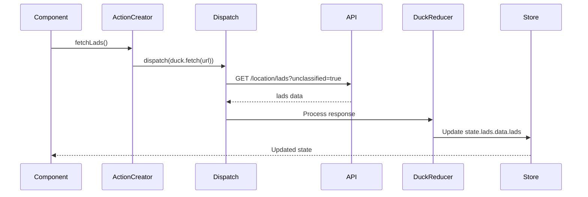
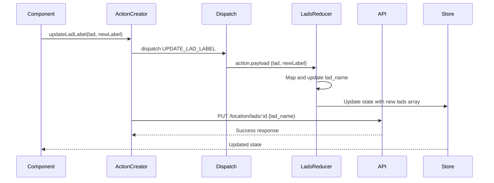
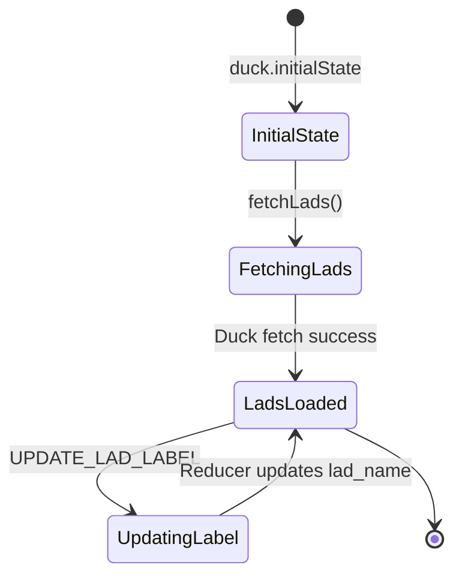
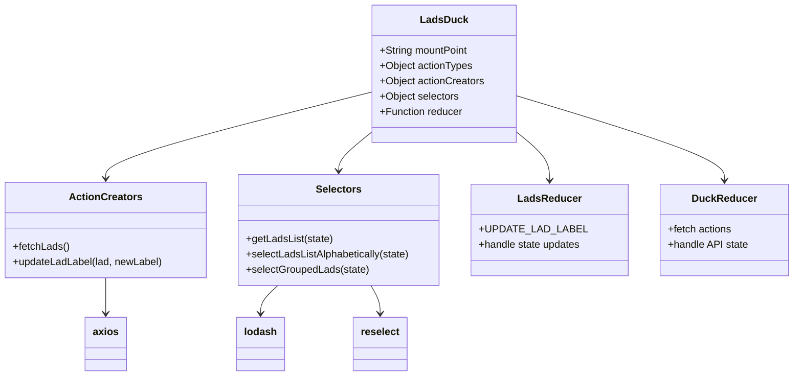

# Diagram: web/portal/src/shared/redux/Lads.state.js


> Auto-generated by Obscura crawlers

## Diagram 1

```mermaid
flowchart TD
    A[Component] -->|dispatch fetchLads| B[Action Creator]
    B -->|API Call| C[/location/lads?unclassified=true]
    C -->|Response| D[Duck Reducer]
    D -->|Update State| E[Store: lads.data.lads]
    
    F[Component] -->|dispatch updateLadLabel| G[Action Creator]
    G -->|Dispatch UPDATE_LAD_LABEL| H[LadsReducer]
    G -->|PUT Request| I[/location/lads/:id]
    H -->|Update lad_name| E
    
    E -->|Select| J[getLadsList]
    E -->|Select| K[selectLadsListAlphabetically]
    E -->|Select| L[selectGroupedLads]
    
    J -->|Used by| K
    J -->|Used by| L
    K -->|Sorted by name| M[Component]
    L -->|Grouped by lob_name| M
```

> SVG rendering failed for this diagram.

## Diagram 2



### SVG

<svg id="container" width="1504" xmlns="http://www.w3.org/2000/svg" height="507" viewBox="-50 -10 1504 507" role="graphics-document document" aria-roledescription="sequence"><g><rect x="1254" y="421" fill="#eaeaea" stroke="#666" width="150" height="65" name="Store" rx="3" ry="3" class="actor actor-bottom"></rect><text x="1329" y="453.5" dominant-baseline="central" alignment-baseline="central" class="actor actor-box" style="text-anchor: middle; font-size: 16px; font-weight: 400;"><tspan x="1329" dy="0">Store</tspan></text></g><g><rect x="986" y="421" fill="#eaeaea" stroke="#666" width="150" height="65" name="DuckReducer" rx="3" ry="3" class="actor actor-bottom"></rect><text x="1061" y="453.5" dominant-baseline="central" alignment-baseline="central" class="actor actor-box" style="text-anchor: middle; font-size: 16px; font-weight: 400;"><tspan x="1061" dy="0">DuckReducer</tspan></text></g><g><rect x="786" y="421" fill="#eaeaea" stroke="#666" width="150" height="65" name="API" rx="3" ry="3" class="actor actor-bottom"></rect><text x="861" y="453.5" dominant-baseline="central" alignment-baseline="central" class="actor actor-box" style="text-anchor: middle; font-size: 16px; font-weight: 400;"><tspan x="861" dy="0">API</tspan></text></g><g><rect x="448" y="421" fill="#eaeaea" stroke="#666" width="150" height="65" name="Dispatch" rx="3" ry="3" class="actor actor-bottom"></rect><text x="523" y="453.5" dominant-baseline="central" alignment-baseline="central" class="actor actor-box" style="text-anchor: middle; font-size: 16px; font-weight: 400;"><tspan x="523" dy="0">Dispatch</tspan></text></g><g><rect x="200" y="421" fill="#eaeaea" stroke="#666" width="150" height="65" name="ActionCreator" rx="3" ry="3" class="actor actor-bottom"></rect><text x="275" y="453.5" dominant-baseline="central" alignment-baseline="central" class="actor actor-box" style="text-anchor: middle; font-size: 16px; font-weight: 400;"><tspan x="275" dy="0">ActionCreator</tspan></text></g><g><rect x="0" y="421" fill="#eaeaea" stroke="#666" width="150" height="65" name="Component" rx="3" ry="3" class="actor actor-bottom"></rect><text x="75" y="453.5" dominant-baseline="central" alignment-baseline="central" class="actor actor-box" style="text-anchor: middle; font-size: 16px; font-weight: 400;"><tspan x="75" dy="0">Component</tspan></text></g><g><line id="actor5" x1="1329" y1="65" x2="1329" y2="421" class="actor-line 200" stroke-width="0.5px" stroke="#999" name="Store"></line><g id="root-5"><rect x="1254" y="0" fill="#eaeaea" stroke="#666" width="150" height="65" name="Store" rx="3" ry="3" class="actor actor-top"></rect><text x="1329" y="32.5" dominant-baseline="central" alignment-baseline="central" class="actor actor-box" style="text-anchor: middle; font-size: 16px; font-weight: 400;"><tspan x="1329" dy="0">Store</tspan></text></g></g><g><line id="actor4" x1="1061" y1="65" x2="1061" y2="421" class="actor-line 200" stroke-width="0.5px" stroke="#999" name="DuckReducer"></line><g id="root-4"><rect x="986" y="0" fill="#eaeaea" stroke="#666" width="150" height="65" name="DuckReducer" rx="3" ry="3" class="actor actor-top"></rect><text x="1061" y="32.5" dominant-baseline="central" alignment-baseline="central" class="actor actor-box" style="text-anchor: middle; font-size: 16px; font-weight: 400;"><tspan x="1061" dy="0">DuckReducer</tspan></text></g></g><g><line id="actor3" x1="861" y1="65" x2="861" y2="421" class="actor-line 200" stroke-width="0.5px" stroke="#999" name="API"></line><g id="root-3"><rect x="786" y="0" fill="#eaeaea" stroke="#666" width="150" height="65" name="API" rx="3" ry="3" class="actor actor-top"></rect><text x="861" y="32.5" dominant-baseline="central" alignment-baseline="central" class="actor actor-box" style="text-anchor: middle; font-size: 16px; font-weight: 400;"><tspan x="861" dy="0">API</tspan></text></g></g><g><line id="actor2" x1="523" y1="65" x2="523" y2="421" class="actor-line 200" stroke-width="0.5px" stroke="#999" name="Dispatch"></line><g id="root-2"><rect x="448" y="0" fill="#eaeaea" stroke="#666" width="150" height="65" name="Dispatch" rx="3" ry="3" class="actor actor-top"></rect><text x="523" y="32.5" dominant-baseline="central" alignment-baseline="central" class="actor actor-box" style="text-anchor: middle; font-size: 16px; font-weight: 400;"><tspan x="523" dy="0">Dispatch</tspan></text></g></g><g><line id="actor1" x1="275" y1="65" x2="275" y2="421" class="actor-line 200" stroke-width="0.5px" stroke="#999" name="ActionCreator"></line><g id="root-1"><rect x="200" y="0" fill="#eaeaea" stroke="#666" width="150" height="65" name="ActionCreator" rx="3" ry="3" class="actor actor-top"></rect><text x="275" y="32.5" dominant-baseline="central" alignment-baseline="central" class="actor actor-box" style="text-anchor: middle; font-size: 16px; font-weight: 400;"><tspan x="275" dy="0">ActionCreator</tspan></text></g></g><g><line id="actor0" x1="75" y1="65" x2="75" y2="421" class="actor-line 200" stroke-width="0.5px" stroke="#999" name="Component"></line><g id="root-0"><rect x="0" y="0" fill="#eaeaea" stroke="#666" width="150" height="65" name="Component" rx="3" ry="3" class="actor actor-top"></rect><text x="75" y="32.5" dominant-baseline="central" alignment-baseline="central" class="actor actor-box" style="text-anchor: middle; font-size: 16px; font-weight: 400;"><tspan x="75" dy="0">Component</tspan></text></g></g><style>#container{font-family:"trebuchet ms",verdana,arial,sans-serif;font-size:16px;fill:#333;}@keyframes edge-animation-frame{from{stroke-dashoffset:0;}}@keyframes dash{to{stroke-dashoffset:0;}}#container .edge-animation-slow{stroke-dasharray:9,5!important;stroke-dashoffset:900;animation:dash 50s linear infinite;stroke-linecap:round;}#container .edge-animation-fast{stroke-dasharray:9,5!important;stroke-dashoffset:900;animation:dash 20s linear infinite;stroke-linecap:round;}#container .error-icon{fill:#552222;}#container .error-text{fill:#552222;stroke:#552222;}#container .edge-thickness-normal{stroke-width:1px;}#container .edge-thickness-thick{stroke-width:3.5px;}#container .edge-pattern-solid{stroke-dasharray:0;}#container .edge-thickness-invisible{stroke-width:0;fill:none;}#container .edge-pattern-dashed{stroke-dasharray:3;}#container .edge-pattern-dotted{stroke-dasharray:2;}#container .marker{fill:#333333;stroke:#333333;}#container .marker.cross{stroke:#333333;}#container svg{font-family:"trebuchet ms",verdana,arial,sans-serif;font-size:16px;}#container p{margin:0;}#container .actor{stroke:hsl(259.6261682243, 59.7765363128%, 87.9019607843%);fill:#ECECFF;}#container text.actor&gt;tspan{fill:black;stroke:none;}#container .actor-line{stroke:hsl(259.6261682243, 59.7765363128%, 87.9019607843%);}#container .innerArc{stroke-width:1.5;stroke-dasharray:none;}#container .messageLine0{stroke-width:1.5;stroke-dasharray:none;stroke:#333;}#container .messageLine1{stroke-width:1.5;stroke-dasharray:2,2;stroke:#333;}#container #arrowhead path{fill:#333;stroke:#333;}#container .sequenceNumber{fill:white;}#container #sequencenumber{fill:#333;}#container #crosshead path{fill:#333;stroke:#333;}#container .messageText{fill:#333;stroke:none;}#container .labelBox{stroke:hsl(259.6261682243, 59.7765363128%, 87.9019607843%);fill:#ECECFF;}#container .labelText,#container .labelText&gt;tspan{fill:black;stroke:none;}#container .loopText,#container .loopText&gt;tspan{fill:black;stroke:none;}#container .loopLine{stroke-width:2px;stroke-dasharray:2,2;stroke:hsl(259.6261682243, 59.7765363128%, 87.9019607843%);fill:hsl(259.6261682243, 59.7765363128%, 87.9019607843%);}#container .note{stroke:#aaaa33;fill:#fff5ad;}#container .noteText,#container .noteText&gt;tspan{fill:black;stroke:none;}#container .activation0{fill:#f4f4f4;stroke:#666;}#container .activation1{fill:#f4f4f4;stroke:#666;}#container .activation2{fill:#f4f4f4;stroke:#666;}#container .actorPopupMenu{position:absolute;}#container .actorPopupMenuPanel{position:absolute;fill:#ECECFF;box-shadow:0px 8px 16px 0px rgba(0,0,0,0.2);filter:drop-shadow(3px 5px 2px rgb(0 0 0 / 0.4));}#container .actor-man line{stroke:hsl(259.6261682243, 59.7765363128%, 87.9019607843%);fill:#ECECFF;}#container .actor-man circle,#container line{stroke:hsl(259.6261682243, 59.7765363128%, 87.9019607843%);fill:#ECECFF;stroke-width:2px;}#container :root{--mermaid-font-family:"trebuchet ms",verdana,arial,sans-serif;}</style><g></g><defs><symbol id="computer" width="24" height="24"><path transform="scale(.5)" d="M2 2v13h20v-13h-20zm18 11h-16v-9h16v9zm-10.228 6l.466-1h3.524l.467 1h-4.457zm14.228 3h-24l2-6h2.104l-1.33 4h18.45l-1.297-4h2.073l2 6zm-5-10h-14v-7h14v7z"></path></symbol></defs><defs><symbol id="database" fill-rule="evenodd" clip-rule="evenodd"><path transform="scale(.5)" d="M12.258.001l.256.004.255.005.253.008.251.01.249.012.247.015.246.016.242.019.241.02.239.023.236.024.233.027.231.028.229.031.225.032.223.034.22.036.217.038.214.04.211.041.208.043.205.045.201.046.198.048.194.05.191.051.187.053.183.054.18.056.175.057.172.059.168.06.163.061.16.063.155.064.15.066.074.033.073.033.071.034.07.034.069.035.068.035.067.035.066.035.064.036.064.036.062.036.06.036.06.037.058.037.058.037.055.038.055.038.053.038.052.038.051.039.05.039.048.039.047.039.045.04.044.04.043.04.041.04.04.041.039.041.037.041.036.041.034.041.033.042.032.042.03.042.029.042.027.042.026.043.024.043.023.043.021.043.02.043.018.044.017.043.015.044.013.044.012.044.011.045.009.044.007.045.006.045.004.045.002.045.001.045v17l-.001.045-.002.045-.004.045-.006.045-.007.045-.009.044-.011.045-.012.044-.013.044-.015.044-.017.043-.018.044-.02.043-.021.043-.023.043-.024.043-.026.043-.027.042-.029.042-.03.042-.032.042-.033.042-.034.041-.036.041-.037.041-.039.041-.04.041-.041.04-.043.04-.044.04-.045.04-.047.039-.048.039-.05.039-.051.039-.052.038-.053.038-.055.038-.055.038-.058.037-.058.037-.06.037-.06.036-.062.036-.064.036-.064.036-.066.035-.067.035-.068.035-.069.035-.07.034-.071.034-.073.033-.074.033-.15.066-.155.064-.16.063-.163.061-.168.06-.172.059-.175.057-.18.056-.183.054-.187.053-.191.051-.194.05-.198.048-.201.046-.205.045-.208.043-.211.041-.214.04-.217.038-.22.036-.223.034-.225.032-.229.031-.231.028-.233.027-.236.024-.239.023-.241.02-.242.019-.246.016-.247.015-.249.012-.251.01-.253.008-.255.005-.256.004-.258.001-.258-.001-.256-.004-.255-.005-.253-.008-.251-.01-.249-.012-.247-.015-.245-.016-.243-.019-.241-.02-.238-.023-.236-.024-.234-.027-.231-.028-.228-.031-.226-.032-.223-.034-.22-.036-.217-.038-.214-.04-.211-.041-.208-.043-.204-.045-.201-.046-.198-.048-.195-.05-.19-.051-.187-.053-.184-.054-.179-.056-.176-.057-.172-.059-.167-.06-.164-.061-.159-.063-.155-.064-.151-.066-.074-.033-.072-.033-.072-.034-.07-.034-.069-.035-.068-.035-.067-.035-.066-.035-.064-.036-.063-.036-.062-.036-.061-.036-.06-.037-.058-.037-.057-.037-.056-.038-.055-.038-.053-.038-.052-.038-.051-.039-.049-.039-.049-.039-.046-.039-.046-.04-.044-.04-.043-.04-.041-.04-.04-.041-.039-.041-.037-.041-.036-.041-.034-.041-.033-.042-.032-.042-.03-.042-.029-.042-.027-.042-.026-.043-.024-.043-.023-.043-.021-.043-.02-.043-.018-.044-.017-.043-.015-.044-.013-.044-.012-.044-.011-.045-.009-.044-.007-.045-.006-.045-.004-.045-.002-.045-.001-.045v-17l.001-.045.002-.045.004-.045.006-.045.007-.045.009-.044.011-.045.012-.044.013-.044.015-.044.017-.043.018-.044.02-.043.021-.043.023-.043.024-.043.026-.043.027-.042.029-.042.03-.042.032-.042.033-.042.034-.041.036-.041.037-.041.039-.041.04-.041.041-.04.043-.04.044-.04.046-.04.046-.039.049-.039.049-.039.051-.039.052-.038.053-.038.055-.038.056-.038.057-.037.058-.037.06-.037.061-.036.062-.036.063-.036.064-.036.066-.035.067-.035.068-.035.069-.035.07-.034.072-.034.072-.033.074-.033.151-.066.155-.064.159-.063.164-.061.167-.06.172-.059.176-.057.179-.056.184-.054.187-.053.19-.051.195-.05.198-.048.201-.046.204-.045.208-.043.211-.041.214-.04.217-.038.22-.036.223-.034.226-.032.228-.031.231-.028.234-.027.236-.024.238-.023.241-.02.243-.019.245-.016.247-.015.249-.012.251-.01.253-.008.255-.005.256-.004.258-.001.258.001zm-9.258 20.499v.01l.001.021.003.021.004.022.005.021.006.022.007.022.009.023.01.022.011.023.012.023.013.023.015.023.016.024.017.023.018.024.019.024.021.024.022.025.023.024.024.025.052.049.056.05.061.051.066.051.07.051.075.051.079.052.084.052.088.052.092.052.097.052.102.051.105.052.11.052.114.051.119.051.123.051.127.05.131.05.135.05.139.048.144.049.147.047.152.047.155.047.16.045.163.045.167.043.171.043.176.041.178.041.183.039.187.039.19.037.194.035.197.035.202.033.204.031.209.03.212.029.216.027.219.025.222.024.226.021.23.02.233.018.236.016.24.015.243.012.246.01.249.008.253.005.256.004.259.001.26-.001.257-.004.254-.005.25-.008.247-.011.244-.012.241-.014.237-.016.233-.018.231-.021.226-.021.224-.024.22-.026.216-.027.212-.028.21-.031.205-.031.202-.034.198-.034.194-.036.191-.037.187-.039.183-.04.179-.04.175-.042.172-.043.168-.044.163-.045.16-.046.155-.046.152-.047.148-.048.143-.049.139-.049.136-.05.131-.05.126-.05.123-.051.118-.052.114-.051.11-.052.106-.052.101-.052.096-.052.092-.052.088-.053.083-.051.079-.052.074-.052.07-.051.065-.051.06-.051.056-.05.051-.05.023-.024.023-.025.021-.024.02-.024.019-.024.018-.024.017-.024.015-.023.014-.024.013-.023.012-.023.01-.023.01-.022.008-.022.006-.022.006-.022.004-.022.004-.021.001-.021.001-.021v-4.127l-.077.055-.08.053-.083.054-.085.053-.087.052-.09.052-.093.051-.095.05-.097.05-.1.049-.102.049-.105.048-.106.047-.109.047-.111.046-.114.045-.115.045-.118.044-.12.043-.122.042-.124.042-.126.041-.128.04-.13.04-.132.038-.134.038-.135.037-.138.037-.139.035-.142.035-.143.034-.144.033-.147.032-.148.031-.15.03-.151.03-.153.029-.154.027-.156.027-.158.026-.159.025-.161.024-.162.023-.163.022-.165.021-.166.02-.167.019-.169.018-.169.017-.171.016-.173.015-.173.014-.175.013-.175.012-.177.011-.178.01-.179.008-.179.008-.181.006-.182.005-.182.004-.184.003-.184.002h-.37l-.184-.002-.184-.003-.182-.004-.182-.005-.181-.006-.179-.008-.179-.008-.178-.01-.176-.011-.176-.012-.175-.013-.173-.014-.172-.015-.171-.016-.17-.017-.169-.018-.167-.019-.166-.02-.165-.021-.163-.022-.162-.023-.161-.024-.159-.025-.157-.026-.156-.027-.155-.027-.153-.029-.151-.03-.15-.03-.148-.031-.146-.032-.145-.033-.143-.034-.141-.035-.14-.035-.137-.037-.136-.037-.134-.038-.132-.038-.13-.04-.128-.04-.126-.041-.124-.042-.122-.042-.12-.044-.117-.043-.116-.045-.113-.045-.112-.046-.109-.047-.106-.047-.105-.048-.102-.049-.1-.049-.097-.05-.095-.05-.093-.052-.09-.051-.087-.052-.085-.053-.083-.054-.08-.054-.077-.054v4.127zm0-5.654v.011l.001.021.003.021.004.021.005.022.006.022.007.022.009.022.01.022.011.023.012.023.013.023.015.024.016.023.017.024.018.024.019.024.021.024.022.024.023.025.024.024.052.05.056.05.061.05.066.051.07.051.075.052.079.051.084.052.088.052.092.052.097.052.102.052.105.052.11.051.114.051.119.052.123.05.127.051.131.05.135.049.139.049.144.048.147.048.152.047.155.046.16.045.163.045.167.044.171.042.176.042.178.04.183.04.187.038.19.037.194.036.197.034.202.033.204.032.209.03.212.028.216.027.219.025.222.024.226.022.23.02.233.018.236.016.24.014.243.012.246.01.249.008.253.006.256.003.259.001.26-.001.257-.003.254-.006.25-.008.247-.01.244-.012.241-.015.237-.016.233-.018.231-.02.226-.022.224-.024.22-.025.216-.027.212-.029.21-.03.205-.032.202-.033.198-.035.194-.036.191-.037.187-.039.183-.039.179-.041.175-.042.172-.043.168-.044.163-.045.16-.045.155-.047.152-.047.148-.048.143-.048.139-.05.136-.049.131-.05.126-.051.123-.051.118-.051.114-.052.11-.052.106-.052.101-.052.096-.052.092-.052.088-.052.083-.052.079-.052.074-.051.07-.052.065-.051.06-.05.056-.051.051-.049.023-.025.023-.024.021-.025.02-.024.019-.024.018-.024.017-.024.015-.023.014-.023.013-.024.012-.022.01-.023.01-.023.008-.022.006-.022.006-.022.004-.021.004-.022.001-.021.001-.021v-4.139l-.077.054-.08.054-.083.054-.085.052-.087.053-.09.051-.093.051-.095.051-.097.05-.1.049-.102.049-.105.048-.106.047-.109.047-.111.046-.114.045-.115.044-.118.044-.12.044-.122.042-.124.042-.126.041-.128.04-.13.039-.132.039-.134.038-.135.037-.138.036-.139.036-.142.035-.143.033-.144.033-.147.033-.148.031-.15.03-.151.03-.153.028-.154.028-.156.027-.158.026-.159.025-.161.024-.162.023-.163.022-.165.021-.166.02-.167.019-.169.018-.169.017-.171.016-.173.015-.173.014-.175.013-.175.012-.177.011-.178.009-.179.009-.179.007-.181.007-.182.005-.182.004-.184.003-.184.002h-.37l-.184-.002-.184-.003-.182-.004-.182-.005-.181-.007-.179-.007-.179-.009-.178-.009-.176-.011-.176-.012-.175-.013-.173-.014-.172-.015-.171-.016-.17-.017-.169-.018-.167-.019-.166-.02-.165-.021-.163-.022-.162-.023-.161-.024-.159-.025-.157-.026-.156-.027-.155-.028-.153-.028-.151-.03-.15-.03-.148-.031-.146-.033-.145-.033-.143-.033-.141-.035-.14-.036-.137-.036-.136-.037-.134-.038-.132-.039-.13-.039-.128-.04-.126-.041-.124-.042-.122-.043-.12-.043-.117-.044-.116-.044-.113-.046-.112-.046-.109-.046-.106-.047-.105-.048-.102-.049-.1-.049-.097-.05-.095-.051-.093-.051-.09-.051-.087-.053-.085-.052-.083-.054-.08-.054-.077-.054v4.139zm0-5.666v.011l.001.02.003.022.004.021.005.022.006.021.007.022.009.023.01.022.011.023.012.023.013.023.015.023.016.024.017.024.018.023.019.024.021.025.022.024.023.024.024.025.052.05.056.05.061.05.066.051.07.051.075.052.079.051.084.052.088.052.092.052.097.052.102.052.105.051.11.052.114.051.119.051.123.051.127.05.131.05.135.05.139.049.144.048.147.048.152.047.155.046.16.045.163.045.167.043.171.043.176.042.178.04.183.04.187.038.19.037.194.036.197.034.202.033.204.032.209.03.212.028.216.027.219.025.222.024.226.021.23.02.233.018.236.017.24.014.243.012.246.01.249.008.253.006.256.003.259.001.26-.001.257-.003.254-.006.25-.008.247-.01.244-.013.241-.014.237-.016.233-.018.231-.02.226-.022.224-.024.22-.025.216-.027.212-.029.21-.03.205-.032.202-.033.198-.035.194-.036.191-.037.187-.039.183-.039.179-.041.175-.042.172-.043.168-.044.163-.045.16-.045.155-.047.152-.047.148-.048.143-.049.139-.049.136-.049.131-.051.126-.05.123-.051.118-.052.114-.051.11-.052.106-.052.101-.052.096-.052.092-.052.088-.052.083-.052.079-.052.074-.052.07-.051.065-.051.06-.051.056-.05.051-.049.023-.025.023-.025.021-.024.02-.024.019-.024.018-.024.017-.024.015-.023.014-.024.013-.023.012-.023.01-.022.01-.023.008-.022.006-.022.006-.022.004-.022.004-.021.001-.021.001-.021v-4.153l-.077.054-.08.054-.083.053-.085.053-.087.053-.09.051-.093.051-.095.051-.097.05-.1.049-.102.048-.105.048-.106.048-.109.046-.111.046-.114.046-.115.044-.118.044-.12.043-.122.043-.124.042-.126.041-.128.04-.13.039-.132.039-.134.038-.135.037-.138.036-.139.036-.142.034-.143.034-.144.033-.147.032-.148.032-.15.03-.151.03-.153.028-.154.028-.156.027-.158.026-.159.024-.161.024-.162.023-.163.023-.165.021-.166.02-.167.019-.169.018-.169.017-.171.016-.173.015-.173.014-.175.013-.175.012-.177.01-.178.01-.179.009-.179.007-.181.006-.182.006-.182.004-.184.003-.184.001-.185.001-.185-.001-.184-.001-.184-.003-.182-.004-.182-.006-.181-.006-.179-.007-.179-.009-.178-.01-.176-.01-.176-.012-.175-.013-.173-.014-.172-.015-.171-.016-.17-.017-.169-.018-.167-.019-.166-.02-.165-.021-.163-.023-.162-.023-.161-.024-.159-.024-.157-.026-.156-.027-.155-.028-.153-.028-.151-.03-.15-.03-.148-.032-.146-.032-.145-.033-.143-.034-.141-.034-.14-.036-.137-.036-.136-.037-.134-.038-.132-.039-.13-.039-.128-.041-.126-.041-.124-.041-.122-.043-.12-.043-.117-.044-.116-.044-.113-.046-.112-.046-.109-.046-.106-.048-.105-.048-.102-.048-.1-.05-.097-.049-.095-.051-.093-.051-.09-.052-.087-.052-.085-.053-.083-.053-.08-.054-.077-.054v4.153zm8.74-8.179l-.257.004-.254.005-.25.008-.247.011-.244.012-.241.014-.237.016-.233.018-.231.021-.226.022-.224.023-.22.026-.216.027-.212.028-.21.031-.205.032-.202.033-.198.034-.194.036-.191.038-.187.038-.183.04-.179.041-.175.042-.172.043-.168.043-.163.045-.16.046-.155.046-.152.048-.148.048-.143.048-.139.049-.136.05-.131.05-.126.051-.123.051-.118.051-.114.052-.11.052-.106.052-.101.052-.096.052-.092.052-.088.052-.083.052-.079.052-.074.051-.07.052-.065.051-.06.05-.056.05-.051.05-.023.025-.023.024-.021.024-.02.025-.019.024-.018.024-.017.023-.015.024-.014.023-.013.023-.012.023-.01.023-.01.022-.008.022-.006.023-.006.021-.004.022-.004.021-.001.021-.001.021.001.021.001.021.004.021.004.022.006.021.006.023.008.022.01.022.01.023.012.023.013.023.014.023.015.024.017.023.018.024.019.024.02.025.021.024.023.024.023.025.051.05.056.05.06.05.065.051.07.052.074.051.079.052.083.052.088.052.092.052.096.052.101.052.106.052.11.052.114.052.118.051.123.051.126.051.131.05.136.05.139.049.143.048.148.048.152.048.155.046.16.046.163.045.168.043.172.043.175.042.179.041.183.04.187.038.191.038.194.036.198.034.202.033.205.032.21.031.212.028.216.027.22.026.224.023.226.022.231.021.233.018.237.016.241.014.244.012.247.011.25.008.254.005.257.004.26.001.26-.001.257-.004.254-.005.25-.008.247-.011.244-.012.241-.014.237-.016.233-.018.231-.021.226-.022.224-.023.22-.026.216-.027.212-.028.21-.031.205-.032.202-.033.198-.034.194-.036.191-.038.187-.038.183-.04.179-.041.175-.042.172-.043.168-.043.163-.045.16-.046.155-.046.152-.048.148-.048.143-.048.139-.049.136-.05.131-.05.126-.051.123-.051.118-.051.114-.052.11-.052.106-.052.101-.052.096-.052.092-.052.088-.052.083-.052.079-.052.074-.051.07-.052.065-.051.06-.05.056-.05.051-.05.023-.025.023-.024.021-.024.02-.025.019-.024.018-.024.017-.023.015-.024.014-.023.013-.023.012-.023.01-.023.01-.022.008-.022.006-.023.006-.021.004-.022.004-.021.001-.021.001-.021-.001-.021-.001-.021-.004-.021-.004-.022-.006-.021-.006-.023-.008-.022-.01-.022-.01-.023-.012-.023-.013-.023-.014-.023-.015-.024-.017-.023-.018-.024-.019-.024-.02-.025-.021-.024-.023-.024-.023-.025-.051-.05-.056-.05-.06-.05-.065-.051-.07-.052-.074-.051-.079-.052-.083-.052-.088-.052-.092-.052-.096-.052-.101-.052-.106-.052-.11-.052-.114-.052-.118-.051-.123-.051-.126-.051-.131-.05-.136-.05-.139-.049-.143-.048-.148-.048-.152-.048-.155-.046-.16-.046-.163-.045-.168-.043-.172-.043-.175-.042-.179-.041-.183-.04-.187-.038-.191-.038-.194-.036-.198-.034-.202-.033-.205-.032-.21-.031-.212-.028-.216-.027-.22-.026-.224-.023-.226-.022-.231-.021-.233-.018-.237-.016-.241-.014-.244-.012-.247-.011-.25-.008-.254-.005-.257-.004-.26-.001-.26.001z"></path></symbol></defs><defs><symbol id="clock" width="24" height="24"><path transform="scale(.5)" d="M12 2c5.514 0 10 4.486 10 10s-4.486 10-10 10-10-4.486-10-10 4.486-10 10-10zm0-2c-6.627 0-12 5.373-12 12s5.373 12 12 12 12-5.373 12-12-5.373-12-12-12zm5.848 12.459c.202.038.202.333.001.372-1.907.361-6.045 1.111-6.547 1.111-.719 0-1.301-.582-1.301-1.301 0-.512.77-5.447 1.125-7.445.034-.192.312-.181.343.014l.985 6.238 5.394 1.011z"></path></symbol></defs><defs><marker id="arrowhead" refX="7.9" refY="5" markerUnits="userSpaceOnUse" markerWidth="12" markerHeight="12" orient="auto-start-reverse"><path d="M -1 0 L 10 5 L 0 10 z"></path></marker></defs><defs><marker id="crosshead" markerWidth="15" markerHeight="8" orient="auto" refX="4" refY="4.5"><path fill="none" stroke="#000000" stroke-width="1pt" d="M 1,2 L 6,7 M 6,2 L 1,7" style="stroke-dasharray: 0, 0;"></path></marker></defs><defs><marker id="filled-head" refX="15.5" refY="7" markerWidth="20" markerHeight="28" orient="auto"><path d="M 18,7 L9,13 L14,7 L9,1 Z"></path></marker></defs><defs><marker id="sequencenumber" refX="15" refY="15" markerWidth="60" markerHeight="40" orient="auto"><circle cx="15" cy="15" r="6"></circle></marker></defs><text x="174" y="80" text-anchor="middle" dominant-baseline="middle" alignment-baseline="middle" class="messageText" dy="1em" style="font-size: 16px; font-weight: 400;">fetchLads()</text><line x1="76" y1="113" x2="271" y2="113" class="messageLine0" stroke-width="2" stroke="none" marker-end="url(#arrowhead)" style="fill: none;"></line><text x="398" y="128" text-anchor="middle" dominant-baseline="middle" alignment-baseline="middle" class="messageText" dy="1em" style="font-size: 16px; font-weight: 400;">dispatch(duck.fetch(url))</text><line x1="276" y1="161" x2="519" y2="161" class="messageLine0" stroke-width="2" stroke="none" marker-end="url(#arrowhead)" style="fill: none;"></line><text x="691" y="176" text-anchor="middle" dominant-baseline="middle" alignment-baseline="middle" class="messageText" dy="1em" style="font-size: 16px; font-weight: 400;">GET /location/lads?unclassified=true</text><line x1="524" y1="209" x2="857" y2="209" class="messageLine0" stroke-width="2" stroke="none" marker-end="url(#arrowhead)" style="fill: none;"></line><text x="694" y="224" text-anchor="middle" dominant-baseline="middle" alignment-baseline="middle" class="messageText" dy="1em" style="font-size: 16px; font-weight: 400;">lads data</text><line x1="860" y1="257" x2="527" y2="257" class="messageLine1" stroke-width="2" stroke="none" marker-end="url(#arrowhead)" style="stroke-dasharray: 3, 3; fill: none;"></line><text x="791" y="272" text-anchor="middle" dominant-baseline="middle" alignment-baseline="middle" class="messageText" dy="1em" style="font-size: 16px; font-weight: 400;">Process response</text><line x1="524" y1="305" x2="1057" y2="305" class="messageLine0" stroke-width="2" stroke="none" marker-end="url(#arrowhead)" style="fill: none;"></line><text x="1194" y="320" text-anchor="middle" dominant-baseline="middle" alignment-baseline="middle" class="messageText" dy="1em" style="font-size: 16px; font-weight: 400;">Update state.lads.data.lads</text><line x1="1062" y1="353" x2="1325" y2="353" class="messageLine0" stroke-width="2" stroke="none" marker-end="url(#arrowhead)" style="fill: none;"></line><text x="704" y="368" text-anchor="middle" dominant-baseline="middle" alignment-baseline="middle" class="messageText" dy="1em" style="font-size: 16px; font-weight: 400;">Updated state</text><line x1="1328" y1="401" x2="79" y2="401" class="messageLine1" stroke-width="2" stroke="none" marker-end="url(#arrowhead)" style="stroke-dasharray: 3, 3; fill: none;"></line></svg>

## Diagram 3



### SVG

<svg id="container" width="1517" xmlns="http://www.w3.org/2000/svg" height="585" viewBox="-50 -10 1517 585" role="graphics-document document" aria-roledescription="sequence"><g><rect x="1267" y="499" fill="#eaeaea" stroke="#666" width="150" height="65" name="Store" rx="3" ry="3" class="actor actor-bottom"></rect><text x="1342" y="531.5" dominant-baseline="central" alignment-baseline="central" class="actor actor-box" style="text-anchor: middle; font-size: 16px; font-weight: 400;"><tspan x="1342" dy="0">Store</tspan></text></g><g><rect x="1067" y="499" fill="#eaeaea" stroke="#666" width="150" height="65" name="API" rx="3" ry="3" class="actor actor-bottom"></rect><text x="1142" y="531.5" dominant-baseline="central" alignment-baseline="central" class="actor actor-box" style="text-anchor: middle; font-size: 16px; font-weight: 400;"><tspan x="1142" dy="0">API</tspan></text></g><g><rect x="867" y="499" fill="#eaeaea" stroke="#666" width="150" height="65" name="LadsReducer" rx="3" ry="3" class="actor actor-bottom"></rect><text x="942" y="531.5" dominant-baseline="central" alignment-baseline="central" class="actor actor-box" style="text-anchor: middle; font-size: 16px; font-weight: 400;"><tspan x="942" dy="0">LadsReducer</tspan></text></g><g><rect x="575" y="499" fill="#eaeaea" stroke="#666" width="150" height="65" name="Dispatch" rx="3" ry="3" class="actor actor-bottom"></rect><text x="650" y="531.5" dominant-baseline="central" alignment-baseline="central" class="actor actor-box" style="text-anchor: middle; font-size: 16px; font-weight: 400;"><tspan x="650" dy="0">Dispatch</tspan></text></g><g><rect x="297" y="499" fill="#eaeaea" stroke="#666" width="150" height="65" name="ActionCreator" rx="3" ry="3" class="actor actor-bottom"></rect><text x="372" y="531.5" dominant-baseline="central" alignment-baseline="central" class="actor actor-box" style="text-anchor: middle; font-size: 16px; font-weight: 400;"><tspan x="372" dy="0">ActionCreator</tspan></text></g><g><rect x="0" y="499" fill="#eaeaea" stroke="#666" width="150" height="65" name="Component" rx="3" ry="3" class="actor actor-bottom"></rect><text x="75" y="531.5" dominant-baseline="central" alignment-baseline="central" class="actor actor-box" style="text-anchor: middle; font-size: 16px; font-weight: 400;"><tspan x="75" dy="0">Component</tspan></text></g><g><line id="actor5" x1="1342" y1="65" x2="1342" y2="499" class="actor-line 200" stroke-width="0.5px" stroke="#999" name="Store"></line><g id="root-5"><rect x="1267" y="0" fill="#eaeaea" stroke="#666" width="150" height="65" name="Store" rx="3" ry="3" class="actor actor-top"></rect><text x="1342" y="32.5" dominant-baseline="central" alignment-baseline="central" class="actor actor-box" style="text-anchor: middle; font-size: 16px; font-weight: 400;"><tspan x="1342" dy="0">Store</tspan></text></g></g><g><line id="actor4" x1="1142" y1="65" x2="1142" y2="499" class="actor-line 200" stroke-width="0.5px" stroke="#999" name="API"></line><g id="root-4"><rect x="1067" y="0" fill="#eaeaea" stroke="#666" width="150" height="65" name="API" rx="3" ry="3" class="actor actor-top"></rect><text x="1142" y="32.5" dominant-baseline="central" alignment-baseline="central" class="actor actor-box" style="text-anchor: middle; font-size: 16px; font-weight: 400;"><tspan x="1142" dy="0">API</tspan></text></g></g><g><line id="actor3" x1="942" y1="65" x2="942" y2="499" class="actor-line 200" stroke-width="0.5px" stroke="#999" name="LadsReducer"></line><g id="root-3"><rect x="867" y="0" fill="#eaeaea" stroke="#666" width="150" height="65" name="LadsReducer" rx="3" ry="3" class="actor actor-top"></rect><text x="942" y="32.5" dominant-baseline="central" alignment-baseline="central" class="actor actor-box" style="text-anchor: middle; font-size: 16px; font-weight: 400;"><tspan x="942" dy="0">LadsReducer</tspan></text></g></g><g><line id="actor2" x1="650" y1="65" x2="650" y2="499" class="actor-line 200" stroke-width="0.5px" stroke="#999" name="Dispatch"></line><g id="root-2"><rect x="575" y="0" fill="#eaeaea" stroke="#666" width="150" height="65" name="Dispatch" rx="3" ry="3" class="actor actor-top"></rect><text x="650" y="32.5" dominant-baseline="central" alignment-baseline="central" class="actor actor-box" style="text-anchor: middle; font-size: 16px; font-weight: 400;"><tspan x="650" dy="0">Dispatch</tspan></text></g></g><g><line id="actor1" x1="372" y1="65" x2="372" y2="499" class="actor-line 200" stroke-width="0.5px" stroke="#999" name="ActionCreator"></line><g id="root-1"><rect x="297" y="0" fill="#eaeaea" stroke="#666" width="150" height="65" name="ActionCreator" rx="3" ry="3" class="actor actor-top"></rect><text x="372" y="32.5" dominant-baseline="central" alignment-baseline="central" class="actor actor-box" style="text-anchor: middle; font-size: 16px; font-weight: 400;"><tspan x="372" dy="0">ActionCreator</tspan></text></g></g><g><line id="actor0" x1="75" y1="65" x2="75" y2="499" class="actor-line 200" stroke-width="0.5px" stroke="#999" name="Component"></line><g id="root-0"><rect x="0" y="0" fill="#eaeaea" stroke="#666" width="150" height="65" name="Component" rx="3" ry="3" class="actor actor-top"></rect><text x="75" y="32.5" dominant-baseline="central" alignment-baseline="central" class="actor actor-box" style="text-anchor: middle; font-size: 16px; font-weight: 400;"><tspan x="75" dy="0">Component</tspan></text></g></g><style>#container{font-family:"trebuchet ms",verdana,arial,sans-serif;font-size:16px;fill:#333;}@keyframes edge-animation-frame{from{stroke-dashoffset:0;}}@keyframes dash{to{stroke-dashoffset:0;}}#container .edge-animation-slow{stroke-dasharray:9,5!important;stroke-dashoffset:900;animation:dash 50s linear infinite;stroke-linecap:round;}#container .edge-animation-fast{stroke-dasharray:9,5!important;stroke-dashoffset:900;animation:dash 20s linear infinite;stroke-linecap:round;}#container .error-icon{fill:#552222;}#container .error-text{fill:#552222;stroke:#552222;}#container .edge-thickness-normal{stroke-width:1px;}#container .edge-thickness-thick{stroke-width:3.5px;}#container .edge-pattern-solid{stroke-dasharray:0;}#container .edge-thickness-invisible{stroke-width:0;fill:none;}#container .edge-pattern-dashed{stroke-dasharray:3;}#container .edge-pattern-dotted{stroke-dasharray:2;}#container .marker{fill:#333333;stroke:#333333;}#container .marker.cross{stroke:#333333;}#container svg{font-family:"trebuchet ms",verdana,arial,sans-serif;font-size:16px;}#container p{margin:0;}#container .actor{stroke:hsl(259.6261682243, 59.7765363128%, 87.9019607843%);fill:#ECECFF;}#container text.actor&gt;tspan{fill:black;stroke:none;}#container .actor-line{stroke:hsl(259.6261682243, 59.7765363128%, 87.9019607843%);}#container .innerArc{stroke-width:1.5;stroke-dasharray:none;}#container .messageLine0{stroke-width:1.5;stroke-dasharray:none;stroke:#333;}#container .messageLine1{stroke-width:1.5;stroke-dasharray:2,2;stroke:#333;}#container #arrowhead path{fill:#333;stroke:#333;}#container .sequenceNumber{fill:white;}#container #sequencenumber{fill:#333;}#container #crosshead path{fill:#333;stroke:#333;}#container .messageText{fill:#333;stroke:none;}#container .labelBox{stroke:hsl(259.6261682243, 59.7765363128%, 87.9019607843%);fill:#ECECFF;}#container .labelText,#container .labelText&gt;tspan{fill:black;stroke:none;}#container .loopText,#container .loopText&gt;tspan{fill:black;stroke:none;}#container .loopLine{stroke-width:2px;stroke-dasharray:2,2;stroke:hsl(259.6261682243, 59.7765363128%, 87.9019607843%);fill:hsl(259.6261682243, 59.7765363128%, 87.9019607843%);}#container .note{stroke:#aaaa33;fill:#fff5ad;}#container .noteText,#container .noteText&gt;tspan{fill:black;stroke:none;}#container .activation0{fill:#f4f4f4;stroke:#666;}#container .activation1{fill:#f4f4f4;stroke:#666;}#container .activation2{fill:#f4f4f4;stroke:#666;}#container .actorPopupMenu{position:absolute;}#container .actorPopupMenuPanel{position:absolute;fill:#ECECFF;box-shadow:0px 8px 16px 0px rgba(0,0,0,0.2);filter:drop-shadow(3px 5px 2px rgb(0 0 0 / 0.4));}#container .actor-man line{stroke:hsl(259.6261682243, 59.7765363128%, 87.9019607843%);fill:#ECECFF;}#container .actor-man circle,#container line{stroke:hsl(259.6261682243, 59.7765363128%, 87.9019607843%);fill:#ECECFF;stroke-width:2px;}#container :root{--mermaid-font-family:"trebuchet ms",verdana,arial,sans-serif;}</style><g></g><defs><symbol id="computer" width="24" height="24"><path transform="scale(.5)" d="M2 2v13h20v-13h-20zm18 11h-16v-9h16v9zm-10.228 6l.466-1h3.524l.467 1h-4.457zm14.228 3h-24l2-6h2.104l-1.33 4h18.45l-1.297-4h2.073l2 6zm-5-10h-14v-7h14v7z"></path></symbol></defs><defs><symbol id="database" fill-rule="evenodd" clip-rule="evenodd"><path transform="scale(.5)" d="M12.258.001l.256.004.255.005.253.008.251.01.249.012.247.015.246.016.242.019.241.02.239.023.236.024.233.027.231.028.229.031.225.032.223.034.22.036.217.038.214.04.211.041.208.043.205.045.201.046.198.048.194.05.191.051.187.053.183.054.18.056.175.057.172.059.168.06.163.061.16.063.155.064.15.066.074.033.073.033.071.034.07.034.069.035.068.035.067.035.066.035.064.036.064.036.062.036.06.036.06.037.058.037.058.037.055.038.055.038.053.038.052.038.051.039.05.039.048.039.047.039.045.04.044.04.043.04.041.04.04.041.039.041.037.041.036.041.034.041.033.042.032.042.03.042.029.042.027.042.026.043.024.043.023.043.021.043.02.043.018.044.017.043.015.044.013.044.012.044.011.045.009.044.007.045.006.045.004.045.002.045.001.045v17l-.001.045-.002.045-.004.045-.006.045-.007.045-.009.044-.011.045-.012.044-.013.044-.015.044-.017.043-.018.044-.02.043-.021.043-.023.043-.024.043-.026.043-.027.042-.029.042-.03.042-.032.042-.033.042-.034.041-.036.041-.037.041-.039.041-.04.041-.041.04-.043.04-.044.04-.045.04-.047.039-.048.039-.05.039-.051.039-.052.038-.053.038-.055.038-.055.038-.058.037-.058.037-.06.037-.06.036-.062.036-.064.036-.064.036-.066.035-.067.035-.068.035-.069.035-.07.034-.071.034-.073.033-.074.033-.15.066-.155.064-.16.063-.163.061-.168.06-.172.059-.175.057-.18.056-.183.054-.187.053-.191.051-.194.05-.198.048-.201.046-.205.045-.208.043-.211.041-.214.04-.217.038-.22.036-.223.034-.225.032-.229.031-.231.028-.233.027-.236.024-.239.023-.241.02-.242.019-.246.016-.247.015-.249.012-.251.01-.253.008-.255.005-.256.004-.258.001-.258-.001-.256-.004-.255-.005-.253-.008-.251-.01-.249-.012-.247-.015-.245-.016-.243-.019-.241-.02-.238-.023-.236-.024-.234-.027-.231-.028-.228-.031-.226-.032-.223-.034-.22-.036-.217-.038-.214-.04-.211-.041-.208-.043-.204-.045-.201-.046-.198-.048-.195-.05-.19-.051-.187-.053-.184-.054-.179-.056-.176-.057-.172-.059-.167-.06-.164-.061-.159-.063-.155-.064-.151-.066-.074-.033-.072-.033-.072-.034-.07-.034-.069-.035-.068-.035-.067-.035-.066-.035-.064-.036-.063-.036-.062-.036-.061-.036-.06-.037-.058-.037-.057-.037-.056-.038-.055-.038-.053-.038-.052-.038-.051-.039-.049-.039-.049-.039-.046-.039-.046-.04-.044-.04-.043-.04-.041-.04-.04-.041-.039-.041-.037-.041-.036-.041-.034-.041-.033-.042-.032-.042-.03-.042-.029-.042-.027-.042-.026-.043-.024-.043-.023-.043-.021-.043-.02-.043-.018-.044-.017-.043-.015-.044-.013-.044-.012-.044-.011-.045-.009-.044-.007-.045-.006-.045-.004-.045-.002-.045-.001-.045v-17l.001-.045.002-.045.004-.045.006-.045.007-.045.009-.044.011-.045.012-.044.013-.044.015-.044.017-.043.018-.044.02-.043.021-.043.023-.043.024-.043.026-.043.027-.042.029-.042.03-.042.032-.042.033-.042.034-.041.036-.041.037-.041.039-.041.04-.041.041-.04.043-.04.044-.04.046-.04.046-.039.049-.039.049-.039.051-.039.052-.038.053-.038.055-.038.056-.038.057-.037.058-.037.06-.037.061-.036.062-.036.063-.036.064-.036.066-.035.067-.035.068-.035.069-.035.07-.034.072-.034.072-.033.074-.033.151-.066.155-.064.159-.063.164-.061.167-.06.172-.059.176-.057.179-.056.184-.054.187-.053.19-.051.195-.05.198-.048.201-.046.204-.045.208-.043.211-.041.214-.04.217-.038.22-.036.223-.034.226-.032.228-.031.231-.028.234-.027.236-.024.238-.023.241-.02.243-.019.245-.016.247-.015.249-.012.251-.01.253-.008.255-.005.256-.004.258-.001.258.001zm-9.258 20.499v.01l.001.021.003.021.004.022.005.021.006.022.007.022.009.023.01.022.011.023.012.023.013.023.015.023.016.024.017.023.018.024.019.024.021.024.022.025.023.024.024.025.052.049.056.05.061.051.066.051.07.051.075.051.079.052.084.052.088.052.092.052.097.052.102.051.105.052.11.052.114.051.119.051.123.051.127.05.131.05.135.05.139.048.144.049.147.047.152.047.155.047.16.045.163.045.167.043.171.043.176.041.178.041.183.039.187.039.19.037.194.035.197.035.202.033.204.031.209.03.212.029.216.027.219.025.222.024.226.021.23.02.233.018.236.016.24.015.243.012.246.01.249.008.253.005.256.004.259.001.26-.001.257-.004.254-.005.25-.008.247-.011.244-.012.241-.014.237-.016.233-.018.231-.021.226-.021.224-.024.22-.026.216-.027.212-.028.21-.031.205-.031.202-.034.198-.034.194-.036.191-.037.187-.039.183-.04.179-.04.175-.042.172-.043.168-.044.163-.045.16-.046.155-.046.152-.047.148-.048.143-.049.139-.049.136-.05.131-.05.126-.05.123-.051.118-.052.114-.051.11-.052.106-.052.101-.052.096-.052.092-.052.088-.053.083-.051.079-.052.074-.052.07-.051.065-.051.06-.051.056-.05.051-.05.023-.024.023-.025.021-.024.02-.024.019-.024.018-.024.017-.024.015-.023.014-.024.013-.023.012-.023.01-.023.01-.022.008-.022.006-.022.006-.022.004-.022.004-.021.001-.021.001-.021v-4.127l-.077.055-.08.053-.083.054-.085.053-.087.052-.09.052-.093.051-.095.05-.097.05-.1.049-.102.049-.105.048-.106.047-.109.047-.111.046-.114.045-.115.045-.118.044-.12.043-.122.042-.124.042-.126.041-.128.04-.13.04-.132.038-.134.038-.135.037-.138.037-.139.035-.142.035-.143.034-.144.033-.147.032-.148.031-.15.03-.151.03-.153.029-.154.027-.156.027-.158.026-.159.025-.161.024-.162.023-.163.022-.165.021-.166.02-.167.019-.169.018-.169.017-.171.016-.173.015-.173.014-.175.013-.175.012-.177.011-.178.01-.179.008-.179.008-.181.006-.182.005-.182.004-.184.003-.184.002h-.37l-.184-.002-.184-.003-.182-.004-.182-.005-.181-.006-.179-.008-.179-.008-.178-.01-.176-.011-.176-.012-.175-.013-.173-.014-.172-.015-.171-.016-.17-.017-.169-.018-.167-.019-.166-.02-.165-.021-.163-.022-.162-.023-.161-.024-.159-.025-.157-.026-.156-.027-.155-.027-.153-.029-.151-.03-.15-.03-.148-.031-.146-.032-.145-.033-.143-.034-.141-.035-.14-.035-.137-.037-.136-.037-.134-.038-.132-.038-.13-.04-.128-.04-.126-.041-.124-.042-.122-.042-.12-.044-.117-.043-.116-.045-.113-.045-.112-.046-.109-.047-.106-.047-.105-.048-.102-.049-.1-.049-.097-.05-.095-.05-.093-.052-.09-.051-.087-.052-.085-.053-.083-.054-.08-.054-.077-.054v4.127zm0-5.654v.011l.001.021.003.021.004.021.005.022.006.022.007.022.009.022.01.022.011.023.012.023.013.023.015.024.016.023.017.024.018.024.019.024.021.024.022.024.023.025.024.024.052.05.056.05.061.05.066.051.07.051.075.052.079.051.084.052.088.052.092.052.097.052.102.052.105.052.11.051.114.051.119.052.123.05.127.051.131.05.135.049.139.049.144.048.147.048.152.047.155.046.16.045.163.045.167.044.171.042.176.042.178.04.183.04.187.038.19.037.194.036.197.034.202.033.204.032.209.03.212.028.216.027.219.025.222.024.226.022.23.02.233.018.236.016.24.014.243.012.246.01.249.008.253.006.256.003.259.001.26-.001.257-.003.254-.006.25-.008.247-.01.244-.012.241-.015.237-.016.233-.018.231-.02.226-.022.224-.024.22-.025.216-.027.212-.029.21-.03.205-.032.202-.033.198-.035.194-.036.191-.037.187-.039.183-.039.179-.041.175-.042.172-.043.168-.044.163-.045.16-.045.155-.047.152-.047.148-.048.143-.048.139-.05.136-.049.131-.05.126-.051.123-.051.118-.051.114-.052.11-.052.106-.052.101-.052.096-.052.092-.052.088-.052.083-.052.079-.052.074-.051.07-.052.065-.051.06-.05.056-.051.051-.049.023-.025.023-.024.021-.025.02-.024.019-.024.018-.024.017-.024.015-.023.014-.023.013-.024.012-.022.01-.023.01-.023.008-.022.006-.022.006-.022.004-.021.004-.022.001-.021.001-.021v-4.139l-.077.054-.08.054-.083.054-.085.052-.087.053-.09.051-.093.051-.095.051-.097.05-.1.049-.102.049-.105.048-.106.047-.109.047-.111.046-.114.045-.115.044-.118.044-.12.044-.122.042-.124.042-.126.041-.128.04-.13.039-.132.039-.134.038-.135.037-.138.036-.139.036-.142.035-.143.033-.144.033-.147.033-.148.031-.15.03-.151.03-.153.028-.154.028-.156.027-.158.026-.159.025-.161.024-.162.023-.163.022-.165.021-.166.02-.167.019-.169.018-.169.017-.171.016-.173.015-.173.014-.175.013-.175.012-.177.011-.178.009-.179.009-.179.007-.181.007-.182.005-.182.004-.184.003-.184.002h-.37l-.184-.002-.184-.003-.182-.004-.182-.005-.181-.007-.179-.007-.179-.009-.178-.009-.176-.011-.176-.012-.175-.013-.173-.014-.172-.015-.171-.016-.17-.017-.169-.018-.167-.019-.166-.02-.165-.021-.163-.022-.162-.023-.161-.024-.159-.025-.157-.026-.156-.027-.155-.028-.153-.028-.151-.03-.15-.03-.148-.031-.146-.033-.145-.033-.143-.033-.141-.035-.14-.036-.137-.036-.136-.037-.134-.038-.132-.039-.13-.039-.128-.04-.126-.041-.124-.042-.122-.043-.12-.043-.117-.044-.116-.044-.113-.046-.112-.046-.109-.046-.106-.047-.105-.048-.102-.049-.1-.049-.097-.05-.095-.051-.093-.051-.09-.051-.087-.053-.085-.052-.083-.054-.08-.054-.077-.054v4.139zm0-5.666v.011l.001.02.003.022.004.021.005.022.006.021.007.022.009.023.01.022.011.023.012.023.013.023.015.023.016.024.017.024.018.023.019.024.021.025.022.024.023.024.024.025.052.05.056.05.061.05.066.051.07.051.075.052.079.051.084.052.088.052.092.052.097.052.102.052.105.051.11.052.114.051.119.051.123.051.127.05.131.05.135.05.139.049.144.048.147.048.152.047.155.046.16.045.163.045.167.043.171.043.176.042.178.04.183.04.187.038.19.037.194.036.197.034.202.033.204.032.209.03.212.028.216.027.219.025.222.024.226.021.23.02.233.018.236.017.24.014.243.012.246.01.249.008.253.006.256.003.259.001.26-.001.257-.003.254-.006.25-.008.247-.01.244-.013.241-.014.237-.016.233-.018.231-.02.226-.022.224-.024.22-.025.216-.027.212-.029.21-.03.205-.032.202-.033.198-.035.194-.036.191-.037.187-.039.183-.039.179-.041.175-.042.172-.043.168-.044.163-.045.16-.045.155-.047.152-.047.148-.048.143-.049.139-.049.136-.049.131-.051.126-.05.123-.051.118-.052.114-.051.11-.052.106-.052.101-.052.096-.052.092-.052.088-.052.083-.052.079-.052.074-.052.07-.051.065-.051.06-.051.056-.05.051-.049.023-.025.023-.025.021-.024.02-.024.019-.024.018-.024.017-.024.015-.023.014-.024.013-.023.012-.023.01-.022.01-.023.008-.022.006-.022.006-.022.004-.022.004-.021.001-.021.001-.021v-4.153l-.077.054-.08.054-.083.053-.085.053-.087.053-.09.051-.093.051-.095.051-.097.05-.1.049-.102.048-.105.048-.106.048-.109.046-.111.046-.114.046-.115.044-.118.044-.12.043-.122.043-.124.042-.126.041-.128.04-.13.039-.132.039-.134.038-.135.037-.138.036-.139.036-.142.034-.143.034-.144.033-.147.032-.148.032-.15.03-.151.03-.153.028-.154.028-.156.027-.158.026-.159.024-.161.024-.162.023-.163.023-.165.021-.166.02-.167.019-.169.018-.169.017-.171.016-.173.015-.173.014-.175.013-.175.012-.177.01-.178.01-.179.009-.179.007-.181.006-.182.006-.182.004-.184.003-.184.001-.185.001-.185-.001-.184-.001-.184-.003-.182-.004-.182-.006-.181-.006-.179-.007-.179-.009-.178-.01-.176-.01-.176-.012-.175-.013-.173-.014-.172-.015-.171-.016-.17-.017-.169-.018-.167-.019-.166-.02-.165-.021-.163-.023-.162-.023-.161-.024-.159-.024-.157-.026-.156-.027-.155-.028-.153-.028-.151-.03-.15-.03-.148-.032-.146-.032-.145-.033-.143-.034-.141-.034-.14-.036-.137-.036-.136-.037-.134-.038-.132-.039-.13-.039-.128-.041-.126-.041-.124-.041-.122-.043-.12-.043-.117-.044-.116-.044-.113-.046-.112-.046-.109-.046-.106-.048-.105-.048-.102-.048-.1-.05-.097-.049-.095-.051-.093-.051-.09-.052-.087-.052-.085-.053-.083-.053-.08-.054-.077-.054v4.153zm8.74-8.179l-.257.004-.254.005-.25.008-.247.011-.244.012-.241.014-.237.016-.233.018-.231.021-.226.022-.224.023-.22.026-.216.027-.212.028-.21.031-.205.032-.202.033-.198.034-.194.036-.191.038-.187.038-.183.04-.179.041-.175.042-.172.043-.168.043-.163.045-.16.046-.155.046-.152.048-.148.048-.143.048-.139.049-.136.05-.131.05-.126.051-.123.051-.118.051-.114.052-.11.052-.106.052-.101.052-.096.052-.092.052-.088.052-.083.052-.079.052-.074.051-.07.052-.065.051-.06.05-.056.05-.051.05-.023.025-.023.024-.021.024-.02.025-.019.024-.018.024-.017.023-.015.024-.014.023-.013.023-.012.023-.01.023-.01.022-.008.022-.006.023-.006.021-.004.022-.004.021-.001.021-.001.021.001.021.001.021.004.021.004.022.006.021.006.023.008.022.01.022.01.023.012.023.013.023.014.023.015.024.017.023.018.024.019.024.02.025.021.024.023.024.023.025.051.05.056.05.06.05.065.051.07.052.074.051.079.052.083.052.088.052.092.052.096.052.101.052.106.052.11.052.114.052.118.051.123.051.126.051.131.05.136.05.139.049.143.048.148.048.152.048.155.046.16.046.163.045.168.043.172.043.175.042.179.041.183.04.187.038.191.038.194.036.198.034.202.033.205.032.21.031.212.028.216.027.22.026.224.023.226.022.231.021.233.018.237.016.241.014.244.012.247.011.25.008.254.005.257.004.26.001.26-.001.257-.004.254-.005.25-.008.247-.011.244-.012.241-.014.237-.016.233-.018.231-.021.226-.022.224-.023.22-.026.216-.027.212-.028.21-.031.205-.032.202-.033.198-.034.194-.036.191-.038.187-.038.183-.04.179-.041.175-.042.172-.043.168-.043.163-.045.16-.046.155-.046.152-.048.148-.048.143-.048.139-.049.136-.05.131-.05.126-.051.123-.051.118-.051.114-.052.11-.052.106-.052.101-.052.096-.052.092-.052.088-.052.083-.052.079-.052.074-.051.07-.052.065-.051.06-.05.056-.05.051-.05.023-.025.023-.024.021-.024.02-.025.019-.024.018-.024.017-.023.015-.024.014-.023.013-.023.012-.023.01-.023.01-.022.008-.022.006-.023.006-.021.004-.022.004-.021.001-.021.001-.021-.001-.021-.001-.021-.004-.021-.004-.022-.006-.021-.006-.023-.008-.022-.01-.022-.01-.023-.012-.023-.013-.023-.014-.023-.015-.024-.017-.023-.018-.024-.019-.024-.02-.025-.021-.024-.023-.024-.023-.025-.051-.05-.056-.05-.06-.05-.065-.051-.07-.052-.074-.051-.079-.052-.083-.052-.088-.052-.092-.052-.096-.052-.101-.052-.106-.052-.11-.052-.114-.052-.118-.051-.123-.051-.126-.051-.131-.05-.136-.05-.139-.049-.143-.048-.148-.048-.152-.048-.155-.046-.16-.046-.163-.045-.168-.043-.172-.043-.175-.042-.179-.041-.183-.04-.187-.038-.191-.038-.194-.036-.198-.034-.202-.033-.205-.032-.21-.031-.212-.028-.216-.027-.22-.026-.224-.023-.226-.022-.231-.021-.233-.018-.237-.016-.241-.014-.244-.012-.247-.011-.25-.008-.254-.005-.257-.004-.26-.001-.26.001z"></path></symbol></defs><defs><symbol id="clock" width="24" height="24"><path transform="scale(.5)" d="M12 2c5.514 0 10 4.486 10 10s-4.486 10-10 10-10-4.486-10-10 4.486-10 10-10zm0-2c-6.627 0-12 5.373-12 12s5.373 12 12 12 12-5.373 12-12-5.373-12-12-12zm5.848 12.459c.202.038.202.333.001.372-1.907.361-6.045 1.111-6.547 1.111-.719 0-1.301-.582-1.301-1.301 0-.512.77-5.447 1.125-7.445.034-.192.312-.181.343.014l.985 6.238 5.394 1.011z"></path></symbol></defs><defs><marker id="arrowhead" refX="7.9" refY="5" markerUnits="userSpaceOnUse" markerWidth="12" markerHeight="12" orient="auto-start-reverse"><path d="M -1 0 L 10 5 L 0 10 z"></path></marker></defs><defs><marker id="crosshead" markerWidth="15" markerHeight="8" orient="auto" refX="4" refY="4.5"><path fill="none" stroke="#000000" stroke-width="1pt" d="M 1,2 L 6,7 M 6,2 L 1,7" style="stroke-dasharray: 0, 0;"></path></marker></defs><defs><marker id="filled-head" refX="15.5" refY="7" markerWidth="20" markerHeight="28" orient="auto"><path d="M 18,7 L9,13 L14,7 L9,1 Z"></path></marker></defs><defs><marker id="sequencenumber" refX="15" refY="15" markerWidth="60" markerHeight="40" orient="auto"><circle cx="15" cy="15" r="6"></circle></marker></defs><text x="222" y="80" text-anchor="middle" dominant-baseline="middle" alignment-baseline="middle" class="messageText" dy="1em" style="font-size: 16px; font-weight: 400;">updateLadLabel(lad, newLabel)</text><line x1="76" y1="113" x2="368" y2="113" class="messageLine0" stroke-width="2" stroke="none" marker-end="url(#arrowhead)" style="fill: none;"></line><text x="510" y="128" text-anchor="middle" dominant-baseline="middle" alignment-baseline="middle" class="messageText" dy="1em" style="font-size: 16px; font-weight: 400;">dispatch UPDATE_LAD_LABEL</text><line x1="373" y1="161" x2="646" y2="161" class="messageLine0" stroke-width="2" stroke="none" marker-end="url(#arrowhead)" style="fill: none;"></line><text x="795" y="176" text-anchor="middle" dominant-baseline="middle" alignment-baseline="middle" class="messageText" dy="1em" style="font-size: 16px; font-weight: 400;">action.payload {lad, newLabel}</text><line x1="651" y1="209" x2="938" y2="209" class="messageLine0" stroke-width="2" stroke="none" marker-end="url(#arrowhead)" style="fill: none;"></line><text x="943" y="224" text-anchor="middle" dominant-baseline="middle" alignment-baseline="middle" class="messageText" dy="1em" style="font-size: 16px; font-weight: 400;">Map and update lad_name</text><path d="M 943,257 C 1003,247 1003,287 943,277" class="messageLine0" stroke-width="2" stroke="none" marker-end="url(#arrowhead)" style="fill: none;"></path><text x="1141" y="302" text-anchor="middle" dominant-baseline="middle" alignment-baseline="middle" class="messageText" dy="1em" style="font-size: 16px; font-weight: 400;">Update state with new lads array</text><line x1="943" y1="335" x2="1338" y2="335" class="messageLine0" stroke-width="2" stroke="none" marker-end="url(#arrowhead)" style="fill: none;"></line><text x="756" y="350" text-anchor="middle" dominant-baseline="middle" alignment-baseline="middle" class="messageText" dy="1em" style="font-size: 16px; font-weight: 400;">PUT /location/lads/:id {lad_name}</text><line x1="373" y1="383" x2="1138" y2="383" class="messageLine0" stroke-width="2" stroke="none" marker-end="url(#arrowhead)" style="fill: none;"></line><text x="759" y="398" text-anchor="middle" dominant-baseline="middle" alignment-baseline="middle" class="messageText" dy="1em" style="font-size: 16px; font-weight: 400;">Success response</text><line x1="1141" y1="431" x2="376" y2="431" class="messageLine1" stroke-width="2" stroke="none" marker-end="url(#arrowhead)" style="stroke-dasharray: 3, 3; fill: none;"></line><text x="710" y="446" text-anchor="middle" dominant-baseline="middle" alignment-baseline="middle" class="messageText" dy="1em" style="font-size: 16px; font-weight: 400;">Updated state</text><line x1="1341" y1="479" x2="79" y2="479" class="messageLine1" stroke-width="2" stroke="none" marker-end="url(#arrowhead)" style="stroke-dasharray: 3, 3; fill: none;"></line></svg>

## Diagram 4



### SVG

<svg id="container" width="368.58380126953125" xmlns="http://www.w3.org/2000/svg" class="statediagram" height="486" viewBox="34.78887939453125 0 368.58380126953125 486" role="graphics-document document" aria-roledescription="stateDiagram"><style>#container{font-family:"trebuchet ms",verdana,arial,sans-serif;font-size:16px;fill:#333;}@keyframes edge-animation-frame{from{stroke-dashoffset:0;}}@keyframes dash{to{stroke-dashoffset:0;}}#container .edge-animation-slow{stroke-dasharray:9,5!important;stroke-dashoffset:900;animation:dash 50s linear infinite;stroke-linecap:round;}#container .edge-animation-fast{stroke-dasharray:9,5!important;stroke-dashoffset:900;animation:dash 20s linear infinite;stroke-linecap:round;}#container .error-icon{fill:#552222;}#container .error-text{fill:#552222;stroke:#552222;}#container .edge-thickness-normal{stroke-width:1px;}#container .edge-thickness-thick{stroke-width:3.5px;}#container .edge-pattern-solid{stroke-dasharray:0;}#container .edge-thickness-invisible{stroke-width:0;fill:none;}#container .edge-pattern-dashed{stroke-dasharray:3;}#container .edge-pattern-dotted{stroke-dasharray:2;}#container .marker{fill:#333333;stroke:#333333;}#container .marker.cross{stroke:#333333;}#container svg{font-family:"trebuchet ms",verdana,arial,sans-serif;font-size:16px;}#container p{margin:0;}#container defs #statediagram-barbEnd{fill:#333333;stroke:#333333;}#container g.stateGroup text{fill:#9370DB;stroke:none;font-size:10px;}#container g.stateGroup text{fill:#333;stroke:none;font-size:10px;}#container g.stateGroup .state-title{font-weight:bolder;fill:#131300;}#container g.stateGroup rect{fill:#ECECFF;stroke:#9370DB;}#container g.stateGroup line{stroke:#333333;stroke-width:1;}#container .transition{stroke:#333333;stroke-width:1;fill:none;}#container .stateGroup .composit{fill:white;border-bottom:1px;}#container .stateGroup .alt-composit{fill:#e0e0e0;border-bottom:1px;}#container .state-note{stroke:#aaaa33;fill:#fff5ad;}#container .state-note text{fill:black;stroke:none;font-size:10px;}#container .stateLabel .box{stroke:none;stroke-width:0;fill:#ECECFF;opacity:0.5;}#container .edgeLabel .label rect{fill:#ECECFF;opacity:0.5;}#container .edgeLabel{background-color:rgba(232,232,232, 0.8);text-align:center;}#container .edgeLabel p{background-color:rgba(232,232,232, 0.8);}#container .edgeLabel rect{opacity:0.5;background-color:rgba(232,232,232, 0.8);fill:rgba(232,232,232, 0.8);}#container .edgeLabel .label text{fill:#333;}#container .label div .edgeLabel{color:#333;}#container .stateLabel text{fill:#131300;font-size:10px;font-weight:bold;}#container .node circle.state-start{fill:#333333;stroke:#333333;}#container .node .fork-join{fill:#333333;stroke:#333333;}#container .node circle.state-end{fill:#9370DB;stroke:white;stroke-width:1.5;}#container .end-state-inner{fill:white;stroke-width:1.5;}#container .node rect{fill:#ECECFF;stroke:#9370DB;stroke-width:1px;}#container .node polygon{fill:#ECECFF;stroke:#9370DB;stroke-width:1px;}#container #statediagram-barbEnd{fill:#333333;}#container .statediagram-cluster rect{fill:#ECECFF;stroke:#9370DB;stroke-width:1px;}#container .cluster-label,#container .nodeLabel{color:#131300;}#container .statediagram-cluster rect.outer{rx:5px;ry:5px;}#container .statediagram-state .divider{stroke:#9370DB;}#container .statediagram-state .title-state{rx:5px;ry:5px;}#container .statediagram-cluster.statediagram-cluster .inner{fill:white;}#container .statediagram-cluster.statediagram-cluster-alt .inner{fill:#f0f0f0;}#container .statediagram-cluster .inner{rx:0;ry:0;}#container .statediagram-state rect.basic{rx:5px;ry:5px;}#container .statediagram-state rect.divider{stroke-dasharray:10,10;fill:#f0f0f0;}#container .note-edge{stroke-dasharray:5;}#container .statediagram-note rect{fill:#fff5ad;stroke:#aaaa33;stroke-width:1px;rx:0;ry:0;}#container .statediagram-note rect{fill:#fff5ad;stroke:#aaaa33;stroke-width:1px;rx:0;ry:0;}#container .statediagram-note text{fill:black;}#container .statediagram-note .nodeLabel{color:black;}#container .statediagram .edgeLabel{color:red;}#container #dependencyStart,#container #dependencyEnd{fill:#333333;stroke:#333333;stroke-width:1;}#container .statediagramTitleText{text-anchor:middle;font-size:18px;fill:#333;}#container :root{--mermaid-font-family:"trebuchet ms",verdana,arial,sans-serif;}</style><g><defs><marker id="container_stateDiagram-barbEnd" refX="19" refY="7" markerWidth="20" markerHeight="14" markerUnits="userSpaceOnUse" orient="auto"><path d="M 19,7 L9,13 L14,7 L9,1 Z"></path></marker></defs><g class="root"><g class="clusters"></g><g class="edgePaths"><path d="M269.219,22L269.219,28.167C269.219,34.333,269.219,46.667,269.302,59.083C269.385,71.5,269.552,84,269.635,90.25L269.719,96.5" id="edge0" class="edge-thickness-normal edge-pattern-solid transition" style="fill:none;;;fill:none" data-edge="true" data-et="edge" data-id="edge0" data-points="W3sieCI6MjY5LjIxODc1LCJ5IjoyMn0seyJ4IjoyNjkuMjE4NzUsInkiOjU5fSx7IngiOjI2OS43MTg3NSwieSI6OTYuNX1d" marker-end="url(#container_stateDiagram-barbEnd)"></path><path d="M269.719,136.5L269.635,142.583C269.552,148.667,269.385,160.833,269.385,173.167C269.385,185.5,269.552,198,269.635,204.25L269.719,210.5" id="edge1" class="edge-thickness-normal edge-pattern-solid transition" style="fill:none;;;fill:none" data-edge="true" data-et="edge" data-id="edge1" data-points="W3sieCI6MjY5LjcxODc1LCJ5IjoxMzYuNX0seyJ4IjoyNjkuMjE4NzUsInkiOjE3M30seyJ4IjoyNjkuNzE4NzUsInkiOjIxMC41fV0=" marker-end="url(#container_stateDiagram-barbEnd)"></path><path d="M269.719,250.5L269.635,256.583C269.552,262.667,269.385,274.833,269.385,287.167C269.385,299.5,269.552,312,269.635,318.25L269.719,324.5" id="edge2" class="edge-thickness-normal edge-pattern-solid transition" style="fill:none;;;fill:none" data-edge="true" data-et="edge" data-id="edge2" data-points="W3sieCI6MjY5LjcxODc1LCJ5IjoyNTAuNX0seyJ4IjoyNjkuMjE4NzUsInkiOjI4N30seyJ4IjoyNjkuNzE4NzUsInkiOjMyNC41fV0=" marker-end="url(#container_stateDiagram-barbEnd)"></path><path d="M218.298,359.912L195.088,366.76C171.879,373.608,125.459,387.304,112.62,400.402C99.781,413.5,120.522,426,130.893,432.25L141.264,438.5" id="edge3" class="edge-thickness-normal edge-pattern-solid transition" style="fill:none;;;fill:none" data-edge="true" data-et="edge" data-id="edge3" data-points="W3sieCI6MjE4LjI5ODI3MjU4NDE2NTc0LCJ5IjozNTkuOTExNTY4MTM5NzQ5N30seyJ4Ijo3OS4wMzkwNjI1LCJ5Ijo0MDF9LHsieCI6MTQxLjI2NDA0ODc5Mzg1OTY0LCJ5Ijo0MzguNX1d" marker-end="url(#container_stateDiagram-barbEnd)"></path><path d="M207.994,438.5L218.198,432.25C228.402,426,248.81,413.5,259.098,401.167C269.385,388.833,269.552,376.667,269.635,370.583L269.719,364.5" id="edge4" class="edge-thickness-normal edge-pattern-solid transition" style="fill:none;;;fill:none" data-edge="true" data-et="edge" data-id="edge4" data-points="W3sieCI6MjA3Ljk5Mzc2MzcwNjE0MDM2LCJ5Ijo0MzguNX0seyJ4IjoyNjkuMjE4NzUsInkiOjQwMX0seyJ4IjoyNjkuNzE4NzUsInkiOjM2NC41fV0=" marker-end="url(#container_stateDiagram-barbEnd)"></path><path d="M311.522,364.5L324.329,370.583C337.135,376.667,362.747,388.833,375.553,403.25C388.359,417.667,388.359,434.333,388.359,442.667L388.359,451" id="edge5" class="edge-thickness-normal edge-pattern-solid transition" style="fill:none;;;fill:none" data-edge="true" data-et="edge" data-id="edge5" data-points="W3sieCI6MzExLjUyMjQ3ODA3MDE3NTQ1LCJ5IjozNjQuNX0seyJ4IjozODguMzU5Mzc1LCJ5Ijo0MDF9LHsieCI6Mzg4LjM1OTM3NSwieSI6NDUxfV0=" marker-end="url(#container_stateDiagram-barbEnd)"></path></g><g class="edgeLabels"><g class="edgeLabel" transform="translate(269.21875, 59)"><g class="label" data-id="edge0" transform="translate(-58.9453125, -12)"><foreignObject width="117.890625" height="24"><div xmlns="http://www.w3.org/1999/xhtml" class="labelBkg" style="display: table-cell; white-space: nowrap; line-height: 1.5; max-width: 200px; text-align: center;"><span class="edgeLabel"><p>duck.initialState</p></span></div></foreignObject></g></g><g class="edgeLabel" transform="translate(269.21875, 173)"><g class="label" data-id="edge1" transform="translate(-40.203125, -12)"><foreignObject width="80.40625" height="24"><div xmlns="http://www.w3.org/1999/xhtml" class="labelBkg" style="display: table-cell; white-space: nowrap; line-height: 1.5; max-width: 200px; text-align: center;"><span class="edgeLabel"><p>fetchLads()</p></span></div></foreignObject></g></g><g class="edgeLabel" transform="translate(269.21875, 287)"><g class="label" data-id="edge2" transform="translate(-67.6875, -12)"><foreignObject width="135.375" height="24"><div xmlns="http://www.w3.org/1999/xhtml" class="labelBkg" style="display: table-cell; white-space: nowrap; line-height: 1.5; max-width: 200px; text-align: center;"><span class="edgeLabel"><p>Duck fetch success</p></span></div></foreignObject></g></g><g class="edgeLabel" transform="translate(113.82794, 390.73554)"><g class="label" data-id="edge3" transform="translate(-71.0390625, -12)"><foreignObject width="142.078125" height="24"><div xmlns="http://www.w3.org/1999/xhtml" class="labelBkg" style="display: table-cell; white-space: nowrap; line-height: 1.5; max-width: 200px; text-align: center;"><span class="edgeLabel"><p>UPDATE_LAD_LABEL</p></span></div></foreignObject></g></g><g class="edgeLabel" transform="translate(269.21875, 401)"><g class="label" data-id="edge4" transform="translate(-99.140625, -12)"><foreignObject width="198.28125" height="24"><div xmlns="http://www.w3.org/1999/xhtml" class="labelBkg" style="display: table-cell; white-space: nowrap; line-height: 1.5; max-width: 200px; text-align: center;"><span class="edgeLabel"><p>Reducer updates lad_name</p></span></div></foreignObject></g></g><g class="edgeLabel"><g class="label" data-id="edge5" transform="translate(0, 0)"><foreignObject width="0" height="0"><div xmlns="http://www.w3.org/1999/xhtml" class="labelBkg" style="display: table-cell; white-space: nowrap; line-height: 1.5; max-width: 200px; text-align: center;"><span class="edgeLabel"></span></div></foreignObject></g></g></g><g class="nodes"><g class="node default" id="state-root_start-0" transform="translate(269.21875, 15)"><circle class="state-start" r="7" width="14" height="14"></circle></g><g class="node  statediagram-state" id="state-InitialState-1" transform="translate(269.21875, 116)"><g class="basic label-container outer-path"><path d="M-42.7421875 -20 C-15.46955021964208 -20, 11.80308706071584 -20, 42.7421875 -20 C42.7421875 -20, 42.7421875 -20, 42.7421875 -20 C42.832375180703664 -19.996269809933782, 42.92256286140732 -19.992539619867564, 43.15508422736166 -19.982922465033347 C43.2661245573395 -19.969081302336093, 43.37716488731734 -19.955240139638835, 43.56516045140367 -19.931806517013612 C43.672202236442374 -19.90936221491457, 43.779244021481084 -19.886917912815527, 43.969614935703994 -19.847001329696653 C44.062549069052125 -19.819333639444903, 44.155483202400255 -19.791665949193156, 44.36568484602342 -19.729086208503173 C44.50788396542565 -19.673599939932274, 44.65008308482788 -19.618113671361378, 44.750664623264846 -19.578866633275286 C44.83813429767797 -19.536105315091827, 44.92560397209108 -19.493343996908372, 45.121924465185366 -19.397368756032446 C45.24125631911505 -19.326262405149567, 45.36058817304474 -19.25515605426669, 45.476928290612136 -19.185832391312644 C45.54774895929818 -19.135267405767472, 45.61856962798423 -19.084702420222303, 45.81325106344834 -18.94570254698197 C45.9343239046007 -18.84315908129669, 46.055396745753065 -18.74061561561141, 46.128595358128706 -18.678619553365657 C46.24189669601647 -18.565318215477895, 46.35519803390423 -18.452016877590133, 46.42080705336566 -18.386407858128706 C46.49470351098616 -18.299158475484777, 46.56859996860667 -18.21190909284085, 46.68789004698197 -18.07106356344834 C46.749850647190755 -17.9842823433676, 46.81181124739954 -17.89750112328686, 46.928019891312644 -17.734740790612136 C47.009945889755095 -17.59725122522464, 47.091871888197545 -17.459761659837145, 47.13955625603245 -17.37973696518537 C47.20659045280995 -17.242616324013433, 47.27362464958745 -17.105495682841493, 47.32105413327529 -17.008477123264846 C47.380324811990135 -16.8565793918675, 47.439595490704974 -16.704681660470154, 47.471273708503176 -16.623497346023417 C47.49558182672723 -16.541847816195624, 47.51988994495128 -16.460198286367827, 47.58918882969665 -16.227427435703994 C47.608515575826814 -16.13525395685698, 47.62784232195697 -16.04308047800997, 47.67399401701361 -15.82297295140367 C47.68598107127656 -15.72680715305757, 47.697968125539504 -15.630641354711466, 47.72510996503335 -15.412896727361662 C47.729788668398044 -15.299776109464972, 47.73446737176275 -15.186655491568281, 47.7421875 -15 C47.7421875 -15, 47.7421875 -15, 47.7421875 -15 C47.7421875 -6.761718131651888, 47.7421875 1.4765637366962245, 47.7421875 15 C47.7421875 15, 47.7421875 15, 47.7421875 15 C47.736289859353796 15.142591804187566, 47.7303922187076 15.285183608375132, 47.72510996503335 15.412896727361662 C47.70746399181219 15.554461040426622, 47.68981801859103 15.696025353491581, 47.67399401701361 15.822972951403669 C47.651096704154995 15.932175243823387, 47.62819939129638 16.041377536243107, 47.58918882969665 16.227427435703994 C47.547079618863485 16.368869781600818, 47.504970408030324 16.510312127497638, 47.471273708503176 16.623497346023417 C47.42128564787859 16.751605766079784, 47.371297587254006 16.87971418613615, 47.32105413327529 17.008477123264846 C47.26610358365314 17.12088026910919, 47.211153034030986 17.233283414953533, 47.13955625603245 17.379736965185366 C47.08556691388015 17.47034277200127, 47.031577571727844 17.56094857881718, 46.928019891312644 17.734740790612133 C46.84801676390701 17.846792142328244, 46.76801363650138 17.958843494044352, 46.68789004698197 18.07106356344834 C46.59806059944473 18.177124991739255, 46.50823115190748 18.28318642003017, 46.42080705336566 18.386407858128706 C46.313804754552606 18.49341015694176, 46.20680245573955 18.60041245575481, 46.128595358128706 18.678619553365657 C46.04593838292324 18.74862644029387, 45.96328140771777 18.818633327222084, 45.81325106344834 18.94570254698197 C45.745410667020685 18.994139659033962, 45.67757027059303 19.042576771085955, 45.476928290612136 19.185832391312644 C45.338321879129154 19.268423885578148, 45.19971546764617 19.351015379843652, 45.121924465185366 19.397368756032446 C44.98601662872076 19.463810048716812, 44.85010879225616 19.53025134140118, 44.750664623264846 19.578866633275286 C44.66670956491439 19.61162599869964, 44.58275450656393 19.644385364123995, 44.36568484602342 19.729086208503173 C44.26995494281468 19.75758623550496, 44.174225039605936 19.786086262506746, 43.969614935703994 19.847001329696653 C43.88532016696713 19.864676084038756, 43.80102539823026 19.882350838380855, 43.56516045140367 19.931806517013612 C43.458357462751394 19.945119495665462, 43.35155447409912 19.95843247431731, 43.15508422736166 19.982922465033347 C43.04896575212226 19.987311557635483, 42.94284727688286 19.991700650237618, 42.7421875 20 C42.7421875 20, 42.7421875 20, 42.7421875 20 C25.186247837879783 20, 7.630308175759566 20, -42.7421875 20 C-42.7421875 20, -42.7421875 20, -42.7421875 20 C-42.852552345615734 19.99543527621995, -42.96291719123147 19.990870552439905, -43.15508422736166 19.982922465033347 C-43.27968279347294 19.967391269964537, -43.4042813595842 19.951860074895727, -43.56516045140367 19.931806517013612 C-43.654973068268944 19.91297479158507, -43.74478568513422 19.89414306615653, -43.969614935703994 19.847001329696653 C-44.125768393008 19.800512431239476, -44.28192185031202 19.7540235327823, -44.36568484602342 19.729086208503173 C-44.51147436605423 19.672198961259607, -44.65726388608503 19.615311714016045, -44.750664623264846 19.578866633275286 C-44.832556980053724 19.538831899535413, -44.9144493368426 19.498797165795544, -45.121924465185366 19.397368756032446 C-45.204161413046606 19.348366171411545, -45.28639836090785 19.299363586790644, -45.476928290612136 19.185832391312644 C-45.58400669341867 19.10937988118294, -45.6910850962252 19.032927371053237, -45.81325106344834 18.94570254698197 C-45.895759682858746 18.875821311002685, -45.97826830226915 18.8059400750234, -46.128595358128706 18.67861955336566 C-46.23777659841604 18.569438313078326, -46.346957838703375 18.460257072790988, -46.42080705336566 18.386407858128706 C-46.52332689653315 18.265362908030394, -46.62584673970064 18.14431795793208, -46.68789004698197 18.07106356344834 C-46.74948655563253 17.98479228532325, -46.811083064283096 17.898521007198156, -46.928019891312644 17.734740790612133 C-46.9961664498677 17.62037610911276, -47.06431300842276 17.506011427613387, -47.13955625603244 17.37973696518537 C-47.19649377626124 17.263269406001694, -47.25343129649005 17.14680184681802, -47.32105413327528 17.00847712326485 C-47.369806444142206 16.883535658418605, -47.41855875500913 16.75859419357236, -47.471273708503176 16.623497346023417 C-47.50338923351449 16.51562319907476, -47.53550475852581 16.407749052126107, -47.58918882969665 16.227427435703994 C-47.61217963999867 16.117779233529806, -47.63517045030069 16.008131031355614, -47.67399401701361 15.82297295140367 C-47.68776956109175 15.712459044911993, -47.701545105169885 15.601945138420314, -47.72510996503335 15.412896727361664 C-47.73054190200587 15.281564599887203, -47.735973838978396 15.15023247241274, -47.7421875 15 C-47.7421875 15, -47.7421875 15, -47.7421875 15 C-47.7421875 3.6560342965214794, -47.7421875 -7.687931406957041, -47.7421875 -15 C-47.7421875 -15, -47.7421875 -15, -47.7421875 -15 C-47.737606329059766 -15.110762501286091, -47.73302515811953 -15.221525002572182, -47.72510996503335 -15.41289672736166 C-47.71297299126343 -15.510265250644155, -47.70083601749351 -15.607633773926647, -47.67399401701361 -15.822972951403669 C-47.64219005028763 -15.974653023906603, -47.61038608356165 -16.12633309640954, -47.58918882969665 -16.227427435703994 C-47.550590456567015 -16.35707708563182, -47.51199208343738 -16.486726735559643, -47.471273708503176 -16.623497346023417 C-47.4236002180641 -16.74567403106405, -47.375926727625036 -16.867850716104684, -47.32105413327529 -17.008477123264846 C-47.269223365385386 -17.11449865357552, -47.21739259749548 -17.220520183886194, -47.13955625603245 -17.379736965185366 C-47.085714201687736 -17.470095591166892, -47.03187214734302 -17.560454217148415, -46.928019891312644 -17.734740790612133 C-46.85221380916202 -17.840913814701707, -46.776407727011396 -17.947086838791286, -46.68789004698197 -18.07106356344834 C-46.62681349771051 -18.14317650890674, -46.565736948439046 -18.215289454365145, -46.42080705336566 -18.386407858128706 C-46.348472650185705 -18.458742261308657, -46.276138247005754 -18.53107666448861, -46.128595358128706 -18.678619553365657 C-46.03525442075031 -18.757675294669752, -45.94191348337192 -18.83673103597385, -45.81325106344834 -18.945702546981966 C-45.72329198251623 -19.009932096227743, -45.63333290158412 -19.074161645473517, -45.476928290612136 -19.185832391312644 C-45.37112093353675 -19.2488798912922, -45.26531357646137 -19.31192739127176, -45.121924465185366 -19.397368756032446 C-45.03210151856553 -19.441280518896058, -44.94227857194571 -19.48519228175967, -44.750664623264846 -19.578866633275286 C-44.61666297740263 -19.631154237745054, -44.48266133154043 -19.683441842214823, -44.36568484602342 -19.729086208503173 C-44.221837392726286 -19.771911450832803, -44.07798993942915 -19.814736693162438, -43.969614935703994 -19.847001329696653 C-43.84032871245619 -19.874109800008213, -43.71104248920838 -19.90121827031977, -43.56516045140367 -19.931806517013612 C-43.46096528795575 -19.944794430592736, -43.35677012450784 -19.95778234417186, -43.15508422736166 -19.982922465033347 C-43.018674517190505 -19.98856441237966, -42.88226480701935 -19.994206359725972, -42.7421875 -20 C-42.7421875 -20, -42.7421875 -20, -42.7421875 -20" stroke="none" stroke-width="0" fill="#ECECFF" style=""></path><path d="M-42.7421875 -20 C-14.991673521287417 -20, 12.758840457425165 -20, 42.7421875 -20 M-42.7421875 -20 C-18.353192987187786 -20, 6.035801525624429 -20, 42.7421875 -20 M42.7421875 -20 C42.7421875 -20, 42.7421875 -20, 42.7421875 -20 M42.7421875 -20 C42.7421875 -20, 42.7421875 -20, 42.7421875 -20 M42.7421875 -20 C42.84036533129145 -19.99593933486094, 42.93854316258291 -19.991878669721878, 43.15508422736166 -19.982922465033347 M42.7421875 -20 C42.86595371636966 -19.99488099142551, 42.98971993273932 -19.98976198285102, 43.15508422736166 -19.982922465033347 M43.15508422736166 -19.982922465033347 C43.2797351814138 -19.96738473981452, 43.404386135465934 -19.95184701459569, 43.56516045140367 -19.931806517013612 M43.15508422736166 -19.982922465033347 C43.26584715703303 -19.969115880248236, 43.37661008670439 -19.95530929546312, 43.56516045140367 -19.931806517013612 M43.56516045140367 -19.931806517013612 C43.68621552281687 -19.906423937748546, 43.80727059423008 -19.88104135848348, 43.969614935703994 -19.847001329696653 M43.56516045140367 -19.931806517013612 C43.72318994189748 -19.898671217336776, 43.88121943239129 -19.86553591765994, 43.969614935703994 -19.847001329696653 M43.969614935703994 -19.847001329696653 C44.085828853167364 -19.812402947428705, 44.20204277063074 -19.77780456516076, 44.36568484602342 -19.729086208503173 M43.969614935703994 -19.847001329696653 C44.081032055884805 -19.813831015853438, 44.192449176065615 -19.780660702010227, 44.36568484602342 -19.729086208503173 M44.36568484602342 -19.729086208503173 C44.459586941517934 -19.692445497140955, 44.55348903701245 -19.655804785778738, 44.750664623264846 -19.578866633275286 M44.36568484602342 -19.729086208503173 C44.47912627154515 -19.684821226905367, 44.59256769706687 -19.640556245307558, 44.750664623264846 -19.578866633275286 M44.750664623264846 -19.578866633275286 C44.853792034436346 -19.52845071401951, 44.956919445607845 -19.478034794763737, 45.121924465185366 -19.397368756032446 M44.750664623264846 -19.578866633275286 C44.83167571669737 -19.539262722938354, 44.912686810129884 -19.499658812601425, 45.121924465185366 -19.397368756032446 M45.121924465185366 -19.397368756032446 C45.2086561799428 -19.345687871682404, 45.295387894700234 -19.294006987332367, 45.476928290612136 -19.185832391312644 M45.121924465185366 -19.397368756032446 C45.23691622670095 -19.328848538892558, 45.35190798821654 -19.26032832175267, 45.476928290612136 -19.185832391312644 M45.476928290612136 -19.185832391312644 C45.60267535880264 -19.09605071029537, 45.72842242699315 -19.006269029278094, 45.81325106344834 -18.94570254698197 M45.476928290612136 -19.185832391312644 C45.58864722941792 -19.106066602163164, 45.70036616822371 -19.026300813013684, 45.81325106344834 -18.94570254698197 M45.81325106344834 -18.94570254698197 C45.93761479711983 -18.84037183751107, 46.061978530791315 -18.735041128040173, 46.128595358128706 -18.678619553365657 M45.81325106344834 -18.94570254698197 C45.89740544616471 -18.87442742058527, 45.981559828881075 -18.803152294188575, 46.128595358128706 -18.678619553365657 M46.128595358128706 -18.678619553365657 C46.23613260974941 -18.57108230174495, 46.34366986137012 -18.463545050124242, 46.42080705336566 -18.386407858128706 M46.128595358128706 -18.678619553365657 C46.225692993424914 -18.581521918069452, 46.322790628721116 -18.484424282773244, 46.42080705336566 -18.386407858128706 M46.42080705336566 -18.386407858128706 C46.493855438946234 -18.300159792250206, 46.56690382452681 -18.21391172637171, 46.68789004698197 -18.07106356344834 M46.42080705336566 -18.386407858128706 C46.51573414918285 -18.274327647886896, 46.610661245000045 -18.162247437645085, 46.68789004698197 -18.07106356344834 M46.68789004698197 -18.07106356344834 C46.78046892210131 -17.941398781159485, 46.87304779722066 -17.811733998870626, 46.928019891312644 -17.734740790612136 M46.68789004698197 -18.07106356344834 C46.75663708036743 -17.974777352307413, 46.82538411375289 -17.878491141166485, 46.928019891312644 -17.734740790612136 M46.928019891312644 -17.734740790612136 C46.987497121265356 -17.63492511973697, 47.046974351218076 -17.535109448861803, 47.13955625603245 -17.37973696518537 M46.928019891312644 -17.734740790612136 C46.97541363281011 -17.65520382988591, 47.022807374307575 -17.57566686915968, 47.13955625603245 -17.37973696518537 M47.13955625603245 -17.37973696518537 C47.19615809168115 -17.263956059785404, 47.25275992732985 -17.14817515438544, 47.32105413327529 -17.008477123264846 M47.13955625603245 -17.37973696518537 C47.18268611883548 -17.291513420703463, 47.2258159816385 -17.203289876221557, 47.32105413327529 -17.008477123264846 M47.32105413327529 -17.008477123264846 C47.37261210216096 -16.876345373148304, 47.424170071046625 -16.74421362303176, 47.471273708503176 -16.623497346023417 M47.32105413327529 -17.008477123264846 C47.38088396454975 -16.85514640666886, 47.44071379582422 -16.70181569007288, 47.471273708503176 -16.623497346023417 M47.471273708503176 -16.623497346023417 C47.514974754866834 -16.47670811883246, 47.55867580123049 -16.3299188916415, 47.58918882969665 -16.227427435703994 M47.471273708503176 -16.623497346023417 C47.51588602014428 -16.473647232721643, 47.56049833178539 -16.32379711941987, 47.58918882969665 -16.227427435703994 M47.58918882969665 -16.227427435703994 C47.61880210187971 -16.086195264557677, 47.64841537406277 -15.944963093411358, 47.67399401701361 -15.82297295140367 M47.58918882969665 -16.227427435703994 C47.612927426519306 -16.114212876079993, 47.63666602334197 -16.000998316455988, 47.67399401701361 -15.82297295140367 M47.67399401701361 -15.82297295140367 C47.69160193428042 -15.681713941138856, 47.70920985154722 -15.54045493087404, 47.72510996503335 -15.412896727361662 M47.67399401701361 -15.82297295140367 C47.69236694710689 -15.675576647723057, 47.71073987720017 -15.528180344042443, 47.72510996503335 -15.412896727361662 M47.72510996503335 -15.412896727361662 C47.7310368356132 -15.269598208535736, 47.73696370619306 -15.126299689709809, 47.7421875 -15 M47.72510996503335 -15.412896727361662 C47.73071179750023 -15.277456905553606, 47.736313629967114 -15.14201708374555, 47.7421875 -15 M47.7421875 -15 C47.7421875 -15, 47.7421875 -15, 47.7421875 -15 M47.7421875 -15 C47.7421875 -15, 47.7421875 -15, 47.7421875 -15 M47.7421875 -15 C47.7421875 -4.289947699695604, 47.7421875 6.420104600608791, 47.7421875 15 M47.7421875 -15 C47.7421875 -6.814481707407689, 47.7421875 1.3710365851846227, 47.7421875 15 M47.7421875 15 C47.7421875 15, 47.7421875 15, 47.7421875 15 M47.7421875 15 C47.7421875 15, 47.7421875 15, 47.7421875 15 M47.7421875 15 C47.73595796851303 15.150616184887907, 47.729728437026054 15.301232369775812, 47.72510996503335 15.412896727361662 M47.7421875 15 C47.736283082688274 15.14275564885383, 47.73037866537655 15.285511297707663, 47.72510996503335 15.412896727361662 M47.72510996503335 15.412896727361662 C47.70764421070039 15.553015239575094, 47.690178456367434 15.693133751788526, 47.67399401701361 15.822972951403669 M47.72510996503335 15.412896727361662 C47.70798364214009 15.550292160604515, 47.69085731924684 15.687687593847366, 47.67399401701361 15.822972951403669 M47.67399401701361 15.822972951403669 C47.65562892196568 15.910560105936753, 47.637263826917746 15.998147260469839, 47.58918882969665 16.227427435703994 M47.67399401701361 15.822972951403669 C47.65207172517466 15.92752515535397, 47.6301494333357 16.03207735930427, 47.58918882969665 16.227427435703994 M47.58918882969665 16.227427435703994 C47.5627146994742 16.31635247158457, 47.536240569251746 16.405277507465144, 47.471273708503176 16.623497346023417 M47.58918882969665 16.227427435703994 C47.54825416687075 16.364924544389563, 47.507319504044844 16.502421653075135, 47.471273708503176 16.623497346023417 M47.471273708503176 16.623497346023417 C47.431952226458186 16.72426966797626, 47.3926307444132 16.825041989929097, 47.32105413327529 17.008477123264846 M47.471273708503176 16.623497346023417 C47.41946907010767 16.75626125591546, 47.36766443171216 16.889025165807507, 47.32105413327529 17.008477123264846 M47.32105413327529 17.008477123264846 C47.27864743363921 17.095221413845163, 47.23624073400312 17.181965704425483, 47.13955625603245 17.379736965185366 M47.32105413327529 17.008477123264846 C47.27245658681859 17.107884993424666, 47.223859040361894 17.207292863584488, 47.13955625603245 17.379736965185366 M47.13955625603245 17.379736965185366 C47.06585298071802 17.50342702064114, 46.992149705403584 17.627117076096916, 46.928019891312644 17.734740790612133 M47.13955625603245 17.379736965185366 C47.05957058502751 17.513970240980253, 46.97958491402257 17.648203516775137, 46.928019891312644 17.734740790612133 M46.928019891312644 17.734740790612133 C46.877612758450795 17.805340372859284, 46.82720562558895 17.87593995510644, 46.68789004698197 18.07106356344834 M46.928019891312644 17.734740790612133 C46.838966252847065 17.859468171764522, 46.749912614381486 17.984195552916916, 46.68789004698197 18.07106356344834 M46.68789004698197 18.07106356344834 C46.604548168656805 18.169465133244813, 46.52120629033164 18.267866703041282, 46.42080705336566 18.386407858128706 M46.68789004698197 18.07106356344834 C46.60639890586946 18.167279971946968, 46.52490776475695 18.26349638044559, 46.42080705336566 18.386407858128706 M46.42080705336566 18.386407858128706 C46.30445201437439 18.502762897119972, 46.188096975383125 18.619117936111238, 46.128595358128706 18.678619553365657 M46.42080705336566 18.386407858128706 C46.339727734504585 18.467487176989778, 46.25864841564351 18.54856649585085, 46.128595358128706 18.678619553365657 M46.128595358128706 18.678619553365657 C46.032313966239066 18.760165732602847, 45.936032574349426 18.841711911840036, 45.81325106344834 18.94570254698197 M46.128595358128706 18.678619553365657 C46.0520636202222 18.743438628933358, 45.975531882315686 18.808257704501056, 45.81325106344834 18.94570254698197 M45.81325106344834 18.94570254698197 C45.696018604118855 19.029404914121415, 45.57878614478937 19.113107281260856, 45.476928290612136 19.185832391312644 M45.81325106344834 18.94570254698197 C45.742857980512454 18.995962242169433, 45.672464897576575 19.046221937356897, 45.476928290612136 19.185832391312644 M45.476928290612136 19.185832391312644 C45.379479157996435 19.24389947054437, 45.28203002538074 19.3019665497761, 45.121924465185366 19.397368756032446 M45.476928290612136 19.185832391312644 C45.378324715283746 19.244587369088638, 45.279721139955356 19.303342346864632, 45.121924465185366 19.397368756032446 M45.121924465185366 19.397368756032446 C45.042425011979816 19.436233670492715, 44.96292555877426 19.475098584952985, 44.750664623264846 19.578866633275286 M45.121924465185366 19.397368756032446 C45.030050428627895 19.44228323566658, 44.93817639207043 19.487197715300717, 44.750664623264846 19.578866633275286 M44.750664623264846 19.578866633275286 C44.65336029737252 19.616834899058283, 44.5560559714802 19.654803164841276, 44.36568484602342 19.729086208503173 M44.750664623264846 19.578866633275286 C44.67294915518574 19.609191303020623, 44.59523368710664 19.639515972765956, 44.36568484602342 19.729086208503173 M44.36568484602342 19.729086208503173 C44.217672602556775 19.773151362587747, 44.06966035909012 19.81721651667232, 43.969614935703994 19.847001329696653 M44.36568484602342 19.729086208503173 C44.27038369782081 19.757458589609136, 44.17508254961821 19.785830970715104, 43.969614935703994 19.847001329696653 M43.969614935703994 19.847001329696653 C43.81169719816723 19.880113197242498, 43.65377946063047 19.913225064788342, 43.56516045140367 19.931806517013612 M43.969614935703994 19.847001329696653 C43.823373138902014 19.877665009919696, 43.677131342100026 19.90832869014274, 43.56516045140367 19.931806517013612 M43.56516045140367 19.931806517013612 C43.47504513621451 19.943039379337566, 43.38492982102535 19.95427224166152, 43.15508422736166 19.982922465033347 M43.56516045140367 19.931806517013612 C43.42491850716094 19.949287657132977, 43.2846765629182 19.966768797252342, 43.15508422736166 19.982922465033347 M43.15508422736166 19.982922465033347 C43.00522345380297 19.98912075247663, 42.855362680244276 19.995319039919913, 42.7421875 20 M43.15508422736166 19.982922465033347 C43.04459376390956 19.987492384405538, 42.934103300457465 19.992062303777733, 42.7421875 20 M42.7421875 20 C42.7421875 20, 42.7421875 20, 42.7421875 20 M42.7421875 20 C42.7421875 20, 42.7421875 20, 42.7421875 20 M42.7421875 20 C16.717773524328813 20, -9.306640451342375 20, -42.7421875 20 M42.7421875 20 C9.195908317417597 20, -24.350370865164805 20, -42.7421875 20 M-42.7421875 20 C-42.7421875 20, -42.7421875 20, -42.7421875 20 M-42.7421875 20 C-42.7421875 20, -42.7421875 20, -42.7421875 20 M-42.7421875 20 C-42.863810070347796 19.99496965328081, -42.98543264069559 19.989939306561617, -43.15508422736166 19.982922465033347 M-42.7421875 20 C-42.89680334140363 19.99360504149587, -43.051419182807265 19.98721008299174, -43.15508422736166 19.982922465033347 M-43.15508422736166 19.982922465033347 C-43.31532417027841 19.96294857697887, -43.475564113195155 19.942974688924394, -43.56516045140367 19.931806517013612 M-43.15508422736166 19.982922465033347 C-43.244946354709164 19.97172116254094, -43.334808482056665 19.96051986004854, -43.56516045140367 19.931806517013612 M-43.56516045140367 19.931806517013612 C-43.72475756459131 19.898342521423263, -43.884354677778944 19.86487852583291, -43.969614935703994 19.847001329696653 M-43.56516045140367 19.931806517013612 C-43.670002295127624 19.90982349410055, -43.77484413885158 19.887840471187488, -43.969614935703994 19.847001329696653 M-43.969614935703994 19.847001329696653 C-44.09562361700277 19.809486919892603, -44.22163229830155 19.771972510088556, -44.36568484602342 19.729086208503173 M-43.969614935703994 19.847001329696653 C-44.05047112958745 19.822929397816438, -44.131327323470906 19.798857465936226, -44.36568484602342 19.729086208503173 M-44.36568484602342 19.729086208503173 C-44.51310228750783 19.671563744337263, -44.660519728992234 19.614041280171357, -44.750664623264846 19.578866633275286 M-44.36568484602342 19.729086208503173 C-44.455540919749886 19.694024259733926, -44.54539699347635 19.658962310964675, -44.750664623264846 19.578866633275286 M-44.750664623264846 19.578866633275286 C-44.88498435567955 19.513201717352832, -45.01930408809425 19.447536801430374, -45.121924465185366 19.397368756032446 M-44.750664623264846 19.578866633275286 C-44.84894793852336 19.53081884821043, -44.94723125378187 19.482771063145577, -45.121924465185366 19.397368756032446 M-45.121924465185366 19.397368756032446 C-45.199590777502095 19.351089679042435, -45.277257089818825 19.304810602052424, -45.476928290612136 19.185832391312644 M-45.121924465185366 19.397368756032446 C-45.25932399038964 19.315496409893644, -45.39672351559392 19.233624063754842, -45.476928290612136 19.185832391312644 M-45.476928290612136 19.185832391312644 C-45.57684326209285 19.11449447284332, -45.67675823357356 19.04315655437399, -45.81325106344834 18.94570254698197 M-45.476928290612136 19.185832391312644 C-45.60611257246102 19.093596586913367, -45.7352968543099 19.00136078251409, -45.81325106344834 18.94570254698197 M-45.81325106344834 18.94570254698197 C-45.89232228874296 18.878732635311287, -45.97139351403759 18.81176272364061, -46.128595358128706 18.67861955336566 M-45.81325106344834 18.94570254698197 C-45.91353257273472 18.860768441128826, -46.0138140820211 18.77583433527568, -46.128595358128706 18.67861955336566 M-46.128595358128706 18.67861955336566 C-46.22230967307737 18.584905238416994, -46.31602398802604 18.491190923468324, -46.42080705336566 18.386407858128706 M-46.128595358128706 18.67861955336566 C-46.22750109274491 18.579713818749457, -46.326406827361104 18.48080808413326, -46.42080705336566 18.386407858128706 M-46.42080705336566 18.386407858128706 C-46.50273401439754 18.289676878023627, -46.58466097542942 18.192945897918545, -46.68789004698197 18.07106356344834 M-46.42080705336566 18.386407858128706 C-46.50751149580394 18.284036116386016, -46.594215938242215 18.181664374643326, -46.68789004698197 18.07106356344834 M-46.68789004698197 18.07106356344834 C-46.77256782072645 17.952464962167767, -46.857245594470925 17.83386636088719, -46.928019891312644 17.734740790612133 M-46.68789004698197 18.07106356344834 C-46.755188229180085 17.97680659465383, -46.82248641137821 17.882549625859316, -46.928019891312644 17.734740790612133 M-46.928019891312644 17.734740790612133 C-47.01193726332937 17.59390926916115, -47.0958546353461 17.453077747710164, -47.13955625603244 17.37973696518537 M-46.928019891312644 17.734740790612133 C-47.0029866907618 17.6089302680587, -47.07795349021096 17.483119745505267, -47.13955625603244 17.37973696518537 M-47.13955625603244 17.37973696518537 C-47.19580312167632 17.264682162535916, -47.25204998732019 17.14962735988646, -47.32105413327528 17.00847712326485 M-47.13955625603244 17.37973696518537 C-47.20816938349814 17.239386569668046, -47.276782510963834 17.099036174150722, -47.32105413327528 17.00847712326485 M-47.32105413327528 17.00847712326485 C-47.36584296325349 16.89369318940166, -47.4106317932317 16.77890925553847, -47.471273708503176 16.623497346023417 M-47.32105413327528 17.00847712326485 C-47.36884526294615 16.885998954711273, -47.41663639261703 16.763520786157695, -47.471273708503176 16.623497346023417 M-47.471273708503176 16.623497346023417 C-47.506937167912945 16.503705897504016, -47.54260062732271 16.383914448984612, -47.58918882969665 16.227427435703994 M-47.471273708503176 16.623497346023417 C-47.513044077442146 16.483193149986334, -47.55481444638111 16.342888953949252, -47.58918882969665 16.227427435703994 M-47.58918882969665 16.227427435703994 C-47.609198141596714 16.131998651430504, -47.629207453496775 16.036569867157013, -47.67399401701361 15.82297295140367 M-47.58918882969665 16.227427435703994 C-47.61845705516976 16.087840867775448, -47.647725280642874 15.948254299846903, -47.67399401701361 15.82297295140367 M-47.67399401701361 15.82297295140367 C-47.68585180335579 15.727844201237101, -47.697709589697965 15.632715451070531, -47.72510996503335 15.412896727361664 M-47.67399401701361 15.82297295140367 C-47.68773809396374 15.712711489042194, -47.701482170913856 15.602450026680717, -47.72510996503335 15.412896727361664 M-47.72510996503335 15.412896727361664 C-47.72950878843409 15.306542983103231, -47.73390761183483 15.200189238844798, -47.7421875 15 M-47.72510996503335 15.412896727361664 C-47.73003692622407 15.293773788632093, -47.73496388741478 15.17465084990252, -47.7421875 15 M-47.7421875 15 C-47.7421875 15, -47.7421875 15, -47.7421875 15 M-47.7421875 15 C-47.7421875 15, -47.7421875 15, -47.7421875 15 M-47.7421875 15 C-47.7421875 8.174593353580978, -47.7421875 1.349186707161957, -47.7421875 -15 M-47.7421875 15 C-47.7421875 5.014931013384427, -47.7421875 -4.970137973231147, -47.7421875 -15 M-47.7421875 -15 C-47.7421875 -15, -47.7421875 -15, -47.7421875 -15 M-47.7421875 -15 C-47.7421875 -15, -47.7421875 -15, -47.7421875 -15 M-47.7421875 -15 C-47.73745914608504 -15.114321057524247, -47.73273079217008 -15.228642115048494, -47.72510996503335 -15.41289672736166 M-47.7421875 -15 C-47.73695791235426 -15.126439771816893, -47.73172832470851 -15.252879543633785, -47.72510996503335 -15.41289672736166 M-47.72510996503335 -15.41289672736166 C-47.71257657531249 -15.513445486218501, -47.70004318559164 -15.613994245075341, -47.67399401701361 -15.822972951403669 M-47.72510996503335 -15.41289672736166 C-47.70543846464527 -15.570710773914612, -47.68576696425719 -15.728524820467563, -47.67399401701361 -15.822972951403669 M-47.67399401701361 -15.822972951403669 C-47.65396967047987 -15.918473439133114, -47.63394532394612 -16.01397392686256, -47.58918882969665 -16.227427435703994 M-47.67399401701361 -15.822972951403669 C-47.647944643173815 -15.947208111964576, -47.621895269334026 -16.07144327252548, -47.58918882969665 -16.227427435703994 M-47.58918882969665 -16.227427435703994 C-47.55467701076121 -16.34335059205892, -47.52016519182577 -16.459273748413842, -47.471273708503176 -16.623497346023417 M-47.58918882969665 -16.227427435703994 C-47.56289517154089 -16.315746276598343, -47.536601513385115 -16.404065117492696, -47.471273708503176 -16.623497346023417 M-47.471273708503176 -16.623497346023417 C-47.43882973614119 -16.706644121227633, -47.4063857637792 -16.789790896431853, -47.32105413327529 -17.008477123264846 M-47.471273708503176 -16.623497346023417 C-47.43429579513726 -16.71826361619071, -47.39731788177135 -16.813029886358006, -47.32105413327529 -17.008477123264846 M-47.32105413327529 -17.008477123264846 C-47.26469054091537 -17.12377069422832, -47.208326948555445 -17.239064265191793, -47.13955625603245 -17.379736965185366 M-47.32105413327529 -17.008477123264846 C-47.28063767043258 -17.091150319414094, -47.240221207589876 -17.173823515563345, -47.13955625603245 -17.379736965185366 M-47.13955625603245 -17.379736965185366 C-47.089104012991456 -17.464406753780043, -47.03865176995047 -17.54907654237472, -46.928019891312644 -17.734740790612133 M-47.13955625603245 -17.379736965185366 C-47.08491419505385 -17.471438175529507, -47.03027213407525 -17.56313938587365, -46.928019891312644 -17.734740790612133 M-46.928019891312644 -17.734740790612133 C-46.85583479104595 -17.83584231402678, -46.783649690779264 -17.936943837441426, -46.68789004698197 -18.07106356344834 M-46.928019891312644 -17.734740790612133 C-46.87467255601699 -17.80945838258854, -46.821325220721334 -17.884175974564954, -46.68789004698197 -18.07106356344834 M-46.68789004698197 -18.07106356344834 C-46.63382773656178 -18.13489481274435, -46.57976542614158 -18.198726062040357, -46.42080705336566 -18.386407858128706 M-46.68789004698197 -18.07106356344834 C-46.620217150845846 -18.150964800932897, -46.55254425470972 -18.230866038417453, -46.42080705336566 -18.386407858128706 M-46.42080705336566 -18.386407858128706 C-46.330234427156626 -18.476980484337734, -46.2396618009476 -18.567553110546765, -46.128595358128706 -18.678619553365657 M-46.42080705336566 -18.386407858128706 C-46.34579479644953 -18.461420115044827, -46.270782539533414 -18.536432371960952, -46.128595358128706 -18.678619553365657 M-46.128595358128706 -18.678619553365657 C-46.047730986211356 -18.74710818275557, -45.96686661429401 -18.81559681214549, -45.81325106344834 -18.945702546981966 M-46.128595358128706 -18.678619553365657 C-46.047186014408425 -18.747569750327965, -45.96577667068814 -18.816519947290274, -45.81325106344834 -18.945702546981966 M-45.81325106344834 -18.945702546981966 C-45.686777051487276 -19.03600325587532, -45.56030303952621 -19.12630396476867, -45.476928290612136 -19.185832391312644 M-45.81325106344834 -18.945702546981966 C-45.727261762282005 -19.007097727953646, -45.641272461115676 -19.06849290892532, -45.476928290612136 -19.185832391312644 M-45.476928290612136 -19.185832391312644 C-45.39981410933742 -19.23178246961275, -45.322699928062704 -19.277732547912855, -45.121924465185366 -19.397368756032446 M-45.476928290612136 -19.185832391312644 C-45.355776395807766 -19.25802325115767, -45.2346245010034 -19.330214111002693, -45.121924465185366 -19.397368756032446 M-45.121924465185366 -19.397368756032446 C-44.973820511706734 -19.469772367014425, -44.8257165582281 -19.5421759779964, -44.750664623264846 -19.578866633275286 M-45.121924465185366 -19.397368756032446 C-45.01503009308461 -19.449626230272408, -44.90813572098385 -19.50188370451237, -44.750664623264846 -19.578866633275286 M-44.750664623264846 -19.578866633275286 C-44.6285828393562 -19.62650309317775, -44.50650105544755 -19.67413955308021, -44.36568484602342 -19.729086208503173 M-44.750664623264846 -19.578866633275286 C-44.65043796913943 -19.6179751950733, -44.550211315014025 -19.657083756871312, -44.36568484602342 -19.729086208503173 M-44.36568484602342 -19.729086208503173 C-44.22721734733819 -19.770309768949, -44.08874984865297 -19.81153332939483, -43.969614935703994 -19.847001329696653 M-44.36568484602342 -19.729086208503173 C-44.22723523315083 -19.770304444111872, -44.08878562027823 -19.81152267972057, -43.969614935703994 -19.847001329696653 M-43.969614935703994 -19.847001329696653 C-43.887751564476694 -19.86416627359223, -43.805888193249395 -19.881331217487805, -43.56516045140367 -19.931806517013612 M-43.969614935703994 -19.847001329696653 C-43.835951436537925 -19.87502761825129, -43.702287937371864 -19.90305390680593, -43.56516045140367 -19.931806517013612 M-43.56516045140367 -19.931806517013612 C-43.42276452525673 -19.949556150697333, -43.28036859910979 -19.967305784381054, -43.15508422736166 -19.982922465033347 M-43.56516045140367 -19.931806517013612 C-43.47638380101722 -19.942872514943925, -43.38760715063077 -19.95393851287424, -43.15508422736166 -19.982922465033347 M-43.15508422736166 -19.982922465033347 C-43.027243755483944 -19.98820998606214, -42.89940328360622 -19.993497507090936, -42.7421875 -20 M-43.15508422736166 -19.982922465033347 C-43.06377772015169 -19.98669893010616, -42.97247121294171 -19.99047539517898, -42.7421875 -20 M-42.7421875 -20 C-42.7421875 -20, -42.7421875 -20, -42.7421875 -20 M-42.7421875 -20 C-42.7421875 -20, -42.7421875 -20, -42.7421875 -20" stroke="#9370DB" stroke-width="1.3" fill="none" stroke-dasharray="0 0" style=""></path></g><g class="label" style="" transform="translate(-39.7421875, -12)"><rect></rect><foreignObject width="79.484375" height="24"><div xmlns="http://www.w3.org/1999/xhtml" style="display: table-cell; white-space: nowrap; line-height: 1.5; max-width: 200px; text-align: center;"><span class="nodeLabel"><p>InitialState</p></span></div></foreignObject></g></g><g class="node  statediagram-state" id="state-FetchingLads-2" transform="translate(269.21875, 230)"><g class="basic label-container outer-path"><path d="M-50.171875 -20 C-13.18842001413342 -20, 23.79503497173316 -20, 50.171875 -20 C50.171875 -20, 50.171875 -20, 50.171875 -20 C50.29841116104376 -19.994766425666345, 50.42494732208751 -19.989532851332687, 50.58477172736166 -19.982922465033347 C50.67236351778504 -19.972004159743406, 50.75995530820841 -19.961085854453465, 50.99484795140367 -19.931806517013612 C51.11650609030836 -19.906297487792948, 51.238164229213055 -19.880788458572287, 51.399302435703994 -19.847001329696653 C51.49686725973392 -19.817955023097824, 51.59443208376384 -19.788908716498995, 51.79537234602342 -19.729086208503173 C51.94881261779364 -19.669213628667066, 52.10225288956386 -19.60934104883096, 52.180352123264846 -19.578866633275286 C52.32183892412211 -19.50969795109131, 52.46332572497937 -19.440529268907333, 52.551611965185366 -19.397368756032446 C52.648804649988946 -19.339454486528474, 52.74599733479253 -19.281540217024503, 52.906615790612136 -19.185832391312644 C53.02781784246219 -19.099295789589615, 53.14901989431225 -19.012759187866585, 53.24293856344834 -18.94570254698197 C53.30782912148937 -18.890743047820592, 53.37271967953039 -18.835783548659215, 53.558282858128706 -18.678619553365657 C53.65966597736457 -18.577236434129798, 53.76104909660042 -18.475853314893936, 53.85049455336566 -18.386407858128706 C53.92770734742601 -18.29524288444925, 54.00492014148635 -18.2040779107698, 54.11757754698197 -18.07106356344834 C54.182684907903834 -17.979875030767936, 54.2477922688257 -17.888686498087527, 54.357707391312644 -17.734740790612136 C54.44114971483776 -17.594706503395603, 54.524592038362876 -17.454672216179073, 54.56924375603245 -17.37973696518537 C54.62970736954069 -17.256056666914017, 54.69017098304892 -17.13237636864266, 54.75074163327529 -17.008477123264846 C54.79710173470262 -16.88966636578994, 54.843461836129954 -16.770855608315028, 54.900961208503176 -16.623497346023417 C54.93599831159201 -16.50580979129939, 54.97103541468085 -16.38812223657537, 55.01887632969665 -16.227427435703994 C55.03750652436579 -16.138575963102934, 55.056136719034924 -16.049724490501877, 55.10368151701361 -15.82297295140367 C55.11740322307395 -15.712890958862637, 55.13112492913428 -15.602808966321604, 55.15479746503335 -15.412896727361662 C55.16146610321117 -15.251663921517139, 55.16813474138899 -15.090431115672617, 55.171875 -15 C55.171875 -15, 55.171875 -15, 55.171875 -15 C55.171875 -4.638561769665252, 55.171875 5.722876460669497, 55.171875 15 C55.171875 15, 55.171875 15, 55.171875 15 C55.16781912941375 15.09806190969217, 55.1637632588275 15.19612381938434, 55.15479746503335 15.412896727361662 C55.14250269970936 15.5115311288521, 55.130207934385375 15.610165530342538, 55.10368151701361 15.822972951403669 C55.08264974857475 15.923278054510986, 55.06161798013589 16.0235831576183, 55.01887632969665 16.227427435703994 C54.99326135963511 16.313466603475028, 54.96764638957358 16.399505771246062, 54.900961208503176 16.623497346023417 C54.851166212169375 16.751110984706944, 54.80137121583557 16.87872462339047, 54.75074163327529 17.008477123264846 C54.67919354497729 17.154831077122335, 54.60764545667929 17.30118503097982, 54.56924375603245 17.379736965185366 C54.524499081739094 17.454828217522316, 54.47975440744574 17.529919469859266, 54.357707391312644 17.734740790612133 C54.28043643111564 17.842965504060857, 54.20316547091863 17.95119021750958, 54.11757754698197 18.07106356344834 C54.035747650550086 18.167679939596766, 53.953917754118194 18.264296315745188, 53.85049455336566 18.386407858128706 C53.74761540209365 18.48928700940071, 53.64473625082165 18.59216616067271, 53.558282858128706 18.678619553365657 C53.489686638635305 18.736717587679642, 53.4210904191419 18.794815621993628, 53.24293856344834 18.94570254698197 C53.159566935807575 19.005228744979636, 53.07619530816682 19.0647549429773, 52.906615790612136 19.185832391312644 C52.769450061629875 19.267565425141697, 52.63228433264761 19.34929845897075, 52.551611965185366 19.397368756032446 C52.42473035532605 19.45939739541206, 52.29784874546673 19.521426034791673, 52.180352123264846 19.578866633275286 C52.03738208224596 19.634653716394464, 51.89441204122708 19.690440799513645, 51.79537234602342 19.729086208503173 C51.71563994276516 19.75282357341853, 51.635907539506896 19.77656093833389, 51.399302435703994 19.847001329696653 C51.30002353286458 19.86781792656659, 51.20074463002516 19.888634523436533, 50.99484795140367 19.931806517013612 C50.832331791797785 19.952064135182496, 50.6698156321919 19.972321753351384, 50.58477172736166 19.982922465033347 C50.43928709042155 19.988939754127237, 50.29380245348143 19.994957043221124, 50.171875 20 C50.171875 20, 50.171875 20, 50.171875 20 C26.176941040410654 20, 2.1820070808213075 20, -50.171875 20 C-50.171875 20, -50.171875 20, -50.171875 20 C-50.2563418165109 19.996506426627054, -50.3408086330218 19.99301285325411, -50.58477172736166 19.982922465033347 C-50.74121524864705 19.963421800441708, -50.89765876993245 19.943921135850072, -50.99484795140367 19.931806517013612 C-51.091940305067155 19.911448391293433, -51.18903265873064 19.891090265573254, -51.399302435703994 19.847001329696653 C-51.535222135451434 19.80653628185857, -51.67114183519888 19.766071234020483, -51.79537234602342 19.729086208503173 C-51.89247113344747 19.69119814407937, -51.98956992087153 19.65331007965557, -52.180352123264846 19.578866633275286 C-52.28230568510219 19.52902457399114, -52.384259246939536 19.479182514707, -52.551611965185366 19.397368756032446 C-52.68640493490154 19.31704957983972, -52.82119790461771 19.236730403646987, -52.906615790612136 19.185832391312644 C-52.979326746106 19.133917766927755, -53.052037701599865 19.082003142542863, -53.24293856344834 18.94570254698197 C-53.3637493689222 18.843381014195522, -53.484560174396066 18.74105948140907, -53.558282858128706 18.67861955336566 C-53.672134796485985 18.564767615008382, -53.78598673484326 18.4509156766511, -53.85049455336566 18.386407858128706 C-53.94851897420592 18.270670643142527, -54.04654339504618 18.15493342815635, -54.11757754698197 18.07106356344834 C-54.16819958533935 18.00016298732699, -54.21882162369673 17.929262411205638, -54.357707391312644 17.734740790612133 C-54.410517961075996 17.646113219112593, -54.46332853083935 17.557485647613053, -54.56924375603244 17.37973696518537 C-54.605742968934976 17.305076631862093, -54.64224218183751 17.230416298538817, -54.75074163327528 17.00847712326485 C-54.809425050377214 16.85808441439588, -54.86810846747915 16.707691705526912, -54.900961208503176 16.623497346023417 C-54.93223159985149 16.518461953008313, -54.963501991199806 16.413426559993212, -55.01887632969665 16.227427435703994 C-55.03949660332993 16.129084841314018, -55.0601168769632 16.030742246924042, -55.10368151701361 15.82297295140367 C-55.12176789848479 15.677875475809145, -55.13985427995597 15.53277800021462, -55.15479746503335 15.412896727361664 C-55.16060365731805 15.272515940704407, -55.16640984960275 15.13213515404715, -55.171875 15 C-55.171875 15, -55.171875 15, -55.171875 15 C-55.171875 6.134328907624299, -55.171875 -2.7313421847514014, -55.171875 -15 C-55.171875 -15, -55.171875 -15, -55.171875 -15 C-55.16675984940013 -15.12367293914322, -55.161644698800266 -15.247345878286438, -55.15479746503335 -15.41289672736166 C-55.13544261882055 -15.568170424893284, -55.11608777260775 -15.723444122424908, -55.10368151701361 -15.822972951403669 C-55.07386010727748 -15.965197776058032, -55.04403869754135 -16.107422600712393, -55.01887632969665 -16.227427435703994 C-54.98152030308571 -16.35290411723501, -54.94416427647477 -16.47838079876603, -54.900961208503176 -16.623497346023417 C-54.858217137061935 -16.73304101286495, -54.815473065620694 -16.842584679706484, -54.75074163327529 -17.008477123264846 C-54.67819152213087 -17.156880747615535, -54.60564141098645 -17.305284371966223, -54.56924375603245 -17.379736965185366 C-54.50374265877325 -17.489661989790317, -54.438241561514054 -17.599587014395265, -54.357707391312644 -17.734740790612133 C-54.29865909859929 -17.817443070255695, -54.239610805885924 -17.90014534989926, -54.11757754698197 -18.07106356344834 C-54.0547765397343 -18.145212572591856, -53.99197553248663 -18.219361581735374, -53.85049455336566 -18.386407858128706 C-53.787227408350404 -18.44967500314396, -53.72396026333515 -18.512942148159212, -53.558282858128706 -18.678619553365657 C-53.47165610808662 -18.751988668072308, -53.38502935804454 -18.82535778277896, -53.24293856344834 -18.945702546981966 C-53.109021505029936 -19.041317488902344, -52.97510444661153 -19.13693243082272, -52.906615790612136 -19.185832391312644 C-52.77443896411572 -19.26459268451129, -52.64226213761929 -19.343352977709934, -52.551611965185366 -19.397368756032446 C-52.410531820286785 -19.46633863623211, -52.269451675388204 -19.535308516431776, -52.180352123264846 -19.578866633275286 C-52.07610895890161 -19.619542442231445, -51.97186579453836 -19.660218251187604, -51.79537234602342 -19.729086208503173 C-51.68118859364182 -19.76308018443925, -51.56700484126022 -19.797074160375328, -51.399302435703994 -19.847001329696653 C-51.24510938524639 -19.879332212489686, -51.09091633478878 -19.91166309528272, -50.99484795140367 -19.931806517013612 C-50.894699974170045 -19.94428994935723, -50.79455199693642 -19.956773381700852, -50.58477172736166 -19.982922465033347 C-50.45243913775143 -19.98839578142589, -50.3201065481412 -19.993869097818436, -50.171875 -20 C-50.171875 -20, -50.171875 -20, -50.171875 -20" stroke="none" stroke-width="0" fill="#ECECFF" style=""></path><path d="M-50.171875 -20 C-10.871398032039536 -20, 28.429078935920927 -20, 50.171875 -20 M-50.171875 -20 C-18.441470849052354 -20, 13.288933301895291 -20, 50.171875 -20 M50.171875 -20 C50.171875 -20, 50.171875 -20, 50.171875 -20 M50.171875 -20 C50.171875 -20, 50.171875 -20, 50.171875 -20 M50.171875 -20 C50.259491561007586 -19.99637615223103, 50.34710812201517 -19.99275230446206, 50.58477172736166 -19.982922465033347 M50.171875 -20 C50.33479755083478 -19.993261473452417, 50.49772010166955 -19.98652294690483, 50.58477172736166 -19.982922465033347 M50.58477172736166 -19.982922465033347 C50.724932147827005 -19.965451486842237, 50.86509256829234 -19.947980508651128, 50.99484795140367 -19.931806517013612 M50.58477172736166 -19.982922465033347 C50.74478627719154 -19.96297667219785, 50.904800827021404 -19.943030879362354, 50.99484795140367 -19.931806517013612 M50.99484795140367 -19.931806517013612 C51.09310406981443 -19.91120437548642, 51.1913601882252 -19.890602233959232, 51.399302435703994 -19.847001329696653 M50.99484795140367 -19.931806517013612 C51.09856102782978 -19.91006017171409, 51.2022741042559 -19.88831382641457, 51.399302435703994 -19.847001329696653 M51.399302435703994 -19.847001329696653 C51.54642884453078 -19.803199900010714, 51.693555253357566 -19.75939847032478, 51.79537234602342 -19.729086208503173 M51.399302435703994 -19.847001329696653 C51.50046401338675 -19.81688422314098, 51.6016255910695 -19.78676711658531, 51.79537234602342 -19.729086208503173 M51.79537234602342 -19.729086208503173 C51.928510415997344 -19.677135572390668, 52.06164848597126 -19.62518493627816, 52.180352123264846 -19.578866633275286 M51.79537234602342 -19.729086208503173 C51.882118250282836 -19.69523785162588, 51.96886415454225 -19.661389494748587, 52.180352123264846 -19.578866633275286 M52.180352123264846 -19.578866633275286 C52.29981140916908 -19.520466546973452, 52.41927069507331 -19.46206646067162, 52.551611965185366 -19.397368756032446 M52.180352123264846 -19.578866633275286 C52.29557233790438 -19.522538902636924, 52.41079255254392 -19.46621117199856, 52.551611965185366 -19.397368756032446 M52.551611965185366 -19.397368756032446 C52.6351645317117 -19.347582232845706, 52.718717098238045 -19.297795709658967, 52.906615790612136 -19.185832391312644 M52.551611965185366 -19.397368756032446 C52.666356612963305 -19.328995786719172, 52.781101260741245 -19.2606228174059, 52.906615790612136 -19.185832391312644 M52.906615790612136 -19.185832391312644 C53.00502318879005 -19.115570859492564, 53.10343058696795 -19.045309327672488, 53.24293856344834 -18.94570254698197 M52.906615790612136 -19.185832391312644 C53.02501326954412 -19.10129821616499, 53.14341074847609 -19.016764041017336, 53.24293856344834 -18.94570254698197 M53.24293856344834 -18.94570254698197 C53.36127147298039 -18.845479685004452, 53.479604382512434 -18.745256823026935, 53.558282858128706 -18.678619553365657 M53.24293856344834 -18.94570254698197 C53.36222023709183 -18.844676122791988, 53.48150191073533 -18.74364969860201, 53.558282858128706 -18.678619553365657 M53.558282858128706 -18.678619553365657 C53.665784304635295 -18.571118106859068, 53.773285751141884 -18.46361666035248, 53.85049455336566 -18.386407858128706 M53.558282858128706 -18.678619553365657 C53.66781137102627 -18.56909104046809, 53.77733988392384 -18.459562527570526, 53.85049455336566 -18.386407858128706 M53.85049455336566 -18.386407858128706 C53.94469920640353 -18.275180634464622, 54.0389038594414 -18.163953410800534, 54.11757754698197 -18.07106356344834 M53.85049455336566 -18.386407858128706 C53.92720772620086 -18.295832786115085, 54.00392089903607 -18.205257714101464, 54.11757754698197 -18.07106356344834 M54.11757754698197 -18.07106356344834 C54.17403814078366 -17.991985581632747, 54.230498734585346 -17.912907599817153, 54.357707391312644 -17.734740790612136 M54.11757754698197 -18.07106356344834 C54.19274725132326 -17.965781841937183, 54.267916955664546 -17.86050012042602, 54.357707391312644 -17.734740790612136 M54.357707391312644 -17.734740790612136 C54.40952828367494 -17.64777411209325, 54.461349176037224 -17.560807433574357, 54.56924375603245 -17.37973696518537 M54.357707391312644 -17.734740790612136 C54.42034205626684 -17.629626260103326, 54.482976721221036 -17.52451172959451, 54.56924375603245 -17.37973696518537 M54.56924375603245 -17.37973696518537 C54.63233919918111 -17.25067317333763, 54.695434642329765 -17.12160938148989, 54.75074163327529 -17.008477123264846 M54.56924375603245 -17.37973696518537 C54.63688254354144 -17.241379613905256, 54.70452133105042 -17.10302226262514, 54.75074163327529 -17.008477123264846 M54.75074163327529 -17.008477123264846 C54.806953012298315 -16.864419705036294, 54.86316439132135 -16.72036228680774, 54.900961208503176 -16.623497346023417 M54.75074163327529 -17.008477123264846 C54.792093917619404 -16.902500301062602, 54.833446201963525 -16.796523478860355, 54.900961208503176 -16.623497346023417 M54.900961208503176 -16.623497346023417 C54.92785013793398 -16.5331790241623, 54.95473906736479 -16.442860702301186, 55.01887632969665 -16.227427435703994 M54.900961208503176 -16.623497346023417 C54.934449888894164 -16.511010851459165, 54.967938569285145 -16.39852435689491, 55.01887632969665 -16.227427435703994 M55.01887632969665 -16.227427435703994 C55.05213659803777 -16.068801942320903, 55.08539686637889 -15.910176448937813, 55.10368151701361 -15.82297295140367 M55.01887632969665 -16.227427435703994 C55.03811182335397 -16.13568915985588, 55.0573473170113 -16.04395088400776, 55.10368151701361 -15.82297295140367 M55.10368151701361 -15.82297295140367 C55.116949478424836 -15.716531112270637, 55.13021743983606 -15.610089273137602, 55.15479746503335 -15.412896727361662 M55.10368151701361 -15.82297295140367 C55.118404846978486 -15.704855459872649, 55.133128176943366 -15.586737968341629, 55.15479746503335 -15.412896727361662 M55.15479746503335 -15.412896727361662 C55.158929113291464 -15.313002682482466, 55.16306076154957 -15.213108637603268, 55.171875 -15 M55.15479746503335 -15.412896727361662 C55.16110354647837 -15.260429735128266, 55.16740962792339 -15.107962742894868, 55.171875 -15 M55.171875 -15 C55.171875 -15, 55.171875 -15, 55.171875 -15 M55.171875 -15 C55.171875 -15, 55.171875 -15, 55.171875 -15 M55.171875 -15 C55.171875 -3.1904929243317888, 55.171875 8.619014151336422, 55.171875 15 M55.171875 -15 C55.171875 -8.03707813746681, 55.171875 -1.0741562749336193, 55.171875 15 M55.171875 15 C55.171875 15, 55.171875 15, 55.171875 15 M55.171875 15 C55.171875 15, 55.171875 15, 55.171875 15 M55.171875 15 C55.16519626656025 15.161476886774235, 55.1585175331205 15.32295377354847, 55.15479746503335 15.412896727361662 M55.171875 15 C55.16572460405947 15.148702863778784, 55.15957420811894 15.29740572755757, 55.15479746503335 15.412896727361662 M55.15479746503335 15.412896727361662 C55.140230144129234 15.529762640686009, 55.12566282322513 15.646628554010354, 55.10368151701361 15.822972951403669 M55.15479746503335 15.412896727361662 C55.14025056814867 15.52959878957701, 55.125703671264 15.646300851792356, 55.10368151701361 15.822972951403669 M55.10368151701361 15.822972951403669 C55.084809905564526 15.912975793423582, 55.06593829411543 16.002978635443498, 55.01887632969665 16.227427435703994 M55.10368151701361 15.822972951403669 C55.07133129564984 15.977258231734266, 55.03898107428607 16.131543512064862, 55.01887632969665 16.227427435703994 M55.01887632969665 16.227427435703994 C54.99052473844602 16.322658752013506, 54.962173147195394 16.417890068323015, 54.900961208503176 16.623497346023417 M55.01887632969665 16.227427435703994 C54.988218586009566 16.330404981499992, 54.95756084232247 16.433382527295986, 54.900961208503176 16.623497346023417 M54.900961208503176 16.623497346023417 C54.85850807894194 16.732295392728673, 54.8160549493807 16.84109343943393, 54.75074163327529 17.008477123264846 M54.900961208503176 16.623497346023417 C54.85026485252606 16.753420971499093, 54.799568496548936 16.883344596974773, 54.75074163327529 17.008477123264846 M54.75074163327529 17.008477123264846 C54.68491815099857 17.14312120834148, 54.61909466872185 17.27776529341811, 54.56924375603245 17.379736965185366 M54.75074163327529 17.008477123264846 C54.68946263160745 17.133825324675545, 54.628183629939606 17.259173526086247, 54.56924375603245 17.379736965185366 M54.56924375603245 17.379736965185366 C54.52636944789442 17.45168933811041, 54.483495139756386 17.523641711035452, 54.357707391312644 17.734740790612133 M54.56924375603245 17.379736965185366 C54.488079363340844 17.515948391207203, 54.40691497064924 17.652159817229037, 54.357707391312644 17.734740790612133 M54.357707391312644 17.734740790612133 C54.27010286006088 17.857438570830727, 54.18249832880911 17.98013635104932, 54.11757754698197 18.07106356344834 M54.357707391312644 17.734740790612133 C54.30237288159847 17.812241593531798, 54.2470383718843 17.889742396451467, 54.11757754698197 18.07106356344834 M54.11757754698197 18.07106356344834 C54.04177987643923 18.160557703947806, 53.96598220589648 18.250051844447274, 53.85049455336566 18.386407858128706 M54.11757754698197 18.07106356344834 C54.03740521293032 18.165722859392574, 53.957232878878656 18.260382155336806, 53.85049455336566 18.386407858128706 M53.85049455336566 18.386407858128706 C53.77542380840262 18.461478603091738, 53.70035306343959 18.536549348054773, 53.558282858128706 18.678619553365657 M53.85049455336566 18.386407858128706 C53.7775827267435 18.459319684750856, 53.70467090012136 18.53223151137301, 53.558282858128706 18.678619553365657 M53.558282858128706 18.678619553365657 C53.49321608292443 18.73372830085111, 53.42814930772015 18.788837048336564, 53.24293856344834 18.94570254698197 M53.558282858128706 18.678619553365657 C53.471152191447 18.752415463695108, 53.38402152476528 18.826211374024563, 53.24293856344834 18.94570254698197 M53.24293856344834 18.94570254698197 C53.154626847782595 19.008755900034924, 53.066315132116856 19.071809253087878, 52.906615790612136 19.185832391312644 M53.24293856344834 18.94570254698197 C53.11250763638317 19.038828438957527, 52.982076709318 19.131954330933084, 52.906615790612136 19.185832391312644 M52.906615790612136 19.185832391312644 C52.82655982233415 19.233535394183924, 52.746503854056165 19.28123839705521, 52.551611965185366 19.397368756032446 M52.906615790612136 19.185832391312644 C52.77602613467622 19.263646936137572, 52.64543647874031 19.341461480962504, 52.551611965185366 19.397368756032446 M52.551611965185366 19.397368756032446 C52.408191256100324 19.467482868339726, 52.26477054701528 19.537596980647006, 52.180352123264846 19.578866633275286 M52.551611965185366 19.397368756032446 C52.40486145874248 19.469110707076528, 52.258110952299596 19.54085265812061, 52.180352123264846 19.578866633275286 M52.180352123264846 19.578866633275286 C52.042927588938035 19.632489852968508, 51.905503054611216 19.686113072661726, 51.79537234602342 19.729086208503173 M52.180352123264846 19.578866633275286 C52.06509403101374 19.623840480430584, 51.94983593876264 19.668814327585885, 51.79537234602342 19.729086208503173 M51.79537234602342 19.729086208503173 C51.67580591184352 19.76468267824162, 51.55623947766361 19.80027914798007, 51.399302435703994 19.847001329696653 M51.79537234602342 19.729086208503173 C51.71155801653883 19.754038815508725, 51.62774368705424 19.77899142251428, 51.399302435703994 19.847001329696653 M51.399302435703994 19.847001329696653 C51.25515524535994 19.877225817130608, 51.11100805501588 19.90745030456456, 50.99484795140367 19.931806517013612 M51.399302435703994 19.847001329696653 C51.24799051395405 19.87872810332729, 51.096678592204114 19.910454876957928, 50.99484795140367 19.931806517013612 M50.99484795140367 19.931806517013612 C50.90793588224347 19.942640095136458, 50.82102381308327 19.953473673259303, 50.58477172736166 19.982922465033347 M50.99484795140367 19.931806517013612 C50.83961034708021 19.951156864212706, 50.68437274275675 19.9705072114118, 50.58477172736166 19.982922465033347 M50.58477172736166 19.982922465033347 C50.46440108030333 19.98790103182227, 50.344030433244995 19.99287959861119, 50.171875 20 M50.58477172736166 19.982922465033347 C50.499926623028195 19.986431684506368, 50.41508151869473 19.989940903979388, 50.171875 20 M50.171875 20 C50.171875 20, 50.171875 20, 50.171875 20 M50.171875 20 C50.171875 20, 50.171875 20, 50.171875 20 M50.171875 20 C21.57047027516664 20, -7.0309344496667165 20, -50.171875 20 M50.171875 20 C25.223887677902464 20, 0.27590035580492867 20, -50.171875 20 M-50.171875 20 C-50.171875 20, -50.171875 20, -50.171875 20 M-50.171875 20 C-50.171875 20, -50.171875 20, -50.171875 20 M-50.171875 20 C-50.27162463415557 19.995874324613595, -50.37137426831114 19.991748649227194, -50.58477172736166 19.982922465033347 M-50.171875 20 C-50.30811598197329 19.994365031303573, -50.444356963946575 19.988730062607146, -50.58477172736166 19.982922465033347 M-50.58477172736166 19.982922465033347 C-50.67937594223462 19.971130061947335, -50.77398015710757 19.95933765886132, -50.99484795140367 19.931806517013612 M-50.58477172736166 19.982922465033347 C-50.74590949640358 19.96283666306908, -50.90704726544549 19.942750861104813, -50.99484795140367 19.931806517013612 M-50.99484795140367 19.931806517013612 C-51.093786581024936 19.911061267934645, -51.1927252106462 19.890316018855682, -51.399302435703994 19.847001329696653 M-50.99484795140367 19.931806517013612 C-51.08841392617655 19.912187795191713, -51.18197990094943 19.892569073369813, -51.399302435703994 19.847001329696653 M-51.399302435703994 19.847001329696653 C-51.53323318746632 19.807128417329103, -51.66716393922865 19.767255504961557, -51.79537234602342 19.729086208503173 M-51.399302435703994 19.847001329696653 C-51.515886371612915 19.812292788164612, -51.63247030752184 19.77758424663257, -51.79537234602342 19.729086208503173 M-51.79537234602342 19.729086208503173 C-51.900957428991305 19.687886781282636, -52.00654251195919 19.6466873540621, -52.180352123264846 19.578866633275286 M-51.79537234602342 19.729086208503173 C-51.894369719625324 19.690457313453894, -51.99336709322722 19.651828418404612, -52.180352123264846 19.578866633275286 M-52.180352123264846 19.578866633275286 C-52.29577257566327 19.52244101236149, -52.411193028061696 19.466015391447694, -52.551611965185366 19.397368756032446 M-52.180352123264846 19.578866633275286 C-52.32632122171529 19.507506689321318, -52.47229032016574 19.43614674536735, -52.551611965185366 19.397368756032446 M-52.551611965185366 19.397368756032446 C-52.638776922784395 19.345429714983275, -52.72594188038342 19.293490673934105, -52.906615790612136 19.185832391312644 M-52.551611965185366 19.397368756032446 C-52.68403511780519 19.31846168432341, -52.816458270425 19.239554612614377, -52.906615790612136 19.185832391312644 M-52.906615790612136 19.185832391312644 C-53.010492030679394 19.11166618143439, -53.11436827074665 19.037499971556137, -53.24293856344834 18.94570254698197 M-52.906615790612136 19.185832391312644 C-53.004058753205875 19.11625945326438, -53.101501715799614 19.046686515216113, -53.24293856344834 18.94570254698197 M-53.24293856344834 18.94570254698197 C-53.326277411492 18.8751181432191, -53.40961625953567 18.804533739456232, -53.558282858128706 18.67861955336566 M-53.24293856344834 18.94570254698197 C-53.307642402269465 18.890901190932926, -53.37234624109059 18.836099834883882, -53.558282858128706 18.67861955336566 M-53.558282858128706 18.67861955336566 C-53.66562156840431 18.571280843090058, -53.77296027867991 18.463942132814452, -53.85049455336566 18.386407858128706 M-53.558282858128706 18.67861955336566 C-53.64658469804551 18.590317713448854, -53.73488653796231 18.502015873532052, -53.85049455336566 18.386407858128706 M-53.85049455336566 18.386407858128706 C-53.95301301890092 18.265364534597694, -54.05553148443619 18.14432121106668, -54.11757754698197 18.07106356344834 M-53.85049455336566 18.386407858128706 C-53.93311164136111 18.288862046657464, -54.01572872935656 18.19131623518622, -54.11757754698197 18.07106356344834 M-54.11757754698197 18.07106356344834 C-54.165672157521236 18.003702870236175, -54.2137667680605 17.936342177024013, -54.357707391312644 17.734740790612133 M-54.11757754698197 18.07106356344834 C-54.16822340215755 18.00012962979761, -54.21886925733313 17.929195696146877, -54.357707391312644 17.734740790612133 M-54.357707391312644 17.734740790612133 C-54.42654835611111 17.61921074507175, -54.49538932090958 17.503680699531365, -54.56924375603244 17.37973696518537 M-54.357707391312644 17.734740790612133 C-54.431224747604645 17.611362747534322, -54.504742103896646 17.48798470445651, -54.56924375603244 17.37973696518537 M-54.56924375603244 17.37973696518537 C-54.61946058431448 17.277016801109863, -54.66967741259653 17.17429663703436, -54.75074163327528 17.00847712326485 M-54.56924375603244 17.37973696518537 C-54.639255298973794 17.236526065091812, -54.709266841915145 17.093315164998256, -54.75074163327528 17.00847712326485 M-54.75074163327528 17.00847712326485 C-54.783678666867694 16.924066740422514, -54.816615700460105 16.83965635758018, -54.900961208503176 16.623497346023417 M-54.75074163327528 17.00847712326485 C-54.781943756949815 16.92851293348826, -54.81314588062435 16.848548743711675, -54.900961208503176 16.623497346023417 M-54.900961208503176 16.623497346023417 C-54.92768864761894 16.533721460568668, -54.9544160867347 16.44394557511392, -55.01887632969665 16.227427435703994 M-54.900961208503176 16.623497346023417 C-54.937210247539575 16.501738970210404, -54.97345928657598 16.379980594397388, -55.01887632969665 16.227427435703994 M-55.01887632969665 16.227427435703994 C-55.03904657794513 16.13123111078986, -55.059216826193605 16.03503478587572, -55.10368151701361 15.82297295140367 M-55.01887632969665 16.227427435703994 C-55.05182687075942 16.07027909944541, -55.08477741182218 15.913130763186832, -55.10368151701361 15.82297295140367 M-55.10368151701361 15.82297295140367 C-55.11930435939375 15.697639147370984, -55.13492720177389 15.572305343338295, -55.15479746503335 15.412896727361664 M-55.10368151701361 15.82297295140367 C-55.120210303263875 15.69037123870753, -55.13673908951413 15.55776952601139, -55.15479746503335 15.412896727361664 M-55.15479746503335 15.412896727361664 C-55.16160695426629 15.248258456980375, -55.168416443499225 15.083620186599086, -55.171875 15 M-55.15479746503335 15.412896727361664 C-55.16000797015812 15.286918328364372, -55.16521847528289 15.160939929367078, -55.171875 15 M-55.171875 15 C-55.171875 15, -55.171875 15, -55.171875 15 M-55.171875 15 C-55.171875 15, -55.171875 15, -55.171875 15 M-55.171875 15 C-55.171875 5.703301008829131, -55.171875 -3.593397982341738, -55.171875 -15 M-55.171875 15 C-55.171875 3.5258284348574644, -55.171875 -7.948343130285071, -55.171875 -15 M-55.171875 -15 C-55.171875 -15, -55.171875 -15, -55.171875 -15 M-55.171875 -15 C-55.171875 -15, -55.171875 -15, -55.171875 -15 M-55.171875 -15 C-55.16770406257307 -15.100843969400291, -55.16353312514614 -15.201687938800582, -55.15479746503335 -15.41289672736166 M-55.171875 -15 C-55.166094073962434 -15.139769905123378, -55.16031314792487 -15.279539810246757, -55.15479746503335 -15.41289672736166 M-55.15479746503335 -15.41289672736166 C-55.14255834615513 -15.511084706840078, -55.13031922727691 -15.609272686318498, -55.10368151701361 -15.822972951403669 M-55.15479746503335 -15.41289672736166 C-55.138339310043925 -15.54493180279752, -55.121881155054496 -15.67696687823338, -55.10368151701361 -15.822972951403669 M-55.10368151701361 -15.822972951403669 C-55.08327905144734 -15.920276771489824, -55.062876585881064 -16.017580591575978, -55.01887632969665 -16.227427435703994 M-55.10368151701361 -15.822972951403669 C-55.075074549801194 -15.959405834076874, -55.04646758258878 -16.09583871675008, -55.01887632969665 -16.227427435703994 M-55.01887632969665 -16.227427435703994 C-54.989434612083556 -16.326320421918492, -54.95999289447047 -16.425213408132993, -54.900961208503176 -16.623497346023417 M-55.01887632969665 -16.227427435703994 C-54.97427181980508 -16.377251343391013, -54.92966730991352 -16.52707525107803, -54.900961208503176 -16.623497346023417 M-54.900961208503176 -16.623497346023417 C-54.85056994239452 -16.752639093175837, -54.80017867628587 -16.88178084032826, -54.75074163327529 -17.008477123264846 M-54.900961208503176 -16.623497346023417 C-54.8674396407049 -16.709405761648917, -54.83391807290663 -16.795314177274417, -54.75074163327529 -17.008477123264846 M-54.75074163327529 -17.008477123264846 C-54.70373167614015 -17.10463752756164, -54.65672171900501 -17.200797931858435, -54.56924375603245 -17.379736965185366 M-54.75074163327529 -17.008477123264846 C-54.68592632572176 -17.141058953983208, -54.621111018168236 -17.273640784701573, -54.56924375603245 -17.379736965185366 M-54.56924375603245 -17.379736965185366 C-54.4909033338829 -17.51120915714384, -54.41256291173334 -17.64268134910231, -54.357707391312644 -17.734740790612133 M-54.56924375603245 -17.379736965185366 C-54.51731109690533 -17.466891212537263, -54.46537843777821 -17.554045459889156, -54.357707391312644 -17.734740790612133 M-54.357707391312644 -17.734740790612133 C-54.2621325446095 -17.868601692184754, -54.16655769790635 -18.00246259375738, -54.11757754698197 -18.07106356344834 M-54.357707391312644 -17.734740790612133 C-54.29645952137588 -17.820523769836814, -54.235211651439116 -17.906306749061496, -54.11757754698197 -18.07106356344834 M-54.11757754698197 -18.07106356344834 C-54.0283945151887 -18.17636177011255, -53.939211483395425 -18.281659976776755, -53.85049455336566 -18.386407858128706 M-54.11757754698197 -18.07106356344834 C-54.0354522392846 -18.168028731018833, -53.953326931587235 -18.26499389858932, -53.85049455336566 -18.386407858128706 M-53.85049455336566 -18.386407858128706 C-53.75461999544958 -18.482282416044782, -53.658745437533504 -18.57815697396086, -53.558282858128706 -18.678619553365657 M-53.85049455336566 -18.386407858128706 C-53.76821288795862 -18.46868952353574, -53.68593122255159 -18.550971188942775, -53.558282858128706 -18.678619553365657 M-53.558282858128706 -18.678619553365657 C-53.467357954192124 -18.755629018725646, -53.37643305025554 -18.832638484085635, -53.24293856344834 -18.945702546981966 M-53.558282858128706 -18.678619553365657 C-53.45803157606841 -18.76352805806424, -53.3577802940081 -18.84843656276282, -53.24293856344834 -18.945702546981966 M-53.24293856344834 -18.945702546981966 C-53.15829162895312 -19.006139296572233, -53.073644694457904 -19.066576046162496, -52.906615790612136 -19.185832391312644 M-53.24293856344834 -18.945702546981966 C-53.171505725749 -18.996704612801622, -53.10007288804966 -19.047706678621275, -52.906615790612136 -19.185832391312644 M-52.906615790612136 -19.185832391312644 C-52.7766766210732 -19.263259330377128, -52.64673745153426 -19.340686269441612, -52.551611965185366 -19.397368756032446 M-52.906615790612136 -19.185832391312644 C-52.80551056054322 -19.24607803175673, -52.70440533047431 -19.306323672200822, -52.551611965185366 -19.397368756032446 M-52.551611965185366 -19.397368756032446 C-52.40711009528242 -19.46801141565686, -52.26260822537947 -19.538654075281276, -52.180352123264846 -19.578866633275286 M-52.551611965185366 -19.397368756032446 C-52.449055181804 -19.447505712360076, -52.34649839842263 -19.497642668687707, -52.180352123264846 -19.578866633275286 M-52.180352123264846 -19.578866633275286 C-52.061709671697024 -19.625161061533884, -51.943067220129194 -19.67145548979248, -51.79537234602342 -19.729086208503173 M-52.180352123264846 -19.578866633275286 C-52.04531193916656 -19.63155947662227, -51.91027175506827 -19.68425231996926, -51.79537234602342 -19.729086208503173 M-51.79537234602342 -19.729086208503173 C-51.67983644094737 -19.763482737737757, -51.56430053587132 -19.79787926697234, -51.399302435703994 -19.847001329696653 M-51.79537234602342 -19.729086208503173 C-51.69375477427704 -19.75933907037344, -51.59213720253065 -19.789591932243702, -51.399302435703994 -19.847001329696653 M-51.399302435703994 -19.847001329696653 C-51.237728924718496 -19.880879732326527, -51.07615541373299 -19.9147581349564, -50.99484795140367 -19.931806517013612 M-51.399302435703994 -19.847001329696653 C-51.25331660109187 -19.877611340292333, -51.10733076647975 -19.908221350888017, -50.99484795140367 -19.931806517013612 M-50.99484795140367 -19.931806517013612 C-50.87630122657253 -19.94658335085355, -50.75775450174139 -19.96136018469349, -50.58477172736166 -19.982922465033347 M-50.99484795140367 -19.931806517013612 C-50.85718423556855 -19.948966281297118, -50.71952051973344 -19.966126045580626, -50.58477172736166 -19.982922465033347 M-50.58477172736166 -19.982922465033347 C-50.483134979851194 -19.98712619200546, -50.381498232340725 -19.99132991897757, -50.171875 -20 M-50.58477172736166 -19.982922465033347 C-50.47247925164683 -19.98756691618404, -50.36018677593199 -19.992211367334733, -50.171875 -20 M-50.171875 -20 C-50.171875 -20, -50.171875 -20, -50.171875 -20 M-50.171875 -20 C-50.171875 -20, -50.171875 -20, -50.171875 -20" stroke="#9370DB" stroke-width="1.3" fill="none" stroke-dasharray="0 0" style=""></path></g><g class="label" style="" transform="translate(-47.171875, -12)"><rect></rect><foreignObject width="94.34375" height="24"><div xmlns="http://www.w3.org/1999/xhtml" style="display: table-cell; white-space: nowrap; line-height: 1.5; max-width: 200px; text-align: center;"><span class="nodeLabel"><p>FetchingLads</p></span></div></foreignObject></g></g><g class="node  statediagram-state" id="state-LadsLoaded-5" transform="translate(269.21875, 344)"><g class="basic label-container outer-path"><path d="M-46.4375 -20 C-15.962676932655498 -20, 14.512146134689004 -20, 46.4375 -20 C46.4375 -20, 46.4375 -20, 46.4375 -20 C46.523092615594656 -19.99645986323252, 46.60868523118931 -19.99291972646504, 46.85039672736166 -19.982922465033347 C46.98235320597147 -19.96647410712807, 47.114309684581286 -19.9500257492228, 47.26047295140367 -19.931806517013612 C47.3672434909175 -19.90941908912029, 47.47401403043133 -19.887031661226974, 47.664927435703994 -19.847001329696653 C47.79141690683468 -19.809343782557956, 47.91790637796536 -19.771686235419256, 48.06099734602342 -19.729086208503173 C48.14111800934525 -19.697823028661823, 48.22123867266707 -19.666559848820473, 48.445977123264846 -19.578866633275286 C48.55880560651743 -19.523708148864635, 48.671634089770016 -19.468549664453985, 48.817236965185366 -19.397368756032446 C48.89474925431705 -19.35118145693978, 48.97226154344873 -19.30499415784712, 49.172240790612136 -19.185832391312644 C49.25670685248232 -19.125524782294477, 49.3411729143525 -19.06521717327631, 49.50856356344834 -18.94570254698197 C49.580378527604616 -18.884878374999573, 49.65219349176089 -18.82405420301718, 49.823907858128706 -18.678619553365657 C49.93076869091211 -18.571758720582253, 50.037629523695514 -18.464897887798852, 50.11611955336566 -18.386407858128706 C50.18382851743909 -18.306464035311038, 50.25153748151252 -18.22652021249337, 50.38320254698197 -18.07106356344834 C50.462546036275846 -17.95993609239118, 50.54188952556973 -17.848808621334022, 50.623332391312644 -17.734740790612136 C50.671110349181085 -17.654559031618398, 50.718888307049525 -17.574377272624663, 50.83486875603245 -17.37973696518537 C50.90692987488419 -17.23233359055682, 50.97899099373593 -17.08493021592827, 51.01636663327529 -17.008477123264846 C51.06369989358317 -16.88717237332268, 51.11103315389104 -16.765867623380515, 51.166586208503176 -16.623497346023417 C51.20149581301809 -16.506238051459974, 51.236405417533014 -16.38897875689653, 51.28450132969665 -16.227427435703994 C51.315533789834944 -16.07942684683797, 51.346566249973236 -15.93142625797194, 51.36930651701361 -15.82297295140367 C51.38263668734073 -15.71603204303062, 51.395966857667844 -15.609091134657566, 51.42042246503335 -15.412896727361662 C51.42385007661713 -15.330024719874931, 51.42727768820092 -15.2471527123882, 51.4375 -15 C51.4375 -15, 51.4375 -15, 51.4375 -15 C51.4375 -3.127556443877994, 51.4375 8.744887112244012, 51.4375 15 C51.4375 15, 51.4375 15, 51.4375 15 C51.43195322255529 15.134108714096985, 51.42640644511058 15.26821742819397, 51.42042246503335 15.412896727361662 C51.40435864436229 15.541768267060613, 51.38829482369123 15.670639806759565, 51.36930651701361 15.822972951403669 C51.35111394267053 15.909737316966886, 51.332921368327455 15.996501682530106, 51.28450132969665 16.227427435703994 C51.254175475638164 16.32929018388874, 51.223849621579674 16.43115293207349, 51.166586208503176 16.623497346023417 C51.13002163846502 16.717204308027966, 51.09345706842686 16.810911270032516, 51.01636663327529 17.008477123264846 C50.978259958901155 17.08642557158377, 50.94015328452702 17.1643740199027, 50.83486875603245 17.379736965185366 C50.785143321280096 17.46318701209091, 50.735417886527735 17.546637058996453, 50.623332391312644 17.734740790612133 C50.54245306755417 17.84801933167556, 50.4615737437957 17.96129787273899, 50.38320254698197 18.07106356344834 C50.314007278975296 18.152762262003925, 50.24481201096863 18.23446096055951, 50.11611955336566 18.386407858128706 C50.02308451958033 18.47944289191403, 49.93004948579501 18.572477925699353, 49.823907858128706 18.678619553365657 C49.70043740184095 18.78319369548524, 49.5769669455532 18.887767837604827, 49.50856356344834 18.94570254698197 C49.378243174461176 19.03874951628679, 49.24792278547401 19.131796485591604, 49.172240790612136 19.185832391312644 C49.08885089508558 19.23552198362294, 49.00546099955902 19.28521157593324, 48.817236965185366 19.397368756032446 C48.7419449787167 19.434176765341423, 48.66665299224803 19.470984774650397, 48.445977123264846 19.578866633275286 C48.29621981720875 19.637302115430266, 48.14646251115265 19.695737597585246, 48.06099734602342 19.729086208503173 C47.97657538972715 19.754219713848318, 47.892153433430884 19.779353219193464, 47.664927435703994 19.847001329696653 C47.50592977094209 19.880339634169697, 47.346932106180176 19.913677938642742, 47.26047295140367 19.931806517013612 C47.16678947885168 19.943484149689006, 47.073106006299696 19.955161782364403, 46.85039672736166 19.982922465033347 C46.75671257870982 19.98679727008362, 46.66302843005798 19.990672075133897, 46.4375 20 C46.4375 20, 46.4375 20, 46.4375 20 C22.047778455085094 20, -2.3419430898298117 20, -46.4375 20 C-46.4375 20, -46.4375 20, -46.4375 20 C-46.551669581484724 19.995277911180377, -46.66583916296944 19.990555822360754, -46.85039672736166 19.982922465033347 C-46.944971701513346 19.97113370679944, -47.039546675665036 19.95934494856553, -47.26047295140367 19.931806517013612 C-47.369261682350896 19.90899591887693, -47.47805041329812 19.886185320740246, -47.664927435703994 19.847001329696653 C-47.82241286705694 19.80011588538402, -47.97989829840989 19.75323044107139, -48.06099734602342 19.729086208503173 C-48.209970203657235 19.670956819072405, -48.35894306129106 19.61282742964164, -48.445977123264846 19.578866633275286 C-48.55700569692027 19.524588071049116, -48.6680342705757 19.47030950882295, -48.817236965185366 19.397368756032446 C-48.93208637185673 19.328933363967923, -49.04693577852809 19.2604979719034, -49.172240790612136 19.185832391312644 C-49.28727985550417 19.103696077700832, -49.4023189203962 19.021559764089016, -49.50856356344834 18.94570254698197 C-49.5899956963277 18.876733048586498, -49.67142782920705 18.807763550191023, -49.823907858128706 18.67861955336566 C-49.908939364646464 18.5935880468479, -49.99397087116423 18.508556540330137, -50.11611955336566 18.386407858128706 C-50.20428024982544 18.282316720511844, -50.29244094628522 18.178225582894978, -50.38320254698197 18.07106356344834 C-50.4686648201294 17.951366202389604, -50.55412709327682 17.831668841330863, -50.623332391312644 17.734740790612133 C-50.68870525178902 17.62503097509676, -50.75407811226539 17.515321159581383, -50.83486875603244 17.37973696518537 C-50.87511861604497 17.29740456057227, -50.91536847605751 17.21507215595917, -51.01636663327528 17.00847712326485 C-51.054291240700294 16.91128468415496, -51.092215848125306 16.814092245045074, -51.166586208503176 16.623497346023417 C-51.193503339716855 16.533084296043455, -51.22042047093054 16.442671246063497, -51.28450132969665 16.227427435703994 C-51.31360438791485 16.088628586534433, -51.34270744613305 15.94982973736487, -51.36930651701361 15.82297295140367 C-51.38963344084184 15.659900789137359, -51.40996036467008 15.496828626871046, -51.42042246503335 15.412896727361664 C-51.42636516433101 15.269215505423535, -51.43230786362867 15.125534283485404, -51.4375 15 C-51.4375 15, -51.4375 15, -51.4375 15 C-51.4375 8.073263154389373, -51.4375 1.146526308778748, -51.4375 -15 C-51.4375 -15, -51.4375 -15, -51.4375 -15 C-51.434014205571735 -15.084278738968838, -51.43052841114347 -15.168557477937673, -51.42042246503335 -15.41289672736166 C-51.40822192781767 -15.510775186561085, -51.39602139060199 -15.608653645760512, -51.36930651701361 -15.822972951403669 C-51.346971782125955 -15.929492186450108, -51.32463704723829 -16.03601142149655, -51.28450132969665 -16.227427435703994 C-51.25488303429203 -16.326913536265064, -51.2252647388874 -16.42639963682613, -51.166586208503176 -16.623497346023417 C-51.10883409250255 -16.771503334719725, -51.05108197650192 -16.91950932341603, -51.01636663327529 -17.008477123264846 C-50.97422354030574 -17.094682197790217, -50.9320804473362 -17.180887272315584, -50.83486875603245 -17.379736965185366 C-50.78890184162358 -17.45687940109623, -50.742934927214705 -17.534021837007092, -50.623332391312644 -17.734740790612133 C-50.529611672141485 -17.866004825000303, -50.435890952970325 -17.997268859388473, -50.38320254698197 -18.07106356344834 C-50.301846415725855 -18.167120566110736, -50.22049028446974 -18.263177568773134, -50.11611955336566 -18.386407858128706 C-50.055409705238965 -18.447117706255394, -49.99469985711228 -18.507827554382082, -49.823907858128706 -18.678619553365657 C-49.74597638431815 -18.744624144770594, -49.66804491050758 -18.81062873617553, -49.50856356344834 -18.945702546981966 C-49.403608701472535 -19.020638878100623, -49.29865383949673 -19.095575209219277, -49.172240790612136 -19.185832391312644 C-49.08010259599809 -19.240734838397742, -48.987964401384055 -19.295637285482837, -48.817236965185366 -19.397368756032446 C-48.68428773384826 -19.462363674803967, -48.55133850251115 -19.527358593575492, -48.445977123264846 -19.578866633275286 C-48.29381688054757 -19.638239744225025, -48.14165663783029 -19.697612855174768, -48.06099734602342 -19.729086208503173 C-47.90350652735361 -19.77597325668952, -47.746015708683814 -19.822860304875874, -47.664927435703994 -19.847001329696653 C-47.535617307136725 -19.8741148124266, -47.40630717856945 -19.901228295156553, -47.26047295140367 -19.931806517013612 C-47.12176860130169 -19.94909599622321, -46.98306425119971 -19.966385475432805, -46.85039672736166 -19.982922465033347 C-46.752838389136386 -19.98695750774966, -46.65528005091112 -19.990992550465975, -46.4375 -20 C-46.4375 -20, -46.4375 -20, -46.4375 -20" stroke="none" stroke-width="0" fill="#ECECFF" style=""></path><path d="M-46.4375 -20 C-9.773396505246815 -20, 26.89070698950637 -20, 46.4375 -20 M-46.4375 -20 C-24.237434195240393 -20, -2.037368390480786 -20, 46.4375 -20 M46.4375 -20 C46.4375 -20, 46.4375 -20, 46.4375 -20 M46.4375 -20 C46.4375 -20, 46.4375 -20, 46.4375 -20 M46.4375 -20 C46.591371555828616 -19.993635825374962, 46.745243111657224 -19.987271650749925, 46.85039672736166 -19.982922465033347 M46.4375 -20 C46.53861398670564 -19.99581789457471, 46.63972797341129 -19.991635789149424, 46.85039672736166 -19.982922465033347 M46.85039672736166 -19.982922465033347 C47.003813032944606 -19.963799142485502, 47.15722933852756 -19.944675819937657, 47.26047295140367 -19.931806517013612 M46.85039672736166 -19.982922465033347 C47.00192725617545 -19.96403420431464, 47.15345778498924 -19.945145943595932, 47.26047295140367 -19.931806517013612 M47.26047295140367 -19.931806517013612 C47.412466933881056 -19.899936730287564, 47.56446091635844 -19.868066943561516, 47.664927435703994 -19.847001329696653 M47.26047295140367 -19.931806517013612 C47.34927407139416 -19.91318688017666, 47.438075191384655 -19.894567243339704, 47.664927435703994 -19.847001329696653 M47.664927435703994 -19.847001329696653 C47.783524428031185 -19.81169347530255, 47.90212142035837 -19.776385620908453, 48.06099734602342 -19.729086208503173 M47.664927435703994 -19.847001329696653 C47.8155483700914 -19.80215953467556, 47.966169304478804 -19.757317739654468, 48.06099734602342 -19.729086208503173 M48.06099734602342 -19.729086208503173 C48.13816916215349 -19.698973672406623, 48.215340978283564 -19.668861136310074, 48.445977123264846 -19.578866633275286 M48.06099734602342 -19.729086208503173 C48.21363127169099 -19.669528265892673, 48.366265197358565 -19.609970323282177, 48.445977123264846 -19.578866633275286 M48.445977123264846 -19.578866633275286 C48.555021333881 -19.52555816702676, 48.664065544497156 -19.472249700778235, 48.817236965185366 -19.397368756032446 M48.445977123264846 -19.578866633275286 C48.588096674110005 -19.509388618471238, 48.730216224955164 -19.43991060366719, 48.817236965185366 -19.397368756032446 M48.817236965185366 -19.397368756032446 C48.911135825787916 -19.341417179737974, 49.005034686390474 -19.2854656034435, 49.172240790612136 -19.185832391312644 M48.817236965185366 -19.397368756032446 C48.89508908342432 -19.350978962744424, 48.972941201663275 -19.304589169456403, 49.172240790612136 -19.185832391312644 M49.172240790612136 -19.185832391312644 C49.28733397158392 -19.10365743956254, 49.4024271525557 -19.021482487812435, 49.50856356344834 -18.94570254698197 M49.172240790612136 -19.185832391312644 C49.240699624809125 -19.136953723180387, 49.309158459006106 -19.08807505504813, 49.50856356344834 -18.94570254698197 M49.50856356344834 -18.94570254698197 C49.62366368802803 -18.848217714191467, 49.73876381260772 -18.75073288140096, 49.823907858128706 -18.678619553365657 M49.50856356344834 -18.94570254698197 C49.59100568241076 -18.875877634009075, 49.673447801373186 -18.806052721036178, 49.823907858128706 -18.678619553365657 M49.823907858128706 -18.678619553365657 C49.9063115658972 -18.59621584559716, 49.9887152736657 -18.513812137828666, 50.11611955336566 -18.386407858128706 M49.823907858128706 -18.678619553365657 C49.93789334913634 -18.564634062358028, 50.051878840143964 -18.4506485713504, 50.11611955336566 -18.386407858128706 M50.11611955336566 -18.386407858128706 C50.22228158331788 -18.261062586219662, 50.328443613270096 -18.135717314310615, 50.38320254698197 -18.07106356344834 M50.11611955336566 -18.386407858128706 C50.20313191717905 -18.28367255430542, 50.29014428099244 -18.180937250482128, 50.38320254698197 -18.07106356344834 M50.38320254698197 -18.07106356344834 C50.43848215310658 -17.99363965779037, 50.493761759231184 -17.916215752132405, 50.623332391312644 -17.734740790612136 M50.38320254698197 -18.07106356344834 C50.460704137177956 -17.962515832588053, 50.53820572737394 -17.853968101727762, 50.623332391312644 -17.734740790612136 M50.623332391312644 -17.734740790612136 C50.674724232971585 -17.64849415207877, 50.72611607463053 -17.5622475135454, 50.83486875603245 -17.37973696518537 M50.623332391312644 -17.734740790612136 C50.666104204318636 -17.66296042671263, 50.708876017324634 -17.591180062813123, 50.83486875603245 -17.37973696518537 M50.83486875603245 -17.37973696518537 C50.871734455449165 -17.304326971715163, 50.90860015486588 -17.228916978244957, 51.01636663327529 -17.008477123264846 M50.83486875603245 -17.37973696518537 C50.88257688653176 -17.28214842444558, 50.930285017031075 -17.184559883705795, 51.01636663327529 -17.008477123264846 M51.01636663327529 -17.008477123264846 C51.04929812596631 -16.924080940535774, 51.08222961865733 -16.8396847578067, 51.166586208503176 -16.623497346023417 M51.01636663327529 -17.008477123264846 C51.07596921016756 -16.85572880973652, 51.13557178705983 -16.70298049620819, 51.166586208503176 -16.623497346023417 M51.166586208503176 -16.623497346023417 C51.201767429577934 -16.50532570751791, 51.2369486506527 -16.387154069012404, 51.28450132969665 -16.227427435703994 M51.166586208503176 -16.623497346023417 C51.207884394225836 -16.484779185451885, 51.249182579948496 -16.346061024880353, 51.28450132969665 -16.227427435703994 M51.28450132969665 -16.227427435703994 C51.31608470098739 -16.076799431073585, 51.34766807227813 -15.926171426443172, 51.36930651701361 -15.82297295140367 M51.28450132969665 -16.227427435703994 C51.308631504095686 -16.11234535698443, 51.33276167849472 -15.997263278264864, 51.36930651701361 -15.82297295140367 M51.36930651701361 -15.82297295140367 C51.382200175841845 -15.719533943986118, 51.395093834670085 -15.616094936568565, 51.42042246503335 -15.412896727361662 M51.36930651701361 -15.82297295140367 C51.38615813880174 -15.687781299882475, 51.40300976058987 -15.552589648361279, 51.42042246503335 -15.412896727361662 M51.42042246503335 -15.412896727361662 C51.42625040796764 -15.271990058482276, 51.432078350901946 -15.131083389602887, 51.4375 -15 M51.42042246503335 -15.412896727361662 C51.42420707815321 -15.321393218537146, 51.42799169127308 -15.22988970971263, 51.4375 -15 M51.4375 -15 C51.4375 -15, 51.4375 -15, 51.4375 -15 M51.4375 -15 C51.4375 -15, 51.4375 -15, 51.4375 -15 M51.4375 -15 C51.4375 -5.326684058064034, 51.4375 4.3466318838719324, 51.4375 15 M51.4375 -15 C51.4375 -4.643704787007513, 51.4375 5.712590425984974, 51.4375 15 M51.4375 15 C51.4375 15, 51.4375 15, 51.4375 15 M51.4375 15 C51.4375 15, 51.4375 15, 51.4375 15 M51.4375 15 C51.43105943816407 15.15571842831055, 51.42461887632814 15.3114368566211, 51.42042246503335 15.412896727361662 M51.4375 15 C51.433164811357734 15.104815197649046, 51.42882962271546 15.20963039529809, 51.42042246503335 15.412896727361662 M51.42042246503335 15.412896727361662 C51.402429511736976 15.55724467810866, 51.38443655844061 15.701592628855655, 51.36930651701361 15.822972951403669 M51.42042246503335 15.412896727361662 C51.40219494422926 15.559126489198443, 51.383967423425176 15.705356251035223, 51.36930651701361 15.822972951403669 M51.36930651701361 15.822972951403669 C51.35094438841189 15.910545958306038, 51.332582259810174 15.998118965208407, 51.28450132969665 16.227427435703994 M51.36930651701361 15.822972951403669 C51.336836870999335 15.977827794009421, 51.30436722498506 16.132682636615172, 51.28450132969665 16.227427435703994 M51.28450132969665 16.227427435703994 C51.25274964203736 16.334079474530075, 51.220997954378056 16.440731513356152, 51.166586208503176 16.623497346023417 M51.28450132969665 16.227427435703994 C51.25114974017348 16.33945345016042, 51.21779815065032 16.451479464616845, 51.166586208503176 16.623497346023417 M51.166586208503176 16.623497346023417 C51.1181360023395 16.747664582869202, 51.06968579617582 16.871831819714984, 51.01636663327529 17.008477123264846 M51.166586208503176 16.623497346023417 C51.11205152106296 16.763257771991974, 51.05751683362274 16.90301819796053, 51.01636663327529 17.008477123264846 M51.01636663327529 17.008477123264846 C50.96000373287497 17.123769278802328, 50.90364083247465 17.23906143433981, 50.83486875603245 17.379736965185366 M51.01636663327529 17.008477123264846 C50.97484435512159 17.09341230078704, 50.93332207696789 17.178347478309238, 50.83486875603245 17.379736965185366 M50.83486875603245 17.379736965185366 C50.754470822833 17.51466210621261, 50.67407288963354 17.64958724723986, 50.623332391312644 17.734740790612133 M50.83486875603245 17.379736965185366 C50.7618229364533 17.502323667553913, 50.68877711687415 17.62491036992246, 50.623332391312644 17.734740790612133 M50.623332391312644 17.734740790612133 C50.53040059653373 17.864899867639014, 50.43746880175482 17.9950589446659, 50.38320254698197 18.07106356344834 M50.623332391312644 17.734740790612133 C50.559720814243626 17.823834347658195, 50.49610923717461 17.912927904704254, 50.38320254698197 18.07106356344834 M50.38320254698197 18.07106356344834 C50.29865438175367 18.170889393500023, 50.21410621652537 18.270715223551704, 50.11611955336566 18.386407858128706 M50.38320254698197 18.07106356344834 C50.28932003210272 18.18191043930726, 50.195437517223475 18.292757315166178, 50.11611955336566 18.386407858128706 M50.11611955336566 18.386407858128706 C50.007776761768135 18.494750649726225, 49.89943397017062 18.603093441323747, 49.823907858128706 18.678619553365657 M50.11611955336566 18.386407858128706 C50.04597471742848 18.45655269406588, 49.97582988149131 18.52669753000306, 49.823907858128706 18.678619553365657 M49.823907858128706 18.678619553365657 C49.70385753136189 18.78029699354258, 49.583807204595075 18.881974433719506, 49.50856356344834 18.94570254698197 M49.823907858128706 18.678619553365657 C49.72859732604943 18.75934345628801, 49.63328679397016 18.840067359210366, 49.50856356344834 18.94570254698197 M49.50856356344834 18.94570254698197 C49.440457334384455 18.99432945988812, 49.37235110532056 19.04295637279427, 49.172240790612136 19.185832391312644 M49.50856356344834 18.94570254698197 C49.42506223988701 19.005321346087054, 49.34156091632569 19.06494014519214, 49.172240790612136 19.185832391312644 M49.172240790612136 19.185832391312644 C49.07231295575071 19.245376456494178, 48.97238512088929 19.304920521675715, 48.817236965185366 19.397368756032446 M49.172240790612136 19.185832391312644 C49.03612693684367 19.26693864356097, 48.90001308307521 19.34804489580929, 48.817236965185366 19.397368756032446 M48.817236965185366 19.397368756032446 C48.69877196246929 19.455282766902325, 48.580306959753216 19.513196777772208, 48.445977123264846 19.578866633275286 M48.817236965185366 19.397368756032446 C48.73839652112042 19.435911500555118, 48.65955607705547 19.47445424507779, 48.445977123264846 19.578866633275286 M48.445977123264846 19.578866633275286 C48.34620003061683 19.617799775640474, 48.2464229379688 19.656732918005666, 48.06099734602342 19.729086208503173 M48.445977123264846 19.578866633275286 C48.33911942715397 19.62056263568515, 48.23226173104308 19.662258638095015, 48.06099734602342 19.729086208503173 M48.06099734602342 19.729086208503173 C47.915456450281326 19.77241561049232, 47.76991555453924 19.815745012481468, 47.664927435703994 19.847001329696653 M48.06099734602342 19.729086208503173 C47.95224328918551 19.761463694038447, 47.8434892323476 19.79384117957372, 47.664927435703994 19.847001329696653 M47.664927435703994 19.847001329696653 C47.552529471248064 19.87056870451812, 47.44013150679214 19.894136079339592, 47.26047295140367 19.931806517013612 M47.664927435703994 19.847001329696653 C47.56228567526918 19.86852304365484, 47.45964391483436 19.890044757613026, 47.26047295140367 19.931806517013612 M47.26047295140367 19.931806517013612 C47.11730155590519 19.949652812851195, 46.974130160406716 19.96749910868878, 46.85039672736166 19.982922465033347 M47.26047295140367 19.931806517013612 C47.1670069437478 19.943457042717974, 47.07354093609193 19.95510756842234, 46.85039672736166 19.982922465033347 M46.85039672736166 19.982922465033347 C46.72868391126054 19.987956544344506, 46.606971095159416 19.992990623655665, 46.4375 20 M46.85039672736166 19.982922465033347 C46.72716236725233 19.988019475870193, 46.603928007143004 19.993116486707038, 46.4375 20 M46.4375 20 C46.4375 20, 46.4375 20, 46.4375 20 M46.4375 20 C46.4375 20, 46.4375 20, 46.4375 20 M46.4375 20 C14.156490273637786 20, -18.124519452724428 20, -46.4375 20 M46.4375 20 C21.772926306346424 20, -2.8916473873071524 20, -46.4375 20 M-46.4375 20 C-46.4375 20, -46.4375 20, -46.4375 20 M-46.4375 20 C-46.4375 20, -46.4375 20, -46.4375 20 M-46.4375 20 C-46.570177731087355 19.99451240845037, -46.70285546217471 19.989024816900738, -46.85039672736166 19.982922465033347 M-46.4375 20 C-46.5504297660182 19.995329190327386, -46.66335953203639 19.99065838065477, -46.85039672736166 19.982922465033347 M-46.85039672736166 19.982922465033347 C-46.95219392474997 19.970233457611833, -47.05399112213828 19.95754445019032, -47.26047295140367 19.931806517013612 M-46.85039672736166 19.982922465033347 C-47.00919245486106 19.963128598242903, -47.167988182360446 19.943334731452463, -47.26047295140367 19.931806517013612 M-47.26047295140367 19.931806517013612 C-47.392825993786765 19.904055002351377, -47.52517903616986 19.87630348768914, -47.664927435703994 19.847001329696653 M-47.26047295140367 19.931806517013612 C-47.34583603174148 19.913907761284587, -47.43119911207929 19.89600900555556, -47.664927435703994 19.847001329696653 M-47.664927435703994 19.847001329696653 C-47.82225498624454 19.800162888538374, -47.97958253678509 19.75332444738009, -48.06099734602342 19.729086208503173 M-47.664927435703994 19.847001329696653 C-47.75516940527367 19.820135131327874, -47.845411374843344 19.793268932959094, -48.06099734602342 19.729086208503173 M-48.06099734602342 19.729086208503173 C-48.15104895539002 19.693947961490384, -48.241100564756614 19.658809714477595, -48.445977123264846 19.578866633275286 M-48.06099734602342 19.729086208503173 C-48.21193735384571 19.670189234686962, -48.36287736166801 19.61129226087075, -48.445977123264846 19.578866633275286 M-48.445977123264846 19.578866633275286 C-48.58704490528718 19.509902796917544, -48.728112687309505 19.440938960559798, -48.817236965185366 19.397368756032446 M-48.445977123264846 19.578866633275286 C-48.54471249713055 19.530597850223767, -48.64344787099624 19.48232906717225, -48.817236965185366 19.397368756032446 M-48.817236965185366 19.397368756032446 C-48.90529823310463 19.344895629958764, -48.9933595010239 19.29242250388508, -49.172240790612136 19.185832391312644 M-48.817236965185366 19.397368756032446 C-48.93897562930007 19.324828257569617, -49.06071429341476 19.252287759106792, -49.172240790612136 19.185832391312644 M-49.172240790612136 19.185832391312644 C-49.274409363442665 19.112885432406504, -49.37657793627319 19.039938473500364, -49.50856356344834 18.94570254698197 M-49.172240790612136 19.185832391312644 C-49.24008717473206 19.137391004130542, -49.30793355885199 19.088949616948437, -49.50856356344834 18.94570254698197 M-49.50856356344834 18.94570254698197 C-49.6317773708086 18.84134577541584, -49.754991178168865 18.736989003849704, -49.823907858128706 18.67861955336566 M-49.50856356344834 18.94570254698197 C-49.57773675927479 18.88711583864129, -49.64690995510124 18.82852913030061, -49.823907858128706 18.67861955336566 M-49.823907858128706 18.67861955336566 C-49.914634615605436 18.587892795888926, -50.005361373082174 18.497166038412193, -50.11611955336566 18.386407858128706 M-49.823907858128706 18.67861955336566 C-49.92242548907528 18.580101922419082, -50.020943120021855 18.481584291472508, -50.11611955336566 18.386407858128706 M-50.11611955336566 18.386407858128706 C-50.20992959445216 18.275646551915187, -50.30373963553866 18.16488524570167, -50.38320254698197 18.07106356344834 M-50.11611955336566 18.386407858128706 C-50.21811379705678 18.265983482159495, -50.3201080407479 18.14555910619028, -50.38320254698197 18.07106356344834 M-50.38320254698197 18.07106356344834 C-50.44453888390342 17.985156678502257, -50.50587522082486 17.89924979355617, -50.623332391312644 17.734740790612133 M-50.38320254698197 18.07106356344834 C-50.43201037714561 18.002703943999503, -50.48081820730925 17.93434432455066, -50.623332391312644 17.734740790612133 M-50.623332391312644 17.734740790612133 C-50.68971119251307 17.62334278873851, -50.75608999371351 17.511944786864884, -50.83486875603244 17.37973696518537 M-50.623332391312644 17.734740790612133 C-50.679069539103 17.64120178747117, -50.73480668689336 17.547662784330207, -50.83486875603244 17.37973696518537 M-50.83486875603244 17.37973696518537 C-50.888762396417874 17.26949576174008, -50.9426560368033 17.15925455829479, -51.01636663327528 17.00847712326485 M-50.83486875603244 17.37973696518537 C-50.87406400758426 17.29956179665879, -50.91325925913607 17.219386628132206, -51.01636663327528 17.00847712326485 M-51.01636663327528 17.00847712326485 C-51.054377588214386 16.91106339444163, -51.09238854315348 16.813649665618414, -51.166586208503176 16.623497346023417 M-51.01636663327528 17.00847712326485 C-51.06766358040804 16.87701431457049, -51.118960527540786 16.745551505876133, -51.166586208503176 16.623497346023417 M-51.166586208503176 16.623497346023417 C-51.19607768284534 16.524437229902052, -51.225569157187515 16.42537711378069, -51.28450132969665 16.227427435703994 M-51.166586208503176 16.623497346023417 C-51.19839001366404 16.516670247595457, -51.23019381882491 16.409843149167497, -51.28450132969665 16.227427435703994 M-51.28450132969665 16.227427435703994 C-51.30558127238433 16.126892579068883, -51.32666121507201 16.026357722433772, -51.36930651701361 15.82297295140367 M-51.28450132969665 16.227427435703994 C-51.31522498185284 16.080899619637613, -51.345948634009034 15.934371803571231, -51.36930651701361 15.82297295140367 M-51.36930651701361 15.82297295140367 C-51.38285886465443 15.714249631916287, -51.39641121229524 15.605526312428903, -51.42042246503335 15.412896727361664 M-51.36930651701361 15.82297295140367 C-51.38352954637438 15.70886910709167, -51.397752575735154 15.594765262779669, -51.42042246503335 15.412896727361664 M-51.42042246503335 15.412896727361664 C-51.42453558991857 15.313450536347922, -51.42864871480379 15.214004345334182, -51.4375 15 M-51.42042246503335 15.412896727361664 C-51.425546979705004 15.28899738583631, -51.43067149437666 15.165098044310955, -51.4375 15 M-51.4375 15 C-51.4375 15, -51.4375 15, -51.4375 15 M-51.4375 15 C-51.4375 15, -51.4375 15, -51.4375 15 M-51.4375 15 C-51.4375 3.9782397635113824, -51.4375 -7.043520472977235, -51.4375 -15 M-51.4375 15 C-51.4375 8.261371178799694, -51.4375 1.5227423575993875, -51.4375 -15 M-51.4375 -15 C-51.4375 -15, -51.4375 -15, -51.4375 -15 M-51.4375 -15 C-51.4375 -15, -51.4375 -15, -51.4375 -15 M-51.4375 -15 C-51.43225379388918 -15.126841569257637, -51.42700758777836 -15.253683138515274, -51.42042246503335 -15.41289672736166 M-51.4375 -15 C-51.43103790349788 -15.156239088535301, -51.42457580699576 -15.312478177070602, -51.42042246503335 -15.41289672736166 M-51.42042246503335 -15.41289672736166 C-51.400458269779364 -15.573058910064992, -51.38049407452538 -15.733221092768323, -51.36930651701361 -15.822972951403669 M-51.42042246503335 -15.41289672736166 C-51.40895128242259 -15.504923960202946, -51.39748009981184 -15.596951193044232, -51.36930651701361 -15.822972951403669 M-51.36930651701361 -15.822972951403669 C-51.3401300317272 -15.962121990319284, -51.31095354644078 -16.101271029234898, -51.28450132969665 -16.227427435703994 M-51.36930651701361 -15.822972951403669 C-51.345295584075544 -15.93748634151905, -51.32128465113748 -16.05199973163443, -51.28450132969665 -16.227427435703994 M-51.28450132969665 -16.227427435703994 C-51.24584539826595 -16.357270420557064, -51.207189466835246 -16.48711340541013, -51.166586208503176 -16.623497346023417 M-51.28450132969665 -16.227427435703994 C-51.250064282556664 -16.343099438025227, -51.215627235416676 -16.458771440346464, -51.166586208503176 -16.623497346023417 M-51.166586208503176 -16.623497346023417 C-51.123353866834016 -16.734292342215966, -51.08012152516485 -16.845087338408515, -51.01636663327529 -17.008477123264846 M-51.166586208503176 -16.623497346023417 C-51.13150909978928 -16.713392271358305, -51.096431991075384 -16.803287196693194, -51.01636663327529 -17.008477123264846 M-51.01636663327529 -17.008477123264846 C-50.95315728652166 -17.137773908660602, -50.88994793976803 -17.267070694056358, -50.83486875603245 -17.379736965185366 M-51.01636663327529 -17.008477123264846 C-50.97305712015334 -17.09706814834772, -50.929747607031395 -17.185659173430594, -50.83486875603245 -17.379736965185366 M-50.83486875603245 -17.379736965185366 C-50.76942850366035 -17.489559878894603, -50.703988251288244 -17.59938279260384, -50.623332391312644 -17.734740790612133 M-50.83486875603245 -17.379736965185366 C-50.78632909388064 -17.461197028903683, -50.73778943172882 -17.542657092622, -50.623332391312644 -17.734740790612133 M-50.623332391312644 -17.734740790612133 C-50.54787861302791 -17.840420382436395, -50.47242483474318 -17.94609997426066, -50.38320254698197 -18.07106356344834 M-50.623332391312644 -17.734740790612133 C-50.56287639134345 -17.819414686940597, -50.50242039137425 -17.90408858326906, -50.38320254698197 -18.07106356344834 M-50.38320254698197 -18.07106356344834 C-50.30850497833811 -18.15925881609021, -50.23380740969424 -18.24745406873208, -50.11611955336566 -18.386407858128706 M-50.38320254698197 -18.07106356344834 C-50.32454382467793 -18.140321786000662, -50.26588510237389 -18.209580008552983, -50.11611955336566 -18.386407858128706 M-50.11611955336566 -18.386407858128706 C-50.01392619175379 -18.488601219740573, -49.91173283014192 -18.590794581352437, -49.823907858128706 -18.678619553365657 M-50.11611955336566 -18.386407858128706 C-50.00667135607463 -18.495856055419736, -49.897223158783596 -18.605304252710766, -49.823907858128706 -18.678619553365657 M-49.823907858128706 -18.678619553365657 C-49.7504664388446 -18.740821262572773, -49.67702501956048 -18.80302297177989, -49.50856356344834 -18.945702546981966 M-49.823907858128706 -18.678619553365657 C-49.73838313881002 -18.75105529566117, -49.652858419491345 -18.82349103795669, -49.50856356344834 -18.945702546981966 M-49.50856356344834 -18.945702546981966 C-49.42811303123339 -19.003143122932812, -49.34766249901843 -19.060583698883654, -49.172240790612136 -19.185832391312644 M-49.50856356344834 -18.945702546981966 C-49.39163008770341 -19.029191443945095, -49.274696611958476 -19.112680340908224, -49.172240790612136 -19.185832391312644 M-49.172240790612136 -19.185832391312644 C-49.0855010087974 -19.23751808258546, -48.99876122698267 -19.28920377385828, -48.817236965185366 -19.397368756032446 M-49.172240790612136 -19.185832391312644 C-49.0724381145021 -19.245301878066048, -48.97263543839206 -19.30477136481945, -48.817236965185366 -19.397368756032446 M-48.817236965185366 -19.397368756032446 C-48.706805412849754 -19.451355452320044, -48.59637386051414 -19.505342148607642, -48.445977123264846 -19.578866633275286 M-48.817236965185366 -19.397368756032446 C-48.714005047492336 -19.44783576541345, -48.6107731297993 -19.498302774794453, -48.445977123264846 -19.578866633275286 M-48.445977123264846 -19.578866633275286 C-48.36000181097502 -19.61241430423298, -48.274026498685195 -19.645961975190676, -48.06099734602342 -19.729086208503173 M-48.445977123264846 -19.578866633275286 C-48.33184095928354 -19.623402702661238, -48.217704795302225 -19.66793877204719, -48.06099734602342 -19.729086208503173 M-48.06099734602342 -19.729086208503173 C-47.94818400181108 -19.762672196250417, -47.83537065759874 -19.79625818399766, -47.664927435703994 -19.847001329696653 M-48.06099734602342 -19.729086208503173 C-47.91321891312756 -19.77308175416491, -47.765440480231696 -19.817077299826646, -47.664927435703994 -19.847001329696653 M-47.664927435703994 -19.847001329696653 C-47.51973728281032 -19.877444503380403, -47.374547129916635 -19.907887677064153, -47.26047295140367 -19.931806517013612 M-47.664927435703994 -19.847001329696653 C-47.57593529083043 -19.865661020239575, -47.486943145956864 -19.884320710782497, -47.26047295140367 -19.931806517013612 M-47.26047295140367 -19.931806517013612 C-47.127640532715745 -19.948364060735756, -46.99480811402782 -19.964921604457903, -46.85039672736166 -19.982922465033347 M-47.26047295140367 -19.931806517013612 C-47.152114398229934 -19.94531339658085, -47.04375584505619 -19.958820276148085, -46.85039672736166 -19.982922465033347 M-46.85039672736166 -19.982922465033347 C-46.74299236631769 -19.98736474226577, -46.63558800527371 -19.991807019498186, -46.4375 -20 M-46.85039672736166 -19.982922465033347 C-46.723166356689916 -19.988184752089605, -46.59593598601817 -19.993447039145867, -46.4375 -20 M-46.4375 -20 C-46.4375 -20, -46.4375 -20, -46.4375 -20 M-46.4375 -20 C-46.4375 -20, -46.4375 -20, -46.4375 -20" stroke="#9370DB" stroke-width="1.3" fill="none" stroke-dasharray="0 0" style=""></path></g><g class="label" style="" transform="translate(-43.4375, -12)"><rect></rect><foreignObject width="86.875" height="24"><div xmlns="http://www.w3.org/1999/xhtml" style="display: table-cell; white-space: nowrap; line-height: 1.5; max-width: 200px; text-align: center;"><span class="nodeLabel"><p>LadsLoaded</p></span></div></foreignObject></g></g><g class="node  statediagram-state" id="state-UpdatingLabel-4" transform="translate(174.12890625, 458)"><g class="basic label-container outer-path"><path d="M-55.890625 -20 C-30.81544489194534 -20, -5.74026478389068 -20, 55.890625 -20 C55.890625 -20, 55.890625 -20, 55.890625 -20 C56.0022822906332 -19.995381820298615, 56.11393958126639 -19.99076364059723, 56.30352172736166 -19.982922465033347 C56.42869984409094 -19.96731902905534, 56.553877960820216 -19.951715593077335, 56.71359795140367 -19.931806517013612 C56.79577695424189 -19.914575392128764, 56.877955957080104 -19.897344267243916, 57.118052435703994 -19.847001329696653 C57.24554264197339 -19.809045850798714, 57.37303284824279 -19.771090371900776, 57.51412234602342 -19.729086208503173 C57.654919893987426 -19.674146834804546, 57.79571744195143 -19.61920746110592, 57.899102123264846 -19.578866633275286 C58.04560008076476 -19.507248145886233, 58.192098038264675 -19.43562965849718, 58.270361965185366 -19.397368756032446 C58.36985276009621 -19.338085110135893, 58.46934355500705 -19.278801464239336, 58.625365790612136 -19.185832391312644 C58.74107190362366 -19.103219814497642, 58.8567780166352 -19.020607237682636, 58.96168856344834 -18.94570254698197 C59.05347025273795 -18.86796742144409, 59.14525194202757 -18.79023229590621, 59.277032858128706 -18.678619553365657 C59.37490518235342 -18.580747229140936, 59.47277750657815 -18.482874904916216, 59.56924455336566 -18.386407858128706 C59.64069048714977 -18.302051803511105, 59.712136420933874 -18.217695748893505, 59.83632754698197 -18.07106356344834 C59.93027160621894 -17.939486721835287, 60.0242156654559 -17.80790988022223, 60.076457391312644 -17.734740790612136 C60.124891260179254 -17.653458270934532, 60.17332512904587 -17.572175751256932, 60.28799375603245 -17.37973696518537 C60.33721747846196 -17.27904823160052, 60.38644120089147 -17.17835949801567, 60.46949163327529 -17.008477123264846 C60.52896515659181 -16.856059545705985, 60.58843867990832 -16.70364196814712, 60.619711208503176 -16.623497346023417 C60.653399748512456 -16.510339534835026, 60.687088288521736 -16.39718172364664, 60.73762632969665 -16.227427435703994 C60.770290572128026 -16.07164452022896, 60.8029548145594 -15.915861604753928, 60.82243151701361 -15.82297295140367 C60.83442853652097 -15.726727207170669, 60.84642555602832 -15.630481462937666, 60.87354746503335 -15.412896727361662 C60.87789295870336 -15.307832377113016, 60.88223845237338 -15.20276802686437, 60.890625 -15 C60.890625 -15, 60.890625 -15, 60.890625 -15 C60.890625 -7.713609318445999, 60.890625 -0.42721863689199857, 60.890625 15 C60.890625 15, 60.890625 15, 60.890625 15 C60.88440822981236 15.150307645116749, 60.878191459624716 15.300615290233496, 60.87354746503335 15.412896727361662 C60.85557621216437 15.557070587053527, 60.8376049592954 15.701244446745394, 60.82243151701361 15.822972951403669 C60.805202340223886 15.905142663350214, 60.78797316343416 15.987312375296757, 60.73762632969665 16.227427435703994 C60.700309434403906 16.352772677454162, 60.662992539111166 16.47811791920433, 60.619711208503176 16.623497346023417 C60.56610537132577 16.76087733278008, 60.51249953414836 16.89825731953674, 60.46949163327529 17.008477123264846 C60.42661746676881 17.096177632612253, 60.38374330026233 17.183878141959656, 60.28799375603245 17.379736965185366 C60.22636476598561 17.48316375543392, 60.164735775938766 17.586590545682476, 60.076457391312644 17.734740790612133 C59.98982053163109 17.85608326246997, 59.90318367194954 17.977425734327802, 59.83632754698197 18.07106356344834 C59.734710291491574 18.191042830290048, 59.63309303600118 18.31102209713175, 59.56924455336566 18.386407858128706 C59.49673837942793 18.45891403206643, 59.4242322054902 18.53142020600416, 59.277032858128706 18.678619553365657 C59.20112743553266 18.74290816692441, 59.12522201293662 18.80719678048316, 58.96168856344834 18.94570254698197 C58.871770930307086 19.009902503073878, 58.781853297165824 19.074102459165783, 58.625365790612136 19.185832391312644 C58.53702759740967 19.238470529038345, 58.4486894042072 19.29110866676405, 58.270361965185366 19.397368756032446 C58.168140648276214 19.447341712795033, 58.06591933136706 19.497314669557618, 57.899102123264846 19.578866633275286 C57.76877549284048 19.629720242271357, 57.63844886241612 19.680573851267425, 57.51412234602342 19.729086208503173 C57.39611420953096 19.764218752919646, 57.278106073038494 19.79935129733612, 57.118052435703994 19.847001329696653 C57.01249584992503 19.869134218258907, 56.90693926414607 19.891267106821164, 56.71359795140367 19.931806517013612 C56.55326000293141 19.951792621447844, 56.39292205445914 19.971778725882075, 56.30352172736166 19.982922465033347 C56.16317012160807 19.988727450386946, 56.02281851585448 19.994532435740542, 55.890625 20 C55.890625 20, 55.890625 20, 55.890625 20 C30.13033232031741 20, 4.370039640634822 20, -55.890625 20 C-55.890625 20, -55.890625 20, -55.890625 20 C-56.04277703993017 19.993706945078596, -56.194929079860344 19.987413890157192, -56.30352172736166 19.982922465033347 C-56.40958176942706 19.969702094576974, -56.51564181149245 19.956481724120604, -56.71359795140367 19.931806517013612 C-56.81171375670418 19.9112337960518, -56.909829562004695 19.890661075089987, -57.118052435703994 19.847001329696653 C-57.2499084246421 19.807746100984165, -57.38176441358021 19.76849087227168, -57.51412234602342 19.729086208503173 C-57.639498240858764 19.680164382528478, -57.764874135694114 19.631242556553783, -57.899102123264846 19.578866633275286 C-58.018710912321765 19.520393459335658, -58.138319701378684 19.46192028539603, -58.270361965185366 19.397368756032446 C-58.40937909995645 19.31453252380907, -58.54839623472754 19.231696291585695, -58.625365790612136 19.185832391312644 C-58.692827470661705 19.13766567755735, -58.760289150711266 19.089498963802058, -58.96168856344834 18.94570254698197 C-59.082414370323264 18.84345300433658, -59.20314017719819 18.741203461691196, -59.277032858128706 18.67861955336566 C-59.38781347376107 18.567838937733296, -59.498594089393436 18.45705832210093, -59.56924455336566 18.386407858128706 C-59.66222828017514 18.276622179338492, -59.75521200698463 18.16683650054828, -59.83632754698197 18.07106356344834 C-59.93057332865881 17.939064133264974, -60.02481911033564 17.807064703081608, -60.076457391312644 17.734740790612133 C-60.13144945696445 17.642452196637436, -60.18644152261624 17.55016360266274, -60.28799375603244 17.37973696518537 C-60.32885773025395 17.296148369879525, -60.36972170447546 17.21255977457368, -60.46949163327528 17.00847712326485 C-60.501448876239856 16.92657772860149, -60.53340611920443 16.844678333938134, -60.619711208503176 16.623497346023417 C-60.656841557434625 16.498778702455418, -60.693971906366066 16.374060058887416, -60.73762632969665 16.227427435703994 C-60.769942516562 16.073304473339377, -60.80225870342734 15.919181510974756, -60.82243151701361 15.82297295140367 C-60.83924664053418 15.688074106185105, -60.85606176405475 15.553175260966542, -60.87354746503335 15.412896727361664 C-60.87847234378175 15.293824137445059, -60.883397222530164 15.174751547528453, -60.890625 15 C-60.890625 15, -60.890625 15, -60.890625 15 C-60.890625 5.820982891717675, -60.890625 -3.3580342165646506, -60.890625 -15 C-60.890625 -15, -60.890625 -15, -60.890625 -15 C-60.8868778304771 -15.090598206116765, -60.8831306609542 -15.181196412233529, -60.87354746503335 -15.41289672736166 C-60.85838452445125 -15.53454098243597, -60.84322158386916 -15.65618523751028, -60.82243151701361 -15.822972951403669 C-60.797227880853505 -15.943174604016365, -60.772024244693405 -16.06337625662906, -60.73762632969665 -16.227427435703994 C-60.71203843975341 -16.313375642961102, -60.68645054981017 -16.39932385021821, -60.619711208503176 -16.623497346023417 C-60.56175092892442 -16.772036812249652, -60.50379064934565 -16.920576278475885, -60.46949163327529 -17.008477123264846 C-60.42004368059876 -17.109624527151116, -60.37059572792223 -17.210771931037385, -60.28799375603245 -17.379736965185366 C-60.21159397036856 -17.507952348901494, -60.13519418470468 -17.636167732617622, -60.076457391312644 -17.734740790612133 C-60.016216581677064 -17.81911329412584, -59.955975772041484 -17.903485797639554, -59.83632754698197 -18.07106356344834 C-59.764433567063456 -18.155948625137206, -59.69253958714495 -18.24083368682607, -59.56924455336566 -18.386407858128706 C-59.487689876561944 -18.467962534932415, -59.40613519975824 -18.549517211736127, -59.277032858128706 -18.678619553365657 C-59.20255234627955 -18.74170132908292, -59.12807183443041 -18.80478310480019, -58.96168856344834 -18.945702546981966 C-58.87726332423573 -19.005981009182857, -58.79283808502311 -19.06625947138375, -58.625365790612136 -19.185832391312644 C-58.50876254564169 -19.255312844166717, -58.392159300671246 -19.32479329702079, -58.270361965185366 -19.397368756032446 C-58.12970925686876 -19.466129675220106, -57.989056548552156 -19.534890594407766, -57.899102123264846 -19.578866633275286 C-57.76875734979798 -19.629727321708508, -57.63841257633111 -19.68058801014173, -57.51412234602342 -19.729086208503173 C-57.360280755636545 -19.774886834358433, -57.20643916524967 -19.82068746021369, -57.118052435703994 -19.847001329696653 C-56.97397622682576 -19.87721093388233, -56.82990001794752 -19.907420538068013, -56.71359795140367 -19.931806517013612 C-56.557998588525074 -19.951201957369577, -56.402399225646484 -19.97059739772554, -56.30352172736166 -19.982922465033347 C-56.19603198175698 -19.987368273797323, -56.0885422361523 -19.991814082561294, -55.890625 -20 C-55.890625 -20, -55.890625 -20, -55.890625 -20" stroke="none" stroke-width="0" fill="#ECECFF" style=""></path><path d="M-55.890625 -20 C-17.67158974482058 -20, 20.54744551035884 -20, 55.890625 -20 M-55.890625 -20 C-25.96890282353724 -20, 3.9528193529255233 -20, 55.890625 -20 M55.890625 -20 C55.890625 -20, 55.890625 -20, 55.890625 -20 M55.890625 -20 C55.890625 -20, 55.890625 -20, 55.890625 -20 M55.890625 -20 C55.986621032876755 -19.996029574710878, 56.08261706575352 -19.992059149421756, 56.30352172736166 -19.982922465033347 M55.890625 -20 C56.04673995239008 -19.993543037806827, 56.20285490478015 -19.987086075613654, 56.30352172736166 -19.982922465033347 M56.30352172736166 -19.982922465033347 C56.41297338520083 -19.96927933011166, 56.522425043039995 -19.955636195189975, 56.71359795140367 -19.931806517013612 M56.30352172736166 -19.982922465033347 C56.40479236126987 -19.970299093681177, 56.50606299517808 -19.957675722329007, 56.71359795140367 -19.931806517013612 M56.71359795140367 -19.931806517013612 C56.80891841686916 -19.91181991717921, 56.90423888233465 -19.891833317344805, 57.118052435703994 -19.847001329696653 M56.71359795140367 -19.931806517013612 C56.84521666645787 -19.904208974600653, 56.976835381512075 -19.876611432187698, 57.118052435703994 -19.847001329696653 M57.118052435703994 -19.847001329696653 C57.244133029438544 -19.80946551063288, 57.37021362317309 -19.771929691569103, 57.51412234602342 -19.729086208503173 M57.118052435703994 -19.847001329696653 C57.268952844416134 -19.80207633156416, 57.419853253128274 -19.757151333431665, 57.51412234602342 -19.729086208503173 M57.51412234602342 -19.729086208503173 C57.620380112397854 -19.687624299402888, 57.72663787877229 -19.646162390302603, 57.899102123264846 -19.578866633275286 M57.51412234602342 -19.729086208503173 C57.663152262201066 -19.670934554759516, 57.81218217837871 -19.61278290101586, 57.899102123264846 -19.578866633275286 M57.899102123264846 -19.578866633275286 C58.03151513541661 -19.514133856090027, 58.16392814756838 -19.449401078904764, 58.270361965185366 -19.397368756032446 M57.899102123264846 -19.578866633275286 C57.98609592432616 -19.53633795539772, 58.07308972538747 -19.493809277520157, 58.270361965185366 -19.397368756032446 M58.270361965185366 -19.397368756032446 C58.38300551149073 -19.330247771446047, 58.49564905779609 -19.263126786859644, 58.625365790612136 -19.185832391312644 M58.270361965185366 -19.397368756032446 C58.36777879491003 -19.339320925145806, 58.465195624634696 -19.281273094259166, 58.625365790612136 -19.185832391312644 M58.625365790612136 -19.185832391312644 C58.74756136195145 -19.098586430308696, 58.86975693329076 -19.01134046930475, 58.96168856344834 -18.94570254698197 M58.625365790612136 -19.185832391312644 C58.75778035892846 -19.091290206705963, 58.89019492724477 -18.996748022099283, 58.96168856344834 -18.94570254698197 M58.96168856344834 -18.94570254698197 C59.02566443957096 -18.891517743888024, 59.08964031569358 -18.837332940794077, 59.277032858128706 -18.678619553365657 M58.96168856344834 -18.94570254698197 C59.05529163288077 -18.86642479115313, 59.14889470231319 -18.78714703532429, 59.277032858128706 -18.678619553365657 M59.277032858128706 -18.678619553365657 C59.351756895308895 -18.60389551618547, 59.42648093248908 -18.529171479005285, 59.56924455336566 -18.386407858128706 M59.277032858128706 -18.678619553365657 C59.39156784675473 -18.564084564739627, 59.506102835380766 -18.449549576113597, 59.56924455336566 -18.386407858128706 M59.56924455336566 -18.386407858128706 C59.663452668009846 -18.275176547353762, 59.75766078265403 -18.163945236578822, 59.83632754698197 -18.07106356344834 M59.56924455336566 -18.386407858128706 C59.66760207375781 -18.270277353244776, 59.76595959414997 -18.154146848360845, 59.83632754698197 -18.07106356344834 M59.83632754698197 -18.07106356344834 C59.926195494384956 -17.945195671667054, 60.01606344178794 -17.81932777988577, 60.076457391312644 -17.734740790612136 M59.83632754698197 -18.07106356344834 C59.90464863101231 -17.975373931498154, 59.97296971504264 -17.879684299547968, 60.076457391312644 -17.734740790612136 M60.076457391312644 -17.734740790612136 C60.138156492732456 -17.631196338298043, 60.19985559415227 -17.527651885983946, 60.28799375603245 -17.37973696518537 M60.076457391312644 -17.734740790612136 C60.138028381751106 -17.631411336265497, 60.199599372189574 -17.528081881918855, 60.28799375603245 -17.37973696518537 M60.28799375603245 -17.37973696518537 C60.352571769958786 -17.24764052633967, 60.41714978388512 -17.11554408749397, 60.46949163327529 -17.008477123264846 M60.28799375603245 -17.37973696518537 C60.358820913752425 -17.234857698395835, 60.42964807147241 -17.089978431606305, 60.46949163327529 -17.008477123264846 M60.46949163327529 -17.008477123264846 C60.52900474006841 -16.855958101949522, 60.58851784686153 -16.7034390806342, 60.619711208503176 -16.623497346023417 M60.46949163327529 -17.008477123264846 C60.5091954474828 -16.90672496795449, 60.548899261690316 -16.80497281264413, 60.619711208503176 -16.623497346023417 M60.619711208503176 -16.623497346023417 C60.66256454435314 -16.479555528254917, 60.70541788020309 -16.33561371048642, 60.73762632969665 -16.227427435703994 M60.619711208503176 -16.623497346023417 C60.65817238674296 -16.49430852560728, 60.69663356498275 -16.365119705191148, 60.73762632969665 -16.227427435703994 M60.73762632969665 -16.227427435703994 C60.75804316045677 -16.130055104866873, 60.77845999121689 -16.032682774029748, 60.82243151701361 -15.82297295140367 M60.73762632969665 -16.227427435703994 C60.76043585060241 -16.11864384230662, 60.78324537150817 -16.009860248909252, 60.82243151701361 -15.82297295140367 M60.82243151701361 -15.82297295140367 C60.83799561308734 -15.69811043792595, 60.85355970916106 -15.57324792444823, 60.87354746503335 -15.412896727361662 M60.82243151701361 -15.82297295140367 C60.8401173387568 -15.681088954715882, 60.857803160499984 -15.539204958028094, 60.87354746503335 -15.412896727361662 M60.87354746503335 -15.412896727361662 C60.878493864656114 -15.293303810675917, 60.88344026427889 -15.17371089399017, 60.890625 -15 M60.87354746503335 -15.412896727361662 C60.880238774426715 -15.251115782062342, 60.88693008382009 -15.08933483676302, 60.890625 -15 M60.890625 -15 C60.890625 -15, 60.890625 -15, 60.890625 -15 M60.890625 -15 C60.890625 -15, 60.890625 -15, 60.890625 -15 M60.890625 -15 C60.890625 -3.788445584042927, 60.890625 7.423108831914146, 60.890625 15 M60.890625 -15 C60.890625 -8.213030659403461, 60.890625 -1.4260613188069229, 60.890625 15 M60.890625 15 C60.890625 15, 60.890625 15, 60.890625 15 M60.890625 15 C60.890625 15, 60.890625 15, 60.890625 15 M60.890625 15 C60.88488624165093 15.138750384412923, 60.87914748330187 15.277500768825844, 60.87354746503335 15.412896727361662 M60.890625 15 C60.88407268436011 15.158420386175967, 60.87752036872022 15.316840772351934, 60.87354746503335 15.412896727361662 M60.87354746503335 15.412896727361662 C60.854024944338725 15.569515588605158, 60.8345024236441 15.726134449848654, 60.82243151701361 15.822972951403669 M60.87354746503335 15.412896727361662 C60.85521448841422 15.55997250544408, 60.83688151179509 15.707048283526497, 60.82243151701361 15.822972951403669 M60.82243151701361 15.822972951403669 C60.79993516394131 15.930262978916833, 60.77743881086901 16.037553006429995, 60.73762632969665 16.227427435703994 M60.82243151701361 15.822972951403669 C60.803371064071854 15.913876419799742, 60.78431061113009 16.004779888195813, 60.73762632969665 16.227427435703994 M60.73762632969665 16.227427435703994 C60.70808886558603 16.32664202873455, 60.678551401475396 16.425856621765107, 60.619711208503176 16.623497346023417 M60.73762632969665 16.227427435703994 C60.70070674155045 16.35143814627355, 60.663787153404236 16.475448856843105, 60.619711208503176 16.623497346023417 M60.619711208503176 16.623497346023417 C60.581253915678 16.722054940815475, 60.54279662285282 16.82061253560753, 60.46949163327529 17.008477123264846 M60.619711208503176 16.623497346023417 C60.56440379200689 16.76523810684129, 60.50909637551061 16.90697886765917, 60.46949163327529 17.008477123264846 M60.46949163327529 17.008477123264846 C60.42501865813726 17.09944804794066, 60.38054568299924 17.19041897261647, 60.28799375603245 17.379736965185366 M60.46949163327529 17.008477123264846 C60.410780956044114 17.128571733069727, 60.35207027881294 17.248666342874603, 60.28799375603245 17.379736965185366 M60.28799375603245 17.379736965185366 C60.242043899436275 17.45685077439287, 60.19609404284011 17.533964583600373, 60.076457391312644 17.734740790612133 M60.28799375603245 17.379736965185366 C60.23477266647632 17.469053477789874, 60.18155157692018 17.558369990394386, 60.076457391312644 17.734740790612133 M60.076457391312644 17.734740790612133 C60.00298649103489 17.8376431889919, 59.929515590757134 17.94054558737167, 59.83632754698197 18.07106356344834 M60.076457391312644 17.734740790612133 C59.99149489036803 17.853738177148735, 59.90653238942342 17.972735563685333, 59.83632754698197 18.07106356344834 M59.83632754698197 18.07106356344834 C59.759306347590154 18.16200232173012, 59.68228514819834 18.252941080011897, 59.56924455336566 18.386407858128706 M59.83632754698197 18.07106356344834 C59.74231553176095 18.182063340071863, 59.648303516539926 18.29306311669539, 59.56924455336566 18.386407858128706 M59.56924455336566 18.386407858128706 C59.509230664046996 18.44642174744737, 59.44921677472833 18.50643563676603, 59.277032858128706 18.678619553365657 M59.56924455336566 18.386407858128706 C59.45349837843152 18.50215403306284, 59.33775220349739 18.61790020799698, 59.277032858128706 18.678619553365657 M59.277032858128706 18.678619553365657 C59.19499950844653 18.74809825641845, 59.112966158764344 18.81757695947125, 58.96168856344834 18.94570254698197 M59.277032858128706 18.678619553365657 C59.19754484873705 18.745942463159988, 59.11805683934541 18.813265372954323, 58.96168856344834 18.94570254698197 M58.96168856344834 18.94570254698197 C58.839756116671516 19.03276064065925, 58.717823669894685 19.119818734336533, 58.625365790612136 19.185832391312644 M58.96168856344834 18.94570254698197 C58.89416568139209 18.99391295813014, 58.82664279933584 19.042123369278308, 58.625365790612136 19.185832391312644 M58.625365790612136 19.185832391312644 C58.55088198984301 19.230215103037718, 58.47639818907388 19.274597814762792, 58.270361965185366 19.397368756032446 M58.625365790612136 19.185832391312644 C58.49677036745589 19.26245863132957, 58.36817494429963 19.339084871346493, 58.270361965185366 19.397368756032446 M58.270361965185366 19.397368756032446 C58.14510059253391 19.45860530970644, 58.01983921988245 19.51984186338043, 57.899102123264846 19.578866633275286 M58.270361965185366 19.397368756032446 C58.14737763422337 19.457492131855336, 58.02439330326137 19.517615507678226, 57.899102123264846 19.578866633275286 M57.899102123264846 19.578866633275286 C57.77704033954486 19.626495289079916, 57.654978555824876 19.674123944884542, 57.51412234602342 19.729086208503173 M57.899102123264846 19.578866633275286 C57.75757534979967 19.634090551647443, 57.61604857633451 19.689314470019596, 57.51412234602342 19.729086208503173 M57.51412234602342 19.729086208503173 C57.38907502370088 19.76631440933946, 57.264027701378346 19.803542610175747, 57.118052435703994 19.847001329696653 M57.51412234602342 19.729086208503173 C57.38788665381516 19.76666820238318, 57.261650961606904 19.804250196263187, 57.118052435703994 19.847001329696653 M57.118052435703994 19.847001329696653 C57.00325801982978 19.871071187539854, 56.88846360395556 19.895141045383056, 56.71359795140367 19.931806517013612 M57.118052435703994 19.847001329696653 C57.01855755739066 19.86786321186131, 56.91906267907732 19.88872509402597, 56.71359795140367 19.931806517013612 M56.71359795140367 19.931806517013612 C56.63088738993971 19.942116377748288, 56.548176828475746 19.952426238482964, 56.30352172736166 19.982922465033347 M56.71359795140367 19.931806517013612 C56.577990684346645 19.948709945224255, 56.44238341728962 19.9656133734349, 56.30352172736166 19.982922465033347 M56.30352172736166 19.982922465033347 C56.207665898608376 19.98688709143703, 56.11181006985509 19.99085171784071, 55.890625 20 M56.30352172736166 19.982922465033347 C56.17501765838266 19.988237432641274, 56.04651358940366 19.9935524002492, 55.890625 20 M55.890625 20 C55.890625 20, 55.890625 20, 55.890625 20 M55.890625 20 C55.890625 20, 55.890625 20, 55.890625 20 M55.890625 20 C30.783160594755167 20, 5.675696189510333 20, -55.890625 20 M55.890625 20 C19.82065072371949 20, -16.249323552561023 20, -55.890625 20 M-55.890625 20 C-55.890625 20, -55.890625 20, -55.890625 20 M-55.890625 20 C-55.890625 20, -55.890625 20, -55.890625 20 M-55.890625 20 C-56.01577985752488 19.994823556802483, -56.14093471504977 19.98964711360497, -56.30352172736166 19.982922465033347 M-55.890625 20 C-56.030245428910476 19.994225256344333, -56.169865857820945 19.988450512688665, -56.30352172736166 19.982922465033347 M-56.30352172736166 19.982922465033347 C-56.44699214308781 19.965038896363254, -56.59046255881396 19.94715532769316, -56.71359795140367 19.931806517013612 M-56.30352172736166 19.982922465033347 C-56.394603738288986 19.971569104211294, -56.4856857492163 19.96021574338924, -56.71359795140367 19.931806517013612 M-56.71359795140367 19.931806517013612 C-56.81159584799774 19.911258518907708, -56.9095937445918 19.890710520801804, -57.118052435703994 19.847001329696653 M-56.71359795140367 19.931806517013612 C-56.81441251076997 19.910667926830527, -56.91522707013627 19.889529336647442, -57.118052435703994 19.847001329696653 M-57.118052435703994 19.847001329696653 C-57.23193719859693 19.813096366788006, -57.34582196148987 19.779191403879356, -57.51412234602342 19.729086208503173 M-57.118052435703994 19.847001329696653 C-57.22408195252152 19.815434974869188, -57.330111469339045 19.783868620041726, -57.51412234602342 19.729086208503173 M-57.51412234602342 19.729086208503173 C-57.60437544919322 19.693869338364397, -57.69462855236302 19.658652468225622, -57.899102123264846 19.578866633275286 M-57.51412234602342 19.729086208503173 C-57.65355470020155 19.674679535072823, -57.79298705437969 19.62027286164247, -57.899102123264846 19.578866633275286 M-57.899102123264846 19.578866633275286 C-58.03373941728388 19.513046470944328, -58.16837671130291 19.447226308613367, -58.270361965185366 19.397368756032446 M-57.899102123264846 19.578866633275286 C-58.02421220772322 19.517704039892166, -58.14932229218159 19.456541446509043, -58.270361965185366 19.397368756032446 M-58.270361965185366 19.397368756032446 C-58.38478571947827 19.329186997732755, -58.49920947377118 19.261005239433064, -58.625365790612136 19.185832391312644 M-58.270361965185366 19.397368756032446 C-58.36245742171982 19.342491775315157, -58.454552878254276 19.287614794597864, -58.625365790612136 19.185832391312644 M-58.625365790612136 19.185832391312644 C-58.698221780589776 19.1338142142967, -58.77107777056741 19.081796037280753, -58.96168856344834 18.94570254698197 M-58.625365790612136 19.185832391312644 C-58.74936673443547 19.09729741913086, -58.873367678258795 19.00876244694908, -58.96168856344834 18.94570254698197 M-58.96168856344834 18.94570254698197 C-59.05937720707003 18.86296448632594, -59.157065850691716 18.78022642566991, -59.277032858128706 18.67861955336566 M-58.96168856344834 18.94570254698197 C-59.073298476465986 18.851173772595157, -59.18490838948364 18.75664499820834, -59.277032858128706 18.67861955336566 M-59.277032858128706 18.67861955336566 C-59.37786861746751 18.57778379402685, -59.47870437680633 18.47694803468804, -59.56924455336566 18.386407858128706 M-59.277032858128706 18.67861955336566 C-59.34054052813022 18.615111883364147, -59.404048198131726 18.551604213362637, -59.56924455336566 18.386407858128706 M-59.56924455336566 18.386407858128706 C-59.66381935901165 18.27474359610605, -59.75839416465764 18.16307933408339, -59.83632754698197 18.07106356344834 M-59.56924455336566 18.386407858128706 C-59.66290767541335 18.275820018896525, -59.756570797461045 18.16523217966434, -59.83632754698197 18.07106356344834 M-59.83632754698197 18.07106356344834 C-59.902512354582186 17.978365972801996, -59.9686971621824 17.885668382155647, -60.076457391312644 17.734740790612133 M-59.83632754698197 18.07106356344834 C-59.91399933843502 17.962277450895527, -59.991671129888076 17.853491338342714, -60.076457391312644 17.734740790612133 M-60.076457391312644 17.734740790612133 C-60.12453214841562 17.65406093823486, -60.17260690551859 17.573381085857584, -60.28799375603244 17.37973696518537 M-60.076457391312644 17.734740790612133 C-60.12850340501261 17.647396309741552, -60.180549418712566 17.560051828870975, -60.28799375603244 17.37973696518537 M-60.28799375603244 17.37973696518537 C-60.33338532262077 17.286887031664875, -60.37877688920911 17.194037098144378, -60.46949163327528 17.00847712326485 M-60.28799375603244 17.37973696518537 C-60.35005389526994 17.252790921336878, -60.41211403450743 17.125844877488383, -60.46949163327528 17.00847712326485 M-60.46949163327528 17.00847712326485 C-60.50010543943158 16.930020662070078, -60.53071924558787 16.85156420087531, -60.619711208503176 16.623497346023417 M-60.46949163327528 17.00847712326485 C-60.504387456196056 16.919046793600323, -60.53928327911683 16.829616463935793, -60.619711208503176 16.623497346023417 M-60.619711208503176 16.623497346023417 C-60.646908662043735 16.532142709945404, -60.67410611558429 16.440788073867395, -60.73762632969665 16.227427435703994 M-60.619711208503176 16.623497346023417 C-60.65999830747921 16.488175365967205, -60.70028540645525 16.352853385910993, -60.73762632969665 16.227427435703994 M-60.73762632969665 16.227427435703994 C-60.7589725283269 16.125622746251437, -60.78031872695715 16.023818056798884, -60.82243151701361 15.82297295140367 M-60.73762632969665 16.227427435703994 C-60.769369971152535 16.076035067606647, -60.80111361260842 15.9246426995093, -60.82243151701361 15.82297295140367 M-60.82243151701361 15.82297295140367 C-60.83650338043493 15.710081831496822, -60.85057524385624 15.597190711589974, -60.87354746503335 15.412896727361664 M-60.82243151701361 15.82297295140367 C-60.83706855705475 15.70554771830611, -60.85170559709588 15.588122485208551, -60.87354746503335 15.412896727361664 M-60.87354746503335 15.412896727361664 C-60.87880118689605 15.285873443977144, -60.88405490875875 15.158850160592625, -60.890625 15 M-60.87354746503335 15.412896727361664 C-60.8786072471219 15.29056247539815, -60.88366702921045 15.168228223434635, -60.890625 15 M-60.890625 15 C-60.890625 15, -60.890625 15, -60.890625 15 M-60.890625 15 C-60.890625 15, -60.890625 15, -60.890625 15 M-60.890625 15 C-60.890625 7.769408723333072, -60.890625 0.538817446666144, -60.890625 -15 M-60.890625 15 C-60.890625 3.3507470471435674, -60.890625 -8.298505905712865, -60.890625 -15 M-60.890625 -15 C-60.890625 -15, -60.890625 -15, -60.890625 -15 M-60.890625 -15 C-60.890625 -15, -60.890625 -15, -60.890625 -15 M-60.890625 -15 C-60.88567967199138 -15.11956700744424, -60.88073434398277 -15.239134014888482, -60.87354746503335 -15.41289672736166 M-60.890625 -15 C-60.88427482484971 -15.153533079735944, -60.877924649699416 -15.307066159471887, -60.87354746503335 -15.41289672736166 M-60.87354746503335 -15.41289672736166 C-60.857194832380955 -15.544085252881118, -60.84084219972857 -15.675273778400573, -60.82243151701361 -15.822972951403669 M-60.87354746503335 -15.41289672736166 C-60.8603085604988 -15.519105458536576, -60.847069655964255 -15.625314189711492, -60.82243151701361 -15.822972951403669 M-60.82243151701361 -15.822972951403669 C-60.79287844937801 -15.963917993897088, -60.763325381742405 -16.104863036390505, -60.73762632969665 -16.227427435703994 M-60.82243151701361 -15.822972951403669 C-60.804477587583904 -15.908599167185917, -60.7865236581542 -15.994225382968166, -60.73762632969665 -16.227427435703994 M-60.73762632969665 -16.227427435703994 C-60.70678339190235 -16.331027037540764, -60.67594045410804 -16.434626639377534, -60.619711208503176 -16.623497346023417 M-60.73762632969665 -16.227427435703994 C-60.713031155140904 -16.310041170753323, -60.68843598058515 -16.39265490580265, -60.619711208503176 -16.623497346023417 M-60.619711208503176 -16.623497346023417 C-60.568751666292385 -16.75409546001005, -60.517792124081595 -16.88469357399668, -60.46949163327529 -17.008477123264846 M-60.619711208503176 -16.623497346023417 C-60.586405165193064 -16.70885341972332, -60.55309912188296 -16.79420949342322, -60.46949163327529 -17.008477123264846 M-60.46949163327529 -17.008477123264846 C-60.39702605402913 -17.156707834853883, -60.324560474782984 -17.304938546442923, -60.28799375603245 -17.379736965185366 M-60.46949163327529 -17.008477123264846 C-60.41142885636267 -17.127246431785217, -60.35336607945004 -17.246015740305587, -60.28799375603245 -17.379736965185366 M-60.28799375603245 -17.379736965185366 C-60.20393919267419 -17.520798723414423, -60.11988462931593 -17.661860481643476, -60.076457391312644 -17.734740790612133 M-60.28799375603245 -17.379736965185366 C-60.24496925649249 -17.45194139180482, -60.201944756952535 -17.524145818424273, -60.076457391312644 -17.734740790612133 M-60.076457391312644 -17.734740790612133 C-59.98362566920703 -17.86475970713934, -59.890793947101415 -17.994778623666548, -59.83632754698197 -18.07106356344834 M-60.076457391312644 -17.734740790612133 C-60.01546140156623 -17.82017098968041, -59.95446541181981 -17.905601188748683, -59.83632754698197 -18.07106356344834 M-59.83632754698197 -18.07106356344834 C-59.75484648957614 -18.16726806613699, -59.6733654321703 -18.263472568825637, -59.56924455336566 -18.386407858128706 M-59.83632754698197 -18.07106356344834 C-59.75804033081938 -18.163497104906803, -59.679753114656776 -18.25593064636526, -59.56924455336566 -18.386407858128706 M-59.56924455336566 -18.386407858128706 C-59.47698592589883 -18.478666485595536, -59.384727298432 -18.570925113062362, -59.277032858128706 -18.678619553365657 M-59.56924455336566 -18.386407858128706 C-59.503485120978254 -18.452167290516105, -59.43772568859086 -18.517926722903507, -59.277032858128706 -18.678619553365657 M-59.277032858128706 -18.678619553365657 C-59.174703815489956 -18.76528783150765, -59.072374772851205 -18.851956109649645, -58.96168856344834 -18.945702546981966 M-59.277032858128706 -18.678619553365657 C-59.16183443088872 -18.77618764426241, -59.04663600364873 -18.873755735159165, -58.96168856344834 -18.945702546981966 M-58.96168856344834 -18.945702546981966 C-58.8486013706247 -19.026445250723174, -58.73551417780105 -19.10718795446438, -58.625365790612136 -19.185832391312644 M-58.96168856344834 -18.945702546981966 C-58.882867324299184 -19.00197983004319, -58.80404608515002 -19.058257113104414, -58.625365790612136 -19.185832391312644 M-58.625365790612136 -19.185832391312644 C-58.53973540700387 -19.23685702474097, -58.454105023395606 -19.287881658169297, -58.270361965185366 -19.397368756032446 M-58.625365790612136 -19.185832391312644 C-58.49795360953773 -19.261753572086118, -58.37054142846333 -19.337674752859588, -58.270361965185366 -19.397368756032446 M-58.270361965185366 -19.397368756032446 C-58.15143863858197 -19.45550682779781, -58.03251531197858 -19.513644899563175, -57.899102123264846 -19.578866633275286 M-58.270361965185366 -19.397368756032446 C-58.19240270655694 -19.435480715244868, -58.11444344792851 -19.47359267445729, -57.899102123264846 -19.578866633275286 M-57.899102123264846 -19.578866633275286 C-57.817018649611974 -19.610895704084456, -57.73493517595911 -19.642924774893622, -57.51412234602342 -19.729086208503173 M-57.899102123264846 -19.578866633275286 C-57.80465265803999 -19.615720928969058, -57.71020319281514 -19.652575224662833, -57.51412234602342 -19.729086208503173 M-57.51412234602342 -19.729086208503173 C-57.39871710574033 -19.763443837143452, -57.28331186545724 -19.797801465783728, -57.118052435703994 -19.847001329696653 M-57.51412234602342 -19.729086208503173 C-57.387649577559415 -19.766738783042555, -57.26117680909541 -19.804391357581935, -57.118052435703994 -19.847001329696653 M-57.118052435703994 -19.847001329696653 C-56.99859018307421 -19.87204992998378, -56.87912793044441 -19.89709853027091, -56.71359795140367 -19.931806517013612 M-57.118052435703994 -19.847001329696653 C-57.024001821855904 -19.866721669646548, -56.929951208007815 -19.886442009596447, -56.71359795140367 -19.931806517013612 M-56.71359795140367 -19.931806517013612 C-56.57884064806609 -19.948603997357115, -56.44408334472851 -19.965401477700617, -56.30352172736166 -19.982922465033347 M-56.71359795140367 -19.931806517013612 C-56.58491723254853 -19.947846551891296, -56.456236513693376 -19.963886586768975, -56.30352172736166 -19.982922465033347 M-56.30352172736166 -19.982922465033347 C-56.18774385632578 -19.987711073200852, -56.0719659852899 -19.992499681368354, -55.890625 -20 M-56.30352172736166 -19.982922465033347 C-56.21293922581747 -19.986668985010322, -56.12235672427328 -19.990415504987297, -55.890625 -20 M-55.890625 -20 C-55.890625 -20, -55.890625 -20, -55.890625 -20 M-55.890625 -20 C-55.890625 -20, -55.890625 -20, -55.890625 -20" stroke="#9370DB" stroke-width="1.3" fill="none" stroke-dasharray="0 0" style=""></path></g><g class="label" style="" transform="translate(-52.890625, -12)"><rect></rect><foreignObject width="105.78125" height="24"><div xmlns="http://www.w3.org/1999/xhtml" style="display: table-cell; white-space: nowrap; line-height: 1.5; max-width: 200px; text-align: center;"><span class="nodeLabel"><p>UpdatingLabel</p></span></div></foreignObject></g></g><g class="node default" id="state-root_end-5" transform="translate(388.359375, 458)"><g><path d="M7 0 C7 0.40517908122283747, 6.964012880168563 0.816513743121899, 6.893654271085456 1.2155372436685123 C6.823295662002349 1.6145607442151257, 6.716427752933756 2.013397210557766, 6.5778483455013586 2.394141003279681 C6.439268938068961 2.7748847960015954, 6.26476736710249 3.149104622578984, 6.062177826491071 3.4999999999999996 C5.859588285879653 3.8508953774210153, 5.622755194947063 4.189128084166967, 5.362311101832846 4.499513267805774 C5.10186700871863 4.809898451444582, 4.809898451444583 5.10186700871863, 4.499513267805775 5.362311101832846 C4.189128084166968 5.622755194947063, 3.8508953774210166 5.859588285879652, 3.500000000000001 6.06217782649107 C3.149104622578985 6.264767367102489, 2.7748847960015963 6.439268938068961, 2.3941410032796817 6.5778483455013586 C2.013397210557767 6.716427752933756, 1.6145607442151264 6.823295662002349, 1.2155372436685128 6.893654271085456 C0.8165137431218992 6.964012880168563, 0.4051790812228379 7, 4.286263797015736e-16 7 C-0.405179081222837 7, -0.8165137431218985 6.964012880168563, -1.2155372436685121 6.893654271085456 C-1.6145607442151257 6.823295662002349, -2.0133972105577667 6.716427752933756, -2.394141003279681 6.5778483455013586 C-2.774884796001595 6.439268938068961, -3.149104622578983 6.26476736710249, -3.4999999999999982 6.062177826491071 C-3.8508953774210135 5.859588285879653, -4.189128084166966 5.6227551949470636, -4.499513267805773 5.362311101832848 C-4.809898451444581 5.101867008718632, -5.101867008718628 4.809898451444586, -5.3623111018328435 4.499513267805779 C-5.622755194947059 4.189128084166971, -5.859588285879649 3.8508953774210206, -6.062177826491068 3.5000000000000053 C-6.264767367102486 3.14910462257899, -6.439268938068958 2.774884796001602, -6.577848345501356 2.394141003279688 C-6.716427752933754 2.0133972105577738, -6.823295662002347 1.614560744215134, -6.893654271085454 1.215537243668521 C-6.9640128801685615 0.816513743121908, -6.999999999999999 0.4051790812228472, -7 1.0183126166254463e-14 C-7.000000000000001 -0.40517908122282686, -6.964012880168565 -0.8165137431218878, -6.893654271085459 -1.215537243668501 C-6.823295662002352 -1.6145607442151142, -6.716427752933759 -2.0133972105577542, -6.577848345501363 -2.394141003279669 C-6.439268938068967 -2.7748847960015834, -6.264767367102496 -3.149104622578972, -6.062177826491078 -3.4999999999999876 C-5.859588285879661 -3.8508953774210033, -5.6227551949470715 -4.1891280841669545, -5.362311101832856 -4.499513267805763 C-5.10186700871864 -4.809898451444571, -4.809898451444594 -5.10186700871862, -4.499513267805787 -5.362311101832836 C-4.189128084166979 -5.622755194947053, -3.850895377421028 -5.859588285879643, -3.5000000000000133 -6.062177826491062 C-3.1491046225789985 -6.264767367102482, -2.774884796001611 -6.439268938068954, -2.3941410032796973 -6.577848345501353 C-2.0133972105577835 -6.716427752933752, -1.6145607442151435 -6.823295662002345, -1.2155372436685306 -6.893654271085453 C-0.8165137431219176 -6.9640128801685615, -0.40517908122285695 -6.999999999999999, -1.9937625952807352e-14 -7 C0.4051790812228171 -7.000000000000001, 0.8165137431218781 -6.964012880168565, 1.2155372436684913 -6.89365427108546 C1.6145607442151044 -6.823295662002354, 2.013397210557745 -6.716427752933763, 2.3941410032796595 -6.5778483455013665 C2.774884796001574 -6.43926893806897, 3.149104622578963 -6.2647673671025, 3.499999999999979 -6.062177826491083 C3.8508953774209953 -5.859588285879665, 4.189128084166947 -5.622755194947077, 4.499513267805756 -5.362311101832862 C4.809898451444564 -5.1018670087186475, 5.101867008718613 -4.809898451444602, 5.362311101832829 -4.499513267805796 C5.622755194947046 -4.189128084166989, 5.859588285879637 -3.8508953774210393, 6.062177826491056 -3.500000000000025 C6.2647673671024755 -3.1491046225790105, 6.439268938068949 -2.774884796001623, 6.577848345501348 -2.3941410032797092 C6.716427752933747 -2.0133972105577955, 6.823295662002342 -1.6145607442151562, 6.893654271085451 -1.2155372436685434 C6.96401288016856 -0.8165137431219307, 6.982275711847575 -0.2025895406114567, 7 -3.2800750208310675e-14 C7.017724288152425 0.2025895406113911, 7.017724288152424 -0.2025895406114242, 7 0" stroke="none" stroke-width="0" fill="#ECECFF" style=""></path><path d="M7 0 C7 0.40517908122283747, 6.964012880168563 0.816513743121899, 6.893654271085456 1.2155372436685123 C6.823295662002349 1.6145607442151257, 6.716427752933756 2.013397210557766, 6.5778483455013586 2.394141003279681 C6.439268938068961 2.7748847960015954, 6.26476736710249 3.149104622578984, 6.062177826491071 3.4999999999999996 C5.859588285879653 3.8508953774210153, 5.622755194947063 4.189128084166967, 5.362311101832846 4.499513267805774 C5.10186700871863 4.809898451444582, 4.809898451444583 5.10186700871863, 4.499513267805775 5.362311101832846 C4.189128084166968 5.622755194947063, 3.8508953774210166 5.859588285879652, 3.500000000000001 6.06217782649107 C3.149104622578985 6.264767367102489, 2.7748847960015963 6.439268938068961, 2.3941410032796817 6.5778483455013586 C2.013397210557767 6.716427752933756, 1.6145607442151264 6.823295662002349, 1.2155372436685128 6.893654271085456 C0.8165137431218992 6.964012880168563, 0.4051790812228379 7, 4.286263797015736e-16 7 C-0.405179081222837 7, -0.8165137431218985 6.964012880168563, -1.2155372436685121 6.893654271085456 C-1.6145607442151257 6.823295662002349, -2.0133972105577667 6.716427752933756, -2.394141003279681 6.5778483455013586 C-2.774884796001595 6.439268938068961, -3.149104622578983 6.26476736710249, -3.4999999999999982 6.062177826491071 C-3.8508953774210135 5.859588285879653, -4.189128084166966 5.6227551949470636, -4.499513267805773 5.362311101832848 C-4.809898451444581 5.101867008718632, -5.101867008718628 4.809898451444586, -5.3623111018328435 4.499513267805779 C-5.622755194947059 4.189128084166971, -5.859588285879649 3.8508953774210206, -6.062177826491068 3.5000000000000053 C-6.264767367102486 3.14910462257899, -6.439268938068958 2.774884796001602, -6.577848345501356 2.394141003279688 C-6.716427752933754 2.0133972105577738, -6.823295662002347 1.614560744215134, -6.893654271085454 1.215537243668521 C-6.9640128801685615 0.816513743121908, -6.999999999999999 0.4051790812228472, -7 1.0183126166254463e-14 C-7.000000000000001 -0.40517908122282686, -6.964012880168565 -0.8165137431218878, -6.893654271085459 -1.215537243668501 C-6.823295662002352 -1.6145607442151142, -6.716427752933759 -2.0133972105577542, -6.577848345501363 -2.394141003279669 C-6.439268938068967 -2.7748847960015834, -6.264767367102496 -3.149104622578972, -6.062177826491078 -3.4999999999999876 C-5.859588285879661 -3.8508953774210033, -5.6227551949470715 -4.1891280841669545, -5.362311101832856 -4.499513267805763 C-5.10186700871864 -4.809898451444571, -4.809898451444594 -5.10186700871862, -4.499513267805787 -5.362311101832836 C-4.189128084166979 -5.622755194947053, -3.850895377421028 -5.859588285879643, -3.5000000000000133 -6.062177826491062 C-3.1491046225789985 -6.264767367102482, -2.774884796001611 -6.439268938068954, -2.3941410032796973 -6.577848345501353 C-2.0133972105577835 -6.716427752933752, -1.6145607442151435 -6.823295662002345, -1.2155372436685306 -6.893654271085453 C-0.8165137431219176 -6.9640128801685615, -0.40517908122285695 -6.999999999999999, -1.9937625952807352e-14 -7 C0.4051790812228171 -7.000000000000001, 0.8165137431218781 -6.964012880168565, 1.2155372436684913 -6.89365427108546 C1.6145607442151044 -6.823295662002354, 2.013397210557745 -6.716427752933763, 2.3941410032796595 -6.5778483455013665 C2.774884796001574 -6.43926893806897, 3.149104622578963 -6.2647673671025, 3.499999999999979 -6.062177826491083 C3.8508953774209953 -5.859588285879665, 4.189128084166947 -5.622755194947077, 4.499513267805756 -5.362311101832862 C4.809898451444564 -5.1018670087186475, 5.101867008718613 -4.809898451444602, 5.362311101832829 -4.499513267805796 C5.622755194947046 -4.189128084166989, 5.859588285879637 -3.8508953774210393, 6.062177826491056 -3.500000000000025 C6.2647673671024755 -3.1491046225790105, 6.439268938068949 -2.774884796001623, 6.577848345501348 -2.3941410032797092 C6.716427752933747 -2.0133972105577955, 6.823295662002342 -1.6145607442151562, 6.893654271085451 -1.2155372436685434 C6.96401288016856 -0.8165137431219307, 6.982275711847575 -0.2025895406114567, 7 -3.2800750208310675e-14 C7.017724288152425 0.2025895406113911, 7.017724288152424 -0.2025895406114242, 7 0" stroke="#333333" stroke-width="2" fill="none" stroke-dasharray="0 0" style=""></path><g><path d="M2.5 0 C2.5 0.14470681472244193, 2.487147457203058 0.29161205111496386, 2.46201938253052 0.4341204441673258 C2.436891307857982 0.5766288372196877, 2.3987241974763416 0.7190704323420595, 2.3492315519647713 0.8550503583141718 C2.299738906453201 0.991030284286284, 2.2374169168223177 1.124680222349637, 2.165063509461097 1.2499999999999998 C2.092710102099876 1.3753197776503625, 2.0081268553382365 1.496117172916774, 1.915111107797445 1.6069690242163481 C1.8220953602566536 1.7178208755159223, 1.7178208755159226 1.8220953602566536, 1.6069690242163484 1.915111107797445 C1.4961171729167742 2.0081268553382365, 1.375319777650363 2.0927101020998755, 1.2500000000000002 2.1650635094610964 C1.1246802223496375 2.2374169168223172, 0.9910302842862845 2.2997389064532, 0.8550503583141721 2.349231551964771 C0.7190704323420597 2.3987241974763416, 0.576628837219688 2.436891307857982, 0.43412044416732604 2.46201938253052 C0.291612051114964 2.487147457203058, 0.14470681472244212 2.5, 1.5308084989341916e-16 2.5 C-0.1447068147224418 2.5, -0.2916120511149638 2.487147457203058, -0.43412044416732576 2.46201938253052 C-0.5766288372196877 2.436891307857982, -0.7190704323420595 2.3987241974763416, -0.8550503583141718 2.3492315519647713 C-0.991030284286284 2.299738906453201, -1.124680222349637 2.2374169168223177, -1.2499999999999996 2.165063509461097 C-1.375319777650362 2.092710102099876, -1.4961171729167733 2.008126855338237, -1.6069690242163475 1.9151111077974459 C-1.7178208755159217 1.8220953602566548, -1.822095360256653 1.7178208755159234, -1.9151111077974443 1.6069690242163495 C-2.0081268553382357 1.4961171729167755, -2.0927101020998746 1.3753197776503645, -2.1650635094610955 1.250000000000002 C-2.2374169168223164 1.1246802223496395, -2.2997389064531992 0.9910302842862865, -2.34923155196477 0.8550503583141743 C-2.3987241974763407 0.7190704323420621, -2.436891307857981 0.5766288372196907, -2.4620193825305194 0.434120444167329 C-2.487147457203058 0.29161205111496724, -2.5 0.14470681472244545, -2.5 3.636830773662308e-15 C-2.5 -0.14470681472243818, -2.4871474572030587 -0.2916120511149599, -2.4620193825305208 -0.4341204441673218 C-2.436891307857983 -0.5766288372196837, -2.398724197476343 -0.7190704323420553, -2.3492315519647726 -0.8550503583141675 C-2.2997389064532023 -0.9910302842862798, -2.23741691682232 -1.1246802223496328, -2.165063509461099 -1.2499999999999956 C-2.092710102099878 -1.3753197776503583, -2.00812685533824 -1.4961171729167695, -1.9151111077974488 -1.606969024216344 C-1.8220953602566576 -1.7178208755159183, -1.7178208755159263 -1.82209536025665, -1.6069690242163523 -1.9151111077974416 C-1.4961171729167784 -2.0081268553382334, -1.3753197776503672 -2.0927101020998724, -1.2500000000000047 -2.1650635094610937 C-1.1246802223496422 -2.237416916822315, -0.9910302842862897 -2.299738906453198, -0.8550503583141776 -2.3492315519647686 C-0.7190704323420656 -2.3987241974763394, -0.5766288372196942 -2.4368913078579806, -0.43412044416733236 -2.462019382530519 C-0.29161205111497057 -2.4871474572030574, -0.1447068147224489 -2.4999999999999996, -7.120580697431198e-15 -2.5 C0.14470681472243463 -2.5000000000000004, 0.29161205111495647 -2.487147457203059, 0.4341204441673183 -2.4620193825305217 C0.5766288372196802 -2.436891307857984, 0.7190704323420518 -2.3987241974763442, 0.8550503583141642 -2.349231551964774 C0.9910302842862766 -2.2997389064532037, 1.1246802223496295 -2.2374169168223212, 1.2499999999999925 -2.165063509461101 C1.3753197776503554 -2.0927101020998804, 1.4961171729167668 -2.008126855338242, 1.6069690242163412 -1.915111107797451 C1.7178208755159157 -1.82209536025666, 1.8220953602566472 -1.7178208755159294, 1.915111107797439 -1.6069690242163557 C2.0081268553382308 -1.496117172916782, 2.09271010209987 -1.3753197776503712, 2.1650635094610915 -1.2500000000000089 C2.237416916822313 -1.1246802223496466, 2.299738906453196 -0.9910302842862939, 2.3492315519647673 -0.855050358314182 C2.3987241974763385 -0.71907043234207, 2.4368913078579792 -0.5766288372196986, 2.462019382530518 -0.4341204441673369 C2.487147457203057 -0.29161205111497523, 2.4936698970884197 -0.07235340736123454, 2.5 -1.1714553645825241e-14 C2.5063301029115803 0.07235340736121111, 2.50633010291158 -0.07235340736122292, 2.5 0" stroke="none" stroke-width="0" fill="#9370DB" style=""></path><path d="M2.5 0 C2.5 0.14470681472244193, 2.487147457203058 0.29161205111496386, 2.46201938253052 0.4341204441673258 C2.436891307857982 0.5766288372196877, 2.3987241974763416 0.7190704323420595, 2.3492315519647713 0.8550503583141718 C2.299738906453201 0.991030284286284, 2.2374169168223177 1.124680222349637, 2.165063509461097 1.2499999999999998 C2.092710102099876 1.3753197776503625, 2.0081268553382365 1.496117172916774, 1.915111107797445 1.6069690242163481 C1.8220953602566536 1.7178208755159223, 1.7178208755159226 1.8220953602566536, 1.6069690242163484 1.915111107797445 C1.4961171729167742 2.0081268553382365, 1.375319777650363 2.0927101020998755, 1.2500000000000002 2.1650635094610964 C1.1246802223496375 2.2374169168223172, 0.9910302842862845 2.2997389064532, 0.8550503583141721 2.349231551964771 C0.7190704323420597 2.3987241974763416, 0.576628837219688 2.436891307857982, 0.43412044416732604 2.46201938253052 C0.291612051114964 2.487147457203058, 0.14470681472244212 2.5, 1.5308084989341916e-16 2.5 C-0.1447068147224418 2.5, -0.2916120511149638 2.487147457203058, -0.43412044416732576 2.46201938253052 C-0.5766288372196877 2.436891307857982, -0.7190704323420595 2.3987241974763416, -0.8550503583141718 2.3492315519647713 C-0.991030284286284 2.299738906453201, -1.124680222349637 2.2374169168223177, -1.2499999999999996 2.165063509461097 C-1.375319777650362 2.092710102099876, -1.4961171729167733 2.008126855338237, -1.6069690242163475 1.9151111077974459 C-1.7178208755159217 1.8220953602566548, -1.822095360256653 1.7178208755159234, -1.9151111077974443 1.6069690242163495 C-2.0081268553382357 1.4961171729167755, -2.0927101020998746 1.3753197776503645, -2.1650635094610955 1.250000000000002 C-2.2374169168223164 1.1246802223496395, -2.2997389064531992 0.9910302842862865, -2.34923155196477 0.8550503583141743 C-2.3987241974763407 0.7190704323420621, -2.436891307857981 0.5766288372196907, -2.4620193825305194 0.434120444167329 C-2.487147457203058 0.29161205111496724, -2.5 0.14470681472244545, -2.5 3.636830773662308e-15 C-2.5 -0.14470681472243818, -2.4871474572030587 -0.2916120511149599, -2.4620193825305208 -0.4341204441673218 C-2.436891307857983 -0.5766288372196837, -2.398724197476343 -0.7190704323420553, -2.3492315519647726 -0.8550503583141675 C-2.2997389064532023 -0.9910302842862798, -2.23741691682232 -1.1246802223496328, -2.165063509461099 -1.2499999999999956 C-2.092710102099878 -1.3753197776503583, -2.00812685533824 -1.4961171729167695, -1.9151111077974488 -1.606969024216344 C-1.8220953602566576 -1.7178208755159183, -1.7178208755159263 -1.82209536025665, -1.6069690242163523 -1.9151111077974416 C-1.4961171729167784 -2.0081268553382334, -1.3753197776503672 -2.0927101020998724, -1.2500000000000047 -2.1650635094610937 C-1.1246802223496422 -2.237416916822315, -0.9910302842862897 -2.299738906453198, -0.8550503583141776 -2.3492315519647686 C-0.7190704323420656 -2.3987241974763394, -0.5766288372196942 -2.4368913078579806, -0.43412044416733236 -2.462019382530519 C-0.29161205111497057 -2.4871474572030574, -0.1447068147224489 -2.4999999999999996, -7.120580697431198e-15 -2.5 C0.14470681472243463 -2.5000000000000004, 0.29161205111495647 -2.487147457203059, 0.4341204441673183 -2.4620193825305217 C0.5766288372196802 -2.436891307857984, 0.7190704323420518 -2.3987241974763442, 0.8550503583141642 -2.349231551964774 C0.9910302842862766 -2.2997389064532037, 1.1246802223496295 -2.2374169168223212, 1.2499999999999925 -2.165063509461101 C1.3753197776503554 -2.0927101020998804, 1.4961171729167668 -2.008126855338242, 1.6069690242163412 -1.915111107797451 C1.7178208755159157 -1.82209536025666, 1.8220953602566472 -1.7178208755159294, 1.915111107797439 -1.6069690242163557 C2.0081268553382308 -1.496117172916782, 2.09271010209987 -1.3753197776503712, 2.1650635094610915 -1.2500000000000089 C2.237416916822313 -1.1246802223496466, 2.299738906453196 -0.9910302842862939, 2.3492315519647673 -0.855050358314182 C2.3987241974763385 -0.71907043234207, 2.4368913078579792 -0.5766288372196986, 2.462019382530518 -0.4341204441673369 C2.487147457203057 -0.29161205111497523, 2.4936698970884197 -0.07235340736123454, 2.5 -1.1714553645825241e-14 C2.5063301029115803 0.07235340736121111, 2.50633010291158 -0.07235340736122292, 2.5 0" stroke="#9370DB" stroke-width="2" fill="none" stroke-dasharray="0 0" style=""></path></g></g></g></g></g></g></svg>

## Diagram 5



### SVG

<svg id="container" width="1227.8046875" xmlns="http://www.w3.org/2000/svg" class="classDiagram" height="590" viewBox="0 0 1227.8046875 590" role="graphics-document document" aria-roledescription="class"><style>#container{font-family:"trebuchet ms",verdana,arial,sans-serif;font-size:16px;fill:#333;}@keyframes edge-animation-frame{from{stroke-dashoffset:0;}}@keyframes dash{to{stroke-dashoffset:0;}}#container .edge-animation-slow{stroke-dasharray:9,5!important;stroke-dashoffset:900;animation:dash 50s linear infinite;stroke-linecap:round;}#container .edge-animation-fast{stroke-dasharray:9,5!important;stroke-dashoffset:900;animation:dash 20s linear infinite;stroke-linecap:round;}#container .error-icon{fill:#552222;}#container .error-text{fill:#552222;stroke:#552222;}#container .edge-thickness-normal{stroke-width:1px;}#container .edge-thickness-thick{stroke-width:3.5px;}#container .edge-pattern-solid{stroke-dasharray:0;}#container .edge-thickness-invisible{stroke-width:0;fill:none;}#container .edge-pattern-dashed{stroke-dasharray:3;}#container .edge-pattern-dotted{stroke-dasharray:2;}#container .marker{fill:#333333;stroke:#333333;}#container .marker.cross{stroke:#333333;}#container svg{font-family:"trebuchet ms",verdana,arial,sans-serif;font-size:16px;}#container p{margin:0;}#container g.classGroup text{fill:#9370DB;stroke:none;font-family:"trebuchet ms",verdana,arial,sans-serif;font-size:10px;}#container g.classGroup text .title{font-weight:bolder;}#container .nodeLabel,#container .edgeLabel{color:#131300;}#container .edgeLabel .label rect{fill:#ECECFF;}#container .label text{fill:#131300;}#container .labelBkg{background:#ECECFF;}#container .edgeLabel .label span{background:#ECECFF;}#container .classTitle{font-weight:bolder;}#container .node rect,#container .node circle,#container .node ellipse,#container .node polygon,#container .node path{fill:#ECECFF;stroke:#9370DB;stroke-width:1px;}#container .divider{stroke:#9370DB;stroke-width:1;}#container g.clickable{cursor:pointer;}#container g.classGroup rect{fill:#ECECFF;stroke:#9370DB;}#container g.classGroup line{stroke:#9370DB;stroke-width:1;}#container .classLabel .box{stroke:none;stroke-width:0;fill:#ECECFF;opacity:0.5;}#container .classLabel .label{fill:#9370DB;font-size:10px;}#container .relation{stroke:#333333;stroke-width:1;fill:none;}#container .dashed-line{stroke-dasharray:3;}#container .dotted-line{stroke-dasharray:1 2;}#container #compositionStart,#container .composition{fill:#333333!important;stroke:#333333!important;stroke-width:1;}#container #compositionEnd,#container .composition{fill:#333333!important;stroke:#333333!important;stroke-width:1;}#container #dependencyStart,#container .dependency{fill:#333333!important;stroke:#333333!important;stroke-width:1;}#container #dependencyStart,#container .dependency{fill:#333333!important;stroke:#333333!important;stroke-width:1;}#container #extensionStart,#container .extension{fill:transparent!important;stroke:#333333!important;stroke-width:1;}#container #extensionEnd,#container .extension{fill:transparent!important;stroke:#333333!important;stroke-width:1;}#container #aggregationStart,#container .aggregation{fill:transparent!important;stroke:#333333!important;stroke-width:1;}#container #aggregationEnd,#container .aggregation{fill:transparent!important;stroke:#333333!important;stroke-width:1;}#container #lollipopStart,#container .lollipop{fill:#ECECFF!important;stroke:#333333!important;stroke-width:1;}#container #lollipopEnd,#container .lollipop{fill:#ECECFF!important;stroke:#333333!important;stroke-width:1;}#container .edgeTerminals{font-size:11px;line-height:initial;}#container .classTitleText{text-anchor:middle;font-size:18px;fill:#333;}#container .label-icon{display:inline-block;height:1em;overflow:visible;vertical-align:-0.125em;}#container .node .label-icon path{fill:currentColor;stroke:revert;stroke-width:revert;}#container :root{--mermaid-font-family:"trebuchet ms",verdana,arial,sans-serif;}</style><g><defs><marker id="container_class-aggregationStart" class="marker aggregation class" refX="18" refY="7" markerWidth="190" markerHeight="240" orient="auto"><path d="M 18,7 L9,13 L1,7 L9,1 Z"></path></marker></defs><defs><marker id="container_class-aggregationEnd" class="marker aggregation class" refX="1" refY="7" markerWidth="20" markerHeight="28" orient="auto"><path d="M 18,7 L9,13 L1,7 L9,1 Z"></path></marker></defs><defs><marker id="container_class-extensionStart" class="marker extension class" refX="18" refY="7" markerWidth="190" markerHeight="240" orient="auto"><path d="M 1,7 L18,13 V 1 Z"></path></marker></defs><defs><marker id="container_class-extensionEnd" class="marker extension class" refX="1" refY="7" markerWidth="20" markerHeight="28" orient="auto"><path d="M 1,1 V 13 L18,7 Z"></path></marker></defs><defs><marker id="container_class-compositionStart" class="marker composition class" refX="18" refY="7" markerWidth="190" markerHeight="240" orient="auto"><path d="M 18,7 L9,13 L1,7 L9,1 Z"></path></marker></defs><defs><marker id="container_class-compositionEnd" class="marker composition class" refX="1" refY="7" markerWidth="20" markerHeight="28" orient="auto"><path d="M 18,7 L9,13 L1,7 L9,1 Z"></path></marker></defs><defs><marker id="container_class-dependencyStart" class="marker dependency class" refX="6" refY="7" markerWidth="190" markerHeight="240" orient="auto"><path d="M 5,7 L9,13 L1,7 L9,1 Z"></path></marker></defs><defs><marker id="container_class-dependencyEnd" class="marker dependency class" refX="13" refY="7" markerWidth="20" markerHeight="28" orient="auto"><path d="M 18,7 L9,13 L14,7 L9,1 Z"></path></marker></defs><defs><marker id="container_class-lollipopStart" class="marker lollipop class" refX="13" refY="7" markerWidth="190" markerHeight="240" orient="auto"><circle stroke="black" fill="transparent" cx="7" cy="7" r="6"></circle></marker></defs><defs><marker id="container_class-lollipopEnd" class="marker lollipop class" refX="1" refY="7" markerWidth="190" markerHeight="240" orient="auto"><circle stroke="black" fill="transparent" cx="7" cy="7" r="6"></circle></marker></defs><g class="root"><g class="clusters"></g><g class="edgePaths"><path d="M580.807,144.187L511.433,161.656C442.059,179.124,303.311,214.062,233.937,236.698C164.563,259.333,164.563,269.667,164.563,274.833L164.563,280" id="id_LadsDuck_ActionCreators_1" class="edge-thickness-normal edge-pattern-solid relation" style=";;;" data-edge="true" data-et="edge" data-id="id_LadsDuck_ActionCreators_1" data-points="W3sieCI6NTgwLjgwNjY0MDYyNSwieSI6MTQ0LjE4NjY4MTE2MjE1MzQ2fSx7IngiOjE2NC41NjI1LCJ5IjoyNDl9LHsieCI6MTY0LjU2MjUsInkiOjI4Nn1d" marker-end="url(#container_class-dependencyEnd)"></path><path d="M580.807,207.527L572.353,214.44C563.9,221.352,546.993,235.176,538.539,245.255C530.086,255.333,530.086,261.667,530.086,264.833L530.086,268" id="id_LadsDuck_Selectors_2" class="edge-thickness-normal edge-pattern-solid relation" style=";;;" data-edge="true" data-et="edge" data-id="id_LadsDuck_Selectors_2" data-points="W3sieCI6NTgwLjgwNjY0MDYyNSwieSI6MjA3LjUyNzQzMTIyNjgxMDQ1fSx7IngiOjUzMC4wODU5Mzc1LCJ5IjoyNDl9LHsieCI6NTMwLjA4NTkzNzUsInkiOjI3NH1d" marker-end="url(#container_class-dependencyEnd)"></path><path d="M804.682,207.527L813.135,214.44C821.589,221.352,838.495,235.176,846.949,247.755C855.402,260.333,855.402,271.667,855.402,277.333L855.402,283" id="id_LadsDuck_LadsReducer_3" class="edge-thickness-normal edge-pattern-solid relation" style=";;;" data-edge="true" data-et="edge" data-id="id_LadsDuck_LadsReducer_3" data-points="W3sieCI6ODA0LjY4MTY0MDYyNSwieSI6MjA3LjUyNzQzMTIyNjgxMDQ1fSx7IngiOjg1NS40MDIzNDM3NSwieSI6MjQ5fSx7IngiOjg1NS40MDIzNDM3NSwieSI6Mjg5fV0=" marker-end="url(#container_class-dependencyEnd)"></path><path d="M804.682,150.781L857.365,167.151C910.048,183.521,1015.415,216.26,1068.098,238.297C1120.781,260.333,1120.781,271.667,1120.781,277.333L1120.781,283" id="id_LadsDuck_DuckReducer_4" class="edge-thickness-normal edge-pattern-solid relation" style=";;;" data-edge="true" data-et="edge" data-id="id_LadsDuck_DuckReducer_4" data-points="W3sieCI6ODA0LjY4MTY0MDYyNSwieSI6MTUwLjc4MTMwMDkwNTc1MTY0fSx7IngiOjExMjAuNzgxMjUsInkiOjI0OX0seyJ4IjoxMTIwLjc4MTI1LCJ5IjoyODl9XQ==" marker-end="url(#container_class-dependencyEnd)"></path><path d="M164.563,436L164.563,442.167C164.563,448.333,164.563,460.667,164.563,470C164.563,479.333,164.563,485.667,164.563,488.833L164.563,492" id="id_ActionCreators_axios_5" class="edge-thickness-normal edge-pattern-solid relation" style=";;;" data-edge="true" data-et="edge" data-id="id_ActionCreators_axios_5" data-points="W3sieCI6MTY0LjU2MjUsInkiOjQzNn0seyJ4IjoxNjQuNTYyNSwieSI6NDczfSx7IngiOjE2NC41NjI1LCJ5Ijo0OTh9XQ==" marker-end="url(#container_class-dependencyEnd)"></path><path d="M433.898,448L429.291,452.167C424.685,456.333,415.471,464.667,410.865,472C406.258,479.333,406.258,485.667,406.258,488.833L406.258,492" id="id_Selectors_lodash_6" class="edge-thickness-normal edge-pattern-solid relation" style=";;;" data-edge="true" data-et="edge" data-id="id_Selectors_lodash_6" data-points="W3sieCI6NDMzLjg5ODAxODk3MzIxNDMsInkiOjQ0OH0seyJ4Ijo0MDYuMjU3ODEyNSwieSI6NDczfSx7IngiOjQwNi4yNTc4MTI1LCJ5Ijo0OTh9XQ==" marker-end="url(#container_class-dependencyEnd)"></path><path d="M579.776,448L582.156,452.167C584.536,456.333,589.295,464.667,591.675,472C594.055,479.333,594.055,485.667,594.055,488.833L594.055,492" id="id_Selectors_reselect_7" class="edge-thickness-normal edge-pattern-solid relation" style=";;;" data-edge="true" data-et="edge" data-id="id_Selectors_reselect_7" data-points="W3sieCI6NTc5Ljc3NTk0ODY2MDcxNDMsInkiOjQ0OH0seyJ4Ijo1OTQuMDU0Njg3NSwieSI6NDczfSx7IngiOjU5NC4wNTQ2ODc1LCJ5Ijo0OTh9XQ==" marker-end="url(#container_class-dependencyEnd)"></path></g><g class="edgeLabels"><g class="edgeLabel"><g class="label" data-id="id_LadsDuck_ActionCreators_1" transform="translate(0, 0)"><foreignObject width="0" height="0"><div xmlns="http://www.w3.org/1999/xhtml" class="labelBkg" style="display: table-cell; white-space: nowrap; line-height: 1.5; max-width: 200px; text-align: center;"><span class="edgeLabel"></span></div></foreignObject></g></g><g class="edgeLabel"><g class="label" data-id="id_LadsDuck_Selectors_2" transform="translate(0, 0)"><foreignObject width="0" height="0"><div xmlns="http://www.w3.org/1999/xhtml" class="labelBkg" style="display: table-cell; white-space: nowrap; line-height: 1.5; max-width: 200px; text-align: center;"><span class="edgeLabel"></span></div></foreignObject></g></g><g class="edgeLabel"><g class="label" data-id="id_LadsDuck_LadsReducer_3" transform="translate(0, 0)"><foreignObject width="0" height="0"><div xmlns="http://www.w3.org/1999/xhtml" class="labelBkg" style="display: table-cell; white-space: nowrap; line-height: 1.5; max-width: 200px; text-align: center;"><span class="edgeLabel"></span></div></foreignObject></g></g><g class="edgeLabel"><g class="label" data-id="id_LadsDuck_DuckReducer_4" transform="translate(0, 0)"><foreignObject width="0" height="0"><div xmlns="http://www.w3.org/1999/xhtml" class="labelBkg" style="display: table-cell; white-space: nowrap; line-height: 1.5; max-width: 200px; text-align: center;"><span class="edgeLabel"></span></div></foreignObject></g></g><g class="edgeLabel"><g class="label" data-id="id_ActionCreators_axios_5" transform="translate(0, 0)"><foreignObject width="0" height="0"><div xmlns="http://www.w3.org/1999/xhtml" class="labelBkg" style="display: table-cell; white-space: nowrap; line-height: 1.5; max-width: 200px; text-align: center;"><span class="edgeLabel"></span></div></foreignObject></g></g><g class="edgeLabel"><g class="label" data-id="id_Selectors_lodash_6" transform="translate(0, 0)"><foreignObject width="0" height="0"><div xmlns="http://www.w3.org/1999/xhtml" class="labelBkg" style="display: table-cell; white-space: nowrap; line-height: 1.5; max-width: 200px; text-align: center;"><span class="edgeLabel"></span></div></foreignObject></g></g><g class="edgeLabel"><g class="label" data-id="id_Selectors_reselect_7" transform="translate(0, 0)"><foreignObject width="0" height="0"><div xmlns="http://www.w3.org/1999/xhtml" class="labelBkg" style="display: table-cell; white-space: nowrap; line-height: 1.5; max-width: 200px; text-align: center;"><span class="edgeLabel"></span></div></foreignObject></g></g></g><g class="nodes"><g class="node default" id="classId-LadsDuck-0" transform="translate(692.744140625, 116)"><g class="basic label-container"><path d="M-111.9375 -108 L111.9375 -108 L111.9375 108 L-111.9375 108" stroke="none" stroke-width="0" fill="#ECECFF" style=""></path><path d="M-111.9375 -108 C-53.50814618410443 -108, 4.921207631791134 -108, 111.9375 -108 M-111.9375 -108 C-40.39391379152195 -108, 31.149672416956093 -108, 111.9375 -108 M111.9375 -108 C111.9375 -49.64438183333664, 111.9375 8.711236333326724, 111.9375 108 M111.9375 -108 C111.9375 -37.82909330433179, 111.9375 32.341813391336416, 111.9375 108 M111.9375 108 C51.561130751689 108, -8.815238496622001 108, -111.9375 108 M111.9375 108 C26.075402743210645 108, -59.78669451357871 108, -111.9375 108 M-111.9375 108 C-111.9375 49.80901995402688, -111.9375 -8.38196009194624, -111.9375 -108 M-111.9375 108 C-111.9375 53.01180020003088, -111.9375 -1.976399599938233, -111.9375 -108" stroke="#9370DB" stroke-width="1.3" fill="none" stroke-dasharray="0 0" style=""></path></g><g class="annotation-group text" transform="translate(0, -84)"></g><g class="label-group text" transform="translate(-35.109375, -84)"><g class="label" style="font-weight: bolder" transform="translate(0,-12)"><foreignObject width="70.21875" height="24"><div xmlns="http://www.w3.org/1999/xhtml" style="display: table-cell; white-space: nowrap; line-height: 1.5; max-width: 120px; text-align: center;"><span class="nodeLabel markdown-node-label" style=""><p>LadsDuck</p></span></div></foreignObject></g></g><g class="members-group text" transform="translate(-99.9375, -36)"><g class="label" style="" transform="translate(0,-12)"><foreignObject width="139.8125" height="24"><div xmlns="http://www.w3.org/1999/xhtml" style="display: table-cell; white-space: nowrap; line-height: 1.5; max-width: 197px; text-align: center;"><span class="nodeLabel markdown-node-label" style=""><p>+String mountPoint</p></span></div></foreignObject></g><g class="label" style="" transform="translate(0,12)"><foreignObject width="145.984375" height="24"><div xmlns="http://www.w3.org/1999/xhtml" style="display: table-cell; white-space: nowrap; line-height: 1.5; max-width: 203px; text-align: center;"><span class="nodeLabel markdown-node-label" style=""><p>+Object actionTypes</p></span></div></foreignObject></g><g class="label" style="" transform="translate(0,36)"><foreignObject width="164.765625" height="24"><div xmlns="http://www.w3.org/1999/xhtml" style="display: table-cell; white-space: nowrap; line-height: 1.5; max-width: 222px; text-align: center;"><span class="nodeLabel markdown-node-label" style=""><p>+Object actionCreators</p></span></div></foreignObject></g><g class="label" style="" transform="translate(0,60)"><foreignObject width="124.890625" height="24"><div xmlns="http://www.w3.org/1999/xhtml" style="display: table-cell; white-space: nowrap; line-height: 1.5; max-width: 182px; text-align: center;"><span class="nodeLabel markdown-node-label" style=""><p>+Object selectors</p></span></div></foreignObject></g><g class="label" style="" transform="translate(0,84)"><foreignObject width="130.359375" height="24"><div xmlns="http://www.w3.org/1999/xhtml" style="display: table-cell; white-space: nowrap; line-height: 1.5; max-width: 189px; text-align: center;"><span class="nodeLabel markdown-node-label" style=""><p>+Function reducer</p></span></div></foreignObject></g></g><g class="methods-group text" transform="translate(-99.9375, 108)"></g><g class="divider" style=""><path d="M-111.9375 -60 C-29.26755618958903 -60, 53.40238762082194 -60, 111.9375 -60 M-111.9375 -60 C-62.46456927108329 -60, -12.991638542166584 -60, 111.9375 -60" stroke="#9370DB" stroke-width="1.3" fill="none" stroke-dasharray="0 0" style=""></path></g><g class="divider" style=""><path d="M-111.9375 84 C-35.05803718867739 84, 41.82142562264522 84, 111.9375 84 M-111.9375 84 C-61.6877426478424 84, -11.437985295684797 84, 111.9375 84" stroke="#9370DB" stroke-width="1.3" fill="none" stroke-dasharray="0 0" style=""></path></g></g><g class="node default" id="classId-ActionCreators-1" transform="translate(164.5625, 361)"><g class="basic label-container"><path d="M-156.5625 -75 L156.5625 -75 L156.5625 75 L-156.5625 75" stroke="none" stroke-width="0" fill="#ECECFF" style=""></path><path d="M-156.5625 -75 C-68.46099928700781 -75, 19.640501425984382 -75, 156.5625 -75 M-156.5625 -75 C-92.16446255996877 -75, -27.766425119937537 -75, 156.5625 -75 M156.5625 -75 C156.5625 -29.100276324423646, 156.5625 16.799447351152708, 156.5625 75 M156.5625 -75 C156.5625 -16.2321623538176, 156.5625 42.5356752923648, 156.5625 75 M156.5625 75 C41.32408520173216 75, -73.91432959653568 75, -156.5625 75 M156.5625 75 C88.42971380314793 75, 20.296927606295867 75, -156.5625 75 M-156.5625 75 C-156.5625 36.93410972365011, -156.5625 -1.1317805526997802, -156.5625 -75 M-156.5625 75 C-156.5625 32.92287206183543, -156.5625 -9.154255876329145, -156.5625 -75" stroke="#9370DB" stroke-width="1.3" fill="none" stroke-dasharray="0 0" style=""></path></g><g class="annotation-group text" transform="translate(0, -51)"></g><g class="label-group text" transform="translate(-53.96875, -51)"><g class="label" style="font-weight: bolder" transform="translate(0,-12)"><foreignObject width="107.9375" height="24"><div xmlns="http://www.w3.org/1999/xhtml" style="display: table-cell; white-space: nowrap; line-height: 1.5; max-width: 156px; text-align: center;"><span class="nodeLabel markdown-node-label" style=""><p>ActionCreators</p></span></div></foreignObject></g></g><g class="members-group text" transform="translate(-144.5625, -3)"></g><g class="methods-group text" transform="translate(-144.5625, 27)"><g class="label" style="" transform="translate(0,-12)"><foreignObject width="88.15625" height="24"><div xmlns="http://www.w3.org/1999/xhtml" style="display: table-cell; white-space: nowrap; line-height: 1.5; max-width: 146px; text-align: center;"><span class="nodeLabel markdown-node-label" style=""><p>+fetchLads()</p></span></div></foreignObject></g><g class="label" style="" transform="translate(0,12)"><foreignObject width="235.15625" height="24"><div xmlns="http://www.w3.org/1999/xhtml" style="display: table-cell; white-space: nowrap; line-height: 1.5; max-width: 293px; text-align: center;"><span class="nodeLabel markdown-node-label" style=""><p>+updateLadLabel(lad, newLabel)</p></span></div></foreignObject></g></g><g class="divider" style=""><path d="M-156.5625 -27 C-53.199290703338846 -27, 50.16391859332231 -27, 156.5625 -27 M-156.5625 -27 C-75.52540685942762 -27, 5.511686281144762 -27, 156.5625 -27" stroke="#9370DB" stroke-width="1.3" fill="none" stroke-dasharray="0 0" style=""></path></g><g class="divider" style=""><path d="M-156.5625 -3 C-87.04795530085012 -3, -17.53341060170024 -3, 156.5625 -3 M-156.5625 -3 C-47.79214522028961 -3, 60.978209559420776 -3, 156.5625 -3" stroke="#9370DB" stroke-width="1.3" fill="none" stroke-dasharray="0 0" style=""></path></g></g><g class="node default" id="classId-Selectors-2" transform="translate(530.0859375, 361)"><g class="basic label-container"><path d="M-158.9609375 -87 L158.9609375 -87 L158.9609375 87 L-158.9609375 87" stroke="none" stroke-width="0" fill="#ECECFF" style=""></path><path d="M-158.9609375 -87 C-36.034661342066485 -87, 86.89161481586703 -87, 158.9609375 -87 M-158.9609375 -87 C-77.23207316452518 -87, 4.496791170949649 -87, 158.9609375 -87 M158.9609375 -87 C158.9609375 -26.38039974051506, 158.9609375 34.23920051896988, 158.9609375 87 M158.9609375 -87 C158.9609375 -50.702816543013064, 158.9609375 -14.405633086026128, 158.9609375 87 M158.9609375 87 C62.356589337768185 87, -34.24775882446363 87, -158.9609375 87 M158.9609375 87 C69.87820276245387 87, -19.204531975092266 87, -158.9609375 87 M-158.9609375 87 C-158.9609375 35.83364902993599, -158.9609375 -15.332701940128018, -158.9609375 -87 M-158.9609375 87 C-158.9609375 20.60575623932648, -158.9609375 -45.78848752134704, -158.9609375 -87" stroke="#9370DB" stroke-width="1.3" fill="none" stroke-dasharray="0 0" style=""></path></g><g class="annotation-group text" transform="translate(0, -63)"></g><g class="label-group text" transform="translate(-34.171875, -63)"><g class="label" style="font-weight: bolder" transform="translate(0,-12)"><foreignObject width="68.34375" height="24"><div xmlns="http://www.w3.org/1999/xhtml" style="display: table-cell; white-space: nowrap; line-height: 1.5; max-width: 117px; text-align: center;"><span class="nodeLabel markdown-node-label" style=""><p>Selectors</p></span></div></foreignObject></g></g><g class="members-group text" transform="translate(-146.9609375, -15)"></g><g class="methods-group text" transform="translate(-146.9609375, 15)"><g class="label" style="" transform="translate(0,-12)"><foreignObject width="136.296875" height="24"><div xmlns="http://www.w3.org/1999/xhtml" style="display: table-cell; white-space: nowrap; line-height: 1.5; max-width: 194px; text-align: center;"><span class="nodeLabel markdown-node-label" style=""><p>+getLadsList(state)</p></span></div></foreignObject></g><g class="label" style="" transform="translate(0,12)"><foreignObject width="259.75" height="24"><div xmlns="http://www.w3.org/1999/xhtml" style="display: table-cell; white-space: nowrap; line-height: 1.5; max-width: 317px; text-align: center;"><span class="nodeLabel markdown-node-label" style=""><p>+selectLadsListAlphabetically(state)</p></span></div></foreignObject></g><g class="label" style="" transform="translate(0,36)"><foreignObject width="193.1875" height="24"><div xmlns="http://www.w3.org/1999/xhtml" style="display: table-cell; white-space: nowrap; line-height: 1.5; max-width: 251px; text-align: center;"><span class="nodeLabel markdown-node-label" style=""><p>+selectGroupedLads(state)</p></span></div></foreignObject></g></g><g class="divider" style=""><path d="M-158.9609375 -39 C-68.41557915042897 -39, 22.129779199142064 -39, 158.9609375 -39 M-158.9609375 -39 C-47.77492193245962 -39, 63.41109363508076 -39, 158.9609375 -39" stroke="#9370DB" stroke-width="1.3" fill="none" stroke-dasharray="0 0" style=""></path></g><g class="divider" style=""><path d="M-158.9609375 -15 C-42.098703536355856 -15, 74.76353042728829 -15, 158.9609375 -15 M-158.9609375 -15 C-92.72263575968486 -15, -26.484334019369726 -15, 158.9609375 -15" stroke="#9370DB" stroke-width="1.3" fill="none" stroke-dasharray="0 0" style=""></path></g></g><g class="node default" id="classId-LadsReducer-3" transform="translate(855.40234375, 361)"><g class="basic label-container"><path d="M-116.35546875 -72 L116.35546875 -72 L116.35546875 72 L-116.35546875 72" stroke="none" stroke-width="0" fill="#ECECFF" style=""></path><path d="M-116.35546875 -72 C-44.18919754420533 -72, 27.977073661589344 -72, 116.35546875 -72 M-116.35546875 -72 C-45.834753260386904 -72, 24.68596222922619 -72, 116.35546875 -72 M116.35546875 -72 C116.35546875 -18.746851005149423, 116.35546875 34.50629798970115, 116.35546875 72 M116.35546875 -72 C116.35546875 -42.59123484060972, 116.35546875 -13.182469681219445, 116.35546875 72 M116.35546875 72 C25.43894586071586 72, -65.47757702856828 72, -116.35546875 72 M116.35546875 72 C35.5535873581382 72, -45.248294033723596 72, -116.35546875 72 M-116.35546875 72 C-116.35546875 27.9179554373421, -116.35546875 -16.164089125315797, -116.35546875 -72 M-116.35546875 72 C-116.35546875 34.441153204405296, -116.35546875 -3.1176935911894077, -116.35546875 -72" stroke="#9370DB" stroke-width="1.3" fill="none" stroke-dasharray="0 0" style=""></path></g><g class="annotation-group text" transform="translate(0, -48)"></g><g class="label-group text" transform="translate(-46.9765625, -48)"><g class="label" style="font-weight: bolder" transform="translate(0,-12)"><foreignObject width="93.953125" height="24"><div xmlns="http://www.w3.org/1999/xhtml" style="display: table-cell; white-space: nowrap; line-height: 1.5; max-width: 144px; text-align: center;"><span class="nodeLabel markdown-node-label" style=""><p>LadsReducer</p></span></div></foreignObject></g></g><g class="members-group text" transform="translate(-104.35546875, 0)"><g class="label" style="" transform="translate(0,-12)"><foreignObject width="150.0625" height="24"><div xmlns="http://www.w3.org/1999/xhtml" style="display: table-cell; white-space: nowrap; line-height: 1.5; max-width: 207px; text-align: center;"><span class="nodeLabel markdown-node-label" style=""><p>+UPDATE_LAD_LABEL</p></span></div></foreignObject></g><g class="label" style="" transform="translate(0,12)"><foreignObject width="161.734375" height="24"><div xmlns="http://www.w3.org/1999/xhtml" style="display: table-cell; white-space: nowrap; line-height: 1.5; max-width: 219px; text-align: center;"><span class="nodeLabel markdown-node-label" style=""><p>+handle state updates</p></span></div></foreignObject></g></g><g class="methods-group text" transform="translate(-104.35546875, 72)"></g><g class="divider" style=""><path d="M-116.35546875 -24 C-38.343993675100066 -24, 39.66748139979987 -24, 116.35546875 -24 M-116.35546875 -24 C-53.04839598018714 -24, 10.258676789625724 -24, 116.35546875 -24" stroke="#9370DB" stroke-width="1.3" fill="none" stroke-dasharray="0 0" style=""></path></g><g class="divider" style=""><path d="M-116.35546875 48 C-26.929644899681207 48, 62.496178950637585 48, 116.35546875 48 M-116.35546875 48 C-36.761473541493956 48, 42.83252166701209 48, 116.35546875 48" stroke="#9370DB" stroke-width="1.3" fill="none" stroke-dasharray="0 0" style=""></path></g></g><g class="node default" id="classId-DuckReducer-4" transform="translate(1120.78125, 361)"><g class="basic label-container"><path d="M-99.0234375 -72 L99.0234375 -72 L99.0234375 72 L-99.0234375 72" stroke="none" stroke-width="0" fill="#ECECFF" style=""></path><path d="M-99.0234375 -72 C-46.27379719552013 -72, 6.475843108959737 -72, 99.0234375 -72 M-99.0234375 -72 C-45.6777377020633 -72, 7.667962095873406 -72, 99.0234375 -72 M99.0234375 -72 C99.0234375 -31.89387180226921, 99.0234375 8.21225639546158, 99.0234375 72 M99.0234375 -72 C99.0234375 -26.46498136155605, 99.0234375 19.070037276887902, 99.0234375 72 M99.0234375 72 C31.13060924611584 72, -36.76221900776832 72, -99.0234375 72 M99.0234375 72 C32.99366915270912 72, -33.036099194581766 72, -99.0234375 72 M-99.0234375 72 C-99.0234375 42.092914931239726, -99.0234375 12.185829862479451, -99.0234375 -72 M-99.0234375 72 C-99.0234375 33.65670561440095, -99.0234375 -4.686588771198103, -99.0234375 -72" stroke="#9370DB" stroke-width="1.3" fill="none" stroke-dasharray="0 0" style=""></path></g><g class="annotation-group text" transform="translate(0, -48)"></g><g class="label-group text" transform="translate(-47.9375, -48)"><g class="label" style="font-weight: bolder" transform="translate(0,-12)"><foreignObject width="95.875" height="24"><div xmlns="http://www.w3.org/1999/xhtml" style="display: table-cell; white-space: nowrap; line-height: 1.5; max-width: 146px; text-align: center;"><span class="nodeLabel markdown-node-label" style=""><p>DuckReducer</p></span></div></foreignObject></g></g><g class="members-group text" transform="translate(-87.0234375, 0)"><g class="label" style="" transform="translate(0,-12)"><foreignObject width="101.296875" height="24"><div xmlns="http://www.w3.org/1999/xhtml" style="display: table-cell; white-space: nowrap; line-height: 1.5; max-width: 159px; text-align: center;"><span class="nodeLabel markdown-node-label" style=""><p>+fetch actions</p></span></div></foreignObject></g><g class="label" style="" transform="translate(0,12)"><foreignObject width="126.109375" height="24"><div xmlns="http://www.w3.org/1999/xhtml" style="display: table-cell; white-space: nowrap; line-height: 1.5; max-width: 183px; text-align: center;"><span class="nodeLabel markdown-node-label" style=""><p>+handle API state</p></span></div></foreignObject></g></g><g class="methods-group text" transform="translate(-87.0234375, 72)"></g><g class="divider" style=""><path d="M-99.0234375 -24 C-54.07914031596241 -24, -9.134843131924825 -24, 99.0234375 -24 M-99.0234375 -24 C-47.18113301739535 -24, 4.661171465209307 -24, 99.0234375 -24" stroke="#9370DB" stroke-width="1.3" fill="none" stroke-dasharray="0 0" style=""></path></g><g class="divider" style=""><path d="M-99.0234375 48 C-44.518321209039854 48, 9.986795081920292 48, 99.0234375 48 M-99.0234375 48 C-54.79352939174205 48, -10.563621283484096 48, 99.0234375 48" stroke="#9370DB" stroke-width="1.3" fill="none" stroke-dasharray="0 0" style=""></path></g></g><g class="node default" id="classId-axios-5" transform="translate(164.5625, 540)"><g class="basic label-container"><path d="M-31.2734375 -42 L31.2734375 -42 L31.2734375 42 L-31.2734375 42" stroke="none" stroke-width="0" fill="#ECECFF" style=""></path><path d="M-31.2734375 -42 C-11.449602748928442 -42, 8.374232002143117 -42, 31.2734375 -42 M-31.2734375 -42 C-8.121283332243735 -42, 15.03087083551253 -42, 31.2734375 -42 M31.2734375 -42 C31.2734375 -8.844252755824414, 31.2734375 24.311494488351173, 31.2734375 42 M31.2734375 -42 C31.2734375 -19.60882471011325, 31.2734375 2.7823505797734995, 31.2734375 42 M31.2734375 42 C14.81336818907749 42, -1.6467011218450196 42, -31.2734375 42 M31.2734375 42 C6.7398816789899065 42, -17.793674142020187 42, -31.2734375 42 M-31.2734375 42 C-31.2734375 25.065942951349363, -31.2734375 8.131885902698727, -31.2734375 -42 M-31.2734375 42 C-31.2734375 19.3293355192334, -31.2734375 -3.3413289615332005, -31.2734375 -42" stroke="#9370DB" stroke-width="1.3" fill="none" stroke-dasharray="0 0" style=""></path></g><g class="annotation-group text" transform="translate(0, -18)"></g><g class="label-group text" transform="translate(-19.2734375, -18)"><g class="label" style="font-weight: bolder" transform="translate(0,-12)"><foreignObject width="38.546875" height="24"><div xmlns="http://www.w3.org/1999/xhtml" style="display: table-cell; white-space: nowrap; line-height: 1.5; max-width: 88px; text-align: center;"><span class="nodeLabel markdown-node-label" style=""><p>axios</p></span></div></foreignObject></g></g><g class="members-group text" transform="translate(-19.2734375, 30)"></g><g class="methods-group text" transform="translate(-19.2734375, 60)"></g><g class="divider" style=""><path d="M-31.2734375 6 C-13.30788505693916 6, 4.65766738612168 6, 31.2734375 6 M-31.2734375 6 C-18.04196410725685 6, -4.810490714513698 6, 31.2734375 6" stroke="#9370DB" stroke-width="1.3" fill="none" stroke-dasharray="0 0" style=""></path></g><g class="divider" style=""><path d="M-31.2734375 24 C-15.773653727794699 24, -0.2738699555893973 24, 31.2734375 24 M-31.2734375 24 C-16.525388945399445 24, -1.7773403907988907 24, 31.2734375 24" stroke="#9370DB" stroke-width="1.3" fill="none" stroke-dasharray="0 0" style=""></path></g></g><g class="node default" id="classId-lodash-6" transform="translate(406.2578125, 540)"><g class="basic label-container"><path d="M-36.59375 -42 L36.59375 -42 L36.59375 42 L-36.59375 42" stroke="none" stroke-width="0" fill="#ECECFF" style=""></path><path d="M-36.59375 -42 C-12.635630267158422 -42, 11.322489465683155 -42, 36.59375 -42 M-36.59375 -42 C-15.624991425062518 -42, 5.343767149874964 -42, 36.59375 -42 M36.59375 -42 C36.59375 -8.61033103740121, 36.59375 24.77933792519758, 36.59375 42 M36.59375 -42 C36.59375 -19.604428864394997, 36.59375 2.7911422712100062, 36.59375 42 M36.59375 42 C8.127317716876433 42, -20.339114566247133 42, -36.59375 42 M36.59375 42 C20.9260576050429 42, 5.258365210085795 42, -36.59375 42 M-36.59375 42 C-36.59375 22.823629509247976, -36.59375 3.6472590184959515, -36.59375 -42 M-36.59375 42 C-36.59375 17.25435428451144, -36.59375 -7.491291430977121, -36.59375 -42" stroke="#9370DB" stroke-width="1.3" fill="none" stroke-dasharray="0 0" style=""></path></g><g class="annotation-group text" transform="translate(0, -18)"></g><g class="label-group text" transform="translate(-24.59375, -18)"><g class="label" style="font-weight: bolder" transform="translate(0,-12)"><foreignObject width="49.1875" height="24"><div xmlns="http://www.w3.org/1999/xhtml" style="display: table-cell; white-space: nowrap; line-height: 1.5; max-width: 99px; text-align: center;"><span class="nodeLabel markdown-node-label" style=""><p>lodash</p></span></div></foreignObject></g></g><g class="members-group text" transform="translate(-24.59375, 30)"></g><g class="methods-group text" transform="translate(-24.59375, 60)"></g><g class="divider" style=""><path d="M-36.59375 6 C-20.7599042246978 6, -4.926058449395594 6, 36.59375 6 M-36.59375 6 C-20.849684519718906 6, -5.105619039437816 6, 36.59375 6" stroke="#9370DB" stroke-width="1.3" fill="none" stroke-dasharray="0 0" style=""></path></g><g class="divider" style=""><path d="M-36.59375 24 C-21.900273295348377 24, -7.206796590696758 24, 36.59375 24 M-36.59375 24 C-11.37915096068749 24, 13.83544807862502 24, 36.59375 24" stroke="#9370DB" stroke-width="1.3" fill="none" stroke-dasharray="0 0" style=""></path></g></g><g class="node default" id="classId-reselect-7" transform="translate(594.0546875, 540)"><g class="basic label-container"><path d="M-41.34375 -42 L41.34375 -42 L41.34375 42 L-41.34375 42" stroke="none" stroke-width="0" fill="#ECECFF" style=""></path><path d="M-41.34375 -42 C-19.987611042151862 -42, 1.3685279156962764 -42, 41.34375 -42 M-41.34375 -42 C-20.71588790720041 -42, -0.08802581440082236 -42, 41.34375 -42 M41.34375 -42 C41.34375 -18.97378034732231, 41.34375 4.052439305355378, 41.34375 42 M41.34375 -42 C41.34375 -17.289953550585185, 41.34375 7.42009289882963, 41.34375 42 M41.34375 42 C20.069200012893567 42, -1.205349974212865 42, -41.34375 42 M41.34375 42 C12.509181209082435 42, -16.32538758183513 42, -41.34375 42 M-41.34375 42 C-41.34375 23.11112388016108, -41.34375 4.222247760322162, -41.34375 -42 M-41.34375 42 C-41.34375 8.479666432672332, -41.34375 -25.040667134655337, -41.34375 -42" stroke="#9370DB" stroke-width="1.3" fill="none" stroke-dasharray="0 0" style=""></path></g><g class="annotation-group text" transform="translate(0, -18)"></g><g class="label-group text" transform="translate(-29.34375, -18)"><g class="label" style="font-weight: bolder" transform="translate(0,-12)"><foreignObject width="58.6875" height="24"><div xmlns="http://www.w3.org/1999/xhtml" style="display: table-cell; white-space: nowrap; line-height: 1.5; max-width: 108px; text-align: center;"><span class="nodeLabel markdown-node-label" style=""><p>reselect</p></span></div></foreignObject></g></g><g class="members-group text" transform="translate(-29.34375, 30)"></g><g class="methods-group text" transform="translate(-29.34375, 60)"></g><g class="divider" style=""><path d="M-41.34375 6 C-15.06331728910363 6, 11.217115421792741 6, 41.34375 6 M-41.34375 6 C-21.573261822682543 6, -1.802773645365086 6, 41.34375 6" stroke="#9370DB" stroke-width="1.3" fill="none" stroke-dasharray="0 0" style=""></path></g><g class="divider" style=""><path d="M-41.34375 24 C-22.768412828976967 24, -4.193075657953933 24, 41.34375 24 M-41.34375 24 C-8.494186872367465 24, 24.35537625526507 24, 41.34375 24" stroke="#9370DB" stroke-width="1.3" fill="none" stroke-dasharray="0 0" style=""></path></g></g></g></g></g></svg>
