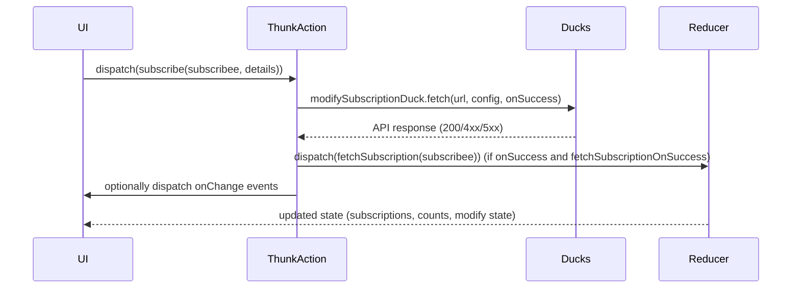
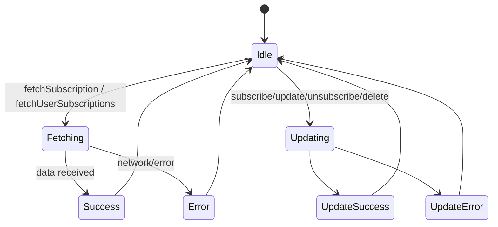
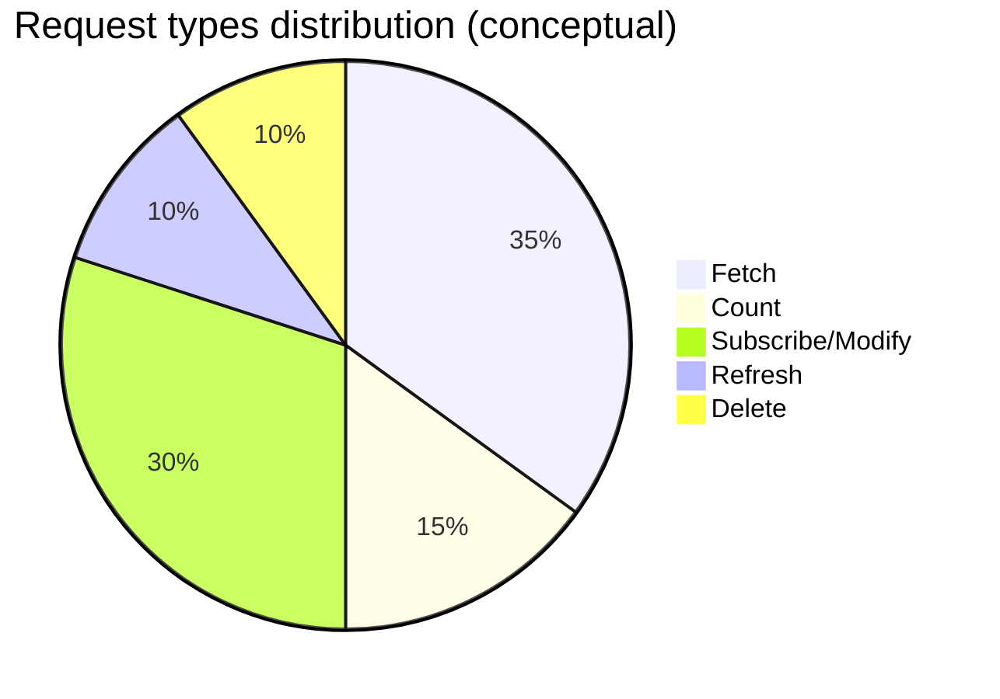

# Diagram: web/portal/src/shared/redux/SubscriptionStateBuilder.ts


> Auto-generated by Obscura crawlers

## Diagram 1

```mermaid
classDiagram
    class buildSubscriptionState {
        +mountPoint
        +actionCreators
        +selectors
        +reducer
    }
    class SubscriptionStateBuilderConfig {
        +topic
        +systemType
        +subscriptionType
        +getUrl()
        +getSubscribeeId()
        +getAdditionalRequestConfig()
        +onChange()
        +updateUrl
        +fetchSubscriptionOnSuccess
    }
    class SubscriptionDetails {
        +id
        +enable_email
        +recipient_email
        +enable_sms
        +mobile_number
        +enable_platform
        +context
        +requires_approval
    }
    class Ducks {
        +userSubscriptionsDuck
        +subscriptionsDuck
        +subscriptionsCountDuck
        +refreshSubscriptionDuck
        +modifySubscriptionDuck
    }
    class Utils {
        +AuthenticationUtils
        +moment.tz.guess()
        +buildFetchDuck()
        +chainReducers()
    }
    buildSubscriptionState --> SubscriptionStateBuilderConfig : accepts
    buildSubscriptionState --> Ducks : creates
    buildSubscriptionState --> Utils : uses
    buildSubscriptionState --> SubscriptionDetails : handles
    Ducks --> buildFetchDuck : created by
    buildSubscriptionState o-- "SET_LAST_REQUESTED_ID" : defines action
    buildSubscriptionState --> chainReducers : composes reducer
```

> SVG rendering failed for this diagram.

## Diagram 2

```mermaid
flowchart LR
    A[User/UI action] --> B{Action type}
    B -->|Fetch User Subscriptions| C[fetchUserSubscriptions thunk]
    B -->|Fetch Count| D[fetchUserSubscriptionsCount thunk]
    B -->|Fetch Subscription| E[fetchSubscription thunk]
    B -->|Subscribe| F[subscribe thunk]
    B -->|Update| G[updateSubscription thunk]
    B -->|Unsubscribe| H[unsubscribe thunk]
    B -->|Delete| I[deleteSubscription thunk]
    C --> J[userSubscriptionsDuck.fetch]
    D --> K[subscriptionsCountDuck.fetch]
    E --> L[subscriptionsDuck.fetch]
    F --> M[modifySubscriptionDuck.fetch]
    G --> M
    H --> M
    I --> M
    M --> N{onSuccess?}
    N -->|true & fetchSubscriptionOnSuccess| E
    N -->|true & onChange provided| O[dispatch onChange(changeType, data, state)]
    AuthenticationUtils --> C
    AuthenticationUtils --> D
    AuthenticationUtils --> E
    AuthenticationUtils --> F
    AuthenticationUtils --> G
    AuthenticationUtils --> H
    AuthenticationUtils --> I
```

> SVG rendering failed for this diagram.

## Diagram 3



### SVG

<svg id="container" width="1263" xmlns="http://www.w3.org/2000/svg" height="459" viewBox="-50 -10 1263 459" role="graphics-document document" aria-roledescription="sequence"><g><rect x="1013" y="373" fill="#eaeaea" stroke="#666" width="150" height="65" name="Reducer" rx="3" ry="3" class="actor actor-bottom"></rect><text x="1088" y="405.5" dominant-baseline="central" alignment-baseline="central" class="actor actor-box" style="text-anchor: middle; font-size: 16px; font-weight: 400;"><tspan x="1088" dy="0">Reducer</tspan></text></g><g><rect x="813" y="373" fill="#eaeaea" stroke="#666" width="150" height="65" name="Ducks" rx="3" ry="3" class="actor actor-bottom"></rect><text x="888" y="405.5" dominant-baseline="central" alignment-baseline="central" class="actor actor-box" style="text-anchor: middle; font-size: 16px; font-weight: 400;"><tspan x="888" dy="0">Ducks</tspan></text></g><g><rect x="360" y="373" fill="#eaeaea" stroke="#666" width="150" height="65" name="Thunk" rx="3" ry="3" class="actor actor-bottom"></rect><text x="435" y="405.5" dominant-baseline="central" alignment-baseline="central" class="actor actor-box" style="text-anchor: middle; font-size: 16px; font-weight: 400;"><tspan x="435" dy="0">ThunkAction</tspan></text></g><g><rect x="0" y="373" fill="#eaeaea" stroke="#666" width="150" height="65" name="UI" rx="3" ry="3" class="actor actor-bottom"></rect><text x="75" y="405.5" dominant-baseline="central" alignment-baseline="central" class="actor actor-box" style="text-anchor: middle; font-size: 16px; font-weight: 400;"><tspan x="75" dy="0">UI</tspan></text></g><g><line id="actor3" x1="1088" y1="65" x2="1088" y2="373" class="actor-line 200" stroke-width="0.5px" stroke="#999" name="Reducer"></line><g id="root-3"><rect x="1013" y="0" fill="#eaeaea" stroke="#666" width="150" height="65" name="Reducer" rx="3" ry="3" class="actor actor-top"></rect><text x="1088" y="32.5" dominant-baseline="central" alignment-baseline="central" class="actor actor-box" style="text-anchor: middle; font-size: 16px; font-weight: 400;"><tspan x="1088" dy="0">Reducer</tspan></text></g></g><g><line id="actor2" x1="888" y1="65" x2="888" y2="373" class="actor-line 200" stroke-width="0.5px" stroke="#999" name="Ducks"></line><g id="root-2"><rect x="813" y="0" fill="#eaeaea" stroke="#666" width="150" height="65" name="Ducks" rx="3" ry="3" class="actor actor-top"></rect><text x="888" y="32.5" dominant-baseline="central" alignment-baseline="central" class="actor actor-box" style="text-anchor: middle; font-size: 16px; font-weight: 400;"><tspan x="888" dy="0">Ducks</tspan></text></g></g><g><line id="actor1" x1="435" y1="65" x2="435" y2="373" class="actor-line 200" stroke-width="0.5px" stroke="#999" name="Thunk"></line><g id="root-1"><rect x="360" y="0" fill="#eaeaea" stroke="#666" width="150" height="65" name="Thunk" rx="3" ry="3" class="actor actor-top"></rect><text x="435" y="32.5" dominant-baseline="central" alignment-baseline="central" class="actor actor-box" style="text-anchor: middle; font-size: 16px; font-weight: 400;"><tspan x="435" dy="0">ThunkAction</tspan></text></g></g><g><line id="actor0" x1="75" y1="65" x2="75" y2="373" class="actor-line 200" stroke-width="0.5px" stroke="#999" name="UI"></line><g id="root-0"><rect x="0" y="0" fill="#eaeaea" stroke="#666" width="150" height="65" name="UI" rx="3" ry="3" class="actor actor-top"></rect><text x="75" y="32.5" dominant-baseline="central" alignment-baseline="central" class="actor actor-box" style="text-anchor: middle; font-size: 16px; font-weight: 400;"><tspan x="75" dy="0">UI</tspan></text></g></g><style>#container{font-family:"trebuchet ms",verdana,arial,sans-serif;font-size:16px;fill:#333;}@keyframes edge-animation-frame{from{stroke-dashoffset:0;}}@keyframes dash{to{stroke-dashoffset:0;}}#container .edge-animation-slow{stroke-dasharray:9,5!important;stroke-dashoffset:900;animation:dash 50s linear infinite;stroke-linecap:round;}#container .edge-animation-fast{stroke-dasharray:9,5!important;stroke-dashoffset:900;animation:dash 20s linear infinite;stroke-linecap:round;}#container .error-icon{fill:#552222;}#container .error-text{fill:#552222;stroke:#552222;}#container .edge-thickness-normal{stroke-width:1px;}#container .edge-thickness-thick{stroke-width:3.5px;}#container .edge-pattern-solid{stroke-dasharray:0;}#container .edge-thickness-invisible{stroke-width:0;fill:none;}#container .edge-pattern-dashed{stroke-dasharray:3;}#container .edge-pattern-dotted{stroke-dasharray:2;}#container .marker{fill:#333333;stroke:#333333;}#container .marker.cross{stroke:#333333;}#container svg{font-family:"trebuchet ms",verdana,arial,sans-serif;font-size:16px;}#container p{margin:0;}#container .actor{stroke:hsl(259.6261682243, 59.7765363128%, 87.9019607843%);fill:#ECECFF;}#container text.actor&gt;tspan{fill:black;stroke:none;}#container .actor-line{stroke:hsl(259.6261682243, 59.7765363128%, 87.9019607843%);}#container .innerArc{stroke-width:1.5;stroke-dasharray:none;}#container .messageLine0{stroke-width:1.5;stroke-dasharray:none;stroke:#333;}#container .messageLine1{stroke-width:1.5;stroke-dasharray:2,2;stroke:#333;}#container #arrowhead path{fill:#333;stroke:#333;}#container .sequenceNumber{fill:white;}#container #sequencenumber{fill:#333;}#container #crosshead path{fill:#333;stroke:#333;}#container .messageText{fill:#333;stroke:none;}#container .labelBox{stroke:hsl(259.6261682243, 59.7765363128%, 87.9019607843%);fill:#ECECFF;}#container .labelText,#container .labelText&gt;tspan{fill:black;stroke:none;}#container .loopText,#container .loopText&gt;tspan{fill:black;stroke:none;}#container .loopLine{stroke-width:2px;stroke-dasharray:2,2;stroke:hsl(259.6261682243, 59.7765363128%, 87.9019607843%);fill:hsl(259.6261682243, 59.7765363128%, 87.9019607843%);}#container .note{stroke:#aaaa33;fill:#fff5ad;}#container .noteText,#container .noteText&gt;tspan{fill:black;stroke:none;}#container .activation0{fill:#f4f4f4;stroke:#666;}#container .activation1{fill:#f4f4f4;stroke:#666;}#container .activation2{fill:#f4f4f4;stroke:#666;}#container .actorPopupMenu{position:absolute;}#container .actorPopupMenuPanel{position:absolute;fill:#ECECFF;box-shadow:0px 8px 16px 0px rgba(0,0,0,0.2);filter:drop-shadow(3px 5px 2px rgb(0 0 0 / 0.4));}#container .actor-man line{stroke:hsl(259.6261682243, 59.7765363128%, 87.9019607843%);fill:#ECECFF;}#container .actor-man circle,#container line{stroke:hsl(259.6261682243, 59.7765363128%, 87.9019607843%);fill:#ECECFF;stroke-width:2px;}#container :root{--mermaid-font-family:"trebuchet ms",verdana,arial,sans-serif;}</style><g></g><defs><symbol id="computer" width="24" height="24"><path transform="scale(.5)" d="M2 2v13h20v-13h-20zm18 11h-16v-9h16v9zm-10.228 6l.466-1h3.524l.467 1h-4.457zm14.228 3h-24l2-6h2.104l-1.33 4h18.45l-1.297-4h2.073l2 6zm-5-10h-14v-7h14v7z"></path></symbol></defs><defs><symbol id="database" fill-rule="evenodd" clip-rule="evenodd"><path transform="scale(.5)" d="M12.258.001l.256.004.255.005.253.008.251.01.249.012.247.015.246.016.242.019.241.02.239.023.236.024.233.027.231.028.229.031.225.032.223.034.22.036.217.038.214.04.211.041.208.043.205.045.201.046.198.048.194.05.191.051.187.053.183.054.18.056.175.057.172.059.168.06.163.061.16.063.155.064.15.066.074.033.073.033.071.034.07.034.069.035.068.035.067.035.066.035.064.036.064.036.062.036.06.036.06.037.058.037.058.037.055.038.055.038.053.038.052.038.051.039.05.039.048.039.047.039.045.04.044.04.043.04.041.04.04.041.039.041.037.041.036.041.034.041.033.042.032.042.03.042.029.042.027.042.026.043.024.043.023.043.021.043.02.043.018.044.017.043.015.044.013.044.012.044.011.045.009.044.007.045.006.045.004.045.002.045.001.045v17l-.001.045-.002.045-.004.045-.006.045-.007.045-.009.044-.011.045-.012.044-.013.044-.015.044-.017.043-.018.044-.02.043-.021.043-.023.043-.024.043-.026.043-.027.042-.029.042-.03.042-.032.042-.033.042-.034.041-.036.041-.037.041-.039.041-.04.041-.041.04-.043.04-.044.04-.045.04-.047.039-.048.039-.05.039-.051.039-.052.038-.053.038-.055.038-.055.038-.058.037-.058.037-.06.037-.06.036-.062.036-.064.036-.064.036-.066.035-.067.035-.068.035-.069.035-.07.034-.071.034-.073.033-.074.033-.15.066-.155.064-.16.063-.163.061-.168.06-.172.059-.175.057-.18.056-.183.054-.187.053-.191.051-.194.05-.198.048-.201.046-.205.045-.208.043-.211.041-.214.04-.217.038-.22.036-.223.034-.225.032-.229.031-.231.028-.233.027-.236.024-.239.023-.241.02-.242.019-.246.016-.247.015-.249.012-.251.01-.253.008-.255.005-.256.004-.258.001-.258-.001-.256-.004-.255-.005-.253-.008-.251-.01-.249-.012-.247-.015-.245-.016-.243-.019-.241-.02-.238-.023-.236-.024-.234-.027-.231-.028-.228-.031-.226-.032-.223-.034-.22-.036-.217-.038-.214-.04-.211-.041-.208-.043-.204-.045-.201-.046-.198-.048-.195-.05-.19-.051-.187-.053-.184-.054-.179-.056-.176-.057-.172-.059-.167-.06-.164-.061-.159-.063-.155-.064-.151-.066-.074-.033-.072-.033-.072-.034-.07-.034-.069-.035-.068-.035-.067-.035-.066-.035-.064-.036-.063-.036-.062-.036-.061-.036-.06-.037-.058-.037-.057-.037-.056-.038-.055-.038-.053-.038-.052-.038-.051-.039-.049-.039-.049-.039-.046-.039-.046-.04-.044-.04-.043-.04-.041-.04-.04-.041-.039-.041-.037-.041-.036-.041-.034-.041-.033-.042-.032-.042-.03-.042-.029-.042-.027-.042-.026-.043-.024-.043-.023-.043-.021-.043-.02-.043-.018-.044-.017-.043-.015-.044-.013-.044-.012-.044-.011-.045-.009-.044-.007-.045-.006-.045-.004-.045-.002-.045-.001-.045v-17l.001-.045.002-.045.004-.045.006-.045.007-.045.009-.044.011-.045.012-.044.013-.044.015-.044.017-.043.018-.044.02-.043.021-.043.023-.043.024-.043.026-.043.027-.042.029-.042.03-.042.032-.042.033-.042.034-.041.036-.041.037-.041.039-.041.04-.041.041-.04.043-.04.044-.04.046-.04.046-.039.049-.039.049-.039.051-.039.052-.038.053-.038.055-.038.056-.038.057-.037.058-.037.06-.037.061-.036.062-.036.063-.036.064-.036.066-.035.067-.035.068-.035.069-.035.07-.034.072-.034.072-.033.074-.033.151-.066.155-.064.159-.063.164-.061.167-.06.172-.059.176-.057.179-.056.184-.054.187-.053.19-.051.195-.05.198-.048.201-.046.204-.045.208-.043.211-.041.214-.04.217-.038.22-.036.223-.034.226-.032.228-.031.231-.028.234-.027.236-.024.238-.023.241-.02.243-.019.245-.016.247-.015.249-.012.251-.01.253-.008.255-.005.256-.004.258-.001.258.001zm-9.258 20.499v.01l.001.021.003.021.004.022.005.021.006.022.007.022.009.023.01.022.011.023.012.023.013.023.015.023.016.024.017.023.018.024.019.024.021.024.022.025.023.024.024.025.052.049.056.05.061.051.066.051.07.051.075.051.079.052.084.052.088.052.092.052.097.052.102.051.105.052.11.052.114.051.119.051.123.051.127.05.131.05.135.05.139.048.144.049.147.047.152.047.155.047.16.045.163.045.167.043.171.043.176.041.178.041.183.039.187.039.19.037.194.035.197.035.202.033.204.031.209.03.212.029.216.027.219.025.222.024.226.021.23.02.233.018.236.016.24.015.243.012.246.01.249.008.253.005.256.004.259.001.26-.001.257-.004.254-.005.25-.008.247-.011.244-.012.241-.014.237-.016.233-.018.231-.021.226-.021.224-.024.22-.026.216-.027.212-.028.21-.031.205-.031.202-.034.198-.034.194-.036.191-.037.187-.039.183-.04.179-.04.175-.042.172-.043.168-.044.163-.045.16-.046.155-.046.152-.047.148-.048.143-.049.139-.049.136-.05.131-.05.126-.05.123-.051.118-.052.114-.051.11-.052.106-.052.101-.052.096-.052.092-.052.088-.053.083-.051.079-.052.074-.052.07-.051.065-.051.06-.051.056-.05.051-.05.023-.024.023-.025.021-.024.02-.024.019-.024.018-.024.017-.024.015-.023.014-.024.013-.023.012-.023.01-.023.01-.022.008-.022.006-.022.006-.022.004-.022.004-.021.001-.021.001-.021v-4.127l-.077.055-.08.053-.083.054-.085.053-.087.052-.09.052-.093.051-.095.05-.097.05-.1.049-.102.049-.105.048-.106.047-.109.047-.111.046-.114.045-.115.045-.118.044-.12.043-.122.042-.124.042-.126.041-.128.04-.13.04-.132.038-.134.038-.135.037-.138.037-.139.035-.142.035-.143.034-.144.033-.147.032-.148.031-.15.03-.151.03-.153.029-.154.027-.156.027-.158.026-.159.025-.161.024-.162.023-.163.022-.165.021-.166.02-.167.019-.169.018-.169.017-.171.016-.173.015-.173.014-.175.013-.175.012-.177.011-.178.01-.179.008-.179.008-.181.006-.182.005-.182.004-.184.003-.184.002h-.37l-.184-.002-.184-.003-.182-.004-.182-.005-.181-.006-.179-.008-.179-.008-.178-.01-.176-.011-.176-.012-.175-.013-.173-.014-.172-.015-.171-.016-.17-.017-.169-.018-.167-.019-.166-.02-.165-.021-.163-.022-.162-.023-.161-.024-.159-.025-.157-.026-.156-.027-.155-.027-.153-.029-.151-.03-.15-.03-.148-.031-.146-.032-.145-.033-.143-.034-.141-.035-.14-.035-.137-.037-.136-.037-.134-.038-.132-.038-.13-.04-.128-.04-.126-.041-.124-.042-.122-.042-.12-.044-.117-.043-.116-.045-.113-.045-.112-.046-.109-.047-.106-.047-.105-.048-.102-.049-.1-.049-.097-.05-.095-.05-.093-.052-.09-.051-.087-.052-.085-.053-.083-.054-.08-.054-.077-.054v4.127zm0-5.654v.011l.001.021.003.021.004.021.005.022.006.022.007.022.009.022.01.022.011.023.012.023.013.023.015.024.016.023.017.024.018.024.019.024.021.024.022.024.023.025.024.024.052.05.056.05.061.05.066.051.07.051.075.052.079.051.084.052.088.052.092.052.097.052.102.052.105.052.11.051.114.051.119.052.123.05.127.051.131.05.135.049.139.049.144.048.147.048.152.047.155.046.16.045.163.045.167.044.171.042.176.042.178.04.183.04.187.038.19.037.194.036.197.034.202.033.204.032.209.03.212.028.216.027.219.025.222.024.226.022.23.02.233.018.236.016.24.014.243.012.246.01.249.008.253.006.256.003.259.001.26-.001.257-.003.254-.006.25-.008.247-.01.244-.012.241-.015.237-.016.233-.018.231-.02.226-.022.224-.024.22-.025.216-.027.212-.029.21-.03.205-.032.202-.033.198-.035.194-.036.191-.037.187-.039.183-.039.179-.041.175-.042.172-.043.168-.044.163-.045.16-.045.155-.047.152-.047.148-.048.143-.048.139-.05.136-.049.131-.05.126-.051.123-.051.118-.051.114-.052.11-.052.106-.052.101-.052.096-.052.092-.052.088-.052.083-.052.079-.052.074-.051.07-.052.065-.051.06-.05.056-.051.051-.049.023-.025.023-.024.021-.025.02-.024.019-.024.018-.024.017-.024.015-.023.014-.023.013-.024.012-.022.01-.023.01-.023.008-.022.006-.022.006-.022.004-.021.004-.022.001-.021.001-.021v-4.139l-.077.054-.08.054-.083.054-.085.052-.087.053-.09.051-.093.051-.095.051-.097.05-.1.049-.102.049-.105.048-.106.047-.109.047-.111.046-.114.045-.115.044-.118.044-.12.044-.122.042-.124.042-.126.041-.128.04-.13.039-.132.039-.134.038-.135.037-.138.036-.139.036-.142.035-.143.033-.144.033-.147.033-.148.031-.15.03-.151.03-.153.028-.154.028-.156.027-.158.026-.159.025-.161.024-.162.023-.163.022-.165.021-.166.02-.167.019-.169.018-.169.017-.171.016-.173.015-.173.014-.175.013-.175.012-.177.011-.178.009-.179.009-.179.007-.181.007-.182.005-.182.004-.184.003-.184.002h-.37l-.184-.002-.184-.003-.182-.004-.182-.005-.181-.007-.179-.007-.179-.009-.178-.009-.176-.011-.176-.012-.175-.013-.173-.014-.172-.015-.171-.016-.17-.017-.169-.018-.167-.019-.166-.02-.165-.021-.163-.022-.162-.023-.161-.024-.159-.025-.157-.026-.156-.027-.155-.028-.153-.028-.151-.03-.15-.03-.148-.031-.146-.033-.145-.033-.143-.033-.141-.035-.14-.036-.137-.036-.136-.037-.134-.038-.132-.039-.13-.039-.128-.04-.126-.041-.124-.042-.122-.043-.12-.043-.117-.044-.116-.044-.113-.046-.112-.046-.109-.046-.106-.047-.105-.048-.102-.049-.1-.049-.097-.05-.095-.051-.093-.051-.09-.051-.087-.053-.085-.052-.083-.054-.08-.054-.077-.054v4.139zm0-5.666v.011l.001.02.003.022.004.021.005.022.006.021.007.022.009.023.01.022.011.023.012.023.013.023.015.023.016.024.017.024.018.023.019.024.021.025.022.024.023.024.024.025.052.05.056.05.061.05.066.051.07.051.075.052.079.051.084.052.088.052.092.052.097.052.102.052.105.051.11.052.114.051.119.051.123.051.127.05.131.05.135.05.139.049.144.048.147.048.152.047.155.046.16.045.163.045.167.043.171.043.176.042.178.04.183.04.187.038.19.037.194.036.197.034.202.033.204.032.209.03.212.028.216.027.219.025.222.024.226.021.23.02.233.018.236.017.24.014.243.012.246.01.249.008.253.006.256.003.259.001.26-.001.257-.003.254-.006.25-.008.247-.01.244-.013.241-.014.237-.016.233-.018.231-.02.226-.022.224-.024.22-.025.216-.027.212-.029.21-.03.205-.032.202-.033.198-.035.194-.036.191-.037.187-.039.183-.039.179-.041.175-.042.172-.043.168-.044.163-.045.16-.045.155-.047.152-.047.148-.048.143-.049.139-.049.136-.049.131-.051.126-.05.123-.051.118-.052.114-.051.11-.052.106-.052.101-.052.096-.052.092-.052.088-.052.083-.052.079-.052.074-.052.07-.051.065-.051.06-.051.056-.05.051-.049.023-.025.023-.025.021-.024.02-.024.019-.024.018-.024.017-.024.015-.023.014-.024.013-.023.012-.023.01-.022.01-.023.008-.022.006-.022.006-.022.004-.022.004-.021.001-.021.001-.021v-4.153l-.077.054-.08.054-.083.053-.085.053-.087.053-.09.051-.093.051-.095.051-.097.05-.1.049-.102.048-.105.048-.106.048-.109.046-.111.046-.114.046-.115.044-.118.044-.12.043-.122.043-.124.042-.126.041-.128.04-.13.039-.132.039-.134.038-.135.037-.138.036-.139.036-.142.034-.143.034-.144.033-.147.032-.148.032-.15.03-.151.03-.153.028-.154.028-.156.027-.158.026-.159.024-.161.024-.162.023-.163.023-.165.021-.166.02-.167.019-.169.018-.169.017-.171.016-.173.015-.173.014-.175.013-.175.012-.177.01-.178.01-.179.009-.179.007-.181.006-.182.006-.182.004-.184.003-.184.001-.185.001-.185-.001-.184-.001-.184-.003-.182-.004-.182-.006-.181-.006-.179-.007-.179-.009-.178-.01-.176-.01-.176-.012-.175-.013-.173-.014-.172-.015-.171-.016-.17-.017-.169-.018-.167-.019-.166-.02-.165-.021-.163-.023-.162-.023-.161-.024-.159-.024-.157-.026-.156-.027-.155-.028-.153-.028-.151-.03-.15-.03-.148-.032-.146-.032-.145-.033-.143-.034-.141-.034-.14-.036-.137-.036-.136-.037-.134-.038-.132-.039-.13-.039-.128-.041-.126-.041-.124-.041-.122-.043-.12-.043-.117-.044-.116-.044-.113-.046-.112-.046-.109-.046-.106-.048-.105-.048-.102-.048-.1-.05-.097-.049-.095-.051-.093-.051-.09-.052-.087-.052-.085-.053-.083-.053-.08-.054-.077-.054v4.153zm8.74-8.179l-.257.004-.254.005-.25.008-.247.011-.244.012-.241.014-.237.016-.233.018-.231.021-.226.022-.224.023-.22.026-.216.027-.212.028-.21.031-.205.032-.202.033-.198.034-.194.036-.191.038-.187.038-.183.04-.179.041-.175.042-.172.043-.168.043-.163.045-.16.046-.155.046-.152.048-.148.048-.143.048-.139.049-.136.05-.131.05-.126.051-.123.051-.118.051-.114.052-.11.052-.106.052-.101.052-.096.052-.092.052-.088.052-.083.052-.079.052-.074.051-.07.052-.065.051-.06.05-.056.05-.051.05-.023.025-.023.024-.021.024-.02.025-.019.024-.018.024-.017.023-.015.024-.014.023-.013.023-.012.023-.01.023-.01.022-.008.022-.006.023-.006.021-.004.022-.004.021-.001.021-.001.021.001.021.001.021.004.021.004.022.006.021.006.023.008.022.01.022.01.023.012.023.013.023.014.023.015.024.017.023.018.024.019.024.02.025.021.024.023.024.023.025.051.05.056.05.06.05.065.051.07.052.074.051.079.052.083.052.088.052.092.052.096.052.101.052.106.052.11.052.114.052.118.051.123.051.126.051.131.05.136.05.139.049.143.048.148.048.152.048.155.046.16.046.163.045.168.043.172.043.175.042.179.041.183.04.187.038.191.038.194.036.198.034.202.033.205.032.21.031.212.028.216.027.22.026.224.023.226.022.231.021.233.018.237.016.241.014.244.012.247.011.25.008.254.005.257.004.26.001.26-.001.257-.004.254-.005.25-.008.247-.011.244-.012.241-.014.237-.016.233-.018.231-.021.226-.022.224-.023.22-.026.216-.027.212-.028.21-.031.205-.032.202-.033.198-.034.194-.036.191-.038.187-.038.183-.04.179-.041.175-.042.172-.043.168-.043.163-.045.16-.046.155-.046.152-.048.148-.048.143-.048.139-.049.136-.05.131-.05.126-.051.123-.051.118-.051.114-.052.11-.052.106-.052.101-.052.096-.052.092-.052.088-.052.083-.052.079-.052.074-.051.07-.052.065-.051.06-.05.056-.05.051-.05.023-.025.023-.024.021-.024.02-.025.019-.024.018-.024.017-.023.015-.024.014-.023.013-.023.012-.023.01-.023.01-.022.008-.022.006-.023.006-.021.004-.022.004-.021.001-.021.001-.021-.001-.021-.001-.021-.004-.021-.004-.022-.006-.021-.006-.023-.008-.022-.01-.022-.01-.023-.012-.023-.013-.023-.014-.023-.015-.024-.017-.023-.018-.024-.019-.024-.02-.025-.021-.024-.023-.024-.023-.025-.051-.05-.056-.05-.06-.05-.065-.051-.07-.052-.074-.051-.079-.052-.083-.052-.088-.052-.092-.052-.096-.052-.101-.052-.106-.052-.11-.052-.114-.052-.118-.051-.123-.051-.126-.051-.131-.05-.136-.05-.139-.049-.143-.048-.148-.048-.152-.048-.155-.046-.16-.046-.163-.045-.168-.043-.172-.043-.175-.042-.179-.041-.183-.04-.187-.038-.191-.038-.194-.036-.198-.034-.202-.033-.205-.032-.21-.031-.212-.028-.216-.027-.22-.026-.224-.023-.226-.022-.231-.021-.233-.018-.237-.016-.241-.014-.244-.012-.247-.011-.25-.008-.254-.005-.257-.004-.26-.001-.26.001z"></path></symbol></defs><defs><symbol id="clock" width="24" height="24"><path transform="scale(.5)" d="M12 2c5.514 0 10 4.486 10 10s-4.486 10-10 10-10-4.486-10-10 4.486-10 10-10zm0-2c-6.627 0-12 5.373-12 12s5.373 12 12 12 12-5.373 12-12-5.373-12-12-12zm5.848 12.459c.202.038.202.333.001.372-1.907.361-6.045 1.111-6.547 1.111-.719 0-1.301-.582-1.301-1.301 0-.512.77-5.447 1.125-7.445.034-.192.312-.181.343.014l.985 6.238 5.394 1.011z"></path></symbol></defs><defs><marker id="arrowhead" refX="7.9" refY="5" markerUnits="userSpaceOnUse" markerWidth="12" markerHeight="12" orient="auto-start-reverse"><path d="M -1 0 L 10 5 L 0 10 z"></path></marker></defs><defs><marker id="crosshead" markerWidth="15" markerHeight="8" orient="auto" refX="4" refY="4.5"><path fill="none" stroke="#000000" stroke-width="1pt" d="M 1,2 L 6,7 M 6,2 L 1,7" style="stroke-dasharray: 0, 0;"></path></marker></defs><defs><marker id="filled-head" refX="15.5" refY="7" markerWidth="20" markerHeight="28" orient="auto"><path d="M 18,7 L9,13 L14,7 L9,1 Z"></path></marker></defs><defs><marker id="sequencenumber" refX="15" refY="15" markerWidth="60" markerHeight="40" orient="auto"><circle cx="15" cy="15" r="6"></circle></marker></defs><text x="254" y="80" text-anchor="middle" dominant-baseline="middle" alignment-baseline="middle" class="messageText" dy="1em" style="font-size: 16px; font-weight: 400;">dispatch(subscribe(subscribee, details))</text><line x1="76" y1="113" x2="431" y2="113" class="messageLine0" stroke-width="2" stroke="none" marker-end="url(#arrowhead)" style="fill: none;"></line><text x="660" y="128" text-anchor="middle" dominant-baseline="middle" alignment-baseline="middle" class="messageText" dy="1em" style="font-size: 16px; font-weight: 400;">modifySubscriptionDuck.fetch(url, config, onSuccess)</text><line x1="436" y1="161" x2="884" y2="161" class="messageLine0" stroke-width="2" stroke="none" marker-end="url(#arrowhead)" style="fill: none;"></line><text x="663" y="176" text-anchor="middle" dominant-baseline="middle" alignment-baseline="middle" class="messageText" dy="1em" style="font-size: 16px; font-weight: 400;">API response (200/4xx/5xx)</text><line x1="887" y1="209" x2="439" y2="209" class="messageLine1" stroke-width="2" stroke="none" marker-end="url(#arrowhead)" style="stroke-dasharray: 3, 3; fill: none;"></line><text x="760" y="224" text-anchor="middle" dominant-baseline="middle" alignment-baseline="middle" class="messageText" dy="1em" style="font-size: 16px; font-weight: 400;">dispatch(fetchSubscription(subscribee)) (if onSuccess and fetchSubscriptionOnSuccess)</text><line x1="436" y1="257" x2="1084" y2="257" class="messageLine0" stroke-width="2" stroke="none" marker-end="url(#arrowhead)" style="fill: none;"></line><text x="257" y="272" text-anchor="middle" dominant-baseline="middle" alignment-baseline="middle" class="messageText" dy="1em" style="font-size: 16px; font-weight: 400;">optionally dispatch onChange events</text><line x1="434" y1="305" x2="79" y2="305" class="messageLine0" stroke-width="2" stroke="none" marker-end="url(#arrowhead)" style="fill: none;"></line><text x="583" y="320" text-anchor="middle" dominant-baseline="middle" alignment-baseline="middle" class="messageText" dy="1em" style="font-size: 16px; font-weight: 400;">updated state (subscriptions, counts, modify state)</text><line x1="1087" y1="353" x2="79" y2="353" class="messageLine1" stroke-width="2" stroke="none" marker-end="url(#arrowhead)" style="stroke-dasharray: 3, 3; fill: none;"></line></svg>

## Diagram 4



### SVG

<svg id="container" width="842.9765625" xmlns="http://www.w3.org/2000/svg" class="statediagram" height="372" viewBox="0 0 842.9765625 372" role="graphics-document document" aria-roledescription="stateDiagram"><style>#container{font-family:"trebuchet ms",verdana,arial,sans-serif;font-size:16px;fill:#333;}@keyframes edge-animation-frame{from{stroke-dashoffset:0;}}@keyframes dash{to{stroke-dashoffset:0;}}#container .edge-animation-slow{stroke-dasharray:9,5!important;stroke-dashoffset:900;animation:dash 50s linear infinite;stroke-linecap:round;}#container .edge-animation-fast{stroke-dasharray:9,5!important;stroke-dashoffset:900;animation:dash 20s linear infinite;stroke-linecap:round;}#container .error-icon{fill:#552222;}#container .error-text{fill:#552222;stroke:#552222;}#container .edge-thickness-normal{stroke-width:1px;}#container .edge-thickness-thick{stroke-width:3.5px;}#container .edge-pattern-solid{stroke-dasharray:0;}#container .edge-thickness-invisible{stroke-width:0;fill:none;}#container .edge-pattern-dashed{stroke-dasharray:3;}#container .edge-pattern-dotted{stroke-dasharray:2;}#container .marker{fill:#333333;stroke:#333333;}#container .marker.cross{stroke:#333333;}#container svg{font-family:"trebuchet ms",verdana,arial,sans-serif;font-size:16px;}#container p{margin:0;}#container defs #statediagram-barbEnd{fill:#333333;stroke:#333333;}#container g.stateGroup text{fill:#9370DB;stroke:none;font-size:10px;}#container g.stateGroup text{fill:#333;stroke:none;font-size:10px;}#container g.stateGroup .state-title{font-weight:bolder;fill:#131300;}#container g.stateGroup rect{fill:#ECECFF;stroke:#9370DB;}#container g.stateGroup line{stroke:#333333;stroke-width:1;}#container .transition{stroke:#333333;stroke-width:1;fill:none;}#container .stateGroup .composit{fill:white;border-bottom:1px;}#container .stateGroup .alt-composit{fill:#e0e0e0;border-bottom:1px;}#container .state-note{stroke:#aaaa33;fill:#fff5ad;}#container .state-note text{fill:black;stroke:none;font-size:10px;}#container .stateLabel .box{stroke:none;stroke-width:0;fill:#ECECFF;opacity:0.5;}#container .edgeLabel .label rect{fill:#ECECFF;opacity:0.5;}#container .edgeLabel{background-color:rgba(232,232,232, 0.8);text-align:center;}#container .edgeLabel p{background-color:rgba(232,232,232, 0.8);}#container .edgeLabel rect{opacity:0.5;background-color:rgba(232,232,232, 0.8);fill:rgba(232,232,232, 0.8);}#container .edgeLabel .label text{fill:#333;}#container .label div .edgeLabel{color:#333;}#container .stateLabel text{fill:#131300;font-size:10px;font-weight:bold;}#container .node circle.state-start{fill:#333333;stroke:#333333;}#container .node .fork-join{fill:#333333;stroke:#333333;}#container .node circle.state-end{fill:#9370DB;stroke:white;stroke-width:1.5;}#container .end-state-inner{fill:white;stroke-width:1.5;}#container .node rect{fill:#ECECFF;stroke:#9370DB;stroke-width:1px;}#container .node polygon{fill:#ECECFF;stroke:#9370DB;stroke-width:1px;}#container #statediagram-barbEnd{fill:#333333;}#container .statediagram-cluster rect{fill:#ECECFF;stroke:#9370DB;stroke-width:1px;}#container .cluster-label,#container .nodeLabel{color:#131300;}#container .statediagram-cluster rect.outer{rx:5px;ry:5px;}#container .statediagram-state .divider{stroke:#9370DB;}#container .statediagram-state .title-state{rx:5px;ry:5px;}#container .statediagram-cluster.statediagram-cluster .inner{fill:white;}#container .statediagram-cluster.statediagram-cluster-alt .inner{fill:#f0f0f0;}#container .statediagram-cluster .inner{rx:0;ry:0;}#container .statediagram-state rect.basic{rx:5px;ry:5px;}#container .statediagram-state rect.divider{stroke-dasharray:10,10;fill:#f0f0f0;}#container .note-edge{stroke-dasharray:5;}#container .statediagram-note rect{fill:#fff5ad;stroke:#aaaa33;stroke-width:1px;rx:0;ry:0;}#container .statediagram-note rect{fill:#fff5ad;stroke:#aaaa33;stroke-width:1px;rx:0;ry:0;}#container .statediagram-note text{fill:black;}#container .statediagram-note .nodeLabel{color:black;}#container .statediagram .edgeLabel{color:red;}#container #dependencyStart,#container #dependencyEnd{fill:#333333;stroke:#333333;stroke-width:1;}#container .statediagramTitleText{text-anchor:middle;font-size:18px;fill:#333;}#container :root{--mermaid-font-family:"trebuchet ms",verdana,arial,sans-serif;}</style><g><defs><marker id="container_stateDiagram-barbEnd" refX="19" refY="7" markerWidth="20" markerHeight="14" markerUnits="userSpaceOnUse" orient="auto"><path d="M 19,7 L9,13 L14,7 L9,1 Z"></path></marker></defs><g class="root"><g class="clusters"></g><g class="edgePaths"><path d="M450.641,22L450.641,26.167C450.641,30.333,450.641,38.667,450.724,47.083C450.807,55.5,450.974,64,451.057,68.25L451.141,72.5" id="edge0" class="edge-thickness-normal edge-pattern-solid transition" style="fill:none;;;fill:none" data-edge="true" data-et="edge" data-id="edge0" data-points="W3sieCI6NDUwLjY0MDYyNSwieSI6MjJ9LHsieCI6NDUwLjY0MDYyNSwieSI6NDd9LHsieCI6NDUxLjE0MDYyNSwieSI6NzIuNX1d" marker-end="url(#container_stateDiagram-barbEnd)"></path><path d="M429.328,96.893L375.773,107.577C322.219,118.262,215.109,139.631,161.638,158.565C108.167,177.5,108.333,194,108.417,202.25L108.5,210.5" id="edge1" class="edge-thickness-normal edge-pattern-solid transition" style="fill:none;;;fill:none" data-edge="true" data-et="edge" data-id="edge1" data-points="W3sieCI6NDI5LjMyODEyNSwieSI6OTYuODkyNTM5NTU5NDg3NDN9LHsieCI6MTA4LCJ5IjoxNjF9LHsieCI6MTA4LjUsInkiOjIxMC41fV0=" marker-end="url(#container_stateDiagram-barbEnd)"></path><path d="M108.5,250.5L108.417,256.583C108.333,262.667,108.167,274.833,114.658,287.167C121.149,299.5,134.298,312,140.873,318.25L147.447,324.5" id="edge2" class="edge-thickness-normal edge-pattern-solid transition" style="fill:none;;;fill:none" data-edge="true" data-et="edge" data-id="edge2" data-points="W3sieCI6MTA4LjUsInkiOjI1MC41fSx7IngiOjEwOCwieSI6Mjg3fSx7IngiOjE0Ny40NDczNjg0MjEwNTI2MywieSI6MzI0LjV9XQ==" marker-end="url(#container_stateDiagram-barbEnd)"></path><path d="M146.898,241.938L172.307,249.448C197.716,256.959,248.534,271.979,277.886,285.74C307.238,299.5,315.124,312,319.067,318.25L323.01,324.5" id="edge3" class="edge-thickness-normal edge-pattern-solid transition" style="fill:none;;;fill:none" data-edge="true" data-et="edge" data-id="edge3" data-points="W3sieCI6MTQ2Ljg5ODQzNzUsInkiOjI0MS45MzgxNjYwMDY2MTQxM30seyJ4IjoyOTkuMzUxNTYyNSwieSI6Mjg3fSx7IngiOjMyMy4wMDk1MjU3Njc1NDM4MywieSI6MzI0LjV9XQ==" marker-end="url(#container_stateDiagram-barbEnd)"></path><path d="M189.553,324.5L195.961,318.25C202.368,312,215.184,299.5,221.592,283.75C228,268,228,249,228,228C228,207,228,184,261.555,162.21C295.109,140.42,362.219,119.84,395.773,109.55L429.328,99.26" id="edge4" class="edge-thickness-normal edge-pattern-solid transition" style="fill:none;;;fill:none" data-edge="true" data-et="edge" data-id="edge4" data-points="W3sieCI6MTg5LjU1MjYzMTU3ODk0NzM3LCJ5IjozMjQuNX0seyJ4IjoyMjgsInkiOjI4N30seyJ4IjoyMjgsInkiOjIzMH0seyJ4IjoyMjgsInkiOjE2MX0seyJ4Ijo0MjkuMzI4MTI1LCJ5Ijo5OS4yNjAwNTMzMzcwNzYyOX1d" marker-end="url(#container_stateDiagram-barbEnd)"></path><path d="M348.045,324.5L351.821,318.25C355.598,312,363.15,299.5,366.927,283.75C370.703,268,370.703,249,370.703,228C370.703,207,370.703,184,380.638,164.079C390.574,144.159,410.444,127.318,420.38,118.897L430.315,110.476" id="edge5" class="edge-thickness-normal edge-pattern-solid transition" style="fill:none;;;fill:none" data-edge="true" data-et="edge" data-id="edge5" data-points="W3sieCI6MzQ4LjA0NTE2MTczMjQ1NjE3LCJ5IjozMjQuNX0seyJ4IjozNzAuNzAzMTI1LCJ5IjoyODd9LHsieCI6MzcwLjcwMzEyNSwieSI6MjMwfSx7IngiOjM3MC43MDMxMjUsInkiOjE2MX0seyJ4Ijo0MzAuMzE0Nzg0ODE5ODk5NDQsInkiOjExMC40NzYzMzExNjQwNTg1Mn1d" marker-end="url(#container_stateDiagram-barbEnd)"></path><path d="M471.966,110.476L481.735,118.897C491.504,127.318,511.041,144.159,520.893,160.829C530.745,177.5,530.911,194,530.995,202.25L531.078,210.5" id="edge6" class="edge-thickness-normal edge-pattern-solid transition" style="fill:none;;;fill:none" data-edge="true" data-et="edge" data-id="edge6" data-points="W3sieCI6NDcxLjk2NjQ2NTE4MDEwNTMsInkiOjExMC40NzYzMzExNjQwNjI3NH0seyJ4Ijo1MzAuNTc4MTI1LCJ5IjoxNjF9LHsieCI6NTMxLjA3ODEyNSwieSI6MjEwLjV9XQ==" marker-end="url(#container_stateDiagram-barbEnd)"></path><path d="M531.078,250.5L530.995,256.583C530.911,262.667,530.745,274.833,539.393,287.167C548.041,299.5,565.504,312,574.236,318.25L582.967,324.5" id="edge7" class="edge-thickness-normal edge-pattern-solid transition" style="fill:none;;;fill:none" data-edge="true" data-et="edge" data-id="edge7" data-points="W3sieCI6NTMxLjA3ODEyNSwieSI6MjUwLjV9LHsieCI6NTMwLjU3ODEyNSwieSI6Mjg3fSx7IngiOjU4Mi45NjczNzkzODU5NjQ5LCJ5IjozMjQuNX1d" marker-end="url(#container_stateDiagram-barbEnd)"></path><path d="M572.258,243.549L595.29,250.791C618.323,258.033,664.388,272.516,695.327,286.008C726.266,299.5,742.08,312,749.986,318.25L757.893,324.5" id="edge8" class="edge-thickness-normal edge-pattern-solid transition" style="fill:none;;;fill:none" data-edge="true" data-et="edge" data-id="edge8" data-points="W3sieCI6NTcyLjI1NzgxMjUsInkiOjI0My41NDkyOTYzODYzNzk0NH0seyJ4Ijo3MTAuNDUzMTI1LCJ5IjoyODd9LHsieCI6NzU3Ljg5MjgxNzk4MjQ1NjEsInkiOjMyNC41fV0=" marker-end="url(#container_stateDiagram-barbEnd)"></path><path d="M639.064,324.5L647.629,318.25C656.194,312,673.323,299.5,681.888,283.75C690.453,268,690.453,249,690.453,228C690.453,207,690.453,184,654.203,162.129C617.953,140.259,545.453,119.517,509.203,109.147L472.953,98.776" id="edge9" class="edge-thickness-normal edge-pattern-solid transition" style="fill:none;;;fill:none" data-edge="true" data-et="edge" data-id="edge9" data-points="W3sieCI6NjM5LjA2Mzg3MDYxNDAzNTEsInkiOjMyNC41fSx7IngiOjY5MC40NTMxMjUsInkiOjI4N30seyJ4Ijo2OTAuNDUzMTI1LCJ5IjoyMzB9LHsieCI6NjkwLjQ1MzEyNSwieSI6MTYxfSx7IngiOjQ3Mi45NTMxMjUsInkiOjk4Ljc3NTk5Njg3MjU1NjY5fV0=" marker-end="url(#container_stateDiagram-barbEnd)"></path><path d="M786.774,324.5L787.773,318.25C788.771,312,790.769,299.5,791.767,283.75C792.766,268,792.766,249,792.766,228C792.766,207,792.766,184,739.464,161.817C686.161,139.633,579.557,118.266,526.255,107.583L472.953,96.899" id="edge10" class="edge-thickness-normal edge-pattern-solid transition" style="fill:none;;;fill:none" data-edge="true" data-et="edge" data-id="edge10" data-points="W3sieCI6Nzg2Ljc3NDM5NjkyOTgyNDUsInkiOjMyNC41fSx7IngiOjc5Mi43NjU2MjUsInkiOjI4N30seyJ4Ijo3OTIuNzY1NjI1LCJ5IjoyMzB9LHsieCI6NzkyLjc2NTYyNSwieSI6MTYxfSx7IngiOjQ3Mi45NTMxMjUsInkiOjk2Ljg5OTE1OTY2Mzg2NTU1fV0=" marker-end="url(#container_stateDiagram-barbEnd)"></path></g><g class="edgeLabels"><g class="edgeLabel"><g class="label" data-id="edge0" transform="translate(0, 0)"><foreignObject width="0" height="0"><div xmlns="http://www.w3.org/1999/xhtml" class="labelBkg" style="display: table-cell; white-space: nowrap; line-height: 1.5; max-width: 200px; text-align: center;"><span class="edgeLabel"></span></div></foreignObject></g></g><g class="edgeLabel" transform="translate(108, 161)"><g class="label" data-id="edge1" transform="translate(-100, -24)"><foreignObject width="200" height="48"><div xmlns="http://www.w3.org/1999/xhtml" class="labelBkg" style="display: table; white-space: break-spaces; line-height: 1.5; max-width: 200px; text-align: center; width: 200px;"><span class="edgeLabel"><p>fetchSubscription / fetchUserSubscriptions</p></span></div></foreignObject></g></g><g class="edgeLabel" transform="translate(108, 287)"><g class="label" data-id="edge2" transform="translate(-48.9765625, -12)"><foreignObject width="97.953125" height="24"><div xmlns="http://www.w3.org/1999/xhtml" class="labelBkg" style="display: table-cell; white-space: nowrap; line-height: 1.5; max-width: 200px; text-align: center;"><span class="edgeLabel"><p>data received</p></span></div></foreignObject></g></g><g class="edgeLabel" transform="translate(244.38524, 270.75315)"><g class="label" data-id="edge3" transform="translate(-51.3515625, -12)"><foreignObject width="102.703125" height="24"><div xmlns="http://www.w3.org/1999/xhtml" class="labelBkg" style="display: table-cell; white-space: nowrap; line-height: 1.5; max-width: 200px; text-align: center;"><span class="edgeLabel"><p>network/error</p></span></div></foreignObject></g></g><g class="edgeLabel"><g class="label" data-id="edge4" transform="translate(0, 0)"><foreignObject width="0" height="0"><div xmlns="http://www.w3.org/1999/xhtml" class="labelBkg" style="display: table-cell; white-space: nowrap; line-height: 1.5; max-width: 200px; text-align: center;"><span class="edgeLabel"></span></div></foreignObject></g></g><g class="edgeLabel"><g class="label" data-id="edge5" transform="translate(0, 0)"><foreignObject width="0" height="0"><div xmlns="http://www.w3.org/1999/xhtml" class="labelBkg" style="display: table-cell; white-space: nowrap; line-height: 1.5; max-width: 200px; text-align: center;"><span class="edgeLabel"></span></div></foreignObject></g></g><g class="edgeLabel" transform="translate(530.578125, 161)"><g class="label" data-id="edge6" transform="translate(-139.875, -12)"><foreignObject width="279.75" height="24"><div xmlns="http://www.w3.org/1999/xhtml" class="labelBkg" style="display: table; white-space: break-spaces; line-height: 1.5; max-width: 200px; text-align: center; width: 200px;"><span class="edgeLabel"><p>subscribe/update/unsubscribe/delete</p></span></div></foreignObject></g></g><g class="edgeLabel"><g class="label" data-id="edge7" transform="translate(0, 0)"><foreignObject width="0" height="0"><div xmlns="http://www.w3.org/1999/xhtml" class="labelBkg" style="display: table-cell; white-space: nowrap; line-height: 1.5; max-width: 200px; text-align: center;"><span class="edgeLabel"></span></div></foreignObject></g></g><g class="edgeLabel"><g class="label" data-id="edge8" transform="translate(0, 0)"><foreignObject width="0" height="0"><div xmlns="http://www.w3.org/1999/xhtml" class="labelBkg" style="display: table-cell; white-space: nowrap; line-height: 1.5; max-width: 200px; text-align: center;"><span class="edgeLabel"></span></div></foreignObject></g></g><g class="edgeLabel"><g class="label" data-id="edge9" transform="translate(0, 0)"><foreignObject width="0" height="0"><div xmlns="http://www.w3.org/1999/xhtml" class="labelBkg" style="display: table-cell; white-space: nowrap; line-height: 1.5; max-width: 200px; text-align: center;"><span class="edgeLabel"></span></div></foreignObject></g></g><g class="edgeLabel"><g class="label" data-id="edge10" transform="translate(0, 0)"><foreignObject width="0" height="0"><div xmlns="http://www.w3.org/1999/xhtml" class="labelBkg" style="display: table-cell; white-space: nowrap; line-height: 1.5; max-width: 200px; text-align: center;"><span class="edgeLabel"></span></div></foreignObject></g></g></g><g class="nodes"><g class="node default" id="state-root_start-0" transform="translate(450.640625, 15)"><circle class="state-start" r="7" width="14" height="14"></circle></g><g class="node  statediagram-state" id="state-Idle-10" transform="translate(450.640625, 92)"><g class="basic label-container outer-path"><path d="M-16.8125 -20 C-4.635377904866882 -20, 7.541744190266236 -20, 16.8125 -20 C16.8125 -20, 16.8125 -20, 16.8125 -20 C16.907120888164936 -19.996086451116874, 17.001741776329872 -19.992172902233747, 17.225396727361662 -19.982922465033347 C17.375993826324667 -19.9641505562242, 17.52659092528767 -19.945378647415055, 17.63547295140367 -19.931806517013612 C17.75904341074648 -19.90589651636289, 17.882613870089283 -19.879986515712165, 18.039927435703998 -19.847001329696653 C18.196013572026178 -19.800532473564136, 18.352099708348355 -19.75406361743162, 18.435997346023417 -19.729086208503173 C18.51582037006587 -19.697939167869027, 18.595643394108322 -19.666792127234885, 18.820977123264846 -19.578866633275286 C18.903221896124172 -19.53865961381671, 18.985466668983495 -19.49845259435813, 19.19223696518537 -19.397368756032446 C19.274688757947008 -19.348238151638366, 19.357140550708646 -19.299107547244287, 19.547240790612136 -19.185832391312644 C19.640377023211702 -19.119334399377465, 19.733513255811264 -19.052836407442285, 19.88356356344834 -18.94570254698197 C19.946679438513765 -18.892246127628407, 20.009795313579186 -18.83878970827485, 20.198907858128706 -18.678619553365657 C20.28347160059578 -18.59405581089858, 20.36803534306286 -18.509492068431502, 20.491119553365657 -18.386407858128706 C20.573312468109556 -18.289362867069208, 20.65550538285346 -18.192317876009714, 20.75820254698197 -18.07106356344834 C20.83539497006897 -17.962948848066215, 20.912587393155967 -17.854834132684093, 20.998332391312644 -17.734740790612136 C21.077969313350803 -17.601092791100527, 21.15760623538896 -17.467444791588917, 21.209868756032446 -17.37973696518537 C21.271717069439838 -17.25322421799794, 21.333565382847226 -17.12671147081051, 21.391366633275286 -17.008477123264846 C21.427214473038934 -16.916606983532, 21.463062312802577 -16.824736843799148, 21.541586208503173 -16.623497346023417 C21.58265783979089 -16.485540168384535, 21.62372947107861 -16.34758299074565, 21.659501329696653 -16.227427435703994 C21.692989800320234 -16.06771359573046, 21.72647827094381 -15.907999755756926, 21.744306517013612 -15.82297295140367 C21.759871507297323 -15.698103264152044, 21.775436497581033 -15.573233576900417, 21.795422465033347 -15.412896727361662 C21.79884408443053 -15.330169597589546, 21.802265703827715 -15.24744246781743, 21.8125 -15 C21.8125 -15, 21.8125 -15, 21.8125 -15 C21.8125 -6.963817235287056, 21.8125 1.0723655294258876, 21.8125 15 C21.8125 15, 21.8125 15, 21.8125 15 C21.80661666869289 15.142245836265834, 21.80073333738578 15.284491672531667, 21.795422465033347 15.412896727361662 C21.78142029414658 15.525228740912874, 21.767418123259816 15.637560754464085, 21.744306517013612 15.822972951403669 C21.715635607271473 15.959710789984676, 21.686964697529334 16.096448628565682, 21.659501329696653 16.227427435703994 C21.630620550391118 16.32443626335663, 21.601739771085583 16.421445091009264, 21.541586208503173 16.623497346023417 C21.49648993107348 16.73906920017733, 21.45139365364379 16.854641054331243, 21.391366633275286 17.008477123264846 C21.32091438392816 17.15258950272019, 21.250462134581028 17.296701882175537, 21.209868756032446 17.379736965185366 C21.142991572829665 17.491971359977025, 21.07611438962688 17.60420575476868, 20.998332391312644 17.734740790612133 C20.93177861491386 17.82795515421425, 20.865224838515076 17.921169517816374, 20.75820254698197 18.07106356344834 C20.690976121443654 18.150437654094176, 20.623749695905335 18.22981174474001, 20.491119553365657 18.386407858128706 C20.426930545775004 18.45059686571936, 20.36274153818435 18.514785873310014, 20.198907858128706 18.678619553365657 C20.10410291712499 18.758915242490318, 20.009297976121278 18.83921093161498, 19.88356356344834 18.94570254698197 C19.752582193113557 19.039221447898107, 19.621600822778777 19.132740348814245, 19.547240790612136 19.185832391312644 C19.429743738710716 19.255845437495008, 19.312246686809296 19.325858483677372, 19.19223696518537 19.397368756032446 C19.049401127585835 19.467196942093217, 18.906565289986304 19.537025128153985, 18.820977123264846 19.578866633275286 C18.743542042748945 19.609081895453958, 18.666106962233044 19.639297157632626, 18.435997346023417 19.729086208503173 C18.34741377631945 19.75545867984029, 18.25883020661548 19.78183115117741, 18.039927435703998 19.847001329696653 C17.919877131844345 19.872173231360417, 17.799826827984692 19.897345133024178, 17.63547295140367 19.931806517013612 C17.488192223530678 19.950165040597494, 17.340911495657682 19.96852356418138, 17.225396727361662 19.982922465033347 C17.107892592042283 19.987782472019756, 16.9903884567229 19.992642479006165, 16.8125 20 C16.8125 20, 16.8125 20, 16.8125 20 C7.49570648070533 20, -1.82108703858934 20, -16.8125 20 C-16.8125 20, -16.8125 20, -16.8125 20 C-16.954389441441307 19.994131409291867, -17.096278882882615 19.988262818583735, -17.225396727361662 19.982922465033347 C-17.324504893857924 19.97056864496297, -17.42361306035419 19.958214824892597, -17.63547295140367 19.931806517013612 C-17.758961371368102 19.905913718211604, -17.882449791332533 19.880020919409592, -18.039927435703994 19.847001329696653 C-18.15318828852836 19.813282112863213, -18.266449141352723 19.779562896029773, -18.435997346023417 19.729086208503173 C-18.548315487451376 19.68525953371887, -18.660633628879335 19.641432858934564, -18.820977123264846 19.578866633275286 C-18.907430863125917 19.536601975230617, -18.993884602986988 19.494337317185945, -19.19223696518537 19.397368756032446 C-19.30576587671368 19.329720208283913, -19.419294788241984 19.26207166053538, -19.547240790612133 19.185832391312644 C-19.64625709635157 19.11513610784989, -19.745273402091 19.04443982438713, -19.88356356344834 18.94570254698197 C-19.970705751674362 18.871896878402257, -20.057847939900384 18.798091209822548, -20.198907858128706 18.67861955336566 C-20.28239213250464 18.595135278989726, -20.365876406880574 18.51165100461379, -20.491119553365657 18.386407858128706 C-20.552516711153597 18.3139163709102, -20.613913868941538 18.241424883691693, -20.758202546981966 18.07106356344834 C-20.822930508930373 17.980406412092567, -20.88765847087878 17.889749260736792, -20.998332391312644 17.734740790612133 C-21.05568859312745 17.63848466423322, -21.11304479494225 17.542228537854307, -21.209868756032446 17.37973696518537 C-21.27117791843175 17.254327069012366, -21.332487080831054 17.128917172839362, -21.391366633275286 17.00847712326485 C-21.42362512243679 16.925805700764144, -21.455883611598296 16.84313427826344, -21.541586208503173 16.623497346023417 C-21.577824577088613 16.501774811623385, -21.61406294567405 16.380052277223356, -21.659501329696653 16.227427435703994 C-21.681854296220642 16.12082124999684, -21.704207262744628 16.014215064289683, -21.744306517013612 15.82297295140367 C-21.758359797325202 15.710230913960572, -21.77241307763679 15.597488876517474, -21.795422465033347 15.412896727361664 C-21.79909626561402 15.324072418718705, -21.802770066194693 15.235248110075748, -21.8125 15 C-21.8125 15, -21.8125 15, -21.8125 15 C-21.8125 4.996806385783, -21.8125 -5.006387228434001, -21.8125 -15 C-21.8125 -15, -21.8125 -15, -21.8125 -15 C-21.807109651335693 -15.1303266148877, -21.801719302671387 -15.260653229775402, -21.795422465033347 -15.41289672736166 C-21.77701707063718 -15.560553474979267, -21.75861167624101 -15.708210222596874, -21.744306517013612 -15.822972951403669 C-21.715407172148595 -15.960800247041988, -21.686507827283577 -16.098627542680305, -21.659501329696653 -16.227427435703994 C-21.620729524668825 -16.35765963310891, -21.581957719640997 -16.487891830513828, -21.541586208503173 -16.623497346023417 C-21.50634839107822 -16.713804132486857, -21.471110573653263 -16.804110918950297, -21.39136663327529 -17.008477123264846 C-21.331079401349445 -17.131796627242668, -21.2707921694236 -17.255116131220486, -21.209868756032446 -17.379736965185366 C-21.167448064010465 -17.45092807204305, -21.125027371988484 -17.52211917890074, -20.998332391312644 -17.734740790612133 C-20.921184794488013 -17.842792722907475, -20.844037197663386 -17.95084465520282, -20.75820254698197 -18.07106356344834 C-20.690996895602996 -18.15041312609059, -20.62379124422402 -18.229762688732844, -20.49111955336566 -18.386407858128706 C-20.41421161925171 -18.463315792242657, -20.33730368513776 -18.540223726356608, -20.198907858128706 -18.678619553365657 C-20.102860059871382 -18.759967888888337, -20.00681226161406 -18.841316224411017, -19.88356356344834 -18.945702546981966 C-19.768410574161564 -19.027920201048207, -19.653257584874787 -19.11013785511445, -19.547240790612136 -19.185832391312644 C-19.442446955197138 -19.24827596346876, -19.337653119782143 -19.310719535624877, -19.192236965185366 -19.397368756032446 C-19.0756652475274 -19.45435719623655, -18.959093529869435 -19.511345636440655, -18.82097712326485 -19.578866633275286 C-18.690813550193575 -19.629656617094746, -18.560649977122296 -19.680446600914205, -18.43599734602342 -19.729086208503173 C-18.319938940483652 -19.76363829286552, -18.203880534943888 -19.798190377227865, -18.039927435703994 -19.847001329696653 C-17.915351976458226 -19.873122056667228, -17.790776517212457 -19.899242783637803, -17.635472951403674 -19.931806517013612 C-17.49762608243013 -19.948989111312017, -17.35977921345659 -19.966171705610417, -17.225396727361662 -19.982922465033347 C-17.12738814592124 -19.98697612994679, -17.029379564480823 -19.991029794860232, -16.8125 -20 C-16.8125 -20, -16.8125 -20, -16.8125 -20" stroke="none" stroke-width="0" fill="#ECECFF" style=""></path><path d="M-16.8125 -20 C-9.640041553919513 -20, -2.467583107839028 -20, 16.8125 -20 M-16.8125 -20 C-8.894348291169244 -20, -0.9761965823384884 -20, 16.8125 -20 M16.8125 -20 C16.8125 -20, 16.8125 -20, 16.8125 -20 M16.8125 -20 C16.8125 -20, 16.8125 -20, 16.8125 -20 M16.8125 -20 C16.94716817243248 -19.99443008318737, 17.081836344864964 -19.988860166374742, 17.225396727361662 -19.982922465033347 M16.8125 -20 C16.963062990168222 -19.99377266866291, 17.113625980336444 -19.98754533732582, 17.225396727361662 -19.982922465033347 M17.225396727361662 -19.982922465033347 C17.308109470685963 -19.972612332330062, 17.390822214010267 -19.96230219962678, 17.63547295140367 -19.931806517013612 M17.225396727361662 -19.982922465033347 C17.345705283937882 -19.967926019095408, 17.466013840514105 -19.952929573157473, 17.63547295140367 -19.931806517013612 M17.63547295140367 -19.931806517013612 C17.719444561183817 -19.914199521979224, 17.803416170963963 -19.896592526944836, 18.039927435703998 -19.847001329696653 M17.63547295140367 -19.931806517013612 C17.72616349442498 -19.91279070982803, 17.816854037446287 -19.89377490264245, 18.039927435703998 -19.847001329696653 M18.039927435703998 -19.847001329696653 C18.141124764261157 -19.816873579644522, 18.242322092818316 -19.786745829592387, 18.435997346023417 -19.729086208503173 M18.039927435703998 -19.847001329696653 C18.168153723483222 -19.80882670983855, 18.296380011262446 -19.770652089980445, 18.435997346023417 -19.729086208503173 M18.435997346023417 -19.729086208503173 C18.564413966686743 -19.678977887628573, 18.692830587350066 -19.628869566753973, 18.820977123264846 -19.578866633275286 M18.435997346023417 -19.729086208503173 C18.57990970685719 -19.67293143105123, 18.723822067690964 -19.61677665359928, 18.820977123264846 -19.578866633275286 M18.820977123264846 -19.578866633275286 C18.931928937803935 -19.524625596294516, 19.04288075234302 -19.470384559313747, 19.19223696518537 -19.397368756032446 M18.820977123264846 -19.578866633275286 C18.91877066019972 -19.531058286242835, 19.016564197134592 -19.48324993921039, 19.19223696518537 -19.397368756032446 M19.19223696518537 -19.397368756032446 C19.303854803292452 -19.330858960869897, 19.415472641399536 -19.264349165707348, 19.547240790612136 -19.185832391312644 M19.19223696518537 -19.397368756032446 C19.298850073243372 -19.333841132680902, 19.405463181301375 -19.270313509329355, 19.547240790612136 -19.185832391312644 M19.547240790612136 -19.185832391312644 C19.671014039979703 -19.097459989847547, 19.79478728934727 -19.009087588382453, 19.88356356344834 -18.94570254698197 M19.547240790612136 -19.185832391312644 C19.62355339529851 -19.131346238830986, 19.699865999984887 -19.076860086349328, 19.88356356344834 -18.94570254698197 M19.88356356344834 -18.94570254698197 C19.97432178166339 -18.86883425722671, 20.065079999878442 -18.79196596747145, 20.198907858128706 -18.678619553365657 M19.88356356344834 -18.94570254698197 C19.980898650471712 -18.86326393348983, 20.078233737495086 -18.780825319997685, 20.198907858128706 -18.678619553365657 M20.198907858128706 -18.678619553365657 C20.310162934639408 -18.567364476854955, 20.421418011150106 -18.456109400344257, 20.491119553365657 -18.386407858128706 M20.198907858128706 -18.678619553365657 C20.31428610908688 -18.563241302407484, 20.42966436004505 -18.447863051449314, 20.491119553365657 -18.386407858128706 M20.491119553365657 -18.386407858128706 C20.557910506500466 -18.30754792877812, 20.624701459635272 -18.228687999427535, 20.75820254698197 -18.07106356344834 M20.491119553365657 -18.386407858128706 C20.56442152561229 -18.299860383039366, 20.63772349785892 -18.213312907950026, 20.75820254698197 -18.07106356344834 M20.75820254698197 -18.07106356344834 C20.819017770200336 -17.985886543655297, 20.879832993418706 -17.900709523862254, 20.998332391312644 -17.734740790612136 M20.75820254698197 -18.07106356344834 C20.824690246077623 -17.97794174686749, 20.891177945173276 -17.884819930286643, 20.998332391312644 -17.734740790612136 M20.998332391312644 -17.734740790612136 C21.06216364713732 -17.627618121516583, 21.125994902962 -17.520495452421034, 21.209868756032446 -17.37973696518537 M20.998332391312644 -17.734740790612136 C21.052379525625497 -17.64403799603669, 21.10642665993835 -17.55333520146124, 21.209868756032446 -17.37973696518537 M21.209868756032446 -17.37973696518537 C21.273241082536217 -17.250106799382127, 21.336613409039987 -17.120476633578885, 21.391366633275286 -17.008477123264846 M21.209868756032446 -17.37973696518537 C21.25945699481757 -17.278302601477357, 21.309045233602696 -17.17686823776934, 21.391366633275286 -17.008477123264846 M21.391366633275286 -17.008477123264846 C21.44144737551739 -16.88013118057926, 21.4915281177595 -16.75178523789367, 21.541586208503173 -16.623497346023417 M21.391366633275286 -17.008477123264846 C21.445294035445894 -16.870273036058805, 21.4992214376165 -16.73206894885276, 21.541586208503173 -16.623497346023417 M21.541586208503173 -16.623497346023417 C21.587012171450024 -16.470914226162044, 21.632438134396875 -16.318331106300676, 21.659501329696653 -16.227427435703994 M21.541586208503173 -16.623497346023417 C21.58160143830314 -16.48908855843223, 21.621616668103105 -16.35467977084104, 21.659501329696653 -16.227427435703994 M21.659501329696653 -16.227427435703994 C21.690358673685896 -16.080262014048817, 21.721216017675136 -15.933096592393643, 21.744306517013612 -15.82297295140367 M21.659501329696653 -16.227427435703994 C21.67689854575502 -16.144456307736913, 21.694295761813386 -16.061485179769832, 21.744306517013612 -15.82297295140367 M21.744306517013612 -15.82297295140367 C21.764317339324723 -15.662436704474475, 21.784328161635834 -15.501900457545279, 21.795422465033347 -15.412896727361662 M21.744306517013612 -15.82297295140367 C21.763371667390636 -15.670023330389414, 21.78243681776766 -15.517073709375156, 21.795422465033347 -15.412896727361662 M21.795422465033347 -15.412896727361662 C21.799388278258313 -15.317012203915331, 21.80335409148328 -15.221127680468998, 21.8125 -15 M21.795422465033347 -15.412896727361662 C21.798976170863593 -15.326976042076558, 21.802529876693843 -15.241055356791454, 21.8125 -15 M21.8125 -15 C21.8125 -15, 21.8125 -15, 21.8125 -15 M21.8125 -15 C21.8125 -15, 21.8125 -15, 21.8125 -15 M21.8125 -15 C21.8125 -5.982563726922509, 21.8125 3.0348725461549826, 21.8125 15 M21.8125 -15 C21.8125 -4.497839439684116, 21.8125 6.004321120631769, 21.8125 15 M21.8125 15 C21.8125 15, 21.8125 15, 21.8125 15 M21.8125 15 C21.8125 15, 21.8125 15, 21.8125 15 M21.8125 15 C21.805902509149234 15.15951262207333, 21.79930501829847 15.319025244146658, 21.795422465033347 15.412896727361662 M21.8125 15 C21.806658977121543 15.141222912772207, 21.800817954243083 15.282445825544414, 21.795422465033347 15.412896727361662 M21.795422465033347 15.412896727361662 C21.77717422080842 15.559292742246603, 21.75892597658349 15.705688757131544, 21.744306517013612 15.822972951403669 M21.795422465033347 15.412896727361662 C21.77827739781523 15.550442536412039, 21.761132330597114 15.687988345462415, 21.744306517013612 15.822972951403669 M21.744306517013612 15.822972951403669 C21.71687655156899 15.953792455248594, 21.689446586124365 16.084611959093518, 21.659501329696653 16.227427435703994 M21.744306517013612 15.822972951403669 C21.723486397284052 15.922268655531031, 21.702666277554492 16.02156435965839, 21.659501329696653 16.227427435703994 M21.659501329696653 16.227427435703994 C21.634008371213568 16.313056773807332, 21.60851541273048 16.39868611191067, 21.541586208503173 16.623497346023417 M21.659501329696653 16.227427435703994 C21.612444527372883 16.385488448470223, 21.565387725049113 16.54354946123645, 21.541586208503173 16.623497346023417 M21.541586208503173 16.623497346023417 C21.507580496624325 16.710646516590533, 21.47357478474548 16.79779568715765, 21.391366633275286 17.008477123264846 M21.541586208503173 16.623497346023417 C21.493842995998634 16.74585271340416, 21.446099783494095 16.868208080784907, 21.391366633275286 17.008477123264846 M21.391366633275286 17.008477123264846 C21.354105044950277 17.08469692044044, 21.316843456625268 17.160916717616033, 21.209868756032446 17.379736965185366 M21.391366633275286 17.008477123264846 C21.353172281855176 17.08660491784789, 21.314977930435063 17.164732712430933, 21.209868756032446 17.379736965185366 M21.209868756032446 17.379736965185366 C21.135848584781844 17.503958840641697, 21.06182841353124 17.628180716098026, 20.998332391312644 17.734740790612133 M21.209868756032446 17.379736965185366 C21.128692758597943 17.515967866478643, 21.04751676116344 17.65219876777192, 20.998332391312644 17.734740790612133 M20.998332391312644 17.734740790612133 C20.912013028695345 17.85563858016355, 20.825693666078042 17.97653636971497, 20.75820254698197 18.07106356344834 M20.998332391312644 17.734740790612133 C20.903671346263852 17.86732183333559, 20.809010301215064 17.999902876059046, 20.75820254698197 18.07106356344834 M20.75820254698197 18.07106356344834 C20.69304490017053 18.147995051666953, 20.62788725335909 18.22492653988557, 20.491119553365657 18.386407858128706 M20.75820254698197 18.07106356344834 C20.670370967998267 18.174766112795485, 20.582539389014563 18.27846866214263, 20.491119553365657 18.386407858128706 M20.491119553365657 18.386407858128706 C20.40208826670282 18.475439144791544, 20.31305698003998 18.56447043145438, 20.198907858128706 18.678619553365657 M20.491119553365657 18.386407858128706 C20.3999224481854 18.477604963308963, 20.308725343005143 18.56880206848922, 20.198907858128706 18.678619553365657 M20.198907858128706 18.678619553365657 C20.09442227444602 18.767114328601735, 19.98993669076334 18.855609103837814, 19.88356356344834 18.94570254698197 M20.198907858128706 18.678619553365657 C20.11390856846907 18.750610279440362, 20.028909278809437 18.822601005515068, 19.88356356344834 18.94570254698197 M19.88356356344834 18.94570254698197 C19.779205625408945 19.02021268260182, 19.674847687369553 19.094722818221673, 19.547240790612136 19.185832391312644 M19.88356356344834 18.94570254698197 C19.815827360535884 18.994065266293994, 19.748091157623428 19.042427985606018, 19.547240790612136 19.185832391312644 M19.547240790612136 19.185832391312644 C19.4136695690267 19.265423563637054, 19.28009834744126 19.345014735961463, 19.19223696518537 19.397368756032446 M19.547240790612136 19.185832391312644 C19.425188212835142 19.258559941717458, 19.303135635058148 19.331287492122268, 19.19223696518537 19.397368756032446 M19.19223696518537 19.397368756032446 C19.107798673486528 19.438648121508855, 19.023360381787686 19.479927486985268, 18.820977123264846 19.578866633275286 M19.19223696518537 19.397368756032446 C19.113363605821142 19.435927591864424, 19.03449024645691 19.474486427696398, 18.820977123264846 19.578866633275286 M18.820977123264846 19.578866633275286 C18.681578136992247 19.633260286508495, 18.542179150719647 19.6876539397417, 18.435997346023417 19.729086208503173 M18.820977123264846 19.578866633275286 C18.703931955431 19.62453779948683, 18.58688678759715 19.67020896569838, 18.435997346023417 19.729086208503173 M18.435997346023417 19.729086208503173 C18.315475345109768 19.764967162784078, 18.19495334419612 19.800848117064984, 18.039927435703998 19.847001329696653 M18.435997346023417 19.729086208503173 C18.3125729783441 19.76583123480774, 18.189148610664787 19.80257626111231, 18.039927435703998 19.847001329696653 M18.039927435703998 19.847001329696653 C17.92263016870292 19.871595980234407, 17.805332901701842 19.89619063077216, 17.63547295140367 19.931806517013612 M18.039927435703998 19.847001329696653 C17.91325833815091 19.873561046456484, 17.786589240597827 19.90012076321631, 17.63547295140367 19.931806517013612 M17.63547295140367 19.931806517013612 C17.4940225444889 19.949438291847954, 17.35257213757413 19.967070066682297, 17.225396727361662 19.982922465033347 M17.63547295140367 19.931806517013612 C17.514987406848327 19.94682502448014, 17.394501862292984 19.961843531946666, 17.225396727361662 19.982922465033347 M17.225396727361662 19.982922465033347 C17.126307120501778 19.98702084148887, 17.02721751364189 19.991119217944394, 16.8125 20 M17.225396727361662 19.982922465033347 C17.138743676669023 19.98650646172091, 17.052090625976383 19.990090458408478, 16.8125 20 M16.8125 20 C16.8125 20, 16.8125 20, 16.8125 20 M16.8125 20 C16.8125 20, 16.8125 20, 16.8125 20 M16.8125 20 C4.721089653111459 20, -7.3703206937770815 20, -16.8125 20 M16.8125 20 C4.976117100522332 20, -6.860265798955336 20, -16.8125 20 M-16.8125 20 C-16.8125 20, -16.8125 20, -16.8125 20 M-16.8125 20 C-16.8125 20, -16.8125 20, -16.8125 20 M-16.8125 20 C-16.94719280200951 19.99442906450053, -17.081885604019018 19.988858129001063, -17.225396727361662 19.982922465033347 M-16.8125 20 C-16.973176688024694 19.993354363025347, -17.13385337604939 19.986708726050693, -17.225396727361662 19.982922465033347 M-17.225396727361662 19.982922465033347 C-17.373335644626792 19.964481898227294, -17.52127456189192 19.94604133142124, -17.63547295140367 19.931806517013612 M-17.225396727361662 19.982922465033347 C-17.359880318442663 19.966159102887048, -17.49436390952366 19.949395740740748, -17.63547295140367 19.931806517013612 M-17.63547295140367 19.931806517013612 C-17.766052731155888 19.90442681642542, -17.896632510908105 19.87704711583723, -18.039927435703994 19.847001329696653 M-17.63547295140367 19.931806517013612 C-17.740768634279117 19.909728334037432, -17.846064317154564 19.88765015106125, -18.039927435703994 19.847001329696653 M-18.039927435703994 19.847001329696653 C-18.171000373678165 19.807979225356675, -18.302073311652336 19.768957121016697, -18.435997346023417 19.729086208503173 M-18.039927435703994 19.847001329696653 C-18.151693947792758 19.813726997375646, -18.26346045988152 19.780452665054643, -18.435997346023417 19.729086208503173 M-18.435997346023417 19.729086208503173 C-18.52064336950994 19.69605722764608, -18.605289392996465 19.663028246788986, -18.820977123264846 19.578866633275286 M-18.435997346023417 19.729086208503173 C-18.520306208835017 19.69618878814968, -18.604615071646617 19.66329136779619, -18.820977123264846 19.578866633275286 M-18.820977123264846 19.578866633275286 C-18.90830514900328 19.536174562909306, -18.995633174741712 19.493482492543325, -19.19223696518537 19.397368756032446 M-18.820977123264846 19.578866633275286 C-18.951634011647773 19.51499237268738, -19.0822909000307 19.451118112099476, -19.19223696518537 19.397368756032446 M-19.19223696518537 19.397368756032446 C-19.32950605320185 19.315574133587177, -19.46677514121833 19.233779511141904, -19.547240790612133 19.185832391312644 M-19.19223696518537 19.397368756032446 C-19.26828858346648 19.352051827847504, -19.34434020174759 19.306734899662565, -19.547240790612133 19.185832391312644 M-19.547240790612133 19.185832391312644 C-19.654548767748523 19.10921596826195, -19.761856744884913 19.03259954521126, -19.88356356344834 18.94570254698197 M-19.547240790612133 19.185832391312644 C-19.63094104902707 19.126071555452135, -19.714641307442 19.06631071959163, -19.88356356344834 18.94570254698197 M-19.88356356344834 18.94570254698197 C-20.00886732169081 18.839575677311803, -20.134171079933285 18.733448807641636, -20.198907858128706 18.67861955336566 M-19.88356356344834 18.94570254698197 C-20.005534663560145 18.842398294765978, -20.127505763671945 18.739094042549986, -20.198907858128706 18.67861955336566 M-20.198907858128706 18.67861955336566 C-20.302956342879238 18.574571068615125, -20.407004827629773 18.47052258386459, -20.491119553365657 18.386407858128706 M-20.198907858128706 18.67861955336566 C-20.280770779865502 18.596756631628864, -20.362633701602295 18.514893709892068, -20.491119553365657 18.386407858128706 M-20.491119553365657 18.386407858128706 C-20.562297159433147 18.30236861744746, -20.633474765500633 18.21832937676621, -20.758202546981966 18.07106356344834 M-20.491119553365657 18.386407858128706 C-20.594572051891912 18.264261723929124, -20.698024550418168 18.142115589729546, -20.758202546981966 18.07106356344834 M-20.758202546981966 18.07106356344834 C-20.846055018052684 17.94801852190686, -20.933907489123406 17.824973480365383, -20.998332391312644 17.734740790612133 M-20.758202546981966 18.07106356344834 C-20.82359976449903 17.979469061347125, -20.888996982016092 17.887874559245905, -20.998332391312644 17.734740790612133 M-20.998332391312644 17.734740790612133 C-21.05716265768844 17.636010864710514, -21.11599292406424 17.537280938808895, -21.209868756032446 17.37973696518537 M-20.998332391312644 17.734740790612133 C-21.0595012066587 17.632086273156293, -21.120670022004756 17.529431755700458, -21.209868756032446 17.37973696518537 M-21.209868756032446 17.37973696518537 C-21.28039534713072 17.23547251724747, -21.350921938229 17.09120806930957, -21.391366633275286 17.00847712326485 M-21.209868756032446 17.37973696518537 C-21.26556112946749 17.26581639447804, -21.321253502902533 17.151895823770715, -21.391366633275286 17.00847712326485 M-21.391366633275286 17.00847712326485 C-21.441256401403532 16.88062060528773, -21.49114616953178 16.752764087310613, -21.541586208503173 16.623497346023417 M-21.391366633275286 17.00847712326485 C-21.447110584944195 16.86561761867966, -21.502854536613103 16.722758114094468, -21.541586208503173 16.623497346023417 M-21.541586208503173 16.623497346023417 C-21.57787105543113 16.501618693622856, -21.61415590235909 16.37974004122229, -21.659501329696653 16.227427435703994 M-21.541586208503173 16.623497346023417 C-21.569605081036116 16.529383612186308, -21.597623953569055 16.435269878349203, -21.659501329696653 16.227427435703994 M-21.659501329696653 16.227427435703994 C-21.683366220370306 16.113610553085476, -21.707231111043956 15.99979367046696, -21.744306517013612 15.82297295140367 M-21.659501329696653 16.227427435703994 C-21.683004583607268 16.115335277894484, -21.706507837517886 16.00324312008497, -21.744306517013612 15.82297295140367 M-21.744306517013612 15.82297295140367 C-21.76318278664058 15.671538620778765, -21.78205905626755 15.520104290153862, -21.795422465033347 15.412896727361664 M-21.744306517013612 15.82297295140367 C-21.757615398413964 15.716202832833774, -21.77092427981432 15.609432714263876, -21.795422465033347 15.412896727361664 M-21.795422465033347 15.412896727361664 C-21.799522611967497 15.313764314275208, -21.803622758901646 15.214631901188751, -21.8125 15 M-21.795422465033347 15.412896727361664 C-21.800234912516647 15.29654247481092, -21.805047359999946 15.180188222260174, -21.8125 15 M-21.8125 15 C-21.8125 15, -21.8125 15, -21.8125 15 M-21.8125 15 C-21.8125 15, -21.8125 15, -21.8125 15 M-21.8125 15 C-21.8125 3.7808530881714617, -21.8125 -7.438293823657077, -21.8125 -15 M-21.8125 15 C-21.8125 5.015510043145319, -21.8125 -4.9689799137093615, -21.8125 -15 M-21.8125 -15 C-21.8125 -15, -21.8125 -15, -21.8125 -15 M-21.8125 -15 C-21.8125 -15, -21.8125 -15, -21.8125 -15 M-21.8125 -15 C-21.808228620185556 -15.10327244243076, -21.803957240371112 -15.206544884861518, -21.795422465033347 -15.41289672736166 M-21.8125 -15 C-21.807468167946745 -15.12165848241445, -21.80243633589349 -15.2433169648289, -21.795422465033347 -15.41289672736166 M-21.795422465033347 -15.41289672736166 C-21.78458161868532 -15.499867105649527, -21.77374077233729 -15.58683748393739, -21.744306517013612 -15.822972951403669 M-21.795422465033347 -15.41289672736166 C-21.781254882222072 -15.526555753323708, -21.7670872994108 -15.640214779285754, -21.744306517013612 -15.822972951403669 M-21.744306517013612 -15.822972951403669 C-21.72569461846508 -15.91173716580439, -21.707082719916553 -16.00050138020511, -21.659501329696653 -16.227427435703994 M-21.744306517013612 -15.822972951403669 C-21.715293941408873 -15.961340269202067, -21.68628136580414 -16.099707587000463, -21.659501329696653 -16.227427435703994 M-21.659501329696653 -16.227427435703994 C-21.620964880500896 -16.356869086804434, -21.58242843130514 -16.486310737904873, -21.541586208503173 -16.623497346023417 M-21.659501329696653 -16.227427435703994 C-21.61944256705986 -16.361982447516496, -21.579383804423067 -16.496537459329, -21.541586208503173 -16.623497346023417 M-21.541586208503173 -16.623497346023417 C-21.49600755955566 -16.740305412429944, -21.450428910608146 -16.85711347883647, -21.39136663327529 -17.008477123264846 M-21.541586208503173 -16.623497346023417 C-21.507965757886247 -16.7096591765946, -21.474345307269324 -16.795821007165785, -21.39136663327529 -17.008477123264846 M-21.39136663327529 -17.008477123264846 C-21.34742105768345 -17.09836923492576, -21.30347548209161 -17.188261346586675, -21.209868756032446 -17.379736965185366 M-21.39136663327529 -17.008477123264846 C-21.33952390864193 -17.11452311148518, -21.28768118400857 -17.220569099705514, -21.209868756032446 -17.379736965185366 M-21.209868756032446 -17.379736965185366 C-21.15932917927897 -17.464553318660567, -21.108789602525494 -17.549369672135764, -20.998332391312644 -17.734740790612133 M-21.209868756032446 -17.379736965185366 C-21.154386743324924 -17.472847796411177, -21.0989047306174 -17.565958627636988, -20.998332391312644 -17.734740790612133 M-20.998332391312644 -17.734740790612133 C-20.94608304585205 -17.80792055214142, -20.893833700391454 -17.88110031367071, -20.75820254698197 -18.07106356344834 M-20.998332391312644 -17.734740790612133 C-20.9471437578854 -17.806434932504136, -20.89595512445815 -17.878129074396135, -20.75820254698197 -18.07106356344834 M-20.75820254698197 -18.07106356344834 C-20.674575918450717 -18.16980133717784, -20.590949289919465 -18.26853911090734, -20.49111955336566 -18.386407858128706 M-20.75820254698197 -18.07106356344834 C-20.700800183757426 -18.138838405638534, -20.64339782053288 -18.20661324782873, -20.49111955336566 -18.386407858128706 M-20.49111955336566 -18.386407858128706 C-20.428614343673452 -18.44891306782091, -20.366109133981247 -18.51141827751312, -20.198907858128706 -18.678619553365657 M-20.49111955336566 -18.386407858128706 C-20.402764880223884 -18.474762531270482, -20.31441020708211 -18.563117204412258, -20.198907858128706 -18.678619553365657 M-20.198907858128706 -18.678619553365657 C-20.0999857238172 -18.762402327344848, -20.001063589505687 -18.84618510132404, -19.88356356344834 -18.945702546981966 M-20.198907858128706 -18.678619553365657 C-20.090877947956166 -18.770116220011325, -19.982848037783626 -18.861612886656996, -19.88356356344834 -18.945702546981966 M-19.88356356344834 -18.945702546981966 C-19.76277136639043 -19.031946518007988, -19.641979169332522 -19.118190489034006, -19.547240790612136 -19.185832391312644 M-19.88356356344834 -18.945702546981966 C-19.75362007403285 -19.038480415164933, -19.62367658461736 -19.131258283347897, -19.547240790612136 -19.185832391312644 M-19.547240790612136 -19.185832391312644 C-19.429700785792 -19.25587103187915, -19.312160780971865 -19.325909672445654, -19.192236965185366 -19.397368756032446 M-19.547240790612136 -19.185832391312644 C-19.47376386138285 -19.229615137826016, -19.400286932153566 -19.273397884339385, -19.192236965185366 -19.397368756032446 M-19.192236965185366 -19.397368756032446 C-19.056020937093827 -19.46396071442249, -18.919804909002288 -19.530552672812536, -18.82097712326485 -19.578866633275286 M-19.192236965185366 -19.397368756032446 C-19.098040194689915 -19.44341875109686, -19.003843424194464 -19.489468746161275, -18.82097712326485 -19.578866633275286 M-18.82097712326485 -19.578866633275286 C-18.68988872110332 -19.63001748652558, -18.55880031894179 -19.681168339775876, -18.43599734602342 -19.729086208503173 M-18.82097712326485 -19.578866633275286 C-18.668189187796578 -19.6384846706965, -18.515401252328303 -19.698102708117712, -18.43599734602342 -19.729086208503173 M-18.43599734602342 -19.729086208503173 C-18.29970158745318 -19.769663213903574, -18.163405828882933 -19.810240219303974, -18.039927435703994 -19.847001329696653 M-18.43599734602342 -19.729086208503173 C-18.322408991213255 -19.76290292690222, -18.208820636403093 -19.79671964530127, -18.039927435703994 -19.847001329696653 M-18.039927435703994 -19.847001329696653 C-17.931578472368955 -19.869719718261738, -17.823229509033915 -19.892438106826827, -17.635472951403674 -19.931806517013612 M-18.039927435703994 -19.847001329696653 C-17.923076531285798 -19.871502387842874, -17.8062256268676 -19.89600344598909, -17.635472951403674 -19.931806517013612 M-17.635472951403674 -19.931806517013612 C-17.49928079465282 -19.94878285164856, -17.363088637901964 -19.965759186283506, -17.225396727361662 -19.982922465033347 M-17.635472951403674 -19.931806517013612 C-17.493280497909623 -19.9495307878576, -17.351088044415572 -19.96725505870159, -17.225396727361662 -19.982922465033347 M-17.225396727361662 -19.982922465033347 C-17.104504476110908 -19.98792260553125, -16.98361222486015 -19.99292274602915, -16.8125 -20 M-17.225396727361662 -19.982922465033347 C-17.135589175450683 -19.986636932856403, -17.045781623539703 -19.990351400679454, -16.8125 -20 M-16.8125 -20 C-16.8125 -20, -16.8125 -20, -16.8125 -20 M-16.8125 -20 C-16.8125 -20, -16.8125 -20, -16.8125 -20" stroke="#9370DB" stroke-width="1.3" fill="none" stroke-dasharray="0 0" style=""></path></g><g class="label" style="" transform="translate(-13.8125, -12)"><rect></rect><foreignObject width="27.625" height="24"><div xmlns="http://www.w3.org/1999/xhtml" style="display: table-cell; white-space: nowrap; line-height: 1.5; max-width: 200px; text-align: center;"><span class="nodeLabel"><p>Idle</p></span></div></foreignObject></g></g><g class="node  statediagram-state" id="state-Fetching-3" transform="translate(108, 230)"><g class="basic label-container outer-path"><path d="M-33.3984375 -20 C-13.79321857666017 -20, 5.81200034667966 -20, 33.3984375 -20 C33.3984375 -20, 33.3984375 -20, 33.3984375 -20 C33.54971517813977 -19.99374310894975, 33.70099285627954 -19.987486217899505, 33.81133422736166 -19.982922465033347 C33.963023377618136 -19.96401443217243, 34.114712527874616 -19.94510639931151, 34.22141045140367 -19.931806517013612 C34.35019139880548 -19.90480399190585, 34.478972346207286 -19.87780146679809, 34.625864935703994 -19.847001329696653 C34.71413352851691 -19.820722631042877, 34.80240212132982 -19.7944439323891, 35.02193484602342 -19.729086208503173 C35.11751332694207 -19.691791369518626, 35.21309180786071 -19.65449653053408, 35.406914623264846 -19.578866633275286 C35.51224877920152 -19.52737190224061, 35.6175829351382 -19.475877171205934, 35.778174465185366 -19.397368756032446 C35.91880692111414 -19.31357000132036, 36.059439377042914 -19.229771246608273, 36.133178290612136 -19.185832391312644 C36.22718697363917 -19.118711481745194, 36.321195656666205 -19.051590572177744, 36.46950106344834 -18.94570254698197 C36.575585779893174 -18.855853375384484, 36.681670496338015 -18.766004203787, 36.784845358128706 -18.678619553365657 C36.87990978100919 -18.58355513048517, 36.97497420388968 -18.488490707604686, 37.07705705336566 -18.386407858128706 C37.15109376148169 -18.29899288203762, 37.225130469597715 -18.211577905946534, 37.34414004698197 -18.07106356344834 C37.41024125866982 -17.97848305616214, 37.47634247035767 -17.885902548875936, 37.584269891312644 -17.734740790612136 C37.654711430183454 -17.61652463519503, 37.725152969054264 -17.498308479777922, 37.79580625603245 -17.37973696518537 C37.85424853896491 -17.260191364693583, 37.91269082189737 -17.140645764201796, 37.97730413327529 -17.008477123264846 C38.00894824037716 -16.92738022704077, 38.04059234747902 -16.8462833308167, 38.127523708503176 -16.623497346023417 C38.16848262513556 -16.48591877023795, 38.209441541767944 -16.348340194452486, 38.24543882969665 -16.227427435703994 C38.274626987036996 -16.08822273021065, 38.30381514437734 -15.9490180247173, 38.33024401701361 -15.82297295140367 C38.34275977573094 -15.722565636765953, 38.35527553444827 -15.622158322128238, 38.38135996503335 -15.412896727361662 C38.38720710266167 -15.271525973568375, 38.39305424028999 -15.130155219775085, 38.3984375 -15 C38.3984375 -15, 38.3984375 -15, 38.3984375 -15 C38.3984375 -7.436545246180959, 38.3984375 0.12690950763808218, 38.3984375 15 C38.3984375 15, 38.3984375 15, 38.3984375 15 C38.39344602599752 15.12068271471018, 38.388454551995046 15.241365429420359, 38.38135996503335 15.412896727361662 C38.36144978445192 15.57262557890668, 38.34153960387049 15.732354430451698, 38.33024401701361 15.822972951403669 C38.2993868814154 15.97013737919645, 38.26852974581719 16.11730180698923, 38.24543882969665 16.227427435703994 C38.207745606783476 16.35403673964879, 38.1700523838703 16.480646043593584, 38.127523708503176 16.623497346023417 C38.08743501278068 16.7262358681217, 38.047346317058185 16.828974390219987, 37.97730413327529 17.008477123264846 C37.907188083917106 17.15190179465085, 37.837072034558915 17.29532646603685, 37.79580625603245 17.379736965185366 C37.73001527580337 17.490148476184135, 37.664224295574286 17.60055998718291, 37.584269891312644 17.734740790612133 C37.50834515051743 17.841080006473835, 37.43242040972222 17.94741922233554, 37.34414004698197 18.07106356344834 C37.26875965830492 18.160065020179967, 37.19337926962787 18.249066476911597, 37.07705705336566 18.386407858128706 C36.98039640631207 18.483068505182295, 36.88373575925848 18.57972915223588, 36.784845358128706 18.678619553365657 C36.65945160897207 18.7848226414522, 36.53405785981543 18.891025729538747, 36.46950106344834 18.94570254698197 C36.335175836746785 19.041608915455082, 36.20085061004523 19.13751528392819, 36.133178290612136 19.185832391312644 C36.052291083284686 19.234030705147195, 35.971403875957236 19.28222901898175, 35.778174465185366 19.397368756032446 C35.6701274444741 19.4501897258418, 35.56208042376283 19.50301069565115, 35.406914623264846 19.578866633275286 C35.26106382752038 19.635777790376515, 35.115213031775916 19.692688947477745, 35.02193484602342 19.729086208503173 C34.90547879913921 19.763756675822922, 34.78902275225499 19.79842714314267, 34.625864935703994 19.847001329696653 C34.540975184035275 19.864800838840456, 34.45608543236656 19.88260034798426, 34.22141045140367 19.931806517013612 C34.08083023651 19.94932982252564, 33.940250021616336 19.966853128037673, 33.81133422736166 19.982922465033347 C33.69492040620349 19.987737376292475, 33.578506585045304 19.9925522875516, 33.3984375 20 C33.3984375 20, 33.3984375 20, 33.3984375 20 C19.75535229803096 20, 6.11226709606192 20, -33.3984375 20 C-33.3984375 20, -33.3984375 20, -33.3984375 20 C-33.54533999287859 19.99392406795071, -33.69224248575718 19.987848135901427, -33.81133422736166 19.982922465033347 C-33.95913875706008 19.964498649620015, -34.10694328675851 19.946074834206684, -34.22141045140367 19.931806517013612 C-34.37747897275901 19.89908238932662, -34.53354749411435 19.86635826163963, -34.625864935703994 19.847001329696653 C-34.718751059239466 19.81934793258541, -34.811637182774945 19.791694535474164, -35.02193484602342 19.729086208503173 C-35.11400103146566 19.69316187146634, -35.20606721690791 19.65723753442951, -35.406914623264846 19.578866633275286 C-35.549602262992344 19.509110896739482, -35.69228990271984 19.439355160203675, -35.778174465185366 19.397368756032446 C-35.86036082779563 19.34839631367857, -35.94254719040589 19.29942387132469, -36.133178290612136 19.185832391312644 C-36.206240389217186 19.13366705556523, -36.27930248782223 19.081501719817812, -36.46950106344834 18.94570254698197 C-36.5571108161264 18.87150087151181, -36.64472056880445 18.797299196041646, -36.784845358128706 18.67861955336566 C-36.86275550334866 18.600709408145708, -36.94066564856861 18.522799262925755, -37.07705705336566 18.386407858128706 C-37.16842894961649 18.278525264082973, -37.25980084586733 18.170642670037243, -37.34414004698197 18.07106356344834 C-37.43153048263941 17.948665642766727, -37.51892091829685 17.82626772208511, -37.584269891312644 17.734740790612133 C-37.644162662440976 17.634227751664284, -37.70405543356931 17.53371471271644, -37.79580625603244 17.37973696518537 C-37.83584370428177 17.29783905577865, -37.8758811525311 17.21594114637193, -37.97730413327528 17.00847712326485 C-38.01529843002869 16.91110608571277, -38.053292726782104 16.81373504816069, -38.127523708503176 16.623497346023417 C-38.17088573035972 16.477846882078165, -38.21424775221627 16.332196418132913, -38.24543882969665 16.227427435703994 C-38.27262129888062 16.09778829565091, -38.29980376806459 15.968149155597825, -38.33024401701361 15.82297295140367 C-38.34668822463121 15.691049768357507, -38.3631324322488 15.559126585311343, -38.38135996503335 15.412896727361664 C-38.38742827120395 15.266178611230492, -38.393496577374556 15.11946049509932, -38.3984375 15 C-38.3984375 15, -38.3984375 15, -38.3984375 15 C-38.3984375 8.194773624481373, -38.3984375 1.3895472489627458, -38.3984375 -15 C-38.3984375 -15, -38.3984375 -15, -38.3984375 -15 C-38.392004588438866 -15.155533461719436, -38.38557167687774 -15.311066923438874, -38.38135996503335 -15.41289672736166 C-38.365878009458804 -15.53710027104518, -38.35039605388427 -15.661303814728697, -38.33024401701361 -15.822972951403669 C-38.29987030058959 -15.967831847436162, -38.26949658416556 -16.112690743468658, -38.24543882969665 -16.227427435703994 C-38.203865945008104 -16.367068293836997, -38.16229306031955 -16.50670915197, -38.127523708503176 -16.623497346023417 C-38.0951995623173 -16.70633703305675, -38.06287541613142 -16.789176720090087, -37.97730413327529 -17.008477123264846 C-37.932549770084755 -17.10002363640197, -37.88779540689421 -17.191570149539096, -37.79580625603245 -17.379736965185366 C-37.716356354385844 -17.51307110398313, -37.63690645273924 -17.64640524278089, -37.584269891312644 -17.734740790612133 C-37.513546000158414 -17.833795763329316, -37.44282210900418 -17.932850736046504, -37.34414004698197 -18.07106356344834 C-37.26284001484849 -18.167054330001797, -37.18153998271502 -18.26304509655525, -37.07705705336566 -18.386407858128706 C-37.007783907377956 -18.455681004116407, -36.938510761390255 -18.524954150104104, -36.784845358128706 -18.678619553365657 C-36.676718402017656 -18.770198413728522, -36.5685914459066 -18.861777274091384, -36.46950106344834 -18.945702546981966 C-36.349606839342904 -19.03130537764312, -36.22971261523746 -19.11690820830427, -36.133178290612136 -19.185832391312644 C-35.993299665199665 -19.269181960535416, -35.85342103978719 -19.35253152975819, -35.778174465185366 -19.397368756032446 C-35.63560801723307 -19.46706524551954, -35.49304156928077 -19.536761735006635, -35.406914623264846 -19.578866633275286 C-35.277388974086215 -19.629407698419413, -35.14786332490758 -19.67994876356354, -35.02193484602342 -19.729086208503173 C-34.903403153411574 -19.76437462232972, -34.78487146079973 -19.79966303615626, -34.625864935703994 -19.847001329696653 C-34.53299503922708 -19.866474099248105, -34.44012514275016 -19.885946868799557, -34.22141045140367 -19.931806517013612 C-34.12934780191557 -19.94328211430479, -34.037285152427465 -19.954757711595967, -33.81133422736166 -19.982922465033347 C-33.67900834533936 -19.988395503998003, -33.54668246331706 -19.99386854296266, -33.3984375 -20 C-33.3984375 -20, -33.3984375 -20, -33.3984375 -20" stroke="none" stroke-width="0" fill="#ECECFF" style=""></path><path d="M-33.3984375 -20 C-13.913157584893433 -20, 5.5721223302131335 -20, 33.3984375 -20 M-33.3984375 -20 C-8.521578637275983 -20, 16.355280225448034 -20, 33.3984375 -20 M33.3984375 -20 C33.3984375 -20, 33.3984375 -20, 33.3984375 -20 M33.3984375 -20 C33.3984375 -20, 33.3984375 -20, 33.3984375 -20 M33.3984375 -20 C33.50288916324175 -19.99567984725204, 33.60734082648349 -19.991359694504077, 33.81133422736166 -19.982922465033347 M33.3984375 -20 C33.560004053661444 -19.993317557910363, 33.721570607322896 -19.986635115820725, 33.81133422736166 -19.982922465033347 M33.81133422736166 -19.982922465033347 C33.927789310900536 -19.96840635400859, 34.04424439443942 -19.95389024298383, 34.22141045140367 -19.931806517013612 M33.81133422736166 -19.982922465033347 C33.96889943984065 -19.96328198178024, 34.126464652319626 -19.943641498527136, 34.22141045140367 -19.931806517013612 M34.22141045140367 -19.931806517013612 C34.34085549859464 -19.90676152432763, 34.460300545785614 -19.88171653164165, 34.625864935703994 -19.847001329696653 M34.22141045140367 -19.931806517013612 C34.357359390296864 -19.90330102214112, 34.49330832919006 -19.87479552726863, 34.625864935703994 -19.847001329696653 M34.625864935703994 -19.847001329696653 C34.71986487886679 -19.819016334115236, 34.813864822029586 -19.79103133853382, 35.02193484602342 -19.729086208503173 M34.625864935703994 -19.847001329696653 C34.719258690063874 -19.819196804341072, 34.812652444423755 -19.79139227898549, 35.02193484602342 -19.729086208503173 M35.02193484602342 -19.729086208503173 C35.15429188938165 -19.677440329921804, 35.28664893273989 -19.625794451340436, 35.406914623264846 -19.578866633275286 M35.02193484602342 -19.729086208503173 C35.12061897102484 -19.690579543437096, 35.21930309602626 -19.652072878371015, 35.406914623264846 -19.578866633275286 M35.406914623264846 -19.578866633275286 C35.49560736844441 -19.535507392228208, 35.584300113623975 -19.492148151181134, 35.778174465185366 -19.397368756032446 M35.406914623264846 -19.578866633275286 C35.546201274493306 -19.510773538704502, 35.68548792572176 -19.442680444133714, 35.778174465185366 -19.397368756032446 M35.778174465185366 -19.397368756032446 C35.90969131783207 -19.319001721889002, 36.04120817047877 -19.24063468774556, 36.133178290612136 -19.185832391312644 M35.778174465185366 -19.397368756032446 C35.90362298029516 -19.322617666198635, 36.029071495404956 -19.24786657636482, 36.133178290612136 -19.185832391312644 M36.133178290612136 -19.185832391312644 C36.25861998829421 -19.096268740647687, 36.38406168597628 -19.006705089982734, 36.46950106344834 -18.94570254698197 M36.133178290612136 -19.185832391312644 C36.201116619024134 -19.137325357167786, 36.26905494743613 -19.088818323022927, 36.46950106344834 -18.94570254698197 M36.46950106344834 -18.94570254698197 C36.54933542559462 -18.87808629136812, 36.62916978774089 -18.81047003575427, 36.784845358128706 -18.678619553365657 M36.46950106344834 -18.94570254698197 C36.54189384669269 -18.88438898719578, 36.61428662993704 -18.823075427409595, 36.784845358128706 -18.678619553365657 M36.784845358128706 -18.678619553365657 C36.88220540843055 -18.581259503063812, 36.979565458732395 -18.48389945276197, 37.07705705336566 -18.386407858128706 M36.784845358128706 -18.678619553365657 C36.87035893930638 -18.593105972187985, 36.95587252048405 -18.50759239101031, 37.07705705336566 -18.386407858128706 M37.07705705336566 -18.386407858128706 C37.13940569286907 -18.312792958571574, 37.20175433237248 -18.23917805901444, 37.34414004698197 -18.07106356344834 M37.07705705336566 -18.386407858128706 C37.17714405525544 -18.268235358299137, 37.277231057145215 -18.150062858469564, 37.34414004698197 -18.07106356344834 M37.34414004698197 -18.07106356344834 C37.41623150399503 -17.97009319557085, 37.48832296100808 -17.869122827693356, 37.584269891312644 -17.734740790612136 M37.34414004698197 -18.07106356344834 C37.42211937499501 -17.961846719143328, 37.50009870300806 -17.852629874838314, 37.584269891312644 -17.734740790612136 M37.584269891312644 -17.734740790612136 C37.66674825721055 -17.59632423302645, 37.749226623108456 -17.457907675440765, 37.79580625603245 -17.37973696518537 M37.584269891312644 -17.734740790612136 C37.63575374467125 -17.648339736522814, 37.687237598029846 -17.561938682433492, 37.79580625603245 -17.37973696518537 M37.79580625603245 -17.37973696518537 C37.83816264212023 -17.293095592613092, 37.88051902820801 -17.206454220040815, 37.97730413327529 -17.008477123264846 M37.79580625603245 -17.37973696518537 C37.86537410166881 -17.237433662435706, 37.934941947305184 -17.095130359686046, 37.97730413327529 -17.008477123264846 M37.97730413327529 -17.008477123264846 C38.021593205387994 -16.89497395904465, 38.0658822775007 -16.78147079482445, 38.127523708503176 -16.623497346023417 M37.97730413327529 -17.008477123264846 C38.03248138528094 -16.867069945447277, 38.08765863728659 -16.725662767629707, 38.127523708503176 -16.623497346023417 M38.127523708503176 -16.623497346023417 C38.17184584393484 -16.474621917427793, 38.2161679793665 -16.32574648883217, 38.24543882969665 -16.227427435703994 M38.127523708503176 -16.623497346023417 C38.15213784957869 -16.54081990355721, 38.17675199065421 -16.458142461091, 38.24543882969665 -16.227427435703994 M38.24543882969665 -16.227427435703994 C38.2757611534783 -16.082813642422032, 38.306083477259946 -15.938199849140073, 38.33024401701361 -15.82297295140367 M38.24543882969665 -16.227427435703994 C38.273241034601405 -16.094832640468937, 38.30104323950616 -15.962237845233878, 38.33024401701361 -15.82297295140367 M38.33024401701361 -15.82297295140367 C38.350276157465935 -15.662265680299264, 38.37030829791825 -15.501558409194857, 38.38135996503335 -15.412896727361662 M38.33024401701361 -15.82297295140367 C38.350249847645856 -15.66247675007477, 38.37025567827809 -15.501980548745872, 38.38135996503335 -15.412896727361662 M38.38135996503335 -15.412896727361662 C38.386594034667 -15.286348591068162, 38.39182810430064 -15.159800454774663, 38.3984375 -15 M38.38135996503335 -15.412896727361662 C38.38703466787857 -15.275695062243406, 38.39270937072378 -15.13849339712515, 38.3984375 -15 M38.3984375 -15 C38.3984375 -15, 38.3984375 -15, 38.3984375 -15 M38.3984375 -15 C38.3984375 -15, 38.3984375 -15, 38.3984375 -15 M38.3984375 -15 C38.3984375 -4.184302649443476, 38.3984375 6.631394701113049, 38.3984375 15 M38.3984375 -15 C38.3984375 -7.071337908723639, 38.3984375 0.8573241825527216, 38.3984375 15 M38.3984375 15 C38.3984375 15, 38.3984375 15, 38.3984375 15 M38.3984375 15 C38.3984375 15, 38.3984375 15, 38.3984375 15 M38.3984375 15 C38.39422890837595 15.101754363950386, 38.3900203167519 15.20350872790077, 38.38135996503335 15.412896727361662 M38.3984375 15 C38.39395182089716 15.10845372152221, 38.38946614179431 15.21690744304442, 38.38135996503335 15.412896727361662 M38.38135996503335 15.412896727361662 C38.367494235656615 15.524134142819596, 38.35362850627989 15.635371558277528, 38.33024401701361 15.822972951403669 M38.38135996503335 15.412896727361662 C38.36433048994165 15.549515201899666, 38.347301014849954 15.68613367643767, 38.33024401701361 15.822972951403669 M38.33024401701361 15.822972951403669 C38.3056770690137 15.940138098943542, 38.28111012101378 16.057303246483414, 38.24543882969665 16.227427435703994 M38.33024401701361 15.822972951403669 C38.29886545165823 15.972624191739502, 38.26748688630285 16.122275432075337, 38.24543882969665 16.227427435703994 M38.24543882969665 16.227427435703994 C38.19936225935329 16.38219590728769, 38.153285689009934 16.536964378871392, 38.127523708503176 16.623497346023417 M38.24543882969665 16.227427435703994 C38.20601650843028 16.359844678637035, 38.16659418716391 16.492261921570073, 38.127523708503176 16.623497346023417 M38.127523708503176 16.623497346023417 C38.08788450443978 16.72508391972531, 38.04824530037638 16.82667049342721, 37.97730413327529 17.008477123264846 M38.127523708503176 16.623497346023417 C38.09006333903207 16.719500045222166, 38.05260296956097 16.815502744420915, 37.97730413327529 17.008477123264846 M37.97730413327529 17.008477123264846 C37.93231671379488 17.100500360662604, 37.88732929431448 17.192523598060365, 37.79580625603245 17.379736965185366 M37.97730413327529 17.008477123264846 C37.938587136824076 17.087674005346745, 37.899870140372855 17.166870887428644, 37.79580625603245 17.379736965185366 M37.79580625603245 17.379736965185366 C37.72652206046873 17.49601084792565, 37.657237864905014 17.612284730665934, 37.584269891312644 17.734740790612133 M37.79580625603245 17.379736965185366 C37.72538172120386 17.49792458413763, 37.65495718637526 17.616112203089887, 37.584269891312644 17.734740790612133 M37.584269891312644 17.734740790612133 C37.516308050953086 17.829927270495503, 37.44834621059353 17.925113750378873, 37.34414004698197 18.07106356344834 M37.584269891312644 17.734740790612133 C37.51932993889114 17.825694853099154, 37.45438998646964 17.916648915586173, 37.34414004698197 18.07106356344834 M37.34414004698197 18.07106356344834 C37.28263208246693 18.14368587992231, 37.2211241179519 18.216308196396277, 37.07705705336566 18.386407858128706 M37.34414004698197 18.07106356344834 C37.25153437990079 18.180402867960826, 37.1589287128196 18.28974217247331, 37.07705705336566 18.386407858128706 M37.07705705336566 18.386407858128706 C36.97442635215101 18.48903855934335, 36.87179565093637 18.591669260557996, 36.784845358128706 18.678619553365657 M37.07705705336566 18.386407858128706 C36.999683156292726 18.463781755201637, 36.922309259219794 18.54115565227457, 36.784845358128706 18.678619553365657 M36.784845358128706 18.678619553365657 C36.692049378960654 18.757213738609696, 36.5992533997926 18.83580792385374, 36.46950106344834 18.94570254698197 M36.784845358128706 18.678619553365657 C36.712212605407984 18.740136356930808, 36.63957985268726 18.801653160495963, 36.46950106344834 18.94570254698197 M36.46950106344834 18.94570254698197 C36.34627148936721 19.033686771753594, 36.22304191528608 19.12167099652522, 36.133178290612136 19.185832391312644 M36.46950106344834 18.94570254698197 C36.40028726377715 18.995120250102158, 36.331073464105955 19.044537953222342, 36.133178290612136 19.185832391312644 M36.133178290612136 19.185832391312644 C36.033854378294556 19.24501659676776, 35.93453046597697 19.304200802222873, 35.778174465185366 19.397368756032446 M36.133178290612136 19.185832391312644 C36.01166086303176 19.258241061415152, 35.89014343545137 19.33064973151766, 35.778174465185366 19.397368756032446 M35.778174465185366 19.397368756032446 C35.66616410423069 19.45212728482272, 35.55415374327602 19.506885813612996, 35.406914623264846 19.578866633275286 M35.778174465185366 19.397368756032446 C35.67500146063317 19.44780696453386, 35.57182845608097 19.498245173035276, 35.406914623264846 19.578866633275286 M35.406914623264846 19.578866633275286 C35.29101880663899 19.624089321253795, 35.175122990013136 19.669312009232303, 35.02193484602342 19.729086208503173 M35.406914623264846 19.578866633275286 C35.29278236681842 19.623401177936394, 35.178650110372 19.667935722597505, 35.02193484602342 19.729086208503173 M35.02193484602342 19.729086208503173 C34.86382346962643 19.776158004729457, 34.705712093229444 19.82322980095574, 34.625864935703994 19.847001329696653 M35.02193484602342 19.729086208503173 C34.92983407265105 19.756505796740658, 34.83773329927868 19.783925384978144, 34.625864935703994 19.847001329696653 M34.625864935703994 19.847001329696653 C34.513870758786545 19.870484039174638, 34.4018765818691 19.893966748652623, 34.22141045140367 19.931806517013612 M34.625864935703994 19.847001329696653 C34.52451688310978 19.868251781646343, 34.42316883051558 19.889502233596033, 34.22141045140367 19.931806517013612 M34.22141045140367 19.931806517013612 C34.111178727658526 19.945546887049076, 34.000947003913375 19.95928725708454, 33.81133422736166 19.982922465033347 M34.22141045140367 19.931806517013612 C34.06962081788287 19.950727075100367, 33.91783118436207 19.969647633187122, 33.81133422736166 19.982922465033347 M33.81133422736166 19.982922465033347 C33.72093746934811 19.986661302601068, 33.63054071133455 19.990400140168788, 33.3984375 20 M33.81133422736166 19.982922465033347 C33.70722776396487 19.98722834021011, 33.60312130056809 19.991534215386874, 33.3984375 20 M33.3984375 20 C33.3984375 20, 33.3984375 20, 33.3984375 20 M33.3984375 20 C33.3984375 20, 33.3984375 20, 33.3984375 20 M33.3984375 20 C15.180461966399427 20, -3.0375135672011453 20, -33.3984375 20 M33.3984375 20 C16.30873646207197 20, -0.7809645758560606 20, -33.3984375 20 M-33.3984375 20 C-33.3984375 20, -33.3984375 20, -33.3984375 20 M-33.3984375 20 C-33.3984375 20, -33.3984375 20, -33.3984375 20 M-33.3984375 20 C-33.490083722837845 19.99620948418488, -33.58172994567569 19.992418968369762, -33.81133422736166 19.982922465033347 M-33.3984375 20 C-33.538138771117595 19.994221912685912, -33.6778400422352 19.988443825371824, -33.81133422736166 19.982922465033347 M-33.81133422736166 19.982922465033347 C-33.896437568373024 19.972314344639134, -33.98154090938439 19.961706224244917, -34.22141045140367 19.931806517013612 M-33.81133422736166 19.982922465033347 C-33.90302343314979 19.971493417450827, -33.99471263893791 19.960064369868306, -34.22141045140367 19.931806517013612 M-34.22141045140367 19.931806517013612 C-34.35900649855659 19.902955659857057, -34.496602545709514 19.874104802700504, -34.625864935703994 19.847001329696653 M-34.22141045140367 19.931806517013612 C-34.31241102268347 19.91272570373821, -34.40341159396328 19.893644890462806, -34.625864935703994 19.847001329696653 M-34.625864935703994 19.847001329696653 C-34.72497008297566 19.817496449000185, -34.82407523024732 19.787991568303713, -35.02193484602342 19.729086208503173 M-34.625864935703994 19.847001329696653 C-34.76262651742424 19.806285642735862, -34.89938809914448 19.76556995577507, -35.02193484602342 19.729086208503173 M-35.02193484602342 19.729086208503173 C-35.10581602137639 19.696355672313896, -35.18969719672937 19.663625136124622, -35.406914623264846 19.578866633275286 M-35.02193484602342 19.729086208503173 C-35.116438901964756 19.692210611445727, -35.21094295790609 19.65533501438828, -35.406914623264846 19.578866633275286 M-35.406914623264846 19.578866633275286 C-35.50354851492946 19.531625202270753, -35.60018240659407 19.48438377126622, -35.778174465185366 19.397368756032446 M-35.406914623264846 19.578866633275286 C-35.54555326370984 19.51109033187292, -35.68419190415483 19.443314030470557, -35.778174465185366 19.397368756032446 M-35.778174465185366 19.397368756032446 C-35.88927259890778 19.331168637466003, -36.00037073263019 19.264968518899558, -36.133178290612136 19.185832391312644 M-35.778174465185366 19.397368756032446 C-35.88848675296375 19.331636900009453, -35.99879904074213 19.265905043986464, -36.133178290612136 19.185832391312644 M-36.133178290612136 19.185832391312644 C-36.249568728189885 19.102731216148584, -36.365959165767634 19.019630040984524, -36.46950106344834 18.94570254698197 M-36.133178290612136 19.185832391312644 C-36.23858298607873 19.110574885254785, -36.343987681545336 19.035317379196925, -36.46950106344834 18.94570254698197 M-36.46950106344834 18.94570254698197 C-36.5837932659812 18.84890198926007, -36.69808546851406 18.752101431538176, -36.784845358128706 18.67861955336566 M-36.46950106344834 18.94570254698197 C-36.5635024388922 18.866087443169658, -36.65750381433607 18.786472339357346, -36.784845358128706 18.67861955336566 M-36.784845358128706 18.67861955336566 C-36.84718788228305 18.616277029211314, -36.9095304064374 18.55393450505697, -37.07705705336566 18.386407858128706 M-36.784845358128706 18.67861955336566 C-36.87653484248938 18.58693006900499, -36.96822432685005 18.495240584644318, -37.07705705336566 18.386407858128706 M-37.07705705336566 18.386407858128706 C-37.14744661578267 18.30329905882739, -37.21783617819969 18.22019025952607, -37.34414004698197 18.07106356344834 M-37.07705705336566 18.386407858128706 C-37.15211970551351 18.297781552208203, -37.22718235766136 18.2091552462877, -37.34414004698197 18.07106356344834 M-37.34414004698197 18.07106356344834 C-37.41332277896439 17.97416711845389, -37.482505510946815 17.87727067345944, -37.584269891312644 17.734740790612133 M-37.34414004698197 18.07106356344834 C-37.415857332358634 17.97061725555439, -37.4875746177353 17.870170947660444, -37.584269891312644 17.734740790612133 M-37.584269891312644 17.734740790612133 C-37.64163300481885 17.638473064918408, -37.698996118325056 17.542205339224683, -37.79580625603244 17.37973696518537 M-37.584269891312644 17.734740790612133 C-37.64560156774553 17.631812956987158, -37.706933244178416 17.528885123362183, -37.79580625603244 17.37973696518537 M-37.79580625603244 17.37973696518537 C-37.83752101791847 17.2944080558955, -37.879235779804496 17.20907914660563, -37.97730413327528 17.00847712326485 M-37.79580625603244 17.37973696518537 C-37.84349713737298 17.28218370816381, -37.891188018713514 17.18463045114225, -37.97730413327528 17.00847712326485 M-37.97730413327528 17.00847712326485 C-38.0221830520591 16.893462311579892, -38.06706197084292 16.778447499894934, -38.127523708503176 16.623497346023417 M-37.97730413327528 17.00847712326485 C-38.01025984596157 16.92401887000757, -38.04321555864785 16.83956061675029, -38.127523708503176 16.623497346023417 M-38.127523708503176 16.623497346023417 C-38.16790438322004 16.487861050594393, -38.20828505793691 16.35222475516537, -38.24543882969665 16.227427435703994 M-38.127523708503176 16.623497346023417 C-38.16451126007899 16.49925835031794, -38.2014988116548 16.375019354612466, -38.24543882969665 16.227427435703994 M-38.24543882969665 16.227427435703994 C-38.27873199758517 16.0686450371846, -38.312025165473685 15.909862638665203, -38.33024401701361 15.82297295140367 M-38.24543882969665 16.227427435703994 C-38.26268399904836 16.145181451731936, -38.27992916840007 16.062935467759875, -38.33024401701361 15.82297295140367 M-38.33024401701361 15.82297295140367 C-38.34900462351031 15.67246652491746, -38.367765230007016 15.521960098431249, -38.38135996503335 15.412896727361664 M-38.33024401701361 15.82297295140367 C-38.3450706820078 15.704026457569563, -38.359897347002 15.585079963735458, -38.38135996503335 15.412896727361664 M-38.38135996503335 15.412896727361664 C-38.38642535906669 15.290426791082922, -38.39149075310003 15.16795685480418, -38.3984375 15 M-38.38135996503335 15.412896727361664 C-38.38478510313894 15.330084523063883, -38.38821024124453 15.247272318766102, -38.3984375 15 M-38.3984375 15 C-38.3984375 15, -38.3984375 15, -38.3984375 15 M-38.3984375 15 C-38.3984375 15, -38.3984375 15, -38.3984375 15 M-38.3984375 15 C-38.3984375 6.546765977838268, -38.3984375 -1.9064680443234643, -38.3984375 -15 M-38.3984375 15 C-38.3984375 8.545828349156244, -38.3984375 2.0916566983124874, -38.3984375 -15 M-38.3984375 -15 C-38.3984375 -15, -38.3984375 -15, -38.3984375 -15 M-38.3984375 -15 C-38.3984375 -15, -38.3984375 -15, -38.3984375 -15 M-38.3984375 -15 C-38.39434187812061 -15.09902300734921, -38.39024625624123 -15.198046014698422, -38.38135996503335 -15.41289672736166 M-38.3984375 -15 C-38.39173860194084 -15.161964422321951, -38.38503970388168 -15.3239288446439, -38.38135996503335 -15.41289672736166 M-38.38135996503335 -15.41289672736166 C-38.36428566398562 -15.549874816843726, -38.3472113629379 -15.68685290632579, -38.33024401701361 -15.822972951403669 M-38.38135996503335 -15.41289672736166 C-38.36134683117533 -15.573451518609486, -38.34133369731731 -15.734006309857312, -38.33024401701361 -15.822972951403669 M-38.33024401701361 -15.822972951403669 C-38.311737184821475 -15.91123608137388, -38.29323035262933 -15.99949921134409, -38.24543882969665 -16.227427435703994 M-38.33024401701361 -15.822972951403669 C-38.30772830156185 -15.930355322338826, -38.285212586110084 -16.037737693273986, -38.24543882969665 -16.227427435703994 M-38.24543882969665 -16.227427435703994 C-38.21117268292236 -16.3425253938159, -38.17690653614806 -16.457623351927808, -38.127523708503176 -16.623497346023417 M-38.24543882969665 -16.227427435703994 C-38.199122153548295 -16.383002408469988, -38.15280547739994 -16.53857738123598, -38.127523708503176 -16.623497346023417 M-38.127523708503176 -16.623497346023417 C-38.081550567511194 -16.74131640889411, -38.035577426519204 -16.859135471764805, -37.97730413327529 -17.008477123264846 M-38.127523708503176 -16.623497346023417 C-38.07095439231212 -16.7684720785967, -38.01438507612105 -16.913446811169983, -37.97730413327529 -17.008477123264846 M-37.97730413327529 -17.008477123264846 C-37.926222902265934 -17.112965451380468, -37.87514167125658 -17.21745377949609, -37.79580625603245 -17.379736965185366 M-37.97730413327529 -17.008477123264846 C-37.91656947277894 -17.132711857012186, -37.85583481228259 -17.25694659075953, -37.79580625603245 -17.379736965185366 M-37.79580625603245 -17.379736965185366 C-37.73662600707163 -17.479054237648796, -37.67744575811081 -17.578371510112227, -37.584269891312644 -17.734740790612133 M-37.79580625603245 -17.379736965185366 C-37.71677293237653 -17.512371995910257, -37.63773960872061 -17.64500702663515, -37.584269891312644 -17.734740790612133 M-37.584269891312644 -17.734740790612133 C-37.4950917167461 -17.859642595426482, -37.40591354217957 -17.98454440024083, -37.34414004698197 -18.07106356344834 M-37.584269891312644 -17.734740790612133 C-37.51627381653901 -17.82997521877573, -37.44827774176539 -17.925209646939322, -37.34414004698197 -18.07106356344834 M-37.34414004698197 -18.07106356344834 C-37.27004527401827 -18.15854709657552, -37.195950501054575 -18.2460306297027, -37.07705705336566 -18.386407858128706 M-37.34414004698197 -18.07106356344834 C-37.28320686256728 -18.143007238340207, -37.22227367815259 -18.214950913232073, -37.07705705336566 -18.386407858128706 M-37.07705705336566 -18.386407858128706 C-37.010083311571215 -18.45338159992315, -36.943109569776766 -18.520355341717593, -36.784845358128706 -18.678619553365657 M-37.07705705336566 -18.386407858128706 C-36.962853008560366 -18.500611902933993, -36.84864896375508 -18.61481594773928, -36.784845358128706 -18.678619553365657 M-36.784845358128706 -18.678619553365657 C-36.67857782576184 -18.76862356215081, -36.57231029339498 -18.85862757093597, -36.46950106344834 -18.945702546981966 M-36.784845358128706 -18.678619553365657 C-36.70508578332597 -18.7461724673306, -36.625326208523234 -18.813725381295544, -36.46950106344834 -18.945702546981966 M-36.46950106344834 -18.945702546981966 C-36.383463981526106 -19.007131842757648, -36.29742689960387 -19.06856113853333, -36.133178290612136 -19.185832391312644 M-36.46950106344834 -18.945702546981966 C-36.390642126334065 -19.00200674587294, -36.31178318921979 -19.058310944763914, -36.133178290612136 -19.185832391312644 M-36.133178290612136 -19.185832391312644 C-36.01643775373981 -19.255394652383277, -35.89969721686748 -19.324956913453907, -35.778174465185366 -19.397368756032446 M-36.133178290612136 -19.185832391312644 C-36.053417013253785 -19.23335979651035, -35.973655735895434 -19.28088720170805, -35.778174465185366 -19.397368756032446 M-35.778174465185366 -19.397368756032446 C-35.696383324796805 -19.43735400808934, -35.614592184408245 -19.477339260146234, -35.406914623264846 -19.578866633275286 M-35.778174465185366 -19.397368756032446 C-35.63668439271412 -19.46653903761104, -35.49519432024288 -19.535709319189632, -35.406914623264846 -19.578866633275286 M-35.406914623264846 -19.578866633275286 C-35.299710571596336 -19.620697784043116, -35.19250651992783 -19.662528934810947, -35.02193484602342 -19.729086208503173 M-35.406914623264846 -19.578866633275286 C-35.28951320319991 -19.624676809538766, -35.17211178313497 -19.67048698580225, -35.02193484602342 -19.729086208503173 M-35.02193484602342 -19.729086208503173 C-34.88666992712424 -19.769356319636735, -34.751405008225056 -19.809626430770297, -34.625864935703994 -19.847001329696653 M-35.02193484602342 -19.729086208503173 C-34.93046054768586 -19.756319287041915, -34.8389862493483 -19.783552365580658, -34.625864935703994 -19.847001329696653 M-34.625864935703994 -19.847001329696653 C-34.50751441697678 -19.871816823897646, -34.38916389824957 -19.89663231809864, -34.22141045140367 -19.931806517013612 M-34.625864935703994 -19.847001329696653 C-34.51531084033911 -19.870182085826222, -34.40475674497423 -19.89336284195579, -34.22141045140367 -19.931806517013612 M-34.22141045140367 -19.931806517013612 C-34.12002132264557 -19.944444658733417, -34.01863219388746 -19.95708280045322, -33.81133422736166 -19.982922465033347 M-34.22141045140367 -19.931806517013612 C-34.06948803060166 -19.950743627017708, -33.91756560979965 -19.969680737021804, -33.81133422736166 -19.982922465033347 M-33.81133422736166 -19.982922465033347 C-33.66674998666199 -19.988902513463263, -33.52216574596232 -19.994882561893174, -33.3984375 -20 M-33.81133422736166 -19.982922465033347 C-33.683532964756076 -19.98820836435465, -33.55573170215048 -19.993494263675952, -33.3984375 -20 M-33.3984375 -20 C-33.3984375 -20, -33.3984375 -20, -33.3984375 -20 M-33.3984375 -20 C-33.3984375 -20, -33.3984375 -20, -33.3984375 -20" stroke="#9370DB" stroke-width="1.3" fill="none" stroke-dasharray="0 0" style=""></path></g><g class="label" style="" transform="translate(-30.3984375, -12)"><rect></rect><foreignObject width="60.796875" height="24"><div xmlns="http://www.w3.org/1999/xhtml" style="display: table-cell; white-space: nowrap; line-height: 1.5; max-width: 200px; text-align: center;"><span class="nodeLabel"><p>Fetching</p></span></div></foreignObject></g></g><g class="node  statediagram-state" id="state-Success-4" transform="translate(168, 344)"><g class="basic label-container outer-path"><path d="M-31.1015625 -20 C-9.071934064875723 -20, 12.957694370248554 -20, 31.1015625 -20 C31.1015625 -20, 31.1015625 -20, 31.1015625 -20 C31.245467592725053 -19.994048041338097, 31.389372685450102 -19.988096082676194, 31.514459227361662 -19.982922465033347 C31.647537314731068 -19.96633429874199, 31.78061540210047 -19.949746132450635, 31.92453545140367 -19.931806517013612 C32.02985402951267 -19.909723533411785, 32.13517260762167 -19.88764054980996, 32.328989935703994 -19.847001329696653 C32.44029944718493 -19.813863052351433, 32.55160895866586 -19.780724775006213, 32.72505984602342 -19.729086208503173 C32.87461182805453 -19.670730844031358, 33.024163810085646 -19.61237547955954, 33.110039623264846 -19.578866633275286 C33.24493341296628 -19.512921077845956, 33.37982720266773 -19.44697552241663, 33.481299465185366 -19.397368756032446 C33.56944755306904 -19.344843896489035, 33.657595640952714 -19.292319036945628, 33.836303290612136 -19.185832391312644 C33.913725272645266 -19.130554158629774, 33.99114725467839 -19.075275925946908, 34.17262606344834 -18.94570254698197 C34.27577587942443 -18.85833910928353, 34.37892569540052 -18.770975671585095, 34.487970358128706 -18.678619553365657 C34.56151300056945 -18.60507691092491, 34.6350556430102 -18.53153426848417, 34.78018205336566 -18.386407858128706 C34.876955254870516 -18.27214795502027, 34.973728456375376 -18.157888051911836, 35.04726504698197 -18.07106356344834 C35.10956909637123 -17.983801312860844, 35.17187314576049 -17.896539062273344, 35.287394891312644 -17.734740790612136 C35.361089710681966 -17.611064926063285, 35.43478453005128 -17.487389061514435, 35.49893125603245 -17.37973696518537 C35.54090578850986 -17.29387668665769, 35.58288032098728 -17.208016408130014, 35.68042913327529 -17.008477123264846 C35.726650447416695 -16.89002204712068, 35.77287176155809 -16.77156697097652, 35.830648708503176 -16.623497346023417 C35.86784721036716 -16.49854978079036, 35.90504571223115 -16.3736022155573, 35.94856382969665 -16.227427435703994 C35.96983850506058 -16.12596385634989, 35.991113180424506 -16.024500276995784, 36.03336901701361 -15.82297295140367 C36.047272728134566 -15.711430828494212, 36.06117643925552 -15.599888705584755, 36.08448496503335 -15.412896727361662 C36.0898652583954 -15.282813227267837, 36.09524555175745 -15.152729727174014, 36.1015625 -15 C36.1015625 -15, 36.1015625 -15, 36.1015625 -15 C36.1015625 -5.363726940291745, 36.1015625 4.272546119416511, 36.1015625 15 C36.1015625 15, 36.1015625 15, 36.1015625 15 C36.09787788550017 15.089085765102526, 36.094193271000336 15.17817153020505, 36.08448496503335 15.412896727361662 C36.06908574479978 15.536436529149844, 36.05368652456621 15.659976330938024, 36.03336901701361 15.822972951403669 C36.007378057468934 15.946929521416607, 35.98138709792425 16.070886091429543, 35.94856382969665 16.227427435703994 C35.91636984170402 16.33556513516108, 35.88417585371139 16.44370283461817, 35.830648708503176 16.623497346023417 C35.8000255757543 16.701977709226497, 35.769402443005426 16.78045807242958, 35.68042913327529 17.008477123264846 C35.6235906565206 17.124742085784032, 35.566752179765906 17.241007048303214, 35.49893125603245 17.379736965185366 C35.42001524655734 17.512175117312005, 35.34109923708224 17.644613269438643, 35.287394891312644 17.734740790612133 C35.22271460849365 17.825331163192214, 35.15803432567467 17.91592153577229, 35.04726504698197 18.07106356344834 C34.989323864107334 18.13947458879725, 34.9313826812327 18.207885614146154, 34.78018205336566 18.386407858128706 C34.71104114721348 18.455548764280884, 34.6419002410613 18.524689670433066, 34.487970358128706 18.678619553365657 C34.416032137164315 18.739548118539403, 34.344093916199924 18.800476683713146, 34.17262606344834 18.94570254698197 C34.07336243935242 19.01657541235722, 33.974098815256504 19.08744827773247, 33.836303290612136 19.185832391312644 C33.75337689733779 19.235245796228753, 33.67045050406344 19.284659201144862, 33.481299465185366 19.397368756032446 C33.34565778624084 19.46367993223382, 33.210016107296326 19.52999110843519, 33.110039623264846 19.578866633275286 C33.00509596059027 19.619815777520717, 32.900152297915696 19.66076492176615, 32.72505984602342 19.729086208503173 C32.64109329283473 19.754084134468965, 32.557126739646044 19.779082060434757, 32.328989935703994 19.847001329696653 C32.17663167368761 19.87894749780983, 32.02427341167122 19.910893665923005, 31.92453545140367 19.931806517013612 C31.82264348678706 19.944507337157816, 31.72075152217045 19.957208157302016, 31.514459227361662 19.982922465033347 C31.357504853669 19.98941414594841, 31.20055047997634 19.995905826863474, 31.1015625 20 C31.1015625 20, 31.1015625 20, 31.1015625 20 C16.977346142941887 20, 2.853129785883773 20, -31.1015625 20 C-31.1015625 20, -31.1015625 20, -31.1015625 20 C-31.253278754417845 19.99372496930071, -31.404995008835687 19.987449938601422, -31.514459227361662 19.982922465033347 C-31.626151958809043 19.96899998057772, -31.737844690256424 19.955077496122097, -31.92453545140367 19.931806517013612 C-32.00746120966856 19.914418813981413, -32.09038696793346 19.897031110949214, -32.328989935703994 19.847001329696653 C-32.42945576316466 19.817091356956553, -32.52992159062533 19.787181384216453, -32.72505984602342 19.729086208503173 C-32.82765179438835 19.68905470602891, -32.930243742753284 19.64902320355465, -33.110039623264846 19.578866633275286 C-33.25072394591086 19.510090258783737, -33.39140826855688 19.44131388429219, -33.481299465185366 19.397368756032446 C-33.55802267884344 19.351651643865164, -33.63474589250152 19.305934531697883, -33.836303290612136 19.185832391312644 C-33.933356269813444 19.116537896054695, -34.03040924901475 19.04724340079675, -34.17262606344834 18.94570254698197 C-34.288131011614475 18.847874846103547, -34.40363595978061 18.75004714522513, -34.487970358128706 18.67861955336566 C-34.577406863404626 18.589183048089744, -34.66684336868054 18.499746542813824, -34.78018205336566 18.386407858128706 C-34.85497336920594 18.298101918381178, -34.92976468504623 18.209795978633647, -35.04726504698197 18.07106356344834 C-35.12018177713056 17.96893732862701, -35.19309850727915 17.86681109380568, -35.287394891312644 17.734740790612133 C-35.34740651123111 17.634028297659302, -35.40741813114956 17.533315804706472, -35.49893125603244 17.37973696518537 C-35.554470221858956 17.266130194756904, -35.61000918768547 17.15252342432844, -35.68042913327528 17.00847712326485 C-35.73917825246748 16.85791603436927, -35.79792737165968 16.707354945473693, -35.830648708503176 16.623497346023417 C-35.85580016491038 16.53901509317259, -35.88095162131758 16.45453284032176, -35.94856382969665 16.227427435703994 C-35.96643271128398 16.14220683168111, -35.984301592871304 16.056986227658232, -36.03336901701361 15.82297295140367 C-36.0440634611951 15.737177080289628, -36.05475790537659 15.651381209175584, -36.08448496503335 15.412896727361664 C-36.09028610442885 15.27263810830167, -36.09608724382435 15.132379489241679, -36.1015625 15 C-36.1015625 15, -36.1015625 15, -36.1015625 15 C-36.1015625 4.1778136197011175, -36.1015625 -6.644372760597765, -36.1015625 -15 C-36.1015625 -15, -36.1015625 -15, -36.1015625 -15 C-36.09714570083646 -15.106788358132562, -36.09272890167291 -15.213576716265123, -36.08448496503335 -15.41289672736166 C-36.07283974667857 -15.506320156958013, -36.06119452832379 -15.599743586554364, -36.03336901701361 -15.822972951403669 C-36.00110071939201 -15.976867519492039, -35.968832421770394 -16.130762087580408, -35.94856382969665 -16.227427435703994 C-35.906545989964904 -16.368562871481252, -35.864528150233156 -16.50969830725851, -35.830648708503176 -16.623497346023417 C-35.78320801833831 -16.745077415093274, -35.73576732817344 -16.866657484163134, -35.68042913327529 -17.008477123264846 C-35.61935473288474 -17.133406806073474, -35.558280332494185 -17.2583364888821, -35.49893125603245 -17.379736965185366 C-35.41856089005096 -17.514615842451544, -35.33819052406948 -17.649494719717726, -35.287394891312644 -17.734740790612133 C-35.23716162038129 -17.805096864074613, -35.18692834944995 -17.875452937537098, -35.04726504698197 -18.07106356344834 C-34.95590060919095 -18.178937351307205, -34.86453617139993 -18.286811139166073, -34.78018205336566 -18.386407858128706 C-34.6821227766491 -18.48446713484526, -34.58406349993255 -18.58252641156182, -34.487970358128706 -18.678619553365657 C-34.40965156514609 -18.74495218737578, -34.33133277216348 -18.8112848213859, -34.17262606344834 -18.945702546981966 C-34.095431702800525 -19.000818261119452, -34.0182373421527 -19.055933975256938, -33.836303290612136 -19.185832391312644 C-33.72973438152689 -19.249333677793, -33.62316547244164 -19.31283496427336, -33.481299465185366 -19.397368756032446 C-33.390082582992235 -19.44196197247385, -33.298865700799105 -19.486555188915254, -33.110039623264846 -19.578866633275286 C-32.996053355916374 -19.623344212813606, -32.8820670885679 -19.667821792351926, -32.72505984602342 -19.729086208503173 C-32.58096910617057 -19.771983880378585, -32.43687836631772 -19.814881552254, -32.328989935703994 -19.847001329696653 C-32.214864896298245 -19.87093083405387, -32.100739856892496 -19.894860338411085, -31.924535451403674 -19.931806517013612 C-31.81807469468796 -19.945076836499055, -31.711613937972245 -19.9583471559845, -31.514459227361662 -19.982922465033347 C-31.390196524966573 -19.988062008421746, -31.265933822571483 -19.993201551810145, -31.1015625 -20 C-31.1015625 -20, -31.1015625 -20, -31.1015625 -20" stroke="none" stroke-width="0" fill="#ECECFF" style=""></path><path d="M-31.1015625 -20 C-14.04089112278897 -20, 3.0197802544220593 -20, 31.1015625 -20 M-31.1015625 -20 C-14.130772752722773 -20, 2.8400169945544533 -20, 31.1015625 -20 M31.1015625 -20 C31.1015625 -20, 31.1015625 -20, 31.1015625 -20 M31.1015625 -20 C31.1015625 -20, 31.1015625 -20, 31.1015625 -20 M31.1015625 -20 C31.22102019228275 -19.99505919329991, 31.3404778845655 -19.990118386599818, 31.514459227361662 -19.982922465033347 M31.1015625 -20 C31.21351882333905 -19.995369452214412, 31.3254751466781 -19.990738904428827, 31.514459227361662 -19.982922465033347 M31.514459227361662 -19.982922465033347 C31.602689501669076 -19.97192457281026, 31.69091977597649 -19.96092668058717, 31.92453545140367 -19.931806517013612 M31.514459227361662 -19.982922465033347 C31.638085549247247 -19.967512460080883, 31.76171187113283 -19.952102455128422, 31.92453545140367 -19.931806517013612 M31.92453545140367 -19.931806517013612 C32.058590953518 -19.90369803408421, 32.19264645563233 -19.875589551154814, 32.328989935703994 -19.847001329696653 M31.92453545140367 -19.931806517013612 C32.0174506745047 -19.912324243468515, 32.11036589760573 -19.892841969923417, 32.328989935703994 -19.847001329696653 M32.328989935703994 -19.847001329696653 C32.47410038394052 -19.80380007748224, 32.61921083217704 -19.760598825267824, 32.72505984602342 -19.729086208503173 M32.328989935703994 -19.847001329696653 C32.48128132465064 -19.801662218806143, 32.63357271359728 -19.756323107915634, 32.72505984602342 -19.729086208503173 M32.72505984602342 -19.729086208503173 C32.84754251205265 -19.681293323911856, 32.97002517808188 -19.63350043932054, 33.110039623264846 -19.578866633275286 M32.72505984602342 -19.729086208503173 C32.80597758265862 -19.697512009689817, 32.88689531929382 -19.665937810876464, 33.110039623264846 -19.578866633275286 M33.110039623264846 -19.578866633275286 C33.237346614812765 -19.516630037459826, 33.364653606360676 -19.454393441644367, 33.481299465185366 -19.397368756032446 M33.110039623264846 -19.578866633275286 C33.18981099323311 -19.539868786809865, 33.26958236320137 -19.50087094034444, 33.481299465185366 -19.397368756032446 M33.481299465185366 -19.397368756032446 C33.55722819168266 -19.352125055456167, 33.63315691817996 -19.306881354879888, 33.836303290612136 -19.185832391312644 M33.481299465185366 -19.397368756032446 C33.59502657062447 -19.329602110346947, 33.708753676063566 -19.261835464661445, 33.836303290612136 -19.185832391312644 M33.836303290612136 -19.185832391312644 C33.92568746636187 -19.122013316477464, 34.0150716421116 -19.058194241642283, 34.17262606344834 -18.94570254698197 M33.836303290612136 -19.185832391312644 C33.94201230519227 -19.110357605583996, 34.047721319772414 -19.034882819855348, 34.17262606344834 -18.94570254698197 M34.17262606344834 -18.94570254698197 C34.29445064425448 -18.842522390287723, 34.41627522506063 -18.739342233593472, 34.487970358128706 -18.678619553365657 M34.17262606344834 -18.94570254698197 C34.24464561165667 -18.88470510114623, 34.316665159864996 -18.823707655310493, 34.487970358128706 -18.678619553365657 M34.487970358128706 -18.678619553365657 C34.56563122720418 -18.600958684290184, 34.64329209627965 -18.52329781521471, 34.78018205336566 -18.386407858128706 M34.487970358128706 -18.678619553365657 C34.556202387169655 -18.610387524324707, 34.624434416210605 -18.542155495283758, 34.78018205336566 -18.386407858128706 M34.78018205336566 -18.386407858128706 C34.858196851181866 -18.29429596040404, 34.936211648998075 -18.202184062679375, 35.04726504698197 -18.07106356344834 M34.78018205336566 -18.386407858128706 C34.88261433717543 -18.265466289168693, 34.985046620985216 -18.144524720208683, 35.04726504698197 -18.07106356344834 M35.04726504698197 -18.07106356344834 C35.14073195707737 -17.94015501078868, 35.23419886717278 -17.809246458129017, 35.287394891312644 -17.734740790612136 M35.04726504698197 -18.07106356344834 C35.10163409100918 -17.99491497935771, 35.156003135036386 -17.918766395267077, 35.287394891312644 -17.734740790612136 M35.287394891312644 -17.734740790612136 C35.355677020582576 -17.620148592097145, 35.423959149852514 -17.505556393582154, 35.49893125603245 -17.37973696518537 M35.287394891312644 -17.734740790612136 C35.34261963389313 -17.642061714367973, 35.397844376473614 -17.54938263812381, 35.49893125603245 -17.37973696518537 M35.49893125603245 -17.37973696518537 C35.570792779632654 -17.232741869169548, 35.64265430323285 -17.085746773153726, 35.68042913327529 -17.008477123264846 M35.49893125603245 -17.37973696518537 C35.55760033491932 -17.259727446153807, 35.616269413806194 -17.13971792712224, 35.68042913327529 -17.008477123264846 M35.68042913327529 -17.008477123264846 C35.71123306036928 -16.929533423864708, 35.74203698746327 -16.85058972446457, 35.830648708503176 -16.623497346023417 M35.68042913327529 -17.008477123264846 C35.721409060081385 -16.903454571648336, 35.76238898688748 -16.798432020031825, 35.830648708503176 -16.623497346023417 M35.830648708503176 -16.623497346023417 C35.85590485060697 -16.538663460116187, 35.88116099271077 -16.45382957420896, 35.94856382969665 -16.227427435703994 M35.830648708503176 -16.623497346023417 C35.85766101584458 -16.532764605065843, 35.88467332318597 -16.44203186410827, 35.94856382969665 -16.227427435703994 M35.94856382969665 -16.227427435703994 C35.96930531799996 -16.128506742044284, 35.99004680630327 -16.02958604838457, 36.03336901701361 -15.82297295140367 M35.94856382969665 -16.227427435703994 C35.980181564966244 -16.076635541743407, 36.011799300235836 -15.925843647782822, 36.03336901701361 -15.82297295140367 M36.03336901701361 -15.82297295140367 C36.044033967143285 -15.737413695472767, 36.05469891727295 -15.651854439541864, 36.08448496503335 -15.412896727361662 M36.03336901701361 -15.82297295140367 C36.05161569140892 -15.676589530431773, 36.06986236580422 -15.530206109459876, 36.08448496503335 -15.412896727361662 M36.08448496503335 -15.412896727361662 C36.090692087287714 -15.262822347764974, 36.09689920954208 -15.112747968168286, 36.1015625 -15 M36.08448496503335 -15.412896727361662 C36.09034417136234 -15.271234179288962, 36.096203377691324 -15.129571631216264, 36.1015625 -15 M36.1015625 -15 C36.1015625 -15, 36.1015625 -15, 36.1015625 -15 M36.1015625 -15 C36.1015625 -15, 36.1015625 -15, 36.1015625 -15 M36.1015625 -15 C36.1015625 -5.01397390280631, 36.1015625 4.9720521943873806, 36.1015625 15 M36.1015625 -15 C36.1015625 -5.887055996487112, 36.1015625 3.2258880070257767, 36.1015625 15 M36.1015625 15 C36.1015625 15, 36.1015625 15, 36.1015625 15 M36.1015625 15 C36.1015625 15, 36.1015625 15, 36.1015625 15 M36.1015625 15 C36.09737808133923 15.10116991558306, 36.09319366267846 15.202339831166123, 36.08448496503335 15.412896727361662 M36.1015625 15 C36.095107948913274 15.156056657210952, 36.08865339782654 15.312113314421904, 36.08448496503335 15.412896727361662 M36.08448496503335 15.412896727361662 C36.06768569253787 15.547668408186928, 36.0508864200424 15.682440089012191, 36.03336901701361 15.822972951403669 M36.08448496503335 15.412896727361662 C36.073948033128374 15.497428960763871, 36.0634111012234 15.581961194166078, 36.03336901701361 15.822972951403669 M36.03336901701361 15.822972951403669 C36.006849054395026 15.949452452763373, 35.98032909177643 16.075931954123078, 35.94856382969665 16.227427435703994 M36.03336901701361 15.822972951403669 C36.00164941970875 15.974250647686624, 35.96992982240388 16.125528343969577, 35.94856382969665 16.227427435703994 M35.94856382969665 16.227427435703994 C35.92382514067939 16.310523227332023, 35.89908645166213 16.393619018960052, 35.830648708503176 16.623497346023417 M35.94856382969665 16.227427435703994 C35.910127187762036 16.356533840123877, 35.87169054582741 16.485640244543763, 35.830648708503176 16.623497346023417 M35.830648708503176 16.623497346023417 C35.78456269200878 16.741605684014946, 35.73847667551438 16.859714022006475, 35.68042913327529 17.008477123264846 M35.830648708503176 16.623497346023417 C35.784885829596774 16.740777553350508, 35.739122950690366 16.8580577606776, 35.68042913327529 17.008477123264846 M35.68042913327529 17.008477123264846 C35.63270835039407 17.106091544865496, 35.58498756751285 17.203705966466142, 35.49893125603245 17.379736965185366 M35.68042913327529 17.008477123264846 C35.61624844117505 17.13976082732493, 35.55206774907482 17.271044531385012, 35.49893125603245 17.379736965185366 M35.49893125603245 17.379736965185366 C35.44287847239232 17.473805673629048, 35.3868256887522 17.567874382072734, 35.287394891312644 17.734740790612133 M35.49893125603245 17.379736965185366 C35.42460186596221 17.504477776778323, 35.35027247589198 17.62921858837128, 35.287394891312644 17.734740790612133 M35.287394891312644 17.734740790612133 C35.22852282598162 17.81719624844959, 35.169650760650605 17.899651706287052, 35.04726504698197 18.07106356344834 M35.287394891312644 17.734740790612133 C35.20538012717159 17.849609614878077, 35.12336536303052 17.96447843914402, 35.04726504698197 18.07106356344834 M35.04726504698197 18.07106356344834 C34.95150748468023 18.184124303615626, 34.85574992237848 18.29718504378291, 34.78018205336566 18.386407858128706 M35.04726504698197 18.07106356344834 C34.951253420243155 18.184424276929633, 34.85524179350435 18.29778499041093, 34.78018205336566 18.386407858128706 M34.78018205336566 18.386407858128706 C34.696012192956374 18.47057771853799, 34.61184233254709 18.554747578947275, 34.487970358128706 18.678619553365657 M34.78018205336566 18.386407858128706 C34.68755325331963 18.479036658174735, 34.5949244532736 18.571665458220764, 34.487970358128706 18.678619553365657 M34.487970358128706 18.678619553365657 C34.365351138090965 18.78247273515787, 34.242731918053224 18.886325916950085, 34.17262606344834 18.94570254698197 M34.487970358128706 18.678619553365657 C34.36207088277706 18.785250969690228, 34.23617140742542 18.891882386014803, 34.17262606344834 18.94570254698197 M34.17262606344834 18.94570254698197 C34.07935169139825 19.01229916858909, 33.986077319348155 19.07889579019621, 33.836303290612136 19.185832391312644 M34.17262606344834 18.94570254698197 C34.08741918207253 19.006539090960633, 34.002212300696726 19.067375634939292, 33.836303290612136 19.185832391312644 M33.836303290612136 19.185832391312644 C33.7159443223489 19.257550769494127, 33.59558535408567 19.329269147675607, 33.481299465185366 19.397368756032446 M33.836303290612136 19.185832391312644 C33.74585274720572 19.239729216554238, 33.655402203799305 19.293626041795832, 33.481299465185366 19.397368756032446 M33.481299465185366 19.397368756032446 C33.346367923389536 19.463332767336123, 33.211436381593714 19.5292967786398, 33.110039623264846 19.578866633275286 M33.481299465185366 19.397368756032446 C33.344164654736254 19.464409879747468, 33.20702984428715 19.531451003462486, 33.110039623264846 19.578866633275286 M33.110039623264846 19.578866633275286 C33.006274673775614 19.619355842208567, 32.902509724286375 19.659845051141847, 32.72505984602342 19.729086208503173 M33.110039623264846 19.578866633275286 C32.97717456862463 19.630710738474, 32.84430951398442 19.68255484367272, 32.72505984602342 19.729086208503173 M32.72505984602342 19.729086208503173 C32.59381052911531 19.768160823126887, 32.4625612122072 19.807235437750606, 32.328989935703994 19.847001329696653 M32.72505984602342 19.729086208503173 C32.609365763904464 19.763529829083748, 32.493671681785514 19.797973449664322, 32.328989935703994 19.847001329696653 M32.328989935703994 19.847001329696653 C32.177969478699374 19.878666989596866, 32.02694902169475 19.91033264949708, 31.92453545140367 19.931806517013612 M32.328989935703994 19.847001329696653 C32.17594392610207 19.87909170331399, 32.02289791650015 19.911182076931325, 31.92453545140367 19.931806517013612 M31.92453545140367 19.931806517013612 C31.792719466573683 19.948237362387495, 31.660903481743695 19.964668207761378, 31.514459227361662 19.982922465033347 M31.92453545140367 19.931806517013612 C31.794153157588752 19.948058652988838, 31.663770863773838 19.96431078896406, 31.514459227361662 19.982922465033347 M31.514459227361662 19.982922465033347 C31.413782141115718 19.987086500121958, 31.313105054869776 19.991250535210565, 31.1015625 20 M31.514459227361662 19.982922465033347 C31.372766384424676 19.988782924367193, 31.23107354148769 19.99464338370104, 31.1015625 20 M31.1015625 20 C31.1015625 20, 31.1015625 20, 31.1015625 20 M31.1015625 20 C31.1015625 20, 31.1015625 20, 31.1015625 20 M31.1015625 20 C12.966809814876342 20, -5.167942870247316 20, -31.1015625 20 M31.1015625 20 C14.123310831135367 20, -2.8549408377292664 20, -31.1015625 20 M-31.1015625 20 C-31.1015625 20, -31.1015625 20, -31.1015625 20 M-31.1015625 20 C-31.1015625 20, -31.1015625 20, -31.1015625 20 M-31.1015625 20 C-31.19559940649835 19.996110604777268, -31.2896363129967 19.99222120955454, -31.514459227361662 19.982922465033347 M-31.1015625 20 C-31.251410097661385 19.99380225751586, -31.40125769532277 19.987604515031723, -31.514459227361662 19.982922465033347 M-31.514459227361662 19.982922465033347 C-31.661906558892017 19.964543174325232, -31.809353890422376 19.946163883617118, -31.92453545140367 19.931806517013612 M-31.514459227361662 19.982922465033347 C-31.64546757953082 19.96659229096565, -31.77647593169998 19.950262116897953, -31.92453545140367 19.931806517013612 M-31.92453545140367 19.931806517013612 C-32.074556340136944 19.900350444539868, -32.224577228870224 19.868894372066123, -32.328989935703994 19.847001329696653 M-31.92453545140367 19.931806517013612 C-32.081109683403405 19.898976352955184, -32.23768391540313 19.866146188896757, -32.328989935703994 19.847001329696653 M-32.328989935703994 19.847001329696653 C-32.48115242364301 19.801700594298804, -32.63331491158202 19.756399858900956, -32.72505984602342 19.729086208503173 M-32.328989935703994 19.847001329696653 C-32.429013405456686 19.817223052552173, -32.52903687520938 19.787444775407693, -32.72505984602342 19.729086208503173 M-32.72505984602342 19.729086208503173 C-32.827382934621745 19.689159615435386, -32.92970602322007 19.649233022367596, -33.110039623264846 19.578866633275286 M-32.72505984602342 19.729086208503173 C-32.8419145438961 19.6834893639011, -32.95876924176879 19.637892519299026, -33.110039623264846 19.578866633275286 M-33.110039623264846 19.578866633275286 C-33.24630288636948 19.51225158309443, -33.38256614947411 19.445636532913568, -33.481299465185366 19.397368756032446 M-33.110039623264846 19.578866633275286 C-33.24124078882812 19.5147262917874, -33.37244195439139 19.450585950299516, -33.481299465185366 19.397368756032446 M-33.481299465185366 19.397368756032446 C-33.61396909298812 19.318314816992814, -33.74663872079087 19.239260877953186, -33.836303290612136 19.185832391312644 M-33.481299465185366 19.397368756032446 C-33.56838333690772 19.34547803167834, -33.655467208630085 19.293587307324238, -33.836303290612136 19.185832391312644 M-33.836303290612136 19.185832391312644 C-33.92211242932968 19.12456584385697, -34.00792156804722 19.0632992964013, -34.17262606344834 18.94570254698197 M-33.836303290612136 19.185832391312644 C-33.933993829230396 19.11608268738044, -34.031684367848655 19.04633298344824, -34.17262606344834 18.94570254698197 M-34.17262606344834 18.94570254698197 C-34.2399160847873 18.88871080607246, -34.307206106126266 18.831719065162954, -34.487970358128706 18.67861955336566 M-34.17262606344834 18.94570254698197 C-34.2513121880611 18.879058798951128, -34.329998312673865 18.812415050920283, -34.487970358128706 18.67861955336566 M-34.487970358128706 18.67861955336566 C-34.575891672103765 18.5906982393906, -34.663812986078824 18.50277692541554, -34.78018205336566 18.386407858128706 M-34.487970358128706 18.67861955336566 C-34.57743127148386 18.589158640010506, -34.666892184839014 18.49969772665535, -34.78018205336566 18.386407858128706 M-34.78018205336566 18.386407858128706 C-34.8359924777929 18.320512614524752, -34.89180290222014 18.254617370920798, -35.04726504698197 18.07106356344834 M-34.78018205336566 18.386407858128706 C-34.85378692851593 18.299502746256834, -34.927391803666204 18.212597634384966, -35.04726504698197 18.07106356344834 M-35.04726504698197 18.07106356344834 C-35.10681026755542 17.987665293032492, -35.166355488128865 17.904267022616644, -35.287394891312644 17.734740790612133 M-35.04726504698197 18.07106356344834 C-35.10565279481455 17.989286434472763, -35.16404054264713 17.907509305497186, -35.287394891312644 17.734740790612133 M-35.287394891312644 17.734740790612133 C-35.347630650011226 17.633652144251947, -35.4078664087098 17.53256349789176, -35.49893125603244 17.37973696518537 M-35.287394891312644 17.734740790612133 C-35.342164619962865 17.64282532627025, -35.39693434861309 17.550909861928368, -35.49893125603244 17.37973696518537 M-35.49893125603244 17.37973696518537 C-35.55983762823274 17.255150989533533, -35.62074400043304 17.1305650138817, -35.68042913327528 17.00847712326485 M-35.49893125603244 17.37973696518537 C-35.571338260897626 17.23162606940768, -35.64374526576281 17.083515173629994, -35.68042913327528 17.00847712326485 M-35.68042913327528 17.00847712326485 C-35.71171887871697 16.92828837814419, -35.74300862415866 16.848099633023534, -35.830648708503176 16.623497346023417 M-35.68042913327528 17.00847712326485 C-35.73516268000535 16.868207064613642, -35.78989622673542 16.72793700596243, -35.830648708503176 16.623497346023417 M-35.830648708503176 16.623497346023417 C-35.87421336055207 16.47716625925983, -35.91777801260096 16.33083517249624, -35.94856382969665 16.227427435703994 M-35.830648708503176 16.623497346023417 C-35.8737140034702 16.47884357013083, -35.91677929843722 16.334189794238245, -35.94856382969665 16.227427435703994 M-35.94856382969665 16.227427435703994 C-35.976318375895715 16.095059935258803, -36.00407292209478 15.962692434813613, -36.03336901701361 15.82297295140367 M-35.94856382969665 16.227427435703994 C-35.975872067392814 16.097188478112024, -36.00318030508898 15.966949520520053, -36.03336901701361 15.82297295140367 M-36.03336901701361 15.82297295140367 C-36.047001091140366 15.71361002847401, -36.06063316526711 15.60424710554435, -36.08448496503335 15.412896727361664 M-36.03336901701361 15.82297295140367 C-36.05139731795541 15.678341425187003, -36.06942561889721 15.533709898970336, -36.08448496503335 15.412896727361664 M-36.08448496503335 15.412896727361664 C-36.08877516376253 15.309169285522515, -36.09306536249171 15.205441843683367, -36.1015625 15 M-36.08448496503335 15.412896727361664 C-36.0905959888916 15.265145792766702, -36.09670701274985 15.11739485817174, -36.1015625 15 M-36.1015625 15 C-36.1015625 15, -36.1015625 15, -36.1015625 15 M-36.1015625 15 C-36.1015625 15, -36.1015625 15, -36.1015625 15 M-36.1015625 15 C-36.1015625 5.175125132829992, -36.1015625 -4.649749734340016, -36.1015625 -15 M-36.1015625 15 C-36.1015625 7.866326211019555, -36.1015625 0.7326524220391093, -36.1015625 -15 M-36.1015625 -15 C-36.1015625 -15, -36.1015625 -15, -36.1015625 -15 M-36.1015625 -15 C-36.1015625 -15, -36.1015625 -15, -36.1015625 -15 M-36.1015625 -15 C-36.09681924753127 -15.114681271343507, -36.09207599506254 -15.229362542687015, -36.08448496503335 -15.41289672736166 M-36.1015625 -15 C-36.094748015612346 -15.164759042087425, -36.087933531224685 -15.329518084174849, -36.08448496503335 -15.41289672736166 M-36.08448496503335 -15.41289672736166 C-36.06481476820535 -15.570700316141282, -36.04514457137736 -15.728503904920904, -36.03336901701361 -15.822972951403669 M-36.08448496503335 -15.41289672736166 C-36.06995079786625 -15.529496665783562, -36.055416630699156 -15.646096604205463, -36.03336901701361 -15.822972951403669 M-36.03336901701361 -15.822972951403669 C-36.00371120470997 -15.96441754412548, -35.97405339240633 -16.105862136847293, -35.94856382969665 -16.227427435703994 M-36.03336901701361 -15.822972951403669 C-36.00324487425824 -15.966641576031252, -35.973120731502874 -16.110310200658837, -35.94856382969665 -16.227427435703994 M-35.94856382969665 -16.227427435703994 C-35.91715429157726 -16.33293021448425, -35.88574475345787 -16.438432993264502, -35.830648708503176 -16.623497346023417 M-35.94856382969665 -16.227427435703994 C-35.90680175917632 -16.367703757844236, -35.86503968865599 -16.507980079984474, -35.830648708503176 -16.623497346023417 M-35.830648708503176 -16.623497346023417 C-35.788916935005844 -16.73044671557476, -35.74718516150851 -16.837396085126105, -35.68042913327529 -17.008477123264846 M-35.830648708503176 -16.623497346023417 C-35.78600400183428 -16.737911923499937, -35.74135929516538 -16.852326500976453, -35.68042913327529 -17.008477123264846 M-35.68042913327529 -17.008477123264846 C-35.627371132680786 -17.1170089981968, -35.57431313208628 -17.22554087312875, -35.49893125603245 -17.379736965185366 M-35.68042913327529 -17.008477123264846 C-35.62923428506381 -17.11319785908209, -35.578039436852336 -17.217918594899334, -35.49893125603245 -17.379736965185366 M-35.49893125603245 -17.379736965185366 C-35.416841912989376 -17.517500658182843, -35.334752569946296 -17.65526435118032, -35.287394891312644 -17.734740790612133 M-35.49893125603245 -17.379736965185366 C-35.45075692179344 -17.460583929559025, -35.402582587554434 -17.54143089393268, -35.287394891312644 -17.734740790612133 M-35.287394891312644 -17.734740790612133 C-35.19237910580973 -17.86781867825506, -35.09736332030681 -18.000896565897985, -35.04726504698197 -18.07106356344834 M-35.287394891312644 -17.734740790612133 C-35.1962930076736 -17.862336917622034, -35.10519112403456 -17.989933044631933, -35.04726504698197 -18.07106356344834 M-35.04726504698197 -18.07106356344834 C-34.97996313565079 -18.150526780001393, -34.91266122431961 -18.229989996554448, -34.78018205336566 -18.386407858128706 M-35.04726504698197 -18.07106356344834 C-34.969562015979015 -18.162807358792175, -34.891858984976054 -18.254551154136013, -34.78018205336566 -18.386407858128706 M-34.78018205336566 -18.386407858128706 C-34.71705493769165 -18.44953497380271, -34.65392782201765 -18.512662089476716, -34.487970358128706 -18.678619553365657 M-34.78018205336566 -18.386407858128706 C-34.6761405558813 -18.490449355613066, -34.57209905839694 -18.59449085309743, -34.487970358128706 -18.678619553365657 M-34.487970358128706 -18.678619553365657 C-34.420363869969385 -18.735879327999534, -34.352757381810065 -18.793139102633415, -34.17262606344834 -18.945702546981966 M-34.487970358128706 -18.678619553365657 C-34.39388448679309 -18.758306221547763, -34.29979861545748 -18.83799288972987, -34.17262606344834 -18.945702546981966 M-34.17262606344834 -18.945702546981966 C-34.08724646464469 -19.006662408833844, -34.001866865841045 -19.067622270685725, -33.836303290612136 -19.185832391312644 M-34.17262606344834 -18.945702546981966 C-34.10518765416678 -18.993852645728257, -34.03774924488522 -19.04200274447455, -33.836303290612136 -19.185832391312644 M-33.836303290612136 -19.185832391312644 C-33.74193539038085 -19.242063454561524, -33.64756749014956 -19.298294517810405, -33.481299465185366 -19.397368756032446 M-33.836303290612136 -19.185832391312644 C-33.72361132449784 -19.252982227842683, -33.61091935838354 -19.32013206437272, -33.481299465185366 -19.397368756032446 M-33.481299465185366 -19.397368756032446 C-33.39823083170055 -19.437978536408814, -33.31516219821574 -19.47858831678518, -33.110039623264846 -19.578866633275286 M-33.481299465185366 -19.397368756032446 C-33.3741115234182 -19.449769747737157, -33.26692358165104 -19.502170739441866, -33.110039623264846 -19.578866633275286 M-33.110039623264846 -19.578866633275286 C-33.03144522525566 -19.609534262543583, -32.95285082724647 -19.64020189181188, -32.72505984602342 -19.729086208503173 M-33.110039623264846 -19.578866633275286 C-32.990876091753094 -19.625364387558946, -32.87171256024134 -19.671862141842606, -32.72505984602342 -19.729086208503173 M-32.72505984602342 -19.729086208503173 C-32.61208740418599 -19.762719561665598, -32.499114962348564 -19.796352914828024, -32.328989935703994 -19.847001329696653 M-32.72505984602342 -19.729086208503173 C-32.58472126346489 -19.770866814753123, -32.444382680906365 -19.812647421003078, -32.328989935703994 -19.847001329696653 M-32.328989935703994 -19.847001329696653 C-32.246273180888 -19.864345209314052, -32.16355642607199 -19.881689088931452, -31.924535451403674 -19.931806517013612 M-32.328989935703994 -19.847001329696653 C-32.23445271319673 -19.866823700752875, -32.13991549068946 -19.886646071809096, -31.924535451403674 -19.931806517013612 M-31.924535451403674 -19.931806517013612 C-31.82086248790355 -19.944729338437128, -31.717189524403423 -19.957652159860643, -31.514459227361662 -19.982922465033347 M-31.924535451403674 -19.931806517013612 C-31.782839805801398 -19.949468860818474, -31.641144160199122 -19.967131204623332, -31.514459227361662 -19.982922465033347 M-31.514459227361662 -19.982922465033347 C-31.420732809863548 -19.986799018336036, -31.327006392365433 -19.990675571638725, -31.1015625 -20 M-31.514459227361662 -19.982922465033347 C-31.416833936691912 -19.98696027692325, -31.319208646022158 -19.99099808881315, -31.1015625 -20 M-31.1015625 -20 C-31.1015625 -20, -31.1015625 -20, -31.1015625 -20 M-31.1015625 -20 C-31.1015625 -20, -31.1015625 -20, -31.1015625 -20" stroke="#9370DB" stroke-width="1.3" fill="none" stroke-dasharray="0 0" style=""></path></g><g class="label" style="" transform="translate(-28.1015625, -12)"><rect></rect><foreignObject width="56.203125" height="24"><div xmlns="http://www.w3.org/1999/xhtml" style="display: table-cell; white-space: nowrap; line-height: 1.5; max-width: 200px; text-align: center;"><span class="nodeLabel"><p>Success</p></span></div></foreignObject></g></g><g class="node  statediagram-state" id="state-Error-5" transform="translate(335.02734375, 344)"><g class="basic label-container outer-path"><path d="M-20.8984375 -20 C-6.945168050727117 -20, 7.008101398545765 -20, 20.8984375 -20 C20.8984375 -20, 20.8984375 -20, 20.8984375 -20 C21.009613951270463 -19.995401707961765, 21.120790402540926 -19.990803415923533, 21.311334227361662 -19.982922465033347 C21.460497040146436 -19.96432933980987, 21.60965985293121 -19.945736214586393, 21.72141045140367 -19.931806517013612 C21.84402482444663 -19.90609698657869, 21.96663919748959 -19.88038745614377, 22.125864935703998 -19.847001329696653 C22.27211292254319 -19.803461417567153, 22.41836090938238 -19.759921505437656, 22.521934846023417 -19.729086208503173 C22.631807490480906 -19.68621376959785, 22.7416801349384 -19.64334133069252, 22.906914623264846 -19.578866633275286 C23.04346598697856 -19.512110739288886, 23.18001735069227 -19.445354845302486, 23.27817446518537 -19.397368756032446 C23.374885840345737 -19.33974128482454, 23.471597215506105 -19.282113813616636, 23.633178290612136 -19.185832391312644 C23.715565358196173 -19.12700915568402, 23.79795242578021 -19.068185920055402, 23.96950106344834 -18.94570254698197 C24.0810367225843 -18.851236662424917, 24.19257238172026 -18.756770777867864, 24.284845358128706 -18.678619553365657 C24.387851093927406 -18.575613817566957, 24.49085682972611 -18.472608081768254, 24.577057053365657 -18.386407858128706 C24.6551278714891 -18.29422981735227, 24.733198689612543 -18.20205177657584, 24.84414004698197 -18.07106356344834 C24.925915030036055 -17.956530573490166, 25.00769001309014 -17.841997583531988, 25.084269891312644 -17.734740790612136 C25.159316121581572 -17.608796965943426, 25.234362351850496 -17.482853141274717, 25.295806256032446 -17.37973696518537 C25.346472311265167 -17.2760978926949, 25.39713836649789 -17.172458820204433, 25.477304133275286 -17.008477123264846 C25.50804429007091 -16.92969685313299, 25.53878444686653 -16.85091658300114, 25.627523708503173 -16.623497346023417 C25.67335579892842 -16.46955006800897, 25.71918788935367 -16.315602789994525, 25.745438829696653 -16.227427435703994 C25.770356778383007 -16.1085882891304, 25.795274727069362 -15.989749142556805, 25.830244017013612 -15.82297295140367 C25.845850219259454 -15.69777264237018, 25.861456421505295 -15.57257233333669, 25.881359965033347 -15.412896727361662 C25.88559110601071 -15.310597170313736, 25.889822246988075 -15.20829761326581, 25.8984375 -15 C25.8984375 -15, 25.8984375 -15, 25.8984375 -15 C25.8984375 -6.930839820612475, 25.8984375 1.1383203587750508, 25.8984375 15 C25.8984375 15, 25.8984375 15, 25.8984375 15 C25.892511292653904 15.143282483312046, 25.886585085307804 15.28656496662409, 25.881359965033347 15.412896727361662 C25.86147515923478 15.572422010440393, 25.84159035343621 15.731947293519124, 25.830244017013612 15.822972951403669 C25.80190479268886 15.958128909693107, 25.77356556836411 16.093284867982547, 25.745438829696653 16.227427435703994 C25.704184315352524 16.365998906700824, 25.662929801008396 16.504570377697654, 25.627523708503173 16.623497346023417 C25.58790206899521 16.72503890562759, 25.54828042948725 16.826580465231757, 25.477304133275286 17.008477123264846 C25.41756780827408 17.130669729116583, 25.35783148327287 17.252862334968317, 25.295806256032446 17.379736965185366 C25.216648815765556 17.512580290459294, 25.137491375498666 17.64542361573322, 25.084269891312644 17.734740790612133 C25.008012162471083 17.841546385250624, 24.931754433629518 17.948351979889118, 24.84414004698197 18.07106356344834 C24.782722582158733 18.143579027138113, 24.7213051173355 18.216094490827885, 24.577057053365657 18.386407858128706 C24.50142757082519 18.462037340669173, 24.425798088284722 18.53766682320964, 24.284845358128706 18.678619553365657 C24.212621329911777 18.739790184934428, 24.14039730169485 18.800960816503196, 23.96950106344834 18.94570254698197 C23.84670231783813 19.03337916613777, 23.723903572227915 19.121055785293567, 23.633178290612136 19.185832391312644 C23.52694908705573 19.24913125723441, 23.42071988349932 19.312430123156172, 23.27817446518537 19.397368756032446 C23.135212053254207 19.467258820513422, 22.99224964132305 19.537148884994398, 22.906914623264846 19.578866633275286 C22.781325838302497 19.627871529235314, 22.655737053340147 19.67687642519534, 22.521934846023417 19.729086208503173 C22.404350794485193 19.76409249735851, 22.286766742946966 19.799098786213854, 22.125864935703998 19.847001329696653 C21.97771274992115 19.87806557636576, 21.8295605641383 19.909129823034863, 21.72141045140367 19.931806517013612 C21.585444104305985 19.948754704504644, 21.449477757208296 19.965702891995676, 21.311334227361662 19.982922465033347 C21.205742251590674 19.98728978145639, 21.100150275819686 19.991657097879433, 20.8984375 20 C20.8984375 20, 20.8984375 20, 20.8984375 20 C6.21159702157879 20, -8.47524345684242 20, -20.8984375 20 C-20.8984375 20, -20.8984375 20, -20.8984375 20 C-21.061782557811682 19.993243998434586, -21.22512761562336 19.986487996869176, -21.311334227361662 19.982922465033347 C-21.431040442491767 19.968001100878368, -21.550746657621872 19.95307973672339, -21.72141045140367 19.931806517013612 C-21.829181821247637 19.909209237067927, -21.936953191091604 19.886611957122238, -22.125864935703994 19.847001329696653 C-22.26889544952044 19.804419300788094, -22.411925963336884 19.761837271879536, -22.521934846023417 19.729086208503173 C-22.601084365966997 19.698201969983913, -22.680233885910578 19.667317731464653, -22.906914623264846 19.578866633275286 C-23.00752263897946 19.529682371408025, -23.108130654694072 19.480498109540765, -23.27817446518537 19.397368756032446 C-23.36434376108734 19.346023000578526, -23.450513056989312 19.29467724512461, -23.633178290612133 19.185832391312644 C-23.76769460207459 19.089789590942573, -23.902210913537054 18.9937467905725, -23.96950106344834 18.94570254698197 C-24.048855713327875 18.878492586932804, -24.12821036320741 18.811282626883635, -24.284845358128706 18.67861955336566 C-24.388970237248756 18.574494674245607, -24.49309511636881 18.470369795125556, -24.577057053365657 18.386407858128706 C-24.66688292419526 18.280350652848522, -24.75670879502486 18.174293447568342, -24.844140046981966 18.07106356344834 C-24.917323000773635 17.968564459215116, -24.990505954565307 17.866065354981888, -25.084269891312644 17.734740790612133 C-25.15320930363644 17.61904552880673, -25.222148715960238 17.503350267001323, -25.295806256032446 17.37973696518537 C-25.364631005179998 17.238953690598898, -25.433455754327554 17.09817041601243, -25.477304133275286 17.00847712326485 C-25.530108205388807 16.8731518842681, -25.582912277502327 16.737826645271348, -25.627523708503173 16.623497346023417 C-25.665451799834916 16.496099132967252, -25.70337989116666 16.368700919911085, -25.745438829696653 16.227427435703994 C-25.767395220743065 16.122712605176208, -25.789351611789474 16.01799777464842, -25.830244017013612 15.82297295140367 C-25.844956045492918 15.704946125715871, -25.859668073972223 15.586919300028072, -25.881359965033347 15.412896727361664 C-25.886773566641907 15.282007908115908, -25.892187168250462 15.151119088870153, -25.8984375 15 C-25.8984375 15, -25.8984375 15, -25.8984375 15 C-25.8984375 6.318275311263015, -25.8984375 -2.3634493774739695, -25.8984375 -15 C-25.8984375 -15, -25.8984375 -15, -25.8984375 -15 C-25.892362743615582 -15.146874067922786, -25.886287987231164 -15.293748135845572, -25.881359965033347 -15.41289672736166 C-25.868161626155068 -15.518780021724949, -25.854963287276785 -15.624663316088236, -25.830244017013612 -15.822972951403669 C-25.808220012462314 -15.928010245522616, -25.786196007911013 -16.033047539641565, -25.745438829696653 -16.227427435703994 C-25.7148941251787 -16.330025289623926, -25.68434942066074 -16.43262314354386, -25.627523708503173 -16.623497346023417 C-25.580783550393317 -16.74328210530039, -25.53404339228346 -16.863066864577366, -25.47730413327529 -17.008477123264846 C-25.435517172549115 -17.093953717642755, -25.393730211822945 -17.179430312020664, -25.295806256032446 -17.379736965185366 C-25.23746294990602 -17.477649666343677, -25.179119643779597 -17.575562367501988, -25.084269891312644 -17.734740790612133 C-25.020653533507453 -17.82384104349581, -24.957037175702265 -17.912941296379493, -24.84414004698197 -18.07106356344834 C-24.760093506594075 -18.170297126170123, -24.67604696620618 -18.269530688891905, -24.57705705336566 -18.386407858128706 C-24.463875337871507 -18.49958957362286, -24.35069362237735 -18.612771289117013, -24.284845358128706 -18.678619553365657 C-24.18637483872386 -18.76201982903025, -24.087904319319016 -18.845420104694842, -23.96950106344834 -18.945702546981966 C-23.892364627352308 -19.000776903784395, -23.815228191256278 -19.055851260586824, -23.633178290612136 -19.185832391312644 C-23.495248241872577 -19.268020860861995, -23.35731819313302 -19.350209330411346, -23.278174465185366 -19.397368756032446 C-23.15140271117869 -19.459343690158203, -23.02463095717202 -19.52131862428396, -22.90691462326485 -19.578866633275286 C-22.771376669869067 -19.631753706804872, -22.63583871647328 -19.684640780334462, -22.52193484602342 -19.729086208503173 C-22.404416194598905 -19.764073026901066, -22.286897543174394 -19.79905984529896, -22.125864935703994 -19.847001329696653 C-22.030516402488423 -19.86699381471937, -21.935167869272853 -19.88698629974208, -21.721410451403674 -19.931806517013612 C-21.573732212350375 -19.950214590314445, -21.42605397329708 -19.968622663615278, -21.311334227361662 -19.982922465033347 C-21.203309265891203 -19.987390410489276, -21.095284304420744 -19.991858355945205, -20.8984375 -20 C-20.8984375 -20, -20.8984375 -20, -20.8984375 -20" stroke="none" stroke-width="0" fill="#ECECFF" style=""></path><path d="M-20.8984375 -20 C-6.926212252555132 -20, 7.046012994889736 -20, 20.8984375 -20 M-20.8984375 -20 C-11.961697214691501 -20, -3.024956929383002 -20, 20.8984375 -20 M20.8984375 -20 C20.8984375 -20, 20.8984375 -20, 20.8984375 -20 M20.8984375 -20 C20.8984375 -20, 20.8984375 -20, 20.8984375 -20 M20.8984375 -20 C20.984603588785212 -19.99643614420591, 21.070769677570425 -19.992872288411817, 21.311334227361662 -19.982922465033347 M20.8984375 -20 C21.051003027789125 -19.993689843094245, 21.20356855557825 -19.98737968618849, 21.311334227361662 -19.982922465033347 M21.311334227361662 -19.982922465033347 C21.42433105059176 -19.96883742570653, 21.537327873821862 -19.95475238637971, 21.72141045140367 -19.931806517013612 M21.311334227361662 -19.982922465033347 C21.464987762938666 -19.96376957179758, 21.61864129851567 -19.944616678561815, 21.72141045140367 -19.931806517013612 M21.72141045140367 -19.931806517013612 C21.830033204127307 -19.90903072085067, 21.938655956850944 -19.88625492468773, 22.125864935703998 -19.847001329696653 M21.72141045140367 -19.931806517013612 C21.874951853039562 -19.89961227060993, 22.028493254675453 -19.86741802420624, 22.125864935703998 -19.847001329696653 M22.125864935703998 -19.847001329696653 C22.265302843636206 -19.805488865900724, 22.404740751568415 -19.763976402104795, 22.521934846023417 -19.729086208503173 M22.125864935703998 -19.847001329696653 C22.239901385999406 -19.81305120749168, 22.353937836294815 -19.779101085286705, 22.521934846023417 -19.729086208503173 M22.521934846023417 -19.729086208503173 C22.610168329888698 -19.694657396262453, 22.69840181375398 -19.660228584021734, 22.906914623264846 -19.578866633275286 M22.521934846023417 -19.729086208503173 C22.66419031589452 -19.67357795191109, 22.80644578576562 -19.618069695319004, 22.906914623264846 -19.578866633275286 M22.906914623264846 -19.578866633275286 C23.04554694852036 -19.511093419180934, 23.18417927377587 -19.443320205086582, 23.27817446518537 -19.397368756032446 M22.906914623264846 -19.578866633275286 C23.02828016730127 -19.519534634158212, 23.149645711337694 -19.46020263504114, 23.27817446518537 -19.397368756032446 M23.27817446518537 -19.397368756032446 C23.380607981889288 -19.336331628550894, 23.48304149859321 -19.27529450106934, 23.633178290612136 -19.185832391312644 M23.27817446518537 -19.397368756032446 C23.395345737963453 -19.3275498320722, 23.512517010741536 -19.257730908111952, 23.633178290612136 -19.185832391312644 M23.633178290612136 -19.185832391312644 C23.731332625914607 -19.115751542912758, 23.829486961217082 -19.04567069451287, 23.96950106344834 -18.94570254698197 M23.633178290612136 -19.185832391312644 C23.730956473252068 -19.116020110751737, 23.828734655892003 -19.04620783019083, 23.96950106344834 -18.94570254698197 M23.96950106344834 -18.94570254698197 C24.048584087055886 -18.878722642649972, 24.127667110663428 -18.811742738317974, 24.284845358128706 -18.678619553365657 M23.96950106344834 -18.94570254698197 C24.053901600580446 -18.874218938429877, 24.13830213771255 -18.802735329877784, 24.284845358128706 -18.678619553365657 M24.284845358128706 -18.678619553365657 C24.372643296979675 -18.590821614514688, 24.460441235830643 -18.50302367566372, 24.577057053365657 -18.386407858128706 M24.284845358128706 -18.678619553365657 C24.355421652126346 -18.608043259368017, 24.425997946123985 -18.537466965370378, 24.577057053365657 -18.386407858128706 M24.577057053365657 -18.386407858128706 C24.63611312168543 -18.316680490022115, 24.695169190005206 -18.246953121915524, 24.84414004698197 -18.07106356344834 M24.577057053365657 -18.386407858128706 C24.647723986831434 -18.30297156744895, 24.718390920297214 -18.219535276769196, 24.84414004698197 -18.07106356344834 M24.84414004698197 -18.07106356344834 C24.90906043661969 -17.98013690034478, 24.97398082625741 -17.889210237241226, 25.084269891312644 -17.734740790612136 M24.84414004698197 -18.07106356344834 C24.904459017556736 -17.986581588728054, 24.9647779881315 -17.902099614007767, 25.084269891312644 -17.734740790612136 M25.084269891312644 -17.734740790612136 C25.147866235316076 -17.62801235441971, 25.21146257931951 -17.521283918227283, 25.295806256032446 -17.37973696518537 M25.084269891312644 -17.734740790612136 C25.15234694512498 -17.620492753121397, 25.220423998937314 -17.506244715630658, 25.295806256032446 -17.37973696518537 M25.295806256032446 -17.37973696518537 C25.346888134769348 -17.27524731212187, 25.39797001350625 -17.170757659058374, 25.477304133275286 -17.008477123264846 M25.295806256032446 -17.37973696518537 C25.343707621732232 -17.28175315552524, 25.39160898743202 -17.18376934586511, 25.477304133275286 -17.008477123264846 M25.477304133275286 -17.008477123264846 C25.512246827863443 -16.918926671811658, 25.547189522451596 -16.82937622035847, 25.627523708503173 -16.623497346023417 M25.477304133275286 -17.008477123264846 C25.52062089686855 -16.897465772223168, 25.563937660461818 -16.786454421181485, 25.627523708503173 -16.623497346023417 M25.627523708503173 -16.623497346023417 C25.657257451652075 -16.52362346332501, 25.686991194800978 -16.4237495806266, 25.745438829696653 -16.227427435703994 M25.627523708503173 -16.623497346023417 C25.67049421317724 -16.479161965112326, 25.71346471785131 -16.334826584201235, 25.745438829696653 -16.227427435703994 M25.745438829696653 -16.227427435703994 C25.774429775032452 -16.089163277388472, 25.80342072036825 -15.950899119072952, 25.830244017013612 -15.82297295140367 M25.745438829696653 -16.227427435703994 C25.764286313024364 -16.137539665971488, 25.78313379635208 -16.047651896238982, 25.830244017013612 -15.82297295140367 M25.830244017013612 -15.82297295140367 C25.84120064205608 -15.735073741866872, 25.852157267098544 -15.647174532330073, 25.881359965033347 -15.412896727361662 M25.830244017013612 -15.82297295140367 C25.845826254877657 -15.69796489593446, 25.861408492741703 -15.572956840465247, 25.881359965033347 -15.412896727361662 M25.881359965033347 -15.412896727361662 C25.88761485108079 -15.26166752572028, 25.893869737128234 -15.110438324078899, 25.8984375 -15 M25.881359965033347 -15.412896727361662 C25.885794557365966 -15.305678170064205, 25.890229149698584 -15.198459612766747, 25.8984375 -15 M25.8984375 -15 C25.8984375 -15, 25.8984375 -15, 25.8984375 -15 M25.8984375 -15 C25.8984375 -15, 25.8984375 -15, 25.8984375 -15 M25.8984375 -15 C25.8984375 -7.424060839849194, 25.8984375 0.15187832030161275, 25.8984375 15 M25.8984375 -15 C25.8984375 -3.026656427592428, 25.8984375 8.946687144815144, 25.8984375 15 M25.8984375 15 C25.8984375 15, 25.8984375 15, 25.8984375 15 M25.8984375 15 C25.8984375 15, 25.8984375 15, 25.8984375 15 M25.8984375 15 C25.893994216958227 15.107428679272015, 25.889550933916457 15.214857358544032, 25.881359965033347 15.412896727361662 M25.8984375 15 C25.89336803126154 15.122568453565432, 25.88829856252308 15.245136907130865, 25.881359965033347 15.412896727361662 M25.881359965033347 15.412896727361662 C25.865668418836375 15.538781705790534, 25.8499768726394 15.664666684219403, 25.830244017013612 15.822972951403669 M25.881359965033347 15.412896727361662 C25.870671991976028 15.498640684068015, 25.85998401891871 15.584384640774367, 25.830244017013612 15.822972951403669 M25.830244017013612 15.822972951403669 C25.804842614208418 15.944117796396252, 25.77944121140322 16.065262641388834, 25.745438829696653 16.227427435703994 M25.830244017013612 15.822972951403669 C25.806502906366134 15.936199500007987, 25.78276179571866 16.049426048612307, 25.745438829696653 16.227427435703994 M25.745438829696653 16.227427435703994 C25.702374388773148 16.37207834291496, 25.659309947849646 16.51672925012593, 25.627523708503173 16.623497346023417 M25.745438829696653 16.227427435703994 C25.70680490407382 16.357196504351393, 25.668170978450984 16.48696557299879, 25.627523708503173 16.623497346023417 M25.627523708503173 16.623497346023417 C25.58242018877237 16.739087760604384, 25.537316669041573 16.85467817518535, 25.477304133275286 17.008477123264846 M25.627523708503173 16.623497346023417 C25.576053405934367 16.755404426624786, 25.52458310336556 16.88731150722615, 25.477304133275286 17.008477123264846 M25.477304133275286 17.008477123264846 C25.416527403122483 17.132797911869915, 25.35575067296968 17.257118700474983, 25.295806256032446 17.379736965185366 M25.477304133275286 17.008477123264846 C25.41470407951265 17.136527579926863, 25.352104025750013 17.26457803658888, 25.295806256032446 17.379736965185366 M25.295806256032446 17.379736965185366 C25.21547084543408 17.514557179749545, 25.13513543483571 17.649377394313728, 25.084269891312644 17.734740790612133 M25.295806256032446 17.379736965185366 C25.251868640956054 17.453473797398154, 25.207931025879667 17.52721062961094, 25.084269891312644 17.734740790612133 M25.084269891312644 17.734740790612133 C24.99628415505926 17.85797248165518, 24.908298418805877 17.98120417269823, 24.84414004698197 18.07106356344834 M25.084269891312644 17.734740790612133 C24.997903789760773 17.855704042114432, 24.9115376882089 17.97666729361673, 24.84414004698197 18.07106356344834 M24.84414004698197 18.07106356344834 C24.774822601508596 18.152906516666278, 24.70550515603522 18.23474946988421, 24.577057053365657 18.386407858128706 M24.84414004698197 18.07106356344834 C24.78941878576521 18.135672834479685, 24.734697524548448 18.20028210551103, 24.577057053365657 18.386407858128706 M24.577057053365657 18.386407858128706 C24.498344891165967 18.465120020328396, 24.419632728966274 18.54383218252809, 24.284845358128706 18.678619553365657 M24.577057053365657 18.386407858128706 C24.468682210766517 18.494782700727846, 24.360307368167373 18.60315754332699, 24.284845358128706 18.678619553365657 M24.284845358128706 18.678619553365657 C24.169419632312003 18.776380156336796, 24.0539939064953 18.874140759307934, 23.96950106344834 18.94570254698197 M24.284845358128706 18.678619553365657 C24.17579152366643 18.77098343964762, 24.066737689204153 18.86334732592958, 23.96950106344834 18.94570254698197 M23.96950106344834 18.94570254698197 C23.900939056119626 18.994654879314403, 23.83237704879091 19.043607211646833, 23.633178290612136 19.185832391312644 M23.96950106344834 18.94570254698197 C23.850169969422048 19.03090331049464, 23.73083887539575 19.11610407400731, 23.633178290612136 19.185832391312644 M23.633178290612136 19.185832391312644 C23.495216584924236 19.26803972430878, 23.357254879236336 19.350247057304923, 23.27817446518537 19.397368756032446 M23.633178290612136 19.185832391312644 C23.511591343964724 19.258282485787696, 23.390004397317313 19.330732580262747, 23.27817446518537 19.397368756032446 M23.27817446518537 19.397368756032446 C23.144423569789417 19.46275558448154, 23.01067267439346 19.52814241293063, 22.906914623264846 19.578866633275286 M23.27817446518537 19.397368756032446 C23.154274869761213 19.45793957738604, 23.030375274337057 19.518510398739632, 22.906914623264846 19.578866633275286 M22.906914623264846 19.578866633275286 C22.785560130695888 19.626219303216367, 22.664205638126933 19.67357197315745, 22.521934846023417 19.729086208503173 M22.906914623264846 19.578866633275286 C22.757460954138647 19.637183635932566, 22.608007285012448 19.69550063858984, 22.521934846023417 19.729086208503173 M22.521934846023417 19.729086208503173 C22.42529577259328 19.757856907207223, 22.328656699163144 19.786627605911274, 22.125864935703998 19.847001329696653 M22.521934846023417 19.729086208503173 C22.43165510925515 19.75596365065413, 22.341375372486883 19.78284109280509, 22.125864935703998 19.847001329696653 M22.125864935703998 19.847001329696653 C22.022943363596283 19.868581713992924, 21.92002179148857 19.890162098289192, 21.72141045140367 19.931806517013612 M22.125864935703998 19.847001329696653 C21.99799176400403 19.873813514255787, 21.870118592304063 19.90062569881492, 21.72141045140367 19.931806517013612 M21.72141045140367 19.931806517013612 C21.593694838979502 19.94772625150013, 21.465979226555337 19.96364598598665, 21.311334227361662 19.982922465033347 M21.72141045140367 19.931806517013612 C21.569433444721025 19.950750431140634, 21.41745643803838 19.969694345267655, 21.311334227361662 19.982922465033347 M21.311334227361662 19.982922465033347 C21.185520275672886 19.988126168567128, 21.059706323984106 19.993329872100905, 20.8984375 20 M21.311334227361662 19.982922465033347 C21.202029673146264 19.987443334836687, 21.09272511893087 19.99196420464003, 20.8984375 20 M20.8984375 20 C20.8984375 20, 20.8984375 20, 20.8984375 20 M20.8984375 20 C20.8984375 20, 20.8984375 20, 20.8984375 20 M20.8984375 20 C7.571819922897317 20, -5.754797654205365 20, -20.8984375 20 M20.8984375 20 C5.570185960310948 20, -9.758065579378105 20, -20.8984375 20 M-20.8984375 20 C-20.8984375 20, -20.8984375 20, -20.8984375 20 M-20.8984375 20 C-20.8984375 20, -20.8984375 20, -20.8984375 20 M-20.8984375 20 C-21.018102417375744 19.995050622406662, -21.137767334751484 19.990101244813328, -21.311334227361662 19.982922465033347 M-20.8984375 20 C-21.05916999826765 19.993352054696626, -21.219902496535294 19.986704109393248, -21.311334227361662 19.982922465033347 M-21.311334227361662 19.982922465033347 C-21.41721240038969 19.96972476452884, -21.523090573417715 19.956527064024336, -21.72141045140367 19.931806517013612 M-21.311334227361662 19.982922465033347 C-21.394115216275278 19.972603825526228, -21.47689620518889 19.962285186019106, -21.72141045140367 19.931806517013612 M-21.72141045140367 19.931806517013612 C-21.862512256735716 19.902220579667297, -22.00361406206776 19.872634642320982, -22.125864935703994 19.847001329696653 M-21.72141045140367 19.931806517013612 C-21.881416216056763 19.898256836221538, -22.041421980709853 19.864707155429464, -22.125864935703994 19.847001329696653 M-22.125864935703994 19.847001329696653 C-22.241048465113288 19.812709707243343, -22.35623199452258 19.778418084790033, -22.521934846023417 19.729086208503173 M-22.125864935703994 19.847001329696653 C-22.283344464745266 19.800117642578343, -22.440823993786534 19.75323395546003, -22.521934846023417 19.729086208503173 M-22.521934846023417 19.729086208503173 C-22.643065251979916 19.681820977429606, -22.76419565793642 19.634555746356035, -22.906914623264846 19.578866633275286 M-22.521934846023417 19.729086208503173 C-22.624875646337323 19.68891858357602, -22.727816446651225 19.64875095864886, -22.906914623264846 19.578866633275286 M-22.906914623264846 19.578866633275286 C-23.013910792719162 19.526559393341614, -23.120906962173475 19.474252153407946, -23.27817446518537 19.397368756032446 M-22.906914623264846 19.578866633275286 C-23.03990260356518 19.513852771289937, -23.172890583865517 19.448838909304587, -23.27817446518537 19.397368756032446 M-23.27817446518537 19.397368756032446 C-23.397259031006794 19.326409756878515, -23.516343596828214 19.255450757724585, -23.633178290612133 19.185832391312644 M-23.27817446518537 19.397368756032446 C-23.379137724818793 19.337207711605835, -23.48010098445222 19.277046667179224, -23.633178290612133 19.185832391312644 M-23.633178290612133 19.185832391312644 C-23.76399300127721 19.092432483113548, -23.89480771194229 18.99903257491445, -23.96950106344834 18.94570254698197 M-23.633178290612133 19.185832391312644 C-23.719675576832014 19.124074515983988, -23.8061728630519 19.062316640655332, -23.96950106344834 18.94570254698197 M-23.96950106344834 18.94570254698197 C-24.056669685483584 18.87187449010788, -24.143838307518823 18.798046433233793, -24.284845358128706 18.67861955336566 M-23.96950106344834 18.94570254698197 C-24.084886418451205 18.84797613634599, -24.200271773454073 18.750249725710017, -24.284845358128706 18.67861955336566 M-24.284845358128706 18.67861955336566 C-24.347531871889753 18.61593303960461, -24.410218385650804 18.553246525843562, -24.577057053365657 18.386407858128706 M-24.284845358128706 18.67861955336566 C-24.382805967320078 18.580658944174285, -24.480766576511453 18.482698334982913, -24.577057053365657 18.386407858128706 M-24.577057053365657 18.386407858128706 C-24.64088733613231 18.31104358567632, -24.70471761889896 18.235679313223933, -24.844140046981966 18.07106356344834 M-24.577057053365657 18.386407858128706 C-24.66751298207457 18.27960674491613, -24.75796891078348 18.172805631703554, -24.844140046981966 18.07106356344834 M-24.844140046981966 18.07106356344834 C-24.93891199264757 17.938327194746726, -25.033683938313175 17.80559082604511, -25.084269891312644 17.734740790612133 M-24.844140046981966 18.07106356344834 C-24.910161545461012 17.97859470145759, -24.976183043940054 17.88612583946684, -25.084269891312644 17.734740790612133 M-25.084269891312644 17.734740790612133 C-25.147730285641945 17.62824050741102, -25.211190679971246 17.52174022420991, -25.295806256032446 17.37973696518537 M-25.084269891312644 17.734740790612133 C-25.164914230985556 17.59940212616633, -25.245558570658464 17.464063461720524, -25.295806256032446 17.37973696518537 M-25.295806256032446 17.37973696518537 C-25.342009671094367 17.285226369068997, -25.388213086156288 17.19071577295263, -25.477304133275286 17.00847712326485 M-25.295806256032446 17.37973696518537 C-25.332765032568513 17.304136579424398, -25.36972380910458 17.228536193663423, -25.477304133275286 17.00847712326485 M-25.477304133275286 17.00847712326485 C-25.52090368183618 16.896741056461725, -25.564503230397076 16.785004989658603, -25.627523708503173 16.623497346023417 M-25.477304133275286 17.00847712326485 C-25.529030646326813 16.875913431470064, -25.58075715937834 16.74334973967528, -25.627523708503173 16.623497346023417 M-25.627523708503173 16.623497346023417 C-25.653379619453716 16.536648872072348, -25.67923553040426 16.449800398121283, -25.745438829696653 16.227427435703994 M-25.627523708503173 16.623497346023417 C-25.655431648730918 16.529756227231154, -25.68333958895866 16.436015108438887, -25.745438829696653 16.227427435703994 M-25.745438829696653 16.227427435703994 C-25.77911219818702 16.066831777368584, -25.81278556667738 15.906236119033174, -25.830244017013612 15.82297295140367 M-25.745438829696653 16.227427435703994 C-25.7624163161682 16.146458089926824, -25.779393802639742 16.065488744149658, -25.830244017013612 15.82297295140367 M-25.830244017013612 15.82297295140367 C-25.84547317706798 15.700797452516007, -25.86070233712235 15.578621953628344, -25.881359965033347 15.412896727361664 M-25.830244017013612 15.82297295140367 C-25.847956229551066 15.68087723532726, -25.86566844208852 15.53878151925085, -25.881359965033347 15.412896727361664 M-25.881359965033347 15.412896727361664 C-25.885758919295405 15.306539819168316, -25.89015787355746 15.200182910974968, -25.8984375 15 M-25.881359965033347 15.412896727361664 C-25.88713729859165 15.273213680378673, -25.892914632149957 15.133530633395681, -25.8984375 15 M-25.8984375 15 C-25.8984375 15, -25.8984375 15, -25.8984375 15 M-25.8984375 15 C-25.8984375 15, -25.8984375 15, -25.8984375 15 M-25.8984375 15 C-25.8984375 5.54773672883654, -25.8984375 -3.90452654232692, -25.8984375 -15 M-25.8984375 15 C-25.8984375 8.877844337491785, -25.8984375 2.7556886749835705, -25.8984375 -15 M-25.8984375 -15 C-25.8984375 -15, -25.8984375 -15, -25.8984375 -15 M-25.8984375 -15 C-25.8984375 -15, -25.8984375 -15, -25.8984375 -15 M-25.8984375 -15 C-25.89344603647618 -15.120682461359573, -25.888454572952362 -15.241364922719148, -25.881359965033347 -15.41289672736166 M-25.8984375 -15 C-25.893903208298724 -15.109629065788258, -25.889368916597444 -15.219258131576517, -25.881359965033347 -15.41289672736166 M-25.881359965033347 -15.41289672736166 C-25.86976038428356 -15.50595403058349, -25.85816080353377 -15.59901133380532, -25.830244017013612 -15.822972951403669 M-25.881359965033347 -15.41289672736166 C-25.870694454639743 -15.49846047799388, -25.86002894424614 -15.5840242286261, -25.830244017013612 -15.822972951403669 M-25.830244017013612 -15.822972951403669 C-25.806853566536354 -15.93452712497059, -25.7834631160591 -16.046081298537512, -25.745438829696653 -16.227427435703994 M-25.830244017013612 -15.822972951403669 C-25.807026412732885 -15.933702783659735, -25.783808808452154 -16.044432615915802, -25.745438829696653 -16.227427435703994 M-25.745438829696653 -16.227427435703994 C-25.699279774561756 -16.38247296881853, -25.653120719426855 -16.537518501933068, -25.627523708503173 -16.623497346023417 M-25.745438829696653 -16.227427435703994 C-25.720670353409552 -16.310623281007697, -25.695901877122456 -16.3938191263114, -25.627523708503173 -16.623497346023417 M-25.627523708503173 -16.623497346023417 C-25.576541489218187 -16.754153576370452, -25.525559269933197 -16.884809806717488, -25.47730413327529 -17.008477123264846 M-25.627523708503173 -16.623497346023417 C-25.589181658181417 -16.721759599590946, -25.550839607859665 -16.820021853158476, -25.47730413327529 -17.008477123264846 M-25.47730413327529 -17.008477123264846 C-25.416464664166355 -17.132926246455913, -25.35562519505742 -17.257375369646976, -25.295806256032446 -17.379736965185366 M-25.47730413327529 -17.008477123264846 C-25.423255287664304 -17.119035804073395, -25.369206442053322 -17.22959448488194, -25.295806256032446 -17.379736965185366 M-25.295806256032446 -17.379736965185366 C-25.247917816912537 -17.460104135642336, -25.20002937779263 -17.540471306099306, -25.084269891312644 -17.734740790612133 M-25.295806256032446 -17.379736965185366 C-25.242748680861393 -17.46877906524481, -25.18969110569034 -17.557821165304258, -25.084269891312644 -17.734740790612133 M-25.084269891312644 -17.734740790612133 C-25.011120622486462 -17.83719271611575, -24.937971353660284 -17.93964464161937, -24.84414004698197 -18.07106356344834 M-25.084269891312644 -17.734740790612133 C-25.002631192533258 -17.84908290256725, -24.92099249375387 -17.963425014522368, -24.84414004698197 -18.07106356344834 M-24.84414004698197 -18.07106356344834 C-24.774201250648677 -18.153640144240303, -24.704262454315383 -18.23621672503226, -24.57705705336566 -18.386407858128706 M-24.84414004698197 -18.07106356344834 C-24.78865246584233 -18.136577626702913, -24.73316488470269 -18.202091689957484, -24.57705705336566 -18.386407858128706 M-24.57705705336566 -18.386407858128706 C-24.47864830531953 -18.484816606174835, -24.3802395572734 -18.583225354220964, -24.284845358128706 -18.678619553365657 M-24.57705705336566 -18.386407858128706 C-24.51756939677554 -18.445895514718828, -24.458081740185413 -18.50538317130895, -24.284845358128706 -18.678619553365657 M-24.284845358128706 -18.678619553365657 C-24.2027482207797 -18.748152281816402, -24.120651083430694 -18.817685010267148, -23.96950106344834 -18.945702546981966 M-24.284845358128706 -18.678619553365657 C-24.21314651060411 -18.739345379577667, -24.141447663079507 -18.80007120578968, -23.96950106344834 -18.945702546981966 M-23.96950106344834 -18.945702546981966 C-23.836488611571582 -19.040671612245838, -23.70347615969482 -19.135640677509713, -23.633178290612136 -19.185832391312644 M-23.96950106344834 -18.945702546981966 C-23.848940996104464 -19.031780780577765, -23.728380928760586 -19.11785901417356, -23.633178290612136 -19.185832391312644 M-23.633178290612136 -19.185832391312644 C-23.517690428913976 -19.25464821999709, -23.402202567215813 -19.32346404868154, -23.278174465185366 -19.397368756032446 M-23.633178290612136 -19.185832391312644 C-23.55358614883909 -19.233259013577047, -23.473994007066047 -19.280685635841447, -23.278174465185366 -19.397368756032446 M-23.278174465185366 -19.397368756032446 C-23.142315636757818 -19.463786090147398, -23.006456808330274 -19.53020342426235, -22.90691462326485 -19.578866633275286 M-23.278174465185366 -19.397368756032446 C-23.156910227567074 -19.456651229459517, -23.035645989948787 -19.515933702886585, -22.90691462326485 -19.578866633275286 M-22.90691462326485 -19.578866633275286 C-22.818447649358042 -19.61338655361293, -22.72998067545123 -19.64790647395057, -22.52193484602342 -19.729086208503173 M-22.90691462326485 -19.578866633275286 C-22.808430211865208 -19.61729536985213, -22.709945800465565 -19.655724106428973, -22.52193484602342 -19.729086208503173 M-22.52193484602342 -19.729086208503173 C-22.397119506450437 -19.76624534508258, -22.272304166877454 -19.80340448166199, -22.125864935703994 -19.847001329696653 M-22.52193484602342 -19.729086208503173 C-22.418926607091475 -19.759753089932744, -22.315918368159533 -19.79041997136232, -22.125864935703994 -19.847001329696653 M-22.125864935703994 -19.847001329696653 C-21.972722839278386 -19.879111850602243, -21.81958074285278 -19.911222371507836, -21.721410451403674 -19.931806517013612 M-22.125864935703994 -19.847001329696653 C-22.035773612678717 -19.8658914936616, -21.94568228965344 -19.884781657626547, -21.721410451403674 -19.931806517013612 M-21.721410451403674 -19.931806517013612 C-21.632377025684587 -19.94290452195576, -21.5433435999655 -19.95400252689791, -21.311334227361662 -19.982922465033347 M-21.721410451403674 -19.931806517013612 C-21.627624341715503 -19.943496943394692, -21.533838232027335 -19.955187369775768, -21.311334227361662 -19.982922465033347 M-21.311334227361662 -19.982922465033347 C-21.160073328847375 -19.98917866207315, -21.008812430333084 -19.995434859112958, -20.8984375 -20 M-21.311334227361662 -19.982922465033347 C-21.172128247214392 -19.988680066961372, -21.03292226706712 -19.994437668889393, -20.8984375 -20 M-20.8984375 -20 C-20.8984375 -20, -20.8984375 -20, -20.8984375 -20 M-20.8984375 -20 C-20.8984375 -20, -20.8984375 -20, -20.8984375 -20" stroke="#9370DB" stroke-width="1.3" fill="none" stroke-dasharray="0 0" style=""></path></g><g class="label" style="" transform="translate(-17.8984375, -12)"><rect></rect><foreignObject width="35.796875" height="24"><div xmlns="http://www.w3.org/1999/xhtml" style="display: table-cell; white-space: nowrap; line-height: 1.5; max-width: 200px; text-align: center;"><span class="nodeLabel"><p>Error</p></span></div></foreignObject></g></g><g class="node  statediagram-state" id="state-Updating-8" transform="translate(530.578125, 230)"><g class="basic label-container outer-path"><path d="M-36.1796875 -20 C-8.590133722757784 -20, 18.999420054484432 -20, 36.1796875 -20 C36.1796875 -20, 36.1796875 -20, 36.1796875 -20 C36.30748317166802 -19.994714331921585, 36.435278843336036 -19.98942866384317, 36.59258422736166 -19.982922465033347 C36.71096535936922 -19.96816627231734, 36.829346491376775 -19.953410079601337, 37.00266045140367 -19.931806517013612 C37.13140832825238 -19.904810926071647, 37.26015620510108 -19.87781533512968, 37.407114935703994 -19.847001329696653 C37.5088656368291 -19.81670883349311, 37.610616337954205 -19.78641633728957, 37.80318484602342 -19.729086208503173 C37.893321186496095 -19.693914899310197, 37.98345752696877 -19.658743590117222, 38.188164623264846 -19.578866633275286 C38.328739209381084 -19.5101439057042, 38.46931379549733 -19.441421178133115, 38.559424465185366 -19.397368756032446 C38.646392424402734 -19.345547100539505, 38.7333603836201 -19.293725445046565, 38.914428290612136 -19.185832391312644 C39.036968554703954 -19.098340324413748, 39.159508818795764 -19.01084825751485, 39.25075106344834 -18.94570254698197 C39.35711322918309 -18.855618387822705, 39.46347539491784 -18.765534228663444, 39.566095358128706 -18.678619553365657 C39.67065802141445 -18.574056890079916, 39.77522068470019 -18.469494226794176, 39.85830705336566 -18.386407858128706 C39.917382092575004 -18.31665809113512, 39.97645713178435 -18.24690832414154, 40.12539004698197 -18.07106356344834 C40.20657453280624 -17.95735761631875, 40.28775901863052 -17.843651669189153, 40.365519891312644 -17.734740790612136 C40.43201747972343 -17.623143438077737, 40.4985150681342 -17.511546085543337, 40.57705625603245 -17.37973696518537 C40.61661612701766 -17.29881595568665, 40.656175998002865 -17.217894946187933, 40.75855413327529 -17.008477123264846 C40.807537031269305 -16.882944714257764, 40.85651992926333 -16.757412305250686, 40.908773708503176 -16.623497346023417 C40.935253013258226 -16.53455492919424, 40.961732318013276 -16.445612512365063, 41.02668882969665 -16.227427435703994 C41.058458297269006 -16.075911897209302, 41.09022776484136 -15.92439635871461, 41.11149401701361 -15.82297295140367 C41.12811487235835 -15.689632617042895, 41.14473572770309 -15.55629228268212, 41.16260996503335 -15.412896727361662 C41.16831083676123 -15.275062356994585, 41.17401170848911 -15.137227986627508, 41.1796875 -15 C41.1796875 -15, 41.1796875 -15, 41.1796875 -15 C41.1796875 -8.831725435759958, 41.1796875 -2.6634508715199168, 41.1796875 15 C41.1796875 15, 41.1796875 15, 41.1796875 15 C41.17348570430642 15.149945595230545, 41.16728390861284 15.299891190461091, 41.16260996503335 15.412896727361662 C41.14799644170712 15.53013329828966, 41.1333829183809 15.647369869217657, 41.11149401701361 15.822972951403669 C41.091488381174585 15.918384203738174, 41.07148274533556 16.013795456072682, 41.02668882969665 16.227427435703994 C40.98626945452057 16.36319372368407, 40.94585007934448 16.498960011664145, 40.908773708503176 16.623497346023417 C40.87834173264193 16.701487816108994, 40.84790975678069 16.77947828619457, 40.75855413327529 17.008477123264846 C40.68811629945375 17.152560015291275, 40.617678465632224 17.296642907317704, 40.57705625603245 17.379736965185366 C40.497988087975486 17.512430472360307, 40.41891991991852 17.645123979535246, 40.365519891312644 17.734740790612133 C40.306882843371014 17.816867086115415, 40.24824579542939 17.898993381618695, 40.12539004698197 18.07106356344834 C40.06862660910959 18.138084027900717, 40.01186317123722 18.205104492353097, 39.85830705336566 18.386407858128706 C39.79263862067111 18.452076290823246, 39.726970187976576 18.51774472351779, 39.566095358128706 18.678619553365657 C39.4730565884227 18.757419371705943, 39.380017818716695 18.83621919004623, 39.25075106344834 18.94570254698197 C39.15060799656053 19.01720332244173, 39.05046492967272 19.088704097901495, 38.914428290612136 19.185832391312644 C38.83165475176899 19.235154714757535, 38.748881212925845 19.284477038202425, 38.559424465185366 19.397368756032446 C38.48116376588066 19.435628080611878, 38.402903066575945 19.473887405191306, 38.188164623264846 19.578866633275286 C38.07944347367761 19.621289757487965, 37.97072232409037 19.663712881700647, 37.80318484602342 19.729086208503173 C37.68204588747309 19.765150839030635, 37.56090692892275 19.801215469558095, 37.407114935703994 19.847001329696653 C37.277487806616094 19.87418128044606, 37.14786067752819 19.901361231195466, 37.00266045140367 19.931806517013612 C36.87522529617612 19.947691292547027, 36.747790140948574 19.963576068080446, 36.59258422736166 19.982922465033347 C36.47416464928731 19.987820335012174, 36.35574507121295 19.992718204991004, 36.1796875 20 C36.1796875 20, 36.1796875 20, 36.1796875 20 C10.6238216113892 20, -14.9320442772216 20, -36.1796875 20 C-36.1796875 20, -36.1796875 20, -36.1796875 20 C-36.31130276737825 19.99455635227443, -36.4429180347565 19.989112704548862, -36.59258422736166 19.982922465033347 C-36.6790301962463 19.97214698624926, -36.76547616513095 19.961371507465174, -37.00266045140367 19.931806517013612 C-37.11850062062233 19.907517387752478, -37.23434078984099 19.88322825849134, -37.407114935703994 19.847001329696653 C-37.55722833659651 19.802310633943645, -37.707341737489024 19.757619938190636, -37.80318484602342 19.729086208503173 C-37.908995093490994 19.68779892182222, -38.01480534095857 19.646511635141266, -38.188164623264846 19.578866633275286 C-38.30210283566514 19.52316563534208, -38.41604104806542 19.467464637408877, -38.559424465185366 19.397368756032446 C-38.66504032635116 19.33443536284744, -38.770656187516956 19.271501969662438, -38.914428290612136 19.185832391312644 C-39.01792686277348 19.111935831136346, -39.12142543493482 19.038039270960045, -39.25075106344834 18.94570254698197 C-39.333654781238465 18.875486679744697, -39.41655849902859 18.80527081250742, -39.566095358128706 18.67861955336566 C-39.661428045757795 18.58328686573657, -39.756760733386876 18.487954178107483, -39.85830705336566 18.386407858128706 C-39.94725363756743 18.281388824608246, -40.03620022176921 18.17636979108779, -40.12539004698197 18.07106356344834 C-40.17374029170463 18.00334483228537, -40.222090536427295 17.9356261011224, -40.365519891312644 17.734740790612133 C-40.43050098131577 17.62568845078363, -40.49548207131889 17.516636110955126, -40.57705625603244 17.37973696518537 C-40.622156042712945 17.287483877005993, -40.667255829393454 17.195230788826617, -40.75855413327528 17.00847712326485 C-40.80043879629597 16.901135931445648, -40.84232345931665 16.793794739626446, -40.908773708503176 16.623497346023417 C-40.93792978382183 16.525563815363014, -40.96708585914049 16.42763028470261, -41.02668882969665 16.227427435703994 C-41.04497147733833 16.14023349088171, -41.063254124980006 16.053039546059424, -41.11149401701361 15.82297295140367 C-41.12229229420873 15.736344082921732, -41.13309057140384 15.649715214439794, -41.16260996503335 15.412896727361664 C-41.16781258636204 15.28710894097955, -41.17301520769073 15.161321154597438, -41.1796875 15 C-41.1796875 15, -41.1796875 15, -41.1796875 15 C-41.1796875 5.6184275335085285, -41.1796875 -3.763144932982943, -41.1796875 -15 C-41.1796875 -15, -41.1796875 -15, -41.1796875 -15 C-41.174754287047676 -15.11927409238926, -41.169821074095346 -15.23854818477852, -41.16260996503335 -15.41289672736166 C-41.15086908060681 -15.507087635269489, -41.13912819618027 -15.601278543177319, -41.11149401701361 -15.822972951403669 C-41.08265921627332 -15.960492421996051, -41.053824415533036 -16.098011892588435, -41.02668882969665 -16.227427435703994 C-40.99737887450063 -16.325877839761205, -40.96806891930462 -16.42432824381841, -40.908773708503176 -16.623497346023417 C-40.87084060145628 -16.72071156779735, -40.83290749440938 -16.817925789571277, -40.75855413327529 -17.008477123264846 C-40.706150382213806 -17.115670709386503, -40.65374663115232 -17.22286429550816, -40.57705625603245 -17.379736965185366 C-40.515191223157075 -17.48355988641218, -40.4533261902817 -17.587382807638996, -40.365519891312644 -17.734740790612133 C-40.307344470146404 -17.816220537588524, -40.24916904898017 -17.897700284564912, -40.12539004698197 -18.07106356344834 C-40.023712218086985 -18.191114349173702, -39.922034389192 -18.31116513489906, -39.85830705336566 -18.386407858128706 C-39.78611231549097 -18.458602596003395, -39.71391757761628 -18.530797333878084, -39.566095358128706 -18.678619553365657 C-39.44584294668536 -18.780468150532837, -39.325590535242014 -18.882316747700017, -39.25075106344834 -18.945702546981966 C-39.124449875451994 -19.035879861936234, -38.99814868745564 -19.1260571768905, -38.914428290612136 -19.185832391312644 C-38.814118194485594 -19.24560423476755, -38.71380809835905 -19.305376078222462, -38.559424465185366 -19.397368756032446 C-38.476436276482794 -19.43793920935115, -38.393448087780214 -19.47850966266985, -38.188164623264846 -19.578866633275286 C-38.06884666627424 -19.62542464456778, -37.949528709283626 -19.671982655860276, -37.80318484602342 -19.729086208503173 C-37.680286744421636 -19.765674558608172, -37.55738864281985 -19.80226290871317, -37.407114935703994 -19.847001329696653 C-37.291766328882694 -19.871187389161793, -37.176417722061394 -19.895373448626934, -37.00266045140367 -19.931806517013612 C-36.85161463008869 -19.9506343590056, -36.70056880877371 -19.96946220099759, -36.59258422736166 -19.982922465033347 C-36.46092399774301 -19.988367972410934, -36.329263768124356 -19.993813479788525, -36.1796875 -20 C-36.1796875 -20, -36.1796875 -20, -36.1796875 -20" stroke="none" stroke-width="0" fill="#ECECFF" style=""></path><path d="M-36.1796875 -20 C-14.832147742296492 -20, 6.515392015407016 -20, 36.1796875 -20 M-36.1796875 -20 C-7.592575318646237 -20, 20.994536862707527 -20, 36.1796875 -20 M36.1796875 -20 C36.1796875 -20, 36.1796875 -20, 36.1796875 -20 M36.1796875 -20 C36.1796875 -20, 36.1796875 -20, 36.1796875 -20 M36.1796875 -20 C36.281112331370174 -19.995805037944287, 36.38253716274034 -19.99161007588857, 36.59258422736166 -19.982922465033347 M36.1796875 -20 C36.29033598041698 -19.995423544997795, 36.40098446083396 -19.99084708999559, 36.59258422736166 -19.982922465033347 M36.59258422736166 -19.982922465033347 C36.682456419016326 -19.971719908026362, 36.772328610670996 -19.960517351019377, 37.00266045140367 -19.931806517013612 M36.59258422736166 -19.982922465033347 C36.722351598227675 -19.96674697912377, 36.85211896909369 -19.95057149321419, 37.00266045140367 -19.931806517013612 M37.00266045140367 -19.931806517013612 C37.085043657101096 -19.91453257529177, 37.16742686279852 -19.897258633569926, 37.407114935703994 -19.847001329696653 M37.00266045140367 -19.931806517013612 C37.14026732235036 -19.902953390346163, 37.277874193297045 -19.874100263678717, 37.407114935703994 -19.847001329696653 M37.407114935703994 -19.847001329696653 C37.49326944173607 -19.82135202194706, 37.57942394776815 -19.795702714197468, 37.80318484602342 -19.729086208503173 M37.407114935703994 -19.847001329696653 C37.51462476893461 -19.814994265578463, 37.62213460216523 -19.782987201460276, 37.80318484602342 -19.729086208503173 M37.80318484602342 -19.729086208503173 C37.928630649828456 -19.680137103963858, 38.054076453633485 -19.631187999424544, 38.188164623264846 -19.578866633275286 M37.80318484602342 -19.729086208503173 C37.90824814410459 -19.688090382377226, 38.01331144218577 -19.647094556251282, 38.188164623264846 -19.578866633275286 M38.188164623264846 -19.578866633275286 C38.26475589601982 -19.541423441605417, 38.3413471687748 -19.503980249935545, 38.559424465185366 -19.397368756032446 M38.188164623264846 -19.578866633275286 C38.32764296294062 -19.510679827932822, 38.46712130261639 -19.442493022590355, 38.559424465185366 -19.397368756032446 M38.559424465185366 -19.397368756032446 C38.66726518068831 -19.333109637419142, 38.77510589619126 -19.268850518805834, 38.914428290612136 -19.185832391312644 M38.559424465185366 -19.397368756032446 C38.6536451194355 -19.341225432343933, 38.74786577368564 -19.285082108655423, 38.914428290612136 -19.185832391312644 M38.914428290612136 -19.185832391312644 C38.9975215990078 -19.126504909436512, 39.08061490740346 -19.067177427560377, 39.25075106344834 -18.94570254698197 M38.914428290612136 -19.185832391312644 C39.00268351742577 -19.122819370524876, 39.09093874423941 -19.059806349737112, 39.25075106344834 -18.94570254698197 M39.25075106344834 -18.94570254698197 C39.34492651166088 -18.865940011055145, 39.43910195987341 -18.78617747512832, 39.566095358128706 -18.678619553365657 M39.25075106344834 -18.94570254698197 C39.342009923408256 -18.86841023529829, 39.43326878336817 -18.791117923614603, 39.566095358128706 -18.678619553365657 M39.566095358128706 -18.678619553365657 C39.639044896105666 -18.605670015388696, 39.71199443408263 -18.532720477411736, 39.85830705336566 -18.386407858128706 M39.566095358128706 -18.678619553365657 C39.66671333131237 -18.57800158018199, 39.76733130449604 -18.477383606998327, 39.85830705336566 -18.386407858128706 M39.85830705336566 -18.386407858128706 C39.936911723153905 -18.293599499882703, 40.01551639294215 -18.2007911416367, 40.12539004698197 -18.07106356344834 M39.85830705336566 -18.386407858128706 C39.941589295852154 -18.288076700233898, 40.02487153833865 -18.18974554233909, 40.12539004698197 -18.07106356344834 M40.12539004698197 -18.07106356344834 C40.18519732912321 -17.987298252969726, 40.245004611264456 -17.903532942491108, 40.365519891312644 -17.734740790612136 M40.12539004698197 -18.07106356344834 C40.180309557563156 -17.994144002979063, 40.23522906814434 -17.917224442509784, 40.365519891312644 -17.734740790612136 M40.365519891312644 -17.734740790612136 C40.41754700182937 -17.647428033376265, 40.469574112346095 -17.560115276140394, 40.57705625603245 -17.37973696518537 M40.365519891312644 -17.734740790612136 C40.43033880610515 -17.625960615903967, 40.49515772089766 -17.517180441195798, 40.57705625603245 -17.37973696518537 M40.57705625603245 -17.37973696518537 C40.62475034594038 -17.282177144934312, 40.6724444358483 -17.18461732468326, 40.75855413327529 -17.008477123264846 M40.57705625603245 -17.37973696518537 C40.641228871918635 -17.248469781285173, 40.70540148780482 -17.117202597384974, 40.75855413327529 -17.008477123264846 M40.75855413327529 -17.008477123264846 C40.803600443231566 -16.893033324770496, 40.848646753187836 -16.777589526276145, 40.908773708503176 -16.623497346023417 M40.75855413327529 -17.008477123264846 C40.79697874133025 -16.910003292360013, 40.8354033493852 -16.811529461455184, 40.908773708503176 -16.623497346023417 M40.908773708503176 -16.623497346023417 C40.9328576482846 -16.54260081831076, 40.95694158806604 -16.461704290598103, 41.02668882969665 -16.227427435703994 M40.908773708503176 -16.623497346023417 C40.93517049561022 -16.534832101088003, 40.96156728271727 -16.446166856152594, 41.02668882969665 -16.227427435703994 M41.02668882969665 -16.227427435703994 C41.04477549120842 -16.14116819159533, 41.06286215272018 -16.054908947486663, 41.11149401701361 -15.82297295140367 M41.02668882969665 -16.227427435703994 C41.05684647560588 -16.083599027208866, 41.087004121515115 -15.939770618713741, 41.11149401701361 -15.82297295140367 M41.11149401701361 -15.82297295140367 C41.12456516470593 -15.71811004467461, 41.13763631239825 -15.613247137945551, 41.16260996503335 -15.412896727361662 M41.11149401701361 -15.82297295140367 C41.13049435339377 -15.670543298816662, 41.14949468977393 -15.518113646229653, 41.16260996503335 -15.412896727361662 M41.16260996503335 -15.412896727361662 C41.1683442869884 -15.274253605066662, 41.17407860894345 -15.13561048277166, 41.1796875 -15 M41.16260996503335 -15.412896727361662 C41.16677405083892 -15.31221841489269, 41.17093813664449 -15.211540102423719, 41.1796875 -15 M41.1796875 -15 C41.1796875 -15, 41.1796875 -15, 41.1796875 -15 M41.1796875 -15 C41.1796875 -15, 41.1796875 -15, 41.1796875 -15 M41.1796875 -15 C41.1796875 -5.250486868508535, 41.1796875 4.49902626298293, 41.1796875 15 M41.1796875 -15 C41.1796875 -7.13694701335123, 41.1796875 0.7261059732975408, 41.1796875 15 M41.1796875 15 C41.1796875 15, 41.1796875 15, 41.1796875 15 M41.1796875 15 C41.1796875 15, 41.1796875 15, 41.1796875 15 M41.1796875 15 C41.175932267237194 15.090793157283692, 41.17217703447438 15.181586314567381, 41.16260996503335 15.412896727361662 M41.1796875 15 C41.17453768649664 15.124511010881335, 41.16938787299328 15.24902202176267, 41.16260996503335 15.412896727361662 M41.16260996503335 15.412896727361662 C41.14913784335642 15.520976436359232, 41.135665721679494 15.629056145356804, 41.11149401701361 15.822972951403669 M41.16260996503335 15.412896727361662 C41.15079988191143 15.50764277981458, 41.13898979878951 15.602388832267495, 41.11149401701361 15.822972951403669 M41.11149401701361 15.822972951403669 C41.09098041019272 15.92080682843851, 41.07046680337182 16.018640705473352, 41.02668882969665 16.227427435703994 M41.11149401701361 15.822972951403669 C41.09036431018302 15.923745144119236, 41.06923460335243 16.024517336834805, 41.02668882969665 16.227427435703994 M41.02668882969665 16.227427435703994 C40.994407131318326 16.335859749153297, 40.96212543293999 16.4442920626026, 40.908773708503176 16.623497346023417 M41.02668882969665 16.227427435703994 C40.995972091419205 16.330603140835915, 40.965255353141764 16.433778845967836, 40.908773708503176 16.623497346023417 M40.908773708503176 16.623497346023417 C40.87129845648245 16.71953818592807, 40.83382320446172 16.81557902583272, 40.75855413327529 17.008477123264846 M40.908773708503176 16.623497346023417 C40.8537557925736 16.764496180474417, 40.79873787664402 16.905495014925418, 40.75855413327529 17.008477123264846 M40.75855413327529 17.008477123264846 C40.68750992375266 17.153800376613155, 40.616465714230024 17.299123629961464, 40.57705625603245 17.379736965185366 M40.75855413327529 17.008477123264846 C40.6943886064276 17.13972980630503, 40.630223079579906 17.270982489345215, 40.57705625603245 17.379736965185366 M40.57705625603245 17.379736965185366 C40.529787301465305 17.45906450642154, 40.48251834689816 17.538392047657712, 40.365519891312644 17.734740790612133 M40.57705625603245 17.379736965185366 C40.51952284033121 17.476290494839056, 40.46198942462998 17.572844024492746, 40.365519891312644 17.734740790612133 M40.365519891312644 17.734740790612133 C40.27998330269404 17.85454223696439, 40.19444671407544 17.974343683316654, 40.12539004698197 18.07106356344834 M40.365519891312644 17.734740790612133 C40.29177244134245 17.838030520935774, 40.21802499137227 17.94132025125942, 40.12539004698197 18.07106356344834 M40.12539004698197 18.07106356344834 C40.02773082192984 18.18636959258225, 39.93007159687772 18.301675621716154, 39.85830705336566 18.386407858128706 M40.12539004698197 18.07106356344834 C40.06514150745296 18.142198879651186, 40.004892967923944 18.21333419585403, 39.85830705336566 18.386407858128706 M39.85830705336566 18.386407858128706 C39.781223839888014 18.463491071606345, 39.70414062641038 18.540574285083984, 39.566095358128706 18.678619553365657 M39.85830705336566 18.386407858128706 C39.76896262791766 18.4757522835767, 39.67961820246967 18.565096709024694, 39.566095358128706 18.678619553365657 M39.566095358128706 18.678619553365657 C39.44450197505223 18.781603895571426, 39.32290859197576 18.884588237777194, 39.25075106344834 18.94570254698197 M39.566095358128706 18.678619553365657 C39.48155370210434 18.750222683522665, 39.39701204607997 18.821825813679673, 39.25075106344834 18.94570254698197 M39.25075106344834 18.94570254698197 C39.13225841742958 19.030304670123574, 39.013765771410824 19.114906793265177, 38.914428290612136 19.185832391312644 M39.25075106344834 18.94570254698197 C39.16153206459042 19.00940368778318, 39.07231306573249 19.073104828584388, 38.914428290612136 19.185832391312644 M38.914428290612136 19.185832391312644 C38.81762273272692 19.243515983243217, 38.720817174841706 19.301199575173793, 38.559424465185366 19.397368756032446 M38.914428290612136 19.185832391312644 C38.82645982511853 19.238250219143442, 38.73849135962494 19.290668046974243, 38.559424465185366 19.397368756032446 M38.559424465185366 19.397368756032446 C38.4663553641166 19.442867467106336, 38.373286263047845 19.488366178180225, 38.188164623264846 19.578866633275286 M38.559424465185366 19.397368756032446 C38.443197496595886 19.45418865868671, 38.3269705280064 19.511008561340976, 38.188164623264846 19.578866633275286 M38.188164623264846 19.578866633275286 C38.044536326491546 19.63491056858688, 37.900908029718245 19.69095450389847, 37.80318484602342 19.729086208503173 M38.188164623264846 19.578866633275286 C38.05513519999463 19.630774875312454, 37.922105776724415 19.682683117349622, 37.80318484602342 19.729086208503173 M37.80318484602342 19.729086208503173 C37.71841927495547 19.754322012398124, 37.633653703887525 19.77955781629307, 37.407114935703994 19.847001329696653 M37.80318484602342 19.729086208503173 C37.683244089473064 19.764794118839674, 37.56330333292271 19.80050202917618, 37.407114935703994 19.847001329696653 M37.407114935703994 19.847001329696653 C37.321092413691325 19.8650383558045, 37.235069891678656 19.883075381912352, 37.00266045140367 19.931806517013612 M37.407114935703994 19.847001329696653 C37.273408954456066 19.875036525807147, 37.13970297320814 19.90307172191764, 37.00266045140367 19.931806517013612 M37.00266045140367 19.931806517013612 C36.89480467592222 19.945250725406865, 36.78694890044076 19.958694933800114, 36.59258422736166 19.982922465033347 M37.00266045140367 19.931806517013612 C36.87377796025558 19.94787170278138, 36.74489546910749 19.96393688854915, 36.59258422736166 19.982922465033347 M36.59258422736166 19.982922465033347 C36.509143002029184 19.98637361964138, 36.425701776696705 19.989824774249414, 36.1796875 20 M36.59258422736166 19.982922465033347 C36.47599178074883 19.98774476429593, 36.35939933413599 19.99256706355851, 36.1796875 20 M36.1796875 20 C36.1796875 20, 36.1796875 20, 36.1796875 20 M36.1796875 20 C36.1796875 20, 36.1796875 20, 36.1796875 20 M36.1796875 20 C18.68076656678336 20, 1.1818456335667165 20, -36.1796875 20 M36.1796875 20 C14.143274354856352 20, -7.893138790287296 20, -36.1796875 20 M-36.1796875 20 C-36.1796875 20, -36.1796875 20, -36.1796875 20 M-36.1796875 20 C-36.1796875 20, -36.1796875 20, -36.1796875 20 M-36.1796875 20 C-36.30189223169995 19.994945574909174, -36.4240969633999 19.98989114981835, -36.59258422736166 19.982922465033347 M-36.1796875 20 C-36.2795406946753 19.995870041318817, -36.379393889350595 19.991740082637634, -36.59258422736166 19.982922465033347 M-36.59258422736166 19.982922465033347 C-36.6780548096072 19.972268568067033, -36.763525391852724 19.96161467110072, -37.00266045140367 19.931806517013612 M-36.59258422736166 19.982922465033347 C-36.72668713819837 19.966206554630013, -36.86079004903508 19.949490644226675, -37.00266045140367 19.931806517013612 M-37.00266045140367 19.931806517013612 C-37.128426771222344 19.90543609283884, -37.254193091041024 19.879065668664072, -37.407114935703994 19.847001329696653 M-37.00266045140367 19.931806517013612 C-37.13941366645061 19.90313238316561, -37.276166881497545 19.87445824931761, -37.407114935703994 19.847001329696653 M-37.407114935703994 19.847001329696653 C-37.49197950335495 19.821736053241988, -37.5768440710059 19.796470776787324, -37.80318484602342 19.729086208503173 M-37.407114935703994 19.847001329696653 C-37.554137924066275 19.803230689617013, -37.701160912428556 19.759460049537378, -37.80318484602342 19.729086208503173 M-37.80318484602342 19.729086208503173 C-37.923925293484025 19.681973139706876, -38.04466574094464 19.634860070910584, -38.188164623264846 19.578866633275286 M-37.80318484602342 19.729086208503173 C-37.92582993897377 19.681229944730564, -38.04847503192411 19.633373680957956, -38.188164623264846 19.578866633275286 M-38.188164623264846 19.578866633275286 C-38.297936673645694 19.525202347847443, -38.40770872402655 19.4715380624196, -38.559424465185366 19.397368756032446 M-38.188164623264846 19.578866633275286 C-38.27030233244715 19.538711954059078, -38.35244004162946 19.498557274842874, -38.559424465185366 19.397368756032446 M-38.559424465185366 19.397368756032446 C-38.678874427228656 19.32619202798964, -38.79832438927195 19.25501529994684, -38.914428290612136 19.185832391312644 M-38.559424465185366 19.397368756032446 C-38.68513980915106 19.32245867071144, -38.810855153116755 19.247548585390437, -38.914428290612136 19.185832391312644 M-38.914428290612136 19.185832391312644 C-39.041050485305725 19.095425881981832, -39.16767267999932 19.005019372651024, -39.25075106344834 18.94570254698197 M-38.914428290612136 19.185832391312644 C-39.028931001311534 19.104079027233794, -39.143433712010925 19.022325663154948, -39.25075106344834 18.94570254698197 M-39.25075106344834 18.94570254698197 C-39.34308481657821 18.867499847222483, -39.435418569708084 18.789297147462996, -39.566095358128706 18.67861955336566 M-39.25075106344834 18.94570254698197 C-39.366566492329966 18.84761188235138, -39.4823819212116 18.74952121772079, -39.566095358128706 18.67861955336566 M-39.566095358128706 18.67861955336566 C-39.645772770187165 18.5989421413072, -39.72545018224562 18.519264729248743, -39.85830705336566 18.386407858128706 M-39.566095358128706 18.67861955336566 C-39.650167753375754 18.59454715811861, -39.7342401486228 18.51047476287156, -39.85830705336566 18.386407858128706 M-39.85830705336566 18.386407858128706 C-39.96189011140812 18.26410757259963, -40.06547316945058 18.14180728707056, -40.12539004698197 18.07106356344834 M-39.85830705336566 18.386407858128706 C-39.938820712664196 18.291345560226997, -40.01933437196274 18.196283262325288, -40.12539004698197 18.07106356344834 M-40.12539004698197 18.07106356344834 C-40.210006697018216 17.952550571247706, -40.29462334705446 17.83403757904707, -40.365519891312644 17.734740790612133 M-40.12539004698197 18.07106356344834 C-40.21075140641063 17.95150754084675, -40.29611276583928 17.831951518245162, -40.365519891312644 17.734740790612133 M-40.365519891312644 17.734740790612133 C-40.44391675166203 17.603173883133383, -40.52231361201142 17.47160697565463, -40.57705625603244 17.37973696518537 M-40.365519891312644 17.734740790612133 C-40.44851454630802 17.59545778812526, -40.531509201303386 17.456174785638385, -40.57705625603244 17.37973696518537 M-40.57705625603244 17.37973696518537 C-40.63678108829597 17.257567868104314, -40.696505920559495 17.135398771023258, -40.75855413327528 17.00847712326485 M-40.57705625603244 17.37973696518537 C-40.62511002936663 17.28144140072614, -40.67316380270083 17.183145836266917, -40.75855413327528 17.00847712326485 M-40.75855413327528 17.00847712326485 C-40.79737716255095 16.908982226280145, -40.83620019182663 16.809487329295436, -40.908773708503176 16.623497346023417 M-40.75855413327528 17.00847712326485 C-40.81372739703999 16.867080166432856, -40.86890066080469 16.72568320960086, -40.908773708503176 16.623497346023417 M-40.908773708503176 16.623497346023417 C-40.93557389085339 16.53347712035128, -40.962374073203605 16.443456894679144, -41.02668882969665 16.227427435703994 M-40.908773708503176 16.623497346023417 C-40.933247119528254 16.541292607463994, -40.95772053055333 16.459087868904568, -41.02668882969665 16.227427435703994 M-41.02668882969665 16.227427435703994 C-41.05908985873602 16.07289984245738, -41.09149088777539 15.918372249210767, -41.11149401701361 15.82297295140367 M-41.02668882969665 16.227427435703994 C-41.055574684239815 16.089664478360802, -41.08446053878297 15.95190152101761, -41.11149401701361 15.82297295140367 M-41.11149401701361 15.82297295140367 C-41.128881470418705 15.683482606133879, -41.14626892382379 15.543992260864087, -41.16260996503335 15.412896727361664 M-41.11149401701361 15.82297295140367 C-41.1257625333791 15.708504188903483, -41.1400310497446 15.594035426403297, -41.16260996503335 15.412896727361664 M-41.16260996503335 15.412896727361664 C-41.16931155191353 15.250867295341083, -41.17601313879372 15.088837863320503, -41.1796875 15 M-41.16260996503335 15.412896727361664 C-41.16683816179304 15.310668354933917, -41.171066358552736 15.20843998250617, -41.1796875 15 M-41.1796875 15 C-41.1796875 15, -41.1796875 15, -41.1796875 15 M-41.1796875 15 C-41.1796875 15, -41.1796875 15, -41.1796875 15 M-41.1796875 15 C-41.1796875 8.114952377996797, -41.1796875 1.229904755993596, -41.1796875 -15 M-41.1796875 15 C-41.1796875 5.946847839144535, -41.1796875 -3.1063043217109296, -41.1796875 -15 M-41.1796875 -15 C-41.1796875 -15, -41.1796875 -15, -41.1796875 -15 M-41.1796875 -15 C-41.1796875 -15, -41.1796875 -15, -41.1796875 -15 M-41.1796875 -15 C-41.17543415821106 -15.102836323183158, -41.17118081642213 -15.205672646366317, -41.16260996503335 -15.41289672736166 M-41.1796875 -15 C-41.17336736004195 -15.152806895739966, -41.16704722008391 -15.305613791479933, -41.16260996503335 -15.41289672736166 M-41.16260996503335 -15.41289672736166 C-41.14309363829835 -15.569465897742017, -41.123577311563366 -15.726035068122375, -41.11149401701361 -15.822972951403669 M-41.16260996503335 -15.41289672736166 C-41.14363272502694 -15.565141089953984, -41.12465548502053 -15.717385452546306, -41.11149401701361 -15.822972951403669 M-41.11149401701361 -15.822972951403669 C-41.085522672813184 -15.946835971550199, -41.059551328612756 -16.070698991696727, -41.02668882969665 -16.227427435703994 M-41.11149401701361 -15.822972951403669 C-41.08968924471371 -15.926964678971949, -41.06788447241381 -16.030956406540227, -41.02668882969665 -16.227427435703994 M-41.02668882969665 -16.227427435703994 C-40.9978405997253 -16.324326932070374, -40.96899236975394 -16.421226428436757, -40.908773708503176 -16.623497346023417 M-41.02668882969665 -16.227427435703994 C-40.99755597666637 -16.32528296407275, -40.968423123636086 -16.423138492441506, -40.908773708503176 -16.623497346023417 M-40.908773708503176 -16.623497346023417 C-40.85332906568995 -16.765589787751377, -40.79788442287672 -16.907682229479338, -40.75855413327529 -17.008477123264846 M-40.908773708503176 -16.623497346023417 C-40.86005856784754 -16.748343551782163, -40.8113434271919 -16.873189757540906, -40.75855413327529 -17.008477123264846 M-40.75855413327529 -17.008477123264846 C-40.72017730741758 -17.086978175275956, -40.68180048155986 -17.165479227287065, -40.57705625603245 -17.379736965185366 M-40.75855413327529 -17.008477123264846 C-40.69519413379804 -17.138082073732306, -40.63183413432079 -17.267687024199766, -40.57705625603245 -17.379736965185366 M-40.57705625603245 -17.379736965185366 C-40.52347651657047 -17.46965536999282, -40.46989677710848 -17.55957377480028, -40.365519891312644 -17.734740790612133 M-40.57705625603245 -17.379736965185366 C-40.499256410974326 -17.510301951729527, -40.42145656591621 -17.640866938273692, -40.365519891312644 -17.734740790612133 M-40.365519891312644 -17.734740790612133 C-40.27559720224602 -17.86068535286375, -40.18567451317939 -17.986629915115373, -40.12539004698197 -18.07106356344834 M-40.365519891312644 -17.734740790612133 C-40.29950272814156 -17.82720358062629, -40.23348556497048 -17.919666370640446, -40.12539004698197 -18.07106356344834 M-40.12539004698197 -18.07106356344834 C-40.06065751918323 -18.14749311459713, -39.9959249913845 -18.22392266574592, -39.85830705336566 -18.386407858128706 M-40.12539004698197 -18.07106356344834 C-40.0532334265895 -18.156258724158832, -39.98107680619704 -18.241453884869326, -39.85830705336566 -18.386407858128706 M-39.85830705336566 -18.386407858128706 C-39.744633665613016 -18.500081245881347, -39.630960277860375 -18.613754633633985, -39.566095358128706 -18.678619553365657 M-39.85830705336566 -18.386407858128706 C-39.7903018018165 -18.45441310967787, -39.72229655026733 -18.522418361227032, -39.566095358128706 -18.678619553365657 M-39.566095358128706 -18.678619553365657 C-39.44081109233743 -18.784729913771805, -39.31552682654615 -18.89084027417795, -39.25075106344834 -18.945702546981966 M-39.566095358128706 -18.678619553365657 C-39.45760115261755 -18.770509458103948, -39.34910694710639 -18.86239936284224, -39.25075106344834 -18.945702546981966 M-39.25075106344834 -18.945702546981966 C-39.14857513703305 -19.018654756246715, -39.04639921061775 -19.091606965511463, -38.914428290612136 -19.185832391312644 M-39.25075106344834 -18.945702546981966 C-39.1687945823133 -19.00421834979509, -39.086838101178266 -19.062734152608215, -38.914428290612136 -19.185832391312644 M-38.914428290612136 -19.185832391312644 C-38.82733204435355 -19.237730489289852, -38.74023579809496 -19.28962858726706, -38.559424465185366 -19.397368756032446 M-38.914428290612136 -19.185832391312644 C-38.800121636736165 -19.25394437290929, -38.68581498286019 -19.322056354505943, -38.559424465185366 -19.397368756032446 M-38.559424465185366 -19.397368756032446 C-38.42690998610266 -19.462151137377642, -38.29439550701995 -19.52693351872284, -38.188164623264846 -19.578866633275286 M-38.559424465185366 -19.397368756032446 C-38.46819049092484 -19.441970328276444, -38.376956516664315 -19.486571900520442, -38.188164623264846 -19.578866633275286 M-38.188164623264846 -19.578866633275286 C-38.046260176139306 -19.63423792036702, -37.90435572901376 -19.689609207458755, -37.80318484602342 -19.729086208503173 M-38.188164623264846 -19.578866633275286 C-38.07824264525213 -19.621758322193593, -37.968320667239425 -19.664650011111902, -37.80318484602342 -19.729086208503173 M-37.80318484602342 -19.729086208503173 C-37.65225289915553 -19.774020595951445, -37.501320952287635 -19.818954983399717, -37.407114935703994 -19.847001329696653 M-37.80318484602342 -19.729086208503173 C-37.71579015152087 -19.755104736357573, -37.62839545701832 -19.78112326421197, -37.407114935703994 -19.847001329696653 M-37.407114935703994 -19.847001329696653 C-37.32017881631349 -19.86522991703022, -37.23324269692299 -19.883458504363784, -37.00266045140367 -19.931806517013612 M-37.407114935703994 -19.847001329696653 C-37.271666761210994 -19.875401825316054, -37.136218586717995 -19.90380232093546, -37.00266045140367 -19.931806517013612 M-37.00266045140367 -19.931806517013612 C-36.913915480499526 -19.942868566100575, -36.82517050959539 -19.953930615187538, -36.59258422736166 -19.982922465033347 M-37.00266045140367 -19.931806517013612 C-36.85248677333592 -19.95052564646321, -36.70231309526817 -19.969244775912802, -36.59258422736166 -19.982922465033347 M-36.59258422736166 -19.982922465033347 C-36.44152989327382 -19.989170118505278, -36.290475559185964 -19.99541777197721, -36.1796875 -20 M-36.59258422736166 -19.982922465033347 C-36.46401055953176 -19.988240311271042, -36.33543689170185 -19.993558157508733, -36.1796875 -20 M-36.1796875 -20 C-36.1796875 -20, -36.1796875 -20, -36.1796875 -20 M-36.1796875 -20 C-36.1796875 -20, -36.1796875 -20, -36.1796875 -20" stroke="#9370DB" stroke-width="1.3" fill="none" stroke-dasharray="0 0" style=""></path></g><g class="label" style="" transform="translate(-33.1796875, -12)"><rect></rect><foreignObject width="66.359375" height="24"><div xmlns="http://www.w3.org/1999/xhtml" style="display: table-cell; white-space: nowrap; line-height: 1.5; max-width: 200px; text-align: center;"><span class="nodeLabel"><p>Updating</p></span></div></foreignObject></g></g><g class="node  statediagram-state" id="state-UpdateSuccess-9" transform="translate(610.515625, 344)"><g class="basic label-container outer-path"><path d="M-57.4140625 -20 C-30.73660199094929 -20, -4.059141481898578 -20, 57.4140625 -20 C57.4140625 -20, 57.4140625 -20, 57.4140625 -20 C57.51055703732719 -19.996008956414293, 57.607051574654385 -19.992017912828587, 57.82695922736166 -19.982922465033347 C57.95921549295287 -19.96643673871981, 58.09147175854408 -19.949951012406277, 58.23703545140367 -19.931806517013612 C58.35147537970061 -19.907810987399074, 58.46591530799755 -19.883815457784536, 58.641489935703994 -19.847001329696653 C58.73444058188082 -19.819328723362805, 58.827391228057635 -19.791656117028957, 59.03755984602342 -19.729086208503173 C59.16599339372878 -19.678971282676272, 59.29442694143415 -19.628856356849372, 59.422539623264846 -19.578866633275286 C59.56200312812152 -19.510687080233964, 59.70146663297819 -19.442507527192642, 59.793799465185366 -19.397368756032446 C59.92486093933224 -19.319273068577473, 60.05592241347912 -19.241177381122505, 60.148803290612136 -19.185832391312644 C60.22228966133224 -19.13336413109751, 60.29577603205234 -19.080895870882383, 60.48512606344834 -18.94570254698197 C60.59187723109312 -18.85528892001116, 60.698628398737895 -18.764875293040344, 60.800470358128706 -18.678619553365657 C60.87227472977243 -18.606815181721938, 60.94407910141614 -18.53501081007822, 61.09268205336566 -18.386407858128706 C61.16196772917533 -18.30460241528182, 61.23125340498501 -18.22279697243493, 61.35976504698197 -18.07106356344834 C61.41727570279907 -17.990514878273668, 61.474786358616164 -17.909966193098995, 61.599894891312644 -17.734740790612136 C61.677845713319286 -17.60392243205628, 61.75579653532592 -17.47310407350042, 61.81143125603245 -17.37973696518537 C61.87660954671641 -17.24641264060608, 61.94178783740037 -17.113088316026793, 61.99292913327529 -17.008477123264846 C62.04314045254333 -16.879796540341605, 62.093351771811356 -16.751115957418364, 62.143148708503176 -16.623497346023417 C62.173438966628915 -16.52175416246913, 62.20372922475465 -16.420010978914842, 62.26106382969665 -16.227427435703994 C62.289497068877175 -16.091823100007343, 62.3179303080577 -15.956218764310693, 62.34586901701361 -15.82297295140367 C62.3633035642976 -15.683104796843734, 62.3807381115816 -15.5432366422838, 62.39698496503335 -15.412896727361662 C62.40349578759061 -15.255479551430048, 62.41000661014786 -15.098062375498431, 62.4140625 -15 C62.4140625 -15, 62.4140625 -15, 62.4140625 -15 C62.4140625 -8.83990889921785, 62.4140625 -2.6798177984356997, 62.4140625 15 C62.4140625 15, 62.4140625 15, 62.4140625 15 C62.40802017270021 15.146090004945204, 62.401977845400424 15.292180009890409, 62.39698496503335 15.412896727361662 C62.38498790076356 15.509142830699991, 62.37299083649377 15.605388934038322, 62.34586901701361 15.822972951403669 C62.323426965443346 15.930004003178455, 62.30098491387309 16.037035054953243, 62.26106382969665 16.227427435703994 C62.23395775675749 16.318475129752578, 62.20685168381833 16.40952282380116, 62.143148708503176 16.623497346023417 C62.10701442258136 16.716101584344933, 62.07088013665954 16.80870582266645, 61.99292913327529 17.008477123264846 C61.93901917181283 17.118751712006816, 61.885109210350365 17.229026300748785, 61.81143125603245 17.379736965185366 C61.75528187833027 17.47396777938134, 61.6991325006281 17.568198593577318, 61.599894891312644 17.734740790612133 C61.51836885211432 17.848925113006377, 61.436842812916 17.963109435400618, 61.35976504698197 18.07106356344834 C61.27716683546505 18.168587087503493, 61.19456862394813 18.266110611558645, 61.09268205336566 18.386407858128706 C60.98054705724875 18.498542854245613, 60.86841206113184 18.610677850362517, 60.800470358128706 18.678619553365657 C60.734212955478036 18.734736710858925, 60.66795555282737 18.790853868352194, 60.48512606344834 18.94570254698197 C60.38937942597878 19.01406433217083, 60.29363278850922 19.08242611735969, 60.148803290612136 19.185832391312644 C60.03934342697205 19.25105631279944, 59.92988356333197 19.316280234286236, 59.793799465185366 19.397368756032446 C59.66306242941039 19.46128219829281, 59.53232539363541 19.525195640553175, 59.422539623264846 19.578866633275286 C59.30594522305476 19.624361909414233, 59.18935082284468 19.669857185553177, 59.03755984602342 19.729086208503173 C58.90608800907525 19.768227070213094, 58.77461617212708 19.80736793192301, 58.641489935703994 19.847001329696653 C58.5145840787346 19.87361068968564, 58.38767822176521 19.900220049674633, 58.23703545140367 19.931806517013612 C58.123295688898885 19.945984163624445, 58.00955592639409 19.960161810235274, 57.82695922736166 19.982922465033347 C57.694808722196406 19.98838825035754, 57.56265821703115 19.993854035681732, 57.4140625 20 C57.4140625 20, 57.4140625 20, 57.4140625 20 C16.499511023292875 20, -24.41504045341425 20, -57.4140625 20 C-57.4140625 20, -57.4140625 20, -57.4140625 20 C-57.50271867087675 19.996333153648777, -57.5913748417535 19.992666307297558, -57.82695922736166 19.982922465033347 C-57.93046584159087 19.970020379024827, -58.03397245582008 19.957118293016308, -58.23703545140367 19.931806517013612 C-58.35163755537044 19.907776982737012, -58.466239659337205 19.88374744846041, -58.641489935703994 19.847001329696653 C-58.75924063998539 19.811945426170023, -58.8769913442668 19.77688952264339, -59.03755984602342 19.729086208503173 C-59.18154387120261 19.672903467536873, -59.325527896381786 19.616720726570577, -59.422539623264846 19.578866633275286 C-59.54520281268782 19.51890025398433, -59.667866002110785 19.45893387469338, -59.793799465185366 19.397368756032446 C-59.92072256623608 19.321739003696802, -60.047645667286794 19.246109251361162, -60.148803290612136 19.185832391312644 C-60.275761691516955 19.09518583536089, -60.40272009242178 19.004539279409137, -60.48512606344834 18.94570254698197 C-60.56508191068702 18.87798339874344, -60.6450377579257 18.810264250504908, -60.800470358128706 18.67861955336566 C-60.894355105860434 18.584734805633936, -60.988239853592155 18.490850057902207, -61.09268205336566 18.386407858128706 C-61.14848565322815 18.320520672273126, -61.204289253090636 18.254633486417546, -61.35976504698197 18.07106356344834 C-61.41727176610804 17.99052039195252, -61.4747784852341 17.909977220456692, -61.599894891312644 17.734740790612133 C-61.67825879360594 17.603229193888136, -61.756622695899246 17.47171759716414, -61.81143125603244 17.37973696518537 C-61.85926794129432 17.281885461475692, -61.9071046265562 17.184033957766015, -61.99292913327528 17.00847712326485 C-62.04259177938343 16.881202669140418, -62.092254425491575 16.753928215015986, -62.143148708503176 16.623497346023417 C-62.18745136831941 16.474687334866875, -62.23175402813564 16.32587732371033, -62.26106382969665 16.227427435703994 C-62.28331499813976 16.12130674730673, -62.30556616658286 16.015186058909467, -62.34586901701361 15.82297295140367 C-62.363492583411606 15.681588396433634, -62.38111614980959 15.540203841463597, -62.39698496503335 15.412896727361664 C-62.40171974419812 15.298420321619679, -62.406454523362896 15.183943915877693, -62.4140625 15 C-62.4140625 15, -62.4140625 15, -62.4140625 15 C-62.4140625 7.5429632685539865, -62.4140625 0.08592653710797293, -62.4140625 -15 C-62.4140625 -15, -62.4140625 -15, -62.4140625 -15 C-62.40865627316159 -15.130710513743004, -62.40325004632317 -15.261421027486008, -62.39698496503335 -15.41289672736166 C-62.38539666460632 -15.505863534518321, -62.37380836417929 -15.598830341674981, -62.34586901701361 -15.822972951403669 C-62.323240154042935 -15.930894947600686, -62.30061129107226 -16.038816943797706, -62.26106382969665 -16.227427435703994 C-62.22896306455615 -16.335252005120527, -62.19686229941564 -16.44307657453706, -62.143148708503176 -16.623497346023417 C-62.10016888216148 -16.733645200893857, -62.05718905581979 -16.8437930557643, -61.99292913327529 -17.008477123264846 C-61.94077162889338 -17.11516700375247, -61.88861412451147 -17.221856884240093, -61.81143125603245 -17.379736965185366 C-61.744206810920275 -17.492554140655994, -61.67698236580811 -17.605371316126618, -61.599894891312644 -17.734740790612133 C-61.53744444606303 -17.822208081359562, -61.47499400081342 -17.909675372106992, -61.35976504698197 -18.07106356344834 C-61.27667805048591 -18.169164194837844, -61.193591053989856 -18.26726482622735, -61.09268205336566 -18.386407858128706 C-60.990738724197826 -18.488351187296534, -60.88879539503 -18.59029451646436, -60.800470358128706 -18.678619553365657 C-60.69366988127092 -18.76907494310955, -60.58686940441314 -18.859530332853446, -60.48512606344834 -18.945702546981966 C-60.39714403385145 -19.00852050870616, -60.30916200425455 -19.07133847043035, -60.148803290612136 -19.185832391312644 C-60.07161923763588 -19.23182410410985, -59.99443518465962 -19.277815816907058, -59.793799465185366 -19.397368756032446 C-59.69825325726377 -19.444078450856065, -59.60270704934217 -19.490788145679684, -59.422539623264846 -19.578866633275286 C-59.29762028065415 -19.62761031201911, -59.172700938043455 -19.676353990762934, -59.03755984602342 -19.729086208503173 C-58.9254960817301 -19.76244903663972, -58.81343231743679 -19.79581186477626, -58.641489935703994 -19.847001329696653 C-58.481976362134404 -19.88044780887111, -58.32246278856481 -19.91389428804557, -58.23703545140367 -19.931806517013612 C-58.10968831041163 -19.947680321584013, -57.98234116941959 -19.963554126154417, -57.82695922736166 -19.982922465033347 C-57.664940350575044 -19.989623615345828, -57.50292147378843 -19.996324765658304, -57.4140625 -20 C-57.4140625 -20, -57.4140625 -20, -57.4140625 -20" stroke="none" stroke-width="0" fill="#ECECFF" style=""></path><path d="M-57.4140625 -20 C-28.137112947564585 -20, 1.1398366048708297 -20, 57.4140625 -20 M-57.4140625 -20 C-30.373010729691675 -20, -3.33195895938335 -20, 57.4140625 -20 M57.4140625 -20 C57.4140625 -20, 57.4140625 -20, 57.4140625 -20 M57.4140625 -20 C57.4140625 -20, 57.4140625 -20, 57.4140625 -20 M57.4140625 -20 C57.51243466028293 -19.9959312973544, 57.610806820565855 -19.991862594708795, 57.82695922736166 -19.982922465033347 M57.4140625 -20 C57.57282833873509 -19.993433396336577, 57.731594177470186 -19.986866792673155, 57.82695922736166 -19.982922465033347 M57.82695922736166 -19.982922465033347 C57.91572872115294 -19.971857359171693, 58.004498214944206 -19.960792253310036, 58.23703545140367 -19.931806517013612 M57.82695922736166 -19.982922465033347 C57.96730631142721 -19.965428219248736, 58.10765339549276 -19.947933973464124, 58.23703545140367 -19.931806517013612 M58.23703545140367 -19.931806517013612 C58.377090326526634 -19.902440097847798, 58.51714520164959 -19.873073678681987, 58.641489935703994 -19.847001329696653 M58.23703545140367 -19.931806517013612 C58.3770093180533 -19.902457083538458, 58.51698318470292 -19.8731076500633, 58.641489935703994 -19.847001329696653 M58.641489935703994 -19.847001329696653 C58.78850982795626 -19.8032316113689, 58.935529720208535 -19.759461893041152, 59.03755984602342 -19.729086208503173 M58.641489935703994 -19.847001329696653 C58.76124775234556 -19.811347882930733, 58.88100556898713 -19.77569443616481, 59.03755984602342 -19.729086208503173 M59.03755984602342 -19.729086208503173 C59.14914653579003 -19.685544947042796, 59.26073322555664 -19.64200368558242, 59.422539623264846 -19.578866633275286 M59.03755984602342 -19.729086208503173 C59.18595865642165 -19.671180812998813, 59.334357466819874 -19.613275417494453, 59.422539623264846 -19.578866633275286 M59.422539623264846 -19.578866633275286 C59.5036241091485 -19.539226843555287, 59.58470859503214 -19.49958705383529, 59.793799465185366 -19.397368756032446 M59.422539623264846 -19.578866633275286 C59.5051024925267 -19.538504105961294, 59.58766536178856 -19.498141578647303, 59.793799465185366 -19.397368756032446 M59.793799465185366 -19.397368756032446 C59.869846972555784 -19.352054277418585, 59.9458944799262 -19.30673979880472, 60.148803290612136 -19.185832391312644 M59.793799465185366 -19.397368756032446 C59.92454651766467 -19.319460423224896, 60.05529357014399 -19.241552090417343, 60.148803290612136 -19.185832391312644 M60.148803290612136 -19.185832391312644 C60.27571145651139 -19.095221702465476, 60.40261962241064 -19.004611013618305, 60.48512606344834 -18.94570254698197 M60.148803290612136 -19.185832391312644 C60.25038651745017 -19.11330336141224, 60.351969744288205 -19.04077433151183, 60.48512606344834 -18.94570254698197 M60.48512606344834 -18.94570254698197 C60.565558987640884 -18.877579335174907, 60.645991911833434 -18.80945612336785, 60.800470358128706 -18.678619553365657 M60.48512606344834 -18.94570254698197 C60.60809447731645 -18.841553613101834, 60.73106289118455 -18.7374046792217, 60.800470358128706 -18.678619553365657 M60.800470358128706 -18.678619553365657 C60.866672867527626 -18.612417043966737, 60.932875376926546 -18.546214534567817, 61.09268205336566 -18.386407858128706 M60.800470358128706 -18.678619553365657 C60.89297814362498 -18.586111767869383, 60.98548592912125 -18.49360398237311, 61.09268205336566 -18.386407858128706 M61.09268205336566 -18.386407858128706 C61.19229714778954 -18.268792538391256, 61.29191224221342 -18.15117721865381, 61.35976504698197 -18.07106356344834 M61.09268205336566 -18.386407858128706 C61.19338668048772 -18.26750612956535, 61.294091307609776 -18.148604401001997, 61.35976504698197 -18.07106356344834 M61.35976504698197 -18.07106356344834 C61.45580734783911 -17.936547951597266, 61.55184964869626 -17.80203233974619, 61.599894891312644 -17.734740790612136 M61.35976504698197 -18.07106356344834 C61.4369463737489 -17.96296438942944, 61.51412770051584 -17.85486521541054, 61.599894891312644 -17.734740790612136 M61.599894891312644 -17.734740790612136 C61.65124833972141 -17.648558584266116, 61.70260178813018 -17.562376377920092, 61.81143125603245 -17.37973696518537 M61.599894891312644 -17.734740790612136 C61.66447973162826 -17.626353443561946, 61.72906457194388 -17.517966096511756, 61.81143125603245 -17.37973696518537 M61.81143125603245 -17.37973696518537 C61.85537003891031 -17.289858748242978, 61.899308821788175 -17.19998053130059, 61.99292913327529 -17.008477123264846 M61.81143125603245 -17.37973696518537 C61.867311980514366 -17.26543111625358, 61.92319270499628 -17.151125267321795, 61.99292913327529 -17.008477123264846 M61.99292913327529 -17.008477123264846 C62.02897638437988 -16.91609593606366, 62.065023635484465 -16.82371474886247, 62.143148708503176 -16.623497346023417 M61.99292913327529 -17.008477123264846 C62.03072017677024 -16.91162697917187, 62.06851122026519 -16.8147768350789, 62.143148708503176 -16.623497346023417 M62.143148708503176 -16.623497346023417 C62.18993595339935 -16.466341760695943, 62.23672319829553 -16.309186175368467, 62.26106382969665 -16.227427435703994 M62.143148708503176 -16.623497346023417 C62.1849567028669 -16.48306676841238, 62.22676469723062 -16.34263619080135, 62.26106382969665 -16.227427435703994 M62.26106382969665 -16.227427435703994 C62.278370839850744 -16.144886519421455, 62.295677850004836 -16.06234560313892, 62.34586901701361 -15.82297295140367 M62.26106382969665 -16.227427435703994 C62.292755427040255 -16.0762832773596, 62.32444702438386 -15.925139119015208, 62.34586901701361 -15.82297295140367 M62.34586901701361 -15.82297295140367 C62.364140713362545 -15.676388792527844, 62.382412409711485 -15.529804633652018, 62.39698496503335 -15.412896727361662 M62.34586901701361 -15.82297295140367 C62.35860737569342 -15.720779834963963, 62.37134573437322 -15.618586718524254, 62.39698496503335 -15.412896727361662 M62.39698496503335 -15.412896727361662 C62.40336912344871 -15.258542008029488, 62.40975328186408 -15.104187288697316, 62.4140625 -15 M62.39698496503335 -15.412896727361662 C62.40211655305002 -15.28882636812124, 62.407248141066695 -15.16475600888082, 62.4140625 -15 M62.4140625 -15 C62.4140625 -15, 62.4140625 -15, 62.4140625 -15 M62.4140625 -15 C62.4140625 -15, 62.4140625 -15, 62.4140625 -15 M62.4140625 -15 C62.4140625 -4.790491165718173, 62.4140625 5.419017668563654, 62.4140625 15 M62.4140625 -15 C62.4140625 -4.782414016351002, 62.4140625 5.435171967297997, 62.4140625 15 M62.4140625 15 C62.4140625 15, 62.4140625 15, 62.4140625 15 M62.4140625 15 C62.4140625 15, 62.4140625 15, 62.4140625 15 M62.4140625 15 C62.41019608793258 15.093481225035516, 62.40632967586516 15.18696245007103, 62.39698496503335 15.412896727361662 M62.4140625 15 C62.4100614284034 15.096736992276762, 62.406060356806805 15.193473984553524, 62.39698496503335 15.412896727361662 M62.39698496503335 15.412896727361662 C62.38327179358679 15.52291025120893, 62.36955862214023 15.632923775056199, 62.34586901701361 15.822972951403669 M62.39698496503335 15.412896727361662 C62.38156830826221 15.5365764132714, 62.36615165149107 15.660256099181138, 62.34586901701361 15.822972951403669 M62.34586901701361 15.822972951403669 C62.327367991826144 15.911208386498682, 62.30886696663867 15.999443821593696, 62.26106382969665 16.227427435703994 M62.34586901701361 15.822972951403669 C62.32233799781222 15.93519752795688, 62.29880697861082 16.04742210451009, 62.26106382969665 16.227427435703994 M62.26106382969665 16.227427435703994 C62.228702457794085 16.33612736780374, 62.19634108589151 16.444827299903487, 62.143148708503176 16.623497346023417 M62.26106382969665 16.227427435703994 C62.22086579517007 16.362450253548005, 62.18066776064349 16.49747307139202, 62.143148708503176 16.623497346023417 M62.143148708503176 16.623497346023417 C62.09698715215616 16.74179927606571, 62.050825595809144 16.860101206108006, 61.99292913327529 17.008477123264846 M62.143148708503176 16.623497346023417 C62.08694552875435 16.767533751313067, 62.03074234900552 16.911570156602718, 61.99292913327529 17.008477123264846 M61.99292913327529 17.008477123264846 C61.94858609003234 17.099182268001197, 61.90424304678939 17.189887412737544, 61.81143125603245 17.379736965185366 M61.99292913327529 17.008477123264846 C61.93563562273686 17.125672872265856, 61.87834211219844 17.242868621266865, 61.81143125603245 17.379736965185366 M61.81143125603245 17.379736965185366 C61.75107946818545 17.481020333581185, 61.690727680338455 17.582303701977, 61.599894891312644 17.734740790612133 M61.81143125603245 17.379736965185366 C61.75624254109137 17.472355579249303, 61.70105382615028 17.56497419331324, 61.599894891312644 17.734740790612133 M61.599894891312644 17.734740790612133 C61.543491822698165 17.81373820339007, 61.487088754083686 17.892735616168007, 61.35976504698197 18.07106356344834 M61.599894891312644 17.734740790612133 C61.53541761171817 17.82504683948579, 61.470940332123696 17.915352888359443, 61.35976504698197 18.07106356344834 M61.35976504698197 18.07106356344834 C61.27776888697894 18.167876246624264, 61.19577272697592 18.264688929800187, 61.09268205336566 18.386407858128706 M61.35976504698197 18.07106356344834 C61.288427424354545 18.155291735324894, 61.21708980172712 18.239519907201448, 61.09268205336566 18.386407858128706 M61.09268205336566 18.386407858128706 C61.002752381920914 18.47633752957345, 60.91282271047617 18.566267201018192, 60.800470358128706 18.678619553365657 M61.09268205336566 18.386407858128706 C61.032874379093776 18.446215532400586, 60.973066704821896 18.506023206672463, 60.800470358128706 18.678619553365657 M60.800470358128706 18.678619553365657 C60.67599584991152 18.78404408409091, 60.55152134169434 18.889468614816163, 60.48512606344834 18.94570254698197 M60.800470358128706 18.678619553365657 C60.71913278008902 18.747508967897033, 60.637795202049325 18.816398382428414, 60.48512606344834 18.94570254698197 M60.48512606344834 18.94570254698197 C60.39122181095035 19.012748894584824, 60.29731755845235 19.07979524218768, 60.148803290612136 19.185832391312644 M60.48512606344834 18.94570254698197 C60.38730322527462 19.015546710981177, 60.2894803871009 19.085390874980384, 60.148803290612136 19.185832391312644 M60.148803290612136 19.185832391312644 C60.04250856123635 19.24917030214782, 59.93621383186058 19.312508212982998, 59.793799465185366 19.397368756032446 M60.148803290612136 19.185832391312644 C60.05271581697521 19.243088097906313, 59.95662834333828 19.30034380449998, 59.793799465185366 19.397368756032446 M59.793799465185366 19.397368756032446 C59.68611149832127 19.450014195111784, 59.578423531457176 19.50265963419112, 59.422539623264846 19.578866633275286 M59.793799465185366 19.397368756032446 C59.68506556653801 19.45052552000332, 59.57633166789064 19.5036822839742, 59.422539623264846 19.578866633275286 M59.422539623264846 19.578866633275286 C59.33641123230181 19.61247403571662, 59.25028284133879 19.646081438157953, 59.03755984602342 19.729086208503173 M59.422539623264846 19.578866633275286 C59.28749809256249 19.63156000206881, 59.152456561860134 19.684253370862336, 59.03755984602342 19.729086208503173 M59.03755984602342 19.729086208503173 C58.88907717216555 19.773291415783277, 58.740594498307686 19.81749662306338, 58.641489935703994 19.847001329696653 M59.03755984602342 19.729086208503173 C58.920460172685765 19.763948291720226, 58.803360499348116 19.798810374937275, 58.641489935703994 19.847001329696653 M58.641489935703994 19.847001329696653 C58.513755467595736 19.873784431170957, 58.38602099948748 19.900567532645262, 58.23703545140367 19.931806517013612 M58.641489935703994 19.847001329696653 C58.537407374064976 19.868825147898338, 58.43332481242595 19.89064896610002, 58.23703545140367 19.931806517013612 M58.23703545140367 19.931806517013612 C58.09214854182544 19.949866651458233, 57.94726163224721 19.967926785902854, 57.82695922736166 19.982922465033347 M58.23703545140367 19.931806517013612 C58.10688137026923 19.94803020630788, 57.976727289134786 19.964253895602152, 57.82695922736166 19.982922465033347 M57.82695922736166 19.982922465033347 C57.71461331939941 19.98756912615814, 57.60226741143716 19.992215787282934, 57.4140625 20 M57.82695922736166 19.982922465033347 C57.66846586598886 19.989477798949704, 57.50997250461605 19.99603313286606, 57.4140625 20 M57.4140625 20 C57.4140625 20, 57.4140625 20, 57.4140625 20 M57.4140625 20 C57.4140625 20, 57.4140625 20, 57.4140625 20 M57.4140625 20 C34.236495950338174 20, 11.058929400676348 20, -57.4140625 20 M57.4140625 20 C19.18892071115382 20, -19.03622107769236 20, -57.4140625 20 M-57.4140625 20 C-57.4140625 20, -57.4140625 20, -57.4140625 20 M-57.4140625 20 C-57.4140625 20, -57.4140625 20, -57.4140625 20 M-57.4140625 20 C-57.53970882425217 19.994803229588282, -57.66535514850435 19.989606459176567, -57.82695922736166 19.982922465033347 M-57.4140625 20 C-57.57516480308327 19.993336759456312, -57.73626710616653 19.98667351891262, -57.82695922736166 19.982922465033347 M-57.82695922736166 19.982922465033347 C-57.989667149860004 19.962640943644846, -58.15237507235834 19.94235942225634, -58.23703545140367 19.931806517013612 M-57.82695922736166 19.982922465033347 C-57.966879974786444 19.965481362055588, -58.10680072221122 19.94804025907783, -58.23703545140367 19.931806517013612 M-58.23703545140367 19.931806517013612 C-58.37575610382175 19.902719854929998, -58.51447675623983 19.873633192846384, -58.641489935703994 19.847001329696653 M-58.23703545140367 19.931806517013612 C-58.365056020966705 19.90496342637265, -58.49307659052974 19.878120335731687, -58.641489935703994 19.847001329696653 M-58.641489935703994 19.847001329696653 C-58.72873232302414 19.82102814565506, -58.815974710344285 19.795054961613467, -59.03755984602342 19.729086208503173 M-58.641489935703994 19.847001329696653 C-58.741427709096996 19.817248565463846, -58.84136548249 19.787495801231042, -59.03755984602342 19.729086208503173 M-59.03755984602342 19.729086208503173 C-59.143155312452166 19.687882729643633, -59.24875077888091 19.646679250784096, -59.422539623264846 19.578866633275286 M-59.03755984602342 19.729086208503173 C-59.11461008523901 19.699021111865864, -59.191660324454595 19.66895601522856, -59.422539623264846 19.578866633275286 M-59.422539623264846 19.578866633275286 C-59.515701543846866 19.53332254550637, -59.608863464428886 19.487778457737452, -59.793799465185366 19.397368756032446 M-59.422539623264846 19.578866633275286 C-59.56958159689635 19.506982192605214, -59.71662357052786 19.435097751935142, -59.793799465185366 19.397368756032446 M-59.793799465185366 19.397368756032446 C-59.93367124301973 19.31402326708058, -60.073543020854096 19.23067777812871, -60.148803290612136 19.185832391312644 M-59.793799465185366 19.397368756032446 C-59.932220914603235 19.314887475235256, -60.070642364021104 19.232406194438067, -60.148803290612136 19.185832391312644 M-60.148803290612136 19.185832391312644 C-60.271553896391886 19.098190143335156, -60.394304502171636 19.010547895357664, -60.48512606344834 18.94570254698197 M-60.148803290612136 19.185832391312644 C-60.22063162526588 19.134547946095086, -60.292459959919626 19.08326350087753, -60.48512606344834 18.94570254698197 M-60.48512606344834 18.94570254698197 C-60.57027289340599 18.8735868606491, -60.65541972336364 18.801471174316237, -60.800470358128706 18.67861955336566 M-60.48512606344834 18.94570254698197 C-60.573171155351055 18.8711321579967, -60.66121624725377 18.796561769011436, -60.800470358128706 18.67861955336566 M-60.800470358128706 18.67861955336566 C-60.87702876120415 18.602061150290215, -60.9535871642796 18.52550274721477, -61.09268205336566 18.386407858128706 M-60.800470358128706 18.67861955336566 C-60.89455981682103 18.584530094673337, -60.988649275513346 18.490440635981017, -61.09268205336566 18.386407858128706 M-61.09268205336566 18.386407858128706 C-61.19557639028156 18.264920744097168, -61.29847072719746 18.143433630065633, -61.35976504698197 18.07106356344834 M-61.09268205336566 18.386407858128706 C-61.1562948429008 18.311300379449523, -61.219907632435934 18.236192900770344, -61.35976504698197 18.07106356344834 M-61.35976504698197 18.07106356344834 C-61.418202505933316 17.98921680971891, -61.47663996488466 17.90737005598948, -61.599894891312644 17.734740790612133 M-61.35976504698197 18.07106356344834 C-61.4454585649892 17.95104232381186, -61.53115208299644 17.83102108417538, -61.599894891312644 17.734740790612133 M-61.599894891312644 17.734740790612133 C-61.6747014657691 17.609199160291073, -61.74950804022556 17.483657529970014, -61.81143125603244 17.37973696518537 M-61.599894891312644 17.734740790612133 C-61.68443056642677 17.59287162267829, -61.76896624154089 17.45100245474445, -61.81143125603244 17.37973696518537 M-61.81143125603244 17.37973696518537 C-61.88189759988098 17.23559575496658, -61.95236394372951 17.091454544747798, -61.99292913327528 17.00847712326485 M-61.81143125603244 17.37973696518537 C-61.87555326375337 17.24857330194183, -61.93967527147429 17.11740963869829, -61.99292913327528 17.00847712326485 M-61.99292913327528 17.00847712326485 C-62.04921373192517 16.864232059214547, -62.10549833057505 16.71998699516425, -62.143148708503176 16.623497346023417 M-61.99292913327528 17.00847712326485 C-62.02744738998543 16.920014412869914, -62.06196564669558 16.831551702474975, -62.143148708503176 16.623497346023417 M-62.143148708503176 16.623497346023417 C-62.17480760445566 16.51715698904632, -62.20646650040814 16.410816632069228, -62.26106382969665 16.227427435703994 M-62.143148708503176 16.623497346023417 C-62.18245449929179 16.49147152206539, -62.2217602900804 16.35944569810736, -62.26106382969665 16.227427435703994 M-62.26106382969665 16.227427435703994 C-62.28643483305805 16.106427572306906, -62.31180583641945 15.985427708909816, -62.34586901701361 15.82297295140367 M-62.26106382969665 16.227427435703994 C-62.290355699227675 16.08772810409256, -62.3196475687587 15.948028772481125, -62.34586901701361 15.82297295140367 M-62.34586901701361 15.82297295140367 C-62.366153012817385 15.66024517797994, -62.38643700862116 15.497517404556211, -62.39698496503335 15.412896727361664 M-62.34586901701361 15.82297295140367 C-62.36405426585362 15.677082315183963, -62.382239514693616 15.531191678964253, -62.39698496503335 15.412896727361664 M-62.39698496503335 15.412896727361664 C-62.401230264198944 15.310254856882693, -62.40547556336455 15.20761298640372, -62.4140625 15 M-62.39698496503335 15.412896727361664 C-62.40247855587844 15.280073946683272, -62.40797214672354 15.147251166004882, -62.4140625 15 M-62.4140625 15 C-62.4140625 15, -62.4140625 15, -62.4140625 15 M-62.4140625 15 C-62.4140625 15, -62.4140625 15, -62.4140625 15 M-62.4140625 15 C-62.4140625 7.831541335844855, -62.4140625 0.6630826716897094, -62.4140625 -15 M-62.4140625 15 C-62.4140625 6.484605709428539, -62.4140625 -2.0307885811429216, -62.4140625 -15 M-62.4140625 -15 C-62.4140625 -15, -62.4140625 -15, -62.4140625 -15 M-62.4140625 -15 C-62.4140625 -15, -62.4140625 -15, -62.4140625 -15 M-62.4140625 -15 C-62.40916917764043 -15.118309626778, -62.40427585528086 -15.236619253555999, -62.39698496503335 -15.41289672736166 M-62.4140625 -15 C-62.40781777340092 -15.15098356882665, -62.40157304680184 -15.3019671376533, -62.39698496503335 -15.41289672736166 M-62.39698496503335 -15.41289672736166 C-62.383946516059034 -15.517497309565234, -62.37090806708471 -15.622097891768808, -62.34586901701361 -15.822972951403669 M-62.39698496503335 -15.41289672736166 C-62.38204470209832 -15.532754557411579, -62.3671044391633 -15.652612387461497, -62.34586901701361 -15.822972951403669 M-62.34586901701361 -15.822972951403669 C-62.3211556456991 -15.940836423752085, -62.29644227438458 -16.0586998961005, -62.26106382969665 -16.227427435703994 M-62.34586901701361 -15.822972951403669 C-62.32844539780025 -15.906070001791019, -62.311021778586884 -15.989167052178368, -62.26106382969665 -16.227427435703994 M-62.26106382969665 -16.227427435703994 C-62.22559805278681 -16.34655488041095, -62.19013227587697 -16.465682325117903, -62.143148708503176 -16.623497346023417 M-62.26106382969665 -16.227427435703994 C-62.21809987505498 -16.37174081544409, -62.17513592041331 -16.51605419518419, -62.143148708503176 -16.623497346023417 M-62.143148708503176 -16.623497346023417 C-62.086136793006716 -16.769606363404392, -62.029124877510256 -16.915715380785365, -61.99292913327529 -17.008477123264846 M-62.143148708503176 -16.623497346023417 C-62.09598603278113 -16.74436492513912, -62.04882335705908 -16.865232504254827, -61.99292913327529 -17.008477123264846 M-61.99292913327529 -17.008477123264846 C-61.936114322926265 -17.124693675377475, -61.879299512577234 -17.240910227490108, -61.81143125603245 -17.379736965185366 M-61.99292913327529 -17.008477123264846 C-61.936277642426674 -17.124359599999696, -61.879626151578066 -17.240242076734546, -61.81143125603245 -17.379736965185366 M-61.81143125603245 -17.379736965185366 C-61.729645803391286 -17.516990664284954, -61.64786035075012 -17.654244363384542, -61.599894891312644 -17.734740790612133 M-61.81143125603245 -17.379736965185366 C-61.761824534224246 -17.462987786064883, -61.71221781241605 -17.5462386069444, -61.599894891312644 -17.734740790612133 M-61.599894891312644 -17.734740790612133 C-61.526384914088545 -17.83769791966057, -61.452874936864454 -17.940655048709008, -61.35976504698197 -18.07106356344834 M-61.599894891312644 -17.734740790612133 C-61.528130627209705 -17.835252896306137, -61.456366363106774 -17.93576500200014, -61.35976504698197 -18.07106356344834 M-61.35976504698197 -18.07106356344834 C-61.29696681230736 -18.145209299021026, -61.23416857763275 -18.219355034593715, -61.09268205336566 -18.386407858128706 M-61.35976504698197 -18.07106356344834 C-61.27878327267313 -18.166678563698305, -61.1978014983643 -18.262293563948266, -61.09268205336566 -18.386407858128706 M-61.09268205336566 -18.386407858128706 C-61.01345028185967 -18.465639629634698, -60.93421851035367 -18.54487140114069, -60.800470358128706 -18.678619553365657 M-61.09268205336566 -18.386407858128706 C-60.97917624239693 -18.499913669097435, -60.8656704314282 -18.61341948006616, -60.800470358128706 -18.678619553365657 M-60.800470358128706 -18.678619553365657 C-60.71924828279322 -18.747411142096695, -60.638026207457735 -18.816202730827733, -60.48512606344834 -18.945702546981966 M-60.800470358128706 -18.678619553365657 C-60.72934446027494 -18.738860115959906, -60.658218562421176 -18.79910067855415, -60.48512606344834 -18.945702546981966 M-60.48512606344834 -18.945702546981966 C-60.394904487227336 -19.010119514261696, -60.30468291100634 -19.074536481541426, -60.148803290612136 -19.185832391312644 M-60.48512606344834 -18.945702546981966 C-60.40400591742152 -19.00362121800514, -60.3228857713947 -19.061539889028317, -60.148803290612136 -19.185832391312644 M-60.148803290612136 -19.185832391312644 C-60.06568697341672 -19.235358966321463, -59.9825706562213 -19.284885541330283, -59.793799465185366 -19.397368756032446 M-60.148803290612136 -19.185832391312644 C-60.03697033418637 -19.252470369170304, -59.92513737776061 -19.319108347027964, -59.793799465185366 -19.397368756032446 M-59.793799465185366 -19.397368756032446 C-59.66701332990387 -19.45935072073506, -59.54022719462236 -19.521332685437677, -59.422539623264846 -19.578866633275286 M-59.793799465185366 -19.397368756032446 C-59.71890696157598 -19.43398147007173, -59.6440144579666 -19.470594184111008, -59.422539623264846 -19.578866633275286 M-59.422539623264846 -19.578866633275286 C-59.31947887048609 -19.61908106379947, -59.21641811770733 -19.659295494323658, -59.03755984602342 -19.729086208503173 M-59.422539623264846 -19.578866633275286 C-59.285312135923235 -19.632412964996288, -59.14808464858162 -19.68595929671729, -59.03755984602342 -19.729086208503173 M-59.03755984602342 -19.729086208503173 C-58.908307216654755 -19.767566383491197, -58.77905458728609 -19.80604655847922, -58.641489935703994 -19.847001329696653 M-59.03755984602342 -19.729086208503173 C-58.89936033328156 -19.77022998607692, -58.761160820539686 -19.81137376365067, -58.641489935703994 -19.847001329696653 M-58.641489935703994 -19.847001329696653 C-58.50183878061161 -19.876283097673902, -58.36218762551922 -19.905564865651147, -58.23703545140367 -19.931806517013612 M-58.641489935703994 -19.847001329696653 C-58.54114304533472 -19.868041860002954, -58.44079615496545 -19.889082390309255, -58.23703545140367 -19.931806517013612 M-58.23703545140367 -19.931806517013612 C-58.093872220370756 -19.949651795151624, -57.95070898933785 -19.96749707328964, -57.82695922736166 -19.982922465033347 M-58.23703545140367 -19.931806517013612 C-58.10772253676652 -19.94792535501334, -57.97840962212937 -19.964044193013066, -57.82695922736166 -19.982922465033347 M-57.82695922736166 -19.982922465033347 C-57.70515099902156 -19.9879604906239, -57.58334277068147 -19.992998516214456, -57.4140625 -20 M-57.82695922736166 -19.982922465033347 C-57.66364838670684 -19.989677051366684, -57.50033754605201 -19.99643163770002, -57.4140625 -20 M-57.4140625 -20 C-57.4140625 -20, -57.4140625 -20, -57.4140625 -20 M-57.4140625 -20 C-57.4140625 -20, -57.4140625 -20, -57.4140625 -20" stroke="#9370DB" stroke-width="1.3" fill="none" stroke-dasharray="0 0" style=""></path></g><g class="label" style="" transform="translate(-54.4140625, -12)"><rect></rect><foreignObject width="108.828125" height="24"><div xmlns="http://www.w3.org/1999/xhtml" style="display: table-cell; white-space: nowrap; line-height: 1.5; max-width: 200px; text-align: center;"><span class="nodeLabel"><p>UpdateSuccess</p></span></div></foreignObject></g></g><g class="node  statediagram-state" id="state-UpdateError-10" transform="translate(782.765625, 344)"><g class="basic label-container outer-path"><path d="M-47.2109375 -20 C-15.794672813182878 -20, 15.621591873634245 -20, 47.2109375 -20 C47.2109375 -20, 47.2109375 -20, 47.2109375 -20 C47.36368447309295 -19.993682338460967, 47.516431446185905 -19.987364676921935, 47.62383422736166 -19.982922465033347 C47.76191716316202 -19.96571044503567, 47.90000009896237 -19.94849842503799, 48.03391045140367 -19.931806517013612 C48.13745602369013 -19.910095293638786, 48.24100159597659 -19.888384070263957, 48.438364935703994 -19.847001329696653 C48.53452974599256 -19.81837182524735, 48.63069455628113 -19.78974232079805, 48.83443484602342 -19.729086208503173 C48.94315961511964 -19.686661671953708, 49.05188438421586 -19.644237135404243, 49.219414623264846 -19.578866633275286 C49.33305768578312 -19.52330992532717, 49.44670074830139 -19.467753217379055, 49.590674465185366 -19.397368756032446 C49.709446917490325 -19.32659573616641, 49.82821936979528 -19.25582271630038, 49.945678290612136 -19.185832391312644 C50.062332619965574 -19.10254280104222, 50.17898694931902 -19.019253210771794, 50.28200106344834 -18.94570254698197 C50.397027062917175 -18.848280494957898, 50.512053062386016 -18.750858442933826, 50.597345358128706 -18.678619553365657 C50.65702254960243 -18.618942361891936, 50.71669974107615 -18.55926517041821, 50.88955705336566 -18.386407858128706 C50.99283882106746 -18.264463305432642, 51.09612058876927 -18.14251875273658, 51.15664004698197 -18.07106356344834 C51.21798989256335 -17.98513775844682, 51.27933973814473 -17.899211953445302, 51.396769891312644 -17.734740790612136 C51.45301270350352 -17.640353173112107, 51.50925551569439 -17.54596555561208, 51.60830625603245 -17.37973696518537 C51.66442813848383 -17.26493781974246, 51.7205500209352 -17.150138674299548, 51.78980413327529 -17.008477123264846 C51.82402226535934 -16.920783566367554, 51.85824039744338 -16.833090009470258, 51.940023708503176 -16.623497346023417 C51.98242531899634 -16.48107284698167, 52.02482692948951 -16.338648347939927, 52.05793882969665 -16.227427435703994 C52.09181760586933 -16.065852143211163, 52.12569638204201 -15.904276850718334, 52.14274401701361 -15.82297295140367 C52.15448704497848 -15.728764847021171, 52.16623007294335 -15.634556742638672, 52.19385996503335 -15.412896727361662 C52.20058715045701 -15.250248379622374, 52.207314335880675 -15.087600031883087, 52.2109375 -15 C52.2109375 -15, 52.2109375 -15, 52.2109375 -15 C52.2109375 -3.7459757029045164, 52.2109375 7.508048594190967, 52.2109375 15 C52.2109375 15, 52.2109375 15, 52.2109375 15 C52.204932360458535 15.145190887845585, 52.198927220917064 15.290381775691168, 52.19385996503335 15.412896727361662 C52.181979380754996 15.508208373316029, 52.170098796476644 15.603520019270396, 52.14274401701361 15.822972951403669 C52.112316331997604 15.968089235453693, 52.08188864698159 16.113205519503715, 52.05793882969665 16.227427435703994 C52.02594101521088 16.334906199967, 51.993943200725106 16.44238496423001, 51.940023708503176 16.623497346023417 C51.90431274021648 16.715016714223133, 51.8686017719298 16.806536082422852, 51.78980413327529 17.008477123264846 C51.75164495435746 17.086532971344525, 51.71348577543962 17.164588819424203, 51.60830625603245 17.379736965185366 C51.535359575338106 17.502157291037985, 51.462412894643755 17.62457761689061, 51.396769891312644 17.734740790612133 C51.337392157468486 17.81790448126816, 51.278014423624334 17.90106817192419, 51.15664004698197 18.07106356344834 C51.096334763423464 18.142265877200202, 51.036029479864965 18.213468190952067, 50.88955705336566 18.386407858128706 C50.81636892290016 18.459595988594206, 50.74318079243466 18.532784119059706, 50.597345358128706 18.678619553365657 C50.48037527270913 18.777688162198682, 50.36340518728956 18.876756771031708, 50.28200106344834 18.94570254698197 C50.15665776319916 19.035195943230185, 50.03131446294998 19.124689339478397, 49.945678290612136 19.185832391312644 C49.82199633893679 19.25953083782206, 49.69831438726145 19.333229284331473, 49.590674465185366 19.397368756032446 C49.50030045177228 19.44154991903553, 49.4099264383592 19.48573108203862, 49.219414623264846 19.578866633275286 C49.09686606040522 19.626685230889613, 48.974317497545584 19.674503828503944, 48.83443484602342 19.729086208503173 C48.72268184145782 19.762356519460297, 48.61092883689222 19.795626830417426, 48.438364935703994 19.847001329696653 C48.28817590816966 19.878492657169595, 48.13798688063534 19.909983984642533, 48.03391045140367 19.931806517013612 C47.95028471264544 19.942230454479052, 47.86665897388721 19.952654391944492, 47.62383422736166 19.982922465033347 C47.4845073725769 19.988685066373357, 47.34518051779213 19.99444766771337, 47.2109375 20 C47.2109375 20, 47.2109375 20, 47.2109375 20 C16.05608924761111 20, -15.098759004777783 20, -47.2109375 20 C-47.2109375 20, -47.2109375 20, -47.2109375 20 C-47.31172265654169 19.995831495090897, -47.41250781308339 19.99166299018179, -47.62383422736166 19.982922465033347 C-47.78422526193547 19.96292974342346, -47.94461629650927 19.94293702181357, -48.03391045140367 19.931806517013612 C-48.1154458866295 19.9147103340667, -48.19698132185534 19.897614151119793, -48.438364935703994 19.847001329696653 C-48.5796750153697 19.804931496226587, -48.72098509503541 19.76286166275652, -48.83443484602342 19.729086208503173 C-48.9687178336746 19.67668882412669, -49.10300082132578 19.624291439750206, -49.219414623264846 19.578866633275286 C-49.33616085489283 19.521792878389842, -49.45290708652082 19.4647191235044, -49.590674465185366 19.397368756032446 C-49.699210778341 19.332695151184858, -49.80774709149664 19.26802154633727, -49.945678290612136 19.185832391312644 C-50.066059422787966 19.099881914971245, -50.186440554963795 19.013931438629847, -50.28200106344834 18.94570254698197 C-50.35801274693142 18.881323935042744, -50.434024430414496 18.816945323103518, -50.597345358128706 18.67861955336566 C-50.673489311011444 18.60247560048292, -50.74963326389419 18.526331647600177, -50.88955705336566 18.386407858128706 C-50.98930032399908 18.268641201026625, -51.08904359463251 18.15087454392454, -51.15664004698197 18.07106356344834 C-51.22392985462834 17.97681832394335, -51.291219662274706 17.882573084438352, -51.396769891312644 17.734740790612133 C-51.46749643937866 17.616046328050466, -51.53822298744468 17.4973518654888, -51.60830625603244 17.37973696518537 C-51.66022902623847 17.273527241129077, -51.712151796444495 17.167317517072785, -51.78980413327528 17.00847712326485 C-51.83442009980573 16.89413620045072, -51.879036066336184 16.779795277636588, -51.940023708503176 16.623497346023417 C-51.96382702423927 16.543543417863244, -51.987630339975375 16.463589489703068, -52.05793882969665 16.227427435703994 C-52.0819779688727 16.11277952387127, -52.106017108048746 15.998131612038549, -52.14274401701361 15.82297295140367 C-52.16264570861469 15.663312202459567, -52.18254740021577 15.503651453515465, -52.19385996503335 15.412896727361664 C-52.1975968497047 15.322547186028963, -52.20133373437606 15.232197644696262, -52.2109375 15 C-52.2109375 15, -52.2109375 15, -52.2109375 15 C-52.2109375 4.7401409922534, -52.2109375 -5.519718015493201, -52.2109375 -15 C-52.2109375 -15, -52.2109375 -15, -52.2109375 -15 C-52.20471529042614 -15.15043915735056, -52.198493080852266 -15.30087831470112, -52.19385996503335 -15.41289672736166 C-52.175985189005814 -15.556296604365528, -52.15811041297829 -15.699696481369395, -52.14274401701361 -15.822972951403669 C-52.112360740144865 -15.967877443287817, -52.08197746327611 -16.112781935171967, -52.05793882969665 -16.227427435703994 C-52.02262580308037 -16.346041801219233, -51.987312776464094 -16.46465616673447, -51.940023708503176 -16.623497346023417 C-51.885843427665165 -16.762349505712013, -51.831663146827154 -16.901201665400606, -51.78980413327529 -17.008477123264846 C-51.73443260312555 -17.121741398542206, -51.67906107297581 -17.23500567381957, -51.60830625603245 -17.379736965185366 C-51.55607792515232 -17.467387413762655, -51.5038495942722 -17.555037862339947, -51.396769891312644 -17.734740790612133 C-51.30405349303987 -17.864598186061677, -51.211337094767096 -17.994455581511218, -51.15664004698197 -18.07106356344834 C-51.06687550114444 -18.177048362447206, -50.977110955306905 -18.283033161446067, -50.88955705336566 -18.386407858128706 C-50.80807333057518 -18.467891580919183, -50.7265896077847 -18.549375303709656, -50.597345358128706 -18.678619553365657 C-50.50582902338986 -18.75612993506328, -50.414312688651016 -18.833640316760903, -50.28200106344834 -18.945702546981966 C-50.16204942307948 -19.031346372067254, -50.04209778271063 -19.116990197152543, -49.945678290612136 -19.185832391312644 C-49.837075781567016 -19.250545440348766, -49.728473272521896 -19.31525848938489, -49.590674465185366 -19.397368756032446 C-49.49082901797325 -19.446180220875018, -49.39098357076112 -19.49499168571759, -49.219414623264846 -19.578866633275286 C-49.107998998765716 -19.62234114486116, -48.99658337426658 -19.665815656447034, -48.83443484602342 -19.729086208503173 C-48.67994398357705 -19.775080131025483, -48.525453121130674 -19.82107405354779, -48.438364935703994 -19.847001329696653 C-48.33707946673841 -19.868238659239363, -48.235793997772824 -19.88947598878207, -48.03391045140367 -19.931806517013612 C-47.938408396239915 -19.94371083577516, -47.842906341076166 -19.95561515453671, -47.62383422736166 -19.982922465033347 C-47.47808625582099 -19.98895064572688, -47.33233828428032 -19.994978826420414, -47.2109375 -20 C-47.2109375 -20, -47.2109375 -20, -47.2109375 -20" stroke="none" stroke-width="0" fill="#ECECFF" style=""></path><path d="M-47.2109375 -20 C-24.293985036774526 -20, -1.3770325735490516 -20, 47.2109375 -20 M-47.2109375 -20 C-23.676208669128055 -20, -0.1414798382561102 -20, 47.2109375 -20 M47.2109375 -20 C47.2109375 -20, 47.2109375 -20, 47.2109375 -20 M47.2109375 -20 C47.2109375 -20, 47.2109375 -20, 47.2109375 -20 M47.2109375 -20 C47.32047016976515 -19.99546969526773, 47.4300028395303 -19.99093939053546, 47.62383422736166 -19.982922465033347 M47.2109375 -20 C47.371966536386786 -19.993339789789292, 47.532995572773565 -19.986679579578585, 47.62383422736166 -19.982922465033347 M47.62383422736166 -19.982922465033347 C47.76943499027612 -19.96477334886316, 47.91503575319057 -19.94662423269298, 48.03391045140367 -19.931806517013612 M47.62383422736166 -19.982922465033347 C47.76786688412561 -19.96496881309098, 47.91189954088956 -19.947015161148613, 48.03391045140367 -19.931806517013612 M48.03391045140367 -19.931806517013612 C48.134911049555384 -19.910628918599297, 48.2359116477071 -19.889451320184982, 48.438364935703994 -19.847001329696653 M48.03391045140367 -19.931806517013612 C48.156724962229504 -19.90605502209857, 48.27953947305533 -19.880303527183532, 48.438364935703994 -19.847001329696653 M48.438364935703994 -19.847001329696653 C48.52880260900259 -19.820076867803397, 48.61924028230118 -19.793152405910146, 48.83443484602342 -19.729086208503173 M48.438364935703994 -19.847001329696653 C48.534767092842614 -19.81830116402856, 48.63116924998123 -19.789600998360473, 48.83443484602342 -19.729086208503173 M48.83443484602342 -19.729086208503173 C48.928006585352215 -19.692574402516826, 49.02157832468101 -19.65606259653048, 49.219414623264846 -19.578866633275286 M48.83443484602342 -19.729086208503173 C48.917156947618096 -19.696807944297834, 48.99987904921277 -19.6645296800925, 49.219414623264846 -19.578866633275286 M49.219414623264846 -19.578866633275286 C49.339559444699304 -19.520131409074164, 49.45970426613376 -19.461396184873045, 49.590674465185366 -19.397368756032446 M49.219414623264846 -19.578866633275286 C49.32744544537639 -19.5260535824788, 49.43547626748794 -19.473240531682308, 49.590674465185366 -19.397368756032446 M49.590674465185366 -19.397368756032446 C49.669101034511094 -19.350636664194656, 49.74752760383682 -19.30390457235687, 49.945678290612136 -19.185832391312644 M49.590674465185366 -19.397368756032446 C49.66293921199143 -19.35430831346292, 49.73520395879749 -19.311247870893393, 49.945678290612136 -19.185832391312644 M49.945678290612136 -19.185832391312644 C50.06057300078855 -19.10379914498675, 50.175467710964966 -19.021765898660853, 50.28200106344834 -18.94570254698197 M49.945678290612136 -19.185832391312644 C50.04434003897253 -19.115389256952806, 50.14300178733293 -19.04494612259297, 50.28200106344834 -18.94570254698197 M50.28200106344834 -18.94570254698197 C50.38665810175195 -18.857062557089407, 50.491315140055555 -18.768422567196847, 50.597345358128706 -18.678619553365657 M50.28200106344834 -18.94570254698197 C50.388786911251124 -18.85525954741563, 50.49557275905391 -18.764816547849296, 50.597345358128706 -18.678619553365657 M50.597345358128706 -18.678619553365657 C50.7051847250664 -18.570780186427964, 50.81302409200409 -18.46294081949027, 50.88955705336566 -18.386407858128706 M50.597345358128706 -18.678619553365657 C50.666624088874755 -18.609340822619608, 50.735902819620804 -18.540062091873555, 50.88955705336566 -18.386407858128706 M50.88955705336566 -18.386407858128706 C50.95910070551245 -18.304297823196155, 51.02864435765924 -18.2221877882636, 51.15664004698197 -18.07106356344834 M50.88955705336566 -18.386407858128706 C50.98995568343501 -18.267867419602787, 51.09035431350435 -18.149326981076868, 51.15664004698197 -18.07106356344834 M51.15664004698197 -18.07106356344834 C51.25041684467893 -17.93972098619788, 51.3441936423759 -17.80837840894742, 51.396769891312644 -17.734740790612136 M51.15664004698197 -18.07106356344834 C51.23359454818648 -17.96328207839608, 51.31054904939099 -17.855500593343816, 51.396769891312644 -17.734740790612136 M51.396769891312644 -17.734740790612136 C51.46532654552945 -17.61968787979151, 51.53388319974626 -17.504634968970887, 51.60830625603245 -17.37973696518537 M51.396769891312644 -17.734740790612136 C51.45638664851512 -17.63469096279907, 51.5160034057176 -17.534641134986003, 51.60830625603245 -17.37973696518537 M51.60830625603245 -17.37973696518537 C51.648547800201726 -17.297421570901534, 51.688789344371 -17.2151061766177, 51.78980413327529 -17.008477123264846 M51.60830625603245 -17.37973696518537 C51.67411777063544 -17.24511736037662, 51.73992928523844 -17.11049775556787, 51.78980413327529 -17.008477123264846 M51.78980413327529 -17.008477123264846 C51.84127533513683 -16.876567737973723, 51.89274653699837 -16.7446583526826, 51.940023708503176 -16.623497346023417 M51.78980413327529 -17.008477123264846 C51.84982735274025 -16.854650795212212, 51.9098505722052 -16.700824467159574, 51.940023708503176 -16.623497346023417 M51.940023708503176 -16.623497346023417 C51.96588264850877 -16.536638697655786, 51.991741588514365 -16.449780049288155, 52.05793882969665 -16.227427435703994 M51.940023708503176 -16.623497346023417 C51.96802379332143 -16.529446719007534, 51.996023878139674 -16.435396091991652, 52.05793882969665 -16.227427435703994 M52.05793882969665 -16.227427435703994 C52.08380121123412 -16.104084082326096, 52.10966359277159 -15.980740728948195, 52.14274401701361 -15.82297295140367 M52.05793882969665 -16.227427435703994 C52.0905264153224 -16.072010113299015, 52.12311400094815 -15.916592790894038, 52.14274401701361 -15.82297295140367 M52.14274401701361 -15.82297295140367 C52.15505372661648 -15.724218659865365, 52.16736343621935 -15.625464368327059, 52.19385996503335 -15.412896727361662 M52.14274401701361 -15.82297295140367 C52.16226024501675 -15.666404573096766, 52.18177647301989 -15.509836194789862, 52.19385996503335 -15.412896727361662 M52.19385996503335 -15.412896727361662 C52.20058065345114 -15.25040546274162, 52.207301341868934 -15.087914198121577, 52.2109375 -15 M52.19385996503335 -15.412896727361662 C52.19933245110255 -15.280584213118875, 52.20480493717176 -15.148271698876085, 52.2109375 -15 M52.2109375 -15 C52.2109375 -15, 52.2109375 -15, 52.2109375 -15 M52.2109375 -15 C52.2109375 -15, 52.2109375 -15, 52.2109375 -15 M52.2109375 -15 C52.2109375 -5.901092538183494, 52.2109375 3.197814923633011, 52.2109375 15 M52.2109375 -15 C52.2109375 -8.474568713430802, 52.2109375 -1.949137426861606, 52.2109375 15 M52.2109375 15 C52.2109375 15, 52.2109375 15, 52.2109375 15 M52.2109375 15 C52.2109375 15, 52.2109375 15, 52.2109375 15 M52.2109375 15 C52.20524480746856 15.13763661562964, 52.19955211493713 15.27527323125928, 52.19385996503335 15.412896727361662 M52.2109375 15 C52.20521902980765 15.138259862008567, 52.1995005596153 15.276519724017136, 52.19385996503335 15.412896727361662 M52.19385996503335 15.412896727361662 C52.177024417407026 15.547959424381695, 52.160188869780704 15.683022121401727, 52.14274401701361 15.822972951403669 M52.19385996503335 15.412896727361662 C52.18203081465401 15.507795746339253, 52.17020166427468 15.602694765316846, 52.14274401701361 15.822972951403669 M52.14274401701361 15.822972951403669 C52.11927372808857 15.934907891987882, 52.09580343916353 16.046842832572093, 52.05793882969665 16.227427435703994 M52.14274401701361 15.822972951403669 C52.11826299676465 15.939728290707786, 52.093781976515686 16.0564836300119, 52.05793882969665 16.227427435703994 M52.05793882969665 16.227427435703994 C52.01330620707567 16.37734577238454, 51.9686735844547 16.527264109065086, 51.940023708503176 16.623497346023417 M52.05793882969665 16.227427435703994 C52.011376690005235 16.383826905977187, 51.964814550313825 16.54022637625038, 51.940023708503176 16.623497346023417 M51.940023708503176 16.623497346023417 C51.9093357600381 16.70214381767107, 51.87864781157302 16.78079028931873, 51.78980413327529 17.008477123264846 M51.940023708503176 16.623497346023417 C51.8914306660522 16.748030640901124, 51.842837623601234 16.87256393577883, 51.78980413327529 17.008477123264846 M51.78980413327529 17.008477123264846 C51.72126778474497 17.1486704649596, 51.652731436214644 17.28886380665435, 51.60830625603245 17.379736965185366 M51.78980413327529 17.008477123264846 C51.73813453854504 17.114168968607935, 51.6864649438148 17.219860813951023, 51.60830625603245 17.379736965185366 M51.60830625603245 17.379736965185366 C51.542980960352764 17.489366956672367, 51.47765566467307 17.59899694815937, 51.396769891312644 17.734740790612133 M51.60830625603245 17.379736965185366 C51.565369052207075 17.451794890693, 51.52243184838171 17.523852816200638, 51.396769891312644 17.734740790612133 M51.396769891312644 17.734740790612133 C51.342038075950214 17.811397467571048, 51.28730626058779 17.888054144529963, 51.15664004698197 18.07106356344834 M51.396769891312644 17.734740790612133 C51.30091233497363 17.86899765166621, 51.20505477863461 18.003254512720286, 51.15664004698197 18.07106356344834 M51.15664004698197 18.07106356344834 C51.0582673180245 18.187212025051405, 50.95989458906703 18.303360486654473, 50.88955705336566 18.386407858128706 M51.15664004698197 18.07106356344834 C51.0521901024027 18.194387379977343, 50.94774015782342 18.317711196506345, 50.88955705336566 18.386407858128706 M50.88955705336566 18.386407858128706 C50.7846167563735 18.49134815512086, 50.67967645938135 18.59628845211302, 50.597345358128706 18.678619553365657 M50.88955705336566 18.386407858128706 C50.83024736642341 18.44571754507096, 50.77093767948115 18.505027232013212, 50.597345358128706 18.678619553365657 M50.597345358128706 18.678619553365657 C50.48655581310191 18.772453511506995, 50.375766268075104 18.86628746964833, 50.28200106344834 18.94570254698197 M50.597345358128706 18.678619553365657 C50.51206651963899 18.75084704522195, 50.426787681149285 18.823074537078238, 50.28200106344834 18.94570254698197 M50.28200106344834 18.94570254698197 C50.15035400403535 19.039696740764466, 50.01870694462236 19.133690934546962, 49.945678290612136 19.185832391312644 M50.28200106344834 18.94570254698197 C50.14832361650942 19.041146409594266, 50.014646169570504 19.13659027220656, 49.945678290612136 19.185832391312644 M49.945678290612136 19.185832391312644 C49.846535329273834 19.244908773387817, 49.74739236793553 19.303985155462993, 49.590674465185366 19.397368756032446 M49.945678290612136 19.185832391312644 C49.806330910945974 19.268865406780503, 49.66698353127981 19.35189842224836, 49.590674465185366 19.397368756032446 M49.590674465185366 19.397368756032446 C49.47049983503907 19.45611855282481, 49.35032520489277 19.514868349617178, 49.219414623264846 19.578866633275286 M49.590674465185366 19.397368756032446 C49.46766893146821 19.457502497250722, 49.344663397751056 19.517636238468995, 49.219414623264846 19.578866633275286 M49.219414623264846 19.578866633275286 C49.11807504407489 19.618409459781056, 49.01673546488494 19.657952286286825, 48.83443484602342 19.729086208503173 M49.219414623264846 19.578866633275286 C49.09296370965055 19.628207932879203, 48.96651279603625 19.67754923248312, 48.83443484602342 19.729086208503173 M48.83443484602342 19.729086208503173 C48.75141188430201 19.753803215117806, 48.6683889225806 19.778520221732435, 48.438364935703994 19.847001329696653 M48.83443484602342 19.729086208503173 C48.69728185137037 19.76991842414288, 48.56012885671733 19.81075063978259, 48.438364935703994 19.847001329696653 M48.438364935703994 19.847001329696653 C48.311964919378504 19.873504626056178, 48.18556490305301 19.9000079224157, 48.03391045140367 19.931806517013612 M48.438364935703994 19.847001329696653 C48.28485205818356 19.87918959522227, 48.131339180663126 19.91137786074789, 48.03391045140367 19.931806517013612 M48.03391045140367 19.931806517013612 C47.949795456925656 19.942291440140924, 47.86568046244764 19.952776363268235, 47.62383422736166 19.982922465033347 M48.03391045140367 19.931806517013612 C47.89752505236729 19.948806939274327, 47.76113965333092 19.965807361535045, 47.62383422736166 19.982922465033347 M47.62383422736166 19.982922465033347 C47.522423734345935 19.987116834050337, 47.42101324133021 19.991311203067323, 47.2109375 20 M47.62383422736166 19.982922465033347 C47.508344487716265 19.98769915599839, 47.392854748070874 19.99247584696343, 47.2109375 20 M47.2109375 20 C47.2109375 20, 47.2109375 20, 47.2109375 20 M47.2109375 20 C47.2109375 20, 47.2109375 20, 47.2109375 20 M47.2109375 20 C15.994340749487165 20, -15.22225600102567 20, -47.2109375 20 M47.2109375 20 C19.656192086991858 20, -7.898553326016284 20, -47.2109375 20 M-47.2109375 20 C-47.2109375 20, -47.2109375 20, -47.2109375 20 M-47.2109375 20 C-47.2109375 20, -47.2109375 20, -47.2109375 20 M-47.2109375 20 C-47.34697446303801 19.994373469589156, -47.48301142607601 19.98874693917831, -47.62383422736166 19.982922465033347 M-47.2109375 20 C-47.357365362126124 19.993943698823845, -47.503793224252256 19.98788739764769, -47.62383422736166 19.982922465033347 M-47.62383422736166 19.982922465033347 C-47.779738684294145 19.963488994743226, -47.93564314122663 19.944055524453102, -48.03391045140367 19.931806517013612 M-47.62383422736166 19.982922465033347 C-47.72130553698691 19.97077267895916, -47.81877684661216 19.95862289288498, -48.03391045140367 19.931806517013612 M-48.03391045140367 19.931806517013612 C-48.11948847199407 19.913862693052955, -48.205066492584464 19.8959188690923, -48.438364935703994 19.847001329696653 M-48.03391045140367 19.931806517013612 C-48.132495957214005 19.911135310211577, -48.23108146302433 19.890464103409542, -48.438364935703994 19.847001329696653 M-48.438364935703994 19.847001329696653 C-48.52617092260774 19.820860354789172, -48.61397690951149 19.79471937988169, -48.83443484602342 19.729086208503173 M-48.438364935703994 19.847001329696653 C-48.54610019984774 19.8149271518878, -48.653835463991484 19.78285297407895, -48.83443484602342 19.729086208503173 M-48.83443484602342 19.729086208503173 C-48.9332659525835 19.690522191054935, -49.032097059143574 19.6519581736067, -49.219414623264846 19.578866633275286 M-48.83443484602342 19.729086208503173 C-48.93092792776828 19.691434491168803, -49.02742100951314 19.653782773834436, -49.219414623264846 19.578866633275286 M-49.219414623264846 19.578866633275286 C-49.344691722431506 19.517622391376488, -49.469968821598165 19.45637814947769, -49.590674465185366 19.397368756032446 M-49.219414623264846 19.578866633275286 C-49.29496073869412 19.541934387887725, -49.37050685412339 19.505002142500164, -49.590674465185366 19.397368756032446 M-49.590674465185366 19.397368756032446 C-49.7245158425318 19.317616605815694, -49.85835721987824 19.237864455598945, -49.945678290612136 19.185832391312644 M-49.590674465185366 19.397368756032446 C-49.70904774984359 19.3268335884566, -49.82742103450182 19.256298420880753, -49.945678290612136 19.185832391312644 M-49.945678290612136 19.185832391312644 C-50.01901674574782 19.13346974079489, -50.0923552008835 19.08110709027714, -50.28200106344834 18.94570254698197 M-49.945678290612136 19.185832391312644 C-50.05181489438312 19.110052312769685, -50.157951498154105 19.03427223422673, -50.28200106344834 18.94570254698197 M-50.28200106344834 18.94570254698197 C-50.403677321912696 18.842648012903176, -50.52535358037704 18.739593478824382, -50.597345358128706 18.67861955336566 M-50.28200106344834 18.94570254698197 C-50.40137781085779 18.844595599419748, -50.52075455826724 18.743488651857525, -50.597345358128706 18.67861955336566 M-50.597345358128706 18.67861955336566 C-50.68510276086077 18.590862150633598, -50.77286016359283 18.50310474790153, -50.88955705336566 18.386407858128706 M-50.597345358128706 18.67861955336566 C-50.66168887047989 18.61427604101447, -50.72603238283108 18.549932528663284, -50.88955705336566 18.386407858128706 M-50.88955705336566 18.386407858128706 C-50.9930733283521 18.264186423204876, -51.096589603338536 18.14196498828105, -51.15664004698197 18.07106356344834 M-50.88955705336566 18.386407858128706 C-50.952362933840966 18.31225309517619, -51.015168814316276 18.23809833222367, -51.15664004698197 18.07106356344834 M-51.15664004698197 18.07106356344834 C-51.21611809483083 17.987759374286963, -51.275596142679696 17.904455185125588, -51.396769891312644 17.734740790612133 M-51.15664004698197 18.07106356344834 C-51.208015290995206 17.999108057168684, -51.25939053500845 17.927152550889023, -51.396769891312644 17.734740790612133 M-51.396769891312644 17.734740790612133 C-51.45915520190841 17.630044730711177, -51.52154051250418 17.52534867081022, -51.60830625603244 17.37973696518537 M-51.396769891312644 17.734740790612133 C-51.46838343259905 17.614557761359897, -51.53999697388545 17.494374732107666, -51.60830625603244 17.37973696518537 M-51.60830625603244 17.37973696518537 C-51.6731616619578 17.24707311193643, -51.73801706788315 17.11440925868749, -51.78980413327528 17.00847712326485 M-51.60830625603244 17.37973696518537 C-51.653276442694064 17.287748978081847, -51.698246629355694 17.19576099097833, -51.78980413327528 17.00847712326485 M-51.78980413327528 17.00847712326485 C-51.83599627140126 16.890096818840046, -51.88218840952723 16.771716514415246, -51.940023708503176 16.623497346023417 M-51.78980413327528 17.00847712326485 C-51.82495982742154 16.91838080072726, -51.860115521567785 16.828284478189673, -51.940023708503176 16.623497346023417 M-51.940023708503176 16.623497346023417 C-51.972769555248135 16.513505985692877, -52.0055154019931 16.40351462536234, -52.05793882969665 16.227427435703994 M-51.940023708503176 16.623497346023417 C-51.97633539699259 16.501528534407218, -52.012647085482 16.379559722791022, -52.05793882969665 16.227427435703994 M-52.05793882969665 16.227427435703994 C-52.080963595685795 16.117617291432165, -52.10398836167494 16.00780714716034, -52.14274401701361 15.82297295140367 M-52.05793882969665 16.227427435703994 C-52.08325487231877 16.106689692091877, -52.108570914940884 15.985951948479762, -52.14274401701361 15.82297295140367 M-52.14274401701361 15.82297295140367 C-52.1560553999624 15.716182764233356, -52.16936678291118 15.609392577063042, -52.19385996503335 15.412896727361664 M-52.14274401701361 15.82297295140367 C-52.1586428400735 15.695425100298742, -52.174541663133375 15.567877249193812, -52.19385996503335 15.412896727361664 M-52.19385996503335 15.412896727361664 C-52.19788452302906 15.315591886308741, -52.201909081024766 15.218287045255817, -52.2109375 15 M-52.19385996503335 15.412896727361664 C-52.19976174806177 15.270204769605924, -52.20566353109019 15.127512811850185, -52.2109375 15 M-52.2109375 15 C-52.2109375 15, -52.2109375 15, -52.2109375 15 M-52.2109375 15 C-52.2109375 15, -52.2109375 15, -52.2109375 15 M-52.2109375 15 C-52.2109375 3.0200102690999096, -52.2109375 -8.959979461800181, -52.2109375 -15 M-52.2109375 15 C-52.2109375 5.9851335499090705, -52.2109375 -3.029732900181859, -52.2109375 -15 M-52.2109375 -15 C-52.2109375 -15, -52.2109375 -15, -52.2109375 -15 M-52.2109375 -15 C-52.2109375 -15, -52.2109375 -15, -52.2109375 -15 M-52.2109375 -15 C-52.20674144201794 -15.101451328426187, -52.202545384035886 -15.202902656852373, -52.19385996503335 -15.41289672736166 M-52.2109375 -15 C-52.204333014906965 -15.159681727260299, -52.19772852981393 -15.3193634545206, -52.19385996503335 -15.41289672736166 M-52.19385996503335 -15.41289672736166 C-52.175656709641665 -15.558931820624748, -52.15745345424998 -15.704966913887835, -52.14274401701361 -15.822972951403669 M-52.19385996503335 -15.41289672736166 C-52.17359750077955 -15.575451764544463, -52.15333503652576 -15.738006801727265, -52.14274401701361 -15.822972951403669 M-52.14274401701361 -15.822972951403669 C-52.11781888441552 -15.941846359623371, -52.092893751817435 -16.06071976784307, -52.05793882969665 -16.227427435703994 M-52.14274401701361 -15.822972951403669 C-52.11376423188008 -15.961183884273964, -52.084784446746546 -16.09939481714426, -52.05793882969665 -16.227427435703994 M-52.05793882969665 -16.227427435703994 C-52.02837454191063 -16.326732127871963, -51.99881025412461 -16.426036820039933, -51.940023708503176 -16.623497346023417 M-52.05793882969665 -16.227427435703994 C-52.01105186159373 -16.384917985378326, -51.964164893490796 -16.542408535052658, -51.940023708503176 -16.623497346023417 M-51.940023708503176 -16.623497346023417 C-51.88984611672633 -16.752091492794616, -51.83966852494948 -16.88068563956581, -51.78980413327529 -17.008477123264846 M-51.940023708503176 -16.623497346023417 C-51.900777586437975 -16.724076536900036, -51.86153146437278 -16.82465572777665, -51.78980413327529 -17.008477123264846 M-51.78980413327529 -17.008477123264846 C-51.719695077167145 -17.151887489729248, -51.649586021059 -17.29529785619365, -51.60830625603245 -17.379736965185366 M-51.78980413327529 -17.008477123264846 C-51.73278446207635 -17.12511272494383, -51.675764790877416 -17.24174832662281, -51.60830625603245 -17.379736965185366 M-51.60830625603245 -17.379736965185366 C-51.55873508417508 -17.462928125549507, -51.50916391231772 -17.546119285913647, -51.396769891312644 -17.734740790612133 M-51.60830625603245 -17.379736965185366 C-51.55651317681208 -17.466656967229536, -51.504720097591715 -17.553576969273706, -51.396769891312644 -17.734740790612133 M-51.396769891312644 -17.734740790612133 C-51.337566182402085 -17.817660744183453, -51.27836247349152 -17.90058069775477, -51.15664004698197 -18.07106356344834 M-51.396769891312644 -17.734740790612133 C-51.33890663256806 -17.81578332691394, -51.281043373823486 -17.896825863215746, -51.15664004698197 -18.07106356344834 M-51.15664004698197 -18.07106356344834 C-51.098780467106636 -18.139378240318035, -51.04092088723131 -18.207692917187725, -50.88955705336566 -18.386407858128706 M-51.15664004698197 -18.07106356344834 C-51.10165278791725 -18.135986897545305, -51.04666552885254 -18.200910231642265, -50.88955705336566 -18.386407858128706 M-50.88955705336566 -18.386407858128706 C-50.82729690259664 -18.448668008897723, -50.76503675182762 -18.51092815966674, -50.597345358128706 -18.678619553365657 M-50.88955705336566 -18.386407858128706 C-50.79429153154665 -18.481673379947715, -50.69902600972764 -18.576938901766724, -50.597345358128706 -18.678619553365657 M-50.597345358128706 -18.678619553365657 C-50.50474964126554 -18.75704412508949, -50.41215392440238 -18.835468696813322, -50.28200106344834 -18.945702546981966 M-50.597345358128706 -18.678619553365657 C-50.50242786104985 -18.759010572623144, -50.407510363971 -18.83940159188063, -50.28200106344834 -18.945702546981966 M-50.28200106344834 -18.945702546981966 C-50.15568436666398 -19.035890934998044, -50.02936766987961 -19.126079323014125, -49.945678290612136 -19.185832391312644 M-50.28200106344834 -18.945702546981966 C-50.21057220870034 -18.996701769029023, -50.13914335395234 -19.04770099107608, -49.945678290612136 -19.185832391312644 M-49.945678290612136 -19.185832391312644 C-49.80879794918311 -19.267395371071224, -49.67191760775408 -19.3489583508298, -49.590674465185366 -19.397368756032446 M-49.945678290612136 -19.185832391312644 C-49.80463893248293 -19.269873607108558, -49.663599574353725 -19.353914822904475, -49.590674465185366 -19.397368756032446 M-49.590674465185366 -19.397368756032446 C-49.48915397614491 -19.44699909892701, -49.38763348710446 -19.496629441821575, -49.219414623264846 -19.578866633275286 M-49.590674465185366 -19.397368756032446 C-49.50969717322695 -19.436956141835605, -49.42871988126852 -19.476543527638764, -49.219414623264846 -19.578866633275286 M-49.219414623264846 -19.578866633275286 C-49.07548345944991 -19.635028747673246, -48.93155229563498 -19.69119086207121, -48.83443484602342 -19.729086208503173 M-49.219414623264846 -19.578866633275286 C-49.1280368499354 -19.61452235107215, -49.03665907660595 -19.650178068869014, -48.83443484602342 -19.729086208503173 M-48.83443484602342 -19.729086208503173 C-48.70686287699455 -19.767066029229262, -48.57929090796568 -19.805045849955352, -48.438364935703994 -19.847001329696653 M-48.83443484602342 -19.729086208503173 C-48.73284839076488 -19.759329806593637, -48.63126193550634 -19.789573404684102, -48.438364935703994 -19.847001329696653 M-48.438364935703994 -19.847001329696653 C-48.3277301835887 -19.870198997768338, -48.2170954314734 -19.89339666584002, -48.03391045140367 -19.931806517013612 M-48.438364935703994 -19.847001329696653 C-48.31481979146183 -19.87290602232896, -48.191274647219664 -19.898810714961265, -48.03391045140367 -19.931806517013612 M-48.03391045140367 -19.931806517013612 C-47.887640841013514 -19.9500390049347, -47.741371230623365 -19.96827149285578, -47.62383422736166 -19.982922465033347 M-48.03391045140367 -19.931806517013612 C-47.903739034706646 -19.948032367183504, -47.77356761800962 -19.964258217353397, -47.62383422736166 -19.982922465033347 M-47.62383422736166 -19.982922465033347 C-47.52514545785342 -19.98700426273337, -47.426456688345176 -19.9910860604334, -47.2109375 -20 M-47.62383422736166 -19.982922465033347 C-47.52679450754242 -19.986936057533722, -47.42975478772318 -19.990949650034093, -47.2109375 -20 M-47.2109375 -20 C-47.2109375 -20, -47.2109375 -20, -47.2109375 -20 M-47.2109375 -20 C-47.2109375 -20, -47.2109375 -20, -47.2109375 -20" stroke="#9370DB" stroke-width="1.3" fill="none" stroke-dasharray="0 0" style=""></path></g><g class="label" style="" transform="translate(-44.2109375, -12)"><rect></rect><foreignObject width="88.421875" height="24"><div xmlns="http://www.w3.org/1999/xhtml" style="display: table-cell; white-space: nowrap; line-height: 1.5; max-width: 200px; text-align: center;"><span class="nodeLabel"><p>UpdateError</p></span></div></foreignObject></g></g></g></g></g></svg>

## Diagram 5



### SVG

<svg id="container" width="100%" xmlns="http://www.w3.org/2000/svg" viewBox="0 0 649.689697265625 450" style="max-width: 649.689697265625px;" role="graphics-document document" aria-roledescription="pie"><style>#container{font-family:"trebuchet ms",verdana,arial,sans-serif;font-size:16px;fill:#333;}@keyframes edge-animation-frame{from{stroke-dashoffset:0;}}@keyframes dash{to{stroke-dashoffset:0;}}#container .edge-animation-slow{stroke-dasharray:9,5!important;stroke-dashoffset:900;animation:dash 50s linear infinite;stroke-linecap:round;}#container .edge-animation-fast{stroke-dasharray:9,5!important;stroke-dashoffset:900;animation:dash 20s linear infinite;stroke-linecap:round;}#container .error-icon{fill:#552222;}#container .error-text{fill:#552222;stroke:#552222;}#container .edge-thickness-normal{stroke-width:1px;}#container .edge-thickness-thick{stroke-width:3.5px;}#container .edge-pattern-solid{stroke-dasharray:0;}#container .edge-thickness-invisible{stroke-width:0;fill:none;}#container .edge-pattern-dashed{stroke-dasharray:3;}#container .edge-pattern-dotted{stroke-dasharray:2;}#container .marker{fill:#333333;stroke:#333333;}#container .marker.cross{stroke:#333333;}#container svg{font-family:"trebuchet ms",verdana,arial,sans-serif;font-size:16px;}#container p{margin:0;}#container .pieCircle{stroke:black;stroke-width:2px;opacity:0.7;}#container .pieOuterCircle{stroke:black;stroke-width:2px;fill:none;}#container .pieTitleText{text-anchor:middle;font-size:25px;fill:black;font-family:"trebuchet ms",verdana,arial,sans-serif;}#container .slice{font-family:"trebuchet ms",verdana,arial,sans-serif;fill:#333;font-size:17px;}#container .legend text{fill:black;font-family:"trebuchet ms",verdana,arial,sans-serif;font-size:17px;}#container :root{--mermaid-font-family:"trebuchet ms",verdana,arial,sans-serif;}</style><g></g><g transform="translate(225,225)"><circle cx="0" cy="0" r="186" class="pieOuterCircle"></circle><path d="M0,-185A185,185,0,0,1,149.668,108.74L0,0Z" fill="#ECECFF" class="pieCircle"></path><path d="M149.668,108.74A185,185,0,0,1,-149.668,108.74L0,0Z" fill="#ffffde" class="pieCircle"></path><path d="M-149.668,108.74A185,185,0,0,1,-175.945,-57.168L0,0Z" fill="hsl(80, 100%, 56.2745098039%)" class="pieCircle"></path><path d="M-175.945,-57.168A185,185,0,0,1,-108.74,-149.668L0,0Z" fill="hsl(240, 100%, 86.2745098039%)" class="pieCircle"></path><path d="M-108.74,-149.668A185,185,0,0,1,0,-185L0,0Z" fill="hsl(60, 100%, 63.5294117647%)" class="pieCircle"></path><text transform="translate(123.62715523113604,-62.99118183886211)" class="slice" style="text-anchor: middle;">35%</text><text transform="translate(8.495987169084764e-15,138.75)" class="slice" style="text-anchor: middle;">30%</text><text transform="translate(-137.04175725757534,21.70528202433205)" class="slice" style="text-anchor: middle;">15%</text><text transform="translate(-112.25110796952397,-81.55520375558064)" class="slice" style="text-anchor: middle;">10%</text><text transform="translate(-42.87610796952397,-131.95909163595255)" class="slice" style="text-anchor: middle;">10%</text><text x="0" y="-200" class="pieTitleText">Request types distribution (conceptual)</text><g class="legend" transform="translate(216,-55)"><rect width="18" height="18" style="fill: rgb(236, 236, 255); stroke: rgb(236, 236, 255);"></rect><text x="22" y="14">Fetch</text></g><g class="legend" transform="translate(216,-33)"><rect width="18" height="18" style="fill: rgb(181, 255, 32); stroke: rgb(181, 255, 32);"></rect><text x="22" y="14">Count</text></g><g class="legend" transform="translate(216,-11)"><rect width="18" height="18" style="fill: rgb(255, 255, 222); stroke: rgb(255, 255, 222);"></rect><text x="22" y="14">Subscribe/Modify</text></g><g class="legend" transform="translate(216,11)"><rect width="18" height="18" style="fill: rgb(185, 185, 255); stroke: rgb(185, 185, 255);"></rect><text x="22" y="14">Refresh</text></g><g class="legend" transform="translate(216,33)"><rect width="18" height="18" style="fill: rgb(255, 255, 69); stroke: rgb(255, 255, 69);"></rect><text x="22" y="14">Delete</text></g></g></svg>
