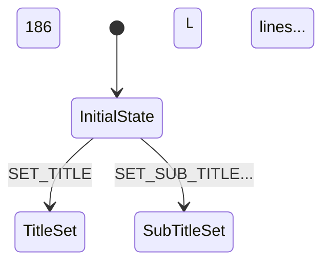
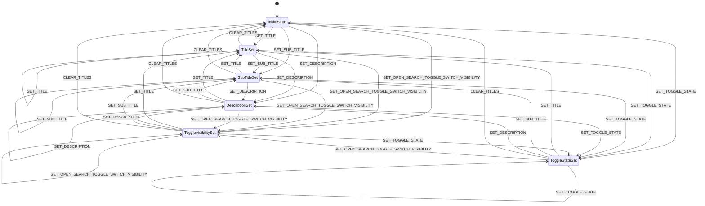
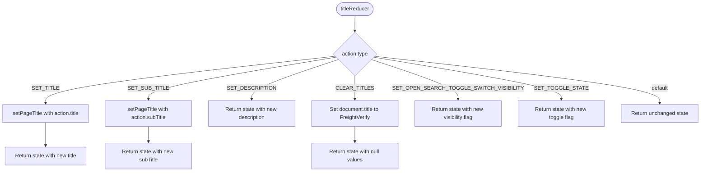
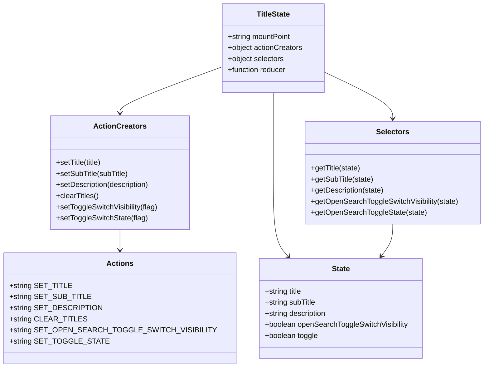

# Diagram: web/portal/src/shared/redux/TitleState.ts

> Auto-generated by Obscura crawlers

## Diagram 1

### SVG

<svg id="container" width="320.1484375" xmlns="http://www.w3.org/2000/svg" class="statediagram" height="260" viewBox="0 0 320.1484375 260" role="graphics-document document" aria-roledescription="stateDiagram"><g><defs><marker id="container_stateDiagram-barbEnd" refX="19" refY="7" markerWidth="20" markerHeight="14" markerUnits="userSpaceOnUse" orient="auto"><path d="M 19,7 L9,13 L14,7 L9,1 Z"></path></marker></defs><g class="root"><g class="clusters"></g><g class="edgePaths"><path d="M110.836,35L110.836,41.333C110.836,47.667,110.836,60.333,110.919,70.917C111.003,81.5,111.169,90,111.253,94.25L111.336,98.5" id="edge0" class="edge-thickness-normal edge-pattern-solid transition" style="fill:none;;;fill:none" data-edge="true" data-et="edge" data-id="edge0" data-points="W3sieCI6MTEwLjgzNTkzNzUsInkiOjM1fSx7IngiOjExMC44MzU5Mzc1LCJ5Ijo3M30seyJ4IjoxMTEuMzM1OTM3NSwieSI6OTguNX1d" marker-end="url(#container_stateDiagram-barbEnd)"></path><path d="M87.701,138.5L80.33,144.583C72.96,150.667,58.218,162.833,50.931,175.167C43.643,187.5,43.81,200,43.893,206.25L43.977,212.5" id="edge1" class="edge-thickness-normal edge-pattern-solid transition" style="fill:none;;;fill:none" data-edge="true" data-et="edge" data-id="edge1" data-points="W3sieCI6ODcuNzAxMDY5MDc4OTQ3MzcsInkiOjEzOC41fSx7IngiOjQzLjQ3NjU2MjUsInkiOjE3NX0seyJ4Ijo0My45NzY1NjI1LCJ5IjoyMTIuNX1d" marker-end="url(#container_stateDiagram-barbEnd)"></path><path d="M134.971,138.5L142.175,144.583C149.379,150.667,163.787,162.833,171.075,175.167C178.362,187.5,178.529,200,178.612,206.25L178.695,212.5" id="edge2" class="edge-thickness-normal edge-pattern-solid transition" style="fill:none;;;fill:none" data-edge="true" data-et="edge" data-id="edge2" data-points="W3sieCI6MTM0Ljk3MDgwNTkyMTA1MjYzLCJ5IjoxMzguNX0seyJ4IjoxNzguMTk1MzEyNSwieSI6MTc1fSx7IngiOjE3OC42OTUzMTI1LCJ5IjoyMTIuNX1d" marker-end="url(#container_stateDiagram-barbEnd)"></path></g><g class="edgeLabels"><g class="edgeLabel"><g class="label" data-id="edge0" transform="translate(0, 0)"><foreignObject width="0" height="0">

</foreignObject></g></g><g class="edgeLabel" transform="translate(43.4765625, 175)"><g class="label" data-id="edge1" transform="translate(-35.0390625, -12)"><foreignObject width="70.078125" height="24">

SET_TITLE

</foreignObject></g></g><g class="edgeLabel" transform="translate(178.1953125, 175)"><g class="label" data-id="edge2" transform="translate(-59.15625, -12)"><foreignObject width="118.3125" height="24">

SET_SUB_TITLE...

</foreignObject></g></g></g><g class="nodes"><g class="node  statediagram-state" id="state-186-3" transform="translate(33.6953125, 28)"><g class="basic label-container outer-path"><path d="M-15.140625 -20 C-7.570456746694654 -20, -0.0002884933893074759 -20, 15.140625 -20 C15.140625 -20, 15.140625 -20, 15.140625 -20 C15.29028924982717 -19.993809840838377, 15.439953499654338 -19.987619681676758, 15.553521727361662 -19.982922465033347 C15.654440848766962 -19.97034290966897, 15.755359970172261 -19.957763354304596, 15.96359795140367 -19.931806517013612 C16.05009523132893 -19.913669944639693, 16.13659251125419 -19.895533372265774, 16.368052435703998 -19.847001329696653 C16.45312272757681 -19.82167480648751, 16.538193019449626 -19.79634828327837, 16.764122346023417 -19.729086208503173 C16.842480532346936 -19.698510749320636, 16.920838718670456 -19.667935290138104, 17.149102123264846 -19.578866633275286 C17.294571967760636 -19.507750759707456, 17.440041812256425 -19.43663488613963, 17.52036196518537 -19.397368756032446 C17.637732356998484 -19.327431182880837, 17.7551027488116 -19.25749360972923, 17.875365790612136 -19.185832391312644 C17.951088158781122 -19.13176765960438, 18.026810526950104 -19.07770292789612, 18.21168856344834 -18.94570254698197 C18.27607151532326 -18.891172968312922, 18.34045446719818 -18.83664338964387, 18.527032858128706 -18.678619553365657 C18.636229245672975 -18.569423165821387, 18.745425633217245 -18.460226778277118, 18.819244553365657 -18.386407858128706 C18.894183522816373 -18.29792758409277, 18.969122492267093 -18.20944731005683, 19.08632754698197 -18.07106356344834 C19.14091364953758 -17.994610969973355, 19.195499752093195 -17.91815837649837, 19.326457391312644 -17.734740790612136 C19.379349342343634 -17.64597664372345, 19.432241293374624 -17.55721249683477, 19.537993756032446 -17.37973696518537 C19.58747700018445 -17.278517371432173, 19.636960244336453 -17.177297777678977, 19.719491633275286 -17.008477123264846 C19.751808169464 -16.92565693898279, 19.784124705652715 -16.842836754700734, 19.869711208503173 -16.623497346023417 C19.909803992007838 -16.488828060130107, 19.949896775512507 -16.354158774236794, 19.987626329696653 -16.227427435703994 C20.01588152518473 -16.092672229312868, 20.044136720672807 -15.957917022921741, 20.072431517013612 -15.82297295140367 C20.08478656340508 -15.723854946781701, 20.097141609796545 -15.624736942159732, 20.123547465033347 -15.412896727361662 C20.128446337583444 -15.294452909348866, 20.133345210133545 -15.176009091336068, 20.140625 -15 C20.140625 -15, 20.140625 -15, 20.140625 -15 C20.140625 -6.848144958958521, 20.140625 1.303710082082958, 20.140625 15 C20.140625 15, 20.140625 15, 20.140625 15 C20.135189408230847 15.131420492309937, 20.12975381646169 15.262840984619876, 20.123547465033347 15.412896727361662 C20.105675064796557 15.556277544652602, 20.087802664559764 15.699658361943541, 20.072431517013612 15.822972951403669 C20.054627629336807 15.907883585253812, 20.03682374166 15.992794219103954, 19.987626329696653 16.227427435703994 C19.959583517647225 16.321621580959516, 19.931540705597797 16.415815726215037, 19.869711208503173 16.623497346023417 C19.81076754487386 16.774557009581795, 19.751823881244544 16.925616673140173, 19.719491633275286 17.008477123264846 C19.66739551336881 17.11504143980103, 19.61529939346233 17.221605756337215, 19.537993756032446 17.379736965185366 C19.469061183074423 17.495420749054027, 19.4001286101164 17.61110453292269, 19.326457391312644 17.734740790612133 C19.247483274921507 17.84535092273041, 19.168509158530366 17.955961054848686, 19.08632754698197 18.07106356344834 C19.011539238943634 18.15936595189082, 18.936750930905294 18.247668340333295, 18.819244553365657 18.386407858128706 C18.749359743066194 18.45629266842817, 18.67947493276673 18.526177478727632, 18.527032858128706 18.678619553365657 C18.43515108077965 18.75643944916573, 18.343269303430596 18.8342593449658, 18.21168856344834 18.94570254698197 C18.12544323206099 19.00728053001786, 18.039197900673646 19.06885851305375, 17.875365790612136 19.185832391312644 C17.763980222129547 19.25220378382012, 17.652594653646958 19.318575176327595, 17.52036196518537 19.397368756032446 C17.41523877222213 19.44876035355379, 17.31011557925889 19.500151951075136, 17.149102123264846 19.578866633275286 C17.006926601680327 19.63434369394914, 16.864751080095807 19.689820754622996, 16.764122346023417 19.729086208503173 C16.66179430922964 19.75955058498231, 16.55946627243587 19.790014961461445, 16.368052435703998 19.847001329696653 C16.26758622596176 19.868066878644527, 16.167120016219524 19.889132427592397, 15.96359795140367 19.931806517013612 C15.856138141451089 19.94520136835516, 15.748678331498507 19.958596219696712, 15.553521727361662 19.982922465033347 C15.460926246890425 19.9867522424346, 15.368330766419188 19.990582019835855, 15.140625 20 C15.140625 20, 15.140625 20, 15.140625 20 C3.2776869661794468 20, -8.585251067641106 20, -15.140625 20 C-15.140625 20, -15.140625 20, -15.140625 20 C-15.299435982873417 19.993431529161203, -15.458246965746834 19.98686305832241, -15.55352172736166 19.982922465033347 C-15.671881864699241 19.968168889300227, -15.790242002036821 19.953415313567103, -15.963597951403669 19.931806517013612 C-16.089114981772795 19.905488363339693, -16.21463201214192 19.879170209665773, -16.368052435703994 19.847001329696653 C-16.489595081353055 19.810816516312755, -16.611137727002117 19.774631702928858, -16.764122346023417 19.729086208503173 C-16.85531801682602 19.693501547332783, -16.94651368762862 19.65791688616239, -17.149102123264846 19.578866633275286 C-17.24811629555933 19.53046155397707, -17.34713046785382 19.482056474678853, -17.52036196518537 19.397368756032446 C-17.661471057494136 19.31328598768474, -17.802580149802903 19.229203219337037, -17.875365790612133 19.185832391312644 C-17.9863244919053 19.10660940131417, -18.097283193198468 19.027386411315696, -18.21168856344834 18.94570254698197 C-18.305779850835883 18.866011291637875, -18.39987113822342 18.786320036293777, -18.527032858128706 18.67861955336566 C-18.614297467821125 18.591354943673238, -18.701562077513547 18.504090333980816, -18.819244553365657 18.386407858128706 C-18.873402070984096 18.322464197906143, -18.927559588602534 18.258520537683584, -19.086327546981966 18.07106356344834 C-19.173294402891052 17.94925890311669, -19.26026125880014 17.827454242785038, -19.326457391312644 17.734740790612133 C-19.389720205213102 17.628572090154073, -19.452983019113557 17.522403389696013, -19.537993756032446 17.37973696518537 C-19.591182402750352 17.270937849336562, -19.64437104946826 17.162138733487755, -19.719491633275286 17.00847712326485 C-19.7537719668486 16.92062415761243, -19.788052300421917 16.832771191960006, -19.869711208503173 16.623497346023417 C-19.89556046275609 16.536671231525528, -19.92140971700901 16.449845117027643, -19.987626329696653 16.227427435703994 C-20.01190744381529 16.11162549245274, -20.036188557933926 15.995823549201484, -20.072431517013612 15.82297295140367 C-20.091707297199267 15.668333558802654, -20.110983077384923 15.51369416620164, -20.123547465033347 15.412896727361664 C-20.130311584193024 15.249355404215867, -20.1370757033527 15.08581408107007, -20.140625 15 C-20.140625 15, -20.140625 15, -20.140625 15 C-20.140625 8.563327823022234, -20.140625 2.126655646044469, -20.140625 -15 C-20.140625 -15, -20.140625 -15, -20.140625 -15 C-20.134813206078856 -15.14051622173963, -20.129001412157713 -15.281032443479258, -20.123547465033347 -15.41289672736166 C-20.10903893797054 -15.529290968783737, -20.094530410907733 -15.645685210205812, -20.072431517013612 -15.822972951403669 C-20.038546257240746 -15.98457916560368, -20.004660997467884 -16.14618537980369, -19.987626329696653 -16.227427435703994 C-19.94699994538055 -16.363889055128343, -19.906373561064452 -16.50035067455269, -19.869711208503173 -16.623497346023417 C-19.83893719254802 -16.702364389744357, -19.80816317659287 -16.781231433465297, -19.71949163327529 -17.008477123264846 C-19.681492588291828 -17.08620541214624, -19.643493543308363 -17.16393370102763, -19.537993756032446 -17.379736965185366 C-19.462066663027493 -17.507159068264407, -19.38613957002254 -17.63458117134345, -19.326457391312644 -17.734740790612133 C-19.263167354045077 -17.823384003146028, -19.19987731677751 -17.912027215679924, -19.08632754698197 -18.07106356344834 C-19.01338708297516 -18.15718420656547, -18.940446618968355 -18.243304849682605, -18.81924455336566 -18.386407858128706 C-18.737920402396654 -18.46773200909771, -18.65659625142765 -18.549056160066716, -18.527032858128706 -18.678619553365657 C-18.432752407601857 -18.758471021716236, -18.338471957075008 -18.838322490066815, -18.21168856344834 -18.945702546981966 C-18.097408380589577 -19.02729702923643, -17.983128197730817 -19.108891511490896, -17.875365790612136 -19.185832391312644 C-17.785353209236106 -19.239468247828952, -17.695340627860073 -19.29310410434526, -17.520361965185366 -19.397368756032446 C-17.397698191716966 -19.457335420845812, -17.275034418248566 -19.51730208565918, -17.14910212326485 -19.578866633275286 C-17.02285637815804 -19.628127875879155, -16.896610633051232 -19.67738911848302, -16.76412234602342 -19.729086208503173 C-16.61415451268108 -19.77373356691882, -16.464186679338738 -19.818380925334473, -16.368052435703994 -19.847001329696653 C-16.251076741321576 -19.871528553546806, -16.134101046939154 -19.89605577739696, -15.963597951403672 -19.931806517013612 C-15.805741952239853 -19.951483246789184, -15.647885953076033 -19.971159976564756, -15.553521727361664 -19.982922465033347 C-15.436607552728868 -19.987758071065265, -15.319693378096071 -19.992593677097183, -15.140625000000002 -20 C-15.140625000000002 -20, -15.140625 -20, -15.140625 -20" stroke="none" stroke-width="0" fill="#ECECFF" style=""></path><path d="M-15.140625 -20 C-7.242397883624903 -20, 0.6558292327501931 -20, 15.140625 -20 M-15.140625 -20 C-3.2379900435871427 -20, 8.664644912825715 -20, 15.140625 -20 M15.140625 -20 C15.140625 -20, 15.140625 -20, 15.140625 -20 M15.140625 -20 C15.140625 -20, 15.140625 -20, 15.140625 -20 M15.140625 -20 C15.247336189125573 -19.995586392570196, 15.354047378251146 -19.991172785140392, 15.553521727361662 -19.982922465033347 M15.140625 -20 C15.273749399139309 -19.994493934123085, 15.406873798278617 -19.98898786824617, 15.553521727361662 -19.982922465033347 M15.553521727361662 -19.982922465033347 C15.683380268929632 -19.96673561470762, 15.8132388104976 -19.950548764381896, 15.96359795140367 -19.931806517013612 M15.553521727361662 -19.982922465033347 C15.695341688060367 -19.965244625367877, 15.83716164875907 -19.947566785702406, 15.96359795140367 -19.931806517013612 M15.96359795140367 -19.931806517013612 C16.09741980488376 -19.903747025050965, 16.231241658363853 -19.875687533088318, 16.368052435703998 -19.847001329696653 M15.96359795140367 -19.931806517013612 C16.076987315810424 -19.908031267482382, 16.190376680217174 -19.88425601795115, 16.368052435703998 -19.847001329696653 M16.368052435703998 -19.847001329696653 C16.49629316483638 -19.808822410461435, 16.624533893968763 -19.770643491226217, 16.764122346023417 -19.729086208503173 M16.368052435703998 -19.847001329696653 C16.518442570861506 -19.802228246583372, 16.668832706019018 -19.757455163470087, 16.764122346023417 -19.729086208503173 M16.764122346023417 -19.729086208503173 C16.89799634924644 -19.67684841034577, 17.031870352469465 -19.62461061218837, 17.149102123264846 -19.578866633275286 M16.764122346023417 -19.729086208503173 C16.903634196981596 -19.67464851533299, 17.043146047939775 -19.62021082216281, 17.149102123264846 -19.578866633275286 M17.149102123264846 -19.578866633275286 C17.29636809084202 -19.506872688637742, 17.443634058419196 -19.434878744000194, 17.52036196518537 -19.397368756032446 M17.149102123264846 -19.578866633275286 C17.26212376843755 -19.523613717755996, 17.37514541361026 -19.468360802236706, 17.52036196518537 -19.397368756032446 M17.52036196518537 -19.397368756032446 C17.59250724203915 -19.35437950210256, 17.66465251889293 -19.311390248172675, 17.875365790612136 -19.185832391312644 M17.52036196518537 -19.397368756032446 C17.6058454978419 -19.34643162677805, 17.69132903049843 -19.29549449752365, 17.875365790612136 -19.185832391312644 M17.875365790612136 -19.185832391312644 C17.959506524124293 -19.12575706227751, 18.04364725763645 -19.06568173324238, 18.21168856344834 -18.94570254698197 M17.875365790612136 -19.185832391312644 C17.98905659399612 -19.104658717914912, 18.102747397380107 -19.02348504451718, 18.21168856344834 -18.94570254698197 M18.21168856344834 -18.94570254698197 C18.31429768369458 -18.858797055206768, 18.416906803940815 -18.771891563431566, 18.527032858128706 -18.678619553365657 M18.21168856344834 -18.94570254698197 C18.3181437641595 -18.855539591217124, 18.42459896487066 -18.765376635452277, 18.527032858128706 -18.678619553365657 M18.527032858128706 -18.678619553365657 C18.604119143411104 -18.60153326808326, 18.681205428693502 -18.52444698280086, 18.819244553365657 -18.386407858128706 M18.527032858128706 -18.678619553365657 C18.60678061740419 -18.598871794090172, 18.68652837667968 -18.519124034814684, 18.819244553365657 -18.386407858128706 M18.819244553365657 -18.386407858128706 C18.894387205492496 -18.297687096411504, 18.969529857619335 -18.208966334694303, 19.08632754698197 -18.07106356344834 M18.819244553365657 -18.386407858128706 C18.913620883015472 -18.27497793627192, 19.007997212665284 -18.163548014415134, 19.08632754698197 -18.07106356344834 M19.08632754698197 -18.07106356344834 C19.139946861605825 -17.995965040721448, 19.193566176229684 -17.920866517994558, 19.326457391312644 -17.734740790612136 M19.08632754698197 -18.07106356344834 C19.14673925364764 -17.986451703751353, 19.207150960313317 -17.901839844054365, 19.326457391312644 -17.734740790612136 M19.326457391312644 -17.734740790612136 C19.401269976748917 -17.609189072565343, 19.47608256218519 -17.483637354518553, 19.537993756032446 -17.37973696518537 M19.326457391312644 -17.734740790612136 C19.396055551598263 -17.617940007083558, 19.46565371188388 -17.50113922355498, 19.537993756032446 -17.37973696518537 M19.537993756032446 -17.37973696518537 C19.609737902123534 -17.232981968702063, 19.681482048214626 -17.086226972218753, 19.719491633275286 -17.008477123264846 M19.537993756032446 -17.37973696518537 C19.605807189982617 -17.2410223688998, 19.67362062393279 -17.10230777261423, 19.719491633275286 -17.008477123264846 M19.719491633275286 -17.008477123264846 C19.77368738793696 -16.869585307564854, 19.827883142598633 -16.730693491864862, 19.869711208503173 -16.623497346023417 M19.719491633275286 -17.008477123264846 C19.767802682283566 -16.884666515644014, 19.81611373129185 -16.76085590802318, 19.869711208503173 -16.623497346023417 M19.869711208503173 -16.623497346023417 C19.898164496366668 -16.52792443681276, 19.926617784230167 -16.43235152760211, 19.987626329696653 -16.227427435703994 M19.869711208503173 -16.623497346023417 C19.895131766201555 -16.538111197869036, 19.92055232389994 -16.45272504971465, 19.987626329696653 -16.227427435703994 M19.987626329696653 -16.227427435703994 C20.018012199146007 -16.082510579235965, 20.048398068595365 -15.937593722767936, 20.072431517013612 -15.82297295140367 M19.987626329696653 -16.227427435703994 C20.013237041259174 -16.105284351474143, 20.038847752821695 -15.98314126724429, 20.072431517013612 -15.82297295140367 M20.072431517013612 -15.82297295140367 C20.086436773624794 -15.710616182717, 20.10044203023598 -15.598259414030329, 20.123547465033347 -15.412896727361662 M20.072431517013612 -15.82297295140367 C20.091636586385526 -15.66890083427383, 20.11084165575744 -15.514828717143986, 20.123547465033347 -15.412896727361662 M20.123547465033347 -15.412896727361662 C20.12993034558718 -15.258572903872837, 20.136313226141013 -15.104249080384012, 20.140625 -15 M20.123547465033347 -15.412896727361662 C20.12996102424818 -15.257831162236775, 20.13637458346301 -15.102765597111889, 20.140625 -15 M20.140625 -15 C20.140625 -15, 20.140625 -15, 20.140625 -15 M20.140625 -15 C20.140625 -15, 20.140625 -15, 20.140625 -15 M20.140625 -15 C20.140625 -8.957753624929286, 20.140625 -2.9155072498585692, 20.140625 15 M20.140625 -15 C20.140625 -5.162022218454787, 20.140625 4.675955563090426, 20.140625 15 M20.140625 15 C20.140625 15, 20.140625 15, 20.140625 15 M20.140625 15 C20.140625 15, 20.140625 15, 20.140625 15 M20.140625 15 C20.136866432016912 15.090873795475359, 20.133107864033825 15.181747590950717, 20.123547465033347 15.412896727361662 M20.140625 15 C20.13712325504215 15.084664387218314, 20.133621510084303 15.169328774436629, 20.123547465033347 15.412896727361662 M20.123547465033347 15.412896727361662 C20.103255908905414 15.57568515326871, 20.08296435277748 15.738473579175757, 20.072431517013612 15.822972951403669 M20.123547465033347 15.412896727361662 C20.10842448930316 15.534220365560053, 20.09330151357297 15.655544003758443, 20.072431517013612 15.822972951403669 M20.072431517013612 15.822972951403669 C20.045876350890566 15.949620345974758, 20.01932118476752 16.076267740545845, 19.987626329696653 16.227427435703994 M20.072431517013612 15.822972951403669 C20.053856598624563 15.911560799336664, 20.035281680235514 16.000148647269658, 19.987626329696653 16.227427435703994 M19.987626329696653 16.227427435703994 C19.941876816633755 16.38109734124772, 19.896127303570857 16.534767246791446, 19.869711208503173 16.623497346023417 M19.987626329696653 16.227427435703994 C19.94315763405197 16.376795151377294, 19.89868893840729 16.526162867050598, 19.869711208503173 16.623497346023417 M19.869711208503173 16.623497346023417 C19.82596545659456 16.735608099894794, 19.782219704685946 16.84771885376617, 19.719491633275286 17.008477123264846 M19.869711208503173 16.623497346023417 C19.83232203070113 16.719317596610832, 19.794932852899084 16.815137847198244, 19.719491633275286 17.008477123264846 M19.719491633275286 17.008477123264846 C19.647755837597778 17.15521503870416, 19.576020041920266 17.301952954143474, 19.537993756032446 17.379736965185366 M19.719491633275286 17.008477123264846 C19.654421153468242 17.141580917170558, 19.5893506736612 17.27468471107627, 19.537993756032446 17.379736965185366 M19.537993756032446 17.379736965185366 C19.457010281862086 17.51564477075302, 19.376026807691726 17.65155257632068, 19.326457391312644 17.734740790612133 M19.537993756032446 17.379736965185366 C19.454048568974617 17.520615166298295, 19.37010338191679 17.66149336741123, 19.326457391312644 17.734740790612133 M19.326457391312644 17.734740790612133 C19.271372936154105 17.811891370335907, 19.21628848099557 17.88904195005968, 19.08632754698197 18.07106356344834 M19.326457391312644 17.734740790612133 C19.258290305880276 17.830214734105827, 19.19012322044791 17.925688677599524, 19.08632754698197 18.07106356344834 M19.08632754698197 18.07106356344834 C19.027971656537954 18.139964233099175, 18.969615766093934 18.20886490275001, 18.819244553365657 18.386407858128706 M19.08632754698197 18.07106356344834 C18.994051713230284 18.18001343448457, 18.901775879478603 18.2889633055208, 18.819244553365657 18.386407858128706 M18.819244553365657 18.386407858128706 C18.748963504042212 18.45668890745215, 18.678682454718768 18.526969956775595, 18.527032858128706 18.678619553365657 M18.819244553365657 18.386407858128706 C18.744772223966347 18.460880187528016, 18.670299894567037 18.535352516927325, 18.527032858128706 18.678619553365657 M18.527032858128706 18.678619553365657 C18.423278295603062 18.766495185264397, 18.31952373307742 18.854370817163137, 18.21168856344834 18.94570254698197 M18.527032858128706 18.678619553365657 C18.43011556305144 18.76070431512952, 18.333198267974176 18.842789076893386, 18.21168856344834 18.94570254698197 M18.21168856344834 18.94570254698197 C18.093406391981635 19.03015439418182, 17.97512422051493 19.114606241381676, 17.875365790612136 19.185832391312644 M18.21168856344834 18.94570254698197 C18.12165370893034 19.009986197528203, 18.03161885441234 19.074269848074433, 17.875365790612136 19.185832391312644 M17.875365790612136 19.185832391312644 C17.786971866095733 19.238503737693314, 17.698577941579327 19.291175084073988, 17.52036196518537 19.397368756032446 M17.875365790612136 19.185832391312644 C17.776505925023514 19.24474008493585, 17.677646059434892 19.303647778559053, 17.52036196518537 19.397368756032446 M17.52036196518537 19.397368756032446 C17.372168666609184 19.46981604517111, 17.223975368033 19.54226333430978, 17.149102123264846 19.578866633275286 M17.52036196518537 19.397368756032446 C17.438417631989033 19.437428899489596, 17.3564732987927 19.477489042946743, 17.149102123264846 19.578866633275286 M17.149102123264846 19.578866633275286 C17.041553266661744 19.620832327346097, 16.934004410058645 19.662798021416908, 16.764122346023417 19.729086208503173 M17.149102123264846 19.578866633275286 C17.024567811729955 19.627460072427123, 16.900033500195065 19.676053511578957, 16.764122346023417 19.729086208503173 M16.764122346023417 19.729086208503173 C16.606482525626834 19.776017616425552, 16.448842705230255 19.822949024347935, 16.368052435703998 19.847001329696653 M16.764122346023417 19.729086208503173 C16.67265634623224 19.756316816457616, 16.581190346441065 19.783547424412056, 16.368052435703998 19.847001329696653 M16.368052435703998 19.847001329696653 C16.248584276618704 19.872051168437263, 16.12911611753341 19.897101007177877, 15.96359795140367 19.931806517013612 M16.368052435703998 19.847001329696653 C16.2181914940572 19.878423864793124, 16.06833055241041 19.909846399889595, 15.96359795140367 19.931806517013612 M15.96359795140367 19.931806517013612 C15.833074306432112 19.948076272392136, 15.70255066146055 19.964346027770663, 15.553521727361662 19.982922465033347 M15.96359795140367 19.931806517013612 C15.818914503759673 19.94984128995458, 15.674231056115676 19.967876062895545, 15.553521727361662 19.982922465033347 M15.553521727361662 19.982922465033347 C15.448534894347553 19.987264752566826, 15.343548061333443 19.991607040100305, 15.140625 20 M15.553521727361662 19.982922465033347 C15.440715177708398 19.98758817843941, 15.327908628055132 19.992253891845476, 15.140625 20 M15.140625 20 C15.140625 20, 15.140625 20, 15.140625 20 M15.140625 20 C15.140625 20, 15.140625 20, 15.140625 20 M15.140625 20 C5.400038091722228 20, -4.340548816555543 20, -15.140625 20 M15.140625 20 C7.7156438482084315 20, 0.29066269641686304 20, -15.140625 20 M-15.140625 20 C-15.140625 20, -15.140625 20, -15.140625 20 M-15.140625 20 C-15.140625 20, -15.140625 20, -15.140625 20 M-15.140625 20 C-15.231499537580703 19.99624140132321, -15.322374075161406 19.992482802646418, -15.55352172736166 19.982922465033347 M-15.140625 20 C-15.29968254639662 19.99342133121845, -15.45874009279324 19.9868426624369, -15.55352172736166 19.982922465033347 M-15.55352172736166 19.982922465033347 C-15.667183353748772 19.96875455807943, -15.780844980135882 19.954586651125506, -15.963597951403669 19.931806517013612 M-15.55352172736166 19.982922465033347 C-15.667599977974739 19.968702625923818, -15.781678228587817 19.95448278681429, -15.963597951403669 19.931806517013612 M-15.963597951403669 19.931806517013612 C-16.11441434684225 19.900183644324333, -16.265230742280828 19.868560771635053, -16.368052435703994 19.847001329696653 M-15.963597951403669 19.931806517013612 C-16.07570004860302 19.908301179032104, -16.187802145802372 19.8847958410506, -16.368052435703994 19.847001329696653 M-16.368052435703994 19.847001329696653 C-16.46869814286056 19.81703780445082, -16.56934385001713 19.78707427920499, -16.764122346023417 19.729086208503173 M-16.368052435703994 19.847001329696653 C-16.483277890315154 19.812697225569956, -16.598503344926314 19.77839312144326, -16.764122346023417 19.729086208503173 M-16.764122346023417 19.729086208503173 C-16.843699855709822 19.698034967868036, -16.923277365396224 19.6669837272329, -17.149102123264846 19.578866633275286 M-16.764122346023417 19.729086208503173 C-16.85654678504978 19.69302208048403, -16.948971224076143 19.656957952464886, -17.149102123264846 19.578866633275286 M-17.149102123264846 19.578866633275286 C-17.259664659967484 19.524815902632547, -17.370227196670125 19.470765171989804, -17.52036196518537 19.397368756032446 M-17.149102123264846 19.578866633275286 C-17.289475815641502 19.51024211666905, -17.42984950801816 19.441617600062816, -17.52036196518537 19.397368756032446 M-17.52036196518537 19.397368756032446 C-17.661034653746587 19.313546027875002, -17.8017073423078 19.229723299717556, -17.875365790612133 19.185832391312644 M-17.52036196518537 19.397368756032446 C-17.65788949429104 19.31542013612409, -17.795417023396716 19.23347151621573, -17.875365790612133 19.185832391312644 M-17.875365790612133 19.185832391312644 C-17.95615191499363 19.128152207160337, -18.03693803937513 19.070472023008026, -18.21168856344834 18.94570254698197 M-17.875365790612133 19.185832391312644 C-18.000979307411583 19.096146064155814, -18.12659282421103 19.006459736998984, -18.21168856344834 18.94570254698197 M-18.21168856344834 18.94570254698197 C-18.299707622977227 18.871154206292644, -18.387726682506113 18.79660586560332, -18.527032858128706 18.67861955336566 M-18.21168856344834 18.94570254698197 C-18.323032255534926 18.851399250222087, -18.43437594762151 18.75709595346221, -18.527032858128706 18.67861955336566 M-18.527032858128706 18.67861955336566 C-18.610612431242174 18.595039980252192, -18.694192004355642 18.511460407138724, -18.819244553365657 18.386407858128706 M-18.527032858128706 18.67861955336566 C-18.63213036353546 18.573522047958907, -18.737227868942213 18.46842454255215, -18.819244553365657 18.386407858128706 M-18.819244553365657 18.386407858128706 C-18.87975304387359 18.31496561838502, -18.94026153438152 18.24352337864134, -19.086327546981966 18.07106356344834 M-18.819244553365657 18.386407858128706 C-18.900957045542757 18.28993010092197, -18.982669537719854 18.193452343715236, -19.086327546981966 18.07106356344834 M-19.086327546981966 18.07106356344834 C-19.156712853683825 17.972482807762276, -19.227098160385683 17.873902052076208, -19.326457391312644 17.734740790612133 M-19.086327546981966 18.07106356344834 C-19.167405979084787 17.957506153797578, -19.248484411187608 17.843948744146815, -19.326457391312644 17.734740790612133 M-19.326457391312644 17.734740790612133 C-19.39066682593706 17.62698345560096, -19.454876260561477 17.51922612058979, -19.537993756032446 17.37973696518537 M-19.326457391312644 17.734740790612133 C-19.372520103568235 17.657437585170708, -19.41858281582382 17.580134379729287, -19.537993756032446 17.37973696518537 M-19.537993756032446 17.37973696518537 C-19.582524599557708 17.288647668831473, -19.62705544308297 17.19755837247758, -19.719491633275286 17.00847712326485 M-19.537993756032446 17.37973696518537 C-19.597165286557814 17.25869966489975, -19.656336817083183 17.137662364614137, -19.719491633275286 17.00847712326485 M-19.719491633275286 17.00847712326485 C-19.76824898602754 16.88352273717389, -19.817006338779795 16.758568351082936, -19.869711208503173 16.623497346023417 M-19.719491633275286 17.00847712326485 C-19.755069859705465 16.917297943288094, -19.790648086135644 16.826118763311335, -19.869711208503173 16.623497346023417 M-19.869711208503173 16.623497346023417 C-19.909379096699965 16.490255258311144, -19.94904698489676 16.35701317059887, -19.987626329696653 16.227427435703994 M-19.869711208503173 16.623497346023417 C-19.91664436079132 16.465851666405506, -19.963577513079468 16.308205986787595, -19.987626329696653 16.227427435703994 M-19.987626329696653 16.227427435703994 C-20.006641489772345 16.136739978891267, -20.025656649848035 16.04605252207854, -20.072431517013612 15.82297295140367 M-19.987626329696653 16.227427435703994 C-20.017957355585686 16.08277214016884, -20.04828838147472 15.938116844633681, -20.072431517013612 15.82297295140367 M-20.072431517013612 15.82297295140367 C-20.09057866229731 15.677387999869406, -20.10872580758101 15.53180304833514, -20.123547465033347 15.412896727361664 M-20.072431517013612 15.82297295140367 C-20.08977829456471 15.6838089270036, -20.10712507211581 15.54464490260353, -20.123547465033347 15.412896727361664 M-20.123547465033347 15.412896727361664 C-20.130188035596674 15.25234253386908, -20.13682860616 15.091788340376494, -20.140625 15 M-20.123547465033347 15.412896727361664 C-20.127407885993453 15.319560353946038, -20.131268306953558 15.22622398053041, -20.140625 15 M-20.140625 15 C-20.140625 15, -20.140625 15, -20.140625 15 M-20.140625 15 C-20.140625 15, -20.140625 15, -20.140625 15 M-20.140625 15 C-20.140625 4.873385361630772, -20.140625 -5.253229276738455, -20.140625 -15 M-20.140625 15 C-20.140625 7.716627647576685, -20.140625 0.43325529515336925, -20.140625 -15 M-20.140625 -15 C-20.140625 -15, -20.140625 -15, -20.140625 -15 M-20.140625 -15 C-20.140625 -15, -20.140625 -15, -20.140625 -15 M-20.140625 -15 C-20.13405621224491 -15.158818645202908, -20.127487424489825 -15.317637290405816, -20.123547465033347 -15.41289672736166 M-20.140625 -15 C-20.13528169941041 -15.12918909731758, -20.12993839882082 -15.25837819463516, -20.123547465033347 -15.41289672736166 M-20.123547465033347 -15.41289672736166 C-20.10450130112538 -15.565694029973525, -20.085455137217416 -15.718491332585389, -20.072431517013612 -15.822972951403669 M-20.123547465033347 -15.41289672736166 C-20.10420500791069 -15.568071033773647, -20.084862550788035 -15.723245340185635, -20.072431517013612 -15.822972951403669 M-20.072431517013612 -15.822972951403669 C-20.046229581031998 -15.947935714182629, -20.02002764505038 -16.072898476961587, -19.987626329696653 -16.227427435703994 M-20.072431517013612 -15.822972951403669 C-20.043154186223667 -15.962602944579448, -20.01387685543372 -16.102232937755225, -19.987626329696653 -16.227427435703994 M-19.987626329696653 -16.227427435703994 C-19.959428830557236 -16.32214116573575, -19.931231331417816 -16.416854895767507, -19.869711208503173 -16.623497346023417 M-19.987626329696653 -16.227427435703994 C-19.94672847343576 -16.364800913317012, -19.905830617174868 -16.502174390930026, -19.869711208503173 -16.623497346023417 M-19.869711208503173 -16.623497346023417 C-19.82856428376517 -16.728947876660158, -19.787417359027167 -16.8343984072969, -19.71949163327529 -17.008477123264846 M-19.869711208503173 -16.623497346023417 C-19.837911013666037 -16.704994260830045, -19.8061108188289 -16.786491175636677, -19.71949163327529 -17.008477123264846 M-19.71949163327529 -17.008477123264846 C-19.65360044568183 -17.143259701780472, -19.58770925808837 -17.2780422802961, -19.537993756032446 -17.379736965185366 M-19.71949163327529 -17.008477123264846 C-19.67297339794251 -17.10363169453822, -19.626455162609727 -17.198786265811588, -19.537993756032446 -17.379736965185366 M-19.537993756032446 -17.379736965185366 C-19.494750043949193 -17.452309277920076, -19.451506331865936 -17.524881590654786, -19.326457391312644 -17.734740790612133 M-19.537993756032446 -17.379736965185366 C-19.49131949452282 -17.458066482698037, -19.444645233013194 -17.536396000210708, -19.326457391312644 -17.734740790612133 M-19.326457391312644 -17.734740790612133 C-19.265914047750492 -17.819537019253993, -19.20537070418834 -17.904333247895853, -19.08632754698197 -18.07106356344834 M-19.326457391312644 -17.734740790612133 C-19.23161855456951 -17.867570846096978, -19.13677971782638 -18.000400901581823, -19.08632754698197 -18.07106356344834 M-19.08632754698197 -18.07106356344834 C-18.99601951379708 -18.17769005674567, -18.905711480612187 -18.284316550043002, -18.81924455336566 -18.386407858128706 M-19.08632754698197 -18.07106356344834 C-19.02854381511704 -18.139288686741377, -18.970760083252106 -18.207513810034417, -18.81924455336566 -18.386407858128706 M-18.81924455336566 -18.386407858128706 C-18.71965620377199 -18.485996207722376, -18.62006785417832 -18.585584557316047, -18.527032858128706 -18.678619553365657 M-18.81924455336566 -18.386407858128706 C-18.709931539127073 -18.49572087236729, -18.600618524888485 -18.605033886605877, -18.527032858128706 -18.678619553365657 M-18.527032858128706 -18.678619553365657 C-18.418145616269822 -18.770842342909926, -18.309258374410938 -18.8630651324542, -18.21168856344834 -18.945702546981966 M-18.527032858128706 -18.678619553365657 C-18.434432006471237 -18.757048474038424, -18.341831154813768 -18.835477394711194, -18.21168856344834 -18.945702546981966 M-18.21168856344834 -18.945702546981966 C-18.083236044129958 -19.0374158829767, -17.954783524811575 -19.129129218971432, -17.875365790612136 -19.185832391312644 M-18.21168856344834 -18.945702546981966 C-18.078068386510214 -19.041105519599633, -17.944448209572084 -19.1365084922173, -17.875365790612136 -19.185832391312644 M-17.875365790612136 -19.185832391312644 C-17.742885983677056 -19.26477322166606, -17.61040617674197 -19.343714052019475, -17.520361965185366 -19.397368756032446 M-17.875365790612136 -19.185832391312644 C-17.74905092521388 -19.261099713866976, -17.622736059815622 -19.336367036421308, -17.520361965185366 -19.397368756032446 M-17.520361965185366 -19.397368756032446 C-17.40258045133143 -19.4549486295581, -17.284798937477497 -19.51252850308375, -17.14910212326485 -19.578866633275286 M-17.520361965185366 -19.397368756032446 C-17.422242076342368 -19.44533664679107, -17.324122187499366 -19.493304537549697, -17.14910212326485 -19.578866633275286 M-17.14910212326485 -19.578866633275286 C-17.071727989557306 -19.60905811393554, -16.99435385584976 -19.639249594595793, -16.76412234602342 -19.729086208503173 M-17.14910212326485 -19.578866633275286 C-17.035014296324036 -19.62338384148951, -16.92092646938322 -19.66790104970373, -16.76412234602342 -19.729086208503173 M-16.76412234602342 -19.729086208503173 C-16.67334954040765 -19.75611044361011, -16.582576734791882 -19.783134678717047, -16.368052435703994 -19.847001329696653 M-16.76412234602342 -19.729086208503173 C-16.677036452309515 -19.755012802379582, -16.589950558595614 -19.78093939625599, -16.368052435703994 -19.847001329696653 M-16.368052435703994 -19.847001329696653 C-16.27780916873755 -19.865923352955765, -16.187565901771112 -19.88484537621488, -15.963597951403672 -19.931806517013612 M-16.368052435703994 -19.847001329696653 C-16.27699333270369 -19.866094415783248, -16.185934229703385 -19.88518750186984, -15.963597951403672 -19.931806517013612 M-15.963597951403672 -19.931806517013612 C-15.87214509847176 -19.94320610324333, -15.780692245539848 -19.95460568947305, -15.553521727361664 -19.982922465033347 M-15.963597951403672 -19.931806517013612 C-15.816320897995507 -19.950164582575933, -15.669043844587343 -19.96852264813825, -15.553521727361664 -19.982922465033347 M-15.553521727361664 -19.982922465033347 C-15.430065380050417 -19.98802865732878, -15.30660903273917 -19.99313484962421, -15.140625000000002 -20 M-15.553521727361664 -19.982922465033347 C-15.444686100703933 -19.98742393984944, -15.335850474046202 -19.99192541466553, -15.140625000000002 -20 M-15.140625000000002 -20 C-15.140625000000002 -20, -15.140625 -20, -15.140625 -20 M-15.140625000000002 -20 C-15.140625000000002 -20, -15.140625 -20, -15.140625 -20" stroke="#9370DB" stroke-width="1.3" fill="none" stroke-dasharray="0 0" style=""></path></g><g class="label" style="" transform="translate(-12.140625, -12)"><rect></rect><foreignObject width="24.28125" height="24">

186

</foreignObject></g></g><g class="node default" id="state-root_start-0" transform="translate(110.8359375, 28)"><circle class="state-start" r="7" width="14" height="14"></circle></g><g class="node  statediagram-state" id="state-InitialState-2" transform="translate(110.8359375, 118)"><g class="basic label-container outer-path"><path d="M-42.7421875 -20 C-22.153235121952164 -20, -1.5642827439043288 -20, 42.7421875 -20 C42.7421875 -20, 42.7421875 -20, 42.7421875 -20 C42.86340138670387 -19.994986556561354, 42.984615273407734 -19.989973113122712, 43.15508422736166 -19.982922465033347 C43.31151797662823 -19.963423018522587, 43.46795172589479 -19.943923572011826, 43.56516045140367 -19.931806517013612 C43.681366047991375 -19.907440765690698, 43.79757164457908 -19.883075014367783, 43.969614935703994 -19.847001329696653 C44.060382400846414 -19.81997868451752, 44.15114986598883 -19.792956039338385, 44.36568484602342 -19.729086208503173 C44.470339913954675 -19.688249674276026, 44.57499498188593 -19.64741314004888, 44.750664623264846 -19.578866633275286 C44.85004260990787 -19.53028369597975, 44.94942059655089 -19.481700758684212, 45.121924465185366 -19.397368756032446 C45.1949986036288 -19.353826020731574, 45.26807274207222 -19.310283285430707, 45.476928290612136 -19.185832391312644 C45.55203928745844 -19.132204170338714, 45.62715028430475 -19.078575949364783, 45.81325106344834 -18.94570254698197 C45.9074463440223 -18.865923213901848, 46.00164162459625 -18.786143880821726, 46.128595358128706 -18.678619553365657 C46.22068467734054 -18.58653023415382, 46.31277399655238 -18.49444091494198, 46.42080705336566 -18.386407858128706 C46.498188356094936 -18.2950439266398, 46.57556965882422 -18.203679995150893, 46.68789004698197 -18.07106356344834 C46.76230279039572 -17.966842031680727, 46.836715533809475 -17.86262049991311, 46.928019891312644 -17.734740790612136 C46.99541322450067 -17.621640184379725, 47.062806557688695 -17.508539578147317, 47.13955625603245 -17.37973696518537 C47.20206240140792 -17.251878601199603, 47.264568546783394 -17.12402023721384, 47.32105413327529 -17.008477123264846 C47.35493438323868 -16.921649484030727, 47.38881463320207 -16.834821844796608, 47.471273708503176 -16.623497346023417 C47.517152676330156 -16.469392609592166, 47.563031644157135 -16.315287873160912, 47.58918882969665 -16.227427435703994 C47.608225030505224 -16.13663963103478, 47.627261231313796 -16.045851826365563, 47.67399401701361 -15.82297295140367 C47.69160783970604 -15.681666565031547, 47.709221662398456 -15.540360178659423, 47.72510996503335 -15.412896727361662 C47.730398635956156 -15.285028453609875, 47.73568730687897 -15.157160179858089, 47.7421875 -15 C47.7421875 -15, 47.7421875 -15, 47.7421875 -15 C47.7421875 -4.85483609319869, 47.7421875 5.2903278136026195, 47.7421875 15 C47.7421875 15, 47.7421875 15, 47.7421875 15 C47.73843903157233 15.090629610738695, 47.73469056314465 15.18125922147739, 47.72510996503335 15.412896727361662 C47.714625143328995 15.497010908176904, 47.70414032162464 15.581125088992145, 47.67399401701361 15.822972951403669 C47.656032671709234 15.908634535113993, 47.63807132640486 15.994296118824318, 47.58918882969665 16.227427435703994 C47.55579575280999 16.339592803757924, 47.522402675923324 16.451758171811857, 47.471273708503176 16.623497346023417 C47.43336096270706 16.720659386383712, 47.39544821691095 16.817821426744008, 47.32105413327529 17.008477123264846 C47.27567105376061 17.1013096961987, 47.23028797424593 17.194142269132556, 47.13955625603245 17.379736965185366 C47.08381482570491 17.47328315535104, 47.02807339537738 17.566829345516716, 46.928019891312644 17.734740790612133 C46.86070574525093 17.829020118188758, 46.79339159918922 17.923299445765384, 46.68789004698197 18.07106356344834 C46.58663421581283 18.19061609740031, 46.48537838464369 18.310168631352276, 46.42080705336566 18.386407858128706 C46.34620443507267 18.461010476421695, 46.27160181677968 18.535613094714684, 46.128595358128706 18.678619553365657 C46.05017740220564 18.745036174102157, 45.971759446282576 18.811452794838655, 45.81325106344834 18.94570254698197 C45.744927383127035 18.994484717101756, 45.67660370280573 19.043266887221545, 45.476928290612136 19.185832391312644 C45.383343614261356 19.241596754428798, 45.289758937910584 19.297361117544956, 45.121924465185366 19.397368756032446 C44.988691753919476 19.462502259696556, 44.855459042653585 19.527635763360667, 44.750664623264846 19.578866633275286 C44.62249371291969 19.62887907768622, 44.49432280257454 19.678891522097153, 44.36568484602342 19.729086208503173 C44.28140001080823 19.754178891133765, 44.19711517559303 19.779271573764355, 43.969614935703994 19.847001329696653 C43.867796358705526 19.868350440239062, 43.76597778170706 19.889699550781476, 43.56516045140367 19.931806517013612 C43.46172710856612 19.944699469752685, 43.35829376572858 19.95759242249176, 43.15508422736166 19.982922465033347 C43.00178028351495 19.989263163053156, 42.84847633966824 19.995603861072965, 42.7421875 20 C42.7421875 20, 42.7421875 20, 42.7421875 20 C24.237660336306977 20, 5.733133172613954 20, -42.7421875 20 C-42.7421875 20, -42.7421875 20, -42.7421875 20 C-42.8506498422518 19.995513964341143, -42.9591121845036 19.991027928682286, -43.15508422736166 19.982922465033347 C-43.24611675597584 19.971575272175194, -43.33714928459001 19.960228079317044, -43.56516045140367 19.931806517013612 C-43.71140334619674 19.901142606566047, -43.857646240989816 19.870478696118482, -43.969614935703994 19.847001329696653 C-44.06686093836212 19.818049940332674, -44.16410694102024 19.789098550968692, -44.36568484602342 19.729086208503173 C-44.45848534525219 19.692875341337704, -44.55128584448096 19.65666447417223, -44.750664623264846 19.578866633275286 C-44.89830012470199 19.506692034541658, -45.04593562613913 19.43451743580803, -45.121924465185366 19.397368756032446 C-45.218825145438814 19.339628483473273, -45.31572582569226 19.281888210914104, -45.476928290612136 19.185832391312644 C-45.59885063772228 19.098781508658774, -45.720772984832415 19.011730626004905, -45.81325106344834 18.94570254698197 C-45.92045647559822 18.854904194540293, -46.027661887748096 18.76410584209862, -46.128595358128706 18.67861955336566 C-46.21060819587184 18.596606715622528, -46.29262103361497 18.514593877879392, -46.42080705336566 18.386407858128706 C-46.51429699993772 18.27602448679423, -46.60778694650979 18.165641115459753, -46.68789004698197 18.07106356344834 C-46.77993341217765 17.942148809474, -46.87197677737333 17.813234055499656, -46.928019891312644 17.734740790612133 C-46.99617664812485 17.620358994228965, -47.06433340493706 17.505977197845795, -47.13955625603244 17.37973696518537 C-47.188710466097966 17.279190421413748, -47.23786467616349 17.178643877642124, -47.32105413327528 17.00847712326485 C-47.36240338262806 16.902508079078803, -47.40375263198084 16.79653903489276, -47.471273708503176 16.623497346023417 C-47.5016454090118 16.52148060232724, -47.53201710952042 16.419463858631065, -47.58918882969665 16.227427435703994 C-47.606578054997854 16.144494417405333, -47.62396728029905 16.061561399106672, -47.67399401701361 15.82297295140367 C-47.6851100836492 15.733794626268047, -47.69622615028478 15.644616301132423, -47.72510996503335 15.412896727361664 C-47.72963838861207 15.303409539696087, -47.73416681219078 15.19392235203051, -47.7421875 15 C-47.7421875 15, -47.7421875 15, -47.7421875 15 C-47.7421875 8.405607845578242, -47.7421875 1.811215691156482, -47.7421875 -15 C-47.7421875 -15, -47.7421875 -15, -47.7421875 -15 C-47.73658580166085 -15.135436578898505, -47.730984103321695 -15.270873157797007, -47.72510996503335 -15.41289672736166 C-47.708720762710314 -15.544378632012936, -47.69233156038728 -15.675860536664214, -47.67399401701361 -15.822972951403669 C-47.65545966548251 -15.911367327119581, -47.6369253139514 -15.999761702835494, -47.58918882969665 -16.227427435703994 C-47.55372742402313 -16.346540197686974, -47.51826601834961 -16.465652959669953, -47.471273708503176 -16.623497346023417 C-47.43276752687294 -16.722180232084956, -47.394261345242704 -16.820863118146498, -47.32105413327529 -17.008477123264846 C-47.27768227429172 -17.09719567884605, -47.23431041530815 -17.185914234427255, -47.13955625603245 -17.379736965185366 C-47.07403280733859 -17.48969950033759, -47.00850935864472 -17.599662035489818, -46.928019891312644 -17.734740790612133 C-46.85175200791516 -17.841560607591102, -46.775484124517675 -17.94838042457007, -46.68789004698197 -18.07106356344834 C-46.593019448586084 -18.18307706731086, -46.4981488501902 -18.295090571173382, -46.42080705336566 -18.386407858128706 C-46.34232450884708 -18.46489040264729, -46.26384196432849 -18.54337294716587, -46.128595358128706 -18.678619553365657 C-46.033585105638736 -18.759089132449, -45.938574853148765 -18.83955871153234, -45.81325106344834 -18.945702546981966 C-45.688301065005845 -19.034915131137623, -45.56335106656336 -19.124127715293284, -45.476928290612136 -19.185832391312644 C-45.39792182740595 -19.232910024901276, -45.318915364199775 -19.279987658489908, -45.121924465185366 -19.397368756032446 C-45.03195869004242 -19.441350343506283, -44.94199291489949 -19.48533193098012, -44.750664623264846 -19.578866633275286 C-44.6106126072492 -19.633515099504944, -44.47056059123356 -19.6881635657346, -44.36568484602342 -19.729086208503173 C-44.23502295247878 -19.767985939614434, -44.10436105893413 -19.80688567072569, -43.969614935703994 -19.847001329696653 C-43.827193876678884 -19.87686388545345, -43.68477281765377 -19.906726441210242, -43.56516045140367 -19.931806517013612 C-43.46127048064951 -19.944756388363132, -43.35738050989535 -19.957706259712655, -43.15508422736166 -19.982922465033347 C-43.01161919427037 -19.988856222694164, -42.86815416117906 -19.99478998035498, -42.7421875 -20 C-42.7421875 -20, -42.7421875 -20, -42.7421875 -20" stroke="none" stroke-width="0" fill="#ECECFF" style=""></path><path d="M-42.7421875 -20 C-9.735294878361685 -20, 23.27159774327663 -20, 42.7421875 -20 M-42.7421875 -20 C-18.72700455188765 -20, 5.288178396224701 -20, 42.7421875 -20 M42.7421875 -20 C42.7421875 -20, 42.7421875 -20, 42.7421875 -20 M42.7421875 -20 C42.7421875 -20, 42.7421875 -20, 42.7421875 -20 M42.7421875 -20 C42.87265622228474 -19.994603773730276, 43.00312494456948 -19.989207547460552, 43.15508422736166 -19.982922465033347 M42.7421875 -20 C42.86068854040705 -19.995098760714168, 42.9791895808141 -19.99019752142834, 43.15508422736166 -19.982922465033347 M43.15508422736166 -19.982922465033347 C43.28322951751784 -19.96694917127339, 43.41137480767402 -19.950975877513432, 43.56516045140367 -19.931806517013612 M43.15508422736166 -19.982922465033347 C43.29765780970583 -19.965150686527736, 43.44023139205 -19.947378908022124, 43.56516045140367 -19.931806517013612 M43.56516045140367 -19.931806517013612 C43.69140071826155 -19.90533671659504, 43.81764098511943 -19.87886691617647, 43.969614935703994 -19.847001329696653 M43.56516045140367 -19.931806517013612 C43.657462913287254 -19.912452725984704, 43.74976537517084 -19.893098934955795, 43.969614935703994 -19.847001329696653 M43.969614935703994 -19.847001329696653 C44.09154509353543 -19.810701148937557, 44.21347525136686 -19.774400968178462, 44.36568484602342 -19.729086208503173 M43.969614935703994 -19.847001329696653 C44.07062830207834 -19.816928347559266, 44.171641668452686 -19.78685536542188, 44.36568484602342 -19.729086208503173 M44.36568484602342 -19.729086208503173 C44.475401750287226 -19.68627453961, 44.58511865455103 -19.643462870716828, 44.750664623264846 -19.578866633275286 M44.36568484602342 -19.729086208503173 C44.510174175928114 -19.67270629702114, 44.65466350583281 -19.616326385539104, 44.750664623264846 -19.578866633275286 M44.750664623264846 -19.578866633275286 C44.882610264115776 -19.514362339996467, 45.014555904966706 -19.449858046717644, 45.121924465185366 -19.397368756032446 M44.750664623264846 -19.578866633275286 C44.82764826177083 -19.541231625677945, 44.90463190027681 -19.503596618080604, 45.121924465185366 -19.397368756032446 M45.121924465185366 -19.397368756032446 C45.197470707718615 -19.352352966429297, 45.273016950251865 -19.307337176826152, 45.476928290612136 -19.185832391312644 M45.121924465185366 -19.397368756032446 C45.230588010191305 -19.332619337457903, 45.33925155519724 -19.26786991888336, 45.476928290612136 -19.185832391312644 M45.476928290612136 -19.185832391312644 C45.59629167657266 -19.100608571802084, 45.71565506253319 -19.015384752291528, 45.81325106344834 -18.94570254698197 M45.476928290612136 -19.185832391312644 C45.55269385479037 -19.131736818246573, 45.6284594189686 -19.077641245180498, 45.81325106344834 -18.94570254698197 M45.81325106344834 -18.94570254698197 C45.93563522049874 -18.842048453384493, 46.05801937754914 -18.738394359787012, 46.128595358128706 -18.678619553365657 M45.81325106344834 -18.94570254698197 C45.91023842583134 -18.863558441237306, 46.00722578821433 -18.78141433549264, 46.128595358128706 -18.678619553365657 M46.128595358128706 -18.678619553365657 C46.22246194388555 -18.58475296760881, 46.3163285296424 -18.49088638185197, 46.42080705336566 -18.386407858128706 M46.128595358128706 -18.678619553365657 C46.21891979509729 -18.588295116397067, 46.309244232065886 -18.49797067942848, 46.42080705336566 -18.386407858128706 M46.42080705336566 -18.386407858128706 C46.49734140987788 -18.296043914148676, 46.57387576639011 -18.205679970168646, 46.68789004698197 -18.07106356344834 M46.42080705336566 -18.386407858128706 C46.512408620543475 -18.278254092131895, 46.6040101877213 -18.170100326135085, 46.68789004698197 -18.07106356344834 M46.68789004698197 -18.07106356344834 C46.774036351928494 -17.950408156245764, 46.86018265687502 -17.82975274904319, 46.928019891312644 -17.734740790612136 M46.68789004698197 -18.07106356344834 C46.78202465824399 -17.939219837118753, 46.876159269506005 -17.80737611078916, 46.928019891312644 -17.734740790612136 M46.928019891312644 -17.734740790612136 C46.97591349659235 -17.65436495022037, 47.02380710187205 -17.5739891098286, 47.13955625603245 -17.37973696518537 M46.928019891312644 -17.734740790612136 C46.97762523663497 -17.651492279773972, 47.027230581957305 -17.568243768935808, 47.13955625603245 -17.37973696518537 M47.13955625603245 -17.37973696518537 C47.18309956295952 -17.29066770723029, 47.2266428698866 -17.20159844927521, 47.32105413327529 -17.008477123264846 M47.13955625603245 -17.37973696518537 C47.17685259920102 -17.303446075840963, 47.2141489423696 -17.22715518649656, 47.32105413327529 -17.008477123264846 M47.32105413327529 -17.008477123264846 C47.362424940959734 -16.902452829809793, 47.40379574864418 -16.79642853635474, 47.471273708503176 -16.623497346023417 M47.32105413327529 -17.008477123264846 C47.35570236541764 -16.91968131438483, 47.390350597559994 -16.830885505504817, 47.471273708503176 -16.623497346023417 M47.471273708503176 -16.623497346023417 C47.49738684949429 -16.535784851596688, 47.523499990485405 -16.44807235716996, 47.58918882969665 -16.227427435703994 M47.471273708503176 -16.623497346023417 C47.499478135280434 -16.52876034646634, 47.52768256205769 -16.43402334690926, 47.58918882969665 -16.227427435703994 M47.58918882969665 -16.227427435703994 C47.61845627672669 -16.087844580340704, 47.64772372375673 -15.948261724977412, 47.67399401701361 -15.82297295140367 M47.58918882969665 -16.227427435703994 C47.607252456105385 -16.1412780510392, 47.625316082514125 -16.055128666374408, 47.67399401701361 -15.82297295140367 M47.67399401701361 -15.82297295140367 C47.68968048973496 -15.69712867478718, 47.70536696245632 -15.57128439817069, 47.72510996503335 -15.412896727361662 M47.67399401701361 -15.82297295140367 C47.692238256037676 -15.676609068127583, 47.71048249506173 -15.530245184851495, 47.72510996503335 -15.412896727361662 M47.72510996503335 -15.412896727361662 C47.731063699673506 -15.268948695441203, 47.73701743431367 -15.125000663520744, 47.7421875 -15 M47.72510996503335 -15.412896727361662 C47.73158626814219 -15.256314154744201, 47.738062571251035 -15.099731582126738, 47.7421875 -15 M47.7421875 -15 C47.7421875 -15, 47.7421875 -15, 47.7421875 -15 M47.7421875 -15 C47.7421875 -15, 47.7421875 -15, 47.7421875 -15 M47.7421875 -15 C47.7421875 -3.936358850281362, 47.7421875 7.127282299437276, 47.7421875 15 M47.7421875 -15 C47.7421875 -7.645199220570713, 47.7421875 -0.2903984411414253, 47.7421875 15 M47.7421875 15 C47.7421875 15, 47.7421875 15, 47.7421875 15 M47.7421875 15 C47.7421875 15, 47.7421875 15, 47.7421875 15 M47.7421875 15 C47.73686319518232 15.128729821896812, 47.731538890364654 15.257459643793624, 47.72510996503335 15.412896727361662 M47.7421875 15 C47.736988565721155 15.125698641735704, 47.73178963144232 15.251397283471409, 47.72510996503335 15.412896727361662 M47.72510996503335 15.412896727361662 C47.70645290421234 15.56257246164024, 47.68779584339134 15.712248195918818, 47.67399401701361 15.822972951403669 M47.72510996503335 15.412896727361662 C47.705916068279635 15.56687921248308, 47.686722171525915 15.720861697604498, 47.67399401701361 15.822972951403669 M47.67399401701361 15.822972951403669 C47.644602838302575 15.963145910212443, 47.615211659591544 16.103318869021216, 47.58918882969665 16.227427435703994 M47.67399401701361 15.822972951403669 C47.65589641213994 15.909284386798467, 47.63779880726627 15.995595822193264, 47.58918882969665 16.227427435703994 M47.58918882969665 16.227427435703994 C47.548261703957834 16.364899227760326, 47.50733457821901 16.502371019816653, 47.471273708503176 16.623497346023417 M47.58918882969665 16.227427435703994 C47.55755420712944 16.333686259817178, 47.52591958456224 16.439945083930365, 47.471273708503176 16.623497346023417 M47.471273708503176 16.623497346023417 C47.42787752067831 16.734712243926044, 47.38448133285344 16.84592714182867, 47.32105413327529 17.008477123264846 M47.471273708503176 16.623497346023417 C47.43963824003171 16.704572103335146, 47.40800277156025 16.785646860646875, 47.32105413327529 17.008477123264846 M47.32105413327529 17.008477123264846 C47.279964042585696 17.092528247198963, 47.23887395189611 17.17657937113308, 47.13955625603245 17.379736965185366 M47.32105413327529 17.008477123264846 C47.25652361424102 17.140476409755994, 47.19199309520675 17.27247569624714, 47.13955625603245 17.379736965185366 M47.13955625603245 17.379736965185366 C47.07372011767447 17.490224261302835, 47.00788397931648 17.600711557420304, 46.928019891312644 17.734740790612133 M47.13955625603245 17.379736965185366 C47.06429177824771 17.506047056444253, 46.98902730046296 17.632357147703143, 46.928019891312644 17.734740790612133 M46.928019891312644 17.734740790612133 C46.83761009043837 17.861367595399187, 46.74720028956409 17.987994400186246, 46.68789004698197 18.07106356344834 M46.928019891312644 17.734740790612133 C46.845950064585004 17.849686734828946, 46.76388023785737 17.964632679045764, 46.68789004698197 18.07106356344834 M46.68789004698197 18.07106356344834 C46.603874747685175 18.17026023988356, 46.51985944838838 18.269456916318784, 46.42080705336566 18.386407858128706 M46.68789004698197 18.07106356344834 C46.58231406025926 18.19571689542381, 46.476738073536545 18.320370227399284, 46.42080705336566 18.386407858128706 M46.42080705336566 18.386407858128706 C46.33664248074984 18.47057243074452, 46.252477908134026 18.554737003360337, 46.128595358128706 18.678619553365657 M46.42080705336566 18.386407858128706 C46.36150675706022 18.445708154434147, 46.302206460754775 18.505008450739588, 46.128595358128706 18.678619553365657 M46.128595358128706 18.678619553365657 C46.02648152135447 18.765105561438055, 45.92436768458023 18.851591569510454, 45.81325106344834 18.94570254698197 M46.128595358128706 18.678619553365657 C46.01790642868881 18.772368294451834, 45.907217499248915 18.86611703553801, 45.81325106344834 18.94570254698197 M45.81325106344834 18.94570254698197 C45.729821507286395 19.00527010514879, 45.64639195112444 19.064837663315604, 45.476928290612136 19.185832391312644 M45.81325106344834 18.94570254698197 C45.69497099262362 19.030152894352277, 45.57669092179889 19.114603241722584, 45.476928290612136 19.185832391312644 M45.476928290612136 19.185832391312644 C45.36923279340531 19.250004978603606, 45.261537296198476 19.314177565894564, 45.121924465185366 19.397368756032446 M45.476928290612136 19.185832391312644 C45.381188076399 19.24288117620333, 45.285447862185855 19.299929961094016, 45.121924465185366 19.397368756032446 M45.121924465185366 19.397368756032446 C45.02637099739655 19.444081999988885, 44.93081752960774 19.49079524394532, 44.750664623264846 19.578866633275286 M45.121924465185366 19.397368756032446 C44.9971664649972 19.458359225904115, 44.872408464809034 19.519349695775784, 44.750664623264846 19.578866633275286 M44.750664623264846 19.578866633275286 C44.60095019362867 19.637285384999295, 44.45123576399249 19.695704136723307, 44.36568484602342 19.729086208503173 M44.750664623264846 19.578866633275286 C44.63189181928033 19.625211925204713, 44.51311901529581 19.67155721713414, 44.36568484602342 19.729086208503173 M44.36568484602342 19.729086208503173 C44.27554762958115 19.75592122051472, 44.18541041313887 19.782756232526264, 43.969614935703994 19.847001329696653 M44.36568484602342 19.729086208503173 C44.218507748075034 19.77290272899445, 44.07133065012665 19.816719249485722, 43.969614935703994 19.847001329696653 M43.969614935703994 19.847001329696653 C43.83785306932239 19.874628887786542, 43.70609120294079 19.902256445876432, 43.56516045140367 19.931806517013612 M43.969614935703994 19.847001329696653 C43.82098160260777 19.87816646234829, 43.67234826951155 19.909331594999927, 43.56516045140367 19.931806517013612 M43.56516045140367 19.931806517013612 C43.44385407114036 19.946927341544434, 43.32254769087705 19.962048166075256, 43.15508422736166 19.982922465033347 M43.56516045140367 19.931806517013612 C43.47974439461597 19.942453617388697, 43.39432833782827 19.953100717763782, 43.15508422736166 19.982922465033347 M43.15508422736166 19.982922465033347 C43.05394628229898 19.987105561383615, 42.95280833723629 19.99128865773388, 42.7421875 20 M43.15508422736166 19.982922465033347 C43.00574790512536 19.989099061009483, 42.856411582889066 19.99527565698562, 42.7421875 20 M42.7421875 20 C42.7421875 20, 42.7421875 20, 42.7421875 20 M42.7421875 20 C42.7421875 20, 42.7421875 20, 42.7421875 20 M42.7421875 20 C14.41716954518849 20, -13.907848409623021 20, -42.7421875 20 M42.7421875 20 C23.1992310555054 20, 3.656274611010801 20, -42.7421875 20 M-42.7421875 20 C-42.7421875 20, -42.7421875 20, -42.7421875 20 M-42.7421875 20 C-42.7421875 20, -42.7421875 20, -42.7421875 20 M-42.7421875 20 C-42.83896001060177 19.995997459354612, -42.935732521203526 19.991994918709224, -43.15508422736166 19.982922465033347 M-42.7421875 20 C-42.830120655923174 19.99636305776846, -42.91805381184635 19.99272611553692, -43.15508422736166 19.982922465033347 M-43.15508422736166 19.982922465033347 C-43.28976937665927 19.966133978681547, -43.42445452595689 19.949345492329748, -43.56516045140367 19.931806517013612 M-43.15508422736166 19.982922465033347 C-43.300775936736436 19.964762012398708, -43.44646764611121 19.946601559764066, -43.56516045140367 19.931806517013612 M-43.56516045140367 19.931806517013612 C-43.67403450217887 19.908978029190266, -43.782908552954076 19.886149541366922, -43.969614935703994 19.847001329696653 M-43.56516045140367 19.931806517013612 C-43.680548419320196 19.907612204394695, -43.79593638723673 19.883417891775782, -43.969614935703994 19.847001329696653 M-43.969614935703994 19.847001329696653 C-44.11034503639728 19.805104163447805, -44.25107513709056 19.763206997198957, -44.36568484602342 19.729086208503173 M-43.969614935703994 19.847001329696653 C-44.123037794571 19.801325365616062, -44.276460653437994 19.75564940153547, -44.36568484602342 19.729086208503173 M-44.36568484602342 19.729086208503173 C-44.51158734721426 19.67215487587416, -44.657489848405106 19.61522354324515, -44.750664623264846 19.578866633275286 M-44.36568484602342 19.729086208503173 C-44.46109319407003 19.6918577555713, -44.556501542116635 19.654629302639425, -44.750664623264846 19.578866633275286 M-44.750664623264846 19.578866633275286 C-44.82990441409131 19.54012866001706, -44.90914420491778 19.501390686758835, -45.121924465185366 19.397368756032446 M-44.750664623264846 19.578866633275286 C-44.83184755997391 19.539178713879497, -44.913030496682964 19.499490794483712, -45.121924465185366 19.397368756032446 M-45.121924465185366 19.397368756032446 C-45.25980085654114 19.31521225934393, -45.397677247896915 19.23305576265541, -45.476928290612136 19.185832391312644 M-45.121924465185366 19.397368756032446 C-45.25360924176436 19.31890166094418, -45.38529401834335 19.240434565855917, -45.476928290612136 19.185832391312644 M-45.476928290612136 19.185832391312644 C-45.56057799011362 19.1261076538225, -45.64422768961511 19.06638291633236, -45.81325106344834 18.94570254698197 M-45.476928290612136 19.185832391312644 C-45.548612319424336 19.134650978485592, -45.620296348236536 19.083469565658536, -45.81325106344834 18.94570254698197 M-45.81325106344834 18.94570254698197 C-45.89618574810364 18.875460452147767, -45.97912043275895 18.805218357313564, -46.128595358128706 18.67861955336566 M-45.81325106344834 18.94570254698197 C-45.91557222804606 18.85904094120037, -46.01789339264378 18.772379335418773, -46.128595358128706 18.67861955336566 M-46.128595358128706 18.67861955336566 C-46.24370047870293 18.56351443279144, -46.35880559927715 18.44840931221722, -46.42080705336566 18.386407858128706 M-46.128595358128706 18.67861955336566 C-46.22625930755121 18.58095560394316, -46.32392325697371 18.483291654520656, -46.42080705336566 18.386407858128706 M-46.42080705336566 18.386407858128706 C-46.478765417681295 18.317976546690737, -46.53672378199693 18.249545235252768, -46.68789004698197 18.07106356344834 M-46.42080705336566 18.386407858128706 C-46.487115206996634 18.30811796907513, -46.55342336062761 18.22982808002156, -46.68789004698197 18.07106356344834 M-46.68789004698197 18.07106356344834 C-46.77053905829216 17.955306420751263, -46.85318806960234 17.839549278054186, -46.928019891312644 17.734740790612133 M-46.68789004698197 18.07106356344834 C-46.774300656137626 17.950037975168378, -46.86071126529328 17.829012386888415, -46.928019891312644 17.734740790612133 M-46.928019891312644 17.734740790612133 C-47.00329758517631 17.608408519911045, -47.078575279039974 17.482076249209953, -47.13955625603244 17.37973696518537 M-46.928019891312644 17.734740790612133 C-46.99188180978127 17.62756666296044, -47.0557437282499 17.520392535308744, -47.13955625603244 17.37973696518537 M-47.13955625603244 17.37973696518537 C-47.206645568236894 17.242503583605615, -47.27373488044135 17.10527020202586, -47.32105413327528 17.00847712326485 M-47.13955625603244 17.37973696518537 C-47.18720494052373 17.282270023198567, -47.23485362501501 17.184803081211765, -47.32105413327528 17.00847712326485 M-47.32105413327528 17.00847712326485 C-47.375009007590194 16.87020263098692, -47.4289638819051 16.731928138708994, -47.471273708503176 16.623497346023417 M-47.32105413327528 17.00847712326485 C-47.35902904497756 16.9111557653411, -47.397003956679846 16.81383440741735, -47.471273708503176 16.623497346023417 M-47.471273708503176 16.623497346023417 C-47.498528717636155 16.531949384118338, -47.52578372676913 16.44040142221326, -47.58918882969665 16.227427435703994 M-47.471273708503176 16.623497346023417 C-47.50500621884619 16.51019184108749, -47.53873872918921 16.39688633615156, -47.58918882969665 16.227427435703994 M-47.58918882969665 16.227427435703994 C-47.62235974756216 16.069228074279092, -47.65553066542767 15.91102871285419, -47.67399401701361 15.82297295140367 M-47.58918882969665 16.227427435703994 C-47.6119194078794 16.1190203374166, -47.63464998606214 16.01061323912921, -47.67399401701361 15.82297295140367 M-47.67399401701361 15.82297295140367 C-47.690695463590345 15.688986076200225, -47.70739691016708 15.554999200996777, -47.72510996503335 15.412896727361664 M-47.67399401701361 15.82297295140367 C-47.68649833100835 15.722657451724025, -47.69900264500309 15.62234195204438, -47.72510996503335 15.412896727361664 M-47.72510996503335 15.412896727361664 C-47.72979496541072 15.299623861735517, -47.73447996578808 15.18635099610937, -47.7421875 15 M-47.72510996503335 15.412896727361664 C-47.730162235654625 15.290744085932717, -47.73521450627591 15.168591444503772, -47.7421875 15 M-47.7421875 15 C-47.7421875 15, -47.7421875 15, -47.7421875 15 M-47.7421875 15 C-47.7421875 15, -47.7421875 15, -47.7421875 15 M-47.7421875 15 C-47.7421875 7.887689321733528, -47.7421875 0.7753786434670555, -47.7421875 -15 M-47.7421875 15 C-47.7421875 4.207205621177245, -47.7421875 -6.58558875764551, -47.7421875 -15 M-47.7421875 -15 C-47.7421875 -15, -47.7421875 -15, -47.7421875 -15 M-47.7421875 -15 C-47.7421875 -15, -47.7421875 -15, -47.7421875 -15 M-47.7421875 -15 C-47.73853352263515 -15.088345027472991, -47.7348795452703 -15.176690054945983, -47.72510996503335 -15.41289672736166 M-47.7421875 -15 C-47.738577738557986 -15.087275985022075, -47.73496797711597 -15.17455197004415, -47.72510996503335 -15.41289672736166 M-47.72510996503335 -15.41289672736166 C-47.7144601241827 -15.49833476953581, -47.703810283332054 -15.58377281170996, -47.67399401701361 -15.822972951403669 M-47.72510996503335 -15.41289672736166 C-47.71066921731379 -15.52874721095032, -47.69622846959423 -15.644597694538978, -47.67399401701361 -15.822972951403669 M-47.67399401701361 -15.822972951403669 C-47.651338485803 -15.931022134268993, -47.628682954592385 -16.03907131713432, -47.58918882969665 -16.227427435703994 M-47.67399401701361 -15.822972951403669 C-47.648780370112064 -15.943222347431545, -47.62356672321052 -16.06347174345942, -47.58918882969665 -16.227427435703994 M-47.58918882969665 -16.227427435703994 C-47.56335565304596 -16.314199546487966, -47.53752247639527 -16.40097165727194, -47.471273708503176 -16.623497346023417 M-47.58918882969665 -16.227427435703994 C-47.5564676035656 -16.337336096850187, -47.523746377434556 -16.44724475799638, -47.471273708503176 -16.623497346023417 M-47.471273708503176 -16.623497346023417 C-47.4334230685667 -16.72050022270634, -47.39557242863022 -16.817503099389263, -47.32105413327529 -17.008477123264846 M-47.471273708503176 -16.623497346023417 C-47.421588815244014 -16.750828814709568, -47.37190392198485 -16.878160283395722, -47.32105413327529 -17.008477123264846 M-47.32105413327529 -17.008477123264846 C-47.255932124460706 -17.141686321440204, -47.19081011564613 -17.274895519615562, -47.13955625603245 -17.379736965185366 M-47.32105413327529 -17.008477123264846 C-47.25366679672514 -17.146320123387532, -47.186279460174994 -17.28416312351022, -47.13955625603245 -17.379736965185366 M-47.13955625603245 -17.379736965185366 C-47.07470310153084 -17.488574601539575, -47.009849947029224 -17.597412237893785, -46.928019891312644 -17.734740790612133 M-47.13955625603245 -17.379736965185366 C-47.08202892213814 -17.47628028825009, -47.02450158824384 -17.572823611314817, -46.928019891312644 -17.734740790612133 M-46.928019891312644 -17.734740790612133 C-46.855977371823506 -17.835642617222774, -46.78393485233436 -17.936544443833416, -46.68789004698197 -18.07106356344834 M-46.928019891312644 -17.734740790612133 C-46.86778743070393 -17.81910160058616, -46.807554970095204 -17.903462410560184, -46.68789004698197 -18.07106356344834 M-46.68789004698197 -18.07106356344834 C-46.5950061670148 -18.180731353294597, -46.502122287047634 -18.29039914314085, -46.42080705336566 -18.386407858128706 M-46.68789004698197 -18.07106356344834 C-46.633939369400046 -18.134763008101267, -46.579988691818116 -18.198462452754196, -46.42080705336566 -18.386407858128706 M-46.42080705336566 -18.386407858128706 C-46.319812818854906 -18.487402092639456, -46.218818584344156 -18.588396327150207, -46.128595358128706 -18.678619553365657 M-46.42080705336566 -18.386407858128706 C-46.31689173151346 -18.490323179980905, -46.21297640966126 -18.594238501833104, -46.128595358128706 -18.678619553365657 M-46.128595358128706 -18.678619553365657 C-46.0630143382054 -18.734163843910952, -45.9974333182821 -18.789708134456244, -45.81325106344834 -18.945702546981966 M-46.128595358128706 -18.678619553365657 C-46.00257420899323 -18.7853540221284, -45.87655305985775 -18.892088490891144, -45.81325106344834 -18.945702546981966 M-45.81325106344834 -18.945702546981966 C-45.73308249520807 -19.002941804524376, -45.652913926967805 -19.060181062066786, -45.476928290612136 -19.185832391312644 M-45.81325106344834 -18.945702546981966 C-45.72772666249829 -19.006765795579206, -45.642202261548235 -19.067829044176445, -45.476928290612136 -19.185832391312644 M-45.476928290612136 -19.185832391312644 C-45.3818064299105 -19.242512717486647, -45.28668456920886 -19.29919304366065, -45.121924465185366 -19.397368756032446 M-45.476928290612136 -19.185832391312644 C-45.40279106445771 -19.23000858939238, -45.32865383830329 -19.274184787472116, -45.121924465185366 -19.397368756032446 M-45.121924465185366 -19.397368756032446 C-44.987859110343756 -19.462909314337075, -44.85379375550215 -19.52844987264171, -44.750664623264846 -19.578866633275286 M-45.121924465185366 -19.397368756032446 C-45.04281922008589 -19.436040953892732, -44.96371397498642 -19.474713151753022, -44.750664623264846 -19.578866633275286 M-44.750664623264846 -19.578866633275286 C-44.62638594375181 -19.627360324502664, -44.502107264238774 -19.675854015730046, -44.36568484602342 -19.729086208503173 M-44.750664623264846 -19.578866633275286 C-44.60513108007926 -19.635653998043896, -44.45959753689368 -19.69244136281251, -44.36568484602342 -19.729086208503173 M-44.36568484602342 -19.729086208503173 C-44.23924334458452 -19.766729474445867, -44.11280184314563 -19.80437274038856, -43.969614935703994 -19.847001329696653 M-44.36568484602342 -19.729086208503173 C-44.223111421437 -19.771532156051975, -44.08053799685057 -19.81397810360078, -43.969614935703994 -19.847001329696653 M-43.969614935703994 -19.847001329696653 C-43.83245185654896 -19.875761403010802, -43.69528877739392 -19.904521476324952, -43.56516045140367 -19.931806517013612 M-43.969614935703994 -19.847001329696653 C-43.818271719873024 -19.878734665006064, -43.666928504042055 -19.910468000315472, -43.56516045140367 -19.931806517013612 M-43.56516045140367 -19.931806517013612 C-43.452552673839264 -19.945843061848777, -43.339944896274865 -19.959879606683938, -43.15508422736166 -19.982922465033347 M-43.56516045140367 -19.931806517013612 C-43.46923101257161 -19.94376410909386, -43.37330157373955 -19.955721701174102, -43.15508422736166 -19.982922465033347 M-43.15508422736166 -19.982922465033347 C-42.99954904230673 -19.98935544787216, -42.8440138572518 -19.995788430710977, -42.7421875 -20 M-43.15508422736166 -19.982922465033347 C-43.047963576266596 -19.987353007935482, -42.94084292517154 -19.991783550837614, -42.7421875 -20 M-42.7421875 -20 C-42.7421875 -20, -42.7421875 -20, -42.7421875 -20 M-42.7421875 -20 C-42.7421875 -20, -42.7421875 -20, -42.7421875 -20" stroke="#9370DB" stroke-width="1.3" fill="none" stroke-dasharray="0 0" style=""></path></g><g class="label" style="" transform="translate(-39.7421875, -12)"><rect></rect><foreignObject width="79.484375" height="24">

InitialState

</foreignObject></g></g><g class="node  statediagram-state" id="state-TitleSet-1" transform="translate(43.4765625, 232)"><g class="basic label-container outer-path"><path d="M-30.4765625 -20 C-8.630479550735416 -20, 13.215603398529169 -20, 30.4765625 -20 C30.4765625 -20, 30.4765625 -20, 30.4765625 -20 C30.571555472323812 -19.996071061602226, 30.666548444647624 -19.992142123204452, 30.889459227361662 -19.982922465033347 C31.010165397017804 -19.967876456676684, 31.130871566673946 -19.95283044832002, 31.29953545140367 -19.931806517013612 C31.438859149632115 -19.902593409520456, 31.57818284786056 -19.873380302027297, 31.703989935703998 -19.847001329696653 C31.809381526888487 -19.815624893558724, 31.914773118072976 -19.784248457420794, 32.10005984602342 -19.729086208503173 C32.24687086326222 -19.671800371812182, 32.39368188050101 -19.614514535121195, 32.485039623264846 -19.578866633275286 C32.57806125716054 -19.533391127488304, 32.671082891056244 -19.487915621701326, 32.856299465185366 -19.397368756032446 C32.98485776751782 -19.320764635225395, 33.11341606985029 -19.244160514418343, 33.211303290612136 -19.185832391312644 C33.2992091952412 -19.123068781770794, 33.38711509987026 -19.060305172228947, 33.54762606344834 -18.94570254698197 C33.623949946500225 -18.88105951549608, 33.70027382955211 -18.816416484010187, 33.862970358128706 -18.678619553365657 C33.92438314697222 -18.617206764522148, 33.98579593581572 -18.55579397567864, 34.15518205336566 -18.386407858128706 C34.215923975400095 -18.314690006302484, 34.276665897434526 -18.24297215447626, 34.42226504698197 -18.07106356344834 C34.47824275611597 -17.9926619036903, 34.53422046524996 -17.914260243932265, 34.662394891312644 -17.734740790612136 C34.735241514905404 -17.612488382242027, 34.808088138498164 -17.49023597387192, 34.87393125603245 -17.37973696518537 C34.91692787987326 -17.291785965356876, 34.95992450371408 -17.20383496552838, 35.05542913327529 -17.008477123264846 C35.10455241221572 -16.88258494872524, 35.153675691156145 -16.75669277418563, 35.205648708503176 -16.623497346023417 C35.24983555598905 -16.475076341627275, 35.294022403474926 -16.326655337231134, 35.32356382969665 -16.227427435703994 C35.35428176861839 -16.080926867302143, 35.384999707540125 -15.934426298900293, 35.40836901701361 -15.82297295140367 C35.42219616120494 -15.712045084486794, 35.43602330539626 -15.601117217569918, 35.45948496503335 -15.412896727361662 C35.46506551283623 -15.277971521282643, 35.47064606063912 -15.143046315203621, 35.4765625 -15 C35.4765625 -15, 35.4765625 -15, 35.4765625 -15 C35.4765625 -4.4136927866981335, 35.4765625 6.172614426603733, 35.4765625 15 C35.4765625 15, 35.4765625 15, 35.4765625 15 C35.470710824740415 15.141480463602226, 35.46485914948083 15.282960927204455, 35.45948496503335 15.412896727361662 C35.44576867897619 15.52293523808299, 35.432052392919026 15.632973748804318, 35.40836901701361 15.822972951403669 C35.39076123256189 15.906948326087706, 35.37315344811017 15.990923700771742, 35.32356382969665 16.227427435703994 C35.27799263482316 16.380498381007772, 35.232421439949654 16.533569326311554, 35.205648708503176 16.623497346023417 C35.16781262849384 16.720462908810998, 35.12997654848451 16.81742847159858, 35.05542913327529 17.008477123264846 C35.011889617492784 17.09753862630976, 34.96835010171028 17.186600129354677, 34.87393125603245 17.379736965185366 C34.79696494417782 17.508903102523373, 34.7199986323232 17.638069239861384, 34.662394891312644 17.734740790612133 C34.61356972387878 17.803124692418752, 34.56474455644493 17.87150859422537, 34.42226504698197 18.07106356344834 C34.330955403297146 18.178872656028272, 34.23964575961232 18.286681748608203, 34.15518205336566 18.386407858128706 C34.06014491071483 18.481445000779534, 33.965107768064 18.576482143430358, 33.862970358128706 18.678619553365657 C33.745280212351844 18.778298022212176, 33.62759006657498 18.877976491058696, 33.54762606344834 18.94570254698197 C33.42389714757712 19.034043294939078, 33.3001682317059 19.12238404289619, 33.211303290612136 19.185832391312644 C33.09195563073591 19.256948160495362, 32.972607970859684 19.32806392967808, 32.856299465185366 19.397368756032446 C32.71490071732797 19.4664943917278, 32.573501969470584 19.535620027423153, 32.485039623264846 19.578866633275286 C32.376613137303714 19.62117477938427, 32.26818665134258 19.66348292549325, 32.10005984602342 19.729086208503173 C32.004272644251095 19.75760329402643, 31.908485442478774 19.786120379549686, 31.703989935703998 19.847001329696653 C31.598456292551052 19.869129407696107, 31.492922649398103 19.89125748569556, 31.29953545140367 19.931806517013612 C31.1689227828462 19.948087369170548, 31.038310114288723 19.964368221327486, 30.889459227361662 19.982922465033347 C30.766928965472083 19.98799035415241, 30.6443987035825 19.99305824327147, 30.4765625 20 C30.4765625 20, 30.4765625 20, 30.4765625 20 C15.041627139548654 20, -0.3933082209026928 20, -30.4765625 20 C-30.4765625 20, -30.4765625 20, -30.4765625 20 C-30.590984539811732 19.995267469426732, -30.705406579623464 19.990534938853468, -30.889459227361662 19.982922465033347 C-30.986725609219544 19.970798223178726, -31.083991991077426 19.958673981324104, -31.29953545140367 19.931806517013612 C-31.38112273676053 19.914699462237497, -31.462710022117392 19.89759240746138, -31.703989935703994 19.847001329696653 C-31.81152528481283 19.814986669172388, -31.91906063392167 19.782972008648127, -32.10005984602342 19.729086208503173 C-32.20646883620085 19.687565291691854, -32.31287782637827 19.646044374880535, -32.485039623264846 19.578866633275286 C-32.61441582739138 19.515618461069984, -32.74379203151791 19.45237028886468, -32.856299465185366 19.397368756032446 C-32.99514041781332 19.31463750557946, -33.13398137044127 19.231906255126468, -33.211303290612136 19.185832391312644 C-33.32263440577569 19.106343502921483, -33.43396552093923 19.02685461453032, -33.54762606344834 18.94570254698197 C-33.66874674152946 18.843118565484755, -33.78986741961058 18.740534583987543, -33.862970358128706 18.67861955336566 C-33.950391534395884 18.591198377098486, -34.037812710663054 18.50377720083131, -34.15518205336566 18.386407858128706 C-34.24348927450747 18.28214371914668, -34.33179649564928 18.177879580164653, -34.42226504698197 18.07106356344834 C-34.49274193034899 17.97235454666237, -34.563218813716006 17.873645529876395, -34.662394891312644 17.734740790612133 C-34.72143712795813 17.63565513269859, -34.780479364603615 17.536569474785054, -34.87393125603244 17.37973696518537 C-34.93103085704068 17.262937864468178, -34.988130458048914 17.146138763750987, -35.05542913327528 17.00847712326485 C-35.08990633750779 16.920119621353386, -35.12438354174029 16.831762119441922, -35.205648708503176 16.623497346023417 C-35.23778440050437 16.51555545934986, -35.269920092505565 16.4076135726763, -35.32356382969665 16.227427435703994 C-35.349968603906945 16.10149729305392, -35.37637337811724 15.97556715040385, -35.40836901701361 15.82297295140367 C-35.42609640622003 15.680755480936632, -35.443823795426454 15.538538010469594, -35.45948496503335 15.412896727361664 C-35.46456321731358 15.29011590733581, -35.46964146959382 15.167335087309958, -35.4765625 15 C-35.4765625 15, -35.4765625 15, -35.4765625 15 C-35.4765625 6.892436791232386, -35.4765625 -1.2151264175352274, -35.4765625 -15 C-35.4765625 -15, -35.4765625 -15, -35.4765625 -15 C-35.471633155736974 -15.119180556105762, -35.466703811473955 -15.238361112211525, -35.45948496503335 -15.41289672736166 C-35.447250652653445 -15.511046146845477, -35.435016340273535 -15.60919556632929, -35.40836901701361 -15.822972951403669 C-35.38525442609546 -15.9332114904057, -35.3621398351773 -16.043450029407733, -35.32356382969665 -16.227427435703994 C-35.278925378420816 -16.37736535049109, -35.234286927144986 -16.527303265278185, -35.205648708503176 -16.623497346023417 C-35.16502692731994 -16.727602049071255, -35.12440514613671 -16.831706752119093, -35.05542913327529 -17.008477123264846 C-34.98826132777911 -17.145871065439145, -34.92109352228292 -17.283265007613444, -34.87393125603245 -17.379736965185366 C-34.8274723284871 -17.45770510567824, -34.78101340094174 -17.535673246171115, -34.662394891312644 -17.734740790612133 C-34.60494409113928 -17.8152056427417, -34.547493290965924 -17.895670494871265, -34.42226504698197 -18.07106356344834 C-34.34614924071447 -18.16093332608824, -34.27003343444697 -18.250803088728144, -34.15518205336566 -18.386407858128706 C-34.08332051251218 -18.45826939898218, -34.01145897165871 -18.53013093983565, -33.862970358128706 -18.678619553365657 C-33.788155326947326 -18.741984652504918, -33.71334029576594 -18.805349751644176, -33.54762606344834 -18.945702546981966 C-33.479759436837384 -18.994158387024875, -33.41189281022642 -19.04261422706778, -33.211303290612136 -19.185832391312644 C-33.1006935393705 -19.251741497086613, -32.99008378812887 -19.31765060286058, -32.856299465185366 -19.397368756032446 C-32.74661370363209 -19.450990857422944, -32.63692794207883 -19.504612958813446, -32.485039623264846 -19.578866633275286 C-32.35817168355844 -19.628370656965295, -32.23130374385203 -19.677874680655304, -32.10005984602342 -19.729086208503173 C-31.97400332620465 -19.766614860451693, -31.847946806385877 -19.80414351240021, -31.703989935703994 -19.847001329696653 C-31.561479929239397 -19.876882535770257, -31.4189699227748 -19.90676374184386, -31.299535451403674 -19.931806517013612 C-31.191281724847382 -19.94530032995661, -31.083027998291094 -19.95879414289961, -30.889459227361662 -19.982922465033347 C-30.734821211244885 -19.989318340690396, -30.58018319512811 -19.995714216347448, -30.4765625 -20 C-30.4765625 -20, -30.4765625 -20, -30.4765625 -20" stroke="none" stroke-width="0" fill="#ECECFF" style=""></path><path d="M-30.4765625 -20 C-16.04259173933512 -20, -1.6086209786702383 -20, 30.4765625 -20 M-30.4765625 -20 C-9.21809353119448 -20, 12.04037543761104 -20, 30.4765625 -20 M30.4765625 -20 C30.4765625 -20, 30.4765625 -20, 30.4765625 -20 M30.4765625 -20 C30.4765625 -20, 30.4765625 -20, 30.4765625 -20 M30.4765625 -20 C30.584505401340003 -19.995535448576174, 30.692448302680006 -19.991070897152348, 30.889459227361662 -19.982922465033347 M30.4765625 -20 C30.583916477951856 -19.995559806627686, 30.69127045590371 -19.991119613255368, 30.889459227361662 -19.982922465033347 M30.889459227361662 -19.982922465033347 C31.011218930308114 -19.967745133889, 31.132978633254563 -19.952567802744653, 31.29953545140367 -19.931806517013612 M30.889459227361662 -19.982922465033347 C30.979583987429194 -19.97168842540653, 31.069708747496723 -19.960454385779716, 31.29953545140367 -19.931806517013612 M31.29953545140367 -19.931806517013612 C31.459356425977504 -19.89829558262662, 31.619177400551337 -19.864784648239628, 31.703989935703998 -19.847001329696653 M31.29953545140367 -19.931806517013612 C31.39159949800427 -19.912502716412593, 31.483663544604866 -19.893198915811578, 31.703989935703998 -19.847001329696653 M31.703989935703998 -19.847001329696653 C31.7860899566959 -19.822559094442173, 31.8681899776878 -19.798116859187697, 32.10005984602342 -19.729086208503173 M31.703989935703998 -19.847001329696653 C31.800563593415177 -19.81825010609593, 31.897137251126356 -19.78949888249521, 32.10005984602342 -19.729086208503173 M32.10005984602342 -19.729086208503173 C32.18092276588944 -19.697533399259527, 32.261785685755456 -19.66598059001588, 32.485039623264846 -19.578866633275286 M32.10005984602342 -19.729086208503173 C32.22389539318053 -19.680765428057637, 32.34773094033764 -19.632444647612104, 32.485039623264846 -19.578866633275286 M32.485039623264846 -19.578866633275286 C32.58964101114676 -19.527730130714133, 32.694242399028674 -19.476593628152976, 32.856299465185366 -19.397368756032446 M32.485039623264846 -19.578866633275286 C32.6115874317609 -19.51700117943855, 32.73813524025695 -19.455135725601817, 32.856299465185366 -19.397368756032446 M32.856299465185366 -19.397368756032446 C32.990158277082394 -19.31760621707848, 33.12401708897943 -19.237843678124513, 33.211303290612136 -19.185832391312644 M32.856299465185366 -19.397368756032446 C32.94066217545444 -19.347099491956833, 33.025024885723525 -19.296830227881223, 33.211303290612136 -19.185832391312644 M33.211303290612136 -19.185832391312644 C33.32197394965974 -19.106815059524596, 33.43264460870735 -19.027797727736548, 33.54762606344834 -18.94570254698197 M33.211303290612136 -19.185832391312644 C33.34513957430161 -19.090275121440225, 33.47897585799109 -18.994717851567806, 33.54762606344834 -18.94570254698197 M33.54762606344834 -18.94570254698197 C33.64671087546005 -18.86178199201895, 33.74579568747177 -18.777861437055932, 33.862970358128706 -18.678619553365657 M33.54762606344834 -18.94570254698197 C33.637415689571846 -18.869654612881675, 33.72720531569536 -18.793606678781384, 33.862970358128706 -18.678619553365657 M33.862970358128706 -18.678619553365657 C33.92853836344339 -18.613051548050976, 33.99410636875807 -18.5474835427363, 34.15518205336566 -18.386407858128706 M33.862970358128706 -18.678619553365657 C33.95044965907345 -18.59114025242091, 34.0379289600182 -18.503660951476164, 34.15518205336566 -18.386407858128706 M34.15518205336566 -18.386407858128706 C34.25606865056261 -18.267291277903915, 34.35695524775956 -18.148174697679128, 34.42226504698197 -18.07106356344834 M34.15518205336566 -18.386407858128706 C34.229340729657814 -18.29884887448419, 34.303499405949964 -18.211289890839673, 34.42226504698197 -18.07106356344834 M34.42226504698197 -18.07106356344834 C34.48317321130593 -17.985756371537665, 34.54408137562989 -17.900449179626992, 34.662394891312644 -17.734740790612136 M34.42226504698197 -18.07106356344834 C34.509170287472415 -17.949345200879904, 34.59607552796286 -17.827626838311463, 34.662394891312644 -17.734740790612136 M34.662394891312644 -17.734740790612136 C34.733592002372376 -17.61525662145277, 34.80478911343211 -17.495772452293398, 34.87393125603245 -17.37973696518537 M34.662394891312644 -17.734740790612136 C34.74092335930823 -17.602953017005156, 34.81945182730382 -17.471165243398175, 34.87393125603245 -17.37973696518537 M34.87393125603245 -17.37973696518537 C34.92777681363303 -17.269594116648538, 34.98162237123361 -17.159451268111706, 35.05542913327529 -17.008477123264846 M34.87393125603245 -17.37973696518537 C34.91859101986513 -17.288383958127636, 34.96325078369781 -17.1970309510699, 35.05542913327529 -17.008477123264846 M35.05542913327529 -17.008477123264846 C35.10036830592207 -16.893307894163218, 35.14530747856884 -16.77813866506159, 35.205648708503176 -16.623497346023417 M35.05542913327529 -17.008477123264846 C35.10584881765797 -16.879262546317864, 35.156268502040646 -16.750047969370883, 35.205648708503176 -16.623497346023417 M35.205648708503176 -16.623497346023417 C35.2456016561124 -16.489297760623202, 35.285554603721614 -16.35509817522299, 35.32356382969665 -16.227427435703994 M35.205648708503176 -16.623497346023417 C35.23964510308532 -16.509305469552874, 35.27364149766747 -16.395113593082332, 35.32356382969665 -16.227427435703994 M35.32356382969665 -16.227427435703994 C35.34210719105172 -16.138990090167276, 35.360650552406774 -16.050552744630558, 35.40836901701361 -15.82297295140367 M35.32356382969665 -16.227427435703994 C35.34695664806456 -16.115861969148714, 35.37034946643247 -16.00429650259343, 35.40836901701361 -15.82297295140367 M35.40836901701361 -15.82297295140367 C35.42446195232186 -15.693867840364485, 35.44055488763012 -15.564762729325297, 35.45948496503335 -15.412896727361662 M35.40836901701361 -15.82297295140367 C35.42527604845351 -15.687336777543464, 35.44218307989341 -15.551700603683258, 35.45948496503335 -15.412896727361662 M35.45948496503335 -15.412896727361662 C35.46548321213327 -15.267872483388349, 35.4714814592332 -15.122848239415037, 35.4765625 -15 M35.45948496503335 -15.412896727361662 C35.46351072795099 -15.315562753982396, 35.467536490868625 -15.21822878060313, 35.4765625 -15 M35.4765625 -15 C35.4765625 -15, 35.4765625 -15, 35.4765625 -15 M35.4765625 -15 C35.4765625 -15, 35.4765625 -15, 35.4765625 -15 M35.4765625 -15 C35.4765625 -7.0385807560898375, 35.4765625 0.9228384878203251, 35.4765625 15 M35.4765625 -15 C35.4765625 -4.85615996893852, 35.4765625 5.287680062122959, 35.4765625 15 M35.4765625 15 C35.4765625 15, 35.4765625 15, 35.4765625 15 M35.4765625 15 C35.4765625 15, 35.4765625 15, 35.4765625 15 M35.4765625 15 C35.471516827016764 15.121993125248133, 35.46647115403352 15.243986250496267, 35.45948496503335 15.412896727361662 M35.4765625 15 C35.46975323781037 15.164632780980098, 35.462943975620746 15.329265561960195, 35.45948496503335 15.412896727361662 M35.45948496503335 15.412896727361662 C35.446499198045665 15.51707466984144, 35.433513431057975 15.621252612321218, 35.40836901701361 15.822972951403669 M35.45948496503335 15.412896727361662 C35.44497948410788 15.52926653123445, 35.43047400318242 15.645636335107236, 35.40836901701361 15.822972951403669 M35.40836901701361 15.822972951403669 C35.38997222996316 15.910711252027475, 35.37157544291271 15.998449552651282, 35.32356382969665 16.227427435703994 M35.40836901701361 15.822972951403669 C35.382562462143774 15.946050055194949, 35.356755907273936 16.069127158986227, 35.32356382969665 16.227427435703994 M35.32356382969665 16.227427435703994 C35.29389412768636 16.327086208009717, 35.264224425676055 16.426744980315444, 35.205648708503176 16.623497346023417 M35.32356382969665 16.227427435703994 C35.29213092103077 16.33300871476615, 35.26069801236488 16.43858999382831, 35.205648708503176 16.623497346023417 M35.205648708503176 16.623497346023417 C35.150532991450184 16.764746823272798, 35.095417274397185 16.90599630052218, 35.05542913327529 17.008477123264846 M35.205648708503176 16.623497346023417 C35.16060097288588 16.73894479817383, 35.115553237268585 16.854392250324242, 35.05542913327529 17.008477123264846 M35.05542913327529 17.008477123264846 C35.00482823420334 17.111982916698203, 34.95422733513138 17.21548871013156, 34.87393125603245 17.379736965185366 M35.05542913327529 17.008477123264846 C35.00352990109469 17.11463869952056, 34.951630668914085 17.220800275776277, 34.87393125603245 17.379736965185366 M34.87393125603245 17.379736965185366 C34.8020080901774 17.500439611508927, 34.73008492432235 17.62114225783249, 34.662394891312644 17.734740790612133 M34.87393125603245 17.379736965185366 C34.821787669048334 17.467245195154973, 34.76964408206421 17.55475342512458, 34.662394891312644 17.734740790612133 M34.662394891312644 17.734740790612133 C34.59921477093128 17.82323005496831, 34.53603465054992 17.91171931932449, 34.42226504698197 18.07106356344834 M34.662394891312644 17.734740790612133 C34.60958988915828 17.808698797763135, 34.55678488700392 17.882656804914134, 34.42226504698197 18.07106356344834 M34.42226504698197 18.07106356344834 C34.32420287957427 18.18684534572247, 34.22614071216658 18.3026271279966, 34.15518205336566 18.386407858128706 M34.42226504698197 18.07106356344834 C34.35804620287152 18.14688660941244, 34.293827358761064 18.22270965537654, 34.15518205336566 18.386407858128706 M34.15518205336566 18.386407858128706 C34.067663156758954 18.473926754735412, 33.980144260152244 18.561445651342115, 33.862970358128706 18.678619553365657 M34.15518205336566 18.386407858128706 C34.093865665911395 18.447724245582968, 34.03254927845713 18.50904063303723, 33.862970358128706 18.678619553365657 M33.862970358128706 18.678619553365657 C33.78922071322382 18.741082316357144, 33.715471068318934 18.80354507934863, 33.54762606344834 18.94570254698197 M33.862970358128706 18.678619553365657 C33.7880516368663 18.742072473523766, 33.7131329156039 18.80552539368188, 33.54762606344834 18.94570254698197 M33.54762606344834 18.94570254698197 C33.4304496636742 19.02936488836822, 33.313273263900065 19.113027229754472, 33.211303290612136 19.185832391312644 M33.54762606344834 18.94570254698197 C33.4471376175516 19.017449918314355, 33.34664917165485 19.08919728964674, 33.211303290612136 19.185832391312644 M33.211303290612136 19.185832391312644 C33.079147021435766 19.264580435007367, 32.94699075225939 19.34332847870209, 32.856299465185366 19.397368756032446 M33.211303290612136 19.185832391312644 C33.123965989203946 19.237874126981595, 33.03662868779575 19.28991586265055, 32.856299465185366 19.397368756032446 M32.856299465185366 19.397368756032446 C32.74376143833877 19.452385244958624, 32.63122341149218 19.507401733884798, 32.485039623264846 19.578866633275286 M32.856299465185366 19.397368756032446 C32.76021078976378 19.444343647057227, 32.6641221143422 19.491318538082005, 32.485039623264846 19.578866633275286 M32.485039623264846 19.578866633275286 C32.40745233122653 19.609141288574307, 32.32986503918821 19.639415943873328, 32.10005984602342 19.729086208503173 M32.485039623264846 19.578866633275286 C32.4030352271333 19.610864847939883, 32.32103083100176 19.64286306260448, 32.10005984602342 19.729086208503173 M32.10005984602342 19.729086208503173 C31.996016547890516 19.760061240408064, 31.891973249757612 19.79103627231295, 31.703989935703998 19.847001329696653 M32.10005984602342 19.729086208503173 C32.014301021759294 19.754617716686564, 31.92854219749516 19.780149224869955, 31.703989935703998 19.847001329696653 M31.703989935703998 19.847001329696653 C31.586076743552187 19.871725126157642, 31.468163551400373 19.896448922618628, 31.29953545140367 19.931806517013612 M31.703989935703998 19.847001329696653 C31.612328530001918 19.866220705379302, 31.52066712429984 19.885440081061954, 31.29953545140367 19.931806517013612 M31.29953545140367 19.931806517013612 C31.169478491229686 19.948018100192787, 31.039421531055698 19.964229683371958, 30.889459227361662 19.982922465033347 M31.29953545140367 19.931806517013612 C31.19016999539832 19.94543890688792, 31.080804539392968 19.959071296762225, 30.889459227361662 19.982922465033347 M30.889459227361662 19.982922465033347 C30.798576880982196 19.986681386684445, 30.70769453460273 19.99044030833554, 30.4765625 20 M30.889459227361662 19.982922465033347 C30.730215912821347 19.989508817242154, 30.57097259828103 19.996095169450964, 30.4765625 20 M30.4765625 20 C30.4765625 20, 30.4765625 20, 30.4765625 20 M30.4765625 20 C30.4765625 20, 30.4765625 20, 30.4765625 20 M30.4765625 20 C11.148750253381042 20, -8.179061993237916 20, -30.4765625 20 M30.4765625 20 C16.591676786642925 20, 2.7067910732858493 20, -30.4765625 20 M-30.4765625 20 C-30.4765625 20, -30.4765625 20, -30.4765625 20 M-30.4765625 20 C-30.4765625 20, -30.4765625 20, -30.4765625 20 M-30.4765625 20 C-30.623127816815206 19.99393801365585, -30.76969313363041 19.987876027311703, -30.889459227361662 19.982922465033347 M-30.4765625 20 C-30.605224181224635 19.994678513501373, -30.733885862449274 19.989357027002747, -30.889459227361662 19.982922465033347 M-30.889459227361662 19.982922465033347 C-31.000888479118764 19.969032823286863, -31.112317730875866 19.955143181540382, -31.29953545140367 19.931806517013612 M-30.889459227361662 19.982922465033347 C-30.995491758586176 19.969705523799714, -31.101524289810694 19.95648858256608, -31.29953545140367 19.931806517013612 M-31.29953545140367 19.931806517013612 C-31.4510279064638 19.900041889528506, -31.602520361523926 19.868277262043403, -31.703989935703994 19.847001329696653 M-31.29953545140367 19.931806517013612 C-31.42085465062515 19.90636855597105, -31.542173849846627 19.88093059492849, -31.703989935703994 19.847001329696653 M-31.703989935703994 19.847001329696653 C-31.80053478114922 19.818258683879154, -31.897079626594447 19.789516038061656, -32.10005984602342 19.729086208503173 M-31.703989935703994 19.847001329696653 C-31.82277665865653 19.811636990048058, -31.941563381609065 19.776272650399463, -32.10005984602342 19.729086208503173 M-32.10005984602342 19.729086208503173 C-32.24045997209515 19.674301909308124, -32.38086009816689 19.619517610113075, -32.485039623264846 19.578866633275286 M-32.10005984602342 19.729086208503173 C-32.1796276346824 19.69803876102471, -32.259195423341374 19.666991313546244, -32.485039623264846 19.578866633275286 M-32.485039623264846 19.578866633275286 C-32.61520692359486 19.515231717702093, -32.74537422392488 19.4515968021289, -32.856299465185366 19.397368756032446 M-32.485039623264846 19.578866633275286 C-32.627598280151226 19.509173952608233, -32.770156937037605 19.439481271941176, -32.856299465185366 19.397368756032446 M-32.856299465185366 19.397368756032446 C-32.977656262456776 19.325055800818593, -33.099013059728186 19.252742845604743, -33.211303290612136 19.185832391312644 M-32.856299465185366 19.397368756032446 C-32.938489418906 19.34839417384125, -33.020679372626645 19.299419591650054, -33.211303290612136 19.185832391312644 M-33.211303290612136 19.185832391312644 C-33.325784954657884 19.104094054255672, -33.440266618703625 19.0223557171987, -33.54762606344834 18.94570254698197 M-33.211303290612136 19.185832391312644 C-33.298518789925225 19.123561721691726, -33.385734289238314 19.06129105207081, -33.54762606344834 18.94570254698197 M-33.54762606344834 18.94570254698197 C-33.620028591163134 18.88438073405031, -33.69243111887793 18.823058921118655, -33.862970358128706 18.67861955336566 M-33.54762606344834 18.94570254698197 C-33.626451347905956 18.87894093657473, -33.70527663236357 18.812179326167485, -33.862970358128706 18.67861955336566 M-33.862970358128706 18.67861955336566 C-33.936232319207036 18.60535759228733, -34.00949428028537 18.532095631209, -34.15518205336566 18.386407858128706 M-33.862970358128706 18.67861955336566 C-33.96176136483317 18.579828546661194, -34.06055237153764 18.481037539956727, -34.15518205336566 18.386407858128706 M-34.15518205336566 18.386407858128706 C-34.22248681584435 18.30694127523215, -34.28979157832303 18.227474692335587, -34.42226504698197 18.07106356344834 M-34.15518205336566 18.386407858128706 C-34.213512159022535 18.31753763251852, -34.271842264679414 18.248667406908336, -34.42226504698197 18.07106356344834 M-34.42226504698197 18.07106356344834 C-34.50215813353484 17.95916633353591, -34.58205122008772 17.84726910362348, -34.662394891312644 17.734740790612133 M-34.42226504698197 18.07106356344834 C-34.48035385673707 17.989705123300908, -34.538442666492166 17.908346683153475, -34.662394891312644 17.734740790612133 M-34.662394891312644 17.734740790612133 C-34.7315942607051 17.61860926455522, -34.80079363009756 17.50247773849831, -34.87393125603244 17.37973696518537 M-34.662394891312644 17.734740790612133 C-34.72102243471612 17.636351077755076, -34.77964997811959 17.537961364898017, -34.87393125603244 17.37973696518537 M-34.87393125603244 17.37973696518537 C-34.91211985804287 17.30162093120781, -34.95030846005329 17.22350489723025, -35.05542913327528 17.00847712326485 M-34.87393125603244 17.37973696518537 C-34.916285143182094 17.29310070427273, -34.95863903033175 17.206464443360098, -35.05542913327528 17.00847712326485 M-35.05542913327528 17.00847712326485 C-35.10468056789922 16.88225651385639, -35.153932002523156 16.756035904447934, -35.205648708503176 16.623497346023417 M-35.05542913327528 17.00847712326485 C-35.10261925072931 16.887539217017363, -35.149809368183334 16.766601310769875, -35.205648708503176 16.623497346023417 M-35.205648708503176 16.623497346023417 C-35.23545643891855 16.52337494447773, -35.26526416933392 16.423252542932044, -35.32356382969665 16.227427435703994 M-35.205648708503176 16.623497346023417 C-35.244628076689736 16.492567956258146, -35.2836074448763 16.361638566492875, -35.32356382969665 16.227427435703994 M-35.32356382969665 16.227427435703994 C-35.35411415875645 16.081726235388206, -35.38466448781625 15.936025035072417, -35.40836901701361 15.82297295140367 M-35.32356382969665 16.227427435703994 C-35.34957233727442 16.103387175283732, -35.37558084485218 15.979346914863468, -35.40836901701361 15.82297295140367 M-35.40836901701361 15.82297295140367 C-35.42682074865829 15.674944464541516, -35.44527248030297 15.526915977679364, -35.45948496503335 15.412896727361664 M-35.40836901701361 15.82297295140367 C-35.41963191944019 15.73261664035448, -35.43089482186677 15.642260329305293, -35.45948496503335 15.412896727361664 M-35.45948496503335 15.412896727361664 C-35.46623469196699 15.249703376159145, -35.47298441890064 15.086510024956626, -35.4765625 15 M-35.45948496503335 15.412896727361664 C-35.46449324919051 15.291807580583272, -35.469501533347675 15.170718433804883, -35.4765625 15 M-35.4765625 15 C-35.4765625 15, -35.4765625 15, -35.4765625 15 M-35.4765625 15 C-35.4765625 15, -35.4765625 15, -35.4765625 15 M-35.4765625 15 C-35.4765625 3.0966087071781505, -35.4765625 -8.806782585643699, -35.4765625 -15 M-35.4765625 15 C-35.4765625 4.788756036590945, -35.4765625 -5.4224879268181105, -35.4765625 -15 M-35.4765625 -15 C-35.4765625 -15, -35.4765625 -15, -35.4765625 -15 M-35.4765625 -15 C-35.4765625 -15, -35.4765625 -15, -35.4765625 -15 M-35.4765625 -15 C-35.47007658434931 -15.156814982451694, -35.46359066869862 -15.31362996490339, -35.45948496503335 -15.41289672736166 M-35.4765625 -15 C-35.46988985282922 -15.161329734357642, -35.463217205658445 -15.322659468715283, -35.45948496503335 -15.41289672736166 M-35.45948496503335 -15.41289672736166 C-35.44388710898131 -15.53803007929521, -35.42828925292927 -15.663163431228757, -35.40836901701361 -15.822972951403669 M-35.45948496503335 -15.41289672736166 C-35.440510212950215 -15.565121130660996, -35.421535460867084 -15.717345533960332, -35.40836901701361 -15.822972951403669 M-35.40836901701361 -15.822972951403669 C-35.38622323071614 -15.928591049302462, -35.364077444418676 -16.034209147201253, -35.32356382969665 -16.227427435703994 M-35.40836901701361 -15.822972951403669 C-35.3892898296674 -15.9139657682716, -35.37021064232118 -16.00495858513953, -35.32356382969665 -16.227427435703994 M-35.32356382969665 -16.227427435703994 C-35.28538027979984 -16.35568371895451, -35.247196729903024 -16.48394000220502, -35.205648708503176 -16.623497346023417 M-35.32356382969665 -16.227427435703994 C-35.29245052366522 -16.33193518844074, -35.26133721763378 -16.43644294117749, -35.205648708503176 -16.623497346023417 M-35.205648708503176 -16.623497346023417 C-35.15732472258665 -16.747341108098624, -35.10900073667013 -16.87118487017383, -35.05542913327529 -17.008477123264846 M-35.205648708503176 -16.623497346023417 C-35.16283270344898 -16.733225362915537, -35.120016698394785 -16.842953379807657, -35.05542913327529 -17.008477123264846 M-35.05542913327529 -17.008477123264846 C-35.01625470122131 -17.088609704827935, -34.97708026916732 -17.16874228639102, -34.87393125603245 -17.379736965185366 M-35.05542913327529 -17.008477123264846 C-34.990738910785424 -17.140803088395863, -34.926048688295566 -17.273129053526876, -34.87393125603245 -17.379736965185366 M-34.87393125603245 -17.379736965185366 C-34.81630124140175 -17.47645260875992, -34.75867122677106 -17.573168252334476, -34.662394891312644 -17.734740790612133 M-34.87393125603245 -17.379736965185366 C-34.80599051139679 -17.493756246361674, -34.73804976676113 -17.607775527537985, -34.662394891312644 -17.734740790612133 M-34.662394891312644 -17.734740790612133 C-34.6122697519986 -17.80494541632157, -34.562144612684556 -17.875150042031006, -34.42226504698197 -18.07106356344834 M-34.662394891312644 -17.734740790612133 C-34.609748886548495 -17.808476108062493, -34.55710288178434 -17.882211425512853, -34.42226504698197 -18.07106356344834 M-34.42226504698197 -18.07106356344834 C-34.35728995501259 -18.147779509572235, -34.2923148630432 -18.224495455696125, -34.15518205336566 -18.386407858128706 M-34.42226504698197 -18.07106356344834 C-34.34407379535934 -18.163383799788566, -34.265882543736716 -18.255704036128787, -34.15518205336566 -18.386407858128706 M-34.15518205336566 -18.386407858128706 C-34.05834189302948 -18.483248018464888, -33.96150173269329 -18.580088178801066, -33.862970358128706 -18.678619553365657 M-34.15518205336566 -18.386407858128706 C-34.04744906899029 -18.494140842504073, -33.93971608461492 -18.60187382687944, -33.862970358128706 -18.678619553365657 M-33.862970358128706 -18.678619553365657 C-33.755088221775935 -18.769991061970327, -33.64720608542317 -18.861362570574993, -33.54762606344834 -18.945702546981966 M-33.862970358128706 -18.678619553365657 C-33.76777622533901 -18.759244871118593, -33.67258209254932 -18.83987018887153, -33.54762606344834 -18.945702546981966 M-33.54762606344834 -18.945702546981966 C-33.46336564681212 -19.005863328125223, -33.37910523017591 -19.066024109268483, -33.211303290612136 -19.185832391312644 M-33.54762606344834 -18.945702546981966 C-33.428329725474065 -19.030878495150468, -33.30903338749979 -19.116054443318966, -33.211303290612136 -19.185832391312644 M-33.211303290612136 -19.185832391312644 C-33.12956094409791 -19.234540257501127, -33.04781859758368 -19.283248123689607, -32.856299465185366 -19.397368756032446 M-33.211303290612136 -19.185832391312644 C-33.12610683383963 -19.236598460469782, -33.04091037706712 -19.287364529626917, -32.856299465185366 -19.397368756032446 M-32.856299465185366 -19.397368756032446 C-32.73534305886613 -19.45650073990741, -32.614386652546884 -19.515632723782367, -32.485039623264846 -19.578866633275286 M-32.856299465185366 -19.397368756032446 C-32.742053997127734 -19.453219962103674, -32.6278085290701 -19.509071168174902, -32.485039623264846 -19.578866633275286 M-32.485039623264846 -19.578866633275286 C-32.3347574512032 -19.63750691878116, -32.18447527914155 -19.696147204287033, -32.10005984602342 -19.729086208503173 M-32.485039623264846 -19.578866633275286 C-32.384388111253045 -19.618140975135002, -32.28373659924125 -19.65741531699472, -32.10005984602342 -19.729086208503173 M-32.10005984602342 -19.729086208503173 C-32.00100777933587 -19.758575286425067, -31.901955712648324 -19.788064364346962, -31.703989935703994 -19.847001329696653 M-32.10005984602342 -19.729086208503173 C-31.99545993842207 -19.760226950226503, -31.890860030820722 -19.791367691949834, -31.703989935703994 -19.847001329696653 M-31.703989935703994 -19.847001329696653 C-31.547111061900992 -19.87989537042401, -31.39023218809799 -19.91278941115137, -31.299535451403674 -19.931806517013612 M-31.703989935703994 -19.847001329696653 C-31.611563475758913 -19.866381120384958, -31.519137015813833 -19.88576091107326, -31.299535451403674 -19.931806517013612 M-31.299535451403674 -19.931806517013612 C-31.177862278106932 -19.94697306224837, -31.05618910481019 -19.96213960748313, -30.889459227361662 -19.982922465033347 M-31.299535451403674 -19.931806517013612 C-31.206307028283895 -19.943427427836436, -31.11307860516412 -19.95504833865926, -30.889459227361662 -19.982922465033347 M-30.889459227361662 -19.982922465033347 C-30.80467827165678 -19.986429031299465, -30.719897315951897 -19.98993559756558, -30.4765625 -20 M-30.889459227361662 -19.982922465033347 C-30.739168084975375 -19.989138552663007, -30.588876942589092 -19.995354640292668, -30.4765625 -20 M-30.4765625 -20 C-30.4765625 -20, -30.4765625 -20, -30.4765625 -20 M-30.4765625 -20 C-30.4765625 -20, -30.4765625 -20, -30.4765625 -20" stroke="#9370DB" stroke-width="1.3" fill="none" stroke-dasharray="0 0" style=""></path></g><g class="label" style="" transform="translate(-27.4765625, -12)"><rect></rect><foreignObject width="54.953125" height="24">

TitleSet

</foreignObject></g></g><g class="node  statediagram-state" id="state-SubTitleSet-2" transform="translate(178.1953125, 232)"><g class="basic label-container outer-path"><path d="M-44.2421875 -20 C-23.43606752502056 -20, -2.6299475500411233 -20, 44.2421875 -20 C44.2421875 -20, 44.2421875 -20, 44.2421875 -20 C44.38722302139088 -19.99400128646263, 44.53225854278177 -19.988002572925264, 44.65508422736166 -19.982922465033347 C44.75722395699309 -19.970190761012255, 44.85936368662452 -19.957459056991162, 45.06516045140367 -19.931806517013612 C45.15255415991412 -19.91348198333123, 45.23994786842456 -19.895157449648845, 45.469614935703994 -19.847001329696653 C45.61698189754883 -19.803128284274358, 45.764348859393664 -19.75925523885206, 45.86568484602342 -19.729086208503173 C46.00409473825064 -19.6750785009641, 46.14250463047787 -19.621070793425034, 46.250664623264846 -19.578866633275286 C46.39118566564949 -19.51017008163956, 46.531706708034136 -19.441473530003837, 46.621924465185366 -19.397368756032446 C46.74678643322522 -19.32296717238991, 46.87164840126508 -19.24856558874737, 46.976928290612136 -19.185832391312644 C47.06617230965529 -19.122113386442543, 47.15541632869844 -19.05839438157244, 47.31325106344834 -18.94570254698197 C47.42546756869581 -18.850660015183408, 47.53768407394327 -18.75561748338485, 47.628595358128706 -18.678619553365657 C47.720039181173725 -18.587175730320638, 47.81148300421874 -18.495731907275616, 47.92080705336566 -18.386407858128706 C48.00846755257624 -18.28290730228799, 48.09612805178683 -18.179406746447277, 48.18789004698197 -18.07106356344834 C48.242922823261935 -17.993985364497505, 48.2979555995419 -17.91690716554667, 48.428019891312644 -17.734740790612136 C48.49436463006772 -17.623399952897593, 48.5607093688228 -17.512059115183053, 48.63955625603245 -17.37973696518537 C48.69567881709221 -17.264936431626822, 48.751801378151974 -17.150135898068275, 48.82105413327529 -17.008477123264846 C48.86446892225888 -16.897214554677966, 48.90788371124246 -16.78595198609108, 48.971273708503176 -16.623497346023417 C49.00782150980772 -16.500735445441453, 49.04436931111227 -16.377973544859493, 49.08918882969665 -16.227427435703994 C49.109743209882566 -16.12939910157468, 49.13029759006848 -16.031370767445367, 49.17399401701361 -15.82297295140367 C49.189653787427865 -15.697342893278499, 49.205313557842125 -15.57171283515333, 49.22510996503335 -15.412896727361662 C49.22875426437707 -15.324785692865763, 49.23239856372081 -15.236674658369862, 49.2421875 -15 C49.2421875 -15, 49.2421875 -15, 49.2421875 -15 C49.2421875 -6.513063120034159, 49.2421875 1.9738737599316813, 49.2421875 15 C49.2421875 15, 49.2421875 15, 49.2421875 15 C49.237577357704524 15.11146296407482, 49.23296721540904 15.22292592814964, 49.22510996503335 15.412896727361662 C49.213294936212506 15.507682456542081, 49.20147990739166 15.602468185722502, 49.17399401701361 15.822972951403669 C49.149638403727415 15.939130197477187, 49.12528279044122 16.055287443550704, 49.08918882969665 16.227427435703994 C49.05064969953466 16.356878092011293, 49.01211056937266 16.486328748318595, 48.971273708503176 16.623497346023417 C48.93751573927846 16.710011606581926, 48.903757770053744 16.79652586714043, 48.82105413327529 17.008477123264846 C48.75395547778048 17.145729616850492, 48.68685682228568 17.282982110436137, 48.63955625603245 17.379736965185366 C48.55653524542624 17.51906419809419, 48.47351423482002 17.65839143100301, 48.428019891312644 17.734740790612133 C48.374619410023136 17.809532818184284, 48.32121892873362 17.884324845756435, 48.18789004698197 18.07106356344834 C48.10651322605894 18.16714499435431, 48.025136405135896 18.263226425260278, 47.92080705336566 18.386407858128706 C47.829098845026714 18.47811606646765, 47.73739063668777 18.569824274806596, 47.628595358128706 18.678619553365657 C47.55432274305548 18.741525249495584, 47.48005012798226 18.80443094562551, 47.31325106344834 18.94570254698197 C47.20767988487516 19.02107891969322, 47.10210870630198 19.09645529240447, 46.976928290612136 19.185832391312644 C46.85384128307861 19.259176328062, 46.73075427554509 19.332520264811357, 46.621924465185366 19.397368756032446 C46.50190803692797 19.45604121263401, 46.38189160867058 19.51471366923557, 46.250664623264846 19.578866633275286 C46.16899559662425 19.610733986358436, 46.08732656998366 19.642601339441587, 45.86568484602342 19.729086208503173 C45.779647783405636 19.75470055183343, 45.69361072078786 19.78031489516369, 45.469614935703994 19.847001329696653 C45.3296144003757 19.876356355005694, 45.18961386504739 19.905711380314735, 45.06516045140367 19.931806517013612 C44.91755058800026 19.950206067298577, 44.76994072459685 19.96860561758354, 44.65508422736166 19.982922465033347 C44.555978962260255 19.98702148911853, 44.456873697158855 19.991120513203715, 44.2421875 20 C44.2421875 20, 44.2421875 20, 44.2421875 20 C11.419394669912052 20, -21.403398160175897 20, -44.2421875 20 C-44.2421875 20, -44.2421875 20, -44.2421875 20 C-44.38124877240608 19.994248383228424, -44.52031004481216 19.988496766456848, -44.65508422736166 19.982922465033347 C-44.76243617706109 19.969541058458333, -44.869788126760525 19.956159651883315, -45.06516045140367 19.931806517013612 C-45.19789840211098 19.903974295562843, -45.33063635281829 19.876142074112074, -45.469614935703994 19.847001329696653 C-45.56498409997283 19.818608699330433, -45.660353264241664 19.790216068964217, -45.86568484602342 19.729086208503173 C-46.00236861510752 19.675752036304605, -46.13905238419163 19.622417864106037, -46.250664623264846 19.578866633275286 C-46.35102731331076 19.529802303819437, -46.45139000335667 19.480737974363592, -46.621924465185366 19.397368756032446 C-46.75167794698255 19.320052462845698, -46.881431428779734 19.24273616965895, -46.976928290612136 19.185832391312644 C-47.05812277549789 19.127860643364368, -47.13931726038364 19.069888895416096, -47.31325106344834 18.94570254698197 C-47.40126840398471 18.87115566220504, -47.48928574452107 18.796608777428116, -47.628595358128706 18.67861955336566 C-47.72588308147297 18.581331830021394, -47.82317080481724 18.48404410667713, -47.92080705336566 18.386407858128706 C-47.99257721352187 18.301668990156937, -48.06434737367808 18.21693012218517, -48.18789004698197 18.07106356344834 C-48.26831731473731 17.95841816621122, -48.34874458249266 17.8457727689741, -48.428019891312644 17.734740790612133 C-48.472699014905615 17.659759546544574, -48.517378138498586 17.584778302477012, -48.63955625603244 17.37973696518537 C-48.68945884772993 17.277659582317444, -48.73936143942741 17.175582199449522, -48.82105413327528 17.00847712326485 C-48.85708650915068 16.916134058008904, -48.89311888502608 16.823790992752954, -48.971273708503176 16.623497346023417 C-48.9957865231324 16.541160253090737, -49.020299337761635 16.458823160158058, -49.08918882969665 16.227427435703994 C-49.10814312108012 16.137030274995823, -49.127097412463584 16.046633114287648, -49.17399401701361 15.82297295140367 C-49.1928857693198 15.671414411429659, -49.21177752162599 15.519855871455647, -49.22510996503335 15.412896727361664 C-49.23188339215804 15.249130358370564, -49.238656819282724 15.085363989379463, -49.2421875 15 C-49.2421875 15, -49.2421875 15, -49.2421875 15 C-49.2421875 7.8957768725845, -49.2421875 0.7915537451690007, -49.2421875 -15 C-49.2421875 -15, -49.2421875 -15, -49.2421875 -15 C-49.236594487407764 -15.135226576899818, -49.23100147481553 -15.270453153799634, -49.22510996503335 -15.41289672736166 C-49.21347351293295 -15.506249829934138, -49.20183706083256 -15.599602932506615, -49.17399401701361 -15.822972951403669 C-49.15501774557037 -15.913474939823734, -49.13604147412712 -16.0039769282438, -49.08918882969665 -16.227427435703994 C-49.05367789700385 -16.34670655601224, -49.01816696431104 -16.465985676320486, -48.971273708503176 -16.623497346023417 C-48.93050681647447 -16.727973936296213, -48.88973992444576 -16.83245052656901, -48.82105413327529 -17.008477123264846 C-48.75893496638347 -17.13554391011015, -48.69681579949165 -17.262610696955456, -48.63955625603245 -17.379736965185366 C-48.56624984652481 -17.502760993881253, -48.49294343701717 -17.62578502257714, -48.428019891312644 -17.734740790612133 C-48.34092700602064 -17.85672196607725, -48.25383412072864 -17.97870314154237, -48.18789004698197 -18.07106356344834 C-48.08556011643668 -18.19188428413733, -47.98323018589139 -18.312705004826316, -47.92080705336566 -18.386407858128706 C-47.81942687267399 -18.487788038820366, -47.71804669198234 -18.58916821951203, -47.628595358128706 -18.678619553365657 C-47.51304053027394 -18.77648950018537, -47.39748570241918 -18.874359447005084, -47.31325106344834 -18.945702546981966 C-47.18358299815161 -19.038283766123882, -47.053914932854866 -19.1308649852658, -46.976928290612136 -19.185832391312644 C-46.83499399109513 -19.27040687642639, -46.69305969157813 -19.354981361540133, -46.621924465185366 -19.397368756032446 C-46.49647594035785 -19.458696802830232, -46.37102741553033 -19.520024849628015, -46.250664623264846 -19.578866633275286 C-46.11522334561258 -19.631715983812697, -45.97978206796031 -19.684565334350108, -45.86568484602342 -19.729086208503173 C-45.7517000106477 -19.763020964280773, -45.63771517527199 -19.796955720058374, -45.469614935703994 -19.847001329696653 C-45.33344241635116 -19.87555370446168, -45.197269896998336 -19.90410607922671, -45.06516045140367 -19.931806517013612 C-44.9787108215846 -19.9425824521327, -44.89226119176553 -19.953358387251786, -44.65508422736166 -19.982922465033347 C-44.55933238544162 -19.986882790509792, -44.46358054352157 -19.990843115986237, -44.2421875 -20 C-44.2421875 -20, -44.2421875 -20, -44.2421875 -20" stroke="none" stroke-width="0" fill="#ECECFF" style=""></path><path d="M-44.2421875 -20 C-12.81931153262807 -20, 18.60356443474386 -20, 44.2421875 -20 M-44.2421875 -20 C-11.543337956924717 -20, 21.155511586150567 -20, 44.2421875 -20 M44.2421875 -20 C44.2421875 -20, 44.2421875 -20, 44.2421875 -20 M44.2421875 -20 C44.2421875 -20, 44.2421875 -20, 44.2421875 -20 M44.2421875 -20 C44.38177253523977 -19.994226720237382, 44.52135757047953 -19.988453440474764, 44.65508422736166 -19.982922465033347 M44.2421875 -20 C44.357034752641916 -19.995249882493987, 44.47188200528383 -19.990499764987973, 44.65508422736166 -19.982922465033347 M44.65508422736166 -19.982922465033347 C44.740667498984905 -19.97225452135075, 44.82625077060815 -19.96158657766815, 45.06516045140367 -19.931806517013612 M44.65508422736166 -19.982922465033347 C44.8180557535263 -19.962608085482106, 44.98102727969095 -19.942293705930865, 45.06516045140367 -19.931806517013612 M45.06516045140367 -19.931806517013612 C45.16218394275395 -19.91146283020213, 45.25920743410423 -19.891119143390643, 45.469614935703994 -19.847001329696653 M45.06516045140367 -19.931806517013612 C45.22542184489813 -19.898203236490005, 45.38568323839259 -19.864599955966398, 45.469614935703994 -19.847001329696653 M45.469614935703994 -19.847001329696653 C45.62385662328422 -19.801081589746094, 45.77809831086444 -19.755161849795535, 45.86568484602342 -19.729086208503173 M45.469614935703994 -19.847001329696653 C45.57093886034636 -19.816835890356998, 45.672262784988725 -19.786670451017343, 45.86568484602342 -19.729086208503173 M45.86568484602342 -19.729086208503173 C45.96542398904815 -19.690167874126942, 46.065163132072875 -19.651249539750715, 46.250664623264846 -19.578866633275286 M45.86568484602342 -19.729086208503173 C46.0114386252918 -19.67221290734838, 46.15719240456019 -19.61533960619359, 46.250664623264846 -19.578866633275286 M46.250664623264846 -19.578866633275286 C46.347791679493604 -19.53138410880624, 46.44491873572237 -19.48390158433719, 46.621924465185366 -19.397368756032446 M46.250664623264846 -19.578866633275286 C46.39322075861983 -19.509175185309815, 46.53577689397481 -19.439483737344347, 46.621924465185366 -19.397368756032446 M46.621924465185366 -19.397368756032446 C46.74311806247449 -19.325153046900194, 46.8643116597636 -19.252937337767946, 46.976928290612136 -19.185832391312644 M46.621924465185366 -19.397368756032446 C46.69847482637282 -19.35175464158138, 46.77502518756029 -19.306140527130314, 46.976928290612136 -19.185832391312644 M46.976928290612136 -19.185832391312644 C47.05693134674743 -19.128711307141803, 47.13693440288273 -19.071590222970965, 47.31325106344834 -18.94570254698197 M46.976928290612136 -19.185832391312644 C47.095704738037554 -19.10102763786139, 47.21448118546297 -19.016222884410137, 47.31325106344834 -18.94570254698197 M47.31325106344834 -18.94570254698197 C47.417511308678236 -18.857398623679995, 47.521771553908124 -18.76909470037802, 47.628595358128706 -18.678619553365657 M47.31325106344834 -18.94570254698197 C47.37646176941054 -18.892165809955866, 47.439672475372745 -18.83862907292976, 47.628595358128706 -18.678619553365657 M47.628595358128706 -18.678619553365657 C47.73795657944017 -18.569258332054194, 47.84731780075163 -18.45989711074273, 47.92080705336566 -18.386407858128706 M47.628595358128706 -18.678619553365657 C47.70119412083915 -18.606020790655215, 47.77379288354959 -18.533422027944777, 47.92080705336566 -18.386407858128706 M47.92080705336566 -18.386407858128706 C47.99795998469835 -18.295313564238242, 48.07511291603103 -18.20421927034778, 48.18789004698197 -18.07106356344834 M47.92080705336566 -18.386407858128706 C47.98372645568583 -18.312119060187232, 48.04664585800601 -18.237830262245758, 48.18789004698197 -18.07106356344834 M48.18789004698197 -18.07106356344834 C48.27850242931915 -17.94415302566876, 48.36911481165632 -17.81724248788918, 48.428019891312644 -17.734740790612136 M48.18789004698197 -18.07106356344834 C48.27796951373907 -17.94489942037899, 48.36804898049618 -17.81873527730964, 48.428019891312644 -17.734740790612136 M48.428019891312644 -17.734740790612136 C48.498445677756656 -17.616551071178176, 48.56887146420067 -17.49836135174422, 48.63955625603245 -17.37973696518537 M48.428019891312644 -17.734740790612136 C48.47664042893971 -17.653145000333822, 48.525260966566776 -17.571549210055508, 48.63955625603245 -17.37973696518537 M48.63955625603245 -17.37973696518537 C48.707617132469785 -17.240516217202252, 48.775678008907114 -17.10129546921913, 48.82105413327529 -17.008477123264846 M48.63955625603245 -17.37973696518537 C48.6962841330819 -17.26369823797927, 48.753012010131364 -17.147659510773174, 48.82105413327529 -17.008477123264846 M48.82105413327529 -17.008477123264846 C48.86151061353184 -16.904796050185578, 48.90196709378839 -16.80111497710631, 48.971273708503176 -16.623497346023417 M48.82105413327529 -17.008477123264846 C48.85567119392224 -16.919761200081076, 48.890288254569185 -16.83104527689731, 48.971273708503176 -16.623497346023417 M48.971273708503176 -16.623497346023417 C49.00170549882149 -16.52127876421443, 49.0321372891398 -16.419060182405442, 49.08918882969665 -16.227427435703994 M48.971273708503176 -16.623497346023417 C49.006227823362664 -16.50608854384802, 49.04118193822216 -16.388679741672618, 49.08918882969665 -16.227427435703994 M49.08918882969665 -16.227427435703994 C49.10690583188554 -16.142931177746643, 49.12462283407444 -16.058434919789292, 49.17399401701361 -15.82297295140367 M49.08918882969665 -16.227427435703994 C49.11413917511504 -16.10843378203052, 49.139089520533425 -15.989440128357044, 49.17399401701361 -15.82297295140367 M49.17399401701361 -15.82297295140367 C49.19035357747227 -15.691728847757501, 49.20671313793093 -15.56048474411133, 49.22510996503335 -15.412896727361662 M49.17399401701361 -15.82297295140367 C49.188108419435984 -15.7097405635833, 49.20222282185836 -15.596508175762928, 49.22510996503335 -15.412896727361662 M49.22510996503335 -15.412896727361662 C49.2287242619711 -15.32551108416282, 49.23233855890886 -15.238125440963978, 49.2421875 -15 M49.22510996503335 -15.412896727361662 C49.22976337454394 -15.300387658473817, 49.23441678405453 -15.18787858958597, 49.2421875 -15 M49.2421875 -15 C49.2421875 -15, 49.2421875 -15, 49.2421875 -15 M49.2421875 -15 C49.2421875 -15, 49.2421875 -15, 49.2421875 -15 M49.2421875 -15 C49.2421875 -5.939108858950146, 49.2421875 3.1217822820997085, 49.2421875 15 M49.2421875 -15 C49.2421875 -8.475351909675098, 49.2421875 -1.9507038193501938, 49.2421875 15 M49.2421875 15 C49.2421875 15, 49.2421875 15, 49.2421875 15 M49.2421875 15 C49.2421875 15, 49.2421875 15, 49.2421875 15 M49.2421875 15 C49.237835339875105 15.105225530267225, 49.23348317975021 15.210451060534448, 49.22510996503335 15.412896727361662 M49.2421875 15 C49.235631432543045 15.158511096749292, 49.22907536508609 15.317022193498584, 49.22510996503335 15.412896727361662 M49.22510996503335 15.412896727361662 C49.21239757754107 15.514881490695817, 49.19968519004878 15.616866254029974, 49.17399401701361 15.822972951403669 M49.22510996503335 15.412896727361662 C49.209359690246494 15.53925285421513, 49.19360941545964 15.665608981068596, 49.17399401701361 15.822972951403669 M49.17399401701361 15.822972951403669 C49.145364961321135 15.959511178868807, 49.11673590562866 16.096049406333947, 49.08918882969665 16.227427435703994 M49.17399401701361 15.822972951403669 C49.15628065144299 15.907451865533202, 49.13856728587237 15.991930779662738, 49.08918882969665 16.227427435703994 M49.08918882969665 16.227427435703994 C49.0618531903549 16.319246229706216, 49.03451755101315 16.411065023708435, 48.971273708503176 16.623497346023417 M49.08918882969665 16.227427435703994 C49.043167069823234 16.38201180216449, 48.997145309949815 16.53659616862499, 48.971273708503176 16.623497346023417 M48.971273708503176 16.623497346023417 C48.93200909215806 16.724123933677394, 48.89274447581295 16.824750521331367, 48.82105413327529 17.008477123264846 M48.971273708503176 16.623497346023417 C48.932159228295056 16.723739167734024, 48.893044748086936 16.823980989444628, 48.82105413327529 17.008477123264846 M48.82105413327529 17.008477123264846 C48.76448945229291 17.12418202758009, 48.70792477131053 17.23988693189533, 48.63955625603245 17.379736965185366 M48.82105413327529 17.008477123264846 C48.75538424412191 17.142807028586, 48.68971435496854 17.27713693390715, 48.63955625603245 17.379736965185366 M48.63955625603245 17.379736965185366 C48.56479595222977 17.505200943330077, 48.490035648427096 17.63066492147479, 48.428019891312644 17.734740790612133 M48.63955625603245 17.379736965185366 C48.561107907800626 17.511390280479866, 48.4826595595688 17.643043595774362, 48.428019891312644 17.734740790612133 M48.428019891312644 17.734740790612133 C48.335362794588676 17.864515129074803, 48.24270569786471 17.994289467537474, 48.18789004698197 18.07106356344834 M48.428019891312644 17.734740790612133 C48.371512281845746 17.813884621963986, 48.31500467237884 17.893028453315836, 48.18789004698197 18.07106356344834 M48.18789004698197 18.07106356344834 C48.11773556105437 18.153894808463082, 48.047581075126764 18.23672605347782, 47.92080705336566 18.386407858128706 M48.18789004698197 18.07106356344834 C48.1078261422086 18.165594837185616, 48.02776223743523 18.260126110922887, 47.92080705336566 18.386407858128706 M47.92080705336566 18.386407858128706 C47.85213245166004 18.45508245983432, 47.78345784995443 18.523757061539936, 47.628595358128706 18.678619553365657 M47.92080705336566 18.386407858128706 C47.844595758902194 18.462619152592172, 47.768384464438725 18.538830447055634, 47.628595358128706 18.678619553365657 M47.628595358128706 18.678619553365657 C47.514714778952 18.775071483888464, 47.40083419977529 18.871523414411275, 47.31325106344834 18.94570254698197 M47.628595358128706 18.678619553365657 C47.50406017146622 18.784095476112558, 47.379524984803744 18.88957139885946, 47.31325106344834 18.94570254698197 M47.31325106344834 18.94570254698197 C47.18012145535595 19.040755260176027, 47.046991847263556 19.135807973370085, 46.976928290612136 19.185832391312644 M47.31325106344834 18.94570254698197 C47.19044049790685 19.033387605406492, 47.06762993236536 19.121072663831015, 46.976928290612136 19.185832391312644 M46.976928290612136 19.185832391312644 C46.87050613026666 19.249246234524183, 46.76408396992118 19.31266007773572, 46.621924465185366 19.397368756032446 M46.976928290612136 19.185832391312644 C46.86428761709183 19.25295166409071, 46.75164694357152 19.32007093686877, 46.621924465185366 19.397368756032446 M46.621924465185366 19.397368756032446 C46.513715072283624 19.450269104768807, 46.40550567938188 19.503169453505173, 46.250664623264846 19.578866633275286 M46.621924465185366 19.397368756032446 C46.510600688113065 19.4517916344153, 46.399276911040765 19.506214512798152, 46.250664623264846 19.578866633275286 M46.250664623264846 19.578866633275286 C46.169048002647614 19.610713537464665, 46.08743138203038 19.642560441654044, 45.86568484602342 19.729086208503173 M46.250664623264846 19.578866633275286 C46.12152029382117 19.629258906997116, 45.9923759643775 19.679651180718945, 45.86568484602342 19.729086208503173 M45.86568484602342 19.729086208503173 C45.756338364223375 19.761640066591344, 45.64699188242333 19.79419392467951, 45.469614935703994 19.847001329696653 M45.86568484602342 19.729086208503173 C45.72452079664894 19.7711125668719, 45.58335674727446 19.81313892524063, 45.469614935703994 19.847001329696653 M45.469614935703994 19.847001329696653 C45.37799607601062 19.8662117844194, 45.28637721631725 19.885422239142144, 45.06516045140367 19.931806517013612 M45.469614935703994 19.847001329696653 C45.36441018520368 19.869060446158787, 45.25920543470337 19.89111956262092, 45.06516045140367 19.931806517013612 M45.06516045140367 19.931806517013612 C44.9342277761352 19.948127257965474, 44.803295100866734 19.96444799891734, 44.65508422736166 19.982922465033347 M45.06516045140367 19.931806517013612 C44.92074578258876 19.949807786708472, 44.77633111377385 19.967809056403333, 44.65508422736166 19.982922465033347 M44.65508422736166 19.982922465033347 C44.545439826549604 19.9874573909959, 44.43579542573754 19.991992316958452, 44.2421875 20 M44.65508422736166 19.982922465033347 C44.56141780329086 19.986796536989527, 44.46775137922005 19.99067060894571, 44.2421875 20 M44.2421875 20 C44.2421875 20, 44.2421875 20, 44.2421875 20 M44.2421875 20 C44.2421875 20, 44.2421875 20, 44.2421875 20 M44.2421875 20 C21.26034418187419 20, -1.721499136251623 20, -44.2421875 20 M44.2421875 20 C13.203933276382397 20, -17.834320947235206 20, -44.2421875 20 M-44.2421875 20 C-44.2421875 20, -44.2421875 20, -44.2421875 20 M-44.2421875 20 C-44.2421875 20, -44.2421875 20, -44.2421875 20 M-44.2421875 20 C-44.35870442787839 19.99518082421538, -44.47522135575678 19.99036164843076, -44.65508422736166 19.982922465033347 M-44.2421875 20 C-44.34774542825922 19.99563409179246, -44.45330335651845 19.99126818358492, -44.65508422736166 19.982922465033347 M-44.65508422736166 19.982922465033347 C-44.75851443227975 19.970029903435524, -44.86194463719785 19.957137341837704, -45.06516045140367 19.931806517013612 M-44.65508422736166 19.982922465033347 C-44.7514358670515 19.970912245671062, -44.847787506741334 19.958902026308778, -45.06516045140367 19.931806517013612 M-45.06516045140367 19.931806517013612 C-45.20627740886031 19.90221740260087, -45.34739436631695 19.872628288188125, -45.469614935703994 19.847001329696653 M-45.06516045140367 19.931806517013612 C-45.221395126228856 19.899047550607605, -45.377629801054034 19.866288584201595, -45.469614935703994 19.847001329696653 M-45.469614935703994 19.847001329696653 C-45.55378530082067 19.821942726290935, -45.63795566593734 19.79688412288522, -45.86568484602342 19.729086208503173 M-45.469614935703994 19.847001329696653 C-45.55106987296502 19.822751144189766, -45.63252481022605 19.798500958682883, -45.86568484602342 19.729086208503173 M-45.86568484602342 19.729086208503173 C-45.97821149034605 19.685178175636906, -46.090738134668676 19.64127014277064, -46.250664623264846 19.578866633275286 M-45.86568484602342 19.729086208503173 C-45.94956929145261 19.696354396326196, -46.0334537368818 19.663622584149223, -46.250664623264846 19.578866633275286 M-46.250664623264846 19.578866633275286 C-46.36855302838222 19.521234503795124, -46.4864414334996 19.46360237431496, -46.621924465185366 19.397368756032446 M-46.250664623264846 19.578866633275286 C-46.368029520327816 19.521490431288125, -46.48539441739078 19.464114229300964, -46.621924465185366 19.397368756032446 M-46.621924465185366 19.397368756032446 C-46.732102865072136 19.33171667987616, -46.8422812649589 19.266064603719872, -46.976928290612136 19.185832391312644 M-46.621924465185366 19.397368756032446 C-46.73236225407665 19.33156211757814, -46.84280004296794 19.265755479123833, -46.976928290612136 19.185832391312644 M-46.976928290612136 19.185832391312644 C-47.10493258724757 19.094439080162427, -47.23293688388299 19.00304576901221, -47.31325106344834 18.94570254698197 M-46.976928290612136 19.185832391312644 C-47.10423898515568 19.094934302537485, -47.231549679699235 19.00403621376233, -47.31325106344834 18.94570254698197 M-47.31325106344834 18.94570254698197 C-47.40815111361218 18.865326304507736, -47.503051163776014 18.784950062033502, -47.628595358128706 18.67861955336566 M-47.31325106344834 18.94570254698197 C-47.42327878573201 18.852513819790655, -47.53330650801568 18.759325092599344, -47.628595358128706 18.67861955336566 M-47.628595358128706 18.67861955336566 C-47.693118548218045 18.614096363276317, -47.75764173830739 18.549573173186978, -47.92080705336566 18.386407858128706 M-47.628595358128706 18.67861955336566 C-47.70910598976462 18.598108921729743, -47.78961662140054 18.517598290093822, -47.92080705336566 18.386407858128706 M-47.92080705336566 18.386407858128706 C-48.01253422623323 18.278105789774244, -48.1042613991008 18.169803721419783, -48.18789004698197 18.07106356344834 M-47.92080705336566 18.386407858128706 C-47.99039142839064 18.304249741784727, -48.05997580341562 18.22209162544075, -48.18789004698197 18.07106356344834 M-48.18789004698197 18.07106356344834 C-48.2591347580114 17.97127913710966, -48.330379469040835 17.87149471077098, -48.428019891312644 17.734740790612133 M-48.18789004698197 18.07106356344834 C-48.2792928745899 17.943045938184582, -48.37069570219783 17.815028312920823, -48.428019891312644 17.734740790612133 M-48.428019891312644 17.734740790612133 C-48.51070078302232 17.595984350859986, -48.593381674731994 17.457227911107836, -48.63955625603244 17.37973696518537 M-48.428019891312644 17.734740790612133 C-48.485444786257595 17.63836938228623, -48.54286968120255 17.541997973960328, -48.63955625603244 17.37973696518537 M-48.63955625603244 17.37973696518537 C-48.68726131180823 17.282154713893085, -48.73496636758401 17.1845724626008, -48.82105413327528 17.00847712326485 M-48.63955625603244 17.37973696518537 C-48.6872160264788 17.28224734651501, -48.73487579692517 17.184757727844648, -48.82105413327528 17.00847712326485 M-48.82105413327528 17.00847712326485 C-48.87162592052454 16.878872740078542, -48.9221977077738 16.749268356892237, -48.971273708503176 16.623497346023417 M-48.82105413327528 17.00847712326485 C-48.86347433863707 16.899763454051357, -48.905894543998855 16.79104978483786, -48.971273708503176 16.623497346023417 M-48.971273708503176 16.623497346023417 C-49.003673081735286 16.51466976970782, -49.03607245496739 16.405842193392218, -49.08918882969665 16.227427435703994 M-48.971273708503176 16.623497346023417 C-49.010304430304764 16.49239546250593, -49.04933515210635 16.36129357898844, -49.08918882969665 16.227427435703994 M-49.08918882969665 16.227427435703994 C-49.122979724244324 16.066271269899605, -49.156770618791995 15.905115104095213, -49.17399401701361 15.82297295140367 M-49.08918882969665 16.227427435703994 C-49.109095166005034 16.132489764546868, -49.12900150231342 16.037552093389746, -49.17399401701361 15.82297295140367 M-49.17399401701361 15.82297295140367 C-49.194038858256974 15.662163788568106, -49.214083699500335 15.501354625732542, -49.22510996503335 15.412896727361664 M-49.17399401701361 15.82297295140367 C-49.18910142463329 15.701774207924434, -49.204208832252974 15.580575464445198, -49.22510996503335 15.412896727361664 M-49.22510996503335 15.412896727361664 C-49.22935400333474 15.310285341768514, -49.233598041636135 15.207673956175364, -49.2421875 15 M-49.22510996503335 15.412896727361664 C-49.229743727369204 15.300862683362675, -49.23437748970507 15.188828639363686, -49.2421875 15 M-49.2421875 15 C-49.2421875 15, -49.2421875 15, -49.2421875 15 M-49.2421875 15 C-49.2421875 15, -49.2421875 15, -49.2421875 15 M-49.2421875 15 C-49.2421875 6.942174237711985, -49.2421875 -1.1156515245760303, -49.2421875 -15 M-49.2421875 15 C-49.2421875 6.27648507420283, -49.2421875 -2.4470298515943405, -49.2421875 -15 M-49.2421875 -15 C-49.2421875 -15, -49.2421875 -15, -49.2421875 -15 M-49.2421875 -15 C-49.2421875 -15, -49.2421875 -15, -49.2421875 -15 M-49.2421875 -15 C-49.23865796826569 -15.085336209532661, -49.23512843653138 -15.17067241906532, -49.22510996503335 -15.41289672736166 M-49.2421875 -15 C-49.235570853991995 -15.15997575107592, -49.22895420798399 -15.319951502151842, -49.22510996503335 -15.41289672736166 M-49.22510996503335 -15.41289672736166 C-49.21208486537778 -15.517390215039196, -49.19905976572221 -15.621883702716731, -49.17399401701361 -15.822972951403669 M-49.22510996503335 -15.41289672736166 C-49.21439096275736 -15.49888961508305, -49.20367196048138 -15.58488250280444, -49.17399401701361 -15.822972951403669 M-49.17399401701361 -15.822972951403669 C-49.15055782963688 -15.934745254246362, -49.12712164226014 -16.046517557089057, -49.08918882969665 -16.227427435703994 M-49.17399401701361 -15.822972951403669 C-49.151333515226774 -15.93104584003401, -49.12867301343994 -16.039118728664352, -49.08918882969665 -16.227427435703994 M-49.08918882969665 -16.227427435703994 C-49.064628342230456 -16.309924658873324, -49.04006785476426 -16.392421882042658, -48.971273708503176 -16.623497346023417 M-49.08918882969665 -16.227427435703994 C-49.06495053366309 -16.308842436928128, -49.04071223762952 -16.39025743815226, -48.971273708503176 -16.623497346023417 M-48.971273708503176 -16.623497346023417 C-48.9258718782733 -16.739852264892914, -48.88047004804342 -16.85620718376241, -48.82105413327529 -17.008477123264846 M-48.971273708503176 -16.623497346023417 C-48.94035985864581 -16.70272275332275, -48.90944600878845 -16.781948160622083, -48.82105413327529 -17.008477123264846 M-48.82105413327529 -17.008477123264846 C-48.76020885558121 -17.13293812810674, -48.69936357788713 -17.257399132948635, -48.63955625603245 -17.379736965185366 M-48.82105413327529 -17.008477123264846 C-48.75206752439525 -17.149591487226076, -48.68308091551521 -17.2907058511873, -48.63955625603245 -17.379736965185366 M-48.63955625603245 -17.379736965185366 C-48.59581769011716 -17.453139749804347, -48.55207912420186 -17.526542534423324, -48.428019891312644 -17.734740790612133 M-48.63955625603245 -17.379736965185366 C-48.558288828350896 -17.516121306231216, -48.47702140066934 -17.65250564727707, -48.428019891312644 -17.734740790612133 M-48.428019891312644 -17.734740790612133 C-48.35445015603062 -17.83778161602825, -48.280880420748595 -17.94082244144436, -48.18789004698197 -18.07106356344834 M-48.428019891312644 -17.734740790612133 C-48.35543343086364 -17.836404453938194, -48.282846970414646 -17.938068117264258, -48.18789004698197 -18.07106356344834 M-48.18789004698197 -18.07106356344834 C-48.116115498624254 -18.15580761255984, -48.04434095026653 -18.240551661671336, -47.92080705336566 -18.386407858128706 M-48.18789004698197 -18.07106356344834 C-48.13123034052059 -18.137961552455195, -48.0745706340592 -18.20485954146205, -47.92080705336566 -18.386407858128706 M-47.92080705336566 -18.386407858128706 C-47.84618298215561 -18.461031929338752, -47.771558910945565 -18.535656000548798, -47.628595358128706 -18.678619553365657 M-47.92080705336566 -18.386407858128706 C-47.8386821173901 -18.468532794104263, -47.75655718141454 -18.55065773007982, -47.628595358128706 -18.678619553365657 M-47.628595358128706 -18.678619553365657 C-47.5206043827179 -18.770083243950253, -47.4126134073071 -18.86154693453485, -47.31325106344834 -18.945702546981966 M-47.628595358128706 -18.678619553365657 C-47.55757244868502 -18.738772889226027, -47.48654953924133 -18.7989262250864, -47.31325106344834 -18.945702546981966 M-47.31325106344834 -18.945702546981966 C-47.20465269860009 -19.02324028915049, -47.09605433375184 -19.100778031319013, -46.976928290612136 -19.185832391312644 M-47.31325106344834 -18.945702546981966 C-47.20293048673787 -19.024469924785603, -47.0926099100274 -19.10323730258924, -46.976928290612136 -19.185832391312644 M-46.976928290612136 -19.185832391312644 C-46.85079100008443 -19.260993902211183, -46.72465370955672 -19.336155413109722, -46.621924465185366 -19.397368756032446 M-46.976928290612136 -19.185832391312644 C-46.88690038839508 -19.23947737706865, -46.79687248617801 -19.293122362824658, -46.621924465185366 -19.397368756032446 M-46.621924465185366 -19.397368756032446 C-46.50499703682239 -19.454531092603954, -46.3880696084594 -19.51169342917546, -46.250664623264846 -19.578866633275286 M-46.621924465185366 -19.397368756032446 C-46.54035787433607 -19.43724423250871, -46.45879128348676 -19.477119708984976, -46.250664623264846 -19.578866633275286 M-46.250664623264846 -19.578866633275286 C-46.12156365523831 -19.629241987319645, -45.99246268721178 -19.679617341364004, -45.86568484602342 -19.729086208503173 M-46.250664623264846 -19.578866633275286 C-46.11669859756118 -19.631140338716058, -45.98273257185751 -19.683414044156834, -45.86568484602342 -19.729086208503173 M-45.86568484602342 -19.729086208503173 C-45.72220137001859 -19.771803090097958, -45.57871789401375 -19.814519971692743, -45.469614935703994 -19.847001329696653 M-45.86568484602342 -19.729086208503173 C-45.716735237315675 -19.773430428311062, -45.56778562860793 -19.81777464811895, -45.469614935703994 -19.847001329696653 M-45.469614935703994 -19.847001329696653 C-45.35665857050552 -19.870685788841346, -45.24370220530705 -19.89437024798604, -45.06516045140367 -19.931806517013612 M-45.469614935703994 -19.847001329696653 C-45.34066498522717 -19.8740392910228, -45.21171503475035 -19.90107725234895, -45.06516045140367 -19.931806517013612 M-45.06516045140367 -19.931806517013612 C-44.93599916945351 -19.947906454018618, -44.806837887503356 -19.964006391023624, -44.65508422736166 -19.982922465033347 M-45.06516045140367 -19.931806517013612 C-44.93774169036257 -19.94768924901382, -44.81032292932147 -19.963571981014024, -44.65508422736166 -19.982922465033347 M-44.65508422736166 -19.982922465033347 C-44.55134902669248 -19.987212984670112, -44.44761382602329 -19.991503504306873, -44.2421875 -20 M-44.65508422736166 -19.982922465033347 C-44.55888034490163 -19.986901487044825, -44.4626764624416 -19.9908805090563, -44.2421875 -20 M-44.2421875 -20 C-44.2421875 -20, -44.2421875 -20, -44.2421875 -20 M-44.2421875 -20 C-44.2421875 -20, -44.2421875 -20, -44.2421875 -20" stroke="#9370DB" stroke-width="1.3" fill="none" stroke-dasharray="0 0" style=""></path></g><g class="label" style="" transform="translate(-41.2421875, -12)"><rect></rect><foreignObject width="82.484375" height="24">

SubTitleSet

</foreignObject></g></g><g class="node  statediagram-state" id="state-└-3" transform="translate(183.84375, 28)"><g class="basic label-container outer-path"><path d="M-11.0078125 -20 C-6.178745895111897 -20, -1.3496792902237935 -20, 11.0078125 -20 C11.0078125 -20, 11.0078125 -20, 11.0078125 -20 C11.156939668310065 -19.99383205469424, 11.30606683662013 -19.987664109388486, 11.420709227361662 -19.982922465033347 C11.58125747184343 -19.962910147228868, 11.741805716325196 -19.94289782942439, 11.83078545140367 -19.931806517013612 C11.973269579206976 -19.90193073712467, 12.115753707010281 -19.872054957235726, 12.235239935703996 -19.847001329696653 C12.353401373245742 -19.811823145580384, 12.47156281078749 -19.776644961464115, 12.631309846023418 -19.729086208503173 C12.72516210679196 -19.69246494271137, 12.8190143675605 -19.65584367691957, 13.016289623264848 -19.578866633275286 C13.131745164014532 -19.522423858711807, 13.247200704764218 -19.465981084148332, 13.387549465185367 -19.397368756032446 C13.527399488611831 -19.314036229894032, 13.667249512038293 -19.23070370375562, 13.742553290612134 -19.185832391312644 C13.837562736572313 -19.117996950744747, 13.932572182532493 -19.050161510176846, 14.07887606344834 -18.94570254698197 C14.185499233654351 -18.855397328311856, 14.292122403860365 -18.765092109641742, 14.394220358128706 -18.678619553365657 C14.477610587024088 -18.595229324470274, 14.56100081591947 -18.511839095574892, 14.686432053365658 -18.386407858128706 C14.755265954537363 -18.305135824588927, 14.824099855709068 -18.223863791049148, 14.953515046981968 -18.07106356344834 C15.036618542547611 -17.954669875945967, 15.119722038113256 -17.83827618844359, 15.193644891312642 -17.734740790612136 C15.237261240325646 -17.66154311241967, 15.280877589338647 -17.588345434227197, 15.405181256032446 -17.37973696518537 C15.458708245756842 -17.27024575765476, 15.512235235481239 -17.16075455012415, 15.586679133275286 -17.008477123264846 C15.632796522683854 -16.890288383385016, 15.678913912092424 -16.77209964350519, 15.736898708503173 -16.623497346023417 C15.764553024714438 -16.530608135285394, 15.792207340925703 -16.437718924547372, 15.854813829696653 -16.227427435703994 C15.884378725339463 -16.086425982857552, 15.913943620982275 -15.945424530011111, 15.939619017013612 -15.82297295140367 C15.955506196848422 -15.695518507737297, 15.97139337668323 -15.568064064070926, 15.990734965033349 -15.412896727361662 C15.99472738265773 -15.316368968842216, 15.998719800282112 -15.219841210322771, 16.0078125 -15 C16.0078125 -15, 16.0078125 -15, 16.0078125 -15 C16.0078125 -6.14709634067613, 16.0078125 2.7058073186477394, 16.0078125 15 C16.0078125 15, 16.0078125 15, 16.0078125 15 C16.0018546329111 15.144047945319114, 15.995896765822206 15.288095890638226, 15.990734965033349 15.412896727361662 C15.972628687118188 15.558153821606245, 15.954522409203028 15.703410915850828, 15.939619017013612 15.822972951403669 C15.917450377709647 15.928700040288152, 15.89528173840568 16.034427129172634, 15.854813829696653 16.227427435703994 C15.808063206229287 16.384460011820458, 15.761312582761919 16.54149258793692, 15.736898708503173 16.623497346023417 C15.679950726173239 16.769442516740803, 15.623002743843305 16.915387687458185, 15.586679133275286 17.008477123264846 C15.527239198499963 17.130063453219144, 15.46779926372464 17.251649783173438, 15.405181256032446 17.379736965185366 C15.325977688268157 17.512657702388232, 15.246774120503868 17.645578439591098, 15.193644891312644 17.734740790612133 C15.138665959279091 17.811743576003668, 15.08368702724554 17.888746361395203, 14.953515046981968 18.07106356344834 C14.847355237870993 18.196406213215084, 14.741195428760019 18.321748862981828, 14.686432053365658 18.386407858128706 C14.582626447768455 18.49021346372591, 14.478820842171249 18.594019069323114, 14.394220358128706 18.678619553365657 C14.309973023633544 18.749973405903148, 14.225725689138383 18.821327258440643, 14.07887606344834 18.94570254698197 C13.956191615164387 19.03329755941536, 13.833507166880437 19.120892571848753, 13.742553290612136 19.185832391312644 C13.607769460842954 19.266146121279103, 13.472985631073772 19.346459851245562, 13.387549465185367 19.397368756032446 C13.240036018209768 19.46948368597571, 13.092522571234168 19.541598615918975, 13.016289623264848 19.578866633275286 C12.926762788196097 19.613800112721638, 12.837235953127346 19.64873359216799, 12.631309846023418 19.729086208503173 C12.548427515492357 19.75376134739844, 12.465545184961297 19.77843648629371, 12.235239935703996 19.847001329696653 C12.141521577965037 19.866652002866562, 12.047803220226076 19.886302676036472, 11.83078545140367 19.931806517013612 C11.71045084469834 19.946806210096756, 11.59011623799301 19.9618059031799, 11.420709227361662 19.982922465033347 C11.33104857568778 19.98663085701765, 11.241387924013896 19.990339249001956, 11.0078125 20 C11.0078125 20, 11.0078125 20, 11.0078125 20 C3.769050627315182 20, -3.469711245369636 20, -11.0078125 20 C-11.0078125 20, -11.0078125 20, -11.0078125 20 C-11.09483689293455 19.9964006444837, -11.1818612858691 19.9928012889674, -11.42070922736166 19.982922465033347 C-11.559670854653287 19.965600916255507, -11.698632481944914 19.948279367477664, -11.830785451403669 19.931806517013612 C-11.926862551227083 19.9116612676378, -12.022939651050498 19.891516018261992, -12.235239935703996 19.847001329696653 C-12.321296225393365 19.821381262219173, -12.407352515082733 19.795761194741694, -12.631309846023417 19.729086208503173 C-12.75652602550475 19.680226703653002, -12.881742204986084 19.631367198802835, -13.016289623264846 19.578866633275286 C-13.11789599922688 19.52919430282325, -13.219502375188911 19.479521972371213, -13.387549465185367 19.397368756032446 C-13.506499458556315 19.326489944653762, -13.625449451927263 19.255611133275078, -13.742553290612133 19.185832391312644 C-13.844581919384439 19.112985350543575, -13.946610548156743 19.040138309774505, -14.07887606344834 18.94570254698197 C-14.156791384793804 18.879711636017127, -14.234706706139269 18.81372072505228, -14.394220358128704 18.67861955336566 C-14.495692455428715 18.57714745606565, -14.597164552728728 18.47567535876564, -14.686432053365658 18.386407858128706 C-14.788362935531064 18.26605829297154, -14.89029381769647 18.14570872781437, -14.953515046981966 18.07106356344834 C-15.002504077410418 18.002450157238133, -15.05149310783887 17.93383675102793, -15.193644891312642 17.734740790612133 C-15.245265746649139 17.64810981753792, -15.296886601985635 17.56147884446371, -15.405181256032446 17.37973696518537 C-15.46745010062287 17.2523640077139, -15.529718945213295 17.12499105024243, -15.586679133275286 17.00847712326485 C-15.642863815538622 16.86448812296774, -15.699048497801959 16.72049912267063, -15.736898708503173 16.623497346023417 C-15.782773800033556 16.46940562984292, -15.82864889156394 16.315313913662425, -15.854813829696653 16.227427435703994 C-15.883813106323402 16.08912354363997, -15.91281238295015 15.950819651575948, -15.939619017013612 15.82297295140367 C-15.958601140868256 15.670689408279241, -15.977583264722899 15.518405865154811, -15.990734965033349 15.412896727361664 C-15.997178660021362 15.257102546417933, -16.003622355009377 15.101308365474203, -16.0078125 15 C-16.0078125 15, -16.0078125 15, -16.0078125 15 C-16.0078125 5.3930133539124565, -16.0078125 -4.213973292175087, -16.0078125 -15 C-16.0078125 -15, -16.0078125 -15, -16.0078125 -15 C-16.00384815888822 -15.095848931031012, -15.999883817776444 -15.191697862062027, -15.990734965033349 -15.41289672736166 C-15.976893285943671 -15.523941200082872, -15.963051606853993 -15.634985672804083, -15.939619017013612 -15.822972951403669 C-15.90716851321067 -15.977736500617361, -15.87471800940773 -16.13250004983105, -15.854813829696653 -16.227427435703994 C-15.810942661502384 -16.374788092051034, -15.767071493308116 -16.522148748398077, -15.736898708503173 -16.623497346023417 C-15.70329893058083 -16.709606197018914, -15.66969915265849 -16.795715048014408, -15.586679133275288 -17.008477123264846 C-15.51678069036143 -17.1514566735544, -15.44688224744757 -17.29443622384395, -15.405181256032446 -17.379736965185366 C-15.322461738999777 -17.518558226593303, -15.239742221967107 -17.657379488001236, -15.193644891312644 -17.734740790612133 C-15.13493500257707 -17.816969105994968, -15.076225113841495 -17.899197421377803, -14.953515046981968 -18.07106356344834 C-14.84804821561361 -18.195588015940462, -14.742581384245256 -18.32011246843258, -14.686432053365658 -18.386407858128706 C-14.61337285816899 -18.459467053325373, -14.540313662972322 -18.532526248522043, -14.394220358128706 -18.678619553365657 C-14.32312315278086 -18.738835814647008, -14.252025947433015 -18.79905207592836, -14.078876063448341 -18.945702546981966 C-13.96490228225409 -19.027078262652825, -13.85092850105984 -19.108453978323684, -13.742553290612134 -19.185832391312644 C-13.655060542102628 -19.23796675334887, -13.56756779359312 -19.2901011153851, -13.387549465185366 -19.397368756032446 C-13.273991017414517 -19.452884098351138, -13.16043256964367 -19.50839944066983, -13.01628962326485 -19.578866633275286 C-12.888115116644608 -19.628880480957115, -12.759940610024366 -19.67889432863894, -12.631309846023418 -19.729086208503173 C-12.527559948120933 -19.75997389137491, -12.42381005021845 -19.79086157424664, -12.235239935703996 -19.847001329696653 C-12.103245023088302 -19.874677752443265, -11.97125011047261 -19.90235417518988, -11.830785451403672 -19.931806517013612 C-11.740677719972647 -19.9430384340231, -11.650569988541623 -19.95427035103259, -11.420709227361664 -19.982922465033347 C-11.284847542630324 -19.988541745879804, -11.148985857898984 -19.99416102672626, -11.007812500000002 -20 C-11.007812500000002 -20, -11.0078125 -20, -11.0078125 -20" stroke="none" stroke-width="0" fill="#ECECFF" style=""></path><path d="M-11.0078125 -20 C-6.595463041953242 -20, -2.1831135839064846 -20, 11.0078125 -20 M-11.0078125 -20 C-2.7101108426955385 -20, 5.587590814608923 -20, 11.0078125 -20 M11.0078125 -20 C11.0078125 -20, 11.0078125 -20, 11.0078125 -20 M11.0078125 -20 C11.0078125 -20, 11.0078125 -20, 11.0078125 -20 M11.0078125 -20 C11.141584455704175 -19.994467150985447, 11.275356411408348 -19.988934301970893, 11.420709227361662 -19.982922465033347 M11.0078125 -20 C11.097373504551582 -19.99629572945116, 11.186934509103166 -19.99259145890232, 11.420709227361662 -19.982922465033347 M11.420709227361662 -19.982922465033347 C11.513987860144828 -19.971295295582507, 11.607266492927996 -19.95966812613167, 11.83078545140367 -19.931806517013612 M11.420709227361662 -19.982922465033347 C11.555706193363857 -19.966095110769857, 11.690703159366052 -19.949267756506362, 11.83078545140367 -19.931806517013612 M11.83078545140367 -19.931806517013612 C11.946266227090085 -19.907592744651723, 12.0617470027765 -19.88337897228983, 12.235239935703996 -19.847001329696653 M11.83078545140367 -19.931806517013612 C11.940610893558457 -19.908778543395723, 12.050436335713243 -19.885750569777837, 12.235239935703996 -19.847001329696653 M12.235239935703996 -19.847001329696653 C12.385490990577122 -19.802269652578023, 12.535742045450245 -19.757537975459396, 12.631309846023418 -19.729086208503173 M12.235239935703996 -19.847001329696653 C12.36941756977306 -19.807054917281864, 12.503595203842124 -19.767108504867075, 12.631309846023418 -19.729086208503173 M12.631309846023418 -19.729086208503173 C12.771519065142073 -19.674376401432372, 12.911728284260727 -19.619666594361576, 13.016289623264848 -19.578866633275286 M12.631309846023418 -19.729086208503173 C12.711140957913113 -19.69793601198124, 12.790972069802807 -19.66678581545931, 13.016289623264848 -19.578866633275286 M13.016289623264848 -19.578866633275286 C13.133542905534597 -19.521544996435633, 13.250796187804344 -19.46422335959598, 13.387549465185367 -19.397368756032446 M13.016289623264848 -19.578866633275286 C13.158290376237561 -19.509446695212205, 13.300291129210274 -19.44002675714912, 13.387549465185367 -19.397368756032446 M13.387549465185367 -19.397368756032446 C13.499254378119685 -19.33080707553489, 13.610959291054003 -19.264245395037328, 13.742553290612134 -19.185832391312644 M13.387549465185367 -19.397368756032446 C13.526106069440381 -19.314806940432877, 13.664662673695396 -19.23224512483331, 13.742553290612134 -19.185832391312644 M13.742553290612134 -19.185832391312644 C13.832860982865865 -19.121353938367346, 13.923168675119596 -19.05687548542205, 14.07887606344834 -18.94570254698197 M13.742553290612134 -19.185832391312644 C13.846510465116546 -19.111608395356953, 13.950467639620959 -19.03738439940126, 14.07887606344834 -18.94570254698197 M14.07887606344834 -18.94570254698197 C14.15593649467869 -18.88043569101038, 14.232996925909042 -18.81516883503879, 14.394220358128706 -18.678619553365657 M14.07887606344834 -18.94570254698197 C14.152923693785127 -18.88298740320368, 14.226971324121916 -18.820272259425384, 14.394220358128706 -18.678619553365657 M14.394220358128706 -18.678619553365657 C14.47014091320471 -18.602698998289654, 14.546061468280715 -18.526778443213647, 14.686432053365658 -18.386407858128706 M14.394220358128706 -18.678619553365657 C14.47390136697679 -18.598938544517573, 14.553582375824872 -18.519257535669492, 14.686432053365658 -18.386407858128706 M14.686432053365658 -18.386407858128706 C14.744109011259072 -18.31830880262562, 14.801785969152485 -18.250209747122533, 14.953515046981968 -18.07106356344834 M14.686432053365658 -18.386407858128706 C14.754418437130235 -18.306136486500648, 14.822404820894812 -18.22586511487259, 14.953515046981968 -18.07106356344834 M14.953515046981968 -18.07106356344834 C15.044698458546735 -17.9433532494738, 15.135881870111504 -17.815642935499262, 15.193644891312642 -17.734740790612136 M14.953515046981968 -18.07106356344834 C15.036903031606997 -17.95427142422681, 15.120291016232024 -17.837479285005283, 15.193644891312642 -17.734740790612136 M15.193644891312642 -17.734740790612136 C15.238932174099585 -17.65873892372819, 15.284219456886527 -17.582737056844245, 15.405181256032446 -17.37973696518537 M15.193644891312642 -17.734740790612136 C15.24194221318966 -17.653687426350537, 15.290239535066675 -17.572634062088937, 15.405181256032446 -17.37973696518537 M15.405181256032446 -17.37973696518537 C15.458113927349752 -17.27146145538753, 15.511046598667058 -17.163185945589692, 15.586679133275286 -17.008477123264846 M15.405181256032446 -17.37973696518537 C15.443308148118353 -17.301747160876, 15.481435040204262 -17.22375735656663, 15.586679133275286 -17.008477123264846 M15.586679133275286 -17.008477123264846 C15.643925017727788 -16.861768494838223, 15.701170902180293 -16.715059866411597, 15.736898708503173 -16.623497346023417 M15.586679133275286 -17.008477123264846 C15.623977365723407 -16.912889945644395, 15.66127559817153 -16.817302768023943, 15.736898708503173 -16.623497346023417 M15.736898708503173 -16.623497346023417 C15.782419969821236 -16.470594124575772, 15.8279412311393 -16.317690903128128, 15.854813829696653 -16.227427435703994 M15.736898708503173 -16.623497346023417 C15.765754162506035 -16.526573584562943, 15.794609616508897 -16.429649823102466, 15.854813829696653 -16.227427435703994 M15.854813829696653 -16.227427435703994 C15.875815026804998 -16.12726813395752, 15.896816223913344 -16.02710883221105, 15.939619017013612 -15.82297295140367 M15.854813829696653 -16.227427435703994 C15.873994263826495 -16.13595175078336, 15.893174697956338 -16.04447606586272, 15.939619017013612 -15.82297295140367 M15.939619017013612 -15.82297295140367 C15.950313883697175 -15.737173690778887, 15.961008750380739 -15.651374430154103, 15.990734965033349 -15.412896727361662 M15.939619017013612 -15.82297295140367 C15.950988903492005 -15.731758363873263, 15.9623587899704 -15.640543776342856, 15.990734965033349 -15.412896727361662 M15.990734965033349 -15.412896727361662 C15.994620538051613 -15.318952233247094, 15.998506111069876 -15.225007739132527, 16.0078125 -15 M15.990734965033349 -15.412896727361662 C15.99518866268933 -15.305216245933623, 15.999642360345312 -15.197535764505586, 16.0078125 -15 M16.0078125 -15 C16.0078125 -15, 16.0078125 -15, 16.0078125 -15 M16.0078125 -15 C16.0078125 -15, 16.0078125 -15, 16.0078125 -15 M16.0078125 -15 C16.0078125 -5.897598315342874, 16.0078125 3.204803369314252, 16.0078125 15 M16.0078125 -15 C16.0078125 -4.903108418343926, 16.0078125 5.193783163312148, 16.0078125 15 M16.0078125 15 C16.0078125 15, 16.0078125 15, 16.0078125 15 M16.0078125 15 C16.0078125 15, 16.0078125 15, 16.0078125 15 M16.0078125 15 C16.003761718742027 15.097938861079298, 15.999710937484052 15.195877722158594, 15.990734965033349 15.412896727361662 M16.0078125 15 C16.00438998644227 15.082748748580968, 16.000967472884536 15.165497497161939, 15.990734965033349 15.412896727361662 M15.990734965033349 15.412896727361662 C15.98041056477192 15.495723931761157, 15.970086164510493 15.578551136160652, 15.939619017013612 15.822972951403669 M15.990734965033349 15.412896727361662 C15.970950479732823 15.571617192127807, 15.951165994432294 15.730337656893951, 15.939619017013612 15.822972951403669 M15.939619017013612 15.822972951403669 C15.919983031773526 15.916621259193208, 15.900347046533438 16.010269566982746, 15.854813829696653 16.227427435703994 M15.939619017013612 15.822972951403669 C15.907511688084552 15.976099824595147, 15.875404359155494 16.129226697786624, 15.854813829696653 16.227427435703994 M15.854813829696653 16.227427435703994 C15.81602132049572 16.357729177200476, 15.777228811294787 16.488030918696953, 15.736898708503173 16.623497346023417 M15.854813829696653 16.227427435703994 C15.82737932521385 16.319578311861196, 15.799944820731046 16.4117291880184, 15.736898708503173 16.623497346023417 M15.736898708503173 16.623497346023417 C15.692736814882483 16.736674579701923, 15.648574921261794 16.849851813380432, 15.586679133275286 17.008477123264846 M15.736898708503173 16.623497346023417 C15.698180529361872 16.722723535142904, 15.659462350220574 16.82194972426239, 15.586679133275286 17.008477123264846 M15.586679133275286 17.008477123264846 C15.52599898105829 17.132600358544632, 15.465318828841294 17.256723593824418, 15.405181256032446 17.379736965185366 M15.586679133275286 17.008477123264846 C15.528366448707644 17.127757626064213, 15.470053764140003 17.24703812886358, 15.405181256032446 17.379736965185366 M15.405181256032446 17.379736965185366 C15.350011066447305 17.47232448969061, 15.294840876862166 17.56491201419585, 15.193644891312644 17.734740790612133 M15.405181256032446 17.379736965185366 C15.35774427997731 17.45934648286124, 15.310307303922174 17.538956000537112, 15.193644891312644 17.734740790612133 M15.193644891312644 17.734740790612133 C15.143779013915887 17.804582297413315, 15.09391313651913 17.874423804214494, 14.953515046981968 18.07106356344834 M15.193644891312644 17.734740790612133 C15.102199109313682 17.862818577243743, 15.01075332731472 17.990896363875354, 14.953515046981968 18.07106356344834 M14.953515046981968 18.07106356344834 C14.882941982757693 18.154389022924086, 14.812368918533418 18.237714482399827, 14.686432053365658 18.386407858128706 M14.953515046981968 18.07106356344834 C14.862925028389801 18.178022996286913, 14.772335009797633 18.28498242912548, 14.686432053365658 18.386407858128706 M14.686432053365658 18.386407858128706 C14.60760111679299 18.465238794701374, 14.52877018022032 18.544069731274043, 14.394220358128706 18.678619553365657 M14.686432053365658 18.386407858128706 C14.60925695052743 18.463582960966935, 14.532081847689202 18.54075806380516, 14.394220358128706 18.678619553365657 M14.394220358128706 18.678619553365657 C14.32013784566726 18.741364240796504, 14.246055333205815 18.80410892822735, 14.07887606344834 18.94570254698197 M14.394220358128706 18.678619553365657 C14.289628450256906 18.76720438059634, 14.185036542385106 18.855789207827023, 14.07887606344834 18.94570254698197 M14.07887606344834 18.94570254698197 C13.979645458507122 19.016551837133896, 13.880414853565904 19.087401127285826, 13.742553290612136 19.185832391312644 M14.07887606344834 18.94570254698197 C14.001537141281482 19.00092147606018, 13.924198219114622 19.056140405138393, 13.742553290612136 19.185832391312644 M13.742553290612136 19.185832391312644 C13.667236673266645 19.230711354002988, 13.591920055921152 19.275590316693332, 13.387549465185367 19.397368756032446 M13.742553290612136 19.185832391312644 C13.612256506518284 19.26347242239896, 13.481959722424433 19.34111245348527, 13.387549465185367 19.397368756032446 M13.387549465185367 19.397368756032446 C13.287642554852905 19.446210268363625, 13.187735644520444 19.495051780694805, 13.016289623264848 19.578866633275286 M13.387549465185367 19.397368756032446 C13.265976648456228 19.456802084594536, 13.144403831727088 19.516235413156625, 13.016289623264848 19.578866633275286 M13.016289623264848 19.578866633275286 C12.919890914221561 19.616481526267233, 12.823492205178274 19.654096419259176, 12.631309846023418 19.729086208503173 M13.016289623264848 19.578866633275286 C12.866640160720516 19.637260034761393, 12.716990698176184 19.6956534362475, 12.631309846023418 19.729086208503173 M12.631309846023418 19.729086208503173 C12.495204405096887 19.769606553886142, 12.359098964170355 19.810126899269108, 12.235239935703996 19.847001329696653 M12.631309846023418 19.729086208503173 C12.511268922442058 19.764823939856857, 12.391227998860698 19.80056167121054, 12.235239935703996 19.847001329696653 M12.235239935703996 19.847001329696653 C12.11492307870598 19.872229121676153, 11.994606221707965 19.897456913655652, 11.83078545140367 19.931806517013612 M12.235239935703996 19.847001329696653 C12.113728249500165 19.872479651015162, 11.992216563296333 19.89795797233367, 11.83078545140367 19.931806517013612 M11.83078545140367 19.931806517013612 C11.743733056761814 19.942657586689503, 11.656680662119959 19.953508656365397, 11.420709227361662 19.982922465033347 M11.83078545140367 19.931806517013612 C11.706227986506741 19.947332588821396, 11.581670521609812 19.96285866062918, 11.420709227361662 19.982922465033347 M11.420709227361662 19.982922465033347 C11.281066654489289 19.988698124570053, 11.141424081616915 19.99447378410676, 11.0078125 20 M11.420709227361662 19.982922465033347 C11.292179945697674 19.988238475445637, 11.163650664033685 19.99355448585793, 11.0078125 20 M11.0078125 20 C11.0078125 20, 11.0078125 20, 11.0078125 20 M11.0078125 20 C11.0078125 20, 11.0078125 20, 11.0078125 20 M11.0078125 20 C2.9124874870159676 20, -5.182837525968065 20, -11.0078125 20 M11.0078125 20 C4.064103578382539 20, -2.879605343234921 20, -11.0078125 20 M-11.0078125 20 C-11.0078125 20, -11.0078125 20, -11.0078125 20 M-11.0078125 20 C-11.0078125 20, -11.0078125 20, -11.0078125 20 M-11.0078125 20 C-11.093728692364122 19.99644647999834, -11.179644884728246 19.992892959996677, -11.42070922736166 19.982922465033347 M-11.0078125 20 C-11.162980261623662 19.993582213906713, -11.318148023247323 19.987164427813426, -11.42070922736166 19.982922465033347 M-11.42070922736166 19.982922465033347 C-11.514283788186034 19.971258408190643, -11.607858349010408 19.959594351347935, -11.830785451403669 19.931806517013612 M-11.42070922736166 19.982922465033347 C-11.552506797555628 19.96649391504145, -11.684304367749597 19.950065365049554, -11.830785451403669 19.931806517013612 M-11.830785451403669 19.931806517013612 C-11.984961587594505 19.89947918076937, -12.139137723785339 19.867151844525125, -12.235239935703996 19.847001329696653 M-11.830785451403669 19.931806517013612 C-11.947607797341156 19.907311446951095, -12.064430143278642 19.88281637688858, -12.235239935703996 19.847001329696653 M-12.235239935703996 19.847001329696653 C-12.329799868657075 19.81884961793138, -12.424359801610153 19.79069790616611, -12.631309846023417 19.729086208503173 M-12.235239935703996 19.847001329696653 C-12.372644309379615 19.806094275279396, -12.510048683055233 19.76518722086214, -12.631309846023417 19.729086208503173 M-12.631309846023417 19.729086208503173 C-12.740308081889873 19.686554964888835, -12.84930631775633 19.6440237212745, -13.016289623264846 19.578866633275286 M-12.631309846023417 19.729086208503173 C-12.730593105820684 19.6903457603143, -12.829876365617952 19.651605312125426, -13.016289623264846 19.578866633275286 M-13.016289623264846 19.578866633275286 C-13.125754454220132 19.525352538272834, -13.235219285175418 19.47183844327038, -13.387549465185367 19.397368756032446 M-13.016289623264846 19.578866633275286 C-13.154797605838418 19.511154206614087, -13.293305588411988 19.443441779952888, -13.387549465185367 19.397368756032446 M-13.387549465185367 19.397368756032446 C-13.520649216147905 19.31805851922055, -13.653748967110444 19.23874828240865, -13.742553290612133 19.185832391312644 M-13.387549465185367 19.397368756032446 C-13.520038133471342 19.31842264546, -13.652526801757315 19.239476534887554, -13.742553290612133 19.185832391312644 M-13.742553290612133 19.185832391312644 C-13.837480316748705 19.118055797367724, -13.932407342885279 19.050279203422804, -14.07887606344834 18.94570254698197 M-13.742553290612133 19.185832391312644 C-13.819360593491385 19.130993031110187, -13.896167896370637 19.07615367090773, -14.07887606344834 18.94570254698197 M-14.07887606344834 18.94570254698197 C-14.145914832119745 18.888923606226886, -14.21295360079115 18.8321446654718, -14.394220358128704 18.67861955336566 M-14.07887606344834 18.94570254698197 C-14.166063479677542 18.871858572237574, -14.253250895906744 18.798014597493175, -14.394220358128704 18.67861955336566 M-14.394220358128704 18.67861955336566 C-14.48926819098672 18.583571720507642, -14.584316023844739 18.488523887649627, -14.686432053365658 18.386407858128706 M-14.394220358128704 18.67861955336566 C-14.496750419925354 18.57608949156901, -14.599280481722003 18.47355942977236, -14.686432053365658 18.386407858128706 M-14.686432053365658 18.386407858128706 C-14.759836998420413 18.299738803274558, -14.833241943475166 18.213069748420406, -14.953515046981966 18.07106356344834 M-14.686432053365658 18.386407858128706 C-14.7615556179668 18.297709633010506, -14.836679182567941 18.20901140789231, -14.953515046981966 18.07106356344834 M-14.953515046981966 18.07106356344834 C-15.013205233661322 17.987462255368253, -15.07289542034068 17.903860947288166, -15.193644891312642 17.734740790612133 M-14.953515046981966 18.07106356344834 C-15.002920280553926 18.001867228466086, -15.052325514125886 17.93267089348383, -15.193644891312642 17.734740790612133 M-15.193644891312642 17.734740790612133 C-15.25877175971691 17.62544380306011, -15.323898628121176 17.51614681550809, -15.405181256032446 17.37973696518537 M-15.193644891312642 17.734740790612133 C-15.276275728534282 17.596068353129557, -15.358906565755923 17.45739591564698, -15.405181256032446 17.37973696518537 M-15.405181256032446 17.37973696518537 C-15.47573088868929 17.23542538498608, -15.546280521346134 17.091113804786794, -15.586679133275286 17.00847712326485 M-15.405181256032446 17.37973696518537 C-15.469594790012264 17.247976975447898, -15.534008323992083 17.116216985710427, -15.586679133275286 17.00847712326485 M-15.586679133275286 17.00847712326485 C-15.63909554707496 16.87414536738163, -15.691511960874635 16.73981361149841, -15.736898708503173 16.623497346023417 M-15.586679133275286 17.00847712326485 C-15.625667588174222 16.908558276741616, -15.66465604307316 16.808639430218385, -15.736898708503173 16.623497346023417 M-15.736898708503173 16.623497346023417 C-15.768049930891154 16.51886223449007, -15.799201153279135 16.414227122956717, -15.854813829696653 16.227427435703994 M-15.736898708503173 16.623497346023417 C-15.771837417789325 16.5061402902567, -15.806776127075477 16.388783234489978, -15.854813829696653 16.227427435703994 M-15.854813829696653 16.227427435703994 C-15.886117828374369 16.078131820160895, -15.917421827052083 15.928836204617795, -15.939619017013612 15.82297295140367 M-15.854813829696653 16.227427435703994 C-15.878714231843695 16.1134411911029, -15.902614633990739 15.999454946501807, -15.939619017013612 15.82297295140367 M-15.939619017013612 15.82297295140367 C-15.955031307983012 15.699328290012916, -15.97044359895241 15.57568362862216, -15.990734965033349 15.412896727361664 M-15.939619017013612 15.82297295140367 C-15.953177920692436 15.714197036289773, -15.96673682437126 15.605421121175878, -15.990734965033349 15.412896727361664 M-15.990734965033349 15.412896727361664 C-15.997215141936618 15.256220495030167, -16.003695318839885 15.09954426269867, -16.0078125 15 M-15.990734965033349 15.412896727361664 C-15.994998873892728 15.309804915970643, -15.999262782752105 15.206713104579622, -16.0078125 15 M-16.0078125 15 C-16.0078125 15, -16.0078125 15, -16.0078125 15 M-16.0078125 15 C-16.0078125 15, -16.0078125 15, -16.0078125 15 M-16.0078125 15 C-16.0078125 3.143970361316633, -16.0078125 -8.712059277366734, -16.0078125 -15 M-16.0078125 15 C-16.0078125 4.739635300015719, -16.0078125 -5.5207293999685625, -16.0078125 -15 M-16.0078125 -15 C-16.0078125 -15, -16.0078125 -15, -16.0078125 -15 M-16.0078125 -15 C-16.0078125 -15, -16.0078125 -15, -16.0078125 -15 M-16.0078125 -15 C-16.00369200053234 -15.09962449197817, -15.99957150106468 -15.199248983956343, -15.990734965033349 -15.41289672736166 M-16.0078125 -15 C-16.0030736445546 -15.114574961120926, -15.998334789109201 -15.229149922241852, -15.990734965033349 -15.41289672736166 M-15.990734965033349 -15.41289672736166 C-15.9802502655221 -15.49700992788624, -15.969765566010851 -15.58112312841082, -15.939619017013612 -15.822972951403669 M-15.990734965033349 -15.41289672736166 C-15.976015215305347 -15.530985496545242, -15.961295465577344 -15.649074265728823, -15.939619017013612 -15.822972951403669 M-15.939619017013612 -15.822972951403669 C-15.922579182475381 -15.904239648745719, -15.905539347937149 -15.98550634608777, -15.854813829696653 -16.227427435703994 M-15.939619017013612 -15.822972951403669 C-15.91178923962937 -15.955699245823228, -15.883959462245127 -16.08842554024279, -15.854813829696653 -16.227427435703994 M-15.854813829696653 -16.227427435703994 C-15.813539540373876 -16.366065329683227, -15.772265251051099 -16.504703223662464, -15.736898708503173 -16.623497346023417 M-15.854813829696653 -16.227427435703994 C-15.824741290318288 -16.328439314877002, -15.794668750939922 -16.42945119405001, -15.736898708503173 -16.623497346023417 M-15.736898708503173 -16.623497346023417 C-15.690600757050516 -16.742148826763785, -15.644302805597862 -16.860800307504157, -15.586679133275288 -17.008477123264846 M-15.736898708503173 -16.623497346023417 C-15.677524850336491 -16.7756595036936, -15.61815099216981 -16.927821661363783, -15.586679133275288 -17.008477123264846 M-15.586679133275288 -17.008477123264846 C-15.528897882681948 -17.1266705604947, -15.471116632088608 -17.24486399772455, -15.405181256032446 -17.379736965185366 M-15.586679133275288 -17.008477123264846 C-15.516072251400852 -17.152905808610466, -15.445465369526413 -17.297334493956082, -15.405181256032446 -17.379736965185366 M-15.405181256032446 -17.379736965185366 C-15.333540233367335 -17.499966114141802, -15.261899210702225 -17.620195263098235, -15.193644891312644 -17.734740790612133 M-15.405181256032446 -17.379736965185366 C-15.333941860404776 -17.499292097005906, -15.262702464777105 -17.618847228826446, -15.193644891312644 -17.734740790612133 M-15.193644891312644 -17.734740790612133 C-15.114270864848269 -17.8459110316377, -15.034896838383894 -17.95708127266327, -14.953515046981968 -18.07106356344834 M-15.193644891312644 -17.734740790612133 C-15.138693935193116 -17.811704393298147, -15.08374297907359 -17.888667995984157, -14.953515046981968 -18.07106356344834 M-14.953515046981968 -18.07106356344834 C-14.85387712924011 -18.1887058306264, -14.754239211498255 -18.30634809780446, -14.686432053365658 -18.386407858128706 M-14.953515046981968 -18.07106356344834 C-14.864928683394705 -18.175657285292928, -14.77634231980744 -18.280251007137515, -14.686432053365658 -18.386407858128706 M-14.686432053365658 -18.386407858128706 C-14.607395700379206 -18.46544421111516, -14.528359347392753 -18.54448056410161, -14.394220358128706 -18.678619553365657 M-14.686432053365658 -18.386407858128706 C-14.606033024348859 -18.466806887145506, -14.525633995332061 -18.5472059161623, -14.394220358128706 -18.678619553365657 M-14.394220358128706 -18.678619553365657 C-14.29678913800033 -18.76113958744445, -14.199357917871952 -18.84365962152324, -14.078876063448341 -18.945702546981966 M-14.394220358128706 -18.678619553365657 C-14.322664044598865 -18.739224659442076, -14.251107731069022 -18.7998297655185, -14.078876063448341 -18.945702546981966 M-14.078876063448341 -18.945702546981966 C-13.965408097461307 -19.02671711753635, -13.851940131474272 -19.107731688090738, -13.742553290612134 -19.185832391312644 M-14.078876063448341 -18.945702546981966 C-14.005728240084556 -18.99792908903069, -13.932580416720771 -19.050155631079413, -13.742553290612134 -19.185832391312644 M-13.742553290612134 -19.185832391312644 C-13.657420719924325 -19.236560392626156, -13.572288149236513 -19.28728839393967, -13.387549465185366 -19.397368756032446 M-13.742553290612134 -19.185832391312644 C-13.620130167337296 -19.25878073890882, -13.497707044062455 -19.331729086504993, -13.387549465185366 -19.397368756032446 M-13.387549465185366 -19.397368756032446 C-13.265541595028717 -19.457014769255423, -13.143533724872068 -19.516660782478404, -13.01628962326485 -19.578866633275286 M-13.387549465185366 -19.397368756032446 C-13.24027190283555 -19.46936836900894, -13.092994340485737 -19.541367981985434, -13.01628962326485 -19.578866633275286 M-13.01628962326485 -19.578866633275286 C-12.865928292986458 -19.63753780641318, -12.715566962708069 -19.696208979551074, -12.631309846023418 -19.729086208503173 M-13.01628962326485 -19.578866633275286 C-12.901729425590782 -19.62356816112159, -12.787169227916712 -19.668269688967893, -12.631309846023418 -19.729086208503173 M-12.631309846023418 -19.729086208503173 C-12.510240618787355 -19.765130079118915, -12.389171391551292 -19.801173949734654, -12.235239935703996 -19.847001329696653 M-12.631309846023418 -19.729086208503173 C-12.51283458831056 -19.764357820932336, -12.394359330597702 -19.799629433361503, -12.235239935703996 -19.847001329696653 M-12.235239935703996 -19.847001329696653 C-12.088084812314289 -19.877856514366698, -11.940929688924582 -19.908711699036743, -11.830785451403672 -19.931806517013612 M-12.235239935703996 -19.847001329696653 C-12.076994283004753 -19.880181953821687, -11.91874863030551 -19.91336257794672, -11.830785451403672 -19.931806517013612 M-11.830785451403672 -19.931806517013612 C-11.7046461255065 -19.947529767589447, -11.578506799609327 -19.96325301816528, -11.420709227361664 -19.982922465033347 M-11.830785451403672 -19.931806517013612 C-11.68362899911936 -19.95014954966152, -11.536472546835048 -19.96849258230943, -11.420709227361664 -19.982922465033347 M-11.420709227361664 -19.982922465033347 C-11.280258929399519 -19.988731532326884, -11.139808631437372 -19.99454059962042, -11.007812500000002 -20 M-11.420709227361664 -19.982922465033347 C-11.321376863681781 -19.987030881985216, -11.2220445000019 -19.99113929893708, -11.007812500000002 -20 M-11.007812500000002 -20 C-11.007812500000002 -20, -11.0078125 -20, -11.0078125 -20 M-11.007812500000002 -20 C-11.007812500000002 -20, -11.0078125 -20, -11.0078125 -20" stroke="#9370DB" stroke-width="1.3" fill="none" stroke-dasharray="0 0" style=""></path></g><g class="label" style="" transform="translate(-8.0078125, -12)"><rect></rect><foreignObject width="16.015625" height="24">

└

</foreignObject></g></g><g class="node  statediagram-state" id="state-lines...-3" transform="translate(281, 28)"><g class="basic label-container outer-path"><path d="M-26.1484375 -20 C-6.652550250593237 -20, 12.843336998813527 -20, 26.1484375 -20 C26.1484375 -20, 26.1484375 -20, 26.1484375 -20 C26.29778976660435 -19.993822744559925, 26.447142033208703 -19.987645489119846, 26.561334227361662 -19.982922465033347 C26.6765301186159 -19.968563312163184, 26.79172600987014 -19.95420415929302, 26.97141045140367 -19.931806517013612 C27.119530920717732 -19.900748920588676, 27.267651390031794 -19.869691324163743, 27.375864935703998 -19.847001329696653 C27.475686999555656 -19.81728301368684, 27.57550906340731 -19.787564697677023, 27.771934846023417 -19.729086208503173 C27.92077818159612 -19.671007358737484, 28.06962151716882 -19.612928508971798, 28.156914623264846 -19.578866633275286 C28.266298635562702 -19.52539204810694, 28.375682647860557 -19.471917462938595, 28.52817446518537 -19.397368756032446 C28.60094994855464 -19.354003980528535, 28.673725431923906 -19.31063920502462, 28.883178290612136 -19.185832391312644 C28.951153222136725 -19.137299223047712, 29.019128153661313 -19.08876605478278, 29.21950106344834 -18.94570254698197 C29.316900145379414 -18.86320973256781, 29.414299227310483 -18.78071691815365, 29.534845358128706 -18.678619553365657 C29.603809262662864 -18.6096556488315, 29.672773167197022 -18.54069174429734, 29.827057053365657 -18.386407858128706 C29.9179081565054 -18.27914016334731, 30.008759259645146 -18.17187246856592, 30.09414004698197 -18.07106356344834 C30.164635093294535 -17.972329107874337, 30.235130139607104 -17.873594652300334, 30.334269891312644 -17.734740790612136 C30.41839718211066 -17.593556979990993, 30.502524472908675 -17.452373169369853, 30.545806256032446 -17.37973696518537 C30.600398824251357 -17.268066082005447, 30.654991392470272 -17.15639519882553, 30.727304133275286 -17.008477123264846 C30.76520110147184 -16.911355517426845, 30.803098069668394 -16.814233911588843, 30.877523708503173 -16.623497346023417 C30.919052535068797 -16.484004476516642, 30.96058136163442 -16.344511607009867, 30.995438829696653 -16.227427435703994 C31.02563041863241 -16.08343714549239, 31.055822007568164 -15.939446855280783, 31.080244017013612 -15.82297295140367 C31.096516555814155 -15.692426976508969, 31.112789094614694 -15.561881001614267, 31.131359965033347 -15.412896727361662 C31.135164320840975 -15.320915884356129, 31.138968676648606 -15.228935041350596, 31.1484375 -15 C31.1484375 -15, 31.1484375 -15, 31.1484375 -15 C31.1484375 -5.998687451344928, 31.1484375 3.002625097310144, 31.1484375 15 C31.1484375 15, 31.1484375 15, 31.1484375 15 C31.143116768532252 15.128643426261078, 31.137796037064504 15.257286852522157, 31.131359965033347 15.412896727361662 C31.112744541990807 15.562238423759087, 31.094129118948263 15.711580120156512, 31.080244017013612 15.822972951403669 C31.0557263998303 15.939902829491054, 31.031208782646985 16.05683270757844, 30.995438829696653 16.227427435703994 C30.96207386555417 16.33949837471478, 30.92870890141169 16.451569313725564, 30.877523708503173 16.623497346023417 C30.832374825098828 16.739204017736043, 30.787225941694487 16.85491068944867, 30.727304133275286 17.008477123264846 C30.65810226600698 17.15003180529708, 30.58890039873868 17.291586487329308, 30.545806256032446 17.379736965185366 C30.471141334468566 17.505040871279608, 30.396476412904683 17.630344777373846, 30.334269891312644 17.734740790612133 C30.250591801567584 17.851939247335157, 30.166913711822527 17.969137704058184, 30.09414004698197 18.07106356344834 C30.01652857093946 18.162699260054644, 29.938917094896947 18.254334956660944, 29.827057053365657 18.386407858128706 C29.763818985156924 18.44964592633744, 29.700580916948194 18.51288399454617, 29.534845358128706 18.678619553365657 C29.451704878311734 18.74903594781072, 29.368564398494765 18.819452342255786, 29.21950106344834 18.94570254698197 C29.106381619542063 19.026468277553583, 28.99326217563579 19.107234008125197, 28.883178290612136 19.185832391312644 C28.756362393736232 19.261398263825598, 28.62954649686033 19.33696413633855, 28.52817446518537 19.397368756032446 C28.424684390521186 19.447961970666398, 28.321194315857 19.49855518530035, 28.156914623264846 19.578866633275286 C28.010827912002682 19.635869844897176, 27.864741200740518 19.692873056519065, 27.771934846023417 19.729086208503173 C27.639961626864956 19.76837633816441, 27.507988407706495 19.80766646782564, 27.375864935703998 19.847001329696653 C27.237128430007 19.8760913158633, 27.098391924310004 19.905181302029945, 26.97141045140367 19.931806517013612 C26.811251778187287 19.951770274810503, 26.651093104970908 19.971734032607394, 26.561334227361662 19.982922465033347 C26.438710127965983 19.98799423530037, 26.316086028570307 19.993066005567393, 26.1484375 20 C26.1484375 20, 26.1484375 20, 26.1484375 20 C5.62001349056931 20, -14.90841051886138 20, -26.1484375 20 C-26.1484375 20, -26.1484375 20, -26.1484375 20 C-26.235153127612616 19.99641341511188, -26.321868755225236 19.99282683022376, -26.561334227361662 19.982922465033347 C-26.68830439261484 19.96709565043979, -26.815274557868012 19.951268835846236, -26.97141045140367 19.931806517013612 C-27.12602587633414 19.89938707160679, -27.28064130126461 19.866967626199962, -27.375864935703994 19.847001329696653 C-27.48283089113168 19.81515618501586, -27.589796846559363 19.78331104033506, -27.771934846023417 19.729086208503173 C-27.856725440329978 19.696000815937047, -27.94151603463654 19.662915423370926, -28.156914623264846 19.578866633275286 C-28.3007984723831 19.508526105602265, -28.444682321501354 19.438185577929243, -28.52817446518537 19.397368756032446 C-28.61929141917252 19.343074836276475, -28.71040837315967 19.288780916520505, -28.883178290612133 19.185832391312644 C-28.96402028309197 19.12811231810482, -29.044862275571802 19.070392244896997, -29.21950106344834 18.94570254698197 C-29.302950601781802 18.875024393325848, -29.386400140115263 18.80434623966973, -29.534845358128706 18.67861955336566 C-29.651039183619886 18.562425727874476, -29.76723300911107 18.446231902383296, -29.827057053365657 18.386407858128706 C-29.924869208538944 18.27092126474194, -30.02268136371223 18.155434671355177, -30.094140046981966 18.07106356344834 C-30.182673234577944 17.947065119092947, -30.27120642217392 17.823066674737554, -30.334269891312644 17.734740790612133 C-30.403678767394656 17.61825766696422, -30.473087643476667 17.50177454331631, -30.545806256032446 17.37973696518537 C-30.59993774881769 17.269009226879742, -30.654069241602937 17.15828148857412, -30.727304133275286 17.00847712326485 C-30.77109197822864 16.896258494165075, -30.814879823181993 16.784039865065296, -30.877523708503173 16.623497346023417 C-30.90771285397579 16.522093793884075, -30.937901999448407 16.420690241744737, -30.995438829696653 16.227427435703994 C-31.01640967568537 16.1274128850845, -31.037380521674084 16.027398334465005, -31.080244017013612 15.82297295140367 C-31.09392960936894 15.71318068002325, -31.107615201724265 15.603388408642829, -31.131359965033347 15.412896727361664 C-31.135389279221734 15.315476892171995, -31.139418593410124 15.218057056982325, -31.1484375 15 C-31.1484375 15, -31.1484375 15, -31.1484375 15 C-31.1484375 6.7795627351500976, -31.1484375 -1.440874529699805, -31.1484375 -15 C-31.1484375 -15, -31.1484375 -15, -31.1484375 -15 C-31.142546723463923 -15.142425845305834, -31.136655946927846 -15.284851690611667, -31.131359965033347 -15.41289672736166 C-31.119213120378546 -15.510344439534444, -31.107066275723742 -15.607792151707228, -31.080244017013612 -15.822972951403669 C-31.055706766803002 -15.939996463691765, -31.031169516592392 -16.057019975979863, -30.995438829696653 -16.227427435703994 C-30.958400761830315 -16.351836112638267, -30.921362693963978 -16.476244789572537, -30.877523708503173 -16.623497346023417 C-30.837460145661684 -16.726171458067842, -30.7973965828202 -16.828845570112268, -30.72730413327529 -17.008477123264846 C-30.661010332973568 -17.144083259238528, -30.594716532671846 -17.27968939521221, -30.545806256032446 -17.379736965185366 C-30.477618262615756 -17.494171183354727, -30.40943026919907 -17.608605401524088, -30.334269891312644 -17.734740790612133 C-30.247265940388242 -17.85659740574534, -30.160261989463837 -17.97845402087855, -30.09414004698197 -18.07106356344834 C-29.996731909664025 -18.1860731338547, -29.899323772346083 -18.301082704261052, -29.82705705336566 -18.386407858128706 C-29.731017718185736 -18.48244719330863, -29.634978383005812 -18.57848652848855, -29.534845358128706 -18.678619553365657 C-29.431936389602228 -18.765779003679725, -29.32902742107575 -18.852938453993794, -29.21950106344834 -18.945702546981966 C-29.14331881065957 -19.0000956299976, -29.0671365578708 -19.054488713013235, -28.883178290612136 -19.185832391312644 C-28.767109190728483 -19.25499456277987, -28.65104009084483 -19.324156734247097, -28.528174465185366 -19.397368756032446 C-28.451873317438704 -19.434670114228293, -28.375572169692045 -19.471971472424144, -28.15691462326485 -19.578866633275286 C-28.050629380348674 -19.620339263755426, -27.9443441374325 -19.661811894235566, -27.77193484602342 -19.729086208503173 C-27.67612567125498 -19.757609835670802, -27.58031649648654 -19.786133462838432, -27.375864935703994 -19.847001329696653 C-27.237924674775762 -19.87592436089213, -27.099984413847526 -19.904847392087607, -26.971410451403674 -19.931806517013612 C-26.815407436675407 -19.95125227252017, -26.659404421947137 -19.97069802802672, -26.561334227361662 -19.982922465033347 C-26.401929106960377 -19.989515509582066, -26.242523986559092 -19.99610855413079, -26.1484375 -20 C-26.1484375 -20, -26.1484375 -20, -26.1484375 -20" stroke="none" stroke-width="0" fill="#ECECFF" style=""></path><path d="M-26.1484375 -20 C-13.303870019238776 -20, -0.45930253847755154 -20, 26.1484375 -20 M-26.1484375 -20 C-11.870937998086504 -20, 2.4065615038269925 -20, 26.1484375 -20 M26.1484375 -20 C26.1484375 -20, 26.1484375 -20, 26.1484375 -20 M26.1484375 -20 C26.1484375 -20, 26.1484375 -20, 26.1484375 -20 M26.1484375 -20 C26.28213230911893 -19.994470341791814, 26.415827118237857 -19.98894068358363, 26.561334227361662 -19.982922465033347 M26.1484375 -20 C26.246942800479832 -19.99592579063512, 26.34544810095966 -19.99185158127024, 26.561334227361662 -19.982922465033347 M26.561334227361662 -19.982922465033347 C26.644375646490538 -19.97257136293375, 26.72741706561941 -19.96222026083415, 26.97141045140367 -19.931806517013612 M26.561334227361662 -19.982922465033347 C26.647017068524015 -19.97224211002064, 26.732699909686367 -19.96156175500794, 26.97141045140367 -19.931806517013612 M26.97141045140367 -19.931806517013612 C27.131298473701605 -19.898281524197248, 27.291186495999543 -19.864756531380884, 27.375864935703998 -19.847001329696653 M26.97141045140367 -19.931806517013612 C27.086173310311178 -19.907743275970514, 27.200936169218686 -19.883680034927416, 27.375864935703998 -19.847001329696653 M27.375864935703998 -19.847001329696653 C27.49624335198851 -19.811163122411934, 27.616621768273024 -19.775324915127214, 27.771934846023417 -19.729086208503173 M27.375864935703998 -19.847001329696653 C27.513964661223582 -19.80588726006613, 27.652064386743167 -19.764773190435605, 27.771934846023417 -19.729086208503173 M27.771934846023417 -19.729086208503173 C27.873940946521166 -19.68928330457605, 27.975947047018913 -19.649480400648933, 28.156914623264846 -19.578866633275286 M27.771934846023417 -19.729086208503173 C27.862674237456154 -19.69367958809538, 27.953413628888892 -19.658272967687594, 28.156914623264846 -19.578866633275286 M28.156914623264846 -19.578866633275286 C28.259744947189027 -19.528595951124785, 28.362575271113208 -19.47832526897428, 28.52817446518537 -19.397368756032446 M28.156914623264846 -19.578866633275286 C28.279133588509342 -19.51911742195218, 28.401352553753835 -19.459368210629073, 28.52817446518537 -19.397368756032446 M28.52817446518537 -19.397368756032446 C28.669929012969572 -19.312901379702847, 28.81168356075377 -19.228434003373252, 28.883178290612136 -19.185832391312644 M28.52817446518537 -19.397368756032446 C28.66746826434212 -19.31436766761824, 28.806762063498866 -19.231366579204032, 28.883178290612136 -19.185832391312644 M28.883178290612136 -19.185832391312644 C29.001599245384558 -19.10128145473708, 29.12002020015698 -19.01673051816152, 29.21950106344834 -18.94570254698197 M28.883178290612136 -19.185832391312644 C28.956404494733494 -19.13354988647866, 29.02963069885485 -19.08126738164468, 29.21950106344834 -18.94570254698197 M29.21950106344834 -18.94570254698197 C29.312429384045487 -18.866996274265098, 29.405357704642633 -18.788290001548226, 29.534845358128706 -18.678619553365657 M29.21950106344834 -18.94570254698197 C29.31988365178978 -18.860682831536156, 29.42026624013122 -18.775663116090342, 29.534845358128706 -18.678619553365657 M29.534845358128706 -18.678619553365657 C29.640340877341377 -18.573124034152986, 29.745836396554044 -18.46762851494032, 29.827057053365657 -18.386407858128706 M29.534845358128706 -18.678619553365657 C29.64688067090498 -18.566584240589382, 29.75891598368126 -18.454548927813104, 29.827057053365657 -18.386407858128706 M29.827057053365657 -18.386407858128706 C29.89197894996839 -18.309754719655537, 29.95690084657112 -18.233101581182364, 30.09414004698197 -18.07106356344834 M29.827057053365657 -18.386407858128706 C29.894513414311884 -18.306762283259754, 29.961969775258112 -18.2271167083908, 30.09414004698197 -18.07106356344834 M30.09414004698197 -18.07106356344834 C30.178634288096582 -17.952722015609645, 30.263128529211194 -17.834380467770945, 30.334269891312644 -17.734740790612136 M30.09414004698197 -18.07106356344834 C30.16860238554539 -17.966772569351697, 30.243064724108816 -17.86248157525505, 30.334269891312644 -17.734740790612136 M30.334269891312644 -17.734740790612136 C30.406505032429855 -17.61351458224451, 30.47874017354707 -17.492288373876885, 30.545806256032446 -17.37973696518537 M30.334269891312644 -17.734740790612136 C30.407026906209033 -17.612638765038124, 30.479783921105422 -17.490536739464112, 30.545806256032446 -17.37973696518537 M30.545806256032446 -17.37973696518537 C30.617338302704404 -17.233415824998424, 30.688870349376362 -17.087094684811476, 30.727304133275286 -17.008477123264846 M30.545806256032446 -17.37973696518537 C30.597588517923096 -17.27381465548206, 30.649370779813744 -17.167892345778746, 30.727304133275286 -17.008477123264846 M30.727304133275286 -17.008477123264846 C30.781857440400962 -16.86866897913206, 30.83641074752664 -16.728860834999274, 30.877523708503173 -16.623497346023417 M30.727304133275286 -17.008477123264846 C30.76678236931441 -16.90730307525433, 30.80626060535353 -16.806129027243813, 30.877523708503173 -16.623497346023417 M30.877523708503173 -16.623497346023417 C30.907516604423286 -16.522752984510973, 30.937509500343403 -16.422008622998533, 30.995438829696653 -16.227427435703994 M30.877523708503173 -16.623497346023417 C30.917711619706065 -16.488508531824287, 30.957899530908957 -16.353519717625158, 30.995438829696653 -16.227427435703994 M30.995438829696653 -16.227427435703994 C31.018700731758926 -16.1164863376403, 31.041962633821196 -16.005545239576602, 31.080244017013612 -15.82297295140367 M30.995438829696653 -16.227427435703994 C31.019558921682407 -16.112393442218266, 31.043679013668164 -15.997359448732542, 31.080244017013612 -15.82297295140367 M31.080244017013612 -15.82297295140367 C31.09619357955659 -15.695018044253743, 31.112143142099566 -15.567063137103816, 31.131359965033347 -15.412896727361662 M31.080244017013612 -15.82297295140367 C31.098977188529386 -15.672686621263548, 31.117710360045155 -15.522400291123427, 31.131359965033347 -15.412896727361662 M31.131359965033347 -15.412896727361662 C31.13607243206784 -15.298959779193124, 31.140784899102332 -15.185022831024586, 31.1484375 -15 M31.131359965033347 -15.412896727361662 C31.13791115160355 -15.254503639573832, 31.144462338173756 -15.096110551786, 31.1484375 -15 M31.1484375 -15 C31.1484375 -15, 31.1484375 -15, 31.1484375 -15 M31.1484375 -15 C31.1484375 -15, 31.1484375 -15, 31.1484375 -15 M31.1484375 -15 C31.1484375 -8.940525693959222, 31.1484375 -2.8810513879184434, 31.1484375 15 M31.1484375 -15 C31.1484375 -6.738940938183093, 31.1484375 1.5221181236338133, 31.1484375 15 M31.1484375 15 C31.1484375 15, 31.1484375 15, 31.1484375 15 M31.1484375 15 C31.1484375 15, 31.1484375 15, 31.1484375 15 M31.1484375 15 C31.14425291159127 15.10117401971037, 31.140068323182536 15.202348039420741, 31.131359965033347 15.412896727361662 M31.1484375 15 C31.142254321956308 15.149495461957489, 31.136071143912616 15.298990923914976, 31.131359965033347 15.412896727361662 M31.131359965033347 15.412896727361662 C31.117932647255888 15.520616998363321, 31.104505329478428 15.628337269364982, 31.080244017013612 15.822972951403669 M31.131359965033347 15.412896727361662 C31.11783143046356 15.52142900717105, 31.104302895893774 15.629961286980437, 31.080244017013612 15.822972951403669 M31.080244017013612 15.822972951403669 C31.049552206370805 15.969348908329321, 31.018860395728 16.115724865254975, 30.995438829696653 16.227427435703994 M31.080244017013612 15.822972951403669 C31.05376226537744 15.949270216231902, 31.027280513741264 16.075567481060133, 30.995438829696653 16.227427435703994 M30.995438829696653 16.227427435703994 C30.96386187245002 16.333492565419732, 30.93228491520339 16.439557695135466, 30.877523708503173 16.623497346023417 M30.995438829696653 16.227427435703994 C30.96700774608287 16.322925762154572, 30.93857666246909 16.41842408860515, 30.877523708503173 16.623497346023417 M30.877523708503173 16.623497346023417 C30.82025652174941 16.770260567569355, 30.76298933499565 16.91702378911529, 30.727304133275286 17.008477123264846 M30.877523708503173 16.623497346023417 C30.84230248445106 16.71376160731681, 30.80708126039895 16.8040258686102, 30.727304133275286 17.008477123264846 M30.727304133275286 17.008477123264846 C30.65852783888056 17.149161282070196, 30.589751544485832 17.289845440875546, 30.545806256032446 17.379736965185366 M30.727304133275286 17.008477123264846 C30.669977693929955 17.125740229216976, 30.612651254584627 17.243003335169103, 30.545806256032446 17.379736965185366 M30.545806256032446 17.379736965185366 C30.49673921169302 17.462082090412203, 30.447672167353588 17.54442721563904, 30.334269891312644 17.734740790612133 M30.545806256032446 17.379736965185366 C30.492223748341264 17.469660015680844, 30.43864124065008 17.559583066176327, 30.334269891312644 17.734740790612133 M30.334269891312644 17.734740790612133 C30.263047417343426 17.83449407201016, 30.19182494337421 17.934247353408182, 30.09414004698197 18.07106356344834 M30.334269891312644 17.734740790612133 C30.273009939247586 17.82054069191037, 30.21174998718253 17.90634059320861, 30.09414004698197 18.07106356344834 M30.09414004698197 18.07106356344834 C29.99702763760183 18.185723968538323, 29.89991522822169 18.3003843736283, 29.827057053365657 18.386407858128706 M30.09414004698197 18.07106356344834 C30.0079371744122 18.172843102766326, 29.921734301842424 18.27462264208431, 29.827057053365657 18.386407858128706 M29.827057053365657 18.386407858128706 C29.73797109719252 18.475493814301842, 29.648885141019385 18.564579770474978, 29.534845358128706 18.678619553365657 M29.827057053365657 18.386407858128706 C29.72388260800195 18.489582303492412, 29.620708162638245 18.592756748856118, 29.534845358128706 18.678619553365657 M29.534845358128706 18.678619553365657 C29.426182636977273 18.7706521835708, 29.31751991582584 18.862684813775942, 29.21950106344834 18.94570254698197 M29.534845358128706 18.678619553365657 C29.469431019605192 18.73402267196655, 29.40401668108168 18.789425790567442, 29.21950106344834 18.94570254698197 M29.21950106344834 18.94570254698197 C29.12989206796545 19.009682140021344, 29.04028307248256 19.07366173306072, 28.883178290612136 19.185832391312644 M29.21950106344834 18.94570254698197 C29.12055634980269 19.01634771467225, 29.021611636157036 19.08699288236253, 28.883178290612136 19.185832391312644 M28.883178290612136 19.185832391312644 C28.748395596445242 19.266145444607016, 28.613612902278348 19.346458497901388, 28.52817446518537 19.397368756032446 M28.883178290612136 19.185832391312644 C28.76404089234624 19.25682287177027, 28.64490349408035 19.327813352227903, 28.52817446518537 19.397368756032446 M28.52817446518537 19.397368756032446 C28.436507304572693 19.442182100179807, 28.344840143960013 19.486995444327167, 28.156914623264846 19.578866633275286 M28.52817446518537 19.397368756032446 C28.422221022164564 19.449166238074586, 28.316267579143762 19.500963720116726, 28.156914623264846 19.578866633275286 M28.156914623264846 19.578866633275286 C28.008214649608814 19.636889543047502, 27.859514675952777 19.694912452819718, 27.771934846023417 19.729086208503173 M28.156914623264846 19.578866633275286 C28.012741067985953 19.63512332911598, 27.86856751270706 19.691380024956675, 27.771934846023417 19.729086208503173 M27.771934846023417 19.729086208503173 C27.618630881055903 19.774726776336276, 27.46532691608839 19.820367344169384, 27.375864935703998 19.847001329696653 M27.771934846023417 19.729086208503173 C27.649505837357975 19.76553490359021, 27.527076828692532 19.80198359867725, 27.375864935703998 19.847001329696653 M27.375864935703998 19.847001329696653 C27.217487438522653 19.88020959870247, 27.05910994134131 19.91341786770829, 26.97141045140367 19.931806517013612 M27.375864935703998 19.847001329696653 C27.272716316337366 19.868629320796828, 27.169567696970734 19.890257311897, 26.97141045140367 19.931806517013612 M26.97141045140367 19.931806517013612 C26.86472101177933 19.94510534179389, 26.758031572154987 19.958404166574166, 26.561334227361662 19.982922465033347 M26.97141045140367 19.931806517013612 C26.86541664830056 19.945018630791946, 26.75942284519745 19.95823074457028, 26.561334227361662 19.982922465033347 M26.561334227361662 19.982922465033347 C26.42795845626991 19.98843892773112, 26.294582685178153 19.993955390428894, 26.1484375 20 M26.561334227361662 19.982922465033347 C26.4486900833885 19.987581461290794, 26.336045939415335 19.99224045754824, 26.1484375 20 M26.1484375 20 C26.1484375 20, 26.1484375 20, 26.1484375 20 M26.1484375 20 C26.1484375 20, 26.1484375 20, 26.1484375 20 M26.1484375 20 C9.594901553425085 20, -6.958634393149829 20, -26.1484375 20 M26.1484375 20 C5.317566269655067 20, -15.513304960689865 20, -26.1484375 20 M-26.1484375 20 C-26.1484375 20, -26.1484375 20, -26.1484375 20 M-26.1484375 20 C-26.1484375 20, -26.1484375 20, -26.1484375 20 M-26.1484375 20 C-26.241618584339168 19.996146001843606, -26.334799668678336 19.99229200368721, -26.561334227361662 19.982922465033347 M-26.1484375 20 C-26.299541845117435 19.993750278056584, -26.45064619023487 19.987500556113172, -26.561334227361662 19.982922465033347 M-26.561334227361662 19.982922465033347 C-26.697644460880404 19.965931412144634, -26.833954694399146 19.948940359255918, -26.97141045140367 19.931806517013612 M-26.561334227361662 19.982922465033347 C-26.683686148694797 19.967671313944084, -26.80603807002793 19.95242016285482, -26.97141045140367 19.931806517013612 M-26.97141045140367 19.931806517013612 C-27.068806067574492 19.911384803832448, -27.166201683745314 19.890963090651283, -27.375864935703994 19.847001329696653 M-26.97141045140367 19.931806517013612 C-27.120849322907738 19.90047248071961, -27.270288194411805 19.869138444425612, -27.375864935703994 19.847001329696653 M-27.375864935703994 19.847001329696653 C-27.461499447742266 19.821506830866397, -27.54713395978054 19.796012332036145, -27.771934846023417 19.729086208503173 M-27.375864935703994 19.847001329696653 C-27.504003226407985 19.808852907702917, -27.63214151711197 19.77070448570918, -27.771934846023417 19.729086208503173 M-27.771934846023417 19.729086208503173 C-27.862737176289464 19.69365502928642, -27.953539506555508 19.65822385006966, -28.156914623264846 19.578866633275286 M-27.771934846023417 19.729086208503173 C-27.90385099345681 19.67761236804553, -28.035767140890204 19.62613852758789, -28.156914623264846 19.578866633275286 M-28.156914623264846 19.578866633275286 C-28.26320708056307 19.526903417251823, -28.369499537861294 19.47494020122836, -28.52817446518537 19.397368756032446 M-28.156914623264846 19.578866633275286 C-28.271014651092003 19.523086528600214, -28.38511467891916 19.46730642392514, -28.52817446518537 19.397368756032446 M-28.52817446518537 19.397368756032446 C-28.658238886706584 19.319867182986275, -28.788303308227803 19.242365609940105, -28.883178290612133 19.185832391312644 M-28.52817446518537 19.397368756032446 C-28.669404690196608 19.313213808261043, -28.810634915207846 19.229058860489644, -28.883178290612133 19.185832391312644 M-28.883178290612133 19.185832391312644 C-28.997040113724662 19.104536612175696, -29.11090193683719 19.02324083303875, -29.21950106344834 18.94570254698197 M-28.883178290612133 19.185832391312644 C-28.99177042687797 19.10829909626649, -29.100362563143808 19.030765801220333, -29.21950106344834 18.94570254698197 M-29.21950106344834 18.94570254698197 C-29.291409435429653 18.884799262607313, -29.363317807410965 18.823895978232656, -29.534845358128706 18.67861955336566 M-29.21950106344834 18.94570254698197 C-29.29394046522574 18.882655589719377, -29.368379867003146 18.81960863245678, -29.534845358128706 18.67861955336566 M-29.534845358128706 18.67861955336566 C-29.60769937047392 18.605765541020443, -29.680553382819138 18.53291152867523, -29.827057053365657 18.386407858128706 M-29.534845358128706 18.67861955336566 C-29.616419226233884 18.597045685260483, -29.69799309433906 18.5154718171553, -29.827057053365657 18.386407858128706 M-29.827057053365657 18.386407858128706 C-29.89600801407878 18.304997612649544, -29.964958974791905 18.22358736717038, -30.094140046981966 18.07106356344834 M-29.827057053365657 18.386407858128706 C-29.902725209787626 18.297066634662684, -29.97839336620959 18.207725411196662, -30.094140046981966 18.07106356344834 M-30.094140046981966 18.07106356344834 C-30.150933107188884 17.991519933459802, -30.207726167395805 17.911976303471263, -30.334269891312644 17.734740790612133 M-30.094140046981966 18.07106356344834 C-30.157650096333136 17.98211220481865, -30.221160145684305 17.89316084618896, -30.334269891312644 17.734740790612133 M-30.334269891312644 17.734740790612133 C-30.416813409757445 17.596214892944825, -30.49935692820225 17.45768899527752, -30.545806256032446 17.37973696518537 M-30.334269891312644 17.734740790612133 C-30.383329421357704 17.65240827599837, -30.432388951402764 17.570075761384608, -30.545806256032446 17.37973696518537 M-30.545806256032446 17.37973696518537 C-30.592845913340774 17.28351580821327, -30.639885570649106 17.18729465124117, -30.727304133275286 17.00847712326485 M-30.545806256032446 17.37973696518537 C-30.615449084764904 17.2372802820611, -30.685091913497367 17.09482359893683, -30.727304133275286 17.00847712326485 M-30.727304133275286 17.00847712326485 C-30.760634327204713 16.923059156832057, -30.79396452113414 16.83764119039926, -30.877523708503173 16.623497346023417 M-30.727304133275286 17.00847712326485 C-30.76232565298342 16.918724660342214, -30.79734717269156 16.82897219741958, -30.877523708503173 16.623497346023417 M-30.877523708503173 16.623497346023417 C-30.917563023829334 16.489007656575847, -30.957602339155493 16.35451796712828, -30.995438829696653 16.227427435703994 M-30.877523708503173 16.623497346023417 C-30.923350476498175 16.46956794573703, -30.969177244493174 16.315638545450643, -30.995438829696653 16.227427435703994 M-30.995438829696653 16.227427435703994 C-31.024522121651838 16.08872285616541, -31.05360541360702 15.95001827662683, -31.080244017013612 15.82297295140367 M-30.995438829696653 16.227427435703994 C-31.01856068924282 16.117154231025403, -31.041682548788987 16.006881026346807, -31.080244017013612 15.82297295140367 M-31.080244017013612 15.82297295140367 C-31.091976185885024 15.728851963786372, -31.10370835475644 15.634730976169074, -31.131359965033347 15.412896727361664 M-31.080244017013612 15.82297295140367 C-31.097210179911286 15.686862397122775, -31.11417634280896 15.55075184284188, -31.131359965033347 15.412896727361664 M-31.131359965033347 15.412896727361664 C-31.1349477137201 15.326152961692385, -31.138535462406853 15.239409196023104, -31.1484375 15 M-31.131359965033347 15.412896727361664 C-31.136363524640366 15.29192180967408, -31.14136708424739 15.170946891986496, -31.1484375 15 M-31.1484375 15 C-31.1484375 15, -31.1484375 15, -31.1484375 15 M-31.1484375 15 C-31.1484375 15, -31.1484375 15, -31.1484375 15 M-31.1484375 15 C-31.1484375 7.106545064586591, -31.1484375 -0.7869098708268183, -31.1484375 -15 M-31.1484375 15 C-31.1484375 7.88452773517074, -31.1484375 0.7690554703414794, -31.1484375 -15 M-31.1484375 -15 C-31.1484375 -15, -31.1484375 -15, -31.1484375 -15 M-31.1484375 -15 C-31.1484375 -15, -31.1484375 -15, -31.1484375 -15 M-31.1484375 -15 C-31.142306611088962 -15.148231227289454, -31.136175722177924 -15.296462454578908, -31.131359965033347 -15.41289672736166 M-31.1484375 -15 C-31.145003785136687 -15.083019571180687, -31.141570070273374 -15.166039142361372, -31.131359965033347 -15.41289672736166 M-31.131359965033347 -15.41289672736166 C-31.111514466797356 -15.572106666649226, -31.09166896856136 -15.73131660593679, -31.080244017013612 -15.822972951403669 M-31.131359965033347 -15.41289672736166 C-31.120194572558958 -15.502470767621604, -31.10902918008457 -15.592044807881546, -31.080244017013612 -15.822972951403669 M-31.080244017013612 -15.822972951403669 C-31.050944838762195 -15.962707139901001, -31.02164566051078 -16.102441328398335, -30.995438829696653 -16.227427435703994 M-31.080244017013612 -15.822972951403669 C-31.04721486021574 -15.980496223295402, -31.014185703417866 -16.138019495187134, -30.995438829696653 -16.227427435703994 M-30.995438829696653 -16.227427435703994 C-30.964441858627573 -16.331544426190394, -30.933444887558494 -16.435661416676794, -30.877523708503173 -16.623497346023417 M-30.995438829696653 -16.227427435703994 C-30.95941564601952 -16.348427176738152, -30.923392462342385 -16.469426917772314, -30.877523708503173 -16.623497346023417 M-30.877523708503173 -16.623497346023417 C-30.830013493323797 -16.745255592435058, -30.78250327814442 -16.8670138388467, -30.72730413327529 -17.008477123264846 M-30.877523708503173 -16.623497346023417 C-30.833219271389257 -16.737039887366965, -30.788914834275342 -16.85058242871051, -30.72730413327529 -17.008477123264846 M-30.72730413327529 -17.008477123264846 C-30.65797854644465 -17.15028487770681, -30.588652959614006 -17.292092632148776, -30.545806256032446 -17.379736965185366 M-30.72730413327529 -17.008477123264846 C-30.672874233832037 -17.119815262145746, -30.618444334388784 -17.231153401026642, -30.545806256032446 -17.379736965185366 M-30.545806256032446 -17.379736965185366 C-30.48286834541172 -17.48536040758649, -30.419930434790995 -17.590983849987616, -30.334269891312644 -17.734740790612133 M-30.545806256032446 -17.379736965185366 C-30.491421417144483 -17.471006501163345, -30.43703657825652 -17.562276037141324, -30.334269891312644 -17.734740790612133 M-30.334269891312644 -17.734740790612133 C-30.249052809278382 -17.85409474014998, -30.16383572724412 -17.97344868968782, -30.09414004698197 -18.07106356344834 M-30.334269891312644 -17.734740790612133 C-30.247547116938637 -17.85620359348369, -30.160824342564634 -17.977666396355247, -30.09414004698197 -18.07106356344834 M-30.09414004698197 -18.07106356344834 C-30.0129363074468 -18.166940637545817, -29.93173256791163 -18.26281771164329, -29.82705705336566 -18.386407858128706 M-30.09414004698197 -18.07106356344834 C-30.02372516666749 -18.15420225553471, -29.95331028635301 -18.237340947621078, -29.82705705336566 -18.386407858128706 M-29.82705705336566 -18.386407858128706 C-29.715185493666535 -18.498279417827828, -29.603313933967414 -18.61015097752695, -29.534845358128706 -18.678619553365657 M-29.82705705336566 -18.386407858128706 C-29.726878407877315 -18.486586503617048, -29.62669976238897 -18.586765149105393, -29.534845358128706 -18.678619553365657 M-29.534845358128706 -18.678619553365657 C-29.417279317096614 -18.778192910855115, -29.29971327606452 -18.877766268344576, -29.21950106344834 -18.945702546981966 M-29.534845358128706 -18.678619553365657 C-29.452330274400833 -18.748506264342556, -29.369815190672963 -18.818392975319455, -29.21950106344834 -18.945702546981966 M-29.21950106344834 -18.945702546981966 C-29.127538235015187 -19.011362744445364, -29.03557540658203 -19.07702294190876, -28.883178290612136 -19.185832391312644 M-29.21950106344834 -18.945702546981966 C-29.146194810152384 -18.99804220582807, -29.072888556856427 -19.05038186467418, -28.883178290612136 -19.185832391312644 M-28.883178290612136 -19.185832391312644 C-28.74265248190503 -19.269567598074083, -28.60212667319792 -19.35330280483552, -28.528174465185366 -19.397368756032446 M-28.883178290612136 -19.185832391312644 C-28.804982172148556 -19.232427164242484, -28.726786053684975 -19.279021937172324, -28.528174465185366 -19.397368756032446 M-28.528174465185366 -19.397368756032446 C-28.405930220718943 -19.45713032561411, -28.283685976252524 -19.516891895195773, -28.15691462326485 -19.578866633275286 M-28.528174465185366 -19.397368756032446 C-28.452433422627287 -19.43439629548659, -28.376692380069205 -19.471423834940733, -28.15691462326485 -19.578866633275286 M-28.15691462326485 -19.578866633275286 C-28.04212637256398 -19.623657147688782, -27.927338121863112 -19.668447662102277, -27.77193484602342 -19.729086208503173 M-28.15691462326485 -19.578866633275286 C-28.051915877881907 -19.61983727086022, -27.94691713249896 -19.660807908445154, -27.77193484602342 -19.729086208503173 M-27.77193484602342 -19.729086208503173 C-27.669543842000152 -19.759569331138742, -27.567152837976884 -19.790052453774308, -27.375864935703994 -19.847001329696653 M-27.77193484602342 -19.729086208503173 C-27.650023988007415 -19.765380643458265, -27.528113129991414 -19.80167507841336, -27.375864935703994 -19.847001329696653 M-27.375864935703994 -19.847001329696653 C-27.224880891798293 -19.878659354572914, -27.073896847892595 -19.910317379449175, -26.971410451403674 -19.931806517013612 M-27.375864935703994 -19.847001329696653 C-27.244399626409596 -19.874566706304307, -27.112934317115197 -19.902132082911965, -26.971410451403674 -19.931806517013612 M-26.971410451403674 -19.931806517013612 C-26.858582822858633 -19.945870466244934, -26.745755194313595 -19.95993441547625, -26.561334227361662 -19.982922465033347 M-26.971410451403674 -19.931806517013612 C-26.84561130650488 -19.94748736407222, -26.719812161606082 -19.963168211130828, -26.561334227361662 -19.982922465033347 M-26.561334227361662 -19.982922465033347 C-26.40546802586161 -19.989369138813604, -26.249601824361555 -19.99581581259386, -26.1484375 -20 M-26.561334227361662 -19.982922465033347 C-26.474499454312312 -19.986513977813182, -26.387664681262958 -19.990105490593017, -26.1484375 -20 M-26.1484375 -20 C-26.1484375 -20, -26.1484375 -20, -26.1484375 -20 M-26.1484375 -20 C-26.1484375 -20, -26.1484375 -20, -26.1484375 -20" stroke="#9370DB" stroke-width="1.3" fill="none" stroke-dasharray="0 0" style=""></path></g><g class="label" style="" transform="translate(-23.1484375, -12)"><rect></rect><foreignObject width="46.296875" height="24">

lines...

</foreignObject></g></g></g></g></g></svg>

## Diagram 2

### SVG

<svg id="container" width="2533.102294921875" xmlns="http://www.w3.org/2000/svg" class="statediagram" height="838.25" viewBox="0.05000019073486328 0 2533.102294921875 838.25" role="graphics-document document" aria-roledescription="stateDiagram"><g><defs><marker id="container_stateDiagram-barbEnd" refX="19" refY="7" markerWidth="20" markerHeight="14" markerUnits="userSpaceOnUse" orient="auto"><path d="M 19,7 L9,13 L14,7 L9,1 Z"></path></marker></defs><g class="root"><g class="clusters"></g><g class="edgePaths"><path d="M1027.111,22L1027.111,26.167C1027.111,30.333,1027.111,38.667,1027.194,47.083C1027.278,55.5,1027.444,64,1027.528,68.25L1027.611,72.5" id="edge0" class="edge-thickness-normal edge-pattern-solid transition" style="fill:none;;;fill:none" data-edge="true" data-et="edge" data-id="edge0" data-points="W3sieCI6MTAyNy4xMTA5Mzc1MDIyMzUyLCJ5IjoyMn0seyJ4IjoxMDI3LjExMDkzNzUwMjIzNTIsInkiOjQ3fSx7IngiOjEwMjcuNjEwOTM3NTAyMjM1MiwieSI6NzIuNX1d" marker-end="url(#container_stateDiagram-barbEnd)"></path><path d="M1011.423,112.5L1006.349,118.583C1001.274,124.667,991.126,136.833,979.275,149.167C967.425,161.5,953.874,174,947.099,180.25L940.323,186.5" id="edge1" class="edge-thickness-normal edge-pattern-solid transition" style="fill:none;;;fill:none" data-edge="true" data-et="edge" data-id="edge1" data-points="W3sieCI6MTAxMS40MjM0Mzc1MDIxMDQ3LCJ5IjoxMTIuNX0seyJ4Ijo5ODAuOTc2NTYyNTAxODYyNiwieSI6MTQ5fSx7IngiOjk0MC4zMjMxOTA3OTEzMzYzLCJ5IjoxODYuNX1d" marker-end="url(#container_stateDiagram-barbEnd)"></path><path d="M1042.812,112.5L1047.415,118.583C1052.019,124.667,1061.226,136.833,1065.83,152.417C1070.434,168,1070.434,187,1070.434,206C1070.434,225,1070.434,244,1053.082,260.085C1035.73,276.17,1001.027,289.34,983.675,295.924L966.323,302.509" id="edge2" class="edge-thickness-normal edge-pattern-solid transition" style="fill:none;;;fill:none" data-edge="true" data-et="edge" data-id="edge2" data-points="W3sieCI6MTA0Mi44MTE4Njk1MTk2NDg2LCJ5IjoxMTIuNX0seyJ4IjoxMDcwLjQzMzU5Mzc1MTg2MjYsInkiOjE0OX0seyJ4IjoxMDcwLjQzMzU5Mzc1MTg2MjYsInkiOjIwNn0seyJ4IjoxMDcwLjQzMzU5Mzc1MTg2MjYsInkiOjI2M30seyJ4Ijo5NjYuMzIzMzgwODk3ODM3LCJ5IjozMDIuNTA5MjgyMzA3Mjc0MX1d" marker-end="url(#container_stateDiagram-barbEnd)"></path><path d="M1074.438,110.376L1091.437,116.813C1108.435,123.25,1142.433,136.125,1159.431,152.063C1176.43,168,1176.43,187,1176.43,206C1176.43,225,1176.43,244,1176.43,263C1176.43,282,1176.43,301,1176.43,320C1176.43,339,1176.43,358,1138.468,375.073C1100.506,392.145,1024.582,407.291,986.62,414.864L948.658,422.436" id="edge3" class="edge-thickness-normal edge-pattern-solid transition" style="fill:none;;;fill:none" data-edge="true" data-et="edge" data-id="edge3" data-points="W3sieCI6MTA3NC40MzgzNzcxNzczMjk4LCJ5IjoxMTAuMzc1NjEyMTQ4NDIxMTV9LHsieCI6MTE3Ni40Mjk2ODc1MDE4NjI2LCJ5IjoxNDl9LHsieCI6MTE3Ni40Mjk2ODc1MDE4NjI2LCJ5IjoyMDZ9LHsieCI6MTE3Ni40Mjk2ODc1MDE4NjI2LCJ5IjoyNjN9LHsieCI6MTE3Ni40Mjk2ODc1MDE4NjI2LCJ5IjozMjB9LHsieCI6MTE3Ni40Mjk2ODc1MDE4NjI2LCJ5IjozNzd9LHsieCI6OTQ4LjY1NzgxMjUwMjIzNTIsInkiOjQyMi40MzY0NzUzODc3MDQ4fV0=" marker-end="url(#container_stateDiagram-barbEnd)"></path><path d="M1075.353,97.391L1160.05,105.992C1244.747,114.594,1414.141,131.797,1498.838,149.898C1583.535,168,1583.535,187,1583.535,206C1583.535,225,1583.535,244,1583.535,263C1583.535,282,1583.535,301,1583.535,320C1583.535,339,1583.535,358,1583.535,377C1583.535,396,1583.535,415,1583.535,434C1583.535,453,1583.535,472,1455.344,490.249C1327.152,508.499,1070.77,525.998,942.578,534.747L814.387,543.497" id="edge4" class="edge-thickness-normal edge-pattern-solid transition" style="fill:none;;;fill:none" data-edge="true" data-et="edge" data-id="edge4" data-points="W3sieCI6MTA3NS4zNTMxMjUwMDIyMzUsInkiOjk3LjM5MDcwMTM2NzQxMjA4fSx7IngiOjE1ODMuNTM1MTU2MjUxODYyNiwieSI6MTQ5fSx7IngiOjE1ODMuNTM1MTU2MjUxODYyNiwieSI6MjA2fSx7IngiOjE1ODMuNTM1MTU2MjUxODYyNiwieSI6MjYzfSx7IngiOjE1ODMuNTM1MTU2MjUxODYyNiwieSI6MzIwfSx7IngiOjE1ODMuNTM1MTU2MjUxODYyNiwieSI6Mzc3fSx7IngiOjE1ODMuNTM1MTU2MjUxODYyNiwieSI6NDM0fSx7IngiOjE1ODMuNTM1MTU2MjUxODYyNiwieSI6NDkxfSx7IngiOjgxNC4zODY3MTg3NTE4NjI4LCJ5Ijo1NDMuNDk2OTE2NDk1MzYwOX1d" marker-end="url(#container_stateDiagram-barbEnd)"></path><path d="M1075.353,94.404L1305.584,103.503C1535.815,112.602,1996.277,130.801,2226.507,149.401C2456.738,168,2456.738,187,2456.738,206C2456.738,225,2456.738,244,2456.738,263C2456.738,282,2456.738,301,2456.738,320C2456.738,339,2456.738,358,2456.738,377C2456.738,396,2456.738,415,2456.738,434C2456.738,453,2456.738,472,2456.738,491C2456.738,510,2456.738,529,2456.738,548C2456.738,567,2456.738,586,2400.783,603.612C2344.828,621.223,2232.918,637.447,2176.963,645.558L2121.008,653.67" id="edge5" class="edge-thickness-normal edge-pattern-solid transition" style="fill:none;;;fill:none" data-edge="true" data-et="edge" data-id="edge5" data-points="W3sieCI6MTA3NS4zNTMxMjUwMDIyMzUyLCJ5Ijo5NC40MDM1MDYzMjIzOTc2N30seyJ4IjoyNDU2LjczODI4MTI1MTg2MjYsInkiOjE0OX0seyJ4IjoyNDU2LjczODI4MTI1MTg2MjYsInkiOjIwNn0seyJ4IjoyNDU2LjczODI4MTI1MTg2MjYsInkiOjI2M30seyJ4IjoyNDU2LjczODI4MTI1MTg2MjYsInkiOjMyMH0seyJ4IjoyNDU2LjczODI4MTI1MTg2MjYsInkiOjM3N30seyJ4IjoyNDU2LjczODI4MTI1MTg2MjYsInkiOjQzNH0seyJ4IjoyNDU2LjczODI4MTI1MTg2MjYsInkiOjQ5MX0seyJ4IjoyNDU2LjczODI4MTI1MTg2MjYsInkiOjU0OH0seyJ4IjoyNDU2LjczODI4MTI1MTg2MjYsInkiOjYwNX0seyJ4IjoyMTIxLjAwNzgxMjUwMTg2MjYsInkiOjY1My42NzAxNTY5OTA5NTc2fV0=" marker-end="url(#container_stateDiagram-barbEnd)"></path><path d="M882.602,209.12L759.779,218.1C636.956,227.08,391.31,245.04,268.487,263.512C145.664,281.983,145.664,300.967,145.664,310.458L145.664,319.95" id="TitleSet-cyclic-special-1" class="edge-thickness-normal edge-pattern-solid transition" style="fill:none;;;fill:none" data-edge="true" data-et="edge" data-id="TitleSet-cyclic-special-1" data-points="W3sieCI6ODgyLjYwMTU2MjUwMTg2MjYsInkiOjIwOS4xMTk2NzUxMTc2NTZ9LHsieCI6MTQ1LjY2NDA2MjUwMTg2MjY1LCJ5IjoyNjN9LHsieCI6MTQ1LjY2NDA2MjUwMTg2MjY1LCJ5IjozMTkuOTQ5OTk5OTk5MjU0OTR9XQ=="></path><path d="M145.664,320.05L145.664,329.542C145.664,339.033,145.664,358.017,140.258,377C134.852,395.983,124.04,414.967,118.634,424.458L113.228,433.95" id="TitleSet-cyclic-special-mid" class="edge-thickness-normal edge-pattern-solid transition" style="fill:none;;;fill:none" data-edge="true" data-et="edge" data-id="TitleSet-cyclic-special-mid" data-points="W3sieCI6MTQ1LjY2NDA2MjUwMTg2MjY1LCJ5IjozMjAuMDUwMDAwMDAwNzQ1MDZ9LHsieCI6MTQ1LjY2NDA2MjUwMTg2MjY1LCJ5IjozNzd9LHsieCI6MTEzLjIyODQ3NzI1MTIxMDYyLCJ5Ijo0MzMuOTQ5OTk5OTk5MjU0OTR9XQ=="></path><path d="M113.18,433.95L109.421,424.458C105.662,414.967,98.143,395.983,94.384,376.992C90.625,358,90.625,339,90.625,320C90.625,301,90.625,282,222.621,263.491C354.617,244.982,618.609,226.964,750.605,217.954L882.602,208.945" id="TitleSet-cyclic-special-2" class="edge-thickness-normal edge-pattern-solid transition" style="fill:none;;;fill:none" data-edge="true" data-et="edge" data-id="TitleSet-cyclic-special-2" data-points="W3sieCI6MTEzLjE4MDE5NzM3MTEwNTIyLCJ5Ijo0MzMuOTQ5OTk5OTk5MjU0OTR9LHsieCI6OTAuNjI1MDAwMDAxODYyNjUsInkiOjM3N30seyJ4Ijo5MC42MjUwMDAwMDE4NjI2NSwieSI6MzIwfSx7IngiOjkwLjYyNTAwMDAwMTg2MjY1LCJ5IjoyNjN9LHsieCI6ODgyLjYwMTU2MjUwMTg2MjYsInkiOjIwOC45NDUzMTg4NDc0MjU2fV0=" marker-end="url(#container_stateDiagram-barbEnd)"></path><path d="M937.102,226.5L942.885,232.583C948.667,238.667,960.232,250.833,960.232,263.167C960.232,275.5,948.667,288,942.885,294.25L937.102,300.5" id="edge7" class="edge-thickness-normal edge-pattern-solid transition" style="fill:none;;;fill:none" data-edge="true" data-et="edge" data-id="edge7" data-points="W3sieCI6OTM3LjEwMjI0NzgwODg4MDIsInkiOjIyNi41fSx7IngiOjk3MS43OTY4NzUwMDE4NjI2LCJ5IjoyNjN9LHsieCI6OTM3LjEwMjI0NzgwODg4MDIsInkiOjMwMC41fV0=" marker-end="url(#container_stateDiagram-barbEnd)"></path><path d="M953.555,218.057L976.721,225.547C999.888,233.038,1046.221,248.019,1069.388,265.009C1092.555,282,1092.555,301,1092.555,320C1092.555,339,1092.555,358,1068.51,374.27C1044.465,390.54,996.376,404.08,972.331,410.85L948.287,417.62" id="edge8" class="edge-thickness-normal edge-pattern-solid transition" style="fill:none;;;fill:none" data-edge="true" data-et="edge" data-id="edge8" data-points="W3sieCI6OTUzLjU1NDY4NzUwMTg2MjgsInkiOjIxOC4wNTY3NzA5OTYxMTU1NX0seyJ4IjoxMDkyLjU1NDY4NzUwMTg2MjYsInkiOjI2M30seyJ4IjoxMDkyLjU1NDY4NzUwMTg2MjYsInkiOjMyMH0seyJ4IjoxMDkyLjU1NDY4NzUwMTg2MjYsInkiOjM3N30seyJ4Ijo5NDguMjg2NzQ3MDA0MzEzMiwieSI6NDE3LjYxOTgzNTgyNzgyNzA1fV0=" marker-end="url(#container_stateDiagram-barbEnd)"></path><path d="M899.806,186.5L894.089,180.25C888.372,174,876.938,161.5,890.334,148.621C903.73,135.743,941.955,122.486,961.068,115.857L980.181,109.229" id="edge9" class="edge-thickness-normal edge-pattern-solid transition" style="fill:none;;;fill:none" data-edge="true" data-et="edge" data-id="edge9" data-points="W3sieCI6ODk5LjgwNjQ2OTMwMDEwODIsInkiOjE4Ni41fSx7IngiOjg2NS41MDM5MDYyNTE4NjI2LCJ5IjoxNDl9LHsieCI6OTgwLjE4MDgxNDE2NjA3MzEsInkiOjEwOS4yMjg5NTY3MTIxMTcxOH1d" marker-end="url(#container_stateDiagram-barbEnd)"></path><path d="M953.555,210.748L1026.887,219.457C1100.22,228.166,1246.885,245.583,1320.218,263.791C1393.551,282,1393.551,301,1393.551,320C1393.551,339,1393.551,358,1393.551,377C1393.551,396,1393.551,415,1393.551,434C1393.551,453,1393.551,472,1297.023,490.007C1200.496,508.014,1007.441,525.029,910.914,533.536L814.387,542.043" id="edge10" class="edge-thickness-normal edge-pattern-solid transition" style="fill:none;;;fill:none" data-edge="true" data-et="edge" data-id="edge10" data-points="W3sieCI6OTUzLjU1NDY4NzUwMTg2MjYsInkiOjIxMC43NDg0ODc4ODI1NDMxNX0seyJ4IjoxMzkzLjU1MDc4MTI1MTg2MjYsInkiOjI2M30seyJ4IjoxMzkzLjU1MDc4MTI1MTg2MjYsInkiOjMyMH0seyJ4IjoxMzkzLjU1MDc4MTI1MTg2MjYsInkiOjM3N30seyJ4IjoxMzkzLjU1MDc4MTI1MTg2MjYsInkiOjQzNH0seyJ4IjoxMzkzLjU1MDc4MTI1MTg2MjYsInkiOjQ5MX0seyJ4Ijo4MTQuMzg2NzE4NzUxODYyNiwieSI6NTQyLjA0MjkxNTUzMTMzNTF9XQ==" marker-end="url(#container_stateDiagram-barbEnd)"></path><path d="M953.555,207.894L1189.35,217.078C1425.145,226.263,1896.734,244.631,2132.529,263.316C2368.324,282,2368.324,301,2368.324,320C2368.324,339,2368.324,358,2368.324,377C2368.324,396,2368.324,415,2368.324,434C2368.324,453,2368.324,472,2368.324,491C2368.324,510,2368.324,529,2368.324,548C2368.324,567,2368.324,586,2327.105,603.191C2285.885,620.382,2203.447,635.765,2162.227,643.456L2121.008,651.147" id="edge11" class="edge-thickness-normal edge-pattern-solid transition" style="fill:none;;;fill:none" data-edge="true" data-et="edge" data-id="edge11" data-points="W3sieCI6OTUzLjU1NDY4NzUwMTg2MjgsInkiOjIwNy44OTM4Nzg2ODg0OTgxMn0seyJ4IjoyMzY4LjMyNDIxODc1MTg2MjYsInkiOjI2M30seyJ4IjoyMzY4LjMyNDIxODc1MTg2MjYsInkiOjMyMH0seyJ4IjoyMzY4LjMyNDIxODc1MTg2MjYsInkiOjM3N30seyJ4IjoyMzY4LjMyNDIxODc1MTg2MjYsInkiOjQzNH0seyJ4IjoyMzY4LjMyNDIxODc1MTg2MjYsInkiOjQ5MX0seyJ4IjoyMzY4LjMyNDIxODc1MTg2MjYsInkiOjU0OH0seyJ4IjoyMzY4LjMyNDIxODc1MTg2MjYsInkiOjYwNX0seyJ4IjoyMTIxLjAwNzgxMjUwMTg2MjYsInkiOjY1MS4xNDczNDQ3MDI2NTk3fV0=" marker-end="url(#container_stateDiagram-barbEnd)"></path><path d="M897.338,300.5L890.86,294.25C884.382,288,871.425,275.5,871.425,263.167C871.425,250.833,884.382,238.667,890.86,232.583L897.338,226.5" id="edge12" class="edge-thickness-normal edge-pattern-solid transition" style="fill:none;;;fill:none" data-edge="true" data-et="edge" data-id="edge12" data-points="W3sieCI6ODk3LjMzNzk5MzQyMjkxNTIsInkiOjMwMC41fSx7IngiOjg1OC40Njg3NTAwMDE4NjI2LCJ5IjoyNjN9LHsieCI6ODk3LjMzNzk5MzQyMjkxNTIsInkiOjIyNi41fV0=" marker-end="url(#container_stateDiagram-barbEnd)"></path><path d="M868.836,324.415L757.48,333.179C646.125,341.944,423.414,359.472,312.059,377.728C200.703,395.983,200.703,414.967,200.703,424.458L200.703,433.95" id="SubTitleSet-cyclic-special-1" class="edge-thickness-normal edge-pattern-solid transition" style="fill:none;;;fill:none" data-edge="true" data-et="edge" data-id="SubTitleSet-cyclic-special-1" data-points="W3sieCI6ODY4LjgzNTkzNzUwMTg2MjYsInkiOjMyNC40MTUzMzM0Nzg2Mzk5fSx7IngiOjIwMC43MDMxMjUwMDE4NjI2NSwieSI6Mzc3fSx7IngiOjIwMC43MDMxMjUwMDE4NjI2NSwieSI6NDMzLjk0OTk5OTk5OTI1NDk0fV0="></path><path d="M200.703,434.05L200.703,443.542C200.703,453.033,200.703,472.017,180.286,491.004C159.869,509.992,119.034,528.984,98.617,538.481L78.2,547.977" id="SubTitleSet-cyclic-special-mid" class="edge-thickness-normal edge-pattern-solid transition" style="fill:none;;;fill:none" data-edge="true" data-et="edge" data-id="SubTitleSet-cyclic-special-mid" data-points="W3sieCI6MjAwLjcwMzEyNTAwMTg2MjY1LCJ5Ijo0MzQuMDUwMDAwMDAwNzQ1MDZ9LHsieCI6MjAwLjcwMzEyNTAwMTg2MjY1LCJ5Ijo0OTF9LHsieCI6NzguMjAwMDAwMDAyOTgwMjMsInkiOjU0Ny45NzY3NDQ3Nzg3MDMzfV0="></path><path d="M78.137,547.95L75.631,538.458C73.125,528.967,68.112,509.983,65.606,490.992C63.1,472,63.1,453,63.1,434C63.1,415,63.1,396,197.389,377.631C331.679,359.262,600.257,341.523,734.547,332.654L868.836,323.785" id="SubTitleSet-cyclic-special-2" class="edge-thickness-normal edge-pattern-solid transition" style="fill:none;;;fill:none" data-edge="true" data-et="edge" data-id="SubTitleSet-cyclic-special-2" data-points="W3sieCI6NzguMTM2Nzk4MjQ3NjUxODQsInkiOjU0Ny45NDk5OTk5OTkyNTQ5fSx7IngiOjYzLjEwMDAwMDAwMTQ5MDExNiwieSI6NDkxfSx7IngiOjYzLjEwMDAwMDAwMTQ5MDExNiwieSI6NDM0fSx7IngiOjYzLjEwMDAwMDAwMTQ5MDExNiwieSI6Mzc3fSx7IngiOjg2OC44MzU5Mzc1MDE4NjI2LCJ5IjozMjMuNzg0ODE3NDg3MjgwNjN9XQ==" marker-end="url(#container_stateDiagram-barbEnd)"></path><path d="M918.078,340.5L917.995,346.583C917.911,352.667,917.745,364.833,914.423,377.167C911.102,389.5,904.625,402,901.387,408.25L898.149,414.5" id="edge14" class="edge-thickness-normal edge-pattern-solid transition" style="fill:none;;;fill:none" data-edge="true" data-et="edge" data-id="edge14" data-points="W3sieCI6OTE4LjA3ODEyNTAwMTg2MjYsInkiOjM0MC41fSx7IngiOjkxNy41NzgxMjUwMDE4NjI2LCJ5IjozNzd9LHsieCI6ODk4LjE0OTA0MDU3MjI3OTksInkiOjQxNC41fV0=" marker-end="url(#container_stateDiagram-barbEnd)"></path><path d="M870.351,301.92L853.818,295.434C837.286,288.947,804.221,275.973,787.689,259.987C771.156,244,771.156,225,771.156,206C771.156,187,771.156,168,805.942,150.855C840.727,133.711,910.298,118.421,945.083,110.777L979.869,103.132" id="edge15" class="edge-thickness-normal edge-pattern-solid transition" style="fill:none;;;fill:none" data-edge="true" data-et="edge" data-id="edge15" data-points="W3sieCI6ODcwLjM1MDU3OTgwMzU0NjUsInkiOjMwMS45MjAzMzAyODY2ODY4Nn0seyJ4Ijo3NzEuMTU2MjUwMDAxODYyNiwieSI6MjYzfSx7IngiOjc3MS4xNTYyNTAwMDE4NjI2LCJ5IjoyMDZ9LHsieCI6NzcxLjE1NjI1MDAwMTg2MjYsInkiOjE0OX0seyJ4Ijo5NzkuODY4NzUwMDAyMjM1MiwieSI6MTAzLjEzMTk3ODMxNjQ1OX1d" marker-end="url(#container_stateDiagram-barbEnd)"></path><path d="M967.32,330.314L1006.695,338.095C1046.069,345.876,1124.818,361.438,1164.192,378.719C1203.566,396,1203.566,415,1203.566,434C1203.566,453,1203.566,472,1138.703,489.566C1073.84,507.133,944.113,523.265,879.25,531.331L814.387,539.398" id="edge16" class="edge-thickness-normal edge-pattern-solid transition" style="fill:none;;;fill:none" data-edge="true" data-et="edge" data-id="edge16" data-points="W3sieCI6OTY3LjMyMDMxMjUwMTg2MjYsInkiOjMzMC4zMTQ0MDQ1NDU2NDA4fSx7IngiOjEyMDMuNTY2NDA2MjUxODYyNiwieSI6Mzc3fSx7IngiOjEyMDMuNTY2NDA2MjUxODYyNiwieSI6NDM0fSx7IngiOjEyMDMuNTY2NDA2MjUxODYyNiwieSI6NDkxfSx7IngiOjgxNC4zODY3MTg3NTE4NjI2LCJ5Ijo1MzkuMzk3NTUzODI1OTM3NX1d" marker-end="url(#container_stateDiagram-barbEnd)"></path><path d="M967.32,322.56L1186.085,331.634C1404.85,340.707,1842.38,358.853,2061.145,377.427C2279.91,396,2279.91,415,2279.91,434C2279.91,453,2279.91,472,2279.91,491C2279.91,510,2279.91,529,2279.91,548C2279.91,567,2279.91,586,2253.413,602.438C2226.916,618.876,2173.923,632.751,2147.426,639.689L2120.929,646.627" id="edge17" class="edge-thickness-normal edge-pattern-solid transition" style="fill:none;;;fill:none" data-edge="true" data-et="edge" data-id="edge17" data-points="W3sieCI6OTY3LjMyMDMxMjUwMTg2MjUsInkiOjMyMi41NjAyOTQxMzAyOTcwNX0seyJ4IjoyMjc5LjkxMDE1NjI1MTg2MjYsInkiOjM3N30seyJ4IjoyMjc5LjkxMDE1NjI1MTg2MjYsInkiOjQzNH0seyJ4IjoyMjc5LjkxMDE1NjI1MTg2MjYsInkiOjQ5MX0seyJ4IjoyMjc5LjkxMDE1NjI1MTg2MjYsInkiOjU0OH0seyJ4IjoyMjc5LjkxMDE1NjI1MTg2MjYsInkiOjYwNX0seyJ4IjoyMTIwLjkyOTA0NDU0NDcxOSwieSI6NjQ2LjYyNjU5NTA2OTkwNjJ9XQ==" marker-end="url(#container_stateDiagram-barbEnd)"></path><path d="M839.755,414.5L824.989,408.25C810.222,402,780.689,389.5,765.923,373.75C751.156,358,751.156,339,751.156,320C751.156,301,751.156,282,773.064,265.108C794.971,248.217,838.786,233.434,860.694,226.042L882.602,218.651" id="edge18" class="edge-thickness-normal edge-pattern-solid transition" style="fill:none;;;fill:none" data-edge="true" data-et="edge" data-id="edge18" data-points="W3sieCI6ODM5Ljc1NTQwMDIyMTQwMjksInkiOjQxNC41fSx7IngiOjc1MS4xNTYyNTAwMDE4NjI2LCJ5IjozNzd9LHsieCI6NzUxLjE1NjI1MDAwMTg2MjYsInkiOjMyMH0seyJ4Ijo3NTEuMTU2MjUwMDAxODYyNiwieSI6MjYzfSx7IngiOjg4Mi42MDE1NjI1MDE4NjI1LCJ5IjoyMTguNjUwODMwOTA3ODk1OTd9XQ==" marker-end="url(#container_stateDiagram-barbEnd)"></path><path d="M826.368,417.871L801.6,411.059C776.832,404.247,727.295,390.624,734.373,376.346C741.451,362.068,805.143,347.136,836.99,339.67L868.836,332.204" id="edge19" class="edge-thickness-normal edge-pattern-solid transition" style="fill:none;;;fill:none" data-edge="true" data-et="edge" data-id="edge19" data-points="W3sieCI6ODI2LjM2ODQyNTg1OTIwNTEsInkiOjQxNy44NzA4NjU2NTA5OTI0N30seyJ4Ijo2NzcuNzU3ODEyNTAxODYyNiwieSI6Mzc3fSx7IngiOjg2OC44MzU5Mzc1MDE4NjI2LCJ5IjozMzIuMjAzNzgyMTI4NTQ2OH1d" marker-end="url(#container_stateDiagram-barbEnd)"></path><path d="M826.095,440.2L734.096,448.667C642.097,457.134,458.099,474.067,366.101,492.025C274.102,509.983,274.102,528.967,274.102,538.458L274.102,547.95" id="DescriptionSet-cyclic-special-1" class="edge-thickness-normal edge-pattern-solid transition" style="fill:none;;;fill:none" data-edge="true" data-et="edge" data-id="DescriptionSet-cyclic-special-1" data-points="W3sieCI6ODI2LjA5NTMxMjUwMjIzNTIsInkiOjQ0MC4yMDAzNDg4MjI5NzR9LHsieCI6Mjc0LjEwMTU2MjUwMTg2MjY1LCJ5Ijo0OTF9LHsieCI6Mjc0LjEwMTU2MjUwMTg2MjY1LCJ5Ijo1NDcuOTQ5OTk5OTk5MjU0OX1d"></path><path d="M274.102,548.05L274.102,557.542C274.102,567.033,274.102,586.017,235.61,605.006C197.118,623.996,120.134,642.992,81.642,652.49L43.15,661.988" id="DescriptionSet-cyclic-special-mid" class="edge-thickness-normal edge-pattern-solid transition" style="fill:none;;;fill:none" data-edge="true" data-et="edge" data-id="DescriptionSet-cyclic-special-mid" data-points="W3sieCI6Mjc0LjEwMTU2MjUwMTg2MjY1LCJ5Ijo1NDguMDUwMDAwMDAwNzQ1MX0seyJ4IjoyNzQuMTAxNTYyNTAxODYyNjUsInkiOjYwNX0seyJ4Ijo0My4xNTAwMDAwMDIyMzUxNzQsInkiOjY2MS45ODc2NjI0MjA5MzA3fV0="></path><path d="M43.093,661.95L41.84,652.458C40.587,642.967,38.081,623.983,36.828,604.992C35.575,586,35.575,567,35.575,548C35.575,529,35.575,510,167.328,491.767C299.082,473.534,562.589,456.069,694.342,447.336L826.095,438.603" id="DescriptionSet-cyclic-special-2" class="edge-thickness-normal edge-pattern-solid transition" style="fill:none;;;fill:none" data-edge="true" data-et="edge" data-id="DescriptionSet-cyclic-special-2" data-points="W3sieCI6NDMuMDkzMzk5MTI0MTk4NDUsInkiOjY2MS45NDk5OTk5OTkyNTQ5fSx7IngiOjM1LjU3NTAwMDAwMTExNzU5LCJ5Ijo2MDV9LHsieCI6MzUuNTc1MDAwMDAxMTE3NTksInkiOjU0OH0seyJ4IjozNS41NzUwMDAwMDExMTc1OSwieSI6NDkxfSx7IngiOjgyNi4wOTUzMTI1MDIyMzUxLCJ5Ijo0MzguNjAzMTY1NTU3MTQ3fV0=" marker-end="url(#container_stateDiagram-barbEnd)"></path><path d="M826.095,422.136L789.139,414.613C752.183,407.091,678.271,392.045,641.315,375.023C604.359,358,604.359,339,604.359,320C604.359,301,604.359,282,604.359,263C604.359,244,604.359,225,604.359,206C604.359,187,604.359,168,666.944,150.156C729.529,132.312,854.699,115.625,917.284,107.281L979.869,98.937" id="edge21" class="edge-thickness-normal edge-pattern-solid transition" style="fill:none;;;fill:none" data-edge="true" data-et="edge" data-id="edge21" data-points="W3sieCI6ODI2LjA5NTMxMjUwMjIzNTIsInkiOjQyMi4xMzYwMzk4NDI3MjV9LHsieCI6NjA0LjM1OTM3NTAwMTg2MjYsInkiOjM3N30seyJ4Ijo2MDQuMzU5Mzc1MDAxODYyNiwieSI6MzIwfSx7IngiOjYwNC4zNTkzNzUwMDE4NjI2LCJ5IjoyNjN9LHsieCI6NjA0LjM1OTM3NTAwMTg2MjYsInkiOjIwNn0seyJ4Ijo2MDQuMzU5Mzc1MDAxODYyNiwieSI6MTQ5fSx7IngiOjk3OS44Njg3NTAwMDIyMzUyLCJ5Ijo5OC45MzcxMjUwODQ1NDA4OH1d" marker-end="url(#container_stateDiagram-barbEnd)"></path><path d="M887.377,454.5L887.293,460.583C887.21,466.667,887.043,478.833,871.135,491.167C855.227,503.5,823.577,516,807.752,522.25L791.927,528.5" id="edge22" class="edge-thickness-normal edge-pattern-solid transition" style="fill:none;;;fill:none" data-edge="true" data-et="edge" data-id="edge22" data-points="W3sieCI6ODg3LjM3NjU2MjUwMjIzNTIsInkiOjQ1NC41fSx7IngiOjg4Ni44NzY1NjI1MDIyMzUyLCJ5Ijo0OTF9LHsieCI6NzkxLjkyNjYwMzYyMDQxNDUsInkiOjUyOC41fV0=" marker-end="url(#container_stateDiagram-barbEnd)"></path><path d="M948.658,437.177L1155.798,446.148C1362.937,455.118,1777.217,473.059,1984.356,491.53C2191.496,510,2191.496,529,2191.496,548C2191.496,567,2191.496,586,2177.232,601.75C2162.967,617.5,2134.438,630,2120.173,636.25L2105.909,642.5" id="edge23" class="edge-thickness-normal edge-pattern-solid transition" style="fill:none;;;fill:none" data-edge="true" data-et="edge" data-id="edge23" data-points="W3sieCI6OTQ4LjY1NzgxMjUwMjIzNTIsInkiOjQzNy4xNzc0MzI4OTYyMDU1fSx7IngiOjIxOTEuNDk2MDkzNzUxODYyNiwieSI6NDkxfSx7IngiOjIxOTEuNDk2MDkzNzUxODYyNiwieSI6NTQ4fSx7IngiOjIxOTEuNDk2MDkzNzUxODYyNiwieSI6NjA1fSx7IngiOjIxMDUuOTA4NzE3MTA3MTI1NSwieSI6NjQyLjV9XQ==" marker-end="url(#container_stateDiagram-barbEnd)"></path><path d="M669.599,528.792L647.207,522.494C624.816,516.195,580.033,503.597,557.641,487.799C535.25,472,535.25,453,535.25,434C535.25,415,535.25,396,535.25,377C535.25,358,535.25,339,535.25,320C535.25,301,535.25,282,593.142,263.965C651.034,245.93,766.818,228.859,824.71,220.324L882.602,211.789" id="edge24" class="edge-thickness-normal edge-pattern-solid transition" style="fill:none;;;fill:none" data-edge="true" data-et="edge" data-id="edge24" data-points="W3sieCI6NjY5LjU5ODU5NDY1NjMyMDMsInkiOjUyOC43OTI0NzMwOTEwNTU1fSx7IngiOjUzNS4yNTAwMDAwMDE4NjI2LCJ5Ijo0OTF9LHsieCI6NTM1LjI1MDAwMDAwMTg2MjYsInkiOjQzNH0seyJ4Ijo1MzUuMjUwMDAwMDAxODYyNiwieSI6Mzc3fSx7IngiOjUzNS4yNTAwMDAwMDE4NjI2LCJ5IjozMjB9LHsieCI6NTM1LjI1MDAwMDAwMTg2MjYsInkiOjI2M30seyJ4Ijo4ODIuNjAxNTYyNTAxODYyNiwieSI6MjExLjc4OTA4MDA2MDQ4NDd9XQ==" marker-end="url(#container_stateDiagram-barbEnd)"></path><path d="M666.285,533.317L632.213,526.264C598.14,519.211,529.996,505.106,495.924,488.553C461.852,472,461.852,453,461.852,434C461.852,415,461.852,396,529.682,378.11C597.513,360.22,733.174,343.439,801.005,335.049L868.836,326.659" id="edge25" class="edge-thickness-normal edge-pattern-solid transition" style="fill:none;;;fill:none" data-edge="true" data-et="edge" data-id="edge25" data-points="W3sieCI6NjY2LjI4NDkyODY2NjI3MDQsInkiOjUzMy4zMTY2MTM2NzY2NDQ0fSx7IngiOjQ2MS44NTE1NjI1MDE4NjI2NSwieSI6NDkxfSx7IngiOjQ2MS44NTE1NjI1MDE4NjI2NSwieSI6NDM0fSx7IngiOjQ2MS44NTE1NjI1MDE4NjI2NSwieSI6Mzc3fSx7IngiOjg2OC44MzU5Mzc1MDE4NjI2LCJ5IjozMjYuNjU4OTY2NjIyNjY2NH1d" marker-end="url(#container_stateDiagram-barbEnd)"></path><path d="M666.277,536.835L618.227,529.196C570.177,521.557,474.077,506.278,500.713,490.366C527.349,474.455,676.722,457.909,751.409,449.637L826.095,441.364" id="edge26" class="edge-thickness-normal edge-pattern-solid transition" style="fill:none;;;fill:none" data-edge="true" data-et="edge" data-id="edge26" data-points="W3sieCI6NjY2LjI3NzM0Mzc1MTg2MjYsInkiOjUzNi44MzQ3OTc4NjI1Nzl9LHsieCI6Mzc3Ljk3NjU2MjUwMTg2MjY1LCJ5Ijo0OTF9LHsieCI6ODI2LjA5NTMxMjUwMjIzNTIsInkiOjQ0MS4zNjM4ODUzNDA5MjY0fV0=" marker-end="url(#container_stateDiagram-barbEnd)"></path><path d="M666.277,539.03L604.248,531.025C542.219,523.02,418.16,507.01,356.131,489.505C294.102,472,294.102,453,294.102,434C294.102,415,294.102,396,294.102,377C294.102,358,294.102,339,294.102,320C294.102,301,294.102,282,294.102,263C294.102,244,294.102,225,294.102,206C294.102,187,294.102,168,408.396,149.702C522.691,131.404,751.28,113.808,865.574,105.01L979.869,96.213" id="edge27" class="edge-thickness-normal edge-pattern-solid transition" style="fill:none;;;fill:none" data-edge="true" data-et="edge" data-id="edge27" data-points="W3sieCI6NjY2LjI3NzM0Mzc1MTg2MjYsInkiOjUzOS4wMjk4ODg2MTMzMTl9LHsieCI6Mjk0LjEwMTU2MjUwMTg2MjY1LCJ5Ijo0OTF9LHsieCI6Mjk0LjEwMTU2MjUwMTg2MjY1LCJ5Ijo0MzR9LHsieCI6Mjk0LjEwMTU2MjUwMTg2MjY1LCJ5IjozNzd9LHsieCI6Mjk0LjEwMTU2MjUwMTg2MjY1LCJ5IjozMjB9LHsieCI6Mjk0LjEwMTU2MjUwMTg2MjY1LCJ5IjoyNjN9LHsieCI6Mjk0LjEwMTU2MjUwMTg2MjY1LCJ5IjoyMDZ9LHsieCI6Mjk0LjEwMTU2MjUwMTg2MjY1LCJ5IjoxNDl9LHsieCI6OTc5Ljg2ODc1MDAwMjIzNTEsInkiOjk2LjIxMjUxMDA3MTkxOTA4fV0=" marker-end="url(#container_stateDiagram-barbEnd)"></path><path d="M666.277,560.169L618.246,567.641C570.215,575.113,474.153,590.056,426.122,607.02C378.091,623.983,378.091,642.967,378.091,652.458L378.091,661.95" id="ToggleVisibilitySet-cyclic-special-1" class="edge-thickness-normal edge-pattern-solid transition" style="fill:none;;;fill:none" data-edge="true" data-et="edge" data-id="ToggleVisibilitySet-cyclic-special-1" data-points="W3sieCI6NjY2LjI3NzM0Mzc1MTg2MjYsInkiOjU2MC4xNjg5MDU1NTIxNn0seyJ4IjozNzguMDkxNDA2MjUyMjM1MiwieSI6NjA1fSx7IngiOjM3OC4wOTE0MDYyNTIyMzUyLCJ5Ijo2NjEuOTQ5OTk5OTk5MjU0OX1d"></path><path d="M378.091,662.05L378.091,671.542C378.091,681.033,378.091,700.017,316.426,715.682C254.761,731.348,131.43,743.697,69.765,749.871L8.1,756.045" id="ToggleVisibilitySet-cyclic-special-mid" class="edge-thickness-normal edge-pattern-solid transition" style="fill:none;;;fill:none" data-edge="true" data-et="edge" data-id="ToggleVisibilitySet-cyclic-special-mid" data-points="W3sieCI6Mzc4LjA5MTQwNjI1MjIzNTIsInkiOjY2Mi4wNTAwMDAwMDA3NDUxfSx7IngiOjM3OC4wOTE0MDYyNTIyMzUyLCJ5Ijo3MTl9LHsieCI6OC4xMDAwMDAwMDE0OTAxMTYsInkiOjc1Ni4wNDQ5OTM4MDQxNTF9XQ=="></path><path d="M8.05,756L8.05,749.833C8.05,743.667,8.05,731.333,8.05,715.667C8.05,700,8.05,681,8.05,662C8.05,643,8.05,624,117.755,606.045C227.459,588.089,446.868,571.179,556.573,562.724L666.277,554.268" id="ToggleVisibilitySet-cyclic-special-2" class="edge-thickness-normal edge-pattern-solid transition" style="fill:none;;;fill:none" data-edge="true" data-et="edge" data-id="ToggleVisibilitySet-cyclic-special-2" data-points="W3sieCI6OC4wNTAwMDAwMDA3NDUwNTgsInkiOjc1Nn0seyJ4Ijo4LjA1MDAwMDAwMDc0NTA1OCwieSI6NzE5fSx7IngiOjguMDUwMDAwMDAwNzQ1MDU4LCJ5Ijo2NjJ9LHsieCI6OC4wNTAwMDAwMDA3NDUwNTgsInkiOjYwNX0seyJ4Ijo2NjYuMjc3MzQzNzUxODYyNiwieSI6NTU0LjI2ODI3MTE2MTY3ODF9XQ==" marker-end="url(#container_stateDiagram-barbEnd)"></path><path d="M814.387,551.596L1029.169,560.497C1243.952,569.398,1673.517,587.199,1883.6,602.349C2093.683,617.5,2084.285,630,2079.586,636.25L2074.886,642.5" id="edge29" class="edge-thickness-normal edge-pattern-solid transition" style="fill:none;;;fill:none" data-edge="true" data-et="edge" data-id="edge29" data-points="W3sieCI6ODE0LjM4NjcxODc1MTg2MjYsInkiOjU1MS41OTYzNjMyNDA0MTgxfSx7IngiOjIxMDMuMDgyMDMxMjUxODYyNiwieSI6NjA1fSx7IngiOjIwNzQuODg2MjM5MDM2OTUwNCwieSI6NjQyLjV9XQ==" marker-end="url(#container_stateDiagram-barbEnd)"></path><path d="M2043.864,642.5L2038.998,636.25C2034.132,630,2024.4,617.5,2019.534,601.75C2014.668,586,2014.668,567,2014.668,548C2014.668,529,2014.668,510,2014.668,491C2014.668,472,2014.668,453,2014.668,434C2014.668,415,2014.668,396,2014.668,377C2014.668,358,2014.668,339,2014.668,320C2014.668,301,2014.668,282,1837.816,263.391C1660.964,244.781,1307.259,226.562,1130.407,217.453L953.555,208.343" id="edge30" class="edge-thickness-normal edge-pattern-solid transition" style="fill:none;;;fill:none" data-edge="true" data-et="edge" data-id="edge30" data-points="W3sieCI6MjA0My44NjM3NjA5NjY3NzQ5LCJ5Ijo2NDIuNX0seyJ4IjoyMDE0LjY2Nzk2ODc1MTg2MjYsInkiOjYwNX0seyJ4IjoyMDE0LjY2Nzk2ODc1MTg2MjYsInkiOjU0OH0seyJ4IjoyMDE0LjY2Nzk2ODc1MTg2MjYsInkiOjQ5MX0seyJ4IjoyMDE0LjY2Nzk2ODc1MTg2MjYsInkiOjQzNH0seyJ4IjoyMDE0LjY2Nzk2ODc1MTg2MjYsInkiOjM3N30seyJ4IjoyMDE0LjY2Nzk2ODc1MTg2MjYsInkiOjMyMH0seyJ4IjoyMDE0LjY2Nzk2ODc1MTg2MjYsInkiOjI2M30seyJ4Ijo5NTMuNTU0Njg3NTAxODYyNiwieSI6MjA4LjM0MzIwNzM0ODk4Nzl9XQ==" marker-end="url(#container_stateDiagram-barbEnd)"></path><path d="M2018.11,642.5L2005.303,636.25C1992.496,630,1966.883,617.5,1954.076,601.75C1941.27,586,1941.27,567,1941.27,548C1941.27,529,1941.27,510,1941.27,491C1941.27,472,1941.27,453,1941.27,434C1941.27,415,1941.27,396,1778.945,377.54C1616.62,359.081,1291.97,341.161,1129.645,332.202L967.32,323.242" id="edge31" class="edge-thickness-normal edge-pattern-solid transition" style="fill:none;;;fill:none" data-edge="true" data-et="edge" data-id="edge31" data-points="W3sieCI6MjAxOC4xMDk5MjMyNDc0NzY3LCJ5Ijo2NDIuNX0seyJ4IjoxOTQxLjI2OTUzMTI1MTg2MjYsInkiOjYwNX0seyJ4IjoxOTQxLjI2OTUzMTI1MTg2MjYsInkiOjU0OH0seyJ4IjoxOTQxLjI2OTUzMTI1MTg2MjYsInkiOjQ5MX0seyJ4IjoxOTQxLjI2OTUzMTI1MTg2MjYsInkiOjQzNH0seyJ4IjoxOTQxLjI2OTUzMTI1MTg2MjYsInkiOjM3N30seyJ4Ijo5NjcuMzIwMzEyNTAxODYyNiwieSI6MzIzLjI0MTg0NjQ4ODQ2NjZ9XQ==" marker-end="url(#container_stateDiagram-barbEnd)"></path><path d="M1998.296,645.22L1974.812,638.517C1951.329,631.814,1904.362,618.407,1880.878,602.203C1857.395,586,1857.395,567,1857.395,548C1857.395,529,1857.395,510,1705.938,491.683C1554.482,473.366,1251.57,455.733,1100.114,446.916L948.658,438.099" id="edge32" class="edge-thickness-normal edge-pattern-solid transition" style="fill:none;;;fill:none" data-edge="true" data-et="edge" data-id="edge32" data-points="W3sieCI6MTk5OC4yOTU4ODM1MjU2OTY4LCJ5Ijo2NDUuMjIwMzYxNjI3NDAyNH0seyJ4IjoxODU3LjM5NDUzMTI1MTg2MjYsInkiOjYwNX0seyJ4IjoxODU3LjM5NDUzMTI1MTg2MjYsInkiOjU0OH0seyJ4IjoxODU3LjM5NDUzMTI1MTg2MjYsInkiOjQ5MX0seyJ4Ijo5NDguNjU3ODEyNTAyMjM1MSwieSI6NDM4LjA5OTE0MTI0NDY0OTN9XQ==" marker-end="url(#container_stateDiagram-barbEnd)"></path><path d="M1997.742,650.189L1960.372,642.657C1923.001,635.126,1848.26,620.063,1810.89,603.031C1773.52,586,1773.52,567,1773.52,548C1773.52,529,1773.52,510,1773.52,491C1773.52,472,1773.52,453,1773.52,434C1773.52,415,1773.52,396,1773.52,377C1773.52,358,1773.52,339,1773.52,320C1773.52,301,1773.52,282,1773.52,263C1773.52,244,1773.52,225,1773.52,206C1773.52,187,1773.52,168,1657.158,149.691C1540.797,131.382,1308.075,113.764,1191.714,104.955L1075.353,96.146" id="edge33" class="edge-thickness-normal edge-pattern-solid transition" style="fill:none;;;fill:none" data-edge="true" data-et="edge" data-id="edge33" data-points="W3sieCI6MTk5Ny43NDIxODc1MDE4NjI0LCJ5Ijo2NTAuMTg4NzkyNzYxMjIxNn0seyJ4IjoxNzczLjUxOTUzMTI1MTg2MjYsInkiOjYwNX0seyJ4IjoxNzczLjUxOTUzMTI1MTg2MjYsInkiOjU0OH0seyJ4IjoxNzczLjUxOTUzMTI1MTg2MjYsInkiOjQ5MX0seyJ4IjoxNzczLjUxOTUzMTI1MTg2MjYsInkiOjQzNH0seyJ4IjoxNzczLjUxOTUzMTI1MTg2MjYsInkiOjM3N30seyJ4IjoxNzczLjUxOTUzMTI1MTg2MjYsInkiOjMyMH0seyJ4IjoxNzczLjUxOTUzMTI1MTg2MjYsInkiOjI2M30seyJ4IjoxNzczLjUxOTUzMTI1MTg2MjYsInkiOjIwNn0seyJ4IjoxNzczLjUxOTUzMTI1MTg2MjYsInkiOjE0OX0seyJ4IjoxMDc1LjM1MzEyNTAwMjIzNTIsInkiOjk2LjE0NTg2NDYyNDY2ODA2fV0=" marker-end="url(#container_stateDiagram-barbEnd)"></path><path d="M1997.742,658.184L1872.278,649.32C1746.814,640.456,1495.885,622.728,1298.659,605.84C1101.433,588.952,957.91,572.904,886.148,564.88L814.387,556.857" id="edge34" class="edge-thickness-normal edge-pattern-solid transition" style="fill:none;;;fill:none" data-edge="true" data-et="edge" data-id="edge34" data-points="W3sieCI6MTk5Ny43NDIxODc1MDE4NjI2LCJ5Ijo2NTguMTgzNzU3OTc2NDYyNH0seyJ4IjoxMjQ0Ljk1NjI1MDAwMDc0NSwieSI6NjA1fSx7IngiOjgxNC4zODY3MTg3NTE4NjI2LCJ5Ijo1NTYuODU2NTkyMzYwNDk5MX1d" marker-end="url(#container_stateDiagram-barbEnd)"></path><path d="M2074.886,682.5L2079.586,688.583C2084.285,694.667,2093.683,706.833,2098.383,719.083C2103.082,731.333,2103.082,743.667,2103.082,749.833L2103.082,756" id="ToggleStateSet-cyclic-special-1" class="edge-thickness-normal edge-pattern-solid transition" style="fill:none;;;fill:none" data-edge="true" data-et="edge" data-id="ToggleStateSet-cyclic-special-1" data-points="W3sieCI6MjA3NC44ODYyMzkwMzY5NTA0LCJ5Ijo2ODIuNX0seyJ4IjoyMTAzLjA4MjAzMTI1MTg2MjYsInkiOjcxOX0seyJ4IjoyMTAzLjA4MjAzMTI1MTg2MjYsInkiOjc1Nn1d"></path><path d="M2103.082,756.1L2103.082,762.267C2103.082,768.433,2103.082,780.767,2095.723,793.101C2088.363,805.436,2073.644,817.772,2066.285,823.94L2058.925,830.108" id="ToggleStateSet-cyclic-special-mid" class="edge-thickness-normal edge-pattern-solid transition" style="fill:none;;;fill:none" data-edge="true" data-et="edge" data-id="ToggleStateSet-cyclic-special-mid" data-points="W3sieCI6MjEwMy4wODIwMzEyNTE4NjI2LCJ5Ijo3NTYuMTAwMDAwMDAxNDkwMX0seyJ4IjoyMTAzLjA4MjAzMTI1MTg2MjYsInkiOjc5My4xMDAwMDAwMDE0OTAxfSx7IngiOjIwNTguOTI1MDAwMDAyNjA3NywieSI6ODMwLjEwODA5NDkwMzA4NTV9XQ=="></path><path d="M2058.825,830.149L1810.367,823.974C1561.909,817.799,1064.992,805.45,816.534,793.1C568.076,780.75,568.076,768.4,568.076,756.05C568.076,743.7,568.076,731.35,806.354,716.151C1044.631,700.952,1521.187,682.904,1759.464,673.88L1997.742,664.857" id="ToggleStateSet-cyclic-special-2" class="edge-thickness-normal edge-pattern-solid transition" style="fill:none;;;fill:none" data-edge="true" data-et="edge" data-id="ToggleStateSet-cyclic-special-2" data-points="W3sieCI6MjA1OC44MjUwMDAwMDExMTc2LCJ5Ijo4MzAuMTQ4NzU3MzgwMTU0Mn0seyJ4Ijo1NjguMDc1NzgxMjUyMjM1MiwieSI6NzkzLjEwMDAwMDAwMTQ5MDF9LHsieCI6NTY4LjA3NTc4MTI1MjIzNTIsInkiOjc1Ni4wNTAwMDAwMDA3NDUxfSx7IngiOjU2OC4wNzU3ODEyNTIyMzUyLCJ5Ijo3MTl9LHsieCI6MTk5Ny43NDIxODc1MDE4NjI5LCJ5Ijo2NjQuODU2NTAxMzEwMzgyfV0=" marker-end="url(#container_stateDiagram-barbEnd)"></path></g><g class="edgeLabels"><g class="edgeLabel"><g class="label" data-id="edge0" transform="translate(0, 0)"><foreignObject width="0" height="0">

</foreignObject></g></g><g class="edgeLabel" transform="translate(980.9765625018626, 149)"><g class="label" data-id="edge1" transform="translate(-35.0390625, -12)"><foreignObject width="70.078125" height="24">

SET_TITLE

</foreignObject></g></g><g class="edgeLabel" transform="translate(1070.4335937518626, 206)"><g class="label" data-id="edge2" transform="translate(-53.3984375, -12)"><foreignObject width="106.796875" height="24">

SET_SUB_TITLE

</foreignObject></g></g><g class="edgeLabel" transform="translate(1176.4296875018626, 263)"><g class="label" data-id="edge3" transform="translate(-63.875, -12)"><foreignObject width="127.75" height="24">

SET_DESCRIPTION

</foreignObject></g></g><g class="edgeLabel" transform="translate(1583.5351562518626, 320)"><g class="label" data-id="edge4" transform="translate(-169.984375, -12)"><foreignObject width="339.96875" height="24">

SET_OPEN_SEARCH_TOGGLE_SWITCH_VISIBILITY

</foreignObject></g></g><g class="edgeLabel" transform="translate(2456.7382812518626, 377)"><g class="label" data-id="edge5" transform="translate(-68.4140625, -12)"><foreignObject width="136.828125" height="24">

SET_TOGGLE_STATE

</foreignObject></g></g><g class="edgeLabel"><g class="label" data-id="TitleSet-cyclic-special-1" transform="translate(0, 0)"><foreignObject width="0" height="0">

</foreignObject></g></g><g class="edgeLabel" transform="translate(145.66406250186265, 377)"><g class="label" data-id="TitleSet-cyclic-special-mid" transform="translate(-35.0390625, -12)"><foreignObject width="70.078125" height="24">

SET_TITLE

</foreignObject></g></g><g class="edgeLabel"><g class="label" data-id="TitleSet-cyclic-special-2" transform="translate(0, 0)"><foreignObject width="0" height="0">

</foreignObject></g></g><g class="edgeLabel" transform="translate(971.7968750018626, 263)"><g class="label" data-id="edge7" transform="translate(-53.3984375, -12)"><foreignObject width="106.796875" height="24">

SET_SUB_TITLE

</foreignObject></g></g><g class="edgeLabel" transform="translate(1092.5546875018626, 320)"><g class="label" data-id="edge8" transform="translate(-63.875, -12)"><foreignObject width="127.75" height="24">

SET_DESCRIPTION

</foreignObject></g></g><g class="edgeLabel" transform="translate(865.5039062518626, 149)"><g class="label" data-id="edge9" transform="translate(-49.109375, -12)"><foreignObject width="98.21875" height="24">

CLEAR_TITLES

</foreignObject></g></g><g class="edgeLabel" transform="translate(1393.5507812518626, 377)"><g class="label" data-id="edge10" transform="translate(-169.984375, -12)"><foreignObject width="339.96875" height="24">

SET_OPEN_SEARCH_TOGGLE_SWITCH_VISIBILITY

</foreignObject></g></g><g class="edgeLabel" transform="translate(2368.3242187518626, 434)"><g class="label" data-id="edge11" transform="translate(-68.4140625, -12)"><foreignObject width="136.828125" height="24">

SET_TOGGLE_STATE

</foreignObject></g></g><g class="edgeLabel" transform="translate(858.4687500018626, 263)"><g class="label" data-id="edge12" transform="translate(-35.0390625, -12)"><foreignObject width="70.078125" height="24">

SET_TITLE

</foreignObject></g></g><g class="edgeLabel"><g class="label" data-id="SubTitleSet-cyclic-special-1" transform="translate(0, 0)"><foreignObject width="0" height="0">

</foreignObject></g></g><g class="edgeLabel" transform="translate(200.70312500186265, 491)"><g class="label" data-id="SubTitleSet-cyclic-special-mid" transform="translate(-53.3984375, -12)"><foreignObject width="106.796875" height="24">

SET_SUB_TITLE

</foreignObject></g></g><g class="edgeLabel"><g class="label" data-id="SubTitleSet-cyclic-special-2" transform="translate(0, 0)"><foreignObject width="0" height="0">

</foreignObject></g></g><g class="edgeLabel" transform="translate(917.5781250018626, 377)"><g class="label" data-id="edge14" transform="translate(-63.875, -12)"><foreignObject width="127.75" height="24">

SET_DESCRIPTION

</foreignObject></g></g><g class="edgeLabel" transform="translate(771.1562500018626, 206)"><g class="label" data-id="edge15" transform="translate(-49.109375, -12)"><foreignObject width="98.21875" height="24">

CLEAR_TITLES

</foreignObject></g></g><g class="edgeLabel" transform="translate(1203.5664062518626, 434)"><g class="label" data-id="edge16" transform="translate(-169.984375, -12)"><foreignObject width="339.96875" height="24">

SET_OPEN_SEARCH_TOGGLE_SWITCH_VISIBILITY

</foreignObject></g></g><g class="edgeLabel" transform="translate(2279.9101562518626, 491)"><g class="label" data-id="edge17" transform="translate(-68.4140625, -12)"><foreignObject width="136.828125" height="24">

SET_TOGGLE_STATE

</foreignObject></g></g><g class="edgeLabel" transform="translate(751.1562500018626, 320)"><g class="label" data-id="edge18" transform="translate(-35.0390625, -12)"><foreignObject width="70.078125" height="24">

SET_TITLE

</foreignObject></g></g><g class="edgeLabel" transform="translate(698.26702, 372.19184)"><g class="label" data-id="edge19" transform="translate(-53.3984375, -12)"><foreignObject width="106.796875" height="24">

SET_SUB_TITLE

</foreignObject></g></g><g class="edgeLabel"><g class="label" data-id="DescriptionSet-cyclic-special-1" transform="translate(0, 0)"><foreignObject width="0" height="0">

</foreignObject></g></g><g class="edgeLabel" transform="translate(274.10156250186265, 605)"><g class="label" data-id="DescriptionSet-cyclic-special-mid" transform="translate(-63.875, -12)"><foreignObject width="127.75" height="24">

SET_DESCRIPTION

</foreignObject></g></g><g class="edgeLabel"><g class="label" data-id="DescriptionSet-cyclic-special-2" transform="translate(0, 0)"><foreignObject width="0" height="0">

</foreignObject></g></g><g class="edgeLabel" transform="translate(604.3593750018626, 263)"><g class="label" data-id="edge21" transform="translate(-49.109375, -12)"><foreignObject width="98.21875" height="24">

CLEAR_TITLES

</foreignObject></g></g><g class="edgeLabel" transform="translate(886.8765625022352, 491)"><g class="label" data-id="edge22" transform="translate(-169.984375, -12)"><foreignObject width="339.96875" height="24">

SET_OPEN_SEARCH_TOGGLE_SWITCH_VISIBILITY

</foreignObject></g></g><g class="edgeLabel" transform="translate(2191.4960937518626, 548)"><g class="label" data-id="edge23" transform="translate(-68.4140625, -12)"><foreignObject width="136.828125" height="24">

SET_TOGGLE_STATE

</foreignObject></g></g><g class="edgeLabel" transform="translate(535.2500000018626, 377)"><g class="label" data-id="edge24" transform="translate(-35.0390625, -12)"><foreignObject width="70.078125" height="24">

SET_TITLE

</foreignObject></g></g><g class="edgeLabel" transform="translate(461.85156250186265, 434)"><g class="label" data-id="edge25" transform="translate(-53.3984375, -12)"><foreignObject width="106.796875" height="24">

SET_SUB_TITLE

</foreignObject></g></g><g class="edgeLabel" transform="translate(456.96242, 482.25109)"><g class="label" data-id="edge26" transform="translate(-63.875, -12)"><foreignObject width="127.75" height="24">

SET_DESCRIPTION

</foreignObject></g></g><g class="edgeLabel" transform="translate(294.10156250186265, 320)"><g class="label" data-id="edge27" transform="translate(-49.109375, -12)"><foreignObject width="98.21875" height="24">

CLEAR_TITLES

</foreignObject></g></g><g class="edgeLabel"><g class="label" data-id="ToggleVisibilitySet-cyclic-special-1" transform="translate(0, 0)"><foreignObject width="0" height="0">

</foreignObject></g></g><g class="edgeLabel" transform="translate(378.0914062522352, 719)"><g class="label" data-id="ToggleVisibilitySet-cyclic-special-mid" transform="translate(-169.984375, -12)"><foreignObject width="339.96875" height="24">

SET_OPEN_SEARCH_TOGGLE_SWITCH_VISIBILITY

</foreignObject></g></g><g class="edgeLabel"><g class="label" data-id="ToggleVisibilitySet-cyclic-special-2" transform="translate(0, 0)"><foreignObject width="0" height="0">

</foreignObject></g></g><g class="edgeLabel" transform="translate(1482.17301, 579.26948)"><g class="label" data-id="edge29" transform="translate(-68.4140625, -12)"><foreignObject width="136.828125" height="24">

SET_TOGGLE_STATE

</foreignObject></g></g><g class="edgeLabel" transform="translate(2014.6679687518626, 434)"><g class="label" data-id="edge30" transform="translate(-35.0390625, -12)"><foreignObject width="70.078125" height="24">

SET_TITLE

</foreignObject></g></g><g class="edgeLabel" transform="translate(1941.2695312518626, 491)"><g class="label" data-id="edge31" transform="translate(-53.3984375, -12)"><foreignObject width="106.796875" height="24">

SET_SUB_TITLE

</foreignObject></g></g><g class="edgeLabel" transform="translate(1857.3945312518626, 548)"><g class="label" data-id="edge32" transform="translate(-63.875, -12)"><foreignObject width="127.75" height="24">

SET_DESCRIPTION

</foreignObject></g></g><g class="edgeLabel" transform="translate(1773.5195312518626, 377)"><g class="label" data-id="edge33" transform="translate(-49.109375, -12)"><foreignObject width="98.21875" height="24">

CLEAR_TITLES

</foreignObject></g></g><g class="edgeLabel" transform="translate(1405.26147, 616.32544)"><g class="label" data-id="edge34" transform="translate(-169.984375, -12)"><foreignObject width="339.96875" height="24">

SET_OPEN_SEARCH_TOGGLE_SWITCH_VISIBILITY

</foreignObject></g></g><g class="edgeLabel"><g class="label" data-id="ToggleStateSet-cyclic-special-1" transform="translate(0, 0)"><foreignObject width="0" height="0">

</foreignObject></g></g><g class="edgeLabel" transform="translate(2103.0820312518626, 793.1000000014901)"><g class="label" data-id="ToggleStateSet-cyclic-special-mid" transform="translate(-68.4140625, -12)"><foreignObject width="136.828125" height="24">

SET_TOGGLE_STATE

</foreignObject></g></g><g class="edgeLabel"><g class="label" data-id="ToggleStateSet-cyclic-special-2" transform="translate(0, 0)"><foreignObject width="0" height="0">

</foreignObject></g></g></g><g class="nodes"><g class="node default" id="state-root_start-0" transform="translate(1027.1109375022352, 15)"><circle class="state-start" r="7" width="14" height="14"></circle></g><g class="node  statediagram-state" id="state-InitialState-33" transform="translate(1027.1109375022352, 92)"><g class="basic label-container outer-path"><path d="M-42.7421875 -20 C-20.614885239297326 -20, 1.5124170214053478 -20, 42.7421875 -20 C42.7421875 -20, 42.7421875 -20, 42.7421875 -20 C42.828219510113456 -19.99644168974079, 42.91425152022692 -19.992883379481587, 43.15508422736166 -19.982922465033347 C43.30941743153267 -19.96368485119569, 43.463750635703676 -19.944447237358034, 43.56516045140367 -19.931806517013612 C43.65571888260693 -19.91281841076327, 43.74627731381018 -19.893830304512925, 43.969614935703994 -19.847001329696653 C44.075129333728405 -19.815588332378397, 44.18064373175282 -19.78417533506014, 44.36568484602342 -19.729086208503173 C44.4631209929221 -19.69106650600388, 44.56055713982079 -19.65304680350459, 44.750664623264846 -19.578866633275286 C44.84075307975429 -19.5348250705457, 44.93084153624373 -19.49078350781612, 45.121924465185366 -19.397368756032446 C45.21090526418583 -19.34434770836403, 45.29988606318631 -19.291326660695617, 45.476928290612136 -19.185832391312644 C45.609078219278494 -19.091479155784295, 45.741228147944845 -18.997125920255947, 45.81325106344834 -18.94570254698197 C45.90028688458852 -18.871986966728542, 45.98732270572869 -18.79827138647511, 46.128595358128706 -18.678619553365657 C46.19671639603536 -18.610498515459003, 46.26483743394201 -18.542377477552346, 46.42080705336566 -18.386407858128706 C46.48018579528483 -18.31629951002321, 46.539564537204015 -18.24619116191771, 46.68789004698197 -18.07106356344834 C46.77665138604417 -17.94674557308249, 46.86541272510637 -17.822427582716646, 46.928019891312644 -17.734740790612136 C47.01036752434882 -17.596543631076916, 47.09271515738501 -17.45834647154169, 47.13955625603245 -17.37973696518537 C47.179548826893836 -17.297930853942933, 47.21954139775522 -17.216124742700497, 47.32105413327529 -17.008477123264846 C47.37827647129854 -16.86182883916468, 47.43549880932179 -16.715180555064514, 47.471273708503176 -16.623497346023417 C47.49778497337604 -16.534447577050866, 47.5242962382489 -16.44539780807831, 47.58918882969665 -16.227427435703994 C47.607417714194256 -16.14048989907321, 47.62564659869186 -16.053552362442428, 47.67399401701361 -15.82297295140367 C47.691980631931756 -15.678675850113851, 47.70996724684989 -15.534378748824032, 47.72510996503335 -15.412896727361662 C47.731433416056184 -15.26000977745587, 47.73775686707902 -15.107122827550079, 47.7421875 -15 C47.7421875 -15, 47.7421875 -15, 47.7421875 -15 C47.7421875 -6.856485010846368, 47.7421875 1.2870299783072632, 47.7421875 15 C47.7421875 15, 47.7421875 15, 47.7421875 15 C47.73782532674335 15.105467625472532, 47.73346315348669 15.210935250945063, 47.72510996503335 15.412896727361662 C47.71083526409861 15.527415105390865, 47.69656056316388 15.641933483420068, 47.67399401701361 15.822972951403669 C47.656964194746934 15.904191898033103, 47.639934372480255 15.985410844662537, 47.58918882969665 16.227427435703994 C47.54537354762231 16.374600373883226, 47.50155826554797 16.521773312062454, 47.471273708503176 16.623497346023417 C47.439253879140004 16.70555713587997, 47.40723404977684 16.787616925736526, 47.32105413327529 17.008477123264846 C47.26259710123693 17.128052893534974, 47.204140069198566 17.2476286638051, 47.13955625603245 17.379736965185366 C47.078705605417944 17.48185753332726, 47.01785495480343 17.583978101469157, 46.928019891312644 17.734740790612133 C46.8458613947624 17.849810924642536, 46.763702898212166 17.96488105867294, 46.68789004698197 18.07106356344834 C46.61298350670527 18.159505548430865, 46.53807696642858 18.247947533413388, 46.42080705336566 18.386407858128706 C46.331296574558195 18.47591833693617, 46.241786095750726 18.565428815743633, 46.128595358128706 18.678619553365657 C46.05999342715483 18.73672242505685, 45.991391496180945 18.794825296748048, 45.81325106344834 18.94570254698197 C45.7279830943611 19.006582706748265, 45.64271512527386 19.067462866514564, 45.476928290612136 19.185832391312644 C45.35545788754284 19.25821304088857, 45.233987484473545 19.330593690464493, 45.121924465185366 19.397368756032446 C45.035840762221916 19.43945251406091, 44.94975705925846 19.48153627208938, 44.750664623264846 19.578866633275286 C44.615114304959896 19.631758531607403, 44.47956398665494 19.684650429939524, 44.36568484602342 19.729086208503173 C44.22909984149555 19.769749326156134, 44.09251483696767 19.810412443809092, 43.969614935703994 19.847001329696653 C43.831977540702454 19.875860856585362, 43.69434014570091 19.90472038347407, 43.56516045140367 19.931806517013612 C43.44151461020175 19.947218955046317, 43.31786876899983 19.962631393079025, 43.15508422736166 19.982922465033347 C43.01871350575202 19.988562799800828, 42.882342784142374 19.994203134568306, 42.7421875 20 C42.7421875 20, 42.7421875 20, 42.7421875 20 C11.40167565825411 20, -19.93883618349178 20, -42.7421875 20 C-42.7421875 20, -42.7421875 20, -42.7421875 20 C-42.86587405614033 19.994884286196967, -42.989560612280656 19.989768572393935, -43.15508422736166 19.982922465033347 C-43.2904787793532 19.966045551727966, -43.42587333134474 19.949168638422584, -43.56516045140367 19.931806517013612 C-43.6674230638644 19.91036430202555, -43.769685676325125 19.888922087037486, -43.969614935703994 19.847001329696653 C-44.12701472293769 19.800141382743043, -44.28441451017138 19.753281435789436, -44.36568484602342 19.729086208503173 C-44.45174567524526 19.695505168735057, -44.5378065044671 19.66192412896694, -44.750664623264846 19.578866633275286 C-44.830202825706074 19.539982775467998, -44.9097410281473 19.50109891766071, -45.121924465185366 19.397368756032446 C-45.21549182825417 19.34161470939309, -45.30905919132298 19.285860662753734, -45.476928290612136 19.185832391312644 C-45.56624447221705 19.122061863363758, -45.655560653821965 19.058291335414868, -45.81325106344834 18.94570254698197 C-45.9111442726956 18.862791228079033, -46.00903748194286 18.779879909176096, -46.128595358128706 18.67861955336566 C-46.20858616755909 18.598628743935276, -46.288576976989475 18.51863793450489, -46.42080705336566 18.386407858128706 C-46.48810930422868 18.306944240691163, -46.555411555091695 18.227480623253623, -46.68789004698197 18.07106356344834 C-46.77840392894069 17.94429098403249, -46.86891781089941 17.817518404616642, -46.928019891312644 17.734740790612133 C-46.98487116537496 17.63933204233738, -47.04172243943727 17.543923294062626, -47.13955625603244 17.37973696518537 C-47.183440971309146 17.28996934528887, -47.22732568658586 17.200201725392372, -47.32105413327528 17.00847712326485 C-47.357497449510475 16.915080908125244, -47.393940765745675 16.821684692985638, -47.471273708503176 16.623497346023417 C-47.50377690668034 16.51432102786485, -47.53628010485751 16.405144709706285, -47.58918882969665 16.227427435703994 C-47.61527640981911 16.10301006102575, -47.641363989941574 15.978592686347504, -47.67399401701361 15.82297295140367 C-47.68723533822529 15.716744832505913, -47.700476659436966 15.610516713608158, -47.72510996503335 15.412896727361664 C-47.72914514163807 15.315335152013168, -47.73318031824279 15.217773576664671, -47.7421875 15 C-47.7421875 15, -47.7421875 15, -47.7421875 15 C-47.7421875 3.4106149093579656, -47.7421875 -8.178770181284069, -47.7421875 -15 C-47.7421875 -15, -47.7421875 -15, -47.7421875 -15 C-47.73563858848617 -15.158338081996156, -47.729089676972336 -15.31667616399231, -47.72510996503335 -15.41289672736166 C-47.70910049805083 -15.541332216156322, -47.693091031068306 -15.669767704950983, -47.67399401701361 -15.822972951403669 C-47.653795670383325 -15.919303283645469, -47.633597323753044 -16.01563361588727, -47.58918882969665 -16.227427435703994 C-47.556066896935526 -16.338682046694725, -47.5229449641744 -16.44993665768546, -47.471273708503176 -16.623497346023417 C-47.420212874989865 -16.7543550473709, -47.36915204147655 -16.88521274871838, -47.32105413327529 -17.008477123264846 C-47.27502161447243 -17.102638145495913, -47.22898909566956 -17.19679916772698, -47.13955625603245 -17.379736965185366 C-47.08073313594464 -17.478454898068307, -47.021910015856825 -17.57717283095125, -46.928019891312644 -17.734740790612133 C-46.838439938563965 -17.86020532078308, -46.748859985815294 -17.98566985095403, -46.68789004698197 -18.07106356344834 C-46.60030480998165 -18.174475257365312, -46.51271957298133 -18.277886951282284, -46.42080705336566 -18.386407858128706 C-46.32676148939777 -18.480453422096595, -46.23271592542988 -18.57449898606448, -46.128595358128706 -18.678619553365657 C-46.0268549140952 -18.764789313918527, -45.9251144700617 -18.850959074471394, -45.81325106344834 -18.945702546981966 C-45.721047696917005 -19.011534485346477, -45.62884433038567 -19.077366423710988, -45.476928290612136 -19.185832391312644 C-45.405477932050545 -19.228407563819236, -45.33402757348895 -19.27098273632583, -45.121924465185366 -19.397368756032446 C-45.03193548376269 -19.441361688365156, -44.94194650234001 -19.485354620697862, -44.750664623264846 -19.578866633275286 C-44.620023079505735 -19.629843121835883, -44.48938153574663 -19.68081961039648, -44.36568484602342 -19.729086208503173 C-44.25943433986343 -19.76071835470842, -44.15318383370344 -19.79235050091367, -43.969614935703994 -19.847001329696653 C-43.87935516813465 -19.865926812768365, -43.78909540056531 -19.884852295840076, -43.56516045140367 -19.931806517013612 C-43.47253412041582 -19.94335237713046, -43.379907789427975 -19.954898237247306, -43.15508422736166 -19.982922465033347 C-43.057005766858886 -19.98697902016619, -42.95892730635612 -19.991035575299026, -42.7421875 -20 C-42.7421875 -20, -42.7421875 -20, -42.7421875 -20" stroke="none" stroke-width="0" fill="#ECECFF" style=""></path><path d="M-42.7421875 -20 C-14.894236296975048 -20, 12.953714906049903 -20, 42.7421875 -20 M-42.7421875 -20 C-24.92379177597997 -20, -7.105396051959943 -20, 42.7421875 -20 M42.7421875 -20 C42.7421875 -20, 42.7421875 -20, 42.7421875 -20 M42.7421875 -20 C42.7421875 -20, 42.7421875 -20, 42.7421875 -20 M42.7421875 -20 C42.90066573950677 -19.993445291528648, 43.059143979013534 -19.9868905830573, 43.15508422736166 -19.982922465033347 M42.7421875 -20 C42.82939747876879 -19.996392968596815, 42.91660745753759 -19.992785937193634, 43.15508422736166 -19.982922465033347 M43.15508422736166 -19.982922465033347 C43.29866171854928 -19.9650255494209, 43.44223920973691 -19.947128633808454, 43.56516045140367 -19.931806517013612 M43.15508422736166 -19.982922465033347 C43.27899451919552 -19.967477063263747, 43.40290481102939 -19.952031661494143, 43.56516045140367 -19.931806517013612 M43.56516045140367 -19.931806517013612 C43.68497538006328 -19.90668396833938, 43.80479030872289 -19.881561419665147, 43.969614935703994 -19.847001329696653 M43.56516045140367 -19.931806517013612 C43.66633125726145 -19.91059322979634, 43.76750206311922 -19.88937994257907, 43.969614935703994 -19.847001329696653 M43.969614935703994 -19.847001329696653 C44.070784312717194 -19.816881901179702, 44.1719536897304 -19.78676247266275, 44.36568484602342 -19.729086208503173 M43.969614935703994 -19.847001329696653 C44.123925687197264 -19.801061028528327, 44.278236438690534 -19.75512072736, 44.36568484602342 -19.729086208503173 M44.36568484602342 -19.729086208503173 C44.45780356890591 -19.693141371293542, 44.5499222917884 -19.657196534083912, 44.750664623264846 -19.578866633275286 M44.36568484602342 -19.729086208503173 C44.46412121420236 -19.69067621844922, 44.5625575823813 -19.652266228395266, 44.750664623264846 -19.578866633275286 M44.750664623264846 -19.578866633275286 C44.86111934864027 -19.524868608378824, 44.9715740740157 -19.470870583482363, 45.121924465185366 -19.397368756032446 M44.750664623264846 -19.578866633275286 C44.878972117035914 -19.516140921726922, 45.00727961080698 -19.45341521017856, 45.121924465185366 -19.397368756032446 M45.121924465185366 -19.397368756032446 C45.228750992602116 -19.33371396234617, 45.33557752001887 -19.27005916865989, 45.476928290612136 -19.185832391312644 M45.121924465185366 -19.397368756032446 C45.24667435774015 -19.32303395488347, 45.37142425029493 -19.248699153734496, 45.476928290612136 -19.185832391312644 M45.476928290612136 -19.185832391312644 C45.593932086804294 -19.102293286515227, 45.71093588299645 -19.018754181717814, 45.81325106344834 -18.94570254698197 M45.476928290612136 -19.185832391312644 C45.57206517085045 -19.11790596441898, 45.66720205108877 -19.049979537525314, 45.81325106344834 -18.94570254698197 M45.81325106344834 -18.94570254698197 C45.90450453598459 -18.868414798213372, 45.995758008520845 -18.791127049444775, 46.128595358128706 -18.678619553365657 M45.81325106344834 -18.94570254698197 C45.89696360011308 -18.874801645101705, 45.980676136777824 -18.80390074322144, 46.128595358128706 -18.678619553365657 M46.128595358128706 -18.678619553365657 C46.235451568730795 -18.57176334276357, 46.34230777933288 -18.464907132161482, 46.42080705336566 -18.386407858128706 M46.128595358128706 -18.678619553365657 C46.210562759590545 -18.596652151903815, 46.29253016105239 -18.514684750441976, 46.42080705336566 -18.386407858128706 M46.42080705336566 -18.386407858128706 C46.477181154154515 -18.3198470831022, 46.533555254943366 -18.253286308075694, 46.68789004698197 -18.07106356344834 M46.42080705336566 -18.386407858128706 C46.492606724270146 -18.301634146882282, 46.56440639517464 -18.21686043563586, 46.68789004698197 -18.07106356344834 M46.68789004698197 -18.07106356344834 C46.73632714492016 -18.003223186788293, 46.78476424285836 -17.935382810128242, 46.928019891312644 -17.734740790612136 M46.68789004698197 -18.07106356344834 C46.753695513240835 -17.978897273407846, 46.81950097949969 -17.886730983367347, 46.928019891312644 -17.734740790612136 M46.928019891312644 -17.734740790612136 C47.01113331404704 -17.595258470141587, 47.094246736781436 -17.455776149671042, 47.13955625603245 -17.37973696518537 M46.928019891312644 -17.734740790612136 C46.984298368989926 -17.64029331870302, 47.04057684666721 -17.545845846793906, 47.13955625603245 -17.37973696518537 M47.13955625603245 -17.37973696518537 C47.19510179330028 -17.266116752658835, 47.250647330568114 -17.1524965401323, 47.32105413327529 -17.008477123264846 M47.13955625603245 -17.37973696518537 C47.19923768450921 -17.257656651969217, 47.258919112985964 -17.135576338753065, 47.32105413327529 -17.008477123264846 M47.32105413327529 -17.008477123264846 C47.358358740191576 -16.91287360928256, 47.39566334710787 -16.817270095300273, 47.471273708503176 -16.623497346023417 M47.32105413327529 -17.008477123264846 C47.35287274745888 -16.926933003718865, 47.38469136164247 -16.845388884172884, 47.471273708503176 -16.623497346023417 M47.471273708503176 -16.623497346023417 C47.51674547937896 -16.47076036004104, 47.56221725025475 -16.318023374058665, 47.58918882969665 -16.227427435703994 M47.471273708503176 -16.623497346023417 C47.51242259363099 -16.48528067730988, 47.55357147875879 -16.347064008596345, 47.58918882969665 -16.227427435703994 M47.58918882969665 -16.227427435703994 C47.622418917768194 -16.068945878626625, 47.655649005839734 -15.91046432154926, 47.67399401701361 -15.82297295140367 M47.58918882969665 -16.227427435703994 C47.611549474285205 -16.120784631627824, 47.63391011887376 -16.014141827551654, 47.67399401701361 -15.82297295140367 M47.67399401701361 -15.82297295140367 C47.68422130707289 -15.740924810810235, 47.694448597132165 -15.6588766702168, 47.72510996503335 -15.412896727361662 M47.67399401701361 -15.82297295140367 C47.688077605759744 -15.709987765415416, 47.702161194505884 -15.59700257942716, 47.72510996503335 -15.412896727361662 M47.72510996503335 -15.412896727361662 C47.73137630831567 -15.261390515320622, 47.737642651597994 -15.109884303279582, 47.7421875 -15 M47.72510996503335 -15.412896727361662 C47.73085692505873 -15.273948044697992, 47.736603885084115 -15.13499936203432, 47.7421875 -15 M47.7421875 -15 C47.7421875 -15, 47.7421875 -15, 47.7421875 -15 M47.7421875 -15 C47.7421875 -15, 47.7421875 -15, 47.7421875 -15 M47.7421875 -15 C47.7421875 -7.166520133561247, 47.7421875 0.6669597328775065, 47.7421875 15 M47.7421875 -15 C47.7421875 -8.761602332194304, 47.7421875 -2.523204664388608, 47.7421875 15 M47.7421875 15 C47.7421875 15, 47.7421875 15, 47.7421875 15 M47.7421875 15 C47.7421875 15, 47.7421875 15, 47.7421875 15 M47.7421875 15 C47.73692341218321 15.127273909047217, 47.731659324366426 15.254547818094434, 47.72510996503335 15.412896727361662 M47.7421875 15 C47.73853295767508 15.0883586869481, 47.73487841535016 15.1767173738962, 47.72510996503335 15.412896727361662 M47.72510996503335 15.412896727361662 C47.71107307150351 15.525507302319035, 47.69703617797368 15.63811787727641, 47.67399401701361 15.822972951403669 M47.72510996503335 15.412896727361662 C47.71100426429656 15.526059306159452, 47.69689856355978 15.639221884957243, 47.67399401701361 15.822972951403669 M47.67399401701361 15.822972951403669 C47.643393359249124 15.968914180318471, 47.612792701484636 16.11485540923327, 47.58918882969665 16.227427435703994 M47.67399401701361 15.822972951403669 C47.64078697768355 15.981344583992437, 47.607579938353474 16.139716216581203, 47.58918882969665 16.227427435703994 M47.58918882969665 16.227427435703994 C47.55923308605759 16.328047004904185, 47.529277342418524 16.428666574104373, 47.471273708503176 16.623497346023417 M47.58918882969665 16.227427435703994 C47.54352937504139 16.380794840388848, 47.49786992038613 16.5341622450737, 47.471273708503176 16.623497346023417 M47.471273708503176 16.623497346023417 C47.412387889708675 16.774408765975153, 47.35350207091417 16.925320185926893, 47.32105413327529 17.008477123264846 M47.471273708503176 16.623497346023417 C47.42088310910459 16.752637384544375, 47.370492509706 16.881777423065333, 47.32105413327529 17.008477123264846 M47.32105413327529 17.008477123264846 C47.27525923607098 17.102152082747104, 47.22946433886667 17.19582704222936, 47.13955625603245 17.379736965185366 M47.32105413327529 17.008477123264846 C47.2603539580195 17.132641316325127, 47.19965378276372 17.25680550938541, 47.13955625603245 17.379736965185366 M47.13955625603245 17.379736965185366 C47.09333104413815 17.45731288020772, 47.04710583224384 17.534888795230074, 46.928019891312644 17.734740790612133 M47.13955625603245 17.379736965185366 C47.05567612180065 17.520505993569873, 46.97179598756886 17.66127502195438, 46.928019891312644 17.734740790612133 M46.928019891312644 17.734740790612133 C46.86980912532665 17.816270041088686, 46.81159835934064 17.89779929156524, 46.68789004698197 18.07106356344834 M46.928019891312644 17.734740790612133 C46.83961678105966 17.858557050313216, 46.751213670806685 17.982373310014296, 46.68789004698197 18.07106356344834 M46.68789004698197 18.07106356344834 C46.62686324763218 18.143117769285215, 46.5658364482824 18.215171975122093, 46.42080705336566 18.386407858128706 M46.68789004698197 18.07106356344834 C46.61973918237022 18.15152913724569, 46.551588317758466 18.231994711043036, 46.42080705336566 18.386407858128706 M46.42080705336566 18.386407858128706 C46.33689210183297 18.470322809661393, 46.25297715030028 18.55423776119408, 46.128595358128706 18.678619553365657 M46.42080705336566 18.386407858128706 C46.310230485116 18.49698442637836, 46.199653916866346 18.607560994628013, 46.128595358128706 18.678619553365657 M46.128595358128706 18.678619553365657 C46.03393175505263 18.758795535371902, 45.93926815197655 18.83897151737815, 45.81325106344834 18.94570254698197 M46.128595358128706 18.678619553365657 C46.0454306421113 18.7490564748254, 45.96226592609389 18.819493396285143, 45.81325106344834 18.94570254698197 M45.81325106344834 18.94570254698197 C45.73723938161134 18.99997384467885, 45.66122769977433 19.054245142375724, 45.476928290612136 19.185832391312644 M45.81325106344834 18.94570254698197 C45.72845471351062 19.006245977147703, 45.643658363572904 19.066789407313433, 45.476928290612136 19.185832391312644 M45.476928290612136 19.185832391312644 C45.335043069273745 19.27037763217957, 45.19315784793536 19.3549228730465, 45.121924465185366 19.397368756032446 M45.476928290612136 19.185832391312644 C45.40532711206275 19.228497433025314, 45.33372593351337 19.27116247473798, 45.121924465185366 19.397368756032446 M45.121924465185366 19.397368756032446 C44.983099264555634 19.46523626115168, 44.8442740639259 19.53310376627092, 44.750664623264846 19.578866633275286 M45.121924465185366 19.397368756032446 C45.02132002304405 19.446551270886175, 44.92071558090273 19.495733785739905, 44.750664623264846 19.578866633275286 M44.750664623264846 19.578866633275286 C44.59813870746246 19.638382430305608, 44.445612791660075 19.697898227335926, 44.36568484602342 19.729086208503173 M44.750664623264846 19.578866633275286 C44.659376037292326 19.614487550057486, 44.568087451319805 19.650108466839686, 44.36568484602342 19.729086208503173 M44.36568484602342 19.729086208503173 C44.26582185741066 19.758816708342255, 44.165958868797894 19.78854720818134, 43.969614935703994 19.847001329696653 M44.36568484602342 19.729086208503173 C44.238626128782734 19.766913227551502, 44.111567411542055 19.804740246599835, 43.969614935703994 19.847001329696653 M43.969614935703994 19.847001329696653 C43.82426449602811 19.87747811198438, 43.67891405635222 19.90795489427211, 43.56516045140367 19.931806517013612 M43.969614935703994 19.847001329696653 C43.873276639121514 19.867201346273568, 43.77693834253904 19.887401362850483, 43.56516045140367 19.931806517013612 M43.56516045140367 19.931806517013612 C43.41753288347115 19.950208274165828, 43.269905315538615 19.968610031318047, 43.15508422736166 19.982922465033347 M43.56516045140367 19.931806517013612 C43.43641528644247 19.947854585090035, 43.30767012148127 19.96390265316646, 43.15508422736166 19.982922465033347 M43.15508422736166 19.982922465033347 C43.052329329093695 19.98717243906288, 42.94957443082572 19.991422413092412, 42.7421875 20 M43.15508422736166 19.982922465033347 C43.011248387183784 19.988871559388713, 42.867412547005905 19.994820653744075, 42.7421875 20 M42.7421875 20 C42.7421875 20, 42.7421875 20, 42.7421875 20 M42.7421875 20 C42.7421875 20, 42.7421875 20, 42.7421875 20 M42.7421875 20 C9.074029040505685 20, -24.59412941898863 20, -42.7421875 20 M42.7421875 20 C21.417794768021167 20, 0.09340203604233466 20, -42.7421875 20 M-42.7421875 20 C-42.7421875 20, -42.7421875 20, -42.7421875 20 M-42.7421875 20 C-42.7421875 20, -42.7421875 20, -42.7421875 20 M-42.7421875 20 C-42.90449725048903 19.9932868190622, -43.066807000978066 19.986573638124398, -43.15508422736166 19.982922465033347 M-42.7421875 20 C-42.89221676582753 19.993794743664928, -43.042246031655054 19.98758948732986, -43.15508422736166 19.982922465033347 M-43.15508422736166 19.982922465033347 C-43.241928326843606 19.97209735932206, -43.32877242632556 19.961272253610776, -43.56516045140367 19.931806517013612 M-43.15508422736166 19.982922465033347 C-43.25425675176377 19.970560622758374, -43.353429276165876 19.9581987804834, -43.56516045140367 19.931806517013612 M-43.56516045140367 19.931806517013612 C-43.716099903109665 19.90015784213839, -43.86703935481566 19.86850916726317, -43.969614935703994 19.847001329696653 M-43.56516045140367 19.931806517013612 C-43.66039710139335 19.911837491436394, -43.75563375138302 19.891868465859172, -43.969614935703994 19.847001329696653 M-43.969614935703994 19.847001329696653 C-44.10272005986718 19.80737421731511, -44.23582518403037 19.767747104933566, -44.36568484602342 19.729086208503173 M-43.969614935703994 19.847001329696653 C-44.09369895784255 19.81005991575071, -44.2177829799811 19.77311850180477, -44.36568484602342 19.729086208503173 M-44.36568484602342 19.729086208503173 C-44.45493591974133 19.69426033146982, -44.54418699345924 19.659434454436468, -44.750664623264846 19.578866633275286 M-44.36568484602342 19.729086208503173 C-44.479373365875574 19.684724810398443, -44.59306188572772 19.640363412293713, -44.750664623264846 19.578866633275286 M-44.750664623264846 19.578866633275286 C-44.86056207319973 19.52514104374101, -44.970459523134615 19.47141545420673, -45.121924465185366 19.397368756032446 M-44.750664623264846 19.578866633275286 C-44.86182341883754 19.52452440943295, -44.97298221441024 19.470182185590616, -45.121924465185366 19.397368756032446 M-45.121924465185366 19.397368756032446 C-45.2258933533256 19.335416745755637, -45.32986224146584 19.27346473547883, -45.476928290612136 19.185832391312644 M-45.121924465185366 19.397368756032446 C-45.2251478512734 19.33586096855753, -45.32837123736144 19.274353181082617, -45.476928290612136 19.185832391312644 M-45.476928290612136 19.185832391312644 C-45.588349963300544 19.106278846091485, -45.699771635988945 19.02672530087033, -45.81325106344834 18.94570254698197 M-45.476928290612136 19.185832391312644 C-45.59453038295896 19.101866111271427, -45.71213247530577 19.01789983123021, -45.81325106344834 18.94570254698197 M-45.81325106344834 18.94570254698197 C-45.89746025575012 18.8743809992344, -45.98166944805189 18.80305945148683, -46.128595358128706 18.67861955336566 M-45.81325106344834 18.94570254698197 C-45.90882056796833 18.864759305590848, -46.00439007248832 18.783816064199723, -46.128595358128706 18.67861955336566 M-46.128595358128706 18.67861955336566 C-46.22892437467221 18.578290536822152, -46.32925339121572 18.477961520278644, -46.42080705336566 18.386407858128706 M-46.128595358128706 18.67861955336566 C-46.19657973794034 18.610635173554027, -46.26456411775197 18.542650793742393, -46.42080705336566 18.386407858128706 M-46.42080705336566 18.386407858128706 C-46.51693639900332 18.27290815420618, -46.61306574464098 18.159408450283653, -46.68789004698197 18.07106356344834 M-46.42080705336566 18.386407858128706 C-46.511764749191414 18.279014309600754, -46.60272244501717 18.171620761072802, -46.68789004698197 18.07106356344834 M-46.68789004698197 18.07106356344834 C-46.76361098963658 17.96500978464232, -46.83933193229119 17.858956005836298, -46.928019891312644 17.734740790612133 M-46.68789004698197 18.07106356344834 C-46.74024398593455 17.99773730961885, -46.79259792488712 17.924411055789356, -46.928019891312644 17.734740790612133 M-46.928019891312644 17.734740790612133 C-46.99970280329736 17.614441342306815, -47.07138571528208 17.494141894001498, -47.13955625603244 17.37973696518537 M-46.928019891312644 17.734740790612133 C-46.97995404360232 17.647584037410137, -47.031888195891995 17.56042728420814, -47.13955625603244 17.37973696518537 M-47.13955625603244 17.37973696518537 C-47.21158375319817 17.232402364814803, -47.283611250363904 17.08506776444424, -47.32105413327528 17.00847712326485 M-47.13955625603244 17.37973696518537 C-47.190007065067206 17.276538185830237, -47.24045787410197 17.173339406475105, -47.32105413327528 17.00847712326485 M-47.32105413327528 17.00847712326485 C-47.37030428106841 16.88225981172113, -47.41955442886153 16.75604250017741, -47.471273708503176 16.623497346023417 M-47.32105413327528 17.00847712326485 C-47.35127245033871 16.931034213750294, -47.381490767402134 16.853591304235735, -47.471273708503176 16.623497346023417 M-47.471273708503176 16.623497346023417 C-47.50031248868051 16.525957802797667, -47.52935126885784 16.42841825957192, -47.58918882969665 16.227427435703994 M-47.471273708503176 16.623497346023417 C-47.5019958880483 16.520303363995538, -47.53271806759343 16.417109381967656, -47.58918882969665 16.227427435703994 M-47.58918882969665 16.227427435703994 C-47.615686137025435 16.10105598237584, -47.642183444354224 15.974684529047682, -47.67399401701361 15.82297295140367 M-47.58918882969665 16.227427435703994 C-47.61722346470161 16.093724130491086, -47.64525809970657 15.96002082527818, -47.67399401701361 15.82297295140367 M-47.67399401701361 15.82297295140367 C-47.6930239422087 15.670305923399226, -47.71205386740378 15.517638895394784, -47.72510996503335 15.412896727361664 M-47.67399401701361 15.82297295140367 C-47.68616067687894 15.725366272273861, -47.69832733674427 15.627759593144052, -47.72510996503335 15.412896727361664 M-47.72510996503335 15.412896727361664 C-47.73127392995203 15.263865795938292, -47.73743789487071 15.114834864514922, -47.7421875 15 M-47.72510996503335 15.412896727361664 C-47.72980508384697 15.299379220502262, -47.73450020266059 15.18586171364286, -47.7421875 15 M-47.7421875 15 C-47.7421875 15, -47.7421875 15, -47.7421875 15 M-47.7421875 15 C-47.7421875 15, -47.7421875 15, -47.7421875 15 M-47.7421875 15 C-47.7421875 4.494236659568676, -47.7421875 -6.011526680862648, -47.7421875 -15 M-47.7421875 15 C-47.7421875 5.552940641272702, -47.7421875 -3.894118717454596, -47.7421875 -15 M-47.7421875 -15 C-47.7421875 -15, -47.7421875 -15, -47.7421875 -15 M-47.7421875 -15 C-47.7421875 -15, -47.7421875 -15, -47.7421875 -15 M-47.7421875 -15 C-47.738245660871186 -15.095304883242937, -47.73430382174237 -15.190609766485874, -47.72510996503335 -15.41289672736166 M-47.7421875 -15 C-47.73682936209298 -15.129547830578545, -47.73147122418597 -15.259095661157088, -47.72510996503335 -15.41289672736166 M-47.72510996503335 -15.41289672736166 C-47.708285289021475 -15.547872207167188, -47.6914606130096 -15.682847686972714, -47.67399401701361 -15.822972951403669 M-47.72510996503335 -15.41289672736166 C-47.708111329423176 -15.549267793045397, -47.691112693813004 -15.685638858729133, -47.67399401701361 -15.822972951403669 M-47.67399401701361 -15.822972951403669 C-47.65513015322705 -15.912938843126666, -47.636266289440485 -16.00290473484966, -47.58918882969665 -16.227427435703994 M-47.67399401701361 -15.822972951403669 C-47.6414764628446 -15.978056278476354, -47.60895890867558 -16.133139605549037, -47.58918882969665 -16.227427435703994 M-47.58918882969665 -16.227427435703994 C-47.54977716033339 -16.359808899525174, -47.51036549097014 -16.492190363346356, -47.471273708503176 -16.623497346023417 M-47.58918882969665 -16.227427435703994 C-47.543220859463894 -16.381831125946405, -47.49725288923114 -16.536234816188813, -47.471273708503176 -16.623497346023417 M-47.471273708503176 -16.623497346023417 C-47.42947017891446 -16.73063061067656, -47.38766664932573 -16.837763875329703, -47.32105413327529 -17.008477123264846 M-47.471273708503176 -16.623497346023417 C-47.41701404664701 -16.76255294182638, -47.36275438479085 -16.901608537629347, -47.32105413327529 -17.008477123264846 M-47.32105413327529 -17.008477123264846 C-47.258174432897356 -17.137099606221422, -47.19529473251942 -17.265722089178, -47.13955625603245 -17.379736965185366 M-47.32105413327529 -17.008477123264846 C-47.25620840093861 -17.141121188871875, -47.19136266860193 -17.273765254478903, -47.13955625603245 -17.379736965185366 M-47.13955625603245 -17.379736965185366 C-47.09562729326107 -17.45345927695681, -47.051698330489685 -17.52718158872825, -46.928019891312644 -17.734740790612133 M-47.13955625603245 -17.379736965185366 C-47.080048872944666 -17.479603239550446, -47.02054148985688 -17.579469513915523, -46.928019891312644 -17.734740790612133 M-46.928019891312644 -17.734740790612133 C-46.854375378428 -17.83788634857713, -46.78073086554336 -17.941031906542122, -46.68789004698197 -18.07106356344834 M-46.928019891312644 -17.734740790612133 C-46.86708174647878 -17.820089972839543, -46.80614360164492 -17.905439155066958, -46.68789004698197 -18.07106356344834 M-46.68789004698197 -18.07106356344834 C-46.59090267357222 -18.18557633884705, -46.49391530016246 -18.300089114245758, -46.42080705336566 -18.386407858128706 M-46.68789004698197 -18.07106356344834 C-46.62834373907728 -18.141369756339078, -46.56879743117259 -18.211675949229814, -46.42080705336566 -18.386407858128706 M-46.42080705336566 -18.386407858128706 C-46.35940559565263 -18.44780931584173, -46.29800413793961 -18.50921077355476, -46.128595358128706 -18.678619553365657 M-46.42080705336566 -18.386407858128706 C-46.332403776721314 -18.474811134773052, -46.244000500076964 -18.563214411417395, -46.128595358128706 -18.678619553365657 M-46.128595358128706 -18.678619553365657 C-46.02715417641792 -18.76453585166036, -45.92571299470715 -18.850452149955064, -45.81325106344834 -18.945702546981966 M-46.128595358128706 -18.678619553365657 C-46.060368853523705 -18.736404455142143, -45.99214234891871 -18.794189356918626, -45.81325106344834 -18.945702546981966 M-45.81325106344834 -18.945702546981966 C-45.68066006733565 -19.040370698614076, -45.54806907122296 -19.13503885024619, -45.476928290612136 -19.185832391312644 M-45.81325106344834 -18.945702546981966 C-45.68296072072614 -19.038728063665932, -45.55267037800394 -19.1317535803499, -45.476928290612136 -19.185832391312644 M-45.476928290612136 -19.185832391312644 C-45.36837191147937 -19.250517952887325, -45.2598155323466 -19.315203514462002, -45.121924465185366 -19.397368756032446 M-45.476928290612136 -19.185832391312644 C-45.39637160650448 -19.233833756057177, -45.315814922396825 -19.28183512080171, -45.121924465185366 -19.397368756032446 M-45.121924465185366 -19.397368756032446 C-45.00597406609232 -19.45405345209864, -44.89002366699928 -19.510738148164833, -44.750664623264846 -19.578866633275286 M-45.121924465185366 -19.397368756032446 C-45.0283593982167 -19.443109930060455, -44.934794331248035 -19.48885110408846, -44.750664623264846 -19.578866633275286 M-44.750664623264846 -19.578866633275286 C-44.6295753201053 -19.626115825987714, -44.50848601694575 -19.673365018700142, -44.36568484602342 -19.729086208503173 M-44.750664623264846 -19.578866633275286 C-44.66727038974022 -19.611407164173535, -44.58387615621558 -19.643947695071784, -44.36568484602342 -19.729086208503173 M-44.36568484602342 -19.729086208503173 C-44.260573419644444 -19.760379235964663, -44.155461993265476 -19.791672263426154, -43.969614935703994 -19.847001329696653 M-44.36568484602342 -19.729086208503173 C-44.26792516038983 -19.758190527914927, -44.170165474756246 -19.78729484732668, -43.969614935703994 -19.847001329696653 M-43.969614935703994 -19.847001329696653 C-43.85604264498933 -19.87081493484121, -43.74247035427466 -19.894628539985767, -43.56516045140367 -19.931806517013612 M-43.969614935703994 -19.847001329696653 C-43.884572823680564 -19.864832785447362, -43.79953071165714 -19.882664241198068, -43.56516045140367 -19.931806517013612 M-43.56516045140367 -19.931806517013612 C-43.41055527121919 -19.951078032625993, -43.2559500910347 -19.970349548238374, -43.15508422736166 -19.982922465033347 M-43.56516045140367 -19.931806517013612 C-43.46830347616195 -19.94387972638675, -43.37144650092023 -19.955952935759885, -43.15508422736166 -19.982922465033347 M-43.15508422736166 -19.982922465033347 C-43.010010053891335 -19.988922777232546, -42.864935880421015 -19.994923089431747, -42.7421875 -20 M-43.15508422736166 -19.982922465033347 C-43.020951601723205 -19.988470231466728, -42.88681897608475 -19.99401799790011, -42.7421875 -20 M-42.7421875 -20 C-42.7421875 -20, -42.7421875 -20, -42.7421875 -20 M-42.7421875 -20 C-42.7421875 -20, -42.7421875 -20, -42.7421875 -20" stroke="#9370DB" stroke-width="1.3" fill="none" stroke-dasharray="0 0" style=""></path></g><g class="label" style="" transform="translate(-39.7421875, -12)"><rect></rect><foreignObject width="79.484375" height="24">

InitialState

</foreignObject></g></g><g class="node  statediagram-state" id="state-TitleSet-30" transform="translate(917.5781250018626, 206)"><g class="basic label-container outer-path"><path d="M-30.4765625 -20 C-15.61958659627926 -20, -0.7626106925585212 -20, 30.4765625 -20 C30.4765625 -20, 30.4765625 -20, 30.4765625 -20 C30.59711464967415 -19.99501392620736, 30.7176667993483 -19.990027852414716, 30.889459227361662 -19.982922465033347 C30.975820618224734 -19.972157528888655, 31.062182009087806 -19.961392592743962, 31.29953545140367 -19.931806517013612 C31.418882678570764 -19.906782035029753, 31.538229905737857 -19.88175755304589, 31.703989935703998 -19.847001329696653 C31.804983585883935 -19.816934217324658, 31.905977236063876 -19.786867104952666, 32.10005984602342 -19.729086208503173 C32.1785325083093 -19.69846608066151, 32.257005170595185 -19.66784595281985, 32.485039623264846 -19.578866633275286 C32.579858094741134 -19.532512707121214, 32.67467656621742 -19.486158780967138, 32.856299465185366 -19.397368756032446 C32.95904124543246 -19.336147943349136, 33.06178302567955 -19.274927130665827, 33.211303290612136 -19.185832391312644 C33.31811698568708 -19.109568878870622, 33.42493068076201 -19.0333053664286, 33.54762606344834 -18.94570254698197 C33.65777502302729 -18.85241113703943, 33.767923982606234 -18.759119727096884, 33.862970358128706 -18.678619553365657 C33.950911308076975 -18.590678603417388, 34.038852258025244 -18.50273765346912, 34.15518205336566 -18.386407858128706 C34.21001782298448 -18.321663387282523, 34.2648535926033 -18.256918916436337, 34.42226504698197 -18.07106356344834 C34.49775776362864 -17.96532943505494, 34.57325048027531 -17.859595306661543, 34.662394891312644 -17.734740790612136 C34.72310721286121 -17.632852368596243, 34.78381953440977 -17.530963946580346, 34.87393125603245 -17.37973696518537 C34.917760559494 -17.29008269196844, 34.96158986295555 -17.200428418751514, 35.05542913327529 -17.008477123264846 C35.11312969386156 -16.86060325977196, 35.17083025444783 -16.712729396279077, 35.205648708503176 -16.623497346023417 C35.22938754097355 -16.543760013334765, 35.25312637344391 -16.464022680646117, 35.32356382969665 -16.227427435703994 C35.3524598887595 -16.08961581077479, 35.38135594782235 -15.95180418584559, 35.40836901701361 -15.82297295140367 C35.42044060951953 -15.72612894743273, 35.43251220202545 -15.62928494346179, 35.45948496503335 -15.412896727361662 C35.464741149466775 -15.285813904506425, 35.4699973339002 -15.158731081651185, 35.4765625 -15 C35.4765625 -15, 35.4765625 -15, 35.4765625 -15 C35.4765625 -3.760605206606421, 35.4765625 7.478789586787158, 35.4765625 15 C35.4765625 15, 35.4765625 15, 35.4765625 15 C35.46980727716822 15.163326229768312, 35.463052054336444 15.326652459536625, 35.45948496503335 15.412896727361662 C35.44800214855545 15.505017292567729, 35.43651933207756 15.597137857773795, 35.40836901701361 15.822972951403669 C35.388841859488586 15.916102236020617, 35.36931470196357 16.009231520637563, 35.32356382969665 16.227427435703994 C35.28758201398433 16.348288224193766, 35.251600198272 16.469149012683538, 35.205648708503176 16.623497346023417 C35.17437489892891 16.703645251016, 35.14310108935465 16.78379315600858, 35.05542913327529 17.008477123264846 C35.00564323290565 17.110315810206483, 34.955857332536 17.212154497148116, 34.87393125603245 17.379736965185366 C34.80500661585885 17.495407436124022, 34.73608197568525 17.611077907062676, 34.662394891312644 17.734740790612133 C34.58980212310184 17.836413288508282, 34.51720935489104 17.938085786404436, 34.42226504698197 18.07106356344834 C34.3172904389362 18.19500684896167, 34.21231583089043 18.318950134474996, 34.15518205336566 18.386407858128706 C34.069687292120896 18.471902619373466, 33.984192530876136 18.55739738061823, 33.862970358128706 18.678619553365657 C33.792269700494074 18.738499955866168, 33.721569042859436 18.798380358366682, 33.54762606344834 18.94570254698197 C33.47499658714576 18.997558996342452, 33.40236711084317 19.049415445702934, 33.211303290612136 19.185832391312644 C33.11605032382733 19.242590839755305, 33.02079735704253 19.29934928819797, 32.856299465185366 19.397368756032446 C32.719782615061355 19.464107777352964, 32.58326576493735 19.530846798673487, 32.485039623264846 19.578866633275286 C32.398381245442025 19.61268083723104, 32.31172286761921 19.64649504118679, 32.10005984602342 19.729086208503173 C31.984711617801153 19.763426863917548, 31.86936338957889 19.797767519331924, 31.703989935703998 19.847001329696653 C31.554150035711245 19.878419452822232, 31.404310135718493 19.909837575947808, 31.29953545140367 19.931806517013612 C31.21541626540604 19.9422919626133, 31.131297079408412 19.952777408212985, 30.889459227361662 19.982922465033347 C30.749520913984373 19.988710356487818, 30.609582600607084 19.994498247942285, 30.4765625 20 C30.4765625 20, 30.4765625 20, 30.4765625 20 C15.905284269082571 20, 1.3340060381651426 20, -30.4765625 20 C-30.4765625 20, -30.4765625 20, -30.4765625 20 C-30.623069985196437 19.993940405589296, -30.76957747039287 19.98788081117859, -30.889459227361662 19.982922465033347 C-30.988925553421552 19.970524000419925, -31.088391879481446 19.9581255358065, -31.29953545140367 19.931806517013612 C-31.458554250297208 19.898463781179164, -31.617573049190742 19.86512104534471, -31.703989935703994 19.847001329696653 C-31.79277227573954 19.82056968186789, -31.881554615775087 19.79413803403913, -32.10005984602342 19.729086208503173 C-32.233647845614165 19.67696000930939, -32.36723584520491 19.624833810115607, -32.485039623264846 19.578866633275286 C-32.612195751604716 19.51670378998817, -32.73935187994459 19.45454094670105, -32.856299465185366 19.397368756032446 C-32.93146294143716 19.35258104562709, -33.006626417688956 19.307793335221735, -33.211303290612136 19.185832391312644 C-33.29294130164817 19.127543971779733, -33.374579312684205 19.06925555224682, -33.54762606344834 18.94570254698197 C-33.62641881773767 18.87896848822185, -33.705211572027 18.81223442946173, -33.862970358128706 18.67861955336566 C-33.95347563202781 18.58811427946656, -34.04398090592691 18.497609005567455, -34.15518205336566 18.386407858128706 C-34.23516235249767 18.291975297385655, -34.31514265162968 18.197542736642607, -34.42226504698197 18.07106356344834 C-34.512102941425496 17.945237763455705, -34.60194083586903 17.819411963463068, -34.662394891312644 17.734740790612133 C-34.74322592097001 17.599088819947134, -34.82405695062738 17.46343684928214, -34.87393125603244 17.37973696518537 C-34.9456848434639 17.232962656131658, -35.01743843089535 17.08618834707795, -35.05542913327528 17.00847712326485 C-35.10944674753907 16.87004184227809, -35.16346436180285 16.731606561291333, -35.205648708503176 16.623497346023417 C-35.24690146661694 16.48493177410039, -35.288154224730704 16.34636620217736, -35.32356382969665 16.227427435703994 C-35.35479342755414 16.078486653943212, -35.38602302541163 15.929545872182429, -35.40836901701361 15.82297295140367 C-35.424992809100495 15.689609057113449, -35.44161660118738 15.55624516282323, -35.45948496503335 15.412896727361664 C-35.463158703133196 15.324073929365815, -35.46683244123304 15.235251131369967, -35.4765625 15 C-35.4765625 15, -35.4765625 15, -35.4765625 15 C-35.4765625 3.4279181633574165, -35.4765625 -8.144163673285167, -35.4765625 -15 C-35.4765625 -15, -35.4765625 -15, -35.4765625 -15 C-35.470374356324704 -15.149615519860527, -35.464186212649416 -15.299231039721056, -35.45948496503335 -15.41289672736166 C-35.440339332436295 -15.566492014673258, -35.421193699839236 -15.720087301984858, -35.40836901701361 -15.822972951403669 C-35.37687169888031 -15.973190549707352, -35.34537438074701 -16.123408148011034, -35.32356382969665 -16.227427435703994 C-35.29270376516577 -16.331084565234846, -35.261843700634884 -16.4347416947657, -35.205648708503176 -16.623497346023417 C-35.163502296821314 -16.731509342171023, -35.12135588513945 -16.83952133831863, -35.05542913327529 -17.008477123264846 C-35.003356524375086 -17.114993347269014, -34.95128391547488 -17.22150957127318, -34.87393125603245 -17.379736965185366 C-34.79897644341022 -17.505527371247624, -34.72402163078799 -17.63131777730988, -34.662394891312644 -17.734740790612133 C-34.57958105878166 -17.850728779792096, -34.49676722625069 -17.966716768972056, -34.42226504698197 -18.07106356344834 C-34.33154624168174 -18.178175054465783, -34.240827436381515 -18.285286545483224, -34.15518205336566 -18.386407858128706 C-34.07571113689958 -18.46587877459479, -33.99624022043349 -18.545349691060867, -33.862970358128706 -18.678619553365657 C-33.78794189297976 -18.742165421854345, -33.71291342783082 -18.805711290343034, -33.54762606344834 -18.945702546981966 C-33.473989860993065 -18.99827778499982, -33.40035365853778 -19.050853023017677, -33.211303290612136 -19.185832391312644 C-33.0938817198403 -19.255800460504304, -32.97646014906846 -19.32576852969596, -32.856299465185366 -19.397368756032446 C-32.74164362591156 -19.4534205803667, -32.626987786637756 -19.509472404700954, -32.485039623264846 -19.578866633275286 C-32.3491148240887 -19.63190465449678, -32.21319002491255 -19.684942675718272, -32.10005984602342 -19.729086208503173 C-31.984486610829773 -19.763493851395285, -31.86891337563613 -19.797901494287395, -31.703989935703994 -19.847001329696653 C-31.59924705962403 -19.868963601276963, -31.494504183544066 -19.890925872857274, -31.299535451403674 -19.931806517013612 C-31.215914326201275 -19.942229879399918, -31.132293200998873 -19.952653241786223, -30.889459227361662 -19.982922465033347 C-30.7494772002373 -19.98871216450177, -30.60949517311294 -19.994501863970193, -30.4765625 -20 C-30.4765625 -20, -30.4765625 -20, -30.4765625 -20" stroke="none" stroke-width="0" fill="#ECECFF" style=""></path><path d="M-30.4765625 -20 C-16.351202704637302 -20, -2.2258429092746077 -20, 30.4765625 -20 M-30.4765625 -20 C-10.437063058458879 -20, 9.602436383082242 -20, 30.4765625 -20 M30.4765625 -20 C30.4765625 -20, 30.4765625 -20, 30.4765625 -20 M30.4765625 -20 C30.4765625 -20, 30.4765625 -20, 30.4765625 -20 M30.4765625 -20 C30.591497751040645 -19.99524624285329, 30.706433002081287 -19.990492485706586, 30.889459227361662 -19.982922465033347 M30.4765625 -20 C30.634910982633645 -19.99345065831262, 30.79325946526729 -19.98690131662524, 30.889459227361662 -19.982922465033347 M30.889459227361662 -19.982922465033347 C31.037551519101324 -19.964462780118982, 31.185643810840986 -19.946003095204617, 31.29953545140367 -19.931806517013612 M30.889459227361662 -19.982922465033347 C30.99022571666589 -19.97036193524053, 31.090992205970117 -19.95780140544771, 31.29953545140367 -19.931806517013612 M31.29953545140367 -19.931806517013612 C31.455360961229907 -19.89913334348598, 31.611186471056147 -19.86646016995834, 31.703989935703998 -19.847001329696653 M31.29953545140367 -19.931806517013612 C31.45769600431634 -19.89864373643741, 31.61585655722901 -19.86548095586121, 31.703989935703998 -19.847001329696653 M31.703989935703998 -19.847001329696653 C31.8622170939366 -19.79989506372444, 32.020444252169206 -19.752788797752224, 32.10005984602342 -19.729086208503173 M31.703989935703998 -19.847001329696653 C31.79145472660305 -19.820961933240845, 31.8789195175021 -19.794922536785034, 32.10005984602342 -19.729086208503173 M32.10005984602342 -19.729086208503173 C32.24818810275623 -19.671286383366656, 32.39631635948904 -19.613486558230136, 32.485039623264846 -19.578866633275286 M32.10005984602342 -19.729086208503173 C32.22296041133418 -19.681130259106197, 32.345860976644936 -19.63317430970922, 32.485039623264846 -19.578866633275286 M32.485039623264846 -19.578866633275286 C32.620723737260484 -19.51253471184152, 32.75640785125612 -19.446202790407757, 32.856299465185366 -19.397368756032446 M32.485039623264846 -19.578866633275286 C32.5750327761838 -19.534871661622315, 32.66502592910275 -19.490876689969344, 32.856299465185366 -19.397368756032446 M32.856299465185366 -19.397368756032446 C32.98367727302932 -19.32146805725858, 33.11105508087327 -19.245567358484713, 33.211303290612136 -19.185832391312644 M32.856299465185366 -19.397368756032446 C32.932381116418405 -19.352033932092535, 33.008462767651444 -19.306699108152625, 33.211303290612136 -19.185832391312644 M33.211303290612136 -19.185832391312644 C33.323687313847415 -19.10559174100769, 33.436071337082694 -19.025351090702735, 33.54762606344834 -18.94570254698197 M33.211303290612136 -19.185832391312644 C33.34272636513586 -19.09199811966726, 33.474149439659584 -18.99816384802188, 33.54762606344834 -18.94570254698197 M33.54762606344834 -18.94570254698197 C33.62544743120778 -18.879791210645365, 33.703268798967216 -18.81387987430876, 33.862970358128706 -18.678619553365657 M33.54762606344834 -18.94570254698197 C33.66173812164958 -18.84905456372609, 33.77585017985081 -18.75240658047021, 33.862970358128706 -18.678619553365657 M33.862970358128706 -18.678619553365657 C33.93530537369996 -18.606284537794405, 34.00764038927121 -18.53394952222315, 34.15518205336566 -18.386407858128706 M33.862970358128706 -18.678619553365657 C33.93061947807314 -18.610970433421222, 33.998268598017575 -18.543321313476785, 34.15518205336566 -18.386407858128706 M34.15518205336566 -18.386407858128706 C34.21444675991664 -18.316434151328018, 34.27371146646762 -18.24646044452733, 34.42226504698197 -18.07106356344834 M34.15518205336566 -18.386407858128706 C34.244576369176436 -18.28086018889642, 34.333970684987214 -18.17531251966413, 34.42226504698197 -18.07106356344834 M34.42226504698197 -18.07106356344834 C34.47970871526176 -17.990608700157228, 34.53715238354154 -17.91015383686612, 34.662394891312644 -17.734740790612136 M34.42226504698197 -18.07106356344834 C34.51392886221417 -17.942680402273314, 34.60559267744637 -17.814297241098288, 34.662394891312644 -17.734740790612136 M34.662394891312644 -17.734740790612136 C34.716225222758425 -17.644401838193456, 34.770055554204205 -17.55406288577478, 34.87393125603245 -17.37973696518537 M34.662394891312644 -17.734740790612136 C34.724303778617234 -17.630844272156992, 34.78621266592183 -17.52694775370185, 34.87393125603245 -17.37973696518537 M34.87393125603245 -17.37973696518537 C34.94515285184152 -17.234050862388553, 35.0163744476506 -17.08836475959174, 35.05542913327529 -17.008477123264846 M34.87393125603245 -17.37973696518537 C34.910960402708405 -17.30399263500253, 34.94798954938435 -17.228248304819694, 35.05542913327529 -17.008477123264846 M35.05542913327529 -17.008477123264846 C35.088632435870515 -16.923384351451332, 35.12183573846574 -16.83829157963782, 35.205648708503176 -16.623497346023417 M35.05542913327529 -17.008477123264846 C35.10046852125422 -16.893051064278087, 35.14550790923315 -16.777625005291327, 35.205648708503176 -16.623497346023417 M35.205648708503176 -16.623497346023417 C35.2474071942004 -16.483233065091735, 35.28916567989763 -16.342968784160053, 35.32356382969665 -16.227427435703994 M35.205648708503176 -16.623497346023417 C35.24360644778573 -16.495999547255945, 35.28156418706828 -16.368501748488473, 35.32356382969665 -16.227427435703994 M35.32356382969665 -16.227427435703994 C35.34144666243488 -16.14214029559149, 35.35932949517311 -16.05685315547898, 35.40836901701361 -15.82297295140367 M35.32356382969665 -16.227427435703994 C35.34279407344321 -16.135714197828424, 35.362024317189764 -16.04400095995285, 35.40836901701361 -15.82297295140367 M35.40836901701361 -15.82297295140367 C35.42800612103717 -15.665434848696613, 35.44764322506073 -15.507896745989555, 35.45948496503335 -15.412896727361662 M35.40836901701361 -15.82297295140367 C35.4201473815295 -15.728481360556081, 35.431925746045394 -15.633989769708494, 35.45948496503335 -15.412896727361662 M35.45948496503335 -15.412896727361662 C35.464844141137 -15.283323795502683, 35.47020331724065 -15.153750863643703, 35.4765625 -15 M35.45948496503335 -15.412896727361662 C35.46365846017854 -15.31199091803513, 35.467831955323746 -15.2110851087086, 35.4765625 -15 M35.4765625 -15 C35.4765625 -15, 35.4765625 -15, 35.4765625 -15 M35.4765625 -15 C35.4765625 -15, 35.4765625 -15, 35.4765625 -15 M35.4765625 -15 C35.4765625 -4.023071016725222, 35.4765625 6.953857966549556, 35.4765625 15 M35.4765625 -15 C35.4765625 -7.634615212174903, 35.4765625 -0.2692304243498054, 35.4765625 15 M35.4765625 15 C35.4765625 15, 35.4765625 15, 35.4765625 15 M35.4765625 15 C35.4765625 15, 35.4765625 15, 35.4765625 15 M35.4765625 15 C35.47024798140794 15.152670983641197, 35.46393346281588 15.305341967282395, 35.45948496503335 15.412896727361662 M35.4765625 15 C35.470519587165406 15.146104161871655, 35.464476674330804 15.292208323743312, 35.45948496503335 15.412896727361662 M35.45948496503335 15.412896727361662 C35.44535731249664 15.526235413843523, 35.431229659959925 15.639574100325383, 35.40836901701361 15.822972951403669 M35.45948496503335 15.412896727361662 C35.443108104262386 15.544279622266073, 35.42673124349143 15.675662517170483, 35.40836901701361 15.822972951403669 M35.40836901701361 15.822972951403669 C35.3842689193652 15.93791158752207, 35.36016882171678 16.052850223640473, 35.32356382969665 16.227427435703994 M35.40836901701361 15.822972951403669 C35.384780191269854 15.935473219999071, 35.361191365526096 16.047973488594476, 35.32356382969665 16.227427435703994 M35.32356382969665 16.227427435703994 C35.29734698927252 16.31548825038617, 35.271130148848385 16.403549065068344, 35.205648708503176 16.623497346023417 M35.32356382969665 16.227427435703994 C35.28844460216496 16.345390841568992, 35.253325374633256 16.46335424743399, 35.205648708503176 16.623497346023417 M35.205648708503176 16.623497346023417 C35.161294626759634 16.7371671156488, 35.11694054501609 16.850836885274184, 35.05542913327529 17.008477123264846 M35.205648708503176 16.623497346023417 C35.17397396609486 16.70467275380921, 35.14229922368655 16.785848161595005, 35.05542913327529 17.008477123264846 M35.05542913327529 17.008477123264846 C35.017942731965505 17.085156782751003, 34.98045633065571 17.161836442237156, 34.87393125603245 17.379736965185366 M35.05542913327529 17.008477123264846 C35.00255965380904 17.116623372065312, 34.94969017434279 17.224769620865775, 34.87393125603245 17.379736965185366 M34.87393125603245 17.379736965185366 C34.81886665649091 17.4721472867333, 34.76380205694937 17.564557608281234, 34.662394891312644 17.734740790612133 M34.87393125603245 17.379736965185366 C34.8215621595261 17.46762364896441, 34.76919306301975 17.555510332743452, 34.662394891312644 17.734740790612133 M34.662394891312644 17.734740790612133 C34.59281900849572 17.832187877611, 34.523243125678796 17.929634964609864, 34.42226504698197 18.07106356344834 M34.662394891312644 17.734740790612133 C34.590820427048406 17.834987065092143, 34.51924596278417 17.935233339572154, 34.42226504698197 18.07106356344834 M34.42226504698197 18.07106356344834 C34.34620974541398 18.16086188832452, 34.270154443845996 18.250660213200693, 34.15518205336566 18.386407858128706 M34.42226504698197 18.07106356344834 C34.353796053005425 18.151904751876927, 34.28532705902888 18.232745940305517, 34.15518205336566 18.386407858128706 M34.15518205336566 18.386407858128706 C34.09618858077409 18.44540133072027, 34.03719510818253 18.504394803311833, 33.862970358128706 18.678619553365657 M34.15518205336566 18.386407858128706 C34.0821528479876 18.45943706350676, 34.00912364260955 18.532466268884814, 33.862970358128706 18.678619553365657 M33.862970358128706 18.678619553365657 C33.73915483593148 18.783485951402515, 33.615339313734246 18.88835234943937, 33.54762606344834 18.94570254698197 M33.862970358128706 18.678619553365657 C33.77212746991895 18.75555955494839, 33.68128458170919 18.832499556531126, 33.54762606344834 18.94570254698197 M33.54762606344834 18.94570254698197 C33.4695773460763 19.001428260095913, 33.391528628704265 19.05715397320986, 33.211303290612136 19.185832391312644 M33.54762606344834 18.94570254698197 C33.429100410036845 19.030328236949014, 33.31057475662536 19.11495392691606, 33.211303290612136 19.185832391312644 M33.211303290612136 19.185832391312644 C33.139964516080866 19.228341074169144, 33.068625741549596 19.27084975702564, 32.856299465185366 19.397368756032446 M33.211303290612136 19.185832391312644 C33.081486060368285 19.263186670328555, 32.95166883012443 19.34054094934446, 32.856299465185366 19.397368756032446 M32.856299465185366 19.397368756032446 C32.741293003090384 19.45359198941926, 32.6262865409954 19.509815222806072, 32.485039623264846 19.578866633275286 M32.856299465185366 19.397368756032446 C32.74294729253759 19.4527832565882, 32.62959511988982 19.50819775714396, 32.485039623264846 19.578866633275286 M32.485039623264846 19.578866633275286 C32.38107773269646 19.619432688856115, 32.27711584212807 19.659998744436948, 32.10005984602342 19.729086208503173 M32.485039623264846 19.578866633275286 C32.34612136691855 19.633072705109164, 32.20720311057226 19.68727877694304, 32.10005984602342 19.729086208503173 M32.10005984602342 19.729086208503173 C31.9538663714766 19.77260989162008, 31.80767289692978 19.816133574736988, 31.703989935703998 19.847001329696653 M32.10005984602342 19.729086208503173 C31.998421373944623 19.75934529267199, 31.89678290186583 19.789604376840806, 31.703989935703998 19.847001329696653 M31.703989935703998 19.847001329696653 C31.596555394665902 19.86952798406867, 31.489120853627806 19.892054638440694, 31.29953545140367 19.931806517013612 M31.703989935703998 19.847001329696653 C31.59629526956968 19.869582526565708, 31.48860060343536 19.892163723434766, 31.29953545140367 19.931806517013612 M31.29953545140367 19.931806517013612 C31.166641718581754 19.94837170353459, 31.033747985759838 19.964936890055565, 30.889459227361662 19.982922465033347 M31.29953545140367 19.931806517013612 C31.14342837925172 19.9512652432645, 30.98732130709977 19.970723969515394, 30.889459227361662 19.982922465033347 M30.889459227361662 19.982922465033347 C30.791132920362635 19.986989271173098, 30.69280661336361 19.99105607731285, 30.4765625 20 M30.889459227361662 19.982922465033347 C30.725458592051364 19.98970558148467, 30.561457956741066 19.996488697935995, 30.4765625 20 M30.4765625 20 C30.4765625 20, 30.4765625 20, 30.4765625 20 M30.4765625 20 C30.4765625 20, 30.4765625 20, 30.4765625 20 M30.4765625 20 C12.87341989697449 20, -4.729722706051021 20, -30.4765625 20 M30.4765625 20 C10.741149550077864 20, -8.994263399844272 20, -30.4765625 20 M-30.4765625 20 C-30.4765625 20, -30.4765625 20, -30.4765625 20 M-30.4765625 20 C-30.4765625 20, -30.4765625 20, -30.4765625 20 M-30.4765625 20 C-30.628042038246317 19.993734759953988, -30.779521576492638 19.987469519907975, -30.889459227361662 19.982922465033347 M-30.4765625 20 C-30.575220734152275 19.99591946525164, -30.67387896830455 19.991838930503278, -30.889459227361662 19.982922465033347 M-30.889459227361662 19.982922465033347 C-31.041428833097758 19.96397947343335, -31.193398438833857 19.945036481833355, -31.29953545140367 19.931806517013612 M-30.889459227361662 19.982922465033347 C-31.02048121496962 19.966590591309977, -31.151503202577576 19.950258717586607, -31.29953545140367 19.931806517013612 M-31.29953545140367 19.931806517013612 C-31.388358236272733 19.913182337529324, -31.477181021141796 19.894558158045033, -31.703989935703994 19.847001329696653 M-31.29953545140367 19.931806517013612 C-31.42405016625409 19.905698526803356, -31.54856488110451 19.879590536593096, -31.703989935703994 19.847001329696653 M-31.703989935703994 19.847001329696653 C-31.861987256105962 19.79996348941129, -32.01998457650793 19.752925649125928, -32.10005984602342 19.729086208503173 M-31.703989935703994 19.847001329696653 C-31.815136599302864 19.81391153426649, -31.92628326290173 19.780821738836334, -32.10005984602342 19.729086208503173 M-32.10005984602342 19.729086208503173 C-32.21837768368854 19.68291844498247, -32.33669552135365 19.636750681461763, -32.485039623264846 19.578866633275286 M-32.10005984602342 19.729086208503173 C-32.20544820494762 19.68796354324268, -32.31083656387182 19.646840877982193, -32.485039623264846 19.578866633275286 M-32.485039623264846 19.578866633275286 C-32.61256375084138 19.516523886123704, -32.740087878417924 19.454181138972125, -32.856299465185366 19.397368756032446 M-32.485039623264846 19.578866633275286 C-32.620540921948916 19.51262408480146, -32.75604222063298 19.44638153632763, -32.856299465185366 19.397368756032446 M-32.856299465185366 19.397368756032446 C-32.9457587231587 19.344062608698792, -33.035217981132035 19.290756461365138, -33.211303290612136 19.185832391312644 M-32.856299465185366 19.397368756032446 C-32.984002286680315 19.321274391158973, -33.111705108175265 19.245180026285503, -33.211303290612136 19.185832391312644 M-33.211303290612136 19.185832391312644 C-33.29214253349041 19.128114281282595, -33.3729817763687 19.070396171252547, -33.54762606344834 18.94570254698197 M-33.211303290612136 19.185832391312644 C-33.27916472683136 19.137380257138208, -33.347026163050586 19.08892812296377, -33.54762606344834 18.94570254698197 M-33.54762606344834 18.94570254698197 C-33.6625955019112 18.848328399686327, -33.77756494037406 18.750954252390684, -33.862970358128706 18.67861955336566 M-33.54762606344834 18.94570254698197 C-33.65010421477185 18.858907980226, -33.75258236609537 18.77211341347003, -33.862970358128706 18.67861955336566 M-33.862970358128706 18.67861955336566 C-33.968331534339065 18.573258377155298, -34.07369271054942 18.46789720094494, -34.15518205336566 18.386407858128706 M-33.862970358128706 18.67861955336566 C-33.938746909095066 18.602843002399297, -34.01452346006143 18.527066451432933, -34.15518205336566 18.386407858128706 M-34.15518205336566 18.386407858128706 C-34.22898876617653 18.299264436981286, -34.30279547898739 18.21212101583387, -34.42226504698197 18.07106356344834 M-34.15518205336566 18.386407858128706 C-34.24651402546494 18.27857240243964, -34.33784599756422 18.170736946750573, -34.42226504698197 18.07106356344834 M-34.42226504698197 18.07106356344834 C-34.48916295894181 17.977367208003646, -34.556060870901646 17.883670852558954, -34.662394891312644 17.734740790612133 M-34.42226504698197 18.07106356344834 C-34.5023810196645 17.958854162088166, -34.582496992347025 17.84664476072799, -34.662394891312644 17.734740790612133 M-34.662394891312644 17.734740790612133 C-34.70849386671858 17.657376727752126, -34.75459284212451 17.580012664892116, -34.87393125603244 17.37973696518537 M-34.662394891312644 17.734740790612133 C-34.72297106371144 17.63308085635086, -34.78354723611024 17.531420922089584, -34.87393125603244 17.37973696518537 M-34.87393125603244 17.37973696518537 C-34.94571055353646 17.232910065337652, -35.01748985104048 17.08608316548994, -35.05542913327528 17.00847712326485 M-34.87393125603244 17.37973696518537 C-34.91844922889783 17.288673996187057, -34.962967201763206 17.197611027188746, -35.05542913327528 17.00847712326485 M-35.05542913327528 17.00847712326485 C-35.089850485763684 16.920262757106308, -35.124271838252085 16.83204839094777, -35.205648708503176 16.623497346023417 M-35.05542913327528 17.00847712326485 C-35.103527487554054 16.88521160551972, -35.15162584183282 16.761946087774593, -35.205648708503176 16.623497346023417 M-35.205648708503176 16.623497346023417 C-35.23805188065453 16.514657009363, -35.270455052805886 16.40581667270258, -35.32356382969665 16.227427435703994 M-35.205648708503176 16.623497346023417 C-35.24419020721831 16.494038733886374, -35.28273170593344 16.364580121749327, -35.32356382969665 16.227427435703994 M-35.32356382969665 16.227427435703994 C-35.341172920901435 16.143445828828828, -35.35878201210622 16.05946422195366, -35.40836901701361 15.82297295140367 M-35.32356382969665 16.227427435703994 C-35.3428193950621 16.135593433490346, -35.362074960427556 16.043759431276694, -35.40836901701361 15.82297295140367 M-35.40836901701361 15.82297295140367 C-35.42788487721321 15.66640752379013, -35.4474007374128 15.509842096176593, -35.45948496503335 15.412896727361664 M-35.40836901701361 15.82297295140367 C-35.427910147875174 15.66620479063071, -35.447451278736736 15.50943662985775, -35.45948496503335 15.412896727361664 M-35.45948496503335 15.412896727361664 C-35.4662845305457 15.24849839042291, -35.47308409605805 15.084100053484153, -35.4765625 15 M-35.45948496503335 15.412896727361664 C-35.463270826686276 15.321363031790858, -35.4670566883392 15.22982933622005, -35.4765625 15 M-35.4765625 15 C-35.4765625 15, -35.4765625 15, -35.4765625 15 M-35.4765625 15 C-35.4765625 15, -35.4765625 15, -35.4765625 15 M-35.4765625 15 C-35.4765625 4.911405790469024, -35.4765625 -5.177188419061952, -35.4765625 -15 M-35.4765625 15 C-35.4765625 7.4769478339049025, -35.4765625 -0.04610433219019505, -35.4765625 -15 M-35.4765625 -15 C-35.4765625 -15, -35.4765625 -15, -35.4765625 -15 M-35.4765625 -15 C-35.4765625 -15, -35.4765625 -15, -35.4765625 -15 M-35.4765625 -15 C-35.472229889900625 -15.104752854229785, -35.46789727980125 -15.209505708459572, -35.45948496503335 -15.41289672736166 M-35.4765625 -15 C-35.47262205328302 -15.095271217828685, -35.46868160656604 -15.190542435657369, -35.45948496503335 -15.41289672736166 M-35.45948496503335 -15.41289672736166 C-35.44300191900646 -15.545131490430231, -35.42651887297958 -15.677366253498802, -35.40836901701361 -15.822972951403669 M-35.45948496503335 -15.41289672736166 C-35.44916055088528 -15.495724043166287, -35.43883613673722 -15.578551358970914, -35.40836901701361 -15.822972951403669 M-35.40836901701361 -15.822972951403669 C-35.37965523816234 -15.959915242141113, -35.35094145931108 -16.096857532878555, -35.32356382969665 -16.227427435703994 M-35.40836901701361 -15.822972951403669 C-35.38657668934282 -15.926905327814254, -35.364784361672015 -16.03083770422484, -35.32356382969665 -16.227427435703994 M-35.32356382969665 -16.227427435703994 C-35.28178385712009 -16.36776388979112, -35.24000388454353 -16.508100343878244, -35.205648708503176 -16.623497346023417 M-35.32356382969665 -16.227427435703994 C-35.29571718590831 -16.32096266338568, -35.26787054211997 -16.414497891067363, -35.205648708503176 -16.623497346023417 M-35.205648708503176 -16.623497346023417 C-35.15026053147438 -16.76544507834796, -35.094872354445585 -16.907392810672505, -35.05542913327529 -17.008477123264846 M-35.205648708503176 -16.623497346023417 C-35.161034124544706 -16.737834725609225, -35.11641954058624 -16.852172105195038, -35.05542913327529 -17.008477123264846 M-35.05542913327529 -17.008477123264846 C-35.011286892429716 -17.098771520132193, -34.967144651584135 -17.18906591699954, -34.87393125603245 -17.379736965185366 M-35.05542913327529 -17.008477123264846 C-34.98633666743863 -17.14980802109181, -34.91724420160196 -17.291138918918776, -34.87393125603245 -17.379736965185366 M-34.87393125603245 -17.379736965185366 C-34.78944195963704 -17.521528299586507, -34.70495266324162 -17.66331963398765, -34.662394891312644 -17.734740790612133 M-34.87393125603245 -17.379736965185366 C-34.82258234663141 -17.465911554093555, -34.77123343723037 -17.552086143001745, -34.662394891312644 -17.734740790612133 M-34.662394891312644 -17.734740790612133 C-34.56941326242976 -17.864969664644367, -34.47643163354687 -17.995198538676597, -34.42226504698197 -18.07106356344834 M-34.662394891312644 -17.734740790612133 C-34.581152136388866 -17.848528348693385, -34.49990938146508 -17.962315906774638, -34.42226504698197 -18.07106356344834 M-34.42226504698197 -18.07106356344834 C-34.339223102548175 -18.169111001968446, -34.25618115811438 -18.26715844048855, -34.15518205336566 -18.386407858128706 M-34.42226504698197 -18.07106356344834 C-34.36029433926073 -18.144232239793453, -34.298323631539496 -18.21740091613857, -34.15518205336566 -18.386407858128706 M-34.15518205336566 -18.386407858128706 C-34.07097515387737 -18.470614757616993, -33.986768254389084 -18.55482165710528, -33.862970358128706 -18.678619553365657 M-34.15518205336566 -18.386407858128706 C-34.07133956099488 -18.470250350499484, -33.9874970686241 -18.554092842870265, -33.862970358128706 -18.678619553365657 M-33.862970358128706 -18.678619553365657 C-33.74971022948117 -18.774545989095895, -33.63645010083362 -18.870472424826136, -33.54762606344834 -18.945702546981966 M-33.862970358128706 -18.678619553365657 C-33.76617232747474 -18.760603303315623, -33.669374296820784 -18.84258705326559, -33.54762606344834 -18.945702546981966 M-33.54762606344834 -18.945702546981966 C-33.457970530004424 -19.009715367486855, -33.368314996560514 -19.073728187991748, -33.211303290612136 -19.185832391312644 M-33.54762606344834 -18.945702546981966 C-33.470691240746376 -19.000632954587843, -33.393756418044404 -19.055563362193723, -33.211303290612136 -19.185832391312644 M-33.211303290612136 -19.185832391312644 C-33.1300941864712 -19.23422251401477, -33.04888508233026 -19.282612636716898, -32.856299465185366 -19.397368756032446 M-33.211303290612136 -19.185832391312644 C-33.13461174493516 -19.231530633459045, -33.05792019925818 -19.277228875605445, -32.856299465185366 -19.397368756032446 M-32.856299465185366 -19.397368756032446 C-32.71900395461358 -19.464488441250342, -32.58170844404179 -19.53160812646824, -32.485039623264846 -19.578866633275286 M-32.856299465185366 -19.397368756032446 C-32.76291750869551 -19.443020412802046, -32.66953555220566 -19.488672069571646, -32.485039623264846 -19.578866633275286 M-32.485039623264846 -19.578866633275286 C-32.36491560769132 -19.62573916960284, -32.2447915921178 -19.672611705930397, -32.10005984602342 -19.729086208503173 M-32.485039623264846 -19.578866633275286 C-32.34295959815293 -19.6343064311099, -32.20087957304102 -19.689746228944514, -32.10005984602342 -19.729086208503173 M-32.10005984602342 -19.729086208503173 C-32.01776190830487 -19.753587366120094, -31.935463970586323 -19.778088523737015, -31.703989935703994 -19.847001329696653 M-32.10005984602342 -19.729086208503173 C-32.01275138142985 -19.755079064601393, -31.925442916836282 -19.78107192069961, -31.703989935703994 -19.847001329696653 M-31.703989935703994 -19.847001329696653 C-31.605704994773493 -19.867609514670708, -31.507420053842992 -19.888217699644766, -31.299535451403674 -19.931806517013612 M-31.703989935703994 -19.847001329696653 C-31.561381142511404 -19.876903249168915, -31.418772349318814 -19.906805168641174, -31.299535451403674 -19.931806517013612 M-31.299535451403674 -19.931806517013612 C-31.13573989877252 -19.952223611356786, -30.97194434614137 -19.97264070569996, -30.889459227361662 -19.982922465033347 M-31.299535451403674 -19.931806517013612 C-31.152902196163414 -19.95008433321799, -31.006268940923157 -19.96836214942237, -30.889459227361662 -19.982922465033347 M-30.889459227361662 -19.982922465033347 C-30.762206944000933 -19.988185658405126, -30.6349546606402 -19.993448851776908, -30.4765625 -20 M-30.889459227361662 -19.982922465033347 C-30.779102326193634 -19.987486860228607, -30.668745425025605 -19.992051255423867, -30.4765625 -20 M-30.4765625 -20 C-30.4765625 -20, -30.4765625 -20, -30.4765625 -20 M-30.4765625 -20 C-30.4765625 -20, -30.4765625 -20, -30.4765625 -20" stroke="#9370DB" stroke-width="1.3" fill="none" stroke-dasharray="0 0" style=""></path></g><g class="label" style="" transform="translate(-27.4765625, -12)"><rect></rect><foreignObject width="54.953125" height="24">

TitleSet

</foreignObject></g></g><g class="node  statediagram-state" id="state-SubTitleSet-31" transform="translate(917.5781250018626, 320)"><g class="basic label-container outer-path"><path d="M-44.2421875 -20 C-22.840818266094036 -20, -1.4394490321880724 -20, 44.2421875 -20 C44.2421875 -20, 44.2421875 -20, 44.2421875 -20 C44.345222527029414 -19.99573843975919, 44.44825755405883 -19.99147687951838, 44.65508422736166 -19.982922465033347 C44.79737784879543 -19.965185583618826, 44.93967147022919 -19.9474487022043, 45.06516045140367 -19.931806517013612 C45.17301137276496 -19.909192556868817, 45.28086229412626 -19.88657859672402, 45.469614935703994 -19.847001329696653 C45.58279328316175 -19.813306675775088, 45.695971630619496 -19.77961202185352, 45.86568484602342 -19.729086208503173 C45.94269439076725 -19.69903699089802, 46.01970393551109 -19.668987773292862, 46.250664623264846 -19.578866633275286 C46.38123339094798 -19.51503545227248, 46.51180215863111 -19.45120427126967, 46.621924465185366 -19.397368756032446 C46.72344031293737 -19.336878440557413, 46.82495616068938 -19.27638812508238, 46.976928290612136 -19.185832391312644 C47.06188917021125 -19.125171489226574, 47.14685004981037 -19.064510587140504, 47.31325106344834 -18.94570254698197 C47.4225715614234 -18.853112808225475, 47.531892059398466 -18.76052306946898, 47.628595358128706 -18.678619553365657 C47.72673133404702 -18.580483577447346, 47.82486730996533 -18.482347601529035, 47.92080705336566 -18.386407858128706 C48.023548427863716 -18.265101346482652, 48.12628980236177 -18.143794834836594, 48.18789004698197 -18.07106356344834 C48.24336859952666 -17.993361015992075, 48.29884715207135 -17.915658468535806, 48.428019891312644 -17.734740790612136 C48.50385934535817 -17.607465764684083, 48.579698799403694 -17.480190738756033, 48.63955625603245 -17.37973696518537 C48.69496454500823 -17.266397498527517, 48.75037283398402 -17.15305803186967, 48.82105413327529 -17.008477123264846 C48.860446870320615 -16.907522190396524, 48.89983960736594 -16.8065672575282, 48.971273708503176 -16.623497346023417 C49.01736571716362 -16.46867701804674, 49.063457725824065 -16.31385669007006, 49.08918882969665 -16.227427435703994 C49.11689292441383 -16.095300549409107, 49.14459701913101 -15.963173663114215, 49.17399401701361 -15.82297295140367 C49.19270061838029 -15.672899779521064, 49.211407219746974 -15.522826607638457, 49.22510996503335 -15.412896727361662 C49.228791934138236 -15.323874922011825, 49.23247390324313 -15.234853116661988, 49.2421875 -15 C49.2421875 -15, 49.2421875 -15, 49.2421875 -15 C49.2421875 -3.0374197775177674, 49.2421875 8.925160444964465, 49.2421875 15 C49.2421875 15, 49.2421875 15, 49.2421875 15 C49.2364404176897 15.138951639240302, 49.23069333537941 15.277903278480604, 49.22510996503335 15.412896727361662 C49.21171238148191 15.520378456389563, 49.19831479793047 15.627860185417463, 49.17399401701361 15.822972951403669 C49.15515443935993 15.91282301724784, 49.136314861706246 16.002673083092013, 49.08918882969665 16.227427435703994 C49.04712850648959 16.36870557095938, 49.005068183282525 16.509983706214765, 48.971273708503176 16.623497346023417 C48.939901400709466 16.703897680318395, 48.90852909291576 16.784298014613377, 48.82105413327529 17.008477123264846 C48.75447610945629 17.14466464773573, 48.687898085637286 17.280852172206615, 48.63955625603245 17.379736965185366 C48.56602975191907 17.503130360288292, 48.492503247805686 17.626523755391215, 48.428019891312644 17.734740790612133 C48.35631809170361 17.835165409339027, 48.284616292094576 17.93559002806592, 48.18789004698197 18.07106356344834 C48.106945273623595 18.166634876758643, 48.026000500265226 18.262206190068945, 47.92080705336566 18.386407858128706 C47.85730092159323 18.449913989901134, 47.7937947898208 18.513420121673565, 47.628595358128706 18.678619553365657 C47.56161031781834 18.735352988520194, 47.49462527750797 18.792086423674732, 47.31325106344834 18.94570254698197 C47.196659709969936 19.028947173341862, 47.08006835649152 19.11219179970175, 46.976928290612136 19.185832391312644 C46.83628822753711 19.269635678900013, 46.69564816446208 19.353438966487378, 46.621924465185366 19.397368756032446 C46.5129546329018 19.450640860929827, 46.40398480061824 19.503912965827208, 46.250664623264846 19.578866633275286 C46.1092573750469 19.63404391275125, 45.96785012682896 19.689221192227212, 45.86568484602342 19.729086208503173 C45.72125366398151 19.772085234409623, 45.576822481939594 19.81508426031607, 45.469614935703994 19.847001329696653 C45.34220710500373 19.87371594250871, 45.21479927430346 19.900430555320767, 45.06516045140367 19.931806517013612 C44.90794227864261 19.951403741810992, 44.75072410588155 19.971000966608372, 44.65508422736166 19.982922465033347 C44.50211560306009 19.989249294134183, 44.34914697875851 19.995576123235015, 44.2421875 20 C44.2421875 20, 44.2421875 20, 44.2421875 20 C15.136158558393223 20, -13.969870383213554 20, -44.2421875 20 C-44.2421875 20, -44.2421875 20, -44.2421875 20 C-44.348083631587464 19.995620103599332, -44.45397976317493 19.99124020719867, -44.65508422736166 19.982922465033347 C-44.80192849449725 19.964618346223645, -44.94877276163283 19.946314227413943, -45.06516045140367 19.931806517013612 C-45.185566550906664 19.906560012848576, -45.305972650409664 19.881313508683537, -45.469614935703994 19.847001329696653 C-45.55556973743882 19.82141147649233, -45.641524539173645 19.795821623288006, -45.86568484602342 19.729086208503173 C-45.983678642486936 19.683044886251693, -46.10167243895045 19.637003564000217, -46.250664623264846 19.578866633275286 C-46.36146474717646 19.524699753323567, -46.47226487108808 19.47053287337185, -46.621924465185366 19.397368756032446 C-46.69300425624312 19.355014393829936, -46.764084047300884 19.31266003162743, -46.976928290612136 19.185832391312644 C-47.05353045409783 19.131139497821987, -47.130132617583534 19.076446604331327, -47.31325106344834 18.94570254698197 C-47.40514786702217 18.8678699246187, -47.49704467059601 18.790037302255424, -47.628595358128706 18.67861955336566 C-47.71565334925378 18.591561562240585, -47.80271134037885 18.504503571115514, -47.92080705336566 18.386407858128706 C-48.008553358379864 18.28280599156709, -48.09629966339408 18.179204125005473, -48.18789004698197 18.07106356344834 C-48.24393131417613 17.992572885088343, -48.29997258137029 17.914082206728345, -48.428019891312644 17.734740790612133 C-48.48315628322066 17.64220998592755, -48.53829267512867 17.54967918124297, -48.63955625603244 17.37973696518537 C-48.68502330834482 17.286732623148353, -48.7304903606572 17.193728281111333, -48.82105413327528 17.00847712326485 C-48.86188217431263 16.903843821513608, -48.902710215349984 16.79921051976236, -48.971273708503176 16.623497346023417 C-49.00738821313596 16.502190863306346, -49.043502717768746 16.38088438058928, -49.08918882969665 16.227427435703994 C-49.10874841412703 16.134143500084008, -49.1283079985574 16.04085956446402, -49.17399401701361 15.82297295140367 C-49.1881596030993 15.70932994411526, -49.20232518918499 15.595686936826848, -49.22510996503335 15.412896727361664 C-49.2300898998553 15.292493004314077, -49.23506983467726 15.17208928126649, -49.2421875 15 C-49.2421875 15, -49.2421875 15, -49.2421875 15 C-49.2421875 3.0996456547937132, -49.2421875 -8.800708690412574, -49.2421875 -15 C-49.2421875 -15, -49.2421875 -15, -49.2421875 -15 C-49.23550309107214 -15.161614107425274, -49.228818682144286 -15.32322821485055, -49.22510996503335 -15.41289672736166 C-49.214335659088626 -15.499333287176212, -49.203561353143904 -15.585769846990761, -49.17399401701361 -15.822972951403669 C-49.14099926846803 -15.980332122815497, -49.10800451992245 -16.137691294227324, -49.08918882969665 -16.227427435703994 C-49.048579944964665 -16.363830275061474, -49.00797106023267 -16.500233114418954, -48.971273708503176 -16.623497346023417 C-48.93533502639949 -16.71560029472127, -48.8993963442958 -16.807703243419123, -48.82105413327529 -17.008477123264846 C-48.774566323717636 -17.103569457620438, -48.72807851415998 -17.19866179197603, -48.63955625603245 -17.379736965185366 C-48.56546767585246 -17.504073645638265, -48.49137909567247 -17.628410326091164, -48.428019891312644 -17.734740790612133 C-48.35451844085601 -17.83768597717968, -48.28101699039938 -17.94063116374723, -48.18789004698197 -18.07106356344834 C-48.08316514039227 -18.19471202700959, -47.97844023380257 -18.31836049057084, -47.92080705336566 -18.386407858128706 C-47.81976921270006 -18.487445698794307, -47.718731372034455 -18.588483539459904, -47.628595358128706 -18.678619553365657 C-47.55153210748681 -18.743888797257018, -47.47446885684491 -18.80915804114838, -47.31325106344834 -18.945702546981966 C-47.24576829091644 -18.99388432048019, -47.178285518384534 -19.042066093978413, -46.976928290612136 -19.185832391312644 C-46.839695921686214 -19.267605133929088, -46.7024635527603 -19.349377876545528, -46.621924465185366 -19.397368756032446 C-46.474132016339375 -19.46962008167895, -46.32633956749338 -19.541871407325452, -46.250664623264846 -19.578866633275286 C-46.134729612868085 -19.62410461471066, -46.01879460247132 -19.669342596146038, -45.86568484602342 -19.729086208503173 C-45.74916220258807 -19.763776502475224, -45.632639559152715 -19.798466796447272, -45.469614935703994 -19.847001329696653 C-45.36365323451647 -19.86921916202747, -45.25769153332895 -19.891436994358287, -45.06516045140367 -19.931806517013612 C-44.94090380142033 -19.94729509228152, -44.81664715143699 -19.96278366754943, -44.65508422736166 -19.982922465033347 C-44.4965313107873 -19.98948026217106, -44.33797839421293 -19.996038059308773, -44.2421875 -20 C-44.2421875 -20, -44.2421875 -20, -44.2421875 -20" stroke="none" stroke-width="0" fill="#ECECFF" style=""></path><path d="M-44.2421875 -20 C-14.675039673154664 -20, 14.892108153690671 -20, 44.2421875 -20 M-44.2421875 -20 C-13.451323679920204 -20, 17.339540140159592 -20, 44.2421875 -20 M44.2421875 -20 C44.2421875 -20, 44.2421875 -20, 44.2421875 -20 M44.2421875 -20 C44.2421875 -20, 44.2421875 -20, 44.2421875 -20 M44.2421875 -20 C44.35721352267537 -19.99524248851071, 44.47223954535075 -19.990484977021417, 44.65508422736166 -19.982922465033347 M44.2421875 -20 C44.37818828970439 -19.9943749657293, 44.51418907940877 -19.9887499314586, 44.65508422736166 -19.982922465033347 M44.65508422736166 -19.982922465033347 C44.74282426192713 -19.971985681130366, 44.8305642964926 -19.961048897227382, 45.06516045140367 -19.931806517013612 M44.65508422736166 -19.982922465033347 C44.81792211628387 -19.962624743347007, 44.980760005206065 -19.942327021660663, 45.06516045140367 -19.931806517013612 M45.06516045140367 -19.931806517013612 C45.20530405634638 -19.90242149316105, 45.34544766128908 -19.87303646930849, 45.469614935703994 -19.847001329696653 M45.06516045140367 -19.931806517013612 C45.19392917825365 -19.90480655428611, 45.32269790510363 -19.877806591558613, 45.469614935703994 -19.847001329696653 M45.469614935703994 -19.847001329696653 C45.62218006865456 -19.801580721685163, 45.77474520160512 -19.756160113673673, 45.86568484602342 -19.729086208503173 M45.469614935703994 -19.847001329696653 C45.605955402621575 -19.806411014044556, 45.742295869539156 -19.765820698392464, 45.86568484602342 -19.729086208503173 M45.86568484602342 -19.729086208503173 C46.017023373257885 -19.67003373192979, 46.16836190049235 -19.610981255356407, 46.250664623264846 -19.578866633275286 M45.86568484602342 -19.729086208503173 C46.00692057163262 -19.67397585735683, 46.148156297241826 -19.618865506210483, 46.250664623264846 -19.578866633275286 M46.250664623264846 -19.578866633275286 C46.38013671178976 -19.51557158604392, 46.50960880031467 -19.45227653881255, 46.621924465185366 -19.397368756032446 M46.250664623264846 -19.578866633275286 C46.332456798709806 -19.53888087521015, 46.41424897415477 -19.498895117145015, 46.621924465185366 -19.397368756032446 M46.621924465185366 -19.397368756032446 C46.738275187332604 -19.328038774120383, 46.85462590947984 -19.25870879220832, 46.976928290612136 -19.185832391312644 M46.621924465185366 -19.397368756032446 C46.763197237618414 -19.313188455500615, 46.90447001005146 -19.22900815496879, 46.976928290612136 -19.185832391312644 M46.976928290612136 -19.185832391312644 C47.09607473333201 -19.100763466298726, 47.21522117605188 -19.01569454128481, 47.31325106344834 -18.94570254698197 M46.976928290612136 -19.185832391312644 C47.051936130326865 -19.132277823114997, 47.126943970041594 -19.07872325491735, 47.31325106344834 -18.94570254698197 M47.31325106344834 -18.94570254698197 C47.41658091376275 -18.858186627977087, 47.51991076407716 -18.770670708972204, 47.628595358128706 -18.678619553365657 M47.31325106344834 -18.94570254698197 C47.40296197450516 -18.869721281142393, 47.49267288556198 -18.793740015302816, 47.628595358128706 -18.678619553365657 M47.628595358128706 -18.678619553365657 C47.739588656445086 -18.567626255049277, 47.850581954761466 -18.4566329567329, 47.92080705336566 -18.386407858128706 M47.628595358128706 -18.678619553365657 C47.71302846263339 -18.59418644886097, 47.79746156713808 -18.509753344356284, 47.92080705336566 -18.386407858128706 M47.92080705336566 -18.386407858128706 C48.01866744728248 -18.270864309365066, 48.116527841199314 -18.15532076060143, 48.18789004698197 -18.07106356344834 M47.92080705336566 -18.386407858128706 C48.00888871286073 -18.282410039279736, 48.096970372355806 -18.178412220430765, 48.18789004698197 -18.07106356344834 M48.18789004698197 -18.07106356344834 C48.24011489322441 -17.997918115209043, 48.29233973946684 -17.92477266696974, 48.428019891312644 -17.734740790612136 M48.18789004698197 -18.07106356344834 C48.27601149730247 -17.947641793027646, 48.36413294762296 -17.824220022606955, 48.428019891312644 -17.734740790612136 M48.428019891312644 -17.734740790612136 C48.49748904186953 -17.618156513343745, 48.566958192426405 -17.501572236075354, 48.63955625603245 -17.37973696518537 M48.428019891312644 -17.734740790612136 C48.509534994300445 -17.59794079677157, 48.59105009728824 -17.461140802931002, 48.63955625603245 -17.37973696518537 M48.63955625603245 -17.37973696518537 C48.679160653104056 -17.298724876121156, 48.71876505017566 -17.217712787056943, 48.82105413327529 -17.008477123264846 M48.63955625603245 -17.37973696518537 C48.70612216408286 -17.243574223915246, 48.772688072133285 -17.10741148264512, 48.82105413327529 -17.008477123264846 M48.82105413327529 -17.008477123264846 C48.87802127045405 -16.862482862877066, 48.934988407632815 -16.71648860248928, 48.971273708503176 -16.623497346023417 M48.82105413327529 -17.008477123264846 C48.87594729637823 -16.86779800290794, 48.93084045948117 -16.72711888255103, 48.971273708503176 -16.623497346023417 M48.971273708503176 -16.623497346023417 C48.997153172037955 -16.53656976033646, 49.02303263557273 -16.4496421746495, 49.08918882969665 -16.227427435703994 M48.971273708503176 -16.623497346023417 C48.99513444638816 -16.54335054026513, 49.01899518427313 -16.46320373450685, 49.08918882969665 -16.227427435703994 M49.08918882969665 -16.227427435703994 C49.11514427522267 -16.103640239812606, 49.141099720748684 -15.979853043921217, 49.17399401701361 -15.82297295140367 M49.08918882969665 -16.227427435703994 C49.114894254746915 -16.104832642138277, 49.14059967979718 -15.98223784857256, 49.17399401701361 -15.82297295140367 M49.17399401701361 -15.82297295140367 C49.19106044228977 -15.686058045072683, 49.20812686756593 -15.549143138741695, 49.22510996503335 -15.412896727361662 M49.17399401701361 -15.82297295140367 C49.18655249336972 -15.722222935736465, 49.19911096972582 -15.621472920069259, 49.22510996503335 -15.412896727361662 M49.22510996503335 -15.412896727361662 C49.23169945780567 -15.253577480996292, 49.238288950577996 -15.09425823463092, 49.2421875 -15 M49.22510996503335 -15.412896727361662 C49.230213315631545 -15.289509085954933, 49.23531666622975 -15.166121444548205, 49.2421875 -15 M49.2421875 -15 C49.2421875 -15, 49.2421875 -15, 49.2421875 -15 M49.2421875 -15 C49.2421875 -15, 49.2421875 -15, 49.2421875 -15 M49.2421875 -15 C49.2421875 -5.379071153337174, 49.2421875 4.241857693325652, 49.2421875 15 M49.2421875 -15 C49.2421875 -4.5191333690028, 49.2421875 5.9617332619944, 49.2421875 15 M49.2421875 15 C49.2421875 15, 49.2421875 15, 49.2421875 15 M49.2421875 15 C49.2421875 15, 49.2421875 15, 49.2421875 15 M49.2421875 15 C49.23679954599225 15.130268717430168, 49.231411591984504 15.260537434860337, 49.22510996503335 15.412896727361662 M49.2421875 15 C49.238153220920395 15.097539875191812, 49.2341189418408 15.195079750383622, 49.22510996503335 15.412896727361662 M49.22510996503335 15.412896727361662 C49.21480600504117 15.495559950288518, 49.20450204504899 15.578223173215372, 49.17399401701361 15.822972951403669 M49.22510996503335 15.412896727361662 C49.2066960629245 15.560621727859727, 49.18828216081565 15.708346728357792, 49.17399401701361 15.822972951403669 M49.17399401701361 15.822972951403669 C49.153891919639825 15.918844249892569, 49.13378982226603 16.01471554838147, 49.08918882969665 16.227427435703994 M49.17399401701361 15.822972951403669 C49.1469889274352 15.951766129326808, 49.1199838378568 16.08055930724995, 49.08918882969665 16.227427435703994 M49.08918882969665 16.227427435703994 C49.04652340058298 16.370738085871302, 49.0038579714693 16.514048736038607, 48.971273708503176 16.623497346023417 M49.08918882969665 16.227427435703994 C49.06106371571788 16.32189802826708, 49.03293860173911 16.41636862083016, 48.971273708503176 16.623497346023417 M48.971273708503176 16.623497346023417 C48.937991327722465 16.708792777857674, 48.90470894694176 16.794088209691935, 48.82105413327529 17.008477123264846 M48.971273708503176 16.623497346023417 C48.9138490097855 16.770664236137097, 48.856424311067826 16.917831126250782, 48.82105413327529 17.008477123264846 M48.82105413327529 17.008477123264846 C48.77718265406988 17.098217668344752, 48.73331117486448 17.187958213424654, 48.63955625603245 17.379736965185366 M48.82105413327529 17.008477123264846 C48.764489835933645 17.124181242830424, 48.707925538592 17.239885362396, 48.63955625603245 17.379736965185366 M48.63955625603245 17.379736965185366 C48.58396816392157 17.473025820620116, 48.52838007181069 17.566314676054866, 48.428019891312644 17.734740790612133 M48.63955625603245 17.379736965185366 C48.57660881691487 17.485376398467487, 48.513661377797284 17.59101583174961, 48.428019891312644 17.734740790612133 M48.428019891312644 17.734740790612133 C48.36818799705385 17.81854057250617, 48.30835610279507 17.902340354400202, 48.18789004698197 18.07106356344834 M48.428019891312644 17.734740790612133 C48.33318639742846 17.867563362957416, 48.23835290354428 18.000385935302702, 48.18789004698197 18.07106356344834 M48.18789004698197 18.07106356344834 C48.082569376744964 18.195415443818774, 47.97724870650795 18.319767324189208, 47.92080705336566 18.386407858128706 M48.18789004698197 18.07106356344834 C48.09723525136627 18.17809947837407, 48.00658045575057 18.2851353932998, 47.92080705336566 18.386407858128706 M47.92080705336566 18.386407858128706 C47.8221942387096 18.485020672784763, 47.72358142405354 18.583633487440824, 47.628595358128706 18.678619553365657 M47.92080705336566 18.386407858128706 C47.8535817033769 18.453633208117456, 47.78635635338816 18.52085855810621, 47.628595358128706 18.678619553365657 M47.628595358128706 18.678619553365657 C47.542960216846275 18.751148818293853, 47.457325075563844 18.82367808322205, 47.31325106344834 18.94570254698197 M47.628595358128706 18.678619553365657 C47.52685830691824 18.764786440343993, 47.425121255707786 18.850953327322326, 47.31325106344834 18.94570254698197 M47.31325106344834 18.94570254698197 C47.22910410029338 19.00578232389658, 47.144957137138405 19.065862100811184, 46.976928290612136 19.185832391312644 M47.31325106344834 18.94570254698197 C47.1943720729902 19.030580514751357, 47.07549308253205 19.115458482520744, 46.976928290612136 19.185832391312644 M46.976928290612136 19.185832391312644 C46.89401848235716 19.235235913702265, 46.81110867410219 19.284639436091886, 46.621924465185366 19.397368756032446 M46.976928290612136 19.185832391312644 C46.85577577787857 19.25802361936355, 46.734623265145004 19.330214847414457, 46.621924465185366 19.397368756032446 M46.621924465185366 19.397368756032446 C46.504535432618916 19.454756757148285, 46.387146400052465 19.512144758264125, 46.250664623264846 19.578866633275286 M46.621924465185366 19.397368756032446 C46.53866759468411 19.438070559878756, 46.45541072418284 19.478772363725067, 46.250664623264846 19.578866633275286 M46.250664623264846 19.578866633275286 C46.131091193990365 19.625524330162285, 46.01151776471588 19.67218202704928, 45.86568484602342 19.729086208503173 M46.250664623264846 19.578866633275286 C46.10674239698731 19.635025260235334, 45.96282017070976 19.691183887195383, 45.86568484602342 19.729086208503173 M45.86568484602342 19.729086208503173 C45.7302423260337 19.76940919377226, 45.59479980604397 19.809732179041344, 45.469614935703994 19.847001329696653 M45.86568484602342 19.729086208503173 C45.73445373723113 19.768155402335942, 45.603222628438836 19.807224596168716, 45.469614935703994 19.847001329696653 M45.469614935703994 19.847001329696653 C45.360875141379076 19.869801666902667, 45.25213534705415 19.892602004108685, 45.06516045140367 19.931806517013612 M45.469614935703994 19.847001329696653 C45.36395275793532 19.869156358570894, 45.25829058016666 19.891311387445135, 45.06516045140367 19.931806517013612 M45.06516045140367 19.931806517013612 C44.96743304267933 19.943988225807207, 44.86970563395499 19.9561699346008, 44.65508422736166 19.982922465033347 M45.06516045140367 19.931806517013612 C44.92559754339296 19.949203015354925, 44.78603463538225 19.966599513696238, 44.65508422736166 19.982922465033347 M44.65508422736166 19.982922465033347 C44.511374411108214 19.98886634700064, 44.367664594854766 19.994810228967935, 44.2421875 20 M44.65508422736166 19.982922465033347 C44.541271246802864 19.987629804729576, 44.427458266244074 19.9923371444258, 44.2421875 20 M44.2421875 20 C44.2421875 20, 44.2421875 20, 44.2421875 20 M44.2421875 20 C44.2421875 20, 44.2421875 20, 44.2421875 20 M44.2421875 20 C20.990455730534645 20, -2.26127603893071 20, -44.2421875 20 M44.2421875 20 C21.34856195797357 20, -1.545063584052862 20, -44.2421875 20 M-44.2421875 20 C-44.2421875 20, -44.2421875 20, -44.2421875 20 M-44.2421875 20 C-44.2421875 20, -44.2421875 20, -44.2421875 20 M-44.2421875 20 C-44.39987475203784 19.99347800701236, -44.55756200407568 19.986956014024724, -44.65508422736166 19.982922465033347 M-44.2421875 20 C-44.356421595773 19.995275242849676, -44.470655691546 19.99055048569935, -44.65508422736166 19.982922465033347 M-44.65508422736166 19.982922465033347 C-44.78528687399965 19.966692722055374, -44.91548952063764 19.9504629790774, -45.06516045140367 19.931806517013612 M-44.65508422736166 19.982922465033347 C-44.76298846942824 19.96947221528656, -44.87089271149481 19.956021965539776, -45.06516045140367 19.931806517013612 M-45.06516045140367 19.931806517013612 C-45.18393900348997 19.906901273655162, -45.302717555576265 19.881996030296715, -45.469614935703994 19.847001329696653 M-45.06516045140367 19.931806517013612 C-45.15047950292557 19.913916993156466, -45.23579855444746 19.896027469299323, -45.469614935703994 19.847001329696653 M-45.469614935703994 19.847001329696653 C-45.60420293893428 19.80693274508923, -45.73879094216456 19.766864160481813, -45.86568484602342 19.729086208503173 M-45.469614935703994 19.847001329696653 C-45.61013304883357 19.805167274879942, -45.750651161963134 19.76333322006323, -45.86568484602342 19.729086208503173 M-45.86568484602342 19.729086208503173 C-45.963910229338886 19.690758544998417, -46.062135612654345 19.65243088149366, -46.250664623264846 19.578866633275286 M-45.86568484602342 19.729086208503173 C-45.99897235299519 19.67707726189316, -46.132259859966965 19.625068315283148, -46.250664623264846 19.578866633275286 M-46.250664623264846 19.578866633275286 C-46.3392283007516 19.535570489578426, -46.427791978238346 19.49227434588156, -46.621924465185366 19.397368756032446 M-46.250664623264846 19.578866633275286 C-46.38408570585922 19.513641040480078, -46.5175067884536 19.44841544768487, -46.621924465185366 19.397368756032446 M-46.621924465185366 19.397368756032446 C-46.74049494325305 19.326716086689025, -46.859065421320736 19.256063417345604, -46.976928290612136 19.185832391312644 M-46.621924465185366 19.397368756032446 C-46.73629737252303 19.32921729594167, -46.8506702798607 19.261065835850896, -46.976928290612136 19.185832391312644 M-46.976928290612136 19.185832391312644 C-47.07165189104677 19.11820104052723, -47.166375491481396 19.050569689741813, -47.31325106344834 18.94570254698197 M-46.976928290612136 19.185832391312644 C-47.077324691843955 19.114150738607858, -47.17772109307577 19.04246908590307, -47.31325106344834 18.94570254698197 M-47.31325106344834 18.94570254698197 C-47.41322111445204 18.861032232838166, -47.51319116545574 18.776361918694363, -47.628595358128706 18.67861955336566 M-47.31325106344834 18.94570254698197 C-47.39409041863393 18.877235105683045, -47.47492977381952 18.80876766438412, -47.628595358128706 18.67861955336566 M-47.628595358128706 18.67861955336566 C-47.727456183924915 18.57975872756945, -47.82631700972112 18.48089790177324, -47.92080705336566 18.386407858128706 M-47.628595358128706 18.67861955336566 C-47.743709448356746 18.563505463137616, -47.858823538584794 18.448391372909573, -47.92080705336566 18.386407858128706 M-47.92080705336566 18.386407858128706 C-48.008835743309035 18.282472580311243, -48.096864433252414 18.178537302493776, -48.18789004698197 18.07106356344834 M-47.92080705336566 18.386407858128706 C-48.025628630230486 18.262645256189288, -48.130450207095315 18.138882654249873, -48.18789004698197 18.07106356344834 M-48.18789004698197 18.07106356344834 C-48.25287435931985 17.980047371032736, -48.31785867165773 17.889031178617127, -48.428019891312644 17.734740790612133 M-48.18789004698197 18.07106356344834 C-48.278219201959615 17.944549710267317, -48.36854835693726 17.81803585708629, -48.428019891312644 17.734740790612133 M-48.428019891312644 17.734740790612133 C-48.48569515259884 17.637949213352073, -48.54337041388504 17.541157636092013, -48.63955625603244 17.37973696518537 M-48.428019891312644 17.734740790612133 C-48.5059676889545 17.603927507595262, -48.58391548659636 17.473114224578396, -48.63955625603244 17.37973696518537 M-48.63955625603244 17.37973696518537 C-48.68705158179162 17.282583723499112, -48.7345469075508 17.185430481812855, -48.82105413327528 17.00847712326485 M-48.63955625603244 17.37973696518537 C-48.695354579363425 17.265599670501903, -48.7511529026944 17.151462375818436, -48.82105413327528 17.00847712326485 M-48.82105413327528 17.00847712326485 C-48.87059755688853 16.881508210208942, -48.92014098050178 16.754539297153034, -48.971273708503176 16.623497346023417 M-48.82105413327528 17.00847712326485 C-48.8670485925856 16.89060342622661, -48.91304305189592 16.772729729188367, -48.971273708503176 16.623497346023417 M-48.971273708503176 16.623497346023417 C-49.00214090057074 16.519816275518888, -49.0330080926383 16.41613520501436, -49.08918882969665 16.227427435703994 M-48.971273708503176 16.623497346023417 C-48.99841759318035 16.532322644585694, -49.02556147785752 16.441147943147975, -49.08918882969665 16.227427435703994 M-49.08918882969665 16.227427435703994 C-49.123078873202694 16.0657984068343, -49.15696891670874 15.90416937796461, -49.17399401701361 15.82297295140367 M-49.08918882969665 16.227427435703994 C-49.11858325714877 16.087238982938526, -49.14797768460089 15.947050530173057, -49.17399401701361 15.82297295140367 M-49.17399401701361 15.82297295140367 C-49.18706819944966 15.718085698530226, -49.20014238188571 15.613198445656781, -49.22510996503335 15.412896727361664 M-49.17399401701361 15.82297295140367 C-49.194012798981696 15.662372848355131, -49.214031580949786 15.501772745306592, -49.22510996503335 15.412896727361664 M-49.22510996503335 15.412896727361664 C-49.23061280980258 15.279850207425808, -49.23611565457182 15.14680368748995, -49.2421875 15 M-49.22510996503335 15.412896727361664 C-49.23089218691022 15.273095491732418, -49.236674408787096 15.133294256103172, -49.2421875 15 M-49.2421875 15 C-49.2421875 15, -49.2421875 15, -49.2421875 15 M-49.2421875 15 C-49.2421875 15, -49.2421875 15, -49.2421875 15 M-49.2421875 15 C-49.2421875 8.18523467825942, -49.2421875 1.370469356518841, -49.2421875 -15 M-49.2421875 15 C-49.2421875 7.556053984061652, -49.2421875 0.11210796812330415, -49.2421875 -15 M-49.2421875 -15 C-49.2421875 -15, -49.2421875 -15, -49.2421875 -15 M-49.2421875 -15 C-49.2421875 -15, -49.2421875 -15, -49.2421875 -15 M-49.2421875 -15 C-49.23667332052931 -15.133320567750426, -49.231159141058626 -15.266641135500851, -49.22510996503335 -15.41289672736166 M-49.2421875 -15 C-49.23604218788381 -15.148579948238652, -49.22989687576763 -15.297159896477302, -49.22510996503335 -15.41289672736166 M-49.22510996503335 -15.41289672736166 C-49.21393666083406 -15.502534239207241, -49.20276335663477 -15.592171751052822, -49.17399401701361 -15.822972951403669 M-49.22510996503335 -15.41289672736166 C-49.21245615059217 -15.514411590076584, -49.19980233615099 -15.61592645279151, -49.17399401701361 -15.822972951403669 M-49.17399401701361 -15.822972951403669 C-49.14136125166473 -15.978605745788586, -49.108728486315854 -16.134238540173506, -49.08918882969665 -16.227427435703994 M-49.17399401701361 -15.822972951403669 C-49.14317065961067 -15.96997628359628, -49.11234730220773 -16.116979615788892, -49.08918882969665 -16.227427435703994 M-49.08918882969665 -16.227427435703994 C-49.058227552804446 -16.331424531563734, -49.02726627591224 -16.43542162742347, -48.971273708503176 -16.623497346023417 M-49.08918882969665 -16.227427435703994 C-49.04410888473534 -16.37884830163972, -48.99902893977402 -16.53026916757545, -48.971273708503176 -16.623497346023417 M-48.971273708503176 -16.623497346023417 C-48.93903770774503 -16.706111135685646, -48.90680170698688 -16.788724925347875, -48.82105413327529 -17.008477123264846 M-48.971273708503176 -16.623497346023417 C-48.92468284758686 -16.742899489384833, -48.87809198667053 -16.862301632746252, -48.82105413327529 -17.008477123264846 M-48.82105413327529 -17.008477123264846 C-48.753746907312596 -17.14615625456171, -48.686439681349896 -17.283835385858577, -48.63955625603245 -17.379736965185366 M-48.82105413327529 -17.008477123264846 C-48.78426672237505 -17.08372697501498, -48.74747931147481 -17.158976826765112, -48.63955625603245 -17.379736965185366 M-48.63955625603245 -17.379736965185366 C-48.55953346319229 -17.514032539458, -48.47951067035212 -17.64832811373064, -48.428019891312644 -17.734740790612133 M-48.63955625603245 -17.379736965185366 C-48.59374414147199 -17.456619613430714, -48.54793202691153 -17.533502261676063, -48.428019891312644 -17.734740790612133 M-48.428019891312644 -17.734740790612133 C-48.376739849288676 -17.806562958209547, -48.32545980726471 -17.878385125806965, -48.18789004698197 -18.07106356344834 M-48.428019891312644 -17.734740790612133 C-48.35399284635269 -17.838422118083944, -48.27996580139273 -17.942103445555755, -48.18789004698197 -18.07106356344834 M-48.18789004698197 -18.07106356344834 C-48.08685303806315 -18.190357734457567, -47.98581602914432 -18.309651905466797, -47.92080705336566 -18.386407858128706 M-48.18789004698197 -18.07106356344834 C-48.11535015850998 -18.156711247925223, -48.042810270038 -18.2423589324021, -47.92080705336566 -18.386407858128706 M-47.92080705336566 -18.386407858128706 C-47.81229446041485 -18.494920451079512, -47.703781867464045 -18.603433044030318, -47.628595358128706 -18.678619553365657 M-47.92080705336566 -18.386407858128706 C-47.83269064481248 -18.474524266681883, -47.744574236259304 -18.56264067523506, -47.628595358128706 -18.678619553365657 M-47.628595358128706 -18.678619553365657 C-47.558784343040784 -18.737746467064774, -47.48897332795286 -18.796873380763895, -47.31325106344834 -18.945702546981966 M-47.628595358128706 -18.678619553365657 C-47.547552874766005 -18.74725903545475, -47.4665103914033 -18.815898517543843, -47.31325106344834 -18.945702546981966 M-47.31325106344834 -18.945702546981966 C-47.186380996490286 -19.036286033707967, -47.05951092953224 -19.126869520433967, -46.976928290612136 -19.185832391312644 M-47.31325106344834 -18.945702546981966 C-47.17908993174042 -19.041491753881555, -47.0449288000325 -19.137280960781144, -46.976928290612136 -19.185832391312644 M-46.976928290612136 -19.185832391312644 C-46.90250788881297 -19.230177325451475, -46.828087487013796 -19.274522259590306, -46.621924465185366 -19.397368756032446 M-46.976928290612136 -19.185832391312644 C-46.839505679468054 -19.267718493685695, -46.70208306832398 -19.349604596058747, -46.621924465185366 -19.397368756032446 M-46.621924465185366 -19.397368756032446 C-46.49539391083578 -19.459225774830955, -46.368863356486195 -19.521082793629468, -46.250664623264846 -19.578866633275286 M-46.621924465185366 -19.397368756032446 C-46.50264494105928 -19.455680962155874, -46.383365416933195 -19.513993168279303, -46.250664623264846 -19.578866633275286 M-46.250664623264846 -19.578866633275286 C-46.14532213141493 -19.619971401147854, -46.03997963956502 -19.66107616902042, -45.86568484602342 -19.729086208503173 M-46.250664623264846 -19.578866633275286 C-46.14282480781457 -19.62094585984057, -46.03498499236429 -19.663025086405852, -45.86568484602342 -19.729086208503173 M-45.86568484602342 -19.729086208503173 C-45.70997113002742 -19.775444190300746, -45.554257414031426 -19.821802172098323, -45.469614935703994 -19.847001329696653 M-45.86568484602342 -19.729086208503173 C-45.75326262529384 -19.762555753744508, -45.64084040456427 -19.796025298985846, -45.469614935703994 -19.847001329696653 M-45.469614935703994 -19.847001329696653 C-45.34226522005608 -19.873703757063645, -45.21491550440816 -19.900406184430636, -45.06516045140367 -19.931806517013612 M-45.469614935703994 -19.847001329696653 C-45.31123186206581 -19.880210767962513, -45.15284878842762 -19.913420206228373, -45.06516045140367 -19.931806517013612 M-45.06516045140367 -19.931806517013612 C-44.97578914577787 -19.942946638642212, -44.88641784015207 -19.95408676027081, -44.65508422736166 -19.982922465033347 M-45.06516045140367 -19.931806517013612 C-44.964882337129794 -19.94430617092238, -44.864604222855924 -19.956805824831154, -44.65508422736166 -19.982922465033347 M-44.65508422736166 -19.982922465033347 C-44.520374342372314 -19.98849410709009, -44.385664457382966 -19.99406574914683, -44.2421875 -20 M-44.65508422736166 -19.982922465033347 C-44.521191049979336 -19.9884603278136, -44.387297872597 -19.993998190593846, -44.2421875 -20 M-44.2421875 -20 C-44.2421875 -20, -44.2421875 -20, -44.2421875 -20 M-44.2421875 -20 C-44.2421875 -20, -44.2421875 -20, -44.2421875 -20" stroke="#9370DB" stroke-width="1.3" fill="none" stroke-dasharray="0 0" style=""></path></g><g class="label" style="" transform="translate(-41.2421875, -12)"><rect></rect><foreignObject width="82.484375" height="24">

SubTitleSet

</foreignObject></g></g><g class="node  statediagram-state" id="state-DescriptionSet-32" transform="translate(886.8765625022352, 434)"><g class="basic label-container outer-path"><path d="M-56.28125 -20 C-27.37841802865125 -20, 1.5244139426974996 -20, 56.28125 -20 C56.28125 -20, 56.28125 -20, 56.28125 -20 C56.41711470498076 -19.994380594235103, 56.552979409961516 -19.988761188470207, 56.69414672736166 -19.982922465033347 C56.78760717082756 -19.97127263290454, 56.88106761429346 -19.959622800775733, 57.10422295140367 -19.931806517013612 C57.22564927642141 -19.90634609405365, 57.347075601439144 -19.88088567109369, 57.508677435703994 -19.847001329696653 C57.63598874255815 -19.80909911146225, 57.7633000494123 -19.771196893227845, 57.90474734602342 -19.729086208503173 C58.02237146617161 -19.68318913439755, 58.13999558631981 -19.637292060291927, 58.289727123264846 -19.578866633275286 C58.40592519108946 -19.52206085934404, 58.52212325891407 -19.465255085412796, 58.660986965185366 -19.397368756032446 C58.73306817786089 -19.354417676066912, 58.80514939053642 -19.311466596101376, 59.015990790612136 -19.185832391312644 C59.112613920107854 -19.11684480284551, 59.20923704960357 -19.04785721437838, 59.35231356344834 -18.94570254698197 C59.44288509504865 -18.86899237272388, 59.53345662664896 -18.792282198465788, 59.667657858128706 -18.678619553365657 C59.73229658741616 -18.613980824078208, 59.7969353167036 -18.54934209479076, 59.95986955336566 -18.386407858128706 C60.015902931076646 -18.320249374080053, 60.07193630878764 -18.2540908900314, 60.22695254698197 -18.07106356344834 C60.31790264070585 -17.943680031442188, 60.408852734429736 -17.81629649943603, 60.467082391312644 -17.734740790612136 C60.52727828730551 -17.633719042503884, 60.58747418329838 -17.53269729439563, 60.67861875603245 -17.37973696518537 C60.74649172209141 -17.240900594024886, 60.81436468815037 -17.102064222864403, 60.86011663327529 -17.008477123264846 C60.90808930266494 -16.88553370828523, 60.956061972054584 -16.762590293305614, 61.010336208503176 -16.623497346023417 C61.03665452518846 -16.535095678588448, 61.06297284187375 -16.446694011153475, 61.12825132969665 -16.227427435703994 C61.149707580152814 -16.125097885026488, 61.17116383060898 -16.022768334348978, 61.21305651701361 -15.82297295140367 C61.232073556879605 -15.670409295581582, 61.2510905967456 -15.517845639759493, 61.26417246503335 -15.412896727361662 C61.26870478273994 -15.30331538836459, 61.27323710044653 -15.193734049367519, 61.28125 -15 C61.28125 -15, 61.28125 -15, 61.28125 -15 C61.28125 -3.7893223199285124, 61.28125 7.421355360142975, 61.28125 15 C61.28125 15, 61.28125 15, 61.28125 15 C61.27656115355636 15.113365854935331, 61.27187230711271 15.226731709870661, 61.26417246503335 15.412896727361662 C61.24751898293152 15.546498808943587, 61.23086550082969 15.680100890525512, 61.21305651701361 15.822972951403669 C61.18139875085908 15.97395576140887, 61.14974098470454 16.124938571414074, 61.12825132969665 16.227427435703994 C61.100836550280135 16.31951205653147, 61.07342177086362 16.411596677358943, 61.010336208503176 16.623497346023417 C60.956327297130265 16.761910323412373, 60.902318385757354 16.90032330080133, 60.86011663327529 17.008477123264846 C60.8217295530067 17.086999151008666, 60.78334247273811 17.16552117875248, 60.67861875603245 17.379736965185366 C60.62981946969061 17.46163273451276, 60.58102018334877 17.54352850384016, 60.467082391312644 17.734740790612133 C60.39097009832411 17.84134268966461, 60.31485780533557 17.947944588717093, 60.22695254698197 18.07106356344834 C60.17098385240535 18.137145676264552, 60.11501515782873 18.203227789080763, 59.95986955336566 18.386407858128706 C59.90104727834044 18.445230133153924, 59.84222500331522 18.504052408179138, 59.667657858128706 18.678619553365657 C59.6013284532976 18.734797693595013, 59.53499904846649 18.79097583382437, 59.35231356344834 18.94570254698197 C59.25201412852744 19.017314967071467, 59.15171469360654 19.08892738716096, 59.015990790612136 19.185832391312644 C58.89899341275469 19.25554769639129, 58.78199603489724 19.325263001469935, 58.660986965185366 19.397368756032446 C58.526073394405486 19.463323981841764, 58.39115982362561 19.529279207651086, 58.289727123264846 19.578866633275286 C58.174066827003834 19.623997420922258, 58.058406530742815 19.66912820856923, 57.90474734602342 19.729086208503173 C57.79089231193365 19.762982320763644, 57.67703727784389 19.79687843302412, 57.508677435703994 19.847001329696653 C57.39808401292731 19.870190331917325, 57.287490590150625 19.893379334137993, 57.10422295140367 19.931806517013612 C57.012178280077855 19.9432798733292, 56.92013360875204 19.954753229644783, 56.69414672736166 19.982922465033347 C56.569971232586056 19.988058401487923, 56.44579573781045 19.993194337942498, 56.28125 20 C56.28125 20, 56.28125 20, 56.28125 20 C22.816962848405453 20, -10.647324303189095 20, -56.28125 20 C-56.28125 20, -56.28125 20, -56.28125 20 C-56.37756243965651 19.996016488029664, -56.47387487931302 19.992032976059328, -56.69414672736166 19.982922465033347 C-56.83964211993068 19.964786483263023, -56.9851375124997 19.9466505014927, -57.10422295140367 19.931806517013612 C-57.19018619308482 19.91378192068418, -57.27614943476597 19.895757324354744, -57.508677435703994 19.847001329696653 C-57.616013927320104 19.81504587161303, -57.72335041893621 19.783090413529408, -57.90474734602342 19.729086208503173 C-58.02412513682068 19.682504849986874, -58.14350292761794 19.635923491470574, -58.289727123264846 19.578866633275286 C-58.385638527323515 19.531978404939093, -58.48154993138218 19.485090176602895, -58.660986965185366 19.397368756032446 C-58.749006512777484 19.34492048987775, -58.8370260603696 19.292472223723053, -59.015990790612136 19.185832391312644 C-59.1233112768293 19.109207036949947, -59.23063176304646 19.03258168258725, -59.35231356344834 18.94570254698197 C-59.45067898381669 18.862391285660642, -59.54904440418504 18.779080024339315, -59.667657858128706 18.67861955336566 C-59.74700703981251 18.59927037168186, -59.826356221496304 18.51992118999806, -59.95986955336566 18.386407858128706 C-60.05238209480179 18.277178506857556, -60.14489463623793 18.16794915558641, -60.22695254698197 18.07106356344834 C-60.28822965255202 17.98523963717154, -60.34950675812207 17.899415710894736, -60.467082391312644 17.734740790612133 C-60.5462811831588 17.601828068434063, -60.62547997500494 17.468915346255997, -60.67861875603244 17.37973696518537 C-60.739636785024004 17.254922591916426, -60.800654814015566 17.130108218647486, -60.86011663327528 17.00847712326485 C-60.89017937788094 16.931432911789784, -60.9202421224866 16.85438870031472, -61.010336208503176 16.623497346023417 C-61.05307817000057 16.479929628110714, -61.09582013149795 16.336361910198015, -61.12825132969665 16.227427435703994 C-61.14961764198794 16.125526819803312, -61.17098395427922 16.02362620390263, -61.21305651701361 15.82297295140367 C-61.23177408485738 15.6728118012738, -61.25049165270114 15.52265065114393, -61.26417246503335 15.412896727361664 C-61.268818531827236 15.30056518899591, -61.27346459862112 15.188233650630155, -61.28125 15 C-61.28125 15, -61.28125 15, -61.28125 15 C-61.28125 3.018385230641302, -61.28125 -8.963229538717396, -61.28125 -15 C-61.28125 -15, -61.28125 -15, -61.28125 -15 C-61.275922067557424 -15.128817529780392, -61.270594135114855 -15.257635059560782, -61.26417246503335 -15.41289672736166 C-61.24914018291791 -15.533492778642012, -61.23410790080248 -15.654088829922362, -61.21305651701361 -15.822972951403669 C-61.18495602708387 -15.956990333154629, -61.15685553715414 -16.09100771490559, -61.12825132969665 -16.227427435703994 C-61.0879161728404 -16.362910839334326, -61.04758101598415 -16.49839424296466, -61.010336208503176 -16.623497346023417 C-60.95887307852763 -16.755386044843632, -60.90740994855209 -16.887274743663845, -60.86011663327529 -17.008477123264846 C-60.814896970840174 -17.100975421219577, -60.769677308405065 -17.19347371917431, -60.67861875603245 -17.379736965185366 C-60.63005447847571 -17.4612383388833, -60.581490200918964 -17.542739712581238, -60.467082391312644 -17.734740790612133 C-60.40686504924223 -17.81908042575577, -60.34664770717182 -17.90342006089941, -60.22695254698197 -18.07106356344834 C-60.144352941369775 -18.16858873350867, -60.06175333575759 -18.266113903569003, -59.95986955336566 -18.386407858128706 C-59.8582941684005 -18.487983243093865, -59.75671878343534 -18.589558628059024, -59.667657858128706 -18.678619553365657 C-59.57763953870909 -18.7548611808074, -59.48762121928948 -18.831102808249142, -59.35231356344834 -18.945702546981966 C-59.247486454383846 -19.020547664275142, -59.14265934531936 -19.095392781568314, -59.015990790612136 -19.185832391312644 C-58.900242634594534 -19.254803321745715, -58.78449447857693 -19.323774252178787, -58.660986965185366 -19.397368756032446 C-58.5338728286965 -19.459511070754502, -58.40675869220764 -19.521653385476554, -58.289727123264846 -19.578866633275286 C-58.16640121699569 -19.62698855122925, -58.04307531072652 -19.675110469183217, -57.90474734602342 -19.729086208503173 C-57.76947804415749 -19.769357624502472, -57.63420874229156 -19.80962904050177, -57.508677435703994 -19.847001329696653 C-57.35819040970841 -19.878555140876184, -57.207703383712825 -19.91010895205572, -57.10422295140367 -19.931806517013612 C-56.97925556374177 -19.947383685640762, -56.85428817607988 -19.962960854267912, -56.69414672736166 -19.982922465033347 C-56.52932003585347 -19.989739747421744, -56.36449334434528 -19.996557029810138, -56.28125 -20 C-56.28125 -20, -56.28125 -20, -56.28125 -20" stroke="none" stroke-width="0" fill="#ECECFF" style=""></path><path d="M-56.28125 -20 C-32.26155286115885 -20, -8.241855722317688 -20, 56.28125 -20 M-56.28125 -20 C-28.6087984467584 -20, -0.9363468935167987 -20, 56.28125 -20 M56.28125 -20 C56.28125 -20, 56.28125 -20, 56.28125 -20 M56.28125 -20 C56.28125 -20, 56.28125 -20, 56.28125 -20 M56.28125 -20 C56.38967280480362 -19.995515599622095, 56.49809560960723 -19.99103119924419, 56.69414672736166 -19.982922465033347 M56.28125 -20 C56.42566604556253 -19.994026908172415, 56.57008209112506 -19.988053816344834, 56.69414672736166 -19.982922465033347 M56.69414672736166 -19.982922465033347 C56.82029801499564 -19.967197723428576, 56.94644930262963 -19.9514729818238, 57.10422295140367 -19.931806517013612 M56.69414672736166 -19.982922465033347 C56.79579243734713 -19.970252340496906, 56.89743814733259 -19.957582215960464, 57.10422295140367 -19.931806517013612 M57.10422295140367 -19.931806517013612 C57.24329817056351 -19.90264551010229, 57.38237338972335 -19.873484503190966, 57.508677435703994 -19.847001329696653 M57.10422295140367 -19.931806517013612 C57.223986638075495 -19.906694712654357, 57.34375032474732 -19.8815829082951, 57.508677435703994 -19.847001329696653 M57.508677435703994 -19.847001329696653 C57.63550217104983 -19.809243970076544, 57.762326906395664 -19.77148661045643, 57.90474734602342 -19.729086208503173 M57.508677435703994 -19.847001329696653 C57.59960933000514 -19.819929731836, 57.69054122430628 -19.792858133975347, 57.90474734602342 -19.729086208503173 M57.90474734602342 -19.729086208503173 C58.03067368723363 -19.679949597686505, 58.15660002844384 -19.630812986869834, 58.289727123264846 -19.578866633275286 M57.90474734602342 -19.729086208503173 C58.007568982289115 -19.688965081531915, 58.11039061855482 -19.64884395456066, 58.289727123264846 -19.578866633275286 M58.289727123264846 -19.578866633275286 C58.38886606318931 -19.53040055879948, 58.48800500311377 -19.481934484323677, 58.660986965185366 -19.397368756032446 M58.289727123264846 -19.578866633275286 C58.41031545050711 -19.519914592296338, 58.53090377774937 -19.46096255131739, 58.660986965185366 -19.397368756032446 M58.660986965185366 -19.397368756032446 C58.790543516483154 -19.32016980795288, 58.92010006778094 -19.242970859873314, 59.015990790612136 -19.185832391312644 M58.660986965185366 -19.397368756032446 C58.758442459483305 -19.33929788606091, 58.85589795378124 -19.281227016089368, 59.015990790612136 -19.185832391312644 M59.015990790612136 -19.185832391312644 C59.1399051198857 -19.097359260730755, 59.26381944915926 -19.00888613014887, 59.35231356344834 -18.94570254698197 M59.015990790612136 -19.185832391312644 C59.13497672437829 -19.100878067488956, 59.253962658144445 -19.015923743665272, 59.35231356344834 -18.94570254698197 M59.35231356344834 -18.94570254698197 C59.4761110686016 -18.84085140860296, 59.59990857375485 -18.736000270223947, 59.667657858128706 -18.678619553365657 M59.35231356344834 -18.94570254698197 C59.44326632357234 -18.868669488634723, 59.53421908369634 -18.791636430287475, 59.667657858128706 -18.678619553365657 M59.667657858128706 -18.678619553365657 C59.75775942242168 -18.58851798907268, 59.84786098671466 -18.498416424779705, 59.95986955336566 -18.386407858128706 M59.667657858128706 -18.678619553365657 C59.78395959039612 -18.56231782109824, 59.90026132266354 -18.446016088830824, 59.95986955336566 -18.386407858128706 M59.95986955336566 -18.386407858128706 C60.030148259509666 -18.3034299465816, 60.100426965653675 -18.220452035034487, 60.22695254698197 -18.07106356344834 M59.95986955336566 -18.386407858128706 C60.02731032369953 -18.306780691060972, 60.09475109403341 -18.227153523993234, 60.22695254698197 -18.07106356344834 M60.22695254698197 -18.07106356344834 C60.290892729782605 -17.981509765439167, 60.35483291258324 -17.891955967429993, 60.467082391312644 -17.734740790612136 M60.22695254698197 -18.07106356344834 C60.295683959462416 -17.974799230746154, 60.36441537194286 -17.878534898043966, 60.467082391312644 -17.734740790612136 M60.467082391312644 -17.734740790612136 C60.523758669517655 -17.639625723279003, 60.580434947722665 -17.544510655945867, 60.67861875603245 -17.37973696518537 M60.467082391312644 -17.734740790612136 C60.52001986035812 -17.645900254638825, 60.572957329403586 -17.557059718665514, 60.67861875603245 -17.37973696518537 M60.67861875603245 -17.37973696518537 C60.74455514819073 -17.244861919254458, 60.810491540349 -17.10998687332355, 60.86011663327529 -17.008477123264846 M60.67861875603245 -17.37973696518537 C60.748306486009895 -17.237188435096453, 60.81799421598733 -17.09463990500754, 60.86011663327529 -17.008477123264846 M60.86011663327529 -17.008477123264846 C60.89486038731198 -16.919436512749968, 60.929604141348676 -16.83039590223509, 61.010336208503176 -16.623497346023417 M60.86011663327529 -17.008477123264846 C60.89145876072461 -16.928154134563762, 60.922800888173924 -16.847831145862674, 61.010336208503176 -16.623497346023417 M61.010336208503176 -16.623497346023417 C61.03932572252444 -16.526123284898837, 61.06831523654571 -16.428749223774258, 61.12825132969665 -16.227427435703994 M61.010336208503176 -16.623497346023417 C61.0341121701981 -16.543635298467912, 61.05788813189302 -16.46377325091241, 61.12825132969665 -16.227427435703994 M61.12825132969665 -16.227427435703994 C61.14554073531261 -16.144970479313756, 61.16283014092856 -16.062513522923517, 61.21305651701361 -15.82297295140367 M61.12825132969665 -16.227427435703994 C61.14828987245362 -16.131859243081436, 61.16832841521059 -16.03629105045888, 61.21305651701361 -15.82297295140367 M61.21305651701361 -15.82297295140367 C61.22388768924897 -15.736080183406687, 61.23471886148433 -15.649187415409703, 61.26417246503335 -15.412896727361662 M61.21305651701361 -15.82297295140367 C61.22600680089418 -15.719079671131029, 61.23895708477475 -15.615186390858387, 61.26417246503335 -15.412896727361662 M61.26417246503335 -15.412896727361662 C61.2700302766658 -15.271267899942265, 61.27588808829825 -15.129639072522869, 61.28125 -15 M61.26417246503335 -15.412896727361662 C61.26841068829124 -15.310425936557834, 61.27264891154914 -15.207955145754006, 61.28125 -15 M61.28125 -15 C61.28125 -15, 61.28125 -15, 61.28125 -15 M61.28125 -15 C61.28125 -15, 61.28125 -15, 61.28125 -15 M61.28125 -15 C61.28125 -8.789158038779167, 61.28125 -2.578316077558336, 61.28125 15 M61.28125 -15 C61.28125 -4.0574931261167695, 61.28125 6.885013747766461, 61.28125 15 M61.28125 15 C61.28125 15, 61.28125 15, 61.28125 15 M61.28125 15 C61.28125 15, 61.28125 15, 61.28125 15 M61.28125 15 C61.27504355130631 15.150058094401047, 61.268837102612615 15.300116188802093, 61.26417246503335 15.412896727361662 M61.28125 15 C61.27671254620496 15.109705518166667, 61.272175092409924 15.219411036333334, 61.26417246503335 15.412896727361662 M61.26417246503335 15.412896727361662 C61.251279204768046 15.516332537319553, 61.23838594450274 15.619768347277445, 61.21305651701361 15.822972951403669 M61.26417246503335 15.412896727361662 C61.24806943407108 15.542082830495067, 61.23196640310881 15.671268933628472, 61.21305651701361 15.822972951403669 M61.21305651701361 15.822972951403669 C61.18415966417998 15.960788361999342, 61.15526281134635 16.098603772595013, 61.12825132969665 16.227427435703994 M61.21305651701361 15.822972951403669 C61.1926941773068 15.920085402490969, 61.172331837599984 16.017197853578267, 61.12825132969665 16.227427435703994 M61.12825132969665 16.227427435703994 C61.08637398088149 16.368090970810922, 61.04449663206633 16.508754505917853, 61.010336208503176 16.623497346023417 M61.12825132969665 16.227427435703994 C61.10309079696812 16.311940175380776, 61.077930264239576 16.39645291505756, 61.010336208503176 16.623497346023417 M61.010336208503176 16.623497346023417 C60.976512024599 16.71018130026205, 60.94268784069484 16.79686525450068, 60.86011663327529 17.008477123264846 M61.010336208503176 16.623497346023417 C60.95437854191984 16.766904554994177, 60.8984208753365 16.910311763964938, 60.86011663327529 17.008477123264846 M60.86011663327529 17.008477123264846 C60.78781538126691 17.156371698116388, 60.71551412925853 17.30426627296793, 60.67861875603245 17.379736965185366 M60.86011663327529 17.008477123264846 C60.799880173194495 17.131692771773643, 60.7396437131137 17.254908420282444, 60.67861875603245 17.379736965185366 M60.67861875603245 17.379736965185366 C60.59843274342045 17.514306457578233, 60.518246730808464 17.648875949971103, 60.467082391312644 17.734740790612133 M60.67861875603245 17.379736965185366 C60.62587286247147 17.468255996012548, 60.57312696891048 17.55677502683973, 60.467082391312644 17.734740790612133 M60.467082391312644 17.734740790612133 C60.372119728852326 17.867744274804554, 60.27715706639201 18.000747758996976, 60.22695254698197 18.07106356344834 M60.467082391312644 17.734740790612133 C60.391537605582116 17.84054784629498, 60.31599281985159 17.946354901977827, 60.22695254698197 18.07106356344834 M60.22695254698197 18.07106356344834 C60.149509363978105 18.16250055683939, 60.07206618097424 18.253937550230436, 59.95986955336566 18.386407858128706 M60.22695254698197 18.07106356344834 C60.12982806440054 18.18573822334015, 60.03270358181911 18.300412883231953, 59.95986955336566 18.386407858128706 M59.95986955336566 18.386407858128706 C59.854738845900386 18.491538565593974, 59.74960813843512 18.596669273059245, 59.667657858128706 18.678619553365657 M59.95986955336566 18.386407858128706 C59.90129970129715 18.444977710197215, 59.84272984922864 18.503547562265723, 59.667657858128706 18.678619553365657 M59.667657858128706 18.678619553365657 C59.60043844712079 18.735551490375386, 59.53321903611287 18.79248342738512, 59.35231356344834 18.94570254698197 M59.667657858128706 18.678619553365657 C59.56018925092175 18.769640820649727, 59.452720643714805 18.860662087933797, 59.35231356344834 18.94570254698197 M59.35231356344834 18.94570254698197 C59.233654686076534 19.0304233570284, 59.11499580870472 19.115144167074835, 59.015990790612136 19.185832391312644 M59.35231356344834 18.94570254698197 C59.248182939365876 19.020050383556082, 59.14405231528341 19.094398220130195, 59.015990790612136 19.185832391312644 M59.015990790612136 19.185832391312644 C58.895314682607065 19.257739743762265, 58.774638574602 19.329647096211886, 58.660986965185366 19.397368756032446 M59.015990790612136 19.185832391312644 C58.926172218146334 19.239352643611042, 58.83635364568054 19.29287289590944, 58.660986965185366 19.397368756032446 M58.660986965185366 19.397368756032446 C58.52110774259718 19.465751541088874, 58.381228520008996 19.534134326145303, 58.289727123264846 19.578866633275286 M58.660986965185366 19.397368756032446 C58.54596429629722 19.45359991243765, 58.430941627409084 19.509831068842853, 58.289727123264846 19.578866633275286 M58.289727123264846 19.578866633275286 C58.19197390149697 19.61701005877246, 58.0942206797291 19.655153484269636, 57.90474734602342 19.729086208503173 M58.289727123264846 19.578866633275286 C58.14958755648666 19.633549261918496, 58.00944798970847 19.68823189056171, 57.90474734602342 19.729086208503173 M57.90474734602342 19.729086208503173 C57.80825756619255 19.75781246057699, 57.71176778636168 19.786538712650803, 57.508677435703994 19.847001329696653 M57.90474734602342 19.729086208503173 C57.80885326994175 19.75763511188689, 57.71295919386008 19.786184015270607, 57.508677435703994 19.847001329696653 M57.508677435703994 19.847001329696653 C57.38476845414169 19.87298231099254, 57.2608594725794 19.89896329228843, 57.10422295140367 19.931806517013612 M57.508677435703994 19.847001329696653 C57.367163399588904 19.87667370274867, 57.22564936347381 19.90634607580068, 57.10422295140367 19.931806517013612 M57.10422295140367 19.931806517013612 C56.9410987491295 19.952139927622056, 56.77797454685534 19.972473338230504, 56.69414672736166 19.982922465033347 M57.10422295140367 19.931806517013612 C56.961638719811454 19.949579622946608, 56.81905448821924 19.967352728879604, 56.69414672736166 19.982922465033347 M56.69414672736166 19.982922465033347 C56.59819180148956 19.98689119012418, 56.50223687561746 19.990859915215015, 56.28125 20 M56.69414672736166 19.982922465033347 C56.55799543995015 19.988553723935258, 56.42184415253863 19.99418498283717, 56.28125 20 M56.28125 20 C56.28125 20, 56.28125 20, 56.28125 20 M56.28125 20 C56.28125 20, 56.28125 20, 56.28125 20 M56.28125 20 C33.61970878268626 20, 10.958167565372513 20, -56.28125 20 M56.28125 20 C19.384656773006185 20, -17.51193645398763 20, -56.28125 20 M-56.28125 20 C-56.28125 20, -56.28125 20, -56.28125 20 M-56.28125 20 C-56.28125 20, -56.28125 20, -56.28125 20 M-56.28125 20 C-56.4287098640469 19.993901014908666, -56.57616972809381 19.987802029817335, -56.69414672736166 19.982922465033347 M-56.28125 20 C-56.38999153686541 19.995502416766506, -56.49873307373082 19.99100483353301, -56.69414672736166 19.982922465033347 M-56.69414672736166 19.982922465033347 C-56.77832030580377 19.97243023942253, -56.86249388424587 19.961938013811707, -57.10422295140367 19.931806517013612 M-56.69414672736166 19.982922465033347 C-56.778413833566404 19.972418581199072, -56.86268093977115 19.961914697364797, -57.10422295140367 19.931806517013612 M-57.10422295140367 19.931806517013612 C-57.23433872490509 19.904524108305083, -57.36445449840651 19.877241699596553, -57.508677435703994 19.847001329696653 M-57.10422295140367 19.931806517013612 C-57.25786280377984 19.899591627660485, -57.411502656156 19.86737673830736, -57.508677435703994 19.847001329696653 M-57.508677435703994 19.847001329696653 C-57.66625303952145 19.800089039878205, -57.82382864333891 19.753176750059758, -57.90474734602342 19.729086208503173 M-57.508677435703994 19.847001329696653 C-57.62273805533007 19.81304401197018, -57.736798674956134 19.779086694243713, -57.90474734602342 19.729086208503173 M-57.90474734602342 19.729086208503173 C-57.99625010784506 19.693381720045316, -58.087752869666694 19.657677231587456, -58.289727123264846 19.578866633275286 M-57.90474734602342 19.729086208503173 C-58.04377299165203 19.674838233241307, -58.182798637280634 19.620590257979437, -58.289727123264846 19.578866633275286 M-58.289727123264846 19.578866633275286 C-58.3892146956099 19.530230122794478, -58.488702267954956 19.48159361231367, -58.660986965185366 19.397368756032446 M-58.289727123264846 19.578866633275286 C-58.43044761883767 19.51007257491738, -58.57116811441049 19.44127851655947, -58.660986965185366 19.397368756032446 M-58.660986965185366 19.397368756032446 C-58.77191136783919 19.331272158712974, -58.88283577049301 19.265175561393505, -59.015990790612136 19.185832391312644 M-58.660986965185366 19.397368756032446 C-58.77776245089452 19.327785669975253, -58.89453793660367 19.258202583918063, -59.015990790612136 19.185832391312644 M-59.015990790612136 19.185832391312644 C-59.11486778166899 19.115235576621387, -59.21374477272584 19.04463876193013, -59.35231356344834 18.94570254698197 M-59.015990790612136 19.185832391312644 C-59.096766480955324 19.128159656920495, -59.17754217129852 19.07048692252835, -59.35231356344834 18.94570254698197 M-59.35231356344834 18.94570254698197 C-59.443113316281874 18.8687990791993, -59.53391306911541 18.791895611416628, -59.667657858128706 18.67861955336566 M-59.35231356344834 18.94570254698197 C-59.47218199392985 18.84417916510014, -59.59205042441136 18.742655783218314, -59.667657858128706 18.67861955336566 M-59.667657858128706 18.67861955336566 C-59.7733308348856 18.572946576608768, -59.87900381164249 18.467273599851872, -59.95986955336566 18.386407858128706 M-59.667657858128706 18.67861955336566 C-59.74039599982888 18.605881411665493, -59.81313414152904 18.533143269965322, -59.95986955336566 18.386407858128706 M-59.95986955336566 18.386407858128706 C-60.01901403530274 18.316576100261415, -60.07815851723983 18.246744342394127, -60.22695254698197 18.07106356344834 M-59.95986955336566 18.386407858128706 C-60.037503792888494 18.29474528473197, -60.11513803241133 18.203082711335234, -60.22695254698197 18.07106356344834 M-60.22695254698197 18.07106356344834 C-60.28818389759613 17.98530372097453, -60.349415248210285 17.89954387850072, -60.467082391312644 17.734740790612133 M-60.22695254698197 18.07106356344834 C-60.28595999837408 17.988418485634252, -60.3449674497662 17.90577340782016, -60.467082391312644 17.734740790612133 M-60.467082391312644 17.734740790612133 C-60.530516570504915 17.628284502087503, -60.59395074969718 17.521828213562873, -60.67861875603244 17.37973696518537 M-60.467082391312644 17.734740790612133 C-60.521384373054715 17.64361030686659, -60.57568635479678 17.55247982312105, -60.67861875603244 17.37973696518537 M-60.67861875603244 17.37973696518537 C-60.72114139720397 17.29275551240363, -60.763664038375495 17.20577405962189, -60.86011663327528 17.00847712326485 M-60.67861875603244 17.37973696518537 C-60.73031083231134 17.273999133099498, -60.78200290859023 17.168261301013626, -60.86011663327528 17.00847712326485 M-60.86011663327528 17.00847712326485 C-60.916312127471194 16.864460414359282, -60.972507621667106 16.72044370545371, -61.010336208503176 16.623497346023417 M-60.86011663327528 17.00847712326485 C-60.91423556572802 16.86978218601323, -60.96835449818075 16.731087248761604, -61.010336208503176 16.623497346023417 M-61.010336208503176 16.623497346023417 C-61.03668720511288 16.534985908657333, -61.06303820172257 16.446474471291246, -61.12825132969665 16.227427435703994 M-61.010336208503176 16.623497346023417 C-61.05423663502102 16.476038412699864, -61.098137061538864 16.328579479376312, -61.12825132969665 16.227427435703994 M-61.12825132969665 16.227427435703994 C-61.14925836194404 16.12724030490333, -61.17026539419143 16.027053174102672, -61.21305651701361 15.82297295140367 M-61.12825132969665 16.227427435703994 C-61.14624350707864 16.141618807072895, -61.16423568446063 16.055810178441796, -61.21305651701361 15.82297295140367 M-61.21305651701361 15.82297295140367 C-61.23114361639282 15.677869716412586, -61.249230715772036 15.5327664814215, -61.26417246503335 15.412896727361664 M-61.21305651701361 15.82297295140367 C-61.2326773856176 15.665565096883554, -61.25229825422159 15.508157242363438, -61.26417246503335 15.412896727361664 M-61.26417246503335 15.412896727361664 C-61.26808884561523 15.318207375033015, -61.272005226197116 15.223518022704365, -61.28125 15 M-61.26417246503335 15.412896727361664 C-61.270395826127746 15.262429728811593, -61.27661918722214 15.111962730261522, -61.28125 15 M-61.28125 15 C-61.28125 15, -61.28125 15, -61.28125 15 M-61.28125 15 C-61.28125 15, -61.28125 15, -61.28125 15 M-61.28125 15 C-61.28125 5.890428018118085, -61.28125 -3.2191439637638304, -61.28125 -15 M-61.28125 15 C-61.28125 7.854048754354924, -61.28125 0.708097508709848, -61.28125 -15 M-61.28125 -15 C-61.28125 -15, -61.28125 -15, -61.28125 -15 M-61.28125 -15 C-61.28125 -15, -61.28125 -15, -61.28125 -15 M-61.28125 -15 C-61.27486336521301 -15.154414592477895, -61.268476730426016 -15.308829184955792, -61.26417246503335 -15.41289672736166 M-61.28125 -15 C-61.27575666423778 -15.132816613343081, -61.270263328475565 -15.265633226686164, -61.26417246503335 -15.41289672736166 M-61.26417246503335 -15.41289672736166 C-61.24813851840425 -15.541528603417543, -61.23210457177514 -15.670160479473427, -61.21305651701361 -15.822972951403669 M-61.26417246503335 -15.41289672736166 C-61.25379013537312 -15.496188668698267, -61.2434078057129 -15.579480610034873, -61.21305651701361 -15.822972951403669 M-61.21305651701361 -15.822972951403669 C-61.17918788035095 -15.984499886355835, -61.145319243688284 -16.146026821308002, -61.12825132969665 -16.227427435703994 M-61.21305651701361 -15.822972951403669 C-61.18284113976916 -15.967076693261713, -61.1526257625247 -16.11118043511976, -61.12825132969665 -16.227427435703994 M-61.12825132969665 -16.227427435703994 C-61.08944522470371 -16.357774844660838, -61.05063911971076 -16.488122253617686, -61.010336208503176 -16.623497346023417 M-61.12825132969665 -16.227427435703994 C-61.098791800961735 -16.326380248422105, -61.069332272226816 -16.425333061140215, -61.010336208503176 -16.623497346023417 M-61.010336208503176 -16.623497346023417 C-60.97751964793022 -16.70759898297745, -60.944703087357276 -16.791700619931483, -60.86011663327529 -17.008477123264846 M-61.010336208503176 -16.623497346023417 C-60.96412107411015 -16.741936584829798, -60.91790593971713 -16.860375823636176, -60.86011663327529 -17.008477123264846 M-60.86011663327529 -17.008477123264846 C-60.8114481623887 -17.10803007166486, -60.76277969150211 -17.207583020064877, -60.67861875603245 -17.379736965185366 M-60.86011663327529 -17.008477123264846 C-60.79518451850756 -17.141297886958828, -60.73025240373984 -17.274118650652813, -60.67861875603245 -17.379736965185366 M-60.67861875603245 -17.379736965185366 C-60.60435518200117 -17.504367323213344, -60.5300916079699 -17.628997681241323, -60.467082391312644 -17.734740790612133 M-60.67861875603245 -17.379736965185366 C-60.63066543630859 -17.460213019344813, -60.58271211658473 -17.540689073504257, -60.467082391312644 -17.734740790612133 M-60.467082391312644 -17.734740790612133 C-60.40756833397091 -17.818095414206287, -60.34805427662917 -17.90145003780044, -60.22695254698197 -18.07106356344834 M-60.467082391312644 -17.734740790612133 C-60.3998558394474 -17.82889743488331, -60.33262928758216 -17.923054079154486, -60.22695254698197 -18.07106356344834 M-60.22695254698197 -18.07106356344834 C-60.14488217711509 -18.167963866044943, -60.06281180724822 -18.264864168641544, -59.95986955336566 -18.386407858128706 M-60.22695254698197 -18.07106356344834 C-60.159052125878105 -18.15123343915468, -60.09115170477425 -18.23140331486102, -59.95986955336566 -18.386407858128706 M-59.95986955336566 -18.386407858128706 C-59.86742596113953 -18.478851450354828, -59.77498236891341 -18.571295042580953, -59.667657858128706 -18.678619553365657 M-59.95986955336566 -18.386407858128706 C-59.88632662796923 -18.45995078352513, -59.81278370257281 -18.533493708921558, -59.667657858128706 -18.678619553365657 M-59.667657858128706 -18.678619553365657 C-59.58991856217942 -18.744461378424848, -59.512179266230135 -18.810303203484043, -59.35231356344834 -18.945702546981966 M-59.667657858128706 -18.678619553365657 C-59.58067192557911 -18.75229288013823, -59.49368599302951 -18.825966206910802, -59.35231356344834 -18.945702546981966 M-59.35231356344834 -18.945702546981966 C-59.23520481622001 -19.02931658537893, -59.11809606899168 -19.112930623775892, -59.015990790612136 -19.185832391312644 M-59.35231356344834 -18.945702546981966 C-59.25214251473481 -19.01722330108129, -59.15197146602127 -19.08874405518062, -59.015990790612136 -19.185832391312644 M-59.015990790612136 -19.185832391312644 C-58.877261493224395 -19.26849710968365, -58.73853219583666 -19.35116182805466, -58.660986965185366 -19.397368756032446 M-59.015990790612136 -19.185832391312644 C-58.89918728583264 -19.25543217311185, -58.78238378105314 -19.325031954911058, -58.660986965185366 -19.397368756032446 M-58.660986965185366 -19.397368756032446 C-58.58627645417928 -19.433892499309362, -58.51156594317319 -19.470416242586275, -58.289727123264846 -19.578866633275286 M-58.660986965185366 -19.397368756032446 C-58.51287549635226 -19.469776041047353, -58.36476402751915 -19.542183326062258, -58.289727123264846 -19.578866633275286 M-58.289727123264846 -19.578866633275286 C-58.20500762364175 -19.611924284609838, -58.12028812401865 -19.64498193594439, -57.90474734602342 -19.729086208503173 M-58.289727123264846 -19.578866633275286 C-58.14613810784329 -19.634895240955863, -58.00254909242174 -19.690923848636444, -57.90474734602342 -19.729086208503173 M-57.90474734602342 -19.729086208503173 C-57.820694209229536 -19.75410991152507, -57.73664107243565 -19.779133614546968, -57.508677435703994 -19.847001329696653 M-57.90474734602342 -19.729086208503173 C-57.77809796001894 -19.766791364362536, -57.65144857401446 -19.8044965202219, -57.508677435703994 -19.847001329696653 M-57.508677435703994 -19.847001329696653 C-57.4243596920629 -19.864680901369585, -57.3400419484218 -19.882360473042517, -57.10422295140367 -19.931806517013612 M-57.508677435703994 -19.847001329696653 C-57.412511828884504 -19.867165137038, -57.316346222065015 -19.887328944379348, -57.10422295140367 -19.931806517013612 M-57.10422295140367 -19.931806517013612 C-56.983577357495896 -19.946844974611114, -56.86293176358813 -19.961883432208616, -56.69414672736166 -19.982922465033347 M-57.10422295140367 -19.931806517013612 C-57.00362802198243 -19.94434566188932, -56.903033092561195 -19.95688480676502, -56.69414672736166 -19.982922465033347 M-56.69414672736166 -19.982922465033347 C-56.548301162761 -19.988954682205698, -56.40245559816034 -19.994986899378052, -56.28125 -20 M-56.69414672736166 -19.982922465033347 C-56.53990639583592 -19.989301892334044, -56.38566606431018 -19.995681319634738, -56.28125 -20 M-56.28125 -20 C-56.28125 -20, -56.28125 -20, -56.28125 -20 M-56.28125 -20 C-56.28125 -20, -56.28125 -20, -56.28125 -20" stroke="#9370DB" stroke-width="1.3" fill="none" stroke-dasharray="0 0" style=""></path></g><g class="label" style="" transform="translate(-53.28125, -12)"><rect></rect><foreignObject width="106.5625" height="24">

DescriptionSet

</foreignObject></g></g><g class="node  statediagram-state" id="state-ToggleVisibilitySet-34" transform="translate(739.8320312518626, 548)"><g class="basic label-container outer-path"><path d="M-69.0546875 -20 C-28.717679484865343 -20, 11.619328530269314 -20, 69.0546875 -20 C69.0546875 -20, 69.0546875 -20, 69.0546875 -20 C69.17806287064178 -19.99489715692439, 69.30143824128358 -19.989794313848783, 69.46758422736166 -19.982922465033347 C69.59827181319294 -19.96663227444797, 69.72895939902422 -19.95034208386259, 69.87766045140367 -19.931806517013612 C70.02949616915528 -19.89996991491089, 70.1813318869069 -19.868133312808173, 70.282114935704 -19.847001329696653 C70.41691624101199 -19.806869242309322, 70.55171754631998 -19.766737154921994, 70.67818484602341 -19.729086208503173 C70.8188990298793 -19.674179363580475, 70.9596132137352 -19.619272518657773, 71.06316462326485 -19.578866633275286 C71.2100892039511 -19.507039582519127, 71.35701378463736 -19.435212531762964, 71.43442446518537 -19.397368756032446 C71.53532262182785 -19.3372465045682, 71.6362207784703 -19.277124253103956, 71.78942829061214 -19.185832391312644 C71.86857092255713 -19.129325638205785, 71.94771355450212 -19.072818885098926, 72.12575106344833 -18.94570254698197 C72.20314148888663 -18.880156200173154, 72.28053191432494 -18.814609853364338, 72.4410953581287 -18.678619553365657 C72.53511468038901 -18.58460023110535, 72.62913400264932 -18.49058090884505, 72.73330705336566 -18.386407858128706 C72.81124943038148 -18.294381467481475, 72.88919180739731 -18.20235507683424, 73.00039004698196 -18.07106356344834 C73.07299650536906 -17.969371891267276, 73.14560296375616 -17.867680219086207, 73.24051989131264 -17.734740790612136 C73.2973853067619 -17.639308310027985, 73.35425072221113 -17.543875829443838, 73.45205625603245 -17.37973696518537 C73.52240297487289 -17.235840451831745, 73.59274969371332 -17.09194393847812, 73.63355413327528 -17.008477123264846 C73.6827605495836 -16.882371885911517, 73.73196696589194 -16.75626664855819, 73.78377370850318 -16.623497346023417 C73.81205742085825 -16.528494030904962, 73.84034113321333 -16.43349071578651, 73.90168882969665 -16.227427435703994 C73.92358281476484 -16.12301023293389, 73.94547679983302 -16.01859303016379, 73.98649401701361 -15.82297295140367 C74.00187538256677 -15.699576388276029, 74.01725674811992 -15.576179825148387, 74.03760996503335 -15.412896727361662 C74.04357846454116 -15.268591713854443, 74.04954696404896 -15.124286700347225, 74.0546875 -15 C74.0546875 -15, 74.0546875 -15, 74.0546875 -15 C74.0546875 -8.499771291715442, 74.0546875 -1.999542583430884, 74.0546875 15 C74.0546875 15, 74.0546875 15, 74.0546875 15 C74.05003998834898 15.112366471790331, 74.04539247669797 15.224732943580664, 74.03760996503335 15.412896727361662 C74.01863092494777 15.56515553103742, 73.99965188486219 15.717414334713174, 73.98649401701361 15.822972951403669 C73.96184209706298 15.940543348758961, 73.93719017711236 16.058113746114252, 73.90168882969665 16.227427435703994 C73.8545812495705 16.38565900810189, 73.80747366944433 16.543890580499788, 73.78377370850318 16.623497346023417 C73.7525312757717 16.70356483905951, 73.72128884304023 16.783632332095607, 73.63355413327528 17.008477123264846 C73.57654772209754 17.12508560113693, 73.51954131091982 17.241694079009015, 73.45205625603245 17.379736965185366 C73.39177493025183 17.480902082976176, 73.3314936044712 17.582067200766986, 73.24051989131264 17.734740790612133 C73.15205341832416 17.858645795345968, 73.06358694533567 17.982550800079803, 73.00039004698196 18.07106356344834 C72.90256274635263 18.18656803904127, 72.80473544572331 18.302072514634197, 72.73330705336566 18.386407858128706 C72.63521896802094 18.484495943473433, 72.53713088267621 18.582584028818165, 72.4410953581287 18.678619553365657 C72.36851303679347 18.74009364372611, 72.29593071545825 18.801567734086557, 72.12575106344833 18.94570254698197 C72.03044854453614 19.01374723761566, 71.93514602562396 19.081791928249352, 71.78942829061214 19.185832391312644 C71.68128904783558 19.25026939357031, 71.57314980505903 19.314706395827976, 71.43442446518537 19.397368756032446 C71.31917220943066 19.453712150617548, 71.20391995367594 19.510055545202647, 71.06316462326485 19.578866633275286 C70.97832720792437 19.61197029546554, 70.89348979258388 19.645073957655793, 70.67818484602341 19.729086208503173 C70.52730663506388 19.774004598078392, 70.37642842410435 19.81892298765361, 70.282114935704 19.847001329696653 C70.1858351149293 19.86718908518604, 70.08955529415461 19.88737684067543, 69.87766045140367 19.931806517013612 C69.71430342460224 19.952168949169117, 69.55094639780079 19.97253138132462, 69.46758422736166 19.982922465033347 C69.32985367374653 19.988619042868606, 69.19212312013141 19.994315620703862, 69.0546875 20 C69.0546875 20, 69.0546875 20, 69.0546875 20 C37.55289922021997 20, 6.051110940439941 20, -69.0546875 20 C-69.0546875 20, -69.0546875 20, -69.0546875 20 C-69.18497502758284 19.994611267998582, -69.31526255516567 19.989222535997165, -69.46758422736166 19.982922465033347 C-69.62883953799087 19.9628220115255, -69.7900948486201 19.942721558017656, -69.87766045140367 19.931806517013612 C-70.01340911072819 19.903343016350597, -70.14915777005272 19.87487951568758, -70.282114935704 19.847001329696653 C-70.39408413178155 19.81366665573777, -70.50605332785912 19.780331981778886, -70.67818484602341 19.729086208503173 C-70.78900259780636 19.685844987575084, -70.8998203495893 19.642603766646996, -71.06316462326485 19.578866633275286 C-71.14435971427767 19.539172772002456, -71.2255548052905 19.499478910729625, -71.43442446518537 19.397368756032446 C-71.55020115631407 19.328380822363812, -71.66597784744278 19.25939288869518, -71.78942829061214 19.185832391312644 C-71.91540258299929 19.09588847533724, -72.04137687538645 19.005944559361833, -72.12575106344833 18.94570254698197 C-72.22807330854313 18.859040026066026, -72.33039555363794 18.77237750515008, -72.4410953581287 18.67861955336566 C-72.55264425088441 18.56707066060996, -72.6641931436401 18.45552176785426, -72.73330705336566 18.386407858128706 C-72.8347607186602 18.266621741866256, -72.93621438395475 18.146835625603803, -73.00039004698196 18.07106356344834 C-73.09142606463172 17.943559687496254, -73.18246208228148 17.816055811544167, -73.24051989131264 17.734740790612133 C-73.31175096436877 17.615199625868797, -73.38298203742488 17.495658461125466, -73.45205625603245 17.37973696518537 C-73.49658490519656 17.288652157468945, -73.54111355436068 17.19756734975252, -73.63355413327528 17.00847712326485 C-73.67254170987157 16.908560527638404, -73.71152928646785 16.808643932011954, -73.78377370850318 16.623497346023417 C-73.80766442622904 16.543249839754704, -73.8315551439549 16.463002333485992, -73.90168882969665 16.227427435703994 C-73.92851759690409 16.099475177727815, -73.95534636411153 15.971522919751637, -73.98649401701361 15.82297295140367 C-74.00448576124255 15.6786347003654, -74.02247750547149 15.53429644932713, -74.03760996503335 15.412896727361664 C-74.04398997919733 15.258642206789851, -74.05036999336131 15.104387686218038, -74.0546875 15 C-74.0546875 15, -74.0546875 15, -74.0546875 15 C-74.0546875 7.75284327483258, -74.0546875 0.5056865496651604, -74.0546875 -15 C-74.0546875 -15, -74.0546875 -15, -74.0546875 -15 C-74.04859637643749 -15.147269789804469, -74.04250525287497 -15.294539579608937, -74.03760996503335 -15.41289672736166 C-74.02608822367843 -15.50532956627512, -74.0145664823235 -15.59776240518858, -73.98649401701361 -15.822972951403669 C-73.96456641067093 -15.927550501384507, -73.94263880432823 -16.032128051365344, -73.90168882969665 -16.227427435703994 C-73.86990683556434 -16.334181272178487, -73.83812484143202 -16.440935108652983, -73.78377370850318 -16.623497346023417 C-73.7516589891589 -16.70580031806, -73.71954426981463 -16.788103290096586, -73.63355413327528 -17.008477123264846 C-73.57896739226425 -17.12013608670055, -73.5243806512532 -17.231795050136256, -73.45205625603245 -17.379736965185366 C-73.37430248732349 -17.5102246256384, -73.29654871861455 -17.640712286091432, -73.24051989131264 -17.734740790612133 C-73.16442543653942 -17.84131770568958, -73.08833098176619 -17.94789462076703, -73.00039004698196 -18.07106356344834 C-72.92014310842083 -18.16581094477046, -72.83989616985971 -18.260558326092582, -72.73330705336566 -18.386407858128706 C-72.66726749736314 -18.45244741413123, -72.60122794136062 -18.51848697013375, -72.4410953581287 -18.678619553365657 C-72.34843759699635 -18.757096673904964, -72.25577983586399 -18.83557379444427, -72.12575106344833 -18.945702546981966 C-72.0459002109492 -19.00271495984533, -71.96604935845006 -19.059727372708693, -71.78942829061214 -19.185832391312644 C-71.65009221149636 -19.26885867311406, -71.51075613238058 -19.351884954915477, -71.43442446518537 -19.397368756032446 C-71.32367934542546 -19.451508746092916, -71.21293422566555 -19.505648736153386, -71.06316462326485 -19.578866633275286 C-70.94280925003811 -19.625829445639262, -70.82245387681137 -19.672792258003238, -70.67818484602341 -19.729086208503173 C-70.52705668865252 -19.7740790103491, -70.37592853128163 -19.819071812195027, -70.282114935704 -19.847001329696653 C-70.13015047974086 -19.878864925363708, -69.97818602377772 -19.910728521030766, -69.87766045140367 -19.931806517013612 C-69.75008101270808 -19.947709277462565, -69.62250157401249 -19.963612037911517, -69.46758422736167 -19.982922465033347 C-69.3402713200142 -19.988188165831765, -69.21295841266672 -19.993453866630183, -69.0546875 -20 C-69.0546875 -20, -69.0546875 -20, -69.0546875 -20" stroke="none" stroke-width="0" fill="#ECECFF" style=""></path><path d="M-69.0546875 -20 C-17.18993653081707 -20, 34.67481443836586 -20, 69.0546875 -20 M-69.0546875 -20 C-38.85820985390005 -20, -8.661732207800107 -20, 69.0546875 -20 M69.0546875 -20 C69.0546875 -20, 69.0546875 -20, 69.0546875 -20 M69.0546875 -20 C69.0546875 -20, 69.0546875 -20, 69.0546875 -20 M69.0546875 -20 C69.14479577258061 -19.996273094278045, 69.2349040451612 -19.992546188556094, 69.46758422736166 -19.982922465033347 M69.0546875 -20 C69.15790662697212 -19.995730825329236, 69.26112575394423 -19.991461650658472, 69.46758422736166 -19.982922465033347 M69.46758422736166 -19.982922465033347 C69.57841873927957 -19.969106957530506, 69.68925325119747 -19.95529145002767, 69.87766045140367 -19.931806517013612 M69.46758422736166 -19.982922465033347 C69.55128086028161 -19.972489690619867, 69.63497749320155 -19.962056916206382, 69.87766045140367 -19.931806517013612 M69.87766045140367 -19.931806517013612 C69.97398571000564 -19.911609234213728, 70.07031096860761 -19.891411951413847, 70.282114935704 -19.847001329696653 M69.87766045140367 -19.931806517013612 C69.96548934336374 -19.913390734957446, 70.05331823532381 -19.894974952901276, 70.282114935704 -19.847001329696653 M70.282114935704 -19.847001329696653 C70.4275796562495 -19.803694606046108, 70.57304437679501 -19.760387882395563, 70.67818484602341 -19.729086208503173 M70.282114935704 -19.847001329696653 C70.37976101571074 -19.817930832145404, 70.4774070957175 -19.788860334594155, 70.67818484602341 -19.729086208503173 M70.67818484602341 -19.729086208503173 C70.7588843235506 -19.697597174658043, 70.8395838010778 -19.66610814081291, 71.06316462326485 -19.578866633275286 M70.67818484602341 -19.729086208503173 C70.78342042181389 -19.688023159406463, 70.88865599760435 -19.646960110309752, 71.06316462326485 -19.578866633275286 M71.06316462326485 -19.578866633275286 C71.1572869315453 -19.532853040569627, 71.25140923982575 -19.48683944786397, 71.43442446518537 -19.397368756032446 M71.06316462326485 -19.578866633275286 C71.14628138235251 -19.5382333257253, 71.22939814144019 -19.497600018175312, 71.43442446518537 -19.397368756032446 M71.43442446518537 -19.397368756032446 C71.5704390847083 -19.31632163455977, 71.70645370423122 -19.235274513087095, 71.78942829061214 -19.185832391312644 M71.43442446518537 -19.397368756032446 C71.57101026444339 -19.3159812853125, 71.7075960637014 -19.234593814592557, 71.78942829061214 -19.185832391312644 M71.78942829061214 -19.185832391312644 C71.91703807293996 -19.094720757964, 72.04464785526778 -19.003609124615355, 72.12575106344833 -18.94570254698197 M71.78942829061214 -19.185832391312644 C71.87921899884594 -19.121723057862823, 71.96900970707973 -19.057613724413002, 72.12575106344833 -18.94570254698197 M72.12575106344833 -18.94570254698197 C72.2235226804989 -18.862894211416425, 72.32129429754946 -18.780085875850883, 72.4410953581287 -18.678619553365657 M72.12575106344833 -18.94570254698197 C72.20461627307496 -18.878907121681483, 72.28348148270159 -18.812111696381, 72.4410953581287 -18.678619553365657 M72.4410953581287 -18.678619553365657 C72.52321965230706 -18.596495259187307, 72.6053439464854 -18.514370965008958, 72.73330705336566 -18.386407858128706 M72.4410953581287 -18.678619553365657 C72.50557650831756 -18.6141384031768, 72.57005765850643 -18.54965725298794, 72.73330705336566 -18.386407858128706 M72.73330705336566 -18.386407858128706 C72.82316573037744 -18.280311918662417, 72.91302440738922 -18.17421597919613, 73.00039004698196 -18.07106356344834 M72.73330705336566 -18.386407858128706 C72.83395331348638 -18.26757504335362, 72.93459957360707 -18.148742228578534, 73.00039004698196 -18.07106356344834 M73.00039004698196 -18.07106356344834 C73.08630499709658 -17.950732188849024, 73.17221994721119 -17.830400814249707, 73.24051989131264 -17.734740790612136 M73.00039004698196 -18.07106356344834 C73.09400848593181 -17.93994278142322, 73.18762692488166 -17.808821999398102, 73.24051989131264 -17.734740790612136 M73.24051989131264 -17.734740790612136 C73.30140224928772 -17.632567010653407, 73.36228460726278 -17.530393230694678, 73.45205625603245 -17.37973696518537 M73.24051989131264 -17.734740790612136 C73.31747754771627 -17.605589178995135, 73.39443520411989 -17.47643756737813, 73.45205625603245 -17.37973696518537 M73.45205625603245 -17.37973696518537 C73.50540366055276 -17.270613105061205, 73.55875106507307 -17.16148924493704, 73.63355413327528 -17.008477123264846 M73.45205625603245 -17.37973696518537 C73.52368395931397 -17.23322015627608, 73.5953116625955 -17.086703347366786, 73.63355413327528 -17.008477123264846 M73.63355413327528 -17.008477123264846 C73.69238195283815 -16.85771434260493, 73.751209772401 -16.70695156194501, 73.78377370850318 -16.623497346023417 M73.63355413327528 -17.008477123264846 C73.66537338233346 -16.926931376674766, 73.69719263139162 -16.845385630084685, 73.78377370850318 -16.623497346023417 M73.78377370850318 -16.623497346023417 C73.80752862774601 -16.54370597881856, 73.83128354698884 -16.463914611613703, 73.90168882969665 -16.227427435703994 M73.78377370850318 -16.623497346023417 C73.8090813829984 -16.538490365864607, 73.83438905749362 -16.453483385705802, 73.90168882969665 -16.227427435703994 M73.90168882969665 -16.227427435703994 C73.91991287645561 -16.14051297130675, 73.93813692321457 -16.05359850690951, 73.98649401701361 -15.82297295140367 M73.90168882969665 -16.227427435703994 C73.92532903020533 -16.11468214961953, 73.94896923071403 -16.00193686353506, 73.98649401701361 -15.82297295140367 M73.98649401701361 -15.82297295140367 C73.99774319507051 -15.73272674371586, 74.00899237312741 -15.64248053602805, 74.03760996503335 -15.412896727361662 M73.98649401701361 -15.82297295140367 C74.00375843579475 -15.684469647868887, 74.02102285457588 -15.545966344334104, 74.03760996503335 -15.412896727361662 M74.03760996503335 -15.412896727361662 C74.04320704969102 -15.277571696996931, 74.04880413434869 -15.1422466666322, 74.0546875 -15 M74.03760996503335 -15.412896727361662 C74.04399241551212 -15.258583302129319, 74.05037486599088 -15.104269876896975, 74.0546875 -15 M74.0546875 -15 C74.0546875 -15, 74.0546875 -15, 74.0546875 -15 M74.0546875 -15 C74.0546875 -15, 74.0546875 -15, 74.0546875 -15 M74.0546875 -15 C74.0546875 -4.632753555233046, 74.0546875 5.734492889533907, 74.0546875 15 M74.0546875 -15 C74.0546875 -4.483073913229653, 74.0546875 6.033852173540694, 74.0546875 15 M74.0546875 15 C74.0546875 15, 74.0546875 15, 74.0546875 15 M74.0546875 15 C74.0546875 15, 74.0546875 15, 74.0546875 15 M74.0546875 15 C74.04891364543886 15.139598932586816, 74.04313979087772 15.27919786517363, 74.03760996503335 15.412896727361662 M74.0546875 15 C74.05114721100254 15.085596296176114, 74.04760692200509 15.171192592352227, 74.03760996503335 15.412896727361662 M74.03760996503335 15.412896727361662 C74.02483454029863 15.515387205161794, 74.0120591155639 15.617877682961927, 73.98649401701361 15.822972951403669 M74.03760996503335 15.412896727361662 C74.0228209245855 15.531541379354016, 74.00803188413764 15.650186031346367, 73.98649401701361 15.822972951403669 M73.98649401701361 15.822972951403669 C73.96953211272832 15.903867982326988, 73.952570208443 15.984763013250307, 73.90168882969665 16.227427435703994 M73.98649401701361 15.822972951403669 C73.95738723089424 15.96178957974915, 73.92828044477488 16.10060620809463, 73.90168882969665 16.227427435703994 M73.90168882969665 16.227427435703994 C73.86796659220042 16.34069843475583, 73.83424435470418 16.45396943380766, 73.78377370850318 16.623497346023417 M73.90168882969665 16.227427435703994 C73.8722035865343 16.326466621661318, 73.84271834337194 16.425505807618638, 73.78377370850318 16.623497346023417 M73.78377370850318 16.623497346023417 C73.74788465004505 16.715473120216995, 73.71199559158691 16.807448894410573, 73.63355413327528 17.008477123264846 M73.78377370850318 16.623497346023417 C73.73570415326728 16.746689058147048, 73.6876345980314 16.86988077027068, 73.63355413327528 17.008477123264846 M73.63355413327528 17.008477123264846 C73.58564826549039 17.106470142087257, 73.5377423977055 17.204463160909672, 73.45205625603245 17.379736965185366 M73.63355413327528 17.008477123264846 C73.5942151415124 17.088946317092727, 73.5548761497495 17.169415510920608, 73.45205625603245 17.379736965185366 M73.45205625603245 17.379736965185366 C73.39341666858705 17.47814689055276, 73.33477708114164 17.576556815920156, 73.24051989131264 17.734740790612133 M73.45205625603245 17.379736965185366 C73.3695912653022 17.518131076343497, 73.28712627457196 17.65652518750163, 73.24051989131264 17.734740790612133 M73.24051989131264 17.734740790612133 C73.18541788066727 17.811915958325066, 73.1303158700219 17.889091126038, 73.00039004698196 18.07106356344834 M73.24051989131264 17.734740790612133 C73.15266417421793 17.85779037849309, 73.0648084571232 17.98083996637404, 73.00039004698196 18.07106356344834 M73.00039004698196 18.07106356344834 C72.94243146823628 18.139495128063395, 72.88447288949058 18.20792669267845, 72.73330705336566 18.386407858128706 M73.00039004698196 18.07106356344834 C72.90828462328233 18.179812231716326, 72.81617919958268 18.288560899984308, 72.73330705336566 18.386407858128706 M72.73330705336566 18.386407858128706 C72.61988943697015 18.49982547452421, 72.50647182057465 18.61324309091972, 72.4410953581287 18.678619553365657 M72.73330705336566 18.386407858128706 C72.62589049578689 18.493824415707472, 72.51847393820813 18.601240973286234, 72.4410953581287 18.678619553365657 M72.4410953581287 18.678619553365657 C72.34574365564647 18.759378325840615, 72.25039195316423 18.840137098315576, 72.12575106344833 18.94570254698197 M72.4410953581287 18.678619553365657 C72.37709768797517 18.732822815062214, 72.31310001782163 18.787026076758774, 72.12575106344833 18.94570254698197 M72.12575106344833 18.94570254698197 C72.05768008223576 18.994304293406, 71.98960910102319 19.042906039830033, 71.78942829061214 19.185832391312644 M72.12575106344833 18.94570254698197 C72.05606382409685 18.995458279536706, 71.98637658474537 19.045214012091442, 71.78942829061214 19.185832391312644 M71.78942829061214 19.185832391312644 C71.66031310201612 19.262768344306618, 71.53119791342009 19.33970429730059, 71.43442446518537 19.397368756032446 M71.78942829061214 19.185832391312644 C71.69323242316366 19.243152686598638, 71.59703655571518 19.300472981884628, 71.43442446518537 19.397368756032446 M71.43442446518537 19.397368756032446 C71.35091305600342 19.438194996257288, 71.26740164682145 19.479021236482126, 71.06316462326485 19.578866633275286 M71.43442446518537 19.397368756032446 C71.30721752901748 19.459556437753168, 71.18001059284958 19.52174411947389, 71.06316462326485 19.578866633275286 M71.06316462326485 19.578866633275286 C70.93163308988544 19.63019039686336, 70.80010155650602 19.68151416045143, 70.67818484602341 19.729086208503173 M71.06316462326485 19.578866633275286 C70.93238030515064 19.629898832562116, 70.80159598703644 19.680931031848946, 70.67818484602341 19.729086208503173 M70.67818484602341 19.729086208503173 C70.5362810144492 19.771332809575185, 70.394377182875 19.813579410647197, 70.282114935704 19.847001329696653 M70.67818484602341 19.729086208503173 C70.52721653973646 19.7740314206195, 70.3762482334495 19.81897663273583, 70.282114935704 19.847001329696653 M70.282114935704 19.847001329696653 C70.12618012224348 19.8796974217863, 69.97024530878295 19.912393513875948, 69.87766045140367 19.931806517013612 M70.282114935704 19.847001329696653 C70.12226236284263 19.88051888954781, 69.96240978998127 19.91403644939897, 69.87766045140367 19.931806517013612 M69.87766045140367 19.931806517013612 C69.76757816759337 19.945528259380623, 69.65749588378308 19.959250001747634, 69.46758422736166 19.982922465033347 M69.87766045140367 19.931806517013612 C69.76146464630384 19.946290309014646, 69.64526884120401 19.96077410101568, 69.46758422736166 19.982922465033347 M69.46758422736166 19.982922465033347 C69.38187957037023 19.986467235867277, 69.29617491337882 19.990012006701203, 69.0546875 20 M69.46758422736166 19.982922465033347 C69.34511538339663 19.98798781388826, 69.22264653943162 19.99305316274317, 69.0546875 20 M69.0546875 20 C69.0546875 20, 69.0546875 20, 69.0546875 20 M69.0546875 20 C69.0546875 20, 69.0546875 20, 69.0546875 20 M69.0546875 20 C26.29942810993156 20, -16.455831280136877 20, -69.0546875 20 M69.0546875 20 C32.21815264716655 20, -4.618382205666904 20, -69.0546875 20 M-69.0546875 20 C-69.0546875 20, -69.0546875 20, -69.0546875 20 M-69.0546875 20 C-69.0546875 20, -69.0546875 20, -69.0546875 20 M-69.0546875 20 C-69.16775500107757 19.99532349356319, -69.28082250215512 19.990646987126382, -69.46758422736166 19.982922465033347 M-69.0546875 20 C-69.16037360870118 19.995628790210166, -69.26605971740234 19.99125758042033, -69.46758422736166 19.982922465033347 M-69.46758422736166 19.982922465033347 C-69.61629087929614 19.96438620020056, -69.76499753123063 19.94584993536777, -69.87766045140367 19.931806517013612 M-69.46758422736166 19.982922465033347 C-69.57122330848021 19.97000386704429, -69.67486238959876 19.957085269055234, -69.87766045140367 19.931806517013612 M-69.87766045140367 19.931806517013612 C-70.02733722120126 19.900422598693012, -70.17701399099886 19.869038680372412, -70.282114935704 19.847001329696653 M-69.87766045140367 19.931806517013612 C-69.97031742339036 19.912378393032874, -70.06297439537704 19.892950269052132, -70.282114935704 19.847001329696653 M-70.282114935704 19.847001329696653 C-70.37294410336351 19.81996031488228, -70.46377327102302 19.792919300067908, -70.67818484602341 19.729086208503173 M-70.282114935704 19.847001329696653 C-70.40710303446663 19.809790760478073, -70.53209113322924 19.772580191259493, -70.67818484602341 19.729086208503173 M-70.67818484602341 19.729086208503173 C-70.79311342812139 19.68424093660861, -70.90804201021936 19.639395664714044, -71.06316462326485 19.578866633275286 M-70.67818484602341 19.729086208503173 C-70.79629084518541 19.68300110462289, -70.91439684434741 19.636916000742602, -71.06316462326485 19.578866633275286 M-71.06316462326485 19.578866633275286 C-71.16137865531564 19.530852718706804, -71.25959268736645 19.48283880413832, -71.43442446518537 19.397368756032446 M-71.06316462326485 19.578866633275286 C-71.18951461491442 19.517097886202027, -71.31586460656399 19.455329139128764, -71.43442446518537 19.397368756032446 M-71.43442446518537 19.397368756032446 C-71.50969593384573 19.35251669611903, -71.5849674025061 19.307664636205615, -71.78942829061214 19.185832391312644 M-71.43442446518537 19.397368756032446 C-71.56702336497383 19.31835696174156, -71.6996222647623 19.239345167450676, -71.78942829061214 19.185832391312644 M-71.78942829061214 19.185832391312644 C-71.89373091558018 19.111361748466653, -71.99803354054824 19.03689110562066, -72.12575106344833 18.94570254698197 M-71.78942829061214 19.185832391312644 C-71.89395857564766 19.111199202302736, -71.99848886068317 19.036566013292827, -72.12575106344833 18.94570254698197 M-72.12575106344833 18.94570254698197 C-72.2297081343095 18.85765539927211, -72.33366520517066 18.769608251562257, -72.4410953581287 18.67861955336566 M-72.12575106344833 18.94570254698197 C-72.24100320043208 18.84808896625271, -72.3562553374158 18.75047538552345, -72.4410953581287 18.67861955336566 M-72.4410953581287 18.67861955336566 C-72.5366699524993 18.583044958995067, -72.6322445468699 18.48747036462447, -72.73330705336566 18.386407858128706 M-72.4410953581287 18.67861955336566 C-72.50668098843447 18.613033923059902, -72.57226661874023 18.547448292754144, -72.73330705336566 18.386407858128706 M-72.73330705336566 18.386407858128706 C-72.83579596135324 18.265399433128295, -72.93828486934082 18.144391008127883, -73.00039004698196 18.07106356344834 M-72.73330705336566 18.386407858128706 C-72.81311218471726 18.292182117593175, -72.89291731606885 18.197956377057643, -73.00039004698196 18.07106356344834 M-73.00039004698196 18.07106356344834 C-73.06734882912487 17.977281954007793, -73.13430761126779 17.88350034456725, -73.24051989131264 17.734740790612133 M-73.00039004698196 18.07106356344834 C-73.05887936522562 17.989144176260808, -73.11736868346928 17.907224789073275, -73.24051989131264 17.734740790612133 M-73.24051989131264 17.734740790612133 C-73.30379694415187 17.62854819413156, -73.3670739969911 17.52235559765099, -73.45205625603245 17.37973696518537 M-73.24051989131264 17.734740790612133 C-73.31586409483572 17.60829690230076, -73.39120829835879 17.48185301398939, -73.45205625603245 17.37973696518537 M-73.45205625603245 17.37973696518537 C-73.50262945458223 17.276287834075763, -73.55320265313202 17.172838702966157, -73.63355413327528 17.00847712326485 M-73.45205625603245 17.37973696518537 C-73.52205542058928 17.23655138548205, -73.59205458514612 17.093365805778728, -73.63355413327528 17.00847712326485 M-73.63355413327528 17.00847712326485 C-73.6844408105851 16.878065746015423, -73.73532748789493 16.747654368765996, -73.78377370850318 16.623497346023417 M-73.63355413327528 17.00847712326485 C-73.66746922075487 16.921560203128408, -73.70138430823444 16.83464328299197, -73.78377370850318 16.623497346023417 M-73.78377370850318 16.623497346023417 C-73.82449592031442 16.486713847716846, -73.86521813212566 16.34993034941028, -73.90168882969665 16.227427435703994 M-73.78377370850318 16.623497346023417 C-73.81623776164056 16.51445251373569, -73.84870181477795 16.405407681447965, -73.90168882969665 16.227427435703994 M-73.90168882969665 16.227427435703994 C-73.922071558098 16.130217746473665, -73.94245428649936 16.033008057243336, -73.98649401701361 15.82297295140367 M-73.90168882969665 16.227427435703994 C-73.92828383079183 16.100590059439316, -73.95487883188702 15.973752683174638, -73.98649401701361 15.82297295140367 M-73.98649401701361 15.82297295140367 C-74.00622846046015 15.664653945973052, -74.0259629039067 15.506334940542436, -74.03760996503335 15.412896727361664 M-73.98649401701361 15.82297295140367 C-73.99808742551629 15.729965164856948, -74.00968083401897 15.636957378310225, -74.03760996503335 15.412896727361664 M-74.03760996503335 15.412896727361664 C-74.04353135320086 15.269730761045293, -74.04945274136837 15.126564794728921, -74.0546875 15 M-74.03760996503335 15.412896727361664 C-74.04406838629392 15.25674649797436, -74.05052680755449 15.100596268587056, -74.0546875 15 M-74.0546875 15 C-74.0546875 15, -74.0546875 15, -74.0546875 15 M-74.0546875 15 C-74.0546875 15, -74.0546875 15, -74.0546875 15 M-74.0546875 15 C-74.0546875 7.517776219589584, -74.0546875 0.035552439179168616, -74.0546875 -15 M-74.0546875 15 C-74.0546875 4.523261340113798, -74.0546875 -5.953477319772404, -74.0546875 -15 M-74.0546875 -15 C-74.0546875 -15, -74.0546875 -15, -74.0546875 -15 M-74.0546875 -15 C-74.0546875 -15, -74.0546875 -15, -74.0546875 -15 M-74.0546875 -15 C-74.04982277926649 -15.117618103216607, -74.044958058533 -15.235236206433214, -74.03760996503335 -15.41289672736166 M-74.0546875 -15 C-74.04938520029188 -15.128197787400296, -74.04408290058375 -15.25639557480059, -74.03760996503335 -15.41289672736166 M-74.03760996503335 -15.41289672736166 C-74.02676934113741 -15.499865321034012, -74.01592871724148 -15.586833914706363, -73.98649401701361 -15.822972951403669 M-74.03760996503335 -15.41289672736166 C-74.0256330607411 -15.50898109785958, -74.01365615644885 -15.6050654683575, -73.98649401701361 -15.822972951403669 M-73.98649401701361 -15.822972951403669 C-73.95843568936294 -15.95678925202534, -73.93037736171226 -16.090605552647013, -73.90168882969665 -16.227427435703994 M-73.98649401701361 -15.822972951403669 C-73.96770526082646 -15.912580638559799, -73.94891650463933 -16.002188325715927, -73.90168882969665 -16.227427435703994 M-73.90168882969665 -16.227427435703994 C-73.87368632900754 -16.32148617748707, -73.84568382831843 -16.415544919270147, -73.78377370850318 -16.623497346023417 M-73.90168882969665 -16.227427435703994 C-73.85678031122865 -16.378272490198885, -73.81187179276064 -16.529117544693776, -73.78377370850318 -16.623497346023417 M-73.78377370850318 -16.623497346023417 C-73.748351376114 -16.714277003813475, -73.71292904372483 -16.805056661603533, -73.63355413327528 -17.008477123264846 M-73.78377370850318 -16.623497346023417 C-73.72405868603448 -16.776533832866676, -73.6643436635658 -16.92957031970993, -73.63355413327528 -17.008477123264846 M-73.63355413327528 -17.008477123264846 C-73.56449528631748 -17.14973925257594, -73.49543643935968 -17.291001381887032, -73.45205625603245 -17.379736965185366 M-73.63355413327528 -17.008477123264846 C-73.56998381292817 -17.13851229194799, -73.50641349258106 -17.268547460631137, -73.45205625603245 -17.379736965185366 M-73.45205625603245 -17.379736965185366 C-73.40331180515099 -17.461540708736344, -73.35456735426953 -17.54334445228732, -73.24051989131264 -17.734740790612133 M-73.45205625603245 -17.379736965185366 C-73.3699053662313 -17.517603946970034, -73.28775447643015 -17.655470928754706, -73.24051989131264 -17.734740790612133 M-73.24051989131264 -17.734740790612133 C-73.15968139865176 -17.847962144165216, -73.07884290599085 -17.961183497718302, -73.00039004698196 -18.07106356344834 M-73.24051989131264 -17.734740790612133 C-73.18469291390723 -17.812931337448948, -73.1288659365018 -17.891121884285766, -73.00039004698196 -18.07106356344834 M-73.00039004698196 -18.07106356344834 C-72.91659912870348 -18.16999531371585, -72.832808210425 -18.268927063983366, -72.73330705336566 -18.386407858128706 M-73.00039004698196 -18.07106356344834 C-72.9422509344121 -18.13970828394681, -72.88411182184224 -18.20835300444528, -72.73330705336566 -18.386407858128706 M-72.73330705336566 -18.386407858128706 C-72.6219710629979 -18.497743848496473, -72.51063507263012 -18.60907983886424, -72.4410953581287 -18.678619553365657 M-72.73330705336566 -18.386407858128706 C-72.66738556087643 -18.452329350617937, -72.6014640683872 -18.518250843107168, -72.4410953581287 -18.678619553365657 M-72.4410953581287 -18.678619553365657 C-72.33209643396476 -18.77093693299724, -72.22309750980082 -18.863254312628825, -72.12575106344833 -18.945702546981966 M-72.4410953581287 -18.678619553365657 C-72.36460235017869 -18.74340582633348, -72.28810934222867 -18.808192099301305, -72.12575106344833 -18.945702546981966 M-72.12575106344833 -18.945702546981966 C-72.04400946930504 -19.004064923431958, -71.96226787516174 -19.06242729988195, -71.78942829061214 -19.185832391312644 M-72.12575106344833 -18.945702546981966 C-72.02603007099236 -19.016901967089673, -71.92630907853639 -19.08810138719738, -71.78942829061214 -19.185832391312644 M-71.78942829061214 -19.185832391312644 C-71.68210251872476 -19.249784670132488, -71.57477674683737 -19.313736948952332, -71.43442446518537 -19.397368756032446 M-71.78942829061214 -19.185832391312644 C-71.69822547871351 -19.240177471279225, -71.60702266681488 -19.29452255124581, -71.43442446518537 -19.397368756032446 M-71.43442446518537 -19.397368756032446 C-71.310205380584 -19.45809576612751, -71.18598629598262 -19.518822776222574, -71.06316462326485 -19.578866633275286 M-71.43442446518537 -19.397368756032446 C-71.30262001942837 -19.46180402323591, -71.17081557367138 -19.526239290439374, -71.06316462326485 -19.578866633275286 M-71.06316462326485 -19.578866633275286 C-70.97110036106002 -19.61479021986255, -70.8790360988552 -19.650713806449815, -70.67818484602341 -19.729086208503173 M-71.06316462326485 -19.578866633275286 C-70.95370927977527 -19.62157624083765, -70.84425393628567 -19.664285848400016, -70.67818484602341 -19.729086208503173 M-70.67818484602341 -19.729086208503173 C-70.55980747820402 -19.764328677848372, -70.44143011038464 -19.79957114719357, -70.282114935704 -19.847001329696653 M-70.67818484602341 -19.729086208503173 C-70.56758121475558 -19.76201433620383, -70.45697758348774 -19.79494246390449, -70.282114935704 -19.847001329696653 M-70.282114935704 -19.847001329696653 C-70.17020692753098 -19.870465971488912, -70.05829891935798 -19.89393061328117, -69.87766045140367 -19.931806517013612 M-70.282114935704 -19.847001329696653 C-70.17171429811872 -19.870149909113515, -70.06131366053341 -19.893298488530377, -69.87766045140367 -19.931806517013612 M-69.87766045140367 -19.931806517013612 C-69.72670040899997 -19.95062366667546, -69.57574036659626 -19.96944081633731, -69.46758422736167 -19.982922465033347 M-69.87766045140367 -19.931806517013612 C-69.77276199084994 -19.944882096485554, -69.6678635302962 -19.957957675957495, -69.46758422736167 -19.982922465033347 M-69.46758422736167 -19.982922465033347 C-69.33211437646646 -19.988525539512462, -69.19664452557126 -19.994128613991577, -69.0546875 -20 M-69.46758422736167 -19.982922465033347 C-69.34329560872555 -19.988063080325404, -69.21900699008945 -19.99320369561746, -69.0546875 -20 M-69.0546875 -20 C-69.0546875 -20, -69.0546875 -20, -69.0546875 -20 M-69.0546875 -20 C-69.0546875 -20, -69.0546875 -20, -69.0546875 -20" stroke="#9370DB" stroke-width="1.3" fill="none" stroke-dasharray="0 0" style=""></path></g><g class="label" style="" transform="translate(-66.0546875, -12)"><rect></rect><foreignObject width="132.109375" height="24">

ToggleVisibilitySet

</foreignObject></g></g><g class="node  statediagram-state" id="state-ToggleStateSet-35" transform="translate(2058.8750000018626, 662)"><g class="basic label-container outer-path"><path d="M-56.6328125 -20 C-32.6772953972987 -20, -8.7217782945974 -20, 56.6328125 -20 C56.6328125 -20, 56.6328125 -20, 56.6328125 -20 C56.75966637285591 -19.994753285008592, 56.886520245711814 -19.98950657001718, 57.04570922736166 -19.982922465033347 C57.15350188826937 -19.96948612386351, 57.26129454917707 -19.956049782693672, 57.45578545140367 -19.931806517013612 C57.60121945456351 -19.901312213305836, 57.74665345772335 -19.870817909598063, 57.860239935703994 -19.847001329696653 C57.97114360076708 -19.813983878065024, 58.08204726583017 -19.780966426433395, 58.25630984602342 -19.729086208503173 C58.4102644480198 -19.669012936390047, 58.564219050016185 -19.60893966427692, 58.641289623264846 -19.578866633275286 C58.76753480741303 -19.517149123467338, 58.89377999156122 -19.45543161365939, 59.012549465185366 -19.397368756032446 C59.12716581280704 -19.32907223701831, 59.24178216042872 -19.260775718004176, 59.367553290612136 -19.185832391312644 C59.46642351943495 -19.11524040476369, 59.565293748257766 -19.044648418214734, 59.70387606344834 -18.94570254698197 C59.81725997434118 -18.84967127303779, 59.93064388523402 -18.75363999909361, 60.019220358128706 -18.678619553365657 C60.10655262144966 -18.591287290044708, 60.193884884770604 -18.50395502672376, 60.31143205336566 -18.386407858128706 C60.41792204029078 -18.260675368153446, 60.52441202721591 -18.134942878178187, 60.57851504698197 -18.07106356344834 C60.65646701504088 -17.961885039143343, 60.734418983099786 -17.852706514838346, 60.818644891312644 -17.734740790612136 C60.88232578570828 -17.627870460553314, 60.94600668010391 -17.521000130494492, 61.03018125603245 -17.37973696518537 C61.07550267970129 -17.287030511300006, 61.12082410337012 -17.194324057414644, 61.21167913327529 -17.008477123264846 C61.270503012591874 -16.85772444059069, 61.329326891908465 -16.70697175791653, 61.361898708503176 -16.623497346023417 C61.39682759479128 -16.506173285125513, 61.43175648107939 -16.38884922422761, 61.47981382969665 -16.227427435703994 C61.50756919673711 -16.09505602048671, 61.53532456377756 -15.962684605269422, 61.56461901701361 -15.82297295140367 C61.58255145745358 -15.679110463308106, 61.60048389789356 -15.535247975212544, 61.61573496503335 -15.412896727361662 C61.62059091834821 -15.295490600784026, 61.62544687166308 -15.17808447420639, 61.6328125 -15 C61.6328125 -15, 61.6328125 -15, 61.6328125 -15 C61.6328125 -7.585140703050871, 61.6328125 -0.1702814061017417, 61.6328125 15 C61.6328125 15, 61.6328125 15, 61.6328125 15 C61.62849192981079 15.104461756040568, 61.624171359621585 15.208923512081137, 61.61573496503335 15.412896727361662 C61.600073079509755 15.538543753890696, 61.58441119398616 15.66419078041973, 61.56461901701361 15.822972951403669 C61.546579707216225 15.909006364831153, 61.528540397418844 15.99503977825864, 61.47981382969665 16.227427435703994 C61.44031738038538 16.360093670350718, 61.40082093107411 16.492759904997442, 61.361898708503176 16.623497346023417 C61.31638329894014 16.740143343777355, 61.27086788937711 16.856789341531297, 61.21167913327529 17.008477123264846 C61.15093815024269 17.132724789966797, 61.09019716721009 17.256972456668745, 61.03018125603245 17.379736965185366 C60.98671283778669 17.45268638351793, 60.94324441954093 17.525635801850495, 60.818644891312644 17.734740790612133 C60.73055494970318 17.85811843033723, 60.64246500809372 17.981496070062324, 60.57851504698197 18.07106356344834 C60.492315671966765 18.17283897321145, 60.40611629695156 18.274614382974562, 60.31143205336566 18.386407858128706 C60.21958183144422 18.47825808005014, 60.12773160952279 18.570108301971576, 60.019220358128706 18.678619553365657 C59.93699307901572 18.748262506267913, 59.85476579990274 18.81790545917017, 59.70387606344834 18.94570254698197 C59.6203439333711 19.005343341516646, 59.536811803293865 19.064984136051322, 59.367553290612136 19.185832391312644 C59.24914453126609 19.25638869721423, 59.13073577192004 19.32694500311582, 59.012549465185366 19.397368756032446 C58.91095781532395 19.44703388733257, 58.80936616546252 19.496699018632693, 58.641289623264846 19.578866633275286 C58.537734231693896 19.619274072455113, 58.43417884012294 19.65968151163494, 58.25630984602342 19.729086208503173 C58.12306378293334 19.768755280221217, 57.98981771984326 19.808424351939262, 57.860239935703994 19.847001329696653 C57.756382856546736 19.8687778691937, 57.65252577738948 19.890554408690747, 57.45578545140367 19.931806517013612 C57.304872525330104 19.950617793631036, 57.15395959925654 19.96942907024846, 57.04570922736166 19.982922465033347 C56.91375245215717 19.98838023762709, 56.78179567695268 19.993838010220838, 56.6328125 20 C56.6328125 20, 56.6328125 20, 56.6328125 20 C21.471287075379507 20, -13.690238349240985 20, -56.6328125 20 C-56.6328125 20, -56.6328125 20, -56.6328125 20 C-56.766316201691566 19.99447824605348, -56.899819903383126 19.988956492106958, -57.04570922736166 19.982922465033347 C-57.16149623011585 19.968489630191556, -57.27728323287005 19.95405679534976, -57.45578545140367 19.931806517013612 C-57.58298109677207 19.905136394787053, -57.710176742140476 19.878466272560498, -57.860239935703994 19.847001329696653 C-58.00550818460707 19.803753098188338, -58.15077643351016 19.760504866680026, -58.25630984602342 19.729086208503173 C-58.353795659315736 19.69104712611695, -58.451281472608045 19.653008043730726, -58.641289623264846 19.578866633275286 C-58.76461157905258 19.518578202732616, -58.88793353484031 19.458289772189943, -59.012549465185366 19.397368756032446 C-59.10360900850366 19.343109045609776, -59.194668551821955 19.288849335187102, -59.367553290612136 19.185832391312644 C-59.45403421424873 19.12408619864391, -59.54051513788532 19.06234000597517, -59.70387606344834 18.94570254698197 C-59.790090408998324 18.87268272106281, -59.87630475454831 18.799662895143648, -60.019220358128706 18.67861955336566 C-60.11260541561389 18.585234495880474, -60.20599047309907 18.491849438395292, -60.31143205336566 18.386407858128706 C-60.39530186573295 18.28738295778656, -60.479171678100236 18.18835805744441, -60.57851504698197 18.07106356344834 C-60.64084632911199 17.983763171034248, -60.703177611242 17.896462778620155, -60.818644891312644 17.734740790612133 C-60.88658682235484 17.620719518388743, -60.95452875339704 17.506698246165353, -61.03018125603244 17.37973696518537 C-61.0958298470619 17.245450625873026, -61.161478438091365 17.111164286560683, -61.21167913327528 17.00847712326485 C-61.24310522247646 16.92793895903504, -61.27453131167763 16.847400794805225, -61.361898708503176 16.623497346023417 C-61.39033499891765 16.527981530237607, -61.41877128933212 16.4324657144518, -61.47981382969665 16.227427435703994 C-61.51169647484222 16.075372128611946, -61.543579119987776 15.9233168215199, -61.56461901701361 15.82297295140367 C-61.57948474006684 15.70371311541337, -61.59435046312007 15.584453279423068, -61.61573496503335 15.412896727361664 C-61.620832176089884 15.289657526386568, -61.625929387146414 15.166418325411472, -61.6328125 15 C-61.6328125 15, -61.6328125 15, -61.6328125 15 C-61.6328125 5.250039737061229, -61.6328125 -4.499920525877542, -61.6328125 -15 C-61.6328125 -15, -61.6328125 -15, -61.6328125 -15 C-61.62780443125732 -15.121083938536362, -61.62279636251464 -15.242167877072726, -61.61573496503335 -15.41289672736166 C-61.598322393101704 -15.5525885852889, -61.58090982117005 -15.692280443216141, -61.56461901701361 -15.822972951403669 C-61.539722989929544 -15.941707549061936, -61.514826962845476 -16.060442146720202, -61.47981382969665 -16.227427435703994 C-61.43637743962561 -16.37332769807839, -61.39294104955457 -16.51922796045279, -61.361898708503176 -16.623497346023417 C-61.314589284530285 -16.744741008674406, -61.26727986055739 -16.865984671325393, -61.21167913327529 -17.008477123264846 C-61.16284336709171 -17.10837227966453, -61.11400760090813 -17.208267436064208, -61.03018125603245 -17.379736965185366 C-60.98226410775686 -17.46015231582215, -60.93434695948128 -17.540567666458937, -60.818644891312644 -17.734740790612133 C-60.76140728484753 -17.81490704637477, -60.704169678382414 -17.89507330213741, -60.57851504698197 -18.07106356344834 C-60.51075704804481 -18.15106528162021, -60.442999049107655 -18.231066999792077, -60.31143205336566 -18.386407858128706 C-60.24421043860653 -18.45362947288783, -60.17698882384741 -18.520851087646957, -60.019220358128706 -18.678619553365657 C-59.92721102030894 -18.756547487373364, -59.83520168248916 -18.83447542138107, -59.70387606344834 -18.945702546981966 C-59.60772607836717 -19.01435231683024, -59.511576093286 -19.083002086678512, -59.367553290612136 -19.185832391312644 C-59.27994503266331 -19.238035582035025, -59.19233677471449 -19.290238772757405, -59.012549465185366 -19.397368756032446 C-58.90752471864132 -19.44871222603207, -58.802499972097266 -19.500055696031698, -58.641289623264846 -19.578866633275286 C-58.517565491835114 -19.62714393916909, -58.39384136040538 -19.675421245062896, -58.25630984602342 -19.729086208503173 C-58.137070422471744 -19.7645853229595, -58.01783099892007 -19.800084437415826, -57.860239935703994 -19.847001329696653 C-57.77208466206935 -19.865485546793412, -57.68392938843469 -19.883969763890168, -57.45578545140367 -19.931806517013612 C-57.35545593537168 -19.94431257814485, -57.25512641933969 -19.956818639276086, -57.04570922736166 -19.982922465033347 C-56.90994414771743 -19.988537750263845, -56.774179068073195 -19.994153035494342, -56.6328125 -20 C-56.6328125 -20, -56.6328125 -20, -56.6328125 -20" stroke="none" stroke-width="0" fill="#ECECFF" style=""></path><path d="M-56.6328125 -20 C-12.006240990081928 -20, 32.620330519836145 -20, 56.6328125 -20 M-56.6328125 -20 C-20.026535969160065 -20, 16.57974056167987 -20, 56.6328125 -20 M56.6328125 -20 C56.6328125 -20, 56.6328125 -20, 56.6328125 -20 M56.6328125 -20 C56.6328125 -20, 56.6328125 -20, 56.6328125 -20 M56.6328125 -20 C56.72506903070004 -19.99618424166498, 56.81732556140008 -19.992368483329965, 57.04570922736166 -19.982922465033347 M56.6328125 -20 C56.71542832183647 -19.996582984333088, 56.798044143672946 -19.99316596866618, 57.04570922736166 -19.982922465033347 M57.04570922736166 -19.982922465033347 C57.16994110164099 -19.967436978053723, 57.29417297592031 -19.951951491074098, 57.45578545140367 -19.931806517013612 M57.04570922736166 -19.982922465033347 C57.145595484549915 -19.97047165605936, 57.24548174173817 -19.958020847085375, 57.45578545140367 -19.931806517013612 M57.45578545140367 -19.931806517013612 C57.56082573233118 -19.909781886194413, 57.66586601325869 -19.887757255375217, 57.860239935703994 -19.847001329696653 M57.45578545140367 -19.931806517013612 C57.543918765669716 -19.913326904312257, 57.63205207993576 -19.8948472916109, 57.860239935703994 -19.847001329696653 M57.860239935703994 -19.847001329696653 C57.952436356893756 -19.819553265870173, 58.04463277808351 -19.792105202043693, 58.25630984602342 -19.729086208503173 M57.860239935703994 -19.847001329696653 C58.01333364422571 -19.801423357919553, 58.16642735274742 -19.755845386142454, 58.25630984602342 -19.729086208503173 M58.25630984602342 -19.729086208503173 C58.3718071682518 -19.684019013521073, 58.48730449048018 -19.63895181853897, 58.641289623264846 -19.578866633275286 M58.25630984602342 -19.729086208503173 C58.398683530750546 -19.67353182433113, 58.54105721547767 -19.617977440159084, 58.641289623264846 -19.578866633275286 M58.641289623264846 -19.578866633275286 C58.74182968371061 -19.529715592714645, 58.84236974415637 -19.480564552154004, 59.012549465185366 -19.397368756032446 M58.641289623264846 -19.578866633275286 C58.753830290432475 -19.52384885357481, 58.866370957600104 -19.46883107387433, 59.012549465185366 -19.397368756032446 M59.012549465185366 -19.397368756032446 C59.15082713973554 -19.31497314646095, 59.28910481428571 -19.232577536889455, 59.367553290612136 -19.185832391312644 M59.012549465185366 -19.397368756032446 C59.148525821955275 -19.31634443421177, 59.28450217872518 -19.2353201123911, 59.367553290612136 -19.185832391312644 M59.367553290612136 -19.185832391312644 C59.49623887206377 -19.093952652153163, 59.624924453515405 -19.002072912993683, 59.70387606344834 -18.94570254698197 M59.367553290612136 -19.185832391312644 C59.490184894481956 -19.09827510906574, 59.612816498351776 -19.010717826818837, 59.70387606344834 -18.94570254698197 M59.70387606344834 -18.94570254698197 C59.822128081024196 -18.845548196996535, 59.940380098600045 -18.745393847011098, 60.019220358128706 -18.678619553365657 M59.70387606344834 -18.94570254698197 C59.805895926976376 -18.859296130189133, 59.90791579050441 -18.772889713396296, 60.019220358128706 -18.678619553365657 M60.019220358128706 -18.678619553365657 C60.13572426922359 -18.562115642270776, 60.25222818031847 -18.44561173117589, 60.31143205336566 -18.386407858128706 M60.019220358128706 -18.678619553365657 C60.124751182878384 -18.57308872861598, 60.23028200762806 -18.4675579038663, 60.31143205336566 -18.386407858128706 M60.31143205336566 -18.386407858128706 C60.41010973290232 -18.269899342057155, 60.508787412438984 -18.1533908259856, 60.57851504698197 -18.07106356344834 M60.31143205336566 -18.386407858128706 C60.380615934900206 -18.30472260355535, 60.449799816434755 -18.223037348981997, 60.57851504698197 -18.07106356344834 M60.57851504698197 -18.07106356344834 C60.641929478243725 -17.98224612628541, 60.70534390950548 -17.893428689122477, 60.818644891312644 -17.734740790612136 M60.57851504698197 -18.07106356344834 C60.649306907252324 -17.97191339406093, 60.72009876752268 -17.87276322467352, 60.818644891312644 -17.734740790612136 M60.818644891312644 -17.734740790612136 C60.862223216767674 -17.661606924183445, 60.90580154222271 -17.58847305775475, 61.03018125603245 -17.37973696518537 M60.818644891312644 -17.734740790612136 C60.86864788864596 -17.650824933593203, 60.91865088597928 -17.56690907657427, 61.03018125603245 -17.37973696518537 M61.03018125603245 -17.37973696518537 C61.06654596188642 -17.305351770427595, 61.10291066774039 -17.23096657566982, 61.21167913327529 -17.008477123264846 M61.03018125603245 -17.37973696518537 C61.0706760740113 -17.296903491043338, 61.11117089199015 -17.214070016901307, 61.21167913327529 -17.008477123264846 M61.21167913327529 -17.008477123264846 C61.267887322206775 -16.86442788054024, 61.32409551113827 -16.72037863781564, 61.361898708503176 -16.623497346023417 M61.21167913327529 -17.008477123264846 C61.26065604002734 -16.882960068495017, 61.309632946779395 -16.757443013725187, 61.361898708503176 -16.623497346023417 M61.361898708503176 -16.623497346023417 C61.39736401894158 -16.50437146816641, 61.43282932937998 -16.385245590309403, 61.47981382969665 -16.227427435703994 M61.361898708503176 -16.623497346023417 C61.39537933908523 -16.51103789029072, 61.42885996966729 -16.398578434558022, 61.47981382969665 -16.227427435703994 M61.47981382969665 -16.227427435703994 C61.510567624649354 -16.08075586204913, 61.54132141960206 -15.934084288394267, 61.56461901701361 -15.82297295140367 M61.47981382969665 -16.227427435703994 C61.50243707452766 -16.119532233643667, 61.52506031935868 -16.011637031583344, 61.56461901701361 -15.82297295140367 M61.56461901701361 -15.82297295140367 C61.58342337102633 -15.672115561727406, 61.60222772503905 -15.52125817205114, 61.61573496503335 -15.412896727361662 M61.56461901701361 -15.82297295140367 C61.577595114450226 -15.71887258261947, 61.59057121188684 -15.614772213835272, 61.61573496503335 -15.412896727361662 M61.61573496503335 -15.412896727361662 C61.62220884263473 -15.256372798107902, 61.62868272023611 -15.099848868854144, 61.6328125 -15 M61.61573496503335 -15.412896727361662 C61.622171609212714 -15.257273019253862, 61.62860825339207 -15.101649311146064, 61.6328125 -15 M61.6328125 -15 C61.6328125 -15, 61.6328125 -15, 61.6328125 -15 M61.6328125 -15 C61.6328125 -15, 61.6328125 -15, 61.6328125 -15 M61.6328125 -15 C61.6328125 -7.736273140410104, 61.6328125 -0.47254628082020744, 61.6328125 15 M61.6328125 -15 C61.6328125 -4.291177798367642, 61.6328125 6.417644403264717, 61.6328125 15 M61.6328125 15 C61.6328125 15, 61.6328125 15, 61.6328125 15 M61.6328125 15 C61.6328125 15, 61.6328125 15, 61.6328125 15 M61.6328125 15 C61.62710452109373 15.138006206097744, 61.621396542187455 15.276012412195488, 61.61573496503335 15.412896727361662 M61.6328125 15 C61.6264160482932 15.15465194371568, 61.620019596586395 15.30930388743136, 61.61573496503335 15.412896727361662 M61.61573496503335 15.412896727361662 C61.598727675337855 15.549337220196197, 61.581720385642356 15.685777713030731, 61.56461901701361 15.822972951403669 M61.61573496503335 15.412896727361662 C61.5997612610417 15.541045308589768, 61.58378755705006 15.669193889817873, 61.56461901701361 15.822972951403669 M61.56461901701361 15.822972951403669 C61.537053480351204 15.954439024034192, 61.5094879436888 16.085905096664717, 61.47981382969665 16.227427435703994 M61.56461901701361 15.822972951403669 C61.54697290819951 15.907131103353048, 61.5293267993854 15.991289255302428, 61.47981382969665 16.227427435703994 M61.47981382969665 16.227427435703994 C61.454524778471864 16.312371861400095, 61.42923572724707 16.397316287096196, 61.361898708503176 16.623497346023417 M61.47981382969665 16.227427435703994 C61.43684573468323 16.371754722707657, 61.39387763966981 16.51608200971132, 61.361898708503176 16.623497346023417 M61.361898708503176 16.623497346023417 C61.328892366407906 16.70808535133573, 61.295886024312644 16.792673356648045, 61.21167913327529 17.008477123264846 M61.361898708503176 16.623497346023417 C61.32548469102823 16.716818474875666, 61.289070673553276 16.81013960372791, 61.21167913327529 17.008477123264846 M61.21167913327529 17.008477123264846 C61.161181685356574 17.11177130398194, 61.110684237437866 17.215065484699036, 61.03018125603245 17.379736965185366 M61.21167913327529 17.008477123264846 C61.16139487019401 17.111335227426952, 61.111110607112735 17.21419333158906, 61.03018125603245 17.379736965185366 M61.03018125603245 17.379736965185366 C60.949741503603754 17.514732287934688, 60.86930175117506 17.649727610684014, 60.818644891312644 17.734740790612133 M61.03018125603245 17.379736965185366 C60.96716749303996 17.485487704291153, 60.90415373004746 17.59123844339694, 60.818644891312644 17.734740790612133 M60.818644891312644 17.734740790612133 C60.76735036274049 17.8065832478827, 60.71605583416833 17.878425705153262, 60.57851504698197 18.07106356344834 M60.818644891312644 17.734740790612133 C60.74899663722863 17.83228923987727, 60.679348383144614 17.92983768914241, 60.57851504698197 18.07106356344834 M60.57851504698197 18.07106356344834 C60.485772865293825 18.18056405045269, 60.39303068360569 18.290064537457038, 60.31143205336566 18.386407858128706 M60.57851504698197 18.07106356344834 C60.508343238593724 18.15391526105371, 60.438171430205486 18.236766958659086, 60.31143205336566 18.386407858128706 M60.31143205336566 18.386407858128706 C60.21873853275192 18.479101378742445, 60.12604501213818 18.57179489935618, 60.019220358128706 18.678619553365657 M60.31143205336566 18.386407858128706 C60.215627995994 18.482211915500365, 60.11982393862234 18.578015972872024, 60.019220358128706 18.678619553365657 M60.019220358128706 18.678619553365657 C59.92388460827874 18.75936481465029, 59.828548858428775 18.840110075934923, 59.70387606344834 18.94570254698197 M60.019220358128706 18.678619553365657 C59.894417239217425 18.784322403151677, 59.769614120306144 18.890025252937697, 59.70387606344834 18.94570254698197 M59.70387606344834 18.94570254698197 C59.63056535181083 18.99804538902276, 59.557254640173326 19.050388231063547, 59.367553290612136 19.185832391312644 M59.70387606344834 18.94570254698197 C59.620897093997876 19.00494839242035, 59.5379181245474 19.06419423785873, 59.367553290612136 19.185832391312644 M59.367553290612136 19.185832391312644 C59.28057393362932 19.237660838399634, 59.19359457664651 19.289489285486624, 59.012549465185366 19.397368756032446 M59.367553290612136 19.185832391312644 C59.290605928662316 19.231683066871074, 59.21365856671249 19.277533742429505, 59.012549465185366 19.397368756032446 M59.012549465185366 19.397368756032446 C58.92553175290051 19.43990912339491, 58.83851404061566 19.482449490757375, 58.641289623264846 19.578866633275286 M59.012549465185366 19.397368756032446 C58.90524418385126 19.449827111556, 58.79793890251715 19.502285467079556, 58.641289623264846 19.578866633275286 M58.641289623264846 19.578866633275286 C58.51127238769701 19.629599516023713, 58.38125515212917 19.680332398772137, 58.25630984602342 19.729086208503173 M58.641289623264846 19.578866633275286 C58.56232964805157 19.609676911211274, 58.4833696728383 19.640487189147258, 58.25630984602342 19.729086208503173 M58.25630984602342 19.729086208503173 C58.134529559400164 19.76534177067041, 58.012749272776915 19.801597332837645, 57.860239935703994 19.847001329696653 M58.25630984602342 19.729086208503173 C58.14761687744085 19.761445507276857, 58.03892390885828 19.79380480605054, 57.860239935703994 19.847001329696653 M57.860239935703994 19.847001329696653 C57.7761228124181 19.86463883570469, 57.69200568913221 19.882276341712725, 57.45578545140367 19.931806517013612 M57.860239935703994 19.847001329696653 C57.71482294232717 19.877492066827987, 57.56940594895035 19.90798280395932, 57.45578545140367 19.931806517013612 M57.45578545140367 19.931806517013612 C57.33201756763316 19.94723416763663, 57.20824968386265 19.962661818259647, 57.04570922736166 19.982922465033347 M57.45578545140367 19.931806517013612 C57.35792439087024 19.944004885487836, 57.2600633303368 19.956203253962062, 57.04570922736166 19.982922465033347 M57.04570922736166 19.982922465033347 C56.96010960600327 19.98646289156136, 56.87450998464488 19.990003318089368, 56.6328125 20 M57.04570922736166 19.982922465033347 C56.882247756558534 19.989683281475703, 56.71878628575541 19.996444097918054, 56.6328125 20 M56.6328125 20 C56.6328125 20, 56.6328125 20, 56.6328125 20 M56.6328125 20 C56.6328125 20, 56.6328125 20, 56.6328125 20 M56.6328125 20 C28.10429065780432 20, -0.42423118439135976 20, -56.6328125 20 M56.6328125 20 C18.90053222491089 20, -18.83174805017822 20, -56.6328125 20 M-56.6328125 20 C-56.6328125 20, -56.6328125 20, -56.6328125 20 M-56.6328125 20 C-56.6328125 20, -56.6328125 20, -56.6328125 20 M-56.6328125 20 C-56.71635922219999 19.996544482009252, -56.799905944399974 19.9930889640185, -57.04570922736166 19.982922465033347 M-56.6328125 20 C-56.719684001793574 19.996406968108065, -56.80655550358715 19.992813936216134, -57.04570922736166 19.982922465033347 M-57.04570922736166 19.982922465033347 C-57.202631416183166 19.963362134595556, -57.35955360500467 19.94380180415777, -57.45578545140367 19.931806517013612 M-57.04570922736166 19.982922465033347 C-57.208106261320694 19.962679695860857, -57.370503295279725 19.942436926688366, -57.45578545140367 19.931806517013612 M-57.45578545140367 19.931806517013612 C-57.60710627521101 19.900077876817825, -57.758427099018355 19.868349236622034, -57.860239935703994 19.847001329696653 M-57.45578545140367 19.931806517013612 C-57.612050007532666 19.899041285157065, -57.76831456366167 19.866276053300513, -57.860239935703994 19.847001329696653 M-57.860239935703994 19.847001329696653 C-57.957077725606524 19.818171470535535, -58.053915515509054 19.789341611374418, -58.25630984602342 19.729086208503173 M-57.860239935703994 19.847001329696653 C-57.999647064204595 19.805498029334537, -58.13905419270519 19.763994728972424, -58.25630984602342 19.729086208503173 M-58.25630984602342 19.729086208503173 C-58.36663973428568 19.68603535251158, -58.47696962254793 19.642984496519986, -58.641289623264846 19.578866633275286 M-58.25630984602342 19.729086208503173 C-58.38862681238755 19.67745596801343, -58.520943778751686 19.625825727523686, -58.641289623264846 19.578866633275286 M-58.641289623264846 19.578866633275286 C-58.73400959172237 19.53353860273471, -58.826729560179885 19.488210572194134, -59.012549465185366 19.397368756032446 M-58.641289623264846 19.578866633275286 C-58.77567878733248 19.513167774286014, -58.91006795140012 19.447468915296742, -59.012549465185366 19.397368756032446 M-59.012549465185366 19.397368756032446 C-59.137373415239516 19.322989826192245, -59.26219736529366 19.248610896352044, -59.367553290612136 19.185832391312644 M-59.012549465185366 19.397368756032446 C-59.129381253442624 19.3277521209386, -59.24621304169989 19.258135485844754, -59.367553290612136 19.185832391312644 M-59.367553290612136 19.185832391312644 C-59.435245211398254 19.137501288831128, -59.50293713218437 19.08917018634961, -59.70387606344834 18.94570254698197 M-59.367553290612136 19.185832391312644 C-59.48117009677293 19.104711550916786, -59.59478690293371 19.023590710520924, -59.70387606344834 18.94570254698197 M-59.70387606344834 18.94570254698197 C-59.772605067880974 18.88749204956123, -59.8413340723136 18.829281552140497, -60.019220358128706 18.67861955336566 M-59.70387606344834 18.94570254698197 C-59.814765561790345 18.85178393270099, -59.92565506013235 18.75786531842001, -60.019220358128706 18.67861955336566 M-60.019220358128706 18.67861955336566 C-60.082765906777716 18.615074004716647, -60.146311455426726 18.551528456067636, -60.31143205336566 18.386407858128706 M-60.019220358128706 18.67861955336566 C-60.08253581935398 18.61530409214039, -60.145851280579244 18.55198863091512, -60.31143205336566 18.386407858128706 M-60.31143205336566 18.386407858128706 C-60.37377854608273 18.31279549327741, -60.43612503879981 18.23918312842611, -60.57851504698197 18.07106356344834 M-60.31143205336566 18.386407858128706 C-60.39329960012257 18.289747028325525, -60.47516714687948 18.193086198522348, -60.57851504698197 18.07106356344834 M-60.57851504698197 18.07106356344834 C-60.651941788586065 17.968223013139188, -60.72536853019017 17.865382462830038, -60.818644891312644 17.734740790612133 M-60.57851504698197 18.07106356344834 C-60.654971108073426 17.96398018721043, -60.731427169164874 17.856896810972525, -60.818644891312644 17.734740790612133 M-60.818644891312644 17.734740790612133 C-60.90277502997542 17.59355220065725, -60.9869051686382 17.452363610702367, -61.03018125603244 17.37973696518537 M-60.818644891312644 17.734740790612133 C-60.88311509499447 17.626545828656493, -60.94758529867631 17.518350866700857, -61.03018125603244 17.37973696518537 M-61.03018125603244 17.37973696518537 C-61.07972441673356 17.27839481017201, -61.129267577434675 17.17705265515865, -61.21167913327528 17.00847712326485 M-61.03018125603244 17.37973696518537 C-61.08793145611907 17.261607042782178, -61.1456816562057 17.143477120378986, -61.21167913327528 17.00847712326485 M-61.21167913327528 17.00847712326485 C-61.26975595864158 16.85963897578316, -61.327832784007875 16.710800828301466, -61.361898708503176 16.623497346023417 M-61.21167913327528 17.00847712326485 C-61.26872824406325 16.862272782521277, -61.32577735485122 16.716068441777708, -61.361898708503176 16.623497346023417 M-61.361898708503176 16.623497346023417 C-61.40281227776703 16.48607108936382, -61.44372584703088 16.34864483270422, -61.47981382969665 16.227427435703994 M-61.361898708503176 16.623497346023417 C-61.40606906076185 16.47513174811876, -61.450239413020526 16.326766150214098, -61.47981382969665 16.227427435703994 M-61.47981382969665 16.227427435703994 C-61.50223306365638 16.12050520610382, -61.52465229761611 16.01358297650365, -61.56461901701361 15.82297295140367 M-61.47981382969665 16.227427435703994 C-61.51252518865912 16.071419811188306, -61.545236547621585 15.915412186672619, -61.56461901701361 15.82297295140367 M-61.56461901701361 15.82297295140367 C-61.57489414287341 15.740541049475208, -61.58516926873321 15.658109147546748, -61.61573496503335 15.412896727361664 M-61.56461901701361 15.82297295140367 C-61.581199838112056 15.68995379063335, -61.59778065921049 15.55693462986303, -61.61573496503335 15.412896727361664 M-61.61573496503335 15.412896727361664 C-61.619746563670056 15.315905214721166, -61.62375816230677 15.218913702080668, -61.6328125 15 M-61.61573496503335 15.412896727361664 C-61.619719118003566 15.316568789756847, -61.623703270973785 15.220240852152031, -61.6328125 15 M-61.6328125 15 C-61.6328125 15, -61.6328125 15, -61.6328125 15 M-61.6328125 15 C-61.6328125 15, -61.6328125 15, -61.6328125 15 M-61.6328125 15 C-61.6328125 7.284761999512172, -61.6328125 -0.43047600097565564, -61.6328125 -15 M-61.6328125 15 C-61.6328125 7.778396833093519, -61.6328125 0.5567936661870387, -61.6328125 -15 M-61.6328125 -15 C-61.6328125 -15, -61.6328125 -15, -61.6328125 -15 M-61.6328125 -15 C-61.6328125 -15, -61.6328125 -15, -61.6328125 -15 M-61.6328125 -15 C-61.62925084721689 -15.086112824890511, -61.625689194433775 -15.172225649781023, -61.61573496503335 -15.41289672736166 M-61.6328125 -15 C-61.629089440097616 -15.09001528923633, -61.625366380195224 -15.18003057847266, -61.61573496503335 -15.41289672736166 M-61.61573496503335 -15.41289672736166 C-61.60327877934814 -15.512826119061172, -61.590822593662935 -15.612755510760685, -61.56461901701361 -15.822972951403669 M-61.61573496503335 -15.41289672736166 C-61.60429824665063 -15.504647471923922, -61.59286152826791 -15.596398216486184, -61.56461901701361 -15.822972951403669 M-61.56461901701361 -15.822972951403669 C-61.54311249736365 -15.925542246859727, -61.52160597771369 -16.028111542315784, -61.47981382969665 -16.227427435703994 M-61.56461901701361 -15.822972951403669 C-61.535938894597905 -15.95975472723963, -61.5072587721822 -16.09653650307559, -61.47981382969665 -16.227427435703994 M-61.47981382969665 -16.227427435703994 C-61.44559608121176 -16.342362826827465, -61.41137833272687 -16.45729821795093, -61.361898708503176 -16.623497346023417 M-61.47981382969665 -16.227427435703994 C-61.45335677069524 -16.316295130363898, -61.426899711693814 -16.405162825023798, -61.361898708503176 -16.623497346023417 M-61.361898708503176 -16.623497346023417 C-61.312403873972606 -16.750341735932476, -61.26290903944204 -16.877186125841536, -61.21167913327529 -17.008477123264846 M-61.361898708503176 -16.623497346023417 C-61.304847267158436 -16.76970765947212, -61.2477958258137 -16.915917972920827, -61.21167913327529 -17.008477123264846 M-61.21167913327529 -17.008477123264846 C-61.16965920700919 -17.094430256271416, -61.12763928074309 -17.180383389277985, -61.03018125603245 -17.379736965185366 M-61.21167913327529 -17.008477123264846 C-61.156417913439256 -17.121515755188963, -61.101156693603215 -17.23455438711308, -61.03018125603245 -17.379736965185366 M-61.03018125603245 -17.379736965185366 C-60.949217366515505 -17.515611903463785, -60.86825347699856 -17.65148684174221, -60.818644891312644 -17.734740790612133 M-61.03018125603245 -17.379736965185366 C-60.96660180965939 -17.486437043495073, -60.90302236328632 -17.59313712180478, -60.818644891312644 -17.734740790612133 M-60.818644891312644 -17.734740790612133 C-60.75378356694163 -17.8255847276625, -60.688922242570605 -17.91642866471286, -60.57851504698197 -18.07106356344834 M-60.818644891312644 -17.734740790612133 C-60.76031013501155 -17.81644370032997, -60.70197537871046 -17.89814661004781, -60.57851504698197 -18.07106356344834 M-60.57851504698197 -18.07106356344834 C-60.47774915846524 -18.190037623203704, -60.37698326994851 -18.309011682959067, -60.31143205336566 -18.386407858128706 M-60.57851504698197 -18.07106356344834 C-60.47299143863958 -18.19565505238703, -60.36746783029719 -18.320246541325716, -60.31143205336566 -18.386407858128706 M-60.31143205336566 -18.386407858128706 C-60.24335353808325 -18.454486373411115, -60.17527502280084 -18.522564888693523, -60.019220358128706 -18.678619553365657 M-60.31143205336566 -18.386407858128706 C-60.2101885642017 -18.487651347292662, -60.108945075037745 -18.588894836456614, -60.019220358128706 -18.678619553365657 M-60.019220358128706 -18.678619553365657 C-59.93523194633565 -18.749754109560836, -59.85124353454258 -18.820888665756016, -59.70387606344834 -18.945702546981966 M-60.019220358128706 -18.678619553365657 C-59.948147430772636 -18.73881525223687, -59.877074503416566 -18.79901095110808, -59.70387606344834 -18.945702546981966 M-59.70387606344834 -18.945702546981966 C-59.6228452934775 -19.00355740472771, -59.54181452350666 -19.061412262473453, -59.367553290612136 -19.185832391312644 M-59.70387606344834 -18.945702546981966 C-59.61457821379251 -19.009459986170786, -59.52528036413668 -19.0732174253596, -59.367553290612136 -19.185832391312644 M-59.367553290612136 -19.185832391312644 C-59.27734133221202 -19.239587050748426, -59.18712937381189 -19.293341710184208, -59.012549465185366 -19.397368756032446 M-59.367553290612136 -19.185832391312644 C-59.24024435758283 -19.26169204960506, -59.11293542455353 -19.33755170789748, -59.012549465185366 -19.397368756032446 M-59.012549465185366 -19.397368756032446 C-58.91198628564262 -19.446531098830906, -58.81142310609987 -19.495693441629367, -58.641289623264846 -19.578866633275286 M-59.012549465185366 -19.397368756032446 C-58.86694011271163 -19.468552830894886, -58.72133076023789 -19.539736905757326, -58.641289623264846 -19.578866633275286 M-58.641289623264846 -19.578866633275286 C-58.495610955515794 -19.635710625824284, -58.34993228776674 -19.692554618373286, -58.25630984602342 -19.729086208503173 M-58.641289623264846 -19.578866633275286 C-58.564243674275865 -19.608930055860977, -58.48719772528688 -19.638993478446668, -58.25630984602342 -19.729086208503173 M-58.25630984602342 -19.729086208503173 C-58.16797031631505 -19.75538602598574, -58.07963078660668 -19.781685843468306, -57.860239935703994 -19.847001329696653 M-58.25630984602342 -19.729086208503173 C-58.155329800280306 -19.759149270658842, -58.05434975453719 -19.789212332814508, -57.860239935703994 -19.847001329696653 M-57.860239935703994 -19.847001329696653 C-57.777270363164035 -19.86439821961625, -57.69430079062407 -19.881795109535844, -57.45578545140367 -19.931806517013612 M-57.860239935703994 -19.847001329696653 C-57.77258357106866 -19.865380936576976, -57.68492720643332 -19.8837605434573, -57.45578545140367 -19.931806517013612 M-57.45578545140367 -19.931806517013612 C-57.35381372594614 -19.944517279336267, -57.251842000488615 -19.957228041658922, -57.04570922736166 -19.982922465033347 M-57.45578545140367 -19.931806517013612 C-57.34620206907031 -19.945466071376377, -57.23661868673695 -19.95912562573914, -57.04570922736166 -19.982922465033347 M-57.04570922736166 -19.982922465033347 C-56.9279689827923 -19.98779223757057, -56.81022873822293 -19.992662010107797, -56.6328125 -20 M-57.04570922736166 -19.982922465033347 C-56.93957632881177 -19.987312154188018, -56.83344343026187 -19.991701843342685, -56.6328125 -20 M-56.6328125 -20 C-56.6328125 -20, -56.6328125 -20, -56.6328125 -20 M-56.6328125 -20 C-56.6328125 -20, -56.6328125 -20, -56.6328125 -20" stroke="#9370DB" stroke-width="1.3" fill="none" stroke-dasharray="0 0" style=""></path></g><g class="label" style="" transform="translate(-53.6328125, -12)"><rect></rect><foreignObject width="107.265625" height="24">

ToggleStateSet

</foreignObject></g></g><g class="label edgeLabel" id="TitleSet---TitleSet---1" transform="translate(145.66406250186265, 320)"><rect width="0.1" height="0.1"></rect><g class="label" style="" transform="translate(0, 0)"><rect></rect><foreignObject width="0" height="0">

</foreignObject></g></g><g class="label edgeLabel" id="TitleSet---TitleSet---2" transform="translate(113.20000000298023, 434)"><rect width="0.1" height="0.1"></rect><g class="label" style="" transform="translate(0, 0)"><rect></rect><foreignObject width="0" height="0">

</foreignObject></g></g><g class="label edgeLabel" id="SubTitleSet---SubTitleSet---1" transform="translate(200.70312500186265, 434)"><rect width="0.1" height="0.1"></rect><g class="label" style="" transform="translate(0, 0)"><rect></rect><foreignObject width="0" height="0">

</foreignObject></g></g><g class="label edgeLabel" id="SubTitleSet---SubTitleSet---2" transform="translate(78.15000000223517, 548)"><rect width="0.1" height="0.1"></rect><g class="label" style="" transform="translate(0, 0)"><rect></rect><foreignObject width="0" height="0">

</foreignObject></g></g><g class="label edgeLabel" id="DescriptionSet---DescriptionSet---1" transform="translate(274.10156250186265, 548)"><rect width="0.1" height="0.1"></rect><g class="label" style="" transform="translate(0, 0)"><rect></rect><foreignObject width="0" height="0">

</foreignObject></g></g><g class="label edgeLabel" id="DescriptionSet---DescriptionSet---2" transform="translate(43.100000001490116, 662)"><rect width="0.1" height="0.1"></rect><g class="label" style="" transform="translate(0, 0)"><rect></rect><foreignObject width="0" height="0">

</foreignObject></g></g><g class="label edgeLabel" id="ToggleVisibilitySet---ToggleVisibilitySet---1" transform="translate(378.0914062522352, 662)"><rect width="0.1" height="0.1"></rect><g class="label" style="" transform="translate(0, 0)"><rect></rect><foreignObject width="0" height="0">

</foreignObject></g></g><g class="label edgeLabel" id="ToggleVisibilitySet---ToggleVisibilitySet---2" transform="translate(8.050000000745058, 756.0500000007451)"><rect width="0.1" height="0.1"></rect><g class="label" style="" transform="translate(0, 0)"><rect></rect><foreignObject width="0" height="0">

</foreignObject></g></g><g class="label edgeLabel" id="ToggleStateSet---ToggleStateSet---1" transform="translate(2103.0820312518626, 756.0500000007451)"><rect width="0.1" height="0.1"></rect><g class="label" style="" transform="translate(0, 0)"><rect></rect><foreignObject width="0" height="0">

</foreignObject></g></g><g class="label edgeLabel" id="ToggleStateSet---ToggleStateSet---2" transform="translate(2058.8750000018626, 830.1500000022352)"><rect width="0.1" height="0.1"></rect><g class="label" style="" transform="translate(0, 0)"><rect></rect><foreignObject width="0" height="0">

</foreignObject></g></g></g></g></g></svg>

## Diagram 3

### SVG

<svg id="container" width="2109.53125" xmlns="http://www.w3.org/2000/svg" class="flowchart" height="519.515625" viewBox="0 0 2109.53125 519.515625" role="graphics-document document" aria-roledescription="flowchart-v2"><g><marker id="container_flowchart-v2-pointEnd" class="marker flowchart-v2" viewBox="0 0 10 10" refX="5" refY="5" markerUnits="userSpaceOnUse" markerWidth="8" markerHeight="8" orient="auto"><path d="M 0 0 L 10 5 L 0 10 z" class="arrowMarkerPath" style="stroke-width: 1; stroke-dasharray: 1, 0;"></path></marker><marker id="container_flowchart-v2-pointStart" class="marker flowchart-v2" viewBox="0 0 10 10" refX="4.5" refY="5" markerUnits="userSpaceOnUse" markerWidth="8" markerHeight="8" orient="auto"><path d="M 0 5 L 10 10 L 10 0 z" class="arrowMarkerPath" style="stroke-width: 1; stroke-dasharray: 1, 0;"></path></marker><marker id="container_flowchart-v2-circleEnd" class="marker flowchart-v2" viewBox="0 0 10 10" refX="11" refY="5" markerUnits="userSpaceOnUse" markerWidth="11" markerHeight="11" orient="auto"><circle cx="5" cy="5" r="5" class="arrowMarkerPath" style="stroke-width: 1; stroke-dasharray: 1, 0;"></circle></marker><marker id="container_flowchart-v2-circleStart" class="marker flowchart-v2" viewBox="0 0 10 10" refX="-1" refY="5" markerUnits="userSpaceOnUse" markerWidth="11" markerHeight="11" orient="auto"><circle cx="5" cy="5" r="5" class="arrowMarkerPath" style="stroke-width: 1; stroke-dasharray: 1, 0;"></circle></marker><marker id="container_flowchart-v2-crossEnd" class="marker cross flowchart-v2" viewBox="0 0 11 11" refX="12" refY="5.2" markerUnits="userSpaceOnUse" markerWidth="11" markerHeight="11" orient="auto"><path d="M 1,1 l 9,9 M 10,1 l -9,9" class="arrowMarkerPath" style="stroke-width: 2; stroke-dasharray: 1, 0;"></path></marker><marker id="container_flowchart-v2-crossStart" class="marker cross flowchart-v2" viewBox="0 0 11 11" refX="-1" refY="5.2" markerUnits="userSpaceOnUse" markerWidth="11" markerHeight="11" orient="auto"><path d="M 1,1 l 9,9 M 10,1 l -9,9" class="arrowMarkerPath" style="stroke-width: 2; stroke-dasharray: 1, 0;"></path></marker><g class="root"><g class="clusters"></g><g class="edgePaths"><path d="M1068.5,47.5L1068.417,51.583C1068.333,55.667,1068.167,63.833,1068.083,71.417C1068,79,1068,86,1068,89.5L1068,93" id="L_Start_Switch_0" class="edge-thickness-normal edge-pattern-solid edge-thickness-normal edge-pattern-solid flowchart-link" style=";" data-edge="true" data-et="edge" data-id="L_Start_Switch_0" data-points="W3sieCI6MTA2OC41LCJ5Ijo0Ny41fSx7IngiOjEwNjgsInkiOjcyfSx7IngiOjEwNjgsInkiOjk3fV0=" marker-end="url(#container_flowchart-v2-pointEnd)"></path><path d="M1007.522,171.038L862.602,187.284C717.681,203.53,427.841,236.023,282.92,257.769C138,279.516,138,290.516,138,296.016L138,301.516" id="L_Switch_SetTitle_0" class="edge-thickness-normal edge-pattern-solid edge-thickness-normal edge-pattern-solid flowchart-link" style=";" data-edge="true" data-et="edge" data-id="L_Switch_SetTitle_0" data-points="W3sieCI6MTAwNy41MjIwNzU3NjM4NzA1LCJ5IjoxNzEuMDM3NzAwNzYzODcwNTN9LHsieCI6MTM4LCJ5IjoyNjguNTE1NjI1fSx7IngiOjEzOCwieSI6MzA1LjUxNTYyNX1d" marker-end="url(#container_flowchart-v2-pointEnd)"></path><path d="M138,383.516L138,387.682C138,391.849,138,400.182,138,409.849C138,419.516,138,430.516,138,436.016L138,441.516" id="L_SetTitle_ReturnTitle_0" class="edge-thickness-normal edge-pattern-solid edge-thickness-normal edge-pattern-solid flowchart-link" style=";" data-edge="true" data-et="edge" data-id="L_SetTitle_ReturnTitle_0" data-points="W3sieCI6MTM4LCJ5IjozODMuNTE1NjI1fSx7IngiOjEzOCwieSI6NDA4LjUxNTYyNX0seyJ4IjoxMzgsInkiOjQ0NS41MTU2MjV9XQ==" marker-end="url(#container_flowchart-v2-pointEnd)"></path><path d="M1010.424,173.94L916.687,189.702C822.949,205.465,635.475,236.99,541.737,258.253C448,279.516,448,290.516,448,296.016L448,301.516" id="L_Switch_SetSubTitle_0" class="edge-thickness-normal edge-pattern-solid edge-thickness-normal edge-pattern-solid flowchart-link" style=";" data-edge="true" data-et="edge" data-id="L_Switch_SetSubTitle_0" data-points="W3sieCI6MTAxMC40MjQwMzMyMjM2NjY1LCJ5IjoxNzMuOTM5NjU4MjIzNjY2NDd9LHsieCI6NDQ4LCJ5IjoyNjguNTE1NjI1fSx7IngiOjQ0OCwieSI6MzA1LjUxNTYyNX1d" marker-end="url(#container_flowchart-v2-pointEnd)"></path><path d="M448,383.516L448,387.682C448,391.849,448,400.182,448,407.849C448,415.516,448,422.516,448,426.016L448,429.516" id="L_SetSubTitle_ReturnSubTitle_0" class="edge-thickness-normal edge-pattern-solid edge-thickness-normal edge-pattern-solid flowchart-link" style=";" data-edge="true" data-et="edge" data-id="L_SetSubTitle_ReturnSubTitle_0" data-points="W3sieCI6NDQ4LCJ5IjozODMuNTE1NjI1fSx7IngiOjQ0OCwieSI6NDA4LjUxNTYyNX0seyJ4Ijo0NDgsInkiOjQzMy41MTU2MjV9XQ==" marker-end="url(#container_flowchart-v2-pointEnd)"></path><path d="M1017.669,181.185L974.391,195.74C931.113,210.295,844.556,239.405,801.278,259.46C758,279.516,758,290.516,758,296.016L758,301.516" id="L_Switch_ReturnDescription_0" class="edge-thickness-normal edge-pattern-solid edge-thickness-normal edge-pattern-solid flowchart-link" style=";" data-edge="true" data-et="edge" data-id="L_Switch_ReturnDescription_0" data-points="W3sieCI6MTAxNy42NjkyMTI2MzU1NDkyLCJ5IjoxODEuMTg0ODM3NjM1NTQ5MjZ9LHsieCI6NzU4LCJ5IjoyNjguNTE1NjI1fSx7IngiOjc1OCwieSI6MzA1LjUxNTYyNX1d" marker-end="url(#container_flowchart-v2-pointEnd)"></path><path d="M1068,231.516L1068,237.682C1068,243.849,1068,256.182,1068,267.849C1068,279.516,1068,290.516,1068,296.016L1068,301.516" id="L_Switch_ClearDoc_0" class="edge-thickness-normal edge-pattern-solid edge-thickness-normal edge-pattern-solid flowchart-link" style=";" data-edge="true" data-et="edge" data-id="L_Switch_ClearDoc_0" data-points="W3sieCI6MTA2OCwieSI6MjMxLjUxNTYyNX0seyJ4IjoxMDY4LCJ5IjoyNjguNTE1NjI1fSx7IngiOjEwNjgsInkiOjMwNS41MTU2MjV9XQ==" marker-end="url(#container_flowchart-v2-pointEnd)"></path><path d="M1068,383.516L1068,387.682C1068,391.849,1068,400.182,1068,407.849C1068,415.516,1068,422.516,1068,426.016L1068,429.516" id="L_ClearDoc_ReturnClear_0" class="edge-thickness-normal edge-pattern-solid edge-thickness-normal edge-pattern-solid flowchart-link" style=";" data-edge="true" data-et="edge" data-id="L_ClearDoc_ReturnClear_0" data-points="W3sieCI6MTA2OCwieSI6MzgzLjUxNTYyNX0seyJ4IjoxMDY4LCJ5Ijo0MDguNTE1NjI1fSx7IngiOjEwNjgsInkiOjQzMy41MTU2MjV9XQ==" marker-end="url(#container_flowchart-v2-pointEnd)"></path><path d="M1118.331,181.185L1161.609,195.74C1204.887,210.295,1291.444,239.405,1334.722,259.46C1378,279.516,1378,290.516,1378,296.016L1378,301.516" id="L_Switch_ReturnToggleVis_0" class="edge-thickness-normal edge-pattern-solid edge-thickness-normal edge-pattern-solid flowchart-link" style=";" data-edge="true" data-et="edge" data-id="L_Switch_ReturnToggleVis_0" data-points="W3sieCI6MTExOC4zMzA3ODczNjQ0NTA4LCJ5IjoxODEuMTg0ODM3NjM1NTQ5MjZ9LHsieCI6MTM3OCwieSI6MjY4LjUxNTYyNX0seyJ4IjoxMzc4LCJ5IjozMDUuNTE1NjI1fV0=" marker-end="url(#container_flowchart-v2-pointEnd)"></path><path d="M1125.576,173.94L1219.313,189.702C1313.051,205.465,1500.525,236.99,1594.263,258.253C1688,279.516,1688,290.516,1688,296.016L1688,301.516" id="L_Switch_ReturnToggle_0" class="edge-thickness-normal edge-pattern-solid edge-thickness-normal edge-pattern-solid flowchart-link" style=";" data-edge="true" data-et="edge" data-id="L_Switch_ReturnToggle_0" data-points="W3sieCI6MTEyNS41NzU5NjY3NzYzMzM2LCJ5IjoxNzMuOTM5NjU4MjIzNjY2NDd9LHsieCI6MTY4OCwieSI6MjY4LjUxNTYyNX0seyJ4IjoxNjg4LCJ5IjozMDUuNTE1NjI1fV0=" marker-end="url(#container_flowchart-v2-pointEnd)"></path><path d="M1128.39,171.126L1271.119,187.357C1413.849,203.589,1699.307,236.052,1842.036,259.784C1984.766,283.516,1984.766,298.516,1984.766,306.016L1984.766,313.516" id="L_Switch_ReturnDefault_0" class="edge-thickness-normal edge-pattern-solid edge-thickness-normal edge-pattern-solid flowchart-link" style=";" data-edge="true" data-et="edge" data-id="L_Switch_ReturnDefault_0" data-points="W3sieCI6MTEyOC4zOTAwNDQxOTI5ODIsInkiOjE3MS4xMjU1ODA4MDcwMTgwOH0seyJ4IjoxOTg0Ljc2NTYyNSwieSI6MjY4LjUxNTYyNX0seyJ4IjoxOTg0Ljc2NTYyNSwieSI6MzE3LjUxNTYyNX1d" marker-end="url(#container_flowchart-v2-pointEnd)"></path></g><g class="edgeLabels"><g class="edgeLabel"><g class="label" data-id="L_Start_Switch_0" transform="translate(0, 0)"><foreignObject width="0" height="0">

</foreignObject></g></g><g class="edgeLabel" transform="translate(138, 268.515625)"><g class="label" data-id="L_Switch_SetTitle_0" transform="translate(-35.0390625, -12)"><foreignObject width="70.078125" height="24">

SET_TITLE

</foreignObject></g></g><g class="edgeLabel"><g class="label" data-id="L_SetTitle_ReturnTitle_0" transform="translate(0, 0)"><foreignObject width="0" height="0">

</foreignObject></g></g><g class="edgeLabel" transform="translate(448, 268.515625)"><g class="label" data-id="L_Switch_SetSubTitle_0" transform="translate(-53.3984375, -12)"><foreignObject width="106.796875" height="24">

SET_SUB_TITLE

</foreignObject></g></g><g class="edgeLabel"><g class="label" data-id="L_SetSubTitle_ReturnSubTitle_0" transform="translate(0, 0)"><foreignObject width="0" height="0">

</foreignObject></g></g><g class="edgeLabel" transform="translate(758, 268.515625)"><g class="label" data-id="L_Switch_ReturnDescription_0" transform="translate(-63.875, -12)"><foreignObject width="127.75" height="24">

SET_DESCRIPTION

</foreignObject></g></g><g class="edgeLabel" transform="translate(1068, 268.515625)"><g class="label" data-id="L_Switch_ClearDoc_0" transform="translate(-49.109375, -12)"><foreignObject width="98.21875" height="24">

CLEAR_TITLES

</foreignObject></g></g><g class="edgeLabel"><g class="label" data-id="L_ClearDoc_ReturnClear_0" transform="translate(0, 0)"><foreignObject width="0" height="0">

</foreignObject></g></g><g class="edgeLabel" transform="translate(1378, 268.515625)"><g class="label" data-id="L_Switch_ReturnToggleVis_0" transform="translate(-169.984375, -12)"><foreignObject width="339.96875" height="24">

SET_OPEN_SEARCH_TOGGLE_SWITCH_VISIBILITY

</foreignObject></g></g><g class="edgeLabel" transform="translate(1688, 268.515625)"><g class="label" data-id="L_Switch_ReturnToggle_0" transform="translate(-68.4140625, -12)"><foreignObject width="136.828125" height="24">

SET_TOGGLE_STATE

</foreignObject></g></g><g class="edgeLabel" transform="translate(1984.765625, 268.515625)"><g class="label" data-id="L_Switch_ReturnDefault_0" transform="translate(-25.890625, -12)"><foreignObject width="51.78125" height="24">

default

</foreignObject></g></g></g><g class="nodes"><g class="node default" id="flowchart-Start-0" transform="translate(1068, 27.5)"><g class="basic label-container outer-path"><path d="M-37.125 -19.5 C-20.10913856906863 -19.5, -3.0932771381372604 -19.5, 37.125 -19.5 C37.125 -19.5, 37.125 -19.5, 37.125 -19.5 C37.39189382691913 -19.491441234448022, 37.65878765383826 -19.482882468896047, 38.3743692896239 -19.45993515863156 C38.71706360721795 -19.426875849963476, 39.059757924812 -19.393816541295397, 39.618604652847864 -19.3399052695533 C39.976523778715865 -19.282039680987236, 40.334442904583874 -19.224174092421176, 40.85259325967676 -19.140403561325776 C41.33373209256447 -19.030586762443463, 41.814870925452176 -18.92076996356115, 42.07126438623539 -18.862249829261074 C42.40622076936069 -18.76283653297142, 42.741177152485974 -18.66342323668177, 43.269610251460605 -18.50658706670804 C43.559762235115855 -18.399808454587372, 43.849914218771104 -18.293029842466705, 44.4427065951478 -18.074876768247425 C44.8275189765573 -17.904531742051155, 45.212331357966804 -17.734186715854882, 45.58573291279238 -17.568892924097174 C45.94815847866741 -17.379815738524826, 46.310584044542445 -17.190738552952475, 46.69399226407678 -16.990714730406097 C46.96457293067143 -16.826687140207927, 47.23515359726608 -16.662659550009753, 47.7629305736057 -16.342718045390892 C48.13615947996623 -16.082369717132742, 48.509388386326755 -15.822021388874592, 48.78815534457871 -15.627565626425154 C49.1061875578454 -15.373943399537591, 49.4242197711121 -15.12032117265003, 49.765453708501866 -14.848196188198123 C50.07331631072707 -14.568603518455284, 50.38117891295228 -14.289010848712445, 50.69080973676799 -14.007812326905688 C50.93775225299628 -13.752823904542337, 51.18469476922458 -13.497835482178989, 51.56042094296865 -13.10986736009568 C51.76283500394555 -12.872100286385868, 51.96524906492244 -12.634333212676054, 52.37071390812658 -12.158051136245305 C52.64736549147929 -11.787363218030402, 52.924017074832 -11.416675299815497, 53.118358964640635 -11.156274872382312 C53.31954033171663 -10.847206267792343, 53.52072169879263 -10.538137663202374, 53.80028387860425 -10.108655082055241 C54.03499642764402 -9.691899184012318, 54.26970897668378 -9.275143285969396, 54.413686474273504 -9.019496659696287 C54.58704619941385 -8.65951148113846, 54.76040592455419 -8.299526302580633, 54.95604614880834 -7.893275190886684 C55.120830575027064 -7.486254472236285, 55.285615001245795 -7.079233753585886, 55.425134229970325 -6.734618561215508 C55.505045313912746 -6.493939108483117, 55.58495639785516 -6.253259655750726, 55.81902313421488 -5.548287939305138 C55.92759086403842 -5.134272131936221, 56.03615859386196 -4.7202563245673055, 56.13609428754556 -4.339158212148133 C56.19568521391228 -4.033171399801772, 56.255276140279 -3.7271845874554117, 56.375044776581774 -3.1121979531509023 C56.43304973291709 -2.6623229661883867, 56.49105468925241 -2.212447979225871, 56.53489270250937 -1.872449005199798 C56.55404171442219 -1.5741876878533443, 56.573190726335014 -1.2759263705068904, 56.61498121591342 -0.6250057626472757 C56.61498121591342 -0.2913672519907577, 56.61498121591342 0.042271258665760314, 56.61498121591342 0.625005762647271 C56.58470673517541 1.0965552372627845, 56.554432254437394 1.568104711878298, 56.53489270250937 1.8724490051997846 C56.47100547092538 2.3679457574043448, 56.40711823934139 2.863442509608905, 56.375044776581774 3.1121979531508885 C56.30187860976015 3.487890756105077, 56.22871244293854 3.8635835590592653, 56.13609428754556 4.339158212148129 C56.01710160129512 4.79292889657753, 55.898108915044666 5.246699581006932, 55.81902313421489 5.548287939305125 C55.72373970356681 5.8352664510641254, 55.62845627291873 6.122244962823126, 55.425134229970325 6.734618561215495 C55.27618966691758 7.1025145116030055, 55.12724510386483 7.470410461990516, 54.95604614880834 7.893275190886679 C54.76134895058918 8.297568088841455, 54.56665175237002 8.70186098679623, 54.413686474273504 9.019496659696284 C54.22496004324473 9.354599548611306, 54.036233612215945 9.689702437526327, 53.80028387860425 10.108655082055236 C53.636652031507275 10.360037540499492, 53.4730201844103 10.61141999894375, 53.11835896464064 11.156274872382301 C52.85860307446052 11.504324100975253, 52.598847184280395 11.852373329568204, 52.37071390812658 12.158051136245302 C52.192099675936596 12.36786157681339, 52.01348544374661 12.577672017381477, 51.56042094296866 13.10986736009567 C51.266316509027114 13.41355433456341, 50.97221207508556 13.71724130903115, 50.69080973676799 14.007812326905684 C50.48030564084867 14.19898657718644, 50.269801544929344 14.390160827467197, 49.76545370850189 14.848196188198111 C49.443835814610004 15.104677899965292, 49.12221792071812 15.361159611732473, 48.78815534457871 15.627565626425152 C48.470624234981756 15.849061582779798, 48.1530931253848 16.070557539134445, 47.76293057360571 16.34271804539089 C47.3533837464453 16.590987738779827, 46.943836919284905 16.839257432168765, 46.69399226407678 16.990714730406093 C46.41968040924063 17.133823049368985, 46.14536855440448 17.27693136833188, 45.58573291279239 17.56889292409717 C45.326354069273215 17.68371224392309, 45.06697522575404 17.79853156374901, 44.442706595147804 18.07487676824742 C44.07488826526198 18.21023731372077, 43.70706993537617 18.345597859194122, 43.26961025146062 18.506587066708033 C42.790842376553485 18.648682858876615, 42.31207450164634 18.790778651045194, 42.07126438623541 18.86224982926107 C41.677092710509854 18.95221694203486, 41.282921034784295 19.042184054808647, 40.852593259676766 19.140403561325773 C40.48095569528995 19.200487040643477, 40.109318130903134 19.26057051996118, 39.61860465284788 19.3399052695533 C39.139798512011566 19.386095122111143, 38.660992371175254 19.43228497466899, 38.3743692896239 19.45993515863156 C37.949167424580274 19.473570554838286, 37.523965559536656 19.487205951045013, 37.12500000000001 19.5 C37.12500000000001 19.5, 37.125 19.5, 37.125 19.5 C18.530652686036227 19.5, -0.06369462792754632 19.5, -37.12499999999999 19.5 C-37.46444651130712 19.489114611074932, -37.803893022614254 19.478229222149867, -38.37436928962389 19.45993515863156 C-38.832274004630506 19.41576164148586, -39.29017871963712 19.371588124340168, -39.61860465284787 19.3399052695533 C-39.894605880120906 19.29528353154928, -40.170607107393934 19.25066179354526, -40.85259325967676 19.140403561325773 C-41.22089965111611 19.056340030903556, -41.589206042555475 18.97227650048134, -42.071264386235384 18.862249829261074 C-42.44600368401966 18.751029172725417, -42.82074298180393 18.63980851618976, -43.26961025146059 18.506587066708043 C-43.68836665651715 18.352480838705457, -44.10712306157371 18.198374610702867, -44.4427065951478 18.074876768247425 C-44.75532980383303 17.936487747400463, -45.06795301251827 17.798098726553505, -45.58573291279238 17.568892924097174 C-46.02443382506048 17.340022939168254, -46.46313473732857 17.111152954239333, -46.69399226407678 16.990714730406097 C-46.98403861331273 16.814886928997723, -47.27408496254868 16.639059127589345, -47.762930573605686 16.3427180453909 C-48.16187923537773 16.06442872914794, -48.560827897149785 15.786139412904983, -48.78815534457871 15.627565626425156 C-49.00199035574002 15.457037895412642, -49.21582536690132 15.286510164400127, -49.765453708501866 14.848196188198125 C-49.99563653176183 14.639150238417187, -50.2258193550218 14.430104288636251, -50.690809736767974 14.007812326905697 C-51.02718717734806 13.660475002405281, -51.36356461792814 13.313137677904868, -51.560420942968655 13.109867360095677 C-51.86955430997563 12.746741717022386, -52.17868767698261 12.383616073949096, -52.370713908126575 12.158051136245307 C-52.649754382227805 11.784162322059812, -52.928794856329034 11.410273507874317, -53.118358964640635 11.156274872382316 C-53.270391683116124 10.92271179030281, -53.422424401591606 10.689148708223302, -53.80028387860425 10.108655082055249 C-54.03384396246015 9.693945502646026, -54.26740404631606 9.2792359232368, -54.413686474273504 9.019496659696289 C-54.566066813235516 8.703075625424733, -54.71844715219752 8.386654591153174, -54.95604614880834 7.893275190886686 C-55.077392164493 7.5935481860799685, -55.198738180177656 7.293821181273251, -55.425134229970325 6.73461856121551 C-55.53430839149212 6.405803381252272, -55.64348255301392 6.0769882012890335, -55.81902313421488 5.5482879393051325 C-55.940710985405055 5.084239422868676, -56.06239883659523 4.62019090643222, -56.13609428754556 4.339158212148136 C-56.210317411052486 3.9580381600027934, -56.284540534559405 3.576918107857451, -56.375044776581774 3.112197953150904 C-56.43032237143034 2.683475843301157, -56.48559996627892 2.25475373345141, -56.53489270250937 1.872449005199809 C-56.565891061529484 1.3896245420364906, -56.596889420549594 0.9068000788731722, -56.61498121591342 0.6250057626472781 C-56.61498121591342 0.3288169655114276, -56.61498121591342 0.03262816837557703, -56.61498121591342 -0.6250057626472687 C-56.591662210050714 -0.9882181017215694, -56.56834320418802 -1.3514304407958702, -56.53489270250937 -1.8724490051997822 C-56.49585487479653 -2.1752186880495428, -56.45681704708369 -2.477988370899303, -56.375044776581774 -3.112197953150895 C-56.27997800311264 -3.6003457425452265, -56.184911229643504 -4.088493531939558, -56.13609428754556 -4.339158212148126 C-56.014301160910925 -4.803608189480996, -55.89250803427628 -5.268058166813866, -55.81902313421489 -5.548287939305123 C-55.677448729495076 -5.974687489503072, -55.535874324775264 -6.4010870397010216, -55.42513422997033 -6.734618561215485 C-55.32793504241733 -6.97470243368985, -55.23073585486433 -7.214786306164216, -54.95604614880834 -7.893275190886676 C-54.773115830024494 -8.273133911923132, -54.59018551124065 -8.65299263295959, -54.413686474273504 -9.019496659696282 C-54.23452827454095 -9.33761018505638, -54.055370074808394 -9.65572371041648, -53.80028387860425 -10.108655082055243 C-53.64612106765564 -10.345490558183375, -53.49195825670704 -10.582326034311507, -53.11835896464064 -11.156274872382308 C-52.8545785140938 -11.50971664522167, -52.590798063546956 -11.863158418061033, -52.37071390812659 -12.158051136245302 C-52.121032317969245 -12.451341339329074, -51.871350727811894 -12.744631542412847, -51.56042094296866 -13.10986736009567 C-51.33923202455037 -13.338263078310485, -51.118043106132085 -13.566658796525301, -50.690809736767996 -14.007812326905677 C-50.449794971921605 -14.226695559437937, -50.20878020707521 -14.445578791970197, -49.76545370850189 -14.848196188198107 C-49.41097351892892 -15.130884706268542, -49.056493329355945 -15.413573224338977, -48.78815534457872 -15.627565626425149 C-48.38369089291427 -15.909702518922353, -47.97922644124982 -16.191839411419558, -47.762930573605715 -16.342718045390885 C-47.37827632702497 -16.575897710147395, -46.993622080444226 -16.809077374903904, -46.69399226407679 -16.99071473040609 C-46.39476309143541 -17.146822398107666, -46.09553391879403 -17.302930065809242, -45.58573291279239 -17.56889292409717 C-45.17123666506324 -17.75237811737254, -44.75674041733409 -17.935863310647907, -44.442706595147804 -18.07487676824742 C-44.13148578401943 -18.189408903636302, -43.82026497289106 -18.303941039025183, -43.26961025146062 -18.506587066708033 C-42.93372964949027 -18.606274666299576, -42.597849047519915 -18.70596226589112, -42.07126438623541 -18.862249829261067 C-41.712016104949434 -18.94424590515047, -41.35276782366345 -19.026241981039874, -40.852593259676766 -19.140403561325773 C-40.57041156030786 -19.186024510127975, -40.288229860938955 -19.23164545893018, -39.61860465284788 -19.3399052695533 C-39.22882855135145 -19.377506501290313, -38.83905244985502 -19.415107733027327, -38.3743692896239 -19.45993515863156 C-38.1208282308108 -19.46806572689996, -37.8672871719977 -19.476196295168364, -37.12500000000001 -19.5 C-37.12500000000001 -19.5, -37.12500000000001 -19.5, -37.125 -19.5" stroke="none" stroke-width="0" fill="#ECECFF" style=""></path><path d="M-37.125 -19.5 C-21.140084237856286 -19.5, -5.155168475712575 -19.5, 37.125 -19.5 M-37.125 -19.5 C-8.407448185307267 -19.5, 20.310103629385466 -19.5, 37.125 -19.5 M37.125 -19.5 C37.125 -19.5, 37.125 -19.5, 37.125 -19.5 M37.125 -19.5 C37.125 -19.5, 37.125 -19.5, 37.125 -19.5 M37.125 -19.5 C37.53971970923321 -19.486700746127834, 37.954439418466414 -19.47340149225567, 38.3743692896239 -19.45993515863156 M37.125 -19.5 C37.56117771909901 -19.48601262951692, 37.997355438198014 -19.472025259033842, 38.3743692896239 -19.45993515863156 M38.3743692896239 -19.45993515863156 C38.73639651893355 -19.425010827221502, 39.098423748243206 -19.390086495811442, 39.618604652847864 -19.3399052695533 M38.3743692896239 -19.45993515863156 C38.84862501319951 -19.414184279354178, 39.32288073677512 -19.368433400076793, 39.618604652847864 -19.3399052695533 M39.618604652847864 -19.3399052695533 C40.08230548246331 -19.264937715474716, 40.54600631207877 -19.18997016139613, 40.85259325967676 -19.140403561325776 M39.618604652847864 -19.3399052695533 C39.92862257499522 -19.28978397612541, 40.23864049714257 -19.23966268269752, 40.85259325967676 -19.140403561325776 M40.85259325967676 -19.140403561325776 C41.31154600366889 -19.03565059245612, 41.77049874766101 -18.930897623586464, 42.07126438623539 -18.862249829261074 M40.85259325967676 -19.140403561325776 C41.11531296436747 -19.080439503136414, 41.37803266905818 -19.020475444947053, 42.07126438623539 -18.862249829261074 M42.07126438623539 -18.862249829261074 C42.38566529087592 -18.76893729108779, 42.70006619551645 -18.67562475291451, 43.269610251460605 -18.50658706670804 M42.07126438623539 -18.862249829261074 C42.54366996856235 -18.722042332133938, 43.016075550889305 -18.581834835006802, 43.269610251460605 -18.50658706670804 M43.269610251460605 -18.50658706670804 C43.65953976370448 -18.363089401733394, 44.049469275948354 -18.21959173675875, 44.4427065951478 -18.074876768247425 M43.269610251460605 -18.50658706670804 C43.536057703170385 -18.408531941465597, 43.80250515488017 -18.31047681622315, 44.4427065951478 -18.074876768247425 M44.4427065951478 -18.074876768247425 C44.785785947884136 -17.923005715878453, 45.128865300620475 -17.771134663509486, 45.58573291279238 -17.568892924097174 M44.4427065951478 -18.074876768247425 C44.723762319481416 -17.95046173630677, 45.004818043815035 -17.82604670436612, 45.58573291279238 -17.568892924097174 M45.58573291279238 -17.568892924097174 C45.90915601870733 -17.400163296903735, 46.23257912462227 -17.231433669710295, 46.69399226407678 -16.990714730406097 M45.58573291279238 -17.568892924097174 C45.901670774903394 -17.404068343801715, 46.217608637014415 -17.23924376350626, 46.69399226407678 -16.990714730406097 M46.69399226407678 -16.990714730406097 C47.051772299443314 -16.77382637041804, 47.40955233480984 -16.556938010429985, 47.7629305736057 -16.342718045390892 M46.69399226407678 -16.990714730406097 C46.94067425195475 -16.8411746596902, 47.18735623983273 -16.6916345889743, 47.7629305736057 -16.342718045390892 M47.7629305736057 -16.342718045390892 C47.9997831006792 -16.17749997568506, 48.23663562775271 -16.01228190597923, 48.78815534457871 -15.627565626425154 M47.7629305736057 -16.342718045390892 C48.11153286606352 -16.099548176922337, 48.46013515852135 -15.85637830845378, 48.78815534457871 -15.627565626425154 M48.78815534457871 -15.627565626425154 C49.15514340386944 -15.334902415103203, 49.52213146316016 -15.042239203781252, 49.765453708501866 -14.848196188198123 M48.78815534457871 -15.627565626425154 C49.0943810329779 -15.383358788934606, 49.40060672137709 -15.139151951444056, 49.765453708501866 -14.848196188198123 M49.765453708501866 -14.848196188198123 C50.0900995473371 -14.553361427026164, 50.414745386172335 -14.258526665854204, 50.69080973676799 -14.007812326905688 M49.765453708501866 -14.848196188198123 C49.95675356328244 -14.674462721603204, 50.14805341806301 -14.500729255008286, 50.69080973676799 -14.007812326905688 M50.69080973676799 -14.007812326905688 C51.02307550437539 -13.66472064232419, 51.3553412719828 -13.32162895774269, 51.56042094296865 -13.10986736009568 M50.69080973676799 -14.007812326905688 C50.89203760476687 -13.80002803208163, 51.093265472765744 -13.592243737257574, 51.56042094296865 -13.10986736009568 M51.56042094296865 -13.10986736009568 C51.859830646145156 -12.758163685849812, 52.159240349321664 -12.406460011603942, 52.37071390812658 -12.158051136245305 M51.56042094296865 -13.10986736009568 C51.81478515567778 -12.811076682113809, 52.06914936838691 -12.512286004131937, 52.37071390812658 -12.158051136245305 M52.37071390812658 -12.158051136245305 C52.58794014624976 -11.866987766877651, 52.80516638437294 -11.575924397509997, 53.118358964640635 -11.156274872382312 M52.37071390812658 -12.158051136245305 C52.55496697276234 -11.911168815432898, 52.73922003739809 -11.664286494620493, 53.118358964640635 -11.156274872382312 M53.118358964640635 -11.156274872382312 C53.35236189941854 -10.796783525977233, 53.586364834196445 -10.437292179572154, 53.80028387860425 -10.108655082055241 M53.118358964640635 -11.156274872382312 C53.35431075083591 -10.79378956686028, 53.59026253703117 -10.431304261338248, 53.80028387860425 -10.108655082055241 M53.80028387860425 -10.108655082055241 C53.92388709651256 -9.889185052476016, 54.04749031442087 -9.669715022896789, 54.413686474273504 -9.019496659696287 M53.80028387860425 -10.108655082055241 C54.010270383051626 -9.735802779969616, 54.22025688749901 -9.36295047788399, 54.413686474273504 -9.019496659696287 M54.413686474273504 -9.019496659696287 C54.530736729082 -8.776439301112203, 54.64778698389049 -8.533381942528118, 54.95604614880834 -7.893275190886684 M54.413686474273504 -9.019496659696287 C54.59508053011166 -8.642828021537312, 54.77647458594982 -8.266159383378339, 54.95604614880834 -7.893275190886684 M54.95604614880834 -7.893275190886684 C55.057613939944225 -7.642400783101392, 55.15918173108011 -7.391526375316099, 55.425134229970325 -6.734618561215508 M54.95604614880834 -7.893275190886684 C55.11078362646422 -7.511070629431063, 55.26552110412009 -7.1288660679754425, 55.425134229970325 -6.734618561215508 M55.425134229970325 -6.734618561215508 C55.582116984784676 -6.261811515519988, 55.73909973959903 -5.7890044698244685, 55.81902313421488 -5.548287939305138 M55.425134229970325 -6.734618561215508 C55.508591282166186 -6.483259217077058, 55.592048334362055 -6.231899872938608, 55.81902313421488 -5.548287939305138 M55.81902313421488 -5.548287939305138 C55.922274332659015 -5.15454637028519, 56.02552553110314 -4.760804801265242, 56.13609428754556 -4.339158212148133 M55.81902313421488 -5.548287939305138 C55.91560537787084 -5.179977985235781, 56.0121876215268 -4.811668031166423, 56.13609428754556 -4.339158212148133 M56.13609428754556 -4.339158212148133 C56.20762869026641 -3.971844172977935, 56.27916309298726 -3.604530133807737, 56.375044776581774 -3.1121979531509023 M56.13609428754556 -4.339158212148133 C56.20762095342144 -3.9718839000416604, 56.279147619297326 -3.604609587935188, 56.375044776581774 -3.1121979531509023 M56.375044776581774 -3.1121979531509023 C56.4377127206991 -2.6261577537622167, 56.500380664816426 -2.140117554373531, 56.53489270250937 -1.872449005199798 M56.375044776581774 -3.1121979531509023 C56.42575101633491 -2.7189303707052197, 56.47645725608804 -2.325662788259537, 56.53489270250937 -1.872449005199798 M56.53489270250937 -1.872449005199798 C56.557793502771894 -1.515750555917653, 56.58069430303443 -1.159052106635508, 56.61498121591342 -0.6250057626472757 M56.53489270250937 -1.872449005199798 C56.557209596228724 -1.5248453716484562, 56.57952648994808 -1.1772417380971145, 56.61498121591342 -0.6250057626472757 M56.61498121591342 -0.6250057626472757 C56.61498121591342 -0.16195026232822607, 56.61498121591342 0.30110523799082356, 56.61498121591342 0.625005762647271 M56.61498121591342 -0.6250057626472757 C56.61498121591342 -0.20915480808461084, 56.61498121591342 0.206696146478054, 56.61498121591342 0.625005762647271 M56.61498121591342 0.625005762647271 C56.59326434084211 0.9632636214289119, 56.571547465770806 1.3015214802105528, 56.53489270250937 1.8724490051997846 M56.61498121591342 0.625005762647271 C56.59744925401347 0.8980802207838953, 56.57991729211352 1.1711546789205194, 56.53489270250937 1.8724490051997846 M56.53489270250937 1.8724490051997846 C56.497991769184345 2.1586453571551645, 56.46109083585932 2.444841709110544, 56.375044776581774 3.1121979531508885 M56.53489270250937 1.8724490051997846 C56.47570860720138 2.3314691611869414, 56.41652451189341 2.7904893171740976, 56.375044776581774 3.1121979531508885 M56.375044776581774 3.1121979531508885 C56.29286747781283 3.5341610141512003, 56.21069017904388 3.956124075151512, 56.13609428754556 4.339158212148129 M56.375044776581774 3.1121979531508885 C56.304099950080584 3.476484643040103, 56.2331551235794 3.840771332929318, 56.13609428754556 4.339158212148129 M56.13609428754556 4.339158212148129 C56.033564280844935 4.730149564483607, 55.93103427414432 5.121140916819086, 55.81902313421489 5.548287939305125 M56.13609428754556 4.339158212148129 C56.04592611645169 4.6830085276616185, 55.95575794535782 5.026858843175108, 55.81902313421489 5.548287939305125 M55.81902313421489 5.548287939305125 C55.693925606309 5.925061761773337, 55.568828078403115 6.30183558424155, 55.425134229970325 6.734618561215495 M55.81902313421489 5.548287939305125 C55.68966355197654 5.937898390356576, 55.56030396973819 6.327508841408027, 55.425134229970325 6.734618561215495 M55.425134229970325 6.734618561215495 C55.264586044642705 7.13117568296272, 55.104037859315085 7.527732804709944, 54.95604614880834 7.893275190886679 M55.425134229970325 6.734618561215495 C55.271294196088355 7.1146064191986715, 55.11745416220639 7.494594277181848, 54.95604614880834 7.893275190886679 M54.95604614880834 7.893275190886679 C54.83576547491164 8.143040583827313, 54.715484801014945 8.392805976767947, 54.413686474273504 9.019496659696284 M54.95604614880834 7.893275190886679 C54.82480527449022 8.16579967451312, 54.6935644001721 8.438324158139562, 54.413686474273504 9.019496659696284 M54.413686474273504 9.019496659696284 C54.266303168270824 9.281190643682097, 54.11891986226814 9.542884627667908, 53.80028387860425 10.108655082055236 M54.413686474273504 9.019496659696284 C54.17635419156402 9.440904160146586, 53.93902190885454 9.862311660596887, 53.80028387860425 10.108655082055236 M53.80028387860425 10.108655082055236 C53.57571439689629 10.453654111308051, 53.35114491518832 10.798653140560864, 53.11835896464064 11.156274872382301 M53.80028387860425 10.108655082055236 C53.61062034711199 10.400029198216679, 53.420956815619725 10.691403314378121, 53.11835896464064 11.156274872382301 M53.11835896464064 11.156274872382301 C52.822868944791665 11.552204579285336, 52.52737892494268 11.948134286188372, 52.37071390812658 12.158051136245302 M53.11835896464064 11.156274872382301 C52.94119723738403 11.393655447140778, 52.76403551012742 11.631036021899256, 52.37071390812658 12.158051136245302 M52.37071390812658 12.158051136245302 C52.202939752342125 12.355128206249635, 52.03516559655767 12.55220527625397, 51.56042094296866 13.10986736009567 M52.37071390812658 12.158051136245302 C52.15212895829508 12.414813456153377, 51.933544008463585 12.67157577606145, 51.56042094296866 13.10986736009567 M51.56042094296866 13.10986736009567 C51.34975997777884 13.32739210224106, 51.139099012589014 13.544916844386451, 50.69080973676799 14.007812326905684 M51.56042094296866 13.10986736009567 C51.38185493132511 13.294251427659841, 51.20328891968156 13.478635495224012, 50.69080973676799 14.007812326905684 M50.69080973676799 14.007812326905684 C50.39669255685978 14.274921767784173, 50.10257537695158 14.54203120866266, 49.76545370850189 14.848196188198111 M50.69080973676799 14.007812326905684 C50.386998544322125 14.283725613481359, 50.08318735187626 14.559638900057031, 49.76545370850189 14.848196188198111 M49.76545370850189 14.848196188198111 C49.456164078325685 15.094846437720912, 49.14687444814948 15.341496687243712, 48.78815534457871 15.627565626425152 M49.76545370850189 14.848196188198111 C49.53989701281869 15.028071650689704, 49.3143403171355 15.207947113181294, 48.78815534457871 15.627565626425152 M48.78815534457871 15.627565626425152 C48.57539918030011 15.775975116559994, 48.36264301602151 15.924384606694836, 47.76293057360571 16.34271804539089 M48.78815534457871 15.627565626425152 C48.440086777256866 15.870363191343442, 48.09201820993502 16.11316075626173, 47.76293057360571 16.34271804539089 M47.76293057360571 16.34271804539089 C47.482104577392846 16.51295641461186, 47.201278581179984 16.683194783832832, 46.69399226407678 16.990714730406093 M47.76293057360571 16.34271804539089 C47.50444187984513 16.499415410596725, 47.245953186084556 16.656112775802562, 46.69399226407678 16.990714730406093 M46.69399226407678 16.990714730406093 C46.3692009322988 17.160158160155888, 46.04440960052082 17.329601589905685, 45.58573291279239 17.56889292409717 M46.69399226407678 16.990714730406093 C46.47099001266437 17.10705486212819, 46.247987761251956 17.223394993850288, 45.58573291279239 17.56889292409717 M45.58573291279239 17.56889292409717 C45.295364331989404 17.69743048134074, 45.00499575118642 17.825968038584307, 44.442706595147804 18.07487676824742 M45.58573291279239 17.56889292409717 C45.227347321926224 17.727539594042796, 44.868961731060054 17.886186263988417, 44.442706595147804 18.07487676824742 M44.442706595147804 18.07487676824742 C44.17336436095013 18.173997200204482, 43.90402212675246 18.273117632161547, 43.26961025146062 18.506587066708033 M44.442706595147804 18.07487676824742 C44.20141458508186 18.163674458430577, 43.960122575015916 18.252472148613737, 43.26961025146062 18.506587066708033 M43.26961025146062 18.506587066708033 C43.00676986002542 18.58459671520863, 42.743929468590224 18.66260636370923, 42.07126438623541 18.86224982926107 M43.26961025146062 18.506587066708033 C42.93563156556923 18.605710187590702, 42.60165287967784 18.70483330847337, 42.07126438623541 18.86224982926107 M42.07126438623541 18.86224982926107 C41.70473630615988 18.94590747171906, 41.33820822608435 19.02956511417705, 40.852593259676766 19.140403561325773 M42.07126438623541 18.86224982926107 C41.67546234384694 18.952589062586533, 41.27966030145846 19.042928295911995, 40.852593259676766 19.140403561325773 M40.852593259676766 19.140403561325773 C40.38137239793828 19.216586895879292, 39.9101515361998 19.292770230432808, 39.61860465284788 19.3399052695533 M40.852593259676766 19.140403561325773 C40.384563656035475 19.21607095801871, 39.91653405239419 19.29173835471165, 39.61860465284788 19.3399052695533 M39.61860465284788 19.3399052695533 C39.15152737070326 19.38496365321917, 38.684450088558656 19.430022036885045, 38.3743692896239 19.45993515863156 M39.61860465284788 19.3399052695533 C39.306280419871605 19.370034812683674, 38.99395618689533 19.40016435581405, 38.3743692896239 19.45993515863156 M38.3743692896239 19.45993515863156 C38.00319993168563 19.471837837503312, 37.63203057374735 19.483740516375065, 37.12500000000001 19.5 M38.3743692896239 19.45993515863156 C38.05537707705193 19.470164618008067, 37.73638486447996 19.480394077384574, 37.12500000000001 19.5 M37.12500000000001 19.5 C37.12500000000001 19.5, 37.125 19.5, 37.125 19.5 M37.12500000000001 19.5 C37.12500000000001 19.5, 37.125 19.5, 37.125 19.5 M37.125 19.5 C11.21460079534323 19.5, -14.69579840931354 19.5, -37.12499999999999 19.5 M37.125 19.5 C17.99873570135612 19.5, -1.127528597287757 19.5, -37.12499999999999 19.5 M-37.12499999999999 19.5 C-37.5416290605685 19.486639516946838, -37.95825812113701 19.47327903389368, -38.37436928962389 19.45993515863156 M-37.12499999999999 19.5 C-37.52070445038521 19.487310528468136, -37.916408900770435 19.474621056936268, -38.37436928962389 19.45993515863156 M-38.37436928962389 19.45993515863156 C-38.830002573404116 19.415980763724477, -39.28563585718434 19.372026368817394, -39.61860465284787 19.3399052695533 M-38.37436928962389 19.45993515863156 C-38.69196713942153 19.42929687602888, -39.00956498921917 19.398658593426198, -39.61860465284787 19.3399052695533 M-39.61860465284787 19.3399052695533 C-40.057503977742726 19.268947430419395, -40.49640330263759 19.197989591285495, -40.85259325967676 19.140403561325773 M-39.61860465284787 19.3399052695533 C-39.973077047454545 19.28259692176777, -40.32754944206121 19.225288573982237, -40.85259325967676 19.140403561325773 M-40.85259325967676 19.140403561325773 C-41.307047879909256 19.036677259851253, -41.761502500141745 18.932950958376733, -42.071264386235384 18.862249829261074 M-40.85259325967676 19.140403561325773 C-41.26900540706131 19.04536020602846, -41.685417554445856 18.95031685073115, -42.071264386235384 18.862249829261074 M-42.071264386235384 18.862249829261074 C-42.36765809973518 18.774281730896686, -42.66405181323497 18.6863136325323, -43.26961025146059 18.506587066708043 M-42.071264386235384 18.862249829261074 C-42.3192217524249 18.7886573845308, -42.56717911861442 18.715064939800527, -43.26961025146059 18.506587066708043 M-43.26961025146059 18.506587066708043 C-43.68037820428408 18.355420662971667, -44.09114615710758 18.204254259235288, -44.4427065951478 18.074876768247425 M-43.26961025146059 18.506587066708043 C-43.517581205578864 18.415331463374145, -43.765552159697144 18.32407586004025, -44.4427065951478 18.074876768247425 M-44.4427065951478 18.074876768247425 C-44.79351713072031 17.91958335057427, -45.144327666292824 17.764289932901114, -45.58573291279238 17.568892924097174 M-44.4427065951478 18.074876768247425 C-44.7015163012149 17.96030938868867, -44.96032600728201 17.845742009129918, -45.58573291279238 17.568892924097174 M-45.58573291279238 17.568892924097174 C-45.86894840632737 17.421139582528152, -46.15216389986235 17.273386240959134, -46.69399226407678 16.990714730406097 M-45.58573291279238 17.568892924097174 C-45.94278048134476 17.38262143628328, -46.299828049897144 17.196349948469386, -46.69399226407678 16.990714730406097 M-46.69399226407678 16.990714730406097 C-46.93930658750053 16.842003745919637, -47.18462091092428 16.69329276143318, -47.762930573605686 16.3427180453909 M-46.69399226407678 16.990714730406097 C-47.01957361700614 16.793345400931912, -47.3451549699355 16.59597607145773, -47.762930573605686 16.3427180453909 M-47.762930573605686 16.3427180453909 C-48.038653134033254 16.1503859230739, -48.314375694460814 15.9580538007569, -48.78815534457871 15.627565626425156 M-47.762930573605686 16.3427180453909 C-48.14494791690883 16.076239283966885, -48.52696526021197 15.809760522542872, -48.78815534457871 15.627565626425156 M-48.78815534457871 15.627565626425156 C-49.12766056890705 15.356819244636755, -49.46716579323538 15.086072862848356, -49.765453708501866 14.848196188198125 M-48.78815534457871 15.627565626425156 C-49.1257521841435 15.358341130701433, -49.46334902370829 15.08911663497771, -49.765453708501866 14.848196188198125 M-49.765453708501866 14.848196188198125 C-49.963838204906864 14.66802863752925, -50.162222701311855 14.487861086860374, -50.690809736767974 14.007812326905697 M-49.765453708501866 14.848196188198125 C-49.984437655125014 14.649320761872708, -50.20342160174816 14.450445335547291, -50.690809736767974 14.007812326905697 M-50.690809736767974 14.007812326905697 C-50.969300911077035 13.72024732488096, -51.247792085386095 13.432682322856223, -51.560420942968655 13.109867360095677 M-50.690809736767974 14.007812326905697 C-50.86634159524891 13.82656127159053, -51.041873453729856 13.645310216275362, -51.560420942968655 13.109867360095677 M-51.560420942968655 13.109867360095677 C-51.774065867894166 12.858907874537554, -51.98771079281968 12.60794838897943, -52.370713908126575 12.158051136245307 M-51.560420942968655 13.109867360095677 C-51.828904188662165 12.794491662574615, -52.097387434355674 12.479115965053554, -52.370713908126575 12.158051136245307 M-52.370713908126575 12.158051136245307 C-52.63019155941157 11.810374722423749, -52.88966921069656 11.462698308602189, -53.118358964640635 11.156274872382316 M-52.370713908126575 12.158051136245307 C-52.5470329719758 11.921799653684504, -52.72335203582504 11.6855481711237, -53.118358964640635 11.156274872382316 M-53.118358964640635 11.156274872382316 C-53.32563257064015 10.837846952810605, -53.53290617663967 10.519419033238893, -53.80028387860425 10.108655082055249 M-53.118358964640635 11.156274872382316 C-53.283779300676876 10.902144814650818, -53.44919963671312 10.648014756919318, -53.80028387860425 10.108655082055249 M-53.80028387860425 10.108655082055249 C-53.93969960929561 9.861108334839171, -54.07911533998697 9.613561587623092, -54.413686474273504 9.019496659696289 M-53.80028387860425 10.108655082055249 C-53.96082396313994 9.823599905515785, -54.12136404767563 9.538544728976321, -54.413686474273504 9.019496659696289 M-54.413686474273504 9.019496659696289 C-54.540659597767544 8.755834251971292, -54.66763272126158 8.492171844246295, -54.95604614880834 7.893275190886686 M-54.413686474273504 9.019496659696289 C-54.628316498703526 8.573812821620495, -54.842946523133556 8.1281289835447, -54.95604614880834 7.893275190886686 M-54.95604614880834 7.893275190886686 C-55.05837009399742 7.640533067970765, -55.160694039186495 7.387790945054842, -55.425134229970325 6.73461856121551 M-54.95604614880834 7.893275190886686 C-55.102806765704706 7.530773629729169, -55.24956738260107 7.1682720685716514, -55.425134229970325 6.73461856121551 M-55.425134229970325 6.73461856121551 C-55.508444065865056 6.483702609120339, -55.59175390175979 6.232786657025169, -55.81902313421488 5.5482879393051325 M-55.425134229970325 6.73461856121551 C-55.57634650449889 6.279191282739588, -55.72755877902746 5.8237640042636665, -55.81902313421488 5.5482879393051325 M-55.81902313421488 5.5482879393051325 C-55.88434492151857 5.2991876536744815, -55.94966670882225 5.05008736804383, -56.13609428754556 4.339158212148136 M-55.81902313421488 5.5482879393051325 C-55.8957344736252 5.255754355228794, -55.97244581303551 4.963220771152456, -56.13609428754556 4.339158212148136 M-56.13609428754556 4.339158212148136 C-56.213189573864334 3.9432902109957775, -56.2902848601831 3.547422209843419, -56.375044776581774 3.112197953150904 M-56.13609428754556 4.339158212148136 C-56.231442467477066 3.849565460044812, -56.32679064740857 3.359972707941489, -56.375044776581774 3.112197953150904 M-56.375044776581774 3.112197953150904 C-56.43018665612566 2.6845284244042547, -56.48532853566955 2.2568588956576052, -56.53489270250937 1.872449005199809 M-56.375044776581774 3.112197953150904 C-56.414220715484674 2.808357107184161, -56.453396654387575 2.5045162612174185, -56.53489270250937 1.872449005199809 M-56.53489270250937 1.872449005199809 C-56.55428276346714 1.570433154406961, -56.57367282442492 1.2684173036141129, -56.61498121591342 0.6250057626472781 M-56.53489270250937 1.872449005199809 C-56.55537153996794 1.5534745815624569, -56.57585037742651 1.2345001579251047, -56.61498121591342 0.6250057626472781 M-56.61498121591342 0.6250057626472781 C-56.61498121591342 0.32646555846679215, -56.61498121591342 0.02792535428630616, -56.61498121591342 -0.6250057626472687 M-56.61498121591342 0.6250057626472781 C-56.61498121591342 0.34821348787038675, -56.61498121591342 0.07142121309349536, -56.61498121591342 -0.6250057626472687 M-56.61498121591342 -0.6250057626472687 C-56.59750702757204 -0.8971803509751224, -56.58003283923067 -1.169354939302976, -56.53489270250937 -1.8724490051997822 M-56.61498121591342 -0.6250057626472687 C-56.58841690575944 -1.0387663356206787, -56.561852595605465 -1.4525269085940888, -56.53489270250937 -1.8724490051997822 M-56.53489270250937 -1.8724490051997822 C-56.48177115807439 -2.2844492138020525, -56.4286496136394 -2.696449422404323, -56.375044776581774 -3.112197953150895 M-56.53489270250937 -1.8724490051997822 C-56.49279491742244 -2.198951113186053, -56.450697132335506 -2.525453221172324, -56.375044776581774 -3.112197953150895 M-56.375044776581774 -3.112197953150895 C-56.3032309385955 -3.480946833350402, -56.23141710060922 -3.8496957135499086, -56.13609428754556 -4.339158212148126 M-56.375044776581774 -3.112197953150895 C-56.30589780309524 -3.467253047786217, -56.23675082960871 -3.8223081424215395, -56.13609428754556 -4.339158212148126 M-56.13609428754556 -4.339158212148126 C-56.01293624597085 -4.808813201705373, -55.88977820439614 -5.27846819126262, -55.81902313421489 -5.548287939305123 M-56.13609428754556 -4.339158212148126 C-56.061481254374044 -4.623690045124252, -55.98686822120253 -4.908221878100378, -55.81902313421489 -5.548287939305123 M-55.81902313421489 -5.548287939305123 C-55.68539853556265 -5.950743940257136, -55.55177393691041 -6.353199941209151, -55.42513422997033 -6.734618561215485 M-55.81902313421489 -5.548287939305123 C-55.72433297346691 -5.833479616649752, -55.62964281271893 -6.118671293994382, -55.42513422997033 -6.734618561215485 M-55.42513422997033 -6.734618561215485 C-55.30085186337371 -7.0415984095452435, -55.176569496777084 -7.348578257875003, -54.95604614880834 -7.893275190886676 M-55.42513422997033 -6.734618561215485 C-55.23984612964547 -7.192283751319608, -55.05455802932061 -7.64994894142373, -54.95604614880834 -7.893275190886676 M-54.95604614880834 -7.893275190886676 C-54.83594437228686 -8.142669099599887, -54.71584259576537 -8.392063008313098, -54.413686474273504 -9.019496659696282 M-54.95604614880834 -7.893275190886676 C-54.815843528034236 -8.184408932779617, -54.67564090726014 -8.475542674672557, -54.413686474273504 -9.019496659696282 M-54.413686474273504 -9.019496659696282 C-54.23729364351995 -9.332699992410188, -54.0609008127664 -9.645903325124094, -53.80028387860425 -10.108655082055243 M-54.413686474273504 -9.019496659696282 C-54.276640286767524 -9.262836043044448, -54.13959409926155 -9.506175426392616, -53.80028387860425 -10.108655082055243 M-53.80028387860425 -10.108655082055243 C-53.63501574863864 -10.362551310389202, -53.469747618673026 -10.616447538723161, -53.11835896464064 -11.156274872382308 M-53.80028387860425 -10.108655082055243 C-53.58572337715949 -10.438277629836254, -53.371162875714724 -10.767900177617264, -53.11835896464064 -11.156274872382308 M-53.11835896464064 -11.156274872382308 C-52.848927437700816 -11.517288572764617, -52.57949591076099 -11.878302273146927, -52.37071390812659 -12.158051136245302 M-53.11835896464064 -11.156274872382308 C-52.966653612883064 -11.359546223095606, -52.81494826112548 -11.562817573808902, -52.37071390812659 -12.158051136245302 M-52.37071390812659 -12.158051136245302 C-52.16084185972346 -12.404578786357476, -51.95096981132033 -12.65110643646965, -51.56042094296866 -13.10986736009567 M-52.37071390812659 -12.158051136245302 C-52.16541628767181 -12.399205402997021, -51.960118667217024 -12.64035966974874, -51.56042094296866 -13.10986736009567 M-51.56042094296866 -13.10986736009567 C-51.297410383170494 -13.381447356655821, -51.03439982337233 -13.653027353215972, -50.690809736767996 -14.007812326905677 M-51.56042094296866 -13.10986736009567 C-51.35886330043228 -13.317992174204687, -51.157305657895904 -13.526116988313705, -50.690809736767996 -14.007812326905677 M-50.690809736767996 -14.007812326905677 C-50.49036535576943 -14.189850610260875, -50.289920974770865 -14.37188889361607, -49.76545370850189 -14.848196188198107 M-50.690809736767996 -14.007812326905677 C-50.49994199209221 -14.181153362536437, -50.309074247416426 -14.354494398167196, -49.76545370850189 -14.848196188198107 M-49.76545370850189 -14.848196188198107 C-49.44924266165348 -15.100366083330362, -49.13303161480507 -15.352535978462615, -48.78815534457872 -15.627565626425149 M-49.76545370850189 -14.848196188198107 C-49.393280207313865 -15.144994651442753, -49.021106706125835 -15.441793114687398, -48.78815534457872 -15.627565626425149 M-48.78815534457872 -15.627565626425149 C-48.444503107991224 -15.86728255020303, -48.100850871403736 -16.10699947398091, -47.762930573605715 -16.342718045390885 M-48.78815534457872 -15.627565626425149 C-48.581793457595694 -15.771514745522401, -48.37543157061266 -15.915463864619653, -47.762930573605715 -16.342718045390885 M-47.762930573605715 -16.342718045390885 C-47.43696222819649 -16.540321971980582, -47.11099388278726 -16.737925898570282, -46.69399226407679 -16.99071473040609 M-47.762930573605715 -16.342718045390885 C-47.4053024354691 -16.559514324385518, -47.0476742973325 -16.776310603380146, -46.69399226407679 -16.99071473040609 M-46.69399226407679 -16.99071473040609 C-46.43506210042199 -17.125798430932115, -46.176131936767185 -17.260882131458143, -45.58573291279239 -17.56889292409717 M-46.69399226407679 -16.99071473040609 C-46.43934205897595 -17.123565579295956, -46.184691853875115 -17.256416428185823, -45.58573291279239 -17.56889292409717 M-45.58573291279239 -17.56889292409717 C-45.256263252023395 -17.714739369549367, -44.9267935912544 -17.86058581500156, -44.442706595147804 -18.07487676824742 M-45.58573291279239 -17.56889292409717 C-45.22851952666237 -17.727020693778318, -44.871306140532354 -17.885148463459466, -44.442706595147804 -18.07487676824742 M-44.442706595147804 -18.07487676824742 C-44.17710003826094 -18.172622436421882, -43.91149348137408 -18.270368104596347, -43.26961025146062 -18.506587066708033 M-44.442706595147804 -18.07487676824742 C-44.17065910716052 -18.17499275860615, -43.89861161917324 -18.275108748964886, -43.26961025146062 -18.506587066708033 M-43.26961025146062 -18.506587066708033 C-42.96494486156122 -18.59701015520891, -42.660279471661816 -18.687433243709787, -42.07126438623541 -18.862249829261067 M-43.26961025146062 -18.506587066708033 C-42.799967400767606 -18.64597459958809, -42.33032455007459 -18.785362132468148, -42.07126438623541 -18.862249829261067 M-42.07126438623541 -18.862249829261067 C-41.72654288950258 -18.94093026137234, -41.38182139276975 -19.019610693483617, -40.852593259676766 -19.140403561325773 M-42.07126438623541 -18.862249829261067 C-41.71876460698011 -18.942705603600057, -41.366264827724805 -19.02316137793905, -40.852593259676766 -19.140403561325773 M-40.852593259676766 -19.140403561325773 C-40.45368650306324 -19.204895712166948, -40.05477974644971 -19.269387863008124, -39.61860465284788 -19.3399052695533 M-40.852593259676766 -19.140403561325773 C-40.387002450088076 -19.215676672709417, -39.92141164049938 -19.290949784093065, -39.61860465284788 -19.3399052695533 M-39.61860465284788 -19.3399052695533 C-39.28132051440781 -19.372442664745087, -38.94403637596774 -19.40498005993688, -38.3743692896239 -19.45993515863156 M-39.61860465284788 -19.3399052695533 C-39.23383839345888 -19.377023207847426, -38.849072134069885 -19.414141146141553, -38.3743692896239 -19.45993515863156 M-38.3743692896239 -19.45993515863156 C-38.10474077472884 -19.468581620304178, -37.835112259833785 -19.477228081976794, -37.12500000000001 -19.5 M-38.3743692896239 -19.45993515863156 C-38.10096851056441 -19.468702589473665, -37.82756773150491 -19.477470020315767, -37.12500000000001 -19.5 M-37.12500000000001 -19.5 C-37.12500000000001 -19.5, -37.125 -19.5, -37.125 -19.5 M-37.12500000000001 -19.5 C-37.12500000000001 -19.5, -37.12500000000001 -19.5, -37.125 -19.5" stroke="#9370DB" stroke-width="1.3" fill="none" stroke-dasharray="0 0" style=""></path></g><g class="label" style="" transform="translate(-44.25, -12)"><rect></rect><foreignObject width="88.5" height="24">

titleReducer

</foreignObject></g></g><g class="node default" id="flowchart-Switch-1" transform="translate(1068, 164.2578125)"><polygon points="67.2578125,0 134.515625,-67.2578125 67.2578125,-134.515625 0,-67.2578125" class="label-container" transform="translate(-66.7578125, 67.2578125)"></polygon><g class="label" style="" transform="translate(-40.2578125, -12)"><rect></rect><foreignObject width="80.515625" height="24">

action.type

</foreignObject></g></g><g class="node default" id="flowchart-SetTitle-3" transform="translate(138, 344.515625)"><rect class="basic label-container" style="" x="-130" y="-39" width="260" height="78"></rect><g class="label" style="" transform="translate(-100, -24)"><rect></rect><foreignObject width="200" height="48">

setPageTitle with action.title

</foreignObject></g></g><g class="node default" id="flowchart-ReturnTitle-5" transform="translate(138, 472.515625)"><rect class="basic label-container" style="" x="-125.8984375" y="-27" width="251.796875" height="54"></rect><g class="label" style="" transform="translate(-95.8984375, -12)"><rect></rect><foreignObject width="191.796875" height="24">

Return state with new title

</foreignObject></g></g><g class="node default" id="flowchart-SetSubTitle-7" transform="translate(448, 344.515625)"><rect class="basic label-container" style="" x="-130" y="-39" width="260" height="78"></rect><g class="label" style="" transform="translate(-100, -24)"><rect></rect><foreignObject width="200" height="48">

setPageTitle with action.subTitle

</foreignObject></g></g><g class="node default" id="flowchart-ReturnSubTitle-9" transform="translate(448, 472.515625)"><rect class="basic label-container" style="" x="-130" y="-39" width="260" height="78"></rect><g class="label" style="" transform="translate(-100, -24)"><rect></rect><foreignObject width="200" height="48">

Return state with new subTitle

</foreignObject></g></g><g class="node default" id="flowchart-ReturnDescription-11" transform="translate(758, 344.515625)"><rect class="basic label-container" style="" x="-130" y="-39" width="260" height="78"></rect><g class="label" style="" transform="translate(-100, -24)"><rect></rect><foreignObject width="200" height="48">

Return state with new description

</foreignObject></g></g><g class="node default" id="flowchart-ClearDoc-13" transform="translate(1068, 344.515625)"><rect class="basic label-container" style="" x="-130" y="-39" width="260" height="78"></rect><g class="label" style="" transform="translate(-100, -24)"><rect></rect><foreignObject width="200" height="48">

Set document.title to FreightVerify

</foreignObject></g></g><g class="node default" id="flowchart-ReturnClear-15" transform="translate(1068, 472.515625)"><rect class="basic label-container" style="" x="-130" y="-39" width="260" height="78"></rect><g class="label" style="" transform="translate(-100, -24)"><rect></rect><foreignObject width="200" height="48">

Return state with null values

</foreignObject></g></g><g class="node default" id="flowchart-ReturnToggleVis-17" transform="translate(1378, 344.515625)"><rect class="basic label-container" style="" x="-130" y="-39" width="260" height="78"></rect><g class="label" style="" transform="translate(-100, -24)"><rect></rect><foreignObject width="200" height="48">

Return state with new visibility flag

</foreignObject></g></g><g class="node default" id="flowchart-ReturnToggle-19" transform="translate(1688, 344.515625)"><rect class="basic label-container" style="" x="-130" y="-39" width="260" height="78"></rect><g class="label" style="" transform="translate(-100, -24)"><rect></rect><foreignObject width="200" height="48">

Return state with new toggle flag

</foreignObject></g></g><g class="node default" id="flowchart-ReturnDefault-21" transform="translate(1984.765625, 344.515625)"><rect class="basic label-container" style="" x="-116.765625" y="-27" width="233.53125" height="54"></rect><g class="label" style="" transform="translate(-86.765625, -12)"><rect></rect><foreignObject width="173.53125" height="24">

Return unchanged state

</foreignObject></g></g></g></g></g></svg>

## Diagram 4

### SVG

<svg id="container" width="990.80078125" xmlns="http://www.w3.org/2000/svg" class="classDiagram" height="794" viewBox="0 0 990.80078125 794" role="graphics-document document" aria-roledescription="class"><g><defs><marker id="container_class-aggregationStart" class="marker aggregation class" refX="18" refY="7" markerWidth="190" markerHeight="240" orient="auto"><path d="M 18,7 L9,13 L1,7 L9,1 Z"></path></marker></defs><defs><marker id="container_class-aggregationEnd" class="marker aggregation class" refX="1" refY="7" markerWidth="20" markerHeight="28" orient="auto"><path d="M 18,7 L9,13 L1,7 L9,1 Z"></path></marker></defs><defs><marker id="container_class-extensionStart" class="marker extension class" refX="18" refY="7" markerWidth="190" markerHeight="240" orient="auto"><path d="M 1,7 L18,13 V 1 Z"></path></marker></defs><defs><marker id="container_class-extensionEnd" class="marker extension class" refX="1" refY="7" markerWidth="20" markerHeight="28" orient="auto"><path d="M 1,1 V 13 L18,7 Z"></path></marker></defs><defs><marker id="container_class-compositionStart" class="marker composition class" refX="18" refY="7" markerWidth="190" markerHeight="240" orient="auto"><path d="M 18,7 L9,13 L1,7 L9,1 Z"></path></marker></defs><defs><marker id="container_class-compositionEnd" class="marker composition class" refX="1" refY="7" markerWidth="20" markerHeight="28" orient="auto"><path d="M 18,7 L9,13 L1,7 L9,1 Z"></path></marker></defs><defs><marker id="container_class-dependencyStart" class="marker dependency class" refX="6" refY="7" markerWidth="190" markerHeight="240" orient="auto"><path d="M 5,7 L9,13 L1,7 L9,1 Z"></path></marker></defs><defs><marker id="container_class-dependencyEnd" class="marker dependency class" refX="13" refY="7" markerWidth="20" markerHeight="28" orient="auto"><path d="M 18,7 L9,13 L14,7 L9,1 Z"></path></marker></defs><defs><marker id="container_class-lollipopStart" class="marker lollipop class" refX="13" refY="7" markerWidth="190" markerHeight="240" orient="auto"><circle stroke="black" fill="transparent" cx="7" cy="7" r="6"></circle></marker></defs><defs><marker id="container_class-lollipopEnd" class="marker lollipop class" refX="1" refY="7" markerWidth="190" markerHeight="240" orient="auto"><circle stroke="black" fill="transparent" cx="7" cy="7" r="6"></circle></marker></defs><g class="root"><g class="clusters"></g><g class="edgePaths"><path d="M437.193,146.353L402.735,159.461C368.276,172.569,299.359,198.784,264.9,215.059C230.441,231.333,230.441,237.667,230.441,240.833L230.441,244" id="id_TitleState_ActionCreators_1" class="edge-thickness-normal edge-pattern-solid relation" style=";;;" data-edge="true" data-et="edge" data-id="id_TitleState_ActionCreators_1" data-points="W3sieCI6NDM3LjE5MzM1OTM3NSwieSI6MTQ2LjM1MjkzNDY3NTE1NjR9LHsieCI6MjMwLjQ0MTQwNjI1LCJ5IjoyMjV9LHsieCI6MjMwLjQ0MTQwNjI1LCJ5IjoyNTB9XQ==" marker-end="url(#container_class-dependencyEnd)"></path><path d="M659.873,159.007L682.136,170.006C704.398,181.005,748.924,203.002,771.187,219.168C793.449,235.333,793.449,245.667,793.449,250.833L793.449,256" id="id_TitleState_Selectors_2" class="edge-thickness-normal edge-pattern-solid relation" style=";;;" data-edge="true" data-et="edge" data-id="id_TitleState_Selectors_2" data-points="W3sieCI6NjU5Ljg3MzA0Njg3NSwieSI6MTU5LjAwNzEwNTQzMzE0NDMyfSx7IngiOjc5My40NDkyMTg3NSwieSI6MjI1fSx7IngiOjc5My40NDkyMTg3NSwieSI6MjYyfV0=" marker-end="url(#container_class-dependencyEnd)"></path><path d="M548.533,200L548.533,204.167C548.533,208.333,548.533,216.667,548.533,245.5C548.533,274.333,548.533,323.667,548.533,373C548.533,422.333,548.533,471.667,553.503,501.762C558.473,531.858,568.413,542.716,573.383,548.145L578.353,553.574" id="id_TitleState_State_3" class="edge-thickness-normal edge-pattern-solid relation" style=";;;" data-edge="true" data-et="edge" data-id="id_TitleState_State_3" data-points="W3sieCI6NTQ4LjUzMzIwMzEyNSwieSI6MjAwfSx7IngiOjU0OC41MzMyMDMxMjUsInkiOjIyNX0seyJ4Ijo1NDguNTMzMjAzMTI1LCJ5IjozNzN9LHsieCI6NTQ4LjUzMzIwMzEyNSwieSI6NTIxfSx7IngiOjU4Mi40MDQ4NDkxMzc5MzEsInkiOjU1OH1d" marker-end="url(#container_class-dependencyEnd)"></path><path d="M230.441,496L230.441,500.167C230.441,504.333,230.441,512.667,230.441,520C230.441,527.333,230.441,533.667,230.441,536.833L230.441,540" id="id_ActionCreators_Actions_4" class="edge-thickness-normal edge-pattern-solid relation" style=";;;" data-edge="true" data-et="edge" data-id="id_ActionCreators_Actions_4" data-points="W3sieCI6MjMwLjQ0MTQwNjI1LCJ5Ijo0OTZ9LHsieCI6MjMwLjQ0MTQwNjI1LCJ5Ijo1MjF9LHsieCI6MjMwLjQ0MTQwNjI1LCJ5Ijo1NDZ9XQ==" marker-end="url(#container_class-dependencyEnd)"></path><path d="M793.449,484L793.449,490.167C793.449,496.333,793.449,508.667,789.29,520.209C785.132,531.751,776.814,542.503,772.655,547.879L768.496,553.254" id="id_Selectors_State_5" class="edge-thickness-normal edge-pattern-solid relation" style=";;;" data-edge="true" data-et="edge" data-id="id_Selectors_State_5" data-points="W3sieCI6NzkzLjQ0OTIxODc1LCJ5Ijo0ODR9LHsieCI6NzkzLjQ0OTIxODc1LCJ5Ijo1MjF9LHsieCI6NzY0LjgyNTA1Mzg3OTMxMDMsInkiOjU1OH1d" marker-end="url(#container_class-dependencyEnd)"></path></g><g class="edgeLabels"><g class="edgeLabel"><g class="label" data-id="id_TitleState_ActionCreators_1" transform="translate(0, 0)"><foreignObject width="0" height="0">

</foreignObject></g></g><g class="edgeLabel"><g class="label" data-id="id_TitleState_Selectors_2" transform="translate(0, 0)"><foreignObject width="0" height="0">

</foreignObject></g></g><g class="edgeLabel"><g class="label" data-id="id_TitleState_State_3" transform="translate(0, 0)"><foreignObject width="0" height="0">

</foreignObject></g></g><g class="edgeLabel"><g class="label" data-id="id_ActionCreators_Actions_4" transform="translate(0, 0)"><foreignObject width="0" height="0">

</foreignObject></g></g><g class="edgeLabel"><g class="label" data-id="id_Selectors_State_5" transform="translate(0, 0)"><foreignObject width="0" height="0">

</foreignObject></g></g></g><g class="nodes"><g class="node default" id="classId-TitleState-0" transform="translate(548.533203125, 104)"><g class="basic label-container"><path d="M-111.33984375 -96 L111.33984375 -96 L111.33984375 96 L-111.33984375 96" stroke="none" stroke-width="0" fill="#ECECFF" style=""></path><path d="M-111.33984375 -96 C-26.00690909566326 -96, 59.32602555867348 -96, 111.33984375 -96 M-111.33984375 -96 C-25.932652692285558 -96, 59.474538365428884 -96, 111.33984375 -96 M111.33984375 -96 C111.33984375 -19.226004450672008, 111.33984375 57.547991098655984, 111.33984375 96 M111.33984375 -96 C111.33984375 -47.71946893317812, 111.33984375 0.5610621336437589, 111.33984375 96 M111.33984375 96 C28.67098867788006 96, -53.99786639423988 96, -111.33984375 96 M111.33984375 96 C56.370689247813445 96, 1.4015347456268898 96, -111.33984375 96 M-111.33984375 96 C-111.33984375 39.064265385473504, -111.33984375 -17.87146922905299, -111.33984375 -96 M-111.33984375 96 C-111.33984375 48.992226317456286, -111.33984375 1.9844526349125715, -111.33984375 -96" stroke="#9370DB" stroke-width="1.3" fill="none" stroke-dasharray="0 0" style=""></path></g><g class="annotation-group text" transform="translate(0, -72)"></g><g class="label-group text" transform="translate(-35.6484375, -72)"><g class="label" style="font-weight: bolder" transform="translate(0,-12)"><foreignObject width="71.296875" height="24">

TitleState

</foreignObject></g></g><g class="members-group text" transform="translate(-99.33984375, -24)"><g class="label" style="" transform="translate(0,-12)"><foreignObject width="139.203125" height="24">

+string mountPoint

</foreignObject></g><g class="label" style="" transform="translate(0,12)"><foreignObject width="163.03125" height="24">

+object actionCreators

</foreignObject></g><g class="label" style="" transform="translate(0,36)"><foreignObject width="123.15625" height="24">

+object selectors

</foreignObject></g><g class="label" style="" transform="translate(0,60)"><foreignObject width="128.21875" height="24">

+function reducer

</foreignObject></g></g><g class="methods-group text" transform="translate(-99.33984375, 96)"></g><g class="divider" style=""><path d="M-111.33984375 -48 C-53.5145754994718 -48, 4.3106927510563935 -48, 111.33984375 -48 M-111.33984375 -48 C-26.207012571577494 -48, 58.92581860684501 -48, 111.33984375 -48" stroke="#9370DB" stroke-width="1.3" fill="none" stroke-dasharray="0 0" style=""></path></g><g class="divider" style=""><path d="M-111.33984375 72 C-56.34491279159096 72, -1.3499818331819142 72, 111.33984375 72 M-111.33984375 72 C-28.645344490085378 72, 54.049154769829244 72, 111.33984375 72" stroke="#9370DB" stroke-width="1.3" fill="none" stroke-dasharray="0 0" style=""></path></g></g><g class="node default" id="classId-ActionCreators-1" transform="translate(230.44140625, 373)"><g class="basic label-container"><path d="M-150.3515625 -123 L150.3515625 -123 L150.3515625 123 L-150.3515625 123" stroke="none" stroke-width="0" fill="#ECECFF" style=""></path><path d="M-150.3515625 -123 C-64.05294629930839 -123, 22.245669901383224 -123, 150.3515625 -123 M-150.3515625 -123 C-65.27663184632335 -123, 19.79829880735329 -123, 150.3515625 -123 M150.3515625 -123 C150.3515625 -54.67371488619155, 150.3515625 13.652570227616906, 150.3515625 123 M150.3515625 -123 C150.3515625 -27.85852991186583, 150.3515625 67.28294017626834, 150.3515625 123 M150.3515625 123 C60.445287407083285 123, -29.46098768583343 123, -150.3515625 123 M150.3515625 123 C80.92288749020891 123, 11.494212480417815 123, -150.3515625 123 M-150.3515625 123 C-150.3515625 42.13729231139298, -150.3515625 -38.725415377214034, -150.3515625 -123 M-150.3515625 123 C-150.3515625 41.693515418514906, -150.3515625 -39.61296916297019, -150.3515625 -123" stroke="#9370DB" stroke-width="1.3" fill="none" stroke-dasharray="0 0" style=""></path></g><g class="annotation-group text" transform="translate(0, -99)"></g><g class="label-group text" transform="translate(-53.96875, -99)"><g class="label" style="font-weight: bolder" transform="translate(0,-12)"><foreignObject width="107.9375" height="24">

ActionCreators

</foreignObject></g></g><g class="members-group text" transform="translate(-138.3515625, -51)"></g><g class="methods-group text" transform="translate(-138.3515625, -21)"><g class="label" style="" transform="translate(0,-12)"><foreignObject width="101.28125" height="24">

+setTitle(title)

</foreignObject></g><g class="label" style="" transform="translate(0,12)"><foreignObject width="157.609375" height="24">

+setSubTitle(subTitle)

</foreignObject></g><g class="label" style="" transform="translate(0,36)"><foreignObject width="206.28125" height="24">

+setDescription(description)

</foreignObject></g><g class="label" style="" transform="translate(0,60)"><foreignObject width="93.25" height="24">

+clearTitles()

</foreignObject></g><g class="label" style="" transform="translate(0,84)"><foreignObject width="222.734375" height="24">

+setToggleSwitchVisibility(flag)

</foreignObject></g><g class="label" style="" transform="translate(0,108)"><foreignObject width="197.890625" height="24">

+setToggleSwitchState(flag)

</foreignObject></g></g><g class="divider" style=""><path d="M-150.3515625 -75 C-36.748296480391744 -75, 76.85496953921651 -75, 150.3515625 -75 M-150.3515625 -75 C-38.935030875257496 -75, 72.48150074948501 -75, 150.3515625 -75" stroke="#9370DB" stroke-width="1.3" fill="none" stroke-dasharray="0 0" style=""></path></g><g class="divider" style=""><path d="M-150.3515625 -51 C-33.57088605769803 -51, 83.20979038460393 -51, 150.3515625 -51 M-150.3515625 -51 C-61.03416845899979 -51, 28.283225582000426 -51, 150.3515625 -51" stroke="#9370DB" stroke-width="1.3" fill="none" stroke-dasharray="0 0" style=""></path></g></g><g class="node default" id="classId-Selectors-2" transform="translate(793.44921875, 373)"><g class="basic label-container"><path d="M-189.3515625 -111 L189.3515625 -111 L189.3515625 111 L-189.3515625 111" stroke="none" stroke-width="0" fill="#ECECFF" style=""></path><path d="M-189.3515625 -111 C-98.75762143725203 -111, -8.163680374504054 -111, 189.3515625 -111 M-189.3515625 -111 C-86.75408342412256 -111, 15.84339565175489 -111, 189.3515625 -111 M189.3515625 -111 C189.3515625 -43.436118471078174, 189.3515625 24.12776305784365, 189.3515625 111 M189.3515625 -111 C189.3515625 -66.11276162125958, 189.3515625 -21.225523242519145, 189.3515625 111 M189.3515625 111 C102.80509190687224 111, 16.25862131374447 111, -189.3515625 111 M189.3515625 111 C87.6319318161929 111, -14.087698867614193 111, -189.3515625 111 M-189.3515625 111 C-189.3515625 29.41818995259949, -189.3515625 -52.16362009480102, -189.3515625 -111 M-189.3515625 111 C-189.3515625 66.10098044675703, -189.3515625 21.201960893514055, -189.3515625 -111" stroke="#9370DB" stroke-width="1.3" fill="none" stroke-dasharray="0 0" style=""></path></g><g class="annotation-group text" transform="translate(0, -87)"></g><g class="label-group text" transform="translate(-34.171875, -87)"><g class="label" style="font-weight: bolder" transform="translate(0,-12)"><foreignObject width="68.34375" height="24">

Selectors

</foreignObject></g></g><g class="members-group text" transform="translate(-177.3515625, -39)"></g><g class="methods-group text" transform="translate(-177.3515625, -9)"><g class="label" style="" transform="translate(0,-12)"><foreignObject width="108.75" height="24">

+getTitle(state)

</foreignObject></g><g class="label" style="" transform="translate(0,12)"><foreignObject width="136.28125" height="24">

+getSubTitle(state)

</foreignObject></g><g class="label" style="" transform="translate(0,36)"><foreignObject width="160.359375" height="24">

+getDescription(state)

</foreignObject></g><g class="label" style="" transform="translate(0,60)"><foreignObject width="320.53125" height="24">

+getOpenSearchToggleSwitchVisibility(state)

</foreignObject></g><g class="label" style="" transform="translate(0,84)"><foreignObject width="248.4375" height="24">

+getOpenSearchToggleState(state)

</foreignObject></g></g><g class="divider" style=""><path d="M-189.3515625 -63 C-87.28294390148123 -63, 14.785674697037535 -63, 189.3515625 -63 M-189.3515625 -63 C-45.493695195985595 -63, 98.36417210802881 -63, 189.3515625 -63" stroke="#9370DB" stroke-width="1.3" fill="none" stroke-dasharray="0 0" style=""></path></g><g class="divider" style=""><path d="M-189.3515625 -39 C-91.62535324435892 -39, 6.100856011282161 -39, 189.3515625 -39 M-189.3515625 -39 C-92.83650057272564 -39, 3.6785613545487195 -39, 189.3515625 -39" stroke="#9370DB" stroke-width="1.3" fill="none" stroke-dasharray="0 0" style=""></path></g></g><g class="node default" id="classId-State-3" transform="translate(681.2734375, 666)"><g class="basic label-container"><path d="M-178.390625 -108 L178.390625 -108 L178.390625 108 L-178.390625 108" stroke="none" stroke-width="0" fill="#ECECFF" style=""></path><path d="M-178.390625 -108 C-55.96733921717315 -108, 66.4559465656537 -108, 178.390625 -108 M-178.390625 -108 C-66.84465721733086 -108, 44.701310565338275 -108, 178.390625 -108 M178.390625 -108 C178.390625 -31.362820119447292, 178.390625 45.274359761105416, 178.390625 108 M178.390625 -108 C178.390625 -25.893689804522623, 178.390625 56.212620390954754, 178.390625 108 M178.390625 108 C53.31299295694045 108, -71.7646390861191 108, -178.390625 108 M178.390625 108 C59.861516830245534 108, -58.66759133950893 108, -178.390625 108 M-178.390625 108 C-178.390625 53.243050823379846, -178.390625 -1.5138983532403074, -178.390625 -108 M-178.390625 108 C-178.390625 53.662425749396775, -178.390625 -0.6751485012064506, -178.390625 -108" stroke="#9370DB" stroke-width="1.3" fill="none" stroke-dasharray="0 0" style=""></path></g><g class="annotation-group text" transform="translate(0, -84)"></g><g class="label-group text" transform="translate(-19.3125, -84)"><g class="label" style="font-weight: bolder" transform="translate(0,-12)"><foreignObject width="38.625" height="24">

State

</foreignObject></g></g><g class="members-group text" transform="translate(-166.390625, -36)"><g class="label" style="" transform="translate(0,-12)"><foreignObject width="83.09375" height="24">

+string title

</foreignObject></g><g class="label" style="" transform="translate(0,12)"><foreignObject width="111.875" height="24">

+string subTitle

</foreignObject></g><g class="label" style="" transform="translate(0,36)"><foreignObject width="136.46875" height="24">

+string description

</foreignObject></g><g class="label" style="" transform="translate(0,60)"><foreignObject width="313.46875" height="24">

+boolean openSearchToggleSwitchVisibility

</foreignObject></g><g class="label" style="" transform="translate(0,84)"><foreignObject width="116.515625" height="24">

+boolean toggle

</foreignObject></g></g><g class="methods-group text" transform="translate(-166.390625, 108)"></g><g class="divider" style=""><path d="M-178.390625 -60 C-38.99558456662521 -60, 100.39945586674958 -60, 178.390625 -60 M-178.390625 -60 C-92.81016796265344 -60, -7.229710925306875 -60, 178.390625 -60" stroke="#9370DB" stroke-width="1.3" fill="none" stroke-dasharray="0 0" style=""></path></g><g class="divider" style=""><path d="M-178.390625 84 C-55.72873706040559 84, 66.93315087918882 84, 178.390625 84 M-178.390625 84 C-54.02277431195958 84, 70.34507637608084 84, 178.390625 84" stroke="#9370DB" stroke-width="1.3" fill="none" stroke-dasharray="0 0" style=""></path></g></g><g class="node default" id="classId-Actions-4" transform="translate(230.44140625, 666)"><g class="basic label-container"><path d="M-222.44140625 -120 L222.44140625 -120 L222.44140625 120 L-222.44140625 120" stroke="none" stroke-width="0" fill="#ECECFF" style=""></path><path d="M-222.44140625 -120 C-64.80266715745029 -120, 92.83607193509943 -120, 222.44140625 -120 M-222.44140625 -120 C-95.19637599142501 -120, 32.04865426714997 -120, 222.44140625 -120 M222.44140625 -120 C222.44140625 -56.45481930225811, 222.44140625 7.090361395483782, 222.44140625 120 M222.44140625 -120 C222.44140625 -49.854894561826626, 222.44140625 20.290210876346748, 222.44140625 120 M222.44140625 120 C65.16952540469427 120, -92.10235544061146 120, -222.44140625 120 M222.44140625 120 C77.0142932201442 120, -68.4128198097116 120, -222.44140625 120 M-222.44140625 120 C-222.44140625 24.985675839019862, -222.44140625 -70.02864832196028, -222.44140625 -120 M-222.44140625 120 C-222.44140625 25.77559355357657, -222.44140625 -68.44881289284686, -222.44140625 -120" stroke="#9370DB" stroke-width="1.3" fill="none" stroke-dasharray="0 0" style=""></path></g><g class="annotation-group text" transform="translate(0, -96)"></g><g class="label-group text" transform="translate(-27.0546875, -96)"><g class="label" style="font-weight: bolder" transform="translate(0,-12)"><foreignObject width="54.109375" height="24">

Actions

</foreignObject></g></g><g class="members-group text" transform="translate(-210.44140625, -48)"><g class="label" style="" transform="translate(0,-12)"><foreignObject width="123.921875" height="24">

+string SET_TITLE

</foreignObject></g><g class="label" style="" transform="translate(0,12)"><foreignObject width="160.640625" height="24">

+string SET_SUB_TITLE

</foreignObject></g><g class="label" style="" transform="translate(0,36)"><foreignObject width="181.609375" height="24">

+string SET_DESCRIPTION

</foreignObject></g><g class="label" style="" transform="translate(0,60)"><foreignObject width="152.078125" height="24">

+string CLEAR_TITLES

</foreignObject></g><g class="label" style="" transform="translate(0,84)"><foreignObject width="393.828125" height="24">

+string SET_OPEN_SEARCH_TOGGLE_SWITCH_VISIBILITY

</foreignObject></g><g class="label" style="" transform="translate(0,108)"><foreignObject width="190.6875" height="24">

+string SET_TOGGLE_STATE

</foreignObject></g></g><g class="methods-group text" transform="translate(-210.44140625, 120)"></g><g class="divider" style=""><path d="M-222.44140625 -72 C-46.10062085424093 -72, 130.24016454151814 -72, 222.44140625 -72 M-222.44140625 -72 C-123.49859086896873 -72, -24.555775487937467 -72, 222.44140625 -72" stroke="#9370DB" stroke-width="1.3" fill="none" stroke-dasharray="0 0" style=""></path></g><g class="divider" style=""><path d="M-222.44140625 96 C-113.15069408337567 96, -3.8599819167513374 96, 222.44140625 96 M-222.44140625 96 C-83.82959518582462 96, 54.78221587835077 96, 222.44140625 96" stroke="#9370DB" stroke-width="1.3" fill="none" stroke-dasharray="0 0" style=""></path></g></g></g></g></g></svg>
