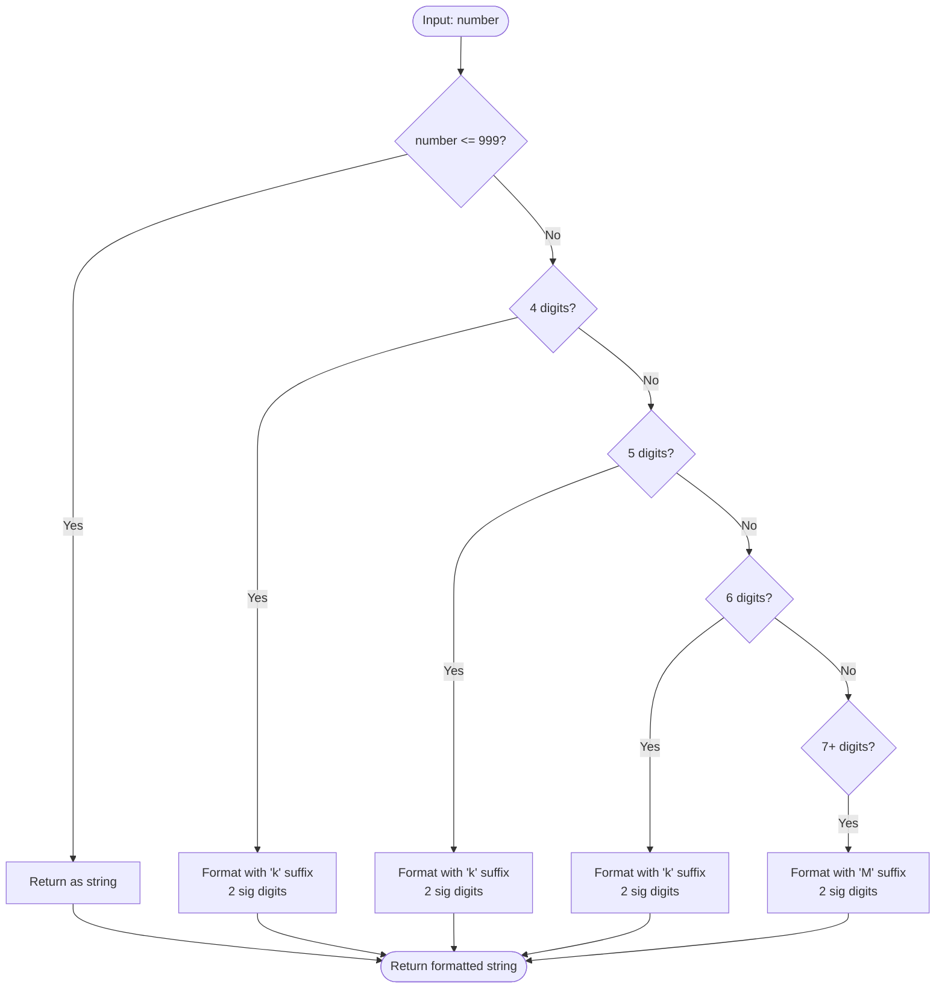
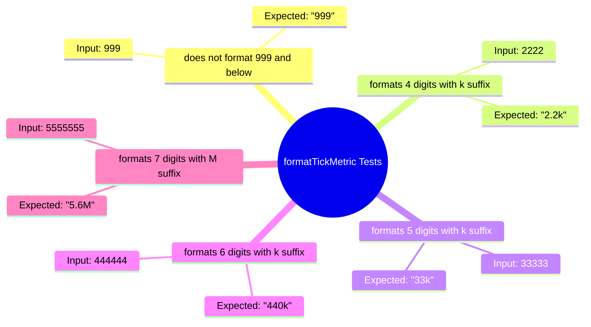

# Diagram: web/portal/src/shared/utils/chart.utils..test.js

> Auto-generated by Obscura crawlers

## Diagram 1

### SVG

<svg id="container" width="1231.890625" xmlns="http://www.w3.org/2000/svg" class="flowchart" height="1270.125" viewBox="0 0 1231.890625 1270.125" role="graphics-document document" aria-roledescription="flowchart-v2"><g><marker id="container_flowchart-v2-pointEnd" class="marker flowchart-v2" viewBox="0 0 10 10" refX="5" refY="5" markerUnits="userSpaceOnUse" markerWidth="8" markerHeight="8" orient="auto"><path d="M 0 0 L 10 5 L 0 10 z" class="arrowMarkerPath" style="stroke-width: 1; stroke-dasharray: 1, 0;"></path></marker><marker id="container_flowchart-v2-pointStart" class="marker flowchart-v2" viewBox="0 0 10 10" refX="4.5" refY="5" markerUnits="userSpaceOnUse" markerWidth="8" markerHeight="8" orient="auto"><path d="M 0 5 L 10 10 L 10 0 z" class="arrowMarkerPath" style="stroke-width: 1; stroke-dasharray: 1, 0;"></path></marker><marker id="container_flowchart-v2-circleEnd" class="marker flowchart-v2" viewBox="0 0 10 10" refX="11" refY="5" markerUnits="userSpaceOnUse" markerWidth="11" markerHeight="11" orient="auto"><circle cx="5" cy="5" r="5" class="arrowMarkerPath" style="stroke-width: 1; stroke-dasharray: 1, 0;"></circle></marker><marker id="container_flowchart-v2-circleStart" class="marker flowchart-v2" viewBox="0 0 10 10" refX="-1" refY="5" markerUnits="userSpaceOnUse" markerWidth="11" markerHeight="11" orient="auto"><circle cx="5" cy="5" r="5" class="arrowMarkerPath" style="stroke-width: 1; stroke-dasharray: 1, 0;"></circle></marker><marker id="container_flowchart-v2-crossEnd" class="marker cross flowchart-v2" viewBox="0 0 11 11" refX="12" refY="5.2" markerUnits="userSpaceOnUse" markerWidth="11" markerHeight="11" orient="auto"><path d="M 1,1 l 9,9 M 10,1 l -9,9" class="arrowMarkerPath" style="stroke-width: 2; stroke-dasharray: 1, 0;"></path></marker><marker id="container_flowchart-v2-crossStart" class="marker cross flowchart-v2" viewBox="0 0 11 11" refX="-1" refY="5.2" markerUnits="userSpaceOnUse" markerWidth="11" markerHeight="11" orient="auto"><path d="M 1,1 l 9,9 M 10,1 l -9,9" class="arrowMarkerPath" style="stroke-width: 2; stroke-dasharray: 1, 0;"></path></marker><g class="root"><g class="clusters"></g><g class="edgePaths"><path d="M606.82,47.5L606.737,51.583C606.654,55.667,606.487,63.833,606.404,71.417C606.32,79,606.32,86,606.32,89.5L606.32,93" id="L_Start_Check999_0" class="edge-thickness-normal edge-pattern-solid edge-thickness-normal edge-pattern-solid flowchart-link" style=";" data-edge="true" data-et="edge" data-id="L_Start_Check999_0" data-points="W3sieCI6NjA2LjgyMDMxMjUsInkiOjQ3LjV9LHsieCI6NjA2LjMyMDMxMjUsInkiOjcyfSx7IngiOjYwNi4zMjAzMTI1LCJ5Ijo5N31d" marker-end="url(#container_flowchart-v2-pointEnd)"></path><path d="M538.576,196.772L464.725,214.229C390.874,231.686,243.171,266.601,169.32,299.707C95.469,332.813,95.469,364.109,95.469,395.406C95.469,426.703,95.469,458,95.469,489.255C95.469,520.51,95.469,551.724,95.469,582.938C95.469,614.151,95.469,645.365,95.469,676.621C95.469,707.878,95.469,739.177,95.469,770.477C95.469,801.776,95.469,833.076,95.469,864.871C95.469,896.667,95.469,928.958,95.469,961.25C95.469,993.542,95.469,1025.833,95.469,1049.479C95.469,1073.125,95.469,1088.125,95.469,1095.625L95.469,1103.125" id="L_Check999_Return999_0" class="edge-thickness-normal edge-pattern-solid edge-thickness-normal edge-pattern-solid flowchart-link" style=";" data-edge="true" data-et="edge" data-id="L_Check999_Return999_0" data-points="W3sieCI6NTM4LjU3NjIxMTM1MDEyODcsInkiOjE5Ni43NzE1MjM4NTAxMjg2M30seyJ4Ijo5NS40Njg3NSwieSI6MzAxLjUxNTYyNX0seyJ4Ijo5NS40Njg3NSwieSI6Mzk1LjQwNjI1fSx7IngiOjk1LjQ2ODc1LCJ5Ijo0ODkuMjk2ODc1fSx7IngiOjk1LjQ2ODc1LCJ5Ijo1ODIuOTM3NX0seyJ4Ijo5NS40Njg3NSwieSI6Njc2LjU3ODEyNX0seyJ4Ijo5NS40Njg3NSwieSI6NzcwLjQ3NjU2MjV9LHsieCI6OTUuNDY4NzUsInkiOjg2NC4zNzV9LHsieCI6OTUuNDY4NzUsInkiOjk2MS4yNX0seyJ4Ijo5NS40Njg3NSwieSI6MTA1OC4xMjV9LHsieCI6OTUuNDY4NzUsInkiOjExMDcuMTI1fV0=" marker-end="url(#container_flowchart-v2-pointEnd)"></path><path d="M648.246,222.59L661.43,235.744C674.613,248.899,700.98,275.207,714.164,293.861C727.348,312.516,727.348,323.516,727.348,329.016L727.348,334.516" id="L_Check999_Check4Digit_0" class="edge-thickness-normal edge-pattern-solid edge-thickness-normal edge-pattern-solid flowchart-link" style=";" data-edge="true" data-et="edge" data-id="L_Check999_Check4Digit_0" data-points="W3sieCI6NjQ4LjI0NTkwMzQ3Njc0MzYsInkiOjIyMi41OTAwMzQwMjMyNTYzOH0seyJ4Ijo3MjcuMzQ3NjU2MjUsInkiOjMwMS41MTU2MjV9LHsieCI6NzI3LjM0NzY1NjI1LCJ5IjozMzguNTE1NjI1fV0=" marker-end="url(#container_flowchart-v2-pointEnd)"></path><path d="M681.5,406.449L624.17,420.257C566.841,434.065,452.182,461.681,394.853,491.096C337.523,520.51,337.523,551.724,337.523,582.938C337.523,614.151,337.523,645.365,337.523,676.621C337.523,707.878,337.523,739.177,337.523,770.477C337.523,801.776,337.523,833.076,337.523,864.871C337.523,896.667,337.523,928.958,337.523,961.25C337.523,993.542,337.523,1025.833,337.523,1047.479C337.523,1069.125,337.523,1080.125,337.523,1085.625L337.523,1091.125" id="L_Check4Digit_Format4_0" class="edge-thickness-normal edge-pattern-solid edge-thickness-normal edge-pattern-solid flowchart-link" style=";" data-edge="true" data-et="edge" data-id="L_Check4Digit_Format4_0" data-points="W3sieCI6NjgxLjQ5OTY4NjY2MzQyNjQsInkiOjQwNi40NDg5MDU0MTM0MjYzNn0seyJ4IjozMzcuNTIzNDM3NSwieSI6NDg5LjI5Njg3NX0seyJ4IjozMzcuNTIzNDM3NSwieSI6NTgyLjkzNzV9LHsieCI6MzM3LjUyMzQzNzUsInkiOjY3Ni41NzgxMjV9LHsieCI6MzM3LjUyMzQzNzUsInkiOjc3MC40NzY1NjI1fSx7IngiOjMzNy41MjM0Mzc1LCJ5Ijo4NjQuMzc1fSx7IngiOjMzNy41MjM0Mzc1LCJ5Ijo5NjEuMjV9LHsieCI6MzM3LjUyMzQzNzUsInkiOjEwNTguMTI1fSx7IngiOjMzNy41MjM0Mzc1LCJ5IjoxMDk1LjEyNX1d" marker-end="url(#container_flowchart-v2-pointEnd)"></path><path d="M760.336,419.308L776.436,430.973C792.536,442.638,824.735,465.967,840.834,483.132C856.934,500.297,856.934,511.297,856.934,516.797L856.934,522.297" id="L_Check4Digit_Check5Digit_0" class="edge-thickness-normal edge-pattern-solid edge-thickness-normal edge-pattern-solid flowchart-link" style=";" data-edge="true" data-et="edge" data-id="L_Check4Digit_Check5Digit_0" data-points="W3sieCI6NzYwLjMzNjQ2MjI5MzUyMzgsInkiOjQxOS4zMDgwNjg5NTY0NzYxfSx7IngiOjg1Ni45MzM1OTM3NSwieSI6NDg5LjI5Njg3NX0seyJ4Ijo4NTYuOTMzNTkzNzUsInkiOjUyNi4yOTY4NzV9XQ==" marker-end="url(#container_flowchart-v2-pointEnd)"></path><path d="M815.281,597.925L778.85,611.034C742.419,624.143,669.557,650.361,633.126,679.119C596.695,707.878,596.695,739.177,596.695,770.477C596.695,801.776,596.695,833.076,596.695,864.871C596.695,896.667,596.695,928.958,596.695,961.25C596.695,993.542,596.695,1025.833,596.695,1047.479C596.695,1069.125,596.695,1080.125,596.695,1085.625L596.695,1091.125" id="L_Check5Digit_Format5_0" class="edge-thickness-normal edge-pattern-solid edge-thickness-normal edge-pattern-solid flowchart-link" style=";" data-edge="true" data-et="edge" data-id="L_Check5Digit_Format5_0" data-points="W3sieCI6ODE1LjI4MDc2MDk5MTEyMjQsInkiOjU5Ny45MjUyOTIyNDExMjI0fSx7IngiOjU5Ni42OTUzMTI1LCJ5Ijo2NzYuNTc4MTI1fSx7IngiOjU5Ni42OTUzMTI1LCJ5Ijo3NzAuNDc2NTYyNX0seyJ4Ijo1OTYuNjk1MzEyNSwieSI6ODY0LjM3NX0seyJ4Ijo1OTYuNjk1MzEyNSwieSI6OTYxLjI1fSx7IngiOjU5Ni42OTUzMTI1LCJ5IjoxMDU4LjEyNX0seyJ4Ijo1OTYuNjk1MzEyNSwieSI6MTA5NS4xMjV9XQ==" marker-end="url(#container_flowchart-v2-pointEnd)"></path><path d="M889.814,606.698L905.932,618.344C922.049,629.991,954.284,653.285,970.402,670.431C986.52,687.578,986.52,698.578,986.52,704.078L986.52,709.578" id="L_Check5Digit_Check6Digit_0" class="edge-thickness-normal edge-pattern-solid edge-thickness-normal edge-pattern-solid flowchart-link" style=";" data-edge="true" data-et="edge" data-id="L_Check5Digit_Check6Digit_0" data-points="W3sieCI6ODg5LjgxNDIxNjk1NjM0ODcsInkiOjYwNi42OTc1MDE3OTM2NTEzfSx7IngiOjk4Ni41MTk1MzEyNSwieSI6Njc2LjU3ODEyNX0seyJ4Ijo5ODYuNTE5NTMxMjUsInkiOjcxMy41NzgxMjV9XQ==" marker-end="url(#container_flowchart-v2-pointEnd)"></path><path d="M953.414,794.269L937.156,805.954C920.898,817.638,888.383,841.006,872.125,868.837C855.867,896.667,855.867,928.958,855.867,961.25C855.867,993.542,855.867,1025.833,855.867,1047.479C855.867,1069.125,855.867,1080.125,855.867,1085.625L855.867,1091.125" id="L_Check6Digit_Format6_0" class="edge-thickness-normal edge-pattern-solid edge-thickness-normal edge-pattern-solid flowchart-link" style=";" data-edge="true" data-et="edge" data-id="L_Check6Digit_Format6_0" data-points="W3sieCI6OTUzLjQxMzgxNjAzNjI0ODYsInkiOjc5NC4yNjkyODQ3ODYyNDg2fSx7IngiOjg1NS44NjcxODc1LCJ5Ijo4NjQuMzc1fSx7IngiOjg1NS44NjcxODc1LCJ5Ijo5NjEuMjV9LHsieCI6ODU1Ljg2NzE4NzUsInkiOjEwNTguMTI1fSx7IngiOjg1NS44NjcxODc1LCJ5IjoxMDk1LjEyNX1d" marker-end="url(#container_flowchart-v2-pointEnd)"></path><path d="M1019.625,794.269L1035.883,805.954C1052.141,817.638,1084.656,841.006,1100.914,858.191C1117.172,875.375,1117.172,886.375,1117.172,891.875L1117.172,897.375" id="L_Check6Digit_Check7Digit_0" class="edge-thickness-normal edge-pattern-solid edge-thickness-normal edge-pattern-solid flowchart-link" style=";" data-edge="true" data-et="edge" data-id="L_Check6Digit_Check7Digit_0" data-points="W3sieCI6MTAxOS42MjUyNDY0NjM3NTE0LCJ5Ijo3OTQuMjY5Mjg0Nzg2MjQ4Nn0seyJ4IjoxMTE3LjE3MTg3NSwieSI6ODY0LjM3NX0seyJ4IjoxMTE3LjE3MTg3NSwieSI6OTAxLjM3NX1d" marker-end="url(#container_flowchart-v2-pointEnd)"></path><path d="M1117.172,1021.125L1117.172,1027.292C1117.172,1033.458,1117.172,1045.792,1117.172,1057.458C1117.172,1069.125,1117.172,1080.125,1117.172,1085.625L1117.172,1091.125" id="L_Check7Digit_Format7_0" class="edge-thickness-normal edge-pattern-solid edge-thickness-normal edge-pattern-solid flowchart-link" style=";" data-edge="true" data-et="edge" data-id="L_Check7Digit_Format7_0" data-points="W3sieCI6MTExNy4xNzE4NzUsInkiOjEwMjEuMTI1fSx7IngiOjExMTcuMTcxODc1LCJ5IjoxMDU4LjEyNX0seyJ4IjoxMTE3LjE3MTg3NSwieSI6MTA5NS4xMjV9XQ==" marker-end="url(#container_flowchart-v2-pointEnd)"></path><path d="M95.469,1161.125L95.469,1167.292C95.469,1173.458,95.469,1185.792,162.389,1197.975C229.309,1210.158,363.15,1222.191,430.07,1228.208L496.99,1234.224" id="L_Return999_End_0" class="edge-thickness-normal edge-pattern-solid edge-thickness-normal edge-pattern-solid flowchart-link" style=";" data-edge="true" data-et="edge" data-id="L_Return999_End_0" data-points="W3sieCI6OTUuNDY4NzUsInkiOjExNjEuMTI1fSx7IngiOjk1LjQ2ODc1LCJ5IjoxMTk4LjEyNX0seyJ4Ijo1MDAuOTczOTA5NzgxMTQ1NTUsInkiOjEyMzQuNTgyMjUxNTg3NzIwN31d" marker-end="url(#container_flowchart-v2-pointEnd)"></path><path d="M337.523,1173.125L337.523,1177.292C337.523,1181.458,337.523,1189.792,365.065,1198.755C392.607,1207.718,447.69,1217.31,475.232,1222.107L502.773,1226.903" id="L_Format4_End_0" class="edge-thickness-normal edge-pattern-solid edge-thickness-normal edge-pattern-solid flowchart-link" style=";" data-edge="true" data-et="edge" data-id="L_Format4_End_0" data-points="W3sieCI6MzM3LjUyMzQzNzUsInkiOjExNzMuMTI1fSx7IngiOjMzNy41MjM0Mzc1LCJ5IjoxMTk4LjEyNX0seyJ4Ijo1MDYuNzEzODcxNzU2NjM4OSwieSI6MTIyNy41ODkyNzA2MTkzMzV9XQ==" marker-end="url(#container_flowchart-v2-pointEnd)"></path><path d="M596.695,1173.125L596.695,1177.292C596.695,1181.458,596.695,1189.792,596.766,1197.542C596.836,1205.292,596.976,1212.459,597.047,1216.042L597.117,1219.626" id="L_Format5_End_0" class="edge-thickness-normal edge-pattern-solid edge-thickness-normal edge-pattern-solid flowchart-link" style=";" data-edge="true" data-et="edge" data-id="L_Format5_End_0" data-points="W3sieCI6NTk2LjY5NTMxMjUsInkiOjExNzMuMTI1fSx7IngiOjU5Ni42OTUzMTI1LCJ5IjoxMTk4LjEyNX0seyJ4Ijo1OTcuMTk1MzEyNSwieSI6MTIyMy42MjV9XQ==" marker-end="url(#container_flowchart-v2-pointEnd)"></path><path d="M855.867,1173.125L855.867,1177.292C855.867,1181.458,855.867,1189.792,828.492,1198.754C801.117,1207.716,746.367,1217.308,718.992,1222.103L691.617,1226.899" id="L_Format6_End_0" class="edge-thickness-normal edge-pattern-solid edge-thickness-normal edge-pattern-solid flowchart-link" style=";" data-edge="true" data-et="edge" data-id="L_Format6_End_0" data-points="W3sieCI6ODU1Ljg2NzE4NzUsInkiOjExNzMuMTI1fSx7IngiOjg1NS44NjcxODc1LCJ5IjoxMTk4LjEyNX0seyJ4Ijo2ODcuNjc2NzUwOTU3NDkyOSwieSI6MTIyNy41ODkyNzEwMTE4Mn1d" marker-end="url(#container_flowchart-v2-pointEnd)"></path><path d="M1117.172,1173.125L1117.172,1177.292C1117.172,1181.458,1117.172,1189.792,1047.235,1200.027C977.297,1210.263,837.423,1222.402,767.485,1228.471L697.548,1234.54" id="L_Format7_End_0" class="edge-thickness-normal edge-pattern-solid edge-thickness-normal edge-pattern-solid flowchart-link" style=";" data-edge="true" data-et="edge" data-id="L_Format7_End_0" data-points="W3sieCI6MTExNy4xNzE4NzUsInkiOjExNzMuMTI1fSx7IngiOjExMTcuMTcxODc1LCJ5IjoxMTk4LjEyNX0seyJ4Ijo2OTMuNTYyODUyMDAyMTAyNSwieSI6MTIzNC44ODU3MTM1MTM2OTd9XQ==" marker-end="url(#container_flowchart-v2-pointEnd)"></path></g><g class="edgeLabels"><g class="edgeLabel"><g class="label" data-id="L_Start_Check999_0" transform="translate(0, 0)"><foreignObject width="0" height="0">

</foreignObject></g></g><g class="edgeLabel" transform="translate(95.46875, 676.578125)"><g class="label" data-id="L_Check999_Return999_0" transform="translate(-12.03125, -12)"><foreignObject width="24.0625" height="24">

Yes

</foreignObject></g></g><g class="edgeLabel" transform="translate(727.34765625, 301.515625)"><g class="label" data-id="L_Check999_Check4Digit_0" transform="translate(-10.140625, -12)"><foreignObject width="20.28125" height="24">

No

</foreignObject></g></g><g class="edgeLabel" transform="translate(337.5234375, 770.4765625)"><g class="label" data-id="L_Check4Digit_Format4_0" transform="translate(-12.03125, -12)"><foreignObject width="24.0625" height="24">

Yes

</foreignObject></g></g><g class="edgeLabel" transform="translate(856.93359375, 489.296875)"><g class="label" data-id="L_Check4Digit_Check5Digit_0" transform="translate(-10.140625, -12)"><foreignObject width="20.28125" height="24">

No

</foreignObject></g></g><g class="edgeLabel" transform="translate(596.6953125, 864.375)"><g class="label" data-id="L_Check5Digit_Format5_0" transform="translate(-12.03125, -12)"><foreignObject width="24.0625" height="24">

Yes

</foreignObject></g></g><g class="edgeLabel" transform="translate(986.51953125, 676.578125)"><g class="label" data-id="L_Check5Digit_Check6Digit_0" transform="translate(-10.140625, -12)"><foreignObject width="20.28125" height="24">

No

</foreignObject></g></g><g class="edgeLabel" transform="translate(855.8671875, 961.25)"><g class="label" data-id="L_Check6Digit_Format6_0" transform="translate(-12.03125, -12)"><foreignObject width="24.0625" height="24">

Yes

</foreignObject></g></g><g class="edgeLabel" transform="translate(1117.171875, 864.375)"><g class="label" data-id="L_Check6Digit_Check7Digit_0" transform="translate(-10.140625, -12)"><foreignObject width="20.28125" height="24">

No

</foreignObject></g></g><g class="edgeLabel" transform="translate(1117.171875, 1058.125)"><g class="label" data-id="L_Check7Digit_Format7_0" transform="translate(-12.03125, -12)"><foreignObject width="24.0625" height="24">

Yes

</foreignObject></g></g><g class="edgeLabel"><g class="label" data-id="L_Return999_End_0" transform="translate(0, 0)"><foreignObject width="0" height="0">

</foreignObject></g></g><g class="edgeLabel"><g class="label" data-id="L_Format4_End_0" transform="translate(0, 0)"><foreignObject width="0" height="0">

</foreignObject></g></g><g class="edgeLabel"><g class="label" data-id="L_Format5_End_0" transform="translate(0, 0)"><foreignObject width="0" height="0">

</foreignObject></g></g><g class="edgeLabel"><g class="label" data-id="L_Format6_End_0" transform="translate(0, 0)"><foreignObject width="0" height="0">

</foreignObject></g></g><g class="edgeLabel"><g class="label" data-id="L_Format7_End_0" transform="translate(0, 0)"><foreignObject width="0" height="0">

</foreignObject></g></g></g><g class="nodes"><g class="node default" id="flowchart-Start-0" transform="translate(606.3203125, 27.5)"><g class="basic label-container outer-path"><path d="M-44.6953125 -19.5 C-23.37850181751202 -19.5, -2.0616911350240414 -19.5, 44.6953125 -19.5 C44.6953125 -19.5, 44.6953125 -19.5, 44.6953125 -19.5 C45.16589239135449 -19.484909418812453, 45.63647228270898 -19.46981883762491, 45.9446817896239 -19.45993515863156 C46.398301023024246 -19.41617505674237, 46.85192025642459 -19.372414954853188, 47.188917152847864 -19.3399052695533 C47.60766168651245 -19.272205900762767, 48.02640622017704 -19.20450653197224, 48.42290575967676 -19.140403561325776 C48.84167791725905 -19.044821549101336, 49.26045007484134 -18.94923953687689, 49.64157688623539 -18.862249829261074 C50.00550936907433 -18.754236578675062, 50.36944185191328 -18.64622332808905, 50.839922751460605 -18.50658706670804 C51.104104943794404 -18.409365577855787, 51.368287136128195 -18.312144089003535, 52.0130190951478 -18.074876768247425 C52.361581603146504 -17.920578485695824, 52.71014411114521 -17.766280203144227, 53.15604541279238 -17.568892924097174 C53.56781138942992 -17.354074877834066, 53.97957736606746 -17.139256831570957, 54.26430476407678 -16.990714730406097 C54.68691410859481 -16.73452646223109, 55.109523453112836 -16.47833819405609, 55.3332430736057 -16.342718045390892 C55.678273080320125 -16.10204004881517, 56.023303087034556 -15.861362052239448, 56.35846784457871 -15.627565626425154 C56.625281632824034 -15.414788730512603, 56.89209542106936 -15.202011834600052, 57.335766208501866 -14.848196188198123 C57.63223079293075 -14.578954896642882, 57.928695377359624 -14.309713605087643, 58.26112223676799 -14.007812326905688 C58.48408239771043 -13.777587655362971, 58.707042558652866 -13.547362983820255, 59.13073344296865 -13.10986736009568 C59.35569018941379 -12.845620365319727, 59.58064693585893 -12.581373370543773, 59.94102640812658 -12.158051136245305 C60.23230760897645 -11.767760863369782, 60.523588809826315 -11.377470590494259, 60.688671464640635 -11.156274872382312 C60.93113043408999 -10.783792785958639, 61.173589403539346 -10.411310699534964, 61.37059637860425 -10.108655082055241 C61.524951657688945 -9.834581653873478, 61.67930693677364 -9.560508225691716, 61.983998974273504 -9.019496659696287 C62.15510321973747 -8.66419503294599, 62.32620746520144 -8.308893406195695, 62.52635864880834 -7.893275190886684 C62.69736115571036 -7.47089569273014, 62.86836366261238 -7.048516194573597, 62.995446729970325 -6.734618561215508 C63.084201885427014 -6.46730217419357, 63.1729570408837 -6.199985787171631, 63.38933563421488 -5.548287939305138 C63.48149313824677 -5.196851435116639, 63.57365064227866 -4.845414930928141, 63.70640678754556 -4.339158212148133 C63.76099361307948 -4.05886639996112, 63.815580438613395 -3.778574587774108, 63.945357276581774 -3.1121979531509023 C64.00268361289346 -2.6675862090830043, 64.06000994920514 -2.222974465015106, 64.10520520250937 -1.872449005199798 C64.12660001396874 -1.5392075471391176, 64.14799482542811 -1.2059660890784372, 64.18529371591342 -0.6250057626472757 C64.18529371591342 -0.3536249828316365, 64.18529371591342 -0.08224420301599733, 64.18529371591342 0.625005762647271 C64.1673489091622 0.9045106125848306, 64.14940410241097 1.1840154625223902, 64.10520520250937 1.8724490051997846 C64.05179471742443 2.2866901804252735, 63.998384232339504 2.700931355650763, 63.945357276581774 3.1121979531508885 C63.86799870231705 3.5094178822597857, 63.79064012805233 3.9066378113686833, 63.70640678754556 4.339158212148129 C63.60643960455689 4.720376406935107, 63.50647242156822 5.101594601722085, 63.38933563421489 5.548287939305125 C63.28596022674353 5.859638195974408, 63.182584819272186 6.170988452643689, 62.995446729970325 6.734618561215495 C62.82940288820822 7.144750060607188, 62.66335904644611 7.554881559998881, 62.52635864880834 7.893275190886679 C62.41420598760642 8.126162591554992, 62.302053326404504 8.359049992223305, 61.983998974273504 9.019496659696284 C61.840588979642774 9.274135626999799, 61.69717898501204 9.528774594303313, 61.37059637860425 10.108655082055236 C61.12236349117402 10.490007457011602, 60.874130603743794 10.871359831967968, 60.68867146464064 11.156274872382301 C60.40124982239282 11.54139368834411, 60.11382818014499 11.926512504305917, 59.94102640812658 12.158051136245302 C59.73091058721999 12.404865135411095, 59.520794766313394 12.651679134576888, 59.13073344296866 13.10986736009567 C58.8058186035203 13.44536860783053, 58.48090376407193 13.78086985556539, 58.26112223676799 14.007812326905684 C58.00867647812703 14.23707688555465, 57.75623071948606 14.466341444203618, 57.33576620850189 14.848196188198111 C57.06751553707117 15.062118960213944, 56.79926486564046 15.276041732229775, 56.35846784457871 15.627565626425152 C56.07315463472202 15.826587770611388, 55.787841424865334 16.025609914797624, 55.33324307360571 16.34271804539089 C54.93345784798895 16.585070198558533, 54.53367262237219 16.827422351726177, 54.26430476407678 16.990714730406093 C53.872552190276316 17.195091797228297, 53.48079961647585 17.3994688640505, 53.15604541279239 17.56889292409717 C52.720560716409686 17.761669080991258, 52.28507602002699 17.954445237885345, 52.013019095147804 18.07487676824742 C51.688580929439084 18.194273012301757, 51.36414276373037 18.313669256356093, 50.83992275146062 18.506587066708033 C50.53128271350454 18.59818980988878, 50.22264267554845 18.689792553069527, 49.64157688623541 18.86224982926107 C49.27290638867963 18.94639646452835, 48.904235891123854 19.030543099795622, 48.422905759676766 19.140403561325773 C48.173272481090095 19.18076233387268, 47.923639202503416 19.221121106419584, 47.18891715284788 19.3399052695533 C46.727493197751855 19.384418283557913, 46.26606924265584 19.42893129756253, 45.9446817896239 19.45993515863156 C45.53802851316834 19.472975737704903, 45.131375236712785 19.486016316778247, 44.69531250000001 19.5 C44.69531250000001 19.5, 44.69531250000001 19.5, 44.6953125 19.5 C16.315598559951304 19.5, -12.064115380097391 19.5, -44.69531249999999 19.5 C-45.192332436207465 19.484061538036446, -45.68935237241494 19.46812307607289, -45.94468178962389 19.45993515863156 C-46.3635403210031 19.41952837986049, -46.78239885238231 19.379121601089427, -47.18891715284787 19.3399052695533 C-47.59547042998504 19.274176888573514, -48.00202370712221 19.208448507593726, -48.42290575967676 19.140403561325773 C-48.724995314971196 19.071453591648396, -49.02708487026563 19.002503621971016, -49.641576886235384 18.862249829261074 C-50.10960488376753 18.723341576322625, -50.57763288129968 18.58443332338418, -50.83992275146059 18.506587066708043 C-51.16534888776608 18.386827240341397, -51.49077502407156 18.26706741397475, -52.0130190951478 18.074876768247425 C-52.38887265760103 17.908497545449173, -52.76472622005426 17.742118322650924, -53.15604541279238 17.568892924097174 C-53.424900699008866 17.428631293488067, -53.693755985225344 17.288369662878956, -54.26430476407678 16.990714730406097 C-54.6838330521777 16.736394216737445, -55.1033613402786 16.482073703068792, -55.333243073605686 16.3427180453909 C-55.59720875662947 16.158587011803757, -55.861174439653254 15.974455978216618, -56.35846784457871 15.627565626425156 C-56.605973441567706 15.430186499226982, -56.85347903855669 15.232807372028807, -57.335766208501866 14.848196188198125 C-57.55913428111471 14.645339214646489, -57.782502353727544 14.44248224109485, -58.261122236767974 14.007812326905697 C-58.50866385896085 13.752205278446402, -58.75620548115373 13.496598229987109, -59.130733442968655 13.109867360095677 C-59.43307560000413 12.75471905868571, -59.735417757039606 12.399570757275743, -59.941026408126575 12.158051136245307 C-60.11283716229013 11.927840377947852, -60.28464791645368 11.697629619650398, -60.688671464640635 11.156274872382316 C-60.87164843636267 10.875173107620645, -61.05462540808471 10.594071342858975, -61.37059637860425 10.108655082055249 C-61.61252817636607 9.679080676878115, -61.85445997412789 9.24950627170098, -61.983998974273504 9.019496659696289 C-62.11139298860716 8.754960263137216, -62.23878700294081 8.490423866578144, -62.52635864880834 7.893275190886686 C-62.69175656622543 7.4847391371152865, -62.85715448364252 7.076203083343887, -62.995446729970325 6.73461856121551 C-63.13959087219839 6.3004793710747675, -63.28373501442645 5.866340180934024, -63.38933563421488 5.5482879393051325 C-63.491091451310254 5.160248907470381, -63.59284726840563 4.77220987563563, -63.70640678754556 4.339158212148136 C-63.795674287633695 3.8807884658883833, -63.88494178772183 3.4224187196286313, -63.945357276581774 3.112197953150904 C-63.99598985393332 2.7195016817456628, -64.04662243128486 2.3268054103404214, -64.10520520250937 1.872449005199809 C-64.13469513418507 1.4131195155063578, -64.16418506586076 0.9537900258129065, -64.18529371591342 0.6250057626472781 C-64.18529371591342 0.27020899242790264, -64.18529371591342 -0.08458777779147286, -64.18529371591342 -0.6250057626472687 C-64.15949525989286 -1.026837539306218, -64.13369680387231 -1.428669315965167, -64.10520520250937 -1.8724490051997822 C-64.04959731300481 -2.3037328151772525, -63.99398942350027 -2.735016625154723, -63.945357276581774 -3.112197953150895 C-63.891716070087945 -3.387634211423692, -63.83807486359412 -3.663070469696489, -63.70640678754556 -4.339158212148126 C-63.6186616865555 -4.6737683111905675, -63.530916585565436 -5.008378410233009, -63.38933563421489 -5.548287939305123 C-63.30677000983873 -5.796962444880354, -63.22420438546257 -6.045636950455585, -62.99544672997033 -6.734618561215485 C-62.857957938612685 -7.074218534033823, -62.72046914725504 -7.41381850685216, -62.52635864880834 -7.893275190886676 C-62.416327712086186 -8.121756785275123, -62.30629677536404 -8.350238379663569, -61.983998974273504 -9.019496659696282 C-61.8445784560917 -9.267051907586426, -61.7051579379099 -9.51460715547657, -61.37059637860425 -10.108655082055243 C-61.15136518641806 -10.445453065071154, -60.93213399423188 -10.782251048087067, -60.68867146464064 -11.156274872382308 C-60.44714716523193 -11.479895430273658, -60.205622865823216 -11.803515988165005, -59.94102640812659 -12.158051136245302 C-59.73354863140139 -12.401766338606663, -59.526070854676185 -12.645481540968023, -59.13073344296866 -13.10986736009567 C-58.80696144395911 -13.444188531248509, -58.483189444949566 -13.778509702401347, -58.261122236767996 -14.007812326905677 C-57.94478855976601 -14.295098202628436, -57.62845488276402 -14.582384078351197, -57.33576620850189 -14.848196188198107 C-57.013695287165724 -15.105039177296534, -56.69162436582957 -15.361882166394961, -56.35846784457872 -15.627565626425149 C-56.12534192423323 -15.79018417659972, -55.892216003887754 -15.95280272677429, -55.333243073605715 -16.342718045390885 C-54.936887670069346 -16.582991020257523, -54.54053226653298 -16.823263995124165, -54.26430476407679 -16.99071473040609 C-53.960861435774845 -17.14902092041649, -53.65741810747289 -17.307327110426886, -53.15604541279239 -17.56889292409717 C-52.72565444441112 -17.759414238705098, -52.295263476029845 -17.949935553313026, -52.013019095147804 -18.07487676824742 C-51.60953110539875 -18.22336407827716, -51.2060431156497 -18.371851388306904, -50.83992275146062 -18.506587066708033 C-50.51168293407117 -18.60400692154326, -50.183443116681715 -18.70142677637849, -49.64157688623541 -18.862249829261067 C-49.157204549778555 -18.972804654232455, -48.6728322133217 -19.083359479203843, -48.422905759676766 -19.140403561325773 C-47.951316379582615 -19.216646475069133, -47.47972699948847 -19.29288938881249, -47.18891715284788 -19.3399052695533 C-46.750741952841686 -19.382175504115118, -46.3125667528355 -19.424445738676937, -45.9446817896239 -19.45993515863156 C-45.672910321709374 -19.468650340636508, -45.40113885379484 -19.477365522641453, -44.69531250000001 -19.5 C-44.69531250000001 -19.5, -44.6953125 -19.5, -44.6953125 -19.5" stroke="none" stroke-width="0" fill="#ECECFF" style=""></path><path d="M-44.6953125 -19.5 C-15.470906323462785 -19.5, 13.75349985307443 -19.5, 44.6953125 -19.5 M-44.6953125 -19.5 C-17.94139081787856 -19.5, 8.81253086424288 -19.5, 44.6953125 -19.5 M44.6953125 -19.5 C44.6953125 -19.5, 44.6953125 -19.5, 44.6953125 -19.5 M44.6953125 -19.5 C44.6953125 -19.5, 44.6953125 -19.5, 44.6953125 -19.5 M44.6953125 -19.5 C44.966663079584045 -19.4912983150646, 45.23801365916808 -19.482596630129205, 45.9446817896239 -19.45993515863156 M44.6953125 -19.5 C45.14288514891145 -19.485647216296723, 45.590457797822914 -19.471294432593442, 45.9446817896239 -19.45993515863156 M45.9446817896239 -19.45993515863156 C46.217510392386686 -19.433615711447434, 46.49033899514947 -19.40729626426331, 47.188917152847864 -19.3399052695533 M45.9446817896239 -19.45993515863156 C46.358818671486496 -19.419983871710745, 46.77295555334909 -19.38003258478993, 47.188917152847864 -19.3399052695533 M47.188917152847864 -19.3399052695533 C47.58718681556585 -19.275516119112417, 47.98545647828384 -19.21112696867154, 48.42290575967676 -19.140403561325776 M47.188917152847864 -19.3399052695533 C47.5324436088127 -19.28436657624036, 47.87597006477753 -19.22882788292742, 48.42290575967676 -19.140403561325776 M48.42290575967676 -19.140403561325776 C48.86299074816904 -19.039957034525347, 49.30307573666131 -18.939510507724922, 49.64157688623539 -18.862249829261074 M48.42290575967676 -19.140403561325776 C48.86591108766674 -19.039290486091993, 49.308916415656725 -18.938177410858213, 49.64157688623539 -18.862249829261074 M49.64157688623539 -18.862249829261074 C49.992705062631195 -18.75803682961621, 50.343833239027 -18.653823829971344, 50.839922751460605 -18.50658706670804 M49.64157688623539 -18.862249829261074 C50.0217072251526 -18.749429140015312, 50.40183756406981 -18.636608450769554, 50.839922751460605 -18.50658706670804 M50.839922751460605 -18.50658706670804 C51.16149849513793 -18.388244220421196, 51.483074238815256 -18.269901374134353, 52.0130190951478 -18.074876768247425 M50.839922751460605 -18.50658706670804 C51.25749791823916 -18.352915545311003, 51.67507308501772 -18.199244023913966, 52.0130190951478 -18.074876768247425 M52.0130190951478 -18.074876768247425 C52.28532506133599 -17.9543349946854, 52.557631027524174 -17.833793221123376, 53.15604541279238 -17.568892924097174 M52.0130190951478 -18.074876768247425 C52.370235855546134 -17.916747504877787, 52.72745261594447 -17.758618241508145, 53.15604541279238 -17.568892924097174 M53.15604541279238 -17.568892924097174 C53.45675316057606 -17.412013884690932, 53.75746090835975 -17.25513484528469, 54.26430476407678 -16.990714730406097 M53.15604541279238 -17.568892924097174 C53.40572330813415 -17.4386361260237, 53.65540120347592 -17.30837932795022, 54.26430476407678 -16.990714730406097 M54.26430476407678 -16.990714730406097 C54.67599846528929 -16.74114358935034, 55.087692166501796 -16.491572448294583, 55.3332430736057 -16.342718045390892 M54.26430476407678 -16.990714730406097 C54.622405462104936 -16.77363198282814, 54.98050616013309 -16.556549235250184, 55.3332430736057 -16.342718045390892 M55.3332430736057 -16.342718045390892 C55.554597515595745 -16.188310768937992, 55.77595195758579 -16.03390349248509, 56.35846784457871 -15.627565626425154 M55.3332430736057 -16.342718045390892 C55.699425118082765 -16.087285302928912, 56.065607162559836 -15.831852560466928, 56.35846784457871 -15.627565626425154 M56.35846784457871 -15.627565626425154 C56.64043640394171 -15.402703203831653, 56.92240496330471 -15.177840781238151, 57.335766208501866 -14.848196188198123 M56.35846784457871 -15.627565626425154 C56.58834754456965 -15.444242683038107, 56.818227244560596 -15.26091973965106, 57.335766208501866 -14.848196188198123 M57.335766208501866 -14.848196188198123 C57.544647090478 -14.658496097872684, 57.75352797245414 -14.468796007547244, 58.26112223676799 -14.007812326905688 M57.335766208501866 -14.848196188198123 C57.66479025681786 -14.54938525301681, 57.99381430513386 -14.250574317835497, 58.26112223676799 -14.007812326905688 M58.26112223676799 -14.007812326905688 C58.588504613001206 -13.669763144851927, 58.91588698923442 -13.331713962798167, 59.13073344296865 -13.10986736009568 M58.26112223676799 -14.007812326905688 C58.54087670656267 -13.718942868573556, 58.82063117635735 -13.430073410241425, 59.13073344296865 -13.10986736009568 M59.13073344296865 -13.10986736009568 C59.43362729823238 -12.754071002554289, 59.73652115349611 -12.398274645012897, 59.94102640812658 -12.158051136245305 M59.13073344296865 -13.10986736009568 C59.33663261889096 -12.868006472062328, 59.542531794813264 -12.626145584028976, 59.94102640812658 -12.158051136245305 M59.94102640812658 -12.158051136245305 C60.1540131458929 -11.872668311129418, 60.36699988365921 -11.587285486013531, 60.688671464640635 -11.156274872382312 M59.94102640812658 -12.158051136245305 C60.104959431030444 -11.938395820159753, 60.2688924539343 -11.718740504074201, 60.688671464640635 -11.156274872382312 M60.688671464640635 -11.156274872382312 C60.869325698417626 -10.878741456846702, 61.04997993219462 -10.601208041311095, 61.37059637860425 -10.108655082055241 M60.688671464640635 -11.156274872382312 C60.94397056246692 -10.764066900714429, 61.19926966029321 -10.371858929046544, 61.37059637860425 -10.108655082055241 M61.37059637860425 -10.108655082055241 C61.57555524017783 -9.744729868996096, 61.78051410175141 -9.380804655936952, 61.983998974273504 -9.019496659696287 M61.37059637860425 -10.108655082055241 C61.501567240035364 -9.876103055346471, 61.63253810146647 -9.643551028637702, 61.983998974273504 -9.019496659696287 M61.983998974273504 -9.019496659696287 C62.156125085514056 -8.662073106796496, 62.3282511967546 -8.304649553896704, 62.52635864880834 -7.893275190886684 M61.983998974273504 -9.019496659696287 C62.10315080058471 -8.772075342920397, 62.22230262689592 -8.524654026144509, 62.52635864880834 -7.893275190886684 M62.52635864880834 -7.893275190886684 C62.68258218221143 -7.50740004300451, 62.83880571561452 -7.121524895122334, 62.995446729970325 -6.734618561215508 M62.52635864880834 -7.893275190886684 C62.63507051689655 -7.624754774907836, 62.74378238498475 -7.356234358928987, 62.995446729970325 -6.734618561215508 M62.995446729970325 -6.734618561215508 C63.12823142372312 -6.334692219999946, 63.26101611747592 -5.934765878784384, 63.38933563421488 -5.548287939305138 M62.995446729970325 -6.734618561215508 C63.09630717811517 -6.430842961333305, 63.19716762626002 -6.1270673614511, 63.38933563421488 -5.548287939305138 M63.38933563421488 -5.548287939305138 C63.46250244077002 -5.269271195215841, 63.53566924732516 -4.990254451126544, 63.70640678754556 -4.339158212148133 M63.38933563421488 -5.548287939305138 C63.47881815251207 -5.207052315069203, 63.56830067080926 -4.8658166908332685, 63.70640678754556 -4.339158212148133 M63.70640678754556 -4.339158212148133 C63.76345001146635 -4.046253313404545, 63.82049323538713 -3.753348414660958, 63.945357276581774 -3.1121979531509023 M63.70640678754556 -4.339158212148133 C63.772433982809744 -4.000122519319198, 63.83846117807393 -3.661086826490263, 63.945357276581774 -3.1121979531509023 M63.945357276581774 -3.1121979531509023 C63.98041296740967 -2.8403129376188843, 64.01546865823757 -2.568427922086866, 64.10520520250937 -1.872449005199798 M63.945357276581774 -3.1121979531509023 C63.99255483625996 -2.746143000499199, 64.03975239593815 -2.3800880478474955, 64.10520520250937 -1.872449005199798 M64.10520520250937 -1.872449005199798 C64.12853493928822 -1.5090695234447091, 64.15186467606706 -1.1456900416896203, 64.18529371591342 -0.6250057626472757 M64.10520520250937 -1.872449005199798 C64.12381266586158 -1.5826227438150735, 64.14242012921379 -1.292796482430349, 64.18529371591342 -0.6250057626472757 M64.18529371591342 -0.6250057626472757 C64.18529371591342 -0.1336820982407042, 64.18529371591342 0.3576415661658673, 64.18529371591342 0.625005762647271 M64.18529371591342 -0.6250057626472757 C64.18529371591342 -0.2689715623417563, 64.18529371591342 0.08706263796376312, 64.18529371591342 0.625005762647271 M64.18529371591342 0.625005762647271 C64.16835442002174 0.8888489693135682, 64.15141512413008 1.1526921759798652, 64.10520520250937 1.8724490051997846 M64.18529371591342 0.625005762647271 C64.15877696883663 1.0380255023010767, 64.13226022175986 1.4510452419548825, 64.10520520250937 1.8724490051997846 M64.10520520250937 1.8724490051997846 C64.0623249401938 2.2050198520536908, 64.01944467787825 2.5375906989075974, 63.945357276581774 3.1121979531508885 M64.10520520250937 1.8724490051997846 C64.0708277034169 2.1390740995559328, 64.03645020432442 2.4056991939120804, 63.945357276581774 3.1121979531508885 M63.945357276581774 3.1121979531508885 C63.87208570631214 3.4884319805335946, 63.79881413604251 3.8646660079163007, 63.70640678754556 4.339158212148129 M63.945357276581774 3.1121979531508885 C63.863603474657566 3.531986447359544, 63.78184967273336 3.9517749415681993, 63.70640678754556 4.339158212148129 M63.70640678754556 4.339158212148129 C63.639774958718064 4.593254253884675, 63.57314312989056 4.84735029562122, 63.38933563421489 5.548287939305125 M63.70640678754556 4.339158212148129 C63.632681749059614 4.620303736528849, 63.55895671057367 4.90144926090957, 63.38933563421489 5.548287939305125 M63.38933563421489 5.548287939305125 C63.24937179360269 5.969836727019471, 63.1094079529905 6.391385514733817, 62.995446729970325 6.734618561215495 M63.38933563421489 5.548287939305125 C63.27892015335518 5.880841775336764, 63.16850467249547 6.2133956113684015, 62.995446729970325 6.734618561215495 M62.995446729970325 6.734618561215495 C62.845850583098596 7.104123936233409, 62.696254436226866 7.473629311251324, 62.52635864880834 7.893275190886679 M62.995446729970325 6.734618561215495 C62.821436424675376 7.164427379554414, 62.64742611938042 7.594236197893334, 62.52635864880834 7.893275190886679 M62.52635864880834 7.893275190886679 C62.39435738745992 8.167378634451214, 62.2623561261115 8.441482078015751, 61.983998974273504 9.019496659696284 M62.52635864880834 7.893275190886679 C62.3818287625373 8.193394592172654, 62.23729887626627 8.493513993458627, 61.983998974273504 9.019496659696284 M61.983998974273504 9.019496659696284 C61.85452227052641 9.24939565813721, 61.72504556677931 9.479294656578135, 61.37059637860425 10.108655082055236 M61.983998974273504 9.019496659696284 C61.75344657620879 9.428865788422037, 61.52289417814407 9.83823491714779, 61.37059637860425 10.108655082055236 M61.37059637860425 10.108655082055236 C61.164295778564906 10.425588203183429, 60.95799517852557 10.742521324311623, 60.68867146464064 11.156274872382301 M61.37059637860425 10.108655082055236 C61.13232307905333 10.474706855505172, 60.89404977950241 10.840758628955106, 60.68867146464064 11.156274872382301 M60.68867146464064 11.156274872382301 C60.51158839523757 11.39355005278292, 60.33450532583449 11.63082523318354, 59.94102640812658 12.158051136245302 M60.68867146464064 11.156274872382301 C60.51841209541796 11.384406916193072, 60.34815272619527 11.612538960003842, 59.94102640812658 12.158051136245302 M59.94102640812658 12.158051136245302 C59.66717072012368 12.479737610203603, 59.393315032120775 12.801424084161905, 59.13073344296866 13.10986736009567 M59.94102640812658 12.158051136245302 C59.7149492275295 12.423614256730634, 59.48887204693242 12.689177377215966, 59.13073344296866 13.10986736009567 M59.13073344296866 13.10986736009567 C58.85044600130887 13.399287155636332, 58.57015855964907 13.688706951176993, 58.26112223676799 14.007812326905684 M59.13073344296866 13.10986736009567 C58.89213256625639 13.35624235479738, 58.653531689544124 13.60261734949909, 58.26112223676799 14.007812326905684 M58.26112223676799 14.007812326905684 C57.898374046954345 14.33725063510328, 57.535625857140694 14.666688943300874, 57.33576620850189 14.848196188198111 M58.26112223676799 14.007812326905684 C57.957824045153174 14.283259719699856, 57.65452585353836 14.558707112494027, 57.33576620850189 14.848196188198111 M57.33576620850189 14.848196188198111 C56.9747793958999 15.136073564985672, 56.61379258329792 15.423950941773231, 56.35846784457871 15.627565626425152 M57.33576620850189 14.848196188198111 C57.021192694917204 15.099060194129132, 56.70661918133252 15.349924200060153, 56.35846784457871 15.627565626425152 M56.35846784457871 15.627565626425152 C56.13957944659161 15.780252697334927, 55.9206910486045 15.9329397682447, 55.33324307360571 16.34271804539089 M56.35846784457871 15.627565626425152 C56.04642715741455 15.845231701767238, 55.734386470250385 16.062897777109324, 55.33324307360571 16.34271804539089 M55.33324307360571 16.34271804539089 C54.94159282373961 16.58013872845206, 54.54994257387351 16.817559411513226, 54.26430476407678 16.990714730406093 M55.33324307360571 16.34271804539089 C55.095706087162846 16.48671436249483, 54.85816910071998 16.63071067959877, 54.26430476407678 16.990714730406093 M54.26430476407678 16.990714730406093 C54.00732972142869 17.124778445555233, 53.750354678780596 17.258842160704376, 53.15604541279239 17.56889292409717 M54.26430476407678 16.990714730406093 C53.97628580687108 17.14097403589536, 53.68826684966538 17.29123334138463, 53.15604541279239 17.56889292409717 M53.15604541279239 17.56889292409717 C52.748967539123356 17.749094223234373, 52.341889665454325 17.929295522371575, 52.013019095147804 18.07487676824742 M53.15604541279239 17.56889292409717 C52.90829674824818 17.678563908687874, 52.66054808370398 17.788234893278577, 52.013019095147804 18.07487676824742 M52.013019095147804 18.07487676824742 C51.771068175008295 18.163916943428546, 51.52911725486879 18.252957118609675, 50.83992275146062 18.506587066708033 M52.013019095147804 18.07487676824742 C51.597477941482964 18.2277997540164, 51.18193678781813 18.380722739785373, 50.83992275146062 18.506587066708033 M50.83992275146062 18.506587066708033 C50.3905386288549 18.639961915432018, 49.94115450624917 18.773336764156003, 49.64157688623541 18.86224982926107 M50.83992275146062 18.506587066708033 C50.46715106151797 18.617223747564484, 50.09437937157531 18.727860428420936, 49.64157688623541 18.86224982926107 M49.64157688623541 18.86224982926107 C49.20838082847296 18.961124002576888, 48.77518477071051 19.059998175892705, 48.422905759676766 19.140403561325773 M49.64157688623541 18.86224982926107 C49.22074157864454 18.958302742011657, 48.79990627105367 19.054355654762244, 48.422905759676766 19.140403561325773 M48.422905759676766 19.140403561325773 C47.9469251586452 19.217356413615867, 47.470944557613635 19.29430926590596, 47.18891715284788 19.3399052695533 M48.422905759676766 19.140403561325773 C48.047530912066826 19.201091255611928, 47.672156064456885 19.261778949898083, 47.18891715284788 19.3399052695533 M47.18891715284788 19.3399052695533 C46.90701675436601 19.367099861960014, 46.625116355884145 19.394294454366726, 45.9446817896239 19.45993515863156 M47.18891715284788 19.3399052695533 C46.93071410027144 19.364813807500745, 46.67251104769499 19.38972234544819, 45.9446817896239 19.45993515863156 M45.9446817896239 19.45993515863156 C45.460033543049306 19.475476884588623, 44.97538529647471 19.491018610545684, 44.69531250000001 19.5 M45.9446817896239 19.45993515863156 C45.473854281283685 19.47503368041388, 45.00302677294347 19.4901322021962, 44.69531250000001 19.5 M44.69531250000001 19.5 C44.69531250000001 19.5, 44.6953125 19.5, 44.6953125 19.5 M44.69531250000001 19.5 C44.69531250000001 19.5, 44.69531250000001 19.5, 44.6953125 19.5 M44.6953125 19.5 C16.55991825116266 19.5, -11.57547599767468 19.5, -44.69531249999999 19.5 M44.6953125 19.5 C13.572525058914984 19.5, -17.550262382170033 19.5, -44.69531249999999 19.5 M-44.69531249999999 19.5 C-44.99017025524034 19.490544485695246, -45.285028010480694 19.48108897139049, -45.94468178962389 19.45993515863156 M-44.69531249999999 19.5 C-45.06678510435676 19.48808759660584, -45.43825770871353 19.47617519321168, -45.94468178962389 19.45993515863156 M-45.94468178962389 19.45993515863156 C-46.39611215106634 19.41638621458765, -46.84754251250878 19.372837270543737, -47.18891715284787 19.3399052695533 M-45.94468178962389 19.45993515863156 C-46.360944382302186 19.419778806944898, -46.77720697498047 19.379622455258232, -47.18891715284787 19.3399052695533 M-47.18891715284787 19.3399052695533 C-47.57804780961956 19.276993642719763, -47.96717846639126 19.21408201588623, -48.42290575967676 19.140403561325773 M-47.18891715284787 19.3399052695533 C-47.62500746651443 19.26940156957058, -48.061097780181 19.19889786958786, -48.42290575967676 19.140403561325773 M-48.42290575967676 19.140403561325773 C-48.685891297049075 19.080378828561553, -48.94887683442139 19.020354095797337, -49.641576886235384 18.862249829261074 M-48.42290575967676 19.140403561325773 C-48.80165831238065 19.0539557627625, -49.18041086508455 18.96750796419922, -49.641576886235384 18.862249829261074 M-49.641576886235384 18.862249829261074 C-49.936881771309615 18.774604889458015, -50.232186656383846 18.68695994965496, -50.83992275146059 18.506587066708043 M-49.641576886235384 18.862249829261074 C-49.94667419545993 18.77169854937169, -50.25177150468448 18.6811472694823, -50.83992275146059 18.506587066708043 M-50.83992275146059 18.506587066708043 C-51.159304184342254 18.38905174707799, -51.47868561722392 18.271516427447935, -52.0130190951478 18.074876768247425 M-50.83992275146059 18.506587066708043 C-51.18377195914393 18.38004737977334, -51.527621166827274 18.25350769283864, -52.0130190951478 18.074876768247425 M-52.0130190951478 18.074876768247425 C-52.37020761452168 17.91676000634157, -52.72739613389556 17.758643244435717, -53.15604541279238 17.568892924097174 M-52.0130190951478 18.074876768247425 C-52.37327984571877 17.91540002072512, -52.73354059628974 17.755923273202814, -53.15604541279238 17.568892924097174 M-53.15604541279238 17.568892924097174 C-53.4469217501408 17.417142925217686, -53.73779808748923 17.2653929263382, -54.26430476407678 16.990714730406097 M-53.15604541279238 17.568892924097174 C-53.48141008611189 17.399150382432403, -53.80677475943141 17.22940784076763, -54.26430476407678 16.990714730406097 M-54.26430476407678 16.990714730406097 C-54.54672371581767 16.819510702182786, -54.829142667558564 16.64830667395948, -55.333243073605686 16.3427180453909 M-54.26430476407678 16.990714730406097 C-54.66375026414897 16.74856852086002, -55.063195764221156 16.506422311313944, -55.333243073605686 16.3427180453909 M-55.333243073605686 16.3427180453909 C-55.74174074351128 16.057767754443883, -56.150238413416865 15.772817463496866, -56.35846784457871 15.627565626425156 M-55.333243073605686 16.3427180453909 C-55.73663231940984 16.061331169956926, -56.140021565214 15.779944294522954, -56.35846784457871 15.627565626425156 M-56.35846784457871 15.627565626425156 C-56.677115835374245 15.373452333344874, -56.99576382616977 15.119339040264594, -57.335766208501866 14.848196188198125 M-56.35846784457871 15.627565626425156 C-56.67408954738264 15.375865717485269, -56.98971125018657 15.124165808545383, -57.335766208501866 14.848196188198125 M-57.335766208501866 14.848196188198125 C-57.605472814975236 14.603255784244771, -57.875179421448614 14.358315380291419, -58.261122236767974 14.007812326905697 M-57.335766208501866 14.848196188198125 C-57.57455739119598 14.631332354143806, -57.813348573890096 14.414468520089486, -58.261122236767974 14.007812326905697 M-58.261122236767974 14.007812326905697 C-58.49848601565384 13.762714737277369, -58.7358497945397 13.517617147649041, -59.130733442968655 13.109867360095677 M-58.261122236767974 14.007812326905697 C-58.514492430853295 13.746186799432806, -58.76786262493861 13.484561271959915, -59.130733442968655 13.109867360095677 M-59.130733442968655 13.109867360095677 C-59.34058360923398 12.863365413987692, -59.550433775499314 12.616863467879707, -59.941026408126575 12.158051136245307 M-59.130733442968655 13.109867360095677 C-59.31695711146592 12.89111844265187, -59.50318077996318 12.67236952520806, -59.941026408126575 12.158051136245307 M-59.941026408126575 12.158051136245307 C-60.14439334182379 11.885557972199832, -60.34776027552102 11.613064808154355, -60.688671464640635 11.156274872382316 M-59.941026408126575 12.158051136245307 C-60.15258284049684 11.874584790056632, -60.3641392728671 11.591118443867957, -60.688671464640635 11.156274872382316 M-60.688671464640635 11.156274872382316 C-60.88956956770808 10.847641437376515, -61.09046767077553 10.539008002370716, -61.37059637860425 10.108655082055249 M-60.688671464640635 11.156274872382316 C-60.841221529577155 10.921917007211682, -60.99377159451368 10.687559142041051, -61.37059637860425 10.108655082055249 M-61.37059637860425 10.108655082055249 C-61.57605032335059 9.743850798690243, -61.781504268096946 9.379046515325236, -61.983998974273504 9.019496659696289 M-61.37059637860425 10.108655082055249 C-61.52627974182621 9.832223506004672, -61.68196310504817 9.555791929954093, -61.983998974273504 9.019496659696289 M-61.983998974273504 9.019496659696289 C-62.18152967687202 8.609319929270512, -62.37906037947052 8.199143198844734, -62.52635864880834 7.893275190886686 M-61.983998974273504 9.019496659696289 C-62.19419720072244 8.583015544953502, -62.40439542717139 8.146534430210716, -62.52635864880834 7.893275190886686 M-62.52635864880834 7.893275190886686 C-62.64770131837667 7.593556451052003, -62.76904398794499 7.293837711217321, -62.995446729970325 6.73461856121551 M-62.52635864880834 7.893275190886686 C-62.69014866379342 7.488710687209016, -62.85393867877851 7.084146183531347, -62.995446729970325 6.73461856121551 M-62.995446729970325 6.73461856121551 C-63.149382866220336 6.270987445223035, -63.303319002470346 5.80735632923056, -63.38933563421488 5.5482879393051325 M-62.995446729970325 6.73461856121551 C-63.11024716424955 6.388857944131731, -63.22504759852877 6.043097327047952, -63.38933563421488 5.5482879393051325 M-63.38933563421488 5.5482879393051325 C-63.51431318171165 5.071694385088236, -63.63929072920842 4.59510083087134, -63.70640678754556 4.339158212148136 M-63.38933563421488 5.5482879393051325 C-63.47691627768046 5.214304988079903, -63.56449692114604 4.880322036854672, -63.70640678754556 4.339158212148136 M-63.70640678754556 4.339158212148136 C-63.79636390300536 3.877247436705153, -63.88632101846515 3.4153366612621703, -63.945357276581774 3.112197953150904 M-63.70640678754556 4.339158212148136 C-63.78113156324962 3.955462281994718, -63.85585633895368 3.5717663518413003, -63.945357276581774 3.112197953150904 M-63.945357276581774 3.112197953150904 C-63.9842032118365 2.8109165503127937, -64.02304914709123 2.509635147474684, -64.10520520250937 1.872449005199809 M-63.945357276581774 3.112197953150904 C-63.98526166682923 2.8027073824047775, -64.02516605707669 2.4932168116586513, -64.10520520250937 1.872449005199809 M-64.10520520250937 1.872449005199809 C-64.1214247139468 1.6198170224078716, -64.13764422538422 1.3671850396159342, -64.18529371591342 0.6250057626472781 M-64.10520520250937 1.872449005199809 C-64.12948165006459 1.4943237389313917, -64.15375809761981 1.1161984726629746, -64.18529371591342 0.6250057626472781 M-64.18529371591342 0.6250057626472781 C-64.18529371591342 0.22255283790120284, -64.18529371591342 -0.17990008684487246, -64.18529371591342 -0.6250057626472687 M-64.18529371591342 0.6250057626472781 C-64.18529371591342 0.35212556888628216, -64.18529371591342 0.07924537512528618, -64.18529371591342 -0.6250057626472687 M-64.18529371591342 -0.6250057626472687 C-64.1634436419417 -0.9653383018191031, -64.14159356796998 -1.3056708409909374, -64.10520520250937 -1.8724490051997822 M-64.18529371591342 -0.6250057626472687 C-64.16825678320451 -0.8903697415529499, -64.15121985049562 -1.155733720458631, -64.10520520250937 -1.8724490051997822 M-64.10520520250937 -1.8724490051997822 C-64.04240973476216 -2.3594782526793985, -63.97961426701496 -2.846507500159015, -63.945357276581774 -3.112197953150895 M-64.10520520250937 -1.8724490051997822 C-64.0477878885386 -2.317766354025988, -63.99037057456782 -2.7630837028521937, -63.945357276581774 -3.112197953150895 M-63.945357276581774 -3.112197953150895 C-63.857295575030996 -3.5643761787669215, -63.769233873480225 -4.016554404382948, -63.70640678754556 -4.339158212148126 M-63.945357276581774 -3.112197953150895 C-63.8593627126006 -3.5537618642367033, -63.773368148619426 -3.995325775322511, -63.70640678754556 -4.339158212148126 M-63.70640678754556 -4.339158212148126 C-63.62812418476742 -4.637683704435838, -63.549841581989284 -4.936209196723548, -63.38933563421489 -5.548287939305123 M-63.70640678754556 -4.339158212148126 C-63.605768238018314 -4.7229366185188075, -63.50512968849106 -5.106715024889489, -63.38933563421489 -5.548287939305123 M-63.38933563421489 -5.548287939305123 C-63.30737630615718 -5.795136376969382, -63.225416978099474 -6.041984814633641, -62.99544672997033 -6.734618561215485 M-63.38933563421489 -5.548287939305123 C-63.262879972501196 -5.9291522444132045, -63.13642431078751 -6.310016549521285, -62.99544672997033 -6.734618561215485 M-62.99544672997033 -6.734618561215485 C-62.848897905770826 -7.096596990317034, -62.70234908157132 -7.458575419418582, -62.52635864880834 -7.893275190886676 M-62.99544672997033 -6.734618561215485 C-62.86682612843577 -7.052313933716016, -62.738205526901204 -7.370009306216549, -62.52635864880834 -7.893275190886676 M-62.52635864880834 -7.893275190886676 C-62.3170774152476 -8.327852150276605, -62.107796181686865 -8.762429109666535, -61.983998974273504 -9.019496659696282 M-62.52635864880834 -7.893275190886676 C-62.414399872960104 -8.125759984469582, -62.302441097111874 -8.358244778052487, -61.983998974273504 -9.019496659696282 M-61.983998974273504 -9.019496659696282 C-61.83200013169543 -9.289385996245471, -61.68000128911735 -9.55927533279466, -61.37059637860425 -10.108655082055243 M-61.983998974273504 -9.019496659696282 C-61.82163424485512 -9.307791677990307, -61.659269515436726 -9.596086696284335, -61.37059637860425 -10.108655082055243 M-61.37059637860425 -10.108655082055243 C-61.157547988212514 -10.435954621200137, -60.94449959782077 -10.763254160345033, -60.68867146464064 -11.156274872382308 M-61.37059637860425 -10.108655082055243 C-61.146047942659195 -10.453621779364656, -60.921499506714134 -10.798588476674068, -60.68867146464064 -11.156274872382308 M-60.68867146464064 -11.156274872382308 C-60.45016847524309 -11.47584715010571, -60.21166548584553 -11.795419427829115, -59.94102640812659 -12.158051136245302 M-60.68867146464064 -11.156274872382308 C-60.47349107842861 -11.444596986569973, -60.258310692216575 -11.732919100757636, -59.94102640812659 -12.158051136245302 M-59.94102640812659 -12.158051136245302 C-59.657198297501935 -12.491451785262035, -59.373370186877274 -12.824852434278766, -59.13073344296866 -13.10986736009567 M-59.94102640812659 -12.158051136245302 C-59.65497950645285 -12.494058103481077, -59.368932604779104 -12.83006507071685, -59.13073344296866 -13.10986736009567 M-59.13073344296866 -13.10986736009567 C-58.95126838630429 -13.295179765456805, -58.77180332963992 -13.48049217081794, -58.261122236767996 -14.007812326905677 M-59.13073344296866 -13.10986736009567 C-58.8804309998062 -13.368325182873674, -58.63012855664375 -13.626783005651678, -58.261122236767996 -14.007812326905677 M-58.261122236767996 -14.007812326905677 C-57.953289361995566 -14.287377998962453, -57.645456487223136 -14.56694367101923, -57.33576620850189 -14.848196188198107 M-58.261122236767996 -14.007812326905677 C-58.00037213988259 -14.244618665827494, -57.73962204299719 -14.48142500474931, -57.33576620850189 -14.848196188198107 M-57.33576620850189 -14.848196188198107 C-57.03271342419869 -15.089872719106628, -56.72966063989549 -15.331549250015147, -56.35846784457872 -15.627565626425149 M-57.33576620850189 -14.848196188198107 C-56.95451795036743 -15.152231528618106, -56.57326969223298 -15.456266869038105, -56.35846784457872 -15.627565626425149 M-56.35846784457872 -15.627565626425149 C-56.11617858462715 -15.796576125634346, -55.87388932467558 -15.965586624843542, -55.333243073605715 -16.342718045390885 M-56.35846784457872 -15.627565626425149 C-56.019842330734264 -15.863776126020806, -55.68121681688981 -16.099986625616463, -55.333243073605715 -16.342718045390885 M-55.333243073605715 -16.342718045390885 C-55.111469167912816 -16.477158690310052, -54.889695262219924 -16.61159933522922, -54.26430476407679 -16.99071473040609 M-55.333243073605715 -16.342718045390885 C-54.90861936329899 -16.600127433944724, -54.48399565299226 -16.857536822498563, -54.26430476407679 -16.99071473040609 M-54.26430476407679 -16.99071473040609 C-53.968888816779916 -17.144833040887924, -53.67347286948305 -17.298951351369755, -53.15604541279239 -17.56889292409717 M-54.26430476407679 -16.99071473040609 C-53.88090563392021 -17.19073381102992, -53.497506503763624 -17.390752891653744, -53.15604541279239 -17.56889292409717 M-53.15604541279239 -17.56889292409717 C-52.79645519968402 -17.728072844575568, -52.43686498657564 -17.88725276505397, -52.013019095147804 -18.07487676824742 M-53.15604541279239 -17.56889292409717 C-52.90025032727029 -17.68212582056619, -52.6444552417482 -17.795358717035207, -52.013019095147804 -18.07487676824742 M-52.013019095147804 -18.07487676824742 C-51.63019080496997 -18.215761117858786, -51.24736251479213 -18.356645467470152, -50.83992275146062 -18.506587066708033 M-52.013019095147804 -18.07487676824742 C-51.68471064633009 -18.195697312262375, -51.35640219751237 -18.316517856277326, -50.83992275146062 -18.506587066708033 M-50.83992275146062 -18.506587066708033 C-50.516510652411206 -18.602574080081148, -50.1930985533618 -18.698561093454263, -49.64157688623541 -18.862249829261067 M-50.83992275146062 -18.506587066708033 C-50.56682627119379 -18.58764066853855, -50.29372979092696 -18.668694270369066, -49.64157688623541 -18.862249829261067 M-49.64157688623541 -18.862249829261067 C-49.341741909467515 -18.93068520610226, -49.04190693269962 -18.99912058294346, -48.422905759676766 -19.140403561325773 M-49.64157688623541 -18.862249829261067 C-49.36438401328011 -18.925517293660572, -49.087191140324805 -18.988784758060078, -48.422905759676766 -19.140403561325773 M-48.422905759676766 -19.140403561325773 C-48.05309525426093 -19.200191655918104, -47.68328474884509 -19.259979750510436, -47.18891715284788 -19.3399052695533 M-48.422905759676766 -19.140403561325773 C-48.071879124519825 -19.197154825445736, -47.72085248936289 -19.253906089565696, -47.18891715284788 -19.3399052695533 M-47.18891715284788 -19.3399052695533 C-46.84074047977527 -19.3734934544609, -46.49256380670266 -19.4070816393685, -45.9446817896239 -19.45993515863156 M-47.18891715284788 -19.3399052695533 C-46.756678429004275 -19.38160281939937, -46.32443970516067 -19.423300369245442, -45.9446817896239 -19.45993515863156 M-45.9446817896239 -19.45993515863156 C-45.68214192276939 -19.468354301158733, -45.419602055914886 -19.476773443685907, -44.69531250000001 -19.5 M-45.9446817896239 -19.45993515863156 C-45.60099439275672 -19.470956544502155, -45.25730699588954 -19.48197793037275, -44.69531250000001 -19.5 M-44.69531250000001 -19.5 C-44.69531250000001 -19.5, -44.6953125 -19.5, -44.6953125 -19.5 M-44.69531250000001 -19.5 C-44.69531250000001 -19.5, -44.6953125 -19.5, -44.6953125 -19.5" stroke="#9370DB" stroke-width="1.3" fill="none" stroke-dasharray="0 0" style=""></path></g><g class="label" style="" transform="translate(-51.8203125, -12)"><rect></rect><foreignObject width="103.640625" height="24">

Input: number

</foreignObject></g></g><g class="node default" id="flowchart-Check999-1" transform="translate(606.3203125, 180.7578125)"><polygon points="83.7578125,0 167.515625,-83.7578125 83.7578125,-167.515625 0,-83.7578125" class="label-container" transform="translate(-83.2578125, 83.7578125)"></polygon><g class="label" style="" transform="translate(-56.7578125, -12)"><rect></rect><foreignObject width="113.515625" height="24">

number &lt;= 999?

</foreignObject></g></g><g class="node default" id="flowchart-Return999-3" transform="translate(95.46875, 1134.125)"><rect class="basic label-container" style="" x="-87.46875" y="-27" width="174.9375" height="54"></rect><g class="label" style="" transform="translate(-57.46875, -12)"><rect></rect><foreignObject width="114.9375" height="24">

Return as string

</foreignObject></g></g><g class="node default" id="flowchart-Check4Digit-5" transform="translate(727.34765625, 395.40625)"><polygon points="56.890625,0 113.78125,-56.890625 56.890625,-113.78125 0,-56.890625" class="label-container" transform="translate(-56.390625, 56.890625)"></polygon><g class="label" style="" transform="translate(-29.890625, -12)"><rect></rect><foreignObject width="59.78125" height="24">

4 digits?

</foreignObject></g></g><g class="node default" id="flowchart-Format4-7" transform="translate(337.5234375, 1134.125)"><rect class="basic label-container" style="" x="-104.5859375" y="-39" width="209.171875" height="78"></rect><g class="label" style="" transform="translate(-74.5859375, -24)"><rect></rect><foreignObject width="149.171875" height="48">

Format with 'k' suffix 2 sig digits

</foreignObject></g></g><g class="node default" id="flowchart-Check5Digit-9" transform="translate(856.93359375, 582.9375)"><polygon points="56.640625,0 113.28125,-56.640625 56.640625,-113.28125 0,-56.640625" class="label-container" transform="translate(-56.140625, 56.640625)"></polygon><g class="label" style="" transform="translate(-29.640625, -12)"><rect></rect><foreignObject width="59.28125" height="24">

5 digits?

</foreignObject></g></g><g class="node default" id="flowchart-Format5-11" transform="translate(596.6953125, 1134.125)"><rect class="basic label-container" style="" x="-104.5859375" y="-39" width="209.171875" height="78"></rect><g class="label" style="" transform="translate(-74.5859375, -24)"><rect></rect><foreignObject width="149.171875" height="48">

Format with 'k' suffix 2 sig digits

</foreignObject></g></g><g class="node default" id="flowchart-Check6Digit-13" transform="translate(986.51953125, 770.4765625)"><polygon points="56.8984375,0 113.796875,-56.8984375 56.8984375,-113.796875 0,-56.8984375" class="label-container" transform="translate(-56.3984375, 56.8984375)"></polygon><g class="label" style="" transform="translate(-29.8984375, -12)"><rect></rect><foreignObject width="59.796875" height="24">

6 digits?

</foreignObject></g></g><g class="node default" id="flowchart-Format6-15" transform="translate(855.8671875, 1134.125)"><rect class="basic label-container" style="" x="-104.5859375" y="-39" width="209.171875" height="78"></rect><g class="label" style="" transform="translate(-74.5859375, -24)"><rect></rect><foreignObject width="149.171875" height="48">

Format with 'k' suffix 2 sig digits

</foreignObject></g></g><g class="node default" id="flowchart-Check7Digit-17" transform="translate(1117.171875, 961.25)"><polygon points="59.875,0 119.75,-59.875 59.875,-119.75 0,-59.875" class="label-container" transform="translate(-59.375, 59.875)"></polygon><g class="label" style="" transform="translate(-32.875, -12)"><rect></rect><foreignObject width="65.75" height="24">

7+ digits?

</foreignObject></g></g><g class="node default" id="flowchart-Format7-19" transform="translate(1117.171875, 1134.125)"><rect class="basic label-container" style="" x="-106.71875" y="-39" width="213.4375" height="78"></rect><g class="label" style="" transform="translate(-76.71875, -24)"><rect></rect><foreignObject width="153.4375" height="48">

Format with 'M' suffix 2 sig digits

</foreignObject></g></g><g class="node default" id="flowchart-End-21" transform="translate(596.6953125, 1242.625)"><g class="basic label-container outer-path"><path d="M-78.703125 -19.5 C-30.928762251868676 -19.5, 16.845600496262648 -19.5, 78.703125 -19.5 C78.703125 -19.5, 78.703125 -19.5, 78.703125 -19.5 C79.13397400467413 -19.486183511016815, 79.56482300934825 -19.472367022033627, 79.9524942896239 -19.45993515863156 C80.26842847554784 -19.429457367681927, 80.58436266147177 -19.398979576732295, 81.19672965284786 -19.3399052695533 C81.6296073314678 -19.269920963490563, 82.06248501008773 -19.19993665742783, 82.43071825967675 -19.140403561325776 C82.91798523344178 -19.02918805427807, 83.40525220720681 -18.917972547230367, 83.64938938623538 -18.862249829261074 C84.09025974091728 -18.731401822167207, 84.53113009559915 -18.60055381507334, 84.8477352514606 -18.50658706670804 C85.09603471357586 -18.41521056939456, 85.34433417569112 -18.323834072081077, 86.0208315951478 -18.074876768247425 C86.30819414920094 -17.947669889875392, 86.59555670325409 -17.82046301150336, 87.16385791279238 -17.568892924097174 C87.57091647960556 -17.356530730524195, 87.97797504641873 -17.14416853695122, 88.27211726407678 -16.990714730406097 C88.52237140492079 -16.83900919956989, 88.7726255457648 -16.68730366873368, 89.3410555736057 -16.342718045390892 C89.6958940614359 -16.095198076991114, 90.0507325492661 -15.847678108591335, 90.36628034457871 -15.627565626425154 C90.74173342904801 -15.328151782787073, 91.1171865135173 -15.028737939148991, 91.34357870850187 -14.848196188198123 C91.66646747730192 -14.554957151542586, 91.98935624610198 -14.261718114887051, 92.26893473676799 -14.007812326905688 C92.44298265647639 -13.828093560206812, 92.61703057618477 -13.648374793507934, 93.13854594296865 -13.10986736009568 C93.3436367609552 -12.868956015290532, 93.54872757894175 -12.628044670485385, 93.94883890812658 -12.158051136245305 C94.20937628738153 -11.808954783487206, 94.46991366663649 -11.459858430729104, 94.69648396464063 -11.156274872382312 C94.86767957987892 -10.893272434916867, 95.0388751951172 -10.630269997451423, 95.37840887860425 -10.108655082055241 C95.62086810473568 -9.678144174399957, 95.86332733086711 -9.247633266744675, 95.9918114742735 -9.019496659696287 C96.18396505347035 -8.620485641066074, 96.3761186326672 -8.22147462243586, 96.53417114880834 -7.893275190886684 C96.63720074876453 -7.638790087053107, 96.7402303487207 -7.38430498321953, 97.00325922997033 -6.734618561215508 C97.1303761803236 -6.3517625600870335, 97.25749313067688 -5.96890655895856, 97.39714813421489 -5.548287939305138 C97.47395019064471 -5.255408411916371, 97.55075224707456 -4.962528884527605, 97.71421928754556 -4.339158212148133 C97.7685262856991 -4.060303254417883, 97.82283328385262 -3.7814482966876337, 97.95316977658177 -3.1121979531509023 C98.00511176914961 -2.709346115901376, 98.05705376171744 -2.30649427865185, 98.11301770250937 -1.872449005199798 C98.13823498382011 -1.479669493761771, 98.16345226513087 -1.086889982323744, 98.19310621591342 -0.6250057626472757 C98.19310621591342 -0.3312136724885466, 98.19310621591342 -0.037421582329817515, 98.19310621591342 0.625005762647271 C98.17141871512285 0.9628060932957732, 98.1497312143323 1.3006064239442754, 98.11301770250937 1.8724490051997846 C98.07226131689869 2.1885474837375645, 98.031504931288 2.5046459622753448, 97.95316977658177 3.1121979531508885 C97.88031395779697 3.48629718452813, 97.80745813901216 3.860396415905372, 97.71421928754556 4.339158212148129 C97.61938475461017 4.700803387777347, 97.52455022167477 5.062448563406566, 97.39714813421489 5.548287939305125 C97.24908908214843 5.994218214122939, 97.10103003008196 6.4401484889407525, 97.00325922997033 6.734618561215495 C96.87546572628898 7.0502709860277175, 96.74767222260765 7.365923410839939, 96.53417114880834 7.893275190886679 C96.41077421448118 8.14951156528847, 96.287377280154 8.405747939690261, 95.9918114742735 9.019496659696284 C95.78017983437663 9.39527006636053, 95.56854819447973 9.771043473024774, 95.37840887860425 10.108655082055236 C95.22327833420977 10.346977256629055, 95.06814778981528 10.585299431202873, 94.69648396464065 11.156274872382301 C94.45714975851331 11.476960904798213, 94.21781555238597 11.797646937214125, 93.94883890812659 12.158051136245302 C93.71432285961097 12.433527031172925, 93.47980681109537 12.709002926100549, 93.13854594296866 13.10986736009567 C92.85006266268061 13.40775003191087, 92.56157938239257 13.705632703726069, 92.26893473676799 14.007812326905684 C91.95881246798926 14.289457166024937, 91.64869019921053 14.571102005144189, 91.3435787085019 14.848196188198111 C91.03506107675459 15.094230789517612, 90.72654344500727 15.340265390837112, 90.36628034457871 15.627565626425152 C90.07250341933953 15.832491692073882, 89.77872649410034 16.03741775772261, 89.3410555736057 16.34271804539089 C89.05936114343056 16.513482864383278, 88.77766671325543 16.684247683375666, 88.27211726407678 16.990714730406093 C87.8684479604537 17.20130874754373, 87.4647786568306 17.41190276468137, 87.16385791279238 17.56889292409717 C86.86324377577796 17.701965885151914, 86.56262963876355 17.835038846206654, 86.0208315951478 18.07487676824742 C85.55987990404381 18.244511251564415, 85.09892821293981 18.414145734881405, 84.84773525146062 18.506587066708033 C84.40434696585923 18.63818238248192, 83.96095868025786 18.769777698255808, 83.64938938623541 18.86224982926107 C83.18260560679492 18.968790180869533, 82.71582182735445 19.07533053247799, 82.43071825967677 19.140403561325773 C82.07041201470102 19.19865508079679, 81.71010576972529 19.256906600267808, 81.19672965284788 19.3399052695533 C80.73961196368371 19.38400286326251, 80.28249427451956 19.428100456971723, 79.9524942896239 19.45993515863156 C79.52406657309966 19.47367400161653, 79.0956388565754 19.4874128446015, 78.703125 19.5 C78.703125 19.5, 78.703125 19.5, 78.703125 19.5 C20.160601097116533 19.5, -38.38192280576693 19.5, -78.703125 19.5 C-79.01177046129877 19.490102340798096, -79.32041592259753 19.480204681596188, -79.9524942896239 19.45993515863156 C-80.37444924751154 19.419229671319222, -80.79640420539916 19.378524184006885, -81.19672965284786 19.3399052695533 C-81.46545453719074 19.296459914245343, -81.73417942153363 19.25301455893739, -82.43071825967675 19.140403561325773 C-82.80815312442716 19.05425651643916, -83.18558798917759 18.968109471552552, -83.64938938623538 18.862249829261074 C-84.0421291237174 18.745686736709363, -84.43486886119942 18.62912364415765, -84.84773525146059 18.506587066708043 C-85.2486581013656 18.3590437518528, -85.64958095127064 18.211500436997554, -86.0208315951478 18.074876768247425 C-86.4167752931379 17.899604238399696, -86.812718991128 17.724331708551972, -87.16385791279238 17.568892924097174 C-87.4843265501281 17.401704641269088, -87.80479518746381 17.234516358441006, -88.27211726407678 16.990714730406097 C-88.53424705842332 16.831810108627565, -88.79637685276987 16.672905486849036, -89.34105557360569 16.3427180453909 C-89.67669955830975 16.10858733145527, -90.0123435430138 15.874456617519638, -90.36628034457871 15.627565626425156 C-90.71225037589632 15.351663733098547, -91.05822040721394 15.075761839771937, -91.34357870850187 14.848196188198125 C-91.61439692419584 14.60224625016219, -91.88521513988981 14.356296312126258, -92.26893473676797 14.007812326905697 C-92.56379731746591 13.703342503666974, -92.85865989816386 13.398872680428251, -93.13854594296865 13.109867360095677 C-93.40126479094529 12.801262852136368, -93.66398363892195 12.492658344177059, -93.94883890812658 12.158051136245307 C-94.2184747216763 11.796763710416625, -94.48811053522603 11.435476284587946, -94.69648396464063 11.156274872382316 C-94.90632805383872 10.833898000346226, -95.11617214303679 10.511521128310138, -95.37840887860425 10.108655082055249 C-95.61207791443479 9.693752047382468, -95.84574695026534 9.278849012709685, -95.9918114742735 9.019496659696289 C-96.15596869900595 8.678620670137423, -96.3201259237384 8.33774468057856, -96.53417114880834 7.893275190886686 C-96.71351594138298 7.450290085831663, -96.8928607339576 7.007304980776642, -97.00325922997033 6.73461856121551 C-97.11688935532521 6.392382728148414, -97.23051948068012 6.050146895081318, -97.39714813421489 5.5482879393051325 C-97.46241476159126 5.299398002383799, -97.52768138896762 5.050508065462465, -97.71421928754556 4.339158212148136 C-97.79940902476164 3.9017269164008894, -97.88459876197773 3.4642956206536426, -97.95316977658177 3.112197953150904 C-98.0065243852308 2.6983901445281715, -98.05987899387985 2.2845823359054394, -98.11301770250937 1.872449005199809 C-98.13630642819469 1.5097083043299955, -98.15959515388 1.146967603460182, -98.19310621591342 0.6250057626472781 C-98.19310621591342 0.1376486843695276, -98.19310621591342 -0.34970839390822295, -98.19310621591342 -0.6250057626472687 C-98.169801302244 -0.987998604436203, -98.14649638857458 -1.3509914462251373, -98.11301770250937 -1.8724490051997822 C-98.06058161405377 -2.2791329525844977, -98.00814552559818 -2.6858168999692134, -97.95316977658177 -3.112197953150895 C-97.89061598317925 -3.4333984615239954, -97.8280621897767 -3.754598969897096, -97.71421928754556 -4.339158212148126 C-97.59781442449749 -4.783060405137199, -97.48140956144942 -5.226962598126272, -97.39714813421489 -5.548287939305123 C-97.25547099788973 -5.974996900730295, -97.11379386156459 -6.401705862155467, -97.00325922997033 -6.734618561215485 C-96.88639260574247 -7.023281382520738, -96.76952598151463 -7.311944203825991, -96.53417114880834 -7.893275190886676 C-96.320712476834 -8.336526690525307, -96.10725380485967 -8.77977819016394, -95.9918114742735 -9.019496659696282 C-95.77424455134266 -9.40580876239991, -95.5566776284118 -9.792120865103541, -95.37840887860425 -10.108655082055243 C-95.18038821197558 -10.412868001991198, -94.98236754534692 -10.717080921927153, -94.69648396464063 -11.156274872382308 C-94.47740040218538 -11.449826887149225, -94.25831683973011 -11.743378901916143, -93.94883890812659 -12.158051136245302 C-93.65510921972823 -12.503082741930754, -93.36137953132989 -12.848114347616209, -93.13854594296866 -13.10986736009567 C-92.93914968985047 -13.315760362177036, -92.73975343673227 -13.521653364258402, -92.26893473676799 -14.007812326905677 C-92.02794772740707 -14.226670352640406, -91.78696071804615 -14.445528378375135, -91.3435787085019 -14.848196188198107 C-91.05814411373707 -15.075822681789488, -90.77270951897223 -15.303449175380868, -90.36628034457871 -15.627565626425149 C-90.05453697785882 -15.845024303896112, -89.74279361113891 -16.062482981367076, -89.34105557360571 -16.342718045390885 C-88.99885564159095 -16.550161655168253, -88.65665570957617 -16.75760526494562, -88.27211726407678 -16.99071473040609 C-87.94955913652072 -17.158993098943746, -87.62700100896467 -17.327271467481403, -87.1638579127924 -17.56889292409717 C-86.72932756986219 -17.761246617027727, -86.29479722693199 -17.953600309958283, -86.02083159514781 -18.07487676824742 C-85.65917645252524 -18.207969203836015, -85.29752130990268 -18.34106163942461, -84.84773525146062 -18.506587066708033 C-84.39134793704311 -18.642040426001248, -83.93496062262561 -18.777493785294464, -83.64938938623541 -18.862249829261067 C-83.21485466595739 -18.961429543560474, -82.78031994567937 -19.060609257859884, -82.43071825967677 -19.140403561325773 C-82.09076296276324 -19.19536489733805, -81.7508076658497 -19.25032623335033, -81.19672965284788 -19.3399052695533 C-80.8620132552292 -19.372194957876207, -80.52729685761054 -19.404484646199116, -79.9524942896239 -19.45993515863156 C-79.48361067151578 -19.47497134363769, -79.01472705340767 -19.49000752864382, -78.703125 -19.5 C-78.703125 -19.5, -78.703125 -19.5, -78.703125 -19.5" stroke="none" stroke-width="0" fill="#ECECFF" style=""></path><path d="M-78.703125 -19.5 C-29.877478581274772 -19.5, 18.948167837450455 -19.5, 78.703125 -19.5 M-78.703125 -19.5 C-33.29665988163494 -19.5, 12.109805236730125 -19.5, 78.703125 -19.5 M78.703125 -19.5 C78.703125 -19.5, 78.703125 -19.5, 78.703125 -19.5 M78.703125 -19.5 C78.703125 -19.5, 78.703125 -19.5, 78.703125 -19.5 M78.703125 -19.5 C79.10876200386183 -19.48699201081068, 79.51439900772364 -19.473984021621366, 79.9524942896239 -19.45993515863156 M78.703125 -19.5 C79.11927714865287 -19.48665481058372, 79.53542929730575 -19.47330962116744, 79.9524942896239 -19.45993515863156 M79.9524942896239 -19.45993515863156 C80.44419391593976 -19.412501487036184, 80.93589354225564 -19.365067815440813, 81.19672965284786 -19.3399052695533 M79.9524942896239 -19.45993515863156 C80.39407854717112 -19.41733605638875, 80.83566280471834 -19.374736954145938, 81.19672965284786 -19.3399052695533 M81.19672965284786 -19.3399052695533 C81.48217101907743 -19.29375732309216, 81.76761238530699 -19.247609376631022, 82.43071825967675 -19.140403561325776 M81.19672965284786 -19.3399052695533 C81.49142315832454 -19.292261508970096, 81.78611666380121 -19.244617748386897, 82.43071825967675 -19.140403561325776 M82.43071825967675 -19.140403561325776 C82.89716339128215 -19.03394050387579, 83.36360852288755 -18.9274774464258, 83.64938938623538 -18.862249829261074 M82.43071825967675 -19.140403561325776 C82.79250743208318 -19.057827543618995, 83.15429660448963 -18.97525152591221, 83.64938938623538 -18.862249829261074 M83.64938938623538 -18.862249829261074 C84.04525940819657 -18.744757684707142, 84.44112943015777 -18.62726554015321, 84.8477352514606 -18.50658706670804 M83.64938938623538 -18.862249829261074 C84.093892654737 -18.730323592415065, 84.53839592323861 -18.59839735556906, 84.8477352514606 -18.50658706670804 M84.8477352514606 -18.50658706670804 C85.17147496155133 -18.38744786077758, 85.49521467164203 -18.268308654847125, 86.0208315951478 -18.074876768247425 M84.8477352514606 -18.50658706670804 C85.25312253656226 -18.357400798431645, 85.65850982166393 -18.20821453015525, 86.0208315951478 -18.074876768247425 M86.0208315951478 -18.074876768247425 C86.42401569920746 -17.896399125411723, 86.8271998032671 -17.717921482576017, 87.16385791279238 -17.568892924097174 M86.0208315951478 -18.074876768247425 C86.45209921284226 -17.883967386993426, 86.88336683053672 -17.693058005739427, 87.16385791279238 -17.568892924097174 M87.16385791279238 -17.568892924097174 C87.56964825911952 -17.35719236033943, 87.97543860544666 -17.145491796581688, 88.27211726407678 -16.990714730406097 M87.16385791279238 -17.568892924097174 C87.58258471882691 -17.35044341759628, 88.00131152486144 -17.131993911095392, 88.27211726407678 -16.990714730406097 M88.27211726407678 -16.990714730406097 C88.61462458883416 -16.783084777341717, 88.95713191359154 -16.57545482427734, 89.3410555736057 -16.342718045390892 M88.27211726407678 -16.990714730406097 C88.65344081652107 -16.75955415200844, 89.03476436896536 -16.52839357361078, 89.3410555736057 -16.342718045390892 M89.3410555736057 -16.342718045390892 C89.64312550224143 -16.132007139571062, 89.94519543087716 -15.921296233751232, 90.36628034457871 -15.627565626425154 M89.3410555736057 -16.342718045390892 C89.60103481198722 -16.161367783015784, 89.86101405036875 -15.980017520640676, 90.36628034457871 -15.627565626425154 M90.36628034457871 -15.627565626425154 C90.69654570162635 -15.364187792909913, 91.026811058674 -15.100809959394674, 91.34357870850187 -14.848196188198123 M90.36628034457871 -15.627565626425154 C90.66504334029949 -15.38931008775504, 90.96380633602028 -15.151054549084927, 91.34357870850187 -14.848196188198123 M91.34357870850187 -14.848196188198123 C91.58912665713088 -14.625196038095964, 91.83467460575989 -14.402195887993805, 92.26893473676799 -14.007812326905688 M91.34357870850187 -14.848196188198123 C91.57629391317266 -14.636850396623009, 91.80900911784347 -14.425504605047895, 92.26893473676799 -14.007812326905688 M92.26893473676799 -14.007812326905688 C92.44646345961401 -13.824499345187965, 92.62399218246001 -13.64118636347024, 93.13854594296865 -13.10986736009568 M92.26893473676799 -14.007812326905688 C92.54339200618561 -13.724412662871103, 92.81784927560324 -13.44101299883652, 93.13854594296865 -13.10986736009568 M93.13854594296865 -13.10986736009568 C93.31847843284228 -12.898508419041384, 93.49841092271593 -12.68714947798709, 93.94883890812658 -12.158051136245305 M93.13854594296865 -13.10986736009568 C93.33351032609959 -12.880851101882401, 93.52847470923054 -12.651834843669121, 93.94883890812658 -12.158051136245305 M93.94883890812658 -12.158051136245305 C94.15046690638076 -11.887887987273219, 94.35209490463494 -11.617724838301132, 94.69648396464063 -11.156274872382312 M93.94883890812658 -12.158051136245305 C94.20507773228204 -11.814714455714103, 94.4613165564375 -11.471377775182901, 94.69648396464063 -11.156274872382312 M94.69648396464063 -11.156274872382312 C94.90114100828694 -10.841866695230507, 95.10579805193325 -10.527458518078705, 95.37840887860425 -10.108655082055241 M94.69648396464063 -11.156274872382312 C94.92393476177135 -10.80684936889862, 95.15138555890208 -10.457423865414928, 95.37840887860425 -10.108655082055241 M95.37840887860425 -10.108655082055241 C95.50994135921749 -9.875105843618494, 95.64147383983074 -9.641556605181748, 95.9918114742735 -9.019496659696287 M95.37840887860425 -10.108655082055241 C95.61811916551038 -9.683025194354748, 95.85782945241651 -9.257395306654255, 95.9918114742735 -9.019496659696287 M95.9918114742735 -9.019496659696287 C96.15220565250331 -8.686434716716446, 96.31259983073312 -8.353372773736606, 96.53417114880834 -7.893275190886684 M95.9918114742735 -9.019496659696287 C96.15133082319574 -8.688251318491996, 96.31085017211795 -8.357005977287706, 96.53417114880834 -7.893275190886684 M96.53417114880834 -7.893275190886684 C96.64575736527638 -7.617655078837885, 96.75734358174442 -7.342034966789086, 97.00325922997033 -6.734618561215508 M96.53417114880834 -7.893275190886684 C96.64646520248672 -7.615906707243241, 96.7587592561651 -7.338538223599797, 97.00325922997033 -6.734618561215508 M97.00325922997033 -6.734618561215508 C97.14281191880382 -6.314308097150468, 97.2823646076373 -5.8939976330854265, 97.39714813421489 -5.548287939305138 M97.00325922997033 -6.734618561215508 C97.09561073944619 -6.456470528889019, 97.18796224892205 -6.178322496562531, 97.39714813421489 -5.548287939305138 M97.39714813421489 -5.548287939305138 C97.49666379060814 -5.168791611119362, 97.59617944700139 -4.789295282933587, 97.71421928754556 -4.339158212148133 M97.39714813421489 -5.548287939305138 C97.4763463978519 -5.246270635312599, 97.55554466148892 -4.944253331320061, 97.71421928754556 -4.339158212148133 M97.71421928754556 -4.339158212148133 C97.76369360829305 -4.0851180315111275, 97.81316792904056 -3.8310778508741223, 97.95316977658177 -3.1121979531509023 M97.71421928754556 -4.339158212148133 C97.79679490238719 -3.9151498822987048, 97.87937051722884 -3.4911415524492764, 97.95316977658177 -3.1121979531509023 M97.95316977658177 -3.1121979531509023 C97.99968666780603 -2.75142213061468, 98.0462035590303 -2.390646308078458, 98.11301770250937 -1.872449005199798 M97.95316977658177 -3.1121979531509023 C97.99100567009836 -2.818750234578476, 98.02884156361496 -2.5253025160060494, 98.11301770250937 -1.872449005199798 M98.11301770250937 -1.872449005199798 C98.13353934165315 -1.5528079107664348, 98.15406098079693 -1.2331668163330718, 98.19310621591342 -0.6250057626472757 M98.11301770250937 -1.872449005199798 C98.1414502967521 -1.4295883994921956, 98.16988289099484 -0.9867277937845931, 98.19310621591342 -0.6250057626472757 M98.19310621591342 -0.6250057626472757 C98.19310621591342 -0.34269221002622974, 98.19310621591342 -0.06037865740518378, 98.19310621591342 0.625005762647271 M98.19310621591342 -0.6250057626472757 C98.19310621591342 -0.1421043128256289, 98.19310621591342 0.3407971369960179, 98.19310621591342 0.625005762647271 M98.19310621591342 0.625005762647271 C98.16948046545444 0.9929958964083445, 98.14585471499547 1.3609860301694179, 98.11301770250937 1.8724490051997846 M98.19310621591342 0.625005762647271 C98.16302798458472 1.0934984943031194, 98.13294975325601 1.5619912259589679, 98.11301770250937 1.8724490051997846 M98.11301770250937 1.8724490051997846 C98.07267512284017 2.1853380865706273, 98.03233254317098 2.4982271679414705, 97.95316977658177 3.1121979531508885 M98.11301770250937 1.8724490051997846 C98.07843209642769 2.1406881362688646, 98.04384649034601 2.408927267337944, 97.95316977658177 3.1121979531508885 M97.95316977658177 3.1121979531508885 C97.89857127533759 3.39254971764245, 97.8439727740934 3.672901482134012, 97.71421928754556 4.339158212148129 M97.95316977658177 3.1121979531508885 C97.88170576208432 3.479150563670508, 97.81024174758687 3.8461031741901275, 97.71421928754556 4.339158212148129 M97.71421928754556 4.339158212148129 C97.64509795426576 4.602747813319313, 97.57597662098598 4.8663374144904985, 97.39714813421489 5.548287939305125 M97.71421928754556 4.339158212148129 C97.60746100347092 4.746273818657771, 97.50070271939626 5.153389425167413, 97.39714813421489 5.548287939305125 M97.39714813421489 5.548287939305125 C97.29715562080148 5.849449458062877, 97.19716310738805 6.15061097682063, 97.00325922997033 6.734618561215495 M97.39714813421489 5.548287939305125 C97.30202385614236 5.834787108864094, 97.20689957806982 6.121286278423064, 97.00325922997033 6.734618561215495 M97.00325922997033 6.734618561215495 C96.8195402524931 7.188407987549048, 96.63582127501586 7.6421974138826005, 96.53417114880834 7.893275190886679 M97.00325922997033 6.734618561215495 C96.87416342210881 7.053487702531085, 96.7450676142473 7.372356843846675, 96.53417114880834 7.893275190886679 M96.53417114880834 7.893275190886679 C96.4081197952041 8.155023523712776, 96.28206844159988 8.416771856538874, 95.9918114742735 9.019496659696284 M96.53417114880834 7.893275190886679 C96.40982047911375 8.151492017185616, 96.28546980941914 8.409708843484552, 95.9918114742735 9.019496659696284 M95.9918114742735 9.019496659696284 C95.81454764898707 9.334246531401066, 95.63728382370064 9.64899640310585, 95.37840887860425 10.108655082055236 M95.9918114742735 9.019496659696284 C95.84462816747399 9.280835524844763, 95.69744486067447 9.542174389993242, 95.37840887860425 10.108655082055236 M95.37840887860425 10.108655082055236 C95.22362451875267 10.346445424207587, 95.0688401589011 10.584235766359939, 94.69648396464065 11.156274872382301 M95.37840887860425 10.108655082055236 C95.21758495225922 10.355723820192214, 95.0567610259142 10.60279255832919, 94.69648396464065 11.156274872382301 M94.69648396464065 11.156274872382301 C94.40584697126164 11.545701965935391, 94.11520997788261 11.93512905948848, 93.94883890812659 12.158051136245302 M94.69648396464065 11.156274872382301 C94.42511974870312 11.519878199949947, 94.15375553276559 11.883481527517592, 93.94883890812659 12.158051136245302 M93.94883890812659 12.158051136245302 C93.71843001518917 12.42870253252701, 93.48802112225175 12.699353928808721, 93.13854594296866 13.10986736009567 M93.94883890812659 12.158051136245302 C93.76959682592013 12.368599085168409, 93.59035474371368 12.579147034091518, 93.13854594296866 13.10986736009567 M93.13854594296866 13.10986736009567 C92.93919270808473 13.315715942318306, 92.73983947320079 13.521564524540942, 92.26893473676799 14.007812326905684 M93.13854594296866 13.10986736009567 C92.95802693633387 13.296268055332174, 92.77750792969907 13.482668750568678, 92.26893473676799 14.007812326905684 M92.26893473676799 14.007812326905684 C92.05429602245243 14.202741528217894, 91.83965730813688 14.397670729530102, 91.3435787085019 14.848196188198111 M92.26893473676799 14.007812326905684 C92.0255785400419 14.228821985920193, 91.78222234331581 14.449831644934703, 91.3435787085019 14.848196188198111 M91.3435787085019 14.848196188198111 C90.98715847211557 15.13243184197538, 90.63073823572924 15.416667495752652, 90.36628034457871 15.627565626425152 M91.3435787085019 14.848196188198111 C91.0005772084499 15.121730756836323, 90.6575757083979 15.395265325474535, 90.36628034457871 15.627565626425152 M90.36628034457871 15.627565626425152 C89.97957318289626 15.897315802131612, 89.5928660212138 16.16706597783807, 89.3410555736057 16.34271804539089 M90.36628034457871 15.627565626425152 C90.11693450470808 15.801498490311467, 89.86758866483744 15.97543135419778, 89.3410555736057 16.34271804539089 M89.3410555736057 16.34271804539089 C89.0941808702645 16.492374941353123, 88.84730616692329 16.642031837315354, 88.27211726407678 16.990714730406093 M89.3410555736057 16.34271804539089 C88.99390784924873 16.55316103596256, 88.64676012489174 16.76360402653423, 88.27211726407678 16.990714730406093 M88.27211726407678 16.990714730406093 C88.02885371956627 17.117625165759492, 87.78559017505576 17.244535601112887, 87.16385791279238 17.56889292409717 M88.27211726407678 16.990714730406093 C87.86783311964021 17.201629509602302, 87.46354897520364 17.412544288798507, 87.16385791279238 17.56889292409717 M87.16385791279238 17.56889292409717 C86.930997924372 17.671973133424746, 86.6981379359516 17.77505334275232, 86.0208315951478 18.07487676824742 M87.16385791279238 17.56889292409717 C86.75190090985035 17.7512540690293, 86.33994390690833 17.93361521396143, 86.0208315951478 18.07487676824742 M86.0208315951478 18.07487676824742 C85.67102287835681 18.203609609622838, 85.3212141615658 18.332342450998258, 84.84773525146062 18.506587066708033 M86.0208315951478 18.07487676824742 C85.67505520825826 18.202125674944654, 85.32927882136872 18.32937458164189, 84.84773525146062 18.506587066708033 M84.84773525146062 18.506587066708033 C84.51717690202231 18.604695049685137, 84.18661855258402 18.702803032662242, 83.64938938623541 18.86224982926107 M84.84773525146062 18.506587066708033 C84.54873048536724 18.5953301117765, 84.24972571927388 18.684073156844967, 83.64938938623541 18.86224982926107 M83.64938938623541 18.86224982926107 C83.28246237320835 18.94599852556197, 82.91553536018128 19.029747221862866, 82.43071825967677 19.140403561325773 M83.64938938623541 18.86224982926107 C83.20674947159263 18.963279501282898, 82.76410955694983 19.06430917330473, 82.43071825967677 19.140403561325773 M82.43071825967677 19.140403561325773 C82.09728702219088 19.194310138004624, 81.76385578470499 19.24821671468348, 81.19672965284788 19.3399052695533 M82.43071825967677 19.140403561325773 C82.1195193766289 19.19071578335357, 81.80832049358104 19.241028005381366, 81.19672965284788 19.3399052695533 M81.19672965284788 19.3399052695533 C80.72341515363718 19.385565350048186, 80.25010065442646 19.431225430543076, 79.9524942896239 19.45993515863156 M81.19672965284788 19.3399052695533 C80.76401263393814 19.381648959949167, 80.3312956150284 19.423392650345033, 79.9524942896239 19.45993515863156 M79.9524942896239 19.45993515863156 C79.6463961435426 19.46975113039249, 79.3402979974613 19.479567102153418, 78.703125 19.5 M79.9524942896239 19.45993515863156 C79.60054852218313 19.471221374372504, 79.24860275474236 19.482507590113453, 78.703125 19.5 M78.703125 19.5 C78.703125 19.5, 78.703125 19.5, 78.703125 19.5 M78.703125 19.5 C78.703125 19.5, 78.703125 19.5, 78.703125 19.5 M78.703125 19.5 C31.76982646123931 19.5, -15.163472077521376 19.5, -78.703125 19.5 M78.703125 19.5 C42.99178574948799 19.5, 7.2804464989759765 19.5, -78.703125 19.5 M-78.703125 19.5 C-79.00415687041767 19.490346493838697, -79.30518874083535 19.48069298767739, -79.9524942896239 19.45993515863156 M-78.703125 19.5 C-78.99823559812396 19.490536377516097, -79.29334619624791 19.481072755032194, -79.9524942896239 19.45993515863156 M-79.9524942896239 19.45993515863156 C-80.33849041171996 19.422698576961206, -80.72448653381602 19.385461995290857, -81.19672965284786 19.3399052695533 M-79.9524942896239 19.45993515863156 C-80.26743628877111 19.429553082747, -80.58237828791832 19.39917100686244, -81.19672965284786 19.3399052695533 M-81.19672965284786 19.3399052695533 C-81.56902506076543 19.279715435195197, -81.94132046868299 19.21952560083709, -82.43071825967675 19.140403561325773 M-81.19672965284786 19.3399052695533 C-81.61088142387288 19.272948423008927, -82.0250331948979 19.20599157646455, -82.43071825967675 19.140403561325773 M-82.43071825967675 19.140403561325773 C-82.781590610472 19.06031923691283, -83.13246296126722 18.980234912499885, -83.64938938623538 18.862249829261074 M-82.43071825967675 19.140403561325773 C-82.81629025711231 19.05239926900353, -83.20186225454789 18.964394976681287, -83.64938938623538 18.862249829261074 M-83.64938938623538 18.862249829261074 C-84.12672718443058 18.720578476353975, -84.60406498262577 18.578907123446875, -84.84773525146059 18.506587066708043 M-83.64938938623538 18.862249829261074 C-84.09427952166385 18.730208772341882, -84.53916965709232 18.59816771542269, -84.84773525146059 18.506587066708043 M-84.84773525146059 18.506587066708043 C-85.21828595548945 18.370220982292267, -85.58883665951831 18.233854897876487, -86.0208315951478 18.074876768247425 M-84.84773525146059 18.506587066708043 C-85.2303737004744 18.36577258039991, -85.61301214948823 18.22495809409178, -86.0208315951478 18.074876768247425 M-86.0208315951478 18.074876768247425 C-86.43540446599117 17.89135765619233, -86.84997733683456 17.70783854413724, -87.16385791279238 17.568892924097174 M-86.0208315951478 18.074876768247425 C-86.37304740152929 17.918961278873013, -86.72526320791079 17.763045789498598, -87.16385791279238 17.568892924097174 M-87.16385791279238 17.568892924097174 C-87.3928968030262 17.449403481768602, -87.62193569326003 17.329914039440027, -88.27211726407678 16.990714730406097 M-87.16385791279238 17.568892924097174 C-87.4495065903134 17.419870192001166, -87.73515526783443 17.27084745990516, -88.27211726407678 16.990714730406097 M-88.27211726407678 16.990714730406097 C-88.66663671575971 16.751554720342266, -89.06115616744263 16.512394710278432, -89.34105557360569 16.3427180453909 M-88.27211726407678 16.990714730406097 C-88.52331203744258 16.83843898260741, -88.77450681080836 16.686163234808724, -89.34105557360569 16.3427180453909 M-89.34105557360569 16.3427180453909 C-89.62928405581546 16.14166233341126, -89.91751253802524 15.940606621431622, -90.36628034457871 15.627565626425156 M-89.34105557360569 16.3427180453909 C-89.72274445282622 16.07646840629193, -90.10443333204677 15.81021876719296, -90.36628034457871 15.627565626425156 M-90.36628034457871 15.627565626425156 C-90.5659844076062 15.468306950509039, -90.76568847063369 15.309048274592922, -91.34357870850187 14.848196188198125 M-90.36628034457871 15.627565626425156 C-90.65543139009357 15.396975362259534, -90.94458243560842 15.166385098093913, -91.34357870850187 14.848196188198125 M-91.34357870850187 14.848196188198125 C-91.60901666261847 14.607132461372837, -91.87445461673508 14.366068734547548, -92.26893473676797 14.007812326905697 M-91.34357870850187 14.848196188198125 C-91.55162663365014 14.659252567224918, -91.75967455879841 14.47030894625171, -92.26893473676797 14.007812326905697 M-92.26893473676797 14.007812326905697 C-92.52252992689735 13.745954472544796, -92.77612511702672 13.484096618183894, -93.13854594296865 13.109867360095677 M-92.26893473676797 14.007812326905697 C-92.47820553767154 13.791723043520483, -92.6874763385751 13.57563376013527, -93.13854594296865 13.109867360095677 M-93.13854594296865 13.109867360095677 C-93.40124282414892 12.80128865558534, -93.66393970532918 12.492709951075003, -93.94883890812658 12.158051136245307 M-93.13854594296865 13.109867360095677 C-93.436069543182 12.760379209712625, -93.73359314339535 12.410891059329572, -93.94883890812658 12.158051136245307 M-93.94883890812658 12.158051136245307 C-94.12236177756404 11.925546299457713, -94.29588464700151 11.693041462670118, -94.69648396464063 11.156274872382316 M-93.94883890812658 12.158051136245307 C-94.22009838646782 11.79458814751489, -94.49135786480907 11.431125158784473, -94.69648396464063 11.156274872382316 M-94.69648396464063 11.156274872382316 C-94.96598204219049 10.74225345489911, -95.23548011974034 10.328232037415903, -95.37840887860425 10.108655082055249 M-94.69648396464063 11.156274872382316 C-94.94681283818201 10.77170249990815, -95.19714171172339 10.387130127433986, -95.37840887860425 10.108655082055249 M-95.37840887860425 10.108655082055249 C-95.58364908129522 9.744230319353301, -95.78888928398618 9.379805556651355, -95.9918114742735 9.019496659696289 M-95.37840887860425 10.108655082055249 C-95.57936003607331 9.751845953457714, -95.78031119354237 9.39503682486018, -95.9918114742735 9.019496659696289 M-95.9918114742735 9.019496659696289 C-96.12695896394152 8.738860005707625, -96.26210645360952 8.458223351718964, -96.53417114880834 7.893275190886686 M-95.9918114742735 9.019496659696289 C-96.19464060089028 8.598317638428455, -96.39746972750707 8.17713861716062, -96.53417114880834 7.893275190886686 M-96.53417114880834 7.893275190886686 C-96.70534563158071 7.470470909005459, -96.87652011435307 7.047666627124231, -97.00325922997033 6.73461856121551 M-96.53417114880834 7.893275190886686 C-96.71339604403818 7.450586234591384, -96.892620939268 7.007897278296081, -97.00325922997033 6.73461856121551 M-97.00325922997033 6.73461856121551 C-97.08783989654857 6.479875069580952, -97.17242056312682 6.225131577946395, -97.39714813421489 5.5482879393051325 M-97.00325922997033 6.73461856121551 C-97.11863546611116 6.3871237206661196, -97.234011702252 6.03962888011673, -97.39714813421489 5.5482879393051325 M-97.39714813421489 5.5482879393051325 C-97.50395260371536 5.140996207749943, -97.61075707321582 4.733704476194754, -97.71421928754556 4.339158212148136 M-97.39714813421489 5.5482879393051325 C-97.51782117705233 5.0881093269383815, -97.63849421988976 4.62793071457163, -97.71421928754556 4.339158212148136 M-97.71421928754556 4.339158212148136 C-97.7628304747006 4.089550040084983, -97.81144166185567 3.8399418680218314, -97.95316977658177 3.112197953150904 M-97.71421928754556 4.339158212148136 C-97.76536261559167 4.076548031777603, -97.81650594363776 3.81393785140707, -97.95316977658177 3.112197953150904 M-97.95316977658177 3.112197953150904 C-97.99813577365713 2.763450559374964, -98.04310177073248 2.4147031655990236, -98.11301770250937 1.872449005199809 M-97.95316977658177 3.112197953150904 C-98.01402507032266 2.640216312133592, -98.07488036406355 2.16823467111628, -98.11301770250937 1.872449005199809 M-98.11301770250937 1.872449005199809 C-98.13590653963153 1.5159368914853781, -98.15879537675369 1.1594247777709472, -98.19310621591342 0.6250057626472781 M-98.11301770250937 1.872449005199809 C-98.12925258576571 1.6195775939202728, -98.14548746902207 1.3667061826407365, -98.19310621591342 0.6250057626472781 M-98.19310621591342 0.6250057626472781 C-98.19310621591342 0.3635663310842897, -98.19310621591342 0.10212689952130127, -98.19310621591342 -0.6250057626472687 M-98.19310621591342 0.6250057626472781 C-98.19310621591342 0.30136420179652335, -98.19310621591342 -0.02227735905423145, -98.19310621591342 -0.6250057626472687 M-98.19310621591342 -0.6250057626472687 C-98.16804297778295 -1.015385927211124, -98.14297973965246 -1.4057660917749792, -98.11301770250937 -1.8724490051997822 M-98.19310621591342 -0.6250057626472687 C-98.17171756205516 -0.9581513111002922, -98.1503289081969 -1.2912968595533156, -98.11301770250937 -1.8724490051997822 M-98.11301770250937 -1.8724490051997822 C-98.06156318659016 -2.2715200698256375, -98.01010867067097 -2.6705911344514925, -97.95316977658177 -3.112197953150895 M-98.11301770250937 -1.8724490051997822 C-98.05813350068296 -2.2981200364538497, -98.00324929885656 -2.7237910677079173, -97.95316977658177 -3.112197953150895 M-97.95316977658177 -3.112197953150895 C-97.9049036828993 -3.360034143167895, -97.85663758921683 -3.607870333184895, -97.71421928754556 -4.339158212148126 M-97.95316977658177 -3.112197953150895 C-97.86037703997462 -3.5886690438767985, -97.76758430336747 -4.065140134602702, -97.71421928754556 -4.339158212148126 M-97.71421928754556 -4.339158212148126 C-97.61026490847439 -4.735581313659372, -97.50631052940322 -5.132004415170619, -97.39714813421489 -5.548287939305123 M-97.71421928754556 -4.339158212148126 C-97.59957372909842 -4.77635141420641, -97.48492817065129 -5.213544616264694, -97.39714813421489 -5.548287939305123 M-97.39714813421489 -5.548287939305123 C-97.27585711145531 -5.913597174756904, -97.15456608869572 -6.278906410208686, -97.00325922997033 -6.734618561215485 M-97.39714813421489 -5.548287939305123 C-97.28212712811558 -5.894712883567654, -97.16710612201626 -6.241137827830186, -97.00325922997033 -6.734618561215485 M-97.00325922997033 -6.734618561215485 C-96.82448565352368 -7.176192751390658, -96.64571207707705 -7.617766941565829, -96.53417114880834 -7.893275190886676 M-97.00325922997033 -6.734618561215485 C-96.81750744614534 -7.193429058529643, -96.63175566232034 -7.652239555843801, -96.53417114880834 -7.893275190886676 M-96.53417114880834 -7.893275190886676 C-96.3681515223603 -8.238018497456983, -96.20213189591226 -8.582761804027289, -95.9918114742735 -9.019496659696282 M-96.53417114880834 -7.893275190886676 C-96.4010869131644 -8.169627453747783, -96.26800267752047 -8.445979716608889, -95.9918114742735 -9.019496659696282 M-95.9918114742735 -9.019496659696282 C-95.83664507981557 -9.295010305357568, -95.68147868535763 -9.570523951018854, -95.37840887860425 -10.108655082055243 M-95.9918114742735 -9.019496659696282 C-95.75448721922847 -9.440889906215467, -95.51716296418344 -9.862283152734653, -95.37840887860425 -10.108655082055243 M-95.37840887860425 -10.108655082055243 C-95.22467977133545 -10.344824272865461, -95.07095066406663 -10.58099346367568, -94.69648396464063 -11.156274872382308 M-95.37840887860425 -10.108655082055243 C-95.12706150855946 -10.494792138663252, -94.87571413851467 -10.88092919527126, -94.69648396464063 -11.156274872382308 M-94.69648396464063 -11.156274872382308 C-94.48966506136847 -11.433393361177325, -94.28284615809629 -11.71051184997234, -93.94883890812659 -12.158051136245302 M-94.69648396464063 -11.156274872382308 C-94.41838047300575 -11.528908215423765, -94.14027698137086 -11.901541558465224, -93.94883890812659 -12.158051136245302 M-93.94883890812659 -12.158051136245302 C-93.67653962914956 -12.477909363599625, -93.40424035017253 -12.797767590953947, -93.13854594296866 -13.10986736009567 M-93.94883890812659 -12.158051136245302 C-93.6530249872816 -12.50553099995877, -93.35721106643659 -12.853010863672239, -93.13854594296866 -13.10986736009567 M-93.13854594296866 -13.10986736009567 C-92.93157468655866 -13.32358217499517, -92.72460343014865 -13.53729698989467, -92.26893473676799 -14.007812326905677 M-93.13854594296866 -13.10986736009567 C-92.90529779763472 -13.35071522018184, -92.67204965230077 -13.591563080268008, -92.26893473676799 -14.007812326905677 M-92.26893473676799 -14.007812326905677 C-91.95446998258853 -14.293400896370002, -91.64000522840908 -14.578989465834328, -91.3435787085019 -14.848196188198107 M-92.26893473676799 -14.007812326905677 C-91.96477116584221 -14.284045634293388, -91.66060759491643 -14.5602789416811, -91.3435787085019 -14.848196188198107 M-91.3435787085019 -14.848196188198107 C-91.12455874516489 -15.022858780593362, -90.9055387818279 -15.197521372988614, -90.36628034457871 -15.627565626425149 M-91.3435787085019 -14.848196188198107 C-91.00432677202417 -15.118740579665916, -90.66507483554643 -15.389284971133726, -90.36628034457871 -15.627565626425149 M-90.36628034457871 -15.627565626425149 C-89.96074674140337 -15.910448312733529, -89.55521313822804 -16.19333099904191, -89.34105557360571 -16.342718045390885 M-90.36628034457871 -15.627565626425149 C-90.1317225936397 -15.791182959638826, -89.89716484270066 -15.954800292852505, -89.34105557360571 -16.342718045390885 M-89.34105557360571 -16.342718045390885 C-88.94403907553944 -16.583391779646576, -88.54702257747316 -16.824065513902266, -88.27211726407678 -16.99071473040609 M-89.34105557360571 -16.342718045390885 C-89.11889505415081 -16.477393057844573, -88.89673453469591 -16.612068070298257, -88.27211726407678 -16.99071473040609 M-88.27211726407678 -16.99071473040609 C-88.01242681309145 -17.126195072345467, -87.75273636210612 -17.26167541428484, -87.1638579127924 -17.56889292409717 M-88.27211726407678 -16.99071473040609 C-87.97298066796995 -17.146774100988893, -87.67384407186312 -17.3028334715717, -87.1638579127924 -17.56889292409717 M-87.1638579127924 -17.56889292409717 C-86.70806034114243 -17.77066098831204, -86.25226276949246 -17.97242905252691, -86.02083159514781 -18.07487676824742 M-87.1638579127924 -17.56889292409717 C-86.7336585878412 -17.7593294038435, -86.30345926289002 -17.94976588358983, -86.02083159514781 -18.07487676824742 M-86.02083159514781 -18.07487676824742 C-85.74402193304054 -18.17674528270336, -85.46721227093327 -18.278613797159302, -84.84773525146062 -18.506587066708033 M-86.02083159514781 -18.07487676824742 C-85.72529669363563 -18.183636343898588, -85.42976179212343 -18.292395919549755, -84.84773525146062 -18.506587066708033 M-84.84773525146062 -18.506587066708033 C-84.60420063366624 -18.57886686293011, -84.36066601587186 -18.65114665915219, -83.64938938623541 -18.862249829261067 M-84.84773525146062 -18.506587066708033 C-84.53585621225692 -18.59915112845721, -84.2239771730532 -18.691715190206388, -83.64938938623541 -18.862249829261067 M-83.64938938623541 -18.862249829261067 C-83.2448897977071 -18.954574220736156, -82.84039020917879 -19.046898612211244, -82.43071825967677 -19.140403561325773 M-83.64938938623541 -18.862249829261067 C-83.30083193753994 -18.94180579237589, -82.95227448884445 -19.021361755490712, -82.43071825967677 -19.140403561325773 M-82.43071825967677 -19.140403561325773 C-82.17955682937841 -19.18100939359043, -81.92839539908005 -19.221615225855086, -81.19672965284788 -19.3399052695533 M-82.43071825967677 -19.140403561325773 C-82.06473437081434 -19.199572998229606, -81.6987504819519 -19.258742435133435, -81.19672965284788 -19.3399052695533 M-81.19672965284788 -19.3399052695533 C-80.7756771943479 -19.380523693835123, -80.35462473584795 -19.421142118116943, -79.9524942896239 -19.45993515863156 M-81.19672965284788 -19.3399052695533 C-80.72021974522404 -19.385873607254762, -80.2437098376002 -19.431841944956222, -79.9524942896239 -19.45993515863156 M-79.9524942896239 -19.45993515863156 C-79.66788453429355 -19.46906203952572, -79.3832747789632 -19.478188920419882, -78.703125 -19.5 M-79.9524942896239 -19.45993515863156 C-79.58935157499452 -19.471580438675307, -79.22620886036515 -19.48322571871906, -78.703125 -19.5 M-78.703125 -19.5 C-78.703125 -19.5, -78.703125 -19.5, -78.703125 -19.5 M-78.703125 -19.5 C-78.703125 -19.5, -78.703125 -19.5, -78.703125 -19.5" stroke="#9370DB" stroke-width="1.3" fill="none" stroke-dasharray="0 0" style=""></path></g><g class="label" style="" transform="translate(-85.828125, -12)"><rect></rect><foreignObject width="171.65625" height="24">

Return formatted string

</foreignObject></g></g></g></g></g></svg>

## Diagram 2

### SVG

<svg id="container" width="100%" xmlns="http://www.w3.org/2000/svg" class="mindmapDiagram" style="max-width: 1036.98779296875px;" viewBox="5 5 1036.98779296875 492.8913269042969" role="graphics-document document" aria-roledescription="mindmap"><g><marker id="container_mindmap-pointEnd" class="marker mindmap" viewBox="0 0 10 10" refX="5" refY="5" markerUnits="userSpaceOnUse" markerWidth="8" markerHeight="8" orient="auto"><path d="M 0 0 L 10 5 L 0 10 z" class="arrowMarkerPath" style="stroke-width: 1; stroke-dasharray: 1, 0;"></path></marker><marker id="container_mindmap-pointStart" class="marker mindmap" viewBox="0 0 10 10" refX="4.5" refY="5" markerUnits="userSpaceOnUse" markerWidth="8" markerHeight="8" orient="auto"><path d="M 0 5 L 10 10 L 10 0 z" class="arrowMarkerPath" style="stroke-width: 1; stroke-dasharray: 1, 0;"></path></marker><g class="subgraphs"></g><g class="edgePaths"><path d="M518.233,203.41L517.605,191.374C516.977,179.338,515.722,155.266,514.467,131.195C513.212,107.123,511.957,83.051,511.329,71.015L510.701,58.98" id="edge_0_1" class="edge-thickness-normal edge-pattern-solid edge section-edge-0 edge-depth-1" style="undefined;;;undefined" data-edge="true" data-et="edge" data-id="edge_0_1" data-points="W3sieCI6NTE4LjIzMjU0MzAxMjM1MSwieSI6MjAzLjQwOTU4NTUwNzM4MjQ3fSx7IngiOjUxNC40NjcwMjA5MDc3MjUxLCJ5IjoxMzEuMTk0NjE3NTU5MjE1Nn0seyJ4Ijo1MTAuNzAxNDk4ODAzMDk5MjQsInkiOjU4Ljk3OTY0OTYxMTA0ODczfV0="></path><path d="M494.926,43.575L478.315,43.105C461.703,42.635,428.48,41.694,395.257,40.754C362.034,39.813,328.811,38.872,312.2,38.402L295.588,37.932" id="edge_1_2" class="edge-thickness-normal edge-pattern-solid edge section-edge-0 edge-depth-5" style="undefined;;;undefined" data-edge="true" data-et="edge" data-id="edge_1_2" data-points="W3sieCI6NDk0LjkyNjQxOTcwMjU2NTU3LCJ5Ijo0My41NzU0ODUwMzM2MTk5OH0seyJ4IjozOTUuMjU3NDA2NTYwMjAzNywieSI6NDAuNzUzNjIyMjA5MTU1MjV9LHsieCI6Mjk1LjU4ODM5MzQxNzg0MTg3LCJ5IjozNy45MzE3NTkzODQ2OTA1M31d"></path><path d="M524.919,43.763L543.201,43.475C561.483,43.186,598.047,42.609,634.611,42.032C671.175,41.455,707.739,40.878,726.021,40.59L744.304,40.301" id="edge_1_3" class="edge-thickness-normal edge-pattern-solid edge section-edge-0 edge-depth-5" style="undefined;;;undefined" data-edge="true" data-et="edge" data-id="edge_1_3" data-points="W3sieCI6NTI0LjkxODU0NDIwNzkwNiwieSI6NDMuNzYzMzMwODI3OTM3ODd9LHsieCI6NjM0LjYxMTA1MjQyODI2OTcsInkiOjQyLjAzMjM5MzAyMTUwNDA1fSx7IngiOjc0NC4zMDM1NjA2NDg2MzMzLCJ5Ijo0MC4zMDE0NTUyMTUwNzAyM31d"></path><path d="M533.979,217.369L553.733,216.023C573.487,214.676,612.995,211.983,652.504,209.29C692.012,206.597,731.52,203.905,751.275,202.558L771.029,201.212" id="edge_0_4" class="edge-thickness-normal edge-pattern-solid edge section-edge-1 edge-depth-1" style="undefined;;;undefined" data-edge="true" data-et="edge" data-id="edge_0_4" data-points="W3sieCI6NTMzLjk3ODkwNjk4NDQ4MzcsInkiOjIxNy4zNjkxODc0NzY1MDk4NH0seyJ4Ijo2NTIuNTAzNzg4NzE0MzI5MywieSI6MjA5LjI5MDQxNzU2MTc0ODM3fSx7IngiOjc3MS4wMjg2NzA0NDQxNzQ4LCJ5IjoyMDEuMjExNjQ3NjQ2OTg2OX1d"></path><path d="M799.634,193.95L809.85,189.276C820.066,184.601,840.499,175.252,860.931,165.903C881.363,156.554,901.796,147.205,912.012,142.53L922.228,137.856" id="edge_4_5" class="edge-thickness-normal edge-pattern-solid edge section-edge-1 edge-depth-5" style="undefined;;;undefined" data-edge="true" data-et="edge" data-id="edge_4_5" data-points="W3sieCI6Nzk5LjYzMzg4ODAzODA1MjUsInkiOjE5My45NTA0NDU1NTU5NjcxMn0seyJ4Ijo4NjAuOTMwOTU3OTk2NzQyNywieSI6MTY1LjkwMzA3NDk1NDMwNDF9LHsieCI6OTIyLjIyODAyNzk1NTQzMjgsInkiOjEzNy44NTU3MDQzNTI2NDEwNn1d"></path><path d="M799.957,205.672L811.681,210.273C823.406,214.875,846.855,224.078,870.303,233.281C893.752,242.484,917.201,251.687,928.925,256.289L940.65,260.89" id="edge_4_6" class="edge-thickness-normal edge-pattern-solid edge section-edge-1 edge-depth-5" style="undefined;;;undefined" data-edge="true" data-et="edge" data-id="edge_4_6" data-points="W3sieCI6Nzk5Ljk1NzAzMjQzMjIzNDcsInkiOjIwNS42NzE3NjgzOTY2NTIxNH0seyJ4Ijo4NzAuMzAzMzU3OTkyNjAxNywieSI6MjMzLjI4MDk3NDk3NjAxMTR9LHsieCI6OTQwLjY0OTY4MzU1Mjk2ODgsInkiOjI2MC44OTAxODE1NTUzNzA2NX1d"></path><path d="M530.651,227.853L542.762,237.703C554.874,247.553,579.096,267.252,603.319,286.952C627.541,306.651,651.764,326.351,663.875,336.2L675.987,346.05" id="edge_0_7" class="edge-thickness-normal edge-pattern-solid edge section-edge-2 edge-depth-1" style="undefined;;;undefined" data-edge="true" data-et="edge" data-id="edge_0_7" data-points="W3sieCI6NTMwLjY1MDk3ODM3NTA1MywieSI6MjI3Ljg1MzQ5MDYzMzMyMjV9LHsieCI6NjAzLjMxODgzMTQ2ODQxMjksInkiOjI4Ni45NTE3NjA0MjMwNTIzNX0seyJ4Ijo2NzUuOTg2Njg0NTYxNzcyOCwieSI6MzQ2LjA1MDAzMDIxMjc4MjJ9XQ=="></path><path d="M702.282,358.699L719.454,362.431C736.626,366.162,770.97,373.625,805.314,381.088C839.658,388.551,874.002,396.014,891.174,399.745L908.346,403.477" id="edge_7_8" class="edge-thickness-normal edge-pattern-solid edge section-edge-2 edge-depth-5" style="undefined;;;undefined" data-edge="true" data-et="edge" data-id="edge_7_8" data-points="W3sieCI6NzAyLjI4MTk2NTAwODE3ODksInkiOjM1OC42OTk0MDk3ODA1ODYxfSx7IngiOjgwNS4zMTQxMTQ0ODc0MTEzLCJ5IjozODEuMDg3OTgxODI3ODY2fSx7IngiOjkwOC4zNDYyNjM5NjY2NDM3LCJ5Ijo0MDMuNDc2NTUzODc1MTQ1ODR9XQ=="></path><path d="M684.184,370.114L682.835,375.838C681.487,381.561,678.79,393.007,676.093,404.453C673.396,415.899,670.699,427.346,669.35,433.069L668.002,438.792" id="edge_7_9" class="edge-thickness-normal edge-pattern-solid edge section-edge-2 edge-depth-5" style="undefined;;;undefined" data-edge="true" data-et="edge" data-id="edge_7_9" data-points="W3sieCI6Njg0LjE4MzgyOTYzOTc5NTksInkiOjM3MC4xMTQ0NTcxMDA5NDMzNX0seyJ4Ijo2NzYuMDkyNjgwMjA5ODE2MywieSI6NDA0LjQ1MzE3ODQ4NjY0ODc3fSx7IngiOjY2OC4wMDE1MzA3Nzk4MzY3LCJ5Ijo0MzguNzkxODk5ODcyMzU0Mn1d"></path><path d="M508.332,228.92L496.747,240.342C485.162,251.763,461.992,274.606,438.823,297.449C415.653,320.292,392.483,343.135,380.898,354.557L369.313,365.979" id="edge_0_10" class="edge-thickness-normal edge-pattern-solid edge section-edge-3 edge-depth-1" style="undefined;;;undefined" data-edge="true" data-et="edge" data-id="edge_0_10" data-points="W3sieCI6NTA4LjMzMTk4NjkwNDE0MjUsInkiOjIyOC45MjAyNjAzMjU1MDQwNX0seyJ4Ijo0MzguODIyNzMzOTk5NjM5NywieSI6Mjk3LjQ0OTM4NjM2NjI5MTU1fSx7IngiOjM2OS4zMTM0ODEwOTUxMzY4NiwieSI6MzY1Ljk3ODUxMjQwNzA3OTA1fV0="></path><path d="M364.941,390.118L367.536,395.715C370.131,401.312,375.321,412.506,380.51,423.7C385.7,434.895,390.89,446.089,393.485,451.686L396.08,457.283" id="edge_10_11" class="edge-thickness-normal edge-pattern-solid edge section-edge-3 edge-depth-5" style="undefined;;;undefined" data-edge="true" data-et="edge" data-id="edge_10_11" data-points="W3sieCI6MzY0Ljk0MTAzMTU4OTkwNTcsInkiOjM5MC4xMTgxNDA0NDQ4MDF9LHsieCI6MzgwLjUxMDM5MDMwNDU5MjE0LCJ5Ijo0MjMuNzAwNDM2MjAxNjA2NH0seyJ4IjozOTYuMDc5NzQ5MDE5Mjc4NTUsInkiOjQ1Ny4yODI3MzE5NTg0MTE4M31d"></path><path d="M343.919,379.432L325.319,383.126C306.718,386.821,269.518,394.21,232.317,401.599C195.116,408.988,157.915,416.378,139.315,420.072L120.714,423.767" id="edge_10_12" class="edge-thickness-normal edge-pattern-solid edge section-edge-3 edge-depth-5" style="undefined;;;undefined" data-edge="true" data-et="edge" data-id="edge_10_12" data-points="W3sieCI6MzQzLjkxOTI1ODQ3MTg5ODUsInkiOjM3OS40MzE4NjgxNjYxMjI1N30seyJ4IjoyMzIuMzE2NzU5NzEwNTE0MDIsInkiOjQwMS41OTkyNTIyMzMyMDEzNn0seyJ4IjoxMjAuNzE0MjYwOTQ5MTI5NTQsInkiOjQyMy43NjY2MzYzMDAyODAxNH1d"></path><path d="M504.014,218.408L484.289,218.432C464.564,218.457,425.115,218.506,385.666,218.555C346.217,218.604,306.768,218.653,287.043,218.678L267.319,218.702" id="edge_0_13" class="edge-thickness-normal edge-pattern-solid edge section-edge-4 edge-depth-1" style="undefined;;;undefined" data-edge="true" data-et="edge" data-id="edge_0_13" data-points="W3sieCI6NTA0LjAxMzY0MTk5ODIzNSwieSI6MjE4LjQwNzg3NjU3Nzc1MTd9LHsieCI6Mzg1LjY2NjE1NjE1MzUwMzQsInkiOjIxOC41NTQ5NTQ2ODA4NjcwN30seyJ4IjoyNjcuMzE4NjcwMzA4NzcxNjMsInkiOjIxOC43MDIwMzI3ODM5ODI0NX1d"></path><path d="M238.382,224.268L226.916,228.831C215.451,233.394,192.52,242.521,169.589,251.648C146.658,260.775,123.727,269.901,112.262,274.465L100.796,279.028" id="edge_13_14" class="edge-thickness-normal edge-pattern-solid edge section-edge-4 edge-depth-5" style="undefined;;;undefined" data-edge="true" data-et="edge" data-id="edge_13_14" data-points="W3sieCI6MjM4LjM4MTk4ODU4NDk1OTE1LCJ5IjoyMjQuMjY3NjE3NTE0OTM1NjR9LHsieCI6MTY5LjU4OTAyODM2MjkzNzAzLCJ5IjoyNTEuNjQ3OTAzNDU2OTI1MDZ9LHsieCI6MTAwLjc5NjA2ODE0MDkxNDkxLCJ5IjoyNzkuMDI4MTg5Mzk4OTE0NX1d"></path><path d="M238.507,212.869L227.68,208.282C216.853,203.695,195.2,194.522,173.546,185.348C151.892,176.174,130.239,167,119.412,162.413L108.585,157.827" id="edge_13_15" class="edge-thickness-normal edge-pattern-solid edge section-edge-4 edge-depth-5" style="undefined;;;undefined" data-edge="true" data-et="edge" data-id="edge_13_15" data-points="W3sieCI6MjM4LjUwNzA2MTM1NDAwNzMsInkiOjIxMi44NjkyNTIzNTU2MDg2fSx7IngiOjE3My41NDYwNTk2OTYxMjE0NiwieSI6MTg1LjM0NzkxNzk5MTE3MjF9LHsieCI6MTA4LjU4NTA1ODAzODIzNTYyLCJ5IjoxNTcuODI2NTgzNjI2NzM1NTh9XQ=="></path></g><g class="edgeLabels"><g class="edgeLabel"><g class="label" data-id="edge_0_1" transform="translate(0, 0)"><foreignObject width="0" height="0">

</foreignObject></g></g><g class="edgeLabel"><g class="label" data-id="edge_1_2" transform="translate(0, 0)"><foreignObject width="0" height="0">

</foreignObject></g></g><g class="edgeLabel"><g class="label" data-id="edge_1_3" transform="translate(0, 0)"><foreignObject width="0" height="0">

</foreignObject></g></g><g class="edgeLabel"><g class="label" data-id="edge_0_4" transform="translate(0, 0)"><foreignObject width="0" height="0">

</foreignObject></g></g><g class="edgeLabel"><g class="label" data-id="edge_4_5" transform="translate(0, 0)"><foreignObject width="0" height="0">

</foreignObject></g></g><g class="edgeLabel"><g class="label" data-id="edge_4_6" transform="translate(0, 0)"><foreignObject width="0" height="0">

</foreignObject></g></g><g class="edgeLabel"><g class="label" data-id="edge_0_7" transform="translate(0, 0)"><foreignObject width="0" height="0">

</foreignObject></g></g><g class="edgeLabel"><g class="label" data-id="edge_7_8" transform="translate(0, 0)"><foreignObject width="0" height="0">

</foreignObject></g></g><g class="edgeLabel"><g class="label" data-id="edge_7_9" transform="translate(0, 0)"><foreignObject width="0" height="0">

</foreignObject></g></g><g class="edgeLabel"><g class="label" data-id="edge_0_10" transform="translate(0, 0)"><foreignObject width="0" height="0">

</foreignObject></g></g><g class="edgeLabel"><g class="label" data-id="edge_10_11" transform="translate(0, 0)"><foreignObject width="0" height="0">

</foreignObject></g></g><g class="edgeLabel"><g class="label" data-id="edge_10_12" transform="translate(0, 0)"><foreignObject width="0" height="0">

</foreignObject></g></g><g class="edgeLabel"><g class="label" data-id="edge_0_13" transform="translate(0, 0)"><foreignObject width="0" height="0">

</foreignObject></g></g><g class="edgeLabel"><g class="label" data-id="edge_13_14" transform="translate(0, 0)"><foreignObject width="0" height="0">

</foreignObject></g></g><g class="edgeLabel"><g class="label" data-id="edge_13_15" transform="translate(0, 0)"><foreignObject width="0" height="0">

</foreignObject></g></g></g><g class="nodes"><g class="node mindmap-node section-root section--1" id="node_0" transform="translate(519.0136304147637, 218.3892351184312)"><circle class="basic label-container" style="" r="91.9453125" cx="0" cy="0"></circle><g class="label" style="" transform="translate(-81.9453125, -12)"><rect></rect><foreignObject width="163.890625" height="24">

formatTickMetric Tests

</foreignObject></g></g><g class="node mindmap-node section-0" id="node_1" transform="translate(509.9204114006865, 44)"><path id="node-1" class="node-bkg node-0" style="" d="M-120 24
    v-48
    q0,-5 5,-5
    h230
    q5,0 5,5
    v48
    q0,5 -5,5
    h-230
    q-5,0 -5,-5
    Z"></path><line class="node-line-" x1="-120" y1="29" x2="120" y2="29"></line><g class="label" style="" transform="translate(-100, -24)"><rect></rect><foreignObject width="200" height="48">

does not format 999 and below

</foreignObject></g></g><g class="node mindmap-node section-0" id="node_2" transform="translate(280.59440171972096, 37.507244418310506)"><path id="node-2" class="node-bkg node-0" style="" d="M-56.0234375 12
    v-24
    q0,-5 5,-5
    h102.046875
    q5,0 5,5
    v24
    q0,5 -5,5
    h-102.046875
    q-5,0 -5,-5
    Z"></path><line class="node-line-" x1="-56.0234375" y1="17" x2="56.0234375" y2="17"></line><g class="label" style="" transform="translate(-36.0234375, -12)"><rect></rect><foreignObject width="72.046875" height="24">

Input: 999

</foreignObject></g></g><g class="node mindmap-node section-0" id="node_3" transform="translate(759.3016934558528, 40.0647860430081)"><path id="node-3" class="node-bkg node-0" style="" d="M-76.0390625 12
    v-24
    q0,-5 5,-5
    h142.078125
    q5,0 5,5
    v24
    q0,5 -5,5
    h-142.078125
    q-5,0 -5,-5
    Z"></path><line class="node-line-" x1="-76.0390625" y1="17" x2="76.0390625" y2="17"></line><g class="label" style="" transform="translate(-56.0390625, -12)"><rect></rect><foreignObject width="112.078125" height="24">

Expected: "999"

</foreignObject></g></g><g class="node mindmap-node section-1" id="node_4" transform="translate(785.9939470138949, 200.19160000506554)"><path id="node-4" class="node-bkg node-0" style="" d="M-120 24
    v-48
    q0,-5 5,-5
    h230
    q5,0 5,5
    v48
    q0,5 -5,5
    h-230
    q-5,0 -5,-5
    Z"></path><line class="node-line-" x1="-120" y1="29" x2="120" y2="29"></line><g class="label" style="" transform="translate(-100, -24)"><rect></rect><foreignObject width="200" height="48">

formats 4 digits with k suffix

</foreignObject></g></g><g class="node mindmap-node section-1" id="node_5" transform="translate(935.8679689795905, 131.61454990354264)"><path id="node-5" class="node-bkg node-0" style="" d="M-59.2578125 12
    v-24
    q0,-5 5,-5
    h108.515625
    q5,0 5,5
    v24
    q0,5 -5,5
    h-108.515625
    q-5,0 -5,-5
    Z"></path><line class="node-line-" x1="-59.2578125" y1="17" x2="59.2578125" y2="17"></line><g class="label" style="" transform="translate(-39.2578125, -12)"><rect></rect><foreignObject width="78.515625" height="24">

Input: 2222

</foreignObject></g></g><g class="node mindmap-node section-1" id="node_6" transform="translate(954.6127689713086, 266.3703499469573)"><path id="node-6" class="node-bkg node-0" style="" d="M-77.375 12
    v-24
    q0,-5 5,-5
    h144.75
    q5,0 5,5
    v24
    q0,5 -5,5
    h-144.75
    q-5,0 -5,-5
    Z"></path><line class="node-line-" x1="-77.375" y1="17" x2="77.375" y2="17"></line><g class="label" style="" transform="translate(-57.375, -12)"><rect></rect><foreignObject width="114.75" height="24">

Expected: "2.2k"

</foreignObject></g></g><g class="node mindmap-node section-2" id="node_7" transform="translate(687.6240325220621, 355.5142857276735)"><path id="node-7" class="node-bkg node-0" style="" d="M-120 24
    v-48
    q0,-5 5,-5
    h230
    q5,0 5,5
    v48
    q0,5 -5,5
    h-230
    q-5,0 -5,-5
    Z"></path><line class="node-line-" x1="-120" y1="29" x2="120" y2="29"></line><g class="label" style="" transform="translate(-100, -24)"><rect></rect><foreignObject width="200" height="48">

formats 5 digits with k suffix

</foreignObject></g></g><g class="node mindmap-node section-2" id="node_8" transform="translate(923.0041964527605, 406.66167792805845)"><path id="node-8" class="node-bkg node-0" style="" d="M-63.3828125 12
    v-24
    q0,-5 5,-5
    h116.765625
    q5,0 5,5
    v24
    q0,5 -5,5
    h-116.765625
    q-5,0 -5,-5
    Z"></path><line class="node-line-" x1="-63.3828125" y1="17" x2="63.3828125" y2="17"></line><g class="label" style="" transform="translate(-43.3828125, -12)"><rect></rect><foreignObject width="86.765625" height="24">

Input: 33333

</foreignObject></g></g><g class="node mindmap-node section-2" id="node_9" transform="translate(664.5613278975705, 453.39207124562404)"><path id="node-9" class="node-bkg node-0" style="" d="M-75.515625 12
    v-24
    q0,-5 5,-5
    h141.03125
    q5,0 5,5
    v24
    q0,5 -5,5
    h-141.03125
    q-5,0 -5,-5
    Z"></path><line class="node-line-" x1="-75.515625" y1="17" x2="75.515625" y2="17"></line><g class="label" style="" transform="translate(-55.515625, -12)"><rect></rect><foreignObject width="111.03125" height="24">

Expected: "33k"

</foreignObject></g></g><g class="node mindmap-node section-3" id="node_10" transform="translate(358.63183758451567, 376.5095376141519)"><path id="node-10" class="node-bkg node-0" style="" d="M-120 24
    v-48
    q0,-5 5,-5
    h230
    q5,0 5,5
    v48
    q0,5 -5,5
    h-230
    q-5,0 -5,-5
    Z"></path><line class="node-line-" x1="-120" y1="29" x2="120" y2="29"></line><g class="label" style="" transform="translate(-100, -24)"><rect></rect><foreignObject width="200" height="48">

formats 6 digits with k suffix

</foreignObject></g></g><g class="node mindmap-node section-3" id="node_11" transform="translate(402.3889430246686, 470.8913347890609)"><path id="node-11" class="node-bkg node-0" style="" d="M-68.953125 12
    v-24
    q0,-5 5,-5
    h127.90625
    q5,0 5,5
    v24
    q0,5 -5,5
    h-127.90625
    q-5,0 -5,-5
    Z"></path><line class="node-line-" x1="-68.953125" y1="17" x2="68.953125" y2="17"></line><g class="label" style="" transform="translate(-48.953125, -12)"><rect></rect><foreignObject width="97.90625" height="24">

Input: 444444

</foreignObject></g></g><g class="node mindmap-node section-3" id="node_12" transform="translate(106.00168183651238, 426.6889668522508)"><path id="node-12" class="node-bkg node-0" style="" d="M-80.1875 12
    v-24
    q0,-5 5,-5
    h150.375
    q5,0 5,5
    v24
    q0,5 -5,5
    h-150.375
    q-5,0 -5,-5
    Z"></path><line class="node-line-" x1="-80.1875" y1="17" x2="80.1875" y2="17"></line><g class="label" style="" transform="translate(-60.1875, -12)"><rect></rect><foreignObject width="120.375" height="24">

Expected: "440k"

</foreignObject></g></g><g class="node mindmap-node section-4" id="node_13" transform="translate(252.31868189224292, 218.72067424330294)"><path id="node-13" class="node-bkg node-0" style="" d="M-120 24
    v-48
    q0,-5 5,-5
    h230
    q5,0 5,5
    v48
    q0,5 -5,5
    h-230
    q-5,0 -5,-5
    Z"></path><line class="node-line-" x1="-120" y1="29" x2="120" y2="29"></line><g class="label" style="" transform="translate(-100, -24)"><rect></rect><foreignObject width="200" height="48">

formats 7 digits with M suffix

</foreignObject></g></g><g class="node mindmap-node section-4" id="node_14" transform="translate(86.85937483363114, 284.5751326705472)"><path id="node-14" class="node-bkg node-0" style="" d="M-71.234375 12
    v-24
    q0,-5 5,-5
    h132.46875
    q5,0 5,5
    v24
    q0,5 -5,5
    h-132.46875
    q-5,0 -5,-5
    Z"></path><line class="node-line-" x1="-71.234375" y1="17" x2="71.234375" y2="17"></line><g class="label" style="" transform="translate(-51.234375, -12)"><rect></rect><foreignObject width="102.46875" height="24">

Input: 5555555

</foreignObject></g></g><g class="node mindmap-node section-4" id="node_15" transform="translate(94.7734375, 151.97516173904125)"><path id="node-15" class="node-bkg node-0" style="" d="M-79.7734375 12
    v-24
    q0,-5 5,-5
    h149.546875
    q5,0 5,5
    v24
    q0,5 -5,5
    h-149.546875
    q-5,0 -5,-5
    Z"></path><line class="node-line-" x1="-79.7734375" y1="17" x2="79.7734375" y2="17"></line><g class="label" style="" transform="translate(-59.7734375, -12)"><rect></rect><foreignObject width="119.546875" height="24">

Expected: "5.6M"

</foreignObject></g></g></g></g></svg>
