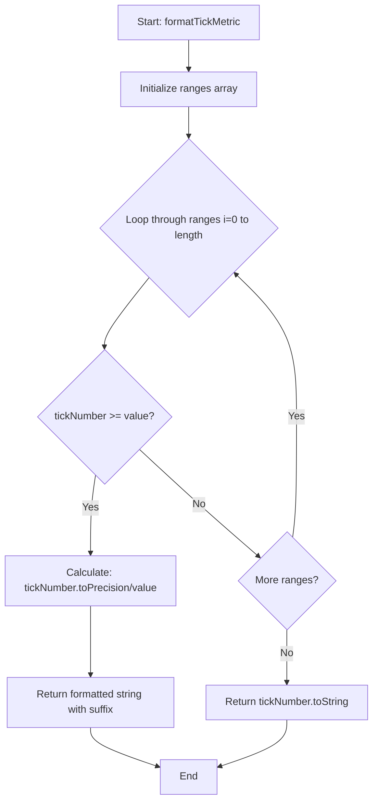
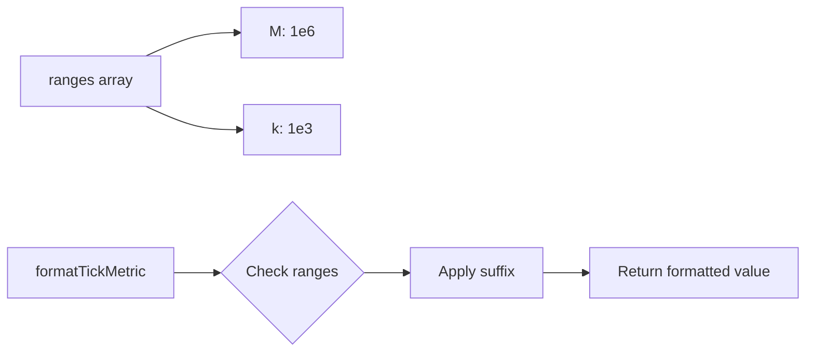

# Diagram: web/portal/src/shared/utils/chart.utils.js


> Auto-generated by Obscura crawlers

## Diagram 1

```mermaid
flowchart TD
      A[Start: formatTickMetric] --> B[Initialize ranges array]
      B --> C{Loop through ranges i=0 to length}
      C --> D{tickNumber >= value?}...
  └ 35 lines...
```

> SVG rendering failed for this diagram.

## Diagram 2



### SVG

<svg id="container" width="590.6640625" xmlns="http://www.w3.org/2000/svg" class="flowchart" height="1239.8125" viewBox="0 0 590.6640625 1239.8125" role="graphics-document document" aria-roledescription="flowchart-v2"><style>#container{font-family:"trebuchet ms",verdana,arial,sans-serif;font-size:16px;fill:#333;}@keyframes edge-animation-frame{from{stroke-dashoffset:0;}}@keyframes dash{to{stroke-dashoffset:0;}}#container .edge-animation-slow{stroke-dasharray:9,5!important;stroke-dashoffset:900;animation:dash 50s linear infinite;stroke-linecap:round;}#container .edge-animation-fast{stroke-dasharray:9,5!important;stroke-dashoffset:900;animation:dash 20s linear infinite;stroke-linecap:round;}#container .error-icon{fill:#552222;}#container .error-text{fill:#552222;stroke:#552222;}#container .edge-thickness-normal{stroke-width:1px;}#container .edge-thickness-thick{stroke-width:3.5px;}#container .edge-pattern-solid{stroke-dasharray:0;}#container .edge-thickness-invisible{stroke-width:0;fill:none;}#container .edge-pattern-dashed{stroke-dasharray:3;}#container .edge-pattern-dotted{stroke-dasharray:2;}#container .marker{fill:#333333;stroke:#333333;}#container .marker.cross{stroke:#333333;}#container svg{font-family:"trebuchet ms",verdana,arial,sans-serif;font-size:16px;}#container p{margin:0;}#container .label{font-family:"trebuchet ms",verdana,arial,sans-serif;color:#333;}#container .cluster-label text{fill:#333;}#container .cluster-label span{color:#333;}#container .cluster-label span p{background-color:transparent;}#container .label text,#container span{fill:#333;color:#333;}#container .node rect,#container .node circle,#container .node ellipse,#container .node polygon,#container .node path{fill:#ECECFF;stroke:#9370DB;stroke-width:1px;}#container .rough-node .label text,#container .node .label text,#container .image-shape .label,#container .icon-shape .label{text-anchor:middle;}#container .node .katex path{fill:#000;stroke:#000;stroke-width:1px;}#container .rough-node .label,#container .node .label,#container .image-shape .label,#container .icon-shape .label{text-align:center;}#container .node.clickable{cursor:pointer;}#container .root .anchor path{fill:#333333!important;stroke-width:0;stroke:#333333;}#container .arrowheadPath{fill:#333333;}#container .edgePath .path{stroke:#333333;stroke-width:2.0px;}#container .flowchart-link{stroke:#333333;fill:none;}#container .edgeLabel{background-color:rgba(232,232,232, 0.8);text-align:center;}#container .edgeLabel p{background-color:rgba(232,232,232, 0.8);}#container .edgeLabel rect{opacity:0.5;background-color:rgba(232,232,232, 0.8);fill:rgba(232,232,232, 0.8);}#container .labelBkg{background-color:rgba(232, 232, 232, 0.5);}#container .cluster rect{fill:#ffffde;stroke:#aaaa33;stroke-width:1px;}#container .cluster text{fill:#333;}#container .cluster span{color:#333;}#container div.mermaidTooltip{position:absolute;text-align:center;max-width:200px;padding:2px;font-family:"trebuchet ms",verdana,arial,sans-serif;font-size:12px;background:hsl(80, 100%, 96.2745098039%);border:1px solid #aaaa33;border-radius:2px;pointer-events:none;z-index:100;}#container .flowchartTitleText{text-anchor:middle;font-size:18px;fill:#333;}#container rect.text{fill:none;stroke-width:0;}#container .icon-shape,#container .image-shape{background-color:rgba(232,232,232, 0.8);text-align:center;}#container .icon-shape p,#container .image-shape p{background-color:rgba(232,232,232, 0.8);padding:2px;}#container .icon-shape rect,#container .image-shape rect{opacity:0.5;background-color:rgba(232,232,232, 0.8);fill:rgba(232,232,232, 0.8);}#container .label-icon{display:inline-block;height:1em;overflow:visible;vertical-align:-0.125em;}#container .node .label-icon path{fill:currentColor;stroke:revert;stroke-width:revert;}#container :root{--mermaid-font-family:"trebuchet ms",verdana,arial,sans-serif;}</style><g><marker id="container_flowchart-v2-pointEnd" class="marker flowchart-v2" viewBox="0 0 10 10" refX="5" refY="5" markerUnits="userSpaceOnUse" markerWidth="8" markerHeight="8" orient="auto"><path d="M 0 0 L 10 5 L 0 10 z" class="arrowMarkerPath" style="stroke-width: 1; stroke-dasharray: 1, 0;"></path></marker><marker id="container_flowchart-v2-pointStart" class="marker flowchart-v2" viewBox="0 0 10 10" refX="4.5" refY="5" markerUnits="userSpaceOnUse" markerWidth="8" markerHeight="8" orient="auto"><path d="M 0 5 L 10 10 L 10 0 z" class="arrowMarkerPath" style="stroke-width: 1; stroke-dasharray: 1, 0;"></path></marker><marker id="container_flowchart-v2-circleEnd" class="marker flowchart-v2" viewBox="0 0 10 10" refX="11" refY="5" markerUnits="userSpaceOnUse" markerWidth="11" markerHeight="11" orient="auto"><circle cx="5" cy="5" r="5" class="arrowMarkerPath" style="stroke-width: 1; stroke-dasharray: 1, 0;"></circle></marker><marker id="container_flowchart-v2-circleStart" class="marker flowchart-v2" viewBox="0 0 10 10" refX="-1" refY="5" markerUnits="userSpaceOnUse" markerWidth="11" markerHeight="11" orient="auto"><circle cx="5" cy="5" r="5" class="arrowMarkerPath" style="stroke-width: 1; stroke-dasharray: 1, 0;"></circle></marker><marker id="container_flowchart-v2-crossEnd" class="marker cross flowchart-v2" viewBox="0 0 11 11" refX="12" refY="5.2" markerUnits="userSpaceOnUse" markerWidth="11" markerHeight="11" orient="auto"><path d="M 1,1 l 9,9 M 10,1 l -9,9" class="arrowMarkerPath" style="stroke-width: 2; stroke-dasharray: 1, 0;"></path></marker><marker id="container_flowchart-v2-crossStart" class="marker cross flowchart-v2" viewBox="0 0 11 11" refX="-1" refY="5.2" markerUnits="userSpaceOnUse" markerWidth="11" markerHeight="11" orient="auto"><path d="M 1,1 l 9,9 M 10,1 l -9,9" class="arrowMarkerPath" style="stroke-width: 2; stroke-dasharray: 1, 0;"></path></marker><g class="root"><g class="clusters"></g><g class="edgePaths"><path d="M299.633,62L299.633,66.167C299.633,70.333,299.633,78.667,299.633,86.333C299.633,94,299.633,101,299.633,104.5L299.633,108" id="L_A_B_0" class="edge-thickness-normal edge-pattern-solid edge-thickness-normal edge-pattern-solid flowchart-link" style=";" data-edge="true" data-et="edge" data-id="L_A_B_0" data-points="W3sieCI6Mjk5LjYzMjgxMjUsInkiOjYyfSx7IngiOjI5OS42MzI4MTI1LCJ5Ijo4N30seyJ4IjoyOTkuNjMyODEyNSwieSI6MTEyfV0=" marker-end="url(#container_flowchart-v2-pointEnd)"></path><path d="M299.633,166L299.633,170.167C299.633,174.333,299.633,182.667,299.633,190.333C299.633,198,299.633,205,299.633,208.5L299.633,212" id="L_B_C_0" class="edge-thickness-normal edge-pattern-solid edge-thickness-normal edge-pattern-solid flowchart-link" style=";" data-edge="true" data-et="edge" data-id="L_B_C_0" data-points="W3sieCI6Mjk5LjYzMjgxMjUsInkiOjE2Nn0seyJ4IjoyOTkuNjMyODEyNSwieSI6MTkxfSx7IngiOjI5OS42MzI4MTI1LCJ5IjoyMTZ9XQ==" marker-end="url(#container_flowchart-v2-pointEnd)"></path><path d="M237.32,431.688L225.496,446.24C213.672,460.792,190.023,489.896,178.199,507.948C166.375,526,166.375,533,166.375,536.5L166.375,540" id="L_C_D_0" class="edge-thickness-normal edge-pattern-solid edge-thickness-normal edge-pattern-solid flowchart-link" style=";" data-edge="true" data-et="edge" data-id="L_C_D_0" data-points="W3sieCI6MjM3LjMyMDQ1MjEyMjU5MTkyLCJ5Ijo0MzEuNjg3NjM5NjIyNTkxOX0seyJ4IjoxNjYuMzc1LCJ5Ijo1MTl9LHsieCI6MTY2LjM3NSwieSI6NTQ0fV0=" marker-end="url(#container_flowchart-v2-pointEnd)"></path><path d="M152.833,739.005L151.576,747.428C150.318,755.852,147.804,772.699,146.546,792.562C145.289,812.424,145.289,835.302,145.289,846.741L145.289,858.18" id="L_D_E_0" class="edge-thickness-normal edge-pattern-solid edge-thickness-normal edge-pattern-solid flowchart-link" style=";" data-edge="true" data-et="edge" data-id="L_D_E_0" data-points="W3sieCI6MTUyLjgzMjc5OTY0MzMyMTE1LCJ5Ijo3MzkuMDA0Njc0NjQzMzIxMX0seyJ4IjoxNDUuMjg5MDYyNSwieSI6Nzg5LjU0Njg3NX0seyJ4IjoxNDUuMjg5MDYyNSwieSI6ODYyLjE3OTY4NzV9XQ==" marker-end="url(#container_flowchart-v2-pointEnd)"></path><path d="M145.289,940.18L145.289,952.285C145.289,964.391,145.289,988.602,145.289,1006.207C145.289,1023.813,145.289,1034.813,145.289,1040.313L145.289,1045.813" id="L_E_F_0" class="edge-thickness-normal edge-pattern-solid edge-thickness-normal edge-pattern-solid flowchart-link" style=";" data-edge="true" data-et="edge" data-id="L_E_F_0" data-points="W3sieCI6MTQ1LjI4OTA2MjUsInkiOjk0MC4xNzk2ODc1fSx7IngiOjE0NS4yODkwNjI1LCJ5IjoxMDEyLjgxMjV9LHsieCI6MTQ1LjI4OTA2MjUsInkiOjEwNDkuODEyNX1d" marker-end="url(#container_flowchart-v2-pointEnd)"></path><path d="M220.817,698.105L237.467,713.345C254.117,728.586,287.418,759.066,318.998,786.814C350.579,814.561,380.439,839.576,395.369,852.083L410.299,864.59" id="L_D_G_0" class="edge-thickness-normal edge-pattern-solid edge-thickness-normal edge-pattern-solid flowchart-link" style=";" data-edge="true" data-et="edge" data-id="L_D_G_0" data-points="W3sieCI6MjIwLjgxNjg3Mjk2ODM2NTk3LCJ5Ijo2OTguMTA1MDAyMDMxNjM0MX0seyJ4IjozMjAuNzE4NzUsInkiOjc4OS41NDY4NzV9LHsieCI6NDEzLjM2NDk0MTE1MDc4NDgsInkiOjg2Ny4xNTg0OTYzNDkyMTUyfV0=" marker-end="url(#container_flowchart-v2-pointEnd)"></path><path d="M462.854,835.424L463.886,827.778C464.918,820.132,466.982,804.839,468.015,773.647C469.047,742.456,469.047,695.365,469.047,650.273C469.047,605.182,469.047,562.091,453.062,525.071C437.076,488.051,405.106,457.102,389.121,441.628L373.135,426.154" id="L_G_C_0" class="edge-thickness-normal edge-pattern-solid edge-thickness-normal edge-pattern-solid flowchart-link" style=";" data-edge="true" data-et="edge" data-id="L_G_C_0" data-points="W3sieCI6NDYyLjg1MzUzMjI0NDI2NTY0LCJ5Ijo4MzUuNDIzODQ0NzQ0MjY1Nn0seyJ4Ijo0NjkuMDQ2ODc1LCJ5Ijo3ODkuNTQ2ODc1fSx7IngiOjQ2OS4wNDY4NzUsInkiOjY0OC4yNzM0Mzc1fSx7IngiOjQ2OS4wNDY4NzUsInkiOjUxOX0seyJ4IjozNzAuMjYxMzcxMjA4NDM3OCwieSI6NDIzLjM3MTQ0MTI5MTU2MjJ9XQ==" marker-end="url(#container_flowchart-v2-pointEnd)"></path><path d="M453.977,975.813L453.977,981.979C453.977,988.146,453.977,1000.479,453.977,1014.146C453.977,1027.813,453.977,1042.813,453.977,1050.313L453.977,1057.813" id="L_G_H_0" class="edge-thickness-normal edge-pattern-solid edge-thickness-normal edge-pattern-solid flowchart-link" style=";" data-edge="true" data-et="edge" data-id="L_G_H_0" data-points="W3sieCI6NDUzLjk3NjU2MjUsInkiOjk3NS44MTI1fSx7IngiOjQ1My45NzY1NjI1LCJ5IjoxMDEyLjgxMjV9LHsieCI6NDUzLjk3NjU2MjUsInkiOjEwNjEuODEyNX1d" marker-end="url(#container_flowchart-v2-pointEnd)"></path><path d="M145.289,1127.813L145.289,1131.979C145.289,1136.146,145.289,1144.479,163.101,1154.647C180.914,1164.815,216.538,1176.817,234.35,1182.818L252.162,1188.819" id="L_F_I_0" class="edge-thickness-normal edge-pattern-solid edge-thickness-normal edge-pattern-solid flowchart-link" style=";" data-edge="true" data-et="edge" data-id="L_F_I_0" data-points="W3sieCI6MTQ1LjI4OTA2MjUsInkiOjExMjcuODEyNX0seyJ4IjoxNDUuMjg5MDYyNSwieSI6MTE1Mi44MTI1fSx7IngiOjI1NS45NTMxMjUsInkiOjExOTAuMDk2MzYzMTMwMTg4NH1d" marker-end="url(#container_flowchart-v2-pointEnd)"></path><path d="M453.977,1115.813L453.977,1121.979C453.977,1128.146,453.977,1140.479,436.164,1152.647C418.352,1164.815,382.728,1176.817,364.915,1182.818L347.103,1188.819" id="L_H_I_0" class="edge-thickness-normal edge-pattern-solid edge-thickness-normal edge-pattern-solid flowchart-link" style=";" data-edge="true" data-et="edge" data-id="L_H_I_0" data-points="W3sieCI6NDUzLjk3NjU2MjUsInkiOjExMTUuODEyNX0seyJ4Ijo0NTMuOTc2NTYyNSwieSI6MTE1Mi44MTI1fSx7IngiOjM0My4zMTI1LCJ5IjoxMTkwLjA5NjM2MzEzMDE4ODR9XQ==" marker-end="url(#container_flowchart-v2-pointEnd)"></path></g><g class="edgeLabels"><g class="edgeLabel"><g class="label" data-id="L_A_B_0" transform="translate(0, 0)"><foreignObject width="0" height="0"><div xmlns="http://www.w3.org/1999/xhtml" class="labelBkg" style="display: table-cell; white-space: nowrap; line-height: 1.5; max-width: 200px; text-align: center;"><span class="edgeLabel"></span></div></foreignObject></g></g><g class="edgeLabel"><g class="label" data-id="L_B_C_0" transform="translate(0, 0)"><foreignObject width="0" height="0"><div xmlns="http://www.w3.org/1999/xhtml" class="labelBkg" style="display: table-cell; white-space: nowrap; line-height: 1.5; max-width: 200px; text-align: center;"><span class="edgeLabel"></span></div></foreignObject></g></g><g class="edgeLabel"><g class="label" data-id="L_C_D_0" transform="translate(0, 0)"><foreignObject width="0" height="0"><div xmlns="http://www.w3.org/1999/xhtml" class="labelBkg" style="display: table-cell; white-space: nowrap; line-height: 1.5; max-width: 200px; text-align: center;"><span class="edgeLabel"></span></div></foreignObject></g></g><g class="edgeLabel" transform="translate(145.2890625, 789.546875)"><g class="label" data-id="L_D_E_0" transform="translate(-12.03125, -12)"><foreignObject width="24.0625" height="24"><div xmlns="http://www.w3.org/1999/xhtml" class="labelBkg" style="display: table-cell; white-space: nowrap; line-height: 1.5; max-width: 200px; text-align: center;"><span class="edgeLabel"><p>Yes</p></span></div></foreignObject></g></g><g class="edgeLabel"><g class="label" data-id="L_E_F_0" transform="translate(0, 0)"><foreignObject width="0" height="0"><div xmlns="http://www.w3.org/1999/xhtml" class="labelBkg" style="display: table-cell; white-space: nowrap; line-height: 1.5; max-width: 200px; text-align: center;"><span class="edgeLabel"></span></div></foreignObject></g></g><g class="edgeLabel" transform="translate(315.3436, 784.62691)"><g class="label" data-id="L_D_G_0" transform="translate(-10.140625, -12)"><foreignObject width="20.28125" height="24"><div xmlns="http://www.w3.org/1999/xhtml" class="labelBkg" style="display: table-cell; white-space: nowrap; line-height: 1.5; max-width: 200px; text-align: center;"><span class="edgeLabel"><p>No</p></span></div></foreignObject></g></g><g class="edgeLabel" transform="translate(469.046875, 648.2734375)"><g class="label" data-id="L_G_C_0" transform="translate(-12.03125, -12)"><foreignObject width="24.0625" height="24"><div xmlns="http://www.w3.org/1999/xhtml" class="labelBkg" style="display: table-cell; white-space: nowrap; line-height: 1.5; max-width: 200px; text-align: center;"><span class="edgeLabel"><p>Yes</p></span></div></foreignObject></g></g><g class="edgeLabel" transform="translate(453.9765625, 1012.8125)"><g class="label" data-id="L_G_H_0" transform="translate(-10.140625, -12)"><foreignObject width="20.28125" height="24"><div xmlns="http://www.w3.org/1999/xhtml" class="labelBkg" style="display: table-cell; white-space: nowrap; line-height: 1.5; max-width: 200px; text-align: center;"><span class="edgeLabel"><p>No</p></span></div></foreignObject></g></g><g class="edgeLabel"><g class="label" data-id="L_F_I_0" transform="translate(0, 0)"><foreignObject width="0" height="0"><div xmlns="http://www.w3.org/1999/xhtml" class="labelBkg" style="display: table-cell; white-space: nowrap; line-height: 1.5; max-width: 200px; text-align: center;"><span class="edgeLabel"></span></div></foreignObject></g></g><g class="edgeLabel"><g class="label" data-id="L_H_I_0" transform="translate(0, 0)"><foreignObject width="0" height="0"><div xmlns="http://www.w3.org/1999/xhtml" class="labelBkg" style="display: table-cell; white-space: nowrap; line-height: 1.5; max-width: 200px; text-align: center;"><span class="edgeLabel"></span></div></foreignObject></g></g></g><g class="nodes"><g class="node default" id="flowchart-A-0" transform="translate(299.6328125, 35)"><rect class="basic label-container" style="" x="-113.0078125" y="-27" width="226.015625" height="54"></rect><g class="label" style="" transform="translate(-83.0078125, -12)"><rect></rect><foreignObject width="166.015625" height="24"><div xmlns="http://www.w3.org/1999/xhtml" style="display: table-cell; white-space: nowrap; line-height: 1.5; max-width: 200px; text-align: center;"><span class="nodeLabel"><p>Start: formatTickMetric</p></span></div></foreignObject></g></g><g class="node default" id="flowchart-B-1" transform="translate(299.6328125, 139)"><rect class="basic label-container" style="" x="-107.7578125" y="-27" width="215.515625" height="54"></rect><g class="label" style="" transform="translate(-77.7578125, -12)"><rect></rect><foreignObject width="155.515625" height="24"><div xmlns="http://www.w3.org/1999/xhtml" style="display: table-cell; white-space: nowrap; line-height: 1.5; max-width: 200px; text-align: center;"><span class="nodeLabel"><p>Initialize ranges array</p></span></div></foreignObject></g></g><g class="node default" id="flowchart-C-3" transform="translate(299.6328125, 355)"><polygon points="139,0 278,-139 139,-278 0,-139" class="label-container" transform="translate(-138.5, 139)"></polygon><g class="label" style="" transform="translate(-100, -24)"><rect></rect><foreignObject width="200" height="48"><div xmlns="http://www.w3.org/1999/xhtml" style="display: table; white-space: break-spaces; line-height: 1.5; max-width: 200px; text-align: center; width: 200px;"><span class="nodeLabel"><p>Loop through ranges i=0 to length</p></span></div></foreignObject></g></g><g class="node default" id="flowchart-D-5" transform="translate(166.375, 648.2734375)"><polygon points="104.2734375,0 208.546875,-104.2734375 104.2734375,-208.546875 0,-104.2734375" class="label-container" transform="translate(-103.7734375, 104.2734375)"></polygon><g class="label" style="" transform="translate(-77.2734375, -12)"><rect></rect><foreignObject width="154.546875" height="24"><div xmlns="http://www.w3.org/1999/xhtml" style="display: table-cell; white-space: nowrap; line-height: 1.5; max-width: 200px; text-align: center;"><span class="nodeLabel"><p>tickNumber &gt;= value?</p></span></div></foreignObject></g></g><g class="node default" id="flowchart-E-7" transform="translate(145.2890625, 901.1796875)"><rect class="basic label-container" style="" x="-137.2890625" y="-39" width="274.578125" height="78"></rect><g class="label" style="" transform="translate(-107.2890625, -24)"><rect></rect><foreignObject width="214.578125" height="48"><div xmlns="http://www.w3.org/1999/xhtml" style="display: table; white-space: break-spaces; line-height: 1.5; max-width: 200px; text-align: center; width: 200px;"><span class="nodeLabel"><p>Calculate: tickNumber.toPrecision/value</p></span></div></foreignObject></g></g><g class="node default" id="flowchart-F-9" transform="translate(145.2890625, 1088.8125)"><rect class="basic label-container" style="" x="-130" y="-39" width="260" height="78"></rect><g class="label" style="" transform="translate(-100, -24)"><rect></rect><foreignObject width="200" height="48"><div xmlns="http://www.w3.org/1999/xhtml" style="display: table; white-space: break-spaces; line-height: 1.5; max-width: 200px; text-align: center; width: 200px;"><span class="nodeLabel"><p>Return formatted string with suffix</p></span></div></foreignObject></g></g><g class="node default" id="flowchart-G-11" transform="translate(453.9765625, 901.1796875)"><polygon points="74.6328125,0 149.265625,-74.6328125 74.6328125,-149.265625 0,-74.6328125" class="label-container" transform="translate(-74.1328125, 74.6328125)"></polygon><g class="label" style="" transform="translate(-47.6328125, -12)"><rect></rect><foreignObject width="95.265625" height="24"><div xmlns="http://www.w3.org/1999/xhtml" style="display: table-cell; white-space: nowrap; line-height: 1.5; max-width: 200px; text-align: center;"><span class="nodeLabel"><p>More ranges?</p></span></div></foreignObject></g></g><g class="node default" id="flowchart-H-15" transform="translate(453.9765625, 1088.8125)"><rect class="basic label-container" style="" x="-128.6875" y="-27" width="257.375" height="54"></rect><g class="label" style="" transform="translate(-98.6875, -12)"><rect></rect><foreignObject width="197.375" height="24"><div xmlns="http://www.w3.org/1999/xhtml" style="display: table-cell; white-space: nowrap; line-height: 1.5; max-width: 200px; text-align: center;"><span class="nodeLabel"><p>Return tickNumber.toString</p></span></div></foreignObject></g></g><g class="node default" id="flowchart-I-17" transform="translate(299.6328125, 1204.8125)"><rect class="basic label-container" style="" x="-43.6796875" y="-27" width="87.359375" height="54"></rect><g class="label" style="" transform="translate(-13.6796875, -12)"><rect></rect><foreignObject width="27.359375" height="24"><div xmlns="http://www.w3.org/1999/xhtml" style="display: table-cell; white-space: nowrap; line-height: 1.5; max-width: 200px; text-align: center;"><span class="nodeLabel"><p>End</p></span></div></foreignObject></g></g></g></g></g></svg>

## Diagram 3



### SVG

<svg id="container" width="870.59375" xmlns="http://www.w3.org/2000/svg" class="flowchart" height="372.9375" viewBox="0 0 870.59375 372.9375" role="graphics-document document" aria-roledescription="flowchart-v2"><style>#container{font-family:"trebuchet ms",verdana,arial,sans-serif;font-size:16px;fill:#333;}@keyframes edge-animation-frame{from{stroke-dashoffset:0;}}@keyframes dash{to{stroke-dashoffset:0;}}#container .edge-animation-slow{stroke-dasharray:9,5!important;stroke-dashoffset:900;animation:dash 50s linear infinite;stroke-linecap:round;}#container .edge-animation-fast{stroke-dasharray:9,5!important;stroke-dashoffset:900;animation:dash 20s linear infinite;stroke-linecap:round;}#container .error-icon{fill:#552222;}#container .error-text{fill:#552222;stroke:#552222;}#container .edge-thickness-normal{stroke-width:1px;}#container .edge-thickness-thick{stroke-width:3.5px;}#container .edge-pattern-solid{stroke-dasharray:0;}#container .edge-thickness-invisible{stroke-width:0;fill:none;}#container .edge-pattern-dashed{stroke-dasharray:3;}#container .edge-pattern-dotted{stroke-dasharray:2;}#container .marker{fill:#333333;stroke:#333333;}#container .marker.cross{stroke:#333333;}#container svg{font-family:"trebuchet ms",verdana,arial,sans-serif;font-size:16px;}#container p{margin:0;}#container .label{font-family:"trebuchet ms",verdana,arial,sans-serif;color:#333;}#container .cluster-label text{fill:#333;}#container .cluster-label span{color:#333;}#container .cluster-label span p{background-color:transparent;}#container .label text,#container span{fill:#333;color:#333;}#container .node rect,#container .node circle,#container .node ellipse,#container .node polygon,#container .node path{fill:#ECECFF;stroke:#9370DB;stroke-width:1px;}#container .rough-node .label text,#container .node .label text,#container .image-shape .label,#container .icon-shape .label{text-anchor:middle;}#container .node .katex path{fill:#000;stroke:#000;stroke-width:1px;}#container .rough-node .label,#container .node .label,#container .image-shape .label,#container .icon-shape .label{text-align:center;}#container .node.clickable{cursor:pointer;}#container .root .anchor path{fill:#333333!important;stroke-width:0;stroke:#333333;}#container .arrowheadPath{fill:#333333;}#container .edgePath .path{stroke:#333333;stroke-width:2.0px;}#container .flowchart-link{stroke:#333333;fill:none;}#container .edgeLabel{background-color:rgba(232,232,232, 0.8);text-align:center;}#container .edgeLabel p{background-color:rgba(232,232,232, 0.8);}#container .edgeLabel rect{opacity:0.5;background-color:rgba(232,232,232, 0.8);fill:rgba(232,232,232, 0.8);}#container .labelBkg{background-color:rgba(232, 232, 232, 0.5);}#container .cluster rect{fill:#ffffde;stroke:#aaaa33;stroke-width:1px;}#container .cluster text{fill:#333;}#container .cluster span{color:#333;}#container div.mermaidTooltip{position:absolute;text-align:center;max-width:200px;padding:2px;font-family:"trebuchet ms",verdana,arial,sans-serif;font-size:12px;background:hsl(80, 100%, 96.2745098039%);border:1px solid #aaaa33;border-radius:2px;pointer-events:none;z-index:100;}#container .flowchartTitleText{text-anchor:middle;font-size:18px;fill:#333;}#container rect.text{fill:none;stroke-width:0;}#container .icon-shape,#container .image-shape{background-color:rgba(232,232,232, 0.8);text-align:center;}#container .icon-shape p,#container .image-shape p{background-color:rgba(232,232,232, 0.8);padding:2px;}#container .icon-shape rect,#container .image-shape rect{opacity:0.5;background-color:rgba(232,232,232, 0.8);fill:rgba(232,232,232, 0.8);}#container .label-icon{display:inline-block;height:1em;overflow:visible;vertical-align:-0.125em;}#container .node .label-icon path{fill:currentColor;stroke:revert;stroke-width:revert;}#container :root{--mermaid-font-family:"trebuchet ms",verdana,arial,sans-serif;}</style><g><marker id="container_flowchart-v2-pointEnd" class="marker flowchart-v2" viewBox="0 0 10 10" refX="5" refY="5" markerUnits="userSpaceOnUse" markerWidth="8" markerHeight="8" orient="auto"><path d="M 0 0 L 10 5 L 0 10 z" class="arrowMarkerPath" style="stroke-width: 1; stroke-dasharray: 1, 0;"></path></marker><marker id="container_flowchart-v2-pointStart" class="marker flowchart-v2" viewBox="0 0 10 10" refX="4.5" refY="5" markerUnits="userSpaceOnUse" markerWidth="8" markerHeight="8" orient="auto"><path d="M 0 5 L 10 10 L 10 0 z" class="arrowMarkerPath" style="stroke-width: 1; stroke-dasharray: 1, 0;"></path></marker><marker id="container_flowchart-v2-circleEnd" class="marker flowchart-v2" viewBox="0 0 10 10" refX="11" refY="5" markerUnits="userSpaceOnUse" markerWidth="11" markerHeight="11" orient="auto"><circle cx="5" cy="5" r="5" class="arrowMarkerPath" style="stroke-width: 1; stroke-dasharray: 1, 0;"></circle></marker><marker id="container_flowchart-v2-circleStart" class="marker flowchart-v2" viewBox="0 0 10 10" refX="-1" refY="5" markerUnits="userSpaceOnUse" markerWidth="11" markerHeight="11" orient="auto"><circle cx="5" cy="5" r="5" class="arrowMarkerPath" style="stroke-width: 1; stroke-dasharray: 1, 0;"></circle></marker><marker id="container_flowchart-v2-crossEnd" class="marker cross flowchart-v2" viewBox="0 0 11 11" refX="12" refY="5.2" markerUnits="userSpaceOnUse" markerWidth="11" markerHeight="11" orient="auto"><path d="M 1,1 l 9,9 M 10,1 l -9,9" class="arrowMarkerPath" style="stroke-width: 2; stroke-dasharray: 1, 0;"></path></marker><marker id="container_flowchart-v2-crossStart" class="marker cross flowchart-v2" viewBox="0 0 11 11" refX="-1" refY="5.2" markerUnits="userSpaceOnUse" markerWidth="11" markerHeight="11" orient="auto"><path d="M 1,1 l 9,9 M 10,1 l -9,9" class="arrowMarkerPath" style="stroke-width: 2; stroke-dasharray: 1, 0;"></path></marker><g class="root"><g class="clusters"></g><g class="edgePaths"><path d="M159.86,60L169.188,55.833C178.516,51.667,197.172,43.333,213.685,39.167C230.198,35,244.568,35,251.753,35L258.938,35" id="L_A_B_0" class="edge-thickness-normal edge-pattern-solid edge-thickness-normal edge-pattern-solid flowchart-link" style=";" data-edge="true" data-et="edge" data-id="L_A_B_0" data-points="W3sieCI6MTU5Ljg1OTgyNTcyMTE1Mzg0LCJ5Ijo2MH0seyJ4IjoyMTUuODI4MTI1LCJ5IjozNX0seyJ4IjoyNjIuOTM3NSwieSI6MzV9XQ==" marker-end="url(#container_flowchart-v2-pointEnd)"></path><path d="M159.86,114L169.188,118.167C178.516,122.333,197.172,130.667,214.107,134.833C231.042,139,246.255,139,253.862,139L261.469,139" id="L_A_C_0" class="edge-thickness-normal edge-pattern-solid edge-thickness-normal edge-pattern-solid flowchart-link" style=";" data-edge="true" data-et="edge" data-id="L_A_C_0" data-points="W3sieCI6MTU5Ljg1OTgyNTcyMTE1Mzg0LCJ5IjoxMTR9LHsieCI6MjE1LjgyODEyNSwieSI6MTM5fSx7IngiOjI2NS40Njg3NSwieSI6MTM5fV0=" marker-end="url(#container_flowchart-v2-pointEnd)"></path><path d="M190.828,290.469L194.995,290.469C199.161,290.469,207.495,290.469,215.161,290.469C222.828,290.469,229.828,290.469,233.328,290.469L236.828,290.469" id="L_D_E_0" class="edge-thickness-normal edge-pattern-solid edge-thickness-normal edge-pattern-solid flowchart-link" style=";" data-edge="true" data-et="edge" data-id="L_D_E_0" data-points="W3sieCI6MTkwLjgyODEyNSwieSI6MjkwLjQ2ODc1fSx7IngiOjIxNS44MjgxMjUsInkiOjI5MC40Njg3NX0seyJ4IjoyNDAuODI4MTI1LCJ5IjoyOTAuNDY4NzV9XQ==" marker-end="url(#container_flowchart-v2-pointEnd)"></path><path d="M389.766,290.469L393.932,290.469C398.099,290.469,406.432,290.469,414.099,290.469C421.766,290.469,428.766,290.469,432.266,290.469L435.766,290.469" id="L_E_F_0" class="edge-thickness-normal edge-pattern-solid edge-thickness-normal edge-pattern-solid flowchart-link" style=";" data-edge="true" data-et="edge" data-id="L_E_F_0" data-points="W3sieCI6Mzg5Ljc2NTYyNSwieSI6MjkwLjQ2ODc1fSx7IngiOjQxNC43NjU2MjUsInkiOjI5MC40Njg3NX0seyJ4Ijo0MzkuNzY1NjI1LCJ5IjoyOTAuNDY4NzV9XQ==" marker-end="url(#container_flowchart-v2-pointEnd)"></path><path d="M583.688,290.469L587.854,290.469C592.021,290.469,600.354,290.469,608.021,290.469C615.688,290.469,622.688,290.469,626.188,290.469L629.688,290.469" id="L_F_G_0" class="edge-thickness-normal edge-pattern-solid edge-thickness-normal edge-pattern-solid flowchart-link" style=";" data-edge="true" data-et="edge" data-id="L_F_G_0" data-points="W3sieCI6NTgzLjY4NzUsInkiOjI5MC40Njg3NX0seyJ4Ijo2MDguNjg3NSwieSI6MjkwLjQ2ODc1fSx7IngiOjYzMy42ODc1LCJ5IjoyOTAuNDY4NzV9XQ==" marker-end="url(#container_flowchart-v2-pointEnd)"></path></g><g class="edgeLabels"><g class="edgeLabel"><g class="label" data-id="L_A_B_0" transform="translate(0, 0)"><foreignObject width="0" height="0"><div xmlns="http://www.w3.org/1999/xhtml" class="labelBkg" style="display: table-cell; white-space: nowrap; line-height: 1.5; max-width: 200px; text-align: center;"><span class="edgeLabel"></span></div></foreignObject></g></g><g class="edgeLabel"><g class="label" data-id="L_A_C_0" transform="translate(0, 0)"><foreignObject width="0" height="0"><div xmlns="http://www.w3.org/1999/xhtml" class="labelBkg" style="display: table-cell; white-space: nowrap; line-height: 1.5; max-width: 200px; text-align: center;"><span class="edgeLabel"></span></div></foreignObject></g></g><g class="edgeLabel"><g class="label" data-id="L_D_E_0" transform="translate(0, 0)"><foreignObject width="0" height="0"><div xmlns="http://www.w3.org/1999/xhtml" class="labelBkg" style="display: table-cell; white-space: nowrap; line-height: 1.5; max-width: 200px; text-align: center;"><span class="edgeLabel"></span></div></foreignObject></g></g><g class="edgeLabel"><g class="label" data-id="L_E_F_0" transform="translate(0, 0)"><foreignObject width="0" height="0"><div xmlns="http://www.w3.org/1999/xhtml" class="labelBkg" style="display: table-cell; white-space: nowrap; line-height: 1.5; max-width: 200px; text-align: center;"><span class="edgeLabel"></span></div></foreignObject></g></g><g class="edgeLabel"><g class="label" data-id="L_F_G_0" transform="translate(0, 0)"><foreignObject width="0" height="0"><div xmlns="http://www.w3.org/1999/xhtml" class="labelBkg" style="display: table-cell; white-space: nowrap; line-height: 1.5; max-width: 200px; text-align: center;"><span class="edgeLabel"></span></div></foreignObject></g></g></g><g class="nodes"><g class="node default" id="flowchart-A-0" transform="translate(99.4140625, 87)"><rect class="basic label-container" style="" x="-74.515625" y="-27" width="149.03125" height="54"></rect><g class="label" style="" transform="translate(-44.515625, -12)"><rect></rect><foreignObject width="89.03125" height="24"><div xmlns="http://www.w3.org/1999/xhtml" style="display: table-cell; white-space: nowrap; line-height: 1.5; max-width: 200px; text-align: center;"><span class="nodeLabel"><p>ranges array</p></span></div></foreignObject></g></g><g class="node default" id="flowchart-B-1" transform="translate(315.296875, 35)"><rect class="basic label-container" style="" x="-52.359375" y="-27" width="104.71875" height="54"></rect><g class="label" style="" transform="translate(-22.359375, -12)"><rect></rect><foreignObject width="44.71875" height="24"><div xmlns="http://www.w3.org/1999/xhtml" style="display: table-cell; white-space: nowrap; line-height: 1.5; max-width: 200px; text-align: center;"><span class="nodeLabel"><p>M: 1e6</p></span></div></foreignObject></g></g><g class="node default" id="flowchart-C-3" transform="translate(315.296875, 139)"><rect class="basic label-container" style="" x="-49.828125" y="-27" width="99.65625" height="54"></rect><g class="label" style="" transform="translate(-19.828125, -12)"><rect></rect><foreignObject width="39.65625" height="24"><div xmlns="http://www.w3.org/1999/xhtml" style="display: table-cell; white-space: nowrap; line-height: 1.5; max-width: 200px; text-align: center;"><span class="nodeLabel"><p>k: 1e3</p></span></div></foreignObject></g></g><g class="node default" id="flowchart-D-4" transform="translate(99.4140625, 290.46875)"><rect class="basic label-container" style="" x="-91.4140625" y="-27" width="182.828125" height="54"></rect><g class="label" style="" transform="translate(-61.4140625, -12)"><rect></rect><foreignObject width="122.828125" height="24"><div xmlns="http://www.w3.org/1999/xhtml" style="display: table-cell; white-space: nowrap; line-height: 1.5; max-width: 200px; text-align: center;"><span class="nodeLabel"><p>formatTickMetric</p></span></div></foreignObject></g></g><g class="node default" id="flowchart-E-5" transform="translate(315.296875, 290.46875)"><polygon points="74.46875,0 148.9375,-74.46875 74.46875,-148.9375 0,-74.46875" class="label-container" transform="translate(-73.96875, 74.46875)"></polygon><g class="label" style="" transform="translate(-47.46875, -12)"><rect></rect><foreignObject width="94.9375" height="24"><div xmlns="http://www.w3.org/1999/xhtml" style="display: table-cell; white-space: nowrap; line-height: 1.5; max-width: 200px; text-align: center;"><span class="nodeLabel"><p>Check ranges</p></span></div></foreignObject></g></g><g class="node default" id="flowchart-F-7" transform="translate(511.7265625, 290.46875)"><rect class="basic label-container" style="" x="-71.9609375" y="-27" width="143.921875" height="54"></rect><g class="label" style="" transform="translate(-41.9609375, -12)"><rect></rect><foreignObject width="83.921875" height="24"><div xmlns="http://www.w3.org/1999/xhtml" style="display: table-cell; white-space: nowrap; line-height: 1.5; max-width: 200px; text-align: center;"><span class="nodeLabel"><p>Apply suffix</p></span></div></foreignObject></g></g><g class="node default" id="flowchart-G-9" transform="translate(748.140625, 290.46875)"><rect class="basic label-container" style="" x="-114.453125" y="-27" width="228.90625" height="54"></rect><g class="label" style="" transform="translate(-84.453125, -12)"><rect></rect><foreignObject width="168.90625" height="24"><div xmlns="http://www.w3.org/1999/xhtml" style="display: table-cell; white-space: nowrap; line-height: 1.5; max-width: 200px; text-align: center;"><span class="nodeLabel"><p>Return formatted value</p></span></div></foreignObject></g></g></g></g></g></svg>
