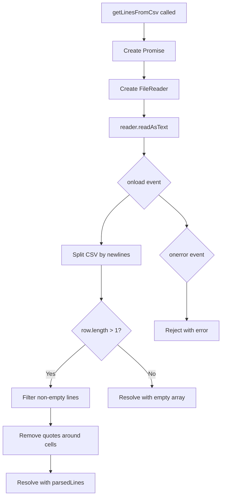
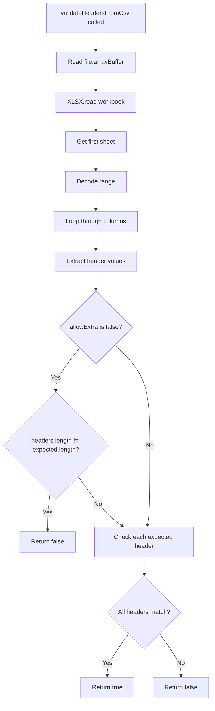
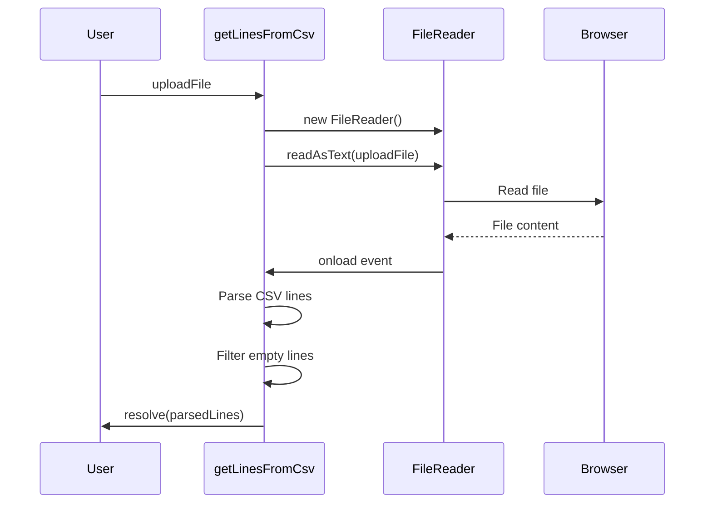
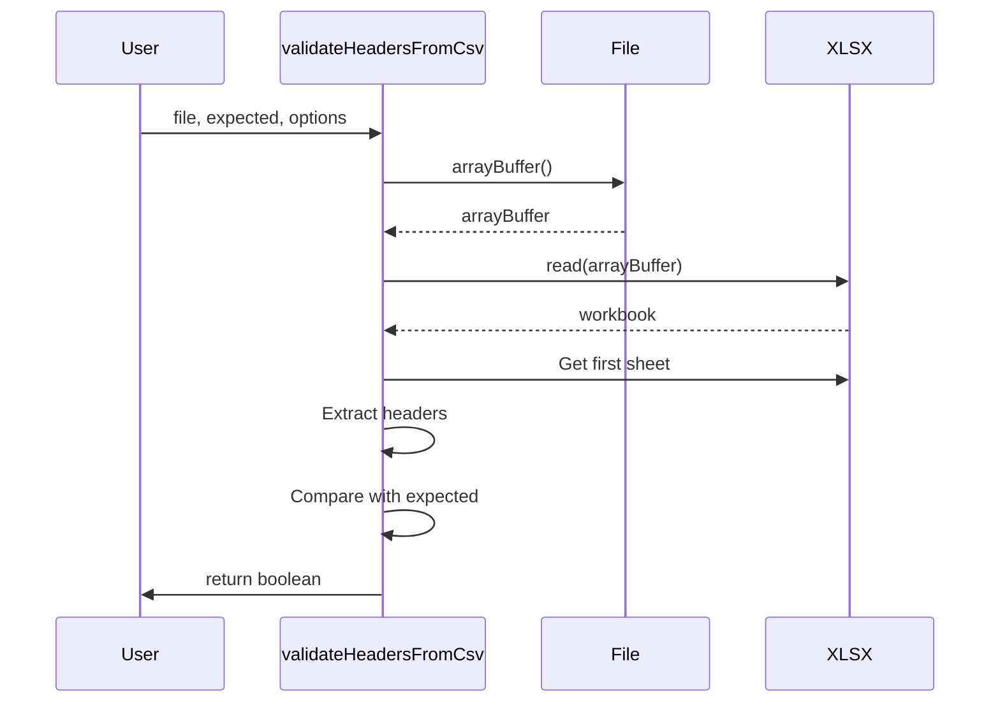

# Diagram: web/portal/src/shared/utils/csv.utils.js

> Auto-generated by Obscura crawlers

## Diagram 1

### SVG

<svg id="container" width="610.421875" xmlns="http://www.w3.org/2000/svg" class="flowchart" height="1355.765625" viewBox="0 0 610.421875 1355.765625" role="graphics-document document" aria-roledescription="flowchart-v2"><g><marker id="container_flowchart-v2-pointEnd" class="marker flowchart-v2" viewBox="0 0 10 10" refX="5" refY="5" markerUnits="userSpaceOnUse" markerWidth="8" markerHeight="8" orient="auto"><path d="M 0 0 L 10 5 L 0 10 z" class="arrowMarkerPath" style="stroke-width: 1; stroke-dasharray: 1, 0;"></path></marker><marker id="container_flowchart-v2-pointStart" class="marker flowchart-v2" viewBox="0 0 10 10" refX="4.5" refY="5" markerUnits="userSpaceOnUse" markerWidth="8" markerHeight="8" orient="auto"><path d="M 0 5 L 10 10 L 10 0 z" class="arrowMarkerPath" style="stroke-width: 1; stroke-dasharray: 1, 0;"></path></marker><marker id="container_flowchart-v2-circleEnd" class="marker flowchart-v2" viewBox="0 0 10 10" refX="11" refY="5" markerUnits="userSpaceOnUse" markerWidth="11" markerHeight="11" orient="auto"><circle cx="5" cy="5" r="5" class="arrowMarkerPath" style="stroke-width: 1; stroke-dasharray: 1, 0;"></circle></marker><marker id="container_flowchart-v2-circleStart" class="marker flowchart-v2" viewBox="0 0 10 10" refX="-1" refY="5" markerUnits="userSpaceOnUse" markerWidth="11" markerHeight="11" orient="auto"><circle cx="5" cy="5" r="5" class="arrowMarkerPath" style="stroke-width: 1; stroke-dasharray: 1, 0;"></circle></marker><marker id="container_flowchart-v2-crossEnd" class="marker cross flowchart-v2" viewBox="0 0 11 11" refX="12" refY="5.2" markerUnits="userSpaceOnUse" markerWidth="11" markerHeight="11" orient="auto"><path d="M 1,1 l 9,9 M 10,1 l -9,9" class="arrowMarkerPath" style="stroke-width: 2; stroke-dasharray: 1, 0;"></path></marker><marker id="container_flowchart-v2-crossStart" class="marker cross flowchart-v2" viewBox="0 0 11 11" refX="-1" refY="5.2" markerUnits="userSpaceOnUse" markerWidth="11" markerHeight="11" orient="auto"><path d="M 1,1 l 9,9 M 10,1 l -9,9" class="arrowMarkerPath" style="stroke-width: 2; stroke-dasharray: 1, 0;"></path></marker><g class="root"><g class="clusters"></g><g class="edgePaths"><path d="M395.391,62L395.391,66.167C395.391,70.333,395.391,78.667,395.391,86.333C395.391,94,395.391,101,395.391,104.5L395.391,108" id="L_A_B_0" class="edge-thickness-normal edge-pattern-solid edge-thickness-normal edge-pattern-solid flowchart-link" style=";" data-edge="true" data-et="edge" data-id="L_A_B_0" data-points="W3sieCI6Mzk1LjM5MDYyNSwieSI6NjJ9LHsieCI6Mzk1LjM5MDYyNSwieSI6ODd9LHsieCI6Mzk1LjM5MDYyNSwieSI6MTEyfV0=" marker-end="url(#container_flowchart-v2-pointEnd)"></path><path d="M395.391,166L395.391,170.167C395.391,174.333,395.391,182.667,395.391,190.333C395.391,198,395.391,205,395.391,208.5L395.391,212" id="L_B_C_0" class="edge-thickness-normal edge-pattern-solid edge-thickness-normal edge-pattern-solid flowchart-link" style=";" data-edge="true" data-et="edge" data-id="L_B_C_0" data-points="W3sieCI6Mzk1LjM5MDYyNSwieSI6MTY2fSx7IngiOjM5NS4zOTA2MjUsInkiOjE5MX0seyJ4IjozOTUuMzkwNjI1LCJ5IjoyMTZ9XQ==" marker-end="url(#container_flowchart-v2-pointEnd)"></path><path d="M395.391,270L395.391,274.167C395.391,278.333,395.391,286.667,395.391,294.333C395.391,302,395.391,309,395.391,312.5L395.391,316" id="L_C_D_0" class="edge-thickness-normal edge-pattern-solid edge-thickness-normal edge-pattern-solid flowchart-link" style=";" data-edge="true" data-et="edge" data-id="L_C_D_0" data-points="W3sieCI6Mzk1LjM5MDYyNSwieSI6MjcwfSx7IngiOjM5NS4zOTA2MjUsInkiOjI5NX0seyJ4IjozOTUuMzkwNjI1LCJ5IjozMjB9XQ==" marker-end="url(#container_flowchart-v2-pointEnd)"></path><path d="M395.391,374L395.391,378.167C395.391,382.333,395.391,390.667,395.391,398.333C395.391,406,395.391,413,395.391,416.5L395.391,420" id="L_D_E_0" class="edge-thickness-normal edge-pattern-solid edge-thickness-normal edge-pattern-solid flowchart-link" style=";" data-edge="true" data-et="edge" data-id="L_D_E_0" data-points="W3sieCI6Mzk1LjM5MDYyNSwieSI6Mzc0fSx7IngiOjM5NS4zOTA2MjUsInkiOjM5OX0seyJ4IjozOTUuMzkwNjI1LCJ5Ijo0MjR9XQ==" marker-end="url(#container_flowchart-v2-pointEnd)"></path><path d="M355.099,533.084L342.352,543.965C329.605,554.847,304.111,576.611,291.364,599.278C278.617,621.945,278.617,645.516,278.617,657.301L278.617,669.086" id="L_E_F_0" class="edge-thickness-normal edge-pattern-solid edge-thickness-normal edge-pattern-solid flowchart-link" style=";" data-edge="true" data-et="edge" data-id="L_E_F_0" data-points="W3sieCI6MzU1LjA5OTIxNjI0MDQ4MDc2LCJ5Ijo1MzMuMDgzNTkxMjQwNDgwN30seyJ4IjoyNzguNjE3MTg3NSwieSI6NTk4LjM3NX0seyJ4IjoyNzguNjE3MTg3NSwieSI6NjczLjA4NTkzNzV9XQ==" marker-end="url(#container_flowchart-v2-pointEnd)"></path><path d="M278.617,727.086L278.617,739.538C278.617,751.99,278.617,776.893,278.617,792.845C278.617,808.797,278.617,815.797,278.617,819.297L278.617,822.797" id="L_F_G_0" class="edge-thickness-normal edge-pattern-solid edge-thickness-normal edge-pattern-solid flowchart-link" style=";" data-edge="true" data-et="edge" data-id="L_F_G_0" data-points="W3sieCI6Mjc4LjYxNzE4NzUsInkiOjcyNy4wODU5Mzc1fSx7IngiOjI3OC42MTcxODc1LCJ5Ijo4MDEuNzk2ODc1fSx7IngiOjI3OC42MTcxODc1LCJ5Ijo4MjYuNzk2ODc1fV0=" marker-end="url(#container_flowchart-v2-pointEnd)"></path><path d="M234.768,943.917L218.64,957.391C202.512,970.866,170.256,997.816,154.128,1016.791C138,1035.766,138,1046.766,138,1052.266L138,1057.766" id="L_G_H_0" class="edge-thickness-normal edge-pattern-solid edge-thickness-normal edge-pattern-solid flowchart-link" style=";" data-edge="true" data-et="edge" data-id="L_G_H_0" data-points="W3sieCI6MjM0Ljc2ODIyMjIyOTk5OTcsInkiOjk0My45MTY2NTk3Mjk5OTk3fSx7IngiOjEzOCwieSI6MTAyNC43NjU2MjV9LHsieCI6MTM4LCJ5IjoxMDYxLjc2NTYyNX1d" marker-end="url(#container_flowchart-v2-pointEnd)"></path><path d="M138,1115.766L138,1119.932C138,1124.099,138,1132.432,138,1140.099C138,1147.766,138,1154.766,138,1158.266L138,1161.766" id="L_H_I_0" class="edge-thickness-normal edge-pattern-solid edge-thickness-normal edge-pattern-solid flowchart-link" style=";" data-edge="true" data-et="edge" data-id="L_H_I_0" data-points="W3sieCI6MTM4LCJ5IjoxMTE1Ljc2NTYyNX0seyJ4IjoxMzgsInkiOjExNDAuNzY1NjI1fSx7IngiOjEzOCwieSI6MTE2NS43NjU2MjV9XQ==" marker-end="url(#container_flowchart-v2-pointEnd)"></path><path d="M138,1243.766L138,1247.932C138,1252.099,138,1260.432,138,1268.099C138,1275.766,138,1282.766,138,1286.266L138,1289.766" id="L_I_J_0" class="edge-thickness-normal edge-pattern-solid edge-thickness-normal edge-pattern-solid flowchart-link" style=";" data-edge="true" data-et="edge" data-id="L_I_J_0" data-points="W3sieCI6MTM4LCJ5IjoxMjQzLjc2NTYyNX0seyJ4IjoxMzgsInkiOjEyNjguNzY1NjI1fSx7IngiOjEzOCwieSI6MTI5My43NjU2MjV9XQ==" marker-end="url(#container_flowchart-v2-pointEnd)"></path><path d="M322.466,943.917L338.594,957.391C354.722,970.866,386.978,997.816,403.106,1016.791C419.234,1035.766,419.234,1046.766,419.234,1052.266L419.234,1057.766" id="L_G_K_0" class="edge-thickness-normal edge-pattern-solid edge-thickness-normal edge-pattern-solid flowchart-link" style=";" data-edge="true" data-et="edge" data-id="L_G_K_0" data-points="W3sieCI6MzIyLjQ2NjE1Mjc3MDAwMDMsInkiOjk0My45MTY2NTk3Mjk5OTk3fSx7IngiOjQxOS4yMzQzNzUsInkiOjEwMjQuNzY1NjI1fSx7IngiOjQxOS4yMzQzNzUsInkiOjEwNjEuNzY1NjI1fV0=" marker-end="url(#container_flowchart-v2-pointEnd)"></path><path d="M435.682,533.084L448.429,543.965C461.176,554.847,486.67,576.611,499.417,590.993C512.164,605.375,512.164,612.375,512.164,615.875L512.164,619.375" id="L_E_L_0" class="edge-thickness-normal edge-pattern-solid edge-thickness-normal edge-pattern-solid flowchart-link" style=";" data-edge="true" data-et="edge" data-id="L_E_L_0" data-points="W3sieCI6NDM1LjY4MjAzMzc1OTUxOTI0LCJ5Ijo1MzMuMDgzNTkxMjQwNDgwN30seyJ4Ijo1MTIuMTY0MDYyNSwieSI6NTk4LjM3NX0seyJ4Ijo1MTIuMTY0MDYyNSwieSI6NjIzLjM3NX1d" marker-end="url(#container_flowchart-v2-pointEnd)"></path><path d="M512.164,776.797L512.164,780.964C512.164,785.13,512.164,793.464,512.164,810.044C512.164,826.625,512.164,851.453,512.164,863.867L512.164,876.281" id="L_L_M_0" class="edge-thickness-normal edge-pattern-solid edge-thickness-normal edge-pattern-solid flowchart-link" style=";" data-edge="true" data-et="edge" data-id="L_L_M_0" data-points="W3sieCI6NTEyLjE2NDA2MjUsInkiOjc3Ni43OTY4NzV9LHsieCI6NTEyLjE2NDA2MjUsInkiOjgwMS43OTY4NzV9LHsieCI6NTEyLjE2NDA2MjUsInkiOjg4MC4yODEyNX1d" marker-end="url(#container_flowchart-v2-pointEnd)"></path></g><g class="edgeLabels"><g class="edgeLabel"><g class="label" data-id="L_A_B_0" transform="translate(0, 0)"><foreignObject width="0" height="0">

</foreignObject></g></g><g class="edgeLabel"><g class="label" data-id="L_B_C_0" transform="translate(0, 0)"><foreignObject width="0" height="0">

</foreignObject></g></g><g class="edgeLabel"><g class="label" data-id="L_C_D_0" transform="translate(0, 0)"><foreignObject width="0" height="0">

</foreignObject></g></g><g class="edgeLabel"><g class="label" data-id="L_D_E_0" transform="translate(0, 0)"><foreignObject width="0" height="0">

</foreignObject></g></g><g class="edgeLabel"><g class="label" data-id="L_E_F_0" transform="translate(0, 0)"><foreignObject width="0" height="0">

</foreignObject></g></g><g class="edgeLabel"><g class="label" data-id="L_F_G_0" transform="translate(0, 0)"><foreignObject width="0" height="0">

</foreignObject></g></g><g class="edgeLabel" transform="translate(138, 1024.765625)"><g class="label" data-id="L_G_H_0" transform="translate(-12.03125, -12)"><foreignObject width="24.0625" height="24">

Yes

</foreignObject></g></g><g class="edgeLabel"><g class="label" data-id="L_H_I_0" transform="translate(0, 0)"><foreignObject width="0" height="0">

</foreignObject></g></g><g class="edgeLabel"><g class="label" data-id="L_I_J_0" transform="translate(0, 0)"><foreignObject width="0" height="0">

</foreignObject></g></g><g class="edgeLabel" transform="translate(419.234375, 1024.765625)"><g class="label" data-id="L_G_K_0" transform="translate(-10.140625, -12)"><foreignObject width="20.28125" height="24">

No

</foreignObject></g></g><g class="edgeLabel"><g class="label" data-id="L_E_L_0" transform="translate(0, 0)"><foreignObject width="0" height="0">

</foreignObject></g></g><g class="edgeLabel"><g class="label" data-id="L_L_M_0" transform="translate(0, 0)"><foreignObject width="0" height="0">

</foreignObject></g></g></g><g class="nodes"><g class="node default" id="flowchart-A-0" transform="translate(395.390625, 35)"><rect class="basic label-container" style="" x="-114.171875" y="-27" width="228.34375" height="54"></rect><g class="label" style="" transform="translate(-84.171875, -12)"><rect></rect><foreignObject width="168.34375" height="24">

getLinesFromCsv called

</foreignObject></g></g><g class="node default" id="flowchart-B-1" transform="translate(395.390625, 139)"><rect class="basic label-container" style="" x="-84.3046875" y="-27" width="168.609375" height="54"></rect><g class="label" style="" transform="translate(-54.3046875, -12)"><rect></rect><foreignObject width="108.609375" height="24">

Create Promise

</foreignObject></g></g><g class="node default" id="flowchart-C-3" transform="translate(395.390625, 243)"><rect class="basic label-container" style="" x="-93.2421875" y="-27" width="186.484375" height="54"></rect><g class="label" style="" transform="translate(-63.2421875, -12)"><rect></rect><foreignObject width="126.484375" height="24">

Create FileReader

</foreignObject></g></g><g class="node default" id="flowchart-D-5" transform="translate(395.390625, 347)"><rect class="basic label-container" style="" x="-94.3359375" y="-27" width="188.671875" height="54"></rect><g class="label" style="" transform="translate(-64.3359375, -12)"><rect></rect><foreignObject width="128.671875" height="24">

reader.readAsText

</foreignObject></g></g><g class="node default" id="flowchart-E-7" transform="translate(395.390625, 498.6875)"><polygon points="74.6875,0 149.375,-74.6875 74.6875,-149.375 0,-74.6875" class="label-container" transform="translate(-74.1875, 74.6875)"></polygon><g class="label" style="" transform="translate(-47.6875, -12)"><rect></rect><foreignObject width="95.375" height="24">

onload event

</foreignObject></g></g><g class="node default" id="flowchart-F-9" transform="translate(278.6171875, 700.0859375)"><rect class="basic label-container" style="" x="-106.8359375" y="-27" width="213.671875" height="54"></rect><g class="label" style="" transform="translate(-76.8359375, -12)"><rect></rect><foreignObject width="153.671875" height="24">

Split CSV by newlines

</foreignObject></g></g><g class="node default" id="flowchart-G-11" transform="translate(278.6171875, 907.28125)"><polygon points="80.484375,0 160.96875,-80.484375 80.484375,-160.96875 0,-80.484375" class="label-container" transform="translate(-79.984375, 80.484375)"></polygon><g class="label" style="" transform="translate(-53.484375, -12)"><rect></rect><foreignObject width="106.96875" height="24">

row.length &gt; 1?

</foreignObject></g></g><g class="node default" id="flowchart-H-13" transform="translate(138, 1088.765625)"><rect class="basic label-container" style="" x="-110.1171875" y="-27" width="220.234375" height="54"></rect><g class="label" style="" transform="translate(-80.1171875, -12)"><rect></rect><foreignObject width="160.234375" height="24">

Filter non-empty lines

</foreignObject></g></g><g class="node default" id="flowchart-I-15" transform="translate(138, 1204.765625)"><rect class="basic label-container" style="" x="-130" y="-39" width="260" height="78"></rect><g class="label" style="" transform="translate(-100, -24)"><rect></rect><foreignObject width="200" height="48">

Remove quotes around cells

</foreignObject></g></g><g class="node default" id="flowchart-J-17" transform="translate(138, 1320.765625)"><rect class="basic label-container" style="" x="-121.7265625" y="-27" width="243.453125" height="54"></rect><g class="label" style="" transform="translate(-91.7265625, -12)"><rect></rect><foreignObject width="183.453125" height="24">

Resolve with parsedLines

</foreignObject></g></g><g class="node default" id="flowchart-K-19" transform="translate(419.234375, 1088.765625)"><rect class="basic label-container" style="" x="-121.1171875" y="-27" width="242.234375" height="54"></rect><g class="label" style="" transform="translate(-91.1171875, -12)"><rect></rect><foreignObject width="182.234375" height="24">

Resolve with empty array

</foreignObject></g></g><g class="node default" id="flowchart-L-21" transform="translate(512.1640625, 700.0859375)"><polygon points="76.7109375,0 153.421875,-76.7109375 76.7109375,-153.421875 0,-76.7109375" class="label-container" transform="translate(-76.2109375, 76.7109375)"></polygon><g class="label" style="" transform="translate(-49.7109375, -12)"><rect></rect><foreignObject width="99.421875" height="24">

onerror event

</foreignObject></g></g><g class="node default" id="flowchart-M-23" transform="translate(512.1640625, 907.28125)"><rect class="basic label-container" style="" x="-90.2578125" y="-27" width="180.515625" height="54"></rect><g class="label" style="" transform="translate(-60.2578125, -12)"><rect></rect><foreignObject width="120.515625" height="24">

Reject with error

</foreignObject></g></g></g></g></g></svg>

## Diagram 2

### SVG

<svg id="container" width="558.52734375" xmlns="http://www.w3.org/2000/svg" class="flowchart" height="1831.890625" viewBox="0.5 0 558.52734375 1831.890625" role="graphics-document document" aria-roledescription="flowchart-v2"><g><marker id="container_flowchart-v2-pointEnd" class="marker flowchart-v2" viewBox="0 0 10 10" refX="5" refY="5" markerUnits="userSpaceOnUse" markerWidth="8" markerHeight="8" orient="auto"><path d="M 0 0 L 10 5 L 0 10 z" class="arrowMarkerPath" style="stroke-width: 1; stroke-dasharray: 1, 0;"></path></marker><marker id="container_flowchart-v2-pointStart" class="marker flowchart-v2" viewBox="0 0 10 10" refX="4.5" refY="5" markerUnits="userSpaceOnUse" markerWidth="8" markerHeight="8" orient="auto"><path d="M 0 5 L 10 10 L 10 0 z" class="arrowMarkerPath" style="stroke-width: 1; stroke-dasharray: 1, 0;"></path></marker><marker id="container_flowchart-v2-circleEnd" class="marker flowchart-v2" viewBox="0 0 10 10" refX="11" refY="5" markerUnits="userSpaceOnUse" markerWidth="11" markerHeight="11" orient="auto"><circle cx="5" cy="5" r="5" class="arrowMarkerPath" style="stroke-width: 1; stroke-dasharray: 1, 0;"></circle></marker><marker id="container_flowchart-v2-circleStart" class="marker flowchart-v2" viewBox="0 0 10 10" refX="-1" refY="5" markerUnits="userSpaceOnUse" markerWidth="11" markerHeight="11" orient="auto"><circle cx="5" cy="5" r="5" class="arrowMarkerPath" style="stroke-width: 1; stroke-dasharray: 1, 0;"></circle></marker><marker id="container_flowchart-v2-crossEnd" class="marker cross flowchart-v2" viewBox="0 0 11 11" refX="12" refY="5.2" markerUnits="userSpaceOnUse" markerWidth="11" markerHeight="11" orient="auto"><path d="M 1,1 l 9,9 M 10,1 l -9,9" class="arrowMarkerPath" style="stroke-width: 2; stroke-dasharray: 1, 0;"></path></marker><marker id="container_flowchart-v2-crossStart" class="marker cross flowchart-v2" viewBox="0 0 11 11" refX="-1" refY="5.2" markerUnits="userSpaceOnUse" markerWidth="11" markerHeight="11" orient="auto"><path d="M 1,1 l 9,9 M 10,1 l -9,9" class="arrowMarkerPath" style="stroke-width: 2; stroke-dasharray: 1, 0;"></path></marker><g class="root"><g class="clusters"></g><g class="edgePaths"><path d="M252.785,86L252.785,90.167C252.785,94.333,252.785,102.667,252.785,110.333C252.785,118,252.785,125,252.785,128.5L252.785,132" id="L_A_B_0" class="edge-thickness-normal edge-pattern-solid edge-thickness-normal edge-pattern-solid flowchart-link" style=";" data-edge="true" data-et="edge" data-id="L_A_B_0" data-points="W3sieCI6MjUyLjc4NTE1NjI1LCJ5Ijo4Nn0seyJ4IjoyNTIuNzg1MTU2MjUsInkiOjExMX0seyJ4IjoyNTIuNzg1MTU2MjUsInkiOjEzNn1d" marker-end="url(#container_flowchart-v2-pointEnd)"></path><path d="M252.785,190L252.785,194.167C252.785,198.333,252.785,206.667,252.785,214.333C252.785,222,252.785,229,252.785,232.5L252.785,236" id="L_B_C_0" class="edge-thickness-normal edge-pattern-solid edge-thickness-normal edge-pattern-solid flowchart-link" style=";" data-edge="true" data-et="edge" data-id="L_B_C_0" data-points="W3sieCI6MjUyLjc4NTE1NjI1LCJ5IjoxOTB9LHsieCI6MjUyLjc4NTE1NjI1LCJ5IjoyMTV9LHsieCI6MjUyLjc4NTE1NjI1LCJ5IjoyNDB9XQ==" marker-end="url(#container_flowchart-v2-pointEnd)"></path><path d="M252.785,294L252.785,298.167C252.785,302.333,252.785,310.667,252.785,318.333C252.785,326,252.785,333,252.785,336.5L252.785,340" id="L_C_D_0" class="edge-thickness-normal edge-pattern-solid edge-thickness-normal edge-pattern-solid flowchart-link" style=";" data-edge="true" data-et="edge" data-id="L_C_D_0" data-points="W3sieCI6MjUyLjc4NTE1NjI1LCJ5IjoyOTR9LHsieCI6MjUyLjc4NTE1NjI1LCJ5IjozMTl9LHsieCI6MjUyLjc4NTE1NjI1LCJ5IjozNDR9XQ==" marker-end="url(#container_flowchart-v2-pointEnd)"></path><path d="M252.785,398L252.785,402.167C252.785,406.333,252.785,414.667,252.785,422.333C252.785,430,252.785,437,252.785,440.5L252.785,444" id="L_D_E_0" class="edge-thickness-normal edge-pattern-solid edge-thickness-normal edge-pattern-solid flowchart-link" style=";" data-edge="true" data-et="edge" data-id="L_D_E_0" data-points="W3sieCI6MjUyLjc4NTE1NjI1LCJ5IjozOTh9LHsieCI6MjUyLjc4NTE1NjI1LCJ5Ijo0MjN9LHsieCI6MjUyLjc4NTE1NjI1LCJ5Ijo0NDh9XQ==" marker-end="url(#container_flowchart-v2-pointEnd)"></path><path d="M252.785,502L252.785,506.167C252.785,510.333,252.785,518.667,252.785,526.333C252.785,534,252.785,541,252.785,544.5L252.785,548" id="L_E_F_0" class="edge-thickness-normal edge-pattern-solid edge-thickness-normal edge-pattern-solid flowchart-link" style=";" data-edge="true" data-et="edge" data-id="L_E_F_0" data-points="W3sieCI6MjUyLjc4NTE1NjI1LCJ5Ijo1MDJ9LHsieCI6MjUyLjc4NTE1NjI1LCJ5Ijo1Mjd9LHsieCI6MjUyLjc4NTE1NjI1LCJ5Ijo1NTJ9XQ==" marker-end="url(#container_flowchart-v2-pointEnd)"></path><path d="M252.785,606L252.785,610.167C252.785,614.333,252.785,622.667,252.785,630.333C252.785,638,252.785,645,252.785,648.5L252.785,652" id="L_F_G_0" class="edge-thickness-normal edge-pattern-solid edge-thickness-normal edge-pattern-solid flowchart-link" style=";" data-edge="true" data-et="edge" data-id="L_F_G_0" data-points="W3sieCI6MjUyLjc4NTE1NjI1LCJ5Ijo2MDZ9LHsieCI6MjUyLjc4NTE1NjI1LCJ5Ijo2MzF9LHsieCI6MjUyLjc4NTE1NjI1LCJ5Ijo2NTZ9XQ==" marker-end="url(#container_flowchart-v2-pointEnd)"></path><path d="M252.785,710L252.785,714.167C252.785,718.333,252.785,726.667,252.785,734.333C252.785,742,252.785,749,252.785,752.5L252.785,756" id="L_G_H_0" class="edge-thickness-normal edge-pattern-solid edge-thickness-normal edge-pattern-solid flowchart-link" style=";" data-edge="true" data-et="edge" data-id="L_G_H_0" data-points="W3sieCI6MjUyLjc4NTE1NjI1LCJ5Ijo3MTB9LHsieCI6MjUyLjc4NTE1NjI1LCJ5Ijo3MzV9LHsieCI6MjUyLjc4NTE1NjI1LCJ5Ijo3NjB9XQ==" marker-end="url(#container_flowchart-v2-pointEnd)"></path><path d="M210.43,908.332L199.858,921.558C189.287,934.784,168.143,961.236,157.572,979.962C147,998.688,147,1009.688,147,1015.188L147,1020.688" id="L_H_I_0" class="edge-thickness-normal edge-pattern-solid edge-thickness-normal edge-pattern-solid flowchart-link" style=";" data-edge="true" data-et="edge" data-id="L_H_I_0" data-points="W3sieCI6MjEwLjQzMDE0MDg1MDgxMDM1LCJ5Ijo5MDguMzMyNDg0NjAwODEwNH0seyJ4IjoxNDcsInkiOjk4Ny42ODc1fSx7IngiOjE0NywieSI6MTAyNC42ODc1fV0=" marker-end="url(#container_flowchart-v2-pointEnd)"></path><path d="M132.129,1287.816L131.093,1296.461C130.057,1305.107,127.986,1322.397,126.95,1338.542C125.914,1354.688,125.914,1369.688,125.914,1377.188L125.914,1384.688" id="L_I_J_0" class="edge-thickness-normal edge-pattern-solid edge-thickness-normal edge-pattern-solid flowchart-link" style=";" data-edge="true" data-et="edge" data-id="L_I_J_0" data-points="W3sieCI6MTMyLjEyODU5MjM4MTE3ODksInkiOjEyODcuODE2MDkyMzgxMTc4OH0seyJ4IjoxMjUuOTE0MDYyNSwieSI6MTMzOS42ODc1fSx7IngiOjEyNS45MTQwNjI1LCJ5IjoxMzg4LjY4NzV9XQ==" marker-end="url(#container_flowchart-v2-pointEnd)"></path><path d="M205.226,1244.461L216.667,1260.332C228.108,1276.203,250.99,1307.945,270.472,1329.594C289.955,1351.243,306.039,1362.798,314.081,1368.576L322.123,1374.354" id="L_I_K_0" class="edge-thickness-normal edge-pattern-solid edge-thickness-normal edge-pattern-solid flowchart-link" style=";" data-edge="true" data-et="edge" data-id="L_I_K_0" data-points="W3sieCI6MjA1LjIyNjM2MjI4Nzk5ODk3LCJ5IjoxMjQ0LjQ2MTEzNzcxMjAwMTF9LHsieCI6MjczLjg3MTA5Mzc1LCJ5IjoxMzM5LjY4NzV9LHsieCI6MzI1LjM3MTc2MTkyNDM0MjEsInkiOjEzNzYuNjg3NX1d" marker-end="url(#container_flowchart-v2-pointEnd)"></path><path d="M302.125,901.348L317.559,915.738C332.992,930.128,363.859,958.908,379.293,1002.631C394.727,1046.354,394.727,1105.021,394.727,1163.688C394.727,1222.354,394.727,1281.021,393.633,1315.867C392.54,1350.713,390.354,1361.738,389.261,1367.251L388.168,1372.764" id="L_H_K_0" class="edge-thickness-normal edge-pattern-solid edge-thickness-normal edge-pattern-solid flowchart-link" style=";" data-edge="true" data-et="edge" data-id="L_H_K_0" data-points="W3sieCI6MzAyLjEyNTE0MjkxNjMzNDM3LCJ5Ijo5MDEuMzQ3NTEzMzMzNjY1N30seyJ4IjozOTQuNzI2NTYyNSwieSI6OTg3LjY4NzV9LHsieCI6Mzk0LjcyNjU2MjUsInkiOjExNjMuNjg3NX0seyJ4IjozOTQuNzI2NTYyNSwieSI6MTMzOS42ODc1fSx7IngiOjM4Ny4zODk2OTk4MzU1MjYzLCJ5IjoxMzc2LjY4NzV9XQ==" marker-end="url(#container_flowchart-v2-pointEnd)"></path><path d="M379.656,1454.688L379.656,1458.854C379.656,1463.021,379.656,1471.354,379.656,1479.021C379.656,1486.688,379.656,1493.688,379.656,1497.188L379.656,1500.688" id="L_K_L_0" class="edge-thickness-normal edge-pattern-solid edge-thickness-normal edge-pattern-solid flowchart-link" style=";" data-edge="true" data-et="edge" data-id="L_K_L_0" data-points="W3sieCI6Mzc5LjY1NjI1LCJ5IjoxNDU0LjY4NzV9LHsieCI6Mzc5LjY1NjI1LCJ5IjoxNDc5LjY4NzV9LHsieCI6Mzc5LjY1NjI1LCJ5IjoxNTA0LjY4NzV9XQ==" marker-end="url(#container_flowchart-v2-pointEnd)"></path><path d="M339.117,1655.351L329.602,1668.274C320.087,1681.197,301.057,1707.044,291.542,1725.467C282.027,1743.891,282.027,1754.891,282.027,1760.391L282.027,1765.891" id="L_L_M_0" class="edge-thickness-normal edge-pattern-solid edge-thickness-normal edge-pattern-solid flowchart-link" style=";" data-edge="true" data-et="edge" data-id="L_L_M_0" data-points="W3sieCI6MzM5LjExNjU0MTk3MDI5OTgsInkiOjE2NTUuMzUwOTE2OTcwMjk5N30seyJ4IjoyODIuMDI3MzQzNzUsInkiOjE3MzIuODkwNjI1fSx7IngiOjI4Mi4wMjczNDM3NSwieSI6MTc2OS44OTA2MjV9XQ==" marker-end="url(#container_flowchart-v2-pointEnd)"></path><path d="M420.196,1655.351L429.711,1668.274C439.226,1681.197,458.255,1707.044,467.77,1725.467C477.285,1743.891,477.285,1754.891,477.285,1760.391L477.285,1765.891" id="L_L_N_0" class="edge-thickness-normal edge-pattern-solid edge-thickness-normal edge-pattern-solid flowchart-link" style=";" data-edge="true" data-et="edge" data-id="L_L_N_0" data-points="W3sieCI6NDIwLjE5NTk1ODAyOTcwMDIsInkiOjE2NTUuMzUwOTE2OTcwMjk5N30seyJ4Ijo0NzcuMjg1MTU2MjUsInkiOjE3MzIuODkwNjI1fSx7IngiOjQ3Ny4yODUxNTYyNSwieSI6MTc2OS44OTA2MjV9XQ==" marker-end="url(#container_flowchart-v2-pointEnd)"></path></g><g class="edgeLabels"><g class="edgeLabel"><g class="label" data-id="L_A_B_0" transform="translate(0, 0)"><foreignObject width="0" height="0">

</foreignObject></g></g><g class="edgeLabel"><g class="label" data-id="L_B_C_0" transform="translate(0, 0)"><foreignObject width="0" height="0">

</foreignObject></g></g><g class="edgeLabel"><g class="label" data-id="L_C_D_0" transform="translate(0, 0)"><foreignObject width="0" height="0">

</foreignObject></g></g><g class="edgeLabel"><g class="label" data-id="L_D_E_0" transform="translate(0, 0)"><foreignObject width="0" height="0">

</foreignObject></g></g><g class="edgeLabel"><g class="label" data-id="L_E_F_0" transform="translate(0, 0)"><foreignObject width="0" height="0">

</foreignObject></g></g><g class="edgeLabel"><g class="label" data-id="L_F_G_0" transform="translate(0, 0)"><foreignObject width="0" height="0">

</foreignObject></g></g><g class="edgeLabel"><g class="label" data-id="L_G_H_0" transform="translate(0, 0)"><foreignObject width="0" height="0">

</foreignObject></g></g><g class="edgeLabel" transform="translate(147, 987.6875)"><g class="label" data-id="L_H_I_0" transform="translate(-12.03125, -12)"><foreignObject width="24.0625" height="24">

Yes

</foreignObject></g></g><g class="edgeLabel" transform="translate(125.9140625, 1339.6875)"><g class="label" data-id="L_I_J_0" transform="translate(-12.03125, -12)"><foreignObject width="24.0625" height="24">

Yes

</foreignObject></g></g><g class="edgeLabel" transform="translate(258.08978, 1317.79511)"><g class="label" data-id="L_I_K_0" transform="translate(-10.140625, -12)"><foreignObject width="20.28125" height="24">

No

</foreignObject></g></g><g class="edgeLabel" transform="translate(394.7265625, 1163.6875)"><g class="label" data-id="L_H_K_0" transform="translate(-10.140625, -12)"><foreignObject width="20.28125" height="24">

No

</foreignObject></g></g><g class="edgeLabel"><g class="label" data-id="L_K_L_0" transform="translate(0, 0)"><foreignObject width="0" height="0">

</foreignObject></g></g><g class="edgeLabel" transform="translate(282.02734375, 1732.890625)"><g class="label" data-id="L_L_M_0" transform="translate(-12.03125, -12)"><foreignObject width="24.0625" height="24">

Yes

</foreignObject></g></g><g class="edgeLabel" transform="translate(477.28515625, 1732.890625)"><g class="label" data-id="L_L_N_0" transform="translate(-10.140625, -12)"><foreignObject width="20.28125" height="24">

No

</foreignObject></g></g></g><g class="nodes"><g class="node default" id="flowchart-A-0" transform="translate(252.78515625, 47)"><rect class="basic label-container" style="" x="-130" y="-39" width="260" height="78"></rect><g class="label" style="" transform="translate(-100, -24)"><rect></rect><foreignObject width="200" height="48">

validateHeadersFromCsv called

</foreignObject></g></g><g class="node default" id="flowchart-B-1" transform="translate(252.78515625, 163)"><rect class="basic label-container" style="" x="-104.03125" y="-27" width="208.0625" height="54"></rect><g class="label" style="" transform="translate(-74.03125, -12)"><rect></rect><foreignObject width="148.0625" height="24">

Read file.arrayBuffer

</foreignObject></g></g><g class="node default" id="flowchart-C-3" transform="translate(252.78515625, 267)"><rect class="basic label-container" style="" x="-102.8984375" y="-27" width="205.796875" height="54"></rect><g class="label" style="" transform="translate(-72.8984375, -12)"><rect></rect><foreignObject width="145.796875" height="24">

XLSX.read workbook

</foreignObject></g></g><g class="node default" id="flowchart-D-5" transform="translate(252.78515625, 371)"><rect class="basic label-container" style="" x="-80.765625" y="-27" width="161.53125" height="54"></rect><g class="label" style="" transform="translate(-50.765625, -12)"><rect></rect><foreignObject width="101.53125" height="24">

Get first sheet

</foreignObject></g></g><g class="node default" id="flowchart-E-7" transform="translate(252.78515625, 475)"><rect class="basic label-container" style="" x="-79.359375" y="-27" width="158.71875" height="54"></rect><g class="label" style="" transform="translate(-49.359375, -12)"><rect></rect><foreignObject width="98.71875" height="24">

Decode range

</foreignObject></g></g><g class="node default" id="flowchart-F-9" transform="translate(252.78515625, 579)"><rect class="basic label-container" style="" x="-111.34375" y="-27" width="222.6875" height="54"></rect><g class="label" style="" transform="translate(-81.34375, -12)"><rect></rect><foreignObject width="162.6875" height="24">

Loop through columns

</foreignObject></g></g><g class="node default" id="flowchart-G-11" transform="translate(252.78515625, 683)"><rect class="basic label-container" style="" x="-107.890625" y="-27" width="215.78125" height="54"></rect><g class="label" style="" transform="translate(-77.890625, -12)"><rect></rect><foreignObject width="155.78125" height="24">

Extract header values

</foreignObject></g></g><g class="node default" id="flowchart-H-13" transform="translate(252.78515625, 855.34375)"><polygon points="95.34375,0 190.6875,-95.34375 95.34375,-190.6875 0,-95.34375" class="label-container" transform="translate(-94.84375, 95.34375)"></polygon><g class="label" style="" transform="translate(-68.34375, -12)"><rect></rect><foreignObject width="136.6875" height="24">

allowExtra is false?

</foreignObject></g></g><g class="node default" id="flowchart-I-15" transform="translate(147, 1163.6875)"><polygon points="139,0 278,-139 139,-278 0,-139" class="label-container" transform="translate(-138.5, 139)"></polygon><g class="label" style="" transform="translate(-100, -24)"><rect></rect><foreignObject width="200" height="48">

headers.length != expected.length?

</foreignObject></g></g><g class="node default" id="flowchart-J-17" transform="translate(125.9140625, 1415.6875)"><rect class="basic label-container" style="" x="-73.7421875" y="-27" width="147.484375" height="54"></rect><g class="label" style="" transform="translate(-43.7421875, -12)"><rect></rect><foreignObject width="87.484375" height="24">

Return false

</foreignObject></g></g><g class="node default" id="flowchart-K-19" transform="translate(379.65625, 1415.6875)"><rect class="basic label-container" style="" x="-130" y="-39" width="260" height="78"></rect><g class="label" style="" transform="translate(-100, -24)"><rect></rect><foreignObject width="200" height="48">

Check each expected header

</foreignObject></g></g><g class="node default" id="flowchart-L-23" transform="translate(379.65625, 1600.2890625)"><polygon points="95.6015625,0 191.203125,-95.6015625 95.6015625,-191.203125 0,-95.6015625" class="label-container" transform="translate(-95.1015625, 95.6015625)"></polygon><g class="label" style="" transform="translate(-68.6015625, -12)"><rect></rect><foreignObject width="137.203125" height="24">

All headers match?

</foreignObject></g></g><g class="node default" id="flowchart-M-25" transform="translate(282.02734375, 1796.890625)"><rect class="basic label-container" style="" x="-71.515625" y="-27" width="143.03125" height="54"></rect><g class="label" style="" transform="translate(-41.515625, -12)"><rect></rect><foreignObject width="83.03125" height="24">

Return true

</foreignObject></g></g><g class="node default" id="flowchart-N-27" transform="translate(477.28515625, 1796.890625)"><rect class="basic label-container" style="" x="-73.7421875" y="-27" width="147.484375" height="54"></rect><g class="label" style="" transform="translate(-43.7421875, -12)"><rect></rect><foreignObject width="87.484375" height="24">

Return false

</foreignObject></g></g></g></g></g></svg>

## Diagram 3

### SVG

<svg id="container" width="905" xmlns="http://www.w3.org/2000/svg" height="663" viewBox="-50 -10 905 663" role="graphics-document document" aria-roledescription="sequence"><g><rect x="655" y="577" fill="#eaeaea" stroke="#666" width="150" height="65" name="Browser" rx="3" ry="3" class="actor actor-bottom"></rect><text x="730" y="609.5" dominant-baseline="central" alignment-baseline="central" class="actor actor-box" style="text-anchor: middle; font-size: 16px; font-weight: 400;"><tspan x="730" dy="0">Browser</tspan></text></g><g><rect x="455" y="577" fill="#eaeaea" stroke="#666" width="150" height="65" name="FileReader" rx="3" ry="3" class="actor actor-bottom"></rect><text x="530" y="609.5" dominant-baseline="central" alignment-baseline="central" class="actor actor-box" style="text-anchor: middle; font-size: 16px; font-weight: 400;"><tspan x="530" dy="0">FileReader</tspan></text></g><g><rect x="220" y="577" fill="#eaeaea" stroke="#666" width="150" height="65" name="getLinesFromCsv" rx="3" ry="3" class="actor actor-bottom"></rect><text x="295" y="609.5" dominant-baseline="central" alignment-baseline="central" class="actor actor-box" style="text-anchor: middle; font-size: 16px; font-weight: 400;"><tspan x="295" dy="0">getLinesFromCsv</tspan></text></g><g><rect x="0" y="577" fill="#eaeaea" stroke="#666" width="150" height="65" name="User" rx="3" ry="3" class="actor actor-bottom"></rect><text x="75" y="609.5" dominant-baseline="central" alignment-baseline="central" class="actor actor-box" style="text-anchor: middle; font-size: 16px; font-weight: 400;"><tspan x="75" dy="0">User</tspan></text></g><g><line id="actor3" x1="730" y1="65" x2="730" y2="577" class="actor-line 200" stroke-width="0.5px" stroke="#999" name="Browser"></line><g id="root-3"><rect x="655" y="0" fill="#eaeaea" stroke="#666" width="150" height="65" name="Browser" rx="3" ry="3" class="actor actor-top"></rect><text x="730" y="32.5" dominant-baseline="central" alignment-baseline="central" class="actor actor-box" style="text-anchor: middle; font-size: 16px; font-weight: 400;"><tspan x="730" dy="0">Browser</tspan></text></g></g><g><line id="actor2" x1="530" y1="65" x2="530" y2="577" class="actor-line 200" stroke-width="0.5px" stroke="#999" name="FileReader"></line><g id="root-2"><rect x="455" y="0" fill="#eaeaea" stroke="#666" width="150" height="65" name="FileReader" rx="3" ry="3" class="actor actor-top"></rect><text x="530" y="32.5" dominant-baseline="central" alignment-baseline="central" class="actor actor-box" style="text-anchor: middle; font-size: 16px; font-weight: 400;"><tspan x="530" dy="0">FileReader</tspan></text></g></g><g><line id="actor1" x1="295" y1="65" x2="295" y2="577" class="actor-line 200" stroke-width="0.5px" stroke="#999" name="getLinesFromCsv"></line><g id="root-1"><rect x="220" y="0" fill="#eaeaea" stroke="#666" width="150" height="65" name="getLinesFromCsv" rx="3" ry="3" class="actor actor-top"></rect><text x="295" y="32.5" dominant-baseline="central" alignment-baseline="central" class="actor actor-box" style="text-anchor: middle; font-size: 16px; font-weight: 400;"><tspan x="295" dy="0">getLinesFromCsv</tspan></text></g></g><g><line id="actor0" x1="75" y1="65" x2="75" y2="577" class="actor-line 200" stroke-width="0.5px" stroke="#999" name="User"></line><g id="root-0"><rect x="0" y="0" fill="#eaeaea" stroke="#666" width="150" height="65" name="User" rx="3" ry="3" class="actor actor-top"></rect><text x="75" y="32.5" dominant-baseline="central" alignment-baseline="central" class="actor actor-box" style="text-anchor: middle; font-size: 16px; font-weight: 400;"><tspan x="75" dy="0">User</tspan></text></g></g><g></g><defs><symbol id="computer" width="24" height="24"><path transform="scale(.5)" d="M2 2v13h20v-13h-20zm18 11h-16v-9h16v9zm-10.228 6l.466-1h3.524l.467 1h-4.457zm14.228 3h-24l2-6h2.104l-1.33 4h18.45l-1.297-4h2.073l2 6zm-5-10h-14v-7h14v7z"></path></symbol></defs><defs><symbol id="database" fill-rule="evenodd" clip-rule="evenodd"><path transform="scale(.5)" d="M12.258.001l.256.004.255.005.253.008.251.01.249.012.247.015.246.016.242.019.241.02.239.023.236.024.233.027.231.028.229.031.225.032.223.034.22.036.217.038.214.04.211.041.208.043.205.045.201.046.198.048.194.05.191.051.187.053.183.054.18.056.175.057.172.059.168.06.163.061.16.063.155.064.15.066.074.033.073.033.071.034.07.034.069.035.068.035.067.035.066.035.064.036.064.036.062.036.06.036.06.037.058.037.058.037.055.038.055.038.053.038.052.038.051.039.05.039.048.039.047.039.045.04.044.04.043.04.041.04.04.041.039.041.037.041.036.041.034.041.033.042.032.042.03.042.029.042.027.042.026.043.024.043.023.043.021.043.02.043.018.044.017.043.015.044.013.044.012.044.011.045.009.044.007.045.006.045.004.045.002.045.001.045v17l-.001.045-.002.045-.004.045-.006.045-.007.045-.009.044-.011.045-.012.044-.013.044-.015.044-.017.043-.018.044-.02.043-.021.043-.023.043-.024.043-.026.043-.027.042-.029.042-.03.042-.032.042-.033.042-.034.041-.036.041-.037.041-.039.041-.04.041-.041.04-.043.04-.044.04-.045.04-.047.039-.048.039-.05.039-.051.039-.052.038-.053.038-.055.038-.055.038-.058.037-.058.037-.06.037-.06.036-.062.036-.064.036-.064.036-.066.035-.067.035-.068.035-.069.035-.07.034-.071.034-.073.033-.074.033-.15.066-.155.064-.16.063-.163.061-.168.06-.172.059-.175.057-.18.056-.183.054-.187.053-.191.051-.194.05-.198.048-.201.046-.205.045-.208.043-.211.041-.214.04-.217.038-.22.036-.223.034-.225.032-.229.031-.231.028-.233.027-.236.024-.239.023-.241.02-.242.019-.246.016-.247.015-.249.012-.251.01-.253.008-.255.005-.256.004-.258.001-.258-.001-.256-.004-.255-.005-.253-.008-.251-.01-.249-.012-.247-.015-.245-.016-.243-.019-.241-.02-.238-.023-.236-.024-.234-.027-.231-.028-.228-.031-.226-.032-.223-.034-.22-.036-.217-.038-.214-.04-.211-.041-.208-.043-.204-.045-.201-.046-.198-.048-.195-.05-.19-.051-.187-.053-.184-.054-.179-.056-.176-.057-.172-.059-.167-.06-.164-.061-.159-.063-.155-.064-.151-.066-.074-.033-.072-.033-.072-.034-.07-.034-.069-.035-.068-.035-.067-.035-.066-.035-.064-.036-.063-.036-.062-.036-.061-.036-.06-.037-.058-.037-.057-.037-.056-.038-.055-.038-.053-.038-.052-.038-.051-.039-.049-.039-.049-.039-.046-.039-.046-.04-.044-.04-.043-.04-.041-.04-.04-.041-.039-.041-.037-.041-.036-.041-.034-.041-.033-.042-.032-.042-.03-.042-.029-.042-.027-.042-.026-.043-.024-.043-.023-.043-.021-.043-.02-.043-.018-.044-.017-.043-.015-.044-.013-.044-.012-.044-.011-.045-.009-.044-.007-.045-.006-.045-.004-.045-.002-.045-.001-.045v-17l.001-.045.002-.045.004-.045.006-.045.007-.045.009-.044.011-.045.012-.044.013-.044.015-.044.017-.043.018-.044.02-.043.021-.043.023-.043.024-.043.026-.043.027-.042.029-.042.03-.042.032-.042.033-.042.034-.041.036-.041.037-.041.039-.041.04-.041.041-.04.043-.04.044-.04.046-.04.046-.039.049-.039.049-.039.051-.039.052-.038.053-.038.055-.038.056-.038.057-.037.058-.037.06-.037.061-.036.062-.036.063-.036.064-.036.066-.035.067-.035.068-.035.069-.035.07-.034.072-.034.072-.033.074-.033.151-.066.155-.064.159-.063.164-.061.167-.06.172-.059.176-.057.179-.056.184-.054.187-.053.19-.051.195-.05.198-.048.201-.046.204-.045.208-.043.211-.041.214-.04.217-.038.22-.036.223-.034.226-.032.228-.031.231-.028.234-.027.236-.024.238-.023.241-.02.243-.019.245-.016.247-.015.249-.012.251-.01.253-.008.255-.005.256-.004.258-.001.258.001zm-9.258 20.499v.01l.001.021.003.021.004.022.005.021.006.022.007.022.009.023.01.022.011.023.012.023.013.023.015.023.016.024.017.023.018.024.019.024.021.024.022.025.023.024.024.025.052.049.056.05.061.051.066.051.07.051.075.051.079.052.084.052.088.052.092.052.097.052.102.051.105.052.11.052.114.051.119.051.123.051.127.05.131.05.135.05.139.048.144.049.147.047.152.047.155.047.16.045.163.045.167.043.171.043.176.041.178.041.183.039.187.039.19.037.194.035.197.035.202.033.204.031.209.03.212.029.216.027.219.025.222.024.226.021.23.02.233.018.236.016.24.015.243.012.246.01.249.008.253.005.256.004.259.001.26-.001.257-.004.254-.005.25-.008.247-.011.244-.012.241-.014.237-.016.233-.018.231-.021.226-.021.224-.024.22-.026.216-.027.212-.028.21-.031.205-.031.202-.034.198-.034.194-.036.191-.037.187-.039.183-.04.179-.04.175-.042.172-.043.168-.044.163-.045.16-.046.155-.046.152-.047.148-.048.143-.049.139-.049.136-.05.131-.05.126-.05.123-.051.118-.052.114-.051.11-.052.106-.052.101-.052.096-.052.092-.052.088-.053.083-.051.079-.052.074-.052.07-.051.065-.051.06-.051.056-.05.051-.05.023-.024.023-.025.021-.024.02-.024.019-.024.018-.024.017-.024.015-.023.014-.024.013-.023.012-.023.01-.023.01-.022.008-.022.006-.022.006-.022.004-.022.004-.021.001-.021.001-.021v-4.127l-.077.055-.08.053-.083.054-.085.053-.087.052-.09.052-.093.051-.095.05-.097.05-.1.049-.102.049-.105.048-.106.047-.109.047-.111.046-.114.045-.115.045-.118.044-.12.043-.122.042-.124.042-.126.041-.128.04-.13.04-.132.038-.134.038-.135.037-.138.037-.139.035-.142.035-.143.034-.144.033-.147.032-.148.031-.15.03-.151.03-.153.029-.154.027-.156.027-.158.026-.159.025-.161.024-.162.023-.163.022-.165.021-.166.02-.167.019-.169.018-.169.017-.171.016-.173.015-.173.014-.175.013-.175.012-.177.011-.178.01-.179.008-.179.008-.181.006-.182.005-.182.004-.184.003-.184.002h-.37l-.184-.002-.184-.003-.182-.004-.182-.005-.181-.006-.179-.008-.179-.008-.178-.01-.176-.011-.176-.012-.175-.013-.173-.014-.172-.015-.171-.016-.17-.017-.169-.018-.167-.019-.166-.02-.165-.021-.163-.022-.162-.023-.161-.024-.159-.025-.157-.026-.156-.027-.155-.027-.153-.029-.151-.03-.15-.03-.148-.031-.146-.032-.145-.033-.143-.034-.141-.035-.14-.035-.137-.037-.136-.037-.134-.038-.132-.038-.13-.04-.128-.04-.126-.041-.124-.042-.122-.042-.12-.044-.117-.043-.116-.045-.113-.045-.112-.046-.109-.047-.106-.047-.105-.048-.102-.049-.1-.049-.097-.05-.095-.05-.093-.052-.09-.051-.087-.052-.085-.053-.083-.054-.08-.054-.077-.054v4.127zm0-5.654v.011l.001.021.003.021.004.021.005.022.006.022.007.022.009.022.01.022.011.023.012.023.013.023.015.024.016.023.017.024.018.024.019.024.021.024.022.024.023.025.024.024.052.05.056.05.061.05.066.051.07.051.075.052.079.051.084.052.088.052.092.052.097.052.102.052.105.052.11.051.114.051.119.052.123.05.127.051.131.05.135.049.139.049.144.048.147.048.152.047.155.046.16.045.163.045.167.044.171.042.176.042.178.04.183.04.187.038.19.037.194.036.197.034.202.033.204.032.209.03.212.028.216.027.219.025.222.024.226.022.23.02.233.018.236.016.24.014.243.012.246.01.249.008.253.006.256.003.259.001.26-.001.257-.003.254-.006.25-.008.247-.01.244-.012.241-.015.237-.016.233-.018.231-.02.226-.022.224-.024.22-.025.216-.027.212-.029.21-.03.205-.032.202-.033.198-.035.194-.036.191-.037.187-.039.183-.039.179-.041.175-.042.172-.043.168-.044.163-.045.16-.045.155-.047.152-.047.148-.048.143-.048.139-.05.136-.049.131-.05.126-.051.123-.051.118-.051.114-.052.11-.052.106-.052.101-.052.096-.052.092-.052.088-.052.083-.052.079-.052.074-.051.07-.052.065-.051.06-.05.056-.051.051-.049.023-.025.023-.024.021-.025.02-.024.019-.024.018-.024.017-.024.015-.023.014-.023.013-.024.012-.022.01-.023.01-.023.008-.022.006-.022.006-.022.004-.021.004-.022.001-.021.001-.021v-4.139l-.077.054-.08.054-.083.054-.085.052-.087.053-.09.051-.093.051-.095.051-.097.05-.1.049-.102.049-.105.048-.106.047-.109.047-.111.046-.114.045-.115.044-.118.044-.12.044-.122.042-.124.042-.126.041-.128.04-.13.039-.132.039-.134.038-.135.037-.138.036-.139.036-.142.035-.143.033-.144.033-.147.033-.148.031-.15.03-.151.03-.153.028-.154.028-.156.027-.158.026-.159.025-.161.024-.162.023-.163.022-.165.021-.166.02-.167.019-.169.018-.169.017-.171.016-.173.015-.173.014-.175.013-.175.012-.177.011-.178.009-.179.009-.179.007-.181.007-.182.005-.182.004-.184.003-.184.002h-.37l-.184-.002-.184-.003-.182-.004-.182-.005-.181-.007-.179-.007-.179-.009-.178-.009-.176-.011-.176-.012-.175-.013-.173-.014-.172-.015-.171-.016-.17-.017-.169-.018-.167-.019-.166-.02-.165-.021-.163-.022-.162-.023-.161-.024-.159-.025-.157-.026-.156-.027-.155-.028-.153-.028-.151-.03-.15-.03-.148-.031-.146-.033-.145-.033-.143-.033-.141-.035-.14-.036-.137-.036-.136-.037-.134-.038-.132-.039-.13-.039-.128-.04-.126-.041-.124-.042-.122-.043-.12-.043-.117-.044-.116-.044-.113-.046-.112-.046-.109-.046-.106-.047-.105-.048-.102-.049-.1-.049-.097-.05-.095-.051-.093-.051-.09-.051-.087-.053-.085-.052-.083-.054-.08-.054-.077-.054v4.139zm0-5.666v.011l.001.02.003.022.004.021.005.022.006.021.007.022.009.023.01.022.011.023.012.023.013.023.015.023.016.024.017.024.018.023.019.024.021.025.022.024.023.024.024.025.052.05.056.05.061.05.066.051.07.051.075.052.079.051.084.052.088.052.092.052.097.052.102.052.105.051.11.052.114.051.119.051.123.051.127.05.131.05.135.05.139.049.144.048.147.048.152.047.155.046.16.045.163.045.167.043.171.043.176.042.178.04.183.04.187.038.19.037.194.036.197.034.202.033.204.032.209.03.212.028.216.027.219.025.222.024.226.021.23.02.233.018.236.017.24.014.243.012.246.01.249.008.253.006.256.003.259.001.26-.001.257-.003.254-.006.25-.008.247-.01.244-.013.241-.014.237-.016.233-.018.231-.02.226-.022.224-.024.22-.025.216-.027.212-.029.21-.03.205-.032.202-.033.198-.035.194-.036.191-.037.187-.039.183-.039.179-.041.175-.042.172-.043.168-.044.163-.045.16-.045.155-.047.152-.047.148-.048.143-.049.139-.049.136-.049.131-.051.126-.05.123-.051.118-.052.114-.051.11-.052.106-.052.101-.052.096-.052.092-.052.088-.052.083-.052.079-.052.074-.052.07-.051.065-.051.06-.051.056-.05.051-.049.023-.025.023-.025.021-.024.02-.024.019-.024.018-.024.017-.024.015-.023.014-.024.013-.023.012-.023.01-.022.01-.023.008-.022.006-.022.006-.022.004-.022.004-.021.001-.021.001-.021v-4.153l-.077.054-.08.054-.083.053-.085.053-.087.053-.09.051-.093.051-.095.051-.097.05-.1.049-.102.048-.105.048-.106.048-.109.046-.111.046-.114.046-.115.044-.118.044-.12.043-.122.043-.124.042-.126.041-.128.04-.13.039-.132.039-.134.038-.135.037-.138.036-.139.036-.142.034-.143.034-.144.033-.147.032-.148.032-.15.03-.151.03-.153.028-.154.028-.156.027-.158.026-.159.024-.161.024-.162.023-.163.023-.165.021-.166.02-.167.019-.169.018-.169.017-.171.016-.173.015-.173.014-.175.013-.175.012-.177.01-.178.01-.179.009-.179.007-.181.006-.182.006-.182.004-.184.003-.184.001-.185.001-.185-.001-.184-.001-.184-.003-.182-.004-.182-.006-.181-.006-.179-.007-.179-.009-.178-.01-.176-.01-.176-.012-.175-.013-.173-.014-.172-.015-.171-.016-.17-.017-.169-.018-.167-.019-.166-.02-.165-.021-.163-.023-.162-.023-.161-.024-.159-.024-.157-.026-.156-.027-.155-.028-.153-.028-.151-.03-.15-.03-.148-.032-.146-.032-.145-.033-.143-.034-.141-.034-.14-.036-.137-.036-.136-.037-.134-.038-.132-.039-.13-.039-.128-.041-.126-.041-.124-.041-.122-.043-.12-.043-.117-.044-.116-.044-.113-.046-.112-.046-.109-.046-.106-.048-.105-.048-.102-.048-.1-.05-.097-.049-.095-.051-.093-.051-.09-.052-.087-.052-.085-.053-.083-.053-.08-.054-.077-.054v4.153zm8.74-8.179l-.257.004-.254.005-.25.008-.247.011-.244.012-.241.014-.237.016-.233.018-.231.021-.226.022-.224.023-.22.026-.216.027-.212.028-.21.031-.205.032-.202.033-.198.034-.194.036-.191.038-.187.038-.183.04-.179.041-.175.042-.172.043-.168.043-.163.045-.16.046-.155.046-.152.048-.148.048-.143.048-.139.049-.136.05-.131.05-.126.051-.123.051-.118.051-.114.052-.11.052-.106.052-.101.052-.096.052-.092.052-.088.052-.083.052-.079.052-.074.051-.07.052-.065.051-.06.05-.056.05-.051.05-.023.025-.023.024-.021.024-.02.025-.019.024-.018.024-.017.023-.015.024-.014.023-.013.023-.012.023-.01.023-.01.022-.008.022-.006.023-.006.021-.004.022-.004.021-.001.021-.001.021.001.021.001.021.004.021.004.022.006.021.006.023.008.022.01.022.01.023.012.023.013.023.014.023.015.024.017.023.018.024.019.024.02.025.021.024.023.024.023.025.051.05.056.05.06.05.065.051.07.052.074.051.079.052.083.052.088.052.092.052.096.052.101.052.106.052.11.052.114.052.118.051.123.051.126.051.131.05.136.05.139.049.143.048.148.048.152.048.155.046.16.046.163.045.168.043.172.043.175.042.179.041.183.04.187.038.191.038.194.036.198.034.202.033.205.032.21.031.212.028.216.027.22.026.224.023.226.022.231.021.233.018.237.016.241.014.244.012.247.011.25.008.254.005.257.004.26.001.26-.001.257-.004.254-.005.25-.008.247-.011.244-.012.241-.014.237-.016.233-.018.231-.021.226-.022.224-.023.22-.026.216-.027.212-.028.21-.031.205-.032.202-.033.198-.034.194-.036.191-.038.187-.038.183-.04.179-.041.175-.042.172-.043.168-.043.163-.045.16-.046.155-.046.152-.048.148-.048.143-.048.139-.049.136-.05.131-.05.126-.051.123-.051.118-.051.114-.052.11-.052.106-.052.101-.052.096-.052.092-.052.088-.052.083-.052.079-.052.074-.051.07-.052.065-.051.06-.05.056-.05.051-.05.023-.025.023-.024.021-.024.02-.025.019-.024.018-.024.017-.023.015-.024.014-.023.013-.023.012-.023.01-.023.01-.022.008-.022.006-.023.006-.021.004-.022.004-.021.001-.021.001-.021-.001-.021-.001-.021-.004-.021-.004-.022-.006-.021-.006-.023-.008-.022-.01-.022-.01-.023-.012-.023-.013-.023-.014-.023-.015-.024-.017-.023-.018-.024-.019-.024-.02-.025-.021-.024-.023-.024-.023-.025-.051-.05-.056-.05-.06-.05-.065-.051-.07-.052-.074-.051-.079-.052-.083-.052-.088-.052-.092-.052-.096-.052-.101-.052-.106-.052-.11-.052-.114-.052-.118-.051-.123-.051-.126-.051-.131-.05-.136-.05-.139-.049-.143-.048-.148-.048-.152-.048-.155-.046-.16-.046-.163-.045-.168-.043-.172-.043-.175-.042-.179-.041-.183-.04-.187-.038-.191-.038-.194-.036-.198-.034-.202-.033-.205-.032-.21-.031-.212-.028-.216-.027-.22-.026-.224-.023-.226-.022-.231-.021-.233-.018-.237-.016-.241-.014-.244-.012-.247-.011-.25-.008-.254-.005-.257-.004-.26-.001-.26.001z"></path></symbol></defs><defs><symbol id="clock" width="24" height="24"><path transform="scale(.5)" d="M12 2c5.514 0 10 4.486 10 10s-4.486 10-10 10-10-4.486-10-10 4.486-10 10-10zm0-2c-6.627 0-12 5.373-12 12s5.373 12 12 12 12-5.373 12-12-5.373-12-12-12zm5.848 12.459c.202.038.202.333.001.372-1.907.361-6.045 1.111-6.547 1.111-.719 0-1.301-.582-1.301-1.301 0-.512.77-5.447 1.125-7.445.034-.192.312-.181.343.014l.985 6.238 5.394 1.011z"></path></symbol></defs><defs><marker id="arrowhead" refX="7.9" refY="5" markerUnits="userSpaceOnUse" markerWidth="12" markerHeight="12" orient="auto-start-reverse"><path d="M -1 0 L 10 5 L 0 10 z"></path></marker></defs><defs><marker id="crosshead" markerWidth="15" markerHeight="8" orient="auto" refX="4" refY="4.5"><path fill="none" stroke="#000000" stroke-width="1pt" d="M 1,2 L 6,7 M 6,2 L 1,7" style="stroke-dasharray: 0, 0;"></path></marker></defs><defs><marker id="filled-head" refX="15.5" refY="7" markerWidth="20" markerHeight="28" orient="auto"><path d="M 18,7 L9,13 L14,7 L9,1 Z"></path></marker></defs><defs><marker id="sequencenumber" refX="15" refY="15" markerWidth="60" markerHeight="40" orient="auto"><circle cx="15" cy="15" r="6"></circle></marker></defs><text x="184" y="80" text-anchor="middle" dominant-baseline="middle" alignment-baseline="middle" class="messageText" dy="1em" style="font-size: 16px; font-weight: 400;">uploadFile</text><line x1="76" y1="113" x2="291" y2="113" class="messageLine0" stroke-width="2" stroke="none" marker-end="url(#arrowhead)" style="fill: none;"></line><text x="411" y="128" text-anchor="middle" dominant-baseline="middle" alignment-baseline="middle" class="messageText" dy="1em" style="font-size: 16px; font-weight: 400;">new FileReader()</text><line x1="296" y1="161" x2="526" y2="161" class="messageLine0" stroke-width="2" stroke="none" marker-end="url(#arrowhead)" style="fill: none;"></line><text x="411" y="176" text-anchor="middle" dominant-baseline="middle" alignment-baseline="middle" class="messageText" dy="1em" style="font-size: 16px; font-weight: 400;">readAsText(uploadFile)</text><line x1="296" y1="209" x2="526" y2="209" class="messageLine0" stroke-width="2" stroke="none" marker-end="url(#arrowhead)" style="fill: none;"></line><text x="629" y="224" text-anchor="middle" dominant-baseline="middle" alignment-baseline="middle" class="messageText" dy="1em" style="font-size: 16px; font-weight: 400;">Read file</text><line x1="531" y1="257" x2="726" y2="257" class="messageLine0" stroke-width="2" stroke="none" marker-end="url(#arrowhead)" style="fill: none;"></line><text x="632" y="272" text-anchor="middle" dominant-baseline="middle" alignment-baseline="middle" class="messageText" dy="1em" style="font-size: 16px; font-weight: 400;">File content</text><line x1="729" y1="305" x2="534" y2="305" class="messageLine1" stroke-width="2" stroke="none" marker-end="url(#arrowhead)" style="stroke-dasharray: 3, 3; fill: none;"></line><text x="414" y="320" text-anchor="middle" dominant-baseline="middle" alignment-baseline="middle" class="messageText" dy="1em" style="font-size: 16px; font-weight: 400;">onload event</text><line x1="529" y1="353" x2="299" y2="353" class="messageLine0" stroke-width="2" stroke="none" marker-end="url(#arrowhead)" style="fill: none;"></line><text x="296" y="368" text-anchor="middle" dominant-baseline="middle" alignment-baseline="middle" class="messageText" dy="1em" style="font-size: 16px; font-weight: 400;">Parse CSV lines</text><path d="M 296,401 C 356,391 356,431 296,421" class="messageLine0" stroke-width="2" stroke="none" marker-end="url(#arrowhead)" style="fill: none;"></path><text x="296" y="446" text-anchor="middle" dominant-baseline="middle" alignment-baseline="middle" class="messageText" dy="1em" style="font-size: 16px; font-weight: 400;">Filter empty lines</text><path d="M 296,479 C 356,469 356,509 296,499" class="messageLine0" stroke-width="2" stroke="none" marker-end="url(#arrowhead)" style="fill: none;"></path><text x="187" y="524" text-anchor="middle" dominant-baseline="middle" alignment-baseline="middle" class="messageText" dy="1em" style="font-size: 16px; font-weight: 400;">resolve(parsedLines)</text><line x1="294" y1="557" x2="79" y2="557" class="messageLine0" stroke-width="2" stroke="none" marker-end="url(#arrowhead)" style="fill: none;"></line></svg>

## Diagram 4

### SVG

<svg id="container" width="904" xmlns="http://www.w3.org/2000/svg" height="663" viewBox="-50 -10 904 663" role="graphics-document document" aria-roledescription="sequence"><g><rect x="654" y="577" fill="#eaeaea" stroke="#666" width="150" height="65" name="XLSX" rx="3" ry="3" class="actor actor-bottom"></rect><text x="729" y="609.5" dominant-baseline="central" alignment-baseline="central" class="actor actor-box" style="text-anchor: middle; font-size: 16px; font-weight: 400;"><tspan x="729" dy="0">XLSX</tspan></text></g><g><rect x="454" y="577" fill="#eaeaea" stroke="#666" width="150" height="65" name="File" rx="3" ry="3" class="actor actor-bottom"></rect><text x="529" y="609.5" dominant-baseline="central" alignment-baseline="central" class="actor actor-box" style="text-anchor: middle; font-size: 16px; font-weight: 400;"><tspan x="529" dy="0">File</tspan></text></g><g><rect x="206" y="577" fill="#eaeaea" stroke="#666" width="198" height="65" name="validateHeadersFromCsv" rx="3" ry="3" class="actor actor-bottom"></rect><text x="305" y="609.5" dominant-baseline="central" alignment-baseline="central" class="actor actor-box" style="text-anchor: middle; font-size: 16px; font-weight: 400;"><tspan x="305" dy="0">validateHeadersFromCsv</tspan></text></g><g><rect x="0" y="577" fill="#eaeaea" stroke="#666" width="150" height="65" name="User" rx="3" ry="3" class="actor actor-bottom"></rect><text x="75" y="609.5" dominant-baseline="central" alignment-baseline="central" class="actor actor-box" style="text-anchor: middle; font-size: 16px; font-weight: 400;"><tspan x="75" dy="0">User</tspan></text></g><g><line id="actor3" x1="729" y1="65" x2="729" y2="577" class="actor-line 200" stroke-width="0.5px" stroke="#999" name="XLSX"></line><g id="root-3"><rect x="654" y="0" fill="#eaeaea" stroke="#666" width="150" height="65" name="XLSX" rx="3" ry="3" class="actor actor-top"></rect><text x="729" y="32.5" dominant-baseline="central" alignment-baseline="central" class="actor actor-box" style="text-anchor: middle; font-size: 16px; font-weight: 400;"><tspan x="729" dy="0">XLSX</tspan></text></g></g><g><line id="actor2" x1="529" y1="65" x2="529" y2="577" class="actor-line 200" stroke-width="0.5px" stroke="#999" name="File"></line><g id="root-2"><rect x="454" y="0" fill="#eaeaea" stroke="#666" width="150" height="65" name="File" rx="3" ry="3" class="actor actor-top"></rect><text x="529" y="32.5" dominant-baseline="central" alignment-baseline="central" class="actor actor-box" style="text-anchor: middle; font-size: 16px; font-weight: 400;"><tspan x="529" dy="0">File</tspan></text></g></g><g><line id="actor1" x1="305" y1="65" x2="305" y2="577" class="actor-line 200" stroke-width="0.5px" stroke="#999" name="validateHeadersFromCsv"></line><g id="root-1"><rect x="206" y="0" fill="#eaeaea" stroke="#666" width="198" height="65" name="validateHeadersFromCsv" rx="3" ry="3" class="actor actor-top"></rect><text x="305" y="32.5" dominant-baseline="central" alignment-baseline="central" class="actor actor-box" style="text-anchor: middle; font-size: 16px; font-weight: 400;"><tspan x="305" dy="0">validateHeadersFromCsv</tspan></text></g></g><g><line id="actor0" x1="75" y1="65" x2="75" y2="577" class="actor-line 200" stroke-width="0.5px" stroke="#999" name="User"></line><g id="root-0"><rect x="0" y="0" fill="#eaeaea" stroke="#666" width="150" height="65" name="User" rx="3" ry="3" class="actor actor-top"></rect><text x="75" y="32.5" dominant-baseline="central" alignment-baseline="central" class="actor actor-box" style="text-anchor: middle; font-size: 16px; font-weight: 400;"><tspan x="75" dy="0">User</tspan></text></g></g><g></g><defs><symbol id="computer" width="24" height="24"><path transform="scale(.5)" d="M2 2v13h20v-13h-20zm18 11h-16v-9h16v9zm-10.228 6l.466-1h3.524l.467 1h-4.457zm14.228 3h-24l2-6h2.104l-1.33 4h18.45l-1.297-4h2.073l2 6zm-5-10h-14v-7h14v7z"></path></symbol></defs><defs><symbol id="database" fill-rule="evenodd" clip-rule="evenodd"><path transform="scale(.5)" d="M12.258.001l.256.004.255.005.253.008.251.01.249.012.247.015.246.016.242.019.241.02.239.023.236.024.233.027.231.028.229.031.225.032.223.034.22.036.217.038.214.04.211.041.208.043.205.045.201.046.198.048.194.05.191.051.187.053.183.054.18.056.175.057.172.059.168.06.163.061.16.063.155.064.15.066.074.033.073.033.071.034.07.034.069.035.068.035.067.035.066.035.064.036.064.036.062.036.06.036.06.037.058.037.058.037.055.038.055.038.053.038.052.038.051.039.05.039.048.039.047.039.045.04.044.04.043.04.041.04.04.041.039.041.037.041.036.041.034.041.033.042.032.042.03.042.029.042.027.042.026.043.024.043.023.043.021.043.02.043.018.044.017.043.015.044.013.044.012.044.011.045.009.044.007.045.006.045.004.045.002.045.001.045v17l-.001.045-.002.045-.004.045-.006.045-.007.045-.009.044-.011.045-.012.044-.013.044-.015.044-.017.043-.018.044-.02.043-.021.043-.023.043-.024.043-.026.043-.027.042-.029.042-.03.042-.032.042-.033.042-.034.041-.036.041-.037.041-.039.041-.04.041-.041.04-.043.04-.044.04-.045.04-.047.039-.048.039-.05.039-.051.039-.052.038-.053.038-.055.038-.055.038-.058.037-.058.037-.06.037-.06.036-.062.036-.064.036-.064.036-.066.035-.067.035-.068.035-.069.035-.07.034-.071.034-.073.033-.074.033-.15.066-.155.064-.16.063-.163.061-.168.06-.172.059-.175.057-.18.056-.183.054-.187.053-.191.051-.194.05-.198.048-.201.046-.205.045-.208.043-.211.041-.214.04-.217.038-.22.036-.223.034-.225.032-.229.031-.231.028-.233.027-.236.024-.239.023-.241.02-.242.019-.246.016-.247.015-.249.012-.251.01-.253.008-.255.005-.256.004-.258.001-.258-.001-.256-.004-.255-.005-.253-.008-.251-.01-.249-.012-.247-.015-.245-.016-.243-.019-.241-.02-.238-.023-.236-.024-.234-.027-.231-.028-.228-.031-.226-.032-.223-.034-.22-.036-.217-.038-.214-.04-.211-.041-.208-.043-.204-.045-.201-.046-.198-.048-.195-.05-.19-.051-.187-.053-.184-.054-.179-.056-.176-.057-.172-.059-.167-.06-.164-.061-.159-.063-.155-.064-.151-.066-.074-.033-.072-.033-.072-.034-.07-.034-.069-.035-.068-.035-.067-.035-.066-.035-.064-.036-.063-.036-.062-.036-.061-.036-.06-.037-.058-.037-.057-.037-.056-.038-.055-.038-.053-.038-.052-.038-.051-.039-.049-.039-.049-.039-.046-.039-.046-.04-.044-.04-.043-.04-.041-.04-.04-.041-.039-.041-.037-.041-.036-.041-.034-.041-.033-.042-.032-.042-.03-.042-.029-.042-.027-.042-.026-.043-.024-.043-.023-.043-.021-.043-.02-.043-.018-.044-.017-.043-.015-.044-.013-.044-.012-.044-.011-.045-.009-.044-.007-.045-.006-.045-.004-.045-.002-.045-.001-.045v-17l.001-.045.002-.045.004-.045.006-.045.007-.045.009-.044.011-.045.012-.044.013-.044.015-.044.017-.043.018-.044.02-.043.021-.043.023-.043.024-.043.026-.043.027-.042.029-.042.03-.042.032-.042.033-.042.034-.041.036-.041.037-.041.039-.041.04-.041.041-.04.043-.04.044-.04.046-.04.046-.039.049-.039.049-.039.051-.039.052-.038.053-.038.055-.038.056-.038.057-.037.058-.037.06-.037.061-.036.062-.036.063-.036.064-.036.066-.035.067-.035.068-.035.069-.035.07-.034.072-.034.072-.033.074-.033.151-.066.155-.064.159-.063.164-.061.167-.06.172-.059.176-.057.179-.056.184-.054.187-.053.19-.051.195-.05.198-.048.201-.046.204-.045.208-.043.211-.041.214-.04.217-.038.22-.036.223-.034.226-.032.228-.031.231-.028.234-.027.236-.024.238-.023.241-.02.243-.019.245-.016.247-.015.249-.012.251-.01.253-.008.255-.005.256-.004.258-.001.258.001zm-9.258 20.499v.01l.001.021.003.021.004.022.005.021.006.022.007.022.009.023.01.022.011.023.012.023.013.023.015.023.016.024.017.023.018.024.019.024.021.024.022.025.023.024.024.025.052.049.056.05.061.051.066.051.07.051.075.051.079.052.084.052.088.052.092.052.097.052.102.051.105.052.11.052.114.051.119.051.123.051.127.05.131.05.135.05.139.048.144.049.147.047.152.047.155.047.16.045.163.045.167.043.171.043.176.041.178.041.183.039.187.039.19.037.194.035.197.035.202.033.204.031.209.03.212.029.216.027.219.025.222.024.226.021.23.02.233.018.236.016.24.015.243.012.246.01.249.008.253.005.256.004.259.001.26-.001.257-.004.254-.005.25-.008.247-.011.244-.012.241-.014.237-.016.233-.018.231-.021.226-.021.224-.024.22-.026.216-.027.212-.028.21-.031.205-.031.202-.034.198-.034.194-.036.191-.037.187-.039.183-.04.179-.04.175-.042.172-.043.168-.044.163-.045.16-.046.155-.046.152-.047.148-.048.143-.049.139-.049.136-.05.131-.05.126-.05.123-.051.118-.052.114-.051.11-.052.106-.052.101-.052.096-.052.092-.052.088-.053.083-.051.079-.052.074-.052.07-.051.065-.051.06-.051.056-.05.051-.05.023-.024.023-.025.021-.024.02-.024.019-.024.018-.024.017-.024.015-.023.014-.024.013-.023.012-.023.01-.023.01-.022.008-.022.006-.022.006-.022.004-.022.004-.021.001-.021.001-.021v-4.127l-.077.055-.08.053-.083.054-.085.053-.087.052-.09.052-.093.051-.095.05-.097.05-.1.049-.102.049-.105.048-.106.047-.109.047-.111.046-.114.045-.115.045-.118.044-.12.043-.122.042-.124.042-.126.041-.128.04-.13.04-.132.038-.134.038-.135.037-.138.037-.139.035-.142.035-.143.034-.144.033-.147.032-.148.031-.15.03-.151.03-.153.029-.154.027-.156.027-.158.026-.159.025-.161.024-.162.023-.163.022-.165.021-.166.02-.167.019-.169.018-.169.017-.171.016-.173.015-.173.014-.175.013-.175.012-.177.011-.178.01-.179.008-.179.008-.181.006-.182.005-.182.004-.184.003-.184.002h-.37l-.184-.002-.184-.003-.182-.004-.182-.005-.181-.006-.179-.008-.179-.008-.178-.01-.176-.011-.176-.012-.175-.013-.173-.014-.172-.015-.171-.016-.17-.017-.169-.018-.167-.019-.166-.02-.165-.021-.163-.022-.162-.023-.161-.024-.159-.025-.157-.026-.156-.027-.155-.027-.153-.029-.151-.03-.15-.03-.148-.031-.146-.032-.145-.033-.143-.034-.141-.035-.14-.035-.137-.037-.136-.037-.134-.038-.132-.038-.13-.04-.128-.04-.126-.041-.124-.042-.122-.042-.12-.044-.117-.043-.116-.045-.113-.045-.112-.046-.109-.047-.106-.047-.105-.048-.102-.049-.1-.049-.097-.05-.095-.05-.093-.052-.09-.051-.087-.052-.085-.053-.083-.054-.08-.054-.077-.054v4.127zm0-5.654v.011l.001.021.003.021.004.021.005.022.006.022.007.022.009.022.01.022.011.023.012.023.013.023.015.024.016.023.017.024.018.024.019.024.021.024.022.024.023.025.024.024.052.05.056.05.061.05.066.051.07.051.075.052.079.051.084.052.088.052.092.052.097.052.102.052.105.052.11.051.114.051.119.052.123.05.127.051.131.05.135.049.139.049.144.048.147.048.152.047.155.046.16.045.163.045.167.044.171.042.176.042.178.04.183.04.187.038.19.037.194.036.197.034.202.033.204.032.209.03.212.028.216.027.219.025.222.024.226.022.23.02.233.018.236.016.24.014.243.012.246.01.249.008.253.006.256.003.259.001.26-.001.257-.003.254-.006.25-.008.247-.01.244-.012.241-.015.237-.016.233-.018.231-.02.226-.022.224-.024.22-.025.216-.027.212-.029.21-.03.205-.032.202-.033.198-.035.194-.036.191-.037.187-.039.183-.039.179-.041.175-.042.172-.043.168-.044.163-.045.16-.045.155-.047.152-.047.148-.048.143-.048.139-.05.136-.049.131-.05.126-.051.123-.051.118-.051.114-.052.11-.052.106-.052.101-.052.096-.052.092-.052.088-.052.083-.052.079-.052.074-.051.07-.052.065-.051.06-.05.056-.051.051-.049.023-.025.023-.024.021-.025.02-.024.019-.024.018-.024.017-.024.015-.023.014-.023.013-.024.012-.022.01-.023.01-.023.008-.022.006-.022.006-.022.004-.021.004-.022.001-.021.001-.021v-4.139l-.077.054-.08.054-.083.054-.085.052-.087.053-.09.051-.093.051-.095.051-.097.05-.1.049-.102.049-.105.048-.106.047-.109.047-.111.046-.114.045-.115.044-.118.044-.12.044-.122.042-.124.042-.126.041-.128.04-.13.039-.132.039-.134.038-.135.037-.138.036-.139.036-.142.035-.143.033-.144.033-.147.033-.148.031-.15.03-.151.03-.153.028-.154.028-.156.027-.158.026-.159.025-.161.024-.162.023-.163.022-.165.021-.166.02-.167.019-.169.018-.169.017-.171.016-.173.015-.173.014-.175.013-.175.012-.177.011-.178.009-.179.009-.179.007-.181.007-.182.005-.182.004-.184.003-.184.002h-.37l-.184-.002-.184-.003-.182-.004-.182-.005-.181-.007-.179-.007-.179-.009-.178-.009-.176-.011-.176-.012-.175-.013-.173-.014-.172-.015-.171-.016-.17-.017-.169-.018-.167-.019-.166-.02-.165-.021-.163-.022-.162-.023-.161-.024-.159-.025-.157-.026-.156-.027-.155-.028-.153-.028-.151-.03-.15-.03-.148-.031-.146-.033-.145-.033-.143-.033-.141-.035-.14-.036-.137-.036-.136-.037-.134-.038-.132-.039-.13-.039-.128-.04-.126-.041-.124-.042-.122-.043-.12-.043-.117-.044-.116-.044-.113-.046-.112-.046-.109-.046-.106-.047-.105-.048-.102-.049-.1-.049-.097-.05-.095-.051-.093-.051-.09-.051-.087-.053-.085-.052-.083-.054-.08-.054-.077-.054v4.139zm0-5.666v.011l.001.02.003.022.004.021.005.022.006.021.007.022.009.023.01.022.011.023.012.023.013.023.015.023.016.024.017.024.018.023.019.024.021.025.022.024.023.024.024.025.052.05.056.05.061.05.066.051.07.051.075.052.079.051.084.052.088.052.092.052.097.052.102.052.105.051.11.052.114.051.119.051.123.051.127.05.131.05.135.05.139.049.144.048.147.048.152.047.155.046.16.045.163.045.167.043.171.043.176.042.178.04.183.04.187.038.19.037.194.036.197.034.202.033.204.032.209.03.212.028.216.027.219.025.222.024.226.021.23.02.233.018.236.017.24.014.243.012.246.01.249.008.253.006.256.003.259.001.26-.001.257-.003.254-.006.25-.008.247-.01.244-.013.241-.014.237-.016.233-.018.231-.02.226-.022.224-.024.22-.025.216-.027.212-.029.21-.03.205-.032.202-.033.198-.035.194-.036.191-.037.187-.039.183-.039.179-.041.175-.042.172-.043.168-.044.163-.045.16-.045.155-.047.152-.047.148-.048.143-.049.139-.049.136-.049.131-.051.126-.05.123-.051.118-.052.114-.051.11-.052.106-.052.101-.052.096-.052.092-.052.088-.052.083-.052.079-.052.074-.052.07-.051.065-.051.06-.051.056-.05.051-.049.023-.025.023-.025.021-.024.02-.024.019-.024.018-.024.017-.024.015-.023.014-.024.013-.023.012-.023.01-.022.01-.023.008-.022.006-.022.006-.022.004-.022.004-.021.001-.021.001-.021v-4.153l-.077.054-.08.054-.083.053-.085.053-.087.053-.09.051-.093.051-.095.051-.097.05-.1.049-.102.048-.105.048-.106.048-.109.046-.111.046-.114.046-.115.044-.118.044-.12.043-.122.043-.124.042-.126.041-.128.04-.13.039-.132.039-.134.038-.135.037-.138.036-.139.036-.142.034-.143.034-.144.033-.147.032-.148.032-.15.03-.151.03-.153.028-.154.028-.156.027-.158.026-.159.024-.161.024-.162.023-.163.023-.165.021-.166.02-.167.019-.169.018-.169.017-.171.016-.173.015-.173.014-.175.013-.175.012-.177.01-.178.01-.179.009-.179.007-.181.006-.182.006-.182.004-.184.003-.184.001-.185.001-.185-.001-.184-.001-.184-.003-.182-.004-.182-.006-.181-.006-.179-.007-.179-.009-.178-.01-.176-.01-.176-.012-.175-.013-.173-.014-.172-.015-.171-.016-.17-.017-.169-.018-.167-.019-.166-.02-.165-.021-.163-.023-.162-.023-.161-.024-.159-.024-.157-.026-.156-.027-.155-.028-.153-.028-.151-.03-.15-.03-.148-.032-.146-.032-.145-.033-.143-.034-.141-.034-.14-.036-.137-.036-.136-.037-.134-.038-.132-.039-.13-.039-.128-.041-.126-.041-.124-.041-.122-.043-.12-.043-.117-.044-.116-.044-.113-.046-.112-.046-.109-.046-.106-.048-.105-.048-.102-.048-.1-.05-.097-.049-.095-.051-.093-.051-.09-.052-.087-.052-.085-.053-.083-.053-.08-.054-.077-.054v4.153zm8.74-8.179l-.257.004-.254.005-.25.008-.247.011-.244.012-.241.014-.237.016-.233.018-.231.021-.226.022-.224.023-.22.026-.216.027-.212.028-.21.031-.205.032-.202.033-.198.034-.194.036-.191.038-.187.038-.183.04-.179.041-.175.042-.172.043-.168.043-.163.045-.16.046-.155.046-.152.048-.148.048-.143.048-.139.049-.136.05-.131.05-.126.051-.123.051-.118.051-.114.052-.11.052-.106.052-.101.052-.096.052-.092.052-.088.052-.083.052-.079.052-.074.051-.07.052-.065.051-.06.05-.056.05-.051.05-.023.025-.023.024-.021.024-.02.025-.019.024-.018.024-.017.023-.015.024-.014.023-.013.023-.012.023-.01.023-.01.022-.008.022-.006.023-.006.021-.004.022-.004.021-.001.021-.001.021.001.021.001.021.004.021.004.022.006.021.006.023.008.022.01.022.01.023.012.023.013.023.014.023.015.024.017.023.018.024.019.024.02.025.021.024.023.024.023.025.051.05.056.05.06.05.065.051.07.052.074.051.079.052.083.052.088.052.092.052.096.052.101.052.106.052.11.052.114.052.118.051.123.051.126.051.131.05.136.05.139.049.143.048.148.048.152.048.155.046.16.046.163.045.168.043.172.043.175.042.179.041.183.04.187.038.191.038.194.036.198.034.202.033.205.032.21.031.212.028.216.027.22.026.224.023.226.022.231.021.233.018.237.016.241.014.244.012.247.011.25.008.254.005.257.004.26.001.26-.001.257-.004.254-.005.25-.008.247-.011.244-.012.241-.014.237-.016.233-.018.231-.021.226-.022.224-.023.22-.026.216-.027.212-.028.21-.031.205-.032.202-.033.198-.034.194-.036.191-.038.187-.038.183-.04.179-.041.175-.042.172-.043.168-.043.163-.045.16-.046.155-.046.152-.048.148-.048.143-.048.139-.049.136-.05.131-.05.126-.051.123-.051.118-.051.114-.052.11-.052.106-.052.101-.052.096-.052.092-.052.088-.052.083-.052.079-.052.074-.051.07-.052.065-.051.06-.05.056-.05.051-.05.023-.025.023-.024.021-.024.02-.025.019-.024.018-.024.017-.023.015-.024.014-.023.013-.023.012-.023.01-.023.01-.022.008-.022.006-.023.006-.021.004-.022.004-.021.001-.021.001-.021-.001-.021-.001-.021-.004-.021-.004-.022-.006-.021-.006-.023-.008-.022-.01-.022-.01-.023-.012-.023-.013-.023-.014-.023-.015-.024-.017-.023-.018-.024-.019-.024-.02-.025-.021-.024-.023-.024-.023-.025-.051-.05-.056-.05-.06-.05-.065-.051-.07-.052-.074-.051-.079-.052-.083-.052-.088-.052-.092-.052-.096-.052-.101-.052-.106-.052-.11-.052-.114-.052-.118-.051-.123-.051-.126-.051-.131-.05-.136-.05-.139-.049-.143-.048-.148-.048-.152-.048-.155-.046-.16-.046-.163-.045-.168-.043-.172-.043-.175-.042-.179-.041-.183-.04-.187-.038-.191-.038-.194-.036-.198-.034-.202-.033-.205-.032-.21-.031-.212-.028-.216-.027-.22-.026-.224-.023-.226-.022-.231-.021-.233-.018-.237-.016-.241-.014-.244-.012-.247-.011-.25-.008-.254-.005-.257-.004-.26-.001-.26.001z"></path></symbol></defs><defs><symbol id="clock" width="24" height="24"><path transform="scale(.5)" d="M12 2c5.514 0 10 4.486 10 10s-4.486 10-10 10-10-4.486-10-10 4.486-10 10-10zm0-2c-6.627 0-12 5.373-12 12s5.373 12 12 12 12-5.373 12-12-5.373-12-12-12zm5.848 12.459c.202.038.202.333.001.372-1.907.361-6.045 1.111-6.547 1.111-.719 0-1.301-.582-1.301-1.301 0-.512.77-5.447 1.125-7.445.034-.192.312-.181.343.014l.985 6.238 5.394 1.011z"></path></symbol></defs><defs><marker id="arrowhead" refX="7.9" refY="5" markerUnits="userSpaceOnUse" markerWidth="12" markerHeight="12" orient="auto-start-reverse"><path d="M -1 0 L 10 5 L 0 10 z"></path></marker></defs><defs><marker id="crosshead" markerWidth="15" markerHeight="8" orient="auto" refX="4" refY="4.5"><path fill="none" stroke="#000000" stroke-width="1pt" d="M 1,2 L 6,7 M 6,2 L 1,7" style="stroke-dasharray: 0, 0;"></path></marker></defs><defs><marker id="filled-head" refX="15.5" refY="7" markerWidth="20" markerHeight="28" orient="auto"><path d="M 18,7 L9,13 L14,7 L9,1 Z"></path></marker></defs><defs><marker id="sequencenumber" refX="15" refY="15" markerWidth="60" markerHeight="40" orient="auto"><circle cx="15" cy="15" r="6"></circle></marker></defs><text x="189" y="80" text-anchor="middle" dominant-baseline="middle" alignment-baseline="middle" class="messageText" dy="1em" style="font-size: 16px; font-weight: 400;">file, expected, options</text><line x1="76" y1="113" x2="301" y2="113" class="messageLine0" stroke-width="2" stroke="none" marker-end="url(#arrowhead)" style="fill: none;"></line><text x="416" y="128" text-anchor="middle" dominant-baseline="middle" alignment-baseline="middle" class="messageText" dy="1em" style="font-size: 16px; font-weight: 400;">arrayBuffer()</text><line x1="306" y1="161" x2="525" y2="161" class="messageLine0" stroke-width="2" stroke="none" marker-end="url(#arrowhead)" style="fill: none;"></line><text x="419" y="176" text-anchor="middle" dominant-baseline="middle" alignment-baseline="middle" class="messageText" dy="1em" style="font-size: 16px; font-weight: 400;">arrayBuffer</text><line x1="528" y1="209" x2="309" y2="209" class="messageLine1" stroke-width="2" stroke="none" marker-end="url(#arrowhead)" style="stroke-dasharray: 3, 3; fill: none;"></line><text x="516" y="224" text-anchor="middle" dominant-baseline="middle" alignment-baseline="middle" class="messageText" dy="1em" style="font-size: 16px; font-weight: 400;">read(arrayBuffer)</text><line x1="306" y1="257" x2="725" y2="257" class="messageLine0" stroke-width="2" stroke="none" marker-end="url(#arrowhead)" style="fill: none;"></line><text x="519" y="272" text-anchor="middle" dominant-baseline="middle" alignment-baseline="middle" class="messageText" dy="1em" style="font-size: 16px; font-weight: 400;">workbook</text><line x1="728" y1="305" x2="309" y2="305" class="messageLine1" stroke-width="2" stroke="none" marker-end="url(#arrowhead)" style="stroke-dasharray: 3, 3; fill: none;"></line><text x="516" y="320" text-anchor="middle" dominant-baseline="middle" alignment-baseline="middle" class="messageText" dy="1em" style="font-size: 16px; font-weight: 400;">Get first sheet</text><line x1="306" y1="353" x2="725" y2="353" class="messageLine0" stroke-width="2" stroke="none" marker-end="url(#arrowhead)" style="fill: none;"></line><text x="306" y="368" text-anchor="middle" dominant-baseline="middle" alignment-baseline="middle" class="messageText" dy="1em" style="font-size: 16px; font-weight: 400;">Extract headers</text><path d="M 306,401 C 366,391 366,431 306,421" class="messageLine0" stroke-width="2" stroke="none" marker-end="url(#arrowhead)" style="fill: none;"></path><text x="306" y="446" text-anchor="middle" dominant-baseline="middle" alignment-baseline="middle" class="messageText" dy="1em" style="font-size: 16px; font-weight: 400;">Compare with expected</text><path d="M 306,479 C 366,469 366,509 306,499" class="messageLine0" stroke-width="2" stroke="none" marker-end="url(#arrowhead)" style="fill: none;"></path><text x="192" y="524" text-anchor="middle" dominant-baseline="middle" alignment-baseline="middle" class="messageText" dy="1em" style="font-size: 16px; font-weight: 400;">return boolean</text><line x1="304" y1="557" x2="79" y2="557" class="messageLine0" stroke-width="2" stroke="none" marker-end="url(#arrowhead)" style="fill: none;"></line></svg>
