# Diagram: web/portal/src/shared/utils/entity.utils.js

> Auto-generated by Obscura crawlers

## Diagram 1

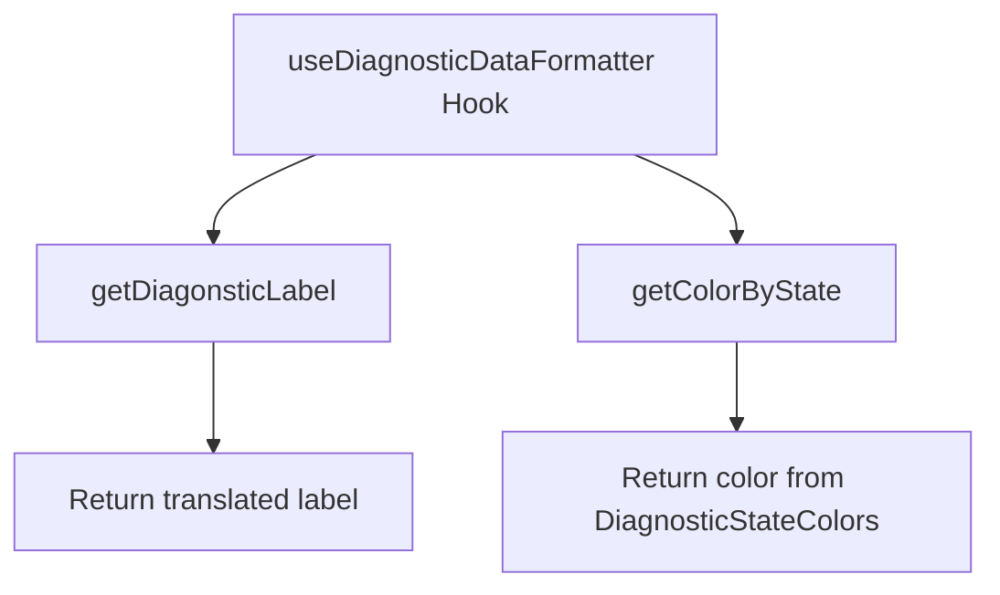

### SVG

<svg id="container" width="553.59375" xmlns="http://www.w3.org/2000/svg" class="flowchart" height="326" viewBox="0 0 553.59375 326" role="graphics-document document" aria-roledescription="flowchart-v2"><g><marker id="container_flowchart-v2-pointEnd" class="marker flowchart-v2" viewBox="0 0 10 10" refX="5" refY="5" markerUnits="userSpaceOnUse" markerWidth="8" markerHeight="8" orient="auto"><path d="M 0 0 L 10 5 L 0 10 z" class="arrowMarkerPath" style="stroke-width: 1; stroke-dasharray: 1, 0;"></path></marker><marker id="container_flowchart-v2-pointStart" class="marker flowchart-v2" viewBox="0 0 10 10" refX="4.5" refY="5" markerUnits="userSpaceOnUse" markerWidth="8" markerHeight="8" orient="auto"><path d="M 0 5 L 10 10 L 10 0 z" class="arrowMarkerPath" style="stroke-width: 1; stroke-dasharray: 1, 0;"></path></marker><marker id="container_flowchart-v2-circleEnd" class="marker flowchart-v2" viewBox="0 0 10 10" refX="11" refY="5" markerUnits="userSpaceOnUse" markerWidth="11" markerHeight="11" orient="auto"><circle cx="5" cy="5" r="5" class="arrowMarkerPath" style="stroke-width: 1; stroke-dasharray: 1, 0;"></circle></marker><marker id="container_flowchart-v2-circleStart" class="marker flowchart-v2" viewBox="0 0 10 10" refX="-1" refY="5" markerUnits="userSpaceOnUse" markerWidth="11" markerHeight="11" orient="auto"><circle cx="5" cy="5" r="5" class="arrowMarkerPath" style="stroke-width: 1; stroke-dasharray: 1, 0;"></circle></marker><marker id="container_flowchart-v2-crossEnd" class="marker cross flowchart-v2" viewBox="0 0 11 11" refX="12" refY="5.2" markerUnits="userSpaceOnUse" markerWidth="11" markerHeight="11" orient="auto"><path d="M 1,1 l 9,9 M 10,1 l -9,9" class="arrowMarkerPath" style="stroke-width: 2; stroke-dasharray: 1, 0;"></path></marker><marker id="container_flowchart-v2-crossStart" class="marker cross flowchart-v2" viewBox="0 0 11 11" refX="-1" refY="5.2" markerUnits="userSpaceOnUse" markerWidth="11" markerHeight="11" orient="auto"><path d="M 1,1 l 9,9 M 10,1 l -9,9" class="arrowMarkerPath" style="stroke-width: 2; stroke-dasharray: 1, 0;"></path></marker><g class="root"><g class="clusters"></g><g class="edgePaths"><path d="M179.179,86L169.615,90.167C160.052,94.333,140.924,102.667,131.361,110.333C121.797,118,121.797,125,121.797,128.5L121.797,132" id="L_A_B_0" class="edge-thickness-normal edge-pattern-solid edge-thickness-normal edge-pattern-solid flowchart-link" style=";" data-edge="true" data-et="edge" data-id="L_A_B_0" data-points="W3sieCI6MTc5LjE3OTA3NzE0ODQzNzUsInkiOjg2fSx7IngiOjEyMS43OTY4NzUsInkiOjExMX0seyJ4IjoxMjEuNzk2ODc1LCJ5IjoxMzZ9XQ==" marker-end="url(#container_flowchart-v2-pointEnd)"></path><path d="M358.212,86L367.775,90.167C377.339,94.333,396.466,102.667,406.03,110.333C415.594,118,415.594,125,415.594,128.5L415.594,132" id="L_A_C_0" class="edge-thickness-normal edge-pattern-solid edge-thickness-normal edge-pattern-solid flowchart-link" style=";" data-edge="true" data-et="edge" data-id="L_A_C_0" data-points="W3sieCI6MzU4LjIxMTU0Nzg1MTU2MjUsInkiOjg2fSx7IngiOjQxNS41OTM3NSwieSI6MTExfSx7IngiOjQxNS41OTM3NSwieSI6MTM2fV0=" marker-end="url(#container_flowchart-v2-pointEnd)"></path><path d="M121.797,190L121.797,194.167C121.797,198.333,121.797,206.667,121.797,216.333C121.797,226,121.797,237,121.797,242.5L121.797,248" id="L_B_D_0" class="edge-thickness-normal edge-pattern-solid edge-thickness-normal edge-pattern-solid flowchart-link" style=";" data-edge="true" data-et="edge" data-id="L_B_D_0" data-points="W3sieCI6MTIxLjc5Njg3NSwieSI6MTkwfSx7IngiOjEyMS43OTY4NzUsInkiOjIxNX0seyJ4IjoxMjEuNzk2ODc1LCJ5IjoyNTJ9XQ==" marker-end="url(#container_flowchart-v2-pointEnd)"></path><path d="M415.594,190L415.594,194.167C415.594,198.333,415.594,206.667,415.594,214.333C415.594,222,415.594,229,415.594,232.5L415.594,236" id="L_C_E_0" class="edge-thickness-normal edge-pattern-solid edge-thickness-normal edge-pattern-solid flowchart-link" style=";" data-edge="true" data-et="edge" data-id="L_C_E_0" data-points="W3sieCI6NDE1LjU5Mzc1LCJ5IjoxOTB9LHsieCI6NDE1LjU5Mzc1LCJ5IjoyMTV9LHsieCI6NDE1LjU5Mzc1LCJ5IjoyNDB9XQ==" marker-end="url(#container_flowchart-v2-pointEnd)"></path></g><g class="edgeLabels"><g class="edgeLabel"><g class="label" data-id="L_A_B_0" transform="translate(0, 0)"><foreignObject width="0" height="0">

</foreignObject></g></g><g class="edgeLabel"><g class="label" data-id="L_A_C_0" transform="translate(0, 0)"><foreignObject width="0" height="0">

</foreignObject></g></g><g class="edgeLabel"><g class="label" data-id="L_B_D_0" transform="translate(0, 0)"><foreignObject width="0" height="0">

</foreignObject></g></g><g class="edgeLabel"><g class="label" data-id="L_C_E_0" transform="translate(0, 0)"><foreignObject width="0" height="0">

</foreignObject></g></g></g><g class="nodes"><g class="node default" id="flowchart-A-0" transform="translate(268.6953125, 47)"><rect class="basic label-container" style="" x="-135.109375" y="-39" width="270.21875" height="78"></rect><g class="label" style="" transform="translate(-105.109375, -24)"><rect></rect><foreignObject width="210.21875" height="48">

useDiagnosticDataFormatter Hook

</foreignObject></g></g><g class="node default" id="flowchart-B-1" transform="translate(121.796875, 163)"><rect class="basic label-container" style="" x="-98.7734375" y="-27" width="197.546875" height="54"></rect><g class="label" style="" transform="translate(-68.7734375, -12)"><rect></rect><foreignObject width="137.546875" height="24">

getDiagonsticLabel

</foreignObject></g></g><g class="node default" id="flowchart-C-3" transform="translate(415.59375, 163)"><rect class="basic label-container" style="" x="-87.8125" y="-27" width="175.625" height="54"></rect><g class="label" style="" transform="translate(-57.8125, -12)"><rect></rect><foreignObject width="115.625" height="24">

getColorByState

</foreignObject></g></g><g class="node default" id="flowchart-D-5" transform="translate(121.796875, 279)"><rect class="basic label-container" style="" x="-113.796875" y="-27" width="227.59375" height="54"></rect><g class="label" style="" transform="translate(-83.796875, -12)"><rect></rect><foreignObject width="167.59375" height="24">

Return translated label

</foreignObject></g></g><g class="node default" id="flowchart-E-7" transform="translate(415.59375, 279)"><rect class="basic label-container" style="" x="-130" y="-39" width="260" height="78"></rect><g class="label" style="" transform="translate(-100, -24)"><rect></rect><foreignObject width="200" height="48">

Return color from DiagnosticStateColors

</foreignObject></g></g></g></g></g></svg>

## Diagram 2

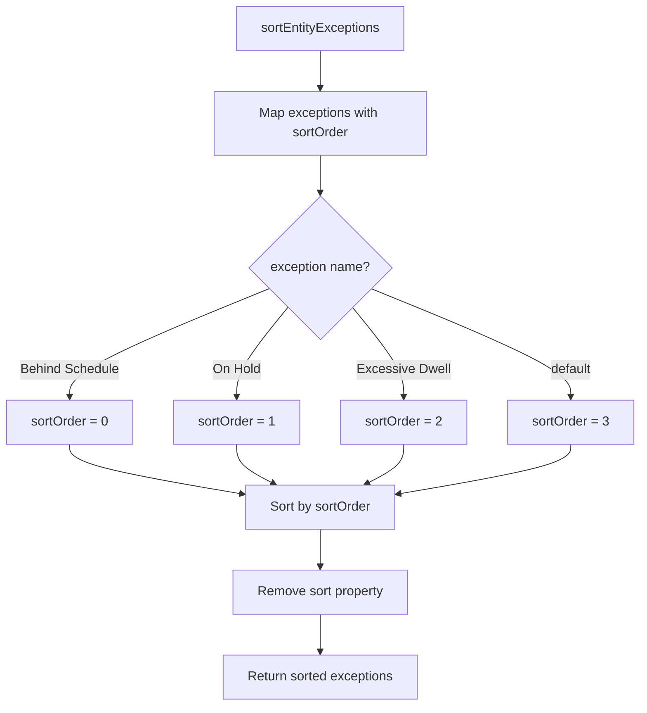

### SVG

<svg id="container" width="783.71875" xmlns="http://www.w3.org/2000/svg" class="flowchart" height="864.21875" viewBox="0 0 783.71875 864.21875" role="graphics-document document" aria-roledescription="flowchart-v2"><g><marker id="container_flowchart-v2-pointEnd" class="marker flowchart-v2" viewBox="0 0 10 10" refX="5" refY="5" markerUnits="userSpaceOnUse" markerWidth="8" markerHeight="8" orient="auto"><path d="M 0 0 L 10 5 L 0 10 z" class="arrowMarkerPath" style="stroke-width: 1; stroke-dasharray: 1, 0;"></path></marker><marker id="container_flowchart-v2-pointStart" class="marker flowchart-v2" viewBox="0 0 10 10" refX="4.5" refY="5" markerUnits="userSpaceOnUse" markerWidth="8" markerHeight="8" orient="auto"><path d="M 0 5 L 10 10 L 10 0 z" class="arrowMarkerPath" style="stroke-width: 1; stroke-dasharray: 1, 0;"></path></marker><marker id="container_flowchart-v2-circleEnd" class="marker flowchart-v2" viewBox="0 0 10 10" refX="11" refY="5" markerUnits="userSpaceOnUse" markerWidth="11" markerHeight="11" orient="auto"><circle cx="5" cy="5" r="5" class="arrowMarkerPath" style="stroke-width: 1; stroke-dasharray: 1, 0;"></circle></marker><marker id="container_flowchart-v2-circleStart" class="marker flowchart-v2" viewBox="0 0 10 10" refX="-1" refY="5" markerUnits="userSpaceOnUse" markerWidth="11" markerHeight="11" orient="auto"><circle cx="5" cy="5" r="5" class="arrowMarkerPath" style="stroke-width: 1; stroke-dasharray: 1, 0;"></circle></marker><marker id="container_flowchart-v2-crossEnd" class="marker cross flowchart-v2" viewBox="0 0 11 11" refX="12" refY="5.2" markerUnits="userSpaceOnUse" markerWidth="11" markerHeight="11" orient="auto"><path d="M 1,1 l 9,9 M 10,1 l -9,9" class="arrowMarkerPath" style="stroke-width: 2; stroke-dasharray: 1, 0;"></path></marker><marker id="container_flowchart-v2-crossStart" class="marker cross flowchart-v2" viewBox="0 0 11 11" refX="-1" refY="5.2" markerUnits="userSpaceOnUse" markerWidth="11" markerHeight="11" orient="auto"><path d="M 1,1 l 9,9 M 10,1 l -9,9" class="arrowMarkerPath" style="stroke-width: 2; stroke-dasharray: 1, 0;"></path></marker><g class="root"><g class="clusters"></g><g class="edgePaths"><path d="M392.09,62L392.09,66.167C392.09,70.333,392.09,78.667,392.09,86.333C392.09,94,392.09,101,392.09,104.5L392.09,108" id="L_A_B_0" class="edge-thickness-normal edge-pattern-solid edge-thickness-normal edge-pattern-solid flowchart-link" style=";" data-edge="true" data-et="edge" data-id="L_A_B_0" data-points="W3sieCI6MzkyLjA4OTg0Mzc1LCJ5Ijo2Mn0seyJ4IjozOTIuMDg5ODQzNzUsInkiOjg3fSx7IngiOjM5Mi4wODk4NDM3NSwieSI6MTEyfV0=" marker-end="url(#container_flowchart-v2-pointEnd)"></path><path d="M392.09,190L392.09,194.167C392.09,198.333,392.09,206.667,392.09,214.333C392.09,222,392.09,229,392.09,232.5L392.09,236" id="L_B_C_0" class="edge-thickness-normal edge-pattern-solid edge-thickness-normal edge-pattern-solid flowchart-link" style=";" data-edge="true" data-et="edge" data-id="L_B_C_0" data-points="W3sieCI6MzkyLjA4OTg0Mzc1LCJ5IjoxOTB9LHsieCI6MzkyLjA4OTg0Mzc1LCJ5IjoyMTV9LHsieCI6MzkyLjA4OTg0Mzc1LCJ5IjoyNDB9XQ==" marker-end="url(#container_flowchart-v2-pointEnd)"></path><path d="M329.528,353.657L288.892,370.25C248.255,386.844,166.983,420.031,126.347,442.125C85.711,464.219,85.711,475.219,85.711,480.719L85.711,486.219" id="L_C_D_0" class="edge-thickness-normal edge-pattern-solid edge-thickness-normal edge-pattern-solid flowchart-link" style=";" data-edge="true" data-et="edge" data-id="L_C_D_0" data-points="W3sieCI6MzI5LjUyNzY0ODg2MzM0MzIsInkiOjM1My42NTY1NTUxMTMzNDMyfSx7IngiOjg1LjcxMDkzNzUsInkiOjQ1My4yMTg3NX0seyJ4Ijo4NS43MTA5Mzc1LCJ5Ijo0OTAuMjE4NzV9XQ==" marker-end="url(#container_flowchart-v2-pointEnd)"></path><path d="M352.527,376.656L342.128,389.416C331.729,402.177,310.931,427.698,300.532,445.958C290.133,464.219,290.133,475.219,290.133,480.719L290.133,486.219" id="L_C_E_0" class="edge-thickness-normal edge-pattern-solid edge-thickness-normal edge-pattern-solid flowchart-link" style=";" data-edge="true" data-et="edge" data-id="L_C_E_0" data-points="W3sieCI6MzUyLjUyNzA5ODg3NDM3ODUsInkiOjM3Ni42NTYwMDUxMjQzNzg1fSx7IngiOjI5MC4xMzI4MTI1LCJ5Ijo0NTMuMjE4NzV9LHsieCI6MjkwLjEzMjgxMjUsInkiOjQ5MC4yMTg3NX1d" marker-end="url(#container_flowchart-v2-pointEnd)"></path><path d="M431.653,376.656L442.052,389.416C452.451,402.177,473.249,427.698,483.648,445.958C494.047,464.219,494.047,475.219,494.047,480.719L494.047,486.219" id="L_C_F_0" class="edge-thickness-normal edge-pattern-solid edge-thickness-normal edge-pattern-solid flowchart-link" style=";" data-edge="true" data-et="edge" data-id="L_C_F_0" data-points="W3sieCI6NDMxLjY1MjU4ODYyNTYyMTUsInkiOjM3Ni42NTYwMDUxMjQzNzg1fSx7IngiOjQ5NC4wNDY4NzUsInkiOjQ1My4yMTg3NX0seyJ4Ijo0OTQuMDQ2ODc1LCJ5Ijo0OTAuMjE4NzV9XQ==" marker-end="url(#container_flowchart-v2-pointEnd)"></path><path d="M454.653,353.656L495.292,370.249C535.93,386.843,617.207,420.031,657.846,442.125C698.484,464.219,698.484,475.219,698.484,480.719L698.484,486.219" id="L_C_G_0" class="edge-thickness-normal edge-pattern-solid edge-thickness-normal edge-pattern-solid flowchart-link" style=";" data-edge="true" data-et="edge" data-id="L_C_G_0" data-points="W3sieCI6NDU0LjY1Mjk2MzcxNDQ2ODQsInkiOjM1My42NTU2MzAwMzU1MzE2fSx7IngiOjY5OC40ODQzNzUsInkiOjQ1My4yMTg3NX0seyJ4Ijo2OTguNDg0Mzc1LCJ5Ijo0OTAuMjE4NzV9XQ==" marker-end="url(#container_flowchart-v2-pointEnd)"></path><path d="M85.711,544.219L85.711,548.385C85.711,552.552,85.711,560.885,120.632,570.979C155.554,581.073,225.397,592.927,260.318,598.854L295.24,604.781" id="L_D_H_0" class="edge-thickness-normal edge-pattern-solid edge-thickness-normal edge-pattern-solid flowchart-link" style=";" data-edge="true" data-et="edge" data-id="L_D_H_0" data-points="W3sieCI6ODUuNzEwOTM3NSwieSI6NTQ0LjIxODc1fSx7IngiOjg1LjcxMDkzNzUsInkiOjU2OS4yMTg3NX0seyJ4IjoyOTkuMTgzNTkzNzUsInkiOjYwNS40NTAyODUxOTU2NDQ3fV0=" marker-end="url(#container_flowchart-v2-pointEnd)"></path><path d="M290.133,544.219L290.133,548.385C290.133,552.552,290.133,560.885,297.709,568.916C305.284,576.946,320.436,584.674,328.012,588.538L335.587,592.401" id="L_E_H_0" class="edge-thickness-normal edge-pattern-solid edge-thickness-normal edge-pattern-solid flowchart-link" style=";" data-edge="true" data-et="edge" data-id="L_E_H_0" data-points="W3sieCI6MjkwLjEzMjgxMjUsInkiOjU0NC4yMTg3NX0seyJ4IjoyOTAuMTMyODEyNSwieSI6NTY5LjIxODc1fSx7IngiOjMzOS4xNTA2MTU5ODU1NzY5LCJ5Ijo1OTQuMjE4NzV9XQ==" marker-end="url(#container_flowchart-v2-pointEnd)"></path><path d="M494.047,544.219L494.047,548.385C494.047,552.552,494.047,560.885,486.471,568.916C478.895,576.946,463.744,584.674,456.168,588.538L448.592,592.401" id="L_F_H_0" class="edge-thickness-normal edge-pattern-solid edge-thickness-normal edge-pattern-solid flowchart-link" style=";" data-edge="true" data-et="edge" data-id="L_F_H_0" data-points="W3sieCI6NDk0LjA0Njg3NSwieSI6NTQ0LjIxODc1fSx7IngiOjQ5NC4wNDY4NzUsInkiOjU2OS4yMTg3NX0seyJ4Ijo0NDUuMDI5MDcxNTE0NDIzMSwieSI6NTk0LjIxODc1fV0=" marker-end="url(#container_flowchart-v2-pointEnd)"></path><path d="M698.484,544.219L698.484,548.385C698.484,552.552,698.484,560.885,663.56,570.979C628.636,581.073,558.788,592.927,523.864,598.855L488.94,604.782" id="L_G_H_0" class="edge-thickness-normal edge-pattern-solid edge-thickness-normal edge-pattern-solid flowchart-link" style=";" data-edge="true" data-et="edge" data-id="L_G_H_0" data-points="W3sieCI6Njk4LjQ4NDM3NSwieSI6NTQ0LjIxODc1fSx7IngiOjY5OC40ODQzNzUsInkiOjU2OS4yMTg3NX0seyJ4Ijo0ODQuOTk2MDkzNzUsInkiOjYwNS40NTEwODkzMjk2NTMxfV0=" marker-end="url(#container_flowchart-v2-pointEnd)"></path><path d="M392.09,648.219L392.09,652.385C392.09,656.552,392.09,664.885,392.09,672.552C392.09,680.219,392.09,687.219,392.09,690.719L392.09,694.219" id="L_H_I_0" class="edge-thickness-normal edge-pattern-solid edge-thickness-normal edge-pattern-solid flowchart-link" style=";" data-edge="true" data-et="edge" data-id="L_H_I_0" data-points="W3sieCI6MzkyLjA4OTg0Mzc1LCJ5Ijo2NDguMjE4NzV9LHsieCI6MzkyLjA4OTg0Mzc1LCJ5Ijo2NzMuMjE4NzV9LHsieCI6MzkyLjA4OTg0Mzc1LCJ5Ijo2OTguMjE4NzV9XQ==" marker-end="url(#container_flowchart-v2-pointEnd)"></path><path d="M392.09,752.219L392.09,756.385C392.09,760.552,392.09,768.885,392.09,776.552C392.09,784.219,392.09,791.219,392.09,794.719L392.09,798.219" id="L_I_J_0" class="edge-thickness-normal edge-pattern-solid edge-thickness-normal edge-pattern-solid flowchart-link" style=";" data-edge="true" data-et="edge" data-id="L_I_J_0" data-points="W3sieCI6MzkyLjA4OTg0Mzc1LCJ5Ijo3NTIuMjE4NzV9LHsieCI6MzkyLjA4OTg0Mzc1LCJ5Ijo3NzcuMjE4NzV9LHsieCI6MzkyLjA4OTg0Mzc1LCJ5Ijo4MDIuMjE4NzV9XQ==" marker-end="url(#container_flowchart-v2-pointEnd)"></path></g><g class="edgeLabels"><g class="edgeLabel"><g class="label" data-id="L_A_B_0" transform="translate(0, 0)"><foreignObject width="0" height="0">

</foreignObject></g></g><g class="edgeLabel"><g class="label" data-id="L_B_C_0" transform="translate(0, 0)"><foreignObject width="0" height="0">

</foreignObject></g></g><g class="edgeLabel" transform="translate(85.7109375, 453.21875)"><g class="label" data-id="L_C_D_0" transform="translate(-61.1015625, -12)"><foreignObject width="122.203125" height="24">

Behind Schedule

</foreignObject></g></g><g class="edgeLabel" transform="translate(290.1328125, 453.21875)"><g class="label" data-id="L_C_E_0" transform="translate(-29.546875, -12)"><foreignObject width="59.09375" height="24">

On Hold

</foreignObject></g></g><g class="edgeLabel" transform="translate(494.046875, 453.21875)"><g class="label" data-id="L_C_F_0" transform="translate(-56.0859375, -12)"><foreignObject width="112.171875" height="24">

Excessive Dwell

</foreignObject></g></g><g class="edgeLabel" transform="translate(698.484375, 453.21875)"><g class="label" data-id="L_C_G_0" transform="translate(-25.890625, -12)"><foreignObject width="51.78125" height="24">

default

</foreignObject></g></g><g class="edgeLabel"><g class="label" data-id="L_D_H_0" transform="translate(0, 0)"><foreignObject width="0" height="0">

</foreignObject></g></g><g class="edgeLabel"><g class="label" data-id="L_E_H_0" transform="translate(0, 0)"><foreignObject width="0" height="0">

</foreignObject></g></g><g class="edgeLabel"><g class="label" data-id="L_F_H_0" transform="translate(0, 0)"><foreignObject width="0" height="0">

</foreignObject></g></g><g class="edgeLabel"><g class="label" data-id="L_G_H_0" transform="translate(0, 0)"><foreignObject width="0" height="0">

</foreignObject></g></g><g class="edgeLabel"><g class="label" data-id="L_H_I_0" transform="translate(0, 0)"><foreignObject width="0" height="0">

</foreignObject></g></g><g class="edgeLabel"><g class="label" data-id="L_I_J_0" transform="translate(0, 0)"><foreignObject width="0" height="0">

</foreignObject></g></g></g><g class="nodes"><g class="node default" id="flowchart-A-0" transform="translate(392.08984375, 35)"><rect class="basic label-container" style="" x="-104.3046875" y="-27" width="208.609375" height="54"></rect><g class="label" style="" transform="translate(-74.3046875, -12)"><rect></rect><foreignObject width="148.609375" height="24">

sortEntityExceptions

</foreignObject></g></g><g class="node default" id="flowchart-B-1" transform="translate(392.08984375, 151)"><rect class="basic label-container" style="" x="-130" y="-39" width="260" height="78"></rect><g class="label" style="" transform="translate(-100, -24)"><rect></rect><foreignObject width="200" height="48">

Map exceptions with sortOrder

</foreignObject></g></g><g class="node default" id="flowchart-C-3" transform="translate(392.08984375, 328.109375)"><polygon points="88.109375,0 176.21875,-88.109375 88.109375,-176.21875 0,-88.109375" class="label-container" transform="translate(-87.609375, 88.109375)"></polygon><g class="label" style="" transform="translate(-61.109375, -12)"><rect></rect><foreignObject width="122.21875" height="24">

exception name?

</foreignObject></g></g><g class="node default" id="flowchart-D-5" transform="translate(85.7109375, 517.21875)"><rect class="basic label-container" style="" x="-77.7109375" y="-27" width="155.421875" height="54"></rect><g class="label" style="" transform="translate(-47.7109375, -12)"><rect></rect><foreignObject width="95.421875" height="24">

sortOrder = 0

</foreignObject></g></g><g class="node default" id="flowchart-E-7" transform="translate(290.1328125, 517.21875)"><rect class="basic label-container" style="" x="-76.7109375" y="-27" width="153.421875" height="54"></rect><g class="label" style="" transform="translate(-46.7109375, -12)"><rect></rect><foreignObject width="93.421875" height="24">

sortOrder = 1

</foreignObject></g></g><g class="node default" id="flowchart-F-9" transform="translate(494.046875, 517.21875)"><rect class="basic label-container" style="" x="-77.203125" y="-27" width="154.40625" height="54"></rect><g class="label" style="" transform="translate(-47.203125, -12)"><rect></rect><foreignObject width="94.40625" height="24">

sortOrder = 2

</foreignObject></g></g><g class="node default" id="flowchart-G-11" transform="translate(698.484375, 517.21875)"><rect class="basic label-container" style="" x="-77.234375" y="-27" width="154.46875" height="54"></rect><g class="label" style="" transform="translate(-47.234375, -12)"><rect></rect><foreignObject width="94.46875" height="24">

sortOrder = 3

</foreignObject></g></g><g class="node default" id="flowchart-H-13" transform="translate(392.08984375, 621.21875)"><rect class="basic label-container" style="" x="-92.90625" y="-27" width="185.8125" height="54"></rect><g class="label" style="" transform="translate(-62.90625, -12)"><rect></rect><foreignObject width="125.8125" height="24">

Sort by sortOrder

</foreignObject></g></g><g class="node default" id="flowchart-I-21" transform="translate(392.08984375, 725.21875)"><rect class="basic label-container" style="" x="-108.7265625" y="-27" width="217.453125" height="54"></rect><g class="label" style="" transform="translate(-78.7265625, -12)"><rect></rect><foreignObject width="157.453125" height="24">

Remove sort property

</foreignObject></g></g><g class="node default" id="flowchart-J-23" transform="translate(392.08984375, 829.21875)"><rect class="basic label-container" style="" x="-121.1640625" y="-27" width="242.328125" height="54"></rect><g class="label" style="" transform="translate(-91.1640625, -12)"><rect></rect><foreignObject width="182.328125" height="24">

Return sorted exceptions

</foreignObject></g></g></g></g></g></svg>

## Diagram 3

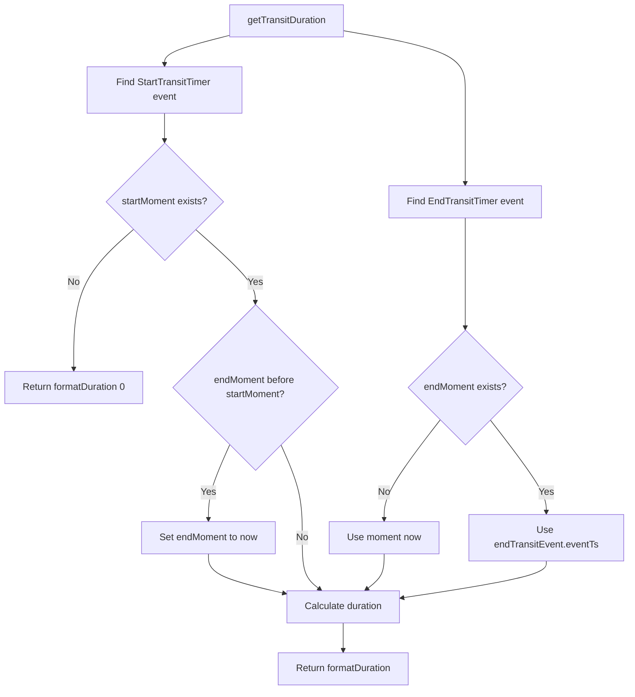

### SVG

<svg id="container" width="1063.8359375" xmlns="http://www.w3.org/2000/svg" class="flowchart" height="1159.84375" viewBox="0 0 1063.8359375 1159.84375" role="graphics-document document" aria-roledescription="flowchart-v2"><g><marker id="container_flowchart-v2-pointEnd" class="marker flowchart-v2" viewBox="0 0 10 10" refX="5" refY="5" markerUnits="userSpaceOnUse" markerWidth="8" markerHeight="8" orient="auto"><path d="M 0 0 L 10 5 L 0 10 z" class="arrowMarkerPath" style="stroke-width: 1; stroke-dasharray: 1, 0;"></path></marker><marker id="container_flowchart-v2-pointStart" class="marker flowchart-v2" viewBox="0 0 10 10" refX="4.5" refY="5" markerUnits="userSpaceOnUse" markerWidth="8" markerHeight="8" orient="auto"><path d="M 0 5 L 10 10 L 10 0 z" class="arrowMarkerPath" style="stroke-width: 1; stroke-dasharray: 1, 0;"></path></marker><marker id="container_flowchart-v2-circleEnd" class="marker flowchart-v2" viewBox="0 0 10 10" refX="11" refY="5" markerUnits="userSpaceOnUse" markerWidth="11" markerHeight="11" orient="auto"><circle cx="5" cy="5" r="5" class="arrowMarkerPath" style="stroke-width: 1; stroke-dasharray: 1, 0;"></circle></marker><marker id="container_flowchart-v2-circleStart" class="marker flowchart-v2" viewBox="0 0 10 10" refX="-1" refY="5" markerUnits="userSpaceOnUse" markerWidth="11" markerHeight="11" orient="auto"><circle cx="5" cy="5" r="5" class="arrowMarkerPath" style="stroke-width: 1; stroke-dasharray: 1, 0;"></circle></marker><marker id="container_flowchart-v2-crossEnd" class="marker cross flowchart-v2" viewBox="0 0 11 11" refX="12" refY="5.2" markerUnits="userSpaceOnUse" markerWidth="11" markerHeight="11" orient="auto"><path d="M 1,1 l 9,9 M 10,1 l -9,9" class="arrowMarkerPath" style="stroke-width: 2; stroke-dasharray: 1, 0;"></path></marker><marker id="container_flowchart-v2-crossStart" class="marker cross flowchart-v2" viewBox="0 0 11 11" refX="-1" refY="5.2" markerUnits="userSpaceOnUse" markerWidth="11" markerHeight="11" orient="auto"><path d="M 1,1 l 9,9 M 10,1 l -9,9" class="arrowMarkerPath" style="stroke-width: 2; stroke-dasharray: 1, 0;"></path></marker><g class="root"><g class="clusters"></g><g class="edgePaths"><path d="M389.262,59.632L371.228,64.193C353.194,68.754,317.126,77.877,299.092,85.939C281.059,94,281.059,101,281.059,104.5L281.059,108" id="L_A_B_0" class="edge-thickness-normal edge-pattern-solid edge-thickness-normal edge-pattern-solid flowchart-link" style=";" data-edge="true" data-et="edge" data-id="L_A_B_0" data-points="W3sieCI6Mzg5LjI2MTcxODc1LCJ5Ijo1OS42MzE1Nzg5NDczNjg0MjV9LHsieCI6MjgxLjA1ODU5Mzc1LCJ5Ijo4N30seyJ4IjoyODEuMDU4NTkzNzUsInkiOjExMn1d" marker-end="url(#container_flowchart-v2-pointEnd)"></path><path d="M584.027,51.73L618.244,57.608C652.461,63.487,720.895,75.243,755.111,91.788C789.328,108.333,789.328,129.667,789.328,151C789.328,172.333,789.328,193.667,789.328,219.987C789.328,246.307,789.328,277.615,789.328,293.268L789.328,308.922" id="L_A_C_0" class="edge-thickness-normal edge-pattern-solid edge-thickness-normal edge-pattern-solid flowchart-link" style=";" data-edge="true" data-et="edge" data-id="L_A_C_0" data-points="W3sieCI6NTg0LjAyNzM0Mzc1LCJ5Ijo1MS43MzAwMzIxMzQ0MjI1NDR9LHsieCI6Nzg5LjMyODEyNSwieSI6ODd9LHsieCI6Nzg5LjMyODEyNSwieSI6MTUxfSx7IngiOjc4OS4zMjgxMjUsInkiOjIxNX0seyJ4Ijo3ODkuMzI4MTI1LCJ5IjozMTIuOTIxODc1fV0=" marker-end="url(#container_flowchart-v2-pointEnd)"></path><path d="M281.059,190L281.059,194.167C281.059,198.333,281.059,206.667,281.059,214.333C281.059,222,281.059,229,281.059,232.5L281.059,236" id="L_B_D_0" class="edge-thickness-normal edge-pattern-solid edge-thickness-normal edge-pattern-solid flowchart-link" style=";" data-edge="true" data-et="edge" data-id="L_B_D_0" data-points="W3sieCI6MjgxLjA1ODU5Mzc1LCJ5IjoxOTB9LHsieCI6MjgxLjA1ODU5Mzc1LCJ5IjoyMTV9LHsieCI6MjgxLjA1ODU5Mzc1LCJ5IjoyNDB9XQ==" marker-end="url(#container_flowchart-v2-pointEnd)"></path><path d="M789.328,366.922L789.328,385.242C789.328,403.563,789.328,440.203,789.328,471.047C789.328,501.891,789.328,526.938,789.328,539.461L789.328,551.984" id="L_C_E_0" class="edge-thickness-normal edge-pattern-solid edge-thickness-normal edge-pattern-solid flowchart-link" style=";" data-edge="true" data-et="edge" data-id="L_C_E_0" data-points="W3sieCI6Nzg5LjMyODEyNSwieSI6MzY2LjkyMTg3NX0seyJ4Ijo3ODkuMzI4MTI1LCJ5Ijo0NzYuODQzNzV9LHsieCI6Nzg5LjMyODEyNSwieSI6NTU1Ljk4NDM3NX1d" marker-end="url(#container_flowchart-v2-pointEnd)"></path><path d="M228.162,386.947L211.308,401.93C194.454,416.912,160.747,446.878,143.893,486.028C127.039,525.177,127.039,573.51,127.039,597.677L127.039,621.844" id="L_D_F_0" class="edge-thickness-normal edge-pattern-solid edge-thickness-normal edge-pattern-solid flowchart-link" style=";" data-edge="true" data-et="edge" data-id="L_D_F_0" data-points="W3sieCI6MjI4LjE2MTYxODU1NjY2MjEsInkiOjM4Ni45NDY3NzQ4MDY2NjIxfSx7IngiOjEyNy4wMzkwNjI1LCJ5Ijo0NzYuODQzNzV9LHsieCI6MTI3LjAzOTA2MjUsInkiOjYyNS44NDM3NX1d" marker-end="url(#container_flowchart-v2-pointEnd)"></path><path d="M333.956,386.947L350.809,401.93C367.663,416.912,401.371,446.878,418.224,467.361C435.078,487.844,435.078,498.844,435.078,504.344L435.078,509.844" id="L_D_G_0" class="edge-thickness-normal edge-pattern-solid edge-thickness-normal edge-pattern-solid flowchart-link" style=";" data-edge="true" data-et="edge" data-id="L_D_G_0" data-points="W3sieCI6MzMzLjk1NTU2ODk0MzMzNzksInkiOjM4Ni45NDY3NzQ4MDY2NjIxfSx7IngiOjQzNS4wNzgxMjUsInkiOjQ3Ni44NDM3NX0seyJ4Ijo0MzUuMDc4MTI1LCJ5Ijo1MTMuODQzNzV9XQ==" marker-end="url(#container_flowchart-v2-pointEnd)"></path><path d="M747.019,707.394L731.319,727.635C715.619,747.877,684.22,788.36,668.52,816.102C652.82,843.844,652.82,858.844,652.82,866.344L652.82,873.844" id="L_E_H_0" class="edge-thickness-normal edge-pattern-solid edge-thickness-normal edge-pattern-solid flowchart-link" style=";" data-edge="true" data-et="edge" data-id="L_E_H_0" data-points="W3sieCI6NzQ3LjAxODU4NjI1NDA5MzYsInkiOjcwNy4zOTM1ODYyNTQwOTM2fSx7IngiOjY1Mi44MjAzMTI1LCJ5Ijo4MjguODQzNzV9LHsieCI6NjUyLjgyMDMxMjUsInkiOjg3Ny44NDM3NX1d" marker-end="url(#container_flowchart-v2-pointEnd)"></path><path d="M831.638,707.394L847.337,727.635C863.037,747.877,894.437,788.36,910.136,814.102C925.836,839.844,925.836,850.844,925.836,856.344L925.836,861.844" id="L_E_I_0" class="edge-thickness-normal edge-pattern-solid edge-thickness-normal edge-pattern-solid flowchart-link" style=";" data-edge="true" data-et="edge" data-id="L_E_I_0" data-points="W3sieCI6ODMxLjYzNzY2Mzc0NTkwNjQsInkiOjcwNy4zOTM1ODYyNTQwOTM2fSx7IngiOjkyNS44MzU5Mzc1LCJ5Ijo4MjguODQzNzV9LHsieCI6OTI1LjgzNTkzNzUsInkiOjg2NS44NDM3NX1d" marker-end="url(#container_flowchart-v2-pointEnd)"></path><path d="M391.795,748.561L385.745,761.942C379.694,775.322,367.593,802.083,361.543,822.963C355.492,843.844,355.492,858.844,355.492,866.344L355.492,873.844" id="L_G_J_0" class="edge-thickness-normal edge-pattern-solid edge-thickness-normal edge-pattern-solid flowchart-link" style=";" data-edge="true" data-et="edge" data-id="L_G_J_0" data-points="W3sieCI6MzkxLjc5NTQ0MTIxNTgwMzEsInkiOjc0OC41NjEwNjYyMTU4MDMyfSx7IngiOjM1NS40OTIxODc1LCJ5Ijo4MjguODQzNzV9LHsieCI6MzU1LjQ5MjE4NzUsInkiOjg3Ny44NDM3NX1d" marker-end="url(#container_flowchart-v2-pointEnd)"></path><path d="M478.361,748.561L484.411,761.942C490.462,775.322,502.563,802.083,508.614,828.13C514.664,854.177,514.664,879.51,514.664,902.844C514.664,926.177,514.664,947.51,519.667,961.943C524.669,976.375,534.674,983.907,539.676,987.672L544.679,991.438" id="L_G_K_0" class="edge-thickness-normal edge-pattern-solid edge-thickness-normal edge-pattern-solid flowchart-link" style=";" data-edge="true" data-et="edge" data-id="L_G_K_0" data-points="W3sieCI6NDc4LjM2MDgwODc4NDE5NjksInkiOjc0OC41NjEwNjYyMTU4MDMyfSx7IngiOjUxNC42NjQwNjI1LCJ5Ijo4MjguODQzNzV9LHsieCI6NTE0LjY2NDA2MjUsInkiOjkwNC44NDM3NX0seyJ4Ijo1MTQuNjY0MDYyNSwieSI6OTY4Ljg0Mzc1fSx7IngiOjU0Ny44NzQ2OTk1MTkyMzA3LCJ5Ijo5OTMuODQzNzV9XQ==" marker-end="url(#container_flowchart-v2-pointEnd)"></path><path d="M652.82,931.844L652.82,938.01C652.82,944.177,652.82,956.51,647.818,966.443C642.815,976.375,632.81,983.907,627.808,987.672L622.805,991.438" id="L_H_K_0" class="edge-thickness-normal edge-pattern-solid edge-thickness-normal edge-pattern-solid flowchart-link" style=";" data-edge="true" data-et="edge" data-id="L_H_K_0" data-points="W3sieCI6NjUyLjgyMDMxMjUsInkiOjkzMS44NDM3NX0seyJ4Ijo2NTIuODIwMzEyNSwieSI6OTY4Ljg0Mzc1fSx7IngiOjYxOS42MDk2NzU0ODA3NjkzLCJ5Ijo5OTMuODQzNzV9XQ==" marker-end="url(#container_flowchart-v2-pointEnd)"></path><path d="M925.836,943.844L925.836,948.01C925.836,952.177,925.836,960.51,885.545,970.802C845.253,981.093,764.67,993.342,724.379,999.466L684.087,1005.591" id="L_I_K_0" class="edge-thickness-normal edge-pattern-solid edge-thickness-normal edge-pattern-solid flowchart-link" style=";" data-edge="true" data-et="edge" data-id="L_I_K_0" data-points="W3sieCI6OTI1LjgzNTkzNzUsInkiOjk0My44NDM3NX0seyJ4Ijo5MjUuODM1OTM3NSwieSI6OTY4Ljg0Mzc1fSx7IngiOjY4MC4xMzI4MTI1LCJ5IjoxMDA2LjE5MTg4MTkwODI4NTR9XQ==" marker-end="url(#container_flowchart-v2-pointEnd)"></path><path d="M355.492,931.844L355.492,938.01C355.492,944.177,355.492,956.51,376.819,967.536C398.145,978.561,440.798,988.278,462.125,993.137L483.451,997.995" id="L_J_K_0" class="edge-thickness-normal edge-pattern-solid edge-thickness-normal edge-pattern-solid flowchart-link" style=";" data-edge="true" data-et="edge" data-id="L_J_K_0" data-points="W3sieCI6MzU1LjQ5MjE4NzUsInkiOjkzMS44NDM3NX0seyJ4IjozNTUuNDkyMTg3NSwieSI6OTY4Ljg0Mzc1fSx7IngiOjQ4Ny4zNTE1NjI1LCJ5Ijo5OTguODg0MDAxOTE2NzU3OX1d" marker-end="url(#container_flowchart-v2-pointEnd)"></path><path d="M583.742,1047.844L583.742,1052.01C583.742,1056.177,583.742,1064.51,583.742,1072.177C583.742,1079.844,583.742,1086.844,583.742,1090.344L583.742,1093.844" id="L_K_L_0" class="edge-thickness-normal edge-pattern-solid edge-thickness-normal edge-pattern-solid flowchart-link" style=";" data-edge="true" data-et="edge" data-id="L_K_L_0" data-points="W3sieCI6NTgzLjc0MjE4NzUsInkiOjEwNDcuODQzNzV9LHsieCI6NTgzLjc0MjE4NzUsInkiOjEwNzIuODQzNzV9LHsieCI6NTgzLjc0MjE4NzUsInkiOjEwOTcuODQzNzV9XQ==" marker-end="url(#container_flowchart-v2-pointEnd)"></path></g><g class="edgeLabels"><g class="edgeLabel"><g class="label" data-id="L_A_B_0" transform="translate(0, 0)"><foreignObject width="0" height="0">

</foreignObject></g></g><g class="edgeLabel"><g class="label" data-id="L_A_C_0" transform="translate(0, 0)"><foreignObject width="0" height="0">

</foreignObject></g></g><g class="edgeLabel"><g class="label" data-id="L_B_D_0" transform="translate(0, 0)"><foreignObject width="0" height="0">

</foreignObject></g></g><g class="edgeLabel"><g class="label" data-id="L_C_E_0" transform="translate(0, 0)"><foreignObject width="0" height="0">

</foreignObject></g></g><g class="edgeLabel" transform="translate(127.0390625, 476.84375)"><g class="label" data-id="L_D_F_0" transform="translate(-10.140625, -12)"><foreignObject width="20.28125" height="24">

No

</foreignObject></g></g><g class="edgeLabel" transform="translate(435.078125, 476.84375)"><g class="label" data-id="L_D_G_0" transform="translate(-12.03125, -12)"><foreignObject width="24.0625" height="24">

Yes

</foreignObject></g></g><g class="edgeLabel" transform="translate(652.8203125, 828.84375)"><g class="label" data-id="L_E_H_0" transform="translate(-10.140625, -12)"><foreignObject width="20.28125" height="24">

No

</foreignObject></g></g><g class="edgeLabel" transform="translate(925.8359375, 828.84375)"><g class="label" data-id="L_E_I_0" transform="translate(-12.03125, -12)"><foreignObject width="24.0625" height="24">

Yes

</foreignObject></g></g><g class="edgeLabel" transform="translate(355.4921875, 828.84375)"><g class="label" data-id="L_G_J_0" transform="translate(-12.03125, -12)"><foreignObject width="24.0625" height="24">

Yes

</foreignObject></g></g><g class="edgeLabel" transform="translate(514.6640625, 904.84375)"><g class="label" data-id="L_G_K_0" transform="translate(-10.140625, -12)"><foreignObject width="20.28125" height="24">

No

</foreignObject></g></g><g class="edgeLabel"><g class="label" data-id="L_H_K_0" transform="translate(0, 0)"><foreignObject width="0" height="0">

</foreignObject></g></g><g class="edgeLabel"><g class="label" data-id="L_I_K_0" transform="translate(0, 0)"><foreignObject width="0" height="0">

</foreignObject></g></g><g class="edgeLabel"><g class="label" data-id="L_J_K_0" transform="translate(0, 0)"><foreignObject width="0" height="0">

</foreignObject></g></g><g class="edgeLabel"><g class="label" data-id="L_K_L_0" transform="translate(0, 0)"><foreignObject width="0" height="0">

</foreignObject></g></g></g><g class="nodes"><g class="node default" id="flowchart-A-0" transform="translate(486.64453125, 35)"><rect class="basic label-container" style="" x="-97.3828125" y="-27" width="194.765625" height="54"></rect><g class="label" style="" transform="translate(-67.3828125, -12)"><rect></rect><foreignObject width="134.765625" height="24">

getTransitDuration

</foreignObject></g></g><g class="node default" id="flowchart-B-1" transform="translate(281.05859375, 151)"><rect class="basic label-container" style="" x="-130" y="-39" width="260" height="78"></rect><g class="label" style="" transform="translate(-100, -24)"><rect></rect><foreignObject width="200" height="48">

Find StartTransitTimer event

</foreignObject></g></g><g class="node default" id="flowchart-C-3" transform="translate(789.328125, 339.921875)"><rect class="basic label-container" style="" x="-128.78125" y="-27" width="257.5625" height="54"></rect><g class="label" style="" transform="translate(-98.78125, -12)"><rect></rect><foreignObject width="197.5625" height="24">

Find EndTransitTimer event

</foreignObject></g></g><g class="node default" id="flowchart-D-5" transform="translate(281.05859375, 339.921875)"><polygon points="99.921875,0 199.84375,-99.921875 99.921875,-199.84375 0,-99.921875" class="label-container" transform="translate(-99.421875, 99.921875)"></polygon><g class="label" style="" transform="translate(-72.921875, -12)"><rect></rect><foreignObject width="145.84375" height="24">

startMoment exists?

</foreignObject></g></g><g class="node default" id="flowchart-E-7" transform="translate(789.328125, 652.84375)"><polygon points="96.859375,0 193.71875,-96.859375 96.859375,-193.71875 0,-96.859375" class="label-container" transform="translate(-96.359375, 96.859375)"></polygon><g class="label" style="" transform="translate(-69.859375, -12)"><rect></rect><foreignObject width="139.71875" height="24">

endMoment exists?

</foreignObject></g></g><g class="node default" id="flowchart-F-9" transform="translate(127.0390625, 652.84375)"><rect class="basic label-container" style="" x="-119.0390625" y="-27" width="238.078125" height="54"></rect><g class="label" style="" transform="translate(-89.0390625, -12)"><rect></rect><foreignObject width="178.078125" height="24">

Return formatDuration 0

</foreignObject></g></g><g class="node default" id="flowchart-G-11" transform="translate(435.078125, 652.84375)"><polygon points="139,0 278,-139 139,-278 0,-139" class="label-container" transform="translate(-138.5, 139)"></polygon><g class="label" style="" transform="translate(-100, -24)"><rect></rect><foreignObject width="200" height="48">

endMoment before startMoment?

</foreignObject></g></g><g class="node default" id="flowchart-H-13" transform="translate(652.8203125, 904.84375)"><rect class="basic label-container" style="" x="-93.015625" y="-27" width="186.03125" height="54"></rect><g class="label" style="" transform="translate(-63.015625, -12)"><rect></rect><foreignObject width="126.03125" height="24">

Use moment now

</foreignObject></g></g><g class="node default" id="flowchart-I-15" transform="translate(925.8359375, 904.84375)"><rect class="basic label-container" style="" x="-130" y="-39" width="260" height="78"></rect><g class="label" style="" transform="translate(-100, -24)"><rect></rect><foreignObject width="200" height="48">

Use endTransitEvent.eventTs

</foreignObject></g></g><g class="node default" id="flowchart-J-17" transform="translate(355.4921875, 904.84375)"><rect class="basic label-container" style="" x="-114.03125" y="-27" width="228.0625" height="54"></rect><g class="label" style="" transform="translate(-84.03125, -12)"><rect></rect><foreignObject width="168.0625" height="24">

Set endMoment to now

</foreignObject></g></g><g class="node default" id="flowchart-K-19" transform="translate(583.7421875, 1020.84375)"><rect class="basic label-container" style="" x="-96.390625" y="-27" width="192.78125" height="54"></rect><g class="label" style="" transform="translate(-66.390625, -12)"><rect></rect><foreignObject width="132.78125" height="24">

Calculate duration

</foreignObject></g></g><g class="node default" id="flowchart-L-27" transform="translate(583.7421875, 1124.84375)"><rect class="basic label-container" style="" x="-112.453125" y="-27" width="224.90625" height="54"></rect><g class="label" style="" transform="translate(-82.453125, -12)"><rect></rect><foreignObject width="164.90625" height="24">

Return formatDuration

</foreignObject></g></g></g></g></g></svg>

## Diagram 4

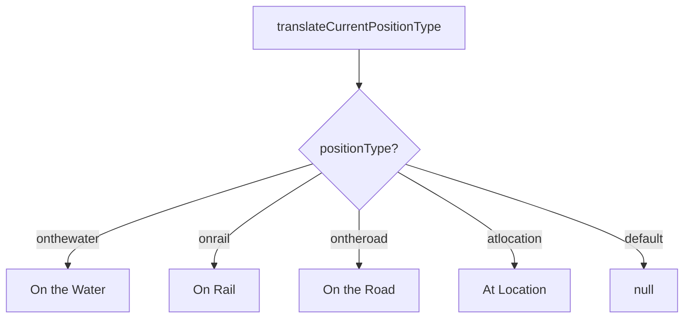

### SVG

<svg id="container" width="861.890625" xmlns="http://www.w3.org/2000/svg" class="flowchart" height="402.28125" viewBox="0 0 861.890625 402.28125" role="graphics-document document" aria-roledescription="flowchart-v2"><g><marker id="container_flowchart-v2-pointEnd" class="marker flowchart-v2" viewBox="0 0 10 10" refX="5" refY="5" markerUnits="userSpaceOnUse" markerWidth="8" markerHeight="8" orient="auto"><path d="M 0 0 L 10 5 L 0 10 z" class="arrowMarkerPath" style="stroke-width: 1; stroke-dasharray: 1, 0;"></path></marker><marker id="container_flowchart-v2-pointStart" class="marker flowchart-v2" viewBox="0 0 10 10" refX="4.5" refY="5" markerUnits="userSpaceOnUse" markerWidth="8" markerHeight="8" orient="auto"><path d="M 0 5 L 10 10 L 10 0 z" class="arrowMarkerPath" style="stroke-width: 1; stroke-dasharray: 1, 0;"></path></marker><marker id="container_flowchart-v2-circleEnd" class="marker flowchart-v2" viewBox="0 0 10 10" refX="11" refY="5" markerUnits="userSpaceOnUse" markerWidth="11" markerHeight="11" orient="auto"><circle cx="5" cy="5" r="5" class="arrowMarkerPath" style="stroke-width: 1; stroke-dasharray: 1, 0;"></circle></marker><marker id="container_flowchart-v2-circleStart" class="marker flowchart-v2" viewBox="0 0 10 10" refX="-1" refY="5" markerUnits="userSpaceOnUse" markerWidth="11" markerHeight="11" orient="auto"><circle cx="5" cy="5" r="5" class="arrowMarkerPath" style="stroke-width: 1; stroke-dasharray: 1, 0;"></circle></marker><marker id="container_flowchart-v2-crossEnd" class="marker cross flowchart-v2" viewBox="0 0 11 11" refX="12" refY="5.2" markerUnits="userSpaceOnUse" markerWidth="11" markerHeight="11" orient="auto"><path d="M 1,1 l 9,9 M 10,1 l -9,9" class="arrowMarkerPath" style="stroke-width: 2; stroke-dasharray: 1, 0;"></path></marker><marker id="container_flowchart-v2-crossStart" class="marker cross flowchart-v2" viewBox="0 0 11 11" refX="-1" refY="5.2" markerUnits="userSpaceOnUse" markerWidth="11" markerHeight="11" orient="auto"><path d="M 1,1 l 9,9 M 10,1 l -9,9" class="arrowMarkerPath" style="stroke-width: 2; stroke-dasharray: 1, 0;"></path></marker><g class="root"><g class="clusters"></g><g class="edgePaths"><path d="M449.664,62L449.664,66.167C449.664,70.333,449.664,78.667,449.664,86.333C449.664,94,449.664,101,449.664,104.5L449.664,108" id="L_A_B_0" class="edge-thickness-normal edge-pattern-solid edge-thickness-normal edge-pattern-solid flowchart-link" style=";" data-edge="true" data-et="edge" data-id="L_A_B_0" data-points="W3sieCI6NDQ5LjY2NDA2MjUsInkiOjYyfSx7IngiOjQ0OS42NjQwNjI1LCJ5Ijo4N30seyJ4Ijo0NDkuNjY0MDYyNSwieSI6MTEyfV0=" marker-end="url(#container_flowchart-v2-pointEnd)"></path><path d="M390.926,207.543L339.996,223.499C289.065,239.456,187.204,271.369,136.274,292.825C85.344,314.281,85.344,325.281,85.344,330.781L85.344,336.281" id="L_B_C_0" class="edge-thickness-normal edge-pattern-solid edge-thickness-normal edge-pattern-solid flowchart-link" style=";" data-edge="true" data-et="edge" data-id="L_B_C_0" data-points="W3sieCI6MzkwLjkyNTk0MTE1MzQ3ODgsInkiOjIwNy41NDMxMjg2NTM0Nzg3Nn0seyJ4Ijo4NS4zNDM3NSwieSI6MzAzLjI4MTI1fSx7IngiOjg1LjM0Mzc1LCJ5IjozNDAuMjgxMjV9XQ==" marker-end="url(#container_flowchart-v2-pointEnd)"></path><path d="M402.365,218.982L380.096,233.032C357.827,247.082,313.288,275.182,291.019,294.731C268.75,314.281,268.75,325.281,268.75,330.781L268.75,336.281" id="L_B_D_0" class="edge-thickness-normal edge-pattern-solid edge-thickness-normal edge-pattern-solid flowchart-link" style=";" data-edge="true" data-et="edge" data-id="L_B_D_0" data-points="W3sieCI6NDAyLjM2NDk1MzQwNjc0NCwieSI6MjE4Ljk4MjE0MDkwNjc0Mzk4fSx7IngiOjI2OC43NSwieSI6MzAzLjI4MTI1fSx7IngiOjI2OC43NSwieSI6MzQwLjI4MTI1fV0=" marker-end="url(#container_flowchart-v2-pointEnd)"></path><path d="M449.664,266.281L449.664,272.448C449.664,278.615,449.664,290.948,449.664,302.615C449.664,314.281,449.664,325.281,449.664,330.781L449.664,336.281" id="L_B_E_0" class="edge-thickness-normal edge-pattern-solid edge-thickness-normal edge-pattern-solid flowchart-link" style=";" data-edge="true" data-et="edge" data-id="L_B_E_0" data-points="W3sieCI6NDQ5LjY2NDA2MjUsInkiOjI2Ni4yODEyNX0seyJ4Ijo0NDkuNjY0MDYyNSwieSI6MzAzLjI4MTI1fSx7IngiOjQ0OS42NjQwNjI1LCJ5IjozNDAuMjgxMjV9XQ==" marker-end="url(#container_flowchart-v2-pointEnd)"></path><path d="M498.369,217.576L522.835,231.861C547.301,246.145,596.232,274.713,620.698,294.497C645.164,314.281,645.164,325.281,645.164,330.781L645.164,336.281" id="L_B_F_0" class="edge-thickness-normal edge-pattern-solid edge-thickness-normal edge-pattern-solid flowchart-link" style=";" data-edge="true" data-et="edge" data-id="L_B_F_0" data-points="W3sieCI6NDk4LjM2ODg4NjY0MDg4OTEsInkiOjIxNy41NzY0MjU4NTkxMTA4Nn0seyJ4Ijo2NDUuMTY0MDYyNSwieSI6MzAzLjI4MTI1fSx7IngiOjY0NS4xNjQwNjI1LCJ5IjozNDAuMjgxMjV9XQ==" marker-end="url(#container_flowchart-v2-pointEnd)"></path><path d="M508.242,207.703L558.51,223.633C608.778,239.563,709.315,271.422,759.583,292.852C809.852,314.281,809.852,325.281,809.852,330.781L809.852,336.281" id="L_B_G_0" class="edge-thickness-normal edge-pattern-solid edge-thickness-normal edge-pattern-solid flowchart-link" style=";" data-edge="true" data-et="edge" data-id="L_B_G_0" data-points="W3sieCI6NTA4LjI0MTg0MzE2MDE0NDMsInkiOjIwNy43MDM0NjkzMzk4NTU3M30seyJ4Ijo4MDkuODUxNTYyNSwieSI6MzAzLjI4MTI1fSx7IngiOjgwOS44NTE1NjI1LCJ5IjozNDAuMjgxMjV9XQ==" marker-end="url(#container_flowchart-v2-pointEnd)"></path></g><g class="edgeLabels"><g class="edgeLabel"><g class="label" data-id="L_A_B_0" transform="translate(0, 0)"><foreignObject width="0" height="0">

</foreignObject></g></g><g class="edgeLabel" transform="translate(85.34375, 303.28125)"><g class="label" data-id="L_B_C_0" transform="translate(-41.5078125, -12)"><foreignObject width="83.015625" height="24">

onthewater

</foreignObject></g></g><g class="edgeLabel" transform="translate(268.75, 303.28125)"><g class="label" data-id="L_B_D_0" transform="translate(-21.125, -12)"><foreignObject width="42.25" height="24">

onrail

</foreignObject></g></g><g class="edgeLabel" transform="translate(449.6640625, 303.28125)"><g class="label" data-id="L_B_E_0" transform="translate(-37.875, -12)"><foreignObject width="75.75" height="24">

ontheroad

</foreignObject></g></g><g class="edgeLabel" transform="translate(645.1640625, 303.28125)"><g class="label" data-id="L_B_F_0" transform="translate(-36.7421875, -12)"><foreignObject width="73.484375" height="24">

atlocation

</foreignObject></g></g><g class="edgeLabel" transform="translate(809.8515625, 303.28125)"><g class="label" data-id="L_B_G_0" transform="translate(-25.890625, -12)"><foreignObject width="51.78125" height="24">

default

</foreignObject></g></g></g><g class="nodes"><g class="node default" id="flowchart-A-0" transform="translate(449.6640625, 35)"><rect class="basic label-container" style="" x="-135.5703125" y="-27" width="271.140625" height="54"></rect><g class="label" style="" transform="translate(-105.5703125, -12)"><rect></rect><foreignObject width="211.140625" height="24">

translateCurrentPositionType

</foreignObject></g></g><g class="node default" id="flowchart-B-1" transform="translate(449.6640625, 189.140625)"><polygon points="77.140625,0 154.28125,-77.140625 77.140625,-154.28125 0,-77.140625" class="label-container" transform="translate(-76.640625, 77.140625)"></polygon><g class="label" style="" transform="translate(-50.140625, -12)"><rect></rect><foreignObject width="100.28125" height="24">

positionType?

</foreignObject></g></g><g class="node default" id="flowchart-C-3" transform="translate(85.34375, 367.28125)"><rect class="basic label-container" style="" x="-77.34375" y="-27" width="154.6875" height="54"></rect><g class="label" style="" transform="translate(-47.34375, -12)"><rect></rect><foreignObject width="94.6875" height="24">

On the Water

</foreignObject></g></g><g class="node default" id="flowchart-D-5" transform="translate(268.75, 367.28125)"><rect class="basic label-container" style="" x="-56.0625" y="-27" width="112.125" height="54"></rect><g class="label" style="" transform="translate(-26.0625, -12)"><rect></rect><foreignObject width="52.125" height="24">

On Rail

</foreignObject></g></g><g class="node default" id="flowchart-E-7" transform="translate(449.6640625, 367.28125)"><rect class="basic label-container" style="" x="-74.8515625" y="-27" width="149.703125" height="54"></rect><g class="label" style="" transform="translate(-44.8515625, -12)"><rect></rect><foreignObject width="89.703125" height="24">

On the Road

</foreignObject></g></g><g class="node default" id="flowchart-F-9" transform="translate(645.1640625, 367.28125)"><rect class="basic label-container" style="" x="-70.6484375" y="-27" width="141.296875" height="54"></rect><g class="label" style="" transform="translate(-40.6484375, -12)"><rect></rect><foreignObject width="81.296875" height="24">

At Location

</foreignObject></g></g><g class="node default" id="flowchart-G-11" transform="translate(809.8515625, 367.28125)"><rect class="basic label-container" style="" x="-44.0390625" y="-27" width="88.078125" height="54"></rect><g class="label" style="" transform="translate(-14.0390625, -12)"><rect></rect><foreignObject width="28.078125" height="24">

null

</foreignObject></g></g></g></g></g></svg>

## Diagram 5

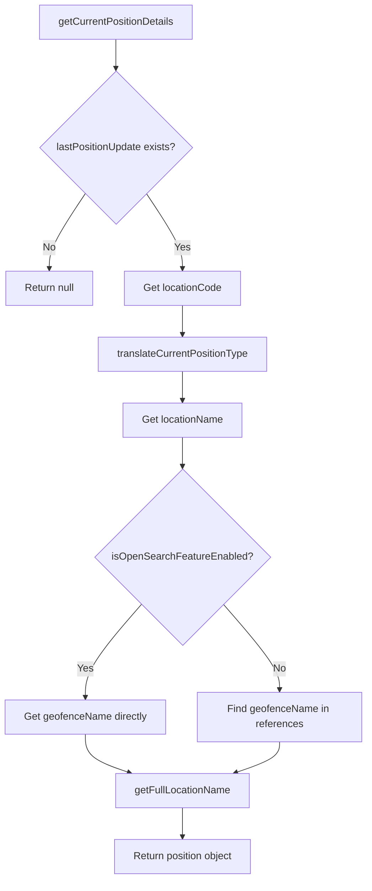

### SVG

<svg id="container" width="582.9375" xmlns="http://www.w3.org/2000/svg" class="flowchart" height="1384.515625" viewBox="0 0 582.9375 1384.515625" role="graphics-document document" aria-roledescription="flowchart-v2"><g><marker id="container_flowchart-v2-pointEnd" class="marker flowchart-v2" viewBox="0 0 10 10" refX="5" refY="5" markerUnits="userSpaceOnUse" markerWidth="8" markerHeight="8" orient="auto"><path d="M 0 0 L 10 5 L 0 10 z" class="arrowMarkerPath" style="stroke-width: 1; stroke-dasharray: 1, 0;"></path></marker><marker id="container_flowchart-v2-pointStart" class="marker flowchart-v2" viewBox="0 0 10 10" refX="4.5" refY="5" markerUnits="userSpaceOnUse" markerWidth="8" markerHeight="8" orient="auto"><path d="M 0 5 L 10 10 L 10 0 z" class="arrowMarkerPath" style="stroke-width: 1; stroke-dasharray: 1, 0;"></path></marker><marker id="container_flowchart-v2-circleEnd" class="marker flowchart-v2" viewBox="0 0 10 10" refX="11" refY="5" markerUnits="userSpaceOnUse" markerWidth="11" markerHeight="11" orient="auto"><circle cx="5" cy="5" r="5" class="arrowMarkerPath" style="stroke-width: 1; stroke-dasharray: 1, 0;"></circle></marker><marker id="container_flowchart-v2-circleStart" class="marker flowchart-v2" viewBox="0 0 10 10" refX="-1" refY="5" markerUnits="userSpaceOnUse" markerWidth="11" markerHeight="11" orient="auto"><circle cx="5" cy="5" r="5" class="arrowMarkerPath" style="stroke-width: 1; stroke-dasharray: 1, 0;"></circle></marker><marker id="container_flowchart-v2-crossEnd" class="marker cross flowchart-v2" viewBox="0 0 11 11" refX="12" refY="5.2" markerUnits="userSpaceOnUse" markerWidth="11" markerHeight="11" orient="auto"><path d="M 1,1 l 9,9 M 10,1 l -9,9" class="arrowMarkerPath" style="stroke-width: 2; stroke-dasharray: 1, 0;"></path></marker><marker id="container_flowchart-v2-crossStart" class="marker cross flowchart-v2" viewBox="0 0 11 11" refX="-1" refY="5.2" markerUnits="userSpaceOnUse" markerWidth="11" markerHeight="11" orient="auto"><path d="M 1,1 l 9,9 M 10,1 l -9,9" class="arrowMarkerPath" style="stroke-width: 2; stroke-dasharray: 1, 0;"></path></marker><g class="root"><g class="clusters"></g><g class="edgePaths"><path d="M184.898,62L184.898,66.167C184.898,70.333,184.898,78.667,184.898,86.333C184.898,94,184.898,101,184.898,104.5L184.898,108" id="L_A_B_0" class="edge-thickness-normal edge-pattern-solid edge-thickness-normal edge-pattern-solid flowchart-link" style=";" data-edge="true" data-et="edge" data-id="L_A_B_0" data-points="W3sieCI6MTg0Ljg5ODQzNzUsInkiOjYyfSx7IngiOjE4NC44OTg0Mzc1LCJ5Ijo4N30seyJ4IjoxODQuODk4NDM3NSwieSI6MTEyfV0=" marker-end="url(#container_flowchart-v2-pointEnd)"></path><path d="M135.911,307.872L126.351,322.203C116.792,336.534,97.673,365.197,88.114,385.028C78.555,404.859,78.555,415.859,78.555,421.359L78.555,426.859" id="L_B_C_0" class="edge-thickness-normal edge-pattern-solid edge-thickness-normal edge-pattern-solid flowchart-link" style=";" data-edge="true" data-et="edge" data-id="L_B_C_0" data-points="W3sieCI6MTM1LjkxMDcyNzUwNzA1NDg3LCJ5IjozMDcuODcxNjY1MDA3MDU0OX0seyJ4Ijo3OC41NTQ2ODc1LCJ5IjozOTMuODU5Mzc1fSx7IngiOjc4LjU1NDY4NzUsInkiOjQzMC44NTkzNzV9XQ==" marker-end="url(#container_flowchart-v2-pointEnd)"></path><path d="M233.886,307.872L243.445,322.203C253.005,336.534,272.124,365.197,281.683,385.028C291.242,404.859,291.242,415.859,291.242,421.359L291.242,426.859" id="L_B_D_0" class="edge-thickness-normal edge-pattern-solid edge-thickness-normal edge-pattern-solid flowchart-link" style=";" data-edge="true" data-et="edge" data-id="L_B_D_0" data-points="W3sieCI6MjMzLjg4NjE0NzQ5Mjk0NTEzLCJ5IjozMDcuODcxNjY1MDA3MDU0OX0seyJ4IjoyOTEuMjQyMTg3NSwieSI6MzkzLjg1OTM3NX0seyJ4IjoyOTEuMjQyMTg3NSwieSI6NDMwLjg1OTM3NX1d" marker-end="url(#container_flowchart-v2-pointEnd)"></path><path d="M291.242,484.859L291.242,489.026C291.242,493.193,291.242,501.526,291.242,509.193C291.242,516.859,291.242,523.859,291.242,527.359L291.242,530.859" id="L_D_E_0" class="edge-thickness-normal edge-pattern-solid edge-thickness-normal edge-pattern-solid flowchart-link" style=";" data-edge="true" data-et="edge" data-id="L_D_E_0" data-points="W3sieCI6MjkxLjI0MjE4NzUsInkiOjQ4NC44NTkzNzV9LHsieCI6MjkxLjI0MjE4NzUsInkiOjUwOS44NTkzNzV9LHsieCI6MjkxLjI0MjE4NzUsInkiOjUzNC44NTkzNzV9XQ==" marker-end="url(#container_flowchart-v2-pointEnd)"></path><path d="M291.242,588.859L291.242,593.026C291.242,597.193,291.242,605.526,291.242,613.193C291.242,620.859,291.242,627.859,291.242,631.359L291.242,634.859" id="L_E_F_0" class="edge-thickness-normal edge-pattern-solid edge-thickness-normal edge-pattern-solid flowchart-link" style=";" data-edge="true" data-et="edge" data-id="L_E_F_0" data-points="W3sieCI6MjkxLjI0MjE4NzUsInkiOjU4OC44NTkzNzV9LHsieCI6MjkxLjI0MjE4NzUsInkiOjYxMy44NTkzNzV9LHsieCI6MjkxLjI0MjE4NzUsInkiOjYzOC44NTkzNzV9XQ==" marker-end="url(#container_flowchart-v2-pointEnd)"></path><path d="M291.242,692.859L291.242,697.026C291.242,701.193,291.242,709.526,291.242,717.193C291.242,724.859,291.242,731.859,291.242,735.359L291.242,738.859" id="L_F_G_0" class="edge-thickness-normal edge-pattern-solid edge-thickness-normal edge-pattern-solid flowchart-link" style=";" data-edge="true" data-et="edge" data-id="L_F_G_0" data-points="W3sieCI6MjkxLjI0MjE4NzUsInkiOjY5Mi44NTkzNzV9LHsieCI6MjkxLjI0MjE4NzUsInkiOjcxNy44NTkzNzV9LHsieCI6MjkxLjI0MjE4NzUsInkiOjc0Mi44NTkzNzV9XQ==" marker-end="url(#container_flowchart-v2-pointEnd)"></path><path d="M227.034,952.307L212.119,969.175C197.205,986.043,167.376,1019.779,152.461,1044.148C137.547,1068.516,137.547,1083.516,137.547,1091.016L137.547,1098.516" id="L_G_H_0" class="edge-thickness-normal edge-pattern-solid edge-thickness-normal edge-pattern-solid flowchart-link" style=";" data-edge="true" data-et="edge" data-id="L_G_H_0" data-points="W3sieCI6MjI3LjAzMzUyNjMwODY0OTIsInkiOjk1Mi4zMDY5NjM4MDg2NDkyfSx7IngiOjEzNy41NDY4NzUsInkiOjEwNTMuNTE1NjI1fSx7IngiOjEzNy41NDY4NzUsInkiOjExMDIuNTE1NjI1fV0=" marker-end="url(#container_flowchart-v2-pointEnd)"></path><path d="M355.451,952.307L370.365,969.175C385.28,986.043,415.109,1019.779,430.023,1042.148C444.938,1064.516,444.938,1075.516,444.938,1081.016L444.938,1086.516" id="L_G_I_0" class="edge-thickness-normal edge-pattern-solid edge-thickness-normal edge-pattern-solid flowchart-link" style=";" data-edge="true" data-et="edge" data-id="L_G_I_0" data-points="W3sieCI6MzU1LjQ1MDg0ODY5MTM1MDgsInkiOjk1Mi4zMDY5NjM4MDg2NDkyfSx7IngiOjQ0NC45Mzc1LCJ5IjoxMDUzLjUxNTYyNX0seyJ4Ijo0NDQuOTM3NSwieSI6MTA5MC41MTU2MjV9XQ==" marker-end="url(#container_flowchart-v2-pointEnd)"></path><path d="M137.547,1156.516L137.547,1162.682C137.547,1168.849,137.547,1181.182,149.231,1191.302C160.915,1201.422,184.282,1209.328,195.966,1213.281L207.65,1217.234" id="L_H_J_0" class="edge-thickness-normal edge-pattern-solid edge-thickness-normal edge-pattern-solid flowchart-link" style=";" data-edge="true" data-et="edge" data-id="L_H_J_0" data-points="W3sieCI6MTM3LjU0Njg3NSwieSI6MTE1Ni41MTU2MjV9LHsieCI6MTM3LjU0Njg3NSwieSI6MTE5My41MTU2MjV9LHsieCI6MjExLjQzODg1MjE2MzQ2MTU1LCJ5IjoxMjE4LjUxNTYyNX1d" marker-end="url(#container_flowchart-v2-pointEnd)"></path><path d="M444.938,1168.516L444.938,1172.682C444.938,1176.849,444.938,1185.182,433.254,1193.302C421.57,1201.422,398.202,1209.328,386.518,1213.281L374.835,1217.234" id="L_I_J_0" class="edge-thickness-normal edge-pattern-solid edge-thickness-normal edge-pattern-solid flowchart-link" style=";" data-edge="true" data-et="edge" data-id="L_I_J_0" data-points="W3sieCI6NDQ0LjkzNzUsInkiOjExNjguNTE1NjI1fSx7IngiOjQ0NC45Mzc1LCJ5IjoxMTkzLjUxNTYyNX0seyJ4IjozNzEuMDQ1NTIyODM2NTM4NDUsInkiOjEyMTguNTE1NjI1fV0=" marker-end="url(#container_flowchart-v2-pointEnd)"></path><path d="M291.242,1272.516L291.242,1276.682C291.242,1280.849,291.242,1289.182,291.242,1296.849C291.242,1304.516,291.242,1311.516,291.242,1315.016L291.242,1318.516" id="L_J_K_0" class="edge-thickness-normal edge-pattern-solid edge-thickness-normal edge-pattern-solid flowchart-link" style=";" data-edge="true" data-et="edge" data-id="L_J_K_0" data-points="W3sieCI6MjkxLjI0MjE4NzUsInkiOjEyNzIuNTE1NjI1fSx7IngiOjI5MS4yNDIxODc1LCJ5IjoxMjk3LjUxNTYyNX0seyJ4IjoyOTEuMjQyMTg3NSwieSI6MTMyMi41MTU2MjV9XQ==" marker-end="url(#container_flowchart-v2-pointEnd)"></path></g><g class="edgeLabels"><g class="edgeLabel"><g class="label" data-id="L_A_B_0" transform="translate(0, 0)"><foreignObject width="0" height="0">

</foreignObject></g></g><g class="edgeLabel" transform="translate(78.5546875, 393.859375)"><g class="label" data-id="L_B_C_0" transform="translate(-10.140625, -12)"><foreignObject width="20.28125" height="24">

No

</foreignObject></g></g><g class="edgeLabel" transform="translate(291.2421875, 393.859375)"><g class="label" data-id="L_B_D_0" transform="translate(-12.03125, -12)"><foreignObject width="24.0625" height="24">

Yes

</foreignObject></g></g><g class="edgeLabel"><g class="label" data-id="L_D_E_0" transform="translate(0, 0)"><foreignObject width="0" height="0">

</foreignObject></g></g><g class="edgeLabel"><g class="label" data-id="L_E_F_0" transform="translate(0, 0)"><foreignObject width="0" height="0">

</foreignObject></g></g><g class="edgeLabel"><g class="label" data-id="L_F_G_0" transform="translate(0, 0)"><foreignObject width="0" height="0">

</foreignObject></g></g><g class="edgeLabel" transform="translate(137.546875, 1053.515625)"><g class="label" data-id="L_G_H_0" transform="translate(-12.03125, -12)"><foreignObject width="24.0625" height="24">

Yes

</foreignObject></g></g><g class="edgeLabel" transform="translate(444.9375, 1053.515625)"><g class="label" data-id="L_G_I_0" transform="translate(-10.140625, -12)"><foreignObject width="20.28125" height="24">

No

</foreignObject></g></g><g class="edgeLabel"><g class="label" data-id="L_H_J_0" transform="translate(0, 0)"><foreignObject width="0" height="0">

</foreignObject></g></g><g class="edgeLabel"><g class="label" data-id="L_I_J_0" transform="translate(0, 0)"><foreignObject width="0" height="0">

</foreignObject></g></g><g class="edgeLabel"><g class="label" data-id="L_J_K_0" transform="translate(0, 0)"><foreignObject width="0" height="0">

</foreignObject></g></g></g><g class="nodes"><g class="node default" id="flowchart-A-0" transform="translate(184.8984375, 35)"><rect class="basic label-container" style="" x="-122.765625" y="-27" width="245.53125" height="54"></rect><g class="label" style="" transform="translate(-92.765625, -12)"><rect></rect><foreignObject width="185.53125" height="24">

getCurrentPositionDetails

</foreignObject></g></g><g class="node default" id="flowchart-B-1" transform="translate(184.8984375, 234.4296875)"><polygon points="122.4296875,0 244.859375,-122.4296875 122.4296875,-244.859375 0,-122.4296875" class="label-container" transform="translate(-121.9296875, 122.4296875)"></polygon><g class="label" style="" transform="translate(-95.4296875, -12)"><rect></rect><foreignObject width="190.859375" height="24">

lastPositionUpdate exists?

</foreignObject></g></g><g class="node default" id="flowchart-C-3" transform="translate(78.5546875, 457.859375)"><rect class="basic label-container" style="" x="-70.5546875" y="-27" width="141.109375" height="54"></rect><g class="label" style="" transform="translate(-40.5546875, -12)"><rect></rect><foreignObject width="81.109375" height="24">

Return null

</foreignObject></g></g><g class="node default" id="flowchart-D-5" transform="translate(291.2421875, 457.859375)"><rect class="basic label-container" style="" x="-92.1328125" y="-27" width="184.265625" height="54"></rect><g class="label" style="" transform="translate(-62.1328125, -12)"><rect></rect><foreignObject width="124.265625" height="24">

Get locationCode

</foreignObject></g></g><g class="node default" id="flowchart-E-7" transform="translate(291.2421875, 561.859375)"><rect class="basic label-container" style="" x="-135.5703125" y="-27" width="271.140625" height="54"></rect><g class="label" style="" transform="translate(-105.5703125, -12)"><rect></rect><foreignObject width="211.140625" height="24">

translateCurrentPositionType

</foreignObject></g></g><g class="node default" id="flowchart-F-9" transform="translate(291.2421875, 665.859375)"><rect class="basic label-container" style="" x="-95.03125" y="-27" width="190.0625" height="54"></rect><g class="label" style="" transform="translate(-65.03125, -12)"><rect></rect><foreignObject width="130.0625" height="24">

Get locationName

</foreignObject></g></g><g class="node default" id="flowchart-G-11" transform="translate(291.2421875, 879.6875)"><polygon points="136.828125,0 273.65625,-136.828125 136.828125,-273.65625 0,-136.828125" class="label-container" transform="translate(-136.328125, 136.828125)"></polygon><g class="label" style="" transform="translate(-109.828125, -12)"><rect></rect><foreignObject width="219.65625" height="24">

isOpenSearchFeatureEnabled?

</foreignObject></g></g><g class="node default" id="flowchart-H-13" transform="translate(137.546875, 1129.515625)"><rect class="basic label-container" style="" x="-127.390625" y="-27" width="254.78125" height="54"></rect><g class="label" style="" transform="translate(-97.390625, -12)"><rect></rect><foreignObject width="194.78125" height="24">

Get geofenceName directly

</foreignObject></g></g><g class="node default" id="flowchart-I-15" transform="translate(444.9375, 1129.515625)"><rect class="basic label-container" style="" x="-130" y="-39" width="260" height="78"></rect><g class="label" style="" transform="translate(-100, -24)"><rect></rect><foreignObject width="200" height="48">

Find geofenceName in references

</foreignObject></g></g><g class="node default" id="flowchart-J-17" transform="translate(291.2421875, 1245.515625)"><rect class="basic label-container" style="" x="-106.3515625" y="-27" width="212.703125" height="54"></rect><g class="label" style="" transform="translate(-76.3515625, -12)"><rect></rect><foreignObject width="152.703125" height="24">

getFullLocationName

</foreignObject></g></g><g class="node default" id="flowchart-K-21" transform="translate(291.2421875, 1349.515625)"><rect class="basic label-container" style="" x="-111.296875" y="-27" width="222.59375" height="54"></rect><g class="label" style="" transform="translate(-81.296875, -12)"><rect></rect><foreignObject width="162.59375" height="24">

Return position object

</foreignObject></g></g></g></g></g></svg>

## Diagram 6

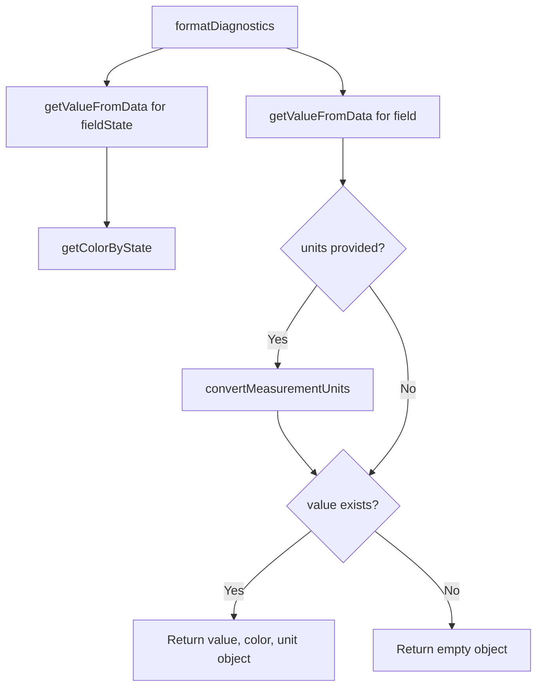

### SVG

<svg id="container" width="698.51953125" xmlns="http://www.w3.org/2000/svg" class="flowchart" height="890.328125" viewBox="0 0 698.51953125 890.328125" role="graphics-document document" aria-roledescription="flowchart-v2"><g><marker id="container_flowchart-v2-pointEnd" class="marker flowchart-v2" viewBox="0 0 10 10" refX="5" refY="5" markerUnits="userSpaceOnUse" markerWidth="8" markerHeight="8" orient="auto"><path d="M 0 0 L 10 5 L 0 10 z" class="arrowMarkerPath" style="stroke-width: 1; stroke-dasharray: 1, 0;"></path></marker><marker id="container_flowchart-v2-pointStart" class="marker flowchart-v2" viewBox="0 0 10 10" refX="4.5" refY="5" markerUnits="userSpaceOnUse" markerWidth="8" markerHeight="8" orient="auto"><path d="M 0 5 L 10 10 L 10 0 z" class="arrowMarkerPath" style="stroke-width: 1; stroke-dasharray: 1, 0;"></path></marker><marker id="container_flowchart-v2-circleEnd" class="marker flowchart-v2" viewBox="0 0 10 10" refX="11" refY="5" markerUnits="userSpaceOnUse" markerWidth="11" markerHeight="11" orient="auto"><circle cx="5" cy="5" r="5" class="arrowMarkerPath" style="stroke-width: 1; stroke-dasharray: 1, 0;"></circle></marker><marker id="container_flowchart-v2-circleStart" class="marker flowchart-v2" viewBox="0 0 10 10" refX="-1" refY="5" markerUnits="userSpaceOnUse" markerWidth="11" markerHeight="11" orient="auto"><circle cx="5" cy="5" r="5" class="arrowMarkerPath" style="stroke-width: 1; stroke-dasharray: 1, 0;"></circle></marker><marker id="container_flowchart-v2-crossEnd" class="marker cross flowchart-v2" viewBox="0 0 11 11" refX="12" refY="5.2" markerUnits="userSpaceOnUse" markerWidth="11" markerHeight="11" orient="auto"><path d="M 1,1 l 9,9 M 10,1 l -9,9" class="arrowMarkerPath" style="stroke-width: 2; stroke-dasharray: 1, 0;"></path></marker><marker id="container_flowchart-v2-crossStart" class="marker cross flowchart-v2" viewBox="0 0 11 11" refX="-1" refY="5.2" markerUnits="userSpaceOnUse" markerWidth="11" markerHeight="11" orient="auto"><path d="M 1,1 l 9,9 M 10,1 l -9,9" class="arrowMarkerPath" style="stroke-width: 2; stroke-dasharray: 1, 0;"></path></marker><g class="root"><g class="clusters"></g><g class="edgePaths"><path d="M370.686,62L382.958,66.167C395.231,70.333,419.775,78.667,432.048,88.333C444.32,98,444.32,109,444.32,114.5L444.32,120" id="L_A_B_0" class="edge-thickness-normal edge-pattern-solid edge-thickness-normal edge-pattern-solid flowchart-link" style=";" data-edge="true" data-et="edge" data-id="L_A_B_0" data-points="W3sieCI6MzcwLjY4NTYyMTk5NTE5MjMsInkiOjYyfSx7IngiOjQ0NC4zMjAzMTI1LCJ5Ijo4N30seyJ4Ijo0NDQuMzIwMzEyNSwieSI6MTI0fV0=" marker-end="url(#container_flowchart-v2-pointEnd)"></path><path d="M211.635,62L199.362,66.167C187.09,70.333,162.545,78.667,150.272,86.333C138,94,138,101,138,104.5L138,108" id="L_A_C_0" class="edge-thickness-normal edge-pattern-solid edge-thickness-normal edge-pattern-solid flowchart-link" style=";" data-edge="true" data-et="edge" data-id="L_A_C_0" data-points="W3sieCI6MjExLjYzNDY5MDUwNDgwNzY4LCJ5Ijo2Mn0seyJ4IjoxMzgsInkiOjg3fSx7IngiOjEzOCwieSI6MTEyfV0=" marker-end="url(#container_flowchart-v2-pointEnd)"></path><path d="M138,190L138,194.167C138,198.333,138,206.667,138,223.73C138,240.794,138,266.589,138,279.486L138,292.383" id="L_C_D_0" class="edge-thickness-normal edge-pattern-solid edge-thickness-normal edge-pattern-solid flowchart-link" style=";" data-edge="true" data-et="edge" data-id="L_C_D_0" data-points="W3sieCI6MTM4LCJ5IjoxOTB9LHsieCI6MTM4LCJ5IjoyMTV9LHsieCI6MTM4LCJ5IjoyOTYuMzgyODEyNX1d" marker-end="url(#container_flowchart-v2-pointEnd)"></path><path d="M444.32,178L444.32,184.167C444.32,190.333,444.32,202.667,444.32,212.333C444.32,222,444.32,229,444.32,232.5L444.32,236" id="L_B_E_0" class="edge-thickness-normal edge-pattern-solid edge-thickness-normal edge-pattern-solid flowchart-link" style=";" data-edge="true" data-et="edge" data-id="L_B_E_0" data-points="W3sieCI6NDQ0LjMyMDMxMjUsInkiOjE3OH0seyJ4Ijo0NDQuMzIwMzEyNSwieSI6MjE1fSx7IngiOjQ0NC4zMjAzMTI1LCJ5IjoyNDB9XQ==" marker-end="url(#container_flowchart-v2-pointEnd)"></path><path d="M409.766,372.211L401.326,384.137C392.887,396.063,376.008,419.914,367.568,437.34C359.129,454.766,359.129,465.766,359.129,471.266L359.129,476.766" id="L_E_F_0" class="edge-thickness-normal edge-pattern-solid edge-thickness-normal edge-pattern-solid flowchart-link" style=";" data-edge="true" data-et="edge" data-id="L_E_F_0" data-points="W3sieCI6NDA5Ljc2NTg4Njg2NjUzMjQsInkiOjM3Mi4yMTExOTkzNjY1MzI0fSx7IngiOjM1OS4xMjg5MDYyNSwieSI6NDQzLjc2NTYyNX0seyJ4IjozNTkuMTI4OTA2MjUsInkiOjQ4MC43NjU2MjV9XQ==" marker-end="url(#container_flowchart-v2-pointEnd)"></path><path d="M359.129,534.766L359.129,538.932C359.129,543.099,359.129,551.432,367.242,564.911C375.355,578.389,391.58,597.013,399.693,606.325L407.806,615.636" id="L_F_G_0" class="edge-thickness-normal edge-pattern-solid edge-thickness-normal edge-pattern-solid flowchart-link" style=";" data-edge="true" data-et="edge" data-id="L_F_G_0" data-points="W3sieCI6MzU5LjEyODkwNjI1LCJ5Ijo1MzQuNzY1NjI1fSx7IngiOjM1OS4xMjg5MDYyNSwieSI6NTU5Ljc2NTYyNX0seyJ4Ijo0MTAuNDMzNjI2MDIzNDA5LCJ5Ijo2MTguNjUyMzExNDc2NTkxfV0=" marker-end="url(#container_flowchart-v2-pointEnd)"></path><path d="M478.875,372.211L487.314,384.137C495.754,396.063,512.633,419.914,521.072,442.507C529.512,465.099,529.512,486.432,529.512,505.766C529.512,525.099,529.512,542.432,521.399,560.411C513.286,578.389,497.06,597.013,488.947,606.325L480.835,615.636" id="L_E_G_0" class="edge-thickness-normal edge-pattern-solid edge-thickness-normal edge-pattern-solid flowchart-link" style=";" data-edge="true" data-et="edge" data-id="L_E_G_0" data-points="W3sieCI6NDc4Ljg3NDczODEzMzQ2NzYsInkiOjM3Mi4yMTExOTkzNjY1MzI0fSx7IngiOjUyOS41MTE3MTg3NSwieSI6NDQzLjc2NTYyNX0seyJ4Ijo1MjkuNTExNzE4NzUsInkiOjUwNy43NjU2MjV9LHsieCI6NTI5LjUxMTcxODc1LCJ5Ijo1NTkuNzY1NjI1fSx7IngiOjQ3OC4yMDY5OTg5NzY1OTEsInkiOjYxOC42NTIzMTE0NzY1OTF9XQ==" marker-end="url(#container_flowchart-v2-pointEnd)"></path><path d="M403.265,689.272L386.43,702.282C369.594,715.291,335.924,741.31,319.089,759.819C302.254,778.328,302.254,789.328,302.254,794.828L302.254,800.328" id="L_G_H_0" class="edge-thickness-normal edge-pattern-solid edge-thickness-normal edge-pattern-solid flowchart-link" style=";" data-edge="true" data-et="edge" data-id="L_G_H_0" data-points="W3sieCI6NDAzLjI2NDY1NjkzNDg3OTcsInkiOjY4OS4yNzI0Njk0MzQ4Nzk3fSx7IngiOjMwMi4yNTM5MDYyNSwieSI6NzY3LjMyODEyNX0seyJ4IjozMDIuMjUzOTA2MjUsInkiOjgwNC4zMjgxMjV9XQ==" marker-end="url(#container_flowchart-v2-pointEnd)"></path><path d="M485.376,689.272L502.211,702.282C519.046,715.291,552.716,741.31,569.552,761.819C586.387,782.328,586.387,797.328,586.387,804.828L586.387,812.328" id="L_G_I_0" class="edge-thickness-normal edge-pattern-solid edge-thickness-normal edge-pattern-solid flowchart-link" style=";" data-edge="true" data-et="edge" data-id="L_G_I_0" data-points="W3sieCI6NDg1LjM3NTk2ODA2NTEyMDMsInkiOjY4OS4yNzI0Njk0MzQ4Nzk3fSx7IngiOjU4Ni4zODY3MTg3NSwieSI6NzY3LjMyODEyNX0seyJ4Ijo1ODYuMzg2NzE4NzUsInkiOjgxNi4zMjgxMjV9XQ==" marker-end="url(#container_flowchart-v2-pointEnd)"></path></g><g class="edgeLabels"><g class="edgeLabel"><g class="label" data-id="L_A_B_0" transform="translate(0, 0)"><foreignObject width="0" height="0">

</foreignObject></g></g><g class="edgeLabel"><g class="label" data-id="L_A_C_0" transform="translate(0, 0)"><foreignObject width="0" height="0">

</foreignObject></g></g><g class="edgeLabel"><g class="label" data-id="L_C_D_0" transform="translate(0, 0)"><foreignObject width="0" height="0">

</foreignObject></g></g><g class="edgeLabel"><g class="label" data-id="L_B_E_0" transform="translate(0, 0)"><foreignObject width="0" height="0">

</foreignObject></g></g><g class="edgeLabel" transform="translate(359.12890625, 443.765625)"><g class="label" data-id="L_E_F_0" transform="translate(-12.03125, -12)"><foreignObject width="24.0625" height="24">

Yes

</foreignObject></g></g><g class="edgeLabel"><g class="label" data-id="L_F_G_0" transform="translate(0, 0)"><foreignObject width="0" height="0">

</foreignObject></g></g><g class="edgeLabel" transform="translate(529.51171875, 507.765625)"><g class="label" data-id="L_E_G_0" transform="translate(-10.140625, -12)"><foreignObject width="20.28125" height="24">

No

</foreignObject></g></g><g class="edgeLabel" transform="translate(302.25390625, 767.328125)"><g class="label" data-id="L_G_H_0" transform="translate(-12.03125, -12)"><foreignObject width="24.0625" height="24">

Yes

</foreignObject></g></g><g class="edgeLabel" transform="translate(586.38671875, 767.328125)"><g class="label" data-id="L_G_I_0" transform="translate(-10.140625, -12)"><foreignObject width="20.28125" height="24">

No

</foreignObject></g></g></g><g class="nodes"><g class="node default" id="flowchart-A-0" transform="translate(291.16015625, 35)"><rect class="basic label-container" style="" x="-96.1015625" y="-27" width="192.203125" height="54"></rect><g class="label" style="" transform="translate(-66.1015625, -12)"><rect></rect><foreignObject width="132.203125" height="24">

formatDiagnostics

</foreignObject></g></g><g class="node default" id="flowchart-B-1" transform="translate(444.3203125, 151)"><rect class="basic label-container" style="" x="-126.3203125" y="-27" width="252.640625" height="54"></rect><g class="label" style="" transform="translate(-96.3203125, -12)"><rect></rect><foreignObject width="192.640625" height="24">

getValueFromData for field

</foreignObject></g></g><g class="node default" id="flowchart-C-3" transform="translate(138, 151)"><rect class="basic label-container" style="" x="-130" y="-39" width="260" height="78"></rect><g class="label" style="" transform="translate(-100, -24)"><rect></rect><foreignObject width="200" height="48">

getValueFromData for fieldState

</foreignObject></g></g><g class="node default" id="flowchart-D-5" transform="translate(138, 323.3828125)"><rect class="basic label-container" style="" x="-87.8125" y="-27" width="175.625" height="54"></rect><g class="label" style="" transform="translate(-57.8125, -12)"><rect></rect><foreignObject width="115.625" height="24">

getColorByState

</foreignObject></g></g><g class="node default" id="flowchart-E-7" transform="translate(444.3203125, 323.3828125)"><polygon points="83.3828125,0 166.765625,-83.3828125 83.3828125,-166.765625 0,-83.3828125" class="label-container" transform="translate(-82.8828125, 83.3828125)"></polygon><g class="label" style="" transform="translate(-56.3828125, -12)"><rect></rect><foreignObject width="112.765625" height="24">

units provided?

</foreignObject></g></g><g class="node default" id="flowchart-F-9" transform="translate(359.12890625, 507.765625)"><rect class="basic label-container" style="" x="-125.2421875" y="-27" width="250.484375" height="54"></rect><g class="label" style="" transform="translate(-95.2421875, -12)"><rect></rect><foreignObject width="190.484375" height="24">

convertMeasurementUnits

</foreignObject></g></g><g class="node default" id="flowchart-G-11" transform="translate(444.3203125, 657.546875)"><polygon points="72.78125,0 145.5625,-72.78125 72.78125,-145.5625 0,-72.78125" class="label-container" transform="translate(-72.28125, 72.78125)"></polygon><g class="label" style="" transform="translate(-45.78125, -12)"><rect></rect><foreignObject width="91.5625" height="24">

value exists?

</foreignObject></g></g><g class="node default" id="flowchart-H-15" transform="translate(302.25390625, 843.328125)"><rect class="basic label-container" style="" x="-130" y="-39" width="260" height="78"></rect><g class="label" style="" transform="translate(-100, -24)"><rect></rect><foreignObject width="200" height="48">

Return value, color, unit object

</foreignObject></g></g><g class="node default" id="flowchart-I-17" transform="translate(586.38671875, 843.328125)"><rect class="basic label-container" style="" x="-104.1328125" y="-27" width="208.265625" height="54"></rect><g class="label" style="" transform="translate(-74.1328125, -12)"><rect></rect><foreignObject width="148.265625" height="24">

Return empty object

</foreignObject></g></g></g></g></g></svg>

## Diagram 7

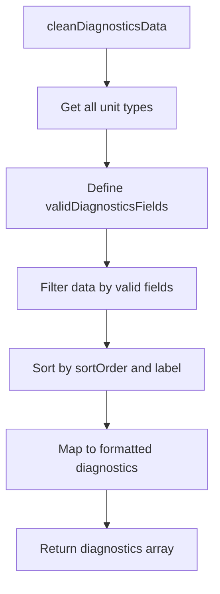

### SVG

<svg id="container" width="276" xmlns="http://www.w3.org/2000/svg" class="flowchart" height="742" viewBox="0 0 276 742" role="graphics-document document" aria-roledescription="flowchart-v2"><g><marker id="container_flowchart-v2-pointEnd" class="marker flowchart-v2" viewBox="0 0 10 10" refX="5" refY="5" markerUnits="userSpaceOnUse" markerWidth="8" markerHeight="8" orient="auto"><path d="M 0 0 L 10 5 L 0 10 z" class="arrowMarkerPath" style="stroke-width: 1; stroke-dasharray: 1, 0;"></path></marker><marker id="container_flowchart-v2-pointStart" class="marker flowchart-v2" viewBox="0 0 10 10" refX="4.5" refY="5" markerUnits="userSpaceOnUse" markerWidth="8" markerHeight="8" orient="auto"><path d="M 0 5 L 10 10 L 10 0 z" class="arrowMarkerPath" style="stroke-width: 1; stroke-dasharray: 1, 0;"></path></marker><marker id="container_flowchart-v2-circleEnd" class="marker flowchart-v2" viewBox="0 0 10 10" refX="11" refY="5" markerUnits="userSpaceOnUse" markerWidth="11" markerHeight="11" orient="auto"><circle cx="5" cy="5" r="5" class="arrowMarkerPath" style="stroke-width: 1; stroke-dasharray: 1, 0;"></circle></marker><marker id="container_flowchart-v2-circleStart" class="marker flowchart-v2" viewBox="0 0 10 10" refX="-1" refY="5" markerUnits="userSpaceOnUse" markerWidth="11" markerHeight="11" orient="auto"><circle cx="5" cy="5" r="5" class="arrowMarkerPath" style="stroke-width: 1; stroke-dasharray: 1, 0;"></circle></marker><marker id="container_flowchart-v2-crossEnd" class="marker cross flowchart-v2" viewBox="0 0 11 11" refX="12" refY="5.2" markerUnits="userSpaceOnUse" markerWidth="11" markerHeight="11" orient="auto"><path d="M 1,1 l 9,9 M 10,1 l -9,9" class="arrowMarkerPath" style="stroke-width: 2; stroke-dasharray: 1, 0;"></path></marker><marker id="container_flowchart-v2-crossStart" class="marker cross flowchart-v2" viewBox="0 0 11 11" refX="-1" refY="5.2" markerUnits="userSpaceOnUse" markerWidth="11" markerHeight="11" orient="auto"><path d="M 1,1 l 9,9 M 10,1 l -9,9" class="arrowMarkerPath" style="stroke-width: 2; stroke-dasharray: 1, 0;"></path></marker><g class="root"><g class="clusters"></g><g class="edgePaths"><path d="M138,62L138,66.167C138,70.333,138,78.667,138,86.333C138,94,138,101,138,104.5L138,108" id="L_A_B_0" class="edge-thickness-normal edge-pattern-solid edge-thickness-normal edge-pattern-solid flowchart-link" style=";" data-edge="true" data-et="edge" data-id="L_A_B_0" data-points="W3sieCI6MTM4LCJ5Ijo2Mn0seyJ4IjoxMzgsInkiOjg3fSx7IngiOjEzOCwieSI6MTEyfV0=" marker-end="url(#container_flowchart-v2-pointEnd)"></path><path d="M138,166L138,170.167C138,174.333,138,182.667,138,190.333C138,198,138,205,138,208.5L138,212" id="L_B_C_0" class="edge-thickness-normal edge-pattern-solid edge-thickness-normal edge-pattern-solid flowchart-link" style=";" data-edge="true" data-et="edge" data-id="L_B_C_0" data-points="W3sieCI6MTM4LCJ5IjoxNjZ9LHsieCI6MTM4LCJ5IjoxOTF9LHsieCI6MTM4LCJ5IjoyMTZ9XQ==" marker-end="url(#container_flowchart-v2-pointEnd)"></path><path d="M138,294L138,298.167C138,302.333,138,310.667,138,318.333C138,326,138,333,138,336.5L138,340" id="L_C_D_0" class="edge-thickness-normal edge-pattern-solid edge-thickness-normal edge-pattern-solid flowchart-link" style=";" data-edge="true" data-et="edge" data-id="L_C_D_0" data-points="W3sieCI6MTM4LCJ5IjoyOTR9LHsieCI6MTM4LCJ5IjozMTl9LHsieCI6MTM4LCJ5IjozNDR9XQ==" marker-end="url(#container_flowchart-v2-pointEnd)"></path><path d="M138,398L138,402.167C138,406.333,138,414.667,138,422.333C138,430,138,437,138,440.5L138,444" id="L_D_E_0" class="edge-thickness-normal edge-pattern-solid edge-thickness-normal edge-pattern-solid flowchart-link" style=";" data-edge="true" data-et="edge" data-id="L_D_E_0" data-points="W3sieCI6MTM4LCJ5IjozOTh9LHsieCI6MTM4LCJ5Ijo0MjN9LHsieCI6MTM4LCJ5Ijo0NDh9XQ==" marker-end="url(#container_flowchart-v2-pointEnd)"></path><path d="M138,502L138,506.167C138,510.333,138,518.667,138,526.333C138,534,138,541,138,544.5L138,548" id="L_E_F_0" class="edge-thickness-normal edge-pattern-solid edge-thickness-normal edge-pattern-solid flowchart-link" style=";" data-edge="true" data-et="edge" data-id="L_E_F_0" data-points="W3sieCI6MTM4LCJ5Ijo1MDJ9LHsieCI6MTM4LCJ5Ijo1Mjd9LHsieCI6MTM4LCJ5Ijo1NTJ9XQ==" marker-end="url(#container_flowchart-v2-pointEnd)"></path><path d="M138,630L138,634.167C138,638.333,138,646.667,138,654.333C138,662,138,669,138,672.5L138,676" id="L_F_G_0" class="edge-thickness-normal edge-pattern-solid edge-thickness-normal edge-pattern-solid flowchart-link" style=";" data-edge="true" data-et="edge" data-id="L_F_G_0" data-points="W3sieCI6MTM4LCJ5Ijo2MzB9LHsieCI6MTM4LCJ5Ijo2NTV9LHsieCI6MTM4LCJ5Ijo2ODB9XQ==" marker-end="url(#container_flowchart-v2-pointEnd)"></path></g><g class="edgeLabels"><g class="edgeLabel"><g class="label" data-id="L_A_B_0" transform="translate(0, 0)"><foreignObject width="0" height="0">

</foreignObject></g></g><g class="edgeLabel"><g class="label" data-id="L_B_C_0" transform="translate(0, 0)"><foreignObject width="0" height="0">

</foreignObject></g></g><g class="edgeLabel"><g class="label" data-id="L_C_D_0" transform="translate(0, 0)"><foreignObject width="0" height="0">

</foreignObject></g></g><g class="edgeLabel"><g class="label" data-id="L_D_E_0" transform="translate(0, 0)"><foreignObject width="0" height="0">

</foreignObject></g></g><g class="edgeLabel"><g class="label" data-id="L_E_F_0" transform="translate(0, 0)"><foreignObject width="0" height="0">

</foreignObject></g></g><g class="edgeLabel"><g class="label" data-id="L_F_G_0" transform="translate(0, 0)"><foreignObject width="0" height="0">

</foreignObject></g></g></g><g class="nodes"><g class="node default" id="flowchart-A-0" transform="translate(138, 35)"><rect class="basic label-container" style="" x="-107.703125" y="-27" width="215.40625" height="54"></rect><g class="label" style="" transform="translate(-77.703125, -12)"><rect></rect><foreignObject width="155.40625" height="24">

cleanDiagnosticsData

</foreignObject></g></g><g class="node default" id="flowchart-B-1" transform="translate(138, 139)"><rect class="basic label-container" style="" x="-91.7421875" y="-27" width="183.484375" height="54"></rect><g class="label" style="" transform="translate(-61.7421875, -12)"><rect></rect><foreignObject width="123.484375" height="24">

Get all unit types

</foreignObject></g></g><g class="node default" id="flowchart-C-3" transform="translate(138, 255)"><rect class="basic label-container" style="" x="-130" y="-39" width="260" height="78"></rect><g class="label" style="" transform="translate(-100, -24)"><rect></rect><foreignObject width="200" height="48">

Define validDiagnosticsFields

</foreignObject></g></g><g class="node default" id="flowchart-D-5" transform="translate(138, 371)"><rect class="basic label-container" style="" x="-119.171875" y="-27" width="238.34375" height="54"></rect><g class="label" style="" transform="translate(-89.171875, -12)"><rect></rect><foreignObject width="178.34375" height="24">

Filter data by valid fields

</foreignObject></g></g><g class="node default" id="flowchart-E-7" transform="translate(138, 475)"><rect class="basic label-container" style="" x="-129.0859375" y="-27" width="258.171875" height="54"></rect><g class="label" style="" transform="translate(-99.0859375, -12)"><rect></rect><foreignObject width="198.171875" height="24">

Sort by sortOrder and label

</foreignObject></g></g><g class="node default" id="flowchart-F-9" transform="translate(138, 591)"><rect class="basic label-container" style="" x="-130" y="-39" width="260" height="78"></rect><g class="label" style="" transform="translate(-100, -24)"><rect></rect><foreignObject width="200" height="48">

Map to formatted diagnostics

</foreignObject></g></g><g class="node default" id="flowchart-G-11" transform="translate(138, 707)"><rect class="basic label-container" style="" x="-118.3359375" y="-27" width="236.671875" height="54"></rect><g class="label" style="" transform="translate(-88.3359375, -12)"><rect></rect><foreignObject width="176.671875" height="24">

Return diagnostics array

</foreignObject></g></g></g></g></g></svg>

## Diagram 8

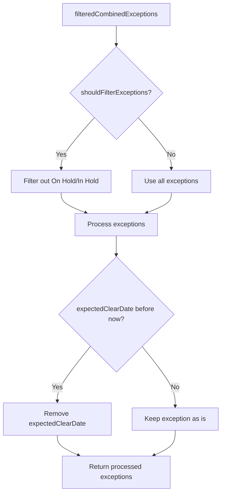

### SVG

<svg id="container" width="531.53125" xmlns="http://www.w3.org/2000/svg" class="flowchart" height="1161.6875" viewBox="0 0 531.53125 1161.6875" role="graphics-document document" aria-roledescription="flowchart-v2"><g><marker id="container_flowchart-v2-pointEnd" class="marker flowchart-v2" viewBox="0 0 10 10" refX="5" refY="5" markerUnits="userSpaceOnUse" markerWidth="8" markerHeight="8" orient="auto"><path d="M 0 0 L 10 5 L 0 10 z" class="arrowMarkerPath" style="stroke-width: 1; stroke-dasharray: 1, 0;"></path></marker><marker id="container_flowchart-v2-pointStart" class="marker flowchart-v2" viewBox="0 0 10 10" refX="4.5" refY="5" markerUnits="userSpaceOnUse" markerWidth="8" markerHeight="8" orient="auto"><path d="M 0 5 L 10 10 L 10 0 z" class="arrowMarkerPath" style="stroke-width: 1; stroke-dasharray: 1, 0;"></path></marker><marker id="container_flowchart-v2-circleEnd" class="marker flowchart-v2" viewBox="0 0 10 10" refX="11" refY="5" markerUnits="userSpaceOnUse" markerWidth="11" markerHeight="11" orient="auto"><circle cx="5" cy="5" r="5" class="arrowMarkerPath" style="stroke-width: 1; stroke-dasharray: 1, 0;"></circle></marker><marker id="container_flowchart-v2-circleStart" class="marker flowchart-v2" viewBox="0 0 10 10" refX="-1" refY="5" markerUnits="userSpaceOnUse" markerWidth="11" markerHeight="11" orient="auto"><circle cx="5" cy="5" r="5" class="arrowMarkerPath" style="stroke-width: 1; stroke-dasharray: 1, 0;"></circle></marker><marker id="container_flowchart-v2-crossEnd" class="marker cross flowchart-v2" viewBox="0 0 11 11" refX="12" refY="5.2" markerUnits="userSpaceOnUse" markerWidth="11" markerHeight="11" orient="auto"><path d="M 1,1 l 9,9 M 10,1 l -9,9" class="arrowMarkerPath" style="stroke-width: 2; stroke-dasharray: 1, 0;"></path></marker><marker id="container_flowchart-v2-crossStart" class="marker cross flowchart-v2" viewBox="0 0 11 11" refX="-1" refY="5.2" markerUnits="userSpaceOnUse" markerWidth="11" markerHeight="11" orient="auto"><path d="M 1,1 l 9,9 M 10,1 l -9,9" class="arrowMarkerPath" style="stroke-width: 2; stroke-dasharray: 1, 0;"></path></marker><g class="root"><g class="clusters"></g><g class="edgePaths"><path d="M278.336,62L278.336,66.167C278.336,70.333,278.336,78.667,278.336,86.333C278.336,94,278.336,101,278.336,104.5L278.336,108" id="L_A_B_0" class="edge-thickness-normal edge-pattern-solid edge-thickness-normal edge-pattern-solid flowchart-link" style=";" data-edge="true" data-et="edge" data-id="L_A_B_0" data-points="W3sieCI6Mjc4LjMzNTkzNzUsInkiOjYyfSx7IngiOjI3OC4zMzU5Mzc1LCJ5Ijo4N30seyJ4IjoyNzguMzM1OTM3NSwieSI6MTEyfV0=" marker-end="url(#container_flowchart-v2-pointEnd)"></path><path d="M224.784,284.136L211.154,299.228C197.523,314.32,170.261,344.504,156.631,365.096C143,385.688,143,396.688,143,402.188L143,407.688" id="L_B_C_0" class="edge-thickness-normal edge-pattern-solid edge-thickness-normal edge-pattern-solid flowchart-link" style=";" data-edge="true" data-et="edge" data-id="L_B_C_0" data-points="W3sieCI6MjI0Ljc4NDM4NjA4NjQxNzU2LCJ5IjoyODQuMTM1OTQ4NTg2NDE3NTZ9LHsieCI6MTQzLCJ5IjozNzQuNjg3NX0seyJ4IjoxNDMsInkiOjQxMS42ODc1fV0=" marker-end="url(#container_flowchart-v2-pointEnd)"></path><path d="M331.887,284.136L345.518,299.228C359.149,314.32,386.41,344.504,400.041,365.096C413.672,385.688,413.672,396.688,413.672,402.188L413.672,407.688" id="L_B_D_0" class="edge-thickness-normal edge-pattern-solid edge-thickness-normal edge-pattern-solid flowchart-link" style=";" data-edge="true" data-et="edge" data-id="L_B_D_0" data-points="W3sieCI6MzMxLjg4NzQ4ODkxMzU4MjQ0LCJ5IjoyODQuMTM1OTQ4NTg2NDE3NTZ9LHsieCI6NDEzLjY3MTg3NSwieSI6Mzc0LjY4NzV9LHsieCI6NDEzLjY3MTg3NSwieSI6NDExLjY4NzV9XQ==" marker-end="url(#container_flowchart-v2-pointEnd)"></path><path d="M143,465.688L143,469.854C143,474.021,143,482.354,153.222,490.448C163.444,498.543,183.888,506.398,194.11,510.325L204.331,514.253" id="L_C_E_0" class="edge-thickness-normal edge-pattern-solid edge-thickness-normal edge-pattern-solid flowchart-link" style=";" data-edge="true" data-et="edge" data-id="L_C_E_0" data-points="W3sieCI6MTQzLCJ5Ijo0NjUuNjg3NX0seyJ4IjoxNDMsInkiOjQ5MC42ODc1fSx7IngiOjIwOC4wNjUzNTQ1NjczMDc2OCwieSI6NTE1LjY4NzV9XQ==" marker-end="url(#container_flowchart-v2-pointEnd)"></path><path d="M413.672,465.688L413.672,469.854C413.672,474.021,413.672,482.354,403.45,490.448C393.228,498.543,372.784,506.398,362.562,510.325L352.34,514.253" id="L_D_E_0" class="edge-thickness-normal edge-pattern-solid edge-thickness-normal edge-pattern-solid flowchart-link" style=";" data-edge="true" data-et="edge" data-id="L_D_E_0" data-points="W3sieCI6NDEzLjY3MTg3NSwieSI6NDY1LjY4NzV9LHsieCI6NDEzLjY3MTg3NSwieSI6NDkwLjY4NzV9LHsieCI6MzQ4LjYwNjUyMDQzMjY5MjMsInkiOjUxNS42ODc1fV0=" marker-end="url(#container_flowchart-v2-pointEnd)"></path><path d="M278.336,569.688L278.336,573.854C278.336,578.021,278.336,586.354,278.336,594.021C278.336,601.688,278.336,608.688,278.336,612.188L278.336,615.688" id="L_E_F_0" class="edge-thickness-normal edge-pattern-solid edge-thickness-normal edge-pattern-solid flowchart-link" style=";" data-edge="true" data-et="edge" data-id="L_E_F_0" data-points="W3sieCI6Mjc4LjMzNTkzNzUsInkiOjU2OS42ODc1fSx7IngiOjI3OC4zMzU5Mzc1LCJ5Ijo1OTQuNjg3NX0seyJ4IjoyNzguMzM1OTM3NSwieSI6NjE5LjY4NzV9XQ==" marker-end="url(#container_flowchart-v2-pointEnd)"></path><path d="M216.416,835.768L203.172,852.255C189.929,868.741,163.441,901.714,150.197,923.701C136.953,945.688,136.953,956.688,136.953,962.188L136.953,967.688" id="L_F_G_0" class="edge-thickness-normal edge-pattern-solid edge-thickness-normal edge-pattern-solid flowchart-link" style=";" data-edge="true" data-et="edge" data-id="L_F_G_0" data-points="W3sieCI6MjE2LjQxNjM1NTk2MTUzODQ3LCJ5Ijo4MzUuNzY3OTE4NDYxNTM4NH0seyJ4IjoxMzYuOTUzMTI1LCJ5Ijo5MzQuNjg3NX0seyJ4IjoxMzYuOTUzMTI1LCJ5Ijo5NzEuNjg3NX1d" marker-end="url(#container_flowchart-v2-pointEnd)"></path><path d="M340.256,835.768L353.499,852.255C366.743,868.741,393.231,901.714,406.475,923.701C419.719,945.688,419.719,956.688,419.719,962.188L419.719,967.688" id="L_F_H_0" class="edge-thickness-normal edge-pattern-solid edge-thickness-normal edge-pattern-solid flowchart-link" style=";" data-edge="true" data-et="edge" data-id="L_F_H_0" data-points="W3sieCI6MzQwLjI1NTUxOTAzODQ2MTU2LCJ5Ijo4MzUuNzY3OTE4NDYxNTM4NH0seyJ4Ijo0MTkuNzE4NzUsInkiOjkzNC42ODc1fSx7IngiOjQxOS43MTg3NSwieSI6OTcxLjY4NzV9XQ==" marker-end="url(#container_flowchart-v2-pointEnd)"></path><path d="M136.953,1025.688L136.953,1029.854C136.953,1034.021,136.953,1042.354,145.55,1050.413C154.148,1058.471,171.342,1066.254,179.939,1070.146L188.537,1074.038" id="L_G_I_0" class="edge-thickness-normal edge-pattern-solid edge-thickness-normal edge-pattern-solid flowchart-link" style=";" data-edge="true" data-et="edge" data-id="L_G_I_0" data-points="W3sieCI6MTM2Ljk1MzEyNSwieSI6MTAyNS42ODc1fSx7IngiOjEzNi45NTMxMjUsInkiOjEwNTAuNjg3NX0seyJ4IjoxOTIuMTgwNzg2MTMyODEyNSwieSI6MTA3NS42ODc1fV0=" marker-end="url(#container_flowchart-v2-pointEnd)"></path><path d="M419.719,1025.688L419.719,1029.854C419.719,1034.021,419.719,1042.354,411.121,1050.413C402.524,1058.471,385.33,1066.254,376.732,1070.146L368.135,1074.038" id="L_H_I_0" class="edge-thickness-normal edge-pattern-solid edge-thickness-normal edge-pattern-solid flowchart-link" style=";" data-edge="true" data-et="edge" data-id="L_H_I_0" data-points="W3sieCI6NDE5LjcxODc1LCJ5IjoxMDI1LjY4NzV9LHsieCI6NDE5LjcxODc1LCJ5IjoxMDUwLjY4NzV9LHsieCI6MzY0LjQ5MTA4ODg2NzE4NzUsInkiOjEwNzUuNjg3NX1d" marker-end="url(#container_flowchart-v2-pointEnd)"></path></g><g class="edgeLabels"><g class="edgeLabel"><g class="label" data-id="L_A_B_0" transform="translate(0, 0)"><foreignObject width="0" height="0">

</foreignObject></g></g><g class="edgeLabel" transform="translate(143, 374.6875)"><g class="label" data-id="L_B_C_0" transform="translate(-12.03125, -12)"><foreignObject width="24.0625" height="24">

Yes

</foreignObject></g></g><g class="edgeLabel" transform="translate(413.671875, 374.6875)"><g class="label" data-id="L_B_D_0" transform="translate(-10.140625, -12)"><foreignObject width="20.28125" height="24">

No

</foreignObject></g></g><g class="edgeLabel"><g class="label" data-id="L_C_E_0" transform="translate(0, 0)"><foreignObject width="0" height="0">

</foreignObject></g></g><g class="edgeLabel"><g class="label" data-id="L_D_E_0" transform="translate(0, 0)"><foreignObject width="0" height="0">

</foreignObject></g></g><g class="edgeLabel"><g class="label" data-id="L_E_F_0" transform="translate(0, 0)"><foreignObject width="0" height="0">

</foreignObject></g></g><g class="edgeLabel" transform="translate(136.953125, 934.6875)"><g class="label" data-id="L_F_G_0" transform="translate(-12.03125, -12)"><foreignObject width="24.0625" height="24">

Yes

</foreignObject></g></g><g class="edgeLabel" transform="translate(419.71875, 934.6875)"><g class="label" data-id="L_F_H_0" transform="translate(-10.140625, -12)"><foreignObject width="20.28125" height="24">

No

</foreignObject></g></g><g class="edgeLabel"><g class="label" data-id="L_G_I_0" transform="translate(0, 0)"><foreignObject width="0" height="0">

</foreignObject></g></g><g class="edgeLabel"><g class="label" data-id="L_H_I_0" transform="translate(0, 0)"><foreignObject width="0" height="0">

</foreignObject></g></g></g><g class="nodes"><g class="node default" id="flowchart-A-0" transform="translate(278.3359375, 35)"><rect class="basic label-container" style="" x="-131.859375" y="-27" width="263.71875" height="54"></rect><g class="label" style="" transform="translate(-101.859375, -12)"><rect></rect><foreignObject width="203.71875" height="24">

filteredCombinedExceptions

</foreignObject></g></g><g class="node default" id="flowchart-B-1" transform="translate(278.3359375, 224.84375)"><polygon points="112.84375,0 225.6875,-112.84375 112.84375,-225.6875 0,-112.84375" class="label-container" transform="translate(-112.34375, 112.84375)"></polygon><g class="label" style="" transform="translate(-85.84375, -12)"><rect></rect><foreignObject width="171.6875" height="24">

shouldFilterExceptions?

</foreignObject></g></g><g class="node default" id="flowchart-C-3" transform="translate(143, 438.6875)"><rect class="basic label-container" style="" x="-125" y="-27" width="250" height="54"></rect><g class="label" style="" transform="translate(-95, -12)"><rect></rect><foreignObject width="190" height="24">

Filter out On Hold/In Hold

</foreignObject></g></g><g class="node default" id="flowchart-D-5" transform="translate(413.671875, 438.6875)"><rect class="basic label-container" style="" x="-95.671875" y="-27" width="191.34375" height="54"></rect><g class="label" style="" transform="translate(-65.671875, -12)"><rect></rect><foreignObject width="131.34375" height="24">

Use all exceptions

</foreignObject></g></g><g class="node default" id="flowchart-E-7" transform="translate(278.3359375, 542.6875)"><rect class="basic label-container" style="" x="-98.65625" y="-27" width="197.3125" height="54"></rect><g class="label" style="" transform="translate(-68.65625, -12)"><rect></rect><foreignObject width="137.3125" height="24">

Process exceptions

</foreignObject></g></g><g class="node default" id="flowchart-F-11" transform="translate(278.3359375, 758.6875)"><polygon points="139,0 278,-139 139,-278 0,-139" class="label-container" transform="translate(-138.5, 139)"></polygon><g class="label" style="" transform="translate(-100, -24)"><rect></rect><foreignObject width="200" height="48">

expectedClearDate before now?

</foreignObject></g></g><g class="node default" id="flowchart-G-13" transform="translate(136.953125, 998.6875)"><rect class="basic label-container" style="" x="-128.953125" y="-27" width="257.90625" height="54"></rect><g class="label" style="" transform="translate(-98.953125, -12)"><rect></rect><foreignObject width="197.90625" height="24">

Remove expectedClearDate

</foreignObject></g></g><g class="node default" id="flowchart-H-15" transform="translate(419.71875, 998.6875)"><rect class="basic label-container" style="" x="-103.8125" y="-27" width="207.625" height="54"></rect><g class="label" style="" transform="translate(-73.8125, -12)"><rect></rect><foreignObject width="147.625" height="24">

Keep exception as is

</foreignObject></g></g><g class="node default" id="flowchart-I-17" transform="translate(278.3359375, 1114.6875)"><rect class="basic label-container" style="" x="-130" y="-39" width="260" height="78"></rect><g class="label" style="" transform="translate(-100, -24)"><rect></rect><foreignObject width="200" height="48">

Return processed exceptions

</foreignObject></g></g></g></g></g></svg>

## Diagram 9

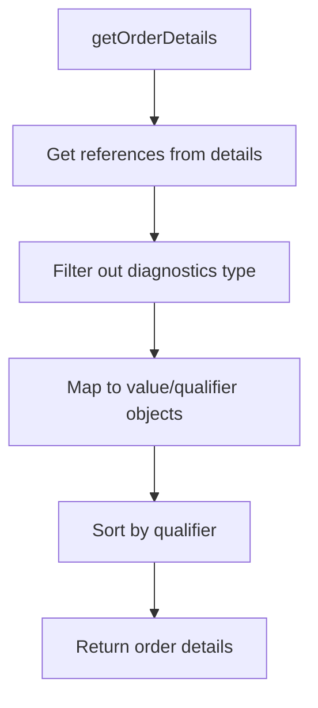

### SVG

<svg id="container" width="276" xmlns="http://www.w3.org/2000/svg" class="flowchart" height="614" viewBox="0 0 276 614" role="graphics-document document" aria-roledescription="flowchart-v2"><g><marker id="container_flowchart-v2-pointEnd" class="marker flowchart-v2" viewBox="0 0 10 10" refX="5" refY="5" markerUnits="userSpaceOnUse" markerWidth="8" markerHeight="8" orient="auto"><path d="M 0 0 L 10 5 L 0 10 z" class="arrowMarkerPath" style="stroke-width: 1; stroke-dasharray: 1, 0;"></path></marker><marker id="container_flowchart-v2-pointStart" class="marker flowchart-v2" viewBox="0 0 10 10" refX="4.5" refY="5" markerUnits="userSpaceOnUse" markerWidth="8" markerHeight="8" orient="auto"><path d="M 0 5 L 10 10 L 10 0 z" class="arrowMarkerPath" style="stroke-width: 1; stroke-dasharray: 1, 0;"></path></marker><marker id="container_flowchart-v2-circleEnd" class="marker flowchart-v2" viewBox="0 0 10 10" refX="11" refY="5" markerUnits="userSpaceOnUse" markerWidth="11" markerHeight="11" orient="auto"><circle cx="5" cy="5" r="5" class="arrowMarkerPath" style="stroke-width: 1; stroke-dasharray: 1, 0;"></circle></marker><marker id="container_flowchart-v2-circleStart" class="marker flowchart-v2" viewBox="0 0 10 10" refX="-1" refY="5" markerUnits="userSpaceOnUse" markerWidth="11" markerHeight="11" orient="auto"><circle cx="5" cy="5" r="5" class="arrowMarkerPath" style="stroke-width: 1; stroke-dasharray: 1, 0;"></circle></marker><marker id="container_flowchart-v2-crossEnd" class="marker cross flowchart-v2" viewBox="0 0 11 11" refX="12" refY="5.2" markerUnits="userSpaceOnUse" markerWidth="11" markerHeight="11" orient="auto"><path d="M 1,1 l 9,9 M 10,1 l -9,9" class="arrowMarkerPath" style="stroke-width: 2; stroke-dasharray: 1, 0;"></path></marker><marker id="container_flowchart-v2-crossStart" class="marker cross flowchart-v2" viewBox="0 0 11 11" refX="-1" refY="5.2" markerUnits="userSpaceOnUse" markerWidth="11" markerHeight="11" orient="auto"><path d="M 1,1 l 9,9 M 10,1 l -9,9" class="arrowMarkerPath" style="stroke-width: 2; stroke-dasharray: 1, 0;"></path></marker><g class="root"><g class="clusters"></g><g class="edgePaths"><path d="M138,62L138,66.167C138,70.333,138,78.667,138,86.333C138,94,138,101,138,104.5L138,108" id="L_A_B_0" class="edge-thickness-normal edge-pattern-solid edge-thickness-normal edge-pattern-solid flowchart-link" style=";" data-edge="true" data-et="edge" data-id="L_A_B_0" data-points="W3sieCI6MTM4LCJ5Ijo2Mn0seyJ4IjoxMzgsInkiOjg3fSx7IngiOjEzOCwieSI6MTEyfV0=" marker-end="url(#container_flowchart-v2-pointEnd)"></path><path d="M138,166L138,170.167C138,174.333,138,182.667,138,190.333C138,198,138,205,138,208.5L138,212" id="L_B_C_0" class="edge-thickness-normal edge-pattern-solid edge-thickness-normal edge-pattern-solid flowchart-link" style=";" data-edge="true" data-et="edge" data-id="L_B_C_0" data-points="W3sieCI6MTM4LCJ5IjoxNjZ9LHsieCI6MTM4LCJ5IjoxOTF9LHsieCI6MTM4LCJ5IjoyMTZ9XQ==" marker-end="url(#container_flowchart-v2-pointEnd)"></path><path d="M138,270L138,274.167C138,278.333,138,286.667,138,294.333C138,302,138,309,138,312.5L138,316" id="L_C_D_0" class="edge-thickness-normal edge-pattern-solid edge-thickness-normal edge-pattern-solid flowchart-link" style=";" data-edge="true" data-et="edge" data-id="L_C_D_0" data-points="W3sieCI6MTM4LCJ5IjoyNzB9LHsieCI6MTM4LCJ5IjoyOTV9LHsieCI6MTM4LCJ5IjozMjB9XQ==" marker-end="url(#container_flowchart-v2-pointEnd)"></path><path d="M138,398L138,402.167C138,406.333,138,414.667,138,422.333C138,430,138,437,138,440.5L138,444" id="L_D_E_0" class="edge-thickness-normal edge-pattern-solid edge-thickness-normal edge-pattern-solid flowchart-link" style=";" data-edge="true" data-et="edge" data-id="L_D_E_0" data-points="W3sieCI6MTM4LCJ5IjozOTh9LHsieCI6MTM4LCJ5Ijo0MjN9LHsieCI6MTM4LCJ5Ijo0NDh9XQ==" marker-end="url(#container_flowchart-v2-pointEnd)"></path><path d="M138,502L138,506.167C138,510.333,138,518.667,138,526.333C138,534,138,541,138,544.5L138,548" id="L_E_F_0" class="edge-thickness-normal edge-pattern-solid edge-thickness-normal edge-pattern-solid flowchart-link" style=";" data-edge="true" data-et="edge" data-id="L_E_F_0" data-points="W3sieCI6MTM4LCJ5Ijo1MDJ9LHsieCI6MTM4LCJ5Ijo1Mjd9LHsieCI6MTM4LCJ5Ijo1NTJ9XQ==" marker-end="url(#container_flowchart-v2-pointEnd)"></path></g><g class="edgeLabels"><g class="edgeLabel"><g class="label" data-id="L_A_B_0" transform="translate(0, 0)"><foreignObject width="0" height="0">

</foreignObject></g></g><g class="edgeLabel"><g class="label" data-id="L_B_C_0" transform="translate(0, 0)"><foreignObject width="0" height="0">

</foreignObject></g></g><g class="edgeLabel"><g class="label" data-id="L_C_D_0" transform="translate(0, 0)"><foreignObject width="0" height="0">

</foreignObject></g></g><g class="edgeLabel"><g class="label" data-id="L_D_E_0" transform="translate(0, 0)"><foreignObject width="0" height="0">

</foreignObject></g></g><g class="edgeLabel"><g class="label" data-id="L_E_F_0" transform="translate(0, 0)"><foreignObject width="0" height="0">

</foreignObject></g></g></g><g class="nodes"><g class="node default" id="flowchart-A-0" transform="translate(138, 35)"><rect class="basic label-container" style="" x="-86.9296875" y="-27" width="173.859375" height="54"></rect><g class="label" style="" transform="translate(-56.9296875, -12)"><rect></rect><foreignObject width="113.859375" height="24">

getOrderDetails

</foreignObject></g></g><g class="node default" id="flowchart-B-1" transform="translate(138, 139)"><rect class="basic label-container" style="" x="-128.203125" y="-27" width="256.40625" height="54"></rect><g class="label" style="" transform="translate(-98.203125, -12)"><rect></rect><foreignObject width="196.40625" height="24">

Get references from details

</foreignObject></g></g><g class="node default" id="flowchart-C-3" transform="translate(138, 243)"><rect class="basic label-container" style="" x="-124.2109375" y="-27" width="248.421875" height="54"></rect><g class="label" style="" transform="translate(-94.2109375, -12)"><rect></rect><foreignObject width="188.421875" height="24">

Filter out diagnostics type

</foreignObject></g></g><g class="node default" id="flowchart-D-5" transform="translate(138, 359)"><rect class="basic label-container" style="" x="-130" y="-39" width="260" height="78"></rect><g class="label" style="" transform="translate(-100, -24)"><rect></rect><foreignObject width="200" height="48">

Map to value/qualifier objects

</foreignObject></g></g><g class="node default" id="flowchart-E-7" transform="translate(138, 475)"><rect class="basic label-container" style="" x="-88.265625" y="-27" width="176.53125" height="54"></rect><g class="label" style="" transform="translate(-58.265625, -12)"><rect></rect><foreignObject width="116.53125" height="24">

Sort by qualifier

</foreignObject></g></g><g class="node default" id="flowchart-F-9" transform="translate(138, 579)"><rect class="basic label-container" style="" x="-103.0625" y="-27" width="206.125" height="54"></rect><g class="label" style="" transform="translate(-73.0625, -12)"><rect></rect><foreignObject width="146.125" height="24">

Return order details

</foreignObject></g></g></g></g></g></svg>

## Diagram 10

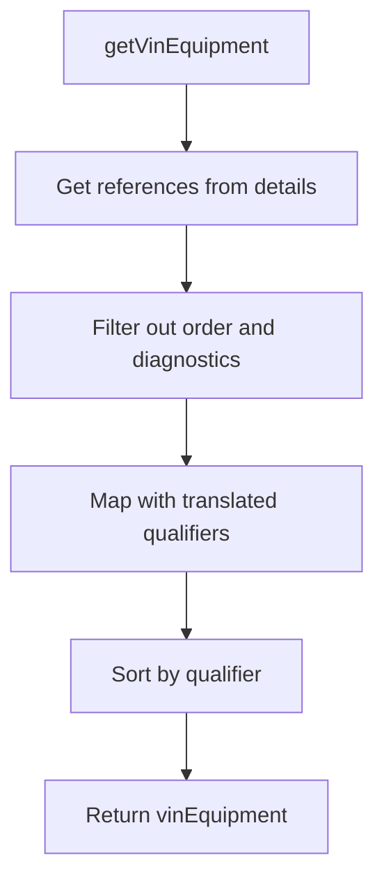

### SVG

<svg id="container" width="276" xmlns="http://www.w3.org/2000/svg" class="flowchart" height="638" viewBox="0 0 276 638" role="graphics-document document" aria-roledescription="flowchart-v2"><g><marker id="container_flowchart-v2-pointEnd" class="marker flowchart-v2" viewBox="0 0 10 10" refX="5" refY="5" markerUnits="userSpaceOnUse" markerWidth="8" markerHeight="8" orient="auto"><path d="M 0 0 L 10 5 L 0 10 z" class="arrowMarkerPath" style="stroke-width: 1; stroke-dasharray: 1, 0;"></path></marker><marker id="container_flowchart-v2-pointStart" class="marker flowchart-v2" viewBox="0 0 10 10" refX="4.5" refY="5" markerUnits="userSpaceOnUse" markerWidth="8" markerHeight="8" orient="auto"><path d="M 0 5 L 10 10 L 10 0 z" class="arrowMarkerPath" style="stroke-width: 1; stroke-dasharray: 1, 0;"></path></marker><marker id="container_flowchart-v2-circleEnd" class="marker flowchart-v2" viewBox="0 0 10 10" refX="11" refY="5" markerUnits="userSpaceOnUse" markerWidth="11" markerHeight="11" orient="auto"><circle cx="5" cy="5" r="5" class="arrowMarkerPath" style="stroke-width: 1; stroke-dasharray: 1, 0;"></circle></marker><marker id="container_flowchart-v2-circleStart" class="marker flowchart-v2" viewBox="0 0 10 10" refX="-1" refY="5" markerUnits="userSpaceOnUse" markerWidth="11" markerHeight="11" orient="auto"><circle cx="5" cy="5" r="5" class="arrowMarkerPath" style="stroke-width: 1; stroke-dasharray: 1, 0;"></circle></marker><marker id="container_flowchart-v2-crossEnd" class="marker cross flowchart-v2" viewBox="0 0 11 11" refX="12" refY="5.2" markerUnits="userSpaceOnUse" markerWidth="11" markerHeight="11" orient="auto"><path d="M 1,1 l 9,9 M 10,1 l -9,9" class="arrowMarkerPath" style="stroke-width: 2; stroke-dasharray: 1, 0;"></path></marker><marker id="container_flowchart-v2-crossStart" class="marker cross flowchart-v2" viewBox="0 0 11 11" refX="-1" refY="5.2" markerUnits="userSpaceOnUse" markerWidth="11" markerHeight="11" orient="auto"><path d="M 1,1 l 9,9 M 10,1 l -9,9" class="arrowMarkerPath" style="stroke-width: 2; stroke-dasharray: 1, 0;"></path></marker><g class="root"><g class="clusters"></g><g class="edgePaths"><path d="M138,62L138,66.167C138,70.333,138,78.667,138,86.333C138,94,138,101,138,104.5L138,108" id="L_A_B_0" class="edge-thickness-normal edge-pattern-solid edge-thickness-normal edge-pattern-solid flowchart-link" style=";" data-edge="true" data-et="edge" data-id="L_A_B_0" data-points="W3sieCI6MTM4LCJ5Ijo2Mn0seyJ4IjoxMzgsInkiOjg3fSx7IngiOjEzOCwieSI6MTEyfV0=" marker-end="url(#container_flowchart-v2-pointEnd)"></path><path d="M138,166L138,170.167C138,174.333,138,182.667,138,190.333C138,198,138,205,138,208.5L138,212" id="L_B_C_0" class="edge-thickness-normal edge-pattern-solid edge-thickness-normal edge-pattern-solid flowchart-link" style=";" data-edge="true" data-et="edge" data-id="L_B_C_0" data-points="W3sieCI6MTM4LCJ5IjoxNjZ9LHsieCI6MTM4LCJ5IjoxOTF9LHsieCI6MTM4LCJ5IjoyMTZ9XQ==" marker-end="url(#container_flowchart-v2-pointEnd)"></path><path d="M138,294L138,298.167C138,302.333,138,310.667,138,318.333C138,326,138,333,138,336.5L138,340" id="L_C_D_0" class="edge-thickness-normal edge-pattern-solid edge-thickness-normal edge-pattern-solid flowchart-link" style=";" data-edge="true" data-et="edge" data-id="L_C_D_0" data-points="W3sieCI6MTM4LCJ5IjoyOTR9LHsieCI6MTM4LCJ5IjozMTl9LHsieCI6MTM4LCJ5IjozNDR9XQ==" marker-end="url(#container_flowchart-v2-pointEnd)"></path><path d="M138,422L138,426.167C138,430.333,138,438.667,138,446.333C138,454,138,461,138,464.5L138,468" id="L_D_E_0" class="edge-thickness-normal edge-pattern-solid edge-thickness-normal edge-pattern-solid flowchart-link" style=";" data-edge="true" data-et="edge" data-id="L_D_E_0" data-points="W3sieCI6MTM4LCJ5Ijo0MjJ9LHsieCI6MTM4LCJ5Ijo0NDd9LHsieCI6MTM4LCJ5Ijo0NzJ9XQ==" marker-end="url(#container_flowchart-v2-pointEnd)"></path><path d="M138,526L138,530.167C138,534.333,138,542.667,138,550.333C138,558,138,565,138,568.5L138,572" id="L_E_F_0" class="edge-thickness-normal edge-pattern-solid edge-thickness-normal edge-pattern-solid flowchart-link" style=";" data-edge="true" data-et="edge" data-id="L_E_F_0" data-points="W3sieCI6MTM4LCJ5Ijo1MjZ9LHsieCI6MTM4LCJ5Ijo1NTF9LHsieCI6MTM4LCJ5Ijo1NzZ9XQ==" marker-end="url(#container_flowchart-v2-pointEnd)"></path></g><g class="edgeLabels"><g class="edgeLabel"><g class="label" data-id="L_A_B_0" transform="translate(0, 0)"><foreignObject width="0" height="0">

</foreignObject></g></g><g class="edgeLabel"><g class="label" data-id="L_B_C_0" transform="translate(0, 0)"><foreignObject width="0" height="0">

</foreignObject></g></g><g class="edgeLabel"><g class="label" data-id="L_C_D_0" transform="translate(0, 0)"><foreignObject width="0" height="0">

</foreignObject></g></g><g class="edgeLabel"><g class="label" data-id="L_D_E_0" transform="translate(0, 0)"><foreignObject width="0" height="0">

</foreignObject></g></g><g class="edgeLabel"><g class="label" data-id="L_E_F_0" transform="translate(0, 0)"><foreignObject width="0" height="0">

</foreignObject></g></g></g><g class="nodes"><g class="node default" id="flowchart-A-0" transform="translate(138, 35)"><rect class="basic label-container" style="" x="-92.0390625" y="-27" width="184.078125" height="54"></rect><g class="label" style="" transform="translate(-62.0390625, -12)"><rect></rect><foreignObject width="124.078125" height="24">

getVinEquipment

</foreignObject></g></g><g class="node default" id="flowchart-B-1" transform="translate(138, 139)"><rect class="basic label-container" style="" x="-128.203125" y="-27" width="256.40625" height="54"></rect><g class="label" style="" transform="translate(-98.203125, -12)"><rect></rect><foreignObject width="196.40625" height="24">

Get references from details

</foreignObject></g></g><g class="node default" id="flowchart-C-3" transform="translate(138, 255)"><rect class="basic label-container" style="" x="-130" y="-39" width="260" height="78"></rect><g class="label" style="" transform="translate(-100, -24)"><rect></rect><foreignObject width="200" height="48">

Filter out order and diagnostics

</foreignObject></g></g><g class="node default" id="flowchart-D-5" transform="translate(138, 383)"><rect class="basic label-container" style="" x="-130" y="-39" width="260" height="78"></rect><g class="label" style="" transform="translate(-100, -24)"><rect></rect><foreignObject width="200" height="48">

Map with translated qualifiers

</foreignObject></g></g><g class="node default" id="flowchart-E-7" transform="translate(138, 499)"><rect class="basic label-container" style="" x="-88.265625" y="-27" width="176.53125" height="54"></rect><g class="label" style="" transform="translate(-58.265625, -12)"><rect></rect><foreignObject width="116.53125" height="24">

Sort by qualifier

</foreignObject></g></g><g class="node default" id="flowchart-F-9" transform="translate(138, 603)"><rect class="basic label-container" style="" x="-106.765625" y="-27" width="213.53125" height="54"></rect><g class="label" style="" transform="translate(-76.765625, -12)"><rect></rect><foreignObject width="153.53125" height="24">

Return vinEquipment

</foreignObject></g></g></g></g></g></svg>

## Diagram 11

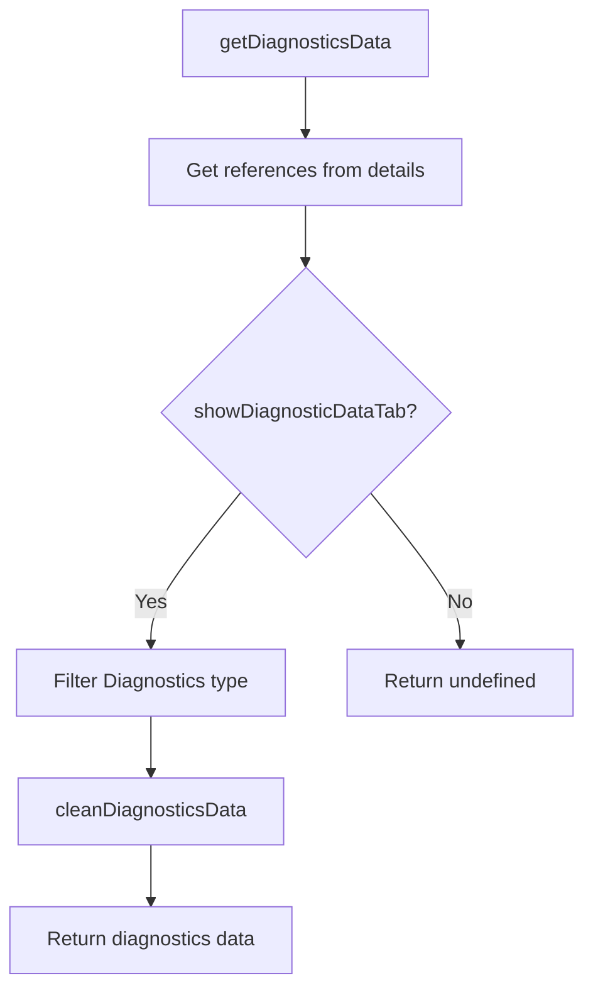

### SVG

<svg id="container" width="479.3671875" xmlns="http://www.w3.org/2000/svg" class="flowchart" height="793.078125" viewBox="0 0 479.3671875 793.078125" role="graphics-document document" aria-roledescription="flowchart-v2"><g><marker id="container_flowchart-v2-pointEnd" class="marker flowchart-v2" viewBox="0 0 10 10" refX="5" refY="5" markerUnits="userSpaceOnUse" markerWidth="8" markerHeight="8" orient="auto"><path d="M 0 0 L 10 5 L 0 10 z" class="arrowMarkerPath" style="stroke-width: 1; stroke-dasharray: 1, 0;"></path></marker><marker id="container_flowchart-v2-pointStart" class="marker flowchart-v2" viewBox="0 0 10 10" refX="4.5" refY="5" markerUnits="userSpaceOnUse" markerWidth="8" markerHeight="8" orient="auto"><path d="M 0 5 L 10 10 L 10 0 z" class="arrowMarkerPath" style="stroke-width: 1; stroke-dasharray: 1, 0;"></path></marker><marker id="container_flowchart-v2-circleEnd" class="marker flowchart-v2" viewBox="0 0 10 10" refX="11" refY="5" markerUnits="userSpaceOnUse" markerWidth="11" markerHeight="11" orient="auto"><circle cx="5" cy="5" r="5" class="arrowMarkerPath" style="stroke-width: 1; stroke-dasharray: 1, 0;"></circle></marker><marker id="container_flowchart-v2-circleStart" class="marker flowchart-v2" viewBox="0 0 10 10" refX="-1" refY="5" markerUnits="userSpaceOnUse" markerWidth="11" markerHeight="11" orient="auto"><circle cx="5" cy="5" r="5" class="arrowMarkerPath" style="stroke-width: 1; stroke-dasharray: 1, 0;"></circle></marker><marker id="container_flowchart-v2-crossEnd" class="marker cross flowchart-v2" viewBox="0 0 11 11" refX="12" refY="5.2" markerUnits="userSpaceOnUse" markerWidth="11" markerHeight="11" orient="auto"><path d="M 1,1 l 9,9 M 10,1 l -9,9" class="arrowMarkerPath" style="stroke-width: 2; stroke-dasharray: 1, 0;"></path></marker><marker id="container_flowchart-v2-crossStart" class="marker cross flowchart-v2" viewBox="0 0 11 11" refX="-1" refY="5.2" markerUnits="userSpaceOnUse" markerWidth="11" markerHeight="11" orient="auto"><path d="M 1,1 l 9,9 M 10,1 l -9,9" class="arrowMarkerPath" style="stroke-width: 2; stroke-dasharray: 1, 0;"></path></marker><g class="root"><g class="clusters"></g><g class="edgePaths"><path d="M251.078,62L251.078,66.167C251.078,70.333,251.078,78.667,251.078,86.333C251.078,94,251.078,101,251.078,104.5L251.078,108" id="L_A_B_0" class="edge-thickness-normal edge-pattern-solid edge-thickness-normal edge-pattern-solid flowchart-link" style=";" data-edge="true" data-et="edge" data-id="L_A_B_0" data-points="W3sieCI6MjUxLjA3ODEyNSwieSI6NjJ9LHsieCI6MjUxLjA3ODEyNSwieSI6ODd9LHsieCI6MjUxLjA3ODEyNSwieSI6MTEyfV0=" marker-end="url(#container_flowchart-v2-pointEnd)"></path><path d="M251.078,166L251.078,170.167C251.078,174.333,251.078,182.667,251.078,190.333C251.078,198,251.078,205,251.078,208.5L251.078,212" id="L_B_C_0" class="edge-thickness-normal edge-pattern-solid edge-thickness-normal edge-pattern-solid flowchart-link" style=";" data-edge="true" data-et="edge" data-id="L_B_C_0" data-points="W3sieCI6MjUxLjA3ODEyNSwieSI6MTY2fSx7IngiOjI1MS4wNzgxMjUsInkiOjE5MX0seyJ4IjoyNTEuMDc4MTI1LCJ5IjoyMTZ9XQ==" marker-end="url(#container_flowchart-v2-pointEnd)"></path><path d="M198.356,396.356L186.003,411.31C173.649,426.264,148.942,456.171,136.588,476.625C124.234,497.078,124.234,508.078,124.234,513.578L124.234,519.078" id="L_C_D_0" class="edge-thickness-normal edge-pattern-solid edge-thickness-normal edge-pattern-solid flowchart-link" style=";" data-edge="true" data-et="edge" data-id="L_C_D_0" data-points="W3sieCI6MTk4LjM1NjQ0OTMxMjQ2MzQ0LCJ5IjozOTYuMzU2NDQ5MzEyNDYzNDR9LHsieCI6MTI0LjIzNDM3NSwieSI6NDg2LjA3ODEyNX0seyJ4IjoxMjQuMjM0Mzc1LCJ5Ijo1MjMuMDc4MTI1fV0=" marker-end="url(#container_flowchart-v2-pointEnd)"></path><path d="M124.234,577.078L124.234,581.245C124.234,585.411,124.234,593.745,124.234,601.411C124.234,609.078,124.234,616.078,124.234,619.578L124.234,623.078" id="L_D_E_0" class="edge-thickness-normal edge-pattern-solid edge-thickness-normal edge-pattern-solid flowchart-link" style=";" data-edge="true" data-et="edge" data-id="L_D_E_0" data-points="W3sieCI6MTI0LjIzNDM3NSwieSI6NTc3LjA3ODEyNX0seyJ4IjoxMjQuMjM0Mzc1LCJ5Ijo2MDIuMDc4MTI1fSx7IngiOjEyNC4yMzQzNzUsInkiOjYyNy4wNzgxMjV9XQ==" marker-end="url(#container_flowchart-v2-pointEnd)"></path><path d="M124.234,681.078L124.234,685.245C124.234,689.411,124.234,697.745,124.234,705.411C124.234,713.078,124.234,720.078,124.234,723.578L124.234,727.078" id="L_E_F_0" class="edge-thickness-normal edge-pattern-solid edge-thickness-normal edge-pattern-solid flowchart-link" style=";" data-edge="true" data-et="edge" data-id="L_E_F_0" data-points="W3sieCI6MTI0LjIzNDM3NSwieSI6NjgxLjA3ODEyNX0seyJ4IjoxMjQuMjM0Mzc1LCJ5Ijo3MDYuMDc4MTI1fSx7IngiOjEyNC4yMzQzNzUsInkiOjczMS4wNzgxMjV9XQ==" marker-end="url(#container_flowchart-v2-pointEnd)"></path><path d="M303.8,396.356L316.153,411.31C328.507,426.264,353.215,456.171,365.568,476.625C377.922,497.078,377.922,508.078,377.922,513.578L377.922,519.078" id="L_C_G_0" class="edge-thickness-normal edge-pattern-solid edge-thickness-normal edge-pattern-solid flowchart-link" style=";" data-edge="true" data-et="edge" data-id="L_C_G_0" data-points="W3sieCI6MzAzLjc5OTgwMDY4NzUzNjU2LCJ5IjozOTYuMzU2NDQ5MzEyNDYzNDR9LHsieCI6Mzc3LjkyMTg3NSwieSI6NDg2LjA3ODEyNX0seyJ4IjozNzcuOTIxODc1LCJ5Ijo1MjMuMDc4MTI1fV0=" marker-end="url(#container_flowchart-v2-pointEnd)"></path></g><g class="edgeLabels"><g class="edgeLabel"><g class="label" data-id="L_A_B_0" transform="translate(0, 0)"><foreignObject width="0" height="0">

</foreignObject></g></g><g class="edgeLabel"><g class="label" data-id="L_B_C_0" transform="translate(0, 0)"><foreignObject width="0" height="0">

</foreignObject></g></g><g class="edgeLabel" transform="translate(124.234375, 486.078125)"><g class="label" data-id="L_C_D_0" transform="translate(-12.03125, -12)"><foreignObject width="24.0625" height="24">

Yes

</foreignObject></g></g><g class="edgeLabel"><g class="label" data-id="L_D_E_0" transform="translate(0, 0)"><foreignObject width="0" height="0">

</foreignObject></g></g><g class="edgeLabel"><g class="label" data-id="L_E_F_0" transform="translate(0, 0)"><foreignObject width="0" height="0">

</foreignObject></g></g><g class="edgeLabel" transform="translate(377.921875, 486.078125)"><g class="label" data-id="L_C_G_0" transform="translate(-10.140625, -12)"><foreignObject width="20.28125" height="24">

No

</foreignObject></g></g></g><g class="nodes"><g class="node default" id="flowchart-A-0" transform="translate(251.078125, 35)"><rect class="basic label-container" style="" x="-99.53125" y="-27" width="199.0625" height="54"></rect><g class="label" style="" transform="translate(-69.53125, -12)"><rect></rect><foreignObject width="139.0625" height="24">

getDiagnosticsData

</foreignObject></g></g><g class="node default" id="flowchart-B-1" transform="translate(251.078125, 139)"><rect class="basic label-container" style="" x="-128.203125" y="-27" width="256.40625" height="54"></rect><g class="label" style="" transform="translate(-98.203125, -12)"><rect></rect><foreignObject width="196.40625" height="24">

Get references from details

</foreignObject></g></g><g class="node default" id="flowchart-C-3" transform="translate(251.078125, 332.5390625)"><polygon points="116.5390625,0 233.078125,-116.5390625 116.5390625,-233.078125 0,-116.5390625" class="label-container" transform="translate(-116.0390625, 116.5390625)"></polygon><g class="label" style="" transform="translate(-89.5390625, -12)"><rect></rect><foreignObject width="179.078125" height="24">

showDiagnosticDataTab?

</foreignObject></g></g><g class="node default" id="flowchart-D-5" transform="translate(124.234375, 550.078125)"><rect class="basic label-container" style="" x="-110.2421875" y="-27" width="220.484375" height="54"></rect><g class="label" style="" transform="translate(-80.2421875, -12)"><rect></rect><foreignObject width="160.484375" height="24">

Filter Diagnostics type

</foreignObject></g></g><g class="node default" id="flowchart-E-7" transform="translate(124.234375, 654.078125)"><rect class="basic label-container" style="" x="-107.703125" y="-27" width="215.40625" height="54"></rect><g class="label" style="" transform="translate(-77.703125, -12)"><rect></rect><foreignObject width="155.40625" height="24">

cleanDiagnosticsData

</foreignObject></g></g><g class="node default" id="flowchart-F-9" transform="translate(124.234375, 758.078125)"><rect class="basic label-container" style="" x="-116.234375" y="-27" width="232.46875" height="54"></rect><g class="label" style="" transform="translate(-86.234375, -12)"><rect></rect><foreignObject width="172.46875" height="24">

Return diagnostics data

</foreignObject></g></g><g class="node default" id="flowchart-G-11" transform="translate(377.921875, 550.078125)"><rect class="basic label-container" style="" x="-93.4453125" y="-27" width="186.890625" height="54"></rect><g class="label" style="" transform="translate(-63.4453125, -12)"><rect></rect><foreignObject width="126.890625" height="24">

Return undefined

</foreignObject></g></g></g></g></g></svg>
