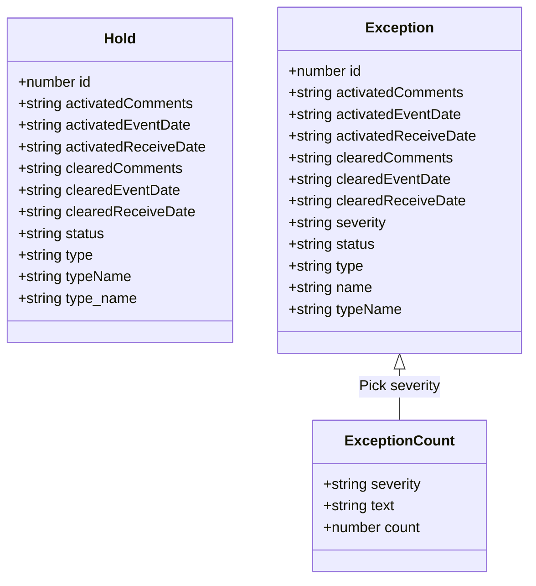
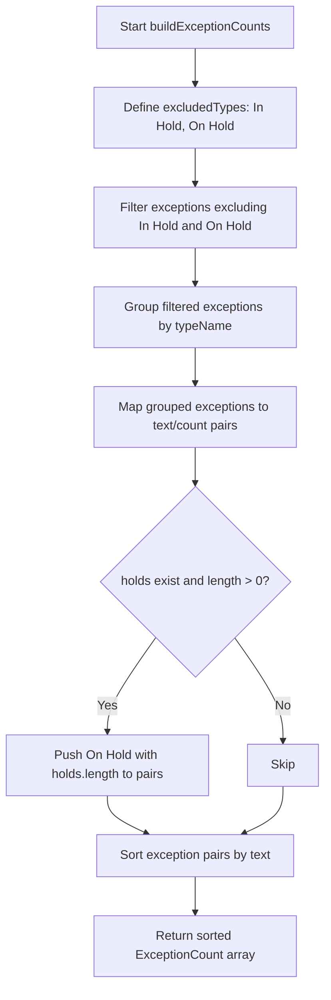
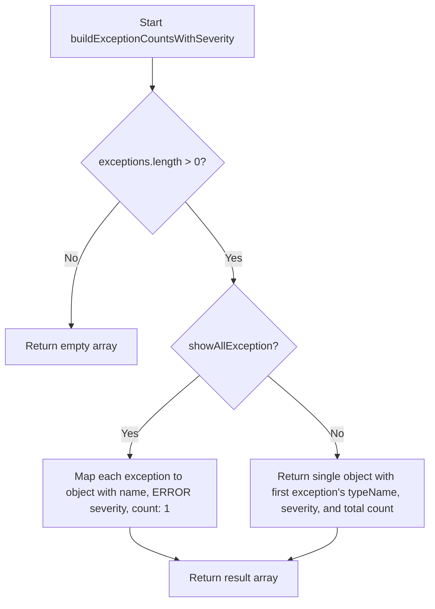
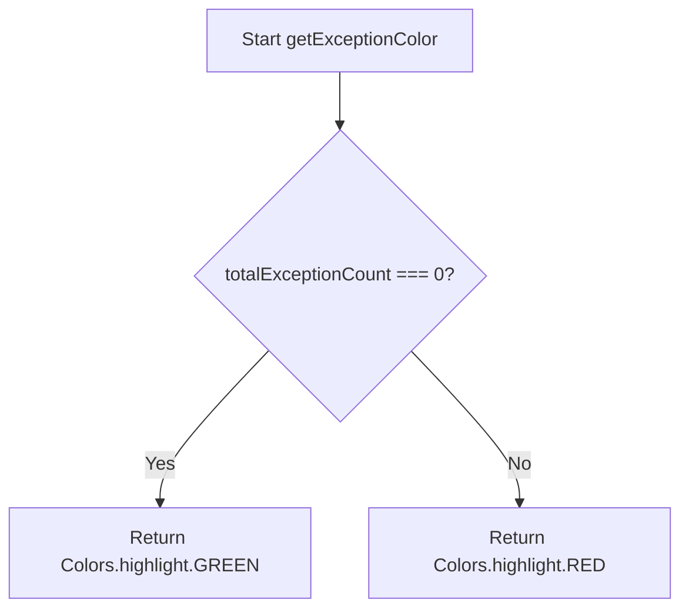

# Diagram: web/portal/src/shared/utils/exceptions.utils.tsx

> Auto-generated by Obscura crawlers

## Diagram 1

### SVG

<svg id="container" width="584.84375" xmlns="http://www.w3.org/2000/svg" class="classDiagram" height="642" viewBox="0 0 584.84375 642" role="graphics-document document" aria-roledescription="class"><g><defs><marker id="container_class-aggregationStart" class="marker aggregation class" refX="18" refY="7" markerWidth="190" markerHeight="240" orient="auto"><path d="M 18,7 L9,13 L1,7 L9,1 Z"></path></marker></defs><defs><marker id="container_class-aggregationEnd" class="marker aggregation class" refX="1" refY="7" markerWidth="20" markerHeight="28" orient="auto"><path d="M 18,7 L9,13 L1,7 L9,1 Z"></path></marker></defs><defs><marker id="container_class-extensionStart" class="marker extension class" refX="18" refY="7" markerWidth="190" markerHeight="240" orient="auto"><path d="M 1,7 L18,13 V 1 Z"></path></marker></defs><defs><marker id="container_class-extensionEnd" class="marker extension class" refX="1" refY="7" markerWidth="20" markerHeight="28" orient="auto"><path d="M 1,1 V 13 L18,7 Z"></path></marker></defs><defs><marker id="container_class-compositionStart" class="marker composition class" refX="18" refY="7" markerWidth="190" markerHeight="240" orient="auto"><path d="M 18,7 L9,13 L1,7 L9,1 Z"></path></marker></defs><defs><marker id="container_class-compositionEnd" class="marker composition class" refX="1" refY="7" markerWidth="20" markerHeight="28" orient="auto"><path d="M 18,7 L9,13 L1,7 L9,1 Z"></path></marker></defs><defs><marker id="container_class-dependencyStart" class="marker dependency class" refX="6" refY="7" markerWidth="190" markerHeight="240" orient="auto"><path d="M 5,7 L9,13 L1,7 L9,1 Z"></path></marker></defs><defs><marker id="container_class-dependencyEnd" class="marker dependency class" refX="13" refY="7" markerWidth="20" markerHeight="28" orient="auto"><path d="M 18,7 L9,13 L14,7 L9,1 Z"></path></marker></defs><defs><marker id="container_class-lollipopStart" class="marker lollipop class" refX="13" refY="7" markerWidth="190" markerHeight="240" orient="auto"><circle stroke="black" fill="transparent" cx="7" cy="7" r="6"></circle></marker></defs><defs><marker id="container_class-lollipopEnd" class="marker lollipop class" refX="1" refY="7" markerWidth="190" markerHeight="240" orient="auto"><circle stroke="black" fill="transparent" cx="7" cy="7" r="6"></circle></marker></defs><g class="root"><g class="clusters"></g><g class="edgePaths"><path d="M442.492,409.25L442.492,412.542C442.492,415.833,442.492,422.417,442.492,431.875C442.492,441.333,442.492,453.667,442.492,459.833L442.492,466" id="id_Exception_ExceptionCount_1" class="edge-thickness-normal edge-pattern-solid relation" style=";;;" data-edge="true" data-et="edge" data-id="id_Exception_ExceptionCount_1" data-points="W3sieCI6NDQyLjQ5MjE4NzUsInkiOjM5Mn0seyJ4Ijo0NDIuNDkyMTg3NSwieSI6NDI5fSx7IngiOjQ0Mi40OTIxODc1LCJ5Ijo0NjZ9XQ==" marker-start="url(#container_class-extensionStart)"></path></g><g class="edgeLabels"><g class="edgeLabel" transform="translate(442.4921875, 429)"><g class="label" data-id="id_Exception_ExceptionCount_1" transform="translate(-45.40625, -12)"><foreignObject width="90.8125" height="24">

Pick severity

</foreignObject></g></g></g><g class="nodes"><g class="node default" id="classId-Hold-0" transform="translate(133.0703125, 200)"><g class="basic label-container"><path d="M-125.0703125 -180 L125.0703125 -180 L125.0703125 180 L-125.0703125 180" stroke="none" stroke-width="0" fill="#ECECFF" style=""></path><path d="M-125.0703125 -180 C-45.64195729996224 -180, 33.786397900075514 -180, 125.0703125 -180 M-125.0703125 -180 C-70.84496150009389 -180, -16.61961050018779 -180, 125.0703125 -180 M125.0703125 -180 C125.0703125 -38.77153850095763, 125.0703125 102.45692299808474, 125.0703125 180 M125.0703125 -180 C125.0703125 -76.14623350709681, 125.0703125 27.70753298580638, 125.0703125 180 M125.0703125 180 C27.121555748471366 180, -70.82720100305727 180, -125.0703125 180 M125.0703125 180 C57.91856967043172 180, -9.233173159136555 180, -125.0703125 180 M-125.0703125 180 C-125.0703125 58.797648212369126, -125.0703125 -62.40470357526175, -125.0703125 -180 M-125.0703125 180 C-125.0703125 82.80039716185604, -125.0703125 -14.39920567628792, -125.0703125 -180" stroke="#9370DB" stroke-width="1.3" fill="none" stroke-dasharray="0 0" style=""></path></g><g class="annotation-group text" transform="translate(0, -156)"></g><g class="label-group text" transform="translate(-17.140625, -156)"><g class="label" style="font-weight: bolder" transform="translate(0,-12)"><foreignObject width="34.28125" height="24">

Hold

</foreignObject></g></g><g class="members-group text" transform="translate(-113.0703125, -108)"><g class="label" style="" transform="translate(0,-12)"><foreignObject width="83.109375" height="24">

+number id

</foreignObject></g><g class="label" style="" transform="translate(0,12)"><foreignObject width="197.40625" height="24">

+string activatedComments

</foreignObject></g><g class="label" style="" transform="translate(0,36)"><foreignObject width="193.671875" height="24">

+string activatedEventDate

</foreignObject></g><g class="label" style="" transform="translate(0,60)"><foreignObject width="209" height="24">

+string activatedReceiveDate

</foreignObject></g><g class="label" style="" transform="translate(0,84)"><foreignObject width="184.125" height="24">

+string clearedComments

</foreignObject></g><g class="label" style="" transform="translate(0,108)"><foreignObject width="180.390625" height="24">

+string clearedEventDate

</foreignObject></g><g class="label" style="" transform="translate(0,132)"><foreignObject width="195.71875" height="24">

+string clearedReceiveDate

</foreignObject></g><g class="label" style="" transform="translate(0,156)"><foreignObject width="98.265625" height="24">

+string status

</foreignObject></g><g class="label" style="" transform="translate(0,180)"><foreignObject width="85.65625" height="24">

+string type

</foreignObject></g><g class="label" style="" transform="translate(0,204)"><foreignObject width="127.71875" height="24">

+string typeName

</foreignObject></g><g class="label" style="" transform="translate(0,228)"><foreignObject width="134.171875" height="24">

+string type_name

</foreignObject></g></g><g class="methods-group text" transform="translate(-113.0703125, 180)"></g><g class="divider" style=""><path d="M-125.0703125 -132 C-34.9157930618409 -132, 55.2387263763182 -132, 125.0703125 -132 M-125.0703125 -132 C-68.45438559139372 -132, -11.838458682787433 -132, 125.0703125 -132" stroke="#9370DB" stroke-width="1.3" fill="none" stroke-dasharray="0 0" style=""></path></g><g class="divider" style=""><path d="M-125.0703125 156 C-71.53862601830436 156, -18.006939536608712 156, 125.0703125 156 M-125.0703125 156 C-35.048397989500586 156, 54.97351652099883 156, 125.0703125 156" stroke="#9370DB" stroke-width="1.3" fill="none" stroke-dasharray="0 0" style=""></path></g></g><g class="node default" id="classId-Exception-1" transform="translate(442.4921875, 200)"><g class="basic label-container"><path d="M-134.3515625 -192 L134.3515625 -192 L134.3515625 192 L-134.3515625 192" stroke="none" stroke-width="0" fill="#ECECFF" style=""></path><path d="M-134.3515625 -192 C-55.28262134077312 -192, 23.786319818453762 -192, 134.3515625 -192 M-134.3515625 -192 C-34.85418091019184 -192, 64.64320067961631 -192, 134.3515625 -192 M134.3515625 -192 C134.3515625 -63.569577883958544, 134.3515625 64.86084423208291, 134.3515625 192 M134.3515625 -192 C134.3515625 -77.53094354623317, 134.3515625 36.93811290753365, 134.3515625 192 M134.3515625 192 C74.6378571819769 192, 14.92415186395381 192, -134.3515625 192 M134.3515625 192 C70.24060782370847 192, 6.129653147416946 192, -134.3515625 192 M-134.3515625 192 C-134.3515625 109.38109709153129, -134.3515625 26.762194183062576, -134.3515625 -192 M-134.3515625 192 C-134.3515625 71.99109261024681, -134.3515625 -48.01781477950638, -134.3515625 -192" stroke="#9370DB" stroke-width="1.3" fill="none" stroke-dasharray="0 0" style=""></path></g><g class="annotation-group text" transform="translate(0, -168)"></g><g class="label-group text" transform="translate(-35.703125, -168)"><g class="label" style="font-weight: bolder" transform="translate(0,-12)"><foreignObject width="71.40625" height="24">

Exception

</foreignObject></g></g><g class="members-group text" transform="translate(-122.3515625, -120)"><g class="label" style="" transform="translate(0,-12)"><foreignObject width="83.109375" height="24">

+number id

</foreignObject></g><g class="label" style="" transform="translate(0,12)"><foreignObject width="197.40625" height="24">

+string activatedComments

</foreignObject></g><g class="label" style="" transform="translate(0,36)"><foreignObject width="193.671875" height="24">

+string activatedEventDate

</foreignObject></g><g class="label" style="" transform="translate(0,60)"><foreignObject width="209" height="24">

+string activatedReceiveDate

</foreignObject></g><g class="label" style="" transform="translate(0,84)"><foreignObject width="184.125" height="24">

+string clearedComments

</foreignObject></g><g class="label" style="" transform="translate(0,108)"><foreignObject width="180.390625" height="24">

+string clearedEventDate

</foreignObject></g><g class="label" style="" transform="translate(0,132)"><foreignObject width="195.71875" height="24">

+string clearedReceiveDate

</foreignObject></g><g class="label" style="" transform="translate(0,156)"><foreignObject width="110.78125" height="24">

+string severity

</foreignObject></g><g class="label" style="" transform="translate(0,180)"><foreignObject width="98.265625" height="24">

+string status

</foreignObject></g><g class="label" style="" transform="translate(0,204)"><foreignObject width="85.65625" height="24">

+string type

</foreignObject></g><g class="label" style="" transform="translate(0,228)"><foreignObject width="94.375" height="24">

+string name

</foreignObject></g><g class="label" style="" transform="translate(0,252)"><foreignObject width="127.71875" height="24">

+string typeName

</foreignObject></g></g><g class="methods-group text" transform="translate(-122.3515625, 192)"></g><g class="divider" style=""><path d="M-134.3515625 -144 C-72.97276425640511 -144, -11.593966012810228 -144, 134.3515625 -144 M-134.3515625 -144 C-64.09412319442222 -144, 6.163316111155552 -144, 134.3515625 -144" stroke="#9370DB" stroke-width="1.3" fill="none" stroke-dasharray="0 0" style=""></path></g><g class="divider" style=""><path d="M-134.3515625 168 C-33.32970781675317 168, 67.69214686649366 168, 134.3515625 168 M-134.3515625 168 C-46.44363875141448 168, 41.464284997171035 168, 134.3515625 168" stroke="#9370DB" stroke-width="1.3" fill="none" stroke-dasharray="0 0" style=""></path></g></g><g class="node default" id="classId-ExceptionCount-2" transform="translate(442.4921875, 550)"><g class="basic label-container"><path d="M-95.9375 -84 L95.9375 -84 L95.9375 84 L-95.9375 84" stroke="none" stroke-width="0" fill="#ECECFF" style=""></path><path d="M-95.9375 -84 C-54.72255453511276 -84, -13.507609070225513 -84, 95.9375 -84 M-95.9375 -84 C-47.89263355631313 -84, 0.1522328873737422 -84, 95.9375 -84 M95.9375 -84 C95.9375 -38.80559804709922, 95.9375 6.388803905801566, 95.9375 84 M95.9375 -84 C95.9375 -17.821582611098933, 95.9375 48.356834777802135, 95.9375 84 M95.9375 84 C30.454034157487413 84, -35.02943168502517 84, -95.9375 84 M95.9375 84 C41.75304206103068 84, -12.431415877938633 84, -95.9375 84 M-95.9375 84 C-95.9375 20.70007108767068, -95.9375 -42.59985782465864, -95.9375 -84 M-95.9375 84 C-95.9375 23.93098578325875, -95.9375 -36.1380284334825, -95.9375 -84" stroke="#9370DB" stroke-width="1.3" fill="none" stroke-dasharray="0 0" style=""></path></g><g class="annotation-group text" transform="translate(0, -60)"></g><g class="label-group text" transform="translate(-57.09375, -60)"><g class="label" style="font-weight: bolder" transform="translate(0,-12)"><foreignObject width="114.1875" height="24">

ExceptionCount

</foreignObject></g></g><g class="members-group text" transform="translate(-83.9375, -12)"><g class="label" style="" transform="translate(0,-12)"><foreignObject width="110.78125" height="24">

+string severity

</foreignObject></g><g class="label" style="" transform="translate(0,12)"><foreignObject width="81.515625" height="24">

+string text

</foreignObject></g><g class="label" style="" transform="translate(0,36)"><foreignObject width="110.171875" height="24">

+number count

</foreignObject></g></g><g class="methods-group text" transform="translate(-83.9375, 84)"></g><g class="divider" style=""><path d="M-95.9375 -36 C-23.020619593307558 -36, 49.896260813384885 -36, 95.9375 -36 M-95.9375 -36 C-46.80952068820248 -36, 2.318458623595035 -36, 95.9375 -36" stroke="#9370DB" stroke-width="1.3" fill="none" stroke-dasharray="0 0" style=""></path></g><g class="divider" style=""><path d="M-95.9375 60 C-57.487672148494376 60, -19.03784429698875 60, 95.9375 60 M-95.9375 60 C-40.86440042315085 60, 14.208699153698305 60, 95.9375 60" stroke="#9370DB" stroke-width="1.3" fill="none" stroke-dasharray="0 0" style=""></path></g></g></g></g></g></svg>

## Diagram 2

### SVG

<svg id="container" width="416.9375" xmlns="http://www.w3.org/2000/svg" class="flowchart" height="1263.453125" viewBox="0 0 416.9375 1263.453125" role="graphics-document document" aria-roledescription="flowchart-v2"><g><marker id="container_flowchart-v2-pointEnd" class="marker flowchart-v2" viewBox="0 0 10 10" refX="5" refY="5" markerUnits="userSpaceOnUse" markerWidth="8" markerHeight="8" orient="auto"><path d="M 0 0 L 10 5 L 0 10 z" class="arrowMarkerPath" style="stroke-width: 1; stroke-dasharray: 1, 0;"></path></marker><marker id="container_flowchart-v2-pointStart" class="marker flowchart-v2" viewBox="0 0 10 10" refX="4.5" refY="5" markerUnits="userSpaceOnUse" markerWidth="8" markerHeight="8" orient="auto"><path d="M 0 5 L 10 10 L 10 0 z" class="arrowMarkerPath" style="stroke-width: 1; stroke-dasharray: 1, 0;"></path></marker><marker id="container_flowchart-v2-circleEnd" class="marker flowchart-v2" viewBox="0 0 10 10" refX="11" refY="5" markerUnits="userSpaceOnUse" markerWidth="11" markerHeight="11" orient="auto"><circle cx="5" cy="5" r="5" class="arrowMarkerPath" style="stroke-width: 1; stroke-dasharray: 1, 0;"></circle></marker><marker id="container_flowchart-v2-circleStart" class="marker flowchart-v2" viewBox="0 0 10 10" refX="-1" refY="5" markerUnits="userSpaceOnUse" markerWidth="11" markerHeight="11" orient="auto"><circle cx="5" cy="5" r="5" class="arrowMarkerPath" style="stroke-width: 1; stroke-dasharray: 1, 0;"></circle></marker><marker id="container_flowchart-v2-crossEnd" class="marker cross flowchart-v2" viewBox="0 0 11 11" refX="12" refY="5.2" markerUnits="userSpaceOnUse" markerWidth="11" markerHeight="11" orient="auto"><path d="M 1,1 l 9,9 M 10,1 l -9,9" class="arrowMarkerPath" style="stroke-width: 2; stroke-dasharray: 1, 0;"></path></marker><marker id="container_flowchart-v2-crossStart" class="marker cross flowchart-v2" viewBox="0 0 11 11" refX="-1" refY="5.2" markerUnits="userSpaceOnUse" markerWidth="11" markerHeight="11" orient="auto"><path d="M 1,1 l 9,9 M 10,1 l -9,9" class="arrowMarkerPath" style="stroke-width: 2; stroke-dasharray: 1, 0;"></path></marker><g class="root"><g class="clusters"></g><g class="edgePaths"><path d="M250.734,62L250.734,66.167C250.734,70.333,250.734,78.667,250.734,86.333C250.734,94,250.734,101,250.734,104.5L250.734,108" id="L_A_B_0" class="edge-thickness-normal edge-pattern-solid edge-thickness-normal edge-pattern-solid flowchart-link" style=";" data-edge="true" data-et="edge" data-id="L_A_B_0" data-points="W3sieCI6MjUwLjczNDM3NSwieSI6NjJ9LHsieCI6MjUwLjczNDM3NSwieSI6ODd9LHsieCI6MjUwLjczNDM3NSwieSI6MTEyfV0=" marker-end="url(#container_flowchart-v2-pointEnd)"></path><path d="M250.734,190L250.734,194.167C250.734,198.333,250.734,206.667,250.734,214.333C250.734,222,250.734,229,250.734,232.5L250.734,236" id="L_B_C_0" class="edge-thickness-normal edge-pattern-solid edge-thickness-normal edge-pattern-solid flowchart-link" style=";" data-edge="true" data-et="edge" data-id="L_B_C_0" data-points="W3sieCI6MjUwLjczNDM3NSwieSI6MTkwfSx7IngiOjI1MC43MzQzNzUsInkiOjIxNX0seyJ4IjoyNTAuNzM0Mzc1LCJ5IjoyNDB9XQ==" marker-end="url(#container_flowchart-v2-pointEnd)"></path><path d="M250.734,318L250.734,322.167C250.734,326.333,250.734,334.667,250.734,342.333C250.734,350,250.734,357,250.734,360.5L250.734,364" id="L_C_D_0" class="edge-thickness-normal edge-pattern-solid edge-thickness-normal edge-pattern-solid flowchart-link" style=";" data-edge="true" data-et="edge" data-id="L_C_D_0" data-points="W3sieCI6MjUwLjczNDM3NSwieSI6MzE4fSx7IngiOjI1MC43MzQzNzUsInkiOjM0M30seyJ4IjoyNTAuNzM0Mzc1LCJ5IjozNjh9XQ==" marker-end="url(#container_flowchart-v2-pointEnd)"></path><path d="M250.734,446L250.734,450.167C250.734,454.333,250.734,462.667,250.734,470.333C250.734,478,250.734,485,250.734,488.5L250.734,492" id="L_D_E_0" class="edge-thickness-normal edge-pattern-solid edge-thickness-normal edge-pattern-solid flowchart-link" style=";" data-edge="true" data-et="edge" data-id="L_D_E_0" data-points="W3sieCI6MjUwLjczNDM3NSwieSI6NDQ2fSx7IngiOjI1MC43MzQzNzUsInkiOjQ3MX0seyJ4IjoyNTAuNzM0Mzc1LCJ5Ijo0OTZ9XQ==" marker-end="url(#container_flowchart-v2-pointEnd)"></path><path d="M250.734,574L250.734,578.167C250.734,582.333,250.734,590.667,250.734,598.333C250.734,606,250.734,613,250.734,616.5L250.734,620" id="L_E_F_0" class="edge-thickness-normal edge-pattern-solid edge-thickness-normal edge-pattern-solid flowchart-link" style=";" data-edge="true" data-et="edge" data-id="L_E_F_0" data-points="W3sieCI6MjUwLjczNDM3NSwieSI6NTc0fSx7IngiOjI1MC43MzQzNzUsInkiOjU5OX0seyJ4IjoyNTAuNzM0Mzc1LCJ5Ijo2MjR9XQ==" marker-end="url(#container_flowchart-v2-pointEnd)"></path><path d="M199.728,820.447L189.44,835.115C179.152,849.782,158.576,879.118,148.288,899.285C138,919.453,138,930.453,138,935.953L138,941.453" id="L_F_G_0" class="edge-thickness-normal edge-pattern-solid edge-thickness-normal edge-pattern-solid flowchart-link" style=";" data-edge="true" data-et="edge" data-id="L_F_G_0" data-points="W3sieCI6MTk5LjcyODA1Mjc3NDA0Nzk0LCJ5Ijo4MjAuNDQ2ODAyNzc0MDQ3OX0seyJ4IjoxMzgsInkiOjkwOC40NTMxMjV9LHsieCI6MTM4LCJ5Ijo5NDUuNDUzMTI1fV0=" marker-end="url(#container_flowchart-v2-pointEnd)"></path><path d="M301.741,820.447L312.029,835.115C322.317,849.782,342.893,879.118,353.181,901.285C363.469,923.453,363.469,938.453,363.469,945.953L363.469,953.453" id="L_F_H_0" class="edge-thickness-normal edge-pattern-solid edge-thickness-normal edge-pattern-solid flowchart-link" style=";" data-edge="true" data-et="edge" data-id="L_F_H_0" data-points="W3sieCI6MzAxLjc0MDY5NzIyNTk1MjAzLCJ5Ijo4MjAuNDQ2ODAyNzc0MDQ3OX0seyJ4IjozNjMuNDY4NzUsInkiOjkwOC40NTMxMjV9LHsieCI6MzYzLjQ2ODc1LCJ5Ijo5NTcuNDUzMTI1fV0=" marker-end="url(#container_flowchart-v2-pointEnd)"></path><path d="M138,1023.453L138,1027.62C138,1031.786,138,1040.12,146.428,1048.174C154.856,1056.228,171.711,1064.003,180.139,1067.89L188.567,1071.778" id="L_G_I_0" class="edge-thickness-normal edge-pattern-solid edge-thickness-normal edge-pattern-solid flowchart-link" style=";" data-edge="true" data-et="edge" data-id="L_G_I_0" data-points="W3sieCI6MTM4LCJ5IjoxMDIzLjQ1MzEyNX0seyJ4IjoxMzgsInkiOjEwNDguNDUzMTI1fSx7IngiOjE5Mi4xOTkyMTg3NSwieSI6MTA3My40NTMxMjV9XQ==" marker-end="url(#container_flowchart-v2-pointEnd)"></path><path d="M363.469,1011.453L363.469,1017.62C363.469,1023.786,363.469,1036.12,355.041,1046.174C346.613,1056.228,329.757,1064.003,321.33,1067.89L312.902,1071.778" id="L_H_I_0" class="edge-thickness-normal edge-pattern-solid edge-thickness-normal edge-pattern-solid flowchart-link" style=";" data-edge="true" data-et="edge" data-id="L_H_I_0" data-points="W3sieCI6MzYzLjQ2ODc1LCJ5IjoxMDExLjQ1MzEyNX0seyJ4IjozNjMuNDY4NzUsInkiOjEwNDguNDUzMTI1fSx7IngiOjMwOS4yNjk1MzEyNSwieSI6MTA3My40NTMxMjV9XQ==" marker-end="url(#container_flowchart-v2-pointEnd)"></path><path d="M250.734,1127.453L250.734,1131.62C250.734,1135.786,250.734,1144.12,250.734,1151.786C250.734,1159.453,250.734,1166.453,250.734,1169.953L250.734,1173.453" id="L_I_J_0" class="edge-thickness-normal edge-pattern-solid edge-thickness-normal edge-pattern-solid flowchart-link" style=";" data-edge="true" data-et="edge" data-id="L_I_J_0" data-points="W3sieCI6MjUwLjczNDM3NSwieSI6MTEyNy40NTMxMjV9LHsieCI6MjUwLjczNDM3NSwieSI6MTE1Mi40NTMxMjV9LHsieCI6MjUwLjczNDM3NSwieSI6MTE3Ny40NTMxMjV9XQ==" marker-end="url(#container_flowchart-v2-pointEnd)"></path></g><g class="edgeLabels"><g class="edgeLabel"><g class="label" data-id="L_A_B_0" transform="translate(0, 0)"><foreignObject width="0" height="0">

</foreignObject></g></g><g class="edgeLabel"><g class="label" data-id="L_B_C_0" transform="translate(0, 0)"><foreignObject width="0" height="0">

</foreignObject></g></g><g class="edgeLabel"><g class="label" data-id="L_C_D_0" transform="translate(0, 0)"><foreignObject width="0" height="0">

</foreignObject></g></g><g class="edgeLabel"><g class="label" data-id="L_D_E_0" transform="translate(0, 0)"><foreignObject width="0" height="0">

</foreignObject></g></g><g class="edgeLabel"><g class="label" data-id="L_E_F_0" transform="translate(0, 0)"><foreignObject width="0" height="0">

</foreignObject></g></g><g class="edgeLabel" transform="translate(138, 908.453125)"><g class="label" data-id="L_F_G_0" transform="translate(-12.03125, -12)"><foreignObject width="24.0625" height="24">

Yes

</foreignObject></g></g><g class="edgeLabel" transform="translate(363.46875, 908.453125)"><g class="label" data-id="L_F_H_0" transform="translate(-10.140625, -12)"><foreignObject width="20.28125" height="24">

No

</foreignObject></g></g><g class="edgeLabel"><g class="label" data-id="L_G_I_0" transform="translate(0, 0)"><foreignObject width="0" height="0">

</foreignObject></g></g><g class="edgeLabel"><g class="label" data-id="L_H_I_0" transform="translate(0, 0)"><foreignObject width="0" height="0">

</foreignObject></g></g><g class="edgeLabel"><g class="label" data-id="L_I_J_0" transform="translate(0, 0)"><foreignObject width="0" height="0">

</foreignObject></g></g></g><g class="nodes"><g class="node default" id="flowchart-A-0" transform="translate(250.734375, 35)"><rect class="basic label-container" style="" x="-128.7265625" y="-27" width="257.453125" height="54"></rect><g class="label" style="" transform="translate(-98.7265625, -12)"><rect></rect><foreignObject width="197.453125" height="24">

Start buildExceptionCounts

</foreignObject></g></g><g class="node default" id="flowchart-B-1" transform="translate(250.734375, 151)"><rect class="basic label-container" style="" x="-130" y="-39" width="260" height="78"></rect><g class="label" style="" transform="translate(-100, -24)"><rect></rect><foreignObject width="200" height="48">

Define excludedTypes: In Hold, On Hold

</foreignObject></g></g><g class="node default" id="flowchart-C-3" transform="translate(250.734375, 279)"><rect class="basic label-container" style="" x="-130" y="-39" width="260" height="78"></rect><g class="label" style="" transform="translate(-100, -24)"><rect></rect><foreignObject width="200" height="48">

Filter exceptions excluding In Hold and On Hold

</foreignObject></g></g><g class="node default" id="flowchart-D-5" transform="translate(250.734375, 407)"><rect class="basic label-container" style="" x="-130" y="-39" width="260" height="78"></rect><g class="label" style="" transform="translate(-100, -24)"><rect></rect><foreignObject width="200" height="48">

Group filtered exceptions by typeName

</foreignObject></g></g><g class="node default" id="flowchart-E-7" transform="translate(250.734375, 535)"><rect class="basic label-container" style="" x="-130" y="-39" width="260" height="78"></rect><g class="label" style="" transform="translate(-100, -24)"><rect></rect><foreignObject width="200" height="48">

Map grouped exceptions to text/count pairs

</foreignObject></g></g><g class="node default" id="flowchart-F-9" transform="translate(250.734375, 747.7265625)"><polygon points="123.7265625,0 247.453125,-123.7265625 123.7265625,-247.453125 0,-123.7265625" class="label-container" transform="translate(-123.2265625, 123.7265625)"></polygon><g class="label" style="" transform="translate(-96.7265625, -12)"><rect></rect><foreignObject width="193.453125" height="24">

holds exist and length &gt; 0?

</foreignObject></g></g><g class="node default" id="flowchart-G-11" transform="translate(138, 984.453125)"><rect class="basic label-container" style="" x="-130" y="-39" width="260" height="78"></rect><g class="label" style="" transform="translate(-100, -24)"><rect></rect><foreignObject width="200" height="48">

Push On Hold with holds.length to pairs

</foreignObject></g></g><g class="node default" id="flowchart-H-13" transform="translate(363.46875, 984.453125)"><rect class="basic label-container" style="" x="-45.46875" y="-27" width="90.9375" height="54"></rect><g class="label" style="" transform="translate(-15.46875, -12)"><rect></rect><foreignObject width="30.9375" height="24">

Skip

</foreignObject></g></g><g class="node default" id="flowchart-I-15" transform="translate(250.734375, 1100.453125)"><rect class="basic label-container" style="" x="-129.3359375" y="-27" width="258.671875" height="54"></rect><g class="label" style="" transform="translate(-99.3359375, -12)"><rect></rect><foreignObject width="198.671875" height="24">

Sort exception pairs by text

</foreignObject></g></g><g class="node default" id="flowchart-J-19" transform="translate(250.734375, 1216.453125)"><rect class="basic label-container" style="" x="-130" y="-39" width="260" height="78"></rect><g class="label" style="" transform="translate(-100, -24)"><rect></rect><foreignObject width="200" height="48">

Return sorted ExceptionCount array

</foreignObject></g></g></g></g></g></svg>

## Diagram 3

### SVG

<svg id="container" width="644.53125" xmlns="http://www.w3.org/2000/svg" class="flowchart" height="924.5" viewBox="0 0 644.53125 924.5" role="graphics-document document" aria-roledescription="flowchart-v2"><g><marker id="container_flowchart-v2-pointEnd" class="marker flowchart-v2" viewBox="0 0 10 10" refX="5" refY="5" markerUnits="userSpaceOnUse" markerWidth="8" markerHeight="8" orient="auto"><path d="M 0 0 L 10 5 L 0 10 z" class="arrowMarkerPath" style="stroke-width: 1; stroke-dasharray: 1, 0;"></path></marker><marker id="container_flowchart-v2-pointStart" class="marker flowchart-v2" viewBox="0 0 10 10" refX="4.5" refY="5" markerUnits="userSpaceOnUse" markerWidth="8" markerHeight="8" orient="auto"><path d="M 0 5 L 10 10 L 10 0 z" class="arrowMarkerPath" style="stroke-width: 1; stroke-dasharray: 1, 0;"></path></marker><marker id="container_flowchart-v2-circleEnd" class="marker flowchart-v2" viewBox="0 0 10 10" refX="11" refY="5" markerUnits="userSpaceOnUse" markerWidth="11" markerHeight="11" orient="auto"><circle cx="5" cy="5" r="5" class="arrowMarkerPath" style="stroke-width: 1; stroke-dasharray: 1, 0;"></circle></marker><marker id="container_flowchart-v2-circleStart" class="marker flowchart-v2" viewBox="0 0 10 10" refX="-1" refY="5" markerUnits="userSpaceOnUse" markerWidth="11" markerHeight="11" orient="auto"><circle cx="5" cy="5" r="5" class="arrowMarkerPath" style="stroke-width: 1; stroke-dasharray: 1, 0;"></circle></marker><marker id="container_flowchart-v2-crossEnd" class="marker cross flowchart-v2" viewBox="0 0 11 11" refX="12" refY="5.2" markerUnits="userSpaceOnUse" markerWidth="11" markerHeight="11" orient="auto"><path d="M 1,1 l 9,9 M 10,1 l -9,9" class="arrowMarkerPath" style="stroke-width: 2; stroke-dasharray: 1, 0;"></path></marker><marker id="container_flowchart-v2-crossStart" class="marker cross flowchart-v2" viewBox="0 0 11 11" refX="-1" refY="5.2" markerUnits="userSpaceOnUse" markerWidth="11" markerHeight="11" orient="auto"><path d="M 1,1 l 9,9 M 10,1 l -9,9" class="arrowMarkerPath" style="stroke-width: 2; stroke-dasharray: 1, 0;"></path></marker><g class="root"><g class="clusters"></g><g class="edgePaths"><path d="M229.672,86L229.672,90.167C229.672,94.333,229.672,102.667,229.672,110.333C229.672,118,229.672,125,229.672,128.5L229.672,132" id="L_A_B_0" class="edge-thickness-normal edge-pattern-solid edge-thickness-normal edge-pattern-solid flowchart-link" style=";" data-edge="true" data-et="edge" data-id="L_A_B_0" data-points="W3sieCI6MjI5LjY3MTg3NSwieSI6ODZ9LHsieCI6MjI5LjY3MTg3NSwieSI6MTExfSx7IngiOjIyOS42NzE4NzUsInkiOjEzNn1d" marker-end="url(#container_flowchart-v2-pointEnd)"></path><path d="M180.533,301.549L168.413,315.905C156.293,330.262,132.053,358.975,119.933,389.982C107.813,420.99,107.813,454.292,107.813,470.943L107.813,487.594" id="L_B_C_0" class="edge-thickness-normal edge-pattern-solid edge-thickness-normal edge-pattern-solid flowchart-link" style=";" data-edge="true" data-et="edge" data-id="L_B_C_0" data-points="W3sieCI6MTgwLjUzMzI5OTc2NjY4NDI4LCJ5IjozMDEuNTQ4OTI0NzY2Njg0MjV9LHsieCI6MTA3LjgxMjUsInkiOjM4Ny42ODc1fSx7IngiOjEwNy44MTI1LCJ5Ijo0OTEuNTkzNzV9XQ==" marker-end="url(#container_flowchart-v2-pointEnd)"></path><path d="M278.81,301.549L290.931,315.905C303.051,330.262,327.291,358.975,339.411,378.831C351.531,398.688,351.531,409.688,351.531,415.188L351.531,420.688" id="L_B_D_0" class="edge-thickness-normal edge-pattern-solid edge-thickness-normal edge-pattern-solid flowchart-link" style=";" data-edge="true" data-et="edge" data-id="L_B_D_0" data-points="W3sieCI6Mjc4LjgxMDQ1MDIzMzMxNTc1LCJ5IjozMDEuNTQ4OTI0NzY2Njg0MjV9LHsieCI6MzUxLjUzMTI1LCJ5IjozODcuNjg3NX0seyJ4IjozNTEuNTMxMjUsInkiOjQyNC42ODc1fV0=" marker-end="url(#container_flowchart-v2-pointEnd)"></path><path d="M300.621,561.59L283.273,576.242C265.925,590.893,231.228,620.197,213.88,642.348C196.531,664.5,196.531,679.5,196.531,687L196.531,694.5" id="L_D_E_0" class="edge-thickness-normal edge-pattern-solid edge-thickness-normal edge-pattern-solid flowchart-link" style=";" data-edge="true" data-et="edge" data-id="L_D_E_0" data-points="W3sieCI6MzAwLjYyMTMxNDQ4NzkyMjIsInkiOjU2MS41OTAwNjQ0ODc5MjIyfSx7IngiOjE5Ni41MzEyNSwieSI6NjQ5LjV9LHsieCI6MTk2LjUzMTI1LCJ5Ijo2OTguNX1d" marker-end="url(#container_flowchart-v2-pointEnd)"></path><path d="M402.441,561.59L419.79,576.242C437.138,590.893,471.835,620.197,489.183,640.348C506.531,660.5,506.531,671.5,506.531,677L506.531,682.5" id="L_D_F_0" class="edge-thickness-normal edge-pattern-solid edge-thickness-normal edge-pattern-solid flowchart-link" style=";" data-edge="true" data-et="edge" data-id="L_D_F_0" data-points="W3sieCI6NDAyLjQ0MTE4NTUxMjA3NzgsInkiOjU2MS41OTAwNjQ0ODc5MjIyfSx7IngiOjUwNi41MzEyNSwieSI6NjQ5LjV9LHsieCI6NTA2LjUzMTI1LCJ5Ijo2ODYuNX1d" marker-end="url(#container_flowchart-v2-pointEnd)"></path><path d="M196.531,800.5L196.531,806.667C196.531,812.833,196.531,825.167,208.319,835.288C220.107,845.409,243.683,853.319,255.47,857.273L267.258,861.228" id="L_E_G_0" class="edge-thickness-normal edge-pattern-solid edge-thickness-normal edge-pattern-solid flowchart-link" style=";" data-edge="true" data-et="edge" data-id="L_E_G_0" data-points="W3sieCI6MTk2LjUzMTI1LCJ5Ijo4MDAuNX0seyJ4IjoxOTYuNTMxMjUsInkiOjgzNy41fSx7IngiOjI3MS4wNTA0ODA3NjkyMzA4LCJ5Ijo4NjIuNX1d" marker-end="url(#container_flowchart-v2-pointEnd)"></path><path d="M506.531,812.5L506.531,816.667C506.531,820.833,506.531,829.167,494.743,837.288C482.956,845.409,459.38,853.319,447.592,857.273L435.804,861.228" id="L_F_G_0" class="edge-thickness-normal edge-pattern-solid edge-thickness-normal edge-pattern-solid flowchart-link" style=";" data-edge="true" data-et="edge" data-id="L_F_G_0" data-points="W3sieCI6NTA2LjUzMTI1LCJ5Ijo4MTIuNX0seyJ4Ijo1MDYuNTMxMjUsInkiOjgzNy41fSx7IngiOjQzMi4wMTIwMTkyMzA3NjkyLCJ5Ijo4NjIuNX1d" marker-end="url(#container_flowchart-v2-pointEnd)"></path></g><g class="edgeLabels"><g class="edgeLabel"><g class="label" data-id="L_A_B_0" transform="translate(0, 0)"><foreignObject width="0" height="0">

</foreignObject></g></g><g class="edgeLabel" transform="translate(107.8125, 387.6875)"><g class="label" data-id="L_B_C_0" transform="translate(-10.140625, -12)"><foreignObject width="20.28125" height="24">

No

</foreignObject></g></g><g class="edgeLabel" transform="translate(351.53125, 387.6875)"><g class="label" data-id="L_B_D_0" transform="translate(-12.03125, -12)"><foreignObject width="24.0625" height="24">

Yes

</foreignObject></g></g><g class="edgeLabel" transform="translate(196.53125, 649.5)"><g class="label" data-id="L_D_E_0" transform="translate(-12.03125, -12)"><foreignObject width="24.0625" height="24">

Yes

</foreignObject></g></g><g class="edgeLabel" transform="translate(506.53125, 649.5)"><g class="label" data-id="L_D_F_0" transform="translate(-10.140625, -12)"><foreignObject width="20.28125" height="24">

No

</foreignObject></g></g><g class="edgeLabel"><g class="label" data-id="L_E_G_0" transform="translate(0, 0)"><foreignObject width="0" height="0">

</foreignObject></g></g><g class="edgeLabel"><g class="label" data-id="L_F_G_0" transform="translate(0, 0)"><foreignObject width="0" height="0">

</foreignObject></g></g></g><g class="nodes"><g class="node default" id="flowchart-A-0" transform="translate(229.671875, 47)"><rect class="basic label-container" style="" x="-154.6015625" y="-39" width="309.203125" height="78"></rect><g class="label" style="" transform="translate(-124.6015625, -24)"><rect></rect><foreignObject width="249.203125" height="48">

Start buildExceptionCountsWithSeverity

</foreignObject></g></g><g class="node default" id="flowchart-B-1" transform="translate(229.671875, 243.34375)"><polygon points="107.34375,0 214.6875,-107.34375 107.34375,-214.6875 0,-107.34375" class="label-container" transform="translate(-106.84375, 107.34375)"></polygon><g class="label" style="" transform="translate(-80.34375, -12)"><rect></rect><foreignObject width="160.6875" height="24">

exceptions.length &gt; 0?

</foreignObject></g></g><g class="node default" id="flowchart-C-3" transform="translate(107.8125, 518.59375)"><rect class="basic label-container" style="" x="-99.8125" y="-27" width="199.625" height="54"></rect><g class="label" style="" transform="translate(-69.8125, -12)"><rect></rect><foreignObject width="139.625" height="24">

Return empty array

</foreignObject></g></g><g class="node default" id="flowchart-D-5" transform="translate(351.53125, 518.59375)"><polygon points="93.90625,0 187.8125,-93.90625 93.90625,-187.8125 0,-93.90625" class="label-container" transform="translate(-93.40625, 93.90625)"></polygon><g class="label" style="" transform="translate(-66.90625, -12)"><rect></rect><foreignObject width="133.8125" height="24">

showAllException?

</foreignObject></g></g><g class="node default" id="flowchart-E-7" transform="translate(196.53125, 749.5)"><rect class="basic label-container" style="" x="-130" y="-51" width="260" height="102"></rect><g class="label" style="" transform="translate(-100, -36)"><rect></rect><foreignObject width="200" height="72">

Map each exception to object with name, ERROR severity, count: 1

</foreignObject></g></g><g class="node default" id="flowchart-F-9" transform="translate(506.53125, 749.5)"><rect class="basic label-container" style="" x="-130" y="-63" width="260" height="126"></rect><g class="label" style="" transform="translate(-100, -48)"><rect></rect><foreignObject width="200" height="96">

Return single object with first exception's typeName, severity, and total count

</foreignObject></g></g><g class="node default" id="flowchart-G-11" transform="translate(351.53125, 889.5)"><rect class="basic label-container" style="" x="-97.890625" y="-27" width="195.78125" height="54"></rect><g class="label" style="" transform="translate(-67.890625, -12)"><rect></rect><foreignObject width="135.78125" height="24">

Return result array

</foreignObject></g></g></g></g></g></svg>

## Diagram 4

### SVG

<svg id="container" width="584.9375" xmlns="http://www.w3.org/2000/svg" class="flowchart" height="521.40625" viewBox="0 0 584.9375 521.40625" role="graphics-document document" aria-roledescription="flowchart-v2"><g><marker id="container_flowchart-v2-pointEnd" class="marker flowchart-v2" viewBox="0 0 10 10" refX="5" refY="5" markerUnits="userSpaceOnUse" markerWidth="8" markerHeight="8" orient="auto"><path d="M 0 0 L 10 5 L 0 10 z" class="arrowMarkerPath" style="stroke-width: 1; stroke-dasharray: 1, 0;"></path></marker><marker id="container_flowchart-v2-pointStart" class="marker flowchart-v2" viewBox="0 0 10 10" refX="4.5" refY="5" markerUnits="userSpaceOnUse" markerWidth="8" markerHeight="8" orient="auto"><path d="M 0 5 L 10 10 L 10 0 z" class="arrowMarkerPath" style="stroke-width: 1; stroke-dasharray: 1, 0;"></path></marker><marker id="container_flowchart-v2-circleEnd" class="marker flowchart-v2" viewBox="0 0 10 10" refX="11" refY="5" markerUnits="userSpaceOnUse" markerWidth="11" markerHeight="11" orient="auto"><circle cx="5" cy="5" r="5" class="arrowMarkerPath" style="stroke-width: 1; stroke-dasharray: 1, 0;"></circle></marker><marker id="container_flowchart-v2-circleStart" class="marker flowchart-v2" viewBox="0 0 10 10" refX="-1" refY="5" markerUnits="userSpaceOnUse" markerWidth="11" markerHeight="11" orient="auto"><circle cx="5" cy="5" r="5" class="arrowMarkerPath" style="stroke-width: 1; stroke-dasharray: 1, 0;"></circle></marker><marker id="container_flowchart-v2-crossEnd" class="marker cross flowchart-v2" viewBox="0 0 11 11" refX="12" refY="5.2" markerUnits="userSpaceOnUse" markerWidth="11" markerHeight="11" orient="auto"><path d="M 1,1 l 9,9 M 10,1 l -9,9" class="arrowMarkerPath" style="stroke-width: 2; stroke-dasharray: 1, 0;"></path></marker><marker id="container_flowchart-v2-crossStart" class="marker cross flowchart-v2" viewBox="0 0 11 11" refX="-1" refY="5.2" markerUnits="userSpaceOnUse" markerWidth="11" markerHeight="11" orient="auto"><path d="M 1,1 l 9,9 M 10,1 l -9,9" class="arrowMarkerPath" style="stroke-width: 2; stroke-dasharray: 1, 0;"></path></marker><g class="root"><g class="clusters"></g><g class="edgePaths"><path d="M292.734,62L292.734,66.167C292.734,70.333,292.734,78.667,292.734,86.333C292.734,94,292.734,101,292.734,104.5L292.734,108" id="L_A_B_0" class="edge-thickness-normal edge-pattern-solid edge-thickness-normal edge-pattern-solid flowchart-link" style=";" data-edge="true" data-et="edge" data-id="L_A_B_0" data-points="W3sieCI6MjkyLjczNDM3NSwieSI6NjJ9LHsieCI6MjkyLjczNDM3NSwieSI6ODd9LHsieCI6MjkyLjczNDM3NSwieSI6MTEyfV0=" marker-end="url(#container_flowchart-v2-pointEnd)"></path><path d="M231.756,300.428L216.13,316.758C200.504,333.087,169.252,365.747,153.626,387.577C138,409.406,138,420.406,138,425.906L138,431.406" id="L_B_C_0" class="edge-thickness-normal edge-pattern-solid edge-thickness-normal edge-pattern-solid flowchart-link" style=";" data-edge="true" data-et="edge" data-id="L_B_C_0" data-points="W3sieCI6MjMxLjc1NTk1MDgwMTE1NTQ1LCJ5IjozMDAuNDI3ODI1ODAxMTU1NDV9LHsieCI6MTM4LCJ5IjozOTguNDA2MjV9LHsieCI6MTM4LCJ5Ijo0MzUuNDA2MjV9XQ==" marker-end="url(#container_flowchart-v2-pointEnd)"></path><path d="M353.713,300.428L369.339,316.758C384.965,333.087,416.217,365.747,431.843,389.577C447.469,413.406,447.469,428.406,447.469,435.906L447.469,443.406" id="L_B_D_0" class="edge-thickness-normal edge-pattern-solid edge-thickness-normal edge-pattern-solid flowchart-link" style=";" data-edge="true" data-et="edge" data-id="L_B_D_0" data-points="W3sieCI6MzUzLjcxMjc5OTE5ODg0NDU1LCJ5IjozMDAuNDI3ODI1ODAxMTU1NDV9LHsieCI6NDQ3LjQ2ODc1LCJ5IjozOTguNDA2MjV9LHsieCI6NDQ3LjQ2ODc1LCJ5Ijo0NDcuNDA2MjV9XQ==" marker-end="url(#container_flowchart-v2-pointEnd)"></path></g><g class="edgeLabels"><g class="edgeLabel"><g class="label" data-id="L_A_B_0" transform="translate(0, 0)"><foreignObject width="0" height="0">

</foreignObject></g></g><g class="edgeLabel" transform="translate(138, 398.40625)"><g class="label" data-id="L_B_C_0" transform="translate(-12.03125, -12)"><foreignObject width="24.0625" height="24">

Yes

</foreignObject></g></g><g class="edgeLabel" transform="translate(447.46875, 398.40625)"><g class="label" data-id="L_B_D_0" transform="translate(-10.140625, -12)"><foreignObject width="20.28125" height="24">

No

</foreignObject></g></g></g><g class="nodes"><g class="node default" id="flowchart-A-0" transform="translate(292.734375, 35)"><rect class="basic label-container" style="" x="-115.3515625" y="-27" width="230.703125" height="54"></rect><g class="label" style="" transform="translate(-85.3515625, -12)"><rect></rect><foreignObject width="170.703125" height="24">

Start getExceptionColor

</foreignObject></g></g><g class="node default" id="flowchart-B-1" transform="translate(292.734375, 236.703125)"><polygon points="124.703125,0 249.40625,-124.703125 124.703125,-249.40625 0,-124.703125" class="label-container" transform="translate(-124.203125, 124.703125)"></polygon><g class="label" style="" transform="translate(-97.703125, -12)"><rect></rect><foreignObject width="195.40625" height="24">

totalExceptionCount === 0?

</foreignObject></g></g><g class="node default" id="flowchart-C-3" transform="translate(138, 474.40625)"><rect class="basic label-container" style="" x="-130" y="-39" width="260" height="78"></rect><g class="label" style="" transform="translate(-100, -24)"><rect></rect><foreignObject width="200" height="48">

Return Colors.highlight.GREEN

</foreignObject></g></g><g class="node default" id="flowchart-D-5" transform="translate(447.46875, 474.40625)"><rect class="basic label-container" style="" x="-129.46875" y="-27" width="258.9375" height="54"></rect><g class="label" style="" transform="translate(-99.46875, -12)"><rect></rect><foreignObject width="198.9375" height="24">

Return Colors.highlight.RED

</foreignObject></g></g></g></g></g></svg>
