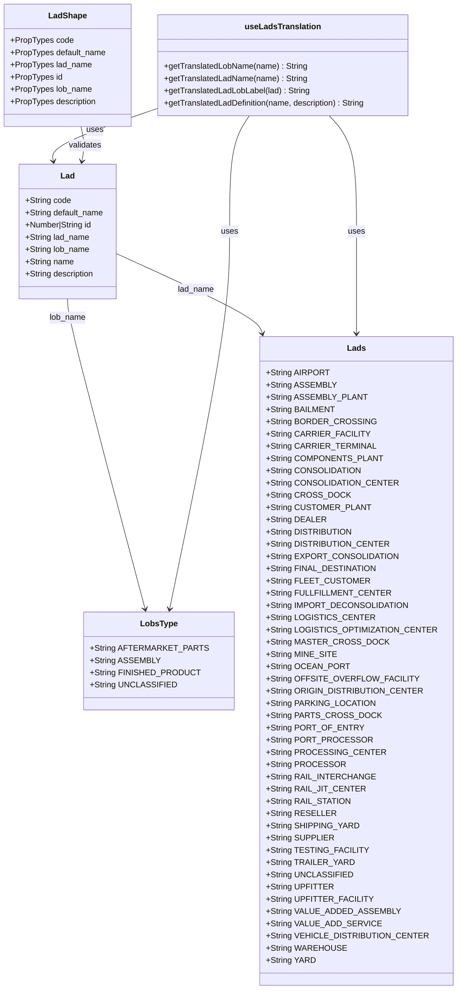
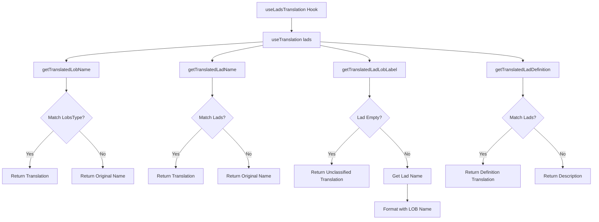
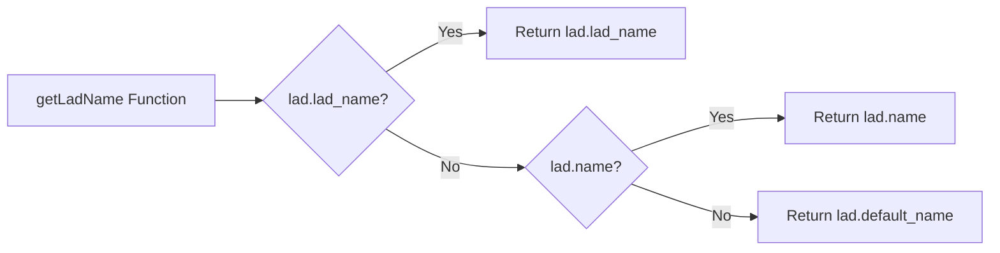

# Diagram: web/portal/src/shared/utils/lads.utils.ts

> Auto-generated by Obscura crawlers

## Diagram 1

### SVG

<svg id="container" width="877.27734375" xmlns="http://www.w3.org/2000/svg" class="classDiagram" height="1940" viewBox="0 0 877.27734375 1940" role="graphics-document document" aria-roledescription="class"><g><defs><marker id="container_class-aggregationStart" class="marker aggregation class" refX="18" refY="7" markerWidth="190" markerHeight="240" orient="auto"><path d="M 18,7 L9,13 L1,7 L9,1 Z"></path></marker></defs><defs><marker id="container_class-aggregationEnd" class="marker aggregation class" refX="1" refY="7" markerWidth="20" markerHeight="28" orient="auto"><path d="M 18,7 L9,13 L1,7 L9,1 Z"></path></marker></defs><defs><marker id="container_class-extensionStart" class="marker extension class" refX="18" refY="7" markerWidth="190" markerHeight="240" orient="auto"><path d="M 1,7 L18,13 V 1 Z"></path></marker></defs><defs><marker id="container_class-extensionEnd" class="marker extension class" refX="1" refY="7" markerWidth="20" markerHeight="28" orient="auto"><path d="M 1,1 V 13 L18,7 Z"></path></marker></defs><defs><marker id="container_class-compositionStart" class="marker composition class" refX="18" refY="7" markerWidth="190" markerHeight="240" orient="auto"><path d="M 18,7 L9,13 L1,7 L9,1 Z"></path></marker></defs><defs><marker id="container_class-compositionEnd" class="marker composition class" refX="1" refY="7" markerWidth="20" markerHeight="28" orient="auto"><path d="M 18,7 L9,13 L1,7 L9,1 Z"></path></marker></defs><defs><marker id="container_class-dependencyStart" class="marker dependency class" refX="6" refY="7" markerWidth="190" markerHeight="240" orient="auto"><path d="M 5,7 L9,13 L1,7 L9,1 Z"></path></marker></defs><defs><marker id="container_class-dependencyEnd" class="marker dependency class" refX="13" refY="7" markerWidth="20" markerHeight="28" orient="auto"><path d="M 18,7 L9,13 L14,7 L9,1 Z"></path></marker></defs><defs><marker id="container_class-lollipopStart" class="marker lollipop class" refX="13" refY="7" markerWidth="190" markerHeight="240" orient="auto"><circle stroke="black" fill="transparent" cx="7" cy="7" r="6"></circle></marker></defs><defs><marker id="container_class-lollipopEnd" class="marker lollipop class" refX="1" refY="7" markerWidth="190" markerHeight="240" orient="auto"><circle stroke="black" fill="transparent" cx="7" cy="7" r="6"></circle></marker></defs><g class="root"><g class="clusters"></g><g class="edgePaths"><path d="M148.494,586L148.494,592.167C148.494,598.333,148.494,610.667,176.639,712.041C204.784,813.415,261.075,1003.831,289.22,1099.038L317.365,1194.246" id="id_Lad_LobsType_1" class="edge-thickness-normal edge-pattern-solid relation" style=";;;" data-edge="true" data-et="edge" data-id="id_Lad_LobsType_1" data-points="W3sieCI6MTQ4LjQ5NDE0MDYyNSwieSI6NTg2fSx7IngiOjE0OC40OTQxNDA2MjUsInkiOjYyM30seyJ4IjozMTkuMDY1OTQ3NzE1NDUzMiwieSI6MTIwMH1d" marker-end="url(#container_class-dependencyEnd)"></path><path d="M244.639,497.323L291.124,518.269C337.609,539.215,430.579,581.108,478.424,607.253C526.27,633.398,528.991,643.797,530.351,648.996L531.712,654.195" id="id_Lad_Lads_2" class="edge-thickness-normal edge-pattern-solid relation" style=";;;" data-edge="true" data-et="edge" data-id="id_Lad_Lads_2" data-points="W3sieCI6MjQ0LjYzODY3MTg3NSwieSI6NDk3LjMyMjgxNzUwNTc4MDR9LHsieCI6NTIzLjU0ODgyODEyNSwieSI6NjIzfSx7IngiOjUzMy4yMzA1OTY0NDMxNjQ5LCJ5Ijo2NjB9XQ==" marker-end="url(#container_class-dependencyEnd)"></path><path d="M499.332,227L494.059,236.667C488.785,246.333,478.237,265.667,472.963,303.5C467.689,341.333,467.689,397.667,467.689,454C467.689,510.333,467.689,566.667,450.683,690.016C433.677,813.365,399.665,1003.729,382.659,1098.911L365.653,1194.094" id="id_useLadsTranslation_LobsType_3" class="edge-thickness-normal edge-pattern-solid relation" style=";;;" data-edge="true" data-et="edge" data-id="id_useLadsTranslation_LobsType_3" data-points="W3sieCI6NDk5LjMzMjQ0MTc3OTQ1ODYsInkiOjIyN30seyJ4Ijo0NjcuNjg5NDUzMTI1LCJ5IjoyODV9LHsieCI6NDY3LjY4OTQ1MzEyNSwieSI6NDU0fSx7IngiOjQ2Ny42ODk0NTMxMjUsInkiOjYyM30seyJ4IjozNjQuNTk3NTIyNzUyNjAwMywieSI6MTIwMH1d" marker-end="url(#container_class-dependencyEnd)"></path><path d="M645.602,227L654.61,236.667C663.619,246.333,681.636,265.667,690.644,303.5C699.652,341.333,699.652,397.667,699.652,454C699.652,510.333,699.652,566.667,699.652,600C699.652,633.333,699.652,643.667,699.652,648.833L699.652,654" id="id_useLadsTranslation_Lads_4" class="edge-thickness-normal edge-pattern-solid relation" style=";;;" data-edge="true" data-et="edge" data-id="id_useLadsTranslation_Lads_4" data-points="W3sieCI6NjQ1LjYwMjAzNTIzMDg5MTcsInkiOjIyN30seyJ4Ijo2OTkuNjUyMzQzNzUsInkiOjI4NX0seyJ4Ijo2OTkuNjUyMzQzNzUsInkiOjQ1NH0seyJ4Ijo2OTkuNjUyMzQzNzUsInkiOjYyM30seyJ4Ijo2OTkuNjUyMzQzNzUsInkiOjY2MH1d" marker-end="url(#container_class-dependencyEnd)"></path><path d="M305.539,216.534L273.6,227.945C241.661,239.356,177.783,262.178,146.905,278.776C116.028,295.374,118.151,305.748,119.212,310.935L120.274,316.122" id="id_useLadsTranslation_Lad_5" class="edge-thickness-normal edge-pattern-solid relation" style=";;;" data-edge="true" data-et="edge" data-id="id_useLadsTranslation_Lad_5" data-points="W3sieCI6MzA1LjUzOTA2MjUsInkiOjIxNi41MzQwMDc3MjQ2ODQ3OH0seyJ4IjoxMTMuOTA0Mjk2ODc1LCJ5IjoyODV9LHsieCI6MTIxLjQ3NzIyMTI0NjMwMTc4LCJ5IjozMjJ9XQ==" marker-end="url(#container_class-dependencyEnd)"></path><path d="M170.991,248L173.006,254.167C175.022,260.333,179.053,272.667,180.007,284.02C180.961,295.374,178.837,305.748,177.776,310.935L176.714,316.122" id="id_LadShape_Lad_6" class="edge-thickness-normal edge-pattern-solid relation" style=";;;" data-edge="true" data-et="edge" data-id="id_LadShape_Lad_6" data-points="W3sieCI6MTcwLjk5MDc2OTMwNzMyNDg1LCJ5IjoyNDh9LHsieCI6MTgzLjA4Mzk4NDM3NSwieSI6Mjg1fSx7IngiOjE3NS41MTEwNjAwMDM2OTgyMiwieSI6MzIyfV0=" marker-end="url(#container_class-dependencyEnd)"></path></g><g class="edgeLabels"><g class="edgeLabel" transform="translate(148.494140625, 623)"><g class="label" data-id="id_Lad_LobsType_1" transform="translate(-35.984375, -12)"><foreignObject width="71.96875" height="24">

lob_name

</foreignObject></g></g><g class="edgeLabel" transform="translate(401.52838, 568.01747)"><g class="label" data-id="id_Lad_Lads_2" transform="translate(-35.859375, -12)"><foreignObject width="71.71875" height="24">

lad_name

</foreignObject></g></g><g class="edgeLabel" transform="translate(467.689453125, 454)"><g class="label" data-id="id_useLadsTranslation_LobsType_3" transform="translate(-16.4921875, -12)"><foreignObject width="32.984375" height="24">

uses

</foreignObject></g></g><g class="edgeLabel" transform="translate(699.65234375, 454)"><g class="label" data-id="id_useLadsTranslation_Lads_4" transform="translate(-16.4921875, -12)"><foreignObject width="32.984375" height="24">

uses

</foreignObject></g></g><g class="edgeLabel" transform="translate(191.93901, 257.12028)"><g class="label" data-id="id_useLadsTranslation_Lad_5" transform="translate(-16.4921875, -12)"><foreignObject width="32.984375" height="24">

uses

</foreignObject></g></g><g class="edgeLabel" transform="translate(182.90393, 284.44912)"><g class="label" data-id="id_LadShape_Lad_6" transform="translate(-32.6875, -12)"><foreignObject width="65.375" height="24">

validates

</foreignObject></g></g></g><g class="nodes"><g class="node default" id="classId-LobsType-0" transform="translate(347.4453125, 1296)"><g class="basic label-container"><path d="M-132.58203125 -96 L132.58203125 -96 L132.58203125 96 L-132.58203125 96" stroke="none" stroke-width="0" fill="#ECECFF" style=""></path><path d="M-132.58203125 -96 C-34.81392201692485 -96, 62.9541872161503 -96, 132.58203125 -96 M-132.58203125 -96 C-64.79725375931238 -96, 2.9875237313752336 -96, 132.58203125 -96 M132.58203125 -96 C132.58203125 -33.35745578545245, 132.58203125 29.285088429095097, 132.58203125 96 M132.58203125 -96 C132.58203125 -40.77128396357226, 132.58203125 14.457432072855482, 132.58203125 96 M132.58203125 96 C26.612697684390852 96, -79.3566358812183 96, -132.58203125 96 M132.58203125 96 C45.16892057830917 96, -42.24419009338166 96, -132.58203125 96 M-132.58203125 96 C-132.58203125 22.565466549650395, -132.58203125 -50.86906690069921, -132.58203125 -96 M-132.58203125 96 C-132.58203125 29.22827282920437, -132.58203125 -37.54345434159126, -132.58203125 -96" stroke="#9370DB" stroke-width="1.3" fill="none" stroke-dasharray="0 0" style=""></path></g><g class="annotation-group text" transform="translate(0, -72)"></g><g class="label-group text" transform="translate(-34.5546875, -72)"><g class="label" style="font-weight: bolder" transform="translate(0,-12)"><foreignObject width="69.109375" height="24">

LobsType

</foreignObject></g></g><g class="members-group text" transform="translate(-120.58203125, -24)"><g class="label" style="" transform="translate(0,-12)"><foreignObject width="206.609375" height="24">

+String AFTERMARKET_PARTS

</foreignObject></g><g class="label" style="" transform="translate(0,12)"><foreignObject width="126.953125" height="24">

+String ASSEMBLY

</foreignObject></g><g class="label" style="" transform="translate(0,36)"><foreignObject width="196.71875" height="24">

+String FINISHED_PRODUCT

</foreignObject></g><g class="label" style="" transform="translate(0,60)"><foreignObject width="155.5" height="24">

+String UNCLASSIFIED

</foreignObject></g></g><g class="methods-group text" transform="translate(-120.58203125, 96)"></g><g class="divider" style=""><path d="M-132.58203125 -48 C-44.559703769364376 -48, 43.46262371127125 -48, 132.58203125 -48 M-132.58203125 -48 C-77.1438605121703 -48, -21.705689774340613 -48, 132.58203125 -48" stroke="#9370DB" stroke-width="1.3" fill="none" stroke-dasharray="0 0" style=""></path></g><g class="divider" style=""><path d="M-132.58203125 72 C-49.127699717878656 72, 34.32663181424269 72, 132.58203125 72 M-132.58203125 72 C-47.57682777697498 72, 37.42837569605004 72, 132.58203125 72" stroke="#9370DB" stroke-width="1.3" fill="none" stroke-dasharray="0 0" style=""></path></g></g><g class="node default" id="classId-Lads-1" transform="translate(699.65234375, 1296)"><g class="basic label-container"><path d="M-169.625 -636 L169.625 -636 L169.625 636 L-169.625 636" stroke="none" stroke-width="0" fill="#ECECFF" style=""></path><path d="M-169.625 -636 C-46.98349309259581 -636, 75.65801381480838 -636, 169.625 -636 M-169.625 -636 C-44.127135001204564 -636, 81.37072999759087 -636, 169.625 -636 M169.625 -636 C169.625 -369.7814165542756, 169.625 -103.56283310855122, 169.625 636 M169.625 -636 C169.625 -381.3495533265285, 169.625 -126.69910665305696, 169.625 636 M169.625 636 C63.58601844183431 636, -42.452963116331375 636, -169.625 636 M169.625 636 C65.0510045019126 636, -39.5229909961748 636, -169.625 636 M-169.625 636 C-169.625 243.5201843287935, -169.625 -148.959631342413, -169.625 -636 M-169.625 636 C-169.625 193.4714502221933, -169.625 -249.05709955561338, -169.625 -636" stroke="#9370DB" stroke-width="1.3" fill="none" stroke-dasharray="0 0" style=""></path></g><g class="annotation-group text" transform="translate(0, -612)"></g><g class="label-group text" transform="translate(-17.078125, -612)"><g class="label" style="font-weight: bolder" transform="translate(0,-12)"><foreignObject width="34.15625" height="24">

Lads

</foreignObject></g></g><g class="members-group text" transform="translate(-157.625, -564)"><g class="label" style="" transform="translate(0,-12)"><foreignObject width="116.046875" height="24">

+String AIRPORT

</foreignObject></g><g class="label" style="" transform="translate(0,12)"><foreignObject width="126.953125" height="24">

+String ASSEMBLY

</foreignObject></g><g class="label" style="" transform="translate(0,36)"><foreignObject width="179.625" height="24">

+String ASSEMBLY_PLANT

</foreignObject></g><g class="label" style="" transform="translate(0,60)"><foreignObject width="126.03125" height="24">

+String BAILMENT

</foreignObject></g><g class="label" style="" transform="translate(0,84)"><foreignObject width="193.734375" height="24">

+String BORDER_CROSSING

</foreignObject></g><g class="label" style="" transform="translate(0,108)"><foreignObject width="182.75" height="24">

+String CARRIER_FACILITY

</foreignObject></g><g class="label" style="" transform="translate(0,132)"><foreignObject width="194.1875" height="24">

+String CARRIER_TERMINAL

</foreignObject></g><g class="label" style="" transform="translate(0,156)"><foreignObject width="207.453125" height="24">

+String COMPONENTS_PLANT

</foreignObject></g><g class="label" style="" transform="translate(0,180)"><foreignObject width="171.09375" height="24">

+String CONSOLIDATION

</foreignObject></g><g class="label" style="" transform="translate(0,204)"><foreignObject width="233.734375" height="24">

+String CONSOLIDATION_CENTER

</foreignObject></g><g class="label" style="" transform="translate(0,228)"><foreignObject width="148.890625" height="24">

+String CROSS_DOCK

</foreignObject></g><g class="label" style="" transform="translate(0,252)"><foreignObject width="185.4375" height="24">

+String CUSTOMER_PLANT

</foreignObject></g><g class="label" style="" transform="translate(0,276)"><foreignObject width="108.71875" height="24">

+String DEALER

</foreignObject></g><g class="label" style="" transform="translate(0,300)"><foreignObject width="155.84375" height="24">

+String DISTRIBUTION

</foreignObject></g><g class="label" style="" transform="translate(0,324)"><foreignObject width="218.484375" height="24">

+String DISTRIBUTION_CENTER

</foreignObject></g><g class="label" style="" transform="translate(0,348)"><foreignObject width="233.171875" height="24">

+String EXPORT_CONSOLIDATION

</foreignObject></g><g class="label" style="" transform="translate(0,372)"><foreignObject width="197.78125" height="24">

+String FINAL_DESTINATION

</foreignObject></g><g class="label" style="" transform="translate(0,396)"><foreignObject width="179.578125" height="24">

+String FLEET_CUSTOMER

</foreignObject></g><g class="label" style="" transform="translate(0,420)"><foreignObject width="219.25" height="24">

+String FULLFILLMENT_CENTER

</foreignObject></g><g class="label" style="" transform="translate(0,444)"><foreignObject width="252.453125" height="24">

+String IMPORT_DECONSOLIDATION

</foreignObject></g><g class="label" style="" transform="translate(0,468)"><foreignObject width="188.640625" height="24">

+String LOGISTICS_CENTER

</foreignObject></g><g class="label" style="" transform="translate(0,492)"><foreignObject width="298.171875" height="24">

+String LOGISTICS_OPTIMIZATION_CENTER

</foreignObject></g><g class="label" style="" transform="translate(0,516)"><foreignObject width="213.0625" height="24">

+String MASTER_CROSS_DOCK

</foreignObject></g><g class="label" style="" transform="translate(0,540)"><foreignObject width="129.40625" height="24">

+String MINE_SITE

</foreignObject></g><g class="label" style="" transform="translate(0,564)"><foreignObject width="149.484375" height="24">

+String OCEAN_PORT

</foreignObject></g><g class="label" style="" transform="translate(0,588)"><foreignObject width="263.265625" height="24">

+String OFFSITE_OVERFLOW_FACILITY

</foreignObject></g><g class="label" style="" transform="translate(0,612)"><foreignObject width="278.03125" height="24">

+String ORIGIN_DISTRIBUTION_CENTER

</foreignObject></g><g class="label" style="" transform="translate(0,636)"><foreignObject width="195.78125" height="24">

+String PARKING_LOCATION

</foreignObject></g><g class="label" style="" transform="translate(0,660)"><foreignObject width="199.625" height="24">

+String PARTS_CROSS_DOCK

</foreignObject></g><g class="label" style="" transform="translate(0,684)"><foreignObject width="170.828125" height="24">

+String PORT_OF_ENTRY

</foreignObject></g><g class="label" style="" transform="translate(0,708)"><foreignObject width="185.25" height="24">

+String PORT_PROCESSOR

</foreignObject></g><g class="label" style="" transform="translate(0,732)"><foreignObject width="207.375" height="24">

+String PROCESSING_CENTER

</foreignObject></g><g class="label" style="" transform="translate(0,756)"><foreignObject width="139.734375" height="24">

+String PROCESSOR

</foreignObject></g><g class="label" style="" transform="translate(0,780)"><foreignObject width="194.9375" height="24">

+String RAIL_INTERCHANGE

</foreignObject></g><g class="label" style="" transform="translate(0,804)"><foreignObject width="174.421875" height="24">

+String RAIL_JIT_CENTER

</foreignObject></g><g class="label" style="" transform="translate(0,828)"><foreignObject width="153.203125" height="24">

+String RAIL_STATION

</foreignObject></g><g class="label" style="" transform="translate(0,852)"><foreignObject width="124.015625" height="24">

+String RESELLER

</foreignObject></g><g class="label" style="" transform="translate(0,876)"><foreignObject width="167.34375" height="24">

+String SHIPPING_YARD

</foreignObject></g><g class="label" style="" transform="translate(0,900)"><foreignObject width="123.296875" height="24">

+String SUPPLIER

</foreignObject></g><g class="label" style="" transform="translate(0,924)"><foreignObject width="181.359375" height="24">

+String TESTING_FACILITY

</foreignObject></g><g class="label" style="" transform="translate(0,948)"><foreignObject width="156.734375" height="24">

+String TRAILER_YARD

</foreignObject></g><g class="label" style="" transform="translate(0,972)"><foreignObject width="155.5" height="24">

+String UNCLASSIFIED

</foreignObject></g><g class="label" style="" transform="translate(0,996)"><foreignObject width="121.71875" height="24">

+String UPFITTER

</foreignObject></g><g class="label" style="" transform="translate(0,1020)"><foreignObject width="189.546875" height="24">

+String UPFITTER_FACILITY

</foreignObject></g><g class="label" style="" transform="translate(0,1044)"><foreignObject width="236.15625" height="24">

+String VALUE_ADDED_ASSEMBLY

</foreignObject></g><g class="label" style="" transform="translate(0,1068)"><foreignObject width="202.46875" height="24">

+String VALUE_ADD_SERVICE

</foreignObject></g><g class="label" style="" transform="translate(0,1092)"><foreignObject width="285.359375" height="24">

+String VEHICLE_DISTRIBUTION_CENTER

</foreignObject></g><g class="label" style="" transform="translate(0,1116)"><foreignObject width="144.8125" height="24">

+String WAREHOUSE

</foreignObject></g><g class="label" style="" transform="translate(0,1140)"><foreignObject width="91.640625" height="24">

+String YARD

</foreignObject></g></g><g class="methods-group text" transform="translate(-157.625, 636)"></g><g class="divider" style=""><path d="M-169.625 -588 C-33.96130082031004 -588, 101.70239835937991 -588, 169.625 -588 M-169.625 -588 C-94.08120137220054 -588, -18.537402744401078 -588, 169.625 -588" stroke="#9370DB" stroke-width="1.3" fill="none" stroke-dasharray="0 0" style=""></path></g><g class="divider" style=""><path d="M-169.625 612 C-100.47290046731123 612, -31.32080093462247 612, 169.625 612 M-169.625 612 C-68.72753558326563 612, 32.16992883346873 612, 169.625 612" stroke="#9370DB" stroke-width="1.3" fill="none" stroke-dasharray="0 0" style=""></path></g></g><g class="node default" id="classId-Lad-2" transform="translate(148.494140625, 454)"><g class="basic label-container"><path d="M-96.14453125 -132 L96.14453125 -132 L96.14453125 132 L-96.14453125 132" stroke="none" stroke-width="0" fill="#ECECFF" style=""></path><path d="M-96.14453125 -132 C-33.64163184207031 -132, 28.86126756585938 -132, 96.14453125 -132 M-96.14453125 -132 C-47.00763258265738 -132, 2.1292660846852414 -132, 96.14453125 -132 M96.14453125 -132 C96.14453125 -66.36618219071097, 96.14453125 -0.7323643814219452, 96.14453125 132 M96.14453125 -132 C96.14453125 -55.214604534491315, 96.14453125 21.57079093101737, 96.14453125 132 M96.14453125 132 C24.98323834349526 132, -46.17805456300948 132, -96.14453125 132 M96.14453125 132 C39.79311882592341 132, -16.558293598153185 132, -96.14453125 132 M-96.14453125 132 C-96.14453125 54.29257259265073, -96.14453125 -23.414854814698543, -96.14453125 -132 M-96.14453125 132 C-96.14453125 50.50110202755782, -96.14453125 -30.99779594488436, -96.14453125 -132" stroke="#9370DB" stroke-width="1.3" fill="none" stroke-dasharray="0 0" style=""></path></g><g class="annotation-group text" transform="translate(0, -108)"></g><g class="label-group text" transform="translate(-13.2109375, -108)"><g class="label" style="font-weight: bolder" transform="translate(0,-12)"><foreignObject width="26.421875" height="24">

Lad

</foreignObject></g></g><g class="members-group text" transform="translate(-84.14453125, -60)"><g class="label" style="" transform="translate(0,-12)"><foreignObject width="89.4375" height="24">

+String code

</foreignObject></g><g class="label" style="" transform="translate(0,12)"><foreignObject width="155.078125" height="24">

+String default_name

</foreignObject></g><g class="label" style="" transform="translate(0,36)"><foreignObject width="133.984375" height="24">

+Number|String id

</foreignObject></g><g class="label" style="" transform="translate(0,60)"><foreignObject width="126.1875" height="24">

+String lad_name

</foreignObject></g><g class="label" style="" transform="translate(0,84)"><foreignObject width="126.4375" height="24">

+String lob_name

</foreignObject></g><g class="label" style="" transform="translate(0,108)"><foreignObject width="94.984375" height="24">

+String name

</foreignObject></g><g class="label" style="" transform="translate(0,132)"><foreignObject width="137.078125" height="24">

+String description

</foreignObject></g></g><g class="methods-group text" transform="translate(-84.14453125, 132)"></g><g class="divider" style=""><path d="M-96.14453125 -84 C-19.46941851452064 -84, 57.20569422095872 -84, 96.14453125 -84 M-96.14453125 -84 C-40.87992518114834 -84, 14.384680887703325 -84, 96.14453125 -84" stroke="#9370DB" stroke-width="1.3" fill="none" stroke-dasharray="0 0" style=""></path></g><g class="divider" style=""><path d="M-96.14453125 108 C-28.481559717178484 108, 39.18141181564303 108, 96.14453125 108 M-96.14453125 108 C-47.84678949127676 108, 0.45095226744648187 108, 96.14453125 108" stroke="#9370DB" stroke-width="1.3" fill="none" stroke-dasharray="0 0" style=""></path></g></g><g class="node default" id="classId-LadShape-3" transform="translate(131.76953125, 128)"><g class="basic label-container"><path d="M-123.76953125 -120 L123.76953125 -120 L123.76953125 120 L-123.76953125 120" stroke="none" stroke-width="0" fill="#ECECFF" style=""></path><path d="M-123.76953125 -120 C-54.84133049797711 -120, 14.086870254045778 -120, 123.76953125 -120 M-123.76953125 -120 C-65.82473873439768 -120, -7.879946218795368 -120, 123.76953125 -120 M123.76953125 -120 C123.76953125 -68.57603252851078, 123.76953125 -17.152065057021574, 123.76953125 120 M123.76953125 -120 C123.76953125 -50.76028959747944, 123.76953125 18.479420805041116, 123.76953125 120 M123.76953125 120 C68.0144856888331 120, 12.259440127666224 120, -123.76953125 120 M123.76953125 120 C57.80452515582523 120, -8.160480938349536 120, -123.76953125 120 M-123.76953125 120 C-123.76953125 68.76293736541743, -123.76953125 17.525874730834857, -123.76953125 -120 M-123.76953125 120 C-123.76953125 37.61843761510997, -123.76953125 -44.76312476978006, -123.76953125 -120" stroke="#9370DB" stroke-width="1.3" fill="none" stroke-dasharray="0 0" style=""></path></g><g class="annotation-group text" transform="translate(0, -96)"></g><g class="label-group text" transform="translate(-35.9765625, -96)"><g class="label" style="font-weight: bolder" transform="translate(0,-12)"><foreignObject width="71.953125" height="24">

LadShape

</foreignObject></g></g><g class="members-group text" transform="translate(-111.76953125, -48)"><g class="label" style="" transform="translate(0,-12)"><foreignObject width="121.90625" height="24">

+PropTypes code

</foreignObject></g><g class="label" style="" transform="translate(0,12)"><foreignObject width="187.5625" height="24">

+PropTypes default_name

</foreignObject></g><g class="label" style="" transform="translate(0,36)"><foreignObject width="158.671875" height="24">

+PropTypes lad_name

</foreignObject></g><g class="label" style="" transform="translate(0,60)"><foreignObject width="101.03125" height="24">

+PropTypes id

</foreignObject></g><g class="label" style="" transform="translate(0,84)"><foreignObject width="158.921875" height="24">

+PropTypes lob_name

</foreignObject></g><g class="label" style="" transform="translate(0,108)"><foreignObject width="169.5625" height="24">

+PropTypes description

</foreignObject></g></g><g class="methods-group text" transform="translate(-111.76953125, 120)"></g><g class="divider" style=""><path d="M-123.76953125 -72 C-52.54852704008806 -72, 18.67247716982388 -72, 123.76953125 -72 M-123.76953125 -72 C-70.43072616010454 -72, -17.091921070209082 -72, 123.76953125 -72" stroke="#9370DB" stroke-width="1.3" fill="none" stroke-dasharray="0 0" style=""></path></g><g class="divider" style=""><path d="M-123.76953125 96 C-74.1195230437459 96, -24.4695148374918 96, 123.76953125 96 M-123.76953125 96 C-59.383635522256895 96, 5.002260205486209 96, 123.76953125 96" stroke="#9370DB" stroke-width="1.3" fill="none" stroke-dasharray="0 0" style=""></path></g></g><g class="node default" id="classId-useLadsTranslation-4" transform="translate(553.34375, 128)"><g class="basic label-container"><path d="M-247.8046875 -99 L247.8046875 -99 L247.8046875 99 L-247.8046875 99" stroke="none" stroke-width="0" fill="#ECECFF" style=""></path><path d="M-247.8046875 -99 C-94.95647974077261 -99, 57.891728018454785 -99, 247.8046875 -99 M-247.8046875 -99 C-144.40928369061174 -99, -41.01387988122346 -99, 247.8046875 -99 M247.8046875 -99 C247.8046875 -27.506223541329618, 247.8046875 43.987552917340764, 247.8046875 99 M247.8046875 -99 C247.8046875 -41.33267514586058, 247.8046875 16.334649708278846, 247.8046875 99 M247.8046875 99 C84.45775261477098 99, -78.88918227045804 99, -247.8046875 99 M247.8046875 99 C60.409722685263205 99, -126.98524212947359 99, -247.8046875 99 M-247.8046875 99 C-247.8046875 49.7033724072687, -247.8046875 0.4067448145374044, -247.8046875 -99 M-247.8046875 99 C-247.8046875 23.005381853000003, -247.8046875 -52.989236293999994, -247.8046875 -99" stroke="#9370DB" stroke-width="1.3" fill="none" stroke-dasharray="0 0" style=""></path></g><g class="annotation-group text" transform="translate(0, -75)"></g><g class="label-group text" transform="translate(-71.15625, -75)"><g class="label" style="font-weight: bolder" transform="translate(0,-12)"><foreignObject width="142.3125" height="24">

useLadsTranslation

</foreignObject></g></g><g class="members-group text" transform="translate(-235.8046875, -27)"></g><g class="methods-group text" transform="translate(-235.8046875, 3)"><g class="label" style="" transform="translate(0,-12)"><foreignObject width="281.203125" height="24">

+getTranslatedLobName(name) : String

</foreignObject></g><g class="label" style="" transform="translate(0,12)"><foreignObject width="280.875" height="24">

+getTranslatedLadName(name) : String

</foreignObject></g><g class="label" style="" transform="translate(0,36)"><foreignObject width="287.015625" height="24">

+getTranslatedLadLobLabel(lad) : String

</foreignObject></g><g class="label" style="" transform="translate(0,60)"><foreignObject width="400.453125" height="24">

+getTranslatedLadDefinition(name, description) : String

</foreignObject></g></g><g class="divider" style=""><path d="M-247.8046875 -51 C-147.27623237514825 -51, -46.74777725029648 -51, 247.8046875 -51 M-247.8046875 -51 C-97.212053528669 -51, 53.380580442661994 -51, 247.8046875 -51" stroke="#9370DB" stroke-width="1.3" fill="none" stroke-dasharray="0 0" style=""></path></g><g class="divider" style=""><path d="M-247.8046875 -27 C-128.9100576525279 -27, -10.015427805055822 -27, 247.8046875 -27 M-247.8046875 -27 C-112.79846523839541 -27, 22.207757023209183 -27, 247.8046875 -27" stroke="#9370DB" stroke-width="1.3" fill="none" stroke-dasharray="0 0" style=""></path></g></g></g></g></g></svg>

## Diagram 2

### SVG

<svg id="container" width="2065.359375" xmlns="http://www.w3.org/2000/svg" class="flowchart" height="760.28125" viewBox="0 0 2065.359375 760.28125" role="graphics-document document" aria-roledescription="flowchart-v2"><g><marker id="container_flowchart-v2-pointEnd" class="marker flowchart-v2" viewBox="0 0 10 10" refX="5" refY="5" markerUnits="userSpaceOnUse" markerWidth="8" markerHeight="8" orient="auto"><path d="M 0 0 L 10 5 L 0 10 z" class="arrowMarkerPath" style="stroke-width: 1; stroke-dasharray: 1, 0;"></path></marker><marker id="container_flowchart-v2-pointStart" class="marker flowchart-v2" viewBox="0 0 10 10" refX="4.5" refY="5" markerUnits="userSpaceOnUse" markerWidth="8" markerHeight="8" orient="auto"><path d="M 0 5 L 10 10 L 10 0 z" class="arrowMarkerPath" style="stroke-width: 1; stroke-dasharray: 1, 0;"></path></marker><marker id="container_flowchart-v2-circleEnd" class="marker flowchart-v2" viewBox="0 0 10 10" refX="11" refY="5" markerUnits="userSpaceOnUse" markerWidth="11" markerHeight="11" orient="auto"><circle cx="5" cy="5" r="5" class="arrowMarkerPath" style="stroke-width: 1; stroke-dasharray: 1, 0;"></circle></marker><marker id="container_flowchart-v2-circleStart" class="marker flowchart-v2" viewBox="0 0 10 10" refX="-1" refY="5" markerUnits="userSpaceOnUse" markerWidth="11" markerHeight="11" orient="auto"><circle cx="5" cy="5" r="5" class="arrowMarkerPath" style="stroke-width: 1; stroke-dasharray: 1, 0;"></circle></marker><marker id="container_flowchart-v2-crossEnd" class="marker cross flowchart-v2" viewBox="0 0 11 11" refX="12" refY="5.2" markerUnits="userSpaceOnUse" markerWidth="11" markerHeight="11" orient="auto"><path d="M 1,1 l 9,9 M 10,1 l -9,9" class="arrowMarkerPath" style="stroke-width: 2; stroke-dasharray: 1, 0;"></path></marker><marker id="container_flowchart-v2-crossStart" class="marker cross flowchart-v2" viewBox="0 0 11 11" refX="-1" refY="5.2" markerUnits="userSpaceOnUse" markerWidth="11" markerHeight="11" orient="auto"><path d="M 1,1 l 9,9 M 10,1 l -9,9" class="arrowMarkerPath" style="stroke-width: 2; stroke-dasharray: 1, 0;"></path></marker><g class="root"><g class="clusters"></g><g class="edgePaths"><path d="M1018.199,62L1018.199,66.167C1018.199,70.333,1018.199,78.667,1018.199,86.333C1018.199,94,1018.199,101,1018.199,104.5L1018.199,108" id="L_A_B_0" class="edge-thickness-normal edge-pattern-solid edge-thickness-normal edge-pattern-solid flowchart-link" style=";" data-edge="true" data-et="edge" data-id="L_A_B_0" data-points="W3sieCI6MTAxOC4xOTkyMTg3NSwieSI6NjJ9LHsieCI6MTAxOC4xOTkyMTg3NSwieSI6ODd9LHsieCI6MTAxOC4xOTkyMTg3NSwieSI6MTEyfV0=" marker-end="url(#container_flowchart-v2-pointEnd)"></path><path d="M917.504,145.668L803.4,153.223C689.297,160.778,461.09,175.889,346.986,186.945C232.883,198,232.883,205,232.883,208.5L232.883,212" id="L_B_C_0" class="edge-thickness-normal edge-pattern-solid edge-thickness-normal edge-pattern-solid flowchart-link" style=";" data-edge="true" data-et="edge" data-id="L_B_C_0" data-points="W3sieCI6OTE3LjUwMzkwNjI1LCJ5IjoxNDUuNjY3NTc1MjcwNzE1OTN9LHsieCI6MjMyLjg4MjgxMjUsInkiOjE5MX0seyJ4IjoyMzIuODgyODEyNSwieSI6MjE2fV0=" marker-end="url(#container_flowchart-v2-pointEnd)"></path><path d="M917.504,158.079L888.546,163.566C859.589,169.053,801.673,180.026,772.715,189.013C743.758,198,743.758,205,743.758,208.5L743.758,212" id="L_B_D_0" class="edge-thickness-normal edge-pattern-solid edge-thickness-normal edge-pattern-solid flowchart-link" style=";" data-edge="true" data-et="edge" data-id="L_B_D_0" data-points="W3sieCI6OTE3LjUwMzkwNjI1LCJ5IjoxNTguMDc5MzIzMDU2Nzc3Mjd9LHsieCI6NzQzLjc1NzgxMjUsInkiOjE5MX0seyJ4Ijo3NDMuNzU3ODEyNSwieSI6MjE2fV0=" marker-end="url(#container_flowchart-v2-pointEnd)"></path><path d="M1118.895,158.261L1147.421,163.717C1175.948,169.174,1233.001,180.087,1261.528,189.043C1290.055,198,1290.055,205,1290.055,208.5L1290.055,212" id="L_B_E_0" class="edge-thickness-normal edge-pattern-solid edge-thickness-normal edge-pattern-solid flowchart-link" style=";" data-edge="true" data-et="edge" data-id="L_B_E_0" data-points="W3sieCI6MTExOC44OTQ1MzEyNSwieSI6MTU4LjI2MDgwODk2NjE2MTM2fSx7IngiOjEyOTAuMDU0Njg3NSwieSI6MTkxfSx7IngiOjEyOTAuMDU0Njg3NSwieSI6MjE2fV0=" marker-end="url(#container_flowchart-v2-pointEnd)"></path><path d="M1118.895,145.53L1235.757,153.108C1352.618,160.687,1586.342,175.843,1703.204,186.922C1820.066,198,1820.066,205,1820.066,208.5L1820.066,212" id="L_B_F_0" class="edge-thickness-normal edge-pattern-solid edge-thickness-normal edge-pattern-solid flowchart-link" style=";" data-edge="true" data-et="edge" data-id="L_B_F_0" data-points="W3sieCI6MTExOC44OTQ1MzEyNSwieSI6MTQ1LjUyOTk1NDUwMDcyNTg0fSx7IngiOjE4MjAuMDY2NDA2MjUsInkiOjE5MX0seyJ4IjoxODIwLjA2NjQwNjI1LCJ5IjoyMTZ9XQ==" marker-end="url(#container_flowchart-v2-pointEnd)"></path><path d="M232.883,270L232.883,274.167C232.883,278.333,232.883,286.667,232.883,294.333C232.883,302,232.883,309,232.883,312.5L232.883,316" id="L_C_G_0" class="edge-thickness-normal edge-pattern-solid edge-thickness-normal edge-pattern-solid flowchart-link" style=";" data-edge="true" data-et="edge" data-id="L_C_G_0" data-points="W3sieCI6MjMyLjg4MjgxMjUsInkiOjI3MH0seyJ4IjoyMzIuODgyODEyNSwieSI6Mjk1fSx7IngiOjIzMi44ODI4MTI1LCJ5IjozMjB9XQ==" marker-end="url(#container_flowchart-v2-pointEnd)"></path><path d="M188.363,451.762L174.497,465.348C160.63,478.935,132.897,506.108,119.031,527.195C105.164,548.281,105.164,563.281,105.164,570.781L105.164,578.281" id="L_G_H_0" class="edge-thickness-normal edge-pattern-solid edge-thickness-normal edge-pattern-solid flowchart-link" style=";" data-edge="true" data-et="edge" data-id="L_G_H_0" data-points="W3sieCI6MTg4LjM2MzE2NDE4MDc3NjEyLCJ5Ijo0NTEuNzYxNjAxNjgwNzc2MX0seyJ4IjoxMDUuMTY0MDYyNSwieSI6NTMzLjI4MTI1fSx7IngiOjEwNS4xNjQwNjI1LCJ5Ijo1ODIuMjgxMjV9XQ==" marker-end="url(#container_flowchart-v2-pointEnd)"></path><path d="M277.402,451.762L291.269,465.348C305.135,478.935,332.869,506.108,346.735,527.195C360.602,548.281,360.602,563.281,360.602,570.781L360.602,578.281" id="L_G_I_0" class="edge-thickness-normal edge-pattern-solid edge-thickness-normal edge-pattern-solid flowchart-link" style=";" data-edge="true" data-et="edge" data-id="L_G_I_0" data-points="W3sieCI6Mjc3LjQwMjQ2MDgxOTIyMzksInkiOjQ1MS43NjE2MDE2ODA3NzYxfSx7IngiOjM2MC42MDE1NjI1LCJ5Ijo1MzMuMjgxMjV9LHsieCI6MzYwLjYwMTU2MjUsInkiOjU4Mi4yODEyNX1d" marker-end="url(#container_flowchart-v2-pointEnd)"></path><path d="M743.758,270L743.758,274.167C743.758,278.333,743.758,286.667,743.758,297.159C743.758,307.651,743.758,320.302,743.758,326.628L743.758,332.953" id="L_D_J_0" class="edge-thickness-normal edge-pattern-solid edge-thickness-normal edge-pattern-solid flowchart-link" style=";" data-edge="true" data-et="edge" data-id="L_D_J_0" data-points="W3sieCI6NzQzLjc1NzgxMjUsInkiOjI3MH0seyJ4Ijo3NDMuNzU3ODEyNSwieSI6Mjk1fSx7IngiOjc0My43NTc4MTI1LCJ5IjozMzYuOTUzMTI1fV0=" marker-end="url(#container_flowchart-v2-pointEnd)"></path><path d="M707.801,443.371L692.507,458.356C677.214,473.341,646.626,503.311,631.333,525.796C616.039,548.281,616.039,563.281,616.039,570.781L616.039,578.281" id="L_J_K_0" class="edge-thickness-normal edge-pattern-solid edge-thickness-normal edge-pattern-solid flowchart-link" style=";" data-edge="true" data-et="edge" data-id="L_J_K_0" data-points="W3sieCI6NzA3LjgwMTE1MjczMzU3ODQsInkiOjQ0My4zNzE0NjUyMzM1Nzg0fSx7IngiOjYxNi4wMzkwNjI1LCJ5Ijo1MzMuMjgxMjV9LHsieCI6NjE2LjAzOTA2MjUsInkiOjU4Mi4yODEyNX1d" marker-end="url(#container_flowchart-v2-pointEnd)"></path><path d="M779.714,443.371L795.008,458.356C810.302,473.341,840.889,503.311,856.183,525.796C871.477,548.281,871.477,563.281,871.477,570.781L871.477,578.281" id="L_J_L_0" class="edge-thickness-normal edge-pattern-solid edge-thickness-normal edge-pattern-solid flowchart-link" style=";" data-edge="true" data-et="edge" data-id="L_J_L_0" data-points="W3sieCI6Nzc5LjcxNDQ3MjI2NjQyMTYsInkiOjQ0My4zNzE0NjUyMzM1Nzg0fSx7IngiOjg3MS40NzY1NjI1LCJ5Ijo1MzMuMjgxMjV9LHsieCI6ODcxLjQ3NjU2MjUsInkiOjU4Mi4yODEyNX1d" marker-end="url(#container_flowchart-v2-pointEnd)"></path><path d="M1290.055,270L1290.055,274.167C1290.055,278.333,1290.055,286.667,1290.055,297.659C1290.055,308.651,1290.055,322.302,1290.055,329.128L1290.055,335.953" id="L_E_M_0" class="edge-thickness-normal edge-pattern-solid edge-thickness-normal edge-pattern-solid flowchart-link" style=";" data-edge="true" data-et="edge" data-id="L_E_M_0" data-points="W3sieCI6MTI5MC4wNTQ2ODc1LCJ5IjoyNzB9LHsieCI6MTI5MC4wNTQ2ODc1LCJ5IjoyOTV9LHsieCI6MTI5MC4wNTQ2ODc1LCJ5IjozMzkuOTUzMTI1fV0=" marker-end="url(#container_flowchart-v2-pointEnd)"></path><path d="M1255.272,441.545L1239.351,456.834C1223.431,472.124,1191.591,502.703,1175.67,523.492C1159.75,544.281,1159.75,555.281,1159.75,560.781L1159.75,566.281" id="L_M_N_0" class="edge-thickness-normal edge-pattern-solid edge-thickness-normal edge-pattern-solid flowchart-link" style=";" data-edge="true" data-et="edge" data-id="L_M_N_0" data-points="W3sieCI6MTI1NS4yNzE3MDA5MTEwMTYzLCJ5Ijo0NDEuNTQ1MTM4NDExMDE2M30seyJ4IjoxMTU5Ljc1LCJ5Ijo1MzMuMjgxMjV9LHsieCI6MTE1OS43NSwieSI6NTcwLjI4MTI1fV0=" marker-end="url(#container_flowchart-v2-pointEnd)"></path><path d="M1324.838,441.545L1340.758,456.834C1356.678,472.124,1388.519,502.703,1404.439,525.492C1420.359,548.281,1420.359,563.281,1420.359,570.781L1420.359,578.281" id="L_M_O_0" class="edge-thickness-normal edge-pattern-solid edge-thickness-normal edge-pattern-solid flowchart-link" style=";" data-edge="true" data-et="edge" data-id="L_M_O_0" data-points="W3sieCI6MTMyNC44Mzc2NzQwODg5ODM3LCJ5Ijo0NDEuNTQ1MTM4NDExMDE2M30seyJ4IjoxNDIwLjM1OTM3NSwieSI6NTMzLjI4MTI1fSx7IngiOjE0MjAuMzU5Mzc1LCJ5Ijo1ODIuMjgxMjV9XQ==" marker-end="url(#container_flowchart-v2-pointEnd)"></path><path d="M1420.359,636.281L1420.359,642.448C1420.359,648.615,1420.359,660.948,1420.359,670.615C1420.359,680.281,1420.359,687.281,1420.359,690.781L1420.359,694.281" id="L_O_P_0" class="edge-thickness-normal edge-pattern-solid edge-thickness-normal edge-pattern-solid flowchart-link" style=";" data-edge="true" data-et="edge" data-id="L_O_P_0" data-points="W3sieCI6MTQyMC4zNTkzNzUsInkiOjYzNi4yODEyNX0seyJ4IjoxNDIwLjM1OTM3NSwieSI6NjczLjI4MTI1fSx7IngiOjE0MjAuMzU5Mzc1LCJ5Ijo2OTguMjgxMjV9XQ==" marker-end="url(#container_flowchart-v2-pointEnd)"></path><path d="M1820.066,270L1820.066,274.167C1820.066,278.333,1820.066,286.667,1820.066,297.159C1820.066,307.651,1820.066,320.302,1820.066,326.628L1820.066,332.953" id="L_F_Q_0" class="edge-thickness-normal edge-pattern-solid edge-thickness-normal edge-pattern-solid flowchart-link" style=";" data-edge="true" data-et="edge" data-id="L_F_Q_0" data-points="W3sieCI6MTgyMC4wNjY0MDYyNSwieSI6MjcwfSx7IngiOjE4MjAuMDY2NDA2MjUsInkiOjI5NX0seyJ4IjoxODIwLjA2NjQwNjI1LCJ5IjozMzYuOTUzMTI1fV0=" marker-end="url(#container_flowchart-v2-pointEnd)"></path><path d="M1782.593,441.854L1765.655,457.092C1748.718,472.33,1714.843,502.806,1697.906,523.543C1680.969,544.281,1680.969,555.281,1680.969,560.781L1680.969,566.281" id="L_Q_R_0" class="edge-thickness-normal edge-pattern-solid edge-thickness-normal edge-pattern-solid flowchart-link" style=";" data-edge="true" data-et="edge" data-id="L_Q_R_0" data-points="W3sieCI6MTc4Mi41OTI1OTkwNTgwNDIsInkiOjQ0MS44NTQzMTc4MDgwNDE5N30seyJ4IjoxNjgwLjk2ODc1LCJ5Ijo1MzMuMjgxMjV9LHsieCI6MTY4MC45Njg3NSwieSI6NTcwLjI4MTI1fV0=" marker-end="url(#container_flowchart-v2-pointEnd)"></path><path d="M1857.54,441.854L1874.478,457.092C1891.415,472.33,1925.289,502.806,1942.227,525.543C1959.164,548.281,1959.164,563.281,1959.164,570.781L1959.164,578.281" id="L_Q_S_0" class="edge-thickness-normal edge-pattern-solid edge-thickness-normal edge-pattern-solid flowchart-link" style=";" data-edge="true" data-et="edge" data-id="L_Q_S_0" data-points="W3sieCI6MTg1Ny41NDAyMTM0NDE5NTgsInkiOjQ0MS44NTQzMTc4MDgwNDE5N30seyJ4IjoxOTU5LjE2NDA2MjUsInkiOjUzMy4yODEyNX0seyJ4IjoxOTU5LjE2NDA2MjUsInkiOjU4Mi4yODEyNX1d" marker-end="url(#container_flowchart-v2-pointEnd)"></path></g><g class="edgeLabels"><g class="edgeLabel"><g class="label" data-id="L_A_B_0" transform="translate(0, 0)"><foreignObject width="0" height="0">

</foreignObject></g></g><g class="edgeLabel"><g class="label" data-id="L_B_C_0" transform="translate(0, 0)"><foreignObject width="0" height="0">

</foreignObject></g></g><g class="edgeLabel"><g class="label" data-id="L_B_D_0" transform="translate(0, 0)"><foreignObject width="0" height="0">

</foreignObject></g></g><g class="edgeLabel"><g class="label" data-id="L_B_E_0" transform="translate(0, 0)"><foreignObject width="0" height="0">

</foreignObject></g></g><g class="edgeLabel"><g class="label" data-id="L_B_F_0" transform="translate(0, 0)"><foreignObject width="0" height="0">

</foreignObject></g></g><g class="edgeLabel"><g class="label" data-id="L_C_G_0" transform="translate(0, 0)"><foreignObject width="0" height="0">

</foreignObject></g></g><g class="edgeLabel" transform="translate(105.1640625, 533.28125)"><g class="label" data-id="L_G_H_0" transform="translate(-12.03125, -12)"><foreignObject width="24.0625" height="24">

Yes

</foreignObject></g></g><g class="edgeLabel" transform="translate(360.6015625, 533.28125)"><g class="label" data-id="L_G_I_0" transform="translate(-10.140625, -12)"><foreignObject width="20.28125" height="24">

No

</foreignObject></g></g><g class="edgeLabel"><g class="label" data-id="L_D_J_0" transform="translate(0, 0)"><foreignObject width="0" height="0">

</foreignObject></g></g><g class="edgeLabel" transform="translate(616.0390625, 533.28125)"><g class="label" data-id="L_J_K_0" transform="translate(-12.03125, -12)"><foreignObject width="24.0625" height="24">

Yes

</foreignObject></g></g><g class="edgeLabel" transform="translate(871.4765625, 533.28125)"><g class="label" data-id="L_J_L_0" transform="translate(-10.140625, -12)"><foreignObject width="20.28125" height="24">

No

</foreignObject></g></g><g class="edgeLabel"><g class="label" data-id="L_E_M_0" transform="translate(0, 0)"><foreignObject width="0" height="0">

</foreignObject></g></g><g class="edgeLabel" transform="translate(1159.75, 533.28125)"><g class="label" data-id="L_M_N_0" transform="translate(-12.03125, -12)"><foreignObject width="24.0625" height="24">

Yes

</foreignObject></g></g><g class="edgeLabel" transform="translate(1420.359375, 533.28125)"><g class="label" data-id="L_M_O_0" transform="translate(-10.140625, -12)"><foreignObject width="20.28125" height="24">

No

</foreignObject></g></g><g class="edgeLabel"><g class="label" data-id="L_O_P_0" transform="translate(0, 0)"><foreignObject width="0" height="0">

</foreignObject></g></g><g class="edgeLabel"><g class="label" data-id="L_F_Q_0" transform="translate(0, 0)"><foreignObject width="0" height="0">

</foreignObject></g></g><g class="edgeLabel" transform="translate(1680.96875, 533.28125)"><g class="label" data-id="L_Q_R_0" transform="translate(-12.03125, -12)"><foreignObject width="24.0625" height="24">

Yes

</foreignObject></g></g><g class="edgeLabel" transform="translate(1959.1640625, 533.28125)"><g class="label" data-id="L_Q_S_0" transform="translate(-10.140625, -12)"><foreignObject width="20.28125" height="24">

No

</foreignObject></g></g></g><g class="nodes"><g class="node default" id="flowchart-A-0" transform="translate(1018.19921875, 35)"><rect class="basic label-container" style="" x="-121.171875" y="-27" width="242.34375" height="54"></rect><g class="label" style="" transform="translate(-91.171875, -12)"><rect></rect><foreignObject width="182.34375" height="24">

useLadsTranslation Hook

</foreignObject></g></g><g class="node default" id="flowchart-B-1" transform="translate(1018.19921875, 139)"><rect class="basic label-container" style="" x="-100.6953125" y="-27" width="201.390625" height="54"></rect><g class="label" style="" transform="translate(-70.6953125, -12)"><rect></rect><foreignObject width="141.390625" height="24">

useTranslation lads

</foreignObject></g></g><g class="node default" id="flowchart-C-3" transform="translate(232.8828125, 243)"><rect class="basic label-container" style="" x="-113.5703125" y="-27" width="227.140625" height="54"></rect><g class="label" style="" transform="translate(-83.5703125, -12)"><rect></rect><foreignObject width="167.140625" height="24">

getTranslatedLobName

</foreignObject></g></g><g class="node default" id="flowchart-D-5" transform="translate(743.7578125, 243)"><rect class="basic label-container" style="" x="-113.40625" y="-27" width="226.8125" height="54"></rect><g class="label" style="" transform="translate(-83.40625, -12)"><rect></rect><foreignObject width="166.8125" height="24">

getTranslatedLadName

</foreignObject></g></g><g class="node default" id="flowchart-E-7" transform="translate(1290.0546875, 243)"><rect class="basic label-container" style="" x="-125.2890625" y="-27" width="250.578125" height="54"></rect><g class="label" style="" transform="translate(-95.2890625, -12)"><rect></rect><foreignObject width="190.578125" height="24">

getTranslatedLadLobLabel

</foreignObject></g></g><g class="node default" id="flowchart-F-9" transform="translate(1820.06640625, 243)"><rect class="basic label-container" style="" x="-127.9296875" y="-27" width="255.859375" height="54"></rect><g class="label" style="" transform="translate(-97.9296875, -12)"><rect></rect><foreignObject width="195.859375" height="24">

getTranslatedLadDefinition

</foreignObject></g></g><g class="node default" id="flowchart-G-11" transform="translate(232.8828125, 408.140625)"><polygon points="88.140625,0 176.28125,-88.140625 88.140625,-176.28125 0,-88.140625" class="label-container" transform="translate(-87.640625, 88.140625)"></polygon><g class="label" style="" transform="translate(-61.140625, -12)"><rect></rect><foreignObject width="122.28125" height="24">

Match LobsType?

</foreignObject></g></g><g class="node default" id="flowchart-H-13" transform="translate(105.1640625, 609.28125)"><rect class="basic label-container" style="" x="-97.1640625" y="-27" width="194.328125" height="54"></rect><g class="label" style="" transform="translate(-67.1640625, -12)"><rect></rect><foreignObject width="134.328125" height="24">

Return Translation

</foreignObject></g></g><g class="node default" id="flowchart-I-15" transform="translate(360.6015625, 609.28125)"><rect class="basic label-container" style="" x="-108.2734375" y="-27" width="216.546875" height="54"></rect><g class="label" style="" transform="translate(-78.2734375, -12)"><rect></rect><foreignObject width="156.546875" height="24">

Return Original Name

</foreignObject></g></g><g class="node default" id="flowchart-J-17" transform="translate(743.7578125, 408.140625)"><polygon points="71.1875,0 142.375,-71.1875 71.1875,-142.375 0,-71.1875" class="label-container" transform="translate(-70.6875, 71.1875)"></polygon><g class="label" style="" transform="translate(-44.1875, -12)"><rect></rect><foreignObject width="88.375" height="24">

Match Lads?

</foreignObject></g></g><g class="node default" id="flowchart-K-19" transform="translate(616.0390625, 609.28125)"><rect class="basic label-container" style="" x="-97.1640625" y="-27" width="194.328125" height="54"></rect><g class="label" style="" transform="translate(-67.1640625, -12)"><rect></rect><foreignObject width="134.328125" height="24">

Return Translation

</foreignObject></g></g><g class="node default" id="flowchart-L-21" transform="translate(871.4765625, 609.28125)"><rect class="basic label-container" style="" x="-108.2734375" y="-27" width="216.546875" height="54"></rect><g class="label" style="" transform="translate(-78.2734375, -12)"><rect></rect><foreignObject width="156.546875" height="24">

Return Original Name

</foreignObject></g></g><g class="node default" id="flowchart-M-23" transform="translate(1290.0546875, 408.140625)"><polygon points="68.1875,0 136.375,-68.1875 68.1875,-136.375 0,-68.1875" class="label-container" transform="translate(-67.6875, 68.1875)"></polygon><g class="label" style="" transform="translate(-41.1875, -12)"><rect></rect><foreignObject width="82.375" height="24">

Lad Empty?

</foreignObject></g></g><g class="node default" id="flowchart-N-25" transform="translate(1159.75, 609.28125)"><rect class="basic label-container" style="" x="-130" y="-39" width="260" height="78"></rect><g class="label" style="" transform="translate(-100, -24)"><rect></rect><foreignObject width="200" height="48">

Return Unclassified Translation

</foreignObject></g></g><g class="node default" id="flowchart-O-27" transform="translate(1420.359375, 609.28125)"><rect class="basic label-container" style="" x="-80.609375" y="-27" width="161.21875" height="54"></rect><g class="label" style="" transform="translate(-50.609375, -12)"><rect></rect><foreignObject width="101.21875" height="24">

Get Lad Name

</foreignObject></g></g><g class="node default" id="flowchart-P-29" transform="translate(1420.359375, 725.28125)"><rect class="basic label-container" style="" x="-112.4921875" y="-27" width="224.984375" height="54"></rect><g class="label" style="" transform="translate(-82.4921875, -12)"><rect></rect><foreignObject width="164.984375" height="24">

Format with LOB Name

</foreignObject></g></g><g class="node default" id="flowchart-Q-31" transform="translate(1820.06640625, 408.140625)"><polygon points="71.1875,0 142.375,-71.1875 71.1875,-142.375 0,-71.1875" class="label-container" transform="translate(-70.6875, 71.1875)"></polygon><g class="label" style="" transform="translate(-44.1875, -12)"><rect></rect><foreignObject width="88.375" height="24">

Match Lads?

</foreignObject></g></g><g class="node default" id="flowchart-R-33" transform="translate(1680.96875, 609.28125)"><rect class="basic label-container" style="" x="-130" y="-39" width="260" height="78"></rect><g class="label" style="" transform="translate(-100, -24)"><rect></rect><foreignObject width="200" height="48">

Return Definition Translation

</foreignObject></g></g><g class="node default" id="flowchart-S-35" transform="translate(1959.1640625, 609.28125)"><rect class="basic label-container" style="" x="-98.1953125" y="-27" width="196.390625" height="54"></rect><g class="label" style="" transform="translate(-68.1953125, -12)"><rect></rect><foreignObject width="136.390625" height="24">

Return Description

</foreignObject></g></g></g></g></g></svg>

## Diagram 3

### SVG

<svg id="container" width="1042.53125" xmlns="http://www.w3.org/2000/svg" class="flowchart" height="262.96875" viewBox="0 0 1042.53125 262.96875" role="graphics-document document" aria-roledescription="flowchart-v2"><g><marker id="container_flowchart-v2-pointEnd" class="marker flowchart-v2" viewBox="0 0 10 10" refX="5" refY="5" markerUnits="userSpaceOnUse" markerWidth="8" markerHeight="8" orient="auto"><path d="M 0 0 L 10 5 L 0 10 z" class="arrowMarkerPath" style="stroke-width: 1; stroke-dasharray: 1, 0;"></path></marker><marker id="container_flowchart-v2-pointStart" class="marker flowchart-v2" viewBox="0 0 10 10" refX="4.5" refY="5" markerUnits="userSpaceOnUse" markerWidth="8" markerHeight="8" orient="auto"><path d="M 0 5 L 10 10 L 10 0 z" class="arrowMarkerPath" style="stroke-width: 1; stroke-dasharray: 1, 0;"></path></marker><marker id="container_flowchart-v2-circleEnd" class="marker flowchart-v2" viewBox="0 0 10 10" refX="11" refY="5" markerUnits="userSpaceOnUse" markerWidth="11" markerHeight="11" orient="auto"><circle cx="5" cy="5" r="5" class="arrowMarkerPath" style="stroke-width: 1; stroke-dasharray: 1, 0;"></circle></marker><marker id="container_flowchart-v2-circleStart" class="marker flowchart-v2" viewBox="0 0 10 10" refX="-1" refY="5" markerUnits="userSpaceOnUse" markerWidth="11" markerHeight="11" orient="auto"><circle cx="5" cy="5" r="5" class="arrowMarkerPath" style="stroke-width: 1; stroke-dasharray: 1, 0;"></circle></marker><marker id="container_flowchart-v2-crossEnd" class="marker cross flowchart-v2" viewBox="0 0 11 11" refX="12" refY="5.2" markerUnits="userSpaceOnUse" markerWidth="11" markerHeight="11" orient="auto"><path d="M 1,1 l 9,9 M 10,1 l -9,9" class="arrowMarkerPath" style="stroke-width: 2; stroke-dasharray: 1, 0;"></path></marker><marker id="container_flowchart-v2-crossStart" class="marker cross flowchart-v2" viewBox="0 0 11 11" refX="-1" refY="5.2" markerUnits="userSpaceOnUse" markerWidth="11" markerHeight="11" orient="auto"><path d="M 1,1 l 9,9 M 10,1 l -9,9" class="arrowMarkerPath" style="stroke-width: 2; stroke-dasharray: 1, 0;"></path></marker><g class="root"><g class="clusters"></g><g class="edgePaths"><path d="M225.563,105.484L229.729,105.484C233.896,105.484,242.229,105.484,249.896,105.484C257.563,105.484,264.563,105.484,268.063,105.484L271.563,105.484" id="L_A_B_0" class="edge-thickness-normal edge-pattern-solid edge-thickness-normal edge-pattern-solid flowchart-link" style=";" data-edge="true" data-et="edge" data-id="L_A_B_0" data-points="W3sieCI6MjI1LjU2MjUsInkiOjEwNS40ODQzNzV9LHsieCI6MjUwLjU2MjUsInkiOjEwNS40ODQzNzV9LHsieCI6Mjc1LjU2MjUsInkiOjEwNS40ODQzNzV9XQ==" marker-end="url(#container_flowchart-v2-pointEnd)"></path><path d="M404.725,75.506L415.893,68.755C427.062,62.004,449.398,48.502,466.071,41.751C482.745,35,493.755,35,499.26,35L504.766,35" id="L_B_C_0" class="edge-thickness-normal edge-pattern-solid edge-thickness-normal edge-pattern-solid flowchart-link" style=";" data-edge="true" data-et="edge" data-id="L_B_C_0" data-points="W3sieCI6NDA0LjcyNTExNjkyNDg3NTc1LCJ5Ijo3NS41MDYzNjY5MjQ4NzU3Nn0seyJ4Ijo0NzEuNzM0Mzc1LCJ5IjozNX0seyJ4Ijo1MDguNzY1NjI1LCJ5IjozNX1d" marker-end="url(#container_flowchart-v2-pointEnd)"></path><path d="M404.725,135.462L415.893,142.213C427.062,148.965,449.398,162.467,473.034,169.218C496.669,175.969,521.604,175.969,534.072,175.969L546.539,175.969" id="L_B_D_0" class="edge-thickness-normal edge-pattern-solid edge-thickness-normal edge-pattern-solid flowchart-link" style=";" data-edge="true" data-et="edge" data-id="L_B_D_0" data-points="W3sieCI6NDA0LjcyNTExNjkyNDg3NTc1LCJ5IjoxMzUuNDYyMzgzMDc1MTI0MjJ9LHsieCI6NDcxLjczNDM3NSwieSI6MTc1Ljk2ODc1fSx7IngiOjU1MC41MzkwNjI1LCJ5IjoxNzUuOTY4NzV9XQ==" marker-end="url(#container_flowchart-v2-pointEnd)"></path><path d="M661.398,158.891L677.379,153.07C693.359,147.25,725.32,135.609,751.801,129.789C778.281,123.969,799.281,123.969,809.781,123.969L820.281,123.969" id="L_D_E_0" class="edge-thickness-normal edge-pattern-solid edge-thickness-normal edge-pattern-solid flowchart-link" style=";" data-edge="true" data-et="edge" data-id="L_D_E_0" data-points="W3sieCI6NjYxLjM5ODM4NjczNDg4ODMsInkiOjE1OC44OTA1NzQyMzQ4ODgzfSx7IngiOjc1Ny4yODEyNSwieSI6MTIzLjk2ODc1fSx7IngiOjgyNC4yODEyNSwieSI6MTIzLjk2ODc1fV0=" marker-end="url(#container_flowchart-v2-pointEnd)"></path><path d="M661.398,193.047L677.379,198.867C693.359,204.688,725.32,216.328,746.806,222.148C768.292,227.969,779.302,227.969,784.807,227.969L790.313,227.969" id="L_D_F_0" class="edge-thickness-normal edge-pattern-solid edge-thickness-normal edge-pattern-solid flowchart-link" style=";" data-edge="true" data-et="edge" data-id="L_D_F_0" data-points="W3sieCI6NjYxLjM5ODM4NjczNDg4ODMsInkiOjE5My4wNDY5MjU3NjUxMTE3fSx7IngiOjc1Ny4yODEyNSwieSI6MjI3Ljk2ODc1fSx7IngiOjc5NC4zMTI1LCJ5IjoyMjcuOTY4NzV9XQ==" marker-end="url(#container_flowchart-v2-pointEnd)"></path></g><g class="edgeLabels"><g class="edgeLabel"><g class="label" data-id="L_A_B_0" transform="translate(0, 0)"><foreignObject width="0" height="0">

</foreignObject></g></g><g class="edgeLabel" transform="translate(471.734375, 35)"><g class="label" data-id="L_B_C_0" transform="translate(-12.03125, -12)"><foreignObject width="24.0625" height="24">

Yes

</foreignObject></g></g><g class="edgeLabel" transform="translate(471.734375, 175.96875)"><g class="label" data-id="L_B_D_0" transform="translate(-10.140625, -12)"><foreignObject width="20.28125" height="24">

No

</foreignObject></g></g><g class="edgeLabel" transform="translate(757.28125, 123.96875)"><g class="label" data-id="L_D_E_0" transform="translate(-12.03125, -12)"><foreignObject width="24.0625" height="24">

Yes

</foreignObject></g></g><g class="edgeLabel" transform="translate(757.28125, 227.96875)"><g class="label" data-id="L_D_F_0" transform="translate(-10.140625, -12)"><foreignObject width="20.28125" height="24">

No

</foreignObject></g></g></g><g class="nodes"><g class="node default" id="flowchart-A-0" transform="translate(116.78125, 105.484375)"><rect class="basic label-container" style="" x="-108.78125" y="-27" width="217.5625" height="54"></rect><g class="label" style="" transform="translate(-78.78125, -12)"><rect></rect><foreignObject width="157.5625" height="24">

getLadName Function

</foreignObject></g></g><g class="node default" id="flowchart-B-1" transform="translate(355.1328125, 105.484375)"><polygon points="79.5703125,0 159.140625,-79.5703125 79.5703125,-159.140625 0,-79.5703125" class="label-container" transform="translate(-79.0703125, 79.5703125)"></polygon><g class="label" style="" transform="translate(-52.5703125, -12)"><rect></rect><foreignObject width="105.140625" height="24">

lad.lad_name?

</foreignObject></g></g><g class="node default" id="flowchart-C-3" transform="translate(614.5078125, 35)"><rect class="basic label-container" style="" x="-105.7421875" y="-27" width="211.484375" height="54"></rect><g class="label" style="" transform="translate(-75.7421875, -12)"><rect></rect><foreignObject width="151.484375" height="24">

Return lad.lad_name

</foreignObject></g></g><g class="node default" id="flowchart-D-5" transform="translate(614.5078125, 175.96875)"><polygon points="63.96875,0 127.9375,-63.96875 63.96875,-127.9375 0,-63.96875" class="label-container" transform="translate(-63.46875, 63.96875)"></polygon><g class="label" style="" transform="translate(-36.96875, -12)"><rect></rect><foreignObject width="73.9375" height="24">

lad.name?

</foreignObject></g></g><g class="node default" id="flowchart-E-7" transform="translate(914.421875, 123.96875)"><rect class="basic label-container" style="" x="-90.140625" y="-27" width="180.28125" height="54"></rect><g class="label" style="" transform="translate(-60.140625, -12)"><rect></rect><foreignObject width="120.28125" height="24">

Return lad.name

</foreignObject></g></g><g class="node default" id="flowchart-F-9" transform="translate(914.421875, 227.96875)"><rect class="basic label-container" style="" x="-120.109375" y="-27" width="240.21875" height="54"></rect><g class="label" style="" transform="translate(-90.109375, -12)"><rect></rect><foreignObject width="180.21875" height="24">

Return lad.default_name

</foreignObject></g></g></g></g></g></svg>
