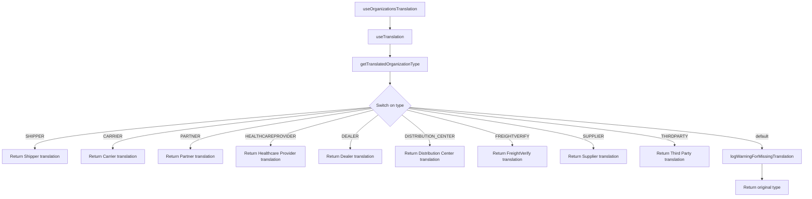
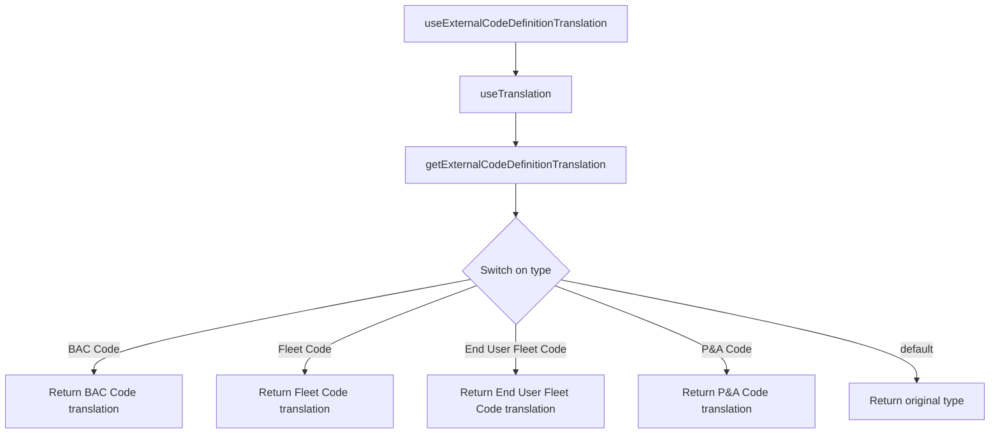
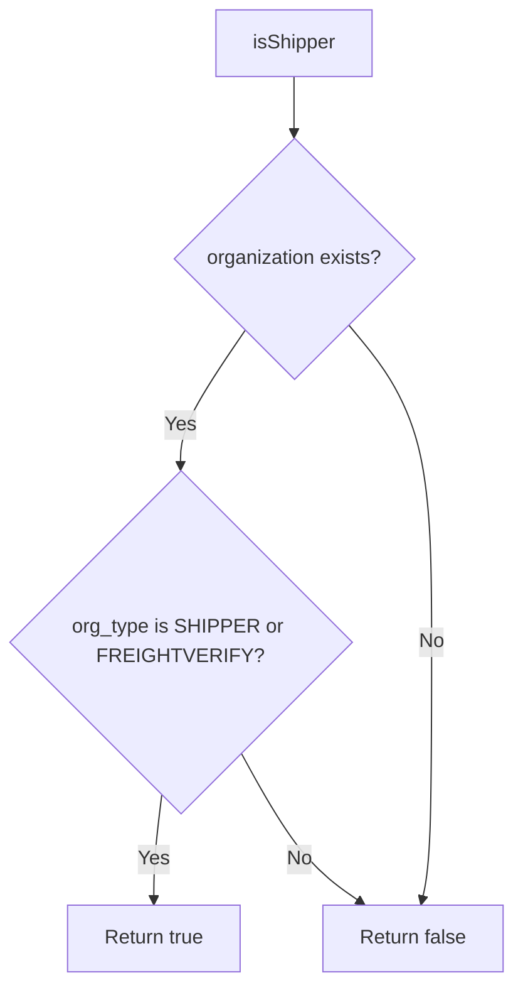
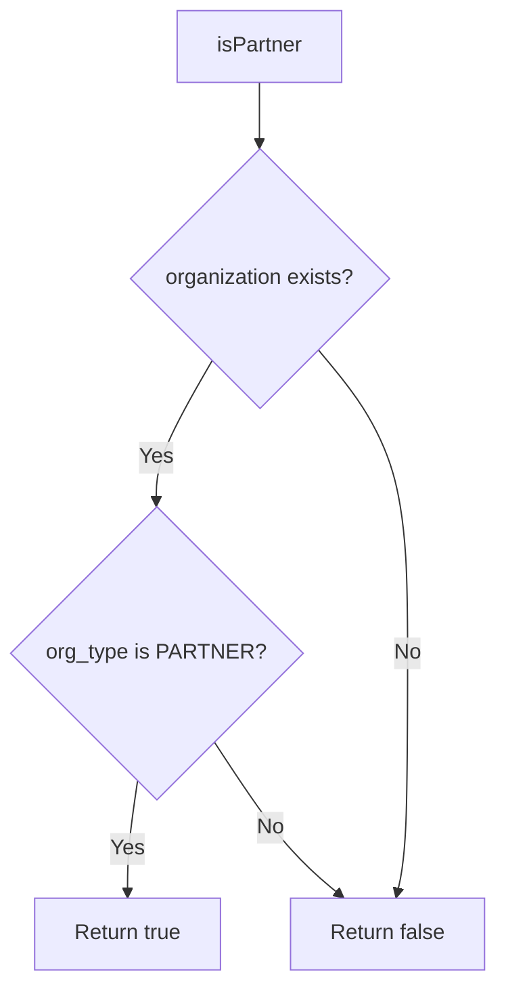
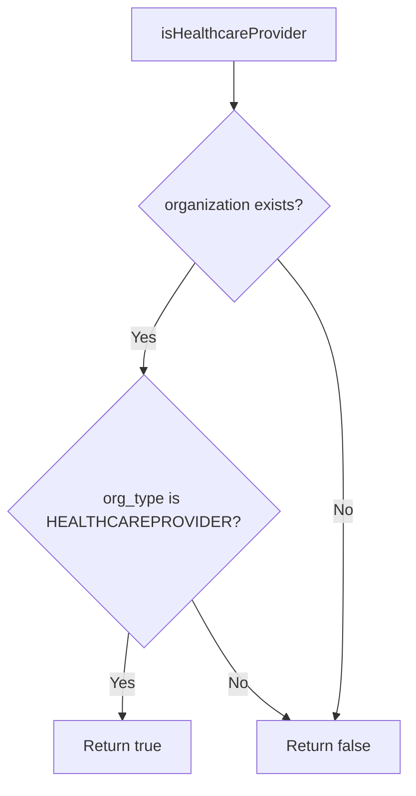
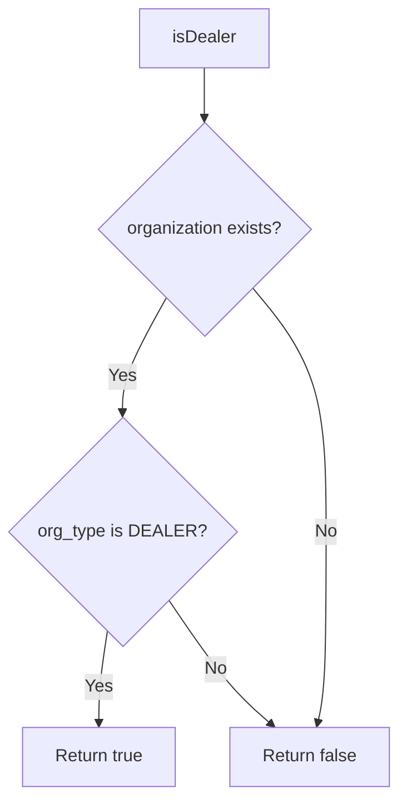

# Diagram: web/portal/src/shared/utils/organizations.utils.ts

> Auto-generated by Obscura crawlers

## Diagram 1

### SVG

<svg id="container" width="3055.453125" xmlns="http://www.w3.org/2000/svg" class="flowchart" height="744.265625" viewBox="0 0 3055.453125 744.265625" role="graphics-document document" aria-roledescription="flowchart-v2"><g><marker id="container_flowchart-v2-pointEnd" class="marker flowchart-v2" viewBox="0 0 10 10" refX="5" refY="5" markerUnits="userSpaceOnUse" markerWidth="8" markerHeight="8" orient="auto"><path d="M 0 0 L 10 5 L 0 10 z" class="arrowMarkerPath" style="stroke-width: 1; stroke-dasharray: 1, 0;"></path></marker><marker id="container_flowchart-v2-pointStart" class="marker flowchart-v2" viewBox="0 0 10 10" refX="4.5" refY="5" markerUnits="userSpaceOnUse" markerWidth="8" markerHeight="8" orient="auto"><path d="M 0 5 L 10 10 L 10 0 z" class="arrowMarkerPath" style="stroke-width: 1; stroke-dasharray: 1, 0;"></path></marker><marker id="container_flowchart-v2-circleEnd" class="marker flowchart-v2" viewBox="0 0 10 10" refX="11" refY="5" markerUnits="userSpaceOnUse" markerWidth="11" markerHeight="11" orient="auto"><circle cx="5" cy="5" r="5" class="arrowMarkerPath" style="stroke-width: 1; stroke-dasharray: 1, 0;"></circle></marker><marker id="container_flowchart-v2-circleStart" class="marker flowchart-v2" viewBox="0 0 10 10" refX="-1" refY="5" markerUnits="userSpaceOnUse" markerWidth="11" markerHeight="11" orient="auto"><circle cx="5" cy="5" r="5" class="arrowMarkerPath" style="stroke-width: 1; stroke-dasharray: 1, 0;"></circle></marker><marker id="container_flowchart-v2-crossEnd" class="marker cross flowchart-v2" viewBox="0 0 11 11" refX="12" refY="5.2" markerUnits="userSpaceOnUse" markerWidth="11" markerHeight="11" orient="auto"><path d="M 1,1 l 9,9 M 10,1 l -9,9" class="arrowMarkerPath" style="stroke-width: 2; stroke-dasharray: 1, 0;"></path></marker><marker id="container_flowchart-v2-crossStart" class="marker cross flowchart-v2" viewBox="0 0 11 11" refX="-1" refY="5.2" markerUnits="userSpaceOnUse" markerWidth="11" markerHeight="11" orient="auto"><path d="M 1,1 l 9,9 M 10,1 l -9,9" class="arrowMarkerPath" style="stroke-width: 2; stroke-dasharray: 1, 0;"></path></marker><g class="root"><g class="clusters"></g><g class="edgePaths"><path d="M1489.367,62L1489.367,66.167C1489.367,70.333,1489.367,78.667,1489.367,86.333C1489.367,94,1489.367,101,1489.367,104.5L1489.367,108" id="L_A_B_0" class="edge-thickness-normal edge-pattern-solid edge-thickness-normal edge-pattern-solid flowchart-link" style=";" data-edge="true" data-et="edge" data-id="L_A_B_0" data-points="W3sieCI6MTQ4OS4zNjcxODc1LCJ5Ijo2Mn0seyJ4IjoxNDg5LjM2NzE4NzUsInkiOjg3fSx7IngiOjE0ODkuMzY3MTg3NSwieSI6MTEyfV0=" marker-end="url(#container_flowchart-v2-pointEnd)"></path><path d="M1489.367,166L1489.367,170.167C1489.367,174.333,1489.367,182.667,1489.367,190.333C1489.367,198,1489.367,205,1489.367,208.5L1489.367,212" id="L_B_C_0" class="edge-thickness-normal edge-pattern-solid edge-thickness-normal edge-pattern-solid flowchart-link" style=";" data-edge="true" data-et="edge" data-id="L_B_C_0" data-points="W3sieCI6MTQ4OS4zNjcxODc1LCJ5IjoxNjZ9LHsieCI6MTQ4OS4zNjcxODc1LCJ5IjoxOTF9LHsieCI6MTQ4OS4zNjcxODc1LCJ5IjoyMTZ9XQ==" marker-end="url(#container_flowchart-v2-pointEnd)"></path><path d="M1489.367,270L1489.367,274.167C1489.367,278.333,1489.367,286.667,1489.367,294.333C1489.367,302,1489.367,309,1489.367,312.5L1489.367,316" id="L_C_D_0" class="edge-thickness-normal edge-pattern-solid edge-thickness-normal edge-pattern-solid flowchart-link" style=";" data-edge="true" data-et="edge" data-id="L_C_D_0" data-points="W3sieCI6MTQ4OS4zNjcxODc1LCJ5IjoyNzB9LHsieCI6MTQ4OS4zNjcxODc1LCJ5IjoyOTV9LHsieCI6MTQ4OS4zNjcxODc1LCJ5IjozMjB9XQ==" marker-end="url(#container_flowchart-v2-pointEnd)"></path><path d="M1415.611,406.509L1202.098,424.969C988.584,443.428,561.558,480.347,348.045,506.306C134.531,532.266,134.531,547.266,134.531,554.766L134.531,562.266" id="L_D_E_0" class="edge-thickness-normal edge-pattern-solid edge-thickness-normal edge-pattern-solid flowchart-link" style=";" data-edge="true" data-et="edge" data-id="L_D_E_0" data-points="W3sieCI6MTQxNS42MTA5OTI1MDc0NDM4LCJ5Ijo0MDYuNTA5NDMwMDA3NDQzNzd9LHsieCI6MTM0LjUzMTI1LCJ5Ijo1MTcuMjY1NjI1fSx7IngiOjEzNC41MzEyNSwieSI6NTY2LjI2NTYyNX1d" marker-end="url(#container_flowchart-v2-pointEnd)"></path><path d="M1417.239,408.138L1253.361,426.326C1089.483,444.514,761.726,480.89,597.847,506.578C433.969,532.266,433.969,547.266,433.969,554.766L433.969,562.266" id="L_D_F_0" class="edge-thickness-normal edge-pattern-solid edge-thickness-normal edge-pattern-solid flowchart-link" style=";" data-edge="true" data-et="edge" data-id="L_D_F_0" data-points="W3sieCI6MTQxNy4yMzk0MzM4ODU3NzQsInkiOjQwOC4xMzc4NzEzODU3NzM5Nn0seyJ4Ijo0MzMuOTY4NzUsInkiOjUxNy4yNjU2MjV9LHsieCI6NDMzLjk2ODc1LCJ5Ijo1NjYuMjY1NjI1fV0=" marker-end="url(#container_flowchart-v2-pointEnd)"></path><path d="M1419.965,410.864L1305.275,428.597C1190.584,446.331,961.202,481.798,846.511,507.032C731.82,532.266,731.82,547.266,731.82,554.766L731.82,562.266" id="L_D_G_0" class="edge-thickness-normal edge-pattern-solid edge-thickness-normal edge-pattern-solid flowchart-link" style=";" data-edge="true" data-et="edge" data-id="L_D_G_0" data-points="W3sieCI6MTQxOS45NjUzNjgxMTE4NzU3LCJ5Ijo0MTAuODYzODA1NjExODc1NzZ9LHsieCI6NzMxLjgyMDMxMjUsInkiOjUxNy4yNjU2MjV9LHsieCI6NzMxLjgyMDMxMjUsInkiOjU2Ni4yNjU2MjV9XQ==" marker-end="url(#container_flowchart-v2-pointEnd)"></path><path d="M1425.709,416.607L1360.885,433.384C1296.061,450.16,1166.413,483.713,1101.59,505.989C1036.766,528.266,1036.766,539.266,1036.766,544.766L1036.766,550.266" id="L_D_H_0" class="edge-thickness-normal edge-pattern-solid edge-thickness-normal edge-pattern-solid flowchart-link" style=";" data-edge="true" data-et="edge" data-id="L_D_H_0" data-points="W3sieCI6MTQyNS43MDkwMzc3Nzg4Nzg2LCJ5Ijo0MTYuNjA3NDc1Mjc4ODc4Nn0seyJ4IjoxMDM2Ljc2NTYyNSwieSI6NTE3LjI2NTYyNX0seyJ4IjoxMDM2Ljc2NTYyNSwieSI6NTU0LjI2NTYyNX1d" marker-end="url(#container_flowchart-v2-pointEnd)"></path><path d="M1444.257,435.156L1426.631,448.841C1409.005,462.526,1373.752,489.896,1356.126,511.081C1338.5,532.266,1338.5,547.266,1338.5,554.766L1338.5,562.266" id="L_D_I_0" class="edge-thickness-normal edge-pattern-solid edge-thickness-normal edge-pattern-solid flowchart-link" style=";" data-edge="true" data-et="edge" data-id="L_D_I_0" data-points="W3sieCI6MTQ0NC4yNTc0NDEwNTA5NzA4LCJ5Ijo0MzUuMTU1ODc4NTUwOTcwN30seyJ4IjoxMzM4LjUsInkiOjUxNy4yNjU2MjV9LHsieCI6MTMzOC41LCJ5Ijo1NjYuMjY1NjI1fV0=" marker-end="url(#container_flowchart-v2-pointEnd)"></path><path d="M1534.477,435.156L1552.103,448.841C1569.729,462.526,1604.982,489.896,1622.608,509.081C1640.234,528.266,1640.234,539.266,1640.234,544.766L1640.234,550.266" id="L_D_J_0" class="edge-thickness-normal edge-pattern-solid edge-thickness-normal edge-pattern-solid flowchart-link" style=";" data-edge="true" data-et="edge" data-id="L_D_J_0" data-points="W3sieCI6MTUzNC40NzY5MzM5NDkwMjkyLCJ5Ijo0MzUuMTU1ODc4NTUwOTcwN30seyJ4IjoxNjQwLjIzNDM3NSwieSI6NTE3LjI2NTYyNX0seyJ4IjoxNjQwLjIzNDM3NSwieSI6NTU0LjI2NTYyNX1d" marker-end="url(#container_flowchart-v2-pointEnd)"></path><path d="M1553.261,416.372L1619.423,433.188C1685.585,450.003,1817.91,483.634,1884.072,505.95C1950.234,528.266,1950.234,539.266,1950.234,544.766L1950.234,550.266" id="L_D_K_0" class="edge-thickness-normal edge-pattern-solid edge-thickness-normal edge-pattern-solid flowchart-link" style=";" data-edge="true" data-et="edge" data-id="L_D_K_0" data-points="W3sieCI6MTU1My4yNjA5MzEzMTIwMDY3LCJ5Ijo0MTYuMzcxODgxMTg3OTkzM30seyJ4IjoxOTUwLjIzNDM3NSwieSI6NTE3LjI2NTYyNX0seyJ4IjoxOTUwLjIzNDM3NSwieSI6NTU0LjI2NTYyNX1d" marker-end="url(#container_flowchart-v2-pointEnd)"></path><path d="M1558.916,410.717L1675.61,428.475C1792.304,446.233,2025.691,481.749,2142.384,507.007C2259.078,532.266,2259.078,547.266,2259.078,554.766L2259.078,562.266" id="L_D_L_0" class="edge-thickness-normal edge-pattern-solid edge-thickness-normal edge-pattern-solid flowchart-link" style=";" data-edge="true" data-et="edge" data-id="L_D_L_0" data-points="W3sieCI6MTU1OC45MTYxOTQ1NjQ1MzI4LCJ5Ijo0MTAuNzE2NjE3OTM1NDY3MjR9LHsieCI6MjI1OS4wNzgxMjUsInkiOjUxNy4yNjU2MjV9LHsieCI6MjI1OS4wNzgxMjUsInkiOjU2Ni4yNjU2MjV9XQ==" marker-end="url(#container_flowchart-v2-pointEnd)"></path><path d="M1561.65,407.983L1729.362,426.197C1897.074,444.41,2232.498,480.838,2400.21,504.552C2567.922,528.266,2567.922,539.266,2567.922,544.766L2567.922,550.266" id="L_D_M_0" class="edge-thickness-normal edge-pattern-solid edge-thickness-normal edge-pattern-solid flowchart-link" style=";" data-edge="true" data-et="edge" data-id="L_D_M_0" data-points="W3sieCI6MTU2MS42NDk5NzA4NzMxMDg1LCJ5Ijo0MDcuOTgyODQxNjI2ODkxNTd9LHsieCI6MjU2Ny45MjE4NzUsInkiOjUxNy4yNjU2MjV9LHsieCI6MjU2Ny45MjE4NzUsInkiOjU1NC4yNjU2MjV9XQ==" marker-end="url(#container_flowchart-v2-pointEnd)"></path><path d="M1563.347,406.286L1785.737,424.782C2008.127,443.279,2452.907,480.272,2675.297,506.269C2897.688,532.266,2897.688,547.266,2897.688,554.766L2897.688,562.266" id="L_D_N_0" class="edge-thickness-normal edge-pattern-solid edge-thickness-normal edge-pattern-solid flowchart-link" style=";" data-edge="true" data-et="edge" data-id="L_D_N_0" data-points="W3sieCI6MTU2My4zNDY5NTUwMTQzMjcyLCJ5Ijo0MDYuMjg1ODU3NDg1NjcyOH0seyJ4IjoyODk3LjY4NzUsInkiOjUxNy4yNjU2MjV9LHsieCI6Mjg5Ny42ODc1LCJ5Ijo1NjYuMjY1NjI1fV0=" marker-end="url(#container_flowchart-v2-pointEnd)"></path><path d="M2897.688,620.266L2897.688,626.432C2897.688,632.599,2897.688,644.932,2897.688,654.599C2897.688,664.266,2897.688,671.266,2897.688,674.766L2897.688,678.266" id="L_N_O_0" class="edge-thickness-normal edge-pattern-solid edge-thickness-normal edge-pattern-solid flowchart-link" style=";" data-edge="true" data-et="edge" data-id="L_N_O_0" data-points="W3sieCI6Mjg5Ny42ODc1LCJ5Ijo2MjAuMjY1NjI1fSx7IngiOjI4OTcuNjg3NSwieSI6NjU3LjI2NTYyNX0seyJ4IjoyODk3LjY4NzUsInkiOjY4Mi4yNjU2MjV9XQ==" marker-end="url(#container_flowchart-v2-pointEnd)"></path></g><g class="edgeLabels"><g class="edgeLabel"><g class="label" data-id="L_A_B_0" transform="translate(0, 0)"><foreignObject width="0" height="0">

</foreignObject></g></g><g class="edgeLabel"><g class="label" data-id="L_B_C_0" transform="translate(0, 0)"><foreignObject width="0" height="0">

</foreignObject></g></g><g class="edgeLabel"><g class="label" data-id="L_C_D_0" transform="translate(0, 0)"><foreignObject width="0" height="0">

</foreignObject></g></g><g class="edgeLabel" transform="translate(134.53125, 517.265625)"><g class="label" data-id="L_D_E_0" transform="translate(-30.578125, -12)"><foreignObject width="61.15625" height="24">

SHIPPER

</foreignObject></g></g><g class="edgeLabel" transform="translate(433.96875, 517.265625)"><g class="label" data-id="L_D_F_0" transform="translate(-30.2265625, -12)"><foreignObject width="60.453125" height="24">

CARRIER

</foreignObject></g></g><g class="edgeLabel" transform="translate(731.8203125, 517.265625)"><g class="label" data-id="L_D_G_0" transform="translate(-32.15625, -12)"><foreignObject width="64.3125" height="24">

PARTNER

</foreignObject></g></g><g class="edgeLabel" transform="translate(1036.765625, 517.265625)"><g class="label" data-id="L_D_H_0" transform="translate(-81.3828125, -12)"><foreignObject width="162.765625" height="24">

HEALTHCAREPROVIDER

</foreignObject></g></g><g class="edgeLabel" transform="translate(1338.5, 517.265625)"><g class="label" data-id="L_D_I_0" transform="translate(-27.125, -12)"><foreignObject width="54.25" height="24">

DEALER

</foreignObject></g></g><g class="edgeLabel" transform="translate(1640.234375, 517.265625)"><g class="label" data-id="L_D_J_0" transform="translate(-82.015625, -12)"><foreignObject width="164.03125" height="24">

DISTRIBUTION_CENTER

</foreignObject></g></g><g class="edgeLabel" transform="translate(1950.234375, 517.265625)"><g class="label" data-id="L_D_K_0" transform="translate(-54.25, -12)"><foreignObject width="108.5" height="24">

FREIGHTVERIFY

</foreignObject></g></g><g class="edgeLabel" transform="translate(2259.078125, 517.265625)"><g class="label" data-id="L_D_L_0" transform="translate(-34.421875, -12)"><foreignObject width="68.84375" height="24">

SUPPLIER

</foreignObject></g></g><g class="edgeLabel" transform="translate(2567.921875, 517.265625)"><g class="label" data-id="L_D_M_0" transform="translate(-43.8984375, -12)"><foreignObject width="87.796875" height="24">

THIRDPARTY

</foreignObject></g></g><g class="edgeLabel" transform="translate(2897.6875, 517.265625)"><g class="label" data-id="L_D_N_0" transform="translate(-25.890625, -12)"><foreignObject width="51.78125" height="24">

default

</foreignObject></g></g><g class="edgeLabel"><g class="label" data-id="L_N_O_0" transform="translate(0, 0)"><foreignObject width="0" height="0">

</foreignObject></g></g></g><g class="nodes"><g class="node default" id="flowchart-A-0" transform="translate(1489.3671875, 35)"><rect class="basic label-container" style="" x="-133.171875" y="-27" width="266.34375" height="54"></rect><g class="label" style="" transform="translate(-103.171875, -12)"><rect></rect><foreignObject width="206.34375" height="24">

useOrganizationsTranslation

</foreignObject></g></g><g class="node default" id="flowchart-B-1" transform="translate(1489.3671875, 139)"><rect class="basic label-container" style="" x="-83.3984375" y="-27" width="166.796875" height="54"></rect><g class="label" style="" transform="translate(-53.3984375, -12)"><rect></rect><foreignObject width="106.796875" height="24">

useTranslation

</foreignObject></g></g><g class="node default" id="flowchart-C-3" transform="translate(1489.3671875, 243)"><rect class="basic label-container" style="" x="-142.234375" y="-27" width="284.46875" height="54"></rect><g class="label" style="" transform="translate(-112.234375, -12)"><rect></rect><foreignObject width="224.46875" height="24">

getTranslatedOrganizationType

</foreignObject></g></g><g class="node default" id="flowchart-D-5" transform="translate(1489.3671875, 400.1328125)"><polygon points="80.1328125,0 160.265625,-80.1328125 80.1328125,-160.265625 0,-80.1328125" class="label-container" transform="translate(-79.6328125, 80.1328125)"></polygon><g class="label" style="" transform="translate(-53.1328125, -12)"><rect></rect><foreignObject width="106.265625" height="24">

Switch on type

</foreignObject></g></g><g class="node default" id="flowchart-E-7" transform="translate(134.53125, 593.265625)"><rect class="basic label-container" style="" x="-126.53125" y="-27" width="253.0625" height="54"></rect><g class="label" style="" transform="translate(-96.53125, -12)"><rect></rect><foreignObject width="193.0625" height="24">

Return Shipper translation

</foreignObject></g></g><g class="node default" id="flowchart-F-9" transform="translate(433.96875, 593.265625)"><rect class="basic label-container" style="" x="-122.90625" y="-27" width="245.8125" height="54"></rect><g class="label" style="" transform="translate(-92.90625, -12)"><rect></rect><foreignObject width="185.8125" height="24">

Return Carrier translation

</foreignObject></g></g><g class="node default" id="flowchart-G-11" transform="translate(731.8203125, 593.265625)"><rect class="basic label-container" style="" x="-124.9453125" y="-27" width="249.890625" height="54"></rect><g class="label" style="" transform="translate(-94.9453125, -12)"><rect></rect><foreignObject width="189.890625" height="24">

Return Partner translation

</foreignObject></g></g><g class="node default" id="flowchart-H-13" transform="translate(1036.765625, 593.265625)"><rect class="basic label-container" style="" x="-130" y="-39" width="260" height="78"></rect><g class="label" style="" transform="translate(-100, -24)"><rect></rect><foreignObject width="200" height="48">

Return Healthcare Provider translation

</foreignObject></g></g><g class="node default" id="flowchart-I-15" transform="translate(1338.5, 593.265625)"><rect class="basic label-container" style="" x="-121.734375" y="-27" width="243.46875" height="54"></rect><g class="label" style="" transform="translate(-91.734375, -12)"><rect></rect><foreignObject width="183.46875" height="24">

Return Dealer translation

</foreignObject></g></g><g class="node default" id="flowchart-J-17" transform="translate(1640.234375, 593.265625)"><rect class="basic label-container" style="" x="-130" y="-39" width="260" height="78"></rect><g class="label" style="" transform="translate(-100, -24)"><rect></rect><foreignObject width="200" height="48">

Return Distribution Center translation

</foreignObject></g></g><g class="node default" id="flowchart-K-19" transform="translate(1950.234375, 593.265625)"><rect class="basic label-container" style="" x="-130" y="-39" width="260" height="78"></rect><g class="label" style="" transform="translate(-100, -24)"><rect></rect><foreignObject width="200" height="48">

Return FreightVerify translation

</foreignObject></g></g><g class="node default" id="flowchart-L-21" transform="translate(2259.078125, 593.265625)"><rect class="basic label-container" style="" x="-128.84375" y="-27" width="257.6875" height="54"></rect><g class="label" style="" transform="translate(-98.84375, -12)"><rect></rect><foreignObject width="197.6875" height="24">

Return Supplier translation

</foreignObject></g></g><g class="node default" id="flowchart-M-23" transform="translate(2567.921875, 593.265625)"><rect class="basic label-container" style="" x="-130" y="-39" width="260" height="78"></rect><g class="label" style="" transform="translate(-100, -24)"><rect></rect><foreignObject width="200" height="48">

Return Third Party translation

</foreignObject></g></g><g class="node default" id="flowchart-N-25" transform="translate(2897.6875, 593.265625)"><rect class="basic label-container" style="" x="-149.765625" y="-27" width="299.53125" height="54"></rect><g class="label" style="" transform="translate(-119.765625, -12)"><rect></rect><foreignObject width="239.53125" height="24">

logWarningForMissingTranslation

</foreignObject></g></g><g class="node default" id="flowchart-O-27" transform="translate(2897.6875, 709.265625)"><rect class="basic label-container" style="" x="-102.2734375" y="-27" width="204.546875" height="54"></rect><g class="label" style="" transform="translate(-72.2734375, -12)"><rect></rect><foreignObject width="144.546875" height="24">

Return original type

</foreignObject></g></g></g></g></g></svg>

## Diagram 2

### SVG

<svg id="container" width="1460.546875" xmlns="http://www.w3.org/2000/svg" class="flowchart" height="640.265625" viewBox="0 0 1460.546875 640.265625" role="graphics-document document" aria-roledescription="flowchart-v2"><g><marker id="container_flowchart-v2-pointEnd" class="marker flowchart-v2" viewBox="0 0 10 10" refX="5" refY="5" markerUnits="userSpaceOnUse" markerWidth="8" markerHeight="8" orient="auto"><path d="M 0 0 L 10 5 L 0 10 z" class="arrowMarkerPath" style="stroke-width: 1; stroke-dasharray: 1, 0;"></path></marker><marker id="container_flowchart-v2-pointStart" class="marker flowchart-v2" viewBox="0 0 10 10" refX="4.5" refY="5" markerUnits="userSpaceOnUse" markerWidth="8" markerHeight="8" orient="auto"><path d="M 0 5 L 10 10 L 10 0 z" class="arrowMarkerPath" style="stroke-width: 1; stroke-dasharray: 1, 0;"></path></marker><marker id="container_flowchart-v2-circleEnd" class="marker flowchart-v2" viewBox="0 0 10 10" refX="11" refY="5" markerUnits="userSpaceOnUse" markerWidth="11" markerHeight="11" orient="auto"><circle cx="5" cy="5" r="5" class="arrowMarkerPath" style="stroke-width: 1; stroke-dasharray: 1, 0;"></circle></marker><marker id="container_flowchart-v2-circleStart" class="marker flowchart-v2" viewBox="0 0 10 10" refX="-1" refY="5" markerUnits="userSpaceOnUse" markerWidth="11" markerHeight="11" orient="auto"><circle cx="5" cy="5" r="5" class="arrowMarkerPath" style="stroke-width: 1; stroke-dasharray: 1, 0;"></circle></marker><marker id="container_flowchart-v2-crossEnd" class="marker cross flowchart-v2" viewBox="0 0 11 11" refX="12" refY="5.2" markerUnits="userSpaceOnUse" markerWidth="11" markerHeight="11" orient="auto"><path d="M 1,1 l 9,9 M 10,1 l -9,9" class="arrowMarkerPath" style="stroke-width: 2; stroke-dasharray: 1, 0;"></path></marker><marker id="container_flowchart-v2-crossStart" class="marker cross flowchart-v2" viewBox="0 0 11 11" refX="-1" refY="5.2" markerUnits="userSpaceOnUse" markerWidth="11" markerHeight="11" orient="auto"><path d="M 1,1 l 9,9 M 10,1 l -9,9" class="arrowMarkerPath" style="stroke-width: 2; stroke-dasharray: 1, 0;"></path></marker><g class="root"><g class="clusters"></g><g class="edgePaths"><path d="M758,62L758,66.167C758,70.333,758,78.667,758,86.333C758,94,758,101,758,104.5L758,108" id="L_P_Q_0" class="edge-thickness-normal edge-pattern-solid edge-thickness-normal edge-pattern-solid flowchart-link" style=";" data-edge="true" data-et="edge" data-id="L_P_Q_0" data-points="W3sieCI6NzU4LCJ5Ijo2Mn0seyJ4Ijo3NTgsInkiOjg3fSx7IngiOjc1OCwieSI6MTEyfV0=" marker-end="url(#container_flowchart-v2-pointEnd)"></path><path d="M758,166L758,170.167C758,174.333,758,182.667,758,190.333C758,198,758,205,758,208.5L758,212" id="L_Q_R_0" class="edge-thickness-normal edge-pattern-solid edge-thickness-normal edge-pattern-solid flowchart-link" style=";" data-edge="true" data-et="edge" data-id="L_Q_R_0" data-points="W3sieCI6NzU4LCJ5IjoxNjZ9LHsieCI6NzU4LCJ5IjoxOTF9LHsieCI6NzU4LCJ5IjoyMTZ9XQ==" marker-end="url(#container_flowchart-v2-pointEnd)"></path><path d="M758,270L758,274.167C758,278.333,758,286.667,758,294.333C758,302,758,309,758,312.5L758,316" id="L_R_S_0" class="edge-thickness-normal edge-pattern-solid edge-thickness-normal edge-pattern-solid flowchart-link" style=";" data-edge="true" data-et="edge" data-id="L_R_S_0" data-points="W3sieCI6NzU4LCJ5IjoyNzB9LHsieCI6NzU4LCJ5IjoyOTV9LHsieCI6NzU4LCJ5IjozMjB9XQ==" marker-end="url(#container_flowchart-v2-pointEnd)"></path><path d="M690.601,412.866L598.5,430.266C506.4,447.666,322.2,482.466,230.1,505.366C138,528.266,138,539.266,138,544.766L138,550.266" id="L_S_T_0" class="edge-thickness-normal edge-pattern-solid edge-thickness-normal edge-pattern-solid flowchart-link" style=";" data-edge="true" data-et="edge" data-id="L_S_T_0" data-points="W3sieCI6NjkwLjYwMDU1MzI0MTU1MDMsInkiOjQxMi44NjYxNzgyNDE1NTAzNn0seyJ4IjoxMzgsInkiOjUxNy4yNjU2MjV9LHsieCI6MTM4LCJ5Ijo1NTQuMjY1NjI1fV0=" marker-end="url(#container_flowchart-v2-pointEnd)"></path><path d="M699.842,422.108L657.868,437.967C615.895,453.827,531.947,485.546,489.974,506.906C448,528.266,448,539.266,448,544.766L448,550.266" id="L_S_U_0" class="edge-thickness-normal edge-pattern-solid edge-thickness-normal edge-pattern-solid flowchart-link" style=";" data-edge="true" data-et="edge" data-id="L_S_U_0" data-points="W3sieCI6Njk5Ljg0MjA0MjY5MDE3NjIsInkiOjQyMi4xMDc2Njc2OTAxNzYxM30seyJ4Ijo0NDgsInkiOjUxNy4yNjU2MjV9LHsieCI6NDQ4LCJ5Ijo1NTQuMjY1NjI1fV0=" marker-end="url(#container_flowchart-v2-pointEnd)"></path><path d="M758,480.266L758,486.432C758,492.599,758,504.932,758,516.599C758,528.266,758,539.266,758,544.766L758,550.266" id="L_S_V_0" class="edge-thickness-normal edge-pattern-solid edge-thickness-normal edge-pattern-solid flowchart-link" style=";" data-edge="true" data-et="edge" data-id="L_S_V_0" data-points="W3sieCI6NzU4LCJ5Ijo0ODAuMjY1NjI1fSx7IngiOjc1OCwieSI6NTE3LjI2NTYyNX0seyJ4Ijo3NTgsInkiOjU1NC4yNjU2MjV9XQ==" marker-end="url(#container_flowchart-v2-pointEnd)"></path><path d="M816.158,422.108L858.132,437.967C900.105,453.827,984.053,485.546,1026.026,506.906C1068,528.266,1068,539.266,1068,544.766L1068,550.266" id="L_S_W_0" class="edge-thickness-normal edge-pattern-solid edge-thickness-normal edge-pattern-solid flowchart-link" style=";" data-edge="true" data-et="edge" data-id="L_S_W_0" data-points="W3sieCI6ODE2LjE1Nzk1NzMwOTgyMzgsInkiOjQyMi4xMDc2Njc2OTAxNzYxM30seyJ4IjoxMDY4LCJ5Ijo1MTcuMjY1NjI1fSx7IngiOjEwNjgsInkiOjU1NC4yNjU2MjV9XQ==" marker-end="url(#container_flowchart-v2-pointEnd)"></path><path d="M824.902,413.364L912.464,430.681C1000.026,447.998,1175.15,482.632,1262.711,507.449C1350.273,532.266,1350.273,547.266,1350.273,554.766L1350.273,562.266" id="L_S_X_0" class="edge-thickness-normal edge-pattern-solid edge-thickness-normal edge-pattern-solid flowchart-link" style=";" data-edge="true" data-et="edge" data-id="L_S_X_0" data-points="W3sieCI6ODI0LjkwMTc3MzU4MzA3NDUsInkiOjQxMy4zNjM4NTE0MTY5MjU0Nn0seyJ4IjoxMzUwLjI3MzQzNzUsInkiOjUxNy4yNjU2MjV9LHsieCI6MTM1MC4yNzM0Mzc1LCJ5Ijo1NjYuMjY1NjI1fV0=" marker-end="url(#container_flowchart-v2-pointEnd)"></path></g><g class="edgeLabels"><g class="edgeLabel"><g class="label" data-id="L_P_Q_0" transform="translate(0, 0)"><foreignObject width="0" height="0">

</foreignObject></g></g><g class="edgeLabel"><g class="label" data-id="L_Q_R_0" transform="translate(0, 0)"><foreignObject width="0" height="0">

</foreignObject></g></g><g class="edgeLabel"><g class="label" data-id="L_R_S_0" transform="translate(0, 0)"><foreignObject width="0" height="0">

</foreignObject></g></g><g class="edgeLabel" transform="translate(138, 517.265625)"><g class="label" data-id="L_S_T_0" transform="translate(-34.0703125, -12)"><foreignObject width="68.140625" height="24">

BAC Code

</foreignObject></g></g><g class="edgeLabel" transform="translate(448, 517.265625)"><g class="label" data-id="L_S_U_0" transform="translate(-38.0234375, -12)"><foreignObject width="76.046875" height="24">

Fleet Code

</foreignObject></g></g><g class="edgeLabel" transform="translate(758, 517.265625)"><g class="label" data-id="L_S_V_0" transform="translate(-72.375, -12)"><foreignObject width="144.75" height="24">

End User Fleet Code

</foreignObject></g></g><g class="edgeLabel" transform="translate(1068, 517.265625)"><g class="label" data-id="L_S_W_0" transform="translate(-35.015625, -12)"><foreignObject width="70.03125" height="24">

P&amp;A Code

</foreignObject></g></g><g class="edgeLabel" transform="translate(1350.2734375, 517.265625)"><g class="label" data-id="L_S_X_0" transform="translate(-25.890625, -12)"><foreignObject width="51.78125" height="24">

default

</foreignObject></g></g></g><g class="nodes"><g class="node default" id="flowchart-P-0" transform="translate(758, 35)"><rect class="basic label-container" style="" x="-166.7734375" y="-27" width="333.546875" height="54"></rect><g class="label" style="" transform="translate(-136.7734375, -12)"><rect></rect><foreignObject width="273.546875" height="24">

useExternalCodeDefinitionTranslation

</foreignObject></g></g><g class="node default" id="flowchart-Q-1" transform="translate(758, 139)"><rect class="basic label-container" style="" x="-83.3984375" y="-27" width="166.796875" height="54"></rect><g class="label" style="" transform="translate(-53.3984375, -12)"><rect></rect><foreignObject width="106.796875" height="24">

useTranslation

</foreignObject></g></g><g class="node default" id="flowchart-R-3" transform="translate(758, 243)"><rect class="basic label-container" style="" x="-165.296875" y="-27" width="330.59375" height="54"></rect><g class="label" style="" transform="translate(-135.296875, -12)"><rect></rect><foreignObject width="270.59375" height="24">

getExternalCodeDefinitionTranslation

</foreignObject></g></g><g class="node default" id="flowchart-S-5" transform="translate(758, 400.1328125)"><polygon points="80.1328125,0 160.265625,-80.1328125 80.1328125,-160.265625 0,-80.1328125" class="label-container" transform="translate(-79.6328125, 80.1328125)"></polygon><g class="label" style="" transform="translate(-53.1328125, -12)"><rect></rect><foreignObject width="106.265625" height="24">

Switch on type

</foreignObject></g></g><g class="node default" id="flowchart-T-7" transform="translate(138, 593.265625)"><rect class="basic label-container" style="" x="-130" y="-39" width="260" height="78"></rect><g class="label" style="" transform="translate(-100, -24)"><rect></rect><foreignObject width="200" height="48">

Return BAC Code translation

</foreignObject></g></g><g class="node default" id="flowchart-U-9" transform="translate(448, 593.265625)"><rect class="basic label-container" style="" x="-130" y="-39" width="260" height="78"></rect><g class="label" style="" transform="translate(-100, -24)"><rect></rect><foreignObject width="200" height="48">

Return Fleet Code translation

</foreignObject></g></g><g class="node default" id="flowchart-V-11" transform="translate(758, 593.265625)"><rect class="basic label-container" style="" x="-130" y="-39" width="260" height="78"></rect><g class="label" style="" transform="translate(-100, -24)"><rect></rect><foreignObject width="200" height="48">

Return End User Fleet Code translation

</foreignObject></g></g><g class="node default" id="flowchart-W-13" transform="translate(1068, 593.265625)"><rect class="basic label-container" style="" x="-130" y="-39" width="260" height="78"></rect><g class="label" style="" transform="translate(-100, -24)"><rect></rect><foreignObject width="200" height="48">

Return P&amp;A Code translation

</foreignObject></g></g><g class="node default" id="flowchart-X-15" transform="translate(1350.2734375, 593.265625)"><rect class="basic label-container" style="" x="-102.2734375" y="-27" width="204.546875" height="54"></rect><g class="label" style="" transform="translate(-72.2734375, -12)"><rect></rect><foreignObject width="144.546875" height="24">

Return original type

</foreignObject></g></g></g></g></g></svg>

## Diagram 3

### SVG

<svg id="container" width="417.94140625" xmlns="http://www.w3.org/2000/svg" class="flowchart" height="797.03125" viewBox="0.5 0 417.94140625 797.03125" role="graphics-document document" aria-roledescription="flowchart-v2"><g><marker id="container_flowchart-v2-pointEnd" class="marker flowchart-v2" viewBox="0 0 10 10" refX="5" refY="5" markerUnits="userSpaceOnUse" markerWidth="8" markerHeight="8" orient="auto"><path d="M 0 0 L 10 5 L 0 10 z" class="arrowMarkerPath" style="stroke-width: 1; stroke-dasharray: 1, 0;"></path></marker><marker id="container_flowchart-v2-pointStart" class="marker flowchart-v2" viewBox="0 0 10 10" refX="4.5" refY="5" markerUnits="userSpaceOnUse" markerWidth="8" markerHeight="8" orient="auto"><path d="M 0 5 L 10 10 L 10 0 z" class="arrowMarkerPath" style="stroke-width: 1; stroke-dasharray: 1, 0;"></path></marker><marker id="container_flowchart-v2-circleEnd" class="marker flowchart-v2" viewBox="0 0 10 10" refX="11" refY="5" markerUnits="userSpaceOnUse" markerWidth="11" markerHeight="11" orient="auto"><circle cx="5" cy="5" r="5" class="arrowMarkerPath" style="stroke-width: 1; stroke-dasharray: 1, 0;"></circle></marker><marker id="container_flowchart-v2-circleStart" class="marker flowchart-v2" viewBox="0 0 10 10" refX="-1" refY="5" markerUnits="userSpaceOnUse" markerWidth="11" markerHeight="11" orient="auto"><circle cx="5" cy="5" r="5" class="arrowMarkerPath" style="stroke-width: 1; stroke-dasharray: 1, 0;"></circle></marker><marker id="container_flowchart-v2-crossEnd" class="marker cross flowchart-v2" viewBox="0 0 11 11" refX="12" refY="5.2" markerUnits="userSpaceOnUse" markerWidth="11" markerHeight="11" orient="auto"><path d="M 1,1 l 9,9 M 10,1 l -9,9" class="arrowMarkerPath" style="stroke-width: 2; stroke-dasharray: 1, 0;"></path></marker><marker id="container_flowchart-v2-crossStart" class="marker cross flowchart-v2" viewBox="0 0 11 11" refX="-1" refY="5.2" markerUnits="userSpaceOnUse" markerWidth="11" markerHeight="11" orient="auto"><path d="M 1,1 l 9,9 M 10,1 l -9,9" class="arrowMarkerPath" style="stroke-width: 2; stroke-dasharray: 1, 0;"></path></marker><g class="root"><g class="clusters"></g><g class="edgePaths"><path d="M239.07,62L239.07,66.167C239.07,70.333,239.07,78.667,239.07,86.333C239.07,94,239.07,101,239.07,104.5L239.07,108" id="L_Y_Z_0" class="edge-thickness-normal edge-pattern-solid edge-thickness-normal edge-pattern-solid flowchart-link" style=";" data-edge="true" data-et="edge" data-id="L_Y_Z_0" data-points="W3sieCI6MjM5LjA3MDMxMjUsInkiOjYyfSx7IngiOjIzOS4wNzAzMTI1LCJ5Ijo4N30seyJ4IjoyMzkuMDcwMzEyNSwieSI6MTEyfV0=" marker-end="url(#container_flowchart-v2-pointEnd)"></path><path d="M199.216,269.177L190.513,281.986C181.81,294.795,164.405,320.413,155.703,338.722C147,357.031,147,368.031,147,373.531L147,379.031" id="L_Z_AA_0" class="edge-thickness-normal edge-pattern-solid edge-thickness-normal edge-pattern-solid flowchart-link" style=";" data-edge="true" data-et="edge" data-id="L_Z_AA_0" data-points="W3sieCI6MTk5LjIxNTYzMzk1NzM4MjE4LCJ5IjoyNjkuMTc2NTcxNDU3MzgyMn0seyJ4IjoxNDcsInkiOjM0Ni4wMzEyNX0seyJ4IjoxNDcsInkiOjM4My4wMzEyNX1d" marker-end="url(#container_flowchart-v2-pointEnd)"></path><path d="M132.129,646.16L131.093,654.805C130.057,663.45,127.986,680.741,126.95,694.886C125.914,709.031,125.914,720.031,125.914,725.531L125.914,731.031" id="L_AA_AB_0" class="edge-thickness-normal edge-pattern-solid edge-thickness-normal edge-pattern-solid flowchart-link" style=";" data-edge="true" data-et="edge" data-id="L_AA_AB_0" data-points="W3sieCI6MTMyLjEyODU5MjM4MTE3ODksInkiOjY0Ni4xNTk4NDIzODExNzg5fSx7IngiOjEyNS45MTQwNjI1LCJ5Ijo2OTguMDMxMjV9LHsieCI6MTI1LjkxNDA2MjUsInkiOjczNS4wMzEyNX1d" marker-end="url(#container_flowchart-v2-pointEnd)"></path><path d="M196.594,611.437L204.6,625.869C212.606,640.302,228.617,669.167,244.947,689.385C261.277,709.604,277.925,721.176,286.249,726.962L294.573,732.748" id="L_AA_AC_0" class="edge-thickness-normal edge-pattern-solid edge-thickness-normal edge-pattern-solid flowchart-link" style=";" data-edge="true" data-et="edge" data-id="L_AA_AC_0" data-points="W3sieCI6MTk2LjU5NDI0MTE3NDAzNTMyLCJ5Ijo2MTEuNDM3MDA4ODI1OTY0N30seyJ4IjoyNDQuNjI4OTA2MjUsInkiOjY5OC4wMzEyNX0seyJ4IjoyOTcuODU3MDU1NjY0MDYyNSwieSI6NzM1LjAzMTI1fV0=" marker-end="url(#container_flowchart-v2-pointEnd)"></path><path d="M283.8,264.301L295.128,277.923C306.457,291.545,329.113,318.788,340.441,361.743C351.77,404.698,351.77,463.365,351.77,522.031C351.77,580.698,351.77,639.365,350.47,674.216C349.171,709.067,346.572,720.102,345.273,725.62L343.974,731.138" id="L_Z_AC_0" class="edge-thickness-normal edge-pattern-solid edge-thickness-normal edge-pattern-solid flowchart-link" style=";" data-edge="true" data-et="edge" data-id="L_Z_AC_0" data-points="W3sieCI6MjgzLjgwMDI0ODA4NDk1ODI0LCJ5IjoyNjQuMzAxMzE0NDE1MDQxNzZ9LHsieCI6MzUxLjc2OTUzMTI1LCJ5IjozNDYuMDMxMjV9LHsieCI6MzUxLjc2OTUzMTI1LCJ5Ijo1MjIuMDMxMjV9LHsieCI6MzUxLjc2OTUzMTI1LCJ5Ijo2OTguMDMxMjV9LHsieCI6MzQzLjA1NzAwNjgzNTkzNzUsInkiOjczNS4wMzEyNX1d" marker-end="url(#container_flowchart-v2-pointEnd)"></path></g><g class="edgeLabels"><g class="edgeLabel"><g class="label" data-id="L_Y_Z_0" transform="translate(0, 0)"><foreignObject width="0" height="0">

</foreignObject></g></g><g class="edgeLabel" transform="translate(147, 346.03125)"><g class="label" data-id="L_Z_AA_0" transform="translate(-12.03125, -12)"><foreignObject width="24.0625" height="24">

Yes

</foreignObject></g></g><g class="edgeLabel" transform="translate(125.9140625, 698.03125)"><g class="label" data-id="L_AA_AB_0" transform="translate(-12.03125, -12)"><foreignObject width="24.0625" height="24">

Yes

</foreignObject></g></g><g class="edgeLabel" transform="translate(244.62890625, 698.03125)"><g class="label" data-id="L_AA_AC_0" transform="translate(-10.140625, -12)"><foreignObject width="20.28125" height="24">

No

</foreignObject></g></g><g class="edgeLabel" transform="translate(351.76953125, 522.03125)"><g class="label" data-id="L_Z_AC_0" transform="translate(-10.140625, -12)"><foreignObject width="20.28125" height="24">

No

</foreignObject></g></g></g><g class="nodes"><g class="node default" id="flowchart-Y-0" transform="translate(239.0703125, 35)"><rect class="basic label-container" style="" x="-64.25" y="-27" width="128.5" height="54"></rect><g class="label" style="" transform="translate(-34.25, -12)"><rect></rect><foreignObject width="68.5" height="24">

isShipper

</foreignObject></g></g><g class="node default" id="flowchart-Z-1" transform="translate(239.0703125, 210.515625)"><polygon points="98.515625,0 197.03125,-98.515625 98.515625,-197.03125 0,-98.515625" class="label-container" transform="translate(-98.015625, 98.515625)"></polygon><g class="label" style="" transform="translate(-71.515625, -12)"><rect></rect><foreignObject width="143.03125" height="24">

organization exists?

</foreignObject></g></g><g class="node default" id="flowchart-AA-3" transform="translate(147, 522.03125)"><polygon points="139,0 278,-139 139,-278 0,-139" class="label-container" transform="translate(-138.5, 139)"></polygon><g class="label" style="" transform="translate(-100, -24)"><rect></rect><foreignObject width="200" height="48">

org_type is SHIPPER or FREIGHTVERIFY?

</foreignObject></g></g><g class="node default" id="flowchart-AB-5" transform="translate(125.9140625, 762.03125)"><rect class="basic label-container" style="" x="-71.515625" y="-27" width="143.03125" height="54"></rect><g class="label" style="" transform="translate(-41.515625, -12)"><rect></rect><foreignObject width="83.03125" height="24">

Return true

</foreignObject></g></g><g class="node default" id="flowchart-AC-7" transform="translate(336.69921875, 762.03125)"><rect class="basic label-container" style="" x="-73.7421875" y="-27" width="147.484375" height="54"></rect><g class="label" style="" transform="translate(-43.7421875, -12)"><rect></rect><foreignObject width="87.484375" height="24">

Return false

</foreignObject></g></g></g></g></g></svg>

## Diagram 4

### SVG

<svg id="container" width="417.94140625" xmlns="http://www.w3.org/2000/svg" class="flowchart" height="797.03125" viewBox="0.5 0 417.94140625 797.03125" role="graphics-document document" aria-roledescription="flowchart-v2"><g><marker id="container_flowchart-v2-pointEnd" class="marker flowchart-v2" viewBox="0 0 10 10" refX="5" refY="5" markerUnits="userSpaceOnUse" markerWidth="8" markerHeight="8" orient="auto"><path d="M 0 0 L 10 5 L 0 10 z" class="arrowMarkerPath" style="stroke-width: 1; stroke-dasharray: 1, 0;"></path></marker><marker id="container_flowchart-v2-pointStart" class="marker flowchart-v2" viewBox="0 0 10 10" refX="4.5" refY="5" markerUnits="userSpaceOnUse" markerWidth="8" markerHeight="8" orient="auto"><path d="M 0 5 L 10 10 L 10 0 z" class="arrowMarkerPath" style="stroke-width: 1; stroke-dasharray: 1, 0;"></path></marker><marker id="container_flowchart-v2-circleEnd" class="marker flowchart-v2" viewBox="0 0 10 10" refX="11" refY="5" markerUnits="userSpaceOnUse" markerWidth="11" markerHeight="11" orient="auto"><circle cx="5" cy="5" r="5" class="arrowMarkerPath" style="stroke-width: 1; stroke-dasharray: 1, 0;"></circle></marker><marker id="container_flowchart-v2-circleStart" class="marker flowchart-v2" viewBox="0 0 10 10" refX="-1" refY="5" markerUnits="userSpaceOnUse" markerWidth="11" markerHeight="11" orient="auto"><circle cx="5" cy="5" r="5" class="arrowMarkerPath" style="stroke-width: 1; stroke-dasharray: 1, 0;"></circle></marker><marker id="container_flowchart-v2-crossEnd" class="marker cross flowchart-v2" viewBox="0 0 11 11" refX="12" refY="5.2" markerUnits="userSpaceOnUse" markerWidth="11" markerHeight="11" orient="auto"><path d="M 1,1 l 9,9 M 10,1 l -9,9" class="arrowMarkerPath" style="stroke-width: 2; stroke-dasharray: 1, 0;"></path></marker><marker id="container_flowchart-v2-crossStart" class="marker cross flowchart-v2" viewBox="0 0 11 11" refX="-1" refY="5.2" markerUnits="userSpaceOnUse" markerWidth="11" markerHeight="11" orient="auto"><path d="M 1,1 l 9,9 M 10,1 l -9,9" class="arrowMarkerPath" style="stroke-width: 2; stroke-dasharray: 1, 0;"></path></marker><g class="root"><g class="clusters"></g><g class="edgePaths"><path d="M239.07,62L239.07,66.167C239.07,70.333,239.07,78.667,239.07,86.333C239.07,94,239.07,101,239.07,104.5L239.07,108" id="L_AD_AE_0" class="edge-thickness-normal edge-pattern-solid edge-thickness-normal edge-pattern-solid flowchart-link" style=";" data-edge="true" data-et="edge" data-id="L_AD_AE_0" data-points="W3sieCI6MjM5LjA3MDMxMjUsInkiOjYyfSx7IngiOjIzOS4wNzAzMTI1LCJ5Ijo4N30seyJ4IjoyMzkuMDcwMzEyNSwieSI6MTEyfV0=" marker-end="url(#container_flowchart-v2-pointEnd)"></path><path d="M199.216,269.177L190.513,281.986C181.81,294.795,164.405,320.413,155.703,338.722C147,357.031,147,368.031,147,373.531L147,379.031" id="L_AE_AF_0" class="edge-thickness-normal edge-pattern-solid edge-thickness-normal edge-pattern-solid flowchart-link" style=";" data-edge="true" data-et="edge" data-id="L_AE_AF_0" data-points="W3sieCI6MTk5LjIxNTYzMzk1NzM4MjE4LCJ5IjoyNjkuMTc2NTcxNDU3MzgyMn0seyJ4IjoxNDcsInkiOjM0Ni4wMzEyNX0seyJ4IjoxNDcsInkiOjM4My4wMzEyNX1d" marker-end="url(#container_flowchart-v2-pointEnd)"></path><path d="M132.129,646.16L131.093,654.805C130.057,663.45,127.986,680.741,126.95,694.886C125.914,709.031,125.914,720.031,125.914,725.531L125.914,731.031" id="L_AF_AG_0" class="edge-thickness-normal edge-pattern-solid edge-thickness-normal edge-pattern-solid flowchart-link" style=";" data-edge="true" data-et="edge" data-id="L_AF_AG_0" data-points="W3sieCI6MTMyLjEyODU5MjM4MTE3ODksInkiOjY0Ni4xNTk4NDIzODExNzg5fSx7IngiOjEyNS45MTQwNjI1LCJ5Ijo2OTguMDMxMjV9LHsieCI6MTI1LjkxNDA2MjUsInkiOjczNS4wMzEyNX1d" marker-end="url(#container_flowchart-v2-pointEnd)"></path><path d="M196.594,611.437L204.6,625.869C212.606,640.302,228.617,669.167,244.947,689.385C261.277,709.604,277.925,721.176,286.249,726.962L294.573,732.748" id="L_AF_AH_0" class="edge-thickness-normal edge-pattern-solid edge-thickness-normal edge-pattern-solid flowchart-link" style=";" data-edge="true" data-et="edge" data-id="L_AF_AH_0" data-points="W3sieCI6MTk2LjU5NDI0MTE3NDAzNTMyLCJ5Ijo2MTEuNDM3MDA4ODI1OTY0N30seyJ4IjoyNDQuNjI4OTA2MjUsInkiOjY5OC4wMzEyNX0seyJ4IjoyOTcuODU3MDU1NjY0MDYyNSwieSI6NzM1LjAzMTI1fV0=" marker-end="url(#container_flowchart-v2-pointEnd)"></path><path d="M283.8,264.301L295.128,277.923C306.457,291.545,329.113,318.788,340.441,361.743C351.77,404.698,351.77,463.365,351.77,522.031C351.77,580.698,351.77,639.365,350.47,674.216C349.171,709.067,346.572,720.102,345.273,725.62L343.974,731.138" id="L_AE_AH_0" class="edge-thickness-normal edge-pattern-solid edge-thickness-normal edge-pattern-solid flowchart-link" style=";" data-edge="true" data-et="edge" data-id="L_AE_AH_0" data-points="W3sieCI6MjgzLjgwMDI0ODA4NDk1ODI0LCJ5IjoyNjQuMzAxMzE0NDE1MDQxNzZ9LHsieCI6MzUxLjc2OTUzMTI1LCJ5IjozNDYuMDMxMjV9LHsieCI6MzUxLjc2OTUzMTI1LCJ5Ijo1MjIuMDMxMjV9LHsieCI6MzUxLjc2OTUzMTI1LCJ5Ijo2OTguMDMxMjV9LHsieCI6MzQzLjA1NzAwNjgzNTkzNzUsInkiOjczNS4wMzEyNX1d" marker-end="url(#container_flowchart-v2-pointEnd)"></path></g><g class="edgeLabels"><g class="edgeLabel"><g class="label" data-id="L_AD_AE_0" transform="translate(0, 0)"><foreignObject width="0" height="0">

</foreignObject></g></g><g class="edgeLabel" transform="translate(147, 346.03125)"><g class="label" data-id="L_AE_AF_0" transform="translate(-12.03125, -12)"><foreignObject width="24.0625" height="24">

Yes

</foreignObject></g></g><g class="edgeLabel" transform="translate(125.9140625, 698.03125)"><g class="label" data-id="L_AF_AG_0" transform="translate(-12.03125, -12)"><foreignObject width="24.0625" height="24">

Yes

</foreignObject></g></g><g class="edgeLabel" transform="translate(244.62890625, 698.03125)"><g class="label" data-id="L_AF_AH_0" transform="translate(-10.140625, -12)"><foreignObject width="20.28125" height="24">

No

</foreignObject></g></g><g class="edgeLabel" transform="translate(351.76953125, 522.03125)"><g class="label" data-id="L_AE_AH_0" transform="translate(-10.140625, -12)"><foreignObject width="20.28125" height="24">

No

</foreignObject></g></g></g><g class="nodes"><g class="node default" id="flowchart-AD-0" transform="translate(239.0703125, 35)"><rect class="basic label-container" style="" x="-60.625" y="-27" width="121.25" height="54"></rect><g class="label" style="" transform="translate(-30.625, -12)"><rect></rect><foreignObject width="61.25" height="24">

isCarrier

</foreignObject></g></g><g class="node default" id="flowchart-AE-1" transform="translate(239.0703125, 210.515625)"><polygon points="98.515625,0 197.03125,-98.515625 98.515625,-197.03125 0,-98.515625" class="label-container" transform="translate(-98.015625, 98.515625)"></polygon><g class="label" style="" transform="translate(-71.515625, -12)"><rect></rect><foreignObject width="143.03125" height="24">

organization exists?

</foreignObject></g></g><g class="node default" id="flowchart-AF-3" transform="translate(147, 522.03125)"><polygon points="139,0 278,-139 139,-278 0,-139" class="label-container" transform="translate(-138.5, 139)"></polygon><g class="label" style="" transform="translate(-100, -24)"><rect></rect><foreignObject width="200" height="48">

org_type is CARRIER or FREIGHTVERIFY?

</foreignObject></g></g><g class="node default" id="flowchart-AG-5" transform="translate(125.9140625, 762.03125)"><rect class="basic label-container" style="" x="-71.515625" y="-27" width="143.03125" height="54"></rect><g class="label" style="" transform="translate(-41.515625, -12)"><rect></rect><foreignObject width="83.03125" height="24">

Return true

</foreignObject></g></g><g class="node default" id="flowchart-AH-7" transform="translate(336.69921875, 762.03125)"><rect class="basic label-container" style="" x="-73.7421875" y="-27" width="147.484375" height="54"></rect><g class="label" style="" transform="translate(-43.7421875, -12)"><rect></rect><foreignObject width="87.484375" height="24">

Return false

</foreignObject></g></g></g></g></g></svg>

## Diagram 5

### SVG

<svg id="container" width="368.0390625" xmlns="http://www.w3.org/2000/svg" class="flowchart" height="728.28125" viewBox="0.5 0 368.0390625 728.28125" role="graphics-document document" aria-roledescription="flowchart-v2"><g><marker id="container_flowchart-v2-pointEnd" class="marker flowchart-v2" viewBox="0 0 10 10" refX="5" refY="5" markerUnits="userSpaceOnUse" markerWidth="8" markerHeight="8" orient="auto"><path d="M 0 0 L 10 5 L 0 10 z" class="arrowMarkerPath" style="stroke-width: 1; stroke-dasharray: 1, 0;"></path></marker><marker id="container_flowchart-v2-pointStart" class="marker flowchart-v2" viewBox="0 0 10 10" refX="4.5" refY="5" markerUnits="userSpaceOnUse" markerWidth="8" markerHeight="8" orient="auto"><path d="M 0 5 L 10 10 L 10 0 z" class="arrowMarkerPath" style="stroke-width: 1; stroke-dasharray: 1, 0;"></path></marker><marker id="container_flowchart-v2-circleEnd" class="marker flowchart-v2" viewBox="0 0 10 10" refX="11" refY="5" markerUnits="userSpaceOnUse" markerWidth="11" markerHeight="11" orient="auto"><circle cx="5" cy="5" r="5" class="arrowMarkerPath" style="stroke-width: 1; stroke-dasharray: 1, 0;"></circle></marker><marker id="container_flowchart-v2-circleStart" class="marker flowchart-v2" viewBox="0 0 10 10" refX="-1" refY="5" markerUnits="userSpaceOnUse" markerWidth="11" markerHeight="11" orient="auto"><circle cx="5" cy="5" r="5" class="arrowMarkerPath" style="stroke-width: 1; stroke-dasharray: 1, 0;"></circle></marker><marker id="container_flowchart-v2-crossEnd" class="marker cross flowchart-v2" viewBox="0 0 11 11" refX="12" refY="5.2" markerUnits="userSpaceOnUse" markerWidth="11" markerHeight="11" orient="auto"><path d="M 1,1 l 9,9 M 10,1 l -9,9" class="arrowMarkerPath" style="stroke-width: 2; stroke-dasharray: 1, 0;"></path></marker><marker id="container_flowchart-v2-crossStart" class="marker cross flowchart-v2" viewBox="0 0 11 11" refX="-1" refY="5.2" markerUnits="userSpaceOnUse" markerWidth="11" markerHeight="11" orient="auto"><path d="M 1,1 l 9,9 M 10,1 l -9,9" class="arrowMarkerPath" style="stroke-width: 2; stroke-dasharray: 1, 0;"></path></marker><g class="root"><g class="clusters"></g><g class="edgePaths"><path d="M189.168,62L189.168,66.167C189.168,70.333,189.168,78.667,189.168,86.333C189.168,94,189.168,101,189.168,104.5L189.168,108" id="L_AI_AJ_0" class="edge-thickness-normal edge-pattern-solid edge-thickness-normal edge-pattern-solid flowchart-link" style=";" data-edge="true" data-et="edge" data-id="L_AI_AJ_0" data-points="W3sieCI6MTg5LjE2Nzk2ODc1LCJ5Ijo2Mn0seyJ4IjoxODkuMTY3OTY4NzUsInkiOjg3fSx7IngiOjE4OS4xNjc5Njg3NSwieSI6MTEyfV0=" marker-end="url(#container_flowchart-v2-pointEnd)"></path><path d="M153.609,273.472L146.778,285.565C139.947,297.658,126.286,321.845,119.456,339.438C112.625,357.031,112.625,368.031,112.625,373.531L112.625,379.031" id="L_AJ_AK_0" class="edge-thickness-normal edge-pattern-solid edge-thickness-normal edge-pattern-solid flowchart-link" style=";" data-edge="true" data-et="edge" data-id="L_AJ_AK_0" data-points="W3sieCI6MTUzLjYwODU1OTA5NjIxNTUsInkiOjI3My40NzE4NDAzNDYyMTU0Nn0seyJ4IjoxMTIuNjI1LCJ5IjozNDYuMDMxMjV9LHsieCI6MTEyLjYyNSwieSI6MzgzLjAzMTI1fV0=" marker-end="url(#container_flowchart-v2-pointEnd)"></path><path d="M99.067,578.723L97.812,587.149C96.557,595.576,94.048,612.428,92.794,626.355C91.539,640.281,91.539,651.281,91.539,656.781L91.539,662.281" id="L_AK_AL_0" class="edge-thickness-normal edge-pattern-solid edge-thickness-normal edge-pattern-solid flowchart-link" style=";" data-edge="true" data-et="edge" data-id="L_AK_AL_0" data-points="W3sieCI6OTkuMDY2NTAwMjE2MDY1NjgsInkiOjU3OC43MjI3NTAyMTYwNjU3fSx7IngiOjkxLjUzOTA2MjUsInkiOjYyOS4yODEyNX0seyJ4Ijo5MS41MzkwNjI1LCJ5Ijo2NjYuMjgxMjV9XQ==" marker-end="url(#container_flowchart-v2-pointEnd)"></path><path d="M155.318,549.588L164.474,562.871C173.63,576.153,191.942,602.717,207.962,621.738C223.981,640.759,237.709,652.237,244.573,657.976L251.437,663.715" id="L_AK_AM_0" class="edge-thickness-normal edge-pattern-solid edge-thickness-normal edge-pattern-solid flowchart-link" style=";" data-edge="true" data-et="edge" data-id="L_AK_AM_0" data-points="W3sieCI6MTU1LjMxNzgyMTUxNTQ1MzMyLCJ5Ijo1NDkuNTg4NDI4NDg0NTQ2N30seyJ4IjoyMTAuMjUzOTA2MjUsInkiOjYyOS4yODEyNX0seyJ4IjoyNTQuNTA1MzEwMDU4NTkzNzUsInkiOjY2Ni4yODEyNX1d" marker-end="url(#container_flowchart-v2-pointEnd)"></path><path d="M233.898,264.301L245.226,277.923C256.554,291.545,279.211,318.788,290.539,356.014C301.867,393.24,301.867,440.448,301.867,487.656C301.867,534.865,301.867,582.073,300.568,611.195C299.269,640.317,296.67,651.352,295.371,656.87L294.071,662.388" id="L_AJ_AM_0" class="edge-thickness-normal edge-pattern-solid edge-thickness-normal edge-pattern-solid flowchart-link" style=";" data-edge="true" data-et="edge" data-id="L_AJ_AM_0" data-points="W3sieCI6MjMzLjg5NzkwNDMzNDk1ODIsInkiOjI2NC4zMDEzMTQ0MTUwNDE3Nn0seyJ4IjozMDEuODY3MTg3NSwieSI6MzQ2LjAzMTI1fSx7IngiOjMwMS44NjcxODc1LCJ5Ijo0ODcuNjU2MjV9LHsieCI6MzAxLjg2NzE4NzUsInkiOjYyOS4yODEyNX0seyJ4IjoyOTMuMTU0NjYzMDg1OTM3NSwieSI6NjY2LjI4MTI1fV0=" marker-end="url(#container_flowchart-v2-pointEnd)"></path></g><g class="edgeLabels"><g class="edgeLabel"><g class="label" data-id="L_AI_AJ_0" transform="translate(0, 0)"><foreignObject width="0" height="0">

</foreignObject></g></g><g class="edgeLabel" transform="translate(112.625, 346.03125)"><g class="label" data-id="L_AJ_AK_0" transform="translate(-12.03125, -12)"><foreignObject width="24.0625" height="24">

Yes

</foreignObject></g></g><g class="edgeLabel" transform="translate(91.5390625, 629.28125)"><g class="label" data-id="L_AK_AL_0" transform="translate(-12.03125, -12)"><foreignObject width="24.0625" height="24">

Yes

</foreignObject></g></g><g class="edgeLabel" transform="translate(199.15484, 613.18043)"><g class="label" data-id="L_AK_AM_0" transform="translate(-10.140625, -12)"><foreignObject width="20.28125" height="24">

No

</foreignObject></g></g><g class="edgeLabel" transform="translate(301.8671875, 487.65625)"><g class="label" data-id="L_AJ_AM_0" transform="translate(-10.140625, -12)"><foreignObject width="20.28125" height="24">

No

</foreignObject></g></g></g><g class="nodes"><g class="node default" id="flowchart-AI-0" transform="translate(189.16796875, 35)"><rect class="basic label-container" style="" x="-62.671875" y="-27" width="125.34375" height="54"></rect><g class="label" style="" transform="translate(-32.671875, -12)"><rect></rect><foreignObject width="65.34375" height="24">

isPartner

</foreignObject></g></g><g class="node default" id="flowchart-AJ-1" transform="translate(189.16796875, 210.515625)"><polygon points="98.515625,0 197.03125,-98.515625 98.515625,-197.03125 0,-98.515625" class="label-container" transform="translate(-98.015625, 98.515625)"></polygon><g class="label" style="" transform="translate(-71.515625, -12)"><rect></rect><foreignObject width="143.03125" height="24">

organization exists?

</foreignObject></g></g><g class="node default" id="flowchart-AK-3" transform="translate(112.625, 487.65625)"><polygon points="104.625,0 209.25,-104.625 104.625,-209.25 0,-104.625" class="label-container" transform="translate(-104.125, 104.625)"></polygon><g class="label" style="" transform="translate(-77.625, -12)"><rect></rect><foreignObject width="155.25" height="24">

org_type is PARTNER?

</foreignObject></g></g><g class="node default" id="flowchart-AL-5" transform="translate(91.5390625, 693.28125)"><rect class="basic label-container" style="" x="-71.515625" y="-27" width="143.03125" height="54"></rect><g class="label" style="" transform="translate(-41.515625, -12)"><rect></rect><foreignObject width="83.03125" height="24">

Return true

</foreignObject></g></g><g class="node default" id="flowchart-AM-7" transform="translate(286.796875, 693.28125)"><rect class="basic label-container" style="" x="-73.7421875" y="-27" width="147.484375" height="54"></rect><g class="label" style="" transform="translate(-43.7421875, -12)"><rect></rect><foreignObject width="87.484375" height="24">

Return false

</foreignObject></g></g></g></g></g></svg>

## Diagram 6

### SVG

<svg id="container" width="417.94140625" xmlns="http://www.w3.org/2000/svg" class="flowchart" height="797.03125" viewBox="0.5 0 417.94140625 797.03125" role="graphics-document document" aria-roledescription="flowchart-v2"><g><marker id="container_flowchart-v2-pointEnd" class="marker flowchart-v2" viewBox="0 0 10 10" refX="5" refY="5" markerUnits="userSpaceOnUse" markerWidth="8" markerHeight="8" orient="auto"><path d="M 0 0 L 10 5 L 0 10 z" class="arrowMarkerPath" style="stroke-width: 1; stroke-dasharray: 1, 0;"></path></marker><marker id="container_flowchart-v2-pointStart" class="marker flowchart-v2" viewBox="0 0 10 10" refX="4.5" refY="5" markerUnits="userSpaceOnUse" markerWidth="8" markerHeight="8" orient="auto"><path d="M 0 5 L 10 10 L 10 0 z" class="arrowMarkerPath" style="stroke-width: 1; stroke-dasharray: 1, 0;"></path></marker><marker id="container_flowchart-v2-circleEnd" class="marker flowchart-v2" viewBox="0 0 10 10" refX="11" refY="5" markerUnits="userSpaceOnUse" markerWidth="11" markerHeight="11" orient="auto"><circle cx="5" cy="5" r="5" class="arrowMarkerPath" style="stroke-width: 1; stroke-dasharray: 1, 0;"></circle></marker><marker id="container_flowchart-v2-circleStart" class="marker flowchart-v2" viewBox="0 0 10 10" refX="-1" refY="5" markerUnits="userSpaceOnUse" markerWidth="11" markerHeight="11" orient="auto"><circle cx="5" cy="5" r="5" class="arrowMarkerPath" style="stroke-width: 1; stroke-dasharray: 1, 0;"></circle></marker><marker id="container_flowchart-v2-crossEnd" class="marker cross flowchart-v2" viewBox="0 0 11 11" refX="12" refY="5.2" markerUnits="userSpaceOnUse" markerWidth="11" markerHeight="11" orient="auto"><path d="M 1,1 l 9,9 M 10,1 l -9,9" class="arrowMarkerPath" style="stroke-width: 2; stroke-dasharray: 1, 0;"></path></marker><marker id="container_flowchart-v2-crossStart" class="marker cross flowchart-v2" viewBox="0 0 11 11" refX="-1" refY="5.2" markerUnits="userSpaceOnUse" markerWidth="11" markerHeight="11" orient="auto"><path d="M 1,1 l 9,9 M 10,1 l -9,9" class="arrowMarkerPath" style="stroke-width: 2; stroke-dasharray: 1, 0;"></path></marker><g class="root"><g class="clusters"></g><g class="edgePaths"><path d="M239.07,62L239.07,66.167C239.07,70.333,239.07,78.667,239.07,86.333C239.07,94,239.07,101,239.07,104.5L239.07,108" id="L_AN_AO_0" class="edge-thickness-normal edge-pattern-solid edge-thickness-normal edge-pattern-solid flowchart-link" style=";" data-edge="true" data-et="edge" data-id="L_AN_AO_0" data-points="W3sieCI6MjM5LjA3MDMxMjUsInkiOjYyfSx7IngiOjIzOS4wNzAzMTI1LCJ5Ijo4N30seyJ4IjoyMzkuMDcwMzEyNSwieSI6MTEyfV0=" marker-end="url(#container_flowchart-v2-pointEnd)"></path><path d="M199.216,269.177L190.513,281.986C181.81,294.795,164.405,320.413,155.703,338.722C147,357.031,147,368.031,147,373.531L147,379.031" id="L_AO_AP_0" class="edge-thickness-normal edge-pattern-solid edge-thickness-normal edge-pattern-solid flowchart-link" style=";" data-edge="true" data-et="edge" data-id="L_AO_AP_0" data-points="W3sieCI6MTk5LjIxNTYzMzk1NzM4MjE4LCJ5IjoyNjkuMTc2NTcxNDU3MzgyMn0seyJ4IjoxNDcsInkiOjM0Ni4wMzEyNX0seyJ4IjoxNDcsInkiOjM4My4wMzEyNX1d" marker-end="url(#container_flowchart-v2-pointEnd)"></path><path d="M132.129,646.16L131.093,654.805C130.057,663.45,127.986,680.741,126.95,694.886C125.914,709.031,125.914,720.031,125.914,725.531L125.914,731.031" id="L_AP_AQ_0" class="edge-thickness-normal edge-pattern-solid edge-thickness-normal edge-pattern-solid flowchart-link" style=";" data-edge="true" data-et="edge" data-id="L_AP_AQ_0" data-points="W3sieCI6MTMyLjEyODU5MjM4MTE3ODksInkiOjY0Ni4xNTk4NDIzODExNzg5fSx7IngiOjEyNS45MTQwNjI1LCJ5Ijo2OTguMDMxMjV9LHsieCI6MTI1LjkxNDA2MjUsInkiOjczNS4wMzEyNX1d" marker-end="url(#container_flowchart-v2-pointEnd)"></path><path d="M196.594,611.437L204.6,625.869C212.606,640.302,228.617,669.167,244.947,689.385C261.277,709.604,277.925,721.176,286.249,726.962L294.573,732.748" id="L_AP_AR_0" class="edge-thickness-normal edge-pattern-solid edge-thickness-normal edge-pattern-solid flowchart-link" style=";" data-edge="true" data-et="edge" data-id="L_AP_AR_0" data-points="W3sieCI6MTk2LjU5NDI0MTE3NDAzNTMyLCJ5Ijo2MTEuNDM3MDA4ODI1OTY0N30seyJ4IjoyNDQuNjI4OTA2MjUsInkiOjY5OC4wMzEyNX0seyJ4IjoyOTcuODU3MDU1NjY0MDYyNSwieSI6NzM1LjAzMTI1fV0=" marker-end="url(#container_flowchart-v2-pointEnd)"></path><path d="M283.8,264.301L295.128,277.923C306.457,291.545,329.113,318.788,340.441,361.743C351.77,404.698,351.77,463.365,351.77,522.031C351.77,580.698,351.77,639.365,350.47,674.216C349.171,709.067,346.572,720.102,345.273,725.62L343.974,731.138" id="L_AO_AR_0" class="edge-thickness-normal edge-pattern-solid edge-thickness-normal edge-pattern-solid flowchart-link" style=";" data-edge="true" data-et="edge" data-id="L_AO_AR_0" data-points="W3sieCI6MjgzLjgwMDI0ODA4NDk1ODI0LCJ5IjoyNjQuMzAxMzE0NDE1MDQxNzZ9LHsieCI6MzUxLjc2OTUzMTI1LCJ5IjozNDYuMDMxMjV9LHsieCI6MzUxLjc2OTUzMTI1LCJ5Ijo1MjIuMDMxMjV9LHsieCI6MzUxLjc2OTUzMTI1LCJ5Ijo2OTguMDMxMjV9LHsieCI6MzQzLjA1NzAwNjgzNTkzNzUsInkiOjczNS4wMzEyNX1d" marker-end="url(#container_flowchart-v2-pointEnd)"></path></g><g class="edgeLabels"><g class="edgeLabel"><g class="label" data-id="L_AN_AO_0" transform="translate(0, 0)"><foreignObject width="0" height="0">

</foreignObject></g></g><g class="edgeLabel" transform="translate(147, 346.03125)"><g class="label" data-id="L_AO_AP_0" transform="translate(-12.03125, -12)"><foreignObject width="24.0625" height="24">

Yes

</foreignObject></g></g><g class="edgeLabel" transform="translate(125.9140625, 698.03125)"><g class="label" data-id="L_AP_AQ_0" transform="translate(-12.03125, -12)"><foreignObject width="24.0625" height="24">

Yes

</foreignObject></g></g><g class="edgeLabel" transform="translate(244.62890625, 698.03125)"><g class="label" data-id="L_AP_AR_0" transform="translate(-10.140625, -12)"><foreignObject width="20.28125" height="24">

No

</foreignObject></g></g><g class="edgeLabel" transform="translate(351.76953125, 522.03125)"><g class="label" data-id="L_AO_AR_0" transform="translate(-10.140625, -12)"><foreignObject width="20.28125" height="24">

No

</foreignObject></g></g></g><g class="nodes"><g class="node default" id="flowchart-AN-0" transform="translate(239.0703125, 35)"><rect class="basic label-container" style="" x="-105.609375" y="-27" width="211.21875" height="54"></rect><g class="label" style="" transform="translate(-75.609375, -12)"><rect></rect><foreignObject width="151.21875" height="24">

isHealthcareProvider

</foreignObject></g></g><g class="node default" id="flowchart-AO-1" transform="translate(239.0703125, 210.515625)"><polygon points="98.515625,0 197.03125,-98.515625 98.515625,-197.03125 0,-98.515625" class="label-container" transform="translate(-98.015625, 98.515625)"></polygon><g class="label" style="" transform="translate(-71.515625, -12)"><rect></rect><foreignObject width="143.03125" height="24">

organization exists?

</foreignObject></g></g><g class="node default" id="flowchart-AP-3" transform="translate(147, 522.03125)"><polygon points="139,0 278,-139 139,-278 0,-139" class="label-container" transform="translate(-138.5, 139)"></polygon><g class="label" style="" transform="translate(-100, -24)"><rect></rect><foreignObject width="200" height="48">

org_type is HEALTHCAREPROVIDER?

</foreignObject></g></g><g class="node default" id="flowchart-AQ-5" transform="translate(125.9140625, 762.03125)"><rect class="basic label-container" style="" x="-71.515625" y="-27" width="143.03125" height="54"></rect><g class="label" style="" transform="translate(-41.515625, -12)"><rect></rect><foreignObject width="83.03125" height="24">

Return true

</foreignObject></g></g><g class="node default" id="flowchart-AR-7" transform="translate(336.69921875, 762.03125)"><rect class="basic label-container" style="" x="-73.7421875" y="-27" width="147.484375" height="54"></rect><g class="label" style="" transform="translate(-43.7421875, -12)"><rect></rect><foreignObject width="87.484375" height="24">

Return false

</foreignObject></g></g></g></g></g></svg>

## Diagram 7

### SVG

<svg id="container" width="363.0078125" xmlns="http://www.w3.org/2000/svg" class="flowchart" height="718.21875" viewBox="0.5 0 363.0078125 718.21875" role="graphics-document document" aria-roledescription="flowchart-v2"><g><marker id="container_flowchart-v2-pointEnd" class="marker flowchart-v2" viewBox="0 0 10 10" refX="5" refY="5" markerUnits="userSpaceOnUse" markerWidth="8" markerHeight="8" orient="auto"><path d="M 0 0 L 10 5 L 0 10 z" class="arrowMarkerPath" style="stroke-width: 1; stroke-dasharray: 1, 0;"></path></marker><marker id="container_flowchart-v2-pointStart" class="marker flowchart-v2" viewBox="0 0 10 10" refX="4.5" refY="5" markerUnits="userSpaceOnUse" markerWidth="8" markerHeight="8" orient="auto"><path d="M 0 5 L 10 10 L 10 0 z" class="arrowMarkerPath" style="stroke-width: 1; stroke-dasharray: 1, 0;"></path></marker><marker id="container_flowchart-v2-circleEnd" class="marker flowchart-v2" viewBox="0 0 10 10" refX="11" refY="5" markerUnits="userSpaceOnUse" markerWidth="11" markerHeight="11" orient="auto"><circle cx="5" cy="5" r="5" class="arrowMarkerPath" style="stroke-width: 1; stroke-dasharray: 1, 0;"></circle></marker><marker id="container_flowchart-v2-circleStart" class="marker flowchart-v2" viewBox="0 0 10 10" refX="-1" refY="5" markerUnits="userSpaceOnUse" markerWidth="11" markerHeight="11" orient="auto"><circle cx="5" cy="5" r="5" class="arrowMarkerPath" style="stroke-width: 1; stroke-dasharray: 1, 0;"></circle></marker><marker id="container_flowchart-v2-crossEnd" class="marker cross flowchart-v2" viewBox="0 0 11 11" refX="12" refY="5.2" markerUnits="userSpaceOnUse" markerWidth="11" markerHeight="11" orient="auto"><path d="M 1,1 l 9,9 M 10,1 l -9,9" class="arrowMarkerPath" style="stroke-width: 2; stroke-dasharray: 1, 0;"></path></marker><marker id="container_flowchart-v2-crossStart" class="marker cross flowchart-v2" viewBox="0 0 11 11" refX="-1" refY="5.2" markerUnits="userSpaceOnUse" markerWidth="11" markerHeight="11" orient="auto"><path d="M 1,1 l 9,9 M 10,1 l -9,9" class="arrowMarkerPath" style="stroke-width: 2; stroke-dasharray: 1, 0;"></path></marker><g class="root"><g class="clusters"></g><g class="edgePaths"><path d="M184.137,62L184.137,66.167C184.137,70.333,184.137,78.667,184.137,86.333C184.137,94,184.137,101,184.137,104.5L184.137,108" id="L_AS_AT_0" class="edge-thickness-normal edge-pattern-solid edge-thickness-normal edge-pattern-solid flowchart-link" style=";" data-edge="true" data-et="edge" data-id="L_AS_AT_0" data-points="W3sieCI6MTg0LjEzNjcxODc1LCJ5Ijo2Mn0seyJ4IjoxODQuMTM2NzE4NzUsInkiOjg3fSx7IngiOjE4NC4xMzY3MTg3NSwieSI6MTEyfV0=" marker-end="url(#container_flowchart-v2-pointEnd)"></path><path d="M148.577,273.472L141.747,285.565C134.916,297.658,121.255,321.845,114.424,339.438C107.594,357.031,107.594,368.031,107.594,373.531L107.594,379.031" id="L_AT_AU_0" class="edge-thickness-normal edge-pattern-solid edge-thickness-normal edge-pattern-solid flowchart-link" style=";" data-edge="true" data-et="edge" data-id="L_AT_AU_0" data-points="W3sieCI6MTQ4LjU3NzMwOTA5NjIxNTUsInkiOjI3My40NzE4NDAzNDYyMTU0Nn0seyJ4IjoxMDcuNTkzNzUsInkiOjM0Ni4wMzEyNX0seyJ4IjoxMDcuNTkzNzUsInkiOjM4My4wMzEyNX1d" marker-end="url(#container_flowchart-v2-pointEnd)"></path><path d="M94.275,568.9L92.981,577.287C91.686,585.673,89.097,602.446,87.802,616.332C86.508,630.219,86.508,641.219,86.508,646.719L86.508,652.219" id="L_AU_AV_0" class="edge-thickness-normal edge-pattern-solid edge-thickness-normal edge-pattern-solid flowchart-link" style=";" data-edge="true" data-et="edge" data-id="L_AU_AV_0" data-points="W3sieCI6OTQuMjc1NDM2MDEwNTAzOSwieSI6NTY4LjkwMDQzNjAxMDUwMzl9LHsieCI6ODYuNTA3ODEyNSwieSI6NjE5LjIxODc1fSx7IngiOjg2LjUwNzgxMjUsInkiOjY1Ni4yMTg3NX1d" marker-end="url(#container_flowchart-v2-pointEnd)"></path><path d="M149.107,540.706L158.459,553.791C167.812,566.877,186.517,593.048,202.734,611.872C218.95,630.697,232.678,642.175,239.542,647.914L246.405,653.653" id="L_AU_AW_0" class="edge-thickness-normal edge-pattern-solid edge-thickness-normal edge-pattern-solid flowchart-link" style=";" data-edge="true" data-et="edge" data-id="L_AU_AW_0" data-points="W3sieCI6MTQ5LjEwNjUwOTg1NjQwNjY2LCJ5Ijo1NDAuNzA1OTkwMTQzNTkzM30seyJ4IjoyMDUuMjIyNjU2MjUsInkiOjYxOS4yMTg3NX0seyJ4IjoyNDkuNDc0MDYwMDU4NTkzNzUsInkiOjY1Ni4yMTg3NX1d" marker-end="url(#container_flowchart-v2-pointEnd)"></path><path d="M228.867,264.301L240.195,277.923C251.523,291.545,274.18,318.788,285.508,355.175C296.836,391.563,296.836,437.094,296.836,482.625C296.836,528.156,296.836,573.688,295.537,601.971C294.237,630.254,291.639,641.29,290.34,646.807L289.04,652.325" id="L_AT_AW_0" class="edge-thickness-normal edge-pattern-solid edge-thickness-normal edge-pattern-solid flowchart-link" style=";" data-edge="true" data-et="edge" data-id="L_AT_AW_0" data-points="W3sieCI6MjI4Ljg2NjY1NDMzNDk1ODIsInkiOjI2NC4zMDEzMTQ0MTUwNDE3Nn0seyJ4IjoyOTYuODM1OTM3NSwieSI6MzQ2LjAzMTI1fSx7IngiOjI5Ni44MzU5Mzc1LCJ5Ijo0ODIuNjI1fSx7IngiOjI5Ni44MzU5Mzc1LCJ5Ijo2MTkuMjE4NzV9LHsieCI6Mjg4LjEyMzQxMzA4NTkzNzUsInkiOjY1Ni4yMTg3NX1d" marker-end="url(#container_flowchart-v2-pointEnd)"></path></g><g class="edgeLabels"><g class="edgeLabel"><g class="label" data-id="L_AS_AT_0" transform="translate(0, 0)"><foreignObject width="0" height="0">

</foreignObject></g></g><g class="edgeLabel" transform="translate(107.59375, 346.03125)"><g class="label" data-id="L_AT_AU_0" transform="translate(-12.03125, -12)"><foreignObject width="24.0625" height="24">

Yes

</foreignObject></g></g><g class="edgeLabel" transform="translate(86.5078125, 619.21875)"><g class="label" data-id="L_AU_AV_0" transform="translate(-12.03125, -12)"><foreignObject width="24.0625" height="24">

Yes

</foreignObject></g></g><g class="edgeLabel" transform="translate(193.93505, 603.42613)"><g class="label" data-id="L_AU_AW_0" transform="translate(-10.140625, -12)"><foreignObject width="20.28125" height="24">

No

</foreignObject></g></g><g class="edgeLabel" transform="translate(296.8359375, 482.625)"><g class="label" data-id="L_AT_AW_0" transform="translate(-10.140625, -12)"><foreignObject width="20.28125" height="24">

No

</foreignObject></g></g></g><g class="nodes"><g class="node default" id="flowchart-AS-0" transform="translate(184.13671875, 35)"><rect class="basic label-container" style="" x="-59.453125" y="-27" width="118.90625" height="54"></rect><g class="label" style="" transform="translate(-29.453125, -12)"><rect></rect><foreignObject width="58.90625" height="24">

isDealer

</foreignObject></g></g><g class="node default" id="flowchart-AT-1" transform="translate(184.13671875, 210.515625)"><polygon points="98.515625,0 197.03125,-98.515625 98.515625,-197.03125 0,-98.515625" class="label-container" transform="translate(-98.015625, 98.515625)"></polygon><g class="label" style="" transform="translate(-71.515625, -12)"><rect></rect><foreignObject width="143.03125" height="24">

organization exists?

</foreignObject></g></g><g class="node default" id="flowchart-AU-3" transform="translate(107.59375, 482.625)"><polygon points="99.59375,0 199.1875,-99.59375 99.59375,-199.1875 0,-99.59375" class="label-container" transform="translate(-99.09375, 99.59375)"></polygon><g class="label" style="" transform="translate(-72.59375, -12)"><rect></rect><foreignObject width="145.1875" height="24">

org_type is DEALER?

</foreignObject></g></g><g class="node default" id="flowchart-AV-5" transform="translate(86.5078125, 683.21875)"><rect class="basic label-container" style="" x="-71.515625" y="-27" width="143.03125" height="54"></rect><g class="label" style="" transform="translate(-41.515625, -12)"><rect></rect><foreignObject width="83.03125" height="24">

Return true

</foreignObject></g></g><g class="node default" id="flowchart-AW-7" transform="translate(281.765625, 683.21875)"><rect class="basic label-container" style="" x="-73.7421875" y="-27" width="147.484375" height="54"></rect><g class="label" style="" transform="translate(-43.7421875, -12)"><rect></rect><foreignObject width="87.484375" height="24">

Return false

</foreignObject></g></g></g></g></g></svg>
