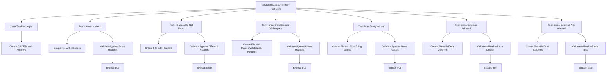
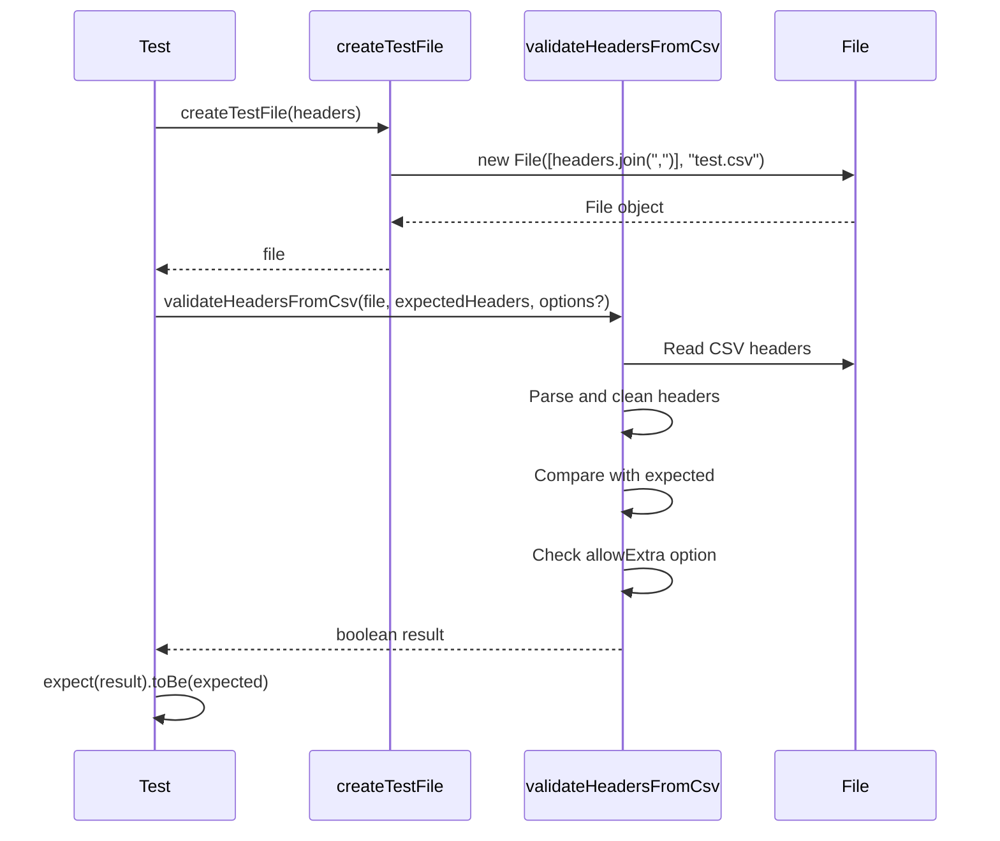
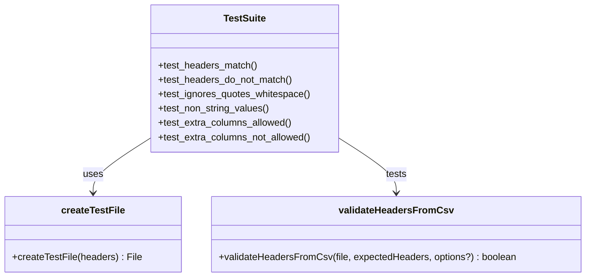
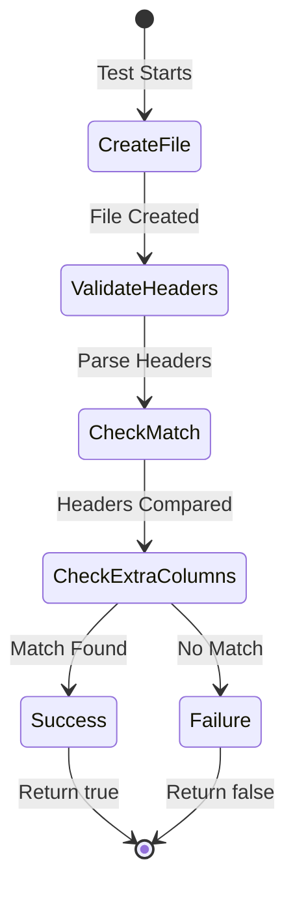

# Diagram: web/portal/src/shared/utils/tests/csv.utils.test.ts

> Auto-generated by Obscura crawlers

## Diagram 1

### SVG

<svg id="container" width="3945.5625" xmlns="http://www.w3.org/2000/svg" class="flowchart" height="478" viewBox="0 0 3945.5625 478" role="graphics-document document" aria-roledescription="flowchart-v2"><g><marker id="container_flowchart-v2-pointEnd" class="marker flowchart-v2" viewBox="0 0 10 10" refX="5" refY="5" markerUnits="userSpaceOnUse" markerWidth="8" markerHeight="8" orient="auto"><path d="M 0 0 L 10 5 L 0 10 z" class="arrowMarkerPath" style="stroke-width: 1; stroke-dasharray: 1, 0;"></path></marker><marker id="container_flowchart-v2-pointStart" class="marker flowchart-v2" viewBox="0 0 10 10" refX="4.5" refY="5" markerUnits="userSpaceOnUse" markerWidth="8" markerHeight="8" orient="auto"><path d="M 0 5 L 10 10 L 10 0 z" class="arrowMarkerPath" style="stroke-width: 1; stroke-dasharray: 1, 0;"></path></marker><marker id="container_flowchart-v2-circleEnd" class="marker flowchart-v2" viewBox="0 0 10 10" refX="11" refY="5" markerUnits="userSpaceOnUse" markerWidth="11" markerHeight="11" orient="auto"><circle cx="5" cy="5" r="5" class="arrowMarkerPath" style="stroke-width: 1; stroke-dasharray: 1, 0;"></circle></marker><marker id="container_flowchart-v2-circleStart" class="marker flowchart-v2" viewBox="0 0 10 10" refX="-1" refY="5" markerUnits="userSpaceOnUse" markerWidth="11" markerHeight="11" orient="auto"><circle cx="5" cy="5" r="5" class="arrowMarkerPath" style="stroke-width: 1; stroke-dasharray: 1, 0;"></circle></marker><marker id="container_flowchart-v2-crossEnd" class="marker cross flowchart-v2" viewBox="0 0 11 11" refX="12" refY="5.2" markerUnits="userSpaceOnUse" markerWidth="11" markerHeight="11" orient="auto"><path d="M 1,1 l 9,9 M 10,1 l -9,9" class="arrowMarkerPath" style="stroke-width: 2; stroke-dasharray: 1, 0;"></path></marker><marker id="container_flowchart-v2-crossStart" class="marker cross flowchart-v2" viewBox="0 0 11 11" refX="-1" refY="5.2" markerUnits="userSpaceOnUse" markerWidth="11" markerHeight="11" orient="auto"><path d="M 1,1 l 9,9 M 10,1 l -9,9" class="arrowMarkerPath" style="stroke-width: 2; stroke-dasharray: 1, 0;"></path></marker><g class="root"><g class="clusters"></g><g class="edgePaths"><path d="M1662.563,52.029L1408.469,61.857C1154.375,71.686,646.188,91.343,392.094,106.671C138,122,138,133,138,138.5L138,144" id="L_A_B_0" class="edge-thickness-normal edge-pattern-solid edge-thickness-normal edge-pattern-solid flowchart-link" style=";" data-edge="true" data-et="edge" data-id="L_A_B_0" data-points="W3sieCI6MTY2Mi41NjI1LCJ5Ijo1Mi4wMjg1MTk2MjM3Njc2MTV9LHsieCI6MTM4LCJ5IjoxMTF9LHsieCI6MTM4LCJ5IjoxNDh9XQ==" marker-end="url(#container_flowchart-v2-pointEnd)"></path><path d="M1662.563,53.885L1482.816,63.404C1303.07,72.923,943.578,91.962,763.832,106.981C584.086,122,584.086,133,584.086,138.5L584.086,144" id="L_A_C_0" class="edge-thickness-normal edge-pattern-solid edge-thickness-normal edge-pattern-solid flowchart-link" style=";" data-edge="true" data-et="edge" data-id="L_A_C_0" data-points="W3sieCI6MTY2Mi41NjI1LCJ5Ijo1My44ODQ3MDExNjY4ODc1NDV9LHsieCI6NTg0LjA4NTkzNzUsInkiOjExMX0seyJ4Ijo1ODQuMDg1OTM3NSwieSI6MTQ4fV0=" marker-end="url(#container_flowchart-v2-pointEnd)"></path><path d="M1662.563,60.557L1581.947,68.964C1501.331,77.371,1340.099,94.186,1259.483,108.093C1178.867,122,1178.867,133,1178.867,138.5L1178.867,144" id="L_A_D_0" class="edge-thickness-normal edge-pattern-solid edge-thickness-normal edge-pattern-solid flowchart-link" style=";" data-edge="true" data-et="edge" data-id="L_A_D_0" data-points="W3sieCI6MTY2Mi41NjI1LCJ5Ijo2MC41NTcyMTYxNDcwNTk5NX0seyJ4IjoxMTc4Ljg2NzE4NzUsInkiOjExMX0seyJ4IjoxMTc4Ljg2NzE4NzUsInkiOjE0OH1d" marker-end="url(#container_flowchart-v2-pointEnd)"></path><path d="M1792.563,86L1792.563,90.167C1792.563,94.333,1792.563,102.667,1792.563,110.333C1792.563,118,1792.563,125,1792.563,128.5L1792.563,132" id="L_A_E_0" class="edge-thickness-normal edge-pattern-solid edge-thickness-normal edge-pattern-solid flowchart-link" style=";" data-edge="true" data-et="edge" data-id="L_A_E_0" data-points="W3sieCI6MTc5Mi41NjI1LCJ5Ijo4Nn0seyJ4IjoxNzkyLjU2MjUsInkiOjExMX0seyJ4IjoxNzkyLjU2MjUsInkiOjEzNn1d" marker-end="url(#container_flowchart-v2-pointEnd)"></path><path d="M1922.563,60.419L2004.229,68.849C2085.896,77.28,2249.229,94.14,2330.896,108.07C2412.563,122,2412.563,133,2412.563,138.5L2412.563,144" id="L_A_F_0" class="edge-thickness-normal edge-pattern-solid edge-thickness-normal edge-pattern-solid flowchart-link" style=";" data-edge="true" data-et="edge" data-id="L_A_F_0" data-points="W3sieCI6MTkyMi41NjI1LCJ5Ijo2MC40MTkzNTQ4Mzg3MDk2OH0seyJ4IjoyNDEyLjU2MjUsInkiOjExMX0seyJ4IjoyNDEyLjU2MjUsInkiOjE0OH1d" marker-end="url(#container_flowchart-v2-pointEnd)"></path><path d="M1922.563,53.71L2107.563,63.258C2292.563,72.806,2662.563,91.903,2847.563,104.952C3032.563,118,3032.563,125,3032.563,128.5L3032.563,132" id="L_A_G_0" class="edge-thickness-normal edge-pattern-solid edge-thickness-normal edge-pattern-solid flowchart-link" style=";" data-edge="true" data-et="edge" data-id="L_A_G_0" data-points="W3sieCI6MTkyMi41NjI1LCJ5Ijo1My43MDk2Nzc0MTkzNTQ4NH0seyJ4IjozMDMyLjU2MjUsInkiOjExMX0seyJ4IjozMDMyLjU2MjUsInkiOjEzNn1d" marker-end="url(#container_flowchart-v2-pointEnd)"></path><path d="M1922.563,51.473L2210.896,61.394C2499.229,71.315,3075.896,91.158,3364.229,104.579C3652.563,118,3652.563,125,3652.563,128.5L3652.563,132" id="L_A_H_0" class="edge-thickness-normal edge-pattern-solid edge-thickness-normal edge-pattern-solid flowchart-link" style=";" data-edge="true" data-et="edge" data-id="L_A_H_0" data-points="W3sieCI6MTkyMi41NjI1LCJ5Ijo1MS40NzMxMTgyNzk1Njk4OX0seyJ4IjozNjUyLjU2MjUsInkiOjExMX0seyJ4IjozNjUyLjU2MjUsInkiOjEzNn1d" marker-end="url(#container_flowchart-v2-pointEnd)"></path><path d="M138,202L138,208.167C138,214.333,138,226.667,138,238.333C138,250,138,261,138,266.5L138,272" id="L_B_I_0" class="edge-thickness-normal edge-pattern-solid edge-thickness-normal edge-pattern-solid flowchart-link" style=";" data-edge="true" data-et="edge" data-id="L_B_I_0" data-points="W3sieCI6MTM4LCJ5IjoyMDJ9LHsieCI6MTM4LCJ5IjoyMzl9LHsieCI6MTM4LCJ5IjoyNzZ9XQ==" marker-end="url(#container_flowchart-v2-pointEnd)"></path><path d="M521.355,202L507.028,208.167C492.7,214.333,464.045,226.667,449.718,240.333C435.391,254,435.391,269,435.391,276.5L435.391,284" id="L_C_J_0" class="edge-thickness-normal edge-pattern-solid edge-thickness-normal edge-pattern-solid flowchart-link" style=";" data-edge="true" data-et="edge" data-id="L_C_J_0" data-points="W3sieCI6NTIxLjM1NTEwMjUzOTA2MjUsInkiOjIwMn0seyJ4Ijo0MzUuMzkwNjI1LCJ5IjoyMzl9LHsieCI6NDM1LjM5MDYyNSwieSI6Mjg4fV0=" marker-end="url(#container_flowchart-v2-pointEnd)"></path><path d="M646.817,202L661.144,208.167C675.472,214.333,704.126,226.667,718.454,238.333C732.781,250,732.781,261,732.781,266.5L732.781,272" id="L_C_K_0" class="edge-thickness-normal edge-pattern-solid edge-thickness-normal edge-pattern-solid flowchart-link" style=";" data-edge="true" data-et="edge" data-id="L_C_K_0" data-points="W3sieCI6NjQ2LjgxNjc3MjQ2MDkzNzUsInkiOjIwMn0seyJ4Ijo3MzIuNzgxMjUsInkiOjIzOX0seyJ4Ijo3MzIuNzgxMjUsInkiOjI3Nn1d" marker-end="url(#container_flowchart-v2-pointEnd)"></path><path d="M732.781,354L732.781,360.167C732.781,366.333,732.781,378.667,732.781,388.333C732.781,398,732.781,405,732.781,408.5L732.781,412" id="L_K_L_0" class="edge-thickness-normal edge-pattern-solid edge-thickness-normal edge-pattern-solid flowchart-link" style=";" data-edge="true" data-et="edge" data-id="L_K_L_0" data-points="W3sieCI6NzMyLjc4MTI1LCJ5IjozNTR9LHsieCI6NzMyLjc4MTI1LCJ5IjozOTF9LHsieCI6NzMyLjc4MTI1LCJ5Ijo0MTZ9XQ==" marker-end="url(#container_flowchart-v2-pointEnd)"></path><path d="M1116.136,202L1101.809,208.167C1087.482,214.333,1058.827,226.667,1044.499,240.333C1030.172,254,1030.172,269,1030.172,276.5L1030.172,284" id="L_D_M_0" class="edge-thickness-normal edge-pattern-solid edge-thickness-normal edge-pattern-solid flowchart-link" style=";" data-edge="true" data-et="edge" data-id="L_D_M_0" data-points="W3sieCI6MTExNi4xMzYzNTI1MzkwNjI1LCJ5IjoyMDJ9LHsieCI6MTAzMC4xNzE4NzUsInkiOjIzOX0seyJ4IjoxMDMwLjE3MTg3NSwieSI6Mjg4fV0=" marker-end="url(#container_flowchart-v2-pointEnd)"></path><path d="M1241.598,202L1255.925,208.167C1270.253,214.333,1298.908,226.667,1313.235,238.333C1327.563,250,1327.563,261,1327.563,266.5L1327.563,272" id="L_D_N_0" class="edge-thickness-normal edge-pattern-solid edge-thickness-normal edge-pattern-solid flowchart-link" style=";" data-edge="true" data-et="edge" data-id="L_D_N_0" data-points="W3sieCI6MTI0MS41OTgwMjI0NjA5Mzc1LCJ5IjoyMDJ9LHsieCI6MTMyNy41NjI1LCJ5IjoyMzl9LHsieCI6MTMyNy41NjI1LCJ5IjoyNzZ9XQ==" marker-end="url(#container_flowchart-v2-pointEnd)"></path><path d="M1327.563,354L1327.563,360.167C1327.563,366.333,1327.563,378.667,1327.563,388.333C1327.563,398,1327.563,405,1327.563,408.5L1327.563,412" id="L_N_O_0" class="edge-thickness-normal edge-pattern-solid edge-thickness-normal edge-pattern-solid flowchart-link" style=";" data-edge="true" data-et="edge" data-id="L_N_O_0" data-points="W3sieCI6MTMyNy41NjI1LCJ5IjozNTR9LHsieCI6MTMyNy41NjI1LCJ5IjozOTF9LHsieCI6MTMyNy41NjI1LCJ5Ijo0MTZ9XQ==" marker-end="url(#container_flowchart-v2-pointEnd)"></path><path d="M1698.109,214L1688.018,218.167C1677.927,222.333,1657.745,230.667,1647.654,238.333C1637.563,246,1637.563,253,1637.563,256.5L1637.563,260" id="L_E_P_0" class="edge-thickness-normal edge-pattern-solid edge-thickness-normal edge-pattern-solid flowchart-link" style=";" data-edge="true" data-et="edge" data-id="L_E_P_0" data-points="W3sieCI6MTY5OC4xMDkzNzUsInkiOjIxNH0seyJ4IjoxNjM3LjU2MjUsInkiOjIzOX0seyJ4IjoxNjM3LjU2MjUsInkiOjI2NH1d" marker-end="url(#container_flowchart-v2-pointEnd)"></path><path d="M1887.016,214L1897.107,218.167C1907.198,222.333,1927.38,230.667,1937.471,240.333C1947.563,250,1947.563,261,1947.563,266.5L1947.563,272" id="L_E_Q_0" class="edge-thickness-normal edge-pattern-solid edge-thickness-normal edge-pattern-solid flowchart-link" style=";" data-edge="true" data-et="edge" data-id="L_E_Q_0" data-points="W3sieCI6MTg4Ny4wMTU2MjUsInkiOjIxNH0seyJ4IjoxOTQ3LjU2MjUsInkiOjIzOX0seyJ4IjoxOTQ3LjU2MjUsInkiOjI3Nn1d" marker-end="url(#container_flowchart-v2-pointEnd)"></path><path d="M1947.563,354L1947.563,360.167C1947.563,366.333,1947.563,378.667,1947.563,388.333C1947.563,398,1947.563,405,1947.563,408.5L1947.563,412" id="L_Q_R_0" class="edge-thickness-normal edge-pattern-solid edge-thickness-normal edge-pattern-solid flowchart-link" style=";" data-edge="true" data-et="edge" data-id="L_Q_R_0" data-points="W3sieCI6MTk0Ny41NjI1LCJ5IjozNTR9LHsieCI6MTk0Ny41NjI1LCJ5IjozOTF9LHsieCI6MTk0Ny41NjI1LCJ5Ijo0MTZ9XQ==" marker-end="url(#container_flowchart-v2-pointEnd)"></path><path d="M2347.172,202L2332.237,208.167C2317.302,214.333,2287.432,226.667,2272.497,238.333C2257.563,250,2257.563,261,2257.563,266.5L2257.563,272" id="L_F_S_0" class="edge-thickness-normal edge-pattern-solid edge-thickness-normal edge-pattern-solid flowchart-link" style=";" data-edge="true" data-et="edge" data-id="L_F_S_0" data-points="W3sieCI6MjM0Ny4xNzE4NzUsInkiOjIwMn0seyJ4IjoyMjU3LjU2MjUsInkiOjIzOX0seyJ4IjoyMjU3LjU2MjUsInkiOjI3Nn1d" marker-end="url(#container_flowchart-v2-pointEnd)"></path><path d="M2477.953,202L2492.888,208.167C2507.823,214.333,2537.693,226.667,2552.628,238.333C2567.563,250,2567.563,261,2567.563,266.5L2567.563,272" id="L_F_T_0" class="edge-thickness-normal edge-pattern-solid edge-thickness-normal edge-pattern-solid flowchart-link" style=";" data-edge="true" data-et="edge" data-id="L_F_T_0" data-points="W3sieCI6MjQ3Ny45NTMxMjUsInkiOjIwMn0seyJ4IjoyNTY3LjU2MjUsInkiOjIzOX0seyJ4IjoyNTY3LjU2MjUsInkiOjI3Nn1d" marker-end="url(#container_flowchart-v2-pointEnd)"></path><path d="M2567.563,354L2567.563,360.167C2567.563,366.333,2567.563,378.667,2567.563,388.333C2567.563,398,2567.563,405,2567.563,408.5L2567.563,412" id="L_T_U_0" class="edge-thickness-normal edge-pattern-solid edge-thickness-normal edge-pattern-solid flowchart-link" style=";" data-edge="true" data-et="edge" data-id="L_T_U_0" data-points="W3sieCI6MjU2Ny41NjI1LCJ5IjozNTR9LHsieCI6MjU2Ny41NjI1LCJ5IjozOTF9LHsieCI6MjU2Ny41NjI1LCJ5Ijo0MTZ9XQ==" marker-end="url(#container_flowchart-v2-pointEnd)"></path><path d="M2938.109,214L2928.018,218.167C2917.927,222.333,2897.745,230.667,2887.654,240.333C2877.563,250,2877.563,261,2877.563,266.5L2877.563,272" id="L_G_V_0" class="edge-thickness-normal edge-pattern-solid edge-thickness-normal edge-pattern-solid flowchart-link" style=";" data-edge="true" data-et="edge" data-id="L_G_V_0" data-points="W3sieCI6MjkzOC4xMDkzNzUsInkiOjIxNH0seyJ4IjoyODc3LjU2MjUsInkiOjIzOX0seyJ4IjoyODc3LjU2MjUsInkiOjI3Nn1d" marker-end="url(#container_flowchart-v2-pointEnd)"></path><path d="M3127.016,214L3137.107,218.167C3147.198,222.333,3167.38,230.667,3177.471,240.333C3187.563,250,3187.563,261,3187.563,266.5L3187.563,272" id="L_G_W_0" class="edge-thickness-normal edge-pattern-solid edge-thickness-normal edge-pattern-solid flowchart-link" style=";" data-edge="true" data-et="edge" data-id="L_G_W_0" data-points="W3sieCI6MzEyNy4wMTU2MjUsInkiOjIxNH0seyJ4IjozMTg3LjU2MjUsInkiOjIzOX0seyJ4IjozMTg3LjU2MjUsInkiOjI3Nn1d" marker-end="url(#container_flowchart-v2-pointEnd)"></path><path d="M3187.563,354L3187.563,360.167C3187.563,366.333,3187.563,378.667,3187.563,388.333C3187.563,398,3187.563,405,3187.563,408.5L3187.563,412" id="L_W_X_0" class="edge-thickness-normal edge-pattern-solid edge-thickness-normal edge-pattern-solid flowchart-link" style=";" data-edge="true" data-et="edge" data-id="L_W_X_0" data-points="W3sieCI6MzE4Ny41NjI1LCJ5IjozNTR9LHsieCI6MzE4Ny41NjI1LCJ5IjozOTF9LHsieCI6MzE4Ny41NjI1LCJ5Ijo0MTZ9XQ==" marker-end="url(#container_flowchart-v2-pointEnd)"></path><path d="M3558.109,214L3548.018,218.167C3537.927,222.333,3517.745,230.667,3507.654,240.333C3497.563,250,3497.563,261,3497.563,266.5L3497.563,272" id="L_H_Y_0" class="edge-thickness-normal edge-pattern-solid edge-thickness-normal edge-pattern-solid flowchart-link" style=";" data-edge="true" data-et="edge" data-id="L_H_Y_0" data-points="W3sieCI6MzU1OC4xMDkzNzUsInkiOjIxNH0seyJ4IjozNDk3LjU2MjUsInkiOjIzOX0seyJ4IjozNDk3LjU2MjUsInkiOjI3Nn1d" marker-end="url(#container_flowchart-v2-pointEnd)"></path><path d="M3747.016,214L3757.107,218.167C3767.198,222.333,3787.38,230.667,3797.471,240.333C3807.563,250,3807.563,261,3807.563,266.5L3807.563,272" id="L_H_Z_0" class="edge-thickness-normal edge-pattern-solid edge-thickness-normal edge-pattern-solid flowchart-link" style=";" data-edge="true" data-et="edge" data-id="L_H_Z_0" data-points="W3sieCI6Mzc0Ny4wMTU2MjUsInkiOjIxNH0seyJ4IjozODA3LjU2MjUsInkiOjIzOX0seyJ4IjozODA3LjU2MjUsInkiOjI3Nn1d" marker-end="url(#container_flowchart-v2-pointEnd)"></path><path d="M3807.563,354L3807.563,360.167C3807.563,366.333,3807.563,378.667,3807.563,388.333C3807.563,398,3807.563,405,3807.563,408.5L3807.563,412" id="L_Z_AA_0" class="edge-thickness-normal edge-pattern-solid edge-thickness-normal edge-pattern-solid flowchart-link" style=";" data-edge="true" data-et="edge" data-id="L_Z_AA_0" data-points="W3sieCI6MzgwNy41NjI1LCJ5IjozNTR9LHsieCI6MzgwNy41NjI1LCJ5IjozOTF9LHsieCI6MzgwNy41NjI1LCJ5Ijo0MTZ9XQ==" marker-end="url(#container_flowchart-v2-pointEnd)"></path></g><g class="edgeLabels"><g class="edgeLabel"><g class="label" data-id="L_A_B_0" transform="translate(0, 0)"><foreignObject width="0" height="0">

</foreignObject></g></g><g class="edgeLabel"><g class="label" data-id="L_A_C_0" transform="translate(0, 0)"><foreignObject width="0" height="0">

</foreignObject></g></g><g class="edgeLabel"><g class="label" data-id="L_A_D_0" transform="translate(0, 0)"><foreignObject width="0" height="0">

</foreignObject></g></g><g class="edgeLabel"><g class="label" data-id="L_A_E_0" transform="translate(0, 0)"><foreignObject width="0" height="0">

</foreignObject></g></g><g class="edgeLabel"><g class="label" data-id="L_A_F_0" transform="translate(0, 0)"><foreignObject width="0" height="0">

</foreignObject></g></g><g class="edgeLabel"><g class="label" data-id="L_A_G_0" transform="translate(0, 0)"><foreignObject width="0" height="0">

</foreignObject></g></g><g class="edgeLabel"><g class="label" data-id="L_A_H_0" transform="translate(0, 0)"><foreignObject width="0" height="0">

</foreignObject></g></g><g class="edgeLabel"><g class="label" data-id="L_B_I_0" transform="translate(0, 0)"><foreignObject width="0" height="0">

</foreignObject></g></g><g class="edgeLabel"><g class="label" data-id="L_C_J_0" transform="translate(0, 0)"><foreignObject width="0" height="0">

</foreignObject></g></g><g class="edgeLabel"><g class="label" data-id="L_C_K_0" transform="translate(0, 0)"><foreignObject width="0" height="0">

</foreignObject></g></g><g class="edgeLabel"><g class="label" data-id="L_K_L_0" transform="translate(0, 0)"><foreignObject width="0" height="0">

</foreignObject></g></g><g class="edgeLabel"><g class="label" data-id="L_D_M_0" transform="translate(0, 0)"><foreignObject width="0" height="0">

</foreignObject></g></g><g class="edgeLabel"><g class="label" data-id="L_D_N_0" transform="translate(0, 0)"><foreignObject width="0" height="0">

</foreignObject></g></g><g class="edgeLabel"><g class="label" data-id="L_N_O_0" transform="translate(0, 0)"><foreignObject width="0" height="0">

</foreignObject></g></g><g class="edgeLabel"><g class="label" data-id="L_E_P_0" transform="translate(0, 0)"><foreignObject width="0" height="0">

</foreignObject></g></g><g class="edgeLabel"><g class="label" data-id="L_E_Q_0" transform="translate(0, 0)"><foreignObject width="0" height="0">

</foreignObject></g></g><g class="edgeLabel"><g class="label" data-id="L_Q_R_0" transform="translate(0, 0)"><foreignObject width="0" height="0">

</foreignObject></g></g><g class="edgeLabel"><g class="label" data-id="L_F_S_0" transform="translate(0, 0)"><foreignObject width="0" height="0">

</foreignObject></g></g><g class="edgeLabel"><g class="label" data-id="L_F_T_0" transform="translate(0, 0)"><foreignObject width="0" height="0">

</foreignObject></g></g><g class="edgeLabel"><g class="label" data-id="L_T_U_0" transform="translate(0, 0)"><foreignObject width="0" height="0">

</foreignObject></g></g><g class="edgeLabel"><g class="label" data-id="L_G_V_0" transform="translate(0, 0)"><foreignObject width="0" height="0">

</foreignObject></g></g><g class="edgeLabel"><g class="label" data-id="L_G_W_0" transform="translate(0, 0)"><foreignObject width="0" height="0">

</foreignObject></g></g><g class="edgeLabel"><g class="label" data-id="L_W_X_0" transform="translate(0, 0)"><foreignObject width="0" height="0">

</foreignObject></g></g><g class="edgeLabel"><g class="label" data-id="L_H_Y_0" transform="translate(0, 0)"><foreignObject width="0" height="0">

</foreignObject></g></g><g class="edgeLabel"><g class="label" data-id="L_H_Z_0" transform="translate(0, 0)"><foreignObject width="0" height="0">

</foreignObject></g></g><g class="edgeLabel"><g class="label" data-id="L_Z_AA_0" transform="translate(0, 0)"><foreignObject width="0" height="0">

</foreignObject></g></g></g><g class="nodes"><g class="node default" id="flowchart-A-0" transform="translate(1792.5625, 47)"><rect class="basic label-container" style="" x="-130" y="-39" width="260" height="78"></rect><g class="label" style="" transform="translate(-100, -24)"><rect></rect><foreignObject width="200" height="48">

validateHeadersFromCsv Test Suite

</foreignObject></g></g><g class="node default" id="flowchart-B-1" transform="translate(138, 175)"><rect class="basic label-container" style="" x="-106.1484375" y="-27" width="212.296875" height="54"></rect><g class="label" style="" transform="translate(-76.1484375, -12)"><rect></rect><foreignObject width="152.296875" height="24">

createTestFile Helper

</foreignObject></g></g><g class="node default" id="flowchart-C-3" transform="translate(584.0859375, 175)"><rect class="basic label-container" style="" x="-102.6484375" y="-27" width="205.296875" height="54"></rect><g class="label" style="" transform="translate(-72.6484375, -12)"><rect></rect><foreignObject width="145.296875" height="24">

Test: Headers Match

</foreignObject></g></g><g class="node default" id="flowchart-D-5" transform="translate(1178.8671875, 175)"><rect class="basic label-container" style="" x="-129.7421875" y="-27" width="259.484375" height="54"></rect><g class="label" style="" transform="translate(-99.7421875, -12)"><rect></rect><foreignObject width="199.484375" height="24">

Test: Headers Do Not Match

</foreignObject></g></g><g class="node default" id="flowchart-E-7" transform="translate(1792.5625, 175)"><rect class="basic label-container" style="" x="-130" y="-39" width="260" height="78"></rect><g class="label" style="" transform="translate(-100, -24)"><rect></rect><foreignObject width="200" height="48">

Test: Ignores Quotes and Whitespace

</foreignObject></g></g><g class="node default" id="flowchart-F-9" transform="translate(2412.5625, 175)"><rect class="basic label-container" style="" x="-113.5390625" y="-27" width="227.078125" height="54"></rect><g class="label" style="" transform="translate(-83.5390625, -12)"><rect></rect><foreignObject width="167.078125" height="24">

Test: Non-String Values

</foreignObject></g></g><g class="node default" id="flowchart-G-11" transform="translate(3032.5625, 175)"><rect class="basic label-container" style="" x="-130" y="-39" width="260" height="78"></rect><g class="label" style="" transform="translate(-100, -24)"><rect></rect><foreignObject width="200" height="48">

Test: Extra Columns Allowed

</foreignObject></g></g><g class="node default" id="flowchart-H-13" transform="translate(3652.5625, 175)"><rect class="basic label-container" style="" x="-130" y="-39" width="260" height="78"></rect><g class="label" style="" transform="translate(-100, -24)"><rect></rect><foreignObject width="200" height="48">

Test: Extra Columns Not Allowed

</foreignObject></g></g><g class="node default" id="flowchart-I-15" transform="translate(138, 315)"><rect class="basic label-container" style="" x="-130" y="-39" width="260" height="78"></rect><g class="label" style="" transform="translate(-100, -24)"><rect></rect><foreignObject width="200" height="48">

Create CSV File with Headers

</foreignObject></g></g><g class="node default" id="flowchart-J-17" transform="translate(435.390625, 315)"><rect class="basic label-container" style="" x="-117.390625" y="-27" width="234.78125" height="54"></rect><g class="label" style="" transform="translate(-87.390625, -12)"><rect></rect><foreignObject width="174.78125" height="24">

Create File with Headers

</foreignObject></g></g><g class="node default" id="flowchart-K-19" transform="translate(732.78125, 315)"><rect class="basic label-container" style="" x="-130" y="-39" width="260" height="78"></rect><g class="label" style="" transform="translate(-100, -24)"><rect></rect><foreignObject width="200" height="48">

Validate Against Same Headers

</foreignObject></g></g><g class="node default" id="flowchart-L-21" transform="translate(732.78125, 443)"><rect class="basic label-container" style="" x="-73.0546875" y="-27" width="146.109375" height="54"></rect><g class="label" style="" transform="translate(-43.0546875, -12)"><rect></rect><foreignObject width="86.109375" height="24">

Expect: true

</foreignObject></g></g><g class="node default" id="flowchart-M-23" transform="translate(1030.171875, 315)"><rect class="basic label-container" style="" x="-117.390625" y="-27" width="234.78125" height="54"></rect><g class="label" style="" transform="translate(-87.390625, -12)"><rect></rect><foreignObject width="174.78125" height="24">

Create File with Headers

</foreignObject></g></g><g class="node default" id="flowchart-N-25" transform="translate(1327.5625, 315)"><rect class="basic label-container" style="" x="-130" y="-39" width="260" height="78"></rect><g class="label" style="" transform="translate(-100, -24)"><rect></rect><foreignObject width="200" height="48">

Validate Against Different Headers

</foreignObject></g></g><g class="node default" id="flowchart-O-27" transform="translate(1327.5625, 443)"><rect class="basic label-container" style="" x="-75.2734375" y="-27" width="150.546875" height="54"></rect><g class="label" style="" transform="translate(-45.2734375, -12)"><rect></rect><foreignObject width="90.546875" height="24">

Expect: false

</foreignObject></g></g><g class="node default" id="flowchart-P-29" transform="translate(1637.5625, 315)"><rect class="basic label-container" style="" x="-130" y="-51" width="260" height="102"></rect><g class="label" style="" transform="translate(-100, -36)"><rect></rect><foreignObject width="200" height="72">

Create File with Quoted/Whitespace Headers

</foreignObject></g></g><g class="node default" id="flowchart-Q-31" transform="translate(1947.5625, 315)"><rect class="basic label-container" style="" x="-130" y="-39" width="260" height="78"></rect><g class="label" style="" transform="translate(-100, -24)"><rect></rect><foreignObject width="200" height="48">

Validate Against Clean Headers

</foreignObject></g></g><g class="node default" id="flowchart-R-33" transform="translate(1947.5625, 443)"><rect class="basic label-container" style="" x="-73.0546875" y="-27" width="146.109375" height="54"></rect><g class="label" style="" transform="translate(-43.0546875, -12)"><rect></rect><foreignObject width="86.109375" height="24">

Expect: true

</foreignObject></g></g><g class="node default" id="flowchart-S-35" transform="translate(2257.5625, 315)"><rect class="basic label-container" style="" x="-130" y="-39" width="260" height="78"></rect><g class="label" style="" transform="translate(-100, -24)"><rect></rect><foreignObject width="200" height="48">

Create File with Non-String Values

</foreignObject></g></g><g class="node default" id="flowchart-T-37" transform="translate(2567.5625, 315)"><rect class="basic label-container" style="" x="-130" y="-39" width="260" height="78"></rect><g class="label" style="" transform="translate(-100, -24)"><rect></rect><foreignObject width="200" height="48">

Validate Against Same Values

</foreignObject></g></g><g class="node default" id="flowchart-U-39" transform="translate(2567.5625, 443)"><rect class="basic label-container" style="" x="-73.0546875" y="-27" width="146.109375" height="54"></rect><g class="label" style="" transform="translate(-43.0546875, -12)"><rect></rect><foreignObject width="86.109375" height="24">

Expect: true

</foreignObject></g></g><g class="node default" id="flowchart-V-41" transform="translate(2877.5625, 315)"><rect class="basic label-container" style="" x="-130" y="-39" width="260" height="78"></rect><g class="label" style="" transform="translate(-100, -24)"><rect></rect><foreignObject width="200" height="48">

Create File with Extra Columns

</foreignObject></g></g><g class="node default" id="flowchart-W-43" transform="translate(3187.5625, 315)"><rect class="basic label-container" style="" x="-130" y="-39" width="260" height="78"></rect><g class="label" style="" transform="translate(-100, -24)"><rect></rect><foreignObject width="200" height="48">

Validate with allowExtra Default

</foreignObject></g></g><g class="node default" id="flowchart-X-45" transform="translate(3187.5625, 443)"><rect class="basic label-container" style="" x="-73.0546875" y="-27" width="146.109375" height="54"></rect><g class="label" style="" transform="translate(-43.0546875, -12)"><rect></rect><foreignObject width="86.109375" height="24">

Expect: true

</foreignObject></g></g><g class="node default" id="flowchart-Y-47" transform="translate(3497.5625, 315)"><rect class="basic label-container" style="" x="-130" y="-39" width="260" height="78"></rect><g class="label" style="" transform="translate(-100, -24)"><rect></rect><foreignObject width="200" height="48">

Create File with Extra Columns

</foreignObject></g></g><g class="node default" id="flowchart-Z-49" transform="translate(3807.5625, 315)"><rect class="basic label-container" style="" x="-130" y="-39" width="260" height="78"></rect><g class="label" style="" transform="translate(-100, -24)"><rect></rect><foreignObject width="200" height="48">

Validate with allowExtra: false

</foreignObject></g></g><g class="node default" id="flowchart-AA-51" transform="translate(3807.5625, 443)"><rect class="basic label-container" style="" x="-75.2734375" y="-27" width="150.546875" height="54"></rect><g class="label" style="" transform="translate(-45.2734375, -12)"><rect></rect><foreignObject width="90.546875" height="24">

Expect: false

</foreignObject></g></g></g></g></g></svg>

## Diagram 2

### SVG

<svg id="container" width="966.5" xmlns="http://www.w3.org/2000/svg" height="819" viewBox="-80.5 -10 966.5 819" role="graphics-document document" aria-roledescription="sequence"><g><rect x="686" y="733" fill="#eaeaea" stroke="#666" width="150" height="65" name="File" rx="3" ry="3" class="actor actor-bottom"></rect><text x="761" y="765.5" dominant-baseline="central" alignment-baseline="central" class="actor actor-box" style="text-anchor: middle; font-size: 16px; font-weight: 400;"><tspan x="761" dy="0">File</tspan></text></g><g><rect x="438" y="733" fill="#eaeaea" stroke="#666" width="198" height="65" name="Validator" rx="3" ry="3" class="actor actor-bottom"></rect><text x="537" y="765.5" dominant-baseline="central" alignment-baseline="central" class="actor actor-box" style="text-anchor: middle; font-size: 16px; font-weight: 400;"><tspan x="537" dy="0">validateHeadersFromCsv</tspan></text></g><g><rect x="238" y="733" fill="#eaeaea" stroke="#666" width="150" height="65" name="Helper" rx="3" ry="3" class="actor actor-bottom"></rect><text x="313" y="765.5" dominant-baseline="central" alignment-baseline="central" class="actor actor-box" style="text-anchor: middle; font-size: 16px; font-weight: 400;"><tspan x="313" dy="0">createTestFile</tspan></text></g><g><rect x="0" y="733" fill="#eaeaea" stroke="#666" width="150" height="65" name="Test" rx="3" ry="3" class="actor actor-bottom"></rect><text x="75" y="765.5" dominant-baseline="central" alignment-baseline="central" class="actor actor-box" style="text-anchor: middle; font-size: 16px; font-weight: 400;"><tspan x="75" dy="0">Test</tspan></text></g><g><line id="actor3" x1="761" y1="65" x2="761" y2="733" class="actor-line 200" stroke-width="0.5px" stroke="#999" name="File"></line><g id="root-3"><rect x="686" y="0" fill="#eaeaea" stroke="#666" width="150" height="65" name="File" rx="3" ry="3" class="actor actor-top"></rect><text x="761" y="32.5" dominant-baseline="central" alignment-baseline="central" class="actor actor-box" style="text-anchor: middle; font-size: 16px; font-weight: 400;"><tspan x="761" dy="0">File</tspan></text></g></g><g><line id="actor2" x1="537" y1="65" x2="537" y2="733" class="actor-line 200" stroke-width="0.5px" stroke="#999" name="Validator"></line><g id="root-2"><rect x="438" y="0" fill="#eaeaea" stroke="#666" width="198" height="65" name="Validator" rx="3" ry="3" class="actor actor-top"></rect><text x="537" y="32.5" dominant-baseline="central" alignment-baseline="central" class="actor actor-box" style="text-anchor: middle; font-size: 16px; font-weight: 400;"><tspan x="537" dy="0">validateHeadersFromCsv</tspan></text></g></g><g><line id="actor1" x1="313" y1="65" x2="313" y2="733" class="actor-line 200" stroke-width="0.5px" stroke="#999" name="Helper"></line><g id="root-1"><rect x="238" y="0" fill="#eaeaea" stroke="#666" width="150" height="65" name="Helper" rx="3" ry="3" class="actor actor-top"></rect><text x="313" y="32.5" dominant-baseline="central" alignment-baseline="central" class="actor actor-box" style="text-anchor: middle; font-size: 16px; font-weight: 400;"><tspan x="313" dy="0">createTestFile</tspan></text></g></g><g><line id="actor0" x1="75" y1="65" x2="75" y2="733" class="actor-line 200" stroke-width="0.5px" stroke="#999" name="Test"></line><g id="root-0"><rect x="0" y="0" fill="#eaeaea" stroke="#666" width="150" height="65" name="Test" rx="3" ry="3" class="actor actor-top"></rect><text x="75" y="32.5" dominant-baseline="central" alignment-baseline="central" class="actor actor-box" style="text-anchor: middle; font-size: 16px; font-weight: 400;"><tspan x="75" dy="0">Test</tspan></text></g></g><g></g><defs><symbol id="computer" width="24" height="24"><path transform="scale(.5)" d="M2 2v13h20v-13h-20zm18 11h-16v-9h16v9zm-10.228 6l.466-1h3.524l.467 1h-4.457zm14.228 3h-24l2-6h2.104l-1.33 4h18.45l-1.297-4h2.073l2 6zm-5-10h-14v-7h14v7z"></path></symbol></defs><defs><symbol id="database" fill-rule="evenodd" clip-rule="evenodd"><path transform="scale(.5)" d="M12.258.001l.256.004.255.005.253.008.251.01.249.012.247.015.246.016.242.019.241.02.239.023.236.024.233.027.231.028.229.031.225.032.223.034.22.036.217.038.214.04.211.041.208.043.205.045.201.046.198.048.194.05.191.051.187.053.183.054.18.056.175.057.172.059.168.06.163.061.16.063.155.064.15.066.074.033.073.033.071.034.07.034.069.035.068.035.067.035.066.035.064.036.064.036.062.036.06.036.06.037.058.037.058.037.055.038.055.038.053.038.052.038.051.039.05.039.048.039.047.039.045.04.044.04.043.04.041.04.04.041.039.041.037.041.036.041.034.041.033.042.032.042.03.042.029.042.027.042.026.043.024.043.023.043.021.043.02.043.018.044.017.043.015.044.013.044.012.044.011.045.009.044.007.045.006.045.004.045.002.045.001.045v17l-.001.045-.002.045-.004.045-.006.045-.007.045-.009.044-.011.045-.012.044-.013.044-.015.044-.017.043-.018.044-.02.043-.021.043-.023.043-.024.043-.026.043-.027.042-.029.042-.03.042-.032.042-.033.042-.034.041-.036.041-.037.041-.039.041-.04.041-.041.04-.043.04-.044.04-.045.04-.047.039-.048.039-.05.039-.051.039-.052.038-.053.038-.055.038-.055.038-.058.037-.058.037-.06.037-.06.036-.062.036-.064.036-.064.036-.066.035-.067.035-.068.035-.069.035-.07.034-.071.034-.073.033-.074.033-.15.066-.155.064-.16.063-.163.061-.168.06-.172.059-.175.057-.18.056-.183.054-.187.053-.191.051-.194.05-.198.048-.201.046-.205.045-.208.043-.211.041-.214.04-.217.038-.22.036-.223.034-.225.032-.229.031-.231.028-.233.027-.236.024-.239.023-.241.02-.242.019-.246.016-.247.015-.249.012-.251.01-.253.008-.255.005-.256.004-.258.001-.258-.001-.256-.004-.255-.005-.253-.008-.251-.01-.249-.012-.247-.015-.245-.016-.243-.019-.241-.02-.238-.023-.236-.024-.234-.027-.231-.028-.228-.031-.226-.032-.223-.034-.22-.036-.217-.038-.214-.04-.211-.041-.208-.043-.204-.045-.201-.046-.198-.048-.195-.05-.19-.051-.187-.053-.184-.054-.179-.056-.176-.057-.172-.059-.167-.06-.164-.061-.159-.063-.155-.064-.151-.066-.074-.033-.072-.033-.072-.034-.07-.034-.069-.035-.068-.035-.067-.035-.066-.035-.064-.036-.063-.036-.062-.036-.061-.036-.06-.037-.058-.037-.057-.037-.056-.038-.055-.038-.053-.038-.052-.038-.051-.039-.049-.039-.049-.039-.046-.039-.046-.04-.044-.04-.043-.04-.041-.04-.04-.041-.039-.041-.037-.041-.036-.041-.034-.041-.033-.042-.032-.042-.03-.042-.029-.042-.027-.042-.026-.043-.024-.043-.023-.043-.021-.043-.02-.043-.018-.044-.017-.043-.015-.044-.013-.044-.012-.044-.011-.045-.009-.044-.007-.045-.006-.045-.004-.045-.002-.045-.001-.045v-17l.001-.045.002-.045.004-.045.006-.045.007-.045.009-.044.011-.045.012-.044.013-.044.015-.044.017-.043.018-.044.02-.043.021-.043.023-.043.024-.043.026-.043.027-.042.029-.042.03-.042.032-.042.033-.042.034-.041.036-.041.037-.041.039-.041.04-.041.041-.04.043-.04.044-.04.046-.04.046-.039.049-.039.049-.039.051-.039.052-.038.053-.038.055-.038.056-.038.057-.037.058-.037.06-.037.061-.036.062-.036.063-.036.064-.036.066-.035.067-.035.068-.035.069-.035.07-.034.072-.034.072-.033.074-.033.151-.066.155-.064.159-.063.164-.061.167-.06.172-.059.176-.057.179-.056.184-.054.187-.053.19-.051.195-.05.198-.048.201-.046.204-.045.208-.043.211-.041.214-.04.217-.038.22-.036.223-.034.226-.032.228-.031.231-.028.234-.027.236-.024.238-.023.241-.02.243-.019.245-.016.247-.015.249-.012.251-.01.253-.008.255-.005.256-.004.258-.001.258.001zm-9.258 20.499v.01l.001.021.003.021.004.022.005.021.006.022.007.022.009.023.01.022.011.023.012.023.013.023.015.023.016.024.017.023.018.024.019.024.021.024.022.025.023.024.024.025.052.049.056.05.061.051.066.051.07.051.075.051.079.052.084.052.088.052.092.052.097.052.102.051.105.052.11.052.114.051.119.051.123.051.127.05.131.05.135.05.139.048.144.049.147.047.152.047.155.047.16.045.163.045.167.043.171.043.176.041.178.041.183.039.187.039.19.037.194.035.197.035.202.033.204.031.209.03.212.029.216.027.219.025.222.024.226.021.23.02.233.018.236.016.24.015.243.012.246.01.249.008.253.005.256.004.259.001.26-.001.257-.004.254-.005.25-.008.247-.011.244-.012.241-.014.237-.016.233-.018.231-.021.226-.021.224-.024.22-.026.216-.027.212-.028.21-.031.205-.031.202-.034.198-.034.194-.036.191-.037.187-.039.183-.04.179-.04.175-.042.172-.043.168-.044.163-.045.16-.046.155-.046.152-.047.148-.048.143-.049.139-.049.136-.05.131-.05.126-.05.123-.051.118-.052.114-.051.11-.052.106-.052.101-.052.096-.052.092-.052.088-.053.083-.051.079-.052.074-.052.07-.051.065-.051.06-.051.056-.05.051-.05.023-.024.023-.025.021-.024.02-.024.019-.024.018-.024.017-.024.015-.023.014-.024.013-.023.012-.023.01-.023.01-.022.008-.022.006-.022.006-.022.004-.022.004-.021.001-.021.001-.021v-4.127l-.077.055-.08.053-.083.054-.085.053-.087.052-.09.052-.093.051-.095.05-.097.05-.1.049-.102.049-.105.048-.106.047-.109.047-.111.046-.114.045-.115.045-.118.044-.12.043-.122.042-.124.042-.126.041-.128.04-.13.04-.132.038-.134.038-.135.037-.138.037-.139.035-.142.035-.143.034-.144.033-.147.032-.148.031-.15.03-.151.03-.153.029-.154.027-.156.027-.158.026-.159.025-.161.024-.162.023-.163.022-.165.021-.166.02-.167.019-.169.018-.169.017-.171.016-.173.015-.173.014-.175.013-.175.012-.177.011-.178.01-.179.008-.179.008-.181.006-.182.005-.182.004-.184.003-.184.002h-.37l-.184-.002-.184-.003-.182-.004-.182-.005-.181-.006-.179-.008-.179-.008-.178-.01-.176-.011-.176-.012-.175-.013-.173-.014-.172-.015-.171-.016-.17-.017-.169-.018-.167-.019-.166-.02-.165-.021-.163-.022-.162-.023-.161-.024-.159-.025-.157-.026-.156-.027-.155-.027-.153-.029-.151-.03-.15-.03-.148-.031-.146-.032-.145-.033-.143-.034-.141-.035-.14-.035-.137-.037-.136-.037-.134-.038-.132-.038-.13-.04-.128-.04-.126-.041-.124-.042-.122-.042-.12-.044-.117-.043-.116-.045-.113-.045-.112-.046-.109-.047-.106-.047-.105-.048-.102-.049-.1-.049-.097-.05-.095-.05-.093-.052-.09-.051-.087-.052-.085-.053-.083-.054-.08-.054-.077-.054v4.127zm0-5.654v.011l.001.021.003.021.004.021.005.022.006.022.007.022.009.022.01.022.011.023.012.023.013.023.015.024.016.023.017.024.018.024.019.024.021.024.022.024.023.025.024.024.052.05.056.05.061.05.066.051.07.051.075.052.079.051.084.052.088.052.092.052.097.052.102.052.105.052.11.051.114.051.119.052.123.05.127.051.131.05.135.049.139.049.144.048.147.048.152.047.155.046.16.045.163.045.167.044.171.042.176.042.178.04.183.04.187.038.19.037.194.036.197.034.202.033.204.032.209.03.212.028.216.027.219.025.222.024.226.022.23.02.233.018.236.016.24.014.243.012.246.01.249.008.253.006.256.003.259.001.26-.001.257-.003.254-.006.25-.008.247-.01.244-.012.241-.015.237-.016.233-.018.231-.02.226-.022.224-.024.22-.025.216-.027.212-.029.21-.03.205-.032.202-.033.198-.035.194-.036.191-.037.187-.039.183-.039.179-.041.175-.042.172-.043.168-.044.163-.045.16-.045.155-.047.152-.047.148-.048.143-.048.139-.05.136-.049.131-.05.126-.051.123-.051.118-.051.114-.052.11-.052.106-.052.101-.052.096-.052.092-.052.088-.052.083-.052.079-.052.074-.051.07-.052.065-.051.06-.05.056-.051.051-.049.023-.025.023-.024.021-.025.02-.024.019-.024.018-.024.017-.024.015-.023.014-.023.013-.024.012-.022.01-.023.01-.023.008-.022.006-.022.006-.022.004-.021.004-.022.001-.021.001-.021v-4.139l-.077.054-.08.054-.083.054-.085.052-.087.053-.09.051-.093.051-.095.051-.097.05-.1.049-.102.049-.105.048-.106.047-.109.047-.111.046-.114.045-.115.044-.118.044-.12.044-.122.042-.124.042-.126.041-.128.04-.13.039-.132.039-.134.038-.135.037-.138.036-.139.036-.142.035-.143.033-.144.033-.147.033-.148.031-.15.03-.151.03-.153.028-.154.028-.156.027-.158.026-.159.025-.161.024-.162.023-.163.022-.165.021-.166.02-.167.019-.169.018-.169.017-.171.016-.173.015-.173.014-.175.013-.175.012-.177.011-.178.009-.179.009-.179.007-.181.007-.182.005-.182.004-.184.003-.184.002h-.37l-.184-.002-.184-.003-.182-.004-.182-.005-.181-.007-.179-.007-.179-.009-.178-.009-.176-.011-.176-.012-.175-.013-.173-.014-.172-.015-.171-.016-.17-.017-.169-.018-.167-.019-.166-.02-.165-.021-.163-.022-.162-.023-.161-.024-.159-.025-.157-.026-.156-.027-.155-.028-.153-.028-.151-.03-.15-.03-.148-.031-.146-.033-.145-.033-.143-.033-.141-.035-.14-.036-.137-.036-.136-.037-.134-.038-.132-.039-.13-.039-.128-.04-.126-.041-.124-.042-.122-.043-.12-.043-.117-.044-.116-.044-.113-.046-.112-.046-.109-.046-.106-.047-.105-.048-.102-.049-.1-.049-.097-.05-.095-.051-.093-.051-.09-.051-.087-.053-.085-.052-.083-.054-.08-.054-.077-.054v4.139zm0-5.666v.011l.001.02.003.022.004.021.005.022.006.021.007.022.009.023.01.022.011.023.012.023.013.023.015.023.016.024.017.024.018.023.019.024.021.025.022.024.023.024.024.025.052.05.056.05.061.05.066.051.07.051.075.052.079.051.084.052.088.052.092.052.097.052.102.052.105.051.11.052.114.051.119.051.123.051.127.05.131.05.135.05.139.049.144.048.147.048.152.047.155.046.16.045.163.045.167.043.171.043.176.042.178.04.183.04.187.038.19.037.194.036.197.034.202.033.204.032.209.03.212.028.216.027.219.025.222.024.226.021.23.02.233.018.236.017.24.014.243.012.246.01.249.008.253.006.256.003.259.001.26-.001.257-.003.254-.006.25-.008.247-.01.244-.013.241-.014.237-.016.233-.018.231-.02.226-.022.224-.024.22-.025.216-.027.212-.029.21-.03.205-.032.202-.033.198-.035.194-.036.191-.037.187-.039.183-.039.179-.041.175-.042.172-.043.168-.044.163-.045.16-.045.155-.047.152-.047.148-.048.143-.049.139-.049.136-.049.131-.051.126-.05.123-.051.118-.052.114-.051.11-.052.106-.052.101-.052.096-.052.092-.052.088-.052.083-.052.079-.052.074-.052.07-.051.065-.051.06-.051.056-.05.051-.049.023-.025.023-.025.021-.024.02-.024.019-.024.018-.024.017-.024.015-.023.014-.024.013-.023.012-.023.01-.022.01-.023.008-.022.006-.022.006-.022.004-.022.004-.021.001-.021.001-.021v-4.153l-.077.054-.08.054-.083.053-.085.053-.087.053-.09.051-.093.051-.095.051-.097.05-.1.049-.102.048-.105.048-.106.048-.109.046-.111.046-.114.046-.115.044-.118.044-.12.043-.122.043-.124.042-.126.041-.128.04-.13.039-.132.039-.134.038-.135.037-.138.036-.139.036-.142.034-.143.034-.144.033-.147.032-.148.032-.15.03-.151.03-.153.028-.154.028-.156.027-.158.026-.159.024-.161.024-.162.023-.163.023-.165.021-.166.02-.167.019-.169.018-.169.017-.171.016-.173.015-.173.014-.175.013-.175.012-.177.01-.178.01-.179.009-.179.007-.181.006-.182.006-.182.004-.184.003-.184.001-.185.001-.185-.001-.184-.001-.184-.003-.182-.004-.182-.006-.181-.006-.179-.007-.179-.009-.178-.01-.176-.01-.176-.012-.175-.013-.173-.014-.172-.015-.171-.016-.17-.017-.169-.018-.167-.019-.166-.02-.165-.021-.163-.023-.162-.023-.161-.024-.159-.024-.157-.026-.156-.027-.155-.028-.153-.028-.151-.03-.15-.03-.148-.032-.146-.032-.145-.033-.143-.034-.141-.034-.14-.036-.137-.036-.136-.037-.134-.038-.132-.039-.13-.039-.128-.041-.126-.041-.124-.041-.122-.043-.12-.043-.117-.044-.116-.044-.113-.046-.112-.046-.109-.046-.106-.048-.105-.048-.102-.048-.1-.05-.097-.049-.095-.051-.093-.051-.09-.052-.087-.052-.085-.053-.083-.053-.08-.054-.077-.054v4.153zm8.74-8.179l-.257.004-.254.005-.25.008-.247.011-.244.012-.241.014-.237.016-.233.018-.231.021-.226.022-.224.023-.22.026-.216.027-.212.028-.21.031-.205.032-.202.033-.198.034-.194.036-.191.038-.187.038-.183.04-.179.041-.175.042-.172.043-.168.043-.163.045-.16.046-.155.046-.152.048-.148.048-.143.048-.139.049-.136.05-.131.05-.126.051-.123.051-.118.051-.114.052-.11.052-.106.052-.101.052-.096.052-.092.052-.088.052-.083.052-.079.052-.074.051-.07.052-.065.051-.06.05-.056.05-.051.05-.023.025-.023.024-.021.024-.02.025-.019.024-.018.024-.017.023-.015.024-.014.023-.013.023-.012.023-.01.023-.01.022-.008.022-.006.023-.006.021-.004.022-.004.021-.001.021-.001.021.001.021.001.021.004.021.004.022.006.021.006.023.008.022.01.022.01.023.012.023.013.023.014.023.015.024.017.023.018.024.019.024.02.025.021.024.023.024.023.025.051.05.056.05.06.05.065.051.07.052.074.051.079.052.083.052.088.052.092.052.096.052.101.052.106.052.11.052.114.052.118.051.123.051.126.051.131.05.136.05.139.049.143.048.148.048.152.048.155.046.16.046.163.045.168.043.172.043.175.042.179.041.183.04.187.038.191.038.194.036.198.034.202.033.205.032.21.031.212.028.216.027.22.026.224.023.226.022.231.021.233.018.237.016.241.014.244.012.247.011.25.008.254.005.257.004.26.001.26-.001.257-.004.254-.005.25-.008.247-.011.244-.012.241-.014.237-.016.233-.018.231-.021.226-.022.224-.023.22-.026.216-.027.212-.028.21-.031.205-.032.202-.033.198-.034.194-.036.191-.038.187-.038.183-.04.179-.041.175-.042.172-.043.168-.043.163-.045.16-.046.155-.046.152-.048.148-.048.143-.048.139-.049.136-.05.131-.05.126-.051.123-.051.118-.051.114-.052.11-.052.106-.052.101-.052.096-.052.092-.052.088-.052.083-.052.079-.052.074-.051.07-.052.065-.051.06-.05.056-.05.051-.05.023-.025.023-.024.021-.024.02-.025.019-.024.018-.024.017-.023.015-.024.014-.023.013-.023.012-.023.01-.023.01-.022.008-.022.006-.023.006-.021.004-.022.004-.021.001-.021.001-.021-.001-.021-.001-.021-.004-.021-.004-.022-.006-.021-.006-.023-.008-.022-.01-.022-.01-.023-.012-.023-.013-.023-.014-.023-.015-.024-.017-.023-.018-.024-.019-.024-.02-.025-.021-.024-.023-.024-.023-.025-.051-.05-.056-.05-.06-.05-.065-.051-.07-.052-.074-.051-.079-.052-.083-.052-.088-.052-.092-.052-.096-.052-.101-.052-.106-.052-.11-.052-.114-.052-.118-.051-.123-.051-.126-.051-.131-.05-.136-.05-.139-.049-.143-.048-.148-.048-.152-.048-.155-.046-.16-.046-.163-.045-.168-.043-.172-.043-.175-.042-.179-.041-.183-.04-.187-.038-.191-.038-.194-.036-.198-.034-.202-.033-.205-.032-.21-.031-.212-.028-.216-.027-.22-.026-.224-.023-.226-.022-.231-.021-.233-.018-.237-.016-.241-.014-.244-.012-.247-.011-.25-.008-.254-.005-.257-.004-.26-.001-.26.001z"></path></symbol></defs><defs><symbol id="clock" width="24" height="24"><path transform="scale(.5)" d="M12 2c5.514 0 10 4.486 10 10s-4.486 10-10 10-10-4.486-10-10 4.486-10 10-10zm0-2c-6.627 0-12 5.373-12 12s5.373 12 12 12 12-5.373 12-12-5.373-12-12-12zm5.848 12.459c.202.038.202.333.001.372-1.907.361-6.045 1.111-6.547 1.111-.719 0-1.301-.582-1.301-1.301 0-.512.77-5.447 1.125-7.445.034-.192.312-.181.343.014l.985 6.238 5.394 1.011z"></path></symbol></defs><defs><marker id="arrowhead" refX="7.9" refY="5" markerUnits="userSpaceOnUse" markerWidth="12" markerHeight="12" orient="auto-start-reverse"><path d="M -1 0 L 10 5 L 0 10 z"></path></marker></defs><defs><marker id="crosshead" markerWidth="15" markerHeight="8" orient="auto" refX="4" refY="4.5"><path fill="none" stroke="#000000" stroke-width="1pt" d="M 1,2 L 6,7 M 6,2 L 1,7" style="stroke-dasharray: 0, 0;"></path></marker></defs><defs><marker id="filled-head" refX="15.5" refY="7" markerWidth="20" markerHeight="28" orient="auto"><path d="M 18,7 L9,13 L14,7 L9,1 Z"></path></marker></defs><defs><marker id="sequencenumber" refX="15" refY="15" markerWidth="60" markerHeight="40" orient="auto"><circle cx="15" cy="15" r="6"></circle></marker></defs><text x="193" y="80" text-anchor="middle" dominant-baseline="middle" alignment-baseline="middle" class="messageText" dy="1em" style="font-size: 16px; font-weight: 400;">createTestFile(headers)</text><line x1="76" y1="113" x2="309" y2="113" class="messageLine0" stroke-width="2" stroke="none" marker-end="url(#arrowhead)" style="fill: none;"></line><text x="536" y="128" text-anchor="middle" dominant-baseline="middle" alignment-baseline="middle" class="messageText" dy="1em" style="font-size: 16px; font-weight: 400;">new File([headers.join(",")], "test.csv")</text><line x1="314" y1="161" x2="757" y2="161" class="messageLine0" stroke-width="2" stroke="none" marker-end="url(#arrowhead)" style="fill: none;"></line><text x="539" y="176" text-anchor="middle" dominant-baseline="middle" alignment-baseline="middle" class="messageText" dy="1em" style="font-size: 16px; font-weight: 400;">File object</text><line x1="760" y1="209" x2="317" y2="209" class="messageLine1" stroke-width="2" stroke="none" marker-end="url(#arrowhead)" style="stroke-dasharray: 3, 3; fill: none;"></line><text x="196" y="224" text-anchor="middle" dominant-baseline="middle" alignment-baseline="middle" class="messageText" dy="1em" style="font-size: 16px; font-weight: 400;">file</text><line x1="312" y1="257" x2="79" y2="257" class="messageLine1" stroke-width="2" stroke="none" marker-end="url(#arrowhead)" style="stroke-dasharray: 3, 3; fill: none;"></line><text x="305" y="272" text-anchor="middle" dominant-baseline="middle" alignment-baseline="middle" class="messageText" dy="1em" style="font-size: 16px; font-weight: 400;">validateHeadersFromCsv(file, expectedHeaders, options?)</text><line x1="76" y1="305" x2="533" y2="305" class="messageLine0" stroke-width="2" stroke="none" marker-end="url(#arrowhead)" style="fill: none;"></line><text x="648" y="320" text-anchor="middle" dominant-baseline="middle" alignment-baseline="middle" class="messageText" dy="1em" style="font-size: 16px; font-weight: 400;">Read CSV headers</text><line x1="538" y1="353" x2="757" y2="353" class="messageLine0" stroke-width="2" stroke="none" marker-end="url(#arrowhead)" style="fill: none;"></line><text x="538" y="368" text-anchor="middle" dominant-baseline="middle" alignment-baseline="middle" class="messageText" dy="1em" style="font-size: 16px; font-weight: 400;">Parse and clean headers</text><path d="M 538,401 C 598,391 598,431 538,421" class="messageLine0" stroke-width="2" stroke="none" marker-end="url(#arrowhead)" style="fill: none;"></path><text x="538" y="446" text-anchor="middle" dominant-baseline="middle" alignment-baseline="middle" class="messageText" dy="1em" style="font-size: 16px; font-weight: 400;">Compare with expected</text><path d="M 538,479 C 598,469 598,509 538,499" class="messageLine0" stroke-width="2" stroke="none" marker-end="url(#arrowhead)" style="fill: none;"></path><text x="538" y="524" text-anchor="middle" dominant-baseline="middle" alignment-baseline="middle" class="messageText" dy="1em" style="font-size: 16px; font-weight: 400;">Check allowExtra option</text><path d="M 538,557 C 598,547 598,587 538,577" class="messageLine0" stroke-width="2" stroke="none" marker-end="url(#arrowhead)" style="fill: none;"></path><text x="308" y="602" text-anchor="middle" dominant-baseline="middle" alignment-baseline="middle" class="messageText" dy="1em" style="font-size: 16px; font-weight: 400;">boolean result</text><line x1="536" y1="635" x2="79" y2="635" class="messageLine1" stroke-width="2" stroke="none" marker-end="url(#arrowhead)" style="stroke-dasharray: 3, 3; fill: none;"></line><text x="76" y="650" text-anchor="middle" dominant-baseline="middle" alignment-baseline="middle" class="messageText" dy="1em" style="font-size: 16px; font-weight: 400;">expect(result).toBe(expected)</text><path d="M 76,683 C 136,673 136,713 76,703" class="messageLine0" stroke-width="2" stroke="none" marker-end="url(#arrowhead)" style="fill: none;"></path></svg>

## Diagram 3

### SVG

<svg id="container" width="962.5" xmlns="http://www.w3.org/2000/svg" class="classDiagram" height="462" viewBox="0 0 962.5 462" role="graphics-document document" aria-roledescription="class"><g><defs><marker id="container_class-aggregationStart" class="marker aggregation class" refX="18" refY="7" markerWidth="190" markerHeight="240" orient="auto"><path d="M 18,7 L9,13 L1,7 L9,1 Z"></path></marker></defs><defs><marker id="container_class-aggregationEnd" class="marker aggregation class" refX="1" refY="7" markerWidth="20" markerHeight="28" orient="auto"><path d="M 18,7 L9,13 L1,7 L9,1 Z"></path></marker></defs><defs><marker id="container_class-extensionStart" class="marker extension class" refX="18" refY="7" markerWidth="190" markerHeight="240" orient="auto"><path d="M 1,7 L18,13 V 1 Z"></path></marker></defs><defs><marker id="container_class-extensionEnd" class="marker extension class" refX="1" refY="7" markerWidth="20" markerHeight="28" orient="auto"><path d="M 1,1 V 13 L18,7 Z"></path></marker></defs><defs><marker id="container_class-compositionStart" class="marker composition class" refX="18" refY="7" markerWidth="190" markerHeight="240" orient="auto"><path d="M 18,7 L9,13 L1,7 L9,1 Z"></path></marker></defs><defs><marker id="container_class-compositionEnd" class="marker composition class" refX="1" refY="7" markerWidth="20" markerHeight="28" orient="auto"><path d="M 18,7 L9,13 L1,7 L9,1 Z"></path></marker></defs><defs><marker id="container_class-dependencyStart" class="marker dependency class" refX="6" refY="7" markerWidth="190" markerHeight="240" orient="auto"><path d="M 5,7 L9,13 L1,7 L9,1 Z"></path></marker></defs><defs><marker id="container_class-dependencyEnd" class="marker dependency class" refX="13" refY="7" markerWidth="20" markerHeight="28" orient="auto"><path d="M 18,7 L9,13 L14,7 L9,1 Z"></path></marker></defs><defs><marker id="container_class-lollipopStart" class="marker lollipop class" refX="13" refY="7" markerWidth="190" markerHeight="240" orient="auto"><circle stroke="black" fill="transparent" cx="7" cy="7" r="6"></circle></marker></defs><defs><marker id="container_class-lollipopEnd" class="marker lollipop class" refX="1" refY="7" markerWidth="190" markerHeight="240" orient="auto"><circle stroke="black" fill="transparent" cx="7" cy="7" r="6"></circle></marker></defs><g class="root"><g class="clusters"></g><g class="edgePaths"><path d="M243.828,232.126L228.55,241.939C213.272,251.751,182.716,271.375,167.438,286.354C152.16,301.333,152.16,311.667,152.16,316.833L152.16,322" id="id_TestSuite_createTestFile_1" class="edge-thickness-normal edge-pattern-solid relation" style=";;;" data-edge="true" data-et="edge" data-id="id_TestSuite_createTestFile_1" data-points="W3sieCI6MjQzLjgyODEyNSwieSI6MjMyLjEyNjQ0MjU0ODkyMTJ9LHsieCI6MTUyLjE2MDE1NjI1LCJ5IjoyOTF9LHsieCI6MTUyLjE2MDE1NjI1LCJ5IjozMjh9XQ==" marker-end="url(#container_class-dependencyEnd)"></path><path d="M558.742,232.126L574.02,241.939C589.298,251.751,619.854,271.375,635.132,286.354C650.41,301.333,650.41,311.667,650.41,316.833L650.41,322" id="id_TestSuite_validateHeadersFromCsv_2" class="edge-thickness-normal edge-pattern-solid relation" style=";;;" data-edge="true" data-et="edge" data-id="id_TestSuite_validateHeadersFromCsv_2" data-points="W3sieCI6NTU4Ljc0MjE4NzUsInkiOjIzMi4xMjY0NDI1NDg5MjEyfSx7IngiOjY1MC40MTAxNTYyNSwieSI6MjkxfSx7IngiOjY1MC40MTAxNTYyNSwieSI6MzI4fV0=" marker-end="url(#container_class-dependencyEnd)"></path></g><g class="edgeLabels"><g class="edgeLabel" transform="translate(152.16015625, 291)"><g class="label" data-id="id_TestSuite_createTestFile_1" transform="translate(-16.4921875, -12)"><foreignObject width="32.984375" height="24">

uses

</foreignObject></g></g><g class="edgeLabel" transform="translate(650.41015625, 291)"><g class="label" data-id="id_TestSuite_validateHeadersFromCsv_2" transform="translate(-17.4921875, -12)"><foreignObject width="34.984375" height="24">

tests

</foreignObject></g></g></g><g class="nodes"><g class="node default" id="classId-validateHeadersFromCsv-0" transform="translate(650.41015625, 391)"><g class="basic label-container"><path d="M-304.08984375 -63 L304.08984375 -63 L304.08984375 63 L-304.08984375 63" stroke="none" stroke-width="0" fill="#ECECFF" style=""></path><path d="M-304.08984375 -63 C-105.00558022132654 -63, 94.07868330734692 -63, 304.08984375 -63 M-304.08984375 -63 C-98.86819585500015 -63, 106.3534520399997 -63, 304.08984375 -63 M304.08984375 -63 C304.08984375 -22.79437715956886, 304.08984375 17.41124568086228, 304.08984375 63 M304.08984375 -63 C304.08984375 -30.850165658854955, 304.08984375 1.2996686822900898, 304.08984375 63 M304.08984375 63 C149.36716858547 63, -5.355506579059977 63, -304.08984375 63 M304.08984375 63 C101.0644314560507 63, -101.9609808378986 63, -304.08984375 63 M-304.08984375 63 C-304.08984375 16.542344128888658, -304.08984375 -29.915311742222684, -304.08984375 -63 M-304.08984375 63 C-304.08984375 32.736402792086444, -304.08984375 2.472805584172889, -304.08984375 -63" stroke="#9370DB" stroke-width="1.3" fill="none" stroke-dasharray="0 0" style=""></path></g><g class="annotation-group text" transform="translate(0, -39)"></g><g class="label-group text" transform="translate(-90.0234375, -39)"><g class="label" style="font-weight: bolder" transform="translate(0,-12)"><foreignObject width="180.046875" height="24">

validateHeadersFromCsv

</foreignObject></g></g><g class="members-group text" transform="translate(-292.08984375, 9)"></g><g class="methods-group text" transform="translate(-292.08984375, 39)"><g class="label" style="" transform="translate(0,-12)"><foreignObject width="494.15625" height="24">

+validateHeadersFromCsv(file, expectedHeaders, options?) : boolean

</foreignObject></g></g><g class="divider" style=""><path d="M-304.08984375 -15 C-178.4972515103823 -15, -52.904659270764625 -15, 304.08984375 -15 M-304.08984375 -15 C-138.95908496480092 -15, 26.171673820398155 -15, 304.08984375 -15" stroke="#9370DB" stroke-width="1.3" fill="none" stroke-dasharray="0 0" style=""></path></g><g class="divider" style=""><path d="M-304.08984375 9 C-153.49400053403744 9, -2.8981573180748796 9, 304.08984375 9 M-304.08984375 9 C-166.94558394146156 9, -29.801324132923128 9, 304.08984375 9" stroke="#9370DB" stroke-width="1.3" fill="none" stroke-dasharray="0 0" style=""></path></g></g><g class="node default" id="classId-createTestFile-1" transform="translate(152.16015625, 391)"><g class="basic label-container"><path d="M-144.16015625 -63 L144.16015625 -63 L144.16015625 63 L-144.16015625 63" stroke="none" stroke-width="0" fill="#ECECFF" style=""></path><path d="M-144.16015625 -63 C-30.61102430311459 -63, 82.93810764377082 -63, 144.16015625 -63 M-144.16015625 -63 C-57.29345718403839 -63, 29.573241881923224 -63, 144.16015625 -63 M144.16015625 -63 C144.16015625 -16.979253145483973, 144.16015625 29.041493709032054, 144.16015625 63 M144.16015625 -63 C144.16015625 -16.51780098263476, 144.16015625 29.96439803473048, 144.16015625 63 M144.16015625 63 C64.61962656227996 63, -14.920903125440077 63, -144.16015625 63 M144.16015625 63 C29.310636708560324 63, -85.53888283287935 63, -144.16015625 63 M-144.16015625 63 C-144.16015625 19.16120660092338, -144.16015625 -24.677586798153243, -144.16015625 -63 M-144.16015625 63 C-144.16015625 22.53265220185353, -144.16015625 -17.93469559629294, -144.16015625 -63" stroke="#9370DB" stroke-width="1.3" fill="none" stroke-dasharray="0 0" style=""></path></g><g class="annotation-group text" transform="translate(0, -39)"></g><g class="label-group text" transform="translate(-50.8046875, -39)"><g class="label" style="font-weight: bolder" transform="translate(0,-12)"><foreignObject width="101.609375" height="24">

createTestFile

</foreignObject></g></g><g class="members-group text" transform="translate(-132.16015625, 9)"></g><g class="methods-group text" transform="translate(-132.16015625, 39)"><g class="label" style="" transform="translate(0,-12)"><foreignObject width="213.515625" height="24">

+createTestFile(headers) : File

</foreignObject></g></g><g class="divider" style=""><path d="M-144.16015625 -15 C-86.02104935063397 -15, -27.88194245126796 -15, 144.16015625 -15 M-144.16015625 -15 C-43.003562931974415 -15, 58.15303038605117 -15, 144.16015625 -15" stroke="#9370DB" stroke-width="1.3" fill="none" stroke-dasharray="0 0" style=""></path></g><g class="divider" style=""><path d="M-144.16015625 9 C-66.18243729926874 9, 11.795281651462517 9, 144.16015625 9 M-144.16015625 9 C-56.91854480470252 9, 30.32306664059496 9, 144.16015625 9" stroke="#9370DB" stroke-width="1.3" fill="none" stroke-dasharray="0 0" style=""></path></g></g><g class="node default" id="classId-TestSuite-2" transform="translate(401.28515625, 131)"><g class="basic label-container"><path d="M-157.45703125 -123 L157.45703125 -123 L157.45703125 123 L-157.45703125 123" stroke="none" stroke-width="0" fill="#ECECFF" style=""></path><path d="M-157.45703125 -123 C-72.37931960001337 -123, 12.69839204997325 -123, 157.45703125 -123 M-157.45703125 -123 C-60.632929668634105 -123, 36.19117191273179 -123, 157.45703125 -123 M157.45703125 -123 C157.45703125 -33.385640790857764, 157.45703125 56.22871841828447, 157.45703125 123 M157.45703125 -123 C157.45703125 -25.183536787084748, 157.45703125 72.6329264258305, 157.45703125 123 M157.45703125 123 C91.59186496165808 123, 25.72669867331615 123, -157.45703125 123 M157.45703125 123 C89.06808563594161 123, 20.679140021883228 123, -157.45703125 123 M-157.45703125 123 C-157.45703125 71.39945147001914, -157.45703125 19.79890294003829, -157.45703125 -123 M-157.45703125 123 C-157.45703125 59.03639608062569, -157.45703125 -4.927207838748615, -157.45703125 -123" stroke="#9370DB" stroke-width="1.3" fill="none" stroke-dasharray="0 0" style=""></path></g><g class="annotation-group text" transform="translate(0, -99)"></g><g class="label-group text" transform="translate(-34.0234375, -99)"><g class="label" style="font-weight: bolder" transform="translate(0,-12)"><foreignObject width="68.046875" height="24">

TestSuite

</foreignObject></g></g><g class="members-group text" transform="translate(-145.45703125, -51)"></g><g class="methods-group text" transform="translate(-145.45703125, -21)"><g class="label" style="" transform="translate(0,-12)"><foreignObject width="165.421875" height="24">

+test_headers_match()

</foreignObject></g><g class="label" style="" transform="translate(0,12)"><foreignObject width="224.828125" height="24">

+test_headers_do_not_match()

</foreignObject></g><g class="label" style="" transform="translate(0,36)"><foreignObject width="254.046875" height="24">

+test_ignores_quotes_whitespace()

</foreignObject></g><g class="label" style="" transform="translate(0,60)"><foreignObject width="186.40625" height="24">

+test_non_string_values()

</foreignObject></g><g class="label" style="" transform="translate(0,84)"><foreignObject width="224.078125" height="24">

+test_extra_columns_allowed()

</foreignObject></g><g class="label" style="" transform="translate(0,108)"><foreignObject width="256.890625" height="24">

+test_extra_columns_not_allowed()

</foreignObject></g></g><g class="divider" style=""><path d="M-157.45703125 -75 C-91.2743423227697 -75, -25.091653395539396 -75, 157.45703125 -75 M-157.45703125 -75 C-81.80890640277624 -75, -6.160781555552489 -75, 157.45703125 -75" stroke="#9370DB" stroke-width="1.3" fill="none" stroke-dasharray="0 0" style=""></path></g><g class="divider" style=""><path d="M-157.45703125 -51 C-49.07804983111683 -51, 59.30093158776634 -51, 157.45703125 -51 M-157.45703125 -51 C-37.96855523970703 -51, 81.51992077058594 -51, 157.45703125 -51" stroke="#9370DB" stroke-width="1.3" fill="none" stroke-dasharray="0 0" style=""></path></g></g></g></g></g></svg>

## Diagram 4

### SVG

<svg id="container" width="224.5390625" xmlns="http://www.w3.org/2000/svg" class="statediagram" height="688" viewBox="0 0 224.5390625 688" role="graphics-document document" aria-roledescription="stateDiagram"><g><defs><marker id="container_stateDiagram-barbEnd" refX="19" refY="7" markerWidth="20" markerHeight="14" markerUnits="userSpaceOnUse" orient="auto"><path d="M 19,7 L9,13 L14,7 L9,1 Z"></path></marker></defs><g class="root"><g class="clusters"></g><g class="edgePaths"><path d="M113.613,22L113.613,28.167C113.613,34.333,113.613,46.667,113.697,59.083C113.78,71.5,113.947,84,114.03,90.25L114.113,96.5" id="edge0" class="edge-thickness-normal edge-pattern-solid transition" style="fill:none;;;fill:none" data-edge="true" data-et="edge" data-id="edge0" data-points="W3sieCI6MTEzLjYxMzI4MTI1LCJ5IjoyMn0seyJ4IjoxMTMuNjEzMjgxMjUsInkiOjU5fSx7IngiOjExNC4xMTMyODEyNSwieSI6OTYuNX1d" marker-end="url(#container_stateDiagram-barbEnd)"></path><path d="M114.113,136.5L114.03,142.583C113.947,148.667,113.78,160.833,113.78,173.167C113.78,185.5,113.947,198,114.03,204.25L114.113,210.5" id="edge1" class="edge-thickness-normal edge-pattern-solid transition" style="fill:none;;;fill:none" data-edge="true" data-et="edge" data-id="edge1" data-points="W3sieCI6MTE0LjExMzI4MTI1LCJ5IjoxMzYuNX0seyJ4IjoxMTMuNjEzMjgxMjUsInkiOjE3M30seyJ4IjoxMTQuMTEzMjgxMjUsInkiOjIxMC41fV0=" marker-end="url(#container_stateDiagram-barbEnd)"></path><path d="M114.113,250.5L114.03,256.583C113.947,262.667,113.78,274.833,113.78,287.167C113.78,299.5,113.947,312,114.03,318.25L114.113,324.5" id="edge2" class="edge-thickness-normal edge-pattern-solid transition" style="fill:none;;;fill:none" data-edge="true" data-et="edge" data-id="edge2" data-points="W3sieCI6MTE0LjExMzI4MTI1LCJ5IjoyNTAuNX0seyJ4IjoxMTMuNjEzMjgxMjUsInkiOjI4N30seyJ4IjoxMTQuMTEzMjgxMjUsInkiOjMyNC41fV0=" marker-end="url(#container_stateDiagram-barbEnd)"></path><path d="M114.113,364.5L114.03,370.583C113.947,376.667,113.78,388.833,113.78,401.167C113.78,413.5,113.947,426,114.03,432.25L114.113,438.5" id="edge3" class="edge-thickness-normal edge-pattern-solid transition" style="fill:none;;;fill:none" data-edge="true" data-et="edge" data-id="edge3" data-points="W3sieCI6MTE0LjExMzI4MTI1LCJ5IjozNjQuNX0seyJ4IjoxMTMuNjEzMjgxMjUsInkiOjQwMX0seyJ4IjoxMTQuMTEzMjgxMjUsInkiOjQzOC41fV0=" marker-end="url(#container_stateDiagram-barbEnd)"></path><path d="M93.347,478.5L86.861,484.583C80.375,490.667,67.402,502.833,60.999,515.167C54.596,527.5,54.763,540,54.846,546.25L54.93,552.5" id="edge4" class="edge-thickness-normal edge-pattern-solid transition" style="fill:none;;;fill:none" data-edge="true" data-et="edge" data-id="edge4" data-points="W3sieCI6OTMuMzQ3MTA4MDA0Mzg1OTYsInkiOjQ3OC41fSx7IngiOjU0LjQyOTY4NzUsInkiOjUxNX0seyJ4Ijo1NC45Mjk2ODc1LCJ5Ijo1NTIuNX1d" marker-end="url(#container_stateDiagram-barbEnd)"></path><path d="M134.879,478.5L141.199,484.583C147.519,490.667,160.158,502.833,166.561,515.167C172.964,527.5,173.13,540,173.214,546.25L173.297,552.5" id="edge5" class="edge-thickness-normal edge-pattern-solid transition" style="fill:none;;;fill:none" data-edge="true" data-et="edge" data-id="edge5" data-points="W3sieCI6MTM0Ljg3OTQ1NDQ5NTYxNDAzLCJ5Ijo0NzguNX0seyJ4IjoxNzIuNzk2ODc1LCJ5Ijo1MTV9LHsieCI6MTczLjI5Njg3NSwieSI6NTUyLjV9XQ==" marker-end="url(#container_stateDiagram-barbEnd)"></path><path d="M54.93,592.5L54.846,598.583C54.763,604.667,54.596,616.833,63.441,629.554C72.285,642.275,90.14,655.549,99.068,662.186L107.996,668.824" id="edge6" class="edge-thickness-normal edge-pattern-solid transition" style="fill:none;;;fill:none" data-edge="true" data-et="edge" data-id="edge6" data-points="W3sieCI6NTQuOTI5Njg3NSwieSI6NTkyLjV9LHsieCI6NTQuNDI5Njg3NSwieSI6NjI5fSx7IngiOjEwNy45OTU2NjcwNDczMzY5OCwieSI6NjY4LjgyMzU4ODc4MTAxOH1d" marker-end="url(#container_stateDiagram-barbEnd)"></path><path d="M173.297,592.5L173.214,598.583C173.13,604.667,172.964,616.833,163.953,629.554C154.942,642.275,137.086,655.549,128.159,662.186L119.231,668.824" id="edge7" class="edge-thickness-normal edge-pattern-solid transition" style="fill:none;;;fill:none" data-edge="true" data-et="edge" data-id="edge7" data-points="W3sieCI6MTczLjI5Njg3NSwieSI6NTkyLjV9LHsieCI6MTcyLjc5Njg3NSwieSI6NjI5fSx7IngiOjExOS4yMzA4OTU0NTI2NjMwMiwieSI6NjY4LjgyMzU4ODc4MTAxOH1d" marker-end="url(#container_stateDiagram-barbEnd)"></path></g><g class="edgeLabels"><g class="edgeLabel" transform="translate(113.61328125, 59)"><g class="label" data-id="edge0" transform="translate(-38.0625, -12)"><foreignObject width="76.125" height="24">

Test Starts

</foreignObject></g></g><g class="edgeLabel" transform="translate(113.61328125, 173)"><g class="label" data-id="edge1" transform="translate(-42.4453125, -12)"><foreignObject width="84.890625" height="24">

File Created

</foreignObject></g></g><g class="edgeLabel" transform="translate(113.61328125, 287)"><g class="label" data-id="edge2" transform="translate(-51.671875, -12)"><foreignObject width="103.34375" height="24">

Parse Headers

</foreignObject></g></g><g class="edgeLabel" transform="translate(113.61328125, 401)"><g class="label" data-id="edge3" transform="translate(-68.90625, -12)"><foreignObject width="137.8125" height="24">

Headers Compared

</foreignObject></g></g><g class="edgeLabel" transform="translate(54.4296875, 515)"><g class="label" data-id="edge4" transform="translate(-46.4296875, -12)"><foreignObject width="92.859375" height="24">

Match Found

</foreignObject></g></g><g class="edgeLabel" transform="translate(172.796875, 515)"><g class="label" data-id="edge5" transform="translate(-34.1171875, -12)"><foreignObject width="68.234375" height="24">

No Match

</foreignObject></g></g><g class="edgeLabel" transform="translate(66.56538, 638.02227)"><g class="label" data-id="edge6" transform="translate(-41.515625, -12)"><foreignObject width="83.03125" height="24">

Return true

</foreignObject></g></g><g class="edgeLabel" transform="translate(172.796875, 629)"><g class="label" data-id="edge7" transform="translate(-43.7421875, -12)"><foreignObject width="87.484375" height="24">

Return false

</foreignObject></g></g></g><g class="nodes"><g class="node default" id="state-root_start-0" transform="translate(113.61328125, 15)"><circle class="state-start" r="7" width="14" height="14"></circle></g><g class="node  statediagram-state" id="state-CreateFile-1" transform="translate(113.61328125, 116)"><g class="basic label-container outer-path"><path d="M-38.5390625 -20 C-15.996862086114419 -20, 6.545338327771162 -20, 38.5390625 -20 C38.5390625 -20, 38.5390625 -20, 38.5390625 -20 C38.692901249676524 -19.99363718224745, 38.846739999353055 -19.987274364494898, 38.95195922736166 -19.982922465033347 C39.03978921605968 -19.971974468359438, 39.12761920475771 -19.961026471685525, 39.36203545140367 -19.931806517013612 C39.47562547829091 -19.907989192984743, 39.58921550517814 -19.88417186895587, 39.766489935703994 -19.847001329696653 C39.846582292658226 -19.823156801922977, 39.92667464961245 -19.799312274149298, 40.16255984602342 -19.729086208503173 C40.27452936014633 -19.68539556851543, 40.38649887426925 -19.641704928527684, 40.547539623264846 -19.578866633275286 C40.625199394228645 -19.54090108466065, 40.70285916519245 -19.502935536046017, 40.918799465185366 -19.397368756032446 C41.0063034051281 -19.34522772534948, 41.09380734507084 -19.29308669466652, 41.273803290612136 -19.185832391312644 C41.35936844812835 -19.12474004308648, 41.44493360564457 -19.063647694860315, 41.61012606344834 -18.94570254698197 C41.69539400350092 -18.873484285631076, 41.78066194355351 -18.801266024280178, 41.925470358128706 -18.678619553365657 C42.01512257822498 -18.58896733326938, 42.10477479832126 -18.499315113173108, 42.21768205336566 -18.386407858128706 C42.29914728704543 -18.290222038478113, 42.3806125207252 -18.19403621882752, 42.48476504698197 -18.07106356344834 C42.56363401081418 -17.960600706652254, 42.64250297464638 -17.850137849856168, 42.724894891312644 -17.734740790612136 C42.78209505406784 -17.638746531563463, 42.83929521682303 -17.542752272514793, 42.93643125603245 -17.37973696518537 C42.998876931602226 -17.252002294164193, 43.061322607172 -17.124267623143016, 43.11792913327529 -17.008477123264846 C43.152768665753165 -16.9191910536419, 43.18760819823103 -16.82990498401895, 43.268148708503176 -16.623497346023417 C43.303203196966365 -16.505751394856322, 43.33825768542956 -16.388005443689227, 43.38606382969665 -16.227427435703994 C43.40326482177234 -16.14539214282238, 43.42046581384803 -16.063356849940764, 43.47086901701361 -15.82297295140367 C43.48647988980372 -15.697735173063057, 43.50209076259382 -15.572497394722443, 43.52198496503335 -15.412896727361662 C43.52744369525261 -15.280916798906915, 43.53290242547187 -15.14893687045217, 43.5390625 -15 C43.5390625 -15, 43.5390625 -15, 43.5390625 -15 C43.5390625 -6.684900009114234, 43.5390625 1.6301999817715327, 43.5390625 15 C43.5390625 15, 43.5390625 15, 43.5390625 15 C43.53364201837846 15.131055162623287, 43.52822153675691 15.262110325246573, 43.52198496503335 15.412896727361662 C43.50687550344615 15.534111948736234, 43.491766041858966 15.655327170110803, 43.47086901701361 15.822972951403669 C43.44766686415278 15.933629092459206, 43.42446471129194 16.044285233514746, 43.38606382969665 16.227427435703994 C43.350202153587965 16.34788468237862, 43.314340477479284 16.468341929053242, 43.268148708503176 16.623497346023417 C43.23321952731722 16.713013165594838, 43.198290346131266 16.80252898516626, 43.11792913327529 17.008477123264846 C43.065893823092445 17.114917051523186, 43.01385851290959 17.22135697978153, 42.93643125603245 17.379736965185366 C42.870363597885905 17.490612801640612, 42.80429593973936 17.60148863809586, 42.724894891312644 17.734740790612133 C42.63167869479439 17.865298197058838, 42.53846249827614 17.995855603505543, 42.48476504698197 18.07106356344834 C42.383068411518224 18.191136554047482, 42.28137177605448 18.311209544646623, 42.21768205336566 18.386407858128706 C42.15545340685906 18.448636504635306, 42.093224760352456 18.510865151141907, 41.925470358128706 18.678619553365657 C41.855117252437516 18.738205594385533, 41.784764146746326 18.797791635405407, 41.61012606344834 18.94570254698197 C41.53280429870835 19.000909225892855, 41.45548253396836 19.05611590480374, 41.273803290612136 19.185832391312644 C41.15206707978169 19.25837142793536, 41.030330868951246 19.330910464558073, 40.918799465185366 19.397368756032446 C40.784422052261654 19.463061870237507, 40.65004463933794 19.52875498444257, 40.547539623264846 19.578866633275286 C40.43679290908734 19.62208013524372, 40.32604619490983 19.665293637212155, 40.16255984602342 19.729086208503173 C40.00469982263708 19.776083173695994, 39.846839799250745 19.823080138888816, 39.766489935703994 19.847001329696653 C39.656437031701664 19.87007699704854, 39.546384127699326 19.893152664400425, 39.36203545140367 19.931806517013612 C39.20651201824669 19.951192492739647, 39.05098858508971 19.970578468465686, 38.95195922736166 19.982922465033347 C38.80994920794258 19.98879604288353, 38.667939188523505 19.994669620733713, 38.5390625 20 C38.5390625 20, 38.5390625 20, 38.5390625 20 C22.131829464375556 20, 5.724596428751113 20, -38.5390625 20 C-38.5390625 20, -38.5390625 20, -38.5390625 20 C-38.63536665648768 19.99601683062406, -38.731670812975366 19.992033661248122, -38.95195922736166 19.982922465033347 C-39.11106930674327 19.96308941432165, -39.27017938612487 19.943256363609954, -39.36203545140367 19.931806517013612 C-39.452955978015254 19.912742487340186, -39.543876504626844 19.89367845766676, -39.766489935703994 19.847001329696653 C-39.90243629959535 19.806528343598984, -40.03838266348671 19.76605535750132, -40.16255984602342 19.729086208503173 C-40.27236272429341 19.686240992448685, -40.3821656025634 19.6433957763942, -40.547539623264846 19.578866633275286 C-40.63990582684951 19.53371154784274, -40.73227203043416 19.48855646241019, -40.918799465185366 19.397368756032446 C-41.01597434351323 19.33946509688496, -41.113149221841084 19.281561437737476, -41.273803290612136 19.185832391312644 C-41.372003747200885 19.115718612947294, -41.47020420378964 19.04560483458194, -41.61012606344834 18.94570254698197 C-41.699374111990544 18.870113305694993, -41.788622160532746 18.794524064408016, -41.925470358128706 18.67861955336566 C-41.9958795731681 18.608210338326266, -42.066288788207494 18.537801123286872, -42.21768205336566 18.386407858128706 C-42.28656840888482 18.305073891857916, -42.35545476440398 18.223739925587125, -42.48476504698197 18.07106356344834 C-42.57200494715655 17.94887648082872, -42.65924484733113 17.826689398209098, -42.724894891312644 17.734740790612133 C-42.80137937636619 17.606383262979612, -42.87786386141973 17.47802573534709, -42.93643125603244 17.37973696518537 C-42.97371028754199 17.3034814874055, -43.01098931905154 17.227226009625628, -43.11792913327528 17.00847712326485 C-43.16537370047509 16.886887118206, -43.2128182676749 16.765297113147152, -43.268148708503176 16.623497346023417 C-43.305374970071576 16.4984565375869, -43.34260123163997 16.373415729150384, -43.38606382969665 16.227427435703994 C-43.41097684033075 16.10861183978151, -43.43588985096485 15.989796243859027, -43.47086901701361 15.82297295140367 C-43.486152868168155 15.700358694736536, -43.501436719322705 15.577744438069402, -43.52198496503335 15.412896727361664 C-43.525776500574075 15.321225849831603, -43.52956803611481 15.22955497230154, -43.5390625 15 C-43.5390625 15, -43.5390625 15, -43.5390625 15 C-43.5390625 4.956711783621564, -43.5390625 -5.086576432756871, -43.5390625 -15 C-43.5390625 -15, -43.5390625 -15, -43.5390625 -15 C-43.53560934597975 -15.083489566662882, -43.5321561919595 -15.166979133325766, -43.52198496503335 -15.41289672736166 C-43.50603181725386 -15.540880396968454, -43.49007866947438 -15.668864066575248, -43.47086901701361 -15.822972951403669 C-43.44824317640309 -15.930880533304146, -43.425617335792566 -16.038788115204625, -43.38606382969665 -16.227427435703994 C-43.349396632923 -16.35059037859726, -43.312729436149354 -16.473753321490523, -43.268148708503176 -16.623497346023417 C-43.225804810473456 -16.73201545630488, -43.18346091244374 -16.840533566586345, -43.11792913327529 -17.008477123264846 C-43.054705037819254 -17.13780407761358, -42.99148094236321 -17.26713103196231, -42.93643125603245 -17.379736965185366 C-42.88094727792866 -17.47285109477169, -42.825463299824875 -17.565965224358013, -42.724894891312644 -17.734740790612133 C-42.6513643395464 -17.837726736099803, -42.57783378778014 -17.94071268158747, -42.48476504698197 -18.07106356344834 C-42.40491094859896 -18.16534711924861, -42.325056850215944 -18.259630675048886, -42.21768205336566 -18.386407858128706 C-42.1320813181874 -18.472008593306956, -42.046480583009156 -18.557609328485206, -41.925470358128706 -18.678619553365657 C-41.82796184265811 -18.761205053259875, -41.730453327187526 -18.843790553154093, -41.61012606344834 -18.945702546981966 C-41.479824889179405 -19.03873579724166, -41.34952371491046 -19.131769047501354, -41.273803290612136 -19.185832391312644 C-41.16096408431906 -19.25306996394559, -41.04812487802599 -19.32030753657853, -40.918799465185366 -19.397368756032446 C-40.84130247156583 -19.43525472765245, -40.7638054779463 -19.47314069927245, -40.547539623264846 -19.578866633275286 C-40.428911345953956 -19.625155530721663, -40.310283068643066 -19.67144442816804, -40.16255984602342 -19.729086208503173 C-40.004746242229636 -19.776069353984525, -39.84693263843585 -19.823052499465877, -39.766489935703994 -19.847001329696653 C-39.6372657216604 -19.874096798045365, -39.50804150761681 -19.901192266394077, -39.36203545140367 -19.931806517013612 C-39.20260996332978 -19.951678883377802, -39.04318447525588 -19.971551249741992, -38.95195922736166 -19.982922465033347 C-38.83708975882194 -19.98767350139569, -38.72222029028221 -19.992424537758033, -38.5390625 -20 C-38.5390625 -20, -38.5390625 -20, -38.5390625 -20" stroke="none" stroke-width="0" fill="#ECECFF" style=""></path><path d="M-38.5390625 -20 C-12.766550706031751 -20, 13.005961087936498 -20, 38.5390625 -20 M-38.5390625 -20 C-10.102628708262241 -20, 18.333805083475518 -20, 38.5390625 -20 M38.5390625 -20 C38.5390625 -20, 38.5390625 -20, 38.5390625 -20 M38.5390625 -20 C38.5390625 -20, 38.5390625 -20, 38.5390625 -20 M38.5390625 -20 C38.62678929287574 -19.996371593007236, 38.71451608575149 -19.992743186014476, 38.95195922736166 -19.982922465033347 M38.5390625 -20 C38.69412992982891 -19.99358636366044, 38.849197359657815 -19.98717272732088, 38.95195922736166 -19.982922465033347 M38.95195922736166 -19.982922465033347 C39.11364853597608 -19.962767913733064, 39.275337844590496 -19.94261336243278, 39.36203545140367 -19.931806517013612 M38.95195922736166 -19.982922465033347 C39.11465432676157 -19.9626425420424, 39.27734942616147 -19.942362619051448, 39.36203545140367 -19.931806517013612 M39.36203545140367 -19.931806517013612 C39.504768490032426 -19.901878546012945, 39.64750152866118 -19.871950575012274, 39.766489935703994 -19.847001329696653 M39.36203545140367 -19.931806517013612 C39.491546792229045 -19.904650844509778, 39.621058133054426 -19.877495172005943, 39.766489935703994 -19.847001329696653 M39.766489935703994 -19.847001329696653 C39.91241132406213 -19.80355865014775, 40.05833271242026 -19.760115970598843, 40.16255984602342 -19.729086208503173 M39.766489935703994 -19.847001329696653 C39.91922486170347 -19.801530172104346, 40.071959787702944 -19.75605901451204, 40.16255984602342 -19.729086208503173 M40.16255984602342 -19.729086208503173 C40.3156382245281 -19.669354839857476, 40.468716603032775 -19.609623471211776, 40.547539623264846 -19.578866633275286 M40.16255984602342 -19.729086208503173 C40.27891127034825 -19.683685741848855, 40.395262694673086 -19.638285275194537, 40.547539623264846 -19.578866633275286 M40.547539623264846 -19.578866633275286 C40.63000793043416 -19.538550334551424, 40.71247623760348 -19.49823403582756, 40.918799465185366 -19.397368756032446 M40.547539623264846 -19.578866633275286 C40.68700767882554 -19.510684855530332, 40.82647573438622 -19.44250307778538, 40.918799465185366 -19.397368756032446 M40.918799465185366 -19.397368756032446 C41.03550442920518 -19.32782769178101, 41.15220939322501 -19.25828662752958, 41.273803290612136 -19.185832391312644 M40.918799465185366 -19.397368756032446 C41.00059489032784 -19.34862926184658, 41.082390315470306 -19.29988976766071, 41.273803290612136 -19.185832391312644 M41.273803290612136 -19.185832391312644 C41.37227169509845 -19.11552730182558, 41.47074009958475 -19.045222212338516, 41.61012606344834 -18.94570254698197 M41.273803290612136 -19.185832391312644 C41.35882294187253 -19.12512952706696, 41.443842593132935 -19.06442666282128, 41.61012606344834 -18.94570254698197 M41.61012606344834 -18.94570254698197 C41.695761464130534 -18.87317306235338, 41.78139686481273 -18.800643577724795, 41.925470358128706 -18.678619553365657 M41.61012606344834 -18.94570254698197 C41.68216622475476 -18.884687642742705, 41.75420638606118 -18.823672738503443, 41.925470358128706 -18.678619553365657 M41.925470358128706 -18.678619553365657 C42.020845670797875 -18.58324424069649, 42.11622098346704 -18.487868928027325, 42.21768205336566 -18.386407858128706 M41.925470358128706 -18.678619553365657 C41.98606416464971 -18.618025746844655, 42.04665797117071 -18.557431940323653, 42.21768205336566 -18.386407858128706 M42.21768205336566 -18.386407858128706 C42.321849790017254 -18.26341724387029, 42.42601752666884 -18.140426629611873, 42.48476504698197 -18.07106356344834 M42.21768205336566 -18.386407858128706 C42.314648357673256 -18.2719199589719, 42.41161466198086 -18.15743205981509, 42.48476504698197 -18.07106356344834 M42.48476504698197 -18.07106356344834 C42.54521471651894 -17.98639853344187, 42.605664386055906 -17.901733503435402, 42.724894891312644 -17.734740790612136 M42.48476504698197 -18.07106356344834 C42.53558698354502 -17.99988301247004, 42.58640892010807 -17.92870246149174, 42.724894891312644 -17.734740790612136 M42.724894891312644 -17.734740790612136 C42.77331501694261 -17.65348133506154, 42.821735142572585 -17.572221879510945, 42.93643125603245 -17.37973696518537 M42.724894891312644 -17.734740790612136 C42.769631979026634 -17.659662270198137, 42.814369066740625 -17.584583749784134, 42.93643125603245 -17.37973696518537 M42.93643125603245 -17.37973696518537 C42.97895075898252 -17.292761931738212, 43.0214702619326 -17.20578689829106, 43.11792913327529 -17.008477123264846 M42.93643125603245 -17.37973696518537 C42.998911541165775 -17.251931499170407, 43.0613918262991 -17.12412603315545, 43.11792913327529 -17.008477123264846 M43.11792913327529 -17.008477123264846 C43.15624908575297 -16.910271501618144, 43.19456903823064 -16.812065879971446, 43.268148708503176 -16.623497346023417 M43.11792913327529 -17.008477123264846 C43.15185592665883 -16.921530203467626, 43.18578272004237 -16.83458328367041, 43.268148708503176 -16.623497346023417 M43.268148708503176 -16.623497346023417 C43.29174539516134 -16.544237472701493, 43.3153420818195 -16.46497759937957, 43.38606382969665 -16.227427435703994 M43.268148708503176 -16.623497346023417 C43.31450559424862 -16.46778731160161, 43.360862479994076 -16.312077277179807, 43.38606382969665 -16.227427435703994 M43.38606382969665 -16.227427435703994 C43.41480740696344 -16.090343029806327, 43.443550984230235 -15.953258623908658, 43.47086901701361 -15.82297295140367 M43.38606382969665 -16.227427435703994 C43.41244354883387 -16.101616786176688, 43.438823267971095 -15.975806136649378, 43.47086901701361 -15.82297295140367 M43.47086901701361 -15.82297295140367 C43.48179430547439 -15.735325138692925, 43.49271959393517 -15.647677325982178, 43.52198496503335 -15.412896727361662 M43.47086901701361 -15.82297295140367 C43.48468656905068 -15.712122037268662, 43.49850412108775 -15.601271123133653, 43.52198496503335 -15.412896727361662 M43.52198496503335 -15.412896727361662 C43.52781081931085 -15.272040557547646, 43.533636673588354 -15.13118438773363, 43.5390625 -15 M43.52198496503335 -15.412896727361662 C43.52769740393851 -15.274782688432598, 43.53340984284368 -15.136668649503532, 43.5390625 -15 M43.5390625 -15 C43.5390625 -15, 43.5390625 -15, 43.5390625 -15 M43.5390625 -15 C43.5390625 -15, 43.5390625 -15, 43.5390625 -15 M43.5390625 -15 C43.5390625 -7.376688715924621, 43.5390625 0.24662256815075878, 43.5390625 15 M43.5390625 -15 C43.5390625 -7.0496914227538445, 43.5390625 0.900617154492311, 43.5390625 15 M43.5390625 15 C43.5390625 15, 43.5390625 15, 43.5390625 15 M43.5390625 15 C43.5390625 15, 43.5390625 15, 43.5390625 15 M43.5390625 15 C43.532933117485484 15.148194805979589, 43.52680373497096 15.296389611959176, 43.52198496503335 15.412896727361662 M43.5390625 15 C43.533678366976375 15.130176334551507, 43.52829423395275 15.260352669103014, 43.52198496503335 15.412896727361662 M43.52198496503335 15.412896727361662 C43.50764872052184 15.527908836966894, 43.49331247601034 15.642920946572126, 43.47086901701361 15.822972951403669 M43.52198496503335 15.412896727361662 C43.50426176279771 15.555080607975901, 43.48653856056208 15.697264488590138, 43.47086901701361 15.822972951403669 M43.47086901701361 15.822972951403669 C43.452747289718104 15.90939943190354, 43.43462556242259 15.995825912403411, 43.38606382969665 16.227427435703994 M43.47086901701361 15.822972951403669 C43.44056311041163 15.967508447565557, 43.41025720380965 16.112043943727446, 43.38606382969665 16.227427435703994 M43.38606382969665 16.227427435703994 C43.36205130782356 16.308084074891198, 43.338038785950474 16.388740714078406, 43.268148708503176 16.623497346023417 M43.38606382969665 16.227427435703994 C43.3610049264026 16.311598808127826, 43.335946023108555 16.395770180551654, 43.268148708503176 16.623497346023417 M43.268148708503176 16.623497346023417 C43.226944569191375 16.729094505046252, 43.18574042987957 16.83469166406909, 43.11792913327529 17.008477123264846 M43.268148708503176 16.623497346023417 C43.23450432241451 16.70972051795151, 43.20085993632585 16.795943689879604, 43.11792913327529 17.008477123264846 M43.11792913327529 17.008477123264846 C43.075366408556796 17.095540568252428, 43.0328036838383 17.182604013240006, 42.93643125603245 17.379736965185366 M43.11792913327529 17.008477123264846 C43.06423312548018 17.118314062785092, 43.010537117685075 17.22815100230534, 42.93643125603245 17.379736965185366 M42.93643125603245 17.379736965185366 C42.88883028009065 17.459621710183082, 42.841229304148854 17.539506455180796, 42.724894891312644 17.734740790612133 M42.93643125603245 17.379736965185366 C42.860885561453415 17.506518999118885, 42.78533986687438 17.63330103305241, 42.724894891312644 17.734740790612133 M42.724894891312644 17.734740790612133 C42.63269751815609 17.863871246156535, 42.54050014499954 17.99300170170094, 42.48476504698197 18.07106356344834 M42.724894891312644 17.734740790612133 C42.65730023968672 17.829412990675788, 42.589705588060795 17.924085190739444, 42.48476504698197 18.07106356344834 M42.48476504698197 18.07106356344834 C42.42522765086988 18.14135923420544, 42.36569025475779 18.21165490496254, 42.21768205336566 18.386407858128706 M42.48476504698197 18.07106356344834 C42.38171988017287 18.192728761998264, 42.27867471336377 18.314393960548188, 42.21768205336566 18.386407858128706 M42.21768205336566 18.386407858128706 C42.14213267409181 18.46195723740255, 42.06658329481797 18.537506616676396, 41.925470358128706 18.678619553365657 M42.21768205336566 18.386407858128706 C42.12277559831966 18.481314313174696, 42.027869143273676 18.57622076822069, 41.925470358128706 18.678619553365657 M41.925470358128706 18.678619553365657 C41.837824571695485 18.752851747869663, 41.75017878526226 18.82708394237367, 41.61012606344834 18.94570254698197 M41.925470358128706 18.678619553365657 C41.81494408791703 18.772230529112978, 41.704417817705355 18.865841504860303, 41.61012606344834 18.94570254698197 M41.61012606344834 18.94570254698197 C41.47803030779849 19.04001710371997, 41.345934552148634 19.13433166045797, 41.273803290612136 19.185832391312644 M41.61012606344834 18.94570254698197 C41.49263491042756 19.02958961786685, 41.37514375740678 19.113476688751735, 41.273803290612136 19.185832391312644 M41.273803290612136 19.185832391312644 C41.20071684753785 19.22938245858206, 41.12763040446356 19.272932525851477, 40.918799465185366 19.397368756032446 M41.273803290612136 19.185832391312644 C41.14849969240611 19.26049712941497, 41.02319609420009 19.335161867517293, 40.918799465185366 19.397368756032446 M40.918799465185366 19.397368756032446 C40.81033025540278 19.45039612150216, 40.7018610456202 19.503423486971872, 40.547539623264846 19.578866633275286 M40.918799465185366 19.397368756032446 C40.77846983247017 19.465971733182684, 40.63814019975498 19.534574710332926, 40.547539623264846 19.578866633275286 M40.547539623264846 19.578866633275286 C40.460365499442084 19.6128820819447, 40.37319137561932 19.646897530614115, 40.16255984602342 19.729086208503173 M40.547539623264846 19.578866633275286 C40.4241729793599 19.62700444710406, 40.30080633545496 19.675142260932834, 40.16255984602342 19.729086208503173 M40.16255984602342 19.729086208503173 C40.06071467581786 19.75940682937052, 39.9588695056123 19.789727450237866, 39.766489935703994 19.847001329696653 M40.16255984602342 19.729086208503173 C40.06271133631639 19.758812397785256, 39.96286282660936 19.78853858706734, 39.766489935703994 19.847001329696653 M39.766489935703994 19.847001329696653 C39.65772535269689 19.869806864542742, 39.5489607696898 19.89261239938883, 39.36203545140367 19.931806517013612 M39.766489935703994 19.847001329696653 C39.64422426844035 19.87263774421846, 39.521958601176706 19.898274158740264, 39.36203545140367 19.931806517013612 M39.36203545140367 19.931806517013612 C39.22373761905819 19.949045323837705, 39.085439786712705 19.966284130661798, 38.95195922736166 19.982922465033347 M39.36203545140367 19.931806517013612 C39.26801231185185 19.94352648913638, 39.173989172300026 19.955246461259154, 38.95195922736166 19.982922465033347 M38.95195922736166 19.982922465033347 C38.80475245176086 19.989010982309118, 38.65754567616006 19.99509949958489, 38.5390625 20 M38.95195922736166 19.982922465033347 C38.82007333371685 19.9883773059441, 38.688187440072035 19.99383214685485, 38.5390625 20 M38.5390625 20 C38.5390625 20, 38.5390625 20, 38.5390625 20 M38.5390625 20 C38.5390625 20, 38.5390625 20, 38.5390625 20 M38.5390625 20 C13.137199375446194 20, -12.264663749107612 20, -38.5390625 20 M38.5390625 20 C22.783018837777355 20, 7.0269751755547105 20, -38.5390625 20 M-38.5390625 20 C-38.5390625 20, -38.5390625 20, -38.5390625 20 M-38.5390625 20 C-38.5390625 20, -38.5390625 20, -38.5390625 20 M-38.5390625 20 C-38.63438729110483 19.996057337475925, -38.72971208220966 19.992114674951853, -38.95195922736166 19.982922465033347 M-38.5390625 20 C-38.655664491948734 19.995177305939407, -38.772266483897475 19.99035461187881, -38.95195922736166 19.982922465033347 M-38.95195922736166 19.982922465033347 C-39.10538976482196 19.963797368483842, -39.25882030228225 19.944672271934333, -39.36203545140367 19.931806517013612 M-38.95195922736166 19.982922465033347 C-39.06105277221526 19.96932396884876, -39.17014631706886 19.955725472664174, -39.36203545140367 19.931806517013612 M-39.36203545140367 19.931806517013612 C-39.48129568636024 19.90680027537816, -39.60055592131682 19.881794033742704, -39.766489935703994 19.847001329696653 M-39.36203545140367 19.931806517013612 C-39.51946912209158 19.898796147612515, -39.67690279277949 19.865785778211414, -39.766489935703994 19.847001329696653 M-39.766489935703994 19.847001329696653 C-39.86465116429908 19.817777465765772, -39.96281239289417 19.78855360183489, -40.16255984602342 19.729086208503173 M-39.766489935703994 19.847001329696653 C-39.84726716025885 19.822952908004186, -39.92804438481371 19.79890448631172, -40.16255984602342 19.729086208503173 M-40.16255984602342 19.729086208503173 C-40.26602278716487 19.68871484359288, -40.36948572830632 19.648343478682587, -40.547539623264846 19.578866633275286 M-40.16255984602342 19.729086208503173 C-40.29705621737524 19.676605561548325, -40.43155258872707 19.624124914593477, -40.547539623264846 19.578866633275286 M-40.547539623264846 19.578866633275286 C-40.672864247399836 19.517599157835193, -40.79818887153483 19.456331682395103, -40.918799465185366 19.397368756032446 M-40.547539623264846 19.578866633275286 C-40.64868436539475 19.52941998185215, -40.749829107524654 19.47997333042902, -40.918799465185366 19.397368756032446 M-40.918799465185366 19.397368756032446 C-41.0336250333809 19.32894756861631, -41.148450601576435 19.26052638120018, -41.273803290612136 19.185832391312644 M-40.918799465185366 19.397368756032446 C-41.05298287148113 19.317412800798998, -41.18716627777689 19.23745684556555, -41.273803290612136 19.185832391312644 M-41.273803290612136 19.185832391312644 C-41.38662725155935 19.10527763151879, -41.499451212506564 19.02472287172493, -41.61012606344834 18.94570254698197 M-41.273803290612136 19.185832391312644 C-41.36551405435597 19.120352164578254, -41.4572248180998 19.05487193784386, -41.61012606344834 18.94570254698197 M-41.61012606344834 18.94570254698197 C-41.728192749823556 18.845705164516517, -41.84625943619878 18.745707782051063, -41.925470358128706 18.67861955336566 M-41.61012606344834 18.94570254698197 C-41.69502856033104 18.873793800207544, -41.77993105721374 18.801885053433114, -41.925470358128706 18.67861955336566 M-41.925470358128706 18.67861955336566 C-41.99360976397361 18.610480147520754, -42.06174916981852 18.542340741675847, -42.21768205336566 18.386407858128706 M-41.925470358128706 18.67861955336566 C-42.03312337527483 18.57096653621953, -42.14077639242097 18.4633135190734, -42.21768205336566 18.386407858128706 M-42.21768205336566 18.386407858128706 C-42.305529556660254 18.282686506983215, -42.39337705995486 18.178965155837723, -42.48476504698197 18.07106356344834 M-42.21768205336566 18.386407858128706 C-42.322568968055364 18.26256811196523, -42.42745588274507 18.138728365801754, -42.48476504698197 18.07106356344834 M-42.48476504698197 18.07106356344834 C-42.54300828058553 17.98948883924404, -42.601251514189094 17.907914115039734, -42.724894891312644 17.734740790612133 M-42.48476504698197 18.07106356344834 C-42.572728520721746 17.94786305299564, -42.66069199446152 17.82466254254294, -42.724894891312644 17.734740790612133 M-42.724894891312644 17.734740790612133 C-42.779233095609236 17.643549517576577, -42.83357129990583 17.552358244541026, -42.93643125603244 17.37973696518537 M-42.724894891312644 17.734740790612133 C-42.78975296207736 17.625894903703884, -42.85461103284207 17.517049016795635, -42.93643125603244 17.37973696518537 M-42.93643125603244 17.37973696518537 C-42.98119842240502 17.28816426272078, -43.0259655887776 17.19659156025619, -43.11792913327528 17.00847712326485 M-42.93643125603244 17.37973696518537 C-42.98621232034621 17.277908170554145, -43.035993384659974 17.176079375922924, -43.11792913327528 17.00847712326485 M-43.11792913327528 17.00847712326485 C-43.16315133324995 16.892582557285653, -43.20837353322462 16.776687991306456, -43.268148708503176 16.623497346023417 M-43.11792913327528 17.00847712326485 C-43.1504006596348 16.92525973321692, -43.182872185994306 16.842042343168984, -43.268148708503176 16.623497346023417 M-43.268148708503176 16.623497346023417 C-43.30911092480696 16.48590768683711, -43.350073141110734 16.3483180276508, -43.38606382969665 16.227427435703994 M-43.268148708503176 16.623497346023417 C-43.30110598894636 16.512795792419556, -43.33406326938955 16.402094238815696, -43.38606382969665 16.227427435703994 M-43.38606382969665 16.227427435703994 C-43.40982596761295 16.114100603456222, -43.43358810552925 16.000773771208447, -43.47086901701361 15.82297295140367 M-43.38606382969665 16.227427435703994 C-43.41499955071969 16.089426654213, -43.443935271742724 15.951425872722007, -43.47086901701361 15.82297295140367 M-43.47086901701361 15.82297295140367 C-43.48682440955169 15.6949712732856, -43.50277980208976 15.566969595167528, -43.52198496503335 15.412896727361664 M-43.47086901701361 15.82297295140367 C-43.49120760707846 15.659807197089394, -43.511546197143296 15.49664144277512, -43.52198496503335 15.412896727361664 M-43.52198496503335 15.412896727361664 C-43.526963156348636 15.292535158418886, -43.53194134766392 15.172173589476106, -43.5390625 15 M-43.52198496503335 15.412896727361664 C-43.527195963994814 15.286906388493925, -43.53240696295628 15.160916049626184, -43.5390625 15 M-43.5390625 15 C-43.5390625 15, -43.5390625 15, -43.5390625 15 M-43.5390625 15 C-43.5390625 15, -43.5390625 15, -43.5390625 15 M-43.5390625 15 C-43.5390625 7.023682600221044, -43.5390625 -0.9526347995579112, -43.5390625 -15 M-43.5390625 15 C-43.5390625 3.6331531852935868, -43.5390625 -7.7336936294128265, -43.5390625 -15 M-43.5390625 -15 C-43.5390625 -15, -43.5390625 -15, -43.5390625 -15 M-43.5390625 -15 C-43.5390625 -15, -43.5390625 -15, -43.5390625 -15 M-43.5390625 -15 C-43.535091445080184 -15.096011255943427, -43.53112039016037 -15.192022511886854, -43.52198496503335 -15.41289672736166 M-43.5390625 -15 C-43.53301896031039 -15.146119317828543, -43.52697542062078 -15.292238635657085, -43.52198496503335 -15.41289672736166 M-43.52198496503335 -15.41289672736166 C-43.50271471776403 -15.567491732300358, -43.48344447049472 -15.722086737239055, -43.47086901701361 -15.822972951403669 M-43.52198496503335 -15.41289672736166 C-43.50157302195694 -15.576650954103211, -43.48116107888053 -15.740405180844762, -43.47086901701361 -15.822972951403669 M-43.47086901701361 -15.822972951403669 C-43.44880701100914 -15.92819148276333, -43.426745005004655 -16.033410014122992, -43.38606382969665 -16.227427435703994 M-43.47086901701361 -15.822972951403669 C-43.44899712898912 -15.927284768540009, -43.42712524096463 -16.03159658567635, -43.38606382969665 -16.227427435703994 M-43.38606382969665 -16.227427435703994 C-43.355436419340215 -16.330303093638378, -43.32480900898377 -16.43317875157276, -43.268148708503176 -16.623497346023417 M-43.38606382969665 -16.227427435703994 C-43.356712786340225 -16.326015852459182, -43.327361742983804 -16.424604269214367, -43.268148708503176 -16.623497346023417 M-43.268148708503176 -16.623497346023417 C-43.219884428804065 -16.747188094177215, -43.171620149104946 -16.870878842331017, -43.11792913327529 -17.008477123264846 M-43.268148708503176 -16.623497346023417 C-43.236889067489244 -16.703608940107845, -43.205629426475305 -16.78372053419227, -43.11792913327529 -17.008477123264846 M-43.11792913327529 -17.008477123264846 C-43.05655193046411 -17.134026198324907, -42.99517472765292 -17.25957527338497, -42.93643125603245 -17.379736965185366 M-43.11792913327529 -17.008477123264846 C-43.06644325393351 -17.113793172774315, -43.01495737459172 -17.21910922228378, -42.93643125603245 -17.379736965185366 M-42.93643125603245 -17.379736965185366 C-42.88101662359774 -17.47273471772308, -42.82560199116303 -17.56573247026079, -42.724894891312644 -17.734740790612133 M-42.93643125603245 -17.379736965185366 C-42.88683925323369 -17.462963084379837, -42.83724725043492 -17.54618920357431, -42.724894891312644 -17.734740790612133 M-42.724894891312644 -17.734740790612133 C-42.651469053787196 -17.83758007468035, -42.578043216261754 -17.940419358748567, -42.48476504698197 -18.07106356344834 M-42.724894891312644 -17.734740790612133 C-42.64938320665042 -17.840501485364264, -42.573871521988195 -17.946262180116396, -42.48476504698197 -18.07106356344834 M-42.48476504698197 -18.07106356344834 C-42.42458197309056 -18.14212158451892, -42.36439889919916 -18.213179605589502, -42.21768205336566 -18.386407858128706 M-42.48476504698197 -18.07106356344834 C-42.43021591650598 -18.135469600098098, -42.37566678602999 -18.19987563674785, -42.21768205336566 -18.386407858128706 M-42.21768205336566 -18.386407858128706 C-42.1080534342025 -18.49603647729186, -41.99842481503935 -18.605665096455013, -41.925470358128706 -18.678619553365657 M-42.21768205336566 -18.386407858128706 C-42.105534571307246 -18.498555340187114, -41.99338708924884 -18.610702822245525, -41.925470358128706 -18.678619553365657 M-41.925470358128706 -18.678619553365657 C-41.847986201080495 -18.744245286798535, -41.770502044032284 -18.809871020231416, -41.61012606344834 -18.945702546981966 M-41.925470358128706 -18.678619553365657 C-41.80484534136833 -18.780783731138506, -41.68422032460795 -18.88294790891136, -41.61012606344834 -18.945702546981966 M-41.61012606344834 -18.945702546981966 C-41.528151586249706 -19.004231198737532, -41.44617710905108 -19.062759850493094, -41.273803290612136 -19.185832391312644 M-41.61012606344834 -18.945702546981966 C-41.475719948032186 -19.04166666888724, -41.341313832616024 -19.137630790792514, -41.273803290612136 -19.185832391312644 M-41.273803290612136 -19.185832391312644 C-41.15326312846946 -19.257658737611145, -41.032722966326794 -19.32948508390965, -40.918799465185366 -19.397368756032446 M-41.273803290612136 -19.185832391312644 C-41.1992070067777 -19.23028212839639, -41.12461072294325 -19.27473186548014, -40.918799465185366 -19.397368756032446 M-40.918799465185366 -19.397368756032446 C-40.80287201446392 -19.454042233323374, -40.68694456374247 -19.510715710614303, -40.547539623264846 -19.578866633275286 M-40.918799465185366 -19.397368756032446 C-40.83303042450308 -19.439298685045134, -40.7472613838208 -19.481228614057823, -40.547539623264846 -19.578866633275286 M-40.547539623264846 -19.578866633275286 C-40.466096064534945 -19.610646008506677, -40.38465250580505 -19.64242538373807, -40.16255984602342 -19.729086208503173 M-40.547539623264846 -19.578866633275286 C-40.466758577905786 -19.61038749498718, -40.38597753254672 -19.641908356699076, -40.16255984602342 -19.729086208503173 M-40.16255984602342 -19.729086208503173 C-40.04773280308411 -19.763271700336063, -39.9329057601448 -19.797457192168952, -39.766489935703994 -19.847001329696653 M-40.16255984602342 -19.729086208503173 C-40.066494221173194 -19.75768618416809, -39.97042859632296 -19.78628615983301, -39.766489935703994 -19.847001329696653 M-39.766489935703994 -19.847001329696653 C-39.67951931461283 -19.8652371512761, -39.59254869352167 -19.88347297285555, -39.36203545140367 -19.931806517013612 M-39.766489935703994 -19.847001329696653 C-39.66947160380137 -19.867343934685728, -39.57245327189875 -19.8876865396748, -39.36203545140367 -19.931806517013612 M-39.36203545140367 -19.931806517013612 C-39.23292401279214 -19.94790024105294, -39.10381257418061 -19.96399396509226, -38.95195922736166 -19.982922465033347 M-39.36203545140367 -19.931806517013612 C-39.21956899502818 -19.949564942281153, -39.0771025386527 -19.967323367548694, -38.95195922736166 -19.982922465033347 M-38.95195922736166 -19.982922465033347 C-38.82322015413758 -19.98824715248875, -38.6944810809135 -19.99357183994415, -38.5390625 -20 M-38.95195922736166 -19.982922465033347 C-38.812612694408415 -19.988685880268427, -38.67326616145517 -19.994449295503507, -38.5390625 -20 M-38.5390625 -20 C-38.5390625 -20, -38.5390625 -20, -38.5390625 -20 M-38.5390625 -20 C-38.5390625 -20, -38.5390625 -20, -38.5390625 -20" stroke="#9370DB" stroke-width="1.3" fill="none" stroke-dasharray="0 0" style=""></path></g><g class="label" style="" transform="translate(-35.5390625, -12)"><rect></rect><foreignObject width="71.078125" height="24">

CreateFile

</foreignObject></g></g><g class="node  statediagram-state" id="state-ValidateHeaders-2" transform="translate(113.61328125, 230)"><g class="basic label-container outer-path"><path d="M-62.1875 -20 C-20.26248051965976 -20, 21.66253896068048 -20, 62.1875 -20 C62.1875 -20, 62.1875 -20, 62.1875 -20 C62.29504863474827 -19.99555175556303, 62.40259726949654 -19.991103511126063, 62.60039672736166 -19.982922465033347 C62.69701670680745 -19.970878797155365, 62.79363668625324 -19.958835129277382, 63.01047295140367 -19.931806517013612 C63.15551099838252 -19.901395236586335, 63.300549045361365 -19.87098395615906, 63.414927435703994 -19.847001329696653 C63.512136316027735 -19.81806099213046, 63.60934519635148 -19.789120654564265, 63.81099734602342 -19.729086208503173 C63.92500467893167 -19.684600409157923, 64.03901201183992 -19.64011460981267, 64.19597712326485 -19.578866633275286 C64.29501072517414 -19.530452055417182, 64.39404432708342 -19.482037477559082, 64.56723696518537 -19.397368756032446 C64.64099280361816 -19.353419815707145, 64.71474864205096 -19.309470875381844, 64.92224079061214 -19.185832391312644 C65.03863480474872 -19.10272866253465, 65.15502881888533 -19.019624933756653, 65.25856356344833 -18.94570254698197 C65.34762273462738 -18.870273276661425, 65.43668190580642 -18.794844006340877, 65.5739078581287 -18.678619553365657 C65.65370550014573 -18.59882191134863, 65.73350314216276 -18.519024269331602, 65.86611955336566 -18.386407858128706 C65.96128022551635 -18.27405186483106, 66.05644089766704 -18.16169587153341, 66.13320254698196 -18.07106356344834 C66.18530617751388 -17.998087888374826, 66.23740980804581 -17.925112213301308, 66.37333239131264 -17.734740790612136 C66.42898898221513 -17.641336979372554, 66.48464557311762 -17.547933168132968, 66.58486875603245 -17.37973696518537 C66.6559890457966 -17.23425808721561, 66.72710933556075 -17.08877920924585, 66.76636663327528 -17.008477123264846 C66.8199151684035 -16.87124398907451, 66.87346370353171 -16.73401085488418, 66.91658620850318 -16.623497346023417 C66.95148059937885 -16.506289153173366, 66.98637499025455 -16.389080960323312, 67.03450132969665 -16.227427435703994 C67.05296438138973 -16.139373104508184, 67.07142743308279 -16.051318773312374, 67.11930651701361 -15.82297295140367 C67.13680068297238 -15.682626507738632, 67.15429484893116 -15.542280064073594, 67.17042246503335 -15.412896727361662 C67.17501529313049 -15.301852382007059, 67.17960812122762 -15.190808036652456, 67.1875 -15 C67.1875 -15, 67.1875 -15, 67.1875 -15 C67.1875 -4.176066030338653, 67.1875 6.647867939322694, 67.1875 15 C67.1875 15, 67.1875 15, 67.1875 15 C67.18361976568663 15.093815416131044, 67.17973953137326 15.187630832262089, 67.17042246503335 15.412896727361662 C67.1593949248378 15.501364851676218, 67.14836738464223 15.589832975990772, 67.11930651701361 15.822972951403669 C67.09336571165097 15.946690325154286, 67.06742490628832 16.070407698904905, 67.03450132969665 16.227427435703994 C66.99473929608415 16.360985752293274, 66.95497726247164 16.49454406888255, 66.91658620850318 16.623497346023417 C66.87918200813854 16.71935609613919, 66.84177780777392 16.815214846254964, 66.76636663327528 17.008477123264846 C66.70311736033311 17.13785557898463, 66.63986808739095 17.267234034704416, 66.58486875603245 17.379736965185366 C66.51431523963467 17.498141043139988, 66.44376172323689 17.61654512109461, 66.37333239131264 17.734740790612133 C66.28053987469558 17.86470479643611, 66.1877473580785 17.99466880226009, 66.13320254698196 18.07106356344834 C66.06379600509885 18.153011712598484, 65.99438946321573 18.234959861748624, 65.86611955336566 18.386407858128706 C65.76472802069453 18.487799390799836, 65.6633364880234 18.589190923470966, 65.5739078581287 18.678619553365657 C65.47805459349082 18.759803127317202, 65.38220132885294 18.840986701268744, 65.25856356344833 18.94570254698197 C65.13096709562143 19.036804673959676, 65.00337062779454 19.127906800937378, 64.92224079061214 19.185832391312644 C64.82085984802099 19.24624232076007, 64.71947890542985 19.306652250207495, 64.56723696518537 19.397368756032446 C64.43592430641505 19.461563603227983, 64.30461164764472 19.52575845042352, 64.19597712326485 19.578866633275286 C64.08951249246059 19.620409261126568, 63.983047861656324 19.66195188897785, 63.81099734602342 19.729086208503173 C63.66943809480518 19.771230223558483, 63.52787884358694 19.813374238613793, 63.414927435703994 19.847001329696653 C63.262680741162605 19.878924104570334, 63.11043404662121 19.91084687944402, 63.01047295140367 19.931806517013612 C62.890367580720614 19.946777635856378, 62.77026221003755 19.961748754699148, 62.60039672736166 19.982922465033347 C62.49960038444915 19.98709143261417, 62.39880404153664 19.991260400194996, 62.1875 20 C62.1875 20, 62.1875 20, 62.1875 20 C34.35738374743144 20, 6.527267494862876 20, -62.1875 20 C-62.1875 20, -62.1875 20, -62.1875 20 C-62.30317819302608 19.995215514545478, -62.418856386052155 19.990431029090953, -62.60039672736166 19.982922465033347 C-62.723292303332784 19.96760354746413, -62.846187879303905 19.952284629894915, -63.01047295140367 19.931806517013612 C-63.14582636339534 19.90342589100127, -63.281179775386995 19.875045264988927, -63.414927435703994 19.847001329696653 C-63.50824951520121 19.81921814287222, -63.60157159469842 19.791434956047784, -63.81099734602342 19.729086208503173 C-63.89146655904183 19.69768702414818, -63.97193577206024 19.666287839793185, -64.19597712326485 19.578866633275286 C-64.33699629999643 19.509926558596284, -64.47801547672802 19.440986483917285, -64.56723696518537 19.397368756032446 C-64.68367793896937 19.327984995817776, -64.80011891275338 19.258601235603102, -64.92224079061214 19.185832391312644 C-65.00804056339511 19.124572531005715, -65.0938403361781 19.06331267069878, -65.25856356344833 18.94570254698197 C-65.37431469597907 18.847666338582766, -65.4900658285098 18.749630130183558, -65.5739078581287 18.67861955336566 C-65.6774393297214 18.575088081772968, -65.78097080131408 18.47155661018028, -65.86611955336566 18.386407858128706 C-65.96628895214812 18.26813807247178, -66.06645835093057 18.149868286814847, -66.13320254698196 18.07106356344834 C-66.21562352937204 17.9556257951252, -66.29804451176213 17.84018802680206, -66.37333239131264 17.734740790612133 C-66.44261164503952 17.61847520134417, -66.51189089876638 17.50220961207621, -66.58486875603245 17.37973696518537 C-66.65058618124026 17.245309823310695, -66.71630360644807 17.110882681436024, -66.76636663327528 17.00847712326485 C-66.80066377208773 16.920581089475604, -66.8349609109002 16.832685055686355, -66.91658620850318 16.623497346023417 C-66.94144818126169 16.539987451608148, -66.96631015402022 16.45647755719288, -67.03450132969665 16.227427435703994 C-67.05792772365582 16.11570183981138, -67.08135411761499 16.003976243918764, -67.11930651701361 15.82297295140367 C-67.1391694589697 15.663623070372982, -67.15903240092578 15.50427318934229, -67.17042246503335 15.412896727361664 C-67.17698371269698 15.25426038476221, -67.18354496036062 15.095624042162756, -67.1875 15 C-67.1875 15, -67.1875 15, -67.1875 15 C-67.1875 6.12730962150334, -67.1875 -2.7453807569933204, -67.1875 -15 C-67.1875 -15, -67.1875 -15, -67.1875 -15 C-67.18300720892488 -15.108625673158363, -67.17851441784975 -15.217251346316726, -67.17042246503335 -15.41289672736166 C-67.15549438914584 -15.5326567871731, -67.14056631325833 -15.652416846984538, -67.11930651701361 -15.822972951403669 C-67.10203067537113 -15.90536521823812, -67.08475483372865 -15.987757485072573, -67.03450132969665 -16.227427435703994 C-66.99304841975959 -16.36666530575046, -66.95159550982254 -16.505903175796924, -66.91658620850318 -16.623497346023417 C-66.86424408138859 -16.757638721449, -66.811901954274 -16.89178009687458, -66.76636663327528 -17.008477123264846 C-66.72274684098846 -17.097702834523943, -66.67912704870166 -17.186928545783044, -66.58486875603245 -17.379736965185366 C-66.50052250723469 -17.521288234742553, -66.41617625843695 -17.662839504299736, -66.37333239131264 -17.734740790612133 C-66.27752383743847 -17.868929019443932, -66.18171528356429 -18.003117248275732, -66.13320254698196 -18.07106356344834 C-66.06647891743228 -18.149844003992182, -65.99975528788259 -18.228624444536024, -65.86611955336566 -18.386407858128706 C-65.7553687018127 -18.49715870968167, -65.64461785025972 -18.60790956123464, -65.5739078581287 -18.678619553365657 C-65.47997117494047 -18.758179865632375, -65.38603449175226 -18.837740177899093, -65.25856356344833 -18.945702546981966 C-65.14138273186919 -19.029368052616178, -65.02420190029002 -19.113033558250393, -64.92224079061214 -19.185832391312644 C-64.84860830427921 -19.229707829740452, -64.77497581794628 -19.27358326816826, -64.56723696518537 -19.397368756032446 C-64.47957282999916 -19.440225140295073, -64.39190869481293 -19.483081524557704, -64.19597712326485 -19.578866633275286 C-64.10665275280603 -19.613721110785693, -64.01732838234722 -19.648575588296097, -63.81099734602342 -19.729086208503173 C-63.66149637266627 -19.773594576679223, -63.51199539930912 -19.81810294485527, -63.414927435703994 -19.847001329696653 C-63.304410352742885 -19.870174325141257, -63.19389326978177 -19.89334732058586, -63.01047295140367 -19.931806517013612 C-62.90312056508654 -19.945187978012967, -62.795768178769414 -19.958569439012322, -62.60039672736166 -19.982922465033347 C-62.438326701843316 -19.98962573087302, -62.27625667632496 -19.99632899671269, -62.1875 -20 C-62.1875 -20, -62.1875 -20, -62.1875 -20" stroke="none" stroke-width="0" fill="#ECECFF" style=""></path><path d="M-62.1875 -20 C-17.027840124969323 -20, 28.131819750061354 -20, 62.1875 -20 M-62.1875 -20 C-18.280622975777092 -20, 25.626254048445816 -20, 62.1875 -20 M62.1875 -20 C62.1875 -20, 62.1875 -20, 62.1875 -20 M62.1875 -20 C62.1875 -20, 62.1875 -20, 62.1875 -20 M62.1875 -20 C62.34172867348046 -19.993621054879625, 62.49595734696092 -19.987242109759247, 62.60039672736166 -19.982922465033347 M62.1875 -20 C62.287475685158476 -19.99586497507496, 62.38745137031695 -19.991729950149914, 62.60039672736166 -19.982922465033347 M62.60039672736166 -19.982922465033347 C62.74984434436917 -19.96429383900053, 62.89929196137668 -19.945665212967707, 63.01047295140367 -19.931806517013612 M62.60039672736166 -19.982922465033347 C62.715080218108795 -19.968627182819787, 62.82976370885593 -19.954331900606224, 63.01047295140367 -19.931806517013612 M63.01047295140367 -19.931806517013612 C63.16520538255053 -19.899362537983144, 63.3199378136974 -19.866918558952676, 63.414927435703994 -19.847001329696653 M63.01047295140367 -19.931806517013612 C63.13599969701286 -19.90548632626807, 63.26152644262205 -19.87916613552252, 63.414927435703994 -19.847001329696653 M63.414927435703994 -19.847001329696653 C63.546901243950735 -19.80771102465624, 63.678875052197476 -19.768420719615825, 63.81099734602342 -19.729086208503173 M63.414927435703994 -19.847001329696653 C63.56062468357024 -19.803625379663362, 63.706321931436484 -19.760249429630075, 63.81099734602342 -19.729086208503173 M63.81099734602342 -19.729086208503173 C63.947055958976854 -19.675995972983756, 64.0831145719303 -19.62290573746434, 64.19597712326485 -19.578866633275286 M63.81099734602342 -19.729086208503173 C63.930376990301525 -19.682504126756406, 64.04975663457962 -19.635922045009636, 64.19597712326485 -19.578866633275286 M64.19597712326485 -19.578866633275286 C64.27357661698957 -19.54093055240724, 64.35117611071428 -19.502994471539196, 64.56723696518537 -19.397368756032446 M64.19597712326485 -19.578866633275286 C64.29999246310656 -19.52801663214318, 64.40400780294829 -19.477166631011073, 64.56723696518537 -19.397368756032446 M64.56723696518537 -19.397368756032446 C64.68486083222083 -19.327280144432116, 64.80248469925631 -19.257191532831783, 64.92224079061214 -19.185832391312644 M64.56723696518537 -19.397368756032446 C64.68264252336655 -19.3286019695992, 64.79804808154773 -19.259835183165958, 64.92224079061214 -19.185832391312644 M64.92224079061214 -19.185832391312644 C65.00356245119276 -19.127769841663508, 65.08488411177339 -19.069707292014368, 65.25856356344833 -18.94570254698197 M64.92224079061214 -19.185832391312644 C65.01033740018785 -19.122932621055995, 65.09843400976357 -19.060032850799345, 65.25856356344833 -18.94570254698197 M65.25856356344833 -18.94570254698197 C65.33478558407793 -18.881145788566943, 65.41100760470754 -18.816589030151917, 65.5739078581287 -18.678619553365657 M65.25856356344833 -18.94570254698197 C65.3331542190144 -18.88252748429507, 65.40774487458047 -18.81935242160817, 65.5739078581287 -18.678619553365657 M65.5739078581287 -18.678619553365657 C65.6575243426025 -18.595003068891867, 65.7411408270763 -18.51138658441808, 65.86611955336566 -18.386407858128706 M65.5739078581287 -18.678619553365657 C65.68067377645018 -18.571853635044185, 65.78743969477165 -18.465087716722714, 65.86611955336566 -18.386407858128706 M65.86611955336566 -18.386407858128706 C65.95023262826075 -18.287095738262718, 66.03434570315585 -18.18778361839673, 66.13320254698196 -18.07106356344834 M65.86611955336566 -18.386407858128706 C65.92336353054104 -18.318820021993393, 65.98060750771641 -18.25123218585808, 66.13320254698196 -18.07106356344834 M66.13320254698196 -18.07106356344834 C66.22383354517747 -17.944126952536916, 66.31446454337296 -17.81719034162549, 66.37333239131264 -17.734740790612136 M66.13320254698196 -18.07106356344834 C66.21737999743104 -17.953165708543096, 66.30155744788013 -17.835267853637852, 66.37333239131264 -17.734740790612136 M66.37333239131264 -17.734740790612136 C66.4197758278297 -17.656798647419134, 66.46621926434675 -17.57885650422613, 66.58486875603245 -17.37973696518537 M66.37333239131264 -17.734740790612136 C66.42768938233759 -17.64351798937838, 66.48204637336255 -17.552295188144626, 66.58486875603245 -17.37973696518537 M66.58486875603245 -17.37973696518537 C66.63113455784564 -17.285098754929546, 66.67740035965883 -17.19046054467372, 66.76636663327528 -17.008477123264846 M66.58486875603245 -17.37973696518537 C66.65244146305454 -17.24151478370168, 66.72001417007664 -17.10329260221799, 66.76636663327528 -17.008477123264846 M66.76636663327528 -17.008477123264846 C66.7993248266968 -16.924012512428014, 66.83228302011833 -16.839547901591185, 66.91658620850318 -16.623497346023417 M66.76636663327528 -17.008477123264846 C66.82133215824787 -16.867612555329522, 66.87629768322046 -16.726747987394198, 66.91658620850318 -16.623497346023417 M66.91658620850318 -16.623497346023417 C66.95361216975016 -16.499129334506712, 66.99063813099714 -16.374761322990008, 67.03450132969665 -16.227427435703994 M66.91658620850318 -16.623497346023417 C66.96276748124745 -16.468377185274473, 67.00894875399173 -16.313257024525534, 67.03450132969665 -16.227427435703994 M67.03450132969665 -16.227427435703994 C67.05200752960806 -16.143936539908115, 67.06951372951949 -16.06044564411224, 67.11930651701361 -15.82297295140367 M67.03450132969665 -16.227427435703994 C67.0551112177426 -16.129134372451198, 67.07572110578855 -16.030841309198397, 67.11930651701361 -15.82297295140367 M67.11930651701361 -15.82297295140367 C67.12967648216093 -15.73978020401654, 67.14004644730825 -15.65658745662941, 67.17042246503335 -15.412896727361662 M67.11930651701361 -15.82297295140367 C67.13114140018794 -15.72802794124302, 67.14297628336226 -15.63308293108237, 67.17042246503335 -15.412896727361662 M67.17042246503335 -15.412896727361662 C67.17452843593833 -15.313623503643022, 67.1786344068433 -15.214350279924382, 67.1875 -15 M67.17042246503335 -15.412896727361662 C67.17699439673366 -15.254002068571541, 67.18356632843397 -15.09510740978142, 67.1875 -15 M67.1875 -15 C67.1875 -15, 67.1875 -15, 67.1875 -15 M67.1875 -15 C67.1875 -15, 67.1875 -15, 67.1875 -15 M67.1875 -15 C67.1875 -8.19206483330178, 67.1875 -1.3841296666035596, 67.1875 15 M67.1875 -15 C67.1875 -8.64692764603628, 67.1875 -2.2938552920725606, 67.1875 15 M67.1875 15 C67.1875 15, 67.1875 15, 67.1875 15 M67.1875 15 C67.1875 15, 67.1875 15, 67.1875 15 M67.1875 15 C67.18310253450346 15.10632091316197, 67.17870506900691 15.21264182632394, 67.17042246503335 15.412896727361662 M67.1875 15 C67.18078961153117 15.16224223481433, 67.17407922306232 15.324484469628661, 67.17042246503335 15.412896727361662 M67.17042246503335 15.412896727361662 C67.15137940314061 15.565669144145508, 67.13233634124788 15.718441560929353, 67.11930651701361 15.822972951403669 M67.17042246503335 15.412896727361662 C67.15808654504164 15.511861290991229, 67.14575062504993 15.610825854620796, 67.11930651701361 15.822972951403669 M67.11930651701361 15.822972951403669 C67.09994826308137 15.91529669784923, 67.08059000914913 16.00762044429479, 67.03450132969665 16.227427435703994 M67.11930651701361 15.822972951403669 C67.09833028671228 15.923013180987494, 67.07735405641095 16.02305341057132, 67.03450132969665 16.227427435703994 M67.03450132969665 16.227427435703994 C66.98924821098531 16.379429982012436, 66.94399509227397 16.531432528320874, 66.91658620850318 16.623497346023417 M67.03450132969665 16.227427435703994 C66.99013812755756 16.376440804938344, 66.94577492541845 16.52545417417269, 66.91658620850318 16.623497346023417 M66.91658620850318 16.623497346023417 C66.85854795249224 16.77223664871865, 66.8005096964813 16.920975951413883, 66.76636663327528 17.008477123264846 M66.91658620850318 16.623497346023417 C66.86520066473845 16.755187208426243, 66.81381512097373 16.886877070829073, 66.76636663327528 17.008477123264846 M66.76636663327528 17.008477123264846 C66.72691192503105 17.089183018938634, 66.68745721678681 17.16988891461242, 66.58486875603245 17.379736965185366 M66.76636663327528 17.008477123264846 C66.70863785965368 17.126563217133288, 66.65090908603209 17.244649311001734, 66.58486875603245 17.379736965185366 M66.58486875603245 17.379736965185366 C66.53604650641772 17.46167127185706, 66.487224256803 17.543605578528755, 66.37333239131264 17.734740790612133 M66.58486875603245 17.379736965185366 C66.52683300979923 17.47713351424482, 66.468797263566 17.57453006330427, 66.37333239131264 17.734740790612133 M66.37333239131264 17.734740790612133 C66.3198905025733 17.80959081292619, 66.26644861383394 17.88444083524024, 66.13320254698196 18.07106356344834 M66.37333239131264 17.734740790612133 C66.29365437834298 17.846336791228932, 66.2139763653733 17.95793279184573, 66.13320254698196 18.07106356344834 M66.13320254698196 18.07106356344834 C66.05290749780706 18.16586774886481, 65.97261244863216 18.260671934281277, 65.86611955336566 18.386407858128706 M66.13320254698196 18.07106356344834 C66.0739634751624 18.14100700337884, 66.01472440334284 18.210950443309333, 65.86611955336566 18.386407858128706 M65.86611955336566 18.386407858128706 C65.79014200356654 18.46238540792783, 65.71416445376741 18.538362957726957, 65.5739078581287 18.678619553365657 M65.86611955336566 18.386407858128706 C65.80625845007464 18.446268961419726, 65.74639734678362 18.506130064710746, 65.5739078581287 18.678619553365657 M65.5739078581287 18.678619553365657 C65.45614542514824 18.778359246350576, 65.33838299216775 18.878098939335494, 65.25856356344833 18.94570254698197 M65.5739078581287 18.678619553365657 C65.50466881885083 18.73726202826502, 65.43542977957296 18.795904503164387, 65.25856356344833 18.94570254698197 M65.25856356344833 18.94570254698197 C65.12857628840092 19.038511677505237, 64.99858901335352 19.13132080802851, 64.92224079061214 19.185832391312644 M65.25856356344833 18.94570254698197 C65.1578337773649 19.017622231895658, 65.05710399128147 19.089541916809342, 64.92224079061214 19.185832391312644 M64.92224079061214 19.185832391312644 C64.83946759609714 19.235154509582497, 64.75669440158212 19.284476627852353, 64.56723696518537 19.397368756032446 M64.92224079061214 19.185832391312644 C64.84365495660151 19.232659384303766, 64.76506912259089 19.27948637729489, 64.56723696518537 19.397368756032446 M64.56723696518537 19.397368756032446 C64.4409022313661 19.459130044006994, 64.3145674975468 19.520891331981545, 64.19597712326485 19.578866633275286 M64.56723696518537 19.397368756032446 C64.46567596319903 19.447018904499412, 64.36411496121269 19.49666905296638, 64.19597712326485 19.578866633275286 M64.19597712326485 19.578866633275286 C64.09298650692372 19.619053696476584, 63.989995890582584 19.659240759677886, 63.81099734602342 19.729086208503173 M64.19597712326485 19.578866633275286 C64.10172422143154 19.615644229695675, 64.00747131959821 19.65242182611607, 63.81099734602342 19.729086208503173 M63.81099734602342 19.729086208503173 C63.65383578516523 19.775875232391922, 63.496674224307036 19.82266425628067, 63.414927435703994 19.847001329696653 M63.81099734602342 19.729086208503173 C63.662265369573696 19.773365636380618, 63.51353339312397 19.817645064258063, 63.414927435703994 19.847001329696653 M63.414927435703994 19.847001329696653 C63.30526610521098 19.869994892717656, 63.19560477471797 19.89298845573866, 63.01047295140367 19.931806517013612 M63.414927435703994 19.847001329696653 C63.29368303942841 19.87242360621083, 63.17243864315282 19.89784588272501, 63.01047295140367 19.931806517013612 M63.01047295140367 19.931806517013612 C62.86036460582056 19.95051750277749, 62.71025626023744 19.96922848854137, 62.60039672736166 19.982922465033347 M63.01047295140367 19.931806517013612 C62.88591050392826 19.947333209899156, 62.761348056452846 19.962859902784704, 62.60039672736166 19.982922465033347 M62.60039672736166 19.982922465033347 C62.49976372286155 19.987084676887463, 62.39913071836145 19.99124688874158, 62.1875 20 M62.60039672736166 19.982922465033347 C62.49810061538395 19.98715346352155, 62.39580450340623 19.99138446200976, 62.1875 20 M62.1875 20 C62.1875 20, 62.1875 20, 62.1875 20 M62.1875 20 C62.1875 20, 62.1875 20, 62.1875 20 M62.1875 20 C28.88117175565162 20, -4.425156488696757 20, -62.1875 20 M62.1875 20 C19.204366224054148 20, -23.778767551891704 20, -62.1875 20 M-62.1875 20 C-62.1875 20, -62.1875 20, -62.1875 20 M-62.1875 20 C-62.1875 20, -62.1875 20, -62.1875 20 M-62.1875 20 C-62.28763429042421 19.995858415112643, -62.38776858084841 19.991716830225286, -62.60039672736166 19.982922465033347 M-62.1875 20 C-62.27303261247337 19.996462344979975, -62.35856522494674 19.99292468995995, -62.60039672736166 19.982922465033347 M-62.60039672736166 19.982922465033347 C-62.762979921785345 19.962656490983136, -62.92556311620902 19.942390516932928, -63.01047295140367 19.931806517013612 M-62.60039672736166 19.982922465033347 C-62.70407813980156 19.969998590450587, -62.80775955224146 19.95707471586783, -63.01047295140367 19.931806517013612 M-63.01047295140367 19.931806517013612 C-63.14938897790204 19.902678889293274, -63.288305004400414 19.87355126157293, -63.414927435703994 19.847001329696653 M-63.01047295140367 19.931806517013612 C-63.10559892113345 19.911860698646443, -63.200724890863235 19.891914880279273, -63.414927435703994 19.847001329696653 M-63.414927435703994 19.847001329696653 C-63.53803972679639 19.810349212617474, -63.66115201788879 19.773697095538296, -63.81099734602342 19.729086208503173 M-63.414927435703994 19.847001329696653 C-63.555017944958756 19.80529457806912, -63.69510845421352 19.763587826441587, -63.81099734602342 19.729086208503173 M-63.81099734602342 19.729086208503173 C-63.95277851643954 19.673763024132725, -64.09455968685565 19.618439839762278, -64.19597712326485 19.578866633275286 M-63.81099734602342 19.729086208503173 C-63.92631991999435 19.68408720050272, -64.04164249396528 19.639088192502268, -64.19597712326485 19.578866633275286 M-64.19597712326485 19.578866633275286 C-64.3416522269836 19.507650414587825, -64.48732733070234 19.436434195900368, -64.56723696518537 19.397368756032446 M-64.19597712326485 19.578866633275286 C-64.31310096526981 19.52160827592519, -64.43022480727477 19.464349918575095, -64.56723696518537 19.397368756032446 M-64.56723696518537 19.397368756032446 C-64.70393774098655 19.315912774163536, -64.8406385167877 19.23445679229463, -64.92224079061214 19.185832391312644 M-64.56723696518537 19.397368756032446 C-64.67194889676708 19.33497398796775, -64.77666082834878 19.272579219903054, -64.92224079061214 19.185832391312644 M-64.92224079061214 19.185832391312644 C-65.04718002811082 19.096627490323193, -65.17211926560948 19.007422589333746, -65.25856356344833 18.94570254698197 M-64.92224079061214 19.185832391312644 C-65.00681344423326 19.125448677247096, -65.0913860978544 19.065064963181545, -65.25856356344833 18.94570254698197 M-65.25856356344833 18.94570254698197 C-65.37822311474218 18.844356076747776, -65.49788266603605 18.743009606513585, -65.5739078581287 18.67861955336566 M-65.25856356344833 18.94570254698197 C-65.35125553936943 18.867196447994797, -65.44394751529053 18.788690349007624, -65.5739078581287 18.67861955336566 M-65.5739078581287 18.67861955336566 C-65.66090252830153 18.591624883192836, -65.74789719847436 18.50463021302001, -65.86611955336566 18.386407858128706 M-65.5739078581287 18.67861955336566 C-65.66799678876092 18.58453062273345, -65.76208571939313 18.49044169210124, -65.86611955336566 18.386407858128706 M-65.86611955336566 18.386407858128706 C-65.96890830605314 18.265045407160105, -66.07169705874061 18.143682956191505, -66.13320254698196 18.07106356344834 M-65.86611955336566 18.386407858128706 C-65.94226747656296 18.296500175101446, -66.01841539976026 18.20659249207419, -66.13320254698196 18.07106356344834 M-66.13320254698196 18.07106356344834 C-66.19656525519692 17.982318568919805, -66.25992796341187 17.893573574391265, -66.37333239131264 17.734740790612133 M-66.13320254698196 18.07106356344834 C-66.18860384309536 17.99346922035653, -66.24400513920875 17.91587487726472, -66.37333239131264 17.734740790612133 M-66.37333239131264 17.734740790612133 C-66.43103258653495 17.63790736880817, -66.48873278175726 17.541073947004204, -66.58486875603245 17.37973696518537 M-66.37333239131264 17.734740790612133 C-66.4480844312445 17.609290681032093, -66.52283647117635 17.483840571452056, -66.58486875603245 17.37973696518537 M-66.58486875603245 17.37973696518537 C-66.62416923070548 17.2993465593241, -66.6634697053785 17.21895615346283, -66.76636663327528 17.00847712326485 M-66.58486875603245 17.37973696518537 C-66.65141811365173 17.24360807836324, -66.71796747127101 17.107479191541113, -66.76636663327528 17.00847712326485 M-66.76636663327528 17.00847712326485 C-66.79963309725234 16.9232224827024, -66.8328995612294 16.83796784213995, -66.91658620850318 16.623497346023417 M-66.76636663327528 17.00847712326485 C-66.82115534521085 16.86806568830837, -66.87594405714643 16.727654253351893, -66.91658620850318 16.623497346023417 M-66.91658620850318 16.623497346023417 C-66.96285796571087 16.468073253319467, -67.00912972291856 16.312649160615518, -67.03450132969665 16.227427435703994 M-66.91658620850318 16.623497346023417 C-66.95422986597264 16.49705452946929, -66.9918735234421 16.37061171291516, -67.03450132969665 16.227427435703994 M-67.03450132969665 16.227427435703994 C-67.05822542114636 16.11428205537573, -67.08194951259608 16.00113667504747, -67.11930651701361 15.82297295140367 M-67.03450132969665 16.227427435703994 C-67.05359327856337 16.13637375635401, -67.07268522743007 16.04532007700403, -67.11930651701361 15.82297295140367 M-67.11930651701361 15.82297295140367 C-67.13069879964011 15.731578691418685, -67.14209108226662 15.6401844314337, -67.17042246503335 15.412896727361664 M-67.11930651701361 15.82297295140367 C-67.13750718980131 15.67695857700684, -67.15570786258901 15.53094420261001, -67.17042246503335 15.412896727361664 M-67.17042246503335 15.412896727361664 C-67.1759082786999 15.280261981524445, -67.18139409236642 15.147627235687228, -67.1875 15 M-67.17042246503335 15.412896727361664 C-67.17454311400293 15.313268620760368, -67.1786637629725 15.21364051415907, -67.1875 15 M-67.1875 15 C-67.1875 15, -67.1875 15, -67.1875 15 M-67.1875 15 C-67.1875 15, -67.1875 15, -67.1875 15 M-67.1875 15 C-67.1875 6.021253492607215, -67.1875 -2.9574930147855696, -67.1875 -15 M-67.1875 15 C-67.1875 3.1150731576560293, -67.1875 -8.769853684687941, -67.1875 -15 M-67.1875 -15 C-67.1875 -15, -67.1875 -15, -67.1875 -15 M-67.1875 -15 C-67.1875 -15, -67.1875 -15, -67.1875 -15 M-67.1875 -15 C-67.1824621965205 -15.1218028581898, -67.17742439304101 -15.243605716379601, -67.17042246503335 -15.41289672736166 M-67.1875 -15 C-67.18191519069731 -15.13502823964473, -67.17633038139464 -15.270056479289462, -67.17042246503335 -15.41289672736166 M-67.17042246503335 -15.41289672736166 C-67.15920427772365 -15.502894312670792, -67.14798609041392 -15.592891897979925, -67.11930651701361 -15.822972951403669 M-67.17042246503335 -15.41289672736166 C-67.15114433487106 -15.56755497258274, -67.13186620470876 -15.722213217803818, -67.11930651701361 -15.822972951403669 M-67.11930651701361 -15.822972951403669 C-67.09286093983462 -15.949097692334593, -67.06641536265565 -16.07522243326552, -67.03450132969665 -16.227427435703994 M-67.11930651701361 -15.822972951403669 C-67.09039758883543 -15.960845951958216, -67.06148866065726 -16.098718952512765, -67.03450132969665 -16.227427435703994 M-67.03450132969665 -16.227427435703994 C-67.00299112831142 -16.3332683364339, -66.9714809269262 -16.439109237163805, -66.91658620850318 -16.623497346023417 M-67.03450132969665 -16.227427435703994 C-66.99935358176322 -16.345486639909737, -66.96420583382978 -16.463545844115476, -66.91658620850318 -16.623497346023417 M-66.91658620850318 -16.623497346023417 C-66.87319589700286 -16.734697184196893, -66.82980558550253 -16.84589702237037, -66.76636663327528 -17.008477123264846 M-66.91658620850318 -16.623497346023417 C-66.87313990777155 -16.734840672299335, -66.8296936070399 -16.846183998575256, -66.76636663327528 -17.008477123264846 M-66.76636663327528 -17.008477123264846 C-66.71790800239181 -17.107600837077836, -66.66944937150834 -17.20672455089083, -66.58486875603245 -17.379736965185366 M-66.76636663327528 -17.008477123264846 C-66.7020961883808 -17.139944419599992, -66.63782574348633 -17.271411715935137, -66.58486875603245 -17.379736965185366 M-66.58486875603245 -17.379736965185366 C-66.5101294710585 -17.505165669184105, -66.43539018608458 -17.630594373182845, -66.37333239131264 -17.734740790612133 M-66.58486875603245 -17.379736965185366 C-66.51141613680066 -17.50300636545817, -66.43796351756887 -17.62627576573097, -66.37333239131264 -17.734740790612133 M-66.37333239131264 -17.734740790612133 C-66.31690185841653 -17.813776669509846, -66.26047132552041 -17.892812548407562, -66.13320254698196 -18.07106356344834 M-66.37333239131264 -17.734740790612133 C-66.30210102384875 -17.834506528124468, -66.23086965638485 -17.934272265636803, -66.13320254698196 -18.07106356344834 M-66.13320254698196 -18.07106356344834 C-66.05102226237598 -18.16809364213218, -65.96884197777 -18.265123720816018, -65.86611955336566 -18.386407858128706 M-66.13320254698196 -18.07106356344834 C-66.06536654467078 -18.151157380029893, -65.9975305423596 -18.231251196611446, -65.86611955336566 -18.386407858128706 M-65.86611955336566 -18.386407858128706 C-65.75021849871025 -18.50230891278412, -65.63431744405483 -18.61820996743953, -65.5739078581287 -18.678619553365657 M-65.86611955336566 -18.386407858128706 C-65.77291407277838 -18.47961333871599, -65.67970859219109 -18.572818819303272, -65.5739078581287 -18.678619553365657 M-65.5739078581287 -18.678619553365657 C-65.50987092267509 -18.732856071074984, -65.44583398722146 -18.78709258878431, -65.25856356344833 -18.945702546981966 M-65.5739078581287 -18.678619553365657 C-65.48801771029889 -18.751364797822305, -65.40212756246909 -18.82411004227895, -65.25856356344833 -18.945702546981966 M-65.25856356344833 -18.945702546981966 C-65.13487830141041 -19.03401212670118, -65.01119303937249 -19.1223217064204, -64.92224079061214 -19.185832391312644 M-65.25856356344833 -18.945702546981966 C-65.178376439155 -19.002955053291615, -65.09818931486167 -19.060207559601267, -64.92224079061214 -19.185832391312644 M-64.92224079061214 -19.185832391312644 C-64.85076674602885 -19.228421677624677, -64.77929270144558 -19.27101096393671, -64.56723696518537 -19.397368756032446 M-64.92224079061214 -19.185832391312644 C-64.79530313677348 -19.26147081522768, -64.66836548293483 -19.337109239142716, -64.56723696518537 -19.397368756032446 M-64.56723696518537 -19.397368756032446 C-64.48706858207305 -19.436560690397357, -64.40690019896074 -19.47575262476227, -64.19597712326485 -19.578866633275286 M-64.56723696518537 -19.397368756032446 C-64.47393434815466 -19.442981626103915, -64.38063173112396 -19.488594496175388, -64.19597712326485 -19.578866633275286 M-64.19597712326485 -19.578866633275286 C-64.06817418588244 -19.628735494190604, -63.94037124850003 -19.678604355105918, -63.81099734602342 -19.729086208503173 M-64.19597712326485 -19.578866633275286 C-64.05656416896193 -19.633265736850838, -63.91715121465901 -19.68766484042639, -63.81099734602342 -19.729086208503173 M-63.81099734602342 -19.729086208503173 C-63.67721343134956 -19.768915405575438, -63.54342951667569 -19.808744602647703, -63.414927435703994 -19.847001329696653 M-63.81099734602342 -19.729086208503173 C-63.694524050294774 -19.763761811026402, -63.57805075456612 -19.79843741354963, -63.414927435703994 -19.847001329696653 M-63.414927435703994 -19.847001329696653 C-63.313288100893956 -19.86831285710436, -63.21164876608391 -19.889624384512068, -63.01047295140367 -19.931806517013612 M-63.414927435703994 -19.847001329696653 C-63.26616792379935 -19.87819291926223, -63.11740841189471 -19.909384508827806, -63.01047295140367 -19.931806517013612 M-63.01047295140367 -19.931806517013612 C-62.849328541508086 -19.951893146759428, -62.68818413161251 -19.97197977650524, -62.60039672736166 -19.982922465033347 M-63.01047295140367 -19.931806517013612 C-62.85081405713105 -19.951707977430132, -62.691155162858436 -19.97160943784665, -62.60039672736166 -19.982922465033347 M-62.60039672736166 -19.982922465033347 C-62.452617915356946 -19.989034641909797, -62.30483910335223 -19.995146818786242, -62.1875 -20 M-62.60039672736166 -19.982922465033347 C-62.4433312593413 -19.989418740843792, -62.28626579132094 -19.995915016654237, -62.1875 -20 M-62.1875 -20 C-62.1875 -20, -62.1875 -20, -62.1875 -20 M-62.1875 -20 C-62.1875 -20, -62.1875 -20, -62.1875 -20" stroke="#9370DB" stroke-width="1.3" fill="none" stroke-dasharray="0 0" style=""></path></g><g class="label" style="" transform="translate(-59.1875, -12)"><rect></rect><foreignObject width="118.375" height="24">

ValidateHeaders

</foreignObject></g></g><g class="node  statediagram-state" id="state-CheckMatch-3" transform="translate(113.61328125, 344)"><g class="basic label-container outer-path"><path d="M-46.2265625 -20 C-21.39451895982407 -20, 3.4375245803518624 -20, 46.2265625 -20 C46.2265625 -20, 46.2265625 -20, 46.2265625 -20 C46.36529840487344 -19.99426184052912, 46.504034309746885 -19.988523681058236, 46.63945922736166 -19.982922465033347 C46.74281390270701 -19.97003931818695, 46.846168578052364 -19.957156171340554, 47.04953545140367 -19.931806517013612 C47.14373543030381 -19.912054858505734, 47.23793540920395 -19.892303199997855, 47.453989935703994 -19.847001329696653 C47.60434075357686 -19.802239951846165, 47.75469157144971 -19.757478573995677, 47.85005984602342 -19.729086208503173 C47.97206040734428 -19.681481441752815, 48.09406096866514 -19.633876675002455, 48.235039623264846 -19.578866633275286 C48.36907725105291 -19.51333962990117, 48.503114878840975 -19.447812626527053, 48.606299465185366 -19.397368756032446 C48.69418549780533 -19.34500004753269, 48.7820715304253 -19.29263133903293, 48.961303290612136 -19.185832391312644 C49.029277225434875 -19.137299934679156, 49.09725116025762 -19.088767478045664, 49.29762606344834 -18.94570254698197 C49.402574599431816 -18.85681567114828, 49.5075231354153 -18.76792879531459, 49.612970358128706 -18.678619553365657 C49.71576693706425 -18.57582297443011, 49.8185635159998 -18.473026395494568, 49.90518205336566 -18.386407858128706 C49.96382406128532 -18.317169370212728, 50.02246606920498 -18.247930882296746, 50.17226504698197 -18.07106356344834 C50.240773688675056 -17.975111240646967, 50.30928233036814 -17.87915891784559, 50.412394891312644 -17.734740790612136 C50.47933525244168 -17.62240036957988, 50.546275613570714 -17.510059948547617, 50.62393125603245 -17.37973696518537 C50.67576629381139 -17.273706700677064, 50.727601331590336 -17.167676436168755, 50.80542913327529 -17.008477123264846 C50.85378113873102 -16.884561553264827, 50.902133144186756 -16.760645983264805, 50.955648708503176 -16.623497346023417 C50.99386612316679 -16.49512731302637, 51.0320835378304 -16.366757280029326, 51.07356382969665 -16.227427435703994 C51.105741636245135 -16.073964439332777, 51.137919442793624 -15.92050144296156, 51.15836901701361 -15.82297295140367 C51.17672040667833 -15.675749455192172, 51.19507179634304 -15.528525958980673, 51.20948496503335 -15.412896727361662 C51.21450718548396 -15.291470632073555, 51.21952940593457 -15.170044536785447, 51.2265625 -15 C51.2265625 -15, 51.2265625 -15, 51.2265625 -15 C51.2265625 -5.630183703678785, 51.2265625 3.7396325926424296, 51.2265625 15 C51.2265625 15, 51.2265625 15, 51.2265625 15 C51.21973513473759 15.165070472925745, 51.21290776947518 15.330140945851491, 51.20948496503335 15.412896727361662 C51.19627090334414 15.518906157523777, 51.18305684165493 15.62491558768589, 51.15836901701361 15.822972951403669 C51.14037872683749 15.908772579537272, 51.122388436661375 15.994572207670874, 51.07356382969665 16.227427435703994 C51.02946657978541 16.375547487152033, 50.98536932987417 16.523667538600076, 50.955648708503176 16.623497346023417 C50.92385811195055 16.704969662535003, 50.89206751539792 16.78644197904659, 50.80542913327529 17.008477123264846 C50.74209320840953 17.138032828327397, 50.67875728354377 17.26758853338995, 50.62393125603245 17.379736965185366 C50.55221622332661 17.500090319016046, 50.48050119062077 17.620443672846726, 50.412394891312644 17.734740790612133 C50.338841999227895 17.83775802566268, 50.265289107143154 17.940775260713227, 50.17226504698197 18.07106356344834 C50.111045723415714 18.143345082198067, 50.04982639984945 18.215626600947797, 49.90518205336566 18.386407858128706 C49.80008019010913 18.491509721385235, 49.6949783268526 18.596611584641764, 49.612970358128706 18.678619553365657 C49.518002349018154 18.759053354131698, 49.4230343399076 18.839487154897736, 49.29762606344834 18.94570254698197 C49.194536368000634 19.019307174795888, 49.09144667255293 19.09291180260981, 48.961303290612136 19.185832391312644 C48.824985533245155 19.267060143733346, 48.688667775878166 19.348287896154048, 48.606299465185366 19.397368756032446 C48.48711910053691 19.455632486041125, 48.36793873588845 19.513896216049808, 48.235039623264846 19.578866633275286 C48.14884245882345 19.61250087121115, 48.06264529438206 19.646135109147018, 47.85005984602342 19.729086208503173 C47.71683230832207 19.768749764974036, 47.58360477062072 19.808413321444895, 47.453989935703994 19.847001329696653 C47.32500922604868 19.874045740544304, 47.19602851639337 19.90109015139196, 47.04953545140367 19.931806517013612 C46.93198997633417 19.94645854520092, 46.81444450126467 19.961110573388225, 46.63945922736166 19.982922465033347 C46.525483102642596 19.987636552421957, 46.41150697792353 19.992350639810564, 46.2265625 20 C46.2265625 20, 46.2265625 20, 46.2265625 20 C25.855280387192902 20, 5.4839982743858045 20, -46.2265625 20 C-46.2265625 20, -46.2265625 20, -46.2265625 20 C-46.31667761568289 19.99627281124524, -46.40679273136578 19.992545622490486, -46.63945922736166 19.982922465033347 C-46.724890071363845 19.972273521433902, -46.81032091536603 19.961624577834453, -47.04953545140367 19.931806517013612 C-47.17520135744155 19.905457147394596, -47.30086726347943 19.87910777777558, -47.453989935703994 19.847001329696653 C-47.54173271484527 19.820879172555372, -47.62947549398655 19.794757015414095, -47.85005984602342 19.729086208503173 C-47.99744429318165 19.671576618763286, -48.14482874033989 19.614067029023403, -48.235039623264846 19.578866633275286 C-48.377122770507384 19.50940641510813, -48.51920591774993 19.439946196940973, -48.606299465185366 19.397368756032446 C-48.71850808095109 19.33050693379493, -48.83071669671682 19.263645111557416, -48.961303290612136 19.185832391312644 C-49.039880796878506 19.129729130184902, -49.11845830314487 19.073625869057164, -49.29762606344834 18.94570254698197 C-49.36160433016495 18.891515719158196, -49.42558259688156 18.83732889133442, -49.612970358128706 18.67861955336566 C-49.69497731874068 18.59661259275368, -49.77698427935267 18.5146056321417, -49.90518205336566 18.386407858128706 C-49.99833968810217 18.276416846637055, -50.091497322838684 18.1664258351454, -50.17226504698197 18.07106356344834 C-50.245286854989466 17.968790157928723, -50.318308662996955 17.866516752409108, -50.412394891312644 17.734740790612133 C-50.496810266056386 17.593073512749253, -50.58122564080013 17.451406234886377, -50.62393125603244 17.37973696518537 C-50.68920877395248 17.24620966805048, -50.75448629187252 17.11268237091559, -50.80542913327528 17.00847712326485 C-50.85780741651881 16.874243087622077, -50.910185699762344 16.740009051979307, -50.955648708503176 16.623497346023417 C-50.99031660939179 16.50704991962942, -51.024984510280404 16.39060249323542, -51.07356382969665 16.227427435703994 C-51.0972430794115 16.114495915415727, -51.12092232912634 16.00156439512746, -51.15836901701361 15.82297295140367 C-51.171897184149614 15.714443619321242, -51.18542535128562 15.605914287238814, -51.20948496503335 15.412896727361664 C-51.21591641731835 15.257398547686176, -51.22234786960335 15.101900368010686, -51.2265625 15 C-51.2265625 15, -51.2265625 15, -51.2265625 15 C-51.2265625 6.283472047835991, -51.2265625 -2.433055904328018, -51.2265625 -15 C-51.2265625 -15, -51.2265625 -15, -51.2265625 -15 C-51.22199300334336 -15.110480243132391, -51.217423506686714 -15.220960486264783, -51.20948496503335 -15.41289672736166 C-51.19028507922088 -15.566927259534813, -51.17108519340841 -15.720957791707963, -51.15836901701361 -15.822972951403669 C-51.124724860877464 -15.983429289633401, -51.091080704741316 -16.14388562786313, -51.07356382969665 -16.227427435703994 C-51.03770001915288 -16.347891851819703, -51.001836208609106 -16.468356267935413, -50.955648708503176 -16.623497346023417 C-50.896711055092794 -16.774541606710752, -50.83777340168241 -16.925585867398084, -50.80542913327529 -17.008477123264846 C-50.76585096407492 -17.089435562360933, -50.726272794874546 -17.17039400145702, -50.62393125603245 -17.379736965185366 C-50.547781879392616 -17.507532108336346, -50.471632502752776 -17.635327251487325, -50.412394891312644 -17.734740790612133 C-50.32783856667215 -17.853169291839027, -50.24328224203166 -17.97159779306592, -50.17226504698197 -18.07106356344834 C-50.06945239150834 -18.192454236383217, -49.96663973603472 -18.313844909318092, -49.90518205336566 -18.386407858128706 C-49.7910098936462 -18.500580017848165, -49.67683773392674 -18.614752177567624, -49.612970358128706 -18.678619553365657 C-49.51783052649765 -18.759198880383227, -49.422690694866596 -18.839778207400798, -49.29762606344834 -18.945702546981966 C-49.19871927782881 -19.016320634582097, -49.09981249220927 -19.086938722182232, -48.961303290612136 -19.185832391312644 C-48.8547928771414 -19.24929882197242, -48.74828246367066 -19.312765252632193, -48.606299465185366 -19.397368756032446 C-48.4826635353119 -19.457810679152647, -48.359027605438435 -19.518252602272852, -48.235039623264846 -19.578866633275286 C-48.14352092750316 -19.614577339175845, -48.05200223174147 -19.6502880450764, -47.85005984602342 -19.729086208503173 C-47.7659077566874 -19.754139370973252, -47.68175566735137 -19.77919253344333, -47.453989935703994 -19.847001329696653 C-47.368744282334696 -19.864875463579594, -47.2834986289654 -19.882749597462535, -47.04953545140367 -19.931806517013612 C-46.88723531837261 -19.952037207498027, -46.72493518534154 -19.972267897982444, -46.63945922736166 -19.982922465033347 C-46.52430805105512 -19.987685152915112, -46.40915687474858 -19.992447840796878, -46.2265625 -20 C-46.2265625 -20, -46.2265625 -20, -46.2265625 -20" stroke="none" stroke-width="0" fill="#ECECFF" style=""></path><path d="M-46.2265625 -20 C-17.567663796340227 -20, 11.091234907319546 -20, 46.2265625 -20 M-46.2265625 -20 C-27.303003367903226 -20, -8.379444235806453 -20, 46.2265625 -20 M46.2265625 -20 C46.2265625 -20, 46.2265625 -20, 46.2265625 -20 M46.2265625 -20 C46.2265625 -20, 46.2265625 -20, 46.2265625 -20 M46.2265625 -20 C46.31230127467529 -19.99645381804823, 46.398040049350584 -19.992907636096458, 46.63945922736166 -19.982922465033347 M46.2265625 -20 C46.34350221650514 -19.99516333754843, 46.46044193301027 -19.990326675096856, 46.63945922736166 -19.982922465033347 M46.63945922736166 -19.982922465033347 C46.73330636801719 -19.971224431150123, 46.827153508672716 -19.959526397266895, 47.04953545140367 -19.931806517013612 M46.63945922736166 -19.982922465033347 C46.76692662452811 -19.96703367054644, 46.894394021694566 -19.95114487605953, 47.04953545140367 -19.931806517013612 M47.04953545140367 -19.931806517013612 C47.208974631824184 -19.898375636442182, 47.3684138122447 -19.86494475587075, 47.453989935703994 -19.847001329696653 M47.04953545140367 -19.931806517013612 C47.15346602505846 -19.910014567340955, 47.25739659871324 -19.888222617668298, 47.453989935703994 -19.847001329696653 M47.453989935703994 -19.847001329696653 C47.53719405740307 -19.822230389419897, 47.62039817910214 -19.797459449143137, 47.85005984602342 -19.729086208503173 M47.453989935703994 -19.847001329696653 C47.58761986443945 -19.807217976224507, 47.72124979317492 -19.767434622752365, 47.85005984602342 -19.729086208503173 M47.85005984602342 -19.729086208503173 C47.955400418486356 -19.687982189577728, 48.0607409909493 -19.646878170652283, 48.235039623264846 -19.578866633275286 M47.85005984602342 -19.729086208503173 C47.95410893799428 -19.688486126829513, 48.05815802996513 -19.647886045155854, 48.235039623264846 -19.578866633275286 M48.235039623264846 -19.578866633275286 C48.35704053252125 -19.51922402302908, 48.47904144177766 -19.459581412782867, 48.606299465185366 -19.397368756032446 M48.235039623264846 -19.578866633275286 C48.31383773726163 -19.540344582661966, 48.39263585125841 -19.501822532048646, 48.606299465185366 -19.397368756032446 M48.606299465185366 -19.397368756032446 C48.73904031500626 -19.31827237788167, 48.87178116482714 -19.239175999730893, 48.961303290612136 -19.185832391312644 M48.606299465185366 -19.397368756032446 C48.678700702757176 -19.354226982619878, 48.751101940328994 -19.311085209207313, 48.961303290612136 -19.185832391312644 M48.961303290612136 -19.185832391312644 C49.08183749815487 -19.099772621259984, 49.202371705697594 -19.013712851207323, 49.29762606344834 -18.94570254698197 M48.961303290612136 -19.185832391312644 C49.05041286866055 -19.122209375467804, 49.13952244670897 -19.058586359622964, 49.29762606344834 -18.94570254698197 M49.29762606344834 -18.94570254698197 C49.39344327919801 -18.864549504881303, 49.48926049494767 -18.783396462780637, 49.612970358128706 -18.678619553365657 M49.29762606344834 -18.94570254698197 C49.36861184778401 -18.885580654484155, 49.43959763211968 -18.825458761986336, 49.612970358128706 -18.678619553365657 M49.612970358128706 -18.678619553365657 C49.712165234359354 -18.57942467713501, 49.81136011059 -18.48022980090436, 49.90518205336566 -18.386407858128706 M49.612970358128706 -18.678619553365657 C49.72360059405619 -18.567989317438176, 49.83423082998367 -18.4573590815107, 49.90518205336566 -18.386407858128706 M49.90518205336566 -18.386407858128706 C49.971474552537934 -18.308136452259593, 50.03776705171021 -18.22986504639048, 50.17226504698197 -18.07106356344834 M49.90518205336566 -18.386407858128706 C49.98879577813374 -18.287685319843586, 50.072409502901834 -18.188962781558466, 50.17226504698197 -18.07106356344834 M50.17226504698197 -18.07106356344834 C50.25267836215549 -17.958437708017943, 50.333091677329016 -17.845811852587545, 50.412394891312644 -17.734740790612136 M50.17226504698197 -18.07106356344834 C50.24297077139878 -17.97203403483003, 50.31367649581559 -17.87300450621172, 50.412394891312644 -17.734740790612136 M50.412394891312644 -17.734740790612136 C50.48026227799552 -17.62084461996529, 50.548129664678406 -17.506948449318447, 50.62393125603245 -17.37973696518537 M50.412394891312644 -17.734740790612136 C50.46766790897303 -17.641980698330567, 50.5229409266334 -17.549220606049, 50.62393125603245 -17.37973696518537 M50.62393125603245 -17.37973696518537 C50.6715574049927 -17.282316120364097, 50.719183553952945 -17.184895275542825, 50.80542913327529 -17.008477123264846 M50.62393125603245 -17.37973696518537 C50.688246367619676 -17.248178301669835, 50.7525614792069 -17.1166196381543, 50.80542913327529 -17.008477123264846 M50.80542913327529 -17.008477123264846 C50.85993832142997 -16.868782046364476, 50.914447509584654 -16.729086969464106, 50.955648708503176 -16.623497346023417 M50.80542913327529 -17.008477123264846 C50.84747492840098 -16.900722985251402, 50.889520723526665 -16.792968847237958, 50.955648708503176 -16.623497346023417 M50.955648708503176 -16.623497346023417 C50.98859760110683 -16.512823966675906, 51.02154649371048 -16.402150587328396, 51.07356382969665 -16.227427435703994 M50.955648708503176 -16.623497346023417 C51.00194968970554 -16.467975091651724, 51.048250670907905 -16.312452837280027, 51.07356382969665 -16.227427435703994 M51.07356382969665 -16.227427435703994 C51.09548601369372 -16.12287574607523, 51.11740819769079 -16.01832405644647, 51.15836901701361 -15.82297295140367 M51.07356382969665 -16.227427435703994 C51.09293315606057 -16.135050882410358, 51.11230248242448 -16.042674329116718, 51.15836901701361 -15.82297295140367 M51.15836901701361 -15.82297295140367 C51.17049453637408 -15.72569632079188, 51.18262005573454 -15.628419690180088, 51.20948496503335 -15.412896727361662 M51.15836901701361 -15.82297295140367 C51.17621674815864 -15.67979004119249, 51.19406447930366 -15.53660713098131, 51.20948496503335 -15.412896727361662 M51.20948496503335 -15.412896727361662 C51.214883213832564 -15.282379104822304, 51.22028146263178 -15.151861482282946, 51.2265625 -15 M51.20948496503335 -15.412896727361662 C51.21583935084261 -15.25926184327802, 51.22219373665186 -15.10562695919438, 51.2265625 -15 M51.2265625 -15 C51.2265625 -15, 51.2265625 -15, 51.2265625 -15 M51.2265625 -15 C51.2265625 -15, 51.2265625 -15, 51.2265625 -15 M51.2265625 -15 C51.2265625 -4.018161877342381, 51.2265625 6.963676245315238, 51.2265625 15 M51.2265625 -15 C51.2265625 -8.634080155967812, 51.2265625 -2.268160311935624, 51.2265625 15 M51.2265625 15 C51.2265625 15, 51.2265625 15, 51.2265625 15 M51.2265625 15 C51.2265625 15, 51.2265625 15, 51.2265625 15 M51.2265625 15 C51.22084386106828 15.138263941750402, 51.215125222136564 15.276527883500806, 51.20948496503335 15.412896727361662 M51.2265625 15 C51.22243014815451 15.099911056053646, 51.21829779630901 15.199822112107292, 51.20948496503335 15.412896727361662 M51.20948496503335 15.412896727361662 C51.194759772402236 15.531029162079026, 51.180034579771124 15.64916159679639, 51.15836901701361 15.822972951403669 M51.20948496503335 15.412896727361662 C51.19700738829604 15.512997728161878, 51.18452981155874 15.613098728962091, 51.15836901701361 15.822972951403669 M51.15836901701361 15.822972951403669 C51.12955178976861 15.960408610153893, 51.100734562523606 16.09784426890412, 51.07356382969665 16.227427435703994 M51.15836901701361 15.822972951403669 C51.139608409465524 15.91244639154434, 51.120847801917435 16.00191983168501, 51.07356382969665 16.227427435703994 M51.07356382969665 16.227427435703994 C51.04914671958167 16.30944306284, 51.02472960946668 16.39145868997601, 50.955648708503176 16.623497346023417 M51.07356382969665 16.227427435703994 C51.04331053820723 16.329046450515698, 51.01305724671781 16.4306654653274, 50.955648708503176 16.623497346023417 M50.955648708503176 16.623497346023417 C50.905072583721584 16.753112845352415, 50.85449645893999 16.882728344681414, 50.80542913327529 17.008477123264846 M50.955648708503176 16.623497346023417 C50.902208128574614 16.760453814748214, 50.84876754864605 16.897410283473008, 50.80542913327529 17.008477123264846 M50.80542913327529 17.008477123264846 C50.74288371134466 17.136415828728325, 50.680338289414024 17.264354534191803, 50.62393125603245 17.379736965185366 M50.80542913327529 17.008477123264846 C50.75376753693246 17.11415260764498, 50.70210594058962 17.219828092025107, 50.62393125603245 17.379736965185366 M50.62393125603245 17.379736965185366 C50.55286125421097 17.49900781751911, 50.481791252389485 17.61827866985286, 50.412394891312644 17.734740790612133 M50.62393125603245 17.379736965185366 C50.54410122519683 17.513709043074286, 50.46427119436122 17.647681120963206, 50.412394891312644 17.734740790612133 M50.412394891312644 17.734740790612133 C50.35323548033581 17.817598701066967, 50.29407606935899 17.9004566115218, 50.17226504698197 18.07106356344834 M50.412394891312644 17.734740790612133 C50.35378889089713 17.816823601349494, 50.295182890481605 17.89890641208686, 50.17226504698197 18.07106356344834 M50.17226504698197 18.07106356344834 C50.08321854135662 18.176200573970686, 49.99417203573127 18.281337584493027, 49.90518205336566 18.386407858128706 M50.17226504698197 18.07106356344834 C50.08911520796213 18.169238392865463, 50.0059653689423 18.267413222282585, 49.90518205336566 18.386407858128706 M49.90518205336566 18.386407858128706 C49.80991130068511 18.481678610809258, 49.71464054800455 18.576949363489806, 49.612970358128706 18.678619553365657 M49.90518205336566 18.386407858128706 C49.82200092610242 18.46958898539194, 49.73881979883919 18.55277011265518, 49.612970358128706 18.678619553365657 M49.612970358128706 18.678619553365657 C49.522363744598415 18.755359440502776, 49.431757131068125 18.8320993276399, 49.29762606344834 18.94570254698197 M49.612970358128706 18.678619553365657 C49.4892111147015 18.783438285715746, 49.36545187127428 18.88825701806584, 49.29762606344834 18.94570254698197 M49.29762606344834 18.94570254698197 C49.18717321439033 19.02456436542653, 49.076720365332314 19.103426183871093, 48.961303290612136 19.185832391312644 M49.29762606344834 18.94570254698197 C49.17038765601072 19.036549023755516, 49.0431492485731 19.12739550052906, 48.961303290612136 19.185832391312644 M48.961303290612136 19.185832391312644 C48.82070633717933 19.26960999112893, 48.68010938374652 19.35338759094522, 48.606299465185366 19.397368756032446 M48.961303290612136 19.185832391312644 C48.86909003279791 19.24077956635658, 48.77687677498368 19.295726741400518, 48.606299465185366 19.397368756032446 M48.606299465185366 19.397368756032446 C48.49708037630752 19.450762715053656, 48.387861287429686 19.504156674074867, 48.235039623264846 19.578866633275286 M48.606299465185366 19.397368756032446 C48.47142704880118 19.46330386268366, 48.33655463241699 19.529238969334873, 48.235039623264846 19.578866633275286 M48.235039623264846 19.578866633275286 C48.152198986458934 19.611191150063576, 48.069358349653015 19.643515666851865, 47.85005984602342 19.729086208503173 M48.235039623264846 19.578866633275286 C48.13509980960128 19.61786326957777, 48.03515999593771 19.656859905880253, 47.85005984602342 19.729086208503173 M47.85005984602342 19.729086208503173 C47.766056778510844 19.754095005254182, 47.68205371099826 19.779103802005196, 47.453989935703994 19.847001329696653 M47.85005984602342 19.729086208503173 C47.70145928346679 19.77332651276954, 47.552858720910166 19.817566817035907, 47.453989935703994 19.847001329696653 M47.453989935703994 19.847001329696653 C47.337071925437044 19.871516458459702, 47.220153915170094 19.89603158722275, 47.04953545140367 19.931806517013612 M47.453989935703994 19.847001329696653 C47.35083712136858 19.868630200389283, 47.24768430703316 19.890259071081914, 47.04953545140367 19.931806517013612 M47.04953545140367 19.931806517013612 C46.896284662170395 19.950909207969985, 46.74303387293712 19.970011898926362, 46.63945922736166 19.982922465033347 M47.04953545140367 19.931806517013612 C46.94354113995936 19.945018694156612, 46.83754682851505 19.95823087129961, 46.63945922736166 19.982922465033347 M46.63945922736166 19.982922465033347 C46.49648923738051 19.988835747559673, 46.35351924739935 19.994749030086002, 46.2265625 20 M46.63945922736166 19.982922465033347 C46.535693643505475 19.987214241328022, 46.43192805964929 19.991506017622694, 46.2265625 20 M46.2265625 20 C46.2265625 20, 46.2265625 20, 46.2265625 20 M46.2265625 20 C46.2265625 20, 46.2265625 20, 46.2265625 20 M46.2265625 20 C22.585906275879864 20, -1.0547499482402714 20, -46.2265625 20 M46.2265625 20 C14.673166297772774 20, -16.880229904454453 20, -46.2265625 20 M-46.2265625 20 C-46.2265625 20, -46.2265625 20, -46.2265625 20 M-46.2265625 20 C-46.2265625 20, -46.2265625 20, -46.2265625 20 M-46.2265625 20 C-46.34980233147871 19.994902762865642, -46.47304216295742 19.98980552573129, -46.63945922736166 19.982922465033347 M-46.2265625 20 C-46.359519561088504 19.994500855276062, -46.492476622177 19.989001710552124, -46.63945922736166 19.982922465033347 M-46.63945922736166 19.982922465033347 C-46.76578381135685 19.96717612205968, -46.892108395352025 19.95142977908601, -47.04953545140367 19.931806517013612 M-46.63945922736166 19.982922465033347 C-46.74727175838674 19.969483647055963, -46.85508428941181 19.95604482907858, -47.04953545140367 19.931806517013612 M-47.04953545140367 19.931806517013612 C-47.17755351766485 19.90496395125985, -47.305571583926024 19.878121385506095, -47.453989935703994 19.847001329696653 M-47.04953545140367 19.931806517013612 C-47.167191719653516 19.907136591829808, -47.28484798790336 19.882466666646007, -47.453989935703994 19.847001329696653 M-47.453989935703994 19.847001329696653 C-47.58636324909698 19.807592086820996, -47.71873656248998 19.768182843945343, -47.85005984602342 19.729086208503173 M-47.453989935703994 19.847001329696653 C-47.57360019400576 19.81139181295184, -47.693210452307525 19.775782296207026, -47.85005984602342 19.729086208503173 M-47.85005984602342 19.729086208503173 C-47.98227479721719 19.677495774456432, -48.114489748410946 19.625905340409687, -48.235039623264846 19.578866633275286 M-47.85005984602342 19.729086208503173 C-47.93018306519392 19.697822031366574, -48.01030628436443 19.666557854229975, -48.235039623264846 19.578866633275286 M-48.235039623264846 19.578866633275286 C-48.364782802543324 19.515439057850035, -48.494525981821795 19.452011482424783, -48.606299465185366 19.397368756032446 M-48.235039623264846 19.578866633275286 C-48.34348433902221 19.52585124220485, -48.451929054779576 19.472835851134413, -48.606299465185366 19.397368756032446 M-48.606299465185366 19.397368756032446 C-48.73564406617935 19.32029610292087, -48.86498866717333 19.243223449809292, -48.961303290612136 19.185832391312644 M-48.606299465185366 19.397368756032446 C-48.7455095997125 19.314417520916532, -48.88471973423964 19.231466285800618, -48.961303290612136 19.185832391312644 M-48.961303290612136 19.185832391312644 C-49.05315685067772 19.120250209964162, -49.14501041074332 19.05466802861568, -49.29762606344834 18.94570254698197 M-48.961303290612136 19.185832391312644 C-49.042075581041175 19.128162084412544, -49.122847871470206 19.070491777512444, -49.29762606344834 18.94570254698197 M-49.29762606344834 18.94570254698197 C-49.412207321222745 18.848657171958685, -49.52678857899714 18.7516117969354, -49.612970358128706 18.67861955336566 M-49.29762606344834 18.94570254698197 C-49.399089835544544 18.859767115606797, -49.50055360764075 18.773831684231624, -49.612970358128706 18.67861955336566 M-49.612970358128706 18.67861955336566 C-49.71634180095579 18.575248110538578, -49.81971324378287 18.471876667711495, -49.90518205336566 18.386407858128706 M-49.612970358128706 18.67861955336566 C-49.722203470052015 18.569386441442347, -49.831436581975325 18.460153329519038, -49.90518205336566 18.386407858128706 M-49.90518205336566 18.386407858128706 C-49.99603735768103 18.279135203028616, -50.08689266199641 18.171862547928523, -50.17226504698197 18.07106356344834 M-49.90518205336566 18.386407858128706 C-49.9999874308712 18.274471360425895, -50.09479280837675 18.16253486272308, -50.17226504698197 18.07106356344834 M-50.17226504698197 18.07106356344834 C-50.250928830531855 17.960888079517854, -50.32959261408174 17.850712595587368, -50.412394891312644 17.734740790612133 M-50.17226504698197 18.07106356344834 C-50.253876591135096 17.956759483913654, -50.33548813528823 17.842455404378967, -50.412394891312644 17.734740790612133 M-50.412394891312644 17.734740790612133 C-50.47862496030362 17.623592393591988, -50.544855029294595 17.51244399657184, -50.62393125603244 17.37973696518537 M-50.412394891312644 17.734740790612133 C-50.48432552979953 17.614025603594254, -50.55625616828641 17.493310416576374, -50.62393125603244 17.37973696518537 M-50.62393125603244 17.37973696518537 C-50.66564936247796 17.29440121448972, -50.707367468923465 17.209065463794072, -50.80542913327528 17.00847712326485 M-50.62393125603244 17.37973696518537 C-50.69312100953226 17.23820706226262, -50.76231076303209 17.096677159339876, -50.80542913327528 17.00847712326485 M-50.80542913327528 17.00847712326485 C-50.842548106987266 16.913349346412932, -50.87966708069924 16.818221569561015, -50.955648708503176 16.623497346023417 M-50.80542913327528 17.00847712326485 C-50.84623200589721 16.90390832263439, -50.887034878519124 16.79933952200393, -50.955648708503176 16.623497346023417 M-50.955648708503176 16.623497346023417 C-50.99860026060081 16.479225625694383, -51.041551812698444 16.334953905365346, -51.07356382969665 16.227427435703994 M-50.955648708503176 16.623497346023417 C-51.00230676167753 16.466775708040075, -51.048964814851885 16.310054070056736, -51.07356382969665 16.227427435703994 M-51.07356382969665 16.227427435703994 C-51.106938115619194 16.068258167540698, -51.14031240154173 15.909088899377402, -51.15836901701361 15.82297295140367 M-51.07356382969665 16.227427435703994 C-51.09534921555344 16.12352816632253, -51.11713460141023 16.019628896941068, -51.15836901701361 15.82297295140367 M-51.15836901701361 15.82297295140367 C-51.17211285019587 15.712713444662871, -51.185856683378134 15.60245393792207, -51.20948496503335 15.412896727361664 M-51.15836901701361 15.82297295140367 C-51.17746908133198 15.669743234298359, -51.19656914565034 15.516513517193047, -51.20948496503335 15.412896727361664 M-51.20948496503335 15.412896727361664 C-51.21435199047298 15.295222901488394, -51.219219015912614 15.177549075615124, -51.2265625 15 M-51.20948496503335 15.412896727361664 C-51.21291677351443 15.329923248253728, -51.21634858199551 15.24694976914579, -51.2265625 15 M-51.2265625 15 C-51.2265625 15, -51.2265625 15, -51.2265625 15 M-51.2265625 15 C-51.2265625 15, -51.2265625 15, -51.2265625 15 M-51.2265625 15 C-51.2265625 4.606135314046979, -51.2265625 -5.7877293719060425, -51.2265625 -15 M-51.2265625 15 C-51.2265625 6.982878863891484, -51.2265625 -1.034242272217032, -51.2265625 -15 M-51.2265625 -15 C-51.2265625 -15, -51.2265625 -15, -51.2265625 -15 M-51.2265625 -15 C-51.2265625 -15, -51.2265625 -15, -51.2265625 -15 M-51.2265625 -15 C-51.22271596000606 -15.0930007625963, -51.21886942001212 -15.186001525192601, -51.20948496503335 -15.41289672736166 M-51.2265625 -15 C-51.22132536807458 -15.12662217568217, -51.21608823614917 -15.253244351364339, -51.20948496503335 -15.41289672736166 M-51.20948496503335 -15.41289672736166 C-51.19153704101747 -15.55688343199994, -51.1735891170016 -15.700870136638219, -51.15836901701361 -15.822972951403669 M-51.20948496503335 -15.41289672736166 C-51.19059319979228 -15.564455371105343, -51.17170143455122 -15.716014014849025, -51.15836901701361 -15.822972951403669 M-51.15836901701361 -15.822972951403669 C-51.125924475164986 -15.977708066753419, -51.09347993331636 -16.132443182103167, -51.07356382969665 -16.227427435703994 M-51.15836901701361 -15.822972951403669 C-51.13299350466225 -15.943994319159932, -51.1076179923109 -16.065015686916198, -51.07356382969665 -16.227427435703994 M-51.07356382969665 -16.227427435703994 C-51.02697491897125 -16.383916828295245, -50.980386008245844 -16.540406220886492, -50.955648708503176 -16.623497346023417 M-51.07356382969665 -16.227427435703994 C-51.02747041146439 -16.382252498348937, -50.98137699323214 -16.53707756099388, -50.955648708503176 -16.623497346023417 M-50.955648708503176 -16.623497346023417 C-50.91617815594749 -16.724651702953476, -50.87670760339181 -16.825806059883536, -50.80542913327529 -17.008477123264846 M-50.955648708503176 -16.623497346023417 C-50.92304169567329 -16.707061958136823, -50.8904346828434 -16.790626570250225, -50.80542913327529 -17.008477123264846 M-50.80542913327529 -17.008477123264846 C-50.76495630454179 -17.091265617686577, -50.72448347580829 -17.17405411210831, -50.62393125603245 -17.379736965185366 M-50.80542913327529 -17.008477123264846 C-50.741085112025296 -17.14009492244077, -50.676741090775295 -17.27171272161669, -50.62393125603245 -17.379736965185366 M-50.62393125603245 -17.379736965185366 C-50.57068908206713 -17.469088861994038, -50.51744690810181 -17.55844075880271, -50.412394891312644 -17.734740790612133 M-50.62393125603245 -17.379736965185366 C-50.561384341535806 -17.48470423142519, -50.49883742703917 -17.589671497665012, -50.412394891312644 -17.734740790612133 M-50.412394891312644 -17.734740790612133 C-50.31782642837789 -17.867192164016917, -50.22325796544313 -17.9996435374217, -50.17226504698197 -18.07106356344834 M-50.412394891312644 -17.734740790612133 C-50.33929631851239 -17.837121711913593, -50.266197745712134 -17.939502633215053, -50.17226504698197 -18.07106356344834 M-50.17226504698197 -18.07106356344834 C-50.071468318322836 -18.190074036091037, -49.9706715896637 -18.30908450873373, -49.90518205336566 -18.386407858128706 M-50.17226504698197 -18.07106356344834 C-50.111576788707346 -18.142718054593082, -50.05088853043272 -18.214372545737824, -49.90518205336566 -18.386407858128706 M-49.90518205336566 -18.386407858128706 C-49.83985543110881 -18.451734480385554, -49.77452880885196 -18.517061102642398, -49.612970358128706 -18.678619553365657 M-49.90518205336566 -18.386407858128706 C-49.820352552172935 -18.47123735932143, -49.735523050980206 -18.556066860514157, -49.612970358128706 -18.678619553365657 M-49.612970358128706 -18.678619553365657 C-49.53478597999981 -18.74483834380187, -49.45660160187092 -18.811057134238084, -49.29762606344834 -18.945702546981966 M-49.612970358128706 -18.678619553365657 C-49.53925714051396 -18.741051464016177, -49.46554392289922 -18.803483374666698, -49.29762606344834 -18.945702546981966 M-49.29762606344834 -18.945702546981966 C-49.20293187953046 -19.013312894778114, -49.10823769561258 -19.080923242574265, -48.961303290612136 -19.185832391312644 M-49.29762606344834 -18.945702546981966 C-49.194269915165826 -19.019497418463317, -49.090913766883304 -19.093292289944667, -48.961303290612136 -19.185832391312644 M-48.961303290612136 -19.185832391312644 C-48.845674404588344 -19.254732252255465, -48.73004551856455 -19.323632113198283, -48.606299465185366 -19.397368756032446 M-48.961303290612136 -19.185832391312644 C-48.8291537694595 -19.26457641405799, -48.69700424830686 -19.343320436803342, -48.606299465185366 -19.397368756032446 M-48.606299465185366 -19.397368756032446 C-48.50945642393101 -19.444712434041037, -48.41261338267667 -19.492056112049625, -48.235039623264846 -19.578866633275286 M-48.606299465185366 -19.397368756032446 C-48.49223963426335 -19.45312920963802, -48.37817980334133 -19.5088896632436, -48.235039623264846 -19.578866633275286 M-48.235039623264846 -19.578866633275286 C-48.144511621166714 -19.614190769308756, -48.053983619068575 -19.649514905342226, -47.85005984602342 -19.729086208503173 M-48.235039623264846 -19.578866633275286 C-48.11145155574781 -19.627090846865606, -47.98786348823078 -19.675315060455926, -47.85005984602342 -19.729086208503173 M-47.85005984602342 -19.729086208503173 C-47.705521925078244 -19.772117011957942, -47.560984004133076 -19.815147815412715, -47.453989935703994 -19.847001329696653 M-47.85005984602342 -19.729086208503173 C-47.76753814998716 -19.753653981857525, -47.68501645395091 -19.77822175521188, -47.453989935703994 -19.847001329696653 M-47.453989935703994 -19.847001329696653 C-47.332734609160745 -19.872425898046956, -47.21147928261749 -19.897850466397255, -47.04953545140367 -19.931806517013612 M-47.453989935703994 -19.847001329696653 C-47.306074245625155 -19.878015988431255, -47.15815855554631 -19.909030647165856, -47.04953545140367 -19.931806517013612 M-47.04953545140367 -19.931806517013612 C-46.931454961234145 -19.946525234763588, -46.81337447106462 -19.961243952513563, -46.63945922736166 -19.982922465033347 M-47.04953545140367 -19.931806517013612 C-46.93543049883929 -19.9460296845179, -46.821325546274906 -19.960252852022187, -46.63945922736166 -19.982922465033347 M-46.63945922736166 -19.982922465033347 C-46.50191251585082 -19.988611439102925, -46.364365804339975 -19.994300413172507, -46.2265625 -20 M-46.63945922736166 -19.982922465033347 C-46.527674191770174 -19.98754592830529, -46.41588915617868 -19.992169391577235, -46.2265625 -20 M-46.2265625 -20 C-46.2265625 -20, -46.2265625 -20, -46.2265625 -20 M-46.2265625 -20 C-46.2265625 -20, -46.2265625 -20, -46.2265625 -20" stroke="#9370DB" stroke-width="1.3" fill="none" stroke-dasharray="0 0" style=""></path></g><g class="label" style="" transform="translate(-43.2265625, -12)"><rect></rect><foreignObject width="86.453125" height="24">

CheckMatch

</foreignObject></g></g><g class="node  statediagram-state" id="state-CheckExtraColumns-5" transform="translate(113.61328125, 458)"><g class="basic label-container outer-path"><path d="M-73.8515625 -20 C-32.06766799185536 -20, 9.716226516289282 -20, 73.8515625 -20 C73.8515625 -20, 73.8515625 -20, 73.8515625 -20 C73.98150153887161 -19.994625681598297, 74.11144057774322 -19.98925136319659, 74.26445922736166 -19.982922465033347 C74.35990392429956 -19.971025295967195, 74.45534862123746 -19.959128126901042, 74.67453545140367 -19.931806517013612 C74.76751297220707 -19.912311181013965, 74.86049049301047 -19.892815845014315, 75.078989935704 -19.847001329696653 C75.1604051120481 -19.82276298152761, 75.2418202883922 -19.798524633358568, 75.47505984602341 -19.729086208503173 C75.59258994867258 -19.683225820139512, 75.71012005132175 -19.637365431775848, 75.86003962326485 -19.578866633275286 C75.9608491792794 -19.529583844359074, 76.06165873529397 -19.480301055442858, 76.23129946518537 -19.397368756032446 C76.36374987189096 -19.31844544441326, 76.49620027859655 -19.239522132794075, 76.58630329061214 -19.185832391312644 C76.68324952828847 -19.11661410803868, 76.78019576596479 -19.047395824764713, 76.92262606344833 -18.94570254698197 C76.98677915900947 -18.8913676466801, 77.05093225457061 -18.837032746378227, 77.2379703581287 -18.678619553365657 C77.33198986022803 -18.58460005126633, 77.42600936232736 -18.49058054916701, 77.53018205336566 -18.386407858128706 C77.6322496524594 -18.265896871599292, 77.73431725155312 -18.145385885069878, 77.79726504698196 -18.07106356344834 C77.8757552297846 -17.961131222492615, 77.95424541258726 -17.85119888153689, 78.03739489131264 -17.734740790612136 C78.10155145641397 -17.627072182108908, 78.1657080215153 -17.51940357360568, 78.24893125603245 -17.37973696518537 C78.31104397937595 -17.25268335882882, 78.37315670271944 -17.12562975247227, 78.43042913327528 -17.008477123264846 C78.46684184844256 -16.915159331941133, 78.50325456360983 -16.82184154061742, 78.58064870850318 -16.623497346023417 C78.61118065853006 -16.520942333683788, 78.64171260855694 -16.418387321344156, 78.69856382969665 -16.227427435703994 C78.73037853416076 -16.07569615257966, 78.76219323862489 -15.923964869455325, 78.78336901701361 -15.82297295140367 C78.80322957001351 -15.663642235705312, 78.82309012301342 -15.504311520006954, 78.83448496503335 -15.412896727361662 C78.84015604373045 -15.275782686066425, 78.84582712242752 -15.138668644771188, 78.8515625 -15 C78.8515625 -15, 78.8515625 -15, 78.8515625 -15 C78.8515625 -8.10575194115568, 78.8515625 -1.2115038823113586, 78.8515625 15 C78.8515625 15, 78.8515625 15, 78.8515625 15 C78.84576468934812 15.140178137459687, 78.83996687869623 15.280356274919374, 78.83448496503335 15.412896727361662 C78.82147072536542 15.517303091100539, 78.80845648569748 15.621709454839415, 78.78336901701361 15.822972951403669 C78.75074543466997 15.978561950028409, 78.71812185232632 16.134150948653147, 78.69856382969665 16.227427435703994 C78.67481656899469 16.30719307832354, 78.65106930829272 16.38695872094309, 78.58064870850318 16.623497346023417 C78.53968184281467 16.72848642486425, 78.49871497712618 16.83347550370509, 78.43042913327528 17.008477123264846 C78.36282562372455 17.14676231232795, 78.29522211417381 17.285047501391055, 78.24893125603245 17.379736965185366 C78.19605581514803 17.46847340447306, 78.1431803742636 17.557209843760756, 78.03739489131264 17.734740790612133 C77.98308051923281 17.810812801876136, 77.92876614715298 17.88688481314014, 77.79726504698196 18.07106356344834 C77.70165451585795 18.183950704232128, 77.60604398473393 18.29683784501591, 77.53018205336566 18.386407858128706 C77.43513466755068 18.48145524394368, 77.3400872817357 18.576502629758657, 77.2379703581287 18.678619553365657 C77.14871060735834 18.75421870593431, 77.05945085658797 18.829817858502963, 76.92262606344833 18.94570254698197 C76.82216668424859 19.01742916509159, 76.72170730504885 19.089155783201207, 76.58630329061214 19.185832391312644 C76.50330310498713 19.235289766925643, 76.42030291936211 19.284747142538645, 76.23129946518537 19.397368756032446 C76.14828473113663 19.43795218658013, 76.06526999708788 19.478535617127815, 75.86003962326485 19.578866633275286 C75.74841931082024 19.622421014345328, 75.63679899837562 19.66597539541537, 75.47505984602341 19.729086208503173 C75.33689578156749 19.770219432664952, 75.19873171711156 19.81135265682673, 75.078989935704 19.847001329696653 C74.93541740517546 19.877105323638286, 74.79184487464691 19.907209317579916, 74.67453545140367 19.931806517013612 C74.5804503736641 19.94353420972343, 74.48636529592454 19.955261902433254, 74.26445922736166 19.982922465033347 C74.11760763039018 19.988996292012345, 73.97075603341871 19.995070118991343, 73.8515625 20 C73.8515625 20, 73.8515625 20, 73.8515625 20 C28.7207600014982 20, -16.4100424970036 20, -73.8515625 20 C-73.8515625 20, -73.8515625 20, -73.8515625 20 C-74.00669240957126 19.99358377947918, -74.16182231914252 19.98716755895836, -74.26445922736166 19.982922465033347 C-74.4033909320483 19.965604646104328, -74.54232263673494 19.94828682717531, -74.67453545140367 19.931806517013612 C-74.81233826350179 19.902912305807124, -74.95014107559992 19.874018094600636, -75.078989935704 19.847001329696653 C-75.16415109490477 19.821647754111886, -75.24931225410552 19.79629417852712, -75.47505984602341 19.729086208503173 C-75.56827603312533 19.69271313942627, -75.66149222022725 19.65634007034937, -75.86003962326485 19.578866633275286 C-75.96867001868107 19.52576046895086, -76.07730041409727 19.47265430462643, -76.23129946518537 19.397368756032446 C-76.3309949248382 19.337963156420457, -76.430690384491 19.27855755680847, -76.58630329061214 19.185832391312644 C-76.66135379256194 19.13224736286462, -76.73640429451174 19.0786623344166, -76.92262606344833 18.94570254698197 C-76.99608953063927 18.883482164150326, -77.06955299783019 18.821261781318686, -77.2379703581287 18.67861955336566 C-77.33307850895247 18.583511402541905, -77.42818665977622 18.48840325171815, -77.53018205336566 18.386407858128706 C-77.59715653105478 18.307331241746304, -77.6641310087439 18.2282546253639, -77.79726504698196 18.07106356344834 C-77.87657569628607 17.959982087658663, -77.95588634559017 17.848900611868988, -78.03739489131264 17.734740790612133 C-78.11281556672118 17.608168565917964, -78.18823624212973 17.481596341223792, -78.24893125603245 17.37973696518537 C-78.31995758845204 17.234450280035823, -78.39098392087162 17.089163594886276, -78.43042913327528 17.00847712326485 C-78.48405948844061 16.87103430229025, -78.53768984360595 16.733591481315653, -78.58064870850318 16.623497346023417 C-78.61401785506608 16.511412358510054, -78.647387001629 16.399327370996687, -78.69856382969665 16.227427435703994 C-78.7292040410035 16.081297567295724, -78.75984425231036 15.935167698887454, -78.78336901701361 15.82297295140367 C-78.80168750447531 15.676013412170398, -78.82000599193701 15.529053872937126, -78.83448496503335 15.412896727361664 C-78.8382833457849 15.321060347892782, -78.84208172653646 15.229223968423899, -78.8515625 15 C-78.8515625 15, -78.8515625 15, -78.8515625 15 C-78.8515625 5.786299637805472, -78.8515625 -3.427400724389056, -78.8515625 -15 C-78.8515625 -15, -78.8515625 -15, -78.8515625 -15 C-78.84702092783212 -15.10980509124157, -78.84247935566424 -15.219610182483141, -78.83448496503335 -15.41289672736166 C-78.81417732258367 -15.57581420532261, -78.793869680134 -15.738731683283559, -78.78336901701361 -15.822972951403669 C-78.75909736507107 -15.938729767467857, -78.73482571312853 -16.054486583532043, -78.69856382969665 -16.227427435703994 C-78.66926868143818 -16.325828104134715, -78.63997353317971 -16.424228772565435, -78.58064870850318 -16.623497346023417 C-78.52183506445967 -16.774223797940728, -78.46302142041615 -16.924950249858043, -78.43042913327528 -17.008477123264846 C-78.3628480700456 -17.146716397644372, -78.2952670068159 -17.284955672023898, -78.24893125603245 -17.379736965185366 C-78.18708480677202 -17.48352869908227, -78.12523835751158 -17.587320432979173, -78.03739489131264 -17.734740790612133 C-77.98530038781122 -17.807703682484064, -77.9332058843098 -17.880666574356, -77.79726504698196 -18.07106356344834 C-77.73548029857857 -18.144012678041783, -77.67369555017515 -18.216961792635225, -77.53018205336566 -18.386407858128706 C-77.42920401476562 -18.48738589672875, -77.32822597616557 -18.588363935328793, -77.2379703581287 -18.678619553365657 C-77.13940631458468 -18.762099039935563, -77.04084227104065 -18.845578526505474, -76.92262606344833 -18.945702546981966 C-76.85130859698602 -18.996622239321667, -76.77999113052371 -19.047541931661364, -76.58630329061214 -19.185832391312644 C-76.49171096016353 -19.242197185943848, -76.39711862971494 -19.29856198057505, -76.23129946518537 -19.397368756032446 C-76.12946745107568 -19.447151394253332, -76.02763543696598 -19.49693403247422, -75.86003962326485 -19.578866633275286 C-75.71697888431065 -19.634689106838643, -75.57391814535646 -19.690511580402, -75.47505984602341 -19.729086208503173 C-75.37803967169823 -19.75797036585948, -75.28101949737307 -19.786854523215794, -75.078989935704 -19.847001329696653 C-74.97065323194283 -19.86971714769942, -74.86231652818165 -19.89243296570218, -74.67453545140367 -19.931806517013612 C-74.55527340199075 -19.946672515969684, -74.43601135257781 -19.961538514925756, -74.26445922736167 -19.982922465033347 C-74.1085176480767 -19.98937225646185, -73.95257606879171 -19.995822047890353, -73.8515625 -20 C-73.8515625 -20, -73.8515625 -20, -73.8515625 -20" stroke="none" stroke-width="0" fill="#ECECFF" style=""></path><path d="M-73.8515625 -20 C-36.97340297392601 -20, -0.09524344785201322 -20, 73.8515625 -20 M-73.8515625 -20 C-28.339861108468654 -20, 17.171840283062693 -20, 73.8515625 -20 M73.8515625 -20 C73.8515625 -20, 73.8515625 -20, 73.8515625 -20 M73.8515625 -20 C73.8515625 -20, 73.8515625 -20, 73.8515625 -20 M73.8515625 -20 C74.0057071536145 -19.993624529966986, 74.15985180722897 -19.98724905993397, 74.26445922736166 -19.982922465033347 M73.8515625 -20 C73.97113418941302 -19.995054478343725, 74.09070587882604 -19.990108956687447, 74.26445922736166 -19.982922465033347 M74.26445922736166 -19.982922465033347 C74.35218567070156 -19.971987375274868, 74.43991211404146 -19.961052285516384, 74.67453545140367 -19.931806517013612 M74.26445922736166 -19.982922465033347 C74.3946483115101 -19.966694412617933, 74.52483739565855 -19.95046636020252, 74.67453545140367 -19.931806517013612 M74.67453545140367 -19.931806517013612 C74.8328472057685 -19.898612032826815, 74.99115896013335 -19.865417548640018, 75.078989935704 -19.847001329696653 M74.67453545140367 -19.931806517013612 C74.83351243726518 -19.89847254845002, 74.99248942312671 -19.865138579886423, 75.078989935704 -19.847001329696653 M75.078989935704 -19.847001329696653 C75.22647244678963 -19.803093883774906, 75.37395495787527 -19.759186437853156, 75.47505984602341 -19.729086208503173 M75.078989935704 -19.847001329696653 C75.19223009865148 -19.81328827250644, 75.30547026159894 -19.77957521531623, 75.47505984602341 -19.729086208503173 M75.47505984602341 -19.729086208503173 C75.61988223220843 -19.67257633805728, 75.76470461839345 -19.616066467611386, 75.86003962326485 -19.578866633275286 M75.47505984602341 -19.729086208503173 C75.62190965426974 -19.671785235514072, 75.76875946251609 -19.614484262524975, 75.86003962326485 -19.578866633275286 M75.86003962326485 -19.578866633275286 C76.00553827948727 -19.507736674512586, 76.15103693570967 -19.436606715749885, 76.23129946518537 -19.397368756032446 M75.86003962326485 -19.578866633275286 C75.94224767005939 -19.53867756809575, 76.02445571685392 -19.498488502916214, 76.23129946518537 -19.397368756032446 M76.23129946518537 -19.397368756032446 C76.36022029869373 -19.320548613533354, 76.4891411322021 -19.243728471034263, 76.58630329061214 -19.185832391312644 M76.23129946518537 -19.397368756032446 C76.31858859288376 -19.34535572566388, 76.40587772058215 -19.293342695295312, 76.58630329061214 -19.185832391312644 M76.58630329061214 -19.185832391312644 C76.66427131300824 -19.130164293304116, 76.74223933540434 -19.074496195295584, 76.92262606344833 -18.94570254698197 M76.58630329061214 -19.185832391312644 C76.68036954243291 -19.118670378416496, 76.77443579425369 -19.05150836552035, 76.92262606344833 -18.94570254698197 M76.92262606344833 -18.94570254698197 C77.04690720561177 -18.840441788950148, 77.17118834777521 -18.735181030918323, 77.2379703581287 -18.678619553365657 M76.92262606344833 -18.94570254698197 C77.02701269061815 -18.857291583637025, 77.13139931778795 -18.768880620292084, 77.2379703581287 -18.678619553365657 M77.2379703581287 -18.678619553365657 C77.33014968513382 -18.586440226360544, 77.42232901213893 -18.494260899355428, 77.53018205336566 -18.386407858128706 M77.2379703581287 -18.678619553365657 C77.33706990634997 -18.579520005144396, 77.43616945457123 -18.480420456923135, 77.53018205336566 -18.386407858128706 M77.53018205336566 -18.386407858128706 C77.60420486160203 -18.299009293594526, 77.67822766983839 -18.211610729060347, 77.79726504698196 -18.07106356344834 M77.53018205336566 -18.386407858128706 C77.60743987829323 -18.295189716604792, 77.68469770322079 -18.20397157508088, 77.79726504698196 -18.07106356344834 M77.79726504698196 -18.07106356344834 C77.88125433721756 -17.953429243319107, 77.96524362745315 -17.835794923189876, 78.03739489131264 -17.734740790612136 M77.79726504698196 -18.07106356344834 C77.85254242598604 -17.993642777066743, 77.90781980499013 -17.91622199068515, 78.03739489131264 -17.734740790612136 M78.03739489131264 -17.734740790612136 C78.11638762826382 -17.602173873166308, 78.19538036521502 -17.469606955720483, 78.24893125603245 -17.37973696518537 M78.03739489131264 -17.734740790612136 C78.09701952505094 -17.6346777442664, 78.15664415878925 -17.534614697920667, 78.24893125603245 -17.37973696518537 M78.24893125603245 -17.37973696518537 C78.2999382352011 -17.27540052163755, 78.35094521436974 -17.17106407808973, 78.43042913327528 -17.008477123264846 M78.24893125603245 -17.37973696518537 C78.30492294403979 -17.2652041367344, 78.36091463204713 -17.15067130828343, 78.43042913327528 -17.008477123264846 M78.43042913327528 -17.008477123264846 C78.46098489545598 -16.930169416030814, 78.49154065763668 -16.851861708796783, 78.58064870850318 -16.623497346023417 M78.43042913327528 -17.008477123264846 C78.48690857437549 -16.863732720809363, 78.5433880154757 -16.718988318353876, 78.58064870850318 -16.623497346023417 M78.58064870850318 -16.623497346023417 C78.60939385762715 -16.526944092119933, 78.63813900675115 -16.430390838216447, 78.69856382969665 -16.227427435703994 M78.58064870850318 -16.623497346023417 C78.61585438676046 -16.50524355728991, 78.65106006501776 -16.3869897685564, 78.69856382969665 -16.227427435703994 M78.69856382969665 -16.227427435703994 C78.71818760186883 -16.13383737470618, 78.73781137404102 -16.040247313708363, 78.78336901701361 -15.82297295140367 M78.69856382969665 -16.227427435703994 C78.71968715179403 -16.126685693177375, 78.74081047389141 -16.025943950650756, 78.78336901701361 -15.82297295140367 M78.78336901701361 -15.82297295140367 C78.79921266937824 -15.695867705615996, 78.81505632174286 -15.568762459828319, 78.83448496503335 -15.412896727361662 M78.78336901701361 -15.82297295140367 C78.79738349571296 -15.710542198779672, 78.81139797441233 -15.598111446155674, 78.83448496503335 -15.412896727361662 M78.83448496503335 -15.412896727361662 C78.8405957549414 -15.265151449160951, 78.84670654484945 -15.11740617096024, 78.8515625 -15 M78.83448496503335 -15.412896727361662 C78.84106075008776 -15.25390890305911, 78.84763653514217 -15.094921078756556, 78.8515625 -15 M78.8515625 -15 C78.8515625 -15, 78.8515625 -15, 78.8515625 -15 M78.8515625 -15 C78.8515625 -15, 78.8515625 -15, 78.8515625 -15 M78.8515625 -15 C78.8515625 -8.80422503964017, 78.8515625 -2.60845007928034, 78.8515625 15 M78.8515625 -15 C78.8515625 -6.662580150686075, 78.8515625 1.6748396986278493, 78.8515625 15 M78.8515625 15 C78.8515625 15, 78.8515625 15, 78.8515625 15 M78.8515625 15 C78.8515625 15, 78.8515625 15, 78.8515625 15 M78.8515625 15 C78.84557134998022 15.144852652395938, 78.83958019996042 15.289705304791879, 78.83448496503335 15.412896727361662 M78.8515625 15 C78.84704257389674 15.10928173765117, 78.84252264779347 15.21856347530234, 78.83448496503335 15.412896727361662 M78.83448496503335 15.412896727361662 C78.81439706813855 15.574051302923655, 78.79430917124373 15.735205878485647, 78.78336901701361 15.822972951403669 M78.83448496503335 15.412896727361662 C78.82171909403998 15.51531056054641, 78.80895322304659 15.617724393731157, 78.78336901701361 15.822972951403669 M78.78336901701361 15.822972951403669 C78.76639965761844 15.903903537376332, 78.74943029822326 15.984834123348993, 78.69856382969665 16.227427435703994 M78.78336901701361 15.822972951403669 C78.75020126289299 15.98115722423733, 78.71703350877237 16.13934149707099, 78.69856382969665 16.227427435703994 M78.69856382969665 16.227427435703994 C78.6591971002268 16.359657949084095, 78.61983037075696 16.491888462464193, 78.58064870850318 16.623497346023417 M78.69856382969665 16.227427435703994 C78.67409403128555 16.30962003970701, 78.64962423287443 16.391812643710026, 78.58064870850318 16.623497346023417 M78.58064870850318 16.623497346023417 C78.54012302446085 16.72735577320575, 78.49959734041855 16.83121420038809, 78.43042913327528 17.008477123264846 M78.58064870850318 16.623497346023417 C78.52326833719053 16.770550634734047, 78.46588796587787 16.917603923444677, 78.43042913327528 17.008477123264846 M78.43042913327528 17.008477123264846 C78.37512602999763 17.12160142913817, 78.31982292671997 17.23472573501149, 78.24893125603245 17.379736965185366 M78.43042913327528 17.008477123264846 C78.36835200651448 17.13545791564766, 78.30627487975369 17.26243870803047, 78.24893125603245 17.379736965185366 M78.24893125603245 17.379736965185366 C78.19519737949513 17.46991404538161, 78.1414635029578 17.560091125577852, 78.03739489131264 17.734740790612133 M78.24893125603245 17.379736965185366 C78.20557242924058 17.452502465327715, 78.1622136024487 17.525267965470064, 78.03739489131264 17.734740790612133 M78.03739489131264 17.734740790612133 C77.95513850899884 17.84994802218455, 77.87288212668504 17.96515525375697, 77.79726504698196 18.07106356344834 M78.03739489131264 17.734740790612133 C77.98762692378673 17.804445166106937, 77.93785895626084 17.87414954160174, 77.79726504698196 18.07106356344834 M77.79726504698196 18.07106356344834 C77.7152179156554 18.167936428352245, 77.63317078432884 18.264809293256153, 77.53018205336566 18.386407858128706 M77.79726504698196 18.07106356344834 C77.69940982818748 18.18660100195657, 77.601554609393 18.3021384404648, 77.53018205336566 18.386407858128706 M77.53018205336566 18.386407858128706 C77.41914250119594 18.497447410298435, 77.3081029490262 18.608486962468163, 77.2379703581287 18.678619553365657 M77.53018205336566 18.386407858128706 C77.46618192872106 18.450407982773314, 77.40218180407645 18.51440810741792, 77.2379703581287 18.678619553365657 M77.2379703581287 18.678619553365657 C77.17456226966178 18.732323464845653, 77.11115418119483 18.78602737632565, 76.92262606344833 18.94570254698197 M77.2379703581287 18.678619553365657 C77.14075126882504 18.76095992180071, 77.04353217952139 18.843300290235756, 76.92262606344833 18.94570254698197 M76.92262606344833 18.94570254698197 C76.80984300698574 19.02622810153515, 76.69705995052317 19.10675365608833, 76.58630329061214 19.185832391312644 M76.92262606344833 18.94570254698197 C76.84608862572212 19.000349227168613, 76.7695511879959 19.05499590735526, 76.58630329061214 19.185832391312644 M76.58630329061214 19.185832391312644 C76.4723039956353 19.25376122675838, 76.35830470065845 19.321690062204116, 76.23129946518537 19.397368756032446 M76.58630329061214 19.185832391312644 C76.44455170096435 19.270298004975533, 76.30280011131657 19.354763618638422, 76.23129946518537 19.397368756032446 M76.23129946518537 19.397368756032446 C76.09553321393554 19.463740831923, 75.95976696268569 19.530112907813557, 75.86003962326485 19.578866633275286 M76.23129946518537 19.397368756032446 C76.09145838696935 19.465732893441608, 75.95161730875333 19.53409703085077, 75.86003962326485 19.578866633275286 M75.86003962326485 19.578866633275286 C75.78158375471924 19.60948020817916, 75.7031278861736 19.64009378308304, 75.47505984602341 19.729086208503173 M75.86003962326485 19.578866633275286 C75.73673744132999 19.62697929396528, 75.61343525939512 19.675091954655276, 75.47505984602341 19.729086208503173 M75.47505984602341 19.729086208503173 C75.31708552032242 19.77611720296945, 75.15911119462143 19.823148197435724, 75.078989935704 19.847001329696653 M75.47505984602341 19.729086208503173 C75.31767752992036 19.775940954075832, 75.1602952138173 19.82279569964849, 75.078989935704 19.847001329696653 M75.078989935704 19.847001329696653 C74.92848271654255 19.87855937493782, 74.77797549738109 19.910117420178985, 74.67453545140367 19.931806517013612 M75.078989935704 19.847001329696653 C74.92600117302324 19.87907969989689, 74.77301241034247 19.911158070097127, 74.67453545140367 19.931806517013612 M74.67453545140367 19.931806517013612 C74.57030547625536 19.944798769866665, 74.46607550110704 19.95779102271972, 74.26445922736166 19.982922465033347 M74.67453545140367 19.931806517013612 C74.54543817113337 19.947898476217542, 74.41634089086305 19.963990435421476, 74.26445922736166 19.982922465033347 M74.26445922736166 19.982922465033347 C74.15599030653952 19.987408772783887, 74.04752138571739 19.991895080534427, 73.8515625 20 M74.26445922736166 19.982922465033347 C74.16421601069881 19.98706855514326, 74.06397279403596 19.991214645253173, 73.8515625 20 M73.8515625 20 C73.8515625 20, 73.8515625 20, 73.8515625 20 M73.8515625 20 C73.8515625 20, 73.8515625 20, 73.8515625 20 M73.8515625 20 C23.38857387215957 20, -27.074414755680863 20, -73.8515625 20 M73.8515625 20 C41.072130119902724 20, 8.292697739805448 20, -73.8515625 20 M-73.8515625 20 C-73.8515625 20, -73.8515625 20, -73.8515625 20 M-73.8515625 20 C-73.8515625 20, -73.8515625 20, -73.8515625 20 M-73.8515625 20 C-73.93606838191685 19.99650481086991, -74.02057426383372 19.993009621739827, -74.26445922736166 19.982922465033347 M-73.8515625 20 C-74.00427074916233 19.993683940094584, -74.15697899832465 19.987367880189172, -74.26445922736166 19.982922465033347 M-74.26445922736166 19.982922465033347 C-74.36031516161533 19.97097403528924, -74.456171095869 19.959025605545136, -74.67453545140367 19.931806517013612 M-74.26445922736166 19.982922465033347 C-74.4076959727147 19.965068023344887, -74.55093271806776 19.947213581656424, -74.67453545140367 19.931806517013612 M-74.67453545140367 19.931806517013612 C-74.78252549248603 19.90916338653084, -74.89051553356839 19.886520256048062, -75.078989935704 19.847001329696653 M-74.67453545140367 19.931806517013612 C-74.81375191481244 19.90261589429766, -74.95296837822121 19.873425271581713, -75.078989935704 19.847001329696653 M-75.078989935704 19.847001329696653 C-75.22869218094216 19.80243304028543, -75.37839442618031 19.757864750874205, -75.47505984602341 19.729086208503173 M-75.078989935704 19.847001329696653 C-75.20933239891502 19.80819669711603, -75.33967486212605 19.76939206453541, -75.47505984602341 19.729086208503173 M-75.47505984602341 19.729086208503173 C-75.59464243638618 19.682424936948436, -75.71422502674895 19.635763665393696, -75.86003962326485 19.578866633275286 M-75.47505984602341 19.729086208503173 C-75.6162473964181 19.67399465538386, -75.75743494681281 19.61890310226455, -75.86003962326485 19.578866633275286 M-75.86003962326485 19.578866633275286 C-75.9847507315446 19.51789908746078, -76.10946183982433 19.456931541646277, -76.23129946518537 19.397368756032446 M-75.86003962326485 19.578866633275286 C-75.94542001382186 19.53712670373134, -76.03080040437885 19.495386774187388, -76.23129946518537 19.397368756032446 M-76.23129946518537 19.397368756032446 C-76.3332219143111 19.3366361587274, -76.43514436343682 19.275903561422357, -76.58630329061214 19.185832391312644 M-76.23129946518537 19.397368756032446 C-76.31770680698483 19.34588115601184, -76.40411414878429 19.294393555991228, -76.58630329061214 19.185832391312644 M-76.58630329061214 19.185832391312644 C-76.65629148126668 19.135861783657585, -76.7262796719212 19.085891176002523, -76.92262606344833 18.94570254698197 M-76.58630329061214 19.185832391312644 C-76.68507429573233 19.11531124912568, -76.78384530085252 19.044790106938713, -76.92262606344833 18.94570254698197 M-76.92262606344833 18.94570254698197 C-76.99094793376213 18.887836874570265, -77.05926980407594 18.829971202158557, -77.2379703581287 18.67861955336566 M-76.92262606344833 18.94570254698197 C-77.04645108148482 18.840828106379526, -77.17027609952129 18.735953665777085, -77.2379703581287 18.67861955336566 M-77.2379703581287 18.67861955336566 C-77.32984860103022 18.586741310464145, -77.42172684393174 18.494863067562626, -77.53018205336566 18.386407858128706 M-77.2379703581287 18.67861955336566 C-77.31353113393814 18.603058777556228, -77.38909190974756 18.5274980017468, -77.53018205336566 18.386407858128706 M-77.53018205336566 18.386407858128706 C-77.63438138673187 18.26337993769983, -77.73858072009808 18.140352017270953, -77.79726504698196 18.07106356344834 M-77.53018205336566 18.386407858128706 C-77.61744678760395 18.283374581107797, -77.70471152184224 18.180341304086888, -77.79726504698196 18.07106356344834 M-77.79726504698196 18.07106356344834 C-77.86005721073614 17.983117666156588, -77.92284937449033 17.895171768864834, -78.03739489131264 17.734740790612133 M-77.79726504698196 18.07106356344834 C-77.84985142458682 17.997411759030726, -77.90243780219167 17.92375995461311, -78.03739489131264 17.734740790612133 M-78.03739489131264 17.734740790612133 C-78.09791983228122 17.63316683378427, -78.15844477324978 17.53159287695641, -78.24893125603245 17.37973696518537 M-78.03739489131264 17.734740790612133 C-78.09722670927934 17.634330044268115, -78.15705852724605 17.533919297924093, -78.24893125603245 17.37973696518537 M-78.24893125603245 17.37973696518537 C-78.31040071756289 17.25399917189871, -78.3718701790933 17.12826137861205, -78.43042913327528 17.00847712326485 M-78.24893125603245 17.37973696518537 C-78.30754598206804 17.25983862668817, -78.3661607081036 17.139940288190967, -78.43042913327528 17.00847712326485 M-78.43042913327528 17.00847712326485 C-78.47110396565041 16.904236461664297, -78.51177879802555 16.79999580006374, -78.58064870850318 16.623497346023417 M-78.43042913327528 17.00847712326485 C-78.46421427187562 16.92189323356407, -78.49799941047597 16.835309343863287, -78.58064870850318 16.623497346023417 M-78.58064870850318 16.623497346023417 C-78.61098407398319 16.521602649536952, -78.64131943946319 16.41970795305049, -78.69856382969665 16.227427435703994 M-78.58064870850318 16.623497346023417 C-78.62358349883804 16.47928192746302, -78.66651828917293 16.335066508902624, -78.69856382969665 16.227427435703994 M-78.69856382969665 16.227427435703994 C-78.71717200284992 16.138680988527955, -78.7357801760032 16.049934541351917, -78.78336901701361 15.82297295140367 M-78.69856382969665 16.227427435703994 C-78.72047104908556 16.12294711556417, -78.74237826847447 16.018466795424345, -78.78336901701361 15.82297295140367 M-78.78336901701361 15.82297295140367 C-78.80022220226034 15.687768757080752, -78.81707538750709 15.552564562757833, -78.83448496503335 15.412896727361664 M-78.78336901701361 15.82297295140367 C-78.79848403748704 15.701713134024043, -78.81359905796046 15.580453316644416, -78.83448496503335 15.412896727361664 M-78.83448496503335 15.412896727361664 C-78.8383551414836 15.31932448794072, -78.84222531793384 15.225752248519779, -78.8515625 15 M-78.83448496503335 15.412896727361664 C-78.8407421497514 15.261611948988955, -78.84699933446946 15.110327170616248, -78.8515625 15 M-78.8515625 15 C-78.8515625 15, -78.8515625 15, -78.8515625 15 M-78.8515625 15 C-78.8515625 15, -78.8515625 15, -78.8515625 15 M-78.8515625 15 C-78.8515625 6.682771804049606, -78.8515625 -1.6344563919007875, -78.8515625 -15 M-78.8515625 15 C-78.8515625 8.833559520708086, -78.8515625 2.6671190414161714, -78.8515625 -15 M-78.8515625 -15 C-78.8515625 -15, -78.8515625 -15, -78.8515625 -15 M-78.8515625 -15 C-78.8515625 -15, -78.8515625 -15, -78.8515625 -15 M-78.8515625 -15 C-78.84775117749024 -15.092149282333564, -78.84393985498046 -15.184298564667126, -78.83448496503335 -15.41289672736166 M-78.8515625 -15 C-78.84541617234812 -15.148604501627952, -78.83926984469625 -15.297209003255903, -78.83448496503335 -15.41289672736166 M-78.83448496503335 -15.41289672736166 C-78.82346924097055 -15.50127005709072, -78.81245351690775 -15.589643386819779, -78.78336901701361 -15.822972951403669 M-78.83448496503335 -15.41289672736166 C-78.81538346553174 -15.566137958183335, -78.79628196603012 -15.719379189005007, -78.78336901701361 -15.822972951403669 M-78.78336901701361 -15.822972951403669 C-78.76474084186252 -15.911814792481538, -78.74611266671143 -16.00065663355941, -78.69856382969665 -16.227427435703994 M-78.78336901701361 -15.822972951403669 C-78.75217314423995 -15.97175289086438, -78.72097727146628 -16.12053283032509, -78.69856382969665 -16.227427435703994 M-78.69856382969665 -16.227427435703994 C-78.65425736557073 -16.376250225311537, -78.6099509014448 -16.52507301491908, -78.58064870850318 -16.623497346023417 M-78.69856382969665 -16.227427435703994 C-78.66616642920494 -16.336248385701445, -78.6337690287132 -16.445069335698896, -78.58064870850318 -16.623497346023417 M-78.58064870850318 -16.623497346023417 C-78.54702415704436 -16.70966968615166, -78.51339960558555 -16.795842026279903, -78.43042913327528 -17.008477123264846 M-78.58064870850318 -16.623497346023417 C-78.52403608617853 -16.768583062705385, -78.46742346385386 -16.91366877938735, -78.43042913327528 -17.008477123264846 M-78.43042913327528 -17.008477123264846 C-78.38380219448072 -17.103854051023323, -78.33717525568616 -17.1992309787818, -78.24893125603245 -17.379736965185366 M-78.43042913327528 -17.008477123264846 C-78.36020206336059 -17.152128890828966, -78.28997499344591 -17.295780658393088, -78.24893125603245 -17.379736965185366 M-78.24893125603245 -17.379736965185366 C-78.19832558150284 -17.464664245041515, -78.14771990697324 -17.549591524897668, -78.03739489131264 -17.734740790612133 M-78.24893125603245 -17.379736965185366 C-78.17084297158472 -17.51078601548306, -78.09275468713699 -17.64183506578075, -78.03739489131264 -17.734740790612133 M-78.03739489131264 -17.734740790612133 C-77.95212786952747 -17.854164685123056, -77.86686084774232 -17.973588579633983, -77.79726504698196 -18.07106356344834 M-78.03739489131264 -17.734740790612133 C-77.96446569505473 -17.836884485305912, -77.89153649879681 -17.939028179999692, -77.79726504698196 -18.07106356344834 M-77.79726504698196 -18.07106356344834 C-77.71048652825598 -18.173522766898657, -77.62370800952999 -18.275981970348973, -77.53018205336566 -18.386407858128706 M-77.79726504698196 -18.07106356344834 C-77.73466861586218 -18.144971030014084, -77.6720721847424 -18.218878496579826, -77.53018205336566 -18.386407858128706 M-77.53018205336566 -18.386407858128706 C-77.45737029062332 -18.459219620871053, -77.38455852788097 -18.532031383613404, -77.2379703581287 -18.678619553365657 M-77.53018205336566 -18.386407858128706 C-77.45108263538607 -18.465507276108298, -77.37198321740647 -18.544606694087893, -77.2379703581287 -18.678619553365657 M-77.2379703581287 -18.678619553365657 C-77.15261158484246 -18.750914746541145, -77.06725281155622 -18.823209939716637, -76.92262606344833 -18.945702546981966 M-77.2379703581287 -18.678619553365657 C-77.16560874680809 -18.739906711879176, -77.09324713548747 -18.80119387039269, -76.92262606344833 -18.945702546981966 M-76.92262606344833 -18.945702546981966 C-76.84274381254282 -19.002737377876596, -76.76286156163731 -19.05977220877123, -76.58630329061214 -19.185832391312644 M-76.92262606344833 -18.945702546981966 C-76.79738282247352 -19.035124502281434, -76.67213958149871 -19.1245464575809, -76.58630329061214 -19.185832391312644 M-76.58630329061214 -19.185832391312644 C-76.48685175354022 -19.2450926446147, -76.38740021646831 -19.30435289791676, -76.23129946518537 -19.397368756032446 M-76.58630329061214 -19.185832391312644 C-76.46012739525449 -19.26101690569678, -76.33395149989686 -19.336201420080915, -76.23129946518537 -19.397368756032446 M-76.23129946518537 -19.397368756032446 C-76.12503084733518 -19.449320317659918, -76.018762229485 -19.50127187928739, -75.86003962326485 -19.578866633275286 M-76.23129946518537 -19.397368756032446 C-76.08460516479111 -19.46908322961368, -75.93791086439686 -19.54079770319491, -75.86003962326485 -19.578866633275286 M-75.86003962326485 -19.578866633275286 C-75.75090435901498 -19.62145134553075, -75.6417690947651 -19.664036057786216, -75.47505984602341 -19.729086208503173 M-75.86003962326485 -19.578866633275286 C-75.73010875247478 -19.629565816382854, -75.6001778816847 -19.680264999490422, -75.47505984602341 -19.729086208503173 M-75.47505984602341 -19.729086208503173 C-75.37864024485732 -19.757791567483252, -75.28222064369125 -19.78649692646333, -75.078989935704 -19.847001329696653 M-75.47505984602341 -19.729086208503173 C-75.37825307228793 -19.75790683375128, -75.28144629855247 -19.786727458999394, -75.078989935704 -19.847001329696653 M-75.078989935704 -19.847001329696653 C-74.93883222451105 -19.876389311318853, -74.7986745133181 -19.905777292941053, -74.67453545140367 -19.931806517013612 M-75.078989935704 -19.847001329696653 C-74.99265135632773 -19.865104626064724, -74.90631277695145 -19.8832079224328, -74.67453545140367 -19.931806517013612 M-74.67453545140367 -19.931806517013612 C-74.5303931479257 -19.94977383640463, -74.38625084444772 -19.967741155795647, -74.26445922736167 -19.982922465033347 M-74.67453545140367 -19.931806517013612 C-74.56441075139013 -19.945533546554845, -74.45428605137657 -19.959260576096078, -74.26445922736167 -19.982922465033347 M-74.26445922736167 -19.982922465033347 C-74.11319253153364 -19.989178901851822, -73.9619258357056 -19.995435338670298, -73.8515625 -20 M-74.26445922736167 -19.982922465033347 C-74.12135561774417 -19.98884127410871, -73.97825200812667 -19.99476008318408, -73.8515625 -20 M-73.8515625 -20 C-73.8515625 -20, -73.8515625 -20, -73.8515625 -20 M-73.8515625 -20 C-73.8515625 -20, -73.8515625 -20, -73.8515625 -20" stroke="#9370DB" stroke-width="1.3" fill="none" stroke-dasharray="0 0" style=""></path></g><g class="label" style="" transform="translate(-70.8515625, -12)"><rect></rect><foreignObject width="141.703125" height="24">

CheckExtraColumns

</foreignObject></g></g><g class="node  statediagram-state" id="state-Success-6" transform="translate(54.4296875, 572)"><g class="basic label-container outer-path"><path d="M-31.1015625 -20 C-6.921973436663574 -20, 17.25761562667285 -20, 31.1015625 -20 C31.1015625 -20, 31.1015625 -20, 31.1015625 -20 C31.23601385631306 -19.994439050768403, 31.370465212626122 -19.98887810153681, 31.514459227361662 -19.982922465033347 C31.59678641531673 -19.97266039175672, 31.67911360327179 -19.96239831848009, 31.92453545140367 -19.931806517013612 C32.0478960104821 -19.90594052782012, 32.17125656956053 -19.88007453862663, 32.328989935703994 -19.847001329696653 C32.4257983015484 -19.81818023045718, 32.5226066673928 -19.789359131217704, 32.72505984602342 -19.729086208503173 C32.838850501058246 -19.684684957126496, 32.952641156093065 -19.640283705749816, 33.110039623264846 -19.578866633275286 C33.25335420021685 -19.508804405806277, 33.39666877716885 -19.438742178337268, 33.481299465185366 -19.397368756032446 C33.61147302213011 -19.319802152389137, 33.74164657907485 -19.242235548745825, 33.836303290612136 -19.185832391312644 C33.92055931275074 -19.125674747780373, 34.00481533488935 -19.0655171042481, 34.17262606344834 -18.94570254698197 C34.248085045438955 -18.881792049328222, 34.32354402742956 -18.817881551674475, 34.487970358128706 -18.678619553365657 C34.59914550231527 -18.567444409179096, 34.71032064650183 -18.456269264992535, 34.78018205336566 -18.386407858128706 C34.86529815767296 -18.28591146367356, 34.95041426198026 -18.185415069218415, 35.04726504698197 -18.07106356344834 C35.11999622101353 -17.969197216138994, 35.1927273950451 -17.867330868829647, 35.287394891312644 -17.734740790612136 C35.36738759911049 -17.600495705555037, 35.44738030690833 -17.466250620497938, 35.49893125603245 -17.37973696518537 C35.53989263373072 -17.295949127883215, 35.580854011429004 -17.212161290581065, 35.68042913327529 -17.008477123264846 C35.73136241647391 -16.87794630535891, 35.782295699672524 -16.747415487452976, 35.830648708503176 -16.623497346023417 C35.8610997236363 -16.521214189199757, 35.89155073876943 -16.4189310323761, 35.94856382969665 -16.227427435703994 C35.97930135444743 -16.08083345820026, 36.0100388791982 -15.934239480696524, 36.03336901701361 -15.82297295140367 C36.05195318513474 -15.673881996715078, 36.07053735325587 -15.524791042026486, 36.08448496503335 -15.412896727361662 C36.0903868988616 -15.270201123602071, 36.09628883268986 -15.127505519842481, 36.1015625 -15 C36.1015625 -15, 36.1015625 -15, 36.1015625 -15 C36.1015625 -8.230123645999694, 36.1015625 -1.4602472919993854, 36.1015625 15 C36.1015625 15, 36.1015625 15, 36.1015625 15 C36.09709613183408 15.107986826114091, 36.09262976366816 15.215973652228183, 36.08448496503335 15.412896727361662 C36.06619124906433 15.559657538006816, 36.04789753309531 15.706418348651969, 36.03336901701361 15.822972951403669 C36.007815025308 15.944845526231907, 35.982261033602384 16.066718101060143, 35.94856382969665 16.227427435703994 C35.92311560466662 16.31290651678721, 35.89766737963659 16.39838559787042, 35.830648708503176 16.623497346023417 C35.799510493695735 16.70329775141052, 35.7683722788883 16.783098156797625, 35.68042913327529 17.008477123264846 C35.61066612460336 17.151179638384544, 35.540903115931435 17.293882153504242, 35.49893125603245 17.379736965185366 C35.420808822751795 17.5108433246192, 35.34268638947113 17.641949684053028, 35.287394891312644 17.734740790612133 C35.201820982753084 17.854594506793912, 35.116247074193524 17.974448222975692, 35.04726504698197 18.07106356344834 C34.96497484245058 18.168223424342862, 34.8826846379192 18.26538328523738, 34.78018205336566 18.386407858128706 C34.6772080236543 18.489381887840064, 34.57423399394294 18.592355917551423, 34.487970358128706 18.678619553365657 C34.42090515549101 18.735420882548148, 34.35383995285332 18.79222221173064, 34.17262606344834 18.94570254698197 C34.04488359337819 19.036908917557717, 33.917141123308035 19.128115288133465, 33.836303290612136 19.185832391312644 C33.74411806685946 19.24076286168175, 33.65193284310678 19.29569333205085, 33.481299465185366 19.397368756032446 C33.4005232468039 19.436857842953618, 33.319747028422434 19.47634692987479, 33.110039623264846 19.578866633275286 C32.988517896962506 19.626284558021627, 32.866996170660165 19.67370248276797, 32.72505984602342 19.729086208503173 C32.579621172954475 19.772385177483958, 32.43418249988553 19.815684146464744, 32.328989935703994 19.847001329696653 C32.17774257312454 19.87871456669274, 32.026495210545086 19.91042780368883, 31.92453545140367 19.931806517013612 C31.80009464107348 19.947318047844817, 31.67565383074329 19.962829578676022, 31.514459227361662 19.982922465033347 C31.430718752074057 19.98638599671108, 31.34697827678645 19.989849528388806, 31.1015625 20 C31.1015625 20, 31.1015625 20, 31.1015625 20 C10.565736854544308 20, -9.970088790911383 20, -31.1015625 20 C-31.1015625 20, -31.1015625 20, -31.1015625 20 C-31.25458877983351 19.993670786248725, -31.407615059667023 19.987341572497453, -31.514459227361662 19.982922465033347 C-31.641318521321143 19.967109470532137, -31.768177815280627 19.95129647603093, -31.92453545140367 19.931806517013612 C-32.029345538993496 19.909830152661666, -32.13415562658332 19.887853788309723, -32.328989935703994 19.847001329696653 C-32.46914288419705 19.80527598910248, -32.6092958326901 19.763550648508307, -32.72505984602342 19.729086208503173 C-32.857682849605354 19.677336551920483, -32.99030585318729 19.62558689533779, -33.110039623264846 19.578866633275286 C-33.249863056705074 19.51051112187139, -33.3896864901453 19.44215561046749, -33.481299465185366 19.397368756032446 C-33.59117110639415 19.3318994683729, -33.70104274760293 19.266430180713357, -33.836303290612136 19.185832391312644 C-33.928616234984894 19.119922215873135, -34.020929179357644 19.05401204043363, -34.17262606344834 18.94570254698197 C-34.287165683653356 18.848692437181068, -34.40170530385837 18.751682327380163, -34.487970358128706 18.67861955336566 C-34.562964219955205 18.603625691539158, -34.637958081781704 18.52863182971266, -34.78018205336566 18.386407858128706 C-34.879652933362394 18.26896281204364, -34.97912381335913 18.15151776595857, -35.04726504698197 18.07106356344834 C-35.107472221147425 17.986738169341667, -35.16767939531288 17.902412775234993, -35.287394891312644 17.734740790612133 C-35.3367757557846 17.651869007249278, -35.38615662025656 17.568997223886424, -35.49893125603244 17.37973696518537 C-35.57101371693256 17.232289934699086, -35.64309617783268 17.084842904212802, -35.68042913327528 17.00847712326485 C-35.71936944379553 16.90868166020982, -35.75830975431578 16.808886197154788, -35.830648708503176 16.623497346023417 C-35.85894385610037 16.528455620603776, -35.88723900369756 16.433413895184138, -35.94856382969665 16.227427435703994 C-35.97275127365867 16.112072225914318, -35.99693871762069 15.996717016124641, -36.03336901701361 15.82297295140367 C-36.05037694973419 15.68652729991888, -36.06738488245477 15.550081648434093, -36.08448496503335 15.412896727361664 C-36.088359285062296 15.319224305444303, -36.092233605091245 15.225551883526942, -36.1015625 15 C-36.1015625 15, -36.1015625 15, -36.1015625 15 C-36.1015625 6.685930793261345, -36.1015625 -1.6281384134773091, -36.1015625 -15 C-36.1015625 -15, -36.1015625 -15, -36.1015625 -15 C-36.09532345316839 -15.150846244710305, -36.089084406336774 -15.30169248942061, -36.08448496503335 -15.41289672736166 C-36.064207726135535 -15.575570293701517, -36.04393048723772 -15.738243860041376, -36.03336901701361 -15.822972951403669 C-36.00699742375789 -15.948744846825077, -35.98062583050216 -16.074516742246484, -35.94856382969665 -16.227427435703994 C-35.92293936019788 -16.31349851152225, -35.8973148906991 -16.399569587340505, -35.830648708503176 -16.623497346023417 C-35.779542213225376 -16.75447206844418, -35.728435717947576 -16.885446790864943, -35.68042913327529 -17.008477123264846 C-35.6197560543551 -17.13258588988476, -35.559082975434904 -17.25669465650467, -35.49893125603245 -17.379736965185366 C-35.43711116823667 -17.483484458836347, -35.375291080440896 -17.58723195248733, -35.287394891312644 -17.734740790612133 C-35.22761097626393 -17.81847337344136, -35.16782706121522 -17.90220595627059, -35.04726504698197 -18.07106356344834 C-34.95033444157894 -18.185509312988167, -34.85340383617591 -18.299955062527996, -34.78018205336566 -18.386407858128706 C-34.66557485820403 -18.50101505329033, -34.55096766304241 -18.61562224845196, -34.487970358128706 -18.678619553365657 C-34.424674868283894 -18.73222809867737, -34.36137937843908 -18.78583664398909, -34.17262606344834 -18.945702546981966 C-34.05352350585642 -19.030740138616782, -33.934420948264496 -19.115777730251597, -33.836303290612136 -19.185832391312644 C-33.70553686094913 -19.263752270415488, -33.57477043128612 -19.341672149518327, -33.481299465185366 -19.397368756032446 C-33.37393828822927 -19.449854437260516, -33.26657711127317 -19.502340118488586, -33.110039623264846 -19.578866633275286 C-32.993797929880685 -19.62422428278369, -32.87755623649652 -19.66958193229209, -32.72505984602342 -19.729086208503173 C-32.567501339180936 -19.775993408331637, -32.40994283233845 -19.8229006081601, -32.328989935703994 -19.847001329696653 C-32.193121438686646 -19.875489957681488, -32.0572529416693 -19.903978585666323, -31.924535451403674 -19.931806517013612 C-31.840136515711375 -19.942326833376374, -31.755737580019073 -19.952847149739135, -31.514459227361662 -19.982922465033347 C-31.376287854976315 -19.988637275267806, -31.238116482590968 -19.994352085502264, -31.1015625 -20 C-31.1015625 -20, -31.1015625 -20, -31.1015625 -20" stroke="none" stroke-width="0" fill="#ECECFF" style=""></path><path d="M-31.1015625 -20 C-12.074923673410186 -20, 6.951715153179627 -20, 31.1015625 -20 M-31.1015625 -20 C-13.581938176897431 -20, 3.937686146205138 -20, 31.1015625 -20 M31.1015625 -20 C31.1015625 -20, 31.1015625 -20, 31.1015625 -20 M31.1015625 -20 C31.1015625 -20, 31.1015625 -20, 31.1015625 -20 M31.1015625 -20 C31.20598792034991 -19.995680932666072, 31.310413340699817 -19.991361865332145, 31.514459227361662 -19.982922465033347 M31.1015625 -20 C31.251510125711945 -19.99379812032509, 31.40145775142389 -19.987596240650173, 31.514459227361662 -19.982922465033347 M31.514459227361662 -19.982922465033347 C31.678375837370893 -19.962490280903733, 31.842292447380125 -19.94205809677412, 31.92453545140367 -19.931806517013612 M31.514459227361662 -19.982922465033347 C31.60319120507714 -19.971862035545662, 31.691923182792625 -19.960801606057977, 31.92453545140367 -19.931806517013612 M31.92453545140367 -19.931806517013612 C32.04718444545894 -19.906089727315788, 32.16983343951421 -19.880372937617963, 32.328989935703994 -19.847001329696653 M31.92453545140367 -19.931806517013612 C32.04005281235907 -19.907585073527503, 32.15557017331447 -19.883363630041394, 32.328989935703994 -19.847001329696653 M32.328989935703994 -19.847001329696653 C32.46100043248099 -19.807700102007537, 32.593010929257986 -19.76839887431842, 32.72505984602342 -19.729086208503173 M32.328989935703994 -19.847001329696653 C32.44526508646145 -19.812384717487213, 32.5615402372189 -19.777768105277772, 32.72505984602342 -19.729086208503173 M32.72505984602342 -19.729086208503173 C32.83597470626727 -19.685807095736052, 32.946889566511125 -19.642527982968936, 33.110039623264846 -19.578866633275286 M32.72505984602342 -19.729086208503173 C32.868405361668415 -19.673152614730245, 33.01175087731342 -19.617219020957318, 33.110039623264846 -19.578866633275286 M33.110039623264846 -19.578866633275286 C33.19633862056284 -19.536677624260072, 33.282637617860836 -19.494488615244858, 33.481299465185366 -19.397368756032446 M33.110039623264846 -19.578866633275286 C33.22744255884381 -19.521471835390784, 33.34484549442278 -19.464077037506282, 33.481299465185366 -19.397368756032446 M33.481299465185366 -19.397368756032446 C33.552410036430395 -19.354996052819352, 33.623520607675424 -19.312623349606255, 33.836303290612136 -19.185832391312644 M33.481299465185366 -19.397368756032446 C33.58945390702574 -19.332922697098546, 33.697608348866126 -19.26847663816465, 33.836303290612136 -19.185832391312644 M33.836303290612136 -19.185832391312644 C33.938971452861225 -19.11252873241769, 34.04163961511031 -19.039225073522736, 34.17262606344834 -18.94570254698197 M33.836303290612136 -19.185832391312644 C33.96736998018786 -19.092252573629338, 34.098436669763586 -18.998672755946036, 34.17262606344834 -18.94570254698197 M34.17262606344834 -18.94570254698197 C34.29016279096665 -18.84615401677224, 34.40769951848496 -18.746605486562505, 34.487970358128706 -18.678619553365657 M34.17262606344834 -18.94570254698197 C34.290845238557914 -18.845576013146562, 34.40906441366749 -18.745449479311155, 34.487970358128706 -18.678619553365657 M34.487970358128706 -18.678619553365657 C34.5578765011114 -18.60871341038296, 34.6277826440941 -18.538807267400266, 34.78018205336566 -18.386407858128706 M34.487970358128706 -18.678619553365657 C34.547605940790994 -18.618983970703365, 34.60724152345329 -18.559348388041073, 34.78018205336566 -18.386407858128706 M34.78018205336566 -18.386407858128706 C34.85813516706307 -18.29436879070548, 34.93608828076048 -18.202329723282258, 35.04726504698197 -18.07106356344834 M34.78018205336566 -18.386407858128706 C34.84650304755397 -18.308102808257726, 34.9128240417423 -18.22979775838675, 35.04726504698197 -18.07106356344834 M35.04726504698197 -18.07106356344834 C35.13684105481882 -17.94560455847018, 35.22641706265567 -17.82014555349202, 35.287394891312644 -17.734740790612136 M35.04726504698197 -18.07106356344834 C35.137117481563195 -17.945217398725777, 35.22696991614442 -17.819371234003214, 35.287394891312644 -17.734740790612136 M35.287394891312644 -17.734740790612136 C35.35231050893523 -17.62579832761536, 35.41722612655782 -17.516855864618584, 35.49893125603245 -17.37973696518537 M35.287394891312644 -17.734740790612136 C35.35345243162075 -17.62388193408067, 35.41950997192886 -17.513023077549203, 35.49893125603245 -17.37973696518537 M35.49893125603245 -17.37973696518537 C35.549694731792016 -17.275898615822108, 35.60045820755158 -17.172060266458843, 35.68042913327529 -17.008477123264846 M35.49893125603245 -17.37973696518537 C35.5417945542685 -17.29205868724047, 35.58465785250454 -17.204380409295567, 35.68042913327529 -17.008477123264846 M35.68042913327529 -17.008477123264846 C35.730301396035664 -16.880665467700737, 35.78017365879603 -16.752853812136625, 35.830648708503176 -16.623497346023417 M35.68042913327529 -17.008477123264846 C35.7297760443906 -16.88201182857936, 35.779122955505905 -16.755546533893867, 35.830648708503176 -16.623497346023417 M35.830648708503176 -16.623497346023417 C35.866550971400265 -16.502903770729695, 35.902453234297354 -16.382310195435974, 35.94856382969665 -16.227427435703994 M35.830648708503176 -16.623497346023417 C35.856123186732404 -16.537930081998567, 35.88159766496163 -16.45236281797372, 35.94856382969665 -16.227427435703994 M35.94856382969665 -16.227427435703994 C35.96989109557368 -16.125713040691924, 35.99121836145071 -16.023998645679853, 36.03336901701361 -15.82297295140367 M35.94856382969665 -16.227427435703994 C35.978293297325266 -16.085641103067132, 36.00802276495388 -15.943854770430269, 36.03336901701361 -15.82297295140367 M36.03336901701361 -15.82297295140367 C36.0441914760616 -15.736150084702011, 36.05501393510958 -15.649327218000352, 36.08448496503335 -15.412896727361662 M36.03336901701361 -15.82297295140367 C36.04920117188871 -15.69595994389526, 36.06503332676382 -15.568946936386853, 36.08448496503335 -15.412896727361662 M36.08448496503335 -15.412896727361662 C36.089934597928874 -15.281136751915612, 36.0953842308244 -15.14937677646956, 36.1015625 -15 M36.08448496503335 -15.412896727361662 C36.090647839148346 -15.263892169139739, 36.096810713263345 -15.114887610917815, 36.1015625 -15 M36.1015625 -15 C36.1015625 -15, 36.1015625 -15, 36.1015625 -15 M36.1015625 -15 C36.1015625 -15, 36.1015625 -15, 36.1015625 -15 M36.1015625 -15 C36.1015625 -7.4084417630297885, 36.1015625 0.18311647394042296, 36.1015625 15 M36.1015625 -15 C36.1015625 -6.826740103877643, 36.1015625 1.3465197922447132, 36.1015625 15 M36.1015625 15 C36.1015625 15, 36.1015625 15, 36.1015625 15 M36.1015625 15 C36.1015625 15, 36.1015625 15, 36.1015625 15 M36.1015625 15 C36.09722121975812 15.104962478948597, 36.092879939516244 15.209924957897195, 36.08448496503335 15.412896727361662 M36.1015625 15 C36.09789353852925 15.088707309752039, 36.094224577058505 15.177414619504075, 36.08448496503335 15.412896727361662 M36.08448496503335 15.412896727361662 C36.06407133068708 15.576664522267071, 36.043657696340816 15.74043231717248, 36.03336901701361 15.822972951403669 M36.08448496503335 15.412896727361662 C36.07084451483158 15.522326847112447, 36.05720406462981 15.631756966863232, 36.03336901701361 15.822972951403669 M36.03336901701361 15.822972951403669 C36.00647611981755 15.951231059320142, 35.979583222621486 16.079489167236613, 35.94856382969665 16.227427435703994 M36.03336901701361 15.822972951403669 C36.00252500761154 15.970074777496505, 35.971680998209465 16.11717660358934, 35.94856382969665 16.227427435703994 M35.94856382969665 16.227427435703994 C35.90153578312492 16.385391859601768, 35.85450773655319 16.543356283499538, 35.830648708503176 16.623497346023417 M35.94856382969665 16.227427435703994 C35.90743426856354 16.36557919626353, 35.86630470743042 16.503730956823063, 35.830648708503176 16.623497346023417 M35.830648708503176 16.623497346023417 C35.7940197799661 16.717369244725056, 35.75739085142902 16.8112411434267, 35.68042913327529 17.008477123264846 M35.830648708503176 16.623497346023417 C35.79466448174456 16.715717015668467, 35.758680254985954 16.807936685313518, 35.68042913327529 17.008477123264846 M35.68042913327529 17.008477123264846 C35.641201997158916 17.08871751271069, 35.60197486104254 17.168957902156535, 35.49893125603245 17.379736965185366 M35.68042913327529 17.008477123264846 C35.63048734848613 17.110634676883205, 35.58054556369696 17.212792230501563, 35.49893125603245 17.379736965185366 M35.49893125603245 17.379736965185366 C35.450972563021764 17.46022203688362, 35.40301387001107 17.540707108581877, 35.287394891312644 17.734740790612133 M35.49893125603245 17.379736965185366 C35.43700554518804 17.48366171718323, 35.37507983434364 17.587586469181097, 35.287394891312644 17.734740790612133 M35.287394891312644 17.734740790612133 C35.20908191125313 17.844424943683975, 35.13076893119361 17.954109096755822, 35.04726504698197 18.07106356344834 M35.287394891312644 17.734740790612133 C35.20774872788951 17.846292183163524, 35.12810256446637 17.957843575714914, 35.04726504698197 18.07106356344834 M35.04726504698197 18.07106356344834 C34.969358724382126 18.16304738472706, 34.89145240178228 18.255031206005786, 34.78018205336566 18.386407858128706 M35.04726504698197 18.07106356344834 C34.94883800660403 18.18727615042439, 34.85041096622608 18.303488737400436, 34.78018205336566 18.386407858128706 M34.78018205336566 18.386407858128706 C34.67827727775913 18.48831263373523, 34.57637250215261 18.590217409341758, 34.487970358128706 18.678619553365657 M34.78018205336566 18.386407858128706 C34.69190476330771 18.47468514818665, 34.603627473249766 18.562962438244597, 34.487970358128706 18.678619553365657 M34.487970358128706 18.678619553365657 C34.42104448202887 18.735302878989977, 34.35411860592903 18.791986204614297, 34.17262606344834 18.94570254698197 M34.487970358128706 18.678619553365657 C34.367900512515355 18.780313525162317, 34.247830666902004 18.882007496958977, 34.17262606344834 18.94570254698197 M34.17262606344834 18.94570254698197 C34.088734480873555 19.005599985667, 34.004842898298776 19.065497424352035, 33.836303290612136 19.185832391312644 M34.17262606344834 18.94570254698197 C34.093213697953715 19.002401886141623, 34.01380133245909 19.059101225301276, 33.836303290612136 19.185832391312644 M33.836303290612136 19.185832391312644 C33.75740420820566 19.232846039832996, 33.67850512579918 19.27985968835335, 33.481299465185366 19.397368756032446 M33.836303290612136 19.185832391312644 C33.7209940935314 19.254541758993103, 33.605684896450676 19.323251126673558, 33.481299465185366 19.397368756032446 M33.481299465185366 19.397368756032446 C33.39500314581329 19.439556455889452, 33.30870682644122 19.481744155746455, 33.110039623264846 19.578866633275286 M33.481299465185366 19.397368756032446 C33.38982245771422 19.44208913997339, 33.298345450243076 19.486809523914335, 33.110039623264846 19.578866633275286 M33.110039623264846 19.578866633275286 C33.02877273915427 19.610577069856294, 32.947505855043694 19.642287506437302, 32.72505984602342 19.729086208503173 M33.110039623264846 19.578866633275286 C32.960007417402736 19.63740938166743, 32.80997521154063 19.695952130059574, 32.72505984602342 19.729086208503173 M32.72505984602342 19.729086208503173 C32.57954531180537 19.772407762326576, 32.43403077758732 19.815729316149984, 32.328989935703994 19.847001329696653 M32.72505984602342 19.729086208503173 C32.609223651995514 19.763572137632142, 32.4933874579676 19.798058066761108, 32.328989935703994 19.847001329696653 M32.328989935703994 19.847001329696653 C32.21060507287344 19.871824025098846, 32.09222021004289 19.89664672050104, 31.92453545140367 19.931806517013612 M32.328989935703994 19.847001329696653 C32.1820371723985 19.877814083918988, 32.03508440909301 19.908626838141323, 31.92453545140367 19.931806517013612 M31.92453545140367 19.931806517013612 C31.78692094146011 19.948960147789133, 31.64930643151655 19.966113778564655, 31.514459227361662 19.982922465033347 M31.92453545140367 19.931806517013612 C31.81513147690334 19.94544370821331, 31.705727502403004 19.95908089941301, 31.514459227361662 19.982922465033347 M31.514459227361662 19.982922465033347 C31.367867265495768 19.988985553424946, 31.221275303629877 19.995048641816542, 31.1015625 20 M31.514459227361662 19.982922465033347 C31.354613524081017 19.98953373222475, 31.194767820800372 19.996144999416156, 31.1015625 20 M31.1015625 20 C31.1015625 20, 31.1015625 20, 31.1015625 20 M31.1015625 20 C31.1015625 20, 31.1015625 20, 31.1015625 20 M31.1015625 20 C12.452527062449605 20, -6.196508375100791 20, -31.1015625 20 M31.1015625 20 C7.203879961040325 20, -16.69380257791935 20, -31.1015625 20 M-31.1015625 20 C-31.1015625 20, -31.1015625 20, -31.1015625 20 M-31.1015625 20 C-31.1015625 20, -31.1015625 20, -31.1015625 20 M-31.1015625 20 C-31.20330583897215 19.99579186437242, -31.3050491779443 19.991583728744843, -31.514459227361662 19.982922465033347 M-31.1015625 20 C-31.21448498731641 19.99532949137672, -31.327407474632825 19.990658982753438, -31.514459227361662 19.982922465033347 M-31.514459227361662 19.982922465033347 C-31.628082583116985 19.968759328508703, -31.741705938872304 19.954596191984063, -31.92453545140367 19.931806517013612 M-31.514459227361662 19.982922465033347 C-31.614878909347734 19.970405164727655, -31.71529859133381 19.957887864421963, -31.92453545140367 19.931806517013612 M-31.92453545140367 19.931806517013612 C-32.03882080004763 19.90784339934389, -32.15310614869159 19.88388028167417, -32.328989935703994 19.847001329696653 M-31.92453545140367 19.931806517013612 C-32.03752493775533 19.9081151130934, -32.15051442410699 19.88442370917319, -32.328989935703994 19.847001329696653 M-32.328989935703994 19.847001329696653 C-32.47952124473241 19.802186217301006, -32.63005255376082 19.75737110490536, -32.72505984602342 19.729086208503173 M-32.328989935703994 19.847001329696653 C-32.465580550382384 19.806336541829516, -32.60217116506078 19.765671753962383, -32.72505984602342 19.729086208503173 M-32.72505984602342 19.729086208503173 C-32.82506210907636 19.690065204373337, -32.92506437212931 19.6510442002435, -33.110039623264846 19.578866633275286 M-32.72505984602342 19.729086208503173 C-32.83348842729234 19.686777244802556, -32.94191700856126 19.644468281101936, -33.110039623264846 19.578866633275286 M-33.110039623264846 19.578866633275286 C-33.18440481206065 19.542511707740164, -33.25877000085645 19.506156782205043, -33.481299465185366 19.397368756032446 M-33.110039623264846 19.578866633275286 C-33.251462175077776 19.509729360535164, -33.39288472689071 19.440592087795046, -33.481299465185366 19.397368756032446 M-33.481299465185366 19.397368756032446 C-33.613690929000704 19.31848056675234, -33.746082392816035 19.23959237747223, -33.836303290612136 19.185832391312644 M-33.481299465185366 19.397368756032446 C-33.569310642554925 19.344925477447813, -33.65732181992449 19.292482198863176, -33.836303290612136 19.185832391312644 M-33.836303290612136 19.185832391312644 C-33.90955539272817 19.133531395665866, -33.98280749484421 19.08123040001909, -34.17262606344834 18.94570254698197 M-33.836303290612136 19.185832391312644 C-33.95506430042592 19.101038660104244, -34.073825310239705 19.01624492889584, -34.17262606344834 18.94570254698197 M-34.17262606344834 18.94570254698197 C-34.28757003761581 18.848349966844378, -34.402514011783275 18.750997386706782, -34.487970358128706 18.67861955336566 M-34.17262606344834 18.94570254698197 C-34.278701808801124 18.855860973511874, -34.3847775541539 18.766019400041774, -34.487970358128706 18.67861955336566 M-34.487970358128706 18.67861955336566 C-34.59350534283855 18.57308456865582, -34.69904032754838 18.467549583945978, -34.78018205336566 18.386407858128706 M-34.487970358128706 18.67861955336566 C-34.586495080662175 18.58009483083219, -34.685019803195644 18.481570108298722, -34.78018205336566 18.386407858128706 M-34.78018205336566 18.386407858128706 C-34.85187165743744 18.301764102546095, -34.92356126150922 18.217120346963487, -35.04726504698197 18.07106356344834 M-34.78018205336566 18.386407858128706 C-34.86907036774296 18.28145762366, -34.95795868212026 18.17650738919129, -35.04726504698197 18.07106356344834 M-35.04726504698197 18.07106356344834 C-35.1021703675869 17.994163877277376, -35.15707568819183 17.917264191106415, -35.287394891312644 17.734740790612133 M-35.04726504698197 18.07106356344834 C-35.12812698516334 17.957809372400686, -35.20898892334472 17.84455518135303, -35.287394891312644 17.734740790612133 M-35.287394891312644 17.734740790612133 C-35.35872651875859 17.615030873828935, -35.43005814620453 17.495320957045738, -35.49893125603244 17.37973696518537 M-35.287394891312644 17.734740790612133 C-35.364704210810814 17.604999012174446, -35.442013530308984 17.475257233736762, -35.49893125603244 17.37973696518537 M-35.49893125603244 17.37973696518537 C-35.568680918032435 17.237061751119473, -35.638430580032434 17.09438653705358, -35.68042913327528 17.00847712326485 M-35.49893125603244 17.37973696518537 C-35.56415560186798 17.24631843328777, -35.62937994770351 17.11289990139017, -35.68042913327528 17.00847712326485 M-35.68042913327528 17.00847712326485 C-35.738839376667556 16.858784498614156, -35.79724962005983 16.709091873963466, -35.830648708503176 16.623497346023417 M-35.68042913327528 17.00847712326485 C-35.73082761660624 16.879316879956846, -35.78122609993721 16.750156636648843, -35.830648708503176 16.623497346023417 M-35.830648708503176 16.623497346023417 C-35.86050689388855 16.523205469220944, -35.89036507927392 16.422913592418467, -35.94856382969665 16.227427435703994 M-35.830648708503176 16.623497346023417 C-35.864289143381185 16.51050111712265, -35.897929578259195 16.39750488822189, -35.94856382969665 16.227427435703994 M-35.94856382969665 16.227427435703994 C-35.97563190683615 16.09833385632732, -36.002699983975646 15.969240276950645, -36.03336901701361 15.82297295140367 M-35.94856382969665 16.227427435703994 C-35.969267333959316 16.128687896240816, -35.98997083822198 16.029948356777638, -36.03336901701361 15.82297295140367 M-36.03336901701361 15.82297295140367 C-36.050611848936875 15.68464282781575, -36.067854680860144 15.54631270422783, -36.08448496503335 15.412896727361664 M-36.03336901701361 15.82297295140367 C-36.04402165454267 15.737512472957373, -36.054674292071724 15.652051994511075, -36.08448496503335 15.412896727361664 M-36.08448496503335 15.412896727361664 C-36.09070120409822 15.26260192360956, -36.096917443163086 15.112307119857459, -36.1015625 15 M-36.08448496503335 15.412896727361664 C-36.088457331603244 15.316853758643193, -36.09242969817314 15.220810789924721, -36.1015625 15 M-36.1015625 15 C-36.1015625 15, -36.1015625 15, -36.1015625 15 M-36.1015625 15 C-36.1015625 15, -36.1015625 15, -36.1015625 15 M-36.1015625 15 C-36.1015625 7.0176188794153065, -36.1015625 -0.964762241169387, -36.1015625 -15 M-36.1015625 15 C-36.1015625 8.29598209272817, -36.1015625 1.591964185456339, -36.1015625 -15 M-36.1015625 -15 C-36.1015625 -15, -36.1015625 -15, -36.1015625 -15 M-36.1015625 -15 C-36.1015625 -15, -36.1015625 -15, -36.1015625 -15 M-36.1015625 -15 C-36.09768248017932 -15.093810230175787, -36.09380246035864 -15.187620460351573, -36.08448496503335 -15.41289672736166 M-36.1015625 -15 C-36.09479311097779 -15.16366873667455, -36.08802372195559 -15.3273374733491, -36.08448496503335 -15.41289672736166 M-36.08448496503335 -15.41289672736166 C-36.06771188145213 -15.547458308374953, -36.0509387978709 -15.682019889388245, -36.03336901701361 -15.822972951403669 M-36.08448496503335 -15.41289672736166 C-36.072995508376835 -15.505070563209895, -36.061506051720315 -15.597244399058129, -36.03336901701361 -15.822972951403669 M-36.03336901701361 -15.822972951403669 C-36.00845292358949 -15.941803249825972, -35.98353683016536 -16.060633548248276, -35.94856382969665 -16.227427435703994 M-36.03336901701361 -15.822972951403669 C-36.00791222519776 -15.944381958701062, -35.98245543338191 -16.065790965998453, -35.94856382969665 -16.227427435703994 M-35.94856382969665 -16.227427435703994 C-35.92217442801886 -16.316067873419826, -35.89578502634107 -16.404708311135657, -35.830648708503176 -16.623497346023417 M-35.94856382969665 -16.227427435703994 C-35.90810312820728 -16.363332536323473, -35.86764242671791 -16.49923763694295, -35.830648708503176 -16.623497346023417 M-35.830648708503176 -16.623497346023417 C-35.77175177453116 -16.774437251733783, -35.71285484055915 -16.925377157444153, -35.68042913327529 -17.008477123264846 M-35.830648708503176 -16.623497346023417 C-35.800110009187115 -16.701761324883055, -35.76957130987106 -16.780025303742697, -35.68042913327529 -17.008477123264846 M-35.68042913327529 -17.008477123264846 C-35.60807321049633 -17.156483528965058, -35.53571728771736 -17.30448993466527, -35.49893125603245 -17.379736965185366 M-35.68042913327529 -17.008477123264846 C-35.61859238592446 -17.134966211705443, -35.55675563857362 -17.261455300146036, -35.49893125603245 -17.379736965185366 M-35.49893125603245 -17.379736965185366 C-35.434326943751174 -17.48815699041033, -35.3697226314699 -17.596577015635297, -35.287394891312644 -17.734740790612133 M-35.49893125603245 -17.379736965185366 C-35.431724691757715 -17.492524132738907, -35.36451812748298 -17.605311300292453, -35.287394891312644 -17.734740790612133 M-35.287394891312644 -17.734740790612133 C-35.22783354410706 -17.818161647781633, -35.16827219690147 -17.901582504951136, -35.04726504698197 -18.07106356344834 M-35.287394891312644 -17.734740790612133 C-35.22218762550425 -17.826069248792237, -35.156980359695844 -17.917397706972338, -35.04726504698197 -18.07106356344834 M-35.04726504698197 -18.07106356344834 C-34.96860705479769 -18.163934879328377, -34.889949062613404 -18.256806195208412, -34.78018205336566 -18.386407858128706 M-35.04726504698197 -18.07106356344834 C-34.96006643411152 -18.174018771117762, -34.87286782124107 -18.276973978787183, -34.78018205336566 -18.386407858128706 M-34.78018205336566 -18.386407858128706 C-34.67185007041024 -18.494739841084126, -34.56351808745482 -18.603071824039546, -34.487970358128706 -18.678619553365657 M-34.78018205336566 -18.386407858128706 C-34.7188886050471 -18.447701306447268, -34.65759515672853 -18.508994754765826, -34.487970358128706 -18.678619553365657 M-34.487970358128706 -18.678619553365657 C-34.39952183363637 -18.753531632324634, -34.31107330914403 -18.828443711283615, -34.17262606344834 -18.945702546981966 M-34.487970358128706 -18.678619553365657 C-34.42182205270666 -18.734644310219668, -34.355673747284605 -18.79066906707368, -34.17262606344834 -18.945702546981966 M-34.17262606344834 -18.945702546981966 C-34.08041424831281 -19.011540517533927, -33.988202433177285 -19.077378488085884, -33.836303290612136 -19.185832391312644 M-34.17262606344834 -18.945702546981966 C-34.092196067624585 -19.003128460231324, -34.011766071800835 -19.06055437348068, -33.836303290612136 -19.185832391312644 M-33.836303290612136 -19.185832391312644 C-33.73021397445274 -19.249047902438445, -33.62412465829335 -19.31226341356425, -33.481299465185366 -19.397368756032446 M-33.836303290612136 -19.185832391312644 C-33.727166480199706 -19.25086381485859, -33.61802966978728 -19.315895238404536, -33.481299465185366 -19.397368756032446 M-33.481299465185366 -19.397368756032446 C-33.35046627029403 -19.461329207620313, -33.21963307540269 -19.52528965920818, -33.110039623264846 -19.578866633275286 M-33.481299465185366 -19.397368756032446 C-33.34481765300421 -19.46409064834645, -33.20833584082307 -19.530812540660452, -33.110039623264846 -19.578866633275286 M-33.110039623264846 -19.578866633275286 C-32.96848551696206 -19.634101216953777, -32.82693141065927 -19.689335800632264, -32.72505984602342 -19.729086208503173 M-33.110039623264846 -19.578866633275286 C-33.027806332641156 -19.61095416284787, -32.945573042017465 -19.64304169242046, -32.72505984602342 -19.729086208503173 M-32.72505984602342 -19.729086208503173 C-32.63659550522006 -19.755423183858653, -32.5481311644167 -19.78176015921413, -32.328989935703994 -19.847001329696653 M-32.72505984602342 -19.729086208503173 C-32.643400113660476 -19.753397364153543, -32.56174038129753 -19.777708519803912, -32.328989935703994 -19.847001329696653 M-32.328989935703994 -19.847001329696653 C-32.19891613636638 -19.874274937348545, -32.06884233702876 -19.901548545000438, -31.924535451403674 -19.931806517013612 M-32.328989935703994 -19.847001329696653 C-32.19129610920963 -19.875872689025115, -32.05360228271527 -19.90474404835358, -31.924535451403674 -19.931806517013612 M-31.924535451403674 -19.931806517013612 C-31.786729915566603 -19.948983959141927, -31.64892437972953 -19.96616140127024, -31.514459227361662 -19.982922465033347 M-31.924535451403674 -19.931806517013612 C-31.807196605905403 -19.946432788851723, -31.689857760407133 -19.961059060689838, -31.514459227361662 -19.982922465033347 M-31.514459227361662 -19.982922465033347 C-31.370711264488385 -19.98886792475651, -31.22696330161511 -19.994813384479666, -31.1015625 -20 M-31.514459227361662 -19.982922465033347 C-31.36584582292364 -19.989069160908176, -31.217232418485615 -19.995215856783002, -31.1015625 -20 M-31.1015625 -20 C-31.1015625 -20, -31.1015625 -20, -31.1015625 -20 M-31.1015625 -20 C-31.1015625 -20, -31.1015625 -20, -31.1015625 -20" stroke="#9370DB" stroke-width="1.3" fill="none" stroke-dasharray="0 0" style=""></path></g><g class="label" style="" transform="translate(-28.1015625, -12)"><rect></rect><foreignObject width="56.203125" height="24">

Success

</foreignObject></g></g><g class="node  statediagram-state" id="state-Failure-7" transform="translate(172.796875, 572)"><g class="basic label-container outer-path"><path d="M-27.265625 -20 C-6.115902781556233 -20, 15.033819436887534 -20, 27.265625 -20 C27.265625 -20, 27.265625 -20, 27.265625 -20 C27.41582782970836 -19.99378756500972, 27.566030659416718 -19.987575130019437, 27.678521727361662 -19.982922465033347 C27.788520000627983 -19.969211194569723, 27.898518273894304 -19.9554999241061, 28.08859795140367 -19.931806517013612 C28.180695811971862 -19.91249562636917, 28.272793672540054 -19.893184735724734, 28.493052435703998 -19.847001329696653 C28.637669698192866 -19.8039469052409, 28.782286960681734 -19.76089248078515, 28.889122346023417 -19.729086208503173 C29.017893359246774 -19.67883960322254, 29.14666437247013 -19.6285929979419, 29.274102123264846 -19.578866633275286 C29.415997646580603 -19.509498138856802, 29.557893169896357 -19.440129644438315, 29.64536196518537 -19.397368756032446 C29.753400217951654 -19.33299193075913, 29.861438470717935 -19.268615105485807, 30.000365790612136 -19.185832391312644 C30.104226476786817 -19.11167728670024, 30.2080871629615 -19.03752218208783, 30.33668856344834 -18.94570254698197 C30.4228180955929 -18.872754554352966, 30.50894762773746 -18.799806561723965, 30.652032858128706 -18.678619553365657 C30.75914371662904 -18.571508694865322, 30.866254575129375 -18.464397836364988, 30.944244553365657 -18.386407858128706 C31.022256937159618 -18.29429881063472, 31.10026932095358 -18.202189763140733, 31.21132754698197 -18.07106356344834 C31.282625734638337 -17.97120423843348, 31.353923922294705 -17.871344913418614, 31.451457391312644 -17.734740790612136 C31.51144130839435 -17.63407478901806, 31.57142522547606 -17.53340878742399, 31.662993756032446 -17.37973696518537 C31.72530438607967 -17.25227853419585, 31.787615016126896 -17.124820103206325, 31.844491633275286 -17.008477123264846 C31.875685787928848 -16.928533356338697, 31.906879942582414 -16.848589589412548, 31.994711208503173 -16.623497346023417 C32.026985857244235 -16.515088711888293, 32.05926050598529 -16.40668007775317, 32.11262632969665 -16.227427435703994 C32.13903440154375 -16.101481565902837, 32.165442473390854 -15.975535696101684, 32.19743151701361 -15.82297295140367 C32.216888209481624 -15.666882195216438, 32.23634490194963 -15.510791439029205, 32.24854746503335 -15.412896727361662 C32.25233963442971 -15.321210524615344, 32.25613180382608 -15.229524321869025, 32.265625 -15 C32.265625 -15, 32.265625 -15, 32.265625 -15 C32.265625 -4.800929759013531, 32.265625 5.398140481972938, 32.265625 15 C32.265625 15, 32.265625 15, 32.265625 15 C32.25931330369728 15.152602746976168, 32.253001607394566 15.305205493952338, 32.24854746503335 15.412896727361662 C32.230386705258695 15.558590900758345, 32.21222594548404 15.70428507415503, 32.19743151701361 15.822972951403669 C32.16529508810895 15.97623860874265, 32.13315865920429 16.129504266081632, 32.11262632969665 16.227427435703994 C32.073414806786346 16.359136619440402, 32.03420328387604 16.490845803176814, 31.994711208503173 16.623497346023417 C31.944900892015365 16.751150246896756, 31.89509057552756 16.8788031477701, 31.844491633275286 17.008477123264846 C31.78256412210864 17.135151872058184, 31.72063661094199 17.26182662085152, 31.662993756032446 17.379736965185366 C31.588522510115524 17.504715841606085, 31.514051264198606 17.629694718026805, 31.451457391312644 17.734740790612133 C31.381466157139016 17.832769613381398, 31.311474922965388 17.930798436150663, 31.21132754698197 18.07106356344834 C31.14065697908597 18.15450414529175, 31.069986411189973 18.237944727135154, 30.944244553365657 18.386407858128706 C30.84345613254803 18.48719627894633, 30.742667711730405 18.587984699763958, 30.652032858128706 18.678619553365657 C30.57362151566513 18.74503057278769, 30.495210173201553 18.81144159220973, 30.33668856344834 18.94570254698197 C30.2381777810748 19.016037893698954, 30.13966699870126 19.086373240415934, 30.000365790612136 19.185832391312644 C29.878748620756955 19.25830049491054, 29.757131450901774 19.33076859850843, 29.64536196518537 19.397368756032446 C29.54922180270386 19.444368817547073, 29.45308164022235 19.491368879061703, 29.274102123264846 19.578866633275286 C29.12481899084781 19.637117092302155, 28.97553585843077 19.695367551329028, 28.889122346023417 19.729086208503173 C28.805253520882935 19.754055039568424, 28.72138469574245 19.779023870633676, 28.493052435703998 19.847001329696653 C28.397271839974113 19.86708440870183, 28.30149124424423 19.887167487707014, 28.08859795140367 19.931806517013612 C27.993182631195523 19.943700024274218, 27.897767310987373 19.955593531534827, 27.678521727361662 19.982922465033347 C27.53186794336661 19.98898811040712, 27.385214159371557 19.995053755780894, 27.265625 20 C27.265625 20, 27.265625 20, 27.265625 20 C13.661407756137713 20, 0.05719051227542593 20, -27.265625 20 C-27.265625 20, -27.265625 20, -27.265625 20 C-27.354740174916138 19.996314169101282, -27.443855349832276 19.99262833820256, -27.678521727361662 19.982922465033347 C-27.811788396446534 19.966310792055673, -27.945055065531406 19.949699119077998, -28.08859795140367 19.931806517013612 C-28.214391906055575 19.90543029842365, -28.340185860707482 19.879054079833686, -28.493052435703994 19.847001329696653 C-28.62573891413976 19.80749885354826, -28.75842539257553 19.767996377399864, -28.889122346023417 19.729086208503173 C-28.967673699172543 19.69843537539139, -29.04622505232167 19.667784542279612, -29.274102123264846 19.578866633275286 C-29.41716833243626 19.50892582541557, -29.56023454160767 19.438985017555858, -29.64536196518537 19.397368756032446 C-29.778870861366737 19.31781472158786, -29.912379757548106 19.238260687143274, -30.000365790612133 19.185832391312644 C-30.105029038972653 19.11110426831339, -30.209692287333176 19.036376145314133, -30.33668856344834 18.94570254698197 C-30.409331288194327 18.884177297542244, -30.481974012940313 18.822652048102523, -30.652032858128706 18.67861955336566 C-30.726513803485634 18.604138608008732, -30.80099474884256 18.529657662651804, -30.944244553365657 18.386407858128706 C-31.00711061532237 18.312182039035367, -31.069976677279083 18.237956219942024, -31.211327546981966 18.07106356344834 C-31.272372953403202 17.98556415202062, -31.33341835982444 17.9000647405929, -31.451457391312644 17.734740790612133 C-31.509996589462975 17.636499340219853, -31.56853578761331 17.538257889827573, -31.662993756032446 17.37973696518537 C-31.714567849710825 17.274240470366255, -31.766141943389204 17.168743975547144, -31.844491633275286 17.00847712326485 C-31.88374773909209 16.90787234622569, -31.92300384490889 16.807267569186532, -31.994711208503173 16.623497346023417 C-32.027671115509456 16.512786969949634, -32.06063102251574 16.40207659387585, -32.11262632969665 16.227427435703994 C-32.14496216919904 16.073210745615487, -32.177298008701435 15.918994055526976, -32.19743151701361 15.82297295140367 C-32.21230261675507 15.703669981086566, -32.22717371649653 15.584367010769462, -32.24854746503335 15.412896727361664 C-32.255035683817454 15.256026060278009, -32.26152390260155 15.099155393194351, -32.265625 15 C-32.265625 15, -32.265625 15, -32.265625 15 C-32.265625 6.503629633167693, -32.265625 -1.9927407336646148, -32.265625 -15 C-32.265625 -15, -32.265625 -15, -32.265625 -15 C-32.25916902739272 -15.156091026409005, -32.25271305478545 -15.312182052818011, -32.24854746503335 -15.41289672736166 C-32.238099954239836 -15.496711582466933, -32.22765244344632 -15.580526437572203, -32.19743151701361 -15.822972951403669 C-32.179147503513875 -15.910173410301747, -32.16086349001414 -15.997373869199825, -32.11262632969665 -16.227427435703994 C-32.068752827118836 -16.374795933107162, -32.02487932454101 -16.522164430510333, -31.994711208503173 -16.623497346023417 C-31.961042544698614 -16.709782736405014, -31.927373880894056 -16.79606812678661, -31.84449163327529 -17.008477123264846 C-31.80736400742078 -17.08442289582717, -31.770236381566267 -17.1603686683895, -31.662993756032446 -17.379736965185366 C-31.617802473934415 -17.455577722125625, -31.572611191836387 -17.531418479065884, -31.451457391312644 -17.734740790612133 C-31.359751842077145 -17.863182403895642, -31.268046292841646 -17.991624017179156, -31.21132754698197 -18.07106356344834 C-31.108570017115447 -18.192389149701906, -31.00581248724892 -18.313714735955468, -30.94424455336566 -18.386407858128706 C-30.84646750079894 -18.484184910695422, -30.748690448232225 -18.581961963262142, -30.652032858128706 -18.678619553365657 C-30.534578546147298 -18.77809828117627, -30.417124234165893 -18.877577008986886, -30.33668856344834 -18.945702546981966 C-30.221052393072362 -19.028265185715036, -30.105416222696384 -19.1108278244481, -30.000365790612136 -19.185832391312644 C-29.858724016244736 -19.270232569271634, -29.717082241877335 -19.354632747230628, -29.645361965185366 -19.397368756032446 C-29.51429759315065 -19.461442223239168, -29.383233221115933 -19.52551569044589, -29.27410212326485 -19.578866633275286 C-29.12733704154647 -19.63613454587059, -28.980571959828083 -19.693402458465894, -28.88912234602342 -19.729086208503173 C-28.776493989536903 -19.762617123018288, -28.663865633050385 -19.796148037533403, -28.493052435703994 -19.847001329696653 C-28.35854768889455 -19.875204009332972, -28.224042942085106 -19.903406688969294, -28.088597951403674 -19.931806517013612 C-27.984938072047832 -19.944727707500242, -27.88127819269199 -19.957648897986875, -27.678521727361662 -19.982922465033347 C-27.56563659364355 -19.987591428700377, -27.452751459925437 -19.992260392367402, -27.265625 -20 C-27.265625 -20, -27.265625 -20, -27.265625 -20" stroke="none" stroke-width="0" fill="#ECECFF" style=""></path><path d="M-27.265625 -20 C-10.47485030696728 -20, 6.31592438606544 -20, 27.265625 -20 M-27.265625 -20 C-6.523639390622947 -20, 14.218346218754107 -20, 27.265625 -20 M27.265625 -20 C27.265625 -20, 27.265625 -20, 27.265625 -20 M27.265625 -20 C27.265625 -20, 27.265625 -20, 27.265625 -20 M27.265625 -20 C27.36227726781442 -19.996002432633084, 27.45892953562884 -19.99200486526617, 27.678521727361662 -19.982922465033347 M27.265625 -20 C27.381158915707243 -19.995221481899524, 27.49669283141449 -19.990442963799048, 27.678521727361662 -19.982922465033347 M27.678521727361662 -19.982922465033347 C27.765584624304974 -19.972070086246944, 27.852647521248283 -19.96121770746054, 28.08859795140367 -19.931806517013612 M27.678521727361662 -19.982922465033347 C27.83831370975221 -19.963004415200228, 27.998105692142758 -19.94308636536711, 28.08859795140367 -19.931806517013612 M28.08859795140367 -19.931806517013612 C28.221748502199766 -19.903887782421872, 28.354899052995865 -19.875969047830136, 28.493052435703998 -19.847001329696653 M28.08859795140367 -19.931806517013612 C28.185853408260925 -19.91141419215005, 28.283108865118177 -19.891021867286494, 28.493052435703998 -19.847001329696653 M28.493052435703998 -19.847001329696653 C28.6456762274711 -19.80156325819884, 28.7983000192382 -19.756125186701027, 28.889122346023417 -19.729086208503173 M28.493052435703998 -19.847001329696653 C28.607550480468475 -19.812913784864147, 28.72204852523295 -19.77882624003164, 28.889122346023417 -19.729086208503173 M28.889122346023417 -19.729086208503173 C29.00040745001323 -19.685662626178075, 29.111692554003046 -19.642239043852978, 29.274102123264846 -19.578866633275286 M28.889122346023417 -19.729086208503173 C29.03199197015592 -19.67333830817465, 29.174861594288423 -19.617590407846127, 29.274102123264846 -19.578866633275286 M29.274102123264846 -19.578866633275286 C29.362612979995507 -19.5355963120726, 29.45112383672617 -19.49232599086991, 29.64536196518537 -19.397368756032446 M29.274102123264846 -19.578866633275286 C29.359954176037967 -19.536896122124237, 29.44580622881109 -19.494925610973187, 29.64536196518537 -19.397368756032446 M29.64536196518537 -19.397368756032446 C29.77231767405584 -19.321719573653635, 29.899273382926314 -19.246070391274824, 30.000365790612136 -19.185832391312644 M29.64536196518537 -19.397368756032446 C29.71835658479904 -19.35387340366936, 29.791351204412706 -19.310378051306277, 30.000365790612136 -19.185832391312644 M30.000365790612136 -19.185832391312644 C30.095453872160487 -19.117940806013934, 30.190541953708834 -19.050049220715227, 30.33668856344834 -18.94570254698197 M30.000365790612136 -19.185832391312644 C30.133553460026896 -19.09073822313121, 30.266741129441655 -18.995644054949782, 30.33668856344834 -18.94570254698197 M30.33668856344834 -18.94570254698197 C30.458135939689207 -18.842841866257952, 30.579583315930073 -18.73998118553394, 30.652032858128706 -18.678619553365657 M30.33668856344834 -18.94570254698197 C30.412717623725644 -18.881309217648774, 30.48874668400295 -18.816915888315574, 30.652032858128706 -18.678619553365657 M30.652032858128706 -18.678619553365657 C30.754416671247032 -18.57623574024733, 30.856800484365362 -18.473851927129, 30.944244553365657 -18.386407858128706 M30.652032858128706 -18.678619553365657 C30.76157483371002 -18.56907757778434, 30.87111680929134 -18.459535602203022, 30.944244553365657 -18.386407858128706 M30.944244553365657 -18.386407858128706 C31.037846590024504 -18.27589214227885, 31.13144862668335 -18.16537642642899, 31.21132754698197 -18.07106356344834 M30.944244553365657 -18.386407858128706 C31.035859067814673 -18.278238805317685, 31.12747358226369 -18.17006975250666, 31.21132754698197 -18.07106356344834 M31.21132754698197 -18.07106356344834 C31.30205010665895 -17.943998712703078, 31.39277266633593 -17.816933861957818, 31.451457391312644 -17.734740790612136 M31.21132754698197 -18.07106356344834 C31.265076943975487 -17.995782849026853, 31.318826340969004 -17.920502134605368, 31.451457391312644 -17.734740790612136 M31.451457391312644 -17.734740790612136 C31.520288144280318 -17.619227882735064, 31.589118897247992 -17.50371497485799, 31.662993756032446 -17.37973696518537 M31.451457391312644 -17.734740790612136 C31.502273500924947 -17.649460355120254, 31.553089610537253 -17.564179919628376, 31.662993756032446 -17.37973696518537 M31.662993756032446 -17.37973696518537 C31.707984314943122 -17.287707305980348, 31.7529748738538 -17.195677646775327, 31.844491633275286 -17.008477123264846 M31.662993756032446 -17.37973696518537 C31.720653274503537 -17.261792534991574, 31.778312792974624 -17.143848104797776, 31.844491633275286 -17.008477123264846 M31.844491633275286 -17.008477123264846 C31.885844850963206 -16.902497909107428, 31.92719806865113 -16.796518694950013, 31.994711208503173 -16.623497346023417 M31.844491633275286 -17.008477123264846 C31.89824808212487 -16.870711151872584, 31.952004530974452 -16.732945180480318, 31.994711208503173 -16.623497346023417 M31.994711208503173 -16.623497346023417 C32.02491256139565 -16.52205278988356, 32.055113914288135 -16.420608233743703, 32.11262632969665 -16.227427435703994 M31.994711208503173 -16.623497346023417 C32.01926860199829 -16.541010515319734, 32.043825995493414 -16.458523684616047, 32.11262632969665 -16.227427435703994 M32.11262632969665 -16.227427435703994 C32.139650187647895 -16.098544747306363, 32.16667404559914 -15.969662058908728, 32.19743151701361 -15.82297295140367 M32.11262632969665 -16.227427435703994 C32.13103373268908 -16.13963850533131, 32.14944113568151 -16.051849574958624, 32.19743151701361 -15.82297295140367 M32.19743151701361 -15.82297295140367 C32.20852693186634 -15.733960304602553, 32.21962234671906 -15.644947657801435, 32.24854746503335 -15.412896727361662 M32.19743151701361 -15.82297295140367 C32.217630211130846 -15.660929508308854, 32.23782890524807 -15.498886065214037, 32.24854746503335 -15.412896727361662 M32.24854746503335 -15.412896727361662 C32.25513536452895 -15.253616002875884, 32.26172326402454 -15.094335278390105, 32.265625 -15 M32.24854746503335 -15.412896727361662 C32.25490302293458 -15.25923350470687, 32.26125858083581 -15.10557028205208, 32.265625 -15 M32.265625 -15 C32.265625 -15, 32.265625 -15, 32.265625 -15 M32.265625 -15 C32.265625 -15, 32.265625 -15, 32.265625 -15 M32.265625 -15 C32.265625 -5.110308924661007, 32.265625 4.779382150677986, 32.265625 15 M32.265625 -15 C32.265625 -5.727286463980482, 32.265625 3.545427072039036, 32.265625 15 M32.265625 15 C32.265625 15, 32.265625 15, 32.265625 15 M32.265625 15 C32.265625 15, 32.265625 15, 32.265625 15 M32.265625 15 C32.261453694893234 15.100852859079042, 32.257282389786475 15.201705718158085, 32.24854746503335 15.412896727361662 M32.265625 15 C32.26100501558191 15.111700924660237, 32.256385031163816 15.223401849320473, 32.24854746503335 15.412896727361662 M32.24854746503335 15.412896727361662 C32.22918322606007 15.568245778044297, 32.20981898708679 15.723594828726933, 32.19743151701361 15.822972951403669 M32.24854746503335 15.412896727361662 C32.235699416903145 15.515969824264982, 32.22285136877294 15.619042921168301, 32.19743151701361 15.822972951403669 M32.19743151701361 15.822972951403669 C32.17425877429566 15.933488829056119, 32.151086031577705 16.044004706708566, 32.11262632969665 16.227427435703994 M32.19743151701361 15.822972951403669 C32.164455144061385 15.98024448559226, 32.13147877110915 16.13751601978085, 32.11262632969665 16.227427435703994 M32.11262632969665 16.227427435703994 C32.08138099068865 16.33237867939134, 32.05013565168065 16.437329923078686, 31.994711208503173 16.623497346023417 M32.11262632969665 16.227427435703994 C32.088392597711604 16.30882710655938, 32.06415886572656 16.39022677741477, 31.994711208503173 16.623497346023417 M31.994711208503173 16.623497346023417 C31.94219789147875 16.758077443587947, 31.889684574454325 16.892657541152477, 31.844491633275286 17.008477123264846 M31.994711208503173 16.623497346023417 C31.947618849164837 16.744184719691884, 31.900526489826497 16.864872093360354, 31.844491633275286 17.008477123264846 M31.844491633275286 17.008477123264846 C31.803098411778407 17.093148311176044, 31.761705190281532 17.17781949908724, 31.662993756032446 17.379736965185366 M31.844491633275286 17.008477123264846 C31.806997518211734 17.085172561486523, 31.76950340314818 17.161867999708203, 31.662993756032446 17.379736965185366 M31.662993756032446 17.379736965185366 C31.58021122359106 17.51866398009429, 31.497428691149675 17.65759099500321, 31.451457391312644 17.734740790612133 M31.662993756032446 17.379736965185366 C31.57894034485678 17.520796789802546, 31.494886933681112 17.661856614419722, 31.451457391312644 17.734740790612133 M31.451457391312644 17.734740790612133 C31.35797301787691 17.86567380220176, 31.26448864444117 17.99660681379138, 31.21132754698197 18.07106356344834 M31.451457391312644 17.734740790612133 C31.369690708020357 17.849262156030637, 31.28792402472807 17.96378352144914, 31.21132754698197 18.07106356344834 M31.21132754698197 18.07106356344834 C31.109584798065452 18.191191000098286, 31.007842049148934 18.311318436748227, 30.944244553365657 18.386407858128706 M31.21132754698197 18.07106356344834 C31.120693354556668 18.178075152233138, 31.030059162131366 18.285086741017935, 30.944244553365657 18.386407858128706 M30.944244553365657 18.386407858128706 C30.877923234236018 18.452729177258345, 30.81160191510638 18.519050496387983, 30.652032858128706 18.678619553365657 M30.944244553365657 18.386407858128706 C30.877043358452276 18.453609053042086, 30.8098421635389 18.520810247955463, 30.652032858128706 18.678619553365657 M30.652032858128706 18.678619553365657 C30.53891227249903 18.774427802188512, 30.42579168686935 18.87023605101137, 30.33668856344834 18.94570254698197 M30.652032858128706 18.678619553365657 C30.56476145568512 18.75253466080514, 30.477490053241535 18.826449768244622, 30.33668856344834 18.94570254698197 M30.33668856344834 18.94570254698197 C30.26456078794022 18.997200788860223, 30.192433012432097 19.048699030738472, 30.000365790612136 19.185832391312644 M30.33668856344834 18.94570254698197 C30.247687650906006 19.00924797714672, 30.15868673836367 19.072793407311476, 30.000365790612136 19.185832391312644 M30.000365790612136 19.185832391312644 C29.91258387969874 19.238139056742106, 29.824801968785348 19.29044572217157, 29.64536196518537 19.397368756032446 M30.000365790612136 19.185832391312644 C29.90687456269373 19.241541071249475, 29.81338333477532 19.297249751186307, 29.64536196518537 19.397368756032446 M29.64536196518537 19.397368756032446 C29.532177295980414 19.452701369144776, 29.418992626775456 19.508033982257103, 29.274102123264846 19.578866633275286 M29.64536196518537 19.397368756032446 C29.556616264607605 19.440753885396212, 29.467870564029838 19.484139014759975, 29.274102123264846 19.578866633275286 M29.274102123264846 19.578866633275286 C29.195268939970184 19.609627436851106, 29.116435756675525 19.640388240426923, 28.889122346023417 19.729086208503173 M29.274102123264846 19.578866633275286 C29.181454619228834 19.61501780153129, 29.088807115192818 19.651168969787292, 28.889122346023417 19.729086208503173 M28.889122346023417 19.729086208503173 C28.754951184245584 19.769030694033376, 28.620780022467752 19.80897517956358, 28.493052435703998 19.847001329696653 M28.889122346023417 19.729086208503173 C28.7672788752492 19.765360581407162, 28.64543540447498 19.80163495431115, 28.493052435703998 19.847001329696653 M28.493052435703998 19.847001329696653 C28.40728673748037 19.86498450551879, 28.321521039256744 19.882967681340926, 28.08859795140367 19.931806517013612 M28.493052435703998 19.847001329696653 C28.367895475265648 19.87324398464547, 28.242738514827295 19.89948663959429, 28.08859795140367 19.931806517013612 M28.08859795140367 19.931806517013612 C27.982673865800493 19.94500994051464, 27.876749780197315 19.958213364015673, 27.678521727361662 19.982922465033347 M28.08859795140367 19.931806517013612 C27.99176987495148 19.94387612415639, 27.894941798499293 19.95594573129917, 27.678521727361662 19.982922465033347 M27.678521727361662 19.982922465033347 C27.558744546468915 19.987876485880093, 27.43896736557617 19.99283050672684, 27.265625 20 M27.678521727361662 19.982922465033347 C27.580193444009794 19.986989352915657, 27.481865160657925 19.991056240797967, 27.265625 20 M27.265625 20 C27.265625 20, 27.265625 20, 27.265625 20 M27.265625 20 C27.265625 20, 27.265625 20, 27.265625 20 M27.265625 20 C5.933099428337677 20, -15.399426143324646 20, -27.265625 20 M27.265625 20 C10.349318009909087 20, -6.566988980181826 20, -27.265625 20 M-27.265625 20 C-27.265625 20, -27.265625 20, -27.265625 20 M-27.265625 20 C-27.265625 20, -27.265625 20, -27.265625 20 M-27.265625 20 C-27.350710956053078 19.996480818826168, -27.435796912106156 19.99296163765234, -27.678521727361662 19.982922465033347 M-27.265625 20 C-27.389115748084624 19.994892384878057, -27.51260649616925 19.989784769756113, -27.678521727361662 19.982922465033347 M-27.678521727361662 19.982922465033347 C-27.808995109339914 19.966658974930404, -27.939468491318166 19.95039548482746, -28.08859795140367 19.931806517013612 M-27.678521727361662 19.982922465033347 C-27.83315925740933 19.963646917014724, -27.987796787457 19.944371368996105, -28.08859795140367 19.931806517013612 M-28.08859795140367 19.931806517013612 C-28.189649657171408 19.910618202459116, -28.290701362939146 19.889429887904623, -28.493052435703994 19.847001329696653 M-28.08859795140367 19.931806517013612 C-28.203812501857023 19.90764856621295, -28.31902705231037 19.88349061541228, -28.493052435703994 19.847001329696653 M-28.493052435703994 19.847001329696653 C-28.64821020138419 19.800808861479275, -28.80336796706439 19.754616393261895, -28.889122346023417 19.729086208503173 M-28.493052435703994 19.847001329696653 C-28.629288344232815 19.80644214242559, -28.765524252761637 19.76588295515452, -28.889122346023417 19.729086208503173 M-28.889122346023417 19.729086208503173 C-28.976919267457724 19.694827743451626, -29.06471618889203 19.66056927840008, -29.274102123264846 19.578866633275286 M-28.889122346023417 19.729086208503173 C-28.987963654444734 19.690518210276327, -29.086804962866047 19.65195021204948, -29.274102123264846 19.578866633275286 M-29.274102123264846 19.578866633275286 C-29.3991180635881 19.517750064155358, -29.52413400391136 19.456633495035433, -29.64536196518537 19.397368756032446 M-29.274102123264846 19.578866633275286 C-29.413296737620524 19.510818532789916, -29.5524913519762 19.442770432304542, -29.64536196518537 19.397368756032446 M-29.64536196518537 19.397368756032446 C-29.763257426094455 19.327118309610654, -29.88115288700354 19.256867863188866, -30.000365790612133 19.185832391312644 M-29.64536196518537 19.397368756032446 C-29.73797236529439 19.342184935546122, -29.83058276540341 19.287001115059798, -30.000365790612133 19.185832391312644 M-30.000365790612133 19.185832391312644 C-30.107410115364136 19.10940421244621, -30.21445444011614 19.03297603357978, -30.33668856344834 18.94570254698197 M-30.000365790612133 19.185832391312644 C-30.134605273690006 19.089987242610153, -30.26884475676788 18.994142093907662, -30.33668856344834 18.94570254698197 M-30.33668856344834 18.94570254698197 C-30.408297164953204 18.88505315524973, -30.47990576645807 18.824403763517488, -30.652032858128706 18.67861955336566 M-30.33668856344834 18.94570254698197 C-30.418728472793827 18.876218288177753, -30.500768382139313 18.806734029373537, -30.652032858128706 18.67861955336566 M-30.652032858128706 18.67861955336566 C-30.75290673572924 18.577745675765126, -30.85378061332977 18.47687179816459, -30.944244553365657 18.386407858128706 M-30.652032858128706 18.67861955336566 C-30.716267732152417 18.614384679341946, -30.78050260617613 18.550149805318235, -30.944244553365657 18.386407858128706 M-30.944244553365657 18.386407858128706 C-31.03951830038194 18.273918357589533, -31.134792047398225 18.16142885705036, -31.211327546981966 18.07106356344834 M-30.944244553365657 18.386407858128706 C-31.050373346183182 18.261101829230437, -31.15650213900071 18.135795800332165, -31.211327546981966 18.07106356344834 M-31.211327546981966 18.07106356344834 C-31.260168857797638 18.0026570514287, -31.309010168613305 17.934250539409057, -31.451457391312644 17.734740790612133 M-31.211327546981966 18.07106356344834 C-31.26360198220967 17.997848661513792, -31.31587641743738 17.924633759579244, -31.451457391312644 17.734740790612133 M-31.451457391312644 17.734740790612133 C-31.50771993856875 17.64032005339927, -31.563982485824862 17.545899316186407, -31.662993756032446 17.37973696518537 M-31.451457391312644 17.734740790612133 C-31.528820084226385 17.6049094400258, -31.60618277714013 17.475078089439467, -31.662993756032446 17.37973696518537 M-31.662993756032446 17.37973696518537 C-31.73471156225084 17.233035847772836, -31.806429368469235 17.086334730360303, -31.844491633275286 17.00847712326485 M-31.662993756032446 17.37973696518537 C-31.721661370562003 17.259730441544573, -31.78032898509156 17.139723917903773, -31.844491633275286 17.00847712326485 M-31.844491633275286 17.00847712326485 C-31.90288061056673 16.858838998959712, -31.961269587858176 16.709200874654574, -31.994711208503173 16.623497346023417 M-31.844491633275286 17.00847712326485 C-31.876483954819044 16.92648782990766, -31.908476276362798 16.844498536550468, -31.994711208503173 16.623497346023417 M-31.994711208503173 16.623497346023417 C-32.026263817012605 16.517514002274233, -32.05781642552204 16.411530658525045, -32.11262632969665 16.227427435703994 M-31.994711208503173 16.623497346023417 C-32.031868360140315 16.498688673753982, -32.069025511777454 16.37388000148455, -32.11262632969665 16.227427435703994 M-32.11262632969665 16.227427435703994 C-32.137247500709826 16.1100036867559, -32.161868671723 15.992579937807802, -32.19743151701361 15.82297295140367 M-32.11262632969665 16.227427435703994 C-32.132415934386025 16.133046483165888, -32.152205539075396 16.038665530627778, -32.19743151701361 15.82297295140367 M-32.19743151701361 15.82297295140367 C-32.20976575815298 15.724021856318728, -32.22209999929236 15.625070761233788, -32.24854746503335 15.412896727361664 M-32.19743151701361 15.82297295140367 C-32.211570822308325 15.709540781005607, -32.22571012760304 15.596108610607546, -32.24854746503335 15.412896727361664 M-32.24854746503335 15.412896727361664 C-32.25413715258717 15.277750542478735, -32.25972684014099 15.142604357595804, -32.265625 15 M-32.24854746503335 15.412896727361664 C-32.25437777968318 15.271932715687447, -32.26020809433302 15.130968704013231, -32.265625 15 M-32.265625 15 C-32.265625 15, -32.265625 15, -32.265625 15 M-32.265625 15 C-32.265625 15, -32.265625 15, -32.265625 15 M-32.265625 15 C-32.265625 6.094718720813653, -32.265625 -2.8105625583726948, -32.265625 -15 M-32.265625 15 C-32.265625 8.350569771531827, -32.265625 1.7011395430636558, -32.265625 -15 M-32.265625 -15 C-32.265625 -15, -32.265625 -15, -32.265625 -15 M-32.265625 -15 C-32.265625 -15, -32.265625 -15, -32.265625 -15 M-32.265625 -15 C-32.261517114584194 -15.099319512322758, -32.25740922916839 -15.198639024645514, -32.24854746503335 -15.41289672736166 M-32.265625 -15 C-32.26077864165625 -15.117174141564574, -32.2559322833125 -15.234348283129147, -32.24854746503335 -15.41289672736166 M-32.24854746503335 -15.41289672736166 C-32.23036882055107 -15.558734380311279, -32.2121901760688 -15.704572033260895, -32.19743151701361 -15.822972951403669 M-32.24854746503335 -15.41289672736166 C-32.237891816040275 -15.498381365191477, -32.22723616704721 -15.583866003021294, -32.19743151701361 -15.822972951403669 M-32.19743151701361 -15.822972951403669 C-32.17746576185537 -15.918194004050035, -32.15750000669713 -16.013415056696402, -32.11262632969665 -16.227427435703994 M-32.19743151701361 -15.822972951403669 C-32.1662907041167 -15.971490298271146, -32.13514989121978 -16.120007645138624, -32.11262632969665 -16.227427435703994 M-32.11262632969665 -16.227427435703994 C-32.08672096670815 -16.314442016122506, -32.06081560371965 -16.401456596541014, -31.994711208503173 -16.623497346023417 M-32.11262632969665 -16.227427435703994 C-32.081134915238415 -16.33320523225851, -32.049643500780185 -16.438983028813027, -31.994711208503173 -16.623497346023417 M-31.994711208503173 -16.623497346023417 C-31.945167340298728 -16.750467398468924, -31.895623472094282 -16.877437450914428, -31.84449163327529 -17.008477123264846 M-31.994711208503173 -16.623497346023417 C-31.95136929174281 -16.73457315910775, -31.90802737498245 -16.845648972192087, -31.84449163327529 -17.008477123264846 M-31.84449163327529 -17.008477123264846 C-31.80551247004903 -17.08821027605656, -31.76653330682277 -17.167943428848275, -31.662993756032446 -17.379736965185366 M-31.84449163327529 -17.008477123264846 C-31.797009231055373 -17.105603929429012, -31.749526828835457 -17.202730735593175, -31.662993756032446 -17.379736965185366 M-31.662993756032446 -17.379736965185366 C-31.58821846233521 -17.50522609961902, -31.51344316863797 -17.63071523405267, -31.451457391312644 -17.734740790612133 M-31.662993756032446 -17.379736965185366 C-31.578588919761724 -17.521386557208544, -31.494184083491003 -17.663036149231722, -31.451457391312644 -17.734740790612133 M-31.451457391312644 -17.734740790612133 C-31.376237147567814 -17.840093296962152, -31.301016903822987 -17.945445803312168, -31.21132754698197 -18.07106356344834 M-31.451457391312644 -17.734740790612133 C-31.356644325299314 -17.86753475194413, -31.26183125928598 -18.000328713276126, -31.21132754698197 -18.07106356344834 M-31.21132754698197 -18.07106356344834 C-31.11441236803925 -18.1854910990009, -31.017497189096527 -18.299918634553457, -30.94424455336566 -18.386407858128706 M-31.21132754698197 -18.07106356344834 C-31.140735485437638 -18.154411453017488, -31.07014342389331 -18.23775934258664, -30.94424455336566 -18.386407858128706 M-30.94424455336566 -18.386407858128706 C-30.82739115319572 -18.503261258298647, -30.710537753025775 -18.620114658468587, -30.652032858128706 -18.678619553365657 M-30.94424455336566 -18.386407858128706 C-30.83894451311093 -18.49170789838343, -30.733644472856206 -18.597007938638157, -30.652032858128706 -18.678619553365657 M-30.652032858128706 -18.678619553365657 C-30.544804305746442 -18.769437504584424, -30.43757575336418 -18.86025545580319, -30.33668856344834 -18.945702546981966 M-30.652032858128706 -18.678619553365657 C-30.567222370224567 -18.750450372510354, -30.482411882320424 -18.822281191655055, -30.33668856344834 -18.945702546981966 M-30.33668856344834 -18.945702546981966 C-30.261349033985564 -18.999493937107825, -30.18600950452279 -19.053285327233684, -30.000365790612136 -19.185832391312644 M-30.33668856344834 -18.945702546981966 C-30.243865461794773 -19.011976967718912, -30.1510423601412 -19.078251388455854, -30.000365790612136 -19.185832391312644 M-30.000365790612136 -19.185832391312644 C-29.88438774483739 -19.254940306307656, -29.76840969906264 -19.324048221302665, -29.645361965185366 -19.397368756032446 M-30.000365790612136 -19.185832391312644 C-29.90566865683787 -19.242259635170964, -29.810971523063607 -19.298686879029283, -29.645361965185366 -19.397368756032446 M-29.645361965185366 -19.397368756032446 C-29.53968421867813 -19.449031458261835, -29.434006472170896 -19.500694160491225, -29.27410212326485 -19.578866633275286 M-29.645361965185366 -19.397368756032446 C-29.526182435766476 -19.455632077722274, -29.407002906347582 -19.5138953994121, -29.27410212326485 -19.578866633275286 M-29.27410212326485 -19.578866633275286 C-29.12412734330366 -19.63738697401136, -28.974152563342464 -19.695907314747434, -28.88912234602342 -19.729086208503173 M-29.27410212326485 -19.578866633275286 C-29.190781330365677 -19.611378507552555, -29.107460537466505 -19.643890381829824, -28.88912234602342 -19.729086208503173 M-28.88912234602342 -19.729086208503173 C-28.803348149395593 -19.754622293237524, -28.717573952767765 -19.780158377971876, -28.493052435703994 -19.847001329696653 M-28.88912234602342 -19.729086208503173 C-28.780093382744425 -19.761545537231967, -28.67106441946543 -19.794004865960762, -28.493052435703994 -19.847001329696653 M-28.493052435703994 -19.847001329696653 C-28.338278835849188 -19.879453940897424, -28.18350523599438 -19.9119065520982, -28.088597951403674 -19.931806517013612 M-28.493052435703994 -19.847001329696653 C-28.392970159325326 -19.867986376283746, -28.29288788294666 -19.88897142287084, -28.088597951403674 -19.931806517013612 M-28.088597951403674 -19.931806517013612 C-27.985796217419452 -19.944620739791223, -27.88299448343523 -19.957434962568836, -27.678521727361662 -19.982922465033347 M-28.088597951403674 -19.931806517013612 C-27.962141810752094 -19.9475692585074, -27.835685670100514 -19.963332000001188, -27.678521727361662 -19.982922465033347 M-27.678521727361662 -19.982922465033347 C-27.567763489572513 -19.987503459634045, -27.457005251783364 -19.99208445423474, -27.265625 -20 M-27.678521727361662 -19.982922465033347 C-27.53499831264614 -19.988858637376005, -27.39147489793062 -19.99479480971866, -27.265625 -20 M-27.265625 -20 C-27.265625 -20, -27.265625 -20, -27.265625 -20 M-27.265625 -20 C-27.265625 -20, -27.265625 -20, -27.265625 -20" stroke="#9370DB" stroke-width="1.3" fill="none" stroke-dasharray="0 0" style=""></path></g><g class="label" style="" transform="translate(-24.265625, -12)"><rect></rect><foreignObject width="48.53125" height="24">

Failure

</foreignObject></g></g><g class="node default" id="state-root_end-7" transform="translate(113.61328125, 673)"><g><path d="M7 0 C7 0.40517908122283747, 6.964012880168563 0.816513743121899, 6.893654271085456 1.2155372436685123 C6.823295662002349 1.6145607442151257, 6.716427752933756 2.013397210557766, 6.5778483455013586 2.394141003279681 C6.439268938068961 2.7748847960015954, 6.26476736710249 3.149104622578984, 6.062177826491071 3.4999999999999996 C5.859588285879653 3.8508953774210153, 5.622755194947063 4.189128084166967, 5.362311101832846 4.499513267805774 C5.10186700871863 4.809898451444582, 4.809898451444583 5.10186700871863, 4.499513267805775 5.362311101832846 C4.189128084166968 5.622755194947063, 3.8508953774210166 5.859588285879652, 3.500000000000001 6.06217782649107 C3.149104622578985 6.264767367102489, 2.7748847960015963 6.439268938068961, 2.3941410032796817 6.5778483455013586 C2.013397210557767 6.716427752933756, 1.6145607442151264 6.823295662002349, 1.2155372436685128 6.893654271085456 C0.8165137431218992 6.964012880168563, 0.4051790812228379 7, 4.286263797015736e-16 7 C-0.405179081222837 7, -0.8165137431218985 6.964012880168563, -1.2155372436685121 6.893654271085456 C-1.6145607442151257 6.823295662002349, -2.0133972105577667 6.716427752933756, -2.394141003279681 6.5778483455013586 C-2.774884796001595 6.439268938068961, -3.149104622578983 6.26476736710249, -3.4999999999999982 6.062177826491071 C-3.8508953774210135 5.859588285879653, -4.189128084166966 5.6227551949470636, -4.499513267805773 5.362311101832848 C-4.809898451444581 5.101867008718632, -5.101867008718628 4.809898451444586, -5.3623111018328435 4.499513267805779 C-5.622755194947059 4.189128084166971, -5.859588285879649 3.8508953774210206, -6.062177826491068 3.5000000000000053 C-6.264767367102486 3.14910462257899, -6.439268938068958 2.774884796001602, -6.577848345501356 2.394141003279688 C-6.716427752933754 2.0133972105577738, -6.823295662002347 1.614560744215134, -6.893654271085454 1.215537243668521 C-6.9640128801685615 0.816513743121908, -6.999999999999999 0.4051790812228472, -7 1.0183126166254463e-14 C-7.000000000000001 -0.40517908122282686, -6.964012880168565 -0.8165137431218878, -6.893654271085459 -1.215537243668501 C-6.823295662002352 -1.6145607442151142, -6.716427752933759 -2.0133972105577542, -6.577848345501363 -2.394141003279669 C-6.439268938068967 -2.7748847960015834, -6.264767367102496 -3.149104622578972, -6.062177826491078 -3.4999999999999876 C-5.859588285879661 -3.8508953774210033, -5.6227551949470715 -4.1891280841669545, -5.362311101832856 -4.499513267805763 C-5.10186700871864 -4.809898451444571, -4.809898451444594 -5.10186700871862, -4.499513267805787 -5.362311101832836 C-4.189128084166979 -5.622755194947053, -3.850895377421028 -5.859588285879643, -3.5000000000000133 -6.062177826491062 C-3.1491046225789985 -6.264767367102482, -2.774884796001611 -6.439268938068954, -2.3941410032796973 -6.577848345501353 C-2.0133972105577835 -6.716427752933752, -1.6145607442151435 -6.823295662002345, -1.2155372436685306 -6.893654271085453 C-0.8165137431219176 -6.9640128801685615, -0.40517908122285695 -6.999999999999999, -1.9937625952807352e-14 -7 C0.4051790812228171 -7.000000000000001, 0.8165137431218781 -6.964012880168565, 1.2155372436684913 -6.89365427108546 C1.6145607442151044 -6.823295662002354, 2.013397210557745 -6.716427752933763, 2.3941410032796595 -6.5778483455013665 C2.774884796001574 -6.43926893806897, 3.149104622578963 -6.2647673671025, 3.499999999999979 -6.062177826491083 C3.8508953774209953 -5.859588285879665, 4.189128084166947 -5.622755194947077, 4.499513267805756 -5.362311101832862 C4.809898451444564 -5.1018670087186475, 5.101867008718613 -4.809898451444602, 5.362311101832829 -4.499513267805796 C5.622755194947046 -4.189128084166989, 5.859588285879637 -3.8508953774210393, 6.062177826491056 -3.500000000000025 C6.2647673671024755 -3.1491046225790105, 6.439268938068949 -2.774884796001623, 6.577848345501348 -2.3941410032797092 C6.716427752933747 -2.0133972105577955, 6.823295662002342 -1.6145607442151562, 6.893654271085451 -1.2155372436685434 C6.96401288016856 -0.8165137431219307, 6.982275711847575 -0.2025895406114567, 7 -3.2800750208310675e-14 C7.017724288152425 0.2025895406113911, 7.017724288152424 -0.2025895406114242, 7 0" stroke="none" stroke-width="0" fill="#ECECFF" style=""></path><path d="M7 0 C7 0.40517908122283747, 6.964012880168563 0.816513743121899, 6.893654271085456 1.2155372436685123 C6.823295662002349 1.6145607442151257, 6.716427752933756 2.013397210557766, 6.5778483455013586 2.394141003279681 C6.439268938068961 2.7748847960015954, 6.26476736710249 3.149104622578984, 6.062177826491071 3.4999999999999996 C5.859588285879653 3.8508953774210153, 5.622755194947063 4.189128084166967, 5.362311101832846 4.499513267805774 C5.10186700871863 4.809898451444582, 4.809898451444583 5.10186700871863, 4.499513267805775 5.362311101832846 C4.189128084166968 5.622755194947063, 3.8508953774210166 5.859588285879652, 3.500000000000001 6.06217782649107 C3.149104622578985 6.264767367102489, 2.7748847960015963 6.439268938068961, 2.3941410032796817 6.5778483455013586 C2.013397210557767 6.716427752933756, 1.6145607442151264 6.823295662002349, 1.2155372436685128 6.893654271085456 C0.8165137431218992 6.964012880168563, 0.4051790812228379 7, 4.286263797015736e-16 7 C-0.405179081222837 7, -0.8165137431218985 6.964012880168563, -1.2155372436685121 6.893654271085456 C-1.6145607442151257 6.823295662002349, -2.0133972105577667 6.716427752933756, -2.394141003279681 6.5778483455013586 C-2.774884796001595 6.439268938068961, -3.149104622578983 6.26476736710249, -3.4999999999999982 6.062177826491071 C-3.8508953774210135 5.859588285879653, -4.189128084166966 5.6227551949470636, -4.499513267805773 5.362311101832848 C-4.809898451444581 5.101867008718632, -5.101867008718628 4.809898451444586, -5.3623111018328435 4.499513267805779 C-5.622755194947059 4.189128084166971, -5.859588285879649 3.8508953774210206, -6.062177826491068 3.5000000000000053 C-6.264767367102486 3.14910462257899, -6.439268938068958 2.774884796001602, -6.577848345501356 2.394141003279688 C-6.716427752933754 2.0133972105577738, -6.823295662002347 1.614560744215134, -6.893654271085454 1.215537243668521 C-6.9640128801685615 0.816513743121908, -6.999999999999999 0.4051790812228472, -7 1.0183126166254463e-14 C-7.000000000000001 -0.40517908122282686, -6.964012880168565 -0.8165137431218878, -6.893654271085459 -1.215537243668501 C-6.823295662002352 -1.6145607442151142, -6.716427752933759 -2.0133972105577542, -6.577848345501363 -2.394141003279669 C-6.439268938068967 -2.7748847960015834, -6.264767367102496 -3.149104622578972, -6.062177826491078 -3.4999999999999876 C-5.859588285879661 -3.8508953774210033, -5.6227551949470715 -4.1891280841669545, -5.362311101832856 -4.499513267805763 C-5.10186700871864 -4.809898451444571, -4.809898451444594 -5.10186700871862, -4.499513267805787 -5.362311101832836 C-4.189128084166979 -5.622755194947053, -3.850895377421028 -5.859588285879643, -3.5000000000000133 -6.062177826491062 C-3.1491046225789985 -6.264767367102482, -2.774884796001611 -6.439268938068954, -2.3941410032796973 -6.577848345501353 C-2.0133972105577835 -6.716427752933752, -1.6145607442151435 -6.823295662002345, -1.2155372436685306 -6.893654271085453 C-0.8165137431219176 -6.9640128801685615, -0.40517908122285695 -6.999999999999999, -1.9937625952807352e-14 -7 C0.4051790812228171 -7.000000000000001, 0.8165137431218781 -6.964012880168565, 1.2155372436684913 -6.89365427108546 C1.6145607442151044 -6.823295662002354, 2.013397210557745 -6.716427752933763, 2.3941410032796595 -6.5778483455013665 C2.774884796001574 -6.43926893806897, 3.149104622578963 -6.2647673671025, 3.499999999999979 -6.062177826491083 C3.8508953774209953 -5.859588285879665, 4.189128084166947 -5.622755194947077, 4.499513267805756 -5.362311101832862 C4.809898451444564 -5.1018670087186475, 5.101867008718613 -4.809898451444602, 5.362311101832829 -4.499513267805796 C5.622755194947046 -4.189128084166989, 5.859588285879637 -3.8508953774210393, 6.062177826491056 -3.500000000000025 C6.2647673671024755 -3.1491046225790105, 6.439268938068949 -2.774884796001623, 6.577848345501348 -2.3941410032797092 C6.716427752933747 -2.0133972105577955, 6.823295662002342 -1.6145607442151562, 6.893654271085451 -1.2155372436685434 C6.96401288016856 -0.8165137431219307, 6.982275711847575 -0.2025895406114567, 7 -3.2800750208310675e-14 C7.017724288152425 0.2025895406113911, 7.017724288152424 -0.2025895406114242, 7 0" stroke="#333333" stroke-width="2" fill="none" stroke-dasharray="0 0" style=""></path><g><path d="M2.5 0 C2.5 0.14470681472244193, 2.487147457203058 0.29161205111496386, 2.46201938253052 0.4341204441673258 C2.436891307857982 0.5766288372196877, 2.3987241974763416 0.7190704323420595, 2.3492315519647713 0.8550503583141718 C2.299738906453201 0.991030284286284, 2.2374169168223177 1.124680222349637, 2.165063509461097 1.2499999999999998 C2.092710102099876 1.3753197776503625, 2.0081268553382365 1.496117172916774, 1.915111107797445 1.6069690242163481 C1.8220953602566536 1.7178208755159223, 1.7178208755159226 1.8220953602566536, 1.6069690242163484 1.915111107797445 C1.4961171729167742 2.0081268553382365, 1.375319777650363 2.0927101020998755, 1.2500000000000002 2.1650635094610964 C1.1246802223496375 2.2374169168223172, 0.9910302842862845 2.2997389064532, 0.8550503583141721 2.349231551964771 C0.7190704323420597 2.3987241974763416, 0.576628837219688 2.436891307857982, 0.43412044416732604 2.46201938253052 C0.291612051114964 2.487147457203058, 0.14470681472244212 2.5, 1.5308084989341916e-16 2.5 C-0.1447068147224418 2.5, -0.2916120511149638 2.487147457203058, -0.43412044416732576 2.46201938253052 C-0.5766288372196877 2.436891307857982, -0.7190704323420595 2.3987241974763416, -0.8550503583141718 2.3492315519647713 C-0.991030284286284 2.299738906453201, -1.124680222349637 2.2374169168223177, -1.2499999999999996 2.165063509461097 C-1.375319777650362 2.092710102099876, -1.4961171729167733 2.008126855338237, -1.6069690242163475 1.9151111077974459 C-1.7178208755159217 1.8220953602566548, -1.822095360256653 1.7178208755159234, -1.9151111077974443 1.6069690242163495 C-2.0081268553382357 1.4961171729167755, -2.0927101020998746 1.3753197776503645, -2.1650635094610955 1.250000000000002 C-2.2374169168223164 1.1246802223496395, -2.2997389064531992 0.9910302842862865, -2.34923155196477 0.8550503583141743 C-2.3987241974763407 0.7190704323420621, -2.436891307857981 0.5766288372196907, -2.4620193825305194 0.434120444167329 C-2.487147457203058 0.29161205111496724, -2.5 0.14470681472244545, -2.5 3.636830773662308e-15 C-2.5 -0.14470681472243818, -2.4871474572030587 -0.2916120511149599, -2.4620193825305208 -0.4341204441673218 C-2.436891307857983 -0.5766288372196837, -2.398724197476343 -0.7190704323420553, -2.3492315519647726 -0.8550503583141675 C-2.2997389064532023 -0.9910302842862798, -2.23741691682232 -1.1246802223496328, -2.165063509461099 -1.2499999999999956 C-2.092710102099878 -1.3753197776503583, -2.00812685533824 -1.4961171729167695, -1.9151111077974488 -1.606969024216344 C-1.8220953602566576 -1.7178208755159183, -1.7178208755159263 -1.82209536025665, -1.6069690242163523 -1.9151111077974416 C-1.4961171729167784 -2.0081268553382334, -1.3753197776503672 -2.0927101020998724, -1.2500000000000047 -2.1650635094610937 C-1.1246802223496422 -2.237416916822315, -0.9910302842862897 -2.299738906453198, -0.8550503583141776 -2.3492315519647686 C-0.7190704323420656 -2.3987241974763394, -0.5766288372196942 -2.4368913078579806, -0.43412044416733236 -2.462019382530519 C-0.29161205111497057 -2.4871474572030574, -0.1447068147224489 -2.4999999999999996, -7.120580697431198e-15 -2.5 C0.14470681472243463 -2.5000000000000004, 0.29161205111495647 -2.487147457203059, 0.4341204441673183 -2.4620193825305217 C0.5766288372196802 -2.436891307857984, 0.7190704323420518 -2.3987241974763442, 0.8550503583141642 -2.349231551964774 C0.9910302842862766 -2.2997389064532037, 1.1246802223496295 -2.2374169168223212, 1.2499999999999925 -2.165063509461101 C1.3753197776503554 -2.0927101020998804, 1.4961171729167668 -2.008126855338242, 1.6069690242163412 -1.915111107797451 C1.7178208755159157 -1.82209536025666, 1.8220953602566472 -1.7178208755159294, 1.915111107797439 -1.6069690242163557 C2.0081268553382308 -1.496117172916782, 2.09271010209987 -1.3753197776503712, 2.1650635094610915 -1.2500000000000089 C2.237416916822313 -1.1246802223496466, 2.299738906453196 -0.9910302842862939, 2.3492315519647673 -0.855050358314182 C2.3987241974763385 -0.71907043234207, 2.4368913078579792 -0.5766288372196986, 2.462019382530518 -0.4341204441673369 C2.487147457203057 -0.29161205111497523, 2.4936698970884197 -0.07235340736123454, 2.5 -1.1714553645825241e-14 C2.5063301029115803 0.07235340736121111, 2.50633010291158 -0.07235340736122292, 2.5 0" stroke="none" stroke-width="0" fill="#9370DB" style=""></path><path d="M2.5 0 C2.5 0.14470681472244193, 2.487147457203058 0.29161205111496386, 2.46201938253052 0.4341204441673258 C2.436891307857982 0.5766288372196877, 2.3987241974763416 0.7190704323420595, 2.3492315519647713 0.8550503583141718 C2.299738906453201 0.991030284286284, 2.2374169168223177 1.124680222349637, 2.165063509461097 1.2499999999999998 C2.092710102099876 1.3753197776503625, 2.0081268553382365 1.496117172916774, 1.915111107797445 1.6069690242163481 C1.8220953602566536 1.7178208755159223, 1.7178208755159226 1.8220953602566536, 1.6069690242163484 1.915111107797445 C1.4961171729167742 2.0081268553382365, 1.375319777650363 2.0927101020998755, 1.2500000000000002 2.1650635094610964 C1.1246802223496375 2.2374169168223172, 0.9910302842862845 2.2997389064532, 0.8550503583141721 2.349231551964771 C0.7190704323420597 2.3987241974763416, 0.576628837219688 2.436891307857982, 0.43412044416732604 2.46201938253052 C0.291612051114964 2.487147457203058, 0.14470681472244212 2.5, 1.5308084989341916e-16 2.5 C-0.1447068147224418 2.5, -0.2916120511149638 2.487147457203058, -0.43412044416732576 2.46201938253052 C-0.5766288372196877 2.436891307857982, -0.7190704323420595 2.3987241974763416, -0.8550503583141718 2.3492315519647713 C-0.991030284286284 2.299738906453201, -1.124680222349637 2.2374169168223177, -1.2499999999999996 2.165063509461097 C-1.375319777650362 2.092710102099876, -1.4961171729167733 2.008126855338237, -1.6069690242163475 1.9151111077974459 C-1.7178208755159217 1.8220953602566548, -1.822095360256653 1.7178208755159234, -1.9151111077974443 1.6069690242163495 C-2.0081268553382357 1.4961171729167755, -2.0927101020998746 1.3753197776503645, -2.1650635094610955 1.250000000000002 C-2.2374169168223164 1.1246802223496395, -2.2997389064531992 0.9910302842862865, -2.34923155196477 0.8550503583141743 C-2.3987241974763407 0.7190704323420621, -2.436891307857981 0.5766288372196907, -2.4620193825305194 0.434120444167329 C-2.487147457203058 0.29161205111496724, -2.5 0.14470681472244545, -2.5 3.636830773662308e-15 C-2.5 -0.14470681472243818, -2.4871474572030587 -0.2916120511149599, -2.4620193825305208 -0.4341204441673218 C-2.436891307857983 -0.5766288372196837, -2.398724197476343 -0.7190704323420553, -2.3492315519647726 -0.8550503583141675 C-2.2997389064532023 -0.9910302842862798, -2.23741691682232 -1.1246802223496328, -2.165063509461099 -1.2499999999999956 C-2.092710102099878 -1.3753197776503583, -2.00812685533824 -1.4961171729167695, -1.9151111077974488 -1.606969024216344 C-1.8220953602566576 -1.7178208755159183, -1.7178208755159263 -1.82209536025665, -1.6069690242163523 -1.9151111077974416 C-1.4961171729167784 -2.0081268553382334, -1.3753197776503672 -2.0927101020998724, -1.2500000000000047 -2.1650635094610937 C-1.1246802223496422 -2.237416916822315, -0.9910302842862897 -2.299738906453198, -0.8550503583141776 -2.3492315519647686 C-0.7190704323420656 -2.3987241974763394, -0.5766288372196942 -2.4368913078579806, -0.43412044416733236 -2.462019382530519 C-0.29161205111497057 -2.4871474572030574, -0.1447068147224489 -2.4999999999999996, -7.120580697431198e-15 -2.5 C0.14470681472243463 -2.5000000000000004, 0.29161205111495647 -2.487147457203059, 0.4341204441673183 -2.4620193825305217 C0.5766288372196802 -2.436891307857984, 0.7190704323420518 -2.3987241974763442, 0.8550503583141642 -2.349231551964774 C0.9910302842862766 -2.2997389064532037, 1.1246802223496295 -2.2374169168223212, 1.2499999999999925 -2.165063509461101 C1.3753197776503554 -2.0927101020998804, 1.4961171729167668 -2.008126855338242, 1.6069690242163412 -1.915111107797451 C1.7178208755159157 -1.82209536025666, 1.8220953602566472 -1.7178208755159294, 1.915111107797439 -1.6069690242163557 C2.0081268553382308 -1.496117172916782, 2.09271010209987 -1.3753197776503712, 2.1650635094610915 -1.2500000000000089 C2.237416916822313 -1.1246802223496466, 2.299738906453196 -0.9910302842862939, 2.3492315519647673 -0.855050358314182 C2.3987241974763385 -0.71907043234207, 2.4368913078579792 -0.5766288372196986, 2.462019382530518 -0.4341204441673369 C2.487147457203057 -0.29161205111497523, 2.4936698970884197 -0.07235340736123454, 2.5 -1.1714553645825241e-14 C2.5063301029115803 0.07235340736121111, 2.50633010291158 -0.07235340736122292, 2.5 0" stroke="#9370DB" stroke-width="2" fill="none" stroke-dasharray="0 0" style=""></path></g></g></g></g></g></g></svg>
