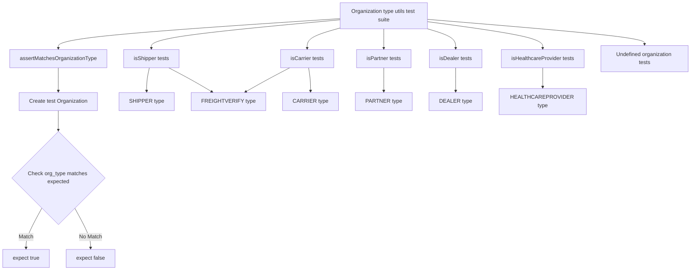
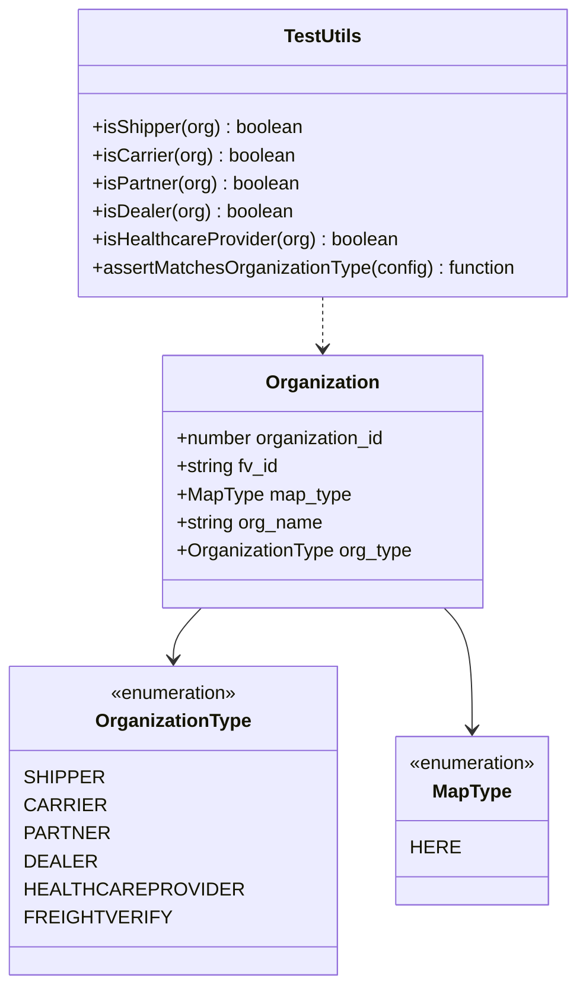
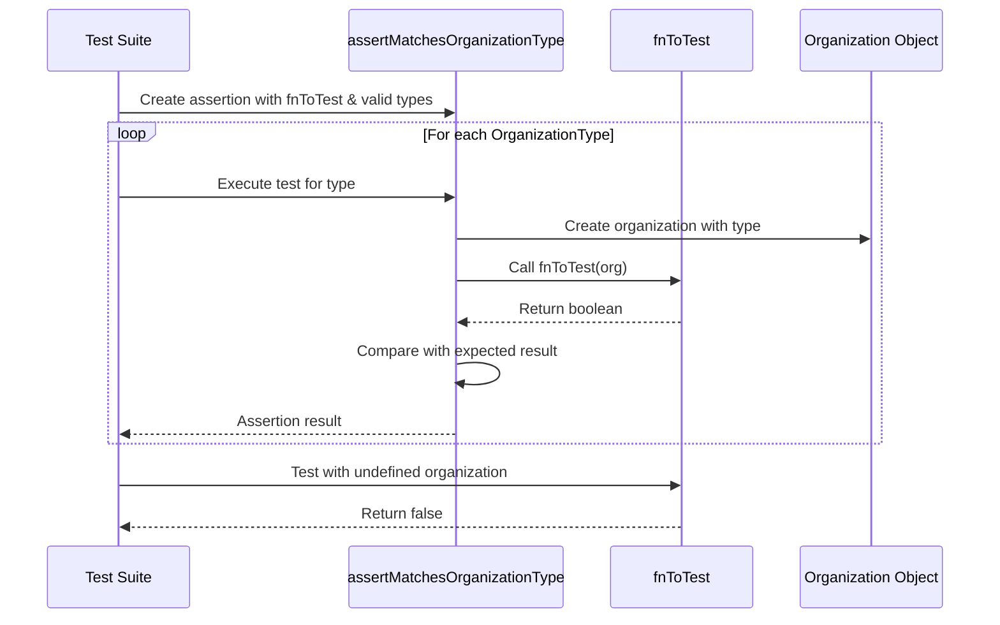
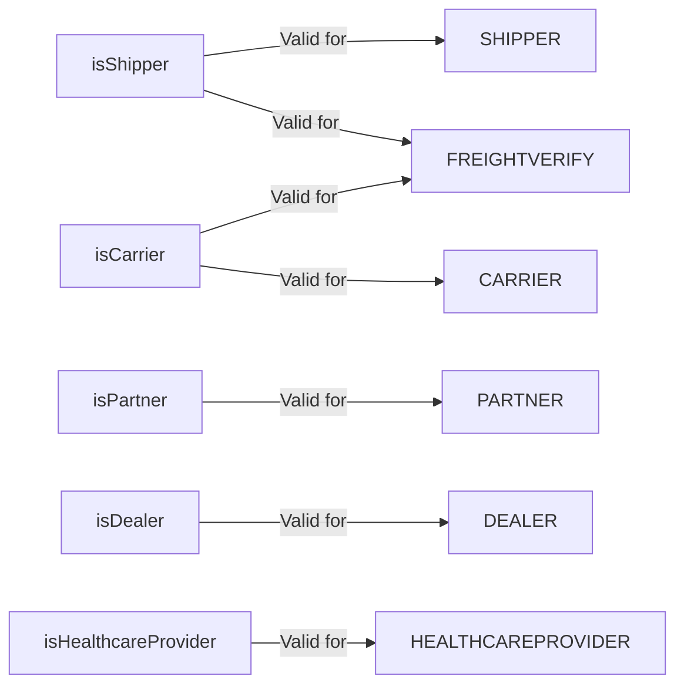

# Diagram: web/portal/src/shared/utils/tests/organizations.utils.test.ts

> Auto-generated by Obscura crawlers

## Diagram 1

### SVG

<svg id="container" width="2019.41015625" xmlns="http://www.w3.org/2000/svg" class="flowchart" height="782" viewBox="0 0 2019.41015625 782" role="graphics-document document" aria-roledescription="flowchart-v2"><g><marker id="container_flowchart-v2-pointEnd" class="marker flowchart-v2" viewBox="0 0 10 10" refX="5" refY="5" markerUnits="userSpaceOnUse" markerWidth="8" markerHeight="8" orient="auto"><path d="M 0 0 L 10 5 L 0 10 z" class="arrowMarkerPath" style="stroke-width: 1; stroke-dasharray: 1, 0;"></path></marker><marker id="container_flowchart-v2-pointStart" class="marker flowchart-v2" viewBox="0 0 10 10" refX="4.5" refY="5" markerUnits="userSpaceOnUse" markerWidth="8" markerHeight="8" orient="auto"><path d="M 0 5 L 10 10 L 10 0 z" class="arrowMarkerPath" style="stroke-width: 1; stroke-dasharray: 1, 0;"></path></marker><marker id="container_flowchart-v2-circleEnd" class="marker flowchart-v2" viewBox="0 0 10 10" refX="11" refY="5" markerUnits="userSpaceOnUse" markerWidth="11" markerHeight="11" orient="auto"><circle cx="5" cy="5" r="5" class="arrowMarkerPath" style="stroke-width: 1; stroke-dasharray: 1, 0;"></circle></marker><marker id="container_flowchart-v2-circleStart" class="marker flowchart-v2" viewBox="0 0 10 10" refX="-1" refY="5" markerUnits="userSpaceOnUse" markerWidth="11" markerHeight="11" orient="auto"><circle cx="5" cy="5" r="5" class="arrowMarkerPath" style="stroke-width: 1; stroke-dasharray: 1, 0;"></circle></marker><marker id="container_flowchart-v2-crossEnd" class="marker cross flowchart-v2" viewBox="0 0 11 11" refX="12" refY="5.2" markerUnits="userSpaceOnUse" markerWidth="11" markerHeight="11" orient="auto"><path d="M 1,1 l 9,9 M 10,1 l -9,9" class="arrowMarkerPath" style="stroke-width: 2; stroke-dasharray: 1, 0;"></path></marker><marker id="container_flowchart-v2-crossStart" class="marker cross flowchart-v2" viewBox="0 0 11 11" refX="-1" refY="5.2" markerUnits="userSpaceOnUse" markerWidth="11" markerHeight="11" orient="auto"><path d="M 1,1 l 9,9 M 10,1 l -9,9" class="arrowMarkerPath" style="stroke-width: 2; stroke-dasharray: 1, 0;"></path></marker><g class="root"><g class="clusters"></g><g class="edgePaths"><path d="M980.316,55.908L846.318,65.09C712.32,74.272,444.324,92.636,310.326,107.318C176.328,122,176.328,133,176.328,138.5L176.328,144" id="L_A_B_0" class="edge-thickness-normal edge-pattern-solid edge-thickness-normal edge-pattern-solid flowchart-link" style=";" data-edge="true" data-et="edge" data-id="L_A_B_0" data-points="W3sieCI6OTgwLjMxNjQwNjI1LCJ5Ijo1NS45MDgwMzQ2Nzk5MDUxNH0seyJ4IjoxNzYuMzI4MTI1LCJ5IjoxMTF9LHsieCI6MTc2LjMyODEyNSwieSI6MTQ4fV0=" marker-end="url(#container_flowchart-v2-pointEnd)"></path><path d="M176.328,202L176.328,208.167C176.328,214.333,176.328,226.667,176.328,236.333C176.328,246,176.328,253,176.328,256.5L176.328,260" id="L_B_C_0" class="edge-thickness-normal edge-pattern-solid edge-thickness-normal edge-pattern-solid flowchart-link" style=";" data-edge="true" data-et="edge" data-id="L_B_C_0" data-points="W3sieCI6MTc2LjMyODEyNSwieSI6MjAyfSx7IngiOjE3Ni4zMjgxMjUsInkiOjIzOX0seyJ4IjoxNzYuMzI4MTI1LCJ5IjoyNjR9XQ==" marker-end="url(#container_flowchart-v2-pointEnd)"></path><path d="M176.328,318L176.328,322.167C176.328,326.333,176.328,334.667,176.328,342.333C176.328,350,176.328,357,176.328,360.5L176.328,364" id="L_C_D_0" class="edge-thickness-normal edge-pattern-solid edge-thickness-normal edge-pattern-solid flowchart-link" style=";" data-edge="true" data-et="edge" data-id="L_C_D_0" data-points="W3sieCI6MTc2LjMyODEyNSwieSI6MzE4fSx7IngiOjE3Ni4zMjgxMjUsInkiOjM0M30seyJ4IjoxNzYuMzI4MTI1LCJ5IjozNjh9XQ==" marker-end="url(#container_flowchart-v2-pointEnd)"></path><path d="M126.868,596.54L118.908,610.95C110.949,625.36,95.029,654.18,87.069,674.09C79.109,694,79.109,705,79.109,710.5L79.109,716" id="L_D_E_0" class="edge-thickness-normal edge-pattern-solid edge-thickness-normal edge-pattern-solid flowchart-link" style=";" data-edge="true" data-et="edge" data-id="L_D_E_0" data-points="W3sieCI6MTI2Ljg2ODA5OTgzNzAxMjQ3LCJ5Ijo1OTYuNTM5OTc0ODM3MDEyNH0seyJ4Ijo3OS4xMDkzNzUsInkiOjY4M30seyJ4Ijo3OS4xMDkzNzUsInkiOjcyMH1d" marker-end="url(#container_flowchart-v2-pointEnd)"></path><path d="M225.788,596.54L233.748,610.95C241.708,625.36,257.627,654.18,265.587,674.09C273.547,694,273.547,705,273.547,710.5L273.547,716" id="L_D_F_0" class="edge-thickness-normal edge-pattern-solid edge-thickness-normal edge-pattern-solid flowchart-link" style=";" data-edge="true" data-et="edge" data-id="L_D_F_0" data-points="W3sieCI6MjI1Ljc4ODE1MDE2Mjk4NzUzLCJ5Ijo1OTYuNTM5OTc0ODM3MDEyNH0seyJ4IjoyNzMuNTQ2ODc1LCJ5Ijo2ODN9LHsieCI6MjczLjU0Njg3NSwieSI6NzIwfV0=" marker-end="url(#container_flowchart-v2-pointEnd)"></path><path d="M980.316,59.697L892.771,68.248C805.227,76.798,630.137,93.899,542.592,107.95C455.047,122,455.047,133,455.047,138.5L455.047,144" id="L_A_G_0" class="edge-thickness-normal edge-pattern-solid edge-thickness-normal edge-pattern-solid flowchart-link" style=";" data-edge="true" data-et="edge" data-id="L_A_G_0" data-points="W3sieCI6OTgwLjMxNjQwNjI1LCJ5Ijo1OS42OTcwNjUyNTgyMTMxNjV9LHsieCI6NDU1LjA0Njg3NSwieSI6MTExfSx7IngiOjQ1NS4wNDY4NzUsInkiOjE0OH1d" marker-end="url(#container_flowchart-v2-pointEnd)"></path><path d="M980.316,84.739L965.24,89.116C950.163,93.493,920.009,102.246,904.932,112.123C889.855,122,889.855,133,889.855,138.5L889.855,144" id="L_A_H_0" class="edge-thickness-normal edge-pattern-solid edge-thickness-normal edge-pattern-solid flowchart-link" style=";" data-edge="true" data-et="edge" data-id="L_A_H_0" data-points="W3sieCI6OTgwLjMxNjQwNjI1LCJ5Ijo4NC43MzkxMTE5NDU4NTIwOX0seyJ4Ijo4ODkuODU1NDY4NzUsInkiOjExMX0seyJ4Ijo4ODkuODU1NDY4NzUsInkiOjE0OH1d" marker-end="url(#container_flowchart-v2-pointEnd)"></path><path d="M1110.316,86L1110.316,90.167C1110.316,94.333,1110.316,102.667,1110.316,112.333C1110.316,122,1110.316,133,1110.316,138.5L1110.316,144" id="L_A_I_0" class="edge-thickness-normal edge-pattern-solid edge-thickness-normal edge-pattern-solid flowchart-link" style=";" data-edge="true" data-et="edge" data-id="L_A_I_0" data-points="W3sieCI6MTExMC4zMTY0MDYyNSwieSI6ODZ9LHsieCI6MTExMC4zMTY0MDYyNSwieSI6MTExfSx7IngiOjExMTAuMzE2NDA2MjUsInkiOjE0OH1d" marker-end="url(#container_flowchart-v2-pointEnd)"></path><path d="M1239.099,86L1252.858,90.167C1266.617,94.333,1294.135,102.667,1307.893,112.333C1321.652,122,1321.652,133,1321.652,138.5L1321.652,144" id="L_A_J_0" class="edge-thickness-normal edge-pattern-solid edge-thickness-normal edge-pattern-solid flowchart-link" style=";" data-edge="true" data-et="edge" data-id="L_A_J_0" data-points="W3sieCI6MTIzOS4wOTkyNDMxNjQwNjI1LCJ5Ijo4Nn0seyJ4IjoxMzIxLjY1MjM0Mzc1LCJ5IjoxMTF9LHsieCI6MTMyMS42NTIzNDM3NSwieSI6MTQ4fV0=" marker-end="url(#container_flowchart-v2-pointEnd)"></path><path d="M1240.316,64.859L1296.296,72.549C1352.275,80.239,1464.233,95.62,1520.212,108.81C1576.191,122,1576.191,133,1576.191,138.5L1576.191,144" id="L_A_K_0" class="edge-thickness-normal edge-pattern-solid edge-thickness-normal edge-pattern-solid flowchart-link" style=";" data-edge="true" data-et="edge" data-id="L_A_K_0" data-points="W3sieCI6MTI0MC4zMTY0MDYyNSwieSI6NjQuODU4ODY3NzIyMDI4NDR9LHsieCI6MTU3Ni4xOTE0MDYyNSwieSI6MTExfSx7IngiOjE1NzYuMTkxNDA2MjUsInkiOjE0OH1d" marker-end="url(#container_flowchart-v2-pointEnd)"></path><path d="M1240.316,57.79L1347.165,66.658C1454.014,75.527,1667.712,93.263,1774.561,105.632C1881.41,118,1881.41,125,1881.41,128.5L1881.41,132" id="L_A_L_0" class="edge-thickness-normal edge-pattern-solid edge-thickness-normal edge-pattern-solid flowchart-link" style=";" data-edge="true" data-et="edge" data-id="L_A_L_0" data-points="W3sieCI6MTI0MC4zMTY0MDYyNSwieSI6NTcuNzg5ODY4Mjg3NzQwNjN9LHsieCI6MTg4MS40MTAxNTYyNSwieSI6MTExfSx7IngiOjE4ODEuNDEwMTU2MjUsInkiOjEzNn1d" marker-end="url(#container_flowchart-v2-pointEnd)"></path><path d="M448.061,202L446.466,208.167C444.87,214.333,441.679,226.667,440.084,236.333C438.488,246,438.488,253,438.488,256.5L438.488,260" id="L_G_M_0" class="edge-thickness-normal edge-pattern-solid edge-thickness-normal edge-pattern-solid flowchart-link" style=";" data-edge="true" data-et="edge" data-id="L_G_M_0" data-points="W3sieCI6NDQ4LjA2MTIxODI2MTcxODc1LCJ5IjoyMDJ9LHsieCI6NDM4LjQ4ODI4MTI1LCJ5IjoyMzl9LHsieCI6NDM4LjQ4ODI4MTI1LCJ5IjoyNjR9XQ==" marker-end="url(#container_flowchart-v2-pointEnd)"></path><path d="M503.744,202L514.866,208.167C525.988,214.333,548.232,226.667,566.687,236.69C585.141,246.713,599.806,254.425,607.138,258.282L614.471,262.138" id="L_G_N_0" class="edge-thickness-normal edge-pattern-solid edge-thickness-normal edge-pattern-solid flowchart-link" style=";" data-edge="true" data-et="edge" data-id="L_G_N_0" data-points="W3sieCI6NTAzLjc0Mzc3NDQxNDA2MjUsInkiOjIwMn0seyJ4Ijo1NzAuNDc2NTYyNSwieSI6MjM5fSx7IngiOjYxOC4wMTA3NDIxODc1LCJ5IjoyNjR9XQ==" marker-end="url(#container_flowchart-v2-pointEnd)"></path><path d="M894.074,202L895.038,208.167C896.001,214.333,897.928,226.667,898.892,236.333C899.855,246,899.855,253,899.855,256.5L899.855,260" id="L_H_O_0" class="edge-thickness-normal edge-pattern-solid edge-thickness-normal edge-pattern-solid flowchart-link" style=";" data-edge="true" data-et="edge" data-id="L_H_O_0" data-points="W3sieCI6ODk0LjA3NDIxODc1LCJ5IjoyMDJ9LHsieCI6ODk5Ljg1NTQ2ODc1LCJ5IjoyMzl9LHsieCI6ODk5Ljg1NTQ2ODc1LCJ5IjoyNjR9XQ==" marker-end="url(#container_flowchart-v2-pointEnd)"></path><path d="M841.233,202L830.128,208.167C819.022,214.333,796.812,226.667,777.871,236.705C758.929,246.743,743.257,254.486,735.421,258.357L727.585,262.228" id="L_H_N_0" class="edge-thickness-normal edge-pattern-solid edge-thickness-normal edge-pattern-solid flowchart-link" style=";" data-edge="true" data-et="edge" data-id="L_H_N_0" data-points="W3sieCI6ODQxLjIzMjcyNzA1MDc4MTIsInkiOjIwMn0seyJ4Ijo3NzQuNjAxNTYyNSwieSI6MjM5fSx7IngiOjcyMy45OTg3MjI5NTY3MzA3LCJ5IjoyNjR9XQ==" marker-end="url(#container_flowchart-v2-pointEnd)"></path><path d="M1110.316,202L1110.316,208.167C1110.316,214.333,1110.316,226.667,1110.316,236.333C1110.316,246,1110.316,253,1110.316,256.5L1110.316,260" id="L_I_P_0" class="edge-thickness-normal edge-pattern-solid edge-thickness-normal edge-pattern-solid flowchart-link" style=";" data-edge="true" data-et="edge" data-id="L_I_P_0" data-points="W3sieCI6MTExMC4zMTY0MDYyNSwieSI6MjAyfSx7IngiOjExMTAuMzE2NDA2MjUsInkiOjIzOX0seyJ4IjoxMTEwLjMxNjQwNjI1LCJ5IjoyNjR9XQ==" marker-end="url(#container_flowchart-v2-pointEnd)"></path><path d="M1321.652,202L1321.652,208.167C1321.652,214.333,1321.652,226.667,1321.652,236.333C1321.652,246,1321.652,253,1321.652,256.5L1321.652,260" id="L_J_Q_0" class="edge-thickness-normal edge-pattern-solid edge-thickness-normal edge-pattern-solid flowchart-link" style=";" data-edge="true" data-et="edge" data-id="L_J_Q_0" data-points="W3sieCI6MTMyMS42NTIzNDM3NSwieSI6MjAyfSx7IngiOjEzMjEuNjUyMzQzNzUsInkiOjIzOX0seyJ4IjoxMzIxLjY1MjM0Mzc1LCJ5IjoyNjR9XQ==" marker-end="url(#container_flowchart-v2-pointEnd)"></path><path d="M1576.191,202L1576.191,208.167C1576.191,214.333,1576.191,226.667,1576.191,236.333C1576.191,246,1576.191,253,1576.191,256.5L1576.191,260" id="L_K_R_0" class="edge-thickness-normal edge-pattern-solid edge-thickness-normal edge-pattern-solid flowchart-link" style=";" data-edge="true" data-et="edge" data-id="L_K_R_0" data-points="W3sieCI6MTU3Ni4xOTE0MDYyNSwieSI6MjAyfSx7IngiOjE1NzYuMTkxNDA2MjUsInkiOjIzOX0seyJ4IjoxNTc2LjE5MTQwNjI1LCJ5IjoyNjR9XQ==" marker-end="url(#container_flowchart-v2-pointEnd)"></path></g><g class="edgeLabels"><g class="edgeLabel"><g class="label" data-id="L_A_B_0" transform="translate(0, 0)"><foreignObject width="0" height="0">

</foreignObject></g></g><g class="edgeLabel"><g class="label" data-id="L_B_C_0" transform="translate(0, 0)"><foreignObject width="0" height="0">

</foreignObject></g></g><g class="edgeLabel"><g class="label" data-id="L_C_D_0" transform="translate(0, 0)"><foreignObject width="0" height="0">

</foreignObject></g></g><g class="edgeLabel" transform="translate(79.109375, 683)"><g class="label" data-id="L_D_E_0" transform="translate(-21.859375, -12)"><foreignObject width="43.71875" height="24">

Match

</foreignObject></g></g><g class="edgeLabel" transform="translate(273.546875, 683)"><g class="label" data-id="L_D_F_0" transform="translate(-34.1171875, -12)"><foreignObject width="68.234375" height="24">

No Match

</foreignObject></g></g><g class="edgeLabel"><g class="label" data-id="L_A_G_0" transform="translate(0, 0)"><foreignObject width="0" height="0">

</foreignObject></g></g><g class="edgeLabel"><g class="label" data-id="L_A_H_0" transform="translate(0, 0)"><foreignObject width="0" height="0">

</foreignObject></g></g><g class="edgeLabel"><g class="label" data-id="L_A_I_0" transform="translate(0, 0)"><foreignObject width="0" height="0">

</foreignObject></g></g><g class="edgeLabel"><g class="label" data-id="L_A_J_0" transform="translate(0, 0)"><foreignObject width="0" height="0">

</foreignObject></g></g><g class="edgeLabel"><g class="label" data-id="L_A_K_0" transform="translate(0, 0)"><foreignObject width="0" height="0">

</foreignObject></g></g><g class="edgeLabel"><g class="label" data-id="L_A_L_0" transform="translate(0, 0)"><foreignObject width="0" height="0">

</foreignObject></g></g><g class="edgeLabel"><g class="label" data-id="L_G_M_0" transform="translate(0, 0)"><foreignObject width="0" height="0">

</foreignObject></g></g><g class="edgeLabel"><g class="label" data-id="L_G_N_0" transform="translate(0, 0)"><foreignObject width="0" height="0">

</foreignObject></g></g><g class="edgeLabel"><g class="label" data-id="L_H_O_0" transform="translate(0, 0)"><foreignObject width="0" height="0">

</foreignObject></g></g><g class="edgeLabel"><g class="label" data-id="L_H_N_0" transform="translate(0, 0)"><foreignObject width="0" height="0">

</foreignObject></g></g><g class="edgeLabel"><g class="label" data-id="L_I_P_0" transform="translate(0, 0)"><foreignObject width="0" height="0">

</foreignObject></g></g><g class="edgeLabel"><g class="label" data-id="L_J_Q_0" transform="translate(0, 0)"><foreignObject width="0" height="0">

</foreignObject></g></g><g class="edgeLabel"><g class="label" data-id="L_K_R_0" transform="translate(0, 0)"><foreignObject width="0" height="0">

</foreignObject></g></g></g><g class="nodes"><g class="node default" id="flowchart-A-0" transform="translate(1110.31640625, 47)"><rect class="basic label-container" style="" x="-130" y="-39" width="260" height="78"></rect><g class="label" style="" transform="translate(-100, -24)"><rect></rect><foreignObject width="200" height="48">

Organization type utils test suite

</foreignObject></g></g><g class="node default" id="flowchart-B-1" transform="translate(176.328125, 175)"><rect class="basic label-container" style="" x="-144.859375" y="-27" width="289.71875" height="54"></rect><g class="label" style="" transform="translate(-114.859375, -12)"><rect></rect><foreignObject width="229.71875" height="24">

assertMatchesOrganizationType

</foreignObject></g></g><g class="node default" id="flowchart-C-3" transform="translate(176.328125, 291)"><rect class="basic label-container" style="" x="-117.0078125" y="-27" width="234.015625" height="54"></rect><g class="label" style="" transform="translate(-87.0078125, -12)"><rect></rect><foreignObject width="174.015625" height="24">

Create test Organization

</foreignObject></g></g><g class="node default" id="flowchart-D-5" transform="translate(176.328125, 507)"><polygon points="139,0 278,-139 139,-278 0,-139" class="label-container" transform="translate(-138.5, 139)"></polygon><g class="label" style="" transform="translate(-100, -24)"><rect></rect><foreignObject width="200" height="48">

Check org_type matches expected

</foreignObject></g></g><g class="node default" id="flowchart-E-7" transform="translate(79.109375, 747)"><rect class="basic label-container" style="" x="-71.109375" y="-27" width="142.21875" height="54"></rect><g class="label" style="" transform="translate(-41.109375, -12)"><rect></rect><foreignObject width="82.21875" height="24">

expect true

</foreignObject></g></g><g class="node default" id="flowchart-F-9" transform="translate(273.546875, 747)"><rect class="basic label-container" style="" x="-73.328125" y="-27" width="146.65625" height="54"></rect><g class="label" style="" transform="translate(-43.328125, -12)"><rect></rect><foreignObject width="86.65625" height="24">

expect false

</foreignObject></g></g><g class="node default" id="flowchart-G-11" transform="translate(455.046875, 175)"><rect class="basic label-container" style="" x="-83.859375" y="-27" width="167.71875" height="54"></rect><g class="label" style="" transform="translate(-53.859375, -12)"><rect></rect><foreignObject width="107.71875" height="24">

isShipper tests

</foreignObject></g></g><g class="node default" id="flowchart-H-13" transform="translate(889.85546875, 175)"><rect class="basic label-container" style="" x="-80.234375" y="-27" width="160.46875" height="54"></rect><g class="label" style="" transform="translate(-50.234375, -12)"><rect></rect><foreignObject width="100.46875" height="24">

isCarrier tests

</foreignObject></g></g><g class="node default" id="flowchart-I-15" transform="translate(1110.31640625, 175)"><rect class="basic label-container" style="" x="-82.2734375" y="-27" width="164.546875" height="54"></rect><g class="label" style="" transform="translate(-52.2734375, -12)"><rect></rect><foreignObject width="104.546875" height="24">

isPartner tests

</foreignObject></g></g><g class="node default" id="flowchart-J-17" transform="translate(1321.65234375, 175)"><rect class="basic label-container" style="" x="-79.0625" y="-27" width="158.125" height="54"></rect><g class="label" style="" transform="translate(-49.0625, -12)"><rect></rect><foreignObject width="98.125" height="24">

isDealer tests

</foreignObject></g></g><g class="node default" id="flowchart-K-19" transform="translate(1576.19140625, 175)"><rect class="basic label-container" style="" x="-125.21875" y="-27" width="250.4375" height="54"></rect><g class="label" style="" transform="translate(-95.21875, -12)"><rect></rect><foreignObject width="190.4375" height="24">

isHealthcareProvider tests

</foreignObject></g></g><g class="node default" id="flowchart-L-21" transform="translate(1881.41015625, 175)"><rect class="basic label-container" style="" x="-130" y="-39" width="260" height="78"></rect><g class="label" style="" transform="translate(-100, -24)"><rect></rect><foreignObject width="200" height="48">

Undefined organization tests

</foreignObject></g></g><g class="node default" id="flowchart-M-23" transform="translate(438.48828125, 291)"><rect class="basic label-container" style="" x="-78.59375" y="-27" width="157.1875" height="54"></rect><g class="label" style="" transform="translate(-48.59375, -12)"><rect></rect><foreignObject width="97.1875" height="24">

SHIPPER type

</foreignObject></g></g><g class="node default" id="flowchart-N-25" transform="translate(669.34765625, 291)"><rect class="basic label-container" style="" x="-102.265625" y="-27" width="204.53125" height="54"></rect><g class="label" style="" transform="translate(-72.265625, -12)"><rect></rect><foreignObject width="144.53125" height="24">

FREIGHTVERIFY type

</foreignObject></g></g><g class="node default" id="flowchart-O-27" transform="translate(899.85546875, 291)"><rect class="basic label-container" style="" x="-78.2421875" y="-27" width="156.484375" height="54"></rect><g class="label" style="" transform="translate(-48.2421875, -12)"><rect></rect><foreignObject width="96.484375" height="24">

CARRIER type

</foreignObject></g></g><g class="node default" id="flowchart-P-31" transform="translate(1110.31640625, 291)"><rect class="basic label-container" style="" x="-80.171875" y="-27" width="160.34375" height="54"></rect><g class="label" style="" transform="translate(-50.171875, -12)"><rect></rect><foreignObject width="100.34375" height="24">

PARTNER type

</foreignObject></g></g><g class="node default" id="flowchart-Q-33" transform="translate(1321.65234375, 291)"><rect class="basic label-container" style="" x="-75.140625" y="-27" width="150.28125" height="54"></rect><g class="label" style="" transform="translate(-45.140625, -12)"><rect></rect><foreignObject width="90.28125" height="24">

DEALER type

</foreignObject></g></g><g class="node default" id="flowchart-R-35" transform="translate(1576.19140625, 291)"><rect class="basic label-container" style="" x="-129.3984375" y="-27" width="258.796875" height="54"></rect><g class="label" style="" transform="translate(-99.3984375, -12)"><rect></rect><foreignObject width="198.796875" height="24">

HEALTHCAREPROVIDER type

</foreignObject></g></g></g></g></g></svg>

## Diagram 2

### SVG

<svg id="container" width="473.109375" xmlns="http://www.w3.org/2000/svg" class="classDiagram" height="842" viewBox="0 0 473.109375 842" role="graphics-document document" aria-roledescription="class"><g><defs><marker id="container_class-aggregationStart" class="marker aggregation class" refX="18" refY="7" markerWidth="190" markerHeight="240" orient="auto"><path d="M 18,7 L9,13 L1,7 L9,1 Z"></path></marker></defs><defs><marker id="container_class-aggregationEnd" class="marker aggregation class" refX="1" refY="7" markerWidth="20" markerHeight="28" orient="auto"><path d="M 18,7 L9,13 L1,7 L9,1 Z"></path></marker></defs><defs><marker id="container_class-extensionStart" class="marker extension class" refX="18" refY="7" markerWidth="190" markerHeight="240" orient="auto"><path d="M 1,7 L18,13 V 1 Z"></path></marker></defs><defs><marker id="container_class-extensionEnd" class="marker extension class" refX="1" refY="7" markerWidth="20" markerHeight="28" orient="auto"><path d="M 1,1 V 13 L18,7 Z"></path></marker></defs><defs><marker id="container_class-compositionStart" class="marker composition class" refX="18" refY="7" markerWidth="190" markerHeight="240" orient="auto"><path d="M 18,7 L9,13 L1,7 L9,1 Z"></path></marker></defs><defs><marker id="container_class-compositionEnd" class="marker composition class" refX="1" refY="7" markerWidth="20" markerHeight="28" orient="auto"><path d="M 18,7 L9,13 L1,7 L9,1 Z"></path></marker></defs><defs><marker id="container_class-dependencyStart" class="marker dependency class" refX="6" refY="7" markerWidth="190" markerHeight="240" orient="auto"><path d="M 5,7 L9,13 L1,7 L9,1 Z"></path></marker></defs><defs><marker id="container_class-dependencyEnd" class="marker dependency class" refX="13" refY="7" markerWidth="20" markerHeight="28" orient="auto"><path d="M 18,7 L9,13 L14,7 L9,1 Z"></path></marker></defs><defs><marker id="container_class-lollipopStart" class="marker lollipop class" refX="13" refY="7" markerWidth="190" markerHeight="240" orient="auto"><circle stroke="black" fill="transparent" cx="7" cy="7" r="6"></circle></marker></defs><defs><marker id="container_class-lollipopEnd" class="marker lollipop class" refX="1" refY="7" markerWidth="190" markerHeight="240" orient="auto"><circle stroke="black" fill="transparent" cx="7" cy="7" r="6"></circle></marker></defs><g class="root"><g class="clusters"></g><g class="edgePaths"><path d="M156.232,520L152.427,524.167C148.621,528.333,141.01,536.667,137.204,544C133.398,551.333,133.398,557.667,133.398,560.833L133.398,564" id="id_Organization_OrganizationType_1" class="edge-thickness-normal edge-pattern-solid relation" style=";;;" data-edge="true" data-et="edge" data-id="id_Organization_OrganizationType_1" data-points="W3sieCI6MTU2LjIzMjM3NzgxOTU0ODg3LCJ5Ijo1MjB9LHsieCI6MTMzLjM5ODQzNzUsInkiOjU0NX0seyJ4IjoxMzMuMzk4NDM3NSwieSI6NTcwfV0=" marker-end="url(#container_class-dependencyEnd)"></path><path d="M353.518,520L357.323,524.167C361.129,528.333,368.74,536.667,372.546,554C376.352,571.333,376.352,597.667,376.352,610.833L376.352,624" id="id_Organization_MapType_2" class="edge-thickness-normal edge-pattern-solid relation" style=";;;" data-edge="true" data-et="edge" data-id="id_Organization_MapType_2" data-points="W3sieCI6MzUzLjUxNzYyMjE4MDQ1MTEsInkiOjUyMH0seyJ4IjozNzYuMzUxNTYyNSwieSI6NTQ1fSx7IngiOjM3Ni4zNTE1NjI1LCJ5Ijo2MzB9XQ==" marker-end="url(#container_class-dependencyEnd)"></path><path d="M254.875,254L254.875,258.167C254.875,262.333,254.875,270.667,254.875,278C254.875,285.333,254.875,291.667,254.875,294.833L254.875,298" id="id_TestUtils_Organization_3" class="edge-thickness-normal edge-pattern-dashed relation" style=";;;" data-edge="true" data-et="edge" data-id="id_TestUtils_Organization_3" data-points="W3sieCI6MjU0Ljg3NSwieSI6MjU0fSx7IngiOjI1NC44NzUsInkiOjI3OX0seyJ4IjoyNTQuODc1LCJ5IjozMDR9XQ==" marker-end="url(#container_class-dependencyEnd)"></path></g><g class="edgeLabels"><g class="edgeLabel"><g class="label" data-id="id_Organization_OrganizationType_1" transform="translate(0, 0)"><foreignObject width="0" height="0">

</foreignObject></g></g><g class="edgeLabel"><g class="label" data-id="id_Organization_MapType_2" transform="translate(0, 0)"><foreignObject width="0" height="0">

</foreignObject></g></g><g class="edgeLabel"><g class="label" data-id="id_TestUtils_Organization_3" transform="translate(0, 0)"><foreignObject width="0" height="0">

</foreignObject></g></g></g><g class="nodes"><g class="node default" id="classId-Organization-0" transform="translate(254.875, 412)"><g class="basic label-container"><path d="M-136.09765625 -108 L136.09765625 -108 L136.09765625 108 L-136.09765625 108" stroke="none" stroke-width="0" fill="#ECECFF" style=""></path><path d="M-136.09765625 -108 C-65.60109057191005 -108, 4.895475106179902 -108, 136.09765625 -108 M-136.09765625 -108 C-61.99984253975872 -108, 12.097971170482566 -108, 136.09765625 -108 M136.09765625 -108 C136.09765625 -63.88356810589993, 136.09765625 -19.767136211799865, 136.09765625 108 M136.09765625 -108 C136.09765625 -44.48258001356191, 136.09765625 19.034839972876185, 136.09765625 108 M136.09765625 108 C80.53608056747981 108, 24.97450488495963 108, -136.09765625 108 M136.09765625 108 C40.90118458967649 108, -54.29528707064702 108, -136.09765625 108 M-136.09765625 108 C-136.09765625 34.283896708147395, -136.09765625 -39.43220658370521, -136.09765625 -108 M-136.09765625 108 C-136.09765625 58.67780285619095, -136.09765625 9.355605712381902, -136.09765625 -108" stroke="#9370DB" stroke-width="1.3" fill="none" stroke-dasharray="0 0" style=""></path></g><g class="annotation-group text" transform="translate(0, -84)"></g><g class="label-group text" transform="translate(-46.6953125, -84)"><g class="label" style="font-weight: bolder" transform="translate(0,-12)"><foreignObject width="93.390625" height="24">

Organization

</foreignObject></g></g><g class="members-group text" transform="translate(-124.09765625, -36)"><g class="label" style="" transform="translate(0,-12)"><foreignObject width="181.78125" height="24">

+number organization_id

</foreignObject></g><g class="label" style="" transform="translate(0,12)"><foreignObject width="89.015625" height="24">

+string fv_id

</foreignObject></g><g class="label" style="" transform="translate(0,36)"><foreignObject width="148.015625" height="24">

+MapType map_type

</foreignObject></g><g class="label" style="" transform="translate(0,60)"><foreignObject width="126.359375" height="24">

+string org_name

</foreignObject></g><g class="label" style="" transform="translate(0,84)"><foreignObject width="201.5" height="24">

+OrganizationType org_type

</foreignObject></g></g><g class="methods-group text" transform="translate(-124.09765625, 108)"></g><g class="divider" style=""><path d="M-136.09765625 -60 C-27.75407814713381 -60, 80.58949995573238 -60, 136.09765625 -60 M-136.09765625 -60 C-34.15178091203545 -60, 67.7940944259291 -60, 136.09765625 -60" stroke="#9370DB" stroke-width="1.3" fill="none" stroke-dasharray="0 0" style=""></path></g><g class="divider" style=""><path d="M-136.09765625 84 C-66.09260627627428 84, 3.9124436974514367 84, 136.09765625 84 M-136.09765625 84 C-33.829597460562155 84, 68.43846132887569 84, 136.09765625 84" stroke="#9370DB" stroke-width="1.3" fill="none" stroke-dasharray="0 0" style=""></path></g></g><g class="node default" id="classId-OrganizationType-1" transform="translate(133.3984375, 702)"><g class="basic label-container"><path d="M-125.3984375 -132 L125.3984375 -132 L125.3984375 132 L-125.3984375 132" stroke="none" stroke-width="0" fill="#ECECFF" style=""></path><path d="M-125.3984375 -132 C-26.823745911077566 -132, 71.75094567784487 -132, 125.3984375 -132 M-125.3984375 -132 C-46.80711348513462 -132, 31.784210529730757 -132, 125.3984375 -132 M125.3984375 -132 C125.3984375 -46.10106965102533, 125.3984375 39.797860697949346, 125.3984375 132 M125.3984375 -132 C125.3984375 -46.11415847809337, 125.3984375 39.771683043813255, 125.3984375 132 M125.3984375 132 C39.6623098331448 132, -46.07381783371039 132, -125.3984375 132 M125.3984375 132 C47.07567296731558 132, -31.247091565368834 132, -125.3984375 132 M-125.3984375 132 C-125.3984375 29.84166679976539, -125.3984375 -72.31666640046922, -125.3984375 -132 M-125.3984375 132 C-125.3984375 75.3530900501325, -125.3984375 18.706180100264987, -125.3984375 -132" stroke="#9370DB" stroke-width="1.3" fill="none" stroke-dasharray="0 0" style=""></path></g><g class="annotation-group text" transform="translate(-55.5546875, -108)"><g class="label" style="" transform="translate(0,-12)"><foreignObject width="111.109375" height="24">

«enumeration»

</foreignObject></g></g><g class="label-group text" transform="translate(-64.03125, -84)"><g class="label" style="font-weight: bolder" transform="translate(0,-12)"><foreignObject width="128.0625" height="24">

OrganizationType

</foreignObject></g></g><g class="members-group text" transform="translate(-113.3984375, -36)"><g class="label" style="" transform="translate(0,-12)"><foreignObject width="61.15625" height="24">

SHIPPER

</foreignObject></g><g class="label" style="" transform="translate(0,12)"><foreignObject width="60.453125" height="24">

CARRIER

</foreignObject></g><g class="label" style="" transform="translate(0,36)"><foreignObject width="64.3125" height="24">

PARTNER

</foreignObject></g><g class="label" style="" transform="translate(0,60)"><foreignObject width="54.25" height="24">

DEALER

</foreignObject></g><g class="label" style="" transform="translate(0,84)"><foreignObject width="162.765625" height="24">

HEALTHCAREPROVIDER

</foreignObject></g><g class="label" style="" transform="translate(0,108)"><foreignObject width="108.5" height="24">

FREIGHTVERIFY

</foreignObject></g></g><g class="methods-group text" transform="translate(-113.3984375, 132)"></g><g class="divider" style=""><path d="M-125.3984375 -60 C-69.30841056035757 -60, -13.21838362071513 -60, 125.3984375 -60 M-125.3984375 -60 C-64.98298870217327 -60, -4.567539904346546 -60, 125.3984375 -60" stroke="#9370DB" stroke-width="1.3" fill="none" stroke-dasharray="0 0" style=""></path></g><g class="divider" style=""><path d="M-125.3984375 108 C-46.497029409575035 108, 32.40437868084993 108, 125.3984375 108 M-125.3984375 108 C-60.45950213368809 108, 4.479433232623819 108, 125.3984375 108" stroke="#9370DB" stroke-width="1.3" fill="none" stroke-dasharray="0 0" style=""></path></g></g><g class="node default" id="classId-MapType-2" transform="translate(376.3515625, 702)"><g class="basic label-container"><path d="M-67.5546875 -72 L67.5546875 -72 L67.5546875 72 L-67.5546875 72" stroke="none" stroke-width="0" fill="#ECECFF" style=""></path><path d="M-67.5546875 -72 C-35.744991865485936 -72, -3.935296230971872 -72, 67.5546875 -72 M-67.5546875 -72 C-31.94654727719474 -72, 3.661592945610522 -72, 67.5546875 -72 M67.5546875 -72 C67.5546875 -34.593676195141185, 67.5546875 2.8126476097176294, 67.5546875 72 M67.5546875 -72 C67.5546875 -23.7586881584254, 67.5546875 24.4826236831492, 67.5546875 72 M67.5546875 72 C23.428851267178125 72, -20.69698496564375 72, -67.5546875 72 M67.5546875 72 C37.829581423884065 72, 8.104475347768123 72, -67.5546875 72 M-67.5546875 72 C-67.5546875 16.927145748079525, -67.5546875 -38.14570850384095, -67.5546875 -72 M-67.5546875 72 C-67.5546875 27.723439711078683, -67.5546875 -16.553120577842634, -67.5546875 -72" stroke="#9370DB" stroke-width="1.3" fill="none" stroke-dasharray="0 0" style=""></path></g><g class="annotation-group text" transform="translate(-55.5546875, -48)"><g class="label" style="" transform="translate(0,-12)"><foreignObject width="111.109375" height="24">

«enumeration»

</foreignObject></g></g><g class="label-group text" transform="translate(-32.7890625, -24)"><g class="label" style="font-weight: bolder" transform="translate(0,-12)"><foreignObject width="65.578125" height="24">

MapType

</foreignObject></g></g><g class="members-group text" transform="translate(-55.5546875, 24)"><g class="label" style="" transform="translate(0,-12)"><foreignObject width="37.6875" height="24">

HERE

</foreignObject></g></g><g class="methods-group text" transform="translate(-55.5546875, 72)"></g><g class="divider" style=""><path d="M-67.5546875 0 C-20.194933818965104 0, 27.16481986206979 0, 67.5546875 0 M-67.5546875 0 C-34.01391154816145 0, -0.4731355963229049 0, 67.5546875 0" stroke="#9370DB" stroke-width="1.3" fill="none" stroke-dasharray="0 0" style=""></path></g><g class="divider" style=""><path d="M-67.5546875 48 C-18.526780399712976 48, 30.501126700574048 48, 67.5546875 48 M-67.5546875 48 C-16.898136337055504 48, 33.75841482588899 48, 67.5546875 48" stroke="#9370DB" stroke-width="1.3" fill="none" stroke-dasharray="0 0" style=""></path></g></g><g class="node default" id="classId-TestUtils-3" transform="translate(254.875, 131)"><g class="basic label-container"><path d="M-210.234375 -123 L210.234375 -123 L210.234375 123 L-210.234375 123" stroke="none" stroke-width="0" fill="#ECECFF" style=""></path><path d="M-210.234375 -123 C-62.9572415261064 -123, 84.3198919477872 -123, 210.234375 -123 M-210.234375 -123 C-108.99266845459667 -123, -7.750961909193336 -123, 210.234375 -123 M210.234375 -123 C210.234375 -50.22820212931832, 210.234375 22.54359574136336, 210.234375 123 M210.234375 -123 C210.234375 -31.234019269630778, 210.234375 60.531961460738444, 210.234375 123 M210.234375 123 C52.340053765786735 123, -105.55426746842653 123, -210.234375 123 M210.234375 123 C117.66222277478502 123, 25.090070549570044 123, -210.234375 123 M-210.234375 123 C-210.234375 50.08243992294106, -210.234375 -22.835120154117874, -210.234375 -123 M-210.234375 123 C-210.234375 71.51807821268395, -210.234375 20.036156425367892, -210.234375 -123" stroke="#9370DB" stroke-width="1.3" fill="none" stroke-dasharray="0 0" style=""></path></g><g class="annotation-group text" transform="translate(0, -99)"></g><g class="label-group text" transform="translate(-32.046875, -99)"><g class="label" style="font-weight: bolder" transform="translate(0,-12)"><foreignObject width="64.09375" height="24">

TestUtils

</foreignObject></g></g><g class="members-group text" transform="translate(-198.234375, -51)"></g><g class="methods-group text" transform="translate(-198.234375, -21)"><g class="label" style="" transform="translate(0,-12)"><foreignObject width="182.21875" height="24">

+isShipper(org) : boolean

</foreignObject></g><g class="label" style="" transform="translate(0,12)"><foreignObject width="174.96875" height="24">

+isCarrier(org) : boolean

</foreignObject></g><g class="label" style="" transform="translate(0,36)"><foreignObject width="179.046875" height="24">

+isPartner(org) : boolean

</foreignObject></g><g class="label" style="" transform="translate(0,60)"><foreignObject width="172.609375" height="24">

+isDealer(org) : boolean

</foreignObject></g><g class="label" style="" transform="translate(0,84)"><foreignObject width="264.9375" height="24">

+isHealthcareProvider(org) : boolean

</foreignObject></g><g class="label" style="" transform="translate(0,108)"><foreignObject width="364.421875" height="24">

+assertMatchesOrganizationType(config) : function

</foreignObject></g></g><g class="divider" style=""><path d="M-210.234375 -75 C-71.28469013784442 -75, 67.66499472431116 -75, 210.234375 -75 M-210.234375 -75 C-111.79420824851013 -75, -13.354041497020262 -75, 210.234375 -75" stroke="#9370DB" stroke-width="1.3" fill="none" stroke-dasharray="0 0" style=""></path></g><g class="divider" style=""><path d="M-210.234375 -51 C-49.53935036102169 -51, 111.15567427795662 -51, 210.234375 -51 M-210.234375 -51 C-67.56137131342413 -51, 75.11163237315174 -51, 210.234375 -51" stroke="#9370DB" stroke-width="1.3" fill="none" stroke-dasharray="0 0" style=""></path></g></g></g></g></g></svg>

## Diagram 3

### SVG

<svg id="container" width="1100" xmlns="http://www.w3.org/2000/svg" height="688" viewBox="-50 -10 1100 688" role="graphics-document document" aria-roledescription="sequence"><g><rect x="836" y="602" fill="#eaeaea" stroke="#666" width="164" height="65" name="Org" rx="3" ry="3" class="actor actor-bottom"></rect><text x="918" y="634.5" dominant-baseline="central" alignment-baseline="central" class="actor actor-box" style="text-anchor: middle; font-size: 16px; font-weight: 400;"><tspan x="918" dy="0">Organization Object</tspan></text></g><g><rect x="636" y="602" fill="#eaeaea" stroke="#666" width="150" height="65" name="Fn" rx="3" ry="3" class="actor actor-bottom"></rect><text x="711" y="634.5" dominant-baseline="central" alignment-baseline="central" class="actor actor-box" style="text-anchor: middle; font-size: 16px; font-weight: 400;"><tspan x="711" dy="0">fnToTest</tspan></text></g><g><rect x="336" y="602" fill="#eaeaea" stroke="#666" width="250" height="65" name="Assert" rx="3" ry="3" class="actor actor-bottom"></rect><text x="461" y="634.5" dominant-baseline="central" alignment-baseline="central" class="actor actor-box" style="text-anchor: middle; font-size: 16px; font-weight: 400;"><tspan x="461" dy="0">assertMatchesOrganizationType</tspan></text></g><g><rect x="0" y="602" fill="#eaeaea" stroke="#666" width="150" height="65" name="Test" rx="3" ry="3" class="actor actor-bottom"></rect><text x="75" y="634.5" dominant-baseline="central" alignment-baseline="central" class="actor actor-box" style="text-anchor: middle; font-size: 16px; font-weight: 400;"><tspan x="75" dy="0">Test Suite</tspan></text></g><g><line id="actor3" x1="918" y1="65" x2="918" y2="602" class="actor-line 200" stroke-width="0.5px" stroke="#999" name="Org"></line><g id="root-3"><rect x="836" y="0" fill="#eaeaea" stroke="#666" width="164" height="65" name="Org" rx="3" ry="3" class="actor actor-top"></rect><text x="918" y="32.5" dominant-baseline="central" alignment-baseline="central" class="actor actor-box" style="text-anchor: middle; font-size: 16px; font-weight: 400;"><tspan x="918" dy="0">Organization Object</tspan></text></g></g><g><line id="actor2" x1="711" y1="65" x2="711" y2="602" class="actor-line 200" stroke-width="0.5px" stroke="#999" name="Fn"></line><g id="root-2"><rect x="636" y="0" fill="#eaeaea" stroke="#666" width="150" height="65" name="Fn" rx="3" ry="3" class="actor actor-top"></rect><text x="711" y="32.5" dominant-baseline="central" alignment-baseline="central" class="actor actor-box" style="text-anchor: middle; font-size: 16px; font-weight: 400;"><tspan x="711" dy="0">fnToTest</tspan></text></g></g><g><line id="actor1" x1="461" y1="65" x2="461" y2="602" class="actor-line 200" stroke-width="0.5px" stroke="#999" name="Assert"></line><g id="root-1"><rect x="336" y="0" fill="#eaeaea" stroke="#666" width="250" height="65" name="Assert" rx="3" ry="3" class="actor actor-top"></rect><text x="461" y="32.5" dominant-baseline="central" alignment-baseline="central" class="actor actor-box" style="text-anchor: middle; font-size: 16px; font-weight: 400;"><tspan x="461" dy="0">assertMatchesOrganizationType</tspan></text></g></g><g><line id="actor0" x1="75" y1="65" x2="75" y2="602" class="actor-line 200" stroke-width="0.5px" stroke="#999" name="Test"></line><g id="root-0"><rect x="0" y="0" fill="#eaeaea" stroke="#666" width="150" height="65" name="Test" rx="3" ry="3" class="actor actor-top"></rect><text x="75" y="32.5" dominant-baseline="central" alignment-baseline="central" class="actor actor-box" style="text-anchor: middle; font-size: 16px; font-weight: 400;"><tspan x="75" dy="0">Test Suite</tspan></text></g></g><g></g><defs><symbol id="computer" width="24" height="24"><path transform="scale(.5)" d="M2 2v13h20v-13h-20zm18 11h-16v-9h16v9zm-10.228 6l.466-1h3.524l.467 1h-4.457zm14.228 3h-24l2-6h2.104l-1.33 4h18.45l-1.297-4h2.073l2 6zm-5-10h-14v-7h14v7z"></path></symbol></defs><defs><symbol id="database" fill-rule="evenodd" clip-rule="evenodd"><path transform="scale(.5)" d="M12.258.001l.256.004.255.005.253.008.251.01.249.012.247.015.246.016.242.019.241.02.239.023.236.024.233.027.231.028.229.031.225.032.223.034.22.036.217.038.214.04.211.041.208.043.205.045.201.046.198.048.194.05.191.051.187.053.183.054.18.056.175.057.172.059.168.06.163.061.16.063.155.064.15.066.074.033.073.033.071.034.07.034.069.035.068.035.067.035.066.035.064.036.064.036.062.036.06.036.06.037.058.037.058.037.055.038.055.038.053.038.052.038.051.039.05.039.048.039.047.039.045.04.044.04.043.04.041.04.04.041.039.041.037.041.036.041.034.041.033.042.032.042.03.042.029.042.027.042.026.043.024.043.023.043.021.043.02.043.018.044.017.043.015.044.013.044.012.044.011.045.009.044.007.045.006.045.004.045.002.045.001.045v17l-.001.045-.002.045-.004.045-.006.045-.007.045-.009.044-.011.045-.012.044-.013.044-.015.044-.017.043-.018.044-.02.043-.021.043-.023.043-.024.043-.026.043-.027.042-.029.042-.03.042-.032.042-.033.042-.034.041-.036.041-.037.041-.039.041-.04.041-.041.04-.043.04-.044.04-.045.04-.047.039-.048.039-.05.039-.051.039-.052.038-.053.038-.055.038-.055.038-.058.037-.058.037-.06.037-.06.036-.062.036-.064.036-.064.036-.066.035-.067.035-.068.035-.069.035-.07.034-.071.034-.073.033-.074.033-.15.066-.155.064-.16.063-.163.061-.168.06-.172.059-.175.057-.18.056-.183.054-.187.053-.191.051-.194.05-.198.048-.201.046-.205.045-.208.043-.211.041-.214.04-.217.038-.22.036-.223.034-.225.032-.229.031-.231.028-.233.027-.236.024-.239.023-.241.02-.242.019-.246.016-.247.015-.249.012-.251.01-.253.008-.255.005-.256.004-.258.001-.258-.001-.256-.004-.255-.005-.253-.008-.251-.01-.249-.012-.247-.015-.245-.016-.243-.019-.241-.02-.238-.023-.236-.024-.234-.027-.231-.028-.228-.031-.226-.032-.223-.034-.22-.036-.217-.038-.214-.04-.211-.041-.208-.043-.204-.045-.201-.046-.198-.048-.195-.05-.19-.051-.187-.053-.184-.054-.179-.056-.176-.057-.172-.059-.167-.06-.164-.061-.159-.063-.155-.064-.151-.066-.074-.033-.072-.033-.072-.034-.07-.034-.069-.035-.068-.035-.067-.035-.066-.035-.064-.036-.063-.036-.062-.036-.061-.036-.06-.037-.058-.037-.057-.037-.056-.038-.055-.038-.053-.038-.052-.038-.051-.039-.049-.039-.049-.039-.046-.039-.046-.04-.044-.04-.043-.04-.041-.04-.04-.041-.039-.041-.037-.041-.036-.041-.034-.041-.033-.042-.032-.042-.03-.042-.029-.042-.027-.042-.026-.043-.024-.043-.023-.043-.021-.043-.02-.043-.018-.044-.017-.043-.015-.044-.013-.044-.012-.044-.011-.045-.009-.044-.007-.045-.006-.045-.004-.045-.002-.045-.001-.045v-17l.001-.045.002-.045.004-.045.006-.045.007-.045.009-.044.011-.045.012-.044.013-.044.015-.044.017-.043.018-.044.02-.043.021-.043.023-.043.024-.043.026-.043.027-.042.029-.042.03-.042.032-.042.033-.042.034-.041.036-.041.037-.041.039-.041.04-.041.041-.04.043-.04.044-.04.046-.04.046-.039.049-.039.049-.039.051-.039.052-.038.053-.038.055-.038.056-.038.057-.037.058-.037.06-.037.061-.036.062-.036.063-.036.064-.036.066-.035.067-.035.068-.035.069-.035.07-.034.072-.034.072-.033.074-.033.151-.066.155-.064.159-.063.164-.061.167-.06.172-.059.176-.057.179-.056.184-.054.187-.053.19-.051.195-.05.198-.048.201-.046.204-.045.208-.043.211-.041.214-.04.217-.038.22-.036.223-.034.226-.032.228-.031.231-.028.234-.027.236-.024.238-.023.241-.02.243-.019.245-.016.247-.015.249-.012.251-.01.253-.008.255-.005.256-.004.258-.001.258.001zm-9.258 20.499v.01l.001.021.003.021.004.022.005.021.006.022.007.022.009.023.01.022.011.023.012.023.013.023.015.023.016.024.017.023.018.024.019.024.021.024.022.025.023.024.024.025.052.049.056.05.061.051.066.051.07.051.075.051.079.052.084.052.088.052.092.052.097.052.102.051.105.052.11.052.114.051.119.051.123.051.127.05.131.05.135.05.139.048.144.049.147.047.152.047.155.047.16.045.163.045.167.043.171.043.176.041.178.041.183.039.187.039.19.037.194.035.197.035.202.033.204.031.209.03.212.029.216.027.219.025.222.024.226.021.23.02.233.018.236.016.24.015.243.012.246.01.249.008.253.005.256.004.259.001.26-.001.257-.004.254-.005.25-.008.247-.011.244-.012.241-.014.237-.016.233-.018.231-.021.226-.021.224-.024.22-.026.216-.027.212-.028.21-.031.205-.031.202-.034.198-.034.194-.036.191-.037.187-.039.183-.04.179-.04.175-.042.172-.043.168-.044.163-.045.16-.046.155-.046.152-.047.148-.048.143-.049.139-.049.136-.05.131-.05.126-.05.123-.051.118-.052.114-.051.11-.052.106-.052.101-.052.096-.052.092-.052.088-.053.083-.051.079-.052.074-.052.07-.051.065-.051.06-.051.056-.05.051-.05.023-.024.023-.025.021-.024.02-.024.019-.024.018-.024.017-.024.015-.023.014-.024.013-.023.012-.023.01-.023.01-.022.008-.022.006-.022.006-.022.004-.022.004-.021.001-.021.001-.021v-4.127l-.077.055-.08.053-.083.054-.085.053-.087.052-.09.052-.093.051-.095.05-.097.05-.1.049-.102.049-.105.048-.106.047-.109.047-.111.046-.114.045-.115.045-.118.044-.12.043-.122.042-.124.042-.126.041-.128.04-.13.04-.132.038-.134.038-.135.037-.138.037-.139.035-.142.035-.143.034-.144.033-.147.032-.148.031-.15.03-.151.03-.153.029-.154.027-.156.027-.158.026-.159.025-.161.024-.162.023-.163.022-.165.021-.166.02-.167.019-.169.018-.169.017-.171.016-.173.015-.173.014-.175.013-.175.012-.177.011-.178.01-.179.008-.179.008-.181.006-.182.005-.182.004-.184.003-.184.002h-.37l-.184-.002-.184-.003-.182-.004-.182-.005-.181-.006-.179-.008-.179-.008-.178-.01-.176-.011-.176-.012-.175-.013-.173-.014-.172-.015-.171-.016-.17-.017-.169-.018-.167-.019-.166-.02-.165-.021-.163-.022-.162-.023-.161-.024-.159-.025-.157-.026-.156-.027-.155-.027-.153-.029-.151-.03-.15-.03-.148-.031-.146-.032-.145-.033-.143-.034-.141-.035-.14-.035-.137-.037-.136-.037-.134-.038-.132-.038-.13-.04-.128-.04-.126-.041-.124-.042-.122-.042-.12-.044-.117-.043-.116-.045-.113-.045-.112-.046-.109-.047-.106-.047-.105-.048-.102-.049-.1-.049-.097-.05-.095-.05-.093-.052-.09-.051-.087-.052-.085-.053-.083-.054-.08-.054-.077-.054v4.127zm0-5.654v.011l.001.021.003.021.004.021.005.022.006.022.007.022.009.022.01.022.011.023.012.023.013.023.015.024.016.023.017.024.018.024.019.024.021.024.022.024.023.025.024.024.052.05.056.05.061.05.066.051.07.051.075.052.079.051.084.052.088.052.092.052.097.052.102.052.105.052.11.051.114.051.119.052.123.05.127.051.131.05.135.049.139.049.144.048.147.048.152.047.155.046.16.045.163.045.167.044.171.042.176.042.178.04.183.04.187.038.19.037.194.036.197.034.202.033.204.032.209.03.212.028.216.027.219.025.222.024.226.022.23.02.233.018.236.016.24.014.243.012.246.01.249.008.253.006.256.003.259.001.26-.001.257-.003.254-.006.25-.008.247-.01.244-.012.241-.015.237-.016.233-.018.231-.02.226-.022.224-.024.22-.025.216-.027.212-.029.21-.03.205-.032.202-.033.198-.035.194-.036.191-.037.187-.039.183-.039.179-.041.175-.042.172-.043.168-.044.163-.045.16-.045.155-.047.152-.047.148-.048.143-.048.139-.05.136-.049.131-.05.126-.051.123-.051.118-.051.114-.052.11-.052.106-.052.101-.052.096-.052.092-.052.088-.052.083-.052.079-.052.074-.051.07-.052.065-.051.06-.05.056-.051.051-.049.023-.025.023-.024.021-.025.02-.024.019-.024.018-.024.017-.024.015-.023.014-.023.013-.024.012-.022.01-.023.01-.023.008-.022.006-.022.006-.022.004-.021.004-.022.001-.021.001-.021v-4.139l-.077.054-.08.054-.083.054-.085.052-.087.053-.09.051-.093.051-.095.051-.097.05-.1.049-.102.049-.105.048-.106.047-.109.047-.111.046-.114.045-.115.044-.118.044-.12.044-.122.042-.124.042-.126.041-.128.04-.13.039-.132.039-.134.038-.135.037-.138.036-.139.036-.142.035-.143.033-.144.033-.147.033-.148.031-.15.03-.151.03-.153.028-.154.028-.156.027-.158.026-.159.025-.161.024-.162.023-.163.022-.165.021-.166.02-.167.019-.169.018-.169.017-.171.016-.173.015-.173.014-.175.013-.175.012-.177.011-.178.009-.179.009-.179.007-.181.007-.182.005-.182.004-.184.003-.184.002h-.37l-.184-.002-.184-.003-.182-.004-.182-.005-.181-.007-.179-.007-.179-.009-.178-.009-.176-.011-.176-.012-.175-.013-.173-.014-.172-.015-.171-.016-.17-.017-.169-.018-.167-.019-.166-.02-.165-.021-.163-.022-.162-.023-.161-.024-.159-.025-.157-.026-.156-.027-.155-.028-.153-.028-.151-.03-.15-.03-.148-.031-.146-.033-.145-.033-.143-.033-.141-.035-.14-.036-.137-.036-.136-.037-.134-.038-.132-.039-.13-.039-.128-.04-.126-.041-.124-.042-.122-.043-.12-.043-.117-.044-.116-.044-.113-.046-.112-.046-.109-.046-.106-.047-.105-.048-.102-.049-.1-.049-.097-.05-.095-.051-.093-.051-.09-.051-.087-.053-.085-.052-.083-.054-.08-.054-.077-.054v4.139zm0-5.666v.011l.001.02.003.022.004.021.005.022.006.021.007.022.009.023.01.022.011.023.012.023.013.023.015.023.016.024.017.024.018.023.019.024.021.025.022.024.023.024.024.025.052.05.056.05.061.05.066.051.07.051.075.052.079.051.084.052.088.052.092.052.097.052.102.052.105.051.11.052.114.051.119.051.123.051.127.05.131.05.135.05.139.049.144.048.147.048.152.047.155.046.16.045.163.045.167.043.171.043.176.042.178.04.183.04.187.038.19.037.194.036.197.034.202.033.204.032.209.03.212.028.216.027.219.025.222.024.226.021.23.02.233.018.236.017.24.014.243.012.246.01.249.008.253.006.256.003.259.001.26-.001.257-.003.254-.006.25-.008.247-.01.244-.013.241-.014.237-.016.233-.018.231-.02.226-.022.224-.024.22-.025.216-.027.212-.029.21-.03.205-.032.202-.033.198-.035.194-.036.191-.037.187-.039.183-.039.179-.041.175-.042.172-.043.168-.044.163-.045.16-.045.155-.047.152-.047.148-.048.143-.049.139-.049.136-.049.131-.051.126-.05.123-.051.118-.052.114-.051.11-.052.106-.052.101-.052.096-.052.092-.052.088-.052.083-.052.079-.052.074-.052.07-.051.065-.051.06-.051.056-.05.051-.049.023-.025.023-.025.021-.024.02-.024.019-.024.018-.024.017-.024.015-.023.014-.024.013-.023.012-.023.01-.022.01-.023.008-.022.006-.022.006-.022.004-.022.004-.021.001-.021.001-.021v-4.153l-.077.054-.08.054-.083.053-.085.053-.087.053-.09.051-.093.051-.095.051-.097.05-.1.049-.102.048-.105.048-.106.048-.109.046-.111.046-.114.046-.115.044-.118.044-.12.043-.122.043-.124.042-.126.041-.128.04-.13.039-.132.039-.134.038-.135.037-.138.036-.139.036-.142.034-.143.034-.144.033-.147.032-.148.032-.15.03-.151.03-.153.028-.154.028-.156.027-.158.026-.159.024-.161.024-.162.023-.163.023-.165.021-.166.02-.167.019-.169.018-.169.017-.171.016-.173.015-.173.014-.175.013-.175.012-.177.01-.178.01-.179.009-.179.007-.181.006-.182.006-.182.004-.184.003-.184.001-.185.001-.185-.001-.184-.001-.184-.003-.182-.004-.182-.006-.181-.006-.179-.007-.179-.009-.178-.01-.176-.01-.176-.012-.175-.013-.173-.014-.172-.015-.171-.016-.17-.017-.169-.018-.167-.019-.166-.02-.165-.021-.163-.023-.162-.023-.161-.024-.159-.024-.157-.026-.156-.027-.155-.028-.153-.028-.151-.03-.15-.03-.148-.032-.146-.032-.145-.033-.143-.034-.141-.034-.14-.036-.137-.036-.136-.037-.134-.038-.132-.039-.13-.039-.128-.041-.126-.041-.124-.041-.122-.043-.12-.043-.117-.044-.116-.044-.113-.046-.112-.046-.109-.046-.106-.048-.105-.048-.102-.048-.1-.05-.097-.049-.095-.051-.093-.051-.09-.052-.087-.052-.085-.053-.083-.053-.08-.054-.077-.054v4.153zm8.74-8.179l-.257.004-.254.005-.25.008-.247.011-.244.012-.241.014-.237.016-.233.018-.231.021-.226.022-.224.023-.22.026-.216.027-.212.028-.21.031-.205.032-.202.033-.198.034-.194.036-.191.038-.187.038-.183.04-.179.041-.175.042-.172.043-.168.043-.163.045-.16.046-.155.046-.152.048-.148.048-.143.048-.139.049-.136.05-.131.05-.126.051-.123.051-.118.051-.114.052-.11.052-.106.052-.101.052-.096.052-.092.052-.088.052-.083.052-.079.052-.074.051-.07.052-.065.051-.06.05-.056.05-.051.05-.023.025-.023.024-.021.024-.02.025-.019.024-.018.024-.017.023-.015.024-.014.023-.013.023-.012.023-.01.023-.01.022-.008.022-.006.023-.006.021-.004.022-.004.021-.001.021-.001.021.001.021.001.021.004.021.004.022.006.021.006.023.008.022.01.022.01.023.012.023.013.023.014.023.015.024.017.023.018.024.019.024.02.025.021.024.023.024.023.025.051.05.056.05.06.05.065.051.07.052.074.051.079.052.083.052.088.052.092.052.096.052.101.052.106.052.11.052.114.052.118.051.123.051.126.051.131.05.136.05.139.049.143.048.148.048.152.048.155.046.16.046.163.045.168.043.172.043.175.042.179.041.183.04.187.038.191.038.194.036.198.034.202.033.205.032.21.031.212.028.216.027.22.026.224.023.226.022.231.021.233.018.237.016.241.014.244.012.247.011.25.008.254.005.257.004.26.001.26-.001.257-.004.254-.005.25-.008.247-.011.244-.012.241-.014.237-.016.233-.018.231-.021.226-.022.224-.023.22-.026.216-.027.212-.028.21-.031.205-.032.202-.033.198-.034.194-.036.191-.038.187-.038.183-.04.179-.041.175-.042.172-.043.168-.043.163-.045.16-.046.155-.046.152-.048.148-.048.143-.048.139-.049.136-.05.131-.05.126-.051.123-.051.118-.051.114-.052.11-.052.106-.052.101-.052.096-.052.092-.052.088-.052.083-.052.079-.052.074-.051.07-.052.065-.051.06-.05.056-.05.051-.05.023-.025.023-.024.021-.024.02-.025.019-.024.018-.024.017-.023.015-.024.014-.023.013-.023.012-.023.01-.023.01-.022.008-.022.006-.023.006-.021.004-.022.004-.021.001-.021.001-.021-.001-.021-.001-.021-.004-.021-.004-.022-.006-.021-.006-.023-.008-.022-.01-.022-.01-.023-.012-.023-.013-.023-.014-.023-.015-.024-.017-.023-.018-.024-.019-.024-.02-.025-.021-.024-.023-.024-.023-.025-.051-.05-.056-.05-.06-.05-.065-.051-.07-.052-.074-.051-.079-.052-.083-.052-.088-.052-.092-.052-.096-.052-.101-.052-.106-.052-.11-.052-.114-.052-.118-.051-.123-.051-.126-.051-.131-.05-.136-.05-.139-.049-.143-.048-.148-.048-.152-.048-.155-.046-.16-.046-.163-.045-.168-.043-.172-.043-.175-.042-.179-.041-.183-.04-.187-.038-.191-.038-.194-.036-.198-.034-.202-.033-.205-.032-.21-.031-.212-.028-.216-.027-.22-.026-.224-.023-.226-.022-.231-.021-.233-.018-.237-.016-.241-.014-.244-.012-.247-.011-.25-.008-.254-.005-.257-.004-.26-.001-.26.001z"></path></symbol></defs><defs><symbol id="clock" width="24" height="24"><path transform="scale(.5)" d="M12 2c5.514 0 10 4.486 10 10s-4.486 10-10 10-10-4.486-10-10 4.486-10 10-10zm0-2c-6.627 0-12 5.373-12 12s5.373 12 12 12 12-5.373 12-12-5.373-12-12-12zm5.848 12.459c.202.038.202.333.001.372-1.907.361-6.045 1.111-6.547 1.111-.719 0-1.301-.582-1.301-1.301 0-.512.77-5.447 1.125-7.445.034-.192.312-.181.343.014l.985 6.238 5.394 1.011z"></path></symbol></defs><defs><marker id="arrowhead" refX="7.9" refY="5" markerUnits="userSpaceOnUse" markerWidth="12" markerHeight="12" orient="auto-start-reverse"><path d="M -1 0 L 10 5 L 0 10 z"></path></marker></defs><defs><marker id="crosshead" markerWidth="15" markerHeight="8" orient="auto" refX="4" refY="4.5"><path fill="none" stroke="#000000" stroke-width="1pt" d="M 1,2 L 6,7 M 6,2 L 1,7" style="stroke-dasharray: 0, 0;"></path></marker></defs><defs><marker id="filled-head" refX="15.5" refY="7" markerWidth="20" markerHeight="28" orient="auto"><path d="M 18,7 L9,13 L14,7 L9,1 Z"></path></marker></defs><defs><marker id="sequencenumber" refX="15" refY="15" markerWidth="60" markerHeight="40" orient="auto"><circle cx="15" cy="15" r="6"></circle></marker></defs><g><line x1="64" y1="123" x2="929" y2="123" class="loopLine"></line><line x1="929" y1="123" x2="929" y2="486" class="loopLine"></line><line x1="64" y1="486" x2="929" y2="486" class="loopLine"></line><line x1="64" y1="123" x2="64" y2="486" class="loopLine"></line><polygon points="64,123 114,123 114,136 105.6,143 64,143" class="labelBox"></polygon><text x="89" y="136" text-anchor="middle" dominant-baseline="middle" alignment-baseline="middle" class="labelText" style="font-size: 16px; font-weight: 400;">loop</text><text x="521.5" y="141" text-anchor="middle" class="loopText" style="font-size: 16px; font-weight: 400;"><tspan x="521.5">[For each OrganizationType]</tspan></text></g><text x="267" y="80" text-anchor="middle" dominant-baseline="middle" alignment-baseline="middle" class="messageText" dy="1em" style="font-size: 16px; font-weight: 400;">Create assertion with fnToTest &amp; valid types</text><line x1="76" y1="113" x2="457" y2="113" class="messageLine0" stroke-width="2" stroke="none" marker-end="url(#arrowhead)" style="fill: none;"></line><text x="267" y="173" text-anchor="middle" dominant-baseline="middle" alignment-baseline="middle" class="messageText" dy="1em" style="font-size: 16px; font-weight: 400;">Execute test for type</text><line x1="76" y1="206" x2="457" y2="206" class="messageLine0" stroke-width="2" stroke="none" marker-end="url(#arrowhead)" style="fill: none;"></line><text x="688" y="221" text-anchor="middle" dominant-baseline="middle" alignment-baseline="middle" class="messageText" dy="1em" style="font-size: 16px; font-weight: 400;">Create organization with type</text><line x1="462" y1="254" x2="914" y2="254" class="messageLine0" stroke-width="2" stroke="none" marker-end="url(#arrowhead)" style="fill: none;"></line><text x="585" y="269" text-anchor="middle" dominant-baseline="middle" alignment-baseline="middle" class="messageText" dy="1em" style="font-size: 16px; font-weight: 400;">Call fnToTest(org)</text><line x1="462" y1="302" x2="707" y2="302" class="messageLine0" stroke-width="2" stroke="none" marker-end="url(#arrowhead)" style="fill: none;"></line><text x="588" y="317" text-anchor="middle" dominant-baseline="middle" alignment-baseline="middle" class="messageText" dy="1em" style="font-size: 16px; font-weight: 400;">Return boolean</text><line x1="710" y1="350" x2="465" y2="350" class="messageLine1" stroke-width="2" stroke="none" marker-end="url(#arrowhead)" style="stroke-dasharray: 3, 3; fill: none;"></line><text x="462" y="365" text-anchor="middle" dominant-baseline="middle" alignment-baseline="middle" class="messageText" dy="1em" style="font-size: 16px; font-weight: 400;">Compare with expected result</text><path d="M 462,398 C 522,388 522,428 462,418" class="messageLine0" stroke-width="2" stroke="none" marker-end="url(#arrowhead)" style="fill: none;"></path><text x="270" y="443" text-anchor="middle" dominant-baseline="middle" alignment-baseline="middle" class="messageText" dy="1em" style="font-size: 16px; font-weight: 400;">Assertion result</text><line x1="460" y1="476" x2="79" y2="476" class="messageLine1" stroke-width="2" stroke="none" marker-end="url(#arrowhead)" style="stroke-dasharray: 3, 3; fill: none;"></line><text x="392" y="501" text-anchor="middle" dominant-baseline="middle" alignment-baseline="middle" class="messageText" dy="1em" style="font-size: 16px; font-weight: 400;">Test with undefined organization</text><line x1="76" y1="534" x2="707" y2="534" class="messageLine0" stroke-width="2" stroke="none" marker-end="url(#arrowhead)" style="fill: none;"></line><text x="395" y="549" text-anchor="middle" dominant-baseline="middle" alignment-baseline="middle" class="messageText" dy="1em" style="font-size: 16px; font-weight: 400;">Return false</text><line x1="710" y1="582" x2="79" y2="582" class="messageLine1" stroke-width="2" stroke="none" marker-end="url(#arrowhead)" style="stroke-dasharray: 3, 3; fill: none;"></line></svg>

## Diagram 4

### SVG

<svg id="container" width="560.515625" xmlns="http://www.w3.org/2000/svg" class="flowchart" height="590" viewBox="0 0 560.515625 590" role="graphics-document document" aria-roledescription="flowchart-v2"><g><marker id="container_flowchart-v2-pointEnd" class="marker flowchart-v2" viewBox="0 0 10 10" refX="5" refY="5" markerUnits="userSpaceOnUse" markerWidth="8" markerHeight="8" orient="auto"><path d="M 0 0 L 10 5 L 0 10 z" class="arrowMarkerPath" style="stroke-width: 1; stroke-dasharray: 1, 0;"></path></marker><marker id="container_flowchart-v2-pointStart" class="marker flowchart-v2" viewBox="0 0 10 10" refX="4.5" refY="5" markerUnits="userSpaceOnUse" markerWidth="8" markerHeight="8" orient="auto"><path d="M 0 5 L 10 10 L 10 0 z" class="arrowMarkerPath" style="stroke-width: 1; stroke-dasharray: 1, 0;"></path></marker><marker id="container_flowchart-v2-circleEnd" class="marker flowchart-v2" viewBox="0 0 10 10" refX="11" refY="5" markerUnits="userSpaceOnUse" markerWidth="11" markerHeight="11" orient="auto"><circle cx="5" cy="5" r="5" class="arrowMarkerPath" style="stroke-width: 1; stroke-dasharray: 1, 0;"></circle></marker><marker id="container_flowchart-v2-circleStart" class="marker flowchart-v2" viewBox="0 0 10 10" refX="-1" refY="5" markerUnits="userSpaceOnUse" markerWidth="11" markerHeight="11" orient="auto"><circle cx="5" cy="5" r="5" class="arrowMarkerPath" style="stroke-width: 1; stroke-dasharray: 1, 0;"></circle></marker><marker id="container_flowchart-v2-crossEnd" class="marker cross flowchart-v2" viewBox="0 0 11 11" refX="12" refY="5.2" markerUnits="userSpaceOnUse" markerWidth="11" markerHeight="11" orient="auto"><path d="M 1,1 l 9,9 M 10,1 l -9,9" class="arrowMarkerPath" style="stroke-width: 2; stroke-dasharray: 1, 0;"></path></marker><marker id="container_flowchart-v2-crossStart" class="marker cross flowchart-v2" viewBox="0 0 11 11" refX="-1" refY="5.2" markerUnits="userSpaceOnUse" markerWidth="11" markerHeight="11" orient="auto"><path d="M 1,1 l 9,9 M 10,1 l -9,9" class="arrowMarkerPath" style="stroke-width: 2; stroke-dasharray: 1, 0;"></path></marker><g class="root"><g class="clusters"></g><g class="edgePaths"><path d="M177.859,48.214L193.964,46.011C210.068,43.809,242.276,39.405,275.392,37.202C308.508,35,342.531,35,359.543,35L376.555,35" id="L_A_B_0" class="edge-thickness-normal edge-pattern-solid edge-thickness-normal edge-pattern-solid flowchart-link" style=";" data-edge="true" data-et="edge" data-id="L_A_B_0" data-points="W3sieCI6MTc3Ljg1OTM3NSwieSI6NDguMjEzNjc1MjEzNjc1MjJ9LHsieCI6Mjc0LjQ4NDM3NSwieSI6MzV9LHsieCI6MzgwLjU1NDY4NzUsInkiOjM1fV0=" marker-end="url(#container_flowchart-v2-pointEnd)"></path><path d="M177.859,77.768L193.964,82.973C210.068,88.178,242.276,98.589,271.457,106.149C300.638,113.708,326.792,118.416,339.869,120.771L352.946,123.125" id="L_A_C_0" class="edge-thickness-normal edge-pattern-solid edge-thickness-normal edge-pattern-solid flowchart-link" style=";" data-edge="true" data-et="edge" data-id="L_A_C_0" data-points="W3sieCI6MTc3Ljg1OTM3NSwieSI6NzcuNzY3Njc2NzY3Njc2NzZ9LHsieCI6Mjc0LjQ4NDM3NSwieSI6MTA5fSx7IngiOjM1Ni44ODI4MTI1LCJ5IjoxMjMuODMzMzQxMTQ2Njg3OTF9XQ==" marker-end="url(#container_flowchart-v2-pointEnd)"></path><path d="M174.234,229.291L190.943,231.575C207.651,233.86,241.068,238.43,274.846,240.715C308.625,243,342.766,243,359.836,243L376.906,243" id="L_D_E_0" class="edge-thickness-normal edge-pattern-solid edge-thickness-normal edge-pattern-solid flowchart-link" style=";" data-edge="true" data-et="edge" data-id="L_D_E_0" data-points="W3sieCI6MTc0LjIzNDM3NSwieSI6MjI5LjI5MDU5ODI5MDU5ODN9LHsieCI6Mjc0LjQ4NDM3NSwieSI6MjQzfSx7IngiOjM4MC45MDYyNSwieSI6MjQzfV0=" marker-end="url(#container_flowchart-v2-pointEnd)"></path><path d="M174.234,201.404L190.943,196.003C207.651,190.603,241.068,179.801,270.853,172.047C300.638,164.292,326.792,159.584,339.869,157.229L352.946,154.875" id="L_D_C_0" class="edge-thickness-normal edge-pattern-solid edge-thickness-normal edge-pattern-solid flowchart-link" style=";" data-edge="true" data-et="edge" data-id="L_D_C_0" data-points="W3sieCI6MTc0LjIzNDM3NSwieSI6MjAxLjQwNDA0MDQwNDA0MDQyfSx7IngiOjI3NC40ODQzNzUsInkiOjE2OX0seyJ4IjozNTYuODgyODEyNSwieSI6MTU0LjE2NjY1ODg1MzMxMjA3fV0=" marker-end="url(#container_flowchart-v2-pointEnd)"></path><path d="M176.281,347L192.648,347C209.016,347,241.75,347,274.866,347C307.982,347,341.479,347,358.228,347L374.977,347" id="L_F_G_0" class="edge-thickness-normal edge-pattern-solid edge-thickness-normal edge-pattern-solid flowchart-link" style=";" data-edge="true" data-et="edge" data-id="L_F_G_0" data-points="W3sieCI6MTc2LjI4MTI1LCJ5IjozNDd9LHsieCI6Mjc0LjQ4NDM3NSwieSI6MzQ3fSx7IngiOjM3OC45NzY1NjI1LCJ5IjozNDd9XQ==" marker-end="url(#container_flowchart-v2-pointEnd)"></path><path d="M173.063,451L189.966,451C206.87,451,240.677,451,275.168,451C309.659,451,344.833,451,362.421,451L380.008,451" id="L_H_I_0" class="edge-thickness-normal edge-pattern-solid edge-thickness-normal edge-pattern-solid flowchart-link" style=";" data-edge="true" data-et="edge" data-id="L_H_I_0" data-points="W3sieCI6MTczLjA2MjUsInkiOjQ1MX0seyJ4IjoyNzQuNDg0Mzc1LCJ5Ijo0NTF9LHsieCI6Mzg0LjAwNzgxMjUsInkiOjQ1MX1d" marker-end="url(#container_flowchart-v2-pointEnd)"></path><path d="M219.219,555L228.43,555C237.641,555,256.063,555,273.818,555C291.573,555,308.661,555,317.206,555L325.75,555" id="L_J_K_0" class="edge-thickness-normal edge-pattern-solid edge-thickness-normal edge-pattern-solid flowchart-link" style=";" data-edge="true" data-et="edge" data-id="L_J_K_0" data-points="W3sieCI6MjE5LjIxODc1LCJ5Ijo1NTV9LHsieCI6Mjc0LjQ4NDM3NSwieSI6NTU1fSx7IngiOjMyOS43NSwieSI6NTU1fV0=" marker-end="url(#container_flowchart-v2-pointEnd)"></path></g><g class="edgeLabels"><g class="edgeLabel" transform="translate(274.484375, 35)"><g class="label" data-id="L_A_B_0" transform="translate(-30.265625, -12)"><foreignObject width="60.53125" height="24">

Valid for

</foreignObject></g></g><g class="edgeLabel" transform="translate(266.00421, 106.25893)"><g class="label" data-id="L_A_C_0" transform="translate(-30.265625, -12)"><foreignObject width="60.53125" height="24">

Valid for

</foreignObject></g></g><g class="edgeLabel" transform="translate(274.484375, 243)"><g class="label" data-id="L_D_E_0" transform="translate(-30.265625, -12)"><foreignObject width="60.53125" height="24">

Valid for

</foreignObject></g></g><g class="edgeLabel" transform="translate(264.19171, 172.32692)"><g class="label" data-id="L_D_C_0" transform="translate(-30.265625, -12)"><foreignObject width="60.53125" height="24">

Valid for

</foreignObject></g></g><g class="edgeLabel" transform="translate(274.484375, 347)"><g class="label" data-id="L_F_G_0" transform="translate(-30.265625, -12)"><foreignObject width="60.53125" height="24">

Valid for

</foreignObject></g></g><g class="edgeLabel" transform="translate(274.484375, 451)"><g class="label" data-id="L_H_I_0" transform="translate(-30.265625, -12)"><foreignObject width="60.53125" height="24">

Valid for

</foreignObject></g></g><g class="edgeLabel" transform="translate(274.484375, 555)"><g class="label" data-id="L_J_K_0" transform="translate(-30.265625, -12)"><foreignObject width="60.53125" height="24">

Valid for

</foreignObject></g></g></g><g class="nodes"><g class="node default" id="flowchart-A-0" transform="translate(113.609375, 57)"><rect class="basic label-container" style="" x="-64.25" y="-27" width="128.5" height="54"></rect><g class="label" style="" transform="translate(-34.25, -12)"><rect></rect><foreignObject width="68.5" height="24">

isShipper

</foreignObject></g></g><g class="node default" id="flowchart-B-1" transform="translate(441.1328125, 35)"><rect class="basic label-container" style="" x="-60.578125" y="-27" width="121.15625" height="54"></rect><g class="label" style="" transform="translate(-30.578125, -12)"><rect></rect><foreignObject width="61.15625" height="24">

SHIPPER

</foreignObject></g></g><g class="node default" id="flowchart-C-3" transform="translate(441.1328125, 139)"><rect class="basic label-container" style="" x="-84.25" y="-27" width="168.5" height="54"></rect><g class="label" style="" transform="translate(-54.25, -12)"><rect></rect><foreignObject width="108.5" height="24">

FREIGHTVERIFY

</foreignObject></g></g><g class="node default" id="flowchart-D-4" transform="translate(113.609375, 221)"><rect class="basic label-container" style="" x="-60.625" y="-27" width="121.25" height="54"></rect><g class="label" style="" transform="translate(-30.625, -12)"><rect></rect><foreignObject width="61.25" height="24">

isCarrier

</foreignObject></g></g><g class="node default" id="flowchart-E-5" transform="translate(441.1328125, 243)"><rect class="basic label-container" style="" x="-60.2265625" y="-27" width="120.453125" height="54"></rect><g class="label" style="" transform="translate(-30.2265625, -12)"><rect></rect><foreignObject width="60.453125" height="24">

CARRIER

</foreignObject></g></g><g class="node default" id="flowchart-F-8" transform="translate(113.609375, 347)"><rect class="basic label-container" style="" x="-62.671875" y="-27" width="125.34375" height="54"></rect><g class="label" style="" transform="translate(-32.671875, -12)"><rect></rect><foreignObject width="65.34375" height="24">

isPartner

</foreignObject></g></g><g class="node default" id="flowchart-G-9" transform="translate(441.1328125, 347)"><rect class="basic label-container" style="" x="-62.15625" y="-27" width="124.3125" height="54"></rect><g class="label" style="" transform="translate(-32.15625, -12)"><rect></rect><foreignObject width="64.3125" height="24">

PARTNER

</foreignObject></g></g><g class="node default" id="flowchart-H-10" transform="translate(113.609375, 451)"><rect class="basic label-container" style="" x="-59.453125" y="-27" width="118.90625" height="54"></rect><g class="label" style="" transform="translate(-29.453125, -12)"><rect></rect><foreignObject width="58.90625" height="24">

isDealer

</foreignObject></g></g><g class="node default" id="flowchart-I-11" transform="translate(441.1328125, 451)"><rect class="basic label-container" style="" x="-57.125" y="-27" width="114.25" height="54"></rect><g class="label" style="" transform="translate(-27.125, -12)"><rect></rect><foreignObject width="54.25" height="24">

DEALER

</foreignObject></g></g><g class="node default" id="flowchart-J-12" transform="translate(113.609375, 555)"><rect class="basic label-container" style="" x="-105.609375" y="-27" width="211.21875" height="54"></rect><g class="label" style="" transform="translate(-75.609375, -12)"><rect></rect><foreignObject width="151.21875" height="24">

isHealthcareProvider

</foreignObject></g></g><g class="node default" id="flowchart-K-13" transform="translate(441.1328125, 555)"><rect class="basic label-container" style="" x="-111.3828125" y="-27" width="222.765625" height="54"></rect><g class="label" style="" transform="translate(-81.3828125, -12)"><rect></rect><foreignObject width="162.765625" height="24">

HEALTHCAREPROVIDER

</foreignObject></g></g></g></g></g></svg>
