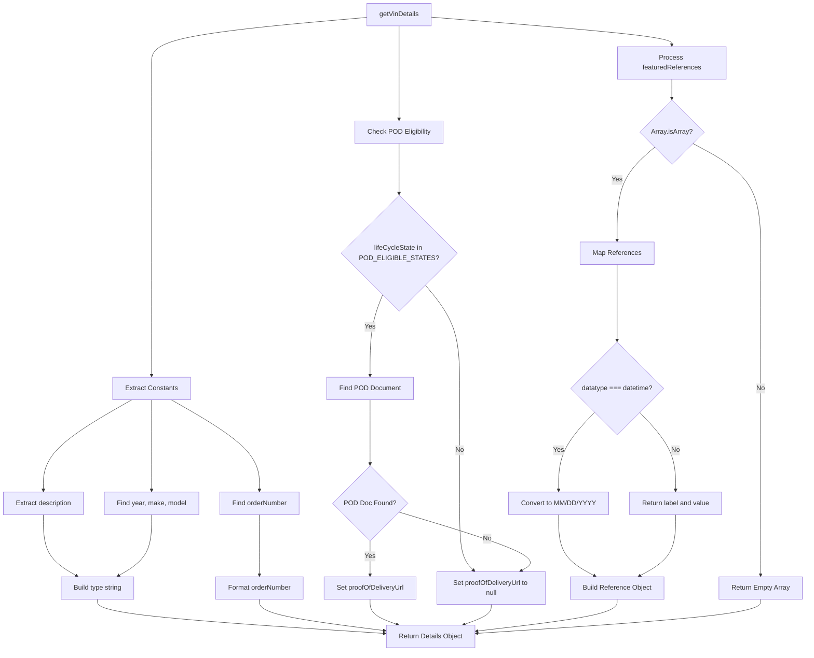
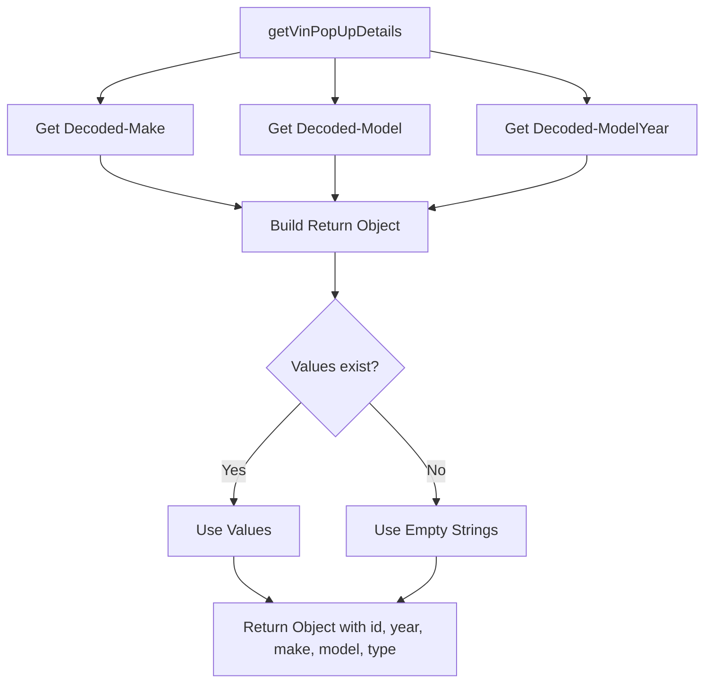
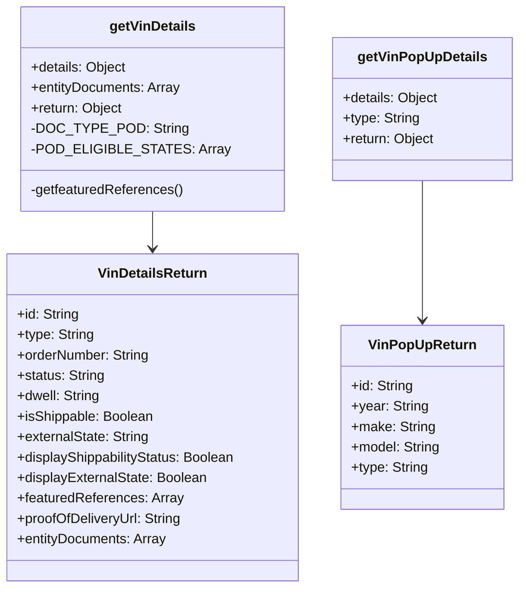
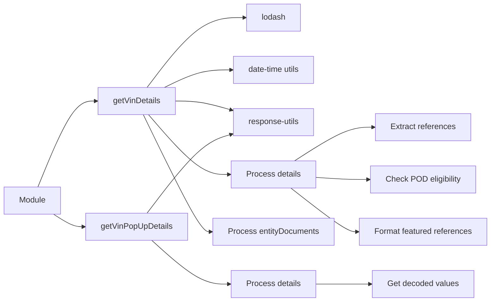

# Diagram: web/portal/src/shared/utils/vin.utils.js


> Auto-generated by Obscura crawlers

## Diagram 1

```mermaid
flowchart TD
      A[getVinDetails] --> B[Extract Constants]
      B --> C[Extract description]
      B --> D[Find orderNumber]...
  └ 191 lines...
```

> SVG rendering failed for this diagram.

## Diagram 2



### SVG

<svg id="container" width="1941.77734375" xmlns="http://www.w3.org/2000/svg" class="flowchart" height="1550.21875" viewBox="0 0 1941.77734375 1550.21875" role="graphics-document document" aria-roledescription="flowchart-v2"><style>#container{font-family:"trebuchet ms",verdana,arial,sans-serif;font-size:16px;fill:#333;}@keyframes edge-animation-frame{from{stroke-dashoffset:0;}}@keyframes dash{to{stroke-dashoffset:0;}}#container .edge-animation-slow{stroke-dasharray:9,5!important;stroke-dashoffset:900;animation:dash 50s linear infinite;stroke-linecap:round;}#container .edge-animation-fast{stroke-dasharray:9,5!important;stroke-dashoffset:900;animation:dash 20s linear infinite;stroke-linecap:round;}#container .error-icon{fill:#552222;}#container .error-text{fill:#552222;stroke:#552222;}#container .edge-thickness-normal{stroke-width:1px;}#container .edge-thickness-thick{stroke-width:3.5px;}#container .edge-pattern-solid{stroke-dasharray:0;}#container .edge-thickness-invisible{stroke-width:0;fill:none;}#container .edge-pattern-dashed{stroke-dasharray:3;}#container .edge-pattern-dotted{stroke-dasharray:2;}#container .marker{fill:#333333;stroke:#333333;}#container .marker.cross{stroke:#333333;}#container svg{font-family:"trebuchet ms",verdana,arial,sans-serif;font-size:16px;}#container p{margin:0;}#container .label{font-family:"trebuchet ms",verdana,arial,sans-serif;color:#333;}#container .cluster-label text{fill:#333;}#container .cluster-label span{color:#333;}#container .cluster-label span p{background-color:transparent;}#container .label text,#container span{fill:#333;color:#333;}#container .node rect,#container .node circle,#container .node ellipse,#container .node polygon,#container .node path{fill:#ECECFF;stroke:#9370DB;stroke-width:1px;}#container .rough-node .label text,#container .node .label text,#container .image-shape .label,#container .icon-shape .label{text-anchor:middle;}#container .node .katex path{fill:#000;stroke:#000;stroke-width:1px;}#container .rough-node .label,#container .node .label,#container .image-shape .label,#container .icon-shape .label{text-align:center;}#container .node.clickable{cursor:pointer;}#container .root .anchor path{fill:#333333!important;stroke-width:0;stroke:#333333;}#container .arrowheadPath{fill:#333333;}#container .edgePath .path{stroke:#333333;stroke-width:2.0px;}#container .flowchart-link{stroke:#333333;fill:none;}#container .edgeLabel{background-color:rgba(232,232,232, 0.8);text-align:center;}#container .edgeLabel p{background-color:rgba(232,232,232, 0.8);}#container .edgeLabel rect{opacity:0.5;background-color:rgba(232,232,232, 0.8);fill:rgba(232,232,232, 0.8);}#container .labelBkg{background-color:rgba(232, 232, 232, 0.5);}#container .cluster rect{fill:#ffffde;stroke:#aaaa33;stroke-width:1px;}#container .cluster text{fill:#333;}#container .cluster span{color:#333;}#container div.mermaidTooltip{position:absolute;text-align:center;max-width:200px;padding:2px;font-family:"trebuchet ms",verdana,arial,sans-serif;font-size:12px;background:hsl(80, 100%, 96.2745098039%);border:1px solid #aaaa33;border-radius:2px;pointer-events:none;z-index:100;}#container .flowchartTitleText{text-anchor:middle;font-size:18px;fill:#333;}#container rect.text{fill:none;stroke-width:0;}#container .icon-shape,#container .image-shape{background-color:rgba(232,232,232, 0.8);text-align:center;}#container .icon-shape p,#container .image-shape p{background-color:rgba(232,232,232, 0.8);padding:2px;}#container .icon-shape rect,#container .image-shape rect{opacity:0.5;background-color:rgba(232,232,232, 0.8);fill:rgba(232,232,232, 0.8);}#container .label-icon{display:inline-block;height:1em;overflow:visible;vertical-align:-0.125em;}#container .node .label-icon path{fill:currentColor;stroke:revert;stroke-width:revert;}#container :root{--mermaid-font-family:"trebuchet ms",verdana,arial,sans-serif;}</style><g><marker id="container_flowchart-v2-pointEnd" class="marker flowchart-v2" viewBox="0 0 10 10" refX="5" refY="5" markerUnits="userSpaceOnUse" markerWidth="8" markerHeight="8" orient="auto"><path d="M 0 0 L 10 5 L 0 10 z" class="arrowMarkerPath" style="stroke-width: 1; stroke-dasharray: 1, 0;"></path></marker><marker id="container_flowchart-v2-pointStart" class="marker flowchart-v2" viewBox="0 0 10 10" refX="4.5" refY="5" markerUnits="userSpaceOnUse" markerWidth="8" markerHeight="8" orient="auto"><path d="M 0 5 L 10 10 L 10 0 z" class="arrowMarkerPath" style="stroke-width: 1; stroke-dasharray: 1, 0;"></path></marker><marker id="container_flowchart-v2-circleEnd" class="marker flowchart-v2" viewBox="0 0 10 10" refX="11" refY="5" markerUnits="userSpaceOnUse" markerWidth="11" markerHeight="11" orient="auto"><circle cx="5" cy="5" r="5" class="arrowMarkerPath" style="stroke-width: 1; stroke-dasharray: 1, 0;"></circle></marker><marker id="container_flowchart-v2-circleStart" class="marker flowchart-v2" viewBox="0 0 10 10" refX="-1" refY="5" markerUnits="userSpaceOnUse" markerWidth="11" markerHeight="11" orient="auto"><circle cx="5" cy="5" r="5" class="arrowMarkerPath" style="stroke-width: 1; stroke-dasharray: 1, 0;"></circle></marker><marker id="container_flowchart-v2-crossEnd" class="marker cross flowchart-v2" viewBox="0 0 11 11" refX="12" refY="5.2" markerUnits="userSpaceOnUse" markerWidth="11" markerHeight="11" orient="auto"><path d="M 1,1 l 9,9 M 10,1 l -9,9" class="arrowMarkerPath" style="stroke-width: 2; stroke-dasharray: 1, 0;"></path></marker><marker id="container_flowchart-v2-crossStart" class="marker cross flowchart-v2" viewBox="0 0 11 11" refX="-1" refY="5.2" markerUnits="userSpaceOnUse" markerWidth="11" markerHeight="11" orient="auto"><path d="M 1,1 l 9,9 M 10,1 l -9,9" class="arrowMarkerPath" style="stroke-width: 2; stroke-dasharray: 1, 0;"></path></marker><g class="root"><g class="clusters"></g><g class="edgePaths"><path d="M886.352,41.777L799.926,49.314C713.5,56.851,540.648,71.926,454.223,90.13C367.797,108.333,367.797,129.667,367.797,151C367.797,172.333,367.797,193.667,367.797,221.053C367.797,248.44,367.797,281.88,367.797,317.32C367.797,352.76,367.797,390.201,367.797,438.254C367.797,486.307,367.797,544.974,367.797,603.641C367.797,662.307,367.797,720.974,367.797,769.88C367.797,818.786,367.797,857.932,367.797,877.505L367.797,897.078" id="L_A_B_0" class="edge-thickness-normal edge-pattern-solid edge-thickness-normal edge-pattern-solid flowchart-link" style=";" data-edge="true" data-et="edge" data-id="L_A_B_0" data-points="W3sieCI6ODg2LjM1MTU2MjUsInkiOjQxLjc3NzEyODQ4MTk1ODAxNn0seyJ4IjozNjcuNzk2ODc1LCJ5Ijo4N30seyJ4IjozNjcuNzk2ODc1LCJ5IjoxNTF9LHsieCI6MzY3Ljc5Njg3NSwieSI6MjE1fSx7IngiOjM2Ny43OTY4NzUsInkiOjMxNS4zMjAzMTI1fSx7IngiOjM2Ny43OTY4NzUsInkiOjQyNy42NDA2MjV9LHsieCI6MzY3Ljc5Njg3NSwieSI6NjAzLjY0MDYyNX0seyJ4IjozNjcuNzk2ODc1LCJ5Ijo3NzkuNjQwNjI1fSx7IngiOjM2Ny43OTY4NzUsInkiOjkwMS4wNzgxMjV9XQ==" marker-end="url(#container_flowchart-v2-pointEnd)"></path><path d="M320.241,955.078L284.593,975.318C248.945,995.557,177.648,1036.036,142,1071.668C106.352,1107.299,106.352,1138.083,106.352,1153.475L106.352,1168.867" id="L_B_C_0" class="edge-thickness-normal edge-pattern-solid edge-thickness-normal edge-pattern-solid flowchart-link" style=";" data-edge="true" data-et="edge" data-id="L_B_C_0" data-points="W3sieCI6MzIwLjI0MTM0ODY4NDIxMDU1LCJ5Ijo5NTUuMDc4MTI1fSx7IngiOjEwNi4zNTE1NjI1LCJ5IjoxMDc2LjUxNTYyNX0seyJ4IjoxMDYuMzUxNTYyNSwieSI6MTE3Mi44NjcxODc1fV0=" marker-end="url(#container_flowchart-v2-pointEnd)"></path><path d="M415.003,955.078L450.389,975.318C485.775,995.557,556.548,1036.036,591.934,1071.668C627.32,1107.299,627.32,1138.083,627.32,1153.475L627.32,1168.867" id="L_B_D_0" class="edge-thickness-normal edge-pattern-solid edge-thickness-normal edge-pattern-solid flowchart-link" style=";" data-edge="true" data-et="edge" data-id="L_B_D_0" data-points="W3sieCI6NDE1LjAwMjgyMjM2ODQyMTA1LCJ5Ijo5NTUuMDc4MTI1fSx7IngiOjYyNy4zMjAzMTI1LCJ5IjoxMDc2LjUxNTYyNX0seyJ4Ijo2MjcuMzIwMzEyNSwieSI6MTE3Mi44NjcxODc1fV0=" marker-end="url(#container_flowchart-v2-pointEnd)"></path><path d="M367.797,955.078L367.797,975.318C367.797,995.557,367.797,1036.036,367.797,1071.668C367.797,1107.299,367.797,1138.083,367.797,1153.475L367.797,1168.867" id="L_B_E_0" class="edge-thickness-normal edge-pattern-solid edge-thickness-normal edge-pattern-solid flowchart-link" style=";" data-edge="true" data-et="edge" data-id="L_B_E_0" data-points="W3sieCI6MzY3Ljc5Njg3NSwieSI6OTU1LjA3ODEyNX0seyJ4IjozNjcuNzk2ODc1LCJ5IjoxMDc2LjUxNTYyNX0seyJ4IjozNjcuNzk2ODc1LCJ5IjoxMTcyLjg2NzE4NzV9XQ==" marker-end="url(#container_flowchart-v2-pointEnd)"></path><path d="M106.352,1226.867L106.352,1242.926C106.352,1258.984,106.352,1291.102,119.822,1314.992C133.293,1338.882,160.234,1354.545,173.705,1362.377L187.175,1370.208" id="L_C_F_0" class="edge-thickness-normal edge-pattern-solid edge-thickness-normal edge-pattern-solid flowchart-link" style=";" data-edge="true" data-et="edge" data-id="L_C_F_0" data-points="W3sieCI6MTA2LjM1MTU2MjUsInkiOjEyMjYuODY3MTg3NX0seyJ4IjoxMDYuMzUxNTYyNSwieSI6MTMyMy4yMTg3NX0seyJ4IjoxOTAuNjMzMjc1MDgyMjM2ODUsInkiOjEzNzIuMjE4NzV9XQ==" marker-end="url(#container_flowchart-v2-pointEnd)"></path><path d="M627.32,1226.867L627.32,1242.926C627.32,1258.984,627.32,1291.102,627.32,1314.66C627.32,1338.219,627.32,1353.219,627.32,1360.719L627.32,1368.219" id="L_D_G_0" class="edge-thickness-normal edge-pattern-solid edge-thickness-normal edge-pattern-solid flowchart-link" style=";" data-edge="true" data-et="edge" data-id="L_D_G_0" data-points="W3sieCI6NjI3LjMyMDMxMjUsInkiOjEyMjYuODY3MTg3NX0seyJ4Ijo2MjcuMzIwMzEyNSwieSI6MTMyMy4yMTg3NX0seyJ4Ijo2MjcuMzIwMzEyNSwieSI6MTM3Mi4yMTg3NX1d" marker-end="url(#container_flowchart-v2-pointEnd)"></path><path d="M367.797,1226.867L367.797,1242.926C367.797,1258.984,367.797,1291.102,354.326,1314.992C340.856,1338.882,313.914,1354.545,300.444,1362.377L286.973,1370.208" id="L_E_F_0" class="edge-thickness-normal edge-pattern-solid edge-thickness-normal edge-pattern-solid flowchart-link" style=";" data-edge="true" data-et="edge" data-id="L_E_F_0" data-points="W3sieCI6MzY3Ljc5Njg3NSwieSI6MTIyNi44NjcxODc1fSx7IngiOjM2Ny43OTY4NzUsInkiOjEzMjMuMjE4NzV9LHsieCI6MjgzLjUxNTE2MjQxNzc2MzIsInkiOjEzNzIuMjE4NzV9XQ==" marker-end="url(#container_flowchart-v2-pointEnd)"></path><path d="M964.063,62L964.063,66.167C964.063,70.333,964.063,78.667,964.063,93.5C964.063,108.333,964.063,129.667,964.063,151C964.063,172.333,964.063,193.667,964.063,215.887C964.063,238.107,964.063,261.214,964.063,272.767L964.063,284.32" id="L_A_H_0" class="edge-thickness-normal edge-pattern-solid edge-thickness-normal edge-pattern-solid flowchart-link" style=";" data-edge="true" data-et="edge" data-id="L_A_H_0" data-points="W3sieCI6OTY0LjA2MjUsInkiOjYyfSx7IngiOjk2NC4wNjI1LCJ5Ijo4N30seyJ4Ijo5NjQuMDYyNSwieSI6MTUxfSx7IngiOjk2NC4wNjI1LCJ5IjoyMTV9LHsieCI6OTY0LjA2MjUsInkiOjI4OC4zMjAzMTI1fV0=" marker-end="url(#container_flowchart-v2-pointEnd)"></path><path d="M964.063,342.32L964.063,356.54C964.063,370.76,964.063,399.201,964.063,418.921C964.063,438.641,964.063,449.641,964.063,455.141L964.063,460.641" id="L_H_I_0" class="edge-thickness-normal edge-pattern-solid edge-thickness-normal edge-pattern-solid flowchart-link" style=";" data-edge="true" data-et="edge" data-id="L_H_I_0" data-points="W3sieCI6OTY0LjA2MjUsInkiOjM0Mi4zMjAzMTI1fSx7IngiOjk2NC4wNjI1LCJ5Ijo0MjcuNjQwNjI1fSx7IngiOjk2NC4wNjI1LCJ5Ijo0NjQuNjQwNjI1fV0=" marker-end="url(#container_flowchart-v2-pointEnd)"></path><path d="M925.126,703.704L920.201,716.36C915.277,729.016,905.427,754.329,900.503,786.557C895.578,818.786,895.578,857.932,895.578,877.505L895.578,897.078" id="L_I_J_0" class="edge-thickness-normal edge-pattern-solid edge-thickness-normal edge-pattern-solid flowchart-link" style=";" data-edge="true" data-et="edge" data-id="L_I_J_0" data-points="W3sieCI6OTI1LjEyNjE1NDM3NDY0MDUsInkiOjcwMy43MDQyNzkzNzQ2NDA1fSx7IngiOjg5NS41NzgxMjUsInkiOjc3OS42NDA2MjV9LHsieCI6ODk1LjU3ODEyNSwieSI6OTAxLjA3ODEyNX1d" marker-end="url(#container_flowchart-v2-pointEnd)"></path><path d="M1027.052,679.651L1040.863,696.316C1054.673,712.981,1082.293,746.311,1096.104,787.715C1109.914,829.12,1109.914,878.599,1109.914,928.078C1109.914,977.557,1109.914,1027.036,1109.914,1072.335C1109.914,1117.633,1109.914,1158.75,1109.914,1199.867C1109.914,1240.984,1109.914,1282.102,1115.716,1308.36C1121.518,1334.618,1133.122,1346.017,1138.924,1351.716L1144.726,1357.416" id="L_I_K_0" class="edge-thickness-normal edge-pattern-solid edge-thickness-normal edge-pattern-solid flowchart-link" style=";" data-edge="true" data-et="edge" data-id="L_I_K_0" data-points="W3sieCI6MTAyNy4wNTIzMDUwODI4OTQ1LCJ5Ijo2NzkuNjUwODE5OTE3MTA1N30seyJ4IjoxMTA5LjkxNDA2MjUsInkiOjc3OS42NDA2MjV9LHsieCI6MTEwOS45MTQwNjI1LCJ5Ijo5MjguMDc4MTI1fSx7IngiOjExMDkuOTE0MDYyNSwieSI6MTA3Ni41MTU2MjV9LHsieCI6MTEwOS45MTQwNjI1LCJ5IjoxMTk5Ljg2NzE4NzV9LHsieCI6MTEwOS45MTQwNjI1LCJ5IjoxMzIzLjIxODc1fSx7IngiOjExNDcuNTc5NjY2OTQwNzg5NCwieSI6MTM2MC4yMTg3NX1d" marker-end="url(#container_flowchart-v2-pointEnd)"></path><path d="M895.578,955.078L895.578,975.318C895.578,995.557,895.578,1036.036,895.578,1061.776C895.578,1087.516,895.578,1098.516,895.578,1104.016L895.578,1109.516" id="L_J_L_0" class="edge-thickness-normal edge-pattern-solid edge-thickness-normal edge-pattern-solid flowchart-link" style=";" data-edge="true" data-et="edge" data-id="L_J_L_0" data-points="W3sieCI6ODk1LjU3ODEyNSwieSI6OTU1LjA3ODEyNX0seyJ4Ijo4OTUuNTc4MTI1LCJ5IjoxMDc2LjUxNTYyNX0seyJ4Ijo4OTUuNTc4MTI1LCJ5IjoxMTEzLjUxNTYyNX1d" marker-end="url(#container_flowchart-v2-pointEnd)"></path><path d="M895.578,1286.219L895.578,1292.385C895.578,1298.552,895.578,1310.885,895.578,1324.552C895.578,1338.219,895.578,1353.219,895.578,1360.719L895.578,1368.219" id="L_L_M_0" class="edge-thickness-normal edge-pattern-solid edge-thickness-normal edge-pattern-solid flowchart-link" style=";" data-edge="true" data-et="edge" data-id="L_L_M_0" data-points="W3sieCI6ODk1LjU3ODEyNSwieSI6MTI4Ni4yMTg3NX0seyJ4Ijo4OTUuNTc4MTI1LCJ5IjoxMzIzLjIxODc1fSx7IngiOjg5NS41NzgxMjUsInkiOjEzNzIuMjE4NzV9XQ==" marker-end="url(#container_flowchart-v2-pointEnd)"></path><path d="M962.433,1219.364L1021.785,1236.673C1081.137,1253.982,1199.842,1288.601,1249.121,1311.742C1298.399,1334.884,1278.251,1346.549,1268.177,1352.382L1258.103,1358.215" id="L_L_K_0" class="edge-thickness-normal edge-pattern-solid edge-thickness-normal edge-pattern-solid flowchart-link" style=";" data-edge="true" data-et="edge" data-id="L_L_K_0" data-points="W3sieCI6OTYyLjQzMjcwMDI2NTYyNjUsInkiOjEyMTkuMzY0MTc0NzM0MzczNH0seyJ4IjoxMzE4LjU0Njg3NSwieSI6MTMyMy4yMTg3NX0seyJ4IjoxMjU0LjY0MTI0MTc3NjMxNTgsInkiOjEzNjAuMjE4NzV9XQ==" marker-end="url(#container_flowchart-v2-pointEnd)"></path><path d="M1041.773,41.159L1138.169,48.799C1234.564,56.439,1427.354,71.72,1523.749,82.86C1620.145,94,1620.145,101,1620.145,104.5L1620.145,108" id="L_A_N_0" class="edge-thickness-normal edge-pattern-solid edge-thickness-normal edge-pattern-solid flowchart-link" style=";" data-edge="true" data-et="edge" data-id="L_A_N_0" data-points="W3sieCI6MTA0MS43NzM0Mzc1LCJ5Ijo0MS4xNTkyNDMxMzk2MTMxMn0seyJ4IjoxNjIwLjE0NDUzMTI1LCJ5Ijo4N30seyJ4IjoxNjIwLjE0NDUzMTI1LCJ5IjoxMTJ9XQ==" marker-end="url(#container_flowchart-v2-pointEnd)"></path><path d="M1620.145,190L1620.145,194.167C1620.145,198.333,1620.145,206.667,1620.145,214.333C1620.145,222,1620.145,229,1620.145,232.5L1620.145,236" id="L_N_O_0" class="edge-thickness-normal edge-pattern-solid edge-thickness-normal edge-pattern-solid flowchart-link" style=";" data-edge="true" data-et="edge" data-id="L_N_O_0" data-points="W3sieCI6MTYyMC4xNDQ1MzEyNSwieSI6MTkwfSx7IngiOjE2MjAuMTQ0NTMxMjUsInkiOjIxNX0seyJ4IjoxNjIwLjE0NDUzMTI1LCJ5IjoyNDB9XQ==" marker-end="url(#container_flowchart-v2-pointEnd)"></path><path d="M1579.554,350.05L1564.439,362.982C1549.325,375.913,1519.096,401.777,1503.982,438.875C1488.867,475.974,1488.867,524.307,1488.867,548.474L1488.867,572.641" id="L_O_P_0" class="edge-thickness-normal edge-pattern-solid edge-thickness-normal edge-pattern-solid flowchart-link" style=";" data-edge="true" data-et="edge" data-id="L_O_P_0" data-points="W3sieCI6MTU3OS41NTM2MjExOTEwMjksInkiOjM1MC4wNDk3MTQ5NDEwMjg4N30seyJ4IjoxNDg4Ljg2NzE4NzUsInkiOjQyNy42NDA2MjV9LHsieCI6MTQ4OC44NjcxODc1LCJ5Ijo1NzYuNjQwNjI1fV0=" marker-end="url(#container_flowchart-v2-pointEnd)"></path><path d="M1669.52,341.266L1696.915,355.661C1724.311,370.057,1779.103,398.849,1806.499,442.578C1833.895,486.307,1833.895,544.974,1833.895,603.641C1833.895,662.307,1833.895,720.974,1833.895,775.047C1833.895,829.12,1833.895,878.599,1833.895,928.078C1833.895,977.557,1833.895,1027.036,1833.895,1072.335C1833.895,1117.633,1833.895,1158.75,1833.895,1199.867C1833.895,1240.984,1833.895,1282.102,1833.895,1310.16C1833.895,1338.219,1833.895,1353.219,1833.895,1360.719L1833.895,1368.219" id="L_O_Q_0" class="edge-thickness-normal edge-pattern-solid edge-thickness-normal edge-pattern-solid flowchart-link" style=";" data-edge="true" data-et="edge" data-id="L_O_Q_0" data-points="W3sieCI6MTY2OS41MTk1MTYyNzUyNzczLCJ5IjozNDEuMjY1NjM5OTc0NzIyNjZ9LHsieCI6MTgzMy44OTQ1MzEyNSwieSI6NDI3LjY0MDYyNX0seyJ4IjoxODMzLjg5NDUzMTI1LCJ5Ijo2MDMuNjQwNjI1fSx7IngiOjE4MzMuODk0NTMxMjUsInkiOjc3OS42NDA2MjV9LHsieCI6MTgzMy44OTQ1MzEyNSwieSI6OTI4LjA3ODEyNX0seyJ4IjoxODMzLjg5NDUzMTI1LCJ5IjoxMDc2LjUxNTYyNX0seyJ4IjoxODMzLjg5NDUzMTI1LCJ5IjoxMTk5Ljg2NzE4NzV9LHsieCI6MTgzMy44OTQ1MzEyNSwieSI6MTMyMy4yMTg3NX0seyJ4IjoxODMzLjg5NDUzMTI1LCJ5IjoxMzcyLjIxODc1fV0=" marker-end="url(#container_flowchart-v2-pointEnd)"></path><path d="M1488.867,630.641L1488.867,655.474C1488.867,680.307,1488.867,729.974,1488.867,760.307C1488.867,790.641,1488.867,801.641,1488.867,807.141L1488.867,812.641" id="L_P_R_0" class="edge-thickness-normal edge-pattern-solid edge-thickness-normal edge-pattern-solid flowchart-link" style=";" data-edge="true" data-et="edge" data-id="L_P_R_0" data-points="W3sieCI6MTQ4OC44NjcxODc1LCJ5Ijo2MzAuNjQwNjI1fSx7IngiOjE0ODguODY3MTg3NSwieSI6Nzc5LjY0MDYyNX0seyJ4IjoxNDg4Ljg2NzE4NzUsInkiOjgxNi42NDA2MjV9XQ==" marker-end="url(#container_flowchart-v2-pointEnd)"></path><path d="M1434.743,985.391L1420.4,1000.579C1406.058,1015.766,1377.373,1046.141,1363.03,1076.72C1348.688,1107.299,1348.688,1138.083,1348.688,1153.475L1348.688,1168.867" id="L_R_S_0" class="edge-thickness-normal edge-pattern-solid edge-thickness-normal edge-pattern-solid flowchart-link" style=";" data-edge="true" data-et="edge" data-id="L_R_S_0" data-points="W3sieCI6MTQzNC43NDI2NDI1OTI5ODEyLCJ5Ijo5ODUuMzkxMDgwMDkyOTgxfSx7IngiOjEzNDguNjg3NSwieSI6MTA3Ni41MTU2MjV9LHsieCI6MTM0OC42ODc1LCJ5IjoxMTcyLjg2NzE4NzV9XQ==" marker-end="url(#container_flowchart-v2-pointEnd)"></path><path d="M1542.992,985.391L1557.334,1000.579C1571.677,1015.766,1600.362,1046.141,1614.704,1076.72C1629.047,1107.299,1629.047,1138.083,1629.047,1153.475L1629.047,1168.867" id="L_R_T_0" class="edge-thickness-normal edge-pattern-solid edge-thickness-normal edge-pattern-solid flowchart-link" style=";" data-edge="true" data-et="edge" data-id="L_R_T_0" data-points="W3sieCI6MTU0Mi45OTE3MzI0MDcwMTg4LCJ5Ijo5ODUuMzkxMDgwMDkyOTgxfSx7IngiOjE2MjkuMDQ2ODc1LCJ5IjoxMDc2LjUxNTYyNX0seyJ4IjoxNjI5LjA0Njg3NSwieSI6MTE3Mi44NjcxODc1fV0=" marker-end="url(#container_flowchart-v2-pointEnd)"></path><path d="M1348.688,1226.867L1348.688,1242.926C1348.688,1258.984,1348.688,1291.102,1363.165,1315.009C1377.642,1338.917,1406.596,1354.614,1421.073,1362.463L1435.55,1370.312" id="L_S_U_0" class="edge-thickness-normal edge-pattern-solid edge-thickness-normal edge-pattern-solid flowchart-link" style=";" data-edge="true" data-et="edge" data-id="L_S_U_0" data-points="W3sieCI6MTM0OC42ODc1LCJ5IjoxMjI2Ljg2NzE4NzV9LHsieCI6MTM0OC42ODc1LCJ5IjoxMzIzLjIxODc1fSx7IngiOjE0MzkuMDY2NTA5MDQ2MDUyNywieSI6MTM3Mi4yMTg3NX1d" marker-end="url(#container_flowchart-v2-pointEnd)"></path><path d="M1629.047,1226.867L1629.047,1242.926C1629.047,1258.984,1629.047,1291.102,1614.57,1315.009C1600.093,1338.917,1571.138,1354.614,1556.661,1362.463L1542.184,1370.312" id="L_T_U_0" class="edge-thickness-normal edge-pattern-solid edge-thickness-normal edge-pattern-solid flowchart-link" style=";" data-edge="true" data-et="edge" data-id="L_T_U_0" data-points="W3sieCI6MTYyOS4wNDY4NzUsInkiOjEyMjYuODY3MTg3NX0seyJ4IjoxNjI5LjA0Njg3NSwieSI6MTMyMy4yMTg3NX0seyJ4IjoxNTM4LjY2Nzg2NTk1Mzk0NzMsInkiOjEzNzIuMjE4NzV9XQ==" marker-end="url(#container_flowchart-v2-pointEnd)"></path><path d="M237.074,1426.219L237.074,1432.385C237.074,1438.552,237.074,1450.885,352.589,1464.52C468.104,1478.154,699.134,1493.09,814.65,1500.558L930.165,1508.026" id="L_F_V_0" class="edge-thickness-normal edge-pattern-solid edge-thickness-normal edge-pattern-solid flowchart-link" style=";" data-edge="true" data-et="edge" data-id="L_F_V_0" data-points="W3sieCI6MjM3LjA3NDIxODc1LCJ5IjoxNDI2LjIxODc1fSx7IngiOjIzNy4wNzQyMTg3NSwieSI6MTQ2My4yMTg3NX0seyJ4Ijo5MzQuMTU2MjUsInkiOjE1MDguMjgzNzMzMTI0MTA0Nn1d" marker-end="url(#container_flowchart-v2-pointEnd)"></path><path d="M627.32,1426.219L627.32,1432.385C627.32,1438.552,627.32,1450.885,677.798,1463.391C728.276,1475.896,829.232,1488.573,879.71,1494.911L930.187,1501.25" id="L_G_V_0" class="edge-thickness-normal edge-pattern-solid edge-thickness-normal edge-pattern-solid flowchart-link" style=";" data-edge="true" data-et="edge" data-id="L_G_V_0" data-points="W3sieCI6NjI3LjMyMDMxMjUsInkiOjE0MjYuMjE4NzV9LHsieCI6NjI3LjMyMDMxMjUsInkiOjE0NjMuMjE4NzV9LHsieCI6OTM0LjE1NjI1LCJ5IjoxNTAxLjc0ODM1MDQyMjU5MzZ9XQ==" marker-end="url(#container_flowchart-v2-pointEnd)"></path><path d="M895.578,1426.219L895.578,1432.385C895.578,1438.552,895.578,1450.885,906.637,1460.995C917.696,1471.104,939.814,1478.99,950.872,1482.933L961.931,1486.875" id="L_M_V_0" class="edge-thickness-normal edge-pattern-solid edge-thickness-normal edge-pattern-solid flowchart-link" style=";" data-edge="true" data-et="edge" data-id="L_M_V_0" data-points="W3sieCI6ODk1LjU3ODEyNSwieSI6MTQyNi4yMTg3NX0seyJ4Ijo4OTUuNTc4MTI1LCJ5IjoxNDYzLjIxODc1fSx7IngiOjk2NS42OTkwNjg1MDk2MTU0LCJ5IjoxNDg4LjIxODc1fV0=" marker-end="url(#container_flowchart-v2-pointEnd)"></path><path d="M1187.281,1438.219L1187.281,1442.385C1187.281,1446.552,1187.281,1454.885,1176.222,1462.995C1165.164,1471.104,1143.046,1478.99,1131.987,1482.933L1120.928,1486.875" id="L_K_V_0" class="edge-thickness-normal edge-pattern-solid edge-thickness-normal edge-pattern-solid flowchart-link" style=";" data-edge="true" data-et="edge" data-id="L_K_V_0" data-points="W3sieCI6MTE4Ny4yODEyNSwieSI6MTQzOC4yMTg3NX0seyJ4IjoxMTg3LjI4MTI1LCJ5IjoxNDYzLjIxODc1fSx7IngiOjExMTcuMTYwMzA2NDkwMzg0NSwieSI6MTQ4OC4yMTg3NX1d" marker-end="url(#container_flowchart-v2-pointEnd)"></path><path d="M1488.867,1426.219L1488.867,1432.385C1488.867,1438.552,1488.867,1450.885,1432.835,1463.564C1376.804,1476.242,1264.74,1489.266,1208.708,1495.778L1152.676,1502.29" id="L_U_V_0" class="edge-thickness-normal edge-pattern-solid edge-thickness-normal edge-pattern-solid flowchart-link" style=";" data-edge="true" data-et="edge" data-id="L_U_V_0" data-points="W3sieCI6MTQ4OC44NjcxODc1LCJ5IjoxNDI2LjIxODc1fSx7IngiOjE0ODguODY3MTg3NSwieSI6MTQ2My4yMTg3NX0seyJ4IjoxMTQ4LjcwMzEyNSwieSI6MTUwMi43NTE3MTU0OTc5NzQ2fV0=" marker-end="url(#container_flowchart-v2-pointEnd)"></path><path d="M1833.895,1426.219L1833.895,1432.385C1833.895,1438.552,1833.895,1450.885,1720.361,1464.502C1606.828,1478.118,1379.761,1493.018,1266.228,1500.468L1152.695,1507.918" id="L_Q_V_0" class="edge-thickness-normal edge-pattern-solid edge-thickness-normal edge-pattern-solid flowchart-link" style=";" data-edge="true" data-et="edge" data-id="L_Q_V_0" data-points="W3sieCI6MTgzMy44OTQ1MzEyNSwieSI6MTQyNi4yMTg3NX0seyJ4IjoxODMzLjg5NDUzMTI1LCJ5IjoxNDYzLjIxODc1fSx7IngiOjExNDguNzAzMTI1LCJ5IjoxNTA4LjE3OTY3NTkwODU4MjN9XQ==" marker-end="url(#container_flowchart-v2-pointEnd)"></path></g><g class="edgeLabels"><g class="edgeLabel"><g class="label" data-id="L_A_B_0" transform="translate(0, 0)"><foreignObject width="0" height="0"><div xmlns="http://www.w3.org/1999/xhtml" class="labelBkg" style="display: table-cell; white-space: nowrap; line-height: 1.5; max-width: 200px; text-align: center;"><span class="edgeLabel"></span></div></foreignObject></g></g><g class="edgeLabel"><g class="label" data-id="L_B_C_0" transform="translate(0, 0)"><foreignObject width="0" height="0"><div xmlns="http://www.w3.org/1999/xhtml" class="labelBkg" style="display: table-cell; white-space: nowrap; line-height: 1.5; max-width: 200px; text-align: center;"><span class="edgeLabel"></span></div></foreignObject></g></g><g class="edgeLabel"><g class="label" data-id="L_B_D_0" transform="translate(0, 0)"><foreignObject width="0" height="0"><div xmlns="http://www.w3.org/1999/xhtml" class="labelBkg" style="display: table-cell; white-space: nowrap; line-height: 1.5; max-width: 200px; text-align: center;"><span class="edgeLabel"></span></div></foreignObject></g></g><g class="edgeLabel"><g class="label" data-id="L_B_E_0" transform="translate(0, 0)"><foreignObject width="0" height="0"><div xmlns="http://www.w3.org/1999/xhtml" class="labelBkg" style="display: table-cell; white-space: nowrap; line-height: 1.5; max-width: 200px; text-align: center;"><span class="edgeLabel"></span></div></foreignObject></g></g><g class="edgeLabel"><g class="label" data-id="L_C_F_0" transform="translate(0, 0)"><foreignObject width="0" height="0"><div xmlns="http://www.w3.org/1999/xhtml" class="labelBkg" style="display: table-cell; white-space: nowrap; line-height: 1.5; max-width: 200px; text-align: center;"><span class="edgeLabel"></span></div></foreignObject></g></g><g class="edgeLabel"><g class="label" data-id="L_D_G_0" transform="translate(0, 0)"><foreignObject width="0" height="0"><div xmlns="http://www.w3.org/1999/xhtml" class="labelBkg" style="display: table-cell; white-space: nowrap; line-height: 1.5; max-width: 200px; text-align: center;"><span class="edgeLabel"></span></div></foreignObject></g></g><g class="edgeLabel"><g class="label" data-id="L_E_F_0" transform="translate(0, 0)"><foreignObject width="0" height="0"><div xmlns="http://www.w3.org/1999/xhtml" class="labelBkg" style="display: table-cell; white-space: nowrap; line-height: 1.5; max-width: 200px; text-align: center;"><span class="edgeLabel"></span></div></foreignObject></g></g><g class="edgeLabel"><g class="label" data-id="L_A_H_0" transform="translate(0, 0)"><foreignObject width="0" height="0"><div xmlns="http://www.w3.org/1999/xhtml" class="labelBkg" style="display: table-cell; white-space: nowrap; line-height: 1.5; max-width: 200px; text-align: center;"><span class="edgeLabel"></span></div></foreignObject></g></g><g class="edgeLabel"><g class="label" data-id="L_H_I_0" transform="translate(0, 0)"><foreignObject width="0" height="0"><div xmlns="http://www.w3.org/1999/xhtml" class="labelBkg" style="display: table-cell; white-space: nowrap; line-height: 1.5; max-width: 200px; text-align: center;"><span class="edgeLabel"></span></div></foreignObject></g></g><g class="edgeLabel" transform="translate(895.578125, 779.640625)"><g class="label" data-id="L_I_J_0" transform="translate(-12.03125, -12)"><foreignObject width="24.0625" height="24"><div xmlns="http://www.w3.org/1999/xhtml" class="labelBkg" style="display: table-cell; white-space: nowrap; line-height: 1.5; max-width: 200px; text-align: center;"><span class="edgeLabel"><p>Yes</p></span></div></foreignObject></g></g><g class="edgeLabel" transform="translate(1109.9140625, 1076.515625)"><g class="label" data-id="L_I_K_0" transform="translate(-10.140625, -12)"><foreignObject width="20.28125" height="24"><div xmlns="http://www.w3.org/1999/xhtml" class="labelBkg" style="display: table-cell; white-space: nowrap; line-height: 1.5; max-width: 200px; text-align: center;"><span class="edgeLabel"><p>No</p></span></div></foreignObject></g></g><g class="edgeLabel"><g class="label" data-id="L_J_L_0" transform="translate(0, 0)"><foreignObject width="0" height="0"><div xmlns="http://www.w3.org/1999/xhtml" class="labelBkg" style="display: table-cell; white-space: nowrap; line-height: 1.5; max-width: 200px; text-align: center;"><span class="edgeLabel"></span></div></foreignObject></g></g><g class="edgeLabel" transform="translate(895.578125, 1323.21875)"><g class="label" data-id="L_L_M_0" transform="translate(-12.03125, -12)"><foreignObject width="24.0625" height="24"><div xmlns="http://www.w3.org/1999/xhtml" class="labelBkg" style="display: table-cell; white-space: nowrap; line-height: 1.5; max-width: 200px; text-align: center;"><span class="edgeLabel"><p>Yes</p></span></div></foreignObject></g></g><g class="edgeLabel" transform="translate(1175.93521, 1281.62851)"><g class="label" data-id="L_L_K_0" transform="translate(-10.140625, -12)"><foreignObject width="20.28125" height="24"><div xmlns="http://www.w3.org/1999/xhtml" class="labelBkg" style="display: table-cell; white-space: nowrap; line-height: 1.5; max-width: 200px; text-align: center;"><span class="edgeLabel"><p>No</p></span></div></foreignObject></g></g><g class="edgeLabel"><g class="label" data-id="L_A_N_0" transform="translate(0, 0)"><foreignObject width="0" height="0"><div xmlns="http://www.w3.org/1999/xhtml" class="labelBkg" style="display: table-cell; white-space: nowrap; line-height: 1.5; max-width: 200px; text-align: center;"><span class="edgeLabel"></span></div></foreignObject></g></g><g class="edgeLabel"><g class="label" data-id="L_N_O_0" transform="translate(0, 0)"><foreignObject width="0" height="0"><div xmlns="http://www.w3.org/1999/xhtml" class="labelBkg" style="display: table-cell; white-space: nowrap; line-height: 1.5; max-width: 200px; text-align: center;"><span class="edgeLabel"></span></div></foreignObject></g></g><g class="edgeLabel" transform="translate(1488.8671875, 427.640625)"><g class="label" data-id="L_O_P_0" transform="translate(-12.03125, -12)"><foreignObject width="24.0625" height="24"><div xmlns="http://www.w3.org/1999/xhtml" class="labelBkg" style="display: table-cell; white-space: nowrap; line-height: 1.5; max-width: 200px; text-align: center;"><span class="edgeLabel"><p>Yes</p></span></div></foreignObject></g></g><g class="edgeLabel" transform="translate(1833.89453125, 928.078125)"><g class="label" data-id="L_O_Q_0" transform="translate(-10.140625, -12)"><foreignObject width="20.28125" height="24"><div xmlns="http://www.w3.org/1999/xhtml" class="labelBkg" style="display: table-cell; white-space: nowrap; line-height: 1.5; max-width: 200px; text-align: center;"><span class="edgeLabel"><p>No</p></span></div></foreignObject></g></g><g class="edgeLabel"><g class="label" data-id="L_P_R_0" transform="translate(0, 0)"><foreignObject width="0" height="0"><div xmlns="http://www.w3.org/1999/xhtml" class="labelBkg" style="display: table-cell; white-space: nowrap; line-height: 1.5; max-width: 200px; text-align: center;"><span class="edgeLabel"></span></div></foreignObject></g></g><g class="edgeLabel" transform="translate(1348.6875, 1076.515625)"><g class="label" data-id="L_R_S_0" transform="translate(-12.03125, -12)"><foreignObject width="24.0625" height="24"><div xmlns="http://www.w3.org/1999/xhtml" class="labelBkg" style="display: table-cell; white-space: nowrap; line-height: 1.5; max-width: 200px; text-align: center;"><span class="edgeLabel"><p>Yes</p></span></div></foreignObject></g></g><g class="edgeLabel" transform="translate(1629.046875, 1076.515625)"><g class="label" data-id="L_R_T_0" transform="translate(-10.140625, -12)"><foreignObject width="20.28125" height="24"><div xmlns="http://www.w3.org/1999/xhtml" class="labelBkg" style="display: table-cell; white-space: nowrap; line-height: 1.5; max-width: 200px; text-align: center;"><span class="edgeLabel"><p>No</p></span></div></foreignObject></g></g><g class="edgeLabel"><g class="label" data-id="L_S_U_0" transform="translate(0, 0)"><foreignObject width="0" height="0"><div xmlns="http://www.w3.org/1999/xhtml" class="labelBkg" style="display: table-cell; white-space: nowrap; line-height: 1.5; max-width: 200px; text-align: center;"><span class="edgeLabel"></span></div></foreignObject></g></g><g class="edgeLabel"><g class="label" data-id="L_T_U_0" transform="translate(0, 0)"><foreignObject width="0" height="0"><div xmlns="http://www.w3.org/1999/xhtml" class="labelBkg" style="display: table-cell; white-space: nowrap; line-height: 1.5; max-width: 200px; text-align: center;"><span class="edgeLabel"></span></div></foreignObject></g></g><g class="edgeLabel"><g class="label" data-id="L_F_V_0" transform="translate(0, 0)"><foreignObject width="0" height="0"><div xmlns="http://www.w3.org/1999/xhtml" class="labelBkg" style="display: table-cell; white-space: nowrap; line-height: 1.5; max-width: 200px; text-align: center;"><span class="edgeLabel"></span></div></foreignObject></g></g><g class="edgeLabel"><g class="label" data-id="L_G_V_0" transform="translate(0, 0)"><foreignObject width="0" height="0"><div xmlns="http://www.w3.org/1999/xhtml" class="labelBkg" style="display: table-cell; white-space: nowrap; line-height: 1.5; max-width: 200px; text-align: center;"><span class="edgeLabel"></span></div></foreignObject></g></g><g class="edgeLabel"><g class="label" data-id="L_M_V_0" transform="translate(0, 0)"><foreignObject width="0" height="0"><div xmlns="http://www.w3.org/1999/xhtml" class="labelBkg" style="display: table-cell; white-space: nowrap; line-height: 1.5; max-width: 200px; text-align: center;"><span class="edgeLabel"></span></div></foreignObject></g></g><g class="edgeLabel"><g class="label" data-id="L_K_V_0" transform="translate(0, 0)"><foreignObject width="0" height="0"><div xmlns="http://www.w3.org/1999/xhtml" class="labelBkg" style="display: table-cell; white-space: nowrap; line-height: 1.5; max-width: 200px; text-align: center;"><span class="edgeLabel"></span></div></foreignObject></g></g><g class="edgeLabel"><g class="label" data-id="L_U_V_0" transform="translate(0, 0)"><foreignObject width="0" height="0"><div xmlns="http://www.w3.org/1999/xhtml" class="labelBkg" style="display: table-cell; white-space: nowrap; line-height: 1.5; max-width: 200px; text-align: center;"><span class="edgeLabel"></span></div></foreignObject></g></g><g class="edgeLabel"><g class="label" data-id="L_Q_V_0" transform="translate(0, 0)"><foreignObject width="0" height="0"><div xmlns="http://www.w3.org/1999/xhtml" class="labelBkg" style="display: table-cell; white-space: nowrap; line-height: 1.5; max-width: 200px; text-align: center;"><span class="edgeLabel"></span></div></foreignObject></g></g></g><g class="nodes"><g class="node default" id="flowchart-A-0" transform="translate(964.0625, 35)"><rect class="basic label-container" style="" x="-77.7109375" y="-27" width="155.421875" height="54"></rect><g class="label" style="" transform="translate(-47.7109375, -12)"><rect></rect><foreignObject width="95.421875" height="24"><div xmlns="http://www.w3.org/1999/xhtml" style="display: table-cell; white-space: nowrap; line-height: 1.5; max-width: 200px; text-align: center;"><span class="nodeLabel"><p>getVinDetails</p></span></div></foreignObject></g></g><g class="node default" id="flowchart-B-1" transform="translate(367.796875, 928.078125)"><rect class="basic label-container" style="" x="-92.953125" y="-27" width="185.90625" height="54"></rect><g class="label" style="" transform="translate(-62.953125, -12)"><rect></rect><foreignObject width="125.90625" height="24"><div xmlns="http://www.w3.org/1999/xhtml" style="display: table-cell; white-space: nowrap; line-height: 1.5; max-width: 200px; text-align: center;"><span class="nodeLabel"><p>Extract Constants</p></span></div></foreignObject></g></g><g class="node default" id="flowchart-C-3" transform="translate(106.3515625, 1199.8671875)"><rect class="basic label-container" style="" x="-98.3515625" y="-27" width="196.703125" height="54"></rect><g class="label" style="" transform="translate(-68.3515625, -12)"><rect></rect><foreignObject width="136.703125" height="24"><div xmlns="http://www.w3.org/1999/xhtml" style="display: table-cell; white-space: nowrap; line-height: 1.5; max-width: 200px; text-align: center;"><span class="nodeLabel"><p>Extract description</p></span></div></foreignObject></g></g><g class="node default" id="flowchart-D-5" transform="translate(627.3203125, 1199.8671875)"><rect class="basic label-container" style="" x="-96.4296875" y="-27" width="192.859375" height="54"></rect><g class="label" style="" transform="translate(-66.4296875, -12)"><rect></rect><foreignObject width="132.859375" height="24"><div xmlns="http://www.w3.org/1999/xhtml" style="display: table-cell; white-space: nowrap; line-height: 1.5; max-width: 200px; text-align: center;"><span class="nodeLabel"><p>Find orderNumber</p></span></div></foreignObject></g></g><g class="node default" id="flowchart-E-7" transform="translate(367.796875, 1199.8671875)"><rect class="basic label-container" style="" x="-113.09375" y="-27" width="226.1875" height="54"></rect><g class="label" style="" transform="translate(-83.09375, -12)"><rect></rect><foreignObject width="166.1875" height="24"><div xmlns="http://www.w3.org/1999/xhtml" style="display: table-cell; white-space: nowrap; line-height: 1.5; max-width: 200px; text-align: center;"><span class="nodeLabel"><p>Find year, make, model</p></span></div></foreignObject></g></g><g class="node default" id="flowchart-F-9" transform="translate(237.07421875, 1399.21875)"><rect class="basic label-container" style="" x="-89.8203125" y="-27" width="179.640625" height="54"></rect><g class="label" style="" transform="translate(-59.8203125, -12)"><rect></rect><foreignObject width="119.640625" height="24"><div xmlns="http://www.w3.org/1999/xhtml" style="display: table-cell; white-space: nowrap; line-height: 1.5; max-width: 200px; text-align: center;"><span class="nodeLabel"><p>Build type string</p></span></div></foreignObject></g></g><g class="node default" id="flowchart-G-11" transform="translate(627.3203125, 1399.21875)"><rect class="basic label-container" style="" x="-106.5546875" y="-27" width="213.109375" height="54"></rect><g class="label" style="" transform="translate(-76.5546875, -12)"><rect></rect><foreignObject width="153.109375" height="24"><div xmlns="http://www.w3.org/1999/xhtml" style="display: table-cell; white-space: nowrap; line-height: 1.5; max-width: 200px; text-align: center;"><span class="nodeLabel"><p>Format orderNumber</p></span></div></foreignObject></g></g><g class="node default" id="flowchart-H-15" transform="translate(964.0625, 315.3203125)"><rect class="basic label-container" style="" x="-104.578125" y="-27" width="209.15625" height="54"></rect><g class="label" style="" transform="translate(-74.578125, -12)"><rect></rect><foreignObject width="149.15625" height="24"><div xmlns="http://www.w3.org/1999/xhtml" style="display: table-cell; white-space: nowrap; line-height: 1.5; max-width: 200px; text-align: center;"><span class="nodeLabel"><p>Check POD Eligibility</p></span></div></foreignObject></g></g><g class="node default" id="flowchart-I-17" transform="translate(964.0625, 603.640625)"><polygon points="139,0 278,-139 139,-278 0,-139" class="label-container" transform="translate(-138.5, 139)"></polygon><g class="label" style="" transform="translate(-100, -24)"><rect></rect><foreignObject width="200" height="48"><div xmlns="http://www.w3.org/1999/xhtml" style="display: table; white-space: break-spaces; line-height: 1.5; max-width: 200px; text-align: center; width: 200px;"><span class="nodeLabel"><p>lifeCycleState in POD_ELIGIBLE_STATES?</p></span></div></foreignObject></g></g><g class="node default" id="flowchart-J-19" transform="translate(895.578125, 928.078125)"><rect class="basic label-container" style="" x="-101.96875" y="-27" width="203.9375" height="54"></rect><g class="label" style="" transform="translate(-71.96875, -12)"><rect></rect><foreignObject width="143.9375" height="24"><div xmlns="http://www.w3.org/1999/xhtml" style="display: table-cell; white-space: nowrap; line-height: 1.5; max-width: 200px; text-align: center;"><span class="nodeLabel"><p>Find POD Document</p></span></div></foreignObject></g></g><g class="node default" id="flowchart-K-21" transform="translate(1187.28125, 1399.21875)"><rect class="basic label-container" style="" x="-130" y="-39" width="260" height="78"></rect><g class="label" style="" transform="translate(-100, -24)"><rect></rect><foreignObject width="200" height="48"><div xmlns="http://www.w3.org/1999/xhtml" style="display: table; white-space: break-spaces; line-height: 1.5; max-width: 200px; text-align: center; width: 200px;"><span class="nodeLabel"><p>Set proofOfDeliveryUrl to null</p></span></div></foreignObject></g></g><g class="node default" id="flowchart-L-23" transform="translate(895.578125, 1199.8671875)"><polygon points="86.3515625,0 172.703125,-86.3515625 86.3515625,-172.703125 0,-86.3515625" class="label-container" transform="translate(-85.8515625, 86.3515625)"></polygon><g class="label" style="" transform="translate(-59.3515625, -12)"><rect></rect><foreignObject width="118.703125" height="24"><div xmlns="http://www.w3.org/1999/xhtml" style="display: table-cell; white-space: nowrap; line-height: 1.5; max-width: 200px; text-align: center;"><span class="nodeLabel"><p>POD Doc Found?</p></span></div></foreignObject></g></g><g class="node default" id="flowchart-M-25" transform="translate(895.578125, 1399.21875)"><rect class="basic label-container" style="" x="-111.703125" y="-27" width="223.40625" height="54"></rect><g class="label" style="" transform="translate(-81.703125, -12)"><rect></rect><foreignObject width="163.40625" height="24"><div xmlns="http://www.w3.org/1999/xhtml" style="display: table-cell; white-space: nowrap; line-height: 1.5; max-width: 200px; text-align: center;"><span class="nodeLabel"><p>Set proofOfDeliveryUrl</p></span></div></foreignObject></g></g><g class="node default" id="flowchart-N-29" transform="translate(1620.14453125, 151)"><rect class="basic label-container" style="" x="-130" y="-39" width="260" height="78"></rect><g class="label" style="" transform="translate(-100, -24)"><rect></rect><foreignObject width="200" height="48"><div xmlns="http://www.w3.org/1999/xhtml" style="display: table; white-space: break-spaces; line-height: 1.5; max-width: 200px; text-align: center; width: 200px;"><span class="nodeLabel"><p>Process featuredReferences</p></span></div></foreignObject></g></g><g class="node default" id="flowchart-O-31" transform="translate(1620.14453125, 315.3203125)"><polygon points="75.3203125,0 150.640625,-75.3203125 75.3203125,-150.640625 0,-75.3203125" class="label-container" transform="translate(-74.8203125, 75.3203125)"></polygon><g class="label" style="" transform="translate(-48.3203125, -12)"><rect></rect><foreignObject width="96.640625" height="24"><div xmlns="http://www.w3.org/1999/xhtml" style="display: table-cell; white-space: nowrap; line-height: 1.5; max-width: 200px; text-align: center;"><span class="nodeLabel"><p>Array.isArray?</p></span></div></foreignObject></g></g><g class="node default" id="flowchart-P-33" transform="translate(1488.8671875, 603.640625)"><rect class="basic label-container" style="" x="-87.1484375" y="-27" width="174.296875" height="54"></rect><g class="label" style="" transform="translate(-57.1484375, -12)"><rect></rect><foreignObject width="114.296875" height="24"><div xmlns="http://www.w3.org/1999/xhtml" style="display: table-cell; white-space: nowrap; line-height: 1.5; max-width: 200px; text-align: center;"><span class="nodeLabel"><p>Map References</p></span></div></foreignObject></g></g><g class="node default" id="flowchart-Q-35" transform="translate(1833.89453125, 1399.21875)"><rect class="basic label-container" style="" x="-99.8828125" y="-27" width="199.765625" height="54"></rect><g class="label" style="" transform="translate(-69.8828125, -12)"><rect></rect><foreignObject width="139.765625" height="24"><div xmlns="http://www.w3.org/1999/xhtml" style="display: table-cell; white-space: nowrap; line-height: 1.5; max-width: 200px; text-align: center;"><span class="nodeLabel"><p>Return Empty Array</p></span></div></foreignObject></g></g><g class="node default" id="flowchart-R-37" transform="translate(1488.8671875, 928.078125)"><polygon points="111.4375,0 222.875,-111.4375 111.4375,-222.875 0,-111.4375" class="label-container" transform="translate(-110.9375, 111.4375)"></polygon><g class="label" style="" transform="translate(-84.4375, -12)"><rect></rect><foreignObject width="168.875" height="24"><div xmlns="http://www.w3.org/1999/xhtml" style="display: table-cell; white-space: nowrap; line-height: 1.5; max-width: 200px; text-align: center;"><span class="nodeLabel"><p>datatype === datetime?</p></span></div></foreignObject></g></g><g class="node default" id="flowchart-S-39" transform="translate(1348.6875, 1199.8671875)"><rect class="basic label-container" style="" x="-118.21875" y="-27" width="236.4375" height="54"></rect><g class="label" style="" transform="translate(-88.21875, -12)"><rect></rect><foreignObject width="176.4375" height="24"><div xmlns="http://www.w3.org/1999/xhtml" style="display: table-cell; white-space: nowrap; line-height: 1.5; max-width: 200px; text-align: center;"><span class="nodeLabel"><p>Convert to MM/DD/YYYY</p></span></div></foreignObject></g></g><g class="node default" id="flowchart-T-41" transform="translate(1629.046875, 1199.8671875)"><rect class="basic label-container" style="" x="-112.140625" y="-27" width="224.28125" height="54"></rect><g class="label" style="" transform="translate(-82.140625, -12)"><rect></rect><foreignObject width="164.28125" height="24"><div xmlns="http://www.w3.org/1999/xhtml" style="display: table-cell; white-space: nowrap; line-height: 1.5; max-width: 200px; text-align: center;"><span class="nodeLabel"><p>Return label and value</p></span></div></foreignObject></g></g><g class="node default" id="flowchart-U-43" transform="translate(1488.8671875, 1399.21875)"><rect class="basic label-container" style="" x="-112.671875" y="-27" width="225.34375" height="54"></rect><g class="label" style="" transform="translate(-82.671875, -12)"><rect></rect><foreignObject width="165.34375" height="24"><div xmlns="http://www.w3.org/1999/xhtml" style="display: table-cell; white-space: nowrap; line-height: 1.5; max-width: 200px; text-align: center;"><span class="nodeLabel"><p>Build Reference Object</p></span></div></foreignObject></g></g><g class="node default" id="flowchart-V-47" transform="translate(1041.4296875, 1515.21875)"><rect class="basic label-container" style="" x="-107.2734375" y="-27" width="214.546875" height="54"></rect><g class="label" style="" transform="translate(-77.2734375, -12)"><rect></rect><foreignObject width="154.546875" height="24"><div xmlns="http://www.w3.org/1999/xhtml" style="display: table-cell; white-space: nowrap; line-height: 1.5; max-width: 200px; text-align: center;"><span class="nodeLabel"><p>Return Details Object</p></span></div></foreignObject></g></g></g></g></g></svg>

## Diagram 3



### SVG

<svg id="container" width="751.28125" xmlns="http://www.w3.org/2000/svg" class="flowchart" height="730.203125" viewBox="0 0 751.28125 730.203125" role="graphics-document document" aria-roledescription="flowchart-v2"><style>#container{font-family:"trebuchet ms",verdana,arial,sans-serif;font-size:16px;fill:#333;}@keyframes edge-animation-frame{from{stroke-dashoffset:0;}}@keyframes dash{to{stroke-dashoffset:0;}}#container .edge-animation-slow{stroke-dasharray:9,5!important;stroke-dashoffset:900;animation:dash 50s linear infinite;stroke-linecap:round;}#container .edge-animation-fast{stroke-dasharray:9,5!important;stroke-dashoffset:900;animation:dash 20s linear infinite;stroke-linecap:round;}#container .error-icon{fill:#552222;}#container .error-text{fill:#552222;stroke:#552222;}#container .edge-thickness-normal{stroke-width:1px;}#container .edge-thickness-thick{stroke-width:3.5px;}#container .edge-pattern-solid{stroke-dasharray:0;}#container .edge-thickness-invisible{stroke-width:0;fill:none;}#container .edge-pattern-dashed{stroke-dasharray:3;}#container .edge-pattern-dotted{stroke-dasharray:2;}#container .marker{fill:#333333;stroke:#333333;}#container .marker.cross{stroke:#333333;}#container svg{font-family:"trebuchet ms",verdana,arial,sans-serif;font-size:16px;}#container p{margin:0;}#container .label{font-family:"trebuchet ms",verdana,arial,sans-serif;color:#333;}#container .cluster-label text{fill:#333;}#container .cluster-label span{color:#333;}#container .cluster-label span p{background-color:transparent;}#container .label text,#container span{fill:#333;color:#333;}#container .node rect,#container .node circle,#container .node ellipse,#container .node polygon,#container .node path{fill:#ECECFF;stroke:#9370DB;stroke-width:1px;}#container .rough-node .label text,#container .node .label text,#container .image-shape .label,#container .icon-shape .label{text-anchor:middle;}#container .node .katex path{fill:#000;stroke:#000;stroke-width:1px;}#container .rough-node .label,#container .node .label,#container .image-shape .label,#container .icon-shape .label{text-align:center;}#container .node.clickable{cursor:pointer;}#container .root .anchor path{fill:#333333!important;stroke-width:0;stroke:#333333;}#container .arrowheadPath{fill:#333333;}#container .edgePath .path{stroke:#333333;stroke-width:2.0px;}#container .flowchart-link{stroke:#333333;fill:none;}#container .edgeLabel{background-color:rgba(232,232,232, 0.8);text-align:center;}#container .edgeLabel p{background-color:rgba(232,232,232, 0.8);}#container .edgeLabel rect{opacity:0.5;background-color:rgba(232,232,232, 0.8);fill:rgba(232,232,232, 0.8);}#container .labelBkg{background-color:rgba(232, 232, 232, 0.5);}#container .cluster rect{fill:#ffffde;stroke:#aaaa33;stroke-width:1px;}#container .cluster text{fill:#333;}#container .cluster span{color:#333;}#container div.mermaidTooltip{position:absolute;text-align:center;max-width:200px;padding:2px;font-family:"trebuchet ms",verdana,arial,sans-serif;font-size:12px;background:hsl(80, 100%, 96.2745098039%);border:1px solid #aaaa33;border-radius:2px;pointer-events:none;z-index:100;}#container .flowchartTitleText{text-anchor:middle;font-size:18px;fill:#333;}#container rect.text{fill:none;stroke-width:0;}#container .icon-shape,#container .image-shape{background-color:rgba(232,232,232, 0.8);text-align:center;}#container .icon-shape p,#container .image-shape p{background-color:rgba(232,232,232, 0.8);padding:2px;}#container .icon-shape rect,#container .image-shape rect{opacity:0.5;background-color:rgba(232,232,232, 0.8);fill:rgba(232,232,232, 0.8);}#container .label-icon{display:inline-block;height:1em;overflow:visible;vertical-align:-0.125em;}#container .node .label-icon path{fill:currentColor;stroke:revert;stroke-width:revert;}#container :root{--mermaid-font-family:"trebuchet ms",verdana,arial,sans-serif;}</style><g><marker id="container_flowchart-v2-pointEnd" class="marker flowchart-v2" viewBox="0 0 10 10" refX="5" refY="5" markerUnits="userSpaceOnUse" markerWidth="8" markerHeight="8" orient="auto"><path d="M 0 0 L 10 5 L 0 10 z" class="arrowMarkerPath" style="stroke-width: 1; stroke-dasharray: 1, 0;"></path></marker><marker id="container_flowchart-v2-pointStart" class="marker flowchart-v2" viewBox="0 0 10 10" refX="4.5" refY="5" markerUnits="userSpaceOnUse" markerWidth="8" markerHeight="8" orient="auto"><path d="M 0 5 L 10 10 L 10 0 z" class="arrowMarkerPath" style="stroke-width: 1; stroke-dasharray: 1, 0;"></path></marker><marker id="container_flowchart-v2-circleEnd" class="marker flowchart-v2" viewBox="0 0 10 10" refX="11" refY="5" markerUnits="userSpaceOnUse" markerWidth="11" markerHeight="11" orient="auto"><circle cx="5" cy="5" r="5" class="arrowMarkerPath" style="stroke-width: 1; stroke-dasharray: 1, 0;"></circle></marker><marker id="container_flowchart-v2-circleStart" class="marker flowchart-v2" viewBox="0 0 10 10" refX="-1" refY="5" markerUnits="userSpaceOnUse" markerWidth="11" markerHeight="11" orient="auto"><circle cx="5" cy="5" r="5" class="arrowMarkerPath" style="stroke-width: 1; stroke-dasharray: 1, 0;"></circle></marker><marker id="container_flowchart-v2-crossEnd" class="marker cross flowchart-v2" viewBox="0 0 11 11" refX="12" refY="5.2" markerUnits="userSpaceOnUse" markerWidth="11" markerHeight="11" orient="auto"><path d="M 1,1 l 9,9 M 10,1 l -9,9" class="arrowMarkerPath" style="stroke-width: 2; stroke-dasharray: 1, 0;"></path></marker><marker id="container_flowchart-v2-crossStart" class="marker cross flowchart-v2" viewBox="0 0 11 11" refX="-1" refY="5.2" markerUnits="userSpaceOnUse" markerWidth="11" markerHeight="11" orient="auto"><path d="M 1,1 l 9,9 M 10,1 l -9,9" class="arrowMarkerPath" style="stroke-width: 2; stroke-dasharray: 1, 0;"></path></marker><g class="root"><g class="clusters"></g><g class="edgePaths"><path d="M254.984,56.114L230.217,61.262C205.451,66.409,155.917,76.705,131.15,85.352C106.383,94,106.383,101,106.383,104.5L106.383,108" id="L_A_B_0" class="edge-thickness-normal edge-pattern-solid edge-thickness-normal edge-pattern-solid flowchart-link" style=";" data-edge="true" data-et="edge" data-id="L_A_B_0" data-points="W3sieCI6MjU0Ljk4NDM3NSwieSI6NTYuMTE0MDM5NDcwMzk3Mn0seyJ4IjoxMDYuMzgyODEyNSwieSI6ODd9LHsieCI6MTA2LjM4MjgxMjUsInkiOjExMn1d" marker-end="url(#container_flowchart-v2-pointEnd)"></path><path d="M356.57,62L356.57,66.167C356.57,70.333,356.57,78.667,356.57,86.333C356.57,94,356.57,101,356.57,104.5L356.57,108" id="L_A_C_0" class="edge-thickness-normal edge-pattern-solid edge-thickness-normal edge-pattern-solid flowchart-link" style=";" data-edge="true" data-et="edge" data-id="L_A_C_0" data-points="W3sieCI6MzU2LjU3MDMxMjUsInkiOjYyfSx7IngiOjM1Ni41NzAzMTI1LCJ5Ijo4N30seyJ4IjozNTYuNTcwMzEyNSwieSI6MTEyfV0=" marker-end="url(#container_flowchart-v2-pointEnd)"></path><path d="M458.156,54.619L486.102,60.016C514.047,65.412,569.938,76.206,597.883,85.103C625.828,94,625.828,101,625.828,104.5L625.828,108" id="L_A_D_0" class="edge-thickness-normal edge-pattern-solid edge-thickness-normal edge-pattern-solid flowchart-link" style=";" data-edge="true" data-et="edge" data-id="L_A_D_0" data-points="W3sieCI6NDU4LjE1NjI1LCJ5Ijo1NC42MTg2Mjc1OTMyMTA1MDV9LHsieCI6NjI1LjgyODEyNSwieSI6ODd9LHsieCI6NjI1LjgyODEyNSwieSI6MTEyfV0=" marker-end="url(#container_flowchart-v2-pointEnd)"></path><path d="M106.383,166L106.383,170.167C106.383,174.333,106.383,182.667,130.576,191.862C154.77,201.057,203.157,211.114,227.351,216.143L251.545,221.171" id="L_B_E_0" class="edge-thickness-normal edge-pattern-solid edge-thickness-normal edge-pattern-solid flowchart-link" style=";" data-edge="true" data-et="edge" data-id="L_B_E_0" data-points="W3sieCI6MTA2LjM4MjgxMjUsInkiOjE2Nn0seyJ4IjoxMDYuMzgyODEyNSwieSI6MTkxfSx7IngiOjI1NS40NjA5Mzc1LCJ5IjoyMjEuOTg1MDExMjQxNTY4ODN9XQ==" marker-end="url(#container_flowchart-v2-pointEnd)"></path><path d="M356.57,166L356.57,170.167C356.57,174.333,356.57,182.667,356.57,190.333C356.57,198,356.57,205,356.57,208.5L356.57,212" id="L_C_E_0" class="edge-thickness-normal edge-pattern-solid edge-thickness-normal edge-pattern-solid flowchart-link" style=";" data-edge="true" data-et="edge" data-id="L_C_E_0" data-points="W3sieCI6MzU2LjU3MDMxMjUsInkiOjE2Nn0seyJ4IjozNTYuNTcwMzEyNSwieSI6MTkxfSx7IngiOjM1Ni41NzAzMTI1LCJ5IjoyMTZ9XQ==" marker-end="url(#container_flowchart-v2-pointEnd)"></path><path d="M625.828,166L625.828,170.167C625.828,174.333,625.828,182.667,598.458,192.119C571.088,201.572,516.347,212.143,488.977,217.429L461.607,222.715" id="L_D_E_0" class="edge-thickness-normal edge-pattern-solid edge-thickness-normal edge-pattern-solid flowchart-link" style=";" data-edge="true" data-et="edge" data-id="L_D_E_0" data-points="W3sieCI6NjI1LjgyODEyNSwieSI6MTY2fSx7IngiOjYyNS44MjgxMjUsInkiOjE5MX0seyJ4Ijo0NTcuNjc5Njg3NSwieSI6MjIzLjQ3MzQwNzgwNTAxOTU4fV0=" marker-end="url(#container_flowchart-v2-pointEnd)"></path><path d="M356.57,270L356.57,274.167C356.57,278.333,356.57,286.667,356.57,294.333C356.57,302,356.57,309,356.57,312.5L356.57,316" id="L_E_F_0" class="edge-thickness-normal edge-pattern-solid edge-thickness-normal edge-pattern-solid flowchart-link" style=";" data-edge="true" data-et="edge" data-id="L_E_F_0" data-points="W3sieCI6MzU2LjU3MDMxMjUsInkiOjI3MH0seyJ4IjozNTYuNTcwMzEyNSwieSI6Mjk1fSx7IngiOjM1Ni41NzAzMTI1LCJ5IjozMjB9XQ==" marker-end="url(#container_flowchart-v2-pointEnd)"></path><path d="M320.518,430.151L308.671,442.327C296.823,454.502,273.129,478.852,261.281,496.528C249.434,514.203,249.434,525.203,249.434,530.703L249.434,536.203" id="L_F_G_0" class="edge-thickness-normal edge-pattern-solid edge-thickness-normal edge-pattern-solid flowchart-link" style=";" data-edge="true" data-et="edge" data-id="L_F_G_0" data-points="W3sieCI6MzIwLjUxODM3MjIyMTg3MjYsInkiOjQzMC4xNTExODQ3MjE4NzI2fSx7IngiOjI0OS40MzM1OTM3NSwieSI6NTAzLjIwMzEyNX0seyJ4IjoyNDkuNDMzNTkzNzUsInkiOjU0MC4yMDMxMjV9XQ==" marker-end="url(#container_flowchart-v2-pointEnd)"></path><path d="M392.622,430.151L404.47,442.327C416.317,454.502,440.012,478.852,451.86,496.528C463.707,514.203,463.707,525.203,463.707,530.703L463.707,536.203" id="L_F_H_0" class="edge-thickness-normal edge-pattern-solid edge-thickness-normal edge-pattern-solid flowchart-link" style=";" data-edge="true" data-et="edge" data-id="L_F_H_0" data-points="W3sieCI6MzkyLjYyMjI1Mjc3ODEyNzQsInkiOjQzMC4xNTExODQ3MjE4NzI2fSx7IngiOjQ2My43MDcwMzEyNSwieSI6NTAzLjIwMzEyNX0seyJ4Ijo0NjMuNzA3MDMxMjUsInkiOjU0MC4yMDMxMjV9XQ==" marker-end="url(#container_flowchart-v2-pointEnd)"></path><path d="M249.434,594.203L249.434,598.37C249.434,602.536,249.434,610.87,255.836,618.861C262.239,626.853,275.044,634.502,281.447,638.327L287.85,642.152" id="L_G_I_0" class="edge-thickness-normal edge-pattern-solid edge-thickness-normal edge-pattern-solid flowchart-link" style=";" data-edge="true" data-et="edge" data-id="L_G_I_0" data-points="W3sieCI6MjQ5LjQzMzU5Mzc1LCJ5Ijo1OTQuMjAzMTI1fSx7IngiOjI0OS40MzM1OTM3NSwieSI6NjE5LjIwMzEyNX0seyJ4IjoyOTEuMjgzODc0NTExNzE4NzUsInkiOjY0NC4yMDMxMjV9XQ==" marker-end="url(#container_flowchart-v2-pointEnd)"></path><path d="M463.707,594.203L463.707,598.37C463.707,602.536,463.707,610.87,457.304,618.861C450.902,626.853,438.096,634.502,431.693,638.327L425.291,642.152" id="L_H_I_0" class="edge-thickness-normal edge-pattern-solid edge-thickness-normal edge-pattern-solid flowchart-link" style=";" data-edge="true" data-et="edge" data-id="L_H_I_0" data-points="W3sieCI6NDYzLjcwNzAzMTI1LCJ5Ijo1OTQuMjAzMTI1fSx7IngiOjQ2My43MDcwMzEyNSwieSI6NjE5LjIwMzEyNX0seyJ4Ijo0MjEuODU2NzUwNDg4MjgxMjUsInkiOjY0NC4yMDMxMjV9XQ==" marker-end="url(#container_flowchart-v2-pointEnd)"></path></g><g class="edgeLabels"><g class="edgeLabel"><g class="label" data-id="L_A_B_0" transform="translate(0, 0)"><foreignObject width="0" height="0"><div xmlns="http://www.w3.org/1999/xhtml" class="labelBkg" style="display: table-cell; white-space: nowrap; line-height: 1.5; max-width: 200px; text-align: center;"><span class="edgeLabel"></span></div></foreignObject></g></g><g class="edgeLabel"><g class="label" data-id="L_A_C_0" transform="translate(0, 0)"><foreignObject width="0" height="0"><div xmlns="http://www.w3.org/1999/xhtml" class="labelBkg" style="display: table-cell; white-space: nowrap; line-height: 1.5; max-width: 200px; text-align: center;"><span class="edgeLabel"></span></div></foreignObject></g></g><g class="edgeLabel"><g class="label" data-id="L_A_D_0" transform="translate(0, 0)"><foreignObject width="0" height="0"><div xmlns="http://www.w3.org/1999/xhtml" class="labelBkg" style="display: table-cell; white-space: nowrap; line-height: 1.5; max-width: 200px; text-align: center;"><span class="edgeLabel"></span></div></foreignObject></g></g><g class="edgeLabel"><g class="label" data-id="L_B_E_0" transform="translate(0, 0)"><foreignObject width="0" height="0"><div xmlns="http://www.w3.org/1999/xhtml" class="labelBkg" style="display: table-cell; white-space: nowrap; line-height: 1.5; max-width: 200px; text-align: center;"><span class="edgeLabel"></span></div></foreignObject></g></g><g class="edgeLabel"><g class="label" data-id="L_C_E_0" transform="translate(0, 0)"><foreignObject width="0" height="0"><div xmlns="http://www.w3.org/1999/xhtml" class="labelBkg" style="display: table-cell; white-space: nowrap; line-height: 1.5; max-width: 200px; text-align: center;"><span class="edgeLabel"></span></div></foreignObject></g></g><g class="edgeLabel"><g class="label" data-id="L_D_E_0" transform="translate(0, 0)"><foreignObject width="0" height="0"><div xmlns="http://www.w3.org/1999/xhtml" class="labelBkg" style="display: table-cell; white-space: nowrap; line-height: 1.5; max-width: 200px; text-align: center;"><span class="edgeLabel"></span></div></foreignObject></g></g><g class="edgeLabel"><g class="label" data-id="L_E_F_0" transform="translate(0, 0)"><foreignObject width="0" height="0"><div xmlns="http://www.w3.org/1999/xhtml" class="labelBkg" style="display: table-cell; white-space: nowrap; line-height: 1.5; max-width: 200px; text-align: center;"><span class="edgeLabel"></span></div></foreignObject></g></g><g class="edgeLabel" transform="translate(249.43359375, 503.203125)"><g class="label" data-id="L_F_G_0" transform="translate(-12.03125, -12)"><foreignObject width="24.0625" height="24"><div xmlns="http://www.w3.org/1999/xhtml" class="labelBkg" style="display: table-cell; white-space: nowrap; line-height: 1.5; max-width: 200px; text-align: center;"><span class="edgeLabel"><p>Yes</p></span></div></foreignObject></g></g><g class="edgeLabel" transform="translate(463.70703125, 503.203125)"><g class="label" data-id="L_F_H_0" transform="translate(-10.140625, -12)"><foreignObject width="20.28125" height="24"><div xmlns="http://www.w3.org/1999/xhtml" class="labelBkg" style="display: table-cell; white-space: nowrap; line-height: 1.5; max-width: 200px; text-align: center;"><span class="edgeLabel"><p>No</p></span></div></foreignObject></g></g><g class="edgeLabel"><g class="label" data-id="L_G_I_0" transform="translate(0, 0)"><foreignObject width="0" height="0"><div xmlns="http://www.w3.org/1999/xhtml" class="labelBkg" style="display: table-cell; white-space: nowrap; line-height: 1.5; max-width: 200px; text-align: center;"><span class="edgeLabel"></span></div></foreignObject></g></g><g class="edgeLabel"><g class="label" data-id="L_H_I_0" transform="translate(0, 0)"><foreignObject width="0" height="0"><div xmlns="http://www.w3.org/1999/xhtml" class="labelBkg" style="display: table-cell; white-space: nowrap; line-height: 1.5; max-width: 200px; text-align: center;"><span class="edgeLabel"></span></div></foreignObject></g></g></g><g class="nodes"><g class="node default" id="flowchart-A-0" transform="translate(356.5703125, 35)"><rect class="basic label-container" style="" x="-101.5859375" y="-27" width="203.171875" height="54"></rect><g class="label" style="" transform="translate(-71.5859375, -12)"><rect></rect><foreignObject width="143.171875" height="24"><div xmlns="http://www.w3.org/1999/xhtml" style="display: table-cell; white-space: nowrap; line-height: 1.5; max-width: 200px; text-align: center;"><span class="nodeLabel"><p>getVinPopUpDetails</p></span></div></foreignObject></g></g><g class="node default" id="flowchart-B-1" transform="translate(106.3828125, 139)"><rect class="basic label-container" style="" x="-98.3828125" y="-27" width="196.765625" height="54"></rect><g class="label" style="" transform="translate(-68.3828125, -12)"><rect></rect><foreignObject width="136.765625" height="24"><div xmlns="http://www.w3.org/1999/xhtml" style="display: table-cell; white-space: nowrap; line-height: 1.5; max-width: 200px; text-align: center;"><span class="nodeLabel"><p>Get Decoded-Make</p></span></div></foreignObject></g></g><g class="node default" id="flowchart-C-3" transform="translate(356.5703125, 139)"><rect class="basic label-container" style="" x="-101.8046875" y="-27" width="203.609375" height="54"></rect><g class="label" style="" transform="translate(-71.8046875, -12)"><rect></rect><foreignObject width="143.609375" height="24"><div xmlns="http://www.w3.org/1999/xhtml" style="display: table-cell; white-space: nowrap; line-height: 1.5; max-width: 200px; text-align: center;"><span class="nodeLabel"><p>Get Decoded-Model</p></span></div></foreignObject></g></g><g class="node default" id="flowchart-D-5" transform="translate(625.828125, 139)"><rect class="basic label-container" style="" x="-117.453125" y="-27" width="234.90625" height="54"></rect><g class="label" style="" transform="translate(-87.453125, -12)"><rect></rect><foreignObject width="174.90625" height="24"><div xmlns="http://www.w3.org/1999/xhtml" style="display: table-cell; white-space: nowrap; line-height: 1.5; max-width: 200px; text-align: center;"><span class="nodeLabel"><p>Get Decoded-ModelYear</p></span></div></foreignObject></g></g><g class="node default" id="flowchart-E-7" transform="translate(356.5703125, 243)"><rect class="basic label-container" style="" x="-101.109375" y="-27" width="202.21875" height="54"></rect><g class="label" style="" transform="translate(-71.109375, -12)"><rect></rect><foreignObject width="142.21875" height="24"><div xmlns="http://www.w3.org/1999/xhtml" style="display: table-cell; white-space: nowrap; line-height: 1.5; max-width: 200px; text-align: center;"><span class="nodeLabel"><p>Build Return Object</p></span></div></foreignObject></g></g><g class="node default" id="flowchart-F-13" transform="translate(356.5703125, 393.1015625)"><polygon points="73.1015625,0 146.203125,-73.1015625 73.1015625,-146.203125 0,-73.1015625" class="label-container" transform="translate(-72.6015625, 73.1015625)"></polygon><g class="label" style="" transform="translate(-46.1015625, -12)"><rect></rect><foreignObject width="92.203125" height="24"><div xmlns="http://www.w3.org/1999/xhtml" style="display: table-cell; white-space: nowrap; line-height: 1.5; max-width: 200px; text-align: center;"><span class="nodeLabel"><p>Values exist?</p></span></div></foreignObject></g></g><g class="node default" id="flowchart-G-15" transform="translate(249.43359375, 567.203125)"><rect class="basic label-container" style="" x="-68.96875" y="-27" width="137.9375" height="54"></rect><g class="label" style="" transform="translate(-38.96875, -12)"><rect></rect><foreignObject width="77.9375" height="24"><div xmlns="http://www.w3.org/1999/xhtml" style="display: table-cell; white-space: nowrap; line-height: 1.5; max-width: 200px; text-align: center;"><span class="nodeLabel"><p>Use Values</p></span></div></foreignObject></g></g><g class="node default" id="flowchart-H-17" transform="translate(463.70703125, 567.203125)"><rect class="basic label-container" style="" x="-95.3046875" y="-27" width="190.609375" height="54"></rect><g class="label" style="" transform="translate(-65.3046875, -12)"><rect></rect><foreignObject width="130.609375" height="24"><div xmlns="http://www.w3.org/1999/xhtml" style="display: table-cell; white-space: nowrap; line-height: 1.5; max-width: 200px; text-align: center;"><span class="nodeLabel"><p>Use Empty Strings</p></span></div></foreignObject></g></g><g class="node default" id="flowchart-I-19" transform="translate(356.5703125, 683.203125)"><rect class="basic label-container" style="" x="-130" y="-39" width="260" height="78"></rect><g class="label" style="" transform="translate(-100, -24)"><rect></rect><foreignObject width="200" height="48"><div xmlns="http://www.w3.org/1999/xhtml" style="display: table; white-space: break-spaces; line-height: 1.5; max-width: 200px; text-align: center; width: 200px;"><span class="nodeLabel"><p>Return Object with id, year, make, model, type</p></span></div></foreignObject></g></g></g></g></g></svg>

## Diagram 4



### SVG

<svg id="container" width="611.24609375" xmlns="http://www.w3.org/2000/svg" class="classDiagram" height="690" viewBox="0 0 611.24609375 690" role="graphics-document document" aria-roledescription="class"><style>#container{font-family:"trebuchet ms",verdana,arial,sans-serif;font-size:16px;fill:#333;}@keyframes edge-animation-frame{from{stroke-dashoffset:0;}}@keyframes dash{to{stroke-dashoffset:0;}}#container .edge-animation-slow{stroke-dasharray:9,5!important;stroke-dashoffset:900;animation:dash 50s linear infinite;stroke-linecap:round;}#container .edge-animation-fast{stroke-dasharray:9,5!important;stroke-dashoffset:900;animation:dash 20s linear infinite;stroke-linecap:round;}#container .error-icon{fill:#552222;}#container .error-text{fill:#552222;stroke:#552222;}#container .edge-thickness-normal{stroke-width:1px;}#container .edge-thickness-thick{stroke-width:3.5px;}#container .edge-pattern-solid{stroke-dasharray:0;}#container .edge-thickness-invisible{stroke-width:0;fill:none;}#container .edge-pattern-dashed{stroke-dasharray:3;}#container .edge-pattern-dotted{stroke-dasharray:2;}#container .marker{fill:#333333;stroke:#333333;}#container .marker.cross{stroke:#333333;}#container svg{font-family:"trebuchet ms",verdana,arial,sans-serif;font-size:16px;}#container p{margin:0;}#container g.classGroup text{fill:#9370DB;stroke:none;font-family:"trebuchet ms",verdana,arial,sans-serif;font-size:10px;}#container g.classGroup text .title{font-weight:bolder;}#container .nodeLabel,#container .edgeLabel{color:#131300;}#container .edgeLabel .label rect{fill:#ECECFF;}#container .label text{fill:#131300;}#container .labelBkg{background:#ECECFF;}#container .edgeLabel .label span{background:#ECECFF;}#container .classTitle{font-weight:bolder;}#container .node rect,#container .node circle,#container .node ellipse,#container .node polygon,#container .node path{fill:#ECECFF;stroke:#9370DB;stroke-width:1px;}#container .divider{stroke:#9370DB;stroke-width:1;}#container g.clickable{cursor:pointer;}#container g.classGroup rect{fill:#ECECFF;stroke:#9370DB;}#container g.classGroup line{stroke:#9370DB;stroke-width:1;}#container .classLabel .box{stroke:none;stroke-width:0;fill:#ECECFF;opacity:0.5;}#container .classLabel .label{fill:#9370DB;font-size:10px;}#container .relation{stroke:#333333;stroke-width:1;fill:none;}#container .dashed-line{stroke-dasharray:3;}#container .dotted-line{stroke-dasharray:1 2;}#container #compositionStart,#container .composition{fill:#333333!important;stroke:#333333!important;stroke-width:1;}#container #compositionEnd,#container .composition{fill:#333333!important;stroke:#333333!important;stroke-width:1;}#container #dependencyStart,#container .dependency{fill:#333333!important;stroke:#333333!important;stroke-width:1;}#container #dependencyStart,#container .dependency{fill:#333333!important;stroke:#333333!important;stroke-width:1;}#container #extensionStart,#container .extension{fill:transparent!important;stroke:#333333!important;stroke-width:1;}#container #extensionEnd,#container .extension{fill:transparent!important;stroke:#333333!important;stroke-width:1;}#container #aggregationStart,#container .aggregation{fill:transparent!important;stroke:#333333!important;stroke-width:1;}#container #aggregationEnd,#container .aggregation{fill:transparent!important;stroke:#333333!important;stroke-width:1;}#container #lollipopStart,#container .lollipop{fill:#ECECFF!important;stroke:#333333!important;stroke-width:1;}#container #lollipopEnd,#container .lollipop{fill:#ECECFF!important;stroke:#333333!important;stroke-width:1;}#container .edgeTerminals{font-size:11px;line-height:initial;}#container .classTitleText{text-anchor:middle;font-size:18px;fill:#333;}#container .label-icon{display:inline-block;height:1em;overflow:visible;vertical-align:-0.125em;}#container .node .label-icon path{fill:currentColor;stroke:revert;stroke-width:revert;}#container :root{--mermaid-font-family:"trebuchet ms",verdana,arial,sans-serif;}</style><g><defs><marker id="container_class-aggregationStart" class="marker aggregation class" refX="18" refY="7" markerWidth="190" markerHeight="240" orient="auto"><path d="M 18,7 L9,13 L1,7 L9,1 Z"></path></marker></defs><defs><marker id="container_class-aggregationEnd" class="marker aggregation class" refX="1" refY="7" markerWidth="20" markerHeight="28" orient="auto"><path d="M 18,7 L9,13 L1,7 L9,1 Z"></path></marker></defs><defs><marker id="container_class-extensionStart" class="marker extension class" refX="18" refY="7" markerWidth="190" markerHeight="240" orient="auto"><path d="M 1,7 L18,13 V 1 Z"></path></marker></defs><defs><marker id="container_class-extensionEnd" class="marker extension class" refX="1" refY="7" markerWidth="20" markerHeight="28" orient="auto"><path d="M 1,1 V 13 L18,7 Z"></path></marker></defs><defs><marker id="container_class-compositionStart" class="marker composition class" refX="18" refY="7" markerWidth="190" markerHeight="240" orient="auto"><path d="M 18,7 L9,13 L1,7 L9,1 Z"></path></marker></defs><defs><marker id="container_class-compositionEnd" class="marker composition class" refX="1" refY="7" markerWidth="20" markerHeight="28" orient="auto"><path d="M 18,7 L9,13 L1,7 L9,1 Z"></path></marker></defs><defs><marker id="container_class-dependencyStart" class="marker dependency class" refX="6" refY="7" markerWidth="190" markerHeight="240" orient="auto"><path d="M 5,7 L9,13 L1,7 L9,1 Z"></path></marker></defs><defs><marker id="container_class-dependencyEnd" class="marker dependency class" refX="13" refY="7" markerWidth="20" markerHeight="28" orient="auto"><path d="M 18,7 L9,13 L14,7 L9,1 Z"></path></marker></defs><defs><marker id="container_class-lollipopStart" class="marker lollipop class" refX="13" refY="7" markerWidth="190" markerHeight="240" orient="auto"><circle stroke="black" fill="transparent" cx="7" cy="7" r="6"></circle></marker></defs><defs><marker id="container_class-lollipopEnd" class="marker lollipop class" refX="1" refY="7" markerWidth="190" markerHeight="240" orient="auto"><circle stroke="black" fill="transparent" cx="7" cy="7" r="6"></circle></marker></defs><g class="root"><g class="clusters"></g><g class="edgePaths"><path d="M180.988,248L180.988,252.167C180.988,256.333,180.988,264.667,180.988,272C180.988,279.333,180.988,285.667,180.988,288.833L180.988,292" id="id_getVinDetails_VinDetailsReturn_1" class="edge-thickness-normal edge-pattern-solid relation" style=";;;" data-edge="true" data-et="edge" data-id="id_getVinDetails_VinDetailsReturn_1" data-points="W3sieCI6MTgwLjk4ODI4MTI1LCJ5IjoyNDh9LHsieCI6MTgwLjk4ODI4MTI1LCJ5IjoyNzN9LHsieCI6MTgwLjk4ODI4MTI1LCJ5IjoyOTh9XQ==" marker-end="url(#container_class-dependencyEnd)"></path><path d="M498.621,212L498.621,222.167C498.621,232.333,498.621,252.667,498.621,280C498.621,307.333,498.621,341.667,498.621,358.833L498.621,376" id="id_getVinPopUpDetails_VinPopUpReturn_2" class="edge-thickness-normal edge-pattern-solid relation" style=";;;" data-edge="true" data-et="edge" data-id="id_getVinPopUpDetails_VinPopUpReturn_2" data-points="W3sieCI6NDk4LjYyMTA5Mzc1LCJ5IjoyMTJ9LHsieCI6NDk4LjYyMTA5Mzc1LCJ5IjoyNzN9LHsieCI6NDk4LjYyMTA5Mzc1LCJ5IjozODJ9XQ==" marker-end="url(#container_class-dependencyEnd)"></path></g><g class="edgeLabels"><g class="edgeLabel"><g class="label" data-id="id_getVinDetails_VinDetailsReturn_1" transform="translate(0, 0)"><foreignObject width="0" height="0"><div xmlns="http://www.w3.org/1999/xhtml" class="labelBkg" style="display: table-cell; white-space: nowrap; line-height: 1.5; max-width: 200px; text-align: center;"><span class="edgeLabel"></span></div></foreignObject></g></g><g class="edgeLabel"><g class="label" data-id="id_getVinPopUpDetails_VinPopUpReturn_2" transform="translate(0, 0)"><foreignObject width="0" height="0"><div xmlns="http://www.w3.org/1999/xhtml" class="labelBkg" style="display: table-cell; white-space: nowrap; line-height: 1.5; max-width: 200px; text-align: center;"><span class="edgeLabel"></span></div></foreignObject></g></g></g><g class="nodes"><g class="node default" id="classId-getVinDetails-0" transform="translate(180.98828125, 128)"><g class="basic label-container"><path d="M-141.390625 -120 L141.390625 -120 L141.390625 120 L-141.390625 120" stroke="none" stroke-width="0" fill="#ECECFF" style=""></path><path d="M-141.390625 -120 C-43.08937683929649 -120, 55.21187132140702 -120, 141.390625 -120 M-141.390625 -120 C-66.56297399229513 -120, 8.264677015409745 -120, 141.390625 -120 M141.390625 -120 C141.390625 -61.47997829482045, 141.390625 -2.959956589640896, 141.390625 120 M141.390625 -120 C141.390625 -34.00675571028688, 141.390625 51.986488579426236, 141.390625 120 M141.390625 120 C40.37535675039858 120, -60.63991149920284 120, -141.390625 120 M141.390625 120 C82.39577395283385 120, 23.400922905667713 120, -141.390625 120 M-141.390625 120 C-141.390625 29.89587078055176, -141.390625 -60.20825843889648, -141.390625 -120 M-141.390625 120 C-141.390625 69.81427013210325, -141.390625 19.628540264206478, -141.390625 -120" stroke="#9370DB" stroke-width="1.3" fill="none" stroke-dasharray="0 0" style=""></path></g><g class="annotation-group text" transform="translate(0, -96)"></g><g class="label-group text" transform="translate(-48.671875, -96)"><g class="label" style="font-weight: bolder" transform="translate(0,-12)"><foreignObject width="97.34375" height="24"><div xmlns="http://www.w3.org/1999/xhtml" style="display: table-cell; white-space: nowrap; line-height: 1.5; max-width: 145px; text-align: center;"><span class="nodeLabel markdown-node-label" style=""><p>getVinDetails</p></span></div></foreignObject></g></g><g class="members-group text" transform="translate(-129.390625, -48)"><g class="label" style="" transform="translate(0,-12)"><foreignObject width="112.59375" height="24"><div xmlns="http://www.w3.org/1999/xhtml" style="display: table-cell; white-space: nowrap; line-height: 1.5; max-width: 170px; text-align: center;"><span class="nodeLabel markdown-node-label" style=""><p>+details: Object</p></span></div></foreignObject></g><g class="label" style="" transform="translate(0,12)"><foreignObject width="176.828125" height="24"><div xmlns="http://www.w3.org/1999/xhtml" style="display: table-cell; white-space: nowrap; line-height: 1.5; max-width: 234px; text-align: center;"><span class="nodeLabel markdown-node-label" style=""><p>+entityDocuments: Array</p></span></div></foreignObject></g><g class="label" style="" transform="translate(0,36)"><foreignObject width="108.328125" height="24"><div xmlns="http://www.w3.org/1999/xhtml" style="display: table-cell; white-space: nowrap; line-height: 1.5; max-width: 166px; text-align: center;"><span class="nodeLabel markdown-node-label" style=""><p>+return: Object</p></span></div></foreignObject></g><g class="label" style="" transform="translate(0,60)"><foreignObject width="169.1875" height="24"><div xmlns="http://www.w3.org/1999/xhtml" style="display: table-cell; white-space: nowrap; line-height: 1.5; max-width: 227px; text-align: center;"><span class="nodeLabel markdown-node-label" style=""><p>-DOC_TYPE_POD: String</p></span></div></foreignObject></g><g class="label" style="" transform="translate(0,84)"><foreignObject width="210.109375" height="24"><div xmlns="http://www.w3.org/1999/xhtml" style="display: table-cell; white-space: nowrap; line-height: 1.5; max-width: 268px; text-align: center;"><span class="nodeLabel markdown-node-label" style=""><p>-POD_ELIGIBLE_STATES: Array</p></span></div></foreignObject></g></g><g class="methods-group text" transform="translate(-129.390625, 96)"><g class="label" style="" transform="translate(0,-12)"><foreignObject width="180.3125" height="24"><div xmlns="http://www.w3.org/1999/xhtml" style="display: table-cell; white-space: nowrap; line-height: 1.5; max-width: 238px; text-align: center;"><span class="nodeLabel markdown-node-label" style=""><p>-getfeaturedReferences()</p></span></div></foreignObject></g></g><g class="divider" style=""><path d="M-141.390625 -72 C-38.88600504012676 -72, 63.61861491974648 -72, 141.390625 -72 M-141.390625 -72 C-63.392605450101414 -72, 14.605414099797173 -72, 141.390625 -72" stroke="#9370DB" stroke-width="1.3" fill="none" stroke-dasharray="0 0" style=""></path></g><g class="divider" style=""><path d="M-141.390625 72 C-79.90029890953565 72, -18.4099728190713 72, 141.390625 72 M-141.390625 72 C-80.04637461434903 72, -18.702124228698068 72, 141.390625 72" stroke="#9370DB" stroke-width="1.3" fill="none" stroke-dasharray="0 0" style=""></path></g></g><g class="node default" id="classId-getVinPopUpDetails-1" transform="translate(498.62109375, 128)"><g class="basic label-container"><path d="M-104.625 -84 L104.625 -84 L104.625 84 L-104.625 84" stroke="none" stroke-width="0" fill="#ECECFF" style=""></path><path d="M-104.625 -84 C-42.04441818431199 -84, 20.536163631376013 -84, 104.625 -84 M-104.625 -84 C-57.78540780400442 -84, -10.945815608008843 -84, 104.625 -84 M104.625 -84 C104.625 -44.93332768251282, 104.625 -5.866655365025636, 104.625 84 M104.625 -84 C104.625 -35.685291739406054, 104.625 12.629416521187892, 104.625 84 M104.625 84 C36.56423333881139 84, -31.496533322377218 84, -104.625 84 M104.625 84 C59.69754813488832 84, 14.770096269776644 84, -104.625 84 M-104.625 84 C-104.625 49.94714033340044, -104.625 15.894280666800881, -104.625 -84 M-104.625 84 C-104.625 42.21209090793087, -104.625 0.4241818158617434, -104.625 -84" stroke="#9370DB" stroke-width="1.3" fill="none" stroke-dasharray="0 0" style=""></path></g><g class="annotation-group text" transform="translate(0, -60)"></g><g class="label-group text" transform="translate(-72.65625, -60)"><g class="label" style="font-weight: bolder" transform="translate(0,-12)"><foreignObject width="145.3125" height="24"><div xmlns="http://www.w3.org/1999/xhtml" style="display: table-cell; white-space: nowrap; line-height: 1.5; max-width: 193px; text-align: center;"><span class="nodeLabel markdown-node-label" style=""><p>getVinPopUpDetails</p></span></div></foreignObject></g></g><g class="members-group text" transform="translate(-92.625, -12)"><g class="label" style="" transform="translate(0,-12)"><foreignObject width="112.59375" height="24"><div xmlns="http://www.w3.org/1999/xhtml" style="display: table-cell; white-space: nowrap; line-height: 1.5; max-width: 170px; text-align: center;"><span class="nodeLabel markdown-node-label" style=""><p>+details: Object</p></span></div></foreignObject></g><g class="label" style="" transform="translate(0,12)"><foreignObject width="90.65625" height="24"><div xmlns="http://www.w3.org/1999/xhtml" style="display: table-cell; white-space: nowrap; line-height: 1.5; max-width: 149px; text-align: center;"><span class="nodeLabel markdown-node-label" style=""><p>+type: String</p></span></div></foreignObject></g><g class="label" style="" transform="translate(0,36)"><foreignObject width="108.328125" height="24"><div xmlns="http://www.w3.org/1999/xhtml" style="display: table-cell; white-space: nowrap; line-height: 1.5; max-width: 166px; text-align: center;"><span class="nodeLabel markdown-node-label" style=""><p>+return: Object</p></span></div></foreignObject></g></g><g class="methods-group text" transform="translate(-92.625, 84)"></g><g class="divider" style=""><path d="M-104.625 -36 C-36.91791923136711 -36, 30.789161537265784 -36, 104.625 -36 M-104.625 -36 C-41.9490821429173 -36, 20.726835714165404 -36, 104.625 -36" stroke="#9370DB" stroke-width="1.3" fill="none" stroke-dasharray="0 0" style=""></path></g><g class="divider" style=""><path d="M-104.625 60 C-42.686522845757686 60, 19.251954308484628 60, 104.625 60 M-104.625 60 C-41.86655464280022 60, 20.891890714399565 60, 104.625 60" stroke="#9370DB" stroke-width="1.3" fill="none" stroke-dasharray="0 0" style=""></path></g></g><g class="node default" id="classId-VinDetailsReturn-2" transform="translate(180.98828125, 490)"><g class="basic label-container"><path d="M-172.98828125 -192 L172.98828125 -192 L172.98828125 192 L-172.98828125 192" stroke="none" stroke-width="0" fill="#ECECFF" style=""></path><path d="M-172.98828125 -192 C-55.98580303793722 -192, 61.01667517412557 -192, 172.98828125 -192 M-172.98828125 -192 C-73.01985868517028 -192, 26.948563879659446 -192, 172.98828125 -192 M172.98828125 -192 C172.98828125 -61.23533927557071, 172.98828125 69.52932144885858, 172.98828125 192 M172.98828125 -192 C172.98828125 -61.37474467775462, 172.98828125 69.25051064449076, 172.98828125 192 M172.98828125 192 C43.735948156839015 192, -85.51638493632197 192, -172.98828125 192 M172.98828125 192 C55.98509453172659 192, -61.01809218654682 192, -172.98828125 192 M-172.98828125 192 C-172.98828125 83.61468362249758, -172.98828125 -24.77063275500484, -172.98828125 -192 M-172.98828125 192 C-172.98828125 78.12342836075963, -172.98828125 -35.753143278480735, -172.98828125 -192" stroke="#9370DB" stroke-width="1.3" fill="none" stroke-dasharray="0 0" style=""></path></g><g class="annotation-group text" transform="translate(0, -168)"></g><g class="label-group text" transform="translate(-61.6484375, -168)"><g class="label" style="font-weight: bolder" transform="translate(0,-12)"><foreignObject width="123.296875" height="24"><div xmlns="http://www.w3.org/1999/xhtml" style="display: table-cell; white-space: nowrap; line-height: 1.5; max-width: 172px; text-align: center;"><span class="nodeLabel markdown-node-label" style=""><p>VinDetailsReturn</p></span></div></foreignObject></g></g><g class="members-group text" transform="translate(-160.98828125, -120)"><g class="label" style="" transform="translate(0,-12)"><foreignObject width="73.03125" height="24"><div xmlns="http://www.w3.org/1999/xhtml" style="display: table-cell; white-space: nowrap; line-height: 1.5; max-width: 131px; text-align: center;"><span class="nodeLabel markdown-node-label" style=""><p>+id: String</p></span></div></foreignObject></g><g class="label" style="" transform="translate(0,12)"><foreignObject width="90.65625" height="24"><div xmlns="http://www.w3.org/1999/xhtml" style="display: table-cell; white-space: nowrap; line-height: 1.5; max-width: 149px; text-align: center;"><span class="nodeLabel markdown-node-label" style=""><p>+type: String</p></span></div></foreignObject></g><g class="label" style="" transform="translate(0,36)"><foreignObject width="156.96875" height="24"><div xmlns="http://www.w3.org/1999/xhtml" style="display: table-cell; white-space: nowrap; line-height: 1.5; max-width: 215px; text-align: center;"><span class="nodeLabel markdown-node-label" style=""><p>+orderNumber: String</p></span></div></foreignObject></g><g class="label" style="" transform="translate(0,60)"><foreignObject width="103.359375" height="24"><div xmlns="http://www.w3.org/1999/xhtml" style="display: table-cell; white-space: nowrap; line-height: 1.5; max-width: 161px; text-align: center;"><span class="nodeLabel markdown-node-label" style=""><p>+status: String</p></span></div></foreignObject></g><g class="label" style="" transform="translate(0,84)"><foreignObject width="98.25" height="24"><div xmlns="http://www.w3.org/1999/xhtml" style="display: table-cell; white-space: nowrap; line-height: 1.5; max-width: 156px; text-align: center;"><span class="nodeLabel markdown-node-label" style=""><p>+dwell: String</p></span></div></foreignObject></g><g class="label" style="" transform="translate(0,108)"><foreignObject width="160.71875" height="24"><div xmlns="http://www.w3.org/1999/xhtml" style="display: table-cell; white-space: nowrap; line-height: 1.5; max-width: 218px; text-align: center;"><span class="nodeLabel markdown-node-label" style=""><p>+isShippable: Boolean</p></span></div></foreignObject></g><g class="label" style="" transform="translate(0,132)"><foreignObject width="155.671875" height="24"><div xmlns="http://www.w3.org/1999/xhtml" style="display: table-cell; white-space: nowrap; line-height: 1.5; max-width: 214px; text-align: center;"><span class="nodeLabel markdown-node-label" style=""><p>+externalState: String</p></span></div></foreignObject></g><g class="label" style="" transform="translate(0,156)"><foreignObject width="260.328125" height="24"><div xmlns="http://www.w3.org/1999/xhtml" style="display: table-cell; white-space: nowrap; line-height: 1.5; max-width: 318px; text-align: center;"><span class="nodeLabel markdown-node-label" style=""><p>+displayShippabilityStatus: Boolean</p></span></div></foreignObject></g><g class="label" style="" transform="translate(0,180)"><foreignObject width="224.4375" height="24"><div xmlns="http://www.w3.org/1999/xhtml" style="display: table-cell; white-space: nowrap; line-height: 1.5; max-width: 282px; text-align: center;"><span class="nodeLabel markdown-node-label" style=""><p>+displayExternalState: Boolean</p></span></div></foreignObject></g><g class="label" style="" transform="translate(0,204)"><foreignObject width="194.0625" height="24"><div xmlns="http://www.w3.org/1999/xhtml" style="display: table-cell; white-space: nowrap; line-height: 1.5; max-width: 252px; text-align: center;"><span class="nodeLabel markdown-node-label" style=""><p>+featuredReferences: Array</p></span></div></foreignObject></g><g class="label" style="" transform="translate(0,228)"><foreignObject width="195.046875" height="24"><div xmlns="http://www.w3.org/1999/xhtml" style="display: table-cell; white-space: nowrap; line-height: 1.5; max-width: 253px; text-align: center;"><span class="nodeLabel markdown-node-label" style=""><p>+proofOfDeliveryUrl: String</p></span></div></foreignObject></g><g class="label" style="" transform="translate(0,252)"><foreignObject width="176.828125" height="24"><div xmlns="http://www.w3.org/1999/xhtml" style="display: table-cell; white-space: nowrap; line-height: 1.5; max-width: 234px; text-align: center;"><span class="nodeLabel markdown-node-label" style=""><p>+entityDocuments: Array</p></span></div></foreignObject></g></g><g class="methods-group text" transform="translate(-160.98828125, 192)"></g><g class="divider" style=""><path d="M-172.98828125 -144 C-93.17603457742247 -144, -13.36378790484494 -144, 172.98828125 -144 M-172.98828125 -144 C-61.3729865230607 -144, 50.24230820387859 -144, 172.98828125 -144" stroke="#9370DB" stroke-width="1.3" fill="none" stroke-dasharray="0 0" style=""></path></g><g class="divider" style=""><path d="M-172.98828125 168 C-57.57921812277699 168, 57.829845004446014 168, 172.98828125 168 M-172.98828125 168 C-39.942904470127786 168, 93.10247230974443 168, 172.98828125 168" stroke="#9370DB" stroke-width="1.3" fill="none" stroke-dasharray="0 0" style=""></path></g></g><g class="node default" id="classId-VinPopUpReturn-3" transform="translate(498.62109375, 490)"><g class="basic label-container"><path d="M-94.64453125 -108 L94.64453125 -108 L94.64453125 108 L-94.64453125 108" stroke="none" stroke-width="0" fill="#ECECFF" style=""></path><path d="M-94.64453125 -108 C-41.353842715647005 -108, 11.93684581870599 -108, 94.64453125 -108 M-94.64453125 -108 C-28.678438547747334 -108, 37.28765415450533 -108, 94.64453125 -108 M94.64453125 -108 C94.64453125 -30.08564201930254, 94.64453125 47.82871596139492, 94.64453125 108 M94.64453125 -108 C94.64453125 -59.586847192186, 94.64453125 -11.173694384371998, 94.64453125 108 M94.64453125 108 C47.36166300736952 108, 0.0787947647390439 108, -94.64453125 108 M94.64453125 108 C32.99036359937281 108, -28.663804051254374 108, -94.64453125 108 M-94.64453125 108 C-94.64453125 34.59492667233455, -94.64453125 -38.8101466553309, -94.64453125 -108 M-94.64453125 108 C-94.64453125 44.39355328326873, -94.64453125 -19.21289343346254, -94.64453125 -108" stroke="#9370DB" stroke-width="1.3" fill="none" stroke-dasharray="0 0" style=""></path></g><g class="annotation-group text" transform="translate(0, -84)"></g><g class="label-group text" transform="translate(-60.1484375, -84)"><g class="label" style="font-weight: bolder" transform="translate(0,-12)"><foreignObject width="120.296875" height="24"><div xmlns="http://www.w3.org/1999/xhtml" style="display: table-cell; white-space: nowrap; line-height: 1.5; max-width: 169px; text-align: center;"><span class="nodeLabel markdown-node-label" style=""><p>VinPopUpReturn</p></span></div></foreignObject></g></g><g class="members-group text" transform="translate(-82.64453125, -36)"><g class="label" style="" transform="translate(0,-12)"><foreignObject width="73.03125" height="24"><div xmlns="http://www.w3.org/1999/xhtml" style="display: table-cell; white-space: nowrap; line-height: 1.5; max-width: 131px; text-align: center;"><span class="nodeLabel markdown-node-label" style=""><p>+id: String</p></span></div></foreignObject></g><g class="label" style="" transform="translate(0,12)"><foreignObject width="90.203125" height="24"><div xmlns="http://www.w3.org/1999/xhtml" style="display: table-cell; white-space: nowrap; line-height: 1.5; max-width: 148px; text-align: center;"><span class="nodeLabel markdown-node-label" style=""><p>+year: String</p></span></div></foreignObject></g><g class="label" style="" transform="translate(0,36)"><foreignObject width="98.140625" height="24"><div xmlns="http://www.w3.org/1999/xhtml" style="display: table-cell; white-space: nowrap; line-height: 1.5; max-width: 156px; text-align: center;"><span class="nodeLabel markdown-node-label" style=""><p>+make: String</p></span></div></foreignObject></g><g class="label" style="" transform="translate(0,60)"><foreignObject width="105.140625" height="24"><div xmlns="http://www.w3.org/1999/xhtml" style="display: table-cell; white-space: nowrap; line-height: 1.5; max-width: 163px; text-align: center;"><span class="nodeLabel markdown-node-label" style=""><p>+model: String</p></span></div></foreignObject></g><g class="label" style="" transform="translate(0,84)"><foreignObject width="90.65625" height="24"><div xmlns="http://www.w3.org/1999/xhtml" style="display: table-cell; white-space: nowrap; line-height: 1.5; max-width: 149px; text-align: center;"><span class="nodeLabel markdown-node-label" style=""><p>+type: String</p></span></div></foreignObject></g></g><g class="methods-group text" transform="translate(-82.64453125, 108)"></g><g class="divider" style=""><path d="M-94.64453125 -60 C-54.6738121692526 -60, -14.703093088505199 -60, 94.64453125 -60 M-94.64453125 -60 C-46.440385881053665 -60, 1.7637594878926706 -60, 94.64453125 -60" stroke="#9370DB" stroke-width="1.3" fill="none" stroke-dasharray="0 0" style=""></path></g><g class="divider" style=""><path d="M-94.64453125 84 C-41.61258302930954 84, 11.419365191380919 84, 94.64453125 84 M-94.64453125 84 C-30.775020675512664 84, 33.09448989897467 84, 94.64453125 84" stroke="#9370DB" stroke-width="1.3" fill="none" stroke-dasharray="0 0" style=""></path></g></g></g></g></g></svg>

## Diagram 5



### SVG

<svg id="container" width="982.421875" xmlns="http://www.w3.org/2000/svg" class="flowchart" height="600" viewBox="0 0 982.421875 600" role="graphics-document document" aria-roledescription="flowchart-v2"><style>#container{font-family:"trebuchet ms",verdana,arial,sans-serif;font-size:16px;fill:#333;}@keyframes edge-animation-frame{from{stroke-dashoffset:0;}}@keyframes dash{to{stroke-dashoffset:0;}}#container .edge-animation-slow{stroke-dasharray:9,5!important;stroke-dashoffset:900;animation:dash 50s linear infinite;stroke-linecap:round;}#container .edge-animation-fast{stroke-dasharray:9,5!important;stroke-dashoffset:900;animation:dash 20s linear infinite;stroke-linecap:round;}#container .error-icon{fill:#552222;}#container .error-text{fill:#552222;stroke:#552222;}#container .edge-thickness-normal{stroke-width:1px;}#container .edge-thickness-thick{stroke-width:3.5px;}#container .edge-pattern-solid{stroke-dasharray:0;}#container .edge-thickness-invisible{stroke-width:0;fill:none;}#container .edge-pattern-dashed{stroke-dasharray:3;}#container .edge-pattern-dotted{stroke-dasharray:2;}#container .marker{fill:#333333;stroke:#333333;}#container .marker.cross{stroke:#333333;}#container svg{font-family:"trebuchet ms",verdana,arial,sans-serif;font-size:16px;}#container p{margin:0;}#container .label{font-family:"trebuchet ms",verdana,arial,sans-serif;color:#333;}#container .cluster-label text{fill:#333;}#container .cluster-label span{color:#333;}#container .cluster-label span p{background-color:transparent;}#container .label text,#container span{fill:#333;color:#333;}#container .node rect,#container .node circle,#container .node ellipse,#container .node polygon,#container .node path{fill:#ECECFF;stroke:#9370DB;stroke-width:1px;}#container .rough-node .label text,#container .node .label text,#container .image-shape .label,#container .icon-shape .label{text-anchor:middle;}#container .node .katex path{fill:#000;stroke:#000;stroke-width:1px;}#container .rough-node .label,#container .node .label,#container .image-shape .label,#container .icon-shape .label{text-align:center;}#container .node.clickable{cursor:pointer;}#container .root .anchor path{fill:#333333!important;stroke-width:0;stroke:#333333;}#container .arrowheadPath{fill:#333333;}#container .edgePath .path{stroke:#333333;stroke-width:2.0px;}#container .flowchart-link{stroke:#333333;fill:none;}#container .edgeLabel{background-color:rgba(232,232,232, 0.8);text-align:center;}#container .edgeLabel p{background-color:rgba(232,232,232, 0.8);}#container .edgeLabel rect{opacity:0.5;background-color:rgba(232,232,232, 0.8);fill:rgba(232,232,232, 0.8);}#container .labelBkg{background-color:rgba(232, 232, 232, 0.5);}#container .cluster rect{fill:#ffffde;stroke:#aaaa33;stroke-width:1px;}#container .cluster text{fill:#333;}#container .cluster span{color:#333;}#container div.mermaidTooltip{position:absolute;text-align:center;max-width:200px;padding:2px;font-family:"trebuchet ms",verdana,arial,sans-serif;font-size:12px;background:hsl(80, 100%, 96.2745098039%);border:1px solid #aaaa33;border-radius:2px;pointer-events:none;z-index:100;}#container .flowchartTitleText{text-anchor:middle;font-size:18px;fill:#333;}#container rect.text{fill:none;stroke-width:0;}#container .icon-shape,#container .image-shape{background-color:rgba(232,232,232, 0.8);text-align:center;}#container .icon-shape p,#container .image-shape p{background-color:rgba(232,232,232, 0.8);padding:2px;}#container .icon-shape rect,#container .image-shape rect{opacity:0.5;background-color:rgba(232,232,232, 0.8);fill:rgba(232,232,232, 0.8);}#container .label-icon{display:inline-block;height:1em;overflow:visible;vertical-align:-0.125em;}#container .node .label-icon path{fill:currentColor;stroke:revert;stroke-width:revert;}#container :root{--mermaid-font-family:"trebuchet ms",verdana,arial,sans-serif;}</style><g><marker id="container_flowchart-v2-pointEnd" class="marker flowchart-v2" viewBox="0 0 10 10" refX="5" refY="5" markerUnits="userSpaceOnUse" markerWidth="8" markerHeight="8" orient="auto"><path d="M 0 0 L 10 5 L 0 10 z" class="arrowMarkerPath" style="stroke-width: 1; stroke-dasharray: 1, 0;"></path></marker><marker id="container_flowchart-v2-pointStart" class="marker flowchart-v2" viewBox="0 0 10 10" refX="4.5" refY="5" markerUnits="userSpaceOnUse" markerWidth="8" markerHeight="8" orient="auto"><path d="M 0 5 L 10 10 L 10 0 z" class="arrowMarkerPath" style="stroke-width: 1; stroke-dasharray: 1, 0;"></path></marker><marker id="container_flowchart-v2-circleEnd" class="marker flowchart-v2" viewBox="0 0 10 10" refX="11" refY="5" markerUnits="userSpaceOnUse" markerWidth="11" markerHeight="11" orient="auto"><circle cx="5" cy="5" r="5" class="arrowMarkerPath" style="stroke-width: 1; stroke-dasharray: 1, 0;"></circle></marker><marker id="container_flowchart-v2-circleStart" class="marker flowchart-v2" viewBox="0 0 10 10" refX="-1" refY="5" markerUnits="userSpaceOnUse" markerWidth="11" markerHeight="11" orient="auto"><circle cx="5" cy="5" r="5" class="arrowMarkerPath" style="stroke-width: 1; stroke-dasharray: 1, 0;"></circle></marker><marker id="container_flowchart-v2-crossEnd" class="marker cross flowchart-v2" viewBox="0 0 11 11" refX="12" refY="5.2" markerUnits="userSpaceOnUse" markerWidth="11" markerHeight="11" orient="auto"><path d="M 1,1 l 9,9 M 10,1 l -9,9" class="arrowMarkerPath" style="stroke-width: 2; stroke-dasharray: 1, 0;"></path></marker><marker id="container_flowchart-v2-crossStart" class="marker cross flowchart-v2" viewBox="0 0 11 11" refX="-1" refY="5.2" markerUnits="userSpaceOnUse" markerWidth="11" markerHeight="11" orient="auto"><path d="M 1,1 l 9,9 M 10,1 l -9,9" class="arrowMarkerPath" style="stroke-width: 2; stroke-dasharray: 1, 0;"></path></marker><g class="root"><g class="clusters"></g><g class="edgePaths"><path d="M76.191,372L87.995,343.5C99.799,315,123.407,258,142.691,229.5C161.974,201,176.932,201,184.411,201L191.891,201" id="L_A_B_0" class="edge-thickness-normal edge-pattern-solid edge-thickness-normal edge-pattern-solid flowchart-link" style=";" data-edge="true" data-et="edge" data-id="L_A_B_0" data-points="W3sieCI6NzYuMTkwNjk2MDIyNzI3MjgsInkiOjM3Mn0seyJ4IjoxNDcuMDE1NjI1LCJ5IjoyMDF9LHsieCI6MTk1Ljg5MDYyNSwieSI6MjAxfV0=" marker-end="url(#container_flowchart-v2-pointEnd)"></path><path d="M107.589,426L114.16,430.167C120.731,434.333,133.873,442.667,143.944,446.833C154.016,451,161.016,451,164.516,451L168.016,451" id="L_A_C_0" class="edge-thickness-normal edge-pattern-solid edge-thickness-normal edge-pattern-solid flowchart-link" style=";" data-edge="true" data-et="edge" data-id="L_A_C_0" data-points="W3sieCI6MTA3LjU4ODc5MjA2NzMwNzcsInkiOjQyNn0seyJ4IjoxNDcuMDE1NjI1LCJ5Ijo0NTF9LHsieCI6MTcyLjAxNTYyNSwieSI6NDUxfV0=" marker-end="url(#container_flowchart-v2-pointEnd)"></path><path d="M294.191,174L311.857,150.833C329.523,127.667,364.855,81.333,397.157,58.167C429.458,35,458.729,35,473.365,35L488,35" id="L_B_D_0" class="edge-thickness-normal edge-pattern-solid edge-thickness-normal edge-pattern-solid flowchart-link" style=";" data-edge="true" data-et="edge" data-id="L_B_D_0" data-points="W3sieCI6Mjk0LjE5MDg0MTQ5MDk2Mzg2LCJ5IjoxNzR9LHsieCI6NDAwLjE4NzUsInkiOjM1fSx7IngiOjQ5MiwieSI6MzV9XQ==" marker-end="url(#container_flowchart-v2-pointEnd)"></path><path d="M328.728,174L340.638,168.167C352.548,162.333,376.368,150.667,398.021,144.833C419.674,139,439.161,139,448.905,139L458.648,139" id="L_B_E_0" class="edge-thickness-normal edge-pattern-solid edge-thickness-normal edge-pattern-solid flowchart-link" style=";" data-edge="true" data-et="edge" data-id="L_B_E_0" data-points="W3sieCI6MzI4LjcyNzY5NjU3MjU4MDY3LCJ5IjoxNzR9LHsieCI6NDAwLjE4NzUsInkiOjEzOX0seyJ4Ijo0NjIuNjQ4NDM3NSwieSI6MTM5fV0=" marker-end="url(#container_flowchart-v2-pointEnd)"></path><path d="M351.313,201L359.458,201C367.604,201,383.896,201,402.07,203.88C420.244,206.759,440.301,212.518,450.33,215.398L460.358,218.277" id="L_B_F_0" class="edge-thickness-normal edge-pattern-solid edge-thickness-normal edge-pattern-solid flowchart-link" style=";" data-edge="true" data-et="edge" data-id="L_B_F_0" data-points="W3sieCI6MzUxLjMxMjUsInkiOjIwMX0seyJ4Ijo0MDAuMTg3NSwieSI6MjAxfSx7IngiOjQ2NC4yMDMxMjUsInkiOjIxOS4zODEwMjg2ODEzMDEwN31d" marker-end="url(#container_flowchart-v2-pointEnd)"></path><path d="M294.191,424L311.857,400.833C329.523,377.667,364.855,331.333,392.55,305.287C420.244,279.241,440.301,273.482,450.33,270.602L460.358,267.723" id="L_C_F_0" class="edge-thickness-normal edge-pattern-solid edge-thickness-normal edge-pattern-solid flowchart-link" style=";" data-edge="true" data-et="edge" data-id="L_C_F_0" data-points="W3sieCI6Mjk0LjE5MDg0MTQ5MDk2Mzg2LCJ5Ijo0MjR9LHsieCI6NDAwLjE4NzUsInkiOjI4NX0seyJ4Ijo0NjQuMjAzMTI1LCJ5IjoyNjYuNjE4OTcxMzE4Njk4OX1d" marker-end="url(#container_flowchart-v2-pointEnd)"></path><path d="M297.011,228L314.207,247.833C331.403,267.667,365.795,307.333,392.669,327.167C419.542,347,438.896,347,448.573,347L458.25,347" id="L_B_G_0" class="edge-thickness-normal edge-pattern-solid edge-thickness-normal edge-pattern-solid flowchart-link" style=";" data-edge="true" data-et="edge" data-id="L_B_G_0" data-points="W3sieCI6Mjk3LjAxMTI5MDY2NzgwODIsInkiOjIyOH0seyJ4Ijo0MDAuMTg3NSwieSI6MzQ3fSx7IngiOjQ2Mi4yNSwieSI6MzQ3fV0=" marker-end="url(#container_flowchart-v2-pointEnd)"></path><path d="M286.747,228L305.654,266.833C324.561,305.667,362.374,383.333,384.781,422.167C407.188,461,414.188,461,417.688,461L421.188,461" id="L_B_H_0" class="edge-thickness-normal edge-pattern-solid edge-thickness-normal edge-pattern-solid flowchart-link" style=";" data-edge="true" data-et="edge" data-id="L_B_H_0" data-points="W3sieCI6Mjg2Ljc0NzAyNTI0MDM4NDYzLCJ5IjoyMjh9LHsieCI6NDAwLjE4NzUsInkiOjQ2MX0seyJ4Ijo0MjUuMTg3NSwieSI6NDYxfV0=" marker-end="url(#container_flowchart-v2-pointEnd)"></path><path d="M303.582,478L319.683,492.5C335.784,507,367.986,536,393.764,550.5C419.542,565,438.896,565,448.573,565L458.25,565" id="L_C_I_0" class="edge-thickness-normal edge-pattern-solid edge-thickness-normal edge-pattern-solid flowchart-link" style=";" data-edge="true" data-et="edge" data-id="L_C_I_0" data-points="W3sieCI6MzAzLjU4MjQ0MjQzNDIxMDUsInkiOjQ3OH0seyJ4Ijo0MDAuMTg3NSwieSI6NTY1fSx7IngiOjQ2Mi4yNSwieSI6NTY1fV0=" marker-end="url(#container_flowchart-v2-pointEnd)"></path><path d="M588.476,320L605.852,308.833C623.229,297.667,657.981,275.333,684.437,264.167C710.893,253,729.052,253,738.132,253L747.211,253" id="L_G_J_0" class="edge-thickness-normal edge-pattern-solid edge-thickness-normal edge-pattern-solid flowchart-link" style=";" data-edge="true" data-et="edge" data-id="L_G_J_0" data-points="W3sieCI6NTg4LjQ3NTY0ODI3MTI3NjYsInkiOjMyMH0seyJ4Ijo2OTIuNzM0Mzc1LCJ5IjoyNTN9LHsieCI6NzUxLjIxMDkzNzUsInkiOjI1M31d" marker-end="url(#container_flowchart-v2-pointEnd)"></path><path d="M630.672,352.757L641.016,353.464C651.359,354.171,672.047,355.586,689.828,356.293C707.609,357,722.484,357,729.922,357L737.359,357" id="L_G_K_0" class="edge-thickness-normal edge-pattern-solid edge-thickness-normal edge-pattern-solid flowchart-link" style=";" data-edge="true" data-et="edge" data-id="L_G_K_0" data-points="W3sieCI6NjMwLjY3MTg3NSwieSI6MzUyLjc1NzA5MDIwOTkwMjIzfSx7IngiOjY5Mi43MzQzNzUsInkiOjM1N30seyJ4Ijo3NDEuMzU5Mzc1LCJ5IjozNTd9XQ==" marker-end="url(#container_flowchart-v2-pointEnd)"></path><path d="M581.105,374L599.71,388.5C618.315,403,655.524,432,677.629,446.5C699.734,461,706.734,461,710.234,461L713.734,461" id="L_G_L_0" class="edge-thickness-normal edge-pattern-solid edge-thickness-normal edge-pattern-solid flowchart-link" style=";" data-edge="true" data-et="edge" data-id="L_G_L_0" data-points="W3sieCI6NTgxLjEwNDY0NjM4MTU3OSwieSI6Mzc0fSx7IngiOjY5Mi43MzQzNzUsInkiOjQ2MX0seyJ4Ijo3MTcuNzM0Mzc1LCJ5Ijo0NjF9XQ==" marker-end="url(#container_flowchart-v2-pointEnd)"></path><path d="M630.672,565L641.016,565C651.359,565,672.047,565,690.427,565C708.807,565,724.88,565,732.917,565L740.953,565" id="L_I_M_0" class="edge-thickness-normal edge-pattern-solid edge-thickness-normal edge-pattern-solid flowchart-link" style=";" data-edge="true" data-et="edge" data-id="L_I_M_0" data-points="W3sieCI6NjMwLjY3MTg3NSwieSI6NTY1fSx7IngiOjY5Mi43MzQzNzUsInkiOjU2NX0seyJ4Ijo3NDQuOTUzMTI1LCJ5Ijo1NjV9XQ==" marker-end="url(#container_flowchart-v2-pointEnd)"></path></g><g class="edgeLabels"><g class="edgeLabel"><g class="label" data-id="L_A_B_0" transform="translate(0, 0)"><foreignObject width="0" height="0"><div xmlns="http://www.w3.org/1999/xhtml" class="labelBkg" style="display: table-cell; white-space: nowrap; line-height: 1.5; max-width: 200px; text-align: center;"><span class="edgeLabel"></span></div></foreignObject></g></g><g class="edgeLabel"><g class="label" data-id="L_A_C_0" transform="translate(0, 0)"><foreignObject width="0" height="0"><div xmlns="http://www.w3.org/1999/xhtml" class="labelBkg" style="display: table-cell; white-space: nowrap; line-height: 1.5; max-width: 200px; text-align: center;"><span class="edgeLabel"></span></div></foreignObject></g></g><g class="edgeLabel"><g class="label" data-id="L_B_D_0" transform="translate(0, 0)"><foreignObject width="0" height="0"><div xmlns="http://www.w3.org/1999/xhtml" class="labelBkg" style="display: table-cell; white-space: nowrap; line-height: 1.5; max-width: 200px; text-align: center;"><span class="edgeLabel"></span></div></foreignObject></g></g><g class="edgeLabel"><g class="label" data-id="L_B_E_0" transform="translate(0, 0)"><foreignObject width="0" height="0"><div xmlns="http://www.w3.org/1999/xhtml" class="labelBkg" style="display: table-cell; white-space: nowrap; line-height: 1.5; max-width: 200px; text-align: center;"><span class="edgeLabel"></span></div></foreignObject></g></g><g class="edgeLabel"><g class="label" data-id="L_B_F_0" transform="translate(0, 0)"><foreignObject width="0" height="0"><div xmlns="http://www.w3.org/1999/xhtml" class="labelBkg" style="display: table-cell; white-space: nowrap; line-height: 1.5; max-width: 200px; text-align: center;"><span class="edgeLabel"></span></div></foreignObject></g></g><g class="edgeLabel"><g class="label" data-id="L_C_F_0" transform="translate(0, 0)"><foreignObject width="0" height="0"><div xmlns="http://www.w3.org/1999/xhtml" class="labelBkg" style="display: table-cell; white-space: nowrap; line-height: 1.5; max-width: 200px; text-align: center;"><span class="edgeLabel"></span></div></foreignObject></g></g><g class="edgeLabel"><g class="label" data-id="L_B_G_0" transform="translate(0, 0)"><foreignObject width="0" height="0"><div xmlns="http://www.w3.org/1999/xhtml" class="labelBkg" style="display: table-cell; white-space: nowrap; line-height: 1.5; max-width: 200px; text-align: center;"><span class="edgeLabel"></span></div></foreignObject></g></g><g class="edgeLabel"><g class="label" data-id="L_B_H_0" transform="translate(0, 0)"><foreignObject width="0" height="0"><div xmlns="http://www.w3.org/1999/xhtml" class="labelBkg" style="display: table-cell; white-space: nowrap; line-height: 1.5; max-width: 200px; text-align: center;"><span class="edgeLabel"></span></div></foreignObject></g></g><g class="edgeLabel"><g class="label" data-id="L_C_I_0" transform="translate(0, 0)"><foreignObject width="0" height="0"><div xmlns="http://www.w3.org/1999/xhtml" class="labelBkg" style="display: table-cell; white-space: nowrap; line-height: 1.5; max-width: 200px; text-align: center;"><span class="edgeLabel"></span></div></foreignObject></g></g><g class="edgeLabel"><g class="label" data-id="L_G_J_0" transform="translate(0, 0)"><foreignObject width="0" height="0"><div xmlns="http://www.w3.org/1999/xhtml" class="labelBkg" style="display: table-cell; white-space: nowrap; line-height: 1.5; max-width: 200px; text-align: center;"><span class="edgeLabel"></span></div></foreignObject></g></g><g class="edgeLabel"><g class="label" data-id="L_G_K_0" transform="translate(0, 0)"><foreignObject width="0" height="0"><div xmlns="http://www.w3.org/1999/xhtml" class="labelBkg" style="display: table-cell; white-space: nowrap; line-height: 1.5; max-width: 200px; text-align: center;"><span class="edgeLabel"></span></div></foreignObject></g></g><g class="edgeLabel"><g class="label" data-id="L_G_L_0" transform="translate(0, 0)"><foreignObject width="0" height="0"><div xmlns="http://www.w3.org/1999/xhtml" class="labelBkg" style="display: table-cell; white-space: nowrap; line-height: 1.5; max-width: 200px; text-align: center;"><span class="edgeLabel"></span></div></foreignObject></g></g><g class="edgeLabel"><g class="label" data-id="L_I_M_0" transform="translate(0, 0)"><foreignObject width="0" height="0"><div xmlns="http://www.w3.org/1999/xhtml" class="labelBkg" style="display: table-cell; white-space: nowrap; line-height: 1.5; max-width: 200px; text-align: center;"><span class="edgeLabel"></span></div></foreignObject></g></g></g><g class="nodes"><g class="node default" id="flowchart-A-0" transform="translate(65.0078125, 399)"><rect class="basic label-container" style="" x="-57.0078125" y="-27" width="114.015625" height="54"></rect><g class="label" style="" transform="translate(-27.0078125, -12)"><rect></rect><foreignObject width="54.015625" height="24"><div xmlns="http://www.w3.org/1999/xhtml" style="display: table-cell; white-space: nowrap; line-height: 1.5; max-width: 200px; text-align: center;"><span class="nodeLabel"><p>Module</p></span></div></foreignObject></g></g><g class="node default" id="flowchart-B-1" transform="translate(273.6015625, 201)"><rect class="basic label-container" style="" x="-77.7109375" y="-27" width="155.421875" height="54"></rect><g class="label" style="" transform="translate(-47.7109375, -12)"><rect></rect><foreignObject width="95.421875" height="24"><div xmlns="http://www.w3.org/1999/xhtml" style="display: table-cell; white-space: nowrap; line-height: 1.5; max-width: 200px; text-align: center;"><span class="nodeLabel"><p>getVinDetails</p></span></div></foreignObject></g></g><g class="node default" id="flowchart-C-3" transform="translate(273.6015625, 451)"><rect class="basic label-container" style="" x="-101.5859375" y="-27" width="203.171875" height="54"></rect><g class="label" style="" transform="translate(-71.5859375, -12)"><rect></rect><foreignObject width="143.171875" height="24"><div xmlns="http://www.w3.org/1999/xhtml" style="display: table-cell; white-space: nowrap; line-height: 1.5; max-width: 200px; text-align: center;"><span class="nodeLabel"><p>getVinPopUpDetails</p></span></div></foreignObject></g></g><g class="node default" id="flowchart-D-5" transform="translate(546.4609375, 35)"><rect class="basic label-container" style="" x="-54.4609375" y="-27" width="108.921875" height="54"></rect><g class="label" style="" transform="translate(-24.4609375, -12)"><rect></rect><foreignObject width="48.921875" height="24"><div xmlns="http://www.w3.org/1999/xhtml" style="display: table-cell; white-space: nowrap; line-height: 1.5; max-width: 200px; text-align: center;"><span class="nodeLabel"><p>lodash</p></span></div></foreignObject></g></g><g class="node default" id="flowchart-E-7" transform="translate(546.4609375, 139)"><rect class="basic label-container" style="" x="-83.8125" y="-27" width="167.625" height="54"></rect><g class="label" style="" transform="translate(-53.8125, -12)"><rect></rect><foreignObject width="107.625" height="24"><div xmlns="http://www.w3.org/1999/xhtml" style="display: table-cell; white-space: nowrap; line-height: 1.5; max-width: 200px; text-align: center;"><span class="nodeLabel"><p>date-time utils</p></span></div></foreignObject></g></g><g class="node default" id="flowchart-F-9" transform="translate(546.4609375, 243)"><rect class="basic label-container" style="" x="-82.2578125" y="-27" width="164.515625" height="54"></rect><g class="label" style="" transform="translate(-52.2578125, -12)"><rect></rect><foreignObject width="104.515625" height="24"><div xmlns="http://www.w3.org/1999/xhtml" style="display: table-cell; white-space: nowrap; line-height: 1.5; max-width: 200px; text-align: center;"><span class="nodeLabel"><p>response-utils</p></span></div></foreignObject></g></g><g class="node default" id="flowchart-G-13" transform="translate(546.4609375, 347)"><rect class="basic label-container" style="" x="-84.2109375" y="-27" width="168.421875" height="54"></rect><g class="label" style="" transform="translate(-54.2109375, -12)"><rect></rect><foreignObject width="108.421875" height="24"><div xmlns="http://www.w3.org/1999/xhtml" style="display: table-cell; white-space: nowrap; line-height: 1.5; max-width: 200px; text-align: center;"><span class="nodeLabel"><p>Process details</p></span></div></foreignObject></g></g><g class="node default" id="flowchart-H-15" transform="translate(546.4609375, 461)"><rect class="basic label-container" style="" x="-121.2734375" y="-27" width="242.546875" height="54"></rect><g class="label" style="" transform="translate(-91.2734375, -12)"><rect></rect><foreignObject width="182.546875" height="24"><div xmlns="http://www.w3.org/1999/xhtml" style="display: table-cell; white-space: nowrap; line-height: 1.5; max-width: 200px; text-align: center;"><span class="nodeLabel"><p>Process entityDocuments</p></span></div></foreignObject></g></g><g class="node default" id="flowchart-I-17" transform="translate(546.4609375, 565)"><rect class="basic label-container" style="" x="-84.2109375" y="-27" width="168.421875" height="54"></rect><g class="label" style="" transform="translate(-54.2109375, -12)"><rect></rect><foreignObject width="108.421875" height="24"><div xmlns="http://www.w3.org/1999/xhtml" style="display: table-cell; white-space: nowrap; line-height: 1.5; max-width: 200px; text-align: center;"><span class="nodeLabel"><p>Process details</p></span></div></foreignObject></g></g><g class="node default" id="flowchart-J-19" transform="translate(846.078125, 253)"><rect class="basic label-container" style="" x="-94.8671875" y="-27" width="189.734375" height="54"></rect><g class="label" style="" transform="translate(-64.8671875, -12)"><rect></rect><foreignObject width="129.734375" height="24"><div xmlns="http://www.w3.org/1999/xhtml" style="display: table-cell; white-space: nowrap; line-height: 1.5; max-width: 200px; text-align: center;"><span class="nodeLabel"><p>Extract references</p></span></div></foreignObject></g></g><g class="node default" id="flowchart-K-21" transform="translate(846.078125, 357)"><rect class="basic label-container" style="" x="-104.71875" y="-27" width="209.4375" height="54"></rect><g class="label" style="" transform="translate(-74.71875, -12)"><rect></rect><foreignObject width="149.4375" height="24"><div xmlns="http://www.w3.org/1999/xhtml" style="display: table-cell; white-space: nowrap; line-height: 1.5; max-width: 200px; text-align: center;"><span class="nodeLabel"><p>Check POD eligibility</p></span></div></foreignObject></g></g><g class="node default" id="flowchart-L-23" transform="translate(846.078125, 461)"><rect class="basic label-container" style="" x="-128.34375" y="-27" width="256.6875" height="54"></rect><g class="label" style="" transform="translate(-98.34375, -12)"><rect></rect><foreignObject width="196.6875" height="24"><div xmlns="http://www.w3.org/1999/xhtml" style="display: table-cell; white-space: nowrap; line-height: 1.5; max-width: 200px; text-align: center;"><span class="nodeLabel"><p>Format featured references</p></span></div></foreignObject></g></g><g class="node default" id="flowchart-M-25" transform="translate(846.078125, 565)"><rect class="basic label-container" style="" x="-101.125" y="-27" width="202.25" height="54"></rect><g class="label" style="" transform="translate(-71.125, -12)"><rect></rect><foreignObject width="142.25" height="24"><div xmlns="http://www.w3.org/1999/xhtml" style="display: table-cell; white-space: nowrap; line-height: 1.5; max-width: 200px; text-align: center;"><span class="nodeLabel"><p>Get decoded values</p></span></div></foreignObject></g></g></g></g></g></svg>
