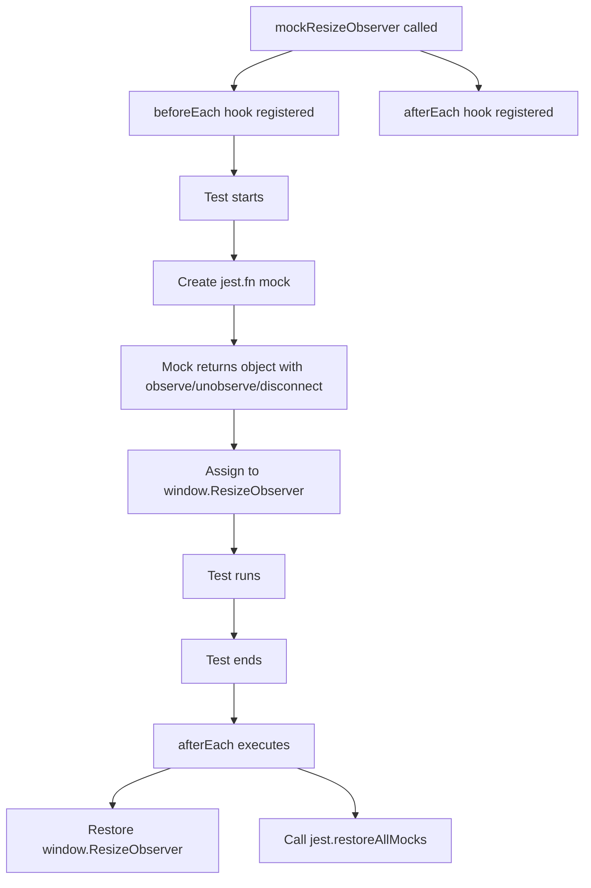
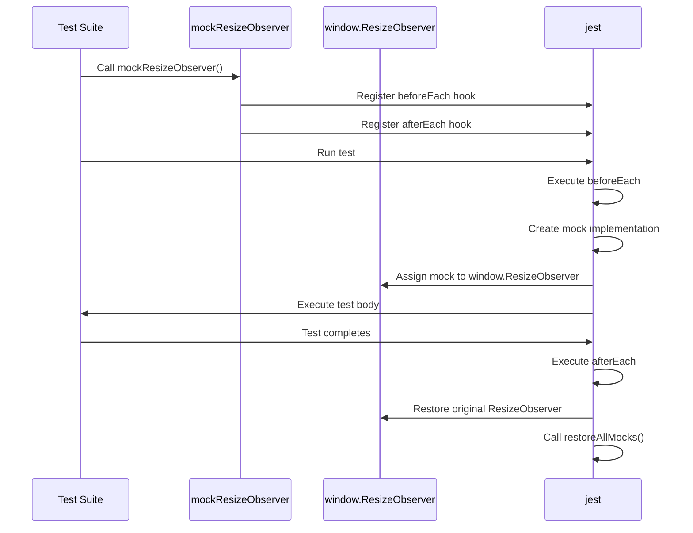
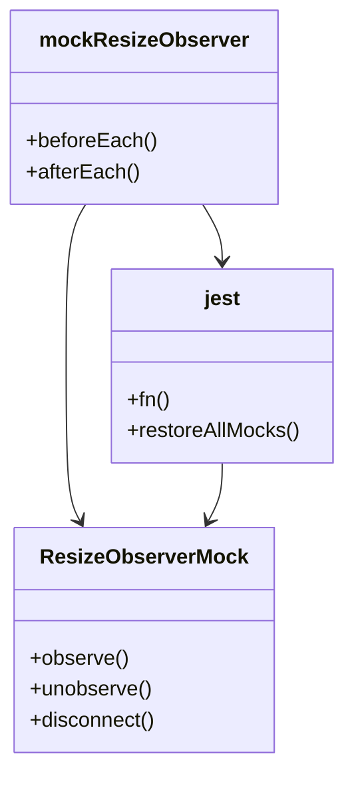

# Diagram: web/portal/src/test-utils/mock-resize-observer.ts

> Auto-generated by Obscura crawlers

## Diagram 1

### SVG

<svg id="container" width="720.80859375" xmlns="http://www.w3.org/2000/svg" class="flowchart" height="1078" viewBox="0 0 720.80859375 1078" role="graphics-document document" aria-roledescription="flowchart-v2"><g><marker id="container_flowchart-v2-pointEnd" class="marker flowchart-v2" viewBox="0 0 10 10" refX="5" refY="5" markerUnits="userSpaceOnUse" markerWidth="8" markerHeight="8" orient="auto"><path d="M 0 0 L 10 5 L 0 10 z" class="arrowMarkerPath" style="stroke-width: 1; stroke-dasharray: 1, 0;"></path></marker><marker id="container_flowchart-v2-pointStart" class="marker flowchart-v2" viewBox="0 0 10 10" refX="4.5" refY="5" markerUnits="userSpaceOnUse" markerWidth="8" markerHeight="8" orient="auto"><path d="M 0 5 L 10 10 L 10 0 z" class="arrowMarkerPath" style="stroke-width: 1; stroke-dasharray: 1, 0;"></path></marker><marker id="container_flowchart-v2-circleEnd" class="marker flowchart-v2" viewBox="0 0 10 10" refX="11" refY="5" markerUnits="userSpaceOnUse" markerWidth="11" markerHeight="11" orient="auto"><circle cx="5" cy="5" r="5" class="arrowMarkerPath" style="stroke-width: 1; stroke-dasharray: 1, 0;"></circle></marker><marker id="container_flowchart-v2-circleStart" class="marker flowchart-v2" viewBox="0 0 10 10" refX="-1" refY="5" markerUnits="userSpaceOnUse" markerWidth="11" markerHeight="11" orient="auto"><circle cx="5" cy="5" r="5" class="arrowMarkerPath" style="stroke-width: 1; stroke-dasharray: 1, 0;"></circle></marker><marker id="container_flowchart-v2-crossEnd" class="marker cross flowchart-v2" viewBox="0 0 11 11" refX="12" refY="5.2" markerUnits="userSpaceOnUse" markerWidth="11" markerHeight="11" orient="auto"><path d="M 1,1 l 9,9 M 10,1 l -9,9" class="arrowMarkerPath" style="stroke-width: 2; stroke-dasharray: 1, 0;"></path></marker><marker id="container_flowchart-v2-crossStart" class="marker cross flowchart-v2" viewBox="0 0 11 11" refX="-1" refY="5.2" markerUnits="userSpaceOnUse" markerWidth="11" markerHeight="11" orient="auto"><path d="M 1,1 l 9,9 M 10,1 l -9,9" class="arrowMarkerPath" style="stroke-width: 2; stroke-dasharray: 1, 0;"></path></marker><g class="root"><g class="clusters"></g><g class="edgePaths"><path d="M359.77,62L347.645,66.167C335.52,70.333,311.27,78.667,299.145,86.333C287.02,94,287.02,101,287.02,104.5L287.02,108" id="L_A_B_0" class="edge-thickness-normal edge-pattern-solid edge-thickness-normal edge-pattern-solid flowchart-link" style=";" data-edge="true" data-et="edge" data-id="L_A_B_0" data-points="W3sieCI6MzU5Ljc2OTY4MTQ5MDM4NDY0LCJ5Ijo2Mn0seyJ4IjoyODcuMDE5NTMxMjUsInkiOjg3fSx7IngiOjI4Ny4wMTk1MzEyNSwieSI6MTEyfV0=" marker-end="url(#container_flowchart-v2-pointEnd)"></path><path d="M516.91,62L529.035,66.167C541.16,70.333,565.41,78.667,577.535,86.333C589.66,94,589.66,101,589.66,104.5L589.66,108" id="L_A_C_0" class="edge-thickness-normal edge-pattern-solid edge-thickness-normal edge-pattern-solid flowchart-link" style=";" data-edge="true" data-et="edge" data-id="L_A_C_0" data-points="W3sieCI6NTE2LjkxMDAwNjAwOTYxNTQsInkiOjYyfSx7IngiOjU4OS42NjAxNTYyNSwieSI6ODd9LHsieCI6NTg5LjY2MDE1NjI1LCJ5IjoxMTJ9XQ==" marker-end="url(#container_flowchart-v2-pointEnd)"></path><path d="M287.02,166L287.02,170.167C287.02,174.333,287.02,182.667,287.02,190.333C287.02,198,287.02,205,287.02,208.5L287.02,212" id="L_B_D_0" class="edge-thickness-normal edge-pattern-solid edge-thickness-normal edge-pattern-solid flowchart-link" style=";" data-edge="true" data-et="edge" data-id="L_B_D_0" data-points="W3sieCI6Mjg3LjAxOTUzMTI1LCJ5IjoxNjZ9LHsieCI6Mjg3LjAxOTUzMTI1LCJ5IjoxOTF9LHsieCI6Mjg3LjAxOTUzMTI1LCJ5IjoyMTZ9XQ==" marker-end="url(#container_flowchart-v2-pointEnd)"></path><path d="M287.02,270L287.02,274.167C287.02,278.333,287.02,286.667,287.02,294.333C287.02,302,287.02,309,287.02,312.5L287.02,316" id="L_D_E_0" class="edge-thickness-normal edge-pattern-solid edge-thickness-normal edge-pattern-solid flowchart-link" style=";" data-edge="true" data-et="edge" data-id="L_D_E_0" data-points="W3sieCI6Mjg3LjAxOTUzMTI1LCJ5IjoyNzB9LHsieCI6Mjg3LjAxOTUzMTI1LCJ5IjoyOTV9LHsieCI6Mjg3LjAxOTUzMTI1LCJ5IjozMjB9XQ==" marker-end="url(#container_flowchart-v2-pointEnd)"></path><path d="M287.02,374L287.02,378.167C287.02,382.333,287.02,390.667,287.02,398.333C287.02,406,287.02,413,287.02,416.5L287.02,420" id="L_E_F_0" class="edge-thickness-normal edge-pattern-solid edge-thickness-normal edge-pattern-solid flowchart-link" style=";" data-edge="true" data-et="edge" data-id="L_E_F_0" data-points="W3sieCI6Mjg3LjAxOTUzMTI1LCJ5IjozNzR9LHsieCI6Mjg3LjAxOTUzMTI1LCJ5IjozOTl9LHsieCI6Mjg3LjAxOTUzMTI1LCJ5Ijo0MjR9XQ==" marker-end="url(#container_flowchart-v2-pointEnd)"></path><path d="M287.02,502L287.02,506.167C287.02,510.333,287.02,518.667,287.02,526.333C287.02,534,287.02,541,287.02,544.5L287.02,548" id="L_F_G_0" class="edge-thickness-normal edge-pattern-solid edge-thickness-normal edge-pattern-solid flowchart-link" style=";" data-edge="true" data-et="edge" data-id="L_F_G_0" data-points="W3sieCI6Mjg3LjAxOTUzMTI1LCJ5Ijo1MDJ9LHsieCI6Mjg3LjAxOTUzMTI1LCJ5Ijo1Mjd9LHsieCI6Mjg3LjAxOTUzMTI1LCJ5Ijo1NTJ9XQ==" marker-end="url(#container_flowchart-v2-pointEnd)"></path><path d="M287.02,630L287.02,634.167C287.02,638.333,287.02,646.667,287.02,654.333C287.02,662,287.02,669,287.02,672.5L287.02,676" id="L_G_H_0" class="edge-thickness-normal edge-pattern-solid edge-thickness-normal edge-pattern-solid flowchart-link" style=";" data-edge="true" data-et="edge" data-id="L_G_H_0" data-points="W3sieCI6Mjg3LjAxOTUzMTI1LCJ5Ijo2MzB9LHsieCI6Mjg3LjAxOTUzMTI1LCJ5Ijo2NTV9LHsieCI6Mjg3LjAxOTUzMTI1LCJ5Ijo2ODB9XQ==" marker-end="url(#container_flowchart-v2-pointEnd)"></path><path d="M287.02,734L287.02,738.167C287.02,742.333,287.02,750.667,287.02,758.333C287.02,766,287.02,773,287.02,776.5L287.02,780" id="L_H_I_0" class="edge-thickness-normal edge-pattern-solid edge-thickness-normal edge-pattern-solid flowchart-link" style=";" data-edge="true" data-et="edge" data-id="L_H_I_0" data-points="W3sieCI6Mjg3LjAxOTUzMTI1LCJ5Ijo3MzR9LHsieCI6Mjg3LjAxOTUzMTI1LCJ5Ijo3NTl9LHsieCI6Mjg3LjAxOTUzMTI1LCJ5Ijo3ODR9XQ==" marker-end="url(#container_flowchart-v2-pointEnd)"></path><path d="M287.02,838L287.02,842.167C287.02,846.333,287.02,854.667,287.02,862.333C287.02,870,287.02,877,287.02,880.5L287.02,884" id="L_I_J_0" class="edge-thickness-normal edge-pattern-solid edge-thickness-normal edge-pattern-solid flowchart-link" style=";" data-edge="true" data-et="edge" data-id="L_I_J_0" data-points="W3sieCI6Mjg3LjAxOTUzMTI1LCJ5Ijo4Mzh9LHsieCI6Mjg3LjAxOTUzMTI1LCJ5Ijo4NjN9LHsieCI6Mjg3LjAxOTUzMTI1LCJ5Ijo4ODh9XQ==" marker-end="url(#container_flowchart-v2-pointEnd)"></path><path d="M209.644,942L197.703,946.167C185.763,950.333,161.881,958.667,149.941,966.333C138,974,138,981,138,984.5L138,988" id="L_J_K_0" class="edge-thickness-normal edge-pattern-solid edge-thickness-normal edge-pattern-solid flowchart-link" style=";" data-edge="true" data-et="edge" data-id="L_J_K_0" data-points="W3sieCI6MjA5LjY0NDAwNTQwODY1Mzg0LCJ5Ijo5NDJ9LHsieCI6MTM4LCJ5Ijo5Njd9LHsieCI6MTM4LCJ5Ijo5OTJ9XQ==" marker-end="url(#container_flowchart-v2-pointEnd)"></path><path d="M364.395,942L376.336,946.167C388.276,950.333,412.158,958.667,424.098,968.333C436.039,978,436.039,989,436.039,994.5L436.039,1000" id="L_J_L_0" class="edge-thickness-normal edge-pattern-solid edge-thickness-normal edge-pattern-solid flowchart-link" style=";" data-edge="true" data-et="edge" data-id="L_J_L_0" data-points="W3sieCI6MzY0LjM5NTA1NzA5MTM0NjIsInkiOjk0Mn0seyJ4Ijo0MzYuMDM5MDYyNSwieSI6OTY3fSx7IngiOjQzNi4wMzkwNjI1LCJ5IjoxMDA0fV0=" marker-end="url(#container_flowchart-v2-pointEnd)"></path></g><g class="edgeLabels"><g class="edgeLabel"><g class="label" data-id="L_A_B_0" transform="translate(0, 0)"><foreignObject width="0" height="0">

</foreignObject></g></g><g class="edgeLabel"><g class="label" data-id="L_A_C_0" transform="translate(0, 0)"><foreignObject width="0" height="0">

</foreignObject></g></g><g class="edgeLabel"><g class="label" data-id="L_B_D_0" transform="translate(0, 0)"><foreignObject width="0" height="0">

</foreignObject></g></g><g class="edgeLabel"><g class="label" data-id="L_D_E_0" transform="translate(0, 0)"><foreignObject width="0" height="0">

</foreignObject></g></g><g class="edgeLabel"><g class="label" data-id="L_E_F_0" transform="translate(0, 0)"><foreignObject width="0" height="0">

</foreignObject></g></g><g class="edgeLabel"><g class="label" data-id="L_F_G_0" transform="translate(0, 0)"><foreignObject width="0" height="0">

</foreignObject></g></g><g class="edgeLabel"><g class="label" data-id="L_G_H_0" transform="translate(0, 0)"><foreignObject width="0" height="0">

</foreignObject></g></g><g class="edgeLabel"><g class="label" data-id="L_H_I_0" transform="translate(0, 0)"><foreignObject width="0" height="0">

</foreignObject></g></g><g class="edgeLabel"><g class="label" data-id="L_I_J_0" transform="translate(0, 0)"><foreignObject width="0" height="0">

</foreignObject></g></g><g class="edgeLabel"><g class="label" data-id="L_J_K_0" transform="translate(0, 0)"><foreignObject width="0" height="0">

</foreignObject></g></g><g class="edgeLabel"><g class="label" data-id="L_J_L_0" transform="translate(0, 0)"><foreignObject width="0" height="0">

</foreignObject></g></g></g><g class="nodes"><g class="node default" id="flowchart-A-0" transform="translate(438.33984375, 35)"><rect class="basic label-container" style="" x="-129.078125" y="-27" width="258.15625" height="54"></rect><g class="label" style="" transform="translate(-99.078125, -12)"><rect></rect><foreignObject width="198.15625" height="24">

mockResizeObserver called

</foreignObject></g></g><g class="node default" id="flowchart-B-1" transform="translate(287.01953125, 139)"><rect class="basic label-container" style="" x="-129.4921875" y="-27" width="258.984375" height="54"></rect><g class="label" style="" transform="translate(-99.4921875, -12)"><rect></rect><foreignObject width="198.984375" height="24">

beforeEach hook registered

</foreignObject></g></g><g class="node default" id="flowchart-C-3" transform="translate(589.66015625, 139)"><rect class="basic label-container" style="" x="-123.1484375" y="-27" width="246.296875" height="54"></rect><g class="label" style="" transform="translate(-93.1484375, -12)"><rect></rect><foreignObject width="186.296875" height="24">

afterEach hook registered

</foreignObject></g></g><g class="node default" id="flowchart-D-5" transform="translate(287.01953125, 243)"><rect class="basic label-container" style="" x="-67.4375" y="-27" width="134.875" height="54"></rect><g class="label" style="" transform="translate(-37.4375, -12)"><rect></rect><foreignObject width="74.875" height="24">

Test starts

</foreignObject></g></g><g class="node default" id="flowchart-E-7" transform="translate(287.01953125, 347)"><rect class="basic label-container" style="" x="-99.09375" y="-27" width="198.1875" height="54"></rect><g class="label" style="" transform="translate(-69.09375, -12)"><rect></rect><foreignObject width="138.1875" height="24">

Create jest.fn mock

</foreignObject></g></g><g class="node default" id="flowchart-F-9" transform="translate(287.01953125, 463)"><rect class="basic label-container" style="" x="-144.328125" y="-39" width="288.65625" height="78"></rect><g class="label" style="" transform="translate(-114.328125, -24)"><rect></rect><foreignObject width="228.65625" height="48">

Mock returns object with observe/unobserve/disconnect

</foreignObject></g></g><g class="node default" id="flowchart-G-11" transform="translate(287.01953125, 591)"><rect class="basic label-container" style="" x="-130" y="-39" width="260" height="78"></rect><g class="label" style="" transform="translate(-100, -24)"><rect></rect><foreignObject width="200" height="48">

Assign to window.ResizeObserver

</foreignObject></g></g><g class="node default" id="flowchart-H-13" transform="translate(287.01953125, 707)"><rect class="basic label-container" style="" x="-62.96875" y="-27" width="125.9375" height="54"></rect><g class="label" style="" transform="translate(-32.96875, -12)"><rect></rect><foreignObject width="65.9375" height="24">

Test runs

</foreignObject></g></g><g class="node default" id="flowchart-I-15" transform="translate(287.01953125, 811)"><rect class="basic label-container" style="" x="-64.375" y="-27" width="128.75" height="54"></rect><g class="label" style="" transform="translate(-34.375, -12)"><rect></rect><foreignObject width="68.75" height="24">

Test ends

</foreignObject></g></g><g class="node default" id="flowchart-J-17" transform="translate(287.01953125, 915)"><rect class="basic label-container" style="" x="-98.140625" y="-27" width="196.28125" height="54"></rect><g class="label" style="" transform="translate(-68.140625, -12)"><rect></rect><foreignObject width="136.28125" height="24">

afterEach executes

</foreignObject></g></g><g class="node default" id="flowchart-K-19" transform="translate(138, 1031)"><rect class="basic label-container" style="" x="-130" y="-39" width="260" height="78"></rect><g class="label" style="" transform="translate(-100, -24)"><rect></rect><foreignObject width="200" height="48">

Restore window.ResizeObserver

</foreignObject></g></g><g class="node default" id="flowchart-L-21" transform="translate(436.0390625, 1031)"><rect class="basic label-container" style="" x="-118.0390625" y="-27" width="236.078125" height="54"></rect><g class="label" style="" transform="translate(-88.0390625, -12)"><rect></rect><foreignObject width="176.078125" height="24">

Call jest.restoreAllMocks

</foreignObject></g></g></g></g></g></svg>

## Diagram 2

### SVG

<svg id="container" width="1128" xmlns="http://www.w3.org/2000/svg" height="867" viewBox="-50 -10 1128 867" role="graphics-document document" aria-roledescription="sequence"><g><rect x="847" y="781" fill="#eaeaea" stroke="#666" width="150" height="65" name="Jest" rx="3" ry="3" class="actor actor-bottom"></rect><text x="922" y="813.5" dominant-baseline="central" alignment-baseline="central" class="actor actor-box" style="text-anchor: middle; font-size: 16px; font-weight: 400;"><tspan x="922" dy="0">jest</tspan></text></g><g><rect x="472.5" y="781" fill="#eaeaea" stroke="#666" width="191" height="65" name="Window" rx="3" ry="3" class="actor actor-bottom"></rect><text x="568" y="813.5" dominant-baseline="central" alignment-baseline="central" class="actor actor-box" style="text-anchor: middle; font-size: 16px; font-weight: 400;"><tspan x="568" dy="0">window.ResizeObserver</tspan></text></g><g><rect x="251.5" y="781" fill="#eaeaea" stroke="#666" width="171" height="65" name="Mock" rx="3" ry="3" class="actor actor-bottom"></rect><text x="337" y="813.5" dominant-baseline="central" alignment-baseline="central" class="actor actor-box" style="text-anchor: middle; font-size: 16px; font-weight: 400;"><tspan x="337" dy="0">mockResizeObserver</tspan></text></g><g><rect x="0" y="781" fill="#eaeaea" stroke="#666" width="150" height="65" name="Test" rx="3" ry="3" class="actor actor-bottom"></rect><text x="75" y="813.5" dominant-baseline="central" alignment-baseline="central" class="actor actor-box" style="text-anchor: middle; font-size: 16px; font-weight: 400;"><tspan x="75" dy="0">Test Suite</tspan></text></g><g><line id="actor3" x1="922" y1="65" x2="922" y2="781" class="actor-line 200" stroke-width="0.5px" stroke="#999" name="Jest"></line><g id="root-3"><rect x="847" y="0" fill="#eaeaea" stroke="#666" width="150" height="65" name="Jest" rx="3" ry="3" class="actor actor-top"></rect><text x="922" y="32.5" dominant-baseline="central" alignment-baseline="central" class="actor actor-box" style="text-anchor: middle; font-size: 16px; font-weight: 400;"><tspan x="922" dy="0">jest</tspan></text></g></g><g><line id="actor2" x1="568" y1="65" x2="568" y2="781" class="actor-line 200" stroke-width="0.5px" stroke="#999" name="Window"></line><g id="root-2"><rect x="472.5" y="0" fill="#eaeaea" stroke="#666" width="191" height="65" name="Window" rx="3" ry="3" class="actor actor-top"></rect><text x="568" y="32.5" dominant-baseline="central" alignment-baseline="central" class="actor actor-box" style="text-anchor: middle; font-size: 16px; font-weight: 400;"><tspan x="568" dy="0">window.ResizeObserver</tspan></text></g></g><g><line id="actor1" x1="337" y1="65" x2="337" y2="781" class="actor-line 200" stroke-width="0.5px" stroke="#999" name="Mock"></line><g id="root-1"><rect x="251.5" y="0" fill="#eaeaea" stroke="#666" width="171" height="65" name="Mock" rx="3" ry="3" class="actor actor-top"></rect><text x="337" y="32.5" dominant-baseline="central" alignment-baseline="central" class="actor actor-box" style="text-anchor: middle; font-size: 16px; font-weight: 400;"><tspan x="337" dy="0">mockResizeObserver</tspan></text></g></g><g><line id="actor0" x1="75" y1="65" x2="75" y2="781" class="actor-line 200" stroke-width="0.5px" stroke="#999" name="Test"></line><g id="root-0"><rect x="0" y="0" fill="#eaeaea" stroke="#666" width="150" height="65" name="Test" rx="3" ry="3" class="actor actor-top"></rect><text x="75" y="32.5" dominant-baseline="central" alignment-baseline="central" class="actor actor-box" style="text-anchor: middle; font-size: 16px; font-weight: 400;"><tspan x="75" dy="0">Test Suite</tspan></text></g></g><g></g><defs><symbol id="computer" width="24" height="24"><path transform="scale(.5)" d="M2 2v13h20v-13h-20zm18 11h-16v-9h16v9zm-10.228 6l.466-1h3.524l.467 1h-4.457zm14.228 3h-24l2-6h2.104l-1.33 4h18.45l-1.297-4h2.073l2 6zm-5-10h-14v-7h14v7z"></path></symbol></defs><defs><symbol id="database" fill-rule="evenodd" clip-rule="evenodd"><path transform="scale(.5)" d="M12.258.001l.256.004.255.005.253.008.251.01.249.012.247.015.246.016.242.019.241.02.239.023.236.024.233.027.231.028.229.031.225.032.223.034.22.036.217.038.214.04.211.041.208.043.205.045.201.046.198.048.194.05.191.051.187.053.183.054.18.056.175.057.172.059.168.06.163.061.16.063.155.064.15.066.074.033.073.033.071.034.07.034.069.035.068.035.067.035.066.035.064.036.064.036.062.036.06.036.06.037.058.037.058.037.055.038.055.038.053.038.052.038.051.039.05.039.048.039.047.039.045.04.044.04.043.04.041.04.04.041.039.041.037.041.036.041.034.041.033.042.032.042.03.042.029.042.027.042.026.043.024.043.023.043.021.043.02.043.018.044.017.043.015.044.013.044.012.044.011.045.009.044.007.045.006.045.004.045.002.045.001.045v17l-.001.045-.002.045-.004.045-.006.045-.007.045-.009.044-.011.045-.012.044-.013.044-.015.044-.017.043-.018.044-.02.043-.021.043-.023.043-.024.043-.026.043-.027.042-.029.042-.03.042-.032.042-.033.042-.034.041-.036.041-.037.041-.039.041-.04.041-.041.04-.043.04-.044.04-.045.04-.047.039-.048.039-.05.039-.051.039-.052.038-.053.038-.055.038-.055.038-.058.037-.058.037-.06.037-.06.036-.062.036-.064.036-.064.036-.066.035-.067.035-.068.035-.069.035-.07.034-.071.034-.073.033-.074.033-.15.066-.155.064-.16.063-.163.061-.168.06-.172.059-.175.057-.18.056-.183.054-.187.053-.191.051-.194.05-.198.048-.201.046-.205.045-.208.043-.211.041-.214.04-.217.038-.22.036-.223.034-.225.032-.229.031-.231.028-.233.027-.236.024-.239.023-.241.02-.242.019-.246.016-.247.015-.249.012-.251.01-.253.008-.255.005-.256.004-.258.001-.258-.001-.256-.004-.255-.005-.253-.008-.251-.01-.249-.012-.247-.015-.245-.016-.243-.019-.241-.02-.238-.023-.236-.024-.234-.027-.231-.028-.228-.031-.226-.032-.223-.034-.22-.036-.217-.038-.214-.04-.211-.041-.208-.043-.204-.045-.201-.046-.198-.048-.195-.05-.19-.051-.187-.053-.184-.054-.179-.056-.176-.057-.172-.059-.167-.06-.164-.061-.159-.063-.155-.064-.151-.066-.074-.033-.072-.033-.072-.034-.07-.034-.069-.035-.068-.035-.067-.035-.066-.035-.064-.036-.063-.036-.062-.036-.061-.036-.06-.037-.058-.037-.057-.037-.056-.038-.055-.038-.053-.038-.052-.038-.051-.039-.049-.039-.049-.039-.046-.039-.046-.04-.044-.04-.043-.04-.041-.04-.04-.041-.039-.041-.037-.041-.036-.041-.034-.041-.033-.042-.032-.042-.03-.042-.029-.042-.027-.042-.026-.043-.024-.043-.023-.043-.021-.043-.02-.043-.018-.044-.017-.043-.015-.044-.013-.044-.012-.044-.011-.045-.009-.044-.007-.045-.006-.045-.004-.045-.002-.045-.001-.045v-17l.001-.045.002-.045.004-.045.006-.045.007-.045.009-.044.011-.045.012-.044.013-.044.015-.044.017-.043.018-.044.02-.043.021-.043.023-.043.024-.043.026-.043.027-.042.029-.042.03-.042.032-.042.033-.042.034-.041.036-.041.037-.041.039-.041.04-.041.041-.04.043-.04.044-.04.046-.04.046-.039.049-.039.049-.039.051-.039.052-.038.053-.038.055-.038.056-.038.057-.037.058-.037.06-.037.061-.036.062-.036.063-.036.064-.036.066-.035.067-.035.068-.035.069-.035.07-.034.072-.034.072-.033.074-.033.151-.066.155-.064.159-.063.164-.061.167-.06.172-.059.176-.057.179-.056.184-.054.187-.053.19-.051.195-.05.198-.048.201-.046.204-.045.208-.043.211-.041.214-.04.217-.038.22-.036.223-.034.226-.032.228-.031.231-.028.234-.027.236-.024.238-.023.241-.02.243-.019.245-.016.247-.015.249-.012.251-.01.253-.008.255-.005.256-.004.258-.001.258.001zm-9.258 20.499v.01l.001.021.003.021.004.022.005.021.006.022.007.022.009.023.01.022.011.023.012.023.013.023.015.023.016.024.017.023.018.024.019.024.021.024.022.025.023.024.024.025.052.049.056.05.061.051.066.051.07.051.075.051.079.052.084.052.088.052.092.052.097.052.102.051.105.052.11.052.114.051.119.051.123.051.127.05.131.05.135.05.139.048.144.049.147.047.152.047.155.047.16.045.163.045.167.043.171.043.176.041.178.041.183.039.187.039.19.037.194.035.197.035.202.033.204.031.209.03.212.029.216.027.219.025.222.024.226.021.23.02.233.018.236.016.24.015.243.012.246.01.249.008.253.005.256.004.259.001.26-.001.257-.004.254-.005.25-.008.247-.011.244-.012.241-.014.237-.016.233-.018.231-.021.226-.021.224-.024.22-.026.216-.027.212-.028.21-.031.205-.031.202-.034.198-.034.194-.036.191-.037.187-.039.183-.04.179-.04.175-.042.172-.043.168-.044.163-.045.16-.046.155-.046.152-.047.148-.048.143-.049.139-.049.136-.05.131-.05.126-.05.123-.051.118-.052.114-.051.11-.052.106-.052.101-.052.096-.052.092-.052.088-.053.083-.051.079-.052.074-.052.07-.051.065-.051.06-.051.056-.05.051-.05.023-.024.023-.025.021-.024.02-.024.019-.024.018-.024.017-.024.015-.023.014-.024.013-.023.012-.023.01-.023.01-.022.008-.022.006-.022.006-.022.004-.022.004-.021.001-.021.001-.021v-4.127l-.077.055-.08.053-.083.054-.085.053-.087.052-.09.052-.093.051-.095.05-.097.05-.1.049-.102.049-.105.048-.106.047-.109.047-.111.046-.114.045-.115.045-.118.044-.12.043-.122.042-.124.042-.126.041-.128.04-.13.04-.132.038-.134.038-.135.037-.138.037-.139.035-.142.035-.143.034-.144.033-.147.032-.148.031-.15.03-.151.03-.153.029-.154.027-.156.027-.158.026-.159.025-.161.024-.162.023-.163.022-.165.021-.166.02-.167.019-.169.018-.169.017-.171.016-.173.015-.173.014-.175.013-.175.012-.177.011-.178.01-.179.008-.179.008-.181.006-.182.005-.182.004-.184.003-.184.002h-.37l-.184-.002-.184-.003-.182-.004-.182-.005-.181-.006-.179-.008-.179-.008-.178-.01-.176-.011-.176-.012-.175-.013-.173-.014-.172-.015-.171-.016-.17-.017-.169-.018-.167-.019-.166-.02-.165-.021-.163-.022-.162-.023-.161-.024-.159-.025-.157-.026-.156-.027-.155-.027-.153-.029-.151-.03-.15-.03-.148-.031-.146-.032-.145-.033-.143-.034-.141-.035-.14-.035-.137-.037-.136-.037-.134-.038-.132-.038-.13-.04-.128-.04-.126-.041-.124-.042-.122-.042-.12-.044-.117-.043-.116-.045-.113-.045-.112-.046-.109-.047-.106-.047-.105-.048-.102-.049-.1-.049-.097-.05-.095-.05-.093-.052-.09-.051-.087-.052-.085-.053-.083-.054-.08-.054-.077-.054v4.127zm0-5.654v.011l.001.021.003.021.004.021.005.022.006.022.007.022.009.022.01.022.011.023.012.023.013.023.015.024.016.023.017.024.018.024.019.024.021.024.022.024.023.025.024.024.052.05.056.05.061.05.066.051.07.051.075.052.079.051.084.052.088.052.092.052.097.052.102.052.105.052.11.051.114.051.119.052.123.05.127.051.131.05.135.049.139.049.144.048.147.048.152.047.155.046.16.045.163.045.167.044.171.042.176.042.178.04.183.04.187.038.19.037.194.036.197.034.202.033.204.032.209.03.212.028.216.027.219.025.222.024.226.022.23.02.233.018.236.016.24.014.243.012.246.01.249.008.253.006.256.003.259.001.26-.001.257-.003.254-.006.25-.008.247-.01.244-.012.241-.015.237-.016.233-.018.231-.02.226-.022.224-.024.22-.025.216-.027.212-.029.21-.03.205-.032.202-.033.198-.035.194-.036.191-.037.187-.039.183-.039.179-.041.175-.042.172-.043.168-.044.163-.045.16-.045.155-.047.152-.047.148-.048.143-.048.139-.05.136-.049.131-.05.126-.051.123-.051.118-.051.114-.052.11-.052.106-.052.101-.052.096-.052.092-.052.088-.052.083-.052.079-.052.074-.051.07-.052.065-.051.06-.05.056-.051.051-.049.023-.025.023-.024.021-.025.02-.024.019-.024.018-.024.017-.024.015-.023.014-.023.013-.024.012-.022.01-.023.01-.023.008-.022.006-.022.006-.022.004-.021.004-.022.001-.021.001-.021v-4.139l-.077.054-.08.054-.083.054-.085.052-.087.053-.09.051-.093.051-.095.051-.097.05-.1.049-.102.049-.105.048-.106.047-.109.047-.111.046-.114.045-.115.044-.118.044-.12.044-.122.042-.124.042-.126.041-.128.04-.13.039-.132.039-.134.038-.135.037-.138.036-.139.036-.142.035-.143.033-.144.033-.147.033-.148.031-.15.03-.151.03-.153.028-.154.028-.156.027-.158.026-.159.025-.161.024-.162.023-.163.022-.165.021-.166.02-.167.019-.169.018-.169.017-.171.016-.173.015-.173.014-.175.013-.175.012-.177.011-.178.009-.179.009-.179.007-.181.007-.182.005-.182.004-.184.003-.184.002h-.37l-.184-.002-.184-.003-.182-.004-.182-.005-.181-.007-.179-.007-.179-.009-.178-.009-.176-.011-.176-.012-.175-.013-.173-.014-.172-.015-.171-.016-.17-.017-.169-.018-.167-.019-.166-.02-.165-.021-.163-.022-.162-.023-.161-.024-.159-.025-.157-.026-.156-.027-.155-.028-.153-.028-.151-.03-.15-.03-.148-.031-.146-.033-.145-.033-.143-.033-.141-.035-.14-.036-.137-.036-.136-.037-.134-.038-.132-.039-.13-.039-.128-.04-.126-.041-.124-.042-.122-.043-.12-.043-.117-.044-.116-.044-.113-.046-.112-.046-.109-.046-.106-.047-.105-.048-.102-.049-.1-.049-.097-.05-.095-.051-.093-.051-.09-.051-.087-.053-.085-.052-.083-.054-.08-.054-.077-.054v4.139zm0-5.666v.011l.001.02.003.022.004.021.005.022.006.021.007.022.009.023.01.022.011.023.012.023.013.023.015.023.016.024.017.024.018.023.019.024.021.025.022.024.023.024.024.025.052.05.056.05.061.05.066.051.07.051.075.052.079.051.084.052.088.052.092.052.097.052.102.052.105.051.11.052.114.051.119.051.123.051.127.05.131.05.135.05.139.049.144.048.147.048.152.047.155.046.16.045.163.045.167.043.171.043.176.042.178.04.183.04.187.038.19.037.194.036.197.034.202.033.204.032.209.03.212.028.216.027.219.025.222.024.226.021.23.02.233.018.236.017.24.014.243.012.246.01.249.008.253.006.256.003.259.001.26-.001.257-.003.254-.006.25-.008.247-.01.244-.013.241-.014.237-.016.233-.018.231-.02.226-.022.224-.024.22-.025.216-.027.212-.029.21-.03.205-.032.202-.033.198-.035.194-.036.191-.037.187-.039.183-.039.179-.041.175-.042.172-.043.168-.044.163-.045.16-.045.155-.047.152-.047.148-.048.143-.049.139-.049.136-.049.131-.051.126-.05.123-.051.118-.052.114-.051.11-.052.106-.052.101-.052.096-.052.092-.052.088-.052.083-.052.079-.052.074-.052.07-.051.065-.051.06-.051.056-.05.051-.049.023-.025.023-.025.021-.024.02-.024.019-.024.018-.024.017-.024.015-.023.014-.024.013-.023.012-.023.01-.022.01-.023.008-.022.006-.022.006-.022.004-.022.004-.021.001-.021.001-.021v-4.153l-.077.054-.08.054-.083.053-.085.053-.087.053-.09.051-.093.051-.095.051-.097.05-.1.049-.102.048-.105.048-.106.048-.109.046-.111.046-.114.046-.115.044-.118.044-.12.043-.122.043-.124.042-.126.041-.128.04-.13.039-.132.039-.134.038-.135.037-.138.036-.139.036-.142.034-.143.034-.144.033-.147.032-.148.032-.15.03-.151.03-.153.028-.154.028-.156.027-.158.026-.159.024-.161.024-.162.023-.163.023-.165.021-.166.02-.167.019-.169.018-.169.017-.171.016-.173.015-.173.014-.175.013-.175.012-.177.01-.178.01-.179.009-.179.007-.181.006-.182.006-.182.004-.184.003-.184.001-.185.001-.185-.001-.184-.001-.184-.003-.182-.004-.182-.006-.181-.006-.179-.007-.179-.009-.178-.01-.176-.01-.176-.012-.175-.013-.173-.014-.172-.015-.171-.016-.17-.017-.169-.018-.167-.019-.166-.02-.165-.021-.163-.023-.162-.023-.161-.024-.159-.024-.157-.026-.156-.027-.155-.028-.153-.028-.151-.03-.15-.03-.148-.032-.146-.032-.145-.033-.143-.034-.141-.034-.14-.036-.137-.036-.136-.037-.134-.038-.132-.039-.13-.039-.128-.041-.126-.041-.124-.041-.122-.043-.12-.043-.117-.044-.116-.044-.113-.046-.112-.046-.109-.046-.106-.048-.105-.048-.102-.048-.1-.05-.097-.049-.095-.051-.093-.051-.09-.052-.087-.052-.085-.053-.083-.053-.08-.054-.077-.054v4.153zm8.74-8.179l-.257.004-.254.005-.25.008-.247.011-.244.012-.241.014-.237.016-.233.018-.231.021-.226.022-.224.023-.22.026-.216.027-.212.028-.21.031-.205.032-.202.033-.198.034-.194.036-.191.038-.187.038-.183.04-.179.041-.175.042-.172.043-.168.043-.163.045-.16.046-.155.046-.152.048-.148.048-.143.048-.139.049-.136.05-.131.05-.126.051-.123.051-.118.051-.114.052-.11.052-.106.052-.101.052-.096.052-.092.052-.088.052-.083.052-.079.052-.074.051-.07.052-.065.051-.06.05-.056.05-.051.05-.023.025-.023.024-.021.024-.02.025-.019.024-.018.024-.017.023-.015.024-.014.023-.013.023-.012.023-.01.023-.01.022-.008.022-.006.023-.006.021-.004.022-.004.021-.001.021-.001.021.001.021.001.021.004.021.004.022.006.021.006.023.008.022.01.022.01.023.012.023.013.023.014.023.015.024.017.023.018.024.019.024.02.025.021.024.023.024.023.025.051.05.056.05.06.05.065.051.07.052.074.051.079.052.083.052.088.052.092.052.096.052.101.052.106.052.11.052.114.052.118.051.123.051.126.051.131.05.136.05.139.049.143.048.148.048.152.048.155.046.16.046.163.045.168.043.172.043.175.042.179.041.183.04.187.038.191.038.194.036.198.034.202.033.205.032.21.031.212.028.216.027.22.026.224.023.226.022.231.021.233.018.237.016.241.014.244.012.247.011.25.008.254.005.257.004.26.001.26-.001.257-.004.254-.005.25-.008.247-.011.244-.012.241-.014.237-.016.233-.018.231-.021.226-.022.224-.023.22-.026.216-.027.212-.028.21-.031.205-.032.202-.033.198-.034.194-.036.191-.038.187-.038.183-.04.179-.041.175-.042.172-.043.168-.043.163-.045.16-.046.155-.046.152-.048.148-.048.143-.048.139-.049.136-.05.131-.05.126-.051.123-.051.118-.051.114-.052.11-.052.106-.052.101-.052.096-.052.092-.052.088-.052.083-.052.079-.052.074-.051.07-.052.065-.051.06-.05.056-.05.051-.05.023-.025.023-.024.021-.024.02-.025.019-.024.018-.024.017-.023.015-.024.014-.023.013-.023.012-.023.01-.023.01-.022.008-.022.006-.023.006-.021.004-.022.004-.021.001-.021.001-.021-.001-.021-.001-.021-.004-.021-.004-.022-.006-.021-.006-.023-.008-.022-.01-.022-.01-.023-.012-.023-.013-.023-.014-.023-.015-.024-.017-.023-.018-.024-.019-.024-.02-.025-.021-.024-.023-.024-.023-.025-.051-.05-.056-.05-.06-.05-.065-.051-.07-.052-.074-.051-.079-.052-.083-.052-.088-.052-.092-.052-.096-.052-.101-.052-.106-.052-.11-.052-.114-.052-.118-.051-.123-.051-.126-.051-.131-.05-.136-.05-.139-.049-.143-.048-.148-.048-.152-.048-.155-.046-.16-.046-.163-.045-.168-.043-.172-.043-.175-.042-.179-.041-.183-.04-.187-.038-.191-.038-.194-.036-.198-.034-.202-.033-.205-.032-.21-.031-.212-.028-.216-.027-.22-.026-.224-.023-.226-.022-.231-.021-.233-.018-.237-.016-.241-.014-.244-.012-.247-.011-.25-.008-.254-.005-.257-.004-.26-.001-.26.001z"></path></symbol></defs><defs><symbol id="clock" width="24" height="24"><path transform="scale(.5)" d="M12 2c5.514 0 10 4.486 10 10s-4.486 10-10 10-10-4.486-10-10 4.486-10 10-10zm0-2c-6.627 0-12 5.373-12 12s5.373 12 12 12 12-5.373 12-12-5.373-12-12-12zm5.848 12.459c.202.038.202.333.001.372-1.907.361-6.045 1.111-6.547 1.111-.719 0-1.301-.582-1.301-1.301 0-.512.77-5.447 1.125-7.445.034-.192.312-.181.343.014l.985 6.238 5.394 1.011z"></path></symbol></defs><defs><marker id="arrowhead" refX="7.9" refY="5" markerUnits="userSpaceOnUse" markerWidth="12" markerHeight="12" orient="auto-start-reverse"><path d="M -1 0 L 10 5 L 0 10 z"></path></marker></defs><defs><marker id="crosshead" markerWidth="15" markerHeight="8" orient="auto" refX="4" refY="4.5"><path fill="none" stroke="#000000" stroke-width="1pt" d="M 1,2 L 6,7 M 6,2 L 1,7" style="stroke-dasharray: 0, 0;"></path></marker></defs><defs><marker id="filled-head" refX="15.5" refY="7" markerWidth="20" markerHeight="28" orient="auto"><path d="M 18,7 L9,13 L14,7 L9,1 Z"></path></marker></defs><defs><marker id="sequencenumber" refX="15" refY="15" markerWidth="60" markerHeight="40" orient="auto"><circle cx="15" cy="15" r="6"></circle></marker></defs><text x="205" y="80" text-anchor="middle" dominant-baseline="middle" alignment-baseline="middle" class="messageText" dy="1em" style="font-size: 16px; font-weight: 400;">Call mockResizeObserver()</text><line x1="76" y1="113" x2="333" y2="113" class="messageLine0" stroke-width="2" stroke="none" marker-end="url(#arrowhead)" style="fill: none;"></line><text x="628" y="128" text-anchor="middle" dominant-baseline="middle" alignment-baseline="middle" class="messageText" dy="1em" style="font-size: 16px; font-weight: 400;">Register beforeEach hook</text><line x1="338" y1="161" x2="918" y2="161" class="messageLine0" stroke-width="2" stroke="none" marker-end="url(#arrowhead)" style="fill: none;"></line><text x="628" y="176" text-anchor="middle" dominant-baseline="middle" alignment-baseline="middle" class="messageText" dy="1em" style="font-size: 16px; font-weight: 400;">Register afterEach hook</text><line x1="338" y1="209" x2="918" y2="209" class="messageLine0" stroke-width="2" stroke="none" marker-end="url(#arrowhead)" style="fill: none;"></line><text x="497" y="224" text-anchor="middle" dominant-baseline="middle" alignment-baseline="middle" class="messageText" dy="1em" style="font-size: 16px; font-weight: 400;">Run test</text><line x1="76" y1="257" x2="918" y2="257" class="messageLine0" stroke-width="2" stroke="none" marker-end="url(#arrowhead)" style="fill: none;"></line><text x="923" y="272" text-anchor="middle" dominant-baseline="middle" alignment-baseline="middle" class="messageText" dy="1em" style="font-size: 16px; font-weight: 400;">Execute beforeEach</text><path d="M 923,305 C 983,295 983,335 923,325" class="messageLine0" stroke-width="2" stroke="none" marker-end="url(#arrowhead)" style="fill: none;"></path><text x="923" y="350" text-anchor="middle" dominant-baseline="middle" alignment-baseline="middle" class="messageText" dy="1em" style="font-size: 16px; font-weight: 400;">Create mock implementation</text><path d="M 923,383 C 983,373 983,413 923,403" class="messageLine0" stroke-width="2" stroke="none" marker-end="url(#arrowhead)" style="fill: none;"></path><text x="747" y="428" text-anchor="middle" dominant-baseline="middle" alignment-baseline="middle" class="messageText" dy="1em" style="font-size: 16px; font-weight: 400;">Assign mock to window.ResizeObserver</text><line x1="921" y1="461" x2="572" y2="461" class="messageLine0" stroke-width="2" stroke="none" marker-end="url(#arrowhead)" style="fill: none;"></line><text x="500" y="476" text-anchor="middle" dominant-baseline="middle" alignment-baseline="middle" class="messageText" dy="1em" style="font-size: 16px; font-weight: 400;">Execute test body</text><line x1="921" y1="509" x2="79" y2="509" class="messageLine0" stroke-width="2" stroke="none" marker-end="url(#arrowhead)" style="fill: none;"></line><text x="497" y="524" text-anchor="middle" dominant-baseline="middle" alignment-baseline="middle" class="messageText" dy="1em" style="font-size: 16px; font-weight: 400;">Test completes</text><line x1="76" y1="557" x2="918" y2="557" class="messageLine0" stroke-width="2" stroke="none" marker-end="url(#arrowhead)" style="fill: none;"></line><text x="923" y="572" text-anchor="middle" dominant-baseline="middle" alignment-baseline="middle" class="messageText" dy="1em" style="font-size: 16px; font-weight: 400;">Execute afterEach</text><path d="M 923,605 C 983,595 983,635 923,625" class="messageLine0" stroke-width="2" stroke="none" marker-end="url(#arrowhead)" style="fill: none;"></path><text x="747" y="650" text-anchor="middle" dominant-baseline="middle" alignment-baseline="middle" class="messageText" dy="1em" style="font-size: 16px; font-weight: 400;">Restore original ResizeObserver</text><line x1="921" y1="683" x2="572" y2="683" class="messageLine0" stroke-width="2" stroke="none" marker-end="url(#arrowhead)" style="fill: none;"></line><text x="923" y="698" text-anchor="middle" dominant-baseline="middle" alignment-baseline="middle" class="messageText" dy="1em" style="font-size: 16px; font-weight: 400;">Call restoreAllMocks()</text><path d="M 923,731 C 983,721 983,761 923,751" class="messageLine0" stroke-width="2" stroke="none" marker-end="url(#arrowhead)" style="fill: none;"></path></svg>

## Diagram 3

### SVG

<svg id="container" width="261.619140625" xmlns="http://www.w3.org/2000/svg" class="classDiagram" height="590" viewBox="0 0 261.619140625 590" role="graphics-document document" aria-roledescription="class"><g><defs><marker id="container_class-aggregationStart" class="marker aggregation class" refX="18" refY="7" markerWidth="190" markerHeight="240" orient="auto"><path d="M 18,7 L9,13 L1,7 L9,1 Z"></path></marker></defs><defs><marker id="container_class-aggregationEnd" class="marker aggregation class" refX="1" refY="7" markerWidth="20" markerHeight="28" orient="auto"><path d="M 18,7 L9,13 L1,7 L9,1 Z"></path></marker></defs><defs><marker id="container_class-extensionStart" class="marker extension class" refX="18" refY="7" markerWidth="190" markerHeight="240" orient="auto"><path d="M 1,7 L18,13 V 1 Z"></path></marker></defs><defs><marker id="container_class-extensionEnd" class="marker extension class" refX="1" refY="7" markerWidth="20" markerHeight="28" orient="auto"><path d="M 1,1 V 13 L18,7 Z"></path></marker></defs><defs><marker id="container_class-compositionStart" class="marker composition class" refX="18" refY="7" markerWidth="190" markerHeight="240" orient="auto"><path d="M 18,7 L9,13 L1,7 L9,1 Z"></path></marker></defs><defs><marker id="container_class-compositionEnd" class="marker composition class" refX="1" refY="7" markerWidth="20" markerHeight="28" orient="auto"><path d="M 18,7 L9,13 L1,7 L9,1 Z"></path></marker></defs><defs><marker id="container_class-dependencyStart" class="marker dependency class" refX="6" refY="7" markerWidth="190" markerHeight="240" orient="auto"><path d="M 5,7 L9,13 L1,7 L9,1 Z"></path></marker></defs><defs><marker id="container_class-dependencyEnd" class="marker dependency class" refX="13" refY="7" markerWidth="20" markerHeight="28" orient="auto"><path d="M 18,7 L9,13 L14,7 L9,1 Z"></path></marker></defs><defs><marker id="container_class-lollipopStart" class="marker lollipop class" refX="13" refY="7" markerWidth="190" markerHeight="240" orient="auto"><circle stroke="black" fill="transparent" cx="7" cy="7" r="6"></circle></marker></defs><defs><marker id="container_class-lollipopEnd" class="marker lollipop class" refX="1" refY="7" markerWidth="190" markerHeight="240" orient="auto"><circle stroke="black" fill="transparent" cx="7" cy="7" r="6"></circle></marker></defs><g class="root"><g class="clusters"></g><g class="edgePaths"><path d="M153.21,158L155.718,162.167C158.226,166.333,163.241,174.667,165.748,182C168.256,189.333,168.256,195.667,168.256,198.833L168.256,202" id="id_mockResizeObserver_jest_1" class="edge-thickness-normal edge-pattern-solid relation" style=";;;" data-edge="true" data-et="edge" data-id="id_mockResizeObserver_jest_1" data-points="W3sieCI6MTUzLjIxMDQ0OTIxODc1LCJ5IjoxNTh9LHsieCI6MTY4LjI1NTg1OTM3NSwieSI6MTgzfSx7IngiOjE2OC4yNTU4NTkzNzUsInkiOjIwOH1d" marker-end="url(#container_class-dependencyEnd)"></path><path d="M62.938,158L60.43,162.167C57.923,166.333,52.908,174.667,50.4,195.5C47.893,216.333,47.893,249.667,47.893,283C47.893,316.333,47.893,349.667,49.658,369.619C51.424,389.572,54.955,396.143,56.72,399.429L58.486,402.715" id="id_mockResizeObserver_ResizeObserverMock_2" class="edge-thickness-normal edge-pattern-solid relation" style=";;;" data-edge="true" data-et="edge" data-id="id_mockResizeObserver_ResizeObserverMock_2" data-points="W3sieCI6NjIuOTM3OTg4MjgxMjUsInkiOjE1OH0seyJ4Ijo0Ny44OTI1NzgxMjUsInkiOjE4M30seyJ4Ijo0Ny44OTI1NzgxMjUsInkiOjI4M30seyJ4Ijo0Ny44OTI1NzgxMjUsInkiOjM4M30seyJ4Ijo2MS4zMjU5ODAwNTAyMjMyMTUsInkiOjQwOH1d" marker-end="url(#container_class-dependencyEnd)"></path><path d="M168.256,358L168.256,362.167C168.256,366.333,168.256,374.667,166.49,382.119C164.725,389.572,161.194,396.143,159.428,399.429L157.662,402.715" id="id_jest_ResizeObserverMock_3" class="edge-thickness-normal edge-pattern-solid relation" style=";;;" data-edge="true" data-et="edge" data-id="id_jest_ResizeObserverMock_3" data-points="W3sieCI6MTY4LjI1NTg1OTM3NSwieSI6MzU4fSx7IngiOjE2OC4yNTU4NTkzNzUsInkiOjM4M30seyJ4IjoxNTQuODIyNDU3NDQ5Nzc2NzgsInkiOjQwOH1d" marker-end="url(#container_class-dependencyEnd)"></path></g><g class="edgeLabels"><g class="edgeLabel"><g class="label" data-id="id_mockResizeObserver_jest_1" transform="translate(0, 0)"><foreignObject width="0" height="0">

</foreignObject></g></g><g class="edgeLabel"><g class="label" data-id="id_mockResizeObserver_ResizeObserverMock_2" transform="translate(0, 0)"><foreignObject width="0" height="0">

</foreignObject></g></g><g class="edgeLabel"><g class="label" data-id="id_jest_ResizeObserverMock_3" transform="translate(0, 0)"><foreignObject width="0" height="0">

</foreignObject></g></g></g><g class="nodes"><g class="node default" id="classId-mockResizeObserver-0" transform="translate(108.07421875, 83)"><g class="basic label-container"><path d="M-100.07421875 -75 L100.07421875 -75 L100.07421875 75 L-100.07421875 75" stroke="none" stroke-width="0" fill="#ECECFF" style=""></path><path d="M-100.07421875 -75 C-30.05994287731035 -75, 39.9543329953793 -75, 100.07421875 -75 M-100.07421875 -75 C-41.72465956196031 -75, 16.624899626079383 -75, 100.07421875 -75 M100.07421875 -75 C100.07421875 -39.683838295269794, 100.07421875 -4.367676590539588, 100.07421875 75 M100.07421875 -75 C100.07421875 -23.0151341749092, 100.07421875 28.9697316501816, 100.07421875 75 M100.07421875 75 C49.919103934246735 75, -0.23601088150653027 75, -100.07421875 75 M100.07421875 75 C38.55541543741438 75, -22.963387875171236 75, -100.07421875 75 M-100.07421875 75 C-100.07421875 25.751584422136098, -100.07421875 -23.496831155727804, -100.07421875 -75 M-100.07421875 75 C-100.07421875 29.769903992632123, -100.07421875 -15.460192014735753, -100.07421875 -75" stroke="#9370DB" stroke-width="1.3" fill="none" stroke-dasharray="0 0" style=""></path></g><g class="annotation-group text" transform="translate(0, -51)"></g><g class="label-group text" transform="translate(-76.5078125, -51)"><g class="label" style="font-weight: bolder" transform="translate(0,-12)"><foreignObject width="153.015625" height="24">

mockResizeObserver

</foreignObject></g></g><g class="members-group text" transform="translate(-88.07421875, -3)"></g><g class="methods-group text" transform="translate(-88.07421875, 27)"><g class="label" style="" transform="translate(0,-12)"><foreignObject width="99.640625" height="24">

+beforeEach()

</foreignObject></g><g class="label" style="" transform="translate(0,12)"><foreignObject width="86.71875" height="24">

+afterEach()

</foreignObject></g></g><g class="divider" style=""><path d="M-100.07421875 -27 C-42.85775599674883 -27, 14.358706756502343 -27, 100.07421875 -27 M-100.07421875 -27 C-37.08340862436127 -27, 25.907401501277462 -27, 100.07421875 -27" stroke="#9370DB" stroke-width="1.3" fill="none" stroke-dasharray="0 0" style=""></path></g><g class="divider" style=""><path d="M-100.07421875 -3 C-54.57714748220407 -3, -9.080076214408138 -3, 100.07421875 -3 M-100.07421875 -3 C-35.18107830582366 -3, 29.712062138352678 -3, 100.07421875 -3" stroke="#9370DB" stroke-width="1.3" fill="none" stroke-dasharray="0 0" style=""></path></g></g><g class="node default" id="classId-ResizeObserverMock-1" transform="translate(108.07421875, 495)"><g class="basic label-container"><path d="M-98.76171875 -87 L98.76171875 -87 L98.76171875 87 L-98.76171875 87" stroke="none" stroke-width="0" fill="#ECECFF" style=""></path><path d="M-98.76171875 -87 C-48.0373133023837 -87, 2.6870921452325973 -87, 98.76171875 -87 M-98.76171875 -87 C-55.6466813731432 -87, -12.531643996286405 -87, 98.76171875 -87 M98.76171875 -87 C98.76171875 -46.18838364597871, 98.76171875 -5.376767291957421, 98.76171875 87 M98.76171875 -87 C98.76171875 -31.43926687432689, 98.76171875 24.12146625134622, 98.76171875 87 M98.76171875 87 C39.37669242107784 87, -20.008333907844317 87, -98.76171875 87 M98.76171875 87 C57.235002693120414 87, 15.708286636240828 87, -98.76171875 87 M-98.76171875 87 C-98.76171875 21.436286769896824, -98.76171875 -44.12742646020635, -98.76171875 -87 M-98.76171875 87 C-98.76171875 45.1347492895601, -98.76171875 3.269498579120196, -98.76171875 -87" stroke="#9370DB" stroke-width="1.3" fill="none" stroke-dasharray="0 0" style=""></path></g><g class="annotation-group text" transform="translate(0, -63)"></g><g class="label-group text" transform="translate(-76.0390625, -63)"><g class="label" style="font-weight: bolder" transform="translate(0,-12)"><foreignObject width="152.078125" height="24">

ResizeObserverMock

</foreignObject></g></g><g class="members-group text" transform="translate(-86.76171875, -15)"></g><g class="methods-group text" transform="translate(-86.76171875, 15)"><g class="label" style="" transform="translate(0,-12)"><foreignObject width="76.109375" height="24">

+observe()

</foreignObject></g><g class="label" style="" transform="translate(0,12)"><foreignObject width="94.796875" height="24">

+unobserve()

</foreignObject></g><g class="label" style="" transform="translate(0,36)"><foreignObject width="97.484375" height="24">

+disconnect()

</foreignObject></g></g><g class="divider" style=""><path d="M-98.76171875 -39 C-32.83939740357806 -39, 33.08292394284388 -39, 98.76171875 -39 M-98.76171875 -39 C-39.976032622886486 -39, 18.80965350422703 -39, 98.76171875 -39" stroke="#9370DB" stroke-width="1.3" fill="none" stroke-dasharray="0 0" style=""></path></g><g class="divider" style=""><path d="M-98.76171875 -15 C-30.859348848081623 -15, 37.04302105383675 -15, 98.76171875 -15 M-98.76171875 -15 C-50.963766466095024 -15, -3.165814182190047 -15, 98.76171875 -15" stroke="#9370DB" stroke-width="1.3" fill="none" stroke-dasharray="0 0" style=""></path></g></g><g class="node default" id="classId-jest-2" transform="translate(168.255859375, 283)"><g class="basic label-container"><path d="M-85.36328125 -75 L85.36328125 -75 L85.36328125 75 L-85.36328125 75" stroke="none" stroke-width="0" fill="#ECECFF" style=""></path><path d="M-85.36328125 -75 C-36.26070255568753 -75, 12.84187613862494 -75, 85.36328125 -75 M-85.36328125 -75 C-48.99286460196162 -75, -12.622447953923242 -75, 85.36328125 -75 M85.36328125 -75 C85.36328125 -31.130224704744023, 85.36328125 12.739550590511953, 85.36328125 75 M85.36328125 -75 C85.36328125 -23.882206000486725, 85.36328125 27.23558799902655, 85.36328125 75 M85.36328125 75 C43.478495803769576 75, 1.5937103575391518 75, -85.36328125 75 M85.36328125 75 C21.708704695986327 75, -41.945871858027346 75, -85.36328125 75 M-85.36328125 75 C-85.36328125 28.729667264219728, -85.36328125 -17.540665471560544, -85.36328125 -75 M-85.36328125 75 C-85.36328125 21.059965807258898, -85.36328125 -32.880068385482204, -85.36328125 -75" stroke="#9370DB" stroke-width="1.3" fill="none" stroke-dasharray="0 0" style=""></path></g><g class="annotation-group text" transform="translate(0, -51)"></g><g class="label-group text" transform="translate(-13.6171875, -51)"><g class="label" style="font-weight: bolder" transform="translate(0,-12)"><foreignObject width="27.234375" height="24">

jest

</foreignObject></g></g><g class="members-group text" transform="translate(-73.36328125, -3)"></g><g class="methods-group text" transform="translate(-73.36328125, 27)"><g class="label" style="" transform="translate(0,-12)"><foreignObject width="32.859375" height="24">

+fn()

</foreignObject></g><g class="label" style="" transform="translate(0,12)"><foreignObject width="133.109375" height="24">

+restoreAllMocks()

</foreignObject></g></g><g class="divider" style=""><path d="M-85.36328125 -27 C-19.09416767468069 -27, 47.17494590063862 -27, 85.36328125 -27 M-85.36328125 -27 C-29.602215280278408 -27, 26.158850689443184 -27, 85.36328125 -27" stroke="#9370DB" stroke-width="1.3" fill="none" stroke-dasharray="0 0" style=""></path></g><g class="divider" style=""><path d="M-85.36328125 -3 C-50.34922504163921 -3, -15.335168833278416 -3, 85.36328125 -3 M-85.36328125 -3 C-29.31235059563776 -3, 26.73858005872448 -3, 85.36328125 -3" stroke="#9370DB" stroke-width="1.3" fill="none" stroke-dasharray="0 0" style=""></path></g></g></g></g></g></svg>
