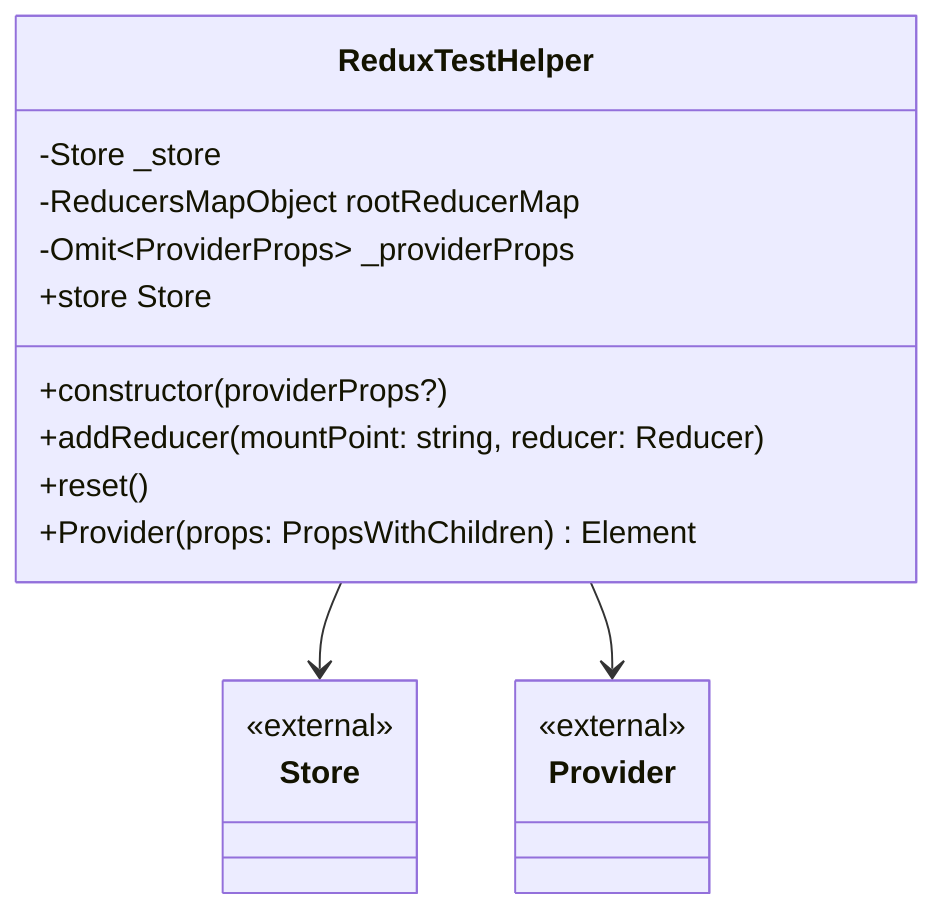
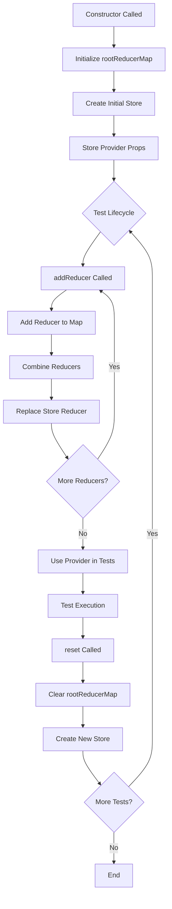

# Diagram: web/portal/src/test-utils/redux-test-helper.tsx

> Auto-generated by Obscura crawlers

## Diagram 1

### SVG

<svg id="container" width="473.9296875" xmlns="http://www.w3.org/2000/svg" class="classDiagram" height="462" viewBox="0 0 473.9296875 462" role="graphics-document document" aria-roledescription="class"><g><defs><marker id="container_class-aggregationStart" class="marker aggregation class" refX="18" refY="7" markerWidth="190" markerHeight="240" orient="auto"><path d="M 18,7 L9,13 L1,7 L9,1 Z"></path></marker></defs><defs><marker id="container_class-aggregationEnd" class="marker aggregation class" refX="1" refY="7" markerWidth="20" markerHeight="28" orient="auto"><path d="M 18,7 L9,13 L1,7 L9,1 Z"></path></marker></defs><defs><marker id="container_class-extensionStart" class="marker extension class" refX="18" refY="7" markerWidth="190" markerHeight="240" orient="auto"><path d="M 1,7 L18,13 V 1 Z"></path></marker></defs><defs><marker id="container_class-extensionEnd" class="marker extension class" refX="1" refY="7" markerWidth="20" markerHeight="28" orient="auto"><path d="M 1,1 V 13 L18,7 Z"></path></marker></defs><defs><marker id="container_class-compositionStart" class="marker composition class" refX="18" refY="7" markerWidth="190" markerHeight="240" orient="auto"><path d="M 18,7 L9,13 L1,7 L9,1 Z"></path></marker></defs><defs><marker id="container_class-compositionEnd" class="marker composition class" refX="1" refY="7" markerWidth="20" markerHeight="28" orient="auto"><path d="M 18,7 L9,13 L1,7 L9,1 Z"></path></marker></defs><defs><marker id="container_class-dependencyStart" class="marker dependency class" refX="6" refY="7" markerWidth="190" markerHeight="240" orient="auto"><path d="M 5,7 L9,13 L1,7 L9,1 Z"></path></marker></defs><defs><marker id="container_class-dependencyEnd" class="marker dependency class" refX="13" refY="7" markerWidth="20" markerHeight="28" orient="auto"><path d="M 18,7 L9,13 L14,7 L9,1 Z"></path></marker></defs><defs><marker id="container_class-lollipopStart" class="marker lollipop class" refX="13" refY="7" markerWidth="190" markerHeight="240" orient="auto"><circle stroke="black" fill="transparent" cx="7" cy="7" r="6"></circle></marker></defs><defs><marker id="container_class-lollipopEnd" class="marker lollipop class" refX="1" refY="7" markerWidth="190" markerHeight="240" orient="auto"><circle stroke="black" fill="transparent" cx="7" cy="7" r="6"></circle></marker></defs><g class="root"><g class="clusters"></g><g class="edgePaths"><path d="M172.5,296L170.635,300.167C168.77,304.333,165.039,312.667,163.174,320C161.309,327.333,161.309,333.667,161.309,336.833L161.309,340" id="id_ReduxTestHelper_Store_1" class="edge-thickness-normal edge-pattern-solid relation" style=";;;" data-edge="true" data-et="edge" data-id="id_ReduxTestHelper_Store_1" data-points="W3sieCI6MTcyLjUwMDM0NjcwODU3OTg4LCJ5IjoyOTZ9LHsieCI6MTYxLjMwODU5Mzc1LCJ5IjozMjF9LHsieCI6MTYxLjMwODU5Mzc1LCJ5IjozNDZ9XQ==" marker-end="url(#container_class-dependencyEnd)"></path><path d="M301.429,296L303.295,300.167C305.16,304.333,308.891,312.667,310.756,320C312.621,327.333,312.621,333.667,312.621,336.833L312.621,340" id="id_ReduxTestHelper_Provider_2" class="edge-thickness-normal edge-pattern-solid relation" style=";;;" data-edge="true" data-et="edge" data-id="id_ReduxTestHelper_Provider_2" data-points="W3sieCI6MzAxLjQyOTM0MDc5MTQyMDE1LCJ5IjoyOTZ9LHsieCI6MzEyLjYyMTA5Mzc1LCJ5IjozMjF9LHsieCI6MzEyLjYyMTA5Mzc1LCJ5IjozNDZ9XQ==" marker-end="url(#container_class-dependencyEnd)"></path></g><g class="edgeLabels"><g class="edgeLabel"><g class="label" data-id="id_ReduxTestHelper_Store_1" transform="translate(0, 0)"><foreignObject width="0" height="0">

</foreignObject></g></g><g class="edgeLabel"><g class="label" data-id="id_ReduxTestHelper_Provider_2" transform="translate(0, 0)"><foreignObject width="0" height="0">

</foreignObject></g></g></g><g class="nodes"><g class="node default" id="classId-ReduxTestHelper-0" transform="translate(236.96484375, 152)"><g class="basic label-container"><path d="M-228.96484375 -144 L228.96484375 -144 L228.96484375 144 L-228.96484375 144" stroke="none" stroke-width="0" fill="#ECECFF" style=""></path><path d="M-228.96484375 -144 C-62.69155905833492 -144, 103.58172563333017 -144, 228.96484375 -144 M-228.96484375 -144 C-62.65648995756669 -144, 103.65186383486662 -144, 228.96484375 -144 M228.96484375 -144 C228.96484375 -85.19087583934385, 228.96484375 -26.381751678687692, 228.96484375 144 M228.96484375 -144 C228.96484375 -37.25292799339746, 228.96484375 69.49414401320507, 228.96484375 144 M228.96484375 144 C70.5913003951242 144, -87.78224295975161 144, -228.96484375 144 M228.96484375 144 C87.87980199969527 144, -53.20523975060945 144, -228.96484375 144 M-228.96484375 144 C-228.96484375 78.93793481949088, -228.96484375 13.875869638981754, -228.96484375 -144 M-228.96484375 144 C-228.96484375 43.29820470115169, -228.96484375 -57.40359059769662, -228.96484375 -144" stroke="#9370DB" stroke-width="1.3" fill="none" stroke-dasharray="0 0" style=""></path></g><g class="annotation-group text" transform="translate(0, -120)"></g><g class="label-group text" transform="translate(-62.4765625, -120)"><g class="label" style="font-weight: bolder" transform="translate(0,-12)"><foreignObject width="124.953125" height="24">

ReduxTestHelper

</foreignObject></g></g><g class="members-group text" transform="translate(-216.96484375, -72)"><g class="label" style="" transform="translate(0,-12)"><foreignObject width="93.15625" height="24">

-Store _store

</foreignObject></g><g class="label" style="" transform="translate(0,12)"><foreignObject width="275.125" height="24">

-ReducersMapObject rootReducerMap

</foreignObject></g><g class="label" style="" transform="translate(0,36)"><foreignObject width="274.203125" height="24">

-Omit&lt;ProviderProps&gt; _providerProps

</foreignObject></g><g class="label" style="" transform="translate(0,60)"><foreignObject width="87.015625" height="24">

+store Store

</foreignObject></g></g><g class="methods-group text" transform="translate(-216.96484375, 48)"><g class="label" style="" transform="translate(0,-12)"><foreignObject width="211.03125" height="24">

+constructor(providerProps?)

</foreignObject></g><g class="label" style="" transform="translate(0,12)"><foreignObject width="371.453125" height="24">

+addReducer(mountPoint: string, reducer: Reducer)

</foreignObject></g><g class="label" style="" transform="translate(0,36)"><foreignObject width="54.75" height="24">

+reset()

</foreignObject></g><g class="label" style="" transform="translate(0,60)"><foreignObject width="334.96875" height="24">

+Provider(props: PropsWithChildren) : Element

</foreignObject></g></g><g class="divider" style=""><path d="M-228.96484375 -96 C-131.13681540296312 -96, -33.308787055926274 -96, 228.96484375 -96 M-228.96484375 -96 C-101.24506156454125 -96, 26.47472062091751 -96, 228.96484375 -96" stroke="#9370DB" stroke-width="1.3" fill="none" stroke-dasharray="0 0" style=""></path></g><g class="divider" style=""><path d="M-228.96484375 24 C-127.55076716999471 24, -26.136690589989428 24, 228.96484375 24 M-228.96484375 24 C-118.8982610547697 24, -8.83167835953941 24, 228.96484375 24" stroke="#9370DB" stroke-width="1.3" fill="none" stroke-dasharray="0 0" style=""></path></g></g><g class="node default" id="classId-Store-1" transform="translate(161.30859375, 400)"><g class="basic label-container"><path d="M-50.65625 -54 L50.65625 -54 L50.65625 54 L-50.65625 54" stroke="none" stroke-width="0" fill="#ECECFF" style=""></path><path d="M-50.65625 -54 C-13.707790829390767 -54, 23.240668341218466 -54, 50.65625 -54 M-50.65625 -54 C-22.43448737583438 -54, 5.787275248331241 -54, 50.65625 -54 M50.65625 -54 C50.65625 -14.175601355523348, 50.65625 25.648797288953304, 50.65625 54 M50.65625 -54 C50.65625 -19.45686558269543, 50.65625 15.086268834609143, 50.65625 54 M50.65625 54 C16.35987007260958 54, -17.936509854780837 54, -50.65625 54 M50.65625 54 C16.70295413308883 54, -17.25034173382234 54, -50.65625 54 M-50.65625 54 C-50.65625 19.730842851184377, -50.65625 -14.538314297631246, -50.65625 -54 M-50.65625 54 C-50.65625 28.960288144213205, -50.65625 3.9205762884264104, -50.65625 -54" stroke="#9370DB" stroke-width="1.3" fill="none" stroke-dasharray="0 0" style=""></path></g><g class="annotation-group text" transform="translate(-38.65625, -30)"><g class="label" style="" transform="translate(0,-12)"><foreignObject width="77.3125" height="24">

«external»

</foreignObject></g></g><g class="label-group text" transform="translate(-19.578125, -6)"><g class="label" style="font-weight: bolder" transform="translate(0,-12)"><foreignObject width="39.15625" height="24">

Store

</foreignObject></g></g><g class="members-group text" transform="translate(-38.65625, 42)"></g><g class="methods-group text" transform="translate(-38.65625, 72)"></g><g class="divider" style=""><path d="M-50.65625 18 C-21.983559043597054 18, 6.689131912805891 18, 50.65625 18 M-50.65625 18 C-20.69504322457567 18, 9.26616355084866 18, 50.65625 18" stroke="#9370DB" stroke-width="1.3" fill="none" stroke-dasharray="0 0" style=""></path></g><g class="divider" style=""><path d="M-50.65625 36 C-17.21365484936713 36, 16.228940301265737 36, 50.65625 36 M-50.65625 36 C-10.599350864782316 36, 29.457548270435367 36, 50.65625 36" stroke="#9370DB" stroke-width="1.3" fill="none" stroke-dasharray="0 0" style=""></path></g></g><g class="node default" id="classId-Provider-2" transform="translate(312.62109375, 400)"><g class="basic label-container"><path d="M-50.65625 -54 L50.65625 -54 L50.65625 54 L-50.65625 54" stroke="none" stroke-width="0" fill="#ECECFF" style=""></path><path d="M-50.65625 -54 C-28.435875696147033 -54, -6.215501392294065 -54, 50.65625 -54 M-50.65625 -54 C-22.79363330811281 -54, 5.0689833837743805 -54, 50.65625 -54 M50.65625 -54 C50.65625 -23.2054493118303, 50.65625 7.5891013763394, 50.65625 54 M50.65625 -54 C50.65625 -24.20687006566244, 50.65625 5.586259868675121, 50.65625 54 M50.65625 54 C28.902505734483476 54, 7.148761468966953 54, -50.65625 54 M50.65625 54 C20.66241927902013 54, -9.331411441959737 54, -50.65625 54 M-50.65625 54 C-50.65625 11.503628677529598, -50.65625 -30.992742644940805, -50.65625 -54 M-50.65625 54 C-50.65625 10.803658051277402, -50.65625 -32.392683897445195, -50.65625 -54" stroke="#9370DB" stroke-width="1.3" fill="none" stroke-dasharray="0 0" style=""></path></g><g class="annotation-group text" transform="translate(-38.65625, -30)"><g class="label" style="" transform="translate(0,-12)"><foreignObject width="77.3125" height="24">

«external»

</foreignObject></g></g><g class="label-group text" transform="translate(-31.0078125, -6)"><g class="label" style="font-weight: bolder" transform="translate(0,-12)"><foreignObject width="62.015625" height="24">

Provider

</foreignObject></g></g><g class="members-group text" transform="translate(-38.65625, 42)"></g><g class="methods-group text" transform="translate(-38.65625, 72)"></g><g class="divider" style=""><path d="M-50.65625 18 C-28.376934645819357 18, -6.097619291638715 18, 50.65625 18 M-50.65625 18 C-26.702551280421826 18, -2.748852560843652 18, 50.65625 18" stroke="#9370DB" stroke-width="1.3" fill="none" stroke-dasharray="0 0" style=""></path></g><g class="divider" style=""><path d="M-50.65625 36 C-19.514814038602335 36, 11.62662192279533 36, 50.65625 36 M-50.65625 36 C-22.611743481750075 36, 5.43276303649985 36, 50.65625 36" stroke="#9370DB" stroke-width="1.3" fill="none" stroke-dasharray="0 0" style=""></path></g></g></g></g></g></svg>

## Diagram 2

### SVG

<svg id="container" width="396.671875" xmlns="http://www.w3.org/2000/svg" class="flowchart" height="2076.40625" viewBox="0 0 396.671875 2076.40625" role="graphics-document document" aria-roledescription="flowchart-v2"><g><marker id="container_flowchart-v2-pointEnd" class="marker flowchart-v2" viewBox="0 0 10 10" refX="5" refY="5" markerUnits="userSpaceOnUse" markerWidth="8" markerHeight="8" orient="auto"><path d="M 0 0 L 10 5 L 0 10 z" class="arrowMarkerPath" style="stroke-width: 1; stroke-dasharray: 1, 0;"></path></marker><marker id="container_flowchart-v2-pointStart" class="marker flowchart-v2" viewBox="0 0 10 10" refX="4.5" refY="5" markerUnits="userSpaceOnUse" markerWidth="8" markerHeight="8" orient="auto"><path d="M 0 5 L 10 10 L 10 0 z" class="arrowMarkerPath" style="stroke-width: 1; stroke-dasharray: 1, 0;"></path></marker><marker id="container_flowchart-v2-circleEnd" class="marker flowchart-v2" viewBox="0 0 10 10" refX="11" refY="5" markerUnits="userSpaceOnUse" markerWidth="11" markerHeight="11" orient="auto"><circle cx="5" cy="5" r="5" class="arrowMarkerPath" style="stroke-width: 1; stroke-dasharray: 1, 0;"></circle></marker><marker id="container_flowchart-v2-circleStart" class="marker flowchart-v2" viewBox="0 0 10 10" refX="-1" refY="5" markerUnits="userSpaceOnUse" markerWidth="11" markerHeight="11" orient="auto"><circle cx="5" cy="5" r="5" class="arrowMarkerPath" style="stroke-width: 1; stroke-dasharray: 1, 0;"></circle></marker><marker id="container_flowchart-v2-crossEnd" class="marker cross flowchart-v2" viewBox="0 0 11 11" refX="12" refY="5.2" markerUnits="userSpaceOnUse" markerWidth="11" markerHeight="11" orient="auto"><path d="M 1,1 l 9,9 M 10,1 l -9,9" class="arrowMarkerPath" style="stroke-width: 2; stroke-dasharray: 1, 0;"></path></marker><marker id="container_flowchart-v2-crossStart" class="marker cross flowchart-v2" viewBox="0 0 11 11" refX="-1" refY="5.2" markerUnits="userSpaceOnUse" markerWidth="11" markerHeight="11" orient="auto"><path d="M 1,1 l 9,9 M 10,1 l -9,9" class="arrowMarkerPath" style="stroke-width: 2; stroke-dasharray: 1, 0;"></path></marker><g class="root"><g class="clusters"></g><g class="edgePaths"><path d="M265.391,62L265.391,66.167C265.391,70.333,265.391,78.667,265.391,86.333C265.391,94,265.391,101,265.391,104.5L265.391,108" id="L_A_B_0" class="edge-thickness-normal edge-pattern-solid edge-thickness-normal edge-pattern-solid flowchart-link" style=";" data-edge="true" data-et="edge" data-id="L_A_B_0" data-points="W3sieCI6MjY1LjM5MDYyNSwieSI6NjJ9LHsieCI6MjY1LjM5MDYyNSwieSI6ODd9LHsieCI6MjY1LjM5MDYyNSwieSI6MTEyfV0=" marker-end="url(#container_flowchart-v2-pointEnd)"></path><path d="M265.391,166L265.391,170.167C265.391,174.333,265.391,182.667,265.391,190.333C265.391,198,265.391,205,265.391,208.5L265.391,212" id="L_B_C_0" class="edge-thickness-normal edge-pattern-solid edge-thickness-normal edge-pattern-solid flowchart-link" style=";" data-edge="true" data-et="edge" data-id="L_B_C_0" data-points="W3sieCI6MjY1LjM5MDYyNSwieSI6MTY2fSx7IngiOjI2NS4zOTA2MjUsInkiOjE5MX0seyJ4IjoyNjUuMzkwNjI1LCJ5IjoyMTZ9XQ==" marker-end="url(#container_flowchart-v2-pointEnd)"></path><path d="M265.391,270L265.391,274.167C265.391,278.333,265.391,286.667,265.391,294.333C265.391,302,265.391,309,265.391,312.5L265.391,316" id="L_C_D_0" class="edge-thickness-normal edge-pattern-solid edge-thickness-normal edge-pattern-solid flowchart-link" style=";" data-edge="true" data-et="edge" data-id="L_C_D_0" data-points="W3sieCI6MjY1LjM5MDYyNSwieSI6MjcwfSx7IngiOjI2NS4zOTA2MjUsInkiOjI5NX0seyJ4IjoyNjUuMzkwNjI1LCJ5IjozMjB9XQ==" marker-end="url(#container_flowchart-v2-pointEnd)"></path><path d="M265.391,374L265.391,378.167C265.391,382.333,265.391,390.667,265.391,398.333C265.391,406,265.391,413,265.391,416.5L265.391,420" id="L_D_E_0" class="edge-thickness-normal edge-pattern-solid edge-thickness-normal edge-pattern-solid flowchart-link" style=";" data-edge="true" data-et="edge" data-id="L_D_E_0" data-points="W3sieCI6MjY1LjM5MDYyNSwieSI6Mzc0fSx7IngiOjI2NS4zOTA2MjUsInkiOjM5OX0seyJ4IjoyNjUuMzkwNjI1LCJ5Ijo0MjR9XQ==" marker-end="url(#container_flowchart-v2-pointEnd)"></path><path d="M233.743,542.79L226.886,552.231C220.028,561.672,206.313,580.555,199.455,593.496C192.598,606.438,192.598,613.438,192.598,616.938L192.598,620.438" id="L_E_F_0" class="edge-thickness-normal edge-pattern-solid edge-thickness-normal edge-pattern-solid flowchart-link" style=";" data-edge="true" data-et="edge" data-id="L_E_F_0" data-points="W3sieCI6MjMzLjc0MzA4MDIxMDk5MDk0LCJ5Ijo1NDIuNzg5OTU1MjEwOTkwOX0seyJ4IjoxOTIuNTk3NjU2MjUsInkiOjU5OS40Mzc1fSx7IngiOjE5Mi41OTc2NTYyNSwieSI6NjI0LjQzNzV9XQ==" marker-end="url(#container_flowchart-v2-pointEnd)"></path><path d="M154.59,678.438L148.725,682.604C142.86,686.771,131.129,695.104,125.264,702.771C119.398,710.438,119.398,717.438,119.398,720.938L119.398,724.438" id="L_F_G_0" class="edge-thickness-normal edge-pattern-solid edge-thickness-normal edge-pattern-solid flowchart-link" style=";" data-edge="true" data-et="edge" data-id="L_F_G_0" data-points="W3sieCI6MTU0LjU5MDM2OTU5MTM0NjE2LCJ5Ijo2NzguNDM3NX0seyJ4IjoxMTkuMzk4NDM3NSwieSI6NzAzLjQzNzV9LHsieCI6MTE5LjM5ODQzNzUsInkiOjcyOC40Mzc1fV0=" marker-end="url(#container_flowchart-v2-pointEnd)"></path><path d="M119.398,782.438L119.398,786.604C119.398,790.771,119.398,799.104,119.398,806.771C119.398,814.438,119.398,821.438,119.398,824.938L119.398,828.438" id="L_G_H_0" class="edge-thickness-normal edge-pattern-solid edge-thickness-normal edge-pattern-solid flowchart-link" style=";" data-edge="true" data-et="edge" data-id="L_G_H_0" data-points="W3sieCI6MTE5LjM5ODQzNzUsInkiOjc4Mi40Mzc1fSx7IngiOjExOS4zOTg0Mzc1LCJ5Ijo4MDcuNDM3NX0seyJ4IjoxMTkuMzk4NDM3NSwieSI6ODMyLjQzNzV9XQ==" marker-end="url(#container_flowchart-v2-pointEnd)"></path><path d="M119.398,886.438L119.398,890.604C119.398,894.771,119.398,903.104,119.398,910.771C119.398,918.438,119.398,925.438,119.398,928.938L119.398,932.438" id="L_H_I_0" class="edge-thickness-normal edge-pattern-solid edge-thickness-normal edge-pattern-solid flowchart-link" style=";" data-edge="true" data-et="edge" data-id="L_H_I_0" data-points="W3sieCI6MTE5LjM5ODQzNzUsInkiOjg4Ni40Mzc1fSx7IngiOjExOS4zOTg0Mzc1LCJ5Ijo5MTEuNDM3NX0seyJ4IjoxMTkuMzk4NDM3NSwieSI6OTM2LjQzNzV9XQ==" marker-end="url(#container_flowchart-v2-pointEnd)"></path><path d="M119.398,990.438L119.398,994.604C119.398,998.771,119.398,1007.104,125.605,1020.505C131.812,1033.907,144.226,1052.376,150.432,1061.61L156.639,1070.845" id="L_I_J_0" class="edge-thickness-normal edge-pattern-solid edge-thickness-normal edge-pattern-solid flowchart-link" style=";" data-edge="true" data-et="edge" data-id="L_I_J_0" data-points="W3sieCI6MTE5LjM5ODQzNzUsInkiOjk5MC40Mzc1fSx7IngiOjExOS4zOTg0Mzc1LCJ5IjoxMDE1LjQzNzV9LHsieCI6MTU4Ljg3MDY1MTgzNjU2MzQsInkiOjEwNzQuMTY0NTA0NDEzNDM2Nn1d" marker-end="url(#container_flowchart-v2-pointEnd)"></path><path d="M226.325,1074.165L232.903,1064.377C239.482,1054.589,252.639,1035.013,259.218,1016.559C265.797,998.104,265.797,980.771,265.797,963.438C265.797,946.104,265.797,928.771,265.797,911.438C265.797,894.104,265.797,876.771,265.797,859.438C265.797,842.104,265.797,824.771,265.797,807.438C265.797,790.104,265.797,772.771,265.797,755.438C265.797,738.104,265.797,720.771,260.475,708.324C255.153,695.876,244.51,688.315,239.188,684.535L233.866,680.754" id="L_J_F_0" class="edge-thickness-normal edge-pattern-solid edge-thickness-normal edge-pattern-solid flowchart-link" style=";" data-edge="true" data-et="edge" data-id="L_J_F_0" data-points="W3sieCI6MjI2LjMyNDY2MDY2MzQzNjYsInkiOjEwNzQuMTY0NTA0NDEzNDM2Nn0seyJ4IjoyNjUuNzk2ODc1LCJ5IjoxMDE1LjQzNzV9LHsieCI6MjY1Ljc5Njg3NSwieSI6OTYzLjQzNzV9LHsieCI6MjY1Ljc5Njg3NSwieSI6OTExLjQzNzV9LHsieCI6MjY1Ljc5Njg3NSwieSI6ODU5LjQzNzV9LHsieCI6MjY1Ljc5Njg3NSwieSI6ODA3LjQzNzV9LHsieCI6MjY1Ljc5Njg3NSwieSI6NzU1LjQzNzV9LHsieCI6MjY1Ljc5Njg3NSwieSI6NzAzLjQzNzV9LHsieCI6MjMwLjYwNDk0MjkwODY1Mzg0LCJ5Ijo2NzguNDM3NX1d" marker-end="url(#container_flowchart-v2-pointEnd)"></path><path d="M192.598,1208.25L192.598,1214.417C192.598,1220.583,192.598,1232.917,192.598,1244.583C192.598,1256.25,192.598,1267.25,192.598,1272.75L192.598,1278.25" id="L_J_K_0" class="edge-thickness-normal edge-pattern-solid edge-thickness-normal edge-pattern-solid flowchart-link" style=";" data-edge="true" data-et="edge" data-id="L_J_K_0" data-points="W3sieCI6MTkyLjU5NzY1NjI1LCJ5IjoxMjA4LjI1fSx7IngiOjE5Mi41OTc2NTYyNSwieSI6MTI0NS4yNX0seyJ4IjoxOTIuNTk3NjU2MjUsInkiOjEyODIuMjV9XQ==" marker-end="url(#container_flowchart-v2-pointEnd)"></path><path d="M192.598,1336.25L192.598,1340.417C192.598,1344.583,192.598,1352.917,192.598,1360.583C192.598,1368.25,192.598,1375.25,192.598,1378.75L192.598,1382.25" id="L_K_L_0" class="edge-thickness-normal edge-pattern-solid edge-thickness-normal edge-pattern-solid flowchart-link" style=";" data-edge="true" data-et="edge" data-id="L_K_L_0" data-points="W3sieCI6MTkyLjU5NzY1NjI1LCJ5IjoxMzM2LjI1fSx7IngiOjE5Mi41OTc2NTYyNSwieSI6MTM2MS4yNX0seyJ4IjoxOTIuNTk3NjU2MjUsInkiOjEzODYuMjV9XQ==" marker-end="url(#container_flowchart-v2-pointEnd)"></path><path d="M192.598,1440.25L192.598,1444.417C192.598,1448.583,192.598,1456.917,192.598,1464.583C192.598,1472.25,192.598,1479.25,192.598,1482.75L192.598,1486.25" id="L_L_M_0" class="edge-thickness-normal edge-pattern-solid edge-thickness-normal edge-pattern-solid flowchart-link" style=";" data-edge="true" data-et="edge" data-id="L_L_M_0" data-points="W3sieCI6MTkyLjU5NzY1NjI1LCJ5IjoxNDQwLjI1fSx7IngiOjE5Mi41OTc2NTYyNSwieSI6MTQ2NS4yNX0seyJ4IjoxOTIuNTk3NjU2MjUsInkiOjE0OTAuMjV9XQ==" marker-end="url(#container_flowchart-v2-pointEnd)"></path><path d="M192.598,1544.25L192.598,1548.417C192.598,1552.583,192.598,1560.917,192.598,1568.583C192.598,1576.25,192.598,1583.25,192.598,1586.75L192.598,1590.25" id="L_M_N_0" class="edge-thickness-normal edge-pattern-solid edge-thickness-normal edge-pattern-solid flowchart-link" style=";" data-edge="true" data-et="edge" data-id="L_M_N_0" data-points="W3sieCI6MTkyLjU5NzY1NjI1LCJ5IjoxNTQ0LjI1fSx7IngiOjE5Mi41OTc2NTYyNSwieSI6MTU2OS4yNX0seyJ4IjoxOTIuNTk3NjU2MjUsInkiOjE1OTQuMjV9XQ==" marker-end="url(#container_flowchart-v2-pointEnd)"></path><path d="M192.598,1648.25L192.598,1652.417C192.598,1656.583,192.598,1664.917,192.598,1672.583C192.598,1680.25,192.598,1687.25,192.598,1690.75L192.598,1694.25" id="L_N_O_0" class="edge-thickness-normal edge-pattern-solid edge-thickness-normal edge-pattern-solid flowchart-link" style=";" data-edge="true" data-et="edge" data-id="L_N_O_0" data-points="W3sieCI6MTkyLjU5NzY1NjI1LCJ5IjoxNjQ4LjI1fSx7IngiOjE5Mi41OTc2NTYyNSwieSI6MTY3My4yNX0seyJ4IjoxOTIuNTk3NjU2MjUsInkiOjE2OTguMjV9XQ==" marker-end="url(#container_flowchart-v2-pointEnd)"></path><path d="M192.598,1752.25L192.598,1756.417C192.598,1760.583,192.598,1768.917,199.3,1781.745C206.002,1794.573,219.405,1811.897,226.107,1820.558L232.809,1829.22" id="L_O_P_0" class="edge-thickness-normal edge-pattern-solid edge-thickness-normal edge-pattern-solid flowchart-link" style=";" data-edge="true" data-et="edge" data-id="L_O_P_0" data-points="W3sieCI6MTkyLjU5NzY1NjI1LCJ5IjoxNzUyLjI1fSx7IngiOjE5Mi41OTc2NTYyNSwieSI6MTc3Ny4yNX0seyJ4IjoyMzUuMjU3MTc0NzkzNDE3NDUsInkiOjE4MzIuMzgzNDUwMjA2NTgyNH1d" marker-end="url(#container_flowchart-v2-pointEnd)"></path><path d="M299.013,1835.873L308.279,1826.102C317.544,1816.332,336.075,1796.791,345.34,1778.354C354.605,1759.917,354.605,1742.583,354.605,1725.25C354.605,1707.917,354.605,1690.583,354.605,1673.25C354.605,1655.917,354.605,1638.583,354.605,1621.25C354.605,1603.917,354.605,1586.583,354.605,1569.25C354.605,1551.917,354.605,1534.583,354.605,1517.25C354.605,1499.917,354.605,1482.583,354.605,1465.25C354.605,1447.917,354.605,1430.583,354.605,1413.25C354.605,1395.917,354.605,1378.583,354.605,1361.25C354.605,1343.917,354.605,1326.583,354.605,1307.25C354.605,1287.917,354.605,1266.583,354.605,1235.766C354.605,1204.948,354.605,1164.646,354.605,1126.344C354.605,1088.042,354.605,1051.74,354.605,1024.922C354.605,998.104,354.605,980.771,354.605,963.438C354.605,946.104,354.605,928.771,354.605,911.438C354.605,894.104,354.605,876.771,354.605,859.438C354.605,842.104,354.605,824.771,354.605,807.438C354.605,790.104,354.605,772.771,354.605,755.438C354.605,738.104,354.605,720.771,354.605,703.438C354.605,686.104,354.605,668.771,354.605,651.438C354.605,634.104,354.605,616.771,346.084,598.531C337.562,580.292,320.518,561.146,311.997,551.573L303.475,542" id="L_P_E_0" class="edge-thickness-normal edge-pattern-solid edge-thickness-normal edge-pattern-solid flowchart-link" style=";" data-edge="true" data-et="edge" data-id="L_P_E_0" data-points="W3sieCI6Mjk5LjAxMzI2ODQxMzE0NDk0LCJ5IjoxODM1Ljg3MjY0MzQxMzE0NX0seyJ4IjozNTQuNjA1NDY4NzUsInkiOjE3NzcuMjV9LHsieCI6MzU0LjYwNTQ2ODc1LCJ5IjoxNzI1LjI1fSx7IngiOjM1NC42MDU0Njg3NSwieSI6MTY3My4yNX0seyJ4IjozNTQuNjA1NDY4NzUsInkiOjE2MjEuMjV9LHsieCI6MzU0LjYwNTQ2ODc1LCJ5IjoxNTY5LjI1fSx7IngiOjM1NC42MDU0Njg3NSwieSI6MTUxNy4yNX0seyJ4IjozNTQuNjA1NDY4NzUsInkiOjE0NjUuMjV9LHsieCI6MzU0LjYwNTQ2ODc1LCJ5IjoxNDEzLjI1fSx7IngiOjM1NC42MDU0Njg3NSwieSI6MTM2MS4yNX0seyJ4IjozNTQuNjA1NDY4NzUsInkiOjEzMDkuMjV9LHsieCI6MzU0LjYwNTQ2ODc1LCJ5IjoxMjQ1LjI1fSx7IngiOjM1NC42MDU0Njg3NSwieSI6MTEyNC4zNDM3NX0seyJ4IjozNTQuNjA1NDY4NzUsInkiOjEwMTUuNDM3NX0seyJ4IjozNTQuNjA1NDY4NzUsInkiOjk2My40Mzc1fSx7IngiOjM1NC42MDU0Njg3NSwieSI6OTExLjQzNzV9LHsieCI6MzU0LjYwNTQ2ODc1LCJ5Ijo4NTkuNDM3NX0seyJ4IjozNTQuNjA1NDY4NzUsInkiOjgwNy40Mzc1fSx7IngiOjM1NC42MDU0Njg3NSwieSI6NzU1LjQzNzV9LHsieCI6MzU0LjYwNTQ2ODc1LCJ5Ijo3MDMuNDM3NX0seyJ4IjozNTQuNjA1NDY4NzUsInkiOjY1MS40Mzc1fSx7IngiOjM1NC42MDU0Njg3NSwieSI6NTk5LjQzNzV9LHsieCI6MzAwLjgxNTMyOTIyMjA4NDc2LCJ5Ijo1MzkuMDEyNzk1Nzc3OTE1Mn1d" marker-end="url(#container_flowchart-v2-pointEnd)"></path><path d="M265.391,1940.406L265.391,1946.573C265.391,1952.74,265.391,1965.073,265.391,1976.74C265.391,1988.406,265.391,1999.406,265.391,2004.906L265.391,2010.406" id="L_P_Q_0" class="edge-thickness-normal edge-pattern-solid edge-thickness-normal edge-pattern-solid flowchart-link" style=";" data-edge="true" data-et="edge" data-id="L_P_Q_0" data-points="W3sieCI6MjY1LjM5MDYyNSwieSI6MTk0MC40MDYyNX0seyJ4IjoyNjUuMzkwNjI1LCJ5IjoxOTc3LjQwNjI1fSx7IngiOjI2NS4zOTA2MjUsInkiOjIwMTQuNDA2MjV9XQ==" marker-end="url(#container_flowchart-v2-pointEnd)"></path></g><g class="edgeLabels"><g class="edgeLabel"><g class="label" data-id="L_A_B_0" transform="translate(0, 0)"><foreignObject width="0" height="0">

</foreignObject></g></g><g class="edgeLabel"><g class="label" data-id="L_B_C_0" transform="translate(0, 0)"><foreignObject width="0" height="0">

</foreignObject></g></g><g class="edgeLabel"><g class="label" data-id="L_C_D_0" transform="translate(0, 0)"><foreignObject width="0" height="0">

</foreignObject></g></g><g class="edgeLabel"><g class="label" data-id="L_D_E_0" transform="translate(0, 0)"><foreignObject width="0" height="0">

</foreignObject></g></g><g class="edgeLabel"><g class="label" data-id="L_E_F_0" transform="translate(0, 0)"><foreignObject width="0" height="0">

</foreignObject></g></g><g class="edgeLabel"><g class="label" data-id="L_F_G_0" transform="translate(0, 0)"><foreignObject width="0" height="0">

</foreignObject></g></g><g class="edgeLabel"><g class="label" data-id="L_G_H_0" transform="translate(0, 0)"><foreignObject width="0" height="0">

</foreignObject></g></g><g class="edgeLabel"><g class="label" data-id="L_H_I_0" transform="translate(0, 0)"><foreignObject width="0" height="0">

</foreignObject></g></g><g class="edgeLabel"><g class="label" data-id="L_I_J_0" transform="translate(0, 0)"><foreignObject width="0" height="0">

</foreignObject></g></g><g class="edgeLabel" transform="translate(265.796875, 859.4375)"><g class="label" data-id="L_J_F_0" transform="translate(-12.03125, -12)"><foreignObject width="24.0625" height="24">

Yes

</foreignObject></g></g><g class="edgeLabel" transform="translate(192.59765625, 1245.25)"><g class="label" data-id="L_J_K_0" transform="translate(-10.140625, -12)"><foreignObject width="20.28125" height="24">

No

</foreignObject></g></g><g class="edgeLabel"><g class="label" data-id="L_K_L_0" transform="translate(0, 0)"><foreignObject width="0" height="0">

</foreignObject></g></g><g class="edgeLabel"><g class="label" data-id="L_L_M_0" transform="translate(0, 0)"><foreignObject width="0" height="0">

</foreignObject></g></g><g class="edgeLabel"><g class="label" data-id="L_M_N_0" transform="translate(0, 0)"><foreignObject width="0" height="0">

</foreignObject></g></g><g class="edgeLabel"><g class="label" data-id="L_N_O_0" transform="translate(0, 0)"><foreignObject width="0" height="0">

</foreignObject></g></g><g class="edgeLabel"><g class="label" data-id="L_O_P_0" transform="translate(0, 0)"><foreignObject width="0" height="0">

</foreignObject></g></g><g class="edgeLabel" transform="translate(354.60546875, 1245.25)"><g class="label" data-id="L_P_E_0" transform="translate(-12.03125, -12)"><foreignObject width="24.0625" height="24">

Yes

</foreignObject></g></g><g class="edgeLabel" transform="translate(265.390625, 1977.40625)"><g class="label" data-id="L_P_Q_0" transform="translate(-10.140625, -12)"><foreignObject width="20.28125" height="24">

No

</foreignObject></g></g></g><g class="nodes"><g class="node default" id="flowchart-A-0" transform="translate(265.390625, 35)"><rect class="basic label-container" style="" x="-96.984375" y="-27" width="193.96875" height="54"></rect><g class="label" style="" transform="translate(-66.984375, -12)"><rect></rect><foreignObject width="133.96875" height="24">

Constructor Called

</foreignObject></g></g><g class="node default" id="flowchart-B-1" transform="translate(265.390625, 139)"><rect class="basic label-container" style="" x="-123.28125" y="-27" width="246.5625" height="54"></rect><g class="label" style="" transform="translate(-93.28125, -12)"><rect></rect><foreignObject width="186.5625" height="24">

Initialize rootReducerMap

</foreignObject></g></g><g class="node default" id="flowchart-C-3" transform="translate(265.390625, 243)"><rect class="basic label-container" style="" x="-97.28125" y="-27" width="194.5625" height="54"></rect><g class="label" style="" transform="translate(-67.28125, -12)"><rect></rect><foreignObject width="134.5625" height="24">

Create Initial Store

</foreignObject></g></g><g class="node default" id="flowchart-D-5" transform="translate(265.390625, 347)"><rect class="basic label-container" style="" x="-104.1484375" y="-27" width="208.296875" height="54"></rect><g class="label" style="" transform="translate(-74.1484375, -12)"><rect></rect><foreignObject width="148.296875" height="24">

Store Provider Props

</foreignObject></g></g><g class="node default" id="flowchart-E-7" transform="translate(265.390625, 499.21875)"><polygon points="75.21875,0 150.4375,-75.21875 75.21875,-150.4375 0,-75.21875" class="label-container" transform="translate(-74.71875, 75.21875)"></polygon><g class="label" style="" transform="translate(-48.21875, -12)"><rect></rect><foreignObject width="96.4375" height="24">

Test Lifecycle

</foreignObject></g></g><g class="node default" id="flowchart-F-9" transform="translate(192.59765625, 651.4375)"><rect class="basic label-container" style="" x="-98.140625" y="-27" width="196.28125" height="54"></rect><g class="label" style="" transform="translate(-68.140625, -12)"><rect></rect><foreignObject width="136.28125" height="24">

addReducer Called

</foreignObject></g></g><g class="node default" id="flowchart-G-11" transform="translate(119.3984375, 755.4375)"><rect class="basic label-container" style="" x="-102.9140625" y="-27" width="205.828125" height="54"></rect><g class="label" style="" transform="translate(-72.9140625, -12)"><rect></rect><foreignObject width="145.828125" height="24">

Add Reducer to Map

</foreignObject></g></g><g class="node default" id="flowchart-H-13" transform="translate(119.3984375, 859.4375)"><rect class="basic label-container" style="" x="-97.2734375" y="-27" width="194.546875" height="54"></rect><g class="label" style="" transform="translate(-67.2734375, -12)"><rect></rect><foreignObject width="134.546875" height="24">

Combine Reducers

</foreignObject></g></g><g class="node default" id="flowchart-I-15" transform="translate(119.3984375, 963.4375)"><rect class="basic label-container" style="" x="-111.3984375" y="-27" width="222.796875" height="54"></rect><g class="label" style="" transform="translate(-81.3984375, -12)"><rect></rect><foreignObject width="162.796875" height="24">

Replace Store Reducer

</foreignObject></g></g><g class="node default" id="flowchart-J-17" transform="translate(192.59765625, 1124.34375)"><polygon points="83.90625,0 167.8125,-83.90625 83.90625,-167.8125 0,-83.90625" class="label-container" transform="translate(-83.40625, 83.90625)"></polygon><g class="label" style="" transform="translate(-56.90625, -12)"><rect></rect><foreignObject width="113.8125" height="24">

More Reducers?

</foreignObject></g></g><g class="node default" id="flowchart-K-21" transform="translate(192.59765625, 1309.25)"><rect class="basic label-container" style="" x="-105.4765625" y="-27" width="210.953125" height="54"></rect><g class="label" style="" transform="translate(-75.4765625, -12)"><rect></rect><foreignObject width="150.953125" height="24">

Use Provider in Tests

</foreignObject></g></g><g class="node default" id="flowchart-L-23" transform="translate(192.59765625, 1413.25)"><rect class="basic label-container" style="" x="-82.15625" y="-27" width="164.3125" height="54"></rect><g class="label" style="" transform="translate(-52.15625, -12)"><rect></rect><foreignObject width="104.3125" height="24">

Test Execution

</foreignObject></g></g><g class="node default" id="flowchart-M-25" transform="translate(192.59765625, 1517.25)"><rect class="basic label-container" style="" x="-72.78125" y="-27" width="145.5625" height="54"></rect><g class="label" style="" transform="translate(-42.78125, -12)"><rect></rect><foreignObject width="85.5625" height="24">

reset Called

</foreignObject></g></g><g class="node default" id="flowchart-N-27" transform="translate(192.59765625, 1621.25)"><rect class="basic label-container" style="" x="-110.5859375" y="-27" width="221.171875" height="54"></rect><g class="label" style="" transform="translate(-80.5859375, -12)"><rect></rect><foreignObject width="161.171875" height="24">

Clear rootReducerMap

</foreignObject></g></g><g class="node default" id="flowchart-O-29" transform="translate(192.59765625, 1725.25)"><rect class="basic label-container" style="" x="-91.78125" y="-27" width="183.5625" height="54"></rect><g class="label" style="" transform="translate(-61.78125, -12)"><rect></rect><foreignObject width="123.5625" height="24">

Create New Store

</foreignObject></g></g><g class="node default" id="flowchart-P-31" transform="translate(265.390625, 1871.328125)"><polygon points="69.078125,0 138.15625,-69.078125 69.078125,-138.15625 0,-69.078125" class="label-container" transform="translate(-68.578125, 69.078125)"></polygon><g class="label" style="" transform="translate(-42.078125, -12)"><rect></rect><foreignObject width="84.15625" height="24">

More Tests?

</foreignObject></g></g><g class="node default" id="flowchart-Q-35" transform="translate(265.390625, 2041.40625)"><rect class="basic label-container" style="" x="-43.6796875" y="-27" width="87.359375" height="54"></rect><g class="label" style="" transform="translate(-13.6796875, -12)"><rect></rect><foreignObject width="27.359375" height="24">

End

</foreignObject></g></g></g></g></g></svg>

## Diagram 3

```mermaid
sequenceDiagram
    participant Test
    participant ReduxTestHelper
    participant Store
    participant Provider
    participant Component
    Test->>ReduxTestHelper: new ReduxTestHelper()
    ReduxTestHelper->>Store: legacy_createStore()
    Store-->>ReduxTestHelper: store instance
    Test->>ReduxTestHelper: addReducer(mountPoint, reducer)
    ReduxTestHelper->>ReduxTestHelper: rootReducerMap[mountPoint] = reducer
    ReduxTestHelper->>ReduxTestHelper: combineReducers(rootReducerMap)
    ReduxTestHelper->>Store: replaceReducer(nextReducer)
    Test->>ReduxTestHelper: Provider
    ReduxTestHelper->>Provider: <Provider store={_store}>
    Provider->>Component: render with store
    Test->>ReduxTestHelper: reset()
    ReduxTestHelper->>Store: legacy_createStore()
    ReduxTestHelper->>ReduxTestHelper: rootReducerMap = {}
```

### SVG

<svg id="container" width="1250" xmlns="http://www.w3.org/2000/svg" height="885" viewBox="-50 -10 1250 885" role="graphics-document document" aria-roledescription="sequence"><g><rect x="1000" y="799" fill="#eaeaea" stroke="#666" width="150" height="65" name="Component" rx="3" ry="3" class="actor actor-bottom"></rect><text x="1075" y="831.5" dominant-baseline="central" alignment-baseline="central" class="actor actor-box" style="text-anchor: middle; font-size: 16px; font-weight: 400;"><tspan x="1075" dy="0">Component</tspan></text></g><g><rect x="800" y="799" fill="#eaeaea" stroke="#666" width="150" height="65" name="Provider" rx="3" ry="3" class="actor actor-bottom"></rect><text x="875" y="831.5" dominant-baseline="central" alignment-baseline="central" class="actor actor-box" style="text-anchor: middle; font-size: 16px; font-weight: 400;"><tspan x="875" dy="0">Provider</tspan></text></g><g><rect x="600" y="799" fill="#eaeaea" stroke="#666" width="150" height="65" name="Store" rx="3" ry="3" class="actor actor-bottom"></rect><text x="675" y="831.5" dominant-baseline="central" alignment-baseline="central" class="actor actor-box" style="text-anchor: middle; font-size: 16px; font-weight: 400;"><tspan x="675" dy="0">Store</tspan></text></g><g><rect x="316" y="799" fill="#eaeaea" stroke="#666" width="150" height="65" name="ReduxTestHelper" rx="3" ry="3" class="actor actor-bottom"></rect><text x="391" y="831.5" dominant-baseline="central" alignment-baseline="central" class="actor actor-box" style="text-anchor: middle; font-size: 16px; font-weight: 400;"><tspan x="391" dy="0">ReduxTestHelper</tspan></text></g><g><rect x="0" y="799" fill="#eaeaea" stroke="#666" width="150" height="65" name="Test" rx="3" ry="3" class="actor actor-bottom"></rect><text x="75" y="831.5" dominant-baseline="central" alignment-baseline="central" class="actor actor-box" style="text-anchor: middle; font-size: 16px; font-weight: 400;"><tspan x="75" dy="0">Test</tspan></text></g><g><line id="actor4" x1="1075" y1="65" x2="1075" y2="799" class="actor-line 200" stroke-width="0.5px" stroke="#999" name="Component"></line><g id="root-4"><rect x="1000" y="0" fill="#eaeaea" stroke="#666" width="150" height="65" name="Component" rx="3" ry="3" class="actor actor-top"></rect><text x="1075" y="32.5" dominant-baseline="central" alignment-baseline="central" class="actor actor-box" style="text-anchor: middle; font-size: 16px; font-weight: 400;"><tspan x="1075" dy="0">Component</tspan></text></g></g><g><line id="actor3" x1="875" y1="65" x2="875" y2="799" class="actor-line 200" stroke-width="0.5px" stroke="#999" name="Provider"></line><g id="root-3"><rect x="800" y="0" fill="#eaeaea" stroke="#666" width="150" height="65" name="Provider" rx="3" ry="3" class="actor actor-top"></rect><text x="875" y="32.5" dominant-baseline="central" alignment-baseline="central" class="actor actor-box" style="text-anchor: middle; font-size: 16px; font-weight: 400;"><tspan x="875" dy="0">Provider</tspan></text></g></g><g><line id="actor2" x1="675" y1="65" x2="675" y2="799" class="actor-line 200" stroke-width="0.5px" stroke="#999" name="Store"></line><g id="root-2"><rect x="600" y="0" fill="#eaeaea" stroke="#666" width="150" height="65" name="Store" rx="3" ry="3" class="actor actor-top"></rect><text x="675" y="32.5" dominant-baseline="central" alignment-baseline="central" class="actor actor-box" style="text-anchor: middle; font-size: 16px; font-weight: 400;"><tspan x="675" dy="0">Store</tspan></text></g></g><g><line id="actor1" x1="391" y1="65" x2="391" y2="799" class="actor-line 200" stroke-width="0.5px" stroke="#999" name="ReduxTestHelper"></line><g id="root-1"><rect x="316" y="0" fill="#eaeaea" stroke="#666" width="150" height="65" name="ReduxTestHelper" rx="3" ry="3" class="actor actor-top"></rect><text x="391" y="32.5" dominant-baseline="central" alignment-baseline="central" class="actor actor-box" style="text-anchor: middle; font-size: 16px; font-weight: 400;"><tspan x="391" dy="0">ReduxTestHelper</tspan></text></g></g><g><line id="actor0" x1="75" y1="65" x2="75" y2="799" class="actor-line 200" stroke-width="0.5px" stroke="#999" name="Test"></line><g id="root-0"><rect x="0" y="0" fill="#eaeaea" stroke="#666" width="150" height="65" name="Test" rx="3" ry="3" class="actor actor-top"></rect><text x="75" y="32.5" dominant-baseline="central" alignment-baseline="central" class="actor actor-box" style="text-anchor: middle; font-size: 16px; font-weight: 400;"><tspan x="75" dy="0">Test</tspan></text></g></g><g></g><defs><symbol id="computer" width="24" height="24"><path transform="scale(.5)" d="M2 2v13h20v-13h-20zm18 11h-16v-9h16v9zm-10.228 6l.466-1h3.524l.467 1h-4.457zm14.228 3h-24l2-6h2.104l-1.33 4h18.45l-1.297-4h2.073l2 6zm-5-10h-14v-7h14v7z"></path></symbol></defs><defs><symbol id="database" fill-rule="evenodd" clip-rule="evenodd"><path transform="scale(.5)" d="M12.258.001l.256.004.255.005.253.008.251.01.249.012.247.015.246.016.242.019.241.02.239.023.236.024.233.027.231.028.229.031.225.032.223.034.22.036.217.038.214.04.211.041.208.043.205.045.201.046.198.048.194.05.191.051.187.053.183.054.18.056.175.057.172.059.168.06.163.061.16.063.155.064.15.066.074.033.073.033.071.034.07.034.069.035.068.035.067.035.066.035.064.036.064.036.062.036.06.036.06.037.058.037.058.037.055.038.055.038.053.038.052.038.051.039.05.039.048.039.047.039.045.04.044.04.043.04.041.04.04.041.039.041.037.041.036.041.034.041.033.042.032.042.03.042.029.042.027.042.026.043.024.043.023.043.021.043.02.043.018.044.017.043.015.044.013.044.012.044.011.045.009.044.007.045.006.045.004.045.002.045.001.045v17l-.001.045-.002.045-.004.045-.006.045-.007.045-.009.044-.011.045-.012.044-.013.044-.015.044-.017.043-.018.044-.02.043-.021.043-.023.043-.024.043-.026.043-.027.042-.029.042-.03.042-.032.042-.033.042-.034.041-.036.041-.037.041-.039.041-.04.041-.041.04-.043.04-.044.04-.045.04-.047.039-.048.039-.05.039-.051.039-.052.038-.053.038-.055.038-.055.038-.058.037-.058.037-.06.037-.06.036-.062.036-.064.036-.064.036-.066.035-.067.035-.068.035-.069.035-.07.034-.071.034-.073.033-.074.033-.15.066-.155.064-.16.063-.163.061-.168.06-.172.059-.175.057-.18.056-.183.054-.187.053-.191.051-.194.05-.198.048-.201.046-.205.045-.208.043-.211.041-.214.04-.217.038-.22.036-.223.034-.225.032-.229.031-.231.028-.233.027-.236.024-.239.023-.241.02-.242.019-.246.016-.247.015-.249.012-.251.01-.253.008-.255.005-.256.004-.258.001-.258-.001-.256-.004-.255-.005-.253-.008-.251-.01-.249-.012-.247-.015-.245-.016-.243-.019-.241-.02-.238-.023-.236-.024-.234-.027-.231-.028-.228-.031-.226-.032-.223-.034-.22-.036-.217-.038-.214-.04-.211-.041-.208-.043-.204-.045-.201-.046-.198-.048-.195-.05-.19-.051-.187-.053-.184-.054-.179-.056-.176-.057-.172-.059-.167-.06-.164-.061-.159-.063-.155-.064-.151-.066-.074-.033-.072-.033-.072-.034-.07-.034-.069-.035-.068-.035-.067-.035-.066-.035-.064-.036-.063-.036-.062-.036-.061-.036-.06-.037-.058-.037-.057-.037-.056-.038-.055-.038-.053-.038-.052-.038-.051-.039-.049-.039-.049-.039-.046-.039-.046-.04-.044-.04-.043-.04-.041-.04-.04-.041-.039-.041-.037-.041-.036-.041-.034-.041-.033-.042-.032-.042-.03-.042-.029-.042-.027-.042-.026-.043-.024-.043-.023-.043-.021-.043-.02-.043-.018-.044-.017-.043-.015-.044-.013-.044-.012-.044-.011-.045-.009-.044-.007-.045-.006-.045-.004-.045-.002-.045-.001-.045v-17l.001-.045.002-.045.004-.045.006-.045.007-.045.009-.044.011-.045.012-.044.013-.044.015-.044.017-.043.018-.044.02-.043.021-.043.023-.043.024-.043.026-.043.027-.042.029-.042.03-.042.032-.042.033-.042.034-.041.036-.041.037-.041.039-.041.04-.041.041-.04.043-.04.044-.04.046-.04.046-.039.049-.039.049-.039.051-.039.052-.038.053-.038.055-.038.056-.038.057-.037.058-.037.06-.037.061-.036.062-.036.063-.036.064-.036.066-.035.067-.035.068-.035.069-.035.07-.034.072-.034.072-.033.074-.033.151-.066.155-.064.159-.063.164-.061.167-.06.172-.059.176-.057.179-.056.184-.054.187-.053.19-.051.195-.05.198-.048.201-.046.204-.045.208-.043.211-.041.214-.04.217-.038.22-.036.223-.034.226-.032.228-.031.231-.028.234-.027.236-.024.238-.023.241-.02.243-.019.245-.016.247-.015.249-.012.251-.01.253-.008.255-.005.256-.004.258-.001.258.001zm-9.258 20.499v.01l.001.021.003.021.004.022.005.021.006.022.007.022.009.023.01.022.011.023.012.023.013.023.015.023.016.024.017.023.018.024.019.024.021.024.022.025.023.024.024.025.052.049.056.05.061.051.066.051.07.051.075.051.079.052.084.052.088.052.092.052.097.052.102.051.105.052.11.052.114.051.119.051.123.051.127.05.131.05.135.05.139.048.144.049.147.047.152.047.155.047.16.045.163.045.167.043.171.043.176.041.178.041.183.039.187.039.19.037.194.035.197.035.202.033.204.031.209.03.212.029.216.027.219.025.222.024.226.021.23.02.233.018.236.016.24.015.243.012.246.01.249.008.253.005.256.004.259.001.26-.001.257-.004.254-.005.25-.008.247-.011.244-.012.241-.014.237-.016.233-.018.231-.021.226-.021.224-.024.22-.026.216-.027.212-.028.21-.031.205-.031.202-.034.198-.034.194-.036.191-.037.187-.039.183-.04.179-.04.175-.042.172-.043.168-.044.163-.045.16-.046.155-.046.152-.047.148-.048.143-.049.139-.049.136-.05.131-.05.126-.05.123-.051.118-.052.114-.051.11-.052.106-.052.101-.052.096-.052.092-.052.088-.053.083-.051.079-.052.074-.052.07-.051.065-.051.06-.051.056-.05.051-.05.023-.024.023-.025.021-.024.02-.024.019-.024.018-.024.017-.024.015-.023.014-.024.013-.023.012-.023.01-.023.01-.022.008-.022.006-.022.006-.022.004-.022.004-.021.001-.021.001-.021v-4.127l-.077.055-.08.053-.083.054-.085.053-.087.052-.09.052-.093.051-.095.05-.097.05-.1.049-.102.049-.105.048-.106.047-.109.047-.111.046-.114.045-.115.045-.118.044-.12.043-.122.042-.124.042-.126.041-.128.04-.13.04-.132.038-.134.038-.135.037-.138.037-.139.035-.142.035-.143.034-.144.033-.147.032-.148.031-.15.03-.151.03-.153.029-.154.027-.156.027-.158.026-.159.025-.161.024-.162.023-.163.022-.165.021-.166.02-.167.019-.169.018-.169.017-.171.016-.173.015-.173.014-.175.013-.175.012-.177.011-.178.01-.179.008-.179.008-.181.006-.182.005-.182.004-.184.003-.184.002h-.37l-.184-.002-.184-.003-.182-.004-.182-.005-.181-.006-.179-.008-.179-.008-.178-.01-.176-.011-.176-.012-.175-.013-.173-.014-.172-.015-.171-.016-.17-.017-.169-.018-.167-.019-.166-.02-.165-.021-.163-.022-.162-.023-.161-.024-.159-.025-.157-.026-.156-.027-.155-.027-.153-.029-.151-.03-.15-.03-.148-.031-.146-.032-.145-.033-.143-.034-.141-.035-.14-.035-.137-.037-.136-.037-.134-.038-.132-.038-.13-.04-.128-.04-.126-.041-.124-.042-.122-.042-.12-.044-.117-.043-.116-.045-.113-.045-.112-.046-.109-.047-.106-.047-.105-.048-.102-.049-.1-.049-.097-.05-.095-.05-.093-.052-.09-.051-.087-.052-.085-.053-.083-.054-.08-.054-.077-.054v4.127zm0-5.654v.011l.001.021.003.021.004.021.005.022.006.022.007.022.009.022.01.022.011.023.012.023.013.023.015.024.016.023.017.024.018.024.019.024.021.024.022.024.023.025.024.024.052.05.056.05.061.05.066.051.07.051.075.052.079.051.084.052.088.052.092.052.097.052.102.052.105.052.11.051.114.051.119.052.123.05.127.051.131.05.135.049.139.049.144.048.147.048.152.047.155.046.16.045.163.045.167.044.171.042.176.042.178.04.183.04.187.038.19.037.194.036.197.034.202.033.204.032.209.03.212.028.216.027.219.025.222.024.226.022.23.02.233.018.236.016.24.014.243.012.246.01.249.008.253.006.256.003.259.001.26-.001.257-.003.254-.006.25-.008.247-.01.244-.012.241-.015.237-.016.233-.018.231-.02.226-.022.224-.024.22-.025.216-.027.212-.029.21-.03.205-.032.202-.033.198-.035.194-.036.191-.037.187-.039.183-.039.179-.041.175-.042.172-.043.168-.044.163-.045.16-.045.155-.047.152-.047.148-.048.143-.048.139-.05.136-.049.131-.05.126-.051.123-.051.118-.051.114-.052.11-.052.106-.052.101-.052.096-.052.092-.052.088-.052.083-.052.079-.052.074-.051.07-.052.065-.051.06-.05.056-.051.051-.049.023-.025.023-.024.021-.025.02-.024.019-.024.018-.024.017-.024.015-.023.014-.023.013-.024.012-.022.01-.023.01-.023.008-.022.006-.022.006-.022.004-.021.004-.022.001-.021.001-.021v-4.139l-.077.054-.08.054-.083.054-.085.052-.087.053-.09.051-.093.051-.095.051-.097.05-.1.049-.102.049-.105.048-.106.047-.109.047-.111.046-.114.045-.115.044-.118.044-.12.044-.122.042-.124.042-.126.041-.128.04-.13.039-.132.039-.134.038-.135.037-.138.036-.139.036-.142.035-.143.033-.144.033-.147.033-.148.031-.15.03-.151.03-.153.028-.154.028-.156.027-.158.026-.159.025-.161.024-.162.023-.163.022-.165.021-.166.02-.167.019-.169.018-.169.017-.171.016-.173.015-.173.014-.175.013-.175.012-.177.011-.178.009-.179.009-.179.007-.181.007-.182.005-.182.004-.184.003-.184.002h-.37l-.184-.002-.184-.003-.182-.004-.182-.005-.181-.007-.179-.007-.179-.009-.178-.009-.176-.011-.176-.012-.175-.013-.173-.014-.172-.015-.171-.016-.17-.017-.169-.018-.167-.019-.166-.02-.165-.021-.163-.022-.162-.023-.161-.024-.159-.025-.157-.026-.156-.027-.155-.028-.153-.028-.151-.03-.15-.03-.148-.031-.146-.033-.145-.033-.143-.033-.141-.035-.14-.036-.137-.036-.136-.037-.134-.038-.132-.039-.13-.039-.128-.04-.126-.041-.124-.042-.122-.043-.12-.043-.117-.044-.116-.044-.113-.046-.112-.046-.109-.046-.106-.047-.105-.048-.102-.049-.1-.049-.097-.05-.095-.051-.093-.051-.09-.051-.087-.053-.085-.052-.083-.054-.08-.054-.077-.054v4.139zm0-5.666v.011l.001.02.003.022.004.021.005.022.006.021.007.022.009.023.01.022.011.023.012.023.013.023.015.023.016.024.017.024.018.023.019.024.021.025.022.024.023.024.024.025.052.05.056.05.061.05.066.051.07.051.075.052.079.051.084.052.088.052.092.052.097.052.102.052.105.051.11.052.114.051.119.051.123.051.127.05.131.05.135.05.139.049.144.048.147.048.152.047.155.046.16.045.163.045.167.043.171.043.176.042.178.04.183.04.187.038.19.037.194.036.197.034.202.033.204.032.209.03.212.028.216.027.219.025.222.024.226.021.23.02.233.018.236.017.24.014.243.012.246.01.249.008.253.006.256.003.259.001.26-.001.257-.003.254-.006.25-.008.247-.01.244-.013.241-.014.237-.016.233-.018.231-.02.226-.022.224-.024.22-.025.216-.027.212-.029.21-.03.205-.032.202-.033.198-.035.194-.036.191-.037.187-.039.183-.039.179-.041.175-.042.172-.043.168-.044.163-.045.16-.045.155-.047.152-.047.148-.048.143-.049.139-.049.136-.049.131-.051.126-.05.123-.051.118-.052.114-.051.11-.052.106-.052.101-.052.096-.052.092-.052.088-.052.083-.052.079-.052.074-.052.07-.051.065-.051.06-.051.056-.05.051-.049.023-.025.023-.025.021-.024.02-.024.019-.024.018-.024.017-.024.015-.023.014-.024.013-.023.012-.023.01-.022.01-.023.008-.022.006-.022.006-.022.004-.022.004-.021.001-.021.001-.021v-4.153l-.077.054-.08.054-.083.053-.085.053-.087.053-.09.051-.093.051-.095.051-.097.05-.1.049-.102.048-.105.048-.106.048-.109.046-.111.046-.114.046-.115.044-.118.044-.12.043-.122.043-.124.042-.126.041-.128.04-.13.039-.132.039-.134.038-.135.037-.138.036-.139.036-.142.034-.143.034-.144.033-.147.032-.148.032-.15.03-.151.03-.153.028-.154.028-.156.027-.158.026-.159.024-.161.024-.162.023-.163.023-.165.021-.166.02-.167.019-.169.018-.169.017-.171.016-.173.015-.173.014-.175.013-.175.012-.177.01-.178.01-.179.009-.179.007-.181.006-.182.006-.182.004-.184.003-.184.001-.185.001-.185-.001-.184-.001-.184-.003-.182-.004-.182-.006-.181-.006-.179-.007-.179-.009-.178-.01-.176-.01-.176-.012-.175-.013-.173-.014-.172-.015-.171-.016-.17-.017-.169-.018-.167-.019-.166-.02-.165-.021-.163-.023-.162-.023-.161-.024-.159-.024-.157-.026-.156-.027-.155-.028-.153-.028-.151-.03-.15-.03-.148-.032-.146-.032-.145-.033-.143-.034-.141-.034-.14-.036-.137-.036-.136-.037-.134-.038-.132-.039-.13-.039-.128-.041-.126-.041-.124-.041-.122-.043-.12-.043-.117-.044-.116-.044-.113-.046-.112-.046-.109-.046-.106-.048-.105-.048-.102-.048-.1-.05-.097-.049-.095-.051-.093-.051-.09-.052-.087-.052-.085-.053-.083-.053-.08-.054-.077-.054v4.153zm8.74-8.179l-.257.004-.254.005-.25.008-.247.011-.244.012-.241.014-.237.016-.233.018-.231.021-.226.022-.224.023-.22.026-.216.027-.212.028-.21.031-.205.032-.202.033-.198.034-.194.036-.191.038-.187.038-.183.04-.179.041-.175.042-.172.043-.168.043-.163.045-.16.046-.155.046-.152.048-.148.048-.143.048-.139.049-.136.05-.131.05-.126.051-.123.051-.118.051-.114.052-.11.052-.106.052-.101.052-.096.052-.092.052-.088.052-.083.052-.079.052-.074.051-.07.052-.065.051-.06.05-.056.05-.051.05-.023.025-.023.024-.021.024-.02.025-.019.024-.018.024-.017.023-.015.024-.014.023-.013.023-.012.023-.01.023-.01.022-.008.022-.006.023-.006.021-.004.022-.004.021-.001.021-.001.021.001.021.001.021.004.021.004.022.006.021.006.023.008.022.01.022.01.023.012.023.013.023.014.023.015.024.017.023.018.024.019.024.02.025.021.024.023.024.023.025.051.05.056.05.06.05.065.051.07.052.074.051.079.052.083.052.088.052.092.052.096.052.101.052.106.052.11.052.114.052.118.051.123.051.126.051.131.05.136.05.139.049.143.048.148.048.152.048.155.046.16.046.163.045.168.043.172.043.175.042.179.041.183.04.187.038.191.038.194.036.198.034.202.033.205.032.21.031.212.028.216.027.22.026.224.023.226.022.231.021.233.018.237.016.241.014.244.012.247.011.25.008.254.005.257.004.26.001.26-.001.257-.004.254-.005.25-.008.247-.011.244-.012.241-.014.237-.016.233-.018.231-.021.226-.022.224-.023.22-.026.216-.027.212-.028.21-.031.205-.032.202-.033.198-.034.194-.036.191-.038.187-.038.183-.04.179-.041.175-.042.172-.043.168-.043.163-.045.16-.046.155-.046.152-.048.148-.048.143-.048.139-.049.136-.05.131-.05.126-.051.123-.051.118-.051.114-.052.11-.052.106-.052.101-.052.096-.052.092-.052.088-.052.083-.052.079-.052.074-.051.07-.052.065-.051.06-.05.056-.05.051-.05.023-.025.023-.024.021-.024.02-.025.019-.024.018-.024.017-.023.015-.024.014-.023.013-.023.012-.023.01-.023.01-.022.008-.022.006-.023.006-.021.004-.022.004-.021.001-.021.001-.021-.001-.021-.001-.021-.004-.021-.004-.022-.006-.021-.006-.023-.008-.022-.01-.022-.01-.023-.012-.023-.013-.023-.014-.023-.015-.024-.017-.023-.018-.024-.019-.024-.02-.025-.021-.024-.023-.024-.023-.025-.051-.05-.056-.05-.06-.05-.065-.051-.07-.052-.074-.051-.079-.052-.083-.052-.088-.052-.092-.052-.096-.052-.101-.052-.106-.052-.11-.052-.114-.052-.118-.051-.123-.051-.126-.051-.131-.05-.136-.05-.139-.049-.143-.048-.148-.048-.152-.048-.155-.046-.16-.046-.163-.045-.168-.043-.172-.043-.175-.042-.179-.041-.183-.04-.187-.038-.191-.038-.194-.036-.198-.034-.202-.033-.205-.032-.21-.031-.212-.028-.216-.027-.22-.026-.224-.023-.226-.022-.231-.021-.233-.018-.237-.016-.241-.014-.244-.012-.247-.011-.25-.008-.254-.005-.257-.004-.26-.001-.26.001z"></path></symbol></defs><defs><symbol id="clock" width="24" height="24"><path transform="scale(.5)" d="M12 2c5.514 0 10 4.486 10 10s-4.486 10-10 10-10-4.486-10-10 4.486-10 10-10zm0-2c-6.627 0-12 5.373-12 12s5.373 12 12 12 12-5.373 12-12-5.373-12-12-12zm5.848 12.459c.202.038.202.333.001.372-1.907.361-6.045 1.111-6.547 1.111-.719 0-1.301-.582-1.301-1.301 0-.512.77-5.447 1.125-7.445.034-.192.312-.181.343.014l.985 6.238 5.394 1.011z"></path></symbol></defs><defs><marker id="arrowhead" refX="7.9" refY="5" markerUnits="userSpaceOnUse" markerWidth="12" markerHeight="12" orient="auto-start-reverse"><path d="M -1 0 L 10 5 L 0 10 z"></path></marker></defs><defs><marker id="crosshead" markerWidth="15" markerHeight="8" orient="auto" refX="4" refY="4.5"><path fill="none" stroke="#000000" stroke-width="1pt" d="M 1,2 L 6,7 M 6,2 L 1,7" style="stroke-dasharray: 0, 0;"></path></marker></defs><defs><marker id="filled-head" refX="15.5" refY="7" markerWidth="20" markerHeight="28" orient="auto"><path d="M 18,7 L9,13 L14,7 L9,1 Z"></path></marker></defs><defs><marker id="sequencenumber" refX="15" refY="15" markerWidth="60" markerHeight="40" orient="auto"><circle cx="15" cy="15" r="6"></circle></marker></defs><text x="232" y="80" text-anchor="middle" dominant-baseline="middle" alignment-baseline="middle" class="messageText" dy="1em" style="font-size: 16px; font-weight: 400;">new ReduxTestHelper()</text><line x1="76" y1="113" x2="387" y2="113" class="messageLine0" stroke-width="2" stroke="none" marker-end="url(#arrowhead)" style="fill: none;"></line><text x="532" y="128" text-anchor="middle" dominant-baseline="middle" alignment-baseline="middle" class="messageText" dy="1em" style="font-size: 16px; font-weight: 400;">legacy_createStore()</text><line x1="392" y1="161" x2="671" y2="161" class="messageLine0" stroke-width="2" stroke="none" marker-end="url(#arrowhead)" style="fill: none;"></line><text x="535" y="176" text-anchor="middle" dominant-baseline="middle" alignment-baseline="middle" class="messageText" dy="1em" style="font-size: 16px; font-weight: 400;">store instance</text><line x1="674" y1="209" x2="395" y2="209" class="messageLine1" stroke-width="2" stroke="none" marker-end="url(#arrowhead)" style="stroke-dasharray: 3, 3; fill: none;"></line><text x="232" y="224" text-anchor="middle" dominant-baseline="middle" alignment-baseline="middle" class="messageText" dy="1em" style="font-size: 16px; font-weight: 400;">addReducer(mountPoint, reducer)</text><line x1="76" y1="257" x2="387" y2="257" class="messageLine0" stroke-width="2" stroke="none" marker-end="url(#arrowhead)" style="fill: none;"></line><text x="392" y="272" text-anchor="middle" dominant-baseline="middle" alignment-baseline="middle" class="messageText" dy="1em" style="font-size: 16px; font-weight: 400;">rootReducerMap[mountPoint] = reducer</text><path d="M 392,305 C 452,295 452,335 392,325" class="messageLine0" stroke-width="2" stroke="none" marker-end="url(#arrowhead)" style="fill: none;"></path><text x="392" y="350" text-anchor="middle" dominant-baseline="middle" alignment-baseline="middle" class="messageText" dy="1em" style="font-size: 16px; font-weight: 400;">combineReducers(rootReducerMap)</text><path d="M 392,383 C 452,373 452,413 392,403" class="messageLine0" stroke-width="2" stroke="none" marker-end="url(#arrowhead)" style="fill: none;"></path><text x="532" y="428" text-anchor="middle" dominant-baseline="middle" alignment-baseline="middle" class="messageText" dy="1em" style="font-size: 16px; font-weight: 400;">replaceReducer(nextReducer)</text><line x1="392" y1="461" x2="671" y2="461" class="messageLine0" stroke-width="2" stroke="none" marker-end="url(#arrowhead)" style="fill: none;"></line><text x="232" y="476" text-anchor="middle" dominant-baseline="middle" alignment-baseline="middle" class="messageText" dy="1em" style="font-size: 16px; font-weight: 400;">Provider</text><line x1="76" y1="509" x2="387" y2="509" class="messageLine0" stroke-width="2" stroke="none" marker-end="url(#arrowhead)" style="fill: none;"></line><text x="632" y="524" text-anchor="middle" dominant-baseline="middle" alignment-baseline="middle" class="messageText" dy="1em" style="font-size: 16px; font-weight: 400;">&lt;Provider store={_store}&gt;</text><line x1="392" y1="557" x2="871" y2="557" class="messageLine0" stroke-width="2" stroke="none" marker-end="url(#arrowhead)" style="fill: none;"></line><text x="974" y="572" text-anchor="middle" dominant-baseline="middle" alignment-baseline="middle" class="messageText" dy="1em" style="font-size: 16px; font-weight: 400;">render with store</text><line x1="876" y1="605" x2="1071" y2="605" class="messageLine0" stroke-width="2" stroke="none" marker-end="url(#arrowhead)" style="fill: none;"></line><text x="232" y="620" text-anchor="middle" dominant-baseline="middle" alignment-baseline="middle" class="messageText" dy="1em" style="font-size: 16px; font-weight: 400;">reset()</text><line x1="76" y1="653" x2="387" y2="653" class="messageLine0" stroke-width="2" stroke="none" marker-end="url(#arrowhead)" style="fill: none;"></line><text x="532" y="668" text-anchor="middle" dominant-baseline="middle" alignment-baseline="middle" class="messageText" dy="1em" style="font-size: 16px; font-weight: 400;">legacy_createStore()</text><line x1="392" y1="701" x2="671" y2="701" class="messageLine0" stroke-width="2" stroke="none" marker-end="url(#arrowhead)" style="fill: none;"></line><text x="392" y="716" text-anchor="middle" dominant-baseline="middle" alignment-baseline="middle" class="messageText" dy="1em" style="font-size: 16px; font-weight: 400;">rootReducerMap = {}</text><path d="M 392,749 C 452,739 452,779 392,769" class="messageLine0" stroke-width="2" stroke="none" marker-end="url(#arrowhead)" style="fill: none;"></path></svg>
