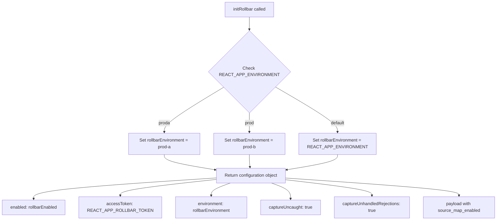
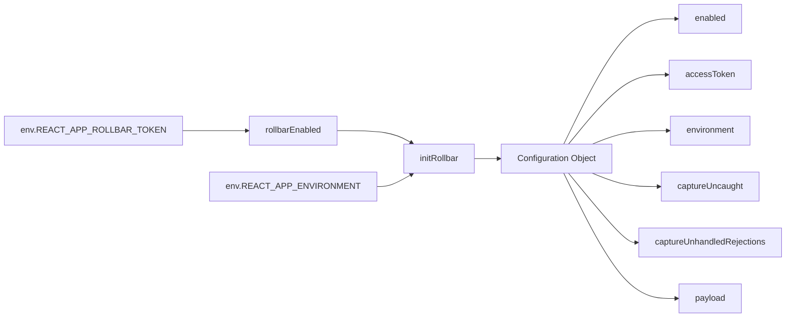

# Diagram: web/portal/src/trackers/rollbar.js


> Auto-generated by Obscura crawlers

## Diagram 1



### SVG

<svg id="container" width="1788.34375" xmlns="http://www.w3.org/2000/svg" class="flowchart" height="782" viewBox="0 0 1788.34375 782" role="graphics-document document" aria-roledescription="flowchart-v2"><style>#container{font-family:"trebuchet ms",verdana,arial,sans-serif;font-size:16px;fill:#333;}@keyframes edge-animation-frame{from{stroke-dashoffset:0;}}@keyframes dash{to{stroke-dashoffset:0;}}#container .edge-animation-slow{stroke-dasharray:9,5!important;stroke-dashoffset:900;animation:dash 50s linear infinite;stroke-linecap:round;}#container .edge-animation-fast{stroke-dasharray:9,5!important;stroke-dashoffset:900;animation:dash 20s linear infinite;stroke-linecap:round;}#container .error-icon{fill:#552222;}#container .error-text{fill:#552222;stroke:#552222;}#container .edge-thickness-normal{stroke-width:1px;}#container .edge-thickness-thick{stroke-width:3.5px;}#container .edge-pattern-solid{stroke-dasharray:0;}#container .edge-thickness-invisible{stroke-width:0;fill:none;}#container .edge-pattern-dashed{stroke-dasharray:3;}#container .edge-pattern-dotted{stroke-dasharray:2;}#container .marker{fill:#333333;stroke:#333333;}#container .marker.cross{stroke:#333333;}#container svg{font-family:"trebuchet ms",verdana,arial,sans-serif;font-size:16px;}#container p{margin:0;}#container .label{font-family:"trebuchet ms",verdana,arial,sans-serif;color:#333;}#container .cluster-label text{fill:#333;}#container .cluster-label span{color:#333;}#container .cluster-label span p{background-color:transparent;}#container .label text,#container span{fill:#333;color:#333;}#container .node rect,#container .node circle,#container .node ellipse,#container .node polygon,#container .node path{fill:#ECECFF;stroke:#9370DB;stroke-width:1px;}#container .rough-node .label text,#container .node .label text,#container .image-shape .label,#container .icon-shape .label{text-anchor:middle;}#container .node .katex path{fill:#000;stroke:#000;stroke-width:1px;}#container .rough-node .label,#container .node .label,#container .image-shape .label,#container .icon-shape .label{text-align:center;}#container .node.clickable{cursor:pointer;}#container .root .anchor path{fill:#333333!important;stroke-width:0;stroke:#333333;}#container .arrowheadPath{fill:#333333;}#container .edgePath .path{stroke:#333333;stroke-width:2.0px;}#container .flowchart-link{stroke:#333333;fill:none;}#container .edgeLabel{background-color:rgba(232,232,232, 0.8);text-align:center;}#container .edgeLabel p{background-color:rgba(232,232,232, 0.8);}#container .edgeLabel rect{opacity:0.5;background-color:rgba(232,232,232, 0.8);fill:rgba(232,232,232, 0.8);}#container .labelBkg{background-color:rgba(232, 232, 232, 0.5);}#container .cluster rect{fill:#ffffde;stroke:#aaaa33;stroke-width:1px;}#container .cluster text{fill:#333;}#container .cluster span{color:#333;}#container div.mermaidTooltip{position:absolute;text-align:center;max-width:200px;padding:2px;font-family:"trebuchet ms",verdana,arial,sans-serif;font-size:12px;background:hsl(80, 100%, 96.2745098039%);border:1px solid #aaaa33;border-radius:2px;pointer-events:none;z-index:100;}#container .flowchartTitleText{text-anchor:middle;font-size:18px;fill:#333;}#container rect.text{fill:none;stroke-width:0;}#container .icon-shape,#container .image-shape{background-color:rgba(232,232,232, 0.8);text-align:center;}#container .icon-shape p,#container .image-shape p{background-color:rgba(232,232,232, 0.8);padding:2px;}#container .icon-shape rect,#container .image-shape rect{opacity:0.5;background-color:rgba(232,232,232, 0.8);fill:rgba(232,232,232, 0.8);}#container .label-icon{display:inline-block;height:1em;overflow:visible;vertical-align:-0.125em;}#container .node .label-icon path{fill:currentColor;stroke:revert;stroke-width:revert;}#container :root{--mermaid-font-family:"trebuchet ms",verdana,arial,sans-serif;}</style><g><marker id="container_flowchart-v2-pointEnd" class="marker flowchart-v2" viewBox="0 0 10 10" refX="5" refY="5" markerUnits="userSpaceOnUse" markerWidth="8" markerHeight="8" orient="auto"><path d="M 0 0 L 10 5 L 0 10 z" class="arrowMarkerPath" style="stroke-width: 1; stroke-dasharray: 1, 0;"></path></marker><marker id="container_flowchart-v2-pointStart" class="marker flowchart-v2" viewBox="0 0 10 10" refX="4.5" refY="5" markerUnits="userSpaceOnUse" markerWidth="8" markerHeight="8" orient="auto"><path d="M 0 5 L 10 10 L 10 0 z" class="arrowMarkerPath" style="stroke-width: 1; stroke-dasharray: 1, 0;"></path></marker><marker id="container_flowchart-v2-circleEnd" class="marker flowchart-v2" viewBox="0 0 10 10" refX="11" refY="5" markerUnits="userSpaceOnUse" markerWidth="11" markerHeight="11" orient="auto"><circle cx="5" cy="5" r="5" class="arrowMarkerPath" style="stroke-width: 1; stroke-dasharray: 1, 0;"></circle></marker><marker id="container_flowchart-v2-circleStart" class="marker flowchart-v2" viewBox="0 0 10 10" refX="-1" refY="5" markerUnits="userSpaceOnUse" markerWidth="11" markerHeight="11" orient="auto"><circle cx="5" cy="5" r="5" class="arrowMarkerPath" style="stroke-width: 1; stroke-dasharray: 1, 0;"></circle></marker><marker id="container_flowchart-v2-crossEnd" class="marker cross flowchart-v2" viewBox="0 0 11 11" refX="12" refY="5.2" markerUnits="userSpaceOnUse" markerWidth="11" markerHeight="11" orient="auto"><path d="M 1,1 l 9,9 M 10,1 l -9,9" class="arrowMarkerPath" style="stroke-width: 2; stroke-dasharray: 1, 0;"></path></marker><marker id="container_flowchart-v2-crossStart" class="marker cross flowchart-v2" viewBox="0 0 11 11" refX="-1" refY="5.2" markerUnits="userSpaceOnUse" markerWidth="11" markerHeight="11" orient="auto"><path d="M 1,1 l 9,9 M 10,1 l -9,9" class="arrowMarkerPath" style="stroke-width: 2; stroke-dasharray: 1, 0;"></path></marker><g class="root"><g class="clusters"></g><g class="edgePaths"><path d="M884.961,62L884.961,66.167C884.961,70.333,884.961,78.667,884.961,86.333C884.961,94,884.961,101,884.961,104.5L884.961,108" id="L_A_B_0" class="edge-thickness-normal edge-pattern-solid edge-thickness-normal edge-pattern-solid flowchart-link" style=";" data-edge="true" data-et="edge" data-id="L_A_B_0" data-points="W3sieCI6ODg0Ljk2MDkzNzUsInkiOjYyfSx7IngiOjg4NC45NjA5Mzc1LCJ5Ijo4N30seyJ4Ijo4ODQuOTYwOTM3NSwieSI6MTEyfV0=" marker-end="url(#container_flowchart-v2-pointEnd)"></path><path d="M796.298,301.337L759.409,322.281C722.519,343.225,648.74,385.112,611.851,411.556C574.961,438,574.961,449,574.961,454.5L574.961,460" id="L_B_C_0" class="edge-thickness-normal edge-pattern-solid edge-thickness-normal edge-pattern-solid flowchart-link" style=";" data-edge="true" data-et="edge" data-id="L_B_C_0" data-points="W3sieCI6Nzk2LjI5ODM4NjA1OTY3MDcsInkiOjMwMS4zMzc0NDg1NTk2NzA4fSx7IngiOjU3NC45NjA5Mzc1LCJ5Ijo0Mjd9LHsieCI6NTc0Ljk2MDkzNzUsInkiOjQ2NH1d" marker-end="url(#container_flowchart-v2-pointEnd)"></path><path d="M884.961,390L884.961,396.167C884.961,402.333,884.961,414.667,884.961,426.333C884.961,438,884.961,449,884.961,454.5L884.961,460" id="L_B_D_0" class="edge-thickness-normal edge-pattern-solid edge-thickness-normal edge-pattern-solid flowchart-link" style=";" data-edge="true" data-et="edge" data-id="L_B_D_0" data-points="W3sieCI6ODg0Ljk2MDkzNzUsInkiOjM5MH0seyJ4Ijo4ODQuOTYwOTM3NSwieSI6NDI3fSx7IngiOjg4NC45NjA5Mzc1LCJ5Ijo0NjR9XQ==" marker-end="url(#container_flowchart-v2-pointEnd)"></path><path d="M973.623,301.337L1010.513,322.281C1047.403,343.225,1121.182,385.112,1158.071,411.556C1194.961,438,1194.961,449,1194.961,454.5L1194.961,460" id="L_B_E_0" class="edge-thickness-normal edge-pattern-solid edge-thickness-normal edge-pattern-solid flowchart-link" style=";" data-edge="true" data-et="edge" data-id="L_B_E_0" data-points="W3sieCI6OTczLjYyMzQ4ODk0MDMyOTMsInkiOjMwMS4zMzc0NDg1NTk2NzA4fSx7IngiOjExOTQuOTYwOTM3NSwieSI6NDI3fSx7IngiOjExOTQuOTYwOTM3NSwieSI6NDY0fV0=" marker-end="url(#container_flowchart-v2-pointEnd)"></path><path d="M574.961,542L574.961,546.167C574.961,550.333,574.961,558.667,604.402,567.772C633.844,576.877,692.727,586.754,722.168,591.693L751.61,596.631" id="L_C_F_0" class="edge-thickness-normal edge-pattern-solid edge-thickness-normal edge-pattern-solid flowchart-link" style=";" data-edge="true" data-et="edge" data-id="L_C_F_0" data-points="W3sieCI6NTc0Ljk2MDkzNzUsInkiOjU0Mn0seyJ4Ijo1NzQuOTYwOTM3NSwieSI6NTY3fSx7IngiOjc1NS41NTQ2ODc1LCJ5Ijo1OTcuMjkzMTQ1MTYxMjkwM31d" marker-end="url(#container_flowchart-v2-pointEnd)"></path><path d="M884.961,542L884.961,546.167C884.961,550.333,884.961,558.667,884.961,566.333C884.961,574,884.961,581,884.961,584.5L884.961,588" id="L_D_F_0" class="edge-thickness-normal edge-pattern-solid edge-thickness-normal edge-pattern-solid flowchart-link" style=";" data-edge="true" data-et="edge" data-id="L_D_F_0" data-points="W3sieCI6ODg0Ljk2MDkzNzUsInkiOjU0Mn0seyJ4Ijo4ODQuOTYwOTM3NSwieSI6NTY3fSx7IngiOjg4NC45NjA5Mzc1LCJ5Ijo1OTJ9XQ==" marker-end="url(#container_flowchart-v2-pointEnd)"></path><path d="M1194.961,542L1194.961,546.167C1194.961,550.333,1194.961,558.667,1165.519,567.772C1136.078,576.877,1077.195,586.754,1047.754,591.693L1018.312,596.631" id="L_E_F_0" class="edge-thickness-normal edge-pattern-solid edge-thickness-normal edge-pattern-solid flowchart-link" style=";" data-edge="true" data-et="edge" data-id="L_E_F_0" data-points="W3sieCI6MTE5NC45NjA5Mzc1LCJ5Ijo1NDJ9LHsieCI6MTE5NC45NjA5Mzc1LCJ5Ijo1Njd9LHsieCI6MTAxNC4zNjcxODc1LCJ5Ijo1OTcuMjkzMTQ1MTYxMjkwM31d" marker-end="url(#container_flowchart-v2-pointEnd)"></path><path d="M755.555,627.859L650.53,635.049C545.505,642.24,335.456,656.62,230.431,669.31C125.406,682,125.406,693,125.406,698.5L125.406,704" id="L_F_G_0" class="edge-thickness-normal edge-pattern-solid edge-thickness-normal edge-pattern-solid flowchart-link" style=";" data-edge="true" data-et="edge" data-id="L_F_G_0" data-points="W3sieCI6NzU1LjU1NDY4NzUsInkiOjYyNy44NTkzMDI4Mzk4NjN9LHsieCI6MTI1LjQwNjI1LCJ5Ijo2NzF9LHsieCI6MTI1LjQwNjI1LCJ5Ijo3MDh9XQ==" marker-end="url(#container_flowchart-v2-pointEnd)"></path><path d="M755.555,633.665L700.646,639.887C645.737,646.11,535.919,658.555,481.01,668.277C426.102,678,426.102,685,426.102,688.5L426.102,692" id="L_F_H_0" class="edge-thickness-normal edge-pattern-solid edge-thickness-normal edge-pattern-solid flowchart-link" style=";" data-edge="true" data-et="edge" data-id="L_F_H_0" data-points="W3sieCI6NzU1LjU1NDY4NzUsInkiOjYzMy42NjQ4OTU5NzE2Njg5fSx7IngiOjQyNi4xMDE1NjI1LCJ5Ijo2NzF9LHsieCI6NDI2LjEwMTU2MjUsInkiOjY5Nn1d" marker-end="url(#container_flowchart-v2-pointEnd)"></path><path d="M809.376,646L797.712,650.167C786.048,654.333,762.719,662.667,751.055,670.333C739.391,678,739.391,685,739.391,688.5L739.391,692" id="L_F_I_0" class="edge-thickness-normal edge-pattern-solid edge-thickness-normal edge-pattern-solid flowchart-link" style=";" data-edge="true" data-et="edge" data-id="L_F_I_0" data-points="W3sieCI6ODA5LjM3NjM1MjE2MzQ2MTUsInkiOjY0Nn0seyJ4Ijo3MzkuMzkwNjI1LCJ5Ijo2NzF9LHsieCI6NzM5LjM5MDYyNSwieSI6Njk2fV0=" marker-end="url(#container_flowchart-v2-pointEnd)"></path><path d="M960.546,646L972.21,650.167C983.874,654.333,1007.203,662.667,1018.867,672.333C1030.531,682,1030.531,693,1030.531,698.5L1030.531,704" id="L_F_J_0" class="edge-thickness-normal edge-pattern-solid edge-thickness-normal edge-pattern-solid flowchart-link" style=";" data-edge="true" data-et="edge" data-id="L_F_J_0" data-points="W3sieCI6OTYwLjU0NTUyMjgzNjUzODUsInkiOjY0Nn0seyJ4IjoxMDMwLjUzMTI1LCJ5Ijo2NzF9LHsieCI6MTAzMC41MzEyNSwieSI6NzA4fV0=" marker-end="url(#container_flowchart-v2-pointEnd)"></path><path d="M1014.367,634.086L1067.141,640.238C1119.914,646.391,1225.461,658.695,1278.234,668.348C1331.008,678,1331.008,685,1331.008,688.5L1331.008,692" id="L_F_K_0" class="edge-thickness-normal edge-pattern-solid edge-thickness-normal edge-pattern-solid flowchart-link" style=";" data-edge="true" data-et="edge" data-id="L_F_K_0" data-points="W3sieCI6MTAxNC4zNjcxODc1LCJ5Ijo2MzQuMDg2MTM4NjQ4NTQ0NX0seyJ4IjoxMzMxLjAwNzgxMjUsInkiOjY3MX0seyJ4IjoxMzMxLjAwNzgxMjUsInkiOjY5Nn1d" marker-end="url(#container_flowchart-v2-pointEnd)"></path><path d="M1014.367,627.792L1120.363,634.993C1226.359,642.195,1438.352,656.597,1544.348,667.299C1650.344,678,1650.344,685,1650.344,688.5L1650.344,692" id="L_F_L_0" class="edge-thickness-normal edge-pattern-solid edge-thickness-normal edge-pattern-solid flowchart-link" style=";" data-edge="true" data-et="edge" data-id="L_F_L_0" data-points="W3sieCI6MTAxNC4zNjcxODc1LCJ5Ijo2MjcuNzkxODQyMzE3NDY3N30seyJ4IjoxNjUwLjM0Mzc1LCJ5Ijo2NzF9LHsieCI6MTY1MC4zNDM3NSwieSI6Njk2fV0=" marker-end="url(#container_flowchart-v2-pointEnd)"></path></g><g class="edgeLabels"><g class="edgeLabel"><g class="label" data-id="L_A_B_0" transform="translate(0, 0)"><foreignObject width="0" height="0"><div xmlns="http://www.w3.org/1999/xhtml" class="labelBkg" style="display: table-cell; white-space: nowrap; line-height: 1.5; max-width: 200px; text-align: center;"><span class="edgeLabel"></span></div></foreignObject></g></g><g class="edgeLabel" transform="translate(574.9609375, 427)"><g class="label" data-id="L_B_C_0" transform="translate(-21.4140625, -12)"><foreignObject width="42.828125" height="24"><div xmlns="http://www.w3.org/1999/xhtml" class="labelBkg" style="display: table-cell; white-space: nowrap; line-height: 1.5; max-width: 200px; text-align: center;"><span class="edgeLabel"><p>proda</p></span></div></foreignObject></g></g><g class="edgeLabel" transform="translate(884.9609375, 427)"><g class="label" data-id="L_B_D_0" transform="translate(-17.0625, -12)"><foreignObject width="34.125" height="24"><div xmlns="http://www.w3.org/1999/xhtml" class="labelBkg" style="display: table-cell; white-space: nowrap; line-height: 1.5; max-width: 200px; text-align: center;"><span class="edgeLabel"><p>prod</p></span></div></foreignObject></g></g><g class="edgeLabel" transform="translate(1194.9609375, 427)"><g class="label" data-id="L_B_E_0" transform="translate(-25.890625, -12)"><foreignObject width="51.78125" height="24"><div xmlns="http://www.w3.org/1999/xhtml" class="labelBkg" style="display: table-cell; white-space: nowrap; line-height: 1.5; max-width: 200px; text-align: center;"><span class="edgeLabel"><p>default</p></span></div></foreignObject></g></g><g class="edgeLabel"><g class="label" data-id="L_C_F_0" transform="translate(0, 0)"><foreignObject width="0" height="0"><div xmlns="http://www.w3.org/1999/xhtml" class="labelBkg" style="display: table-cell; white-space: nowrap; line-height: 1.5; max-width: 200px; text-align: center;"><span class="edgeLabel"></span></div></foreignObject></g></g><g class="edgeLabel"><g class="label" data-id="L_D_F_0" transform="translate(0, 0)"><foreignObject width="0" height="0"><div xmlns="http://www.w3.org/1999/xhtml" class="labelBkg" style="display: table-cell; white-space: nowrap; line-height: 1.5; max-width: 200px; text-align: center;"><span class="edgeLabel"></span></div></foreignObject></g></g><g class="edgeLabel"><g class="label" data-id="L_E_F_0" transform="translate(0, 0)"><foreignObject width="0" height="0"><div xmlns="http://www.w3.org/1999/xhtml" class="labelBkg" style="display: table-cell; white-space: nowrap; line-height: 1.5; max-width: 200px; text-align: center;"><span class="edgeLabel"></span></div></foreignObject></g></g><g class="edgeLabel"><g class="label" data-id="L_F_G_0" transform="translate(0, 0)"><foreignObject width="0" height="0"><div xmlns="http://www.w3.org/1999/xhtml" class="labelBkg" style="display: table-cell; white-space: nowrap; line-height: 1.5; max-width: 200px; text-align: center;"><span class="edgeLabel"></span></div></foreignObject></g></g><g class="edgeLabel"><g class="label" data-id="L_F_H_0" transform="translate(0, 0)"><foreignObject width="0" height="0"><div xmlns="http://www.w3.org/1999/xhtml" class="labelBkg" style="display: table-cell; white-space: nowrap; line-height: 1.5; max-width: 200px; text-align: center;"><span class="edgeLabel"></span></div></foreignObject></g></g><g class="edgeLabel"><g class="label" data-id="L_F_I_0" transform="translate(0, 0)"><foreignObject width="0" height="0"><div xmlns="http://www.w3.org/1999/xhtml" class="labelBkg" style="display: table-cell; white-space: nowrap; line-height: 1.5; max-width: 200px; text-align: center;"><span class="edgeLabel"></span></div></foreignObject></g></g><g class="edgeLabel"><g class="label" data-id="L_F_J_0" transform="translate(0, 0)"><foreignObject width="0" height="0"><div xmlns="http://www.w3.org/1999/xhtml" class="labelBkg" style="display: table-cell; white-space: nowrap; line-height: 1.5; max-width: 200px; text-align: center;"><span class="edgeLabel"></span></div></foreignObject></g></g><g class="edgeLabel"><g class="label" data-id="L_F_K_0" transform="translate(0, 0)"><foreignObject width="0" height="0"><div xmlns="http://www.w3.org/1999/xhtml" class="labelBkg" style="display: table-cell; white-space: nowrap; line-height: 1.5; max-width: 200px; text-align: center;"><span class="edgeLabel"></span></div></foreignObject></g></g><g class="edgeLabel"><g class="label" data-id="L_F_L_0" transform="translate(0, 0)"><foreignObject width="0" height="0"><div xmlns="http://www.w3.org/1999/xhtml" class="labelBkg" style="display: table-cell; white-space: nowrap; line-height: 1.5; max-width: 200px; text-align: center;"><span class="edgeLabel"></span></div></foreignObject></g></g></g><g class="nodes"><g class="node default" id="flowchart-A-0" transform="translate(884.9609375, 35)"><rect class="basic label-container" style="" x="-92.2109375" y="-27" width="184.421875" height="54"></rect><g class="label" style="" transform="translate(-62.2109375, -12)"><rect></rect><foreignObject width="124.421875" height="24"><div xmlns="http://www.w3.org/1999/xhtml" style="display: table-cell; white-space: nowrap; line-height: 1.5; max-width: 200px; text-align: center;"><span class="nodeLabel"><p>initRollbar called</p></span></div></foreignObject></g></g><g class="node default" id="flowchart-B-1" transform="translate(884.9609375, 251)"><polygon points="139,0 278,-139 139,-278 0,-139" class="label-container" transform="translate(-138.5, 139)"></polygon><g class="label" style="" transform="translate(-100, -24)"><rect></rect><foreignObject width="200" height="48"><div xmlns="http://www.w3.org/1999/xhtml" style="display: table; white-space: break-spaces; line-height: 1.5; max-width: 200px; text-align: center; width: 200px;"><span class="nodeLabel"><p>Check REACT_APP_ENVIRONMENT</p></span></div></foreignObject></g></g><g class="node default" id="flowchart-C-3" transform="translate(574.9609375, 503)"><rect class="basic label-container" style="" x="-130" y="-39" width="260" height="78"></rect><g class="label" style="" transform="translate(-100, -24)"><rect></rect><foreignObject width="200" height="48"><div xmlns="http://www.w3.org/1999/xhtml" style="display: table; white-space: break-spaces; line-height: 1.5; max-width: 200px; text-align: center; width: 200px;"><span class="nodeLabel"><p>Set rollbarEnvironment = prod-a</p></span></div></foreignObject></g></g><g class="node default" id="flowchart-D-5" transform="translate(884.9609375, 503)"><rect class="basic label-container" style="" x="-130" y="-39" width="260" height="78"></rect><g class="label" style="" transform="translate(-100, -24)"><rect></rect><foreignObject width="200" height="48"><div xmlns="http://www.w3.org/1999/xhtml" style="display: table; white-space: break-spaces; line-height: 1.5; max-width: 200px; text-align: center; width: 200px;"><span class="nodeLabel"><p>Set rollbarEnvironment = prod-b</p></span></div></foreignObject></g></g><g class="node default" id="flowchart-E-7" transform="translate(1194.9609375, 503)"><rect class="basic label-container" style="" x="-130" y="-39" width="260" height="78"></rect><g class="label" style="" transform="translate(-100, -24)"><rect></rect><foreignObject width="200" height="48"><div xmlns="http://www.w3.org/1999/xhtml" style="display: table; white-space: break-spaces; line-height: 1.5; max-width: 200px; text-align: center; width: 200px;"><span class="nodeLabel"><p>Set rollbarEnvironment = REACT_APP_ENVIRONMENT</p></span></div></foreignObject></g></g><g class="node default" id="flowchart-F-9" transform="translate(884.9609375, 619)"><rect class="basic label-container" style="" x="-129.40625" y="-27" width="258.8125" height="54"></rect><g class="label" style="" transform="translate(-99.40625, -12)"><rect></rect><foreignObject width="198.8125" height="24"><div xmlns="http://www.w3.org/1999/xhtml" style="display: table-cell; white-space: nowrap; line-height: 1.5; max-width: 200px; text-align: center;"><span class="nodeLabel"><p>Return configuration object</p></span></div></foreignObject></g></g><g class="node default" id="flowchart-G-15" transform="translate(125.40625, 735)"><rect class="basic label-container" style="" x="-117.40625" y="-27" width="234.8125" height="54"></rect><g class="label" style="" transform="translate(-87.40625, -12)"><rect></rect><foreignObject width="174.8125" height="24"><div xmlns="http://www.w3.org/1999/xhtml" style="display: table-cell; white-space: nowrap; line-height: 1.5; max-width: 200px; text-align: center;"><span class="nodeLabel"><p>enabled: rollbarEnabled</p></span></div></foreignObject></g></g><g class="node default" id="flowchart-H-17" transform="translate(426.1015625, 735)"><rect class="basic label-container" style="" x="-133.2890625" y="-39" width="266.578125" height="78"></rect><g class="label" style="" transform="translate(-103.2890625, -24)"><rect></rect><foreignObject width="206.578125" height="48"><div xmlns="http://www.w3.org/1999/xhtml" style="display: table; white-space: break-spaces; line-height: 1.5; max-width: 200px; text-align: center; width: 200px;"><span class="nodeLabel"><p>accessToken: REACT_APP_ROLLBAR_TOKEN</p></span></div></foreignObject></g></g><g class="node default" id="flowchart-I-19" transform="translate(739.390625, 735)"><rect class="basic label-container" style="" x="-130" y="-39" width="260" height="78"></rect><g class="label" style="" transform="translate(-100, -24)"><rect></rect><foreignObject width="200" height="48"><div xmlns="http://www.w3.org/1999/xhtml" style="display: table; white-space: break-spaces; line-height: 1.5; max-width: 200px; text-align: center; width: 200px;"><span class="nodeLabel"><p>environment: rollbarEnvironment</p></span></div></foreignObject></g></g><g class="node default" id="flowchart-J-21" transform="translate(1030.53125, 735)"><rect class="basic label-container" style="" x="-111.140625" y="-27" width="222.28125" height="54"></rect><g class="label" style="" transform="translate(-81.140625, -12)"><rect></rect><foreignObject width="162.28125" height="24"><div xmlns="http://www.w3.org/1999/xhtml" style="display: table-cell; white-space: nowrap; line-height: 1.5; max-width: 200px; text-align: center;"><span class="nodeLabel"><p>captureUncaught: true</p></span></div></foreignObject></g></g><g class="node default" id="flowchart-K-23" transform="translate(1331.0078125, 735)"><rect class="basic label-container" style="" x="-139.3359375" y="-39" width="278.671875" height="78"></rect><g class="label" style="" transform="translate(-109.3359375, -24)"><rect></rect><foreignObject width="218.671875" height="48"><div xmlns="http://www.w3.org/1999/xhtml" style="display: table; white-space: break-spaces; line-height: 1.5; max-width: 200px; text-align: center; width: 200px;"><span class="nodeLabel"><p>captureUnhandledRejections: true</p></span></div></foreignObject></g></g><g class="node default" id="flowchart-L-25" transform="translate(1650.34375, 735)"><rect class="basic label-container" style="" x="-130" y="-39" width="260" height="78"></rect><g class="label" style="" transform="translate(-100, -24)"><rect></rect><foreignObject width="200" height="48"><div xmlns="http://www.w3.org/1999/xhtml" style="display: table; white-space: break-spaces; line-height: 1.5; max-width: 200px; text-align: center; width: 200px;"><span class="nodeLabel"><p>payload with source_map_enabled</p></span></div></foreignObject></g></g></g></g></g></svg>

## Diagram 2

```mermaid
stateDiagram-v2
    [*] --> CheckEnvironment
    CheckEnvironment --> ProdA: REACT_APP_ENVIRONMENT === "proda"
    CheckEnvironment --> ProdB: REACT_APP_ENVIRONMENT === "prod"
    CheckEnvironment --> Default: other value
    ProdA --> ReturnConfig: rollbarEnvironment = "prod-a"
    ProdB --> ReturnConfig: rollbarEnvironment = "prod-b"
    Default --> ReturnConfig: rollbarEnvironment = REACT_APP_ENVIRONMENT
    ReturnConfig --> [*]
```

> SVG rendering failed for this diagram.

## Diagram 3



### SVG

<svg id="container" width="1407.828125" xmlns="http://www.w3.org/2000/svg" class="flowchart" height="590" viewBox="0 0 1407.828125 590" role="graphics-document document" aria-roledescription="flowchart-v2"><style>#container{font-family:"trebuchet ms",verdana,arial,sans-serif;font-size:16px;fill:#333;}@keyframes edge-animation-frame{from{stroke-dashoffset:0;}}@keyframes dash{to{stroke-dashoffset:0;}}#container .edge-animation-slow{stroke-dasharray:9,5!important;stroke-dashoffset:900;animation:dash 50s linear infinite;stroke-linecap:round;}#container .edge-animation-fast{stroke-dasharray:9,5!important;stroke-dashoffset:900;animation:dash 20s linear infinite;stroke-linecap:round;}#container .error-icon{fill:#552222;}#container .error-text{fill:#552222;stroke:#552222;}#container .edge-thickness-normal{stroke-width:1px;}#container .edge-thickness-thick{stroke-width:3.5px;}#container .edge-pattern-solid{stroke-dasharray:0;}#container .edge-thickness-invisible{stroke-width:0;fill:none;}#container .edge-pattern-dashed{stroke-dasharray:3;}#container .edge-pattern-dotted{stroke-dasharray:2;}#container .marker{fill:#333333;stroke:#333333;}#container .marker.cross{stroke:#333333;}#container svg{font-family:"trebuchet ms",verdana,arial,sans-serif;font-size:16px;}#container p{margin:0;}#container .label{font-family:"trebuchet ms",verdana,arial,sans-serif;color:#333;}#container .cluster-label text{fill:#333;}#container .cluster-label span{color:#333;}#container .cluster-label span p{background-color:transparent;}#container .label text,#container span{fill:#333;color:#333;}#container .node rect,#container .node circle,#container .node ellipse,#container .node polygon,#container .node path{fill:#ECECFF;stroke:#9370DB;stroke-width:1px;}#container .rough-node .label text,#container .node .label text,#container .image-shape .label,#container .icon-shape .label{text-anchor:middle;}#container .node .katex path{fill:#000;stroke:#000;stroke-width:1px;}#container .rough-node .label,#container .node .label,#container .image-shape .label,#container .icon-shape .label{text-align:center;}#container .node.clickable{cursor:pointer;}#container .root .anchor path{fill:#333333!important;stroke-width:0;stroke:#333333;}#container .arrowheadPath{fill:#333333;}#container .edgePath .path{stroke:#333333;stroke-width:2.0px;}#container .flowchart-link{stroke:#333333;fill:none;}#container .edgeLabel{background-color:rgba(232,232,232, 0.8);text-align:center;}#container .edgeLabel p{background-color:rgba(232,232,232, 0.8);}#container .edgeLabel rect{opacity:0.5;background-color:rgba(232,232,232, 0.8);fill:rgba(232,232,232, 0.8);}#container .labelBkg{background-color:rgba(232, 232, 232, 0.5);}#container .cluster rect{fill:#ffffde;stroke:#aaaa33;stroke-width:1px;}#container .cluster text{fill:#333;}#container .cluster span{color:#333;}#container div.mermaidTooltip{position:absolute;text-align:center;max-width:200px;padding:2px;font-family:"trebuchet ms",verdana,arial,sans-serif;font-size:12px;background:hsl(80, 100%, 96.2745098039%);border:1px solid #aaaa33;border-radius:2px;pointer-events:none;z-index:100;}#container .flowchartTitleText{text-anchor:middle;font-size:18px;fill:#333;}#container rect.text{fill:none;stroke-width:0;}#container .icon-shape,#container .image-shape{background-color:rgba(232,232,232, 0.8);text-align:center;}#container .icon-shape p,#container .image-shape p{background-color:rgba(232,232,232, 0.8);padding:2px;}#container .icon-shape rect,#container .image-shape rect{opacity:0.5;background-color:rgba(232,232,232, 0.8);fill:rgba(232,232,232, 0.8);}#container .label-icon{display:inline-block;height:1em;overflow:visible;vertical-align:-0.125em;}#container .node .label-icon path{fill:currentColor;stroke:revert;stroke-width:revert;}#container :root{--mermaid-font-family:"trebuchet ms",verdana,arial,sans-serif;}</style><g><marker id="container_flowchart-v2-pointEnd" class="marker flowchart-v2" viewBox="0 0 10 10" refX="5" refY="5" markerUnits="userSpaceOnUse" markerWidth="8" markerHeight="8" orient="auto"><path d="M 0 0 L 10 5 L 0 10 z" class="arrowMarkerPath" style="stroke-width: 1; stroke-dasharray: 1, 0;"></path></marker><marker id="container_flowchart-v2-pointStart" class="marker flowchart-v2" viewBox="0 0 10 10" refX="4.5" refY="5" markerUnits="userSpaceOnUse" markerWidth="8" markerHeight="8" orient="auto"><path d="M 0 5 L 10 10 L 10 0 z" class="arrowMarkerPath" style="stroke-width: 1; stroke-dasharray: 1, 0;"></path></marker><marker id="container_flowchart-v2-circleEnd" class="marker flowchart-v2" viewBox="0 0 10 10" refX="11" refY="5" markerUnits="userSpaceOnUse" markerWidth="11" markerHeight="11" orient="auto"><circle cx="5" cy="5" r="5" class="arrowMarkerPath" style="stroke-width: 1; stroke-dasharray: 1, 0;"></circle></marker><marker id="container_flowchart-v2-circleStart" class="marker flowchart-v2" viewBox="0 0 10 10" refX="-1" refY="5" markerUnits="userSpaceOnUse" markerWidth="11" markerHeight="11" orient="auto"><circle cx="5" cy="5" r="5" class="arrowMarkerPath" style="stroke-width: 1; stroke-dasharray: 1, 0;"></circle></marker><marker id="container_flowchart-v2-crossEnd" class="marker cross flowchart-v2" viewBox="0 0 11 11" refX="12" refY="5.2" markerUnits="userSpaceOnUse" markerWidth="11" markerHeight="11" orient="auto"><path d="M 1,1 l 9,9 M 10,1 l -9,9" class="arrowMarkerPath" style="stroke-width: 2; stroke-dasharray: 1, 0;"></path></marker><marker id="container_flowchart-v2-crossStart" class="marker cross flowchart-v2" viewBox="0 0 11 11" refX="-1" refY="5.2" markerUnits="userSpaceOnUse" markerWidth="11" markerHeight="11" orient="auto"><path d="M 1,1 l 9,9 M 10,1 l -9,9" class="arrowMarkerPath" style="stroke-width: 2; stroke-dasharray: 1, 0;"></path></marker><g class="root"><g class="clusters"></g><g class="edgePaths"><path d="M303.641,243L307.807,243C311.974,243,320.307,243,337.366,243C354.424,243,380.208,243,393.1,243L405.992,243" id="L_A_B_0" class="edge-thickness-normal edge-pattern-solid edge-thickness-normal edge-pattern-solid flowchart-link" style=";" data-edge="true" data-et="edge" data-id="L_A_B_0" data-points="W3sieCI6MzAzLjY0MDYyNSwieSI6MjQzfSx7IngiOjMyOC42NDA2MjUsInkiOjI0M30seyJ4Ijo0MDkuOTkyMTg3NSwieSI6MjQzfV0=" marker-end="url(#container_flowchart-v2-pointEnd)"></path><path d="M577.523,243L591.082,243C604.641,243,631.758,243,652.209,246.842C672.659,250.684,686.444,258.368,693.336,262.21L700.228,266.052" id="L_B_C_0" class="edge-thickness-normal edge-pattern-solid edge-thickness-normal edge-pattern-solid flowchart-link" style=";" data-edge="true" data-et="edge" data-id="L_B_C_0" data-points="W3sieCI6NTc3LjUyMzQzNzUsInkiOjI0M30seyJ4Ijo2NTguODc1LCJ5IjoyNDN9LHsieCI6NzAzLjcyMTc1NDgwNzY5MjMsInkiOjI2OH1d" marker-end="url(#container_flowchart-v2-pointEnd)"></path><path d="M633.875,347L638.042,347C642.208,347,650.542,347,661.6,343.158C672.659,339.316,686.444,331.632,693.336,327.79L700.228,323.948" id="L_D_C_0" class="edge-thickness-normal edge-pattern-solid edge-thickness-normal edge-pattern-solid flowchart-link" style=";" data-edge="true" data-et="edge" data-id="L_D_C_0" data-points="W3sieCI6NjMzLjg3NSwieSI6MzQ3fSx7IngiOjY1OC44NzUsInkiOjM0N30seyJ4Ijo3MDMuNzIxNzU0ODA3NjkyMywieSI6MzIyfV0=" marker-end="url(#container_flowchart-v2-pointEnd)"></path><path d="M820.438,295L824.604,295C828.771,295,837.104,295,844.771,295C852.438,295,859.438,295,862.938,295L866.438,295" id="L_C_E_0" class="edge-thickness-normal edge-pattern-solid edge-thickness-normal edge-pattern-solid flowchart-link" style=";" data-edge="true" data-et="edge" data-id="L_C_E_0" data-points="W3sieCI6ODIwLjQzNzUsInkiOjI5NX0seyJ4Ijo4NDUuNDM3NSwieSI6Mjk1fSx7IngiOjg3MC40Mzc1LCJ5IjoyOTV9XQ==" marker-end="url(#container_flowchart-v2-pointEnd)"></path><path d="M988.282,268L1007.61,229.167C1026.938,190.333,1065.594,112.667,1101.037,73.833C1136.479,35,1168.708,35,1184.823,35L1200.938,35" id="L_E_F_0" class="edge-thickness-normal edge-pattern-solid edge-thickness-normal edge-pattern-solid flowchart-link" style=";" data-edge="true" data-et="edge" data-id="L_E_F_0" data-points="W3sieCI6OTg4LjI4MjA5MTM0NjE1MzgsInkiOjI2OH0seyJ4IjoxMTA0LjI1LCJ5IjozNX0seyJ4IjoxMjA0LjkzNzUsInkiOjM1fV0=" marker-end="url(#container_flowchart-v2-pointEnd)"></path><path d="M997.241,268L1015.076,246.5C1032.911,225,1068.58,182,1099.984,160.5C1131.388,139,1158.526,139,1172.095,139L1185.664,139" id="L_E_G_0" class="edge-thickness-normal edge-pattern-solid edge-thickness-normal edge-pattern-solid flowchart-link" style=";" data-edge="true" data-et="edge" data-id="L_E_G_0" data-points="W3sieCI6OTk3LjI0MDk4NTU3NjkyMzEsInkiOjI2OH0seyJ4IjoxMTA0LjI1LCJ5IjoxMzl9LHsieCI6MTE4OS42NjQwNjI1LCJ5IjoxMzl9XQ==" marker-end="url(#container_flowchart-v2-pointEnd)"></path><path d="M1042.035,268L1052.405,263.833C1062.774,259.667,1083.512,251.333,1107.231,247.167C1130.951,243,1157.651,243,1171.001,243L1184.352,243" id="L_E_H_0" class="edge-thickness-normal edge-pattern-solid edge-thickness-normal edge-pattern-solid flowchart-link" style=";" data-edge="true" data-et="edge" data-id="L_E_H_0" data-points="W3sieCI6MTA0Mi4wMzU0NTY3MzA3NjkzLCJ5IjoyNjh9LHsieCI6MTEwNC4yNSwieSI6MjQzfSx7IngiOjExODguMzUxNTYyNSwieSI6MjQzfV0=" marker-end="url(#container_flowchart-v2-pointEnd)"></path><path d="M1042.035,322L1052.405,326.167C1062.774,330.333,1083.512,338.667,1104.583,342.833C1125.654,347,1147.057,347,1157.759,347L1168.461,347" id="L_E_I_0" class="edge-thickness-normal edge-pattern-solid edge-thickness-normal edge-pattern-solid flowchart-link" style=";" data-edge="true" data-et="edge" data-id="L_E_I_0" data-points="W3sieCI6MTA0Mi4wMzU0NTY3MzA3NjkzLCJ5IjozMjJ9LHsieCI6MTEwNC4yNSwieSI6MzQ3fSx7IngiOjExNzIuNDYwOTM3NSwieSI6MzQ3fV0=" marker-end="url(#container_flowchart-v2-pointEnd)"></path><path d="M997.241,322L1015.076,343.5C1032.911,365,1068.58,408,1089.915,429.5C1111.25,451,1118.25,451,1121.75,451L1125.25,451" id="L_E_J_0" class="edge-thickness-normal edge-pattern-solid edge-thickness-normal edge-pattern-solid flowchart-link" style=";" data-edge="true" data-et="edge" data-id="L_E_J_0" data-points="W3sieCI6OTk3LjI0MDk4NTU3NjkyMzEsInkiOjMyMn0seyJ4IjoxMTA0LjI1LCJ5Ijo0NTF9LHsieCI6MTEyOS4yNSwieSI6NDUxfV0=" marker-end="url(#container_flowchart-v2-pointEnd)"></path><path d="M988.282,322L1007.61,360.833C1026.938,399.667,1065.594,477.333,1101.158,516.167C1136.721,555,1169.193,555,1185.428,555L1201.664,555" id="L_E_K_0" class="edge-thickness-normal edge-pattern-solid edge-thickness-normal edge-pattern-solid flowchart-link" style=";" data-edge="true" data-et="edge" data-id="L_E_K_0" data-points="W3sieCI6OTg4LjI4MjA5MTM0NjE1MzgsInkiOjMyMn0seyJ4IjoxMTA0LjI1LCJ5Ijo1NTV9LHsieCI6MTIwNS42NjQwNjI1LCJ5Ijo1NTV9XQ==" marker-end="url(#container_flowchart-v2-pointEnd)"></path></g><g class="edgeLabels"><g class="edgeLabel"><g class="label" data-id="L_A_B_0" transform="translate(0, 0)"><foreignObject width="0" height="0"><div xmlns="http://www.w3.org/1999/xhtml" class="labelBkg" style="display: table-cell; white-space: nowrap; line-height: 1.5; max-width: 200px; text-align: center;"><span class="edgeLabel"></span></div></foreignObject></g></g><g class="edgeLabel"><g class="label" data-id="L_B_C_0" transform="translate(0, 0)"><foreignObject width="0" height="0"><div xmlns="http://www.w3.org/1999/xhtml" class="labelBkg" style="display: table-cell; white-space: nowrap; line-height: 1.5; max-width: 200px; text-align: center;"><span class="edgeLabel"></span></div></foreignObject></g></g><g class="edgeLabel"><g class="label" data-id="L_D_C_0" transform="translate(0, 0)"><foreignObject width="0" height="0"><div xmlns="http://www.w3.org/1999/xhtml" class="labelBkg" style="display: table-cell; white-space: nowrap; line-height: 1.5; max-width: 200px; text-align: center;"><span class="edgeLabel"></span></div></foreignObject></g></g><g class="edgeLabel"><g class="label" data-id="L_C_E_0" transform="translate(0, 0)"><foreignObject width="0" height="0"><div xmlns="http://www.w3.org/1999/xhtml" class="labelBkg" style="display: table-cell; white-space: nowrap; line-height: 1.5; max-width: 200px; text-align: center;"><span class="edgeLabel"></span></div></foreignObject></g></g><g class="edgeLabel"><g class="label" data-id="L_E_F_0" transform="translate(0, 0)"><foreignObject width="0" height="0"><div xmlns="http://www.w3.org/1999/xhtml" class="labelBkg" style="display: table-cell; white-space: nowrap; line-height: 1.5; max-width: 200px; text-align: center;"><span class="edgeLabel"></span></div></foreignObject></g></g><g class="edgeLabel"><g class="label" data-id="L_E_G_0" transform="translate(0, 0)"><foreignObject width="0" height="0"><div xmlns="http://www.w3.org/1999/xhtml" class="labelBkg" style="display: table-cell; white-space: nowrap; line-height: 1.5; max-width: 200px; text-align: center;"><span class="edgeLabel"></span></div></foreignObject></g></g><g class="edgeLabel"><g class="label" data-id="L_E_H_0" transform="translate(0, 0)"><foreignObject width="0" height="0"><div xmlns="http://www.w3.org/1999/xhtml" class="labelBkg" style="display: table-cell; white-space: nowrap; line-height: 1.5; max-width: 200px; text-align: center;"><span class="edgeLabel"></span></div></foreignObject></g></g><g class="edgeLabel"><g class="label" data-id="L_E_I_0" transform="translate(0, 0)"><foreignObject width="0" height="0"><div xmlns="http://www.w3.org/1999/xhtml" class="labelBkg" style="display: table-cell; white-space: nowrap; line-height: 1.5; max-width: 200px; text-align: center;"><span class="edgeLabel"></span></div></foreignObject></g></g><g class="edgeLabel"><g class="label" data-id="L_E_J_0" transform="translate(0, 0)"><foreignObject width="0" height="0"><div xmlns="http://www.w3.org/1999/xhtml" class="labelBkg" style="display: table-cell; white-space: nowrap; line-height: 1.5; max-width: 200px; text-align: center;"><span class="edgeLabel"></span></div></foreignObject></g></g><g class="edgeLabel"><g class="label" data-id="L_E_K_0" transform="translate(0, 0)"><foreignObject width="0" height="0"><div xmlns="http://www.w3.org/1999/xhtml" class="labelBkg" style="display: table-cell; white-space: nowrap; line-height: 1.5; max-width: 200px; text-align: center;"><span class="edgeLabel"></span></div></foreignObject></g></g></g><g class="nodes"><g class="node default" id="flowchart-A-0" transform="translate(155.8203125, 243)"><rect class="basic label-container" style="" x="-147.8203125" y="-27" width="295.640625" height="54"></rect><g class="label" style="" transform="translate(-117.8203125, -12)"><rect></rect><foreignObject width="235.640625" height="24"><div xmlns="http://www.w3.org/1999/xhtml" style="display: table; white-space: break-spaces; line-height: 1.5; max-width: 200px; text-align: center; width: 200px;"><span class="nodeLabel"><p>env.REACT_APP_ROLLBAR_TOKEN</p></span></div></foreignObject></g></g><g class="node default" id="flowchart-B-1" transform="translate(493.7578125, 243)"><rect class="basic label-container" style="" x="-83.765625" y="-27" width="167.53125" height="54"></rect><g class="label" style="" transform="translate(-53.765625, -12)"><rect></rect><foreignObject width="107.53125" height="24"><div xmlns="http://www.w3.org/1999/xhtml" style="display: table-cell; white-space: nowrap; line-height: 1.5; max-width: 200px; text-align: center;"><span class="nodeLabel"><p>rollbarEnabled</p></span></div></foreignObject></g></g><g class="node default" id="flowchart-C-3" transform="translate(752.15625, 295)"><rect class="basic label-container" style="" x="-68.28125" y="-27" width="136.5625" height="54"></rect><g class="label" style="" transform="translate(-38.28125, -12)"><rect></rect><foreignObject width="76.5625" height="24"><div xmlns="http://www.w3.org/1999/xhtml" style="display: table-cell; white-space: nowrap; line-height: 1.5; max-width: 200px; text-align: center;"><span class="nodeLabel"><p>initRollbar</p></span></div></foreignObject></g></g><g class="node default" id="flowchart-D-4" transform="translate(493.7578125, 347)"><rect class="basic label-container" style="" x="-140.1171875" y="-27" width="280.234375" height="54"></rect><g class="label" style="" transform="translate(-110.1171875, -12)"><rect></rect><foreignObject width="220.234375" height="24"><div xmlns="http://www.w3.org/1999/xhtml" style="display: table; white-space: break-spaces; line-height: 1.5; max-width: 200px; text-align: center; width: 200px;"><span class="nodeLabel"><p>env.REACT_APP_ENVIRONMENT</p></span></div></foreignObject></g></g><g class="node default" id="flowchart-E-7" transform="translate(974.84375, 295)"><rect class="basic label-container" style="" x="-104.40625" y="-27" width="208.8125" height="54"></rect><g class="label" style="" transform="translate(-74.40625, -12)"><rect></rect><foreignObject width="148.8125" height="24"><div xmlns="http://www.w3.org/1999/xhtml" style="display: table-cell; white-space: nowrap; line-height: 1.5; max-width: 200px; text-align: center;"><span class="nodeLabel"><p>Configuration Object</p></span></div></foreignObject></g></g><g class="node default" id="flowchart-F-9" transform="translate(1264.5390625, 35)"><rect class="basic label-container" style="" x="-59.6015625" y="-27" width="119.203125" height="54"></rect><g class="label" style="" transform="translate(-29.6015625, -12)"><rect></rect><foreignObject width="59.203125" height="24"><div xmlns="http://www.w3.org/1999/xhtml" style="display: table-cell; white-space: nowrap; line-height: 1.5; max-width: 200px; text-align: center;"><span class="nodeLabel"><p>enabled</p></span></div></foreignObject></g></g><g class="node default" id="flowchart-G-11" transform="translate(1264.5390625, 139)"><rect class="basic label-container" style="" x="-74.875" y="-27" width="149.75" height="54"></rect><g class="label" style="" transform="translate(-44.875, -12)"><rect></rect><foreignObject width="89.75" height="24"><div xmlns="http://www.w3.org/1999/xhtml" style="display: table-cell; white-space: nowrap; line-height: 1.5; max-width: 200px; text-align: center;"><span class="nodeLabel"><p>accessToken</p></span></div></foreignObject></g></g><g class="node default" id="flowchart-H-13" transform="translate(1264.5390625, 243)"><rect class="basic label-container" style="" x="-76.1875" y="-27" width="152.375" height="54"></rect><g class="label" style="" transform="translate(-46.1875, -12)"><rect></rect><foreignObject width="92.375" height="24"><div xmlns="http://www.w3.org/1999/xhtml" style="display: table-cell; white-space: nowrap; line-height: 1.5; max-width: 200px; text-align: center;"><span class="nodeLabel"><p>environment</p></span></div></foreignObject></g></g><g class="node default" id="flowchart-I-15" transform="translate(1264.5390625, 347)"><rect class="basic label-container" style="" x="-92.078125" y="-27" width="184.15625" height="54"></rect><g class="label" style="" transform="translate(-62.078125, -12)"><rect></rect><foreignObject width="124.15625" height="24"><div xmlns="http://www.w3.org/1999/xhtml" style="display: table-cell; white-space: nowrap; line-height: 1.5; max-width: 200px; text-align: center;"><span class="nodeLabel"><p>captureUncaught</p></span></div></foreignObject></g></g><g class="node default" id="flowchart-J-17" transform="translate(1264.5390625, 451)"><rect class="basic label-container" style="" x="-135.2890625" y="-27" width="270.578125" height="54"></rect><g class="label" style="" transform="translate(-105.2890625, -12)"><rect></rect><foreignObject width="210.578125" height="24"><div xmlns="http://www.w3.org/1999/xhtml" style="display: table; white-space: break-spaces; line-height: 1.5; max-width: 200px; text-align: center; width: 200px;"><span class="nodeLabel"><p>captureUnhandledRejections</p></span></div></foreignObject></g></g><g class="node default" id="flowchart-K-19" transform="translate(1264.5390625, 555)"><rect class="basic label-container" style="" x="-58.875" y="-27" width="117.75" height="54"></rect><g class="label" style="" transform="translate(-28.875, -12)"><rect></rect><foreignObject width="57.75" height="24"><div xmlns="http://www.w3.org/1999/xhtml" style="display: table-cell; white-space: nowrap; line-height: 1.5; max-width: 200px; text-align: center;"><span class="nodeLabel"><p>payload</p></span></div></foreignObject></g></g></g></g></g></svg>
