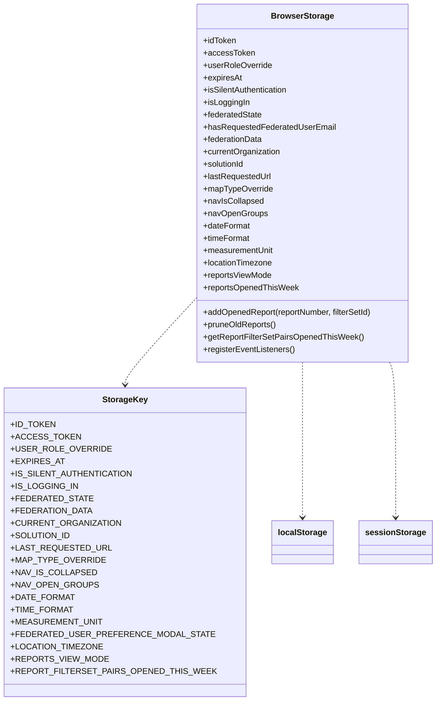
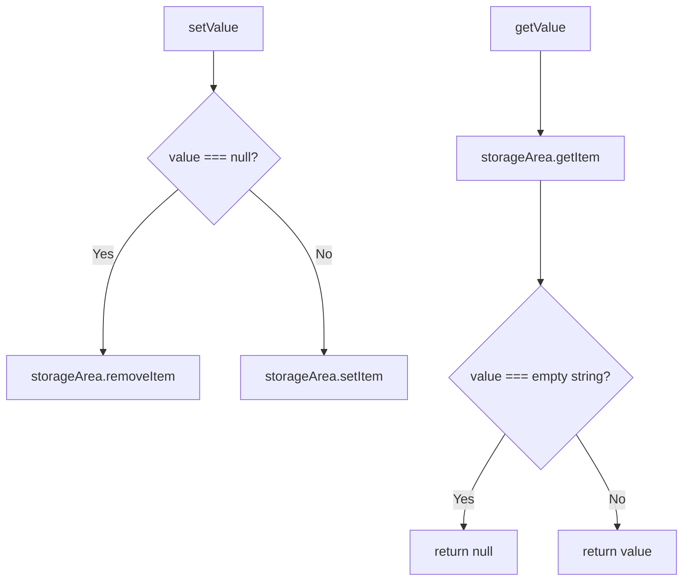
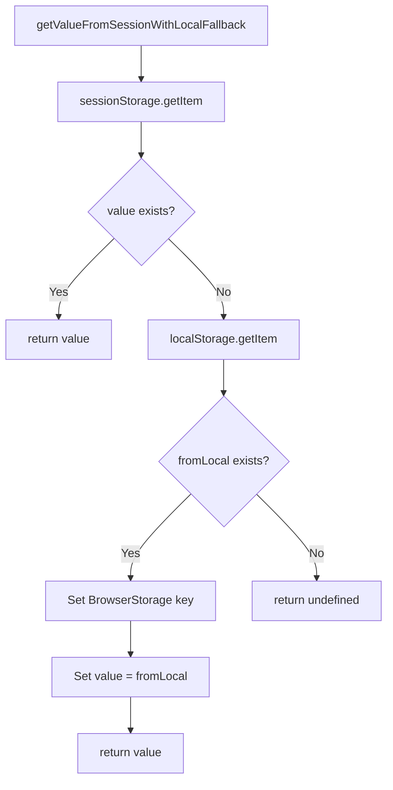
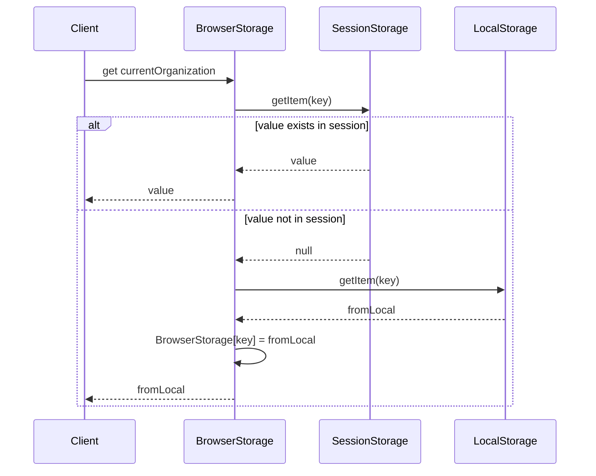
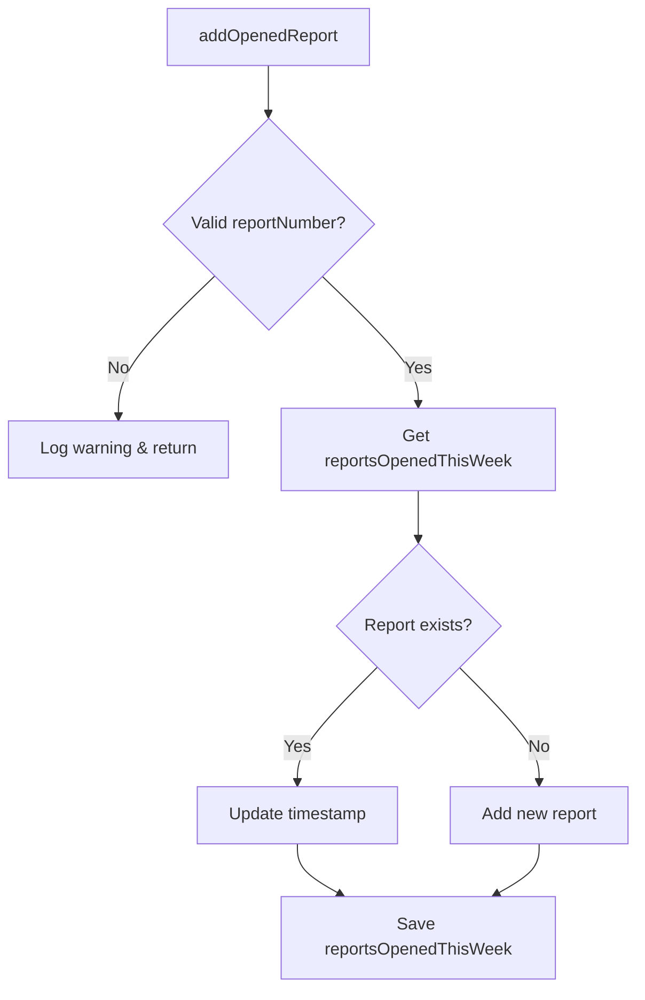
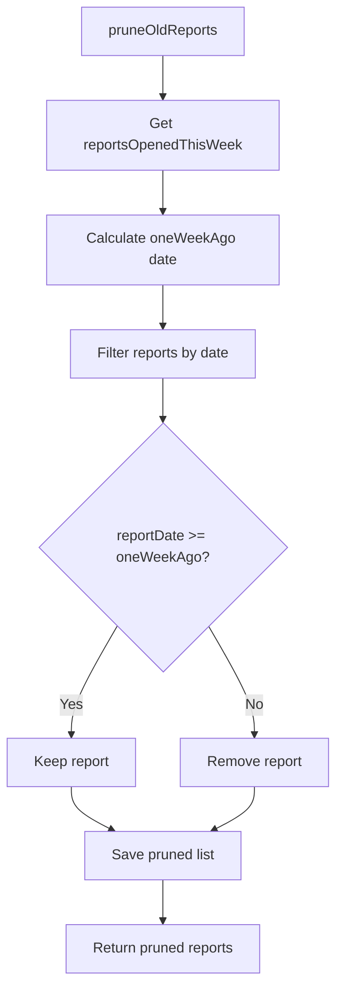
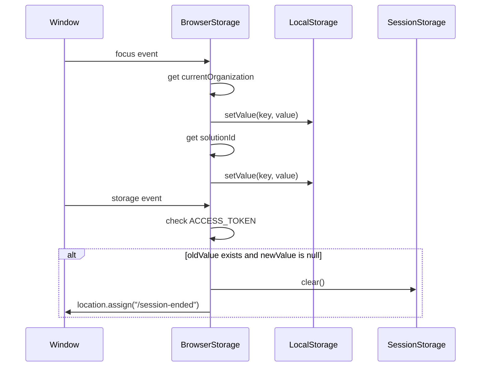

# Diagram: web/portal/src/utils/browser-storage.utils.js

> Auto-generated by Obscura crawlers

## Diagram 1

### SVG

<svg id="container" width="774.6484375" xmlns="http://www.w3.org/2000/svg" class="classDiagram" height="1362" viewBox="0 0 774.6484375 1362" role="graphics-document document" aria-roledescription="class"><g><defs><marker id="container_class-aggregationStart" class="marker aggregation class" refX="18" refY="7" markerWidth="190" markerHeight="240" orient="auto"><path d="M 18,7 L9,13 L1,7 L9,1 Z"></path></marker></defs><defs><marker id="container_class-aggregationEnd" class="marker aggregation class" refX="1" refY="7" markerWidth="20" markerHeight="28" orient="auto"><path d="M 18,7 L9,13 L1,7 L9,1 Z"></path></marker></defs><defs><marker id="container_class-extensionStart" class="marker extension class" refX="18" refY="7" markerWidth="190" markerHeight="240" orient="auto"><path d="M 1,7 L18,13 V 1 Z"></path></marker></defs><defs><marker id="container_class-extensionEnd" class="marker extension class" refX="1" refY="7" markerWidth="20" markerHeight="28" orient="auto"><path d="M 1,1 V 13 L18,7 Z"></path></marker></defs><defs><marker id="container_class-compositionStart" class="marker composition class" refX="18" refY="7" markerWidth="190" markerHeight="240" orient="auto"><path d="M 18,7 L9,13 L1,7 L9,1 Z"></path></marker></defs><defs><marker id="container_class-compositionEnd" class="marker composition class" refX="1" refY="7" markerWidth="20" markerHeight="28" orient="auto"><path d="M 18,7 L9,13 L1,7 L9,1 Z"></path></marker></defs><defs><marker id="container_class-dependencyStart" class="marker dependency class" refX="6" refY="7" markerWidth="190" markerHeight="240" orient="auto"><path d="M 5,7 L9,13 L1,7 L9,1 Z"></path></marker></defs><defs><marker id="container_class-dependencyEnd" class="marker dependency class" refX="13" refY="7" markerWidth="20" markerHeight="28" orient="auto"><path d="M 18,7 L9,13 L14,7 L9,1 Z"></path></marker></defs><defs><marker id="container_class-lollipopStart" class="marker lollipop class" refX="13" refY="7" markerWidth="190" markerHeight="240" orient="auto"><circle stroke="black" fill="transparent" cx="7" cy="7" r="6"></circle></marker></defs><defs><marker id="container_class-lollipopEnd" class="marker lollipop class" refX="1" refY="7" markerWidth="190" markerHeight="240" orient="auto"><circle stroke="black" fill="transparent" cx="7" cy="7" r="6"></circle></marker></defs><g class="root"><g class="clusters"></g><g class="edgePaths"><path d="M315.887,604.989L298.612,625.658C281.337,646.326,246.788,687.663,229.513,711.498C212.238,735.333,212.238,741.667,212.238,744.833L212.238,748" id="id_BrowserStorage_StorageKey_1" class="edge-thickness-normal edge-pattern-dashed relation" style=";;;" data-edge="true" data-et="edge" data-id="id_BrowserStorage_StorageKey_1" data-points="W3sieCI6MzE1Ljg4NjcxODc1LCJ5Ijo2MDQuOTg5MTQ5MDkzNDYwNn0seyJ4IjoyMTIuMjM4MjgxMjUsInkiOjcyOX0seyJ4IjoyMTIuMjM4MjgxMjUsInkiOjc1NH1d" marker-end="url(#container_class-dependencyEnd)"></path><path d="M523.992,704L523.992,708.167C523.992,712.333,523.992,720.667,523.992,771C523.992,821.333,523.992,913.667,523.992,959.833L523.992,1006" id="id_BrowserStorage_localStorage_2" class="edge-thickness-normal edge-pattern-dashed relation" style=";;;" data-edge="true" data-et="edge" data-id="id_BrowserStorage_localStorage_2" data-points="W3sieCI6NTIzLjk5MjE4NzUsInkiOjcwNH0seyJ4Ijo1MjMuOTkyMTg3NSwieSI6NzI5fSx7IngiOjUyMy45OTIxODc1LCJ5IjoxMDEyfV0=" marker-end="url(#container_class-dependencyEnd)"></path><path d="M687.343,704L689.299,708.167C691.255,712.333,695.166,720.667,697.122,771C699.078,821.333,699.078,913.667,699.078,959.833L699.078,1006" id="id_BrowserStorage_sessionStorage_3" class="edge-thickness-normal edge-pattern-dashed relation" style=";;;" data-edge="true" data-et="edge" data-id="id_BrowserStorage_sessionStorage_3" data-points="W3sieCI6Njg3LjM0MzE0MjU5MzgzMzgsInkiOjcwNH0seyJ4Ijo2OTkuMDc4MTI1LCJ5Ijo3Mjl9LHsieCI6Njk5LjA3ODEyNSwieSI6MTAxMn1d" marker-end="url(#container_class-dependencyEnd)"></path></g><g class="edgeLabels"><g class="edgeLabel"><g class="label" data-id="id_BrowserStorage_StorageKey_1" transform="translate(0, 0)"><foreignObject width="0" height="0">

</foreignObject></g></g><g class="edgeLabel"><g class="label" data-id="id_BrowserStorage_localStorage_2" transform="translate(0, 0)"><foreignObject width="0" height="0">

</foreignObject></g></g><g class="edgeLabel"><g class="label" data-id="id_BrowserStorage_sessionStorage_3" transform="translate(0, 0)"><foreignObject width="0" height="0">

</foreignObject></g></g></g><g class="nodes"><g class="node default" id="classId-BrowserStorage-0" transform="translate(523.9921875, 356)"><g class="basic label-container"><path d="M-208.10546875 -348 L208.10546875 -348 L208.10546875 348 L-208.10546875 348" stroke="none" stroke-width="0" fill="#ECECFF" style=""></path><path d="M-208.10546875 -348 C-42.592657691600095 -348, 122.92015336679981 -348, 208.10546875 -348 M-208.10546875 -348 C-98.19574033490812 -348, 11.713988080183753 -348, 208.10546875 -348 M208.10546875 -348 C208.10546875 -121.61100753517582, 208.10546875 104.77798492964837, 208.10546875 348 M208.10546875 -348 C208.10546875 -198.79476157477882, 208.10546875 -49.589523149557635, 208.10546875 348 M208.10546875 348 C89.74898471854121 348, -28.607499312917582 348, -208.10546875 348 M208.10546875 348 C118.28498290364894 348, 28.464497057297876 348, -208.10546875 348 M-208.10546875 348 C-208.10546875 183.89379762632194, -208.10546875 19.787595252643882, -208.10546875 -348 M-208.10546875 348 C-208.10546875 90.68590563851035, -208.10546875 -166.6281887229793, -208.10546875 -348" stroke="#9370DB" stroke-width="1.3" fill="none" stroke-dasharray="0 0" style=""></path></g><g class="annotation-group text" transform="translate(0, -324)"></g><g class="label-group text" transform="translate(-58.1328125, -324)"><g class="label" style="font-weight: bolder" transform="translate(0,-12)"><foreignObject width="116.265625" height="24">

BrowserStorage

</foreignObject></g></g><g class="members-group text" transform="translate(-196.10546875, -276)"><g class="label" style="" transform="translate(0,-12)"><foreignObject width="64.953125" height="24">

+idToken

</foreignObject></g><g class="label" style="" transform="translate(0,12)"><foreignObject width="97.5" height="24">

+accessToken

</foreignObject></g><g class="label" style="" transform="translate(0,36)"><foreignObject width="134.53125" height="24">

+userRoleOverride

</foreignObject></g><g class="label" style="" transform="translate(0,60)"><foreignObject width="75.171875" height="24">

+expiresAt

</foreignObject></g><g class="label" style="" transform="translate(0,84)"><foreignObject width="168.90625" height="24">

+isSilentAuthentication

</foreignObject></g><g class="label" style="" transform="translate(0,108)"><foreignObject width="89.828125" height="24">

+isLoggingIn

</foreignObject></g><g class="label" style="" transform="translate(0,132)"><foreignObject width="115.453125" height="24">

+federatedState

</foreignObject></g><g class="label" style="" transform="translate(0,156)"><foreignObject width="255.78125" height="24">

+hasRequestedFederatedUserEmail

</foreignObject></g><g class="label" style="" transform="translate(0,180)"><foreignObject width="116.5" height="24">

+federationData

</foreignObject></g><g class="label" style="" transform="translate(0,204)"><foreignObject width="152.609375" height="24">

+currentOrganization

</foreignObject></g><g class="label" style="" transform="translate(0,228)"><foreignObject width="82.109375" height="24">

+solutionId

</foreignObject></g><g class="label" style="" transform="translate(0,252)"><foreignObject width="132.90625" height="24">

+lastRequestedUrl

</foreignObject></g><g class="label" style="" transform="translate(0,276)"><foreignObject width="136.390625" height="24">

+mapTypeOverride

</foreignObject></g><g class="label" style="" transform="translate(0,300)"><foreignObject width="117.140625" height="24">

+navIsCollapsed

</foreignObject></g><g class="label" style="" transform="translate(0,324)"><foreignObject width="123.796875" height="24">

+navOpenGroups

</foreignObject></g><g class="label" style="" transform="translate(0,348)"><foreignObject width="91.53125" height="24">

+dateFormat

</foreignObject></g><g class="label" style="" transform="translate(0,372)"><foreignObject width="91.640625" height="24">

+timeFormat

</foreignObject></g><g class="label" style="" transform="translate(0,396)"><foreignObject width="137.84375" height="24">

+measurementUnit

</foreignObject></g><g class="label" style="" transform="translate(0,420)"><foreignObject width="136.5625" height="24">

+locationTimezone

</foreignObject></g><g class="label" style="" transform="translate(0,444)"><foreignObject width="134.359375" height="24">

+reportsViewMode

</foreignObject></g><g class="label" style="" transform="translate(0,468)"><foreignObject width="185.953125" height="24">

+reportsOpenedThisWeek

</foreignObject></g></g><g class="methods-group text" transform="translate(-196.10546875, 252)"><g class="label" style="" transform="translate(0,-12)"><foreignObject width="334.078125" height="24">

+addOpenedReport(reportNumber, filterSetId)

</foreignObject></g><g class="label" style="" transform="translate(0,12)"><foreignObject width="143.125" height="24">

+pruneOldReports()

</foreignObject></g><g class="label" style="" transform="translate(0,36)"><foreignObject width="310.34375" height="24">

+getReportFilterSetPairsOpenedThisWeek()

</foreignObject></g><g class="label" style="" transform="translate(0,60)"><foreignObject width="179.140625" height="24">

+registerEventListeners()

</foreignObject></g></g><g class="divider" style=""><path d="M-208.10546875 -300 C-111.6356896285991 -300, -15.165910507198191 -300, 208.10546875 -300 M-208.10546875 -300 C-100.90702406058469 -300, 6.291420628830622 -300, 208.10546875 -300" stroke="#9370DB" stroke-width="1.3" fill="none" stroke-dasharray="0 0" style=""></path></g><g class="divider" style=""><path d="M-208.10546875 228 C-45.655664834046405 228, 116.79413908190719 228, 208.10546875 228 M-208.10546875 228 C-122.19903030079277 228, -36.29259185158554 228, 208.10546875 228" stroke="#9370DB" stroke-width="1.3" fill="none" stroke-dasharray="0 0" style=""></path></g></g><g class="node default" id="classId-StorageKey-1" transform="translate(212.23828125, 1054)"><g class="basic label-container"><path d="M-204.23828125 -300 L204.23828125 -300 L204.23828125 300 L-204.23828125 300" stroke="none" stroke-width="0" fill="#ECECFF" style=""></path><path d="M-204.23828125 -300 C-82.50129582618135 -300, 39.235689597637304 -300, 204.23828125 -300 M-204.23828125 -300 C-42.92279655220062 -300, 118.39268814559875 -300, 204.23828125 -300 M204.23828125 -300 C204.23828125 -101.23583338152096, 204.23828125 97.52833323695808, 204.23828125 300 M204.23828125 -300 C204.23828125 -128.08731640280692, 204.23828125 43.82536719438616, 204.23828125 300 M204.23828125 300 C62.140000425295625 300, -79.95828039940875 300, -204.23828125 300 M204.23828125 300 C62.38046490823973 300, -79.47735143352054 300, -204.23828125 300 M-204.23828125 300 C-204.23828125 97.44454580908058, -204.23828125 -105.11090838183884, -204.23828125 -300 M-204.23828125 300 C-204.23828125 76.58411517547773, -204.23828125 -146.83176964904453, -204.23828125 -300" stroke="#9370DB" stroke-width="1.3" fill="none" stroke-dasharray="0 0" style=""></path></g><g class="annotation-group text" transform="translate(0, -276)"></g><g class="label-group text" transform="translate(-41.4921875, -276)"><g class="label" style="font-weight: bolder" transform="translate(0,-12)"><foreignObject width="82.984375" height="24">

StorageKey

</foreignObject></g></g><g class="members-group text" transform="translate(-192.23828125, -228)"><g class="label" style="" transform="translate(0,-12)"><foreignObject width="77.59375" height="24">

+ID_TOKEN

</foreignObject></g><g class="label" style="" transform="translate(0,12)"><foreignObject width="114.828125" height="24">

+ACCESS_TOKEN

</foreignObject></g><g class="label" style="" transform="translate(0,36)"><foreignObject width="169.953125" height="24">

+USER_ROLE_OVERRIDE

</foreignObject></g><g class="label" style="" transform="translate(0,60)"><foreignObject width="90.484375" height="24">

+EXPIRES_AT

</foreignObject></g><g class="label" style="" transform="translate(0,84)"><foreignObject width="209.1875" height="24">

+IS_SILENT_AUTHENTICATION

</foreignObject></g><g class="label" style="" transform="translate(0,108)"><foreignObject width="117.5" height="24">

+IS_LOGGING_IN

</foreignObject></g><g class="label" style="" transform="translate(0,132)"><foreignObject width="136.859375" height="24">

+FEDERATED_STATE

</foreignObject></g><g class="label" style="" transform="translate(0,156)"><foreignObject width="139.78125" height="24">

+FEDERATION_DATA

</foreignObject></g><g class="label" style="" transform="translate(0,180)"><foreignObject width="188.609375" height="24">

+CURRENT_ORGANIZATION

</foreignObject></g><g class="label" style="" transform="translate(0,204)"><foreignObject width="103.640625" height="24">

+SOLUTION_ID

</foreignObject></g><g class="label" style="" transform="translate(0,228)"><foreignObject width="168.328125" height="24">

+LAST_REQUESTED_URL

</foreignObject></g><g class="label" style="" transform="translate(0,252)"><foreignObject width="158.828125" height="24">

+MAP_TYPE_OVERRIDE

</foreignObject></g><g class="label" style="" transform="translate(0,276)"><foreignObject width="146.296875" height="24">

+NAV_IS_COLLAPSED

</foreignObject></g><g class="label" style="" transform="translate(0,300)"><foreignObject width="150.171875" height="24">

+NAV_OPEN_GROUPS

</foreignObject></g><g class="label" style="" transform="translate(0,324)"><foreignObject width="109.078125" height="24">

+DATE_FORMAT

</foreignObject></g><g class="label" style="" transform="translate(0,348)"><foreignObject width="106.9375" height="24">

+TIME_FORMAT

</foreignObject></g><g class="label" style="" transform="translate(0,372)"><foreignObject width="157.484375" height="24">

+MEASUREMENT_UNIT

</foreignObject></g><g class="label" style="" transform="translate(0,396)"><foreignObject width="340.0625" height="24">

+FEDERATED_USER_PREFERENCE_MODAL_STATE

</foreignObject></g><g class="label" style="" transform="translate(0,420)"><foreignObject width="158.5" height="24">

+LOCATION_TIMEZONE

</foreignObject></g><g class="label" style="" transform="translate(0,444)"><foreignObject width="164.640625" height="24">

+REPORTS_VIEW_MODE

</foreignObject></g><g class="label" style="" transform="translate(0,468)"><foreignObject width="342.984375" height="24">

+REPORT_FILTERSET_PAIRS_OPENED_THIS_WEEK

</foreignObject></g></g><g class="methods-group text" transform="translate(-192.23828125, 300)"></g><g class="divider" style=""><path d="M-204.23828125 -252 C-92.04128185085484 -252, 20.155717548290312 -252, 204.23828125 -252 M-204.23828125 -252 C-46.25505940597077 -252, 111.72816243805846 -252, 204.23828125 -252" stroke="#9370DB" stroke-width="1.3" fill="none" stroke-dasharray="0 0" style=""></path></g><g class="divider" style=""><path d="M-204.23828125 276 C-68.19229195762068 276, 67.85369733475864 276, 204.23828125 276 M-204.23828125 276 C-44.231067507564006 276, 115.77614623487199 276, 204.23828125 276" stroke="#9370DB" stroke-width="1.3" fill="none" stroke-dasharray="0 0" style=""></path></g></g><g class="node default" id="classId-localStorage-2" transform="translate(523.9921875, 1054)"><g class="basic label-container"><path d="M-57.515625 -42 L57.515625 -42 L57.515625 42 L-57.515625 42" stroke="none" stroke-width="0" fill="#ECECFF" style=""></path><path d="M-57.515625 -42 C-18.59168714174328 -42, 20.332250716513443 -42, 57.515625 -42 M-57.515625 -42 C-34.06202467542551 -42, -10.608424350851024 -42, 57.515625 -42 M57.515625 -42 C57.515625 -25.10421990667515, 57.515625 -8.208439813350303, 57.515625 42 M57.515625 -42 C57.515625 -21.184449865776358, 57.515625 -0.36889973155271605, 57.515625 42 M57.515625 42 C17.045147007184134 42, -23.42533098563173 42, -57.515625 42 M57.515625 42 C17.602334139609162 42, -22.310956720781675 42, -57.515625 42 M-57.515625 42 C-57.515625 8.734367304088252, -57.515625 -24.531265391823496, -57.515625 -42 M-57.515625 42 C-57.515625 12.398336679216847, -57.515625 -17.203326641566306, -57.515625 -42" stroke="#9370DB" stroke-width="1.3" fill="none" stroke-dasharray="0 0" style=""></path></g><g class="annotation-group text" transform="translate(0, -18)"></g><g class="label-group text" transform="translate(-45.515625, -18)"><g class="label" style="font-weight: bolder" transform="translate(0,-12)"><foreignObject width="91.03125" height="24">

localStorage

</foreignObject></g></g><g class="members-group text" transform="translate(-45.515625, 30)"></g><g class="methods-group text" transform="translate(-45.515625, 60)"></g><g class="divider" style=""><path d="M-57.515625 6 C-25.193981844623252 6, 7.127661310753496 6, 57.515625 6 M-57.515625 6 C-20.558512635783494 6, 16.398599728433013 6, 57.515625 6" stroke="#9370DB" stroke-width="1.3" fill="none" stroke-dasharray="0 0" style=""></path></g><g class="divider" style=""><path d="M-57.515625 24 C-12.338751508386736 24, 32.83812198322653 24, 57.515625 24 M-57.515625 24 C-20.439379174132455 24, 16.63686665173509 24, 57.515625 24" stroke="#9370DB" stroke-width="1.3" fill="none" stroke-dasharray="0 0" style=""></path></g></g><g class="node default" id="classId-sessionStorage-3" transform="translate(699.078125, 1054)"><g class="basic label-container"><path d="M-67.5703125 -42 L67.5703125 -42 L67.5703125 42 L-67.5703125 42" stroke="none" stroke-width="0" fill="#ECECFF" style=""></path><path d="M-67.5703125 -42 C-39.7986388346049 -42, -12.026965169209802 -42, 67.5703125 -42 M-67.5703125 -42 C-19.910627640832708 -42, 27.749057218334585 -42, 67.5703125 -42 M67.5703125 -42 C67.5703125 -9.60052849680379, 67.5703125 22.79894300639242, 67.5703125 42 M67.5703125 -42 C67.5703125 -18.863868212342975, 67.5703125 4.272263575314049, 67.5703125 42 M67.5703125 42 C38.615125184798885 42, 9.659937869597776 42, -67.5703125 42 M67.5703125 42 C29.68230760827374 42, -8.205697283452523 42, -67.5703125 42 M-67.5703125 42 C-67.5703125 12.03750392729145, -67.5703125 -17.9249921454171, -67.5703125 -42 M-67.5703125 42 C-67.5703125 10.40310677619377, -67.5703125 -21.19378644761246, -67.5703125 -42" stroke="#9370DB" stroke-width="1.3" fill="none" stroke-dasharray="0 0" style=""></path></g><g class="annotation-group text" transform="translate(0, -18)"></g><g class="label-group text" transform="translate(-55.5703125, -18)"><g class="label" style="font-weight: bolder" transform="translate(0,-12)"><foreignObject width="111.140625" height="24">

sessionStorage

</foreignObject></g></g><g class="members-group text" transform="translate(-55.5703125, 30)"></g><g class="methods-group text" transform="translate(-55.5703125, 60)"></g><g class="divider" style=""><path d="M-67.5703125 6 C-39.779398403228996 6, -11.988484306457998 6, 67.5703125 6 M-67.5703125 6 C-31.77978169301491 6, 4.010749113970178 6, 67.5703125 6" stroke="#9370DB" stroke-width="1.3" fill="none" stroke-dasharray="0 0" style=""></path></g><g class="divider" style=""><path d="M-67.5703125 24 C-24.43168879346782 24, 18.70693491306436 24, 67.5703125 24 M-67.5703125 24 C-24.215985315573548 24, 19.138341868852905 24, 67.5703125 24" stroke="#9370DB" stroke-width="1.3" fill="none" stroke-dasharray="0 0" style=""></path></g></g></g></g></g></svg>

## Diagram 2

### SVG

<svg id="container" width="838.2421875" xmlns="http://www.w3.org/2000/svg" class="flowchart" height="706.296875" viewBox="0 0 838.2421875 706.296875" role="graphics-document document" aria-roledescription="flowchart-v2"><g><marker id="container_flowchart-v2-pointEnd" class="marker flowchart-v2" viewBox="0 0 10 10" refX="5" refY="5" markerUnits="userSpaceOnUse" markerWidth="8" markerHeight="8" orient="auto"><path d="M 0 0 L 10 5 L 0 10 z" class="arrowMarkerPath" style="stroke-width: 1; stroke-dasharray: 1, 0;"></path></marker><marker id="container_flowchart-v2-pointStart" class="marker flowchart-v2" viewBox="0 0 10 10" refX="4.5" refY="5" markerUnits="userSpaceOnUse" markerWidth="8" markerHeight="8" orient="auto"><path d="M 0 5 L 10 10 L 10 0 z" class="arrowMarkerPath" style="stroke-width: 1; stroke-dasharray: 1, 0;"></path></marker><marker id="container_flowchart-v2-circleEnd" class="marker flowchart-v2" viewBox="0 0 10 10" refX="11" refY="5" markerUnits="userSpaceOnUse" markerWidth="11" markerHeight="11" orient="auto"><circle cx="5" cy="5" r="5" class="arrowMarkerPath" style="stroke-width: 1; stroke-dasharray: 1, 0;"></circle></marker><marker id="container_flowchart-v2-circleStart" class="marker flowchart-v2" viewBox="0 0 10 10" refX="-1" refY="5" markerUnits="userSpaceOnUse" markerWidth="11" markerHeight="11" orient="auto"><circle cx="5" cy="5" r="5" class="arrowMarkerPath" style="stroke-width: 1; stroke-dasharray: 1, 0;"></circle></marker><marker id="container_flowchart-v2-crossEnd" class="marker cross flowchart-v2" viewBox="0 0 11 11" refX="12" refY="5.2" markerUnits="userSpaceOnUse" markerWidth="11" markerHeight="11" orient="auto"><path d="M 1,1 l 9,9 M 10,1 l -9,9" class="arrowMarkerPath" style="stroke-width: 2; stroke-dasharray: 1, 0;"></path></marker><marker id="container_flowchart-v2-crossStart" class="marker cross flowchart-v2" viewBox="0 0 11 11" refX="-1" refY="5.2" markerUnits="userSpaceOnUse" markerWidth="11" markerHeight="11" orient="auto"><path d="M 1,1 l 9,9 M 10,1 l -9,9" class="arrowMarkerPath" style="stroke-width: 2; stroke-dasharray: 1, 0;"></path></marker><g class="root"><g class="clusters"></g><g class="edgePaths"><path d="M260.914,62L260.914,66.167C260.914,70.333,260.914,78.667,260.914,86.333C260.914,94,260.914,101,260.914,104.5L260.914,108" id="L_A_B_0" class="edge-thickness-normal edge-pattern-solid edge-thickness-normal edge-pattern-solid flowchart-link" style=";" data-edge="true" data-et="edge" data-id="L_A_B_0" data-points="W3sieCI6MjYwLjkxNDA2MjUsInkiOjYyfSx7IngiOjI2MC45MTQwNjI1LCJ5Ijo4N30seyJ4IjoyNjAuOTE0MDYyNSwieSI6MTEyfV0=" marker-end="url(#container_flowchart-v2-pointEnd)"></path><path d="M217.965,229.582L202.628,242.907C187.291,256.232,156.618,282.881,141.282,315.853C125.945,348.826,125.945,388.12,125.945,407.767L125.945,427.414" id="L_B_C_0" class="edge-thickness-normal edge-pattern-solid edge-thickness-normal edge-pattern-solid flowchart-link" style=";" data-edge="true" data-et="edge" data-id="L_B_C_0" data-points="W3sieCI6MjE3Ljk2NDUxOTc0MTUyODg1LCJ5IjoyMjkuNTgxNzA3MjQxNTI4ODV9LHsieCI6MTI1Ljk0NTMxMjUsInkiOjMwOS41MzEyNX0seyJ4IjoxMjUuOTQ1MzEyNSwieSI6NDMxLjQxNDA2MjV9XQ==" marker-end="url(#container_flowchart-v2-pointEnd)"></path><path d="M303.864,229.582L319.2,242.907C334.537,256.232,365.21,282.881,380.546,315.853C395.883,348.826,395.883,388.12,395.883,407.767L395.883,427.414" id="L_B_D_0" class="edge-thickness-normal edge-pattern-solid edge-thickness-normal edge-pattern-solid flowchart-link" style=";" data-edge="true" data-et="edge" data-id="L_B_D_0" data-points="W3sieCI6MzAzLjg2MzYwNTI1ODQ3MTIsInkiOjIyOS41ODE3MDcyNDE1Mjg4NX0seyJ4IjozOTUuODgyODEyNSwieSI6MzA5LjUzMTI1fSx7IngiOjM5NS44ODI4MTI1LCJ5Ijo0MzEuNDE0MDYyNX1d" marker-end="url(#container_flowchart-v2-pointEnd)"></path><path d="M659.758,62L659.758,66.167C659.758,70.333,659.758,78.667,659.758,95.211C659.758,111.755,659.758,136.51,659.758,148.888L659.758,161.266" id="L_E_F_0" class="edge-thickness-normal edge-pattern-solid edge-thickness-normal edge-pattern-solid flowchart-link" style=";" data-edge="true" data-et="edge" data-id="L_E_F_0" data-points="W3sieCI6NjU5Ljc1NzgxMjUsInkiOjYyfSx7IngiOjY1OS43NTc4MTI1LCJ5Ijo4N30seyJ4Ijo2NTkuNzU3ODEyNSwieSI6MTY1LjI2NTYyNX1d" marker-end="url(#container_flowchart-v2-pointEnd)"></path><path d="M659.758,219.266L659.758,234.31C659.758,249.354,659.758,279.443,659.758,299.987C659.758,320.531,659.758,331.531,659.758,337.031L659.758,342.531" id="L_F_G_0" class="edge-thickness-normal edge-pattern-solid edge-thickness-normal edge-pattern-solid flowchart-link" style=";" data-edge="true" data-et="edge" data-id="L_F_G_0" data-points="W3sieCI6NjU5Ljc1NzgxMjUsInkiOjIxOS4yNjU2MjV9LHsieCI6NjU5Ljc1NzgxMjUsInkiOjMwOS41MzEyNX0seyJ4Ijo2NTkuNzU3ODEyNSwieSI6MzQ2LjUzMTI1fV0=" marker-end="url(#container_flowchart-v2-pointEnd)"></path><path d="M615.789,526.328L607.052,539.823C598.315,553.317,580.841,580.307,572.104,599.302C563.367,618.297,563.367,629.297,563.367,634.797L563.367,640.297" id="L_G_H_0" class="edge-thickness-normal edge-pattern-solid edge-thickness-normal edge-pattern-solid flowchart-link" style=";" data-edge="true" data-et="edge" data-id="L_G_H_0" data-points="W3sieCI6NjE1Ljc4ODcwNDY2MDM3NTksInkiOjUyNi4zMjc3NjcxNjAzNzU5fSx7IngiOjU2My4zNjcxODc1LCJ5Ijo2MDcuMjk2ODc1fSx7IngiOjU2My4zNjcxODc1LCJ5Ijo2NDQuMjk2ODc1fV0=" marker-end="url(#container_flowchart-v2-pointEnd)"></path><path d="M703.727,526.328L712.464,539.823C721.201,553.317,738.675,580.307,747.412,599.302C756.148,618.297,756.148,629.297,756.148,634.797L756.148,640.297" id="L_G_I_0" class="edge-thickness-normal edge-pattern-solid edge-thickness-normal edge-pattern-solid flowchart-link" style=";" data-edge="true" data-et="edge" data-id="L_G_I_0" data-points="W3sieCI6NzAzLjcyNjkyMDMzOTYyNDEsInkiOjUyNi4zMjc3NjcxNjAzNzU5fSx7IngiOjc1Ni4xNDg0Mzc1LCJ5Ijo2MDcuMjk2ODc1fSx7IngiOjc1Ni4xNDg0Mzc1LCJ5Ijo2NDQuMjk2ODc1fV0=" marker-end="url(#container_flowchart-v2-pointEnd)"></path></g><g class="edgeLabels"><g class="edgeLabel"><g class="label" data-id="L_A_B_0" transform="translate(0, 0)"><foreignObject width="0" height="0">

</foreignObject></g></g><g class="edgeLabel" transform="translate(125.9453125, 309.53125)"><g class="label" data-id="L_B_C_0" transform="translate(-12.03125, -12)"><foreignObject width="24.0625" height="24">

Yes

</foreignObject></g></g><g class="edgeLabel" transform="translate(395.8828125, 309.53125)"><g class="label" data-id="L_B_D_0" transform="translate(-10.140625, -12)"><foreignObject width="20.28125" height="24">

No

</foreignObject></g></g><g class="edgeLabel"><g class="label" data-id="L_E_F_0" transform="translate(0, 0)"><foreignObject width="0" height="0">

</foreignObject></g></g><g class="edgeLabel"><g class="label" data-id="L_F_G_0" transform="translate(0, 0)"><foreignObject width="0" height="0">

</foreignObject></g></g><g class="edgeLabel" transform="translate(563.3671875, 607.296875)"><g class="label" data-id="L_G_H_0" transform="translate(-12.03125, -12)"><foreignObject width="24.0625" height="24">

Yes

</foreignObject></g></g><g class="edgeLabel" transform="translate(756.1484375, 607.296875)"><g class="label" data-id="L_G_I_0" transform="translate(-10.140625, -12)"><foreignObject width="20.28125" height="24">

No

</foreignObject></g></g></g><g class="nodes"><g class="node default" id="flowchart-A-0" transform="translate(260.9140625, 35)"><rect class="basic label-container" style="" x="-60.75" y="-27" width="121.5" height="54"></rect><g class="label" style="" transform="translate(-30.75, -12)"><rect></rect><foreignObject width="61.5" height="24">

setValue

</foreignObject></g></g><g class="node default" id="flowchart-B-1" transform="translate(260.9140625, 192.265625)"><polygon points="80.265625,0 160.53125,-80.265625 80.265625,-160.53125 0,-80.265625" class="label-container" transform="translate(-79.765625, 80.265625)"></polygon><g class="label" style="" transform="translate(-53.265625, -12)"><rect></rect><foreignObject width="106.53125" height="24">

value === null?

</foreignObject></g></g><g class="node default" id="flowchart-C-3" transform="translate(125.9453125, 458.4140625)"><rect class="basic label-container" style="" x="-117.9453125" y="-27" width="235.890625" height="54"></rect><g class="label" style="" transform="translate(-87.9453125, -12)"><rect></rect><foreignObject width="175.890625" height="24">

storageArea.removeItem

</foreignObject></g></g><g class="node default" id="flowchart-D-5" transform="translate(395.8828125, 458.4140625)"><rect class="basic label-container" style="" x="-101.9921875" y="-27" width="203.984375" height="54"></rect><g class="label" style="" transform="translate(-71.9921875, -12)"><rect></rect><foreignObject width="143.984375" height="24">

storageArea.setItem

</foreignObject></g></g><g class="node default" id="flowchart-E-6" transform="translate(659.7578125, 35)"><rect class="basic label-container" style="" x="-61.046875" y="-27" width="122.09375" height="54"></rect><g class="label" style="" transform="translate(-31.046875, -12)"><rect></rect><foreignObject width="62.09375" height="24">

getValue

</foreignObject></g></g><g class="node default" id="flowchart-F-7" transform="translate(659.7578125, 192.265625)"><rect class="basic label-container" style="" x="-102.1796875" y="-27" width="204.359375" height="54"></rect><g class="label" style="" transform="translate(-72.1796875, -12)"><rect></rect><foreignObject width="144.359375" height="24">

storageArea.getItem

</foreignObject></g></g><g class="node default" id="flowchart-G-9" transform="translate(659.7578125, 458.4140625)"><polygon points="111.8828125,0 223.765625,-111.8828125 111.8828125,-223.765625 0,-111.8828125" class="label-container" transform="translate(-111.3828125, 111.8828125)"></polygon><g class="label" style="" transform="translate(-84.8828125, -12)"><rect></rect><foreignObject width="169.765625" height="24">

value === empty string?

</foreignObject></g></g><g class="node default" id="flowchart-H-11" transform="translate(563.3671875, 671.296875)"><rect class="basic label-container" style="" x="-68.6875" y="-27" width="137.375" height="54"></rect><g class="label" style="" transform="translate(-38.6875, -12)"><rect></rect><foreignObject width="77.375" height="24">

return null

</foreignObject></g></g><g class="node default" id="flowchart-I-13" transform="translate(756.1484375, 671.296875)"><rect class="basic label-container" style="" x="-74.09375" y="-27" width="148.1875" height="54"></rect><g class="label" style="" transform="translate(-44.09375, -12)"><rect></rect><foreignObject width="88.1875" height="24">

return value

</foreignObject></g></g></g></g></g></svg>

## Diagram 3

### SVG

<svg id="container" width="537.89453125" xmlns="http://www.w3.org/2000/svg" class="flowchart" height="1061.984375" viewBox="0 0 537.89453125 1061.984375" role="graphics-document document" aria-roledescription="flowchart-v2"><g><marker id="container_flowchart-v2-pointEnd" class="marker flowchart-v2" viewBox="0 0 10 10" refX="5" refY="5" markerUnits="userSpaceOnUse" markerWidth="8" markerHeight="8" orient="auto"><path d="M 0 0 L 10 5 L 0 10 z" class="arrowMarkerPath" style="stroke-width: 1; stroke-dasharray: 1, 0;"></path></marker><marker id="container_flowchart-v2-pointStart" class="marker flowchart-v2" viewBox="0 0 10 10" refX="4.5" refY="5" markerUnits="userSpaceOnUse" markerWidth="8" markerHeight="8" orient="auto"><path d="M 0 5 L 10 10 L 10 0 z" class="arrowMarkerPath" style="stroke-width: 1; stroke-dasharray: 1, 0;"></path></marker><marker id="container_flowchart-v2-circleEnd" class="marker flowchart-v2" viewBox="0 0 10 10" refX="11" refY="5" markerUnits="userSpaceOnUse" markerWidth="11" markerHeight="11" orient="auto"><circle cx="5" cy="5" r="5" class="arrowMarkerPath" style="stroke-width: 1; stroke-dasharray: 1, 0;"></circle></marker><marker id="container_flowchart-v2-circleStart" class="marker flowchart-v2" viewBox="0 0 10 10" refX="-1" refY="5" markerUnits="userSpaceOnUse" markerWidth="11" markerHeight="11" orient="auto"><circle cx="5" cy="5" r="5" class="arrowMarkerPath" style="stroke-width: 1; stroke-dasharray: 1, 0;"></circle></marker><marker id="container_flowchart-v2-crossEnd" class="marker cross flowchart-v2" viewBox="0 0 11 11" refX="12" refY="5.2" markerUnits="userSpaceOnUse" markerWidth="11" markerHeight="11" orient="auto"><path d="M 1,1 l 9,9 M 10,1 l -9,9" class="arrowMarkerPath" style="stroke-width: 2; stroke-dasharray: 1, 0;"></path></marker><marker id="container_flowchart-v2-crossStart" class="marker cross flowchart-v2" viewBox="0 0 11 11" refX="-1" refY="5.2" markerUnits="userSpaceOnUse" markerWidth="11" markerHeight="11" orient="auto"><path d="M 1,1 l 9,9 M 10,1 l -9,9" class="arrowMarkerPath" style="stroke-width: 2; stroke-dasharray: 1, 0;"></path></marker><g class="root"><g class="clusters"></g><g class="edgePaths"><path d="M196.137,62L196.137,66.167C196.137,70.333,196.137,78.667,196.137,86.333C196.137,94,196.137,101,196.137,104.5L196.137,108" id="L_A_B_0" class="edge-thickness-normal edge-pattern-solid edge-thickness-normal edge-pattern-solid flowchart-link" style=";" data-edge="true" data-et="edge" data-id="L_A_B_0" data-points="W3sieCI6MTk2LjEzNjcxODc1LCJ5Ijo2Mn0seyJ4IjoxOTYuMTM2NzE4NzUsInkiOjg3fSx7IngiOjE5Ni4xMzY3MTg3NSwieSI6MTEyfV0=" marker-end="url(#container_flowchart-v2-pointEnd)"></path><path d="M196.137,166L196.137,170.167C196.137,174.333,196.137,182.667,196.137,190.333C196.137,198,196.137,205,196.137,208.5L196.137,212" id="L_B_C_0" class="edge-thickness-normal edge-pattern-solid edge-thickness-normal edge-pattern-solid flowchart-link" style=";" data-edge="true" data-et="edge" data-id="L_B_C_0" data-points="W3sieCI6MTk2LjEzNjcxODc1LCJ5IjoxNjZ9LHsieCI6MTk2LjEzNjcxODc1LCJ5IjoxOTF9LHsieCI6MTk2LjEzNjcxODc1LCJ5IjoyMTZ9XQ==" marker-end="url(#container_flowchart-v2-pointEnd)"></path><path d="M159.053,324.479L146.227,336.826C133.4,349.173,107.747,373.868,94.92,391.715C82.094,409.563,82.094,420.563,82.094,426.063L82.094,431.563" id="L_C_D_0" class="edge-thickness-normal edge-pattern-solid edge-thickness-normal edge-pattern-solid flowchart-link" style=";" data-edge="true" data-et="edge" data-id="L_C_D_0" data-points="W3sieCI6MTU5LjA1MzE5OTA3Njg4MTc4LCJ5IjozMjQuNDc4OTgwMzI2ODgxOH0seyJ4Ijo4Mi4wOTM3NSwieSI6Mzk4LjU2MjV9LHsieCI6ODIuMDkzNzUsInkiOjQzNS41NjI1fV0=" marker-end="url(#container_flowchart-v2-pointEnd)"></path><path d="M233.22,324.479L246.047,336.826C258.873,349.173,284.527,373.868,297.353,391.715C310.18,409.563,310.18,420.563,310.18,426.063L310.18,431.563" id="L_C_E_0" class="edge-thickness-normal edge-pattern-solid edge-thickness-normal edge-pattern-solid flowchart-link" style=";" data-edge="true" data-et="edge" data-id="L_C_E_0" data-points="W3sieCI6MjMzLjIyMDIzODQyMzExODIyLCJ5IjozMjQuNDc4OTgwMzI2ODgxOH0seyJ4IjozMTAuMTc5Njg3NSwieSI6Mzk4LjU2MjV9LHsieCI6MzEwLjE3OTY4NzUsInkiOjQzNS41NjI1fV0=" marker-end="url(#container_flowchart-v2-pointEnd)"></path><path d="M310.18,489.563L310.18,493.729C310.18,497.896,310.18,506.229,310.18,513.896C310.18,521.563,310.18,528.563,310.18,532.063L310.18,535.563" id="L_E_F_0" class="edge-thickness-normal edge-pattern-solid edge-thickness-normal edge-pattern-solid flowchart-link" style=";" data-edge="true" data-et="edge" data-id="L_E_F_0" data-points="W3sieCI6MzEwLjE3OTY4NzUsInkiOjQ4OS41NjI1fSx7IngiOjMxMC4xNzk2ODc1LCJ5Ijo1MTQuNTYyNX0seyJ4IjozMTAuMTc5Njg3NSwieSI6NTM5LjU2MjV9XQ==" marker-end="url(#container_flowchart-v2-pointEnd)"></path><path d="M265.235,673.04L251.368,686.697C237.502,700.355,209.768,727.67,195.902,746.827C182.035,765.984,182.035,776.984,182.035,782.484L182.035,787.984" id="L_F_G_0" class="edge-thickness-normal edge-pattern-solid edge-thickness-normal edge-pattern-solid flowchart-link" style=";" data-edge="true" data-et="edge" data-id="L_F_G_0" data-points="W3sieCI6MjY1LjIzNTEzMDg3NDIyMjUzLCJ5Ijo2NzMuMDM5ODE4Mzc0MjIyNX0seyJ4IjoxODIuMDM1MTU2MjUsInkiOjc1NC45ODQzNzV9LHsieCI6MTgyLjAzNTE1NjI1LCJ5Ijo3OTEuOTg0Mzc1fV0=" marker-end="url(#container_flowchart-v2-pointEnd)"></path><path d="M182.035,845.984L182.035,850.151C182.035,854.318,182.035,862.651,182.035,870.318C182.035,877.984,182.035,884.984,182.035,888.484L182.035,891.984" id="L_G_H_0" class="edge-thickness-normal edge-pattern-solid edge-thickness-normal edge-pattern-solid flowchart-link" style=";" data-edge="true" data-et="edge" data-id="L_G_H_0" data-points="W3sieCI6MTgyLjAzNTE1NjI1LCJ5Ijo4NDUuOTg0Mzc1fSx7IngiOjE4Mi4wMzUxNTYyNSwieSI6ODcwLjk4NDM3NX0seyJ4IjoxODIuMDM1MTU2MjUsInkiOjg5NS45ODQzNzV9XQ==" marker-end="url(#container_flowchart-v2-pointEnd)"></path><path d="M182.035,949.984L182.035,954.151C182.035,958.318,182.035,966.651,182.035,974.318C182.035,981.984,182.035,988.984,182.035,992.484L182.035,995.984" id="L_H_I_0" class="edge-thickness-normal edge-pattern-solid edge-thickness-normal edge-pattern-solid flowchart-link" style=";" data-edge="true" data-et="edge" data-id="L_H_I_0" data-points="W3sieCI6MTgyLjAzNTE1NjI1LCJ5Ijo5NDkuOTg0Mzc1fSx7IngiOjE4Mi4wMzUxNTYyNSwieSI6OTc0Ljk4NDM3NX0seyJ4IjoxODIuMDM1MTU2MjUsInkiOjk5OS45ODQzNzV9XQ==" marker-end="url(#container_flowchart-v2-pointEnd)"></path><path d="M355.124,673.04L368.991,686.697C382.858,700.355,410.591,727.67,424.458,746.827C438.324,765.984,438.324,776.984,438.324,782.484L438.324,787.984" id="L_F_J_0" class="edge-thickness-normal edge-pattern-solid edge-thickness-normal edge-pattern-solid flowchart-link" style=";" data-edge="true" data-et="edge" data-id="L_F_J_0" data-points="W3sieCI6MzU1LjEyNDI0NDEyNTc3NzQ3LCJ5Ijo2NzMuMDM5ODE4Mzc0MjIyNX0seyJ4Ijo0MzguMzI0MjE4NzUsInkiOjc1NC45ODQzNzV9LHsieCI6NDM4LjMyNDIxODc1LCJ5Ijo3OTEuOTg0Mzc1fV0=" marker-end="url(#container_flowchart-v2-pointEnd)"></path></g><g class="edgeLabels"><g class="edgeLabel"><g class="label" data-id="L_A_B_0" transform="translate(0, 0)"><foreignObject width="0" height="0">

</foreignObject></g></g><g class="edgeLabel"><g class="label" data-id="L_B_C_0" transform="translate(0, 0)"><foreignObject width="0" height="0">

</foreignObject></g></g><g class="edgeLabel" transform="translate(82.09375, 398.5625)"><g class="label" data-id="L_C_D_0" transform="translate(-12.03125, -12)"><foreignObject width="24.0625" height="24">

Yes

</foreignObject></g></g><g class="edgeLabel" transform="translate(310.1796875, 398.5625)"><g class="label" data-id="L_C_E_0" transform="translate(-10.140625, -12)"><foreignObject width="20.28125" height="24">

No

</foreignObject></g></g><g class="edgeLabel"><g class="label" data-id="L_E_F_0" transform="translate(0, 0)"><foreignObject width="0" height="0">

</foreignObject></g></g><g class="edgeLabel" transform="translate(182.03515625, 754.984375)"><g class="label" data-id="L_F_G_0" transform="translate(-12.03125, -12)"><foreignObject width="24.0625" height="24">

Yes

</foreignObject></g></g><g class="edgeLabel"><g class="label" data-id="L_G_H_0" transform="translate(0, 0)"><foreignObject width="0" height="0">

</foreignObject></g></g><g class="edgeLabel"><g class="label" data-id="L_H_I_0" transform="translate(0, 0)"><foreignObject width="0" height="0">

</foreignObject></g></g><g class="edgeLabel" transform="translate(438.32421875, 754.984375)"><g class="label" data-id="L_F_J_0" transform="translate(-10.140625, -12)"><foreignObject width="20.28125" height="24">

No

</foreignObject></g></g></g><g class="nodes"><g class="node default" id="flowchart-A-0" transform="translate(196.13671875, 35)"><rect class="basic label-container" style="" x="-171.40625" y="-27" width="342.8125" height="54"></rect><g class="label" style="" transform="translate(-141.40625, -12)"><rect></rect><foreignObject width="282.8125" height="24">

getValueFromSessionWithLocalFallback

</foreignObject></g></g><g class="node default" id="flowchart-B-1" transform="translate(196.13671875, 139)"><rect class="basic label-container" style="" x="-113.765625" y="-27" width="227.53125" height="54"></rect><g class="label" style="" transform="translate(-83.765625, -12)"><rect></rect><foreignObject width="167.53125" height="24">

sessionStorage.getItem

</foreignObject></g></g><g class="node default" id="flowchart-C-3" transform="translate(196.13671875, 288.78125)"><polygon points="72.78125,0 145.5625,-72.78125 72.78125,-145.5625 0,-72.78125" class="label-container" transform="translate(-72.28125, 72.78125)"></polygon><g class="label" style="" transform="translate(-45.78125, -12)"><rect></rect><foreignObject width="91.5625" height="24">

value exists?

</foreignObject></g></g><g class="node default" id="flowchart-D-5" transform="translate(82.09375, 462.5625)"><rect class="basic label-container" style="" x="-74.09375" y="-27" width="148.1875" height="54"></rect><g class="label" style="" transform="translate(-44.09375, -12)"><rect></rect><foreignObject width="88.1875" height="24">

return value

</foreignObject></g></g><g class="node default" id="flowchart-E-7" transform="translate(310.1796875, 462.5625)"><rect class="basic label-container" style="" x="-103.9921875" y="-27" width="207.984375" height="54"></rect><g class="label" style="" transform="translate(-73.9921875, -12)"><rect></rect><foreignObject width="147.984375" height="24">

localStorage.getItem

</foreignObject></g></g><g class="node default" id="flowchart-F-9" transform="translate(310.1796875, 628.7734375)"><polygon points="89.2109375,0 178.421875,-89.2109375 89.2109375,-178.421875 0,-89.2109375" class="label-container" transform="translate(-88.7109375, 89.2109375)"></polygon><g class="label" style="" transform="translate(-62.2109375, -12)"><rect></rect><foreignObject width="124.421875" height="24">

fromLocal exists?

</foreignObject></g></g><g class="node default" id="flowchart-G-11" transform="translate(182.03515625, 818.984375)"><rect class="basic label-container" style="" x="-114.71875" y="-27" width="229.4375" height="54"></rect><g class="label" style="" transform="translate(-84.71875, -12)"><rect></rect><foreignObject width="169.4375" height="24">

Set BrowserStorage key

</foreignObject></g></g><g class="node default" id="flowchart-H-13" transform="translate(182.03515625, 922.984375)"><rect class="basic label-container" style="" x="-107.28125" y="-27" width="214.5625" height="54"></rect><g class="label" style="" transform="translate(-77.28125, -12)"><rect></rect><foreignObject width="154.5625" height="24">

Set value = fromLocal

</foreignObject></g></g><g class="node default" id="flowchart-I-15" transform="translate(182.03515625, 1026.984375)"><rect class="basic label-container" style="" x="-74.09375" y="-27" width="148.1875" height="54"></rect><g class="label" style="" transform="translate(-44.09375, -12)"><rect></rect><foreignObject width="88.1875" height="24">

return value

</foreignObject></g></g><g class="node default" id="flowchart-J-17" transform="translate(438.32421875, 818.984375)"><rect class="basic label-container" style="" x="-91.5703125" y="-27" width="183.140625" height="54"></rect><g class="label" style="" transform="translate(-61.5703125, -12)"><rect></rect><foreignObject width="123.140625" height="24">

return undefined

</foreignObject></g></g></g></g></g></svg>

## Diagram 4

### SVG

<svg id="container" width="891" xmlns="http://www.w3.org/2000/svg" height="733" viewBox="-50 -10 891 733" role="graphics-document document" aria-roledescription="sequence"><g><rect x="641" y="647" fill="#eaeaea" stroke="#666" width="150" height="65" name="LocalStorage" rx="3" ry="3" class="actor actor-bottom"></rect><text x="716" y="679.5" dominant-baseline="central" alignment-baseline="central" class="actor actor-box" style="text-anchor: middle; font-size: 16px; font-weight: 400;"><tspan x="716" dy="0">LocalStorage</tspan></text></g><g><rect x="441" y="647" fill="#eaeaea" stroke="#666" width="150" height="65" name="SessionStorage" rx="3" ry="3" class="actor actor-bottom"></rect><text x="516" y="679.5" dominant-baseline="central" alignment-baseline="central" class="actor actor-box" style="text-anchor: middle; font-size: 16px; font-weight: 400;"><tspan x="516" dy="0">SessionStorage</tspan></text></g><g><rect x="241" y="647" fill="#eaeaea" stroke="#666" width="150" height="65" name="BrowserStorage" rx="3" ry="3" class="actor actor-bottom"></rect><text x="316" y="679.5" dominant-baseline="central" alignment-baseline="central" class="actor actor-box" style="text-anchor: middle; font-size: 16px; font-weight: 400;"><tspan x="316" dy="0">BrowserStorage</tspan></text></g><g><rect x="0" y="647" fill="#eaeaea" stroke="#666" width="150" height="65" name="Client" rx="3" ry="3" class="actor actor-bottom"></rect><text x="75" y="679.5" dominant-baseline="central" alignment-baseline="central" class="actor actor-box" style="text-anchor: middle; font-size: 16px; font-weight: 400;"><tspan x="75" dy="0">Client</tspan></text></g><g><line id="actor3" x1="716" y1="65" x2="716" y2="647" class="actor-line 200" stroke-width="0.5px" stroke="#999" name="LocalStorage"></line><g id="root-3"><rect x="641" y="0" fill="#eaeaea" stroke="#666" width="150" height="65" name="LocalStorage" rx="3" ry="3" class="actor actor-top"></rect><text x="716" y="32.5" dominant-baseline="central" alignment-baseline="central" class="actor actor-box" style="text-anchor: middle; font-size: 16px; font-weight: 400;"><tspan x="716" dy="0">LocalStorage</tspan></text></g></g><g><line id="actor2" x1="516" y1="65" x2="516" y2="647" class="actor-line 200" stroke-width="0.5px" stroke="#999" name="SessionStorage"></line><g id="root-2"><rect x="441" y="0" fill="#eaeaea" stroke="#666" width="150" height="65" name="SessionStorage" rx="3" ry="3" class="actor actor-top"></rect><text x="516" y="32.5" dominant-baseline="central" alignment-baseline="central" class="actor actor-box" style="text-anchor: middle; font-size: 16px; font-weight: 400;"><tspan x="516" dy="0">SessionStorage</tspan></text></g></g><g><line id="actor1" x1="316" y1="65" x2="316" y2="647" class="actor-line 200" stroke-width="0.5px" stroke="#999" name="BrowserStorage"></line><g id="root-1"><rect x="241" y="0" fill="#eaeaea" stroke="#666" width="150" height="65" name="BrowserStorage" rx="3" ry="3" class="actor actor-top"></rect><text x="316" y="32.5" dominant-baseline="central" alignment-baseline="central" class="actor actor-box" style="text-anchor: middle; font-size: 16px; font-weight: 400;"><tspan x="316" dy="0">BrowserStorage</tspan></text></g></g><g><line id="actor0" x1="75" y1="65" x2="75" y2="647" class="actor-line 200" stroke-width="0.5px" stroke="#999" name="Client"></line><g id="root-0"><rect x="0" y="0" fill="#eaeaea" stroke="#666" width="150" height="65" name="Client" rx="3" ry="3" class="actor actor-top"></rect><text x="75" y="32.5" dominant-baseline="central" alignment-baseline="central" class="actor actor-box" style="text-anchor: middle; font-size: 16px; font-weight: 400;"><tspan x="75" dy="0">Client</tspan></text></g></g><g></g><defs><symbol id="computer" width="24" height="24"><path transform="scale(.5)" d="M2 2v13h20v-13h-20zm18 11h-16v-9h16v9zm-10.228 6l.466-1h3.524l.467 1h-4.457zm14.228 3h-24l2-6h2.104l-1.33 4h18.45l-1.297-4h2.073l2 6zm-5-10h-14v-7h14v7z"></path></symbol></defs><defs><symbol id="database" fill-rule="evenodd" clip-rule="evenodd"><path transform="scale(.5)" d="M12.258.001l.256.004.255.005.253.008.251.01.249.012.247.015.246.016.242.019.241.02.239.023.236.024.233.027.231.028.229.031.225.032.223.034.22.036.217.038.214.04.211.041.208.043.205.045.201.046.198.048.194.05.191.051.187.053.183.054.18.056.175.057.172.059.168.06.163.061.16.063.155.064.15.066.074.033.073.033.071.034.07.034.069.035.068.035.067.035.066.035.064.036.064.036.062.036.06.036.06.037.058.037.058.037.055.038.055.038.053.038.052.038.051.039.05.039.048.039.047.039.045.04.044.04.043.04.041.04.04.041.039.041.037.041.036.041.034.041.033.042.032.042.03.042.029.042.027.042.026.043.024.043.023.043.021.043.02.043.018.044.017.043.015.044.013.044.012.044.011.045.009.044.007.045.006.045.004.045.002.045.001.045v17l-.001.045-.002.045-.004.045-.006.045-.007.045-.009.044-.011.045-.012.044-.013.044-.015.044-.017.043-.018.044-.02.043-.021.043-.023.043-.024.043-.026.043-.027.042-.029.042-.03.042-.032.042-.033.042-.034.041-.036.041-.037.041-.039.041-.04.041-.041.04-.043.04-.044.04-.045.04-.047.039-.048.039-.05.039-.051.039-.052.038-.053.038-.055.038-.055.038-.058.037-.058.037-.06.037-.06.036-.062.036-.064.036-.064.036-.066.035-.067.035-.068.035-.069.035-.07.034-.071.034-.073.033-.074.033-.15.066-.155.064-.16.063-.163.061-.168.06-.172.059-.175.057-.18.056-.183.054-.187.053-.191.051-.194.05-.198.048-.201.046-.205.045-.208.043-.211.041-.214.04-.217.038-.22.036-.223.034-.225.032-.229.031-.231.028-.233.027-.236.024-.239.023-.241.02-.242.019-.246.016-.247.015-.249.012-.251.01-.253.008-.255.005-.256.004-.258.001-.258-.001-.256-.004-.255-.005-.253-.008-.251-.01-.249-.012-.247-.015-.245-.016-.243-.019-.241-.02-.238-.023-.236-.024-.234-.027-.231-.028-.228-.031-.226-.032-.223-.034-.22-.036-.217-.038-.214-.04-.211-.041-.208-.043-.204-.045-.201-.046-.198-.048-.195-.05-.19-.051-.187-.053-.184-.054-.179-.056-.176-.057-.172-.059-.167-.06-.164-.061-.159-.063-.155-.064-.151-.066-.074-.033-.072-.033-.072-.034-.07-.034-.069-.035-.068-.035-.067-.035-.066-.035-.064-.036-.063-.036-.062-.036-.061-.036-.06-.037-.058-.037-.057-.037-.056-.038-.055-.038-.053-.038-.052-.038-.051-.039-.049-.039-.049-.039-.046-.039-.046-.04-.044-.04-.043-.04-.041-.04-.04-.041-.039-.041-.037-.041-.036-.041-.034-.041-.033-.042-.032-.042-.03-.042-.029-.042-.027-.042-.026-.043-.024-.043-.023-.043-.021-.043-.02-.043-.018-.044-.017-.043-.015-.044-.013-.044-.012-.044-.011-.045-.009-.044-.007-.045-.006-.045-.004-.045-.002-.045-.001-.045v-17l.001-.045.002-.045.004-.045.006-.045.007-.045.009-.044.011-.045.012-.044.013-.044.015-.044.017-.043.018-.044.02-.043.021-.043.023-.043.024-.043.026-.043.027-.042.029-.042.03-.042.032-.042.033-.042.034-.041.036-.041.037-.041.039-.041.04-.041.041-.04.043-.04.044-.04.046-.04.046-.039.049-.039.049-.039.051-.039.052-.038.053-.038.055-.038.056-.038.057-.037.058-.037.06-.037.061-.036.062-.036.063-.036.064-.036.066-.035.067-.035.068-.035.069-.035.07-.034.072-.034.072-.033.074-.033.151-.066.155-.064.159-.063.164-.061.167-.06.172-.059.176-.057.179-.056.184-.054.187-.053.19-.051.195-.05.198-.048.201-.046.204-.045.208-.043.211-.041.214-.04.217-.038.22-.036.223-.034.226-.032.228-.031.231-.028.234-.027.236-.024.238-.023.241-.02.243-.019.245-.016.247-.015.249-.012.251-.01.253-.008.255-.005.256-.004.258-.001.258.001zm-9.258 20.499v.01l.001.021.003.021.004.022.005.021.006.022.007.022.009.023.01.022.011.023.012.023.013.023.015.023.016.024.017.023.018.024.019.024.021.024.022.025.023.024.024.025.052.049.056.05.061.051.066.051.07.051.075.051.079.052.084.052.088.052.092.052.097.052.102.051.105.052.11.052.114.051.119.051.123.051.127.05.131.05.135.05.139.048.144.049.147.047.152.047.155.047.16.045.163.045.167.043.171.043.176.041.178.041.183.039.187.039.19.037.194.035.197.035.202.033.204.031.209.03.212.029.216.027.219.025.222.024.226.021.23.02.233.018.236.016.24.015.243.012.246.01.249.008.253.005.256.004.259.001.26-.001.257-.004.254-.005.25-.008.247-.011.244-.012.241-.014.237-.016.233-.018.231-.021.226-.021.224-.024.22-.026.216-.027.212-.028.21-.031.205-.031.202-.034.198-.034.194-.036.191-.037.187-.039.183-.04.179-.04.175-.042.172-.043.168-.044.163-.045.16-.046.155-.046.152-.047.148-.048.143-.049.139-.049.136-.05.131-.05.126-.05.123-.051.118-.052.114-.051.11-.052.106-.052.101-.052.096-.052.092-.052.088-.053.083-.051.079-.052.074-.052.07-.051.065-.051.06-.051.056-.05.051-.05.023-.024.023-.025.021-.024.02-.024.019-.024.018-.024.017-.024.015-.023.014-.024.013-.023.012-.023.01-.023.01-.022.008-.022.006-.022.006-.022.004-.022.004-.021.001-.021.001-.021v-4.127l-.077.055-.08.053-.083.054-.085.053-.087.052-.09.052-.093.051-.095.05-.097.05-.1.049-.102.049-.105.048-.106.047-.109.047-.111.046-.114.045-.115.045-.118.044-.12.043-.122.042-.124.042-.126.041-.128.04-.13.04-.132.038-.134.038-.135.037-.138.037-.139.035-.142.035-.143.034-.144.033-.147.032-.148.031-.15.03-.151.03-.153.029-.154.027-.156.027-.158.026-.159.025-.161.024-.162.023-.163.022-.165.021-.166.02-.167.019-.169.018-.169.017-.171.016-.173.015-.173.014-.175.013-.175.012-.177.011-.178.01-.179.008-.179.008-.181.006-.182.005-.182.004-.184.003-.184.002h-.37l-.184-.002-.184-.003-.182-.004-.182-.005-.181-.006-.179-.008-.179-.008-.178-.01-.176-.011-.176-.012-.175-.013-.173-.014-.172-.015-.171-.016-.17-.017-.169-.018-.167-.019-.166-.02-.165-.021-.163-.022-.162-.023-.161-.024-.159-.025-.157-.026-.156-.027-.155-.027-.153-.029-.151-.03-.15-.03-.148-.031-.146-.032-.145-.033-.143-.034-.141-.035-.14-.035-.137-.037-.136-.037-.134-.038-.132-.038-.13-.04-.128-.04-.126-.041-.124-.042-.122-.042-.12-.044-.117-.043-.116-.045-.113-.045-.112-.046-.109-.047-.106-.047-.105-.048-.102-.049-.1-.049-.097-.05-.095-.05-.093-.052-.09-.051-.087-.052-.085-.053-.083-.054-.08-.054-.077-.054v4.127zm0-5.654v.011l.001.021.003.021.004.021.005.022.006.022.007.022.009.022.01.022.011.023.012.023.013.023.015.024.016.023.017.024.018.024.019.024.021.024.022.024.023.025.024.024.052.05.056.05.061.05.066.051.07.051.075.052.079.051.084.052.088.052.092.052.097.052.102.052.105.052.11.051.114.051.119.052.123.05.127.051.131.05.135.049.139.049.144.048.147.048.152.047.155.046.16.045.163.045.167.044.171.042.176.042.178.04.183.04.187.038.19.037.194.036.197.034.202.033.204.032.209.03.212.028.216.027.219.025.222.024.226.022.23.02.233.018.236.016.24.014.243.012.246.01.249.008.253.006.256.003.259.001.26-.001.257-.003.254-.006.25-.008.247-.01.244-.012.241-.015.237-.016.233-.018.231-.02.226-.022.224-.024.22-.025.216-.027.212-.029.21-.03.205-.032.202-.033.198-.035.194-.036.191-.037.187-.039.183-.039.179-.041.175-.042.172-.043.168-.044.163-.045.16-.045.155-.047.152-.047.148-.048.143-.048.139-.05.136-.049.131-.05.126-.051.123-.051.118-.051.114-.052.11-.052.106-.052.101-.052.096-.052.092-.052.088-.052.083-.052.079-.052.074-.051.07-.052.065-.051.06-.05.056-.051.051-.049.023-.025.023-.024.021-.025.02-.024.019-.024.018-.024.017-.024.015-.023.014-.023.013-.024.012-.022.01-.023.01-.023.008-.022.006-.022.006-.022.004-.021.004-.022.001-.021.001-.021v-4.139l-.077.054-.08.054-.083.054-.085.052-.087.053-.09.051-.093.051-.095.051-.097.05-.1.049-.102.049-.105.048-.106.047-.109.047-.111.046-.114.045-.115.044-.118.044-.12.044-.122.042-.124.042-.126.041-.128.04-.13.039-.132.039-.134.038-.135.037-.138.036-.139.036-.142.035-.143.033-.144.033-.147.033-.148.031-.15.03-.151.03-.153.028-.154.028-.156.027-.158.026-.159.025-.161.024-.162.023-.163.022-.165.021-.166.02-.167.019-.169.018-.169.017-.171.016-.173.015-.173.014-.175.013-.175.012-.177.011-.178.009-.179.009-.179.007-.181.007-.182.005-.182.004-.184.003-.184.002h-.37l-.184-.002-.184-.003-.182-.004-.182-.005-.181-.007-.179-.007-.179-.009-.178-.009-.176-.011-.176-.012-.175-.013-.173-.014-.172-.015-.171-.016-.17-.017-.169-.018-.167-.019-.166-.02-.165-.021-.163-.022-.162-.023-.161-.024-.159-.025-.157-.026-.156-.027-.155-.028-.153-.028-.151-.03-.15-.03-.148-.031-.146-.033-.145-.033-.143-.033-.141-.035-.14-.036-.137-.036-.136-.037-.134-.038-.132-.039-.13-.039-.128-.04-.126-.041-.124-.042-.122-.043-.12-.043-.117-.044-.116-.044-.113-.046-.112-.046-.109-.046-.106-.047-.105-.048-.102-.049-.1-.049-.097-.05-.095-.051-.093-.051-.09-.051-.087-.053-.085-.052-.083-.054-.08-.054-.077-.054v4.139zm0-5.666v.011l.001.02.003.022.004.021.005.022.006.021.007.022.009.023.01.022.011.023.012.023.013.023.015.023.016.024.017.024.018.023.019.024.021.025.022.024.023.024.024.025.052.05.056.05.061.05.066.051.07.051.075.052.079.051.084.052.088.052.092.052.097.052.102.052.105.051.11.052.114.051.119.051.123.051.127.05.131.05.135.05.139.049.144.048.147.048.152.047.155.046.16.045.163.045.167.043.171.043.176.042.178.04.183.04.187.038.19.037.194.036.197.034.202.033.204.032.209.03.212.028.216.027.219.025.222.024.226.021.23.02.233.018.236.017.24.014.243.012.246.01.249.008.253.006.256.003.259.001.26-.001.257-.003.254-.006.25-.008.247-.01.244-.013.241-.014.237-.016.233-.018.231-.02.226-.022.224-.024.22-.025.216-.027.212-.029.21-.03.205-.032.202-.033.198-.035.194-.036.191-.037.187-.039.183-.039.179-.041.175-.042.172-.043.168-.044.163-.045.16-.045.155-.047.152-.047.148-.048.143-.049.139-.049.136-.049.131-.051.126-.05.123-.051.118-.052.114-.051.11-.052.106-.052.101-.052.096-.052.092-.052.088-.052.083-.052.079-.052.074-.052.07-.051.065-.051.06-.051.056-.05.051-.049.023-.025.023-.025.021-.024.02-.024.019-.024.018-.024.017-.024.015-.023.014-.024.013-.023.012-.023.01-.022.01-.023.008-.022.006-.022.006-.022.004-.022.004-.021.001-.021.001-.021v-4.153l-.077.054-.08.054-.083.053-.085.053-.087.053-.09.051-.093.051-.095.051-.097.05-.1.049-.102.048-.105.048-.106.048-.109.046-.111.046-.114.046-.115.044-.118.044-.12.043-.122.043-.124.042-.126.041-.128.04-.13.039-.132.039-.134.038-.135.037-.138.036-.139.036-.142.034-.143.034-.144.033-.147.032-.148.032-.15.03-.151.03-.153.028-.154.028-.156.027-.158.026-.159.024-.161.024-.162.023-.163.023-.165.021-.166.02-.167.019-.169.018-.169.017-.171.016-.173.015-.173.014-.175.013-.175.012-.177.01-.178.01-.179.009-.179.007-.181.006-.182.006-.182.004-.184.003-.184.001-.185.001-.185-.001-.184-.001-.184-.003-.182-.004-.182-.006-.181-.006-.179-.007-.179-.009-.178-.01-.176-.01-.176-.012-.175-.013-.173-.014-.172-.015-.171-.016-.17-.017-.169-.018-.167-.019-.166-.02-.165-.021-.163-.023-.162-.023-.161-.024-.159-.024-.157-.026-.156-.027-.155-.028-.153-.028-.151-.03-.15-.03-.148-.032-.146-.032-.145-.033-.143-.034-.141-.034-.14-.036-.137-.036-.136-.037-.134-.038-.132-.039-.13-.039-.128-.041-.126-.041-.124-.041-.122-.043-.12-.043-.117-.044-.116-.044-.113-.046-.112-.046-.109-.046-.106-.048-.105-.048-.102-.048-.1-.05-.097-.049-.095-.051-.093-.051-.09-.052-.087-.052-.085-.053-.083-.053-.08-.054-.077-.054v4.153zm8.74-8.179l-.257.004-.254.005-.25.008-.247.011-.244.012-.241.014-.237.016-.233.018-.231.021-.226.022-.224.023-.22.026-.216.027-.212.028-.21.031-.205.032-.202.033-.198.034-.194.036-.191.038-.187.038-.183.04-.179.041-.175.042-.172.043-.168.043-.163.045-.16.046-.155.046-.152.048-.148.048-.143.048-.139.049-.136.05-.131.05-.126.051-.123.051-.118.051-.114.052-.11.052-.106.052-.101.052-.096.052-.092.052-.088.052-.083.052-.079.052-.074.051-.07.052-.065.051-.06.05-.056.05-.051.05-.023.025-.023.024-.021.024-.02.025-.019.024-.018.024-.017.023-.015.024-.014.023-.013.023-.012.023-.01.023-.01.022-.008.022-.006.023-.006.021-.004.022-.004.021-.001.021-.001.021.001.021.001.021.004.021.004.022.006.021.006.023.008.022.01.022.01.023.012.023.013.023.014.023.015.024.017.023.018.024.019.024.02.025.021.024.023.024.023.025.051.05.056.05.06.05.065.051.07.052.074.051.079.052.083.052.088.052.092.052.096.052.101.052.106.052.11.052.114.052.118.051.123.051.126.051.131.05.136.05.139.049.143.048.148.048.152.048.155.046.16.046.163.045.168.043.172.043.175.042.179.041.183.04.187.038.191.038.194.036.198.034.202.033.205.032.21.031.212.028.216.027.22.026.224.023.226.022.231.021.233.018.237.016.241.014.244.012.247.011.25.008.254.005.257.004.26.001.26-.001.257-.004.254-.005.25-.008.247-.011.244-.012.241-.014.237-.016.233-.018.231-.021.226-.022.224-.023.22-.026.216-.027.212-.028.21-.031.205-.032.202-.033.198-.034.194-.036.191-.038.187-.038.183-.04.179-.041.175-.042.172-.043.168-.043.163-.045.16-.046.155-.046.152-.048.148-.048.143-.048.139-.049.136-.05.131-.05.126-.051.123-.051.118-.051.114-.052.11-.052.106-.052.101-.052.096-.052.092-.052.088-.052.083-.052.079-.052.074-.051.07-.052.065-.051.06-.05.056-.05.051-.05.023-.025.023-.024.021-.024.02-.025.019-.024.018-.024.017-.023.015-.024.014-.023.013-.023.012-.023.01-.023.01-.022.008-.022.006-.023.006-.021.004-.022.004-.021.001-.021.001-.021-.001-.021-.001-.021-.004-.021-.004-.022-.006-.021-.006-.023-.008-.022-.01-.022-.01-.023-.012-.023-.013-.023-.014-.023-.015-.024-.017-.023-.018-.024-.019-.024-.02-.025-.021-.024-.023-.024-.023-.025-.051-.05-.056-.05-.06-.05-.065-.051-.07-.052-.074-.051-.079-.052-.083-.052-.088-.052-.092-.052-.096-.052-.101-.052-.106-.052-.11-.052-.114-.052-.118-.051-.123-.051-.126-.051-.131-.05-.136-.05-.139-.049-.143-.048-.148-.048-.152-.048-.155-.046-.16-.046-.163-.045-.168-.043-.172-.043-.175-.042-.179-.041-.183-.04-.187-.038-.191-.038-.194-.036-.198-.034-.202-.033-.205-.032-.21-.031-.212-.028-.216-.027-.22-.026-.224-.023-.226-.022-.231-.021-.233-.018-.237-.016-.241-.014-.244-.012-.247-.011-.25-.008-.254-.005-.257-.004-.26-.001-.26.001z"></path></symbol></defs><defs><symbol id="clock" width="24" height="24"><path transform="scale(.5)" d="M12 2c5.514 0 10 4.486 10 10s-4.486 10-10 10-10-4.486-10-10 4.486-10 10-10zm0-2c-6.627 0-12 5.373-12 12s5.373 12 12 12 12-5.373 12-12-5.373-12-12-12zm5.848 12.459c.202.038.202.333.001.372-1.907.361-6.045 1.111-6.547 1.111-.719 0-1.301-.582-1.301-1.301 0-.512.77-5.447 1.125-7.445.034-.192.312-.181.343.014l.985 6.238 5.394 1.011z"></path></symbol></defs><defs><marker id="arrowhead" refX="7.9" refY="5" markerUnits="userSpaceOnUse" markerWidth="12" markerHeight="12" orient="auto-start-reverse"><path d="M -1 0 L 10 5 L 0 10 z"></path></marker></defs><defs><marker id="crosshead" markerWidth="15" markerHeight="8" orient="auto" refX="4" refY="4.5"><path fill="none" stroke="#000000" stroke-width="1pt" d="M 1,2 L 6,7 M 6,2 L 1,7" style="stroke-dasharray: 0, 0;"></path></marker></defs><defs><marker id="filled-head" refX="15.5" refY="7" markerWidth="20" markerHeight="28" orient="auto"><path d="M 18,7 L9,13 L14,7 L9,1 Z"></path></marker></defs><defs><marker id="sequencenumber" refX="15" refY="15" markerWidth="60" markerHeight="40" orient="auto"><circle cx="15" cy="15" r="6"></circle></marker></defs><g><line x1="64" y1="171" x2="727" y2="171" class="loopLine"></line><line x1="727" y1="171" x2="727" y2="627" class="loopLine"></line><line x1="64" y1="627" x2="727" y2="627" class="loopLine"></line><line x1="64" y1="171" x2="64" y2="627" class="loopLine"></line><line x1="64" y1="317" x2="727" y2="317" class="loopLine" style="stroke-dasharray: 3, 3;"></line><polygon points="64,171 114,171 114,184 105.6,191 64,191" class="labelBox"></polygon><text x="89" y="184" text-anchor="middle" dominant-baseline="middle" alignment-baseline="middle" class="labelText" style="font-size: 16px; font-weight: 400;">alt</text><text x="420.5" y="189" text-anchor="middle" class="loopText" style="font-size: 16px; font-weight: 400;"><tspan x="420.5">[value exists in session]</tspan></text><text x="395.5" y="335" text-anchor="middle" class="loopText" style="font-size: 16px; font-weight: 400;">[value not in session]</text></g><text x="194" y="80" text-anchor="middle" dominant-baseline="middle" alignment-baseline="middle" class="messageText" dy="1em" style="font-size: 16px; font-weight: 400;">get currentOrganization</text><line x1="76" y1="113" x2="312" y2="113" class="messageLine0" stroke-width="2" stroke="none" marker-end="url(#arrowhead)" style="fill: none;"></line><text x="415" y="128" text-anchor="middle" dominant-baseline="middle" alignment-baseline="middle" class="messageText" dy="1em" style="font-size: 16px; font-weight: 400;">getItem(key)</text><line x1="317" y1="161" x2="512" y2="161" class="messageLine0" stroke-width="2" stroke="none" marker-end="url(#arrowhead)" style="fill: none;"></line><text x="418" y="221" text-anchor="middle" dominant-baseline="middle" alignment-baseline="middle" class="messageText" dy="1em" style="font-size: 16px; font-weight: 400;">value</text><line x1="515" y1="254" x2="320" y2="254" class="messageLine1" stroke-width="2" stroke="none" marker-end="url(#arrowhead)" style="stroke-dasharray: 3, 3; fill: none;"></line><text x="197" y="269" text-anchor="middle" dominant-baseline="middle" alignment-baseline="middle" class="messageText" dy="1em" style="font-size: 16px; font-weight: 400;">value</text><line x1="315" y1="302" x2="79" y2="302" class="messageLine1" stroke-width="2" stroke="none" marker-end="url(#arrowhead)" style="stroke-dasharray: 3, 3; fill: none;"></line><text x="418" y="362" text-anchor="middle" dominant-baseline="middle" alignment-baseline="middle" class="messageText" dy="1em" style="font-size: 16px; font-weight: 400;">null</text><line x1="515" y1="395" x2="320" y2="395" class="messageLine1" stroke-width="2" stroke="none" marker-end="url(#arrowhead)" style="stroke-dasharray: 3, 3; fill: none;"></line><text x="515" y="410" text-anchor="middle" dominant-baseline="middle" alignment-baseline="middle" class="messageText" dy="1em" style="font-size: 16px; font-weight: 400;">getItem(key)</text><line x1="317" y1="443" x2="712" y2="443" class="messageLine0" stroke-width="2" stroke="none" marker-end="url(#arrowhead)" style="fill: none;"></line><text x="518" y="458" text-anchor="middle" dominant-baseline="middle" alignment-baseline="middle" class="messageText" dy="1em" style="font-size: 16px; font-weight: 400;">fromLocal</text><line x1="715" y1="491" x2="320" y2="491" class="messageLine1" stroke-width="2" stroke="none" marker-end="url(#arrowhead)" style="stroke-dasharray: 3, 3; fill: none;"></line><text x="317" y="506" text-anchor="middle" dominant-baseline="middle" alignment-baseline="middle" class="messageText" dy="1em" style="font-size: 16px; font-weight: 400;">BrowserStorage[key] = fromLocal</text><path d="M 317,539 C 377,529 377,569 317,559" class="messageLine0" stroke-width="2" stroke="none" marker-end="url(#arrowhead)" style="fill: none;"></path><text x="197" y="584" text-anchor="middle" dominant-baseline="middle" alignment-baseline="middle" class="messageText" dy="1em" style="font-size: 16px; font-weight: 400;">fromLocal</text><line x1="315" y1="617" x2="79" y2="617" class="messageLine1" stroke-width="2" stroke="none" marker-end="url(#arrowhead)" style="stroke-dasharray: 3, 3; fill: none;"></line></svg>

## Diagram 5

### SVG

<svg id="container" width="610.765625" xmlns="http://www.w3.org/2000/svg" class="flowchart" height="937.890625" viewBox="0 0 610.765625 937.890625" role="graphics-document document" aria-roledescription="flowchart-v2"><g><marker id="container_flowchart-v2-pointEnd" class="marker flowchart-v2" viewBox="0 0 10 10" refX="5" refY="5" markerUnits="userSpaceOnUse" markerWidth="8" markerHeight="8" orient="auto"><path d="M 0 0 L 10 5 L 0 10 z" class="arrowMarkerPath" style="stroke-width: 1; stroke-dasharray: 1, 0;"></path></marker><marker id="container_flowchart-v2-pointStart" class="marker flowchart-v2" viewBox="0 0 10 10" refX="4.5" refY="5" markerUnits="userSpaceOnUse" markerWidth="8" markerHeight="8" orient="auto"><path d="M 0 5 L 10 10 L 10 0 z" class="arrowMarkerPath" style="stroke-width: 1; stroke-dasharray: 1, 0;"></path></marker><marker id="container_flowchart-v2-circleEnd" class="marker flowchart-v2" viewBox="0 0 10 10" refX="11" refY="5" markerUnits="userSpaceOnUse" markerWidth="11" markerHeight="11" orient="auto"><circle cx="5" cy="5" r="5" class="arrowMarkerPath" style="stroke-width: 1; stroke-dasharray: 1, 0;"></circle></marker><marker id="container_flowchart-v2-circleStart" class="marker flowchart-v2" viewBox="0 0 10 10" refX="-1" refY="5" markerUnits="userSpaceOnUse" markerWidth="11" markerHeight="11" orient="auto"><circle cx="5" cy="5" r="5" class="arrowMarkerPath" style="stroke-width: 1; stroke-dasharray: 1, 0;"></circle></marker><marker id="container_flowchart-v2-crossEnd" class="marker cross flowchart-v2" viewBox="0 0 11 11" refX="12" refY="5.2" markerUnits="userSpaceOnUse" markerWidth="11" markerHeight="11" orient="auto"><path d="M 1,1 l 9,9 M 10,1 l -9,9" class="arrowMarkerPath" style="stroke-width: 2; stroke-dasharray: 1, 0;"></path></marker><marker id="container_flowchart-v2-crossStart" class="marker cross flowchart-v2" viewBox="0 0 11 11" refX="-1" refY="5.2" markerUnits="userSpaceOnUse" markerWidth="11" markerHeight="11" orient="auto"><path d="M 1,1 l 9,9 M 10,1 l -9,9" class="arrowMarkerPath" style="stroke-width: 2; stroke-dasharray: 1, 0;"></path></marker><g class="root"><g class="clusters"></g><g class="edgePaths"><path d="M257.316,62L257.316,66.167C257.316,70.333,257.316,78.667,257.316,86.333C257.316,94,257.316,101,257.316,104.5L257.316,108" id="L_A_B_0" class="edge-thickness-normal edge-pattern-solid edge-thickness-normal edge-pattern-solid flowchart-link" style=";" data-edge="true" data-et="edge" data-id="L_A_B_0" data-points="W3sieCI6MjU3LjMxNjQwNjI1LCJ5Ijo2Mn0seyJ4IjoyNTcuMzE2NDA2MjUsInkiOjg3fSx7IngiOjI1Ny4zMTY0MDYyNSwieSI6MTEyfV0=" marker-end="url(#container_flowchart-v2-pointEnd)"></path><path d="M205.534,264.467L190.313,279.264C175.093,294.062,144.652,323.656,129.431,345.953C114.211,368.25,114.211,383.25,114.211,390.75L114.211,398.25" id="L_B_C_0" class="edge-thickness-normal edge-pattern-solid edge-thickness-normal edge-pattern-solid flowchart-link" style=";" data-edge="true" data-et="edge" data-id="L_B_C_0" data-points="W3sieCI6MjA1LjUzMzc0MDYxMjE1NDE2LCJ5IjoyNjQuNDY3MzM0MzYyMTU0MTN9LHsieCI6MTE0LjIxMDkzNzUsInkiOjM1My4yNX0seyJ4IjoxMTQuMjEwOTM3NSwieSI6NDAyLjI1fV0=" marker-end="url(#container_flowchart-v2-pointEnd)"></path><path d="M309.099,264.467L324.32,279.264C339.54,294.062,369.981,323.656,385.201,343.953C400.422,364.25,400.422,375.25,400.422,380.75L400.422,386.25" id="L_B_D_0" class="edge-thickness-normal edge-pattern-solid edge-thickness-normal edge-pattern-solid flowchart-link" style=";" data-edge="true" data-et="edge" data-id="L_B_D_0" data-points="W3sieCI6MzA5LjA5OTA3MTg4Nzg0NTg3LCJ5IjoyNjQuNDY3MzM0MzYyMTU0MTN9LHsieCI6NDAwLjQyMTg3NSwieSI6MzUzLjI1fSx7IngiOjQwMC40MjE4NzUsInkiOjM5MC4yNX1d" marker-end="url(#container_flowchart-v2-pointEnd)"></path><path d="M400.422,468.25L400.422,472.417C400.422,476.583,400.422,484.917,400.422,492.583C400.422,500.25,400.422,507.25,400.422,510.75L400.422,514.25" id="L_D_E_0" class="edge-thickness-normal edge-pattern-solid edge-thickness-normal edge-pattern-solid flowchart-link" style=";" data-edge="true" data-et="edge" data-id="L_D_E_0" data-points="W3sieCI6NDAwLjQyMTg3NSwieSI6NDY4LjI1fSx7IngiOjQwMC40MjE4NzUsInkiOjQ5My4yNX0seyJ4Ijo0MDAuNDIxODc1LCJ5Ijo1MTguMjV9XQ==" marker-end="url(#container_flowchart-v2-pointEnd)"></path><path d="M361.22,634.689L348.328,647.389C335.436,660.089,309.651,685.49,296.759,703.69C283.867,721.891,283.867,732.891,283.867,738.391L283.867,743.891" id="L_E_F_0" class="edge-thickness-normal edge-pattern-solid edge-thickness-normal edge-pattern-solid flowchart-link" style=";" data-edge="true" data-et="edge" data-id="L_E_F_0" data-points="W3sieCI6MzYxLjIyMDA1MDIzNjc4MDgsInkiOjYzNC42ODg4MDAyMzY3ODA4fSx7IngiOjI4My44NjcxODc1LCJ5Ijo3MTAuODkwNjI1fSx7IngiOjI4My44NjcxODc1LCJ5Ijo3NDcuODkwNjI1fV0=" marker-end="url(#container_flowchart-v2-pointEnd)"></path><path d="M439.624,634.689L452.516,647.389C465.408,660.089,491.192,685.49,504.084,703.69C516.977,721.891,516.977,732.891,516.977,738.391L516.977,743.891" id="L_E_G_0" class="edge-thickness-normal edge-pattern-solid edge-thickness-normal edge-pattern-solid flowchart-link" style=";" data-edge="true" data-et="edge" data-id="L_E_G_0" data-points="W3sieCI6NDM5LjYyMzY5OTc2MzIxOTIsInkiOjYzNC42ODg4MDAyMzY3ODA4fSx7IngiOjUxNi45NzY1NjI1LCJ5Ijo3MTAuODkwNjI1fSx7IngiOjUxNi45NzY1NjI1LCJ5Ijo3NDcuODkwNjI1fV0=" marker-end="url(#container_flowchart-v2-pointEnd)"></path><path d="M283.867,801.891L283.867,806.057C283.867,810.224,283.867,818.557,290.871,826.57C297.875,834.582,311.883,842.274,318.886,846.12L325.89,849.965" id="L_F_H_0" class="edge-thickness-normal edge-pattern-solid edge-thickness-normal edge-pattern-solid flowchart-link" style=";" data-edge="true" data-et="edge" data-id="L_F_H_0" data-points="W3sieCI6MjgzLjg2NzE4NzUsInkiOjgwMS44OTA2MjV9LHsieCI6MjgzLjg2NzE4NzUsInkiOjgyNi44OTA2MjV9LHsieCI6MzI5LjM5NjM2MjMwNDY4NzUsInkiOjg1MS44OTA2MjV9XQ==" marker-end="url(#container_flowchart-v2-pointEnd)"></path><path d="M516.977,801.891L516.977,806.057C516.977,810.224,516.977,818.557,509.973,826.57C502.969,834.582,488.961,842.274,481.957,846.12L474.954,849.965" id="L_G_H_0" class="edge-thickness-normal edge-pattern-solid edge-thickness-normal edge-pattern-solid flowchart-link" style=";" data-edge="true" data-et="edge" data-id="L_G_H_0" data-points="W3sieCI6NTE2Ljk3NjU2MjUsInkiOjgwMS44OTA2MjV9LHsieCI6NTE2Ljk3NjU2MjUsInkiOjgyNi44OTA2MjV9LHsieCI6NDcxLjQ0NzM4NzY5NTMxMjUsInkiOjg1MS44OTA2MjV9XQ==" marker-end="url(#container_flowchart-v2-pointEnd)"></path></g><g class="edgeLabels"><g class="edgeLabel"><g class="label" data-id="L_A_B_0" transform="translate(0, 0)"><foreignObject width="0" height="0">

</foreignObject></g></g><g class="edgeLabel" transform="translate(114.2109375, 353.25)"><g class="label" data-id="L_B_C_0" transform="translate(-10.140625, -12)"><foreignObject width="20.28125" height="24">

No

</foreignObject></g></g><g class="edgeLabel" transform="translate(400.421875, 353.25)"><g class="label" data-id="L_B_D_0" transform="translate(-12.03125, -12)"><foreignObject width="24.0625" height="24">

Yes

</foreignObject></g></g><g class="edgeLabel"><g class="label" data-id="L_D_E_0" transform="translate(0, 0)"><foreignObject width="0" height="0">

</foreignObject></g></g><g class="edgeLabel" transform="translate(283.8671875, 710.890625)"><g class="label" data-id="L_E_F_0" transform="translate(-12.03125, -12)"><foreignObject width="24.0625" height="24">

Yes

</foreignObject></g></g><g class="edgeLabel" transform="translate(516.9765625, 710.890625)"><g class="label" data-id="L_E_G_0" transform="translate(-10.140625, -12)"><foreignObject width="20.28125" height="24">

No

</foreignObject></g></g><g class="edgeLabel"><g class="label" data-id="L_F_H_0" transform="translate(0, 0)"><foreignObject width="0" height="0">

</foreignObject></g></g><g class="edgeLabel"><g class="label" data-id="L_G_H_0" transform="translate(0, 0)"><foreignObject width="0" height="0">

</foreignObject></g></g></g><g class="nodes"><g class="node default" id="flowchart-A-0" transform="translate(257.31640625, 35)"><rect class="basic label-container" style="" x="-96.8828125" y="-27" width="193.765625" height="54"></rect><g class="label" style="" transform="translate(-66.8828125, -12)"><rect></rect><foreignObject width="133.765625" height="24">

addOpenedReport

</foreignObject></g></g><g class="node default" id="flowchart-B-1" transform="translate(257.31640625, 214.125)"><polygon points="102.125,0 204.25,-102.125 102.125,-204.25 0,-102.125" class="label-container" transform="translate(-101.625, 102.125)"></polygon><g class="label" style="" transform="translate(-75.125, -12)"><rect></rect><foreignObject width="150.25" height="24">

Valid reportNumber?

</foreignObject></g></g><g class="node default" id="flowchart-C-3" transform="translate(114.2109375, 429.25)"><rect class="basic label-container" style="" x="-106.2109375" y="-27" width="212.421875" height="54"></rect><g class="label" style="" transform="translate(-76.2109375, -12)"><rect></rect><foreignObject width="152.421875" height="24">

Log warning &amp; return

</foreignObject></g></g><g class="node default" id="flowchart-D-5" transform="translate(400.421875, 429.25)"><rect class="basic label-container" style="" x="-130" y="-39" width="260" height="78"></rect><g class="label" style="" transform="translate(-100, -24)"><rect></rect><foreignObject width="200" height="48">

Get reportsOpenedThisWeek

</foreignObject></g></g><g class="node default" id="flowchart-E-7" transform="translate(400.421875, 596.0703125)"><polygon points="77.8203125,0 155.640625,-77.8203125 77.8203125,-155.640625 0,-77.8203125" class="label-container" transform="translate(-77.3203125, 77.8203125)"></polygon><g class="label" style="" transform="translate(-50.8203125, -12)"><rect></rect><foreignObject width="101.640625" height="24">

Report exists?

</foreignObject></g></g><g class="node default" id="flowchart-F-9" transform="translate(283.8671875, 774.890625)"><rect class="basic label-container" style="" x="-97.3203125" y="-27" width="194.640625" height="54"></rect><g class="label" style="" transform="translate(-67.3203125, -12)"><rect></rect><foreignObject width="134.640625" height="24">

Update timestamp

</foreignObject></g></g><g class="node default" id="flowchart-G-11" transform="translate(516.9765625, 774.890625)"><rect class="basic label-container" style="" x="-85.7890625" y="-27" width="171.578125" height="54"></rect><g class="label" style="" transform="translate(-55.7890625, -12)"><rect></rect><foreignObject width="111.578125" height="24">

Add new report

</foreignObject></g></g><g class="node default" id="flowchart-H-13" transform="translate(400.421875, 890.890625)"><rect class="basic label-container" style="" x="-130" y="-39" width="260" height="78"></rect><g class="label" style="" transform="translate(-100, -24)"><rect></rect><foreignObject width="200" height="48">

Save reportsOpenedThisWeek

</foreignObject></g></g></g></g></g></svg>

## Diagram 6

### SVG

<svg id="container" width="378.75" xmlns="http://www.w3.org/2000/svg" class="flowchart" height="1094" viewBox="0 0 378.75 1094" role="graphics-document document" aria-roledescription="flowchart-v2"><g><marker id="container_flowchart-v2-pointEnd" class="marker flowchart-v2" viewBox="0 0 10 10" refX="5" refY="5" markerUnits="userSpaceOnUse" markerWidth="8" markerHeight="8" orient="auto"><path d="M 0 0 L 10 5 L 0 10 z" class="arrowMarkerPath" style="stroke-width: 1; stroke-dasharray: 1, 0;"></path></marker><marker id="container_flowchart-v2-pointStart" class="marker flowchart-v2" viewBox="0 0 10 10" refX="4.5" refY="5" markerUnits="userSpaceOnUse" markerWidth="8" markerHeight="8" orient="auto"><path d="M 0 5 L 10 10 L 10 0 z" class="arrowMarkerPath" style="stroke-width: 1; stroke-dasharray: 1, 0;"></path></marker><marker id="container_flowchart-v2-circleEnd" class="marker flowchart-v2" viewBox="0 0 10 10" refX="11" refY="5" markerUnits="userSpaceOnUse" markerWidth="11" markerHeight="11" orient="auto"><circle cx="5" cy="5" r="5" class="arrowMarkerPath" style="stroke-width: 1; stroke-dasharray: 1, 0;"></circle></marker><marker id="container_flowchart-v2-circleStart" class="marker flowchart-v2" viewBox="0 0 10 10" refX="-1" refY="5" markerUnits="userSpaceOnUse" markerWidth="11" markerHeight="11" orient="auto"><circle cx="5" cy="5" r="5" class="arrowMarkerPath" style="stroke-width: 1; stroke-dasharray: 1, 0;"></circle></marker><marker id="container_flowchart-v2-crossEnd" class="marker cross flowchart-v2" viewBox="0 0 11 11" refX="12" refY="5.2" markerUnits="userSpaceOnUse" markerWidth="11" markerHeight="11" orient="auto"><path d="M 1,1 l 9,9 M 10,1 l -9,9" class="arrowMarkerPath" style="stroke-width: 2; stroke-dasharray: 1, 0;"></path></marker><marker id="container_flowchart-v2-crossStart" class="marker cross flowchart-v2" viewBox="0 0 11 11" refX="-1" refY="5.2" markerUnits="userSpaceOnUse" markerWidth="11" markerHeight="11" orient="auto"><path d="M 1,1 l 9,9 M 10,1 l -9,9" class="arrowMarkerPath" style="stroke-width: 2; stroke-dasharray: 1, 0;"></path></marker><g class="root"><g class="clusters"></g><g class="edgePaths"><path d="M183.992,62L183.992,66.167C183.992,70.333,183.992,78.667,183.992,86.333C183.992,94,183.992,101,183.992,104.5L183.992,108" id="L_A_B_0" class="edge-thickness-normal edge-pattern-solid edge-thickness-normal edge-pattern-solid flowchart-link" style=";" data-edge="true" data-et="edge" data-id="L_A_B_0" data-points="W3sieCI6MTgzLjk5MjE4NzUsInkiOjYyfSx7IngiOjE4My45OTIxODc1LCJ5Ijo4N30seyJ4IjoxODMuOTkyMTg3NSwieSI6MTEyfV0=" marker-end="url(#container_flowchart-v2-pointEnd)"></path><path d="M183.992,190L183.992,194.167C183.992,198.333,183.992,206.667,183.992,214.333C183.992,222,183.992,229,183.992,232.5L183.992,236" id="L_B_C_0" class="edge-thickness-normal edge-pattern-solid edge-thickness-normal edge-pattern-solid flowchart-link" style=";" data-edge="true" data-et="edge" data-id="L_B_C_0" data-points="W3sieCI6MTgzLjk5MjE4NzUsInkiOjE5MH0seyJ4IjoxODMuOTkyMTg3NSwieSI6MjE1fSx7IngiOjE4My45OTIxODc1LCJ5IjoyNDB9XQ==" marker-end="url(#container_flowchart-v2-pointEnd)"></path><path d="M183.992,318L183.992,322.167C183.992,326.333,183.992,334.667,183.992,342.333C183.992,350,183.992,357,183.992,360.5L183.992,364" id="L_C_D_0" class="edge-thickness-normal edge-pattern-solid edge-thickness-normal edge-pattern-solid flowchart-link" style=";" data-edge="true" data-et="edge" data-id="L_C_D_0" data-points="W3sieCI6MTgzLjk5MjE4NzUsInkiOjMxOH0seyJ4IjoxODMuOTkyMTg3NSwieSI6MzQzfSx7IngiOjE4My45OTIxODc1LCJ5IjozNjh9XQ==" marker-end="url(#container_flowchart-v2-pointEnd)"></path><path d="M183.992,422L183.992,426.167C183.992,430.333,183.992,438.667,183.992,446.333C183.992,454,183.992,461,183.992,464.5L183.992,468" id="L_D_E_0" class="edge-thickness-normal edge-pattern-solid edge-thickness-normal edge-pattern-solid flowchart-link" style=";" data-edge="true" data-et="edge" data-id="L_D_E_0" data-points="W3sieCI6MTgzLjk5MjE4NzUsInkiOjQyMn0seyJ4IjoxODMuOTkyMTg3NSwieSI6NDQ3fSx7IngiOjE4My45OTIxODc1LCJ5Ijo0NzJ9XQ==" marker-end="url(#container_flowchart-v2-pointEnd)"></path><path d="M132.618,698.626L123.982,713.355C115.347,728.084,98.076,757.542,89.44,777.771C80.805,798,80.805,809,80.805,814.5L80.805,820" id="L_E_F_0" class="edge-thickness-normal edge-pattern-solid edge-thickness-normal edge-pattern-solid flowchart-link" style=";" data-edge="true" data-et="edge" data-id="L_E_F_0" data-points="W3sieCI6MTMyLjYxNzg4NzA3NDY1ODYsInkiOjY5OC42MjU2OTk1NzQ2NTg2fSx7IngiOjgwLjgwNDY4NzUsInkiOjc4N30seyJ4Ijo4MC44MDQ2ODc1LCJ5Ijo4MjR9XQ==" marker-end="url(#container_flowchart-v2-pointEnd)"></path><path d="M235.366,698.626L244.002,713.355C252.638,728.084,269.909,757.542,278.544,777.771C287.18,798,287.18,809,287.18,814.5L287.18,820" id="L_E_G_0" class="edge-thickness-normal edge-pattern-solid edge-thickness-normal edge-pattern-solid flowchart-link" style=";" data-edge="true" data-et="edge" data-id="L_E_G_0" data-points="W3sieCI6MjM1LjM2NjQ4NzkyNTM0MTQsInkiOjY5OC42MjU2OTk1NzQ2NTg2fSx7IngiOjI4Ny4xNzk2ODc1LCJ5Ijo3ODd9LHsieCI6Mjg3LjE3OTY4NzUsInkiOjgyNH1d" marker-end="url(#container_flowchart-v2-pointEnd)"></path><path d="M80.805,878L80.805,882.167C80.805,886.333,80.805,894.667,88.478,902.7C96.15,910.733,111.496,918.467,119.169,922.333L126.842,926.2" id="L_F_H_0" class="edge-thickness-normal edge-pattern-solid edge-thickness-normal edge-pattern-solid flowchart-link" style=";" data-edge="true" data-et="edge" data-id="L_F_H_0" data-points="W3sieCI6ODAuODA0Njg3NSwieSI6ODc4fSx7IngiOjgwLjgwNDY4NzUsInkiOjkwM30seyJ4IjoxMzAuNDE0MDYyNSwieSI6OTI4fV0=" marker-end="url(#container_flowchart-v2-pointEnd)"></path><path d="M287.18,878L287.18,882.167C287.18,886.333,287.18,894.667,279.507,902.7C271.834,910.733,256.488,918.467,248.815,922.333L241.142,926.2" id="L_G_H_0" class="edge-thickness-normal edge-pattern-solid edge-thickness-normal edge-pattern-solid flowchart-link" style=";" data-edge="true" data-et="edge" data-id="L_G_H_0" data-points="W3sieCI6Mjg3LjE3OTY4NzUsInkiOjg3OH0seyJ4IjoyODcuMTc5Njg3NSwieSI6OTAzfSx7IngiOjIzNy41NzAzMTI1LCJ5Ijo5Mjh9XQ==" marker-end="url(#container_flowchart-v2-pointEnd)"></path><path d="M183.992,982L183.992,986.167C183.992,990.333,183.992,998.667,183.992,1006.333C183.992,1014,183.992,1021,183.992,1024.5L183.992,1028" id="L_H_I_0" class="edge-thickness-normal edge-pattern-solid edge-thickness-normal edge-pattern-solid flowchart-link" style=";" data-edge="true" data-et="edge" data-id="L_H_I_0" data-points="W3sieCI6MTgzLjk5MjE4NzUsInkiOjk4Mn0seyJ4IjoxODMuOTkyMTg3NSwieSI6MTAwN30seyJ4IjoxODMuOTkyMTg3NSwieSI6MTAzMn1d" marker-end="url(#container_flowchart-v2-pointEnd)"></path></g><g class="edgeLabels"><g class="edgeLabel"><g class="label" data-id="L_A_B_0" transform="translate(0, 0)"><foreignObject width="0" height="0">

</foreignObject></g></g><g class="edgeLabel"><g class="label" data-id="L_B_C_0" transform="translate(0, 0)"><foreignObject width="0" height="0">

</foreignObject></g></g><g class="edgeLabel"><g class="label" data-id="L_C_D_0" transform="translate(0, 0)"><foreignObject width="0" height="0">

</foreignObject></g></g><g class="edgeLabel"><g class="label" data-id="L_D_E_0" transform="translate(0, 0)"><foreignObject width="0" height="0">

</foreignObject></g></g><g class="edgeLabel" transform="translate(80.8046875, 787)"><g class="label" data-id="L_E_F_0" transform="translate(-12.03125, -12)"><foreignObject width="24.0625" height="24">

Yes

</foreignObject></g></g><g class="edgeLabel" transform="translate(287.1796875, 787)"><g class="label" data-id="L_E_G_0" transform="translate(-10.140625, -12)"><foreignObject width="20.28125" height="24">

No

</foreignObject></g></g><g class="edgeLabel"><g class="label" data-id="L_F_H_0" transform="translate(0, 0)"><foreignObject width="0" height="0">

</foreignObject></g></g><g class="edgeLabel"><g class="label" data-id="L_G_H_0" transform="translate(0, 0)"><foreignObject width="0" height="0">

</foreignObject></g></g><g class="edgeLabel"><g class="label" data-id="L_H_I_0" transform="translate(0, 0)"><foreignObject width="0" height="0">

</foreignObject></g></g></g><g class="nodes"><g class="node default" id="flowchart-A-0" transform="translate(183.9921875, 35)"><rect class="basic label-container" style="" x="-92.390625" y="-27" width="184.78125" height="54"></rect><g class="label" style="" transform="translate(-62.390625, -12)"><rect></rect><foreignObject width="124.78125" height="24">

pruneOldReports

</foreignObject></g></g><g class="node default" id="flowchart-B-1" transform="translate(183.9921875, 151)"><rect class="basic label-container" style="" x="-130" y="-39" width="260" height="78"></rect><g class="label" style="" transform="translate(-100, -24)"><rect></rect><foreignObject width="200" height="48">

Get reportsOpenedThisWeek

</foreignObject></g></g><g class="node default" id="flowchart-C-3" transform="translate(183.9921875, 279)"><rect class="basic label-container" style="" x="-130" y="-39" width="260" height="78"></rect><g class="label" style="" transform="translate(-100, -24)"><rect></rect><foreignObject width="200" height="48">

Calculate oneWeekAgo date

</foreignObject></g></g><g class="node default" id="flowchart-D-5" transform="translate(183.9921875, 395)"><rect class="basic label-container" style="" x="-106.09375" y="-27" width="212.1875" height="54"></rect><g class="label" style="" transform="translate(-76.09375, -12)"><rect></rect><foreignObject width="152.1875" height="24">

Filter reports by date

</foreignObject></g></g><g class="node default" id="flowchart-E-7" transform="translate(183.9921875, 611)"><polygon points="139,0 278,-139 139,-278 0,-139" class="label-container" transform="translate(-138.5, 139)"></polygon><g class="label" style="" transform="translate(-100, -24)"><rect></rect><foreignObject width="200" height="48">

reportDate &gt;= oneWeekAgo?

</foreignObject></g></g><g class="node default" id="flowchart-F-9" transform="translate(80.8046875, 851)"><rect class="basic label-container" style="" x="-72.8046875" y="-27" width="145.609375" height="54"></rect><g class="label" style="" transform="translate(-42.8046875, -12)"><rect></rect><foreignObject width="85.609375" height="24">

Keep report

</foreignObject></g></g><g class="node default" id="flowchart-G-11" transform="translate(287.1796875, 851)"><rect class="basic label-container" style="" x="-83.5703125" y="-27" width="167.140625" height="54"></rect><g class="label" style="" transform="translate(-53.5703125, -12)"><rect></rect><foreignObject width="107.140625" height="24">

Remove report

</foreignObject></g></g><g class="node default" id="flowchart-H-13" transform="translate(183.9921875, 955)"><rect class="basic label-container" style="" x="-88.6484375" y="-27" width="177.296875" height="54"></rect><g class="label" style="" transform="translate(-58.6484375, -12)"><rect></rect><foreignObject width="117.296875" height="24">

Save pruned list

</foreignObject></g></g><g class="node default" id="flowchart-I-17" transform="translate(183.9921875, 1059)"><rect class="basic label-container" style="" x="-111.3125" y="-27" width="222.625" height="54"></rect><g class="label" style="" transform="translate(-81.3125, -12)"><rect></rect><foreignObject width="162.625" height="24">

Return pruned reports

</foreignObject></g></g></g></g></g></svg>

## Diagram 7

### SVG

<svg id="container" width="978" xmlns="http://www.w3.org/2000/svg" height="748" viewBox="-50 -10 978 748" role="graphics-document document" aria-roledescription="sequence"><g><rect x="728" y="662" fill="#eaeaea" stroke="#666" width="150" height="65" name="SessionStorage" rx="3" ry="3" class="actor actor-bottom"></rect><text x="803" y="694.5" dominant-baseline="central" alignment-baseline="central" class="actor actor-box" style="text-anchor: middle; font-size: 16px; font-weight: 400;"><tspan x="803" dy="0">SessionStorage</tspan></text></g><g><rect x="528" y="662" fill="#eaeaea" stroke="#666" width="150" height="65" name="LocalStorage" rx="3" ry="3" class="actor actor-bottom"></rect><text x="603" y="694.5" dominant-baseline="central" alignment-baseline="central" class="actor actor-box" style="text-anchor: middle; font-size: 16px; font-weight: 400;"><tspan x="603" dy="0">LocalStorage</tspan></text></g><g><rect x="315" y="662" fill="#eaeaea" stroke="#666" width="150" height="65" name="BrowserStorage" rx="3" ry="3" class="actor actor-bottom"></rect><text x="390" y="694.5" dominant-baseline="central" alignment-baseline="central" class="actor actor-box" style="text-anchor: middle; font-size: 16px; font-weight: 400;"><tspan x="390" dy="0">BrowserStorage</tspan></text></g><g><rect x="0" y="662" fill="#eaeaea" stroke="#666" width="150" height="65" name="Window" rx="3" ry="3" class="actor actor-bottom"></rect><text x="75" y="694.5" dominant-baseline="central" alignment-baseline="central" class="actor actor-box" style="text-anchor: middle; font-size: 16px; font-weight: 400;"><tspan x="75" dy="0">Window</tspan></text></g><g><line id="actor3" x1="803" y1="65" x2="803" y2="662" class="actor-line 200" stroke-width="0.5px" stroke="#999" name="SessionStorage"></line><g id="root-3"><rect x="728" y="0" fill="#eaeaea" stroke="#666" width="150" height="65" name="SessionStorage" rx="3" ry="3" class="actor actor-top"></rect><text x="803" y="32.5" dominant-baseline="central" alignment-baseline="central" class="actor actor-box" style="text-anchor: middle; font-size: 16px; font-weight: 400;"><tspan x="803" dy="0">SessionStorage</tspan></text></g></g><g><line id="actor2" x1="603" y1="65" x2="603" y2="662" class="actor-line 200" stroke-width="0.5px" stroke="#999" name="LocalStorage"></line><g id="root-2"><rect x="528" y="0" fill="#eaeaea" stroke="#666" width="150" height="65" name="LocalStorage" rx="3" ry="3" class="actor actor-top"></rect><text x="603" y="32.5" dominant-baseline="central" alignment-baseline="central" class="actor actor-box" style="text-anchor: middle; font-size: 16px; font-weight: 400;"><tspan x="603" dy="0">LocalStorage</tspan></text></g></g><g><line id="actor1" x1="390" y1="65" x2="390" y2="662" class="actor-line 200" stroke-width="0.5px" stroke="#999" name="BrowserStorage"></line><g id="root-1"><rect x="315" y="0" fill="#eaeaea" stroke="#666" width="150" height="65" name="BrowserStorage" rx="3" ry="3" class="actor actor-top"></rect><text x="390" y="32.5" dominant-baseline="central" alignment-baseline="central" class="actor actor-box" style="text-anchor: middle; font-size: 16px; font-weight: 400;"><tspan x="390" dy="0">BrowserStorage</tspan></text></g></g><g><line id="actor0" x1="75" y1="65" x2="75" y2="662" class="actor-line 200" stroke-width="0.5px" stroke="#999" name="Window"></line><g id="root-0"><rect x="0" y="0" fill="#eaeaea" stroke="#666" width="150" height="65" name="Window" rx="3" ry="3" class="actor actor-top"></rect><text x="75" y="32.5" dominant-baseline="central" alignment-baseline="central" class="actor actor-box" style="text-anchor: middle; font-size: 16px; font-weight: 400;"><tspan x="75" dy="0">Window</tspan></text></g></g><g></g><defs><symbol id="computer" width="24" height="24"><path transform="scale(.5)" d="M2 2v13h20v-13h-20zm18 11h-16v-9h16v9zm-10.228 6l.466-1h3.524l.467 1h-4.457zm14.228 3h-24l2-6h2.104l-1.33 4h18.45l-1.297-4h2.073l2 6zm-5-10h-14v-7h14v7z"></path></symbol></defs><defs><symbol id="database" fill-rule="evenodd" clip-rule="evenodd"><path transform="scale(.5)" d="M12.258.001l.256.004.255.005.253.008.251.01.249.012.247.015.246.016.242.019.241.02.239.023.236.024.233.027.231.028.229.031.225.032.223.034.22.036.217.038.214.04.211.041.208.043.205.045.201.046.198.048.194.05.191.051.187.053.183.054.18.056.175.057.172.059.168.06.163.061.16.063.155.064.15.066.074.033.073.033.071.034.07.034.069.035.068.035.067.035.066.035.064.036.064.036.062.036.06.036.06.037.058.037.058.037.055.038.055.038.053.038.052.038.051.039.05.039.048.039.047.039.045.04.044.04.043.04.041.04.04.041.039.041.037.041.036.041.034.041.033.042.032.042.03.042.029.042.027.042.026.043.024.043.023.043.021.043.02.043.018.044.017.043.015.044.013.044.012.044.011.045.009.044.007.045.006.045.004.045.002.045.001.045v17l-.001.045-.002.045-.004.045-.006.045-.007.045-.009.044-.011.045-.012.044-.013.044-.015.044-.017.043-.018.044-.02.043-.021.043-.023.043-.024.043-.026.043-.027.042-.029.042-.03.042-.032.042-.033.042-.034.041-.036.041-.037.041-.039.041-.04.041-.041.04-.043.04-.044.04-.045.04-.047.039-.048.039-.05.039-.051.039-.052.038-.053.038-.055.038-.055.038-.058.037-.058.037-.06.037-.06.036-.062.036-.064.036-.064.036-.066.035-.067.035-.068.035-.069.035-.07.034-.071.034-.073.033-.074.033-.15.066-.155.064-.16.063-.163.061-.168.06-.172.059-.175.057-.18.056-.183.054-.187.053-.191.051-.194.05-.198.048-.201.046-.205.045-.208.043-.211.041-.214.04-.217.038-.22.036-.223.034-.225.032-.229.031-.231.028-.233.027-.236.024-.239.023-.241.02-.242.019-.246.016-.247.015-.249.012-.251.01-.253.008-.255.005-.256.004-.258.001-.258-.001-.256-.004-.255-.005-.253-.008-.251-.01-.249-.012-.247-.015-.245-.016-.243-.019-.241-.02-.238-.023-.236-.024-.234-.027-.231-.028-.228-.031-.226-.032-.223-.034-.22-.036-.217-.038-.214-.04-.211-.041-.208-.043-.204-.045-.201-.046-.198-.048-.195-.05-.19-.051-.187-.053-.184-.054-.179-.056-.176-.057-.172-.059-.167-.06-.164-.061-.159-.063-.155-.064-.151-.066-.074-.033-.072-.033-.072-.034-.07-.034-.069-.035-.068-.035-.067-.035-.066-.035-.064-.036-.063-.036-.062-.036-.061-.036-.06-.037-.058-.037-.057-.037-.056-.038-.055-.038-.053-.038-.052-.038-.051-.039-.049-.039-.049-.039-.046-.039-.046-.04-.044-.04-.043-.04-.041-.04-.04-.041-.039-.041-.037-.041-.036-.041-.034-.041-.033-.042-.032-.042-.03-.042-.029-.042-.027-.042-.026-.043-.024-.043-.023-.043-.021-.043-.02-.043-.018-.044-.017-.043-.015-.044-.013-.044-.012-.044-.011-.045-.009-.044-.007-.045-.006-.045-.004-.045-.002-.045-.001-.045v-17l.001-.045.002-.045.004-.045.006-.045.007-.045.009-.044.011-.045.012-.044.013-.044.015-.044.017-.043.018-.044.02-.043.021-.043.023-.043.024-.043.026-.043.027-.042.029-.042.03-.042.032-.042.033-.042.034-.041.036-.041.037-.041.039-.041.04-.041.041-.04.043-.04.044-.04.046-.04.046-.039.049-.039.049-.039.051-.039.052-.038.053-.038.055-.038.056-.038.057-.037.058-.037.06-.037.061-.036.062-.036.063-.036.064-.036.066-.035.067-.035.068-.035.069-.035.07-.034.072-.034.072-.033.074-.033.151-.066.155-.064.159-.063.164-.061.167-.06.172-.059.176-.057.179-.056.184-.054.187-.053.19-.051.195-.05.198-.048.201-.046.204-.045.208-.043.211-.041.214-.04.217-.038.22-.036.223-.034.226-.032.228-.031.231-.028.234-.027.236-.024.238-.023.241-.02.243-.019.245-.016.247-.015.249-.012.251-.01.253-.008.255-.005.256-.004.258-.001.258.001zm-9.258 20.499v.01l.001.021.003.021.004.022.005.021.006.022.007.022.009.023.01.022.011.023.012.023.013.023.015.023.016.024.017.023.018.024.019.024.021.024.022.025.023.024.024.025.052.049.056.05.061.051.066.051.07.051.075.051.079.052.084.052.088.052.092.052.097.052.102.051.105.052.11.052.114.051.119.051.123.051.127.05.131.05.135.05.139.048.144.049.147.047.152.047.155.047.16.045.163.045.167.043.171.043.176.041.178.041.183.039.187.039.19.037.194.035.197.035.202.033.204.031.209.03.212.029.216.027.219.025.222.024.226.021.23.02.233.018.236.016.24.015.243.012.246.01.249.008.253.005.256.004.259.001.26-.001.257-.004.254-.005.25-.008.247-.011.244-.012.241-.014.237-.016.233-.018.231-.021.226-.021.224-.024.22-.026.216-.027.212-.028.21-.031.205-.031.202-.034.198-.034.194-.036.191-.037.187-.039.183-.04.179-.04.175-.042.172-.043.168-.044.163-.045.16-.046.155-.046.152-.047.148-.048.143-.049.139-.049.136-.05.131-.05.126-.05.123-.051.118-.052.114-.051.11-.052.106-.052.101-.052.096-.052.092-.052.088-.053.083-.051.079-.052.074-.052.07-.051.065-.051.06-.051.056-.05.051-.05.023-.024.023-.025.021-.024.02-.024.019-.024.018-.024.017-.024.015-.023.014-.024.013-.023.012-.023.01-.023.01-.022.008-.022.006-.022.006-.022.004-.022.004-.021.001-.021.001-.021v-4.127l-.077.055-.08.053-.083.054-.085.053-.087.052-.09.052-.093.051-.095.05-.097.05-.1.049-.102.049-.105.048-.106.047-.109.047-.111.046-.114.045-.115.045-.118.044-.12.043-.122.042-.124.042-.126.041-.128.04-.13.04-.132.038-.134.038-.135.037-.138.037-.139.035-.142.035-.143.034-.144.033-.147.032-.148.031-.15.03-.151.03-.153.029-.154.027-.156.027-.158.026-.159.025-.161.024-.162.023-.163.022-.165.021-.166.02-.167.019-.169.018-.169.017-.171.016-.173.015-.173.014-.175.013-.175.012-.177.011-.178.01-.179.008-.179.008-.181.006-.182.005-.182.004-.184.003-.184.002h-.37l-.184-.002-.184-.003-.182-.004-.182-.005-.181-.006-.179-.008-.179-.008-.178-.01-.176-.011-.176-.012-.175-.013-.173-.014-.172-.015-.171-.016-.17-.017-.169-.018-.167-.019-.166-.02-.165-.021-.163-.022-.162-.023-.161-.024-.159-.025-.157-.026-.156-.027-.155-.027-.153-.029-.151-.03-.15-.03-.148-.031-.146-.032-.145-.033-.143-.034-.141-.035-.14-.035-.137-.037-.136-.037-.134-.038-.132-.038-.13-.04-.128-.04-.126-.041-.124-.042-.122-.042-.12-.044-.117-.043-.116-.045-.113-.045-.112-.046-.109-.047-.106-.047-.105-.048-.102-.049-.1-.049-.097-.05-.095-.05-.093-.052-.09-.051-.087-.052-.085-.053-.083-.054-.08-.054-.077-.054v4.127zm0-5.654v.011l.001.021.003.021.004.021.005.022.006.022.007.022.009.022.01.022.011.023.012.023.013.023.015.024.016.023.017.024.018.024.019.024.021.024.022.024.023.025.024.024.052.05.056.05.061.05.066.051.07.051.075.052.079.051.084.052.088.052.092.052.097.052.102.052.105.052.11.051.114.051.119.052.123.05.127.051.131.05.135.049.139.049.144.048.147.048.152.047.155.046.16.045.163.045.167.044.171.042.176.042.178.04.183.04.187.038.19.037.194.036.197.034.202.033.204.032.209.03.212.028.216.027.219.025.222.024.226.022.23.02.233.018.236.016.24.014.243.012.246.01.249.008.253.006.256.003.259.001.26-.001.257-.003.254-.006.25-.008.247-.01.244-.012.241-.015.237-.016.233-.018.231-.02.226-.022.224-.024.22-.025.216-.027.212-.029.21-.03.205-.032.202-.033.198-.035.194-.036.191-.037.187-.039.183-.039.179-.041.175-.042.172-.043.168-.044.163-.045.16-.045.155-.047.152-.047.148-.048.143-.048.139-.05.136-.049.131-.05.126-.051.123-.051.118-.051.114-.052.11-.052.106-.052.101-.052.096-.052.092-.052.088-.052.083-.052.079-.052.074-.051.07-.052.065-.051.06-.05.056-.051.051-.049.023-.025.023-.024.021-.025.02-.024.019-.024.018-.024.017-.024.015-.023.014-.023.013-.024.012-.022.01-.023.01-.023.008-.022.006-.022.006-.022.004-.021.004-.022.001-.021.001-.021v-4.139l-.077.054-.08.054-.083.054-.085.052-.087.053-.09.051-.093.051-.095.051-.097.05-.1.049-.102.049-.105.048-.106.047-.109.047-.111.046-.114.045-.115.044-.118.044-.12.044-.122.042-.124.042-.126.041-.128.04-.13.039-.132.039-.134.038-.135.037-.138.036-.139.036-.142.035-.143.033-.144.033-.147.033-.148.031-.15.03-.151.03-.153.028-.154.028-.156.027-.158.026-.159.025-.161.024-.162.023-.163.022-.165.021-.166.02-.167.019-.169.018-.169.017-.171.016-.173.015-.173.014-.175.013-.175.012-.177.011-.178.009-.179.009-.179.007-.181.007-.182.005-.182.004-.184.003-.184.002h-.37l-.184-.002-.184-.003-.182-.004-.182-.005-.181-.007-.179-.007-.179-.009-.178-.009-.176-.011-.176-.012-.175-.013-.173-.014-.172-.015-.171-.016-.17-.017-.169-.018-.167-.019-.166-.02-.165-.021-.163-.022-.162-.023-.161-.024-.159-.025-.157-.026-.156-.027-.155-.028-.153-.028-.151-.03-.15-.03-.148-.031-.146-.033-.145-.033-.143-.033-.141-.035-.14-.036-.137-.036-.136-.037-.134-.038-.132-.039-.13-.039-.128-.04-.126-.041-.124-.042-.122-.043-.12-.043-.117-.044-.116-.044-.113-.046-.112-.046-.109-.046-.106-.047-.105-.048-.102-.049-.1-.049-.097-.05-.095-.051-.093-.051-.09-.051-.087-.053-.085-.052-.083-.054-.08-.054-.077-.054v4.139zm0-5.666v.011l.001.02.003.022.004.021.005.022.006.021.007.022.009.023.01.022.011.023.012.023.013.023.015.023.016.024.017.024.018.023.019.024.021.025.022.024.023.024.024.025.052.05.056.05.061.05.066.051.07.051.075.052.079.051.084.052.088.052.092.052.097.052.102.052.105.051.11.052.114.051.119.051.123.051.127.05.131.05.135.05.139.049.144.048.147.048.152.047.155.046.16.045.163.045.167.043.171.043.176.042.178.04.183.04.187.038.19.037.194.036.197.034.202.033.204.032.209.03.212.028.216.027.219.025.222.024.226.021.23.02.233.018.236.017.24.014.243.012.246.01.249.008.253.006.256.003.259.001.26-.001.257-.003.254-.006.25-.008.247-.01.244-.013.241-.014.237-.016.233-.018.231-.02.226-.022.224-.024.22-.025.216-.027.212-.029.21-.03.205-.032.202-.033.198-.035.194-.036.191-.037.187-.039.183-.039.179-.041.175-.042.172-.043.168-.044.163-.045.16-.045.155-.047.152-.047.148-.048.143-.049.139-.049.136-.049.131-.051.126-.05.123-.051.118-.052.114-.051.11-.052.106-.052.101-.052.096-.052.092-.052.088-.052.083-.052.079-.052.074-.052.07-.051.065-.051.06-.051.056-.05.051-.049.023-.025.023-.025.021-.024.02-.024.019-.024.018-.024.017-.024.015-.023.014-.024.013-.023.012-.023.01-.022.01-.023.008-.022.006-.022.006-.022.004-.022.004-.021.001-.021.001-.021v-4.153l-.077.054-.08.054-.083.053-.085.053-.087.053-.09.051-.093.051-.095.051-.097.05-.1.049-.102.048-.105.048-.106.048-.109.046-.111.046-.114.046-.115.044-.118.044-.12.043-.122.043-.124.042-.126.041-.128.04-.13.039-.132.039-.134.038-.135.037-.138.036-.139.036-.142.034-.143.034-.144.033-.147.032-.148.032-.15.03-.151.03-.153.028-.154.028-.156.027-.158.026-.159.024-.161.024-.162.023-.163.023-.165.021-.166.02-.167.019-.169.018-.169.017-.171.016-.173.015-.173.014-.175.013-.175.012-.177.01-.178.01-.179.009-.179.007-.181.006-.182.006-.182.004-.184.003-.184.001-.185.001-.185-.001-.184-.001-.184-.003-.182-.004-.182-.006-.181-.006-.179-.007-.179-.009-.178-.01-.176-.01-.176-.012-.175-.013-.173-.014-.172-.015-.171-.016-.17-.017-.169-.018-.167-.019-.166-.02-.165-.021-.163-.023-.162-.023-.161-.024-.159-.024-.157-.026-.156-.027-.155-.028-.153-.028-.151-.03-.15-.03-.148-.032-.146-.032-.145-.033-.143-.034-.141-.034-.14-.036-.137-.036-.136-.037-.134-.038-.132-.039-.13-.039-.128-.041-.126-.041-.124-.041-.122-.043-.12-.043-.117-.044-.116-.044-.113-.046-.112-.046-.109-.046-.106-.048-.105-.048-.102-.048-.1-.05-.097-.049-.095-.051-.093-.051-.09-.052-.087-.052-.085-.053-.083-.053-.08-.054-.077-.054v4.153zm8.74-8.179l-.257.004-.254.005-.25.008-.247.011-.244.012-.241.014-.237.016-.233.018-.231.021-.226.022-.224.023-.22.026-.216.027-.212.028-.21.031-.205.032-.202.033-.198.034-.194.036-.191.038-.187.038-.183.04-.179.041-.175.042-.172.043-.168.043-.163.045-.16.046-.155.046-.152.048-.148.048-.143.048-.139.049-.136.05-.131.05-.126.051-.123.051-.118.051-.114.052-.11.052-.106.052-.101.052-.096.052-.092.052-.088.052-.083.052-.079.052-.074.051-.07.052-.065.051-.06.05-.056.05-.051.05-.023.025-.023.024-.021.024-.02.025-.019.024-.018.024-.017.023-.015.024-.014.023-.013.023-.012.023-.01.023-.01.022-.008.022-.006.023-.006.021-.004.022-.004.021-.001.021-.001.021.001.021.001.021.004.021.004.022.006.021.006.023.008.022.01.022.01.023.012.023.013.023.014.023.015.024.017.023.018.024.019.024.02.025.021.024.023.024.023.025.051.05.056.05.06.05.065.051.07.052.074.051.079.052.083.052.088.052.092.052.096.052.101.052.106.052.11.052.114.052.118.051.123.051.126.051.131.05.136.05.139.049.143.048.148.048.152.048.155.046.16.046.163.045.168.043.172.043.175.042.179.041.183.04.187.038.191.038.194.036.198.034.202.033.205.032.21.031.212.028.216.027.22.026.224.023.226.022.231.021.233.018.237.016.241.014.244.012.247.011.25.008.254.005.257.004.26.001.26-.001.257-.004.254-.005.25-.008.247-.011.244-.012.241-.014.237-.016.233-.018.231-.021.226-.022.224-.023.22-.026.216-.027.212-.028.21-.031.205-.032.202-.033.198-.034.194-.036.191-.038.187-.038.183-.04.179-.041.175-.042.172-.043.168-.043.163-.045.16-.046.155-.046.152-.048.148-.048.143-.048.139-.049.136-.05.131-.05.126-.051.123-.051.118-.051.114-.052.11-.052.106-.052.101-.052.096-.052.092-.052.088-.052.083-.052.079-.052.074-.051.07-.052.065-.051.06-.05.056-.05.051-.05.023-.025.023-.024.021-.024.02-.025.019-.024.018-.024.017-.023.015-.024.014-.023.013-.023.012-.023.01-.023.01-.022.008-.022.006-.023.006-.021.004-.022.004-.021.001-.021.001-.021-.001-.021-.001-.021-.004-.021-.004-.022-.006-.021-.006-.023-.008-.022-.01-.022-.01-.023-.012-.023-.013-.023-.014-.023-.015-.024-.017-.023-.018-.024-.019-.024-.02-.025-.021-.024-.023-.024-.023-.025-.051-.05-.056-.05-.06-.05-.065-.051-.07-.052-.074-.051-.079-.052-.083-.052-.088-.052-.092-.052-.096-.052-.101-.052-.106-.052-.11-.052-.114-.052-.118-.051-.123-.051-.126-.051-.131-.05-.136-.05-.139-.049-.143-.048-.148-.048-.152-.048-.155-.046-.16-.046-.163-.045-.168-.043-.172-.043-.175-.042-.179-.041-.183-.04-.187-.038-.191-.038-.194-.036-.198-.034-.202-.033-.205-.032-.21-.031-.212-.028-.216-.027-.22-.026-.224-.023-.226-.022-.231-.021-.233-.018-.237-.016-.241-.014-.244-.012-.247-.011-.25-.008-.254-.005-.257-.004-.26-.001-.26.001z"></path></symbol></defs><defs><symbol id="clock" width="24" height="24"><path transform="scale(.5)" d="M12 2c5.514 0 10 4.486 10 10s-4.486 10-10 10-10-4.486-10-10 4.486-10 10-10zm0-2c-6.627 0-12 5.373-12 12s5.373 12 12 12 12-5.373 12-12-5.373-12-12-12zm5.848 12.459c.202.038.202.333.001.372-1.907.361-6.045 1.111-6.547 1.111-.719 0-1.301-.582-1.301-1.301 0-.512.77-5.447 1.125-7.445.034-.192.312-.181.343.014l.985 6.238 5.394 1.011z"></path></symbol></defs><defs><marker id="arrowhead" refX="7.9" refY="5" markerUnits="userSpaceOnUse" markerWidth="12" markerHeight="12" orient="auto-start-reverse"><path d="M -1 0 L 10 5 L 0 10 z"></path></marker></defs><defs><marker id="crosshead" markerWidth="15" markerHeight="8" orient="auto" refX="4" refY="4.5"><path fill="none" stroke="#000000" stroke-width="1pt" d="M 1,2 L 6,7 M 6,2 L 1,7" style="stroke-dasharray: 0, 0;"></path></marker></defs><defs><marker id="filled-head" refX="15.5" refY="7" markerWidth="20" markerHeight="28" orient="auto"><path d="M 18,7 L9,13 L14,7 L9,1 Z"></path></marker></defs><defs><marker id="sequencenumber" refX="15" refY="15" markerWidth="60" markerHeight="40" orient="auto"><circle cx="15" cy="15" r="6"></circle></marker></defs><g><line x1="64" y1="501" x2="814" y2="501" class="loopLine"></line><line x1="814" y1="501" x2="814" y2="642" class="loopLine"></line><line x1="64" y1="642" x2="814" y2="642" class="loopLine"></line><line x1="64" y1="501" x2="64" y2="642" class="loopLine"></line><polygon points="64,501 114,501 114,514 105.6,521 64,521" class="labelBox"></polygon><text x="89" y="514" text-anchor="middle" dominant-baseline="middle" alignment-baseline="middle" class="labelText" style="font-size: 16px; font-weight: 400;">alt</text><text x="464" y="519" text-anchor="middle" class="loopText" style="font-size: 16px; font-weight: 400;"><tspan x="464">[oldValue exists and newValue is null]</tspan></text></g><text x="231" y="80" text-anchor="middle" dominant-baseline="middle" alignment-baseline="middle" class="messageText" dy="1em" style="font-size: 16px; font-weight: 400;">focus event</text><line x1="76" y1="113" x2="386" y2="113" class="messageLine0" stroke-width="2" stroke="none" marker-end="url(#arrowhead)" style="fill: none;"></line><text x="391" y="128" text-anchor="middle" dominant-baseline="middle" alignment-baseline="middle" class="messageText" dy="1em" style="font-size: 16px; font-weight: 400;">get currentOrganization</text><path d="M 391,161 C 451,151 451,191 391,181" class="messageLine0" stroke-width="2" stroke="none" marker-end="url(#arrowhead)" style="fill: none;"></path><text x="495" y="206" text-anchor="middle" dominant-baseline="middle" alignment-baseline="middle" class="messageText" dy="1em" style="font-size: 16px; font-weight: 400;">setValue(key, value)</text><line x1="391" y1="239" x2="599" y2="239" class="messageLine0" stroke-width="2" stroke="none" marker-end="url(#arrowhead)" style="fill: none;"></line><text x="391" y="254" text-anchor="middle" dominant-baseline="middle" alignment-baseline="middle" class="messageText" dy="1em" style="font-size: 16px; font-weight: 400;">get solutionId</text><path d="M 391,287 C 451,277 451,317 391,307" class="messageLine0" stroke-width="2" stroke="none" marker-end="url(#arrowhead)" style="fill: none;"></path><text x="495" y="332" text-anchor="middle" dominant-baseline="middle" alignment-baseline="middle" class="messageText" dy="1em" style="font-size: 16px; font-weight: 400;">setValue(key, value)</text><line x1="391" y1="365" x2="599" y2="365" class="messageLine0" stroke-width="2" stroke="none" marker-end="url(#arrowhead)" style="fill: none;"></line><text x="231" y="380" text-anchor="middle" dominant-baseline="middle" alignment-baseline="middle" class="messageText" dy="1em" style="font-size: 16px; font-weight: 400;">storage event</text><line x1="76" y1="413" x2="386" y2="413" class="messageLine0" stroke-width="2" stroke="none" marker-end="url(#arrowhead)" style="fill: none;"></line><text x="391" y="428" text-anchor="middle" dominant-baseline="middle" alignment-baseline="middle" class="messageText" dy="1em" style="font-size: 16px; font-weight: 400;">check ACCESS_TOKEN</text><path d="M 391,461 C 451,451 451,491 391,481" class="messageLine0" stroke-width="2" stroke="none" marker-end="url(#arrowhead)" style="fill: none;"></path><text x="595" y="551" text-anchor="middle" dominant-baseline="middle" alignment-baseline="middle" class="messageText" dy="1em" style="font-size: 16px; font-weight: 400;">clear()</text><line x1="391" y1="584" x2="799" y2="584" class="messageLine0" stroke-width="2" stroke="none" marker-end="url(#arrowhead)" style="fill: none;"></line><text x="234" y="599" text-anchor="middle" dominant-baseline="middle" alignment-baseline="middle" class="messageText" dy="1em" style="font-size: 16px; font-weight: 400;">location.assign("/session-ended")</text><line x1="389" y1="632" x2="79" y2="632" class="messageLine0" stroke-width="2" stroke="none" marker-end="url(#arrowhead)" style="fill: none;"></line></svg>
