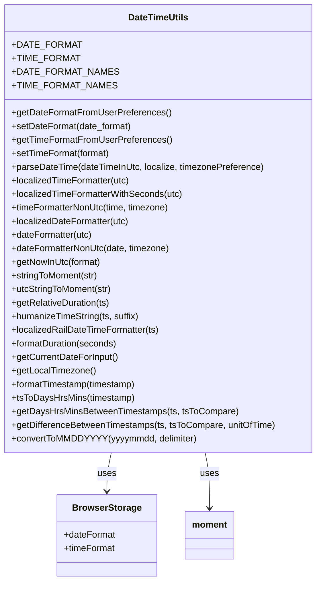
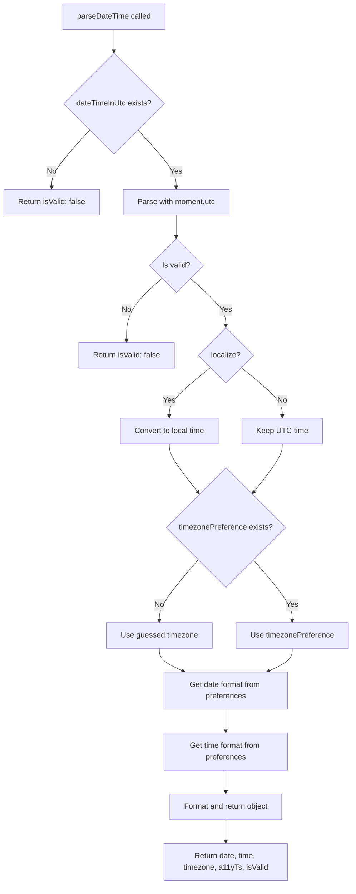
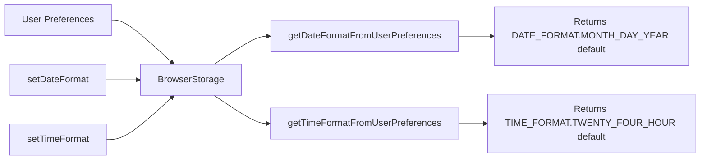
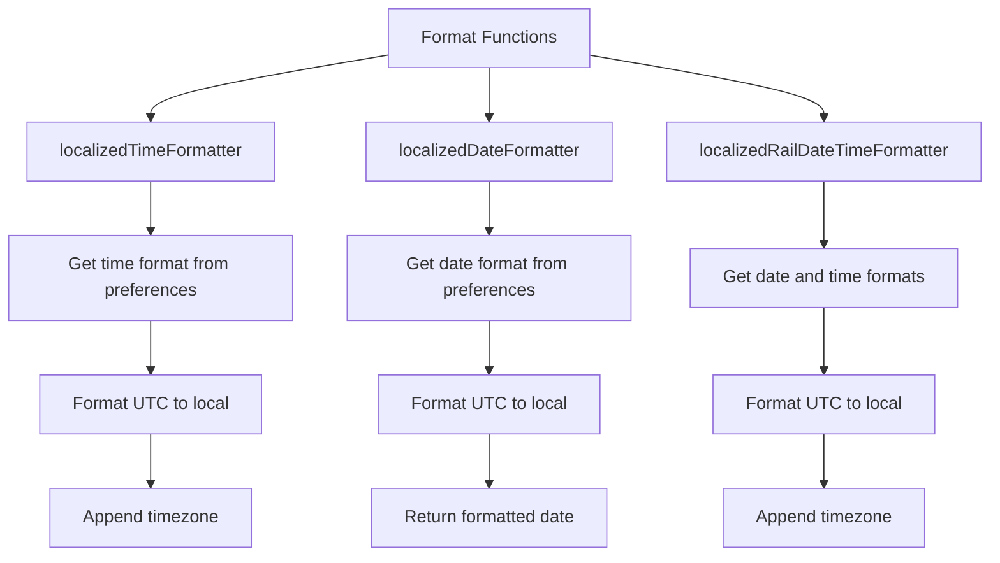
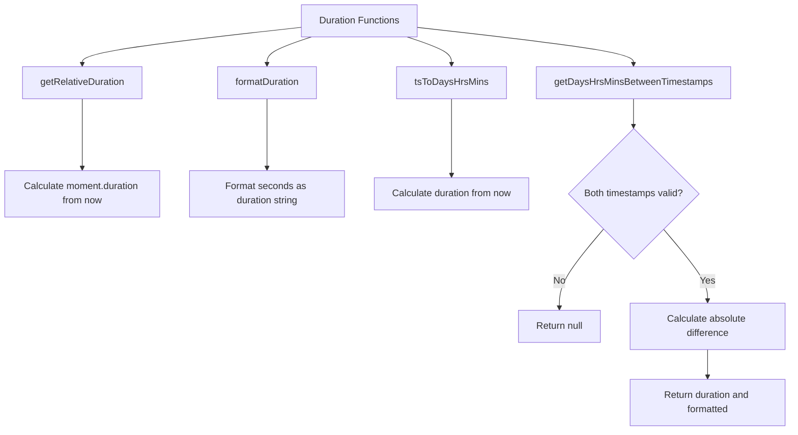

# Diagram: web/portal/src/utils/date-time.js

> Auto-generated by Obscura crawlers

## Diagram 1

### SVG

<svg id="container" width="560.546875" xmlns="http://www.w3.org/2000/svg" class="classDiagram" height="1026" viewBox="0 0 560.546875 1026" role="graphics-document document" aria-roledescription="class"><g><defs><marker id="container_class-aggregationStart" class="marker aggregation class" refX="18" refY="7" markerWidth="190" markerHeight="240" orient="auto"><path d="M 18,7 L9,13 L1,7 L9,1 Z"></path></marker></defs><defs><marker id="container_class-aggregationEnd" class="marker aggregation class" refX="1" refY="7" markerWidth="20" markerHeight="28" orient="auto"><path d="M 18,7 L9,13 L1,7 L9,1 Z"></path></marker></defs><defs><marker id="container_class-extensionStart" class="marker extension class" refX="18" refY="7" markerWidth="190" markerHeight="240" orient="auto"><path d="M 1,7 L18,13 V 1 Z"></path></marker></defs><defs><marker id="container_class-extensionEnd" class="marker extension class" refX="1" refY="7" markerWidth="20" markerHeight="28" orient="auto"><path d="M 1,1 V 13 L18,7 Z"></path></marker></defs><defs><marker id="container_class-compositionStart" class="marker composition class" refX="18" refY="7" markerWidth="190" markerHeight="240" orient="auto"><path d="M 18,7 L9,13 L1,7 L9,1 Z"></path></marker></defs><defs><marker id="container_class-compositionEnd" class="marker composition class" refX="1" refY="7" markerWidth="20" markerHeight="28" orient="auto"><path d="M 18,7 L9,13 L1,7 L9,1 Z"></path></marker></defs><defs><marker id="container_class-dependencyStart" class="marker dependency class" refX="6" refY="7" markerWidth="190" markerHeight="240" orient="auto"><path d="M 5,7 L9,13 L1,7 L9,1 Z"></path></marker></defs><defs><marker id="container_class-dependencyEnd" class="marker dependency class" refX="13" refY="7" markerWidth="20" markerHeight="28" orient="auto"><path d="M 18,7 L9,13 L14,7 L9,1 Z"></path></marker></defs><defs><marker id="container_class-lollipopStart" class="marker lollipop class" refX="13" refY="7" markerWidth="190" markerHeight="240" orient="auto"><circle stroke="black" fill="transparent" cx="7" cy="7" r="6"></circle></marker></defs><defs><marker id="container_class-lollipopEnd" class="marker lollipop class" refX="1" refY="7" markerWidth="190" markerHeight="240" orient="auto"><circle stroke="black" fill="transparent" cx="7" cy="7" r="6"></circle></marker></defs><g class="root"><g class="clusters"></g><g class="edgePaths"><path d="M198.33,800L197.054,806.167C195.778,812.333,193.226,824.667,191.95,836C190.674,847.333,190.674,857.667,190.674,862.833L190.674,868" id="id_DateTimeUtils_BrowserStorage_1" class="edge-thickness-normal edge-pattern-solid relation" style=";;;" data-edge="true" data-et="edge" data-id="id_DateTimeUtils_BrowserStorage_1" data-points="W3sieCI6MTk4LjMzMDE0NTc4NTIxOTQsInkiOjgwMH0seyJ4IjoxOTAuNjczODI4MTI1LCJ5Ijo4Mzd9LHsieCI6MTkwLjY3MzgyODEyNSwieSI6ODc0fV0=" marker-end="url(#container_class-dependencyEnd)"></path><path d="M362.217,800L363.493,806.167C364.769,812.333,367.321,824.667,368.597,841C369.873,857.333,369.873,877.667,369.873,887.833L369.873,898" id="id_DateTimeUtils_moment_2" class="edge-thickness-normal edge-pattern-solid relation" style=";;;" data-edge="true" data-et="edge" data-id="id_DateTimeUtils_moment_2" data-points="W3sieCI6MzYyLjIxNjcyOTIxNDc4MDU3LCJ5Ijo4MDB9LHsieCI6MzY5Ljg3MzA0Njg3NSwieSI6ODM3fSx7IngiOjM2OS44NzMwNDY4NzUsInkiOjkwNH1d" marker-end="url(#container_class-dependencyEnd)"></path></g><g class="edgeLabels"><g class="edgeLabel" transform="translate(190.673828125, 837)"><g class="label" data-id="id_DateTimeUtils_BrowserStorage_1" transform="translate(-16.4921875, -12)"><foreignObject width="32.984375" height="24">

uses

</foreignObject></g></g><g class="edgeLabel" transform="translate(369.873046875, 837)"><g class="label" data-id="id_DateTimeUtils_moment_2" transform="translate(-16.4921875, -12)"><foreignObject width="32.984375" height="24">

uses

</foreignObject></g></g></g><g class="nodes"><g class="node default" id="classId-DateTimeUtils-0" transform="translate(280.2734375, 404)"><g class="basic label-container"><path d="M-272.2734375 -396 L272.2734375 -396 L272.2734375 396 L-272.2734375 396" stroke="none" stroke-width="0" fill="#ECECFF" style=""></path><path d="M-272.2734375 -396 C-137.28081887715197 -396, -2.288200254303945 -396, 272.2734375 -396 M-272.2734375 -396 C-92.27993342446962 -396, 87.71357065106076 -396, 272.2734375 -396 M272.2734375 -396 C272.2734375 -235.25187280075235, 272.2734375 -74.5037456015047, 272.2734375 396 M272.2734375 -396 C272.2734375 -116.16677720978447, 272.2734375 163.66644558043106, 272.2734375 396 M272.2734375 396 C130.26535350100082 396, -11.742730497998366 396, -272.2734375 396 M272.2734375 396 C96.77515273743208 396, -78.72313202513584 396, -272.2734375 396 M-272.2734375 396 C-272.2734375 129.7763516006072, -272.2734375 -136.4472967987856, -272.2734375 -396 M-272.2734375 396 C-272.2734375 114.47089009815687, -272.2734375 -167.05821980368626, -272.2734375 -396" stroke="#9370DB" stroke-width="1.3" fill="none" stroke-dasharray="0 0" style=""></path></g><g class="annotation-group text" transform="translate(0, -372)"></g><g class="label-group text" transform="translate(-51.421875, -372)"><g class="label" style="font-weight: bolder" transform="translate(0,-12)"><foreignObject width="102.84375" height="24">

DateTimeUtils

</foreignObject></g></g><g class="members-group text" transform="translate(-260.2734375, -324)"><g class="label" style="" transform="translate(0,-12)"><foreignObject width="109.078125" height="24">

+DATE_FORMAT

</foreignObject></g><g class="label" style="" transform="translate(0,12)"><foreignObject width="106.9375" height="24">

+TIME_FORMAT

</foreignObject></g><g class="label" style="" transform="translate(0,36)"><foreignObject width="166.265625" height="24">

+DATE_FORMAT_NAMES

</foreignObject></g><g class="label" style="" transform="translate(0,60)"><foreignObject width="164.125" height="24">

+TIME_FORMAT_NAMES

</foreignObject></g></g><g class="methods-group text" transform="translate(-260.2734375, -204)"><g class="label" style="" transform="translate(0,-12)"><foreignObject width="278.578125" height="24">

+getDateFormatFromUserPreferences()

</foreignObject></g><g class="label" style="" transform="translate(0,12)"><foreignObject width="213.5625" height="24">

+setDateFormat(date_format)

</foreignObject></g><g class="label" style="" transform="translate(0,36)"><foreignObject width="280.703125" height="24">

+getTimeFormatFromUserPreferences()

</foreignObject></g><g class="label" style="" transform="translate(0,60)"><foreignObject width="175.46875" height="24">

+setTimeFormat(format)

</foreignObject></g><g class="label" style="" transform="translate(0,84)"><foreignObject width="447.5" height="24">

+parseDateTime(dateTimeInUtc, localize, timezonePreference)

</foreignObject></g><g class="label" style="" transform="translate(0,108)"><foreignObject width="211.859375" height="24">

+localizedTimeFormatter(utc)

</foreignObject></g><g class="label" style="" transform="translate(0,132)"><foreignObject width="305.265625" height="24">

+localizedTimeFormatterWithSeconds(utc)

</foreignObject></g><g class="label" style="" transform="translate(0,156)"><foreignObject width="283.4375" height="24">

+timeFormatterNonUtc(time, timezone)

</foreignObject></g><g class="label" style="" transform="translate(0,180)"><foreignObject width="209.75" height="24">

+localizedDateFormatter(utc)

</foreignObject></g><g class="label" style="" transform="translate(0,204)"><foreignObject width="144.828125" height="24">

+dateFormatter(utc)

</foreignObject></g><g class="label" style="" transform="translate(0,228)"><foreignObject width="283.125" height="24">

+dateFormatterNonUtc(date, timezone)

</foreignObject></g><g class="label" style="" transform="translate(0,252)"><foreignObject width="159.453125" height="24">

+getNowInUtc(format)

</foreignObject></g><g class="label" style="" transform="translate(0,276)"><foreignObject width="155.53125" height="24">

+stringToMoment(str)

</foreignObject></g><g class="label" style="" transform="translate(0,300)"><foreignObject width="179.265625" height="24">

+utcStringToMoment(str)

</foreignObject></g><g class="label" style="" transform="translate(0,324)"><foreignObject width="175.40625" height="24">

+getRelativeDuration(ts)

</foreignObject></g><g class="label" style="" transform="translate(0,348)"><foreignObject width="227.484375" height="24">

+humanizeTimeString(ts, suffix)

</foreignObject></g><g class="label" style="" transform="translate(0,372)"><foreignObject width="263.140625" height="24">

+localizedRailDateTimeFormatter(ts)

</foreignObject></g><g class="label" style="" transform="translate(0,396)"><foreignObject width="189.25" height="24">

+formatDuration(seconds)

</foreignObject></g><g class="label" style="" transform="translate(0,420)"><foreignObject width="189.265625" height="24">

+getCurrentDateForInput()

</foreignObject></g><g class="label" style="" transform="translate(0,444)"><foreignObject width="147.96875" height="24">

+getLocalTimezone()

</foreignObject></g><g class="label" style="" transform="translate(0,468)"><foreignObject width="225.078125" height="24">

+formatTimestamp(timestamp)

</foreignObject></g><g class="label" style="" transform="translate(0,492)"><foreignObject width="217.96875" height="24">

+tsToDaysHrsMins(timestamp)

</foreignObject></g><g class="label" style="" transform="translate(0,516)"><foreignObject width="398.578125" height="24">

+getDaysHrsMinsBetweenTimestamps(ts, tsToCompare)

</foreignObject></g><g class="label" style="" transform="translate(0,540)"><foreignObject width="469.125" height="24">

+getDifferenceBetweenTimestamps(ts, tsToCompare, unitOfTime)

</foreignObject></g><g class="label" style="" transform="translate(0,564)"><foreignObject width="322" height="24">

+convertToMMDDYYYY(yyyymmdd, delimiter)

</foreignObject></g></g><g class="divider" style=""><path d="M-272.2734375 -348 C-70.9984176543667 -348, 130.2766021912666 -348, 272.2734375 -348 M-272.2734375 -348 C-109.92738602017039 -348, 52.41866545965922 -348, 272.2734375 -348" stroke="#9370DB" stroke-width="1.3" fill="none" stroke-dasharray="0 0" style=""></path></g><g class="divider" style=""><path d="M-272.2734375 -228 C-110.06493880533944 -228, 52.143559889321125 -228, 272.2734375 -228 M-272.2734375 -228 C-153.25254936079125 -228, -34.23166122158247 -228, 272.2734375 -228" stroke="#9370DB" stroke-width="1.3" fill="none" stroke-dasharray="0 0" style=""></path></g></g><g class="node default" id="classId-BrowserStorage-1" transform="translate(190.673828125, 946)"><g class="basic label-container"><path d="M-86.88671875 -72 L86.88671875 -72 L86.88671875 72 L-86.88671875 72" stroke="none" stroke-width="0" fill="#ECECFF" style=""></path><path d="M-86.88671875 -72 C-19.706105115491468 -72, 47.474508519017064 -72, 86.88671875 -72 M-86.88671875 -72 C-41.87119757080133 -72, 3.144323608397343 -72, 86.88671875 -72 M86.88671875 -72 C86.88671875 -29.70583983091931, 86.88671875 12.588320338161381, 86.88671875 72 M86.88671875 -72 C86.88671875 -41.457840872442034, 86.88671875 -10.915681744884061, 86.88671875 72 M86.88671875 72 C47.46894587267194 72, 8.051172995343876 72, -86.88671875 72 M86.88671875 72 C46.9167476074753 72, 6.946776464950602 72, -86.88671875 72 M-86.88671875 72 C-86.88671875 20.423824297123495, -86.88671875 -31.15235140575301, -86.88671875 -72 M-86.88671875 72 C-86.88671875 20.57361370167304, -86.88671875 -30.85277259665392, -86.88671875 -72" stroke="#9370DB" stroke-width="1.3" fill="none" stroke-dasharray="0 0" style=""></path></g><g class="annotation-group text" transform="translate(0, -48)"></g><g class="label-group text" transform="translate(-58.1328125, -48)"><g class="label" style="font-weight: bolder" transform="translate(0,-12)"><foreignObject width="116.265625" height="24">

BrowserStorage

</foreignObject></g></g><g class="members-group text" transform="translate(-74.88671875, 0)"><g class="label" style="" transform="translate(0,-12)"><foreignObject width="91.53125" height="24">

+dateFormat

</foreignObject></g><g class="label" style="" transform="translate(0,12)"><foreignObject width="91.640625" height="24">

+timeFormat

</foreignObject></g></g><g class="methods-group text" transform="translate(-74.88671875, 72)"></g><g class="divider" style=""><path d="M-86.88671875 -24 C-43.80828868699464 -24, -0.729858623989287 -24, 86.88671875 -24 M-86.88671875 -24 C-18.924839906697386 -24, 49.03703893660523 -24, 86.88671875 -24" stroke="#9370DB" stroke-width="1.3" fill="none" stroke-dasharray="0 0" style=""></path></g><g class="divider" style=""><path d="M-86.88671875 48 C-36.904789409474134 48, 13.077139931051732 48, 86.88671875 48 M-86.88671875 48 C-30.831427168803643 48, 25.223864412392714 48, 86.88671875 48" stroke="#9370DB" stroke-width="1.3" fill="none" stroke-dasharray="0 0" style=""></path></g></g><g class="node default" id="classId-moment-2" transform="translate(369.873046875, 946)"><g class="basic label-container"><path d="M-42.3125 -42 L42.3125 -42 L42.3125 42 L-42.3125 42" stroke="none" stroke-width="0" fill="#ECECFF" style=""></path><path d="M-42.3125 -42 C-24.23220204658093 -42, -6.1519040931618605 -42, 42.3125 -42 M-42.3125 -42 C-13.246165933648829 -42, 15.820168132702342 -42, 42.3125 -42 M42.3125 -42 C42.3125 -17.72973608831672, 42.3125 6.54052782336656, 42.3125 42 M42.3125 -42 C42.3125 -23.859608059787526, 42.3125 -5.7192161195750515, 42.3125 42 M42.3125 42 C13.584902637935073 42, -15.142694724129854 42, -42.3125 42 M42.3125 42 C22.006443190968604 42, 1.7003863819372071 42, -42.3125 42 M-42.3125 42 C-42.3125 23.97898588596075, -42.3125 5.9579717719215, -42.3125 -42 M-42.3125 42 C-42.3125 21.74722132728349, -42.3125 1.4944426545669813, -42.3125 -42" stroke="#9370DB" stroke-width="1.3" fill="none" stroke-dasharray="0 0" style=""></path></g><g class="annotation-group text" transform="translate(0, -18)"></g><g class="label-group text" transform="translate(-30.3125, -18)"><g class="label" style="font-weight: bolder" transform="translate(0,-12)"><foreignObject width="60.625" height="24">

moment

</foreignObject></g></g><g class="members-group text" transform="translate(-30.3125, 30)"></g><g class="methods-group text" transform="translate(-30.3125, 60)"></g><g class="divider" style=""><path d="M-42.3125 6 C-19.221339951441557 6, 3.869820097116886 6, 42.3125 6 M-42.3125 6 C-13.210863739951147 6, 15.890772520097705 6, 42.3125 6" stroke="#9370DB" stroke-width="1.3" fill="none" stroke-dasharray="0 0" style=""></path></g><g class="divider" style=""><path d="M-42.3125 24 C-10.74281831414283 24, 20.82686337171434 24, 42.3125 24 M-42.3125 24 C-10.537467682371862 24, 21.237564635256277 24, 42.3125 24" stroke="#9370DB" stroke-width="1.3" fill="none" stroke-dasharray="0 0" style=""></path></g></g></g></g></g></svg>

## Diagram 2

### SVG

<svg id="container" width="743.2578125" xmlns="http://www.w3.org/2000/svg" class="flowchart" height="1857.28125" viewBox="0 0 743.2578125 1857.28125" role="graphics-document document" aria-roledescription="flowchart-v2"><g><marker id="container_flowchart-v2-pointEnd" class="marker flowchart-v2" viewBox="0 0 10 10" refX="5" refY="5" markerUnits="userSpaceOnUse" markerWidth="8" markerHeight="8" orient="auto"><path d="M 0 0 L 10 5 L 0 10 z" class="arrowMarkerPath" style="stroke-width: 1; stroke-dasharray: 1, 0;"></path></marker><marker id="container_flowchart-v2-pointStart" class="marker flowchart-v2" viewBox="0 0 10 10" refX="4.5" refY="5" markerUnits="userSpaceOnUse" markerWidth="8" markerHeight="8" orient="auto"><path d="M 0 5 L 10 10 L 10 0 z" class="arrowMarkerPath" style="stroke-width: 1; stroke-dasharray: 1, 0;"></path></marker><marker id="container_flowchart-v2-circleEnd" class="marker flowchart-v2" viewBox="0 0 10 10" refX="11" refY="5" markerUnits="userSpaceOnUse" markerWidth="11" markerHeight="11" orient="auto"><circle cx="5" cy="5" r="5" class="arrowMarkerPath" style="stroke-width: 1; stroke-dasharray: 1, 0;"></circle></marker><marker id="container_flowchart-v2-circleStart" class="marker flowchart-v2" viewBox="0 0 10 10" refX="-1" refY="5" markerUnits="userSpaceOnUse" markerWidth="11" markerHeight="11" orient="auto"><circle cx="5" cy="5" r="5" class="arrowMarkerPath" style="stroke-width: 1; stroke-dasharray: 1, 0;"></circle></marker><marker id="container_flowchart-v2-crossEnd" class="marker cross flowchart-v2" viewBox="0 0 11 11" refX="12" refY="5.2" markerUnits="userSpaceOnUse" markerWidth="11" markerHeight="11" orient="auto"><path d="M 1,1 l 9,9 M 10,1 l -9,9" class="arrowMarkerPath" style="stroke-width: 2; stroke-dasharray: 1, 0;"></path></marker><marker id="container_flowchart-v2-crossStart" class="marker cross flowchart-v2" viewBox="0 0 11 11" refX="-1" refY="5.2" markerUnits="userSpaceOnUse" markerWidth="11" markerHeight="11" orient="auto"><path d="M 1,1 l 9,9 M 10,1 l -9,9" class="arrowMarkerPath" style="stroke-width: 2; stroke-dasharray: 1, 0;"></path></marker><g class="root"><g class="clusters"></g><g class="edgePaths"><path d="M241.77,62L241.77,66.167C241.77,70.333,241.77,78.667,241.77,86.333C241.77,94,241.77,101,241.77,104.5L241.77,108" id="L_A_B_0" class="edge-thickness-normal edge-pattern-solid edge-thickness-normal edge-pattern-solid flowchart-link" style=";" data-edge="true" data-et="edge" data-id="L_A_B_0" data-points="W3sieCI6MjQxLjc2OTUzMTI1LCJ5Ijo2Mn0seyJ4IjoyNDEuNzY5NTMxMjUsInkiOjg3fSx7IngiOjI0MS43Njk1MzEyNSwieSI6MTEyfV0=" marker-end="url(#container_flowchart-v2-pointEnd)"></path><path d="M190.803,273.33L177.261,287.991C163.72,302.652,136.637,331.975,123.096,352.136C109.555,372.297,109.555,383.297,109.555,388.797L109.555,394.297" id="L_B_C_0" class="edge-thickness-normal edge-pattern-solid edge-thickness-normal edge-pattern-solid flowchart-link" style=";" data-edge="true" data-et="edge" data-id="L_B_C_0" data-points="W3sieCI6MTkwLjgwMjY4MTE1MDUyMjAzLCJ5IjoyNzMuMzMwMDI0OTAwNTIyMDZ9LHsieCI6MTA5LjU1NDY4NzUsInkiOjM2MS4yOTY4NzV9LHsieCI6MTA5LjU1NDY4NzUsInkiOjM5OC4yOTY4NzV9XQ==" marker-end="url(#container_flowchart-v2-pointEnd)"></path><path d="M292.736,273.33L306.278,287.991C319.819,302.652,346.902,331.975,360.443,352.136C373.984,372.297,373.984,383.297,373.984,388.797L373.984,394.297" id="L_B_D_0" class="edge-thickness-normal edge-pattern-solid edge-thickness-normal edge-pattern-solid flowchart-link" style=";" data-edge="true" data-et="edge" data-id="L_B_D_0" data-points="W3sieCI6MjkyLjczNjM4MTM0OTQ3Nzk0LCJ5IjoyNzMuMzMwMDI0OTAwNTIyMDZ9LHsieCI6MzczLjk4NDM3NSwieSI6MzYxLjI5Njg3NX0seyJ4IjozNzMuOTg0Mzc1LCJ5IjozOTguMjk2ODc1fV0=" marker-end="url(#container_flowchart-v2-pointEnd)"></path><path d="M373.984,452.297L373.984,456.464C373.984,460.63,373.984,468.964,373.984,476.63C373.984,484.297,373.984,491.297,373.984,494.797L373.984,498.297" id="L_D_E_0" class="edge-thickness-normal edge-pattern-solid edge-thickness-normal edge-pattern-solid flowchart-link" style=";" data-edge="true" data-et="edge" data-id="L_D_E_0" data-points="W3sieCI6MzczLjk4NDM3NSwieSI6NDUyLjI5Njg3NX0seyJ4IjozNzMuOTg0Mzc1LCJ5Ijo0NzcuMjk2ODc1fSx7IngiOjM3My45ODQzNzUsInkiOjUwMi4yOTY4NzV9XQ==" marker-end="url(#container_flowchart-v2-pointEnd)"></path><path d="M344.198,585.229L331.72,596.36C319.242,607.491,294.287,629.753,281.81,651.509C269.332,673.266,269.332,694.516,269.332,705.141L269.332,715.766" id="L_E_F_0" class="edge-thickness-normal edge-pattern-solid edge-thickness-normal edge-pattern-solid flowchart-link" style=";" data-edge="true" data-et="edge" data-id="L_E_F_0" data-points="W3sieCI6MzQ0LjE5NzU0ODYyNzk2MTU3LCJ5Ijo1ODUuMjI4Nzk4NjI3OTYxNn0seyJ4IjoyNjkuMzMyMDMxMjUsInkiOjY1Mi4wMTU2MjV9LHsieCI6MjY5LjMzMjAzMTI1LCJ5Ijo3MTkuNzY1NjI1fV0=" marker-end="url(#container_flowchart-v2-pointEnd)"></path><path d="M403.771,585.229L416.249,596.36C428.726,607.491,453.682,629.753,466.159,646.384C478.637,663.016,478.637,674.016,478.637,679.516L478.637,685.016" id="L_E_G_0" class="edge-thickness-normal edge-pattern-solid edge-thickness-normal edge-pattern-solid flowchart-link" style=";" data-edge="true" data-et="edge" data-id="L_E_G_0" data-points="W3sieCI6NDAzLjc3MTIwMTM3MjAzODQzLCJ5Ijo1ODUuMjI4Nzk4NjI3OTYxNn0seyJ4Ijo0NzguNjM2NzE4NzUsInkiOjY1Mi4wMTU2MjV9LHsieCI6NDc4LjYzNjcxODc1LCJ5Ijo2ODkuMDE1NjI1fV0=" marker-end="url(#container_flowchart-v2-pointEnd)"></path><path d="M446.506,772.384L432.055,783.906C417.604,795.428,388.702,818.472,374.252,835.494C359.801,852.516,359.801,863.516,359.801,869.016L359.801,874.516" id="L_G_H_0" class="edge-thickness-normal edge-pattern-solid edge-thickness-normal edge-pattern-solid flowchart-link" style=";" data-edge="true" data-et="edge" data-id="L_G_H_0" data-points="W3sieCI6NDQ2LjUwNTUwNTA5OTE3MTUsInkiOjc3Mi4zODQ0MTEzNDkxNzE1fSx7IngiOjM1OS44MDA3ODEyNSwieSI6ODQxLjUxNTYyNX0seyJ4IjozNTkuODAwNzgxMjUsInkiOjg3OC41MTU2MjV9XQ==" marker-end="url(#container_flowchart-v2-pointEnd)"></path><path d="M510.768,772.384L525.219,783.906C539.67,795.428,568.571,818.472,583.022,835.494C597.473,852.516,597.473,863.516,597.473,869.016L597.473,874.516" id="L_G_I_0" class="edge-thickness-normal edge-pattern-solid edge-thickness-normal edge-pattern-solid flowchart-link" style=";" data-edge="true" data-et="edge" data-id="L_G_I_0" data-points="W3sieCI6NTEwLjc2NzkzMjQwMDgyODUsInkiOjc3Mi4zODQ0MTEzNDkxNzE1fSx7IngiOjU5Ny40NzI2NTYyNSwieSI6ODQxLjUxNTYyNX0seyJ4Ijo1OTcuNDcyNjU2MjUsInkiOjg3OC41MTU2MjV9XQ==" marker-end="url(#container_flowchart-v2-pointEnd)"></path><path d="M359.801,932.516L359.801,936.682C359.801,940.849,359.801,949.182,369.969,966.217C380.138,983.251,400.475,1008.987,410.643,1021.855L420.811,1034.723" id="L_H_J_0" class="edge-thickness-normal edge-pattern-solid edge-thickness-normal edge-pattern-solid flowchart-link" style=";" data-edge="true" data-et="edge" data-id="L_H_J_0" data-points="W3sieCI6MzU5LjgwMDc4MTI1LCJ5Ijo5MzIuNTE1NjI1fSx7IngiOjM1OS44MDA3ODEyNSwieSI6OTU3LjUxNTYyNX0seyJ4Ijo0MjMuMjkxNDUwMDA1NDQxMSwieSI6MTAzNy44NjA4OTM3NDQ1NTl9XQ==" marker-end="url(#container_flowchart-v2-pointEnd)"></path><path d="M597.473,932.516L597.473,936.682C597.473,940.849,597.473,949.182,587.304,966.217C577.136,983.251,556.799,1008.987,546.63,1021.855L536.462,1034.723" id="L_I_J_0" class="edge-thickness-normal edge-pattern-solid edge-thickness-normal edge-pattern-solid flowchart-link" style=";" data-edge="true" data-et="edge" data-id="L_I_J_0" data-points="W3sieCI6NTk3LjQ3MjY1NjI1LCJ5Ijo5MzIuNTE1NjI1fSx7IngiOjU5Ny40NzI2NTYyNSwieSI6OTU3LjUxNTYyNX0seyJ4Ijo1MzMuOTgxOTg3NDk0NTU4OSwieSI6MTAzNy44NjA4OTM3NDQ1NTl9XQ==" marker-end="url(#container_flowchart-v2-pointEnd)"></path><path d="M420.786,1175.43L407.243,1191.239C393.701,1207.047,366.616,1238.664,353.074,1259.973C339.531,1281.281,339.531,1292.281,339.531,1297.781L339.531,1303.281" id="L_J_K_0" class="edge-thickness-normal edge-pattern-solid edge-thickness-normal edge-pattern-solid flowchart-link" style=";" data-edge="true" data-et="edge" data-id="L_J_K_0" data-points="W3sieCI6NDIwLjc4NTU5ODE5MDA1LCJ5IjoxMTc1LjQzMDEyOTQ0MDA1fSx7IngiOjMzOS41MzEyNSwieSI6MTI3MC4yODEyNX0seyJ4IjozMzkuNTMxMjUsInkiOjEzMDcuMjgxMjV9XQ==" marker-end="url(#container_flowchart-v2-pointEnd)"></path><path d="M536.488,1175.43L550.03,1191.239C563.573,1207.047,590.657,1238.664,604.2,1259.973C617.742,1281.281,617.742,1292.281,617.742,1297.781L617.742,1303.281" id="L_J_L_0" class="edge-thickness-normal edge-pattern-solid edge-thickness-normal edge-pattern-solid flowchart-link" style=";" data-edge="true" data-et="edge" data-id="L_J_L_0" data-points="W3sieCI6NTM2LjQ4NzgzOTMwOTk1LCJ5IjoxMTc1LjQzMDEyOTQ0MDA1fSx7IngiOjYxNy43NDIxODc1LCJ5IjoxMjcwLjI4MTI1fSx7IngiOjYxNy43NDIxODc1LCJ5IjoxMzA3LjI4MTI1fV0=" marker-end="url(#container_flowchart-v2-pointEnd)"></path><path d="M339.531,1361.281L339.531,1365.448C339.531,1369.615,339.531,1377.948,347.982,1386.003C356.433,1394.057,373.334,1401.833,381.785,1405.721L390.235,1409.609" id="L_K_M_0" class="edge-thickness-normal edge-pattern-solid edge-thickness-normal edge-pattern-solid flowchart-link" style=";" data-edge="true" data-et="edge" data-id="L_K_M_0" data-points="W3sieCI6MzM5LjUzMTI1LCJ5IjoxMzYxLjI4MTI1fSx7IngiOjMzOS41MzEyNSwieSI6MTM4Ni4yODEyNX0seyJ4IjozOTMuODY5MzIzNzMwNDY4NzUsInkiOjE0MTEuMjgxMjV9XQ==" marker-end="url(#container_flowchart-v2-pointEnd)"></path><path d="M617.742,1361.281L617.742,1365.448C617.742,1369.615,617.742,1377.948,609.291,1386.003C600.841,1394.057,583.939,1401.833,575.489,1405.721L567.038,1409.609" id="L_L_M_0" class="edge-thickness-normal edge-pattern-solid edge-thickness-normal edge-pattern-solid flowchart-link" style=";" data-edge="true" data-et="edge" data-id="L_L_M_0" data-points="W3sieCI6NjE3Ljc0MjE4NzUsInkiOjEzNjEuMjgxMjV9LHsieCI6NjE3Ljc0MjE4NzUsInkiOjEzODYuMjgxMjV9LHsieCI6NTYzLjQwNDExMzc2OTUzMTIsInkiOjE0MTEuMjgxMjV9XQ==" marker-end="url(#container_flowchart-v2-pointEnd)"></path><path d="M478.637,1489.281L478.637,1493.448C478.637,1497.615,478.637,1505.948,478.637,1513.615C478.637,1521.281,478.637,1528.281,478.637,1531.781L478.637,1535.281" id="L_M_N_0" class="edge-thickness-normal edge-pattern-solid edge-thickness-normal edge-pattern-solid flowchart-link" style=";" data-edge="true" data-et="edge" data-id="L_M_N_0" data-points="W3sieCI6NDc4LjYzNjcxODc1LCJ5IjoxNDg5LjI4MTI1fSx7IngiOjQ3OC42MzY3MTg3NSwieSI6MTUxNC4yODEyNX0seyJ4Ijo0NzguNjM2NzE4NzUsInkiOjE1MzkuMjgxMjV9XQ==" marker-end="url(#container_flowchart-v2-pointEnd)"></path><path d="M478.637,1617.281L478.637,1621.448C478.637,1625.615,478.637,1633.948,478.637,1641.615C478.637,1649.281,478.637,1656.281,478.637,1659.781L478.637,1663.281" id="L_N_O_0" class="edge-thickness-normal edge-pattern-solid edge-thickness-normal edge-pattern-solid flowchart-link" style=";" data-edge="true" data-et="edge" data-id="L_N_O_0" data-points="W3sieCI6NDc4LjYzNjcxODc1LCJ5IjoxNjE3LjI4MTI1fSx7IngiOjQ3OC42MzY3MTg3NSwieSI6MTY0Mi4yODEyNX0seyJ4Ijo0NzguNjM2NzE4NzUsInkiOjE2NjcuMjgxMjV9XQ==" marker-end="url(#container_flowchart-v2-pointEnd)"></path><path d="M478.637,1721.281L478.637,1725.448C478.637,1729.615,478.637,1737.948,478.637,1745.615C478.637,1753.281,478.637,1760.281,478.637,1763.781L478.637,1767.281" id="L_O_P_0" class="edge-thickness-normal edge-pattern-solid edge-thickness-normal edge-pattern-solid flowchart-link" style=";" data-edge="true" data-et="edge" data-id="L_O_P_0" data-points="W3sieCI6NDc4LjYzNjcxODc1LCJ5IjoxNzIxLjI4MTI1fSx7IngiOjQ3OC42MzY3MTg3NSwieSI6MTc0Ni4yODEyNX0seyJ4Ijo0NzguNjM2NzE4NzUsInkiOjE3NzEuMjgxMjV9XQ==" marker-end="url(#container_flowchart-v2-pointEnd)"></path></g><g class="edgeLabels"><g class="edgeLabel"><g class="label" data-id="L_A_B_0" transform="translate(0, 0)"><foreignObject width="0" height="0">

</foreignObject></g></g><g class="edgeLabel" transform="translate(109.5546875, 361.296875)"><g class="label" data-id="L_B_C_0" transform="translate(-10.140625, -12)"><foreignObject width="20.28125" height="24">

No

</foreignObject></g></g><g class="edgeLabel" transform="translate(373.984375, 361.296875)"><g class="label" data-id="L_B_D_0" transform="translate(-12.03125, -12)"><foreignObject width="24.0625" height="24">

Yes

</foreignObject></g></g><g class="edgeLabel"><g class="label" data-id="L_D_E_0" transform="translate(0, 0)"><foreignObject width="0" height="0">

</foreignObject></g></g><g class="edgeLabel" transform="translate(269.33203125, 652.015625)"><g class="label" data-id="L_E_F_0" transform="translate(-10.140625, -12)"><foreignObject width="20.28125" height="24">

No

</foreignObject></g></g><g class="edgeLabel" transform="translate(478.63671875, 652.015625)"><g class="label" data-id="L_E_G_0" transform="translate(-12.03125, -12)"><foreignObject width="24.0625" height="24">

Yes

</foreignObject></g></g><g class="edgeLabel" transform="translate(359.80078125, 841.515625)"><g class="label" data-id="L_G_H_0" transform="translate(-12.03125, -12)"><foreignObject width="24.0625" height="24">

Yes

</foreignObject></g></g><g class="edgeLabel" transform="translate(597.47265625, 841.515625)"><g class="label" data-id="L_G_I_0" transform="translate(-10.140625, -12)"><foreignObject width="20.28125" height="24">

No

</foreignObject></g></g><g class="edgeLabel"><g class="label" data-id="L_H_J_0" transform="translate(0, 0)"><foreignObject width="0" height="0">

</foreignObject></g></g><g class="edgeLabel"><g class="label" data-id="L_I_J_0" transform="translate(0, 0)"><foreignObject width="0" height="0">

</foreignObject></g></g><g class="edgeLabel" transform="translate(339.53125, 1270.28125)"><g class="label" data-id="L_J_K_0" transform="translate(-10.140625, -12)"><foreignObject width="20.28125" height="24">

No

</foreignObject></g></g><g class="edgeLabel" transform="translate(617.7421875, 1270.28125)"><g class="label" data-id="L_J_L_0" transform="translate(-12.03125, -12)"><foreignObject width="24.0625" height="24">

Yes

</foreignObject></g></g><g class="edgeLabel"><g class="label" data-id="L_K_M_0" transform="translate(0, 0)"><foreignObject width="0" height="0">

</foreignObject></g></g><g class="edgeLabel"><g class="label" data-id="L_L_M_0" transform="translate(0, 0)"><foreignObject width="0" height="0">

</foreignObject></g></g><g class="edgeLabel"><g class="label" data-id="L_M_N_0" transform="translate(0, 0)"><foreignObject width="0" height="0">

</foreignObject></g></g><g class="edgeLabel"><g class="label" data-id="L_N_O_0" transform="translate(0, 0)"><foreignObject width="0" height="0">

</foreignObject></g></g><g class="edgeLabel"><g class="label" data-id="L_O_P_0" transform="translate(0, 0)"><foreignObject width="0" height="0">

</foreignObject></g></g></g><g class="nodes"><g class="node default" id="flowchart-A-0" transform="translate(241.76953125, 35)"><rect class="basic label-container" style="" x="-108.1796875" y="-27" width="216.359375" height="54"></rect><g class="label" style="" transform="translate(-78.1796875, -12)"><rect></rect><foreignObject width="156.359375" height="24">

parseDateTime called

</foreignObject></g></g><g class="node default" id="flowchart-B-1" transform="translate(241.76953125, 218.1484375)"><polygon points="106.1484375,0 212.296875,-106.1484375 106.1484375,-212.296875 0,-106.1484375" class="label-container" transform="translate(-105.6484375, 106.1484375)"></polygon><g class="label" style="" transform="translate(-79.1484375, -12)"><rect></rect><foreignObject width="158.296875" height="24">

dateTimeInUtc exists?

</foreignObject></g></g><g class="node default" id="flowchart-C-3" transform="translate(109.5546875, 425.296875)"><rect class="basic label-container" style="" x="-101.5546875" y="-27" width="203.109375" height="54"></rect><g class="label" style="" transform="translate(-71.5546875, -12)"><rect></rect><foreignObject width="143.109375" height="24">

Return isValid: false

</foreignObject></g></g><g class="node default" id="flowchart-D-5" transform="translate(373.984375, 425.296875)"><rect class="basic label-container" style="" x="-112.875" y="-27" width="225.75" height="54"></rect><g class="label" style="" transform="translate(-82.875, -12)"><rect></rect><foreignObject width="165.75" height="24">

Parse with moment.utc

</foreignObject></g></g><g class="node default" id="flowchart-E-7" transform="translate(373.984375, 558.65625)"><polygon points="56.359375,0 112.71875,-56.359375 56.359375,-112.71875 0,-56.359375" class="label-container" transform="translate(-55.859375, 56.359375)"></polygon><g class="label" style="" transform="translate(-29.359375, -12)"><rect></rect><foreignObject width="58.71875" height="24">

Is valid?

</foreignObject></g></g><g class="node default" id="flowchart-F-9" transform="translate(269.33203125, 746.765625)"><rect class="basic label-container" style="" x="-101.5546875" y="-27" width="203.109375" height="54"></rect><g class="label" style="" transform="translate(-71.5546875, -12)"><rect></rect><foreignObject width="143.109375" height="24">

Return isValid: false

</foreignObject></g></g><g class="node default" id="flowchart-G-11" transform="translate(478.63671875, 746.765625)"><polygon points="57.75,0 115.5,-57.75 57.75,-115.5 0,-57.75" class="label-container" transform="translate(-57.25, 57.75)"></polygon><g class="label" style="" transform="translate(-30.75, -12)"><rect></rect><foreignObject width="61.5" height="24">

localize?

</foreignObject></g></g><g class="node default" id="flowchart-H-13" transform="translate(359.80078125, 905.515625)"><rect class="basic label-container" style="" x="-105.3671875" y="-27" width="210.734375" height="54"></rect><g class="label" style="" transform="translate(-75.3671875, -12)"><rect></rect><foreignObject width="150.734375" height="24">

Convert to local time

</foreignObject></g></g><g class="node default" id="flowchart-I-15" transform="translate(597.47265625, 905.515625)"><rect class="basic label-container" style="" x="-82.3046875" y="-27" width="164.609375" height="54"></rect><g class="label" style="" transform="translate(-52.3046875, -12)"><rect></rect><foreignObject width="104.609375" height="24">

Keep UTC time

</foreignObject></g></g><g class="node default" id="flowchart-J-17" transform="translate(478.63671875, 1107.8984375)"><polygon points="125.3828125,0 250.765625,-125.3828125 125.3828125,-250.765625 0,-125.3828125" class="label-container" transform="translate(-124.8828125, 125.3828125)"></polygon><g class="label" style="" transform="translate(-98.3828125, -12)"><rect></rect><foreignObject width="196.765625" height="24">

timezonePreference exists?

</foreignObject></g></g><g class="node default" id="flowchart-K-21" transform="translate(339.53125, 1334.28125)"><rect class="basic label-container" style="" x="-110.6953125" y="-27" width="221.390625" height="54"></rect><g class="label" style="" transform="translate(-80.6953125, -12)"><rect></rect><foreignObject width="161.390625" height="24">

Use guessed timezone

</foreignObject></g></g><g class="node default" id="flowchart-L-23" transform="translate(617.7421875, 1334.28125)"><rect class="basic label-container" style="" x="-117.515625" y="-27" width="235.03125" height="54"></rect><g class="label" style="" transform="translate(-87.515625, -12)"><rect></rect><foreignObject width="175.03125" height="24">

Use timezonePreference

</foreignObject></g></g><g class="node default" id="flowchart-M-25" transform="translate(478.63671875, 1450.28125)"><rect class="basic label-container" style="" x="-130" y="-39" width="260" height="78"></rect><g class="label" style="" transform="translate(-100, -24)"><rect></rect><foreignObject width="200" height="48">

Get date format from preferences

</foreignObject></g></g><g class="node default" id="flowchart-N-29" transform="translate(478.63671875, 1578.28125)"><rect class="basic label-container" style="" x="-130" y="-39" width="260" height="78"></rect><g class="label" style="" transform="translate(-100, -24)"><rect></rect><foreignObject width="200" height="48">

Get time format from preferences

</foreignObject></g></g><g class="node default" id="flowchart-O-31" transform="translate(478.63671875, 1694.28125)"><rect class="basic label-container" style="" x="-120.953125" y="-27" width="241.90625" height="54"></rect><g class="label" style="" transform="translate(-90.953125, -12)"><rect></rect><foreignObject width="181.90625" height="24">

Format and return object

</foreignObject></g></g><g class="node default" id="flowchart-P-33" transform="translate(478.63671875, 1810.28125)"><rect class="basic label-container" style="" x="-130" y="-39" width="260" height="78"></rect><g class="label" style="" transform="translate(-100, -24)"><rect></rect><foreignObject width="200" height="48">

Return date, time, timezone, a11yTs, isValid

</foreignObject></g></g></g></g></g></svg>

## Diagram 3

### SVG

<svg id="container" width="1163.71875" xmlns="http://www.w3.org/2000/svg" class="flowchart" height="278" viewBox="0 0 1163.71875 278" role="graphics-document document" aria-roledescription="flowchart-v2"><g><marker id="container_flowchart-v2-pointEnd" class="marker flowchart-v2" viewBox="0 0 10 10" refX="5" refY="5" markerUnits="userSpaceOnUse" markerWidth="8" markerHeight="8" orient="auto"><path d="M 0 0 L 10 5 L 0 10 z" class="arrowMarkerPath" style="stroke-width: 1; stroke-dasharray: 1, 0;"></path></marker><marker id="container_flowchart-v2-pointStart" class="marker flowchart-v2" viewBox="0 0 10 10" refX="4.5" refY="5" markerUnits="userSpaceOnUse" markerWidth="8" markerHeight="8" orient="auto"><path d="M 0 5 L 10 10 L 10 0 z" class="arrowMarkerPath" style="stroke-width: 1; stroke-dasharray: 1, 0;"></path></marker><marker id="container_flowchart-v2-circleEnd" class="marker flowchart-v2" viewBox="0 0 10 10" refX="11" refY="5" markerUnits="userSpaceOnUse" markerWidth="11" markerHeight="11" orient="auto"><circle cx="5" cy="5" r="5" class="arrowMarkerPath" style="stroke-width: 1; stroke-dasharray: 1, 0;"></circle></marker><marker id="container_flowchart-v2-circleStart" class="marker flowchart-v2" viewBox="0 0 10 10" refX="-1" refY="5" markerUnits="userSpaceOnUse" markerWidth="11" markerHeight="11" orient="auto"><circle cx="5" cy="5" r="5" class="arrowMarkerPath" style="stroke-width: 1; stroke-dasharray: 1, 0;"></circle></marker><marker id="container_flowchart-v2-crossEnd" class="marker cross flowchart-v2" viewBox="0 0 11 11" refX="12" refY="5.2" markerUnits="userSpaceOnUse" markerWidth="11" markerHeight="11" orient="auto"><path d="M 1,1 l 9,9 M 10,1 l -9,9" class="arrowMarkerPath" style="stroke-width: 2; stroke-dasharray: 1, 0;"></path></marker><marker id="container_flowchart-v2-crossStart" class="marker cross flowchart-v2" viewBox="0 0 11 11" refX="-1" refY="5.2" markerUnits="userSpaceOnUse" markerWidth="11" markerHeight="11" orient="auto"><path d="M 1,1 l 9,9 M 10,1 l -9,9" class="arrowMarkerPath" style="stroke-width: 2; stroke-dasharray: 1, 0;"></path></marker><g class="root"><g class="clusters"></g><g class="edgePaths"><path d="M189.75,35L193.917,35C198.083,35,206.417,35,223.864,47.379C241.312,59.758,267.873,84.515,281.154,96.894L294.435,109.273" id="L_A_B_0" class="edge-thickness-normal edge-pattern-solid edge-thickness-normal edge-pattern-solid flowchart-link" style=";" data-edge="true" data-et="edge" data-id="L_A_B_0" data-points="W3sieCI6MTg5Ljc1LCJ5IjozNX0seyJ4IjoyMTQuNzUsInkiOjM1fSx7IngiOjI5Ny4zNjA3MjcxNjM0NjE1NSwieSI6MTEyfV0=" marker-end="url(#container_flowchart-v2-pointEnd)"></path><path d="M365.968,112L377.957,103.833C389.947,95.667,413.927,79.333,429.592,71.167C445.258,63,452.609,63,456.285,63L459.961,63" id="L_B_C_0" class="edge-thickness-normal edge-pattern-solid edge-thickness-normal edge-pattern-solid flowchart-link" style=";" data-edge="true" data-et="edge" data-id="L_B_C_0" data-points="W3sieCI6MzY1Ljk2NzcyMjAzOTQ3MzcsInkiOjExMn0seyJ4Ijo0MzcuOTA2MjUsInkiOjYzfSx7IngiOjQ2My45NjA5Mzc1LCJ5Ijo2M31d" marker-end="url(#container_flowchart-v2-pointEnd)"></path><path d="M365.968,166L377.957,174.167C389.947,182.333,413.927,198.667,429.416,206.833C444.906,215,451.906,215,455.406,215L458.906,215" id="L_B_D_0" class="edge-thickness-normal edge-pattern-solid edge-thickness-normal edge-pattern-solid flowchart-link" style=";" data-edge="true" data-et="edge" data-id="L_B_D_0" data-points="W3sieCI6MzY1Ljk2NzcyMjAzOTQ3MzcsInkiOjE2Nn0seyJ4Ijo0MzcuOTA2MjUsInkiOjIxNX0seyJ4Ijo0NjIuOTA2MjUsInkiOjIxNX1d" marker-end="url(#container_flowchart-v2-pointEnd)"></path><path d="M181.922,139L187.393,139C192.865,139,203.807,139,212.779,139C221.75,139,228.75,139,232.25,139L235.75,139" id="L_E_B_0" class="edge-thickness-normal edge-pattern-solid edge-thickness-normal edge-pattern-solid flowchart-link" style=";" data-edge="true" data-et="edge" data-id="L_E_B_0" data-points="W3sieCI6MTgxLjkyMTg3NSwieSI6MTM5fSx7IngiOjIxNC43NSwieSI6MTM5fSx7IngiOjIzOS43NSwieSI6MTM5fV0=" marker-end="url(#container_flowchart-v2-pointEnd)"></path><path d="M182.977,243L188.272,243C193.568,243,204.159,243,222.735,230.621C241.312,218.242,267.873,193.485,281.154,181.106L294.435,168.727" id="L_F_B_0" class="edge-thickness-normal edge-pattern-solid edge-thickness-normal edge-pattern-solid flowchart-link" style=";" data-edge="true" data-et="edge" data-id="L_F_B_0" data-points="W3sieCI6MTgyLjk3NjU2MjUsInkiOjI0M30seyJ4IjoyMTQuNzUsInkiOjI0M30seyJ4IjoyOTcuMzYwNzI3MTYzNDYxNTUsInkiOjE2Nn1d" marker-end="url(#container_flowchart-v2-pointEnd)"></path><path d="M784.195,63L788.538,63C792.88,63,801.565,63,811.174,63C820.784,63,831.318,63,836.585,63L841.852,63" id="L_C_G_0" class="edge-thickness-normal edge-pattern-solid edge-thickness-normal edge-pattern-solid flowchart-link" style=";" data-edge="true" data-et="edge" data-id="L_C_G_0" data-points="W3sieCI6Nzg0LjE5NTMxMjUsInkiOjYzfSx7IngiOjgxMC4yNSwieSI6NjN9LHsieCI6ODQ1Ljg1MTU2MjUsInkiOjYzfV0=" marker-end="url(#container_flowchart-v2-pointEnd)"></path><path d="M785.25,215L789.417,215C793.583,215,801.917,215,809.583,215C817.25,215,824.25,215,827.75,215L831.25,215" id="L_D_H_0" class="edge-thickness-normal edge-pattern-solid edge-thickness-normal edge-pattern-solid flowchart-link" style=";" data-edge="true" data-et="edge" data-id="L_D_H_0" data-points="W3sieCI6Nzg1LjI1LCJ5IjoyMTV9LHsieCI6ODEwLjI1LCJ5IjoyMTV9LHsieCI6ODM1LjI1LCJ5IjoyMTV9XQ==" marker-end="url(#container_flowchart-v2-pointEnd)"></path></g><g class="edgeLabels"><g class="edgeLabel"><g class="label" data-id="L_A_B_0" transform="translate(0, 0)"><foreignObject width="0" height="0">

</foreignObject></g></g><g class="edgeLabel"><g class="label" data-id="L_B_C_0" transform="translate(0, 0)"><foreignObject width="0" height="0">

</foreignObject></g></g><g class="edgeLabel"><g class="label" data-id="L_B_D_0" transform="translate(0, 0)"><foreignObject width="0" height="0">

</foreignObject></g></g><g class="edgeLabel"><g class="label" data-id="L_E_B_0" transform="translate(0, 0)"><foreignObject width="0" height="0">

</foreignObject></g></g><g class="edgeLabel"><g class="label" data-id="L_F_B_0" transform="translate(0, 0)"><foreignObject width="0" height="0">

</foreignObject></g></g><g class="edgeLabel"><g class="label" data-id="L_C_G_0" transform="translate(0, 0)"><foreignObject width="0" height="0">

</foreignObject></g></g><g class="edgeLabel"><g class="label" data-id="L_D_H_0" transform="translate(0, 0)"><foreignObject width="0" height="0">

</foreignObject></g></g></g><g class="nodes"><g class="node default" id="flowchart-A-0" transform="translate(98.875, 35)"><rect class="basic label-container" style="" x="-90.875" y="-27" width="181.75" height="54"></rect><g class="label" style="" transform="translate(-60.875, -12)"><rect></rect><foreignObject width="121.75" height="24">

User Preferences

</foreignObject></g></g><g class="node default" id="flowchart-B-1" transform="translate(326.328125, 139)"><rect class="basic label-container" style="" x="-86.578125" y="-27" width="173.15625" height="54"></rect><g class="label" style="" transform="translate(-56.578125, -12)"><rect></rect><foreignObject width="113.15625" height="24">

BrowserStorage

</foreignObject></g></g><g class="node default" id="flowchart-C-3" transform="translate(624.078125, 63)"><rect class="basic label-container" style="" x="-160.1171875" y="-27" width="320.234375" height="54"></rect><g class="label" style="" transform="translate(-130.1171875, -12)"><rect></rect><foreignObject width="260.234375" height="24">

getDateFormatFromUserPreferences

</foreignObject></g></g><g class="node default" id="flowchart-D-5" transform="translate(624.078125, 215)"><rect class="basic label-container" style="" x="-161.171875" y="-27" width="322.34375" height="54"></rect><g class="label" style="" transform="translate(-131.171875, -12)"><rect></rect><foreignObject width="262.34375" height="24">

getTimeFormatFromUserPreferences

</foreignObject></g></g><g class="node default" id="flowchart-E-6" transform="translate(98.875, 139)"><rect class="basic label-container" style="" x="-83.046875" y="-27" width="166.09375" height="54"></rect><g class="label" style="" transform="translate(-53.046875, -12)"><rect></rect><foreignObject width="106.09375" height="24">

setDateFormat

</foreignObject></g></g><g class="node default" id="flowchart-F-8" transform="translate(98.875, 243)"><rect class="basic label-container" style="" x="-84.1015625" y="-27" width="168.203125" height="54"></rect><g class="label" style="" transform="translate(-54.1015625, -12)"><rect></rect><foreignObject width="108.203125" height="24">

setTimeFormat

</foreignObject></g></g><g class="node default" id="flowchart-G-11" transform="translate(995.484375, 63)"><rect class="basic label-container" style="" x="-149.6328125" y="-51" width="299.265625" height="102"></rect><g class="label" style="" transform="translate(-119.6328125, -36)"><rect></rect><foreignObject width="239.265625" height="72">

Returns DATE_FORMAT.MONTH_DAY_YEAR default

</foreignObject></g></g><g class="node default" id="flowchart-H-13" transform="translate(995.484375, 215)"><rect class="basic label-container" style="" x="-160.234375" y="-51" width="320.46875" height="102"></rect><g class="label" style="" transform="translate(-130.234375, -36)"><rect></rect><foreignObject width="260.46875" height="72">

Returns TIME_FORMAT.TWENTY_FOUR_HOUR default

</foreignObject></g></g></g></g></g></svg>

## Diagram 4

### SVG

<svg id="container" width="912" xmlns="http://www.w3.org/2000/svg" class="flowchart" height="510" viewBox="0 0 912 510" role="graphics-document document" aria-roledescription="flowchart-v2"><g><marker id="container_flowchart-v2-pointEnd" class="marker flowchart-v2" viewBox="0 0 10 10" refX="5" refY="5" markerUnits="userSpaceOnUse" markerWidth="8" markerHeight="8" orient="auto"><path d="M 0 0 L 10 5 L 0 10 z" class="arrowMarkerPath" style="stroke-width: 1; stroke-dasharray: 1, 0;"></path></marker><marker id="container_flowchart-v2-pointStart" class="marker flowchart-v2" viewBox="0 0 10 10" refX="4.5" refY="5" markerUnits="userSpaceOnUse" markerWidth="8" markerHeight="8" orient="auto"><path d="M 0 5 L 10 10 L 10 0 z" class="arrowMarkerPath" style="stroke-width: 1; stroke-dasharray: 1, 0;"></path></marker><marker id="container_flowchart-v2-circleEnd" class="marker flowchart-v2" viewBox="0 0 10 10" refX="11" refY="5" markerUnits="userSpaceOnUse" markerWidth="11" markerHeight="11" orient="auto"><circle cx="5" cy="5" r="5" class="arrowMarkerPath" style="stroke-width: 1; stroke-dasharray: 1, 0;"></circle></marker><marker id="container_flowchart-v2-circleStart" class="marker flowchart-v2" viewBox="0 0 10 10" refX="-1" refY="5" markerUnits="userSpaceOnUse" markerWidth="11" markerHeight="11" orient="auto"><circle cx="5" cy="5" r="5" class="arrowMarkerPath" style="stroke-width: 1; stroke-dasharray: 1, 0;"></circle></marker><marker id="container_flowchart-v2-crossEnd" class="marker cross flowchart-v2" viewBox="0 0 11 11" refX="12" refY="5.2" markerUnits="userSpaceOnUse" markerWidth="11" markerHeight="11" orient="auto"><path d="M 1,1 l 9,9 M 10,1 l -9,9" class="arrowMarkerPath" style="stroke-width: 2; stroke-dasharray: 1, 0;"></path></marker><marker id="container_flowchart-v2-crossStart" class="marker cross flowchart-v2" viewBox="0 0 11 11" refX="-1" refY="5.2" markerUnits="userSpaceOnUse" markerWidth="11" markerHeight="11" orient="auto"><path d="M 1,1 l 9,9 M 10,1 l -9,9" class="arrowMarkerPath" style="stroke-width: 2; stroke-dasharray: 1, 0;"></path></marker><g class="root"><g class="clusters"></g><g class="edgePaths"><path d="M355.328,50.545L319.107,56.621C282.885,62.697,210.443,74.848,174.221,84.424C138,94,138,101,138,104.5L138,108" id="L_A_B_0" class="edge-thickness-normal edge-pattern-solid edge-thickness-normal edge-pattern-solid flowchart-link" style=";" data-edge="true" data-et="edge" data-id="L_A_B_0" data-points="W3sieCI6MzU1LjMyODEyNSwieSI6NTAuNTQ0OTU5Njc3NDE5MzZ9LHsieCI6MTM4LCJ5Ijo4N30seyJ4IjoxMzgsInkiOjExMn1d" marker-end="url(#container_flowchart-v2-pointEnd)"></path><path d="M448,62L448,66.167C448,70.333,448,78.667,448,86.333C448,94,448,101,448,104.5L448,108" id="L_A_C_0" class="edge-thickness-normal edge-pattern-solid edge-thickness-normal edge-pattern-solid flowchart-link" style=";" data-edge="true" data-et="edge" data-id="L_A_C_0" data-points="W3sieCI6NDQ4LCJ5Ijo2Mn0seyJ4Ijo0NDgsInkiOjg3fSx7IngiOjQ0OCwieSI6MTEyfV0=" marker-end="url(#container_flowchart-v2-pointEnd)"></path><path d="M540.672,50.534L576.931,56.611C613.19,62.689,685.708,74.845,721.967,84.422C758.227,94,758.227,101,758.227,104.5L758.227,108" id="L_A_D_0" class="edge-thickness-normal edge-pattern-solid edge-thickness-normal edge-pattern-solid flowchart-link" style=";" data-edge="true" data-et="edge" data-id="L_A_D_0" data-points="W3sieCI6NTQwLjY3MTg3NSwieSI6NTAuNTMzNjA2OTkwODU4NDk1fSx7IngiOjc1OC4yMjY1NjI1LCJ5Ijo4N30seyJ4Ijo3NTguMjI2NTYyNSwieSI6MTEyfV0=" marker-end="url(#container_flowchart-v2-pointEnd)"></path><path d="M138,166L138,170.167C138,174.333,138,182.667,138,190.333C138,198,138,205,138,208.5L138,212" id="L_B_E_0" class="edge-thickness-normal edge-pattern-solid edge-thickness-normal edge-pattern-solid flowchart-link" style=";" data-edge="true" data-et="edge" data-id="L_B_E_0" data-points="W3sieCI6MTM4LCJ5IjoxNjZ9LHsieCI6MTM4LCJ5IjoxOTF9LHsieCI6MTM4LCJ5IjoyMTZ9XQ==" marker-end="url(#container_flowchart-v2-pointEnd)"></path><path d="M448,166L448,170.167C448,174.333,448,182.667,448,190.333C448,198,448,205,448,208.5L448,212" id="L_C_F_0" class="edge-thickness-normal edge-pattern-solid edge-thickness-normal edge-pattern-solid flowchart-link" style=";" data-edge="true" data-et="edge" data-id="L_C_F_0" data-points="W3sieCI6NDQ4LCJ5IjoxNjZ9LHsieCI6NDQ4LCJ5IjoxOTF9LHsieCI6NDQ4LCJ5IjoyMTZ9XQ==" marker-end="url(#container_flowchart-v2-pointEnd)"></path><path d="M758.227,166L758.227,170.167C758.227,174.333,758.227,182.667,758.227,192.333C758.227,202,758.227,213,758.227,218.5L758.227,224" id="L_D_G_0" class="edge-thickness-normal edge-pattern-solid edge-thickness-normal edge-pattern-solid flowchart-link" style=";" data-edge="true" data-et="edge" data-id="L_D_G_0" data-points="W3sieCI6NzU4LjIyNjU2MjUsInkiOjE2Nn0seyJ4Ijo3NTguMjI2NTYyNSwieSI6MTkxfSx7IngiOjc1OC4yMjY1NjI1LCJ5IjoyMjh9XQ==" marker-end="url(#container_flowchart-v2-pointEnd)"></path><path d="M138,294L138,298.167C138,302.333,138,310.667,138,318.333C138,326,138,333,138,336.5L138,340" id="L_E_H_0" class="edge-thickness-normal edge-pattern-solid edge-thickness-normal edge-pattern-solid flowchart-link" style=";" data-edge="true" data-et="edge" data-id="L_E_H_0" data-points="W3sieCI6MTM4LCJ5IjoyOTR9LHsieCI6MTM4LCJ5IjozMTl9LHsieCI6MTM4LCJ5IjozNDR9XQ==" marker-end="url(#container_flowchart-v2-pointEnd)"></path><path d="M448,294L448,298.167C448,302.333,448,310.667,448,318.333C448,326,448,333,448,336.5L448,340" id="L_F_I_0" class="edge-thickness-normal edge-pattern-solid edge-thickness-normal edge-pattern-solid flowchart-link" style=";" data-edge="true" data-et="edge" data-id="L_F_I_0" data-points="W3sieCI6NDQ4LCJ5IjoyOTR9LHsieCI6NDQ4LCJ5IjozMTl9LHsieCI6NDQ4LCJ5IjozNDR9XQ==" marker-end="url(#container_flowchart-v2-pointEnd)"></path><path d="M758.227,282L758.227,288.167C758.227,294.333,758.227,306.667,758.227,316.333C758.227,326,758.227,333,758.227,336.5L758.227,340" id="L_G_J_0" class="edge-thickness-normal edge-pattern-solid edge-thickness-normal edge-pattern-solid flowchart-link" style=";" data-edge="true" data-et="edge" data-id="L_G_J_0" data-points="W3sieCI6NzU4LjIyNjU2MjUsInkiOjI4Mn0seyJ4Ijo3NTguMjI2NTYyNSwieSI6MzE5fSx7IngiOjc1OC4yMjY1NjI1LCJ5IjozNDR9XQ==" marker-end="url(#container_flowchart-v2-pointEnd)"></path><path d="M138,398L138,402.167C138,406.333,138,414.667,138,422.333C138,430,138,437,138,440.5L138,444" id="L_H_K_0" class="edge-thickness-normal edge-pattern-solid edge-thickness-normal edge-pattern-solid flowchart-link" style=";" data-edge="true" data-et="edge" data-id="L_H_K_0" data-points="W3sieCI6MTM4LCJ5IjozOTh9LHsieCI6MTM4LCJ5Ijo0MjN9LHsieCI6MTM4LCJ5Ijo0NDh9XQ==" marker-end="url(#container_flowchart-v2-pointEnd)"></path><path d="M448,398L448,402.167C448,406.333,448,414.667,448,422.333C448,430,448,437,448,440.5L448,444" id="L_I_L_0" class="edge-thickness-normal edge-pattern-solid edge-thickness-normal edge-pattern-solid flowchart-link" style=";" data-edge="true" data-et="edge" data-id="L_I_L_0" data-points="W3sieCI6NDQ4LCJ5IjozOTh9LHsieCI6NDQ4LCJ5Ijo0MjN9LHsieCI6NDQ4LCJ5Ijo0NDh9XQ==" marker-end="url(#container_flowchart-v2-pointEnd)"></path><path d="M758.227,398L758.227,402.167C758.227,406.333,758.227,414.667,758.227,422.333C758.227,430,758.227,437,758.227,440.5L758.227,444" id="L_J_M_0" class="edge-thickness-normal edge-pattern-solid edge-thickness-normal edge-pattern-solid flowchart-link" style=";" data-edge="true" data-et="edge" data-id="L_J_M_0" data-points="W3sieCI6NzU4LjIyNjU2MjUsInkiOjM5OH0seyJ4Ijo3NTguMjI2NTYyNSwieSI6NDIzfSx7IngiOjc1OC4yMjY1NjI1LCJ5Ijo0NDh9XQ==" marker-end="url(#container_flowchart-v2-pointEnd)"></path></g><g class="edgeLabels"><g class="edgeLabel"><g class="label" data-id="L_A_B_0" transform="translate(0, 0)"><foreignObject width="0" height="0">

</foreignObject></g></g><g class="edgeLabel"><g class="label" data-id="L_A_C_0" transform="translate(0, 0)"><foreignObject width="0" height="0">

</foreignObject></g></g><g class="edgeLabel"><g class="label" data-id="L_A_D_0" transform="translate(0, 0)"><foreignObject width="0" height="0">

</foreignObject></g></g><g class="edgeLabel"><g class="label" data-id="L_B_E_0" transform="translate(0, 0)"><foreignObject width="0" height="0">

</foreignObject></g></g><g class="edgeLabel"><g class="label" data-id="L_C_F_0" transform="translate(0, 0)"><foreignObject width="0" height="0">

</foreignObject></g></g><g class="edgeLabel"><g class="label" data-id="L_D_G_0" transform="translate(0, 0)"><foreignObject width="0" height="0">

</foreignObject></g></g><g class="edgeLabel"><g class="label" data-id="L_E_H_0" transform="translate(0, 0)"><foreignObject width="0" height="0">

</foreignObject></g></g><g class="edgeLabel"><g class="label" data-id="L_F_I_0" transform="translate(0, 0)"><foreignObject width="0" height="0">

</foreignObject></g></g><g class="edgeLabel"><g class="label" data-id="L_G_J_0" transform="translate(0, 0)"><foreignObject width="0" height="0">

</foreignObject></g></g><g class="edgeLabel"><g class="label" data-id="L_H_K_0" transform="translate(0, 0)"><foreignObject width="0" height="0">

</foreignObject></g></g><g class="edgeLabel"><g class="label" data-id="L_I_L_0" transform="translate(0, 0)"><foreignObject width="0" height="0">

</foreignObject></g></g><g class="edgeLabel"><g class="label" data-id="L_J_M_0" transform="translate(0, 0)"><foreignObject width="0" height="0">

</foreignObject></g></g></g><g class="nodes"><g class="node default" id="flowchart-A-0" transform="translate(448, 35)"><rect class="basic label-container" style="" x="-92.671875" y="-27" width="185.34375" height="54"></rect><g class="label" style="" transform="translate(-62.671875, -12)"><rect></rect><foreignObject width="125.34375" height="24">

Format Functions

</foreignObject></g></g><g class="node default" id="flowchart-B-1" transform="translate(138, 139)"><rect class="basic label-container" style="" x="-115.5078125" y="-27" width="231.015625" height="54"></rect><g class="label" style="" transform="translate(-85.5078125, -12)"><rect></rect><foreignObject width="171.015625" height="24">

localizedTimeFormatter

</foreignObject></g></g><g class="node default" id="flowchart-C-3" transform="translate(448, 139)"><rect class="basic label-container" style="" x="-114.453125" y="-27" width="228.90625" height="54"></rect><g class="label" style="" transform="translate(-84.453125, -12)"><rect></rect><foreignObject width="168.90625" height="24">

localizedDateFormatter

</foreignObject></g></g><g class="node default" id="flowchart-D-5" transform="translate(758.2265625, 139)"><rect class="basic label-container" style="" x="-145.7734375" y="-27" width="291.546875" height="54"></rect><g class="label" style="" transform="translate(-115.7734375, -12)"><rect></rect><foreignObject width="231.546875" height="24">

localizedRailDateTimeFormatter

</foreignObject></g></g><g class="node default" id="flowchart-E-7" transform="translate(138, 255)"><rect class="basic label-container" style="" x="-130" y="-39" width="260" height="78"></rect><g class="label" style="" transform="translate(-100, -24)"><rect></rect><foreignObject width="200" height="48">

Get time format from preferences

</foreignObject></g></g><g class="node default" id="flowchart-F-9" transform="translate(448, 255)"><rect class="basic label-container" style="" x="-130" y="-39" width="260" height="78"></rect><g class="label" style="" transform="translate(-100, -24)"><rect></rect><foreignObject width="200" height="48">

Get date format from preferences

</foreignObject></g></g><g class="node default" id="flowchart-G-11" transform="translate(758.2265625, 255)"><rect class="basic label-container" style="" x="-125.421875" y="-27" width="250.84375" height="54"></rect><g class="label" style="" transform="translate(-95.421875, -12)"><rect></rect><foreignObject width="190.84375" height="24">

Get date and time formats

</foreignObject></g></g><g class="node default" id="flowchart-H-13" transform="translate(138, 371)"><rect class="basic label-container" style="" x="-100.2734375" y="-27" width="200.546875" height="54"></rect><g class="label" style="" transform="translate(-70.2734375, -12)"><rect></rect><foreignObject width="140.546875" height="24">

Format UTC to local

</foreignObject></g></g><g class="node default" id="flowchart-I-15" transform="translate(448, 371)"><rect class="basic label-container" style="" x="-100.2734375" y="-27" width="200.546875" height="54"></rect><g class="label" style="" transform="translate(-70.2734375, -12)"><rect></rect><foreignObject width="140.546875" height="24">

Format UTC to local

</foreignObject></g></g><g class="node default" id="flowchart-J-17" transform="translate(758.2265625, 371)"><rect class="basic label-container" style="" x="-100.2734375" y="-27" width="200.546875" height="54"></rect><g class="label" style="" transform="translate(-70.2734375, -12)"><rect></rect><foreignObject width="140.546875" height="24">

Format UTC to local

</foreignObject></g></g><g class="node default" id="flowchart-K-19" transform="translate(138, 475)"><rect class="basic label-container" style="" x="-93.5078125" y="-27" width="187.015625" height="54"></rect><g class="label" style="" transform="translate(-63.5078125, -12)"><rect></rect><foreignObject width="127.015625" height="24">

Append timezone

</foreignObject></g></g><g class="node default" id="flowchart-L-21" transform="translate(448, 475)"><rect class="basic label-container" style="" x="-111.2734375" y="-27" width="222.546875" height="54"></rect><g class="label" style="" transform="translate(-81.2734375, -12)"><rect></rect><foreignObject width="162.546875" height="24">

Return formatted date

</foreignObject></g></g><g class="node default" id="flowchart-M-23" transform="translate(758.2265625, 475)"><rect class="basic label-container" style="" x="-93.5078125" y="-27" width="187.015625" height="54"></rect><g class="label" style="" transform="translate(-63.5078125, -12)"><rect></rect><foreignObject width="127.015625" height="24">

Append timezone

</foreignObject></g></g></g></g></g></svg>

## Diagram 5

### SVG

<svg id="container" width="1324.62109375" xmlns="http://www.w3.org/2000/svg" class="flowchart" height="728.234375" viewBox="0 0 1324.62109375 728.234375" role="graphics-document document" aria-roledescription="flowchart-v2"><g><marker id="container_flowchart-v2-pointEnd" class="marker flowchart-v2" viewBox="0 0 10 10" refX="5" refY="5" markerUnits="userSpaceOnUse" markerWidth="8" markerHeight="8" orient="auto"><path d="M 0 0 L 10 5 L 0 10 z" class="arrowMarkerPath" style="stroke-width: 1; stroke-dasharray: 1, 0;"></path></marker><marker id="container_flowchart-v2-pointStart" class="marker flowchart-v2" viewBox="0 0 10 10" refX="4.5" refY="5" markerUnits="userSpaceOnUse" markerWidth="8" markerHeight="8" orient="auto"><path d="M 0 5 L 10 10 L 10 0 z" class="arrowMarkerPath" style="stroke-width: 1; stroke-dasharray: 1, 0;"></path></marker><marker id="container_flowchart-v2-circleEnd" class="marker flowchart-v2" viewBox="0 0 10 10" refX="11" refY="5" markerUnits="userSpaceOnUse" markerWidth="11" markerHeight="11" orient="auto"><circle cx="5" cy="5" r="5" class="arrowMarkerPath" style="stroke-width: 1; stroke-dasharray: 1, 0;"></circle></marker><marker id="container_flowchart-v2-circleStart" class="marker flowchart-v2" viewBox="0 0 10 10" refX="-1" refY="5" markerUnits="userSpaceOnUse" markerWidth="11" markerHeight="11" orient="auto"><circle cx="5" cy="5" r="5" class="arrowMarkerPath" style="stroke-width: 1; stroke-dasharray: 1, 0;"></circle></marker><marker id="container_flowchart-v2-crossEnd" class="marker cross flowchart-v2" viewBox="0 0 11 11" refX="12" refY="5.2" markerUnits="userSpaceOnUse" markerWidth="11" markerHeight="11" orient="auto"><path d="M 1,1 l 9,9 M 10,1 l -9,9" class="arrowMarkerPath" style="stroke-width: 2; stroke-dasharray: 1, 0;"></path></marker><marker id="container_flowchart-v2-crossStart" class="marker cross flowchart-v2" viewBox="0 0 11 11" refX="-1" refY="5.2" markerUnits="userSpaceOnUse" markerWidth="11" markerHeight="11" orient="auto"><path d="M 1,1 l 9,9 M 10,1 l -9,9" class="arrowMarkerPath" style="stroke-width: 2; stroke-dasharray: 1, 0;"></path></marker><g class="root"><g class="clusters"></g><g class="edgePaths"><path d="M504.367,46.03L443.306,52.858C382.245,59.687,260.122,73.343,199.061,83.672C138,94,138,101,138,104.5L138,108" id="L_A_B_0" class="edge-thickness-normal edge-pattern-solid edge-thickness-normal edge-pattern-solid flowchart-link" style=";" data-edge="true" data-et="edge" data-id="L_A_B_0" data-points="W3sieCI6NTA0LjM2NzE4NzUsInkiOjQ2LjAyOTkwNTkxMzk3ODQ5Nn0seyJ4IjoxMzgsInkiOjg3fSx7IngiOjEzOCwieSI6MTEyfV0=" marker-end="url(#container_flowchart-v2-pointEnd)"></path><path d="M522.519,62L510.099,66.167C497.679,70.333,472.84,78.667,460.42,86.333C448,94,448,101,448,104.5L448,108" id="L_A_C_0" class="edge-thickness-normal edge-pattern-solid edge-thickness-normal edge-pattern-solid flowchart-link" style=";" data-edge="true" data-et="edge" data-id="L_A_C_0" data-points="W3sieCI6NTIyLjUxOTIzMDc2OTIzMDcsInkiOjYyfSx7IngiOjQ0OCwieSI6ODd9LHsieCI6NDQ4LCJ5IjoxMTJ9XQ==" marker-end="url(#container_flowchart-v2-pointEnd)"></path><path d="M683.481,62L695.901,66.167C708.321,70.333,733.16,78.667,745.58,86.333C758,94,758,101,758,104.5L758,108" id="L_A_D_0" class="edge-thickness-normal edge-pattern-solid edge-thickness-normal edge-pattern-solid flowchart-link" style=";" data-edge="true" data-et="edge" data-id="L_A_D_0" data-points="W3sieCI6NjgzLjQ4MDc2OTIzMDc2OTMsInkiOjYyfSx7IngiOjc1OCwieSI6ODd9LHsieCI6NzU4LCJ5IjoxMTJ9XQ==" marker-end="url(#container_flowchart-v2-pointEnd)"></path><path d="M701.633,46.19L761.585,52.992C821.536,59.793,941.44,73.397,1001.392,83.698C1061.344,94,1061.344,101,1061.344,104.5L1061.344,108" id="L_A_E_0" class="edge-thickness-normal edge-pattern-solid edge-thickness-normal edge-pattern-solid flowchart-link" style=";" data-edge="true" data-et="edge" data-id="L_A_E_0" data-points="W3sieCI6NzAxLjYzMjgxMjUsInkiOjQ2LjE5MDA4NjU4ODk0MTE1Nn0seyJ4IjoxMDYxLjM0Mzc1LCJ5Ijo4N30seyJ4IjoxMDYxLjM0Mzc1LCJ5IjoxMTJ9XQ==" marker-end="url(#container_flowchart-v2-pointEnd)"></path><path d="M138,166L138,170.167C138,174.333,138,182.667,138,202.52C138,222.372,138,253.745,138,269.431L138,285.117" id="L_B_F_0" class="edge-thickness-normal edge-pattern-solid edge-thickness-normal edge-pattern-solid flowchart-link" style=";" data-edge="true" data-et="edge" data-id="L_B_F_0" data-points="W3sieCI6MTM4LCJ5IjoxNjZ9LHsieCI6MTM4LCJ5IjoxOTF9LHsieCI6MTM4LCJ5IjoyODkuMTE3MTg3NX1d" marker-end="url(#container_flowchart-v2-pointEnd)"></path><path d="M448,166L448,170.167C448,174.333,448,182.667,448,202.52C448,222.372,448,253.745,448,269.431L448,285.117" id="L_C_G_0" class="edge-thickness-normal edge-pattern-solid edge-thickness-normal edge-pattern-solid flowchart-link" style=";" data-edge="true" data-et="edge" data-id="L_C_G_0" data-points="W3sieCI6NDQ4LCJ5IjoxNjZ9LHsieCI6NDQ4LCJ5IjoxOTF9LHsieCI6NDQ4LCJ5IjoyODkuMTE3MTg3NX1d" marker-end="url(#container_flowchart-v2-pointEnd)"></path><path d="M758,166L758,170.167C758,174.333,758,182.667,758,202.52C758,222.372,758,253.745,758,269.431L758,285.117" id="L_D_H_0" class="edge-thickness-normal edge-pattern-solid edge-thickness-normal edge-pattern-solid flowchart-link" style=";" data-edge="true" data-et="edge" data-id="L_D_H_0" data-points="W3sieCI6NzU4LCJ5IjoxNjZ9LHsieCI6NzU4LCJ5IjoxOTF9LHsieCI6NzU4LCJ5IjoyODkuMTE3MTg3NX1d" marker-end="url(#container_flowchart-v2-pointEnd)"></path><path d="M1061.344,166L1061.344,170.167C1061.344,174.333,1061.344,182.667,1061.344,190.333C1061.344,198,1061.344,205,1061.344,208.5L1061.344,212" id="L_E_I_0" class="edge-thickness-normal edge-pattern-solid edge-thickness-normal edge-pattern-solid flowchart-link" style=";" data-edge="true" data-et="edge" data-id="L_E_I_0" data-points="W3sieCI6MTA2MS4zNDM3NSwieSI6MTY2fSx7IngiOjEwNjEuMzQzNzUsInkiOjE5MX0seyJ4IjoxMDYxLjM0Mzc1LCJ5IjoyMTZ9XQ==" marker-end="url(#container_flowchart-v2-pointEnd)"></path><path d="M1010.156,389.046L997.807,403.744C985.459,418.442,960.763,447.838,948.415,470.036C936.066,492.234,936.066,507.234,936.066,514.734L936.066,522.234" id="L_I_J_0" class="edge-thickness-normal edge-pattern-solid edge-thickness-normal edge-pattern-solid flowchart-link" style=";" data-edge="true" data-et="edge" data-id="L_I_J_0" data-points="W3sieCI6MTAxMC4xNTU2MTgxNzEyMjIyLCJ5IjozODkuMDQ2MjQzMTcxMjIyMTZ9LHsieCI6OTM2LjA2NjQwNjI1LCJ5Ijo0NzcuMjM0Mzc1fSx7IngiOjkzNi4wNjY0MDYyNSwieSI6NTI2LjIzNDM3NX1d" marker-end="url(#container_flowchart-v2-pointEnd)"></path><path d="M1112.532,389.046L1124.88,403.744C1137.228,418.442,1161.925,447.838,1174.273,468.036C1186.621,488.234,1186.621,499.234,1186.621,504.734L1186.621,510.234" id="L_I_K_0" class="edge-thickness-normal edge-pattern-solid edge-thickness-normal edge-pattern-solid flowchart-link" style=";" data-edge="true" data-et="edge" data-id="L_I_K_0" data-points="W3sieCI6MTExMi41MzE4ODE4Mjg3Nzc4LCJ5IjozODkuMDQ2MjQzMTcxMjIyMTZ9LHsieCI6MTE4Ni42MjEwOTM3NSwieSI6NDc3LjIzNDM3NX0seyJ4IjoxMTg2LjYyMTA5Mzc1LCJ5Ijo1MTQuMjM0Mzc1fV0=" marker-end="url(#container_flowchart-v2-pointEnd)"></path><path d="M1186.621,592.234L1186.621,596.401C1186.621,600.568,1186.621,608.901,1186.621,616.568C1186.621,624.234,1186.621,631.234,1186.621,634.734L1186.621,638.234" id="L_K_L_0" class="edge-thickness-normal edge-pattern-solid edge-thickness-normal edge-pattern-solid flowchart-link" style=";" data-edge="true" data-et="edge" data-id="L_K_L_0" data-points="W3sieCI6MTE4Ni42MjEwOTM3NSwieSI6NTkyLjIzNDM3NX0seyJ4IjoxMTg2LjYyMTA5Mzc1LCJ5Ijo2MTcuMjM0Mzc1fSx7IngiOjExODYuNjIxMDkzNzUsInkiOjY0Mi4yMzQzNzV9XQ==" marker-end="url(#container_flowchart-v2-pointEnd)"></path></g><g class="edgeLabels"><g class="edgeLabel"><g class="label" data-id="L_A_B_0" transform="translate(0, 0)"><foreignObject width="0" height="0">

</foreignObject></g></g><g class="edgeLabel"><g class="label" data-id="L_A_C_0" transform="translate(0, 0)"><foreignObject width="0" height="0">

</foreignObject></g></g><g class="edgeLabel"><g class="label" data-id="L_A_D_0" transform="translate(0, 0)"><foreignObject width="0" height="0">

</foreignObject></g></g><g class="edgeLabel"><g class="label" data-id="L_A_E_0" transform="translate(0, 0)"><foreignObject width="0" height="0">

</foreignObject></g></g><g class="edgeLabel"><g class="label" data-id="L_B_F_0" transform="translate(0, 0)"><foreignObject width="0" height="0">

</foreignObject></g></g><g class="edgeLabel"><g class="label" data-id="L_C_G_0" transform="translate(0, 0)"><foreignObject width="0" height="0">

</foreignObject></g></g><g class="edgeLabel"><g class="label" data-id="L_D_H_0" transform="translate(0, 0)"><foreignObject width="0" height="0">

</foreignObject></g></g><g class="edgeLabel"><g class="label" data-id="L_E_I_0" transform="translate(0, 0)"><foreignObject width="0" height="0">

</foreignObject></g></g><g class="edgeLabel" transform="translate(936.06640625, 477.234375)"><g class="label" data-id="L_I_J_0" transform="translate(-10.140625, -12)"><foreignObject width="20.28125" height="24">

No

</foreignObject></g></g><g class="edgeLabel" transform="translate(1186.62109375, 477.234375)"><g class="label" data-id="L_I_K_0" transform="translate(-12.03125, -12)"><foreignObject width="24.0625" height="24">

Yes

</foreignObject></g></g><g class="edgeLabel"><g class="label" data-id="L_K_L_0" transform="translate(0, 0)"><foreignObject width="0" height="0">

</foreignObject></g></g></g><g class="nodes"><g class="node default" id="flowchart-A-0" transform="translate(603, 35)"><rect class="basic label-container" style="" x="-98.6328125" y="-27" width="197.265625" height="54"></rect><g class="label" style="" transform="translate(-68.6328125, -12)"><rect></rect><foreignObject width="137.265625" height="24">

Duration Functions

</foreignObject></g></g><g class="node default" id="flowchart-B-1" transform="translate(138, 139)"><rect class="basic label-container" style="" x="-101.8984375" y="-27" width="203.796875" height="54"></rect><g class="label" style="" transform="translate(-71.8984375, -12)"><rect></rect><foreignObject width="143.796875" height="24">

getRelativeDuration

</foreignObject></g></g><g class="node default" id="flowchart-C-3" transform="translate(448, 139)"><rect class="basic label-container" style="" x="-85.9296875" y="-27" width="171.859375" height="54"></rect><g class="label" style="" transform="translate(-55.9296875, -12)"><rect></rect><foreignObject width="111.859375" height="24">

formatDuration

</foreignObject></g></g><g class="node default" id="flowchart-D-5" transform="translate(758, 139)"><rect class="basic label-container" style="" x="-90.9609375" y="-27" width="181.921875" height="54"></rect><g class="label" style="" transform="translate(-60.9609375, -12)"><rect></rect><foreignObject width="121.921875" height="24">

tsToDaysHrsMins

</foreignObject></g></g><g class="node default" id="flowchart-E-7" transform="translate(1061.34375, 139)"><rect class="basic label-container" style="" x="-162.3828125" y="-27" width="324.765625" height="54"></rect><g class="label" style="" transform="translate(-132.3828125, -12)"><rect></rect><foreignObject width="264.765625" height="24">

getDaysHrsMinsBetweenTimestamps

</foreignObject></g></g><g class="node default" id="flowchart-F-9" transform="translate(138, 328.1171875)"><rect class="basic label-container" style="" x="-130" y="-39" width="260" height="78"></rect><g class="label" style="" transform="translate(-100, -24)"><rect></rect><foreignObject width="200" height="48">

Calculate moment.duration from now

</foreignObject></g></g><g class="node default" id="flowchart-G-11" transform="translate(448, 328.1171875)"><rect class="basic label-container" style="" x="-130" y="-39" width="260" height="78"></rect><g class="label" style="" transform="translate(-100, -24)"><rect></rect><foreignObject width="200" height="48">

Format seconds as duration string

</foreignObject></g></g><g class="node default" id="flowchart-H-13" transform="translate(758, 328.1171875)"><rect class="basic label-container" style="" x="-130" y="-39" width="260" height="78"></rect><g class="label" style="" transform="translate(-100, -24)"><rect></rect><foreignObject width="200" height="48">

Calculate duration from now

</foreignObject></g></g><g class="node default" id="flowchart-I-15" transform="translate(1061.34375, 328.1171875)"><polygon points="112.1171875,0 224.234375,-112.1171875 112.1171875,-224.234375 0,-112.1171875" class="label-container" transform="translate(-111.6171875, 112.1171875)"></polygon><g class="label" style="" transform="translate(-85.1171875, -12)"><rect></rect><foreignObject width="170.234375" height="24">

Both timestamps valid?

</foreignObject></g></g><g class="node default" id="flowchart-J-17" transform="translate(936.06640625, 553.234375)"><rect class="basic label-container" style="" x="-70.5546875" y="-27" width="141.109375" height="54"></rect><g class="label" style="" transform="translate(-40.5546875, -12)"><rect></rect><foreignObject width="81.109375" height="24">

Return null

</foreignObject></g></g><g class="node default" id="flowchart-K-19" transform="translate(1186.62109375, 553.234375)"><rect class="basic label-container" style="" x="-130" y="-39" width="260" height="78"></rect><g class="label" style="" transform="translate(-100, -24)"><rect></rect><foreignObject width="200" height="48">

Calculate absolute difference

</foreignObject></g></g><g class="node default" id="flowchart-L-21" transform="translate(1186.62109375, 681.234375)"><rect class="basic label-container" style="" x="-130" y="-39" width="260" height="78"></rect><g class="label" style="" transform="translate(-100, -24)"><rect></rect><foreignObject width="200" height="48">

Return duration and formatted

</foreignObject></g></g></g></g></g></svg>
