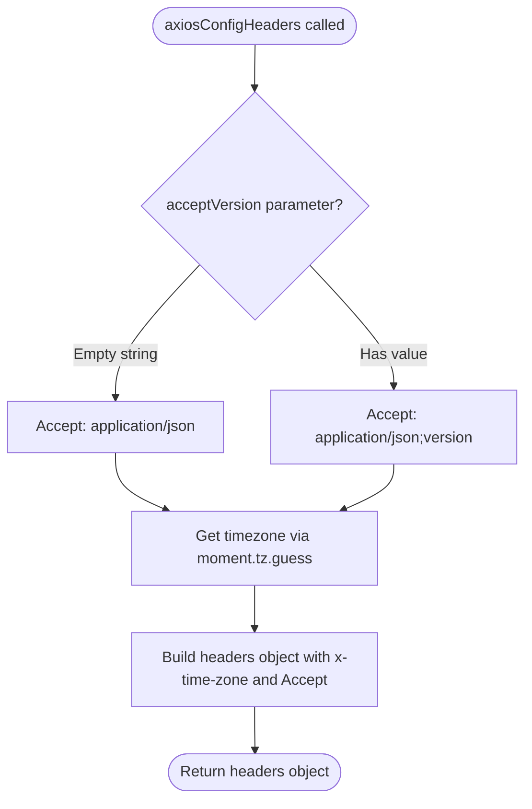
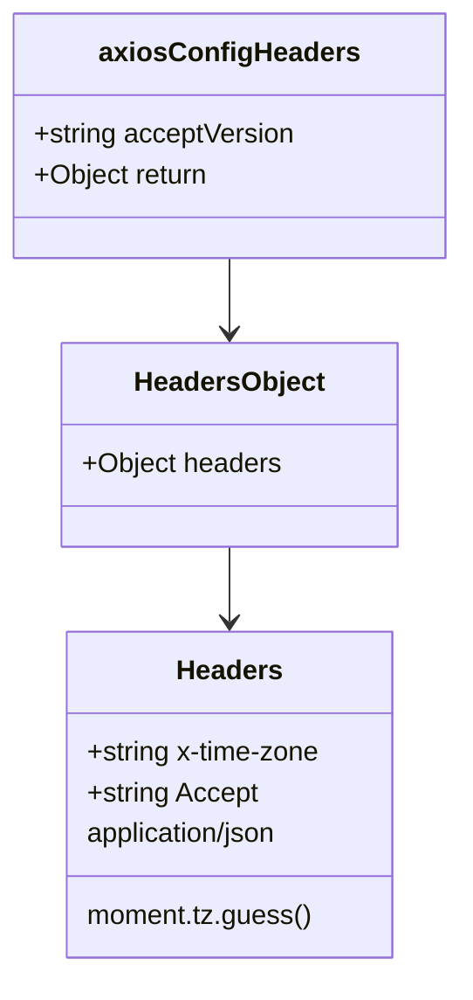

# Diagram: web/portal/src/utils/fetch-utils.js

> Auto-generated by Obscura crawlers

## Diagram 1

### SVG

<svg id="container" width="563.078125" xmlns="http://www.w3.org/2000/svg" class="flowchart" height="843.5625" viewBox="0 0 563.078125 843.5625" role="graphics-document document" aria-roledescription="flowchart-v2"><g><marker id="container_flowchart-v2-pointEnd" class="marker flowchart-v2" viewBox="0 0 10 10" refX="5" refY="5" markerUnits="userSpaceOnUse" markerWidth="8" markerHeight="8" orient="auto"><path d="M 0 0 L 10 5 L 0 10 z" class="arrowMarkerPath" style="stroke-width: 1; stroke-dasharray: 1, 0;"></path></marker><marker id="container_flowchart-v2-pointStart" class="marker flowchart-v2" viewBox="0 0 10 10" refX="4.5" refY="5" markerUnits="userSpaceOnUse" markerWidth="8" markerHeight="8" orient="auto"><path d="M 0 5 L 10 10 L 10 0 z" class="arrowMarkerPath" style="stroke-width: 1; stroke-dasharray: 1, 0;"></path></marker><marker id="container_flowchart-v2-circleEnd" class="marker flowchart-v2" viewBox="0 0 10 10" refX="11" refY="5" markerUnits="userSpaceOnUse" markerWidth="11" markerHeight="11" orient="auto"><circle cx="5" cy="5" r="5" class="arrowMarkerPath" style="stroke-width: 1; stroke-dasharray: 1, 0;"></circle></marker><marker id="container_flowchart-v2-circleStart" class="marker flowchart-v2" viewBox="0 0 10 10" refX="-1" refY="5" markerUnits="userSpaceOnUse" markerWidth="11" markerHeight="11" orient="auto"><circle cx="5" cy="5" r="5" class="arrowMarkerPath" style="stroke-width: 1; stroke-dasharray: 1, 0;"></circle></marker><marker id="container_flowchart-v2-crossEnd" class="marker cross flowchart-v2" viewBox="0 0 11 11" refX="12" refY="5.2" markerUnits="userSpaceOnUse" markerWidth="11" markerHeight="11" orient="auto"><path d="M 1,1 l 9,9 M 10,1 l -9,9" class="arrowMarkerPath" style="stroke-width: 2; stroke-dasharray: 1, 0;"></path></marker><marker id="container_flowchart-v2-crossStart" class="marker cross flowchart-v2" viewBox="0 0 11 11" refX="-1" refY="5.2" markerUnits="userSpaceOnUse" markerWidth="11" markerHeight="11" orient="auto"><path d="M 1,1 l 9,9 M 10,1 l -9,9" class="arrowMarkerPath" style="stroke-width: 2; stroke-dasharray: 1, 0;"></path></marker><g class="root"><g class="clusters"></g><g class="edgePaths"><path d="M276.309,47.5L276.225,51.583C276.142,55.667,275.975,63.833,275.892,71.417C275.809,79,275.809,86,275.809,89.5L275.809,93" id="L_Start_CheckParam_0" class="edge-thickness-normal edge-pattern-solid edge-thickness-normal edge-pattern-solid flowchart-link" style=";" data-edge="true" data-et="edge" data-id="L_Start_CheckParam_0" data-points="W3sieCI6Mjc2LjMwODU5Mzc1LCJ5Ijo0Ny40OTk5OTk5OTk5OTk5OX0seyJ4IjoyNzUuODA4NTkzNzUsInkiOjcyfSx7IngiOjI3NS44MDg1OTM3NSwieSI6OTd9XQ==" marker-end="url(#container_flowchart-v2-pointEnd)"></path><path d="M217.092,279.846L202,295.799C186.908,311.751,156.723,343.657,141.631,367.11C126.539,390.563,126.539,405.563,126.539,413.063L126.539,420.563" id="L_CheckParam_BuildAccept1_0" class="edge-thickness-normal edge-pattern-solid edge-thickness-normal edge-pattern-solid flowchart-link" style=";" data-edge="true" data-et="edge" data-id="L_CheckParam_BuildAccept1_0" data-points="W3sieCI6MjE3LjA5MjA1MDE5MzYxMDQ1LCJ5IjoyNzkuODQ1OTU2NDQzNjEwNX0seyJ4IjoxMjYuNTM5MDYyNSwieSI6Mzc1LjU2MjV9LHsieCI6MTI2LjUzOTA2MjUsInkiOjQyNC41NjI1fV0=" marker-end="url(#container_flowchart-v2-pointEnd)"></path><path d="M334.525,279.846L349.617,295.799C364.709,311.751,394.894,343.657,409.986,365.11C425.078,386.563,425.078,397.563,425.078,403.063L425.078,408.563" id="L_CheckParam_BuildAccept2_0" class="edge-thickness-normal edge-pattern-solid edge-thickness-normal edge-pattern-solid flowchart-link" style=";" data-edge="true" data-et="edge" data-id="L_CheckParam_BuildAccept2_0" data-points="W3sieCI6MzM0LjUyNTEzNzMwNjM4OTUsInkiOjI3OS44NDU5NTY0NDM2MTA1fSx7IngiOjQyNS4wNzgxMjUsInkiOjM3NS41NjI1fSx7IngiOjQyNS4wNzgxMjUsInkiOjQxMi41NjI1fV0=" marker-end="url(#container_flowchart-v2-pointEnd)"></path><path d="M126.539,478.563L126.539,484.729C126.539,490.896,126.539,503.229,135.644,513.3C144.75,523.37,162.96,531.178,172.066,535.082L181.171,538.986" id="L_BuildAccept1_GuessTimezone_0" class="edge-thickness-normal edge-pattern-solid edge-thickness-normal edge-pattern-solid flowchart-link" style=";" data-edge="true" data-et="edge" data-id="L_BuildAccept1_GuessTimezone_0" data-points="W3sieCI6MTI2LjUzOTA2MjUsInkiOjQ3OC41NjI1fSx7IngiOjEyNi41MzkwNjI1LCJ5Ijo1MTUuNTYyNX0seyJ4IjoxODQuODQ3NDczMTQ0NTMxMjUsInkiOjU0MC41NjI1fV0=" marker-end="url(#container_flowchart-v2-pointEnd)"></path><path d="M425.078,490.563L425.078,494.729C425.078,498.896,425.078,507.229,415.973,515.3C406.867,523.37,388.657,531.178,379.551,535.082L370.446,538.986" id="L_BuildAccept2_GuessTimezone_0" class="edge-thickness-normal edge-pattern-solid edge-thickness-normal edge-pattern-solid flowchart-link" style=";" data-edge="true" data-et="edge" data-id="L_BuildAccept2_GuessTimezone_0" data-points="W3sieCI6NDI1LjA3ODEyNSwieSI6NDkwLjU2MjV9LHsieCI6NDI1LjA3ODEyNSwieSI6NTE1LjU2MjV9LHsieCI6MzY2Ljc2OTcxNDM1NTQ2ODc1LCJ5Ijo1NDAuNTYyNX1d" marker-end="url(#container_flowchart-v2-pointEnd)"></path><path d="M275.809,618.563L275.809,622.729C275.809,626.896,275.809,635.229,275.809,642.896C275.809,650.563,275.809,657.563,275.809,661.063L275.809,664.563" id="L_GuessTimezone_BuildHeaders_0" class="edge-thickness-normal edge-pattern-solid edge-thickness-normal edge-pattern-solid flowchart-link" style=";" data-edge="true" data-et="edge" data-id="L_GuessTimezone_BuildHeaders_0" data-points="W3sieCI6Mjc1LjgwODU5Mzc1LCJ5Ijo2MTguNTYyNX0seyJ4IjoyNzUuODA4NTkzNzUsInkiOjY0My41NjI1fSx7IngiOjI3NS44MDg1OTM3NSwieSI6NjY4LjU2MjV9XQ==" marker-end="url(#container_flowchart-v2-pointEnd)"></path><path d="M275.809,746.563L275.809,750.729C275.809,754.896,275.809,763.229,275.879,770.979C275.949,778.729,276.09,785.896,276.16,789.48L276.23,793.063" id="L_BuildHeaders_Return_0" class="edge-thickness-normal edge-pattern-solid edge-thickness-normal edge-pattern-solid flowchart-link" style=";" data-edge="true" data-et="edge" data-id="L_BuildHeaders_Return_0" data-points="W3sieCI6Mjc1LjgwODU5Mzc1LCJ5Ijo3NDYuNTYyNX0seyJ4IjoyNzUuODA4NTkzNzUsInkiOjc3MS41NjI1fSx7IngiOjI3Ni4zMDg1OTM3NSwieSI6Nzk3LjA2MjQ5OTk5OTk5OTl9XQ==" marker-end="url(#container_flowchart-v2-pointEnd)"></path></g><g class="edgeLabels"><g class="edgeLabel"><g class="label" data-id="L_Start_CheckParam_0" transform="translate(0, 0)"><foreignObject width="0" height="0">

</foreignObject></g></g><g class="edgeLabel" transform="translate(126.5390625, 375.5625)"><g class="label" data-id="L_CheckParam_BuildAccept1_0" transform="translate(-45.53125, -12)"><foreignObject width="91.0625" height="24">

Empty string

</foreignObject></g></g><g class="edgeLabel" transform="translate(425.078125, 375.5625)"><g class="label" data-id="L_CheckParam_BuildAccept2_0" transform="translate(-35.015625, -12)"><foreignObject width="70.03125" height="24">

Has value

</foreignObject></g></g><g class="edgeLabel"><g class="label" data-id="L_BuildAccept1_GuessTimezone_0" transform="translate(0, 0)"><foreignObject width="0" height="0">

</foreignObject></g></g><g class="edgeLabel"><g class="label" data-id="L_BuildAccept2_GuessTimezone_0" transform="translate(0, 0)"><foreignObject width="0" height="0">

</foreignObject></g></g><g class="edgeLabel"><g class="label" data-id="L_GuessTimezone_BuildHeaders_0" transform="translate(0, 0)"><foreignObject width="0" height="0">

</foreignObject></g></g><g class="edgeLabel"><g class="label" data-id="L_BuildHeaders_Return_0" transform="translate(0, 0)"><foreignObject width="0" height="0">

</foreignObject></g></g></g><g class="nodes"><g class="node default" id="flowchart-Start-0" transform="translate(275.80859375, 27.5)"><g class="basic label-container outer-path"><path d="M-88.0625 -19.5 C-33.07980575280766 -19.5, 21.902888494384683 -19.5, 88.0625 -19.5 C88.0625 -19.5, 88.0625 -19.5, 88.0625 -19.5 C88.4492028251387 -19.48759919306919, 88.8359056502774 -19.47519838613838, 89.3118692896239 -19.45993515863156 C89.66506614379301 -19.42586268289123, 90.01826299796214 -19.391790207150898, 90.55610465284786 -19.3399052695533 C90.87305773318467 -19.288662753532293, 91.19001081352145 -19.23742023751129, 91.79009325967675 -19.140403561325776 C92.06208840749008 -19.078322443771597, 92.33408355530342 -19.01624132621742, 93.00876438623538 -18.862249829261074 C93.41301101892303 -18.742271550613257, 93.81725765161067 -18.622293271965443, 94.2071102514606 -18.50658706670804 C94.55895343846642 -18.377105521487135, 94.91079662547223 -18.24762397626623, 95.3802065951478 -18.074876768247425 C95.75503302788009 -17.908952225307914, 96.12985946061237 -17.743027682368407, 96.52323291279238 -17.568892924097174 C96.86922003871734 -17.38839166211745, 97.21520716464232 -17.207890400137725, 97.63149226407678 -16.990714730406097 C98.03321296820965 -16.747189278787854, 98.43493367234251 -16.50366382716961, 98.7004305736057 -16.342718045390892 C99.02686036152247 -16.115014756257928, 99.35329014943923 -15.887311467124961, 99.72565534457871 -15.627565626425154 C99.99381005927306 -15.413719377353052, 100.26196477396742 -15.19987312828095, 100.70295370850187 -14.848196188198123 C100.95016096551691 -14.62368909812266, 101.19736822253196 -14.399182008047196, 101.62830973676799 -14.007812326905688 C101.9145941319769 -13.712200184466516, 102.20087852718581 -13.416588042027344, 102.49792094296865 -13.10986736009568 C102.79123856779178 -12.765319787732759, 103.08455619261491 -12.420772215369839, 103.30821390812658 -12.158051136245305 C103.59973926127384 -11.767433721534008, 103.8912646144211 -11.376816306822713, 104.05585896464063 -11.156274872382312 C104.31095853462183 -10.764373429065218, 104.56605810460303 -10.372471985748124, 104.73778387860425 -10.108655082055241 C104.9057162931057 -9.810474075106981, 105.07364870760716 -9.51229306815872, 105.3511864742735 -9.019496659696287 C105.50387393803236 -8.702437874212666, 105.65656140179121 -8.385379088729048, 105.89354614880834 -7.893275190886684 C106.00269368350033 -7.623678669973468, 106.1118412181923 -7.354082149060251, 106.36263422997033 -6.734618561215508 C106.46911536647906 -6.413914343516363, 106.57559650298779 -6.093210125817219, 106.75652313421489 -5.548287939305138 C106.85556077276206 -5.170614500340701, 106.95459841130923 -4.792941061376264, 107.07359428754556 -4.339158212148133 C107.12263587088638 -4.087340046635319, 107.17167745422721 -3.8355218811225043, 107.31254477658177 -3.1121979531509023 C107.3611016439439 -2.7356004785282932, 107.40965851130602 -2.3590030039056846, 107.47239270250937 -1.872449005199798 C107.49647570445724 -1.4973368104123301, 107.52055870640513 -1.1222246156248623, 107.55248121591342 -0.6250057626472757 C107.55248121591342 -0.17192980393854085, 107.55248121591342 0.281146154770194, 107.55248121591342 0.625005762647271 C107.52208731958297 1.0984152315055482, 107.49169342325251 1.571824700363825, 107.47239270250937 1.8724490051997846 C107.41859173711879 2.28971866856682, 107.36479077172821 2.706988331933855, 107.31254477658177 3.1121979531508885 C107.23065851697014 3.532666589589561, 107.1487722573585 3.953135226028233, 107.07359428754556 4.339158212148129 C106.96873150129917 4.739045463924632, 106.8638687150528 5.138932715701136, 106.75652313421489 5.548287939305125 C106.63554020158621 5.912669256370138, 106.51455726895752 6.277050573435149, 106.36263422997033 6.734618561215495 C106.1978480254109 7.141643672401787, 106.03306182085149 7.548668783588079, 105.89354614880834 7.893275190886679 C105.76947655385929 8.150908359462452, 105.64540695891023 8.408541528038224, 105.3511864742735 9.019496659696284 C105.16644565349188 9.347522694030697, 104.98170483271024 9.675548728365111, 104.73778387860425 10.108655082055236 C104.59417973984984 10.329269602292605, 104.45057560109544 10.549884122529974, 104.05585896464065 11.156274872382301 C103.79133401527206 11.510714205817576, 103.52680906590345 11.865153539252852, 103.30821390812659 12.158051136245302 C103.10434083739952 12.397532045827681, 102.90046776667243 12.63701295541006, 102.49792094296866 13.10986736009567 C102.25072065416565 13.365121953805938, 102.00352036536263 13.620376547516205, 101.62830973676799 14.007812326905684 C101.31985075666377 14.287946611258956, 101.01139177655955 14.568080895612228, 100.7029537085019 14.848196188198111 C100.48595027293413 15.021250653359457, 100.26894683736637 15.194305118520802, 99.72565534457871 15.627565626425152 C99.37011069317407 15.875578183965132, 99.01456604176943 16.12359074150511, 98.7004305736057 16.34271804539089 C98.3276724061557 16.568686237069222, 97.9549142387057 16.794654428747556, 97.63149226407678 16.990714730406093 C97.27152500385871 17.178509419491824, 96.91155774364064 17.366304108577555, 96.52323291279238 17.56889292409717 C96.13655450140028 17.74006398641292, 95.7498760900082 17.91123504872867, 95.3802065951478 18.07487676824742 C95.09257031091747 18.180729579724847, 94.80493402668714 18.286582391202273, 94.20711025146062 18.506587066708033 C93.83752671935967 18.616277519052048, 93.46794318725873 18.72596797139606, 93.00876438623541 18.86224982926107 C92.76366452291502 18.918192273637867, 92.51856465959463 18.974134718014664, 91.79009325967677 19.140403561325773 C91.30062827382875 19.219536464380024, 90.81116328798072 19.298669367434275, 90.55610465284788 19.3399052695533 C90.22670360707909 19.371682192275895, 89.89730256131028 19.403459114998494, 89.3118692896239 19.45993515863156 C88.88214330006394 19.47371563470585, 88.45241731050398 19.487496110780143, 88.0625 19.5 C88.0625 19.5, 88.0625 19.5, 88.0625 19.5 C18.289401646502995 19.5, -51.48369670699401 19.5, -88.0625 19.5 C-88.45479164885228 19.48741997037068, -88.84708329770456 19.47483994074136, -89.3118692896239 19.45993515863156 C-89.71948957162259 19.42061252026226, -90.12710985362128 19.381289881892958, -90.55610465284786 19.3399052695533 C-90.99040713447697 19.269690612389553, -91.42470961610607 19.199475955225807, -91.79009325967675 19.140403561325773 C-92.13829546426857 19.060928680359428, -92.48649766886037 18.981453799393083, -93.00876438623538 18.862249829261074 C-93.25000515523976 18.790650835319212, -93.49124592424415 18.719051841377347, -94.20711025146059 18.506587066708043 C-94.65318035000296 18.342429147017665, -95.09925044854532 18.178271227327286, -95.3802065951478 18.074876768247425 C-95.68948971853803 17.937966304080454, -95.99877284192826 17.80105583991348, -96.52323291279238 17.568892924097174 C-96.93629742823869 17.353397430969284, -97.349361943685 17.1379019378414, -97.63149226407678 16.990714730406097 C-98.04261204612777 16.741491502518773, -98.45373182817876 16.49226827463145, -98.70043057360569 16.3427180453909 C-99.00517210919959 16.130143542209048, -99.3099136447935 15.917569039027196, -99.72565534457871 15.627565626425156 C-99.95198490171539 15.447073827491117, -100.17831445885206 15.266582028557078, -100.70295370850187 14.848196188198125 C-100.89450561673426 14.67423381332723, -101.08605752496665 14.500271438456334, -101.62830973676797 14.007812326905697 C-101.8436791933232 13.785425680851201, -102.05904864987842 13.563039034796706, -102.49792094296865 13.109867360095677 C-102.75148268239101 12.812019312898462, -103.00504442181338 12.514171265701247, -103.30821390812658 12.158051136245307 C-103.56034889604749 11.820213222401234, -103.81248388396838 11.48237530855716, -104.05585896464063 11.156274872382316 C-104.20736717042233 10.923517582651845, -104.35887537620404 10.690760292921375, -104.73778387860425 10.108655082055249 C-104.90440975761206 9.81279396117702, -105.07103563661987 9.516932840298793, -105.3511864742735 9.019496659696289 C-105.47964739334019 8.75274481263096, -105.60810831240688 8.485992965565629, -105.89354614880834 7.893275190886686 C-105.9924445335888 7.648994268408788, -106.09134291836924 7.4047133459308885, -106.36263422997033 6.73461856121551 C-106.4687217139361 6.415099962255697, -106.5748091979019 6.095581363295885, -106.75652313421489 5.5482879393051325 C-106.8693800330859 5.117915671420559, -106.98223693195692 4.687543403535986, -107.07359428754556 4.339158212148136 C-107.16571735820831 3.866125714512751, -107.25784042887108 3.393093216877366, -107.31254477658177 3.112197953150904 C-107.36915961903865 2.673104414920499, -107.42577446149554 2.2340108766900943, -107.47239270250937 1.872449005199809 C-107.5017161040011 1.4157133575424394, -107.53103950549283 0.9589777098850698, -107.55248121591342 0.6250057626472781 C-107.55248121591342 0.37139415012792104, -107.55248121591342 0.11778253760856394, -107.55248121591342 -0.6250057626472687 C-107.53231562768134 -0.9391010767316763, -107.51215003944927 -1.253196390816084, -107.47239270250937 -1.8724490051997822 C-107.4245427752522 -2.2435635919694477, -107.37669284799505 -2.614678178739113, -107.31254477658177 -3.112197953150895 C-107.25756499440764 -3.3945075146339962, -107.2025852122335 -3.6768170761170973, -107.07359428754556 -4.339158212148126 C-106.99490258578044 -4.639243776177832, -106.91621088401531 -4.9393293402075376, -106.75652313421489 -5.548287939305123 C-106.631242039496 -5.925614635766677, -106.50596094477713 -6.302941332228231, -106.36263422997033 -6.734618561215485 C-106.25438339693343 -7.00200021170407, -106.14613256389656 -7.269381862192656, -105.89354614880834 -7.893275190886676 C-105.72143292526913 -8.250671982198886, -105.54931970172993 -8.608068773511095, -105.3511864742735 -9.019496659696282 C-105.1073146816464 -9.452515722202518, -104.86344288901928 -9.885534784708756, -104.73778387860425 -10.108655082055243 C-104.46679145038871 -10.524972223450265, -104.19579902217319 -10.941289364845286, -104.05585896464063 -11.156274872382308 C-103.85377189757263 -11.427053131742891, -103.65168483050462 -11.697831391103474, -103.30821390812659 -12.158051136245302 C-103.14557222793512 -12.349099308371978, -102.98293054774365 -12.540147480498653, -102.49792094296866 -13.10986736009567 C-102.28178974566998 -13.333040566007865, -102.06565854837129 -13.55621377192006, -101.62830973676799 -14.007812326905677 C-101.31429149729581 -14.292995383526979, -101.00027325782365 -14.578178440148282, -100.7029537085019 -14.848196188198107 C-100.39954197394363 -15.090158972382978, -100.09613023938535 -15.33212175656785, -99.72565534457871 -15.627565626425149 C-99.33018285216932 -15.903430117401676, -98.9347103597599 -16.179294608378203, -98.70043057360571 -16.342718045390885 C-98.42989528425959 -16.506718127634336, -98.15935999491346 -16.67071820987779, -97.63149226407678 -16.99071473040609 C-97.27932025268919 -17.174442643170064, -96.9271482413016 -17.358170555934034, -96.5232329127924 -17.56889292409717 C-96.09502886806827 -17.758446152474868, -95.66682482334413 -17.947999380852565, -95.38020659514781 -18.07487676824742 C-95.04122629845077 -18.199624650931444, -94.70224600175372 -18.32437253361547, -94.20711025146062 -18.506587066708033 C-93.94354042333913 -18.584813208188233, -93.67997059521764 -18.66303934966843, -93.00876438623541 -18.862249829261067 C-92.69672091261093 -18.933471715841893, -92.38467743898644 -19.004693602422716, -91.79009325967677 -19.140403561325773 C-91.30879307235746 -19.218216443072862, -90.82749288503814 -19.29602932481995, -90.55610465284788 -19.3399052695533 C-90.21477199566972 -19.372833220478697, -89.87343933849156 -19.40576117140409, -89.3118692896239 -19.45993515863156 C-88.8915659847532 -19.47341346754801, -88.4712626798825 -19.486891776464457, -88.0625 -19.5 C-88.0625 -19.5, -88.0625 -19.5, -88.0625 -19.5" stroke="none" stroke-width="0" fill="#ECECFF" style=""></path><path d="M-88.0625 -19.5 C-37.52386865287869 -19.5, 13.01476269424262 -19.5, 88.0625 -19.5 M-88.0625 -19.5 C-18.888489362580614 -19.5, 50.28552127483877 -19.5, 88.0625 -19.5 M88.0625 -19.5 C88.0625 -19.5, 88.0625 -19.5, 88.0625 -19.5 M88.0625 -19.5 C88.0625 -19.5, 88.0625 -19.5, 88.0625 -19.5 M88.0625 -19.5 C88.38278685275635 -19.489729024032645, 88.7030737055127 -19.479458048065286, 89.3118692896239 -19.45993515863156 M88.0625 -19.5 C88.50124194290672 -19.485930399850368, 88.93998388581343 -19.471860799700735, 89.3118692896239 -19.45993515863156 M89.3118692896239 -19.45993515863156 C89.59147686659304 -19.432961751958658, 89.87108444356218 -19.405988345285753, 90.55610465284786 -19.3399052695533 M89.3118692896239 -19.45993515863156 C89.63451643611747 -19.428809776449288, 89.95716358261105 -19.39768439426702, 90.55610465284786 -19.3399052695533 M90.55610465284786 -19.3399052695533 C90.9840495160011 -19.270718462840662, 91.41199437915434 -19.20153165612803, 91.79009325967675 -19.140403561325776 M90.55610465284786 -19.3399052695533 C90.90370105152263 -19.283708579465895, 91.25129745019741 -19.227511889378487, 91.79009325967675 -19.140403561325776 M91.79009325967675 -19.140403561325776 C92.19768109969708 -19.04737429660036, 92.60526893971742 -18.95434503187494, 93.00876438623538 -18.862249829261074 M91.79009325967675 -19.140403561325776 C92.25448060301744 -19.034410180618885, 92.71886794635815 -18.928416799911993, 93.00876438623538 -18.862249829261074 M93.00876438623538 -18.862249829261074 C93.25394135538846 -18.789482591776615, 93.49911832454154 -18.716715354292155, 94.2071102514606 -18.50658706670804 M93.00876438623538 -18.862249829261074 C93.35994440003523 -18.758021444546788, 93.7111244138351 -18.653793059832502, 94.2071102514606 -18.50658706670804 M94.2071102514606 -18.50658706670804 C94.48411353253204 -18.40464729868349, 94.76111681360348 -18.302707530658942, 95.3802065951478 -18.074876768247425 M94.2071102514606 -18.50658706670804 C94.441978546665 -18.4201533629741, 94.67684684186939 -18.333719659240163, 95.3802065951478 -18.074876768247425 M95.3802065951478 -18.074876768247425 C95.64758344325297 -17.95651696904366, 95.91496029135816 -17.83815716983989, 96.52323291279238 -17.568892924097174 M95.3802065951478 -18.074876768247425 C95.60895141329306 -17.973618222728458, 95.83769623143833 -17.87235967720949, 96.52323291279238 -17.568892924097174 M96.52323291279238 -17.568892924097174 C96.83135118353474 -17.408147819610058, 97.13946945427709 -17.24740271512294, 97.63149226407678 -16.990714730406097 M96.52323291279238 -17.568892924097174 C96.74537575429235 -17.453001145975918, 96.96751859579233 -17.337109367854662, 97.63149226407678 -16.990714730406097 M97.63149226407678 -16.990714730406097 C97.87114207998754 -16.845437603662358, 98.11079189589829 -16.70016047691862, 98.7004305736057 -16.342718045390892 M97.63149226407678 -16.990714730406097 C97.97733297361175 -16.781064059900398, 98.32317368314672 -16.571413389394696, 98.7004305736057 -16.342718045390892 M98.7004305736057 -16.342718045390892 C98.91909658802997 -16.19018609962772, 99.13776260245425 -16.037654153864548, 99.72565534457871 -15.627565626425154 M98.7004305736057 -16.342718045390892 C98.95104219685352 -16.167902225815535, 99.20165382010133 -15.993086406240177, 99.72565534457871 -15.627565626425154 M99.72565534457871 -15.627565626425154 C99.94197490960806 -15.455056529819625, 100.15829447463742 -15.282547433214098, 100.70295370850187 -14.848196188198123 M99.72565534457871 -15.627565626425154 C100.07474658366354 -15.349174652963015, 100.42383782274837 -15.070783679500876, 100.70295370850187 -14.848196188198123 M100.70295370850187 -14.848196188198123 C101.01962165221049 -14.560606740296612, 101.33628959591911 -14.273017292395101, 101.62830973676799 -14.007812326905688 M100.70295370850187 -14.848196188198123 C100.9969711437631 -14.58117733276892, 101.29098857902433 -14.314158477339717, 101.62830973676799 -14.007812326905688 M101.62830973676799 -14.007812326905688 C101.89991362275786 -13.727359015527393, 102.17151750874774 -13.446905704149096, 102.49792094296865 -13.10986736009568 M101.62830973676799 -14.007812326905688 C101.96000020335667 -13.665314687859116, 102.29169066994535 -13.322817048812544, 102.49792094296865 -13.10986736009568 M102.49792094296865 -13.10986736009568 C102.69818672135945 -12.874623781352241, 102.89845249975023 -12.639380202608804, 103.30821390812658 -12.158051136245305 M102.49792094296865 -13.10986736009568 C102.67809053031209 -12.89822991086212, 102.85826011765555 -12.686592461628562, 103.30821390812658 -12.158051136245305 M103.30821390812658 -12.158051136245305 C103.58084064491129 -11.792756145760443, 103.85346738169602 -11.427461155275578, 104.05585896464063 -11.156274872382312 M103.30821390812658 -12.158051136245305 C103.5996242533464 -11.767587821679323, 103.89103459856625 -11.37712450711334, 104.05585896464063 -11.156274872382312 M104.05585896464063 -11.156274872382312 C104.22139584291573 -10.901965774475975, 104.3869327211908 -10.647656676569639, 104.73778387860425 -10.108655082055241 M104.05585896464063 -11.156274872382312 C104.21597903888579 -10.910287440081499, 104.37609911313093 -10.664300007780685, 104.73778387860425 -10.108655082055241 M104.73778387860425 -10.108655082055241 C104.97582411943448 -9.685990530273012, 105.21386436026472 -9.26332597849078, 105.3511864742735 -9.019496659696287 M104.73778387860425 -10.108655082055241 C104.93694798105368 -9.755019050604004, 105.13611208350312 -9.401383019152766, 105.3511864742735 -9.019496659696287 M105.3511864742735 -9.019496659696287 C105.56771683378257 -8.569866735168219, 105.78424719329162 -8.12023681064015, 105.89354614880834 -7.893275190886684 M105.3511864742735 -9.019496659696287 C105.52658111010899 -8.65528594553988, 105.70197574594448 -8.291075231383472, 105.89354614880834 -7.893275190886684 M105.89354614880834 -7.893275190886684 C106.07418073308858 -7.447104275382399, 106.25481531736881 -7.000933359878113, 106.36263422997033 -6.734618561215508 M105.89354614880834 -7.893275190886684 C106.02975237046569 -7.556843190024875, 106.16595859212305 -7.220411189163065, 106.36263422997033 -6.734618561215508 M106.36263422997033 -6.734618561215508 C106.44765103673721 -6.478561484822279, 106.5326678435041 -6.2225044084290495, 106.75652313421489 -5.548287939305138 M106.36263422997033 -6.734618561215508 C106.51578424304816 -6.273355122965906, 106.66893425612601 -5.812091684716305, 106.75652313421489 -5.548287939305138 M106.75652313421489 -5.548287939305138 C106.8412582322358 -5.225156286127608, 106.92599333025672 -4.902024632950078, 107.07359428754556 -4.339158212148133 M106.75652313421489 -5.548287939305138 C106.86270843698681 -5.143357358834447, 106.96889373975874 -4.738426778363754, 107.07359428754556 -4.339158212148133 M107.07359428754556 -4.339158212148133 C107.12453909928263 -4.077567371068053, 107.1754839110197 -3.8159765299879727, 107.31254477658177 -3.1121979531509023 M107.07359428754556 -4.339158212148133 C107.14899555309 -3.951988649640556, 107.22439681863443 -3.564819087132979, 107.31254477658177 -3.1121979531509023 M107.31254477658177 -3.1121979531509023 C107.36329294042547 -2.718605215737681, 107.41404110426916 -2.32501247832446, 107.47239270250937 -1.872449005199798 M107.31254477658177 -3.1121979531509023 C107.34896083298143 -2.829762210878831, 107.3853768893811 -2.5473264686067596, 107.47239270250937 -1.872449005199798 M107.47239270250937 -1.872449005199798 C107.50310913343019 -1.3940157997513323, 107.53382556435099 -0.9155825943028667, 107.55248121591342 -0.6250057626472757 M107.47239270250937 -1.872449005199798 C107.49445987874864 -1.5287349229689886, 107.51652705498792 -1.1850208407381793, 107.55248121591342 -0.6250057626472757 M107.55248121591342 -0.6250057626472757 C107.55248121591342 -0.35177357823014876, 107.55248121591342 -0.07854139381302183, 107.55248121591342 0.625005762647271 M107.55248121591342 -0.6250057626472757 C107.55248121591342 -0.3496832177158017, 107.55248121591342 -0.07436067278432767, 107.55248121591342 0.625005762647271 M107.55248121591342 0.625005762647271 C107.52593724184769 1.038449584631289, 107.49939326778195 1.4518934066153066, 107.47239270250937 1.8724490051997846 M107.55248121591342 0.625005762647271 C107.52876633231635 0.9943842169811701, 107.50505144871927 1.3637626713150692, 107.47239270250937 1.8724490051997846 M107.47239270250937 1.8724490051997846 C107.41317878444477 2.331700460598134, 107.35396486638017 2.7909519159964833, 107.31254477658177 3.1121979531508885 M107.47239270250937 1.8724490051997846 C107.4204764879428 2.27510091336183, 107.36856027337626 2.677752821523875, 107.31254477658177 3.1121979531508885 M107.31254477658177 3.1121979531508885 C107.257997854889 3.3922848675473176, 107.20345093319622 3.6723717819437467, 107.07359428754556 4.339158212148129 M107.31254477658177 3.1121979531508885 C107.24703714490974 3.448565796743901, 107.18152951323772 3.784933640336914, 107.07359428754556 4.339158212148129 M107.07359428754556 4.339158212148129 C106.97793023642272 4.703966700141557, 106.88226618529987 5.068775188134985, 106.75652313421489 5.548287939305125 M107.07359428754556 4.339158212148129 C106.9511533062773 4.806078739980973, 106.82871232500904 5.272999267813818, 106.75652313421489 5.548287939305125 M106.75652313421489 5.548287939305125 C106.64453793773384 5.885569508688009, 106.5325527412528 6.222851078070892, 106.36263422997033 6.734618561215495 M106.75652313421489 5.548287939305125 C106.60723030745196 5.997934146933398, 106.45793748068903 6.44758035456167, 106.36263422997033 6.734618561215495 M106.36263422997033 6.734618561215495 C106.18519172508225 7.172904978906486, 106.00774922019419 7.6111913965974765, 105.89354614880834 7.893275190886679 M106.36263422997033 6.734618561215495 C106.23969997680234 7.038268543312498, 106.11676572363437 7.341918525409501, 105.89354614880834 7.893275190886679 M105.89354614880834 7.893275190886679 C105.6951106372966 8.305330776380588, 105.49667512578486 8.717386361874496, 105.3511864742735 9.019496659696284 M105.89354614880834 7.893275190886679 C105.71856365855078 8.256630075932025, 105.54358116829322 8.619984960977371, 105.3511864742735 9.019496659696284 M105.3511864742735 9.019496659696284 C105.18730936666141 9.310477058618126, 105.02343225904932 9.601457457539968, 104.73778387860425 10.108655082055236 M105.3511864742735 9.019496659696284 C105.14481729802063 9.385926029278373, 104.93844812176775 9.75235539886046, 104.73778387860425 10.108655082055236 M104.73778387860425 10.108655082055236 C104.54775603341258 10.400588881890885, 104.35772818822093 10.692522681726535, 104.05585896464065 11.156274872382301 M104.73778387860425 10.108655082055236 C104.58340452236656 10.34582322989796, 104.42902516612887 10.582991377740685, 104.05585896464065 11.156274872382301 M104.05585896464065 11.156274872382301 C103.7668609758988 11.54350584903799, 103.47786298715694 11.93073682569368, 103.30821390812659 12.158051136245302 M104.05585896464065 11.156274872382301 C103.77739767480648 11.529387632414716, 103.4989363849723 11.90250039244713, 103.30821390812659 12.158051136245302 M103.30821390812659 12.158051136245302 C103.0856053686423 12.419539793508275, 102.86299682915802 12.68102845077125, 102.49792094296866 13.10986736009567 M103.30821390812659 12.158051136245302 C103.14050508751002 12.355051459843754, 102.97279626689345 12.552051783442206, 102.49792094296866 13.10986736009567 M102.49792094296866 13.10986736009567 C102.30426114927562 13.309836996848492, 102.11060135558257 13.509806633601315, 101.62830973676799 14.007812326905684 M102.49792094296866 13.10986736009567 C102.28434274239358 13.330404387285817, 102.07076454181849 13.550941414475965, 101.62830973676799 14.007812326905684 M101.62830973676799 14.007812326905684 C101.26154411140467 14.340899163773972, 100.89477848604136 14.673986000642262, 100.7029537085019 14.848196188198111 M101.62830973676799 14.007812326905684 C101.26574301473238 14.337085830868638, 100.90317629269678 14.666359334831592, 100.7029537085019 14.848196188198111 M100.7029537085019 14.848196188198111 C100.42050546079113 15.073441149483905, 100.13805721308037 15.298686110769701, 99.72565534457871 15.627565626425152 M100.7029537085019 14.848196188198111 C100.32826837000061 15.14699777485727, 99.95358303149935 15.445799361516428, 99.72565534457871 15.627565626425152 M99.72565534457871 15.627565626425152 C99.3627621368824 15.880704218720336, 98.99986892918606 16.13384281101552, 98.7004305736057 16.34271804539089 M99.72565534457871 15.627565626425152 C99.37576977424901 15.871630653984928, 99.0258842039193 16.115695681544704, 98.7004305736057 16.34271804539089 M98.7004305736057 16.34271804539089 C98.36068250837883 16.54867531911267, 98.02093444315194 16.754632592834454, 97.63149226407678 16.990714730406093 M98.7004305736057 16.34271804539089 C98.35191301609368 16.553991436871186, 98.00339545858165 16.765264828351484, 97.63149226407678 16.990714730406093 M97.63149226407678 16.990714730406093 C97.22943383841887 17.200468353541115, 96.82737541276096 17.410221976676134, 96.52323291279238 17.56889292409717 M97.63149226407678 16.990714730406093 C97.26621970765144 17.18127718912495, 96.90094715122612 17.371839647843807, 96.52323291279238 17.56889292409717 M96.52323291279238 17.56889292409717 C96.13698768829234 17.739872227425842, 95.75074246379229 17.910851530754513, 95.3802065951478 18.07487676824742 M96.52323291279238 17.56889292409717 C96.0825845267371 17.763954893233898, 95.64193614068182 17.959016862370625, 95.3802065951478 18.07487676824742 M95.3802065951478 18.07487676824742 C95.02727907224859 18.20475735910059, 94.67435154934937 18.33463794995376, 94.20711025146062 18.506587066708033 M95.3802065951478 18.07487676824742 C94.97234208158163 18.224974679498004, 94.56447756801546 18.375072590748587, 94.20711025146062 18.506587066708033 M94.20711025146062 18.506587066708033 C93.87861276325786 18.60408339688811, 93.5501152750551 18.70157972706819, 93.00876438623541 18.86224982926107 M94.20711025146062 18.506587066708033 C93.73889797804952 18.645550011760072, 93.27068570463842 18.78451295681211, 93.00876438623541 18.86224982926107 M93.00876438623541 18.86224982926107 C92.72196763822924 18.927709315469794, 92.43517089022308 18.993168801678518, 91.79009325967677 19.140403561325773 M93.00876438623541 18.86224982926107 C92.58973064810601 18.957891545538416, 92.17069690997663 19.053533261815762, 91.79009325967677 19.140403561325773 M91.79009325967677 19.140403561325773 C91.452166512503 19.195036937147766, 91.11423976532923 19.249670312969755, 90.55610465284788 19.3399052695533 M91.79009325967677 19.140403561325773 C91.47362142716696 19.19156827293024, 91.15714959465717 19.24273298453471, 90.55610465284788 19.3399052695533 M90.55610465284788 19.3399052695533 C90.08079534384562 19.385757786949668, 89.60548603484338 19.431610304346037, 89.3118692896239 19.45993515863156 M90.55610465284788 19.3399052695533 C90.16458582518747 19.377674619987417, 89.77306699752707 19.415443970421535, 89.3118692896239 19.45993515863156 M89.3118692896239 19.45993515863156 C88.8823726133441 19.473708281075286, 88.45287593706432 19.487481403519013, 88.0625 19.5 M89.3118692896239 19.45993515863156 C88.9106951143556 19.47280003359425, 88.50952093908731 19.485664908556945, 88.0625 19.5 M88.0625 19.5 C88.0625 19.5, 88.0625 19.5, 88.0625 19.5 M88.0625 19.5 C88.0625 19.5, 88.0625 19.5, 88.0625 19.5 M88.0625 19.5 C44.80829027689504 19.5, 1.5540805537900866 19.5, -88.0625 19.5 M88.0625 19.5 C27.13265143453217 19.5, -33.79719713093566 19.5, -88.0625 19.5 M-88.0625 19.5 C-88.50419853269528 19.485835587770502, -88.94589706539055 19.471671175541, -89.3118692896239 19.45993515863156 M-88.0625 19.5 C-88.37049463881445 19.490123211408417, -88.6784892776289 19.480246422816833, -89.3118692896239 19.45993515863156 M-89.3118692896239 19.45993515863156 C-89.63522112473224 19.428741795986134, -89.95857295984058 19.39754843334071, -90.55610465284786 19.3399052695533 M-89.3118692896239 19.45993515863156 C-89.63130312940429 19.429119760283346, -89.95073696918466 19.39830436193513, -90.55610465284786 19.3399052695533 M-90.55610465284786 19.3399052695533 C-90.97917683512188 19.27150624009701, -91.40224901739589 19.203107210640724, -91.79009325967675 19.140403561325773 M-90.55610465284786 19.3399052695533 C-90.90952332419381 19.282767279572816, -91.26294199553976 19.225629289592334, -91.79009325967675 19.140403561325773 M-91.79009325967675 19.140403561325773 C-92.10951853229089 19.0674968272963, -92.42894380490505 18.994590093266826, -93.00876438623538 18.862249829261074 M-91.79009325967675 19.140403561325773 C-92.20496984365626 19.045710688355175, -92.61984642763576 18.951017815384574, -93.00876438623538 18.862249829261074 M-93.00876438623538 18.862249829261074 C-93.32777095997398 18.767570352675136, -93.64677753371257 18.672890876089202, -94.20711025146059 18.506587066708043 M-93.00876438623538 18.862249829261074 C-93.40815727031985 18.743712117720836, -93.80755015440431 18.625174406180598, -94.20711025146059 18.506587066708043 M-94.20711025146059 18.506587066708043 C-94.5095983177977 18.395268662126956, -94.8120863841348 18.283950257545868, -95.3802065951478 18.074876768247425 M-94.20711025146059 18.506587066708043 C-94.57671808579896 18.370567967054157, -94.94632592013731 18.234548867400274, -95.3802065951478 18.074876768247425 M-95.3802065951478 18.074876768247425 C-95.83360055726492 17.8741727106722, -96.28699451938203 17.67346865309698, -96.52323291279238 17.568892924097174 M-95.3802065951478 18.074876768247425 C-95.71401404788789 17.92711011096565, -96.04782150062799 17.779343453683875, -96.52323291279238 17.568892924097174 M-96.52323291279238 17.568892924097174 C-96.79114915896864 17.42912119007557, -97.05906540514488 17.28934945605397, -97.63149226407678 16.990714730406097 M-96.52323291279238 17.568892924097174 C-96.86996731989305 17.388001806006745, -97.2167017269937 17.207110687916316, -97.63149226407678 16.990714730406097 M-97.63149226407678 16.990714730406097 C-98.05326315261627 16.7350347391726, -98.47503404115575 16.4793547479391, -98.70043057360569 16.3427180453909 M-97.63149226407678 16.990714730406097 C-97.86868794082966 16.846925317241983, -98.10588361758253 16.703135904077868, -98.70043057360569 16.3427180453909 M-98.70043057360569 16.3427180453909 C-98.92578765242692 16.185518702755914, -99.15114473124817 16.02831936012093, -99.72565534457871 15.627565626425156 M-98.70043057360569 16.3427180453909 C-98.94090667369568 16.174972328010714, -99.18138277378567 16.00722661063053, -99.72565534457871 15.627565626425156 M-99.72565534457871 15.627565626425156 C-100.06584953366787 15.356269813574116, -100.40604372275705 15.084974000723077, -100.70295370850187 14.848196188198125 M-99.72565534457871 15.627565626425156 C-100.0301967892585 15.384701928481224, -100.33473823393828 15.141838230537294, -100.70295370850187 14.848196188198125 M-100.70295370850187 14.848196188198125 C-101.01785740128565 14.562208986307025, -101.33276109406944 14.276221784415926, -101.62830973676797 14.007812326905697 M-100.70295370850187 14.848196188198125 C-100.96362937334786 14.611457446485142, -101.22430503819385 14.374718704772159, -101.62830973676797 14.007812326905697 M-101.62830973676797 14.007812326905697 C-101.9539412747986 13.671571029042614, -102.2795728128292 13.335329731179531, -102.49792094296865 13.109867360095677 M-101.62830973676797 14.007812326905697 C-101.82898411507387 13.800599555631994, -102.02965849337977 13.593386784358293, -102.49792094296865 13.109867360095677 M-102.49792094296865 13.109867360095677 C-102.68873657685246 12.885724458818595, -102.87955221073628 12.661581557541512, -103.30821390812658 12.158051136245307 M-102.49792094296865 13.109867360095677 C-102.70998120591806 12.860769308664505, -102.92204146886748 12.611671257233334, -103.30821390812658 12.158051136245307 M-103.30821390812658 12.158051136245307 C-103.47296438352136 11.937300508293369, -103.63771485891614 11.716549880341432, -104.05585896464063 11.156274872382316 M-103.30821390812658 12.158051136245307 C-103.46419718888961 11.94904775039204, -103.62018046965267 11.740044364538774, -104.05585896464063 11.156274872382316 M-104.05585896464063 11.156274872382316 C-104.31654706985161 10.755787938220443, -104.5772351750626 10.35530100405857, -104.73778387860425 10.108655082055249 M-104.05585896464063 11.156274872382316 C-104.30871903670524 10.767813899254499, -104.56157910876985 10.379352926126684, -104.73778387860425 10.108655082055249 M-104.73778387860425 10.108655082055249 C-104.88856357666491 9.840930460048506, -105.03934327472557 9.573205838041762, -105.3511864742735 9.019496659696289 M-104.73778387860425 10.108655082055249 C-104.92949573176381 9.768251273840262, -105.12120758492335 9.427847465625275, -105.3511864742735 9.019496659696289 M-105.3511864742735 9.019496659696289 C-105.54186504519942 8.62354852730079, -105.73254361612534 8.227600394905288, -105.89354614880834 7.893275190886686 M-105.3511864742735 9.019496659696289 C-105.46284059519283 8.787644488591823, -105.57449471611217 8.55579231748736, -105.89354614880834 7.893275190886686 M-105.89354614880834 7.893275190886686 C-106.02012773295249 7.580616230762191, -106.14670931709665 7.2679572706376945, -106.36263422997033 6.73461856121551 M-105.89354614880834 7.893275190886686 C-106.07877739584222 7.4357504295104455, -106.26400864287612 6.978225668134206, -106.36263422997033 6.73461856121551 M-106.36263422997033 6.73461856121551 C-106.48260325868402 6.373290961198771, -106.60257228739773 6.011963361182032, -106.75652313421489 5.5482879393051325 M-106.36263422997033 6.73461856121551 C-106.46892029033728 6.414501881774216, -106.57520635070425 6.094385202332921, -106.75652313421489 5.5482879393051325 M-106.75652313421489 5.5482879393051325 C-106.82638674699305 5.281867704700702, -106.8962503597712 5.015447470096272, -107.07359428754556 4.339158212148136 M-106.75652313421489 5.5482879393051325 C-106.88100632503757 5.07357958134203, -107.00548951586026 4.598871223378928, -107.07359428754556 4.339158212148136 M-107.07359428754556 4.339158212148136 C-107.15685172194118 3.9116488829916043, -107.2401091563368 3.484139553835073, -107.31254477658177 3.112197953150904 M-107.07359428754556 4.339158212148136 C-107.13482699432255 4.02474120438542, -107.19605970109956 3.7103241966227043, -107.31254477658177 3.112197953150904 M-107.31254477658177 3.112197953150904 C-107.353494830427 2.7945974220301246, -107.39444488427222 2.4769968909093447, -107.47239270250937 1.872449005199809 M-107.31254477658177 3.112197953150904 C-107.3692587146093 2.6723358492432423, -107.42597265263683 2.23247374533558, -107.47239270250937 1.872449005199809 M-107.47239270250937 1.872449005199809 C-107.49211209131512 1.5653036073459754, -107.51183148012089 1.258158209492142, -107.55248121591342 0.6250057626472781 M-107.47239270250937 1.872449005199809 C-107.49321646746712 1.548102057342313, -107.51404023242486 1.223755109484817, -107.55248121591342 0.6250057626472781 M-107.55248121591342 0.6250057626472781 C-107.55248121591342 0.2502390185998001, -107.55248121591342 -0.12452772544767798, -107.55248121591342 -0.6250057626472687 M-107.55248121591342 0.6250057626472781 C-107.55248121591342 0.22295532350321406, -107.55248121591342 -0.17909511564085, -107.55248121591342 -0.6250057626472687 M-107.55248121591342 -0.6250057626472687 C-107.53209874036143 -0.9424792718076448, -107.51171626480944 -1.2599527809680209, -107.47239270250937 -1.8724490051997822 M-107.55248121591342 -0.6250057626472687 C-107.5243645412086 -1.0629456665460637, -107.4962478665038 -1.5008855704448587, -107.47239270250937 -1.8724490051997822 M-107.47239270250937 -1.8724490051997822 C-107.41931570553733 -2.2841037124763814, -107.36623870856528 -2.6957584197529805, -107.31254477658177 -3.112197953150895 M-107.47239270250937 -1.8724490051997822 C-107.42617512687683 -2.230903395113158, -107.37995755124429 -2.5893577850265332, -107.31254477658177 -3.112197953150895 M-107.31254477658177 -3.112197953150895 C-107.24375966719913 -3.4653949520927654, -107.17497455781648 -3.8185919510346356, -107.07359428754556 -4.339158212148126 M-107.31254477658177 -3.112197953150895 C-107.24202964071831 -3.474278272430504, -107.17151450485487 -3.8363585917101126, -107.07359428754556 -4.339158212148126 M-107.07359428754556 -4.339158212148126 C-106.97768446996174 -4.704903914173131, -106.88177465237791 -5.070649616198135, -106.75652313421489 -5.548287939305123 M-107.07359428754556 -4.339158212148126 C-106.97039769925348 -4.732691528990101, -106.8672011109614 -5.126224845832075, -106.75652313421489 -5.548287939305123 M-106.75652313421489 -5.548287939305123 C-106.62395077642219 -5.9475747584399965, -106.4913784186295 -6.34686157757487, -106.36263422997033 -6.734618561215485 M-106.75652313421489 -5.548287939305123 C-106.64933246829817 -5.871129146532985, -106.54214180238144 -6.1939703537608475, -106.36263422997033 -6.734618561215485 M-106.36263422997033 -6.734618561215485 C-106.25431726144862 -7.002163567630226, -106.14600029292691 -7.269708574044966, -105.89354614880834 -7.893275190886676 M-106.36263422997033 -6.734618561215485 C-106.24470092318417 -7.02591610906268, -106.126767616398 -7.3172136569098765, -105.89354614880834 -7.893275190886676 M-105.89354614880834 -7.893275190886676 C-105.68188835536063 -8.332787127732157, -105.4702305619129 -8.77229906457764, -105.3511864742735 -9.019496659696282 M-105.89354614880834 -7.893275190886676 C-105.70543337389782 -8.283895392956984, -105.51732059898728 -8.67451559502729, -105.3511864742735 -9.019496659696282 M-105.3511864742735 -9.019496659696282 C-105.14812227901545 -9.380057700856444, -104.9450580837574 -9.740618742016608, -104.73778387860425 -10.108655082055243 M-105.3511864742735 -9.019496659696282 C-105.1994636780639 -9.28889584796552, -105.0477408818543 -9.558295036234759, -104.73778387860425 -10.108655082055243 M-104.73778387860425 -10.108655082055243 C-104.56487450650913 -10.374290310260944, -104.39196513441401 -10.639925538466645, -104.05585896464063 -11.156274872382308 M-104.73778387860425 -10.108655082055243 C-104.57066712292499 -10.365391295910872, -104.40355036724573 -10.6221275097665, -104.05585896464063 -11.156274872382308 M-104.05585896464063 -11.156274872382308 C-103.86418319709584 -11.413102938870692, -103.67250742955103 -11.669931005359075, -103.30821390812659 -12.158051136245302 M-104.05585896464063 -11.156274872382308 C-103.78771694790807 -11.51556074656369, -103.5195749311755 -11.874846620745073, -103.30821390812659 -12.158051136245302 M-103.30821390812659 -12.158051136245302 C-103.07470212555535 -12.43234736325032, -102.8411903429841 -12.706643590255341, -102.49792094296866 -13.10986736009567 M-103.30821390812659 -12.158051136245302 C-103.07440856188146 -12.432692199845913, -102.84060321563634 -12.707333263446525, -102.49792094296866 -13.10986736009567 M-102.49792094296866 -13.10986736009567 C-102.24382864368515 -13.372238520471631, -101.98973634440165 -13.634609680847593, -101.62830973676799 -14.007812326905677 M-102.49792094296866 -13.10986736009567 C-102.1699193108477 -13.448555974695378, -101.84191767872673 -13.787244589295083, -101.62830973676799 -14.007812326905677 M-101.62830973676799 -14.007812326905677 C-101.38706466865538 -14.226904714770829, -101.14581960054277 -14.44599710263598, -100.7029537085019 -14.848196188198107 M-101.62830973676799 -14.007812326905677 C-101.35917023101545 -14.252237704989028, -101.09003072526292 -14.496663083072379, -100.7029537085019 -14.848196188198107 M-100.7029537085019 -14.848196188198107 C-100.34786828576978 -15.131367363607028, -99.99278286303766 -15.414538539015947, -99.72565534457871 -15.627565626425149 M-100.7029537085019 -14.848196188198107 C-100.48888923698323 -15.018906907739419, -100.27482476546456 -15.189617627280732, -99.72565534457871 -15.627565626425149 M-99.72565534457871 -15.627565626425149 C-99.49540903380047 -15.788175485621906, -99.26516272302221 -15.948785344818663, -98.70043057360571 -16.342718045390885 M-99.72565534457871 -15.627565626425149 C-99.32475221174391 -15.9072182970738, -98.9238490789091 -16.186870967722452, -98.70043057360571 -16.342718045390885 M-98.70043057360571 -16.342718045390885 C-98.27937157797841 -16.597966482957467, -97.85831258235112 -16.85321492052405, -97.63149226407678 -16.99071473040609 M-98.70043057360571 -16.342718045390885 C-98.33672956040208 -16.563195736939324, -97.97302854719844 -16.783673428487763, -97.63149226407678 -16.99071473040609 M-97.63149226407678 -16.99071473040609 C-97.4080266891138 -17.10729657772775, -97.1845611141508 -17.223878425049417, -96.5232329127924 -17.56889292409717 M-97.63149226407678 -16.99071473040609 C-97.305989639301 -17.160529241257233, -96.98048701452522 -17.330343752108377, -96.5232329127924 -17.56889292409717 M-96.5232329127924 -17.56889292409717 C-96.07532187574482 -17.767169853389298, -95.62741083869726 -17.965446782681425, -95.38020659514781 -18.07487676824742 M-96.5232329127924 -17.56889292409717 C-96.22551284884361 -17.700684764855385, -95.92779278489483 -17.832476605613596, -95.38020659514781 -18.07487676824742 M-95.38020659514781 -18.07487676824742 C-95.01042830731382 -18.21095859636335, -94.64065001947982 -18.34704042447928, -94.20711025146062 -18.506587066708033 M-95.38020659514781 -18.07487676824742 C-95.00176672386533 -18.214146139139196, -94.62332685258285 -18.353415510030967, -94.20711025146062 -18.506587066708033 M-94.20711025146062 -18.506587066708033 C-93.76770920571802 -18.636998990621283, -93.3283081599754 -18.767410914534533, -93.00876438623541 -18.862249829261067 M-94.20711025146062 -18.506587066708033 C-93.8904797772705 -18.600561329420387, -93.57384930308038 -18.694535592132738, -93.00876438623541 -18.862249829261067 M-93.00876438623541 -18.862249829261067 C-92.576706560304 -18.960864208589108, -92.1446487343726 -19.059478587917148, -91.79009325967677 -19.140403561325773 M-93.00876438623541 -18.862249829261067 C-92.66878285369592 -18.93984839547637, -92.32880132115642 -19.017446961691675, -91.79009325967677 -19.140403561325773 M-91.79009325967677 -19.140403561325773 C-91.29993044633875 -19.219649283716876, -90.80976763300072 -19.298895006107976, -90.55610465284788 -19.3399052695533 M-91.79009325967677 -19.140403561325773 C-91.52360478505925 -19.183487351252946, -91.25711631044173 -19.226571141180123, -90.55610465284788 -19.3399052695533 M-90.55610465284788 -19.3399052695533 C-90.13936131050347 -19.380107998582066, -89.72261796815906 -19.420310727610833, -89.3118692896239 -19.45993515863156 M-90.55610465284788 -19.3399052695533 C-90.2055436075352 -19.373723471983272, -89.85498256222252 -19.407541674413245, -89.3118692896239 -19.45993515863156 M-89.3118692896239 -19.45993515863156 C-88.90597280472632 -19.472951468872644, -88.50007631982875 -19.48596777911373, -88.0625 -19.5 M-89.3118692896239 -19.45993515863156 C-88.87706379580197 -19.473878524520877, -88.44225830198006 -19.487821890410192, -88.0625 -19.5 M-88.0625 -19.5 C-88.0625 -19.5, -88.0625 -19.5, -88.0625 -19.5 M-88.0625 -19.5 C-88.0625 -19.5, -88.0625 -19.5, -88.0625 -19.5" stroke="#9370DB" stroke-width="1.3" fill="none" stroke-dasharray="0 0" style=""></path></g><g class="label" style="" transform="translate(-95.1875, -12)"><rect></rect><foreignObject width="190.375" height="24">

axiosConfigHeaders called

</foreignObject></g></g><g class="node default" id="flowchart-CheckParam-1" transform="translate(275.80859375, 217.78125)"><polygon points="120.78125,0 241.5625,-120.78125 120.78125,-241.5625 0,-120.78125" class="label-container" transform="translate(-120.28125, 120.78125)"></polygon><g class="label" style="" transform="translate(-93.78125, -12)"><rect></rect><foreignObject width="187.5625" height="24">

acceptVersion parameter?

</foreignObject></g></g><g class="node default" id="flowchart-BuildAccept1-3" transform="translate(126.5390625, 451.5625)"><rect class="basic label-container" style="" x="-118.5390625" y="-27" width="237.078125" height="54"></rect><g class="label" style="" transform="translate(-88.5390625, -12)"><rect></rect><foreignObject width="177.078125" height="24">

Accept: application/json

</foreignObject></g></g><g class="node default" id="flowchart-BuildAccept2-5" transform="translate(425.078125, 451.5625)"><rect class="basic label-container" style="" x="-130" y="-39" width="260" height="78"></rect><g class="label" style="" transform="translate(-100, -24)"><rect></rect><foreignObject width="200" height="48">

Accept: application/json;version

</foreignObject></g></g><g class="node default" id="flowchart-GuessTimezone-7" transform="translate(275.80859375, 579.5625)"><rect class="basic label-container" style="" x="-130" y="-39" width="260" height="78"></rect><g class="label" style="" transform="translate(-100, -24)"><rect></rect><foreignObject width="200" height="48">

Get timezone via moment.tz.guess

</foreignObject></g></g><g class="node default" id="flowchart-BuildHeaders-11" transform="translate(275.80859375, 707.5625)"><rect class="basic label-container" style="" x="-130" y="-39" width="260" height="78"></rect><g class="label" style="" transform="translate(-100, -24)"><rect></rect><foreignObject width="200" height="48">

Build headers object with x-time-zone and Accept

</foreignObject></g></g><g class="node default" id="flowchart-Return-13" transform="translate(275.80859375, 816.0625)"><g class="basic label-container outer-path"><path d="M-73.421875 -19.5 C-29.574604405175847 -19.5, 14.272666189648305 -19.5, 73.421875 -19.5 C73.421875 -19.5, 73.421875 -19.5, 73.421875 -19.5 C73.91254248487438 -19.4842652487864, 74.40320996974874 -19.4685304975728, 74.6712442896239 -19.45993515863156 C74.94846847389572 -19.433191674985718, 75.22569265816753 -19.406448191339877, 75.91547965284786 -19.3399052695533 C76.32115142782736 -19.274319403006217, 76.72682320280686 -19.208733536459132, 77.14946825967675 -19.140403561325776 C77.47155273063736 -19.06688988262661, 77.79363720159796 -18.99337620392745, 78.36813938623538 -18.862249829261074 C78.63147031399977 -18.78409459215285, 78.89480124176416 -18.705939355044627, 79.5664852514606 -18.50658706670804 C80.03077752956618 -18.335723216494415, 80.49506980767177 -18.16485936628079, 80.7395815951478 -18.074876768247425 C81.11267966657398 -17.909717319588115, 81.48577773800015 -17.7445578709288, 81.88260791279238 -17.568892924097174 C82.107212215821 -17.451717003073068, 82.3318165188496 -17.334541082048965, 82.99086726407678 -16.990714730406097 C83.35864754871037 -16.767764160544363, 83.72642783334395 -16.54481359068263, 84.0598055736057 -16.342718045390892 C84.4516526220867 -16.069382507155883, 84.8434996705677 -15.796046968920873, 85.08503034457871 -15.627565626425154 C85.35103157109262 -15.415436726870231, 85.61703279760653 -15.203307827315308, 86.06232870850187 -14.848196188198123 C86.40170968014219 -14.539979369282829, 86.74109065178251 -14.231762550367536, 86.98768473676799 -14.007812326905688 C87.17948039976 -13.809767558149662, 87.371276062752 -13.611722789393637, 87.85729594296865 -13.10986736009568 C88.17381729357547 -12.73806337109785, 88.49033864418227 -12.36625938210002, 88.66758890812658 -12.158051136245305 C88.84760353708991 -11.916847933104517, 89.02761816605323 -11.67564472996373, 89.41523396464063 -11.156274872382312 C89.60841348295743 -10.859499256283737, 89.80159300127421 -10.56272364018516, 90.09715887860425 -10.108655082055241 C90.26953868016005 -9.802577289045203, 90.44191848171586 -9.496499496035165, 90.7105614742735 -9.019496659696287 C90.90303352561118 -8.61982432685145, 91.09550557694884 -8.220151994006612, 91.25292114880834 -7.893275190886684 C91.42750369604224 -7.462052923895046, 91.60208624327612 -7.030830656903406, 91.72200922997033 -6.734618561215508 C91.80241932804346 -6.492436157428541, 91.88282942611657 -6.250253753641575, 92.11589813421489 -5.548287939305138 C92.2126898593488 -5.179179141570473, 92.30948158448273 -4.8100703438358074, 92.43296928754556 -4.339158212148133 C92.48102277482651 -4.092413711068593, 92.52907626210745 -3.845669209989053, 92.67191977658177 -3.1121979531509023 C92.72510534337776 -2.6997011997593474, 92.77829091017375 -2.2872044463677925, 92.83176770250937 -1.872449005199798 C92.86213144219823 -1.3995092503760966, 92.89249518188711 -0.9265694955523952, 92.91185621591342 -0.6250057626472757 C92.91185621591342 -0.36658574166428604, 92.91185621591342 -0.10816572068129637, 92.91185621591342 0.625005762647271 C92.88474033956733 1.0473574242789097, 92.85762446322126 1.4697090859105484, 92.83176770250937 1.8724490051997846 C92.79133297483874 2.1860527682730653, 92.75089824716811 2.4996565313463464, 92.67191977658177 3.1121979531508885 C92.59480484530766 3.5081668269969373, 92.51768991403357 3.904135700842986, 92.43296928754556 4.339158212148129 C92.31419855536622 4.792082489508916, 92.19542782318688 5.245006766869704, 92.11589813421489 5.548287939305125 C92.01061769035182 5.865375862059917, 91.90533724648876 6.182463784814708, 91.72200922997033 6.734618561215495 C91.62599731447892 6.971769848743379, 91.5299853989875 7.208921136271263, 91.25292114880834 7.893275190886679 C91.07340812926824 8.26603781692501, 90.89389510972813 8.638800442963342, 90.7105614742735 9.019496659696284 C90.50968739021175 9.376168936654611, 90.30881330614999 9.73284121361294, 90.09715887860425 10.108655082055236 C89.8951358586686 10.41901669145307, 89.69311283873296 10.729378300850904, 89.41523396464065 11.156274872382301 C89.19428149502674 11.452331052480863, 88.97332902541282 11.748387232579425, 88.66758890812659 12.158051136245302 C88.37935194084434 12.496630679163088, 88.0911149735621 12.835210222080876, 87.85729594296866 13.10986736009567 C87.51718381492624 13.46106105602449, 87.17707168688382 13.812254751953311, 86.98768473676799 14.007812326905684 C86.6776183499029 14.289406415549529, 86.3675519630378 14.571000504193373, 86.0623287085019 14.848196188198111 C85.81879734030814 15.04240597369075, 85.5752659721144 15.236615759183389, 85.08503034457871 15.627565626425152 C84.80400844145217 15.823594340804116, 84.52298653832561 16.01962305518308, 84.0598055736057 16.34271804539089 C83.76323189471046 16.522502752397575, 83.46665821581522 16.702287459404264, 82.99086726407678 16.990714730406093 C82.73248372213929 17.125513258732326, 82.47410018020179 17.260311787058562, 81.88260791279238 17.56889292409717 C81.45401112797306 17.75862000686479, 81.02541434315374 17.948347089632403, 80.7395815951478 18.07487676824742 C80.40874258525008 18.196628582132064, 80.07790357535237 18.318380396016703, 79.56648525146062 18.506587066708033 C79.3084107032806 18.583182237946914, 79.05033615510058 18.6597774091858, 78.36813938623541 18.86224982926107 C78.08689392939641 18.926442269486447, 77.80564847255742 18.990634709711827, 77.14946825967677 19.140403561325773 C76.74713346991378 19.20544992998176, 76.34479868015079 19.270496298637745, 75.91547965284788 19.3399052695533 C75.57138429389647 19.373099734996124, 75.22728893494507 19.406294200438953, 74.6712442896239 19.45993515863156 C74.40872874565503 19.46835352117113, 74.14621320168614 19.476771883710704, 73.421875 19.5 C73.421875 19.5, 73.421875 19.5, 73.421875 19.5 C35.97172452326555 19.5, -1.4784259534689 19.5, -73.421875 19.5 C-73.76305770304063 19.489058934785334, -74.10424040608125 19.478117869570664, -74.6712442896239 19.45993515863156 C-74.99721863445835 19.428488805626888, -75.32319297929281 19.397042452622212, -75.91547965284786 19.3399052695533 C-76.17802132658603 19.297459567784397, -76.44056300032422 19.2550138660155, -77.14946825967675 19.140403561325773 C-77.49326458971325 19.061934292475662, -77.83706091974973 18.983465023625552, -78.36813938623538 18.862249829261074 C-78.83593683078229 18.72341000323845, -79.30373427532919 18.584570177215824, -79.56648525146059 18.506587066708043 C-80.01678970895318 18.340870863781994, -80.46709416644578 18.17515466085595, -80.7395815951478 18.074876768247425 C-81.0795381152512 17.924388101249516, -81.4194946353546 17.77389943425161, -81.88260791279238 17.568892924097174 C-82.19602469470347 17.405383589727194, -82.50944147661454 17.241874255357214, -82.99086726407678 16.990714730406097 C-83.33995570957438 16.779095263274034, -83.689044155072 16.56747579614197, -84.05980557360569 16.3427180453909 C-84.43116192131335 16.08367593298723, -84.80251826902102 15.824633820583562, -85.08503034457871 15.627565626425156 C-85.31618589641471 15.443225225143522, -85.5473414482507 15.258884823861887, -86.06232870850187 14.848196188198125 C-86.34601242912134 14.59056213899146, -86.62969614974081 14.332928089784795, -86.98768473676797 14.007812326905697 C-87.23937574947476 13.747920692069492, -87.49106676218155 13.488029057233287, -87.85729594296865 13.109867360095677 C-88.06164959926008 12.869821927363303, -88.26600325555152 12.62977649463093, -88.66758890812658 12.158051136245307 C-88.87668829104196 11.877877012484364, -89.08578767395734 11.597702888723422, -89.41523396464063 11.156274872382316 C-89.59159525493457 10.885336570853404, -89.76795654522851 10.614398269324495, -90.09715887860425 10.108655082055249 C-90.33355222204169 9.688914763360374, -90.56994556547912 9.2691744446655, -90.7105614742735 9.019496659696289 C-90.871341139632 8.685634244445652, -91.03212080499047 8.351771829195012, -91.25292114880834 7.893275190886686 C-91.4262855276168 7.465061823457536, -91.59964990642527 7.0368484560283875, -91.72200922997033 6.73461856121551 C-91.85699536643828 6.328061825294144, -91.99198150290624 5.921505089372778, -92.11589813421489 5.5482879393051325 C-92.20150569894574 5.22182919243317, -92.28711326367657 4.895370445561208, -92.43296928754556 4.339158212148136 C-92.52188612392818 3.882589049903388, -92.6108029603108 3.42601988765864, -92.67191977658177 3.112197953150904 C-92.70447339072467 2.85971855029683, -92.73702700486757 2.607239147442756, -92.83176770250937 1.872449005199809 C-92.85729803978684 1.474793394385814, -92.88282837706431 1.077137783571819, -92.91185621591342 0.6250057626472781 C-92.91185621591342 0.3197584581253483, -92.91185621591342 0.01451115360341848, -92.91185621591342 -0.6250057626472687 C-92.88467708480866 -1.0483426682036538, -92.8574979537039 -1.471679573760039, -92.83176770250937 -1.8724490051997822 C-92.77415070093218 -2.31931509166855, -92.716533699355 -2.766181178137318, -92.67191977658177 -3.112197953150895 C-92.62372647636282 -3.3596603641176603, -92.57553317614385 -3.6071227750844255, -92.43296928754556 -4.339158212148126 C-92.31633485795166 -4.783935841871198, -92.19970042835777 -5.22871347159427, -92.11589813421489 -5.548287939305123 C-91.98646207405233 -5.938128729679193, -91.85702601388977 -6.327969520053264, -91.72200922997033 -6.734618561215485 C-91.62022739637163 -6.986021658022153, -91.51844556277292 -7.237424754828822, -91.25292114880834 -7.893275190886676 C-91.08943055726043 -8.232766902374202, -90.9259399657125 -8.572258613861726, -90.7105614742735 -9.019496659696282 C-90.52961705157928 -9.340781804799501, -90.34867262888507 -9.66206694990272, -90.09715887860425 -10.108655082055243 C-89.88770971676203 -10.430425239619877, -89.67826055491982 -10.752195397184513, -89.41523396464063 -11.156274872382308 C-89.12212052759149 -11.549020174844715, -88.82900709054235 -11.941765477307122, -88.66758890812659 -12.158051136245302 C-88.36250765657319 -12.516416933934913, -88.05742640501978 -12.874782731624526, -87.85729594296866 -13.10986736009567 C-87.57726753836417 -13.39901967860939, -87.29723913375969 -13.688171997123112, -86.98768473676799 -14.007812326905677 C-86.79729051490735 -14.180723321644455, -86.6068962930467 -14.353634316383234, -86.0623287085019 -14.848196188198107 C-85.7120058756962 -15.12756932487854, -85.36168304289052 -15.406942461558971, -85.08503034457871 -15.627565626425149 C-84.83769174004853 -15.80009832982979, -84.59035313551833 -15.972631033234432, -84.05980557360571 -16.342718045390885 C-83.76315415920598 -16.522549876117218, -83.46650274480625 -16.702381706843553, -82.99086726407678 -16.99071473040609 C-82.68945016663713 -17.147963837073494, -82.38803306919748 -17.305212943740894, -81.8826079127924 -17.56889292409717 C-81.62148048604028 -17.684486289850433, -81.36035305928817 -17.8000796556037, -80.73958159514781 -18.07487676824742 C-80.38572456888934 -18.20509942492903, -80.03186754263086 -18.33532208161064, -79.56648525146062 -18.506587066708033 C-79.10899257101146 -18.642368492837264, -78.65149989056228 -18.77814991896649, -78.36813938623541 -18.862249829261067 C-77.97616994530736 -18.951714296313252, -77.5842005043793 -19.041178763365437, -77.14946825967677 -19.140403561325773 C-76.8424737468035 -19.190036053389115, -76.53547923393026 -19.23966854545246, -75.91547965284788 -19.3399052695533 C-75.5576957107554 -19.374420256148813, -75.19991176866293 -19.40893524274433, -74.6712442896239 -19.45993515863156 C-74.28767125787759 -19.47223559918005, -73.90409822613128 -19.48453603972854, -73.421875 -19.5 C-73.421875 -19.5, -73.421875 -19.5, -73.421875 -19.5" stroke="none" stroke-width="0" fill="#ECECFF" style=""></path><path d="M-73.421875 -19.5 C-16.011877620430866 -19.5, 41.39811975913827 -19.5, 73.421875 -19.5 M-73.421875 -19.5 C-27.334906814988074 -19.5, 18.752061370023853 -19.5, 73.421875 -19.5 M73.421875 -19.5 C73.421875 -19.5, 73.421875 -19.5, 73.421875 -19.5 M73.421875 -19.5 C73.421875 -19.5, 73.421875 -19.5, 73.421875 -19.5 M73.421875 -19.5 C73.87727204563093 -19.485396303123192, 74.33266909126186 -19.470792606246384, 74.6712442896239 -19.45993515863156 M73.421875 -19.5 C73.80481918205213 -19.48771972543722, 74.18776336410426 -19.475439450874443, 74.6712442896239 -19.45993515863156 M74.6712442896239 -19.45993515863156 C75.11749067133313 -19.416886306877863, 75.56373705304235 -19.373837455124168, 75.91547965284786 -19.3399052695533 M74.6712442896239 -19.45993515863156 C75.1109904518748 -19.41751337523135, 75.5507366141257 -19.375091591831143, 75.91547965284786 -19.3399052695533 M75.91547965284786 -19.3399052695533 C76.26502256470728 -19.283393882309635, 76.6145654765667 -19.226882495065972, 77.14946825967675 -19.140403561325776 M75.91547965284786 -19.3399052695533 C76.1996845415094 -19.293957227196334, 76.48388943017092 -19.248009184839365, 77.14946825967675 -19.140403561325776 M77.14946825967675 -19.140403561325776 C77.60426152816538 -19.03659996559668, 78.059054796654 -18.93279636986758, 78.36813938623538 -18.862249829261074 M77.14946825967675 -19.140403561325776 C77.49699322928788 -19.0610832548244, 77.84451819889901 -18.981762948323023, 78.36813938623538 -18.862249829261074 M78.36813938623538 -18.862249829261074 C78.78793841801826 -18.737655680198003, 79.20773744980112 -18.613061531134935, 79.5664852514606 -18.50658706670804 M78.36813938623538 -18.862249829261074 C78.75249995245716 -18.748173630756234, 79.13686051867894 -18.634097432251394, 79.5664852514606 -18.50658706670804 M79.5664852514606 -18.50658706670804 C79.82899510551671 -18.409981013800902, 80.09150495957282 -18.313374960893768, 80.7395815951478 -18.074876768247425 M79.5664852514606 -18.50658706670804 C79.96381342507901 -18.360366625955088, 80.36114159869743 -18.21414618520214, 80.7395815951478 -18.074876768247425 M80.7395815951478 -18.074876768247425 C81.03766371547442 -17.94292465587076, 81.33574583580106 -17.810972543494092, 81.88260791279238 -17.568892924097174 M80.7395815951478 -18.074876768247425 C81.15000834616666 -17.89319302044837, 81.56043509718552 -17.711509272649316, 81.88260791279238 -17.568892924097174 M81.88260791279238 -17.568892924097174 C82.25099335300675 -17.37670647589948, 82.6193787932211 -17.18452002770178, 82.99086726407678 -16.990714730406097 M81.88260791279238 -17.568892924097174 C82.1248747936064 -17.442502447555846, 82.36714167442041 -17.31611197101452, 82.99086726407678 -16.990714730406097 M82.99086726407678 -16.990714730406097 C83.20896548965435 -16.858502304373538, 83.42706371523191 -16.72628987834098, 84.0598055736057 -16.342718045390892 M82.99086726407678 -16.990714730406097 C83.28581884518877 -16.811913348608126, 83.58077042630075 -16.63311196681015, 84.0598055736057 -16.342718045390892 M84.0598055736057 -16.342718045390892 C84.46946879499619 -16.05695471618392, 84.87913201638668 -15.771191386976946, 85.08503034457871 -15.627565626425154 M84.0598055736057 -16.342718045390892 C84.45544416730675 -16.06673768934372, 84.8510827610078 -15.790757333296549, 85.08503034457871 -15.627565626425154 M85.08503034457871 -15.627565626425154 C85.3690783661728 -15.401044888039175, 85.65312638776687 -15.174524149653198, 86.06232870850187 -14.848196188198123 M85.08503034457871 -15.627565626425154 C85.38489246306445 -15.388433566598877, 85.68475458155018 -15.149301506772602, 86.06232870850187 -14.848196188198123 M86.06232870850187 -14.848196188198123 C86.3829276375681 -14.557036723403003, 86.70352656663434 -14.265877258607885, 86.98768473676799 -14.007812326905688 M86.06232870850187 -14.848196188198123 C86.26125184685625 -14.6675394571625, 86.46017498521063 -14.486882726126876, 86.98768473676799 -14.007812326905688 M86.98768473676799 -14.007812326905688 C87.18436070997952 -13.804728237167085, 87.38103668319104 -13.601644147428482, 87.85729594296865 -13.10986736009568 M86.98768473676799 -14.007812326905688 C87.25196254774951 -13.734923789455456, 87.51624035873104 -13.462035252005226, 87.85729594296865 -13.10986736009568 M87.85729594296865 -13.10986736009568 C88.15845486815863 -12.756108950139227, 88.45961379334861 -12.402350540182773, 88.66758890812658 -12.158051136245305 M87.85729594296865 -13.10986736009568 C88.06637285650187 -12.864273720646151, 88.2754497700351 -12.618680081196622, 88.66758890812658 -12.158051136245305 M88.66758890812658 -12.158051136245305 C88.9392927322286 -11.793992764676194, 89.21099655633061 -11.42993439310708, 89.41523396464063 -11.156274872382312 M88.66758890812658 -12.158051136245305 C88.9452487158585 -11.786012289213396, 89.2229085235904 -11.413973442181486, 89.41523396464063 -11.156274872382312 M89.41523396464063 -11.156274872382312 C89.58076476106967 -10.901975117824717, 89.7462955574987 -10.647675363267123, 90.09715887860425 -10.108655082055241 M89.41523396464063 -11.156274872382312 C89.65659271167063 -10.785483023045865, 89.89795145870062 -10.414691173709418, 90.09715887860425 -10.108655082055241 M90.09715887860425 -10.108655082055241 C90.30638147714676 -9.737159172257584, 90.51560407568925 -9.365663262459927, 90.7105614742735 -9.019496659696287 M90.09715887860425 -10.108655082055241 C90.31285449852284 -9.72566566733986, 90.52855011844142 -9.342676252624477, 90.7105614742735 -9.019496659696287 M90.7105614742735 -9.019496659696287 C90.92179616157408 -8.580863311818385, 91.13303084887464 -8.142229963940482, 91.25292114880834 -7.893275190886684 M90.7105614742735 -9.019496659696287 C90.8587359793487 -8.711809129481143, 91.00691048442388 -8.404121599265997, 91.25292114880834 -7.893275190886684 M91.25292114880834 -7.893275190886684 C91.43263543278762 -7.449377434918542, 91.61234971676691 -7.005479678950401, 91.72200922997033 -6.734618561215508 M91.25292114880834 -7.893275190886684 C91.42709124573722 -7.463071684122625, 91.60126134266609 -7.032868177358564, 91.72200922997033 -6.734618561215508 M91.72200922997033 -6.734618561215508 C91.86410545633916 -6.306647367351669, 92.00620168270801 -5.878676173487831, 92.11589813421489 -5.548287939305138 M91.72200922997033 -6.734618561215508 C91.8105602312889 -6.467917053930026, 91.89911123260748 -6.201215546644543, 92.11589813421489 -5.548287939305138 M92.11589813421489 -5.548287939305138 C92.2213877174143 -5.1460104390912, 92.32687730061372 -4.7437329388772635, 92.43296928754556 -4.339158212148133 M92.11589813421489 -5.548287939305138 C92.21724642830594 -5.161802969307448, 92.31859472239698 -4.775317999309759, 92.43296928754556 -4.339158212148133 M92.43296928754556 -4.339158212148133 C92.48530828430042 -4.070408525662812, 92.53764728105527 -3.8016588391774917, 92.67191977658177 -3.1121979531509023 M92.43296928754556 -4.339158212148133 C92.51822121654799 -3.9014075747222328, 92.60347314555042 -3.4636569372963324, 92.67191977658177 -3.1121979531509023 M92.67191977658177 -3.1121979531509023 C92.71677472209969 -2.764311853324835, 92.7616296676176 -2.4164257534987676, 92.83176770250937 -1.872449005199798 M92.67191977658177 -3.1121979531509023 C92.73067763929458 -2.6564835730027383, 92.7894355020074 -2.2007691928545743, 92.83176770250937 -1.872449005199798 M92.83176770250937 -1.872449005199798 C92.85218534042437 -1.5544278138529681, 92.87260297833937 -1.2364066225061385, 92.91185621591342 -0.6250057626472757 M92.83176770250937 -1.872449005199798 C92.86322006847828 -1.3825530173410634, 92.8946724344472 -0.8926570294823288, 92.91185621591342 -0.6250057626472757 M92.91185621591342 -0.6250057626472757 C92.91185621591342 -0.25816431342663854, 92.91185621591342 0.10867713579399862, 92.91185621591342 0.625005762647271 M92.91185621591342 -0.6250057626472757 C92.91185621591342 -0.30040659578841117, 92.91185621591342 0.02419257107045336, 92.91185621591342 0.625005762647271 M92.91185621591342 0.625005762647271 C92.88324230092766 1.0706905852868576, 92.85462838594191 1.5163754079264442, 92.83176770250937 1.8724490051997846 M92.91185621591342 0.625005762647271 C92.88286858820119 1.0765114626571006, 92.85388096048897 1.5280171626669303, 92.83176770250937 1.8724490051997846 M92.83176770250937 1.8724490051997846 C92.78594319546728 2.2278548327456935, 92.74011868842521 2.5832606602916024, 92.67191977658177 3.1121979531508885 M92.83176770250937 1.8724490051997846 C92.7913524998043 2.18590133649573, 92.75093729709926 2.499353667791675, 92.67191977658177 3.1121979531508885 M92.67191977658177 3.1121979531508885 C92.58003884565568 3.5839871144147977, 92.48815791472957 4.055776275678707, 92.43296928754556 4.339158212148129 M92.67191977658177 3.1121979531508885 C92.61752671747388 3.391494815692785, 92.563133658366 3.670791678234682, 92.43296928754556 4.339158212148129 M92.43296928754556 4.339158212148129 C92.34429913998042 4.67729591469904, 92.2556289924153 5.015433617249951, 92.11589813421489 5.548287939305125 M92.43296928754556 4.339158212148129 C92.35250330762504 4.646009867761391, 92.27203732770451 4.9528615233746525, 92.11589813421489 5.548287939305125 M92.11589813421489 5.548287939305125 C92.03583387005072 5.789428746459449, 91.95576960588656 6.030569553613772, 91.72200922997033 6.734618561215495 M92.11589813421489 5.548287939305125 C91.96047104281006 6.016409574672444, 91.80504395140524 6.484531210039764, 91.72200922997033 6.734618561215495 M91.72200922997033 6.734618561215495 C91.57080937455841 7.1080851273332595, 91.4196095191465 7.481551693451024, 91.25292114880834 7.893275190886679 M91.72200922997033 6.734618561215495 C91.5409740930276 7.18177884954029, 91.35993895608487 7.6289391378650855, 91.25292114880834 7.893275190886679 M91.25292114880834 7.893275190886679 C91.06080349915807 8.292211601044665, 90.8686858495078 8.69114801120265, 90.7105614742735 9.019496659696284 M91.25292114880834 7.893275190886679 C91.03806190787589 8.339435001934222, 90.82320266694343 8.785594812981765, 90.7105614742735 9.019496659696284 M90.7105614742735 9.019496659696284 C90.58027873780826 9.25082685084794, 90.44999600134302 9.482157041999596, 90.09715887860425 10.108655082055236 M90.7105614742735 9.019496659696284 C90.49269776053704 9.4063357445286, 90.27483404680059 9.793174829360918, 90.09715887860425 10.108655082055236 M90.09715887860425 10.108655082055236 C89.93020070242434 10.365147675215294, 89.76324252624445 10.621640268375351, 89.41523396464065 11.156274872382301 M90.09715887860425 10.108655082055236 C89.9445489081804 10.34310497814128, 89.79193893775656 10.577554874227326, 89.41523396464065 11.156274872382301 M89.41523396464065 11.156274872382301 C89.21948343682945 11.41856274640936, 89.02373290901825 11.68085062043642, 88.66758890812659 12.158051136245302 M89.41523396464065 11.156274872382301 C89.25076686783892 11.376645798835865, 89.08629977103719 11.597016725289429, 88.66758890812659 12.158051136245302 M88.66758890812659 12.158051136245302 C88.3502119593165 12.530860159577625, 88.03283501050639 12.903669182909947, 87.85729594296866 13.10986736009567 M88.66758890812659 12.158051136245302 C88.35160869660213 12.529219472485307, 88.03562848507768 12.900387808725311, 87.85729594296866 13.10986736009567 M87.85729594296866 13.10986736009567 C87.56176074659336 13.415031714244032, 87.26622555021807 13.720196068392395, 86.98768473676799 14.007812326905684 M87.85729594296866 13.10986736009567 C87.62866132016661 13.34595137939042, 87.40002669736455 13.582035398685171, 86.98768473676799 14.007812326905684 M86.98768473676799 14.007812326905684 C86.67026482145 14.296084695526739, 86.35284490613203 14.584357064147794, 86.0623287085019 14.848196188198111 M86.98768473676799 14.007812326905684 C86.69309284656761 14.275352887111385, 86.39850095636722 14.542893447317086, 86.0623287085019 14.848196188198111 M86.0623287085019 14.848196188198111 C85.77540055181434 15.07701375767751, 85.4884723951268 15.305831327156907, 85.08503034457871 15.627565626425152 M86.0623287085019 14.848196188198111 C85.8546423561018 15.013820527471228, 85.64695600370173 15.179444866744346, 85.08503034457871 15.627565626425152 M85.08503034457871 15.627565626425152 C84.74570774888785 15.864262380140676, 84.406385153197 16.1009591338562, 84.0598055736057 16.34271804539089 M85.08503034457871 15.627565626425152 C84.68617311638421 15.905791162562512, 84.28731588818971 16.18401669869987, 84.0598055736057 16.34271804539089 M84.0598055736057 16.34271804539089 C83.76705982820656 16.520182236616808, 83.47431408280741 16.697646427842727, 82.99086726407678 16.990714730406093 M84.0598055736057 16.34271804539089 C83.67013664541523 16.57893763960876, 83.28046771722474 16.815157233826636, 82.99086726407678 16.990714730406093 M82.99086726407678 16.990714730406093 C82.65720909907223 17.164783981370714, 82.32355093406767 17.338853232335335, 81.88260791279238 17.56889292409717 M82.99086726407678 16.990714730406093 C82.68383926620244 17.150891040236324, 82.37681126832808 17.31106735006655, 81.88260791279238 17.56889292409717 M81.88260791279238 17.56889292409717 C81.52088587703267 17.729016539225047, 81.15916384127294 17.889140154352926, 80.7395815951478 18.07487676824742 M81.88260791279238 17.56889292409717 C81.5088746607049 17.73433354839327, 81.13514140861744 17.89977417268937, 80.7395815951478 18.07487676824742 M80.7395815951478 18.07487676824742 C80.39156468430934 18.202950208469034, 80.04354777347088 18.331023648690646, 79.56648525146062 18.506587066708033 M80.7395815951478 18.07487676824742 C80.37059791450409 18.21066617357206, 80.00161423386038 18.3464555788967, 79.56648525146062 18.506587066708033 M79.56648525146062 18.506587066708033 C79.15465812086417 18.628815197344338, 78.74283099026773 18.751043327980643, 78.36813938623541 18.86224982926107 M79.56648525146062 18.506587066708033 C79.23506642352835 18.604950435185405, 78.90364759559607 18.703313803662777, 78.36813938623541 18.86224982926107 M78.36813938623541 18.86224982926107 C77.95832409602141 18.95578749495772, 77.54850880580742 19.04932516065437, 77.14946825967677 19.140403561325773 M78.36813938623541 18.86224982926107 C78.0022776774666 18.945755376816784, 77.63641596869778 19.029260924372497, 77.14946825967677 19.140403561325773 M77.14946825967677 19.140403561325773 C76.6612928098229 19.21932798220099, 76.17311735996904 19.29825240307621, 75.91547965284788 19.3399052695533 M77.14946825967677 19.140403561325773 C76.76640011406906 19.20233504836979, 76.38333196846133 19.26426653541381, 75.91547965284788 19.3399052695533 M75.91547965284788 19.3399052695533 C75.54369066878577 19.3757713057041, 75.17190168472366 19.4116373418549, 74.6712442896239 19.45993515863156 M75.91547965284788 19.3399052695533 C75.62764982993241 19.367671866403946, 75.33982000701693 19.395438463254596, 74.6712442896239 19.45993515863156 M74.6712442896239 19.45993515863156 C74.18192229154745 19.47562676270238, 73.69260029347102 19.4913183667732, 73.421875 19.5 M74.6712442896239 19.45993515863156 C74.1798604108653 19.47569288320265, 73.6884765321067 19.49145060777374, 73.421875 19.5 M73.421875 19.5 C73.421875 19.5, 73.421875 19.5, 73.421875 19.5 M73.421875 19.5 C73.421875 19.5, 73.421875 19.5, 73.421875 19.5 M73.421875 19.5 C25.64563799191317 19.5, -22.13059901617366 19.5, -73.421875 19.5 M73.421875 19.5 C23.672693228965286 19.5, -26.076488542069427 19.5, -73.421875 19.5 M-73.421875 19.5 C-73.87804028728995 19.48537166710848, -74.3342055745799 19.47074333421696, -74.6712442896239 19.45993515863156 M-73.421875 19.5 C-73.85447971620788 19.48612720876521, -74.28708443241574 19.472254417530426, -74.6712442896239 19.45993515863156 M-74.6712442896239 19.45993515863156 C-74.94231165705797 19.4337856157014, -75.21337902449203 19.40763607277124, -75.91547965284786 19.3399052695533 M-74.6712442896239 19.45993515863156 C-75.03853753098076 19.424502821372613, -75.40583077233761 19.389070484113667, -75.91547965284786 19.3399052695533 M-75.91547965284786 19.3399052695533 C-76.19874893195545 19.29410848929325, -76.48201821106305 19.248311709033203, -77.14946825967675 19.140403561325773 M-75.91547965284786 19.3399052695533 C-76.37004687049568 19.26641436702542, -76.82461408814352 19.19292346449754, -77.14946825967675 19.140403561325773 M-77.14946825967675 19.140403561325773 C-77.47450452246784 19.066216155403545, -77.79954078525893 18.992028749481317, -78.36813938623538 18.862249829261074 M-77.14946825967675 19.140403561325773 C-77.4744857883344 19.06622043134725, -77.79950331699206 18.99203730136873, -78.36813938623538 18.862249829261074 M-78.36813938623538 18.862249829261074 C-78.7685362952117 18.74341412840317, -79.16893320418801 18.624578427545263, -79.56648525146059 18.506587066708043 M-78.36813938623538 18.862249829261074 C-78.80455229922717 18.73272476746324, -79.24096521221895 18.603199705665403, -79.56648525146059 18.506587066708043 M-79.56648525146059 18.506587066708043 C-79.93720018521519 18.37016054423507, -80.30791511896979 18.233734021762096, -80.7395815951478 18.074876768247425 M-79.56648525146059 18.506587066708043 C-79.86838766422406 18.395484188055775, -80.17029007698753 18.28438130940351, -80.7395815951478 18.074876768247425 M-80.7395815951478 18.074876768247425 C-81.12480846390729 17.90434826079665, -81.51003533266676 17.733819753345873, -81.88260791279238 17.568892924097174 M-80.7395815951478 18.074876768247425 C-80.99372104376107 17.962376773125218, -81.24786049237434 17.84987677800301, -81.88260791279238 17.568892924097174 M-81.88260791279238 17.568892924097174 C-82.17093348310358 17.418473658747164, -82.45925905341477 17.268054393397154, -82.99086726407678 16.990714730406097 M-81.88260791279238 17.568892924097174 C-82.28776127147808 17.35752467638396, -82.69291463016376 17.14615642867075, -82.99086726407678 16.990714730406097 M-82.99086726407678 16.990714730406097 C-83.28577934432823 16.811937294261913, -83.58069142457968 16.63315985811773, -84.05980557360569 16.3427180453909 M-82.99086726407678 16.990714730406097 C-83.3648212168486 16.764021646638465, -83.73877516962041 16.537328562870833, -84.05980557360569 16.3427180453909 M-84.05980557360569 16.3427180453909 C-84.41368547689744 16.095866744068683, -84.7675653801892 15.849015442746467, -85.08503034457871 15.627565626425156 M-84.05980557360569 16.3427180453909 C-84.2972691966413 16.177073701595823, -84.5347328196769 16.011429357800747, -85.08503034457871 15.627565626425156 M-85.08503034457871 15.627565626425156 C-85.40773055048524 15.370220799627827, -85.73043075639177 15.1128759728305, -86.06232870850187 14.848196188198125 M-85.08503034457871 15.627565626425156 C-85.30868743848131 15.44920504580306, -85.5323445323839 15.270844465180966, -86.06232870850187 14.848196188198125 M-86.06232870850187 14.848196188198125 C-86.25994667744082 14.668724777492704, -86.45756464637977 14.489253366787285, -86.98768473676797 14.007812326905697 M-86.06232870850187 14.848196188198125 C-86.38245661769133 14.557464491192583, -86.7025845268808 14.266732794187043, -86.98768473676797 14.007812326905697 M-86.98768473676797 14.007812326905697 C-87.22921101542481 13.758416614516257, -87.47073729408164 13.509020902126815, -87.85729594296865 13.109867360095677 M-86.98768473676797 14.007812326905697 C-87.20511237785671 13.783300436340253, -87.42254001894545 13.558788545774812, -87.85729594296865 13.109867360095677 M-87.85729594296865 13.109867360095677 C-88.07929681360098 12.849092505243558, -88.30129768423329 12.58831765039144, -88.66758890812658 12.158051136245307 M-87.85729594296865 13.109867360095677 C-88.12375443299075 12.796870055798117, -88.39021292301285 12.483872751500556, -88.66758890812658 12.158051136245307 M-88.66758890812658 12.158051136245307 C-88.95383535440976 11.774506975813557, -89.24008180069296 11.390962815381805, -89.41523396464063 11.156274872382316 M-88.66758890812658 12.158051136245307 C-88.91951848329754 11.820488456772678, -89.17144805846848 11.482925777300048, -89.41523396464063 11.156274872382316 M-89.41523396464063 11.156274872382316 C-89.55203270116195 10.94611527748135, -89.68883143768326 10.735955682580386, -90.09715887860425 10.108655082055249 M-89.41523396464063 11.156274872382316 C-89.58526504668161 10.895061470628876, -89.75529612872259 10.633848068875437, -90.09715887860425 10.108655082055249 M-90.09715887860425 10.108655082055249 C-90.27896201385823 9.785845205848094, -90.4607651491122 9.463035329640942, -90.7105614742735 9.019496659696289 M-90.09715887860425 10.108655082055249 C-90.30616378874022 9.73754570006672, -90.5151686988762 9.366436318078192, -90.7105614742735 9.019496659696289 M-90.7105614742735 9.019496659696289 C-90.89340779580446 8.639812360752694, -91.07625411733544 8.2601280618091, -91.25292114880834 7.893275190886686 M-90.7105614742735 9.019496659696289 C-90.90083780632432 8.624383784931464, -91.09111413837513 8.229270910166639, -91.25292114880834 7.893275190886686 M-91.25292114880834 7.893275190886686 C-91.40148432786394 7.5263212663456835, -91.55004750691954 7.159367341804681, -91.72200922997033 6.73461856121551 M-91.25292114880834 7.893275190886686 C-91.43270275691965 7.449211143010829, -91.61248436503095 7.005147095134972, -91.72200922997033 6.73461856121551 M-91.72200922997033 6.73461856121551 C-91.8515427546494 6.344484223246559, -91.98107627932848 5.954349885277607, -92.11589813421489 5.5482879393051325 M-91.72200922997033 6.73461856121551 C-91.81850139590884 6.443999531347533, -91.91499356184735 6.153380501479555, -92.11589813421489 5.5482879393051325 M-92.11589813421489 5.5482879393051325 C-92.20096124072568 5.223905447595936, -92.28602434723646 4.899522955886739, -92.43296928754556 4.339158212148136 M-92.11589813421489 5.5482879393051325 C-92.23678960511936 5.087276366051487, -92.35768107602381 4.626264792797842, -92.43296928754556 4.339158212148136 M-92.43296928754556 4.339158212148136 C-92.52623615176529 3.8602525763385263, -92.61950301598503 3.3813469405289167, -92.67191977658177 3.112197953150904 M-92.43296928754556 4.339158212148136 C-92.50910598953759 3.9482123389167034, -92.58524269152963 3.557266465685271, -92.67191977658177 3.112197953150904 M-92.67191977658177 3.112197953150904 C-92.71119836904664 2.8075609464288194, -92.75047696151151 2.5029239397067347, -92.83176770250937 1.872449005199809 M-92.67191977658177 3.112197953150904 C-92.73180326373843 2.6477534520960058, -92.79168675089508 2.1833089510411074, -92.83176770250937 1.872449005199809 M-92.83176770250937 1.872449005199809 C-92.85522719974497 1.5070483995899022, -92.87868669698058 1.1416477939799954, -92.91185621591342 0.6250057626472781 M-92.83176770250937 1.872449005199809 C-92.86012491029967 1.4307626043395527, -92.88848211809 0.9890762034792961, -92.91185621591342 0.6250057626472781 M-92.91185621591342 0.6250057626472781 C-92.91185621591342 0.18072039204989232, -92.91185621591342 -0.2635649785474935, -92.91185621591342 -0.6250057626472687 M-92.91185621591342 0.6250057626472781 C-92.91185621591342 0.33582648200088994, -92.91185621591342 0.04664720135450173, -92.91185621591342 -0.6250057626472687 M-92.91185621591342 -0.6250057626472687 C-92.88968322450208 -0.9703680015953386, -92.86751023309074 -1.3157302405434086, -92.83176770250937 -1.8724490051997822 M-92.91185621591342 -0.6250057626472687 C-92.89155261061823 -0.9412508038949243, -92.87124900532305 -1.25749584514258, -92.83176770250937 -1.8724490051997822 M-92.83176770250937 -1.8724490051997822 C-92.7884909011481 -2.2080953305867905, -92.74521409978682 -2.543741655973799, -92.67191977658177 -3.112197953150895 M-92.83176770250937 -1.8724490051997822 C-92.78473617086594 -2.2372162771997957, -92.73770463922251 -2.601983549199809, -92.67191977658177 -3.112197953150895 M-92.67191977658177 -3.112197953150895 C-92.58297860594475 -3.5688920666489663, -92.49403743530772 -4.025586180147037, -92.43296928754556 -4.339158212148126 M-92.67191977658177 -3.112197953150895 C-92.61927161809434 -3.382535119791597, -92.56662345960692 -3.652872286432299, -92.43296928754556 -4.339158212148126 M-92.43296928754556 -4.339158212148126 C-92.31413134189889 -4.792338803590362, -92.1952933962522 -5.2455193950325985, -92.11589813421489 -5.548287939305123 M-92.43296928754556 -4.339158212148126 C-92.32732958931805 -4.742008166024449, -92.22168989109055 -5.144858119900771, -92.11589813421489 -5.548287939305123 M-92.11589813421489 -5.548287939305123 C-92.00038926223814 -5.8961822578595955, -91.88488039026142 -6.244076576414067, -91.72200922997033 -6.734618561215485 M-92.11589813421489 -5.548287939305123 C-92.01191806337081 -5.861459345713032, -91.90793799252673 -6.174630752120943, -91.72200922997033 -6.734618561215485 M-91.72200922997033 -6.734618561215485 C-91.60945011506793 -7.012641751206854, -91.49689100016553 -7.290664941198223, -91.25292114880834 -7.893275190886676 M-91.72200922997033 -6.734618561215485 C-91.59094085457238 -7.05835998248307, -91.45987247917442 -7.382101403750656, -91.25292114880834 -7.893275190886676 M-91.25292114880834 -7.893275190886676 C-91.08986191223738 -8.23187118453504, -90.92680267566641 -8.570467178183401, -90.7105614742735 -9.019496659696282 M-91.25292114880834 -7.893275190886676 C-91.05714568066635 -8.299807139407484, -90.86137021252436 -8.706339087928292, -90.7105614742735 -9.019496659696282 M-90.7105614742735 -9.019496659696282 C-90.58779858644422 -9.237474598127536, -90.46503569861495 -9.455452536558791, -90.09715887860425 -10.108655082055243 M-90.7105614742735 -9.019496659696282 C-90.56818504944589 -9.272300419154064, -90.42580862461828 -9.525104178611846, -90.09715887860425 -10.108655082055243 M-90.09715887860425 -10.108655082055243 C-89.89901528497347 -10.413056850876965, -89.7008716913427 -10.717458619698686, -89.41523396464063 -11.156274872382308 M-90.09715887860425 -10.108655082055243 C-89.88195415897138 -10.439267321969977, -89.66674943933853 -10.769879561884709, -89.41523396464063 -11.156274872382308 M-89.41523396464063 -11.156274872382308 C-89.17428774933407 -11.479120850241328, -88.9333415340275 -11.801966828100348, -88.66758890812659 -12.158051136245302 M-89.41523396464063 -11.156274872382308 C-89.15406485233706 -11.506217689873512, -88.89289574003347 -11.856160507364716, -88.66758890812659 -12.158051136245302 M-88.66758890812659 -12.158051136245302 C-88.3674215594872 -12.510644783963121, -88.0672542108478 -12.863238431680939, -87.85729594296866 -13.10986736009567 M-88.66758890812659 -12.158051136245302 C-88.42109106605304 -12.447601527669452, -88.17459322397949 -12.737151919093602, -87.85729594296866 -13.10986736009567 M-87.85729594296866 -13.10986736009567 C-87.54645253228654 -13.4308387023436, -87.23560912160441 -13.75181004459153, -86.98768473676799 -14.007812326905677 M-87.85729594296866 -13.10986736009567 C-87.5202333716549 -13.457912138328892, -87.18317080034113 -13.805956916562113, -86.98768473676799 -14.007812326905677 M-86.98768473676799 -14.007812326905677 C-86.7798681166884 -14.196545882735498, -86.57205149660882 -14.385279438565318, -86.0623287085019 -14.848196188198107 M-86.98768473676799 -14.007812326905677 C-86.64942193845724 -14.315013650388304, -86.31115914014649 -14.62221497387093, -86.0623287085019 -14.848196188198107 M-86.0623287085019 -14.848196188198107 C-85.6975453154724 -15.139101236845356, -85.33276192244291 -15.430006285492604, -85.08503034457871 -15.627565626425149 M-86.0623287085019 -14.848196188198107 C-85.82094359088279 -15.040694395971594, -85.57955847326367 -15.23319260374508, -85.08503034457871 -15.627565626425149 M-85.08503034457871 -15.627565626425149 C-84.79917358184242 -15.826966929570164, -84.51331681910615 -16.02636823271518, -84.05980557360571 -16.342718045390885 M-85.08503034457871 -15.627565626425149 C-84.81621176776947 -15.815081828638643, -84.54739319096022 -16.002598030852138, -84.05980557360571 -16.342718045390885 M-84.05980557360571 -16.342718045390885 C-83.64925473960938 -16.591596373623968, -83.23870390561302 -16.840474701857055, -82.99086726407678 -16.99071473040609 M-84.05980557360571 -16.342718045390885 C-83.6348782163363 -16.600311506517933, -83.20995085906688 -16.85790496764498, -82.99086726407678 -16.99071473040609 M-82.99086726407678 -16.99071473040609 C-82.68054689971616 -17.152608665723346, -82.37022653535556 -17.3145026010406, -81.8826079127924 -17.56889292409717 M-82.99086726407678 -16.99071473040609 C-82.60246137046735 -17.193345836316283, -82.21405547685794 -17.395976942226472, -81.8826079127924 -17.56889292409717 M-81.8826079127924 -17.56889292409717 C-81.61410518843049 -17.68775111532186, -81.34560246406858 -17.80660930654655, -80.73958159514781 -18.07487676824742 M-81.8826079127924 -17.56889292409717 C-81.4867722624184 -17.744117624470366, -81.0909366120444 -17.919342324843562, -80.73958159514781 -18.07487676824742 M-80.73958159514781 -18.07487676824742 C-80.47198050983641 -18.17335644131933, -80.20437942452502 -18.271836114391242, -79.56648525146062 -18.506587066708033 M-80.73958159514781 -18.07487676824742 C-80.32839719767908 -18.22619642746282, -79.91721280021034 -18.377516086678217, -79.56648525146062 -18.506587066708033 M-79.56648525146062 -18.506587066708033 C-79.31064871833667 -18.582518006825854, -79.05481218521271 -18.65844894694368, -78.36813938623541 -18.862249829261067 M-79.56648525146062 -18.506587066708033 C-79.1968232826004 -18.616300798670473, -78.82716131374019 -18.726014530632913, -78.36813938623541 -18.862249829261067 M-78.36813938623541 -18.862249829261067 C-78.06913266060874 -18.93049616318412, -77.77012593498208 -18.998742497107173, -77.14946825967677 -19.140403561325773 M-78.36813938623541 -18.862249829261067 C-77.9394631036598 -18.960092393384777, -77.5107868210842 -19.05793495750849, -77.14946825967677 -19.140403561325773 M-77.14946825967677 -19.140403561325773 C-76.67352492349802 -19.217350388923457, -76.19758158731928 -19.294297216521137, -75.91547965284788 -19.3399052695533 M-77.14946825967677 -19.140403561325773 C-76.7413021440585 -19.206392693523433, -76.33313602844022 -19.272381825721094, -75.91547965284788 -19.3399052695533 M-75.91547965284788 -19.3399052695533 C-75.63991610789049 -19.366488553321688, -75.3643525629331 -19.393071837090076, -74.6712442896239 -19.45993515863156 M-75.91547965284788 -19.3399052695533 C-75.62088286970132 -19.36832466691898, -75.32628608655476 -19.396744064284658, -74.6712442896239 -19.45993515863156 M-74.6712442896239 -19.45993515863156 C-74.2042691311608 -19.474910143051464, -73.73729397269771 -19.48988512747137, -73.421875 -19.5 M-74.6712442896239 -19.45993515863156 C-74.35545330931562 -19.47006196072019, -74.03966232900734 -19.480188762808822, -73.421875 -19.5 M-73.421875 -19.5 C-73.421875 -19.5, -73.421875 -19.5, -73.421875 -19.5 M-73.421875 -19.5 C-73.421875 -19.5, -73.421875 -19.5, -73.421875 -19.5" stroke="#9370DB" stroke-width="1.3" fill="none" stroke-dasharray="0 0" style=""></path></g><g class="label" style="" transform="translate(-80.546875, -12)"><rect></rect><foreignObject width="161.09375" height="24">

Return headers object

</foreignObject></g></g></g></g></g></svg>

## Diagram 2

### SVG

<svg id="container" width="267.5234375" xmlns="http://www.w3.org/2000/svg" class="classDiagram" height="572" viewBox="0 0 267.5234375 572" role="graphics-document document" aria-roledescription="class"><g><defs><marker id="container_class-aggregationStart" class="marker aggregation class" refX="18" refY="7" markerWidth="190" markerHeight="240" orient="auto"><path d="M 18,7 L9,13 L1,7 L9,1 Z"></path></marker></defs><defs><marker id="container_class-aggregationEnd" class="marker aggregation class" refX="1" refY="7" markerWidth="20" markerHeight="28" orient="auto"><path d="M 18,7 L9,13 L1,7 L9,1 Z"></path></marker></defs><defs><marker id="container_class-extensionStart" class="marker extension class" refX="18" refY="7" markerWidth="190" markerHeight="240" orient="auto"><path d="M 1,7 L18,13 V 1 Z"></path></marker></defs><defs><marker id="container_class-extensionEnd" class="marker extension class" refX="1" refY="7" markerWidth="20" markerHeight="28" orient="auto"><path d="M 1,1 V 13 L18,7 Z"></path></marker></defs><defs><marker id="container_class-compositionStart" class="marker composition class" refX="18" refY="7" markerWidth="190" markerHeight="240" orient="auto"><path d="M 18,7 L9,13 L1,7 L9,1 Z"></path></marker></defs><defs><marker id="container_class-compositionEnd" class="marker composition class" refX="1" refY="7" markerWidth="20" markerHeight="28" orient="auto"><path d="M 18,7 L9,13 L1,7 L9,1 Z"></path></marker></defs><defs><marker id="container_class-dependencyStart" class="marker dependency class" refX="6" refY="7" markerWidth="190" markerHeight="240" orient="auto"><path d="M 5,7 L9,13 L1,7 L9,1 Z"></path></marker></defs><defs><marker id="container_class-dependencyEnd" class="marker dependency class" refX="13" refY="7" markerWidth="20" markerHeight="28" orient="auto"><path d="M 18,7 L9,13 L14,7 L9,1 Z"></path></marker></defs><defs><marker id="container_class-lollipopStart" class="marker lollipop class" refX="13" refY="7" markerWidth="190" markerHeight="240" orient="auto"><circle stroke="black" fill="transparent" cx="7" cy="7" r="6"></circle></marker></defs><defs><marker id="container_class-lollipopEnd" class="marker lollipop class" refX="1" refY="7" markerWidth="190" markerHeight="240" orient="auto"><circle stroke="black" fill="transparent" cx="7" cy="7" r="6"></circle></marker></defs><g class="root"><g class="clusters"></g><g class="edgePaths"><path d="M133.762,152L133.762,156.167C133.762,160.333,133.762,168.667,133.762,176C133.762,183.333,133.762,189.667,133.762,192.833L133.762,196" id="id_axiosConfigHeaders_HeadersObject_1" class="edge-thickness-normal edge-pattern-solid relation" style=";;;" data-edge="true" data-et="edge" data-id="id_axiosConfigHeaders_HeadersObject_1" data-points="W3sieCI6MTMzLjc2MTcxODc1LCJ5IjoxNTJ9LHsieCI6MTMzLjc2MTcxODc1LCJ5IjoxNzd9LHsieCI6MTMzLjc2MTcxODc1LCJ5IjoyMDJ9XQ==" marker-end="url(#container_class-dependencyEnd)"></path><path d="M133.762,322L133.762,326.167C133.762,330.333,133.762,338.667,133.762,346C133.762,353.333,133.762,359.667,133.762,362.833L133.762,366" id="id_HeadersObject_Headers_2" class="edge-thickness-normal edge-pattern-solid relation" style=";;;" data-edge="true" data-et="edge" data-id="id_HeadersObject_Headers_2" data-points="W3sieCI6MTMzLjc2MTcxODc1LCJ5IjozMjJ9LHsieCI6MTMzLjc2MTcxODc1LCJ5IjozNDd9LHsieCI6MTMzLjc2MTcxODc1LCJ5IjozNzJ9XQ==" marker-end="url(#container_class-dependencyEnd)"></path></g><g class="edgeLabels"><g class="edgeLabel"><g class="label" data-id="id_axiosConfigHeaders_HeadersObject_1" transform="translate(0, 0)"><foreignObject width="0" height="0">

</foreignObject></g></g><g class="edgeLabel"><g class="label" data-id="id_HeadersObject_Headers_2" transform="translate(0, 0)"><foreignObject width="0" height="0">

</foreignObject></g></g></g><g class="nodes"><g class="node default" id="classId-axiosConfigHeaders-0" transform="translate(133.76171875, 80)"><g class="basic label-container"><path d="M-125.76171875 -72 L125.76171875 -72 L125.76171875 72 L-125.76171875 72" stroke="none" stroke-width="0" fill="#ECECFF" style=""></path><path d="M-125.76171875 -72 C-74.87824482220874 -72, -23.994770894417485 -72, 125.76171875 -72 M-125.76171875 -72 C-27.991908119747364 -72, 69.77790251050527 -72, 125.76171875 -72 M125.76171875 -72 C125.76171875 -23.338898255062404, 125.76171875 25.322203489875193, 125.76171875 72 M125.76171875 -72 C125.76171875 -38.457895370100914, 125.76171875 -4.915790740201828, 125.76171875 72 M125.76171875 72 C59.002648453125545 72, -7.75642184374891 72, -125.76171875 72 M125.76171875 72 C37.34691520340078 72, -51.06788834319843 72, -125.76171875 72 M-125.76171875 72 C-125.76171875 22.830858561393484, -125.76171875 -26.338282877213032, -125.76171875 -72 M-125.76171875 72 C-125.76171875 40.3726669364571, -125.76171875 8.745333872914202, -125.76171875 -72" stroke="#9370DB" stroke-width="1.3" fill="none" stroke-dasharray="0 0" style=""></path></g><g class="annotation-group text" transform="translate(0, -48)"></g><g class="label-group text" transform="translate(-72.4453125, -48)"><g class="label" style="font-weight: bolder" transform="translate(0,-12)"><foreignObject width="144.890625" height="24">

axiosConfigHeaders

</foreignObject></g></g><g class="members-group text" transform="translate(-113.76171875, 0)"><g class="label" style="" transform="translate(0,-12)"><foreignObject width="155.078125" height="24">

+string acceptVersion

</foreignObject></g><g class="label" style="" transform="translate(0,12)"><foreignObject width="104.484375" height="24">

+Object return

</foreignObject></g></g><g class="methods-group text" transform="translate(-113.76171875, 72)"></g><g class="divider" style=""><path d="M-125.76171875 -24 C-25.359952186935118 -24, 75.04181437612976 -24, 125.76171875 -24 M-125.76171875 -24 C-75.01565417436385 -24, -24.269589598727677 -24, 125.76171875 -24" stroke="#9370DB" stroke-width="1.3" fill="none" stroke-dasharray="0 0" style=""></path></g><g class="divider" style=""><path d="M-125.76171875 48 C-64.15515489552266 48, -2.5485910410452988 48, 125.76171875 48 M-125.76171875 48 C-53.61294111286715 48, 18.535836524265704 48, 125.76171875 48" stroke="#9370DB" stroke-width="1.3" fill="none" stroke-dasharray="0 0" style=""></path></g></g><g class="node default" id="classId-HeadersObject-1" transform="translate(133.76171875, 262)"><g class="basic label-container"><path d="M-97.94921875 -60 L97.94921875 -60 L97.94921875 60 L-97.94921875 60" stroke="none" stroke-width="0" fill="#ECECFF" style=""></path><path d="M-97.94921875 -60 C-32.7296254151816 -60, 32.4899679196368 -60, 97.94921875 -60 M-97.94921875 -60 C-27.264057982116896 -60, 43.42110278576621 -60, 97.94921875 -60 M97.94921875 -60 C97.94921875 -20.935491642606515, 97.94921875 18.12901671478697, 97.94921875 60 M97.94921875 -60 C97.94921875 -27.85831980644179, 97.94921875 4.283360387116417, 97.94921875 60 M97.94921875 60 C46.980306571947374 60, -3.988605606105253 60, -97.94921875 60 M97.94921875 60 C44.914705343986924 60, -8.119808062026152 60, -97.94921875 60 M-97.94921875 60 C-97.94921875 19.34669377342992, -97.94921875 -21.30661245314016, -97.94921875 -60 M-97.94921875 60 C-97.94921875 14.6416938031822, -97.94921875 -30.7166123936356, -97.94921875 -60" stroke="#9370DB" stroke-width="1.3" fill="none" stroke-dasharray="0 0" style=""></path></g><g class="annotation-group text" transform="translate(0, -36)"></g><g class="label-group text" transform="translate(-54.1328125, -36)"><g class="label" style="font-weight: bolder" transform="translate(0,-12)"><foreignObject width="108.265625" height="24">

HeadersObject

</foreignObject></g></g><g class="members-group text" transform="translate(-85.94921875, 12)"><g class="label" style="" transform="translate(0,-12)"><foreignObject width="117.765625" height="24">

+Object headers

</foreignObject></g></g><g class="methods-group text" transform="translate(-85.94921875, 60)"></g><g class="divider" style=""><path d="M-97.94921875 -12 C-48.41842385344468 -12, 1.1123710431106417 -12, 97.94921875 -12 M-97.94921875 -12 C-38.15063697728727 -12, 21.64794479542546 -12, 97.94921875 -12" stroke="#9370DB" stroke-width="1.3" fill="none" stroke-dasharray="0 0" style=""></path></g><g class="divider" style=""><path d="M-97.94921875 36 C-46.9344893343411 36, 4.080240081317797 36, 97.94921875 36 M-97.94921875 36 C-39.38029695830414 36, 19.188624833391714 36, 97.94921875 36" stroke="#9370DB" stroke-width="1.3" fill="none" stroke-dasharray="0 0" style=""></path></g></g><g class="node default" id="classId-Headers-2" transform="translate(133.76171875, 468)"><g class="basic label-container"><path d="M-97.33984375 -96 L97.33984375 -96 L97.33984375 96 L-97.33984375 96" stroke="none" stroke-width="0" fill="#ECECFF" style=""></path><path d="M-97.33984375 -96 C-23.44533400370996 -96, 50.44917574258008 -96, 97.33984375 -96 M-97.33984375 -96 C-27.985706194986903 -96, 41.36843136002619 -96, 97.33984375 -96 M97.33984375 -96 C97.33984375 -22.105724383246667, 97.33984375 51.78855123350667, 97.33984375 96 M97.33984375 -96 C97.33984375 -21.876261783512746, 97.33984375 52.24747643297451, 97.33984375 96 M97.33984375 96 C47.37450229726031 96, -2.5908391554793866 96, -97.33984375 96 M97.33984375 96 C20.61978260611886 96, -56.10027853776228 96, -97.33984375 96 M-97.33984375 96 C-97.33984375 35.10364274472947, -97.33984375 -25.79271451054106, -97.33984375 -96 M-97.33984375 96 C-97.33984375 28.420182247411162, -97.33984375 -39.159635505177675, -97.33984375 -96" stroke="#9370DB" stroke-width="1.3" fill="none" stroke-dasharray="0 0" style=""></path></g><g class="annotation-group text" transform="translate(0, -72)"></g><g class="label-group text" transform="translate(-30.2421875, -72)"><g class="label" style="font-weight: bolder" transform="translate(0,-12)"><foreignObject width="60.484375" height="24">

Headers

</foreignObject></g></g><g class="members-group text" transform="translate(-85.33984375, -24)"><g class="label" style="" transform="translate(0,-12)"><foreignObject width="140.4375" height="24">

+string x-time-zone

</foreignObject></g><g class="label" style="" transform="translate(0,12)"><foreignObject width="101.6875" height="24">

+string Accept

</foreignObject></g><g class="label" style="" transform="translate(0,36)"><foreignObject width="121.109375" height="24">

application/json

</foreignObject></g></g><g class="methods-group text" transform="translate(-85.33984375, 72)"><g class="label" style="" transform="translate(0,-12)"><foreignObject width="131.859375" height="24">

moment.tz.guess()

</foreignObject></g></g><g class="divider" style=""><path d="M-97.33984375 -48 C-39.34906465265434 -48, 18.641714444691317 -48, 97.33984375 -48 M-97.33984375 -48 C-27.58303383109552 -48, 42.17377608780896 -48, 97.33984375 -48" stroke="#9370DB" stroke-width="1.3" fill="none" stroke-dasharray="0 0" style=""></path></g><g class="divider" style=""><path d="M-97.33984375 48 C-58.3929679663835 48, -19.446092182767003 48, 97.33984375 48 M-97.33984375 48 C-20.66886222094635 48, 56.0021193081073 48, 97.33984375 48" stroke="#9370DB" stroke-width="1.3" fill="none" stroke-dasharray="0 0" style=""></path></g></g></g></g></g></svg>
