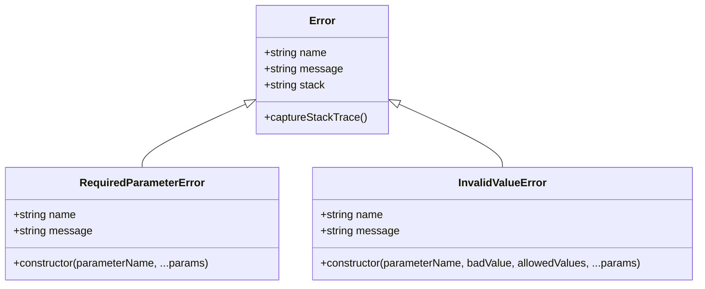
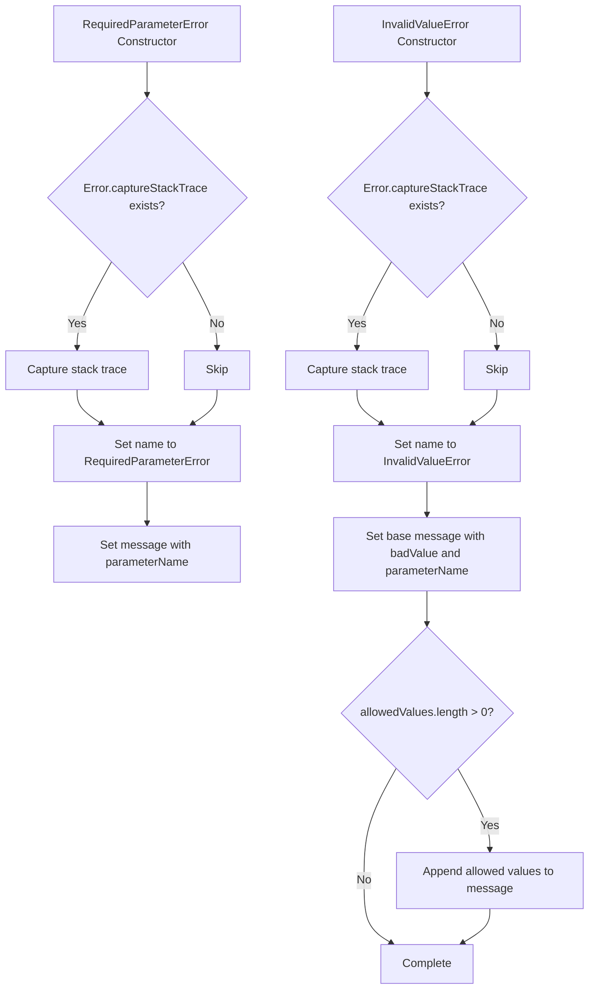

# Diagram: web/portal/src/utils/function.utils.js

> Auto-generated by Obscura crawlers

## Diagram 1

### SVG

<svg id="container" width="1037.0859375" xmlns="http://www.w3.org/2000/svg" class="classDiagram" height="426" viewBox="0 0 1037.0859375 426" role="graphics-document document" aria-roledescription="class"><g><defs><marker id="container_class-aggregationStart" class="marker aggregation class" refX="18" refY="7" markerWidth="190" markerHeight="240" orient="auto"><path d="M 18,7 L9,13 L1,7 L9,1 Z"></path></marker></defs><defs><marker id="container_class-aggregationEnd" class="marker aggregation class" refX="1" refY="7" markerWidth="20" markerHeight="28" orient="auto"><path d="M 18,7 L9,13 L1,7 L9,1 Z"></path></marker></defs><defs><marker id="container_class-extensionStart" class="marker extension class" refX="18" refY="7" markerWidth="190" markerHeight="240" orient="auto"><path d="M 1,7 L18,13 V 1 Z"></path></marker></defs><defs><marker id="container_class-extensionEnd" class="marker extension class" refX="1" refY="7" markerWidth="20" markerHeight="28" orient="auto"><path d="M 1,1 V 13 L18,7 Z"></path></marker></defs><defs><marker id="container_class-compositionStart" class="marker composition class" refX="18" refY="7" markerWidth="190" markerHeight="240" orient="auto"><path d="M 18,7 L9,13 L1,7 L9,1 Z"></path></marker></defs><defs><marker id="container_class-compositionEnd" class="marker composition class" refX="1" refY="7" markerWidth="20" markerHeight="28" orient="auto"><path d="M 18,7 L9,13 L1,7 L9,1 Z"></path></marker></defs><defs><marker id="container_class-dependencyStart" class="marker dependency class" refX="6" refY="7" markerWidth="190" markerHeight="240" orient="auto"><path d="M 5,7 L9,13 L1,7 L9,1 Z"></path></marker></defs><defs><marker id="container_class-dependencyEnd" class="marker dependency class" refX="13" refY="7" markerWidth="20" markerHeight="28" orient="auto"><path d="M 18,7 L9,13 L14,7 L9,1 Z"></path></marker></defs><defs><marker id="container_class-lollipopStart" class="marker lollipop class" refX="13" refY="7" markerWidth="190" markerHeight="240" orient="auto"><circle stroke="black" fill="transparent" cx="7" cy="7" r="6"></circle></marker></defs><defs><marker id="container_class-lollipopEnd" class="marker lollipop class" refX="1" refY="7" markerWidth="190" markerHeight="240" orient="auto"><circle stroke="black" fill="transparent" cx="7" cy="7" r="6"></circle></marker></defs><g class="root"><g class="clusters"></g><g class="edgePaths"><path d="M366.239,154.671L340.3,166.392C314.36,178.114,262.481,201.557,236.541,217.445C210.602,233.333,210.602,241.667,210.602,245.833L210.602,250" id="id_Error_RequiredParameterError_1" class="edge-thickness-normal edge-pattern-solid relation" style=";;;" data-edge="true" data-et="edge" data-id="id_Error_RequiredParameterError_1" data-points="W3sieCI6MzgxLjk1ODk4NDM3NSwieSI6MTQ3LjU2NzM3ODMxNzg1Nzl9LHsieCI6MjEwLjYwMTU2MjUsInkiOjIyNX0seyJ4IjoyMTAuNjAxNTYyNSwieSI6MjUwfV0=" marker-start="url(#container_class-extensionStart)"></path><path d="M590.507,154.671L616.446,166.392C642.386,178.114,694.265,201.557,720.205,217.445C746.145,233.333,746.145,241.667,746.145,245.833L746.145,250" id="id_Error_InvalidValueError_2" class="edge-thickness-normal edge-pattern-solid relation" style=";;;" data-edge="true" data-et="edge" data-id="id_Error_InvalidValueError_2" data-points="W3sieCI6NTc0Ljc4NzEwOTM3NSwieSI6MTQ3LjU2NzM3ODMxNzg1Nzl9LHsieCI6NzQ2LjE0NDUzMTI1LCJ5IjoyMjV9LHsieCI6NzQ2LjE0NDUzMTI1LCJ5IjoyNTB9XQ==" marker-start="url(#container_class-extensionStart)"></path></g><g class="edgeLabels"><g class="edgeLabel"><g class="label" data-id="id_Error_RequiredParameterError_1" transform="translate(0, 0)"><foreignObject width="0" height="0">

</foreignObject></g></g><g class="edgeLabel"><g class="label" data-id="id_Error_InvalidValueError_2" transform="translate(0, 0)"><foreignObject width="0" height="0">

</foreignObject></g></g></g><g class="nodes"><g class="node default" id="classId-Error-0" transform="translate(478.373046875, 104)"><g class="basic label-container"><path d="M-96.4140625 -96 L96.4140625 -96 L96.4140625 96 L-96.4140625 96" stroke="none" stroke-width="0" fill="#ECECFF" style=""></path><path d="M-96.4140625 -96 C-57.08031853836947 -96, -17.746574576738936 -96, 96.4140625 -96 M-96.4140625 -96 C-29.63310649077303 -96, 37.14784951845394 -96, 96.4140625 -96 M96.4140625 -96 C96.4140625 -29.936066033237296, 96.4140625 36.12786793352541, 96.4140625 96 M96.4140625 -96 C96.4140625 -33.45909657784204, 96.4140625 29.08180684431592, 96.4140625 96 M96.4140625 96 C25.17360417953691 96, -46.06685414092618 96, -96.4140625 96 M96.4140625 96 C46.56974460586096 96, -3.274573288278077 96, -96.4140625 96 M-96.4140625 96 C-96.4140625 26.717771799942156, -96.4140625 -42.56445640011569, -96.4140625 -96 M-96.4140625 96 C-96.4140625 39.87654312873428, -96.4140625 -16.246913742531433, -96.4140625 -96" stroke="#9370DB" stroke-width="1.3" fill="none" stroke-dasharray="0 0" style=""></path></g><g class="annotation-group text" transform="translate(0, -72)"></g><g class="label-group text" transform="translate(-18.1875, -72)"><g class="label" style="font-weight: bolder" transform="translate(0,-12)"><foreignObject width="36.375" height="24">

Error

</foreignObject></g></g><g class="members-group text" transform="translate(-84.4140625, -24)"><g class="label" style="" transform="translate(0,-12)"><foreignObject width="94.375" height="24">

+string name

</foreignObject></g><g class="label" style="" transform="translate(0,12)"><foreignObject width="116.25" height="24">

+string message

</foreignObject></g><g class="label" style="" transform="translate(0,36)"><foreignObject width="91.546875" height="24">

+string stack

</foreignObject></g></g><g class="methods-group text" transform="translate(-84.4140625, 72)"><g class="label" style="" transform="translate(0,-12)"><foreignObject width="150.640625" height="24">

+captureStackTrace()

</foreignObject></g></g><g class="divider" style=""><path d="M-96.4140625 -48 C-19.871232732557658 -48, 56.671597034884684 -48, 96.4140625 -48 M-96.4140625 -48 C-30.922270133264988 -48, 34.569522233470025 -48, 96.4140625 -48" stroke="#9370DB" stroke-width="1.3" fill="none" stroke-dasharray="0 0" style=""></path></g><g class="divider" style=""><path d="M-96.4140625 48 C-49.555962403287566 48, -2.697862306575132 48, 96.4140625 48 M-96.4140625 48 C-20.44377246186008 48, 55.52651757627984 48, 96.4140625 48" stroke="#9370DB" stroke-width="1.3" fill="none" stroke-dasharray="0 0" style=""></path></g></g><g class="node default" id="classId-RequiredParameterError-1" transform="translate(210.6015625, 334)"><g class="basic label-container"><path d="M-202.6015625 -84 L202.6015625 -84 L202.6015625 84 L-202.6015625 84" stroke="none" stroke-width="0" fill="#ECECFF" style=""></path><path d="M-202.6015625 -84 C-94.10496075478963 -84, 14.39164099042074 -84, 202.6015625 -84 M-202.6015625 -84 C-107.2652466099164 -84, -11.928930719832806 -84, 202.6015625 -84 M202.6015625 -84 C202.6015625 -41.91839117750666, 202.6015625 0.16321764498667335, 202.6015625 84 M202.6015625 -84 C202.6015625 -19.74195327573264, 202.6015625 44.51609344853472, 202.6015625 84 M202.6015625 84 C114.53532138196303 84, 26.46908026392606 84, -202.6015625 84 M202.6015625 84 C120.1102765343325 84, 37.618990568665 84, -202.6015625 84 M-202.6015625 84 C-202.6015625 49.55467938518766, -202.6015625 15.109358770375323, -202.6015625 -84 M-202.6015625 84 C-202.6015625 21.687163819186594, -202.6015625 -40.62567236162681, -202.6015625 -84" stroke="#9370DB" stroke-width="1.3" fill="none" stroke-dasharray="0 0" style=""></path></g><g class="annotation-group text" transform="translate(0, -60)"></g><g class="label-group text" transform="translate(-89.0625, -60)"><g class="label" style="font-weight: bolder" transform="translate(0,-12)"><foreignObject width="178.125" height="24">

RequiredParameterError

</foreignObject></g></g><g class="members-group text" transform="translate(-190.6015625, -12)"><g class="label" style="" transform="translate(0,-12)"><foreignObject width="94.375" height="24">

+string name

</foreignObject></g><g class="label" style="" transform="translate(0,12)"><foreignObject width="116.25" height="24">

+string message

</foreignObject></g></g><g class="methods-group text" transform="translate(-190.6015625, 60)"><g class="label" style="" transform="translate(0,-12)"><foreignObject width="292.140625" height="24">

+constructor(parameterName, ...params)

</foreignObject></g></g><g class="divider" style=""><path d="M-202.6015625 -36 C-88.31329060272539 -36, 25.974981294549224 -36, 202.6015625 -36 M-202.6015625 -36 C-106.64438910857534 -36, -10.687215717150679 -36, 202.6015625 -36" stroke="#9370DB" stroke-width="1.3" fill="none" stroke-dasharray="0 0" style=""></path></g><g class="divider" style=""><path d="M-202.6015625 36 C-94.90414224609127 36, 12.793278007817463 36, 202.6015625 36 M-202.6015625 36 C-57.19381439097978 36, 88.21393371804044 36, 202.6015625 36" stroke="#9370DB" stroke-width="1.3" fill="none" stroke-dasharray="0 0" style=""></path></g></g><g class="node default" id="classId-InvalidValueError-2" transform="translate(746.14453125, 334)"><g class="basic label-container"><path d="M-282.94140625 -84 L282.94140625 -84 L282.94140625 84 L-282.94140625 84" stroke="none" stroke-width="0" fill="#ECECFF" style=""></path><path d="M-282.94140625 -84 C-84.97867448254954 -84, 112.98405728490093 -84, 282.94140625 -84 M-282.94140625 -84 C-158.70844131592406 -84, -34.475476381848125 -84, 282.94140625 -84 M282.94140625 -84 C282.94140625 -31.74997005015613, 282.94140625 20.50005989968774, 282.94140625 84 M282.94140625 -84 C282.94140625 -49.06650546096694, 282.94140625 -14.133010921933874, 282.94140625 84 M282.94140625 84 C69.05571363789053 84, -144.82997897421893 84, -282.94140625 84 M282.94140625 84 C107.77967691587969 84, -67.38205241824062 84, -282.94140625 84 M-282.94140625 84 C-282.94140625 29.235678665105212, -282.94140625 -25.528642669789576, -282.94140625 -84 M-282.94140625 84 C-282.94140625 32.04812025282634, -282.94140625 -19.903759494347327, -282.94140625 -84" stroke="#9370DB" stroke-width="1.3" fill="none" stroke-dasharray="0 0" style=""></path></g><g class="annotation-group text" transform="translate(0, -60)"></g><g class="label-group text" transform="translate(-62.6796875, -60)"><g class="label" style="font-weight: bolder" transform="translate(0,-12)"><foreignObject width="125.359375" height="24">

InvalidValueError

</foreignObject></g></g><g class="members-group text" transform="translate(-270.94140625, -12)"><g class="label" style="" transform="translate(0,-12)"><foreignObject width="94.375" height="24">

+string name

</foreignObject></g><g class="label" style="" transform="translate(0,12)"><foreignObject width="116.25" height="24">

+string message

</foreignObject></g></g><g class="methods-group text" transform="translate(-270.94140625, 60)"><g class="label" style="" transform="translate(0,-12)"><foreignObject width="479.203125" height="24">

+constructor(parameterName, badValue, allowedValues, ...params)

</foreignObject></g></g><g class="divider" style=""><path d="M-282.94140625 -36 C-156.73544652495758 -36, -30.529486799915162 -36, 282.94140625 -36 M-282.94140625 -36 C-70.94182202326667 -36, 141.05776220346667 -36, 282.94140625 -36" stroke="#9370DB" stroke-width="1.3" fill="none" stroke-dasharray="0 0" style=""></path></g><g class="divider" style=""><path d="M-282.94140625 36 C-72.99465111945122 36, 136.95210401109756 36, 282.94140625 36 M-282.94140625 36 C-86.50828720815338 36, 109.92483183369325 36, 282.94140625 36" stroke="#9370DB" stroke-width="1.3" fill="none" stroke-dasharray="0 0" style=""></path></g></g></g></g></g></svg>

## Diagram 2

### SVG

<svg id="container" width="820.19140625" xmlns="http://www.w3.org/2000/svg" class="flowchart" height="1376.390625" viewBox="0 0 820.19140625 1376.390625" role="graphics-document document" aria-roledescription="flowchart-v2"><g><marker id="container_flowchart-v2-pointEnd" class="marker flowchart-v2" viewBox="0 0 10 10" refX="5" refY="5" markerUnits="userSpaceOnUse" markerWidth="8" markerHeight="8" orient="auto"><path d="M 0 0 L 10 5 L 0 10 z" class="arrowMarkerPath" style="stroke-width: 1; stroke-dasharray: 1, 0;"></path></marker><marker id="container_flowchart-v2-pointStart" class="marker flowchart-v2" viewBox="0 0 10 10" refX="4.5" refY="5" markerUnits="userSpaceOnUse" markerWidth="8" markerHeight="8" orient="auto"><path d="M 0 5 L 10 10 L 10 0 z" class="arrowMarkerPath" style="stroke-width: 1; stroke-dasharray: 1, 0;"></path></marker><marker id="container_flowchart-v2-circleEnd" class="marker flowchart-v2" viewBox="0 0 10 10" refX="11" refY="5" markerUnits="userSpaceOnUse" markerWidth="11" markerHeight="11" orient="auto"><circle cx="5" cy="5" r="5" class="arrowMarkerPath" style="stroke-width: 1; stroke-dasharray: 1, 0;"></circle></marker><marker id="container_flowchart-v2-circleStart" class="marker flowchart-v2" viewBox="0 0 10 10" refX="-1" refY="5" markerUnits="userSpaceOnUse" markerWidth="11" markerHeight="11" orient="auto"><circle cx="5" cy="5" r="5" class="arrowMarkerPath" style="stroke-width: 1; stroke-dasharray: 1, 0;"></circle></marker><marker id="container_flowchart-v2-crossEnd" class="marker cross flowchart-v2" viewBox="0 0 11 11" refX="12" refY="5.2" markerUnits="userSpaceOnUse" markerWidth="11" markerHeight="11" orient="auto"><path d="M 1,1 l 9,9 M 10,1 l -9,9" class="arrowMarkerPath" style="stroke-width: 2; stroke-dasharray: 1, 0;"></path></marker><marker id="container_flowchart-v2-crossStart" class="marker cross flowchart-v2" viewBox="0 0 11 11" refX="-1" refY="5.2" markerUnits="userSpaceOnUse" markerWidth="11" markerHeight="11" orient="auto"><path d="M 1,1 l 9,9 M 10,1 l -9,9" class="arrowMarkerPath" style="stroke-width: 2; stroke-dasharray: 1, 0;"></path></marker><g class="root"><g class="clusters"></g><g class="edgePaths"><path d="M204.855,86L204.855,90.167C204.855,94.333,204.855,102.667,204.855,110.333C204.855,118,204.855,125,204.855,128.5L204.855,132" id="L_A_B_0" class="edge-thickness-normal edge-pattern-solid edge-thickness-normal edge-pattern-solid flowchart-link" style=";" data-edge="true" data-et="edge" data-id="L_A_B_0" data-points="W3sieCI6MjA0Ljg1NTQ2ODc1LCJ5Ijo4Nn0seyJ4IjoyMDQuODU1NDY4NzUsInkiOjExMX0seyJ4IjoyMDQuODU1NDY4NzUsInkiOjEzNn1d" marker-end="url(#container_flowchart-v2-pointEnd)"></path><path d="M155.323,364.467L147.338,378.889C139.353,393.311,123.384,422.156,115.399,442.078C107.414,462,107.414,473,107.414,478.5L107.414,484" id="L_B_C_0" class="edge-thickness-normal edge-pattern-solid edge-thickness-normal edge-pattern-solid flowchart-link" style=";" data-edge="true" data-et="edge" data-id="L_B_C_0" data-points="W3sieCI6MTU1LjMyMjUzMzUwNjIxNzc4LCJ5IjozNjQuNDY3MDY0NzU2MjE3OH0seyJ4IjoxMDcuNDE0MDYyNSwieSI6NDUxfSx7IngiOjEwNy40MTQwNjI1LCJ5Ijo0ODh9XQ==" marker-end="url(#container_flowchart-v2-pointEnd)"></path><path d="M254.388,364.467L262.373,378.889C270.358,393.311,286.327,422.156,294.312,442.078C302.297,462,302.297,473,302.297,478.5L302.297,484" id="L_B_D_0" class="edge-thickness-normal edge-pattern-solid edge-thickness-normal edge-pattern-solid flowchart-link" style=";" data-edge="true" data-et="edge" data-id="L_B_D_0" data-points="W3sieCI6MjU0LjM4ODQwMzk5Mzc4MjIyLCJ5IjozNjQuNDY3MDY0NzU2MjE3OH0seyJ4IjozMDIuMjk2ODc1LCJ5Ijo0NTF9LHsieCI6MzAyLjI5Njg3NSwieSI6NDg4fV0=" marker-end="url(#container_flowchart-v2-pointEnd)"></path><path d="M107.414,542L107.414,546.167C107.414,550.333,107.414,558.667,113.201,566.634C118.987,574.601,130.561,582.203,136.347,586.003L142.134,589.804" id="L_C_E_0" class="edge-thickness-normal edge-pattern-solid edge-thickness-normal edge-pattern-solid flowchart-link" style=";" data-edge="true" data-et="edge" data-id="L_C_E_0" data-points="W3sieCI6MTA3LjQxNDA2MjUsInkiOjU0Mn0seyJ4IjoxMDcuNDE0MDYyNSwieSI6NTY3fSx7IngiOjE0NS40NzcxMTE4MTY0MDYyNSwieSI6NTkyfV0=" marker-end="url(#container_flowchart-v2-pointEnd)"></path><path d="M302.297,542L302.297,546.167C302.297,550.333,302.297,558.667,296.51,566.634C290.724,574.601,279.15,582.203,273.364,586.003L267.577,589.804" id="L_D_E_0" class="edge-thickness-normal edge-pattern-solid edge-thickness-normal edge-pattern-solid flowchart-link" style=";" data-edge="true" data-et="edge" data-id="L_D_E_0" data-points="W3sieCI6MzAyLjI5Njg3NSwieSI6NTQyfSx7IngiOjMwMi4yOTY4NzUsInkiOjU2N30seyJ4IjoyNjQuMjMzODI1NjgzNTkzNzUsInkiOjU5Mn1d" marker-end="url(#container_flowchart-v2-pointEnd)"></path><path d="M204.855,670L204.855,674.167C204.855,678.333,204.855,686.667,204.855,696.333C204.855,706,204.855,717,204.855,722.5L204.855,728" id="L_E_F_0" class="edge-thickness-normal edge-pattern-solid edge-thickness-normal edge-pattern-solid flowchart-link" style=";" data-edge="true" data-et="edge" data-id="L_E_F_0" data-points="W3sieCI6MjA0Ljg1NTQ2ODc1LCJ5Ijo2NzB9LHsieCI6MjA0Ljg1NTQ2ODc1LCJ5Ijo2OTV9LHsieCI6MjA0Ljg1NTQ2ODc1LCJ5Ijo3MzJ9XQ==" marker-end="url(#container_flowchart-v2-pointEnd)"></path><path d="M594.621,86L594.621,90.167C594.621,94.333,594.621,102.667,594.621,110.333C594.621,118,594.621,125,594.621,128.5L594.621,132" id="L_G_H_0" class="edge-thickness-normal edge-pattern-solid edge-thickness-normal edge-pattern-solid flowchart-link" style=";" data-edge="true" data-et="edge" data-id="L_G_H_0" data-points="W3sieCI6NTk0LjYyMTA5Mzc1LCJ5Ijo4Nn0seyJ4Ijo1OTQuNjIxMDkzNzUsInkiOjExMX0seyJ4Ijo1OTQuNjIxMDkzNzUsInkiOjEzNn1d" marker-end="url(#container_flowchart-v2-pointEnd)"></path><path d="M545.088,364.467L537.103,378.889C529.119,393.311,513.149,422.156,505.164,442.078C497.18,462,497.18,473,497.18,478.5L497.18,484" id="L_H_I_0" class="edge-thickness-normal edge-pattern-solid edge-thickness-normal edge-pattern-solid flowchart-link" style=";" data-edge="true" data-et="edge" data-id="L_H_I_0" data-points="W3sieCI6NTQ1LjA4ODE1ODUwNjIxNzcsInkiOjM2NC40NjcwNjQ3NTYyMTc4fSx7IngiOjQ5Ny4xNzk2ODc1LCJ5Ijo0NTF9LHsieCI6NDk3LjE3OTY4NzUsInkiOjQ4OH1d" marker-end="url(#container_flowchart-v2-pointEnd)"></path><path d="M644.154,364.467L652.139,378.889C660.124,393.311,676.093,422.156,684.078,442.078C692.063,462,692.063,473,692.063,478.5L692.063,484" id="L_H_J_0" class="edge-thickness-normal edge-pattern-solid edge-thickness-normal edge-pattern-solid flowchart-link" style=";" data-edge="true" data-et="edge" data-id="L_H_J_0" data-points="W3sieCI6NjQ0LjE1NDAyODk5Mzc4MjMsInkiOjM2NC40NjcwNjQ3NTYyMTc4fSx7IngiOjY5Mi4wNjI1LCJ5Ijo0NTF9LHsieCI6NjkyLjA2MjUsInkiOjQ4OH1d" marker-end="url(#container_flowchart-v2-pointEnd)"></path><path d="M497.18,542L497.18,546.167C497.18,550.333,497.18,558.667,502.966,566.634C508.753,574.601,520.326,582.203,526.113,586.003L531.899,589.804" id="L_I_K_0" class="edge-thickness-normal edge-pattern-solid edge-thickness-normal edge-pattern-solid flowchart-link" style=";" data-edge="true" data-et="edge" data-id="L_I_K_0" data-points="W3sieCI6NDk3LjE3OTY4NzUsInkiOjU0Mn0seyJ4Ijo0OTcuMTc5Njg3NSwieSI6NTY3fSx7IngiOjUzNS4yNDI3MzY4MTY0MDYyLCJ5Ijo1OTJ9XQ==" marker-end="url(#container_flowchart-v2-pointEnd)"></path><path d="M692.063,542L692.063,546.167C692.063,550.333,692.063,558.667,686.276,566.634C680.489,574.601,668.916,582.203,663.129,586.003L657.343,589.804" id="L_J_K_0" class="edge-thickness-normal edge-pattern-solid edge-thickness-normal edge-pattern-solid flowchart-link" style=";" data-edge="true" data-et="edge" data-id="L_J_K_0" data-points="W3sieCI6NjkyLjA2MjUsInkiOjU0Mn0seyJ4Ijo2OTIuMDYyNSwieSI6NTY3fSx7IngiOjY1My45OTk0NTA2ODM1OTM4LCJ5Ijo1OTJ9XQ==" marker-end="url(#container_flowchart-v2-pointEnd)"></path><path d="M594.621,670L594.621,674.167C594.621,678.333,594.621,686.667,594.621,694.333C594.621,702,594.621,709,594.621,712.5L594.621,716" id="L_K_L_0" class="edge-thickness-normal edge-pattern-solid edge-thickness-normal edge-pattern-solid flowchart-link" style=";" data-edge="true" data-et="edge" data-id="L_K_L_0" data-points="W3sieCI6NTk0LjYyMTA5Mzc1LCJ5Ijo2NzB9LHsieCI6NTk0LjYyMTA5Mzc1LCJ5Ijo2OTV9LHsieCI6NTk0LjYyMTA5Mzc1LCJ5Ijo3MjB9XQ==" marker-end="url(#container_flowchart-v2-pointEnd)"></path><path d="M594.621,822L594.621,826.167C594.621,830.333,594.621,838.667,594.621,846.333C594.621,854,594.621,861,594.621,864.5L594.621,868" id="L_L_M_0" class="edge-thickness-normal edge-pattern-solid edge-thickness-normal edge-pattern-solid flowchart-link" style=";" data-edge="true" data-et="edge" data-id="L_L_M_0" data-points="W3sieCI6NTk0LjYyMTA5Mzc1LCJ5Ijo4MjJ9LHsieCI6NTk0LjYyMTA5Mzc1LCJ5Ijo4NDd9LHsieCI6NTk0LjYyMTA5Mzc1LCJ5Ijo4NzJ9XQ==" marker-end="url(#container_flowchart-v2-pointEnd)"></path><path d="M637.624,1069.388L645.052,1082.722C652.48,1096.056,667.335,1122.723,674.763,1141.557C682.191,1160.391,682.191,1171.391,682.191,1176.891L682.191,1182.391" id="L_M_N_0" class="edge-thickness-normal edge-pattern-solid edge-thickness-normal edge-pattern-solid flowchart-link" style=";" data-edge="true" data-et="edge" data-id="L_M_N_0" data-points="W3sieCI6NjM3LjYyMzYyMzUyMzc3OTEsInkiOjEwNjkuMzg4MDk1MjI2MjIxfSx7IngiOjY4Mi4xOTE0MDYyNSwieSI6MTE0OS4zOTA2MjV9LHsieCI6NjgyLjE5MTQwNjI1LCJ5IjoxMTg2LjM5MDYyNX1d" marker-end="url(#container_flowchart-v2-pointEnd)"></path><path d="M551.619,1069.388L544.191,1082.722C536.763,1096.056,521.907,1122.723,514.479,1148.724C507.051,1174.724,507.051,1200.057,507.051,1223.391C507.051,1246.724,507.051,1268.057,513.494,1282.55C519.938,1297.043,532.825,1304.696,539.269,1308.522L545.713,1312.348" id="L_M_O_0" class="edge-thickness-normal edge-pattern-solid edge-thickness-normal edge-pattern-solid flowchart-link" style=";" data-edge="true" data-et="edge" data-id="L_M_O_0" data-points="W3sieCI6NTUxLjYxODU2Mzk3NjIyMDksInkiOjEwNjkuMzg4MDk1MjI2MjIxfSx7IngiOjUwNy4wNTA3ODEyNSwieSI6MTE0OS4zOTA2MjV9LHsieCI6NTA3LjA1MDc4MTI1LCJ5IjoxMjI1LjM5MDYyNX0seyJ4Ijo1MDcuMDUwNzgxMjUsInkiOjEyODkuMzkwNjI1fSx7IngiOjU0OS4xNTE4OTMwMjg4NDYyLCJ5IjoxMzE0LjM5MDYyNX1d" marker-end="url(#container_flowchart-v2-pointEnd)"></path><path d="M682.191,1264.391L682.191,1268.557C682.191,1272.724,682.191,1281.057,675.748,1289.05C669.304,1297.043,656.417,1304.696,649.973,1308.522L643.53,1312.348" id="L_N_O_0" class="edge-thickness-normal edge-pattern-solid edge-thickness-normal edge-pattern-solid flowchart-link" style=";" data-edge="true" data-et="edge" data-id="L_N_O_0" data-points="W3sieCI6NjgyLjE5MTQwNjI1LCJ5IjoxMjY0LjM5MDYyNX0seyJ4Ijo2ODIuMTkxNDA2MjUsInkiOjEyODkuMzkwNjI1fSx7IngiOjY0MC4wOTAyOTQ0NzExNTM4LCJ5IjoxMzE0LjM5MDYyNX1d" marker-end="url(#container_flowchart-v2-pointEnd)"></path></g><g class="edgeLabels"><g class="edgeLabel"><g class="label" data-id="L_A_B_0" transform="translate(0, 0)"><foreignObject width="0" height="0">

</foreignObject></g></g><g class="edgeLabel" transform="translate(107.4140625, 451)"><g class="label" data-id="L_B_C_0" transform="translate(-12.03125, -12)"><foreignObject width="24.0625" height="24">

Yes

</foreignObject></g></g><g class="edgeLabel" transform="translate(302.296875, 451)"><g class="label" data-id="L_B_D_0" transform="translate(-10.140625, -12)"><foreignObject width="20.28125" height="24">

No

</foreignObject></g></g><g class="edgeLabel"><g class="label" data-id="L_C_E_0" transform="translate(0, 0)"><foreignObject width="0" height="0">

</foreignObject></g></g><g class="edgeLabel"><g class="label" data-id="L_D_E_0" transform="translate(0, 0)"><foreignObject width="0" height="0">

</foreignObject></g></g><g class="edgeLabel"><g class="label" data-id="L_E_F_0" transform="translate(0, 0)"><foreignObject width="0" height="0">

</foreignObject></g></g><g class="edgeLabel"><g class="label" data-id="L_G_H_0" transform="translate(0, 0)"><foreignObject width="0" height="0">

</foreignObject></g></g><g class="edgeLabel" transform="translate(497.1796875, 451)"><g class="label" data-id="L_H_I_0" transform="translate(-12.03125, -12)"><foreignObject width="24.0625" height="24">

Yes

</foreignObject></g></g><g class="edgeLabel" transform="translate(692.0625, 451)"><g class="label" data-id="L_H_J_0" transform="translate(-10.140625, -12)"><foreignObject width="20.28125" height="24">

No

</foreignObject></g></g><g class="edgeLabel"><g class="label" data-id="L_I_K_0" transform="translate(0, 0)"><foreignObject width="0" height="0">

</foreignObject></g></g><g class="edgeLabel"><g class="label" data-id="L_J_K_0" transform="translate(0, 0)"><foreignObject width="0" height="0">

</foreignObject></g></g><g class="edgeLabel"><g class="label" data-id="L_K_L_0" transform="translate(0, 0)"><foreignObject width="0" height="0">

</foreignObject></g></g><g class="edgeLabel"><g class="label" data-id="L_L_M_0" transform="translate(0, 0)"><foreignObject width="0" height="0">

</foreignObject></g></g><g class="edgeLabel" transform="translate(682.19140625, 1149.390625)"><g class="label" data-id="L_M_N_0" transform="translate(-12.03125, -12)"><foreignObject width="24.0625" height="24">

Yes

</foreignObject></g></g><g class="edgeLabel" transform="translate(507.05078125, 1225.390625)"><g class="label" data-id="L_M_O_0" transform="translate(-10.140625, -12)"><foreignObject width="20.28125" height="24">

No

</foreignObject></g></g><g class="edgeLabel"><g class="label" data-id="L_N_O_0" transform="translate(0, 0)"><foreignObject width="0" height="0">

</foreignObject></g></g></g><g class="nodes"><g class="node default" id="flowchart-A-0" transform="translate(204.85546875, 47)"><rect class="basic label-container" style="" x="-130" y="-39" width="260" height="78"></rect><g class="label" style="" transform="translate(-100, -24)"><rect></rect><foreignObject width="200" height="48">

RequiredParameterError Constructor

</foreignObject></g></g><g class="node default" id="flowchart-B-1" transform="translate(204.85546875, 275)"><polygon points="139,0 278,-139 139,-278 0,-139" class="label-container" transform="translate(-138.5, 139)"></polygon><g class="label" style="" transform="translate(-100, -24)"><rect></rect><foreignObject width="200" height="48">

Error.captureStackTrace exists?

</foreignObject></g></g><g class="node default" id="flowchart-C-3" transform="translate(107.4140625, 515)"><rect class="basic label-container" style="" x="-99.4140625" y="-27" width="198.828125" height="54"></rect><g class="label" style="" transform="translate(-69.4140625, -12)"><rect></rect><foreignObject width="138.828125" height="24">

Capture stack trace

</foreignObject></g></g><g class="node default" id="flowchart-D-5" transform="translate(302.296875, 515)"><rect class="basic label-container" style="" x="-45.46875" y="-27" width="90.9375" height="54"></rect><g class="label" style="" transform="translate(-15.46875, -12)"><rect></rect><foreignObject width="30.9375" height="24">

Skip

</foreignObject></g></g><g class="node default" id="flowchart-E-7" transform="translate(204.85546875, 631)"><rect class="basic label-container" style="" x="-130" y="-39" width="260" height="78"></rect><g class="label" style="" transform="translate(-100, -24)"><rect></rect><foreignObject width="200" height="48">

Set name to RequiredParameterError

</foreignObject></g></g><g class="node default" id="flowchart-F-11" transform="translate(204.85546875, 771)"><rect class="basic label-container" style="" x="-130" y="-39" width="260" height="78"></rect><g class="label" style="" transform="translate(-100, -24)"><rect></rect><foreignObject width="200" height="48">

Set message with parameterName

</foreignObject></g></g><g class="node default" id="flowchart-G-12" transform="translate(594.62109375, 47)"><rect class="basic label-container" style="" x="-130" y="-39" width="260" height="78"></rect><g class="label" style="" transform="translate(-100, -24)"><rect></rect><foreignObject width="200" height="48">

InvalidValueError Constructor

</foreignObject></g></g><g class="node default" id="flowchart-H-13" transform="translate(594.62109375, 275)"><polygon points="139,0 278,-139 139,-278 0,-139" class="label-container" transform="translate(-138.5, 139)"></polygon><g class="label" style="" transform="translate(-100, -24)"><rect></rect><foreignObject width="200" height="48">

Error.captureStackTrace exists?

</foreignObject></g></g><g class="node default" id="flowchart-I-15" transform="translate(497.1796875, 515)"><rect class="basic label-container" style="" x="-99.4140625" y="-27" width="198.828125" height="54"></rect><g class="label" style="" transform="translate(-69.4140625, -12)"><rect></rect><foreignObject width="138.828125" height="24">

Capture stack trace

</foreignObject></g></g><g class="node default" id="flowchart-J-17" transform="translate(692.0625, 515)"><rect class="basic label-container" style="" x="-45.46875" y="-27" width="90.9375" height="54"></rect><g class="label" style="" transform="translate(-15.46875, -12)"><rect></rect><foreignObject width="30.9375" height="24">

Skip

</foreignObject></g></g><g class="node default" id="flowchart-K-19" transform="translate(594.62109375, 631)"><rect class="basic label-container" style="" x="-130" y="-39" width="260" height="78"></rect><g class="label" style="" transform="translate(-100, -24)"><rect></rect><foreignObject width="200" height="48">

Set name to InvalidValueError

</foreignObject></g></g><g class="node default" id="flowchart-L-23" transform="translate(594.62109375, 771)"><rect class="basic label-container" style="" x="-130" y="-51" width="260" height="102"></rect><g class="label" style="" transform="translate(-100, -36)"><rect></rect><foreignObject width="200" height="72">

Set base message with badValue and parameterName

</foreignObject></g></g><g class="node default" id="flowchart-M-25" transform="translate(594.62109375, 992.1953125)"><polygon points="120.1953125,0 240.390625,-120.1953125 120.1953125,-240.390625 0,-120.1953125" class="label-container" transform="translate(-119.6953125, 120.1953125)"></polygon><g class="label" style="" transform="translate(-93.1953125, -12)"><rect></rect><foreignObject width="186.390625" height="24">

allowedValues.length &gt; 0?

</foreignObject></g></g><g class="node default" id="flowchart-N-27" transform="translate(682.19140625, 1225.390625)"><rect class="basic label-container" style="" x="-130" y="-39" width="260" height="78"></rect><g class="label" style="" transform="translate(-100, -24)"><rect></rect><foreignObject width="200" height="48">

Append allowed values to message

</foreignObject></g></g><g class="node default" id="flowchart-O-29" transform="translate(594.62109375, 1341.390625)"><rect class="basic label-container" style="" x="-64.3984375" y="-27" width="128.796875" height="54"></rect><g class="label" style="" transform="translate(-34.3984375, -12)"><rect></rect><foreignObject width="68.796875" height="24">

Complete

</foreignObject></g></g></g></g></g></svg>
