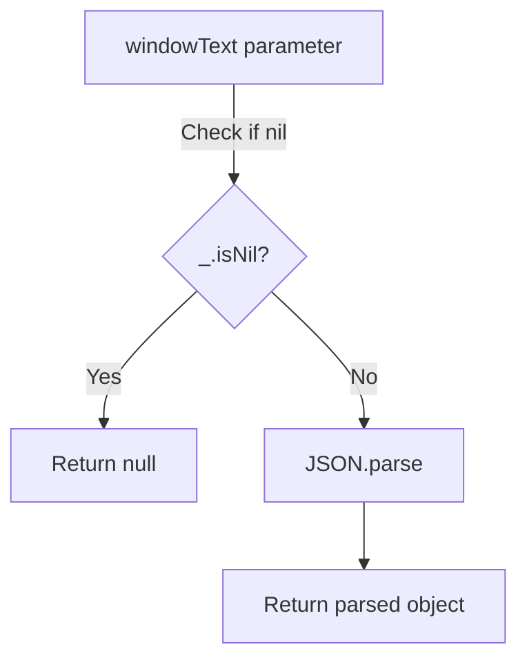

# Diagram: web/portal/src/utils/json-utils.js

> Auto-generated by Obscura crawlers

## Mermaid

### SVG

<svg id="container" width="383.171875" xmlns="http://www.w3.org/2000/svg" class="flowchart" height="481.390625" viewBox="0 0 383.171875 481.390625" role="graphics-document document" aria-roledescription="flowchart-v2"><g><marker id="container_flowchart-v2-pointEnd" class="marker flowchart-v2" viewBox="0 0 10 10" refX="5" refY="5" markerUnits="userSpaceOnUse" markerWidth="8" markerHeight="8" orient="auto"><path d="M 0 0 L 10 5 L 0 10 z" class="arrowMarkerPath" style="stroke-width: 1; stroke-dasharray: 1, 0;"></path></marker><marker id="container_flowchart-v2-pointStart" class="marker flowchart-v2" viewBox="0 0 10 10" refX="4.5" refY="5" markerUnits="userSpaceOnUse" markerWidth="8" markerHeight="8" orient="auto"><path d="M 0 5 L 10 10 L 10 0 z" class="arrowMarkerPath" style="stroke-width: 1; stroke-dasharray: 1, 0;"></path></marker><marker id="container_flowchart-v2-circleEnd" class="marker flowchart-v2" viewBox="0 0 10 10" refX="11" refY="5" markerUnits="userSpaceOnUse" markerWidth="11" markerHeight="11" orient="auto"><circle cx="5" cy="5" r="5" class="arrowMarkerPath" style="stroke-width: 1; stroke-dasharray: 1, 0;"></circle></marker><marker id="container_flowchart-v2-circleStart" class="marker flowchart-v2" viewBox="0 0 10 10" refX="-1" refY="5" markerUnits="userSpaceOnUse" markerWidth="11" markerHeight="11" orient="auto"><circle cx="5" cy="5" r="5" class="arrowMarkerPath" style="stroke-width: 1; stroke-dasharray: 1, 0;"></circle></marker><marker id="container_flowchart-v2-crossEnd" class="marker cross flowchart-v2" viewBox="0 0 11 11" refX="12" refY="5.2" markerUnits="userSpaceOnUse" markerWidth="11" markerHeight="11" orient="auto"><path d="M 1,1 l 9,9 M 10,1 l -9,9" class="arrowMarkerPath" style="stroke-width: 2; stroke-dasharray: 1, 0;"></path></marker><marker id="container_flowchart-v2-crossStart" class="marker cross flowchart-v2" viewBox="0 0 11 11" refX="-1" refY="5.2" markerUnits="userSpaceOnUse" markerWidth="11" markerHeight="11" orient="auto"><path d="M 1,1 l 9,9 M 10,1 l -9,9" class="arrowMarkerPath" style="stroke-width: 2; stroke-dasharray: 1, 0;"></path></marker><g class="root"><g class="clusters"></g><g class="edgePaths"><path d="M173.738,62L173.738,68.167C173.738,74.333,173.738,86.667,173.738,98.333C173.738,110,173.738,121,173.738,126.5L173.738,132" id="L_A_B_0" class="edge-thickness-normal edge-pattern-solid edge-thickness-normal edge-pattern-solid flowchart-link" style=";" data-edge="true" data-et="edge" data-id="L_A_B_0" data-points="W3sieCI6MTczLjczODI4MTI1LCJ5Ijo2Mn0seyJ4IjoxNzMuNzM4MjgxMjUsInkiOjk5fSx7IngiOjE3My43MzgyODEyNSwieSI6MTM2fV0=" marker-end="url(#container_flowchart-v2-pointEnd)"></path><path d="M146.608,214.261L135.266,224.949C123.924,235.637,101.239,257.014,89.897,273.202C78.555,289.391,78.555,300.391,78.555,305.891L78.555,311.391" id="L_B_C_0" class="edge-thickness-normal edge-pattern-solid edge-thickness-normal edge-pattern-solid flowchart-link" style=";" data-edge="true" data-et="edge" data-id="L_B_C_0" data-points="W3sieCI6MTQ2LjYwODQ3MzMxNjQzOTIsInkiOjIxNC4yNjA4MTcwNjY0MzkyfSx7IngiOjc4LjU1NDY4NzUsInkiOjI3OC4zOTA2MjV9LHsieCI6NzguNTU0Njg3NSwieSI6MzE1LjM5MDYyNX1d" marker-end="url(#container_flowchart-v2-pointEnd)"></path><path d="M200.868,214.261L212.21,224.949C223.553,235.637,246.237,257.014,257.58,273.202C268.922,289.391,268.922,300.391,268.922,305.891L268.922,311.391" id="L_B_D_0" class="edge-thickness-normal edge-pattern-solid edge-thickness-normal edge-pattern-solid flowchart-link" style=";" data-edge="true" data-et="edge" data-id="L_B_D_0" data-points="W3sieCI6MjAwLjg2ODA4OTE4MzU2MDgsInkiOjIxNC4yNjA4MTcwNjY0MzkyfSx7IngiOjI2OC45MjE4NzUsInkiOjI3OC4zOTA2MjV9LHsieCI6MjY4LjkyMTg3NSwieSI6MzE1LjM5MDYyNX1d" marker-end="url(#container_flowchart-v2-pointEnd)"></path><path d="M268.922,369.391L268.922,373.557C268.922,377.724,268.922,386.057,268.922,393.724C268.922,401.391,268.922,408.391,268.922,411.891L268.922,415.391" id="L_D_E_0" class="edge-thickness-normal edge-pattern-solid edge-thickness-normal edge-pattern-solid flowchart-link" style=";" data-edge="true" data-et="edge" data-id="L_D_E_0" data-points="W3sieCI6MjY4LjkyMTg3NSwieSI6MzY5LjM5MDYyNX0seyJ4IjoyNjguOTIxODc1LCJ5IjozOTQuMzkwNjI1fSx7IngiOjI2OC45MjE4NzUsInkiOjQxOS4zOTA2MjV9XQ==" marker-end="url(#container_flowchart-v2-pointEnd)"></path></g><g class="edgeLabels"><g class="edgeLabel" transform="translate(173.73828125, 99)"><g class="label" data-id="L_A_B_0" transform="translate(-39.8359375, -12)"><foreignObject width="79.671875" height="24">

Check if nil

</foreignObject></g></g><g class="edgeLabel" transform="translate(78.5546875, 278.390625)"><g class="label" data-id="L_B_C_0" transform="translate(-12.03125, -12)"><foreignObject width="24.0625" height="24">

Yes

</foreignObject></g></g><g class="edgeLabel" transform="translate(268.921875, 278.390625)"><g class="label" data-id="L_B_D_0" transform="translate(-10.140625, -12)"><foreignObject width="20.28125" height="24">

No

</foreignObject></g></g><g class="edgeLabel"><g class="label" data-id="L_D_E_0" transform="translate(0, 0)"><foreignObject width="0" height="0">

</foreignObject></g></g></g><g class="nodes"><g class="node default" id="flowchart-A-0" transform="translate(173.73828125, 35)"><rect class="basic label-container" style="" x="-112.3671875" y="-27" width="224.734375" height="54"></rect><g class="label" style="" transform="translate(-82.3671875, -12)"><rect></rect><foreignObject width="164.734375" height="24">

windowText parameter

</foreignObject></g></g><g class="node default" id="flowchart-B-1" transform="translate(173.73828125, 188.6953125)"><polygon points="52.6953125,0 105.390625,-52.6953125 52.6953125,-105.390625 0,-52.6953125" class="label-container" transform="translate(-52.1953125, 52.6953125)"></polygon><g class="label" style="" transform="translate(-25.6953125, -12)"><rect></rect><foreignObject width="51.390625" height="24">

_.isNil?

</foreignObject></g></g><g class="node default" id="flowchart-C-3" transform="translate(78.5546875, 342.390625)"><rect class="basic label-container" style="" x="-70.5546875" y="-27" width="141.109375" height="54"></rect><g class="label" style="" transform="translate(-40.5546875, -12)"><rect></rect><foreignObject width="81.109375" height="24">

Return null

</foreignObject></g></g><g class="node default" id="flowchart-D-5" transform="translate(268.921875, 342.390625)"><rect class="basic label-container" style="" x="-69.8125" y="-27" width="139.625" height="54"></rect><g class="label" style="" transform="translate(-39.8125, -12)"><rect></rect><foreignObject width="79.625" height="24">

JSON.parse

</foreignObject></g></g><g class="node default" id="flowchart-E-7" transform="translate(268.921875, 446.390625)"><rect class="basic label-container" style="" x="-106.25" y="-27" width="212.5" height="54"></rect><g class="label" style="" transform="translate(-76.25, -12)"><rect></rect><foreignObject width="152.5" height="24">

Return parsed object

</foreignObject></g></g></g></g></g></svg>
