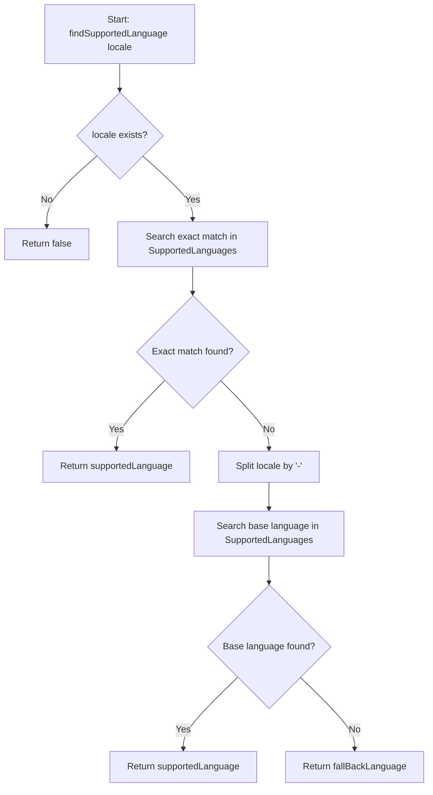
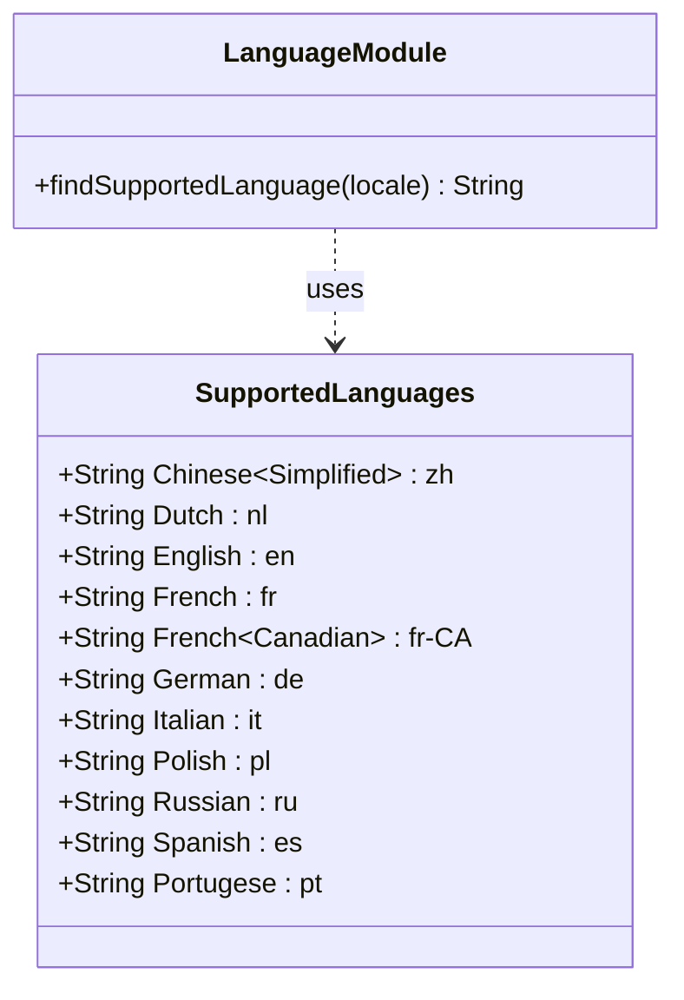
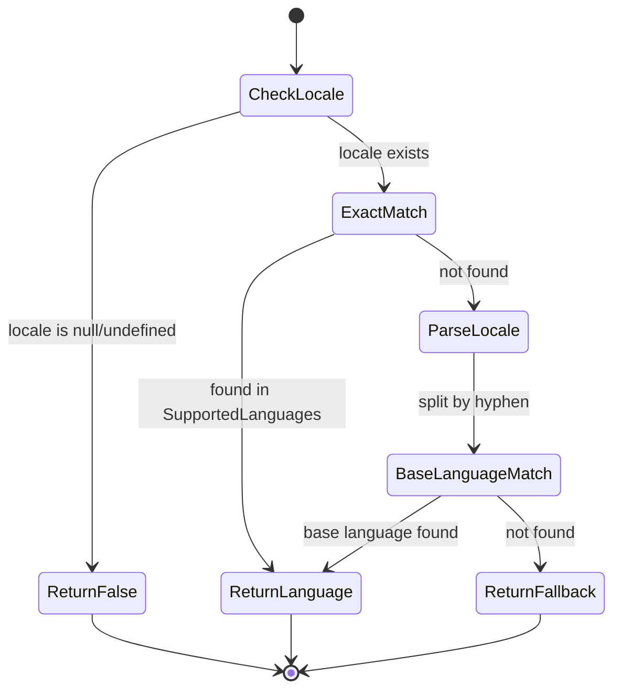

# Diagram: web/portal/src/utils/language-utils.js


> Auto-generated by Obscura crawlers

## Diagram 1

```mermaid
flowchart TD
      A[Start: findSupportedLanguage locale] --> B{locale exists?}
      B -->|No| C[Return false]
      B -->|Yes| D[Search exact match in SupportedLanguages]...
  └ 85 lines...
```

> SVG rendering failed for this diagram.

## Diagram 2



### SVG

<svg id="container" width="746.12890625" xmlns="http://www.w3.org/2000/svg" class="flowchart" height="1362.375" viewBox="0 0 746.12890625 1362.375" role="graphics-document document" aria-roledescription="flowchart-v2"><style>#container{font-family:"trebuchet ms",verdana,arial,sans-serif;font-size:16px;fill:#333;}@keyframes edge-animation-frame{from{stroke-dashoffset:0;}}@keyframes dash{to{stroke-dashoffset:0;}}#container .edge-animation-slow{stroke-dasharray:9,5!important;stroke-dashoffset:900;animation:dash 50s linear infinite;stroke-linecap:round;}#container .edge-animation-fast{stroke-dasharray:9,5!important;stroke-dashoffset:900;animation:dash 20s linear infinite;stroke-linecap:round;}#container .error-icon{fill:#552222;}#container .error-text{fill:#552222;stroke:#552222;}#container .edge-thickness-normal{stroke-width:1px;}#container .edge-thickness-thick{stroke-width:3.5px;}#container .edge-pattern-solid{stroke-dasharray:0;}#container .edge-thickness-invisible{stroke-width:0;fill:none;}#container .edge-pattern-dashed{stroke-dasharray:3;}#container .edge-pattern-dotted{stroke-dasharray:2;}#container .marker{fill:#333333;stroke:#333333;}#container .marker.cross{stroke:#333333;}#container svg{font-family:"trebuchet ms",verdana,arial,sans-serif;font-size:16px;}#container p{margin:0;}#container .label{font-family:"trebuchet ms",verdana,arial,sans-serif;color:#333;}#container .cluster-label text{fill:#333;}#container .cluster-label span{color:#333;}#container .cluster-label span p{background-color:transparent;}#container .label text,#container span{fill:#333;color:#333;}#container .node rect,#container .node circle,#container .node ellipse,#container .node polygon,#container .node path{fill:#ECECFF;stroke:#9370DB;stroke-width:1px;}#container .rough-node .label text,#container .node .label text,#container .image-shape .label,#container .icon-shape .label{text-anchor:middle;}#container .node .katex path{fill:#000;stroke:#000;stroke-width:1px;}#container .rough-node .label,#container .node .label,#container .image-shape .label,#container .icon-shape .label{text-align:center;}#container .node.clickable{cursor:pointer;}#container .root .anchor path{fill:#333333!important;stroke-width:0;stroke:#333333;}#container .arrowheadPath{fill:#333333;}#container .edgePath .path{stroke:#333333;stroke-width:2.0px;}#container .flowchart-link{stroke:#333333;fill:none;}#container .edgeLabel{background-color:rgba(232,232,232, 0.8);text-align:center;}#container .edgeLabel p{background-color:rgba(232,232,232, 0.8);}#container .edgeLabel rect{opacity:0.5;background-color:rgba(232,232,232, 0.8);fill:rgba(232,232,232, 0.8);}#container .labelBkg{background-color:rgba(232, 232, 232, 0.5);}#container .cluster rect{fill:#ffffde;stroke:#aaaa33;stroke-width:1px;}#container .cluster text{fill:#333;}#container .cluster span{color:#333;}#container div.mermaidTooltip{position:absolute;text-align:center;max-width:200px;padding:2px;font-family:"trebuchet ms",verdana,arial,sans-serif;font-size:12px;background:hsl(80, 100%, 96.2745098039%);border:1px solid #aaaa33;border-radius:2px;pointer-events:none;z-index:100;}#container .flowchartTitleText{text-anchor:middle;font-size:18px;fill:#333;}#container rect.text{fill:none;stroke-width:0;}#container .icon-shape,#container .image-shape{background-color:rgba(232,232,232, 0.8);text-align:center;}#container .icon-shape p,#container .image-shape p{background-color:rgba(232,232,232, 0.8);padding:2px;}#container .icon-shape rect,#container .image-shape rect{opacity:0.5;background-color:rgba(232,232,232, 0.8);fill:rgba(232,232,232, 0.8);}#container .label-icon{display:inline-block;height:1em;overflow:visible;vertical-align:-0.125em;}#container .node .label-icon path{fill:currentColor;stroke:revert;stroke-width:revert;}#container :root{--mermaid-font-family:"trebuchet ms",verdana,arial,sans-serif;}</style><g><marker id="container_flowchart-v2-pointEnd" class="marker flowchart-v2" viewBox="0 0 10 10" refX="5" refY="5" markerUnits="userSpaceOnUse" markerWidth="8" markerHeight="8" orient="auto"><path d="M 0 0 L 10 5 L 0 10 z" class="arrowMarkerPath" style="stroke-width: 1; stroke-dasharray: 1, 0;"></path></marker><marker id="container_flowchart-v2-pointStart" class="marker flowchart-v2" viewBox="0 0 10 10" refX="4.5" refY="5" markerUnits="userSpaceOnUse" markerWidth="8" markerHeight="8" orient="auto"><path d="M 0 5 L 10 10 L 10 0 z" class="arrowMarkerPath" style="stroke-width: 1; stroke-dasharray: 1, 0;"></path></marker><marker id="container_flowchart-v2-circleEnd" class="marker flowchart-v2" viewBox="0 0 10 10" refX="11" refY="5" markerUnits="userSpaceOnUse" markerWidth="11" markerHeight="11" orient="auto"><circle cx="5" cy="5" r="5" class="arrowMarkerPath" style="stroke-width: 1; stroke-dasharray: 1, 0;"></circle></marker><marker id="container_flowchart-v2-circleStart" class="marker flowchart-v2" viewBox="0 0 10 10" refX="-1" refY="5" markerUnits="userSpaceOnUse" markerWidth="11" markerHeight="11" orient="auto"><circle cx="5" cy="5" r="5" class="arrowMarkerPath" style="stroke-width: 1; stroke-dasharray: 1, 0;"></circle></marker><marker id="container_flowchart-v2-crossEnd" class="marker cross flowchart-v2" viewBox="0 0 11 11" refX="12" refY="5.2" markerUnits="userSpaceOnUse" markerWidth="11" markerHeight="11" orient="auto"><path d="M 1,1 l 9,9 M 10,1 l -9,9" class="arrowMarkerPath" style="stroke-width: 2; stroke-dasharray: 1, 0;"></path></marker><marker id="container_flowchart-v2-crossStart" class="marker cross flowchart-v2" viewBox="0 0 11 11" refX="-1" refY="5.2" markerUnits="userSpaceOnUse" markerWidth="11" markerHeight="11" orient="auto"><path d="M 1,1 l 9,9 M 10,1 l -9,9" class="arrowMarkerPath" style="stroke-width: 2; stroke-dasharray: 1, 0;"></path></marker><g class="root"><g class="clusters"></g><g class="edgePaths"><path d="M208.613,110L208.613,114.167C208.613,118.333,208.613,126.667,208.613,134.333C208.613,142,208.613,149,208.613,152.5L208.613,156" id="L_A_B_0" class="edge-thickness-normal edge-pattern-solid edge-thickness-normal edge-pattern-solid flowchart-link" style=";" data-edge="true" data-et="edge" data-id="L_A_B_0" data-points="W3sieCI6MjA4LjYxMzI4MTI1LCJ5IjoxMTB9LHsieCI6MjA4LjYxMzI4MTI1LCJ5IjoxMzV9LHsieCI6MjA4LjYxMzI4MTI1LCJ5IjoxNjB9XQ==" marker-end="url(#container_flowchart-v2-pointEnd)"></path><path d="M168.782,270.153L154.275,282.958C139.768,295.763,110.755,321.374,96.249,341.679C81.742,361.984,81.742,376.984,81.742,384.484L81.742,391.984" id="L_B_C_0" class="edge-thickness-normal edge-pattern-solid edge-thickness-normal edge-pattern-solid flowchart-link" style=";" data-edge="true" data-et="edge" data-id="L_B_C_0" data-points="W3sieCI6MTY4Ljc4MTUzODE2NjUwNzIzLCJ5IjoyNzAuMTUyNjMxOTE2NTA3MjN9LHsieCI6ODEuNzQyMTg3NSwieSI6MzQ2Ljk4NDM3NX0seyJ4Ijo4MS43NDIxODc1LCJ5IjozOTUuOTg0Mzc1fV0=" marker-end="url(#container_flowchart-v2-pointEnd)"></path><path d="M248.445,270.153L262.952,282.958C277.458,295.763,306.471,321.374,320.978,339.679C335.484,357.984,335.484,368.984,335.484,374.484L335.484,379.984" id="L_B_D_0" class="edge-thickness-normal edge-pattern-solid edge-thickness-normal edge-pattern-solid flowchart-link" style=";" data-edge="true" data-et="edge" data-id="L_B_D_0" data-points="W3sieCI6MjQ4LjQ0NTAyNDMzMzQ5Mjc3LCJ5IjoyNzAuMTUyNjMxOTE2NTA3MjN9LHsieCI6MzM1LjQ4NDM3NSwieSI6MzQ2Ljk4NDM3NX0seyJ4IjozMzUuNDg0Mzc1LCJ5IjozODMuOTg0Mzc1fV0=" marker-end="url(#container_flowchart-v2-pointEnd)"></path><path d="M335.484,461.984L335.484,466.151C335.484,470.318,335.484,478.651,335.484,486.318C335.484,493.984,335.484,500.984,335.484,504.484L335.484,507.984" id="L_D_E_0" class="edge-thickness-normal edge-pattern-solid edge-thickness-normal edge-pattern-solid flowchart-link" style=";" data-edge="true" data-et="edge" data-id="L_D_E_0" data-points="W3sieCI6MzM1LjQ4NDM3NSwieSI6NDYxLjk4NDM3NX0seyJ4IjozMzUuNDg0Mzc1LCJ5Ijo0ODYuOTg0Mzc1fSx7IngiOjMzNS40ODQzNzUsInkiOjUxMS45ODQzNzV9XQ==" marker-end="url(#container_flowchart-v2-pointEnd)"></path><path d="M286.656,658.968L272.423,673.273C258.191,687.578,229.726,716.187,215.494,735.992C201.262,755.797,201.262,766.797,201.262,772.297L201.262,777.797" id="L_E_F_0" class="edge-thickness-normal edge-pattern-solid edge-thickness-normal edge-pattern-solid flowchart-link" style=";" data-edge="true" data-et="edge" data-id="L_E_F_0" data-points="W3sieCI6Mjg2LjY1NTU5MjA4ODU1MjQ1LCJ5Ijo2NTguOTY4MDkyMDg4NTUyNX0seyJ4IjoyMDEuMjYxNzE4NzUsInkiOjc0NC43OTY4NzV9LHsieCI6MjAxLjI2MTcxODc1LCJ5Ijo3ODEuNzk2ODc1fV0=" marker-end="url(#container_flowchart-v2-pointEnd)"></path><path d="M384.313,658.968L398.545,673.273C412.778,687.578,441.242,716.187,455.475,735.992C469.707,755.797,469.707,766.797,469.707,772.297L469.707,777.797" id="L_E_G_0" class="edge-thickness-normal edge-pattern-solid edge-thickness-normal edge-pattern-solid flowchart-link" style=";" data-edge="true" data-et="edge" data-id="L_E_G_0" data-points="W3sieCI6Mzg0LjMxMzE1NzkxMTQ0NzU1LCJ5Ijo2NTguOTY4MDkyMDg4NTUyNX0seyJ4Ijo0NjkuNzA3MDMxMjUsInkiOjc0NC43OTY4NzV9LHsieCI6NDY5LjcwNzAzMTI1LCJ5Ijo3ODEuNzk2ODc1fV0=" marker-end="url(#container_flowchart-v2-pointEnd)"></path><path d="M469.707,835.797L469.707,839.964C469.707,844.13,469.707,852.464,469.707,860.13C469.707,867.797,469.707,874.797,469.707,878.297L469.707,881.797" id="L_G_H_0" class="edge-thickness-normal edge-pattern-solid edge-thickness-normal edge-pattern-solid flowchart-link" style=";" data-edge="true" data-et="edge" data-id="L_G_H_0" data-points="W3sieCI6NDY5LjcwNzAzMTI1LCJ5Ijo4MzUuNzk2ODc1fSx7IngiOjQ2OS43MDcwMzEyNSwieSI6ODYwLjc5Njg3NX0seyJ4Ijo0NjkuNzA3MDMxMjUsInkiOjg4NS43OTY4NzV9XQ==" marker-end="url(#container_flowchart-v2-pointEnd)"></path><path d="M469.707,963.797L469.707,967.964C469.707,972.13,469.707,980.464,469.707,988.13C469.707,995.797,469.707,1002.797,469.707,1006.297L469.707,1009.797" id="L_H_I_0" class="edge-thickness-normal edge-pattern-solid edge-thickness-normal edge-pattern-solid flowchart-link" style=";" data-edge="true" data-et="edge" data-id="L_H_I_0" data-points="W3sieCI6NDY5LjcwNzAzMTI1LCJ5Ijo5NjMuNzk2ODc1fSx7IngiOjQ2OS43MDcwMzEyNSwieSI6OTg4Ljc5Njg3NX0seyJ4Ijo0NjkuNzA3MDMxMjUsInkiOjEwMTMuNzk2ODc1fV0=" marker-end="url(#container_flowchart-v2-pointEnd)"></path><path d="M415.532,1172.2L399.736,1187.396C383.94,1202.592,352.347,1232.983,336.55,1253.679C320.754,1274.375,320.754,1285.375,320.754,1290.875L320.754,1296.375" id="L_I_J_0" class="edge-thickness-normal edge-pattern-solid edge-thickness-normal edge-pattern-solid flowchart-link" style=";" data-edge="true" data-et="edge" data-id="L_I_J_0" data-points="W3sieCI6NDE1LjUzMjQ4NDYyNDM2ODQsInkiOjExNzIuMjAwNDUzMzc0MzY4NH0seyJ4IjozMjAuNzUzOTA2MjUsInkiOjEyNjMuMzc1fSx7IngiOjMyMC43NTM5MDYyNSwieSI6MTMwMC4zNzV9XQ==" marker-end="url(#container_flowchart-v2-pointEnd)"></path><path d="M523.882,1172.2L539.678,1187.396C555.474,1202.592,587.067,1232.983,602.864,1253.679C618.66,1274.375,618.66,1285.375,618.66,1290.875L618.66,1296.375" id="L_I_K_0" class="edge-thickness-normal edge-pattern-solid edge-thickness-normal edge-pattern-solid flowchart-link" style=";" data-edge="true" data-et="edge" data-id="L_I_K_0" data-points="W3sieCI6NTIzLjg4MTU3Nzg3NTYzMTYsInkiOjExNzIuMjAwNDUzMzc0MzY4NH0seyJ4Ijo2MTguNjYwMTU2MjUsInkiOjEyNjMuMzc1fSx7IngiOjYxOC42NjAxNTYyNSwieSI6MTMwMC4zNzV9XQ==" marker-end="url(#container_flowchart-v2-pointEnd)"></path></g><g class="edgeLabels"><g class="edgeLabel"><g class="label" data-id="L_A_B_0" transform="translate(0, 0)"><foreignObject width="0" height="0"><div xmlns="http://www.w3.org/1999/xhtml" class="labelBkg" style="display: table-cell; white-space: nowrap; line-height: 1.5; max-width: 200px; text-align: center;"><span class="edgeLabel"></span></div></foreignObject></g></g><g class="edgeLabel" transform="translate(81.7421875, 346.984375)"><g class="label" data-id="L_B_C_0" transform="translate(-10.140625, -12)"><foreignObject width="20.28125" height="24"><div xmlns="http://www.w3.org/1999/xhtml" class="labelBkg" style="display: table-cell; white-space: nowrap; line-height: 1.5; max-width: 200px; text-align: center;"><span class="edgeLabel"><p>No</p></span></div></foreignObject></g></g><g class="edgeLabel" transform="translate(335.484375, 346.984375)"><g class="label" data-id="L_B_D_0" transform="translate(-12.03125, -12)"><foreignObject width="24.0625" height="24"><div xmlns="http://www.w3.org/1999/xhtml" class="labelBkg" style="display: table-cell; white-space: nowrap; line-height: 1.5; max-width: 200px; text-align: center;"><span class="edgeLabel"><p>Yes</p></span></div></foreignObject></g></g><g class="edgeLabel"><g class="label" data-id="L_D_E_0" transform="translate(0, 0)"><foreignObject width="0" height="0"><div xmlns="http://www.w3.org/1999/xhtml" class="labelBkg" style="display: table-cell; white-space: nowrap; line-height: 1.5; max-width: 200px; text-align: center;"><span class="edgeLabel"></span></div></foreignObject></g></g><g class="edgeLabel" transform="translate(201.26171875, 744.796875)"><g class="label" data-id="L_E_F_0" transform="translate(-12.03125, -12)"><foreignObject width="24.0625" height="24"><div xmlns="http://www.w3.org/1999/xhtml" class="labelBkg" style="display: table-cell; white-space: nowrap; line-height: 1.5; max-width: 200px; text-align: center;"><span class="edgeLabel"><p>Yes</p></span></div></foreignObject></g></g><g class="edgeLabel" transform="translate(469.70703125, 744.796875)"><g class="label" data-id="L_E_G_0" transform="translate(-10.140625, -12)"><foreignObject width="20.28125" height="24"><div xmlns="http://www.w3.org/1999/xhtml" class="labelBkg" style="display: table-cell; white-space: nowrap; line-height: 1.5; max-width: 200px; text-align: center;"><span class="edgeLabel"><p>No</p></span></div></foreignObject></g></g><g class="edgeLabel"><g class="label" data-id="L_G_H_0" transform="translate(0, 0)"><foreignObject width="0" height="0"><div xmlns="http://www.w3.org/1999/xhtml" class="labelBkg" style="display: table-cell; white-space: nowrap; line-height: 1.5; max-width: 200px; text-align: center;"><span class="edgeLabel"></span></div></foreignObject></g></g><g class="edgeLabel"><g class="label" data-id="L_H_I_0" transform="translate(0, 0)"><foreignObject width="0" height="0"><div xmlns="http://www.w3.org/1999/xhtml" class="labelBkg" style="display: table-cell; white-space: nowrap; line-height: 1.5; max-width: 200px; text-align: center;"><span class="edgeLabel"></span></div></foreignObject></g></g><g class="edgeLabel" transform="translate(320.75390625, 1263.375)"><g class="label" data-id="L_I_J_0" transform="translate(-12.03125, -12)"><foreignObject width="24.0625" height="24"><div xmlns="http://www.w3.org/1999/xhtml" class="labelBkg" style="display: table-cell; white-space: nowrap; line-height: 1.5; max-width: 200px; text-align: center;"><span class="edgeLabel"><p>Yes</p></span></div></foreignObject></g></g><g class="edgeLabel" transform="translate(618.66015625, 1263.375)"><g class="label" data-id="L_I_K_0" transform="translate(-10.140625, -12)"><foreignObject width="20.28125" height="24"><div xmlns="http://www.w3.org/1999/xhtml" class="labelBkg" style="display: table-cell; white-space: nowrap; line-height: 1.5; max-width: 200px; text-align: center;"><span class="edgeLabel"><p>No</p></span></div></foreignObject></g></g></g><g class="nodes"><g class="node default" id="flowchart-A-0" transform="translate(208.61328125, 59)"><rect class="basic label-container" style="" x="-130" y="-51" width="260" height="102"></rect><g class="label" style="" transform="translate(-100, -36)"><rect></rect><foreignObject width="200" height="72"><div xmlns="http://www.w3.org/1999/xhtml" style="display: table; white-space: break-spaces; line-height: 1.5; max-width: 200px; text-align: center; width: 200px;"><span class="nodeLabel"><p>Start: findSupportedLanguage locale</p></span></div></foreignObject></g></g><g class="node default" id="flowchart-B-1" transform="translate(208.61328125, 234.9921875)"><polygon points="74.9921875,0 149.984375,-74.9921875 74.9921875,-149.984375 0,-74.9921875" class="label-container" transform="translate(-74.4921875, 74.9921875)"></polygon><g class="label" style="" transform="translate(-47.9921875, -12)"><rect></rect><foreignObject width="95.984375" height="24"><div xmlns="http://www.w3.org/1999/xhtml" style="display: table-cell; white-space: nowrap; line-height: 1.5; max-width: 200px; text-align: center;"><span class="nodeLabel"><p>locale exists?</p></span></div></foreignObject></g></g><g class="node default" id="flowchart-C-3" transform="translate(81.7421875, 422.984375)"><rect class="basic label-container" style="" x="-73.7421875" y="-27" width="147.484375" height="54"></rect><g class="label" style="" transform="translate(-43.7421875, -12)"><rect></rect><foreignObject width="87.484375" height="24"><div xmlns="http://www.w3.org/1999/xhtml" style="display: table-cell; white-space: nowrap; line-height: 1.5; max-width: 200px; text-align: center;"><span class="nodeLabel"><p>Return false</p></span></div></foreignObject></g></g><g class="node default" id="flowchart-D-5" transform="translate(335.484375, 422.984375)"><rect class="basic label-container" style="" x="-130" y="-39" width="260" height="78"></rect><g class="label" style="" transform="translate(-100, -24)"><rect></rect><foreignObject width="200" height="48"><div xmlns="http://www.w3.org/1999/xhtml" style="display: table; white-space: break-spaces; line-height: 1.5; max-width: 200px; text-align: center; width: 200px;"><span class="nodeLabel"><p>Search exact match in SupportedLanguages</p></span></div></foreignObject></g></g><g class="node default" id="flowchart-E-7" transform="translate(335.484375, 609.890625)"><polygon points="97.90625,0 195.8125,-97.90625 97.90625,-195.8125 0,-97.90625" class="label-container" transform="translate(-97.40625, 97.90625)"></polygon><g class="label" style="" transform="translate(-70.90625, -12)"><rect></rect><foreignObject width="141.8125" height="24"><div xmlns="http://www.w3.org/1999/xhtml" style="display: table-cell; white-space: nowrap; line-height: 1.5; max-width: 200px; text-align: center;"><span class="nodeLabel"><p>Exact match found?</p></span></div></foreignObject></g></g><g class="node default" id="flowchart-F-9" transform="translate(201.26171875, 808.796875)"><rect class="basic label-container" style="" x="-128.4375" y="-27" width="256.875" height="54"></rect><g class="label" style="" transform="translate(-98.4375, -12)"><rect></rect><foreignObject width="196.875" height="24"><div xmlns="http://www.w3.org/1999/xhtml" style="display: table-cell; white-space: nowrap; line-height: 1.5; max-width: 200px; text-align: center;"><span class="nodeLabel"><p>Return supportedLanguage</p></span></div></foreignObject></g></g><g class="node default" id="flowchart-G-11" transform="translate(469.70703125, 808.796875)"><rect class="basic label-container" style="" x="-90.0078125" y="-27" width="180.015625" height="54"></rect><g class="label" style="" transform="translate(-60.0078125, -12)"><rect></rect><foreignObject width="120.015625" height="24"><div xmlns="http://www.w3.org/1999/xhtml" style="display: table-cell; white-space: nowrap; line-height: 1.5; max-width: 200px; text-align: center;"><span class="nodeLabel"><p>Split locale by '-'</p></span></div></foreignObject></g></g><g class="node default" id="flowchart-H-13" transform="translate(469.70703125, 924.796875)"><rect class="basic label-container" style="" x="-130" y="-39" width="260" height="78"></rect><g class="label" style="" transform="translate(-100, -24)"><rect></rect><foreignObject width="200" height="48"><div xmlns="http://www.w3.org/1999/xhtml" style="display: table; white-space: break-spaces; line-height: 1.5; max-width: 200px; text-align: center; width: 200px;"><span class="nodeLabel"><p>Search base language in SupportedLanguages</p></span></div></foreignObject></g></g><g class="node default" id="flowchart-I-15" transform="translate(469.70703125, 1120.0859375)"><polygon points="106.2890625,0 212.578125,-106.2890625 106.2890625,-212.578125 0,-106.2890625" class="label-container" transform="translate(-105.7890625, 106.2890625)"></polygon><g class="label" style="" transform="translate(-79.2890625, -12)"><rect></rect><foreignObject width="158.578125" height="24"><div xmlns="http://www.w3.org/1999/xhtml" style="display: table-cell; white-space: nowrap; line-height: 1.5; max-width: 200px; text-align: center;"><span class="nodeLabel"><p>Base language found?</p></span></div></foreignObject></g></g><g class="node default" id="flowchart-J-17" transform="translate(320.75390625, 1327.375)"><rect class="basic label-container" style="" x="-128.4375" y="-27" width="256.875" height="54"></rect><g class="label" style="" transform="translate(-98.4375, -12)"><rect></rect><foreignObject width="196.875" height="24"><div xmlns="http://www.w3.org/1999/xhtml" style="display: table-cell; white-space: nowrap; line-height: 1.5; max-width: 200px; text-align: center;"><span class="nodeLabel"><p>Return supportedLanguage</p></span></div></foreignObject></g></g><g class="node default" id="flowchart-K-19" transform="translate(618.66015625, 1327.375)"><rect class="basic label-container" style="" x="-119.46875" y="-27" width="238.9375" height="54"></rect><g class="label" style="" transform="translate(-89.46875, -12)"><rect></rect><foreignObject width="178.9375" height="24"><div xmlns="http://www.w3.org/1999/xhtml" style="display: table-cell; white-space: nowrap; line-height: 1.5; max-width: 200px; text-align: center;"><span class="nodeLabel"><p>Return fallBackLanguage</p></span></div></foreignObject></g></g></g></g></g></svg>

## Diagram 3



### SVG

<svg id="container" width="391.8125" xmlns="http://www.w3.org/2000/svg" class="classDiagram" height="576" viewBox="0 0 391.8125 576" role="graphics-document document" aria-roledescription="class"><style>#container{font-family:"trebuchet ms",verdana,arial,sans-serif;font-size:16px;fill:#333;}@keyframes edge-animation-frame{from{stroke-dashoffset:0;}}@keyframes dash{to{stroke-dashoffset:0;}}#container .edge-animation-slow{stroke-dasharray:9,5!important;stroke-dashoffset:900;animation:dash 50s linear infinite;stroke-linecap:round;}#container .edge-animation-fast{stroke-dasharray:9,5!important;stroke-dashoffset:900;animation:dash 20s linear infinite;stroke-linecap:round;}#container .error-icon{fill:#552222;}#container .error-text{fill:#552222;stroke:#552222;}#container .edge-thickness-normal{stroke-width:1px;}#container .edge-thickness-thick{stroke-width:3.5px;}#container .edge-pattern-solid{stroke-dasharray:0;}#container .edge-thickness-invisible{stroke-width:0;fill:none;}#container .edge-pattern-dashed{stroke-dasharray:3;}#container .edge-pattern-dotted{stroke-dasharray:2;}#container .marker{fill:#333333;stroke:#333333;}#container .marker.cross{stroke:#333333;}#container svg{font-family:"trebuchet ms",verdana,arial,sans-serif;font-size:16px;}#container p{margin:0;}#container g.classGroup text{fill:#9370DB;stroke:none;font-family:"trebuchet ms",verdana,arial,sans-serif;font-size:10px;}#container g.classGroup text .title{font-weight:bolder;}#container .nodeLabel,#container .edgeLabel{color:#131300;}#container .edgeLabel .label rect{fill:#ECECFF;}#container .label text{fill:#131300;}#container .labelBkg{background:#ECECFF;}#container .edgeLabel .label span{background:#ECECFF;}#container .classTitle{font-weight:bolder;}#container .node rect,#container .node circle,#container .node ellipse,#container .node polygon,#container .node path{fill:#ECECFF;stroke:#9370DB;stroke-width:1px;}#container .divider{stroke:#9370DB;stroke-width:1;}#container g.clickable{cursor:pointer;}#container g.classGroup rect{fill:#ECECFF;stroke:#9370DB;}#container g.classGroup line{stroke:#9370DB;stroke-width:1;}#container .classLabel .box{stroke:none;stroke-width:0;fill:#ECECFF;opacity:0.5;}#container .classLabel .label{fill:#9370DB;font-size:10px;}#container .relation{stroke:#333333;stroke-width:1;fill:none;}#container .dashed-line{stroke-dasharray:3;}#container .dotted-line{stroke-dasharray:1 2;}#container #compositionStart,#container .composition{fill:#333333!important;stroke:#333333!important;stroke-width:1;}#container #compositionEnd,#container .composition{fill:#333333!important;stroke:#333333!important;stroke-width:1;}#container #dependencyStart,#container .dependency{fill:#333333!important;stroke:#333333!important;stroke-width:1;}#container #dependencyStart,#container .dependency{fill:#333333!important;stroke:#333333!important;stroke-width:1;}#container #extensionStart,#container .extension{fill:transparent!important;stroke:#333333!important;stroke-width:1;}#container #extensionEnd,#container .extension{fill:transparent!important;stroke:#333333!important;stroke-width:1;}#container #aggregationStart,#container .aggregation{fill:transparent!important;stroke:#333333!important;stroke-width:1;}#container #aggregationEnd,#container .aggregation{fill:transparent!important;stroke:#333333!important;stroke-width:1;}#container #lollipopStart,#container .lollipop{fill:#ECECFF!important;stroke:#333333!important;stroke-width:1;}#container #lollipopEnd,#container .lollipop{fill:#ECECFF!important;stroke:#333333!important;stroke-width:1;}#container .edgeTerminals{font-size:11px;line-height:initial;}#container .classTitleText{text-anchor:middle;font-size:18px;fill:#333;}#container .label-icon{display:inline-block;height:1em;overflow:visible;vertical-align:-0.125em;}#container .node .label-icon path{fill:currentColor;stroke:revert;stroke-width:revert;}#container :root{--mermaid-font-family:"trebuchet ms",verdana,arial,sans-serif;}</style><g><defs><marker id="container_class-aggregationStart" class="marker aggregation class" refX="18" refY="7" markerWidth="190" markerHeight="240" orient="auto"><path d="M 18,7 L9,13 L1,7 L9,1 Z"></path></marker></defs><defs><marker id="container_class-aggregationEnd" class="marker aggregation class" refX="1" refY="7" markerWidth="20" markerHeight="28" orient="auto"><path d="M 18,7 L9,13 L1,7 L9,1 Z"></path></marker></defs><defs><marker id="container_class-extensionStart" class="marker extension class" refX="18" refY="7" markerWidth="190" markerHeight="240" orient="auto"><path d="M 1,7 L18,13 V 1 Z"></path></marker></defs><defs><marker id="container_class-extensionEnd" class="marker extension class" refX="1" refY="7" markerWidth="20" markerHeight="28" orient="auto"><path d="M 1,1 V 13 L18,7 Z"></path></marker></defs><defs><marker id="container_class-compositionStart" class="marker composition class" refX="18" refY="7" markerWidth="190" markerHeight="240" orient="auto"><path d="M 18,7 L9,13 L1,7 L9,1 Z"></path></marker></defs><defs><marker id="container_class-compositionEnd" class="marker composition class" refX="1" refY="7" markerWidth="20" markerHeight="28" orient="auto"><path d="M 18,7 L9,13 L1,7 L9,1 Z"></path></marker></defs><defs><marker id="container_class-dependencyStart" class="marker dependency class" refX="6" refY="7" markerWidth="190" markerHeight="240" orient="auto"><path d="M 5,7 L9,13 L1,7 L9,1 Z"></path></marker></defs><defs><marker id="container_class-dependencyEnd" class="marker dependency class" refX="13" refY="7" markerWidth="20" markerHeight="28" orient="auto"><path d="M 18,7 L9,13 L14,7 L9,1 Z"></path></marker></defs><defs><marker id="container_class-lollipopStart" class="marker lollipop class" refX="13" refY="7" markerWidth="190" markerHeight="240" orient="auto"><circle stroke="black" fill="transparent" cx="7" cy="7" r="6"></circle></marker></defs><defs><marker id="container_class-lollipopEnd" class="marker lollipop class" refX="1" refY="7" markerWidth="190" markerHeight="240" orient="auto"><circle stroke="black" fill="transparent" cx="7" cy="7" r="6"></circle></marker></defs><g class="root"><g class="clusters"></g><g class="edgePaths"><path d="M195.906,134L195.906,140.167C195.906,146.333,195.906,158.667,195.906,170C195.906,181.333,195.906,191.667,195.906,196.833L195.906,202" id="id_LanguageModule_SupportedLanguages_1" class="edge-thickness-normal edge-pattern-dashed relation" style=";;;" data-edge="true" data-et="edge" data-id="id_LanguageModule_SupportedLanguages_1" data-points="W3sieCI6MTk1LjkwNjI1LCJ5IjoxMzR9LHsieCI6MTk1LjkwNjI1LCJ5IjoxNzF9LHsieCI6MTk1LjkwNjI1LCJ5IjoyMDh9XQ==" marker-end="url(#container_class-dependencyEnd)"></path></g><g class="edgeLabels"><g class="edgeLabel" transform="translate(195.90625, 171)"><g class="label" data-id="id_LanguageModule_SupportedLanguages_1" transform="translate(-16.4921875, -12)"><foreignObject width="32.984375" height="24"><div xmlns="http://www.w3.org/1999/xhtml" class="labelBkg" style="display: table-cell; white-space: nowrap; line-height: 1.5; max-width: 200px; text-align: center;"><span class="edgeLabel"><p>uses</p></span></div></foreignObject></g></g></g><g class="nodes"><g class="node default" id="classId-SupportedLanguages-0" transform="translate(195.90625, 388)"><g class="basic label-container"><path d="M-167.86328125 -180 L167.86328125 -180 L167.86328125 180 L-167.86328125 180" stroke="none" stroke-width="0" fill="#ECECFF" style=""></path><path d="M-167.86328125 -180 C-62.37202470725521 -180, 43.119231835489586 -180, 167.86328125 -180 M-167.86328125 -180 C-84.02756342029348 -180, -0.19184559058695072 -180, 167.86328125 -180 M167.86328125 -180 C167.86328125 -95.84757773466202, 167.86328125 -11.69515546932405, 167.86328125 180 M167.86328125 -180 C167.86328125 -72.97420972124642, 167.86328125 34.05158055750715, 167.86328125 180 M167.86328125 180 C97.55424412429545 180, 27.245206998590902 180, -167.86328125 180 M167.86328125 180 C38.41099301962382 180, -91.04129521075237 180, -167.86328125 180 M-167.86328125 180 C-167.86328125 49.509134315591496, -167.86328125 -80.98173136881701, -167.86328125 -180 M-167.86328125 180 C-167.86328125 66.17276550018977, -167.86328125 -47.65446899962046, -167.86328125 -180" stroke="#9370DB" stroke-width="1.3" fill="none" stroke-dasharray="0 0" style=""></path></g><g class="annotation-group text" transform="translate(0, -156)"></g><g class="label-group text" transform="translate(-77.4921875, -156)"><g class="label" style="font-weight: bolder" transform="translate(0,-12)"><foreignObject width="154.984375" height="24"><div xmlns="http://www.w3.org/1999/xhtml" style="display: table-cell; white-space: nowrap; line-height: 1.5; max-width: 203px; text-align: center;"><span class="nodeLabel markdown-node-label" style=""><p>SupportedLanguages</p></span></div></foreignObject></g></g><g class="members-group text" transform="translate(-155.86328125, -108)"><g class="label" style="" transform="translate(0,-12)"><foreignObject width="229.265625" height="24"><div xmlns="http://www.w3.org/1999/xhtml" style="display: table-cell; white-space: nowrap; line-height: 1.5; max-width: 326px; text-align: center;"><span class="nodeLabel markdown-node-label" style=""><p>+String Chinese&lt;Simplified&gt; : zh</p></span></div></foreignObject></g><g class="label" style="" transform="translate(0,12)"><foreignObject width="123.03125" height="24"><div xmlns="http://www.w3.org/1999/xhtml" style="display: table-cell; white-space: nowrap; line-height: 1.5; max-width: 181px; text-align: center;"><span class="nodeLabel markdown-node-label" style=""><p>+String Dutch : nl</p></span></div></foreignObject></g><g class="label" style="" transform="translate(0,36)"><foreignObject width="137.03125" height="24"><div xmlns="http://www.w3.org/1999/xhtml" style="display: table-cell; white-space: nowrap; line-height: 1.5; max-width: 194px; text-align: center;"><span class="nodeLabel markdown-node-label" style=""><p>+String English : en</p></span></div></foreignObject></g><g class="label" style="" transform="translate(0,60)"><foreignObject width="126.4375" height="24"><div xmlns="http://www.w3.org/1999/xhtml" style="display: table-cell; white-space: nowrap; line-height: 1.5; max-width: 185px; text-align: center;"><span class="nodeLabel markdown-node-label" style=""><p>+String French : fr</p></span></div></foreignObject></g><g class="label" style="" transform="translate(0,84)"><foreignObject width="234.234375" height="24"><div xmlns="http://www.w3.org/1999/xhtml" style="display: table-cell; white-space: nowrap; line-height: 1.5; max-width: 332px; text-align: center;"><span class="nodeLabel markdown-node-label" style=""><p>+String French&lt;Canadian&gt; : fr-CA</p></span></div></foreignObject></g><g class="label" style="" transform="translate(0,108)"><foreignObject width="141.859375" height="24"><div xmlns="http://www.w3.org/1999/xhtml" style="display: table-cell; white-space: nowrap; line-height: 1.5; max-width: 199px; text-align: center;"><span class="nodeLabel markdown-node-label" style=""><p>+String German : de</p></span></div></foreignObject></g><g class="label" style="" transform="translate(0,132)"><foreignObject width="123.28125" height="24"><div xmlns="http://www.w3.org/1999/xhtml" style="display: table-cell; white-space: nowrap; line-height: 1.5; max-width: 181px; text-align: center;"><span class="nodeLabel markdown-node-label" style=""><p>+String Italian : it</p></span></div></foreignObject></g><g class="label" style="" transform="translate(0,156)"><foreignObject width="125.1875" height="24"><div xmlns="http://www.w3.org/1999/xhtml" style="display: table-cell; white-space: nowrap; line-height: 1.5; max-width: 183px; text-align: center;"><span class="nodeLabel markdown-node-label" style=""><p>+String Polish : pl</p></span></div></foreignObject></g><g class="label" style="" transform="translate(0,180)"><foreignObject width="138.640625" height="24"><div xmlns="http://www.w3.org/1999/xhtml" style="display: table-cell; white-space: nowrap; line-height: 1.5; max-width: 196px; text-align: center;"><span class="nodeLabel markdown-node-label" style=""><p>+String Russian : ru</p></span></div></foreignObject></g><g class="label" style="" transform="translate(0,204)"><foreignObject width="140.484375" height="24"><div xmlns="http://www.w3.org/1999/xhtml" style="display: table-cell; white-space: nowrap; line-height: 1.5; max-width: 198px; text-align: center;"><span class="nodeLabel markdown-node-label" style=""><p>+String Spanish : es</p></span></div></foreignObject></g><g class="label" style="" transform="translate(0,228)"><foreignObject width="154.46875" height="24"><div xmlns="http://www.w3.org/1999/xhtml" style="display: table-cell; white-space: nowrap; line-height: 1.5; max-width: 212px; text-align: center;"><span class="nodeLabel markdown-node-label" style=""><p>+String Portugese : pt</p></span></div></foreignObject></g></g><g class="methods-group text" transform="translate(-155.86328125, 180)"></g><g class="divider" style=""><path d="M-167.86328125 -132 C-44.94919582122688 -132, 77.96488960754624 -132, 167.86328125 -132 M-167.86328125 -132 C-58.022408026807085 -132, 51.81846519638583 -132, 167.86328125 -132" stroke="#9370DB" stroke-width="1.3" fill="none" stroke-dasharray="0 0" style=""></path></g><g class="divider" style=""><path d="M-167.86328125 156 C-87.9933817304115 156, -8.123482210823 156, 167.86328125 156 M-167.86328125 156 C-55.70541382385929 156, 56.45245360228142 156, 167.86328125 156" stroke="#9370DB" stroke-width="1.3" fill="none" stroke-dasharray="0 0" style=""></path></g></g><g class="node default" id="classId-LanguageModule-1" transform="translate(195.90625, 71)"><g class="basic label-container"><path d="M-187.90625 -63 L187.90625 -63 L187.90625 63 L-187.90625 63" stroke="none" stroke-width="0" fill="#ECECFF" style=""></path><path d="M-187.90625 -63 C-78.73576185594696 -63, 30.434726288106077 -63, 187.90625 -63 M-187.90625 -63 C-54.13062441650405 -63, 79.6450011669919 -63, 187.90625 -63 M187.90625 -63 C187.90625 -21.211995487722284, 187.90625 20.576009024555432, 187.90625 63 M187.90625 -63 C187.90625 -29.460013962748853, 187.90625 4.079972074502294, 187.90625 63 M187.90625 63 C76.42569790655058 63, -35.05485418689884 63, -187.90625 63 M187.90625 63 C83.8954500947383 63, -20.115349810523412 63, -187.90625 63 M-187.90625 63 C-187.90625 16.68601796409807, -187.90625 -29.62796407180386, -187.90625 -63 M-187.90625 63 C-187.90625 32.43003487911993, -187.90625 1.8600697582398595, -187.90625 -63" stroke="#9370DB" stroke-width="1.3" fill="none" stroke-dasharray="0 0" style=""></path></g><g class="annotation-group text" transform="translate(0, -39)"></g><g class="label-group text" transform="translate(-61.96875, -39)"><g class="label" style="font-weight: bolder" transform="translate(0,-12)"><foreignObject width="123.9375" height="24"><div xmlns="http://www.w3.org/1999/xhtml" style="display: table-cell; white-space: nowrap; line-height: 1.5; max-width: 173px; text-align: center;"><span class="nodeLabel markdown-node-label" style=""><p>LanguageModule</p></span></div></foreignObject></g></g><g class="members-group text" transform="translate(-175.90625, 9)"></g><g class="methods-group text" transform="translate(-175.90625, 39)"><g class="label" style="" transform="translate(0,-12)"><foreignObject width="289.84375" height="24"><div xmlns="http://www.w3.org/1999/xhtml" style="display: table-cell; white-space: nowrap; line-height: 1.5; max-width: 348px; text-align: center;"><span class="nodeLabel markdown-node-label" style=""><p>+findSupportedLanguage(locale) : String</p></span></div></foreignObject></g></g><g class="divider" style=""><path d="M-187.90625 -15 C-97.6270863790156 -15, -7.3479227580311886 -15, 187.90625 -15 M-187.90625 -15 C-80.78548893432904 -15, 26.335272131341924 -15, 187.90625 -15" stroke="#9370DB" stroke-width="1.3" fill="none" stroke-dasharray="0 0" style=""></path></g><g class="divider" style=""><path d="M-187.90625 9 C-108.30523546520664 9, -28.70422093041327 9, 187.90625 9 M-187.90625 9 C-104.39810383432004 9, -20.88995766864008 9, 187.90625 9" stroke="#9370DB" stroke-width="1.3" fill="none" stroke-dasharray="0 0" style=""></path></g></g></g></g></g></svg>

## Diagram 4



### SVG

<svg id="container" width="598.71484375" xmlns="http://www.w3.org/2000/svg" class="statediagram" height="664" viewBox="0 0 598.71484375 664" role="graphics-document document" aria-roledescription="stateDiagram"><style>#container{font-family:"trebuchet ms",verdana,arial,sans-serif;font-size:16px;fill:#333;}@keyframes edge-animation-frame{from{stroke-dashoffset:0;}}@keyframes dash{to{stroke-dashoffset:0;}}#container .edge-animation-slow{stroke-dasharray:9,5!important;stroke-dashoffset:900;animation:dash 50s linear infinite;stroke-linecap:round;}#container .edge-animation-fast{stroke-dasharray:9,5!important;stroke-dashoffset:900;animation:dash 20s linear infinite;stroke-linecap:round;}#container .error-icon{fill:#552222;}#container .error-text{fill:#552222;stroke:#552222;}#container .edge-thickness-normal{stroke-width:1px;}#container .edge-thickness-thick{stroke-width:3.5px;}#container .edge-pattern-solid{stroke-dasharray:0;}#container .edge-thickness-invisible{stroke-width:0;fill:none;}#container .edge-pattern-dashed{stroke-dasharray:3;}#container .edge-pattern-dotted{stroke-dasharray:2;}#container .marker{fill:#333333;stroke:#333333;}#container .marker.cross{stroke:#333333;}#container svg{font-family:"trebuchet ms",verdana,arial,sans-serif;font-size:16px;}#container p{margin:0;}#container defs #statediagram-barbEnd{fill:#333333;stroke:#333333;}#container g.stateGroup text{fill:#9370DB;stroke:none;font-size:10px;}#container g.stateGroup text{fill:#333;stroke:none;font-size:10px;}#container g.stateGroup .state-title{font-weight:bolder;fill:#131300;}#container g.stateGroup rect{fill:#ECECFF;stroke:#9370DB;}#container g.stateGroup line{stroke:#333333;stroke-width:1;}#container .transition{stroke:#333333;stroke-width:1;fill:none;}#container .stateGroup .composit{fill:white;border-bottom:1px;}#container .stateGroup .alt-composit{fill:#e0e0e0;border-bottom:1px;}#container .state-note{stroke:#aaaa33;fill:#fff5ad;}#container .state-note text{fill:black;stroke:none;font-size:10px;}#container .stateLabel .box{stroke:none;stroke-width:0;fill:#ECECFF;opacity:0.5;}#container .edgeLabel .label rect{fill:#ECECFF;opacity:0.5;}#container .edgeLabel{background-color:rgba(232,232,232, 0.8);text-align:center;}#container .edgeLabel p{background-color:rgba(232,232,232, 0.8);}#container .edgeLabel rect{opacity:0.5;background-color:rgba(232,232,232, 0.8);fill:rgba(232,232,232, 0.8);}#container .edgeLabel .label text{fill:#333;}#container .label div .edgeLabel{color:#333;}#container .stateLabel text{fill:#131300;font-size:10px;font-weight:bold;}#container .node circle.state-start{fill:#333333;stroke:#333333;}#container .node .fork-join{fill:#333333;stroke:#333333;}#container .node circle.state-end{fill:#9370DB;stroke:white;stroke-width:1.5;}#container .end-state-inner{fill:white;stroke-width:1.5;}#container .node rect{fill:#ECECFF;stroke:#9370DB;stroke-width:1px;}#container .node polygon{fill:#ECECFF;stroke:#9370DB;stroke-width:1px;}#container #statediagram-barbEnd{fill:#333333;}#container .statediagram-cluster rect{fill:#ECECFF;stroke:#9370DB;stroke-width:1px;}#container .cluster-label,#container .nodeLabel{color:#131300;}#container .statediagram-cluster rect.outer{rx:5px;ry:5px;}#container .statediagram-state .divider{stroke:#9370DB;}#container .statediagram-state .title-state{rx:5px;ry:5px;}#container .statediagram-cluster.statediagram-cluster .inner{fill:white;}#container .statediagram-cluster.statediagram-cluster-alt .inner{fill:#f0f0f0;}#container .statediagram-cluster .inner{rx:0;ry:0;}#container .statediagram-state rect.basic{rx:5px;ry:5px;}#container .statediagram-state rect.divider{stroke-dasharray:10,10;fill:#f0f0f0;}#container .note-edge{stroke-dasharray:5;}#container .statediagram-note rect{fill:#fff5ad;stroke:#aaaa33;stroke-width:1px;rx:0;ry:0;}#container .statediagram-note rect{fill:#fff5ad;stroke:#aaaa33;stroke-width:1px;rx:0;ry:0;}#container .statediagram-note text{fill:black;}#container .statediagram-note .nodeLabel{color:black;}#container .statediagram .edgeLabel{color:red;}#container #dependencyStart,#container #dependencyEnd{fill:#333333;stroke:#333333;stroke-width:1;}#container .statediagramTitleText{text-anchor:middle;font-size:18px;fill:#333;}#container :root{--mermaid-font-family:"trebuchet ms",verdana,arial,sans-serif;}</style><g><defs><marker id="container_stateDiagram-barbEnd" refX="19" refY="7" markerWidth="20" markerHeight="14" markerUnits="userSpaceOnUse" orient="auto"><path d="M 19,7 L9,13 L14,7 L9,1 Z"></path></marker></defs><g class="root"><g class="clusters"></g><g class="edgePaths"><path d="M291.734,22L291.734,26.167C291.734,30.333,291.734,38.667,291.818,47.083C291.901,55.5,292.068,64,292.151,68.25L292.234,72.5" id="edge0" class="edge-thickness-normal edge-pattern-solid transition" style="fill:none;;;fill:none" data-edge="true" data-et="edge" data-id="edge0" data-points="W3sieCI6MjkxLjczNDM3NSwieSI6MjJ9LHsieCI6MjkxLjczNDM3NSwieSI6NDd9LHsieCI6MjkyLjIzNDM3NSwieSI6NzIuNX1d" marker-end="url(#container_stateDiagram-barbEnd)"></path><path d="M239.735,107.693L215.573,114.577C191.412,121.462,143.089,135.231,118.927,151.615C94.766,168,94.766,187,94.766,206C94.766,225,94.766,244,94.766,263C94.766,282,94.766,301,94.766,322C94.766,343,94.766,366,94.766,389C94.766,412,94.766,435,94.766,456C94.766,477,94.766,496,94.849,511.75C94.932,527.5,95.099,540,95.182,546.25L95.266,552.5" id="edge1" class="edge-thickness-normal edge-pattern-solid transition" style="fill:none;;;fill:none" data-edge="true" data-et="edge" data-id="edge1" data-points="W3sieCI6MjM5LjczNDUzMzQzNzQ4OTA2LCJ5IjoxMDcuNjkyNzE5NTAwMjQxMTV9LHsieCI6OTQuNzY1NjI1LCJ5IjoxNDl9LHsieCI6OTQuNzY1NjI1LCJ5IjoyMDZ9LHsieCI6OTQuNzY1NjI1LCJ5IjoyNjN9LHsieCI6OTQuNzY1NjI1LCJ5IjozMjB9LHsieCI6OTQuNzY1NjI1LCJ5IjozODl9LHsieCI6OTQuNzY1NjI1LCJ5Ijo0NTh9LHsieCI6OTQuNzY1NjI1LCJ5Ijo1MTV9LHsieCI6OTUuMjY1NjI1LCJ5Ijo1NTIuNX1d" marker-end="url(#container_stateDiagram-barbEnd)"></path><path d="M321.587,112.5L330.555,118.583C339.522,124.667,357.456,136.833,366.507,149.167C375.557,161.5,375.724,174,375.807,180.25L375.891,186.5" id="edge2" class="edge-thickness-normal edge-pattern-solid transition" style="fill:none;;;fill:none" data-edge="true" data-et="edge" data-id="edge2" data-points="W3sieCI6MzIxLjU4NzQ0NTE3NTQzODYsInkiOjExMi41fSx7IngiOjM3NS4zOTA2MjUsInkiOjE0OX0seyJ4IjozNzUuODkwNjI1LCJ5IjoxODYuNX1d" marker-end="url(#container_stateDiagram-barbEnd)"></path><path d="M329.439,225.831L314.269,232.026C299.1,238.221,268.761,250.61,253.591,266.305C238.422,282,238.422,301,238.422,322C238.422,343,238.422,366,238.422,389C238.422,412,238.422,435,238.422,456C238.422,477,238.422,496,243.667,511.75C248.913,527.5,259.404,540,264.649,546.25L269.895,552.5" id="edge3" class="edge-thickness-normal edge-pattern-solid transition" style="fill:none;;;fill:none" data-edge="true" data-et="edge" data-id="edge3" data-points="W3sieCI6MzI5LjQzODc0NDQzMjIzNjQzLCJ5IjoyMjUuODMxMTA0MzAxOTg1MTZ9LHsieCI6MjM4LjQyMTg3NSwieSI6MjYzfSx7IngiOjIzOC40MjE4NzUsInkiOjMyMH0seyJ4IjoyMzguNDIxODc1LCJ5IjozODl9LHsieCI6MjM4LjQyMTg3NSwieSI6NDU4fSx7IngiOjIzOC40MjE4NzUsInkiOjUxNX0seyJ4IjoyNjkuODk0NjY4MzExNDAzNSwieSI6NTUyLjV9XQ==" marker-end="url(#container_stateDiagram-barbEnd)"></path><path d="M406.755,226.5L416.189,232.583C425.622,238.667,444.489,250.833,454.005,263.167C463.522,275.5,463.689,288,463.772,294.25L463.855,300.5" id="edge4" class="edge-thickness-normal edge-pattern-solid transition" style="fill:none;;;fill:none" data-edge="true" data-et="edge" data-id="edge4" data-points="W3sieCI6NDA2Ljc1NTQ4MjQ1NjE0MDMsInkiOjIyNi41fSx7IngiOjQ2My4zNTU0Njg3NSwieSI6MjYzfSx7IngiOjQ2My44NTU0Njg3NSwieSI6MzAwLjV9XQ==" marker-end="url(#container_stateDiagram-barbEnd)"></path><path d="M463.855,340.5L463.772,348.583C463.689,356.667,463.522,372.833,463.522,389.167C463.522,405.5,463.689,422,463.772,430.25L463.855,438.5" id="edge5" class="edge-thickness-normal edge-pattern-solid transition" style="fill:none;;;fill:none" data-edge="true" data-et="edge" data-id="edge5" data-points="W3sieCI6NDYzLjg1NTQ2ODc1LCJ5IjozNDAuNX0seyJ4Ijo0NjMuMzU1NDY4NzUsInkiOjM4OX0seyJ4Ijo0NjMuODU1NDY4NzUsInkiOjQzOC41fV0=" marker-end="url(#container_stateDiagram-barbEnd)"></path><path d="M432.538,478.5L422.799,484.583C413.059,490.667,393.58,502.833,374.408,515.167C355.235,527.5,336.368,540,326.935,546.25L317.502,552.5" id="edge6" class="edge-thickness-normal edge-pattern-solid transition" style="fill:none;;;fill:none" data-edge="true" data-et="edge" data-id="edge6" data-points="W3sieCI6NDMyLjUzODMwODY2MjI4MDcsInkiOjQ3OC41fSx7IngiOjM3NC4xMDE1NjI1LCJ5Ijo1MTV9LHsieCI6MzE3LjUwMTU3NjIwNjE0MDMsInkiOjU1Mi41fV0=" marker-end="url(#container_stateDiagram-barbEnd)"></path><path d="M486.874,478.5L493.887,484.583C500.901,490.667,514.929,502.833,522.026,515.167C529.124,527.5,529.29,540,529.374,546.25L529.457,552.5" id="edge7" class="edge-thickness-normal edge-pattern-solid transition" style="fill:none;;;fill:none" data-edge="true" data-et="edge" data-id="edge7" data-points="W3sieCI6NDg2Ljg3MzU2MDg1NTI2MzIsInkiOjQ3OC41fSx7IngiOjUyOC45NTcwMzEyNSwieSI6NTE1fSx7IngiOjUyOS40NTcwMzEyNSwieSI6NTUyLjV9XQ==" marker-end="url(#container_stateDiagram-barbEnd)"></path><path d="M95.266,592.5L95.182,596.583C95.099,600.667,94.932,608.833,125.593,618.058C156.255,627.282,217.744,637.564,248.488,642.705L279.233,647.846" id="edge8" class="edge-thickness-normal edge-pattern-solid transition" style="fill:none;;;fill:none" data-edge="true" data-et="edge" data-id="edge8" data-points="W3sieCI6OTUuMjY1NjI1LCJ5Ijo1OTIuNX0seyJ4Ijo5NC43NjU2MjUsInkiOjYxN30seyJ4IjoyNzkuMjMyNTc1NDg1MzU1OSwieSI6NjQ3Ljg0NTUyNzkyMDk2NTh9XQ==" marker-end="url(#container_stateDiagram-barbEnd)"></path><path d="M286.637,592.5L286.553,596.583C286.47,600.667,286.303,608.833,286.22,617.083C286.137,625.333,286.137,633.667,286.137,637.833L286.137,642" id="edge9" class="edge-thickness-normal edge-pattern-solid transition" style="fill:none;;;fill:none" data-edge="true" data-et="edge" data-id="edge9" data-points="W3sieCI6Mjg2LjYzNjcxODc1LCJ5Ijo1OTIuNX0seyJ4IjoyODYuMTM2NzE4NzUsInkiOjYxN30seyJ4IjoyODYuMTM2NzE4NzUsInkiOjY0Mn1d" marker-end="url(#container_stateDiagram-barbEnd)"></path><path d="M529.457,592.5L529.374,596.583C529.29,600.667,529.124,608.833,489.727,618.098C450.33,627.362,371.703,637.724,332.39,642.905L293.077,648.085" id="edge10" class="edge-thickness-normal edge-pattern-solid transition" style="fill:none;;;fill:none" data-edge="true" data-et="edge" data-id="edge10" data-points="W3sieCI6NTI5LjQ1NzAzMTI1LCJ5Ijo1OTIuNX0seyJ4Ijo1MjguOTU3MDMxMjUsInkiOjYxN30seyJ4IjoyOTMuMDc2NzEzOTk3Mzc5LCJ5Ijo2NDguMDg1NDE0ODY2NTMzN31d" marker-end="url(#container_stateDiagram-barbEnd)"></path></g><g class="edgeLabels"><g class="edgeLabel"><g class="label" data-id="edge0" transform="translate(0, 0)"><foreignObject width="0" height="0"><div xmlns="http://www.w3.org/1999/xhtml" class="labelBkg" style="display: table-cell; white-space: nowrap; line-height: 1.5; max-width: 200px; text-align: center;"><span class="edgeLabel"></span></div></foreignObject></g></g><g class="edgeLabel" transform="translate(94.765625, 320)"><g class="label" data-id="edge1" transform="translate(-86.765625, -12)"><foreignObject width="173.53125" height="24"><div xmlns="http://www.w3.org/1999/xhtml" class="labelBkg" style="display: table-cell; white-space: nowrap; line-height: 1.5; max-width: 200px; text-align: center;"><span class="edgeLabel"><p>locale is null/undefined</p></span></div></foreignObject></g></g><g class="edgeLabel" transform="translate(375.390625, 149)"><g class="label" data-id="edge2" transform="translate(-44.5625, -12)"><foreignObject width="89.125" height="24"><div xmlns="http://www.w3.org/1999/xhtml" class="labelBkg" style="display: table-cell; white-space: nowrap; line-height: 1.5; max-width: 200px; text-align: center;"><span class="edgeLabel"><p>locale exists</p></span></div></foreignObject></g></g><g class="edgeLabel" transform="translate(238.421875, 389)"><g class="label" data-id="edge3" transform="translate(-100, -24)"><foreignObject width="200" height="48"><div xmlns="http://www.w3.org/1999/xhtml" class="labelBkg" style="display: table; white-space: break-spaces; line-height: 1.5; max-width: 200px; text-align: center; width: 200px;"><span class="edgeLabel"><p>found in SupportedLanguages</p></span></div></foreignObject></g></g><g class="edgeLabel" transform="translate(463.35546875, 263)"><g class="label" data-id="edge4" transform="translate(-35.7734375, -12)"><foreignObject width="71.546875" height="24"><div xmlns="http://www.w3.org/1999/xhtml" class="labelBkg" style="display: table-cell; white-space: nowrap; line-height: 1.5; max-width: 200px; text-align: center;"><span class="edgeLabel"><p>not found</p></span></div></foreignObject></g></g><g class="edgeLabel" transform="translate(463.35546875, 389)"><g class="label" data-id="edge5" transform="translate(-55.9296875, -12)"><foreignObject width="111.859375" height="24"><div xmlns="http://www.w3.org/1999/xhtml" class="labelBkg" style="display: table-cell; white-space: nowrap; line-height: 1.5; max-width: 200px; text-align: center;"><span class="edgeLabel"><p>split by hyphen</p></span></div></foreignObject></g></g><g class="edgeLabel" transform="translate(374.1015625, 515)"><g class="label" data-id="edge6" transform="translate(-75.4296875, -12)"><foreignObject width="150.859375" height="24"><div xmlns="http://www.w3.org/1999/xhtml" class="labelBkg" style="display: table-cell; white-space: nowrap; line-height: 1.5; max-width: 200px; text-align: center;"><span class="edgeLabel"><p>base language found</p></span></div></foreignObject></g></g><g class="edgeLabel" transform="translate(528.95703125, 515)"><g class="label" data-id="edge7" transform="translate(-35.7734375, -12)"><foreignObject width="71.546875" height="24"><div xmlns="http://www.w3.org/1999/xhtml" class="labelBkg" style="display: table-cell; white-space: nowrap; line-height: 1.5; max-width: 200px; text-align: center;"><span class="edgeLabel"><p>not found</p></span></div></foreignObject></g></g><g class="edgeLabel"><g class="label" data-id="edge8" transform="translate(0, 0)"><foreignObject width="0" height="0"><div xmlns="http://www.w3.org/1999/xhtml" class="labelBkg" style="display: table-cell; white-space: nowrap; line-height: 1.5; max-width: 200px; text-align: center;"><span class="edgeLabel"></span></div></foreignObject></g></g><g class="edgeLabel"><g class="label" data-id="edge9" transform="translate(0, 0)"><foreignObject width="0" height="0"><div xmlns="http://www.w3.org/1999/xhtml" class="labelBkg" style="display: table-cell; white-space: nowrap; line-height: 1.5; max-width: 200px; text-align: center;"><span class="edgeLabel"></span></div></foreignObject></g></g><g class="edgeLabel"><g class="label" data-id="edge10" transform="translate(0, 0)"><foreignObject width="0" height="0"><div xmlns="http://www.w3.org/1999/xhtml" class="labelBkg" style="display: table-cell; white-space: nowrap; line-height: 1.5; max-width: 200px; text-align: center;"><span class="edgeLabel"></span></div></foreignObject></g></g></g><g class="nodes"><g class="node default" id="state-root_start-0" transform="translate(291.734375, 15)"><circle class="state-start" r="7" width="14" height="14"></circle></g><g class="node  statediagram-state" id="state-CheckLocale-2" transform="translate(291.734375, 92)"><g class="basic label-container outer-path"><path d="M-47.5078125 -20 C-28.451857565766694 -20, -9.395902631533389 -20, 47.5078125 -20 C47.5078125 -20, 47.5078125 -20, 47.5078125 -20 C47.639502392338365 -19.994553265763248, 47.77119228467673 -19.9891065315265, 47.92070922736166 -19.982922465033347 C48.06469002960362 -19.964975276750405, 48.208670831845566 -19.947028088467466, 48.33078545140367 -19.931806517013612 C48.471569329450205 -19.902287242008914, 48.61235320749674 -19.87276796700422, 48.735239935703994 -19.847001329696653 C48.8278536414129 -19.819429034886284, 48.92046734712181 -19.791856740075918, 49.13130984602342 -19.729086208503173 C49.269197763636924 -19.675282176090402, 49.40708568125043 -19.621478143677635, 49.516289623264846 -19.578866633275286 C49.633568221071044 -19.52153262042399, 49.75084681887724 -19.46419860757269, 49.887549465185366 -19.397368756032446 C50.01367599178292 -19.322213659044102, 50.13980251838047 -19.24705856205576, 50.242553290612136 -19.185832391312644 C50.34938391269497 -19.10955679321928, 50.4562145347778 -19.03328119512592, 50.57887606344834 -18.94570254698197 C50.6861212065315 -18.854870544156316, 50.793366349614665 -18.76403854133066, 50.894220358128706 -18.678619553365657 C50.96941358088702 -18.60342633060734, 51.04460680364534 -18.528233107849026, 51.18643205336566 -18.386407858128706 C51.279439242556975 -18.27659447735661, 51.37244643174829 -18.16678109658452, 51.45351504698197 -18.07106356344834 C51.540089821800386 -17.949808046851643, 51.62666459661881 -17.828552530254946, 51.693644891312644 -17.734740790612136 C51.77814827803949 -17.59292580958378, 51.86265166476633 -17.45111082855542, 51.90518125603245 -17.37973696518537 C51.950476654939344 -17.28708374580143, 51.99577205384624 -17.194430526417488, 52.08667913327529 -17.008477123264846 C52.12113721128253 -16.920168637667864, 52.15559528928978 -16.831860152070885, 52.236898708503176 -16.623497346023417 C52.26151922917592 -16.54079847486786, 52.286139749848665 -16.458099603712306, 52.35481382969665 -16.227427435703994 C52.38558634922837 -16.080666560436967, 52.416358868760085 -15.933905685169938, 52.43961901701361 -15.82297295140367 C52.45205546338393 -15.723201917790615, 52.464491909754244 -15.623430884177559, 52.49073496503335 -15.412896727361662 C52.496458131850254 -15.274523311440717, 52.50218129866716 -15.136149895519772, 52.5078125 -15 C52.5078125 -15, 52.5078125 -15, 52.5078125 -15 C52.5078125 -7.987138533660267, 52.5078125 -0.9742770673205339, 52.5078125 15 C52.5078125 15, 52.5078125 15, 52.5078125 15 C52.50282011689863 15.120704694694862, 52.497827733797266 15.241409389389723, 52.49073496503335 15.412896727361662 C52.47833444351614 15.51237955487305, 52.46593392199893 15.61186238238444, 52.43961901701361 15.822972951403669 C52.414556353665674 15.942502273845916, 52.38949369031773 16.06203159628816, 52.35481382969665 16.227427435703994 C52.3308067563895 16.308065773480838, 52.30679968308234 16.38870411125768, 52.236898708503176 16.623497346023417 C52.18787109126015 16.749144360643616, 52.13884347401712 16.874791375263815, 52.08667913327529 17.008477123264846 C52.04118025681739 17.101546562632, 51.9956813803595 17.19461600199915, 51.90518125603245 17.379736965185366 C51.854221183250345 17.465259002049503, 51.80326111046825 17.550781038913637, 51.693644891312644 17.734740790612133 C51.61555519479027 17.844112215632414, 51.537465498267885 17.9534836406527, 51.45351504698197 18.07106356344834 C51.384433555019356 18.15262792688255, 51.31535206305675 18.234192290316752, 51.18643205336566 18.386407858128706 C51.10698354443504 18.465856367059324, 51.02753503550442 18.545304875989945, 50.894220358128706 18.678619553365657 C50.82061733352247 18.740958135298694, 50.74701430891624 18.80329671723173, 50.57887606344834 18.94570254698197 C50.45665383261546 19.03296754249847, 50.33443160178257 19.12023253801497, 50.242553290612136 19.185832391312644 C50.170363125056305 19.22884839310317, 50.098172959500474 19.271864394893694, 49.887549465185366 19.397368756032446 C49.791995844396354 19.44408207478612, 49.69644222360735 19.4907953935398, 49.516289623264846 19.578866633275286 C49.40266248986358 19.623204078312554, 49.289035356462314 19.66754152334982, 49.13130984602342 19.729086208503173 C48.97829550323921 19.77464055207648, 48.825281160455 19.82019489564979, 48.735239935703994 19.847001329696653 C48.61829009879503 19.871523131804768, 48.501340261886064 19.896044933912886, 48.33078545140367 19.931806517013612 C48.18250251146335 19.950289966201407, 48.034219571523025 19.9687734153892, 47.92070922736166 19.982922465033347 C47.78610357085779 19.988489796168043, 47.65149791435392 19.994057127302735, 47.5078125 20 C47.5078125 20, 47.5078125 20, 47.5078125 20 C24.130091858430568 20, 0.7523712168611354 20, -47.5078125 20 C-47.5078125 20, -47.5078125 20, -47.5078125 20 C-47.62033274515975 19.99534612823538, -47.73285299031951 19.990692256470762, -47.92070922736166 19.982922465033347 C-48.00933819372857 19.971874875896873, -48.09796716009547 19.960827286760395, -48.33078545140367 19.931806517013612 C-48.47702104332195 19.901144137817866, -48.623256635240224 19.870481758622123, -48.735239935703994 19.847001329696653 C-48.88545064535837 19.80228166387006, -49.03566135501274 19.75756199804346, -49.13130984602342 19.729086208503173 C-49.234658565439595 19.688759413048388, -49.33800728485576 19.648432617593603, -49.516289623264846 19.578866633275286 C-49.64322133876562 19.516813498740163, -49.770153054266395 19.45476036420504, -49.887549465185366 19.397368756032446 C-50.02165214604112 19.317460902720434, -50.15575482689687 19.237553049408422, -50.242553290612136 19.185832391312644 C-50.31123547112318 19.136794256977208, -50.37991765163422 19.08775612264177, -50.57887606344834 18.94570254698197 C-50.690773214282416 18.850930494574325, -50.802670365116484 18.756158442166676, -50.894220358128706 18.67861955336566 C-50.95564117917456 18.6171987323198, -51.01706200022043 18.555777911273942, -51.18643205336566 18.386407858128706 C-51.28812043574792 18.26634461192446, -51.389808818130184 18.146281365720213, -51.45351504698197 18.07106356344834 C-51.527193469771035 17.967870511707158, -51.60087189256011 17.864677459965975, -51.693644891312644 17.734740790612133 C-51.73769750808812 17.660810960646174, -51.78175012486359 17.58688113068021, -51.90518125603244 17.37973696518537 C-51.967566291276924 17.2521263359322, -52.02995132652141 17.124515706679034, -52.08667913327528 17.00847712326485 C-52.13029104972773 16.89670936027214, -52.17390296618019 16.78494159727943, -52.236898708503176 16.623497346023417 C-52.272046927605004 16.50543655919095, -52.307195146706825 16.387375772358485, -52.35481382969665 16.227427435703994 C-52.37447366556078 16.13366537907253, -52.39413350142491 16.039903322441063, -52.43961901701361 15.82297295140367 C-52.45858052734509 15.67085477967645, -52.477542037676564 15.518736607949227, -52.49073496503335 15.412896727361664 C-52.4951311696699 15.306606298983732, -52.49952737430645 15.2003158706058, -52.5078125 15 C-52.5078125 15, -52.5078125 15, -52.5078125 15 C-52.5078125 3.1504313079820356, -52.5078125 -8.699137384035929, -52.5078125 -15 C-52.5078125 -15, -52.5078125 -15, -52.5078125 -15 C-52.50174585833132 -15.146677872184968, -52.495679216662644 -15.293355744369935, -52.49073496503335 -15.41289672736166 C-52.471607462506064 -15.566346566709544, -52.452479959978774 -15.71979640605743, -52.43961901701361 -15.822972951403669 C-52.413673733575635 -15.94671168207487, -52.38772845013765 -16.07045041274607, -52.35481382969665 -16.227427435703994 C-52.32417162734367 -16.33035277907893, -52.29352942499069 -16.433278122453864, -52.236898708503176 -16.623497346023417 C-52.1904273690631 -16.742593182092783, -52.143956029623034 -16.861689018162146, -52.08667913327529 -17.008477123264846 C-52.041172902029004 -17.10156160709212, -51.99566667078272 -17.194646090919388, -51.90518125603245 -17.379736965185366 C-51.85117698298694 -17.470367829273165, -51.79717270994143 -17.56099869336096, -51.693644891312644 -17.734740790612133 C-51.643469722829366 -17.805015486532817, -51.59329455434609 -17.875290182453504, -51.45351504698197 -18.07106356344834 C-51.37221482895975 -18.167054549480223, -51.29091461093753 -18.26304553551211, -51.18643205336566 -18.386407858128706 C-51.11942250847982 -18.45341740301454, -51.05241296359399 -18.520426947900376, -50.894220358128706 -18.678619553365657 C-50.825582939648704 -18.736752481441354, -50.7569455211687 -18.794885409517047, -50.57887606344834 -18.945702546981966 C-50.504182660020604 -18.99903261198582, -50.42948925659286 -19.052362676989677, -50.242553290612136 -19.185832391312644 C-50.13984204735674 -19.247035007898475, -50.03713080410134 -19.30823762448431, -49.887549465185366 -19.397368756032446 C-49.787826992770846 -19.44612010215977, -49.688104520356326 -19.494871448287096, -49.516289623264846 -19.578866633275286 C-49.382298071297825 -19.63115029909493, -49.248306519330804 -19.68343396491457, -49.13130984602342 -19.729086208503173 C-48.99545506183486 -19.769531930142033, -48.85960027764631 -19.809977651780894, -48.735239935703994 -19.847001329696653 C-48.60502551713551 -19.874304422100668, -48.474811098567024 -19.90160751450468, -48.33078545140367 -19.931806517013612 C-48.21739596405071 -19.9459405018723, -48.10400647669775 -19.960074486730992, -47.92070922736166 -19.982922465033347 C-47.83116128642333 -19.986626195267146, -47.741613345485 -19.990329925500944, -47.5078125 -20 C-47.5078125 -20, -47.5078125 -20, -47.5078125 -20" stroke="none" stroke-width="0" fill="#ECECFF" style=""></path><path d="M-47.5078125 -20 C-12.717922339142667 -20, 22.071967821714665 -20, 47.5078125 -20 M-47.5078125 -20 C-20.12562381964571 -20, 7.256564860708579 -20, 47.5078125 -20 M47.5078125 -20 C47.5078125 -20, 47.5078125 -20, 47.5078125 -20 M47.5078125 -20 C47.5078125 -20, 47.5078125 -20, 47.5078125 -20 M47.5078125 -20 C47.64495653753965 -19.994327680649064, 47.78210057507929 -19.98865536129813, 47.92070922736166 -19.982922465033347 M47.5078125 -20 C47.6565640899103 -19.99384758873176, 47.805315679820595 -19.987695177463525, 47.92070922736166 -19.982922465033347 M47.92070922736166 -19.982922465033347 C48.07816088881266 -19.963296135901118, 48.23561255026365 -19.943669806768888, 48.33078545140367 -19.931806517013612 M47.92070922736166 -19.982922465033347 C48.02661155727772 -19.96972175337589, 48.132513887193774 -19.956521041718428, 48.33078545140367 -19.931806517013612 M48.33078545140367 -19.931806517013612 C48.432020608751685 -19.91057973670776, 48.53325576609969 -19.889352956401908, 48.735239935703994 -19.847001329696653 M48.33078545140367 -19.931806517013612 C48.41456635139559 -19.91423950961675, 48.49834725138752 -19.896672502219886, 48.735239935703994 -19.847001329696653 M48.735239935703994 -19.847001329696653 C48.84263088825292 -19.815029657890843, 48.950021840801845 -19.78305798608503, 49.13130984602342 -19.729086208503173 M48.735239935703994 -19.847001329696653 C48.87944761734716 -19.804068842741835, 49.02365529899033 -19.761136355787016, 49.13130984602342 -19.729086208503173 M49.13130984602342 -19.729086208503173 C49.25122545467027 -19.682294992810753, 49.37114106331712 -19.635503777118334, 49.516289623264846 -19.578866633275286 M49.13130984602342 -19.729086208503173 C49.20889387057665 -19.698812828180788, 49.286477895129885 -19.668539447858404, 49.516289623264846 -19.578866633275286 M49.516289623264846 -19.578866633275286 C49.624807760958 -19.525815348407612, 49.733325898651145 -19.472764063539937, 49.887549465185366 -19.397368756032446 M49.516289623264846 -19.578866633275286 C49.660654965086806 -19.508290718162627, 49.80502030690876 -19.437714803049968, 49.887549465185366 -19.397368756032446 M49.887549465185366 -19.397368756032446 C49.99351690080405 -19.334225869945204, 50.09948433642275 -19.271082983857962, 50.242553290612136 -19.185832391312644 M49.887549465185366 -19.397368756032446 C50.003529704006134 -19.32825953426565, 50.1195099428269 -19.259150312498853, 50.242553290612136 -19.185832391312644 M50.242553290612136 -19.185832391312644 C50.330991469595325 -19.122688745186533, 50.419429648578515 -19.059545099060422, 50.57887606344834 -18.94570254698197 M50.242553290612136 -19.185832391312644 C50.36689964235743 -19.097050802614735, 50.49124599410273 -19.008269213916822, 50.57887606344834 -18.94570254698197 M50.57887606344834 -18.94570254698197 C50.64208121062495 -18.892170518007102, 50.705286357801555 -18.83863848903224, 50.894220358128706 -18.678619553365657 M50.57887606344834 -18.94570254698197 C50.700057924857795 -18.843066745848986, 50.82123978626725 -18.740430944716007, 50.894220358128706 -18.678619553365657 M50.894220358128706 -18.678619553365657 C51.00637784291174 -18.56646206858262, 51.11853532769478 -18.454304583799587, 51.18643205336566 -18.386407858128706 M50.894220358128706 -18.678619553365657 C50.96520115905391 -18.607638752440455, 51.03618195997911 -18.53665795151525, 51.18643205336566 -18.386407858128706 M51.18643205336566 -18.386407858128706 C51.262337073110345 -18.29678697066601, 51.33824209285503 -18.207166083203308, 51.45351504698197 -18.07106356344834 M51.18643205336566 -18.386407858128706 C51.26902853152599 -18.28888638064381, 51.351625009686316 -18.191364903158913, 51.45351504698197 -18.07106356344834 M51.45351504698197 -18.07106356344834 C51.523819503981365 -17.972596044816132, 51.59412396098075 -17.874128526183927, 51.693644891312644 -17.734740790612136 M51.45351504698197 -18.07106356344834 C51.529315675071054 -17.96489817824724, 51.60511630316014 -17.85873279304614, 51.693644891312644 -17.734740790612136 M51.693644891312644 -17.734740790612136 C51.762794211481406 -17.618693257990085, 51.831943531650175 -17.502645725368037, 51.90518125603245 -17.37973696518537 M51.693644891312644 -17.734740790612136 C51.76408237609403 -17.616531438834947, 51.83451986087542 -17.498322087057755, 51.90518125603245 -17.37973696518537 M51.90518125603245 -17.37973696518537 C51.97247476025169 -17.24208590216337, 52.03976826447093 -17.104434839141373, 52.08667913327529 -17.008477123264846 M51.90518125603245 -17.37973696518537 C51.97269137244601 -17.241642814837814, 52.04020148885957 -17.103548664490262, 52.08667913327529 -17.008477123264846 M52.08667913327529 -17.008477123264846 C52.125581427286754 -16.908779088171922, 52.16448372129822 -16.809081053079, 52.236898708503176 -16.623497346023417 M52.08667913327529 -17.008477123264846 C52.12037813082735 -16.922113994150877, 52.15407712837941 -16.835750865036903, 52.236898708503176 -16.623497346023417 M52.236898708503176 -16.623497346023417 C52.2661424180748 -16.525269457096126, 52.29538612764643 -16.427041568168832, 52.35481382969665 -16.227427435703994 M52.236898708503176 -16.623497346023417 C52.27604678411357 -16.492001278010704, 52.31519485972395 -16.360505209997992, 52.35481382969665 -16.227427435703994 M52.35481382969665 -16.227427435703994 C52.388421289541654 -16.067146110111832, 52.422028749386655 -15.906864784519668, 52.43961901701361 -15.82297295140367 M52.35481382969665 -16.227427435703994 C52.376128600391745 -16.12577263294714, 52.39744337108684 -16.02411783019028, 52.43961901701361 -15.82297295140367 M52.43961901701361 -15.82297295140367 C52.453423418944965 -15.712227533613898, 52.46722782087631 -15.601482115824124, 52.49073496503335 -15.412896727361662 M52.43961901701361 -15.82297295140367 C52.4525518200852 -15.71921991041873, 52.46548462315679 -15.615466869433789, 52.49073496503335 -15.412896727361662 M52.49073496503335 -15.412896727361662 C52.4962141756702 -15.280421628063278, 52.50169338630704 -15.147946528764896, 52.5078125 -15 M52.49073496503335 -15.412896727361662 C52.496800537862214 -15.266244697340698, 52.50286611069109 -15.119592667319731, 52.5078125 -15 M52.5078125 -15 C52.5078125 -15, 52.5078125 -15, 52.5078125 -15 M52.5078125 -15 C52.5078125 -15, 52.5078125 -15, 52.5078125 -15 M52.5078125 -15 C52.5078125 -4.774794330255721, 52.5078125 5.450411339488557, 52.5078125 15 M52.5078125 -15 C52.5078125 -7.199737487729333, 52.5078125 0.6005250245413336, 52.5078125 15 M52.5078125 15 C52.5078125 15, 52.5078125 15, 52.5078125 15 M52.5078125 15 C52.5078125 15, 52.5078125 15, 52.5078125 15 M52.5078125 15 C52.50207882938848 15.13862737426038, 52.496345158776954 15.277254748520763, 52.49073496503335 15.412896727361662 M52.5078125 15 C52.502988952071185 15.116622636578896, 52.49816540414237 15.233245273157792, 52.49073496503335 15.412896727361662 M52.49073496503335 15.412896727361662 C52.473521570975535 15.55099068651993, 52.45630817691773 15.689084645678195, 52.43961901701361 15.822972951403669 M52.49073496503335 15.412896727361662 C52.478727819486444 15.509223707455911, 52.46672067393955 15.605550687550162, 52.43961901701361 15.822972951403669 M52.43961901701361 15.822972951403669 C52.41574545616129 15.936831184000324, 52.391871895308974 16.05068941659698, 52.35481382969665 16.227427435703994 M52.43961901701361 15.822972951403669 C52.40715322808922 15.977809398704256, 52.37468743916482 16.13264584600484, 52.35481382969665 16.227427435703994 M52.35481382969665 16.227427435703994 C52.31363774638706 16.365735461499753, 52.27246166307746 16.50404348729551, 52.236898708503176 16.623497346023417 M52.35481382969665 16.227427435703994 C52.330342376158164 16.30962559918186, 52.30587092261968 16.39182376265973, 52.236898708503176 16.623497346023417 M52.236898708503176 16.623497346023417 C52.19025817903966 16.743026778962157, 52.143617649576136 16.862556211900902, 52.08667913327529 17.008477123264846 M52.236898708503176 16.623497346023417 C52.177142824556775 16.77663855185929, 52.11738694061037 16.929779757695158, 52.08667913327529 17.008477123264846 M52.08667913327529 17.008477123264846 C52.02370577058379 17.137291195546087, 51.96073240789228 17.26610526782733, 51.90518125603245 17.379736965185366 M52.08667913327529 17.008477123264846 C52.01672263555444 17.151575426560193, 51.946766137833585 17.29467372985554, 51.90518125603245 17.379736965185366 M51.90518125603245 17.379736965185366 C51.855299207823535 17.463449843383607, 51.80541715961461 17.547162721581852, 51.693644891312644 17.734740790612133 M51.90518125603245 17.379736965185366 C51.83808603167829 17.492337280242992, 51.770990807324125 17.60493759530062, 51.693644891312644 17.734740790612133 M51.693644891312644 17.734740790612133 C51.64038826259422 17.8093313401226, 51.5871316338758 17.883921889633065, 51.45351504698197 18.07106356344834 M51.693644891312644 17.734740790612133 C51.60102079136982 17.864468914207343, 51.508396691426995 17.994197037802554, 51.45351504698197 18.07106356344834 M51.45351504698197 18.07106356344834 C51.37425152485022 18.164649827186366, 51.294988002718476 18.25823609092439, 51.18643205336566 18.386407858128706 M51.45351504698197 18.07106356344834 C51.39291571191583 18.14261306315922, 51.33231637684969 18.214162562870097, 51.18643205336566 18.386407858128706 M51.18643205336566 18.386407858128706 C51.070153298415384 18.50268661307898, 50.95387454346511 18.618965368029247, 50.894220358128706 18.678619553365657 M51.18643205336566 18.386407858128706 C51.079322205723294 18.49351770577107, 50.97221235808093 18.60062755341343, 50.894220358128706 18.678619553365657 M50.894220358128706 18.678619553365657 C50.791014621128156 18.766030353755827, 50.687808884127605 18.853441154146, 50.57887606344834 18.94570254698197 M50.894220358128706 18.678619553365657 C50.80053756595913 18.75796483090856, 50.706854773789566 18.837310108451458, 50.57887606344834 18.94570254698197 M50.57887606344834 18.94570254698197 C50.45550492888262 19.03378784399691, 50.33213379431689 19.121873141011857, 50.242553290612136 19.185832391312644 M50.57887606344834 18.94570254698197 C50.45908085848815 19.03123467933229, 50.33928565352795 19.116766811682606, 50.242553290612136 19.185832391312644 M50.242553290612136 19.185832391312644 C50.15908684796143 19.235567595808533, 50.07562040531074 19.28530280030442, 49.887549465185366 19.397368756032446 M50.242553290612136 19.185832391312644 C50.16447601310476 19.232356350403155, 50.086398735597385 19.278880309493665, 49.887549465185366 19.397368756032446 M49.887549465185366 19.397368756032446 C49.798059030554526 19.44111796368985, 49.70856859592369 19.484867171347258, 49.516289623264846 19.578866633275286 M49.887549465185366 19.397368756032446 C49.76876864117394 19.455437162525612, 49.64998781716251 19.51350556901878, 49.516289623264846 19.578866633275286 M49.516289623264846 19.578866633275286 C49.41228501418371 19.619449357671517, 49.30828040510257 19.660032082067747, 49.13130984602342 19.729086208503173 M49.516289623264846 19.578866633275286 C49.41384409374245 19.618841002939902, 49.31139856422005 19.65881537260452, 49.13130984602342 19.729086208503173 M49.13130984602342 19.729086208503173 C49.01348992966045 19.76416271735925, 48.89567001329748 19.799239226215327, 48.735239935703994 19.847001329696653 M49.13130984602342 19.729086208503173 C48.977755221497425 19.774801400920087, 48.82420059697144 19.820516593336997, 48.735239935703994 19.847001329696653 M48.735239935703994 19.847001329696653 C48.61749952207992 19.871688898310065, 48.49975910845584 19.896376466923474, 48.33078545140367 19.931806517013612 M48.735239935703994 19.847001329696653 C48.64290320632135 19.86636230586453, 48.550566476938705 19.885723282032412, 48.33078545140367 19.931806517013612 M48.33078545140367 19.931806517013612 C48.20826226502864 19.947079016268084, 48.0857390786536 19.962351515522556, 47.92070922736166 19.982922465033347 M48.33078545140367 19.931806517013612 C48.197206091217886 19.948457166896368, 48.06362673103211 19.965107816779124, 47.92070922736166 19.982922465033347 M47.92070922736166 19.982922465033347 C47.787636771486504 19.988426382520966, 47.654564315611346 19.993930300008586, 47.5078125 20 M47.92070922736166 19.982922465033347 C47.802941613279536 19.987793369581993, 47.68517399919741 19.99266427413064, 47.5078125 20 M47.5078125 20 C47.5078125 20, 47.5078125 20, 47.5078125 20 M47.5078125 20 C47.5078125 20, 47.5078125 20, 47.5078125 20 M47.5078125 20 C12.181231541645076 20, -23.14534941670985 20, -47.5078125 20 M47.5078125 20 C20.578695927430363 20, -6.350420645139273 20, -47.5078125 20 M-47.5078125 20 C-47.5078125 20, -47.5078125 20, -47.5078125 20 M-47.5078125 20 C-47.5078125 20, -47.5078125 20, -47.5078125 20 M-47.5078125 20 C-47.65578728816349 19.99387971748967, -47.803762076326976 19.987759434979335, -47.92070922736166 19.982922465033347 M-47.5078125 20 C-47.60343528725555 19.996045012263963, -47.69905807451109 19.992090024527926, -47.92070922736166 19.982922465033347 M-47.92070922736166 19.982922465033347 C-48.03040241370126 19.96924922361548, -48.14009560004085 19.95557598219761, -48.33078545140367 19.931806517013612 M-47.92070922736166 19.982922465033347 C-48.04841364009602 19.96700412658671, -48.17611805283038 19.95108578814007, -48.33078545140367 19.931806517013612 M-48.33078545140367 19.931806517013612 C-48.46883367405241 19.902860848625853, -48.60688189670116 19.87391518023809, -48.735239935703994 19.847001329696653 M-48.33078545140367 19.931806517013612 C-48.42466602866616 19.912121829986486, -48.518546605928655 19.89243714295936, -48.735239935703994 19.847001329696653 M-48.735239935703994 19.847001329696653 C-48.87810194609375 19.80446946643174, -49.020963956483506 19.761937603166825, -49.13130984602342 19.729086208503173 M-48.735239935703994 19.847001329696653 C-48.857237555313546 19.810681064696023, -48.9792351749231 19.774360799695398, -49.13130984602342 19.729086208503173 M-49.13130984602342 19.729086208503173 C-49.22923108079553 19.690877224128307, -49.327152315567645 19.652668239753442, -49.516289623264846 19.578866633275286 M-49.13130984602342 19.729086208503173 C-49.21599150379705 19.696043323104103, -49.30067316157068 19.663000437705033, -49.516289623264846 19.578866633275286 M-49.516289623264846 19.578866633275286 C-49.63249806982272 19.522055785490522, -49.748706516380594 19.46524493770576, -49.887549465185366 19.397368756032446 M-49.516289623264846 19.578866633275286 C-49.62168395512948 19.527342484022018, -49.7270782869941 19.47581833476875, -49.887549465185366 19.397368756032446 M-49.887549465185366 19.397368756032446 C-49.97416080930513 19.34575959701404, -50.0607721534249 19.29415043799564, -50.242553290612136 19.185832391312644 M-49.887549465185366 19.397368756032446 C-49.97652343355057 19.344351778539192, -50.06549740191578 19.291334801045938, -50.242553290612136 19.185832391312644 M-50.242553290612136 19.185832391312644 C-50.35620579062244 19.10468606599807, -50.46985829063275 19.023539740683493, -50.57887606344834 18.94570254698197 M-50.242553290612136 19.185832391312644 C-50.37359982748584 19.09226696238202, -50.504646364359544 18.998701533451392, -50.57887606344834 18.94570254698197 M-50.57887606344834 18.94570254698197 C-50.677353224272785 18.86229664632191, -50.77583038509724 18.778890745661844, -50.894220358128706 18.67861955336566 M-50.57887606344834 18.94570254698197 C-50.7037072535416 18.83997592211759, -50.82853844363486 18.734249297253204, -50.894220358128706 18.67861955336566 M-50.894220358128706 18.67861955336566 C-50.99270950778483 18.580130403709536, -51.091198657440955 18.48164125405341, -51.18643205336566 18.386407858128706 M-50.894220358128706 18.67861955336566 C-50.99302518054147 18.579814730952894, -51.09183000295423 18.48100990854013, -51.18643205336566 18.386407858128706 M-51.18643205336566 18.386407858128706 C-51.278038329693736 18.278248532048693, -51.369644606021815 18.17008920596868, -51.45351504698197 18.07106356344834 M-51.18643205336566 18.386407858128706 C-51.2894649002942 18.264757205634268, -51.39249774722275 18.14310655313983, -51.45351504698197 18.07106356344834 M-51.45351504698197 18.07106356344834 C-51.536915351011146 17.954254169827735, -51.62031565504033 17.837444776207132, -51.693644891312644 17.734740790612133 M-51.45351504698197 18.07106356344834 C-51.53751519499648 17.953414036053537, -51.621515343010984 17.835764508658734, -51.693644891312644 17.734740790612133 M-51.693644891312644 17.734740790612133 C-51.76113172853148 17.621483264368948, -51.82861856575032 17.508225738125763, -51.90518125603244 17.37973696518537 M-51.693644891312644 17.734740790612133 C-51.745246154248946 17.64814269782793, -51.79684741718524 17.561544605043725, -51.90518125603244 17.37973696518537 M-51.90518125603244 17.37973696518537 C-51.97617930256594 17.23450813974063, -52.047177349099435 17.089279314295894, -52.08667913327528 17.00847712326485 M-51.90518125603244 17.37973696518537 C-51.97474124107507 17.23744974153719, -52.04430122611771 17.095162517889012, -52.08667913327528 17.00847712326485 M-52.08667913327528 17.00847712326485 C-52.127297761520744 16.904380500504026, -52.1679163897662 16.800283877743205, -52.236898708503176 16.623497346023417 M-52.08667913327528 17.00847712326485 C-52.12918385712899 16.899546851720103, -52.17168858098271 16.790616580175357, -52.236898708503176 16.623497346023417 M-52.236898708503176 16.623497346023417 C-52.26955418321349 16.51380954000634, -52.3022096579238 16.40412173398926, -52.35481382969665 16.227427435703994 M-52.236898708503176 16.623497346023417 C-52.2707303531654 16.50985885477904, -52.30456199782762 16.396220363534663, -52.35481382969665 16.227427435703994 M-52.35481382969665 16.227427435703994 C-52.378523587200576 16.114350417097878, -52.4022333447045 16.001273398491758, -52.43961901701361 15.82297295140367 M-52.35481382969665 16.227427435703994 C-52.37948199249281 16.10977957266622, -52.40415015528898 15.992131709628442, -52.43961901701361 15.82297295140367 M-52.43961901701361 15.82297295140367 C-52.45906967530699 15.666930604209004, -52.47852033360037 15.510888257014335, -52.49073496503335 15.412896727361664 M-52.43961901701361 15.82297295140367 C-52.456596079779985 15.686774953239366, -52.47357314254636 15.550576955075062, -52.49073496503335 15.412896727361664 M-52.49073496503335 15.412896727361664 C-52.49562214113505 15.294735703398112, -52.500509317236755 15.176574679434562, -52.5078125 15 M-52.49073496503335 15.412896727361664 C-52.49589927383272 15.288035252534591, -52.5010635826321 15.163173777707518, -52.5078125 15 M-52.5078125 15 C-52.5078125 15, -52.5078125 15, -52.5078125 15 M-52.5078125 15 C-52.5078125 15, -52.5078125 15, -52.5078125 15 M-52.5078125 15 C-52.5078125 4.74215925198436, -52.5078125 -5.515681496031281, -52.5078125 -15 M-52.5078125 15 C-52.5078125 4.409946999119271, -52.5078125 -6.180106001761459, -52.5078125 -15 M-52.5078125 -15 C-52.5078125 -15, -52.5078125 -15, -52.5078125 -15 M-52.5078125 -15 C-52.5078125 -15, -52.5078125 -15, -52.5078125 -15 M-52.5078125 -15 C-52.502492738413906 -15.128619976684687, -52.49717297682781 -15.257239953369377, -52.49073496503335 -15.41289672736166 M-52.5078125 -15 C-52.50210167455111 -15.138075029152791, -52.49639084910223 -15.276150058305582, -52.49073496503335 -15.41289672736166 M-52.49073496503335 -15.41289672736166 C-52.47696281059716 -15.523383440548209, -52.463190656160975 -15.633870153734756, -52.43961901701361 -15.822972951403669 M-52.49073496503335 -15.41289672736166 C-52.47383411318535 -15.548483325623401, -52.456933261337355 -15.68406992388514, -52.43961901701361 -15.822972951403669 M-52.43961901701361 -15.822972951403669 C-52.417973691027996 -15.926204244629925, -52.39632836504238 -16.029435537856184, -52.35481382969665 -16.227427435703994 M-52.43961901701361 -15.822972951403669 C-52.41427119642136 -15.943862251104871, -52.38892337582911 -16.064751550806072, -52.35481382969665 -16.227427435703994 M-52.35481382969665 -16.227427435703994 C-52.330394902867226 -16.30944916507625, -52.3059759760378 -16.391470894448503, -52.236898708503176 -16.623497346023417 M-52.35481382969665 -16.227427435703994 C-52.32242350497187 -16.336224618619234, -52.2900331802471 -16.445021801534477, -52.236898708503176 -16.623497346023417 M-52.236898708503176 -16.623497346023417 C-52.184012909010946 -16.75903203434129, -52.13112710951871 -16.894566722659157, -52.08667913327529 -17.008477123264846 M-52.236898708503176 -16.623497346023417 C-52.204542045948 -16.706420365369404, -52.17218538339282 -16.789343384715387, -52.08667913327529 -17.008477123264846 M-52.08667913327529 -17.008477123264846 C-52.01662180782926 -17.151781672968568, -51.94656448238323 -17.29508622267229, -51.90518125603245 -17.379736965185366 M-52.08667913327529 -17.008477123264846 C-52.01434209697583 -17.156444896053745, -51.94200506067637 -17.304412668842648, -51.90518125603245 -17.379736965185366 M-51.90518125603245 -17.379736965185366 C-51.853211590727355 -17.46695331691711, -51.80124192542226 -17.554169668648854, -51.693644891312644 -17.734740790612133 M-51.90518125603245 -17.379736965185366 C-51.84887167257432 -17.474236639330297, -51.79256208911618 -17.568736313475227, -51.693644891312644 -17.734740790612133 M-51.693644891312644 -17.734740790612133 C-51.61341432537507 -17.847110689812112, -51.533183759437485 -17.95948058901209, -51.45351504698197 -18.07106356344834 M-51.693644891312644 -17.734740790612133 C-51.59844621968697 -17.868074826207394, -51.50324754806129 -18.00140886180266, -51.45351504698197 -18.07106356344834 M-51.45351504698197 -18.07106356344834 C-51.39861281077547 -18.135886511246305, -51.343710574568966 -18.20070945904427, -51.18643205336566 -18.386407858128706 M-51.45351504698197 -18.07106356344834 C-51.377787994616355 -18.16047432522362, -51.30206094225075 -18.249885086998905, -51.18643205336566 -18.386407858128706 M-51.18643205336566 -18.386407858128706 C-51.08544007213556 -18.4873998393588, -50.98444809090547 -18.588391820588896, -50.894220358128706 -18.678619553365657 M-51.18643205336566 -18.386407858128706 C-51.09793800623332 -18.474901905261042, -51.009443959100985 -18.563395952393382, -50.894220358128706 -18.678619553365657 M-50.894220358128706 -18.678619553365657 C-50.816357049199326 -18.744566412061197, -50.73849374026994 -18.81051327075674, -50.57887606344834 -18.945702546981966 M-50.894220358128706 -18.678619553365657 C-50.798501967016165 -18.75968889526825, -50.702783575903624 -18.840758237170842, -50.57887606344834 -18.945702546981966 M-50.57887606344834 -18.945702546981966 C-50.46443927349355 -19.027408844553825, -50.35000248353875 -19.109115142125685, -50.242553290612136 -19.185832391312644 M-50.57887606344834 -18.945702546981966 C-50.46065136000832 -19.030113362799423, -50.3424266565683 -19.114524178616875, -50.242553290612136 -19.185832391312644 M-50.242553290612136 -19.185832391312644 C-50.126813910248174 -19.254798092591162, -50.01107452988422 -19.323763793869684, -49.887549465185366 -19.397368756032446 M-50.242553290612136 -19.185832391312644 C-50.1352391196445 -19.24977775748475, -50.02792494867686 -19.313723123656857, -49.887549465185366 -19.397368756032446 M-49.887549465185366 -19.397368756032446 C-49.747069321374646 -19.46604531357371, -49.606589177563926 -19.53472187111497, -49.516289623264846 -19.578866633275286 M-49.887549465185366 -19.397368756032446 C-49.759332128166925 -19.460050392630134, -49.631114791148484 -19.52273202922782, -49.516289623264846 -19.578866633275286 M-49.516289623264846 -19.578866633275286 C-49.41168726966006 -19.619682598308415, -49.307084916055274 -19.660498563341545, -49.13130984602342 -19.729086208503173 M-49.516289623264846 -19.578866633275286 C-49.4187440926447 -19.616929017435137, -49.321198562024556 -19.654991401594987, -49.13130984602342 -19.729086208503173 M-49.13130984602342 -19.729086208503173 C-49.03732211005764 -19.75706756984458, -48.943334374091854 -19.785048931185983, -48.735239935703994 -19.847001329696653 M-49.13130984602342 -19.729086208503173 C-49.00992940991797 -19.7652227300136, -48.88854897381253 -19.801359251524026, -48.735239935703994 -19.847001329696653 M-48.735239935703994 -19.847001329696653 C-48.65407631342257 -19.86401955166743, -48.572912691141156 -19.881037773638205, -48.33078545140367 -19.931806517013612 M-48.735239935703994 -19.847001329696653 C-48.594251454961515 -19.87656350537529, -48.45326297421904 -19.90612568105393, -48.33078545140367 -19.931806517013612 M-48.33078545140367 -19.931806517013612 C-48.19193281649523 -19.949114479905056, -48.05308018158679 -19.966422442796503, -47.92070922736166 -19.982922465033347 M-48.33078545140367 -19.931806517013612 C-48.22582731161466 -19.94488953549447, -48.12086917182564 -19.957972553975335, -47.92070922736166 -19.982922465033347 M-47.92070922736166 -19.982922465033347 C-47.80273689066963 -19.987801836971773, -47.6847645539776 -19.992681208910195, -47.5078125 -20 M-47.92070922736166 -19.982922465033347 C-47.814936757356875 -19.98729724675312, -47.709164287352095 -19.991672028472895, -47.5078125 -20 M-47.5078125 -20 C-47.5078125 -20, -47.5078125 -20, -47.5078125 -20 M-47.5078125 -20 C-47.5078125 -20, -47.5078125 -20, -47.5078125 -20" stroke="#9370DB" stroke-width="1.3" fill="none" stroke-dasharray="0 0" style=""></path></g><g class="label" style="" transform="translate(-44.5078125, -12)"><rect></rect><foreignObject width="89.015625" height="24"><div xmlns="http://www.w3.org/1999/xhtml" style="display: table-cell; white-space: nowrap; line-height: 1.5; max-width: 200px; text-align: center;"><span class="nodeLabel"><p>CheckLocale</p></span></div></foreignObject></g></g><g class="node  statediagram-state" id="state-ReturnFalse-8" transform="translate(94.765625, 572)"><g class="basic label-container outer-path"><path d="M-45.5625 -20 C-14.267988466205708 -20, 17.026523067588585 -20, 45.5625 -20 C45.5625 -20, 45.5625 -20, 45.5625 -20 C45.70166219695055 -19.99424420895839, 45.840824393901094 -19.988488417916777, 45.97539672736166 -19.982922465033347 C46.07172908179844 -19.97091464957535, 46.16806143623521 -19.95890683411735, 46.38547295140367 -19.931806517013612 C46.515750910575754 -19.904490101546067, 46.646028869747845 -19.877173686078518, 46.789927435703994 -19.847001329696653 C46.877096615059784 -19.821049940610354, 46.964265794415574 -19.79509855152406, 47.18599734602342 -19.729086208503173 C47.32837058427341 -19.673531998547052, 47.47074382252339 -19.617977788590927, 47.570977123264846 -19.578866633275286 C47.68788002114678 -19.521716288925223, 47.804782919028725 -19.464565944575156, 47.942236965185366 -19.397368756032446 C48.066961086384595 -19.32304931127818, 48.19168520758383 -19.248729866523917, 48.297240790612136 -19.185832391312644 C48.39548761178312 -19.115685509271856, 48.493734432954106 -19.045538627231068, 48.63356356344834 -18.94570254698197 C48.72229276171535 -18.870552749461933, 48.81102195998236 -18.795402951941895, 48.948907858128706 -18.678619553365657 C49.05303255761359 -18.574494853880772, 49.157157257098476 -18.470370154395884, 49.24111955336566 -18.386407858128706 C49.29952040062933 -18.3174541080612, 49.35792124789302 -18.24850035799369, 49.50820254698197 -18.07106356344834 C49.58251790087338 -17.966978434193674, 49.656833254764784 -17.862893304939004, 49.748332391312644 -17.734740790612136 C49.81773283147122 -17.618271824270444, 49.88713327162979 -17.50180285792875, 49.95986875603245 -17.37973696518537 C49.99738315399968 -17.303000037621075, 50.03489755196691 -17.22626311005678, 50.14136663327529 -17.008477123264846 C50.1911205732031 -16.880968703132275, 50.24087451313092 -16.753460282999708, 50.291586208503176 -16.623497346023417 C50.33712876068849 -16.47052260981329, 50.38267131287382 -16.317547873603164, 50.40950132969665 -16.227427435703994 C50.43847868308215 -16.089228100371855, 50.46745603646766 -15.951028765039712, 50.49430651701361 -15.82297295140367 C50.511593150351494 -15.684291432225745, 50.528879783689376 -15.545609913047821, 50.54542246503335 -15.412896727361662 C50.5498199490727 -15.306575365876078, 50.55421743311204 -15.200254004390493, 50.5625 -15 C50.5625 -15, 50.5625 -15, 50.5625 -15 C50.5625 -5.953844526467023, 50.5625 3.092310947065954, 50.5625 15 C50.5625 15, 50.5625 15, 50.5625 15 C50.55599638880199 15.157242821340226, 50.54949277760397 15.314485642680452, 50.54542246503335 15.412896727361662 C50.53497988961614 15.49667198855233, 50.52453731419894 15.580447249743, 50.49430651701361 15.822972951403669 C50.462738845935306 15.973526078287529, 50.43117117485699 16.124079205171387, 50.40950132969665 16.227427435703994 C50.379600360716765 16.327863020067227, 50.34969939173688 16.42829860443046, 50.291586208503176 16.623497346023417 C50.2519093686278 16.725180372045127, 50.212232528752416 16.826863398066834, 50.14136663327529 17.008477123264846 C50.08141248695223 17.13111528975203, 50.021458340629174 17.253753456239217, 49.95986875603245 17.379736965185366 C49.90514320258992 17.471578293963173, 49.850417649147396 17.563419622740984, 49.748332391312644 17.734740790612133 C49.695818618573476 17.80829090558829, 49.64330484583431 17.881841020564444, 49.50820254698197 18.07106356344834 C49.403010341259396 18.1952637660532, 49.297818135536815 18.319463968658056, 49.24111955336566 18.386407858128706 C49.15357477737858 18.473952634115786, 49.066030001391496 18.561497410102866, 48.948907858128706 18.678619553365657 C48.85515718049578 18.758022326963133, 48.76140650286285 18.837425100560605, 48.63356356344834 18.94570254698197 C48.516814369189774 19.02905986949279, 48.40006517493121 19.112417192003612, 48.297240790612136 19.185832391312644 C48.20205577192505 19.242550351477288, 48.10687075323797 19.29926831164193, 47.942236965185366 19.397368756032446 C47.816013050540995 19.459075867813578, 47.68978913589663 19.520782979594706, 47.570977123264846 19.578866633275286 C47.44563012330769 19.627777184433523, 47.320283123350535 19.676687735591763, 47.18599734602342 19.729086208503173 C47.09016017616585 19.757618170169945, 46.994323006308285 19.786150131836713, 46.789927435703994 19.847001329696653 C46.70335029654193 19.86515464679167, 46.61677315737985 19.88330796388669, 46.38547295140367 19.931806517013612 C46.29049232462318 19.943645839794968, 46.19551169784268 19.955485162576327, 45.97539672736166 19.982922465033347 C45.860689462911324 19.98766679258493, 45.745982198460986 19.99241112013651, 45.5625 20 C45.5625 20, 45.5625 20, 45.5625 20 C15.054480262088354 20, -15.453539475823291 20, -45.5625 20 C-45.5625 20, -45.5625 20, -45.5625 20 C-45.70532660024024 19.994092648117228, -45.848153200480475 19.988185296234455, -45.97539672736166 19.982922465033347 C-46.089053689894804 19.968755139428218, -46.20271065242795 19.95458781382309, -46.38547295140367 19.931806517013612 C-46.49270759844308 19.90932177600554, -46.599942245482495 19.886837034997473, -46.789927435703994 19.847001329696653 C-46.91789060781506 19.808905042766877, -47.04585377992613 19.770808755837106, -47.18599734602342 19.729086208503173 C-47.31607585790504 19.678329415662912, -47.44615436978666 19.627572622822655, -47.570977123264846 19.578866633275286 C-47.68531053312233 19.52297243507781, -47.79964394297981 19.467078236880337, -47.942236965185366 19.397368756032446 C-48.019870938016744 19.351108949193, -48.09750491084812 19.30484914235356, -48.297240790612136 19.185832391312644 C-48.41102558889091 19.104591606849958, -48.52481038716968 19.023350822387272, -48.63356356344834 18.94570254698197 C-48.70022121522262 18.889246395773167, -48.7668788669969 18.832790244564368, -48.948907858128706 18.67861955336566 C-49.05295433136588 18.57457308012848, -49.157000804603065 18.4705266068913, -49.24111955336566 18.386407858128706 C-49.29888463972462 18.318204749542964, -49.35664972608359 18.250001640957223, -49.50820254698197 18.07106356344834 C-49.5723668766252 17.98119582825308, -49.63653120626843 17.891328093057822, -49.748332391312644 17.734740790612133 C-49.80748866467981 17.635463754386457, -49.866644938046974 17.53618671816078, -49.95986875603244 17.37973696518537 C-50.00064750911946 17.296322692496407, -50.04142626220648 17.21290841980744, -50.14136663327528 17.00847712326485 C-50.19949616574549 16.859503899052378, -50.25762569821569 16.710530674839905, -50.291586208503176 16.623497346023417 C-50.322104561908546 16.520988003930412, -50.35262291531391 16.418478661837412, -50.40950132969665 16.227427435703994 C-50.435978246148835 16.10115323092562, -50.46245516260102 15.974879026147242, -50.49430651701361 15.82297295140367 C-50.50692461892801 15.721744591408568, -50.5195427208424 15.620516231413463, -50.54542246503335 15.412896727361664 C-50.55144062928954 15.267390930947938, -50.55745879354573 15.121885134534212, -50.5625 15 C-50.5625 15, -50.5625 15, -50.5625 15 C-50.5625 8.460919860736405, -50.5625 1.9218397214728107, -50.5625 -15 C-50.5625 -15, -50.5625 -15, -50.5625 -15 C-50.55855089858164 -15.095480469215403, -50.554601797163286 -15.190960938430806, -50.54542246503335 -15.41289672736166 C-50.52726668298219 -15.558550967114671, -50.50911090093103 -15.704205206867682, -50.49430651701361 -15.822972951403669 C-50.477005625678075 -15.905484685702392, -50.45970473434254 -15.987996420001114, -50.40950132969665 -16.227427435703994 C-50.3843283814739 -16.31198187829073, -50.359155433251146 -16.396536320877466, -50.291586208503176 -16.623497346023417 C-50.25681910743265 -16.7125977898581, -50.22205200636212 -16.801698233692786, -50.14136663327529 -17.008477123264846 C-50.08409255076355 -17.12563313160207, -50.02681846825182 -17.24278913993929, -49.95986875603245 -17.379736965185366 C-49.91194368078765 -17.460165618992974, -49.86401860554285 -17.54059427280058, -49.748332391312644 -17.734740790612133 C-49.68812527985836 -17.81906609688635, -49.62791816840407 -17.903391403160562, -49.50820254698197 -18.07106356344834 C-49.44599149304302 -18.14451601603648, -49.38378043910407 -18.21796846862462, -49.24111955336566 -18.386407858128706 C-49.16942760087581 -18.458099810618556, -49.09773564838596 -18.529791763108406, -48.948907858128706 -18.678619553365657 C-48.843560245992435 -18.767844429459274, -48.738212633856165 -18.85706930555289, -48.63356356344834 -18.945702546981966 C-48.52333583923674 -19.02440362937565, -48.41310811502515 -19.103104711769337, -48.297240790612136 -19.185832391312644 C-48.19368611721376 -19.24753758317672, -48.09013144381537 -19.309242775040794, -47.942236965185366 -19.397368756032446 C-47.86568911024705 -19.434790722025127, -47.78914125530873 -19.47221268801781, -47.570977123264846 -19.578866633275286 C-47.46309560752732 -19.620962131343145, -47.355214091789804 -19.663057629411004, -47.18599734602342 -19.729086208503173 C-47.10561808547308 -19.753016151178173, -47.02523882492274 -19.77694609385317, -46.789927435703994 -19.847001329696653 C-46.70441478535437 -19.864931446959204, -46.61890213500476 -19.882861564221752, -46.38547295140367 -19.931806517013612 C-46.24102404886149 -19.949812053938125, -46.09657514631932 -19.96781759086264, -45.97539672736166 -19.982922465033347 C-45.8348226309185 -19.988736652669935, -45.69424853447535 -19.994550840306523, -45.5625 -20 C-45.5625 -20, -45.5625 -20, -45.5625 -20" stroke="none" stroke-width="0" fill="#ECECFF" style=""></path><path d="M-45.5625 -20 C-12.940234853550315 -20, 19.68203029289937 -20, 45.5625 -20 M-45.5625 -20 C-24.664552407794968 -20, -3.766604815589936 -20, 45.5625 -20 M45.5625 -20 C45.5625 -20, 45.5625 -20, 45.5625 -20 M45.5625 -20 C45.5625 -20, 45.5625 -20, 45.5625 -20 M45.5625 -20 C45.71106043883348 -19.99385549479878, 45.85962087766696 -19.987710989597563, 45.97539672736166 -19.982922465033347 M45.5625 -20 C45.674562631778755 -19.995365055264823, 45.78662526355752 -19.990730110529647, 45.97539672736166 -19.982922465033347 M45.97539672736166 -19.982922465033347 C46.06474270538047 -19.97178550048767, 46.154088683399266 -19.960648535941992, 46.38547295140367 -19.931806517013612 M45.97539672736166 -19.982922465033347 C46.120107266107794 -19.964884315190023, 46.26481780485393 -19.946846165346695, 46.38547295140367 -19.931806517013612 M46.38547295140367 -19.931806517013612 C46.51385377702238 -19.90488788862126, 46.642234602641096 -19.87796926022891, 46.789927435703994 -19.847001329696653 M46.38547295140367 -19.931806517013612 C46.50227684702532 -19.907315315575506, 46.61908074264697 -19.8828241141374, 46.789927435703994 -19.847001329696653 M46.789927435703994 -19.847001329696653 C46.905355941382346 -19.812636774648105, 47.02078444706069 -19.77827221959956, 47.18599734602342 -19.729086208503173 M46.789927435703994 -19.847001329696653 C46.88159128537597 -19.819711819280638, 46.97325513504795 -19.792422308864623, 47.18599734602342 -19.729086208503173 M47.18599734602342 -19.729086208503173 C47.27163056159279 -19.695672024100023, 47.357263777162146 -19.662257839696878, 47.570977123264846 -19.578866633275286 M47.18599734602342 -19.729086208503173 C47.329256059794616 -19.673186484926507, 47.47251477356581 -19.61728676134984, 47.570977123264846 -19.578866633275286 M47.570977123264846 -19.578866633275286 C47.684369471154845 -19.523432492240385, 47.797761819044844 -19.467998351205487, 47.942236965185366 -19.397368756032446 M47.570977123264846 -19.578866633275286 C47.660327517484134 -19.53518588720342, 47.749677911703415 -19.491505141131555, 47.942236965185366 -19.397368756032446 M47.942236965185366 -19.397368756032446 C48.032373162989636 -19.34365924011312, 48.12250936079391 -19.289949724193793, 48.297240790612136 -19.185832391312644 M47.942236965185366 -19.397368756032446 C48.023925939742306 -19.348692692627523, 48.105614914299245 -19.3000166292226, 48.297240790612136 -19.185832391312644 M48.297240790612136 -19.185832391312644 C48.41327367040908 -19.102986507497185, 48.52930655020603 -19.02014062368173, 48.63356356344834 -18.94570254698197 M48.297240790612136 -19.185832391312644 C48.425469956627666 -19.094278526510998, 48.553699122643195 -19.002724661709347, 48.63356356344834 -18.94570254698197 M48.63356356344834 -18.94570254698197 C48.75457919496491 -18.843207535386547, 48.87559482648148 -18.740712523791128, 48.948907858128706 -18.678619553365657 M48.63356356344834 -18.94570254698197 C48.72829035882118 -18.865473043830495, 48.82301715419402 -18.785243540679023, 48.948907858128706 -18.678619553365657 M48.948907858128706 -18.678619553365657 C49.011454086284324 -18.61607332521004, 49.07400031443994 -18.55352709705442, 49.24111955336566 -18.386407858128706 M48.948907858128706 -18.678619553365657 C49.04724338563369 -18.580284025860674, 49.14557891313867 -18.48194849835569, 49.24111955336566 -18.386407858128706 M49.24111955336566 -18.386407858128706 C49.34104377340355 -18.26842755446848, 49.44096799344144 -18.150447250808256, 49.50820254698197 -18.07106356344834 M49.24111955336566 -18.386407858128706 C49.31405250573796 -18.300296083981678, 49.38698545811026 -18.21418430983465, 49.50820254698197 -18.07106356344834 M49.50820254698197 -18.07106356344834 C49.59168774550167 -17.954135267695722, 49.67517294402137 -17.837206971943107, 49.748332391312644 -17.734740790612136 M49.50820254698197 -18.07106356344834 C49.562855692251304 -17.99451707081042, 49.617508837520646 -17.917970578172497, 49.748332391312644 -17.734740790612136 M49.748332391312644 -17.734740790612136 C49.79835567715169 -17.650790885087382, 49.848378962990736 -17.566840979562627, 49.95986875603245 -17.37973696518537 M49.748332391312644 -17.734740790612136 C49.809790694658446 -17.631600449607888, 49.871248998004255 -17.528460108603642, 49.95986875603245 -17.37973696518537 M49.95986875603245 -17.37973696518537 C50.01537469493925 -17.26619775240099, 50.070880633846045 -17.15265853961661, 50.14136663327529 -17.008477123264846 M49.95986875603245 -17.37973696518537 C50.02499786137318 -17.246513250833758, 50.0901269667139 -17.11328953648215, 50.14136663327529 -17.008477123264846 M50.14136663327529 -17.008477123264846 C50.1830488599009 -16.901654731463307, 50.22473108652651 -16.794832339661767, 50.291586208503176 -16.623497346023417 M50.14136663327529 -17.008477123264846 C50.19180746568081 -16.879208348580253, 50.24224829808633 -16.74993957389566, 50.291586208503176 -16.623497346023417 M50.291586208503176 -16.623497346023417 C50.316433605940105 -16.54003640925037, 50.341281003377034 -16.456575472477322, 50.40950132969665 -16.227427435703994 M50.291586208503176 -16.623497346023417 C50.32216809642086 -16.520774595265433, 50.35274998433854 -16.41805184450745, 50.40950132969665 -16.227427435703994 M50.40950132969665 -16.227427435703994 C50.42933774817115 -16.132823217986935, 50.449174166645655 -16.03821900026988, 50.49430651701361 -15.82297295140367 M50.40950132969665 -16.227427435703994 C50.44011372770397 -16.081430215003685, 50.47072612571129 -15.935432994303376, 50.49430651701361 -15.82297295140367 M50.49430651701361 -15.82297295140367 C50.512517421997714 -15.676876489505222, 50.530728326981816 -15.530780027606774, 50.54542246503335 -15.412896727361662 M50.49430651701361 -15.82297295140367 C50.51049730183796 -15.693082845433615, 50.5266880866623 -15.56319273946356, 50.54542246503335 -15.412896727361662 M50.54542246503335 -15.412896727361662 C50.54929482423422 -15.3192717138964, 50.55316718343508 -15.22564670043114, 50.5625 -15 M50.54542246503335 -15.412896727361662 C50.55069823023335 -15.285340485218809, 50.55597399543335 -15.157784243075955, 50.5625 -15 M50.5625 -15 C50.5625 -15, 50.5625 -15, 50.5625 -15 M50.5625 -15 C50.5625 -15, 50.5625 -15, 50.5625 -15 M50.5625 -15 C50.5625 -4.555552252670349, 50.5625 5.888895494659302, 50.5625 15 M50.5625 -15 C50.5625 -8.135275730638892, 50.5625 -1.2705514612777815, 50.5625 15 M50.5625 15 C50.5625 15, 50.5625 15, 50.5625 15 M50.5625 15 C50.5625 15, 50.5625 15, 50.5625 15 M50.5625 15 C50.55657761570048 15.14319005056775, 50.550655231400974 15.286380101135498, 50.54542246503335 15.412896727361662 M50.5625 15 C50.556020284225376 15.156665083268836, 50.549540568450745 15.31333016653767, 50.54542246503335 15.412896727361662 M50.54542246503335 15.412896727361662 C50.5311296367302 15.52756053168304, 50.516836808427044 15.642224336004416, 50.49430651701361 15.822972951403669 M50.54542246503335 15.412896727361662 C50.52768091331905 15.555227816141112, 50.509939361604765 15.69755890492056, 50.49430651701361 15.822972951403669 M50.49430651701361 15.822972951403669 C50.47646517423505 15.908062216825105, 50.45862383145649 15.99315148224654, 50.40950132969665 16.227427435703994 M50.49430651701361 15.822972951403669 C50.4697394550404 15.94013864250715, 50.445172393067175 16.05730433361063, 50.40950132969665 16.227427435703994 M50.40950132969665 16.227427435703994 C50.38271207968969 16.31741094028245, 50.355922829682726 16.40739444486091, 50.291586208503176 16.623497346023417 M50.40950132969665 16.227427435703994 C50.371364045031896 16.355528316779395, 50.33322676036714 16.483629197854796, 50.291586208503176 16.623497346023417 M50.291586208503176 16.623497346023417 C50.24928880381799 16.731896304074592, 50.206991399132804 16.840295262125768, 50.14136663327529 17.008477123264846 M50.291586208503176 16.623497346023417 C50.24094121429996 16.75328934255363, 50.19029622009674 16.88308133908384, 50.14136663327529 17.008477123264846 M50.14136663327529 17.008477123264846 C50.08363548616236 17.12656807218741, 50.02590433904942 17.244659021109975, 49.95986875603245 17.379736965185366 M50.14136663327529 17.008477123264846 C50.101588999252165 17.089843574177316, 50.06181136522905 17.171210025089785, 49.95986875603245 17.379736965185366 M49.95986875603245 17.379736965185366 C49.89761918097363 17.484205231463577, 49.8353696059148 17.588673497741787, 49.748332391312644 17.734740790612133 M49.95986875603245 17.379736965185366 C49.91127277628364 17.461291542026277, 49.862676796534835 17.542846118867185, 49.748332391312644 17.734740790612133 M49.748332391312644 17.734740790612133 C49.69931127348489 17.803399138021284, 49.65029015565714 17.87205748543043, 49.50820254698197 18.07106356344834 M49.748332391312644 17.734740790612133 C49.65342130915624 17.867672032094006, 49.55851022699984 18.00060327357588, 49.50820254698197 18.07106356344834 M49.50820254698197 18.07106356344834 C49.43956024051896 18.152109381543028, 49.370917934055946 18.233155199637718, 49.24111955336566 18.386407858128706 M49.50820254698197 18.07106356344834 C49.42399106401215 18.170491873508606, 49.33977958104232 18.26992018356887, 49.24111955336566 18.386407858128706 M49.24111955336566 18.386407858128706 C49.126970827993446 18.500556583500916, 49.012822102621236 18.614705308873127, 48.948907858128706 18.678619553365657 M49.24111955336566 18.386407858128706 C49.15592410862726 18.471603302867102, 49.070728663888865 18.556798747605498, 48.948907858128706 18.678619553365657 M48.948907858128706 18.678619553365657 C48.86679896232422 18.74816224072019, 48.78469006651973 18.817704928074726, 48.63356356344834 18.94570254698197 M48.948907858128706 18.678619553365657 C48.88435235021665 18.733295279543135, 48.81979684230459 18.787971005720614, 48.63356356344834 18.94570254698197 M48.63356356344834 18.94570254698197 C48.54602700636317 19.008202447446166, 48.458490449278 19.07070234791036, 48.297240790612136 19.185832391312644 M48.63356356344834 18.94570254698197 C48.53626718338759 19.015170827113288, 48.43897080332683 19.084639107244605, 48.297240790612136 19.185832391312644 M48.297240790612136 19.185832391312644 C48.17593731327423 19.258113574742385, 48.05463383593632 19.330394758172122, 47.942236965185366 19.397368756032446 M48.297240790612136 19.185832391312644 C48.1748220091506 19.258778151749645, 48.05240322768908 19.331723912186646, 47.942236965185366 19.397368756032446 M47.942236965185366 19.397368756032446 C47.843857948003915 19.445463326916556, 47.745478930822465 19.493557897800667, 47.570977123264846 19.578866633275286 M47.942236965185366 19.397368756032446 C47.821899420330155 19.456198196972927, 47.70156187547494 19.515027637913413, 47.570977123264846 19.578866633275286 M47.570977123264846 19.578866633275286 C47.42739196049855 19.63489373764512, 47.28380679773225 19.690920842014954, 47.18599734602342 19.729086208503173 M47.570977123264846 19.578866633275286 C47.42971149217722 19.633988653575525, 47.28844586108959 19.689110673875764, 47.18599734602342 19.729086208503173 M47.18599734602342 19.729086208503173 C47.041704402886424 19.77204407890449, 46.89741145974943 19.815001949305806, 46.789927435703994 19.847001329696653 M47.18599734602342 19.729086208503173 C47.058769924762785 19.76696345291435, 46.93154250350215 19.804840697325524, 46.789927435703994 19.847001329696653 M46.789927435703994 19.847001329696653 C46.700773871117896 19.86569486639406, 46.6116203065318 19.884388403091464, 46.38547295140367 19.931806517013612 M46.789927435703994 19.847001329696653 C46.6953658681218 19.86682880537829, 46.60080430053959 19.886656281059928, 46.38547295140367 19.931806517013612 M46.38547295140367 19.931806517013612 C46.28634942912905 19.944162251179765, 46.187225906854415 19.95651798534592, 45.97539672736166 19.982922465033347 M46.38547295140367 19.931806517013612 C46.24660135361891 19.949116843625127, 46.10772975583415 19.96642717023664, 45.97539672736166 19.982922465033347 M45.97539672736166 19.982922465033347 C45.876418964965595 19.98701621556763, 45.77744120256953 19.99110996610191, 45.5625 20 M45.97539672736166 19.982922465033347 C45.82592470012989 19.989104673809614, 45.676452672898115 19.99528688258588, 45.5625 20 M45.5625 20 C45.5625 20, 45.5625 20, 45.5625 20 M45.5625 20 C45.5625 20, 45.5625 20, 45.5625 20 M45.5625 20 C14.999129637969546 20, -15.564240724060909 20, -45.5625 20 M45.5625 20 C15.197853500421658 20, -15.166792999156684 20, -45.5625 20 M-45.5625 20 C-45.5625 20, -45.5625 20, -45.5625 20 M-45.5625 20 C-45.5625 20, -45.5625 20, -45.5625 20 M-45.5625 20 C-45.6639227363275 19.99580512459589, -45.765345472655 19.991610249191783, -45.97539672736166 19.982922465033347 M-45.5625 20 C-45.704991160427696 19.994106522010497, -45.84748232085539 19.988213044021, -45.97539672736166 19.982922465033347 M-45.97539672736166 19.982922465033347 C-46.0872528984662 19.968979607845704, -46.199109069570724 19.95503675065806, -46.38547295140367 19.931806517013612 M-45.97539672736166 19.982922465033347 C-46.09332051404149 19.96822328035299, -46.211244300721305 19.953524095672638, -46.38547295140367 19.931806517013612 M-46.38547295140367 19.931806517013612 C-46.46839624148339 19.91441933150542, -46.55131953156312 19.89703214599723, -46.789927435703994 19.847001329696653 M-46.38547295140367 19.931806517013612 C-46.49349421722158 19.909156839392285, -46.601515483039485 19.886507161770957, -46.789927435703994 19.847001329696653 M-46.789927435703994 19.847001329696653 C-46.87495757088981 19.82168676165121, -46.95998770607562 19.79637219360577, -47.18599734602342 19.729086208503173 M-46.789927435703994 19.847001329696653 C-46.941512860854246 19.80187239333453, -47.09309828600449 19.75674345697241, -47.18599734602342 19.729086208503173 M-47.18599734602342 19.729086208503173 C-47.27829716677622 19.693070706685265, -47.37059698752903 19.65705520486736, -47.570977123264846 19.578866633275286 M-47.18599734602342 19.729086208503173 C-47.300639225295285 19.684352808398504, -47.41528110456715 19.63961940829384, -47.570977123264846 19.578866633275286 M-47.570977123264846 19.578866633275286 C-47.65562653868474 19.537484055700826, -47.74027595410463 19.496101478126363, -47.942236965185366 19.397368756032446 M-47.570977123264846 19.578866633275286 C-47.66993937338778 19.53048693718003, -47.768901623510715 19.482107241084773, -47.942236965185366 19.397368756032446 M-47.942236965185366 19.397368756032446 C-48.05936752238326 19.327574093291947, -48.176498079581165 19.257779430551448, -48.297240790612136 19.185832391312644 M-47.942236965185366 19.397368756032446 C-48.04542286586589 19.33588330501215, -48.1486087665464 19.274397853991854, -48.297240790612136 19.185832391312644 M-48.297240790612136 19.185832391312644 C-48.40592559036875 19.108232935805724, -48.51461039012538 19.030633480298803, -48.63356356344834 18.94570254698197 M-48.297240790612136 19.185832391312644 C-48.387863864970974 19.121128759872402, -48.478486939329805 19.056425128432156, -48.63356356344834 18.94570254698197 M-48.63356356344834 18.94570254698197 C-48.75438190209295 18.843374633925357, -48.875200240737556 18.74104672086875, -48.948907858128706 18.67861955336566 M-48.63356356344834 18.94570254698197 C-48.748165125385626 18.848639975209935, -48.86276668732291 18.7515774034379, -48.948907858128706 18.67861955336566 M-48.948907858128706 18.67861955336566 C-49.05092376019246 18.5766036513019, -49.152939662256216 18.474587749238143, -49.24111955336566 18.386407858128706 M-48.948907858128706 18.67861955336566 C-49.03310447638306 18.594422935111307, -49.117301094637405 18.510226316856958, -49.24111955336566 18.386407858128706 M-49.24111955336566 18.386407858128706 C-49.33221029653221 18.278857220902317, -49.42330103969876 18.17130658367593, -49.50820254698197 18.07106356344834 M-49.24111955336566 18.386407858128706 C-49.31952270847923 18.293837427809503, -49.39792586359279 18.2012669974903, -49.50820254698197 18.07106356344834 M-49.50820254698197 18.07106356344834 C-49.59281303303952 17.952559204437023, -49.67742351909706 17.834054845425708, -49.748332391312644 17.734740790612133 M-49.50820254698197 18.07106356344834 C-49.565112521241744 17.99135618514043, -49.62202249550152 17.911648806832517, -49.748332391312644 17.734740790612133 M-49.748332391312644 17.734740790612133 C-49.81972575540485 17.614927266368245, -49.891119119497056 17.495113742124357, -49.95986875603244 17.37973696518537 M-49.748332391312644 17.734740790612133 C-49.826149758066734 17.60414639886804, -49.90396712482082 17.47355200712395, -49.95986875603244 17.37973696518537 M-49.95986875603244 17.37973696518537 C-50.03136014290233 17.233498995952914, -50.102851529772224 17.087261026720462, -50.14136663327528 17.00847712326485 M-49.95986875603244 17.37973696518537 C-50.01378444925323 17.269450651944346, -50.06770014247402 17.159164338703324, -50.14136663327528 17.00847712326485 M-50.14136663327528 17.00847712326485 C-50.20041739281781 16.857142996403343, -50.259468152360334 16.705808869541837, -50.291586208503176 16.623497346023417 M-50.14136663327528 17.00847712326485 C-50.18104205923059 16.906797720809724, -50.22071748518591 16.805118318354598, -50.291586208503176 16.623497346023417 M-50.291586208503176 16.623497346023417 C-50.33379068850705 16.481734996623086, -50.375995168510926 16.33997264722275, -50.40950132969665 16.227427435703994 M-50.291586208503176 16.623497346023417 C-50.322670236144994 16.519087937663823, -50.35375426378681 16.414678529304226, -50.40950132969665 16.227427435703994 M-50.40950132969665 16.227427435703994 C-50.441974946972124 16.072553653285137, -50.474448564247595 15.91767987086628, -50.49430651701361 15.82297295140367 M-50.40950132969665 16.227427435703994 C-50.43691312496685 16.096694589394534, -50.46432492023705 15.96596174308507, -50.49430651701361 15.82297295140367 M-50.49430651701361 15.82297295140367 C-50.50615661098935 15.727905913025781, -50.51800670496509 15.632838874647893, -50.54542246503335 15.412896727361664 M-50.49430651701361 15.82297295140367 C-50.511365101917654 15.686120944232645, -50.528423686821704 15.54926893706162, -50.54542246503335 15.412896727361664 M-50.54542246503335 15.412896727361664 C-50.55210330618379 15.251368880841296, -50.55878414733423 15.089841034320928, -50.5625 15 M-50.54542246503335 15.412896727361664 C-50.55112558554481 15.275007986420444, -50.55682870605627 15.137119245479225, -50.5625 15 M-50.5625 15 C-50.5625 15, -50.5625 15, -50.5625 15 M-50.5625 15 C-50.5625 15, -50.5625 15, -50.5625 15 M-50.5625 15 C-50.5625 7.747004353541211, -50.5625 0.49400870708242195, -50.5625 -15 M-50.5625 15 C-50.5625 5.46013136600641, -50.5625 -4.079737267987181, -50.5625 -15 M-50.5625 -15 C-50.5625 -15, -50.5625 -15, -50.5625 -15 M-50.5625 -15 C-50.5625 -15, -50.5625 -15, -50.5625 -15 M-50.5625 -15 C-50.55769122191054 -15.11626553478725, -50.55288244382108 -15.232531069574499, -50.54542246503335 -15.41289672736166 M-50.5625 -15 C-50.558721346425855 -15.091359420293566, -50.55494269285172 -15.182718840587132, -50.54542246503335 -15.41289672736166 M-50.54542246503335 -15.41289672736166 C-50.534160284758364 -15.503247244970437, -50.522898104483374 -15.593597762579213, -50.49430651701361 -15.822972951403669 M-50.54542246503335 -15.41289672736166 C-50.525986437490936 -15.56882169977717, -50.50655040994852 -15.724746672192676, -50.49430651701361 -15.822972951403669 M-50.49430651701361 -15.822972951403669 C-50.46602241046167 -15.957866040980905, -50.43773830390973 -16.09275913055814, -50.40950132969665 -16.227427435703994 M-50.49430651701361 -15.822972951403669 C-50.47003010158325 -15.938752485583, -50.445753686152884 -16.054532019762334, -50.40950132969665 -16.227427435703994 M-50.40950132969665 -16.227427435703994 C-50.376792014350215 -16.33729608922992, -50.34408269900378 -16.44716474275585, -50.291586208503176 -16.623497346023417 M-50.40950132969665 -16.227427435703994 C-50.375159227558264 -16.342780523386576, -50.34081712541987 -16.458133611069158, -50.291586208503176 -16.623497346023417 M-50.291586208503176 -16.623497346023417 C-50.247968584452146 -16.735279736337677, -50.204350960401115 -16.847062126651938, -50.14136663327529 -17.008477123264846 M-50.291586208503176 -16.623497346023417 C-50.259149955643544 -16.706624337838594, -50.22671370278391 -16.78975132965377, -50.14136663327529 -17.008477123264846 M-50.14136663327529 -17.008477123264846 C-50.09464795835598 -17.10404170026579, -50.04792928343666 -17.19960627726673, -49.95986875603245 -17.379736965185366 M-50.14136663327529 -17.008477123264846 C-50.092110200882246 -17.109232766149542, -50.0428537684892 -17.20998840903424, -49.95986875603245 -17.379736965185366 M-49.95986875603245 -17.379736965185366 C-49.893482120642105 -17.491148114526055, -49.82709548525176 -17.602559263866745, -49.748332391312644 -17.734740790612133 M-49.95986875603245 -17.379736965185366 C-49.912792478880505 -17.458741151997064, -49.86571620172856 -17.537745338808765, -49.748332391312644 -17.734740790612133 M-49.748332391312644 -17.734740790612133 C-49.69741890906271 -17.806049559302554, -49.64650542681279 -17.877358327992976, -49.50820254698197 -18.07106356344834 M-49.748332391312644 -17.734740790612133 C-49.677255419831326 -17.8342902830962, -49.606178448350015 -17.93383977558026, -49.50820254698197 -18.07106356344834 M-49.50820254698197 -18.07106356344834 C-49.44628775818902 -18.144166216439586, -49.384372969396075 -18.217268869430832, -49.24111955336566 -18.386407858128706 M-49.50820254698197 -18.07106356344834 C-49.415280795121696 -18.180776068554295, -49.322359043261415 -18.290488573660248, -49.24111955336566 -18.386407858128706 M-49.24111955336566 -18.386407858128706 C-49.133648503071754 -18.49387890842261, -49.02617745277785 -18.60134995871651, -48.948907858128706 -18.678619553365657 M-49.24111955336566 -18.386407858128706 C-49.124370534800974 -18.503156876693385, -49.0076215162363 -18.619905895258064, -48.948907858128706 -18.678619553365657 M-48.948907858128706 -18.678619553365657 C-48.88112582530658 -18.736028006744785, -48.81334379248445 -18.793436460123917, -48.63356356344834 -18.945702546981966 M-48.948907858128706 -18.678619553365657 C-48.88173273672651 -18.735513978992802, -48.81455761532432 -18.79240840461995, -48.63356356344834 -18.945702546981966 M-48.63356356344834 -18.945702546981966 C-48.50929252311126 -19.034430364367935, -48.38502148277419 -19.1231581817539, -48.297240790612136 -19.185832391312644 M-48.63356356344834 -18.945702546981966 C-48.54347941589227 -19.010021392080915, -48.4533952683362 -19.074340237179864, -48.297240790612136 -19.185832391312644 M-48.297240790612136 -19.185832391312644 C-48.212708965997365 -19.236202425665496, -48.1281771413826 -19.286572460018345, -47.942236965185366 -19.397368756032446 M-48.297240790612136 -19.185832391312644 C-48.202742766484555 -19.242140991573844, -48.10824474235697 -19.29844959183504, -47.942236965185366 -19.397368756032446 M-47.942236965185366 -19.397368756032446 C-47.84813688734076 -19.443371480940247, -47.75403680949614 -19.489374205848044, -47.570977123264846 -19.578866633275286 M-47.942236965185366 -19.397368756032446 C-47.797422178959586 -19.46816439112562, -47.65260739273381 -19.538960026218792, -47.570977123264846 -19.578866633275286 M-47.570977123264846 -19.578866633275286 C-47.443627475661785 -19.62855861996984, -47.316277828058716 -19.678250606664395, -47.18599734602342 -19.729086208503173 M-47.570977123264846 -19.578866633275286 C-47.42958380294856 -19.634038478067158, -47.288190482632274 -19.68921032285903, -47.18599734602342 -19.729086208503173 M-47.18599734602342 -19.729086208503173 C-47.09719609072725 -19.755523487649008, -47.00839483543108 -19.781960766794842, -46.789927435703994 -19.847001329696653 M-47.18599734602342 -19.729086208503173 C-47.0954829636864 -19.756033507666633, -47.00496858134938 -19.782980806830093, -46.789927435703994 -19.847001329696653 M-46.789927435703994 -19.847001329696653 C-46.68650642865686 -19.8686864344874, -46.58308542160973 -19.89037153927815, -46.38547295140367 -19.931806517013612 M-46.789927435703994 -19.847001329696653 C-46.68748855714099 -19.868480503799777, -46.585049678577974 -19.889959677902898, -46.38547295140367 -19.931806517013612 M-46.38547295140367 -19.931806517013612 C-46.25422803280197 -19.948166179056372, -46.12298311420027 -19.964525841099135, -45.97539672736166 -19.982922465033347 M-46.38547295140367 -19.931806517013612 C-46.280379860063 -19.944906357187843, -46.17528676872233 -19.958006197362078, -45.97539672736166 -19.982922465033347 M-45.97539672736166 -19.982922465033347 C-45.8730513490604 -19.98715550119177, -45.77070597075913 -19.991388537350186, -45.5625 -20 M-45.97539672736166 -19.982922465033347 C-45.87191725590004 -19.987202407631848, -45.76843778443842 -19.99148235023035, -45.5625 -20 M-45.5625 -20 C-45.5625 -20, -45.5625 -20, -45.5625 -20 M-45.5625 -20 C-45.5625 -20, -45.5625 -20, -45.5625 -20" stroke="#9370DB" stroke-width="1.3" fill="none" stroke-dasharray="0 0" style=""></path></g><g class="label" style="" transform="translate(-42.5625, -12)"><rect></rect><foreignObject width="85.125" height="24"><div xmlns="http://www.w3.org/1999/xhtml" style="display: table-cell; white-space: nowrap; line-height: 1.5; max-width: 200px; text-align: center;"><span class="nodeLabel"><p>ReturnFalse</p></span></div></foreignObject></g></g><g class="node  statediagram-state" id="state-ExactMatch-4" transform="translate(375.390625, 206)"><g class="basic label-container outer-path"><path d="M-43.9609375 -20 C-17.585932209122745 -20, 8.789073081754509 -20, 43.9609375 -20 C43.9609375 -20, 43.9609375 -20, 43.9609375 -20 C44.0600784619717 -19.99589949948134, 44.159219423943405 -19.991798998962683, 44.37383422736166 -19.982922465033347 C44.49214392633924 -19.968175176435242, 44.610453625316815 -19.95342788783714, 44.78391045140367 -19.931806517013612 C44.88044300329444 -19.91156576938179, 44.976975555185206 -19.891325021749974, 45.188364935703994 -19.847001329696653 C45.30801894046396 -19.81137878906695, 45.427672945223925 -19.775756248437247, 45.58443484602342 -19.729086208503173 C45.72072257872498 -19.675906570180608, 45.857010311426535 -19.622726931858047, 45.969414623264846 -19.578866633275286 C46.117045169050286 -19.506694457212152, 46.264675714835725 -19.434522281149018, 46.340674465185366 -19.397368756032446 C46.444296743209556 -19.335623280555186, 46.547919021233746 -19.27387780507793, 46.695678290612136 -19.185832391312644 C46.821429735100715 -19.096047585678605, 46.9471811795893 -19.006262780044562, 47.03200106344834 -18.94570254698197 C47.10645643901986 -18.882642060605882, 47.180911814591376 -18.819581574229794, 47.347345358128706 -18.678619553365657 C47.409817225692805 -18.616147685801558, 47.472289093256904 -18.55367581823746, 47.63955705336566 -18.386407858128706 C47.70807700314257 -18.30550650630031, 47.77659695291948 -18.224605154471913, 47.90664004698197 -18.07106356344834 C47.99373008804272 -17.949086371576946, 48.08082012910347 -17.827109179705552, 48.146769891312644 -17.734740790612136 C48.22046390508452 -17.61106627803024, 48.29415791885639 -17.48739176544834, 48.35830625603245 -17.37973696518537 C48.41281105828946 -17.268245610149986, 48.467315860546485 -17.156754255114606, 48.53980413327529 -17.008477123264846 C48.59843545297481 -16.858217928595636, 48.657066772674334 -16.707958733926425, 48.690023708503176 -16.623497346023417 C48.73312131080992 -16.478735051689632, 48.776218913116665 -16.333972757355852, 48.80793882969665 -16.227427435703994 C48.83649401349815 -16.09124151944195, 48.86504919729964 -15.955055603179908, 48.89274401701361 -15.82297295140367 C48.91252962184574 -15.664243505227436, 48.932315226677865 -15.505514059051201, 48.94385996503335 -15.412896727361662 C48.950086202748054 -15.262360178544816, 48.95631244046277 -15.111823629727969, 48.9609375 -15 C48.9609375 -15, 48.9609375 -15, 48.9609375 -15 C48.9609375 -5.766238257499946, 48.9609375 3.4675234850001075, 48.9609375 15 C48.9609375 15, 48.9609375 15, 48.9609375 15 C48.95650334817409 15.10720790682717, 48.952069196348184 15.21441581365434, 48.94385996503335 15.412896727361662 C48.928634095797506 15.535045825752235, 48.91340822656167 15.657194924142805, 48.89274401701361 15.822972951403669 C48.87446940185487 15.910128587558225, 48.85619478669613 15.99728422371278, 48.80793882969665 16.227427435703994 C48.774159238107664 16.340891083757455, 48.740379646518676 16.45435473181092, 48.690023708503176 16.623497346023417 C48.637862349676766 16.757175452030154, 48.58570099085036 16.890853558036895, 48.53980413327529 17.008477123264846 C48.48056560694369 17.129651465662505, 48.4213270806121 17.250825808060164, 48.35830625603245 17.379736965185366 C48.27905805979314 17.512732598633033, 48.199809863553824 17.645728232080703, 48.146769891312644 17.734740790612133 C48.06892880347987 17.843764017497897, 47.99108771564709 17.952787244383657, 47.90664004698197 18.07106356344834 C47.80538737002218 18.19061237323236, 47.70413469306239 18.310161183016376, 47.63955705336566 18.386407858128706 C47.56648012737968 18.459484784114686, 47.4934032013937 18.53256171010067, 47.347345358128706 18.678619553365657 C47.2359135025834 18.772997520766108, 47.12448164703809 18.867375488166555, 47.03200106344834 18.94570254698197 C46.93436630924356 19.015412421608495, 46.83673155503878 19.085122296235024, 46.695678290612136 19.185832391312644 C46.565584987869755 19.263351173831207, 46.435491685127374 19.34086995634977, 46.340674465185366 19.397368756032446 C46.233932109819015 19.449551913819388, 46.12718975445266 19.50173507160633, 45.969414623264846 19.578866633275286 C45.84756190298643 19.626413712271873, 45.72570918270801 19.67396079126846, 45.58443484602342 19.729086208503173 C45.42721809018523 19.775891664649425, 45.27000133434704 19.822697120795677, 45.188364935703994 19.847001329696653 C45.06230593326232 19.873433122963945, 44.93624693082066 19.899864916231234, 44.78391045140367 19.931806517013612 C44.64469200726371 19.949160077978213, 44.50547356312375 19.966513638942814, 44.37383422736166 19.982922465033347 C44.27251718811851 19.98711296877371, 44.171200148875364 19.991303472514073, 43.9609375 20 C43.9609375 20, 43.9609375 20, 43.9609375 20 C24.345589827835727 20, 4.730242155671455 20, -43.9609375 20 C-43.9609375 20, -43.9609375 20, -43.9609375 20 C-44.05232001176331 19.996220391355607, -44.14370252352661 19.99244078271121, -44.37383422736166 19.982922465033347 C-44.46744190417081 19.971254280287443, -44.561049580979954 19.959586095541543, -44.78391045140367 19.931806517013612 C-44.86593960813268 19.914606811553824, -44.94796876486168 19.89740710609404, -45.188364935703994 19.847001329696653 C-45.326039613041495 19.806013802392616, -45.463714290379 19.76502627508858, -45.58443484602342 19.729086208503173 C-45.725181101101086 19.6741668493509, -45.86592735617876 19.61924749019863, -45.969414623264846 19.578866633275286 C-46.05167490519638 19.538652031893303, -46.13393518712792 19.498437430511323, -46.340674465185366 19.397368756032446 C-46.46127760891158 19.32550488085602, -46.581880752637794 19.253641005679594, -46.695678290612136 19.185832391312644 C-46.78217938818653 19.124071794729176, -46.86868048576092 19.062311198145704, -47.03200106344834 18.94570254698197 C-47.12549347055965 18.86651851735812, -47.21898587767095 18.78733448773427, -47.347345358128706 18.67861955336566 C-47.42551877772576 18.600446133768603, -47.50369219732282 18.522272714171546, -47.63955705336566 18.386407858128706 C-47.703921552671254 18.310412837400666, -47.76828605197686 18.23441781667262, -47.90664004698197 18.07106356344834 C-47.96301606953289 17.99210403103931, -48.01939209208381 17.913144498630285, -48.146769891312644 17.734740790612133 C-48.21333171044037 17.623035645026377, -48.27989352956809 17.511330499440618, -48.35830625603244 17.37973696518537 C-48.416184354101965 17.261345423276584, -48.47406245217149 17.1429538813678, -48.53980413327528 17.00847712326485 C-48.59581283064899 16.864939133586734, -48.651821528022694 16.72140114390862, -48.690023708503176 16.623497346023417 C-48.73067869339275 16.486939658966232, -48.77133367828231 16.350381971909048, -48.80793882969665 16.227427435703994 C-48.83598125649202 16.093686969738624, -48.86402368328739 15.959946503773255, -48.89274401701361 15.82297295140367 C-48.90774507843752 15.702627367223872, -48.92274613986143 15.582281783044072, -48.94385996503335 15.412896727361664 C-48.94798934722816 15.31305747084175, -48.95211872942297 15.213218214321838, -48.9609375 15 C-48.9609375 15, -48.9609375 15, -48.9609375 15 C-48.9609375 5.173554412944215, -48.9609375 -4.65289117411157, -48.9609375 -15 C-48.9609375 -15, -48.9609375 -15, -48.9609375 -15 C-48.95425746455072 -15.161508366462225, -48.94757742910145 -15.32301673292445, -48.94385996503335 -15.41289672736166 C-48.92486259032763 -15.565302620000596, -48.90586521562191 -15.717708512639529, -48.89274401701361 -15.822972951403669 C-48.871962478355776 -15.922084653962697, -48.85118093969795 -16.021196356521724, -48.80793882969665 -16.227427435703994 C-48.76327739926791 -16.37744253610509, -48.71861596883918 -16.527457636506185, -48.690023708503176 -16.623497346023417 C-48.656100888140166 -16.71043408384164, -48.62217806777716 -16.79737082165986, -48.53980413327529 -17.008477123264846 C-48.49647076615035 -17.097116942490743, -48.45313739902541 -17.185756761716636, -48.35830625603245 -17.379736965185366 C-48.30813149662921 -17.463941076150455, -48.25795673722597 -17.548145187115544, -48.146769891312644 -17.734740790612133 C-48.079351404996565 -17.82916625580762, -48.011932918680486 -17.92359172100311, -47.90664004698197 -18.07106356344834 C-47.803992927644046 -18.19225878823712, -47.70134580830612 -18.3134540130259, -47.63955705336566 -18.386407858128706 C-47.57139419078603 -18.45457072070833, -47.50323132820641 -18.522733583287955, -47.347345358128706 -18.678619553365657 C-47.27271603434986 -18.741827366358176, -47.19808671057102 -18.805035179350696, -47.03200106344834 -18.945702546981966 C-46.92452070538186 -19.022442047651104, -46.81704034731537 -19.099181548320242, -46.695678290612136 -19.185832391312644 C-46.60302674439489 -19.241040729557742, -46.51037519817764 -19.29624906780284, -46.340674465185366 -19.397368756032446 C-46.215882120164444 -19.45837601606975, -46.09108977514353 -19.51938327610705, -45.969414623264846 -19.578866633275286 C-45.84074090427608 -19.629075274227777, -45.71206718528732 -19.679283915180267, -45.58443484602342 -19.729086208503173 C-45.42928390847118 -19.775276643898785, -45.274132970918934 -19.821467079294393, -45.188364935703994 -19.847001329696653 C-45.058293860442944 -19.874274366169754, -44.928222785181894 -19.901547402642855, -44.78391045140367 -19.931806517013612 C-44.69505453609808 -19.942882395305794, -44.60619862079249 -19.953958273597976, -44.37383422736166 -19.982922465033347 C-44.22338977876182 -19.989144893454903, -44.072945330161986 -19.995367321876458, -43.9609375 -20 C-43.9609375 -20, -43.9609375 -20, -43.9609375 -20" stroke="none" stroke-width="0" fill="#ECECFF" style=""></path><path d="M-43.9609375 -20 C-15.285619017437504 -20, 13.389699465124991 -20, 43.9609375 -20 M-43.9609375 -20 C-9.695009702159666 -20, 24.570918095680668 -20, 43.9609375 -20 M43.9609375 -20 C43.9609375 -20, 43.9609375 -20, 43.9609375 -20 M43.9609375 -20 C43.9609375 -20, 43.9609375 -20, 43.9609375 -20 M43.9609375 -20 C44.054384723725036 -19.996134994237185, 44.147831947450065 -19.992269988474366, 44.37383422736166 -19.982922465033347 M43.9609375 -20 C44.07488022210063 -19.995287294153908, 44.18882294420126 -19.99057458830782, 44.37383422736166 -19.982922465033347 M44.37383422736166 -19.982922465033347 C44.4810538091352 -19.969557558103087, 44.58827339090873 -19.956192651172827, 44.78391045140367 -19.931806517013612 M44.37383422736166 -19.982922465033347 C44.47646737056481 -19.97012925707468, 44.57910051376796 -19.957336049116012, 44.78391045140367 -19.931806517013612 M44.78391045140367 -19.931806517013612 C44.88962717417983 -19.909640051253994, 44.99534389695599 -19.887473585494376, 45.188364935703994 -19.847001329696653 M44.78391045140367 -19.931806517013612 C44.89628304741035 -19.90824446139659, 45.00865564341703 -19.88468240577956, 45.188364935703994 -19.847001329696653 M45.188364935703994 -19.847001329696653 C45.269822038881 -19.82275049936864, 45.35127914205801 -19.79849966904063, 45.58443484602342 -19.729086208503173 M45.188364935703994 -19.847001329696653 C45.28801927550047 -19.817332947301534, 45.38767361529694 -19.787664564906414, 45.58443484602342 -19.729086208503173 M45.58443484602342 -19.729086208503173 C45.68069698662855 -19.69152460468116, 45.77695912723368 -19.653963000859143, 45.969414623264846 -19.578866633275286 M45.58443484602342 -19.729086208503173 C45.66258873312619 -19.698590467123946, 45.740742620228964 -19.66809472574472, 45.969414623264846 -19.578866633275286 M45.969414623264846 -19.578866633275286 C46.08328485279303 -19.523198870143112, 46.19715508232122 -19.467531107010934, 46.340674465185366 -19.397368756032446 M45.969414623264846 -19.578866633275286 C46.09971018774643 -19.515169013179257, 46.23000575222802 -19.451471393083224, 46.340674465185366 -19.397368756032446 M46.340674465185366 -19.397368756032446 C46.41787332935589 -19.35136821767909, 46.495072193526426 -19.305367679325737, 46.695678290612136 -19.185832391312644 M46.340674465185366 -19.397368756032446 C46.43765966712898 -19.33957811947774, 46.5346448690726 -19.281787482923033, 46.695678290612136 -19.185832391312644 M46.695678290612136 -19.185832391312644 C46.82943517505576 -19.09033181141214, 46.963192059499384 -18.994831231511636, 47.03200106344834 -18.94570254698197 M46.695678290612136 -19.185832391312644 C46.76742645830736 -19.134605184203313, 46.83917462600258 -19.083377977093978, 47.03200106344834 -18.94570254698197 M47.03200106344834 -18.94570254698197 C47.14271665710868 -18.851931222453068, 47.253432250769016 -18.758159897924163, 47.347345358128706 -18.678619553365657 M47.03200106344834 -18.94570254698197 C47.1457774688678 -18.84933884713088, 47.259553874287256 -18.752975147279795, 47.347345358128706 -18.678619553365657 M47.347345358128706 -18.678619553365657 C47.42276872353136 -18.603196187963004, 47.49819208893401 -18.527772822560348, 47.63955705336566 -18.386407858128706 M47.347345358128706 -18.678619553365657 C47.44832361998654 -18.577641291507828, 47.549301881844364 -18.476663029649995, 47.63955705336566 -18.386407858128706 M47.63955705336566 -18.386407858128706 C47.70028769028851 -18.314703330608545, 47.761018327211374 -18.242998803088383, 47.90664004698197 -18.07106356344834 M47.63955705336566 -18.386407858128706 C47.72362805619042 -18.28714541266229, 47.807699059015185 -18.187882967195875, 47.90664004698197 -18.07106356344834 M47.90664004698197 -18.07106356344834 C47.985509411622665 -17.96060014528504, 48.06437877626336 -17.850136727121736, 48.146769891312644 -17.734740790612136 M47.90664004698197 -18.07106356344834 C47.955657525640945 -18.002410313012202, 48.00467500429991 -17.93375706257606, 48.146769891312644 -17.734740790612136 M48.146769891312644 -17.734740790612136 C48.21958044618078 -17.612548913372166, 48.292391001048905 -17.490357036132195, 48.35830625603245 -17.37973696518537 M48.146769891312644 -17.734740790612136 C48.19114016742515 -17.660277859493675, 48.23551044353765 -17.58581492837521, 48.35830625603245 -17.37973696518537 M48.35830625603245 -17.37973696518537 C48.42038848143667 -17.252745743360737, 48.48247070684089 -17.125754521536106, 48.53980413327529 -17.008477123264846 M48.35830625603245 -17.37973696518537 C48.42227806210169 -17.248880544331147, 48.48624986817094 -17.11802412347692, 48.53980413327529 -17.008477123264846 M48.53980413327529 -17.008477123264846 C48.59447193836637 -16.868375545994944, 48.64913974345745 -16.72827396872504, 48.690023708503176 -16.623497346023417 M48.53980413327529 -17.008477123264846 C48.576970241673045 -16.913228550565886, 48.61413635007081 -16.81797997786693, 48.690023708503176 -16.623497346023417 M48.690023708503176 -16.623497346023417 C48.71859407287716 -16.527531183746145, 48.74716443725114 -16.431565021468874, 48.80793882969665 -16.227427435703994 M48.690023708503176 -16.623497346023417 C48.72523980201953 -16.505208573051405, 48.760455895535884 -16.38691980007939, 48.80793882969665 -16.227427435703994 M48.80793882969665 -16.227427435703994 C48.83312020432325 -16.10733195321294, 48.85830157894985 -15.987236470721886, 48.89274401701361 -15.82297295140367 M48.80793882969665 -16.227427435703994 C48.82960036650466 -16.12411882952063, 48.85126190331266 -16.020810223337264, 48.89274401701361 -15.82297295140367 M48.89274401701361 -15.82297295140367 C48.91281963671096 -15.661916869305555, 48.932895256408294 -15.500860787207442, 48.94385996503335 -15.412896727361662 M48.89274401701361 -15.82297295140367 C48.908731031421745 -15.694717587741792, 48.92471804582988 -15.566462224079913, 48.94385996503335 -15.412896727361662 M48.94385996503335 -15.412896727361662 C48.94753867606741 -15.323953694901867, 48.951217387101465 -15.23501066244207, 48.9609375 -15 M48.94385996503335 -15.412896727361662 C48.94754626451915 -15.32377022305445, 48.95123256400495 -15.234643718747234, 48.9609375 -15 M48.9609375 -15 C48.9609375 -15, 48.9609375 -15, 48.9609375 -15 M48.9609375 -15 C48.9609375 -15, 48.9609375 -15, 48.9609375 -15 M48.9609375 -15 C48.9609375 -3.552170430834737, 48.9609375 7.895659138330526, 48.9609375 15 M48.9609375 -15 C48.9609375 -8.130598548730685, 48.9609375 -1.2611970974613715, 48.9609375 15 M48.9609375 15 C48.9609375 15, 48.9609375 15, 48.9609375 15 M48.9609375 15 C48.9609375 15, 48.9609375 15, 48.9609375 15 M48.9609375 15 C48.95527007886966 15.137025609484537, 48.94960265773931 15.274051218969074, 48.94385996503335 15.412896727361662 M48.9609375 15 C48.95584776362547 15.123058479826351, 48.950758027250934 15.246116959652703, 48.94385996503335 15.412896727361662 M48.94385996503335 15.412896727361662 C48.92572019875621 15.558422481027842, 48.90758043247907 15.703948234694023, 48.89274401701361 15.822972951403669 M48.94385996503335 15.412896727361662 C48.93284836443546 15.501236976711967, 48.92183676383757 15.589577226062273, 48.89274401701361 15.822972951403669 M48.89274401701361 15.822972951403669 C48.86574492889195 15.951737507067135, 48.838745840770294 16.080502062730602, 48.80793882969665 16.227427435703994 M48.89274401701361 15.822972951403669 C48.86367872007598 15.961591708768237, 48.83461342313834 16.100210466132804, 48.80793882969665 16.227427435703994 M48.80793882969665 16.227427435703994 C48.775734376524156 16.335600287080595, 48.743529923351666 16.4437731384572, 48.690023708503176 16.623497346023417 M48.80793882969665 16.227427435703994 C48.76287951940226 16.3787789910153, 48.71782020910788 16.530130546326603, 48.690023708503176 16.623497346023417 M48.690023708503176 16.623497346023417 C48.64012926667556 16.7513658416655, 48.59023482484793 16.879234337307583, 48.53980413327529 17.008477123264846 M48.690023708503176 16.623497346023417 C48.65564878131173 16.711592734342652, 48.6212738541203 16.799688122661884, 48.53980413327529 17.008477123264846 M48.53980413327529 17.008477123264846 C48.474087806273566 17.142902018723067, 48.408371479271835 17.27732691418129, 48.35830625603245 17.379736965185366 M48.53980413327529 17.008477123264846 C48.498389852919495 17.093191387760477, 48.45697557256369 17.177905652256104, 48.35830625603245 17.379736965185366 M48.35830625603245 17.379736965185366 C48.27925630356525 17.512399902656338, 48.200206351098046 17.645062840127306, 48.146769891312644 17.734740790612133 M48.35830625603245 17.379736965185366 C48.30782546955726 17.46445465584334, 48.25734468308207 17.549172346501315, 48.146769891312644 17.734740790612133 M48.146769891312644 17.734740790612133 C48.08806160475801 17.816966862000935, 48.029353318203384 17.899192933389738, 47.90664004698197 18.07106356344834 M48.146769891312644 17.734740790612133 C48.09206079454401 17.81136564820065, 48.037351697775385 17.887990505789165, 47.90664004698197 18.07106356344834 M47.90664004698197 18.07106356344834 C47.81135099957898 18.18357112911996, 47.71606195217599 18.29607869479158, 47.63955705336566 18.386407858128706 M47.90664004698197 18.07106356344834 C47.80364681522271 18.192667442400786, 47.700653583463456 18.31427132135323, 47.63955705336566 18.386407858128706 M47.63955705336566 18.386407858128706 C47.57092851962867 18.45503639186569, 47.50229998589169 18.523664925602674, 47.347345358128706 18.678619553365657 M47.63955705336566 18.386407858128706 C47.576274538586155 18.449690372908204, 47.51299202380666 18.512972887687702, 47.347345358128706 18.678619553365657 M47.347345358128706 18.678619553365657 C47.28122387091942 18.7346215963521, 47.21510238371014 18.790623639338538, 47.03200106344834 18.94570254698197 M47.347345358128706 18.678619553365657 C47.25305411010189 18.758480166732216, 47.15876286207508 18.83834078009878, 47.03200106344834 18.94570254698197 M47.03200106344834 18.94570254698197 C46.92125776376841 19.024771743184626, 46.81051446408848 19.103840939387283, 46.695678290612136 19.185832391312644 M47.03200106344834 18.94570254698197 C46.904257289003134 19.036909848863605, 46.77651351455793 19.128117150745243, 46.695678290612136 19.185832391312644 M46.695678290612136 19.185832391312644 C46.6132537725801 19.23494674349552, 46.53082925454807 19.284061095678396, 46.340674465185366 19.397368756032446 M46.695678290612136 19.185832391312644 C46.59812220493736 19.243963200734562, 46.500566119262594 19.302094010156477, 46.340674465185366 19.397368756032446 M46.340674465185366 19.397368756032446 C46.23041102478606 19.45127326740228, 46.12014758438675 19.50517777877211, 45.969414623264846 19.578866633275286 M46.340674465185366 19.397368756032446 C46.19552387154894 19.468328557365304, 46.05037327791253 19.539288358698162, 45.969414623264846 19.578866633275286 M45.969414623264846 19.578866633275286 C45.8296288621852 19.633411206506526, 45.68984310110556 19.687955779737763, 45.58443484602342 19.729086208503173 M45.969414623264846 19.578866633275286 C45.857306046760165 19.622611535572776, 45.74519747025549 19.666356437870267, 45.58443484602342 19.729086208503173 M45.58443484602342 19.729086208503173 C45.42743169745767 19.77582807100911, 45.27042854889192 19.82256993351504, 45.188364935703994 19.847001329696653 M45.58443484602342 19.729086208503173 C45.47316872078167 19.76221156920535, 45.361902595539924 19.795336929907528, 45.188364935703994 19.847001329696653 M45.188364935703994 19.847001329696653 C45.105670994491966 19.86434042580433, 45.022977053279945 19.881679521912, 44.78391045140367 19.931806517013612 M45.188364935703994 19.847001329696653 C45.03885456168086 19.878350358492302, 44.88934418765772 19.909699387287954, 44.78391045140367 19.931806517013612 M44.78391045140367 19.931806517013612 C44.66661857603396 19.946426934031305, 44.54932670066426 19.961047351049, 44.37383422736166 19.982922465033347 M44.78391045140367 19.931806517013612 C44.64532744222346 19.949080871093084, 44.50674443304325 19.966355225172553, 44.37383422736166 19.982922465033347 M44.37383422736166 19.982922465033347 C44.28486878666961 19.98660210287875, 44.195903345977555 19.99028174072415, 43.9609375 20 M44.37383422736166 19.982922465033347 C44.265400566345775 19.987407314427514, 44.15696690532989 19.991892163821678, 43.9609375 20 M43.9609375 20 C43.9609375 20, 43.9609375 20, 43.9609375 20 M43.9609375 20 C43.9609375 20, 43.9609375 20, 43.9609375 20 M43.9609375 20 C16.137068529214684 20, -11.686800441570632 20, -43.9609375 20 M43.9609375 20 C18.54605015581845 20, -6.868837188363102 20, -43.9609375 20 M-43.9609375 20 C-43.9609375 20, -43.9609375 20, -43.9609375 20 M-43.9609375 20 C-43.9609375 20, -43.9609375 20, -43.9609375 20 M-43.9609375 20 C-44.054911504520746 19.996113206422308, -44.1488855090415 19.992226412844616, -44.37383422736166 19.982922465033347 M-43.9609375 20 C-44.08293342529284 19.994954211206057, -44.20492935058568 19.98990842241211, -44.37383422736166 19.982922465033347 M-44.37383422736166 19.982922465033347 C-44.48367660897111 19.96923062644449, -44.59351899058056 19.955538787855627, -44.78391045140367 19.931806517013612 M-44.37383422736166 19.982922465033347 C-44.49912629714329 19.96730482482218, -44.62441836692492 19.95168718461101, -44.78391045140367 19.931806517013612 M-44.78391045140367 19.931806517013612 C-44.94326265403559 19.898393873766626, -45.10261485666751 19.864981230519643, -45.188364935703994 19.847001329696653 M-44.78391045140367 19.931806517013612 C-44.88536422965797 19.910533896724203, -44.98681800791227 19.889261276434798, -45.188364935703994 19.847001329696653 M-45.188364935703994 19.847001329696653 C-45.288915837833684 19.81706602913021, -45.38946673996338 19.787130728563763, -45.58443484602342 19.729086208503173 M-45.188364935703994 19.847001329696653 C-45.28730179699907 19.81754654990613, -45.38623865829415 19.788091770115606, -45.58443484602342 19.729086208503173 M-45.58443484602342 19.729086208503173 C-45.68548502612455 19.689656305872276, -45.786535206225686 19.65022640324138, -45.969414623264846 19.578866633275286 M-45.58443484602342 19.729086208503173 C-45.72713857064327 19.673403042365365, -45.86984229526312 19.617719876227554, -45.969414623264846 19.578866633275286 M-45.969414623264846 19.578866633275286 C-46.063352678118605 19.532943116581208, -46.157290732972356 19.487019599887127, -46.340674465185366 19.397368756032446 M-45.969414623264846 19.578866633275286 C-46.105857975697965 19.512163542786414, -46.24230132813109 19.445460452297546, -46.340674465185366 19.397368756032446 M-46.340674465185366 19.397368756032446 C-46.414433427555615 19.353417954244463, -46.488192389925864 19.309467152456484, -46.695678290612136 19.185832391312644 M-46.340674465185366 19.397368756032446 C-46.419219504539655 19.35056607138023, -46.49776454389394 19.30376338672801, -46.695678290612136 19.185832391312644 M-46.695678290612136 19.185832391312644 C-46.76361004737101 19.137330049237928, -46.83154180412989 19.08882770716321, -47.03200106344834 18.94570254698197 M-46.695678290612136 19.185832391312644 C-46.77230382500767 19.131122811313087, -46.84892935940321 19.076413231313534, -47.03200106344834 18.94570254698197 M-47.03200106344834 18.94570254698197 C-47.103038931427484 18.88553654188833, -47.17407679940662 18.82537053679469, -47.347345358128706 18.67861955336566 M-47.03200106344834 18.94570254698197 C-47.09595144508269 18.891539336618134, -47.15990182671704 18.837376126254302, -47.347345358128706 18.67861955336566 M-47.347345358128706 18.67861955336566 C-47.42086058951608 18.605104321978285, -47.49437582090346 18.531589090590906, -47.63955705336566 18.386407858128706 M-47.347345358128706 18.67861955336566 C-47.431146111640295 18.59481879985407, -47.514946865151884 18.511018046342482, -47.63955705336566 18.386407858128706 M-47.63955705336566 18.386407858128706 C-47.70960902907522 18.3036976466997, -47.77966100478478 18.220987435270693, -47.90664004698197 18.07106356344834 M-47.63955705336566 18.386407858128706 C-47.72327707102213 18.28755982006742, -47.8069970886786 18.18871178200613, -47.90664004698197 18.07106356344834 M-47.90664004698197 18.07106356344834 C-47.98338326855943 17.963577993925494, -48.060126490136895 17.856092424402643, -48.146769891312644 17.734740790612133 M-47.90664004698197 18.07106356344834 C-47.97306461395499 17.978030168906816, -48.03948918092801 17.88499677436529, -48.146769891312644 17.734740790612133 M-48.146769891312644 17.734740790612133 C-48.22067713213819 17.610708436862645, -48.29458437296374 17.486676083113156, -48.35830625603244 17.37973696518537 M-48.146769891312644 17.734740790612133 C-48.21143436253948 17.62621980564989, -48.27609883376631 17.51769882068764, -48.35830625603244 17.37973696518537 M-48.35830625603244 17.37973696518537 C-48.40936841941779 17.27528764051807, -48.460430582803134 17.170838315850773, -48.53980413327528 17.00847712326485 M-48.35830625603244 17.37973696518537 C-48.39787631926201 17.298795107117584, -48.43744638249158 17.2178532490498, -48.53980413327528 17.00847712326485 M-48.53980413327528 17.00847712326485 C-48.59046120245152 16.878654181230928, -48.641118271627754 16.748831239197006, -48.690023708503176 16.623497346023417 M-48.53980413327528 17.00847712326485 C-48.58704296335192 16.887414377264808, -48.63428179342855 16.766351631264765, -48.690023708503176 16.623497346023417 M-48.690023708503176 16.623497346023417 C-48.72591835437509 16.50292935586625, -48.761813000247 16.382361365709087, -48.80793882969665 16.227427435703994 M-48.690023708503176 16.623497346023417 C-48.734839475447124 16.47296383840602, -48.779655242391065 16.322430330788624, -48.80793882969665 16.227427435703994 M-48.80793882969665 16.227427435703994 C-48.82654513229857 16.138689909596458, -48.84515143490048 16.04995238348892, -48.89274401701361 15.82297295140367 M-48.80793882969665 16.227427435703994 C-48.828721331464926 16.128311139860646, -48.8495038332332 16.0291948440173, -48.89274401701361 15.82297295140367 M-48.89274401701361 15.82297295140367 C-48.911099403958964 15.67571738712315, -48.929454790904316 15.528461822842628, -48.94385996503335 15.412896727361664 M-48.89274401701361 15.82297295140367 C-48.91152690929342 15.672287737862922, -48.93030980157323 15.521602524322171, -48.94385996503335 15.412896727361664 M-48.94385996503335 15.412896727361664 C-48.947312304826944 15.329426846884092, -48.95076464462055 15.24595696640652, -48.9609375 15 M-48.94385996503335 15.412896727361664 C-48.94963721987881 15.273215583479784, -48.955414474724265 15.133534439597902, -48.9609375 15 M-48.9609375 15 C-48.9609375 15, -48.9609375 15, -48.9609375 15 M-48.9609375 15 C-48.9609375 15, -48.9609375 15, -48.9609375 15 M-48.9609375 15 C-48.9609375 4.77990420618328, -48.9609375 -5.440191587633439, -48.9609375 -15 M-48.9609375 15 C-48.9609375 3.559238367811348, -48.9609375 -7.881523264377304, -48.9609375 -15 M-48.9609375 -15 C-48.9609375 -15, -48.9609375 -15, -48.9609375 -15 M-48.9609375 -15 C-48.9609375 -15, -48.9609375 -15, -48.9609375 -15 M-48.9609375 -15 C-48.95708446517756 -15.093157793071653, -48.95323143035511 -15.186315586143305, -48.94385996503335 -15.41289672736166 M-48.9609375 -15 C-48.954533149887 -15.154842909571013, -48.948128799774 -15.309685819142025, -48.94385996503335 -15.41289672736166 M-48.94385996503335 -15.41289672736166 C-48.92609065673746 -15.555450492519343, -48.90832134844156 -15.698004257677027, -48.89274401701361 -15.822972951403669 M-48.94385996503335 -15.41289672736166 C-48.92531942932813 -15.561637642247483, -48.90677889362291 -15.710378557133303, -48.89274401701361 -15.822972951403669 M-48.89274401701361 -15.822972951403669 C-48.862005174155364 -15.969573215250207, -48.831266331297115 -16.116173479096744, -48.80793882969665 -16.227427435703994 M-48.89274401701361 -15.822972951403669 C-48.87043402107278 -15.929374201002554, -48.848124025131945 -16.035775450601438, -48.80793882969665 -16.227427435703994 M-48.80793882969665 -16.227427435703994 C-48.777057409181126 -16.33115629872278, -48.7461759886656 -16.43488516174157, -48.690023708503176 -16.623497346023417 M-48.80793882969665 -16.227427435703994 C-48.774581295623825 -16.339473417550742, -48.741223761551 -16.451519399397487, -48.690023708503176 -16.623497346023417 M-48.690023708503176 -16.623497346023417 C-48.65300093921322 -16.71837857207193, -48.61597816992326 -16.813259798120445, -48.53980413327529 -17.008477123264846 M-48.690023708503176 -16.623497346023417 C-48.63845955048222 -16.755644957534344, -48.58689539246126 -16.88779256904527, -48.53980413327529 -17.008477123264846 M-48.53980413327529 -17.008477123264846 C-48.47764029416334 -17.13563528859697, -48.4154764550514 -17.262793453929092, -48.35830625603245 -17.379736965185366 M-48.53980413327529 -17.008477123264846 C-48.49314414944183 -17.10392164573078, -48.446484165608375 -17.199366168196715, -48.35830625603245 -17.379736965185366 M-48.35830625603245 -17.379736965185366 C-48.283309460630704 -17.50559782744247, -48.20831266522896 -17.63145868969958, -48.146769891312644 -17.734740790612133 M-48.35830625603245 -17.379736965185366 C-48.31346873975416 -17.45498402647675, -48.26863122347587 -17.530231087768136, -48.146769891312644 -17.734740790612133 M-48.146769891312644 -17.734740790612133 C-48.08774147529018 -17.817415231217964, -48.028713059267716 -17.9000896718238, -47.90664004698197 -18.07106356344834 M-48.146769891312644 -17.734740790612133 C-48.09004391105184 -17.814190469290526, -48.03331793079104 -17.89364014796892, -47.90664004698197 -18.07106356344834 M-47.90664004698197 -18.07106356344834 C-47.824970069644166 -18.167491123479174, -47.743300092306356 -18.26391868351001, -47.63955705336566 -18.386407858128706 M-47.90664004698197 -18.07106356344834 C-47.84215441417077 -18.147201606236184, -47.77766878135957 -18.22333964902403, -47.63955705336566 -18.386407858128706 M-47.63955705336566 -18.386407858128706 C-47.54530090015217 -18.48066401134219, -47.45104474693869 -18.57492016455567, -47.347345358128706 -18.678619553365657 M-47.63955705336566 -18.386407858128706 C-47.54556398073865 -18.48040093075571, -47.45157090811165 -18.574394003382714, -47.347345358128706 -18.678619553365657 M-47.347345358128706 -18.678619553365657 C-47.23754337187276 -18.77161709189408, -47.12774138561681 -18.8646146304225, -47.03200106344834 -18.945702546981966 M-47.347345358128706 -18.678619553365657 C-47.283271762476375 -18.732887120679443, -47.21919816682404 -18.787154687993233, -47.03200106344834 -18.945702546981966 M-47.03200106344834 -18.945702546981966 C-46.91189542079147 -19.031456327587474, -46.791789778134586 -19.11721010819298, -46.695678290612136 -19.185832391312644 M-47.03200106344834 -18.945702546981966 C-46.9034876343315 -19.03745937173691, -46.774974205214654 -19.129216196491857, -46.695678290612136 -19.185832391312644 M-46.695678290612136 -19.185832391312644 C-46.58770649768928 -19.250169615115013, -46.47973470476643 -19.314506838917385, -46.340674465185366 -19.397368756032446 M-46.695678290612136 -19.185832391312644 C-46.56311651539054 -19.26482206416327, -46.43055474016894 -19.34381173701389, -46.340674465185366 -19.397368756032446 M-46.340674465185366 -19.397368756032446 C-46.21441351132723 -19.459093975181826, -46.08815255746909 -19.520819194331207, -45.969414623264846 -19.578866633275286 M-46.340674465185366 -19.397368756032446 C-46.24254904317585 -19.445339351791354, -46.14442362116633 -19.493309947550262, -45.969414623264846 -19.578866633275286 M-45.969414623264846 -19.578866633275286 C-45.849027915329266 -19.625841672480593, -45.728641207393686 -19.6728167116859, -45.58443484602342 -19.729086208503173 M-45.969414623264846 -19.578866633275286 C-45.880862430336045 -19.6134198061785, -45.79231023740724 -19.647972979081707, -45.58443484602342 -19.729086208503173 M-45.58443484602342 -19.729086208503173 C-45.50003115850474 -19.754214274997583, -45.41562747098605 -19.779342341491997, -45.188364935703994 -19.847001329696653 M-45.58443484602342 -19.729086208503173 C-45.48884723452036 -19.757543873428762, -45.39325962301729 -19.786001538354355, -45.188364935703994 -19.847001329696653 M-45.188364935703994 -19.847001329696653 C-45.09820623866219 -19.8659056205073, -45.00804754162039 -19.884809911317944, -44.78391045140367 -19.931806517013612 M-45.188364935703994 -19.847001329696653 C-45.04218733593669 -19.87765154921704, -44.89600973616938 -19.908301768737427, -44.78391045140367 -19.931806517013612 M-44.78391045140367 -19.931806517013612 C-44.621974507615064 -19.951991811356297, -44.46003856382646 -19.972177105698982, -44.37383422736166 -19.982922465033347 M-44.78391045140367 -19.931806517013612 C-44.69610909216279 -19.942750945029413, -44.608307732921915 -19.95369537304521, -44.37383422736166 -19.982922465033347 M-44.37383422736166 -19.982922465033347 C-44.22836029248249 -19.98893931148672, -44.082886357603314 -19.994956157940095, -43.9609375 -20 M-44.37383422736166 -19.982922465033347 C-44.23762681486749 -19.988556045285847, -44.10141940237332 -19.994189625538347, -43.9609375 -20 M-43.9609375 -20 C-43.9609375 -20, -43.9609375 -20, -43.9609375 -20 M-43.9609375 -20 C-43.9609375 -20, -43.9609375 -20, -43.9609375 -20" stroke="#9370DB" stroke-width="1.3" fill="none" stroke-dasharray="0 0" style=""></path></g><g class="label" style="" transform="translate(-40.9609375, -12)"><rect></rect><foreignObject width="81.921875" height="24"><div xmlns="http://www.w3.org/1999/xhtml" style="display: table-cell; white-space: nowrap; line-height: 1.5; max-width: 200px; text-align: center;"><span class="nodeLabel"><p>ExactMatch</p></span></div></foreignObject></g></g><g class="node  statediagram-state" id="state-ReturnLanguage-9" transform="translate(286.13671875, 572)"><g class="basic label-container outer-path"><path d="M-61.75 -20 C-21.95765958983221 -20, 17.834680820335578 -20, 61.75 -20 C61.75 -20, 61.75 -20, 61.75 -20 C61.90586670180652 -19.993553305526913, 62.06173340361304 -19.98710661105383, 62.16289672736166 -19.982922465033347 C62.25096267043714 -19.971945056676958, 62.339028613512625 -19.96096764832057, 62.57297295140367 -19.931806517013612 C62.713129031284296 -19.902418877441637, 62.85328511116492 -19.87303123786966, 62.977427435703994 -19.847001329696653 C63.06584008736232 -19.82067974286639, 63.15425273902064 -19.79435815603612, 63.37349734602342 -19.729086208503173 C63.48987832498145 -19.683674209595196, 63.606259303939474 -19.63826221068722, 63.758477123264846 -19.578866633275286 C63.86315505280221 -19.527692711778887, 63.96783298233957 -19.476518790282483, 64.12973696518537 -19.397368756032446 C64.26859427205612 -19.314627760565962, 64.40745157892687 -19.23188676509948, 64.48474079061214 -19.185832391312644 C64.58034210274428 -19.117574366420346, 64.67594341487643 -19.049316341528048, 64.82106356344833 -18.94570254698197 C64.91749687227528 -18.864027700662223, 65.01393018110224 -18.782352854342474, 65.1364078581287 -18.678619553365657 C65.1960969725527 -18.618930438941664, 65.25578608697668 -18.559241324517675, 65.42861955336566 -18.386407858128706 C65.51606400551807 -18.28316238856755, 65.6035084576705 -18.17991691900639, 65.69570254698196 -18.07106356344834 C65.76093031519066 -17.979706389869957, 65.82615808339938 -17.88834921629157, 65.93583239131264 -17.734740790612136 C66.00082220380847 -17.625673812552137, 66.06581201630429 -17.516606834492137, 66.14736875603245 -17.37973696518537 C66.20976505276965 -17.25210330018064, 66.27216134950686 -17.12446963517591, 66.32886663327528 -17.008477123264846 C66.37691239711977 -16.885346383251868, 66.42495816096427 -16.76221564323889, 66.47908620850318 -16.623497346023417 C66.52047752059313 -16.484466379498166, 66.56186883268309 -16.345435412972915, 66.59700132969665 -16.227427435703994 C66.62871347492792 -16.076185279989712, 66.66042562015919 -15.924943124275433, 66.68180651701361 -15.82297295140367 C66.70019819461862 -15.675426246349003, 66.71858987222362 -15.527879541294336, 66.73292246503335 -15.412896727361662 C66.73738783047192 -15.304934144959756, 66.7418531959105 -15.196971562557849, 66.75 -15 C66.75 -15, 66.75 -15, 66.75 -15 C66.75 -4.431332901113681, 66.75 6.137334197772638, 66.75 15 C66.75 15, 66.75 15, 66.75 15 C66.74572033147443 15.103472844989286, 66.74144066294885 15.206945689978571, 66.73292246503335 15.412896727361662 C66.7214989597084 15.50454147054777, 66.71007545438343 15.596186213733878, 66.68180651701361 15.822972951403669 C66.65473282916469 15.952093289480617, 66.62765914131576 16.081213627557563, 66.59700132969665 16.227427435703994 C66.56058518796367 16.349747099580668, 66.52416904623068 16.472066763457338, 66.47908620850318 16.623497346023417 C66.43680990537351 16.731842225422525, 66.39453360224384 16.840187104821634, 66.32886663327528 17.008477123264846 C66.28027861914013 17.107865494749294, 66.23169060500497 17.207253866233746, 66.14736875603245 17.379736965185366 C66.0874510907216 17.48029178196198, 66.02753342541075 17.580846598738596, 65.93583239131264 17.734740790612133 C65.87426738852571 17.820967942029664, 65.81270238573877 17.907195093447196, 65.69570254698196 18.07106356344834 C65.63390913164598 18.144022911069747, 65.57211571630998 18.216982258691157, 65.42861955336566 18.386407858128706 C65.3567135954361 18.45831381605827, 65.28480763750653 18.53021977398783, 65.1364078581287 18.678619553365657 C65.02107878537485 18.776298295368314, 64.90574971262099 18.87397703737097, 64.82106356344833 18.94570254698197 C64.72785392753912 19.012252947872902, 64.6346442916299 19.078803348763834, 64.48474079061214 19.185832391312644 C64.35222372381774 19.264795423723125, 64.21970665702334 19.343758456133603, 64.12973696518537 19.397368756032446 C64.01482404137107 19.45354626134025, 63.899911117556755 19.509723766648055, 63.758477123264846 19.578866633275286 C63.606917863156106 19.638005240083483, 63.45535860304736 19.69714384689168, 63.37349734602342 19.729086208503173 C63.249742848371305 19.765929518758977, 63.12598835071919 19.80277282901478, 62.977427435703994 19.847001329696653 C62.857247778450535 19.872200353914913, 62.737068121197076 19.897399378133173, 62.57297295140367 19.931806517013612 C62.43671653234537 19.94879086193683, 62.30046011328707 19.965775206860044, 62.16289672736166 19.982922465033347 C62.07043345211128 19.98674677438622, 61.97797017686091 19.99057108373909, 61.75 20 C61.75 20, 61.75 20, 61.75 20 C28.216040550870865 20, -5.31791889825827 20, -61.75 20 C-61.75 20, -61.75 20, -61.75 20 C-61.909954109763056 19.993384249083316, -62.06990821952611 19.986768498166633, -62.16289672736166 19.982922465033347 C-62.295742763177735 19.96636322393795, -62.42858879899381 19.94980398284255, -62.57297295140367 19.931806517013612 C-62.722431573863524 19.90046833937968, -62.87189019632338 19.869130161745755, -62.977427435703994 19.847001329696653 C-63.09718571427218 19.81134774540922, -63.21694399284037 19.775694161121784, -63.37349734602342 19.729086208503173 C-63.49378932484486 19.682148132712904, -63.61408130366631 19.63521005692263, -63.758477123264846 19.578866633275286 C-63.87695623715824 19.520945723871172, -63.99543535105164 19.46302481446706, -64.12973696518537 19.397368756032446 C-64.23439727395956 19.335004748484273, -64.33905758273376 19.272640740936104, -64.48474079061214 19.185832391312644 C-64.55702203714834 19.13422457322648, -64.62930328368454 19.082616755140315, -64.82106356344833 18.94570254698197 C-64.89931141627419 18.879429996219756, -64.97755926910006 18.813157445457545, -65.1364078581287 18.67861955336566 C-65.21749641986304 18.59753099163133, -65.29858498159736 18.516442429897005, -65.42861955336566 18.386407858128706 C-65.50877534608664 18.29176809249671, -65.5889311388076 18.197128326864714, -65.69570254698196 18.07106356344834 C-65.75401198694153 17.98939611147296, -65.81232142690112 17.907728659497575, -65.93583239131264 17.734740790612133 C-65.98718157919471 17.648565734352488, -66.03853076707676 17.562390678092843, -66.14736875603245 17.37973696518537 C-66.18879762593811 17.294992857288495, -66.23022649584377 17.21024874939162, -66.32886663327528 17.00847712326485 C-66.3651847634618 16.915401732472272, -66.40150289364831 16.822326341679698, -66.47908620850318 16.623497346023417 C-66.51052415543089 16.51789914373813, -66.54196210235858 16.41230094145285, -66.59700132969665 16.227427435703994 C-66.62469054270608 16.095371523527838, -66.65237975571551 15.96331561135168, -66.68180651701361 15.82297295140367 C-66.69730056944921 15.69867236099997, -66.71279462188481 15.57437177059627, -66.73292246503335 15.412896727361664 C-66.73777573367792 15.295555510127445, -66.74262900232247 15.178214292893225, -66.75 15 C-66.75 15, -66.75 15, -66.75 15 C-66.75 8.58074215336799, -66.75 2.161484306735977, -66.75 -15 C-66.75 -15, -66.75 -15, -66.75 -15 C-66.74638147669648 -15.087487827302033, -66.74276295339295 -15.174975654604063, -66.73292246503335 -15.41289672736166 C-66.71610383134957 -15.547823732763762, -66.69928519766577 -15.682750738165863, -66.68180651701361 -15.822972951403669 C-66.65619619583283 -15.94511417381759, -66.63058587465207 -16.067255396231513, -66.59700132969665 -16.227427435703994 C-66.56537619613306 -16.333654386815873, -66.53375106256948 -16.43988133792775, -66.47908620850318 -16.623497346023417 C-66.44092143462949 -16.721305278991366, -66.40275666075578 -16.819113211959316, -66.32886663327528 -17.008477123264846 C-66.26695625900996 -17.135116817966246, -66.20504588474464 -17.26175651266764, -66.14736875603245 -17.379736965185366 C-66.09668943232748 -17.46478784430553, -66.04601010862253 -17.549838723425697, -65.93583239131264 -17.734740790612133 C-65.87254773542342 -17.823376466056697, -65.8092630795342 -17.912012141501258, -65.69570254698196 -18.07106356344834 C-65.62125585757235 -18.158962603538058, -65.54680916816275 -18.246861643627778, -65.42861955336566 -18.386407858128706 C-65.31763408500957 -18.497393326484797, -65.20664861665348 -18.60837879484089, -65.1364078581287 -18.678619553365657 C-65.02498103658225 -18.772993257186563, -64.9135542150358 -18.867366961007466, -64.82106356344833 -18.945702546981966 C-64.69154039353272 -19.038180312810212, -64.5620172236171 -19.13065807863846, -64.48474079061214 -19.185832391312644 C-64.37393129497542 -19.25186051891168, -64.26312179933872 -19.317888646510717, -64.12973696518537 -19.397368756032446 C-64.0256585889395 -19.448249573784747, -63.921580212693634 -19.49913039153705, -63.758477123264846 -19.578866633275286 C-63.64113656961182 -19.624653059391143, -63.52379601595879 -19.670439485506996, -63.37349734602342 -19.729086208503173 C-63.240056477296655 -19.76881327637205, -63.10661560856988 -19.808540344240928, -62.977427435703994 -19.847001329696653 C-62.8927759307961 -19.864750883747945, -62.8081244258882 -19.88250043779924, -62.57297295140367 -19.931806517013612 C-62.46704451684569 -19.945010482611295, -62.3611160822877 -19.958214448208974, -62.16289672736166 -19.982922465033347 C-62.01002186346396 -19.98924541617519, -61.857146999566254 -19.995568367317038, -61.75 -20 C-61.75 -20, -61.75 -20, -61.75 -20" stroke="none" stroke-width="0" fill="#ECECFF" style=""></path><path d="M-61.75 -20 C-29.4867412609403 -20, 2.776517478119402 -20, 61.75 -20 M-61.75 -20 C-16.754111394801633 -20, 28.241777210396734 -20, 61.75 -20 M61.75 -20 C61.75 -20, 61.75 -20, 61.75 -20 M61.75 -20 C61.75 -20, 61.75 -20, 61.75 -20 M61.75 -20 C61.90451768405174 -19.993609101313975, 62.05903536810348 -19.98721820262795, 62.16289672736166 -19.982922465033347 M61.75 -20 C61.88202307132928 -19.99453948537825, 62.014046142658565 -19.989078970756502, 62.16289672736166 -19.982922465033347 M62.16289672736166 -19.982922465033347 C62.2876167515314 -19.967376130233337, 62.41233677570114 -19.95182979543333, 62.57297295140367 -19.931806517013612 M62.16289672736166 -19.982922465033347 C62.29684920174726 -19.966225306514087, 62.43080167613285 -19.949528147994826, 62.57297295140367 -19.931806517013612 M62.57297295140367 -19.931806517013612 C62.697208962471635 -19.905756964841242, 62.8214449735396 -19.87970741266887, 62.977427435703994 -19.847001329696653 M62.57297295140367 -19.931806517013612 C62.68411194174483 -19.908503121304193, 62.795250932086 -19.88519972559477, 62.977427435703994 -19.847001329696653 M62.977427435703994 -19.847001329696653 C63.12205336232034 -19.803944325818392, 63.26667928893667 -19.760887321940135, 63.37349734602342 -19.729086208503173 M62.977427435703994 -19.847001329696653 C63.12521160708593 -19.803004075613593, 63.27299577846786 -19.759006821530534, 63.37349734602342 -19.729086208503173 M63.37349734602342 -19.729086208503173 C63.469804463836034 -19.691507054520336, 63.566111581648656 -19.6539279005375, 63.758477123264846 -19.578866633275286 M63.37349734602342 -19.729086208503173 C63.492002227887575 -19.682845460109522, 63.61050710975174 -19.63660471171587, 63.758477123264846 -19.578866633275286 M63.758477123264846 -19.578866633275286 C63.89535083360532 -19.51195315362546, 64.03222454394579 -19.445039673975632, 64.12973696518537 -19.397368756032446 M63.758477123264846 -19.578866633275286 C63.88049358456354 -19.519216420098886, 64.00251004586222 -19.45956620692249, 64.12973696518537 -19.397368756032446 M64.12973696518537 -19.397368756032446 C64.2353440067911 -19.334440618164546, 64.34095104839682 -19.271512480296646, 64.48474079061214 -19.185832391312644 M64.12973696518537 -19.397368756032446 C64.23472406391791 -19.334810023935233, 64.33971116265043 -19.27225129183802, 64.48474079061214 -19.185832391312644 M64.48474079061214 -19.185832391312644 C64.57028270953552 -19.12475663512285, 64.6558246284589 -19.063680878933056, 64.82106356344833 -18.94570254698197 M64.48474079061214 -19.185832391312644 C64.60881474409516 -19.097245291235776, 64.73288869757819 -19.008658191158904, 64.82106356344833 -18.94570254698197 M64.82106356344833 -18.94570254698197 C64.89008800257308 -18.887241829140823, 64.95911244169783 -18.828781111299676, 65.1364078581287 -18.678619553365657 M64.82106356344833 -18.94570254698197 C64.93898539475634 -18.845827850500196, 65.05690722606435 -18.745953154018427, 65.1364078581287 -18.678619553365657 M65.1364078581287 -18.678619553365657 C65.21115907530704 -18.60386833618733, 65.28591029248537 -18.529117119009005, 65.42861955336566 -18.386407858128706 M65.1364078581287 -18.678619553365657 C65.20453404162843 -18.610493369865928, 65.27266022512816 -18.542367186366203, 65.42861955336566 -18.386407858128706 M65.42861955336566 -18.386407858128706 C65.50362785161366 -18.297845727736505, 65.57863614986164 -18.209283597344307, 65.69570254698196 -18.07106356344834 M65.42861955336566 -18.386407858128706 C65.4950189400491 -18.30801025041363, 65.56141832673255 -18.22961264269856, 65.69570254698196 -18.07106356344834 M65.69570254698196 -18.07106356344834 C65.78458145950898 -17.94658090119919, 65.87346037203602 -17.822098238950044, 65.93583239131264 -17.734740790612136 M65.69570254698196 -18.07106356344834 C65.76020568974624 -17.980721290951553, 65.82470883251054 -17.890379018454766, 65.93583239131264 -17.734740790612136 M65.93583239131264 -17.734740790612136 C65.97992389739068 -17.660745695975507, 66.02401540346872 -17.586750601338874, 66.14736875603245 -17.37973696518537 M65.93583239131264 -17.734740790612136 C65.98642287089594 -17.64983901116617, 66.03701335047923 -17.564937231720197, 66.14736875603245 -17.37973696518537 M66.14736875603245 -17.37973696518537 C66.20639704258429 -17.258992675130937, 66.26542532913611 -17.138248385076505, 66.32886663327528 -17.008477123264846 M66.14736875603245 -17.37973696518537 C66.19085848287475 -17.29077730704549, 66.23434820971703 -17.201817648905617, 66.32886663327528 -17.008477123264846 M66.32886663327528 -17.008477123264846 C66.38851947627937 -16.855599988732322, 66.44817231928347 -16.702722854199795, 66.47908620850318 -16.623497346023417 M66.32886663327528 -17.008477123264846 C66.38235757054596 -16.871391599732636, 66.43584850781664 -16.734306076200422, 66.47908620850318 -16.623497346023417 M66.47908620850318 -16.623497346023417 C66.51883055972291 -16.489998423544456, 66.55857491094265 -16.356499501065496, 66.59700132969665 -16.227427435703994 M66.47908620850318 -16.623497346023417 C66.51649106287644 -16.49785665492987, 66.55389591724969 -16.372215963836325, 66.59700132969665 -16.227427435703994 M66.59700132969665 -16.227427435703994 C66.62673156075357 -16.08563746211059, 66.65646179181049 -15.943847488517186, 66.68180651701361 -15.82297295140367 M66.59700132969665 -16.227427435703994 C66.62450716000154 -16.096246115749643, 66.65201299030642 -15.965064795795293, 66.68180651701361 -15.82297295140367 M66.68180651701361 -15.82297295140367 C66.69568735058766 -15.7116143629568, 66.70956818416171 -15.60025577450993, 66.73292246503335 -15.412896727361662 M66.68180651701361 -15.82297295140367 C66.69611565853347 -15.708178274770038, 66.71042480005333 -15.593383598136406, 66.73292246503335 -15.412896727361662 M66.73292246503335 -15.412896727361662 C66.73841906756161 -15.280001130897691, 66.74391567008988 -15.147105534433718, 66.75 -15 M66.73292246503335 -15.412896727361662 C66.73688076154636 -15.317193941254555, 66.74083905805938 -15.221491155147445, 66.75 -15 M66.75 -15 C66.75 -15, 66.75 -15, 66.75 -15 M66.75 -15 C66.75 -15, 66.75 -15, 66.75 -15 M66.75 -15 C66.75 -7.821782796100432, 66.75 -0.6435655922008632, 66.75 15 M66.75 -15 C66.75 -3.29399862937564, 66.75 8.41200274124872, 66.75 15 M66.75 15 C66.75 15, 66.75 15, 66.75 15 M66.75 15 C66.75 15, 66.75 15, 66.75 15 M66.75 15 C66.74455089493388 15.131747213707701, 66.73910178986776 15.263494427415404, 66.73292246503335 15.412896727361662 M66.75 15 C66.74449757533169 15.133036362831882, 66.73899515066338 15.266072725663763, 66.73292246503335 15.412896727361662 M66.73292246503335 15.412896727361662 C66.7202661629416 15.51443154718189, 66.70760986084983 15.615966367002116, 66.68180651701361 15.822972951403669 M66.73292246503335 15.412896727361662 C66.7169665242191 15.540902804009562, 66.70101058340485 15.668908880657463, 66.68180651701361 15.822972951403669 M66.68180651701361 15.822972951403669 C66.66460938653937 15.90498982746353, 66.64741225606511 15.987006703523388, 66.59700132969665 16.227427435703994 M66.68180651701361 15.822972951403669 C66.65350266507502 15.957960211047913, 66.62519881313644 16.092947470692156, 66.59700132969665 16.227427435703994 M66.59700132969665 16.227427435703994 C66.55647871947589 16.363540484086574, 66.51595610925513 16.499653532469157, 66.47908620850318 16.623497346023417 M66.59700132969665 16.227427435703994 C66.57191411161452 16.3116939158245, 66.54682689353237 16.395960395945004, 66.47908620850318 16.623497346023417 M66.47908620850318 16.623497346023417 C66.42074986270399 16.773000587373815, 66.3624135169048 16.922503828724217, 66.32886663327528 17.008477123264846 M66.47908620850318 16.623497346023417 C66.44859424309531 16.701641556140913, 66.41810227768747 16.779785766258414, 66.32886663327528 17.008477123264846 M66.32886663327528 17.008477123264846 C66.26534697239809 17.138408666345963, 66.20182731152092 17.268340209427084, 66.14736875603245 17.379736965185366 M66.32886663327528 17.008477123264846 C66.27874296719908 17.111006721002397, 66.22861930112289 17.213536318739944, 66.14736875603245 17.379736965185366 M66.14736875603245 17.379736965185366 C66.08646305419899 17.481949921193287, 66.02555735236552 17.58416287720121, 65.93583239131264 17.734740790612133 M66.14736875603245 17.379736965185366 C66.07272933140594 17.504998081897664, 65.99808990677944 17.630259198609963, 65.93583239131264 17.734740790612133 M65.93583239131264 17.734740790612133 C65.84659135267506 17.859730642036197, 65.75735031403747 17.984720493460266, 65.69570254698196 18.07106356344834 M65.93583239131264 17.734740790612133 C65.8709838965664 17.82556675865497, 65.80613540182016 17.916392726697804, 65.69570254698196 18.07106356344834 M65.69570254698196 18.07106356344834 C65.61631849481327 18.164792136732082, 65.53693444264458 18.25852071001582, 65.42861955336566 18.386407858128706 M65.69570254698196 18.07106356344834 C65.62956923169402 18.149147021260376, 65.56343591640608 18.227230479072414, 65.42861955336566 18.386407858128706 M65.42861955336566 18.386407858128706 C65.35706684101002 18.45796057048434, 65.2855141286544 18.52951328283997, 65.1364078581287 18.678619553365657 M65.42861955336566 18.386407858128706 C65.33722999187759 18.477797419616774, 65.24584043038952 18.569186981104846, 65.1364078581287 18.678619553365657 M65.1364078581287 18.678619553365657 C65.0597433604055 18.74355107076241, 64.98307886268229 18.808482588159162, 64.82106356344833 18.94570254698197 M65.1364078581287 18.678619553365657 C65.02286021529802 18.774789501187396, 64.90931257246734 18.870959449009135, 64.82106356344833 18.94570254698197 M64.82106356344833 18.94570254698197 C64.69590263915441 19.035065729300943, 64.57074171486049 19.124428911619912, 64.48474079061214 19.185832391312644 M64.82106356344833 18.94570254698197 C64.7485328261024 18.997488498082426, 64.67600208875649 19.049274449182885, 64.48474079061214 19.185832391312644 M64.48474079061214 19.185832391312644 C64.40411620786176 19.233874214866407, 64.3234916251114 19.281916038420174, 64.12973696518537 19.397368756032446 M64.48474079061214 19.185832391312644 C64.39814191920634 19.237434118206707, 64.31154304780054 19.28903584510077, 64.12973696518537 19.397368756032446 M64.12973696518537 19.397368756032446 C64.05084350225444 19.435937419899318, 63.97195003932351 19.47450608376619, 63.758477123264846 19.578866633275286 M64.12973696518537 19.397368756032446 C64.0462075996949 19.43820377456162, 63.96267823420442 19.479038793090794, 63.758477123264846 19.578866633275286 M63.758477123264846 19.578866633275286 C63.628269794118374 19.62967369076827, 63.498062464971895 19.680480748261253, 63.37349734602342 19.729086208503173 M63.758477123264846 19.578866633275286 C63.66898438726755 19.61378680722267, 63.579491651270246 19.648706981170054, 63.37349734602342 19.729086208503173 M63.37349734602342 19.729086208503173 C63.27476450355748 19.758480249256632, 63.17603166109154 19.78787429001009, 62.977427435703994 19.847001329696653 M63.37349734602342 19.729086208503173 C63.267740893732636 19.760571268498776, 63.161984441441845 19.792056328494382, 62.977427435703994 19.847001329696653 M62.977427435703994 19.847001329696653 C62.84141858639643 19.87551938646204, 62.705409737088864 19.904037443227427, 62.57297295140367 19.931806517013612 M62.977427435703994 19.847001329696653 C62.8171389599961 19.880610288763265, 62.656850484288206 19.91421924782988, 62.57297295140367 19.931806517013612 M62.57297295140367 19.931806517013612 C62.438496556170165 19.94856898219846, 62.30402016093666 19.965331447383303, 62.16289672736166 19.982922465033347 M62.57297295140367 19.931806517013612 C62.46545213683479 19.945208972572654, 62.357931322265905 19.958611428131697, 62.16289672736166 19.982922465033347 M62.16289672736166 19.982922465033347 C62.02196658662954 19.988751378770655, 61.88103644589742 19.994580292507965, 61.75 20 M62.16289672736166 19.982922465033347 C62.071688350388925 19.98669487140953, 61.980479973416195 19.99046727778571, 61.75 20 M61.75 20 C61.75 20, 61.75 20, 61.75 20 M61.75 20 C61.75 20, 61.75 20, 61.75 20 M61.75 20 C24.364768934042985 20, -13.02046213191403 20, -61.75 20 M61.75 20 C34.795548539715284 20, 7.841097079430568 20, -61.75 20 M-61.75 20 C-61.75 20, -61.75 20, -61.75 20 M-61.75 20 C-61.75 20, -61.75 20, -61.75 20 M-61.75 20 C-61.833876914461996 19.996530825156274, -61.91775382892399 19.993061650312548, -62.16289672736166 19.982922465033347 M-61.75 20 C-61.842384946079996 19.99617893036558, -61.93476989215999 19.992357860731158, -62.16289672736166 19.982922465033347 M-62.16289672736166 19.982922465033347 C-62.32604966897242 19.96258547207033, -62.489202610583185 19.942248479107317, -62.57297295140367 19.931806517013612 M-62.16289672736166 19.982922465033347 C-62.30546170049229 19.965151759665087, -62.44802667362291 19.947381054296823, -62.57297295140367 19.931806517013612 M-62.57297295140367 19.931806517013612 C-62.69787332730121 19.905617662185428, -62.822773703198756 19.879428807357243, -62.977427435703994 19.847001329696653 M-62.57297295140367 19.931806517013612 C-62.72037935750802 19.900898643898977, -62.867785763612375 19.869990770784344, -62.977427435703994 19.847001329696653 M-62.977427435703994 19.847001329696653 C-63.07894996648052 19.816776762749043, -63.18047249725705 19.786552195801434, -63.37349734602342 19.729086208503173 M-62.977427435703994 19.847001329696653 C-63.067275009096434 19.820252548157136, -63.157122582488874 19.793503766617622, -63.37349734602342 19.729086208503173 M-63.37349734602342 19.729086208503173 C-63.514280666393816 19.674152386428798, -63.65506398676421 19.619218564354426, -63.758477123264846 19.578866633275286 M-63.37349734602342 19.729086208503173 C-63.52482828027584 19.67003669472058, -63.67615921452826 19.610987180937983, -63.758477123264846 19.578866633275286 M-63.758477123264846 19.578866633275286 C-63.832763122824545 19.542550420998726, -63.90704912238424 19.50623420872217, -64.12973696518537 19.397368756032446 M-63.758477123264846 19.578866633275286 C-63.86322580930156 19.527658121034122, -63.967974495338275 19.476449608792954, -64.12973696518537 19.397368756032446 M-64.12973696518537 19.397368756032446 C-64.24955131141776 19.3259749021414, -64.36936565765016 19.254581048250355, -64.48474079061214 19.185832391312644 M-64.12973696518537 19.397368756032446 C-64.23448544832507 19.334952207966662, -64.33923393146479 19.27253565990088, -64.48474079061214 19.185832391312644 M-64.48474079061214 19.185832391312644 C-64.56075994745369 19.131555756565096, -64.63677910429526 19.07727912181755, -64.82106356344833 18.94570254698197 M-64.48474079061214 19.185832391312644 C-64.60423972201588 19.100511794215763, -64.72373865341962 19.015191197118885, -64.82106356344833 18.94570254698197 M-64.82106356344833 18.94570254698197 C-64.94301232721149 18.84241721268827, -65.06496109097466 18.73913187839457, -65.1364078581287 18.67861955336566 M-64.82106356344833 18.94570254698197 C-64.92350496321775 18.85893910720452, -65.02594636298718 18.77217566742707, -65.1364078581287 18.67861955336566 M-65.1364078581287 18.67861955336566 C-65.23495204497569 18.580075366518678, -65.33349623182268 18.48153117967169, -65.42861955336566 18.386407858128706 M-65.1364078581287 18.67861955336566 C-65.22709804853496 18.587929362959418, -65.31778823894119 18.497239172553176, -65.42861955336566 18.386407858128706 M-65.42861955336566 18.386407858128706 C-65.52122598028492 18.27706765647709, -65.61383240720419 18.16772745482547, -65.69570254698196 18.07106356344834 M-65.42861955336566 18.386407858128706 C-65.52559671931124 18.27190713466018, -65.6225738852568 18.157406411191648, -65.69570254698196 18.07106356344834 M-65.69570254698196 18.07106356344834 C-65.77332548494165 17.962345874470262, -65.85094842290135 17.853628185492187, -65.93583239131264 17.734740790612133 M-65.69570254698196 18.07106356344834 C-65.77875568470674 17.954740406490487, -65.86180882243151 17.838417249532633, -65.93583239131264 17.734740790612133 M-65.93583239131264 17.734740790612133 C-65.98741020117933 17.648182057157204, -66.038988011046 17.56162332370228, -66.14736875603245 17.37973696518537 M-65.93583239131264 17.734740790612133 C-66.01364895827741 17.604147741087704, -66.09146552524219 17.473554691563272, -66.14736875603245 17.37973696518537 M-66.14736875603245 17.37973696518537 C-66.21704846780995 17.237204836586578, -66.28672817958746 17.094672707987787, -66.32886663327528 17.00847712326485 M-66.14736875603245 17.37973696518537 C-66.18438925695907 17.304010320165453, -66.2214097578857 17.22828367514554, -66.32886663327528 17.00847712326485 M-66.32886663327528 17.00847712326485 C-66.36374072056945 16.919102497237297, -66.39861480786364 16.829727871209748, -66.47908620850318 16.623497346023417 M-66.32886663327528 17.00847712326485 C-66.36899524249402 16.90563631164223, -66.40912385171278 16.80279550001961, -66.47908620850318 16.623497346023417 M-66.47908620850318 16.623497346023417 C-66.51017761343428 16.5190631577859, -66.5412690183654 16.41462896954839, -66.59700132969665 16.227427435703994 M-66.47908620850318 16.623497346023417 C-66.52142322782986 16.48128980488545, -66.56376024715654 16.339082263747482, -66.59700132969665 16.227427435703994 M-66.59700132969665 16.227427435703994 C-66.62841690286675 16.077599697006583, -66.65983247603684 15.927771958309172, -66.68180651701361 15.82297295140367 M-66.59700132969665 16.227427435703994 C-66.61820398723906 16.126307325090234, -66.63940664478147 16.025187214476478, -66.68180651701361 15.82297295140367 M-66.68180651701361 15.82297295140367 C-66.69712072687047 15.700115142919737, -66.71243493672732 15.577257334435803, -66.73292246503335 15.412896727361664 M-66.68180651701361 15.82297295140367 C-66.69953022601285 15.680785005293016, -66.71725393501208 15.53859705918236, -66.73292246503335 15.412896727361664 M-66.73292246503335 15.412896727361664 C-66.73913797457013 15.262619561972679, -66.7453534841069 15.112342396583694, -66.75 15 M-66.73292246503335 15.412896727361664 C-66.73971500249843 15.24866831293962, -66.7465075399635 15.084439898517573, -66.75 15 M-66.75 15 C-66.75 15, -66.75 15, -66.75 15 M-66.75 15 C-66.75 15, -66.75 15, -66.75 15 M-66.75 15 C-66.75 6.53361781666765, -66.75 -1.9327643666646992, -66.75 -15 M-66.75 15 C-66.75 8.393010717721435, -66.75 1.7860214354428674, -66.75 -15 M-66.75 -15 C-66.75 -15, -66.75 -15, -66.75 -15 M-66.75 -15 C-66.75 -15, -66.75 -15, -66.75 -15 M-66.75 -15 C-66.74377098576389 -15.15060367891528, -66.73754197152778 -15.30120735783056, -66.73292246503335 -15.41289672736166 M-66.75 -15 C-66.74543827828055 -15.110292262482611, -66.74087655656109 -15.220584524965222, -66.73292246503335 -15.41289672736166 M-66.73292246503335 -15.41289672736166 C-66.72169415739654 -15.502975502704116, -66.71046584975973 -15.593054278046573, -66.68180651701361 -15.822972951403669 M-66.73292246503335 -15.41289672736166 C-66.72003642163746 -15.516274640192073, -66.70715037824156 -15.619652553022483, -66.68180651701361 -15.822972951403669 M-66.68180651701361 -15.822972951403669 C-66.6565743396619 -15.943310723200769, -66.6313421623102 -16.06364849499787, -66.59700132969665 -16.227427435703994 M-66.68180651701361 -15.822972951403669 C-66.66149258201531 -15.919854549850468, -66.64117864701701 -16.016736148297266, -66.59700132969665 -16.227427435703994 M-66.59700132969665 -16.227427435703994 C-66.55617912343894 -16.36454680943557, -66.51535691718124 -16.501666183167146, -66.47908620850318 -16.623497346023417 M-66.59700132969665 -16.227427435703994 C-66.56900313429098 -16.321471716294887, -66.54100493888532 -16.415515996885784, -66.47908620850318 -16.623497346023417 M-66.47908620850318 -16.623497346023417 C-66.41928737235285 -16.77674862892394, -66.35948853620253 -16.929999911824467, -66.32886663327528 -17.008477123264846 M-66.47908620850318 -16.623497346023417 C-66.44104926855758 -16.72097766871096, -66.40301232861198 -16.818457991398507, -66.32886663327528 -17.008477123264846 M-66.32886663327528 -17.008477123264846 C-66.258510662892 -17.15239256095184, -66.18815469250872 -17.29630799863883, -66.14736875603245 -17.379736965185366 M-66.32886663327528 -17.008477123264846 C-66.2704635041698 -17.127942633323432, -66.21206037506431 -17.24740814338202, -66.14736875603245 -17.379736965185366 M-66.14736875603245 -17.379736965185366 C-66.09999482065156 -17.45924068695922, -66.05262088527067 -17.538744408733073, -65.93583239131264 -17.734740790612133 M-66.14736875603245 -17.379736965185366 C-66.09178535058298 -17.47301795538743, -66.03620194513351 -17.566298945589494, -65.93583239131264 -17.734740790612133 M-65.93583239131264 -17.734740790612133 C-65.84661276811882 -17.85970064784099, -65.75739314492499 -17.984660505069854, -65.69570254698196 -18.07106356344834 M-65.93583239131264 -17.734740790612133 C-65.85078213060854 -17.85386109233963, -65.76573186990443 -17.972981394067133, -65.69570254698196 -18.07106356344834 M-65.69570254698196 -18.07106356344834 C-65.59091645505528 -18.194784268400458, -65.48613036312861 -18.318504973352578, -65.42861955336566 -18.386407858128706 M-65.69570254698196 -18.07106356344834 C-65.59758914245508 -18.186905841274786, -65.49947573792821 -18.30274811910123, -65.42861955336566 -18.386407858128706 M-65.42861955336566 -18.386407858128706 C-65.32478503348817 -18.490242378006194, -65.22095051361069 -18.59407689788368, -65.1364078581287 -18.678619553365657 M-65.42861955336566 -18.386407858128706 C-65.36935463893082 -18.445672772563547, -65.31008972449598 -18.50493768699839, -65.1364078581287 -18.678619553365657 M-65.1364078581287 -18.678619553365657 C-65.02492504064227 -18.7730406833285, -64.91344222315585 -18.86746181329134, -64.82106356344833 -18.945702546981966 M-65.1364078581287 -18.678619553365657 C-65.0435577358934 -18.757259595448485, -64.9507076136581 -18.835899637531316, -64.82106356344833 -18.945702546981966 M-64.82106356344833 -18.945702546981966 C-64.73906146063767 -19.004250923045404, -64.65705935782702 -19.06279929910884, -64.48474079061214 -19.185832391312644 M-64.82106356344833 -18.945702546981966 C-64.74875636538407 -18.997328894103024, -64.67644916731982 -19.048955241224082, -64.48474079061214 -19.185832391312644 M-64.48474079061214 -19.185832391312644 C-64.37208904505503 -19.252958261592614, -64.25943729949793 -19.320084131872584, -64.12973696518537 -19.397368756032446 M-64.48474079061214 -19.185832391312644 C-64.40993628247783 -19.230406203147943, -64.33513177434352 -19.27498001498324, -64.12973696518537 -19.397368756032446 M-64.12973696518537 -19.397368756032446 C-64.03741607109036 -19.44250169100523, -63.94509517699536 -19.48763462597801, -63.758477123264846 -19.578866633275286 M-64.12973696518537 -19.397368756032446 C-64.03889579444814 -19.44177829833514, -63.94805462371091 -19.48618784063784, -63.758477123264846 -19.578866633275286 M-63.758477123264846 -19.578866633275286 C-63.62056566225736 -19.632679852348893, -63.48265420124987 -19.686493071422504, -63.37349734602342 -19.729086208503173 M-63.758477123264846 -19.578866633275286 C-63.669393732503515 -19.613627080215945, -63.58031034174218 -19.648387527156604, -63.37349734602342 -19.729086208503173 M-63.37349734602342 -19.729086208503173 C-63.2606253090908 -19.76268966983032, -63.14775327215818 -19.796293131157466, -62.977427435703994 -19.847001329696653 M-63.37349734602342 -19.729086208503173 C-63.24487198208824 -19.767379638480573, -63.11624661815307 -19.80567306845797, -62.977427435703994 -19.847001329696653 M-62.977427435703994 -19.847001329696653 C-62.87491905554558 -19.868495076751852, -62.772410675387164 -19.88998882380705, -62.57297295140367 -19.931806517013612 M-62.977427435703994 -19.847001329696653 C-62.88750535339154 -19.865856007615804, -62.79758327107909 -19.88471068553495, -62.57297295140367 -19.931806517013612 M-62.57297295140367 -19.931806517013612 C-62.44775820418448 -19.947414518977425, -62.3225434569653 -19.963022520941237, -62.16289672736166 -19.982922465033347 M-62.57297295140367 -19.931806517013612 C-62.44671898837937 -19.94754405709244, -62.32046502535506 -19.96328159717127, -62.16289672736166 -19.982922465033347 M-62.16289672736166 -19.982922465033347 C-62.00916674896631 -19.989280783972433, -61.855436770570954 -19.995639102911515, -61.75 -20 M-62.16289672736166 -19.982922465033347 C-62.07020396960355 -19.98675626585295, -61.977511211845425 -19.99059006667255, -61.75 -20 M-61.75 -20 C-61.75 -20, -61.75 -20, -61.75 -20 M-61.75 -20 C-61.75 -20, -61.75 -20, -61.75 -20" stroke="#9370DB" stroke-width="1.3" fill="none" stroke-dasharray="0 0" style=""></path></g><g class="label" style="" transform="translate(-58.75, -12)"><rect></rect><foreignObject width="117.5" height="24"><div xmlns="http://www.w3.org/1999/xhtml" style="display: table-cell; white-space: nowrap; line-height: 1.5; max-width: 200px; text-align: center;"><span class="nodeLabel"><p>ReturnLanguage</p></span></div></foreignObject></g></g><g class="node  statediagram-state" id="state-ParseLocale-5" transform="translate(463.35546875, 320)"><g class="basic label-container outer-path"><path d="M-45.765625 -20 C-20.970562339279606 -20, 3.8245003214407873 -20, 45.765625 -20 C45.765625 -20, 45.765625 -20, 45.765625 -20 C45.9172965972786 -19.993726816333652, 46.06896819455719 -19.987453632667307, 46.17852172736166 -19.982922465033347 C46.29129507084146 -19.968865282428354, 46.404068414321245 -19.95480809982336, 46.58859795140367 -19.931806517013612 C46.70104877635826 -19.908228058511124, 46.813499601312856 -19.884649600008633, 46.993052435703994 -19.847001329696653 C47.121703193215666 -19.80870033972398, 47.25035395072734 -19.770399349751305, 47.38912234602342 -19.729086208503173 C47.526872609854735 -19.67533588876289, 47.66462287368605 -19.621585569022606, 47.774102123264846 -19.578866633275286 C47.87789737174843 -19.528124228251862, 47.98169262023201 -19.477381823228438, 48.145361965185366 -19.397368756032446 C48.251570020638354 -19.33408249164508, 48.35777807609134 -19.270796227257716, 48.500365790612136 -19.185832391312644 C48.59020500664009 -19.12168842396349, 48.680044222668045 -19.057544456614334, 48.83668856344834 -18.94570254698197 C48.92250058460125 -18.873023472445308, 49.008312605754156 -18.800344397908646, 49.152032858128706 -18.678619553365657 C49.26398123195365 -18.566671179540716, 49.37592960577859 -18.454722805715775, 49.44424455336566 -18.386407858128706 C49.51553994174452 -18.302229552135195, 49.58683533012339 -18.218051246141684, 49.71132754698197 -18.07106356344834 C49.79032859892594 -17.960415705741056, 49.86932965086991 -17.849767848033775, 49.951457391312644 -17.734740790612136 C50.00447147972344 -17.645771670752886, 50.05748556813424 -17.55680255089364, 50.16299375603245 -17.37973696518537 C50.21914105527794 -17.264885828859107, 50.275288354523425 -17.15003469253284, 50.34449163327529 -17.008477123264846 C50.381069717093155 -16.914735528411065, 50.41764780091102 -16.82099393355728, 50.494711208503176 -16.623497346023417 C50.53649126661635 -16.483160604623855, 50.578271324729535 -16.34282386322429, 50.61262632969665 -16.227427435703994 C50.63435097599073 -16.123817846580177, 50.65607562228481 -16.020208257456364, 50.69743151701361 -15.82297295140367 C50.71204495364597 -15.705737075974683, 50.72665839027834 -15.588501200545698, 50.74854746503335 -15.412896727361662 C50.75320049418415 -15.300396854725706, 50.75785352333495 -15.187896982089748, 50.765625 -15 C50.765625 -15, 50.765625 -15, 50.765625 -15 C50.765625 -7.160562879602389, 50.765625 0.6788742407952224, 50.765625 15 C50.765625 15, 50.765625 15, 50.765625 15 C50.7612539617194 15.10568196199035, 50.75688292343879 15.2113639239807, 50.74854746503335 15.412896727361662 C50.72839970908742 15.57453152044106, 50.708251953141485 15.736166313520457, 50.69743151701361 15.822972951403669 C50.6667490358638 15.969304413936952, 50.636066554714 16.115635876470236, 50.61262632969665 16.227427435703994 C50.57932299484571 16.339291365573583, 50.54601965999476 16.45115529544317, 50.494711208503176 16.623497346023417 C50.45470310541707 16.726029326895933, 50.41469500233095 16.82856130776845, 50.34449163327529 17.008477123264846 C50.280951258897254 17.138451036489176, 50.21741088451922 17.268424949713502, 50.16299375603245 17.379736965185366 C50.10001282209824 17.48543261002264, 50.03703188816404 17.591128254859917, 49.951457391312644 17.734740790612133 C49.85702912882367 17.866995801074985, 49.7626008663347 17.999250811537838, 49.71132754698197 18.07106356344834 C49.6284209067926 18.168951248548932, 49.54551426660323 18.26683893364952, 49.44424455336566 18.386407858128706 C49.335981521788256 18.494670889706107, 49.227718490210854 18.602933921283505, 49.152032858128706 18.678619553365657 C49.043254315150456 18.7707502796542, 48.93447577217221 18.862881005942747, 48.83668856344834 18.94570254698197 C48.72935027872354 19.02234060923487, 48.62201199399873 19.098978671487767, 48.500365790612136 19.185832391312644 C48.37515692327393 19.260440682069987, 48.24994805593572 19.335048972827327, 48.145361965185366 19.397368756032446 C48.06181816561097 19.43821083095527, 47.97827436603658 19.479052905878092, 47.774102123264846 19.578866633275286 C47.65699093395181 19.624563561147955, 47.53987974463877 19.670260489020624, 47.38912234602342 19.729086208503173 C47.304143436459476 19.754385526020226, 47.21916452689554 19.77968484353728, 46.993052435703994 19.847001329696653 C46.8605107012774 19.874792408919834, 46.72796896685081 19.90258348814302, 46.58859795140367 19.931806517013612 C46.49739777059712 19.94317460769575, 46.40619758979056 19.95454269837789, 46.17852172736166 19.982922465033347 C46.06834700913063 19.987479325086596, 45.95817229089961 19.992036185139845, 45.765625 20 C45.765625 20, 45.765625 20, 45.765625 20 C12.702107208115827 20, -20.361410583768347 20, -45.765625 20 C-45.765625 20, -45.765625 20, -45.765625 20 C-45.92770001591066 19.993296527756176, -46.08977503182132 19.98659305551235, -46.17852172736166 19.982922465033347 C-46.30226080595746 19.967498404971614, -46.42599988455325 19.95207434490988, -46.58859795140367 19.931806517013612 C-46.72761370225446 19.902657979295448, -46.866629453105254 19.873509441577283, -46.993052435703994 19.847001329696653 C-47.095285536444656 19.816565216905104, -47.197518637185325 19.786129104113556, -47.38912234602342 19.729086208503173 C-47.520728435689236 19.67773335296187, -47.65233452535506 19.626380497420566, -47.774102123264846 19.578866633275286 C-47.89919781325186 19.517711076920413, -48.02429350323888 19.456555520565537, -48.145361965185366 19.397368756032446 C-48.23801452774726 19.342159812177385, -48.33066709030916 19.28695086832233, -48.500365790612136 19.185832391312644 C-48.610970200447774 19.10686236055278, -48.72157461028342 19.027892329792913, -48.83668856344834 18.94570254698197 C-48.962576902045726 18.839080563007112, -49.08846524064311 18.73245857903225, -49.152032858128706 18.67861955336566 C-49.24141855876738 18.589233852726984, -49.33080425940605 18.499848152088312, -49.44424455336566 18.386407858128706 C-49.519504719213074 18.2975483482238, -49.59476488506049 18.208688838318896, -49.71132754698197 18.07106356344834 C-49.78930662294231 17.9618470721651, -49.867285698902656 17.852630580881854, -49.951457391312644 17.734740790612133 C-49.99939235478847 17.654295542211692, -50.047327318264294 17.57385029381125, -50.16299375603244 17.37973696518537 C-50.21374562655052 17.275922354723004, -50.2644974970686 17.172107744260643, -50.34449163327528 17.00847712326485 C-50.391131810925025 16.888948591947557, -50.43777198857476 16.769420060630264, -50.494711208503176 16.623497346023417 C-50.521025108159535 16.535110515127087, -50.54733900781589 16.446723684230758, -50.61262632969665 16.227427435703994 C-50.6363042501957 16.11450225473654, -50.65998217069475 16.001577073769084, -50.69743151701361 15.82297295140367 C-50.70961529719327 15.725228925044187, -50.72179907737292 15.627484898684703, -50.74854746503335 15.412896727361664 C-50.75288759216165 15.307962128128896, -50.75722771928995 15.20302752889613, -50.765625 15 C-50.765625 15, -50.765625 15, -50.765625 15 C-50.765625 5.766414850846161, -50.765625 -3.4671702983076784, -50.765625 -15 C-50.765625 -15, -50.765625 -15, -50.765625 -15 C-50.76019946366283 -15.131177374379496, -50.75477392732566 -15.26235474875899, -50.74854746503335 -15.41289672736166 C-50.7325784746316 -15.541007493950273, -50.71660948422985 -15.669118260538887, -50.69743151701361 -15.822972951403669 C-50.67841958858443 -15.913644995787456, -50.65940766015525 -16.004317040171244, -50.61262632969665 -16.227427435703994 C-50.57686068651345 -16.347562113468065, -50.54109504333024 -16.467696791232132, -50.494711208503176 -16.623497346023417 C-50.44797107240277 -16.743282048895008, -50.40123093630236 -16.863066751766596, -50.34449163327529 -17.008477123264846 C-50.29520363085611 -17.109297343670185, -50.245915628436926 -17.210117564075524, -50.16299375603245 -17.379736965185366 C-50.11574650296987 -17.459028086597698, -50.06849924990729 -17.538319208010034, -49.951457391312644 -17.734740790612133 C-49.879973270206534 -17.83486053162633, -49.808489149100424 -17.934980272640527, -49.71132754698197 -18.07106356344834 C-49.625536503900825 -18.17235685660792, -49.53974546081969 -18.273650149767498, -49.44424455336566 -18.386407858128706 C-49.3611019354083 -18.469550476086063, -49.27795931745094 -18.552693094043423, -49.152032858128706 -18.678619553365657 C-49.051609504361544 -18.763673795365847, -48.95118615059439 -18.848728037366033, -48.83668856344834 -18.945702546981966 C-48.750684957524875 -19.007107941353926, -48.664681351601416 -19.068513335725886, -48.500365790612136 -19.185832391312644 C-48.41744158609296 -19.235244492013756, -48.33451738157378 -19.284656592714867, -48.145361965185366 -19.397368756032446 C-48.00891913183968 -19.46407159275493, -47.87247629849401 -19.530774429477415, -47.774102123264846 -19.578866633275286 C-47.63428414882341 -19.6334237761993, -47.494466174381984 -19.687980919123316, -47.38912234602342 -19.729086208503173 C-47.23193534122658 -19.775882807380658, -47.07474833642975 -19.82267940625814, -46.993052435703994 -19.847001329696653 C-46.8669957771122 -19.873432631510305, -46.7409391185204 -19.89986393332396, -46.58859795140367 -19.931806517013612 C-46.42642359501932 -19.952021529455365, -46.264249238634974 -19.972236541897118, -46.17852172736166 -19.982922465033347 C-46.040786925132 -19.988619218592603, -45.903052122902324 -19.994315972151856, -45.765625 -20 C-45.765625 -20, -45.765625 -20, -45.765625 -20" stroke="none" stroke-width="0" fill="#ECECFF" style=""></path><path d="M-45.765625 -20 C-21.317057496205635 -20, 3.13151000758873 -20, 45.765625 -20 M-45.765625 -20 C-10.557500785235618 -20, 24.650623429528764 -20, 45.765625 -20 M45.765625 -20 C45.765625 -20, 45.765625 -20, 45.765625 -20 M45.765625 -20 C45.765625 -20, 45.765625 -20, 45.765625 -20 M45.765625 -20 C45.8696945935408 -19.99569564977176, 45.9737641870816 -19.991391299543523, 46.17852172736166 -19.982922465033347 M45.765625 -20 C45.9288963417712 -19.993247047352575, 46.09216768354239 -19.98649409470515, 46.17852172736166 -19.982922465033347 M46.17852172736166 -19.982922465033347 C46.28996707822492 -19.969030816535376, 46.401412429088175 -19.9551391680374, 46.58859795140367 -19.931806517013612 M46.17852172736166 -19.982922465033347 C46.331797959850604 -19.96381660257846, 46.485074192339546 -19.944710740123575, 46.58859795140367 -19.931806517013612 M46.58859795140367 -19.931806517013612 C46.68435912648787 -19.911727510089616, 46.78012030157207 -19.89164850316562, 46.993052435703994 -19.847001329696653 M46.58859795140367 -19.931806517013612 C46.74565874265463 -19.898874332208617, 46.9027195339056 -19.86594214740362, 46.993052435703994 -19.847001329696653 M46.993052435703994 -19.847001329696653 C47.134167933907804 -19.804989425637693, 47.275283432111614 -19.762977521578733, 47.38912234602342 -19.729086208503173 M46.993052435703994 -19.847001329696653 C47.10586891457362 -19.813414408721503, 47.21868539344325 -19.77982748774635, 47.38912234602342 -19.729086208503173 M47.38912234602342 -19.729086208503173 C47.50173232883148 -19.685145656858978, 47.61434231163955 -19.641205105214787, 47.774102123264846 -19.578866633275286 M47.38912234602342 -19.729086208503173 C47.47375472234291 -19.69606255278718, 47.5583870986624 -19.66303889707119, 47.774102123264846 -19.578866633275286 M47.774102123264846 -19.578866633275286 C47.907401961305794 -19.51370031333049, 48.04070179934675 -19.448533993385695, 48.145361965185366 -19.397368756032446 M47.774102123264846 -19.578866633275286 C47.88875212816749 -19.522817661191294, 48.003402133070125 -19.4667686891073, 48.145361965185366 -19.397368756032446 M48.145361965185366 -19.397368756032446 C48.27478522900489 -19.32024923005088, 48.404208492824424 -19.243129704069318, 48.500365790612136 -19.185832391312644 M48.145361965185366 -19.397368756032446 C48.278705667788024 -19.317913155595082, 48.41204937039069 -19.238457555157716, 48.500365790612136 -19.185832391312644 M48.500365790612136 -19.185832391312644 C48.59213123469192 -19.120313123568785, 48.683896678771696 -19.054793855824926, 48.83668856344834 -18.94570254698197 M48.500365790612136 -19.185832391312644 C48.61087197577437 -19.106932491621617, 48.72137816093662 -19.028032591930586, 48.83668856344834 -18.94570254698197 M48.83668856344834 -18.94570254698197 C48.928981704297954 -18.86753424406927, 49.021274845147566 -18.78936594115657, 49.152032858128706 -18.678619553365657 M48.83668856344834 -18.94570254698197 C48.92938119009716 -18.867195896856526, 49.02207381674599 -18.78868924673108, 49.152032858128706 -18.678619553365657 M49.152032858128706 -18.678619553365657 C49.25218082203952 -18.578471589454843, 49.352328785950334 -18.478323625544025, 49.44424455336566 -18.386407858128706 M49.152032858128706 -18.678619553365657 C49.25401634094877 -18.57663607054559, 49.35599982376884 -18.474652587725526, 49.44424455336566 -18.386407858128706 M49.44424455336566 -18.386407858128706 C49.54985653735812 -18.26171202425715, 49.655468521350585 -18.137016190385594, 49.71132754698197 -18.07106356344834 M49.44424455336566 -18.386407858128706 C49.50490107983068 -18.31479083266076, 49.56555760629571 -18.243173807192814, 49.71132754698197 -18.07106356344834 M49.71132754698197 -18.07106356344834 C49.76777595053091 -17.992002655144027, 49.824224354079846 -17.912941746839717, 49.951457391312644 -17.734740790612136 M49.71132754698197 -18.07106356344834 C49.768825280000364 -17.9905329777794, 49.82632301301875 -17.910002392110453, 49.951457391312644 -17.734740790612136 M49.951457391312644 -17.734740790612136 C50.02261395058927 -17.615324676125784, 50.093770509865884 -17.495908561639435, 50.16299375603245 -17.37973696518537 M49.951457391312644 -17.734740790612136 C50.01770158052871 -17.623568696796745, 50.08394576974477 -17.512396602981354, 50.16299375603245 -17.37973696518537 M50.16299375603245 -17.37973696518537 C50.21819344459922 -17.26682419748428, 50.273393133165996 -17.15391142978319, 50.34449163327529 -17.008477123264846 M50.16299375603245 -17.37973696518537 C50.22417998214504 -17.25457853920621, 50.28536620825762 -17.129420113227052, 50.34449163327529 -17.008477123264846 M50.34449163327529 -17.008477123264846 C50.40442610726592 -16.85487823037095, 50.46436058125655 -16.701279337477057, 50.494711208503176 -16.623497346023417 M50.34449163327529 -17.008477123264846 C50.37558860171599 -16.928782423256393, 50.40668557015668 -16.849087723247944, 50.494711208503176 -16.623497346023417 M50.494711208503176 -16.623497346023417 C50.52157884883489 -16.533250532985623, 50.54844648916661 -16.44300371994783, 50.61262632969665 -16.227427435703994 M50.494711208503176 -16.623497346023417 C50.53939021609216 -16.4734232049818, 50.58406922368114 -16.323349063940178, 50.61262632969665 -16.227427435703994 M50.61262632969665 -16.227427435703994 C50.63194394009244 -16.135297527172074, 50.65126155048823 -16.043167618640158, 50.69743151701361 -15.82297295140367 M50.61262632969665 -16.227427435703994 C50.63476552518699 -16.121840770805726, 50.65690472067734 -16.01625410590746, 50.69743151701361 -15.82297295140367 M50.69743151701361 -15.82297295140367 C50.71178138495743 -15.707851548204193, 50.726131252901254 -15.592730145004717, 50.74854746503335 -15.412896727361662 M50.69743151701361 -15.82297295140367 C50.712604930842765 -15.70124467500581, 50.72777834467191 -15.57951639860795, 50.74854746503335 -15.412896727361662 M50.74854746503335 -15.412896727361662 C50.753529816425356 -15.292434577037017, 50.75851216781737 -15.171972426712374, 50.765625 -15 M50.74854746503335 -15.412896727361662 C50.754694605851306 -15.264272565190499, 50.76084174666927 -15.115648403019335, 50.765625 -15 M50.765625 -15 C50.765625 -15, 50.765625 -15, 50.765625 -15 M50.765625 -15 C50.765625 -15, 50.765625 -15, 50.765625 -15 M50.765625 -15 C50.765625 -7.526415231973585, 50.765625 -0.052830463947170614, 50.765625 15 M50.765625 -15 C50.765625 -5.6556565669562335, 50.765625 3.688686866087533, 50.765625 15 M50.765625 15 C50.765625 15, 50.765625 15, 50.765625 15 M50.765625 15 C50.765625 15, 50.765625 15, 50.765625 15 M50.765625 15 C50.760749101726695 15.117888351212706, 50.75587320345339 15.235776702425412, 50.74854746503335 15.412896727361662 M50.765625 15 C50.75982388092821 15.140258127677946, 50.75402276185642 15.280516255355893, 50.74854746503335 15.412896727361662 M50.74854746503335 15.412896727361662 C50.737836161914835 15.498827848813463, 50.72712485879633 15.584758970265261, 50.69743151701361 15.822972951403669 M50.74854746503335 15.412896727361662 C50.733457582442234 15.533954876802854, 50.71836769985112 15.655013026244045, 50.69743151701361 15.822972951403669 M50.69743151701361 15.822972951403669 C50.665492667671856 15.975296308598603, 50.63355381833011 16.127619665793535, 50.61262632969665 16.227427435703994 M50.69743151701361 15.822972951403669 C50.671060259470806 15.948743245736768, 50.64468900192799 16.074513540069866, 50.61262632969665 16.227427435703994 M50.61262632969665 16.227427435703994 C50.578775554651756 16.341130184771078, 50.54492477960685 16.454832933838162, 50.494711208503176 16.623497346023417 M50.61262632969665 16.227427435703994 C50.57610935218256 16.3500858009989, 50.539592374668466 16.472744166293808, 50.494711208503176 16.623497346023417 M50.494711208503176 16.623497346023417 C50.44518902009615 16.75041183790986, 50.39566683168913 16.877326329796304, 50.34449163327529 17.008477123264846 M50.494711208503176 16.623497346023417 C50.44883644249145 16.741064295426696, 50.40296167647971 16.858631244829976, 50.34449163327529 17.008477123264846 M50.34449163327529 17.008477123264846 C50.28184836728317 17.13661597195509, 50.219205101291045 17.264754820645333, 50.16299375603245 17.379736965185366 M50.34449163327529 17.008477123264846 C50.28597524929653 17.128174299869556, 50.227458865317764 17.247871476474263, 50.16299375603245 17.379736965185366 M50.16299375603245 17.379736965185366 C50.07855278972066 17.521447191240938, 49.99411182340887 17.663157417296507, 49.951457391312644 17.734740790612133 M50.16299375603245 17.379736965185366 C50.0892311025556 17.503526670055233, 50.01546844907875 17.6273163749251, 49.951457391312644 17.734740790612133 M49.951457391312644 17.734740790612133 C49.85750953068346 17.866322956406268, 49.763561670054266 17.9979051222004, 49.71132754698197 18.07106356344834 M49.951457391312644 17.734740790612133 C49.88056196222673 17.834036017151124, 49.80966653314082 17.933331243690116, 49.71132754698197 18.07106356344834 M49.71132754698197 18.07106356344834 C49.60716387962604 18.19404937309844, 49.503000212270116 18.317035182748544, 49.44424455336566 18.386407858128706 M49.71132754698197 18.07106356344834 C49.61757794754994 18.181753506335273, 49.52382834811791 18.292443449222205, 49.44424455336566 18.386407858128706 M49.44424455336566 18.386407858128706 C49.35273286129587 18.477919550198497, 49.261221169226076 18.569431242268283, 49.152032858128706 18.678619553365657 M49.44424455336566 18.386407858128706 C49.353844609917275 18.47680780157709, 49.26344466646889 18.567207745025474, 49.152032858128706 18.678619553365657 M49.152032858128706 18.678619553365657 C49.06353388930141 18.753574356496973, 48.975034920474116 18.82852915962829, 48.83668856344834 18.94570254698197 M49.152032858128706 18.678619553365657 C49.08173919732009 18.73815524713822, 49.011445536511474 18.797690940910783, 48.83668856344834 18.94570254698197 M48.83668856344834 18.94570254698197 C48.76001554277198 19.000446031534363, 48.68334252209562 19.055189516086756, 48.500365790612136 19.185832391312644 M48.83668856344834 18.94570254698197 C48.75245597299066 19.00584346061562, 48.668223382532986 19.06598437424927, 48.500365790612136 19.185832391312644 M48.500365790612136 19.185832391312644 C48.41840559317424 19.234670068475378, 48.336445395736355 19.283507745638115, 48.145361965185366 19.397368756032446 M48.500365790612136 19.185832391312644 C48.37003781903266 19.263491006106683, 48.239709847453184 19.341149620900723, 48.145361965185366 19.397368756032446 M48.145361965185366 19.397368756032446 C48.007789012333205 19.46462407451648, 47.870216059481045 19.531879393000512, 47.774102123264846 19.578866633275286 M48.145361965185366 19.397368756032446 C48.02809863909528 19.454695302996665, 47.9108353130052 19.51202184996088, 47.774102123264846 19.578866633275286 M47.774102123264846 19.578866633275286 C47.671302846956365 19.618979035364163, 47.568503570647884 19.65909143745304, 47.38912234602342 19.729086208503173 M47.774102123264846 19.578866633275286 C47.63186634041173 19.634367207969113, 47.48963055755862 19.68986778266294, 47.38912234602342 19.729086208503173 M47.38912234602342 19.729086208503173 C47.249563089191 19.77063479943197, 47.11000383235858 19.812183390360765, 46.993052435703994 19.847001329696653 M47.38912234602342 19.729086208503173 C47.25253443535403 19.76975019135195, 47.11594652468464 19.810414174200726, 46.993052435703994 19.847001329696653 M46.993052435703994 19.847001329696653 C46.895341568213404 19.867489144128424, 46.79763070072281 19.88797695856019, 46.58859795140367 19.931806517013612 M46.993052435703994 19.847001329696653 C46.88527951267655 19.86959893531067, 46.77750658964911 19.892196540924683, 46.58859795140367 19.931806517013612 M46.58859795140367 19.931806517013612 C46.4304419523397 19.95152064173774, 46.27228595327572 19.97123476646187, 46.17852172736166 19.982922465033347 M46.58859795140367 19.931806517013612 C46.47102077015833 19.946462497371616, 46.35344358891299 19.96111847772962, 46.17852172736166 19.982922465033347 M46.17852172736166 19.982922465033347 C46.089635051133776 19.98659884515641, 46.000748374905896 19.99027522527948, 45.765625 20 M46.17852172736166 19.982922465033347 C46.042498542799976 19.988548425562197, 45.906475358238296 19.994174386091046, 45.765625 20 M45.765625 20 C45.765625 20, 45.765625 20, 45.765625 20 M45.765625 20 C45.765625 20, 45.765625 20, 45.765625 20 M45.765625 20 C12.382048638018105 20, -21.00152772396379 20, -45.765625 20 M45.765625 20 C26.60466102579051 20, 7.443697051581019 20, -45.765625 20 M-45.765625 20 C-45.765625 20, -45.765625 20, -45.765625 20 M-45.765625 20 C-45.765625 20, -45.765625 20, -45.765625 20 M-45.765625 20 C-45.890718020247164 19.99482611441121, -46.015811040494334 19.98965222882242, -46.17852172736166 19.982922465033347 M-45.765625 20 C-45.873796486797744 19.995525994211707, -45.981967973595495 19.991051988423415, -46.17852172736166 19.982922465033347 M-46.17852172736166 19.982922465033347 C-46.326250626572985 19.964508076950402, -46.47397952578431 19.946093688867457, -46.58859795140367 19.931806517013612 M-46.17852172736166 19.982922465033347 C-46.31336154657708 19.966114699096398, -46.448201365792485 19.949306933159452, -46.58859795140367 19.931806517013612 M-46.58859795140367 19.931806517013612 C-46.68677132327989 19.91122172561019, -46.784944695156106 19.89063693420677, -46.993052435703994 19.847001329696653 M-46.58859795140367 19.931806517013612 C-46.721511347668724 19.903937508497883, -46.854424743933784 19.87606849998215, -46.993052435703994 19.847001329696653 M-46.993052435703994 19.847001329696653 C-47.0865714387147 19.81915951620214, -47.180090441725405 19.791317702707634, -47.38912234602342 19.729086208503173 M-46.993052435703994 19.847001329696653 C-47.07583452020137 19.822356035338682, -47.15861660469874 19.797710740980715, -47.38912234602342 19.729086208503173 M-47.38912234602342 19.729086208503173 C-47.506583596990396 19.68325268614927, -47.62404484795737 19.637419163795368, -47.774102123264846 19.578866633275286 M-47.38912234602342 19.729086208503173 C-47.49287337414402 19.68860243170479, -47.59662440226461 19.648118654906412, -47.774102123264846 19.578866633275286 M-47.774102123264846 19.578866633275286 C-47.896158020868654 19.519197140864083, -48.018213918472455 19.459527648452884, -48.145361965185366 19.397368756032446 M-47.774102123264846 19.578866633275286 C-47.86346177245931 19.53518136272175, -47.95282142165378 19.491496092168216, -48.145361965185366 19.397368756032446 M-48.145361965185366 19.397368756032446 C-48.23526958528671 19.343795442860444, -48.32517720538806 19.290222129688438, -48.500365790612136 19.185832391312644 M-48.145361965185366 19.397368756032446 C-48.2324560449418 19.34547194901031, -48.31955012469824 19.293575141988175, -48.500365790612136 19.185832391312644 M-48.500365790612136 19.185832391312644 C-48.57106403256926 19.13535481677182, -48.641762274526386 19.084877242230995, -48.83668856344834 18.94570254698197 M-48.500365790612136 19.185832391312644 C-48.6209378522885 19.09974559392806, -48.741509913964855 19.01365879654347, -48.83668856344834 18.94570254698197 M-48.83668856344834 18.94570254698197 C-48.923919282126285 18.871821896934307, -49.01115000080422 18.797941246886648, -49.152032858128706 18.67861955336566 M-48.83668856344834 18.94570254698197 C-48.95592890924388 18.8447111256937, -49.07516925503943 18.74371970440543, -49.152032858128706 18.67861955336566 M-49.152032858128706 18.67861955336566 C-49.2627368568357 18.567915554658665, -49.3734408555427 18.45721155595167, -49.44424455336566 18.386407858128706 M-49.152032858128706 18.67861955336566 C-49.211529987276634 18.619122424217732, -49.27102711642456 18.559625295069804, -49.44424455336566 18.386407858128706 M-49.44424455336566 18.386407858128706 C-49.52703963514895 18.28865188978928, -49.60983471693224 18.19089592144985, -49.71132754698197 18.07106356344834 M-49.44424455336566 18.386407858128706 C-49.497775506689905 18.32320398097038, -49.55130646001416 18.260000103812054, -49.71132754698197 18.07106356344834 M-49.71132754698197 18.07106356344834 C-49.769456336773246 17.98964912777622, -49.82758512656452 17.908234692104106, -49.951457391312644 17.734740790612133 M-49.71132754698197 18.07106356344834 C-49.77640400658278 17.979918310760933, -49.84148046618359 17.88877305807352, -49.951457391312644 17.734740790612133 M-49.951457391312644 17.734740790612133 C-50.035363036912806 17.593928948627344, -50.119268682512974 17.45311710664256, -50.16299375603244 17.37973696518537 M-49.951457391312644 17.734740790612133 C-50.016805157299565 17.625073089083937, -50.082152923286486 17.51540538755574, -50.16299375603244 17.37973696518537 M-50.16299375603244 17.37973696518537 C-50.23552786239541 17.231366079138414, -50.30806196875838 17.08299519309146, -50.34449163327528 17.00847712326485 M-50.16299375603244 17.37973696518537 C-50.21613653050099 17.271031682522406, -50.26927930496954 17.16232639985944, -50.34449163327528 17.00847712326485 M-50.34449163327528 17.00847712326485 C-50.388053202359835 16.896838389517818, -50.43161477144439 16.78519965577079, -50.494711208503176 16.623497346023417 M-50.34449163327528 17.00847712326485 C-50.40168363348164 16.86190658832602, -50.458875633688 16.71533605338719, -50.494711208503176 16.623497346023417 M-50.494711208503176 16.623497346023417 C-50.53981212283251 16.472006045222127, -50.58491303716183 16.320514744420837, -50.61262632969665 16.227427435703994 M-50.494711208503176 16.623497346023417 C-50.521356073645585 16.533998821655942, -50.548000938788 16.44450029728847, -50.61262632969665 16.227427435703994 M-50.61262632969665 16.227427435703994 C-50.63052951702876 16.142043220081927, -50.64843270436087 16.05665900445986, -50.69743151701361 15.82297295140367 M-50.61262632969665 16.227427435703994 C-50.633660782911655 16.12710952831212, -50.654695236126656 16.026791620920243, -50.69743151701361 15.82297295140367 M-50.69743151701361 15.82297295140367 C-50.70971088036651 15.724462111783668, -50.72199024371941 15.625951272163663, -50.74854746503335 15.412896727361664 M-50.69743151701361 15.82297295140367 C-50.713290347764335 15.695745937449697, -50.72914917851506 15.568518923495724, -50.74854746503335 15.412896727361664 M-50.74854746503335 15.412896727361664 C-50.75513318050478 15.253668807711744, -50.76171889597621 15.094440888061825, -50.765625 15 M-50.74854746503335 15.412896727361664 C-50.75216738518594 15.325375127362886, -50.755787305338536 15.237853527364107, -50.765625 15 M-50.765625 15 C-50.765625 15, -50.765625 15, -50.765625 15 M-50.765625 15 C-50.765625 15, -50.765625 15, -50.765625 15 M-50.765625 15 C-50.765625 7.89199219239259, -50.765625 0.78398438478518, -50.765625 -15 M-50.765625 15 C-50.765625 8.019481639185411, -50.765625 1.0389632783708223, -50.765625 -15 M-50.765625 -15 C-50.765625 -15, -50.765625 -15, -50.765625 -15 M-50.765625 -15 C-50.765625 -15, -50.765625 -15, -50.765625 -15 M-50.765625 -15 C-50.76155980470559 -15.098287360349495, -50.757494609411175 -15.19657472069899, -50.74854746503335 -15.41289672736166 M-50.765625 -15 C-50.75881997747589 -15.164530275318633, -50.75201495495178 -15.329060550637266, -50.74854746503335 -15.41289672736166 M-50.74854746503335 -15.41289672736166 C-50.73337720199828 -15.534599726604503, -50.71820693896322 -15.656302725847345, -50.69743151701361 -15.822972951403669 M-50.74854746503335 -15.41289672736166 C-50.72842975321158 -15.574290492318356, -50.70831204138981 -15.735684257275052, -50.69743151701361 -15.822972951403669 M-50.69743151701361 -15.822972951403669 C-50.66622630235136 -15.971797444374005, -50.63502108768911 -16.12062193734434, -50.61262632969665 -16.227427435703994 M-50.69743151701361 -15.822972951403669 C-50.66420867130366 -15.981419968074771, -50.63098582559372 -16.139866984745872, -50.61262632969665 -16.227427435703994 M-50.61262632969665 -16.227427435703994 C-50.566825428732486 -16.381269950165397, -50.521024527768326 -16.535112464626803, -50.494711208503176 -16.623497346023417 M-50.61262632969665 -16.227427435703994 C-50.57008755268751 -16.370312668951243, -50.527548775678376 -16.513197902198495, -50.494711208503176 -16.623497346023417 M-50.494711208503176 -16.623497346023417 C-50.449204703524366 -16.740120523283785, -50.40369819854555 -16.856743700544158, -50.34449163327529 -17.008477123264846 M-50.494711208503176 -16.623497346023417 C-50.44565557986967 -16.74921614768501, -50.396599951236176 -16.874934949346603, -50.34449163327529 -17.008477123264846 M-50.34449163327529 -17.008477123264846 C-50.28778538810975 -17.124471601745146, -50.23107914294421 -17.240466080225445, -50.16299375603245 -17.379736965185366 M-50.34449163327529 -17.008477123264846 C-50.28000548980791 -17.140385638083064, -50.215519346340535 -17.272294152901278, -50.16299375603245 -17.379736965185366 M-50.16299375603245 -17.379736965185366 C-50.109647389128554 -17.46926372030659, -50.05630102222465 -17.558790475427813, -49.951457391312644 -17.734740790612133 M-50.16299375603245 -17.379736965185366 C-50.09871868061791 -17.487604459656026, -50.03444360520336 -17.595471954126687, -49.951457391312644 -17.734740790612133 M-49.951457391312644 -17.734740790612133 C-49.86391128824715 -17.85735673706419, -49.77636518518166 -17.979972683516248, -49.71132754698197 -18.07106356344834 M-49.951457391312644 -17.734740790612133 C-49.873208888336556 -17.844334637909853, -49.79496038536046 -17.953928485207573, -49.71132754698197 -18.07106356344834 M-49.71132754698197 -18.07106356344834 C-49.605254280430415 -18.19630403260826, -49.499181013878854 -18.32154450176818, -49.44424455336566 -18.386407858128706 M-49.71132754698197 -18.07106356344834 C-49.64164761735235 -18.15333450090083, -49.571967687722726 -18.235605438353318, -49.44424455336566 -18.386407858128706 M-49.44424455336566 -18.386407858128706 C-49.352024688428166 -18.4786277230662, -49.25980482349067 -18.57084758800369, -49.152032858128706 -18.678619553365657 M-49.44424455336566 -18.386407858128706 C-49.3331430750794 -18.497509336414968, -49.22204159679313 -18.60861081470123, -49.152032858128706 -18.678619553365657 M-49.152032858128706 -18.678619553365657 C-49.05248357974684 -18.762933491277618, -48.95293430136498 -18.847247429189583, -48.83668856344834 -18.945702546981966 M-49.152032858128706 -18.678619553365657 C-49.07850628131492 -18.7408933873213, -49.00497970450114 -18.803167221276944, -48.83668856344834 -18.945702546981966 M-48.83668856344834 -18.945702546981966 C-48.75742047062632 -19.002298877433283, -48.6781523778043 -19.058895207884603, -48.500365790612136 -19.185832391312644 M-48.83668856344834 -18.945702546981966 C-48.70899288318095 -19.03687551028066, -48.58129720291355 -19.12804847357935, -48.500365790612136 -19.185832391312644 M-48.500365790612136 -19.185832391312644 C-48.39811066516391 -19.246763220678446, -48.29585553971568 -19.307694050044248, -48.145361965185366 -19.397368756032446 M-48.500365790612136 -19.185832391312644 C-48.392350997399475 -19.2501952377262, -48.284336204186815 -19.31455808413975, -48.145361965185366 -19.397368756032446 M-48.145361965185366 -19.397368756032446 C-47.998805868961504 -19.46901566571174, -47.852249772737636 -19.540662575391035, -47.774102123264846 -19.578866633275286 M-48.145361965185366 -19.397368756032446 C-48.00932285066001 -19.463874226650066, -47.87328373613466 -19.530379697267687, -47.774102123264846 -19.578866633275286 M-47.774102123264846 -19.578866633275286 C-47.648808031206 -19.62775653970754, -47.52351393914716 -19.67664644613979, -47.38912234602342 -19.729086208503173 M-47.774102123264846 -19.578866633275286 C-47.69332868072179 -19.61038452835917, -47.61255523817874 -19.64190242344305, -47.38912234602342 -19.729086208503173 M-47.38912234602342 -19.729086208503173 C-47.26703888866841 -19.765432028507842, -47.1449554313134 -19.80177784851251, -46.993052435703994 -19.847001329696653 M-47.38912234602342 -19.729086208503173 C-47.23346643865302 -19.775426979927236, -47.077810531282616 -19.8217677513513, -46.993052435703994 -19.847001329696653 M-46.993052435703994 -19.847001329696653 C-46.86180812405279 -19.874520367971428, -46.73056381240159 -19.902039406246207, -46.58859795140367 -19.931806517013612 M-46.993052435703994 -19.847001329696653 C-46.873054690243634 -19.872162211022975, -46.75305694478327 -19.897323092349296, -46.58859795140367 -19.931806517013612 M-46.58859795140367 -19.931806517013612 C-46.42729648050258 -19.95191272439335, -46.265995009601475 -19.972018931773082, -46.17852172736166 -19.982922465033347 M-46.58859795140367 -19.931806517013612 C-46.48312883961159 -19.944953228088234, -46.377659727819506 -19.958099939162853, -46.17852172736166 -19.982922465033347 M-46.17852172736166 -19.982922465033347 C-46.06346946528946 -19.98768106179212, -45.94841720321726 -19.99243965855089, -45.765625 -20 M-46.17852172736166 -19.982922465033347 C-46.02543963490944 -19.989253987211608, -45.872357542457216 -19.995585509389866, -45.765625 -20 M-45.765625 -20 C-45.765625 -20, -45.765625 -20, -45.765625 -20 M-45.765625 -20 C-45.765625 -20, -45.765625 -20, -45.765625 -20" stroke="#9370DB" stroke-width="1.3" fill="none" stroke-dasharray="0 0" style=""></path></g><g class="label" style="" transform="translate(-42.765625, -12)"><rect></rect><foreignObject width="85.53125" height="24"><div xmlns="http://www.w3.org/1999/xhtml" style="display: table-cell; white-space: nowrap; line-height: 1.5; max-width: 200px; text-align: center;"><span class="nodeLabel"><p>ParseLocale</p></span></div></foreignObject></g></g><g class="node  statediagram-state" id="state-BaseLanguageMatch-7" transform="translate(463.35546875, 458)"><g class="basic label-container outer-path"><path d="M-76.4375 -20 C-37.78886092747779 -20, 0.859778145044416 -20, 76.4375 -20 C76.4375 -20, 76.4375 -20, 76.4375 -20 C76.57744914963357 -19.994211660354654, 76.71739829926712 -19.988423320709312, 76.85039672736166 -19.982922465033347 C76.98843017832418 -19.96571661331427, 77.12646362928672 -19.948510761595195, 77.26047295140367 -19.931806517013612 C77.36322003326569 -19.910262719474435, 77.46596711512771 -19.888718921935254, 77.664927435704 -19.847001329696653 C77.78213117879203 -19.812108263572522, 77.89933492188004 -19.777215197448392, 78.06099734602341 -19.729086208503173 C78.18914200025328 -19.67908400926021, 78.31728665448317 -19.629081810017254, 78.44597712326485 -19.578866633275286 C78.58824095549767 -19.509318083598817, 78.73050478773048 -19.439769533922348, 78.81723696518537 -19.397368756032446 C78.89219256111893 -19.35270491541008, 78.96714815705249 -19.30804107478771, 79.17224079061214 -19.185832391312644 C79.266117687116 -19.11880557551419, 79.35999458361984 -19.051778759715738, 79.50856356344833 -18.94570254698197 C79.58420074473106 -18.88164112222663, 79.65983792601381 -18.817579697471285, 79.8239078581287 -18.678619553365657 C79.92633712595423 -18.576190285540125, 80.02876639377978 -18.473761017714594, 80.11611955336566 -18.386407858128706 C80.2172035153362 -18.26705824975608, 80.31828747730673 -18.147708641383453, 80.38320254698196 -18.07106356344834 C80.47768911314813 -17.93872689360477, 80.5721756793143 -17.806390223761202, 80.62333239131264 -17.734740790612136 C80.7071604101768 -17.594059223099435, 80.79098842904094 -17.45337765558674, 80.83486875603245 -17.37973696518537 C80.8925315908428 -17.261785751311198, 80.95019442565314 -17.14383453743703, 81.01636663327528 -17.008477123264846 C81.057162308011 -16.903926769235795, 81.09795798274672 -16.799376415206744, 81.16658620850318 -16.623497346023417 C81.20561652442403 -16.492396825835264, 81.2446468403449 -16.361296305647116, 81.28450132969665 -16.227427435703994 C81.31506116166658 -16.081680913931642, 81.3456209936365 -15.935934392159286, 81.36930651701361 -15.82297295140367 C81.3828562152341 -15.71427088681478, 81.39640591345457 -15.605568822225889, 81.42042246503335 -15.412896727361662 C81.42660875184221 -15.263326102392341, 81.43279503865107 -15.11375547742302, 81.4375 -15 C81.4375 -15, 81.4375 -15, 81.4375 -15 C81.4375 -8.702633626166378, 81.4375 -2.4052672523327576, 81.4375 15 C81.4375 15, 81.4375 15, 81.4375 15 C81.43274488505773 15.114968079510733, 81.42798977011546 15.229936159021468, 81.42042246503335 15.412896727361662 C81.4024268733745 15.557265844295902, 81.38443128171564 15.701634961230141, 81.36930651701361 15.822972951403669 C81.34599113755833 15.934169094849567, 81.32267575810305 16.045365238295464, 81.28450132969665 16.227427435703994 C81.26091769262635 16.306643476232964, 81.23733405555605 16.385859516761933, 81.16658620850318 16.623497346023417 C81.11352976828051 16.759469349054008, 81.06047332805787 16.895441352084603, 81.01636663327528 17.008477123264846 C80.95813600152722 17.127589784339083, 80.89990536977915 17.24670244541332, 80.83486875603245 17.379736965185366 C80.75670226488917 17.510917263252825, 80.67853577374589 17.642097561320284, 80.62333239131264 17.734740790612133 C80.57390241595968 17.803971778614766, 80.52447244060673 17.873202766617403, 80.38320254698196 18.07106356344834 C80.27970901466576 18.193258146152168, 80.17621548234956 18.31545272885599, 80.11611955336566 18.386407858128706 C80.006727032497 18.495800378997377, 79.89733451162832 18.605192899866047, 79.8239078581287 18.678619553365657 C79.71881761365083 18.7676264501718, 79.61372736917295 18.85663334697794, 79.50856356344833 18.94570254698197 C79.43914866986219 18.995263828397754, 79.36973377627604 19.044825109813537, 79.17224079061214 19.185832391312644 C79.0965021971786 19.230962797174218, 79.02076360374507 19.276093203035792, 78.81723696518537 19.397368756032446 C78.7142174752169 19.447731915826928, 78.61119798524842 19.498095075621414, 78.44597712326485 19.578866633275286 C78.33680178287754 19.621466983288105, 78.22762644249023 19.66406733330092, 78.06099734602341 19.729086208503173 C77.96564040948222 19.75747519851715, 77.87028347294101 19.785864188531125, 77.664927435704 19.847001329696653 C77.58345735414579 19.86408380942048, 77.5019872725876 19.881166289144307, 77.26047295140367 19.931806517013612 C77.14572407598028 19.94610994941857, 77.0309752005569 19.960413381823525, 76.85039672736166 19.982922465033347 C76.75501102373714 19.986867646917872, 76.65962532011261 19.990812828802397, 76.4375 20 C76.4375 20, 76.4375 20, 76.4375 20 C28.26946541148842 20, -19.898569177023163 20, -76.4375 20 C-76.4375 20, -76.4375 20, -76.4375 20 C-76.53294077481453 19.996052540354206, -76.62838154962907 19.992105080708416, -76.85039672736166 19.982922465033347 C-76.93412207352613 19.972486111517668, -77.01784741969058 19.96204975800199, -77.26047295140367 19.931806517013612 C-77.3556616777556 19.911847539966534, -77.45085040410753 19.891888562919455, -77.664927435704 19.847001329696653 C-77.75187815195666 19.821114979894105, -77.8388288682093 19.79522863009156, -78.06099734602341 19.729086208503173 C-78.14285208696118 19.697146389476394, -78.22470682789897 19.665206570449612, -78.44597712326485 19.578866633275286 C-78.5883123751385 19.509283168663938, -78.73064762701213 19.439699704052593, -78.81723696518537 19.397368756032446 C-78.8956683554872 19.350633791516437, -78.97409974578902 19.303898827000424, -79.17224079061214 19.185832391312644 C-79.29838655586316 19.09576604606562, -79.42453232111417 19.0056997008186, -79.50856356344833 18.94570254698197 C-79.60350789642251 18.86528879888055, -79.6984522293967 18.784875050779124, -79.8239078581287 18.67861955336566 C-79.92477534904131 18.57775206245306, -80.0256428399539 18.476884571540463, -80.11611955336566 18.386407858128706 C-80.19271036014347 18.295977263446055, -80.26930116692125 18.205546668763407, -80.38320254698196 18.07106356344834 C-80.43420657861579 17.99962797245495, -80.48521061024961 17.928192381461553, -80.62333239131264 17.734740790612133 C-80.6953610833237 17.61386104854848, -80.76738977533476 17.492981306484825, -80.83486875603245 17.37973696518537 C-80.90108294191293 17.244293683113302, -80.9672971277934 17.108850401041238, -81.01636663327528 17.00847712326485 C-81.05486077969752 16.909825080798015, -81.09335492611976 16.811173038331184, -81.16658620850318 16.623497346023417 C-81.19501949498824 16.527991620258614, -81.22345278147331 16.432485894493812, -81.28450132969665 16.227427435703994 C-81.30808831503855 16.114935944387582, -81.33167530038043 16.002444453071167, -81.36930651701361 15.82297295140367 C-81.38037218849338 15.734198919957388, -81.39143785997314 15.645424888511105, -81.42042246503335 15.412896727361664 C-81.42606239886946 15.276535699378638, -81.43170233270558 15.140174671395611, -81.4375 15 C-81.4375 15, -81.4375 15, -81.4375 15 C-81.4375 4.816889211404245, -81.4375 -5.36622157719151, -81.4375 -15 C-81.4375 -15, -81.4375 -15, -81.4375 -15 C-81.43270313273077 -15.115977557705142, -81.42790626546153 -15.231955115410283, -81.42042246503335 -15.41289672736166 C-81.40793198656985 -15.513101231889529, -81.39544150810636 -15.613305736417397, -81.36930651701361 -15.822972951403669 C-81.34082730029345 -15.958796564041632, -81.3123480835733 -16.094620176679598, -81.28450132969665 -16.227427435703994 C-81.25356033410586 -16.33135640787314, -81.22261933851507 -16.435285380042288, -81.16658620850318 -16.623497346023417 C-81.10675877746773 -16.77682191133396, -81.04693134643229 -16.930146476644506, -81.01636663327528 -17.008477123264846 C-80.95878829119471 -17.126255504497795, -80.90120994911415 -17.244033885730744, -80.83486875603245 -17.379736965185366 C-80.75248089841561 -17.518001630277038, -80.67009304079878 -17.65626629536871, -80.62333239131264 -17.734740790612133 C-80.52913587582323 -17.866671219206772, -80.4349393603338 -17.998601647801415, -80.38320254698196 -18.07106356344834 C-80.30351213487654 -18.165153855225856, -80.22382172277113 -18.259244147003372, -80.11611955336566 -18.386407858128706 C-80.0563817889025 -18.44614562259187, -79.99664402443933 -18.505883387055036, -79.8239078581287 -18.678619553365657 C-79.7078322496483 -18.77693057887573, -79.59175664116792 -18.875241604385806, -79.50856356344833 -18.945702546981966 C-79.39721688306062 -19.025202548729574, -79.28587020267291 -19.104702550477185, -79.17224079061214 -19.185832391312644 C-79.07828635402117 -19.241817083708163, -78.98433191743021 -19.297801776103682, -78.81723696518537 -19.397368756032446 C-78.69820190004816 -19.455561453438406, -78.57916683491096 -19.51375415084437, -78.44597712326485 -19.578866633275286 C-78.3537351405759 -19.61485956661064, -78.26149315788697 -19.650852499945994, -78.06099734602341 -19.729086208503173 C-77.90358542008711 -19.77594976930513, -77.74617349415081 -19.82281333010708, -77.664927435704 -19.847001329696653 C-77.5071268956608 -19.88008862351225, -77.3493263556176 -19.913175917327845, -77.26047295140367 -19.931806517013612 C-77.1421427612579 -19.94655635983317, -77.02381257111212 -19.961306202652725, -76.85039672736167 -19.982922465033347 C-76.75070435434031 -19.98704577208172, -76.65101198131896 -19.991169079130096, -76.4375 -20 C-76.4375 -20, -76.4375 -20, -76.4375 -20" stroke="none" stroke-width="0" fill="#ECECFF" style=""></path><path d="M-76.4375 -20 C-26.046874712819232 -20, 24.343750574361536 -20, 76.4375 -20 M-76.4375 -20 C-31.02290224848305 -20, 14.391695503033901 -20, 76.4375 -20 M76.4375 -20 C76.4375 -20, 76.4375 -20, 76.4375 -20 M76.4375 -20 C76.4375 -20, 76.4375 -20, 76.4375 -20 M76.4375 -20 C76.58295659989624 -19.993983870526826, 76.72841319979247 -19.987967741053648, 76.85039672736166 -19.982922465033347 M76.4375 -20 C76.57592178525418 -19.994274832612675, 76.71434357050838 -19.988549665225346, 76.85039672736166 -19.982922465033347 M76.85039672736166 -19.982922465033347 C76.97659272966438 -19.96719214975093, 77.10278873196708 -19.951461834468514, 77.26047295140367 -19.931806517013612 M76.85039672736166 -19.982922465033347 C77.00673127248801 -19.963435384305768, 77.16306581761438 -19.943948303578185, 77.26047295140367 -19.931806517013612 M77.26047295140367 -19.931806517013612 C77.37022193971207 -19.90879457408154, 77.47997092802046 -19.885782631149464, 77.664927435704 -19.847001329696653 M77.26047295140367 -19.931806517013612 C77.4219652723873 -19.89794513813693, 77.58345759337091 -19.864083759260247, 77.664927435704 -19.847001329696653 M77.664927435704 -19.847001329696653 C77.81430607516836 -19.802529381898466, 77.96368471463272 -19.75805743410028, 78.06099734602341 -19.729086208503173 M77.664927435704 -19.847001329696653 C77.82001432839348 -19.800829961282798, 77.97510122108295 -19.754658592868942, 78.06099734602341 -19.729086208503173 M78.06099734602341 -19.729086208503173 C78.18063321074862 -19.682404149227704, 78.30026907547382 -19.635722089952235, 78.44597712326485 -19.578866633275286 M78.06099734602341 -19.729086208503173 C78.19104811454505 -19.67834024115557, 78.32109888306671 -19.627594273807965, 78.44597712326485 -19.578866633275286 M78.44597712326485 -19.578866633275286 C78.53350901503192 -19.536074898880877, 78.621040906799 -19.49328316448647, 78.81723696518537 -19.397368756032446 M78.44597712326485 -19.578866633275286 C78.52490142597857 -19.5402828927573, 78.60382572869227 -19.501699152239315, 78.81723696518537 -19.397368756032446 M78.81723696518537 -19.397368756032446 C78.9398876615637 -19.324284804300284, 79.06253835794202 -19.251200852568118, 79.17224079061214 -19.185832391312644 M78.81723696518537 -19.397368756032446 C78.90749302098665 -19.343587820249013, 78.99774907678793 -19.28980688446558, 79.17224079061214 -19.185832391312644 M79.17224079061214 -19.185832391312644 C79.27826529325615 -19.110132351435933, 79.38428979590019 -19.034432311559218, 79.50856356344833 -18.94570254698197 M79.17224079061214 -19.185832391312644 C79.2471397428167 -19.13235556730296, 79.32203869502125 -19.078878743293274, 79.50856356344833 -18.94570254698197 M79.50856356344833 -18.94570254698197 C79.59744905913904 -18.870420372296657, 79.68633455482976 -18.795138197611344, 79.8239078581287 -18.678619553365657 M79.50856356344833 -18.94570254698197 C79.6191076587842 -18.852076474124566, 79.72965175412007 -18.75845040126716, 79.8239078581287 -18.678619553365657 M79.8239078581287 -18.678619553365657 C79.91043537782473 -18.59209203366964, 79.99696289752075 -18.505564513973628, 80.11611955336566 -18.386407858128706 M79.8239078581287 -18.678619553365657 C79.89031949534717 -18.6122079161472, 79.95673113256562 -18.54579627892874, 80.11611955336566 -18.386407858128706 M80.11611955336566 -18.386407858128706 C80.17074987072577 -18.321905964306005, 80.22538018808588 -18.257404070483304, 80.38320254698196 -18.07106356344834 M80.11611955336566 -18.386407858128706 C80.1759418151512 -18.315775847106522, 80.23576407693675 -18.245143836084335, 80.38320254698196 -18.07106356344834 M80.38320254698196 -18.07106356344834 C80.43930801339562 -17.99248296848687, 80.49541347980929 -17.9139023735254, 80.62333239131264 -17.734740790612136 M80.38320254698196 -18.07106356344834 C80.43230740837404 -18.002287925879614, 80.48141226976612 -17.933512288310887, 80.62333239131264 -17.734740790612136 M80.62333239131264 -17.734740790612136 C80.67262083656718 -17.6520241067083, 80.7219092818217 -17.569307422804464, 80.83486875603245 -17.37973696518537 M80.62333239131264 -17.734740790612136 C80.68182140232796 -17.636583565099784, 80.74031041334327 -17.538426339587435, 80.83486875603245 -17.37973696518537 M80.83486875603245 -17.37973696518537 C80.87170121423962 -17.304394967696084, 80.90853367244681 -17.229052970206794, 81.01636663327528 -17.008477123264846 M80.83486875603245 -17.37973696518537 C80.89946411035804 -17.247605055986053, 80.96405946468363 -17.115473146786737, 81.01636663327528 -17.008477123264846 M81.01636663327528 -17.008477123264846 C81.0528019732643 -16.91510134949233, 81.08923731325329 -16.82172557571981, 81.16658620850318 -16.623497346023417 M81.01636663327528 -17.008477123264846 C81.05726376135692 -16.903666766593293, 81.09816088943856 -16.79885640992174, 81.16658620850318 -16.623497346023417 M81.16658620850318 -16.623497346023417 C81.21199121401767 -16.470984620936427, 81.25739621953217 -16.318471895849438, 81.28450132969665 -16.227427435703994 M81.16658620850318 -16.623497346023417 C81.21058222977669 -16.475717315575757, 81.2545782510502 -16.327937285128097, 81.28450132969665 -16.227427435703994 M81.28450132969665 -16.227427435703994 C81.30459955929466 -16.13157458348364, 81.32469778889266 -16.035721731263287, 81.36930651701361 -15.82297295140367 M81.28450132969665 -16.227427435703994 C81.30377455635288 -16.135509202932298, 81.3230477830091 -16.043590970160597, 81.36930651701361 -15.82297295140367 M81.36930651701361 -15.82297295140367 C81.38517908579294 -15.695635724510002, 81.40105165457227 -15.568298497616333, 81.42042246503335 -15.412896727361662 M81.36930651701361 -15.82297295140367 C81.38843235523406 -15.669536463909603, 81.4075581934545 -15.516099976415536, 81.42042246503335 -15.412896727361662 M81.42042246503335 -15.412896727361662 C81.42663339035998 -15.262730397955247, 81.43284431568661 -15.112564068548831, 81.4375 -15 M81.42042246503335 -15.412896727361662 C81.42574197145194 -15.284282920058548, 81.43106147787051 -15.155669112755435, 81.4375 -15 M81.4375 -15 C81.4375 -15, 81.4375 -15, 81.4375 -15 M81.4375 -15 C81.4375 -15, 81.4375 -15, 81.4375 -15 M81.4375 -15 C81.4375 -5.686166600819178, 81.4375 3.627666798361645, 81.4375 15 M81.4375 -15 C81.4375 -4.476706717380669, 81.4375 6.046586565238663, 81.4375 15 M81.4375 15 C81.4375 15, 81.4375 15, 81.4375 15 M81.4375 15 C81.4375 15, 81.4375 15, 81.4375 15 M81.4375 15 C81.43352058118472 15.096213476291439, 81.42954116236945 15.192426952582876, 81.42042246503335 15.412896727361662 M81.4375 15 C81.43202294692286 15.132422934314395, 81.42654589384571 15.264845868628788, 81.42042246503335 15.412896727361662 M81.42042246503335 15.412896727361662 C81.40521159359352 15.53492550636482, 81.39000072215367 15.656954285367975, 81.36930651701361 15.822972951403669 M81.42042246503335 15.412896727361662 C81.40054451785042 15.572366987393487, 81.3806665706675 15.731837247425311, 81.36930651701361 15.822972951403669 M81.36930651701361 15.822972951403669 C81.35118625442148 15.909392446412813, 81.33306599182934 15.995811941421957, 81.28450132969665 16.227427435703994 M81.36930651701361 15.822972951403669 C81.34484159025138 15.939651537350128, 81.32037666348913 16.05633012329659, 81.28450132969665 16.227427435703994 M81.28450132969665 16.227427435703994 C81.24602492433236 16.35666740312974, 81.20754851896807 16.485907370555488, 81.16658620850318 16.623497346023417 M81.28450132969665 16.227427435703994 C81.24218980662438 16.369549336433025, 81.19987828355212 16.511671237162055, 81.16658620850318 16.623497346023417 M81.16658620850318 16.623497346023417 C81.12532804383564 16.72923296016692, 81.08406987916811 16.83496857431043, 81.01636663327528 17.008477123264846 M81.16658620850318 16.623497346023417 C81.11769188045994 16.74880276970004, 81.06879755241671 16.874108193376657, 81.01636663327528 17.008477123264846 M81.01636663327528 17.008477123264846 C80.94752205048741 17.149300968211065, 80.87867746769952 17.290124813157284, 80.83486875603245 17.379736965185366 M81.01636663327528 17.008477123264846 C80.96225868013657 17.11915671045386, 80.90815072699786 17.22983629764288, 80.83486875603245 17.379736965185366 M80.83486875603245 17.379736965185366 C80.75233173298864 17.518251962163312, 80.66979470994482 17.656766959141258, 80.62333239131264 17.734740790612133 M80.83486875603245 17.379736965185366 C80.77096410903643 17.486982800558316, 80.70705946204042 17.59422863593127, 80.62333239131264 17.734740790612133 M80.62333239131264 17.734740790612133 C80.52950071381646 17.866160231803843, 80.43566903632028 17.997579672995553, 80.38320254698196 18.07106356344834 M80.62333239131264 17.734740790612133 C80.56784580439212 17.81245459091189, 80.5123592174716 17.89016839121165, 80.38320254698196 18.07106356344834 M80.38320254698196 18.07106356344834 C80.28087785396218 18.191878100202647, 80.17855316094241 18.312692636956953, 80.11611955336566 18.386407858128706 M80.38320254698196 18.07106356344834 C80.3152558676611 18.151288056128305, 80.24730918834021 18.231512548808272, 80.11611955336566 18.386407858128706 M80.11611955336566 18.386407858128706 C80.00436955708804 18.498157854406323, 79.89261956081043 18.609907850683935, 79.8239078581287 18.678619553365657 M80.11611955336566 18.386407858128706 C80.0314976196804 18.47102979181398, 79.94687568599511 18.55565172549925, 79.8239078581287 18.678619553365657 M79.8239078581287 18.678619553365657 C79.71647406874882 18.769611331454453, 79.60904027936894 18.86060310954325, 79.50856356344833 18.94570254698197 M79.8239078581287 18.678619553365657 C79.73629288186194 18.75282565298978, 79.64867790559516 18.827031752613905, 79.50856356344833 18.94570254698197 M79.50856356344833 18.94570254698197 C79.38862199614861 19.031339180034127, 79.2686804288489 19.116975813086288, 79.17224079061214 19.185832391312644 M79.50856356344833 18.94570254698197 C79.38821640868005 19.03162876392066, 79.26786925391178 19.117554980859353, 79.17224079061214 19.185832391312644 M79.17224079061214 19.185832391312644 C79.03816646169845 19.265723350534152, 78.90409213278475 19.345614309755657, 78.81723696518537 19.397368756032446 M79.17224079061214 19.185832391312644 C79.0944121864052 19.23220817327883, 79.01658358219824 19.27858395524502, 78.81723696518537 19.397368756032446 M78.81723696518537 19.397368756032446 C78.71183768466673 19.448895324535247, 78.6064384041481 19.500421893038045, 78.44597712326485 19.578866633275286 M78.81723696518537 19.397368756032446 C78.70167707327973 19.453862544767553, 78.58611718137408 19.51035633350266, 78.44597712326485 19.578866633275286 M78.44597712326485 19.578866633275286 C78.35356357530192 19.61492651158829, 78.26115002733899 19.65098638990129, 78.06099734602341 19.729086208503173 M78.44597712326485 19.578866633275286 C78.33178379884619 19.623425006733104, 78.21759047442752 19.667983380190925, 78.06099734602341 19.729086208503173 M78.06099734602341 19.729086208503173 C77.96500422171228 19.757664599822423, 77.86901109740113 19.786242991141677, 77.664927435704 19.847001329696653 M78.06099734602341 19.729086208503173 C77.9607877140533 19.75891990854108, 77.86057808208318 19.78875360857899, 77.664927435704 19.847001329696653 M77.664927435704 19.847001329696653 C77.53355374785228 19.87454749530799, 77.40218006000055 19.90209366091933, 77.26047295140367 19.931806517013612 M77.664927435704 19.847001329696653 C77.53392402128745 19.874469857133, 77.4029206068709 19.90193838456935, 77.26047295140367 19.931806517013612 M77.26047295140367 19.931806517013612 C77.1195212222708 19.949376131727266, 76.97856949313793 19.966945746440917, 76.85039672736166 19.982922465033347 M77.26047295140367 19.931806517013612 C77.14880602003318 19.945725785493007, 77.0371390886627 19.9596450539724, 76.85039672736166 19.982922465033347 M76.85039672736166 19.982922465033347 C76.7093734803598 19.988755229674457, 76.56835023335796 19.994587994315566, 76.4375 20 M76.85039672736166 19.982922465033347 C76.72408065981313 19.988146936232706, 76.59776459226458 19.993371407432065, 76.4375 20 M76.4375 20 C76.4375 20, 76.4375 20, 76.4375 20 M76.4375 20 C76.4375 20, 76.4375 20, 76.4375 20 M76.4375 20 C22.50090097877152 20, -31.435698042456963 20, -76.4375 20 M76.4375 20 C23.1733931533444 20, -30.0907136933112 20, -76.4375 20 M-76.4375 20 C-76.4375 20, -76.4375 20, -76.4375 20 M-76.4375 20 C-76.4375 20, -76.4375 20, -76.4375 20 M-76.4375 20 C-76.56662708921455 19.99465926408452, -76.6957541784291 19.989318528169044, -76.85039672736166 19.982922465033347 M-76.4375 20 C-76.58047965024426 19.994086317922235, -76.72345930048853 19.98817263584447, -76.85039672736166 19.982922465033347 M-76.85039672736166 19.982922465033347 C-76.93673344839875 19.972160603979255, -77.02307016943585 19.961398742925162, -77.26047295140367 19.931806517013612 M-76.85039672736166 19.982922465033347 C-77.01301134595259 19.962652573964775, -77.17562596454353 19.942382682896202, -77.26047295140367 19.931806517013612 M-77.26047295140367 19.931806517013612 C-77.40716502022543 19.90104842467632, -77.5538570890472 19.870290332339025, -77.664927435704 19.847001329696653 M-77.26047295140367 19.931806517013612 C-77.3505729449128 19.91291453503938, -77.44067293842193 19.894022553065152, -77.664927435704 19.847001329696653 M-77.664927435704 19.847001329696653 C-77.80813414571443 19.804366844908397, -77.95134085572485 19.76173236012014, -78.06099734602341 19.729086208503173 M-77.664927435704 19.847001329696653 C-77.75352812945454 19.82062376030999, -77.84212882320506 19.794246190923324, -78.06099734602341 19.729086208503173 M-78.06099734602341 19.729086208503173 C-78.13850766316027 19.69884158890391, -78.21601798029711 19.668596969304648, -78.44597712326485 19.578866633275286 M-78.06099734602341 19.729086208503173 C-78.18859788178905 19.6792963249438, -78.3161984175547 19.62950644138442, -78.44597712326485 19.578866633275286 M-78.44597712326485 19.578866633275286 C-78.57229005025852 19.51711600600818, -78.69860297725218 19.45536537874107, -78.81723696518537 19.397368756032446 M-78.44597712326485 19.578866633275286 C-78.52194037886471 19.54173046048453, -78.59790363446457 19.50459428769377, -78.81723696518537 19.397368756032446 M-78.81723696518537 19.397368756032446 C-78.92946732643507 19.330493976298985, -79.04169768768476 19.26361919656552, -79.17224079061214 19.185832391312644 M-78.81723696518537 19.397368756032446 C-78.89265545854738 19.352429088412624, -78.96807395190939 19.307489420792802, -79.17224079061214 19.185832391312644 M-79.17224079061214 19.185832391312644 C-79.24978854666416 19.130464357706323, -79.32733630271619 19.0750963241, -79.50856356344833 18.94570254698197 M-79.17224079061214 19.185832391312644 C-79.24587610517624 19.133257787236904, -79.31951141974034 19.080683183161163, -79.50856356344833 18.94570254698197 M-79.50856356344833 18.94570254698197 C-79.58850264301947 18.877997600233424, -79.66844172259061 18.810292653484876, -79.8239078581287 18.67861955336566 M-79.50856356344833 18.94570254698197 C-79.63434151763856 18.839174053830984, -79.76011947182879 18.732645560679998, -79.8239078581287 18.67861955336566 M-79.8239078581287 18.67861955336566 C-79.92660114942096 18.575926262073406, -80.02929444071322 18.47323297078115, -80.11611955336566 18.386407858128706 M-79.8239078581287 18.67861955336566 C-79.93049790749669 18.572029503997683, -80.03708795686467 18.465439454629703, -80.11611955336566 18.386407858128706 M-80.11611955336566 18.386407858128706 C-80.21059534009234 18.27486050752316, -80.30507112681902 18.16331315691762, -80.38320254698196 18.07106356344834 M-80.11611955336566 18.386407858128706 C-80.18612811549242 18.303748905020054, -80.25613667761917 18.221089951911406, -80.38320254698196 18.07106356344834 M-80.38320254698196 18.07106356344834 C-80.47721447087507 17.939391671470375, -80.57122639476817 17.80771977949241, -80.62333239131264 17.734740790612133 M-80.38320254698196 18.07106356344834 C-80.45422163880988 17.971595136462717, -80.5252407306378 17.87212670947709, -80.62333239131264 17.734740790612133 M-80.62333239131264 17.734740790612133 C-80.67029482435754 17.65592765886352, -80.71725725740242 17.5771145271149, -80.83486875603245 17.37973696518537 M-80.62333239131264 17.734740790612133 C-80.67113033832956 17.654525485498855, -80.7189282853465 17.574310180385574, -80.83486875603245 17.37973696518537 M-80.83486875603245 17.37973696518537 C-80.87271382635205 17.302323636513037, -80.91055889667167 17.22491030784071, -81.01636663327528 17.00847712326485 M-80.83486875603245 17.37973696518537 C-80.88321919581104 17.280834559814704, -80.93156963558963 17.181932154444038, -81.01636663327528 17.00847712326485 M-81.01636663327528 17.00847712326485 C-81.05671513786616 16.90507276810104, -81.09706364245704 16.80166841293723, -81.16658620850318 16.623497346023417 M-81.01636663327528 17.00847712326485 C-81.05149724544117 16.918445080333974, -81.08662785760704 16.8284130374031, -81.16658620850318 16.623497346023417 M-81.16658620850318 16.623497346023417 C-81.20807189099561 16.484149394903934, -81.24955757348803 16.34480144378445, -81.28450132969665 16.227427435703994 M-81.16658620850318 16.623497346023417 C-81.19971037512079 16.512235231641032, -81.23283454173838 16.400973117258644, -81.28450132969665 16.227427435703994 M-81.28450132969665 16.227427435703994 C-81.30728944654386 16.11874592294267, -81.33007756339107 16.010064410181343, -81.36930651701361 15.82297295140367 M-81.28450132969665 16.227427435703994 C-81.31722949598057 16.0713396533967, -81.3499576622645 15.915251871089403, -81.36930651701361 15.82297295140367 M-81.36930651701361 15.82297295140367 C-81.38344263169353 15.70956637762115, -81.39757874637344 15.596159803838628, -81.42042246503335 15.412896727361664 M-81.36930651701361 15.82297295140367 C-81.38321532727156 15.711389920814213, -81.3971241375295 15.599806890224755, -81.42042246503335 15.412896727361664 M-81.42042246503335 15.412896727361664 C-81.42609256061914 15.27580645550606, -81.43176265620494 15.138716183650457, -81.4375 15 M-81.42042246503335 15.412896727361664 C-81.4253348215055 15.294126898171267, -81.43024717797763 15.17535706898087, -81.4375 15 M-81.4375 15 C-81.4375 15, -81.4375 15, -81.4375 15 M-81.4375 15 C-81.4375 15, -81.4375 15, -81.4375 15 M-81.4375 15 C-81.4375 8.11221981063544, -81.4375 1.2244396212708786, -81.4375 -15 M-81.4375 15 C-81.4375 7.605019335976377, -81.4375 0.21003867195275383, -81.4375 -15 M-81.4375 -15 C-81.4375 -15, -81.4375 -15, -81.4375 -15 M-81.4375 -15 C-81.4375 -15, -81.4375 -15, -81.4375 -15 M-81.4375 -15 C-81.43112108158428 -15.154228027821327, -81.42474216316857 -15.308456055642653, -81.42042246503335 -15.41289672736166 M-81.4375 -15 C-81.43259546473841 -15.11858072975382, -81.42769092947681 -15.23716145950764, -81.42042246503335 -15.41289672736166 M-81.42042246503335 -15.41289672736166 C-81.40334853986901 -15.549871801330067, -81.38627461470467 -15.686846875298471, -81.36930651701361 -15.822972951403669 M-81.42042246503335 -15.41289672736166 C-81.40234073866849 -15.557956857499542, -81.38425901230362 -15.703016987637424, -81.36930651701361 -15.822972951403669 M-81.36930651701361 -15.822972951403669 C-81.34774880738827 -15.925786383047008, -81.32619109776293 -16.028599814690345, -81.28450132969665 -16.227427435703994 M-81.36930651701361 -15.822972951403669 C-81.3423923840897 -15.951332337150255, -81.3154782511658 -16.07969172289684, -81.28450132969665 -16.227427435703994 M-81.28450132969665 -16.227427435703994 C-81.24109062215884 -16.373241431969948, -81.19767991462102 -16.5190554282359, -81.16658620850318 -16.623497346023417 M-81.28450132969665 -16.227427435703994 C-81.25008918964035 -16.343015776605906, -81.21567704958403 -16.458604117507818, -81.16658620850318 -16.623497346023417 M-81.16658620850318 -16.623497346023417 C-81.11320095242945 -16.760312031859552, -81.05981569635571 -16.897126717695684, -81.01636663327528 -17.008477123264846 M-81.16658620850318 -16.623497346023417 C-81.13519478868558 -16.703946660237857, -81.10380336886799 -16.7843959744523, -81.01636663327528 -17.008477123264846 M-81.01636663327528 -17.008477123264846 C-80.95379006387029 -17.1364795419055, -80.89121349446529 -17.264481960546153, -80.83486875603245 -17.379736965185366 M-81.01636663327528 -17.008477123264846 C-80.9554187314503 -17.133148049121797, -80.89447082962529 -17.257818974978747, -80.83486875603245 -17.379736965185366 M-80.83486875603245 -17.379736965185366 C-80.77697799713087 -17.476890194107224, -80.71908723822928 -17.57404342302908, -80.62333239131264 -17.734740790612133 M-80.83486875603245 -17.379736965185366 C-80.77711553442835 -17.47665937674015, -80.71936231282425 -17.573581788294938, -80.62333239131264 -17.734740790612133 M-80.62333239131264 -17.734740790612133 C-80.56249501387347 -17.81994883932202, -80.50165763643429 -17.90515688803191, -80.38320254698196 -18.07106356344834 M-80.62333239131264 -17.734740790612133 C-80.5304527233202 -17.864826859532037, -80.43757305532775 -17.994912928451946, -80.38320254698196 -18.07106356344834 M-80.38320254698196 -18.07106356344834 C-80.28702411038697 -18.184621228954676, -80.19084567379196 -18.298178894461014, -80.11611955336566 -18.386407858128706 M-80.38320254698196 -18.07106356344834 C-80.32537641175101 -18.13933875230104, -80.26755027652005 -18.207613941153742, -80.11611955336566 -18.386407858128706 M-80.11611955336566 -18.386407858128706 C-80.0230653843409 -18.479462027153478, -79.93001121531611 -18.57251619617825, -79.8239078581287 -18.678619553365657 M-80.11611955336566 -18.386407858128706 C-80.05510732546387 -18.447420086030508, -79.99409509756205 -18.50843231393231, -79.8239078581287 -18.678619553365657 M-79.8239078581287 -18.678619553365657 C-79.70190522264434 -18.78195051467977, -79.57990258715996 -18.885281475993885, -79.50856356344833 -18.945702546981966 M-79.8239078581287 -18.678619553365657 C-79.72076523856148 -18.765976896016685, -79.61762261899428 -18.853334238667717, -79.50856356344833 -18.945702546981966 M-79.50856356344833 -18.945702546981966 C-79.41626356107518 -19.011603482011367, -79.32396355870203 -19.077504417040764, -79.17224079061214 -19.185832391312644 M-79.50856356344833 -18.945702546981966 C-79.43227316454434 -19.000172844839746, -79.35598276564033 -19.054643142697525, -79.17224079061214 -19.185832391312644 M-79.17224079061214 -19.185832391312644 C-79.03682409390466 -19.26652322812103, -78.90140739719718 -19.347214064929418, -78.81723696518537 -19.397368756032446 M-79.17224079061214 -19.185832391312644 C-79.09053347936762 -19.234519381011747, -79.00882616812311 -19.283206370710847, -78.81723696518537 -19.397368756032446 M-78.81723696518537 -19.397368756032446 C-78.68101137564095 -19.463965388731978, -78.54478578609653 -19.53056202143151, -78.44597712326485 -19.578866633275286 M-78.81723696518537 -19.397368756032446 C-78.67072625079896 -19.468993479883288, -78.52421553641256 -19.540618203734134, -78.44597712326485 -19.578866633275286 M-78.44597712326485 -19.578866633275286 C-78.33366308694262 -19.622691706242364, -78.22134905062039 -19.66651677920944, -78.06099734602341 -19.729086208503173 M-78.44597712326485 -19.578866633275286 C-78.3181423570436 -19.628747913842055, -78.19030759082236 -19.678629194408824, -78.06099734602341 -19.729086208503173 M-78.06099734602341 -19.729086208503173 C-77.97304305288111 -19.75527133609087, -77.88508875973879 -19.78145646367857, -77.664927435704 -19.847001329696653 M-78.06099734602341 -19.729086208503173 C-77.96423171458912 -19.757894585157526, -77.86746608315484 -19.78670296181188, -77.664927435704 -19.847001329696653 M-77.664927435704 -19.847001329696653 C-77.54027317764336 -19.87313857904123, -77.4156189195827 -19.899275828385807, -77.26047295140367 -19.931806517013612 M-77.664927435704 -19.847001329696653 C-77.51971822303122 -19.877448499795822, -77.37450901035844 -19.907895669894987, -77.26047295140367 -19.931806517013612 M-77.26047295140367 -19.931806517013612 C-77.13054681084611 -19.948001793544606, -77.00062067028854 -19.964197070075596, -76.85039672736167 -19.982922465033347 M-77.26047295140367 -19.931806517013612 C-77.09918385824244 -19.951911181509683, -76.93789476508121 -19.972015846005753, -76.85039672736167 -19.982922465033347 M-76.85039672736167 -19.982922465033347 C-76.73670413987062 -19.987624825235457, -76.62301155237958 -19.99232718543757, -76.4375 -20 M-76.85039672736167 -19.982922465033347 C-76.7411103517919 -19.987442582962345, -76.63182397622212 -19.99196270089134, -76.4375 -20 M-76.4375 -20 C-76.4375 -20, -76.4375 -20, -76.4375 -20 M-76.4375 -20 C-76.4375 -20, -76.4375 -20, -76.4375 -20" stroke="#9370DB" stroke-width="1.3" fill="none" stroke-dasharray="0 0" style=""></path></g><g class="label" style="" transform="translate(-73.4375, -12)"><rect></rect><foreignObject width="146.875" height="24"><div xmlns="http://www.w3.org/1999/xhtml" style="display: table-cell; white-space: nowrap; line-height: 1.5; max-width: 200px; text-align: center;"><span class="nodeLabel"><p>BaseLanguageMatch</p></span></div></foreignObject></g></g><g class="node  statediagram-state" id="state-ReturnFallback-10" transform="translate(528.95703125, 572)"><g class="basic label-container outer-path"><path d="M-56.7578125 -20 C-32.442353957433504 -20, -8.126895414867008 -20, 56.7578125 -20 C56.7578125 -20, 56.7578125 -20, 56.7578125 -20 C56.85014417133955 -19.996181133825143, 56.942475842679094 -19.992362267650286, 57.17070922736166 -19.982922465033347 C57.31204082208578 -19.965305500123126, 57.45337241680989 -19.947688535212905, 57.58078545140367 -19.931806517013612 C57.67153138301441 -19.91277909606212, 57.762277314625145 -19.89375167511063, 57.985239935703994 -19.847001329696653 C58.09621001867252 -19.81396410459785, 58.20718010164105 -19.780926879499052, 58.38130984602342 -19.729086208503173 C58.48563772906399 -19.68837734221654, 58.58996561210456 -19.64766847592991, 58.766289623264846 -19.578866633275286 C58.87048847305764 -19.527926919594684, 58.974687322850436 -19.476987205914078, 59.137549465185366 -19.397368756032446 C59.22956000254102 -19.342542376162505, 59.32157053989667 -19.287715996292565, 59.492553290612136 -19.185832391312644 C59.605681328500054 -19.105060524756077, 59.71880936638798 -19.024288658199506, 59.82887606344834 -18.94570254698197 C59.902538590834624 -18.883313568764958, 59.97620111822091 -18.820924590547946, 60.144220358128706 -18.678619553365657 C60.20476320223543 -18.618076709258933, 60.265306046342154 -18.55753386515221, 60.43643205336566 -18.386407858128706 C60.53046161177271 -18.275387368304578, 60.62449117017976 -18.16436687848045, 60.70351504698197 -18.07106356344834 C60.753672860328265 -18.00081317490939, 60.80383067367457 -17.930562786370437, 60.943644891312644 -17.734740790612136 C61.009174107276394 -17.624768576732215, 61.07470332324014 -17.514796362852294, 61.15518125603245 -17.37973696518537 C61.21969736852308 -17.247767147750263, 61.2842134810137 -17.115797330315157, 61.33667913327529 -17.008477123264846 C61.381359856096324 -16.893970244300938, 61.426040578917366 -16.77946336533703, 61.486898708503176 -16.623497346023417 C61.516173585767625 -16.525164766661366, 61.54544846303208 -16.42683218729932, 61.60481382969665 -16.227427435703994 C61.63453610172065 -16.085675420479152, 61.664258373744644 -15.943923405254308, 61.68961901701361 -15.82297295140367 C61.709026711843904 -15.667275277356941, 61.7284344066742 -15.51157760331021, 61.74073496503335 -15.412896727361662 C61.744378936690026 -15.324793615608154, 61.748022908346705 -15.236690503854645, 61.7578125 -15 C61.7578125 -15, 61.7578125 -15, 61.7578125 -15 C61.7578125 -6.512988861809555, 61.7578125 1.9740222763808895, 61.7578125 15 C61.7578125 15, 61.7578125 15, 61.7578125 15 C61.75164630738624 15.149084792124594, 61.74548011477248 15.298169584249187, 61.74073496503335 15.412896727361662 C61.723266153207945 15.553039768220378, 61.70579734138254 15.693182809079095, 61.68961901701361 15.822972951403669 C61.67230788311261 15.905533534737058, 61.6549967492116 15.98809411807045, 61.60481382969665 16.227427435703994 C61.58072486813348 16.308340831284184, 61.55663590657031 16.389254226864374, 61.486898708503176 16.623497346023417 C61.43883459177101 16.746675120456494, 61.390770475038856 16.869852894889572, 61.33667913327529 17.008477123264846 C61.298627081682596 17.086313838898455, 61.2605750300899 17.164150554532064, 61.15518125603245 17.379736965185366 C61.0911210679362 17.487243832204896, 61.02706087983995 17.594750699224427, 60.943644891312644 17.734740790612133 C60.88480449262129 17.817151896561175, 60.82596409392995 17.899563002510217, 60.70351504698197 18.07106356344834 C60.604906855505135 18.18749003512269, 60.50629866402829 18.303916506797037, 60.43643205336566 18.386407858128706 C60.33735749494447 18.485482416549893, 60.238282936523284 18.584556974971083, 60.144220358128706 18.678619553365657 C60.04850108216094 18.759689644702394, 59.95278180619318 18.840759736039132, 59.82887606344834 18.94570254698197 C59.71168852555081 19.029372840835467, 59.594500987653284 19.113043134688965, 59.492553290612136 19.185832391312644 C59.37396754559323 19.256494157784402, 59.255381800574334 19.327155924256164, 59.137549465185366 19.397368756032446 C59.011546796732276 19.458967707141372, 58.88554412827918 19.5205666582503, 58.766289623264846 19.578866633275286 C58.66964616493647 19.61657702773463, 58.57300270660809 19.654287422193967, 58.38130984602342 19.729086208503173 C58.237940136855485 19.77176922024314, 58.09457042768754 19.814452231983104, 57.985239935703994 19.847001329696653 C57.86373981384015 19.872477226228057, 57.742239691976295 19.89795312275946, 57.58078545140367 19.931806517013612 C57.46313145892996 19.946472071881246, 57.345477466456245 19.961137626748883, 57.17070922736166 19.982922465033347 C57.07117332239065 19.98703930051529, 56.971637417419636 19.99115613599723, 56.7578125 20 C56.7578125 20, 56.7578125 20, 56.7578125 20 C17.262177801257486 20, -22.233456897485027 20, -56.7578125 20 C-56.7578125 20, -56.7578125 20, -56.7578125 20 C-56.92049146245229 19.993271548342438, -57.08317042490458 19.98654309668488, -57.17070922736166 19.982922465033347 C-57.26865866036487 19.970713080942254, -57.36660809336807 19.95850369685116, -57.58078545140367 19.931806517013612 C-57.7419419421151 19.898015554340102, -57.90309843282653 19.864224591666588, -57.985239935703994 19.847001329696653 C-58.130582625688206 19.803730936118274, -58.27592531567241 19.760460542539896, -58.38130984602342 19.729086208503173 C-58.50467252473272 19.68094994189854, -58.62803520344202 19.632813675293907, -58.766289623264846 19.578866633275286 C-58.892817131121994 19.517011103816177, -59.019344638979135 19.455155574357068, -59.137549465185366 19.397368756032446 C-59.22121200516983 19.347516702888335, -59.30487454515429 19.297664649744224, -59.492553290612136 19.185832391312644 C-59.61398399374253 19.099132535713313, -59.73541469687292 19.012432680113985, -59.82887606344834 18.94570254698197 C-59.919406219720905 18.869027415838925, -60.00993637599346 18.79235228469588, -60.144220358128706 18.67861955336566 C-60.247983718517844 18.57485619297652, -60.35174707890698 18.47109283258738, -60.43643205336566 18.386407858128706 C-60.52313914631303 18.28403298693585, -60.60984623926039 18.18165811574299, -60.70351504698197 18.07106356344834 C-60.787489039912025 17.95345066852857, -60.87146303284208 17.835837773608798, -60.943644891312644 17.734740790612133 C-61.014765585090444 17.615384866199005, -61.085886278868244 17.496028941785877, -61.15518125603244 17.37973696518537 C-61.22273767460089 17.24154810226615, -61.290294093169344 17.103359239346936, -61.33667913327528 17.00847712326485 C-61.39259417789768 16.86517914501855, -61.44850922252007 16.721881166772253, -61.486898708503176 16.623497346023417 C-61.51770469993074 16.520021844844948, -61.548510691358295 16.41654634366648, -61.60481382969665 16.227427435703994 C-61.62906569547761 16.11176498417145, -61.65331756125856 15.996102532638911, -61.68961901701361 15.82297295140367 C-61.7014475125778 15.728079185661747, -61.713276008141996 15.633185419919823, -61.74073496503335 15.412896727361664 C-61.74480038401552 15.314603958740665, -61.7488658029977 15.216311190119665, -61.7578125 15 C-61.7578125 15, -61.7578125 15, -61.7578125 15 C-61.7578125 8.092569334017767, -61.7578125 1.1851386680355365, -61.7578125 -15 C-61.7578125 -15, -61.7578125 -15, -61.7578125 -15 C-61.75237069266668 -15.131570770796188, -61.746928885333354 -15.263141541592377, -61.74073496503335 -15.41289672736166 C-61.72652757054632 -15.526875141348352, -61.71232017605929 -15.640853555335042, -61.68961901701361 -15.822972951403669 C-61.658226949465345 -15.972688586650147, -61.62683488191708 -16.122404221896623, -61.60481382969665 -16.227427435703994 C-61.56646509992696 -16.356238548367177, -61.52811637015727 -16.48504966103036, -61.486898708503176 -16.623497346023417 C-61.43819129178485 -16.748323757027315, -61.38948387506652 -16.873150168031216, -61.33667913327529 -17.008477123264846 C-61.28049769838063 -17.123398085177538, -61.224316263485974 -17.23831904709023, -61.15518125603245 -17.379736965185366 C-61.10431599333042 -17.465099890205263, -61.05345073062839 -17.55046281522516, -60.943644891312644 -17.734740790612133 C-60.87125665785203 -17.836126819766687, -60.798868424391415 -17.93751284892124, -60.70351504698197 -18.07106356344834 C-60.61529255076322 -18.175227667902735, -60.527070054544474 -18.27939177235713, -60.43643205336566 -18.386407858128706 C-60.37213897859968 -18.450700932894684, -60.3078459038337 -18.514994007660665, -60.144220358128706 -18.678619553365657 C-60.063096342484336 -18.74732808977484, -59.981972326839966 -18.816036626184026, -59.82887606344834 -18.945702546981966 C-59.72565772428761 -19.01939902464157, -59.62243938512687 -19.093095502301168, -59.492553290612136 -19.185832391312644 C-59.3779492244335 -19.254121592175178, -59.263345158254864 -19.322410793037708, -59.137549465185366 -19.397368756032446 C-58.99040725614816 -19.46930219880645, -58.843265047110954 -19.541235641580453, -58.766289623264846 -19.578866633275286 C-58.6266049176961 -19.633371774523813, -58.48692021212735 -19.687876915772335, -58.38130984602342 -19.729086208503173 C-58.28820096627264 -19.756805923013037, -58.19509208652186 -19.7845256375229, -57.985239935703994 -19.847001329696653 C-57.88607296987367 -19.867794455843946, -57.78690600404335 -19.88858758199124, -57.58078545140367 -19.931806517013612 C-57.42042327372027 -19.951795641615863, -57.26006109603687 -19.971784766218114, -57.17070922736166 -19.982922465033347 C-57.00708729779272 -19.989689918099348, -56.843465368223775 -19.996457371165345, -56.7578125 -20 C-56.7578125 -20, -56.7578125 -20, -56.7578125 -20" stroke="none" stroke-width="0" fill="#ECECFF" style=""></path><path d="M-56.7578125 -20 C-31.169403691666634 -20, -5.580994883333268 -20, 56.7578125 -20 M-56.7578125 -20 C-16.587927950089274 -20, 23.581956599821453 -20, 56.7578125 -20 M56.7578125 -20 C56.7578125 -20, 56.7578125 -20, 56.7578125 -20 M56.7578125 -20 C56.7578125 -20, 56.7578125 -20, 56.7578125 -20 M56.7578125 -20 C56.89137147084337 -19.99447596010445, 57.02493044168673 -19.9889519202089, 57.17070922736166 -19.982922465033347 M56.7578125 -20 C56.87349105509515 -19.99521549957019, 56.98916961019031 -19.99043099914038, 57.17070922736166 -19.982922465033347 M57.17070922736166 -19.982922465033347 C57.310384849397025 -19.965511916903512, 57.450060471432394 -19.94810136877368, 57.58078545140367 -19.931806517013612 M57.17070922736166 -19.982922465033347 C57.316042991290736 -19.96480663025198, 57.46137675521982 -19.946690795470616, 57.58078545140367 -19.931806517013612 M57.58078545140367 -19.931806517013612 C57.662614396738974 -19.91464879146851, 57.74444334207428 -19.897491065923415, 57.985239935703994 -19.847001329696653 M57.58078545140367 -19.931806517013612 C57.66292740551274 -19.914583160430357, 57.74506935962181 -19.897359803847102, 57.985239935703994 -19.847001329696653 M57.985239935703994 -19.847001329696653 C58.095115443205735 -19.814289973833205, 58.20499095070747 -19.781578617969757, 58.38130984602342 -19.729086208503173 M57.985239935703994 -19.847001329696653 C58.13966004893249 -19.801028470129097, 58.29408016216099 -19.75505561056154, 58.38130984602342 -19.729086208503173 M58.38130984602342 -19.729086208503173 C58.479337184051616 -19.69083582250931, 58.57736452207982 -19.652585436515444, 58.766289623264846 -19.578866633275286 M58.38130984602342 -19.729086208503173 C58.51648080862555 -19.676342335225634, 58.65165177122769 -19.623598461948095, 58.766289623264846 -19.578866633275286 M58.766289623264846 -19.578866633275286 C58.88893101839858 -19.51891090856311, 59.01157241353231 -19.458955183850932, 59.137549465185366 -19.397368756032446 M58.766289623264846 -19.578866633275286 C58.9126018625144 -19.50733893800647, 59.058914101763946 -19.435811242737653, 59.137549465185366 -19.397368756032446 M59.137549465185366 -19.397368756032446 C59.252984477322634 -19.328584418850873, 59.3684194894599 -19.259800081669297, 59.492553290612136 -19.185832391312644 M59.137549465185366 -19.397368756032446 C59.22017768834072 -19.348133021942743, 59.30280591149607 -19.298897287853038, 59.492553290612136 -19.185832391312644 M59.492553290612136 -19.185832391312644 C59.625660916794374 -19.09079537290077, 59.75876854297661 -18.995758354488903, 59.82887606344834 -18.94570254698197 M59.492553290612136 -19.185832391312644 C59.6242734756054 -19.09178598686936, 59.75599366059867 -18.997739582426078, 59.82887606344834 -18.94570254698197 M59.82887606344834 -18.94570254698197 C59.95023875323352 -18.842913592027166, 60.0716014430187 -18.740124637072363, 60.144220358128706 -18.678619553365657 M59.82887606344834 -18.94570254698197 C59.92060383473746 -18.868013087661062, 60.01233160602658 -18.790323628340158, 60.144220358128706 -18.678619553365657 M60.144220358128706 -18.678619553365657 C60.226615059742215 -18.59622485175215, 60.30900976135572 -18.513830150138645, 60.43643205336566 -18.386407858128706 M60.144220358128706 -18.678619553365657 C60.20626994812087 -18.616569963373493, 60.26831953811303 -18.554520373381326, 60.43643205336566 -18.386407858128706 M60.43643205336566 -18.386407858128706 C60.50615119138588 -18.304090627416905, 60.575870329406115 -18.221773396705107, 60.70351504698197 -18.07106356344834 M60.43643205336566 -18.386407858128706 C60.49951090604871 -18.31193079749953, 60.56258975873176 -18.237453736870354, 60.70351504698197 -18.07106356344834 M60.70351504698197 -18.07106356344834 C60.76046203799786 -17.99130433994771, 60.817409029013746 -17.91154511644708, 60.943644891312644 -17.734740790612136 M60.70351504698197 -18.07106356344834 C60.78162133680493 -17.96166889806459, 60.85972762662789 -17.85227423268084, 60.943644891312644 -17.734740790612136 M60.943644891312644 -17.734740790612136 C61.011819354303555 -17.620329279427068, 61.079993817294465 -17.505917768242004, 61.15518125603245 -17.37973696518537 M60.943644891312644 -17.734740790612136 C61.022873943944944 -17.60177728428234, 61.10210299657724 -17.468813777952544, 61.15518125603245 -17.37973696518537 M61.15518125603245 -17.37973696518537 C61.22448557239845 -17.23797272017426, 61.293789888764444 -17.09620847516315, 61.33667913327529 -17.008477123264846 M61.15518125603245 -17.37973696518537 C61.208275133950956 -17.271131702014173, 61.26136901186946 -17.162526438842978, 61.33667913327529 -17.008477123264846 M61.33667913327529 -17.008477123264846 C61.3842426001206 -16.88658240452956, 61.43180606696591 -16.764687685794268, 61.486898708503176 -16.623497346023417 M61.33667913327529 -17.008477123264846 C61.37728350876449 -16.904417027187836, 61.4178878842537 -16.80035693111083, 61.486898708503176 -16.623497346023417 M61.486898708503176 -16.623497346023417 C61.53259446611427 -16.470008001859444, 61.578290223725354 -16.31651865769547, 61.60481382969665 -16.227427435703994 M61.486898708503176 -16.623497346023417 C61.51687994909386 -16.522792134072414, 61.54686118968454 -16.422086922121412, 61.60481382969665 -16.227427435703994 M61.60481382969665 -16.227427435703994 C61.62949226577658 -16.109730577129298, 61.65417070185651 -15.992033718554598, 61.68961901701361 -15.82297295140367 M61.60481382969665 -16.227427435703994 C61.63618856752381 -16.077794449687325, 61.66756330535096 -15.928161463670653, 61.68961901701361 -15.82297295140367 M61.68961901701361 -15.82297295140367 C61.707672313666826 -15.678140897810508, 61.72572561032004 -15.533308844217347, 61.74073496503335 -15.412896727361662 M61.68961901701361 -15.82297295140367 C61.70020200157407 -15.738071261896286, 61.71078498613453 -15.6531695723889, 61.74073496503335 -15.412896727361662 M61.74073496503335 -15.412896727361662 C61.74583998757399 -15.289468662113755, 61.75094501011463 -15.166040596865848, 61.7578125 -15 M61.74073496503335 -15.412896727361662 C61.745285312801386 -15.302879461670297, 61.749835660569424 -15.192862195978934, 61.7578125 -15 M61.7578125 -15 C61.7578125 -15, 61.7578125 -15, 61.7578125 -15 M61.7578125 -15 C61.7578125 -15, 61.7578125 -15, 61.7578125 -15 M61.7578125 -15 C61.7578125 -6.1292799475051964, 61.7578125 2.741440104989607, 61.7578125 15 M61.7578125 -15 C61.7578125 -5.790191125330509, 61.7578125 3.4196177493389825, 61.7578125 15 M61.7578125 15 C61.7578125 15, 61.7578125 15, 61.7578125 15 M61.7578125 15 C61.7578125 15, 61.7578125 15, 61.7578125 15 M61.7578125 15 C61.75387912622437 15.095100209873298, 61.749945752448745 15.190200419746594, 61.74073496503335 15.412896727361662 M61.7578125 15 C61.75288745300733 15.119076657687764, 61.747962406014665 15.238153315375527, 61.74073496503335 15.412896727361662 M61.74073496503335 15.412896727361662 C61.72444205714855 15.543606112649439, 61.708149149263754 15.674315497937217, 61.68961901701361 15.822972951403669 M61.74073496503335 15.412896727361662 C61.7215691933584 15.56665357984689, 61.70240342168346 15.720410432332118, 61.68961901701361 15.822972951403669 M61.68961901701361 15.822972951403669 C61.66182260280203 15.955540129556631, 61.634026188590454 16.088107307709592, 61.60481382969665 16.227427435703994 M61.68961901701361 15.822972951403669 C61.66605645573471 15.935347959022419, 61.64249389445581 16.04772296664117, 61.60481382969665 16.227427435703994 M61.60481382969665 16.227427435703994 C61.559018890663175 16.38124992439323, 61.5132239516297 16.535072413082467, 61.486898708503176 16.623497346023417 M61.60481382969665 16.227427435703994 C61.575693200549466 16.32524190477321, 61.54657257140227 16.423056373842424, 61.486898708503176 16.623497346023417 M61.486898708503176 16.623497346023417 C61.428993746321396 16.771895045911048, 61.371088784139616 16.920292745798683, 61.33667913327529 17.008477123264846 M61.486898708503176 16.623497346023417 C61.43633784745761 16.753073727749502, 61.38577698641203 16.882650109475588, 61.33667913327529 17.008477123264846 M61.33667913327529 17.008477123264846 C61.26976295307365 17.14535635767233, 61.20284677287202 17.282235592079818, 61.15518125603245 17.379736965185366 M61.33667913327529 17.008477123264846 C61.29610186893557 17.091479244133595, 61.25552460459585 17.174481365002347, 61.15518125603245 17.379736965185366 M61.15518125603245 17.379736965185366 C61.086252916111874 17.495413645100577, 61.01732457619131 17.611090325015784, 60.943644891312644 17.734740790612133 M61.15518125603245 17.379736965185366 C61.09208916833891 17.485619150099698, 61.02899708064537 17.59150133501403, 60.943644891312644 17.734740790612133 M60.943644891312644 17.734740790612133 C60.87931950048772 17.824834106027854, 60.8149941096628 17.914927421443572, 60.70351504698197 18.07106356344834 M60.943644891312644 17.734740790612133 C60.884079862830745 17.818166803729905, 60.82451483434885 17.901592816847682, 60.70351504698197 18.07106356344834 M60.70351504698197 18.07106356344834 C60.63774014696762 18.148723841146484, 60.57196524695328 18.22638411884463, 60.43643205336566 18.386407858128706 M60.70351504698197 18.07106356344834 C60.61212093180922 18.1789723913256, 60.520726816636476 18.286881219202865, 60.43643205336566 18.386407858128706 M60.43643205336566 18.386407858128706 C60.3310812211561 18.491758690338266, 60.22573038894654 18.597109522547825, 60.144220358128706 18.678619553365657 M60.43643205336566 18.386407858128706 C60.37384622820842 18.448993683285938, 60.31126040305119 18.51157950844317, 60.144220358128706 18.678619553365657 M60.144220358128706 18.678619553365657 C60.06590919809505 18.74494572259778, 59.98759803806139 18.811271891829907, 59.82887606344834 18.94570254698197 M60.144220358128706 18.678619553365657 C60.025438586112706 18.779222582474652, 59.906656814096706 18.879825611583644, 59.82887606344834 18.94570254698197 M59.82887606344834 18.94570254698197 C59.7139869991505 19.027731762228044, 59.59909793485266 19.109760977474117, 59.492553290612136 19.185832391312644 M59.82887606344834 18.94570254698197 C59.729120447022986 19.016926688128656, 59.62936483059763 19.088150829275342, 59.492553290612136 19.185832391312644 M59.492553290612136 19.185832391312644 C59.39616918711847 19.243264850935628, 59.2997850836248 19.30069731055861, 59.137549465185366 19.397368756032446 M59.492553290612136 19.185832391312644 C59.39243241518594 19.24549148370344, 59.292311539759744 19.305150576094235, 59.137549465185366 19.397368756032446 M59.137549465185366 19.397368756032446 C59.028198168646014 19.45082734744103, 58.918846872106656 19.504285938849616, 58.766289623264846 19.578866633275286 M59.137549465185366 19.397368756032446 C59.02235694451886 19.45368294791237, 58.90716442385236 19.509997139792297, 58.766289623264846 19.578866633275286 M58.766289623264846 19.578866633275286 C58.61314848223049 19.638622491936058, 58.460007341196146 19.69837835059683, 58.38130984602342 19.729086208503173 M58.766289623264846 19.578866633275286 C58.68158545578896 19.61191830198743, 58.596881288313085 19.644969970699574, 58.38130984602342 19.729086208503173 M58.38130984602342 19.729086208503173 C58.238031826834344 19.771741922953726, 58.09475380764527 19.81439763740428, 57.985239935703994 19.847001329696653 M58.38130984602342 19.729086208503173 C58.259242166400654 19.765427331273436, 58.137174486777894 19.801768454043696, 57.985239935703994 19.847001329696653 M57.985239935703994 19.847001329696653 C57.859944554521086 19.87327300842349, 57.73464917333818 19.899544687150325, 57.58078545140367 19.931806517013612 M57.985239935703994 19.847001329696653 C57.866783980290016 19.871838931646028, 57.74832802487604 19.896676533595407, 57.58078545140367 19.931806517013612 M57.58078545140367 19.931806517013612 C57.47701433728206 19.944741572899336, 57.37324322316044 19.957676628785062, 57.17070922736166 19.982922465033347 M57.58078545140367 19.931806517013612 C57.41866115251827 19.95201528979463, 57.25653685363286 19.972224062575645, 57.17070922736166 19.982922465033347 M57.17070922736166 19.982922465033347 C57.08051482458986 19.986652933126358, 56.99032042181806 19.990383401219372, 56.7578125 20 M57.17070922736166 19.982922465033347 C57.03559079046383 19.988511004922017, 56.900472353565995 19.994099544810688, 56.7578125 20 M56.7578125 20 C56.7578125 20, 56.7578125 20, 56.7578125 20 M56.7578125 20 C56.7578125 20, 56.7578125 20, 56.7578125 20 M56.7578125 20 C21.956993630621362 20, -12.843825238757276 20, -56.7578125 20 M56.7578125 20 C13.308704719291043 20, -30.140403061417913 20, -56.7578125 20 M-56.7578125 20 C-56.7578125 20, -56.7578125 20, -56.7578125 20 M-56.7578125 20 C-56.7578125 20, -56.7578125 20, -56.7578125 20 M-56.7578125 20 C-56.8866228054238 19.994672366359026, -57.01543311084759 19.989344732718052, -57.17070922736166 19.982922465033347 M-56.7578125 20 C-56.87293921115267 19.995238324004482, -56.98806592230533 19.99047664800897, -57.17070922736166 19.982922465033347 M-57.17070922736166 19.982922465033347 C-57.30482129481904 19.966205413258436, -57.438933362276416 19.949488361483525, -57.58078545140367 19.931806517013612 M-57.17070922736166 19.982922465033347 C-57.320040193574066 19.964308379506974, -57.46937115978647 19.9456942939806, -57.58078545140367 19.931806517013612 M-57.58078545140367 19.931806517013612 C-57.69755944087964 19.90732158623484, -57.8143334303556 19.882836655456064, -57.985239935703994 19.847001329696653 M-57.58078545140367 19.931806517013612 C-57.68566404678749 19.909815788087833, -57.7905426421713 19.887825059162054, -57.985239935703994 19.847001329696653 M-57.985239935703994 19.847001329696653 C-58.12514528040477 19.80534970394527, -58.26505062510556 19.763698078193887, -58.38130984602342 19.729086208503173 M-57.985239935703994 19.847001329696653 C-58.14273974966614 19.800111603495743, -58.30023956362828 19.753221877294834, -58.38130984602342 19.729086208503173 M-58.38130984602342 19.729086208503173 C-58.480462805465955 19.69039660367049, -58.57961576490848 19.651706998837806, -58.766289623264846 19.578866633275286 M-58.38130984602342 19.729086208503173 C-58.46632779187047 19.695912103090663, -58.551345737717526 19.662737997678153, -58.766289623264846 19.578866633275286 M-58.766289623264846 19.578866633275286 C-58.87307857540576 19.52666069571333, -58.97986752754669 19.474454758151374, -59.137549465185366 19.397368756032446 M-58.766289623264846 19.578866633275286 C-58.86728443686893 19.5294932774422, -58.96827925047301 19.480119921609113, -59.137549465185366 19.397368756032446 M-59.137549465185366 19.397368756032446 C-59.27119586249602 19.31773278869883, -59.40484225980668 19.238096821365218, -59.492553290612136 19.185832391312644 M-59.137549465185366 19.397368756032446 C-59.2302058552718 19.342157531467805, -59.32286224535823 19.286946306903165, -59.492553290612136 19.185832391312644 M-59.492553290612136 19.185832391312644 C-59.59571767861568 19.11217443403889, -59.69888206661922 19.038516476765135, -59.82887606344834 18.94570254698197 M-59.492553290612136 19.185832391312644 C-59.579402424624305 19.123823301488827, -59.666251558636475 19.06181421166501, -59.82887606344834 18.94570254698197 M-59.82887606344834 18.94570254698197 C-59.92771151059966 18.861993193282274, -60.02654695775097 18.778283839582574, -60.144220358128706 18.67861955336566 M-59.82887606344834 18.94570254698197 C-59.93346610170691 18.85711930323292, -60.03805613996548 18.76853605948387, -60.144220358128706 18.67861955336566 M-60.144220358128706 18.67861955336566 C-60.242940096268335 18.579899815226028, -60.34165983440797 18.481180077086393, -60.43643205336566 18.386407858128706 M-60.144220358128706 18.67861955336566 C-60.23494721867077 18.587892692823594, -60.32567407921283 18.49716583228153, -60.43643205336566 18.386407858128706 M-60.43643205336566 18.386407858128706 C-60.53685063385649 18.267843864184652, -60.63726921434732 18.149279870240598, -60.70351504698197 18.07106356344834 M-60.43643205336566 18.386407858128706 C-60.527089112914226 18.27936927018249, -60.61774617246279 18.17233068223627, -60.70351504698197 18.07106356344834 M-60.70351504698197 18.07106356344834 C-60.77017153409284 17.977705344543338, -60.8368280212037 17.88434712563833, -60.943644891312644 17.734740790612133 M-60.70351504698197 18.07106356344834 C-60.75618113530725 17.997300117220462, -60.808847223632526 17.923536670992583, -60.943644891312644 17.734740790612133 M-60.943644891312644 17.734740790612133 C-61.01440665634804 17.615987226350075, -61.08516842138343 17.49723366208802, -61.15518125603244 17.37973696518537 M-60.943644891312644 17.734740790612133 C-61.013366233532544 17.617733281124394, -61.08308757575245 17.500725771636656, -61.15518125603244 17.37973696518537 M-61.15518125603244 17.37973696518537 C-61.19871027449652 17.290696934748503, -61.2422392929606 17.201656904311637, -61.33667913327528 17.00847712326485 M-61.15518125603244 17.37973696518537 C-61.21664419224907 17.254012519641435, -61.278107128465706 17.128288074097497, -61.33667913327528 17.00847712326485 M-61.33667913327528 17.00847712326485 C-61.37752287470147 16.903803584865447, -61.41836661612765 16.79913004646604, -61.486898708503176 16.623497346023417 M-61.33667913327528 17.00847712326485 C-61.3814618698099 16.893708805559225, -61.42624460634452 16.7789404878536, -61.486898708503176 16.623497346023417 M-61.486898708503176 16.623497346023417 C-61.52579190478499 16.492857402583965, -61.56468510106679 16.362217459144514, -61.60481382969665 16.227427435703994 M-61.486898708503176 16.623497346023417 C-61.5217624328991 16.506392160063097, -61.55662615729503 16.389286974102774, -61.60481382969665 16.227427435703994 M-61.60481382969665 16.227427435703994 C-61.62709895019819 16.12114482251512, -61.64938407069972 16.014862209326242, -61.68961901701361 15.82297295140367 M-61.60481382969665 16.227427435703994 C-61.624040992121714 16.13572889332448, -61.643268154546774 16.044030350944965, -61.68961901701361 15.82297295140367 M-61.68961901701361 15.82297295140367 C-61.70552235017584 15.695388918132252, -61.721425683338076 15.567804884860832, -61.74073496503335 15.412896727361664 M-61.68961901701361 15.82297295140367 C-61.70024862265416 15.737697245621058, -61.7108782282947 15.652421539838446, -61.74073496503335 15.412896727361664 M-61.74073496503335 15.412896727361664 C-61.74714457422228 15.257926665057767, -61.75355418341122 15.102956602753869, -61.7578125 15 M-61.74073496503335 15.412896727361664 C-61.74600907857529 15.285380418628824, -61.75128319211724 15.157864109895984, -61.7578125 15 M-61.7578125 15 C-61.7578125 15, -61.7578125 15, -61.7578125 15 M-61.7578125 15 C-61.7578125 15, -61.7578125 15, -61.7578125 15 M-61.7578125 15 C-61.7578125 5.870294324792226, -61.7578125 -3.2594113504155473, -61.7578125 -15 M-61.7578125 15 C-61.7578125 6.012106291505669, -61.7578125 -2.9757874169886627, -61.7578125 -15 M-61.7578125 -15 C-61.7578125 -15, -61.7578125 -15, -61.7578125 -15 M-61.7578125 -15 C-61.7578125 -15, -61.7578125 -15, -61.7578125 -15 M-61.7578125 -15 C-61.75270818240723 -15.123411021179857, -61.74760386481446 -15.246822042359714, -61.74073496503335 -15.41289672736166 M-61.7578125 -15 C-61.753576057379455 -15.102427738962025, -61.74933961475891 -15.204855477924047, -61.74073496503335 -15.41289672736166 M-61.74073496503335 -15.41289672736166 C-61.72214507940948 -15.562033550551668, -61.70355519378561 -15.711170373741677, -61.68961901701361 -15.822972951403669 M-61.74073496503335 -15.41289672736166 C-61.72956303962098 -15.502523177928817, -61.71839111420861 -15.592149628495974, -61.68961901701361 -15.822972951403669 M-61.68961901701361 -15.822972951403669 C-61.659925704835885 -15.964586850788438, -61.630232392658165 -16.106200750173205, -61.60481382969665 -16.227427435703994 M-61.68961901701361 -15.822972951403669 C-61.656214722098824 -15.98228533901365, -61.622810427184035 -16.14159772662363, -61.60481382969665 -16.227427435703994 M-61.60481382969665 -16.227427435703994 C-61.57657010464644 -16.32229643583306, -61.54832637959623 -16.417165435962122, -61.486898708503176 -16.623497346023417 M-61.60481382969665 -16.227427435703994 C-61.566749080691494 -16.355284673793637, -61.52868433168634 -16.48314191188328, -61.486898708503176 -16.623497346023417 M-61.486898708503176 -16.623497346023417 C-61.43074064325562 -16.767418132755225, -61.37458257800806 -16.91133891948703, -61.33667913327529 -17.008477123264846 M-61.486898708503176 -16.623497346023417 C-61.45025195734627 -16.717414920185156, -61.41360520618935 -16.811332494346896, -61.33667913327529 -17.008477123264846 M-61.33667913327529 -17.008477123264846 C-61.271353259479625 -17.14210333392431, -61.20602738568397 -17.27572954458378, -61.15518125603245 -17.379736965185366 M-61.33667913327529 -17.008477123264846 C-61.27229328416331 -17.140180482699996, -61.20790743505134 -17.27188384213515, -61.15518125603245 -17.379736965185366 M-61.15518125603245 -17.379736965185366 C-61.104128977940476 -17.46541374252532, -61.053076699848496 -17.551090519865276, -60.943644891312644 -17.734740790612133 M-61.15518125603245 -17.379736965185366 C-61.09045239599353 -17.488366008516838, -61.02572353595461 -17.59699505184831, -60.943644891312644 -17.734740790612133 M-60.943644891312644 -17.734740790612133 C-60.88148334777577 -17.821803449334844, -60.8193218042389 -17.908866108057556, -60.70351504698197 -18.07106356344834 M-60.943644891312644 -17.734740790612133 C-60.88567520397204 -17.815932389437275, -60.82770551663144 -17.89712398826242, -60.70351504698197 -18.07106356344834 M-60.70351504698197 -18.07106356344834 C-60.599722791305325 -18.193610848157363, -60.49593053562868 -18.316158132866384, -60.43643205336566 -18.386407858128706 M-60.70351504698197 -18.07106356344834 C-60.64973383805213 -18.134562916841844, -60.595952629122294 -18.198062270235347, -60.43643205336566 -18.386407858128706 M-60.43643205336566 -18.386407858128706 C-60.3522124528891 -18.470627458605264, -60.26799285241254 -18.554847059081823, -60.144220358128706 -18.678619553365657 M-60.43643205336566 -18.386407858128706 C-60.34347981798591 -18.479360093508454, -60.25052758260616 -18.572312328888206, -60.144220358128706 -18.678619553365657 M-60.144220358128706 -18.678619553365657 C-60.04145464347221 -18.765657673840924, -59.9386889288157 -18.852695794316194, -59.82887606344834 -18.945702546981966 M-60.144220358128706 -18.678619553365657 C-60.0684540157261 -18.742790372009317, -59.99268767332349 -18.806961190652977, -59.82887606344834 -18.945702546981966 M-59.82887606344834 -18.945702546981966 C-59.742935274841635 -19.007063090651826, -59.65699448623492 -19.06842363432169, -59.492553290612136 -19.185832391312644 M-59.82887606344834 -18.945702546981966 C-59.73659931102968 -19.01158688186293, -59.644322558611016 -19.077471216743888, -59.492553290612136 -19.185832391312644 M-59.492553290612136 -19.185832391312644 C-59.40547250462117 -19.23772127696994, -59.3183917186302 -19.289610162627234, -59.137549465185366 -19.397368756032446 M-59.492553290612136 -19.185832391312644 C-59.38523584141971 -19.249779710882727, -59.277918392227285 -19.31372703045281, -59.137549465185366 -19.397368756032446 M-59.137549465185366 -19.397368756032446 C-59.050412105131336 -19.43996761562507, -58.9632747450773 -19.482566475217695, -58.766289623264846 -19.578866633275286 M-59.137549465185366 -19.397368756032446 C-59.0102587100256 -19.4595974143614, -58.88296795486585 -19.52182607269036, -58.766289623264846 -19.578866633275286 M-58.766289623264846 -19.578866633275286 C-58.66121392613978 -19.61986729752317, -58.55613822901471 -19.66086796177106, -58.38130984602342 -19.729086208503173 M-58.766289623264846 -19.578866633275286 C-58.619842851492166 -19.636010340944352, -58.47339607971949 -19.693154048613422, -58.38130984602342 -19.729086208503173 M-58.38130984602342 -19.729086208503173 C-58.27601069888094 -19.760435122857363, -58.17071155173846 -19.791784037211553, -57.985239935703994 -19.847001329696653 M-58.38130984602342 -19.729086208503173 C-58.265355458363636 -19.763607325400926, -58.14940107070385 -19.798128442298676, -57.985239935703994 -19.847001329696653 M-57.985239935703994 -19.847001329696653 C-57.866393569291255 -19.87192079222408, -57.747547202878515 -19.89684025475151, -57.58078545140367 -19.931806517013612 M-57.985239935703994 -19.847001329696653 C-57.8669966338548 -19.87179434288241, -57.7487533320056 -19.896587356068167, -57.58078545140367 -19.931806517013612 M-57.58078545140367 -19.931806517013612 C-57.43022373993221 -19.95057401477654, -57.279662028460756 -19.969341512539465, -57.17070922736166 -19.982922465033347 M-57.58078545140367 -19.931806517013612 C-57.4375447029352 -19.949661457689892, -57.294303954466734 -19.96751639836617, -57.17070922736166 -19.982922465033347 M-57.17070922736166 -19.982922465033347 C-57.036917777883886 -19.988456120316343, -56.90312632840612 -19.993989775599335, -56.7578125 -20 M-57.17070922736166 -19.982922465033347 C-57.07534750093195 -19.98686665521376, -56.97998577450224 -19.99081084539417, -56.7578125 -20 M-56.7578125 -20 C-56.7578125 -20, -56.7578125 -20, -56.7578125 -20 M-56.7578125 -20 C-56.7578125 -20, -56.7578125 -20, -56.7578125 -20" stroke="#9370DB" stroke-width="1.3" fill="none" stroke-dasharray="0 0" style=""></path></g><g class="label" style="" transform="translate(-53.7578125, -12)"><rect></rect><foreignObject width="107.515625" height="24"><div xmlns="http://www.w3.org/1999/xhtml" style="display: table-cell; white-space: nowrap; line-height: 1.5; max-width: 200px; text-align: center;"><span class="nodeLabel"><p>ReturnFallback</p></span></div></foreignObject></g></g><g class="node default" id="state-root_end-10" transform="translate(286.13671875, 649)"><g><path d="M7 0 C7 0.40517908122283747, 6.964012880168563 0.816513743121899, 6.893654271085456 1.2155372436685123 C6.823295662002349 1.6145607442151257, 6.716427752933756 2.013397210557766, 6.5778483455013586 2.394141003279681 C6.439268938068961 2.7748847960015954, 6.26476736710249 3.149104622578984, 6.062177826491071 3.4999999999999996 C5.859588285879653 3.8508953774210153, 5.622755194947063 4.189128084166967, 5.362311101832846 4.499513267805774 C5.10186700871863 4.809898451444582, 4.809898451444583 5.10186700871863, 4.499513267805775 5.362311101832846 C4.189128084166968 5.622755194947063, 3.8508953774210166 5.859588285879652, 3.500000000000001 6.06217782649107 C3.149104622578985 6.264767367102489, 2.7748847960015963 6.439268938068961, 2.3941410032796817 6.5778483455013586 C2.013397210557767 6.716427752933756, 1.6145607442151264 6.823295662002349, 1.2155372436685128 6.893654271085456 C0.8165137431218992 6.964012880168563, 0.4051790812228379 7, 4.286263797015736e-16 7 C-0.405179081222837 7, -0.8165137431218985 6.964012880168563, -1.2155372436685121 6.893654271085456 C-1.6145607442151257 6.823295662002349, -2.0133972105577667 6.716427752933756, -2.394141003279681 6.5778483455013586 C-2.774884796001595 6.439268938068961, -3.149104622578983 6.26476736710249, -3.4999999999999982 6.062177826491071 C-3.8508953774210135 5.859588285879653, -4.189128084166966 5.6227551949470636, -4.499513267805773 5.362311101832848 C-4.809898451444581 5.101867008718632, -5.101867008718628 4.809898451444586, -5.3623111018328435 4.499513267805779 C-5.622755194947059 4.189128084166971, -5.859588285879649 3.8508953774210206, -6.062177826491068 3.5000000000000053 C-6.264767367102486 3.14910462257899, -6.439268938068958 2.774884796001602, -6.577848345501356 2.394141003279688 C-6.716427752933754 2.0133972105577738, -6.823295662002347 1.614560744215134, -6.893654271085454 1.215537243668521 C-6.9640128801685615 0.816513743121908, -6.999999999999999 0.4051790812228472, -7 1.0183126166254463e-14 C-7.000000000000001 -0.40517908122282686, -6.964012880168565 -0.8165137431218878, -6.893654271085459 -1.215537243668501 C-6.823295662002352 -1.6145607442151142, -6.716427752933759 -2.0133972105577542, -6.577848345501363 -2.394141003279669 C-6.439268938068967 -2.7748847960015834, -6.264767367102496 -3.149104622578972, -6.062177826491078 -3.4999999999999876 C-5.859588285879661 -3.8508953774210033, -5.6227551949470715 -4.1891280841669545, -5.362311101832856 -4.499513267805763 C-5.10186700871864 -4.809898451444571, -4.809898451444594 -5.10186700871862, -4.499513267805787 -5.362311101832836 C-4.189128084166979 -5.622755194947053, -3.850895377421028 -5.859588285879643, -3.5000000000000133 -6.062177826491062 C-3.1491046225789985 -6.264767367102482, -2.774884796001611 -6.439268938068954, -2.3941410032796973 -6.577848345501353 C-2.0133972105577835 -6.716427752933752, -1.6145607442151435 -6.823295662002345, -1.2155372436685306 -6.893654271085453 C-0.8165137431219176 -6.9640128801685615, -0.40517908122285695 -6.999999999999999, -1.9937625952807352e-14 -7 C0.4051790812228171 -7.000000000000001, 0.8165137431218781 -6.964012880168565, 1.2155372436684913 -6.89365427108546 C1.6145607442151044 -6.823295662002354, 2.013397210557745 -6.716427752933763, 2.3941410032796595 -6.5778483455013665 C2.774884796001574 -6.43926893806897, 3.149104622578963 -6.2647673671025, 3.499999999999979 -6.062177826491083 C3.8508953774209953 -5.859588285879665, 4.189128084166947 -5.622755194947077, 4.499513267805756 -5.362311101832862 C4.809898451444564 -5.1018670087186475, 5.101867008718613 -4.809898451444602, 5.362311101832829 -4.499513267805796 C5.622755194947046 -4.189128084166989, 5.859588285879637 -3.8508953774210393, 6.062177826491056 -3.500000000000025 C6.2647673671024755 -3.1491046225790105, 6.439268938068949 -2.774884796001623, 6.577848345501348 -2.3941410032797092 C6.716427752933747 -2.0133972105577955, 6.823295662002342 -1.6145607442151562, 6.893654271085451 -1.2155372436685434 C6.96401288016856 -0.8165137431219307, 6.982275711847575 -0.2025895406114567, 7 -3.2800750208310675e-14 C7.017724288152425 0.2025895406113911, 7.017724288152424 -0.2025895406114242, 7 0" stroke="none" stroke-width="0" fill="#ECECFF" style=""></path><path d="M7 0 C7 0.40517908122283747, 6.964012880168563 0.816513743121899, 6.893654271085456 1.2155372436685123 C6.823295662002349 1.6145607442151257, 6.716427752933756 2.013397210557766, 6.5778483455013586 2.394141003279681 C6.439268938068961 2.7748847960015954, 6.26476736710249 3.149104622578984, 6.062177826491071 3.4999999999999996 C5.859588285879653 3.8508953774210153, 5.622755194947063 4.189128084166967, 5.362311101832846 4.499513267805774 C5.10186700871863 4.809898451444582, 4.809898451444583 5.10186700871863, 4.499513267805775 5.362311101832846 C4.189128084166968 5.622755194947063, 3.8508953774210166 5.859588285879652, 3.500000000000001 6.06217782649107 C3.149104622578985 6.264767367102489, 2.7748847960015963 6.439268938068961, 2.3941410032796817 6.5778483455013586 C2.013397210557767 6.716427752933756, 1.6145607442151264 6.823295662002349, 1.2155372436685128 6.893654271085456 C0.8165137431218992 6.964012880168563, 0.4051790812228379 7, 4.286263797015736e-16 7 C-0.405179081222837 7, -0.8165137431218985 6.964012880168563, -1.2155372436685121 6.893654271085456 C-1.6145607442151257 6.823295662002349, -2.0133972105577667 6.716427752933756, -2.394141003279681 6.5778483455013586 C-2.774884796001595 6.439268938068961, -3.149104622578983 6.26476736710249, -3.4999999999999982 6.062177826491071 C-3.8508953774210135 5.859588285879653, -4.189128084166966 5.6227551949470636, -4.499513267805773 5.362311101832848 C-4.809898451444581 5.101867008718632, -5.101867008718628 4.809898451444586, -5.3623111018328435 4.499513267805779 C-5.622755194947059 4.189128084166971, -5.859588285879649 3.8508953774210206, -6.062177826491068 3.5000000000000053 C-6.264767367102486 3.14910462257899, -6.439268938068958 2.774884796001602, -6.577848345501356 2.394141003279688 C-6.716427752933754 2.0133972105577738, -6.823295662002347 1.614560744215134, -6.893654271085454 1.215537243668521 C-6.9640128801685615 0.816513743121908, -6.999999999999999 0.4051790812228472, -7 1.0183126166254463e-14 C-7.000000000000001 -0.40517908122282686, -6.964012880168565 -0.8165137431218878, -6.893654271085459 -1.215537243668501 C-6.823295662002352 -1.6145607442151142, -6.716427752933759 -2.0133972105577542, -6.577848345501363 -2.394141003279669 C-6.439268938068967 -2.7748847960015834, -6.264767367102496 -3.149104622578972, -6.062177826491078 -3.4999999999999876 C-5.859588285879661 -3.8508953774210033, -5.6227551949470715 -4.1891280841669545, -5.362311101832856 -4.499513267805763 C-5.10186700871864 -4.809898451444571, -4.809898451444594 -5.10186700871862, -4.499513267805787 -5.362311101832836 C-4.189128084166979 -5.622755194947053, -3.850895377421028 -5.859588285879643, -3.5000000000000133 -6.062177826491062 C-3.1491046225789985 -6.264767367102482, -2.774884796001611 -6.439268938068954, -2.3941410032796973 -6.577848345501353 C-2.0133972105577835 -6.716427752933752, -1.6145607442151435 -6.823295662002345, -1.2155372436685306 -6.893654271085453 C-0.8165137431219176 -6.9640128801685615, -0.40517908122285695 -6.999999999999999, -1.9937625952807352e-14 -7 C0.4051790812228171 -7.000000000000001, 0.8165137431218781 -6.964012880168565, 1.2155372436684913 -6.89365427108546 C1.6145607442151044 -6.823295662002354, 2.013397210557745 -6.716427752933763, 2.3941410032796595 -6.5778483455013665 C2.774884796001574 -6.43926893806897, 3.149104622578963 -6.2647673671025, 3.499999999999979 -6.062177826491083 C3.8508953774209953 -5.859588285879665, 4.189128084166947 -5.622755194947077, 4.499513267805756 -5.362311101832862 C4.809898451444564 -5.1018670087186475, 5.101867008718613 -4.809898451444602, 5.362311101832829 -4.499513267805796 C5.622755194947046 -4.189128084166989, 5.859588285879637 -3.8508953774210393, 6.062177826491056 -3.500000000000025 C6.2647673671024755 -3.1491046225790105, 6.439268938068949 -2.774884796001623, 6.577848345501348 -2.3941410032797092 C6.716427752933747 -2.0133972105577955, 6.823295662002342 -1.6145607442151562, 6.893654271085451 -1.2155372436685434 C6.96401288016856 -0.8165137431219307, 6.982275711847575 -0.2025895406114567, 7 -3.2800750208310675e-14 C7.017724288152425 0.2025895406113911, 7.017724288152424 -0.2025895406114242, 7 0" stroke="#333333" stroke-width="2" fill="none" stroke-dasharray="0 0" style=""></path><g><path d="M2.5 0 C2.5 0.14470681472244193, 2.487147457203058 0.29161205111496386, 2.46201938253052 0.4341204441673258 C2.436891307857982 0.5766288372196877, 2.3987241974763416 0.7190704323420595, 2.3492315519647713 0.8550503583141718 C2.299738906453201 0.991030284286284, 2.2374169168223177 1.124680222349637, 2.165063509461097 1.2499999999999998 C2.092710102099876 1.3753197776503625, 2.0081268553382365 1.496117172916774, 1.915111107797445 1.6069690242163481 C1.8220953602566536 1.7178208755159223, 1.7178208755159226 1.8220953602566536, 1.6069690242163484 1.915111107797445 C1.4961171729167742 2.0081268553382365, 1.375319777650363 2.0927101020998755, 1.2500000000000002 2.1650635094610964 C1.1246802223496375 2.2374169168223172, 0.9910302842862845 2.2997389064532, 0.8550503583141721 2.349231551964771 C0.7190704323420597 2.3987241974763416, 0.576628837219688 2.436891307857982, 0.43412044416732604 2.46201938253052 C0.291612051114964 2.487147457203058, 0.14470681472244212 2.5, 1.5308084989341916e-16 2.5 C-0.1447068147224418 2.5, -0.2916120511149638 2.487147457203058, -0.43412044416732576 2.46201938253052 C-0.5766288372196877 2.436891307857982, -0.7190704323420595 2.3987241974763416, -0.8550503583141718 2.3492315519647713 C-0.991030284286284 2.299738906453201, -1.124680222349637 2.2374169168223177, -1.2499999999999996 2.165063509461097 C-1.375319777650362 2.092710102099876, -1.4961171729167733 2.008126855338237, -1.6069690242163475 1.9151111077974459 C-1.7178208755159217 1.8220953602566548, -1.822095360256653 1.7178208755159234, -1.9151111077974443 1.6069690242163495 C-2.0081268553382357 1.4961171729167755, -2.0927101020998746 1.3753197776503645, -2.1650635094610955 1.250000000000002 C-2.2374169168223164 1.1246802223496395, -2.2997389064531992 0.9910302842862865, -2.34923155196477 0.8550503583141743 C-2.3987241974763407 0.7190704323420621, -2.436891307857981 0.5766288372196907, -2.4620193825305194 0.434120444167329 C-2.487147457203058 0.29161205111496724, -2.5 0.14470681472244545, -2.5 3.636830773662308e-15 C-2.5 -0.14470681472243818, -2.4871474572030587 -0.2916120511149599, -2.4620193825305208 -0.4341204441673218 C-2.436891307857983 -0.5766288372196837, -2.398724197476343 -0.7190704323420553, -2.3492315519647726 -0.8550503583141675 C-2.2997389064532023 -0.9910302842862798, -2.23741691682232 -1.1246802223496328, -2.165063509461099 -1.2499999999999956 C-2.092710102099878 -1.3753197776503583, -2.00812685533824 -1.4961171729167695, -1.9151111077974488 -1.606969024216344 C-1.8220953602566576 -1.7178208755159183, -1.7178208755159263 -1.82209536025665, -1.6069690242163523 -1.9151111077974416 C-1.4961171729167784 -2.0081268553382334, -1.3753197776503672 -2.0927101020998724, -1.2500000000000047 -2.1650635094610937 C-1.1246802223496422 -2.237416916822315, -0.9910302842862897 -2.299738906453198, -0.8550503583141776 -2.3492315519647686 C-0.7190704323420656 -2.3987241974763394, -0.5766288372196942 -2.4368913078579806, -0.43412044416733236 -2.462019382530519 C-0.29161205111497057 -2.4871474572030574, -0.1447068147224489 -2.4999999999999996, -7.120580697431198e-15 -2.5 C0.14470681472243463 -2.5000000000000004, 0.29161205111495647 -2.487147457203059, 0.4341204441673183 -2.4620193825305217 C0.5766288372196802 -2.436891307857984, 0.7190704323420518 -2.3987241974763442, 0.8550503583141642 -2.349231551964774 C0.9910302842862766 -2.2997389064532037, 1.1246802223496295 -2.2374169168223212, 1.2499999999999925 -2.165063509461101 C1.3753197776503554 -2.0927101020998804, 1.4961171729167668 -2.008126855338242, 1.6069690242163412 -1.915111107797451 C1.7178208755159157 -1.82209536025666, 1.8220953602566472 -1.7178208755159294, 1.915111107797439 -1.6069690242163557 C2.0081268553382308 -1.496117172916782, 2.09271010209987 -1.3753197776503712, 2.1650635094610915 -1.2500000000000089 C2.237416916822313 -1.1246802223496466, 2.299738906453196 -0.9910302842862939, 2.3492315519647673 -0.855050358314182 C2.3987241974763385 -0.71907043234207, 2.4368913078579792 -0.5766288372196986, 2.462019382530518 -0.4341204441673369 C2.487147457203057 -0.29161205111497523, 2.4936698970884197 -0.07235340736123454, 2.5 -1.1714553645825241e-14 C2.5063301029115803 0.07235340736121111, 2.50633010291158 -0.07235340736122292, 2.5 0" stroke="none" stroke-width="0" fill="#9370DB" style=""></path><path d="M2.5 0 C2.5 0.14470681472244193, 2.487147457203058 0.29161205111496386, 2.46201938253052 0.4341204441673258 C2.436891307857982 0.5766288372196877, 2.3987241974763416 0.7190704323420595, 2.3492315519647713 0.8550503583141718 C2.299738906453201 0.991030284286284, 2.2374169168223177 1.124680222349637, 2.165063509461097 1.2499999999999998 C2.092710102099876 1.3753197776503625, 2.0081268553382365 1.496117172916774, 1.915111107797445 1.6069690242163481 C1.8220953602566536 1.7178208755159223, 1.7178208755159226 1.8220953602566536, 1.6069690242163484 1.915111107797445 C1.4961171729167742 2.0081268553382365, 1.375319777650363 2.0927101020998755, 1.2500000000000002 2.1650635094610964 C1.1246802223496375 2.2374169168223172, 0.9910302842862845 2.2997389064532, 0.8550503583141721 2.349231551964771 C0.7190704323420597 2.3987241974763416, 0.576628837219688 2.436891307857982, 0.43412044416732604 2.46201938253052 C0.291612051114964 2.487147457203058, 0.14470681472244212 2.5, 1.5308084989341916e-16 2.5 C-0.1447068147224418 2.5, -0.2916120511149638 2.487147457203058, -0.43412044416732576 2.46201938253052 C-0.5766288372196877 2.436891307857982, -0.7190704323420595 2.3987241974763416, -0.8550503583141718 2.3492315519647713 C-0.991030284286284 2.299738906453201, -1.124680222349637 2.2374169168223177, -1.2499999999999996 2.165063509461097 C-1.375319777650362 2.092710102099876, -1.4961171729167733 2.008126855338237, -1.6069690242163475 1.9151111077974459 C-1.7178208755159217 1.8220953602566548, -1.822095360256653 1.7178208755159234, -1.9151111077974443 1.6069690242163495 C-2.0081268553382357 1.4961171729167755, -2.0927101020998746 1.3753197776503645, -2.1650635094610955 1.250000000000002 C-2.2374169168223164 1.1246802223496395, -2.2997389064531992 0.9910302842862865, -2.34923155196477 0.8550503583141743 C-2.3987241974763407 0.7190704323420621, -2.436891307857981 0.5766288372196907, -2.4620193825305194 0.434120444167329 C-2.487147457203058 0.29161205111496724, -2.5 0.14470681472244545, -2.5 3.636830773662308e-15 C-2.5 -0.14470681472243818, -2.4871474572030587 -0.2916120511149599, -2.4620193825305208 -0.4341204441673218 C-2.436891307857983 -0.5766288372196837, -2.398724197476343 -0.7190704323420553, -2.3492315519647726 -0.8550503583141675 C-2.2997389064532023 -0.9910302842862798, -2.23741691682232 -1.1246802223496328, -2.165063509461099 -1.2499999999999956 C-2.092710102099878 -1.3753197776503583, -2.00812685533824 -1.4961171729167695, -1.9151111077974488 -1.606969024216344 C-1.8220953602566576 -1.7178208755159183, -1.7178208755159263 -1.82209536025665, -1.6069690242163523 -1.9151111077974416 C-1.4961171729167784 -2.0081268553382334, -1.3753197776503672 -2.0927101020998724, -1.2500000000000047 -2.1650635094610937 C-1.1246802223496422 -2.237416916822315, -0.9910302842862897 -2.299738906453198, -0.8550503583141776 -2.3492315519647686 C-0.7190704323420656 -2.3987241974763394, -0.5766288372196942 -2.4368913078579806, -0.43412044416733236 -2.462019382530519 C-0.29161205111497057 -2.4871474572030574, -0.1447068147224489 -2.4999999999999996, -7.120580697431198e-15 -2.5 C0.14470681472243463 -2.5000000000000004, 0.29161205111495647 -2.487147457203059, 0.4341204441673183 -2.4620193825305217 C0.5766288372196802 -2.436891307857984, 0.7190704323420518 -2.3987241974763442, 0.8550503583141642 -2.349231551964774 C0.9910302842862766 -2.2997389064532037, 1.1246802223496295 -2.2374169168223212, 1.2499999999999925 -2.165063509461101 C1.3753197776503554 -2.0927101020998804, 1.4961171729167668 -2.008126855338242, 1.6069690242163412 -1.915111107797451 C1.7178208755159157 -1.82209536025666, 1.8220953602566472 -1.7178208755159294, 1.915111107797439 -1.6069690242163557 C2.0081268553382308 -1.496117172916782, 2.09271010209987 -1.3753197776503712, 2.1650635094610915 -1.2500000000000089 C2.237416916822313 -1.1246802223496466, 2.299738906453196 -0.9910302842862939, 2.3492315519647673 -0.855050358314182 C2.3987241974763385 -0.71907043234207, 2.4368913078579792 -0.5766288372196986, 2.462019382530518 -0.4341204441673369 C2.487147457203057 -0.29161205111497523, 2.4936698970884197 -0.07235340736123454, 2.5 -1.1714553645825241e-14 C2.5063301029115803 0.07235340736121111, 2.50633010291158 -0.07235340736122292, 2.5 0" stroke="#9370DB" stroke-width="2" fill="none" stroke-dasharray="0 0" style=""></path></g></g></g></g></g></g></svg>
