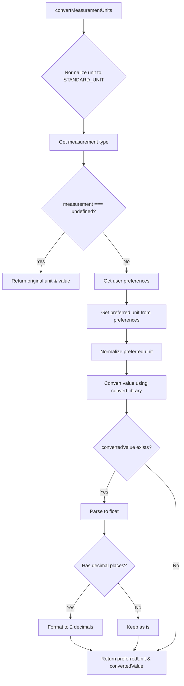
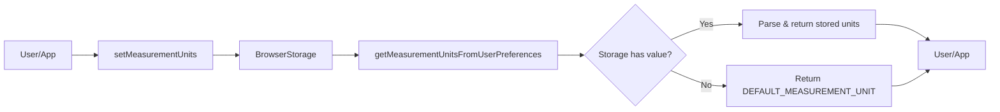
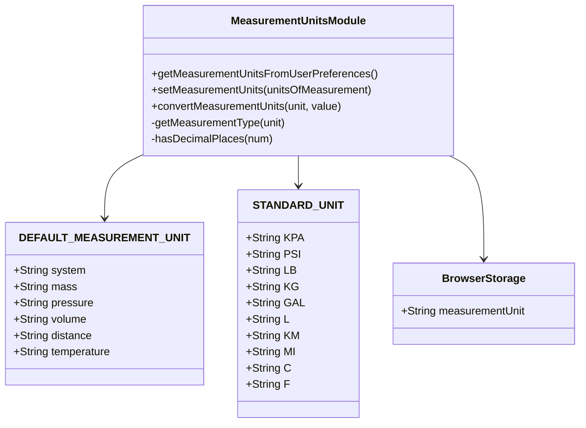
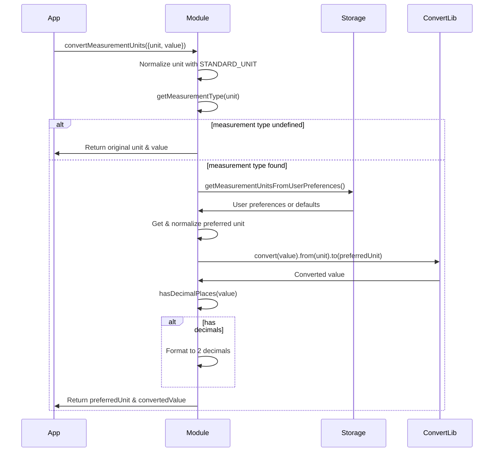
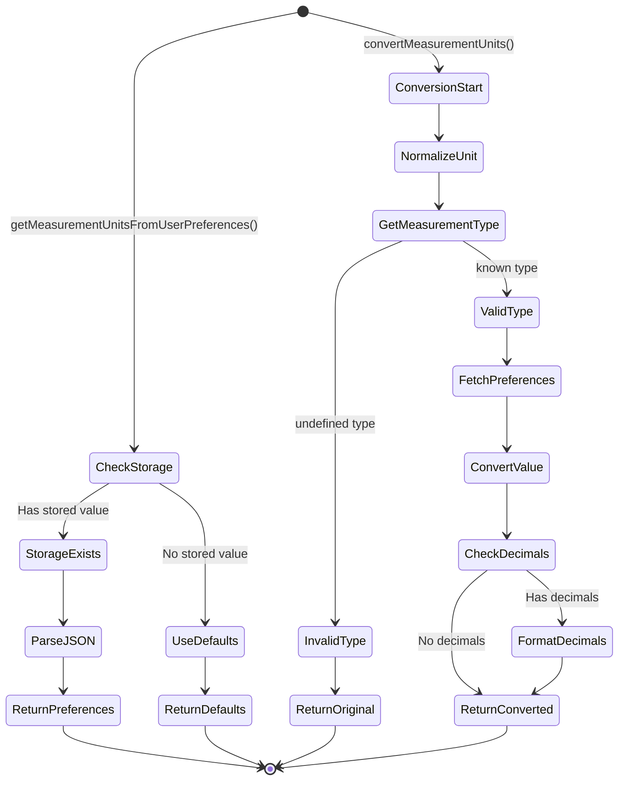

# Diagram: web/portal/src/utils/measurement-utils.js

> Auto-generated by Obscura crawlers

## Diagram 1

### SVG

<svg id="container" width="602.7578125" xmlns="http://www.w3.org/2000/svg" class="flowchart" height="2244.640625" viewBox="0 0 602.7578125 2244.640625" role="graphics-document document" aria-roledescription="flowchart-v2"><g><marker id="container_flowchart-v2-pointEnd" class="marker flowchart-v2" viewBox="0 0 10 10" refX="5" refY="5" markerUnits="userSpaceOnUse" markerWidth="8" markerHeight="8" orient="auto"><path d="M 0 0 L 10 5 L 0 10 z" class="arrowMarkerPath" style="stroke-width: 1; stroke-dasharray: 1, 0;"></path></marker><marker id="container_flowchart-v2-pointStart" class="marker flowchart-v2" viewBox="0 0 10 10" refX="4.5" refY="5" markerUnits="userSpaceOnUse" markerWidth="8" markerHeight="8" orient="auto"><path d="M 0 5 L 10 10 L 10 0 z" class="arrowMarkerPath" style="stroke-width: 1; stroke-dasharray: 1, 0;"></path></marker><marker id="container_flowchart-v2-circleEnd" class="marker flowchart-v2" viewBox="0 0 10 10" refX="11" refY="5" markerUnits="userSpaceOnUse" markerWidth="11" markerHeight="11" orient="auto"><circle cx="5" cy="5" r="5" class="arrowMarkerPath" style="stroke-width: 1; stroke-dasharray: 1, 0;"></circle></marker><marker id="container_flowchart-v2-circleStart" class="marker flowchart-v2" viewBox="0 0 10 10" refX="-1" refY="5" markerUnits="userSpaceOnUse" markerWidth="11" markerHeight="11" orient="auto"><circle cx="5" cy="5" r="5" class="arrowMarkerPath" style="stroke-width: 1; stroke-dasharray: 1, 0;"></circle></marker><marker id="container_flowchart-v2-crossEnd" class="marker cross flowchart-v2" viewBox="0 0 11 11" refX="12" refY="5.2" markerUnits="userSpaceOnUse" markerWidth="11" markerHeight="11" orient="auto"><path d="M 1,1 l 9,9 M 10,1 l -9,9" class="arrowMarkerPath" style="stroke-width: 2; stroke-dasharray: 1, 0;"></path></marker><marker id="container_flowchart-v2-crossStart" class="marker cross flowchart-v2" viewBox="0 0 11 11" refX="-1" refY="5.2" markerUnits="userSpaceOnUse" markerWidth="11" markerHeight="11" orient="auto"><path d="M 1,1 l 9,9 M 10,1 l -9,9" class="arrowMarkerPath" style="stroke-width: 2; stroke-dasharray: 1, 0;"></path></marker><g class="root"><g class="clusters"></g><g class="edgePaths"><path d="M280.477,62L280.477,66.167C280.477,70.333,280.477,78.667,280.477,86.333C280.477,94,280.477,101,280.477,104.5L280.477,108" id="L_A_B_0" class="edge-thickness-normal edge-pattern-solid edge-thickness-normal edge-pattern-solid flowchart-link" style=";" data-edge="true" data-et="edge" data-id="L_A_B_0" data-points="W3sieCI6MjgwLjQ3NjU2MjUsInkiOjYyfSx7IngiOjI4MC40NzY1NjI1LCJ5Ijo4N30seyJ4IjoyODAuNDc2NTYyNSwieSI6MTEyfV0=" marker-end="url(#container_flowchart-v2-pointEnd)"></path><path d="M280.477,390L280.477,394.167C280.477,398.333,280.477,406.667,280.477,414.333C280.477,422,280.477,429,280.477,432.5L280.477,436" id="L_B_C_0" class="edge-thickness-normal edge-pattern-solid edge-thickness-normal edge-pattern-solid flowchart-link" style=";" data-edge="true" data-et="edge" data-id="L_B_C_0" data-points="W3sieCI6MjgwLjQ3NjU2MjUsInkiOjM5MH0seyJ4IjoyODAuNDc2NTYyNSwieSI6NDE1fSx7IngiOjI4MC40NzY1NjI1LCJ5Ijo0NDB9XQ==" marker-end="url(#container_flowchart-v2-pointEnd)"></path><path d="M280.477,494L280.477,498.167C280.477,502.333,280.477,510.667,280.477,518.333C280.477,526,280.477,533,280.477,536.5L280.477,540" id="L_C_D_0" class="edge-thickness-normal edge-pattern-solid edge-thickness-normal edge-pattern-solid flowchart-link" style=";" data-edge="true" data-et="edge" data-id="L_C_D_0" data-points="W3sieCI6MjgwLjQ3NjU2MjUsInkiOjQ5NH0seyJ4IjoyODAuNDc2NTYyNSwieSI6NTE5fSx7IngiOjI4MC40NzY1NjI1LCJ5Ijo1NDR9XQ==" marker-end="url(#container_flowchart-v2-pointEnd)"></path><path d="M218.292,759.816L204.91,776.346C191.528,792.877,164.764,825.939,151.382,847.969C138,870,138,881,138,886.5L138,892" id="L_D_E_0" class="edge-thickness-normal edge-pattern-solid edge-thickness-normal edge-pattern-solid flowchart-link" style=";" data-edge="true" data-et="edge" data-id="L_D_E_0" data-points="W3sieCI6MjE4LjI5MjI2MjI0MjQyNjEsInkiOjc1OS44MTU2OTk3NDI0MjYxfSx7IngiOjEzOCwieSI6ODU5fSx7IngiOjEzOCwieSI6ODk2fV0=" marker-end="url(#container_flowchart-v2-pointEnd)"></path><path d="M342.661,759.816L356.043,776.346C369.425,792.877,396.189,825.939,409.571,849.969C422.953,874,422.953,889,422.953,896.5L422.953,904" id="L_D_F_0" class="edge-thickness-normal edge-pattern-solid edge-thickness-normal edge-pattern-solid flowchart-link" style=";" data-edge="true" data-et="edge" data-id="L_D_F_0" data-points="W3sieCI6MzQyLjY2MDg2Mjc1NzU3MzksInkiOjc1OS44MTU2OTk3NDI0MjYxfSx7IngiOjQyMi45NTMxMjUsInkiOjg1OX0seyJ4Ijo0MjIuOTUzMTI1LCJ5Ijo5MDh9XQ==" marker-end="url(#container_flowchart-v2-pointEnd)"></path><path d="M422.953,962L422.953,968.167C422.953,974.333,422.953,986.667,422.953,996.333C422.953,1006,422.953,1013,422.953,1016.5L422.953,1020" id="L_F_G_0" class="edge-thickness-normal edge-pattern-solid edge-thickness-normal edge-pattern-solid flowchart-link" style=";" data-edge="true" data-et="edge" data-id="L_F_G_0" data-points="W3sieCI6NDIyLjk1MzEyNSwieSI6OTYyfSx7IngiOjQyMi45NTMxMjUsInkiOjk5OX0seyJ4Ijo0MjIuOTUzMTI1LCJ5IjoxMDI0fV0=" marker-end="url(#container_flowchart-v2-pointEnd)"></path><path d="M422.953,1102L422.953,1106.167C422.953,1110.333,422.953,1118.667,422.953,1126.333C422.953,1134,422.953,1141,422.953,1144.5L422.953,1148" id="L_G_H_0" class="edge-thickness-normal edge-pattern-solid edge-thickness-normal edge-pattern-solid flowchart-link" style=";" data-edge="true" data-et="edge" data-id="L_G_H_0" data-points="W3sieCI6NDIyLjk1MzEyNSwieSI6MTEwMn0seyJ4Ijo0MjIuOTUzMTI1LCJ5IjoxMTI3fSx7IngiOjQyMi45NTMxMjUsInkiOjExNTJ9XQ==" marker-end="url(#container_flowchart-v2-pointEnd)"></path><path d="M422.953,1206L422.953,1210.167C422.953,1214.333,422.953,1222.667,422.953,1230.333C422.953,1238,422.953,1245,422.953,1248.5L422.953,1252" id="L_H_I_0" class="edge-thickness-normal edge-pattern-solid edge-thickness-normal edge-pattern-solid flowchart-link" style=";" data-edge="true" data-et="edge" data-id="L_H_I_0" data-points="W3sieCI6NDIyLjk1MzEyNSwieSI6MTIwNn0seyJ4Ijo0MjIuOTUzMTI1LCJ5IjoxMjMxfSx7IngiOjQyMi45NTMxMjUsInkiOjEyNTZ9XQ==" marker-end="url(#container_flowchart-v2-pointEnd)"></path><path d="M422.953,1334L422.953,1338.167C422.953,1342.333,422.953,1350.667,422.953,1358.333C422.953,1366,422.953,1373,422.953,1376.5L422.953,1380" id="L_I_J_0" class="edge-thickness-normal edge-pattern-solid edge-thickness-normal edge-pattern-solid flowchart-link" style=";" data-edge="true" data-et="edge" data-id="L_I_J_0" data-points="W3sieCI6NDIyLjk1MzEyNSwieSI6MTMzNH0seyJ4Ijo0MjIuOTUzMTI1LCJ5IjoxMzU5fSx7IngiOjQyMi45NTMxMjUsInkiOjEzODR9XQ==" marker-end="url(#container_flowchart-v2-pointEnd)"></path><path d="M386.709,1566.428L380.656,1578.635C374.603,1590.843,362.497,1615.257,356.444,1632.965C350.391,1650.672,350.391,1661.672,350.391,1667.172L350.391,1672.672" id="L_J_K_0" class="edge-thickness-normal edge-pattern-solid edge-thickness-normal edge-pattern-solid flowchart-link" style=";" data-edge="true" data-et="edge" data-id="L_J_K_0" data-points="W3sieCI6Mzg2LjcwOTQyNjUyNzUzNDksInkiOjE1NjYuNDI4MTc2NTI3NTM0OH0seyJ4IjozNTAuMzkwNjI1LCJ5IjoxNjM5LjY3MTg3NX0seyJ4IjozNTAuMzkwNjI1LCJ5IjoxNjc2LjY3MTg3NX1d" marker-end="url(#container_flowchart-v2-pointEnd)"></path><path d="M350.391,1730.672L350.391,1734.839C350.391,1739.005,350.391,1747.339,350.391,1755.005C350.391,1762.672,350.391,1769.672,350.391,1773.172L350.391,1776.672" id="L_K_L_0" class="edge-thickness-normal edge-pattern-solid edge-thickness-normal edge-pattern-solid flowchart-link" style=";" data-edge="true" data-et="edge" data-id="L_K_L_0" data-points="W3sieCI6MzUwLjM5MDYyNSwieSI6MTczMC42NzE4NzV9LHsieCI6MzUwLjM5MDYyNSwieSI6MTc1NS42NzE4NzV9LHsieCI6MzUwLjM5MDYyNSwieSI6MTc4MC42NzE4NzV9XQ==" marker-end="url(#container_flowchart-v2-pointEnd)"></path><path d="M305.635,1935.885L294.593,1949.511C283.551,1963.137,261.467,1990.389,250.425,2009.515C239.383,2028.641,239.383,2039.641,239.383,2045.141L239.383,2050.641" id="L_L_M_0" class="edge-thickness-normal edge-pattern-solid edge-thickness-normal edge-pattern-solid flowchart-link" style=";" data-edge="true" data-et="edge" data-id="L_L_M_0" data-points="W3sieCI6MzA1LjYzNDk5NDMyOTQ1ODQ0LCJ5IjoxOTM1Ljg4NDk5NDMyOTQ1ODZ9LHsieCI6MjM5LjM4MjgxMjUsInkiOjIwMTcuNjQwNjI1fSx7IngiOjIzOS4zODI4MTI1LCJ5IjoyMDU0LjY0MDYyNX1d" marker-end="url(#container_flowchart-v2-pointEnd)"></path><path d="M395.146,1935.885L406.188,1949.511C417.23,1963.137,439.314,1990.389,450.356,2009.515C461.398,2028.641,461.398,2039.641,461.398,2045.141L461.398,2050.641" id="L_L_N_0" class="edge-thickness-normal edge-pattern-solid edge-thickness-normal edge-pattern-solid flowchart-link" style=";" data-edge="true" data-et="edge" data-id="L_L_N_0" data-points="W3sieCI6Mzk1LjE0NjI1NTY3MDU0MTU2LCJ5IjoxOTM1Ljg4NDk5NDMyOTQ1ODZ9LHsieCI6NDYxLjM5ODQzNzUsInkiOjIwMTcuNjQwNjI1fSx7IngiOjQ2MS4zOTg0Mzc1LCJ5IjoyMDU0LjY0MDYyNX1d" marker-end="url(#container_flowchart-v2-pointEnd)"></path><path d="M239.383,2108.641L239.383,2112.807C239.383,2116.974,239.383,2125.307,250.704,2133.421C262.026,2141.535,284.67,2149.429,295.991,2153.377L307.313,2157.324" id="L_M_O_0" class="edge-thickness-normal edge-pattern-solid edge-thickness-normal edge-pattern-solid flowchart-link" style=";" data-edge="true" data-et="edge" data-id="L_M_O_0" data-points="W3sieCI6MjM5LjM4MjgxMjUsInkiOjIxMDguNjQwNjI1fSx7IngiOjIzOS4zODI4MTI1LCJ5IjoyMTMzLjY0MDYyNX0seyJ4IjozMTEuMDg5OTY1ODIwMzEyNSwieSI6MjE1OC42NDA2MjV9XQ==" marker-end="url(#container_flowchart-v2-pointEnd)"></path><path d="M461.398,2108.641L461.398,2112.807C461.398,2116.974,461.398,2125.307,459.239,2133.069C457.079,2140.831,452.76,2148.021,450.6,2151.617L448.441,2155.212" id="L_N_O_0" class="edge-thickness-normal edge-pattern-solid edge-thickness-normal edge-pattern-solid flowchart-link" style=";" data-edge="true" data-et="edge" data-id="L_N_O_0" data-points="W3sieCI6NDYxLjM5ODQzNzUsInkiOjIxMDguNjQwNjI1fSx7IngiOjQ2MS4zOTg0Mzc1LCJ5IjoyMTMzLjY0MDYyNX0seyJ4Ijo0NDYuMzgwNzM3MzA0Njg3NSwieSI6MjE1OC42NDA2MjV9XQ==" marker-end="url(#container_flowchart-v2-pointEnd)"></path><path d="M480.342,1545.283L497.721,1561.015C515.1,1576.746,549.859,1608.209,567.238,1634.607C584.617,1661.005,584.617,1682.339,584.617,1701.672C584.617,1721.005,584.617,1738.339,584.617,1767.836C584.617,1797.333,584.617,1838.995,584.617,1882.656C584.617,1926.318,584.617,1971.979,584.617,2005.477C584.617,2038.974,584.617,2060.307,584.617,2079.641C584.617,2098.974,584.617,2116.307,574.712,2128.895C564.807,2141.483,544.997,2149.326,535.091,2153.247L525.186,2157.168" id="L_J_O_0" class="edge-thickness-normal edge-pattern-solid edge-thickness-normal edge-pattern-solid flowchart-link" style=";" data-edge="true" data-et="edge" data-id="L_J_O_0" data-points="W3sieCI6NDgwLjM0MTczNDg0OTAxMzMsInkiOjE1NDUuMjgzMjY1MTUwOTg2Nn0seyJ4Ijo1ODQuNjE3MTg3NSwieSI6MTYzOS42NzE4NzV9LHsieCI6NTg0LjYxNzE4NzUsInkiOjE3MDMuNjcxODc1fSx7IngiOjU4NC42MTcxODc1LCJ5IjoxNzU1LjY3MTg3NX0seyJ4Ijo1ODQuNjE3MTg3NSwieSI6MTg4MC42NTYyNX0seyJ4Ijo1ODQuNjE3MTg3NSwieSI6MjAxNy42NDA2MjV9LHsieCI6NTg0LjYxNzE4NzUsInkiOjIwODEuNjQwNjI1fSx7IngiOjU4NC42MTcxODc1LCJ5IjoyMTMzLjY0MDYyNX0seyJ4Ijo1MjEuNDY3MTYzMDg1OTM3NSwieSI6MjE1OC42NDA2MjV9XQ==" marker-end="url(#container_flowchart-v2-pointEnd)"></path></g><g class="edgeLabels"><g class="edgeLabel"><g class="label" data-id="L_A_B_0" transform="translate(0, 0)"><foreignObject width="0" height="0">

</foreignObject></g></g><g class="edgeLabel"><g class="label" data-id="L_B_C_0" transform="translate(0, 0)"><foreignObject width="0" height="0">

</foreignObject></g></g><g class="edgeLabel"><g class="label" data-id="L_C_D_0" transform="translate(0, 0)"><foreignObject width="0" height="0">

</foreignObject></g></g><g class="edgeLabel" transform="translate(138, 859)"><g class="label" data-id="L_D_E_0" transform="translate(-12.03125, -12)"><foreignObject width="24.0625" height="24">

Yes

</foreignObject></g></g><g class="edgeLabel" transform="translate(422.953125, 859)"><g class="label" data-id="L_D_F_0" transform="translate(-10.140625, -12)"><foreignObject width="20.28125" height="24">

No

</foreignObject></g></g><g class="edgeLabel"><g class="label" data-id="L_F_G_0" transform="translate(0, 0)"><foreignObject width="0" height="0">

</foreignObject></g></g><g class="edgeLabel"><g class="label" data-id="L_G_H_0" transform="translate(0, 0)"><foreignObject width="0" height="0">

</foreignObject></g></g><g class="edgeLabel"><g class="label" data-id="L_H_I_0" transform="translate(0, 0)"><foreignObject width="0" height="0">

</foreignObject></g></g><g class="edgeLabel"><g class="label" data-id="L_I_J_0" transform="translate(0, 0)"><foreignObject width="0" height="0">

</foreignObject></g></g><g class="edgeLabel" transform="translate(350.390625, 1639.671875)"><g class="label" data-id="L_J_K_0" transform="translate(-12.03125, -12)"><foreignObject width="24.0625" height="24">

Yes

</foreignObject></g></g><g class="edgeLabel"><g class="label" data-id="L_K_L_0" transform="translate(0, 0)"><foreignObject width="0" height="0">

</foreignObject></g></g><g class="edgeLabel" transform="translate(239.3828125, 2017.640625)"><g class="label" data-id="L_L_M_0" transform="translate(-12.03125, -12)"><foreignObject width="24.0625" height="24">

Yes

</foreignObject></g></g><g class="edgeLabel" transform="translate(461.3984375, 2017.640625)"><g class="label" data-id="L_L_N_0" transform="translate(-10.140625, -12)"><foreignObject width="20.28125" height="24">

No

</foreignObject></g></g><g class="edgeLabel"><g class="label" data-id="L_M_O_0" transform="translate(0, 0)"><foreignObject width="0" height="0">

</foreignObject></g></g><g class="edgeLabel"><g class="label" data-id="L_N_O_0" transform="translate(0, 0)"><foreignObject width="0" height="0">

</foreignObject></g></g><g class="edgeLabel" transform="translate(584.6171875, 1880.65625)"><g class="label" data-id="L_J_O_0" transform="translate(-10.140625, -12)"><foreignObject width="20.28125" height="24">

No

</foreignObject></g></g></g><g class="nodes"><g class="node default" id="flowchart-A-0" transform="translate(280.4765625, 35)"><rect class="basic label-container" style="" x="-125.2421875" y="-27" width="250.484375" height="54"></rect><g class="label" style="" transform="translate(-95.2421875, -12)"><rect></rect><foreignObject width="190.484375" height="24">

convertMeasurementUnits

</foreignObject></g></g><g class="node default" id="flowchart-B-1" transform="translate(280.4765625, 251)"><polygon points="139,0 278,-139 139,-278 0,-139" class="label-container" transform="translate(-138.5, 139)"></polygon><g class="label" style="" transform="translate(-100, -24)"><rect></rect><foreignObject width="200" height="48">

Normalize unit to STANDARD_UNIT

</foreignObject></g></g><g class="node default" id="flowchart-C-3" transform="translate(280.4765625, 467)"><rect class="basic label-container" style="" x="-112.234375" y="-27" width="224.46875" height="54"></rect><g class="label" style="" transform="translate(-82.234375, -12)"><rect></rect><foreignObject width="164.46875" height="24">

Get measurement type

</foreignObject></g></g><g class="node default" id="flowchart-D-5" transform="translate(280.4765625, 683)"><polygon points="139,0 278,-139 139,-278 0,-139" class="label-container" transform="translate(-138.5, 139)"></polygon><g class="label" style="" transform="translate(-100, -24)"><rect></rect><foreignObject width="200" height="48">

measurement === undefined?

</foreignObject></g></g><g class="node default" id="flowchart-E-7" transform="translate(138, 935)"><rect class="basic label-container" style="" x="-130" y="-39" width="260" height="78"></rect><g class="label" style="" transform="translate(-100, -24)"><rect></rect><foreignObject width="200" height="48">

Return original unit &amp; value

</foreignObject></g></g><g class="node default" id="flowchart-F-9" transform="translate(422.953125, 935)"><rect class="basic label-container" style="" x="-104.953125" y="-27" width="209.90625" height="54"></rect><g class="label" style="" transform="translate(-74.953125, -12)"><rect></rect><foreignObject width="149.90625" height="24">

Get user preferences

</foreignObject></g></g><g class="node default" id="flowchart-G-11" transform="translate(422.953125, 1063)"><rect class="basic label-container" style="" x="-130" y="-39" width="260" height="78"></rect><g class="label" style="" transform="translate(-100, -24)"><rect></rect><foreignObject width="200" height="48">

Get preferred unit from preferences

</foreignObject></g></g><g class="node default" id="flowchart-H-13" transform="translate(422.953125, 1179)"><rect class="basic label-container" style="" x="-119.484375" y="-27" width="238.96875" height="54"></rect><g class="label" style="" transform="translate(-89.484375, -12)"><rect></rect><foreignObject width="178.96875" height="24">

Normalize preferred unit

</foreignObject></g></g><g class="node default" id="flowchart-I-15" transform="translate(422.953125, 1295)"><rect class="basic label-container" style="" x="-130" y="-39" width="260" height="78"></rect><g class="label" style="" transform="translate(-100, -24)"><rect></rect><foreignObject width="200" height="48">

Convert value using convert library

</foreignObject></g></g><g class="node default" id="flowchart-J-17" transform="translate(422.953125, 1493.3359375)"><polygon points="109.3359375,0 218.671875,-109.3359375 109.3359375,-218.671875 0,-109.3359375" class="label-container" transform="translate(-108.8359375, 109.3359375)"></polygon><g class="label" style="" transform="translate(-82.3359375, -12)"><rect></rect><foreignObject width="164.671875" height="24">

convertedValue exists?

</foreignObject></g></g><g class="node default" id="flowchart-K-19" transform="translate(350.390625, 1703.671875)"><rect class="basic label-container" style="" x="-77.8359375" y="-27" width="155.671875" height="54"></rect><g class="label" style="" transform="translate(-47.8359375, -12)"><rect></rect><foreignObject width="95.671875" height="24">

Parse to float

</foreignObject></g></g><g class="node default" id="flowchart-L-21" transform="translate(350.390625, 1880.65625)"><polygon points="99.984375,0 199.96875,-99.984375 99.984375,-199.96875 0,-99.984375" class="label-container" transform="translate(-99.484375, 99.984375)"></polygon><g class="label" style="" transform="translate(-72.984375, -12)"><rect></rect><foreignObject width="145.96875" height="24">

Has decimal places?

</foreignObject></g></g><g class="node default" id="flowchart-M-23" transform="translate(239.3828125, 2081.640625)"><rect class="basic label-container" style="" x="-105.703125" y="-27" width="211.40625" height="54"></rect><g class="label" style="" transform="translate(-75.703125, -12)"><rect></rect><foreignObject width="151.40625" height="24">

Format to 2 decimals

</foreignObject></g></g><g class="node default" id="flowchart-N-25" transform="translate(461.3984375, 2081.640625)"><rect class="basic label-container" style="" x="-66.3125" y="-27" width="132.625" height="54"></rect><g class="label" style="" transform="translate(-36.3125, -12)"><rect></rect><foreignObject width="72.625" height="24">

Keep as is

</foreignObject></g></g><g class="node default" id="flowchart-O-27" transform="translate(422.953125, 2197.640625)"><rect class="basic label-container" style="" x="-130" y="-39" width="260" height="78"></rect><g class="label" style="" transform="translate(-100, -24)"><rect></rect><foreignObject width="200" height="48">

Return preferredUnit &amp; convertedValue

</foreignObject></g></g></g></g></g></svg>

## Diagram 2

### SVG

<svg id="container" width="1824.78125" xmlns="http://www.w3.org/2000/svg" class="flowchart" height="207.0078125" viewBox="0 0 1824.78125 207.0078125" role="graphics-document document" aria-roledescription="flowchart-v2"><g><marker id="container_flowchart-v2-pointEnd" class="marker flowchart-v2" viewBox="0 0 10 10" refX="5" refY="5" markerUnits="userSpaceOnUse" markerWidth="8" markerHeight="8" orient="auto"><path d="M 0 0 L 10 5 L 0 10 z" class="arrowMarkerPath" style="stroke-width: 1; stroke-dasharray: 1, 0;"></path></marker><marker id="container_flowchart-v2-pointStart" class="marker flowchart-v2" viewBox="0 0 10 10" refX="4.5" refY="5" markerUnits="userSpaceOnUse" markerWidth="8" markerHeight="8" orient="auto"><path d="M 0 5 L 10 10 L 10 0 z" class="arrowMarkerPath" style="stroke-width: 1; stroke-dasharray: 1, 0;"></path></marker><marker id="container_flowchart-v2-circleEnd" class="marker flowchart-v2" viewBox="0 0 10 10" refX="11" refY="5" markerUnits="userSpaceOnUse" markerWidth="11" markerHeight="11" orient="auto"><circle cx="5" cy="5" r="5" class="arrowMarkerPath" style="stroke-width: 1; stroke-dasharray: 1, 0;"></circle></marker><marker id="container_flowchart-v2-circleStart" class="marker flowchart-v2" viewBox="0 0 10 10" refX="-1" refY="5" markerUnits="userSpaceOnUse" markerWidth="11" markerHeight="11" orient="auto"><circle cx="5" cy="5" r="5" class="arrowMarkerPath" style="stroke-width: 1; stroke-dasharray: 1, 0;"></circle></marker><marker id="container_flowchart-v2-crossEnd" class="marker cross flowchart-v2" viewBox="0 0 11 11" refX="12" refY="5.2" markerUnits="userSpaceOnUse" markerWidth="11" markerHeight="11" orient="auto"><path d="M 1,1 l 9,9 M 10,1 l -9,9" class="arrowMarkerPath" style="stroke-width: 2; stroke-dasharray: 1, 0;"></path></marker><marker id="container_flowchart-v2-crossStart" class="marker cross flowchart-v2" viewBox="0 0 11 11" refX="-1" refY="5.2" markerUnits="userSpaceOnUse" markerWidth="11" markerHeight="11" orient="auto"><path d="M 1,1 l 9,9 M 10,1 l -9,9" class="arrowMarkerPath" style="stroke-width: 2; stroke-dasharray: 1, 0;"></path></marker><g class="root"><g class="clusters"></g><g class="edgePaths"><path d="M135.938,102.008L140.104,102.008C144.271,102.008,152.604,102.008,160.271,102.008C167.938,102.008,174.938,102.008,178.438,102.008L181.938,102.008" id="L_A_B_0" class="edge-thickness-normal edge-pattern-solid edge-thickness-normal edge-pattern-solid flowchart-link" style=";" data-edge="true" data-et="edge" data-id="L_A_B_0" data-points="W3sieCI6MTM1LjkzNzUsInkiOjEwMi4wMDc4MTI1fSx7IngiOjE2MC45Mzc1LCJ5IjoxMDIuMDA3ODEyNX0seyJ4IjoxODUuOTM3NSwieSI6MTAyLjAwNzgxMjV9XQ==" marker-end="url(#container_flowchart-v2-pointEnd)"></path><path d="M403.984,102.008L408.151,102.008C412.318,102.008,420.651,102.008,428.318,102.008C435.984,102.008,442.984,102.008,446.484,102.008L449.984,102.008" id="L_B_C_0" class="edge-thickness-normal edge-pattern-solid edge-thickness-normal edge-pattern-solid flowchart-link" style=";" data-edge="true" data-et="edge" data-id="L_B_C_0" data-points="W3sieCI6NDAzLjk4NDM3NSwieSI6MTAyLjAwNzgxMjV9LHsieCI6NDI4Ljk4NDM3NSwieSI6MTAyLjAwNzgxMjV9LHsieCI6NDUzLjk4NDM3NSwieSI6MTAyLjAwNzgxMjV9XQ==" marker-end="url(#container_flowchart-v2-pointEnd)"></path><path d="M627.141,102.008L631.307,102.008C635.474,102.008,643.807,102.008,651.474,102.008C659.141,102.008,666.141,102.008,669.641,102.008L673.141,102.008" id="L_C_D_0" class="edge-thickness-normal edge-pattern-solid edge-thickness-normal edge-pattern-solid flowchart-link" style=";" data-edge="true" data-et="edge" data-id="L_C_D_0" data-points="W3sieCI6NjI3LjE0MDYyNSwieSI6MTAyLjAwNzgxMjV9LHsieCI6NjUyLjE0MDYyNSwieSI6MTAyLjAwNzgxMjV9LHsieCI6Njc3LjE0MDYyNSwieSI6MTAyLjAwNzgxMjV9XQ==" marker-end="url(#container_flowchart-v2-pointEnd)"></path><path d="M1049.328,102.008L1053.495,102.008C1057.661,102.008,1065.995,102.008,1073.661,102.008C1081.328,102.008,1088.328,102.008,1091.828,102.008L1095.328,102.008" id="L_D_E_0" class="edge-thickness-normal edge-pattern-solid edge-thickness-normal edge-pattern-solid flowchart-link" style=";" data-edge="true" data-et="edge" data-id="L_D_E_0" data-points="W3sieCI6MTA0OS4zMjgxMjUsInkiOjEwMi4wMDc4MTI1fSx7IngiOjEwNzQuMzI4MTI1LCJ5IjoxMDIuMDA3ODEyNX0seyJ4IjoxMDk5LjMyODEyNSwieSI6MTAyLjAwNzgxMjV9XQ==" marker-end="url(#container_flowchart-v2-pointEnd)"></path><path d="M1258.501,73.165L1269.48,68.305C1280.459,63.446,1302.417,53.727,1320.711,48.867C1339.005,44.008,1353.635,44.008,1360.951,44.008L1368.266,44.008" id="L_E_F_0" class="edge-thickness-normal edge-pattern-solid edge-thickness-normal edge-pattern-solid flowchart-link" style=";" data-edge="true" data-et="edge" data-id="L_E_F_0" data-points="W3sieCI6MTI1OC41MDA3NTI5MzQyNDgsInkiOjczLjE2NDgxNTQzNDI0ODA0fSx7IngiOjEzMjQuMzc1LCJ5Ijo0NC4wMDc4MTI1fSx7IngiOjEzNzIuMjY1NjI1LCJ5Ijo0NC4wMDc4MTI1fV0=" marker-end="url(#container_flowchart-v2-pointEnd)"></path><path d="M1258.501,130.851L1269.48,135.71C1280.459,140.57,1302.417,150.289,1318.901,155.148C1335.385,160.008,1346.396,160.008,1351.901,160.008L1357.406,160.008" id="L_E_G_0" class="edge-thickness-normal edge-pattern-solid edge-thickness-normal edge-pattern-solid flowchart-link" style=";" data-edge="true" data-et="edge" data-id="L_E_G_0" data-points="W3sieCI6MTI1OC41MDA3NTI5MzQyNDgsInkiOjEzMC44NTA4MDk1NjU3NTE5NH0seyJ4IjoxMzI0LjM3NSwieSI6MTYwLjAwNzgxMjV9LHsieCI6MTM2MS40MDYyNSwieSI6MTYwLjAwNzgxMjV9XQ==" marker-end="url(#container_flowchart-v2-pointEnd)"></path><path d="M1627.984,44.008L1633.961,44.008C1639.938,44.008,1651.891,44.008,1665.234,48.81C1678.578,53.613,1693.311,63.218,1700.678,68.021L1708.045,72.823" id="L_F_H_0" class="edge-thickness-normal edge-pattern-solid edge-thickness-normal edge-pattern-solid flowchart-link" style=";" data-edge="true" data-et="edge" data-id="L_F_H_0" data-points="W3sieCI6MTYyNy45ODQzNzUsInkiOjQ0LjAwNzgxMjV9LHsieCI6MTY2My44NDM3NSwieSI6NDQuMDA3ODEyNX0seyJ4IjoxNzExLjM5NjAxMjkzMTAzNDQsInkiOjc1LjAwNzgxMjV9XQ==" marker-end="url(#container_flowchart-v2-pointEnd)"></path><path d="M1638.844,160.008L1643.01,160.008C1647.177,160.008,1655.51,160.008,1667.044,155.205C1678.578,150.403,1693.311,140.797,1700.678,135.995L1708.045,131.192" id="L_G_H_0" class="edge-thickness-normal edge-pattern-solid edge-thickness-normal edge-pattern-solid flowchart-link" style=";" data-edge="true" data-et="edge" data-id="L_G_H_0" data-points="W3sieCI6MTYzOC44NDM3NSwieSI6MTYwLjAwNzgxMjV9LHsieCI6MTY2My44NDM3NSwieSI6MTYwLjAwNzgxMjV9LHsieCI6MTcxMS4zOTYwMTI5MzEwMzQ0LCJ5IjoxMjkuMDA3ODEyNX1d" marker-end="url(#container_flowchart-v2-pointEnd)"></path></g><g class="edgeLabels"><g class="edgeLabel"><g class="label" data-id="L_A_B_0" transform="translate(0, 0)"><foreignObject width="0" height="0">

</foreignObject></g></g><g class="edgeLabel"><g class="label" data-id="L_B_C_0" transform="translate(0, 0)"><foreignObject width="0" height="0">

</foreignObject></g></g><g class="edgeLabel"><g class="label" data-id="L_C_D_0" transform="translate(0, 0)"><foreignObject width="0" height="0">

</foreignObject></g></g><g class="edgeLabel"><g class="label" data-id="L_D_E_0" transform="translate(0, 0)"><foreignObject width="0" height="0">

</foreignObject></g></g><g class="edgeLabel" transform="translate(1324.375, 44.0078125)"><g class="label" data-id="L_E_F_0" transform="translate(-12.03125, -12)"><foreignObject width="24.0625" height="24">

Yes

</foreignObject></g></g><g class="edgeLabel" transform="translate(1324.375, 160.0078125)"><g class="label" data-id="L_E_G_0" transform="translate(-10.140625, -12)"><foreignObject width="20.28125" height="24">

No

</foreignObject></g></g><g class="edgeLabel"><g class="label" data-id="L_F_H_0" transform="translate(0, 0)"><foreignObject width="0" height="0">

</foreignObject></g></g><g class="edgeLabel"><g class="label" data-id="L_G_H_0" transform="translate(0, 0)"><foreignObject width="0" height="0">

</foreignObject></g></g></g><g class="nodes"><g class="node default" id="flowchart-A-0" transform="translate(71.96875, 102.0078125)"><rect class="basic label-container" style="" x="-63.96875" y="-27" width="127.9375" height="54"></rect><g class="label" style="" transform="translate(-33.96875, -12)"><rect></rect><foreignObject width="67.9375" height="24">

User/App

</foreignObject></g></g><g class="node default" id="flowchart-B-1" transform="translate(294.9609375, 102.0078125)"><rect class="basic label-container" style="" x="-109.0234375" y="-27" width="218.046875" height="54"></rect><g class="label" style="" transform="translate(-79.0234375, -12)"><rect></rect><foreignObject width="158.046875" height="24">

setMeasurementUnits

</foreignObject></g></g><g class="node default" id="flowchart-C-3" transform="translate(540.5625, 102.0078125)"><rect class="basic label-container" style="" x="-86.578125" y="-27" width="173.15625" height="54"></rect><g class="label" style="" transform="translate(-56.578125, -12)"><rect></rect><foreignObject width="113.15625" height="24">

BrowserStorage

</foreignObject></g></g><g class="node default" id="flowchart-D-5" transform="translate(863.234375, 102.0078125)"><rect class="basic label-container" style="" x="-186.09375" y="-27" width="372.1875" height="54"></rect><g class="label" style="" transform="translate(-156.09375, -12)"><rect></rect><foreignObject width="312.1875" height="24">

getMeasurementUnitsFromUserPreferences

</foreignObject></g></g><g class="node default" id="flowchart-E-7" transform="translate(1193.3359375, 102.0078125)"><polygon points="94.0078125,0 188.015625,-94.0078125 94.0078125,-188.015625 0,-94.0078125" class="label-container" transform="translate(-93.5078125, 94.0078125)"></polygon><g class="label" style="" transform="translate(-67.0078125, -12)"><rect></rect><foreignObject width="134.015625" height="24">

Storage has value?

</foreignObject></g></g><g class="node default" id="flowchart-F-9" transform="translate(1500.125, 44.0078125)"><rect class="basic label-container" style="" x="-127.859375" y="-27" width="255.71875" height="54"></rect><g class="label" style="" transform="translate(-97.859375, -12)"><rect></rect><foreignObject width="195.71875" height="24">

Parse &amp; return stored units

</foreignObject></g></g><g class="node default" id="flowchart-G-11" transform="translate(1500.125, 160.0078125)"><rect class="basic label-container" style="" x="-138.71875" y="-39" width="277.4375" height="78"></rect><g class="label" style="" transform="translate(-108.71875, -24)"><rect></rect><foreignObject width="217.4375" height="48">

Return DEFAULT_MEASUREMENT_UNIT

</foreignObject></g></g><g class="node default" id="flowchart-H-13" transform="translate(1752.8125, 102.0078125)"><rect class="basic label-container" style="" x="-63.96875" y="-27" width="127.9375" height="54"></rect><g class="label" style="" transform="translate(-33.96875, -12)"><rect></rect><foreignObject width="67.9375" height="24">

User/App

</foreignObject></g></g></g></g></g></svg>

## Diagram 3

### SVG

<svg id="container" width="824.9296875" xmlns="http://www.w3.org/2000/svg" class="classDiagram" height="624" viewBox="0 0 824.9296875 624" role="graphics-document document" aria-roledescription="class"><g><defs><marker id="container_class-aggregationStart" class="marker aggregation class" refX="18" refY="7" markerWidth="190" markerHeight="240" orient="auto"><path d="M 18,7 L9,13 L1,7 L9,1 Z"></path></marker></defs><defs><marker id="container_class-aggregationEnd" class="marker aggregation class" refX="1" refY="7" markerWidth="20" markerHeight="28" orient="auto"><path d="M 18,7 L9,13 L1,7 L9,1 Z"></path></marker></defs><defs><marker id="container_class-extensionStart" class="marker extension class" refX="18" refY="7" markerWidth="190" markerHeight="240" orient="auto"><path d="M 1,7 L18,13 V 1 Z"></path></marker></defs><defs><marker id="container_class-extensionEnd" class="marker extension class" refX="1" refY="7" markerWidth="20" markerHeight="28" orient="auto"><path d="M 1,1 V 13 L18,7 Z"></path></marker></defs><defs><marker id="container_class-compositionStart" class="marker composition class" refX="18" refY="7" markerWidth="190" markerHeight="240" orient="auto"><path d="M 18,7 L9,13 L1,7 L9,1 Z"></path></marker></defs><defs><marker id="container_class-compositionEnd" class="marker composition class" refX="1" refY="7" markerWidth="20" markerHeight="28" orient="auto"><path d="M 18,7 L9,13 L1,7 L9,1 Z"></path></marker></defs><defs><marker id="container_class-dependencyStart" class="marker dependency class" refX="6" refY="7" markerWidth="190" markerHeight="240" orient="auto"><path d="M 5,7 L9,13 L1,7 L9,1 Z"></path></marker></defs><defs><marker id="container_class-dependencyEnd" class="marker dependency class" refX="13" refY="7" markerWidth="20" markerHeight="28" orient="auto"><path d="M 18,7 L9,13 L14,7 L9,1 Z"></path></marker></defs><defs><marker id="container_class-lollipopStart" class="marker lollipop class" refX="13" refY="7" markerWidth="190" markerHeight="240" orient="auto"><circle stroke="black" fill="transparent" cx="7" cy="7" r="6"></circle></marker></defs><defs><marker id="container_class-lollipopEnd" class="marker lollipop class" refX="1" refY="7" markerWidth="190" markerHeight="240" orient="auto"><circle stroke="black" fill="transparent" cx="7" cy="7" r="6"></circle></marker></defs><g class="root"><g class="clusters"></g><g class="edgePaths"><path d="M196.68,230L188.37,234.167C180.06,238.333,163.44,246.667,155.13,262C146.82,277.333,146.82,299.667,146.82,310.833L146.82,322" id="id_MeasurementUnitsModule_DEFAULT_MEASUREMENT_UNIT_1" class="edge-thickness-normal edge-pattern-solid relation" style=";;;" data-edge="true" data-et="edge" data-id="id_MeasurementUnitsModule_DEFAULT_MEASUREMENT_UNIT_1" data-points="W3sieCI6MTk2LjY3OTU3MjYxMDI5NDEyLCJ5IjoyMzB9LHsieCI6MTQ2LjgyMDMxMjUsInkiOjI1NX0seyJ4IjoxNDYuODIwMzEyNSwieSI6MzI4fV0=" marker-end="url(#container_class-dependencyEnd)"></path><path d="M418.055,230L418.055,234.167C418.055,238.333,418.055,246.667,418.055,254C418.055,261.333,418.055,267.667,418.055,270.833L418.055,274" id="id_MeasurementUnitsModule_STANDARD_UNIT_2" class="edge-thickness-normal edge-pattern-solid relation" style=";;;" data-edge="true" data-et="edge" data-id="id_MeasurementUnitsModule_STANDARD_UNIT_2" data-points="W3sieCI6NDE4LjA1NDY4NzUsInkiOjIzMH0seyJ4Ijo0MTguMDU0Njg3NSwieSI6MjU1fSx7IngiOjQxOC4wNTQ2ODc1LCJ5IjoyODB9XQ==" marker-end="url(#container_class-dependencyEnd)"></path><path d="M634.868,230L643.006,234.167C651.145,238.333,667.422,246.667,675.561,272C683.699,297.333,683.699,339.667,683.699,360.833L683.699,382" id="id_MeasurementUnitsModule_BrowserStorage_3" class="edge-thickness-normal edge-pattern-solid relation" style=";;;" data-edge="true" data-et="edge" data-id="id_MeasurementUnitsModule_BrowserStorage_3" data-points="W3sieCI6NjM0Ljg2NzUwMzQ0NjY5MTIsInkiOjIzMH0seyJ4Ijo2ODMuNjk5MjE4NzUsInkiOjI1NX0seyJ4Ijo2ODMuNjk5MjE4NzUsInkiOjM4OH1d" marker-end="url(#container_class-dependencyEnd)"></path></g><g class="edgeLabels"><g class="edgeLabel"><g class="label" data-id="id_MeasurementUnitsModule_DEFAULT_MEASUREMENT_UNIT_1" transform="translate(0, 0)"><foreignObject width="0" height="0">

</foreignObject></g></g><g class="edgeLabel"><g class="label" data-id="id_MeasurementUnitsModule_STANDARD_UNIT_2" transform="translate(0, 0)"><foreignObject width="0" height="0">

</foreignObject></g></g><g class="edgeLabel"><g class="label" data-id="id_MeasurementUnitsModule_BrowserStorage_3" transform="translate(0, 0)"><foreignObject width="0" height="0">

</foreignObject></g></g></g><g class="nodes"><g class="node default" id="classId-MeasurementUnitsModule-0" transform="translate(418.0546875, 119)"><g class="basic label-container"><path d="M-225.14453125 -111 L225.14453125 -111 L225.14453125 111 L-225.14453125 111" stroke="none" stroke-width="0" fill="#ECECFF" style=""></path><path d="M-225.14453125 -111 C-132.151627275872 -111, -39.158723301744004 -111, 225.14453125 -111 M-225.14453125 -111 C-114.45263232174115 -111, -3.7607333934822975 -111, 225.14453125 -111 M225.14453125 -111 C225.14453125 -29.259985634723066, 225.14453125 52.48002873055387, 225.14453125 111 M225.14453125 -111 C225.14453125 -36.982581076180495, 225.14453125 37.03483784763901, 225.14453125 111 M225.14453125 111 C61.36712496859573 111, -102.41028131280854 111, -225.14453125 111 M225.14453125 111 C89.30491500760445 111, -46.5347012347911 111, -225.14453125 111 M-225.14453125 111 C-225.14453125 31.973220275928753, -225.14453125 -47.053559448142494, -225.14453125 -111 M-225.14453125 111 C-225.14453125 23.289268956054926, -225.14453125 -64.42146208789015, -225.14453125 -111" stroke="#9370DB" stroke-width="1.3" fill="none" stroke-dasharray="0 0" style=""></path></g><g class="annotation-group text" transform="translate(0, -87)"></g><g class="label-group text" transform="translate(-95.7578125, -87)"><g class="label" style="font-weight: bolder" transform="translate(0,-12)"><foreignObject width="191.515625" height="24">

MeasurementUnitsModule

</foreignObject></g></g><g class="members-group text" transform="translate(-213.14453125, -39)"></g><g class="methods-group text" transform="translate(-213.14453125, -9)"><g class="label" style="" transform="translate(0,-12)"><foreignObject width="330.53125" height="24">

+getMeasurementUnitsFromUserPreferences()

</foreignObject></g><g class="label" style="" transform="translate(0,12)"><foreignObject width="327.609375" height="24">

+setMeasurementUnits(unitsOfMeasurement)

</foreignObject></g><g class="label" style="" transform="translate(0,36)"><foreignObject width="284.84375" height="24">

+convertMeasurementUnits(unit, value)

</foreignObject></g><g class="label" style="" transform="translate(0,60)"><foreignObject width="200.421875" height="24">

-getMeasurementType(unit)

</foreignObject></g><g class="label" style="" transform="translate(0,84)"><foreignObject width="178.71875" height="24">

-hasDecimalPlaces(num)

</foreignObject></g></g><g class="divider" style=""><path d="M-225.14453125 -63 C-130.80976692985178 -63, -36.47500260970358 -63, 225.14453125 -63 M-225.14453125 -63 C-132.31864584626766 -63, -39.492760442535285 -63, 225.14453125 -63" stroke="#9370DB" stroke-width="1.3" fill="none" stroke-dasharray="0 0" style=""></path></g><g class="divider" style=""><path d="M-225.14453125 -39 C-70.20789169909582 -39, 84.72874785180835 -39, 225.14453125 -39 M-225.14453125 -39 C-65.34475663310755 -39, 94.4550179837849 -39, 225.14453125 -39" stroke="#9370DB" stroke-width="1.3" fill="none" stroke-dasharray="0 0" style=""></path></g></g><g class="node default" id="classId-DEFAULT_MEASUREMENT_UNIT-1" transform="translate(146.8203125, 448)"><g class="basic label-container"><path d="M-138.8203125 -120 L138.8203125 -120 L138.8203125 120 L-138.8203125 120" stroke="none" stroke-width="0" fill="#ECECFF" style=""></path><path d="M-138.8203125 -120 C-77.99219399570188 -120, -17.16407549140378 -120, 138.8203125 -120 M-138.8203125 -120 C-61.36042364370938 -120, 16.099465212581237 -120, 138.8203125 -120 M138.8203125 -120 C138.8203125 -69.43389079911738, 138.8203125 -18.867781598234757, 138.8203125 120 M138.8203125 -120 C138.8203125 -54.98601983859946, 138.8203125 10.027960322801079, 138.8203125 120 M138.8203125 120 C53.76881333502968 120, -31.282685829940647 120, -138.8203125 120 M138.8203125 120 C63.69359120131783 120, -11.43313009736434 120, -138.8203125 120 M-138.8203125 120 C-138.8203125 53.28431106110827, -138.8203125 -13.431377877783461, -138.8203125 -120 M-138.8203125 120 C-138.8203125 35.00049659419899, -138.8203125 -49.999006811602015, -138.8203125 -120" stroke="#9370DB" stroke-width="1.3" fill="none" stroke-dasharray="0 0" style=""></path></g><g class="annotation-group text" transform="translate(0, -96)"></g><g class="label-group text" transform="translate(-109.15625, -96)"><g class="label" style="font-weight: bolder" transform="translate(0,-12)"><foreignObject width="218.3125" height="24">

DEFAULT_MEASUREMENT_UNIT

</foreignObject></g></g><g class="members-group text" transform="translate(-126.8203125, -48)"><g class="label" style="" transform="translate(0,-12)"><foreignObject width="104.875" height="24">

+String system

</foreignObject></g><g class="label" style="" transform="translate(0,12)"><foreignObject width="91.515625" height="24">

+String mass

</foreignObject></g><g class="label" style="" transform="translate(0,36)"><foreignObject width="116.90625" height="24">

+String pressure

</foreignObject></g><g class="label" style="" transform="translate(0,60)"><foreignObject width="108.0625" height="24">

+String volume

</foreignObject></g><g class="label" style="" transform="translate(0,84)"><foreignObject width="115.8125" height="24">

+String distance

</foreignObject></g><g class="label" style="" transform="translate(0,108)"><foreignObject width="144.484375" height="24">

+String temperature

</foreignObject></g></g><g class="methods-group text" transform="translate(-126.8203125, 120)"></g><g class="divider" style=""><path d="M-138.8203125 -72 C-45.49758005384804 -72, 47.82515239230392 -72, 138.8203125 -72 M-138.8203125 -72 C-31.184643836275953 -72, 76.4510248274481 -72, 138.8203125 -72" stroke="#9370DB" stroke-width="1.3" fill="none" stroke-dasharray="0 0" style=""></path></g><g class="divider" style=""><path d="M-138.8203125 96 C-51.50474846149646 96, 35.81081557700708 96, 138.8203125 96 M-138.8203125 96 C-30.27277088719387 96, 78.27477072561226 96, 138.8203125 96" stroke="#9370DB" stroke-width="1.3" fill="none" stroke-dasharray="0 0" style=""></path></g></g><g class="node default" id="classId-STANDARD_UNIT-2" transform="translate(418.0546875, 448)"><g class="basic label-container"><path d="M-82.4140625 -168 L82.4140625 -168 L82.4140625 168 L-82.4140625 168" stroke="none" stroke-width="0" fill="#ECECFF" style=""></path><path d="M-82.4140625 -168 C-27.16338473464132 -168, 28.087293030717362 -168, 82.4140625 -168 M-82.4140625 -168 C-20.61650815871357 -168, 41.18104618257286 -168, 82.4140625 -168 M82.4140625 -168 C82.4140625 -42.29320707293326, 82.4140625 83.41358585413349, 82.4140625 168 M82.4140625 -168 C82.4140625 -87.04323956431003, 82.4140625 -6.086479128620056, 82.4140625 168 M82.4140625 168 C30.19657488017075 168, -22.0209127396585 168, -82.4140625 168 M82.4140625 168 C37.61666918280912 168, -7.180724134381762 168, -82.4140625 168 M-82.4140625 168 C-82.4140625 94.69994110454982, -82.4140625 21.399882209099644, -82.4140625 -168 M-82.4140625 168 C-82.4140625 83.99677608777607, -82.4140625 -0.006447824447860739, -82.4140625 -168" stroke="#9370DB" stroke-width="1.3" fill="none" stroke-dasharray="0 0" style=""></path></g><g class="annotation-group text" transform="translate(0, -144)"></g><g class="label-group text" transform="translate(-59.125, -144)"><g class="label" style="font-weight: bolder" transform="translate(0,-12)"><foreignObject width="118.25" height="24">

STANDARD_UNIT

</foreignObject></g></g><g class="members-group text" transform="translate(-70.4140625, -96)"><g class="label" style="" transform="translate(0,-12)"><foreignObject width="81.40625" height="24">

+String KPA

</foreignObject></g><g class="label" style="" transform="translate(0,12)"><foreignObject width="76.890625" height="24">

+String PSI

</foreignObject></g><g class="label" style="" transform="translate(0,36)"><foreignObject width="72.171875" height="24">

+String LB

</foreignObject></g><g class="label" style="" transform="translate(0,60)"><foreignObject width="73.765625" height="24">

+String KG

</foreignObject></g><g class="label" style="" transform="translate(0,84)"><foreignObject width="81.703125" height="24">

+String GAL

</foreignObject></g><g class="label" style="" transform="translate(0,108)"><foreignObject width="62.4375" height="24">

+String L

</foreignObject></g><g class="label" style="" transform="translate(0,132)"><foreignObject width="76.34375" height="24">

+String KM

</foreignObject></g><g class="label" style="" transform="translate(0,156)"><foreignObject width="71.640625" height="24">

+String MI

</foreignObject></g><g class="label" style="" transform="translate(0,180)"><foreignObject width="63.4375" height="24">

+String C

</foreignObject></g><g class="label" style="" transform="translate(0,204)"><foreignObject width="62.328125" height="24">

+String F

</foreignObject></g></g><g class="methods-group text" transform="translate(-70.4140625, 168)"></g><g class="divider" style=""><path d="M-82.4140625 -120 C-46.8308458294323 -120, -11.247629158864598 -120, 82.4140625 -120 M-82.4140625 -120 C-17.06469819084184 -120, 48.28466611831632 -120, 82.4140625 -120" stroke="#9370DB" stroke-width="1.3" fill="none" stroke-dasharray="0 0" style=""></path></g><g class="divider" style=""><path d="M-82.4140625 144 C-38.20550452509361 144, 6.003053449812782 144, 82.4140625 144 M-82.4140625 144 C-31.014014644619742 144, 20.386033210760516 144, 82.4140625 144" stroke="#9370DB" stroke-width="1.3" fill="none" stroke-dasharray="0 0" style=""></path></g></g><g class="node default" id="classId-BrowserStorage-3" transform="translate(683.69921875, 448)"><g class="basic label-container"><path d="M-133.23046875 -60 L133.23046875 -60 L133.23046875 60 L-133.23046875 60" stroke="none" stroke-width="0" fill="#ECECFF" style=""></path><path d="M-133.23046875 -60 C-38.36690575699515 -60, 56.496657236009696 -60, 133.23046875 -60 M-133.23046875 -60 C-28.061416127435635 -60, 77.10763649512873 -60, 133.23046875 -60 M133.23046875 -60 C133.23046875 -29.675857152138335, 133.23046875 0.648285695723331, 133.23046875 60 M133.23046875 -60 C133.23046875 -14.06779909485499, 133.23046875 31.86440181029002, 133.23046875 60 M133.23046875 60 C43.67528845340368 60, -45.87989184319264 60, -133.23046875 60 M133.23046875 60 C57.98927317333481 60, -17.251922403330383 60, -133.23046875 60 M-133.23046875 60 C-133.23046875 31.15160169351759, -133.23046875 2.3032033870351825, -133.23046875 -60 M-133.23046875 60 C-133.23046875 27.387371339105158, -133.23046875 -5.225257321789684, -133.23046875 -60" stroke="#9370DB" stroke-width="1.3" fill="none" stroke-dasharray="0 0" style=""></path></g><g class="annotation-group text" transform="translate(0, -36)"></g><g class="label-group text" transform="translate(-58.1328125, -36)"><g class="label" style="font-weight: bolder" transform="translate(0,-12)"><foreignObject width="116.265625" height="24">

BrowserStorage

</foreignObject></g></g><g class="members-group text" transform="translate(-121.23046875, 12)"><g class="label" style="" transform="translate(0,-12)"><foreignObject width="184.328125" height="24">

+String measurementUnit

</foreignObject></g></g><g class="methods-group text" transform="translate(-121.23046875, 60)"></g><g class="divider" style=""><path d="M-133.23046875 -12 C-65.55720125510653 -12, 2.1160662397869316 -12, 133.23046875 -12 M-133.23046875 -12 C-45.632940085524325 -12, 41.96458857895135 -12, 133.23046875 -12" stroke="#9370DB" stroke-width="1.3" fill="none" stroke-dasharray="0 0" style=""></path></g><g class="divider" style=""><path d="M-133.23046875 36 C-67.88240209719817 36, -2.5343354443963335 36, 133.23046875 36 M-133.23046875 36 C-75.73978659482626 36, -18.249104439652527 36, 133.23046875 36" stroke="#9370DB" stroke-width="1.3" fill="none" stroke-dasharray="0 0" style=""></path></g></g></g></g></g></svg>

## Diagram 4

### SVG

<svg id="container" width="1200" xmlns="http://www.w3.org/2000/svg" height="1100" viewBox="-50 -10 1200 1100" role="graphics-document document" aria-roledescription="sequence"><g><rect x="950" y="1014" fill="#eaeaea" stroke="#666" width="150" height="65" name="ConvertLib" rx="3" ry="3" class="actor actor-bottom"></rect><text x="1025" y="1046.5" dominant-baseline="central" alignment-baseline="central" class="actor actor-box" style="text-anchor: middle; font-size: 16px; font-weight: 400;"><tspan x="1025" dy="0">ConvertLib</tspan></text></g><g><rect x="750" y="1014" fill="#eaeaea" stroke="#666" width="150" height="65" name="Storage" rx="3" ry="3" class="actor actor-bottom"></rect><text x="825" y="1046.5" dominant-baseline="central" alignment-baseline="central" class="actor actor-box" style="text-anchor: middle; font-size: 16px; font-weight: 400;"><tspan x="825" dy="0">Storage</tspan></text></g><g><rect x="357" y="1014" fill="#eaeaea" stroke="#666" width="150" height="65" name="Module" rx="3" ry="3" class="actor actor-bottom"></rect><text x="432" y="1046.5" dominant-baseline="central" alignment-baseline="central" class="actor actor-box" style="text-anchor: middle; font-size: 16px; font-weight: 400;"><tspan x="432" dy="0">Module</tspan></text></g><g><rect x="0" y="1014" fill="#eaeaea" stroke="#666" width="150" height="65" name="App" rx="3" ry="3" class="actor actor-bottom"></rect><text x="75" y="1046.5" dominant-baseline="central" alignment-baseline="central" class="actor actor-box" style="text-anchor: middle; font-size: 16px; font-weight: 400;"><tspan x="75" dy="0">App</tspan></text></g><g><line id="actor3" x1="1025" y1="65" x2="1025" y2="1014" class="actor-line 200" stroke-width="0.5px" stroke="#999" name="ConvertLib"></line><g id="root-3"><rect x="950" y="0" fill="#eaeaea" stroke="#666" width="150" height="65" name="ConvertLib" rx="3" ry="3" class="actor actor-top"></rect><text x="1025" y="32.5" dominant-baseline="central" alignment-baseline="central" class="actor actor-box" style="text-anchor: middle; font-size: 16px; font-weight: 400;"><tspan x="1025" dy="0">ConvertLib</tspan></text></g></g><g><line id="actor2" x1="825" y1="65" x2="825" y2="1014" class="actor-line 200" stroke-width="0.5px" stroke="#999" name="Storage"></line><g id="root-2"><rect x="750" y="0" fill="#eaeaea" stroke="#666" width="150" height="65" name="Storage" rx="3" ry="3" class="actor actor-top"></rect><text x="825" y="32.5" dominant-baseline="central" alignment-baseline="central" class="actor actor-box" style="text-anchor: middle; font-size: 16px; font-weight: 400;"><tspan x="825" dy="0">Storage</tspan></text></g></g><g><line id="actor1" x1="432" y1="65" x2="432" y2="1014" class="actor-line 200" stroke-width="0.5px" stroke="#999" name="Module"></line><g id="root-1"><rect x="357" y="0" fill="#eaeaea" stroke="#666" width="150" height="65" name="Module" rx="3" ry="3" class="actor actor-top"></rect><text x="432" y="32.5" dominant-baseline="central" alignment-baseline="central" class="actor actor-box" style="text-anchor: middle; font-size: 16px; font-weight: 400;"><tspan x="432" dy="0">Module</tspan></text></g></g><g><line id="actor0" x1="75" y1="65" x2="75" y2="1014" class="actor-line 200" stroke-width="0.5px" stroke="#999" name="App"></line><g id="root-0"><rect x="0" y="0" fill="#eaeaea" stroke="#666" width="150" height="65" name="App" rx="3" ry="3" class="actor actor-top"></rect><text x="75" y="32.5" dominant-baseline="central" alignment-baseline="central" class="actor actor-box" style="text-anchor: middle; font-size: 16px; font-weight: 400;"><tspan x="75" dy="0">App</tspan></text></g></g><g></g><defs><symbol id="computer" width="24" height="24"><path transform="scale(.5)" d="M2 2v13h20v-13h-20zm18 11h-16v-9h16v9zm-10.228 6l.466-1h3.524l.467 1h-4.457zm14.228 3h-24l2-6h2.104l-1.33 4h18.45l-1.297-4h2.073l2 6zm-5-10h-14v-7h14v7z"></path></symbol></defs><defs><symbol id="database" fill-rule="evenodd" clip-rule="evenodd"><path transform="scale(.5)" d="M12.258.001l.256.004.255.005.253.008.251.01.249.012.247.015.246.016.242.019.241.02.239.023.236.024.233.027.231.028.229.031.225.032.223.034.22.036.217.038.214.04.211.041.208.043.205.045.201.046.198.048.194.05.191.051.187.053.183.054.18.056.175.057.172.059.168.06.163.061.16.063.155.064.15.066.074.033.073.033.071.034.07.034.069.035.068.035.067.035.066.035.064.036.064.036.062.036.06.036.06.037.058.037.058.037.055.038.055.038.053.038.052.038.051.039.05.039.048.039.047.039.045.04.044.04.043.04.041.04.04.041.039.041.037.041.036.041.034.041.033.042.032.042.03.042.029.042.027.042.026.043.024.043.023.043.021.043.02.043.018.044.017.043.015.044.013.044.012.044.011.045.009.044.007.045.006.045.004.045.002.045.001.045v17l-.001.045-.002.045-.004.045-.006.045-.007.045-.009.044-.011.045-.012.044-.013.044-.015.044-.017.043-.018.044-.02.043-.021.043-.023.043-.024.043-.026.043-.027.042-.029.042-.03.042-.032.042-.033.042-.034.041-.036.041-.037.041-.039.041-.04.041-.041.04-.043.04-.044.04-.045.04-.047.039-.048.039-.05.039-.051.039-.052.038-.053.038-.055.038-.055.038-.058.037-.058.037-.06.037-.06.036-.062.036-.064.036-.064.036-.066.035-.067.035-.068.035-.069.035-.07.034-.071.034-.073.033-.074.033-.15.066-.155.064-.16.063-.163.061-.168.06-.172.059-.175.057-.18.056-.183.054-.187.053-.191.051-.194.05-.198.048-.201.046-.205.045-.208.043-.211.041-.214.04-.217.038-.22.036-.223.034-.225.032-.229.031-.231.028-.233.027-.236.024-.239.023-.241.02-.242.019-.246.016-.247.015-.249.012-.251.01-.253.008-.255.005-.256.004-.258.001-.258-.001-.256-.004-.255-.005-.253-.008-.251-.01-.249-.012-.247-.015-.245-.016-.243-.019-.241-.02-.238-.023-.236-.024-.234-.027-.231-.028-.228-.031-.226-.032-.223-.034-.22-.036-.217-.038-.214-.04-.211-.041-.208-.043-.204-.045-.201-.046-.198-.048-.195-.05-.19-.051-.187-.053-.184-.054-.179-.056-.176-.057-.172-.059-.167-.06-.164-.061-.159-.063-.155-.064-.151-.066-.074-.033-.072-.033-.072-.034-.07-.034-.069-.035-.068-.035-.067-.035-.066-.035-.064-.036-.063-.036-.062-.036-.061-.036-.06-.037-.058-.037-.057-.037-.056-.038-.055-.038-.053-.038-.052-.038-.051-.039-.049-.039-.049-.039-.046-.039-.046-.04-.044-.04-.043-.04-.041-.04-.04-.041-.039-.041-.037-.041-.036-.041-.034-.041-.033-.042-.032-.042-.03-.042-.029-.042-.027-.042-.026-.043-.024-.043-.023-.043-.021-.043-.02-.043-.018-.044-.017-.043-.015-.044-.013-.044-.012-.044-.011-.045-.009-.044-.007-.045-.006-.045-.004-.045-.002-.045-.001-.045v-17l.001-.045.002-.045.004-.045.006-.045.007-.045.009-.044.011-.045.012-.044.013-.044.015-.044.017-.043.018-.044.02-.043.021-.043.023-.043.024-.043.026-.043.027-.042.029-.042.03-.042.032-.042.033-.042.034-.041.036-.041.037-.041.039-.041.04-.041.041-.04.043-.04.044-.04.046-.04.046-.039.049-.039.049-.039.051-.039.052-.038.053-.038.055-.038.056-.038.057-.037.058-.037.06-.037.061-.036.062-.036.063-.036.064-.036.066-.035.067-.035.068-.035.069-.035.07-.034.072-.034.072-.033.074-.033.151-.066.155-.064.159-.063.164-.061.167-.06.172-.059.176-.057.179-.056.184-.054.187-.053.19-.051.195-.05.198-.048.201-.046.204-.045.208-.043.211-.041.214-.04.217-.038.22-.036.223-.034.226-.032.228-.031.231-.028.234-.027.236-.024.238-.023.241-.02.243-.019.245-.016.247-.015.249-.012.251-.01.253-.008.255-.005.256-.004.258-.001.258.001zm-9.258 20.499v.01l.001.021.003.021.004.022.005.021.006.022.007.022.009.023.01.022.011.023.012.023.013.023.015.023.016.024.017.023.018.024.019.024.021.024.022.025.023.024.024.025.052.049.056.05.061.051.066.051.07.051.075.051.079.052.084.052.088.052.092.052.097.052.102.051.105.052.11.052.114.051.119.051.123.051.127.05.131.05.135.05.139.048.144.049.147.047.152.047.155.047.16.045.163.045.167.043.171.043.176.041.178.041.183.039.187.039.19.037.194.035.197.035.202.033.204.031.209.03.212.029.216.027.219.025.222.024.226.021.23.02.233.018.236.016.24.015.243.012.246.01.249.008.253.005.256.004.259.001.26-.001.257-.004.254-.005.25-.008.247-.011.244-.012.241-.014.237-.016.233-.018.231-.021.226-.021.224-.024.22-.026.216-.027.212-.028.21-.031.205-.031.202-.034.198-.034.194-.036.191-.037.187-.039.183-.04.179-.04.175-.042.172-.043.168-.044.163-.045.16-.046.155-.046.152-.047.148-.048.143-.049.139-.049.136-.05.131-.05.126-.05.123-.051.118-.052.114-.051.11-.052.106-.052.101-.052.096-.052.092-.052.088-.053.083-.051.079-.052.074-.052.07-.051.065-.051.06-.051.056-.05.051-.05.023-.024.023-.025.021-.024.02-.024.019-.024.018-.024.017-.024.015-.023.014-.024.013-.023.012-.023.01-.023.01-.022.008-.022.006-.022.006-.022.004-.022.004-.021.001-.021.001-.021v-4.127l-.077.055-.08.053-.083.054-.085.053-.087.052-.09.052-.093.051-.095.05-.097.05-.1.049-.102.049-.105.048-.106.047-.109.047-.111.046-.114.045-.115.045-.118.044-.12.043-.122.042-.124.042-.126.041-.128.04-.13.04-.132.038-.134.038-.135.037-.138.037-.139.035-.142.035-.143.034-.144.033-.147.032-.148.031-.15.03-.151.03-.153.029-.154.027-.156.027-.158.026-.159.025-.161.024-.162.023-.163.022-.165.021-.166.02-.167.019-.169.018-.169.017-.171.016-.173.015-.173.014-.175.013-.175.012-.177.011-.178.01-.179.008-.179.008-.181.006-.182.005-.182.004-.184.003-.184.002h-.37l-.184-.002-.184-.003-.182-.004-.182-.005-.181-.006-.179-.008-.179-.008-.178-.01-.176-.011-.176-.012-.175-.013-.173-.014-.172-.015-.171-.016-.17-.017-.169-.018-.167-.019-.166-.02-.165-.021-.163-.022-.162-.023-.161-.024-.159-.025-.157-.026-.156-.027-.155-.027-.153-.029-.151-.03-.15-.03-.148-.031-.146-.032-.145-.033-.143-.034-.141-.035-.14-.035-.137-.037-.136-.037-.134-.038-.132-.038-.13-.04-.128-.04-.126-.041-.124-.042-.122-.042-.12-.044-.117-.043-.116-.045-.113-.045-.112-.046-.109-.047-.106-.047-.105-.048-.102-.049-.1-.049-.097-.05-.095-.05-.093-.052-.09-.051-.087-.052-.085-.053-.083-.054-.08-.054-.077-.054v4.127zm0-5.654v.011l.001.021.003.021.004.021.005.022.006.022.007.022.009.022.01.022.011.023.012.023.013.023.015.024.016.023.017.024.018.024.019.024.021.024.022.024.023.025.024.024.052.05.056.05.061.05.066.051.07.051.075.052.079.051.084.052.088.052.092.052.097.052.102.052.105.052.11.051.114.051.119.052.123.05.127.051.131.05.135.049.139.049.144.048.147.048.152.047.155.046.16.045.163.045.167.044.171.042.176.042.178.04.183.04.187.038.19.037.194.036.197.034.202.033.204.032.209.03.212.028.216.027.219.025.222.024.226.022.23.02.233.018.236.016.24.014.243.012.246.01.249.008.253.006.256.003.259.001.26-.001.257-.003.254-.006.25-.008.247-.01.244-.012.241-.015.237-.016.233-.018.231-.02.226-.022.224-.024.22-.025.216-.027.212-.029.21-.03.205-.032.202-.033.198-.035.194-.036.191-.037.187-.039.183-.039.179-.041.175-.042.172-.043.168-.044.163-.045.16-.045.155-.047.152-.047.148-.048.143-.048.139-.05.136-.049.131-.05.126-.051.123-.051.118-.051.114-.052.11-.052.106-.052.101-.052.096-.052.092-.052.088-.052.083-.052.079-.052.074-.051.07-.052.065-.051.06-.05.056-.051.051-.049.023-.025.023-.024.021-.025.02-.024.019-.024.018-.024.017-.024.015-.023.014-.023.013-.024.012-.022.01-.023.01-.023.008-.022.006-.022.006-.022.004-.021.004-.022.001-.021.001-.021v-4.139l-.077.054-.08.054-.083.054-.085.052-.087.053-.09.051-.093.051-.095.051-.097.05-.1.049-.102.049-.105.048-.106.047-.109.047-.111.046-.114.045-.115.044-.118.044-.12.044-.122.042-.124.042-.126.041-.128.04-.13.039-.132.039-.134.038-.135.037-.138.036-.139.036-.142.035-.143.033-.144.033-.147.033-.148.031-.15.03-.151.03-.153.028-.154.028-.156.027-.158.026-.159.025-.161.024-.162.023-.163.022-.165.021-.166.02-.167.019-.169.018-.169.017-.171.016-.173.015-.173.014-.175.013-.175.012-.177.011-.178.009-.179.009-.179.007-.181.007-.182.005-.182.004-.184.003-.184.002h-.37l-.184-.002-.184-.003-.182-.004-.182-.005-.181-.007-.179-.007-.179-.009-.178-.009-.176-.011-.176-.012-.175-.013-.173-.014-.172-.015-.171-.016-.17-.017-.169-.018-.167-.019-.166-.02-.165-.021-.163-.022-.162-.023-.161-.024-.159-.025-.157-.026-.156-.027-.155-.028-.153-.028-.151-.03-.15-.03-.148-.031-.146-.033-.145-.033-.143-.033-.141-.035-.14-.036-.137-.036-.136-.037-.134-.038-.132-.039-.13-.039-.128-.04-.126-.041-.124-.042-.122-.043-.12-.043-.117-.044-.116-.044-.113-.046-.112-.046-.109-.046-.106-.047-.105-.048-.102-.049-.1-.049-.097-.05-.095-.051-.093-.051-.09-.051-.087-.053-.085-.052-.083-.054-.08-.054-.077-.054v4.139zm0-5.666v.011l.001.02.003.022.004.021.005.022.006.021.007.022.009.023.01.022.011.023.012.023.013.023.015.023.016.024.017.024.018.023.019.024.021.025.022.024.023.024.024.025.052.05.056.05.061.05.066.051.07.051.075.052.079.051.084.052.088.052.092.052.097.052.102.052.105.051.11.052.114.051.119.051.123.051.127.05.131.05.135.05.139.049.144.048.147.048.152.047.155.046.16.045.163.045.167.043.171.043.176.042.178.04.183.04.187.038.19.037.194.036.197.034.202.033.204.032.209.03.212.028.216.027.219.025.222.024.226.021.23.02.233.018.236.017.24.014.243.012.246.01.249.008.253.006.256.003.259.001.26-.001.257-.003.254-.006.25-.008.247-.01.244-.013.241-.014.237-.016.233-.018.231-.02.226-.022.224-.024.22-.025.216-.027.212-.029.21-.03.205-.032.202-.033.198-.035.194-.036.191-.037.187-.039.183-.039.179-.041.175-.042.172-.043.168-.044.163-.045.16-.045.155-.047.152-.047.148-.048.143-.049.139-.049.136-.049.131-.051.126-.05.123-.051.118-.052.114-.051.11-.052.106-.052.101-.052.096-.052.092-.052.088-.052.083-.052.079-.052.074-.052.07-.051.065-.051.06-.051.056-.05.051-.049.023-.025.023-.025.021-.024.02-.024.019-.024.018-.024.017-.024.015-.023.014-.024.013-.023.012-.023.01-.022.01-.023.008-.022.006-.022.006-.022.004-.022.004-.021.001-.021.001-.021v-4.153l-.077.054-.08.054-.083.053-.085.053-.087.053-.09.051-.093.051-.095.051-.097.05-.1.049-.102.048-.105.048-.106.048-.109.046-.111.046-.114.046-.115.044-.118.044-.12.043-.122.043-.124.042-.126.041-.128.04-.13.039-.132.039-.134.038-.135.037-.138.036-.139.036-.142.034-.143.034-.144.033-.147.032-.148.032-.15.03-.151.03-.153.028-.154.028-.156.027-.158.026-.159.024-.161.024-.162.023-.163.023-.165.021-.166.02-.167.019-.169.018-.169.017-.171.016-.173.015-.173.014-.175.013-.175.012-.177.01-.178.01-.179.009-.179.007-.181.006-.182.006-.182.004-.184.003-.184.001-.185.001-.185-.001-.184-.001-.184-.003-.182-.004-.182-.006-.181-.006-.179-.007-.179-.009-.178-.01-.176-.01-.176-.012-.175-.013-.173-.014-.172-.015-.171-.016-.17-.017-.169-.018-.167-.019-.166-.02-.165-.021-.163-.023-.162-.023-.161-.024-.159-.024-.157-.026-.156-.027-.155-.028-.153-.028-.151-.03-.15-.03-.148-.032-.146-.032-.145-.033-.143-.034-.141-.034-.14-.036-.137-.036-.136-.037-.134-.038-.132-.039-.13-.039-.128-.041-.126-.041-.124-.041-.122-.043-.12-.043-.117-.044-.116-.044-.113-.046-.112-.046-.109-.046-.106-.048-.105-.048-.102-.048-.1-.05-.097-.049-.095-.051-.093-.051-.09-.052-.087-.052-.085-.053-.083-.053-.08-.054-.077-.054v4.153zm8.74-8.179l-.257.004-.254.005-.25.008-.247.011-.244.012-.241.014-.237.016-.233.018-.231.021-.226.022-.224.023-.22.026-.216.027-.212.028-.21.031-.205.032-.202.033-.198.034-.194.036-.191.038-.187.038-.183.04-.179.041-.175.042-.172.043-.168.043-.163.045-.16.046-.155.046-.152.048-.148.048-.143.048-.139.049-.136.05-.131.05-.126.051-.123.051-.118.051-.114.052-.11.052-.106.052-.101.052-.096.052-.092.052-.088.052-.083.052-.079.052-.074.051-.07.052-.065.051-.06.05-.056.05-.051.05-.023.025-.023.024-.021.024-.02.025-.019.024-.018.024-.017.023-.015.024-.014.023-.013.023-.012.023-.01.023-.01.022-.008.022-.006.023-.006.021-.004.022-.004.021-.001.021-.001.021.001.021.001.021.004.021.004.022.006.021.006.023.008.022.01.022.01.023.012.023.013.023.014.023.015.024.017.023.018.024.019.024.02.025.021.024.023.024.023.025.051.05.056.05.06.05.065.051.07.052.074.051.079.052.083.052.088.052.092.052.096.052.101.052.106.052.11.052.114.052.118.051.123.051.126.051.131.05.136.05.139.049.143.048.148.048.152.048.155.046.16.046.163.045.168.043.172.043.175.042.179.041.183.04.187.038.191.038.194.036.198.034.202.033.205.032.21.031.212.028.216.027.22.026.224.023.226.022.231.021.233.018.237.016.241.014.244.012.247.011.25.008.254.005.257.004.26.001.26-.001.257-.004.254-.005.25-.008.247-.011.244-.012.241-.014.237-.016.233-.018.231-.021.226-.022.224-.023.22-.026.216-.027.212-.028.21-.031.205-.032.202-.033.198-.034.194-.036.191-.038.187-.038.183-.04.179-.041.175-.042.172-.043.168-.043.163-.045.16-.046.155-.046.152-.048.148-.048.143-.048.139-.049.136-.05.131-.05.126-.051.123-.051.118-.051.114-.052.11-.052.106-.052.101-.052.096-.052.092-.052.088-.052.083-.052.079-.052.074-.051.07-.052.065-.051.06-.05.056-.05.051-.05.023-.025.023-.024.021-.024.02-.025.019-.024.018-.024.017-.023.015-.024.014-.023.013-.023.012-.023.01-.023.01-.022.008-.022.006-.023.006-.021.004-.022.004-.021.001-.021.001-.021-.001-.021-.001-.021-.004-.021-.004-.022-.006-.021-.006-.023-.008-.022-.01-.022-.01-.023-.012-.023-.013-.023-.014-.023-.015-.024-.017-.023-.018-.024-.019-.024-.02-.025-.021-.024-.023-.024-.023-.025-.051-.05-.056-.05-.06-.05-.065-.051-.07-.052-.074-.051-.079-.052-.083-.052-.088-.052-.092-.052-.096-.052-.101-.052-.106-.052-.11-.052-.114-.052-.118-.051-.123-.051-.126-.051-.131-.05-.136-.05-.139-.049-.143-.048-.148-.048-.152-.048-.155-.046-.16-.046-.163-.045-.168-.043-.172-.043-.175-.042-.179-.041-.183-.04-.187-.038-.191-.038-.194-.036-.198-.034-.202-.033-.205-.032-.21-.031-.212-.028-.216-.027-.22-.026-.224-.023-.226-.022-.231-.021-.233-.018-.237-.016-.241-.014-.244-.012-.247-.011-.25-.008-.254-.005-.257-.004-.26-.001-.26.001z"></path></symbol></defs><defs><symbol id="clock" width="24" height="24"><path transform="scale(.5)" d="M12 2c5.514 0 10 4.486 10 10s-4.486 10-10 10-10-4.486-10-10 4.486-10 10-10zm0-2c-6.627 0-12 5.373-12 12s5.373 12 12 12 12-5.373 12-12-5.373-12-12-12zm5.848 12.459c.202.038.202.333.001.372-1.907.361-6.045 1.111-6.547 1.111-.719 0-1.301-.582-1.301-1.301 0-.512.77-5.447 1.125-7.445.034-.192.312-.181.343.014l.985 6.238 5.394 1.011z"></path></symbol></defs><defs><marker id="arrowhead" refX="7.9" refY="5" markerUnits="userSpaceOnUse" markerWidth="12" markerHeight="12" orient="auto-start-reverse"><path d="M -1 0 L 10 5 L 0 10 z"></path></marker></defs><defs><marker id="crosshead" markerWidth="15" markerHeight="8" orient="auto" refX="4" refY="4.5"><path fill="none" stroke="#000000" stroke-width="1pt" d="M 1,2 L 6,7 M 6,2 L 1,7" style="stroke-dasharray: 0, 0;"></path></marker></defs><defs><marker id="filled-head" refX="15.5" refY="7" markerWidth="20" markerHeight="28" orient="auto"><path d="M 18,7 L9,13 L14,7 L9,1 Z"></path></marker></defs><defs><marker id="sequencenumber" refX="15" refY="15" markerWidth="60" markerHeight="40" orient="auto"><circle cx="15" cy="15" r="6"></circle></marker></defs><g><line x1="347.5" y1="765" x2="518.5" y2="765" class="loopLine"></line><line x1="518.5" y1="765" x2="518.5" y2="936" class="loopLine"></line><line x1="347.5" y1="936" x2="518.5" y2="936" class="loopLine"></line><line x1="347.5" y1="765" x2="347.5" y2="936" class="loopLine"></line><polygon points="347.5,765 397.5,765 397.5,778 389.1,785 347.5,785" class="labelBox"></polygon><text x="373" y="778" text-anchor="middle" dominant-baseline="middle" alignment-baseline="middle" class="labelText" style="font-size: 16px; font-weight: 400;">alt</text><text x="458" y="783" text-anchor="middle" class="loopText" style="font-size: 16px; font-weight: 400;"><tspan x="458">[has</tspan></text><text x="458" y="802" text-anchor="middle" class="loopText" style="font-size: 16px; font-weight: 400;"><tspan x="458">decimals]</tspan></text></g><g><line x1="64" y1="279" x2="1036" y2="279" class="loopLine"></line><line x1="1036" y1="279" x2="1036" y2="994" class="loopLine"></line><line x1="64" y1="994" x2="1036" y2="994" class="loopLine"></line><line x1="64" y1="279" x2="64" y2="994" class="loopLine"></line><line x1="64" y1="377" x2="1036" y2="377" class="loopLine" style="stroke-dasharray: 3, 3;"></line><polygon points="64,279 114,279 114,292 105.6,299 64,299" class="labelBox"></polygon><text x="89" y="292" text-anchor="middle" dominant-baseline="middle" alignment-baseline="middle" class="labelText" style="font-size: 16px; font-weight: 400;">alt</text><text x="575" y="297" text-anchor="middle" class="loopText" style="font-size: 16px; font-weight: 400;"><tspan x="575">[measurement type undefined]</tspan></text><text x="550" y="395" text-anchor="middle" class="loopText" style="font-size: 16px; font-weight: 400;">[measurement type found]</text></g><text x="252" y="80" text-anchor="middle" dominant-baseline="middle" alignment-baseline="middle" class="messageText" dy="1em" style="font-size: 16px; font-weight: 400;">convertMeasurementUnits({unit, value})</text><line x1="76" y1="113" x2="428" y2="113" class="messageLine0" stroke-width="2" stroke="none" marker-end="url(#arrowhead)" style="fill: none;"></line><text x="433" y="128" text-anchor="middle" dominant-baseline="middle" alignment-baseline="middle" class="messageText" dy="1em" style="font-size: 16px; font-weight: 400;">Normalize unit with STANDARD_UNIT</text><path d="M 433,161 C 493,151 493,191 433,181" class="messageLine0" stroke-width="2" stroke="none" marker-end="url(#arrowhead)" style="fill: none;"></path><text x="433" y="206" text-anchor="middle" dominant-baseline="middle" alignment-baseline="middle" class="messageText" dy="1em" style="font-size: 16px; font-weight: 400;">getMeasurementType(unit)</text><path d="M 433,239 C 493,229 493,269 433,259" class="messageLine0" stroke-width="2" stroke="none" marker-end="url(#arrowhead)" style="fill: none;"></path><text x="255" y="329" text-anchor="middle" dominant-baseline="middle" alignment-baseline="middle" class="messageText" dy="1em" style="font-size: 16px; font-weight: 400;">Return original unit &amp; value</text><line x1="431" y1="362" x2="79" y2="362" class="messageLine0" stroke-width="2" stroke="none" marker-end="url(#arrowhead)" style="fill: none;"></line><text x="627" y="422" text-anchor="middle" dominant-baseline="middle" alignment-baseline="middle" class="messageText" dy="1em" style="font-size: 16px; font-weight: 400;">getMeasurementUnitsFromUserPreferences()</text><line x1="433" y1="455" x2="821" y2="455" class="messageLine0" stroke-width="2" stroke="none" marker-end="url(#arrowhead)" style="fill: none;"></line><text x="630" y="470" text-anchor="middle" dominant-baseline="middle" alignment-baseline="middle" class="messageText" dy="1em" style="font-size: 16px; font-weight: 400;">User preferences or defaults</text><line x1="824" y1="503" x2="436" y2="503" class="messageLine0" stroke-width="2" stroke="none" marker-end="url(#arrowhead)" style="fill: none;"></line><text x="433" y="518" text-anchor="middle" dominant-baseline="middle" alignment-baseline="middle" class="messageText" dy="1em" style="font-size: 16px; font-weight: 400;">Get &amp; normalize preferred unit</text><path d="M 433,551 C 493,541 493,581 433,571" class="messageLine0" stroke-width="2" stroke="none" marker-end="url(#arrowhead)" style="fill: none;"></path><text x="727" y="596" text-anchor="middle" dominant-baseline="middle" alignment-baseline="middle" class="messageText" dy="1em" style="font-size: 16px; font-weight: 400;">convert(value).from(unit).to(preferredUnit)</text><line x1="433" y1="629" x2="1021" y2="629" class="messageLine0" stroke-width="2" stroke="none" marker-end="url(#arrowhead)" style="fill: none;"></line><text x="730" y="644" text-anchor="middle" dominant-baseline="middle" alignment-baseline="middle" class="messageText" dy="1em" style="font-size: 16px; font-weight: 400;">Converted value</text><line x1="1024" y1="677" x2="436" y2="677" class="messageLine0" stroke-width="2" stroke="none" marker-end="url(#arrowhead)" style="fill: none;"></line><text x="433" y="692" text-anchor="middle" dominant-baseline="middle" alignment-baseline="middle" class="messageText" dy="1em" style="font-size: 16px; font-weight: 400;">hasDecimalPlaces(value)</text><path d="M 433,725 C 493,715 493,755 433,745" class="messageLine0" stroke-width="2" stroke="none" marker-end="url(#arrowhead)" style="fill: none;"></path><text x="433" y="833" text-anchor="middle" dominant-baseline="middle" alignment-baseline="middle" class="messageText" dy="1em" style="font-size: 16px; font-weight: 400;">Format to 2 decimals</text><path d="M 433,866 C 493,856 493,896 433,886" class="messageLine0" stroke-width="2" stroke="none" marker-end="url(#arrowhead)" style="fill: none;"></path><text x="255" y="951" text-anchor="middle" dominant-baseline="middle" alignment-baseline="middle" class="messageText" dy="1em" style="font-size: 16px; font-weight: 400;">Return preferredUnit &amp; convertedValue</text><line x1="431" y1="984" x2="79" y2="984" class="messageLine0" stroke-width="2" stroke="none" marker-end="url(#arrowhead)" style="fill: none;"></line></svg>

## Diagram 5

### SVG

<svg id="container" width="818.203125" xmlns="http://www.w3.org/2000/svg" class="statediagram" height="1024" viewBox="0 0 818.203125 1024" role="graphics-document document" aria-roledescription="stateDiagram"><g><defs><marker id="container_stateDiagram-barbEnd" refX="19" refY="7" markerWidth="20" markerHeight="14" markerUnits="userSpaceOnUse" orient="auto"><path d="M 19,7 L9,13 L14,7 L9,1 Z"></path></marker></defs><g class="root"><g class="clusters"></g><g class="edgePaths"><path d="M393.619,16.348L357.396,23.457C321.172,30.565,248.725,44.783,212.501,61.391C176.277,78,176.277,97,176.277,114C176.277,131,176.277,146,176.277,161C176.277,176,176.277,191,176.277,206C176.277,221,176.277,236,176.277,251C176.277,266,176.277,281,176.277,298C176.277,315,176.277,334,176.277,353C176.277,372,176.277,391,176.277,408C176.277,425,176.277,440,176.277,455C176.277,470,176.277,485,176.277,502C176.277,519,176.277,538,176.361,553.75C176.444,569.5,176.611,582,176.694,588.25L176.777,594.5" id="edge0" class="edge-thickness-normal edge-pattern-solid transition" style="fill:none;;;fill:none" data-edge="true" data-et="edge" data-id="edge0" data-points="W3sieCI6MzkzLjYxOTI5OTUzNDU0NzQsInkiOjE2LjM0Nzk5NDg3ODYxNjk5NH0seyJ4IjoxNzYuMjc3MzQzNzUsInkiOjU5fSx7IngiOjE3Ni4yNzczNDM3NSwieSI6MTE2fSx7IngiOjE3Ni4yNzczNDM3NSwieSI6MTYxfSx7IngiOjE3Ni4yNzczNDM3NSwieSI6MjA2fSx7IngiOjE3Ni4yNzczNDM3NSwieSI6MjUxfSx7IngiOjE3Ni4yNzczNDM3NSwieSI6Mjk2fSx7IngiOjE3Ni4yNzczNDM3NSwieSI6MzUzfSx7IngiOjE3Ni4yNzczNDM3NSwieSI6NDEwfSx7IngiOjE3Ni4yNzczNDM3NSwieSI6NDU1fSx7IngiOjE3Ni4yNzczNDM3NSwieSI6NTAwfSx7IngiOjE3Ni4yNzczNDM3NSwieSI6NTU3fSx7IngiOjE3Ni43NzczNDM3NSwieSI6NTk0LjV9XQ==" marker-end="url(#container_stateDiagram-barbEnd)"></path><path d="M143.95,634.5L133.745,640.583C123.539,646.667,103.129,658.833,93.007,671.167C82.885,683.5,83.052,696,83.135,702.25L83.219,708.5" id="edge1" class="edge-thickness-normal edge-pattern-solid transition" style="fill:none;;;fill:none" data-edge="true" data-et="edge" data-id="edge1" data-points="W3sieCI6MTQzLjk0OTc2Njk5NTYxNDAzLCJ5Ijo2MzQuNX0seyJ4Ijo4Mi43MTg3NSwieSI6NjcxfSx7IngiOjgzLjIxODc1LCJ5Ijo3MDguNX1d" marker-end="url(#container_stateDiagram-barbEnd)"></path><path d="M209.605,634.5L219.643,640.583C229.682,646.667,249.759,658.833,259.797,674.417C269.836,690,269.836,709,269.836,728C269.836,747,269.836,766,269.919,781.75C270.003,797.5,270.169,810,270.253,816.25L270.336,822.5" id="edge2" class="edge-thickness-normal edge-pattern-solid transition" style="fill:none;;;fill:none" data-edge="true" data-et="edge" data-id="edge2" data-points="W3sieCI6MjA5LjYwNDkyMDUwNDM4NTk3LCJ5Ijo2MzQuNX0seyJ4IjoyNjkuODM1OTM3NSwieSI6NjcxfSx7IngiOjI2OS44MzU5Mzc1LCJ5Ijo3Mjh9LHsieCI6MjY5LjgzNTkzNzUsInkiOjc4NX0seyJ4IjoyNzAuMzM1OTM3NSwieSI6ODIyLjV9XQ==" marker-end="url(#container_stateDiagram-barbEnd)"></path><path d="M83.219,748.5L83.135,754.583C83.052,760.667,82.885,772.833,82.885,785.167C82.885,797.5,83.052,810,83.135,816.25L83.219,822.5" id="edge3" class="edge-thickness-normal edge-pattern-solid transition" style="fill:none;;;fill:none" data-edge="true" data-et="edge" data-id="edge3" data-points="W3sieCI6ODMuMjE4NzUsInkiOjc0OC41fSx7IngiOjgyLjcxODc1LCJ5Ijo3ODV9LHsieCI6ODMuMjE4NzUsInkiOjgyMi41fV0=" marker-end="url(#container_stateDiagram-barbEnd)"></path><path d="M83.219,862.5L83.135,866.583C83.052,870.667,82.885,878.833,82.885,887.167C82.885,895.5,83.052,904,83.135,908.25L83.219,912.5" id="edge4" class="edge-thickness-normal edge-pattern-solid transition" style="fill:none;;;fill:none" data-edge="true" data-et="edge" data-id="edge4" data-points="W3sieCI6ODMuMjE4NzUsInkiOjg2Mi41fSx7IngiOjgyLjcxODc1LCJ5Ijo4ODd9LHsieCI6ODMuMjE4NzUsInkiOjkxMi41fV0=" marker-end="url(#container_stateDiagram-barbEnd)"></path><path d="M270.336,862.5L270.253,866.583C270.169,870.667,270.003,878.833,270.003,887.167C270.003,895.5,270.169,904,270.253,908.25L270.336,912.5" id="edge5" class="edge-thickness-normal edge-pattern-solid transition" style="fill:none;;;fill:none" data-edge="true" data-et="edge" data-id="edge5" data-points="W3sieCI6MjcwLjMzNTkzNzUsInkiOjg2Mi41fSx7IngiOjI2OS44MzU5Mzc1LCJ5Ijo4ODd9LHsieCI6MjcwLjMzNTkzNzUsInkiOjkxMi41fV0=" marker-end="url(#container_stateDiagram-barbEnd)"></path><path d="M83.219,952.5L83.135,956.583C83.052,960.667,82.885,968.833,127.28,978.115C171.675,987.396,260.631,997.792,305.108,1002.99L349.586,1008.187" id="edge6" class="edge-thickness-normal edge-pattern-solid transition" style="fill:none;;;fill:none" data-edge="true" data-et="edge" data-id="edge6" data-points="W3sieCI6ODMuMjE4NzUsInkiOjk1Mi41fSx7IngiOjgyLjcxODc1LCJ5Ijo5Nzd9LHsieCI6MzQ5LjU4NjM3OTM0NDg1NTgsInkiOjEwMDguMTg3NDc0OTU3ODE3fV0=" marker-end="url(#container_stateDiagram-barbEnd)"></path><path d="M270.336,952.5L270.253,956.583C270.169,960.667,270.003,968.833,283.275,977.846C296.548,986.859,323.26,996.718,336.616,1001.647L349.972,1006.576" id="edge7" class="edge-thickness-normal edge-pattern-solid transition" style="fill:none;;;fill:none" data-edge="true" data-et="edge" data-id="edge7" data-points="W3sieCI6MjcwLjMzNTkzNzUsInkiOjk1Mi41fSx7IngiOjI2OS44MzU5Mzc1LCJ5Ijo5Nzd9LHsieCI6MzQ5Ljk3MjA1NTk0MzIwMTMsInkiOjEwMDYuNTc2Mjc4NzExNzgxNn1d" marker-end="url(#container_stateDiagram-barbEnd)"></path><path d="M407.289,16.66L436.199,23.717C465.109,30.773,522.93,44.887,551.923,58.193C580.917,71.5,581.083,84,581.167,90.25L581.25,96.5" id="edge8" class="edge-thickness-normal edge-pattern-solid transition" style="fill:none;;;fill:none" data-edge="true" data-et="edge" data-id="edge8" data-points="W3sieCI6NDA3LjI4ODYzMDYxMDI0MDMsInkiOjE2LjY1OTg5NDE0NjgyOTYzfSx7IngiOjU4MC43NSwieSI6NTl9LHsieCI6NTgxLjI1LCJ5Ijo5Ni41fV0=" marker-end="url(#container_stateDiagram-barbEnd)"></path><path d="M581.25,136.5L581.167,140.583C581.083,144.667,580.917,152.833,580.917,161.167C580.917,169.5,581.083,178,581.167,182.25L581.25,186.5" id="edge9" class="edge-thickness-normal edge-pattern-solid transition" style="fill:none;;;fill:none" data-edge="true" data-et="edge" data-id="edge9" data-points="W3sieCI6NTgxLjI1LCJ5IjoxMzYuNX0seyJ4Ijo1ODAuNzUsInkiOjE2MX0seyJ4Ijo1ODEuMjUsInkiOjE4Ni41fV0=" marker-end="url(#container_stateDiagram-barbEnd)"></path><path d="M581.25,226.5L581.167,230.583C581.083,234.667,580.917,242.833,580.917,251.167C580.917,259.5,581.083,268,581.167,272.25L581.25,276.5" id="edge10" class="edge-thickness-normal edge-pattern-solid transition" style="fill:none;;;fill:none" data-edge="true" data-et="edge" data-id="edge10" data-points="W3sieCI6NTgxLjI1LCJ5IjoyMjYuNX0seyJ4Ijo1ODAuNzUsInkiOjI1MX0seyJ4Ijo1ODEuMjUsInkiOjI3Ni41fV0=" marker-end="url(#container_stateDiagram-barbEnd)"></path><path d="M533.002,316.5L518.042,322.583C503.082,328.667,473.162,340.833,458.202,356.417C443.242,372,443.242,391,443.242,408C443.242,425,443.242,440,443.242,455C443.242,470,443.242,485,443.242,502C443.242,519,443.242,538,443.242,557C443.242,576,443.242,595,443.242,614C443.242,633,443.242,652,443.242,671C443.242,690,443.242,709,443.242,728C443.242,747,443.242,766,443.326,781.75C443.409,797.5,443.576,810,443.659,816.25L443.742,822.5" id="edge11" class="edge-thickness-normal edge-pattern-solid transition" style="fill:none;;;fill:none" data-edge="true" data-et="edge" data-id="edge11" data-points="W3sieCI6NTMzLjAwMTY0NDczNjg0MjEsInkiOjMxNi41fSx7IngiOjQ0My4yNDIxODc1LCJ5IjozNTN9LHsieCI6NDQzLjI0MjE4NzUsInkiOjQxMH0seyJ4Ijo0NDMuMjQyMTg3NSwieSI6NDU1fSx7IngiOjQ0My4yNDIxODc1LCJ5Ijo1MDB9LHsieCI6NDQzLjI0MjE4NzUsInkiOjU1N30seyJ4Ijo0NDMuMjQyMTg3NSwieSI6NjE0fSx7IngiOjQ0My4yNDIxODc1LCJ5Ijo2NzF9LHsieCI6NDQzLjI0MjE4NzUsInkiOjcyOH0seyJ4Ijo0NDMuMjQyMTg3NSwieSI6Nzg1fSx7IngiOjQ0My43NDIxODc1LCJ5Ijo4MjIuNX1d" marker-end="url(#container_stateDiagram-barbEnd)"></path><path d="M612.881,316.5L622.551,322.583C632.22,328.667,651.559,340.833,661.312,353.167C671.065,365.5,671.232,378,671.315,384.25L671.398,390.5" id="edge12" class="edge-thickness-normal edge-pattern-solid transition" style="fill:none;;;fill:none" data-edge="true" data-et="edge" data-id="edge12" data-points="W3sieCI6NjEyLjg4MTAzMDcwMTc1NDQsInkiOjMxNi41fSx7IngiOjY3MC44OTg0Mzc1LCJ5IjozNTN9LHsieCI6NjcxLjM5ODQzNzUsInkiOjM5MC41fV0=" marker-end="url(#container_stateDiagram-barbEnd)"></path><path d="M443.742,862.5L443.659,866.583C443.576,870.667,443.409,878.833,443.409,887.167C443.409,895.5,443.576,904,443.659,908.25L443.742,912.5" id="edge13" class="edge-thickness-normal edge-pattern-solid transition" style="fill:none;;;fill:none" data-edge="true" data-et="edge" data-id="edge13" data-points="W3sieCI6NDQzLjc0MjE4NzUsInkiOjg2Mi41fSx7IngiOjQ0My4yNDIxODc1LCJ5Ijo4ODd9LHsieCI6NDQzLjc0MjE4NzUsInkiOjkxMi41fV0=" marker-end="url(#container_stateDiagram-barbEnd)"></path><path d="M671.398,430.5L671.315,434.583C671.232,438.667,671.065,446.833,671.065,455.167C671.065,463.5,671.232,472,671.315,476.25L671.398,480.5" id="edge14" class="edge-thickness-normal edge-pattern-solid transition" style="fill:none;;;fill:none" data-edge="true" data-et="edge" data-id="edge14" data-points="W3sieCI6NjcxLjM5ODQzNzUsInkiOjQzMC41fSx7IngiOjY3MC44OTg0Mzc1LCJ5Ijo0NTV9LHsieCI6NjcxLjM5ODQzNzUsInkiOjQ4MC41fV0=" marker-end="url(#container_stateDiagram-barbEnd)"></path><path d="M671.398,520.5L671.315,526.583C671.232,532.667,671.065,544.833,671.065,557.167C671.065,569.5,671.232,582,671.315,588.25L671.398,594.5" id="edge15" class="edge-thickness-normal edge-pattern-solid transition" style="fill:none;;;fill:none" data-edge="true" data-et="edge" data-id="edge15" data-points="W3sieCI6NjcxLjM5ODQzNzUsInkiOjUyMC41fSx7IngiOjY3MC44OTg0Mzc1LCJ5Ijo1NTd9LHsieCI6NjcxLjM5ODQzNzUsInkiOjU5NC41fV0=" marker-end="url(#container_stateDiagram-barbEnd)"></path><path d="M671.398,634.5L671.315,640.583C671.232,646.667,671.065,658.833,671.065,671.167C671.065,683.5,671.232,696,671.315,702.25L671.398,708.5" id="edge16" class="edge-thickness-normal edge-pattern-solid transition" style="fill:none;;;fill:none" data-edge="true" data-et="edge" data-id="edge16" data-points="W3sieCI6NjcxLjM5ODQzNzUsInkiOjYzNC41fSx7IngiOjY3MC44OTg0Mzc1LCJ5Ijo2NzF9LHsieCI6NjcxLjM5ODQzNzUsInkiOjcwOC41fV0=" marker-end="url(#container_stateDiagram-barbEnd)"></path><path d="M697.012,748.5L704.827,754.583C712.641,760.667,728.27,772.833,736.167,785.167C744.065,797.5,744.232,810,744.315,816.25L744.398,822.5" id="edge17" class="edge-thickness-normal edge-pattern-solid transition" style="fill:none;;;fill:none" data-edge="true" data-et="edge" data-id="edge17" data-points="W3sieCI6Njk3LjAxMjQ3MjU4NzcxOTMsInkiOjc0OC41fSx7IngiOjc0My44OTg0Mzc1LCJ5Ijo3ODV9LHsieCI6NzQ0LjM5ODQzNzUsInkiOjgyMi41fV0=" marker-end="url(#container_stateDiagram-barbEnd)"></path><path d="M645.784,748.5L637.803,754.583C629.822,760.667,613.86,772.833,605.879,788.417C597.898,804,597.898,823,597.898,840C597.898,857,597.898,872,604.741,883.75C611.584,895.5,625.269,904,632.111,908.25L638.954,912.5" id="edge18" class="edge-thickness-normal edge-pattern-solid transition" style="fill:none;;;fill:none" data-edge="true" data-et="edge" data-id="edge18" data-points="W3sieCI6NjQ1Ljc4NDQwMjQxMjI4MDcsInkiOjc0OC41fSx7IngiOjU5Ny44OTg0Mzc1LCJ5Ijo3ODV9LHsieCI6NTk3Ljg5ODQzNzUsInkiOjg0Mn0seyJ4Ijo1OTcuODk4NDM3NSwieSI6ODg3fSx7IngiOjYzOC45NTM5OTMwNTU1NTU1LCJ5Ijo5MTIuNX1d" marker-end="url(#container_stateDiagram-barbEnd)"></path><path d="M744.398,862.5L744.315,866.583C744.232,870.667,744.065,878.833,737.306,887.167C730.547,895.5,717.195,904,710.519,908.25L703.843,912.5" id="edge19" class="edge-thickness-normal edge-pattern-solid transition" style="fill:none;;;fill:none" data-edge="true" data-et="edge" data-id="edge19" data-points="W3sieCI6NzQ0LjM5ODQzNzUsInkiOjg2Mi41fSx7IngiOjc0My44OTg0Mzc1LCJ5Ijo4ODd9LHsieCI6NzAzLjg0Mjg4MTk0NDQ0NDUsInkiOjkxMi41fV0=" marker-end="url(#container_stateDiagram-barbEnd)"></path><path d="M443.742,952.5L443.659,956.583C443.576,960.667,443.409,968.833,429.97,977.846C416.53,986.859,389.818,996.718,376.462,1001.647L363.106,1006.576" id="edge20" class="edge-thickness-normal edge-pattern-solid transition" style="fill:none;;;fill:none" data-edge="true" data-et="edge" data-id="edge20" data-points="W3sieCI6NDQzLjc0MjE4NzUsInkiOjk1Mi41fSx7IngiOjQ0My4yNDIxODc1LCJ5Ijo5Nzd9LHsieCI6MzYzLjEwNjA2OTA1Njc5ODcsInkiOjEwMDYuNTc2Mjc4NzExNzgxNn1d" marker-end="url(#container_stateDiagram-barbEnd)"></path><path d="M671.398,952.5L671.315,956.583C671.232,960.667,671.065,968.833,619.749,978.132C568.433,987.43,465.968,997.861,414.736,1003.076L363.503,1008.291" id="edge21" class="edge-thickness-normal edge-pattern-solid transition" style="fill:none;;;fill:none" data-edge="true" data-et="edge" data-id="edge21" data-points="W3sieCI6NjcxLjM5ODQzNzUsInkiOjk1Mi41fSx7IngiOjY3MC44OTg0Mzc1LCJ5Ijo5Nzd9LHsieCI6MzYzLjUwMzA3NDY0NjM4MzI1LCJ5IjoxMDA4LjI5MTEwMzA5MjgwODJ9XQ==" marker-end="url(#container_stateDiagram-barbEnd)"></path></g><g class="edgeLabels"><g class="edgeLabel" transform="translate(176.27734375, 296)"><g class="label" data-id="edge0" transform="translate(-161.2734375, -12)"><foreignObject width="322.546875" height="24">

getMeasurementUnitsFromUserPreferences()

</foreignObject></g></g><g class="edgeLabel" transform="translate(82.71875, 671)"><g class="label" data-id="edge1" transform="translate(-60.296875, -12)"><foreignObject width="120.59375" height="24">

Has stored value

</foreignObject></g></g><g class="edgeLabel" transform="translate(269.8359375, 728)"><g class="label" data-id="edge2" transform="translate(-56.984375, -12)"><foreignObject width="113.96875" height="24">

No stored value

</foreignObject></g></g><g class="edgeLabel"><g class="label" data-id="edge3" transform="translate(0, 0)"><foreignObject width="0" height="0">

</foreignObject></g></g><g class="edgeLabel"><g class="label" data-id="edge4" transform="translate(0, 0)"><foreignObject width="0" height="0">

</foreignObject></g></g><g class="edgeLabel"><g class="label" data-id="edge5" transform="translate(0, 0)"><foreignObject width="0" height="0">

</foreignObject></g></g><g class="edgeLabel"><g class="label" data-id="edge6" transform="translate(0, 0)"><foreignObject width="0" height="0">

</foreignObject></g></g><g class="edgeLabel"><g class="label" data-id="edge7" transform="translate(0, 0)"><foreignObject width="0" height="0">

</foreignObject></g></g><g class="edgeLabel" transform="translate(580.75, 59)"><g class="label" data-id="edge8" transform="translate(-100.4296875, -12)"><foreignObject width="200.859375" height="24">

convertMeasurementUnits()

</foreignObject></g></g><g class="edgeLabel"><g class="label" data-id="edge9" transform="translate(0, 0)"><foreignObject width="0" height="0">

</foreignObject></g></g><g class="edgeLabel"><g class="label" data-id="edge10" transform="translate(0, 0)"><foreignObject width="0" height="0">

</foreignObject></g></g><g class="edgeLabel" transform="translate(443.2421875, 557)"><g class="label" data-id="edge11" transform="translate(-54.9375, -12)"><foreignObject width="109.875" height="24">

undefined type

</foreignObject></g></g><g class="edgeLabel" transform="translate(670.8984375, 353)"><g class="label" data-id="edge12" transform="translate(-41.8984375, -12)"><foreignObject width="83.796875" height="24">

known type

</foreignObject></g></g><g class="edgeLabel"><g class="label" data-id="edge13" transform="translate(0, 0)"><foreignObject width="0" height="0">

</foreignObject></g></g><g class="edgeLabel"><g class="label" data-id="edge14" transform="translate(0, 0)"><foreignObject width="0" height="0">

</foreignObject></g></g><g class="edgeLabel"><g class="label" data-id="edge15" transform="translate(0, 0)"><foreignObject width="0" height="0">

</foreignObject></g></g><g class="edgeLabel"><g class="label" data-id="edge16" transform="translate(0, 0)"><foreignObject width="0" height="0">

</foreignObject></g></g><g class="edgeLabel" transform="translate(743.8984375, 785)"><g class="label" data-id="edge17" transform="translate(-48.0078125, -12)"><foreignObject width="96.015625" height="24">

Has decimals

</foreignObject></g></g><g class="edgeLabel" transform="translate(597.8984375, 842)"><g class="label" data-id="edge18" transform="translate(-44.6953125, -12)"><foreignObject width="89.390625" height="24">

No decimals

</foreignObject></g></g><g class="edgeLabel"><g class="label" data-id="edge19" transform="translate(0, 0)"><foreignObject width="0" height="0">

</foreignObject></g></g><g class="edgeLabel"><g class="label" data-id="edge20" transform="translate(0, 0)"><foreignObject width="0" height="0">

</foreignObject></g></g><g class="edgeLabel"><g class="label" data-id="edge21" transform="translate(0, 0)"><foreignObject width="0" height="0">

</foreignObject></g></g></g><g class="nodes"><g class="node default" id="state-root_start-8" transform="translate(400.48828125, 15)"><circle class="state-start" r="7" width="14" height="14"></circle></g><g class="node  statediagram-state" id="state-CheckStorage-2" transform="translate(176.27734375, 614)"><g class="basic label-container outer-path"><path d="M-51.640625 -20 C-12.323580020166617 -20, 26.993464959666767 -20, 51.640625 -20 C51.640625 -20, 51.640625 -20, 51.640625 -20 C51.79479545857843 -19.99362346266578, 51.948965917156855 -19.987246925331565, 52.05352172736166 -19.982922465033347 C52.17863972508753 -19.9673265228813, 52.3037577228134 -19.951730580729254, 52.46359795140367 -19.931806517013612 C52.55053070011643 -19.913578636436846, 52.63746344882919 -19.89535075586008, 52.868052435703994 -19.847001329696653 C52.95949461093387 -19.819777814621425, 53.05093678616373 -19.792554299546193, 53.26412234602342 -19.729086208503173 C53.377168865310786 -19.68497531979618, 53.49021538459815 -19.640864431089188, 53.649102123264846 -19.578866633275286 C53.752650981980686 -19.528244680869598, 53.856199840696526 -19.47762272846391, 54.020361965185366 -19.397368756032446 C54.14345723948966 -19.32401989335691, 54.26655251379397 -19.25067103068137, 54.375365790612136 -19.185832391312644 C54.506426880239594 -19.09225657191555, 54.63748796986706 -18.998680752518457, 54.71168856344834 -18.94570254698197 C54.82367320679454 -18.850856392196533, 54.93565785014074 -18.756010237411097, 55.027032858128706 -18.678619553365657 C55.14107750260705 -18.564574908887316, 55.25512214708539 -18.450530264408975, 55.31924455336566 -18.386407858128706 C55.40562500791492 -18.284418648163733, 55.492005462464185 -18.18242943819876, 55.58632754698197 -18.07106356344834 C55.662095354118385 -17.9649441468516, 55.73786316125479 -17.85882473025486, 55.826457391312644 -17.734740790612136 C55.88637392960492 -17.634187865216717, 55.94629046789721 -17.533634939821297, 56.03799375603245 -17.37973696518537 C56.10074437372539 -17.251378525081268, 56.16349499141833 -17.123020084977167, 56.21949163327529 -17.008477123264846 C56.271635256319136 -16.874844470173347, 56.32377887936298 -16.741211817081847, 56.369711208503176 -16.623497346023417 C56.40255537804952 -16.513175725224738, 56.435399547595864 -16.402854104426062, 56.48762632969665 -16.227427435703994 C56.5064349884016 -16.137724829087993, 56.52524364710654 -16.048022222471992, 56.57243151701361 -15.82297295140367 C56.59195299448646 -15.666362459376886, 56.611474471959305 -15.509751967350104, 56.62354746503335 -15.412896727361662 C56.62770989615086 -15.312258421561314, 56.631872327268375 -15.211620115760965, 56.640625 -15 C56.640625 -15, 56.640625 -15, 56.640625 -15 C56.640625 -4.960480352325195, 56.640625 5.0790392953496095, 56.640625 15 C56.640625 15, 56.640625 15, 56.640625 15 C56.63528384143166 15.129137308018745, 56.62994268286331 15.25827461603749, 56.62354746503335 15.412896727361662 C56.608499715546024 15.533616865188502, 56.5934519660587 15.654337003015344, 56.57243151701361 15.822972951403669 C56.54909671141549 15.934261742373062, 56.52576190581737 16.045550533342457, 56.48762632969665 16.227427435703994 C56.44160274265847 16.382017939502763, 56.39557915562028 16.536608443301528, 56.369711208503176 16.623497346023417 C56.31750776892857 16.75728329574521, 56.26530432935397 16.891069245467005, 56.21949163327529 17.008477123264846 C56.16741962103933 17.114992126772787, 56.115347608803376 17.221507130280727, 56.03799375603245 17.379736965185366 C55.95611991648221 17.51713899665741, 55.874246076931975 17.654541028129447, 55.826457391312644 17.734740790612133 C55.769311614851524 17.81477843045175, 55.712165838390405 17.894816070291363, 55.58632754698197 18.07106356344834 C55.50825488355117 18.16324378297506, 55.43018222012036 18.25542400250178, 55.31924455336566 18.386407858128706 C55.24278236264469 18.46287004884967, 55.16632017192373 18.539332239570637, 55.027032858128706 18.678619553365657 C54.959522458599444 18.735797945081238, 54.89201205907019 18.792976336796823, 54.71168856344834 18.94570254698197 C54.594991645190646 19.02902254514557, 54.47829472693295 19.112342543309172, 54.375365790612136 19.185832391312644 C54.283780471711836 19.2404053959798, 54.192195152811536 19.294978400646954, 54.020361965185366 19.397368756032446 C53.921386211907745 19.44575505341778, 53.822410458630124 19.49414135080312, 53.649102123264846 19.578866633275286 C53.522347522479 19.628326431981257, 53.39559292169316 19.677786230687225, 53.26412234602342 19.729086208503173 C53.149548357206726 19.763196362859624, 53.034974368390024 19.797306517216075, 52.868052435703994 19.847001329696653 C52.738055142294535 19.874258895742333, 52.608057848885075 19.90151646178801, 52.46359795140367 19.931806517013612 C52.34007622858782 19.94720348370563, 52.216554505771974 19.962600450397648, 52.05352172736166 19.982922465033347 C51.96806004216842 19.986457186479367, 51.88259835697517 19.989991907925386, 51.640625 20 C51.640625 20, 51.640625 20, 51.640625 20 C25.923159363867306 20, 0.20569372773461225 20, -51.640625 20 C-51.640625 20, -51.640625 20, -51.640625 20 C-51.773808401390426 19.99449149377193, -51.90699180278086 19.988982987543853, -52.05352172736166 19.982922465033347 C-52.209865949937196 19.963434178012985, -52.36621017251272 19.943945890992623, -52.46359795140367 19.931806517013612 C-52.59809765046573 19.903604895778617, -52.7325973495278 19.875403274543622, -52.868052435703994 19.847001329696653 C-52.99952576511809 19.807860023660375, -53.1309990945322 19.768718717624093, -53.26412234602342 19.729086208503173 C-53.357170632368664 19.692778654504824, -53.45021891871391 19.656471100506476, -53.649102123264846 19.578866633275286 C-53.72399026555469 19.54225605135521, -53.798878407844526 19.505645469435134, -54.020361965185366 19.397368756032446 C-54.105564457048054 19.346599090742124, -54.190766948910735 19.295829425451803, -54.375365790612136 19.185832391312644 C-54.505036766301195 19.093249094190554, -54.63470774199025 19.000665797068464, -54.71168856344834 18.94570254698197 C-54.79372147857586 18.876224211978194, -54.87575439370339 18.80674587697442, -55.027032858128706 18.67861955336566 C-55.14204893392072 18.563603477573647, -55.25706500971273 18.448587401781634, -55.31924455336566 18.386407858128706 C-55.41795968095628 18.269855127223394, -55.5166748085469 18.153302396318082, -55.58632754698197 18.07106356344834 C-55.63575639083201 18.001834160214145, -55.685185234682045 17.932604756979952, -55.826457391312644 17.734740790612133 C-55.89211882429605 17.62454668794337, -55.957780257279445 17.514352585274604, -56.03799375603244 17.37973696518537 C-56.08744344554353 17.27858600854723, -56.13689313505462 17.177435051909086, -56.21949163327528 17.00847712326485 C-56.25254779458527 16.92376144224746, -56.28560395589525 16.83904576123007, -56.369711208503176 16.623497346023417 C-56.39689047741263 16.532203791044566, -56.42406974632208 16.44091023606571, -56.48762632969665 16.227427435703994 C-56.518656261886505 16.079438903176907, -56.54968619407636 15.931450370649822, -56.57243151701361 15.82297295140367 C-56.591020414070854 15.673844058960988, -56.609609311128104 15.524715166518305, -56.62354746503335 15.412896727361664 C-56.62862663229651 15.290093785088319, -56.633705799559664 15.167290842814973, -56.640625 15 C-56.640625 15, -56.640625 15, -56.640625 15 C-56.640625 7.758338195697808, -56.640625 0.5166763913956167, -56.640625 -15 C-56.640625 -15, -56.640625 -15, -56.640625 -15 C-56.63691478441622 -15.089704742244122, -56.63320456883244 -15.179409484488243, -56.62354746503335 -15.41289672736166 C-56.60325295012778 -15.575708889977216, -56.582958435222224 -15.738521052592771, -56.57243151701361 -15.822972951403669 C-56.54019911373405 -15.976696331525146, -56.507966710454475 -16.13041971164662, -56.48762632969665 -16.227427435703994 C-56.44112554760977 -16.383620809416545, -56.39462476552289 -16.539814183129096, -56.369711208503176 -16.623497346023417 C-56.32662613579676 -16.73391492421044, -56.28354106309035 -16.84433250239746, -56.21949163327529 -17.008477123264846 C-56.17376114611538 -17.102020329895403, -56.12803065895548 -17.195563536525963, -56.03799375603245 -17.379736965185366 C-55.96344873709731 -17.504839648705232, -55.88890371816217 -17.629942332225102, -55.826457391312644 -17.734740790612133 C-55.751101458831734 -17.84028334086148, -55.67574552635082 -17.945825891110825, -55.58632754698197 -18.07106356344834 C-55.497326116552344 -18.176147353787655, -55.408324686122725 -18.28123114412697, -55.31924455336566 -18.386407858128706 C-55.21075737664096 -18.4948950348534, -55.10227019991627 -18.603382211578094, -55.027032858128706 -18.678619553365657 C-54.93537547633269 -18.75624939582698, -54.84371809453666 -18.833879238288308, -54.71168856344834 -18.945702546981966 C-54.58121687912697 -19.038857539079128, -54.45074519480559 -19.132012531176294, -54.375365790612136 -19.185832391312644 C-54.27510552716742 -19.24557454093441, -54.1748452637227 -19.305316690556175, -54.020361965185366 -19.397368756032446 C-53.913561581654186 -19.44958028206057, -53.806761198123006 -19.501791808088694, -53.649102123264846 -19.578866633275286 C-53.5010288892007 -19.636644988499867, -53.35295565513655 -19.694423343724452, -53.26412234602342 -19.729086208503173 C-53.15014978781599 -19.763017309209413, -53.03617722960857 -19.79694840991565, -52.868052435703994 -19.847001329696653 C-52.776876119581836 -19.866118992790405, -52.68569980345967 -19.885236655884153, -52.46359795140367 -19.931806517013612 C-52.34361270168913 -19.94676266279327, -52.22362745197459 -19.961718808572925, -52.05352172736166 -19.982922465033347 C-51.9519688359973 -19.987122723689602, -51.850415944632935 -19.991322982345853, -51.640625 -20 C-51.640625 -20, -51.640625 -20, -51.640625 -20" stroke="none" stroke-width="0" fill="#ECECFF" style=""></path><path d="M-51.640625 -20 C-17.453572895532197 -20, 16.733479208935606 -20, 51.640625 -20 M-51.640625 -20 C-26.05905145357768 -20, -0.477477907155361 -20, 51.640625 -20 M51.640625 -20 C51.640625 -20, 51.640625 -20, 51.640625 -20 M51.640625 -20 C51.640625 -20, 51.640625 -20, 51.640625 -20 M51.640625 -20 C51.77047413193455 -19.99462940017672, 51.90032326386909 -19.98925880035344, 52.05352172736166 -19.982922465033347 M51.640625 -20 C51.805086725555014 -19.993197812715085, 51.96954845111003 -19.986395625430173, 52.05352172736166 -19.982922465033347 M52.05352172736166 -19.982922465033347 C52.21335332436899 -19.962999477243397, 52.373184921376314 -19.943076489453446, 52.46359795140367 -19.931806517013612 M52.05352172736166 -19.982922465033347 C52.20425957781774 -19.964133011568887, 52.35499742827381 -19.945343558104426, 52.46359795140367 -19.931806517013612 M52.46359795140367 -19.931806517013612 C52.56645950822561 -19.91023871659946, 52.669321065047555 -19.888670916185305, 52.868052435703994 -19.847001329696653 M52.46359795140367 -19.931806517013612 C52.59615028677945 -19.904013215005133, 52.728702622155225 -19.87621991299665, 52.868052435703994 -19.847001329696653 M52.868052435703994 -19.847001329696653 C52.99533363337802 -19.80910807535355, 53.12261483105205 -19.771214821010446, 53.26412234602342 -19.729086208503173 M52.868052435703994 -19.847001329696653 C52.979642037087174 -19.813779665974668, 53.09123163847035 -19.78055800225268, 53.26412234602342 -19.729086208503173 M53.26412234602342 -19.729086208503173 C53.362809315262965 -19.690578433611936, 53.4614962845025 -19.652070658720696, 53.649102123264846 -19.578866633275286 M53.26412234602342 -19.729086208503173 C53.377615070101086 -19.684801210146723, 53.49110779417875 -19.640516211790274, 53.649102123264846 -19.578866633275286 M53.649102123264846 -19.578866633275286 C53.79364803822661 -19.508202441333676, 53.93819395318837 -19.437538249392063, 54.020361965185366 -19.397368756032446 M53.649102123264846 -19.578866633275286 C53.74202285441687 -19.533440455833894, 53.83494358556889 -19.488014278392505, 54.020361965185366 -19.397368756032446 M54.020361965185366 -19.397368756032446 C54.09880534874575 -19.35062664508551, 54.17724873230614 -19.30388453413857, 54.375365790612136 -19.185832391312644 M54.020361965185366 -19.397368756032446 C54.13737316392039 -19.327645215498322, 54.25438436265541 -19.257921674964198, 54.375365790612136 -19.185832391312644 M54.375365790612136 -19.185832391312644 C54.45310552333117 -19.130327289000647, 54.53084525605019 -19.074822186688646, 54.71168856344834 -18.94570254698197 M54.375365790612136 -19.185832391312644 C54.50056635329863 -19.09644090772535, 54.625766915985125 -19.007049424138057, 54.71168856344834 -18.94570254698197 M54.71168856344834 -18.94570254698197 C54.83306830228927 -18.842899152213526, 54.954448041130206 -18.74009575744508, 55.027032858128706 -18.678619553365657 M54.71168856344834 -18.94570254698197 C54.823775688147414 -18.8507695949182, 54.93586281284649 -18.755836642854437, 55.027032858128706 -18.678619553365657 M55.027032858128706 -18.678619553365657 C55.112968817253396 -18.592683594240967, 55.198904776378086 -18.506747635116273, 55.31924455336566 -18.386407858128706 M55.027032858128706 -18.678619553365657 C55.10674277611523 -18.59890963537913, 55.18645269410176 -18.519199717392603, 55.31924455336566 -18.386407858128706 M55.31924455336566 -18.386407858128706 C55.41074865968455 -18.278369163950593, 55.50225276600344 -18.17033046977248, 55.58632754698197 -18.07106356344834 M55.31924455336566 -18.386407858128706 C55.410803631448424 -18.278304258911632, 55.50236270953119 -18.170200659694554, 55.58632754698197 -18.07106356344834 M55.58632754698197 -18.07106356344834 C55.68154008548744 -17.937710106079514, 55.77675262399291 -17.804356648710687, 55.826457391312644 -17.734740790612136 M55.58632754698197 -18.07106356344834 C55.6537310872789 -17.97665903145513, 55.72113462757582 -17.882254499461926, 55.826457391312644 -17.734740790612136 M55.826457391312644 -17.734740790612136 C55.876744016851525 -17.6503489440483, 55.9270306423904 -17.565957097484464, 56.03799375603245 -17.37973696518537 M55.826457391312644 -17.734740790612136 C55.86898187844054 -17.663375493091248, 55.91150636556844 -17.592010195570364, 56.03799375603245 -17.37973696518537 M56.03799375603245 -17.37973696518537 C56.09898285985313 -17.254981759299167, 56.159971963673804 -17.130226553412964, 56.21949163327529 -17.008477123264846 M56.03799375603245 -17.37973696518537 C56.08440582511045 -17.284799560457213, 56.13081789418846 -17.18986215572906, 56.21949163327529 -17.008477123264846 M56.21949163327529 -17.008477123264846 C56.27042256650001 -16.877952327825856, 56.32135349972474 -16.74742753238686, 56.369711208503176 -16.623497346023417 M56.21949163327529 -17.008477123264846 C56.253233990763675 -16.9220028721576, 56.28697634825207 -16.835528621050347, 56.369711208503176 -16.623497346023417 M56.369711208503176 -16.623497346023417 C56.4029178599325 -16.511958170042412, 56.436124511361825 -16.400418994061408, 56.48762632969665 -16.227427435703994 M56.369711208503176 -16.623497346023417 C56.400358436911084 -16.520555120427584, 56.43100566531899 -16.41761289483175, 56.48762632969665 -16.227427435703994 M56.48762632969665 -16.227427435703994 C56.51345832038985 -16.104229022908562, 56.53929031108305 -15.981030610113132, 56.57243151701361 -15.82297295140367 M56.48762632969665 -16.227427435703994 C56.50795228548671 -16.13048850747248, 56.528278241276766 -16.03354957924097, 56.57243151701361 -15.82297295140367 M56.57243151701361 -15.82297295140367 C56.58658571748904 -15.709421284846398, 56.60073991796446 -15.595869618289125, 56.62354746503335 -15.412896727361662 M56.57243151701361 -15.82297295140367 C56.59000995574399 -15.68195043185025, 56.607588394474355 -15.540927912296832, 56.62354746503335 -15.412896727361662 M56.62354746503335 -15.412896727361662 C56.629438746255104 -15.270458679881067, 56.63533002747687 -15.128020632400471, 56.640625 -15 M56.62354746503335 -15.412896727361662 C56.630147104040134 -15.253332167664363, 56.63674674304691 -15.093767607967063, 56.640625 -15 M56.640625 -15 C56.640625 -15, 56.640625 -15, 56.640625 -15 M56.640625 -15 C56.640625 -15, 56.640625 -15, 56.640625 -15 M56.640625 -15 C56.640625 -8.23305153948938, 56.640625 -1.4661030789787617, 56.640625 15 M56.640625 -15 C56.640625 -4.916697948347522, 56.640625 5.166604103304955, 56.640625 15 M56.640625 15 C56.640625 15, 56.640625 15, 56.640625 15 M56.640625 15 C56.640625 15, 56.640625 15, 56.640625 15 M56.640625 15 C56.635057879395134 15.134600566361957, 56.62949075879026 15.269201132723916, 56.62354746503335 15.412896727361662 M56.640625 15 C56.63657398807343 15.097944438131814, 56.63252297614685 15.195888876263629, 56.62354746503335 15.412896727361662 M56.62354746503335 15.412896727361662 C56.60968920478176 15.524074221977779, 56.59583094453018 15.635251716593894, 56.57243151701361 15.822972951403669 M56.62354746503335 15.412896727361662 C56.60510011699534 15.560890046865275, 56.586652768957336 15.708883366368887, 56.57243151701361 15.822972951403669 M56.57243151701361 15.822972951403669 C56.541534990584246 15.97032524268457, 56.51063846415488 16.11767753396547, 56.48762632969665 16.227427435703994 M56.57243151701361 15.822972951403669 C56.53991123572719 15.978069284695675, 56.507390954440766 16.133165617987682, 56.48762632969665 16.227427435703994 M56.48762632969665 16.227427435703994 C56.45139373428325 16.34913057836098, 56.41516113886985 16.470833721017964, 56.369711208503176 16.623497346023417 M56.48762632969665 16.227427435703994 C56.44624129793289 16.366437306985407, 56.40485626616914 16.50544717826682, 56.369711208503176 16.623497346023417 M56.369711208503176 16.623497346023417 C56.327712545807806 16.731130693970076, 56.28571388311243 16.83876404191674, 56.21949163327529 17.008477123264846 M56.369711208503176 16.623497346023417 C56.31772514704351 16.75672620338133, 56.26573908558384 16.88995506073924, 56.21949163327529 17.008477123264846 M56.21949163327529 17.008477123264846 C56.167183055556265 17.115476029202835, 56.11487447783725 17.222474935140824, 56.03799375603245 17.379736965185366 M56.21949163327529 17.008477123264846 C56.15487505941846 17.14065243770908, 56.09025848556163 17.272827752153315, 56.03799375603245 17.379736965185366 M56.03799375603245 17.379736965185366 C55.976952305990395 17.482177736081802, 55.91591085594834 17.584618506978238, 55.826457391312644 17.734740790612133 M56.03799375603245 17.379736965185366 C55.96833160569684 17.49664513787403, 55.89866945536124 17.613553310562693, 55.826457391312644 17.734740790612133 M55.826457391312644 17.734740790612133 C55.73106811166673 17.868341789350065, 55.635678832020815 18.001942788087995, 55.58632754698197 18.07106356344834 M55.826457391312644 17.734740790612133 C55.73564196940862 17.861935702998746, 55.64482654750459 17.989130615385363, 55.58632754698197 18.07106356344834 M55.58632754698197 18.07106356344834 C55.492578028435126 18.181753410834315, 55.39882850988828 18.292443258220285, 55.31924455336566 18.386407858128706 M55.58632754698197 18.07106356344834 C55.528583894615814 18.139241364966594, 55.47084024224966 18.207419166484847, 55.31924455336566 18.386407858128706 M55.31924455336566 18.386407858128706 C55.23990014446138 18.465752267032983, 55.160555735557104 18.545096675937263, 55.027032858128706 18.678619553365657 M55.31924455336566 18.386407858128706 C55.22184677717348 18.48380563432088, 55.12444900098131 18.58120341051305, 55.027032858128706 18.678619553365657 M55.027032858128706 18.678619553365657 C54.90360361319858 18.783158791245807, 54.780174368268455 18.887698029125957, 54.71168856344834 18.94570254698197 M55.027032858128706 18.678619553365657 C54.93114538000428 18.759832104662163, 54.83525790187986 18.84104465595867, 54.71168856344834 18.94570254698197 M54.71168856344834 18.94570254698197 C54.60990740984765 19.018372893874695, 54.50812625624697 19.091043240767416, 54.375365790612136 19.185832391312644 M54.71168856344834 18.94570254698197 C54.63155224552305 19.00291877824207, 54.55141592759775 19.06013500950217, 54.375365790612136 19.185832391312644 M54.375365790612136 19.185832391312644 C54.298578751576514 19.23158753514994, 54.22179171254089 19.277342678987242, 54.020361965185366 19.397368756032446 M54.375365790612136 19.185832391312644 C54.25540104675612 19.257315862735346, 54.1354363029001 19.32879933415805, 54.020361965185366 19.397368756032446 M54.020361965185366 19.397368756032446 C53.87488301398888 19.468489081594967, 53.72940406279238 19.53960940715749, 53.649102123264846 19.578866633275286 M54.020361965185366 19.397368756032446 C53.90368194507449 19.45441014207955, 53.78700192496362 19.511451528126656, 53.649102123264846 19.578866633275286 M53.649102123264846 19.578866633275286 C53.509979543489465 19.633152432358596, 53.37085696371408 19.687438231441906, 53.26412234602342 19.729086208503173 M53.649102123264846 19.578866633275286 C53.5206739073024 19.628979478649644, 53.39224569133996 19.679092324023998, 53.26412234602342 19.729086208503173 M53.26412234602342 19.729086208503173 C53.162520036279645 19.759334526678398, 53.06091772653587 19.789582844853623, 52.868052435703994 19.847001329696653 M53.26412234602342 19.729086208503173 C53.132034548740094 19.768410449550117, 52.999946751456775 19.807734690597062, 52.868052435703994 19.847001329696653 M52.868052435703994 19.847001329696653 C52.76306729855383 19.869014398081635, 52.65808216140367 19.89102746646662, 52.46359795140367 19.931806517013612 M52.868052435703994 19.847001329696653 C52.784615878530914 19.864496135997012, 52.70117932135784 19.881990942297367, 52.46359795140367 19.931806517013612 M52.46359795140367 19.931806517013612 C52.32865854087077 19.94862669699534, 52.19371913033786 19.965446876977065, 52.05352172736166 19.982922465033347 M52.46359795140367 19.931806517013612 C52.305897770469066 19.95146382406717, 52.14819758953446 19.97112113112072, 52.05352172736166 19.982922465033347 M52.05352172736166 19.982922465033347 C51.96877301963146 19.986427697513363, 51.88402431190126 19.989932929993383, 51.640625 20 M52.05352172736166 19.982922465033347 C51.919767311758584 19.988454588583952, 51.786012896155505 19.99398671213456, 51.640625 20 M51.640625 20 C51.640625 20, 51.640625 20, 51.640625 20 M51.640625 20 C51.640625 20, 51.640625 20, 51.640625 20 M51.640625 20 C11.3194047183692 20, -29.0018155632616 20, -51.640625 20 M51.640625 20 C19.640586725329854 20, -12.359451549340292 20, -51.640625 20 M-51.640625 20 C-51.640625 20, -51.640625 20, -51.640625 20 M-51.640625 20 C-51.640625 20, -51.640625 20, -51.640625 20 M-51.640625 20 C-51.78893241479831 19.993865959950288, -51.93723982959663 19.987731919900572, -52.05352172736166 19.982922465033347 M-51.640625 20 C-51.737959128184656 19.99597423067956, -51.83529325636931 19.991948461359122, -52.05352172736166 19.982922465033347 M-52.05352172736166 19.982922465033347 C-52.13957363052659 19.972196106489996, -52.22562553369152 19.961469747946648, -52.46359795140367 19.931806517013612 M-52.05352172736166 19.982922465033347 C-52.19149663463647 19.965723910777335, -52.329471541911275 19.948525356521323, -52.46359795140367 19.931806517013612 M-52.46359795140367 19.931806517013612 C-52.56935683866741 19.909631210290655, -52.67511572593115 19.8874559035677, -52.868052435703994 19.847001329696653 M-52.46359795140367 19.931806517013612 C-52.58193105564017 19.90699467424734, -52.70026415987667 19.882182831481067, -52.868052435703994 19.847001329696653 M-52.868052435703994 19.847001329696653 C-52.96560565526931 19.817958477896624, -53.06315887483462 19.788915626096593, -53.26412234602342 19.729086208503173 M-52.868052435703994 19.847001329696653 C-52.96430790238375 19.81834483567032, -53.060563369063516 19.789688341643988, -53.26412234602342 19.729086208503173 M-53.26412234602342 19.729086208503173 C-53.37579184383746 19.685512635242425, -53.487461341651496 19.641939061981674, -53.649102123264846 19.578866633275286 M-53.26412234602342 19.729086208503173 C-53.386915135212796 19.68117231347926, -53.50970792440217 19.633258418455345, -53.649102123264846 19.578866633275286 M-53.649102123264846 19.578866633275286 C-53.736702109052956 19.536041609742444, -53.824302094841066 19.493216586209606, -54.020361965185366 19.397368756032446 M-53.649102123264846 19.578866633275286 C-53.73247066087671 19.538110238705062, -53.81583919848856 19.497353844134835, -54.020361965185366 19.397368756032446 M-54.020361965185366 19.397368756032446 C-54.10055868639627 19.34958188261775, -54.18075540760718 19.30179500920305, -54.375365790612136 19.185832391312644 M-54.020361965185366 19.397368756032446 C-54.158835335541866 19.314856537071147, -54.29730870589837 19.232344318109845, -54.375365790612136 19.185832391312644 M-54.375365790612136 19.185832391312644 C-54.454270341873595 19.129495624546557, -54.53317489313506 19.07315885778047, -54.71168856344834 18.94570254698197 M-54.375365790612136 19.185832391312644 C-54.46362450184289 19.122816882698878, -54.55188321307364 19.059801374085108, -54.71168856344834 18.94570254698197 M-54.71168856344834 18.94570254698197 C-54.82243772593744 18.8519027911054, -54.93318688842653 18.75810303522883, -55.027032858128706 18.67861955336566 M-54.71168856344834 18.94570254698197 C-54.79023909833336 18.879173637592576, -54.86878963321837 18.812644728203182, -55.027032858128706 18.67861955336566 M-55.027032858128706 18.67861955336566 C-55.1149379572941 18.59071445420026, -55.20284305645951 18.50280935503486, -55.31924455336566 18.386407858128706 M-55.027032858128706 18.67861955336566 C-55.10966569973645 18.595986711757913, -55.1922985413442 18.513353870150162, -55.31924455336566 18.386407858128706 M-55.31924455336566 18.386407858128706 C-55.40359831995076 18.28681155412133, -55.487952086535856 18.18721525011395, -55.58632754698197 18.07106356344834 M-55.31924455336566 18.386407858128706 C-55.381838224102125 18.312503650741387, -55.444431894838594 18.238599443354065, -55.58632754698197 18.07106356344834 M-55.58632754698197 18.07106356344834 C-55.67898148111287 17.94129365447286, -55.77163541524377 17.81152374549738, -55.826457391312644 17.734740790612133 M-55.58632754698197 18.07106356344834 C-55.635446546931135 18.002268123598327, -55.68456554688029 17.933472683748313, -55.826457391312644 17.734740790612133 M-55.826457391312644 17.734740790612133 C-55.89479976822778 17.620047483502653, -55.96314214514292 17.505354176393173, -56.03799375603244 17.37973696518537 M-55.826457391312644 17.734740790612133 C-55.90856840130359 17.596940735784425, -55.99067941129454 17.45914068095672, -56.03799375603244 17.37973696518537 M-56.03799375603244 17.37973696518537 C-56.088349205735994 17.27673324645998, -56.13870465543954 17.17372952773459, -56.21949163327528 17.00847712326485 M-56.03799375603244 17.37973696518537 C-56.10562849141062 17.241387902671317, -56.17326322678879 17.103038840157264, -56.21949163327528 17.00847712326485 M-56.21949163327528 17.00847712326485 C-56.26200234797907 16.89953149848718, -56.304513062682865 16.79058587370951, -56.369711208503176 16.623497346023417 M-56.21949163327528 17.00847712326485 C-56.27090309275116 16.876720844586433, -56.322314552227034 16.744964565908017, -56.369711208503176 16.623497346023417 M-56.369711208503176 16.623497346023417 C-56.41302914959585 16.477994946753977, -56.456347090688524 16.332492547484534, -56.48762632969665 16.227427435703994 M-56.369711208503176 16.623497346023417 C-56.40925247345004 16.49068057831029, -56.448793738396894 16.357863810597163, -56.48762632969665 16.227427435703994 M-56.48762632969665 16.227427435703994 C-56.52106562920945 16.067948103510957, -56.55450492872225 15.908468771317922, -56.57243151701361 15.82297295140367 M-56.48762632969665 16.227427435703994 C-56.51659403935915 16.089274093395865, -56.54556174902164 15.951120751087732, -56.57243151701361 15.82297295140367 M-56.57243151701361 15.82297295140367 C-56.58638581834758 15.711024969964123, -56.60034011968155 15.599076988524574, -56.62354746503335 15.412896727361664 M-56.57243151701361 15.82297295140367 C-56.58628841911127 15.711806352538408, -56.60014532120893 15.600639753673144, -56.62354746503335 15.412896727361664 M-56.62354746503335 15.412896727361664 C-56.62998344011286 15.257289196596773, -56.63641941519237 15.101681665831881, -56.640625 15 M-56.62354746503335 15.412896727361664 C-56.62888364947231 15.283879682703393, -56.634219833911274 15.154862638045122, -56.640625 15 M-56.640625 15 C-56.640625 15, -56.640625 15, -56.640625 15 M-56.640625 15 C-56.640625 15, -56.640625 15, -56.640625 15 M-56.640625 15 C-56.640625 4.590481078416531, -56.640625 -5.819037843166939, -56.640625 -15 M-56.640625 15 C-56.640625 8.576475336644684, -56.640625 2.152950673289368, -56.640625 -15 M-56.640625 -15 C-56.640625 -15, -56.640625 -15, -56.640625 -15 M-56.640625 -15 C-56.640625 -15, -56.640625 -15, -56.640625 -15 M-56.640625 -15 C-56.63671062289652 -15.094640912686764, -56.63279624579305 -15.189281825373527, -56.62354746503335 -15.41289672736166 M-56.640625 -15 C-56.637198139027774 -15.082853859372433, -56.63377127805555 -15.165707718744866, -56.62354746503335 -15.41289672736166 M-56.62354746503335 -15.41289672736166 C-56.60570573920441 -15.556031460097083, -56.58786401337548 -15.699166192832504, -56.57243151701361 -15.822972951403669 M-56.62354746503335 -15.41289672736166 C-56.61307484236212 -15.496913041784275, -56.60260221969088 -15.58092935620689, -56.57243151701361 -15.822972951403669 M-56.57243151701361 -15.822972951403669 C-56.543275960923424 -15.962022174405467, -56.51412040483324 -16.101071397407264, -56.48762632969665 -16.227427435703994 M-56.57243151701361 -15.822972951403669 C-56.55543655893182 -15.904025623110984, -56.53844160085002 -15.985078294818301, -56.48762632969665 -16.227427435703994 M-56.48762632969665 -16.227427435703994 C-56.45157877687865 -16.34850903123943, -56.41553122406065 -16.46959062677487, -56.369711208503176 -16.623497346023417 M-56.48762632969665 -16.227427435703994 C-56.45733873227112 -16.329161682123832, -56.427051134845584 -16.430895928543674, -56.369711208503176 -16.623497346023417 M-56.369711208503176 -16.623497346023417 C-56.325296701517644 -16.73732197227228, -56.28088219453212 -16.85114659852114, -56.21949163327529 -17.008477123264846 M-56.369711208503176 -16.623497346023417 C-56.31150366807009 -16.772670487511178, -56.25329612763701 -16.92184362899894, -56.21949163327529 -17.008477123264846 M-56.21949163327529 -17.008477123264846 C-56.15253255111962 -17.145444115021977, -56.08557346896395 -17.282411106779104, -56.03799375603245 -17.379736965185366 M-56.21949163327529 -17.008477123264846 C-56.18180146204122 -17.085573600793317, -56.14411129080715 -17.16267007832179, -56.03799375603245 -17.379736965185366 M-56.03799375603245 -17.379736965185366 C-55.96106833501985 -17.508834478836075, -55.884142914007256 -17.637931992486788, -55.826457391312644 -17.734740790612133 M-56.03799375603245 -17.379736965185366 C-55.97585326505273 -17.484022164758112, -55.913712774073005 -17.58830736433086, -55.826457391312644 -17.734740790612133 M-55.826457391312644 -17.734740790612133 C-55.77111133558444 -17.812257764730614, -55.71576527985624 -17.889774738849095, -55.58632754698197 -18.07106356344834 M-55.826457391312644 -17.734740790612133 C-55.749510944063985 -17.842510995397365, -55.67256449681533 -17.9502812001826, -55.58632754698197 -18.07106356344834 M-55.58632754698197 -18.07106356344834 C-55.49069763743409 -18.183973584293945, -55.3950677278862 -18.296883605139552, -55.31924455336566 -18.386407858128706 M-55.58632754698197 -18.07106356344834 C-55.525132637915185 -18.143316256053016, -55.46393772884839 -18.215568948657687, -55.31924455336566 -18.386407858128706 M-55.31924455336566 -18.386407858128706 C-55.24644286539733 -18.459209546097036, -55.173641177429 -18.532011234065365, -55.027032858128706 -18.678619553365657 M-55.31924455336566 -18.386407858128706 C-55.24281927348679 -18.462833138007575, -55.16639399360792 -18.539258417886447, -55.027032858128706 -18.678619553365657 M-55.027032858128706 -18.678619553365657 C-54.94498302046653 -18.748112221025167, -54.86293318280436 -18.817604888684677, -54.71168856344834 -18.945702546981966 M-55.027032858128706 -18.678619553365657 C-54.944362779426704 -18.748637538389318, -54.8616927007247 -18.81865552341298, -54.71168856344834 -18.945702546981966 M-54.71168856344834 -18.945702546981966 C-54.61012567247071 -19.018217057357123, -54.508562781493076 -19.09073156773228, -54.375365790612136 -19.185832391312644 M-54.71168856344834 -18.945702546981966 C-54.62343243823186 -19.008716209217038, -54.53517631301538 -19.071729871452106, -54.375365790612136 -19.185832391312644 M-54.375365790612136 -19.185832391312644 C-54.28319523847409 -19.240754119297012, -54.19102468633605 -19.295675847281377, -54.020361965185366 -19.397368756032446 M-54.375365790612136 -19.185832391312644 C-54.267952657347536 -19.249836726214223, -54.160539524082935 -19.313841061115802, -54.020361965185366 -19.397368756032446 M-54.020361965185366 -19.397368756032446 C-53.91706377908098 -19.447868162065685, -53.8137655929766 -19.498367568098928, -53.649102123264846 -19.578866633275286 M-54.020361965185366 -19.397368756032446 C-53.914082434428956 -19.449325652654686, -53.807802903672545 -19.501282549276926, -53.649102123264846 -19.578866633275286 M-53.649102123264846 -19.578866633275286 C-53.53728798782682 -19.622496644312047, -53.42547385238879 -19.666126655348812, -53.26412234602342 -19.729086208503173 M-53.649102123264846 -19.578866633275286 C-53.533319478992375 -19.624045161264473, -53.417536834719904 -19.66922368925366, -53.26412234602342 -19.729086208503173 M-53.26412234602342 -19.729086208503173 C-53.15457719533514 -19.761699212881993, -53.04503204464687 -19.794312217260813, -52.868052435703994 -19.847001329696653 M-53.26412234602342 -19.729086208503173 C-53.107079633635244 -19.775839849669374, -52.950036921247076 -19.822593490835576, -52.868052435703994 -19.847001329696653 M-52.868052435703994 -19.847001329696653 C-52.737808378619306 -19.874310636643997, -52.60756432153462 -19.901619943591342, -52.46359795140367 -19.931806517013612 M-52.868052435703994 -19.847001329696653 C-52.72326185807886 -19.877360721257045, -52.57847128045372 -19.90772011281744, -52.46359795140367 -19.931806517013612 M-52.46359795140367 -19.931806517013612 C-52.31449607403097 -19.950392046645895, -52.16539419665826 -19.96897757627818, -52.05352172736166 -19.982922465033347 M-52.46359795140367 -19.931806517013612 C-52.34556445825975 -19.946519376590455, -52.227530965115825 -19.9612322361673, -52.05352172736166 -19.982922465033347 M-52.05352172736166 -19.982922465033347 C-51.906600178197884 -19.98899918525642, -51.759678629034106 -19.995075905479492, -51.640625 -20 M-52.05352172736166 -19.982922465033347 C-51.93081749470176 -19.987997549636695, -51.80811326204186 -19.993072634240043, -51.640625 -20 M-51.640625 -20 C-51.640625 -20, -51.640625 -20, -51.640625 -20 M-51.640625 -20 C-51.640625 -20, -51.640625 -20, -51.640625 -20" stroke="#9370DB" stroke-width="1.3" fill="none" stroke-dasharray="0 0" style=""></path></g><g class="label" style="" transform="translate(-48.640625, -12)"><rect></rect><foreignObject width="97.28125" height="24">

CheckStorage

</foreignObject></g></g><g class="node  statediagram-state" id="state-StorageExists-3" transform="translate(82.71875, 728)"><g class="basic label-container outer-path"><path d="M-51.0546875 -20 C-22.278586004842964 -20, 6.497515490314072 -20, 51.0546875 -20 C51.0546875 -20, 51.0546875 -20, 51.0546875 -20 C51.20367243600232 -19.993837937466004, 51.35265737200464 -19.987675874932012, 51.46758422736166 -19.982922465033347 C51.57193567638194 -19.969915070477942, 51.67628712540222 -19.95690767592254, 51.87766045140367 -19.931806517013612 C52.00747086951571 -19.904588134597287, 52.13728128762774 -19.87736975218096, 52.282114935703994 -19.847001329696653 C52.40658932108171 -19.80994369957913, 52.531063706459435 -19.772886069461606, 52.67818484602342 -19.729086208503173 C52.80729245511597 -19.678708263106813, 52.93640006420851 -19.628330317710457, 53.063164623264846 -19.578866633275286 C53.18836627722124 -19.51765927429235, 53.31356793117764 -19.456451915309408, 53.434424465185366 -19.397368756032446 C53.56696407130862 -19.318392293097148, 53.69950367743186 -19.23941583016185, 53.789428290612136 -19.185832391312644 C53.876842784859754 -19.123419642039348, 53.96425727910738 -19.061006892766052, 54.12575106344834 -18.94570254698197 C54.21732132649581 -18.868146490336837, 54.308891589543265 -18.790590433691705, 54.441095358128706 -18.678619553365657 C54.52936039960384 -18.590354511890528, 54.617625441078964 -18.5020894704154, 54.73330705336566 -18.386407858128706 C54.79869949216382 -18.309199151535203, 54.86409193096199 -18.231990444941697, 55.00039004698197 -18.07106356344834 C55.06009112590519 -17.987446999831537, 55.1197922048284 -17.903830436214733, 55.240519891312644 -17.734740790612136 C55.320602500745146 -17.600344831145055, 55.400685110177655 -17.465948871677973, 55.45205625603245 -17.37973696518537 C55.502228440341405 -17.277108121816433, 55.55240062465036 -17.1744792784475, 55.63355413327529 -17.008477123264846 C55.67446499703824 -16.903631565058987, 55.71537586080119 -16.798786006853128, 55.783773708503176 -16.623497346023417 C55.81537024481376 -16.51736645139115, 55.84696678112434 -16.41123555675889, 55.90168882969665 -16.227427435703994 C55.93343146393585 -16.0760398712433, 55.96517409817504 -15.924652306782601, 55.98649401701361 -15.82297295140367 C56.00389093953515 -15.683406640419312, 56.02128786205668 -15.543840329434953, 56.03760996503335 -15.412896727361662 C56.04443213107794 -15.247951959933024, 56.051254297122526 -15.083007192504386, 56.0546875 -15 C56.0546875 -15, 56.0546875 -15, 56.0546875 -15 C56.0546875 -7.410728456719698, 56.0546875 0.17854308656060347, 56.0546875 15 C56.0546875 15, 56.0546875 15, 56.0546875 15 C56.05027044143263 15.106794629938861, 56.04585338286526 15.213589259877722, 56.03760996503335 15.412896727361662 C56.023409008149564 15.526823495861322, 56.00920805126578 15.640750264360982, 55.98649401701361 15.822972951403669 C55.95298763867334 15.982772197194324, 55.91948126033307 16.14257144298498, 55.90168882969665 16.227427435703994 C55.86487457470823 16.351084338433328, 55.82806031971982 16.47474124116266, 55.783773708503176 16.623497346023417 C55.753267952303865 16.70167689891043, 55.72276219610455 16.779856451797443, 55.63355413327529 17.008477123264846 C55.585440043591404 17.1068960667894, 55.53732595390752 17.205315010313953, 55.45205625603245 17.379736965185366 C55.37440607229172 17.51005078763175, 55.29675588855099 17.640364610078134, 55.240519891312644 17.734740790612133 C55.16565514416956 17.839595392992045, 55.09079039702648 17.944449995371954, 55.00039004698197 18.07106356344834 C54.902084771319124 18.187132383096937, 54.80377949565628 18.303201202745534, 54.73330705336566 18.386407858128706 C54.63756898703486 18.482145924459502, 54.541830920704065 18.577883990790294, 54.441095358128706 18.678619553365657 C54.365918863258926 18.742290796632492, 54.29074236838915 18.805962039899327, 54.12575106344834 18.94570254698197 C54.05732601372959 18.9945570934604, 53.988900964010845 19.04341163993883, 53.789428290612136 19.185832391312644 C53.671321702469854 19.25620864225879, 53.55321511432758 19.326584893204938, 53.434424465185366 19.397368756032446 C53.290763440344925 19.467600351553767, 53.14710241550448 19.537831947075087, 53.063164623264846 19.578866633275286 C52.92023246208972 19.634638935633564, 52.7773003009146 19.690411237991842, 52.67818484602342 19.729086208503173 C52.57716896714088 19.759159938646658, 52.47615308825833 19.789233668790146, 52.282114935703994 19.847001329696653 C52.13885005270322 19.877040816735203, 51.995585169702444 19.907080303773753, 51.87766045140367 19.931806517013612 C51.73061056174578 19.95013626664399, 51.58356067208789 19.968466016274366, 51.46758422736166 19.982922465033347 C51.33422940419879 19.988438061318373, 51.20087458103591 19.993953657603402, 51.0546875 20 C51.0546875 20, 51.0546875 20, 51.0546875 20 C18.343956545002094 20, -14.366774409995813 20, -51.0546875 20 C-51.0546875 20, -51.0546875 20, -51.0546875 20 C-51.162361953652976 19.995546551654638, -51.27003640730596 19.99109310330928, -51.46758422736166 19.982922465033347 C-51.61051142916547 19.96510660790806, -51.753438630969285 19.947290750782773, -51.87766045140367 19.931806517013612 C-52.025272006287246 19.900855628723413, -52.17288356117083 19.869904740433213, -52.282114935703994 19.847001329696653 C-52.3790399159018 19.818145512859967, -52.475964896099605 19.789289696023282, -52.67818484602342 19.729086208503173 C-52.78440668681199 19.68763831760999, -52.89062852760056 19.646190426716814, -53.063164623264846 19.578866633275286 C-53.194640920899 19.514591787913865, -53.32611721853315 19.450316942552448, -53.434424465185366 19.397368756032446 C-53.541028634836024 19.33384645881561, -53.647632804486676 19.270324161598776, -53.789428290612136 19.185832391312644 C-53.85967733857809 19.13567553511707, -53.92992638654404 19.0855186789215, -54.12575106344834 18.94570254698197 C-54.19326620678424 18.88852013746712, -54.260781350120126 18.831337727952267, -54.441095358128706 18.67861955336566 C-54.5419360062373 18.577778905257063, -54.6427766543459 18.476938257148465, -54.73330705336566 18.386407858128706 C-54.80834369304874 18.297812265067325, -54.88338033273182 18.209216672005944, -55.00039004698197 18.07106356344834 C-55.064175466547375 17.98172652483678, -55.127960886112774 17.89238948622522, -55.240519891312644 17.734740790612133 C-55.306110261723944 17.62466594632702, -55.37170063213525 17.514591102041905, -55.45205625603244 17.37973696518537 C-55.50403216957708 17.273418534692443, -55.55600808312172 17.16710010419952, -55.63355413327528 17.00847712326485 C-55.66794919197722 16.920330142305865, -55.70234425067917 16.83218316134688, -55.783773708503176 16.623497346023417 C-55.82356278941271 16.489848179164884, -55.86335187032224 16.356199012306348, -55.90168882969665 16.227427435703994 C-55.92814418108723 16.101256079420487, -55.9545995324778 15.975084723136977, -55.98649401701361 15.82297295140367 C-56.00022593732413 15.712809015334084, -56.013957857634644 15.602645079264498, -56.03760996503335 15.412896727361664 C-56.04105711195216 15.329552399020693, -56.04450425887099 15.246208070679723, -56.0546875 15 C-56.0546875 15, -56.0546875 15, -56.0546875 15 C-56.0546875 5.747391059152884, -56.0546875 -3.5052178816942323, -56.0546875 -15 C-56.0546875 -15, -56.0546875 -15, -56.0546875 -15 C-56.050369588420004 -15.104397476796176, -56.04605167684001 -15.208794953592353, -56.03760996503335 -15.41289672736166 C-56.01922512013178 -15.56038861724938, -56.00084027523021 -15.7078805071371, -55.98649401701361 -15.822972951403669 C-55.95789196990234 -15.95938236903854, -55.92928992279107 -16.095791786673413, -55.90168882969665 -16.227427435703994 C-55.871336647414395 -16.32937861883348, -55.84098446513214 -16.43132980196297, -55.783773708503176 -16.623497346023417 C-55.74302118519643 -16.72793711241775, -55.70226866188969 -16.83237687881208, -55.63355413327529 -17.008477123264846 C-55.594520820289894 -17.08832104115928, -55.555487507304505 -17.168164959053712, -55.45205625603245 -17.379736965185366 C-55.373143454010496 -17.512169734511076, -55.29423065198855 -17.64460250383679, -55.240519891312644 -17.734740790612133 C-55.177691098898926 -17.822737989533543, -55.1148623064852 -17.91073518845495, -55.00039004698197 -18.07106356344834 C-54.916173006242026 -18.170498435555388, -54.83195596550208 -18.269933307662434, -54.73330705336566 -18.386407858128706 C-54.64321316278616 -18.476501748708205, -54.55311927220666 -18.566595639287705, -54.441095358128706 -18.678619553365657 C-54.32106235106719 -18.780282324500465, -54.201029344005676 -18.881945095635274, -54.12575106344834 -18.945702546981966 C-54.04926343883718 -19.000313661288065, -53.97277581422602 -19.054924775594163, -53.789428290612136 -19.185832391312644 C-53.65949226552873 -19.263257456688322, -53.52955624044533 -19.340682522064004, -53.434424465185366 -19.397368756032446 C-53.31651584064544 -19.455010770185975, -53.198607216105515 -19.512652784339505, -53.063164623264846 -19.578866633275286 C-52.97557930742381 -19.61304252956812, -52.88799399158277 -19.647218425860952, -52.67818484602342 -19.729086208503173 C-52.566398642586385 -19.762366403192555, -52.45461243914935 -19.795646597881937, -52.282114935703994 -19.847001329696653 C-52.18741547403603 -19.866857718727573, -52.09271601236806 -19.886714107758493, -51.87766045140367 -19.931806517013612 C-51.750077751870265 -19.947709683925574, -51.622495052336866 -19.963612850837535, -51.46758422736166 -19.982922465033347 C-51.35593196905438 -19.987540436596195, -51.244279710747094 -19.99215840815904, -51.0546875 -20 C-51.0546875 -20, -51.0546875 -20, -51.0546875 -20" stroke="none" stroke-width="0" fill="#ECECFF" style=""></path><path d="M-51.0546875 -20 C-17.18612908644579 -20, 16.682429327108423 -20, 51.0546875 -20 M-51.0546875 -20 C-16.687260262457826 -20, 17.680166975084347 -20, 51.0546875 -20 M51.0546875 -20 C51.0546875 -20, 51.0546875 -20, 51.0546875 -20 M51.0546875 -20 C51.0546875 -20, 51.0546875 -20, 51.0546875 -20 M51.0546875 -20 C51.19255410506124 -19.99429779503531, 51.330420710122475 -19.988595590070616, 51.46758422736166 -19.982922465033347 M51.0546875 -20 C51.15970246175682 -19.995656549053116, 51.264717423513645 -19.991313098106236, 51.46758422736166 -19.982922465033347 M51.46758422736166 -19.982922465033347 C51.55716997938134 -19.971755612689627, 51.64675573140102 -19.96058876034591, 51.87766045140367 -19.931806517013612 M51.46758422736166 -19.982922465033347 C51.60051218274594 -19.96635301267442, 51.73344013813022 -19.949783560315495, 51.87766045140367 -19.931806517013612 M51.87766045140367 -19.931806517013612 C51.9597813004441 -19.914587585697895, 52.041902149484535 -19.897368654382177, 52.282114935703994 -19.847001329696653 M51.87766045140367 -19.931806517013612 C51.98088960084959 -19.910161640531463, 52.08411875029552 -19.888516764049314, 52.282114935703994 -19.847001329696653 M52.282114935703994 -19.847001329696653 C52.394993832521855 -19.813395826093185, 52.507872729339724 -19.779790322489717, 52.67818484602342 -19.729086208503173 M52.282114935703994 -19.847001329696653 C52.38426410278829 -19.81659020503726, 52.486413269872585 -19.78617908037787, 52.67818484602342 -19.729086208503173 M52.67818484602342 -19.729086208503173 C52.81453910146545 -19.67588061292673, 52.95089335690748 -19.622675017350286, 53.063164623264846 -19.578866633275286 M52.67818484602342 -19.729086208503173 C52.76098489086354 -19.696777530749085, 52.84378493570367 -19.664468852995, 53.063164623264846 -19.578866633275286 M53.063164623264846 -19.578866633275286 C53.20207174129615 -19.51095908117866, 53.34097885932745 -19.443051529082037, 53.434424465185366 -19.397368756032446 M53.063164623264846 -19.578866633275286 C53.19562551545411 -19.514110448965994, 53.328086407643376 -19.449354264656698, 53.434424465185366 -19.397368756032446 M53.434424465185366 -19.397368756032446 C53.55796189248086 -19.323756427361026, 53.68149931977636 -19.25014409868961, 53.789428290612136 -19.185832391312644 M53.434424465185366 -19.397368756032446 C53.5204270655257 -19.34612232957331, 53.606429665866045 -19.29487590311417, 53.789428290612136 -19.185832391312644 M53.789428290612136 -19.185832391312644 C53.87680959209142 -19.123443341220426, 53.964190893570695 -19.061054291128208, 54.12575106344834 -18.94570254698197 M53.789428290612136 -19.185832391312644 C53.88259583966271 -19.119312039861207, 53.9757633887133 -19.05279168840977, 54.12575106344834 -18.94570254698197 M54.12575106344834 -18.94570254698197 C54.21413896587369 -18.87084181229465, 54.302526868299026 -18.795981077607326, 54.441095358128706 -18.678619553365657 M54.12575106344834 -18.94570254698197 C54.24217137073118 -18.84709957647842, 54.35859167801401 -18.74849660597487, 54.441095358128706 -18.678619553365657 M54.441095358128706 -18.678619553365657 C54.549228093737135 -18.570486817757228, 54.65736082934556 -18.462354082148803, 54.73330705336566 -18.386407858128706 M54.441095358128706 -18.678619553365657 C54.55497725942593 -18.56473765206843, 54.66885916072316 -18.450855750771204, 54.73330705336566 -18.386407858128706 M54.73330705336566 -18.386407858128706 C54.802892502433004 -18.304248473665304, 54.87247795150035 -18.2220890892019, 55.00039004698197 -18.07106356344834 M54.73330705336566 -18.386407858128706 C54.826370855792966 -18.276527634235187, 54.91943465822027 -18.166647410341668, 55.00039004698197 -18.07106356344834 M55.00039004698197 -18.07106356344834 C55.08445374729895 -17.953325025515728, 55.16851744761594 -17.83558648758311, 55.240519891312644 -17.734740790612136 M55.00039004698197 -18.07106356344834 C55.09615952888493 -17.936930058317106, 55.191929010787895 -17.80279655318587, 55.240519891312644 -17.734740790612136 M55.240519891312644 -17.734740790612136 C55.32413905910165 -17.5944097204275, 55.40775822689064 -17.454078650242863, 55.45205625603245 -17.37973696518537 M55.240519891312644 -17.734740790612136 C55.315695914734796 -17.608579144927308, 55.390871938156955 -17.482417499242477, 55.45205625603245 -17.37973696518537 M55.45205625603245 -17.37973696518537 C55.51373239615074 -17.253576404089937, 55.57540853626904 -17.127415842994505, 55.63355413327529 -17.008477123264846 M55.45205625603245 -17.37973696518537 C55.5139671101114 -17.253096289009505, 55.57587796419036 -17.126455612833638, 55.63355413327529 -17.008477123264846 M55.63355413327529 -17.008477123264846 C55.67138125582765 -16.911534516472095, 55.709208378380005 -16.814591909679347, 55.783773708503176 -16.623497346023417 M55.63355413327529 -17.008477123264846 C55.68451445559014 -16.877877010042855, 55.73547477790498 -16.747276896820868, 55.783773708503176 -16.623497346023417 M55.783773708503176 -16.623497346023417 C55.829580636860825 -16.469634585904185, 55.875387565218475 -16.315771825784953, 55.90168882969665 -16.227427435703994 M55.783773708503176 -16.623497346023417 C55.81617432151765 -16.514665605352263, 55.84857493453212 -16.405833864681114, 55.90168882969665 -16.227427435703994 M55.90168882969665 -16.227427435703994 C55.92923892527285 -16.09603500499041, 55.95678902084905 -15.964642574276823, 55.98649401701361 -15.82297295140367 M55.90168882969665 -16.227427435703994 C55.92563578769196 -16.113219156081254, 55.94958274568727 -15.999010876458511, 55.98649401701361 -15.82297295140367 M55.98649401701361 -15.82297295140367 C56.00555515258187 -15.670055539077351, 56.02461628815013 -15.517138126751032, 56.03760996503335 -15.412896727361662 M55.98649401701361 -15.82297295140367 C56.006773582461314 -15.66028072038422, 56.02705314790901 -15.497588489364768, 56.03760996503335 -15.412896727361662 M56.03760996503335 -15.412896727361662 C56.043222009070156 -15.277210012555795, 56.048834053106965 -15.141523297749929, 56.0546875 -15 M56.03760996503335 -15.412896727361662 C56.04365438882409 -15.266756033938536, 56.04969881261483 -15.12061534051541, 56.0546875 -15 M56.0546875 -15 C56.0546875 -15, 56.0546875 -15, 56.0546875 -15 M56.0546875 -15 C56.0546875 -15, 56.0546875 -15, 56.0546875 -15 M56.0546875 -15 C56.0546875 -6.67299980387482, 56.0546875 1.65400039225036, 56.0546875 15 M56.0546875 -15 C56.0546875 -7.89516017328284, 56.0546875 -0.7903203465656805, 56.0546875 15 M56.0546875 15 C56.0546875 15, 56.0546875 15, 56.0546875 15 M56.0546875 15 C56.0546875 15, 56.0546875 15, 56.0546875 15 M56.0546875 15 C56.048599193757454 15.147201673287903, 56.0425108875149 15.294403346575805, 56.03760996503335 15.412896727361662 M56.0546875 15 C56.050735627177566 15.095547475588138, 56.04678375435513 15.191094951176275, 56.03760996503335 15.412896727361662 M56.03760996503335 15.412896727361662 C56.01802648717344 15.570004615711905, 55.99844300931353 15.727112504062148, 55.98649401701361 15.822972951403669 M56.03760996503335 15.412896727361662 C56.02167654437795 15.540722136682373, 56.00574312372255 15.668547546003083, 55.98649401701361 15.822972951403669 M55.98649401701361 15.822972951403669 C55.96613685781922 15.920060695494305, 55.945779698624825 16.017148439584943, 55.90168882969665 16.227427435703994 M55.98649401701361 15.822972951403669 C55.95601674269508 15.968325737682084, 55.92553946837654 16.113678523960502, 55.90168882969665 16.227427435703994 M55.90168882969665 16.227427435703994 C55.854534364256025 16.385816493097103, 55.8073798988154 16.54420555049021, 55.783773708503176 16.623497346023417 M55.90168882969665 16.227427435703994 C55.8666531037217 16.345110364784016, 55.83161737774675 16.46279329386404, 55.783773708503176 16.623497346023417 M55.783773708503176 16.623497346023417 C55.751267803077354 16.706802842067326, 55.71876189765153 16.79010833811123, 55.63355413327529 17.008477123264846 M55.783773708503176 16.623497346023417 C55.74326597803102 16.727309762148735, 55.70275824755887 16.83112217827405, 55.63355413327529 17.008477123264846 M55.63355413327529 17.008477123264846 C55.56597359049531 17.146715333047474, 55.49839304771533 17.284953542830102, 55.45205625603245 17.379736965185366 M55.63355413327529 17.008477123264846 C55.578087615879326 17.121935698059943, 55.522621098483356 17.23539427285504, 55.45205625603245 17.379736965185366 M55.45205625603245 17.379736965185366 C55.382558825137785 17.496368702984288, 55.31306139424313 17.61300044078321, 55.240519891312644 17.734740790612133 M55.45205625603245 17.379736965185366 C55.409406451699134 17.45131257211274, 55.36675664736582 17.522888179040113, 55.240519891312644 17.734740790612133 M55.240519891312644 17.734740790612133 C55.14475869865355 17.868862685934975, 55.04899750599446 18.002984581257817, 55.00039004698197 18.07106356344834 M55.240519891312644 17.734740790612133 C55.18135744716731 17.817602949283785, 55.12219500302197 17.900465107955434, 55.00039004698197 18.07106356344834 M55.00039004698197 18.07106356344834 C54.89383566462117 18.196872084970824, 54.78728128226037 18.32268060649331, 54.73330705336566 18.386407858128706 M55.00039004698197 18.07106356344834 C54.926638512438906 18.15814183573807, 54.85288697789584 18.245220108027798, 54.73330705336566 18.386407858128706 M54.73330705336566 18.386407858128706 C54.64249058308573 18.477224328408635, 54.5516741128058 18.568040798688564, 54.441095358128706 18.678619553365657 M54.73330705336566 18.386407858128706 C54.66479062113762 18.454924290356743, 54.59627418890958 18.523440722584784, 54.441095358128706 18.678619553365657 M54.441095358128706 18.678619553365657 C54.348814172695924 18.756777730556816, 54.25653298726314 18.834935907747976, 54.12575106344834 18.94570254698197 M54.441095358128706 18.678619553365657 C54.35360038207222 18.752724017996098, 54.26610540601575 18.82682848262654, 54.12575106344834 18.94570254698197 M54.12575106344834 18.94570254698197 C54.01306863394393 19.02615625526795, 53.90038620443952 19.10660996355393, 53.789428290612136 19.185832391312644 M54.12575106344834 18.94570254698197 C54.052251437607836 18.99818027117116, 53.97875181176733 19.050657995360357, 53.789428290612136 19.185832391312644 M53.789428290612136 19.185832391312644 C53.66418102513727 19.26046356239312, 53.538933759662406 19.335094733473596, 53.434424465185366 19.397368756032446 M53.789428290612136 19.185832391312644 C53.6889818850273 19.245685457574798, 53.58853547944247 19.30553852383695, 53.434424465185366 19.397368756032446 M53.434424465185366 19.397368756032446 C53.327873307541516 19.44945844294845, 53.22132214989767 19.501548129864457, 53.063164623264846 19.578866633275286 M53.434424465185366 19.397368756032446 C53.30806857079213 19.45914038878125, 53.18171267639889 19.52091202153005, 53.063164623264846 19.578866633275286 M53.063164623264846 19.578866633275286 C52.923842780352835 19.633230185075785, 52.78452093744082 19.687593736876284, 52.67818484602342 19.729086208503173 M53.063164623264846 19.578866633275286 C52.91871282998115 19.635231897922356, 52.77426103669746 19.691597162569426, 52.67818484602342 19.729086208503173 M52.67818484602342 19.729086208503173 C52.568494673584006 19.761742387727935, 52.45880450114459 19.7943985669527, 52.282114935703994 19.847001329696653 M52.67818484602342 19.729086208503173 C52.546676333946664 19.76823798887194, 52.41516782186991 19.807389769240714, 52.282114935703994 19.847001329696653 M52.282114935703994 19.847001329696653 C52.1737718448009 19.869718486942244, 52.065428753897805 19.892435644187838, 51.87766045140367 19.931806517013612 M52.282114935703994 19.847001329696653 C52.15865331218062 19.872888509875825, 52.035191688657235 19.898775690054993, 51.87766045140367 19.931806517013612 M51.87766045140367 19.931806517013612 C51.766322213433384 19.9456848139034, 51.65498397546309 19.959563110793187, 51.46758422736166 19.982922465033347 M51.87766045140367 19.931806517013612 C51.76261995228141 19.946146300274723, 51.64757945315915 19.960486083535837, 51.46758422736166 19.982922465033347 M51.46758422736166 19.982922465033347 C51.35429392879204 19.987608186442593, 51.24100363022241 19.992293907851835, 51.0546875 20 M51.46758422736166 19.982922465033347 C51.381553565973235 19.986480719508876, 51.29552290458481 19.9900389739844, 51.0546875 20 M51.0546875 20 C51.0546875 20, 51.0546875 20, 51.0546875 20 M51.0546875 20 C51.0546875 20, 51.0546875 20, 51.0546875 20 M51.0546875 20 C22.252449393543007 20, -6.549788712913987 20, -51.0546875 20 M51.0546875 20 C28.935133653011132 20, 6.815579806022264 20, -51.0546875 20 M-51.0546875 20 C-51.0546875 20, -51.0546875 20, -51.0546875 20 M-51.0546875 20 C-51.0546875 20, -51.0546875 20, -51.0546875 20 M-51.0546875 20 C-51.18546163239397 19.99459114187472, -51.31623576478794 19.98918228374944, -51.46758422736166 19.982922465033347 M-51.0546875 20 C-51.19925932111772 19.994020465247797, -51.34383114223544 19.98804093049559, -51.46758422736166 19.982922465033347 M-51.46758422736166 19.982922465033347 C-51.58701387223784 19.968035575324567, -51.706443517114025 19.953148685615787, -51.87766045140367 19.931806517013612 M-51.46758422736166 19.982922465033347 C-51.56301708098236 19.971026772235145, -51.65844993460306 19.959131079436943, -51.87766045140367 19.931806517013612 M-51.87766045140367 19.931806517013612 C-51.963457846487294 19.913816695058834, -52.04925524157092 19.89582687310406, -52.282114935703994 19.847001329696653 M-51.87766045140367 19.931806517013612 C-51.98098295316477 19.91014206660935, -52.08430545492586 19.888477616205083, -52.282114935703994 19.847001329696653 M-52.282114935703994 19.847001329696653 C-52.42906628231995 19.803252018289, -52.57601762893591 19.75950270688135, -52.67818484602342 19.729086208503173 M-52.282114935703994 19.847001329696653 C-52.39167159852837 19.814384898006423, -52.501228261352736 19.781768466316194, -52.67818484602342 19.729086208503173 M-52.67818484602342 19.729086208503173 C-52.81369297171184 19.676210773781115, -52.94920109740026 19.623335339059057, -53.063164623264846 19.578866633275286 M-52.67818484602342 19.729086208503173 C-52.82443854388556 19.672017838507777, -52.970692241747706 19.614949468512382, -53.063164623264846 19.578866633275286 M-53.063164623264846 19.578866633275286 C-53.202095729358746 19.510947354129442, -53.341026835452645 19.443028074983594, -53.434424465185366 19.397368756032446 M-53.063164623264846 19.578866633275286 C-53.192952482635675 19.51541721508386, -53.322740342006504 19.451967796892436, -53.434424465185366 19.397368756032446 M-53.434424465185366 19.397368756032446 C-53.50790149309594 19.35358595071779, -53.58137852100652 19.30980314540313, -53.789428290612136 19.185832391312644 M-53.434424465185366 19.397368756032446 C-53.535978873437365 19.33685546348673, -53.637533281689365 19.276342170941014, -53.789428290612136 19.185832391312644 M-53.789428290612136 19.185832391312644 C-53.87485480791453 19.12483903029654, -53.960281325216926 19.063845669280436, -54.12575106344834 18.94570254698197 M-53.789428290612136 19.185832391312644 C-53.88319140668256 19.118886813182208, -53.97695452275299 19.051941235051775, -54.12575106344834 18.94570254698197 M-54.12575106344834 18.94570254698197 C-54.21389047636736 18.871052272170886, -54.30202988928639 18.796401997359805, -54.441095358128706 18.67861955336566 M-54.12575106344834 18.94570254698197 C-54.19644152035993 18.88583078405317, -54.267131977271525 18.82595902112437, -54.441095358128706 18.67861955336566 M-54.441095358128706 18.67861955336566 C-54.547216651602504 18.572498259891862, -54.6533379450763 18.466376966418064, -54.73330705336566 18.386407858128706 M-54.441095358128706 18.67861955336566 C-54.52474848783771 18.59496642365665, -54.60840161754672 18.511313293947644, -54.73330705336566 18.386407858128706 M-54.73330705336566 18.386407858128706 C-54.8310559860345 18.270995911411884, -54.92880491870335 18.15558396469506, -55.00039004698197 18.07106356344834 M-54.73330705336566 18.386407858128706 C-54.8369789276338 18.26400270748012, -54.940650801901945 18.141597556831538, -55.00039004698197 18.07106356344834 M-55.00039004698197 18.07106356344834 C-55.04929081464392 18.00257377693418, -55.09819158230587 17.934083990420017, -55.240519891312644 17.734740790612133 M-55.00039004698197 18.07106356344834 C-55.086707722905516 17.95016813625851, -55.17302539882906 17.829272709068686, -55.240519891312644 17.734740790612133 M-55.240519891312644 17.734740790612133 C-55.313937590918336 17.6115299930333, -55.38735529052402 17.488319195454473, -55.45205625603244 17.37973696518537 M-55.240519891312644 17.734740790612133 C-55.29811104162635 17.63809036977705, -55.35570219194005 17.541439948941967, -55.45205625603244 17.37973696518537 M-55.45205625603244 17.37973696518537 C-55.516366891277464 17.248187458174176, -55.58067752652248 17.116637951162982, -55.63355413327528 17.00847712326485 M-55.45205625603244 17.37973696518537 C-55.49999098552327 17.28168490879985, -55.547925715014095 17.18363285241433, -55.63355413327528 17.00847712326485 M-55.63355413327528 17.00847712326485 C-55.67198496908122 16.90998733200211, -55.71041580488716 16.81149754073937, -55.783773708503176 16.623497346023417 M-55.63355413327528 17.00847712326485 C-55.67636480706108 16.898762769242698, -55.71917548084687 16.789048415220545, -55.783773708503176 16.623497346023417 M-55.783773708503176 16.623497346023417 C-55.82216591369718 16.49454020198418, -55.86055811889117 16.365583057944942, -55.90168882969665 16.227427435703994 M-55.783773708503176 16.623497346023417 C-55.81391511685233 16.52225414005527, -55.84405652520148 16.421010934087125, -55.90168882969665 16.227427435703994 M-55.90168882969665 16.227427435703994 C-55.921536259769205 16.13277070126772, -55.94138368984175 16.03811396683145, -55.98649401701361 15.82297295140367 M-55.90168882969665 16.227427435703994 C-55.930758060755856 16.088789915653297, -55.95982729181507 15.950152395602602, -55.98649401701361 15.82297295140367 M-55.98649401701361 15.82297295140367 C-56.00578393429752 15.66822014433818, -56.02507385158143 15.51346733727269, -56.03760996503335 15.412896727361664 M-55.98649401701361 15.82297295140367 C-55.99973266522014 15.71676627661294, -56.01297131342666 15.61055960182221, -56.03760996503335 15.412896727361664 M-56.03760996503335 15.412896727361664 C-56.042562314862494 15.293159947949489, -56.04751466469165 15.173423168537315, -56.0546875 15 M-56.03760996503335 15.412896727361664 C-56.0433594805706 15.27388625811754, -56.049108996107854 15.134875788873417, -56.0546875 15 M-56.0546875 15 C-56.0546875 15, -56.0546875 15, -56.0546875 15 M-56.0546875 15 C-56.0546875 15, -56.0546875 15, -56.0546875 15 M-56.0546875 15 C-56.0546875 7.2623379506432615, -56.0546875 -0.47532409871347703, -56.0546875 -15 M-56.0546875 15 C-56.0546875 5.361405321786487, -56.0546875 -4.2771893564270265, -56.0546875 -15 M-56.0546875 -15 C-56.0546875 -15, -56.0546875 -15, -56.0546875 -15 M-56.0546875 -15 C-56.0546875 -15, -56.0546875 -15, -56.0546875 -15 M-56.0546875 -15 C-56.0483307583363 -15.153691843392604, -56.0419740166726 -15.307383686785206, -56.03760996503335 -15.41289672736166 M-56.0546875 -15 C-56.05115392629364 -15.085433935406762, -56.04762035258728 -15.170867870813526, -56.03760996503335 -15.41289672736166 M-56.03760996503335 -15.41289672736166 C-56.021020486626995 -15.54598534113592, -56.00443100822064 -15.679073954910178, -55.98649401701361 -15.822972951403669 M-56.03760996503335 -15.41289672736166 C-56.02192463552771 -15.538731832562924, -56.006239306022074 -15.664566937764185, -55.98649401701361 -15.822972951403669 M-55.98649401701361 -15.822972951403669 C-55.96441126399441 -15.928290429813728, -55.942328510975194 -16.03360790822379, -55.90168882969665 -16.227427435703994 M-55.98649401701361 -15.822972951403669 C-55.96529205257335 -15.924089756461695, -55.944090088133095 -16.025206561519724, -55.90168882969665 -16.227427435703994 M-55.90168882969665 -16.227427435703994 C-55.87350052265076 -16.322110290037877, -55.845312215604864 -16.416793144371763, -55.783773708503176 -16.623497346023417 M-55.90168882969665 -16.227427435703994 C-55.871880726218265 -16.32755109034626, -55.84207262273988 -16.427674744988526, -55.783773708503176 -16.623497346023417 M-55.783773708503176 -16.623497346023417 C-55.74422056537179 -16.724863364458894, -55.704667422240405 -16.82622938289437, -55.63355413327529 -17.008477123264846 M-55.783773708503176 -16.623497346023417 C-55.73598943042718 -16.745957955444197, -55.688205152351195 -16.868418564864978, -55.63355413327529 -17.008477123264846 M-55.63355413327529 -17.008477123264846 C-55.56183265372791 -17.15518575459191, -55.49011117418054 -17.30189438591897, -55.45205625603245 -17.379736965185366 M-55.63355413327529 -17.008477123264846 C-55.57002758183402 -17.138422761220085, -55.50650103039275 -17.26836839917532, -55.45205625603245 -17.379736965185366 M-55.45205625603245 -17.379736965185366 C-55.38984443586376 -17.48414187058261, -55.32763261569506 -17.588546775979857, -55.240519891312644 -17.734740790612133 M-55.45205625603245 -17.379736965185366 C-55.406869328436834 -17.455570414327664, -55.36168240084122 -17.531403863469958, -55.240519891312644 -17.734740790612133 M-55.240519891312644 -17.734740790612133 C-55.187646689418166 -17.80879431744236, -55.13477348752369 -17.88284784427259, -55.00039004698197 -18.07106356344834 M-55.240519891312644 -17.734740790612133 C-55.169758390132216 -17.833848439448488, -55.098996888951795 -17.932956088284847, -55.00039004698197 -18.07106356344834 M-55.00039004698197 -18.07106356344834 C-54.930095666411376 -18.15405998175595, -54.859801285840774 -18.23705640006356, -54.73330705336566 -18.386407858128706 M-55.00039004698197 -18.07106356344834 C-54.92251603083417 -18.163009240571217, -54.84464201468636 -18.254954917694096, -54.73330705336566 -18.386407858128706 M-54.73330705336566 -18.386407858128706 C-54.645408088268766 -18.474306823225596, -54.557509123171876 -18.562205788322483, -54.441095358128706 -18.678619553365657 M-54.73330705336566 -18.386407858128706 C-54.63876019004806 -18.4809547214463, -54.54421332673047 -18.57550158476389, -54.441095358128706 -18.678619553365657 M-54.441095358128706 -18.678619553365657 C-54.34078072981222 -18.76358170960645, -54.24046610149573 -18.848543865847244, -54.12575106344834 -18.945702546981966 M-54.441095358128706 -18.678619553365657 C-54.36261443724989 -18.745089502699372, -54.28413351637107 -18.811559452033084, -54.12575106344834 -18.945702546981966 M-54.12575106344834 -18.945702546981966 C-54.01291756034324 -19.02626411974561, -53.90008405723813 -19.106825692509247, -53.789428290612136 -19.185832391312644 M-54.12575106344834 -18.945702546981966 C-54.00421912995023 -19.032474679674632, -53.88268719645211 -19.119246812367297, -53.789428290612136 -19.185832391312644 M-53.789428290612136 -19.185832391312644 C-53.70948498370516 -19.23346826257812, -53.62954167679818 -19.281104133843595, -53.434424465185366 -19.397368756032446 M-53.789428290612136 -19.185832391312644 C-53.69103325573836 -19.244463105949745, -53.592638220864586 -19.303093820586845, -53.434424465185366 -19.397368756032446 M-53.434424465185366 -19.397368756032446 C-53.31935449279537 -19.45362303771058, -53.20428452040537 -19.509877319388714, -53.063164623264846 -19.578866633275286 M-53.434424465185366 -19.397368756032446 C-53.33375645297141 -19.446582348400998, -53.23308844075745 -19.49579594076955, -53.063164623264846 -19.578866633275286 M-53.063164623264846 -19.578866633275286 C-52.95587121936347 -19.620732649392572, -52.84857781546209 -19.662598665509858, -52.67818484602342 -19.729086208503173 M-53.063164623264846 -19.578866633275286 C-52.98597583036631 -19.608985793727445, -52.908787037467775 -19.639104954179608, -52.67818484602342 -19.729086208503173 M-52.67818484602342 -19.729086208503173 C-52.547373065739606 -19.768030562830067, -52.4165612854558 -19.80697491715696, -52.282114935703994 -19.847001329696653 M-52.67818484602342 -19.729086208503173 C-52.551481632502984 -19.766807389508354, -52.42477841898255 -19.804528570513536, -52.282114935703994 -19.847001329696653 M-52.282114935703994 -19.847001329696653 C-52.16163419179517 -19.872263485147716, -52.041153447886344 -19.89752564059878, -51.87766045140367 -19.931806517013612 M-52.282114935703994 -19.847001329696653 C-52.16423254634028 -19.871718667492164, -52.046350156976565 -19.896436005287676, -51.87766045140367 -19.931806517013612 M-51.87766045140367 -19.931806517013612 C-51.72830023909124 -19.95042424806255, -51.57894002677882 -19.96904197911149, -51.46758422736166 -19.982922465033347 M-51.87766045140367 -19.931806517013612 C-51.787679535102 -19.94302262653371, -51.697698618800324 -19.954238736053814, -51.46758422736166 -19.982922465033347 M-51.46758422736166 -19.982922465033347 C-51.35083920432293 -19.987751074903585, -51.2340941812842 -19.99257968477382, -51.0546875 -20 M-51.46758422736166 -19.982922465033347 C-51.351491102260326 -19.98772411220545, -51.23539797715898 -19.99252575937755, -51.0546875 -20 M-51.0546875 -20 C-51.0546875 -20, -51.0546875 -20, -51.0546875 -20 M-51.0546875 -20 C-51.0546875 -20, -51.0546875 -20, -51.0546875 -20" stroke="#9370DB" stroke-width="1.3" fill="none" stroke-dasharray="0 0" style=""></path></g><g class="label" style="" transform="translate(-48.0546875, -12)"><rect></rect><foreignObject width="96.109375" height="24">

StorageExists

</foreignObject></g></g><g class="node  statediagram-state" id="state-UseDefaults-5" transform="translate(269.8359375, 842)"><g class="basic label-container outer-path"><path d="M-46.3515625 -20 C-13.909703121135223 -20, 18.532156257729554 -20, 46.3515625 -20 C46.3515625 -20, 46.3515625 -20, 46.3515625 -20 C46.45831259537992 -19.995584783395614, 46.565062690759845 -19.991169566791225, 46.76445922736166 -19.982922465033347 C46.881605175354075 -19.968320237844264, 46.998751123346494 -19.95371801065518, 47.17453545140367 -19.931806517013612 C47.326724455810705 -19.899895838489062, 47.47891346021774 -19.867985159964512, 47.578989935703994 -19.847001329696653 C47.73551027340469 -19.800403206213005, 47.89203061110539 -19.753805082729354, 47.97505984602342 -19.729086208503173 C48.07633977927039 -19.68956665591658, 48.177619712517355 -19.65004710332998, 48.360039623264846 -19.578866633275286 C48.436380588743866 -19.54154580937622, 48.512721554222885 -19.50422498547715, 48.731299465185366 -19.397368756032446 C48.804312416342015 -19.3538624804407, 48.877325367498656 -19.31035620484895, 49.086303290612136 -19.185832391312644 C49.196695780348094 -19.1070136685957, 49.307088270084044 -19.02819494587876, 49.42262606344834 -18.94570254698197 C49.52455725738773 -18.859371229499878, 49.62648845132711 -18.77303991201779, 49.737970358128706 -18.678619553365657 C49.853431704689726 -18.563158206804637, 49.968893051250745 -18.447696860243614, 50.03018205336566 -18.386407858128706 C50.13458434662831 -18.263140303402924, 50.23898663989097 -18.139872748677142, 50.29726504698197 -18.07106356344834 C50.37687683979874 -17.959560309926353, 50.45648863261552 -17.848057056404365, 50.537394891312644 -17.734740790612136 C50.58706670217854 -17.65138073619963, 50.63673851304443 -17.568020681787125, 50.74893125603245 -17.37973696518537 C50.81492651830778 -17.244741498505284, 50.88092178058311 -17.109746031825196, 50.93042913327529 -17.008477123264846 C50.98309906379704 -16.87349565970508, 51.0357689943188 -16.73851419614531, 51.080648708503176 -16.623497346023417 C51.10454390473264 -16.543234796726285, 51.128439100962105 -16.462972247429153, 51.19856382969665 -16.227427435703994 C51.21607959681244 -16.14389091181821, 51.23359536392823 -16.060354387932424, 51.28336901701361 -15.82297295140367 C51.2979704663638 -15.705833243601445, 51.31257191571399 -15.58869353579922, 51.33448496503335 -15.412896727361662 C51.33961063614064 -15.288969425800566, 51.34473630724793 -15.165042124239472, 51.3515625 -15 C51.3515625 -15, 51.3515625 -15, 51.3515625 -15 C51.3515625 -7.208629653385383, 51.3515625 0.5827406932292334, 51.3515625 15 C51.3515625 15, 51.3515625 15, 51.3515625 15 C51.34486443460255 15.161944290418015, 51.33816636920509 15.323888580836028, 51.33448496503335 15.412896727361662 C51.31975281698912 15.531084961680865, 51.30502066894489 15.649273196000067, 51.28336901701361 15.822972951403669 C51.26049076801633 15.932084324099597, 51.23761251901905 16.041195696795523, 51.19856382969665 16.227427435703994 C51.155832658813004 16.370958908584047, 51.11310148792936 16.5144903814641, 51.080648708503176 16.623497346023417 C51.028344143190054 16.757542458801876, 50.97603957787694 16.891587571580335, 50.93042913327529 17.008477123264846 C50.89290318053681 17.085237686491514, 50.85537722779833 17.16199824971818, 50.74893125603245 17.379736965185366 C50.66908561487851 17.513735240568636, 50.589239973724574 17.64773351595191, 50.537394891312644 17.734740790612133 C50.48530969749318 17.807690643463207, 50.43322450367371 17.880640496314278, 50.29726504698197 18.07106356344834 C50.21407132851417 18.16929020123177, 50.130877610046376 18.2675168390152, 50.03018205336566 18.386407858128706 C49.95474778999459 18.46184212149977, 49.87931352662353 18.537276384870832, 49.737970358128706 18.678619553365657 C49.66927112272929 18.73680483770139, 49.60057188732988 18.79499012203712, 49.42262606344834 18.94570254698197 C49.33461077702587 19.008544253623228, 49.2465954906034 19.07138596026449, 49.086303290612136 19.185832391312644 C49.01094903772111 19.230733779920445, 48.93559478483009 19.27563516852825, 48.731299465185366 19.397368756032446 C48.60087638291241 19.461128715778045, 48.47045330063946 19.52488867552364, 48.360039623264846 19.578866633275286 C48.21833550551632 19.634159751601544, 48.07663138776779 19.6894528699278, 47.97505984602342 19.729086208503173 C47.86790456172663 19.760987718830446, 47.760749277429845 19.79288922915772, 47.578989935703994 19.847001329696653 C47.47153479217708 19.8695323039563, 47.36407964865017 19.892063278215954, 47.17453545140367 19.931806517013612 C47.08280287730537 19.943240970450358, 46.99107030320706 19.954675423887107, 46.76445922736166 19.982922465033347 C46.679997989207855 19.986415807683738, 46.59553675105404 19.989909150334125, 46.3515625 20 C46.3515625 20, 46.3515625 20, 46.3515625 20 C12.008115892652903 20, -22.335330714694194 20, -46.3515625 20 C-46.3515625 20, -46.3515625 20, -46.3515625 20 C-46.478334030336654 19.99475669072038, -46.60510556067331 19.98951338144076, -46.76445922736166 19.982922465033347 C-46.9011477383078 19.96588425991248, -47.037836249253935 19.948846054791616, -47.17453545140367 19.931806517013612 C-47.28961916336593 19.9076760001596, -47.404702875328184 19.883545483305586, -47.578989935703994 19.847001329696653 C-47.679391054317314 19.817110621615086, -47.77979217293063 19.78721991353352, -47.97505984602342 19.729086208503173 C-48.09247483430947 19.683270737903385, -48.20988982259552 19.637455267303594, -48.360039623264846 19.578866633275286 C-48.46738263666138 19.526389831670414, -48.5747256500579 19.47391303006554, -48.731299465185366 19.397368756032446 C-48.83918589621788 19.333082396876243, -48.94707232725039 19.26879603772004, -49.086303290612136 19.185832391312644 C-49.206959641222525 19.099685412785888, -49.327615991832914 19.01353843425913, -49.42262606344834 18.94570254698197 C-49.51446640996188 18.867917741309626, -49.60630675647541 18.79013293563728, -49.737970358128706 18.67861955336566 C-49.853184966347186 18.56340494514718, -49.96839957456566 18.448190336928704, -50.03018205336566 18.386407858128706 C-50.12646286952683 18.272729313297006, -50.22274368568801 18.15905076846531, -50.29726504698197 18.07106356344834 C-50.35466449527332 17.990670634104532, -50.412063943564675 17.91027770476072, -50.537394891312644 17.734740790612133 C-50.6187455209761 17.598216818624355, -50.70009615063955 17.46169284663658, -50.74893125603244 17.37973696518537 C-50.81570911017349 17.243140681257337, -50.882486964314545 17.1065443973293, -50.93042913327528 17.00847712326485 C-50.96676187892297 16.915364276255414, -51.003094624570664 16.822251429245977, -51.080648708503176 16.623497346023417 C-51.109171118010856 16.527692261302654, -51.137693527518536 16.43188717658189, -51.19856382969665 16.227427435703994 C-51.22602946038912 16.096437836492502, -51.25349509108158 15.96544823728101, -51.28336901701361 15.82297295140367 C-51.29827297720976 15.703406359033131, -51.31317693740591 15.58383976666259, -51.33448496503335 15.412896727361664 C-51.33993732506484 15.281070815847082, -51.345389685096336 15.149244904332502, -51.3515625 15 C-51.3515625 15, -51.3515625 15, -51.3515625 15 C-51.3515625 5.9800820745137955, -51.3515625 -3.039835850972409, -51.3515625 -15 C-51.3515625 -15, -51.3515625 -15, -51.3515625 -15 C-51.34792459182579 -15.087956510263819, -51.344286683651575 -15.175913020527636, -51.33448496503335 -15.41289672736166 C-51.31546305044458 -15.565499490507149, -51.29644113585581 -15.718102253652637, -51.28336901701361 -15.822972951403669 C-51.25983528995623 -15.935210442314272, -51.236301562898845 -16.047447933224873, -51.19856382969665 -16.227427435703994 C-51.159197674126645 -16.359656021388535, -51.11983151855663 -16.491884607073075, -51.080648708503176 -16.623497346023417 C-51.0497874158579 -16.70258806073179, -51.018926123212616 -16.781678775440167, -50.93042913327529 -17.008477123264846 C-50.88350652855673 -17.104458845337565, -50.83658392383818 -17.200440567410283, -50.74893125603245 -17.379736965185366 C-50.7009316710878 -17.46029066240342, -50.65293208614315 -17.540844359621477, -50.537394891312644 -17.734740790612133 C-50.465268256109226 -17.835760428610794, -50.39314162090581 -17.936780066609455, -50.29726504698197 -18.07106356344834 C-50.19635155286789 -18.190211900803178, -50.09543805875381 -18.309360238158014, -50.03018205336566 -18.386407858128706 C-49.92587553614875 -18.49071437534561, -49.82156901893185 -18.59502089256252, -49.737970358128706 -18.678619553365657 C-49.63823865812909 -18.763087994506602, -49.538506958129474 -18.847556435647547, -49.42262606344834 -18.945702546981966 C-49.30717977292679 -19.028129614104763, -49.191733482405226 -19.110556681227564, -49.086303290612136 -19.185832391312644 C-48.95208837484799 -19.2658071221139, -48.81787345908384 -19.345781852915156, -48.731299465185366 -19.397368756032446 C-48.63760773992509 -19.443171849526195, -48.54391601466481 -19.48897494301994, -48.360039623264846 -19.578866633275286 C-48.22906073293546 -19.629974754876077, -48.09808184260608 -19.681082876476868, -47.97505984602342 -19.729086208503173 C-47.89250368209183 -19.753664243394567, -47.809947518160236 -19.778242278285962, -47.578989935703994 -19.847001329696653 C-47.419300982499124 -19.880484582113585, -47.25961202929425 -19.913967834530517, -47.17453545140367 -19.931806517013612 C-47.07577282203106 -19.944117265926444, -46.977010192658454 -19.956428014839272, -46.76445922736166 -19.982922465033347 C-46.61812677994151 -19.988974819828073, -46.471794332521355 -19.9950271746228, -46.3515625 -20 C-46.3515625 -20, -46.3515625 -20, -46.3515625 -20" stroke="none" stroke-width="0" fill="#ECECFF" style=""></path><path d="M-46.3515625 -20 C-22.761273430113203 -20, 0.8290156397735942 -20, 46.3515625 -20 M-46.3515625 -20 C-16.350877978993008 -20, 13.649806542013984 -20, 46.3515625 -20 M46.3515625 -20 C46.3515625 -20, 46.3515625 -20, 46.3515625 -20 M46.3515625 -20 C46.3515625 -20, 46.3515625 -20, 46.3515625 -20 M46.3515625 -20 C46.480168967277564 -19.994680797167117, 46.60877543455513 -19.989361594334234, 46.76445922736166 -19.982922465033347 M46.3515625 -20 C46.49135368642895 -19.994218193761125, 46.631144872857895 -19.988436387522253, 46.76445922736166 -19.982922465033347 M46.76445922736166 -19.982922465033347 C46.9213779266101 -19.963362569570386, 47.078296625858535 -19.943802674107424, 47.17453545140367 -19.931806517013612 M46.76445922736166 -19.982922465033347 C46.91050303187966 -19.964718123784873, 47.056546836397644 -19.9465137825364, 47.17453545140367 -19.931806517013612 M47.17453545140367 -19.931806517013612 C47.332968581139134 -19.898586583087866, 47.49140171087459 -19.865366649162123, 47.578989935703994 -19.847001329696653 M47.17453545140367 -19.931806517013612 C47.28853513524088 -19.907903296955087, 47.402534819078085 -19.88400007689656, 47.578989935703994 -19.847001329696653 M47.578989935703994 -19.847001329696653 C47.71669015881708 -19.80600619708571, 47.854390381930166 -19.765011064474766, 47.97505984602342 -19.729086208503173 M47.578989935703994 -19.847001329696653 C47.691441016216636 -19.813523192525636, 47.80389209672927 -19.78004505535462, 47.97505984602342 -19.729086208503173 M47.97505984602342 -19.729086208503173 C48.11740431010299 -19.673543226263185, 48.25974877418257 -19.6180002440232, 48.360039623264846 -19.578866633275286 M47.97505984602342 -19.729086208503173 C48.124444343440025 -19.670796196730734, 48.27382884085664 -19.612506184958292, 48.360039623264846 -19.578866633275286 M48.360039623264846 -19.578866633275286 C48.4439483536696 -19.53784615454044, 48.52785708407434 -19.49682567580559, 48.731299465185366 -19.397368756032446 M48.360039623264846 -19.578866633275286 C48.45980467049809 -19.53009447358735, 48.559569717731335 -19.481322313899415, 48.731299465185366 -19.397368756032446 M48.731299465185366 -19.397368756032446 C48.8705320846669 -19.314404122791853, 49.00976470414843 -19.231439489551263, 49.086303290612136 -19.185832391312644 M48.731299465185366 -19.397368756032446 C48.845778163526354 -19.329154258186414, 48.96025686186734 -19.260939760340385, 49.086303290612136 -19.185832391312644 M49.086303290612136 -19.185832391312644 C49.175292708633584 -19.12229516807806, 49.26428212665503 -19.05875794484348, 49.42262606344834 -18.94570254698197 M49.086303290612136 -19.185832391312644 C49.18192739079677 -19.117558096063597, 49.27755149098141 -19.04928380081455, 49.42262606344834 -18.94570254698197 M49.42262606344834 -18.94570254698197 C49.53667187276083 -18.849110673672676, 49.650717682073314 -18.752518800363383, 49.737970358128706 -18.678619553365657 M49.42262606344834 -18.94570254698197 C49.547970038961054 -18.839541615021435, 49.67331401447377 -18.733380683060897, 49.737970358128706 -18.678619553365657 M49.737970358128706 -18.678619553365657 C49.81781726261775 -18.59877264887661, 49.8976641671068 -18.518925744387566, 50.03018205336566 -18.386407858128706 M49.737970358128706 -18.678619553365657 C49.826237779736424 -18.59035213175794, 49.91450520134414 -18.50208471015022, 50.03018205336566 -18.386407858128706 M50.03018205336566 -18.386407858128706 C50.117845142767436 -18.28290424405503, 50.20550823216921 -18.179400629981355, 50.29726504698197 -18.07106356344834 M50.03018205336566 -18.386407858128706 C50.11106554845699 -18.29090889593158, 50.19194904354832 -18.195409933734457, 50.29726504698197 -18.07106356344834 M50.29726504698197 -18.07106356344834 C50.36115304910244 -17.981582849028964, 50.42504105122291 -17.892102134609587, 50.537394891312644 -17.734740790612136 M50.29726504698197 -18.07106356344834 C50.38799897422927 -17.94398279143023, 50.47873290147657 -17.816902019412122, 50.537394891312644 -17.734740790612136 M50.537394891312644 -17.734740790612136 C50.58101693249631 -17.661533559724727, 50.62463897367998 -17.588326328837322, 50.74893125603245 -17.37973696518537 M50.537394891312644 -17.734740790612136 C50.62101497387695 -17.594408185236446, 50.70463505644127 -17.454075579860753, 50.74893125603245 -17.37973696518537 M50.74893125603245 -17.37973696518537 C50.79658656376427 -17.28225647514351, 50.84424187149609 -17.184775985101645, 50.93042913327529 -17.008477123264846 M50.74893125603245 -17.37973696518537 C50.793256289496014 -17.28906866004158, 50.83758132295957 -17.19840035489779, 50.93042913327529 -17.008477123264846 M50.93042913327529 -17.008477123264846 C50.98749601830985 -16.862227231031166, 51.04456290334441 -16.71597733879749, 51.080648708503176 -16.623497346023417 M50.93042913327529 -17.008477123264846 C50.97910949924903 -16.88372003737794, 51.02778986522276 -16.75896295149104, 51.080648708503176 -16.623497346023417 M51.080648708503176 -16.623497346023417 C51.115233768341525 -16.507328177812244, 51.14981882817987 -16.391159009601072, 51.19856382969665 -16.227427435703994 M51.080648708503176 -16.623497346023417 C51.10735410614271 -16.533795496582254, 51.13405950378224 -16.44409364714109, 51.19856382969665 -16.227427435703994 M51.19856382969665 -16.227427435703994 C51.22331976837433 -16.109360950291617, 51.24807570705202 -15.991294464879237, 51.28336901701361 -15.82297295140367 M51.19856382969665 -16.227427435703994 C51.21817804004266 -16.133882977146275, 51.23779225038866 -16.040338518588555, 51.28336901701361 -15.82297295140367 M51.28336901701361 -15.82297295140367 C51.30268933565348 -15.667976250333643, 51.32200965429335 -15.512979549263616, 51.33448496503335 -15.412896727361662 M51.28336901701361 -15.82297295140367 C51.2953687002068 -15.726705837827632, 51.30736838339999 -15.630438724251594, 51.33448496503335 -15.412896727361662 M51.33448496503335 -15.412896727361662 C51.33908569398674 -15.301661356914957, 51.343686422940124 -15.190425986468254, 51.3515625 -15 M51.33448496503335 -15.412896727361662 C51.34103199347049 -15.25460417396228, 51.34757902190763 -15.096311620562895, 51.3515625 -15 M51.3515625 -15 C51.3515625 -15, 51.3515625 -15, 51.3515625 -15 M51.3515625 -15 C51.3515625 -15, 51.3515625 -15, 51.3515625 -15 M51.3515625 -15 C51.3515625 -8.956981016461132, 51.3515625 -2.9139620329222637, 51.3515625 15 M51.3515625 -15 C51.3515625 -5.993329606839991, 51.3515625 3.0133407863200183, 51.3515625 15 M51.3515625 15 C51.3515625 15, 51.3515625 15, 51.3515625 15 M51.3515625 15 C51.3515625 15, 51.3515625 15, 51.3515625 15 M51.3515625 15 C51.345003191236366 15.158589464319501, 51.33844388247273 15.317178928639, 51.33448496503335 15.412896727361662 M51.3515625 15 C51.34792511501264 15.087943860771928, 51.34428773002528 15.175887721543855, 51.33448496503335 15.412896727361662 M51.33448496503335 15.412896727361662 C51.31472444855892 15.57142490290926, 51.294963932084485 15.729953078456857, 51.28336901701361 15.822972951403669 M51.33448496503335 15.412896727361662 C51.31435417612301 15.574395402885575, 51.29422338721268 15.735894078409487, 51.28336901701361 15.822972951403669 M51.28336901701361 15.822972951403669 C51.25943806018498 15.937104917963229, 51.235507103356355 16.051236884522787, 51.19856382969665 16.227427435703994 M51.28336901701361 15.822972951403669 C51.26616941227901 15.905001627752215, 51.24896980754442 15.987030304100761, 51.19856382969665 16.227427435703994 M51.19856382969665 16.227427435703994 C51.165983425659356 16.336863083775377, 51.13340302162205 16.446298731846756, 51.080648708503176 16.623497346023417 M51.19856382969665 16.227427435703994 C51.15858009345103 16.361730438310897, 51.1185963572054 16.496033440917795, 51.080648708503176 16.623497346023417 M51.080648708503176 16.623497346023417 C51.04128904227103 16.724367525661194, 51.00192937603889 16.82523770529897, 50.93042913327529 17.008477123264846 M51.080648708503176 16.623497346023417 C51.021825543624935 16.774248197749017, 50.96300237874669 16.92499904947462, 50.93042913327529 17.008477123264846 M50.93042913327529 17.008477123264846 C50.87792530026945 17.115875430275825, 50.825421467263624 17.223273737286803, 50.74893125603245 17.379736965185366 M50.93042913327529 17.008477123264846 C50.87500659805518 17.121845731081244, 50.81958406283507 17.235214338897645, 50.74893125603245 17.379736965185366 M50.74893125603245 17.379736965185366 C50.69533831167786 17.46967753066196, 50.641745367323274 17.55961809613856, 50.537394891312644 17.734740790612133 M50.74893125603245 17.379736965185366 C50.69162396307913 17.475911011904135, 50.634316670125806 17.572085058622903, 50.537394891312644 17.734740790612133 M50.537394891312644 17.734740790612133 C50.48659024217694 17.80589712904194, 50.43578559304124 17.877053467471747, 50.29726504698197 18.07106356344834 M50.537394891312644 17.734740790612133 C50.44913854766371 17.85835149089444, 50.36088220401477 17.98196219117674, 50.29726504698197 18.07106356344834 M50.29726504698197 18.07106356344834 C50.20450200360953 18.1805886817968, 50.11173896023708 18.290113800145253, 50.03018205336566 18.386407858128706 M50.29726504698197 18.07106356344834 C50.213612927826944 18.169831433900463, 50.12996080867191 18.268599304352584, 50.03018205336566 18.386407858128706 M50.03018205336566 18.386407858128706 C49.95829633825551 18.45829357323886, 49.88641062314535 18.53017928834901, 49.737970358128706 18.678619553365657 M50.03018205336566 18.386407858128706 C49.94932816614601 18.467261745348356, 49.86847427892636 18.548115632568003, 49.737970358128706 18.678619553365657 M49.737970358128706 18.678619553365657 C49.654140812609214 18.749619556690703, 49.57031126708972 18.82061956001575, 49.42262606344834 18.94570254698197 M49.737970358128706 18.678619553365657 C49.642364242588144 18.75959380270948, 49.54675812704758 18.840568052053307, 49.42262606344834 18.94570254698197 M49.42262606344834 18.94570254698197 C49.30166034354356 19.03207041093934, 49.18069462363878 19.118438274896715, 49.086303290612136 19.185832391312644 M49.42262606344834 18.94570254698197 C49.28976442409641 19.040563934172766, 49.156902784744474 19.135425321363567, 49.086303290612136 19.185832391312644 M49.086303290612136 19.185832391312644 C48.946443252276424 19.269170885041667, 48.80658321394071 19.352509378770694, 48.731299465185366 19.397368756032446 M49.086303290612136 19.185832391312644 C48.994675692260486 19.240430589064495, 48.903048093908836 19.295028786816342, 48.731299465185366 19.397368756032446 M48.731299465185366 19.397368756032446 C48.61932658910145 19.452108959586045, 48.50735371301754 19.506849163139645, 48.360039623264846 19.578866633275286 M48.731299465185366 19.397368756032446 C48.652777528308114 19.435755791879078, 48.574255591430855 19.47414282772571, 48.360039623264846 19.578866633275286 M48.360039623264846 19.578866633275286 C48.254747188186705 19.619951868934898, 48.14945475310856 19.66103710459451, 47.97505984602342 19.729086208503173 M48.360039623264846 19.578866633275286 C48.2800105894593 19.610094059168432, 48.19998155565376 19.64132148506158, 47.97505984602342 19.729086208503173 M47.97505984602342 19.729086208503173 C47.843462164819314 19.768264535671346, 47.71186448361521 19.80744286283952, 47.578989935703994 19.847001329696653 M47.97505984602342 19.729086208503173 C47.883258589170055 19.756416626809497, 47.79145733231669 19.783747045115824, 47.578989935703994 19.847001329696653 M47.578989935703994 19.847001329696653 C47.46890720747244 19.870083250531795, 47.35882447924089 19.89316517136694, 47.17453545140367 19.931806517013612 M47.578989935703994 19.847001329696653 C47.46254707304817 19.871416830482442, 47.34610421039235 19.895832331268227, 47.17453545140367 19.931806517013612 M47.17453545140367 19.931806517013612 C47.01513337506534 19.951675965108006, 46.85573129872701 19.971545413202403, 46.76445922736166 19.982922465033347 M47.17453545140367 19.931806517013612 C47.06289531072316 19.945722446036985, 46.95125517004265 19.959638375060354, 46.76445922736166 19.982922465033347 M46.76445922736166 19.982922465033347 C46.6790425443074 19.98645532517713, 46.59362586125314 19.989988185320914, 46.3515625 20 M46.76445922736166 19.982922465033347 C46.60912060962599 19.9893473177877, 46.45378199189032 19.99577217054205, 46.3515625 20 M46.3515625 20 C46.3515625 20, 46.3515625 20, 46.3515625 20 M46.3515625 20 C46.3515625 20, 46.3515625 20, 46.3515625 20 M46.3515625 20 C15.742290612305723 20, -14.866981275388554 20, -46.3515625 20 M46.3515625 20 C27.567151144387285 20, 8.78273978877457 20, -46.3515625 20 M-46.3515625 20 C-46.3515625 20, -46.3515625 20, -46.3515625 20 M-46.3515625 20 C-46.3515625 20, -46.3515625 20, -46.3515625 20 M-46.3515625 20 C-46.46195765169311 19.99543402275132, -46.572352803386224 19.990868045502637, -46.76445922736166 19.982922465033347 M-46.3515625 20 C-46.501927466219215 19.993780858994025, -46.65229243243843 19.987561717988047, -46.76445922736166 19.982922465033347 M-46.76445922736166 19.982922465033347 C-46.87926307819087 19.9686121799512, -46.99406692902008 19.954301894869054, -47.17453545140367 19.931806517013612 M-46.76445922736166 19.982922465033347 C-46.89893246109908 19.96616039392858, -47.0334056948365 19.949398322823807, -47.17453545140367 19.931806517013612 M-47.17453545140367 19.931806517013612 C-47.30163844506858 19.905155821806346, -47.4287414387335 19.87850512659908, -47.578989935703994 19.847001329696653 M-47.17453545140367 19.931806517013612 C-47.307680851150685 19.90388886248329, -47.4408262508977 19.87597120795296, -47.578989935703994 19.847001329696653 M-47.578989935703994 19.847001329696653 C-47.67817506460658 19.81747263743698, -47.77736019350916 19.787943945177304, -47.97505984602342 19.729086208503173 M-47.578989935703994 19.847001329696653 C-47.72278519896044 19.80419162501533, -47.86658046221689 19.76138192033401, -47.97505984602342 19.729086208503173 M-47.97505984602342 19.729086208503173 C-48.11821574852455 19.673226602008576, -48.26137165102567 19.617366995513976, -48.360039623264846 19.578866633275286 M-47.97505984602342 19.729086208503173 C-48.078684637694835 19.688651689320114, -48.18230942936625 19.648217170137055, -48.360039623264846 19.578866633275286 M-48.360039623264846 19.578866633275286 C-48.4378945942649 19.54080565717775, -48.51574956526495 19.502744681080213, -48.731299465185366 19.397368756032446 M-48.360039623264846 19.578866633275286 C-48.44714575757543 19.53628303901845, -48.534251891886015 19.493699444761614, -48.731299465185366 19.397368756032446 M-48.731299465185366 19.397368756032446 C-48.83026602339039 19.338397487409207, -48.9292325815954 19.279426218785964, -49.086303290612136 19.185832391312644 M-48.731299465185366 19.397368756032446 C-48.8552983316524 19.323481469296087, -48.979297198119426 19.24959418255973, -49.086303290612136 19.185832391312644 M-49.086303290612136 19.185832391312644 C-49.19017026409768 19.111672797646563, -49.294037237583225 19.037513203980485, -49.42262606344834 18.94570254698197 M-49.086303290612136 19.185832391312644 C-49.172001420229336 19.1246451028312, -49.25769954984654 19.063457814349754, -49.42262606344834 18.94570254698197 M-49.42262606344834 18.94570254698197 C-49.49365208607581 18.88554657438943, -49.56467810870329 18.825390601796894, -49.737970358128706 18.67861955336566 M-49.42262606344834 18.94570254698197 C-49.49052857161888 18.888192056187687, -49.55843107978943 18.830681565393405, -49.737970358128706 18.67861955336566 M-49.737970358128706 18.67861955336566 C-49.813373553564425 18.603216357929945, -49.88877674900014 18.527813162494226, -50.03018205336566 18.386407858128706 M-49.737970358128706 18.67861955336566 C-49.81120711450569 18.60538279698868, -49.88444387088267 18.532146040611693, -50.03018205336566 18.386407858128706 M-50.03018205336566 18.386407858128706 C-50.092101064882264 18.31330021937706, -50.15402007639887 18.240192580625415, -50.29726504698197 18.07106356344834 M-50.03018205336566 18.386407858128706 C-50.100525829171595 18.303353118976936, -50.17086960497753 18.220298379825167, -50.29726504698197 18.07106356344834 M-50.29726504698197 18.07106356344834 C-50.35612838367679 17.988620330826528, -50.41499172037161 17.906177098204715, -50.537394891312644 17.734740790612133 M-50.29726504698197 18.07106356344834 C-50.37529427140245 17.961776834876535, -50.453323495822936 17.85249010630473, -50.537394891312644 17.734740790612133 M-50.537394891312644 17.734740790612133 C-50.599361032700756 17.630748187407217, -50.661327174088875 17.526755584202302, -50.74893125603244 17.37973696518537 M-50.537394891312644 17.734740790612133 C-50.59129093899534 17.644291552117906, -50.64518698667805 17.553842313623683, -50.74893125603244 17.37973696518537 M-50.74893125603244 17.37973696518537 C-50.78833883228797 17.299127479535443, -50.827746408543504 17.218517993885513, -50.93042913327528 17.00847712326485 M-50.74893125603244 17.37973696518537 C-50.81694450755716 17.24061363551808, -50.884957759081885 17.101490305850792, -50.93042913327528 17.00847712326485 M-50.93042913327528 17.00847712326485 C-50.96261123533391 16.926001464131243, -50.99479333739254 16.843525804997636, -51.080648708503176 16.623497346023417 M-50.93042913327528 17.00847712326485 C-50.977648419729924 16.887464463275442, -51.02486770618456 16.766451803286035, -51.080648708503176 16.623497346023417 M-51.080648708503176 16.623497346023417 C-51.104236597228635 16.544267024436518, -51.12782448595409 16.465036702849616, -51.19856382969665 16.227427435703994 M-51.080648708503176 16.623497346023417 C-51.11871744519961 16.495626713514884, -51.156786181896045 16.367756081006352, -51.19856382969665 16.227427435703994 M-51.19856382969665 16.227427435703994 C-51.22748746057271 16.089484314767926, -51.25641109144877 15.951541193831858, -51.28336901701361 15.82297295140367 M-51.19856382969665 16.227427435703994 C-51.21892716421213 16.13031024015662, -51.23929049872761 16.03319304460925, -51.28336901701361 15.82297295140367 M-51.28336901701361 15.82297295140367 C-51.29657056315799 15.717063926840243, -51.30977210930238 15.611154902276818, -51.33448496503335 15.412896727361664 M-51.28336901701361 15.82297295140367 C-51.294864008159195 15.730754715275955, -51.30635899930477 15.63853647914824, -51.33448496503335 15.412896727361664 M-51.33448496503335 15.412896727361664 C-51.340434960795065 15.269039093187564, -51.346384956556776 15.125181459013463, -51.3515625 15 M-51.33448496503335 15.412896727361664 C-51.340617270219376 15.26463125770009, -51.3467495754054 15.116365788038516, -51.3515625 15 M-51.3515625 15 C-51.3515625 15, -51.3515625 15, -51.3515625 15 M-51.3515625 15 C-51.3515625 15, -51.3515625 15, -51.3515625 15 M-51.3515625 15 C-51.3515625 4.5125957663784995, -51.3515625 -5.974808467243001, -51.3515625 -15 M-51.3515625 15 C-51.3515625 7.192999028168645, -51.3515625 -0.6140019436627107, -51.3515625 -15 M-51.3515625 -15 C-51.3515625 -15, -51.3515625 -15, -51.3515625 -15 M-51.3515625 -15 C-51.3515625 -15, -51.3515625 -15, -51.3515625 -15 M-51.3515625 -15 C-51.34484086797698 -15.162514078891107, -51.338119235953954 -15.325028157782215, -51.33448496503335 -15.41289672736166 M-51.3515625 -15 C-51.347469739380905 -15.098953828453483, -51.34337697876181 -15.197907656906965, -51.33448496503335 -15.41289672736166 M-51.33448496503335 -15.41289672736166 C-51.32298395192323 -15.505163274526836, -51.31148293881311 -15.597429821692012, -51.28336901701361 -15.822972951403669 M-51.33448496503335 -15.41289672736166 C-51.316146147117074 -15.56001936708254, -51.2978073292008 -15.707142006803421, -51.28336901701361 -15.822972951403669 M-51.28336901701361 -15.822972951403669 C-51.26591391829786 -15.906220134422128, -51.24845881958211 -15.989467317440585, -51.19856382969665 -16.227427435703994 M-51.28336901701361 -15.822972951403669 C-51.25660937019905 -15.950595559110338, -51.22984972338448 -16.07821816681701, -51.19856382969665 -16.227427435703994 M-51.19856382969665 -16.227427435703994 C-51.16690684478036 -16.333761373623698, -51.135249859864054 -16.440095311543402, -51.080648708503176 -16.623497346023417 M-51.19856382969665 -16.227427435703994 C-51.171709181006534 -16.31763061058691, -51.144854532316415 -16.40783378546983, -51.080648708503176 -16.623497346023417 M-51.080648708503176 -16.623497346023417 C-51.038732390514106 -16.730919662573925, -50.996816072525036 -16.838341979124433, -50.93042913327529 -17.008477123264846 M-51.080648708503176 -16.623497346023417 C-51.02079455194747 -16.776890402972437, -50.960940395391766 -16.93028345992146, -50.93042913327529 -17.008477123264846 M-50.93042913327529 -17.008477123264846 C-50.884604305630354 -17.102213306441964, -50.83877947798542 -17.195949489619085, -50.74893125603245 -17.379736965185366 M-50.93042913327529 -17.008477123264846 C-50.89403248300333 -17.08292766137403, -50.85763583273137 -17.157378199483215, -50.74893125603245 -17.379736965185366 M-50.74893125603245 -17.379736965185366 C-50.70345810137759 -17.456050765311783, -50.65798494672274 -17.5323645654382, -50.537394891312644 -17.734740790612133 M-50.74893125603245 -17.379736965185366 C-50.68907375804849 -17.480190808159026, -50.62921626006452 -17.58064465113269, -50.537394891312644 -17.734740790612133 M-50.537394891312644 -17.734740790612133 C-50.474600973544106 -17.822689144553845, -50.411807055775576 -17.91063749849556, -50.29726504698197 -18.07106356344834 M-50.537394891312644 -17.734740790612133 C-50.450335095533035 -17.856675621331593, -50.36327529975343 -17.978610452051054, -50.29726504698197 -18.07106356344834 M-50.29726504698197 -18.07106356344834 C-50.20529127543522 -18.17965679031312, -50.11331750388848 -18.2882500171779, -50.03018205336566 -18.386407858128706 M-50.29726504698197 -18.07106356344834 C-50.210901739618606 -18.173032527769177, -50.12453843225524 -18.275001492090013, -50.03018205336566 -18.386407858128706 M-50.03018205336566 -18.386407858128706 C-49.964421665691916 -18.452168245802444, -49.89866127801818 -18.51792863347618, -49.737970358128706 -18.678619553365657 M-50.03018205336566 -18.386407858128706 C-49.947736947582385 -18.468852963911978, -49.86529184179911 -18.55129806969525, -49.737970358128706 -18.678619553365657 M-49.737970358128706 -18.678619553365657 C-49.62454967937917 -18.774681968095955, -49.511129000629644 -18.870744382826253, -49.42262606344834 -18.945702546981966 M-49.737970358128706 -18.678619553365657 C-49.67320984367863 -18.73346891122384, -49.60844932922854 -18.788318269082023, -49.42262606344834 -18.945702546981966 M-49.42262606344834 -18.945702546981966 C-49.32073479182605 -19.01845151663093, -49.218843520203755 -19.091200486279888, -49.086303290612136 -19.185832391312644 M-49.42262606344834 -18.945702546981966 C-49.35524423117265 -18.993812250522492, -49.28786239889696 -19.041921954063017, -49.086303290612136 -19.185832391312644 M-49.086303290612136 -19.185832391312644 C-48.963473858097736 -19.25902284666466, -48.840644425583335 -19.332213302016676, -48.731299465185366 -19.397368756032446 M-49.086303290612136 -19.185832391312644 C-48.98495534938284 -19.24622265621672, -48.88360740815354 -19.30661292112079, -48.731299465185366 -19.397368756032446 M-48.731299465185366 -19.397368756032446 C-48.62786505848771 -19.447934756255858, -48.524430651790055 -19.49850075647927, -48.360039623264846 -19.578866633275286 M-48.731299465185366 -19.397368756032446 C-48.585557634742514 -19.46861759542759, -48.43981580429967 -19.53986643482274, -48.360039623264846 -19.578866633275286 M-48.360039623264846 -19.578866633275286 C-48.2194757593204 -19.633714823186526, -48.07891189537597 -19.688563013097767, -47.97505984602342 -19.729086208503173 M-48.360039623264846 -19.578866633275286 C-48.27128027290057 -19.613500639260653, -48.18252092253629 -19.64813464524602, -47.97505984602342 -19.729086208503173 M-47.97505984602342 -19.729086208503173 C-47.82024470209375 -19.77517667380595, -47.665429558164085 -19.821267139108734, -47.578989935703994 -19.847001329696653 M-47.97505984602342 -19.729086208503173 C-47.83798358472694 -19.769895579632852, -47.70090732343046 -19.810704950762528, -47.578989935703994 -19.847001329696653 M-47.578989935703994 -19.847001329696653 C-47.45697766896449 -19.872584611715915, -47.334965402224995 -19.898167893735177, -47.17453545140367 -19.931806517013612 M-47.578989935703994 -19.847001329696653 C-47.48636221798539 -19.86642331970242, -47.393734500266774 -19.88584530970819, -47.17453545140367 -19.931806517013612 M-47.17453545140367 -19.931806517013612 C-47.06184034436319 -19.945853947456616, -46.94914523732271 -19.95990137789962, -46.76445922736166 -19.982922465033347 M-47.17453545140367 -19.931806517013612 C-47.09116763751304 -19.942198304177833, -47.00779982362241 -19.952590091342056, -46.76445922736166 -19.982922465033347 M-46.76445922736166 -19.982922465033347 C-46.648734341555674 -19.987708881715534, -46.533009455749685 -19.992495298397717, -46.3515625 -20 M-46.76445922736166 -19.982922465033347 C-46.643159267747514 -19.987939468473893, -46.52185930813337 -19.992956471914443, -46.3515625 -20 M-46.3515625 -20 C-46.3515625 -20, -46.3515625 -20, -46.3515625 -20 M-46.3515625 -20 C-46.3515625 -20, -46.3515625 -20, -46.3515625 -20" stroke="#9370DB" stroke-width="1.3" fill="none" stroke-dasharray="0 0" style=""></path></g><g class="label" style="" transform="translate(-43.3515625, -12)"><rect></rect><foreignObject width="86.703125" height="24">

UseDefaults

</foreignObject></g></g><g class="node  statediagram-state" id="state-ParseJSON-4" transform="translate(82.71875, 842)"><g class="basic label-container outer-path"><path d="M-40.4296875 -20 C-14.971474888399737 -20, 10.486737723200527 -20, 40.4296875 -20 C40.4296875 -20, 40.4296875 -20, 40.4296875 -20 C40.59049234625716 -19.993349062361645, 40.751297192514315 -19.986698124723286, 40.84258422736166 -19.982922465033347 C41.003569818085474 -19.96285563207665, 41.164555408809285 -19.94278879911995, 41.25266045140367 -19.931806517013612 C41.362432164014606 -19.90878980929636, 41.472203876625535 -19.8857731015791, 41.657114935703994 -19.847001329696653 C41.80870485567876 -19.801871055167293, 41.96029477565353 -19.756740780637934, 42.05318484602342 -19.729086208503173 C42.158809453136925 -19.687871358913156, 42.26443406025043 -19.64665650932314, 42.438164623264846 -19.578866633275286 C42.55071963333045 -19.523841841759246, 42.66327464339606 -19.46881705024321, 42.809424465185366 -19.397368756032446 C42.94106536519467 -19.318927805704845, 43.07270626520396 -19.24048685537724, 43.164428290612136 -19.185832391312644 C43.23740662294222 -19.133726863536, 43.3103849552723 -19.081621335759355, 43.50075106344834 -18.94570254698197 C43.578884594495456 -18.879526821827252, 43.65701812554257 -18.81335109667253, 43.816095358128706 -18.678619553365657 C43.91073359772498 -18.583981313769385, 44.00537183732125 -18.489343074173114, 44.10830705336566 -18.386407858128706 C44.1753806605838 -18.30721419973255, 44.24245426780194 -18.228020541336395, 44.37539004698197 -18.07106356344834 C44.42633747930585 -17.999707244720806, 44.47728491162973 -17.92835092599327, 44.615519891312644 -17.734740790612136 C44.6695911064411 -17.643997583213714, 44.72366232156957 -17.553254375815293, 44.82705625603245 -17.37973696518537 C44.87000160029545 -17.291890859409857, 44.912946944558456 -17.204044753634346, 45.00855413327529 -17.008477123264846 C45.04955020849198 -16.903413186818806, 45.09054628370867 -16.79834925037277, 45.158773708503176 -16.623497346023417 C45.20068880433826 -16.482707020911572, 45.24260390017334 -16.34191669579973, 45.27668882969665 -16.227427435703994 C45.307722201871016 -16.079422497138506, 45.33875557404538 -15.931417558573015, 45.36149401701361 -15.82297295140367 C45.37921136928867 -15.680836001930034, 45.39692872156373 -15.538699052456396, 45.41260996503335 -15.412896727361662 C45.41797879461888 -15.283090395829767, 45.42334762420441 -15.15328406429787, 45.4296875 -15 C45.4296875 -15, 45.4296875 -15, 45.4296875 -15 C45.4296875 -6.047525865120761, 45.4296875 2.904948269758478, 45.4296875 15 C45.4296875 15, 45.4296875 15, 45.4296875 15 C45.4250354211202 15.112476897201438, 45.4203833422404 15.224953794402877, 45.41260996503335 15.412896727361662 C45.39224209170466 15.576297405818599, 45.37187421837597 15.739698084275533, 45.36149401701361 15.822972951403669 C45.33452386189013 15.951599519271467, 45.307553706766654 16.080226087139263, 45.27668882969665 16.227427435703994 C45.25116676894083 16.31315452661832, 45.225644708185 16.398881617532645, 45.158773708503176 16.623497346023417 C45.1154181036159 16.734608238770583, 45.07206249872863 16.845719131517747, 45.00855413327529 17.008477123264846 C44.953660198230864 17.120764462139448, 44.898766263186445 17.233051801014053, 44.82705625603245 17.379736965185366 C44.74376458901571 17.519518418158146, 44.660472921998974 17.659299871130926, 44.615519891312644 17.734740790612133 C44.53237584295565 17.851191275832722, 44.44923179459866 17.96764176105331, 44.37539004698197 18.07106356344834 C44.30830615744 18.150269362161296, 44.24122226789804 18.22947516087425, 44.10830705336566 18.386407858128706 C44.0382751496456 18.456439761848767, 43.968243245925535 18.526471665568828, 43.816095358128706 18.678619553365657 C43.737864365263825 18.74487782446933, 43.65963337239895 18.811136095573005, 43.50075106344834 18.94570254698197 C43.397491984911625 19.01942811199694, 43.2942329063749 19.093153677011912, 43.164428290612136 19.185832391312644 C43.067059399434164 19.243851657025694, 42.9696905082562 19.301870922738747, 42.809424465185366 19.397368756032446 C42.672296576077315 19.46440649611, 42.53516868696927 19.531444236187557, 42.438164623264846 19.578866633275286 C42.351896601454776 19.612528519842204, 42.26562857964471 19.646190406409122, 42.05318484602342 19.729086208503173 C41.97240333297499 19.753135906935494, 41.89162181992656 19.777185605367812, 41.657114935703994 19.847001329696653 C41.51886325814589 19.875989658092816, 41.38061158058779 19.90497798648898, 41.25266045140367 19.931806517013612 C41.134212399176796 19.946571051326256, 41.01576434694992 19.9613355856389, 40.84258422736166 19.982922465033347 C40.6816476008471 19.989578853143467, 40.52071097433254 19.996235241253586, 40.4296875 20 C40.4296875 20, 40.4296875 20, 40.4296875 20 C9.617586714668054 20, -21.194514070663892 20, -40.4296875 20 C-40.4296875 20, -40.4296875 20, -40.4296875 20 C-40.54520522095085 19.995222151719602, -40.6607229419017 19.990444303439208, -40.84258422736166 19.982922465033347 C-40.92835592811706 19.972231033683922, -41.01412762887246 19.961539602334494, -41.25266045140367 19.931806517013612 C-41.38182713228615 19.904723112100207, -41.510993813168625 19.877639707186802, -41.657114935703994 19.847001329696653 C-41.7942111881504 19.806186006943776, -41.931307440596804 19.765370684190902, -42.05318484602342 19.729086208503173 C-42.173339469200705 19.682201729051567, -42.293494092378 19.635317249599964, -42.438164623264846 19.578866633275286 C-42.571630462906015 19.51361916009317, -42.705096302547176 19.448371686911056, -42.809424465185366 19.397368756032446 C-42.93762999308287 19.320974843161736, -43.06583552098038 19.244580930291026, -43.164428290612136 19.185832391312644 C-43.25109001086664 19.123957112339852, -43.33775173112115 19.06208183336706, -43.50075106344834 18.94570254698197 C-43.56808871313424 18.888670466920317, -43.635426362820134 18.831638386858664, -43.816095358128706 18.67861955336566 C-43.931764223887015 18.562950687607348, -44.047433089645324 18.447281821849035, -44.10830705336566 18.386407858128706 C-44.19927281369782 18.27900478785604, -44.29023857402997 18.17160171758337, -44.37539004698197 18.07106356344834 C-44.43657953446541 17.985362353937216, -44.49776902194885 17.899661144426094, -44.615519891312644 17.734740790612133 C-44.69444617103219 17.602285402791438, -44.77337245075174 17.46983001497074, -44.82705625603244 17.37973696518537 C-44.87408388480508 17.2835404129763, -44.92111151357771 17.187343860767232, -45.00855413327528 17.00847712326485 C-45.06381528871018 16.866854919386583, -45.11907644414508 16.725232715508312, -45.158773708503176 16.623497346023417 C-45.1866287324676 16.529933969826473, -45.21448375643202 16.43637059362953, -45.27668882969665 16.227427435703994 C-45.303623071341995 16.098972147067332, -45.33055731298733 15.970516858430674, -45.36149401701361 15.82297295140367 C-45.375042427360064 15.714281218747173, -45.388590837706516 15.605589486090675, -45.41260996503335 15.412896727361664 C-45.41793260484 15.284207161719863, -45.42325524464665 15.155517596078061, -45.4296875 15 C-45.4296875 15, -45.4296875 15, -45.4296875 15 C-45.4296875 4.460747358398718, -45.4296875 -6.0785052832025634, -45.4296875 -15 C-45.4296875 -15, -45.4296875 -15, -45.4296875 -15 C-45.42493321668472 -15.114947972623883, -45.420178933369435 -15.229895945247765, -45.41260996503335 -15.41289672736166 C-45.39883133761715 -15.523435369844309, -45.38505271020096 -15.633974012326957, -45.36149401701361 -15.822972951403669 C-45.338879127434176 -15.93082830544202, -45.31626423785474 -16.038683659480373, -45.27668882969665 -16.227427435703994 C-45.25200223496442 -16.310348245713104, -45.2273156402322 -16.39326905572221, -45.158773708503176 -16.623497346023417 C-45.0995926598379 -16.775165375289966, -45.04041161117262 -16.92683340455652, -45.00855413327529 -17.008477123264846 C-44.94179806273133 -17.145028848132814, -44.87504199218738 -17.28158057300078, -44.82705625603245 -17.379736965185366 C-44.7438977779529 -17.51929489828122, -44.660739299873356 -17.658852831377075, -44.615519891312644 -17.734740790612133 C-44.5216809623811 -17.866170388070987, -44.42784203344955 -17.99759998552984, -44.37539004698197 -18.07106356344834 C-44.30320015156993 -18.1562980119002, -44.231010256157894 -18.241532460352065, -44.10830705336566 -18.386407858128706 C-44.04209849588144 -18.452616415612923, -43.97588993839722 -18.518824973097143, -43.816095358128706 -18.678619553365657 C-43.70843994566826 -18.769799036628793, -43.60078453320782 -18.860978519891926, -43.50075106344834 -18.945702546981966 C-43.38595453451805 -19.027665693245506, -43.27115800558776 -19.109628839509046, -43.164428290612136 -19.185832391312644 C-43.045046251932774 -19.25696864581557, -42.92566421325342 -19.328104900318493, -42.809424465185366 -19.397368756032446 C-42.68824466759086 -19.456609949247277, -42.56706486999635 -19.515851142462104, -42.438164623264846 -19.578866633275286 C-42.306181491039005 -19.63036661128005, -42.174198358813165 -19.681866589284812, -42.05318484602342 -19.729086208503173 C-41.90845444081002 -19.772174317007444, -41.76372403559662 -19.815262425511712, -41.657114935703994 -19.847001329696653 C-41.559715007225456 -19.86742394707366, -41.46231507874691 -19.887846564450673, -41.25266045140367 -19.931806517013612 C-41.12870361784566 -19.94725772020308, -41.004746784287654 -19.962708923392544, -40.84258422736166 -19.982922465033347 C-40.6834693498558 -19.989503505047114, -40.524354472349934 -19.996084545060885, -40.4296875 -20 C-40.4296875 -20, -40.4296875 -20, -40.4296875 -20" stroke="none" stroke-width="0" fill="#ECECFF" style=""></path><path d="M-40.4296875 -20 C-9.194340333701867 -20, 22.041006832596267 -20, 40.4296875 -20 M-40.4296875 -20 C-14.005368758192482 -20, 12.418949983615036 -20, 40.4296875 -20 M40.4296875 -20 C40.4296875 -20, 40.4296875 -20, 40.4296875 -20 M40.4296875 -20 C40.4296875 -20, 40.4296875 -20, 40.4296875 -20 M40.4296875 -20 C40.566838151066136 -19.994327407111587, 40.70398880213228 -19.98865481422317, 40.84258422736166 -19.982922465033347 M40.4296875 -20 C40.55840647336266 -19.994676143881016, 40.68712544672532 -19.989352287762035, 40.84258422736166 -19.982922465033347 M40.84258422736166 -19.982922465033347 C40.930421619347314 -19.971973545540596, 41.018259011332965 -19.961024626047845, 41.25266045140367 -19.931806517013612 M40.84258422736166 -19.982922465033347 C40.976962933852846 -19.966172176737533, 41.11134164034402 -19.94942188844172, 41.25266045140367 -19.931806517013612 M41.25266045140367 -19.931806517013612 C41.39722819343719 -19.901493849163355, 41.541795935470724 -19.871181181313098, 41.657114935703994 -19.847001329696653 M41.25266045140367 -19.931806517013612 C41.395035526426476 -19.901953603088174, 41.53741060144928 -19.872100689162735, 41.657114935703994 -19.847001329696653 M41.657114935703994 -19.847001329696653 C41.78167098565778 -19.809919386981445, 41.90622703561158 -19.772837444266237, 42.05318484602342 -19.729086208503173 M41.657114935703994 -19.847001329696653 C41.78500557107254 -19.808926637890778, 41.912896206441076 -19.770851946084903, 42.05318484602342 -19.729086208503173 M42.05318484602342 -19.729086208503173 C42.20435444539818 -19.67009964778519, 42.35552404477294 -19.61111308706721, 42.438164623264846 -19.578866633275286 M42.05318484602342 -19.729086208503173 C42.13746678320301 -19.696199294563893, 42.2217487203826 -19.663312380624618, 42.438164623264846 -19.578866633275286 M42.438164623264846 -19.578866633275286 C42.58468924703953 -19.50723510953886, 42.731213870814216 -19.435603585802436, 42.809424465185366 -19.397368756032446 M42.438164623264846 -19.578866633275286 C42.569223805377355 -19.514795703266927, 42.70028298748987 -19.45072477325857, 42.809424465185366 -19.397368756032446 M42.809424465185366 -19.397368756032446 C42.92478017321142 -19.32863167384418, 43.04013588123746 -19.25989459165591, 43.164428290612136 -19.185832391312644 M42.809424465185366 -19.397368756032446 C42.89347637244923 -19.34728469034952, 42.9775282797131 -19.297200624666598, 43.164428290612136 -19.185832391312644 M43.164428290612136 -19.185832391312644 C43.246590436749415 -19.12716974651033, 43.3287525828867 -19.06850710170802, 43.50075106344834 -18.94570254698197 M43.164428290612136 -19.185832391312644 C43.23969046778472 -19.132096229660448, 43.31495264495731 -19.078360068008255, 43.50075106344834 -18.94570254698197 M43.50075106344834 -18.94570254698197 C43.60141547878055 -18.860444136250884, 43.70207989411277 -18.775185725519794, 43.816095358128706 -18.678619553365657 M43.50075106344834 -18.94570254698197 C43.58502266782149 -18.87432813890636, 43.66929427219465 -18.802953730830755, 43.816095358128706 -18.678619553365657 M43.816095358128706 -18.678619553365657 C43.897606754592736 -18.597108156901626, 43.97911815105677 -18.5155967604376, 44.10830705336566 -18.386407858128706 M43.816095358128706 -18.678619553365657 C43.88031976447755 -18.61439514701681, 43.9445441708264 -18.55017074066797, 44.10830705336566 -18.386407858128706 M44.10830705336566 -18.386407858128706 C44.19172147457471 -18.287920637111075, 44.27513589578376 -18.189433416093447, 44.37539004698197 -18.07106356344834 M44.10830705336566 -18.386407858128706 C44.21374289590928 -18.261919994072812, 44.319178738452905 -18.13743213001692, 44.37539004698197 -18.07106356344834 M44.37539004698197 -18.07106356344834 C44.433686703286554 -17.98941401609579, 44.491983359591146 -17.90776446874324, 44.615519891312644 -17.734740790612136 M44.37539004698197 -18.07106356344834 C44.459238851015925 -17.953626006487006, 44.54308765504988 -17.836188449525675, 44.615519891312644 -17.734740790612136 M44.615519891312644 -17.734740790612136 C44.666525913337104 -17.64914164096962, 44.717531935361556 -17.563542491327105, 44.82705625603245 -17.37973696518537 M44.615519891312644 -17.734740790612136 C44.660626936302464 -17.659041401779895, 44.70573398129228 -17.583342012947657, 44.82705625603245 -17.37973696518537 M44.82705625603245 -17.37973696518537 C44.87563134645411 -17.280375029579428, 44.92420643687576 -17.181013093973483, 45.00855413327529 -17.008477123264846 M44.82705625603245 -17.37973696518537 C44.88103182053664 -17.269328183276667, 44.935007385040834 -17.158919401367967, 45.00855413327529 -17.008477123264846 M45.00855413327529 -17.008477123264846 C45.054632528778484 -16.890388316199918, 45.10071092428168 -16.772299509134985, 45.158773708503176 -16.623497346023417 M45.00855413327529 -17.008477123264846 C45.063886756509504 -16.86667176311403, 45.119219379743726 -16.72486640296321, 45.158773708503176 -16.623497346023417 M45.158773708503176 -16.623497346023417 C45.20040011470922 -16.48367671228218, 45.24202652091526 -16.343856078540945, 45.27668882969665 -16.227427435703994 M45.158773708503176 -16.623497346023417 C45.20008617669853 -16.484731211471786, 45.24139864489388 -16.345965076920155, 45.27668882969665 -16.227427435703994 M45.27668882969665 -16.227427435703994 C45.29612184716648 -16.13474712559768, 45.31555486463632 -16.042066815491367, 45.36149401701361 -15.82297295140367 M45.27668882969665 -16.227427435703994 C45.29394410847995 -16.145133237641875, 45.31119938726325 -16.062839039579757, 45.36149401701361 -15.82297295140367 M45.36149401701361 -15.82297295140367 C45.3780435024949 -15.690205179721454, 45.39459298797619 -15.55743740803924, 45.41260996503335 -15.412896727361662 M45.36149401701361 -15.82297295140367 C45.37763334394812 -15.69349566487607, 45.39377267088262 -15.564018378348468, 45.41260996503335 -15.412896727361662 M45.41260996503335 -15.412896727361662 C45.419091289846776 -15.256192741121415, 45.4255726146602 -15.099488754881168, 45.4296875 -15 M45.41260996503335 -15.412896727361662 C45.4177944785467 -15.287546747589522, 45.42297899206007 -15.162196767817381, 45.4296875 -15 M45.4296875 -15 C45.4296875 -15, 45.4296875 -15, 45.4296875 -15 M45.4296875 -15 C45.4296875 -15, 45.4296875 -15, 45.4296875 -15 M45.4296875 -15 C45.4296875 -5.044324000125609, 45.4296875 4.911351999748781, 45.4296875 15 M45.4296875 -15 C45.4296875 -7.243599365286231, 45.4296875 0.5128012694275377, 45.4296875 15 M45.4296875 15 C45.4296875 15, 45.4296875 15, 45.4296875 15 M45.4296875 15 C45.4296875 15, 45.4296875 15, 45.4296875 15 M45.4296875 15 C45.423573969091485 15.147811549481684, 45.41746043818298 15.295623098963366, 45.41260996503335 15.412896727361662 M45.4296875 15 C45.42462631595288 15.122368148196543, 45.419565131905756 15.244736296393087, 45.41260996503335 15.412896727361662 M45.41260996503335 15.412896727361662 C45.39722827953733 15.536295857221726, 45.38184659404132 15.659694987081787, 45.36149401701361 15.822972951403669 M45.41260996503335 15.412896727361662 C45.40234822047138 15.495221278212794, 45.392086475909416 15.577545829063924, 45.36149401701361 15.822972951403669 M45.36149401701361 15.822972951403669 C45.33715078913777 15.939071128746635, 45.312807561261934 16.055169306089603, 45.27668882969665 16.227427435703994 M45.36149401701361 15.822972951403669 C45.34044639575622 15.923353660069424, 45.31939877449882 16.023734368735177, 45.27668882969665 16.227427435703994 M45.27668882969665 16.227427435703994 C45.23234182517742 16.37638639809225, 45.1879948206582 16.525345360480504, 45.158773708503176 16.623497346023417 M45.27668882969665 16.227427435703994 C45.23536527848456 16.366230797452637, 45.19404172727247 16.50503415920128, 45.158773708503176 16.623497346023417 M45.158773708503176 16.623497346023417 C45.12847340435085 16.70115037043928, 45.098173100198515 16.77880339485514, 45.00855413327529 17.008477123264846 M45.158773708503176 16.623497346023417 C45.10028076512842 16.773401912565085, 45.04178782175366 16.923306479106756, 45.00855413327529 17.008477123264846 M45.00855413327529 17.008477123264846 C44.96394109841248 17.09973454468692, 44.91932806354966 17.190991966108996, 44.82705625603245 17.379736965185366 M45.00855413327529 17.008477123264846 C44.95178101716415 17.124608388450685, 44.89500790105302 17.240739653636528, 44.82705625603245 17.379736965185366 M44.82705625603245 17.379736965185366 C44.76469171880984 17.484398162867954, 44.702327181587236 17.589059360550543, 44.615519891312644 17.734740790612133 M44.82705625603245 17.379736965185366 C44.76428755243299 17.485076441565237, 44.70151884883354 17.590415917945112, 44.615519891312644 17.734740790612133 M44.615519891312644 17.734740790612133 C44.543997649213644 17.83491392339888, 44.47247540711465 17.93508705618563, 44.37539004698197 18.07106356344834 M44.615519891312644 17.734740790612133 C44.55753689989775 17.815951022952692, 44.499553908482845 17.897161255293252, 44.37539004698197 18.07106356344834 M44.37539004698197 18.07106356344834 C44.31993269008402 18.136541941008172, 44.264475333186084 18.202020318568007, 44.10830705336566 18.386407858128706 M44.37539004698197 18.07106356344834 C44.26912802360832 18.19652689736698, 44.162866000234665 18.321990231285614, 44.10830705336566 18.386407858128706 M44.10830705336566 18.386407858128706 C44.00078528314112 18.493929628353243, 43.89326351291658 18.60145139857778, 43.816095358128706 18.678619553365657 M44.10830705336566 18.386407858128706 C44.027343615563986 18.467371295930377, 43.946380177762315 18.548334733732048, 43.816095358128706 18.678619553365657 M43.816095358128706 18.678619553365657 C43.69182521844687 18.783870992770904, 43.56755507876504 18.88912243217615, 43.50075106344834 18.94570254698197 M43.816095358128706 18.678619553365657 C43.71556401355369 18.763765258914518, 43.61503266897868 18.848910964463382, 43.50075106344834 18.94570254698197 M43.50075106344834 18.94570254698197 C43.416946759141126 19.00553767018171, 43.33314245483391 19.065372793381446, 43.164428290612136 19.185832391312644 M43.50075106344834 18.94570254698197 C43.42293229105484 19.001264082536853, 43.345113518661336 19.056825618091736, 43.164428290612136 19.185832391312644 M43.164428290612136 19.185832391312644 C43.06728380081818 19.24371794282429, 42.97013931102423 19.30160349433594, 42.809424465185366 19.397368756032446 M43.164428290612136 19.185832391312644 C43.09254730102579 19.228664164213342, 43.020666311439435 19.27149593711404, 42.809424465185366 19.397368756032446 M42.809424465185366 19.397368756032446 C42.68069338736032 19.46030154520664, 42.55196230953528 19.52323433438083, 42.438164623264846 19.578866633275286 M42.809424465185366 19.397368756032446 C42.701091863066964 19.45032933808455, 42.592759260948554 19.50328992013666, 42.438164623264846 19.578866633275286 M42.438164623264846 19.578866633275286 C42.29314334100025 19.635454113212262, 42.14812205873566 19.692041593149238, 42.05318484602342 19.729086208503173 M42.438164623264846 19.578866633275286 C42.34719635908754 19.614362560105135, 42.256228094910234 19.649858486934985, 42.05318484602342 19.729086208503173 M42.05318484602342 19.729086208503173 C41.96395327316122 19.755651598739068, 41.87472170029903 19.78221698897496, 41.657114935703994 19.847001329696653 M42.05318484602342 19.729086208503173 C41.90771825346665 19.77239348947562, 41.762251660909875 19.815700770448064, 41.657114935703994 19.847001329696653 M41.657114935703994 19.847001329696653 C41.56743421320508 19.86580539978478, 41.47775349070617 19.884609469872906, 41.25266045140367 19.931806517013612 M41.657114935703994 19.847001329696653 C41.53601452069245 19.872393416514488, 41.41491410568089 19.89778550333232, 41.25266045140367 19.931806517013612 M41.25266045140367 19.931806517013612 C41.1562324012061 19.943826260935754, 41.05980435100852 19.955846004857893, 40.84258422736166 19.982922465033347 M41.25266045140367 19.931806517013612 C41.16754865059904 19.942415691919958, 41.08243684979441 19.953024866826304, 40.84258422736166 19.982922465033347 M40.84258422736166 19.982922465033347 C40.70061989511889 19.98879415324794, 40.55865556287611 19.994665841462535, 40.4296875 20 M40.84258422736166 19.982922465033347 C40.73020779367542 19.987570388711422, 40.617831359989175 19.9922183123895, 40.4296875 20 M40.4296875 20 C40.4296875 20, 40.4296875 20, 40.4296875 20 M40.4296875 20 C40.4296875 20, 40.4296875 20, 40.4296875 20 M40.4296875 20 C23.669513667269136 20, 6.909339834538272 20, -40.4296875 20 M40.4296875 20 C17.178072751465688 20, -6.073541997068624 20, -40.4296875 20 M-40.4296875 20 C-40.4296875 20, -40.4296875 20, -40.4296875 20 M-40.4296875 20 C-40.4296875 20, -40.4296875 20, -40.4296875 20 M-40.4296875 20 C-40.56760861826266 19.994295540352617, -40.70552973652532 19.988591080705238, -40.84258422736166 19.982922465033347 M-40.4296875 20 C-40.525691892535605 19.99602922895283, -40.62169628507121 19.99205845790566, -40.84258422736166 19.982922465033347 M-40.84258422736166 19.982922465033347 C-40.95171369142492 19.969319491523944, -41.06084315548818 19.955716518014544, -41.25266045140367 19.931806517013612 M-40.84258422736166 19.982922465033347 C-40.976114505305304 19.966277933245696, -41.10964478324894 19.94963340145804, -41.25266045140367 19.931806517013612 M-41.25266045140367 19.931806517013612 C-41.40998505894544 19.898819015749467, -41.5673096664872 19.865831514485322, -41.657114935703994 19.847001329696653 M-41.25266045140367 19.931806517013612 C-41.37742120439465 19.905646938030312, -41.50218195738563 19.87948735904701, -41.657114935703994 19.847001329696653 M-41.657114935703994 19.847001329696653 C-41.770646061380496 19.81320164914889, -41.884177187057 19.77940196860113, -42.05318484602342 19.729086208503173 M-41.657114935703994 19.847001329696653 C-41.78911574388104 19.807702986428716, -41.92111655205809 19.76840464316078, -42.05318484602342 19.729086208503173 M-42.05318484602342 19.729086208503173 C-42.18956934157299 19.675868813200154, -42.325953837122555 19.62265141789713, -42.438164623264846 19.578866633275286 M-42.05318484602342 19.729086208503173 C-42.17182816653813 19.68279144118045, -42.290471487052834 19.636496673857728, -42.438164623264846 19.578866633275286 M-42.438164623264846 19.578866633275286 C-42.58056337437551 19.509252125778538, -42.72296212548618 19.43963761828179, -42.809424465185366 19.397368756032446 M-42.438164623264846 19.578866633275286 C-42.535548733248056 19.531258442883072, -42.632932843231266 19.483650252490854, -42.809424465185366 19.397368756032446 M-42.809424465185366 19.397368756032446 C-42.92739622098767 19.327072847722075, -43.04536797678997 19.256776939411704, -43.164428290612136 19.185832391312644 M-42.809424465185366 19.397368756032446 C-42.89878521475632 19.344121306965796, -42.98814596432728 19.29087385789915, -43.164428290612136 19.185832391312644 M-43.164428290612136 19.185832391312644 C-43.25137087642036 19.123756578188914, -43.33831346222858 19.061680765065187, -43.50075106344834 18.94570254698197 M-43.164428290612136 19.185832391312644 C-43.23525846142289 19.135260621380834, -43.306088632233646 19.08468885144902, -43.50075106344834 18.94570254698197 M-43.50075106344834 18.94570254698197 C-43.57922200296872 18.879241051427623, -43.6576929424891 18.812779555873277, -43.816095358128706 18.67861955336566 M-43.50075106344834 18.94570254698197 C-43.574876851309334 18.882921207157356, -43.64900263917032 18.820139867332745, -43.816095358128706 18.67861955336566 M-43.816095358128706 18.67861955336566 C-43.89836563228797 18.596349279206393, -43.98063590644724 18.514079005047126, -44.10830705336566 18.386407858128706 M-43.816095358128706 18.67861955336566 C-43.90541517746541 18.589299734028955, -43.99473499680211 18.499979914692254, -44.10830705336566 18.386407858128706 M-44.10830705336566 18.386407858128706 C-44.20945168510708 18.266986617092954, -44.310596316848496 18.147565376057205, -44.37539004698197 18.07106356344834 M-44.10830705336566 18.386407858128706 C-44.167452294807326 18.316575203516045, -44.226597536248995 18.246742548903384, -44.37539004698197 18.07106356344834 M-44.37539004698197 18.07106356344834 C-44.4426614804339 17.976844058603856, -44.509932913885834 17.882624553759367, -44.615519891312644 17.734740790612133 M-44.37539004698197 18.07106356344834 C-44.425937598778575 18.00026731224641, -44.47648515057517 17.929471061044477, -44.615519891312644 17.734740790612133 M-44.615519891312644 17.734740790612133 C-44.679765943916394 17.62692200270249, -44.74401199652015 17.519103214792842, -44.82705625603244 17.37973696518537 M-44.615519891312644 17.734740790612133 C-44.66850858542297 17.645814287887877, -44.721497279533295 17.556887785163617, -44.82705625603244 17.37973696518537 M-44.82705625603244 17.37973696518537 C-44.88017907460884 17.271072502952247, -44.933301893185245 17.16240804071912, -45.00855413327528 17.00847712326485 M-44.82705625603244 17.37973696518537 C-44.8829131143938 17.26547993518348, -44.93876997275516 17.151222905181587, -45.00855413327528 17.00847712326485 M-45.00855413327528 17.00847712326485 C-45.06016381620364 16.876212841415306, -45.111773499132 16.743948559565762, -45.158773708503176 16.623497346023417 M-45.00855413327528 17.00847712326485 C-45.03971311710609 16.928623491432546, -45.070872100936896 16.848769859600246, -45.158773708503176 16.623497346023417 M-45.158773708503176 16.623497346023417 C-45.19221775184506 16.511160784664135, -45.225661795186944 16.39882422330485, -45.27668882969665 16.227427435703994 M-45.158773708503176 16.623497346023417 C-45.197436788214965 16.493630350517442, -45.23609986792675 16.363763355011468, -45.27668882969665 16.227427435703994 M-45.27668882969665 16.227427435703994 C-45.30785313972918 16.0787980258582, -45.33901744976171 15.930168616012407, -45.36149401701361 15.82297295140367 M-45.27668882969665 16.227427435703994 C-45.309587147163846 16.07052816519345, -45.34248546463103 15.913628894682908, -45.36149401701361 15.82297295140367 M-45.36149401701361 15.82297295140367 C-45.37750970254445 15.69448757448383, -45.39352538807529 15.56600219756399, -45.41260996503335 15.412896727361664 M-45.36149401701361 15.82297295140367 C-45.37546172076836 15.710917449428617, -45.389429424523094 15.598861947453564, -45.41260996503335 15.412896727361664 M-45.41260996503335 15.412896727361664 C-45.41788979046901 15.28524231777138, -45.42316961590467 15.157587908181094, -45.4296875 15 M-45.41260996503335 15.412896727361664 C-45.41687660726621 15.309738829092773, -45.42114324949908 15.206580930823883, -45.4296875 15 M-45.4296875 15 C-45.4296875 15, -45.4296875 15, -45.4296875 15 M-45.4296875 15 C-45.4296875 15, -45.4296875 15, -45.4296875 15 M-45.4296875 15 C-45.4296875 6.492630363338813, -45.4296875 -2.0147392733223732, -45.4296875 -15 M-45.4296875 15 C-45.4296875 8.892021485750238, -45.4296875 2.7840429715004777, -45.4296875 -15 M-45.4296875 -15 C-45.4296875 -15, -45.4296875 -15, -45.4296875 -15 M-45.4296875 -15 C-45.4296875 -15, -45.4296875 -15, -45.4296875 -15 M-45.4296875 -15 C-45.425101690051264 -15.110874662170662, -45.42051588010253 -15.221749324341324, -45.41260996503335 -15.41289672736166 M-45.4296875 -15 C-45.42586294928138 -15.09246911093615, -45.422038398562755 -15.1849382218723, -45.41260996503335 -15.41289672736166 M-45.41260996503335 -15.41289672736166 C-45.39281689133067 -15.571686092337279, -45.37302381762799 -15.730475457312899, -45.36149401701361 -15.822972951403669 M-45.41260996503335 -15.41289672736166 C-45.40023362303604 -15.51218557536953, -45.38785728103873 -15.611474423377398, -45.36149401701361 -15.822972951403669 M-45.36149401701361 -15.822972951403669 C-45.336375256894655 -15.942769811614655, -45.3112564967757 -16.062566671825643, -45.27668882969665 -16.227427435703994 M-45.36149401701361 -15.822972951403669 C-45.337636657943676 -15.936753914156967, -45.31377929887375 -16.050534876910262, -45.27668882969665 -16.227427435703994 M-45.27668882969665 -16.227427435703994 C-45.23089305275757 -16.38125273886854, -45.185097275818485 -16.535078042033085, -45.158773708503176 -16.623497346023417 M-45.27668882969665 -16.227427435703994 C-45.2511657200816 -16.313158049674346, -45.22564261046656 -16.398888663644694, -45.158773708503176 -16.623497346023417 M-45.158773708503176 -16.623497346023417 C-45.10452349374226 -16.762528730996195, -45.05027327898135 -16.901560115968973, -45.00855413327529 -17.008477123264846 M-45.158773708503176 -16.623497346023417 C-45.12513166649593 -16.709714510585677, -45.09148962448869 -16.795931675147937, -45.00855413327529 -17.008477123264846 M-45.00855413327529 -17.008477123264846 C-44.967028405265204 -17.093419357581073, -44.92550267725512 -17.178361591897296, -44.82705625603245 -17.379736965185366 M-45.00855413327529 -17.008477123264846 C-44.9710346450649 -17.085224463087958, -44.933515156854504 -17.161971802911072, -44.82705625603245 -17.379736965185366 M-44.82705625603245 -17.379736965185366 C-44.77527666040933 -17.46663433883365, -44.723497064786216 -17.553531712481938, -44.615519891312644 -17.734740790612133 M-44.82705625603245 -17.379736965185366 C-44.74628428359642 -17.515289825044896, -44.66551231116038 -17.650842684904422, -44.615519891312644 -17.734740790612133 M-44.615519891312644 -17.734740790612133 C-44.52682715038987 -17.85896270330581, -44.4381344094671 -17.983184615999484, -44.37539004698197 -18.07106356344834 M-44.615519891312644 -17.734740790612133 C-44.52775341831011 -17.857665384364907, -44.43998694530759 -17.98058997811768, -44.37539004698197 -18.07106356344834 M-44.37539004698197 -18.07106356344834 C-44.29919743191855 -18.16102401406222, -44.22300481685512 -18.2509844646761, -44.10830705336566 -18.386407858128706 M-44.37539004698197 -18.07106356344834 C-44.291545092351875 -18.17005911431564, -44.20770013772178 -18.26905466518294, -44.10830705336566 -18.386407858128706 M-44.10830705336566 -18.386407858128706 C-44.0287244657132 -18.46599044578116, -43.94914187806075 -18.54557303343361, -43.816095358128706 -18.678619553365657 M-44.10830705336566 -18.386407858128706 C-44.04917985905694 -18.445535052437425, -43.99005266474822 -18.50466224674614, -43.816095358128706 -18.678619553365657 M-43.816095358128706 -18.678619553365657 C-43.749627199182726 -18.734915212335643, -43.683159040236745 -18.79121087130563, -43.50075106344834 -18.945702546981966 M-43.816095358128706 -18.678619553365657 C-43.73188467504991 -18.74994236373696, -43.64767399197111 -18.82126517410826, -43.50075106344834 -18.945702546981966 M-43.50075106344834 -18.945702546981966 C-43.39863317309297 -19.01861331929638, -43.29651528273759 -19.091524091610797, -43.164428290612136 -19.185832391312644 M-43.50075106344834 -18.945702546981966 C-43.42691860846744 -18.998417906609877, -43.35308615348654 -19.051133266237784, -43.164428290612136 -19.185832391312644 M-43.164428290612136 -19.185832391312644 C-43.0710030943302 -19.24150172493449, -42.97757789804827 -19.297171058556334, -42.809424465185366 -19.397368756032446 M-43.164428290612136 -19.185832391312644 C-43.08162237109703 -19.23517400944999, -42.99881645158194 -19.284515627587336, -42.809424465185366 -19.397368756032446 M-42.809424465185366 -19.397368756032446 C-42.732548326637776 -19.434951210102447, -42.65567218809019 -19.472533664172445, -42.438164623264846 -19.578866633275286 M-42.809424465185366 -19.397368756032446 C-42.66158885838381 -19.46964118031779, -42.51375325158226 -19.541913604603135, -42.438164623264846 -19.578866633275286 M-42.438164623264846 -19.578866633275286 C-42.287226194780885 -19.637762990831767, -42.136287766296924 -19.69665934838825, -42.05318484602342 -19.729086208503173 M-42.438164623264846 -19.578866633275286 C-42.28434327190453 -19.638887910828874, -42.13052192054421 -19.698909188382462, -42.05318484602342 -19.729086208503173 M-42.05318484602342 -19.729086208503173 C-41.9559433045143 -19.75803626972555, -41.85870176300518 -19.786986330947926, -41.657114935703994 -19.847001329696653 M-42.05318484602342 -19.729086208503173 C-41.94639386012162 -19.760879262499188, -41.83960287421982 -19.7926723164952, -41.657114935703994 -19.847001329696653 M-41.657114935703994 -19.847001329696653 C-41.56641381732016 -19.866019354302573, -41.47571269893633 -19.885037378908493, -41.25266045140367 -19.931806517013612 M-41.657114935703994 -19.847001329696653 C-41.56405694257257 -19.86651353896911, -41.470998949441146 -19.886025748241565, -41.25266045140367 -19.931806517013612 M-41.25266045140367 -19.931806517013612 C-41.11401427945378 -19.949088744324115, -40.97536810750388 -19.966370971634614, -40.84258422736166 -19.982922465033347 M-41.25266045140367 -19.931806517013612 C-41.166923404535325 -19.942493628760523, -41.08118635766699 -19.95318074050743, -40.84258422736166 -19.982922465033347 M-40.84258422736166 -19.982922465033347 C-40.720485723467036 -19.987972496509645, -40.59838721957241 -19.993022527985943, -40.4296875 -20 M-40.84258422736166 -19.982922465033347 C-40.72294286199094 -19.98787086850855, -40.60330149662022 -19.992819271983755, -40.4296875 -20 M-40.4296875 -20 C-40.4296875 -20, -40.4296875 -20, -40.4296875 -20 M-40.4296875 -20 C-40.4296875 -20, -40.4296875 -20, -40.4296875 -20" stroke="#9370DB" stroke-width="1.3" fill="none" stroke-dasharray="0 0" style=""></path></g><g class="label" style="" transform="translate(-37.4296875, -12)"><rect></rect><foreignObject width="74.859375" height="24">

ParseJSON

</foreignObject></g></g><g class="node  statediagram-state" id="state-ReturnPreferences-6" transform="translate(82.71875, 932)"><g class="basic label-container outer-path"><path d="M-69.71875 -20 C-33.95647374120879 -20, 1.8058025175824213 -20, 69.71875 -20 C69.71875 -20, 69.71875 -20, 69.71875 -20 C69.82852335487712 -19.995459740457864, 69.93829670975424 -19.990919480915725, 70.13164672736166 -19.982922465033347 C70.29142021174783 -19.963006720974068, 70.45119369613401 -19.943090976914792, 70.54172295140367 -19.931806517013612 C70.6677124562211 -19.905389295865735, 70.79370196103851 -19.878972074717858, 70.946177435704 -19.847001329696653 C71.06781890774393 -19.81078709442144, 71.18946037978384 -19.77457285914622, 71.34224734602341 -19.729086208503173 C71.4572246349158 -19.68422193115845, 71.57220192380821 -19.63935765381373, 71.72722712326485 -19.578866633275286 C71.84318342688572 -19.522179050661336, 71.95913973050656 -19.465491468047382, 72.09848696518537 -19.397368756032446 C72.21239302617877 -19.329495475982206, 72.32629908717217 -19.26162219593197, 72.45349079061214 -19.185832391312644 C72.53485204556927 -19.127741571822046, 72.61621330052641 -19.069650752331448, 72.78981356344833 -18.94570254698197 C72.86563931039986 -18.881481415251862, 72.94146505735138 -18.817260283521755, 73.1051578581287 -18.678619553365657 C73.2131486659704 -18.570628745523972, 73.32113947381208 -18.462637937682292, 73.39736955336566 -18.386407858128706 C73.4859479476932 -18.281823545571292, 73.57452634202073 -18.177239233013882, 73.66445254698196 -18.07106356344834 C73.72330691667062 -17.98863288990009, 73.78216128635927 -17.906202216351836, 73.90458239131264 -17.734740790612136 C73.97504152825138 -17.616495101826423, 74.04550066519012 -17.498249413040707, 74.11611875603245 -17.37973696518537 C74.17456511947168 -17.260183017883556, 74.23301148291092 -17.140629070581745, 74.29761663327528 -17.008477123264846 C74.32850556180146 -16.92931558386363, 74.35939449032765 -16.85015404446241, 74.44783620850318 -16.623497346023417 C74.47542944467375 -16.530813299525505, 74.50302268084432 -16.43812925302759, 74.56575132969665 -16.227427435703994 C74.59604457825388 -16.082952308525737, 74.6263378268111 -15.938477181347478, 74.65055651701361 -15.82297295140367 C74.66082139865199 -15.740623233447149, 74.67108628029038 -15.65827351549063, 74.70167246503335 -15.412896727361662 C74.7061717039189 -15.304115160520315, 74.71067094280444 -15.195333593678965, 74.71875 -15 C74.71875 -15, 74.71875 -15, 74.71875 -15 C74.71875 -3.740976166785977, 74.71875 7.518047666428046, 74.71875 15 C74.71875 15, 74.71875 15, 74.71875 15 C74.71467565122298 15.098508671154889, 74.71060130244594 15.19701734230978, 74.70167246503335 15.412896727361662 C74.69090925541354 15.49924426722844, 74.68014604579375 15.585591807095216, 74.65055651701361 15.822972951403669 C74.6213075295649 15.962467768986722, 74.59205854211619 16.101962586569773, 74.56575132969665 16.227427435703994 C74.52497565141775 16.364390524709677, 74.48419997313886 16.50135361371536, 74.44783620850318 16.623497346023417 C74.41713315837988 16.70218251990417, 74.38643010825658 16.780867693784923, 74.29761663327528 17.008477123264846 C74.24025451361528 17.12581321446718, 74.1828923939553 17.24314930566951, 74.11611875603245 17.379736965185366 C74.03926379283318 17.508716235368592, 73.96240882963392 17.63769550555182, 73.90458239131264 17.734740790612133 C73.85489808941749 17.804327985100116, 73.80521378752235 17.8739151795881, 73.66445254698196 18.07106356344834 C73.58925665664364 18.159847183403066, 73.51406076630532 18.24863080335779, 73.39736955336566 18.386407858128706 C73.30908875994146 18.474688651552913, 73.22080796651724 18.562969444977117, 73.1051578581287 18.678619553365657 C72.9829552390802 18.782119892118608, 72.86075262003169 18.885620230871556, 72.78981356344833 18.94570254698197 C72.70105585761192 19.009074330896304, 72.6122981517755 19.07244611481064, 72.45349079061214 19.185832391312644 C72.33350650511159 19.257327507028023, 72.21352221961104 19.328822622743406, 72.09848696518537 19.397368756032446 C72.01877910872291 19.436335552636887, 71.93907125226045 19.475302349241325, 71.72722712326485 19.578866633275286 C71.60336435930598 19.627198033749817, 71.47950159534713 19.67552943422435, 71.34224734602341 19.729086208503173 C71.23051009055881 19.762351830749786, 71.11877283509422 19.795617452996396, 70.946177435704 19.847001329696653 C70.81043921782822 19.875462641018096, 70.67470099995245 19.90392395233954, 70.54172295140367 19.931806517013612 C70.39484618962848 19.950114686275917, 70.24796942785329 19.96842285553822, 70.13164672736166 19.982922465033347 C69.97361743417238 19.989458604947654, 69.81558814098312 19.99599474486196, 69.71875 20 C69.71875 20, 69.71875 20, 69.71875 20 C26.67809844692828 20, -16.362553106143437 20, -69.71875 20 C-69.71875 20, -69.71875 20, -69.71875 20 C-69.86705380866972 19.993866109100868, -70.01535761733945 19.987732218201735, -70.13164672736166 19.982922465033347 C-70.24926004686724 19.968261980045902, -70.3668733663728 19.95360149505846, -70.54172295140367 19.931806517013612 C-70.64032339232688 19.91113217864772, -70.73892383325008 19.890457840281826, -70.946177435704 19.847001329696653 C-71.04755967706353 19.81681852871807, -71.14894191842308 19.786635727739483, -71.34224734602341 19.729086208503173 C-71.46687738926781 19.680455414722374, -71.59150743251222 19.631824620941572, -71.72722712326485 19.578866633275286 C-71.8540680481565 19.5168578835644, -71.98090897304816 19.454849133853507, -72.09848696518537 19.397368756032446 C-72.22139783763706 19.324129773011027, -72.34430871008874 19.25089078998961, -72.45349079061214 19.185832391312644 C-72.5529686349259 19.114806575641666, -72.65244647923967 19.043780759970687, -72.78981356344833 18.94570254698197 C-72.87447148591443 18.87400094417194, -72.95912940838052 18.802299341361913, -73.1051578581287 18.67861955336566 C-73.17770462848814 18.606072783006223, -73.25025139884758 18.533526012646785, -73.39736955336566 18.386407858128706 C-73.45459998328633 18.318836017206806, -73.511830413207 18.251264176284906, -73.66445254698196 18.07106356344834 C-73.75976684876417 17.9375675777424, -73.85508115054638 17.804071592036454, -73.90458239131264 17.734740790612133 C-73.97196159673456 17.62166389383044, -74.03934080215647 17.50858699704875, -74.11611875603245 17.37973696518537 C-74.15478486396104 17.300644177240276, -74.19345097188963 17.221551389295186, -74.29761663327528 17.00847712326485 C-74.33437761076473 16.914266812101374, -74.37113858825418 16.8200565009379, -74.44783620850318 16.623497346023417 C-74.48133666004718 16.510971312853155, -74.51483711159118 16.39844527968289, -74.56575132969665 16.227427435703994 C-74.59084841587061 16.107733943276582, -74.61594550204457 15.988040450849168, -74.65055651701361 15.82297295140367 C-74.6665540140582 15.694633491092095, -74.68255151110279 15.56629403078052, -74.70167246503335 15.412896727361664 C-74.70653544295628 15.295320761419758, -74.71139842087922 15.177744795477851, -74.71875 15 C-74.71875 15, -74.71875 15, -74.71875 15 C-74.71875 7.63200304426088, -74.71875 0.2640060885217608, -74.71875 -15 C-74.71875 -15, -74.71875 -15, -74.71875 -15 C-74.7150813455001 -15.088699887881504, -74.71141269100018 -15.177399775763009, -74.70167246503335 -15.41289672736166 C-74.68479046877782 -15.548332057174745, -74.66790847252229 -15.683767386987828, -74.65055651701361 -15.822972951403669 C-74.617851430508 -15.978950661200901, -74.58514634400238 -16.134928370998132, -74.56575132969665 -16.227427435703994 C-74.53039824143656 -16.34617636590876, -74.49504515317646 -16.464925296113528, -74.44783620850318 -16.623497346023417 C-74.41355139444782 -16.711361794167225, -74.37926658039245 -16.799226242311033, -74.29761663327528 -17.008477123264846 C-74.23022319254373 -17.146332609690184, -74.16282975181217 -17.284188096115525, -74.11611875603245 -17.379736965185366 C-74.06242895460902 -17.469840077796608, -74.00873915318559 -17.559943190407854, -73.90458239131264 -17.734740790612133 C-73.8447287438301 -17.81857103979169, -73.78487509634756 -17.90240128897124, -73.66445254698196 -18.07106356344834 C-73.57693562282903 -18.174394600538825, -73.48941869867609 -18.277725637629313, -73.39736955336566 -18.386407858128706 C-73.32603637628407 -18.457741035210297, -73.25470319920248 -18.529074212291885, -73.1051578581287 -18.678619553365657 C-72.99053213034037 -18.77570259256948, -72.87590640255203 -18.872785631773304, -72.78981356344833 -18.945702546981966 C-72.6783606052999 -19.025278429592245, -72.56690764715147 -19.104854312202523, -72.45349079061214 -19.185832391312644 C-72.36881803382981 -19.236286403009572, -72.2841452770475 -19.286740414706497, -72.09848696518537 -19.397368756032446 C-71.95272511615349 -19.46862738191944, -71.80696326712159 -19.539886007806437, -71.72722712326485 -19.578866633275286 C-71.63772274555059 -19.613791349834724, -71.54821836783634 -19.648716066394158, -71.34224734602341 -19.729086208503173 C-71.20042794413341 -19.771307673769144, -71.05860854224339 -19.813529139035115, -70.946177435704 -19.847001329696653 C-70.79298073634088 -19.87912329963427, -70.63978403697776 -19.911245269571886, -70.54172295140367 -19.931806517013612 C-70.4546703722046 -19.942657609694535, -70.36761779300555 -19.95350870237546, -70.13164672736167 -19.982922465033347 C-70.01248238000616 -19.9878511388975, -69.89331803265064 -19.992779812761654, -69.71875 -20 C-69.71875 -20, -69.71875 -20, -69.71875 -20" stroke="none" stroke-width="0" fill="#ECECFF" style=""></path><path d="M-69.71875 -20 C-33.53527004673447 -20, 2.648209906531065 -20, 69.71875 -20 M-69.71875 -20 C-35.87944527816966 -20, -2.040140556339324 -20, 69.71875 -20 M69.71875 -20 C69.71875 -20, 69.71875 -20, 69.71875 -20 M69.71875 -20 C69.71875 -20, 69.71875 -20, 69.71875 -20 M69.71875 -20 C69.81983707122284 -19.995819007807313, 69.92092414244567 -19.99163801561463, 70.13164672736166 -19.982922465033347 M69.71875 -20 C69.80598096825061 -19.996392100465428, 69.89321193650123 -19.992784200930853, 70.13164672736166 -19.982922465033347 M70.13164672736166 -19.982922465033347 C70.27387050366148 -19.96519428980569, 70.41609427996131 -19.947466114578035, 70.54172295140367 -19.931806517013612 M70.13164672736166 -19.982922465033347 C70.23655339983998 -19.969845861946073, 70.3414600723183 -19.9567692588588, 70.54172295140367 -19.931806517013612 M70.54172295140367 -19.931806517013612 C70.63407992538198 -19.912441296000406, 70.72643689936028 -19.893076074987203, 70.946177435704 -19.847001329696653 M70.54172295140367 -19.931806517013612 C70.62810713002973 -19.913693659488303, 70.7144913086558 -19.89558080196299, 70.946177435704 -19.847001329696653 M70.946177435704 -19.847001329696653 C71.06142599865677 -19.812690345918583, 71.17667456160956 -19.778379362140512, 71.34224734602341 -19.729086208503173 M70.946177435704 -19.847001329696653 C71.03711303388708 -19.81992862914257, 71.12804863207016 -19.792855928588487, 71.34224734602341 -19.729086208503173 M71.34224734602341 -19.729086208503173 C71.468080412158 -19.679985993733954, 71.59391347829259 -19.630885778964736, 71.72722712326485 -19.578866633275286 M71.34224734602341 -19.729086208503173 C71.44530724986913 -19.688872109233692, 71.54836715371484 -19.648658009964212, 71.72722712326485 -19.578866633275286 M71.72722712326485 -19.578866633275286 C71.84315638115075 -19.522192272515493, 71.95908563903663 -19.465517911755704, 72.09848696518537 -19.397368756032446 M71.72722712326485 -19.578866633275286 C71.87097572837341 -19.508592222369817, 72.01472433348196 -19.438317811464348, 72.09848696518537 -19.397368756032446 M72.09848696518537 -19.397368756032446 C72.17442788994151 -19.352117786871585, 72.25036881469767 -19.30686681771072, 72.45349079061214 -19.185832391312644 M72.09848696518537 -19.397368756032446 C72.21677046320606 -19.326887089679815, 72.33505396122673 -19.25640542332718, 72.45349079061214 -19.185832391312644 M72.45349079061214 -19.185832391312644 C72.58275688528514 -19.093538173679693, 72.71202297995814 -19.001243956046743, 72.78981356344833 -18.94570254698197 M72.45349079061214 -19.185832391312644 C72.5643475688872 -19.106682172950368, 72.67520434716226 -19.027531954588092, 72.78981356344833 -18.94570254698197 M72.78981356344833 -18.94570254698197 C72.89883115718442 -18.853369355029372, 73.0078487509205 -18.76103616307677, 73.1051578581287 -18.678619553365657 M72.78981356344833 -18.94570254698197 C72.88705554283229 -18.863342791637844, 72.98429752221624 -18.78098303629372, 73.1051578581287 -18.678619553365657 M73.1051578581287 -18.678619553365657 C73.17120439204521 -18.612573019449147, 73.23725092596173 -18.546526485532638, 73.39736955336566 -18.386407858128706 M73.1051578581287 -18.678619553365657 C73.20505843850765 -18.578718972986724, 73.30495901888658 -18.47881839260779, 73.39736955336566 -18.386407858128706 M73.39736955336566 -18.386407858128706 C73.48647584727857 -18.28120025570863, 73.57558214119148 -18.175992653288557, 73.66445254698196 -18.07106356344834 M73.39736955336566 -18.386407858128706 C73.49552510079651 -18.270515822269573, 73.59368064822735 -18.15462378641044, 73.66445254698196 -18.07106356344834 M73.66445254698196 -18.07106356344834 C73.73052958232931 -17.97851691723384, 73.79660661767664 -17.885970271019342, 73.90458239131264 -17.734740790612136 M73.66445254698196 -18.07106356344834 C73.73924339753951 -17.966312459676107, 73.81403424809706 -17.86156135590387, 73.90458239131264 -17.734740790612136 M73.90458239131264 -17.734740790612136 C73.96335361709392 -17.6361099476126, 74.02212484287519 -17.537479104613062, 74.11611875603245 -17.37973696518537 M73.90458239131264 -17.734740790612136 C73.98552057360898 -17.598908994616465, 74.0664587559053 -17.463077198620795, 74.11611875603245 -17.37973696518537 M74.11611875603245 -17.37973696518537 C74.17979850053763 -17.2494779658093, 74.24347824504281 -17.11921896643323, 74.29761663327528 -17.008477123264846 M74.11611875603245 -17.37973696518537 C74.15474405502756 -17.300727653247932, 74.19336935402269 -17.221718341310496, 74.29761663327528 -17.008477123264846 M74.29761663327528 -17.008477123264846 C74.3437795086253 -16.890171812907575, 74.38994238397532 -16.771866502550303, 74.44783620850318 -16.623497346023417 M74.29761663327528 -17.008477123264846 C74.33190733034616 -16.920597598244417, 74.36619802741703 -16.832718073223983, 74.44783620850318 -16.623497346023417 M74.44783620850318 -16.623497346023417 C74.47268894602185 -16.54001847223199, 74.49754168354052 -16.456539598440564, 74.56575132969665 -16.227427435703994 M74.44783620850318 -16.623497346023417 C74.47313592493956 -16.538517096513093, 74.49843564137592 -16.453536847002766, 74.56575132969665 -16.227427435703994 M74.56575132969665 -16.227427435703994 C74.58297921022526 -16.14526390591016, 74.60020709075388 -16.063100376116328, 74.65055651701361 -15.82297295140367 M74.56575132969665 -16.227427435703994 C74.59278347421142 -16.09850522687272, 74.6198156187262 -15.969583018041448, 74.65055651701361 -15.82297295140367 M74.65055651701361 -15.82297295140367 C74.66268153808402 -15.725700318309633, 74.6748065591544 -15.628427685215595, 74.70167246503335 -15.412896727361662 M74.65055651701361 -15.82297295140367 C74.66746668113083 -15.68731164572976, 74.68437684524804 -15.55165034005585, 74.70167246503335 -15.412896727361662 M74.70167246503335 -15.412896727361662 C74.70700561906102 -15.28395295129322, 74.71233877308869 -15.155009175224775, 74.71875 -15 M74.70167246503335 -15.412896727361662 C74.70842462921212 -15.24964444900504, 74.71517679339088 -15.086392170648416, 74.71875 -15 M74.71875 -15 C74.71875 -15, 74.71875 -15, 74.71875 -15 M74.71875 -15 C74.71875 -15, 74.71875 -15, 74.71875 -15 M74.71875 -15 C74.71875 -4.859962796489718, 74.71875 5.280074407020564, 74.71875 15 M74.71875 -15 C74.71875 -8.878548849920277, 74.71875 -2.7570976998405534, 74.71875 15 M74.71875 15 C74.71875 15, 74.71875 15, 74.71875 15 M74.71875 15 C74.71875 15, 74.71875 15, 74.71875 15 M74.71875 15 C74.71354451370273 15.125857054936166, 74.70833902740544 15.251714109872333, 74.70167246503335 15.412896727361662 M74.71875 15 C74.7140302737178 15.114112460596536, 74.70931054743558 15.22822492119307, 74.70167246503335 15.412896727361662 M74.70167246503335 15.412896727361662 C74.68516785191977 15.545304511763472, 74.66866323880619 15.677712296165282, 74.65055651701361 15.822972951403669 M74.70167246503335 15.412896727361662 C74.68820963418938 15.520901900918881, 74.6747468033454 15.6289070744761, 74.65055651701361 15.822972951403669 M74.65055651701361 15.822972951403669 C74.62039119105445 15.966837987736442, 74.5902258650953 16.110703024069213, 74.56575132969665 16.227427435703994 M74.65055651701361 15.822972951403669 C74.62935322232197 15.924096100721464, 74.60814992763032 16.02521925003926, 74.56575132969665 16.227427435703994 M74.56575132969665 16.227427435703994 C74.53628638876997 16.3263984276538, 74.50682144784328 16.425369419603605, 74.44783620850318 16.623497346023417 M74.56575132969665 16.227427435703994 C74.53876008759175 16.31808941977945, 74.51176884548684 16.408751403854907, 74.44783620850318 16.623497346023417 M74.44783620850318 16.623497346023417 C74.41192228744765 16.715536837593326, 74.37600836639213 16.80757632916324, 74.29761663327528 17.008477123264846 M74.44783620850318 16.623497346023417 C74.38944363690094 16.77314468175767, 74.3310510652987 16.922792017491926, 74.29761663327528 17.008477123264846 M74.29761663327528 17.008477123264846 C74.23345018123375 17.139731698819283, 74.16928372919222 17.27098627437372, 74.11611875603245 17.379736965185366 M74.29761663327528 17.008477123264846 C74.2392142809288 17.127941044437488, 74.18081192858233 17.247404965610126, 74.11611875603245 17.379736965185366 M74.11611875603245 17.379736965185366 C74.06721266033085 17.4618119837466, 74.01830656462926 17.543887002307834, 73.90458239131264 17.734740790612133 M74.11611875603245 17.379736965185366 C74.04464872784018 17.499679148389752, 73.97317869964792 17.61962133159414, 73.90458239131264 17.734740790612133 M73.90458239131264 17.734740790612133 C73.84574434449524 17.817148602556763, 73.78690629767783 17.899556414501397, 73.66445254698196 18.07106356344834 M73.90458239131264 17.734740790612133 C73.81623088775724 17.85848477063604, 73.72787938420186 17.982228750659942, 73.66445254698196 18.07106356344834 M73.66445254698196 18.07106356344834 C73.57225427964921 18.17992185198679, 73.48005601231648 18.28878014052524, 73.39736955336566 18.386407858128706 M73.66445254698196 18.07106356344834 C73.6002954476011 18.14681370754797, 73.53613834822025 18.222563851647603, 73.39736955336566 18.386407858128706 M73.39736955336566 18.386407858128706 C73.32666103600043 18.45711637549394, 73.2559525186352 18.52782489285917, 73.1051578581287 18.678619553365657 M73.39736955336566 18.386407858128706 C73.32241920000256 18.46135821149181, 73.24746884663945 18.536308564854913, 73.1051578581287 18.678619553365657 M73.1051578581287 18.678619553365657 C72.98939933573327 18.776662020661004, 72.87364081333783 18.87470448795635, 72.78981356344833 18.94570254698197 M73.1051578581287 18.678619553365657 C72.99650037902907 18.770647743779396, 72.88784289992944 18.862675934193135, 72.78981356344833 18.94570254698197 M72.78981356344833 18.94570254698197 C72.7167912702813 18.997839462192903, 72.64376897711428 19.049976377403837, 72.45349079061214 19.185832391312644 M72.78981356344833 18.94570254698197 C72.6760591686461 19.026921623779643, 72.56230477384388 19.108140700577316, 72.45349079061214 19.185832391312644 M72.45349079061214 19.185832391312644 C72.35595356271189 19.243951963939956, 72.25841633481166 19.302071536567265, 72.09848696518537 19.397368756032446 M72.45349079061214 19.185832391312644 C72.35125398864382 19.246752302254333, 72.24901718667549 19.30767221319602, 72.09848696518537 19.397368756032446 M72.09848696518537 19.397368756032446 C71.99352780889876 19.448680160909078, 71.88856865261216 19.49999156578571, 71.72722712326485 19.578866633275286 M72.09848696518537 19.397368756032446 C72.01229168411184 19.439507061275123, 71.92609640303831 19.481645366517803, 71.72722712326485 19.578866633275286 M71.72722712326485 19.578866633275286 C71.63683427000743 19.614138034067466, 71.54644141675 19.649409434859646, 71.34224734602341 19.729086208503173 M71.72722712326485 19.578866633275286 C71.6317437684 19.616124353958458, 71.53626041353515 19.65338207464163, 71.34224734602341 19.729086208503173 M71.34224734602341 19.729086208503173 C71.22826678003926 19.763019693227836, 71.11428621405511 19.7969531779525, 70.946177435704 19.847001329696653 M71.34224734602341 19.729086208503173 C71.26008799028502 19.75354610847704, 71.17792863454662 19.778006008450905, 70.946177435704 19.847001329696653 M70.946177435704 19.847001329696653 C70.79751397726483 19.878172778968455, 70.64885051882567 19.909344228240258, 70.54172295140367 19.931806517013612 M70.946177435704 19.847001329696653 C70.78720709343979 19.880333905244377, 70.62823675117558 19.913666480792106, 70.54172295140367 19.931806517013612 M70.54172295140367 19.931806517013612 C70.43894773689829 19.944617434141634, 70.33617252239291 19.957428351269655, 70.13164672736166 19.982922465033347 M70.54172295140367 19.931806517013612 C70.45331049995126 19.942827117594142, 70.36489804849883 19.95384771817467, 70.13164672736166 19.982922465033347 M70.13164672736166 19.982922465033347 C70.04865326822475 19.98635509989454, 69.96565980908784 19.989787734755733, 69.71875 20 M70.13164672736166 19.982922465033347 C70.04064088300807 19.986686494598437, 69.94963503865446 19.990450524163528, 69.71875 20 M69.71875 20 C69.71875 20, 69.71875 20, 69.71875 20 M69.71875 20 C69.71875 20, 69.71875 20, 69.71875 20 M69.71875 20 C30.00189617091028 20, -9.714957658179443 20, -69.71875 20 M69.71875 20 C19.314728208148146 20, -31.089293583703707 20, -69.71875 20 M-69.71875 20 C-69.71875 20, -69.71875 20, -69.71875 20 M-69.71875 20 C-69.71875 20, -69.71875 20, -69.71875 20 M-69.71875 20 C-69.82689789494081 19.995526969978126, -69.93504578988163 19.991053939956256, -70.13164672736166 19.982922465033347 M-69.71875 20 C-69.84853445599747 19.994632075193262, -69.97831891199495 19.98926415038653, -70.13164672736166 19.982922465033347 M-70.13164672736166 19.982922465033347 C-70.29061990234176 19.963106479437503, -70.44959307732186 19.943290493841655, -70.54172295140367 19.931806517013612 M-70.13164672736166 19.982922465033347 C-70.23313614189696 19.97027182270445, -70.33462555643226 19.957621180375554, -70.54172295140367 19.931806517013612 M-70.54172295140367 19.931806517013612 C-70.66382950849412 19.906203464386817, -70.78593606558456 19.880600411760025, -70.946177435704 19.847001329696653 M-70.54172295140367 19.931806517013612 C-70.63201661583089 19.912873926518213, -70.72231028025813 19.893941336022817, -70.946177435704 19.847001329696653 M-70.946177435704 19.847001329696653 C-71.05594354496851 19.81432254309955, -71.16570965423304 19.781643756502444, -71.34224734602341 19.729086208503173 M-70.946177435704 19.847001329696653 C-71.04732929218197 19.816887117269037, -71.14848114865994 19.786772904841424, -71.34224734602341 19.729086208503173 M-71.34224734602341 19.729086208503173 C-71.48230788629353 19.6744344160991, -71.62236842656364 19.61978262369503, -71.72722712326485 19.578866633275286 M-71.34224734602341 19.729086208503173 C-71.48939791682322 19.671667877601532, -71.63654848762305 19.61424954669989, -71.72722712326485 19.578866633275286 M-71.72722712326485 19.578866633275286 C-71.8114537278429 19.537690755326278, -71.89568033242095 19.496514877377265, -72.09848696518537 19.397368756032446 M-71.72722712326485 19.578866633275286 C-71.81801278404939 19.534484228134875, -71.9087984448339 19.49010182299447, -72.09848696518537 19.397368756032446 M-72.09848696518537 19.397368756032446 C-72.1739762527878 19.352386904201673, -72.24946554039022 19.307405052370903, -72.45349079061214 19.185832391312644 M-72.09848696518537 19.397368756032446 C-72.18522771470178 19.34568248813459, -72.27196846421819 19.29399622023673, -72.45349079061214 19.185832391312644 M-72.45349079061214 19.185832391312644 C-72.53028297352229 19.131003826560622, -72.60707515643246 19.076175261808597, -72.78981356344833 18.94570254698197 M-72.45349079061214 19.185832391312644 C-72.53848132549939 19.12515031575781, -72.62347186038664 19.06446824020298, -72.78981356344833 18.94570254698197 M-72.78981356344833 18.94570254698197 C-72.8555297271483 18.890043795496535, -72.92124589084825 18.8343850440111, -73.1051578581287 18.67861955336566 M-72.78981356344833 18.94570254698197 C-72.9047041572902 18.848395177673943, -73.01959475113208 18.75108780836592, -73.1051578581287 18.67861955336566 M-73.1051578581287 18.67861955336566 C-73.18705572121024 18.596721690284124, -73.26895358429178 18.514823827202587, -73.39736955336566 18.386407858128706 M-73.1051578581287 18.67861955336566 C-73.21230982965326 18.571467581841095, -73.31946180117784 18.464315610316532, -73.39736955336566 18.386407858128706 M-73.39736955336566 18.386407858128706 C-73.48183745830106 18.28667679122579, -73.56630536323644 18.186945724322875, -73.66445254698196 18.07106356344834 M-73.39736955336566 18.386407858128706 C-73.49419868155114 18.27208192251324, -73.59102780973662 18.157755986897776, -73.66445254698196 18.07106356344834 M-73.66445254698196 18.07106356344834 C-73.73863806066842 17.96716028671548, -73.8128235743549 17.86325700998262, -73.90458239131264 17.734740790612133 M-73.66445254698196 18.07106356344834 C-73.74141657286303 17.963268738256538, -73.81838059874411 17.855473913064735, -73.90458239131264 17.734740790612133 M-73.90458239131264 17.734740790612133 C-73.95161094005525 17.65581670240628, -73.99863948879783 17.57689261420043, -74.11611875603245 17.37973696518537 M-73.90458239131264 17.734740790612133 C-73.95371784739812 17.65228085566176, -74.0028533034836 17.569820920711386, -74.11611875603245 17.37973696518537 M-74.11611875603245 17.37973696518537 C-74.16521034149004 17.279318522096773, -74.21430192694761 17.17890007900818, -74.29761663327528 17.00847712326485 M-74.11611875603245 17.37973696518537 C-74.15879890214893 17.29243333088914, -74.20147904826541 17.205129696592905, -74.29761663327528 17.00847712326485 M-74.29761663327528 17.00847712326485 C-74.35065490518414 16.872551681632054, -74.403693177093 16.736626239999257, -74.44783620850318 16.623497346023417 M-74.29761663327528 17.00847712326485 C-74.34035701182721 16.898942920487528, -74.38309739037913 16.789408717710206, -74.44783620850318 16.623497346023417 M-74.44783620850318 16.623497346023417 C-74.48862941952294 16.486475365579302, -74.5294226305427 16.349453385135188, -74.56575132969665 16.227427435703994 M-74.44783620850318 16.623497346023417 C-74.48717506435017 16.491360458492082, -74.52651392019716 16.359223570960747, -74.56575132969665 16.227427435703994 M-74.56575132969665 16.227427435703994 C-74.59912850745111 16.06824437576187, -74.63250568520556 15.90906131581975, -74.65055651701361 15.82297295140367 M-74.56575132969665 16.227427435703994 C-74.59940842777193 16.066909374536245, -74.63306552584723 15.906391313368498, -74.65055651701361 15.82297295140367 M-74.65055651701361 15.82297295140367 C-74.6673959412698 15.687879154231936, -74.68423536552599 15.552785357060204, -74.70167246503335 15.412896727361664 M-74.65055651701361 15.82297295140367 C-74.66507311554804 15.706513956832536, -74.67958971408245 15.590054962261402, -74.70167246503335 15.412896727361664 M-74.70167246503335 15.412896727361664 C-74.70818987673326 15.255320240648832, -74.71470728843316 15.097743753936001, -74.71875 15 M-74.70167246503335 15.412896727361664 C-74.7078133032539 15.264424947946543, -74.71395414147445 15.115953168531423, -74.71875 15 M-74.71875 15 C-74.71875 15, -74.71875 15, -74.71875 15 M-74.71875 15 C-74.71875 15, -74.71875 15, -74.71875 15 M-74.71875 15 C-74.71875 4.988545619027629, -74.71875 -5.022908761944741, -74.71875 -15 M-74.71875 15 C-74.71875 7.130197403003756, -74.71875 -0.7396051939924888, -74.71875 -15 M-74.71875 -15 C-74.71875 -15, -74.71875 -15, -74.71875 -15 M-74.71875 -15 C-74.71875 -15, -74.71875 -15, -74.71875 -15 M-74.71875 -15 C-74.7135458709101 -15.12582424068744, -74.70834174182018 -15.251648481374879, -74.70167246503335 -15.41289672736166 M-74.71875 -15 C-74.71450092493555 -15.102733163296353, -74.71025184987109 -15.205466326592704, -74.70167246503335 -15.41289672736166 M-74.70167246503335 -15.41289672736166 C-74.6897960384468 -15.50817501835305, -74.67791961186025 -15.60345330934444, -74.65055651701361 -15.822972951403669 M-74.70167246503335 -15.41289672736166 C-74.68374174613405 -15.556745404446726, -74.66581102723472 -15.70059408153179, -74.65055651701361 -15.822972951403669 M-74.65055651701361 -15.822972951403669 C-74.6222288889642 -15.958073604520042, -74.59390126091478 -16.093174257636413, -74.56575132969665 -16.227427435703994 M-74.65055651701361 -15.822972951403669 C-74.61692286309454 -15.983379202263396, -74.58328920917549 -16.143785453123122, -74.56575132969665 -16.227427435703994 M-74.56575132969665 -16.227427435703994 C-74.53014662585224 -16.347021527758283, -74.49454192200783 -16.466615619812575, -74.44783620850318 -16.623497346023417 M-74.56575132969665 -16.227427435703994 C-74.53985767789253 -16.314402678947616, -74.51396402608839 -16.40137792219124, -74.44783620850318 -16.623497346023417 M-74.44783620850318 -16.623497346023417 C-74.40279661410057 -16.738923934028715, -74.35775701969796 -16.854350522034018, -74.29761663327528 -17.008477123264846 M-74.44783620850318 -16.623497346023417 C-74.38845492227802 -16.775678540175996, -74.32907363605284 -16.927859734328578, -74.29761663327528 -17.008477123264846 M-74.29761663327528 -17.008477123264846 C-74.24744092537769 -17.11111317424955, -74.1972652174801 -17.21374922523425, -74.11611875603245 -17.379736965185366 M-74.29761663327528 -17.008477123264846 C-74.25970728856083 -17.086021927313254, -74.22179794384638 -17.16356673136166, -74.11611875603245 -17.379736965185366 M-74.11611875603245 -17.379736965185366 C-74.05715582499204 -17.478689531120988, -73.99819289395164 -17.577642097056614, -73.90458239131264 -17.734740790612133 M-74.11611875603245 -17.379736965185366 C-74.03843901177908 -17.51010039657291, -73.9607592675257 -17.64046382796045, -73.90458239131264 -17.734740790612133 M-73.90458239131264 -17.734740790612133 C-73.84180305787406 -17.82266871792881, -73.77902372443548 -17.91059664524549, -73.66445254698196 -18.07106356344834 M-73.90458239131264 -17.734740790612133 C-73.8164675883808 -17.85815325078573, -73.72835278544896 -17.981565710959327, -73.66445254698196 -18.07106356344834 M-73.66445254698196 -18.07106356344834 C-73.57847647130619 -18.17257532417958, -73.49250039563043 -18.274087084910818, -73.39736955336566 -18.386407858128706 M-73.66445254698196 -18.07106356344834 C-73.59699494143774 -18.150710607811373, -73.52953733589352 -18.23035765217441, -73.39736955336566 -18.386407858128706 M-73.39736955336566 -18.386407858128706 C-73.33845248659891 -18.445324924895463, -73.27953541983214 -18.504241991662223, -73.1051578581287 -18.678619553365657 M-73.39736955336566 -18.386407858128706 C-73.31939237514622 -18.464385036348144, -73.24141519692678 -18.542362214567586, -73.1051578581287 -18.678619553365657 M-73.1051578581287 -18.678619553365657 C-72.99277613457637 -18.77380201793042, -72.88039441102406 -18.86898448249519, -72.78981356344833 -18.945702546981966 M-73.1051578581287 -18.678619553365657 C-73.01971402348629 -18.75098678983488, -72.93427018884387 -18.823354026304102, -72.78981356344833 -18.945702546981966 M-72.78981356344833 -18.945702546981966 C-72.71994192342407 -18.995589939086475, -72.65007028339981 -19.045477331190984, -72.45349079061214 -19.185832391312644 M-72.78981356344833 -18.945702546981966 C-72.69283248264324 -19.01494570777171, -72.59585140183815 -19.084188868561448, -72.45349079061214 -19.185832391312644 M-72.45349079061214 -19.185832391312644 C-72.33221191903654 -19.258098912890492, -72.21093304746094 -19.33036543446834, -72.09848696518537 -19.397368756032446 M-72.45349079061214 -19.185832391312644 C-72.37353328670606 -19.233476722153384, -72.29357578279998 -19.281121052994123, -72.09848696518537 -19.397368756032446 M-72.09848696518537 -19.397368756032446 C-71.99287967288288 -19.448997015299902, -71.88727238058037 -19.50062527456736, -71.72722712326485 -19.578866633275286 M-72.09848696518537 -19.397368756032446 C-72.01335764199152 -19.438985946221603, -71.92822831879768 -19.480603136410764, -71.72722712326485 -19.578866633275286 M-71.72722712326485 -19.578866633275286 C-71.61668031657754 -19.622002131098988, -71.50613350989023 -19.66513762892269, -71.34224734602341 -19.729086208503173 M-71.72722712326485 -19.578866633275286 C-71.59162108307788 -19.631780274353233, -71.45601504289093 -19.684693915431183, -71.34224734602341 -19.729086208503173 M-71.34224734602341 -19.729086208503173 C-71.21641452596992 -19.766548262146074, -71.09058170591643 -19.804010315788975, -70.946177435704 -19.847001329696653 M-71.34224734602341 -19.729086208503173 C-71.19479843540293 -19.772983651133035, -71.04734952478245 -19.8168810937629, -70.946177435704 -19.847001329696653 M-70.946177435704 -19.847001329696653 C-70.85377063615897 -19.86637699803257, -70.76136383661392 -19.885752666368486, -70.54172295140367 -19.931806517013612 M-70.946177435704 -19.847001329696653 C-70.83913318585104 -19.869446148612894, -70.73208893599809 -19.89189096752914, -70.54172295140367 -19.931806517013612 M-70.54172295140367 -19.931806517013612 C-70.41117747740063 -19.948078993378076, -70.28063200339759 -19.964351469742535, -70.13164672736167 -19.982922465033347 M-70.54172295140367 -19.931806517013612 C-70.45656772014512 -19.942421105520392, -70.37141248888658 -19.953035694027175, -70.13164672736167 -19.982922465033347 M-70.13164672736167 -19.982922465033347 C-69.98038055314272 -19.989178880277912, -69.82911437892376 -19.995435295522473, -69.71875 -20 M-70.13164672736167 -19.982922465033347 C-70.02393614215575 -19.98737740779079, -69.91622555694981 -19.99183235054824, -69.71875 -20 M-69.71875 -20 C-69.71875 -20, -69.71875 -20, -69.71875 -20 M-69.71875 -20 C-69.71875 -20, -69.71875 -20, -69.71875 -20" stroke="#9370DB" stroke-width="1.3" fill="none" stroke-dasharray="0 0" style=""></path></g><g class="label" style="" transform="translate(-66.71875, -12)"><rect></rect><foreignObject width="133.4375" height="24">

ReturnPreferences

</foreignObject></g></g><g class="node  statediagram-state" id="state-ReturnDefaults-7" transform="translate(269.8359375, 932)"><g class="basic label-container outer-path"><path d="M-57.3984375 -20 C-12.341673248179738 -20, 32.715091003640524 -20, 57.3984375 -20 C57.3984375 -20, 57.3984375 -20, 57.3984375 -20 C57.485558713926615 -19.996396639937846, 57.57267992785323 -19.99279327987569, 57.81133422736166 -19.982922465033347 C57.91373222514703 -19.97015856792044, 58.0161302229324 -19.95739467080753, 58.22141045140367 -19.931806517013612 C58.30522308380772 -19.91423285602961, 58.38903571621177 -19.89665919504561, 58.625864935703994 -19.847001329696653 C58.76417215906847 -19.805825485281197, 58.90247938243296 -19.76464964086574, 59.02193484602342 -19.729086208503173 C59.12348883101763 -19.68945972059297, 59.22504281601184 -19.64983323268277, 59.406914623264846 -19.578866633275286 C59.501469299584336 -19.53264166871517, 59.596023975903826 -19.486416704155047, 59.778174465185366 -19.397368756032446 C59.89105387524246 -19.330107227155995, 60.00393328529955 -19.26284569827954, 60.133178290612136 -19.185832391312644 C60.213169110774146 -19.12872004345881, 60.29315993093616 -19.07160769560498, 60.46950106344834 -18.94570254698197 C60.537612523748706 -18.888015082761193, 60.60572398404907 -18.830327618540412, 60.784845358128706 -18.678619553365657 C60.86413399118075 -18.599330920313616, 60.94342262423279 -18.520042287261575, 61.07705705336566 -18.386407858128706 C61.173186856996615 -18.272907613454514, 61.26931666062758 -18.15940736878032, 61.34414004698197 -18.07106356344834 C61.42556357484308 -17.957022817115103, 61.50698710270419 -17.84298207078186, 61.584269891312644 -17.734740790612136 C61.6617076821143 -17.604783409508425, 61.73914547291595 -17.474826028404717, 61.79580625603245 -17.37973696518537 C61.85394841370927 -17.2608052807165, 61.912090571386095 -17.14187359624763, 61.97730413327529 -17.008477123264846 C62.021708764673086 -16.89467780597828, 62.06611339607088 -16.78087848869171, 62.127523708503176 -16.623497346023417 C62.16077423031537 -16.511810812023917, 62.19402475212757 -16.400124278024418, 62.24543882969665 -16.227427435703994 C62.26625435155281 -16.1281536598404, 62.28706987340897 -16.028879883976806, 62.33024401701361 -15.82297295140367 C62.341589837832835 -15.731951429932387, 62.35293565865205 -15.640929908461104, 62.38135996503335 -15.412896727361662 C62.38802042715355 -15.251861600364785, 62.39468088927376 -15.09082647336791, 62.3984375 -15 C62.3984375 -15, 62.3984375 -15, 62.3984375 -15 C62.3984375 -3.640489651552709, 62.3984375 7.719020696894582, 62.3984375 15 C62.3984375 15, 62.3984375 15, 62.3984375 15 C62.39214590955172 15.15211663223452, 62.385854319103444 15.304233264469042, 62.38135996503335 15.412896727361662 C62.36964588643977 15.506872586244928, 62.357931807846185 15.600848445128193, 62.33024401701361 15.822972951403669 C62.312671315438195 15.906781008178365, 62.29509861386278 15.990589064953063, 62.24543882969665 16.227427435703994 C62.218246346715084 16.318765375968688, 62.19105386373351 16.41010331623338, 62.127523708503176 16.623497346023417 C62.08659012763985 16.72840112316797, 62.045656546776534 16.833304900312527, 61.97730413327529 17.008477123264846 C61.92368304040194 17.11816082186331, 61.8700619475286 17.227844520461773, 61.79580625603245 17.379736965185366 C61.73170541317925 17.487312059690318, 61.66760457032604 17.594887154195273, 61.584269891312644 17.734740790612133 C61.518768040543655 17.826481840700826, 61.45326618977466 17.918222890789522, 61.34414004698197 18.07106356344834 C61.26425504672328 18.16538360502428, 61.184370046464586 18.259703646600222, 61.07705705336566 18.386407858128706 C60.979835013120564 18.483629898373795, 60.88261297287548 18.580851938618885, 60.784845358128706 18.678619553365657 C60.700733006096684 18.749859081588585, 60.61662065406467 18.82109860981151, 60.46950106344834 18.94570254698197 C60.36428497951545 19.02082538699314, 60.259068895582566 19.09594822700431, 60.133178290612136 19.185832391312644 C60.02441897823469 19.250638874854314, 59.91565966585724 19.315445358395987, 59.778174465185366 19.397368756032446 C59.66824731841712 19.451108863463915, 59.55832017164887 19.50484897089538, 59.406914623264846 19.578866633275286 C59.274520883717024 19.630526830754263, 59.1421271441692 19.682187028233244, 59.02193484602342 19.729086208503173 C58.93036250358167 19.7563484760364, 58.83879016113992 19.78361074356963, 58.625864935703994 19.847001329696653 C58.5390264731885 19.86520944053682, 58.452188010673 19.88341755137699, 58.22141045140367 19.931806517013612 C58.10622388551159 19.946164507478596, 57.991037319619515 19.96052249794358, 57.81133422736166 19.982922465033347 C57.66661031747405 19.988908290223605, 57.52188640758644 19.994894115413864, 57.3984375 20 C57.3984375 20, 57.3984375 20, 57.3984375 20 C26.09413482568089 20, -5.210167848638221 20, -57.3984375 20 C-57.3984375 20, -57.3984375 20, -57.3984375 20 C-57.52586485904912 19.994729565444185, -57.653292218098244 19.98945913088837, -57.81133422736166 19.982922465033347 C-57.971197786914146 19.9629954931163, -58.13106134646664 19.943068521199248, -58.22141045140367 19.931806517013612 C-58.311346307025005 19.912948951135284, -58.40128216264634 19.894091385256957, -58.625864935703994 19.847001329696653 C-58.74080424119419 19.812782415854294, -58.85574354668439 19.778563502011938, -59.02193484602342 19.729086208503173 C-59.13206000550846 19.686115237928345, -59.24218516499349 19.643144267353517, -59.406914623264846 19.578866633275286 C-59.50305844905256 19.53186478087938, -59.599202274840266 19.484862928483476, -59.778174465185366 19.397368756032446 C-59.903872719626456 19.322468853857792, -60.029570974067546 19.24756895168314, -60.133178290612136 19.185832391312644 C-60.2438235712158 19.106833179385294, -60.35446885181946 19.027833967457944, -60.46950106344834 18.94570254698197 C-60.59426558303315 18.840032389157848, -60.71903010261796 18.734362231333723, -60.784845358128706 18.67861955336566 C-60.89319014064214 18.570274770852226, -61.001534923155575 18.46192998833879, -61.07705705336566 18.386407858128706 C-61.16680312822651 18.28044486777079, -61.256549203087374 18.174481877412877, -61.34414004698197 18.07106356344834 C-61.428398999192886 17.95305155822326, -61.5126579514038 17.83503955299818, -61.584269891312644 17.734740790612133 C-61.65344423502291 17.61865126306892, -61.722618578733176 17.502561735525703, -61.79580625603244 17.37973696518537 C-61.84600376792162 17.277056313423, -61.89620127981081 17.17437566166063, -61.97730413327528 17.00847712326485 C-62.01886330176038 16.901970102449077, -62.060422470245484 16.795463081633304, -62.127523708503176 16.623497346023417 C-62.17041242395001 16.479436690283848, -62.21330113939685 16.33537603454428, -62.24543882969665 16.227427435703994 C-62.269040535825205 16.11486573773671, -62.29264224195375 16.002304039769427, -62.33024401701361 15.82297295140367 C-62.34831207494574 15.678022475874627, -62.366380132877865 15.533072000345582, -62.38135996503335 15.412896727361664 C-62.38486665229933 15.328112846149812, -62.388373339565305 15.243328964937962, -62.3984375 15 C-62.3984375 15, -62.3984375 15, -62.3984375 15 C-62.3984375 4.61015713674966, -62.3984375 -5.779685726500681, -62.3984375 -15 C-62.3984375 -15, -62.3984375 -15, -62.3984375 -15 C-62.392380707033794 -15.146439752513217, -62.386323914067596 -15.292879505026434, -62.38135996503335 -15.41289672736166 C-62.368633870178954 -15.514991457614427, -62.35590777532457 -15.617086187867192, -62.33024401701361 -15.822972951403669 C-62.30770654171083 -15.930459099826992, -62.285169066408045 -16.037945248250317, -62.24543882969665 -16.227427435703994 C-62.20534542862488 -16.362098795968652, -62.16525202755311 -16.49677015623331, -62.127523708503176 -16.623497346023417 C-62.08844218597915 -16.723654704428483, -62.04936066345512 -16.823812062833547, -61.97730413327529 -17.008477123264846 C-61.90569494792671 -17.15495605313684, -61.83408576257814 -17.301434983008832, -61.79580625603245 -17.379736965185366 C-61.73127909874694 -17.488027507620536, -61.66675194146142 -17.596318050055707, -61.584269891312644 -17.734740790612133 C-61.494788039179795 -17.860067922321747, -61.40530618704694 -17.985395054031365, -61.34414004698197 -18.07106356344834 C-61.285056788046454 -18.140823035454275, -61.22597352911093 -18.21058250746021, -61.07705705336566 -18.386407858128706 C-61.00218706781709 -18.461277843677273, -60.92731708226852 -18.53614782922584, -60.784845358128706 -18.678619553365657 C-60.70803717180251 -18.74367276880129, -60.63122898547631 -18.808725984236922, -60.46950106344834 -18.945702546981966 C-60.34152101563177 -19.037078544808296, -60.2135409678152 -19.128454542634625, -60.133178290612136 -19.185832391312644 C-59.99509622905653 -19.268111440839434, -59.85701416750092 -19.350390490366223, -59.778174465185366 -19.397368756032446 C-59.670986305187746 -19.449769854423526, -59.563798145190134 -19.502170952814602, -59.406914623264846 -19.578866633275286 C-59.27924788475862 -19.6286823492242, -59.15158114625239 -19.678498065173116, -59.02193484602342 -19.729086208503173 C-58.87799996865666 -19.77193747810601, -58.7340650912899 -19.814788747708853, -58.625864935703994 -19.847001329696653 C-58.483653539915885 -19.876819923695628, -58.34144214412778 -19.906638517694606, -58.22141045140367 -19.931806517013612 C-58.11235355141409 -19.945400445420663, -58.003296651424506 -19.958994373827714, -57.81133422736166 -19.982922465033347 C-57.65722844284753 -19.98929632742848, -57.5031226583334 -19.99567018982361, -57.3984375 -20 C-57.3984375 -20, -57.3984375 -20, -57.3984375 -20" stroke="none" stroke-width="0" fill="#ECECFF" style=""></path><path d="M-57.3984375 -20 C-23.224040718702128 -20, 10.950356062595745 -20, 57.3984375 -20 M-57.3984375 -20 C-24.200377286616508 -20, 8.997682926766984 -20, 57.3984375 -20 M57.3984375 -20 C57.3984375 -20, 57.3984375 -20, 57.3984375 -20 M57.3984375 -20 C57.3984375 -20, 57.3984375 -20, 57.3984375 -20 M57.3984375 -20 C57.490681431558976 -19.99618476276931, 57.58292536311795 -19.99236952553862, 57.81133422736166 -19.982922465033347 M57.3984375 -20 C57.54415339651115 -19.993973145939503, 57.689869293022305 -19.987946291879002, 57.81133422736166 -19.982922465033347 M57.81133422736166 -19.982922465033347 C57.90075597420948 -19.971776055912983, 57.9901777210573 -19.960629646792615, 58.22141045140367 -19.931806517013612 M57.81133422736166 -19.982922465033347 C57.92745108642643 -19.96844851364532, 58.0435679454912 -19.953974562257294, 58.22141045140367 -19.931806517013612 M58.22141045140367 -19.931806517013612 C58.380453517152006 -19.898458692954787, 58.539496582900334 -19.865110868895957, 58.625864935703994 -19.847001329696653 M58.22141045140367 -19.931806517013612 C58.3614517895149 -19.902442936260673, 58.501493127626134 -19.873079355507734, 58.625864935703994 -19.847001329696653 M58.625864935703994 -19.847001329696653 C58.75350473439039 -19.809001315206586, 58.881144533076785 -19.771001300716517, 59.02193484602342 -19.729086208503173 M58.625864935703994 -19.847001329696653 C58.71788549587431 -19.819605621964087, 58.80990605604464 -19.792209914231517, 59.02193484602342 -19.729086208503173 M59.02193484602342 -19.729086208503173 C59.16074688236132 -19.674921583845187, 59.29955891869922 -19.620756959187197, 59.406914623264846 -19.578866633275286 M59.02193484602342 -19.729086208503173 C59.12523846019531 -19.68877701316932, 59.228542074367205 -19.64846781783547, 59.406914623264846 -19.578866633275286 M59.406914623264846 -19.578866633275286 C59.542242509991404 -19.512708860741707, 59.67757039671796 -19.446551088208132, 59.778174465185366 -19.397368756032446 M59.406914623264846 -19.578866633275286 C59.50466583307809 -19.531078978711715, 59.60241704289135 -19.48329132414814, 59.778174465185366 -19.397368756032446 M59.778174465185366 -19.397368756032446 C59.85722299014046 -19.350266059081616, 59.93627151509554 -19.30316336213079, 60.133178290612136 -19.185832391312644 M59.778174465185366 -19.397368756032446 C59.894145170406155 -19.328265215058188, 60.01011587562694 -19.25916167408393, 60.133178290612136 -19.185832391312644 M60.133178290612136 -19.185832391312644 C60.25250469953548 -19.100634972899186, 60.37183110845882 -19.01543755448573, 60.46950106344834 -18.94570254698197 M60.133178290612136 -19.185832391312644 C60.23965464661742 -19.109809734336938, 60.3461310026227 -19.033787077361232, 60.46950106344834 -18.94570254698197 M60.46950106344834 -18.94570254698197 C60.59056307774348 -18.843168251176998, 60.711625092038624 -18.740633955372022, 60.784845358128706 -18.678619553365657 M60.46950106344834 -18.94570254698197 C60.57553511392781 -18.855896287268198, 60.681569164407286 -18.76609002755443, 60.784845358128706 -18.678619553365657 M60.784845358128706 -18.678619553365657 C60.859106467784684 -18.604358443709682, 60.933367577440656 -18.530097334053707, 61.07705705336566 -18.386407858128706 M60.784845358128706 -18.678619553365657 C60.89766052722138 -18.565804384272976, 61.01047569631407 -18.452989215180295, 61.07705705336566 -18.386407858128706 M61.07705705336566 -18.386407858128706 C61.16267401930265 -18.28532009746484, 61.24829098523964 -18.184232336800978, 61.34414004698197 -18.07106356344834 M61.07705705336566 -18.386407858128706 C61.154885532770535 -18.294515946136606, 61.232714012175414 -18.20262403414451, 61.34414004698197 -18.07106356344834 M61.34414004698197 -18.07106356344834 C61.40399726388585 -17.987228314983142, 61.463854480789735 -17.903393066517943, 61.584269891312644 -17.734740790612136 M61.34414004698197 -18.07106356344834 C61.40706227498741 -17.98293549983839, 61.46998450299285 -17.894807436228437, 61.584269891312644 -17.734740790612136 M61.584269891312644 -17.734740790612136 C61.659722037808834 -17.60811575061824, 61.73517418430503 -17.481490710624342, 61.79580625603245 -17.37973696518537 M61.584269891312644 -17.734740790612136 C61.657779136119586 -17.611376360362687, 61.731288380926536 -17.488011930113238, 61.79580625603245 -17.37973696518537 M61.79580625603245 -17.37973696518537 C61.859904020585034 -17.24862289213529, 61.92400178513762 -17.117508819085213, 61.97730413327529 -17.008477123264846 M61.79580625603245 -17.37973696518537 C61.84871153108746 -17.27151749533777, 61.90161680614247 -17.163298025490167, 61.97730413327529 -17.008477123264846 M61.97730413327529 -17.008477123264846 C62.028920654456385 -16.876195316475478, 62.08053717563748 -16.743913509686113, 62.127523708503176 -16.623497346023417 M61.97730413327529 -17.008477123264846 C62.03586933282249 -16.85838738002347, 62.0944345323697 -16.708297636782092, 62.127523708503176 -16.623497346023417 M62.127523708503176 -16.623497346023417 C62.16347792316537 -16.502729267826787, 62.19943213782756 -16.381961189630157, 62.24543882969665 -16.227427435703994 M62.127523708503176 -16.623497346023417 C62.15260898575671 -16.53923738503129, 62.17769426301024 -16.454977424039157, 62.24543882969665 -16.227427435703994 M62.24543882969665 -16.227427435703994 C62.275701183890014 -16.08309965050325, 62.30596353808338 -15.93877186530251, 62.33024401701361 -15.82297295140367 M62.24543882969665 -16.227427435703994 C62.275928061361185 -16.082017622227582, 62.30641729302572 -15.93660780875117, 62.33024401701361 -15.82297295140367 M62.33024401701361 -15.82297295140367 C62.34579521800756 -15.698213888332907, 62.36134641900151 -15.573454825262143, 62.38135996503335 -15.412896727361662 M62.33024401701361 -15.82297295140367 C62.34286110137007 -15.721752754737889, 62.355478185726525 -15.620532558072107, 62.38135996503335 -15.412896727361662 M62.38135996503335 -15.412896727361662 C62.38650753855166 -15.288439874325375, 62.391655112069984 -15.163983021289088, 62.3984375 -15 M62.38135996503335 -15.412896727361662 C62.387006370296405 -15.276379234700943, 62.392652775559455 -15.139861742040225, 62.3984375 -15 M62.3984375 -15 C62.3984375 -15, 62.3984375 -15, 62.3984375 -15 M62.3984375 -15 C62.3984375 -15, 62.3984375 -15, 62.3984375 -15 M62.3984375 -15 C62.3984375 -4.931432635961903, 62.3984375 5.1371347280761945, 62.3984375 15 M62.3984375 -15 C62.3984375 -7.182913540513875, 62.3984375 0.6341729189722507, 62.3984375 15 M62.3984375 15 C62.3984375 15, 62.3984375 15, 62.3984375 15 M62.3984375 15 C62.3984375 15, 62.3984375 15, 62.3984375 15 M62.3984375 15 C62.39328454231892 15.124587030089787, 62.38813158463785 15.249174060179575, 62.38135996503335 15.412896727361662 M62.3984375 15 C62.39407704457284 15.105426092184677, 62.38971658914568 15.210852184369354, 62.38135996503335 15.412896727361662 M62.38135996503335 15.412896727361662 C62.36508354145067 15.543473867809395, 62.348807117868 15.674051008257129, 62.33024401701361 15.822972951403669 M62.38135996503335 15.412896727361662 C62.3692274808271 15.510229233248616, 62.35709499662085 15.60756173913557, 62.33024401701361 15.822972951403669 M62.33024401701361 15.822972951403669 C62.301647822135166 15.959354458460389, 62.27305162725671 16.09573596551711, 62.24543882969665 16.227427435703994 M62.33024401701361 15.822972951403669 C62.29992847764607 15.967554388331086, 62.269612938278534 16.112135825258502, 62.24543882969665 16.227427435703994 M62.24543882969665 16.227427435703994 C62.22170254875219 16.3071561979682, 62.19796626780773 16.386884960232404, 62.127523708503176 16.623497346023417 M62.24543882969665 16.227427435703994 C62.2154545402365 16.328142888627028, 62.18547025077634 16.42885834155006, 62.127523708503176 16.623497346023417 M62.127523708503176 16.623497346023417 C62.08296852002873 16.73768250802924, 62.03841333155428 16.851867670035062, 61.97730413327529 17.008477123264846 M62.127523708503176 16.623497346023417 C62.087260796383134 16.726682346483905, 62.0469978842631 16.829867346944393, 61.97730413327529 17.008477123264846 M61.97730413327529 17.008477123264846 C61.91041750981484 17.145295898391883, 61.843530886354394 17.28211467351892, 61.79580625603245 17.379736965185366 M61.97730413327529 17.008477123264846 C61.92033387444348 17.12501165033135, 61.86336361561167 17.24154617739785, 61.79580625603245 17.379736965185366 M61.79580625603245 17.379736965185366 C61.7525415210658 17.452344558870642, 61.70927678609915 17.524952152555915, 61.584269891312644 17.734740790612133 M61.79580625603245 17.379736965185366 C61.74107269416285 17.47159173383792, 61.686339132293256 17.56344650249047, 61.584269891312644 17.734740790612133 M61.584269891312644 17.734740790612133 C61.53570165518725 17.802764837731246, 61.48713341906186 17.87078888485036, 61.34414004698197 18.07106356344834 M61.584269891312644 17.734740790612133 C61.50602752518429 17.84432604271981, 61.42778515905593 17.953911294827492, 61.34414004698197 18.07106356344834 M61.34414004698197 18.07106356344834 C61.270787531892665 18.15767071435926, 61.19743501680336 18.244277865270178, 61.07705705336566 18.386407858128706 M61.34414004698197 18.07106356344834 C61.28791534647683 18.13744794189319, 61.23169064597169 18.20383232033804, 61.07705705336566 18.386407858128706 M61.07705705336566 18.386407858128706 C60.99319749855884 18.470267412935524, 60.90933794375202 18.55412696774234, 60.784845358128706 18.678619553365657 M61.07705705336566 18.386407858128706 C61.001655921024465 18.4618089904699, 60.926254788683266 18.537210122811096, 60.784845358128706 18.678619553365657 M60.784845358128706 18.678619553365657 C60.71683573661994 18.736220764529744, 60.64882611511117 18.79382197569383, 60.46950106344834 18.94570254698197 M60.784845358128706 18.678619553365657 C60.66816198338449 18.77744533064356, 60.551478608640274 18.87627110792146, 60.46950106344834 18.94570254698197 M60.46950106344834 18.94570254698197 C60.40186217262851 18.993995786795303, 60.33422328180869 19.04228902660864, 60.133178290612136 19.185832391312644 M60.46950106344834 18.94570254698197 C60.380587910455006 19.00918531803309, 60.29167475746167 19.072668089084214, 60.133178290612136 19.185832391312644 M60.133178290612136 19.185832391312644 C59.99864948901149 19.26599415747531, 59.864120687410846 19.34615592363797, 59.778174465185366 19.397368756032446 M60.133178290612136 19.185832391312644 C60.00030897091988 19.265005320890808, 59.867439651227635 19.34417825046897, 59.778174465185366 19.397368756032446 M59.778174465185366 19.397368756032446 C59.63251208007261 19.468578756972313, 59.486849694959844 19.53978875791218, 59.406914623264846 19.578866633275286 M59.778174465185366 19.397368756032446 C59.687395741939696 19.441747769616768, 59.596617018694026 19.486126783201094, 59.406914623264846 19.578866633275286 M59.406914623264846 19.578866633275286 C59.30039631527725 19.6204302060285, 59.19387800728964 19.661993778781717, 59.02193484602342 19.729086208503173 M59.406914623264846 19.578866633275286 C59.26055983079077 19.635974450510666, 59.11420503831669 19.69308226774605, 59.02193484602342 19.729086208503173 M59.02193484602342 19.729086208503173 C58.922786216894465 19.75860403430943, 58.82363758776551 19.788121860115684, 58.625864935703994 19.847001329696653 M59.02193484602342 19.729086208503173 C58.94181797457953 19.75293803455663, 58.86170110313564 19.776789860610094, 58.625864935703994 19.847001329696653 M58.625864935703994 19.847001329696653 C58.48438386358777 19.876666790924947, 58.342902791471545 19.906332252153238, 58.22141045140367 19.931806517013612 M58.625864935703994 19.847001329696653 C58.539502877802434 19.86510954899379, 58.45314081990087 19.883217768290923, 58.22141045140367 19.931806517013612 M58.22141045140367 19.931806517013612 C58.10959261564464 19.945744595705424, 57.9977747798856 19.959682674397232, 57.81133422736166 19.982922465033347 M58.22141045140367 19.931806517013612 C58.08518777670033 19.94878665570737, 57.94896510199699 19.965766794401127, 57.81133422736166 19.982922465033347 M57.81133422736166 19.982922465033347 C57.69396217002907 19.987777009233813, 57.57659011269648 19.992631553434283, 57.3984375 20 M57.81133422736166 19.982922465033347 C57.65221487564061 19.989503690102026, 57.49309552391955 19.9960849151707, 57.3984375 20 M57.3984375 20 C57.3984375 20, 57.3984375 20, 57.3984375 20 M57.3984375 20 C57.3984375 20, 57.3984375 20, 57.3984375 20 M57.3984375 20 C26.608156534686866 20, -4.182124430626267 20, -57.3984375 20 M57.3984375 20 C29.12519379970695 20, 0.851950099413898 20, -57.3984375 20 M-57.3984375 20 C-57.3984375 20, -57.3984375 20, -57.3984375 20 M-57.3984375 20 C-57.3984375 20, -57.3984375 20, -57.3984375 20 M-57.3984375 20 C-57.504931915159474 19.995595358407755, -57.61142633031895 19.99119071681551, -57.81133422736166 19.982922465033347 M-57.3984375 20 C-57.49694192225214 19.995925826958885, -57.59544634450429 19.991851653917774, -57.81133422736166 19.982922465033347 M-57.81133422736166 19.982922465033347 C-57.92635394670168 19.968585271969392, -58.04137366604169 19.954248078905433, -58.22141045140367 19.931806517013612 M-57.81133422736166 19.982922465033347 C-57.90202771606414 19.971617533456115, -57.99272120476662 19.960312601878886, -58.22141045140367 19.931806517013612 M-58.22141045140367 19.931806517013612 C-58.36105023123117 19.90252713417859, -58.500690011058666 19.87324775134357, -58.625864935703994 19.847001329696653 M-58.22141045140367 19.931806517013612 C-58.31232118160954 19.912744541430456, -58.40323191181542 19.8936825658473, -58.625864935703994 19.847001329696653 M-58.625864935703994 19.847001329696653 C-58.739196446793805 19.813261076986173, -58.85252795788361 19.77952082427569, -59.02193484602342 19.729086208503173 M-58.625864935703994 19.847001329696653 C-58.74866449577258 19.81044231667717, -58.871464055841166 19.773883303657687, -59.02193484602342 19.729086208503173 M-59.02193484602342 19.729086208503173 C-59.14313817009625 19.68179252469232, -59.26434149416908 19.634498840881466, -59.406914623264846 19.578866633275286 M-59.02193484602342 19.729086208503173 C-59.13037365681856 19.68677325322904, -59.2388124676137 19.6444602979549, -59.406914623264846 19.578866633275286 M-59.406914623264846 19.578866633275286 C-59.53338600132857 19.517038544000126, -59.6598573793923 19.45521045472497, -59.778174465185366 19.397368756032446 M-59.406914623264846 19.578866633275286 C-59.51672283846969 19.525184667942305, -59.62653105367454 19.471502702609328, -59.778174465185366 19.397368756032446 M-59.778174465185366 19.397368756032446 C-59.884297197759174 19.334133333045642, -59.99041993033299 19.270897910058835, -60.133178290612136 19.185832391312644 M-59.778174465185366 19.397368756032446 C-59.90117238301177 19.324077905225913, -60.02417030083817 19.25078705441938, -60.133178290612136 19.185832391312644 M-60.133178290612136 19.185832391312644 C-60.21293366320145 19.128888149794587, -60.292689035790765 19.071943908276534, -60.46950106344834 18.94570254698197 M-60.133178290612136 19.185832391312644 C-60.212415628522066 19.1292580194465, -60.29165296643199 19.07268364758036, -60.46950106344834 18.94570254698197 M-60.46950106344834 18.94570254698197 C-60.57929091741351 18.852715283979677, -60.689080771378684 18.759728020977388, -60.784845358128706 18.67861955336566 M-60.46950106344834 18.94570254698197 C-60.54305903055206 18.88340212680692, -60.616616997655775 18.821101706631875, -60.784845358128706 18.67861955336566 M-60.784845358128706 18.67861955336566 C-60.88802688571385 18.575438025780517, -60.991208413298985 18.472256498195378, -61.07705705336566 18.386407858128706 M-60.784845358128706 18.67861955336566 C-60.878280757943585 18.58518415355078, -60.971716157758465 18.4917487537359, -61.07705705336566 18.386407858128706 M-61.07705705336566 18.386407858128706 C-61.14018886684133 18.311868266809846, -61.203320680317 18.237328675490982, -61.34414004698197 18.07106356344834 M-61.07705705336566 18.386407858128706 C-61.17421930774768 18.271688601156217, -61.27138156212969 18.15696934418373, -61.34414004698197 18.07106356344834 M-61.34414004698197 18.07106356344834 C-61.4379890968941 17.939619790674197, -61.53183814680624 17.80817601790005, -61.584269891312644 17.734740790612133 M-61.34414004698197 18.07106356344834 C-61.39578111911123 17.998735741726897, -61.447422191240484 17.926407920005456, -61.584269891312644 17.734740790612133 M-61.584269891312644 17.734740790612133 C-61.63888173785876 17.643090286628237, -61.69349358440488 17.55143978264434, -61.79580625603244 17.37973696518537 M-61.584269891312644 17.734740790612133 C-61.64846425268578 17.627008751780526, -61.71265861405891 17.51927671294892, -61.79580625603244 17.37973696518537 M-61.79580625603244 17.37973696518537 C-61.851918609110136 17.26495731238789, -61.90803096218783 17.150177659590405, -61.97730413327528 17.00847712326485 M-61.79580625603244 17.37973696518537 C-61.85987171441302 17.248688975466383, -61.92393717279359 17.117640985747396, -61.97730413327528 17.00847712326485 M-61.97730413327528 17.00847712326485 C-62.01639484004715 16.9082962276498, -62.055485546819014 16.80811533203475, -62.127523708503176 16.623497346023417 M-61.97730413327528 17.00847712326485 C-62.01889561242956 16.90188729730066, -62.06048709158384 16.79529747133647, -62.127523708503176 16.623497346023417 M-62.127523708503176 16.623497346023417 C-62.15948847325992 16.51612959384333, -62.19145323801667 16.40876184166325, -62.24543882969665 16.227427435703994 M-62.127523708503176 16.623497346023417 C-62.15329583504803 16.53693029893018, -62.17906796159288 16.450363251836944, -62.24543882969665 16.227427435703994 M-62.24543882969665 16.227427435703994 C-62.269561634428875 16.112380504537125, -62.2936844391611 15.997333573370254, -62.33024401701361 15.82297295140367 M-62.24543882969665 16.227427435703994 C-62.27601415194041 16.08160703742817, -62.306589474184165 15.935786639152349, -62.33024401701361 15.82297295140367 M-62.33024401701361 15.82297295140367 C-62.34244086225291 15.725124110978715, -62.354637707492195 15.62727527055376, -62.38135996503335 15.412896727361664 M-62.33024401701361 15.82297295140367 C-62.3405057157663 15.74064876805619, -62.35076741451898 15.658324584708708, -62.38135996503335 15.412896727361664 M-62.38135996503335 15.412896727361664 C-62.38797685540972 15.25291506800329, -62.394593745786096 15.092933408644916, -62.3984375 15 M-62.38135996503335 15.412896727361664 C-62.38560838723014 15.31017934894998, -62.389856809426945 15.207461970538294, -62.3984375 15 M-62.3984375 15 C-62.3984375 15, -62.3984375 15, -62.3984375 15 M-62.3984375 15 C-62.3984375 15, -62.3984375 15, -62.3984375 15 M-62.3984375 15 C-62.3984375 5.869089053716255, -62.3984375 -3.2618218925674896, -62.3984375 -15 M-62.3984375 15 C-62.3984375 8.120648215022861, -62.3984375 1.2412964300457219, -62.3984375 -15 M-62.3984375 -15 C-62.3984375 -15, -62.3984375 -15, -62.3984375 -15 M-62.3984375 -15 C-62.3984375 -15, -62.3984375 -15, -62.3984375 -15 M-62.3984375 -15 C-62.393674721388294 -15.115153369954255, -62.38891194277659 -15.230306739908512, -62.38135996503335 -15.41289672736166 M-62.3984375 -15 C-62.39493678738505 -15.084639427468323, -62.39143607477009 -15.169278854936648, -62.38135996503335 -15.41289672736166 M-62.38135996503335 -15.41289672736166 C-62.36599809415495 -15.536136895021288, -62.35063622327656 -15.659377062680916, -62.33024401701361 -15.822972951403669 M-62.38135996503335 -15.41289672736166 C-62.36412884594262 -15.551132885087132, -62.34689772685189 -15.689369042812602, -62.33024401701361 -15.822972951403669 M-62.33024401701361 -15.822972951403669 C-62.29724884466001 -15.980334144048635, -62.26425367230641 -16.1376953366936, -62.24543882969665 -16.227427435703994 M-62.33024401701361 -15.822972951403669 C-62.31139409163264 -15.912872367822201, -62.29254416625167 -16.002771784240736, -62.24543882969665 -16.227427435703994 M-62.24543882969665 -16.227427435703994 C-62.21840010708686 -16.31824890398407, -62.191361384477055 -16.409070372264146, -62.127523708503176 -16.623497346023417 M-62.24543882969665 -16.227427435703994 C-62.20119698479532 -16.376033173162263, -62.15695513989398 -16.524638910620528, -62.127523708503176 -16.623497346023417 M-62.127523708503176 -16.623497346023417 C-62.08810548889077 -16.72451758511421, -62.04868726927836 -16.825537824205004, -61.97730413327529 -17.008477123264846 M-62.127523708503176 -16.623497346023417 C-62.08471368645404 -16.73321002978768, -62.04190366440489 -16.84292271355195, -61.97730413327529 -17.008477123264846 M-61.97730413327529 -17.008477123264846 C-61.90604967042648 -17.15423045666601, -61.83479520757768 -17.299983790067174, -61.79580625603245 -17.379736965185366 M-61.97730413327529 -17.008477123264846 C-61.93275407197012 -17.099605730215853, -61.888204010664964 -17.19073433716686, -61.79580625603245 -17.379736965185366 M-61.79580625603245 -17.379736965185366 C-61.740761821935095 -17.4721134447514, -61.68571738783774 -17.564489924317435, -61.584269891312644 -17.734740790612133 M-61.79580625603245 -17.379736965185366 C-61.716540509598815 -17.512762051659365, -61.63727476316519 -17.645787138133365, -61.584269891312644 -17.734740790612133 M-61.584269891312644 -17.734740790612133 C-61.503160007601714 -17.848342250980874, -61.42205012389078 -17.961943711349615, -61.34414004698197 -18.07106356344834 M-61.584269891312644 -17.734740790612133 C-61.53295751591406 -17.806608243918348, -61.48164514051548 -17.87847569722456, -61.34414004698197 -18.07106356344834 M-61.34414004698197 -18.07106356344834 C-61.248847172680144 -18.18357564753088, -61.15355429837831 -18.29608773161342, -61.07705705336566 -18.386407858128706 M-61.34414004698197 -18.07106356344834 C-61.27407501570241 -18.153789189559724, -61.20400998442284 -18.236514815671107, -61.07705705336566 -18.386407858128706 M-61.07705705336566 -18.386407858128706 C-61.01700630961038 -18.446458601883986, -60.9569555658551 -18.506509345639266, -60.784845358128706 -18.678619553365657 M-61.07705705336566 -18.386407858128706 C-61.005957532336225 -18.457507379158134, -60.9348580113068 -18.52860690018756, -60.784845358128706 -18.678619553365657 M-60.784845358128706 -18.678619553365657 C-60.6962744399183 -18.753635294516005, -60.60770352170789 -18.82865103566635, -60.46950106344834 -18.945702546981966 M-60.784845358128706 -18.678619553365657 C-60.65896647766984 -18.785233526705813, -60.53308759721098 -18.89184750004597, -60.46950106344834 -18.945702546981966 M-60.46950106344834 -18.945702546981966 C-60.349756461296735 -19.031198549621397, -60.23001185914513 -19.116694552260824, -60.133178290612136 -19.185832391312644 M-60.46950106344834 -18.945702546981966 C-60.335965357176974 -19.041045208702783, -60.202429650905614 -19.136387870423604, -60.133178290612136 -19.185832391312644 M-60.133178290612136 -19.185832391312644 C-60.024890987795054 -19.250357618204777, -59.91660368497798 -19.31488284509691, -59.778174465185366 -19.397368756032446 M-60.133178290612136 -19.185832391312644 C-60.009428768592755 -19.25957110100774, -59.88567924657337 -19.333309810702836, -59.778174465185366 -19.397368756032446 M-59.778174465185366 -19.397368756032446 C-59.67089346472366 -19.44981524136079, -59.563612464261965 -19.50226172668913, -59.406914623264846 -19.578866633275286 M-59.778174465185366 -19.397368756032446 C-59.66724664268135 -19.45159806402197, -59.55631882017733 -19.505827372011492, -59.406914623264846 -19.578866633275286 M-59.406914623264846 -19.578866633275286 C-59.282344804479635 -19.62747392739919, -59.15777498569442 -19.6760812215231, -59.02193484602342 -19.729086208503173 M-59.406914623264846 -19.578866633275286 C-59.28061559217426 -19.628148668134546, -59.15431656108367 -19.677430702993806, -59.02193484602342 -19.729086208503173 M-59.02193484602342 -19.729086208503173 C-58.921042514108485 -19.759123157120776, -58.820150182193544 -19.789160105738375, -58.625864935703994 -19.847001329696653 M-59.02193484602342 -19.729086208503173 C-58.93730706571286 -19.754280990312292, -58.852679285402296 -19.779475772121412, -58.625864935703994 -19.847001329696653 M-58.625864935703994 -19.847001329696653 C-58.52580606301263 -19.86798146904656, -58.425747190321275 -19.88896160839646, -58.22141045140367 -19.931806517013612 M-58.625864935703994 -19.847001329696653 C-58.522496774245894 -19.868675353932602, -58.4191286127878 -19.89034937816855, -58.22141045140367 -19.931806517013612 M-58.22141045140367 -19.931806517013612 C-58.138922111683286 -19.94208867783684, -58.05643377196291 -19.952370838660066, -57.81133422736166 -19.982922465033347 M-58.22141045140367 -19.931806517013612 C-58.106265962401935 -19.946159262599682, -57.991121473400206 -19.960512008185756, -57.81133422736166 -19.982922465033347 M-57.81133422736166 -19.982922465033347 C-57.725115916812456 -19.986488480735574, -57.63889760626325 -19.9900544964378, -57.3984375 -20 M-57.81133422736166 -19.982922465033347 C-57.67094783554154 -19.9887288891493, -57.530561443721425 -19.99453531326525, -57.3984375 -20 M-57.3984375 -20 C-57.3984375 -20, -57.3984375 -20, -57.3984375 -20 M-57.3984375 -20 C-57.3984375 -20, -57.3984375 -20, -57.3984375 -20" stroke="#9370DB" stroke-width="1.3" fill="none" stroke-dasharray="0 0" style=""></path></g><g class="label" style="" transform="translate(-54.3984375, -12)"><rect></rect><foreignObject width="108.796875" height="24">

ReturnDefaults

</foreignObject></g></g><g class="node default" id="state-root_end-21" transform="translate(356.5390625, 1009)"><g><path d="M7 0 C7 0.40517908122283747, 6.964012880168563 0.816513743121899, 6.893654271085456 1.2155372436685123 C6.823295662002349 1.6145607442151257, 6.716427752933756 2.013397210557766, 6.5778483455013586 2.394141003279681 C6.439268938068961 2.7748847960015954, 6.26476736710249 3.149104622578984, 6.062177826491071 3.4999999999999996 C5.859588285879653 3.8508953774210153, 5.622755194947063 4.189128084166967, 5.362311101832846 4.499513267805774 C5.10186700871863 4.809898451444582, 4.809898451444583 5.10186700871863, 4.499513267805775 5.362311101832846 C4.189128084166968 5.622755194947063, 3.8508953774210166 5.859588285879652, 3.500000000000001 6.06217782649107 C3.149104622578985 6.264767367102489, 2.7748847960015963 6.439268938068961, 2.3941410032796817 6.5778483455013586 C2.013397210557767 6.716427752933756, 1.6145607442151264 6.823295662002349, 1.2155372436685128 6.893654271085456 C0.8165137431218992 6.964012880168563, 0.4051790812228379 7, 4.286263797015736e-16 7 C-0.405179081222837 7, -0.8165137431218985 6.964012880168563, -1.2155372436685121 6.893654271085456 C-1.6145607442151257 6.823295662002349, -2.0133972105577667 6.716427752933756, -2.394141003279681 6.5778483455013586 C-2.774884796001595 6.439268938068961, -3.149104622578983 6.26476736710249, -3.4999999999999982 6.062177826491071 C-3.8508953774210135 5.859588285879653, -4.189128084166966 5.6227551949470636, -4.499513267805773 5.362311101832848 C-4.809898451444581 5.101867008718632, -5.101867008718628 4.809898451444586, -5.3623111018328435 4.499513267805779 C-5.622755194947059 4.189128084166971, -5.859588285879649 3.8508953774210206, -6.062177826491068 3.5000000000000053 C-6.264767367102486 3.14910462257899, -6.439268938068958 2.774884796001602, -6.577848345501356 2.394141003279688 C-6.716427752933754 2.0133972105577738, -6.823295662002347 1.614560744215134, -6.893654271085454 1.215537243668521 C-6.9640128801685615 0.816513743121908, -6.999999999999999 0.4051790812228472, -7 1.0183126166254463e-14 C-7.000000000000001 -0.40517908122282686, -6.964012880168565 -0.8165137431218878, -6.893654271085459 -1.215537243668501 C-6.823295662002352 -1.6145607442151142, -6.716427752933759 -2.0133972105577542, -6.577848345501363 -2.394141003279669 C-6.439268938068967 -2.7748847960015834, -6.264767367102496 -3.149104622578972, -6.062177826491078 -3.4999999999999876 C-5.859588285879661 -3.8508953774210033, -5.6227551949470715 -4.1891280841669545, -5.362311101832856 -4.499513267805763 C-5.10186700871864 -4.809898451444571, -4.809898451444594 -5.10186700871862, -4.499513267805787 -5.362311101832836 C-4.189128084166979 -5.622755194947053, -3.850895377421028 -5.859588285879643, -3.5000000000000133 -6.062177826491062 C-3.1491046225789985 -6.264767367102482, -2.774884796001611 -6.439268938068954, -2.3941410032796973 -6.577848345501353 C-2.0133972105577835 -6.716427752933752, -1.6145607442151435 -6.823295662002345, -1.2155372436685306 -6.893654271085453 C-0.8165137431219176 -6.9640128801685615, -0.40517908122285695 -6.999999999999999, -1.9937625952807352e-14 -7 C0.4051790812228171 -7.000000000000001, 0.8165137431218781 -6.964012880168565, 1.2155372436684913 -6.89365427108546 C1.6145607442151044 -6.823295662002354, 2.013397210557745 -6.716427752933763, 2.3941410032796595 -6.5778483455013665 C2.774884796001574 -6.43926893806897, 3.149104622578963 -6.2647673671025, 3.499999999999979 -6.062177826491083 C3.8508953774209953 -5.859588285879665, 4.189128084166947 -5.622755194947077, 4.499513267805756 -5.362311101832862 C4.809898451444564 -5.1018670087186475, 5.101867008718613 -4.809898451444602, 5.362311101832829 -4.499513267805796 C5.622755194947046 -4.189128084166989, 5.859588285879637 -3.8508953774210393, 6.062177826491056 -3.500000000000025 C6.2647673671024755 -3.1491046225790105, 6.439268938068949 -2.774884796001623, 6.577848345501348 -2.3941410032797092 C6.716427752933747 -2.0133972105577955, 6.823295662002342 -1.6145607442151562, 6.893654271085451 -1.2155372436685434 C6.96401288016856 -0.8165137431219307, 6.982275711847575 -0.2025895406114567, 7 -3.2800750208310675e-14 C7.017724288152425 0.2025895406113911, 7.017724288152424 -0.2025895406114242, 7 0" stroke="none" stroke-width="0" fill="#ECECFF" style=""></path><path d="M7 0 C7 0.40517908122283747, 6.964012880168563 0.816513743121899, 6.893654271085456 1.2155372436685123 C6.823295662002349 1.6145607442151257, 6.716427752933756 2.013397210557766, 6.5778483455013586 2.394141003279681 C6.439268938068961 2.7748847960015954, 6.26476736710249 3.149104622578984, 6.062177826491071 3.4999999999999996 C5.859588285879653 3.8508953774210153, 5.622755194947063 4.189128084166967, 5.362311101832846 4.499513267805774 C5.10186700871863 4.809898451444582, 4.809898451444583 5.10186700871863, 4.499513267805775 5.362311101832846 C4.189128084166968 5.622755194947063, 3.8508953774210166 5.859588285879652, 3.500000000000001 6.06217782649107 C3.149104622578985 6.264767367102489, 2.7748847960015963 6.439268938068961, 2.3941410032796817 6.5778483455013586 C2.013397210557767 6.716427752933756, 1.6145607442151264 6.823295662002349, 1.2155372436685128 6.893654271085456 C0.8165137431218992 6.964012880168563, 0.4051790812228379 7, 4.286263797015736e-16 7 C-0.405179081222837 7, -0.8165137431218985 6.964012880168563, -1.2155372436685121 6.893654271085456 C-1.6145607442151257 6.823295662002349, -2.0133972105577667 6.716427752933756, -2.394141003279681 6.5778483455013586 C-2.774884796001595 6.439268938068961, -3.149104622578983 6.26476736710249, -3.4999999999999982 6.062177826491071 C-3.8508953774210135 5.859588285879653, -4.189128084166966 5.6227551949470636, -4.499513267805773 5.362311101832848 C-4.809898451444581 5.101867008718632, -5.101867008718628 4.809898451444586, -5.3623111018328435 4.499513267805779 C-5.622755194947059 4.189128084166971, -5.859588285879649 3.8508953774210206, -6.062177826491068 3.5000000000000053 C-6.264767367102486 3.14910462257899, -6.439268938068958 2.774884796001602, -6.577848345501356 2.394141003279688 C-6.716427752933754 2.0133972105577738, -6.823295662002347 1.614560744215134, -6.893654271085454 1.215537243668521 C-6.9640128801685615 0.816513743121908, -6.999999999999999 0.4051790812228472, -7 1.0183126166254463e-14 C-7.000000000000001 -0.40517908122282686, -6.964012880168565 -0.8165137431218878, -6.893654271085459 -1.215537243668501 C-6.823295662002352 -1.6145607442151142, -6.716427752933759 -2.0133972105577542, -6.577848345501363 -2.394141003279669 C-6.439268938068967 -2.7748847960015834, -6.264767367102496 -3.149104622578972, -6.062177826491078 -3.4999999999999876 C-5.859588285879661 -3.8508953774210033, -5.6227551949470715 -4.1891280841669545, -5.362311101832856 -4.499513267805763 C-5.10186700871864 -4.809898451444571, -4.809898451444594 -5.10186700871862, -4.499513267805787 -5.362311101832836 C-4.189128084166979 -5.622755194947053, -3.850895377421028 -5.859588285879643, -3.5000000000000133 -6.062177826491062 C-3.1491046225789985 -6.264767367102482, -2.774884796001611 -6.439268938068954, -2.3941410032796973 -6.577848345501353 C-2.0133972105577835 -6.716427752933752, -1.6145607442151435 -6.823295662002345, -1.2155372436685306 -6.893654271085453 C-0.8165137431219176 -6.9640128801685615, -0.40517908122285695 -6.999999999999999, -1.9937625952807352e-14 -7 C0.4051790812228171 -7.000000000000001, 0.8165137431218781 -6.964012880168565, 1.2155372436684913 -6.89365427108546 C1.6145607442151044 -6.823295662002354, 2.013397210557745 -6.716427752933763, 2.3941410032796595 -6.5778483455013665 C2.774884796001574 -6.43926893806897, 3.149104622578963 -6.2647673671025, 3.499999999999979 -6.062177826491083 C3.8508953774209953 -5.859588285879665, 4.189128084166947 -5.622755194947077, 4.499513267805756 -5.362311101832862 C4.809898451444564 -5.1018670087186475, 5.101867008718613 -4.809898451444602, 5.362311101832829 -4.499513267805796 C5.622755194947046 -4.189128084166989, 5.859588285879637 -3.8508953774210393, 6.062177826491056 -3.500000000000025 C6.2647673671024755 -3.1491046225790105, 6.439268938068949 -2.774884796001623, 6.577848345501348 -2.3941410032797092 C6.716427752933747 -2.0133972105577955, 6.823295662002342 -1.6145607442151562, 6.893654271085451 -1.2155372436685434 C6.96401288016856 -0.8165137431219307, 6.982275711847575 -0.2025895406114567, 7 -3.2800750208310675e-14 C7.017724288152425 0.2025895406113911, 7.017724288152424 -0.2025895406114242, 7 0" stroke="#333333" stroke-width="2" fill="none" stroke-dasharray="0 0" style=""></path><g><path d="M2.5 0 C2.5 0.14470681472244193, 2.487147457203058 0.29161205111496386, 2.46201938253052 0.4341204441673258 C2.436891307857982 0.5766288372196877, 2.3987241974763416 0.7190704323420595, 2.3492315519647713 0.8550503583141718 C2.299738906453201 0.991030284286284, 2.2374169168223177 1.124680222349637, 2.165063509461097 1.2499999999999998 C2.092710102099876 1.3753197776503625, 2.0081268553382365 1.496117172916774, 1.915111107797445 1.6069690242163481 C1.8220953602566536 1.7178208755159223, 1.7178208755159226 1.8220953602566536, 1.6069690242163484 1.915111107797445 C1.4961171729167742 2.0081268553382365, 1.375319777650363 2.0927101020998755, 1.2500000000000002 2.1650635094610964 C1.1246802223496375 2.2374169168223172, 0.9910302842862845 2.2997389064532, 0.8550503583141721 2.349231551964771 C0.7190704323420597 2.3987241974763416, 0.576628837219688 2.436891307857982, 0.43412044416732604 2.46201938253052 C0.291612051114964 2.487147457203058, 0.14470681472244212 2.5, 1.5308084989341916e-16 2.5 C-0.1447068147224418 2.5, -0.2916120511149638 2.487147457203058, -0.43412044416732576 2.46201938253052 C-0.5766288372196877 2.436891307857982, -0.7190704323420595 2.3987241974763416, -0.8550503583141718 2.3492315519647713 C-0.991030284286284 2.299738906453201, -1.124680222349637 2.2374169168223177, -1.2499999999999996 2.165063509461097 C-1.375319777650362 2.092710102099876, -1.4961171729167733 2.008126855338237, -1.6069690242163475 1.9151111077974459 C-1.7178208755159217 1.8220953602566548, -1.822095360256653 1.7178208755159234, -1.9151111077974443 1.6069690242163495 C-2.0081268553382357 1.4961171729167755, -2.0927101020998746 1.3753197776503645, -2.1650635094610955 1.250000000000002 C-2.2374169168223164 1.1246802223496395, -2.2997389064531992 0.9910302842862865, -2.34923155196477 0.8550503583141743 C-2.3987241974763407 0.7190704323420621, -2.436891307857981 0.5766288372196907, -2.4620193825305194 0.434120444167329 C-2.487147457203058 0.29161205111496724, -2.5 0.14470681472244545, -2.5 3.636830773662308e-15 C-2.5 -0.14470681472243818, -2.4871474572030587 -0.2916120511149599, -2.4620193825305208 -0.4341204441673218 C-2.436891307857983 -0.5766288372196837, -2.398724197476343 -0.7190704323420553, -2.3492315519647726 -0.8550503583141675 C-2.2997389064532023 -0.9910302842862798, -2.23741691682232 -1.1246802223496328, -2.165063509461099 -1.2499999999999956 C-2.092710102099878 -1.3753197776503583, -2.00812685533824 -1.4961171729167695, -1.9151111077974488 -1.606969024216344 C-1.8220953602566576 -1.7178208755159183, -1.7178208755159263 -1.82209536025665, -1.6069690242163523 -1.9151111077974416 C-1.4961171729167784 -2.0081268553382334, -1.3753197776503672 -2.0927101020998724, -1.2500000000000047 -2.1650635094610937 C-1.1246802223496422 -2.237416916822315, -0.9910302842862897 -2.299738906453198, -0.8550503583141776 -2.3492315519647686 C-0.7190704323420656 -2.3987241974763394, -0.5766288372196942 -2.4368913078579806, -0.43412044416733236 -2.462019382530519 C-0.29161205111497057 -2.4871474572030574, -0.1447068147224489 -2.4999999999999996, -7.120580697431198e-15 -2.5 C0.14470681472243463 -2.5000000000000004, 0.29161205111495647 -2.487147457203059, 0.4341204441673183 -2.4620193825305217 C0.5766288372196802 -2.436891307857984, 0.7190704323420518 -2.3987241974763442, 0.8550503583141642 -2.349231551964774 C0.9910302842862766 -2.2997389064532037, 1.1246802223496295 -2.2374169168223212, 1.2499999999999925 -2.165063509461101 C1.3753197776503554 -2.0927101020998804, 1.4961171729167668 -2.008126855338242, 1.6069690242163412 -1.915111107797451 C1.7178208755159157 -1.82209536025666, 1.8220953602566472 -1.7178208755159294, 1.915111107797439 -1.6069690242163557 C2.0081268553382308 -1.496117172916782, 2.09271010209987 -1.3753197776503712, 2.1650635094610915 -1.2500000000000089 C2.237416916822313 -1.1246802223496466, 2.299738906453196 -0.9910302842862939, 2.3492315519647673 -0.855050358314182 C2.3987241974763385 -0.71907043234207, 2.4368913078579792 -0.5766288372196986, 2.462019382530518 -0.4341204441673369 C2.487147457203057 -0.29161205111497523, 2.4936698970884197 -0.07235340736123454, 2.5 -1.1714553645825241e-14 C2.5063301029115803 0.07235340736121111, 2.50633010291158 -0.07235340736122292, 2.5 0" stroke="none" stroke-width="0" fill="#9370DB" style=""></path><path d="M2.5 0 C2.5 0.14470681472244193, 2.487147457203058 0.29161205111496386, 2.46201938253052 0.4341204441673258 C2.436891307857982 0.5766288372196877, 2.3987241974763416 0.7190704323420595, 2.3492315519647713 0.8550503583141718 C2.299738906453201 0.991030284286284, 2.2374169168223177 1.124680222349637, 2.165063509461097 1.2499999999999998 C2.092710102099876 1.3753197776503625, 2.0081268553382365 1.496117172916774, 1.915111107797445 1.6069690242163481 C1.8220953602566536 1.7178208755159223, 1.7178208755159226 1.8220953602566536, 1.6069690242163484 1.915111107797445 C1.4961171729167742 2.0081268553382365, 1.375319777650363 2.0927101020998755, 1.2500000000000002 2.1650635094610964 C1.1246802223496375 2.2374169168223172, 0.9910302842862845 2.2997389064532, 0.8550503583141721 2.349231551964771 C0.7190704323420597 2.3987241974763416, 0.576628837219688 2.436891307857982, 0.43412044416732604 2.46201938253052 C0.291612051114964 2.487147457203058, 0.14470681472244212 2.5, 1.5308084989341916e-16 2.5 C-0.1447068147224418 2.5, -0.2916120511149638 2.487147457203058, -0.43412044416732576 2.46201938253052 C-0.5766288372196877 2.436891307857982, -0.7190704323420595 2.3987241974763416, -0.8550503583141718 2.3492315519647713 C-0.991030284286284 2.299738906453201, -1.124680222349637 2.2374169168223177, -1.2499999999999996 2.165063509461097 C-1.375319777650362 2.092710102099876, -1.4961171729167733 2.008126855338237, -1.6069690242163475 1.9151111077974459 C-1.7178208755159217 1.8220953602566548, -1.822095360256653 1.7178208755159234, -1.9151111077974443 1.6069690242163495 C-2.0081268553382357 1.4961171729167755, -2.0927101020998746 1.3753197776503645, -2.1650635094610955 1.250000000000002 C-2.2374169168223164 1.1246802223496395, -2.2997389064531992 0.9910302842862865, -2.34923155196477 0.8550503583141743 C-2.3987241974763407 0.7190704323420621, -2.436891307857981 0.5766288372196907, -2.4620193825305194 0.434120444167329 C-2.487147457203058 0.29161205111496724, -2.5 0.14470681472244545, -2.5 3.636830773662308e-15 C-2.5 -0.14470681472243818, -2.4871474572030587 -0.2916120511149599, -2.4620193825305208 -0.4341204441673218 C-2.436891307857983 -0.5766288372196837, -2.398724197476343 -0.7190704323420553, -2.3492315519647726 -0.8550503583141675 C-2.2997389064532023 -0.9910302842862798, -2.23741691682232 -1.1246802223496328, -2.165063509461099 -1.2499999999999956 C-2.092710102099878 -1.3753197776503583, -2.00812685533824 -1.4961171729167695, -1.9151111077974488 -1.606969024216344 C-1.8220953602566576 -1.7178208755159183, -1.7178208755159263 -1.82209536025665, -1.6069690242163523 -1.9151111077974416 C-1.4961171729167784 -2.0081268553382334, -1.3753197776503672 -2.0927101020998724, -1.2500000000000047 -2.1650635094610937 C-1.1246802223496422 -2.237416916822315, -0.9910302842862897 -2.299738906453198, -0.8550503583141776 -2.3492315519647686 C-0.7190704323420656 -2.3987241974763394, -0.5766288372196942 -2.4368913078579806, -0.43412044416733236 -2.462019382530519 C-0.29161205111497057 -2.4871474572030574, -0.1447068147224489 -2.4999999999999996, -7.120580697431198e-15 -2.5 C0.14470681472243463 -2.5000000000000004, 0.29161205111495647 -2.487147457203059, 0.4341204441673183 -2.4620193825305217 C0.5766288372196802 -2.436891307857984, 0.7190704323420518 -2.3987241974763442, 0.8550503583141642 -2.349231551964774 C0.9910302842862766 -2.2997389064532037, 1.1246802223496295 -2.2374169168223212, 1.2499999999999925 -2.165063509461101 C1.3753197776503554 -2.0927101020998804, 1.4961171729167668 -2.008126855338242, 1.6069690242163412 -1.915111107797451 C1.7178208755159157 -1.82209536025666, 1.8220953602566472 -1.7178208755159294, 1.915111107797439 -1.6069690242163557 C2.0081268553382308 -1.496117172916782, 2.09271010209987 -1.3753197776503712, 2.1650635094610915 -1.2500000000000089 C2.237416916822313 -1.1246802223496466, 2.299738906453196 -0.9910302842862939, 2.3492315519647673 -0.855050358314182 C2.3987241974763385 -0.71907043234207, 2.4368913078579792 -0.5766288372196986, 2.462019382530518 -0.4341204441673369 C2.487147457203057 -0.29161205111497523, 2.4936698970884197 -0.07235340736123454, 2.5 -1.1714553645825241e-14 C2.5063301029115803 0.07235340736121111, 2.50633010291158 -0.07235340736122292, 2.5 0" stroke="#9370DB" stroke-width="2" fill="none" stroke-dasharray="0 0" style=""></path></g></g></g><g class="node  statediagram-state" id="state-ConversionStart-9" transform="translate(580.75, 116)"><g class="basic label-container outer-path"><path d="M-60.734375 -20 C-16.624834705149553 -20, 27.484705589700894 -20, 60.734375 -20 C60.734375 -20, 60.734375 -20, 60.734375 -20 C60.82315632079676 -19.9963279774098, 60.911937641593525 -19.992655954819597, 61.14727172736166 -19.982922465033347 C61.26023638290988 -19.968841435403892, 61.373201038458106 -19.95476040577444, 61.55734795140367 -19.931806517013612 C61.66938613021548 -19.908314581308602, 61.78142430902729 -19.88482264560359, 61.961802435703994 -19.847001329696653 C62.10786573034931 -19.80351640281561, 62.253929024994626 -19.760031475934568, 62.35787234602342 -19.729086208503173 C62.491960821725755 -19.676764722924652, 62.6260492974281 -19.624443237346128, 62.742852123264846 -19.578866633275286 C62.8499360729312 -19.526516480210837, 62.95702002259755 -19.47416632714639, 63.114111965185366 -19.397368756032446 C63.201079142282396 -19.34554756658207, 63.28804631937942 -19.293726377131694, 63.469115790612136 -19.185832391312644 C63.57047889209467 -19.11346052789521, 63.671841993577196 -19.041088664477776, 63.80543856344834 -18.94570254698197 C63.89503680924337 -18.869816703751596, 63.984635055038396 -18.793930860521225, 64.1207828581287 -18.678619553365657 C64.22819062346873 -18.571211788025636, 64.33559838880875 -18.463804022685615, 64.41299455336566 -18.386407858128706 C64.50790675548485 -18.27434523284289, 64.60281895760406 -18.162282607557074, 64.68007754698196 -18.07106356344834 C64.72860871436832 -18.003091434328557, 64.77713988175468 -17.935119305208776, 64.92020739131264 -17.734740790612136 C64.98654089356026 -17.623418810190238, 65.05287439580788 -17.512096829768343, 65.13174375603245 -17.37973696518537 C65.20169093555708 -17.23665772256504, 65.27163811508171 -17.093578479944718, 65.31324163327528 -17.008477123264846 C65.37323799833328 -16.854719617158977, 65.43323436339128 -16.70096211105311, 65.46346120850318 -16.623497346023417 C65.50599289094238 -16.480635943016527, 65.54852457338157 -16.33777454000964, 65.58137632969665 -16.227427435703994 C65.60996874426681 -16.091063957764216, 65.63856115883698 -15.95470047982444, 65.66618151701361 -15.82297295140367 C65.68529132209046 -15.669665089343336, 65.70440112716732 -15.516357227283002, 65.71729746503335 -15.412896727361662 C65.72206534384685 -15.297620045896993, 65.72683322266036 -15.182343364432326, 65.734375 -15 C65.734375 -15, 65.734375 -15, 65.734375 -15 C65.734375 -5.629875786196731, 65.734375 3.740248427606538, 65.734375 15 C65.734375 15, 65.734375 15, 65.734375 15 C65.72768846149896 15.1616655957579, 65.72100192299791 15.323331191515797, 65.71729746503335 15.412896727361662 C65.70027746074145 15.54943922268054, 65.68325745644954 15.685981717999418, 65.66618151701361 15.822972951403669 C65.64398067461052 15.92885362391039, 65.62177983220741 16.03473429641711, 65.58137632969665 16.227427435703994 C65.53580605214859 16.380495299765965, 65.49023577460052 16.533563163827935, 65.46346120850318 16.623497346023417 C65.41637940019139 16.744157679728254, 65.3692975918796 16.86481801343309, 65.31324163327528 17.008477123264846 C65.26309021302913 17.111063493064453, 65.21293879278298 17.213649862864056, 65.13174375603245 17.379736965185366 C65.06027605771656 17.49967523835269, 64.98880835940066 17.619613511520015, 64.92020739131264 17.734740790612133 C64.86190069623726 17.816404398138005, 64.80359400116187 17.898068005663877, 64.68007754698196 18.07106356344834 C64.58312088580975 18.18554007697672, 64.48616422463752 18.300016590505102, 64.41299455336566 18.386407858128706 C64.30849472393068 18.490907687563695, 64.20399489449568 18.595407516998684, 64.1207828581287 18.678619553365657 C64.05188983783557 18.736968965134178, 63.98299681754244 18.7953183769027, 63.80543856344834 18.94570254698197 C63.697390094660626 19.022847670909684, 63.58934162587291 19.099992794837398, 63.469115790612136 19.185832391312644 C63.362174545243214 19.249555542061103, 63.2552332998743 19.31327869280956, 63.114111965185366 19.397368756032446 C62.97687537430383 19.464459637168936, 62.8396387834223 19.53155051830543, 62.742852123264846 19.578866633275286 C62.59780010320202 19.635466107138352, 62.45274808313919 19.692065581001415, 62.35787234602342 19.729086208503173 C62.26477381465475 19.7568028421662, 62.17167528328609 19.784519475829224, 61.961802435703994 19.847001329696653 C61.8427573968069 19.87196244946341, 61.72371235790981 19.896923569230168, 61.55734795140367 19.931806517013612 C61.41369443637797 19.949712908987593, 61.270040921352276 19.967619300961573, 61.14727172736166 19.982922465033347 C61.04372917460391 19.987205016693554, 60.94018662184616 19.99148756835376, 60.734375 20 C60.734375 20, 60.734375 20, 60.734375 20 C27.37915927427506 20, -5.976056451449878 20, -60.734375 20 C-60.734375 20, -60.734375 20, -60.734375 20 C-60.83287777324763 19.995925895162216, -60.93138054649527 19.991851790324436, -61.14727172736166 19.982922465033347 C-61.30288584197471 19.9635251858756, -61.45849995658776 19.944127906717853, -61.55734795140367 19.931806517013612 C-61.70507320709698 19.900831788170663, -61.85279846279029 19.869857059327718, -61.961802435703994 19.847001329696653 C-62.059846649648314 19.817812302536673, -62.15789086359264 19.788623275376693, -62.35787234602342 19.729086208503173 C-62.47102435280513 19.684934158448158, -62.58417635958684 19.640782108393147, -62.742852123264846 19.578866633275286 C-62.86610339960736 19.518612755807908, -62.98935467594987 19.458358878340533, -63.114111965185366 19.397368756032446 C-63.25066319766598 19.31600188264106, -63.3872144301466 19.234635009249672, -63.469115790612136 19.185832391312644 C-63.539996660902055 19.135224422648477, -63.610877531191974 19.084616453984307, -63.80543856344834 18.94570254698197 C-63.88422338523583 18.8789752067082, -63.96300820702331 18.81224786643443, -64.1207828581287 18.67861955336566 C-64.21214795530584 18.587254456188525, -64.30351305248298 18.49588935901139, -64.41299455336566 18.386407858128706 C-64.5069728353482 18.2754479102646, -64.60095111733074 18.16448796240049, -64.68007754698196 18.07106356344834 C-64.7613689216846 17.957207909129888, -64.84266029638724 17.843352254811432, -64.92020739131264 17.734740790612133 C-65.00051115038612 17.599973694160447, -65.08081490945959 17.46520659770876, -65.13174375603245 17.37973696518537 C-65.20005722947074 17.23999952177819, -65.26837070290904 17.100262078371014, -65.31324163327528 17.00847712326485 C-65.36587501531066 16.87358932544819, -65.41850839734605 16.738701527631534, -65.46346120850318 16.623497346023417 C-65.48860208613709 16.53905062664569, -65.51374296377101 16.454603907267963, -65.58137632969665 16.227427435703994 C-65.61285223401278 16.077311964577365, -65.64432813832892 15.927196493450737, -65.66618151701361 15.82297295140367 C-65.68028531147428 15.709825665651266, -65.69438910593495 15.596678379898862, -65.71729746503335 15.412896727361664 C-65.72189605394196 15.301713098427353, -65.72649464285057 15.190529469493042, -65.734375 15 C-65.734375 15, -65.734375 15, -65.734375 15 C-65.734375 8.883001165743856, -65.734375 2.7660023314877122, -65.734375 -15 C-65.734375 -15, -65.734375 -15, -65.734375 -15 C-65.73089723914671 -15.084084505033667, -65.72741947829344 -15.168169010067336, -65.71729746503335 -15.41289672736166 C-65.70166947341652 -15.538271840997826, -65.68604148179966 -15.663646954633993, -65.66618151701361 -15.822972951403669 C-65.63880363930075 -15.953544037464793, -65.6114257615879 -16.084115123525915, -65.58137632969665 -16.227427435703994 C-65.54571813284849 -16.347201207590533, -65.51005993600035 -16.466974979477076, -65.46346120850318 -16.623497346023417 C-65.4142251074919 -16.749678658750494, -65.36498900648061 -16.875859971477574, -65.31324163327528 -17.008477123264846 C-65.26791340419126 -17.101197497849462, -65.22258517510726 -17.19391787243408, -65.13174375603245 -17.379736965185366 C-65.07226101862317 -17.47956187876522, -65.01277828121388 -17.579386792345076, -64.92020739131264 -17.734740790612133 C-64.82486431566329 -17.868277076626484, -64.72952124001394 -18.001813362640835, -64.68007754698196 -18.07106356344834 C-64.58823235145123 -18.17950498089789, -64.49638715592049 -18.287946398347437, -64.41299455336566 -18.386407858128706 C-64.32549631666802 -18.47390609482634, -64.2379980799704 -18.561404331523974, -64.1207828581287 -18.678619553365657 C-64.0374937714533 -18.749161811399475, -63.9542046847779 -18.819704069433293, -63.80543856344834 -18.945702546981966 C-63.7117929733606 -19.01256421317361, -63.61814738327287 -19.079425879365253, -63.469115790612136 -19.185832391312644 C-63.37943910626421 -19.239268096644217, -63.28976242191628 -19.29270380197579, -63.114111965185366 -19.397368756032446 C-63.00906006618634 -19.448725500058462, -62.90400816718732 -19.500082244084478, -62.742852123264846 -19.578866633275286 C-62.59936669911364 -19.634854819516743, -62.45588127496242 -19.690843005758204, -62.35787234602342 -19.729086208503173 C-62.25651422470842 -19.759261828633374, -62.155156103393416 -19.789437448763575, -61.961802435703994 -19.847001329696653 C-61.87448648729677 -19.865309558799964, -61.787170538889555 -19.883617787903276, -61.55734795140367 -19.931806517013612 C-61.40716734819335 -19.95052650968133, -61.256986744983024 -19.969246502349044, -61.14727172736166 -19.982922465033347 C-60.98694807800752 -19.989553500220577, -60.82662442865338 -19.996184535407803, -60.734375 -20 C-60.734375 -20, -60.734375 -20, -60.734375 -20" stroke="none" stroke-width="0" fill="#ECECFF" style=""></path><path d="M-60.734375 -20 C-22.938564182243738 -20, 14.857246635512524 -20, 60.734375 -20 M-60.734375 -20 C-13.026868517665918 -20, 34.680637964668165 -20, 60.734375 -20 M60.734375 -20 C60.734375 -20, 60.734375 -20, 60.734375 -20 M60.734375 -20 C60.734375 -20, 60.734375 -20, 60.734375 -20 M60.734375 -20 C60.82622262427819 -19.996201154159692, 60.918070248556376 -19.992402308319384, 61.14727172736166 -19.982922465033347 M60.734375 -20 C60.84897620474834 -19.99526005911014, 60.96357740949668 -19.99052011822028, 61.14727172736166 -19.982922465033347 M61.14727172736166 -19.982922465033347 C61.27844974857512 -19.966571141741333, 61.40962776978857 -19.950219818449323, 61.55734795140367 -19.931806517013612 M61.14727172736166 -19.982922465033347 C61.30828392743297 -19.962852315224943, 61.469296127504265 -19.94278216541654, 61.55734795140367 -19.931806517013612 M61.55734795140367 -19.931806517013612 C61.71510154812038 -19.8987290661785, 61.8728551448371 -19.86565161534339, 61.961802435703994 -19.847001329696653 M61.55734795140367 -19.931806517013612 C61.68837483778368 -19.904333068024076, 61.81940172416369 -19.876859619034537, 61.961802435703994 -19.847001329696653 M61.961802435703994 -19.847001329696653 C62.0876936375699 -19.809521895035132, 62.2135848394358 -19.772042460373612, 62.35787234602342 -19.729086208503173 M61.961802435703994 -19.847001329696653 C62.05659697457392 -19.81877977272376, 62.15139151344384 -19.790558215750874, 62.35787234602342 -19.729086208503173 M62.35787234602342 -19.729086208503173 C62.495529303123725 -19.67537229716231, 62.633186260224036 -19.621658385821444, 62.742852123264846 -19.578866633275286 M62.35787234602342 -19.729086208503173 C62.49841587291272 -19.674245954135476, 62.63895939980202 -19.619405699767775, 62.742852123264846 -19.578866633275286 M62.742852123264846 -19.578866633275286 C62.846249150124734 -19.52831890694105, 62.94964617698463 -19.47777118060681, 63.114111965185366 -19.397368756032446 M62.742852123264846 -19.578866633275286 C62.87056567791836 -19.516431280868623, 62.99827923257187 -19.45399592846196, 63.114111965185366 -19.397368756032446 M63.114111965185366 -19.397368756032446 C63.24553370187378 -19.319058398698097, 63.3769554385622 -19.24074804136375, 63.469115790612136 -19.185832391312644 M63.114111965185366 -19.397368756032446 C63.20223839775373 -19.34485680025612, 63.29036483032209 -19.292344844479796, 63.469115790612136 -19.185832391312644 M63.469115790612136 -19.185832391312644 C63.57239567400643 -19.112091971914875, 63.67567555740072 -19.03835155251711, 63.80543856344834 -18.94570254698197 M63.469115790612136 -19.185832391312644 C63.588520122848266 -19.10057933672322, 63.7079244550844 -19.015326282133802, 63.80543856344834 -18.94570254698197 M63.80543856344834 -18.94570254698197 C63.88599429902959 -18.877475319234556, 63.96655003461085 -18.80924809148714, 64.1207828581287 -18.678619553365657 M63.80543856344834 -18.94570254698197 C63.928466200271956 -18.84150345381716, 64.05149383709556 -18.73730436065235, 64.1207828581287 -18.678619553365657 M64.1207828581287 -18.678619553365657 C64.19520691923283 -18.604195492261535, 64.26963098033696 -18.52977143115741, 64.41299455336566 -18.386407858128706 M64.1207828581287 -18.678619553365657 C64.18807794962808 -18.61132446186629, 64.25537304112744 -18.544029370366925, 64.41299455336566 -18.386407858128706 M64.41299455336566 -18.386407858128706 C64.48293582979555 -18.30382834909223, 64.55287710622542 -18.221248840055758, 64.68007754698196 -18.07106356344834 M64.41299455336566 -18.386407858128706 C64.50253314094637 -18.280689847539545, 64.59207172852707 -18.174971836950384, 64.68007754698196 -18.07106356344834 M64.68007754698196 -18.07106356344834 C64.74393030270284 -17.98163221468311, 64.80778305842371 -17.892200865917882, 64.92020739131264 -17.734740790612136 M64.68007754698196 -18.07106356344834 C64.77007463436232 -17.945014799875, 64.86007172174266 -17.818966036301664, 64.92020739131264 -17.734740790612136 M64.92020739131264 -17.734740790612136 C64.96481226562894 -17.659884152908557, 65.00941713994523 -17.585027515204974, 65.13174375603245 -17.37973696518537 M64.92020739131264 -17.734740790612136 C64.9835239802441 -17.62848184400777, 65.04684056917557 -17.522222897403406, 65.13174375603245 -17.37973696518537 M65.13174375603245 -17.37973696518537 C65.18420802094386 -17.272419596005204, 65.23667228585526 -17.165102226825038, 65.31324163327528 -17.008477123264846 M65.13174375603245 -17.37973696518537 C65.17775238211544 -17.28562481629395, 65.22376100819845 -17.19151266740253, 65.31324163327528 -17.008477123264846 M65.31324163327528 -17.008477123264846 C65.34534022169204 -16.926215491252492, 65.3774388101088 -16.843953859240138, 65.46346120850318 -16.623497346023417 M65.31324163327528 -17.008477123264846 C65.35715999822847 -16.895924000072775, 65.40107836318165 -16.7833708768807, 65.46346120850318 -16.623497346023417 M65.46346120850318 -16.623497346023417 C65.49241724335403 -16.526235739449934, 65.52137327820489 -16.428974132876455, 65.58137632969665 -16.227427435703994 M65.46346120850318 -16.623497346023417 C65.49977511797637 -16.501521074254224, 65.53608902744955 -16.37954480248503, 65.58137632969665 -16.227427435703994 M65.58137632969665 -16.227427435703994 C65.61491226990357 -16.06748720290644, 65.64844821011049 -15.907546970108887, 65.66618151701361 -15.82297295140367 M65.58137632969665 -16.227427435703994 C65.61123575593614 -16.085021302031357, 65.6410951821756 -15.942615168358724, 65.66618151701361 -15.82297295140367 M65.66618151701361 -15.82297295140367 C65.6813699968915 -15.701123808062741, 65.6965584767694 -15.579274664721812, 65.71729746503335 -15.412896727361662 M65.66618151701361 -15.82297295140367 C65.68416969817368 -15.678663284983068, 65.70215787933374 -15.534353618562466, 65.71729746503335 -15.412896727361662 M65.71729746503335 -15.412896727361662 C65.7216993372834 -15.306469268723228, 65.72610120953345 -15.200041810084793, 65.734375 -15 M65.71729746503335 -15.412896727361662 C65.72102264678048 -15.322830136649289, 65.72474782852761 -15.232763545936916, 65.734375 -15 M65.734375 -15 C65.734375 -15, 65.734375 -15, 65.734375 -15 M65.734375 -15 C65.734375 -15, 65.734375 -15, 65.734375 -15 M65.734375 -15 C65.734375 -4.879325048937822, 65.734375 5.241349902124355, 65.734375 15 M65.734375 -15 C65.734375 -8.686243045337106, 65.734375 -2.3724860906742116, 65.734375 15 M65.734375 15 C65.734375 15, 65.734375 15, 65.734375 15 M65.734375 15 C65.734375 15, 65.734375 15, 65.734375 15 M65.734375 15 C65.73067783075832 15.08938931077428, 65.72698066151663 15.17877862154856, 65.71729746503335 15.412896727361662 M65.734375 15 C65.72811692600624 15.151306279077154, 65.72185885201247 15.302612558154308, 65.71729746503335 15.412896727361662 M65.71729746503335 15.412896727361662 C65.70317692270557 15.526178372396725, 65.68905638037779 15.639460017431787, 65.66618151701361 15.822972951403669 M65.71729746503335 15.412896727361662 C65.70696617544905 15.495779201155917, 65.69663488586475 15.578661674950173, 65.66618151701361 15.822972951403669 M65.66618151701361 15.822972951403669 C65.63531116918902 15.970200391193433, 65.60444082136442 16.1174278309832, 65.58137632969665 16.227427435703994 M65.66618151701361 15.822972951403669 C65.64466212474142 15.925603639210253, 65.62314273246923 16.02823432701684, 65.58137632969665 16.227427435703994 M65.58137632969665 16.227427435703994 C65.54096518320078 16.363166084034432, 65.50055403670493 16.498904732364867, 65.46346120850318 16.623497346023417 M65.58137632969665 16.227427435703994 C65.53910892216446 16.369401154946008, 65.49684151463227 16.511374874188018, 65.46346120850318 16.623497346023417 M65.46346120850318 16.623497346023417 C65.430876992759 16.707003534213282, 65.39829277701482 16.790509722403147, 65.31324163327528 17.008477123264846 M65.46346120850318 16.623497346023417 C65.42640388014672 16.718467139368837, 65.38934655179027 16.813436932714257, 65.31324163327528 17.008477123264846 M65.31324163327528 17.008477123264846 C65.25353881505809 17.13060118989439, 65.1938359968409 17.252725256523934, 65.13174375603245 17.379736965185366 M65.31324163327528 17.008477123264846 C65.2693089853984 17.098342790862155, 65.22537633752151 17.188208458459464, 65.13174375603245 17.379736965185366 M65.13174375603245 17.379736965185366 C65.08762681824298 17.453774739740673, 65.04350988045353 17.527812514295984, 64.92020739131264 17.734740790612133 M65.13174375603245 17.379736965185366 C65.0672995999557 17.487888213619414, 65.00285544387894 17.596039462053458, 64.92020739131264 17.734740790612133 M64.92020739131264 17.734740790612133 C64.83772764924055 17.850260856990484, 64.75524790716845 17.965780923368836, 64.68007754698196 18.07106356344834 M64.92020739131264 17.734740790612133 C64.84295968703704 17.842932932116316, 64.76571198276143 17.9511250736205, 64.68007754698196 18.07106356344834 M64.68007754698196 18.07106356344834 C64.58851495661058 18.179171309616745, 64.49695236623921 18.287279055785152, 64.41299455336566 18.386407858128706 M64.68007754698196 18.07106356344834 C64.5958239325593 18.170541618020977, 64.51157031813663 18.270019672593616, 64.41299455336566 18.386407858128706 M64.41299455336566 18.386407858128706 C64.34945964901738 18.44994276247699, 64.28592474466909 18.513477666825274, 64.1207828581287 18.678619553365657 M64.41299455336566 18.386407858128706 C64.34014323134481 18.45925918014956, 64.26729190932396 18.53211050217041, 64.1207828581287 18.678619553365657 M64.1207828581287 18.678619553365657 C64.05240872198314 18.7365294926788, 63.984034585837584 18.794439431991943, 63.80543856344834 18.94570254698197 M64.1207828581287 18.678619553365657 C63.99941588256545 18.781412138189324, 63.8780489070022 18.884204723012992, 63.80543856344834 18.94570254698197 M63.80543856344834 18.94570254698197 C63.690306989953186 19.02790491046689, 63.57517541645802 19.110107273951808, 63.469115790612136 19.185832391312644 M63.80543856344834 18.94570254698197 C63.70314171877818 19.01874109022129, 63.60084487410801 19.09177963346061, 63.469115790612136 19.185832391312644 M63.469115790612136 19.185832391312644 C63.343804261209044 19.26050185538262, 63.21849273180595 19.3351713194526, 63.114111965185366 19.397368756032446 M63.469115790612136 19.185832391312644 C63.34502916957584 19.259771968422346, 63.22094254853955 19.333711545532047, 63.114111965185366 19.397368756032446 M63.114111965185366 19.397368756032446 C63.02792354548271 19.4395037069553, 62.94173512578005 19.481638657878154, 62.742852123264846 19.578866633275286 M63.114111965185366 19.397368756032446 C62.9986520132077 19.453813687113875, 62.88319206123005 19.5102586181953, 62.742852123264846 19.578866633275286 M62.742852123264846 19.578866633275286 C62.63309055356727 19.6216957306748, 62.52332898386969 19.664524828074313, 62.35787234602342 19.729086208503173 M62.742852123264846 19.578866633275286 C62.65974648954157 19.6112945521816, 62.57664085581828 19.643722471087912, 62.35787234602342 19.729086208503173 M62.35787234602342 19.729086208503173 C62.245483972086674 19.762545677117693, 62.133095598149936 19.796005145732217, 61.961802435703994 19.847001329696653 M62.35787234602342 19.729086208503173 C62.23251831062347 19.766405721778888, 62.10716427522352 19.803725235054603, 61.961802435703994 19.847001329696653 M61.961802435703994 19.847001329696653 C61.81223498383125 19.878362326458824, 61.66266753195852 19.909723323220994, 61.55734795140367 19.931806517013612 M61.961802435703994 19.847001329696653 C61.83399773536934 19.873799157320242, 61.70619303503468 19.900596984943835, 61.55734795140367 19.931806517013612 M61.55734795140367 19.931806517013612 C61.41650291653551 19.949362832301038, 61.275657881667335 19.966919147588467, 61.14727172736166 19.982922465033347 M61.55734795140367 19.931806517013612 C61.47092763810418 19.942578797832343, 61.384507324804694 19.953351078651078, 61.14727172736166 19.982922465033347 M61.14727172736166 19.982922465033347 C61.04693473863992 19.987072433584306, 60.94659774991817 19.991222402135264, 60.734375 20 M61.14727172736166 19.982922465033347 C61.003507170680244 19.98886861108149, 60.85974261399882 19.99481475712963, 60.734375 20 M60.734375 20 C60.734375 20, 60.734375 20, 60.734375 20 M60.734375 20 C60.734375 20, 60.734375 20, 60.734375 20 M60.734375 20 C32.80968606246765 20, 4.884997124935296 20, -60.734375 20 M60.734375 20 C18.90686441951337 20, -22.920646160973263 20, -60.734375 20 M-60.734375 20 C-60.734375 20, -60.734375 20, -60.734375 20 M-60.734375 20 C-60.734375 20, -60.734375 20, -60.734375 20 M-60.734375 20 C-60.87172926498391 19.994318985577653, -61.009083529967825 19.988637971155306, -61.14727172736166 19.982922465033347 M-60.734375 20 C-60.86952964138628 19.99440996268261, -61.00468428277256 19.98881992536522, -61.14727172736166 19.982922465033347 M-61.14727172736166 19.982922465033347 C-61.303207325371886 19.96348511301193, -61.45914292338212 19.944047760990518, -61.55734795140367 19.931806517013612 M-61.14727172736166 19.982922465033347 C-61.2310566134767 19.97247868987057, -61.31484149959174 19.96203491470779, -61.55734795140367 19.931806517013612 M-61.55734795140367 19.931806517013612 C-61.672743278375705 19.90761066136302, -61.78813860534774 19.88341480571243, -61.961802435703994 19.847001329696653 M-61.55734795140367 19.931806517013612 C-61.68573596193642 19.90488638210321, -61.814123972469176 19.877966247192806, -61.961802435703994 19.847001329696653 M-61.961802435703994 19.847001329696653 C-62.046991424298476 19.821639468942408, -62.13218041289296 19.79627760818816, -62.35787234602342 19.729086208503173 M-61.961802435703994 19.847001329696653 C-62.11760975058077 19.80061548230494, -62.27341706545755 19.75422963491323, -62.35787234602342 19.729086208503173 M-62.35787234602342 19.729086208503173 C-62.45095450938483 19.692765435652095, -62.544036672746245 19.656444662801018, -62.742852123264846 19.578866633275286 M-62.35787234602342 19.729086208503173 C-62.47683934725558 19.682665140572578, -62.595806348487734 19.63624407264198, -62.742852123264846 19.578866633275286 M-62.742852123264846 19.578866633275286 C-62.834697704525745 19.53396606458799, -62.926543285786636 19.489065495900693, -63.114111965185366 19.397368756032446 M-62.742852123264846 19.578866633275286 C-62.883225153713916 19.51024244026573, -63.02359818416298 19.441618247256176, -63.114111965185366 19.397368756032446 M-63.114111965185366 19.397368756032446 C-63.25263056653255 19.314829585250752, -63.39114916787973 19.23229041446906, -63.469115790612136 19.185832391312644 M-63.114111965185366 19.397368756032446 C-63.24469683268256 19.31955706449767, -63.375281700179755 19.241745372962892, -63.469115790612136 19.185832391312644 M-63.469115790612136 19.185832391312644 C-63.57888315506741 19.107459999467295, -63.68865051952269 19.029087607621943, -63.80543856344834 18.94570254698197 M-63.469115790612136 19.185832391312644 C-63.578787026383885 19.107528634028125, -63.688458262155635 19.029224876743605, -63.80543856344834 18.94570254698197 M-63.80543856344834 18.94570254698197 C-63.90511267423955 18.861282881412492, -64.00478678503075 18.77686321584302, -64.1207828581287 18.67861955336566 M-63.80543856344834 18.94570254698197 C-63.89716401332132 18.86801505380024, -63.988889463194305 18.790327560618508, -64.1207828581287 18.67861955336566 M-64.1207828581287 18.67861955336566 C-64.20299406815367 18.59640834334069, -64.28520527817865 18.51419713331572, -64.41299455336566 18.386407858128706 M-64.1207828581287 18.67861955336566 C-64.17941228695275 18.61999012454161, -64.23804171577682 18.561360695717557, -64.41299455336566 18.386407858128706 M-64.41299455336566 18.386407858128706 C-64.4944192030914 18.2902699558621, -64.57584385281713 18.194132053595496, -64.68007754698196 18.07106356344834 M-64.41299455336566 18.386407858128706 C-64.47888298091148 18.308613538727442, -64.5447714084573 18.230819219326175, -64.68007754698196 18.07106356344834 M-64.68007754698196 18.07106356344834 C-64.75974539382999 17.95948180137083, -64.839413240678 17.847900039293318, -64.92020739131264 17.734740790612133 M-64.68007754698196 18.07106356344834 C-64.74485005922243 17.980344015526253, -64.8096225714629 17.889624467604165, -64.92020739131264 17.734740790612133 M-64.92020739131264 17.734740790612133 C-64.98584100271806 17.624593378575618, -65.05147461412349 17.514445966539103, -65.13174375603245 17.37973696518537 M-64.92020739131264 17.734740790612133 C-64.98983740825955 17.617886544707787, -65.05946742520644 17.50103229880344, -65.13174375603245 17.37973696518537 M-65.13174375603245 17.37973696518537 C-65.17819587201782 17.284717643198857, -65.22464798800321 17.189698321212344, -65.31324163327528 17.00847712326485 M-65.13174375603245 17.37973696518537 C-65.17247827198864 17.296413180993827, -65.21321278794484 17.213089396802285, -65.31324163327528 17.00847712326485 M-65.31324163327528 17.00847712326485 C-65.3481701059553 16.918963119438537, -65.38309857863531 16.829449115612224, -65.46346120850318 16.623497346023417 M-65.31324163327528 17.00847712326485 C-65.36052784747663 16.887292942160556, -65.40781406167798 16.76610876105626, -65.46346120850318 16.623497346023417 M-65.46346120850318 16.623497346023417 C-65.50438416920811 16.486039544069286, -65.54530712991306 16.348581742115154, -65.58137632969665 16.227427435703994 M-65.46346120850318 16.623497346023417 C-65.50896855269987 16.470640871362427, -65.55447589689656 16.317784396701438, -65.58137632969665 16.227427435703994 M-65.58137632969665 16.227427435703994 C-65.6033991425999 16.122395824815243, -65.62542195550313 16.017364213926495, -65.66618151701361 15.82297295140367 M-65.58137632969665 16.227427435703994 C-65.5986226053419 16.145176175576093, -65.61586888098716 16.06292491544819, -65.66618151701361 15.82297295140367 M-65.66618151701361 15.82297295140367 C-65.68539673492049 15.668819417943757, -65.70461195282736 15.514665884483845, -65.71729746503335 15.412896727361664 M-65.66618151701361 15.82297295140367 C-65.67696002826621 15.736502654627536, -65.68773853951882 15.650032357851401, -65.71729746503335 15.412896727361664 M-65.71729746503335 15.412896727361664 C-65.72078325574518 15.328618078248219, -65.72426904645698 15.244339429134774, -65.734375 15 M-65.71729746503335 15.412896727361664 C-65.72220693135176 15.29419677564604, -65.72711639767017 15.175496823930416, -65.734375 15 M-65.734375 15 C-65.734375 15, -65.734375 15, -65.734375 15 M-65.734375 15 C-65.734375 15, -65.734375 15, -65.734375 15 M-65.734375 15 C-65.734375 3.251235593423935, -65.734375 -8.49752881315213, -65.734375 -15 M-65.734375 15 C-65.734375 6.632487331156177, -65.734375 -1.7350253376876452, -65.734375 -15 M-65.734375 -15 C-65.734375 -15, -65.734375 -15, -65.734375 -15 M-65.734375 -15 C-65.734375 -15, -65.734375 -15, -65.734375 -15 M-65.734375 -15 C-65.72772518535749 -15.160777694721052, -65.72107537071497 -15.321555389442103, -65.71729746503335 -15.41289672736166 M-65.734375 -15 C-65.72787002297821 -15.157275843914647, -65.72136504595642 -15.314551687829294, -65.71729746503335 -15.41289672736166 M-65.71729746503335 -15.41289672736166 C-65.70376269521246 -15.521479029293882, -65.69022792539155 -15.630061331226102, -65.66618151701361 -15.822972951403669 M-65.71729746503335 -15.41289672736166 C-65.70064690622056 -15.546475356941274, -65.68399634740777 -15.680053986520887, -65.66618151701361 -15.822972951403669 M-65.66618151701361 -15.822972951403669 C-65.6474473922584 -15.912320089313614, -65.62871326750319 -16.001667227223557, -65.58137632969665 -16.227427435703994 M-65.66618151701361 -15.822972951403669 C-65.64292391704724 -15.933893531831185, -65.61966631708087 -16.044814112258702, -65.58137632969665 -16.227427435703994 M-65.58137632969665 -16.227427435703994 C-65.5446959640071 -16.35063461220601, -65.50801559831757 -16.47384178870803, -65.46346120850318 -16.623497346023417 M-65.58137632969665 -16.227427435703994 C-65.54217374117937 -16.359106609343254, -65.50297115266208 -16.490785782982513, -65.46346120850318 -16.623497346023417 M-65.46346120850318 -16.623497346023417 C-65.4274125723698 -16.715882082749165, -65.39136393623643 -16.80826681947491, -65.31324163327528 -17.008477123264846 M-65.46346120850318 -16.623497346023417 C-65.42866602724224 -16.71266975321859, -65.39387084598131 -16.801842160413766, -65.31324163327528 -17.008477123264846 M-65.31324163327528 -17.008477123264846 C-65.2619620717009 -17.11337114303559, -65.21068251012652 -17.218265162806333, -65.13174375603245 -17.379736965185366 M-65.31324163327528 -17.008477123264846 C-65.27562839026392 -17.085416241598637, -65.23801514725255 -17.16235535993243, -65.13174375603245 -17.379736965185366 M-65.13174375603245 -17.379736965185366 C-65.07889593389578 -17.46842705423385, -65.02604811175911 -17.557117143282333, -64.92020739131264 -17.734740790612133 M-65.13174375603245 -17.379736965185366 C-65.08235669792319 -17.462619142812766, -65.03296963981393 -17.545501320440163, -64.92020739131264 -17.734740790612133 M-64.92020739131264 -17.734740790612133 C-64.85603924134277 -17.82461387650778, -64.79187109137288 -17.914486962403423, -64.68007754698196 -18.07106356344834 M-64.92020739131264 -17.734740790612133 C-64.84254893854127 -17.843508221178865, -64.7648904857699 -17.9522756517456, -64.68007754698196 -18.07106356344834 M-64.68007754698196 -18.07106356344834 C-64.59137637642706 -18.175792837623472, -64.50267520587217 -18.280522111798607, -64.41299455336566 -18.386407858128706 M-64.68007754698196 -18.07106356344834 C-64.6104915782109 -18.153223561524765, -64.54090560943983 -18.23538355960119, -64.41299455336566 -18.386407858128706 M-64.41299455336566 -18.386407858128706 C-64.32423150040363 -18.475170911090746, -64.23546844744158 -18.563933964052783, -64.1207828581287 -18.678619553365657 M-64.41299455336566 -18.386407858128706 C-64.3200205575786 -18.479381853915772, -64.22704656179152 -18.572355849702838, -64.1207828581287 -18.678619553365657 M-64.1207828581287 -18.678619553365657 C-64.03356306807082 -18.75249094734429, -63.946343278012925 -18.826362341322923, -63.80543856344834 -18.945702546981966 M-64.1207828581287 -18.678619553365657 C-64.026502602355 -18.75847085676875, -63.93222234658127 -18.838322160171842, -63.80543856344834 -18.945702546981966 M-63.80543856344834 -18.945702546981966 C-63.703195220328254 -19.018702890848758, -63.60095187720816 -19.091703234715546, -63.469115790612136 -19.185832391312644 M-63.80543856344834 -18.945702546981966 C-63.69236396249055 -19.026436260303754, -63.57928936153277 -19.10716997362554, -63.469115790612136 -19.185832391312644 M-63.469115790612136 -19.185832391312644 C-63.34653685685 -19.25887358180714, -63.22395792308786 -19.331914772301637, -63.114111965185366 -19.397368756032446 M-63.469115790612136 -19.185832391312644 C-63.39451129548825 -19.230287021262875, -63.31990680036436 -19.274741651213105, -63.114111965185366 -19.397368756032446 M-63.114111965185366 -19.397368756032446 C-62.98148065905381 -19.46220825064166, -62.84884935292225 -19.527047745250872, -62.742852123264846 -19.578866633275286 M-63.114111965185366 -19.397368756032446 C-62.97416024412286 -19.46578698343331, -62.83420852306034 -19.53420521083418, -62.742852123264846 -19.578866633275286 M-62.742852123264846 -19.578866633275286 C-62.6426081020896 -19.61798197171717, -62.54236408091436 -19.65709731015906, -62.35787234602342 -19.729086208503173 M-62.742852123264846 -19.578866633275286 C-62.630762439646986 -19.622604163545464, -62.51867275602912 -19.666341693815642, -62.35787234602342 -19.729086208503173 M-62.35787234602342 -19.729086208503173 C-62.22051129474337 -19.769980365284457, -62.08315024346331 -19.81087452206574, -61.961802435703994 -19.847001329696653 M-62.35787234602342 -19.729086208503173 C-62.20950232904259 -19.773257876377826, -62.061132312061766 -19.817429544252477, -61.961802435703994 -19.847001329696653 M-61.961802435703994 -19.847001329696653 C-61.839431436019346 -19.87265983010461, -61.717060436334705 -19.898318330512566, -61.55734795140367 -19.931806517013612 M-61.961802435703994 -19.847001329696653 C-61.84181714586925 -19.872159599352923, -61.721831856034505 -19.897317869009193, -61.55734795140367 -19.931806517013612 M-61.55734795140367 -19.931806517013612 C-61.42189109634271 -19.948691196388495, -61.28643424128176 -19.96557587576338, -61.14727172736166 -19.982922465033347 M-61.55734795140367 -19.931806517013612 C-61.43746153122579 -19.94675034370437, -61.31757511104791 -19.96169417039513, -61.14727172736166 -19.982922465033347 M-61.14727172736166 -19.982922465033347 C-61.00897750242645 -19.988642356486856, -60.87068327749123 -19.994362247940362, -60.734375 -20 M-61.14727172736166 -19.982922465033347 C-61.043398739300955 -19.98721868359878, -60.93952575124025 -19.991514902164212, -60.734375 -20 M-60.734375 -20 C-60.734375 -20, -60.734375 -20, -60.734375 -20 M-60.734375 -20 C-60.734375 -20, -60.734375 -20, -60.734375 -20" stroke="#9370DB" stroke-width="1.3" fill="none" stroke-dasharray="0 0" style=""></path></g><g class="label" style="" transform="translate(-57.734375, -12)"><rect></rect><foreignObject width="115.46875" height="24">

ConversionStart

</foreignObject></g></g><g class="node  statediagram-state" id="state-NormalizeUnit-10" transform="translate(580.75, 206)"><g class="basic label-container outer-path"><path d="M-54.8828125 -20 C-25.80175464588716 -20, 3.2793032082256772 -20, 54.8828125 -20 C54.8828125 -20, 54.8828125 -20, 54.8828125 -20 C55.013451796879856 -19.994596718712835, 55.144091093759705 -19.989193437425673, 55.29570922736166 -19.982922465033347 C55.45658365101936 -19.96286948903699, 55.61745807467706 -19.94281651304063, 55.70578545140367 -19.931806517013612 C55.82371899299622 -19.9070784537236, 55.94165253458877 -19.882350390433583, 56.110239935703994 -19.847001329696653 C56.23518348515424 -19.80980402338301, 56.36012703460448 -19.772606717069365, 56.50630984602342 -19.729086208503173 C56.626190668767364 -19.682308566312187, 56.746071491511316 -19.6355309241212, 56.891289623264846 -19.578866633275286 C57.02582076497223 -19.513098365647316, 57.16035190667962 -19.447330098019346, 57.262549465185366 -19.397368756032446 C57.3601702513112 -19.339199393509876, 57.45779103743704 -19.281030030987306, 57.617553290612136 -19.185832391312644 C57.6943822349402 -19.130977579412733, 57.771211179268256 -19.076122767512818, 57.95387606344834 -18.94570254698197 C58.02875126023883 -18.882286490171165, 58.103626457029314 -18.81887043336036, 58.269220358128706 -18.678619553365657 C58.37872737905032 -18.569112532444045, 58.48823439997193 -18.459605511522433, 58.56143205336566 -18.386407858128706 C58.626648878209835 -18.309406498538863, 58.69186570305402 -18.232405138949023, 58.82851504698197 -18.07106356344834 C58.904775675971 -17.964253906900584, 58.98103630496004 -17.857444250352827, 59.068644891312644 -17.734740790612136 C59.12645191819792 -17.637728082144704, 59.18425894508321 -17.540715373677273, 59.28018125603245 -17.37973696518537 C59.334954341551274 -17.267696827966525, 59.38972742707009 -17.155656690747676, 59.46167913327529 -17.008477123264846 C59.51622291443852 -16.868693392081532, 59.570766695601755 -16.728909660898214, 59.611898708503176 -16.623497346023417 C59.646968314500924 -16.505700615952865, 59.682037920498665 -16.38790388588231, 59.72981382969665 -16.227427435703994 C59.75906609576057 -16.087916981688036, 59.78831836182449 -15.948406527672073, 59.81461901701361 -15.82297295140367 C59.834685735699175 -15.661988277416778, 59.85475245438474 -15.501003603429886, 59.86573496503335 -15.412896727361662 C59.87054580081437 -15.296581442179242, 59.87535663659539 -15.180266156996824, 59.8828125 -15 C59.8828125 -15, 59.8828125 -15, 59.8828125 -15 C59.8828125 -8.684306994881585, 59.8828125 -2.368613989763169, 59.8828125 15 C59.8828125 15, 59.8828125 15, 59.8828125 15 C59.87906389154342 15.09063299632555, 59.87531528308684 15.181265992651099, 59.86573496503335 15.412896727361662 C59.84895168967299 15.547540071630204, 59.832168414312626 15.682183415898743, 59.81461901701361 15.822972951403669 C59.79652098087565 15.90928644359221, 59.77842294473768 15.995599935780751, 59.72981382969665 16.227427435703994 C59.68694008765488 16.37143779666254, 59.644066345613105 16.515448157621083, 59.611898708503176 16.623497346023417 C59.57559607741279 16.716533016036813, 59.539293446322404 16.809568686050206, 59.46167913327529 17.008477123264846 C59.39748848272302 17.139781197664156, 59.33329783217075 17.271085272063466, 59.28018125603245 17.379736965185366 C59.19564269786271 17.521610971510814, 59.111104139692976 17.663484977836262, 59.068644891312644 17.734740790612133 C59.018443199156934 17.805052635247435, 58.96824150700123 17.875364479882734, 58.82851504698197 18.07106356344834 C58.74294417263329 18.17209690387672, 58.657373298284604 18.273130244305097, 58.56143205336566 18.386407858128706 C58.487325172615975 18.460514738878384, 58.4132182918663 18.534621619628066, 58.269220358128706 18.678619553365657 C58.19215219941787 18.743892954179366, 58.11508404070703 18.80916635499307, 57.95387606344834 18.94570254698197 C57.85780024958558 19.014299359598176, 57.76172443572282 19.08289617221438, 57.617553290612136 19.185832391312644 C57.54401117012393 19.22965398338467, 57.47046904963573 19.273475575456693, 57.262549465185366 19.397368756032446 C57.17964322249761 19.437899148385597, 57.096736979809855 19.478429540738748, 56.891289623264846 19.578866633275286 C56.777620073009 19.623220629420572, 56.66395052275314 19.667574625565855, 56.50630984602342 19.729086208503173 C56.41312323251198 19.75682906535627, 56.319936619000536 19.78457192220937, 56.110239935703994 19.847001329696653 C55.9792385340546 19.874469435100107, 55.84823713240522 19.90193754050356, 55.70578545140367 19.931806517013612 C55.615996947596955 19.94299864234123, 55.52620844379024 19.954190767668845, 55.29570922736166 19.982922465033347 C55.14468579220796 19.98916884051591, 54.993662357054255 19.99541521599847, 54.8828125 20 C54.8828125 20, 54.8828125 20, 54.8828125 20 C15.36784074705455 20, -24.1471310058909 20, -54.8828125 20 C-54.8828125 20, -54.8828125 20, -54.8828125 20 C-54.998504178574976 19.995214956779048, -55.11419585714995 19.9904299135581, -55.29570922736166 19.982922465033347 C-55.408438555489916 19.968870768936203, -55.52116788361816 19.954819072839054, -55.70578545140367 19.931806517013612 C-55.81385437481233 19.909146846646333, -55.92192329822098 19.886487176279054, -56.110239935703994 19.847001329696653 C-56.19601672466421 19.82146447319151, -56.28179351362442 19.79592761668637, -56.50630984602342 19.729086208503173 C-56.64598795599274 19.67458364086553, -56.78566606596206 19.620081073227887, -56.891289623264846 19.578866633275286 C-56.98545058826109 19.53283414245282, -57.07961155325734 19.48680165163036, -57.262549465185366 19.397368756032446 C-57.37171999575517 19.332317239633976, -57.48089052632498 19.267265723235507, -57.617553290612136 19.185832391312644 C-57.69704445828193 19.12907678848135, -57.77653562595172 19.072321185650054, -57.95387606344834 18.94570254698197 C-58.04496174819586 18.86855690722141, -58.136047432943386 18.791411267460848, -58.269220358128706 18.67861955336566 C-58.35002877961473 18.59781113187963, -58.430837201100765 18.5170027103936, -58.56143205336566 18.386407858128706 C-58.623625208507576 18.31297653861029, -58.685818363649496 18.239545219091873, -58.82851504698197 18.07106356344834 C-58.90876321031693 17.958669017559828, -58.989011373651884 17.846274471671318, -59.068644891312644 17.734740790612133 C-59.11420413543681 17.658282513714664, -59.15976337956097 17.581824236817198, -59.28018125603244 17.37973696518537 C-59.31921497819333 17.29989221030908, -59.358248700354224 17.22004745543279, -59.46167913327528 17.00847712326485 C-59.52040263106661 16.857981696392255, -59.57912612885793 16.70748626951966, -59.611898708503176 16.623497346023417 C-59.64358587358449 16.517062034716396, -59.6752730386658 16.41062672340938, -59.72981382969665 16.227427435703994 C-59.751605619477125 16.123497624609996, -59.7733974092576 16.019567813515998, -59.81461901701361 15.82297295140367 C-59.83346382924585 15.671790986823986, -59.85230864147809 15.520609022244301, -59.86573496503335 15.412896727361664 C-59.87185250735693 15.264988190805607, -59.877970049680506 15.117079654249547, -59.8828125 15 C-59.8828125 15, -59.8828125 15, -59.8828125 15 C-59.8828125 3.2829181537404306, -59.8828125 -8.434163692519139, -59.8828125 -15 C-59.8828125 -15, -59.8828125 -15, -59.8828125 -15 C-59.87850488570823 -15.104148511320936, -59.87419727141646 -15.208297022641874, -59.86573496503335 -15.41289672736166 C-59.852448983773925 -15.519483130209009, -59.83916300251451 -15.626069533056356, -59.81461901701361 -15.822972951403669 C-59.78379153774007 -15.969995941698558, -59.75296405846654 -16.11701893199345, -59.72981382969665 -16.227427435703994 C-59.68608065456937 -16.37432458150961, -59.642347479442094 -16.521221727315226, -59.611898708503176 -16.623497346023417 C-59.56560002758995 -16.742150696211013, -59.51930134667672 -16.86080404639861, -59.46167913327529 -17.008477123264846 C-59.397300400225994 -17.14016592656113, -59.33292166717669 -17.271854729857417, -59.28018125603245 -17.379736965185366 C-59.22142345504698 -17.47834527847058, -59.16266565406151 -17.576953591755792, -59.068644891312644 -17.734740790612133 C-58.996499688575085 -17.8357864340604, -58.92435448583753 -17.93683207750867, -58.82851504698197 -18.07106356344834 C-58.772543794172066 -18.137148696764886, -58.71657254136216 -18.20323383008143, -58.56143205336566 -18.386407858128706 C-58.47657762129855 -18.471262290195813, -58.39172318923144 -18.556116722262917, -58.269220358128706 -18.678619553365657 C-58.1839562124035 -18.750834601085188, -58.098692066678296 -18.823049648804723, -57.95387606344834 -18.945702546981966 C-57.834038014558885 -19.03126526930982, -57.71419996566942 -19.11682799163767, -57.617553290612136 -19.185832391312644 C-57.53543478229809 -19.234764401282067, -57.45331627398404 -19.28369641125149, -57.262549465185366 -19.397368756032446 C-57.14777760220194 -19.453477300902097, -57.03300573921852 -19.50958584577175, -56.891289623264846 -19.578866633275286 C-56.791426573366884 -19.617833316263482, -56.69156352346892 -19.656799999251678, -56.50630984602342 -19.729086208503173 C-56.40174676963087 -19.76021598510056, -56.29718369323832 -19.791345761697947, -56.110239935703994 -19.847001329696653 C-55.959659792435744 -19.878574665515067, -55.8090796491675 -19.910148001333486, -55.70578545140367 -19.931806517013612 C-55.615730854377595 -19.943031810826433, -55.52567625735152 -19.95425710463925, -55.29570922736166 -19.982922465033347 C-55.17092213853269 -19.988083697205084, -55.046135049703715 -19.993244929376818, -54.8828125 -20 C-54.8828125 -20, -54.8828125 -20, -54.8828125 -20" stroke="none" stroke-width="0" fill="#ECECFF" style=""></path><path d="M-54.8828125 -20 C-29.68602547122353 -20, -4.489238442447061 -20, 54.8828125 -20 M-54.8828125 -20 C-31.637030334229365 -20, -8.39124816845873 -20, 54.8828125 -20 M54.8828125 -20 C54.8828125 -20, 54.8828125 -20, 54.8828125 -20 M54.8828125 -20 C54.8828125 -20, 54.8828125 -20, 54.8828125 -20 M54.8828125 -20 C55.03862621360999 -19.993555497134935, 55.194439927219975 -19.98711099426987, 55.29570922736166 -19.982922465033347 M54.8828125 -20 C54.999660709463186 -19.99516712230768, 55.11650891892637 -19.990334244615358, 55.29570922736166 -19.982922465033347 M55.29570922736166 -19.982922465033347 C55.422785914096984 -19.967082372550887, 55.54986260083231 -19.951242280068428, 55.70578545140367 -19.931806517013612 M55.29570922736166 -19.982922465033347 C55.42071539102786 -19.9673404629823, 55.545721554694055 -19.951758460931256, 55.70578545140367 -19.931806517013612 M55.70578545140367 -19.931806517013612 C55.81264772690781 -19.909399854105864, 55.91951000241195 -19.886993191198112, 56.110239935703994 -19.847001329696653 M55.70578545140367 -19.931806517013612 C55.829068728551505 -19.905956732136936, 55.95235200569934 -19.88010694726026, 56.110239935703994 -19.847001329696653 M56.110239935703994 -19.847001329696653 C56.23045768693517 -19.811210954470724, 56.35067543816635 -19.7754205792448, 56.50630984602342 -19.729086208503173 M56.110239935703994 -19.847001329696653 C56.250880295759785 -19.805130880393147, 56.39152065581557 -19.763260431089645, 56.50630984602342 -19.729086208503173 M56.50630984602342 -19.729086208503173 C56.59784045606726 -19.693370853635294, 56.68937106611109 -19.657655498767415, 56.891289623264846 -19.578866633275286 M56.50630984602342 -19.729086208503173 C56.585713623816915 -19.69810275826301, 56.665117401610416 -19.667119308022848, 56.891289623264846 -19.578866633275286 M56.891289623264846 -19.578866633275286 C57.006547374317655 -19.522520552202646, 57.121805125370464 -19.46617447113001, 57.262549465185366 -19.397368756032446 M56.891289623264846 -19.578866633275286 C57.026075270974474 -19.51297394524431, 57.1608609186841 -19.447081257213334, 57.262549465185366 -19.397368756032446 M57.262549465185366 -19.397368756032446 C57.4043603134295 -19.312867831910477, 57.54617116167364 -19.22836690778851, 57.617553290612136 -19.185832391312644 M57.262549465185366 -19.397368756032446 C57.40423850337093 -19.312940414950805, 57.54592754155649 -19.22851207386916, 57.617553290612136 -19.185832391312644 M57.617553290612136 -19.185832391312644 C57.750422155627696 -19.090965845097177, 57.883291020643256 -18.99609929888171, 57.95387606344834 -18.94570254698197 M57.617553290612136 -19.185832391312644 C57.69158592046627 -19.13297410957232, 57.765618550320404 -19.080115827831996, 57.95387606344834 -18.94570254698197 M57.95387606344834 -18.94570254698197 C58.038353067855304 -18.874154173951723, 58.12283007226227 -18.80260580092148, 58.269220358128706 -18.678619553365657 M57.95387606344834 -18.94570254698197 C58.070194644739466 -18.847185733998476, 58.1865132260306 -18.748668921014986, 58.269220358128706 -18.678619553365657 M58.269220358128706 -18.678619553365657 C58.37284570455708 -18.574994206937284, 58.47647105098545 -18.47136886050891, 58.56143205336566 -18.386407858128706 M58.269220358128706 -18.678619553365657 C58.37023363205066 -18.577606279443703, 58.47124690597261 -18.47659300552175, 58.56143205336566 -18.386407858128706 M58.56143205336566 -18.386407858128706 C58.64438654850149 -18.2884636707996, 58.72734104363732 -18.1905194834705, 58.82851504698197 -18.07106356344834 M58.56143205336566 -18.386407858128706 C58.64832359328261 -18.283815210810374, 58.73521513319957 -18.18122256349204, 58.82851504698197 -18.07106356344834 M58.82851504698197 -18.07106356344834 C58.90048101839275 -17.970268949092134, 58.97244698980354 -17.869474334735926, 59.068644891312644 -17.734740790612136 M58.82851504698197 -18.07106356344834 C58.90883330556045 -17.9585708430629, 58.98915156413893 -17.84607812267746, 59.068644891312644 -17.734740790612136 M59.068644891312644 -17.734740790612136 C59.12909028255016 -17.633300335458436, 59.189535673787674 -17.53185988030474, 59.28018125603245 -17.37973696518537 M59.068644891312644 -17.734740790612136 C59.11974820756647 -17.648978360184955, 59.17085152382029 -17.563215929757774, 59.28018125603245 -17.37973696518537 M59.28018125603245 -17.37973696518537 C59.33766608899668 -17.262149859907154, 59.3951509219609 -17.144562754628943, 59.46167913327529 -17.008477123264846 M59.28018125603245 -17.37973696518537 C59.33468007261953 -17.268257854033553, 59.3891788892066 -17.156778742881738, 59.46167913327529 -17.008477123264846 M59.46167913327529 -17.008477123264846 C59.50552062853948 -16.896121000202097, 59.54936212380367 -16.783764877139348, 59.611898708503176 -16.623497346023417 M59.46167913327529 -17.008477123264846 C59.49825097028884 -16.914751537598487, 59.53482280730238 -16.82102595193213, 59.611898708503176 -16.623497346023417 M59.611898708503176 -16.623497346023417 C59.639059018619825 -16.532267472507048, 59.66621932873647 -16.441037598990683, 59.72981382969665 -16.227427435703994 M59.611898708503176 -16.623497346023417 C59.65063357217887 -16.49338923243302, 59.68936843585456 -16.36328111884263, 59.72981382969665 -16.227427435703994 M59.72981382969665 -16.227427435703994 C59.755098932023685 -16.10683725312545, 59.78038403435071 -15.986247070546904, 59.81461901701361 -15.82297295140367 M59.72981382969665 -16.227427435703994 C59.76252779651783 -16.07140737373979, 59.795241763339014 -15.915387311775586, 59.81461901701361 -15.82297295140367 M59.81461901701361 -15.82297295140367 C59.8267727484891 -15.725469989909854, 59.838926479964584 -15.62796702841604, 59.86573496503335 -15.412896727361662 M59.81461901701361 -15.82297295140367 C59.83244660170045 -15.679951665574396, 59.850274186387274 -15.536930379745122, 59.86573496503335 -15.412896727361662 M59.86573496503335 -15.412896727361662 C59.86942351032283 -15.323715924527566, 59.87311205561232 -15.234535121693467, 59.8828125 -15 M59.86573496503335 -15.412896727361662 C59.87000735430328 -15.309599878547408, 59.87427974357321 -15.206303029733151, 59.8828125 -15 M59.8828125 -15 C59.8828125 -15, 59.8828125 -15, 59.8828125 -15 M59.8828125 -15 C59.8828125 -15, 59.8828125 -15, 59.8828125 -15 M59.8828125 -15 C59.8828125 -3.3215693971196316, 59.8828125 8.356861205760737, 59.8828125 15 M59.8828125 -15 C59.8828125 -8.64129008804757, 59.8828125 -2.2825801760951414, 59.8828125 15 M59.8828125 15 C59.8828125 15, 59.8828125 15, 59.8828125 15 M59.8828125 15 C59.8828125 15, 59.8828125 15, 59.8828125 15 M59.8828125 15 C59.8776073774914 15.125848259336848, 59.8724022549828 15.251696518673695, 59.86573496503335 15.412896727361662 M59.8828125 15 C59.87719640946017 15.135784550228728, 59.871580318920344 15.271569100457453, 59.86573496503335 15.412896727361662 M59.86573496503335 15.412896727361662 C59.8545082426288 15.502962785223765, 59.84328152022427 15.593028843085868, 59.81461901701361 15.822972951403669 M59.86573496503335 15.412896727361662 C59.84643681049119 15.567715617594725, 59.827138655949035 15.722534507827786, 59.81461901701361 15.822972951403669 M59.81461901701361 15.822972951403669 C59.784821751935254 15.965082624904943, 59.7550244868569 16.10719229840622, 59.72981382969665 16.227427435703994 M59.81461901701361 15.822972951403669 C59.788340357396336 15.948301625979742, 59.76206169777905 16.073630300555813, 59.72981382969665 16.227427435703994 M59.72981382969665 16.227427435703994 C59.70136378280889 16.322989458669063, 59.67291373592113 16.41855148163413, 59.611898708503176 16.623497346023417 M59.72981382969665 16.227427435703994 C59.68631404336935 16.373540642349468, 59.64281425704205 16.519653848994942, 59.611898708503176 16.623497346023417 M59.611898708503176 16.623497346023417 C59.55819090407258 16.761138652454022, 59.50448309964199 16.898779958884628, 59.46167913327529 17.008477123264846 M59.611898708503176 16.623497346023417 C59.58111214667007 16.702396542073984, 59.55032558483697 16.781295738124555, 59.46167913327529 17.008477123264846 M59.46167913327529 17.008477123264846 C59.42375600393714 17.0860501242117, 59.385832874599004 17.163623125158555, 59.28018125603245 17.379736965185366 M59.46167913327529 17.008477123264846 C59.398941769311115 17.136808452433428, 59.33620440534694 17.26513978160201, 59.28018125603245 17.379736965185366 M59.28018125603245 17.379736965185366 C59.19929734881982 17.515477675838028, 59.11841344160719 17.65121838649069, 59.068644891312644 17.734740790612133 M59.28018125603245 17.379736965185366 C59.237537327011175 17.451302712066912, 59.1948933979899 17.522868458948462, 59.068644891312644 17.734740790612133 M59.068644891312644 17.734740790612133 C59.01817381828564 17.805429926632584, 58.967702745258634 17.87611906265304, 58.82851504698197 18.07106356344834 M59.068644891312644 17.734740790612133 C59.0058495968662 17.82269107271123, 58.94305430241975 17.910641354810327, 58.82851504698197 18.07106356344834 M58.82851504698197 18.07106356344834 C58.753301013304075 18.15986860520362, 58.67808697962618 18.248673646958895, 58.56143205336566 18.386407858128706 M58.82851504698197 18.07106356344834 C58.75928433343526 18.152804112473966, 58.69005361988855 18.23454466149959, 58.56143205336566 18.386407858128706 M58.56143205336566 18.386407858128706 C58.46284056772568 18.48499934376868, 58.364249082085706 18.583590829408656, 58.269220358128706 18.678619553365657 M58.56143205336566 18.386407858128706 C58.488551697003764 18.459288214490602, 58.415671340641865 18.532168570852498, 58.269220358128706 18.678619553365657 M58.269220358128706 18.678619553365657 C58.17785853791298 18.755999067937765, 58.086496717697266 18.833378582509873, 57.95387606344834 18.94570254698197 M58.269220358128706 18.678619553365657 C58.15647368917547 18.774111110918074, 58.04372702022224 18.869602668470492, 57.95387606344834 18.94570254698197 M57.95387606344834 18.94570254698197 C57.849589450776016 19.020161757268557, 57.74530283810369 19.09462096755514, 57.617553290612136 19.185832391312644 M57.95387606344834 18.94570254698197 C57.87376295196163 19.00290220916339, 57.79364984047492 19.060101871344813, 57.617553290612136 19.185832391312644 M57.617553290612136 19.185832391312644 C57.50080403468614 19.25539984781156, 57.38405477876015 19.32496730431048, 57.262549465185366 19.397368756032446 M57.617553290612136 19.185832391312644 C57.49891313768312 19.256526577861862, 57.38027298475409 19.32722076441108, 57.262549465185366 19.397368756032446 M57.262549465185366 19.397368756032446 C57.12454604816677 19.46483451562434, 56.98654263114817 19.53230027521623, 56.891289623264846 19.578866633275286 M57.262549465185366 19.397368756032446 C57.118936603261226 19.467576806138712, 56.97532374133709 19.537784856244976, 56.891289623264846 19.578866633275286 M56.891289623264846 19.578866633275286 C56.7580393427135 19.63086105409097, 56.62478906216216 19.682855474906656, 56.50630984602342 19.729086208503173 M56.891289623264846 19.578866633275286 C56.790692854306684 19.61811961432919, 56.69009608534852 19.65737259538309, 56.50630984602342 19.729086208503173 M56.50630984602342 19.729086208503173 C56.40677692850411 19.75871844192016, 56.307244010984796 19.788350675337146, 56.110239935703994 19.847001329696653 M56.50630984602342 19.729086208503173 C56.36927455919802 19.76988338100428, 56.23223927237262 19.81068055350539, 56.110239935703994 19.847001329696653 M56.110239935703994 19.847001329696653 C56.020903877351074 19.865733131313057, 55.931567818998154 19.884464932929458, 55.70578545140367 19.931806517013612 M56.110239935703994 19.847001329696653 C56.00844953652203 19.86834453197225, 55.90665913734007 19.889687734247847, 55.70578545140367 19.931806517013612 M55.70578545140367 19.931806517013612 C55.598222263167564 19.945214254444764, 55.49065907493145 19.95862199187592, 55.29570922736166 19.982922465033347 M55.70578545140367 19.931806517013612 C55.584285721250474 19.946951442583075, 55.46278599109728 19.962096368152537, 55.29570922736166 19.982922465033347 M55.29570922736166 19.982922465033347 C55.206901328922505 19.98659558688297, 55.11809343048335 19.990268708732593, 54.8828125 20 M55.29570922736166 19.982922465033347 C55.16881940315597 19.98817066698358, 55.041929578950274 19.993418868933816, 54.8828125 20 M54.8828125 20 C54.8828125 20, 54.8828125 20, 54.8828125 20 M54.8828125 20 C54.8828125 20, 54.8828125 20, 54.8828125 20 M54.8828125 20 C14.441064136152079 20, -26.000684227695842 20, -54.8828125 20 M54.8828125 20 C13.2750085872905 20, -28.332795325419 20, -54.8828125 20 M-54.8828125 20 C-54.8828125 20, -54.8828125 20, -54.8828125 20 M-54.8828125 20 C-54.8828125 20, -54.8828125 20, -54.8828125 20 M-54.8828125 20 C-54.97062844437273 19.996367905674045, -55.05844438874545 19.992735811348094, -55.29570922736166 19.982922465033347 M-54.8828125 20 C-55.00220839034305 19.995061749447043, -55.1216042806861 19.990123498894086, -55.29570922736166 19.982922465033347 M-55.29570922736166 19.982922465033347 C-55.44389935405082 19.964450585005245, -55.59208948073998 19.945978704977144, -55.70578545140367 19.931806517013612 M-55.29570922736166 19.982922465033347 C-55.40074116277841 19.969830247937082, -55.505773098195164 19.956738030840818, -55.70578545140367 19.931806517013612 M-55.70578545140367 19.931806517013612 C-55.831474686491504 19.905452255807216, -55.957163921579344 19.87909799460082, -56.110239935703994 19.847001329696653 M-55.70578545140367 19.931806517013612 C-55.79078998701969 19.913982940206996, -55.87579452263571 19.896159363400375, -56.110239935703994 19.847001329696653 M-56.110239935703994 19.847001329696653 C-56.24546557233153 19.806742913402058, -56.38069120895907 19.766484497107466, -56.50630984602342 19.729086208503173 M-56.110239935703994 19.847001329696653 C-56.19360573981462 19.82218225448044, -56.27697154392525 19.797363179264227, -56.50630984602342 19.729086208503173 M-56.50630984602342 19.729086208503173 C-56.630824809843 19.680500318853277, -56.755339773662584 19.631914429203384, -56.891289623264846 19.578866633275286 M-56.50630984602342 19.729086208503173 C-56.641301779075064 19.67641219277301, -56.776293712126716 19.623738177042846, -56.891289623264846 19.578866633275286 M-56.891289623264846 19.578866633275286 C-56.96680465286418 19.541949584823968, -57.04231968246351 19.50503253637265, -57.262549465185366 19.397368756032446 M-56.891289623264846 19.578866633275286 C-56.966081228108536 19.542303245636877, -57.040872832952225 19.505739857998464, -57.262549465185366 19.397368756032446 M-57.262549465185366 19.397368756032446 C-57.392894926344376 19.31969971971106, -57.52324038750338 19.242030683389675, -57.617553290612136 19.185832391312644 M-57.262549465185366 19.397368756032446 C-57.38253981590933 19.32587002622837, -57.502530166633306 19.254371296424292, -57.617553290612136 19.185832391312644 M-57.617553290612136 19.185832391312644 C-57.73033538108218 19.105307526464884, -57.84311747155222 19.024782661617124, -57.95387606344834 18.94570254698197 M-57.617553290612136 19.185832391312644 C-57.685521686665695 19.13730388928434, -57.75349008271925 19.088775387256035, -57.95387606344834 18.94570254698197 M-57.95387606344834 18.94570254698197 C-58.01919290513335 18.89038200399109, -58.084509746818355 18.835061461000205, -58.269220358128706 18.67861955336566 M-57.95387606344834 18.94570254698197 C-58.07650717402927 18.84183929441339, -58.1991382846102 18.737976041844814, -58.269220358128706 18.67861955336566 M-58.269220358128706 18.67861955336566 C-58.3700912415819 18.57774866991246, -58.47096212503511 18.47687778645926, -58.56143205336566 18.386407858128706 M-58.269220358128706 18.67861955336566 C-58.36189393616775 18.585945975326613, -58.4545675142068 18.493272397287566, -58.56143205336566 18.386407858128706 M-58.56143205336566 18.386407858128706 C-58.62765779991405 18.308215266933683, -58.693883546462445 18.230022675738656, -58.82851504698197 18.07106356344834 M-58.56143205336566 18.386407858128706 C-58.64481818995178 18.287954032702267, -58.7282043265379 18.189500207275827, -58.82851504698197 18.07106356344834 M-58.82851504698197 18.07106356344834 C-58.91588223432091 17.94869820406273, -59.00324942165985 17.826332844677122, -59.068644891312644 17.734740790612133 M-58.82851504698197 18.07106356344834 C-58.89393767983814 17.97943346494991, -58.95936031269431 17.887803366451482, -59.068644891312644 17.734740790612133 M-59.068644891312644 17.734740790612133 C-59.117736244033445 17.65235487065769, -59.166827596754246 17.569968950703245, -59.28018125603244 17.37973696518537 M-59.068644891312644 17.734740790612133 C-59.14442429120552 17.60756654855617, -59.220203691098384 17.48039230650021, -59.28018125603244 17.37973696518537 M-59.28018125603244 17.37973696518537 C-59.33524420943955 17.267103893723885, -59.39030716284666 17.154470822262397, -59.46167913327528 17.00847712326485 M-59.28018125603244 17.37973696518537 C-59.34658735784099 17.24390111280781, -59.412993459649535 17.108065260430248, -59.46167913327528 17.00847712326485 M-59.46167913327528 17.00847712326485 C-59.52077717848224 16.85702181363117, -59.57987522368921 16.705566503997495, -59.611898708503176 16.623497346023417 M-59.46167913327528 17.00847712326485 C-59.50414876870167 16.899636775652564, -59.54661840412805 16.79079642804028, -59.611898708503176 16.623497346023417 M-59.611898708503176 16.623497346023417 C-59.64950143363407 16.49719201877092, -59.68710415876497 16.370886691518425, -59.72981382969665 16.227427435703994 M-59.611898708503176 16.623497346023417 C-59.64329793532778 16.518029202271826, -59.674697162152384 16.41256105852024, -59.72981382969665 16.227427435703994 M-59.72981382969665 16.227427435703994 C-59.7631938135796 16.068230992721436, -59.79657379746254 15.909034549738875, -59.81461901701361 15.82297295140367 M-59.72981382969665 16.227427435703994 C-59.74933910520406 16.134307126840646, -59.76886438071146 16.041186817977298, -59.81461901701361 15.82297295140367 M-59.81461901701361 15.82297295140367 C-59.830429530514586 15.696133561197314, -59.84624004401555 15.569294170990958, -59.86573496503335 15.412896727361664 M-59.81461901701361 15.82297295140367 C-59.82844556247662 15.712049887767547, -59.84227210793962 15.601126824131425, -59.86573496503335 15.412896727361664 M-59.86573496503335 15.412896727361664 C-59.869273416824875 15.327344850729517, -59.8728118686164 15.24179297409737, -59.8828125 15 M-59.86573496503335 15.412896727361664 C-59.87139990113448 15.275931200343999, -59.87706483723561 15.138965673326334, -59.8828125 15 M-59.8828125 15 C-59.8828125 15, -59.8828125 15, -59.8828125 15 M-59.8828125 15 C-59.8828125 15, -59.8828125 15, -59.8828125 15 M-59.8828125 15 C-59.8828125 3.131707975604847, -59.8828125 -8.736584048790306, -59.8828125 -15 M-59.8828125 15 C-59.8828125 7.7133397361454366, -59.8828125 0.4266794722908731, -59.8828125 -15 M-59.8828125 -15 C-59.8828125 -15, -59.8828125 -15, -59.8828125 -15 M-59.8828125 -15 C-59.8828125 -15, -59.8828125 -15, -59.8828125 -15 M-59.8828125 -15 C-59.87776418336778 -15.122057042787391, -59.87271586673557 -15.24411408557478, -59.86573496503335 -15.41289672736166 M-59.8828125 -15 C-59.87645880751356 -15.153618121083422, -59.870105115027116 -15.307236242166844, -59.86573496503335 -15.41289672736166 M-59.86573496503335 -15.41289672736166 C-59.85359844319834 -15.51026162500934, -59.84146192136332 -15.607626522657021, -59.81461901701361 -15.822972951403669 M-59.86573496503335 -15.41289672736166 C-59.848299338594124 -15.552773539413392, -59.83086371215491 -15.692650351465124, -59.81461901701361 -15.822972951403669 M-59.81461901701361 -15.822972951403669 C-59.797318533728735 -15.905482739619577, -59.78001805044385 -15.987992527835486, -59.72981382969665 -16.227427435703994 M-59.81461901701361 -15.822972951403669 C-59.790634739369416 -15.937359216593356, -59.76665046172522 -16.051745481783044, -59.72981382969665 -16.227427435703994 M-59.72981382969665 -16.227427435703994 C-59.7059013051664 -16.30774818973746, -59.68198878063615 -16.388068943770925, -59.611898708503176 -16.623497346023417 M-59.72981382969665 -16.227427435703994 C-59.68604686557667 -16.374438076735448, -59.64227990145669 -16.5214487177669, -59.611898708503176 -16.623497346023417 M-59.611898708503176 -16.623497346023417 C-59.578526476697014 -16.709023046301123, -59.54515424489086 -16.79454874657883, -59.46167913327529 -17.008477123264846 M-59.611898708503176 -16.623497346023417 C-59.579946004268514 -16.705385108918907, -59.547993300033845 -16.787272871814398, -59.46167913327529 -17.008477123264846 M-59.46167913327529 -17.008477123264846 C-59.39018807855779 -17.154714413068728, -59.318697023840286 -17.30095170287261, -59.28018125603245 -17.379736965185366 M-59.46167913327529 -17.008477123264846 C-59.41261348844033 -17.108842503961743, -59.36354784360537 -17.209207884658635, -59.28018125603245 -17.379736965185366 M-59.28018125603245 -17.379736965185366 C-59.23190162935332 -17.46076063307325, -59.183622002674184 -17.541784300961133, -59.068644891312644 -17.734740790612133 M-59.28018125603245 -17.379736965185366 C-59.22965839191514 -17.464525271238173, -59.17913552779783 -17.54931357729098, -59.068644891312644 -17.734740790612133 M-59.068644891312644 -17.734740790612133 C-59.02025611465644 -17.802513489105856, -58.97186733800023 -17.87028618759958, -58.82851504698197 -18.07106356344834 M-59.068644891312644 -17.734740790612133 C-58.97436699453773 -17.866785200788993, -58.88008909776281 -17.99882961096585, -58.82851504698197 -18.07106356344834 M-58.82851504698197 -18.07106356344834 C-58.73585412603056 -18.18046810608213, -58.64319320507914 -18.28987264871592, -58.56143205336566 -18.386407858128706 M-58.82851504698197 -18.07106356344834 C-58.742786213085445 -18.172283406362432, -58.65705737918893 -18.273503249276526, -58.56143205336566 -18.386407858128706 M-58.56143205336566 -18.386407858128706 C-58.48511640166714 -18.462723509827217, -58.408800749968634 -18.53903916152573, -58.269220358128706 -18.678619553365657 M-58.56143205336566 -18.386407858128706 C-58.4612916773498 -18.48654823414456, -58.36115130133395 -18.58668861016042, -58.269220358128706 -18.678619553365657 M-58.269220358128706 -18.678619553365657 C-58.18572600063707 -18.74933566691241, -58.10223164314543 -18.82005178045916, -57.95387606344834 -18.945702546981966 M-58.269220358128706 -18.678619553365657 C-58.16463131013396 -18.767201958404026, -58.06004226213922 -18.8557843634424, -57.95387606344834 -18.945702546981966 M-57.95387606344834 -18.945702546981966 C-57.86553707404822 -19.008775373106978, -57.7771980846481 -19.07184819923199, -57.617553290612136 -19.185832391312644 M-57.95387606344834 -18.945702546981966 C-57.828070580351934 -19.035525935440404, -57.70226509725553 -19.125349323898842, -57.617553290612136 -19.185832391312644 M-57.617553290612136 -19.185832391312644 C-57.47663714061753 -19.269800190995745, -57.33572099062292 -19.35376799067885, -57.262549465185366 -19.397368756032446 M-57.617553290612136 -19.185832391312644 C-57.49486832338483 -19.2589367640383, -57.37218335615753 -19.332041136763955, -57.262549465185366 -19.397368756032446 M-57.262549465185366 -19.397368756032446 C-57.14690053299316 -19.453906073911227, -57.03125160080095 -19.51044339179001, -56.891289623264846 -19.578866633275286 M-57.262549465185366 -19.397368756032446 C-57.174659147262936 -19.44033571429704, -57.086768829340514 -19.483302672561635, -56.891289623264846 -19.578866633275286 M-56.891289623264846 -19.578866633275286 C-56.74998084939966 -19.634005487939564, -56.608672075534486 -19.689144342603843, -56.50630984602342 -19.729086208503173 M-56.891289623264846 -19.578866633275286 C-56.75912849893003 -19.63043606401649, -56.62696737459521 -19.682005494757696, -56.50630984602342 -19.729086208503173 M-56.50630984602342 -19.729086208503173 C-56.354173576979335 -19.774379138197805, -56.20203730793525 -19.819672067892437, -56.110239935703994 -19.847001329696653 M-56.50630984602342 -19.729086208503173 C-56.38141228088912 -19.76626982469281, -56.256514715754825 -19.803453440882446, -56.110239935703994 -19.847001329696653 M-56.110239935703994 -19.847001329696653 C-56.01740467206315 -19.866466837506017, -55.92456940842231 -19.885932345315386, -55.70578545140367 -19.931806517013612 M-56.110239935703994 -19.847001329696653 C-55.983934911627195 -19.873484708276163, -55.85762988755039 -19.899968086855676, -55.70578545140367 -19.931806517013612 M-55.70578545140367 -19.931806517013612 C-55.563617497177326 -19.949527734027065, -55.421449542950974 -19.96724895104052, -55.29570922736166 -19.982922465033347 M-55.70578545140367 -19.931806517013612 C-55.60390703566047 -19.944505648292505, -55.50202861991726 -19.9572047795714, -55.29570922736166 -19.982922465033347 M-55.29570922736166 -19.982922465033347 C-55.177935679789464 -19.987793614992956, -55.06016213221727 -19.99266476495257, -54.8828125 -20 M-55.29570922736166 -19.982922465033347 C-55.13719097638251 -19.989478828391437, -54.97867272540336 -19.996035191749527, -54.8828125 -20 M-54.8828125 -20 C-54.8828125 -20, -54.8828125 -20, -54.8828125 -20 M-54.8828125 -20 C-54.8828125 -20, -54.8828125 -20, -54.8828125 -20" stroke="#9370DB" stroke-width="1.3" fill="none" stroke-dasharray="0 0" style=""></path></g><g class="label" style="" transform="translate(-51.8828125, -12)"><rect></rect><foreignObject width="103.765625" height="24">

NormalizeUnit

</foreignObject></g></g><g class="node  statediagram-state" id="state-GetMeasurementType-12" transform="translate(580.75, 296)"><g class="basic label-container outer-path"><path d="M-81.3359375 -20 C-16.99466848705528 -20, 47.34660052588944 -20, 81.3359375 -20 C81.3359375 -20, 81.3359375 -20, 81.3359375 -20 C81.49702707202198 -19.9933372860169, 81.65811664404397 -19.986674572033802, 81.74883422736166 -19.982922465033347 C81.86677379808545 -19.968221312873965, 81.98471336880924 -19.953520160714582, 82.15891045140367 -19.931806517013612 C82.30856894789277 -19.900426430202884, 82.45822744438186 -19.86904634339216, 82.563364935704 -19.847001329696653 C82.71991394484559 -19.80039467035522, 82.87646295398716 -19.753788011013786, 82.95943484602341 -19.729086208503173 C83.05967961003512 -19.6899705802056, 83.15992437404684 -19.650854951908023, 83.34441462326485 -19.578866633275286 C83.49179440303537 -19.50681704924677, 83.63917418280589 -19.434767465218254, 83.71567446518537 -19.397368756032446 C83.81913297833765 -19.335720863237942, 83.92259149148991 -19.27407297044344, 84.07067829061214 -19.185832391312644 C84.17346629444728 -19.11244316716987, 84.27625429828242 -19.0390539430271, 84.40700106344833 -18.94570254698197 C84.52458328673525 -18.8461154838218, 84.64216551002218 -18.746528420661633, 84.7223453581287 -18.678619553365657 C84.78089918677482 -18.620065724719545, 84.83945301542093 -18.561511896073437, 85.01455705336566 -18.386407858128706 C85.09906103958107 -18.286634190138972, 85.18356502579648 -18.18686052214924, 85.28164004698196 -18.07106356344834 C85.34615152078284 -17.980709622608796, 85.41066299458373 -17.89035568176925, 85.52176989131264 -17.734740790612136 C85.59149001980064 -17.617735318029357, 85.66121014828863 -17.50072984544658, 85.73330625603245 -17.37973696518537 C85.80159026607826 -17.24005979011081, 85.86987427612408 -17.100382615036246, 85.91480413327528 -17.008477123264846 C85.95794437225405 -16.897918166038444, 86.00108461123283 -16.787359208812042, 86.06502370850318 -16.623497346023417 C86.09054186261066 -16.53778337730953, 86.11606001671817 -16.45206940859564, 86.18293882969665 -16.227427435703994 C86.20491651281262 -16.122611058640143, 86.2268941959286 -16.017794681576294, 86.26774401701361 -15.82297295140367 C86.28276232144918 -15.702489035658358, 86.29778062588476 -15.582005119913045, 86.31885996503335 -15.412896727361662 C86.32562337257788 -15.249372609483851, 86.3323867801224 -15.085848491606042, 86.3359375 -15 C86.3359375 -15, 86.3359375 -15, 86.3359375 -15 C86.3359375 -6.138375955786223, 86.3359375 2.723248088427553, 86.3359375 15 C86.3359375 15, 86.3359375 15, 86.3359375 15 C86.3309130940422 15.121478935980265, 86.32588868808439 15.24295787196053, 86.31885996503335 15.412896727361662 C86.30462469882296 15.527098741448059, 86.29038943261257 15.641300755534456, 86.26774401701361 15.822972951403669 C86.23409685122961 15.983443643302223, 86.20044968544559 16.143914335200776, 86.18293882969665 16.227427435703994 C86.14916533347188 16.340870609789956, 86.1153918372471 16.454313783875918, 86.06502370850318 16.623497346023417 C86.01702843897489 16.746498680194467, 85.96903316944662 16.869500014365517, 85.91480413327528 17.008477123264846 C85.84320008417582 17.154945546771362, 85.77159603507636 17.301413970277878, 85.73330625603245 17.379736965185366 C85.6627777696555 17.4980990373451, 85.59224928327856 17.616461109504836, 85.52176989131264 17.734740790612133 C85.45581286240251 17.827119357353496, 85.38985583349238 17.919497924094863, 85.28164004698196 18.07106356344834 C85.22420701488741 18.138874616304925, 85.16677398279288 18.20668566916151, 85.01455705336566 18.386407858128706 C84.91971893093228 18.481245980562093, 84.82488080849889 18.576084102995477, 84.7223453581287 18.678619553365657 C84.65559624031353 18.73515317235945, 84.58884712249835 18.791686791353243, 84.40700106344833 18.94570254698197 C84.3293187549258 19.001166649205732, 84.25163644640324 19.0566307514295, 84.07067829061214 19.185832391312644 C83.99716262406304 19.22963822025844, 83.92364695751395 19.27344404920424, 83.71567446518537 19.397368756032446 C83.58497835705617 19.461262189985984, 83.45428224892699 19.525155623939522, 83.34441462326485 19.578866633275286 C83.22316188366858 19.626179599083216, 83.10190914407232 19.673492564891145, 82.95943484602341 19.729086208503173 C82.8417906539871 19.76411040196054, 82.72414646195081 19.79913459541791, 82.563364935704 19.847001329696653 C82.4706661018399 19.866438231190052, 82.37796726797579 19.885875132683452, 82.15891045140367 19.931806517013612 C82.04408049711482 19.94612005588861, 81.92925054282597 19.960433594763607, 81.74883422736166 19.982922465033347 C81.60884082648846 19.988712634923502, 81.46884742561527 19.994502804813656, 81.3359375 20 C81.3359375 20, 81.3359375 20, 81.3359375 20 C36.39406090838717 20, -8.547815683225664 20, -81.3359375 20 C-81.3359375 20, -81.3359375 20, -81.3359375 20 C-81.44875634687357 19.99533377797714, -81.56157519374713 19.990667555954285, -81.74883422736166 19.982922465033347 C-81.89090816948958 19.96521296661574, -82.03298211161751 19.947503468198136, -82.15891045140367 19.931806517013612 C-82.26611849972076 19.909327353171122, -82.37332654803787 19.88684818932863, -82.563364935704 19.847001329696653 C-82.68321090777526 19.811321637922195, -82.80305687984652 19.77564194614774, -82.95943484602341 19.729086208503173 C-83.08793624147657 19.67894480840293, -83.21643763692973 19.628803408302694, -83.34441462326485 19.578866633275286 C-83.48897031934104 19.508197659638203, -83.63352601541722 19.437528686001123, -83.71567446518537 19.397368756032446 C-83.79007095390865 19.35303807099399, -83.86446744263195 19.30870738595553, -84.07067829061214 19.185832391312644 C-84.15663772126008 19.124458537481168, -84.24259715190804 19.063084683649688, -84.40700106344833 18.94570254698197 C-84.52213681247753 18.848187541821844, -84.63727256150672 18.75067253666172, -84.7223453581287 18.67861955336566 C-84.81747618221706 18.5834887292773, -84.91260700630544 18.488357905188938, -85.01455705336566 18.386407858128706 C-85.09088385490833 18.296288973838156, -85.167210656451 18.20617008954761, -85.28164004698196 18.07106356344834 C-85.35100399306506 17.973913312314192, -85.42036793914816 17.87676306118004, -85.52176989131264 17.734740790612133 C-85.5676443931053 17.65775344308202, -85.61351889489796 17.5807660955519, -85.73330625603245 17.37973696518537 C-85.79627954284538 17.250923048116213, -85.85925282965832 17.122109131047058, -85.91480413327528 17.00847712326485 C-85.95604991066291 16.902773254999023, -85.99729568805053 16.79706938673319, -86.06502370850318 16.623497346023417 C-86.11180209708441 16.466371508533445, -86.15858048566564 16.309245671043474, -86.18293882969665 16.227427435703994 C-86.21099505115389 16.09362117997942, -86.23905127261114 15.959814924254841, -86.26774401701361 15.82297295140367 C-86.27994181050178 15.725116503679331, -86.29213960398995 15.627260055954991, -86.31885996503335 15.412896727361664 C-86.32328849346834 15.305824781591728, -86.32771702190333 15.198752835821793, -86.3359375 15 C-86.3359375 15, -86.3359375 15, -86.3359375 15 C-86.3359375 7.6699678243364815, -86.3359375 0.339935648672963, -86.3359375 -15 C-86.3359375 -15, -86.3359375 -15, -86.3359375 -15 C-86.3305674743174 -15.129835250492567, -86.32519744863481 -15.259670500985136, -86.31885996503335 -15.41289672736166 C-86.30572434099689 -15.518276893708704, -86.29258871696044 -15.623657060055745, -86.26774401701361 -15.822972951403669 C-86.2343603958879 -15.982186741192422, -86.20097677476218 -16.141400530981173, -86.18293882969665 -16.227427435703994 C-86.15204199252894 -16.331208082344684, -86.1211451553612 -16.43498872898537, -86.06502370850318 -16.623497346023417 C-86.01167400981043 -16.76022090610185, -85.9583243111177 -16.89694446618028, -85.91480413327528 -17.008477123264846 C-85.86201869896455 -17.11645145495188, -85.80923326465381 -17.224425786638914, -85.73330625603245 -17.379736965185366 C-85.65626596493614 -17.509027255710155, -85.57922567383983 -17.638317546234944, -85.52176989131264 -17.734740790612133 C-85.46996594354451 -17.80729673385944, -85.41816199577637 -17.87985267710675, -85.28164004698196 -18.07106356344834 C-85.19488420917317 -18.173495987590332, -85.10812837136437 -18.275928411732323, -85.01455705336566 -18.386407858128706 C-84.90491146856871 -18.496053442925646, -84.79526588377178 -18.60569902772259, -84.7223453581287 -18.678619553365657 C-84.59773235317301 -18.784161384844882, -84.47311934821731 -18.88970321632411, -84.40700106344833 -18.945702546981966 C-84.29913515681983 -19.02271732403337, -84.19126925019134 -19.09973210108477, -84.07067829061214 -19.185832391312644 C-83.94901642271856 -19.2583271291603, -83.82735455482499 -19.330821867007952, -83.71567446518537 -19.397368756032446 C-83.61115037796287 -19.448467468603926, -83.50662629074036 -19.499566181175407, -83.34441462326485 -19.578866633275286 C-83.21095250841358 -19.630943712091298, -83.07749039356231 -19.68302079090731, -82.95943484602341 -19.729086208503173 C-82.85224980893616 -19.76099657661995, -82.7450647718489 -19.792906944736725, -82.563364935704 -19.847001329696653 C-82.46747326725834 -19.867107698201227, -82.37158159881268 -19.887214066705802, -82.15891045140367 -19.931806517013612 C-82.04928266433961 -19.945471606420284, -81.93965487727556 -19.959136695826956, -81.74883422736167 -19.982922465033347 C-81.61182327980033 -19.98858927974206, -81.474812332239 -19.994256094450776, -81.3359375 -20 C-81.3359375 -20, -81.3359375 -20, -81.3359375 -20" stroke="none" stroke-width="0" fill="#ECECFF" style=""></path><path d="M-81.3359375 -20 C-24.134180798429476 -20, 33.06757590314105 -20, 81.3359375 -20 M-81.3359375 -20 C-33.79674303764103 -20, 13.742451424717942 -20, 81.3359375 -20 M81.3359375 -20 C81.3359375 -20, 81.3359375 -20, 81.3359375 -20 M81.3359375 -20 C81.3359375 -20, 81.3359375 -20, 81.3359375 -20 M81.3359375 -20 C81.4442519695402 -19.995520080401732, 81.55256643908041 -19.99104016080347, 81.74883422736166 -19.982922465033347 M81.3359375 -20 C81.47984936930173 -19.994047761056812, 81.62376123860346 -19.988095522113625, 81.74883422736166 -19.982922465033347 M81.74883422736166 -19.982922465033347 C81.83181929238184 -19.972578387466072, 81.91480435740203 -19.962234309898797, 82.15891045140367 -19.931806517013612 M81.74883422736166 -19.982922465033347 C81.8432450163649 -19.97115417245685, 81.93765580536817 -19.959385879880347, 82.15891045140367 -19.931806517013612 M82.15891045140367 -19.931806517013612 C82.28195017751383 -19.906007799419342, 82.404989903624 -19.880209081825072, 82.563364935704 -19.847001329696653 M82.15891045140367 -19.931806517013612 C82.2464168503142 -19.913458354639104, 82.33392324922474 -19.895110192264596, 82.563364935704 -19.847001329696653 M82.563364935704 -19.847001329696653 C82.71858776347378 -19.800789491655973, 82.87381059124355 -19.75457765361529, 82.95943484602341 -19.729086208503173 M82.563364935704 -19.847001329696653 C82.693463930866 -19.80826918069471, 82.82356292602799 -19.76953703169277, 82.95943484602341 -19.729086208503173 M82.95943484602341 -19.729086208503173 C83.03781553925718 -19.69850196709701, 83.11619623249095 -19.66791772569084, 83.34441462326485 -19.578866633275286 M82.95943484602341 -19.729086208503173 C83.05257416374766 -19.69274313395051, 83.14571348147193 -19.656400059397846, 83.34441462326485 -19.578866633275286 M83.34441462326485 -19.578866633275286 C83.44343253996905 -19.530459723446704, 83.54245045667325 -19.482052813618125, 83.71567446518537 -19.397368756032446 M83.34441462326485 -19.578866633275286 C83.48004627693703 -19.512560358130916, 83.61567793060922 -19.446254082986545, 83.71567446518537 -19.397368756032446 M83.71567446518537 -19.397368756032446 C83.81871563531901 -19.33596954569903, 83.92175680545266 -19.274570335365613, 84.07067829061214 -19.185832391312644 M83.71567446518537 -19.397368756032446 C83.82395428357995 -19.33284798888811, 83.93223410197453 -19.268327221743768, 84.07067829061214 -19.185832391312644 M84.07067829061214 -19.185832391312644 C84.16249014144701 -19.1202799897825, 84.25430199228188 -19.054727588252355, 84.40700106344833 -18.94570254698197 M84.07067829061214 -19.185832391312644 C84.14453459842994 -19.13310000108653, 84.21839090624775 -19.080367610860414, 84.40700106344833 -18.94570254698197 M84.40700106344833 -18.94570254698197 C84.48728687113079 -18.877703936503003, 84.56757267881326 -18.809705326024034, 84.7223453581287 -18.678619553365657 M84.40700106344833 -18.94570254698197 C84.48406973022514 -18.880428715858333, 84.56113839700195 -18.815154884734692, 84.7223453581287 -18.678619553365657 M84.7223453581287 -18.678619553365657 C84.830384239551 -18.57058067194337, 84.93842312097328 -18.462541790521087, 85.01455705336566 -18.386407858128706 M84.7223453581287 -18.678619553365657 C84.79117938966021 -18.609785521834148, 84.86001342119172 -18.54095149030264, 85.01455705336566 -18.386407858128706 M85.01455705336566 -18.386407858128706 C85.11252915725568 -18.270732413648954, 85.2105012611457 -18.1550569691692, 85.28164004698196 -18.07106356344834 M85.01455705336566 -18.386407858128706 C85.10383892024605 -18.280992957097645, 85.19312078712643 -18.17557805606658, 85.28164004698196 -18.07106356344834 M85.28164004698196 -18.07106356344834 C85.37527566829566 -17.93991871602531, 85.46891128960935 -17.808773868602277, 85.52176989131264 -17.734740790612136 M85.28164004698196 -18.07106356344834 C85.36524874279904 -17.95396229896872, 85.44885743861612 -17.8368610344891, 85.52176989131264 -17.734740790612136 M85.52176989131264 -17.734740790612136 C85.60366951906441 -17.597295480953836, 85.68556914681618 -17.459850171295535, 85.73330625603245 -17.37973696518537 M85.52176989131264 -17.734740790612136 C85.60351816997785 -17.597549477493747, 85.68526644864305 -17.46035816437536, 85.73330625603245 -17.37973696518537 M85.73330625603245 -17.37973696518537 C85.78250139271155 -17.27910670468759, 85.83169652939064 -17.17847644418981, 85.91480413327528 -17.008477123264846 M85.73330625603245 -17.37973696518537 C85.80335126665263 -17.236457605860554, 85.8733962772728 -17.09317824653574, 85.91480413327528 -17.008477123264846 M85.91480413327528 -17.008477123264846 C85.96025820102167 -16.89198833111392, 86.00571226876806 -16.775499538963, 86.06502370850318 -16.623497346023417 M85.91480413327528 -17.008477123264846 C85.96553288280317 -16.878470480233414, 86.01626163233108 -16.74846383720198, 86.06502370850318 -16.623497346023417 M86.06502370850318 -16.623497346023417 C86.10889850411048 -16.47612450541077, 86.15277329971778 -16.328751664798126, 86.18293882969665 -16.227427435703994 M86.06502370850318 -16.623497346023417 C86.09125944007789 -16.535373077084984, 86.1174951716526 -16.447248808146547, 86.18293882969665 -16.227427435703994 M86.18293882969665 -16.227427435703994 C86.20384826192398 -16.12770578074309, 86.22475769415131 -16.027984125782183, 86.26774401701361 -15.82297295140367 M86.18293882969665 -16.227427435703994 C86.21583313094554 -16.070547319416846, 86.24872743219443 -15.913667203129695, 86.26774401701361 -15.82297295140367 M86.26774401701361 -15.82297295140367 C86.28131596618891 -15.714092379169232, 86.2948879153642 -15.605211806934793, 86.31885996503335 -15.412896727361662 M86.26774401701361 -15.82297295140367 C86.28370613227055 -15.694917340466777, 86.29966824752748 -15.566861729529883, 86.31885996503335 -15.412896727361662 M86.31885996503335 -15.412896727361662 C86.32533554086564 -15.256331738669976, 86.33181111669793 -15.09976674997829, 86.3359375 -15 M86.31885996503335 -15.412896727361662 C86.32336650572519 -15.303938619120965, 86.32787304641703 -15.194980510880267, 86.3359375 -15 M86.3359375 -15 C86.3359375 -15, 86.3359375 -15, 86.3359375 -15 M86.3359375 -15 C86.3359375 -15, 86.3359375 -15, 86.3359375 -15 M86.3359375 -15 C86.3359375 -5.474964328363436, 86.3359375 4.050071343273128, 86.3359375 15 M86.3359375 -15 C86.3359375 -6.538138915520452, 86.3359375 1.9237221689590953, 86.3359375 15 M86.3359375 15 C86.3359375 15, 86.3359375 15, 86.3359375 15 M86.3359375 15 C86.3359375 15, 86.3359375 15, 86.3359375 15 M86.3359375 15 C86.33101130119036 15.119104506054533, 86.32608510238073 15.238209012109067, 86.31885996503335 15.412896727361662 M86.3359375 15 C86.33148264368657 15.107708495182283, 86.32702778737314 15.215416990364567, 86.31885996503335 15.412896727361662 M86.31885996503335 15.412896727361662 C86.30725146974291 15.506025547229692, 86.29564297445246 15.599154367097722, 86.26774401701361 15.822972951403669 M86.31885996503335 15.412896727361662 C86.29923299331456 15.570353543944877, 86.27960602159577 15.727810360528094, 86.26774401701361 15.822972951403669 M86.26774401701361 15.822972951403669 C86.2412592401871 15.94928464402615, 86.21477446336061 16.07559633664863, 86.18293882969665 16.227427435703994 M86.26774401701361 15.822972951403669 C86.24900301259149 15.91235289994963, 86.23026200816936 16.001732848495593, 86.18293882969665 16.227427435703994 M86.18293882969665 16.227427435703994 C86.15179984156792 16.332021453084902, 86.1206608534392 16.436615470465814, 86.06502370850318 16.623497346023417 M86.18293882969665 16.227427435703994 C86.15637968283446 16.31663803744361, 86.12982053597226 16.40584863918323, 86.06502370850318 16.623497346023417 M86.06502370850318 16.623497346023417 C86.02099954449989 16.736321608943317, 85.9769753804966 16.849145871863215, 85.91480413327528 17.008477123264846 M86.06502370850318 16.623497346023417 C86.01378924177247 16.754800031170447, 85.96255477504178 16.886102716317474, 85.91480413327528 17.008477123264846 M85.91480413327528 17.008477123264846 C85.84738342688333 17.146388382489985, 85.77996272049137 17.28429964171512, 85.73330625603245 17.379736965185366 M85.91480413327528 17.008477123264846 C85.8517439405832 17.137468809151137, 85.78868374789114 17.26646049503743, 85.73330625603245 17.379736965185366 M85.73330625603245 17.379736965185366 C85.66846460209347 17.488555301105194, 85.60362294815448 17.597373637025022, 85.52176989131264 17.734740790612133 M85.73330625603245 17.379736965185366 C85.65398881708516 17.512848802890606, 85.57467137813788 17.645960640595845, 85.52176989131264 17.734740790612133 M85.52176989131264 17.734740790612133 C85.44094957151097 17.847936691492237, 85.36012925170928 17.961132592372337, 85.28164004698196 18.07106356344834 M85.52176989131264 17.734740790612133 C85.47165223034564 17.804934942244845, 85.42153456937864 17.875129093877558, 85.28164004698196 18.07106356344834 M85.28164004698196 18.07106356344834 C85.18272224492674 18.187855591641835, 85.08380444287151 18.304647619835325, 85.01455705336566 18.386407858128706 M85.28164004698196 18.07106356344834 C85.20089344098079 18.166400901002117, 85.12014683497964 18.261738238555896, 85.01455705336566 18.386407858128706 M85.01455705336566 18.386407858128706 C84.92990603675922 18.471058874735142, 84.84525502015279 18.555709891341575, 84.7223453581287 18.678619553365657 M85.01455705336566 18.386407858128706 C84.93432233322103 18.46664257827334, 84.85408761307639 18.546877298417975, 84.7223453581287 18.678619553365657 M84.7223453581287 18.678619553365657 C84.63779172886021 18.750232824343154, 84.55323809959171 18.821846095320655, 84.40700106344833 18.94570254698197 M84.7223453581287 18.678619553365657 C84.6500016326606 18.739891563334826, 84.5776579071925 18.801163573303995, 84.40700106344833 18.94570254698197 M84.40700106344833 18.94570254698197 C84.28793681052838 19.030712789606667, 84.16887255760844 19.11572303223136, 84.07067829061214 19.185832391312644 M84.40700106344833 18.94570254698197 C84.29640389134289 19.024667410101802, 84.18580671923745 19.103632273221635, 84.07067829061214 19.185832391312644 M84.07067829061214 19.185832391312644 C83.94348878588241 19.26162088578505, 83.81629928115268 19.337409380257455, 83.71567446518537 19.397368756032446 M84.07067829061214 19.185832391312644 C83.98861433926912 19.234731892383586, 83.9065503879261 19.283631393454527, 83.71567446518537 19.397368756032446 M83.71567446518537 19.397368756032446 C83.62860037983364 19.439936682508005, 83.54152629448191 19.482504608983565, 83.34441462326485 19.578866633275286 M83.71567446518537 19.397368756032446 C83.58793270413301 19.459817897707264, 83.46019094308066 19.52226703938208, 83.34441462326485 19.578866633275286 M83.34441462326485 19.578866633275286 C83.25143509566581 19.615147357527608, 83.15845556806677 19.65142808177993, 82.95943484602341 19.729086208503173 M83.34441462326485 19.578866633275286 C83.19056747473947 19.63889797691392, 83.03672032621408 19.69892932055255, 82.95943484602341 19.729086208503173 M82.95943484602341 19.729086208503173 C82.87226135917554 19.755038879985428, 82.78508787232767 19.78099155146768, 82.563364935704 19.847001329696653 M82.95943484602341 19.729086208503173 C82.84590238497778 19.76288628660755, 82.73236992393214 19.796686364711928, 82.563364935704 19.847001329696653 M82.563364935704 19.847001329696653 C82.45867855087884 19.868951756306437, 82.3539921660537 19.89090218291622, 82.15891045140367 19.931806517013612 M82.563364935704 19.847001329696653 C82.40487262479989 19.880233672608544, 82.24638031389578 19.913466015520434, 82.15891045140367 19.931806517013612 M82.15891045140367 19.931806517013612 C82.0098812779932 19.950382984106454, 81.86085210458273 19.968959451199296, 81.74883422736166 19.982922465033347 M82.15891045140367 19.931806517013612 C81.99604017266705 19.95210827608611, 81.83316989393043 19.972410035158607, 81.74883422736166 19.982922465033347 M81.74883422736166 19.982922465033347 C81.6469771567605 19.987135304635895, 81.54512008615933 19.991348144238447, 81.3359375 20 M81.74883422736166 19.982922465033347 C81.58933181192148 19.989519533734644, 81.42982939648131 19.99611660243594, 81.3359375 20 M81.3359375 20 C81.3359375 20, 81.3359375 20, 81.3359375 20 M81.3359375 20 C81.3359375 20, 81.3359375 20, 81.3359375 20 M81.3359375 20 C41.38650696893685 20, 1.4370764378736993 20, -81.3359375 20 M81.3359375 20 C24.425557696151564 20, -32.48482210769687 20, -81.3359375 20 M-81.3359375 20 C-81.3359375 20, -81.3359375 20, -81.3359375 20 M-81.3359375 20 C-81.3359375 20, -81.3359375 20, -81.3359375 20 M-81.3359375 20 C-81.48567428908312 19.99380684059256, -81.63541107816624 19.98761368118512, -81.74883422736166 19.982922465033347 M-81.3359375 20 C-81.42624212082211 19.996264973254707, -81.51654674164423 19.992529946509414, -81.74883422736166 19.982922465033347 M-81.74883422736166 19.982922465033347 C-81.90945218520643 19.96290145746723, -82.07007014305123 19.942880449901114, -82.15891045140367 19.931806517013612 M-81.74883422736166 19.982922465033347 C-81.90657528451064 19.963260062764984, -82.0643163416596 19.94359766049662, -82.15891045140367 19.931806517013612 M-82.15891045140367 19.931806517013612 C-82.31296973307201 19.899503682586147, -82.46702901474035 19.86720084815868, -82.563364935704 19.847001329696653 M-82.15891045140367 19.931806517013612 C-82.25299745328097 19.912078547296332, -82.34708445515827 19.892350577579048, -82.563364935704 19.847001329696653 M-82.563364935704 19.847001329696653 C-82.65731485912761 19.819031225636795, -82.7512647825512 19.791061121576938, -82.95943484602341 19.729086208503173 M-82.563364935704 19.847001329696653 C-82.6561259809396 19.81938517000866, -82.74888702617523 19.79176901032066, -82.95943484602341 19.729086208503173 M-82.95943484602341 19.729086208503173 C-83.0521823362556 19.692896025512354, -83.14492982648778 19.65670584252154, -83.34441462326485 19.578866633275286 M-82.95943484602341 19.729086208503173 C-83.05044454217068 19.69357411486848, -83.14145423831796 19.658062021233782, -83.34441462326485 19.578866633275286 M-83.34441462326485 19.578866633275286 C-83.43368122528194 19.53522685071498, -83.52294782729905 19.491587068154676, -83.71567446518537 19.397368756032446 M-83.34441462326485 19.578866633275286 C-83.42880885889903 19.5376088054965, -83.51320309453321 19.496350977717718, -83.71567446518537 19.397368756032446 M-83.71567446518537 19.397368756032446 C-83.82213499334325 19.3339320505671, -83.92859552150114 19.27049534510175, -84.07067829061214 19.185832391312644 M-83.71567446518537 19.397368756032446 C-83.79552976935082 19.34978532301888, -83.87538507351627 19.302201890005318, -84.07067829061214 19.185832391312644 M-84.07067829061214 19.185832391312644 C-84.14650261414322 19.131694864875016, -84.2223269376743 19.077557338437387, -84.40700106344833 18.94570254698197 M-84.07067829061214 19.185832391312644 C-84.1862416185223 19.10332176110052, -84.30180494643247 19.0208111308884, -84.40700106344833 18.94570254698197 M-84.40700106344833 18.94570254698197 C-84.47181973892711 18.890803929245244, -84.53663841440589 18.83590531150852, -84.7223453581287 18.67861955336566 M-84.40700106344833 18.94570254698197 C-84.49941861292302 18.867428875338717, -84.59183616239773 18.789155203695465, -84.7223453581287 18.67861955336566 M-84.7223453581287 18.67861955336566 C-84.83107834735407 18.5698865641403, -84.93981133657942 18.461153574914942, -85.01455705336566 18.386407858128706 M-84.7223453581287 18.67861955336566 C-84.79115202166406 18.60981288983031, -84.85995868519942 18.541006226294957, -85.01455705336566 18.386407858128706 M-85.01455705336566 18.386407858128706 C-85.09354283691229 18.293149519718472, -85.17252862045892 18.199891181308235, -85.28164004698196 18.07106356344834 M-85.01455705336566 18.386407858128706 C-85.11965035031326 18.26232443689379, -85.22474364726085 18.13824101565887, -85.28164004698196 18.07106356344834 M-85.28164004698196 18.07106356344834 C-85.36015438960919 17.961097384552907, -85.43866873223641 17.851131205657477, -85.52176989131264 17.734740790612133 M-85.28164004698196 18.07106356344834 C-85.35041654663353 17.974736082233928, -85.4191930462851 17.87840860101952, -85.52176989131264 17.734740790612133 M-85.52176989131264 17.734740790612133 C-85.59493464777344 17.611954486401956, -85.66809940423424 17.48916818219178, -85.73330625603245 17.37973696518537 M-85.52176989131264 17.734740790612133 C-85.60095472446044 17.601851494152484, -85.68013955760823 17.468962197692836, -85.73330625603245 17.37973696518537 M-85.73330625603245 17.37973696518537 C-85.77283915818643 17.298871121312654, -85.81237206034042 17.21800527743994, -85.91480413327528 17.00847712326485 M-85.73330625603245 17.37973696518537 C-85.77787379035102 17.288572616614154, -85.8224413246696 17.197408268042935, -85.91480413327528 17.00847712326485 M-85.91480413327528 17.00847712326485 C-85.96637057308479 16.876323664031048, -86.01793701289431 16.744170204797243, -86.06502370850318 16.623497346023417 M-85.91480413327528 17.00847712326485 C-85.96840077924993 16.871120691542107, -86.02199742522458 16.73376425981936, -86.06502370850318 16.623497346023417 M-86.06502370850318 16.623497346023417 C-86.11008738173562 16.472131135861492, -86.15515105496807 16.32076492569957, -86.18293882969665 16.227427435703994 M-86.06502370850318 16.623497346023417 C-86.08941923246769 16.5415542254887, -86.11381475643222 16.459611104953982, -86.18293882969665 16.227427435703994 M-86.18293882969665 16.227427435703994 C-86.21658064470238 16.066982262837236, -86.2502224597081 15.90653708997048, -86.26774401701361 15.82297295140367 M-86.18293882969665 16.227427435703994 C-86.202978669643 16.13185305650159, -86.22301850958935 16.036278677299187, -86.26774401701361 15.82297295140367 M-86.26774401701361 15.82297295140367 C-86.28081613427173 15.718102266360813, -86.29388825152986 15.613231581317955, -86.31885996503335 15.412896727361664 M-86.26774401701361 15.82297295140367 C-86.28287680232047 15.701570616158392, -86.29800958762732 15.580168280913114, -86.31885996503335 15.412896727361664 M-86.31885996503335 15.412896727361664 C-86.32351090849946 15.300447281932506, -86.32816185196555 15.18799783650335, -86.3359375 15 M-86.31885996503335 15.412896727361664 C-86.32545587114528 15.253422420740897, -86.3320517772572 15.09394811412013, -86.3359375 15 M-86.3359375 15 C-86.3359375 15, -86.3359375 15, -86.3359375 15 M-86.3359375 15 C-86.3359375 15, -86.3359375 15, -86.3359375 15 M-86.3359375 15 C-86.3359375 4.68593142796035, -86.3359375 -5.6281371440793, -86.3359375 -15 M-86.3359375 15 C-86.3359375 4.636974431701628, -86.3359375 -5.726051136596745, -86.3359375 -15 M-86.3359375 -15 C-86.3359375 -15, -86.3359375 -15, -86.3359375 -15 M-86.3359375 -15 C-86.3359375 -15, -86.3359375 -15, -86.3359375 -15 M-86.3359375 -15 C-86.32997921744538 -15.144057990353982, -86.32402093489078 -15.288115980707966, -86.31885996503335 -15.41289672736166 M-86.3359375 -15 C-86.33124462805813 -15.113463182508964, -86.32655175611627 -15.226926365017928, -86.31885996503335 -15.41289672736166 M-86.31885996503335 -15.41289672736166 C-86.30339809539008 -15.536939132238807, -86.2879362257468 -15.660981537115953, -86.26774401701361 -15.822972951403669 M-86.31885996503335 -15.41289672736166 C-86.30304140776178 -15.539800648486503, -86.28722285049021 -15.666704569611346, -86.26774401701361 -15.822972951403669 M-86.26774401701361 -15.822972951403669 C-86.24782881992223 -15.917952881572674, -86.22791362283085 -16.012932811741678, -86.18293882969665 -16.227427435703994 M-86.26774401701361 -15.822972951403669 C-86.23940649474972 -15.958120792192675, -86.21106897248582 -16.093268632981683, -86.18293882969665 -16.227427435703994 M-86.18293882969665 -16.227427435703994 C-86.15218266822767 -16.33073556100205, -86.12142650675868 -16.434043686300107, -86.06502370850318 -16.623497346023417 M-86.18293882969665 -16.227427435703994 C-86.14576121680446 -16.352304836117643, -86.10858360391227 -16.477182236531288, -86.06502370850318 -16.623497346023417 M-86.06502370850318 -16.623497346023417 C-86.02268746982922 -16.731995827058334, -85.98035123115528 -16.840494308093252, -85.91480413327528 -17.008477123264846 M-86.06502370850318 -16.623497346023417 C-86.01312080411742 -16.75651309006542, -85.96121789973166 -16.889528834107416, -85.91480413327528 -17.008477123264846 M-85.91480413327528 -17.008477123264846 C-85.8585294273959 -17.123588874026275, -85.8022547215165 -17.2387006247877, -85.73330625603245 -17.379736965185366 M-85.91480413327528 -17.008477123264846 C-85.8436750758627 -17.153973935746123, -85.77254601845011 -17.299470748227403, -85.73330625603245 -17.379736965185366 M-85.73330625603245 -17.379736965185366 C-85.68753676353978 -17.45654808437171, -85.64176727104712 -17.533359203558053, -85.52176989131264 -17.734740790612133 M-85.73330625603245 -17.379736965185366 C-85.65901820001923 -17.504408409280295, -85.58473014400602 -17.629079853375224, -85.52176989131264 -17.734740790612133 M-85.52176989131264 -17.734740790612133 C-85.44299876323366 -17.845066619910046, -85.36422763515466 -17.95539244920796, -85.28164004698196 -18.07106356344834 M-85.52176989131264 -17.734740790612133 C-85.42685031912615 -17.867683923121017, -85.33193074693963 -18.0006270556299, -85.28164004698196 -18.07106356344834 M-85.28164004698196 -18.07106356344834 C-85.1752900019095 -18.19663082439039, -85.06893995683703 -18.32219808533244, -85.01455705336566 -18.386407858128706 M-85.28164004698196 -18.07106356344834 C-85.1995649207464 -18.167969481878846, -85.11748979451083 -18.26487540030935, -85.01455705336566 -18.386407858128706 M-85.01455705336566 -18.386407858128706 C-84.93791051841649 -18.46305439307788, -84.86126398346731 -18.53970092802705, -84.7223453581287 -18.678619553365657 M-85.01455705336566 -18.386407858128706 C-84.90510254955036 -18.495862361943995, -84.79564804573508 -18.60531686575929, -84.7223453581287 -18.678619553365657 M-84.7223453581287 -18.678619553365657 C-84.62320493555302 -18.762587208073782, -84.52406451297735 -18.846554862781904, -84.40700106344833 -18.945702546981966 M-84.7223453581287 -18.678619553365657 C-84.62076078453744 -18.764657298388094, -84.51917621094618 -18.850695043410532, -84.40700106344833 -18.945702546981966 M-84.40700106344833 -18.945702546981966 C-84.2823939164492 -19.03467033991214, -84.15778676945006 -19.123638132842313, -84.07067829061214 -19.185832391312644 M-84.40700106344833 -18.945702546981966 C-84.32500003498777 -19.004250155974187, -84.24299900652719 -19.062797764966405, -84.07067829061214 -19.185832391312644 M-84.07067829061214 -19.185832391312644 C-83.94353105979158 -19.261595696002775, -83.81638382897103 -19.337359000692906, -83.71567446518537 -19.397368756032446 M-84.07067829061214 -19.185832391312644 C-83.98040565170099 -19.239623208484748, -83.89013301278983 -19.293414025656848, -83.71567446518537 -19.397368756032446 M-83.71567446518537 -19.397368756032446 C-83.6144853441921 -19.446837102959876, -83.51329622319884 -19.49630544988731, -83.34441462326485 -19.578866633275286 M-83.71567446518537 -19.397368756032446 C-83.59108605243705 -19.458276319656626, -83.46649763968871 -19.519183883280803, -83.34441462326485 -19.578866633275286 M-83.34441462326485 -19.578866633275286 C-83.26383121580929 -19.610310376437923, -83.18324780835374 -19.641754119600563, -82.95943484602341 -19.729086208503173 M-83.34441462326485 -19.578866633275286 C-83.20263288124946 -19.634190040684462, -83.06085113923407 -19.68951344809364, -82.95943484602341 -19.729086208503173 M-82.95943484602341 -19.729086208503173 C-82.81057874180453 -19.773402590818616, -82.66172263758565 -19.81771897313406, -82.563364935704 -19.847001329696653 M-82.95943484602341 -19.729086208503173 C-82.8456803121153 -19.76295240056322, -82.7319257782072 -19.796818592623264, -82.563364935704 -19.847001329696653 M-82.563364935704 -19.847001329696653 C-82.40613195583703 -19.879969618657746, -82.24889897597005 -19.912937907618836, -82.15891045140367 -19.931806517013612 M-82.563364935704 -19.847001329696653 C-82.44109623214669 -19.87263838086229, -82.31882752858938 -19.89827543202793, -82.15891045140367 -19.931806517013612 M-82.15891045140367 -19.931806517013612 C-82.02250718434644 -19.948809166520807, -81.8861039172892 -19.965811816028, -81.74883422736167 -19.982922465033347 M-82.15891045140367 -19.931806517013612 C-82.05115466473191 -19.945238261814733, -81.94339887806014 -19.958670006615854, -81.74883422736167 -19.982922465033347 M-81.74883422736167 -19.982922465033347 C-81.5935188837513 -19.989346355162755, -81.43820354014095 -19.995770245292164, -81.3359375 -20 M-81.74883422736167 -19.982922465033347 C-81.657398830553 -19.986704261019398, -81.56596343374433 -19.990486057005448, -81.3359375 -20 M-81.3359375 -20 C-81.3359375 -20, -81.3359375 -20, -81.3359375 -20 M-81.3359375 -20 C-81.3359375 -20, -81.3359375 -20, -81.3359375 -20" stroke="#9370DB" stroke-width="1.3" fill="none" stroke-dasharray="0 0" style=""></path></g><g class="label" style="" transform="translate(-78.3359375, -12)"><rect></rect><foreignObject width="156.671875" height="24">

GetMeasurementType

</foreignObject></g></g><g class="node  statediagram-state" id="state-InvalidType-13" transform="translate(443.2421875, 842)"><g class="basic label-container outer-path"><path d="M-44.3203125 -20 C-23.149221317478457 -20, -1.9781301349569134 -20, 44.3203125 -20 C44.3203125 -20, 44.3203125 -20, 44.3203125 -20 C44.46396180322833 -19.99405862086994, 44.60761110645666 -19.98811724173988, 44.73320922736166 -19.982922465033347 C44.886466836327216 -19.963818923998232, 45.03972444529277 -19.944715382963114, 45.14328545140367 -19.931806517013612 C45.275898003913596 -19.90400058879986, 45.40851055642353 -19.87619466058611, 45.547739935703994 -19.847001329696653 C45.627152898791756 -19.8233590662405, 45.706565861879525 -19.799716802784346, 45.94380984602342 -19.729086208503173 C46.070147445888416 -19.67978912406144, 46.196485045753406 -19.630492039619707, 46.328789623264846 -19.578866633275286 C46.44576562934934 -19.521680548502818, 46.562741635433824 -19.464494463730347, 46.700049465185366 -19.397368756032446 C46.788502025642394 -19.344662470214978, 46.87695458609942 -19.29195618439751, 47.055053290612136 -19.185832391312644 C47.154947283367754 -19.114509451365137, 47.25484127612337 -19.043186511417627, 47.39137606344834 -18.94570254698197 C47.45543952553745 -18.891443562358425, 47.51950298762655 -18.837184577734885, 47.706720358128706 -18.678619553365657 C47.80028376581782 -18.585056145676546, 47.89384717350693 -18.491492737987432, 47.99893205336566 -18.386407858128706 C48.07634563141302 -18.295005819243748, 48.15375920946038 -18.20360378035879, 48.26601504698197 -18.07106356344834 C48.32021031747096 -17.995158364341293, 48.37440558795994 -17.919253165234245, 48.506144891312644 -17.734740790612136 C48.57318251332413 -17.622237144758554, 48.64022013533562 -17.509733498904975, 48.71768125603245 -17.37973696518537 C48.76080121698087 -17.29153367527079, 48.8039211779293 -17.20333038535621, 48.89917913327529 -17.008477123264846 C48.94116340445359 -16.900880657615506, 48.98314767563189 -16.793284191966166, 49.049398708503176 -16.623497346023417 C49.09288617250477 -16.47742552934038, 49.13637363650637 -16.331353712657343, 49.16731382969665 -16.227427435703994 C49.19746994383258 -16.083606332570746, 49.2276260579685 -15.939785229437499, 49.25211901701361 -15.82297295140367 C49.26329459516439 -15.733317196847599, 49.27447017331517 -15.643661442291528, 49.30323496503335 -15.412896727361662 C49.30708618673552 -15.319782771496444, 49.310937408437695 -15.226668815631223, 49.3203125 -15 C49.3203125 -15, 49.3203125 -15, 49.3203125 -15 C49.3203125 -6.555905068438259, 49.3203125 1.8881898631234826, 49.3203125 15 C49.3203125 15, 49.3203125 15, 49.3203125 15 C49.31423443940162 15.14695395645078, 49.30815637880325 15.293907912901561, 49.30323496503335 15.412896727361662 C49.291917684796424 15.503689282831639, 49.2806004045595 15.594481838301617, 49.25211901701361 15.822972951403669 C49.22702781690241 15.942638371910608, 49.2019366167912 16.06230379241755, 49.16731382969665 16.227427435703994 C49.142455865104445 16.310923866925936, 49.117597900512244 16.394420298147878, 49.049398708503176 16.623497346023417 C49.00357776796554 16.740926352558766, 48.9577568274279 16.858355359094116, 48.89917913327529 17.008477123264846 C48.84990955718119 17.10925965201978, 48.800639981087095 17.210042180774714, 48.71768125603245 17.379736965185366 C48.64474517882886 17.502139496084446, 48.57180910162528 17.624542026983526, 48.506144891312644 17.734740790612133 C48.42941249218947 17.84221120234464, 48.3526800930663 17.949681614077146, 48.26601504698197 18.07106356344834 C48.18689794702379 18.164476946852716, 48.107780847065605 18.25789033025709, 47.99893205336566 18.386407858128706 C47.92951957808765 18.455820333406717, 47.860107102809636 18.525232808684724, 47.706720358128706 18.678619553365657 C47.61758105652141 18.754116690697018, 47.528441754914105 18.829613828028382, 47.39137606344834 18.94570254698197 C47.270535499716 19.03198105114978, 47.14969493598365 19.118259555317593, 47.055053290612136 19.185832391312644 C46.969369796186086 19.23688867191916, 46.88368630176004 19.287944952525674, 46.700049465185366 19.397368756032446 C46.61396538982134 19.43945269611646, 46.52788131445731 19.481536636200477, 46.328789623264846 19.578866633275286 C46.24964518553448 19.609748888708797, 46.17050074780412 19.640631144142304, 45.94380984602342 19.729086208503173 C45.84349388968006 19.75895156267847, 45.7431779333367 19.78881691685376, 45.547739935703994 19.847001329696653 C45.407675052945464 19.87636984724298, 45.26761017018693 19.90573836478931, 45.14328545140367 19.931806517013612 C45.00360368005268 19.94921783165484, 44.86392190870168 19.966629146296068, 44.73320922736166 19.982922465033347 C44.60573966554043 19.988194645108727, 44.4782701037192 19.993466825184107, 44.3203125 20 C44.3203125 20, 44.3203125 20, 44.3203125 20 C21.124123497599484 20, -2.0720655048010315 20, -44.3203125 20 C-44.3203125 20, -44.3203125 20, -44.3203125 20 C-44.41785732926697 19.995965516018334, -44.515402158533945 19.991931032036668, -44.73320922736166 19.982922465033347 C-44.86281760726552 19.96676679732653, -44.99242598716938 19.95061112961972, -45.14328545140367 19.931806517013612 C-45.29520229839215 19.899952903898786, -45.447119145380626 19.868099290783956, -45.547739935703994 19.847001329696653 C-45.65855104850563 19.814011432067087, -45.769362161307264 19.78102153443752, -45.94380984602342 19.729086208503173 C-46.02991803529685 19.695486688785582, -46.116026224570284 19.661887169067988, -46.328789623264846 19.578866633275286 C-46.44721261538205 19.52097316013574, -46.56563560749925 19.463079686996192, -46.700049465185366 19.397368756032446 C-46.836263416497914 19.316202858594192, -46.97247736781047 19.235036961155938, -47.055053290612136 19.185832391312644 C-47.13827055150693 19.126416409053178, -47.22148781240171 19.067000426793708, -47.39137606344834 18.94570254698197 C-47.50573870332069 18.848842331876668, -47.62010134319303 18.75198211677137, -47.706720358128706 18.67861955336566 C-47.79721238345953 18.58812752803484, -47.88770440879035 18.497635502704014, -47.99893205336566 18.386407858128706 C-48.06921469892012 18.303425295328463, -48.139497344474584 18.22044273252822, -48.26601504698197 18.07106356344834 C-48.31603807078584 18.001001959409653, -48.366061094589696 17.930940355370968, -48.506144891312644 17.734740790612133 C-48.57601291097985 17.617487124606736, -48.64588093064706 17.50023345860134, -48.71768125603244 17.37973696518537 C-48.767665136720446 17.277493303029622, -48.81764901740845 17.175249640873876, -48.89917913327528 17.00847712326485 C-48.94324398088227 16.89554859720438, -48.987308828489255 16.782620071143914, -49.049398708503176 16.623497346023417 C-49.09529632366167 16.46932997430971, -49.14119393882017 16.315162602595997, -49.16731382969665 16.227427435703994 C-49.200549266958774 16.06892036716693, -49.2337847042209 15.910413298629862, -49.25211901701361 15.82297295140367 C-49.269082096064736 15.686887137193116, -49.28604517511585 15.550801322982561, -49.30323496503335 15.412896727361664 C-49.309754271944286 15.255274418670833, -49.316273578855224 15.097652109980002, -49.3203125 15 C-49.3203125 15, -49.3203125 15, -49.3203125 15 C-49.3203125 3.342987609575994, -49.3203125 -8.314024780848012, -49.3203125 -15 C-49.3203125 -15, -49.3203125 -15, -49.3203125 -15 C-49.31364823338337 -15.16112711123972, -49.30698396676674 -15.32225422247944, -49.30323496503335 -15.41289672736166 C-49.28908735159454 -15.526395549606992, -49.27493973815572 -15.639894371852325, -49.25211901701361 -15.822972951403669 C-49.21820981088043 -15.98469337103285, -49.18430060474724 -16.146413790662034, -49.16731382969665 -16.227427435703994 C-49.12475843327843 -16.370368492562324, -49.0822030368602 -16.513309549420658, -49.049398708503176 -16.623497346023417 C-49.003677286203306 -16.74067130917344, -48.957955863903436 -16.857845272323466, -48.89917913327529 -17.008477123264846 C-48.8346978681206 -17.140375659334964, -48.77021660296592 -17.27227419540508, -48.71768125603245 -17.379736965185366 C-48.65387374812221 -17.48681978013819, -48.59006624021197 -17.593902595091016, -48.506144891312644 -17.734740790612133 C-48.42694549442916 -17.845666447691762, -48.347746097545674 -17.95659210477139, -48.26601504698197 -18.07106356344834 C-48.20570938990584 -18.142266318211636, -48.145403732829706 -18.213469072974927, -47.99893205336566 -18.386407858128706 C-47.885172610357635 -18.50016730113673, -47.77141316734961 -18.613926744144752, -47.706720358128706 -18.678619553365657 C-47.594279567684005 -18.77385204503637, -47.481838777239304 -18.869084536707085, -47.39137606344834 -18.945702546981966 C-47.29833046094009 -19.012135830275696, -47.20528485843184 -19.078569113569426, -47.055053290612136 -19.185832391312644 C-46.93619580198402 -19.25665608182891, -46.817338313355904 -19.327479772345182, -46.700049465185366 -19.397368756032446 C-46.574382770501806 -19.45880345957378, -46.448716075818254 -19.520238163115113, -46.328789623264846 -19.578866633275286 C-46.2473751432696 -19.610634661949206, -46.16596066327436 -19.642402690623125, -45.94380984602342 -19.729086208503173 C-45.82912536438311 -19.763229257998457, -45.7144408827428 -19.797372307493738, -45.547739935703994 -19.847001329696653 C-45.453660435311896 -19.86672772651789, -45.3595809349198 -19.88645412333913, -45.14328545140367 -19.931806517013612 C-45.04830447869432 -19.943645882914957, -44.95332350598497 -19.955485248816302, -44.73320922736166 -19.982922465033347 C-44.60540011332182 -19.988208689092374, -44.47759099928198 -19.993494913151398, -44.3203125 -20 C-44.3203125 -20, -44.3203125 -20, -44.3203125 -20" stroke="none" stroke-width="0" fill="#ECECFF" style=""></path><path d="M-44.3203125 -20 C-9.020536760927001 -20, 26.279238978145997 -20, 44.3203125 -20 M-44.3203125 -20 C-22.681103926964088 -20, -1.041895353928176 -20, 44.3203125 -20 M44.3203125 -20 C44.3203125 -20, 44.3203125 -20, 44.3203125 -20 M44.3203125 -20 C44.3203125 -20, 44.3203125 -20, 44.3203125 -20 M44.3203125 -20 C44.41797906260968 -19.995960481090037, 44.51564562521936 -19.99192096218007, 44.73320922736166 -19.982922465033347 M44.3203125 -20 C44.47890805930158 -19.993440439146042, 44.63750361860316 -19.986880878292087, 44.73320922736166 -19.982922465033347 M44.73320922736166 -19.982922465033347 C44.81594329076615 -19.972609674784838, 44.89867735417064 -19.962296884536332, 45.14328545140367 -19.931806517013612 M44.73320922736166 -19.982922465033347 C44.81789272326434 -19.972366678277353, 44.90257621916702 -19.96181089152136, 45.14328545140367 -19.931806517013612 M45.14328545140367 -19.931806517013612 C45.29230268322916 -19.900560889263243, 45.44131991505464 -19.869315261512874, 45.547739935703994 -19.847001329696653 M45.14328545140367 -19.931806517013612 C45.24562838393281 -19.910347460678224, 45.34797131646195 -19.888888404342836, 45.547739935703994 -19.847001329696653 M45.547739935703994 -19.847001329696653 C45.68451305163202 -19.806282208853425, 45.82128616756004 -19.7655630880102, 45.94380984602342 -19.729086208503173 M45.547739935703994 -19.847001329696653 C45.64231973103699 -19.818843704644674, 45.73689952636999 -19.790686079592696, 45.94380984602342 -19.729086208503173 M45.94380984602342 -19.729086208503173 C46.06270144795672 -19.68269456147029, 46.18159304989001 -19.636302914437405, 46.328789623264846 -19.578866633275286 M45.94380984602342 -19.729086208503173 C46.0684124130885 -19.68046613596081, 46.193014980153585 -19.631846063418447, 46.328789623264846 -19.578866633275286 M46.328789623264846 -19.578866633275286 C46.46531638471711 -19.512122766601628, 46.60184314616939 -19.44537889992797, 46.700049465185366 -19.397368756032446 M46.328789623264846 -19.578866633275286 C46.40744903797452 -19.540412388611713, 46.486108452684206 -19.50195814394814, 46.700049465185366 -19.397368756032446 M46.700049465185366 -19.397368756032446 C46.77219714575178 -19.354378069800717, 46.844344826318206 -19.311387383568988, 47.055053290612136 -19.185832391312644 M46.700049465185366 -19.397368756032446 C46.81612580879685 -19.328202268240318, 46.93220215240832 -19.259035780448194, 47.055053290612136 -19.185832391312644 M47.055053290612136 -19.185832391312644 C47.13801229994386 -19.12660079712513, 47.22097130927558 -19.067369202937616, 47.39137606344834 -18.94570254698197 M47.055053290612136 -19.185832391312644 C47.15064220989917 -19.117583214741686, 47.2462311291862 -19.04933403817073, 47.39137606344834 -18.94570254698197 M47.39137606344834 -18.94570254698197 C47.487970875666726 -18.863890914267188, 47.58456568788511 -18.782079281552406, 47.706720358128706 -18.678619553365657 M47.39137606344834 -18.94570254698197 C47.503157683825364 -18.851028343880124, 47.61493930420238 -18.756354140778278, 47.706720358128706 -18.678619553365657 M47.706720358128706 -18.678619553365657 C47.812231226472335 -18.573108685022024, 47.91774209481597 -18.467597816678392, 47.99893205336566 -18.386407858128706 M47.706720358128706 -18.678619553365657 C47.76555292260669 -18.61978698888767, 47.824385487084676 -18.56095442440969, 47.99893205336566 -18.386407858128706 M47.99893205336566 -18.386407858128706 C48.103607771819654 -18.262817470889537, 48.20828349027366 -18.139227083650365, 48.26601504698197 -18.07106356344834 M47.99893205336566 -18.386407858128706 C48.09247190474842 -18.27596556429558, 48.18601175613119 -18.16552327046245, 48.26601504698197 -18.07106356344834 M48.26601504698197 -18.07106356344834 C48.33325328188336 -17.976890556066937, 48.400491516784754 -17.88271754868553, 48.506144891312644 -17.734740790612136 M48.26601504698197 -18.07106356344834 C48.353300302894986 -17.948812956164566, 48.440585558808 -17.82656234888079, 48.506144891312644 -17.734740790612136 M48.506144891312644 -17.734740790612136 C48.58971514525565 -17.594491808452727, 48.67328539919866 -17.45424282629332, 48.71768125603245 -17.37973696518537 M48.506144891312644 -17.734740790612136 C48.567969019530146 -17.630986516258606, 48.62979314774764 -17.527232241905075, 48.71768125603245 -17.37973696518537 M48.71768125603245 -17.37973696518537 C48.76482261759182 -17.283307768842576, 48.81196397915119 -17.186878572499783, 48.89917913327529 -17.008477123264846 M48.71768125603245 -17.37973696518537 C48.75877047149457 -17.295687631557655, 48.799859686956694 -17.21163829792994, 48.89917913327529 -17.008477123264846 M48.89917913327529 -17.008477123264846 C48.9548374776684 -16.865837011324846, 49.01049582206151 -16.723196899384842, 49.049398708503176 -16.623497346023417 M48.89917913327529 -17.008477123264846 C48.95264731317612 -16.871449921873147, 49.006115493076955 -16.734422720481447, 49.049398708503176 -16.623497346023417 M49.049398708503176 -16.623497346023417 C49.08323558024136 -16.509841297340383, 49.11707245197954 -16.39618524865735, 49.16731382969665 -16.227427435703994 M49.049398708503176 -16.623497346023417 C49.0939152782521 -16.473968824068592, 49.13843184800103 -16.324440302113764, 49.16731382969665 -16.227427435703994 M49.16731382969665 -16.227427435703994 C49.19438263495312 -16.098330383778233, 49.22145144020959 -15.969233331852468, 49.25211901701361 -15.82297295140367 M49.16731382969665 -16.227427435703994 C49.186063360657116 -16.138006822232025, 49.204812891617586 -16.048586208760053, 49.25211901701361 -15.82297295140367 M49.25211901701361 -15.82297295140367 C49.26599708205339 -15.711636573443462, 49.27987514709316 -15.600300195483253, 49.30323496503335 -15.412896727361662 M49.25211901701361 -15.82297295140367 C49.27195034224414 -15.66387671464513, 49.29178166747467 -15.504780477886593, 49.30323496503335 -15.412896727361662 M49.30323496503335 -15.412896727361662 C49.30973177569914 -15.255818327731136, 49.31622858636494 -15.098739928100608, 49.3203125 -15 M49.30323496503335 -15.412896727361662 C49.31000067292519 -15.249316992213608, 49.31676638081703 -15.085737257065553, 49.3203125 -15 M49.3203125 -15 C49.3203125 -15, 49.3203125 -15, 49.3203125 -15 M49.3203125 -15 C49.3203125 -15, 49.3203125 -15, 49.3203125 -15 M49.3203125 -15 C49.3203125 -8.106540172328518, 49.3203125 -1.2130803446570386, 49.3203125 15 M49.3203125 -15 C49.3203125 -3.515136940933102, 49.3203125 7.969726118133796, 49.3203125 15 M49.3203125 15 C49.3203125 15, 49.3203125 15, 49.3203125 15 M49.3203125 15 C49.3203125 15, 49.3203125 15, 49.3203125 15 M49.3203125 15 C49.316631248220126 15.089004462029848, 49.31294999644026 15.178008924059698, 49.30323496503335 15.412896727361662 M49.3203125 15 C49.31414687594835 15.149071045559994, 49.30798125189671 15.298142091119988, 49.30323496503335 15.412896727361662 M49.30323496503335 15.412896727361662 C49.28560824810819 15.554306557345368, 49.267981531183025 15.695716387329075, 49.25211901701361 15.822972951403669 M49.30323496503335 15.412896727361662 C49.28713799623603 15.542034196950988, 49.2710410274387 15.671171666540314, 49.25211901701361 15.822972951403669 M49.25211901701361 15.822972951403669 C49.232470689440866 15.916680122476805, 49.21282236186811 16.01038729354994, 49.16731382969665 16.227427435703994 M49.25211901701361 15.822972951403669 C49.22846883501881 15.93576584137826, 49.204818653024006 16.04855873135285, 49.16731382969665 16.227427435703994 M49.16731382969665 16.227427435703994 C49.13549669554411 16.334299305425787, 49.103679561391566 16.441171175147577, 49.049398708503176 16.623497346023417 M49.16731382969665 16.227427435703994 C49.13525548831002 16.33510950624317, 49.10319714692339 16.442791576782348, 49.049398708503176 16.623497346023417 M49.049398708503176 16.623497346023417 C49.004315360279385 16.739036065462372, 48.95923201205559 16.85457478490133, 48.89917913327529 17.008477123264846 M49.049398708503176 16.623497346023417 C49.006284926733684 16.733988499233487, 48.963171144964186 16.844479652443553, 48.89917913327529 17.008477123264846 M48.89917913327529 17.008477123264846 C48.858602942267616 17.0914770485978, 48.81802675125994 17.174476973930755, 48.71768125603245 17.379736965185366 M48.89917913327529 17.008477123264846 C48.83510851485209 17.139535668019732, 48.771037896428886 17.27059421277462, 48.71768125603245 17.379736965185366 M48.71768125603245 17.379736965185366 C48.659760203200975 17.476941033881335, 48.6018391503695 17.574145102577305, 48.506144891312644 17.734740790612133 M48.71768125603245 17.379736965185366 C48.648060248081926 17.49657609204301, 48.5784392401314 17.61341521890066, 48.506144891312644 17.734740790612133 M48.506144891312644 17.734740790612133 C48.41471253139152 17.86279977845407, 48.32328017147041 17.990858766296014, 48.26601504698197 18.07106356344834 M48.506144891312644 17.734740790612133 C48.437209955424024 17.831290175583295, 48.3682750195354 17.927839560554453, 48.26601504698197 18.07106356344834 M48.26601504698197 18.07106356344834 C48.19700628825083 18.152542050918417, 48.1279975295197 18.234020538388492, 47.99893205336566 18.386407858128706 M48.26601504698197 18.07106356344834 C48.16980217534736 18.184661886329113, 48.07358930371275 18.298260209209882, 47.99893205336566 18.386407858128706 M47.99893205336566 18.386407858128706 C47.934188351248466 18.451151560245897, 47.869444649131275 18.51589526236309, 47.706720358128706 18.678619553365657 M47.99893205336566 18.386407858128706 C47.92053472464911 18.464805186845254, 47.84213739593256 18.543202515561802, 47.706720358128706 18.678619553365657 M47.706720358128706 18.678619553365657 C47.61410793415769 18.757058275288042, 47.52149551018666 18.835496997210427, 47.39137606344834 18.94570254698197 M47.706720358128706 18.678619553365657 C47.64130608261736 18.73402261859796, 47.575891807106025 18.789425683830267, 47.39137606344834 18.94570254698197 M47.39137606344834 18.94570254698197 C47.25978492293901 19.039656815434647, 47.128193782429676 19.133611083887324, 47.055053290612136 19.185832391312644 M47.39137606344834 18.94570254698197 C47.31912755366168 18.99728699147822, 47.24687904387502 19.04887143597447, 47.055053290612136 19.185832391312644 M47.055053290612136 19.185832391312644 C46.97346405687938 19.23444902208656, 46.89187482314662 19.28306565286048, 46.700049465185366 19.397368756032446 M47.055053290612136 19.185832391312644 C46.93531461006641 19.257181158240826, 46.8155759295207 19.328529925169008, 46.700049465185366 19.397368756032446 M46.700049465185366 19.397368756032446 C46.604264035761894 19.444195399122155, 46.50847860633843 19.49102204221186, 46.328789623264846 19.578866633275286 M46.700049465185366 19.397368756032446 C46.590746087418864 19.450803921380437, 46.48144270965237 19.50423908672843, 46.328789623264846 19.578866633275286 M46.328789623264846 19.578866633275286 C46.22242306752518 19.62037099211761, 46.1160565117855 19.66187535095994, 45.94380984602342 19.729086208503173 M46.328789623264846 19.578866633275286 C46.201702252476736 19.62845627923907, 46.07461488168862 19.678045925202856, 45.94380984602342 19.729086208503173 M45.94380984602342 19.729086208503173 C45.799429875366606 19.772069988119704, 45.65504990470979 19.815053767736234, 45.547739935703994 19.847001329696653 M45.94380984602342 19.729086208503173 C45.81680214854435 19.76689803831037, 45.689794451065275 19.804709868117566, 45.547739935703994 19.847001329696653 M45.547739935703994 19.847001329696653 C45.417279268799575 19.874356054947047, 45.286818601895156 19.901710780197437, 45.14328545140367 19.931806517013612 M45.547739935703994 19.847001329696653 C45.43638165833022 19.87035070506163, 45.32502338095645 19.89370008042661, 45.14328545140367 19.931806517013612 M45.14328545140367 19.931806517013612 C45.01878135959812 19.947325935872495, 44.89427726779258 19.962845354731375, 44.73320922736166 19.982922465033347 M45.14328545140367 19.931806517013612 C45.04386169529539 19.944199675288104, 44.944437939187104 19.956592833562592, 44.73320922736166 19.982922465033347 M44.73320922736166 19.982922465033347 C44.62744429814378 19.987296934863867, 44.521679368925895 19.991671404694387, 44.3203125 20 M44.73320922736166 19.982922465033347 C44.59566762751576 19.9886112276829, 44.45812602766985 19.994299990332454, 44.3203125 20 M44.3203125 20 C44.3203125 20, 44.3203125 20, 44.3203125 20 M44.3203125 20 C44.3203125 20, 44.3203125 20, 44.3203125 20 M44.3203125 20 C21.013759931567137 20, -2.2927926368657268 20, -44.3203125 20 M44.3203125 20 C20.103336370498127 20, -4.113639759003746 20, -44.3203125 20 M-44.3203125 20 C-44.3203125 20, -44.3203125 20, -44.3203125 20 M-44.3203125 20 C-44.3203125 20, -44.3203125 20, -44.3203125 20 M-44.3203125 20 C-44.4212568540776 19.995824910632106, -44.52220120815519 19.99164982126421, -44.73320922736166 19.982922465033347 M-44.3203125 20 C-44.47746595235016 19.993500085130755, -44.63461940470032 19.987000170261513, -44.73320922736166 19.982922465033347 M-44.73320922736166 19.982922465033347 C-44.846923306389556 19.968748019864574, -44.96063738541745 19.954573574695797, -45.14328545140367 19.931806517013612 M-44.73320922736166 19.982922465033347 C-44.83865544298466 19.969778607963228, -44.944101658607664 19.956634750893105, -45.14328545140367 19.931806517013612 M-45.14328545140367 19.931806517013612 C-45.26722795942246 19.90581850595904, -45.391170467441256 19.87983049490447, -45.547739935703994 19.847001329696653 M-45.14328545140367 19.931806517013612 C-45.22707940021781 19.91423677356645, -45.31087334903195 19.89666703011929, -45.547739935703994 19.847001329696653 M-45.547739935703994 19.847001329696653 C-45.62918698833952 19.822753491544486, -45.71063404097504 19.798505653392315, -45.94380984602342 19.729086208503173 M-45.547739935703994 19.847001329696653 C-45.6686916594757 19.810992441377923, -45.78964338324741 19.774983553059197, -45.94380984602342 19.729086208503173 M-45.94380984602342 19.729086208503173 C-46.08920862962119 19.6723514270889, -46.23460741321895 19.615616645674628, -46.328789623264846 19.578866633275286 M-45.94380984602342 19.729086208503173 C-46.07369897311665 19.678403313836657, -46.20358810020988 19.627720419170142, -46.328789623264846 19.578866633275286 M-46.328789623264846 19.578866633275286 C-46.425975451058655 19.531355377138834, -46.52316127885247 19.483844121002377, -46.700049465185366 19.397368756032446 M-46.328789623264846 19.578866633275286 C-46.418951648121045 19.534789105162726, -46.50911367297724 19.490711577050163, -46.700049465185366 19.397368756032446 M-46.700049465185366 19.397368756032446 C-46.778578033888145 19.35057588575826, -46.85710660259092 19.303783015484072, -47.055053290612136 19.185832391312644 M-46.700049465185366 19.397368756032446 C-46.820719240834094 19.325465176848194, -46.941389016482816 19.253561597663943, -47.055053290612136 19.185832391312644 M-47.055053290612136 19.185832391312644 C-47.13437515543578 19.129197668390102, -47.21369702025942 19.072562945467556, -47.39137606344834 18.94570254698197 M-47.055053290612136 19.185832391312644 C-47.12645333943215 19.13485373630285, -47.19785338825217 19.08387508129306, -47.39137606344834 18.94570254698197 M-47.39137606344834 18.94570254698197 C-47.49580257796188 18.857257800780157, -47.60022909247543 18.768813054578345, -47.706720358128706 18.67861955336566 M-47.39137606344834 18.94570254698197 C-47.48056965014991 18.87015943252107, -47.56976323685147 18.79461631806017, -47.706720358128706 18.67861955336566 M-47.706720358128706 18.67861955336566 C-47.81852917186164 18.566810739632725, -47.930337985594576 18.45500192589979, -47.99893205336566 18.386407858128706 M-47.706720358128706 18.67861955336566 C-47.770275733105755 18.615064178388607, -47.83383110808281 18.551508803411554, -47.99893205336566 18.386407858128706 M-47.99893205336566 18.386407858128706 C-48.05257299018591 18.323074123702035, -48.10621392700616 18.259740389275365, -48.26601504698197 18.07106356344834 M-47.99893205336566 18.386407858128706 C-48.075652727738564 18.295823929066252, -48.15237340211148 18.2052400000038, -48.26601504698197 18.07106356344834 M-48.26601504698197 18.07106356344834 C-48.354784284452286 17.94673451067363, -48.4435535219226 17.822405457898913, -48.506144891312644 17.734740790612133 M-48.26601504698197 18.07106356344834 C-48.3499326104346 17.95352970292919, -48.43385017388724 17.835995842410032, -48.506144891312644 17.734740790612133 M-48.506144891312644 17.734740790612133 C-48.5627729857515 17.639706586072162, -48.619401080190364 17.54467238153219, -48.71768125603244 17.37973696518537 M-48.506144891312644 17.734740790612133 C-48.55221505864762 17.657425073933204, -48.598285225982586 17.58010935725428, -48.71768125603244 17.37973696518537 M-48.71768125603244 17.37973696518537 C-48.779524207945954 17.25323518510896, -48.841367159859466 17.12673340503255, -48.89917913327528 17.00847712326485 M-48.71768125603244 17.37973696518537 C-48.783259265955635 17.245595001833518, -48.848837275878836 17.111453038481667, -48.89917913327528 17.00847712326485 M-48.89917913327528 17.00847712326485 C-48.935707011058334 16.914864195451102, -48.97223488884138 16.821251267637358, -49.049398708503176 16.623497346023417 M-48.89917913327528 17.00847712326485 C-48.939350670082085 16.905526297662615, -48.97952220688889 16.80257547206038, -49.049398708503176 16.623497346023417 M-49.049398708503176 16.623497346023417 C-49.07412962431599 16.540427664128895, -49.09886054012879 16.457357982234377, -49.16731382969665 16.227427435703994 M-49.049398708503176 16.623497346023417 C-49.08588640925556 16.500937319637625, -49.12237411000793 16.37837729325183, -49.16731382969665 16.227427435703994 M-49.16731382969665 16.227427435703994 C-49.18602377215102 16.13819562847519, -49.20473371460539 16.048963821246385, -49.25211901701361 15.82297295140367 M-49.16731382969665 16.227427435703994 C-49.19456450948269 16.097462984372733, -49.22181518926872 15.967498533041471, -49.25211901701361 15.82297295140367 M-49.25211901701361 15.82297295140367 C-49.265463676133166 15.715915807109628, -49.27880833525273 15.608858662815583, -49.30323496503335 15.412896727361664 M-49.25211901701361 15.82297295140367 C-49.27193544915997 15.663996193984955, -49.29175188130632 15.50501943656624, -49.30323496503335 15.412896727361664 M-49.30323496503335 15.412896727361664 C-49.308966429707574 15.274322687747732, -49.3146978943818 15.135748648133802, -49.3203125 15 M-49.30323496503335 15.412896727361664 C-49.308449506839516 15.286820730406442, -49.31366404864569 15.160744733451217, -49.3203125 15 M-49.3203125 15 C-49.3203125 15, -49.3203125 15, -49.3203125 15 M-49.3203125 15 C-49.3203125 15, -49.3203125 15, -49.3203125 15 M-49.3203125 15 C-49.3203125 7.158543808152257, -49.3203125 -0.682912383695486, -49.3203125 -15 M-49.3203125 15 C-49.3203125 4.5521639041078945, -49.3203125 -5.895672191784211, -49.3203125 -15 M-49.3203125 -15 C-49.3203125 -15, -49.3203125 -15, -49.3203125 -15 M-49.3203125 -15 C-49.3203125 -15, -49.3203125 -15, -49.3203125 -15 M-49.3203125 -15 C-49.31387566633833 -15.155628289367549, -49.30743883267666 -15.311256578735096, -49.30323496503335 -15.41289672736166 M-49.3203125 -15 C-49.31382660329839 -15.156814524305247, -49.307340706596776 -15.313629048610492, -49.30323496503335 -15.41289672736166 M-49.30323496503335 -15.41289672736166 C-49.28336828753002 -15.572276576712794, -49.26350161002669 -15.731656426063926, -49.25211901701361 -15.822972951403669 M-49.30323496503335 -15.41289672736166 C-49.288134084320625 -15.534043108917404, -49.2730332036079 -15.655189490473147, -49.25211901701361 -15.822972951403669 M-49.25211901701361 -15.822972951403669 C-49.2334413154693 -15.912050994681682, -49.21476361392499 -16.001129037959693, -49.16731382969665 -16.227427435703994 M-49.25211901701361 -15.822972951403669 C-49.22472365441698 -15.95362742669926, -49.19732829182035 -16.08428190199485, -49.16731382969665 -16.227427435703994 M-49.16731382969665 -16.227427435703994 C-49.139365449779504 -16.321304389018533, -49.111417069862355 -16.41518134233307, -49.049398708503176 -16.623497346023417 M-49.16731382969665 -16.227427435703994 C-49.14305343975654 -16.30891664905202, -49.11879304981643 -16.39040586240004, -49.049398708503176 -16.623497346023417 M-49.049398708503176 -16.623497346023417 C-49.0111962270674 -16.72140191519093, -48.97299374563163 -16.819306484358446, -48.89917913327529 -17.008477123264846 M-49.049398708503176 -16.623497346023417 C-48.98941802950389 -16.77721465220609, -48.9294373505046 -16.930931958388765, -48.89917913327529 -17.008477123264846 M-48.89917913327529 -17.008477123264846 C-48.845749516432434 -17.117769151382685, -48.79231989958958 -17.22706117950052, -48.71768125603245 -17.379736965185366 M-48.89917913327529 -17.008477123264846 C-48.84076734388495 -17.12796034821925, -48.78235555449461 -17.247443573173655, -48.71768125603245 -17.379736965185366 M-48.71768125603245 -17.379736965185366 C-48.654388155541064 -17.48595649310117, -48.59109505504967 -17.592176021016975, -48.506144891312644 -17.734740790612133 M-48.71768125603245 -17.379736965185366 C-48.64371743403027 -17.50386427440115, -48.56975361202809 -17.627991583616936, -48.506144891312644 -17.734740790612133 M-48.506144891312644 -17.734740790612133 C-48.43480588991627 -17.834657278826548, -48.363466888519895 -17.93457376704096, -48.26601504698197 -18.07106356344834 M-48.506144891312644 -17.734740790612133 C-48.45100697002152 -17.811966254313848, -48.39586904873038 -17.889191718015567, -48.26601504698197 -18.07106356344834 M-48.26601504698197 -18.07106356344834 C-48.177498252718884 -18.175575144947086, -48.0889814584558 -18.280086726445827, -47.99893205336566 -18.386407858128706 M-48.26601504698197 -18.07106356344834 C-48.21032057526693 -18.136821901943705, -48.15462610355188 -18.20258024043907, -47.99893205336566 -18.386407858128706 M-47.99893205336566 -18.386407858128706 C-47.89088143227078 -18.494458479223585, -47.7828308111759 -18.60250910031846, -47.706720358128706 -18.678619553365657 M-47.99893205336566 -18.386407858128706 C-47.90507219189415 -18.48026771960021, -47.81121233042265 -18.574127581071714, -47.706720358128706 -18.678619553365657 M-47.706720358128706 -18.678619553365657 C-47.60966023229771 -18.760825286607137, -47.51260010646673 -18.843031019848613, -47.39137606344834 -18.945702546981966 M-47.706720358128706 -18.678619553365657 C-47.5944705805321 -18.77369026540646, -47.48222080293549 -18.868760977447263, -47.39137606344834 -18.945702546981966 M-47.39137606344834 -18.945702546981966 C-47.25923652380606 -19.0400483648897, -47.12709698416378 -19.13439418279743, -47.055053290612136 -19.185832391312644 M-47.39137606344834 -18.945702546981966 C-47.31278317355312 -19.001816791809592, -47.2341902836579 -19.057931036637218, -47.055053290612136 -19.185832391312644 M-47.055053290612136 -19.185832391312644 C-46.9746912103848 -19.233717797314046, -46.89432913015746 -19.281603203315452, -46.700049465185366 -19.397368756032446 M-47.055053290612136 -19.185832391312644 C-46.94987861647118 -19.24850289409278, -46.84470394233022 -19.311173396872917, -46.700049465185366 -19.397368756032446 M-46.700049465185366 -19.397368756032446 C-46.5790254163711 -19.45653380830822, -46.45800136755683 -19.515698860583996, -46.328789623264846 -19.578866633275286 M-46.700049465185366 -19.397368756032446 C-46.619090986295895 -19.436946944686618, -46.538132507406424 -19.47652513334079, -46.328789623264846 -19.578866633275286 M-46.328789623264846 -19.578866633275286 C-46.18306948474843 -19.635726807767927, -46.037349346232006 -19.692586982260565, -45.94380984602342 -19.729086208503173 M-46.328789623264846 -19.578866633275286 C-46.22093176439308 -19.620952900405484, -46.113073905521304 -19.66303916753568, -45.94380984602342 -19.729086208503173 M-45.94380984602342 -19.729086208503173 C-45.85525492588594 -19.7554501504948, -45.76670000574846 -19.781814092486425, -45.547739935703994 -19.847001329696653 M-45.94380984602342 -19.729086208503173 C-45.83145501797206 -19.76253569007491, -45.71910018992071 -19.79598517164664, -45.547739935703994 -19.847001329696653 M-45.547739935703994 -19.847001329696653 C-45.46536886648073 -19.864272726667465, -45.382997797257474 -19.88154412363828, -45.14328545140367 -19.931806517013612 M-45.547739935703994 -19.847001329696653 C-45.42771564617099 -19.87216777672972, -45.30769135663798 -19.897334223762794, -45.14328545140367 -19.931806517013612 M-45.14328545140367 -19.931806517013612 C-45.02260171544545 -19.946849729012747, -44.90191797948722 -19.96189294101188, -44.73320922736166 -19.982922465033347 M-45.14328545140367 -19.931806517013612 C-45.054989182496406 -19.94281263545499, -44.96669291358914 -19.95381875389637, -44.73320922736166 -19.982922465033347 M-44.73320922736166 -19.982922465033347 C-44.635817820625434 -19.986950603412204, -44.538426413889205 -19.990978741791057, -44.3203125 -20 M-44.73320922736166 -19.982922465033347 C-44.57516265080699 -19.989459319792935, -44.417116074252306 -19.995996174552523, -44.3203125 -20 M-44.3203125 -20 C-44.3203125 -20, -44.3203125 -20, -44.3203125 -20 M-44.3203125 -20 C-44.3203125 -20, -44.3203125 -20, -44.3203125 -20" stroke="#9370DB" stroke-width="1.3" fill="none" stroke-dasharray="0 0" style=""></path></g><g class="label" style="" transform="translate(-41.3203125, -12)"><rect></rect><foreignObject width="82.640625" height="24">

InvalidType

</foreignObject></g></g><g class="node  statediagram-state" id="state-ValidType-14" transform="translate(670.8984375, 410)"><g class="basic label-container outer-path"><path d="M-37.6484375 -20 C-11.98259605404532 -20, 13.68324539190936 -20, 37.6484375 -20 C37.6484375 -20, 37.6484375 -20, 37.6484375 -20 C37.739235779785666 -19.996244555368943, 37.830034059571325 -19.992489110737885, 38.06133422736166 -19.982922465033347 C38.16265678605203 -19.97029262126383, 38.26397934474241 -19.957662777494317, 38.47141045140367 -19.931806517013612 C38.61045246266411 -19.902652473066574, 38.74949447392454 -19.873498429119536, 38.875864935703994 -19.847001329696653 C38.963454181587544 -19.820924881386617, 39.0510434274711 -19.794848433076584, 39.27193484602342 -19.729086208503173 C39.394827248107944 -19.681133444406957, 39.51771965019246 -19.633180680310744, 39.656914623264846 -19.578866633275286 C39.760311968110784 -19.52831875148714, 39.86370931295673 -19.477770869698993, 40.028174465185366 -19.397368756032446 C40.14120397678108 -19.330017786052707, 40.254233488376784 -19.26266681607297, 40.383178290612136 -19.185832391312644 C40.46752704287421 -19.125608539744785, 40.55187579513628 -19.065384688176927, 40.71950106344834 -18.94570254698197 C40.839989513153114 -18.843654035605038, 40.96047796285789 -18.74160552422811, 41.034845358128706 -18.678619553365657 C41.11531763083214 -18.59814728066223, 41.19578990353556 -18.5176750079588, 41.32705705336566 -18.386407858128706 C41.420646148686416 -18.275907422087858, 41.514235244007175 -18.165406986047007, 41.59414004698197 -18.07106356344834 C41.67064578352487 -17.96391061241177, 41.74715152006777 -17.8567576613752, 41.834269891312644 -17.734740790612136 C41.87781756692995 -17.661658361247977, 41.921365242547246 -17.588575931883817, 42.04580625603245 -17.37973696518537 C42.08826257765264 -17.292891171214183, 42.130718899272836 -17.206045377242997, 42.22730413327529 -17.008477123264846 C42.27491910064516 -16.886450419996635, 42.32253406801503 -16.76442371672842, 42.377523708503176 -16.623497346023417 C42.4147044543228 -16.49860942229202, 42.451885200142435 -16.373721498560624, 42.49543882969665 -16.227427435703994 C42.513818332162685 -16.13977156904325, 42.53219783462871 -16.052115702382512, 42.58024401701361 -15.82297295140367 C42.5980784421521 -15.679896788247534, 42.6159128672906 -15.5368206250914, 42.63135996503335 -15.412896727361662 C42.636570726622274 -15.286912127632725, 42.64178148821121 -15.160927527903787, 42.6484375 -15 C42.6484375 -15, 42.6484375 -15, 42.6484375 -15 C42.6484375 -4.740719972124037, 42.6484375 5.5185600557519265, 42.6484375 15 C42.6484375 15, 42.6484375 15, 42.6484375 15 C42.64358633154725 15.117290439277934, 42.63873516309449 15.234580878555867, 42.63135996503335 15.412896727361662 C42.61331615263771 15.55765269377102, 42.59527234024206 15.702408660180376, 42.58024401701361 15.822972951403669 C42.55474478939685 15.944584344315867, 42.52924556178008 16.066195737228064, 42.49543882969665 16.227427435703994 C42.452548905944866 16.371492150068356, 42.40965898219308 16.515556864432718, 42.377523708503176 16.623497346023417 C42.32514903822304 16.757722122434558, 42.27277436794291 16.891946898845696, 42.22730413327529 17.008477123264846 C42.17037919606598 17.124918943470746, 42.11345425885668 17.241360763676642, 42.04580625603245 17.379736965185366 C41.99766701075155 17.460525042689262, 41.949527765470656 17.541313120193163, 41.834269891312644 17.734740790612133 C41.76615158229686 17.830146418483846, 41.69803327328106 17.925552046355556, 41.59414004698197 18.07106356344834 C41.532138613077045 18.144268518129984, 41.47013717917212 18.21747347281163, 41.32705705336566 18.386407858128706 C41.23673974137262 18.47672517012175, 41.14642242937957 18.567042482114793, 41.034845358128706 18.678619553365657 C40.936990077915674 18.761498748015274, 40.83913479770264 18.844377942664888, 40.71950106344834 18.94570254698197 C40.634542499474875 19.006361795743103, 40.54958393550141 19.06702104450424, 40.383178290612136 19.185832391312644 C40.268453664952446 19.254193430033045, 40.15372903929276 19.32255446875345, 40.028174465185366 19.397368756032446 C39.93049203154978 19.44512278797153, 39.832809597914206 19.492876819910617, 39.656914623264846 19.578866633275286 C39.57204744020908 19.611981910864085, 39.48718025715332 19.645097188452883, 39.27193484602342 19.729086208503173 C39.14761700260134 19.76609723406127, 39.02329915917927 19.80310825961937, 38.875864935703994 19.847001329696653 C38.744461562112065 19.874553719753155, 38.61305818852013 19.902106109809658, 38.47141045140367 19.931806517013612 C38.387743527169775 19.94223558824324, 38.304076602935886 19.952664659472866, 38.06133422736166 19.982922465033347 C37.91572849926565 19.98894476249449, 37.77012277116963 19.994967059955634, 37.6484375 20 C37.6484375 20, 37.6484375 20, 37.6484375 20 C12.219747693453751 20, -13.208942113092498 20, -37.6484375 20 C-37.6484375 20, -37.6484375 20, -37.6484375 20 C-37.77596383235404 19.994725471878013, -37.903490164708074 19.98945094375603, -38.06133422736166 19.982922465033347 C-38.21890381170019 19.963281436828517, -38.37647339603871 19.943640408623686, -38.47141045140367 19.931806517013612 C-38.61799645146732 19.901070664956126, -38.76458245153097 19.87033481289864, -38.875864935703994 19.847001329696653 C-39.00100451493647 19.80974566278826, -39.12614409416894 19.772489995879862, -39.27193484602342 19.729086208503173 C-39.35797204728338 19.69551438839439, -39.444009248543345 19.66194256828561, -39.656914623264846 19.578866633275286 C-39.7557157813965 19.53056569025579, -39.85451693952816 19.482264747236297, -40.028174465185366 19.397368756032446 C-40.15917974911415 19.319306550679965, -40.29018503304293 19.241244345327488, -40.383178290612136 19.185832391312644 C-40.49756602079889 19.104161121741903, -40.61195375098564 19.022489852171166, -40.71950106344834 18.94570254698197 C-40.78652244585673 18.888938331640507, -40.85354382826513 18.832174116299047, -41.034845358128706 18.67861955336566 C-41.104559729326766 18.6089051821676, -41.174274100524826 18.53919081096954, -41.32705705336566 18.386407858128706 C-41.39317273310263 18.308345222572353, -41.45928841283961 18.230282587016, -41.59414004698197 18.07106356344834 C-41.64270804542661 18.003039849221828, -41.691276043871255 17.93501613499532, -41.834269891312644 17.734740790612133 C-41.887712309017395 17.645052841448532, -41.94115472672215 17.55536489228493, -42.04580625603244 17.37973696518537 C-42.10783274986334 17.2528597441161, -42.16985924369423 17.12598252304683, -42.22730413327528 17.00847712326485 C-42.28332079211256 16.864918730104243, -42.33933745094984 16.721360336943636, -42.377523708503176 16.623497346023417 C-42.42058968315618 16.478841287105872, -42.46365565780918 16.334185228188332, -42.49543882969665 16.227427435703994 C-42.52047868230914 16.10800690264759, -42.54551853492163 15.988586369591186, -42.58024401701361 15.82297295140367 C-42.59266276005958 15.72334394220143, -42.60508150310555 15.623714932999189, -42.63135996503335 15.412896727361664 C-42.63609502759959 15.298413469603888, -42.640830090165835 15.18393021184611, -42.6484375 15 C-42.6484375 15, -42.6484375 15, -42.6484375 15 C-42.6484375 5.671291658046355, -42.6484375 -3.6574166839072895, -42.6484375 -15 C-42.6484375 -15, -42.6484375 -15, -42.6484375 -15 C-42.644194222716926 -15.1025929858666, -42.639950945433846 -15.205185971733203, -42.63135996503335 -15.41289672736166 C-42.61735831719809 -15.525224544747175, -42.60335666936283 -15.63755236213269, -42.58024401701361 -15.822972951403669 C-42.55188720367485 -15.95821279554743, -42.5235303903361 -16.09345263969119, -42.49543882969665 -16.227427435703994 C-42.45317783773407 -16.36937960542756, -42.41091684577148 -16.511331775151124, -42.377523708503176 -16.623497346023417 C-42.31929532915962 -16.772723893061666, -42.261066949816076 -16.921950440099913, -42.22730413327529 -17.008477123264846 C-42.15932472484892 -17.14753122576796, -42.091345316422554 -17.286585328271077, -42.04580625603245 -17.379736965185366 C-41.96175965200493 -17.52078536593395, -41.877713047977416 -17.661833766682534, -41.834269891312644 -17.734740790612133 C-41.75480999788219 -17.846031295806476, -41.67535010445174 -17.957321801000816, -41.59414004698197 -18.07106356344834 C-41.533202257140296 -18.143012675957575, -41.47226446729862 -18.214961788466805, -41.32705705336566 -18.386407858128706 C-41.21888569981265 -18.49457921168171, -41.11071434625965 -18.602750565234714, -41.034845358128706 -18.678619553365657 C-40.9625965825812 -18.739811144854254, -40.8903478070337 -18.80100273634285, -40.71950106344834 -18.945702546981966 C-40.61515163493576 -19.020206606916453, -40.51080220642318 -19.094710666850936, -40.383178290612136 -19.185832391312644 C-40.245606473998436 -19.267807400847758, -40.108034657384735 -19.349782410382872, -40.028174465185366 -19.397368756032446 C-39.90689526162811 -19.456658545861256, -39.78561605807085 -19.515948335690066, -39.656914623264846 -19.578866633275286 C-39.55537377012709 -19.618487997119196, -39.45383291698934 -19.65810936096311, -39.27193484602342 -19.729086208503173 C-39.120311212553574 -19.774226519974885, -38.968687579083735 -19.8193668314466, -38.875864935703994 -19.847001329696653 C-38.76555542524656 -19.870130801764116, -38.65524591478912 -19.89326027383158, -38.47141045140367 -19.931806517013612 C-38.38037578276428 -19.943153976625627, -38.289341114124895 -19.954501436237646, -38.06133422736166 -19.982922465033347 C-37.90162865257097 -19.989527936467535, -37.74192307778028 -19.996133407901723, -37.6484375 -20 C-37.6484375 -20, -37.6484375 -20, -37.6484375 -20" stroke="none" stroke-width="0" fill="#ECECFF" style=""></path><path d="M-37.6484375 -20 C-8.750227200822795 -20, 20.14798309835441 -20, 37.6484375 -20 M-37.6484375 -20 C-12.64089123170687 -20, 12.366655036586259 -20, 37.6484375 -20 M37.6484375 -20 C37.6484375 -20, 37.6484375 -20, 37.6484375 -20 M37.6484375 -20 C37.6484375 -20, 37.6484375 -20, 37.6484375 -20 M37.6484375 -20 C37.78877892842871 -19.994195435583674, 37.92912035685742 -19.988390871167347, 38.06133422736166 -19.982922465033347 M37.6484375 -20 C37.80097457406192 -19.993691019949107, 37.953511648123836 -19.987382039898215, 38.06133422736166 -19.982922465033347 M38.06133422736166 -19.982922465033347 C38.16001283843548 -19.97062218899054, 38.25869144950929 -19.95832191294773, 38.47141045140367 -19.931806517013612 M38.06133422736166 -19.982922465033347 C38.14974571874448 -19.971901984125367, 38.238157210127284 -19.96088150321739, 38.47141045140367 -19.931806517013612 M38.47141045140367 -19.931806517013612 C38.59075682557227 -19.90678221388473, 38.71010319974087 -19.88175791075584, 38.875864935703994 -19.847001329696653 M38.47141045140367 -19.931806517013612 C38.60191406510732 -19.904442786766378, 38.732417678810975 -19.877079056519143, 38.875864935703994 -19.847001329696653 M38.875864935703994 -19.847001329696653 C38.99180363918862 -19.812484882180158, 39.107742342673234 -19.77796843466366, 39.27193484602342 -19.729086208503173 M38.875864935703994 -19.847001329696653 C38.97734540645589 -19.816789284560908, 39.07882587720778 -19.786577239425164, 39.27193484602342 -19.729086208503173 M39.27193484602342 -19.729086208503173 C39.36175943521205 -19.69403654503871, 39.45158402440069 -19.658986881574247, 39.656914623264846 -19.578866633275286 M39.27193484602342 -19.729086208503173 C39.415800098053964 -19.67294981296329, 39.55966535008451 -19.616813417423405, 39.656914623264846 -19.578866633275286 M39.656914623264846 -19.578866633275286 C39.784519900215116 -19.516484214612248, 39.912125177165386 -19.454101795949214, 40.028174465185366 -19.397368756032446 M39.656914623264846 -19.578866633275286 C39.76125377607069 -19.527858329631094, 39.86559292887653 -19.476850025986902, 40.028174465185366 -19.397368756032446 M40.028174465185366 -19.397368756032446 C40.10535906563463 -19.351376717012133, 40.1825436660839 -19.30538467799182, 40.383178290612136 -19.185832391312644 M40.028174465185366 -19.397368756032446 C40.13352641091434 -19.334592622313675, 40.238878356643326 -19.271816488594904, 40.383178290612136 -19.185832391312644 M40.383178290612136 -19.185832391312644 C40.48163625825654 -19.115534753587472, 40.58009422590094 -19.045237115862296, 40.71950106344834 -18.94570254698197 M40.383178290612136 -19.185832391312644 C40.486940829462505 -19.111747362542886, 40.59070336831287 -19.03766233377313, 40.71950106344834 -18.94570254698197 M40.71950106344834 -18.94570254698197 C40.83199356610706 -18.850426257300132, 40.94448606876578 -18.75514996761829, 41.034845358128706 -18.678619553365657 M40.71950106344834 -18.94570254698197 C40.836451066132256 -18.846650947358402, 40.95340106881618 -18.74759934773483, 41.034845358128706 -18.678619553365657 M41.034845358128706 -18.678619553365657 C41.096025369838195 -18.617439541656168, 41.15720538154768 -18.556259529946676, 41.32705705336566 -18.386407858128706 M41.034845358128706 -18.678619553365657 C41.13937157220778 -18.574093339286584, 41.24389778628685 -18.46956712520751, 41.32705705336566 -18.386407858128706 M41.32705705336566 -18.386407858128706 C41.4141509201625 -18.283576323914698, 41.50124478695934 -18.18074478970069, 41.59414004698197 -18.07106356344834 M41.32705705336566 -18.386407858128706 C41.41803892980762 -18.27898575960114, 41.509020806249595 -18.171563661073574, 41.59414004698197 -18.07106356344834 M41.59414004698197 -18.07106356344834 C41.65853900193412 -17.980867215061767, 41.722937956886284 -17.890670866675194, 41.834269891312644 -17.734740790612136 M41.59414004698197 -18.07106356344834 C41.67017446830528 -17.96457073044906, 41.746208889628576 -17.85807789744978, 41.834269891312644 -17.734740790612136 M41.834269891312644 -17.734740790612136 C41.917559221622646 -17.594963259139245, 42.00084855193264 -17.455185727666354, 42.04580625603245 -17.37973696518537 M41.834269891312644 -17.734740790612136 C41.898080721169535 -17.627652400713508, 41.961891551026426 -17.520564010814876, 42.04580625603245 -17.37973696518537 M42.04580625603245 -17.37973696518537 C42.08455978443606 -17.30046535580044, 42.12331331283968 -17.221193746415512, 42.22730413327529 -17.008477123264846 M42.04580625603245 -17.37973696518537 C42.08588423281263 -17.29775615334371, 42.12596220959282 -17.21577534150205, 42.22730413327529 -17.008477123264846 M42.22730413327529 -17.008477123264846 C42.27874638600906 -16.876641928229834, 42.33018863874283 -16.744806733194817, 42.377523708503176 -16.623497346023417 M42.22730413327529 -17.008477123264846 C42.2710755393315 -16.896300623447836, 42.3148469453877 -16.784124123630825, 42.377523708503176 -16.623497346023417 M42.377523708503176 -16.623497346023417 C42.42221021208947 -16.473398026370685, 42.46689671567575 -16.323298706717953, 42.49543882969665 -16.227427435703994 M42.377523708503176 -16.623497346023417 C42.4167252948247 -16.49182153870037, 42.455926881146226 -16.36014573137733, 42.49543882969665 -16.227427435703994 M42.49543882969665 -16.227427435703994 C42.52476881316437 -16.087546330393337, 42.55409879663209 -15.947665225082682, 42.58024401701361 -15.82297295140367 M42.49543882969665 -16.227427435703994 C42.52528985074264 -16.08506138823725, 42.55514087178862 -15.942695340770504, 42.58024401701361 -15.82297295140367 M42.58024401701361 -15.82297295140367 C42.59951059400479 -15.668407391165864, 42.61877717099597 -15.513841830928056, 42.63135996503335 -15.412896727361662 M42.58024401701361 -15.82297295140367 C42.59526152463375 -15.702495428087282, 42.610279032253885 -15.582017904770893, 42.63135996503335 -15.412896727361662 M42.63135996503335 -15.412896727361662 C42.634795109268026 -15.329842597167524, 42.63823025350271 -15.246788466973387, 42.6484375 -15 M42.63135996503335 -15.412896727361662 C42.63768561342373 -15.259956650006824, 42.644011261814114 -15.107016572651986, 42.6484375 -15 M42.6484375 -15 C42.6484375 -15, 42.6484375 -15, 42.6484375 -15 M42.6484375 -15 C42.6484375 -15, 42.6484375 -15, 42.6484375 -15 M42.6484375 -15 C42.6484375 -6.603641122006664, 42.6484375 1.792717755986672, 42.6484375 15 M42.6484375 -15 C42.6484375 -4.211352721882594, 42.6484375 6.577294556234811, 42.6484375 15 M42.6484375 15 C42.6484375 15, 42.6484375 15, 42.6484375 15 M42.6484375 15 C42.6484375 15, 42.6484375 15, 42.6484375 15 M42.6484375 15 C42.6441022592622 15.10481645720292, 42.639767018524395 15.209632914405843, 42.63135996503335 15.412896727361662 M42.6484375 15 C42.64490959552797 15.085296865958151, 42.64138169105594 15.1705937319163, 42.63135996503335 15.412896727361662 M42.63135996503335 15.412896727361662 C42.61746763490709 15.524347546568253, 42.60357530478083 15.635798365774841, 42.58024401701361 15.822972951403669 M42.63135996503335 15.412896727361662 C42.6142388981807 15.550249994169763, 42.597117831328056 15.687603260977863, 42.58024401701361 15.822972951403669 M42.58024401701361 15.822972951403669 C42.56081358157246 15.91564094725053, 42.54138314613132 16.00830894309739, 42.49543882969665 16.227427435703994 M42.58024401701361 15.822972951403669 C42.554917209387014 15.943762035676361, 42.529590401760416 16.064551119949055, 42.49543882969665 16.227427435703994 M42.49543882969665 16.227427435703994 C42.45955500369693 16.347959082551128, 42.4236711776972 16.468490729398262, 42.377523708503176 16.623497346023417 M42.49543882969665 16.227427435703994 C42.46679437428059 16.323642465404667, 42.438149918864525 16.419857495105337, 42.377523708503176 16.623497346023417 M42.377523708503176 16.623497346023417 C42.33245388353639 16.739001408324906, 42.28738405856959 16.854505470626396, 42.22730413327529 17.008477123264846 M42.377523708503176 16.623497346023417 C42.341611041937014 16.715533622612625, 42.30569837537085 16.807569899201834, 42.22730413327529 17.008477123264846 M42.22730413327529 17.008477123264846 C42.16393064605787 17.13810966334581, 42.100557158840445 17.26774220342677, 42.04580625603245 17.379736965185366 M42.22730413327529 17.008477123264846 C42.16104807019623 17.14400606651577, 42.094792007117164 17.279535009766697, 42.04580625603245 17.379736965185366 M42.04580625603245 17.379736965185366 C41.97323833944082 17.501521642857234, 41.90067042284918 17.623306320529103, 41.834269891312644 17.734740790612133 M42.04580625603245 17.379736965185366 C41.99083275632555 17.471994401484302, 41.935859256618656 17.56425183778324, 41.834269891312644 17.734740790612133 M41.834269891312644 17.734740790612133 C41.76788457271746 17.827719214380238, 41.701499254122275 17.920697638148347, 41.59414004698197 18.07106356344834 M41.834269891312644 17.734740790612133 C41.783741244726464 17.805510563419396, 41.73321259814028 17.876280336226664, 41.59414004698197 18.07106356344834 M41.59414004698197 18.07106356344834 C41.531985125451286 18.144449740627273, 41.4698302039206 18.21783591780621, 41.32705705336566 18.386407858128706 M41.59414004698197 18.07106356344834 C41.48783312457787 18.196579909552057, 41.38152620217377 18.322096255655776, 41.32705705336566 18.386407858128706 M41.32705705336566 18.386407858128706 C41.24523084333174 18.468234068162623, 41.16340463329782 18.550060278196543, 41.034845358128706 18.678619553365657 M41.32705705336566 18.386407858128706 C41.2375153664541 18.47594954504027, 41.14797367954253 18.56549123195183, 41.034845358128706 18.678619553365657 M41.034845358128706 18.678619553365657 C40.908769116995686 18.785400682670154, 40.78269287586266 18.892181811974652, 40.71950106344834 18.94570254698197 M41.034845358128706 18.678619553365657 C40.94087710595198 18.75820660320175, 40.84690885377525 18.837793653037842, 40.71950106344834 18.94570254698197 M40.71950106344834 18.94570254698197 C40.637934735854515 19.00393978552088, 40.55636840826069 19.062177024059793, 40.383178290612136 19.185832391312644 M40.71950106344834 18.94570254698197 C40.645188538303856 18.998760670118504, 40.57087601315938 19.051818793255038, 40.383178290612136 19.185832391312644 M40.383178290612136 19.185832391312644 C40.29948370791361 19.235703537770018, 40.21578912521508 19.285574684227395, 40.028174465185366 19.397368756032446 M40.383178290612136 19.185832391312644 C40.30265047376393 19.233816554904156, 40.22212265691573 19.28180071849567, 40.028174465185366 19.397368756032446 M40.028174465185366 19.397368756032446 C39.896226254137694 19.46187430580389, 39.76427804309003 19.526379855575332, 39.656914623264846 19.578866633275286 M40.028174465185366 19.397368756032446 C39.94318355949398 19.438918278027977, 39.85819265380259 19.480467800023504, 39.656914623264846 19.578866633275286 M39.656914623264846 19.578866633275286 C39.508395863300606 19.636818833245545, 39.359877103336366 19.6947710332158, 39.27193484602342 19.729086208503173 M39.656914623264846 19.578866633275286 C39.568669650179295 19.613299928623665, 39.48042467709375 19.647733223972047, 39.27193484602342 19.729086208503173 M39.27193484602342 19.729086208503173 C39.18125913277051 19.756081537961293, 39.09058341951761 19.783076867419418, 38.875864935703994 19.847001329696653 M39.27193484602342 19.729086208503173 C39.14092305691809 19.76809010803614, 39.009911267812754 19.807094007569106, 38.875864935703994 19.847001329696653 M38.875864935703994 19.847001329696653 C38.7315058225667 19.877270252667543, 38.58714670942941 19.907539175638437, 38.47141045140367 19.931806517013612 M38.875864935703994 19.847001329696653 C38.79050980823737 19.86489841788395, 38.70515468077075 19.882795506071243, 38.47141045140367 19.931806517013612 M38.47141045140367 19.931806517013612 C38.32789875786887 19.949695230957186, 38.18438706433407 19.967583944900763, 38.06133422736166 19.982922465033347 M38.47141045140367 19.931806517013612 C38.38283397428684 19.942847563371892, 38.29425749717 19.953888609730168, 38.06133422736166 19.982922465033347 M38.06133422736166 19.982922465033347 C37.905143091277345 19.989382578207422, 37.74895195519303 19.995842691381494, 37.6484375 20 M38.06133422736166 19.982922465033347 C37.90538273046895 19.98937266665714, 37.74943123357624 19.995822868280932, 37.6484375 20 M37.6484375 20 C37.6484375 20, 37.6484375 20, 37.6484375 20 M37.6484375 20 C37.6484375 20, 37.6484375 20, 37.6484375 20 M37.6484375 20 C18.6863608792721 20, -0.275715741455798 20, -37.6484375 20 M37.6484375 20 C18.521549630398404 20, -0.6053382392031921 20, -37.6484375 20 M-37.6484375 20 C-37.6484375 20, -37.6484375 20, -37.6484375 20 M-37.6484375 20 C-37.6484375 20, -37.6484375 20, -37.6484375 20 M-37.6484375 20 C-37.783459692385556 19.994415440813803, -37.91848188477111 19.988830881627607, -38.06133422736166 19.982922465033347 M-37.6484375 20 C-37.80304471985188 19.993605398085887, -37.95765193970376 19.987210796171777, -38.06133422736166 19.982922465033347 M-38.06133422736166 19.982922465033347 C-38.152268525795556 19.971587516554397, -38.24320282422945 19.96025256807545, -38.47141045140367 19.931806517013612 M-38.06133422736166 19.982922465033347 C-38.18156415868289 19.967935819723223, -38.301794090004115 19.9529491744131, -38.47141045140367 19.931806517013612 M-38.47141045140367 19.931806517013612 C-38.572165717330485 19.910680359357393, -38.6729209832573 19.889554201701173, -38.875864935703994 19.847001329696653 M-38.47141045140367 19.931806517013612 C-38.5620497597137 19.912801452617284, -38.65268906802373 19.893796388220952, -38.875864935703994 19.847001329696653 M-38.875864935703994 19.847001329696653 C-38.98227063187045 19.81532298142469, -39.088676328036904 19.783644633152726, -39.27193484602342 19.729086208503173 M-38.875864935703994 19.847001329696653 C-38.97428195608281 19.817701313252307, -39.07269897646163 19.78840129680796, -39.27193484602342 19.729086208503173 M-39.27193484602342 19.729086208503173 C-39.413263013467684 19.673939786440855, -39.55459118091194 19.618793364378536, -39.656914623264846 19.578866633275286 M-39.27193484602342 19.729086208503173 C-39.35663445064899 19.696036320220745, -39.44133405527455 19.662986431938318, -39.656914623264846 19.578866633275286 M-39.656914623264846 19.578866633275286 C-39.73404702501463 19.541158899759562, -39.81117942676442 19.503451166243842, -40.028174465185366 19.397368756032446 M-39.656914623264846 19.578866633275286 C-39.7510654276977 19.53283910964959, -39.845216232130554 19.486811586023894, -40.028174465185366 19.397368756032446 M-40.028174465185366 19.397368756032446 C-40.156808271999694 19.320719644319748, -40.285442078814015 19.24407053260705, -40.383178290612136 19.185832391312644 M-40.028174465185366 19.397368756032446 C-40.14346413544946 19.328671023809157, -40.25875380571356 19.259973291585865, -40.383178290612136 19.185832391312644 M-40.383178290612136 19.185832391312644 C-40.512528096149076 19.093478405271636, -40.641877901686016 19.001124419230628, -40.71950106344834 18.94570254698197 M-40.383178290612136 19.185832391312644 C-40.46230434556963 19.129337473947366, -40.54143040052712 19.07284255658209, -40.71950106344834 18.94570254698197 M-40.71950106344834 18.94570254698197 C-40.8384672880794 18.844943294477023, -40.95743351271046 18.744184041972076, -41.034845358128706 18.67861955336566 M-40.71950106344834 18.94570254698197 C-40.789957591676064 18.886028911541867, -40.86041411990379 18.82635527610177, -41.034845358128706 18.67861955336566 M-41.034845358128706 18.67861955336566 C-41.116661312744526 18.59680359874984, -41.198477267360346 18.514987644134017, -41.32705705336566 18.386407858128706 M-41.034845358128706 18.67861955336566 C-41.10357483546956 18.609890076024808, -41.17230431281041 18.541160598683955, -41.32705705336566 18.386407858128706 M-41.32705705336566 18.386407858128706 C-41.421811602855115 18.274531372951092, -41.516566152344566 18.162654887773478, -41.59414004698197 18.07106356344834 M-41.32705705336566 18.386407858128706 C-41.415054400922585 18.282509586196994, -41.50305174847952 18.17861131426528, -41.59414004698197 18.07106356344834 M-41.59414004698197 18.07106356344834 C-41.678112712066714 17.953452528291642, -41.76208537715146 17.835841493134943, -41.834269891312644 17.734740790612133 M-41.59414004698197 18.07106356344834 C-41.655434465873206 17.985215388356465, -41.71672888476444 17.89936721326459, -41.834269891312644 17.734740790612133 M-41.834269891312644 17.734740790612133 C-41.91399818341114 17.60093945235429, -41.99372647550963 17.46713811409645, -42.04580625603244 17.37973696518537 M-41.834269891312644 17.734740790612133 C-41.89688657335515 17.629656439323107, -41.95950325539764 17.52457208803408, -42.04580625603244 17.37973696518537 M-42.04580625603244 17.37973696518537 C-42.10083020541671 17.267183677727825, -42.155854154800984 17.154630390270285, -42.22730413327528 17.00847712326485 M-42.04580625603244 17.37973696518537 C-42.110461697818316 17.247482145121506, -42.17511713960419 17.11522732505764, -42.22730413327528 17.00847712326485 M-42.22730413327528 17.00847712326485 C-42.27066114583883 16.897362622952578, -42.314018158402384 16.786248122640302, -42.377523708503176 16.623497346023417 M-42.22730413327528 17.00847712326485 C-42.280427964569796 16.87233241171879, -42.33355179586431 16.73618770017273, -42.377523708503176 16.623497346023417 M-42.377523708503176 16.623497346023417 C-42.414770654999415 16.498387058139034, -42.452017601495655 16.37327677025465, -42.49543882969665 16.227427435703994 M-42.377523708503176 16.623497346023417 C-42.412363171970775 16.506473651084864, -42.447202635438366 16.389449956146315, -42.49543882969665 16.227427435703994 M-42.49543882969665 16.227427435703994 C-42.52306600394107 16.095667399965393, -42.55069317818549 15.96390736422679, -42.58024401701361 15.82297295140367 M-42.49543882969665 16.227427435703994 C-42.52401836520585 16.09112538082246, -42.55259790071504 15.95482332594093, -42.58024401701361 15.82297295140367 M-42.58024401701361 15.82297295140367 C-42.595432498812855 15.701123792648753, -42.6106209806121 15.579274633893837, -42.63135996503335 15.412896727361664 M-42.58024401701361 15.82297295140367 C-42.593021021859954 15.720469797203531, -42.60579802670629 15.617966643003392, -42.63135996503335 15.412896727361664 M-42.63135996503335 15.412896727361664 C-42.635967498662716 15.301496835018384, -42.64057503229208 15.190096942675101, -42.6484375 15 M-42.63135996503335 15.412896727361664 C-42.63679395754321 15.281514901576445, -42.64222795005307 15.150133075791224, -42.6484375 15 M-42.6484375 15 C-42.6484375 15, -42.6484375 15, -42.6484375 15 M-42.6484375 15 C-42.6484375 15, -42.6484375 15, -42.6484375 15 M-42.6484375 15 C-42.6484375 4.857410170080712, -42.6484375 -5.285179659838576, -42.6484375 -15 M-42.6484375 15 C-42.6484375 5.880075469743211, -42.6484375 -3.2398490605135777, -42.6484375 -15 M-42.6484375 -15 C-42.6484375 -15, -42.6484375 -15, -42.6484375 -15 M-42.6484375 -15 C-42.6484375 -15, -42.6484375 -15, -42.6484375 -15 M-42.6484375 -15 C-42.64190971689674 -15.15782724412667, -42.635381933793475 -15.31565448825334, -42.63135996503335 -15.41289672736166 M-42.6484375 -15 C-42.64455854935726 -15.093784379836578, -42.64067959871452 -15.187568759673155, -42.63135996503335 -15.41289672736166 M-42.63135996503335 -15.41289672736166 C-42.615534828912445 -15.539853427116228, -42.599709692791535 -15.666810126870795, -42.58024401701361 -15.822972951403669 M-42.63135996503335 -15.41289672736166 C-42.61376836752723 -15.554024812815332, -42.59617677002112 -15.695152898269004, -42.58024401701361 -15.822972951403669 M-42.58024401701361 -15.822972951403669 C-42.54881371171679 -15.972870950835205, -42.51738340641997 -16.12276895026674, -42.49543882969665 -16.227427435703994 M-42.58024401701361 -15.822972951403669 C-42.56095204679295 -15.914980576333189, -42.541660076572285 -16.006988201262708, -42.49543882969665 -16.227427435703994 M-42.49543882969665 -16.227427435703994 C-42.457835154890184 -16.353735952860518, -42.420231480083714 -16.480044470017038, -42.377523708503176 -16.623497346023417 M-42.49543882969665 -16.227427435703994 C-42.45872772973321 -16.350737846812248, -42.42201662976977 -16.4740482579205, -42.377523708503176 -16.623497346023417 M-42.377523708503176 -16.623497346023417 C-42.3201593620671 -16.77050956649507, -42.26279501563103 -16.91752178696672, -42.22730413327529 -17.008477123264846 M-42.377523708503176 -16.623497346023417 C-42.344376572684645 -16.708446174724685, -42.31122943686611 -16.79339500342595, -42.22730413327529 -17.008477123264846 M-42.22730413327529 -17.008477123264846 C-42.18163431336296 -17.101896233056983, -42.135964493450636 -17.195315342849117, -42.04580625603245 -17.379736965185366 M-42.22730413327529 -17.008477123264846 C-42.16255062162848 -17.140932548435604, -42.097797109981684 -17.273387973606365, -42.04580625603245 -17.379736965185366 M-42.04580625603245 -17.379736965185366 C-41.9659848120677 -17.513694632445585, -41.88616336810296 -17.647652299705808, -41.834269891312644 -17.734740790612133 M-42.04580625603245 -17.379736965185366 C-41.96966561672702 -17.50751744519726, -41.893524977421585 -17.63529792520915, -41.834269891312644 -17.734740790612133 M-41.834269891312644 -17.734740790612133 C-41.768139395408134 -17.827362312995707, -41.70200889950363 -17.919983835379277, -41.59414004698197 -18.07106356344834 M-41.834269891312644 -17.734740790612133 C-41.742378849128244 -17.86344220293516, -41.65048780694384 -17.99214361525819, -41.59414004698197 -18.07106356344834 M-41.59414004698197 -18.07106356344834 C-41.49789501774954 -18.184699854733108, -41.401649988517114 -18.29833614601787, -41.32705705336566 -18.386407858128706 M-41.59414004698197 -18.07106356344834 C-41.50999455466953 -18.170413958486662, -41.425849062357095 -18.26976435352498, -41.32705705336566 -18.386407858128706 M-41.32705705336566 -18.386407858128706 C-41.265709309536724 -18.447755601957642, -41.204361565707785 -18.509103345786574, -41.034845358128706 -18.678619553365657 M-41.32705705336566 -18.386407858128706 C-41.221099011801314 -18.49236589969305, -41.11514097023697 -18.59832394125739, -41.034845358128706 -18.678619553365657 M-41.034845358128706 -18.678619553365657 C-40.93694898992904 -18.761533547764806, -40.83905262172937 -18.84444754216395, -40.71950106344834 -18.945702546981966 M-41.034845358128706 -18.678619553365657 C-40.936993450484174 -18.76149589159546, -40.83914154283964 -18.84437222982526, -40.71950106344834 -18.945702546981966 M-40.71950106344834 -18.945702546981966 C-40.60208325074602 -19.029537253885945, -40.484665438043706 -19.113371960789923, -40.383178290612136 -19.185832391312644 M-40.71950106344834 -18.945702546981966 C-40.59167535029536 -19.03696835197648, -40.46384963714238 -19.128234156970993, -40.383178290612136 -19.185832391312644 M-40.383178290612136 -19.185832391312644 C-40.257257078428786 -19.260865147464934, -40.13133586624543 -19.335897903617226, -40.028174465185366 -19.397368756032446 M-40.383178290612136 -19.185832391312644 C-40.28359793575001 -19.24516940335672, -40.18401758088789 -19.304506415400798, -40.028174465185366 -19.397368756032446 M-40.028174465185366 -19.397368756032446 C-39.92079948166804 -19.449861186877015, -39.81342449815072 -19.50235361772159, -39.656914623264846 -19.578866633275286 M-40.028174465185366 -19.397368756032446 C-39.892808070397415 -19.463545354010122, -39.757441675609456 -19.5297219519878, -39.656914623264846 -19.578866633275286 M-39.656914623264846 -19.578866633275286 C-39.565984896607695 -19.61434752271811, -39.475055169950544 -19.64982841216093, -39.27193484602342 -19.729086208503173 M-39.656914623264846 -19.578866633275286 C-39.57698794866804 -19.610054118481244, -39.497061274071235 -19.641241603687202, -39.27193484602342 -19.729086208503173 M-39.27193484602342 -19.729086208503173 C-39.16266814926058 -19.761616313556623, -39.05340145249774 -19.794146418610072, -38.875864935703994 -19.847001329696653 M-39.27193484602342 -19.729086208503173 C-39.17749417238425 -19.75720241523237, -39.08305349874508 -19.785318621961572, -38.875864935703994 -19.847001329696653 M-38.875864935703994 -19.847001329696653 C-38.77786975770989 -19.867548757772088, -38.679874579715786 -19.888096185847527, -38.47141045140367 -19.931806517013612 M-38.875864935703994 -19.847001329696653 C-38.74496373624659 -19.87444842490986, -38.614062536789184 -19.90189552012307, -38.47141045140367 -19.931806517013612 M-38.47141045140367 -19.931806517013612 C-38.365895089246926 -19.944958993190177, -38.260379727090175 -19.95811146936674, -38.06133422736166 -19.982922465033347 M-38.47141045140367 -19.931806517013612 C-38.31207236504294 -19.951667988765617, -38.1527342786822 -19.971529460517623, -38.06133422736166 -19.982922465033347 M-38.06133422736166 -19.982922465033347 C-37.966881125176755 -19.986829074237004, -37.87242802299184 -19.990735683440665, -37.6484375 -20 M-38.06133422736166 -19.982922465033347 C-37.97098942440461 -19.986659153724034, -37.88064462144755 -19.990395842414724, -37.6484375 -20 M-37.6484375 -20 C-37.6484375 -20, -37.6484375 -20, -37.6484375 -20 M-37.6484375 -20 C-37.6484375 -20, -37.6484375 -20, -37.6484375 -20" stroke="#9370DB" stroke-width="1.3" fill="none" stroke-dasharray="0 0" style=""></path></g><g class="label" style="" transform="translate(-34.6484375, -12)"><rect></rect><foreignObject width="69.296875" height="24">

ValidType

</foreignObject></g></g><g class="node  statediagram-state" id="state-ReturnOriginal-20" transform="translate(443.2421875, 932)"><g class="basic label-container outer-path"><path d="M-56.0078125 -20 C-24.771041233154403 -20, 6.4657300336911945 -20, 56.0078125 -20 C56.0078125 -20, 56.0078125 -20, 56.0078125 -20 C56.16846218395709 -19.993355479921846, 56.329111867914186 -19.98671095984369, 56.42070922736166 -19.982922465033347 C56.534959091499324 -19.968681234320286, 56.64920895563699 -19.95444000360723, 56.83078545140367 -19.931806517013612 C56.9710776134179 -19.90239034401877, 57.11136977543213 -19.872974171023927, 57.235239935703994 -19.847001329696653 C57.366353852973845 -19.80796702529176, 57.4974677702437 -19.76893272088687, 57.63130984602342 -19.729086208503173 C57.715542074832655 -19.696218690830197, 57.79977430364189 -19.663351173157217, 58.016289623264846 -19.578866633275286 C58.10223749393362 -19.536849279609374, 58.188185364602404 -19.49483192594346, 58.387549465185366 -19.397368756032446 C58.470168220795074 -19.34813866337544, 58.55278697640478 -19.298908570718435, 58.742553290612136 -19.185832391312644 C58.87003941014195 -19.09480905150471, 58.99752552967176 -19.003785711696782, 59.07887606344834 -18.94570254698197 C59.14398909588482 -18.890554621619316, 59.2091021283213 -18.835406696256666, 59.394220358128706 -18.678619553365657 C59.46849135405149 -18.60434855744288, 59.54276234997426 -18.530077561520102, 59.68643205336566 -18.386407858128706 C59.761670099960455 -18.297574464376016, 59.83690814655525 -18.208741070623326, 59.95351504698197 -18.07106356344834 C60.038735306502886 -17.95170516356354, 60.1239555660238 -17.832346763678736, 60.193644891312644 -17.734740790612136 C60.244677181407795 -17.64909755745899, 60.295709471502946 -17.563454324305845, 60.40518125603245 -17.37973696518537 C60.47718688583842 -17.23244709521414, 60.549192515644386 -17.085157225242913, 60.58667913327529 -17.008477123264846 C60.6291338650147 -16.89967497052884, 60.671588596754106 -16.79087281779283, 60.736898708503176 -16.623497346023417 C60.781978137507615 -16.472078213156276, 60.82705756651206 -16.320659080289136, 60.85481382969665 -16.227427435703994 C60.872989983008026 -16.140741385632086, 60.8911661363194 -16.05405533556018, 60.93961901701361 -15.82297295140367 C60.95208308351823 -15.722980336056915, 60.964547150022845 -15.622987720710162, 60.99073496503335 -15.412896727361662 C60.99516813568504 -15.305712543139906, 60.99960130633673 -15.198528358918148, 61.0078125 -15 C61.0078125 -15, 61.0078125 -15, 61.0078125 -15 C61.0078125 -4.119634161547408, 61.0078125 6.760731676905184, 61.0078125 15 C61.0078125 15, 61.0078125 15, 61.0078125 15 C61.00158236182372 15.150630853282962, 60.995352223647444 15.301261706565926, 60.99073496503335 15.412896727361662 C60.9803969008693 15.49583355002727, 60.97005883670525 15.578770372692874, 60.93961901701361 15.822972951403669 C60.91396308070781 15.9453317223244, 60.888307144402006 16.067690493245134, 60.85481382969665 16.227427435703994 C60.81811140115973 16.35070872000399, 60.78140897262282 16.473990004303985, 60.736898708503176 16.623497346023417 C60.68758355811563 16.74988124493956, 60.63826840772808 16.8762651438557, 60.58667913327529 17.008477123264846 C60.53185579435506 17.120620055459295, 60.47703245543483 17.23276298765374, 60.40518125603245 17.379736965185366 C60.32350972958826 17.516799471457205, 60.24183820314407 17.653861977729044, 60.193644891312644 17.734740790612133 C60.101148004361875 17.86429074132614, 60.0086511174111 17.99384069204015, 59.95351504698197 18.07106356344834 C59.87528642288404 18.163427925386777, 59.797057798786106 18.25579228732521, 59.68643205336566 18.386407858128706 C59.57165208170913 18.50118782978523, 59.45687211005261 18.615967801441755, 59.394220358128706 18.678619553365657 C59.31329288033487 18.74716163070656, 59.23236540254104 18.815703708047465, 59.07887606344834 18.94570254698197 C58.99209956834429 19.00765977362224, 58.90532307324024 19.069617000262514, 58.742553290612136 19.185832391312644 C58.65592104202589 19.23745400668934, 58.56928879343964 19.289075622066036, 58.387549465185366 19.397368756032446 C58.2597190074257 19.459861258885276, 58.131888549666044 19.522353761738106, 58.016289623264846 19.578866633275286 C57.898976202116074 19.624642472255125, 57.78166278096731 19.670418311234968, 57.63130984602342 19.729086208503173 C57.4800901737547 19.77410625551463, 57.32887050148598 19.81912630252609, 57.235239935703994 19.847001329696653 C57.09777608508873 19.875824468154136, 56.96031223447348 19.904647606611615, 56.83078545140367 19.931806517013612 C56.718408920313195 19.94581423700586, 56.60603238922272 19.95982195699811, 56.42070922736166 19.982922465033347 C56.281821188885054 19.9886669167966, 56.14293315040844 19.994411368559852, 56.0078125 20 C56.0078125 20, 56.0078125 20, 56.0078125 20 C27.140220090240113 20, -1.7273723195197732 20, -56.0078125 20 C-56.0078125 20, -56.0078125 20, -56.0078125 20 C-56.098507405219074 19.996248830972643, -56.189202310438155 19.992497661945286, -56.42070922736166 19.982922465033347 C-56.519458382965226 19.970613395624078, -56.6182075385688 19.958304326214805, -56.83078545140367 19.931806517013612 C-56.98005287767647 19.90050842900432, -57.129320303949264 19.869210340995025, -57.235239935703994 19.847001329696653 C-57.32725691057413 19.8196066893542, -57.41927388544426 19.79221204901174, -57.63130984602342 19.729086208503173 C-57.75171413895028 19.682104307612978, -57.872118431877134 19.63512240672278, -58.016289623264846 19.578866633275286 C-58.16005280879498 19.508585094436047, -58.303815994325106 19.438303555596807, -58.387549465185366 19.397368756032446 C-58.511351492287716 19.32359876009877, -58.635153519390066 19.249828764165088, -58.742553290612136 19.185832391312644 C-58.87159506497562 19.093698335302264, -59.00063683933911 19.00156427929188, -59.07887606344834 18.94570254698197 C-59.142961011681734 18.891425364522497, -59.20704595991512 18.83714818206302, -59.394220358128706 18.67861955336566 C-59.45886763651199 18.613972274982377, -59.52351491489527 18.549324996599093, -59.68643205336566 18.386407858128706 C-59.77044699618725 18.28721160258296, -59.85446193900884 18.18801534703721, -59.95351504698197 18.07106356344834 C-60.02699815107939 17.968144072555646, -60.10048125517681 17.865224581662947, -60.193644891312644 17.734740790612133 C-60.273955677572474 17.59996190102009, -60.35426646383231 17.46518301142805, -60.40518125603244 17.37973696518537 C-60.476540999722616 17.233768276381067, -60.54790074341278 17.087799587576765, -60.58667913327528 17.00847712326485 C-60.63881897750629 16.874854154440687, -60.6909588217373 16.741231185616524, -60.736898708503176 16.623497346023417 C-60.76789488973188 16.519383008564077, -60.79889107096058 16.415268671104737, -60.85481382969665 16.227427435703994 C-60.88481563081173 16.08434228511378, -60.9148174319268 15.941257134523568, -60.93961901701361 15.82297295140367 C-60.95925672892063 15.665429971969031, -60.97889444082765 15.50788699253439, -60.99073496503335 15.412896727361664 C-60.99601576011645 15.285218873857803, -61.001296555199545 15.157541020353941, -61.0078125 15 C-61.0078125 15, -61.0078125 15, -61.0078125 15 C-61.0078125 7.902849465501475, -61.0078125 0.8056989310029508, -61.0078125 -15 C-61.0078125 -15, -61.0078125 -15, -61.0078125 -15 C-61.001253764779776 -15.158575597318364, -60.99469502955955 -15.317151194636729, -60.99073496503335 -15.41289672736166 C-60.97378470906026 -15.548879668797172, -60.956834453087176 -15.684862610232683, -60.93961901701361 -15.822972951403669 C-60.91078277175225 -15.960499311232928, -60.8819465264909 -16.09802567106219, -60.85481382969665 -16.227427435703994 C-60.81445002677523 -16.3630070597711, -60.77408622385381 -16.498586683838205, -60.736898708503176 -16.623497346023417 C-60.68532328232977 -16.755673835334143, -60.63374785615636 -16.887850324644873, -60.58667913327529 -17.008477123264846 C-60.52679880985197 -17.130964282597, -60.466918486428646 -17.253451441929155, -60.40518125603245 -17.379736965185366 C-60.320586959015706 -17.521704513365613, -60.23599266199896 -17.663672061545856, -60.193644891312644 -17.734740790612133 C-60.14068327182972 -17.80891815398003, -60.087721652346794 -17.88309551734793, -59.95351504698197 -18.07106356344834 C-59.85490672209448 -18.187490192640347, -59.75629839720699 -18.303916821832352, -59.68643205336566 -18.386407858128706 C-59.60657708582954 -18.466262825664824, -59.52672211829342 -18.54611779320094, -59.394220358128706 -18.678619553365657 C-59.31931768024919 -18.74205888547159, -59.24441500236968 -18.805498217577522, -59.07887606344834 -18.945702546981966 C-59.00101307364278 -19.001295653162252, -58.923150083837214 -19.056888759342534, -58.742553290612136 -19.185832391312644 C-58.638984840966465 -19.24754579203832, -58.535416391320794 -19.309259192764, -58.387549465185366 -19.397368756032446 C-58.30637595195927 -19.43705206856813, -58.22520243873318 -19.476735381103808, -58.016289623264846 -19.578866633275286 C-57.88463521042913 -19.630238344575996, -57.752980797593416 -19.681610055876707, -57.63130984602342 -19.729086208503173 C-57.483234421838795 -19.773170172302454, -57.33515899765416 -19.817254136101738, -57.235239935703994 -19.847001329696653 C-57.09011439993192 -19.877430954594782, -56.94498886415985 -19.907860579492908, -56.83078545140367 -19.931806517013612 C-56.726770017990226 -19.944772027267305, -56.62275458457679 -19.957737537520995, -56.42070922736166 -19.982922465033347 C-56.26382824735899 -19.989411110362937, -56.10694726735631 -19.995899755692527, -56.0078125 -20 C-56.0078125 -20, -56.0078125 -20, -56.0078125 -20" stroke="none" stroke-width="0" fill="#ECECFF" style=""></path><path d="M-56.0078125 -20 C-32.59692896495537 -20, -9.186045429910742 -20, 56.0078125 -20 M-56.0078125 -20 C-30.23681971836435 -20, -4.465826936728703 -20, 56.0078125 -20 M56.0078125 -20 C56.0078125 -20, 56.0078125 -20, 56.0078125 -20 M56.0078125 -20 C56.0078125 -20, 56.0078125 -20, 56.0078125 -20 M56.0078125 -20 C56.1052713330575 -19.995969072847867, 56.202730166115 -19.991938145695734, 56.42070922736166 -19.982922465033347 M56.0078125 -20 C56.15062823366797 -19.99409309756198, 56.29344396733595 -19.98818619512396, 56.42070922736166 -19.982922465033347 M56.42070922736166 -19.982922465033347 C56.58158409348923 -19.962869433883178, 56.74245895961678 -19.94281640273301, 56.83078545140367 -19.931806517013612 M56.42070922736166 -19.982922465033347 C56.580904432090335 -19.9629541535882, 56.74109963681901 -19.94298584214305, 56.83078545140367 -19.931806517013612 M56.83078545140367 -19.931806517013612 C56.97142112505333 -19.9023183172031, 57.11205679870299 -19.872830117392585, 57.235239935703994 -19.847001329696653 M56.83078545140367 -19.931806517013612 C56.953090908534456 -19.906161759434017, 57.075396365665235 -19.880517001854418, 57.235239935703994 -19.847001329696653 M57.235239935703994 -19.847001329696653 C57.37284680878979 -19.806033988592954, 57.51045368187558 -19.765066647489256, 57.63130984602342 -19.729086208503173 M57.235239935703994 -19.847001329696653 C57.36926576017293 -19.807100112958008, 57.503291584641865 -19.767198896219366, 57.63130984602342 -19.729086208503173 M57.63130984602342 -19.729086208503173 C57.7783109362908 -19.67172620508628, 57.92531202655818 -19.61436620166939, 58.016289623264846 -19.578866633275286 M57.63130984602342 -19.729086208503173 C57.760955221507594 -19.678498426009657, 57.89060059699176 -19.627910643516138, 58.016289623264846 -19.578866633275286 M58.016289623264846 -19.578866633275286 C58.1394468780108 -19.518658720165654, 58.262604132756756 -19.45845080705602, 58.387549465185366 -19.397368756032446 M58.016289623264846 -19.578866633275286 C58.142092378271826 -19.517365413894936, 58.2678951332788 -19.45586419451459, 58.387549465185366 -19.397368756032446 M58.387549465185366 -19.397368756032446 C58.501672349567244 -19.329366277286027, 58.61579523394913 -19.26136379853961, 58.742553290612136 -19.185832391312644 M58.387549465185366 -19.397368756032446 C58.52104947548285 -19.31782001642538, 58.654549485780336 -19.238271276818317, 58.742553290612136 -19.185832391312644 M58.742553290612136 -19.185832391312644 C58.86251103434472 -19.100184208509415, 58.9824687780773 -19.01453602570619, 59.07887606344834 -18.94570254698197 M58.742553290612136 -19.185832391312644 C58.86769711784407 -19.09648141606131, 58.992840945076 -19.007130440809973, 59.07887606344834 -18.94570254698197 M59.07887606344834 -18.94570254698197 C59.143670529997856 -18.890824433162415, 59.20846499654737 -18.83594631934286, 59.394220358128706 -18.678619553365657 M59.07887606344834 -18.94570254698197 C59.180436480355795 -18.85968526162706, 59.281996897263255 -18.773667976272147, 59.394220358128706 -18.678619553365657 M59.394220358128706 -18.678619553365657 C59.48802743361628 -18.58481247787808, 59.58183450910386 -18.491005402390506, 59.68643205336566 -18.386407858128706 M59.394220358128706 -18.678619553365657 C59.49189122424407 -18.580948687250288, 59.58956209035944 -18.483277821134923, 59.68643205336566 -18.386407858128706 M59.68643205336566 -18.386407858128706 C59.77842617097086 -18.277790608718092, 59.87042028857607 -18.16917335930748, 59.95351504698197 -18.07106356344834 M59.68643205336566 -18.386407858128706 C59.75256468304078 -18.3083252098182, 59.818697312715905 -18.23024256150769, 59.95351504698197 -18.07106356344834 M59.95351504698197 -18.07106356344834 C60.01566850994806 -17.984012222269186, 60.077821972914144 -17.89696088109003, 60.193644891312644 -17.734740790612136 M59.95351504698197 -18.07106356344834 C60.01223484353135 -17.988821371308862, 60.070954640080735 -17.906579179169388, 60.193644891312644 -17.734740790612136 M60.193644891312644 -17.734740790612136 C60.27102565804842 -17.604879108238784, 60.348406424784194 -17.47501742586543, 60.40518125603245 -17.37973696518537 M60.193644891312644 -17.734740790612136 C60.26406416205346 -17.616562005939034, 60.33448343279427 -17.498383221265932, 60.40518125603245 -17.37973696518537 M60.40518125603245 -17.37973696518537 C60.44598203281341 -17.296277642310383, 60.486782809594374 -17.212818319435396, 60.58667913327529 -17.008477123264846 M60.40518125603245 -17.37973696518537 C60.475385916769504 -17.23613103632676, 60.54559057750656 -17.092525107468155, 60.58667913327529 -17.008477123264846 M60.58667913327529 -17.008477123264846 C60.63148577586019 -16.893647539603034, 60.676292418445094 -16.778817955941225, 60.736898708503176 -16.623497346023417 M60.58667913327529 -17.008477123264846 C60.62639662148482 -16.906689924490657, 60.666114109694355 -16.804902725716463, 60.736898708503176 -16.623497346023417 M60.736898708503176 -16.623497346023417 C60.77379392122625 -16.499568511056896, 60.810689133949325 -16.375639676090376, 60.85481382969665 -16.227427435703994 M60.736898708503176 -16.623497346023417 C60.765311252604896 -16.528061292696133, 60.79372379670661 -16.432625239368853, 60.85481382969665 -16.227427435703994 M60.85481382969665 -16.227427435703994 C60.88723275578828 -16.072814487501265, 60.919651681879905 -15.918201539298538, 60.93961901701361 -15.82297295140367 M60.85481382969665 -16.227427435703994 C60.88152941687579 -16.100014958034038, 60.908245004054926 -15.97260248036408, 60.93961901701361 -15.82297295140367 M60.93961901701361 -15.82297295140367 C60.95628295998064 -15.689286947831329, 60.97294690294767 -15.555600944258988, 60.99073496503335 -15.412896727361662 M60.93961901701361 -15.82297295140367 C60.95653831828414 -15.6872383431799, 60.97345761955466 -15.551503734956128, 60.99073496503335 -15.412896727361662 M60.99073496503335 -15.412896727361662 C60.994531780431444 -15.321098194650087, 60.998328595829534 -15.229299661938512, 61.0078125 -15 M60.99073496503335 -15.412896727361662 C60.99648470691088 -15.273880785714162, 61.002234448788414 -15.13486484406666, 61.0078125 -15 M61.0078125 -15 C61.0078125 -15, 61.0078125 -15, 61.0078125 -15 M61.0078125 -15 C61.0078125 -15, 61.0078125 -15, 61.0078125 -15 M61.0078125 -15 C61.0078125 -4.661012375841873, 61.0078125 5.677975248316255, 61.0078125 15 M61.0078125 -15 C61.0078125 -7.835503436185563, 61.0078125 -0.6710068723711267, 61.0078125 15 M61.0078125 15 C61.0078125 15, 61.0078125 15, 61.0078125 15 M61.0078125 15 C61.0078125 15, 61.0078125 15, 61.0078125 15 M61.0078125 15 C61.00360901282787 15.101630949681304, 60.99940552565575 15.20326189936261, 60.99073496503335 15.412896727361662 M61.0078125 15 C61.0010247608579 15.164112401668609, 60.994237021715804 15.328224803337218, 60.99073496503335 15.412896727361662 M60.99073496503335 15.412896727361662 C60.978535306937836 15.510768133844797, 60.966335648842325 15.608639540327932, 60.93961901701361 15.822972951403669 M60.99073496503335 15.412896727361662 C60.978915765615874 15.5077159150337, 60.9670965661984 15.602535102705737, 60.93961901701361 15.822972951403669 M60.93961901701361 15.822972951403669 C60.906723487386806 15.979858926093751, 60.87382795776 16.136744900783835, 60.85481382969665 16.227427435703994 M60.93961901701361 15.822972951403669 C60.91660656474348 15.93272436885666, 60.893594112473345 16.042475786309648, 60.85481382969665 16.227427435703994 M60.85481382969665 16.227427435703994 C60.812545583765925 16.36940397107705, 60.770277337835196 16.5113805064501, 60.736898708503176 16.623497346023417 M60.85481382969665 16.227427435703994 C60.820382050251595 16.34308174414985, 60.785950270806545 16.458736052595707, 60.736898708503176 16.623497346023417 M60.736898708503176 16.623497346023417 C60.68930614092427 16.745466643547243, 60.64171357334537 16.867435941071072, 60.58667913327529 17.008477123264846 M60.736898708503176 16.623497346023417 C60.681567127800676 16.765300034394414, 60.62623554709818 16.907102722765416, 60.58667913327529 17.008477123264846 M60.58667913327529 17.008477123264846 C60.54531109472687 17.09309679863163, 60.50394305617844 17.177716473998412, 60.40518125603245 17.379736965185366 M60.58667913327529 17.008477123264846 C60.526335402670654 17.13191219713734, 60.46599167206602 17.255347271009835, 60.40518125603245 17.379736965185366 M60.40518125603245 17.379736965185366 C60.331013372513546 17.504206733813056, 60.25684548899465 17.628676502440747, 60.193644891312644 17.734740790612133 M60.40518125603245 17.379736965185366 C60.34532358164548 17.48019110420147, 60.285465907258505 17.580645243217575, 60.193644891312644 17.734740790612133 M60.193644891312644 17.734740790612133 C60.12984643854603 17.824096083357745, 60.06604798577943 17.913451376103357, 59.95351504698197 18.07106356344834 M60.193644891312644 17.734740790612133 C60.12301082441857 17.833669956625332, 60.0523767575245 17.932599122638532, 59.95351504698197 18.07106356344834 M59.95351504698197 18.07106356344834 C59.87694567431115 18.161468850928696, 59.800376301640334 18.25187413840905, 59.68643205336566 18.386407858128706 M59.95351504698197 18.07106356344834 C59.8569222714664 18.185110437993767, 59.76032949595083 18.29915731253919, 59.68643205336566 18.386407858128706 M59.68643205336566 18.386407858128706 C59.57837391116516 18.494466000329204, 59.47031576896466 18.602524142529703, 59.394220358128706 18.678619553365657 M59.68643205336566 18.386407858128706 C59.59035833608748 18.482481575406876, 59.49428461880932 18.57855529268505, 59.394220358128706 18.678619553365657 M59.394220358128706 18.678619553365657 C59.30835311746201 18.75134539644482, 59.22248587679531 18.824071239523985, 59.07887606344834 18.94570254698197 M59.394220358128706 18.678619553365657 C59.271134403255274 18.78286803939912, 59.14804844838185 18.887116525432578, 59.07887606344834 18.94570254698197 M59.07887606344834 18.94570254698197 C58.96767171044258 19.025100928932073, 58.85646735743682 19.104499310882176, 58.742553290612136 19.185832391312644 M59.07887606344834 18.94570254698197 C58.95154824044919 19.036612865239366, 58.824220417450036 19.127523183496766, 58.742553290612136 19.185832391312644 M58.742553290612136 19.185832391312644 C58.632048197303796 19.25167913449454, 58.52154310399546 19.31752587767644, 58.387549465185366 19.397368756032446 M58.742553290612136 19.185832391312644 C58.65729349880799 19.236636199957058, 58.57203370700384 19.287440008601475, 58.387549465185366 19.397368756032446 M58.387549465185366 19.397368756032446 C58.255008070980814 19.462164295378937, 58.12246667677626 19.526959834725425, 58.016289623264846 19.578866633275286 M58.387549465185366 19.397368756032446 C58.25666063396998 19.46135640656179, 58.125771802754585 19.525344057091132, 58.016289623264846 19.578866633275286 M58.016289623264846 19.578866633275286 C57.90464505338107 19.622430479627464, 57.79300048349728 19.665994325979646, 57.63130984602342 19.729086208503173 M58.016289623264846 19.578866633275286 C57.92502078487125 19.61447984452828, 57.833751946477655 19.65009305578127, 57.63130984602342 19.729086208503173 M57.63130984602342 19.729086208503173 C57.481031735873216 19.773825940326773, 57.330753625723005 19.818565672150374, 57.235239935703994 19.847001329696653 M57.63130984602342 19.729086208503173 C57.540559122809846 19.756103869394135, 57.44980839959627 19.7831215302851, 57.235239935703994 19.847001329696653 M57.235239935703994 19.847001329696653 C57.11409039609142 19.872403716860145, 56.992940856478846 19.89780610402364, 56.83078545140367 19.931806517013612 M57.235239935703994 19.847001329696653 C57.0845873355819 19.87858985811968, 56.93393473545981 19.910178386542704, 56.83078545140367 19.931806517013612 M56.83078545140367 19.931806517013612 C56.6835057814238 19.950164908731253, 56.53622611144393 19.968523300448897, 56.42070922736166 19.982922465033347 M56.83078545140367 19.931806517013612 C56.70805524380325 19.94710482143692, 56.585325036202825 19.962403125860224, 56.42070922736166 19.982922465033347 M56.42070922736166 19.982922465033347 C56.309883703261285 19.987506242616462, 56.1990581791609 19.992090020199576, 56.0078125 20 M56.42070922736166 19.982922465033347 C56.277193293835076 19.98885832795174, 56.13367736030849 19.994794190870135, 56.0078125 20 M56.0078125 20 C56.0078125 20, 56.0078125 20, 56.0078125 20 M56.0078125 20 C56.0078125 20, 56.0078125 20, 56.0078125 20 M56.0078125 20 C18.486741398293454 20, -19.034329703413093 20, -56.0078125 20 M56.0078125 20 C22.45740543203808 20, -11.09300163592384 20, -56.0078125 20 M-56.0078125 20 C-56.0078125 20, -56.0078125 20, -56.0078125 20 M-56.0078125 20 C-56.0078125 20, -56.0078125 20, -56.0078125 20 M-56.0078125 20 C-56.16916699067922 19.99332632890019, -56.330521481358446 19.986652657800374, -56.42070922736166 19.982922465033347 M-56.0078125 20 C-56.10449792229847 19.996001061353482, -56.20118334459694 19.992002122706964, -56.42070922736166 19.982922465033347 M-56.42070922736166 19.982922465033347 C-56.52510057166563 19.96991009753602, -56.62949191596961 19.956897730038687, -56.83078545140367 19.931806517013612 M-56.42070922736166 19.982922465033347 C-56.55679223635417 19.96595973565229, -56.69287524534667 19.948997006271235, -56.83078545140367 19.931806517013612 M-56.83078545140367 19.931806517013612 C-56.963534008630056 19.90397207160966, -57.09628256585644 19.876137626205715, -57.235239935703994 19.847001329696653 M-56.83078545140367 19.931806517013612 C-56.9249411843152 19.91206413591394, -57.01909691722674 19.89232175481427, -57.235239935703994 19.847001329696653 M-57.235239935703994 19.847001329696653 C-57.36766036668423 19.80757805930751, -57.50008079766446 19.768154788918363, -57.63130984602342 19.729086208503173 M-57.235239935703994 19.847001329696653 C-57.360337626361215 19.80975813355743, -57.485435317018435 19.772514937418208, -57.63130984602342 19.729086208503173 M-57.63130984602342 19.729086208503173 C-57.715504758005494 19.69623325190134, -57.79969966998756 19.663380295299508, -58.016289623264846 19.578866633275286 M-57.63130984602342 19.729086208503173 C-57.73941299757387 19.686904227872745, -57.84751614912432 19.644722247242317, -58.016289623264846 19.578866633275286 M-58.016289623264846 19.578866633275286 C-58.10675248386361 19.534642035529792, -58.19721534446238 19.4904174377843, -58.387549465185366 19.397368756032446 M-58.016289623264846 19.578866633275286 C-58.10854066074264 19.533767849121695, -58.200791698220435 19.488669064968107, -58.387549465185366 19.397368756032446 M-58.387549465185366 19.397368756032446 C-58.47321906996983 19.346320751855867, -58.55888867475429 19.295272747679288, -58.742553290612136 19.185832391312644 M-58.387549465185366 19.397368756032446 C-58.501904434830976 19.329227984486124, -58.61625940447659 19.261087212939803, -58.742553290612136 19.185832391312644 M-58.742553290612136 19.185832391312644 C-58.817819418550414 19.132093408867963, -58.8930855464887 19.078354426423278, -59.07887606344834 18.94570254698197 M-58.742553290612136 19.185832391312644 C-58.86590337678916 19.09776212255838, -58.98925346296619 19.00969185380411, -59.07887606344834 18.94570254698197 M-59.07887606344834 18.94570254698197 C-59.14824272587976 18.886951980785316, -59.21760938831118 18.828201414588662, -59.394220358128706 18.67861955336566 M-59.07887606344834 18.94570254698197 C-59.192594602430795 18.84938785750299, -59.306313141413256 18.75307316802401, -59.394220358128706 18.67861955336566 M-59.394220358128706 18.67861955336566 C-59.46064106950843 18.612198841985936, -59.527061780888154 18.54577813060621, -59.68643205336566 18.386407858128706 M-59.394220358128706 18.67861955336566 C-59.46259266605992 18.610247245434447, -59.53096497399113 18.541874937503234, -59.68643205336566 18.386407858128706 M-59.68643205336566 18.386407858128706 C-59.76190701310666 18.297294741552864, -59.837381972847666 18.20818162497702, -59.95351504698197 18.07106356344834 M-59.68643205336566 18.386407858128706 C-59.76501950626441 18.293619827825722, -59.843606959163154 18.200831797522735, -59.95351504698197 18.07106356344834 M-59.95351504698197 18.07106356344834 C-60.02733109585148 17.967677754388227, -60.10114714472098 17.864291945328112, -60.193644891312644 17.734740790612133 M-59.95351504698197 18.07106356344834 C-60.04421311211933 17.94403301944037, -60.13491117725668 17.817002475432396, -60.193644891312644 17.734740790612133 M-60.193644891312644 17.734740790612133 C-60.2454021434954 17.647880914094948, -60.29715939567815 17.561021037577763, -60.40518125603244 17.37973696518537 M-60.193644891312644 17.734740790612133 C-60.247823280639 17.64381772170248, -60.30200166996535 17.552894652792823, -60.40518125603244 17.37973696518537 M-60.40518125603244 17.37973696518537 C-60.46100598069523 17.265545665714516, -60.51683070535801 17.151354366243662, -60.58667913327528 17.00847712326485 M-60.40518125603244 17.37973696518537 C-60.455791978234785 17.276211078217646, -60.50640270043712 17.172685191249922, -60.58667913327528 17.00847712326485 M-60.58667913327528 17.00847712326485 C-60.63777139524732 16.877538877680582, -60.68886365721935 16.74660063209631, -60.736898708503176 16.623497346023417 M-60.58667913327528 17.00847712326485 C-60.625818437565655 16.90817168288377, -60.66495774185603 16.807866242502687, -60.736898708503176 16.623497346023417 M-60.736898708503176 16.623497346023417 C-60.77188503908872 16.505980333131685, -60.806871369674276 16.38846332023995, -60.85481382969665 16.227427435703994 M-60.736898708503176 16.623497346023417 C-60.7822828644586 16.471054653370853, -60.82766702041402 16.31861196071829, -60.85481382969665 16.227427435703994 M-60.85481382969665 16.227427435703994 C-60.8799280315311 16.107652314948666, -60.905042233365556 15.987877194193334, -60.93961901701361 15.82297295140367 M-60.85481382969665 16.227427435703994 C-60.88384052586915 16.088992773829965, -60.91286722204163 15.950558111955933, -60.93961901701361 15.82297295140367 M-60.93961901701361 15.82297295140367 C-60.95930048977022 15.665078901810759, -60.97898196252684 15.507184852217849, -60.99073496503335 15.412896727361664 M-60.93961901701361 15.82297295140367 C-60.950025348420304 15.739488456745782, -60.960431679826996 15.656003962087894, -60.99073496503335 15.412896727361664 M-60.99073496503335 15.412896727361664 C-60.994823860015245 15.314036361398628, -60.998912754997136 15.21517599543559, -61.0078125 15 M-60.99073496503335 15.412896727361664 C-60.99595782307781 15.28661966230261, -61.00118068112227 15.160342597243552, -61.0078125 15 M-61.0078125 15 C-61.0078125 15, -61.0078125 15, -61.0078125 15 M-61.0078125 15 C-61.0078125 15, -61.0078125 15, -61.0078125 15 M-61.0078125 15 C-61.0078125 4.002344097995563, -61.0078125 -6.995311804008875, -61.0078125 -15 M-61.0078125 15 C-61.0078125 6.591762853251781, -61.0078125 -1.8164742934964373, -61.0078125 -15 M-61.0078125 -15 C-61.0078125 -15, -61.0078125 -15, -61.0078125 -15 M-61.0078125 -15 C-61.0078125 -15, -61.0078125 -15, -61.0078125 -15 M-61.0078125 -15 C-61.00143892860548 -15.154098748768002, -60.99506535721096 -15.308197497536003, -60.99073496503335 -15.41289672736166 M-61.0078125 -15 C-61.00381740105836 -15.096592586793587, -60.99982230211673 -15.193185173587175, -60.99073496503335 -15.41289672736166 M-60.99073496503335 -15.41289672736166 C-60.970757531110536 -15.573165116905198, -60.95078009718773 -15.733433506448733, -60.93961901701361 -15.822972951403669 M-60.99073496503335 -15.41289672736166 C-60.97159427196078 -15.566452387479968, -60.952453578888225 -15.720008047598276, -60.93961901701361 -15.822972951403669 M-60.93961901701361 -15.822972951403669 C-60.9216894224173 -15.90848310904369, -60.90375982782099 -15.993993266683713, -60.85481382969665 -16.227427435703994 M-60.93961901701361 -15.822972951403669 C-60.91626969317072 -15.934330983057365, -60.89292036932782 -16.04568901471106, -60.85481382969665 -16.227427435703994 M-60.85481382969665 -16.227427435703994 C-60.818637992650274 -16.34893993036682, -60.782462155603895 -16.470452425029652, -60.736898708503176 -16.623497346023417 M-60.85481382969665 -16.227427435703994 C-60.813975764768855 -16.364600077769403, -60.77313769984105 -16.50177271983481, -60.736898708503176 -16.623497346023417 M-60.736898708503176 -16.623497346023417 C-60.692616057537094 -16.736984054255156, -60.648333406571005 -16.850470762486896, -60.58667913327529 -17.008477123264846 M-60.736898708503176 -16.623497346023417 C-60.69520297845756 -16.730354344124553, -60.65350724841195 -16.83721134222569, -60.58667913327529 -17.008477123264846 M-60.58667913327529 -17.008477123264846 C-60.51456895570892 -17.15598084909813, -60.44245877814255 -17.303484574931414, -60.40518125603245 -17.379736965185366 M-60.58667913327529 -17.008477123264846 C-60.53828654681394 -17.107465741053065, -60.489893960352596 -17.206454358841285, -60.40518125603245 -17.379736965185366 M-60.40518125603245 -17.379736965185366 C-60.35876344922284 -17.457636096179503, -60.312345642413234 -17.53553522717364, -60.193644891312644 -17.734740790612133 M-60.40518125603245 -17.379736965185366 C-60.33292306119346 -17.501001862690103, -60.26066486635448 -17.622266760194844, -60.193644891312644 -17.734740790612133 M-60.193644891312644 -17.734740790612133 C-60.13547182546288 -17.816217238762555, -60.07729875961311 -17.897693686912977, -59.95351504698197 -18.07106356344834 M-60.193644891312644 -17.734740790612133 C-60.113763055378456 -17.846622263052677, -60.03388121944426 -17.958503735493217, -59.95351504698197 -18.07106356344834 M-59.95351504698197 -18.07106356344834 C-59.846703952317974 -18.197175184614466, -59.739892857653984 -18.323286805780587, -59.68643205336566 -18.386407858128706 M-59.95351504698197 -18.07106356344834 C-59.846958840863486 -18.196874238277456, -59.740402634745 -18.322684913106574, -59.68643205336566 -18.386407858128706 M-59.68643205336566 -18.386407858128706 C-59.600064798620615 -18.472775112873748, -59.51369754387557 -18.55914236761879, -59.394220358128706 -18.678619553365657 M-59.68643205336566 -18.386407858128706 C-59.592649714960125 -18.48019019653424, -59.498867376554585 -18.573972534939774, -59.394220358128706 -18.678619553365657 M-59.394220358128706 -18.678619553365657 C-59.28335873439369 -18.772514559058802, -59.172497110658675 -18.866409564751944, -59.07887606344834 -18.945702546981966 M-59.394220358128706 -18.678619553365657 C-59.29840529035549 -18.75977077622307, -59.202590222582266 -18.840921999080486, -59.07887606344834 -18.945702546981966 M-59.07887606344834 -18.945702546981966 C-58.95185041732489 -19.036397115096992, -58.82482477120144 -19.12709168321202, -58.742553290612136 -19.185832391312644 M-59.07887606344834 -18.945702546981966 C-58.947747331222544 -19.039326662265992, -58.81661859899675 -19.13295077755002, -58.742553290612136 -19.185832391312644 M-58.742553290612136 -19.185832391312644 C-58.632057040962835 -19.25167386481757, -58.52156079131354 -19.317515338322497, -58.387549465185366 -19.397368756032446 M-58.742553290612136 -19.185832391312644 C-58.63195055246383 -19.251737318190045, -58.52134781431552 -19.317642245067447, -58.387549465185366 -19.397368756032446 M-58.387549465185366 -19.397368756032446 C-58.29601623359148 -19.442116626272135, -58.2044830019976 -19.486864496511824, -58.016289623264846 -19.578866633275286 M-58.387549465185366 -19.397368756032446 C-58.239698158574896 -19.46964885548669, -58.09184685196442 -19.54192895494093, -58.016289623264846 -19.578866633275286 M-58.016289623264846 -19.578866633275286 C-57.914944535077794 -19.618411609398393, -57.81359944689074 -19.657956585521504, -57.63130984602342 -19.729086208503173 M-58.016289623264846 -19.578866633275286 C-57.88573315204894 -19.629809926426514, -57.75517668083304 -19.680753219577745, -57.63130984602342 -19.729086208503173 M-57.63130984602342 -19.729086208503173 C-57.51801431038626 -19.762815750857353, -57.404718774749114 -19.796545293211533, -57.235239935703994 -19.847001329696653 M-57.63130984602342 -19.729086208503173 C-57.49775808671589 -19.768846289928316, -57.36420632740836 -19.808606371353463, -57.235239935703994 -19.847001329696653 M-57.235239935703994 -19.847001329696653 C-57.10628250948327 -19.87404085852146, -56.97732508326255 -19.90108038734627, -56.83078545140367 -19.931806517013612 M-57.235239935703994 -19.847001329696653 C-57.08783988246954 -19.877907870754548, -56.940439829235075 -19.908814411812443, -56.83078545140367 -19.931806517013612 M-56.83078545140367 -19.931806517013612 C-56.71166770397025 -19.9466545287467, -56.59254995653682 -19.96150254047978, -56.42070922736166 -19.982922465033347 M-56.83078545140367 -19.931806517013612 C-56.718561189341656 -19.945795256691255, -56.60633692727965 -19.959783996368902, -56.42070922736166 -19.982922465033347 M-56.42070922736166 -19.982922465033347 C-56.31972685234519 -19.987099126958906, -56.21874447732871 -19.991275788884465, -56.0078125 -20 M-56.42070922736166 -19.982922465033347 C-56.336880536354 -19.98638964534025, -56.253051845346334 -19.98985682564715, -56.0078125 -20 M-56.0078125 -20 C-56.0078125 -20, -56.0078125 -20, -56.0078125 -20 M-56.0078125 -20 C-56.0078125 -20, -56.0078125 -20, -56.0078125 -20" stroke="#9370DB" stroke-width="1.3" fill="none" stroke-dasharray="0 0" style=""></path></g><g class="label" style="" transform="translate(-53.0078125, -12)"><rect></rect><foreignObject width="106.015625" height="24">

ReturnOriginal

</foreignObject></g></g><g class="node  statediagram-state" id="state-FetchPreferences-15" transform="translate(670.8984375, 500)"><g class="basic label-container outer-path"><path d="M-64.6015625 -20 C-22.003469592170525 -20, 20.59462331565895 -20, 64.6015625 -20 C64.6015625 -20, 64.6015625 -20, 64.6015625 -20 C64.74308875197904 -19.99414643091914, 64.88461500395809 -19.988292861838286, 65.01445922736166 -19.982922465033347 C65.16526156959179 -19.964124972677634, 65.31606391182193 -19.945327480321918, 65.42453545140367 -19.931806517013612 C65.55108043224513 -19.905272824791492, 65.67762541308659 -19.878739132569375, 65.828989935704 -19.847001329696653 C65.91047249659634 -19.822742920278408, 65.99195505748868 -19.798484510860167, 66.22505984602341 -19.729086208503173 C66.35693551666412 -19.677628162139047, 66.48881118730483 -19.626170115774922, 66.61003962326485 -19.578866633275286 C66.73288031437889 -19.518813478695172, 66.85572100549292 -19.45876032411506, 66.98129946518537 -19.397368756032446 C67.11530129243911 -19.317520998423102, 67.24930311969284 -19.237673240813756, 67.33630329061214 -19.185832391312644 C67.42580239834427 -19.121931256619273, 67.51530150607643 -19.058030121925903, 67.67262606344833 -18.94570254698197 C67.79737100288347 -18.840048972698686, 67.92211594231861 -18.7343953984154, 67.9879703581287 -18.678619553365657 C68.05974720877443 -18.606842702719945, 68.13152405942013 -18.535065852074233, 68.28018205336566 -18.386407858128706 C68.3642529325327 -18.28714555866469, 68.44832381169974 -18.187883259200675, 68.54726504698196 -18.07106356344834 C68.62894469726021 -17.95666409535041, 68.71062434753844 -17.84226462725248, 68.78739489131264 -17.734740790612136 C68.86374924967797 -17.606601643739694, 68.94010360804327 -17.478462496867248, 68.99893125603245 -17.37973696518537 C69.06945088321119 -17.235486762172556, 69.13997051038993 -17.091236559159746, 69.18042913327528 -17.008477123264846 C69.23588157797003 -16.866364687028135, 69.2913340226648 -16.724252250791423, 69.33064870850318 -16.623497346023417 C69.36936031884584 -16.49346733900182, 69.40807192918851 -16.363437331980222, 69.44856382969665 -16.227427435703994 C69.47947512976454 -16.080004685710144, 69.51038642983242 -15.932581935716291, 69.53336901701361 -15.82297295140367 C69.55357576454185 -15.660864900050484, 69.5737825120701 -15.498756848697298, 69.58448496503335 -15.412896727361662 C69.58790732117585 -15.330151784730175, 69.59132967731834 -15.247406842098687, 69.6015625 -15 C69.6015625 -15, 69.6015625 -15, 69.6015625 -15 C69.6015625 -4.175854050271944, 69.6015625 6.648291899456112, 69.6015625 15 C69.6015625 15, 69.6015625 15, 69.6015625 15 C69.59634724428291 15.126093257729893, 69.59113198856582 15.252186515459787, 69.58448496503335 15.412896727361662 C69.56534149318506 15.566474680128401, 69.54619802133676 15.72005263289514, 69.53336901701361 15.822972951403669 C69.50167516556982 15.974127860044826, 69.46998131412602 16.12528276868598, 69.44856382969665 16.227427435703994 C69.42272064193762 16.314233173208155, 69.39687745417856 16.40103891071232, 69.33064870850318 16.623497346023417 C69.3000842948388 16.70182722510994, 69.2695198811744 16.780157104196466, 69.18042913327528 17.008477123264846 C69.13649249613528 17.098350951030316, 69.09255585899525 17.18822477879578, 68.99893125603245 17.379736965185366 C68.9310939229176 17.493582699437354, 68.86325658980275 17.60742843368934, 68.78739489131264 17.734740790612133 C68.7151787458165 17.835885795576033, 68.64296260032035 17.937030800539937, 68.54726504698196 18.07106356344834 C68.45103523936413 18.184681882606714, 68.35480543174631 18.298300201765088, 68.28018205336566 18.386407858128706 C68.18295144529556 18.48363846619881, 68.08572083722545 18.58086907426891, 67.9879703581287 18.678619553365657 C67.86205668377823 18.785262995628784, 67.73614300942776 18.89190643789191, 67.67262606344833 18.94570254698197 C67.56910131505427 19.019617796629205, 67.4655765666602 19.093533046276445, 67.33630329061214 19.185832391312644 C67.21932818761121 19.255534423457775, 67.10235308461029 19.325236455602905, 66.98129946518537 19.397368756032446 C66.85437637446337 19.45941767417015, 66.72745328374137 19.52146659230786, 66.61003962326485 19.578866633275286 C66.53230164732334 19.60920008561579, 66.4545636713818 19.639533537956293, 66.22505984602341 19.729086208503173 C66.11560769531002 19.761671525589865, 66.00615554459664 19.79425684267656, 65.828989935704 19.847001329696653 C65.7329684592735 19.867134916073443, 65.63694698284297 19.887268502450233, 65.42453545140367 19.931806517013612 C65.32027386908317 19.94480270969657, 65.21601228676268 19.95779890237953, 65.01445922736166 19.982922465033347 C64.91794650864284 19.986914260606973, 64.82143378992403 19.990906056180602, 64.6015625 20 C64.6015625 20, 64.6015625 20, 64.6015625 20 C31.90567053351505 20, -0.7902214329699007 20, -64.6015625 20 C-64.6015625 20, -64.6015625 20, -64.6015625 20 C-64.72413368634417 19.994930418232975, -64.84670487268833 19.98986083646595, -65.01445922736166 19.982922465033347 C-65.12747560032264 19.968834988835116, -65.24049197328362 19.954747512636885, -65.42453545140367 19.931806517013612 C-65.5500984106045 19.905478733076393, -65.67566136980533 19.879150949139177, -65.828989935704 19.847001329696653 C-65.91372838718114 19.8217735996537, -65.99846683865829 19.796545869610746, -66.22505984602341 19.729086208503173 C-66.36138689669282 19.67589122826195, -66.49771394736221 19.62269624802073, -66.61003962326485 19.578866633275286 C-66.7439184270731 19.51341727421369, -66.87779723088134 19.4479679151521, -66.98129946518537 19.397368756032446 C-67.07205550701732 19.34328989324157, -67.16281154884928 19.289211030450698, -67.33630329061214 19.185832391312644 C-67.46933233473939 19.090851479409622, -67.60236137886663 18.9958705675066, -67.67262606344833 18.94570254698197 C-67.77192459172272 18.861600983577762, -67.8712231199971 18.777499420173555, -67.9879703581287 18.67861955336566 C-68.06616558155487 18.600424329939493, -68.14436080498105 18.522229106513326, -68.28018205336566 18.386407858128706 C-68.36001945163213 18.29214402011878, -68.43985684989859 18.19788018210885, -68.54726504698196 18.07106356344834 C-68.63087293582068 17.95396342921223, -68.7144808246594 17.83686329497612, -68.78739489131264 17.734740790612133 C-68.8563559068106 17.619009274002607, -68.92531692230855 17.503277757393082, -68.99893125603245 17.37973696518537 C-69.05418917836167 17.26670507841927, -69.10944710069087 17.15367319165317, -69.18042913327528 17.00847712326485 C-69.23564523354875 16.866970385869458, -69.29086133382222 16.72546364847406, -69.33064870850318 16.623497346023417 C-69.35970047173164 16.52591419349762, -69.38875223496011 16.428331040971823, -69.44856382969665 16.227427435703994 C-69.48135611716323 16.071033845453975, -69.51414840462982 15.91464025520396, -69.53336901701361 15.82297295140367 C-69.54367956874786 15.74025684641552, -69.55399012048211 15.657540741427368, -69.58448496503335 15.412896727361664 C-69.58848875805712 15.3160939370423, -69.5924925510809 15.219291146722938, -69.6015625 15 C-69.6015625 15, -69.6015625 15, -69.6015625 15 C-69.6015625 6.189032784068045, -69.6015625 -2.6219344318639095, -69.6015625 -15 C-69.6015625 -15, -69.6015625 -15, -69.6015625 -15 C-69.59703680113431 -15.109421310178606, -69.5925111022686 -15.21884262035721, -69.58448496503335 -15.41289672736166 C-69.57310400485156 -15.504200153359413, -69.56172304466975 -15.595503579357164, -69.53336901701361 -15.822972951403669 C-69.51363420897876 -15.917092566712943, -69.4938994009439 -16.01121218202222, -69.44856382969665 -16.227427435703994 C-69.40159256175221 -16.385201143554582, -69.35462129380777 -16.542974851405173, -69.33064870850318 -16.623497346023417 C-69.28101471575421 -16.750698367881665, -69.23138072300524 -16.87789938973991, -69.18042913327528 -17.008477123264846 C-69.12523708467656 -17.121374263161513, -69.07004503607783 -17.234271403058184, -68.99893125603245 -17.379736965185366 C-68.94220466969033 -17.474936460466143, -68.8854780833482 -17.570135955746924, -68.78739489131264 -17.734740790612133 C-68.70345137814996 -17.85231099596157, -68.61950786498728 -17.969881201311004, -68.54726504698196 -18.07106356344834 C-68.4578193877026 -18.176671853799448, -68.36837372842322 -18.28228014415055, -68.28018205336566 -18.386407858128706 C-68.20905796198184 -18.457531949512525, -68.13793387059802 -18.528656040896344, -67.9879703581287 -18.678619553365657 C-67.88764554493848 -18.763590335754476, -67.78732073174827 -18.848561118143294, -67.67262606344833 -18.945702546981966 C-67.57984528802544 -19.01194674737107, -67.48706451260254 -19.078190947760174, -67.33630329061214 -19.185832391312644 C-67.23240043777434 -19.247745053090025, -67.12849758493654 -19.30965771486741, -66.98129946518537 -19.397368756032446 C-66.87342820958163 -19.450103799516597, -66.7655569539779 -19.50283884300075, -66.61003962326485 -19.578866633275286 C-66.46434531623188 -19.635716728291808, -66.3186510091989 -19.692566823308326, -66.22505984602341 -19.729086208503173 C-66.13707269689789 -19.755281117740886, -66.04908554777235 -19.7814760269786, -65.828989935704 -19.847001329696653 C-65.68759127440228 -19.876649511194266, -65.54619261310057 -19.906297692691876, -65.42453545140367 -19.931806517013612 C-65.31481146483904 -19.945483597675526, -65.20508747827442 -19.95916067833744, -65.01445922736167 -19.982922465033347 C-64.85004667406507 -19.989722618538607, -64.68563412076847 -19.99652277204387, -64.6015625 -20 C-64.6015625 -20, -64.6015625 -20, -64.6015625 -20" stroke="none" stroke-width="0" fill="#ECECFF" style=""></path><path d="M-64.6015625 -20 C-21.96467665288622 -20, 20.672209194227563 -20, 64.6015625 -20 M-64.6015625 -20 C-26.491392346721554 -20, 11.618777806556892 -20, 64.6015625 -20 M64.6015625 -20 C64.6015625 -20, 64.6015625 -20, 64.6015625 -20 M64.6015625 -20 C64.6015625 -20, 64.6015625 -20, 64.6015625 -20 M64.6015625 -20 C64.69506793065209 -19.996132586780874, 64.78857336130417 -19.992265173561744, 65.01445922736166 -19.982922465033347 M64.6015625 -20 C64.72916580487289 -19.994722288271085, 64.85676910974578 -19.98944457654217, 65.01445922736166 -19.982922465033347 M65.01445922736166 -19.982922465033347 C65.1634782027815 -19.96434726911871, 65.31249717820135 -19.945772073204072, 65.42453545140367 -19.931806517013612 M65.01445922736166 -19.982922465033347 C65.09906296896202 -19.97237661964077, 65.18366671056239 -19.96183077424819, 65.42453545140367 -19.931806517013612 M65.42453545140367 -19.931806517013612 C65.5700938093386 -19.901286138851468, 65.71565216727353 -19.870765760689327, 65.828989935704 -19.847001329696653 M65.42453545140367 -19.931806517013612 C65.51128986428418 -19.913616029528644, 65.5980442771647 -19.89542554204367, 65.828989935704 -19.847001329696653 M65.828989935704 -19.847001329696653 C65.91283177940615 -19.822040531353625, 65.9966736231083 -19.797079733010598, 66.22505984602341 -19.729086208503173 M65.828989935704 -19.847001329696653 C65.97121030435851 -19.804660491452836, 66.11343067301301 -19.762319653209016, 66.22505984602341 -19.729086208503173 M66.22505984602341 -19.729086208503173 C66.35518982075233 -19.678309334797586, 66.48531979548125 -19.627532461092, 66.61003962326485 -19.578866633275286 M66.22505984602341 -19.729086208503173 C66.36413749599106 -19.674817941085248, 66.50321514595869 -19.620549673667323, 66.61003962326485 -19.578866633275286 M66.61003962326485 -19.578866633275286 C66.72862119989053 -19.520895632893627, 66.8472027765162 -19.46292463251197, 66.98129946518537 -19.397368756032446 M66.61003962326485 -19.578866633275286 C66.74149289984972 -19.51460304221909, 66.87294617643457 -19.450339451162897, 66.98129946518537 -19.397368756032446 M66.98129946518537 -19.397368756032446 C67.09145726220753 -19.331728956518745, 67.2016150592297 -19.266089157005048, 67.33630329061214 -19.185832391312644 M66.98129946518537 -19.397368756032446 C67.11246220733005 -19.319212725948514, 67.24362494947472 -19.24105669586458, 67.33630329061214 -19.185832391312644 M67.33630329061214 -19.185832391312644 C67.45343095990586 -19.10220484282066, 67.57055862919958 -19.018577294328683, 67.67262606344833 -18.94570254698197 M67.33630329061214 -19.185832391312644 C67.44469271879885 -19.10844382705315, 67.55308214698556 -19.031055262793654, 67.67262606344833 -18.94570254698197 M67.67262606344833 -18.94570254698197 C67.74064652351893 -18.888092156024282, 67.80866698358952 -18.830481765066594, 67.9879703581287 -18.678619553365657 M67.67262606344833 -18.94570254698197 C67.76109776061298 -18.870770841770682, 67.84956945777763 -18.795839136559398, 67.9879703581287 -18.678619553365657 M67.9879703581287 -18.678619553365657 C68.07307308066387 -18.593516830830495, 68.15817580319903 -18.50841410829533, 68.28018205336566 -18.386407858128706 M67.9879703581287 -18.678619553365657 C68.06189236622035 -18.60469754527402, 68.13581437431198 -18.53077553718239, 68.28018205336566 -18.386407858128706 M68.28018205336566 -18.386407858128706 C68.37779593187658 -18.27115536955483, 68.47540981038749 -18.15590288098095, 68.54726504698196 -18.07106356344834 M68.28018205336566 -18.386407858128706 C68.34818208163432 -18.306120376465113, 68.41618210990299 -18.22583289480152, 68.54726504698196 -18.07106356344834 M68.54726504698196 -18.07106356344834 C68.61662786625988 -17.973914890503053, 68.68599068553779 -17.876766217557766, 68.78739489131264 -17.734740790612136 M68.54726504698196 -18.07106356344834 C68.60028700521097 -17.996801690408397, 68.65330896343998 -17.922539817368452, 68.78739489131264 -17.734740790612136 M68.78739489131264 -17.734740790612136 C68.85300561148469 -17.62463179502202, 68.91861633165675 -17.514522799431898, 68.99893125603245 -17.37973696518537 M68.78739489131264 -17.734740790612136 C68.86496824271478 -17.60455590946695, 68.94254159411692 -17.474371028321766, 68.99893125603245 -17.37973696518537 M68.99893125603245 -17.37973696518537 C69.0365443574347 -17.302798136517637, 69.07415745883696 -17.22585930784991, 69.18042913327528 -17.008477123264846 M68.99893125603245 -17.37973696518537 C69.03931452367172 -17.29713167091005, 69.07969779131099 -17.21452637663473, 69.18042913327528 -17.008477123264846 M69.18042913327528 -17.008477123264846 C69.21583266603042 -16.917745644807695, 69.25123619878556 -16.82701416635054, 69.33064870850318 -16.623497346023417 M69.18042913327528 -17.008477123264846 C69.21302968003002 -16.924929082281846, 69.24563022678477 -16.841381041298845, 69.33064870850318 -16.623497346023417 M69.33064870850318 -16.623497346023417 C69.37087743773327 -16.488371426487742, 69.41110616696338 -16.353245506952064, 69.44856382969665 -16.227427435703994 M69.33064870850318 -16.623497346023417 C69.3603545650631 -16.52371713272621, 69.39006042162302 -16.423936919429003, 69.44856382969665 -16.227427435703994 M69.44856382969665 -16.227427435703994 C69.47843483197902 -16.084966093351262, 69.50830583426139 -15.94250475099853, 69.53336901701361 -15.82297295140367 M69.44856382969665 -16.227427435703994 C69.47040416540548 -16.1232660984612, 69.49224450111431 -16.019104761218408, 69.53336901701361 -15.82297295140367 M69.53336901701361 -15.82297295140367 C69.54566191999393 -15.724353490511792, 69.55795482297425 -15.625734029619913, 69.58448496503335 -15.412896727361662 M69.53336901701361 -15.82297295140367 C69.54903409011642 -15.69730035261195, 69.56469916321923 -15.571627753820232, 69.58448496503335 -15.412896727361662 M69.58448496503335 -15.412896727361662 C69.59102780663864 -15.254705402223498, 69.59757064824392 -15.096514077085333, 69.6015625 -15 M69.58448496503335 -15.412896727361662 C69.58976001356689 -15.285357812616514, 69.59503506210041 -15.157818897871365, 69.6015625 -15 M69.6015625 -15 C69.6015625 -15, 69.6015625 -15, 69.6015625 -15 M69.6015625 -15 C69.6015625 -15, 69.6015625 -15, 69.6015625 -15 M69.6015625 -15 C69.6015625 -6.781826849871166, 69.6015625 1.436346300257668, 69.6015625 15 M69.6015625 -15 C69.6015625 -6.210105083195847, 69.6015625 2.579789833608306, 69.6015625 15 M69.6015625 15 C69.6015625 15, 69.6015625 15, 69.6015625 15 M69.6015625 15 C69.6015625 15, 69.6015625 15, 69.6015625 15 M69.6015625 15 C69.59529450045657 15.15154625674242, 69.58902650091316 15.303092513484843, 69.58448496503335 15.412896727361662 M69.6015625 15 C69.59736167680727 15.101566540598018, 69.59316085361453 15.203133081196034, 69.58448496503335 15.412896727361662 M69.58448496503335 15.412896727361662 C69.57011768116507 15.528157849314644, 69.55575039729679 15.643418971267625, 69.53336901701361 15.822972951403669 M69.58448496503335 15.412896727361662 C69.56687235249869 15.554193405277962, 69.54925973996401 15.695490083194262, 69.53336901701361 15.822972951403669 M69.53336901701361 15.822972951403669 C69.50673582297811 15.94999247815312, 69.48010262894262 16.077012004902574, 69.44856382969665 16.227427435703994 M69.53336901701361 15.822972951403669 C69.51349265770544 15.917767655691113, 69.49361629839728 16.012562359978556, 69.44856382969665 16.227427435703994 M69.44856382969665 16.227427435703994 C69.40552001799225 16.372009050589497, 69.36247620628782 16.516590665474997, 69.33064870850318 16.623497346023417 M69.44856382969665 16.227427435703994 C69.41228685500634 16.349279645724426, 69.37600988031602 16.47113185574486, 69.33064870850318 16.623497346023417 M69.33064870850318 16.623497346023417 C69.29447282748207 16.716208183448497, 69.25829694646096 16.808919020873578, 69.18042913327528 17.008477123264846 M69.33064870850318 16.623497346023417 C69.29570273485064 16.713056200998427, 69.26075676119808 16.802615055973437, 69.18042913327528 17.008477123264846 M69.18042913327528 17.008477123264846 C69.1100915061561 17.152355039205414, 69.0397538790369 17.296232955145978, 68.99893125603245 17.379736965185366 M69.18042913327528 17.008477123264846 C69.13351790977282 17.104435564687936, 69.08660668627036 17.20039400611103, 68.99893125603245 17.379736965185366 M68.99893125603245 17.379736965185366 C68.94125479926394 17.47653054872359, 68.88357834249545 17.573324132261817, 68.78739489131264 17.734740790612133 M68.99893125603245 17.379736965185366 C68.94104364931776 17.47688490405505, 68.88315604260308 17.574032842924733, 68.78739489131264 17.734740790612133 M68.78739489131264 17.734740790612133 C68.69898760701054 17.858562896432755, 68.61058032270843 17.982385002253377, 68.54726504698196 18.07106356344834 M68.78739489131264 17.734740790612133 C68.73779743454395 17.8042063509325, 68.68819997777524 17.873671911252867, 68.54726504698196 18.07106356344834 M68.54726504698196 18.07106356344834 C68.45866884393682 18.175668902718904, 68.37007264089166 18.280274241989463, 68.28018205336566 18.386407858128706 M68.54726504698196 18.07106356344834 C68.46246261460348 18.17118960615696, 68.377660182225 18.271315648865578, 68.28018205336566 18.386407858128706 M68.28018205336566 18.386407858128706 C68.20185119681459 18.464738714679786, 68.1235203402635 18.54306957123087, 67.9879703581287 18.678619553365657 M68.28018205336566 18.386407858128706 C68.16354090334934 18.50304900814503, 68.04689975333301 18.61969015816135, 67.9879703581287 18.678619553365657 M67.9879703581287 18.678619553365657 C67.87129582759582 18.777437839978663, 67.75462129706293 18.87625612659167, 67.67262606344833 18.94570254698197 M67.9879703581287 18.678619553365657 C67.89877533500649 18.754163884412783, 67.80958031188428 18.829708215459913, 67.67262606344833 18.94570254698197 M67.67262606344833 18.94570254698197 C67.5592388272006 19.026659477610377, 67.44585159095287 19.107616408238787, 67.33630329061214 19.185832391312644 M67.67262606344833 18.94570254698197 C67.56624776365555 19.021655193167618, 67.45986946386276 19.097607839353266, 67.33630329061214 19.185832391312644 M67.33630329061214 19.185832391312644 C67.2278555365069 19.250453226420188, 67.11940778240165 19.31507406152773, 66.98129946518537 19.397368756032446 M67.33630329061214 19.185832391312644 C67.25229641595061 19.235889623388974, 67.16828954128907 19.2859468554653, 66.98129946518537 19.397368756032446 M66.98129946518537 19.397368756032446 C66.86369569803158 19.454861734491306, 66.74609193087777 19.512354712950167, 66.61003962326485 19.578866633275286 M66.98129946518537 19.397368756032446 C66.8359691906786 19.468416397990303, 66.6906389161718 19.53946403994816, 66.61003962326485 19.578866633275286 M66.61003962326485 19.578866633275286 C66.49876594426333 19.62228575755612, 66.38749226526178 19.66570488183696, 66.22505984602341 19.729086208503173 M66.61003962326485 19.578866633275286 C66.47177849583454 19.63281629261047, 66.33351736840422 19.686765951945656, 66.22505984602341 19.729086208503173 M66.22505984602341 19.729086208503173 C66.13765723465441 19.755107093310833, 66.05025462328541 19.781127978118494, 65.828989935704 19.847001329696653 M66.22505984602341 19.729086208503173 C66.06958835390289 19.775372077128583, 65.91411686178236 19.821657945753998, 65.828989935704 19.847001329696653 M65.828989935704 19.847001329696653 C65.73448832177185 19.866816234419826, 65.63998670783968 19.886631139143002, 65.42453545140367 19.931806517013612 M65.828989935704 19.847001329696653 C65.68672713389975 19.876830702403737, 65.54446433209549 19.906660075110818, 65.42453545140367 19.931806517013612 M65.42453545140367 19.931806517013612 C65.3306177875386 19.94351334160574, 65.23670012367351 19.95522016619787, 65.01445922736166 19.982922465033347 M65.42453545140367 19.931806517013612 C65.32353736144807 19.944395915797518, 65.22253927149247 19.956985314581424, 65.01445922736166 19.982922465033347 M65.01445922736166 19.982922465033347 C64.89114670780987 19.988022708568643, 64.76783418825808 19.993122952103942, 64.6015625 20 M65.01445922736166 19.982922465033347 C64.9146895652894 19.987048968780513, 64.81491990321712 19.99117547252768, 64.6015625 20 M64.6015625 20 C64.6015625 20, 64.6015625 20, 64.6015625 20 M64.6015625 20 C64.6015625 20, 64.6015625 20, 64.6015625 20 M64.6015625 20 C20.86122734789535 20, -22.879107804209298 20, -64.6015625 20 M64.6015625 20 C35.03590099996943 20, 5.470239499938849 20, -64.6015625 20 M-64.6015625 20 C-64.6015625 20, -64.6015625 20, -64.6015625 20 M-64.6015625 20 C-64.6015625 20, -64.6015625 20, -64.6015625 20 M-64.6015625 20 C-64.70524276018817 19.99571175271834, -64.80892302037635 19.99142350543668, -65.01445922736166 19.982922465033347 M-64.6015625 20 C-64.75126203834934 19.993808381294304, -64.90096157669868 19.987616762588612, -65.01445922736166 19.982922465033347 M-65.01445922736166 19.982922465033347 C-65.09870829535106 19.97242082966027, -65.18295736334046 19.96191919428719, -65.42453545140367 19.931806517013612 M-65.01445922736166 19.982922465033347 C-65.14757666655574 19.96632939354216, -65.28069410574983 19.949736322050974, -65.42453545140367 19.931806517013612 M-65.42453545140367 19.931806517013612 C-65.5551552012164 19.904418435585058, -65.68577495102912 19.8770303541565, -65.828989935704 19.847001329696653 M-65.42453545140367 19.931806517013612 C-65.53225130261127 19.90922087810181, -65.63996715381887 19.886635239190007, -65.828989935704 19.847001329696653 M-65.828989935704 19.847001329696653 C-65.91377081052813 19.82176096967608, -65.99855168535227 19.796520609655513, -66.22505984602341 19.729086208503173 M-65.828989935704 19.847001329696653 C-65.94546111492396 19.81232635728536, -66.06193229414392 19.77765138487407, -66.22505984602341 19.729086208503173 M-66.22505984602341 19.729086208503173 C-66.31639780426987 19.693446026599904, -66.40773576251632 19.657805844696636, -66.61003962326485 19.578866633275286 M-66.22505984602341 19.729086208503173 C-66.37372770587764 19.671075829575308, -66.52239556573186 19.613065450647447, -66.61003962326485 19.578866633275286 M-66.61003962326485 19.578866633275286 C-66.7039547078869 19.53295434604323, -66.79786979250893 19.487042058811177, -66.98129946518537 19.397368756032446 M-66.61003962326485 19.578866633275286 C-66.71461514819626 19.527742774340204, -66.81919067312766 19.476618915405123, -66.98129946518537 19.397368756032446 M-66.98129946518537 19.397368756032446 C-67.09504985107007 19.329588238212402, -67.20880023695476 19.26180772039236, -67.33630329061214 19.185832391312644 M-66.98129946518537 19.397368756032446 C-67.07862739625989 19.33937389724338, -67.17595532733442 19.28137903845431, -67.33630329061214 19.185832391312644 M-67.33630329061214 19.185832391312644 C-67.41829382517784 19.127292274817354, -67.50028435974353 19.068752158322063, -67.67262606344833 18.94570254698197 M-67.33630329061214 19.185832391312644 C-67.42730930913946 19.120855342991373, -67.5183153276668 19.0558782946701, -67.67262606344833 18.94570254698197 M-67.67262606344833 18.94570254698197 C-67.73637892219897 18.891706629966965, -67.8001317809496 18.83771071295196, -67.9879703581287 18.67861955336566 M-67.67262606344833 18.94570254698197 C-67.74828475873005 18.881622900798966, -67.82394345401178 18.817543254615963, -67.9879703581287 18.67861955336566 M-67.9879703581287 18.67861955336566 C-68.06484569909838 18.601744212395978, -68.14172104006808 18.524868871426296, -68.28018205336566 18.386407858128706 M-67.9879703581287 18.67861955336566 C-68.06994213974612 18.596647771748245, -68.15191392136353 18.514675990130833, -68.28018205336566 18.386407858128706 M-68.28018205336566 18.386407858128706 C-68.36884893701468 18.281719066426852, -68.45751582066369 18.177030274725, -68.54726504698196 18.07106356344834 M-68.28018205336566 18.386407858128706 C-68.34828587973823 18.305997822275426, -68.41638970611078 18.225587786422142, -68.54726504698196 18.07106356344834 M-68.54726504698196 18.07106356344834 C-68.60293748219314 17.993089466421974, -68.65860991740432 17.915115369395608, -68.78739489131264 17.734740790612133 M-68.54726504698196 18.07106356344834 C-68.62703702668409 17.959335954234106, -68.70680900638622 17.84760834501987, -68.78739489131264 17.734740790612133 M-68.78739489131264 17.734740790612133 C-68.8703162296958 17.595580829276315, -68.95323756807896 17.456420867940498, -68.99893125603245 17.37973696518537 M-68.78739489131264 17.734740790612133 C-68.84752894188273 17.633822832515126, -68.90766299245281 17.532904874418115, -68.99893125603245 17.37973696518537 M-68.99893125603245 17.37973696518537 C-69.07007055726086 17.23421919864389, -69.14120985848928 17.088701432102408, -69.18042913327528 17.00847712326485 M-68.99893125603245 17.37973696518537 C-69.0464049041323 17.28262806586, -69.09387855223216 17.185519166534625, -69.18042913327528 17.00847712326485 M-69.18042913327528 17.00847712326485 C-69.22189523656168 16.902208608112616, -69.26336133984807 16.795940092960382, -69.33064870850318 16.623497346023417 M-69.18042913327528 17.00847712326485 C-69.23513976237466 16.868265797467497, -69.28985039147405 16.728054471670145, -69.33064870850318 16.623497346023417 M-69.33064870850318 16.623497346023417 C-69.3733036114957 16.480222052473817, -69.41595851448822 16.336946758924217, -69.44856382969665 16.227427435703994 M-69.33064870850318 16.623497346023417 C-69.37758465392909 16.465842284421115, -69.424520599355 16.308187222818813, -69.44856382969665 16.227427435703994 M-69.44856382969665 16.227427435703994 C-69.47246422674706 16.113441215409875, -69.49636462379746 15.999454995115757, -69.53336901701361 15.82297295140367 M-69.44856382969665 16.227427435703994 C-69.47326840567193 16.109605910251847, -69.49797298164721 15.991784384799702, -69.53336901701361 15.82297295140367 M-69.53336901701361 15.82297295140367 C-69.54882128381395 15.69900758505799, -69.5642735506143 15.57504221871231, -69.58448496503335 15.412896727361664 M-69.53336901701361 15.82297295140367 C-69.55295695862091 15.665829252768333, -69.5725449002282 15.508685554132997, -69.58448496503335 15.412896727361664 M-69.58448496503335 15.412896727361664 C-69.58944279320504 15.293027493839078, -69.5944006213767 15.173158260316495, -69.6015625 15 M-69.58448496503335 15.412896727361664 C-69.58966244958684 15.287716692170589, -69.59483993414034 15.162536656979514, -69.6015625 15 M-69.6015625 15 C-69.6015625 15, -69.6015625 15, -69.6015625 15 M-69.6015625 15 C-69.6015625 15, -69.6015625 15, -69.6015625 15 M-69.6015625 15 C-69.6015625 6.498367055704305, -69.6015625 -2.0032658885913897, -69.6015625 -15 M-69.6015625 15 C-69.6015625 8.214164885858715, -69.6015625 1.4283297717174293, -69.6015625 -15 M-69.6015625 -15 C-69.6015625 -15, -69.6015625 -15, -69.6015625 -15 M-69.6015625 -15 C-69.6015625 -15, -69.6015625 -15, -69.6015625 -15 M-69.6015625 -15 C-69.59805333760751 -15.084843724253611, -69.594544175215 -15.169687448507224, -69.58448496503335 -15.41289672736166 M-69.6015625 -15 C-69.59737699584662 -15.10119616037485, -69.59319149169323 -15.202392320749697, -69.58448496503335 -15.41289672736166 M-69.58448496503335 -15.41289672736166 C-69.5734673861349 -15.501284937456521, -69.56244980723643 -15.58967314755138, -69.53336901701361 -15.822972951403669 M-69.58448496503335 -15.41289672736166 C-69.56712237727616 -15.55218758868579, -69.54975978951896 -15.691478450009921, -69.53336901701361 -15.822972951403669 M-69.53336901701361 -15.822972951403669 C-69.51515687741534 -15.909830627947596, -69.49694473781707 -15.996688304491522, -69.44856382969665 -16.227427435703994 M-69.53336901701361 -15.822972951403669 C-69.5047216216826 -15.959598644615637, -69.4760742263516 -16.096224337827604, -69.44856382969665 -16.227427435703994 M-69.44856382969665 -16.227427435703994 C-69.41588908677518 -16.337179962501516, -69.3832143438537 -16.446932489299037, -69.33064870850318 -16.623497346023417 M-69.44856382969665 -16.227427435703994 C-69.40540053669677 -16.372410381186473, -69.3622372436969 -16.517393326668955, -69.33064870850318 -16.623497346023417 M-69.33064870850318 -16.623497346023417 C-69.28815150853086 -16.732408335512694, -69.24565430855853 -16.84131932500197, -69.18042913327528 -17.008477123264846 M-69.33064870850318 -16.623497346023417 C-69.2921861808767 -16.722068356461442, -69.25372365325022 -16.820639366899464, -69.18042913327528 -17.008477123264846 M-69.18042913327528 -17.008477123264846 C-69.11973756123386 -17.132623718168873, -69.05904598919244 -17.2567703130729, -68.99893125603245 -17.379736965185366 M-69.18042913327528 -17.008477123264846 C-69.13365323939041 -17.1041587435306, -69.08687734550553 -17.19984036379636, -68.99893125603245 -17.379736965185366 M-68.99893125603245 -17.379736965185366 C-68.92450301545253 -17.50464366933836, -68.85007477487261 -17.62955037349135, -68.78739489131264 -17.734740790612133 M-68.99893125603245 -17.379736965185366 C-68.93618493771302 -17.48503887421811, -68.8734386193936 -17.590340783250852, -68.78739489131264 -17.734740790612133 M-68.78739489131264 -17.734740790612133 C-68.70493011719523 -17.850239893065588, -68.6224653430778 -17.965738995519043, -68.54726504698196 -18.07106356344834 M-68.78739489131264 -17.734740790612133 C-68.72418430335863 -17.82327272745887, -68.66097371540461 -17.911804664305613, -68.54726504698196 -18.07106356344834 M-68.54726504698196 -18.07106356344834 C-68.44671709507963 -18.189780305929318, -68.3461691431773 -18.3084970484103, -68.28018205336566 -18.386407858128706 M-68.54726504698196 -18.07106356344834 C-68.49153096418915 -18.13686867065485, -68.43579688139634 -18.202673777861357, -68.28018205336566 -18.386407858128706 M-68.28018205336566 -18.386407858128706 C-68.19026825326142 -18.47632165823295, -68.10035445315717 -18.5662354583372, -67.9879703581287 -18.678619553365657 M-68.28018205336566 -18.386407858128706 C-68.19233127476028 -18.47425863673409, -68.10448049615489 -18.562109415339467, -67.9879703581287 -18.678619553365657 M-67.9879703581287 -18.678619553365657 C-67.90426119860847 -18.749517594950436, -67.82055203908821 -18.82041563653522, -67.67262606344833 -18.945702546981966 M-67.9879703581287 -18.678619553365657 C-67.91920377173992 -18.73686188107959, -67.85043718535111 -18.795104208793525, -67.67262606344833 -18.945702546981966 M-67.67262606344833 -18.945702546981966 C-67.5518806867093 -19.031913088942847, -67.43113530997024 -19.11812363090373, -67.33630329061214 -19.185832391312644 M-67.67262606344833 -18.945702546981966 C-67.57751556927023 -19.013610134590746, -67.48240507509213 -19.08151772219952, -67.33630329061214 -19.185832391312644 M-67.33630329061214 -19.185832391312644 C-67.26412985520375 -19.22883842409913, -67.19195641979535 -19.271844456885614, -66.98129946518537 -19.397368756032446 M-67.33630329061214 -19.185832391312644 C-67.25483732408173 -19.234375570777008, -67.17337135755132 -19.282918750241375, -66.98129946518537 -19.397368756032446 M-66.98129946518537 -19.397368756032446 C-66.84554417517961 -19.463735473297298, -66.70978888517384 -19.530102190562147, -66.61003962326485 -19.578866633275286 M-66.98129946518537 -19.397368756032446 C-66.90558917930294 -19.43438125946408, -66.8298788934205 -19.471393762895715, -66.61003962326485 -19.578866633275286 M-66.61003962326485 -19.578866633275286 C-66.52792162606028 -19.610909175216133, -66.4458036288557 -19.64295171715698, -66.22505984602341 -19.729086208503173 M-66.61003962326485 -19.578866633275286 C-66.46590116128608 -19.63510963566778, -66.3217626993073 -19.691352638060277, -66.22505984602341 -19.729086208503173 M-66.22505984602341 -19.729086208503173 C-66.10771877038604 -19.764020160298692, -65.99037769474866 -19.79895411209421, -65.828989935704 -19.847001329696653 M-66.22505984602341 -19.729086208503173 C-66.09298032818941 -19.768407984651258, -65.96090081035541 -19.807729760799344, -65.828989935704 -19.847001329696653 M-65.828989935704 -19.847001329696653 C-65.72483837880826 -19.868839614682354, -65.62068682191253 -19.89067789966806, -65.42453545140367 -19.931806517013612 M-65.828989935704 -19.847001329696653 C-65.72448669279434 -19.868913355484956, -65.61998344988467 -19.89082538127326, -65.42453545140367 -19.931806517013612 M-65.42453545140367 -19.931806517013612 C-65.31257265051198 -19.945762665590365, -65.20060984962029 -19.95971881416712, -65.01445922736167 -19.982922465033347 M-65.42453545140367 -19.931806517013612 C-65.32455029262057 -19.94426965405854, -65.22456513383747 -19.956732791103466, -65.01445922736167 -19.982922465033347 M-65.01445922736167 -19.982922465033347 C-64.90722020520349 -19.987357903798866, -64.79998118304532 -19.991793342564385, -64.6015625 -20 M-65.01445922736167 -19.982922465033347 C-64.85023260197754 -19.989714928503265, -64.68600597659342 -19.996507391973182, -64.6015625 -20 M-64.6015625 -20 C-64.6015625 -20, -64.6015625 -20, -64.6015625 -20 M-64.6015625 -20 C-64.6015625 -20, -64.6015625 -20, -64.6015625 -20" stroke="#9370DB" stroke-width="1.3" fill="none" stroke-dasharray="0 0" style=""></path></g><g class="label" style="" transform="translate(-61.6015625, -12)"><rect></rect><foreignObject width="123.203125" height="24">

FetchPreferences

</foreignObject></g></g><g class="node  statediagram-state" id="state-ConvertValue-16" transform="translate(670.8984375, 614)"><g class="basic label-container outer-path"><path d="M-50.625 -20 C-27.616236692374716 -20, -4.607473384749433 -20, 50.625 -20 C50.625 -20, 50.625 -20, 50.625 -20 C50.77629908263121 -19.993742223653438, 50.92759816526243 -19.987484447306873, 51.03789672736166 -19.982922465033347 C51.197510442573936 -19.963026636180828, 51.35712415778621 -19.94313080732831, 51.44797295140367 -19.931806517013612 C51.587599388470686 -19.902529931861263, 51.72722582553771 -19.873253346708914, 51.852427435703994 -19.847001329696653 C51.93648918188055 -19.821975063550482, 52.020550928057105 -19.79694879740431, 52.24849734602342 -19.729086208503173 C52.328870426898106 -19.69772453502706, 52.409243507772786 -19.66636286155095, 52.633477123264846 -19.578866633275286 C52.72887632698836 -19.532228804424996, 52.82427553071188 -19.485590975574702, 53.004736965185366 -19.397368756032446 C53.0828120583706 -19.35084609851542, 53.16088715155583 -19.304323440998388, 53.359740790612136 -19.185832391312644 C53.465623523394925 -19.110233573171296, 53.57150625617771 -19.034634755029952, 53.69606356344834 -18.94570254698197 C53.78050300995399 -18.874185983871506, 53.86494245645963 -18.802669420761045, 54.011407858128706 -18.678619553365657 C54.07873064286097 -18.611296768633398, 54.14605342759322 -18.543973983901136, 54.30361955336566 -18.386407858128706 C54.36463290074548 -18.31436953500276, 54.42564624812529 -18.242331211876817, 54.57070254698197 -18.07106356344834 C54.65619523194441 -17.951323607992475, 54.74168791690684 -17.831583652536608, 54.810832391312644 -17.734740790612136 C54.859950055346665 -17.65231071457674, 54.909067719380694 -17.569880638541342, 55.02236875603245 -17.37973696518537 C55.07151521009774 -17.279206286565795, 55.12066166416303 -17.178675607946225, 55.20386663327529 -17.008477123264846 C55.261431409062595 -16.860951246388076, 55.3189961848499 -16.713425369511302, 55.354086208503176 -16.623497346023417 C55.38998884804417 -16.502902505605107, 55.42589148758517 -16.3823076651868, 55.47200132969665 -16.227427435703994 C55.492048343300425 -16.131818843760534, 55.5120953569042 -16.03621025181707, 55.55680651701361 -15.82297295140367 C55.57053355341281 -15.712848196372311, 55.584260589812004 -15.602723441340952, 55.60792246503335 -15.412896727361662 C55.613113440109935 -15.28739052139434, 55.61830441518652 -15.161884315427015, 55.625 -15 C55.625 -15, 55.625 -15, 55.625 -15 C55.625 -3.8916859291641597, 55.625 7.216628141671681, 55.625 15 C55.625 15, 55.625 15, 55.625 15 C55.620139640780536 15.11751265152946, 55.61527928156107 15.23502530305892, 55.60792246503335 15.412896727361662 C55.597692575571834 15.494965721584842, 55.58746268611032 15.57703471580802, 55.55680651701361 15.822972951403669 C55.53072145620612 15.947378310917886, 55.50463639539863 16.0717836704321, 55.47200132969665 16.227427435703994 C55.433373219447425 16.357176970855786, 55.3947451091982 16.486926506007578, 55.354086208503176 16.623497346023417 C55.296219250306436 16.771797650044537, 55.2383522921097 16.92009795406566, 55.20386663327529 17.008477123264846 C55.162010085947095 17.0940960593123, 55.12015353861891 17.179714995359756, 55.02236875603245 17.379736965185366 C54.97689486857478 17.45605199511358, 54.93142098111712 17.53236702504179, 54.810832391312644 17.734740790612133 C54.72732912766371 17.851694388152506, 54.64382586401478 17.96864798569288, 54.57070254698197 18.07106356344834 C54.51178525713825 18.14062707611788, 54.45286796729452 18.21019058878742, 54.30361955336566 18.386407858128706 C54.1956407107908 18.494386700703565, 54.08766186821594 18.602365543278424, 54.011407858128706 18.678619553365657 C53.91877604935943 18.757074693374673, 53.82614424059015 18.83552983338369, 53.69606356344834 18.94570254698197 C53.58346744376237 19.026094631242042, 53.470871324076406 19.106486715502115, 53.359740790612136 19.185832391312644 C53.23154807609263 19.262218669067313, 53.10335536157313 19.33860494682198, 53.004736965185366 19.397368756032446 C52.89706102025268 19.45000831794764, 52.789385075319984 19.502647879862835, 52.633477123264846 19.578866633275286 C52.51115124794393 19.62659833794237, 52.38882537262301 19.674330042609455, 52.24849734602342 19.729086208503173 C52.14833965558526 19.758904444877025, 52.048181965147094 19.788722681250878, 51.852427435703994 19.847001329696653 C51.76931635913823 19.864427889890358, 51.68620528257246 19.881854450084067, 51.44797295140367 19.931806517013612 C51.295967234782076 19.950754009830792, 51.14396151816048 19.969701502647972, 51.03789672736166 19.982922465033347 C50.88650625548206 19.98918402126718, 50.73511578360246 19.99544557750102, 50.625 20 C50.625 20, 50.625 20, 50.625 20 C12.6336499363086 20, -25.3577001273828 20, -50.625 20 C-50.625 20, -50.625 20, -50.625 20 C-50.73397142827345 19.995492908387536, -50.84294285654689 19.99098581677507, -51.03789672736166 19.982922465033347 C-51.1984781640122 19.962906009829343, -51.35905960066275 19.942889554625342, -51.44797295140367 19.931806517013612 C-51.578867115654056 19.904360896928193, -51.709761279904434 19.876915276842777, -51.852427435703994 19.847001329696653 C-51.98990016165713 19.806073925924704, -52.12737288761028 19.765146522152754, -52.24849734602342 19.729086208503173 C-52.34837042656313 19.69011561154642, -52.44824350710284 19.65114501458967, -52.633477123264846 19.578866633275286 C-52.74346243728444 19.525098089607376, -52.853447751304046 19.47132954593947, -53.004736965185366 19.397368756032446 C-53.08800757684629 19.347750241478217, -53.17127818850721 19.298131726923984, -53.359740790612136 19.185832391312644 C-53.443466724267076 19.126053223683122, -53.527192657922015 19.066274056053597, -53.69606356344834 18.94570254698197 C-53.82173620585878 18.839263248358627, -53.94740884826921 18.732823949735284, -54.011407858128706 18.67861955336566 C-54.12057808896199 18.569449322532375, -54.22974831979527 18.460279091699093, -54.30361955336566 18.386407858128706 C-54.386834837816586 18.288155757437107, -54.470050122267516 18.189903656745503, -54.57070254698197 18.07106356344834 C-54.645445750624894 17.966379193332177, -54.72018895426781 17.861694823216013, -54.810832391312644 17.734740790612133 C-54.859269014169655 17.653453649142296, -54.907705637026666 17.572166507672463, -55.02236875603244 17.37973696518537 C-55.0721193967415 17.27797040303227, -55.121870037450556 17.17620384087917, -55.20386663327528 17.00847712326485 C-55.255067092129636 16.87726159283544, -55.30626755098399 16.74604606240603, -55.354086208503176 16.623497346023417 C-55.38395669862198 16.523164138349916, -55.41382718874078 16.42283093067641, -55.47200132969665 16.227427435703994 C-55.50064244258624 16.090831704829057, -55.52928355547583 15.954235973954123, -55.55680651701361 15.82297295140367 C-55.57526159546409 15.674917614888148, -55.59371667391457 15.526862278372624, -55.60792246503335 15.412896727361664 C-55.61351278437205 15.277735267328715, -55.61910310371075 15.142573807295769, -55.625 15 C-55.625 15, -55.625 15, -55.625 15 C-55.625 5.512439074668396, -55.625 -3.975121850663207, -55.625 -15 C-55.625 -15, -55.625 -15, -55.625 -15 C-55.61925415597972 -15.138921700148073, -55.613508311959436 -15.277843400296147, -55.60792246503335 -15.41289672736166 C-55.59381406125112 -15.526080991263822, -55.5797056574689 -15.639265255165983, -55.55680651701361 -15.822972951403669 C-55.53768954455469 -15.9141459737373, -55.51857257209577 -16.00531899607093, -55.47200132969665 -16.227427435703994 C-55.43184997312257 -16.36229346506936, -55.39169861654849 -16.497159494434726, -55.354086208503176 -16.623497346023417 C-55.3005052665175 -16.76081353187164, -55.24692432453181 -16.89812971771986, -55.20386663327529 -17.008477123264846 C-55.13427495892575 -17.15082916842637, -55.06468328457622 -17.29318121358789, -55.02236875603245 -17.379736965185366 C-54.974351329741395 -17.460320604045997, -54.92633390345034 -17.540904242906628, -54.810832391312644 -17.734740790612133 C-54.74411284747984 -17.828187325951223, -54.67739330364703 -17.921633861290314, -54.57070254698197 -18.07106356344834 C-54.47024548692241 -18.189672990133346, -54.36978842686284 -18.308282416818354, -54.30361955336566 -18.386407858128706 C-54.22632583937909 -18.463701572115273, -54.14903212539252 -18.54099528610184, -54.011407858128706 -18.678619553365657 C-53.92031575452082 -18.75577062962363, -53.82922365091294 -18.8329217058816, -53.69606356344834 -18.945702546981966 C-53.61272999681116 -19.0052015699454, -53.52939643017398 -19.064700592908828, -53.359740790612136 -19.185832391312644 C-53.27493952764775 -19.236362976073437, -53.19013826468338 -19.28689356083423, -53.004736965185366 -19.397368756032446 C-52.89979973876207 -19.448669440052175, -52.794862512338774 -19.499970124071908, -52.633477123264846 -19.578866633275286 C-52.51655955614258 -19.62448800953467, -52.39964198902032 -19.670109385794053, -52.24849734602342 -19.729086208503173 C-52.15280631701722 -19.757574662153424, -52.05711528801103 -19.786063115803675, -51.852427435703994 -19.847001329696653 C-51.73067977076748 -19.87252913055218, -51.60893210583096 -19.89805693140771, -51.44797295140367 -19.931806517013612 C-51.3432687850588 -19.944857877737675, -51.23856461871393 -19.95790923846174, -51.03789672736166 -19.982922465033347 C-50.89719285927618 -19.988742020064763, -50.7564889911907 -19.99456157509618, -50.625 -20 C-50.625 -20, -50.625 -20, -50.625 -20" stroke="none" stroke-width="0" fill="#ECECFF" style=""></path><path d="M-50.625 -20 C-11.994115776769064 -20, 26.636768446461872 -20, 50.625 -20 M-50.625 -20 C-14.454921584466433 -20, 21.715156831067134 -20, 50.625 -20 M50.625 -20 C50.625 -20, 50.625 -20, 50.625 -20 M50.625 -20 C50.625 -20, 50.625 -20, 50.625 -20 M50.625 -20 C50.72139205216453 -19.996013195231974, 50.81778410432907 -19.992026390463952, 51.03789672736166 -19.982922465033347 M50.625 -20 C50.749608550881184 -19.994846152212407, 50.874217101762376 -19.989692304424814, 51.03789672736166 -19.982922465033347 M51.03789672736166 -19.982922465033347 C51.18769862166032 -19.96424967838224, 51.337500515958965 -19.945576891731136, 51.44797295140367 -19.931806517013612 M51.03789672736166 -19.982922465033347 C51.1228580017755 -19.972332053222047, 51.20781927618933 -19.961741641410747, 51.44797295140367 -19.931806517013612 M51.44797295140367 -19.931806517013612 C51.6088767335449 -19.89806854175516, 51.76978051568613 -19.864330566496708, 51.852427435703994 -19.847001329696653 M51.44797295140367 -19.931806517013612 C51.55736910287938 -19.90886855618546, 51.66676525435508 -19.885930595357305, 51.852427435703994 -19.847001329696653 M51.852427435703994 -19.847001329696653 C52.00545629861539 -19.801442663294186, 52.1584851615268 -19.755883996891715, 52.24849734602342 -19.729086208503173 M51.852427435703994 -19.847001329696653 C51.94507328920893 -19.819419464072734, 52.03771914271386 -19.791837598448815, 52.24849734602342 -19.729086208503173 M52.24849734602342 -19.729086208503173 C52.36759000952512 -19.682616107002843, 52.48668267302681 -19.636146005502518, 52.633477123264846 -19.578866633275286 M52.24849734602342 -19.729086208503173 C52.37313469233895 -19.680452565055173, 52.49777203865449 -19.63181892160717, 52.633477123264846 -19.578866633275286 M52.633477123264846 -19.578866633275286 C52.71541867930805 -19.53880784748557, 52.797360235351256 -19.498749061695857, 53.004736965185366 -19.397368756032446 M52.633477123264846 -19.578866633275286 C52.776219431249196 -19.50908417105722, 52.918961739233545 -19.439301708839157, 53.004736965185366 -19.397368756032446 M53.004736965185366 -19.397368756032446 C53.09831848656073 -19.34160627287358, 53.1919000079361 -19.285843789714715, 53.359740790612136 -19.185832391312644 M53.004736965185366 -19.397368756032446 C53.13557724500435 -19.319404871788223, 53.26641752482333 -19.241440987543996, 53.359740790612136 -19.185832391312644 M53.359740790612136 -19.185832391312644 C53.48296188811234 -19.097854218703475, 53.60618298561254 -19.009876046094302, 53.69606356344834 -18.94570254698197 M53.359740790612136 -19.185832391312644 C53.45542716146373 -19.11751363566195, 53.55111353231533 -19.049194880011257, 53.69606356344834 -18.94570254698197 M53.69606356344834 -18.94570254698197 C53.803704142843436 -18.854535626684342, 53.91134472223853 -18.76336870638671, 54.011407858128706 -18.678619553365657 M53.69606356344834 -18.94570254698197 C53.76223800799951 -18.8896556514149, 53.82841245255067 -18.83360875584783, 54.011407858128706 -18.678619553365657 M54.011407858128706 -18.678619553365657 C54.09244337845488 -18.59758403303948, 54.173478898781056 -18.516548512713303, 54.30361955336566 -18.386407858128706 M54.011407858128706 -18.678619553365657 C54.08948110886272 -18.600546302631642, 54.167554359596735 -18.52247305189763, 54.30361955336566 -18.386407858128706 M54.30361955336566 -18.386407858128706 C54.38347577410832 -18.29212179646313, 54.46333199485098 -18.197835734797557, 54.57070254698197 -18.07106356344834 M54.30361955336566 -18.386407858128706 C54.37956983888715 -18.296733525464326, 54.45552012440864 -18.207059192799946, 54.57070254698197 -18.07106356344834 M54.57070254698197 -18.07106356344834 C54.65610400984218 -17.951451372496095, 54.74150547270239 -17.83183918154385, 54.810832391312644 -17.734740790612136 M54.57070254698197 -18.07106356344834 C54.63647163521233 -17.978948224006885, 54.70224072344269 -17.88683288456543, 54.810832391312644 -17.734740790612136 M54.810832391312644 -17.734740790612136 C54.890532793550584 -17.600986257579493, 54.97023319578852 -17.467231724546846, 55.02236875603245 -17.37973696518537 M54.810832391312644 -17.734740790612136 C54.8952757214379 -17.593026597565718, 54.97971905156315 -17.4513124045193, 55.02236875603245 -17.37973696518537 M55.02236875603245 -17.37973696518537 C55.08777796409233 -17.245940291563848, 55.15318717215222 -17.112143617942323, 55.20386663327529 -17.008477123264846 M55.02236875603245 -17.37973696518537 C55.06623190068824 -17.2900134686992, 55.110095045344025 -17.20028997221303, 55.20386663327529 -17.008477123264846 M55.20386663327529 -17.008477123264846 C55.25680959984948 -16.872795928272026, 55.309752566423676 -16.737114733279206, 55.354086208503176 -16.623497346023417 M55.20386663327529 -17.008477123264846 C55.24865335930394 -16.893698581362276, 55.29344008533258 -16.778920039459702, 55.354086208503176 -16.623497346023417 M55.354086208503176 -16.623497346023417 C55.37947202343131 -16.538227896777165, 55.40485783835945 -16.45295844753091, 55.47200132969665 -16.227427435703994 M55.354086208503176 -16.623497346023417 C55.378704482366196 -16.54080602176868, 55.40332275622922 -16.458114697513945, 55.47200132969665 -16.227427435703994 M55.47200132969665 -16.227427435703994 C55.49452911663753 -16.119987493197343, 55.51705690357841 -16.01254755069069, 55.55680651701361 -15.82297295140367 M55.47200132969665 -16.227427435703994 C55.48937158062421 -16.144584910342733, 55.506741831551764 -16.061742384981468, 55.55680651701361 -15.82297295140367 M55.55680651701361 -15.82297295140367 C55.56942777651004 -15.721719259797483, 55.58204903600646 -15.620465568191294, 55.60792246503335 -15.412896727361662 M55.55680651701361 -15.82297295140367 C55.572881703285496 -15.694010231498675, 55.58895688955739 -15.565047511593677, 55.60792246503335 -15.412896727361662 M55.60792246503335 -15.412896727361662 C55.611476913475784 -15.326958087369158, 55.61503136191823 -15.241019447376654, 55.625 -15 M55.60792246503335 -15.412896727361662 C55.61391419070778 -15.26803015691957, 55.61990591638222 -15.123163586477478, 55.625 -15 M55.625 -15 C55.625 -15, 55.625 -15, 55.625 -15 M55.625 -15 C55.625 -15, 55.625 -15, 55.625 -15 M55.625 -15 C55.625 -8.004121254361909, 55.625 -1.0082425087238178, 55.625 15 M55.625 -15 C55.625 -7.670207086367522, 55.625 -0.34041417273504315, 55.625 15 M55.625 15 C55.625 15, 55.625 15, 55.625 15 M55.625 15 C55.625 15, 55.625 15, 55.625 15 M55.625 15 C55.619782529749735 15.126146800205586, 55.61456505949946 15.25229360041117, 55.60792246503335 15.412896727361662 M55.625 15 C55.61862168470379 15.15421344573603, 55.61224336940759 15.30842689147206, 55.60792246503335 15.412896727361662 M55.60792246503335 15.412896727361662 C55.5912990939586 15.546257244094122, 55.57467572288385 15.679617760826583, 55.55680651701361 15.822972951403669 M55.60792246503335 15.412896727361662 C55.59139114133324 15.545518796676276, 55.57485981763313 15.678140865990889, 55.55680651701361 15.822972951403669 M55.55680651701361 15.822972951403669 C55.52371338998954 15.980801311293757, 55.490620262965464 16.138629671183846, 55.47200132969665 16.227427435703994 M55.55680651701361 15.822972951403669 C55.52675364464227 15.966301671983757, 55.49670077227093 16.109630392563844, 55.47200132969665 16.227427435703994 M55.47200132969665 16.227427435703994 C55.4393945475022 16.336951686443403, 55.40678776530775 16.44647593718281, 55.354086208503176 16.623497346023417 M55.47200132969665 16.227427435703994 C55.44650597672156 16.3130648167642, 55.421010623746476 16.398702197824406, 55.354086208503176 16.623497346023417 M55.354086208503176 16.623497346023417 C55.3153366869084 16.722803858967136, 55.27658716531363 16.822110371910856, 55.20386663327529 17.008477123264846 M55.354086208503176 16.623497346023417 C55.295144179612855 16.7745528201048, 55.23620215072254 16.92560829418619, 55.20386663327529 17.008477123264846 M55.20386663327529 17.008477123264846 C55.158646309412866 17.100976774190762, 55.11342598555044 17.19347642511668, 55.02236875603245 17.379736965185366 M55.20386663327529 17.008477123264846 C55.143675717036984 17.1315996103548, 55.08348480079867 17.254722097444755, 55.02236875603245 17.379736965185366 M55.02236875603245 17.379736965185366 C54.95183474411026 17.498108310406515, 54.881300732188066 17.616479655627664, 54.810832391312644 17.734740790612133 M55.02236875603245 17.379736965185366 C54.97291622680685 17.462729017522886, 54.92346369758126 17.54572106986041, 54.810832391312644 17.734740790612133 M54.810832391312644 17.734740790612133 C54.75398397780004 17.814361947728987, 54.697135564287436 17.893983104845844, 54.57070254698197 18.07106356344834 M54.810832391312644 17.734740790612133 C54.733011405811794 17.84373586243024, 54.65519042031094 17.952730934248347, 54.57070254698197 18.07106356344834 M54.57070254698197 18.07106356344834 C54.5103357246322 18.14233853591376, 54.44996890228243 18.213613508379172, 54.30361955336566 18.386407858128706 M54.57070254698197 18.07106356344834 C54.48441190748476 18.172946728981735, 54.39812126798755 18.27482989451513, 54.30361955336566 18.386407858128706 M54.30361955336566 18.386407858128706 C54.196627937739045 18.493399473755318, 54.08963632211243 18.600391089381933, 54.011407858128706 18.678619553365657 M54.30361955336566 18.386407858128706 C54.215973777960464 18.4740536335339, 54.12832800255527 18.561699408939088, 54.011407858128706 18.678619553365657 M54.011407858128706 18.678619553365657 C53.94034711636384 18.73880493156758, 53.86928637459897 18.798990309769504, 53.69606356344834 18.94570254698197 M54.011407858128706 18.678619553365657 C53.94659683346388 18.733511691193513, 53.88178580879905 18.78840382902137, 53.69606356344834 18.94570254698197 M53.69606356344834 18.94570254698197 C53.623705884045826 18.997364937085766, 53.55134820464331 19.049027327189567, 53.359740790612136 19.185832391312644 M53.69606356344834 18.94570254698197 C53.56202017627457 19.041407685900023, 53.427976789100796 19.13711282481808, 53.359740790612136 19.185832391312644 M53.359740790612136 19.185832391312644 C53.25156942684642 19.250288533525406, 53.1433980630807 19.31474467573817, 53.004736965185366 19.397368756032446 M53.359740790612136 19.185832391312644 C53.24119326563185 19.256471383584664, 53.12264574065157 19.327110375856684, 53.004736965185366 19.397368756032446 M53.004736965185366 19.397368756032446 C52.92967285902348 19.43406536144777, 52.8546087528616 19.470761966863094, 52.633477123264846 19.578866633275286 M53.004736965185366 19.397368756032446 C52.891354544983756 19.45279804371623, 52.77797212478214 19.508227331400015, 52.633477123264846 19.578866633275286 M52.633477123264846 19.578866633275286 C52.53940381456266 19.615574152238448, 52.44533050586048 19.65228167120161, 52.24849734602342 19.729086208503173 M52.633477123264846 19.578866633275286 C52.52841684337409 19.619861281699677, 52.42335656348333 19.660855930124068, 52.24849734602342 19.729086208503173 M52.24849734602342 19.729086208503173 C52.15312259840401 19.757480501104876, 52.0577478507846 19.78587479370658, 51.852427435703994 19.847001329696653 M52.24849734602342 19.729086208503173 C52.12624093215262 19.765483519893554, 52.00398451828182 19.80188083128393, 51.852427435703994 19.847001329696653 M51.852427435703994 19.847001329696653 C51.759795154160955 19.866424276635776, 51.66716287261791 19.885847223574896, 51.44797295140367 19.931806517013612 M51.852427435703994 19.847001329696653 C51.72814893135444 19.873059791773215, 51.603870427004885 19.899118253849778, 51.44797295140367 19.931806517013612 M51.44797295140367 19.931806517013612 C51.34488968222036 19.944655833117192, 51.24180641303706 19.957505149220772, 51.03789672736166 19.982922465033347 M51.44797295140367 19.931806517013612 C51.34182269379411 19.94503813282584, 51.23567243618454 19.958269748638063, 51.03789672736166 19.982922465033347 M51.03789672736166 19.982922465033347 C50.94677045009422 19.9866914757406, 50.85564417282677 19.99046048644785, 50.625 20 M51.03789672736166 19.982922465033347 C50.91025943982893 19.98820158229547, 50.78262215229619 19.993480699557594, 50.625 20 M50.625 20 C50.625 20, 50.625 20, 50.625 20 M50.625 20 C50.625 20, 50.625 20, 50.625 20 M50.625 20 C30.21855635215326 20, 9.812112704306521 20, -50.625 20 M50.625 20 C29.642752563317867 20, 8.660505126635734 20, -50.625 20 M-50.625 20 C-50.625 20, -50.625 20, -50.625 20 M-50.625 20 C-50.625 20, -50.625 20, -50.625 20 M-50.625 20 C-50.77299323089463 19.993878954692665, -50.92098646178925 19.98775790938533, -51.03789672736166 19.982922465033347 M-50.625 20 C-50.72234113016493 19.995973941075516, -50.819682260329856 19.99194788215103, -51.03789672736166 19.982922465033347 M-51.03789672736166 19.982922465033347 C-51.19532941750919 19.96329850067163, -51.35276210765672 19.94367453630991, -51.44797295140367 19.931806517013612 M-51.03789672736166 19.982922465033347 C-51.18716067009695 19.964316733974684, -51.33642461283223 19.94571100291602, -51.44797295140367 19.931806517013612 M-51.44797295140367 19.931806517013612 C-51.606443490989754 19.898578739067062, -51.76491403057584 19.865350961120512, -51.852427435703994 19.847001329696653 M-51.44797295140367 19.931806517013612 C-51.534346260585714 19.913695938571045, -51.62071956976776 19.89558536012848, -51.852427435703994 19.847001329696653 M-51.852427435703994 19.847001329696653 C-51.994433213207316 19.804724378006547, -52.13643899071063 19.762447426316445, -52.24849734602342 19.729086208503173 M-51.852427435703994 19.847001329696653 C-51.973981616935234 19.810813082021145, -52.095535798166466 19.774624834345637, -52.24849734602342 19.729086208503173 M-52.24849734602342 19.729086208503173 C-52.38019389918316 19.677698053997002, -52.51189045234291 19.62630989949083, -52.633477123264846 19.578866633275286 M-52.24849734602342 19.729086208503173 C-52.34411776902066 19.691775003668774, -52.439738192017906 19.65446379883437, -52.633477123264846 19.578866633275286 M-52.633477123264846 19.578866633275286 C-52.746650972721895 19.523539309615398, -52.85982482217894 19.468211985955513, -53.004736965185366 19.397368756032446 M-52.633477123264846 19.578866633275286 C-52.71871901674441 19.537194410826803, -52.80396091022397 19.495522188378317, -53.004736965185366 19.397368756032446 M-53.004736965185366 19.397368756032446 C-53.108394425544375 19.335602316434024, -53.212051885903385 19.2738358768356, -53.359740790612136 19.185832391312644 M-53.004736965185366 19.397368756032446 C-53.07960863642383 19.352754923673764, -53.15448030766229 19.308141091315083, -53.359740790612136 19.185832391312644 M-53.359740790612136 19.185832391312644 C-53.47764322170315 19.10165167352973, -53.59554565279415 19.017470955746816, -53.69606356344834 18.94570254698197 M-53.359740790612136 19.185832391312644 C-53.4833362028671 19.097586963105428, -53.60693161512206 19.00934153489821, -53.69606356344834 18.94570254698197 M-53.69606356344834 18.94570254698197 C-53.77481252621263 18.879005577751613, -53.853561488976915 18.812308608521256, -54.011407858128706 18.67861955336566 M-53.69606356344834 18.94570254698197 C-53.806543830888465 18.85213053359467, -53.917024098328596 18.75855852020737, -54.011407858128706 18.67861955336566 M-54.011407858128706 18.67861955336566 C-54.082013784233226 18.608013627261137, -54.152619710337746 18.537407701156617, -54.30361955336566 18.386407858128706 M-54.011407858128706 18.67861955336566 C-54.08633387366676 18.603693537827603, -54.161259889204814 18.52876752228955, -54.30361955336566 18.386407858128706 M-54.30361955336566 18.386407858128706 C-54.37650719406257 18.300349583375716, -54.44939483475948 18.214291308622727, -54.57070254698197 18.07106356344834 M-54.30361955336566 18.386407858128706 C-54.40580281952075 18.265760303758007, -54.50798608567584 18.145112749387305, -54.57070254698197 18.07106356344834 M-54.57070254698197 18.07106356344834 C-54.623049125805814 17.997747618120528, -54.67539570462965 17.924431672792718, -54.810832391312644 17.734740790612133 M-54.57070254698197 18.07106356344834 C-54.65450221966976 17.95369481921881, -54.73830189235755 17.83632607498928, -54.810832391312644 17.734740790612133 M-54.810832391312644 17.734740790612133 C-54.87309793839462 17.63024571982054, -54.93536348547659 17.52575064902895, -55.02236875603244 17.37973696518537 M-54.810832391312644 17.734740790612133 C-54.888263064467615 17.60479535446079, -54.96569373762258 17.47484991830945, -55.02236875603244 17.37973696518537 M-55.02236875603244 17.37973696518537 C-55.08633688231669 17.248888071451667, -55.15030500860094 17.11803917771796, -55.20386663327528 17.00847712326485 M-55.02236875603244 17.37973696518537 C-55.060738075018676 17.301251268725306, -55.09910739400491 17.22276557226524, -55.20386663327528 17.00847712326485 M-55.20386663327528 17.00847712326485 C-55.24050100172059 16.91459128327323, -55.2771353701659 16.820705443281607, -55.354086208503176 16.623497346023417 M-55.20386663327528 17.00847712326485 C-55.26041103021003 16.86356625327227, -55.31695542714478 16.718655383279692, -55.354086208503176 16.623497346023417 M-55.354086208503176 16.623497346023417 C-55.38814667468058 16.5090902568581, -55.42220714085798 16.394683167692783, -55.47200132969665 16.227427435703994 M-55.354086208503176 16.623497346023417 C-55.38610244695014 16.515956696765656, -55.418118685397104 16.40841604750789, -55.47200132969665 16.227427435703994 M-55.47200132969665 16.227427435703994 C-55.50410841261482 16.07430173579225, -55.53621549553299 15.921176035880505, -55.55680651701361 15.82297295140367 M-55.47200132969665 16.227427435703994 C-55.494903462328075 16.118202156733734, -55.5178055949595 16.008976877763473, -55.55680651701361 15.82297295140367 M-55.55680651701361 15.82297295140367 C-55.575821897263076 15.67042260980751, -55.59483727751253 15.51787226821135, -55.60792246503335 15.412896727361664 M-55.55680651701361 15.82297295140367 C-55.567474975867945 15.737385546829975, -55.57814343472228 15.651798142256277, -55.60792246503335 15.412896727361664 M-55.60792246503335 15.412896727361664 C-55.6132851325997 15.283239379717527, -55.61864780016606 15.15358203207339, -55.625 15 M-55.60792246503335 15.412896727361664 C-55.61465176914541 15.250197154459757, -55.621381073257474 15.087497581557852, -55.625 15 M-55.625 15 C-55.625 15, -55.625 15, -55.625 15 M-55.625 15 C-55.625 15, -55.625 15, -55.625 15 M-55.625 15 C-55.625 7.792425355299185, -55.625 0.5848507105983707, -55.625 -15 M-55.625 15 C-55.625 6.123289180392037, -55.625 -2.753421639215926, -55.625 -15 M-55.625 -15 C-55.625 -15, -55.625 -15, -55.625 -15 M-55.625 -15 C-55.625 -15, -55.625 -15, -55.625 -15 M-55.625 -15 C-55.61877472824327 -15.15051319410625, -55.61254945648653 -15.3010263882125, -55.60792246503335 -15.41289672736166 M-55.625 -15 C-55.62104532122971 -15.095615317152538, -55.61709064245942 -15.191230634305073, -55.60792246503335 -15.41289672736166 M-55.60792246503335 -15.41289672736166 C-55.597143547574944 -15.499370282912164, -55.58636463011655 -15.585843838462665, -55.55680651701361 -15.822972951403669 M-55.60792246503335 -15.41289672736166 C-55.58941617467064 -15.561362909971344, -55.57090988430793 -15.709829092581026, -55.55680651701361 -15.822972951403669 M-55.55680651701361 -15.822972951403669 C-55.52983542679201 -15.9516039789589, -55.50286433657041 -16.080235006514133, -55.47200132969665 -16.227427435703994 M-55.55680651701361 -15.822972951403669 C-55.527130275051405 -15.964505439197543, -55.497454033089205 -16.106037926991416, -55.47200132969665 -16.227427435703994 M-55.47200132969665 -16.227427435703994 C-55.43763537129483 -16.342860655162898, -55.40326941289301 -16.458293874621802, -55.354086208503176 -16.623497346023417 M-55.47200132969665 -16.227427435703994 C-55.43056678881032 -16.36660360519671, -55.38913224792398 -16.505779774689426, -55.354086208503176 -16.623497346023417 M-55.354086208503176 -16.623497346023417 C-55.29866508299251 -16.765529518070235, -55.24324395748184 -16.90756169011705, -55.20386663327529 -17.008477123264846 M-55.354086208503176 -16.623497346023417 C-55.32032131908513 -16.710029341517494, -55.28655642966708 -16.79656133701157, -55.20386663327529 -17.008477123264846 M-55.20386663327529 -17.008477123264846 C-55.14438188580254 -17.130155119056877, -55.08489713832978 -17.25183311484891, -55.02236875603245 -17.379736965185366 M-55.20386663327529 -17.008477123264846 C-55.13525566708639 -17.14882309781981, -55.0666447008975 -17.289169072374772, -55.02236875603245 -17.379736965185366 M-55.02236875603245 -17.379736965185366 C-54.938830755012845 -17.51993181995536, -54.85529275399323 -17.66012667472536, -54.810832391312644 -17.734740790612133 M-55.02236875603245 -17.379736965185366 C-54.97572876926306 -17.458008962262173, -54.92908878249367 -17.53628095933898, -54.810832391312644 -17.734740790612133 M-54.810832391312644 -17.734740790612133 C-54.71949460395748 -17.86266732133403, -54.62815681660232 -17.990593852055927, -54.57070254698197 -18.07106356344834 M-54.810832391312644 -17.734740790612133 C-54.73324430395546 -17.84340966828438, -54.65565621659828 -17.952078545956624, -54.57070254698197 -18.07106356344834 M-54.57070254698197 -18.07106356344834 C-54.472618929012675 -18.186870672352697, -54.374535311043374 -18.302677781257056, -54.30361955336566 -18.386407858128706 M-54.57070254698197 -18.07106356344834 C-54.50954551181365 -18.143271538425594, -54.44838847664533 -18.215479513402848, -54.30361955336566 -18.386407858128706 M-54.30361955336566 -18.386407858128706 C-54.24014861147963 -18.44987880001473, -54.17667766959361 -18.513349741900754, -54.011407858128706 -18.678619553365657 M-54.30361955336566 -18.386407858128706 C-54.230534187759034 -18.459493223735326, -54.15744882215242 -18.53257858934195, -54.011407858128706 -18.678619553365657 M-54.011407858128706 -18.678619553365657 C-53.89276509480056 -18.7791048481217, -53.774122331472405 -18.879590142877746, -53.69606356344834 -18.945702546981966 M-54.011407858128706 -18.678619553365657 C-53.916472770536885 -18.759025471027655, -53.82153768294506 -18.839431388689654, -53.69606356344834 -18.945702546981966 M-53.69606356344834 -18.945702546981966 C-53.62360306548084 -18.99743834813015, -53.55114256751334 -19.04917414927833, -53.359740790612136 -19.185832391312644 M-53.69606356344834 -18.945702546981966 C-53.62452332094523 -18.99678129835756, -53.55298307844211 -19.04786004973316, -53.359740790612136 -19.185832391312644 M-53.359740790612136 -19.185832391312644 C-53.24602217300286 -19.253593979349365, -53.13230355539358 -19.321355567386085, -53.004736965185366 -19.397368756032446 M-53.359740790612136 -19.185832391312644 C-53.27389511204481 -19.2369853126909, -53.18804943347749 -19.288138234069162, -53.004736965185366 -19.397368756032446 M-53.004736965185366 -19.397368756032446 C-52.877993317273585 -19.45932994992566, -52.75124966936181 -19.521291143818875, -52.633477123264846 -19.578866633275286 M-53.004736965185366 -19.397368756032446 C-52.87988227996837 -19.458406492334557, -52.75502759475137 -19.51944422863667, -52.633477123264846 -19.578866633275286 M-52.633477123264846 -19.578866633275286 C-52.505612075348 -19.628759729796347, -52.37774702743114 -19.678652826317407, -52.24849734602342 -19.729086208503173 M-52.633477123264846 -19.578866633275286 C-52.55047394096689 -19.61125457551139, -52.46747075866893 -19.643642517747487, -52.24849734602342 -19.729086208503173 M-52.24849734602342 -19.729086208503173 C-52.1523756127363 -19.757702888373494, -52.05625387944917 -19.78631956824382, -51.852427435703994 -19.847001329696653 M-52.24849734602342 -19.729086208503173 C-52.15094736624573 -19.758128095776637, -52.053397386468035 -19.787169983050102, -51.852427435703994 -19.847001329696653 M-51.852427435703994 -19.847001329696653 C-51.71603772932119 -19.87559924379299, -51.57964802293838 -19.904197157889328, -51.44797295140367 -19.931806517013612 M-51.852427435703994 -19.847001329696653 C-51.746240186898746 -19.86926645438968, -51.6400529380935 -19.891531579082713, -51.44797295140367 -19.931806517013612 M-51.44797295140367 -19.931806517013612 C-51.34137596082883 -19.94509381803189, -51.23477897025398 -19.958381119050163, -51.03789672736166 -19.982922465033347 M-51.44797295140367 -19.931806517013612 C-51.36275608887019 -19.9424287878508, -51.277539226336714 -19.95305105868799, -51.03789672736166 -19.982922465033347 M-51.03789672736166 -19.982922465033347 C-50.91091938408099 -19.9881742867993, -50.783942040800326 -19.993426108565252, -50.625 -20 M-51.03789672736166 -19.982922465033347 C-50.88188776449443 -19.98937504346743, -50.725878801627196 -19.99582762190151, -50.625 -20 M-50.625 -20 C-50.625 -20, -50.625 -20, -50.625 -20 M-50.625 -20 C-50.625 -20, -50.625 -20, -50.625 -20" stroke="#9370DB" stroke-width="1.3" fill="none" stroke-dasharray="0 0" style=""></path></g><g class="label" style="" transform="translate(-47.625, -12)"><rect></rect><foreignObject width="95.25" height="24">

ConvertValue

</foreignObject></g></g><g class="node  statediagram-state" id="state-CheckDecimals-18" transform="translate(670.8984375, 728)"><g class="basic label-container outer-path"><path d="M-57.171875 -20 C-11.788122389896955 -20, 33.59563022020609 -20, 57.171875 -20 C57.171875 -20, 57.171875 -20, 57.171875 -20 C57.32644155001622 -19.993607080202732, 57.48100810003244 -19.98721416040547, 57.58477172736166 -19.982922465033347 C57.696498170026175 -19.968995778478888, 57.808224612690694 -19.95506909192443, 57.99484795140367 -19.931806517013612 C58.12947434923876 -19.903578329839565, 58.26410074707386 -19.875350142665514, 58.399302435703994 -19.847001329696653 C58.53278091059802 -19.8072630659867, 58.666259385492054 -19.76752480227675, 58.79537234602342 -19.729086208503173 C58.913937603490375 -19.682821901476206, 59.03250286095732 -19.63655759444924, 59.180352123264846 -19.578866633275286 C59.290518998806405 -19.525009329587835, 59.400685874347964 -19.47115202590038, 59.551611965185366 -19.397368756032446 C59.6305154491893 -19.3503524847293, 59.70941893319324 -19.303336213426153, 59.906615790612136 -19.185832391312644 C60.00001472063479 -19.11914683702247, 60.093413650657446 -19.052461282732292, 60.24293856344834 -18.94570254698197 C60.320481197901756 -18.880027285713314, 60.39802383235517 -18.814352024444656, 60.558282858128706 -18.678619553365657 C60.629866002080576 -18.607036409413787, 60.701449146032445 -18.535453265461918, 60.85049455336566 -18.386407858128706 C60.951953468624396 -18.26661554324525, 61.05341238388313 -18.146823228361797, 61.11757754698197 -18.07106356344834 C61.18611804835806 -17.975066618384542, 61.25465854973415 -17.879069673320743, 61.357707391312644 -17.734740790612136 C61.40417461790081 -17.656758722528384, 61.45064184448896 -17.57877665444463, 61.56924375603245 -17.37973696518537 C61.626709169086645 -17.262189583968045, 61.68417458214085 -17.144642202750724, 61.75074163327529 -17.008477123264846 C61.7929742425072 -16.900244221728812, 61.83520685173911 -16.792011320192774, 61.900961208503176 -16.623497346023417 C61.942180937653916 -16.485042716431547, 61.98340066680465 -16.34658808683968, 62.01887632969665 -16.227427435703994 C62.04039990214838 -16.12477681170705, 62.06192347460011 -16.022126187710107, 62.10368151701361 -15.82297295140367 C62.11398427287985 -15.740319388542613, 62.12428702874608 -15.657665825681553, 62.15479746503335 -15.412896727361662 C62.160868987518555 -15.266100847912938, 62.16694051000377 -15.119304968464212, 62.171875 -15 C62.171875 -15, 62.171875 -15, 62.171875 -15 C62.171875 -7.742037398007468, 62.171875 -0.4840747960149354, 62.171875 15 C62.171875 15, 62.171875 15, 62.171875 15 C62.16587192135695 15.14514105991578, 62.159868842713905 15.290282119831557, 62.15479746503335 15.412896727361662 C62.135095560568715 15.570954689745038, 62.115393656104075 15.729012652128414, 62.10368151701361 15.822972951403669 C62.08497759132993 15.912176063337256, 62.06627366564626 16.00137917527084, 62.01887632969665 16.227427435703994 C61.991259965984526 16.320189166244596, 61.96364360227239 16.412950896785198, 61.900961208503176 16.623497346023417 C61.865457040623134 16.714486730202314, 61.82995287274309 16.805476114381207, 61.75074163327529 17.008477123264846 C61.69921582785802 17.113874842867094, 61.64769002244074 17.21927256246934, 61.56924375603245 17.379736965185366 C61.511478297340666 17.476679913223055, 61.45371283864889 17.573622861260745, 61.357707391312644 17.734740790612133 C61.27584832165797 17.849391551182073, 61.19398925200329 17.96404231175201, 61.11757754698197 18.07106356344834 C61.047496842417715 18.153807694971988, 60.97741613785346 18.236551826495635, 60.85049455336566 18.386407858128706 C60.76137379779632 18.475528613698046, 60.67225304222698 18.564649369267386, 60.558282858128706 18.678619553365657 C60.449452296705324 18.77079433702985, 60.34062173528194 18.862969120694046, 60.24293856344834 18.94570254698197 C60.14105154839242 19.018448477500957, 60.039164533336496 19.091194408019945, 59.906615790612136 19.185832391312644 C59.81669602862401 19.239412939478772, 59.72677626663588 19.292993487644896, 59.551611965185366 19.397368756032446 C59.43850919081236 19.452661333201, 59.32540641643936 19.507953910369558, 59.180352123264846 19.578866633275286 C59.084782248993356 19.61615811393569, 58.98921237472187 19.653449594596093, 58.79537234602342 19.729086208503173 C58.69110608676085 19.76012761881233, 58.58683982749828 19.79116902912149, 58.399302435703994 19.847001329696653 C58.245272855035616 19.879297936479322, 58.09124327436723 19.91159454326199, 57.99484795140367 19.931806517013612 C57.84611658972164 19.950345861913217, 57.697385228039614 19.968885206812825, 57.58477172736166 19.982922465033347 C57.473623661313276 19.987519583050112, 57.3624755952649 19.992116701066873, 57.171875 20 C57.171875 20, 57.171875 20, 57.171875 20 C28.30687176779004 20, -0.5581314644199225 20, -57.171875 20 C-57.171875 20, -57.171875 20, -57.171875 20 C-57.330094927787336 19.993455975380392, -57.48831485557468 19.98691195076079, -57.58477172736166 19.982922465033347 C-57.693527848185525 19.969366028710205, -57.80228396900939 19.955809592387062, -57.99484795140367 19.931806517013612 C-58.11636852139188 19.906326332961402, -58.23788909138009 19.880846148909193, -58.399302435703994 19.847001329696653 C-58.495306025137886 19.818419822775372, -58.59130961457178 19.789838315854087, -58.79537234602342 19.729086208503173 C-58.88140280457137 19.695517019408783, -58.96743326311933 19.66194783031439, -59.180352123264846 19.578866633275286 C-59.29112363465714 19.524713741131926, -59.40189514604944 19.470560848988566, -59.551611965185366 19.397368756032446 C-59.627813078912276 19.351962747897144, -59.704014192639185 19.306556739761845, -59.906615790612136 19.185832391312644 C-60.02698875697191 19.099887745251845, -60.147361723331684 19.013943099191046, -60.24293856344834 18.94570254698197 C-60.31183616250792 18.887349257196085, -60.3807337615675 18.8289959674102, -60.558282858128706 18.67861955336566 C-60.654327855893094 18.58257455560127, -60.75037285365749 18.486529557836878, -60.85049455336566 18.386407858128706 C-60.92815957843921 18.294708936300925, -61.00582460351276 18.203010014473147, -61.11757754698197 18.07106356344834 C-61.212855995065965 17.93761779397117, -61.30813444314996 17.804172024494, -61.357707391312644 17.734740790612133 C-61.423055772433926 17.625072056755286, -61.4884041535552 17.51540332289844, -61.56924375603244 17.37973696518537 C-61.63820947596889 17.23866533024122, -61.707175195905336 17.097593695297068, -61.75074163327528 17.00847712326485 C-61.7878496588658 16.913377404043604, -61.82495768445632 16.81827768482236, -61.900961208503176 16.623497346023417 C-61.94161330031424 16.486949376645626, -61.982265392125306 16.350401407267835, -62.01887632969665 16.227427435703994 C-62.039777172111236 16.127746747438582, -62.06067801452581 16.028066059173167, -62.10368151701361 15.82297295140367 C-62.12332793189045 15.66536015264378, -62.14297434676728 15.507747353883888, -62.15479746503335 15.412896727361664 C-62.15865905944098 15.319531982600715, -62.1625206538486 15.226167237839766, -62.171875 15 C-62.171875 15, -62.171875 15, -62.171875 15 C-62.171875 7.561497739503784, -62.171875 0.12299547900756735, -62.171875 -15 C-62.171875 -15, -62.171875 -15, -62.171875 -15 C-62.1678845865459 -15.096479302149577, -62.1638941730918 -15.192958604299154, -62.15479746503335 -15.41289672736166 C-62.13698686215124 -15.555781777150584, -62.119176259269125 -15.698666826939505, -62.10368151701361 -15.822972951403669 C-62.07743447002892 -15.948150858421606, -62.051187423044226 -16.07332876543954, -62.01887632969665 -16.227427435703994 C-61.97926422307251 -16.360482156416555, -61.93965211644838 -16.493536877129117, -61.900961208503176 -16.623497346023417 C-61.85936827263979 -16.730090905213096, -61.817775336776414 -16.836684464402776, -61.75074163327529 -17.008477123264846 C-61.6913311945463 -17.130003118092, -61.63192075581731 -17.25152911291915, -61.56924375603245 -17.379736965185366 C-61.51963838553 -17.462985518281226, -61.470033015027546 -17.546234071377086, -61.357707391312644 -17.734740790612133 C-61.269930674486524 -17.85767973173253, -61.182153957660404 -17.980618672852934, -61.11757754698197 -18.07106356344834 C-61.021274262488156 -18.18476863659026, -60.924970977994334 -18.298473709732175, -60.85049455336566 -18.386407858128706 C-60.78721517667128 -18.449687234823084, -60.7239357999769 -18.512966611517463, -60.558282858128706 -18.678619553365657 C-60.432301554799714 -18.785320274451784, -60.30632025147072 -18.892020995537912, -60.24293856344834 -18.945702546981966 C-60.169764227655094 -18.997948018541486, -60.09658989186185 -19.050193490101005, -59.906615790612136 -19.185832391312644 C-59.7815989370196 -19.260326266712102, -59.65658208342706 -19.33482014211156, -59.551611965185366 -19.397368756032446 C-59.40811376132898 -19.467520753224942, -59.26461555747259 -19.53767275041744, -59.180352123264846 -19.578866633275286 C-59.04229600445941 -19.63273629799681, -58.90423988565398 -19.686605962718335, -58.79537234602342 -19.729086208503173 C-58.703494459174216 -19.756439440547705, -58.61161657232502 -19.783792672592238, -58.399302435703994 -19.847001329696653 C-58.3180240319184 -19.864043618817973, -58.2367456281328 -19.881085907939294, -57.99484795140367 -19.931806517013612 C-57.90754582051018 -19.942688716280806, -57.82024368961668 -19.953570915548003, -57.58477172736166 -19.982922465033347 C-57.47095419080471 -19.98762999316705, -57.35713665424775 -19.992337521300758, -57.171875 -20 C-57.171875 -20, -57.171875 -20, -57.171875 -20" stroke="none" stroke-width="0" fill="#ECECFF" style=""></path><path d="M-57.171875 -20 C-24.46262252355423 -20, 8.246629952891539 -20, 57.171875 -20 M-57.171875 -20 C-33.4823338564886 -20, -9.792792712977203 -20, 57.171875 -20 M57.171875 -20 C57.171875 -20, 57.171875 -20, 57.171875 -20 M57.171875 -20 C57.171875 -20, 57.171875 -20, 57.171875 -20 M57.171875 -20 C57.27742407566327 -19.99563445793854, 57.382973151326546 -19.991268915877075, 57.58477172736166 -19.982922465033347 M57.171875 -20 C57.33288854771152 -19.99334043040564, 57.49390209542304 -19.98668086081128, 57.58477172736166 -19.982922465033347 M57.58477172736166 -19.982922465033347 C57.676891736836325 -19.9714397178273, 57.76901174631099 -19.959956970621256, 57.99484795140367 -19.931806517013612 M57.58477172736166 -19.982922465033347 C57.68739478785231 -19.970130513883483, 57.79001784834297 -19.957338562733618, 57.99484795140367 -19.931806517013612 M57.99484795140367 -19.931806517013612 C58.137905463904346 -19.90181051099651, 58.280962976405014 -19.8718145049794, 58.399302435703994 -19.847001329696653 M57.99484795140367 -19.931806517013612 C58.151196713959315 -19.89902362892611, 58.30754547651496 -19.866240740838606, 58.399302435703994 -19.847001329696653 M58.399302435703994 -19.847001329696653 C58.54425429330261 -19.8038472919608, 58.68920615090122 -19.760693254224947, 58.79537234602342 -19.729086208503173 M58.399302435703994 -19.847001329696653 C58.540775433732314 -19.804882993328558, 58.682248431760634 -19.762764656960467, 58.79537234602342 -19.729086208503173 M58.79537234602342 -19.729086208503173 C58.94593429097631 -19.670336755276377, 59.096496235929195 -19.611587302049582, 59.180352123264846 -19.578866633275286 M58.79537234602342 -19.729086208503173 C58.92021837964411 -19.680371135016014, 59.0450644132648 -19.631656061528854, 59.180352123264846 -19.578866633275286 M59.180352123264846 -19.578866633275286 C59.305937258566146 -19.517471801686362, 59.431522393867446 -19.45607697009744, 59.551611965185366 -19.397368756032446 M59.180352123264846 -19.578866633275286 C59.27653039451248 -19.531847941520127, 59.3727086657601 -19.484829249764964, 59.551611965185366 -19.397368756032446 M59.551611965185366 -19.397368756032446 C59.688083449013426 -19.316049402523507, 59.82455493284149 -19.23473004901457, 59.906615790612136 -19.185832391312644 M59.551611965185366 -19.397368756032446 C59.674215704153916 -19.324312784843166, 59.79681944312246 -19.25125681365389, 59.906615790612136 -19.185832391312644 M59.906615790612136 -19.185832391312644 C60.00137383918904 -19.118176445026386, 60.09613188776595 -19.05052049874013, 60.24293856344834 -18.94570254698197 M59.906615790612136 -19.185832391312644 C60.036217709059905 -19.093298400113135, 60.16581962750767 -19.00076440891363, 60.24293856344834 -18.94570254698197 M60.24293856344834 -18.94570254698197 C60.30882516167959 -18.889899444811896, 60.374711759910845 -18.834096342641825, 60.558282858128706 -18.678619553365657 M60.24293856344834 -18.94570254698197 C60.36060188414208 -18.84604679782192, 60.478265204835814 -18.746391048661867, 60.558282858128706 -18.678619553365657 M60.558282858128706 -18.678619553365657 C60.66756028793991 -18.569342123554456, 60.77683771775111 -18.460064693743256, 60.85049455336566 -18.386407858128706 M60.558282858128706 -18.678619553365657 C60.64454509426006 -18.592357317234303, 60.730807330391414 -18.50609508110295, 60.85049455336566 -18.386407858128706 M60.85049455336566 -18.386407858128706 C60.952016045885436 -18.266541658412752, 61.053537538405216 -18.146675458696798, 61.11757754698197 -18.07106356344834 M60.85049455336566 -18.386407858128706 C60.922484354426786 -18.30140966063054, 60.994474155487914 -18.21641146313237, 61.11757754698197 -18.07106356344834 M61.11757754698197 -18.07106356344834 C61.16854008441055 -17.99968608870536, 61.219502621839126 -17.928308613962376, 61.357707391312644 -17.734740790612136 M61.11757754698197 -18.07106356344834 C61.19740414510595 -17.959259456374642, 61.27723074322992 -17.847455349300944, 61.357707391312644 -17.734740790612136 M61.357707391312644 -17.734740790612136 C61.432083435899294 -17.609921682638216, 61.50645948048594 -17.4851025746643, 61.56924375603245 -17.37973696518537 M61.357707391312644 -17.734740790612136 C61.42189015513751 -17.62702821497782, 61.48607291896238 -17.519315639343503, 61.56924375603245 -17.37973696518537 M61.56924375603245 -17.37973696518537 C61.638228030125184 -17.23862737710791, 61.70721230421792 -17.097517789030448, 61.75074163327529 -17.008477123264846 M61.56924375603245 -17.37973696518537 C61.62882165794926 -17.25786841893236, 61.68839955986607 -17.135999872679353, 61.75074163327529 -17.008477123264846 M61.75074163327529 -17.008477123264846 C61.809085336241075 -16.858955027112362, 61.86742903920687 -16.709432930959878, 61.900961208503176 -16.623497346023417 M61.75074163327529 -17.008477123264846 C61.788622260039865 -16.91139739692779, 61.82650288680444 -16.814317670590732, 61.900961208503176 -16.623497346023417 M61.900961208503176 -16.623497346023417 C61.94267681054425 -16.483377108753615, 61.984392412585315 -16.343256871483817, 62.01887632969665 -16.227427435703994 M61.900961208503176 -16.623497346023417 C61.93375225506141 -16.5133541621964, 61.96654330161964 -16.403210978369387, 62.01887632969665 -16.227427435703994 M62.01887632969665 -16.227427435703994 C62.04955897719252 -16.081095179829983, 62.080241624688384 -15.934762923955969, 62.10368151701361 -15.82297295140367 M62.01887632969665 -16.227427435703994 C62.04666162771754 -16.09491327309543, 62.07444692573843 -15.962399110486865, 62.10368151701361 -15.82297295140367 M62.10368151701361 -15.82297295140367 C62.11906331589594 -15.699572911905156, 62.13444511477827 -15.57617287240664, 62.15479746503335 -15.412896727361662 M62.10368151701361 -15.82297295140367 C62.11503905426775 -15.731857435170012, 62.126396591521875 -15.640741918936355, 62.15479746503335 -15.412896727361662 M62.15479746503335 -15.412896727361662 C62.161352323770096 -15.25441485477252, 62.167907182506845 -15.09593298218338, 62.171875 -15 M62.15479746503335 -15.412896727361662 C62.15859210347599 -15.321150828580196, 62.16238674191863 -15.229404929798731, 62.171875 -15 M62.171875 -15 C62.171875 -15, 62.171875 -15, 62.171875 -15 M62.171875 -15 C62.171875 -15, 62.171875 -15, 62.171875 -15 M62.171875 -15 C62.171875 -7.93020738659126, 62.171875 -0.8604147731825194, 62.171875 15 M62.171875 -15 C62.171875 -7.7454834553547265, 62.171875 -0.490966910709453, 62.171875 15 M62.171875 15 C62.171875 15, 62.171875 15, 62.171875 15 M62.171875 15 C62.171875 15, 62.171875 15, 62.171875 15 M62.171875 15 C62.165678258105096 15.149823405644058, 62.1594815162102 15.299646811288117, 62.15479746503335 15.412896727361662 M62.171875 15 C62.16770020446874 15.100937249762877, 62.163525408937474 15.201874499525752, 62.15479746503335 15.412896727361662 M62.15479746503335 15.412896727361662 C62.14345782633044 15.503868652982458, 62.13211818762754 15.594840578603256, 62.10368151701361 15.822972951403669 M62.15479746503335 15.412896727361662 C62.13494009507053 15.572201907236508, 62.11508272510771 15.731507087111353, 62.10368151701361 15.822972951403669 M62.10368151701361 15.822972951403669 C62.0773110037266 15.948739696218103, 62.050940490439594 16.07450644103254, 62.01887632969665 16.227427435703994 M62.10368151701361 15.822972951403669 C62.0820189269779 15.926286580660285, 62.06035633694219 16.029600209916904, 62.01887632969665 16.227427435703994 M62.01887632969665 16.227427435703994 C61.98103480564899 16.35453487437861, 61.94319328160132 16.48164231305323, 61.900961208503176 16.623497346023417 M62.01887632969665 16.227427435703994 C61.982392550424734 16.349974290069124, 61.94590877115281 16.472521144434253, 61.900961208503176 16.623497346023417 M61.900961208503176 16.623497346023417 C61.85633697562109 16.737859453681185, 61.811712742739 16.852221561338958, 61.75074163327529 17.008477123264846 M61.900961208503176 16.623497346023417 C61.862349760441646 16.72245000682776, 61.823738312380115 16.8214026676321, 61.75074163327529 17.008477123264846 M61.75074163327529 17.008477123264846 C61.6998076383592 17.112664275137863, 61.648873643443096 17.21685142701088, 61.56924375603245 17.379736965185366 M61.75074163327529 17.008477123264846 C61.67874507879045 17.15574842936999, 61.60674852430561 17.303019735475132, 61.56924375603245 17.379736965185366 M61.56924375603245 17.379736965185366 C61.505302650864174 17.48704398526591, 61.44136154569589 17.594351005346457, 61.357707391312644 17.734740790612133 M61.56924375603245 17.379736965185366 C61.5109071223347 17.477638468563537, 61.452570488636944 17.575539971941705, 61.357707391312644 17.734740790612133 M61.357707391312644 17.734740790612133 C61.30298673313785 17.811381840957488, 61.248266074963055 17.888022891302846, 61.11757754698197 18.07106356344834 M61.357707391312644 17.734740790612133 C61.3068118563447 17.806024422570133, 61.255916321376766 17.877308054528136, 61.11757754698197 18.07106356344834 M61.11757754698197 18.07106356344834 C61.021415048891974 18.184602410397375, 60.92525255080197 18.298141257346412, 60.85049455336566 18.386407858128706 M61.11757754698197 18.07106356344834 C61.06339368338675 18.13503833030691, 61.00920981979153 18.199013097165476, 60.85049455336566 18.386407858128706 M60.85049455336566 18.386407858128706 C60.758655078938496 18.47824733255587, 60.66681560451133 18.57008680698303, 60.558282858128706 18.678619553365657 M60.85049455336566 18.386407858128706 C60.783722145597494 18.453180265896872, 60.716949737829324 18.51995267366504, 60.558282858128706 18.678619553365657 M60.558282858128706 18.678619553365657 C60.45474806582751 18.76630904937913, 60.35121327352631 18.85399854539261, 60.24293856344834 18.94570254698197 M60.558282858128706 18.678619553365657 C60.43420737842091 18.783706124182892, 60.31013189871311 18.888792695000127, 60.24293856344834 18.94570254698197 M60.24293856344834 18.94570254698197 C60.15609585208587 19.007707051122047, 60.06925314072339 19.069711555262124, 59.906615790612136 19.185832391312644 M60.24293856344834 18.94570254698197 C60.14541591741775 19.015332377910624, 60.04789327138716 19.08496220883928, 59.906615790612136 19.185832391312644 M59.906615790612136 19.185832391312644 C59.787473624761446 19.256825712634186, 59.66833145891075 19.327819033955727, 59.551611965185366 19.397368756032446 M59.906615790612136 19.185832391312644 C59.77435954394691 19.26464000865991, 59.64210329728167 19.343447626007176, 59.551611965185366 19.397368756032446 M59.551611965185366 19.397368756032446 C59.44452726303193 19.449719276965414, 59.337442560878486 19.502069797898383, 59.180352123264846 19.578866633275286 M59.551611965185366 19.397368756032446 C59.46035213529812 19.441982968322133, 59.369092305410874 19.48659718061182, 59.180352123264846 19.578866633275286 M59.180352123264846 19.578866633275286 C59.101060264135846 19.60980641271705, 59.021768405006846 19.640746192158808, 58.79537234602342 19.729086208503173 M59.180352123264846 19.578866633275286 C59.04070317476352 19.633357822072806, 58.90105422626219 19.68784901087033, 58.79537234602342 19.729086208503173 M58.79537234602342 19.729086208503173 C58.671689116235015 19.76590830139667, 58.54800588644661 19.802730394290165, 58.399302435703994 19.847001329696653 M58.79537234602342 19.729086208503173 C58.66126188014779 19.769012624080375, 58.527151414272154 19.80893903965758, 58.399302435703994 19.847001329696653 M58.399302435703994 19.847001329696653 C58.275294699236106 19.87300301771874, 58.15128696276822 19.89900470574083, 57.99484795140367 19.931806517013612 M58.399302435703994 19.847001329696653 C58.27891609680778 19.87224369049816, 58.158529757911566 19.89748605129967, 57.99484795140367 19.931806517013612 M57.99484795140367 19.931806517013612 C57.84122961723549 19.950955022398343, 57.68761128306732 19.970103527783074, 57.58477172736166 19.982922465033347 M57.99484795140367 19.931806517013612 C57.8681877088803 19.947594699779184, 57.741527466356935 19.96338288254476, 57.58477172736166 19.982922465033347 M57.58477172736166 19.982922465033347 C57.49891997255321 19.98647331987799, 57.41306821774476 19.990024174722635, 57.171875 20 M57.58477172736166 19.982922465033347 C57.42997280820246 19.989324995689458, 57.27517388904325 19.995727526345572, 57.171875 20 M57.171875 20 C57.171875 20, 57.171875 20, 57.171875 20 M57.171875 20 C57.171875 20, 57.171875 20, 57.171875 20 M57.171875 20 C33.14629944554697 20, 9.120723891093938 20, -57.171875 20 M57.171875 20 C13.643596055518849 20, -29.884682888962303 20, -57.171875 20 M-57.171875 20 C-57.171875 20, -57.171875 20, -57.171875 20 M-57.171875 20 C-57.171875 20, -57.171875 20, -57.171875 20 M-57.171875 20 C-57.26606520749831 19.99610426420101, -57.36025541499661 19.99220852840202, -57.58477172736166 19.982922465033347 M-57.171875 20 C-57.29541527294705 19.994890336514594, -57.4189555458941 19.98978067302919, -57.58477172736166 19.982922465033347 M-57.58477172736166 19.982922465033347 C-57.74651585276433 19.962761080827534, -57.908259978167 19.94259969662172, -57.99484795140367 19.931806517013612 M-57.58477172736166 19.982922465033347 C-57.741984028884026 19.96332597208511, -57.89919633040638 19.94372947913687, -57.99484795140367 19.931806517013612 M-57.99484795140367 19.931806517013612 C-58.125739402554636 19.90436146580532, -58.256630853705595 19.876916414597027, -58.399302435703994 19.847001329696653 M-57.99484795140367 19.931806517013612 C-58.152179497917245 19.89881756080008, -58.30951104443083 19.865828604586543, -58.399302435703994 19.847001329696653 M-58.399302435703994 19.847001329696653 C-58.53087609886858 19.807830153008652, -58.66244976203317 19.768658976320655, -58.79537234602342 19.729086208503173 M-58.399302435703994 19.847001329696653 C-58.547744915885644 19.802808088592414, -58.6961873960673 19.758614847488175, -58.79537234602342 19.729086208503173 M-58.79537234602342 19.729086208503173 C-58.885279803732125 19.694004209641836, -58.97518726144083 19.658922210780503, -59.180352123264846 19.578866633275286 M-58.79537234602342 19.729086208503173 C-58.920751618594984 19.680163064531715, -59.04613089116654 19.63123992056026, -59.180352123264846 19.578866633275286 M-59.180352123264846 19.578866633275286 C-59.26368106207731 19.538129597378475, -59.34701000088978 19.49739256148166, -59.551611965185366 19.397368756032446 M-59.180352123264846 19.578866633275286 C-59.31643877930725 19.512337921026194, -59.452525435349656 19.445809208777106, -59.551611965185366 19.397368756032446 M-59.551611965185366 19.397368756032446 C-59.68736695394109 19.316476340917088, -59.82312194269681 19.235583925801727, -59.906615790612136 19.185832391312644 M-59.551611965185366 19.397368756032446 C-59.67060174396505 19.326466237695893, -59.789591522744736 19.25556371935934, -59.906615790612136 19.185832391312644 M-59.906615790612136 19.185832391312644 C-60.02461358090098 19.10158358837112, -60.14261137118983 19.0173347854296, -60.24293856344834 18.94570254698197 M-59.906615790612136 19.185832391312644 C-60.034788261246256 19.094319006235274, -60.16296073188037 19.002805621157904, -60.24293856344834 18.94570254698197 M-60.24293856344834 18.94570254698197 C-60.30947523525819 18.88934886057628, -60.37601190706803 18.832995174170595, -60.558282858128706 18.67861955336566 M-60.24293856344834 18.94570254698197 C-60.3220144222311 18.87872871094702, -60.401090281013865 18.811754874912065, -60.558282858128706 18.67861955336566 M-60.558282858128706 18.67861955336566 C-60.65141957112381 18.585482840370556, -60.744556284118914 18.492346127375452, -60.85049455336566 18.386407858128706 M-60.558282858128706 18.67861955336566 C-60.62840352292664 18.608498888567727, -60.69852418772457 18.538378223769794, -60.85049455336566 18.386407858128706 M-60.85049455336566 18.386407858128706 C-60.925664759751314 18.297654563159593, -61.00083496613697 18.20890126819048, -61.11757754698197 18.07106356344834 M-60.85049455336566 18.386407858128706 C-60.910155921212265 18.31596581422125, -60.969817289058874 18.245523770313795, -61.11757754698197 18.07106356344834 M-61.11757754698197 18.07106356344834 C-61.19126518704461 17.967857602112296, -61.264952827107244 17.86465164077625, -61.357707391312644 17.734740790612133 M-61.11757754698197 18.07106356344834 C-61.17322070950208 17.993130465376737, -61.2288638720222 17.915197367305137, -61.357707391312644 17.734740790612133 M-61.357707391312644 17.734740790612133 C-61.43265061659408 17.60896983061681, -61.50759384187552 17.48319887062149, -61.56924375603244 17.37973696518537 M-61.357707391312644 17.734740790612133 C-61.4031465394947 17.658484060710723, -61.448585687676754 17.582227330809317, -61.56924375603244 17.37973696518537 M-61.56924375603244 17.37973696518537 C-61.61497775406459 17.286186576950847, -61.66071175209674 17.192636188716328, -61.75074163327528 17.00847712326485 M-61.56924375603244 17.37973696518537 C-61.63450405813068 17.24624488357683, -61.69976436022892 17.11275280196829, -61.75074163327528 17.00847712326485 M-61.75074163327528 17.00847712326485 C-61.80428533928331 16.87125636504888, -61.857829045291346 16.734035606832904, -61.900961208503176 16.623497346023417 M-61.75074163327528 17.00847712326485 C-61.796398015303694 16.891469844045194, -61.84205439733211 16.774462564825534, -61.900961208503176 16.623497346023417 M-61.900961208503176 16.623497346023417 C-61.925693152025715 16.54042421211275, -61.95042509554826 16.45735107820208, -62.01887632969665 16.227427435703994 M-61.900961208503176 16.623497346023417 C-61.92974882569566 16.52680144439238, -61.95853644288814 16.430105542761343, -62.01887632969665 16.227427435703994 M-62.01887632969665 16.227427435703994 C-62.05035287230518 16.077308920421313, -62.08182941491372 15.927190405138635, -62.10368151701361 15.82297295140367 M-62.01887632969665 16.227427435703994 C-62.040692460907714 16.123381535004324, -62.062508592118775 16.019335634304653, -62.10368151701361 15.82297295140367 M-62.10368151701361 15.82297295140367 C-62.11528513286235 15.729883276716508, -62.12688874871108 15.636793602029346, -62.15479746503335 15.412896727361664 M-62.10368151701361 15.82297295140367 C-62.118174353933576 15.706704583701665, -62.13266719085354 15.59043621599966, -62.15479746503335 15.412896727361664 M-62.15479746503335 15.412896727361664 C-62.16013986380416 15.283729434011718, -62.16548226257498 15.154562140661772, -62.171875 15 M-62.15479746503335 15.412896727361664 C-62.16020955829402 15.282044376605377, -62.1656216515547 15.151192025849092, -62.171875 15 M-62.171875 15 C-62.171875 15, -62.171875 15, -62.171875 15 M-62.171875 15 C-62.171875 15, -62.171875 15, -62.171875 15 M-62.171875 15 C-62.171875 3.989633901921559, -62.171875 -7.020732196156882, -62.171875 -15 M-62.171875 15 C-62.171875 3.2625134818841417, -62.171875 -8.474973036231717, -62.171875 -15 M-62.171875 -15 C-62.171875 -15, -62.171875 -15, -62.171875 -15 M-62.171875 -15 C-62.171875 -15, -62.171875 -15, -62.171875 -15 M-62.171875 -15 C-62.166807011543696 -15.122532663642598, -62.1617390230874 -15.245065327285197, -62.15479746503335 -15.41289672736166 M-62.171875 -15 C-62.168022402851086 -15.093147211101414, -62.164169805702166 -15.186294422202828, -62.15479746503335 -15.41289672736166 M-62.15479746503335 -15.41289672736166 C-62.138610774165635 -15.542753989682325, -62.122424083297915 -15.672611252002987, -62.10368151701361 -15.822972951403669 M-62.15479746503335 -15.41289672736166 C-62.13497618505909 -15.571912376340428, -62.11515490508483 -15.730928025319196, -62.10368151701361 -15.822972951403669 M-62.10368151701361 -15.822972951403669 C-62.07663694461712 -15.951954431520727, -62.04959237222063 -16.080935911637788, -62.01887632969665 -16.227427435703994 M-62.10368151701361 -15.822972951403669 C-62.07240103472506 -15.972156412144054, -62.04112055243652 -16.121339872884437, -62.01887632969665 -16.227427435703994 M-62.01887632969665 -16.227427435703994 C-61.97501810583268 -16.374744612811998, -61.93115988196872 -16.522061789920006, -61.900961208503176 -16.623497346023417 M-62.01887632969665 -16.227427435703994 C-61.97789930949722 -16.36506682029928, -61.936922289297776 -16.502706204894565, -61.900961208503176 -16.623497346023417 M-61.900961208503176 -16.623497346023417 C-61.84882522398242 -16.757110423257956, -61.796689239461664 -16.89072350049249, -61.75074163327529 -17.008477123264846 M-61.900961208503176 -16.623497346023417 C-61.84482020462076 -16.767374408223702, -61.78867920073834 -16.911251470423984, -61.75074163327529 -17.008477123264846 M-61.75074163327529 -17.008477123264846 C-61.690407022107266 -17.131893543031595, -61.63007241093924 -17.255309962798346, -61.56924375603245 -17.379736965185366 M-61.75074163327529 -17.008477123264846 C-61.70850407226599 -17.094875435254146, -61.66626651125668 -17.18127374724344, -61.56924375603245 -17.379736965185366 M-61.56924375603245 -17.379736965185366 C-61.493332667093604 -17.50713220997601, -61.41742157815475 -17.63452745476665, -61.357707391312644 -17.734740790612133 M-61.56924375603245 -17.379736965185366 C-61.50100529868833 -17.49425587275226, -61.43276684134421 -17.60877478031915, -61.357707391312644 -17.734740790612133 M-61.357707391312644 -17.734740790612133 C-61.28975154326771 -17.82991887773667, -61.22179569522279 -17.925096964861208, -61.11757754698197 -18.07106356344834 M-61.357707391312644 -17.734740790612133 C-61.28796778873289 -17.832417181406022, -61.218228186153134 -17.930093572199908, -61.11757754698197 -18.07106356344834 M-61.11757754698197 -18.07106356344834 C-61.06041982104185 -18.138549562942618, -61.00326209510173 -18.206035562436895, -60.85049455336566 -18.386407858128706 M-61.11757754698197 -18.07106356344834 C-61.03174650864274 -18.17240407891991, -60.94591547030351 -18.27374459439148, -60.85049455336566 -18.386407858128706 M-60.85049455336566 -18.386407858128706 C-60.75546159278303 -18.481440818711334, -60.6604286322004 -18.576473779293966, -60.558282858128706 -18.678619553365657 M-60.85049455336566 -18.386407858128706 C-60.77954403846306 -18.457358373031305, -60.70859352356046 -18.528308887933903, -60.558282858128706 -18.678619553365657 M-60.558282858128706 -18.678619553365657 C-60.4500990747867 -18.770246543938, -60.3419152914447 -18.861873534510345, -60.24293856344834 -18.945702546981966 M-60.558282858128706 -18.678619553365657 C-60.463983497955795 -18.758487037369488, -60.36968413778289 -18.838354521373315, -60.24293856344834 -18.945702546981966 M-60.24293856344834 -18.945702546981966 C-60.12323564703312 -19.031168786577684, -60.003532730617906 -19.116635026173398, -59.906615790612136 -19.185832391312644 M-60.24293856344834 -18.945702546981966 C-60.11859629368195 -19.034481221202963, -59.99425402391555 -19.12325989542396, -59.906615790612136 -19.185832391312644 M-59.906615790612136 -19.185832391312644 C-59.82784677159337 -19.232768538875966, -59.7490777525746 -19.279704686439292, -59.551611965185366 -19.397368756032446 M-59.906615790612136 -19.185832391312644 C-59.79010313755406 -19.255258863103858, -59.67359048449598 -19.324685334895072, -59.551611965185366 -19.397368756032446 M-59.551611965185366 -19.397368756032446 C-59.405002378669046 -19.4690418155223, -59.25839279215272 -19.540714875012153, -59.180352123264846 -19.578866633275286 M-59.551611965185366 -19.397368756032446 C-59.43635021784563 -19.453716790770716, -59.3210884705059 -19.510064825508987, -59.180352123264846 -19.578866633275286 M-59.180352123264846 -19.578866633275286 C-59.09958492819519 -19.610382090587482, -59.01881773312554 -19.64189754789968, -58.79537234602342 -19.729086208503173 M-59.180352123264846 -19.578866633275286 C-59.09347924905831 -19.612764533979686, -59.00660637485178 -19.64666243468408, -58.79537234602342 -19.729086208503173 M-58.79537234602342 -19.729086208503173 C-58.707986109406676 -19.755102218335868, -58.62059987278993 -19.781118228168566, -58.399302435703994 -19.847001329696653 M-58.79537234602342 -19.729086208503173 C-58.64079330341333 -19.775106383397652, -58.486214260803244 -19.821126558292132, -58.399302435703994 -19.847001329696653 M-58.399302435703994 -19.847001329696653 C-58.28840313607409 -19.870254467548996, -58.177503836444174 -19.89350760540134, -57.99484795140367 -19.931806517013612 M-58.399302435703994 -19.847001329696653 C-58.30918697762812 -19.86589655424954, -58.21907151955226 -19.88479177880243, -57.99484795140367 -19.931806517013612 M-57.99484795140367 -19.931806517013612 C-57.88463862301618 -19.945544095470655, -57.77442929462868 -19.9592816739277, -57.58477172736166 -19.982922465033347 M-57.99484795140367 -19.931806517013612 C-57.906691653840056 -19.942795188045203, -57.818535356276435 -19.953783859076793, -57.58477172736166 -19.982922465033347 M-57.58477172736166 -19.982922465033347 C-57.4422490566601 -19.988817246297415, -57.29972638595855 -19.994712027561484, -57.171875 -20 M-57.58477172736166 -19.982922465033347 C-57.48824050883477 -19.986915025764695, -57.39170929030788 -19.990907586496046, -57.171875 -20 M-57.171875 -20 C-57.171875 -20, -57.171875 -20, -57.171875 -20 M-57.171875 -20 C-57.171875 -20, -57.171875 -20, -57.171875 -20" stroke="#9370DB" stroke-width="1.3" fill="none" stroke-dasharray="0 0" style=""></path></g><g class="label" style="" transform="translate(-54.171875, -12)"><rect></rect><foreignObject width="108.34375" height="24">

CheckDecimals

</foreignObject></g></g><g class="node  statediagram-state" id="state-FormatDecimals-19" transform="translate(743.8984375, 842)"><g class="basic label-container outer-path"><path d="M-61.3046875 -20 C-16.052987277564036 -20, 29.19871294487193 -20, 61.3046875 -20 C61.3046875 -20, 61.3046875 -20, 61.3046875 -20 C61.427441653477985 -19.994922850656344, 61.550195806955976 -19.98984570131269, 61.71758422736166 -19.982922465033347 C61.87611196576025 -19.963162003049483, 62.034639704158835 -19.943401541065622, 62.12766045140367 -19.931806517013612 C62.2547494497509 -19.905158756315874, 62.38183844809813 -19.87851099561814, 62.532114935703994 -19.847001329696653 C62.63102615942247 -19.81755418254338, 62.72993738314095 -19.78810703539011, 62.92818484602342 -19.729086208503173 C63.01038083568296 -19.697013233811962, 63.092576825342505 -19.66494025912075, 63.313164623264846 -19.578866633275286 C63.442674740195 -19.515552995089426, 63.572184857125166 -19.452239356903565, 63.684424465185366 -19.397368756032446 C63.825926653717275 -19.313051753177753, 63.967428842249184 -19.228734750323056, 64.03942829061214 -19.185832391312644 C64.17336219210317 -19.09020542366955, 64.30729609359422 -18.994578456026453, 64.37575106344833 -18.94570254698197 C64.47622934079924 -18.86060178707924, 64.57670761815015 -18.77550102717651, 64.6910953581287 -18.678619553365657 C64.79888390962105 -18.57083100187331, 64.9066724611134 -18.46304245038096, 64.98330705336566 -18.386407858128706 C65.04033690112884 -18.319072844112636, 65.09736674889201 -18.251737830096566, 65.25039004698196 -18.07106356344834 C65.31164038503685 -17.98527712740914, 65.37289072309176 -17.899490691369937, 65.49051989131264 -17.734740790612136 C65.53768736690836 -17.655583553063956, 65.58485484250409 -17.57642631551577, 65.70205625603245 -17.37973696518537 C65.75826478517341 -17.264760581106035, 65.81447331431436 -17.1497841970267, 65.88355413327528 -17.008477123264846 C65.94032125055283 -16.862995469951727, 65.99708836783037 -16.71751381663861, 66.03377370850318 -16.623497346023417 C66.06827499555035 -16.50760956565759, 66.10277628259753 -16.391721785291757, 66.15168882969665 -16.227427435703994 C66.1805745557293 -16.089665091255554, 66.20946028176193 -15.951902746807113, 66.23649401701361 -15.82297295140367 C66.24789053075469 -15.731544747423552, 66.25928704449578 -15.640116543443435, 66.28760996503335 -15.412896727361662 C66.29154862708583 -15.317668658742315, 66.29548728913832 -15.222440590122968, 66.3046875 -15 C66.3046875 -15, 66.3046875 -15, 66.3046875 -15 C66.3046875 -5.720662990571846, 66.3046875 3.5586740188563084, 66.3046875 15 C66.3046875 15, 66.3046875 15, 66.3046875 15 C66.30069149185769 15.096614569239081, 66.2966954837154 15.193229138478163, 66.28760996503335 15.412896727361662 C66.27620247426282 15.50441299424518, 66.26479498349227 15.595929261128697, 66.23649401701361 15.822972951403669 C66.21041761515109 15.947337014515746, 66.18434121328855 16.07170107762782, 66.15168882969665 16.227427435703994 C66.10639199156878 16.379576832943908, 66.06109515344092 16.531726230183825, 66.03377370850318 16.623497346023417 C65.99444671130078 16.724283802113334, 65.95511971409839 16.825070258203255, 65.88355413327528 17.008477123264846 C65.83654965040932 17.104626329765058, 65.78954516754337 17.200775536265265, 65.70205625603245 17.379736965185366 C65.62378767675702 17.511088589244434, 65.54551909748157 17.642440213303498, 65.49051989131264 17.734740790612133 C65.39789061263453 17.864476167477417, 65.30526133395641 17.9942115443427, 65.25039004698196 18.07106356344834 C65.14721052963162 18.192887389382573, 65.04403101228127 18.314711215316805, 64.98330705336566 18.386407858128706 C64.86978720226003 18.49992770923434, 64.75626735115439 18.613447560339974, 64.6910953581287 18.678619553365657 C64.56979226862966 18.781358029453042, 64.44848917913062 18.884096505540427, 64.37575106344833 18.94570254698197 C64.24492903489002 19.03910768005641, 64.11410700633171 19.13251281313085, 64.03942829061214 19.185832391312644 C63.921308729278955 19.256216372602648, 63.80318916794578 19.326600353892655, 63.684424465185366 19.397368756032446 C63.544772167726784 19.46564060415289, 63.4051198702682 19.533912452273334, 63.313164623264846 19.578866633275286 C63.224738207846656 19.61337072764156, 63.13631179242847 19.647874822007832, 62.92818484602342 19.729086208503173 C62.785477285559494 19.771572090032922, 62.642769725095576 19.814057971562672, 62.532114935703994 19.847001329696653 C62.37788774703637 19.879339370519595, 62.22366055836875 19.911677411342538, 62.12766045140367 19.931806517013612 C61.97266367502874 19.95112684504023, 61.81766689865381 19.970447173066844, 61.71758422736166 19.982922465033347 C61.61657668399891 19.98710016792941, 61.51556914063615 19.99127787082547, 61.3046875 20 C61.3046875 20, 61.3046875 20, 61.3046875 20 C18.506687709691292 20, -24.291312080617416 20, -61.3046875 20 C-61.3046875 20, -61.3046875 20, -61.3046875 20 C-61.42259383569889 19.995123357882843, -61.54050017139779 19.99024671576569, -61.71758422736166 19.982922465033347 C-61.82300381228509 19.96978192747647, -61.928423397208505 19.956641389919586, -62.12766045140367 19.931806517013612 C-62.24585149530745 19.907024461166742, -62.36404253921123 19.882242405319875, -62.532114935703994 19.847001329696653 C-62.660104089721294 19.808897307618253, -62.788093243738594 19.770793285539856, -62.92818484602342 19.729086208503173 C-63.06439626497619 19.675936347897792, -63.20060768392895 19.622786487292412, -63.313164623264846 19.578866633275286 C-63.42972221770851 19.52188509748994, -63.54627981215218 19.46490356170459, -63.684424465185366 19.397368756032446 C-63.77529179317572 19.343223581084615, -63.86615912116608 19.289078406136785, -64.03942829061214 19.185832391312644 C-64.1254579512398 19.124408394239445, -64.21148761186745 19.062984397166247, -64.37575106344833 18.94570254698197 C-64.48769498123023 18.850890884990015, -64.59963889901212 18.756079222998064, -64.6910953581287 18.67861955336566 C-64.77513908555251 18.594575825941856, -64.85918281297631 18.510532098518052, -64.98330705336566 18.386407858128706 C-65.04738234615888 18.310754302884583, -65.1114576389521 18.23510074764046, -65.25039004698196 18.07106356344834 C-65.30774498364093 17.9907329765246, -65.3650999202999 17.910402389600865, -65.49051989131264 17.734740790612133 C-65.57297621612351 17.59636122274322, -65.65543254093437 17.457981654874303, -65.70205625603245 17.37973696518537 C-65.75497062827048 17.271498886752468, -65.8078850005085 17.16326080831957, -65.88355413327528 17.00847712326485 C-65.91999643800308 16.915083500396534, -65.95643874273088 16.821689877528218, -66.03377370850318 16.623497346023417 C-66.06448576008123 16.52033738323727, -66.09519781165928 16.417177420451118, -66.15168882969665 16.227427435703994 C-66.17277255674044 16.12687453064696, -66.19385628378424 16.026321625589922, -66.23649401701361 15.82297295140367 C-66.25305222021134 15.69013524209186, -66.26961042340906 15.55729753278005, -66.28760996503335 15.412896727361664 C-66.29187328877678 15.309819062769964, -66.29613661252021 15.206741398178265, -66.3046875 15 C-66.3046875 15, -66.3046875 15, -66.3046875 15 C-66.3046875 8.14909196875723, -66.3046875 1.2981839375144588, -66.3046875 -15 C-66.3046875 -15, -66.3046875 -15, -66.3046875 -15 C-66.30052396635561 -15.100664962442437, -66.29636043271123 -15.201329924884872, -66.28760996503335 -15.41289672736166 C-66.26877874883427 -15.563969618156055, -66.24994753263519 -15.71504250895045, -66.23649401701361 -15.822972951403669 C-66.20794841419583 -15.959113173859146, -66.17940281137804 -16.09525339631462, -66.15168882969665 -16.227427435703994 C-66.11484163746357 -16.351194972687942, -66.07799444523049 -16.47496250967189, -66.03377370850318 -16.623497346023417 C-65.99759656747253 -16.716211412576193, -65.96141942644189 -16.80892547912897, -65.88355413327528 -17.008477123264846 C-65.83811037824648 -17.10143380994662, -65.79266662321767 -17.194390496628394, -65.70205625603245 -17.379736965185366 C-65.62473813030839 -17.50949352237698, -65.54742000458431 -17.639250079568598, -65.49051989131264 -17.734740790612133 C-65.42148899138489 -17.831424581582773, -65.35245809145714 -17.928108372553414, -65.25039004698196 -18.07106356344834 C-65.14644901073038 -18.193786513050256, -65.0425079744788 -18.316509462652174, -64.98330705336566 -18.386407858128706 C-64.92077145365087 -18.4489434578435, -64.85823585393607 -18.511479057558294, -64.6910953581287 -18.678619553365657 C-64.5898655252243 -18.76435684835237, -64.48863569231989 -18.85009414333908, -64.37575106344833 -18.945702546981966 C-64.26540896395029 -19.024485291760563, -64.15506686445227 -19.103268036539156, -64.03942829061214 -19.185832391312644 C-63.950870702441506 -19.23860126006342, -63.86231311427088 -19.29137012881419, -63.684424465185366 -19.397368756032446 C-63.56149943218583 -19.457463142847914, -63.43857439918631 -19.517557529663378, -63.313164623264846 -19.578866633275286 C-63.177400290602215 -19.631842040268907, -63.04163595793959 -19.684817447262525, -62.92818484602342 -19.729086208503173 C-62.789739008791905 -19.77030332005482, -62.6512931715604 -19.811520431606468, -62.532114935703994 -19.847001329696653 C-62.42637253942426 -19.869173178623882, -62.32063014314451 -19.891345027551115, -62.12766045140367 -19.931806517013612 C-61.969254075561906 -19.951551851170542, -61.81084769972015 -19.971297185327476, -61.71758422736166 -19.982922465033347 C-61.60822007735622 -19.987445799736797, -61.49885592735078 -19.991969134440247, -61.3046875 -20 C-61.3046875 -20, -61.3046875 -20, -61.3046875 -20" stroke="none" stroke-width="0" fill="#ECECFF" style=""></path><path d="M-61.3046875 -20 C-21.788095444684437 -20, 17.728496610631126 -20, 61.3046875 -20 M-61.3046875 -20 C-15.832830387179072 -20, 29.639026725641855 -20, 61.3046875 -20 M61.3046875 -20 C61.3046875 -20, 61.3046875 -20, 61.3046875 -20 M61.3046875 -20 C61.3046875 -20, 61.3046875 -20, 61.3046875 -20 M61.3046875 -20 C61.45017820562879 -19.993982459903293, 61.59566891125757 -19.987964919806583, 61.71758422736166 -19.982922465033347 M61.3046875 -20 C61.458315270900265 -19.993645908394182, 61.61194304180053 -19.987291816788364, 61.71758422736166 -19.982922465033347 M61.71758422736166 -19.982922465033347 C61.808830992668156 -19.971548567599346, 61.90007775797466 -19.960174670165348, 62.12766045140367 -19.931806517013612 M61.71758422736166 -19.982922465033347 C61.80190685728879 -19.972411660174295, 61.88622948721592 -19.961900855315243, 62.12766045140367 -19.931806517013612 M62.12766045140367 -19.931806517013612 C62.25934037379725 -19.90419614077118, 62.39102029619084 -19.87658576452875, 62.532114935703994 -19.847001329696653 M62.12766045140367 -19.931806517013612 C62.25128277036066 -19.905885642545275, 62.37490508931765 -19.879964768076942, 62.532114935703994 -19.847001329696653 M62.532114935703994 -19.847001329696653 C62.64397425676386 -19.813699366947812, 62.75583357782373 -19.78039740419897, 62.92818484602342 -19.729086208503173 M62.532114935703994 -19.847001329696653 C62.642082437024236 -19.814262586086812, 62.75204993834448 -19.781523842476968, 62.92818484602342 -19.729086208503173 M62.92818484602342 -19.729086208503173 C63.06282927453256 -19.676547789466266, 63.19747370304171 -19.62400937042936, 63.313164623264846 -19.578866633275286 M62.92818484602342 -19.729086208503173 C63.05660231632753 -19.67897755609771, 63.18501978663164 -19.628868903692247, 63.313164623264846 -19.578866633275286 M63.313164623264846 -19.578866633275286 C63.393732649492826 -19.539479325296107, 63.47430067572081 -19.50009201731693, 63.684424465185366 -19.397368756032446 M63.313164623264846 -19.578866633275286 C63.444400423582664 -19.51470935988764, 63.57563622390048 -19.450552086499993, 63.684424465185366 -19.397368756032446 M63.684424465185366 -19.397368756032446 C63.75988839156801 -19.352402016208508, 63.83535231795066 -19.307435276384574, 64.03942829061214 -19.185832391312644 M63.684424465185366 -19.397368756032446 C63.81363291993463 -19.320377228473934, 63.9428413746839 -19.243385700915418, 64.03942829061214 -19.185832391312644 M64.03942829061214 -19.185832391312644 C64.14902017726283 -19.10758528821162, 64.25861206391352 -19.0293381851106, 64.37575106344833 -18.94570254698197 M64.03942829061214 -19.185832391312644 C64.13194675993695 -19.11977547387785, 64.22446522926177 -19.053718556443062, 64.37575106344833 -18.94570254698197 M64.37575106344833 -18.94570254698197 C64.46026239046653 -18.87412510418288, 64.5447737174847 -18.802547661383787, 64.6910953581287 -18.678619553365657 M64.37575106344833 -18.94570254698197 C64.48568742802364 -18.852591195822672, 64.59562379259893 -18.75947984466337, 64.6910953581287 -18.678619553365657 M64.6910953581287 -18.678619553365657 C64.76626010767868 -18.603454803815684, 64.84142485722866 -18.528290054265707, 64.98330705336566 -18.386407858128706 M64.6910953581287 -18.678619553365657 C64.75603606017671 -18.613678851317655, 64.82097676222472 -18.548738149269653, 64.98330705336566 -18.386407858128706 M64.98330705336566 -18.386407858128706 C65.06043358314878 -18.295344736488914, 65.1375601129319 -18.204281614849123, 65.25039004698196 -18.07106356344834 M64.98330705336566 -18.386407858128706 C65.06958087380542 -18.28454455081891, 65.15585469424519 -18.182681243509116, 65.25039004698196 -18.07106356344834 M65.25039004698196 -18.07106356344834 C65.30297453459521 -17.99741440612868, 65.35555902220844 -17.92376524880902, 65.49051989131264 -17.734740790612136 M65.25039004698196 -18.07106356344834 C65.33675010091339 -17.950108782165497, 65.4231101548448 -17.829154000882657, 65.49051989131264 -17.734740790612136 M65.49051989131264 -17.734740790612136 C65.55637798240946 -17.624216653045323, 65.62223607350629 -17.513692515478514, 65.70205625603245 -17.37973696518537 M65.49051989131264 -17.734740790612136 C65.57491435531801 -17.59310860549619, 65.6593088193234 -17.451476420380242, 65.70205625603245 -17.37973696518537 M65.70205625603245 -17.37973696518537 C65.7650247478628 -17.25093285640988, 65.82799323969313 -17.122128747634388, 65.88355413327528 -17.008477123264846 M65.70205625603245 -17.37973696518537 C65.75225923864187 -17.27704512288587, 65.8024622212513 -17.174353280586374, 65.88355413327528 -17.008477123264846 M65.88355413327528 -17.008477123264846 C65.92460647977366 -16.90326897588321, 65.96565882627203 -16.798060828501576, 66.03377370850318 -16.623497346023417 M65.88355413327528 -17.008477123264846 C65.9161542792699 -16.924930109342007, 65.94875442526453 -16.84138309541917, 66.03377370850318 -16.623497346023417 M66.03377370850318 -16.623497346023417 C66.07609531049803 -16.481341590790183, 66.11841691249289 -16.339185835556954, 66.15168882969665 -16.227427435703994 M66.03377370850318 -16.623497346023417 C66.0617961052462 -16.529371774573285, 66.08981850198924 -16.43524620312315, 66.15168882969665 -16.227427435703994 M66.15168882969665 -16.227427435703994 C66.18508775932516 -16.06814063631764, 66.21848668895366 -15.908853836931288, 66.23649401701361 -15.82297295140367 M66.15168882969665 -16.227427435703994 C66.18166414011276 -16.084468625050395, 66.21163945052886 -15.941509814396797, 66.23649401701361 -15.82297295140367 M66.23649401701361 -15.82297295140367 C66.2550517839997 -15.674093799062218, 66.2736095509858 -15.525214646720768, 66.28760996503335 -15.412896727361662 M66.23649401701361 -15.82297295140367 C66.25199883950877 -15.698585958506657, 66.26750366200393 -15.574198965609643, 66.28760996503335 -15.412896727361662 M66.28760996503335 -15.412896727361662 C66.29332131943868 -15.274808909221289, 66.299032673844 -15.136721091080915, 66.3046875 -15 M66.28760996503335 -15.412896727361662 C66.29233402240773 -15.29867955061115, 66.2970580797821 -15.184462373860638, 66.3046875 -15 M66.3046875 -15 C66.3046875 -15, 66.3046875 -15, 66.3046875 -15 M66.3046875 -15 C66.3046875 -15, 66.3046875 -15, 66.3046875 -15 M66.3046875 -15 C66.3046875 -3.294774413058276, 66.3046875 8.410451173883448, 66.3046875 15 M66.3046875 -15 C66.3046875 -5.493966201371901, 66.3046875 4.012067597256198, 66.3046875 15 M66.3046875 15 C66.3046875 15, 66.3046875 15, 66.3046875 15 M66.3046875 15 C66.3046875 15, 66.3046875 15, 66.3046875 15 M66.3046875 15 C66.29951150147072 15.125144106438363, 66.29433550294142 15.250288212876727, 66.28760996503335 15.412896727361662 M66.3046875 15 C66.29979934864583 15.118184603394175, 66.29491119729167 15.236369206788352, 66.28760996503335 15.412896727361662 M66.28760996503335 15.412896727361662 C66.26840236780018 15.566989124185794, 66.249194770567 15.721081521009927, 66.23649401701361 15.822972951403669 M66.28760996503335 15.412896727361662 C66.267508057106 15.574163706029605, 66.24740614917863 15.73543068469755, 66.23649401701361 15.822972951403669 M66.23649401701361 15.822972951403669 C66.20961802498196 15.951150434894052, 66.18274203295033 16.079327918384433, 66.15168882969665 16.227427435703994 M66.23649401701361 15.822972951403669 C66.21951007991885 15.903973061613685, 66.20252614282407 15.984973171823704, 66.15168882969665 16.227427435703994 M66.15168882969665 16.227427435703994 C66.10660656240489 16.378856102210193, 66.06152429511313 16.530284768716395, 66.03377370850318 16.623497346023417 M66.15168882969665 16.227427435703994 C66.11616748381978 16.346741533280973, 66.08064613794289 16.46605563085795, 66.03377370850318 16.623497346023417 M66.03377370850318 16.623497346023417 C65.98980974834434 16.736167319713083, 65.94584578818551 16.84883729340275, 65.88355413327528 17.008477123264846 M66.03377370850318 16.623497346023417 C65.98160210831804 16.757201698383174, 65.9294305081329 16.890906050742927, 65.88355413327528 17.008477123264846 M65.88355413327528 17.008477123264846 C65.83228954710579 17.11334051035528, 65.78102496093629 17.218203897445715, 65.70205625603245 17.379736965185366 M65.88355413327528 17.008477123264846 C65.82611587886207 17.125968950594093, 65.76867762444886 17.24346077792334, 65.70205625603245 17.379736965185366 M65.70205625603245 17.379736965185366 C65.64898447829556 17.468802900225658, 65.59591270055867 17.557868835265953, 65.49051989131264 17.734740790612133 M65.70205625603245 17.379736965185366 C65.62952109362655 17.501466674241083, 65.55698593122065 17.6231963832968, 65.49051989131264 17.734740790612133 M65.49051989131264 17.734740790612133 C65.43732966068912 17.80923834380451, 65.38413943006559 17.883735896996885, 65.25039004698196 18.07106356344834 M65.49051989131264 17.734740790612133 C65.4014719669823 17.859460168620174, 65.31242404265195 17.98417954662822, 65.25039004698196 18.07106356344834 M65.25039004698196 18.07106356344834 C65.18854705284528 18.144081448649114, 65.1267040587086 18.217099333849887, 64.98330705336566 18.386407858128706 M65.25039004698196 18.07106356344834 C65.15453544491875 18.1842388782455, 65.05868084285554 18.297414193042652, 64.98330705336566 18.386407858128706 M64.98330705336566 18.386407858128706 C64.91185373072169 18.45786118077268, 64.84040040807771 18.52931450341666, 64.6910953581287 18.678619553365657 M64.98330705336566 18.386407858128706 C64.91370759418152 18.45600731731285, 64.84410813499737 18.525606776496993, 64.6910953581287 18.678619553365657 M64.6910953581287 18.678619553365657 C64.59208764773281 18.762474806591136, 64.49307993733692 18.846330059816616, 64.37575106344833 18.94570254698197 M64.6910953581287 18.678619553365657 C64.61497904286557 18.74308678390213, 64.53886272760244 18.807554014438605, 64.37575106344833 18.94570254698197 M64.37575106344833 18.94570254698197 C64.30240404265763 18.998071313259864, 64.22905702186692 19.050440079537754, 64.03942829061214 19.185832391312644 M64.37575106344833 18.94570254698197 C64.29784160709958 19.001328829636417, 64.21993215075082 19.056955112290865, 64.03942829061214 19.185832391312644 M64.03942829061214 19.185832391312644 C63.92684855773568 19.25291535134887, 63.81426882485923 19.319998311385095, 63.684424465185366 19.397368756032446 M64.03942829061214 19.185832391312644 C63.940770348213036 19.244619764831093, 63.84211240581393 19.30340713834954, 63.684424465185366 19.397368756032446 M63.684424465185366 19.397368756032446 C63.56530765667236 19.45560141533978, 63.44619084815936 19.513834074647114, 63.313164623264846 19.578866633275286 M63.684424465185366 19.397368756032446 C63.587297147606265 19.44485140826789, 63.490169830027156 19.49233406050334, 63.313164623264846 19.578866633275286 M63.313164623264846 19.578866633275286 C63.23172053940434 19.610646213413276, 63.150276455543846 19.642425793551265, 62.92818484602342 19.729086208503173 M63.313164623264846 19.578866633275286 C63.21387101384761 19.617611119898402, 63.11457740443037 19.656355606521522, 62.92818484602342 19.729086208503173 M62.92818484602342 19.729086208503173 C62.7729236073827 19.775309481955592, 62.617662368741975 19.821532755408015, 62.532114935703994 19.847001329696653 M62.92818484602342 19.729086208503173 C62.788517809042276 19.770666886972496, 62.64885077206114 19.81224756544182, 62.532114935703994 19.847001329696653 M62.532114935703994 19.847001329696653 C62.417790754616824 19.870972589673478, 62.30346657352966 19.8949438496503, 62.12766045140367 19.931806517013612 M62.532114935703994 19.847001329696653 C62.4186997418878 19.870781995085515, 62.305284548071604 19.89456266047438, 62.12766045140367 19.931806517013612 M62.12766045140367 19.931806517013612 C61.98912350264599 19.949075129667403, 61.8505865538883 19.966343742321193, 61.71758422736166 19.982922465033347 M62.12766045140367 19.931806517013612 C62.042316376614934 19.94244464484188, 61.956972301826205 19.953082772670154, 61.71758422736166 19.982922465033347 M61.71758422736166 19.982922465033347 C61.606761321965536 19.987506134306052, 61.495938416569416 19.992089803578757, 61.3046875 20 M61.71758422736166 19.982922465033347 C61.625209582024006 19.986743108625912, 61.53283493668635 19.99056375221848, 61.3046875 20 M61.3046875 20 C61.3046875 20, 61.3046875 20, 61.3046875 20 M61.3046875 20 C61.3046875 20, 61.3046875 20, 61.3046875 20 M61.3046875 20 C34.9439837816209 20, 8.583280063241794 20, -61.3046875 20 M61.3046875 20 C23.854583565017876 20, -13.595520369964248 20, -61.3046875 20 M-61.3046875 20 C-61.3046875 20, -61.3046875 20, -61.3046875 20 M-61.3046875 20 C-61.3046875 20, -61.3046875 20, -61.3046875 20 M-61.3046875 20 C-61.45805023141351 19.993656870508442, -61.611412962827025 19.987313741016884, -61.71758422736166 19.982922465033347 M-61.3046875 20 C-61.41653150069804 19.99537409791321, -61.52837550139609 19.99074819582642, -61.71758422736166 19.982922465033347 M-61.71758422736166 19.982922465033347 C-61.83216449301748 19.968640049814, -61.94674475867329 19.954357634594654, -62.12766045140367 19.931806517013612 M-61.71758422736166 19.982922465033347 C-61.85931403591412 19.965255862821188, -62.00104384446658 19.94758926060903, -62.12766045140367 19.931806517013612 M-62.12766045140367 19.931806517013612 C-62.25198061556165 19.905739319793803, -62.37630077971963 19.879672122573997, -62.532114935703994 19.847001329696653 M-62.12766045140367 19.931806517013612 C-62.21809086549031 19.912845253129905, -62.30852127957695 19.893883989246195, -62.532114935703994 19.847001329696653 M-62.532114935703994 19.847001329696653 C-62.614741107377675 19.822402452597412, -62.697367279051356 19.79780357549817, -62.92818484602342 19.729086208503173 M-62.532114935703994 19.847001329696653 C-62.63783672318457 19.815526589862188, -62.74355851066515 19.784051850027723, -62.92818484602342 19.729086208503173 M-62.92818484602342 19.729086208503173 C-63.00913083899756 19.69750098403215, -63.09007683197169 19.66591575956113, -63.313164623264846 19.578866633275286 M-62.92818484602342 19.729086208503173 C-63.04437710848383 19.683747847001072, -63.16056937094424 19.638409485498972, -63.313164623264846 19.578866633275286 M-63.313164623264846 19.578866633275286 C-63.44487959614905 19.51447510669402, -63.576594569033254 19.450083580112757, -63.684424465185366 19.397368756032446 M-63.313164623264846 19.578866633275286 C-63.45406713457037 19.509983592847735, -63.59496964587589 19.44110055242018, -63.684424465185366 19.397368756032446 M-63.684424465185366 19.397368756032446 C-63.777984900497046 19.341618837440322, -63.871545335808726 19.285868918848198, -64.03942829061214 19.185832391312644 M-63.684424465185366 19.397368756032446 C-63.800307575828896 19.32831741009699, -63.91619068647242 19.259266064161533, -64.03942829061214 19.185832391312644 M-64.03942829061214 19.185832391312644 C-64.13102341914775 19.120434726530018, -64.22261854768337 19.05503706174739, -64.37575106344833 18.94570254698197 M-64.03942829061214 19.185832391312644 C-64.13795249944037 19.115487458291266, -64.2364767082686 19.04514252526989, -64.37575106344833 18.94570254698197 M-64.37575106344833 18.94570254698197 C-64.47295780422988 18.86337263721165, -64.57016454501142 18.78104272744133, -64.6910953581287 18.67861955336566 M-64.37575106344833 18.94570254698197 C-64.50116816155105 18.839479683346855, -64.62658525965377 18.73325681971174, -64.6910953581287 18.67861955336566 M-64.6910953581287 18.67861955336566 C-64.7872989217396 18.582415989754764, -64.8835024853505 18.486212426143865, -64.98330705336566 18.386407858128706 M-64.6910953581287 18.67861955336566 C-64.79212577857996 18.57758913291441, -64.89315619903121 18.476558712463163, -64.98330705336566 18.386407858128706 M-64.98330705336566 18.386407858128706 C-65.05890329554681 18.297151543646375, -65.13449953772795 18.20789522916404, -65.25039004698196 18.07106356344834 M-64.98330705336566 18.386407858128706 C-65.08142947870004 18.270554929454963, -65.17955190403444 18.154702000781217, -65.25039004698196 18.07106356344834 M-65.25039004698196 18.07106356344834 C-65.31804605076287 17.976305434345164, -65.38570205454378 17.88154730524199, -65.49051989131264 17.734740790612133 M-65.25039004698196 18.07106356344834 C-65.30908614808519 17.98885455884613, -65.36778224918841 17.90664555424392, -65.49051989131264 17.734740790612133 M-65.49051989131264 17.734740790612133 C-65.5372675581937 17.65628808299122, -65.58401522507476 17.57783537537031, -65.70205625603245 17.37973696518537 M-65.49051989131264 17.734740790612133 C-65.56281473211948 17.613414393238152, -65.6351095729263 17.492087995864168, -65.70205625603245 17.37973696518537 M-65.70205625603245 17.37973696518537 C-65.74985649249794 17.281960018680394, -65.79765672896342 17.18418307217542, -65.88355413327528 17.00847712326485 M-65.70205625603245 17.37973696518537 C-65.75230137258313 17.27695893653147, -65.80254648913382 17.174180907877577, -65.88355413327528 17.00847712326485 M-65.88355413327528 17.00847712326485 C-65.92655559487298 16.89827382198524, -65.96955705647066 16.788070520705627, -66.03377370850318 16.623497346023417 M-65.88355413327528 17.00847712326485 C-65.93904435221127 16.86626787994456, -65.99453457114726 16.72405863662427, -66.03377370850318 16.623497346023417 M-66.03377370850318 16.623497346023417 C-66.06146455078256 16.530485446385295, -66.08915539306194 16.437473546747174, -66.15168882969665 16.227427435703994 M-66.03377370850318 16.623497346023417 C-66.07640896883552 16.48028803100631, -66.11904422916787 16.337078715989204, -66.15168882969665 16.227427435703994 M-66.15168882969665 16.227427435703994 C-66.17948864167059 16.094844052879317, -66.20728845364452 15.96226067005464, -66.23649401701361 15.82297295140367 M-66.15168882969665 16.227427435703994 C-66.17814768478034 16.101239369541794, -66.20460653986403 15.975051303379592, -66.23649401701361 15.82297295140367 M-66.23649401701361 15.82297295140367 C-66.25149861962795 15.702598958125444, -66.26650322224229 15.582224964847217, -66.28760996503335 15.412896727361664 M-66.23649401701361 15.82297295140367 C-66.25057198018308 15.71003289644261, -66.26464994335254 15.59709284148155, -66.28760996503335 15.412896727361664 M-66.28760996503335 15.412896727361664 C-66.2920421180083 15.30573714829511, -66.29647427098324 15.198577569228558, -66.3046875 15 M-66.28760996503335 15.412896727361664 C-66.2924751862283 15.295266524102791, -66.29734040742326 15.177636320843918, -66.3046875 15 M-66.3046875 15 C-66.3046875 15, -66.3046875 15, -66.3046875 15 M-66.3046875 15 C-66.3046875 15, -66.3046875 15, -66.3046875 15 M-66.3046875 15 C-66.3046875 7.125680243337343, -66.3046875 -0.7486395133253136, -66.3046875 -15 M-66.3046875 15 C-66.3046875 5.548840396379514, -66.3046875 -3.9023192072409714, -66.3046875 -15 M-66.3046875 -15 C-66.3046875 -15, -66.3046875 -15, -66.3046875 -15 M-66.3046875 -15 C-66.3046875 -15, -66.3046875 -15, -66.3046875 -15 M-66.3046875 -15 C-66.29849891860943 -15.14962610284029, -66.29231033721886 -15.299252205680583, -66.28760996503335 -15.41289672736166 M-66.3046875 -15 C-66.30007249754098 -15.111580471995218, -66.29545749508198 -15.223160943990436, -66.28760996503335 -15.41289672736166 M-66.28760996503335 -15.41289672736166 C-66.27090136131999 -15.546941020488028, -66.25419275760663 -15.680985313614395, -66.23649401701361 -15.822972951403669 M-66.28760996503335 -15.41289672736166 C-66.27521791524904 -15.512311590639328, -66.26282586546473 -15.611726453916996, -66.23649401701361 -15.822972951403669 M-66.23649401701361 -15.822972951403669 C-66.217446298562 -15.91381568623135, -66.19839858011038 -16.00465842105903, -66.15168882969665 -16.227427435703994 M-66.23649401701361 -15.822972951403669 C-66.21640942392602 -15.918760768123681, -66.19632483083844 -16.01454858484369, -66.15168882969665 -16.227427435703994 M-66.15168882969665 -16.227427435703994 C-66.12485660409152 -16.3175552927721, -66.0980243784864 -16.407683149840203, -66.03377370850318 -16.623497346023417 M-66.15168882969665 -16.227427435703994 C-66.12406965969079 -16.32019859241908, -66.09645048968493 -16.412969749134163, -66.03377370850318 -16.623497346023417 M-66.03377370850318 -16.623497346023417 C-65.97390013023868 -16.776940176546294, -65.91402655197419 -16.930383007069175, -65.88355413327528 -17.008477123264846 M-66.03377370850318 -16.623497346023417 C-65.98790293915042 -16.741054052867554, -65.94203216979767 -16.85861075971169, -65.88355413327528 -17.008477123264846 M-65.88355413327528 -17.008477123264846 C-65.84485631350232 -17.087634778824405, -65.80615849372936 -17.166792434383964, -65.70205625603245 -17.379736965185366 M-65.88355413327528 -17.008477123264846 C-65.82227298227367 -17.133829721208052, -65.76099183127205 -17.259182319151257, -65.70205625603245 -17.379736965185366 M-65.70205625603245 -17.379736965185366 C-65.6222797423213 -17.513619229750994, -65.54250322861016 -17.64750149431662, -65.49051989131264 -17.734740790612133 M-65.70205625603245 -17.379736965185366 C-65.65534870622606 -17.45812234766814, -65.60864115641968 -17.536507730150916, -65.49051989131264 -17.734740790612133 M-65.49051989131264 -17.734740790612133 C-65.41496719152298 -17.840558930624468, -65.3394144917333 -17.946377070636803, -65.25039004698196 -18.07106356344834 M-65.49051989131264 -17.734740790612133 C-65.4248756758559 -17.82668123485224, -65.35923146039914 -17.91862167909235, -65.25039004698196 -18.07106356344834 M-65.25039004698196 -18.07106356344834 C-65.19052896043152 -18.141741414783827, -65.13066787388108 -18.212419266119312, -64.98330705336566 -18.386407858128706 M-65.25039004698196 -18.07106356344834 C-65.19488987227402 -18.136592495900913, -65.13938969756607 -18.202121428353482, -64.98330705336566 -18.386407858128706 M-64.98330705336566 -18.386407858128706 C-64.87171161888837 -18.498003292606004, -64.76011618441106 -18.609598727083302, -64.6910953581287 -18.678619553365657 M-64.98330705336566 -18.386407858128706 C-64.92218386194999 -18.447531049544374, -64.86106067053433 -18.50865424096004, -64.6910953581287 -18.678619553365657 M-64.6910953581287 -18.678619553365657 C-64.5978461429651 -18.757597609916555, -64.50459692780149 -18.83657566646745, -64.37575106344833 -18.945702546981966 M-64.6910953581287 -18.678619553365657 C-64.60121528451228 -18.754744092584797, -64.51133521089587 -18.83086863180394, -64.37575106344833 -18.945702546981966 M-64.37575106344833 -18.945702546981966 C-64.27955564041068 -19.014384758907607, -64.18336021737304 -19.08306697083325, -64.03942829061214 -19.185832391312644 M-64.37575106344833 -18.945702546981966 C-64.30782787601903 -18.99419877067297, -64.23990468858972 -19.042694994363973, -64.03942829061214 -19.185832391312644 M-64.03942829061214 -19.185832391312644 C-63.90771315437767 -19.264317576828933, -63.775998018143206 -19.342802762345222, -63.684424465185366 -19.397368756032446 M-64.03942829061214 -19.185832391312644 C-63.94483591547264 -19.242197212573842, -63.85024354033314 -19.29856203383504, -63.684424465185366 -19.397368756032446 M-63.684424465185366 -19.397368756032446 C-63.57361030505647 -19.451542497872666, -63.462796144927566 -19.505716239712886, -63.313164623264846 -19.578866633275286 M-63.684424465185366 -19.397368756032446 C-63.552281700026626 -19.461969417513213, -63.420138934867886 -19.526570078993977, -63.313164623264846 -19.578866633275286 M-63.313164623264846 -19.578866633275286 C-63.21721989602511 -19.61630438201779, -63.12127516878536 -19.653742130760293, -62.92818484602342 -19.729086208503173 M-63.313164623264846 -19.578866633275286 C-63.232555816289526 -19.610320287361294, -63.1519470093142 -19.641773941447298, -62.92818484602342 -19.729086208503173 M-62.92818484602342 -19.729086208503173 C-62.77846355283999 -19.773660168733404, -62.62874225965656 -19.81823412896363, -62.532114935703994 -19.847001329696653 M-62.92818484602342 -19.729086208503173 C-62.816441171027044 -19.7623537419272, -62.70469749603067 -19.795621275351227, -62.532114935703994 -19.847001329696653 M-62.532114935703994 -19.847001329696653 C-62.40201642135043 -19.874280119542433, -62.27191790699687 -19.901558909388214, -62.12766045140367 -19.931806517013612 M-62.532114935703994 -19.847001329696653 C-62.446622310613954 -19.864927248103818, -62.361129685523906 -19.882853166510984, -62.12766045140367 -19.931806517013612 M-62.12766045140367 -19.931806517013612 C-62.034523858123535 -19.943415981258863, -61.94138726484339 -19.955025445504113, -61.71758422736166 -19.982922465033347 M-62.12766045140367 -19.931806517013612 C-61.98742084137298 -19.94928736617375, -61.84718123134229 -19.966768215333886, -61.71758422736166 -19.982922465033347 M-61.71758422736166 -19.982922465033347 C-61.596774799965466 -19.987919179911284, -61.47596537256926 -19.992915894789224, -61.3046875 -20 M-61.71758422736166 -19.982922465033347 C-61.560680374615025 -19.989412056386627, -61.40377652186839 -19.995901647739903, -61.3046875 -20 M-61.3046875 -20 C-61.3046875 -20, -61.3046875 -20, -61.3046875 -20 M-61.3046875 -20 C-61.3046875 -20, -61.3046875 -20, -61.3046875 -20" stroke="#9370DB" stroke-width="1.3" fill="none" stroke-dasharray="0 0" style=""></path></g><g class="label" style="" transform="translate(-58.3046875, -12)"><rect></rect><foreignObject width="116.609375" height="24">

FormatDecimals

</foreignObject></g></g><g class="node  statediagram-state" id="state-ReturnConverted-21" transform="translate(670.8984375, 932)"><g class="basic label-container outer-path"><path d="M-64.2890625 -20 C-21.40033591588906 -20, 21.488390668221882 -20, 64.2890625 -20 C64.2890625 -20, 64.2890625 -20, 64.2890625 -20 C64.42721967174539 -19.994285777108352, 64.56537684349077 -19.98857155421671, 64.70195922736166 -19.982922465033347 C64.84941023350837 -19.964542716284782, 64.99686123965509 -19.946162967536214, 65.11203545140367 -19.931806517013612 C65.20969248963465 -19.911329989390673, 65.30734952786563 -19.890853461767733, 65.516489935704 -19.847001329696653 C65.64045469335827 -19.810095422326068, 65.76441945101254 -19.773189514955487, 65.91255984602341 -19.729086208503173 C66.06402777642167 -19.66998323865859, 66.21549570681994 -19.610880268814014, 66.29753962326485 -19.578866633275286 C66.38093448474615 -19.538097369749458, 66.46432934622743 -19.49732810622363, 66.66879946518537 -19.397368756032446 C66.78359686072251 -19.328964355876938, 66.89839425625966 -19.26055995572143, 67.02380329061214 -19.185832391312644 C67.14093205397249 -19.1022040616721, 67.25806081733286 -19.018575732031554, 67.36012606344833 -18.94570254698197 C67.4335868558158 -18.883484429610235, 67.50704764818327 -18.8212663122385, 67.6754703581287 -18.678619553365657 C67.7597754536466 -18.594314457847773, 67.84408054916447 -18.510009362329885, 67.96768205336566 -18.386407858128706 C68.03333064408129 -18.30889671353774, 68.09897923479693 -18.231385568946774, 68.23476504698196 -18.07106356344834 C68.29132951066694 -17.99184010280957, 68.34789397435193 -17.912616642170796, 68.47489489131264 -17.734740790612136 C68.52338932840115 -17.653356624342933, 68.57188376548967 -17.57197245807373, 68.68643125603245 -17.37973696518537 C68.72622982053437 -17.298327700294195, 68.7660283850363 -17.216918435403016, 68.86792913327528 -17.008477123264846 C68.91503501056535 -16.88775510605517, 68.96214088785541 -16.767033088845494, 69.01814870850318 -16.623497346023417 C69.05813677953198 -16.489179783136482, 69.09812485056078 -16.35486222024955, 69.13606382969665 -16.227427435703994 C69.15618598698774 -16.13146046708262, 69.17630814427882 -16.035493498461243, 69.22086901701361 -15.82297295140367 C69.23184112355788 -15.734949541963566, 69.24281323010216 -15.64692613252346, 69.27198496503335 -15.412896727361662 C69.27802384763488 -15.266890007541702, 69.2840627302364 -15.12088328772174, 69.2890625 -15 C69.2890625 -15, 69.2890625 -15, 69.2890625 -15 C69.2890625 -4.892136134307421, 69.2890625 5.215727731385158, 69.2890625 15 C69.2890625 15, 69.2890625 15, 69.2890625 15 C69.28250879389523 15.15845400451736, 69.27595508779045 15.316908009034721, 69.27198496503335 15.412896727361662 C69.25208161123406 15.572570811243201, 69.23217825743475 15.732244895124738, 69.22086901701361 15.822972951403669 C69.19825994224006 15.930800573361111, 69.17565086746652 16.038628195318555, 69.13606382969665 16.227427435703994 C69.10372055285991 16.336066587549027, 69.07137727602317 16.444705739394063, 69.01814870850318 16.623497346023417 C68.96432702162056 16.761430508165503, 68.91050533473796 16.899363670307586, 68.86792913327528 17.008477123264846 C68.80765028944376 17.13177946912149, 68.74737144561225 17.25508181497813, 68.68643125603245 17.379736965185366 C68.62873826234875 17.476558301248144, 68.57104526866506 17.57337963731092, 68.47489489131264 17.734740790612133 C68.40922893699772 17.826711682017528, 68.3435629826828 17.918682573422924, 68.23476504698196 18.07106356344834 C68.13874718468556 18.184431639238582, 68.04272932238915 18.297799715028823, 67.96768205336566 18.386407858128706 C67.90382414237396 18.45026576912041, 67.83996623138225 18.514123680112117, 67.6754703581287 18.678619553365657 C67.5756470785965 18.763165558414148, 67.4758237990643 18.84771156346264, 67.36012606344833 18.94570254698197 C67.23043905169256 19.03829729363563, 67.10075203993678 19.13089204028929, 67.02380329061214 19.185832391312644 C66.89373280493851 19.263337577809327, 66.76366231926488 19.34084276430601, 66.66879946518537 19.397368756032446 C66.55564174423401 19.452688194946358, 66.44248402328263 19.508007633860274, 66.29753962326485 19.578866633275286 C66.14736324373419 19.63746563840747, 65.99718686420351 19.696064643539657, 65.91255984602341 19.729086208503173 C65.76220006637169 19.77385025439083, 65.61184028671997 19.818614300278487, 65.516489935704 19.847001329696653 C65.3905878379582 19.8734002235089, 65.26468574021239 19.899799117321148, 65.11203545140367 19.931806517013612 C64.96269311955793 19.950422019264703, 64.8133507877122 19.969037521515794, 64.70195922736166 19.982922465033347 C64.5935657858887 19.987405650934914, 64.48517234441574 19.991888836836477, 64.2890625 20 C64.2890625 20, 64.2890625 20, 64.2890625 20 C20.67474685671683 20, -22.93956878656634 20, -64.2890625 20 C-64.2890625 20, -64.2890625 20, -64.2890625 20 C-64.40498476183629 19.995205419784813, -64.52090702367258 19.99041083956963, -64.70195922736166 19.982922465033347 C-64.85970710733956 19.963259212300247, -65.01745498731746 19.943595959567144, -65.11203545140367 19.931806517013612 C-65.23692987487343 19.905618910278285, -65.3618242983432 19.879431303542958, -65.516489935704 19.847001329696653 C-65.64237679274142 19.809523188546617, -65.76826364977882 19.772045047396585, -65.91255984602341 19.729086208503173 C-66.01570052072276 19.6888405923488, -66.11884119542212 19.648594976194428, -66.29753962326485 19.578866633275286 C-66.39060804502544 19.53336825429492, -66.48367646678605 19.48786987531456, -66.66879946518537 19.397368756032446 C-66.79367639130628 19.32295825930824, -66.91855331742717 19.24854776258404, -67.02380329061214 19.185832391312644 C-67.12809521736682 19.11136938684418, -67.23238714412149 19.036906382375722, -67.36012606344833 18.94570254698197 C-67.45617025344313 18.86435726750176, -67.55221444343793 18.78301198802155, -67.6754703581287 18.67861955336566 C-67.75788919242224 18.596200719072133, -67.84030802671576 18.513781884778606, -67.96768205336566 18.386407858128706 C-68.04820199120736 18.291338147165092, -68.12872192904906 18.19626843620148, -68.23476504698196 18.07106356344834 C-68.32928906141667 17.938674444041293, -68.42381307585137 17.80628532463425, -68.47489489131264 17.734740790612133 C-68.52075434536656 17.657778696446037, -68.56661379942045 17.58081660227994, -68.68643125603245 17.37973696518537 C-68.73671015489288 17.276889833712392, -68.7869890537533 17.174042702239415, -68.86792913327528 17.00847712326485 C-68.89921691525407 16.92829341006834, -68.93050469723288 16.848109696871827, -69.01814870850318 16.623497346023417 C-69.06229530138224 16.475211554468093, -69.1064418942613 16.32692576291277, -69.13606382969665 16.227427435703994 C-69.16899799200435 16.07035721331018, -69.20193215431205 15.913286990916367, -69.22086901701361 15.82297295140367 C-69.23739691390958 15.690378373526867, -69.25392481080553 15.557783795650066, -69.27198496503335 15.412896727361664 C-69.27799981889888 15.267470968815076, -69.28401467276439 15.122045210268487, -69.2890625 15 C-69.2890625 15, -69.2890625 15, -69.2890625 15 C-69.2890625 8.991308529461534, -69.2890625 2.9826170589230667, -69.2890625 -15 C-69.2890625 -15, -69.2890625 -15, -69.2890625 -15 C-69.28402586691706 -15.121774560610005, -69.27898923383412 -15.243549121220008, -69.27198496503335 -15.41289672736166 C-69.2576801370933 -15.527656798425191, -69.24337530915327 -15.642416869488724, -69.22086901701361 -15.822972951403669 C-69.20345708459058 -15.906014264932178, -69.18604515216754 -15.989055578460688, -69.13606382969665 -16.227427435703994 C-69.10567171726578 -16.329512741838432, -69.0752796048349 -16.43159804797287, -69.01814870850318 -16.623497346023417 C-68.98040011367276 -16.72023870351259, -68.94265151884233 -16.81698006100176, -68.86792913327528 -17.008477123264846 C-68.8165036611718 -17.11366960779337, -68.76507818906832 -17.218862092321896, -68.68643125603245 -17.379736965185366 C-68.61461468195894 -17.50026072741844, -68.54279810788545 -17.620784489651513, -68.47489489131264 -17.734740790612133 C-68.42628412065083 -17.802824411056122, -68.37767334998902 -17.870908031500107, -68.23476504698196 -18.07106356344834 C-68.14182200551197 -18.18080120514899, -68.04887896404199 -18.290538846849635, -67.96768205336566 -18.386407858128706 C-67.8521141076583 -18.50197580383607, -67.73654616195093 -18.617543749543437, -67.6754703581287 -18.678619553365657 C-67.55772687258163 -18.778343198693086, -67.43998338703454 -18.878066844020516, -67.36012606344833 -18.945702546981966 C-67.25381680176487 -19.021605900904994, -67.1475075400814 -19.09750925482802, -67.02380329061214 -19.185832391312644 C-66.90426239234527 -19.257063305583255, -66.7847214940784 -19.328294219853866, -66.66879946518537 -19.397368756032446 C-66.53549235747779 -19.462538629900703, -66.40218524977021 -19.527708503768956, -66.29753962326485 -19.578866633275286 C-66.14994865379798 -19.63645680827007, -66.00235768433109 -19.69404698326485, -65.91255984602341 -19.729086208503173 C-65.80060971991801 -19.76241520508536, -65.68865959381262 -19.79574420166755, -65.516489935704 -19.847001329696653 C-65.406300550946 -19.870105614053664, -65.296111166188 -19.893209898410674, -65.11203545140367 -19.931806517013612 C-64.98788973942825 -19.947281263873254, -64.86374402745284 -19.9627560107329, -64.70195922736167 -19.982922465033347 C-64.53859772174653 -19.989679146884942, -64.37523621613138 -19.996435828736537, -64.2890625 -20 C-64.2890625 -20, -64.2890625 -20, -64.2890625 -20" stroke="none" stroke-width="0" fill="#ECECFF" style=""></path><path d="M-64.2890625 -20 C-30.188794199914774 -20, 3.9114741001704516 -20, 64.2890625 -20 M-64.2890625 -20 C-27.81860778133766 -20, 8.651846937324677 -20, 64.2890625 -20 M64.2890625 -20 C64.2890625 -20, 64.2890625 -20, 64.2890625 -20 M64.2890625 -20 C64.2890625 -20, 64.2890625 -20, 64.2890625 -20 M64.2890625 -20 C64.3826829085275 -19.996127831260768, 64.476303317055 -19.992255662521536, 64.70195922736166 -19.982922465033347 M64.2890625 -20 C64.43600428421665 -19.993922442848948, 64.58294606843332 -19.9878448856979, 64.70195922736166 -19.982922465033347 M64.70195922736166 -19.982922465033347 C64.86195895819462 -19.96297851938389, 65.0219586890276 -19.943034573734426, 65.11203545140367 -19.931806517013612 M64.70195922736166 -19.982922465033347 C64.83065363894332 -19.966880723359086, 64.95934805052498 -19.950838981684825, 65.11203545140367 -19.931806517013612 M65.11203545140367 -19.931806517013612 C65.2041212129533 -19.91249816326659, 65.29620697450292 -19.893189809519566, 65.516489935704 -19.847001329696653 M65.11203545140367 -19.931806517013612 C65.21840710884304 -19.909502725896136, 65.3247787662824 -19.88719893477866, 65.516489935704 -19.847001329696653 M65.516489935704 -19.847001329696653 C65.63742586546572 -19.810997143458422, 65.75836179522743 -19.774992957220192, 65.91255984602341 -19.729086208503173 M65.516489935704 -19.847001329696653 C65.67274685544389 -19.800481629137753, 65.82900377518379 -19.753961928578853, 65.91255984602341 -19.729086208503173 M65.91255984602341 -19.729086208503173 C66.06604168095966 -19.66919741066936, 66.2195235158959 -19.609308612835548, 66.29753962326485 -19.578866633275286 M65.91255984602341 -19.729086208503173 C66.00630955275057 -19.692504959422497, 66.10005925947772 -19.655923710341824, 66.29753962326485 -19.578866633275286 M66.29753962326485 -19.578866633275286 C66.40469755951482 -19.526480310374097, 66.51185549576478 -19.47409398747291, 66.66879946518537 -19.397368756032446 M66.29753962326485 -19.578866633275286 C66.42467993901334 -19.516711520293054, 66.55182025476184 -19.454556407310818, 66.66879946518537 -19.397368756032446 M66.66879946518537 -19.397368756032446 C66.78019302628348 -19.330992600959856, 66.89158658738161 -19.26461644588727, 67.02380329061214 -19.185832391312644 M66.66879946518537 -19.397368756032446 C66.74482754794099 -19.35206585197668, 66.8208556306966 -19.306762947920912, 67.02380329061214 -19.185832391312644 M67.02380329061214 -19.185832391312644 C67.14881867325303 -19.09657312373661, 67.27383405589394 -19.00731385616058, 67.36012606344833 -18.94570254698197 M67.02380329061214 -19.185832391312644 C67.15367130007326 -19.093108414781263, 67.28353930953438 -19.000384438249878, 67.36012606344833 -18.94570254698197 M67.36012606344833 -18.94570254698197 C67.45823176528485 -18.862611256036356, 67.55633746712137 -18.779519965090742, 67.6754703581287 -18.678619553365657 M67.36012606344833 -18.94570254698197 C67.45269485930342 -18.86730077618889, 67.54526365515852 -18.788899005395812, 67.6754703581287 -18.678619553365657 M67.6754703581287 -18.678619553365657 C67.74541373820394 -18.60867617329043, 67.81535711827917 -18.5387327932152, 67.96768205336566 -18.386407858128706 M67.6754703581287 -18.678619553365657 C67.74972842837148 -18.60436148312288, 67.82398649861426 -18.530103412880102, 67.96768205336566 -18.386407858128706 M67.96768205336566 -18.386407858128706 C68.02891556911581 -18.314109582699118, 68.09014908486596 -18.241811307269533, 68.23476504698196 -18.07106356344834 M67.96768205336566 -18.386407858128706 C68.03699819653792 -18.30456644253479, 68.10631433971018 -18.22272502694087, 68.23476504698196 -18.07106356344834 M68.23476504698196 -18.07106356344834 C68.31742483619959 -17.955291325352658, 68.40008462541724 -17.839519087256974, 68.47489489131264 -17.734740790612136 M68.23476504698196 -18.07106356344834 C68.31097712397347 -17.964321908204138, 68.38718920096497 -17.857580252959938, 68.47489489131264 -17.734740790612136 M68.47489489131264 -17.734740790612136 C68.55786771382793 -17.59549442775439, 68.64084053634322 -17.45624806489664, 68.68643125603245 -17.37973696518537 M68.47489489131264 -17.734740790612136 C68.52645830557947 -17.64820621609095, 68.57802171984629 -17.56167164156977, 68.68643125603245 -17.37973696518537 M68.68643125603245 -17.37973696518537 C68.73450024128876 -17.281410284242103, 68.78256922654506 -17.18308360329884, 68.86792913327528 -17.008477123264846 M68.68643125603245 -17.37973696518537 C68.753980254435 -17.241563280458085, 68.82152925283756 -17.1033895957308, 68.86792913327528 -17.008477123264846 M68.86792913327528 -17.008477123264846 C68.91812904838592 -16.879825766692207, 68.96832896349657 -16.75117441011957, 69.01814870850318 -16.623497346023417 M68.86792913327528 -17.008477123264846 C68.89930956490757 -16.9280559693559, 68.93068999653987 -16.847634815446952, 69.01814870850318 -16.623497346023417 M69.01814870850318 -16.623497346023417 C69.04718509152976 -16.525965854685108, 69.07622147455633 -16.428434363346803, 69.13606382969665 -16.227427435703994 M69.01814870850318 -16.623497346023417 C69.06490929819127 -16.466431293961616, 69.11166988787937 -16.30936524189982, 69.13606382969665 -16.227427435703994 M69.13606382969665 -16.227427435703994 C69.15852642496118 -16.120298406558586, 69.18098902022571 -16.01316937741318, 69.22086901701361 -15.82297295140367 M69.13606382969665 -16.227427435703994 C69.1609832770063 -16.108581141868207, 69.18590272431594 -15.989734848032416, 69.22086901701361 -15.82297295140367 M69.22086901701361 -15.82297295140367 C69.23438410699853 -15.714548530390005, 69.24789919698345 -15.606124109376337, 69.27198496503335 -15.412896727361662 M69.22086901701361 -15.82297295140367 C69.23688305514061 -15.694500790733866, 69.25289709326759 -15.566028630064062, 69.27198496503335 -15.412896727361662 M69.27198496503335 -15.412896727361662 C69.27770995506938 -15.274479230066378, 69.28343494510541 -15.136061732771092, 69.2890625 -15 M69.27198496503335 -15.412896727361662 C69.27719563183668 -15.28691441933741, 69.28240629864 -15.160932111313159, 69.2890625 -15 M69.2890625 -15 C69.2890625 -15, 69.2890625 -15, 69.2890625 -15 M69.2890625 -15 C69.2890625 -15, 69.2890625 -15, 69.2890625 -15 M69.2890625 -15 C69.2890625 -8.572572810387525, 69.2890625 -2.1451456207750503, 69.2890625 15 M69.2890625 -15 C69.2890625 -7.925227161894222, 69.2890625 -0.8504543237884441, 69.2890625 15 M69.2890625 15 C69.2890625 15, 69.2890625 15, 69.2890625 15 M69.2890625 15 C69.2890625 15, 69.2890625 15, 69.2890625 15 M69.2890625 15 C69.28238618834737 15.161418333360128, 69.27570987669475 15.322836666720256, 69.27198496503335 15.412896727361662 M69.2890625 15 C69.28548008085482 15.086614909234351, 69.28189766170964 15.173229818468702, 69.27198496503335 15.412896727361662 M69.27198496503335 15.412896727361662 C69.25866492429084 15.51975637143336, 69.24534488354833 15.626616015505057, 69.22086901701361 15.822972951403669 M69.27198496503335 15.412896727361662 C69.25802141591822 15.524918898859791, 69.2440578668031 15.63694107035792, 69.22086901701361 15.822972951403669 M69.22086901701361 15.822972951403669 C69.19706147768737 15.936516312904256, 69.17325393836113 16.050059674404842, 69.13606382969665 16.227427435703994 M69.22086901701361 15.822972951403669 C69.19912187529731 15.926689826115615, 69.17737473358099 16.030406700827562, 69.13606382969665 16.227427435703994 M69.13606382969665 16.227427435703994 C69.0996084369236 16.34987894150018, 69.06315304415055 16.472330447296365, 69.01814870850318 16.623497346023417 M69.13606382969665 16.227427435703994 C69.1112628674771 16.310732399331336, 69.08646190525754 16.394037362958677, 69.01814870850318 16.623497346023417 M69.01814870850318 16.623497346023417 C68.97079147258603 16.74486354018616, 68.92343423666888 16.866229734348906, 68.86792913327528 17.008477123264846 M69.01814870850318 16.623497346023417 C68.96186587457423 16.767737887481545, 68.90558304064528 16.911978428939673, 68.86792913327528 17.008477123264846 M68.86792913327528 17.008477123264846 C68.80574874903083 17.13566913220646, 68.74356836478637 17.262861141148072, 68.68643125603245 17.379736965185366 M68.86792913327528 17.008477123264846 C68.8119024359766 17.123081564365865, 68.75587573867793 17.237686005466884, 68.68643125603245 17.379736965185366 M68.68643125603245 17.379736965185366 C68.60721714301933 17.5126753995992, 68.52800303000622 17.645613834013034, 68.47489489131264 17.734740790612133 M68.68643125603245 17.379736965185366 C68.60289724809482 17.519925118699145, 68.51936324015719 17.66011327221293, 68.47489489131264 17.734740790612133 M68.47489489131264 17.734740790612133 C68.39802598667669 17.842402390210907, 68.32115708204074 17.950063989809685, 68.23476504698196 18.07106356344834 M68.47489489131264 17.734740790612133 C68.3865526574768 17.858471787586005, 68.29821042364095 17.98220278455988, 68.23476504698196 18.07106356344834 M68.23476504698196 18.07106356344834 C68.1522180016397 18.168526675715242, 68.06967095629743 18.265989787982143, 67.96768205336566 18.386407858128706 M68.23476504698196 18.07106356344834 C68.15568293857618 18.164435632404878, 68.07660083017039 18.257807701361415, 67.96768205336566 18.386407858128706 M67.96768205336566 18.386407858128706 C67.87982587135762 18.474264040136745, 67.79196968934959 18.562120222144785, 67.6754703581287 18.678619553365657 M67.96768205336566 18.386407858128706 C67.90625888375813 18.447831027736243, 67.84483571415059 18.50925419734378, 67.6754703581287 18.678619553365657 M67.6754703581287 18.678619553365657 C67.57313499909755 18.765293181219125, 67.47079964006639 18.851966809072596, 67.36012606344833 18.94570254698197 M67.6754703581287 18.678619553365657 C67.57128487377494 18.766860157435477, 67.4670993894212 18.855100761505298, 67.36012606344833 18.94570254698197 M67.36012606344833 18.94570254698197 C67.22671849985056 19.04095371659239, 67.09331093625279 19.136204886202812, 67.02380329061214 19.185832391312644 M67.36012606344833 18.94570254698197 C67.23623416910671 19.03415965933034, 67.11234227476508 19.12261677167871, 67.02380329061214 19.185832391312644 M67.02380329061214 19.185832391312644 C66.9096750558774 19.25383805817737, 66.79554682114265 19.321843725042093, 66.66879946518537 19.397368756032446 M67.02380329061214 19.185832391312644 C66.90414550108356 19.257132957656832, 66.78448771155499 19.328433524001024, 66.66879946518537 19.397368756032446 M66.66879946518537 19.397368756032446 C66.52141833249827 19.469419001461574, 66.37403719981118 19.541469246890706, 66.29753962326485 19.578866633275286 M66.66879946518537 19.397368756032446 C66.56287808921148 19.449150561450598, 66.45695671323759 19.50093236686875, 66.29753962326485 19.578866633275286 M66.29753962326485 19.578866633275286 C66.14718846713389 19.637533836448537, 65.9968373110029 19.696201039621787, 65.91255984602341 19.729086208503173 M66.29753962326485 19.578866633275286 C66.16168266922462 19.631878181242595, 66.02582571518438 19.684889729209903, 65.91255984602341 19.729086208503173 M65.91255984602341 19.729086208503173 C65.81260274593953 19.75884472654115, 65.71264564585564 19.788603244579125, 65.516489935704 19.847001329696653 M65.91255984602341 19.729086208503173 C65.78451389081337 19.767207141029328, 65.65646793560333 19.805328073555486, 65.516489935704 19.847001329696653 M65.516489935704 19.847001329696653 C65.41537366235654 19.868203182648926, 65.3142573890091 19.889405035601204, 65.11203545140367 19.931806517013612 M65.516489935704 19.847001329696653 C65.43157364855837 19.86480640274487, 65.34665736141275 19.882611475793084, 65.11203545140367 19.931806517013612 M65.11203545140367 19.931806517013612 C65.00208012778515 19.94551243380922, 64.89212480416661 19.959218350604832, 64.70195922736166 19.982922465033347 M65.11203545140367 19.931806517013612 C65.01927640807214 19.943368919706845, 64.92651736474063 19.95493132240008, 64.70195922736166 19.982922465033347 M64.70195922736166 19.982922465033347 C64.57148950744943 19.98831873256525, 64.4410197875372 19.99371500009715, 64.2890625 20 M64.70195922736166 19.982922465033347 C64.55672277643961 19.9889294890776, 64.41148632551757 19.994936513121846, 64.2890625 20 M64.2890625 20 C64.2890625 20, 64.2890625 20, 64.2890625 20 M64.2890625 20 C64.2890625 20, 64.2890625 20, 64.2890625 20 M64.2890625 20 C36.20583352361149 20, 8.122604547222984 20, -64.2890625 20 M64.2890625 20 C19.69267109479521 20, -24.903720310409582 20, -64.2890625 20 M-64.2890625 20 C-64.2890625 20, -64.2890625 20, -64.2890625 20 M-64.2890625 20 C-64.2890625 20, -64.2890625 20, -64.2890625 20 M-64.2890625 20 C-64.37881284597249 19.99628789823206, -64.468563191945 19.992575796464127, -64.70195922736166 19.982922465033347 M-64.2890625 20 C-64.39743335051975 19.995517748467172, -64.5058042010395 19.99103549693434, -64.70195922736166 19.982922465033347 M-64.70195922736166 19.982922465033347 C-64.80214392594817 19.970434455377863, -64.90232862453468 19.95794644572238, -65.11203545140367 19.931806517013612 M-64.70195922736166 19.982922465033347 C-64.85969156657535 19.963261149454485, -65.01742390578903 19.943599833875624, -65.11203545140367 19.931806517013612 M-65.11203545140367 19.931806517013612 C-65.22875876351164 19.907332212161496, -65.3454820756196 19.88285790730938, -65.516489935704 19.847001329696653 M-65.11203545140367 19.931806517013612 C-65.24438780690384 19.90405514637558, -65.37674016240403 19.876303775737544, -65.516489935704 19.847001329696653 M-65.516489935704 19.847001329696653 C-65.6629001093986 19.803413132448252, -65.80931028309323 19.759824935199852, -65.91255984602341 19.729086208503173 M-65.516489935704 19.847001329696653 C-65.6006890446182 19.821934168891644, -65.68488815353243 19.796867008086632, -65.91255984602341 19.729086208503173 M-65.91255984602341 19.729086208503173 C-66.0173758578816 19.688186873760863, -66.12219186973978 19.647287539018553, -66.29753962326485 19.578866633275286 M-65.91255984602341 19.729086208503173 C-66.03134608790806 19.682735673088846, -66.15013232979271 19.63638513767452, -66.29753962326485 19.578866633275286 M-66.29753962326485 19.578866633275286 C-66.40338891332121 19.52712006851485, -66.50923820337755 19.475373503754415, -66.66879946518537 19.397368756032446 M-66.29753962326485 19.578866633275286 C-66.40085437960958 19.528359126545155, -66.5041691359543 19.47785161981502, -66.66879946518537 19.397368756032446 M-66.66879946518537 19.397368756032446 C-66.7791462253704 19.33161635891366, -66.88949298555542 19.265863961794878, -67.02380329061214 19.185832391312644 M-66.66879946518537 19.397368756032446 C-66.76143566638727 19.34216956143181, -66.85407186758917 19.286970366831174, -67.02380329061214 19.185832391312644 M-67.02380329061214 19.185832391312644 C-67.11242446817643 19.12255808671098, -67.20104564574072 19.059283782109315, -67.36012606344833 18.94570254698197 M-67.02380329061214 19.185832391312644 C-67.13518238925126 19.106309243378423, -67.24656148789036 19.026786095444198, -67.36012606344833 18.94570254698197 M-67.36012606344833 18.94570254698197 C-67.42581506164125 18.890066803507356, -67.49150405983416 18.834431060032745, -67.6754703581287 18.67861955336566 M-67.36012606344833 18.94570254698197 C-67.4780754622277 18.84580450204298, -67.59602486100704 18.74590645710399, -67.6754703581287 18.67861955336566 M-67.6754703581287 18.67861955336566 C-67.74515633041354 18.60893358108083, -67.81484230269837 18.539247608796, -67.96768205336566 18.386407858128706 M-67.6754703581287 18.67861955336566 C-67.74560511149585 18.60848479999852, -67.81573986486299 18.538350046631383, -67.96768205336566 18.386407858128706 M-67.96768205336566 18.386407858128706 C-68.03418783923168 18.307884625136154, -68.10069362509769 18.2293613921436, -68.23476504698196 18.07106356344834 M-67.96768205336566 18.386407858128706 C-68.06265734179806 18.27427074697365, -68.15763263023044 18.162133635818595, -68.23476504698196 18.07106356344834 M-68.23476504698196 18.07106356344834 C-68.28417818677207 18.001856155118595, -68.33359132656217 17.93264874678885, -68.47489489131264 17.734740790612133 M-68.23476504698196 18.07106356344834 C-68.31121206021302 17.963992859527373, -68.3876590734441 17.85692215560641, -68.47489489131264 17.734740790612133 M-68.47489489131264 17.734740790612133 C-68.54301451148491 17.620421317552243, -68.61113413165718 17.506101844492353, -68.68643125603245 17.37973696518537 M-68.47489489131264 17.734740790612133 C-68.5474809605747 17.61292564882857, -68.62006702983676 17.491110507045004, -68.68643125603245 17.37973696518537 M-68.68643125603245 17.37973696518537 C-68.75153849106337 17.246557987267508, -68.8166457260943 17.113379009349647, -68.86792913327528 17.00847712326485 M-68.68643125603245 17.37973696518537 C-68.74291235249787 17.264203035732326, -68.7993934489633 17.148669106279282, -68.86792913327528 17.00847712326485 M-68.86792913327528 17.00847712326485 C-68.91195186389945 16.895656533780837, -68.9559745945236 16.782835944296828, -69.01814870850318 16.623497346023417 M-68.86792913327528 17.00847712326485 C-68.89958821066804 16.927341861473284, -68.9312472880608 16.846206599681715, -69.01814870850318 16.623497346023417 M-69.01814870850318 16.623497346023417 C-69.05662723125471 16.49425026641931, -69.09510575400623 16.365003186815205, -69.13606382969665 16.227427435703994 M-69.01814870850318 16.623497346023417 C-69.05573913990902 16.497233312665433, -69.09332957131488 16.37096927930745, -69.13606382969665 16.227427435703994 M-69.13606382969665 16.227427435703994 C-69.16484491562565 16.09016414279348, -69.19362600155466 15.952900849882967, -69.22086901701361 15.82297295140367 M-69.13606382969665 16.227427435703994 C-69.1535501631947 16.14403128717805, -69.17103649669275 16.060635138652103, -69.22086901701361 15.82297295140367 M-69.22086901701361 15.82297295140367 C-69.23242913807171 15.730232212424454, -69.24398925912982 15.63749147344524, -69.27198496503335 15.412896727361664 M-69.22086901701361 15.82297295140367 C-69.23426140307933 15.715532919055613, -69.24765378914505 15.608092886707556, -69.27198496503335 15.412896727361664 M-69.27198496503335 15.412896727361664 C-69.27693104519733 15.293311534477272, -69.28187712536132 15.17372634159288, -69.2890625 15 M-69.27198496503335 15.412896727361664 C-69.27877716122363 15.248676564203581, -69.28556935741389 15.084456401045498, -69.2890625 15 M-69.2890625 15 C-69.2890625 15, -69.2890625 15, -69.2890625 15 M-69.2890625 15 C-69.2890625 15, -69.2890625 15, -69.2890625 15 M-69.2890625 15 C-69.2890625 7.469345333578025, -69.2890625 -0.06130933284394935, -69.2890625 -15 M-69.2890625 15 C-69.2890625 5.939710699561381, -69.2890625 -3.120578600877238, -69.2890625 -15 M-69.2890625 -15 C-69.2890625 -15, -69.2890625 -15, -69.2890625 -15 M-69.2890625 -15 C-69.2890625 -15, -69.2890625 -15, -69.2890625 -15 M-69.2890625 -15 C-69.28258449340065 -15.156623759220736, -69.2761064868013 -15.313247518441472, -69.27198496503335 -15.41289672736166 M-69.2890625 -15 C-69.28286439049589 -15.149856471386416, -69.27666628099176 -15.29971294277283, -69.27198496503335 -15.41289672736166 M-69.27198496503335 -15.41289672736166 C-69.25937983693085 -15.514021005323661, -69.24677470882835 -15.615145283285662, -69.22086901701361 -15.822972951403669 M-69.27198496503335 -15.41289672736166 C-69.2524698152 -15.569456456082381, -69.23295466536666 -15.726016184803104, -69.22086901701361 -15.822972951403669 M-69.22086901701361 -15.822972951403669 C-69.19173342598722 -15.9619269566501, -69.16259783496082 -16.10088096189653, -69.13606382969665 -16.227427435703994 M-69.22086901701361 -15.822972951403669 C-69.18889675722349 -15.97545565033337, -69.15692449743338 -16.127938349263072, -69.13606382969665 -16.227427435703994 M-69.13606382969665 -16.227427435703994 C-69.10201681065014 -16.341789356752848, -69.06796979160363 -16.456151277801702, -69.01814870850318 -16.623497346023417 M-69.13606382969665 -16.227427435703994 C-69.10943831344568 -16.3168609682908, -69.08281279719469 -16.406294500877607, -69.01814870850318 -16.623497346023417 M-69.01814870850318 -16.623497346023417 C-68.9604852493821 -16.771276126609923, -68.90282179026103 -16.91905490719643, -68.86792913327528 -17.008477123264846 M-69.01814870850318 -16.623497346023417 C-68.95893948983537 -16.775237568819204, -68.89973027116757 -16.926977791614995, -68.86792913327528 -17.008477123264846 M-68.86792913327528 -17.008477123264846 C-68.79619682152828 -17.155207912210408, -68.72446450978128 -17.301938701155965, -68.68643125603245 -17.379736965185366 M-68.86792913327528 -17.008477123264846 C-68.81094842618296 -17.125033022589843, -68.75396771909062 -17.241588921914843, -68.68643125603245 -17.379736965185366 M-68.68643125603245 -17.379736965185366 C-68.62063615340715 -17.49015539445764, -68.55484105078185 -17.600573823729913, -68.47489489131264 -17.734740790612133 M-68.68643125603245 -17.379736965185366 C-68.61141400287163 -17.505632159992054, -68.53639674971082 -17.631527354798745, -68.47489489131264 -17.734740790612133 M-68.47489489131264 -17.734740790612133 C-68.42583428432063 -17.80345444603707, -68.37677367732861 -17.87216810146201, -68.23476504698196 -18.07106356344834 M-68.47489489131264 -17.734740790612133 C-68.39820614155349 -17.842150067606557, -68.32151739179433 -17.94955934460098, -68.23476504698196 -18.07106356344834 M-68.23476504698196 -18.07106356344834 C-68.14686306772471 -18.174849234241407, -68.05896108846746 -18.27863490503447, -67.96768205336566 -18.386407858128706 M-68.23476504698196 -18.07106356344834 C-68.15176843044172 -18.169057483425657, -68.06877181390149 -18.267051403402974, -67.96768205336566 -18.386407858128706 M-67.96768205336566 -18.386407858128706 C-67.87227375692827 -18.481816154566104, -67.77686546049087 -18.577224451003502, -67.6754703581287 -18.678619553365657 M-67.96768205336566 -18.386407858128706 C-67.85913731287293 -18.494952598621435, -67.7505925723802 -18.603497339114167, -67.6754703581287 -18.678619553365657 M-67.6754703581287 -18.678619553365657 C-67.60121733368698 -18.741508657077087, -67.52696430924524 -18.804397760788518, -67.36012606344833 -18.945702546981966 M-67.6754703581287 -18.678619553365657 C-67.56568599416886 -18.771602166570627, -67.455901630209 -18.8645847797756, -67.36012606344833 -18.945702546981966 M-67.36012606344833 -18.945702546981966 C-67.26741706360333 -19.011895500593454, -67.17470806375833 -19.078088454204945, -67.02380329061214 -19.185832391312644 M-67.36012606344833 -18.945702546981966 C-67.25471007177558 -19.020968118376004, -67.14929408010282 -19.09623368977004, -67.02380329061214 -19.185832391312644 M-67.02380329061214 -19.185832391312644 C-66.93978265788792 -19.235897821414902, -66.85576202516371 -19.28596325151716, -66.66879946518537 -19.397368756032446 M-67.02380329061214 -19.185832391312644 C-66.88713791306569 -19.267267280400056, -66.75047253551924 -19.348702169487467, -66.66879946518537 -19.397368756032446 M-66.66879946518537 -19.397368756032446 C-66.56966085610364 -19.4458346687691, -66.4705222470219 -19.494300581505748, -66.29753962326485 -19.578866633275286 M-66.66879946518537 -19.397368756032446 C-66.53003372239425 -19.46520719398558, -66.39126797960311 -19.533045631938712, -66.29753962326485 -19.578866633275286 M-66.29753962326485 -19.578866633275286 C-66.16684541092856 -19.629863673178473, -66.03615119859225 -19.680860713081664, -65.91255984602341 -19.729086208503173 M-66.29753962326485 -19.578866633275286 C-66.20754949693469 -19.61398088953281, -66.11755937060454 -19.649095145790334, -65.91255984602341 -19.729086208503173 M-65.91255984602341 -19.729086208503173 C-65.76840980493742 -19.77200153512062, -65.62425976385143 -19.814916861738066, -65.516489935704 -19.847001329696653 M-65.91255984602341 -19.729086208503173 C-65.80585988165734 -19.76085216421392, -65.69915991729127 -19.79261811992466, -65.516489935704 -19.847001329696653 M-65.516489935704 -19.847001329696653 C-65.38996796365366 -19.87353019748261, -65.26344599160332 -19.900059065268564, -65.11203545140367 -19.931806517013612 M-65.516489935704 -19.847001329696653 C-65.4074343092666 -19.8698678899327, -65.2983786828292 -19.892734450168742, -65.11203545140367 -19.931806517013612 M-65.11203545140367 -19.931806517013612 C-64.95295133560504 -19.951636331368068, -64.7938672198064 -19.97146614572252, -64.70195922736167 -19.982922465033347 M-65.11203545140367 -19.931806517013612 C-64.9543419501715 -19.951462991443126, -64.79664844893934 -19.971119465872643, -64.70195922736167 -19.982922465033347 M-64.70195922736167 -19.982922465033347 C-64.58093565903737 -19.987928036845588, -64.45991209071305 -19.992933608657825, -64.2890625 -20 M-64.70195922736167 -19.982922465033347 C-64.60059173635983 -19.987115055473886, -64.499224245358 -19.99130764591442, -64.2890625 -20 M-64.2890625 -20 C-64.2890625 -20, -64.2890625 -20, -64.2890625 -20 M-64.2890625 -20 C-64.2890625 -20, -64.2890625 -20, -64.2890625 -20" stroke="#9370DB" stroke-width="1.3" fill="none" stroke-dasharray="0 0" style=""></path></g><g class="label" style="" transform="translate(-61.2890625, -12)"><rect></rect><foreignObject width="122.578125" height="24">

ReturnConverted

</foreignObject></g></g></g></g></g></svg>
