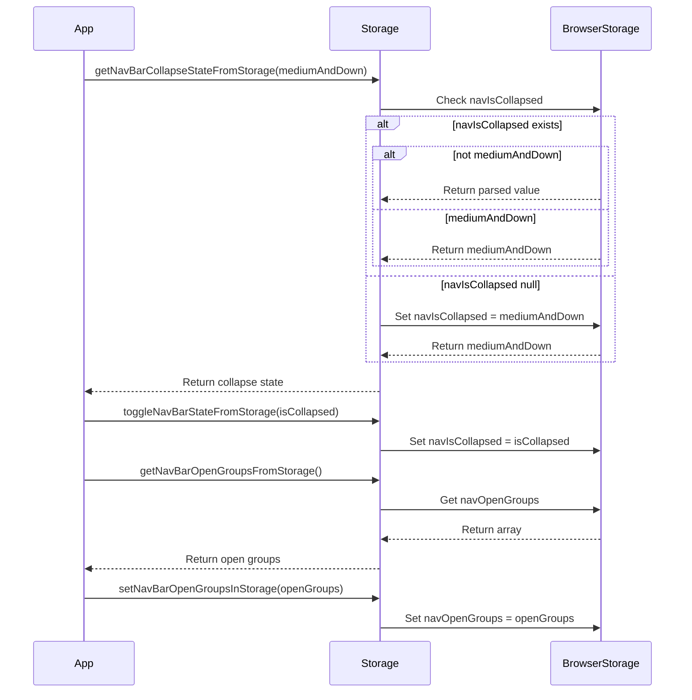
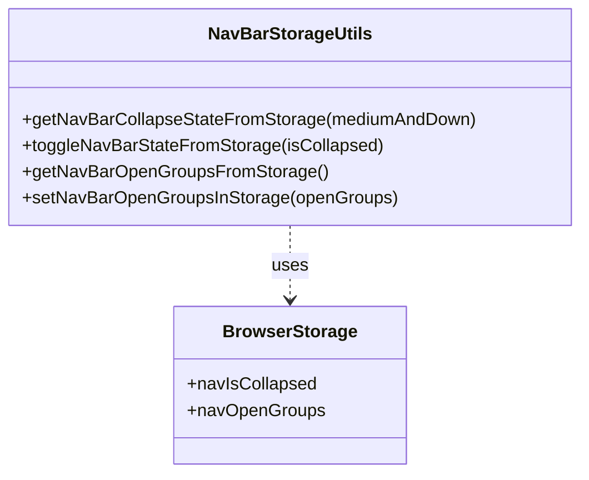

# Diagram: web/portal/src/utils/nav-utils.js

> Auto-generated by Obscura crawlers

## Diagram 1

```mermaid
flowchart TD
    A[getNavBarCollapseStateFromStorage] -->|mediumAndDown| B{BrowserStorage.navIsCollapsed !== null?}
    B -->|Yes| C{!mediumAndDown?}
    B -->|No| D[Set BrowserStorage.navIsCollapsed = mediumAndDown]
    C -->|Yes| E[Return JSON.parse navIsCollapsed]
    C -->|No| F[Return mediumAndDown]
    D --> F
    
    G[toggleNavBarStateFromStorage] -->|isCollapsed| H[Set BrowserStorage.navIsCollapsed = isCollapsed]
    
    I[getNavBarOpenGroupsFromStorage] --> J[Return navOpenGroups split by comma or empty array]
    
    K[setNavBarOpenGroupsInStorage] -->|openGroups| L[Set BrowserStorage.navOpenGroups = openGroups]
```

### SVG

<svg id="container" width="1519.4140625" xmlns="http://www.w3.org/2000/svg" class="flowchart" height="871.109375" viewBox="0 0 1519.4140625 871.109375" role="graphics-document document" aria-roledescription="flowchart-v2"><g><marker id="container_flowchart-v2-pointEnd" class="marker flowchart-v2" viewBox="0 0 10 10" refX="5" refY="5" markerUnits="userSpaceOnUse" markerWidth="8" markerHeight="8" orient="auto"><path d="M 0 0 L 10 5 L 0 10 z" class="arrowMarkerPath" style="stroke-width: 1; stroke-dasharray: 1, 0;"></path></marker><marker id="container_flowchart-v2-pointStart" class="marker flowchart-v2" viewBox="0 0 10 10" refX="4.5" refY="5" markerUnits="userSpaceOnUse" markerWidth="8" markerHeight="8" orient="auto"><path d="M 0 5 L 10 10 L 10 0 z" class="arrowMarkerPath" style="stroke-width: 1; stroke-dasharray: 1, 0;"></path></marker><marker id="container_flowchart-v2-circleEnd" class="marker flowchart-v2" viewBox="0 0 10 10" refX="11" refY="5" markerUnits="userSpaceOnUse" markerWidth="11" markerHeight="11" orient="auto"><circle cx="5" cy="5" r="5" class="arrowMarkerPath" style="stroke-width: 1; stroke-dasharray: 1, 0;"></circle></marker><marker id="container_flowchart-v2-circleStart" class="marker flowchart-v2" viewBox="0 0 10 10" refX="-1" refY="5" markerUnits="userSpaceOnUse" markerWidth="11" markerHeight="11" orient="auto"><circle cx="5" cy="5" r="5" class="arrowMarkerPath" style="stroke-width: 1; stroke-dasharray: 1, 0;"></circle></marker><marker id="container_flowchart-v2-crossEnd" class="marker cross flowchart-v2" viewBox="0 0 11 11" refX="12" refY="5.2" markerUnits="userSpaceOnUse" markerWidth="11" markerHeight="11" orient="auto"><path d="M 1,1 l 9,9 M 10,1 l -9,9" class="arrowMarkerPath" style="stroke-width: 2; stroke-dasharray: 1, 0;"></path></marker><marker id="container_flowchart-v2-crossStart" class="marker cross flowchart-v2" viewBox="0 0 11 11" refX="-1" refY="5.2" markerUnits="userSpaceOnUse" markerWidth="11" markerHeight="11" orient="auto"><path d="M 1,1 l 9,9 M 10,1 l -9,9" class="arrowMarkerPath" style="stroke-width: 2; stroke-dasharray: 1, 0;"></path></marker><g class="root"><g class="clusters"></g><g class="edgePaths"><path d="M304.859,62L304.859,68.167C304.859,74.333,304.859,86.667,304.859,98.333C304.859,110,304.859,121,304.859,126.5L304.859,132" id="L_A_B_0" class="edge-thickness-normal edge-pattern-solid edge-thickness-normal edge-pattern-solid flowchart-link" style=";" data-edge="true" data-et="edge" data-id="L_A_B_0" data-points="W3sieCI6MzA0Ljg1OTM3NSwieSI6NjJ9LHsieCI6MzA0Ljg1OTM3NSwieSI6OTl9LHsieCI6MzA0Ljg1OTM3NSwieSI6MTM2fV0=" marker-end="url(#container_flowchart-v2-pointEnd)"></path><path d="M238.172,377.547L224.991,394.829C211.81,412.11,185.448,446.672,172.267,469.453C159.086,492.234,159.086,503.234,159.086,508.734L159.086,514.234" id="L_B_C_0" class="edge-thickness-normal edge-pattern-solid edge-thickness-normal edge-pattern-solid flowchart-link" style=";" data-edge="true" data-et="edge" data-id="L_B_C_0" data-points="W3sieCI6MjM4LjE3MjQ3MjY4NjUwNTczLCJ5IjozNzcuNTQ3NDcyNjg2NTA1N30seyJ4IjoxNTkuMDg1OTM3NSwieSI6NDgxLjIzNDM3NX0seyJ4IjoxNTkuMDg1OTM3NSwieSI6NTE4LjIzNDM3NX1d" marker-end="url(#container_flowchart-v2-pointEnd)"></path><path d="M376.352,372.742L391.998,390.824C407.643,408.906,438.935,445.07,454.581,476.225C470.227,507.38,470.227,533.526,470.227,546.599L470.227,559.672" id="L_B_D_0" class="edge-thickness-normal edge-pattern-solid edge-thickness-normal edge-pattern-solid flowchart-link" style=";" data-edge="true" data-et="edge" data-id="L_B_D_0" data-points="W3sieCI6Mzc2LjM1MTc4MTQ4Mjg1MTIsInkiOjM3Mi43NDE5Njg1MTcxNDg4fSx7IngiOjQ3MC4yMjY1NjI1LCJ5Ijo0ODEuMjM0Mzc1fSx7IngiOjQ3MC4yMjY1NjI1LCJ5Ijo1NjMuNjcxODc1fV0=" marker-end="url(#container_flowchart-v2-pointEnd)"></path><path d="M145.926,697.95L144.605,706.31C143.284,714.67,140.642,731.389,139.321,745.249C138,759.109,138,770.109,138,775.609L138,781.109" id="L_C_E_0" class="edge-thickness-normal edge-pattern-solid edge-thickness-normal edge-pattern-solid flowchart-link" style=";" data-edge="true" data-et="edge" data-id="L_C_E_0" data-points="W3sieCI6MTQ1LjkyNjI4MjY4OTM0MjIzLCJ5Ijo2OTcuOTQ5NzIwMTg5MzQyMn0seyJ4IjoxMzgsInkiOjc0OC4xMDkzNzV9LHsieCI6MTM4LCJ5Ijo3ODUuMTA5Mzc1fV0=" marker-end="url(#container_flowchart-v2-pointEnd)"></path><path d="M210.17,660.025L226.705,674.706C243.241,689.387,276.312,718.748,307.92,741.287C339.529,763.826,369.675,779.543,384.748,787.402L399.821,795.26" id="L_C_F_0" class="edge-thickness-normal edge-pattern-solid edge-thickness-normal edge-pattern-solid flowchart-link" style=";" data-edge="true" data-et="edge" data-id="L_C_F_0" data-points="W3sieCI6MjEwLjE2OTgyNDk2NjI3MDE3LCJ5Ijo2NjAuMDI1NDg3NTMzNzI5OH0seyJ4IjozMDkuMzgyODEyNSwieSI6NzQ4LjEwOTM3NX0seyJ4Ijo0MDMuMzY4MzE4MjU2NTc4OTYsInkiOjc5Ny4xMDkzNzV9XQ==" marker-end="url(#container_flowchart-v2-pointEnd)"></path><path d="M470.227,665.672L470.227,679.411C470.227,693.151,470.227,720.63,468.737,741.883C467.247,763.135,464.268,778.16,462.778,785.673L461.288,793.186" id="L_D_F_0" class="edge-thickness-normal edge-pattern-solid edge-thickness-normal edge-pattern-solid flowchart-link" style=";" data-edge="true" data-et="edge" data-id="L_D_F_0" data-points="W3sieCI6NDcwLjIyNjU2MjUsInkiOjY2NS42NzE4NzV9LHsieCI6NDcwLjIyNjU2MjUsInkiOjc0OC4xMDkzNzV9LHsieCI6NDYwLjUxMDE3NjgwOTIxMDUsInkiOjc5Ny4xMDkzNzV9XQ==" marker-end="url(#container_flowchart-v2-pointEnd)"></path><path d="M659.227,62L659.227,68.167C659.227,74.333,659.227,86.667,659.227,115.52C659.227,144.372,659.227,189.745,659.227,212.431L659.227,235.117" id="L_G_H_0" class="edge-thickness-normal edge-pattern-solid edge-thickness-normal edge-pattern-solid flowchart-link" style=";" data-edge="true" data-et="edge" data-id="L_G_H_0" data-points="W3sieCI6NjU5LjIyNjU2MjUsInkiOjYyfSx7IngiOjY1OS4yMjY1NjI1LCJ5Ijo5OX0seyJ4Ijo2NTkuMjI2NTYyNSwieSI6MjM5LjExNzE4NzV9XQ==" marker-end="url(#container_flowchart-v2-pointEnd)"></path><path d="M1009.125,62L1009.125,68.167C1009.125,74.333,1009.125,86.667,1009.125,115.52C1009.125,144.372,1009.125,189.745,1009.125,212.431L1009.125,235.117" id="L_I_J_0" class="edge-thickness-normal edge-pattern-solid edge-thickness-normal edge-pattern-solid flowchart-link" style=";" data-edge="true" data-et="edge" data-id="L_I_J_0" data-points="W3sieCI6MTAwOS4xMjUsInkiOjYyfSx7IngiOjEwMDkuMTI1LCJ5Ijo5OX0seyJ4IjoxMDA5LjEyNSwieSI6MjM5LjExNzE4NzV9XQ==" marker-end="url(#container_flowchart-v2-pointEnd)"></path><path d="M1362.977,62L1362.977,68.167C1362.977,74.333,1362.977,86.667,1362.977,115.52C1362.977,144.372,1362.977,189.745,1362.977,212.431L1362.977,235.117" id="L_K_L_0" class="edge-thickness-normal edge-pattern-solid edge-thickness-normal edge-pattern-solid flowchart-link" style=";" data-edge="true" data-et="edge" data-id="L_K_L_0" data-points="W3sieCI6MTM2Mi45NzY1NjI1LCJ5Ijo2Mn0seyJ4IjoxMzYyLjk3NjU2MjUsInkiOjk5fSx7IngiOjEzNjIuOTc2NTYyNSwieSI6MjM5LjExNzE4NzV9XQ==" marker-end="url(#container_flowchart-v2-pointEnd)"></path></g><g class="edgeLabels"><g class="edgeLabel" transform="translate(304.859375, 99)"><g class="label" data-id="L_A_B_0" transform="translate(-64.078125, -12)"><foreignObject width="128.15625" height="24">

mediumAndDown

</foreignObject></g></g><g class="edgeLabel" transform="translate(159.0859375, 481.234375)"><g class="label" data-id="L_B_C_0" transform="translate(-12.03125, -12)"><foreignObject width="24.0625" height="24">

Yes

</foreignObject></g></g><g class="edgeLabel" transform="translate(470.2265625, 481.234375)"><g class="label" data-id="L_B_D_0" transform="translate(-10.140625, -12)"><foreignObject width="20.28125" height="24">

No

</foreignObject></g></g><g class="edgeLabel" transform="translate(138, 748.109375)"><g class="label" data-id="L_C_E_0" transform="translate(-12.03125, -12)"><foreignObject width="24.0625" height="24">

Yes

</foreignObject></g></g><g class="edgeLabel" transform="translate(299.40688, 739.25248)"><g class="label" data-id="L_C_F_0" transform="translate(-10.140625, -12)"><foreignObject width="20.28125" height="24">

No

</foreignObject></g></g><g class="edgeLabel"><g class="label" data-id="L_D_F_0" transform="translate(0, 0)"><foreignObject width="0" height="0">

</foreignObject></g></g><g class="edgeLabel" transform="translate(659.2265625, 99)"><g class="label" data-id="L_G_H_0" transform="translate(-41.6171875, -12)"><foreignObject width="83.234375" height="24">

isCollapsed

</foreignObject></g></g><g class="edgeLabel"><g class="label" data-id="L_I_J_0" transform="translate(0, 0)"><foreignObject width="0" height="0">

</foreignObject></g></g><g class="edgeLabel" transform="translate(1362.9765625, 99)"><g class="label" data-id="L_K_L_0" transform="translate(-44.1875, -12)"><foreignObject width="88.375" height="24">

openGroups

</foreignObject></g></g></g><g class="nodes"><g class="node default" id="flowchart-A-0" transform="translate(304.859375, 35)"><rect class="basic label-container" style="" x="-162.03125" y="-27" width="324.0625" height="54"></rect><g class="label" style="" transform="translate(-132.03125, -12)"><rect></rect><foreignObject width="264.0625" height="24">

getNavBarCollapseStateFromStorage

</foreignObject></g></g><g class="node default" id="flowchart-B-1" transform="translate(304.859375, 290.1171875)"><polygon points="154.1171875,0 308.234375,-154.1171875 154.1171875,-308.234375 0,-154.1171875" class="label-container" transform="translate(-153.6171875, 154.1171875)"></polygon><g class="label" style="" transform="translate(-115.1171875, -24)"><rect></rect><foreignObject width="230.234375" height="48">

BrowserStorage.navIsCollapsed !== null?

</foreignObject></g></g><g class="node default" id="flowchart-C-3" transform="translate(159.0859375, 614.671875)"><polygon points="96.4375,0 192.875,-96.4375 96.4375,-192.875 0,-96.4375" class="label-container" transform="translate(-95.9375, 96.4375)"></polygon><g class="label" style="" transform="translate(-69.4375, -12)"><rect></rect><foreignObject width="138.875" height="24">

!mediumAndDown?

</foreignObject></g></g><g class="node default" id="flowchart-D-5" transform="translate(470.2265625, 614.671875)"><rect class="basic label-container" style="" x="-145.109375" y="-51" width="290.21875" height="102"></rect><g class="label" style="" transform="translate(-115.109375, -36)"><rect></rect><foreignObject width="230.21875" height="72">

Set BrowserStorage.navIsCollapsed = mediumAndDown

</foreignObject></g></g><g class="node default" id="flowchart-E-7" transform="translate(138, 824.109375)"><rect class="basic label-container" style="" x="-130" y="-39" width="260" height="78"></rect><g class="label" style="" transform="translate(-100, -24)"><rect></rect><foreignObject width="200" height="48">

Return JSON.parse navIsCollapsed

</foreignObject></g></g><g class="node default" id="flowchart-F-9" transform="translate(455.15625, 824.109375)"><rect class="basic label-container" style="" x="-120.59375" y="-27" width="241.1875" height="54"></rect><g class="label" style="" transform="translate(-90.59375, -12)"><rect></rect><foreignObject width="181.1875" height="24">

Return mediumAndDown

</foreignObject></g></g><g class="node default" id="flowchart-G-12" transform="translate(659.2265625, 35)"><rect class="basic label-container" style="" x="-142.3359375" y="-27" width="284.671875" height="54"></rect><g class="label" style="" transform="translate(-112.3359375, -12)"><rect></rect><foreignObject width="224.671875" height="24">

toggleNavBarStateFromStorage

</foreignObject></g></g><g class="node default" id="flowchart-H-13" transform="translate(659.2265625, 290.1171875)"><rect class="basic label-container" style="" x="-145.109375" y="-51" width="290.21875" height="102"></rect><g class="label" style="" transform="translate(-115.109375, -36)"><rect></rect><foreignObject width="230.21875" height="72">

Set BrowserStorage.navIsCollapsed = isCollapsed

</foreignObject></g></g><g class="node default" id="flowchart-I-14" transform="translate(1009.125, 35)"><rect class="basic label-container" style="" x="-157.5625" y="-27" width="315.125" height="54"></rect><g class="label" style="" transform="translate(-127.5625, -12)"><rect></rect><foreignObject width="255.125" height="24">

getNavBarOpenGroupsFromStorage

</foreignObject></g></g><g class="node default" id="flowchart-J-15" transform="translate(1009.125, 290.1171875)"><rect class="basic label-container" style="" x="-130" y="-51" width="260" height="102"></rect><g class="label" style="" transform="translate(-100, -36)"><rect></rect><foreignObject width="200" height="72">

Return navOpenGroups split by comma or empty array

</foreignObject></g></g><g class="node default" id="flowchart-K-16" transform="translate(1362.9765625, 35)"><rect class="basic label-container" style="" x="-146.2890625" y="-27" width="292.578125" height="54"></rect><g class="label" style="" transform="translate(-116.2890625, -12)"><rect></rect><foreignObject width="232.578125" height="24">

setNavBarOpenGroupsInStorage

</foreignObject></g></g><g class="node default" id="flowchart-L-17" transform="translate(1362.9765625, 290.1171875)"><rect class="basic label-container" style="" x="-148.4375" y="-51" width="296.875" height="102"></rect><g class="label" style="" transform="translate(-118.4375, -36)"><rect></rect><foreignObject width="236.875" height="72">

Set BrowserStorage.navOpenGroups = openGroups

</foreignObject></g></g></g></g></g></svg>

## Diagram 2

### SVG

<svg id="container" width="1074" xmlns="http://www.w3.org/2000/svg" height="1091" viewBox="-50 -10 1074 1091" role="graphics-document document" aria-roledescription="sequence"><g><rect x="824" y="1005" fill="#eaeaea" stroke="#666" width="150" height="65" name="BrowserStorage" rx="3" ry="3" class="actor actor-bottom"></rect><text x="899" y="1037.5" dominant-baseline="central" alignment-baseline="central" class="actor actor-box" style="text-anchor: middle; font-size: 16px; font-weight: 400;"><tspan x="899" dy="0">BrowserStorage</tspan></text></g><g><rect x="473" y="1005" fill="#eaeaea" stroke="#666" width="150" height="65" name="Storage" rx="3" ry="3" class="actor actor-bottom"></rect><text x="548" y="1037.5" dominant-baseline="central" alignment-baseline="central" class="actor actor-box" style="text-anchor: middle; font-size: 16px; font-weight: 400;"><tspan x="548" dy="0">Storage</tspan></text></g><g><rect x="0" y="1005" fill="#eaeaea" stroke="#666" width="150" height="65" name="App" rx="3" ry="3" class="actor actor-bottom"></rect><text x="75" y="1037.5" dominant-baseline="central" alignment-baseline="central" class="actor actor-box" style="text-anchor: middle; font-size: 16px; font-weight: 400;"><tspan x="75" dy="0">App</tspan></text></g><g><line id="actor2" x1="899" y1="65" x2="899" y2="1005" class="actor-line 200" stroke-width="0.5px" stroke="#999" name="BrowserStorage"></line><g id="root-2"><rect x="824" y="0" fill="#eaeaea" stroke="#666" width="150" height="65" name="BrowserStorage" rx="3" ry="3" class="actor actor-top"></rect><text x="899" y="32.5" dominant-baseline="central" alignment-baseline="central" class="actor actor-box" style="text-anchor: middle; font-size: 16px; font-weight: 400;"><tspan x="899" dy="0">BrowserStorage</tspan></text></g></g><g><line id="actor1" x1="548" y1="65" x2="548" y2="1005" class="actor-line 200" stroke-width="0.5px" stroke="#999" name="Storage"></line><g id="root-1"><rect x="473" y="0" fill="#eaeaea" stroke="#666" width="150" height="65" name="Storage" rx="3" ry="3" class="actor actor-top"></rect><text x="548" y="32.5" dominant-baseline="central" alignment-baseline="central" class="actor actor-box" style="text-anchor: middle; font-size: 16px; font-weight: 400;"><tspan x="548" dy="0">Storage</tspan></text></g></g><g><line id="actor0" x1="75" y1="65" x2="75" y2="1005" class="actor-line 200" stroke-width="0.5px" stroke="#999" name="App"></line><g id="root-0"><rect x="0" y="0" fill="#eaeaea" stroke="#666" width="150" height="65" name="App" rx="3" ry="3" class="actor actor-top"></rect><text x="75" y="32.5" dominant-baseline="central" alignment-baseline="central" class="actor actor-box" style="text-anchor: middle; font-size: 16px; font-weight: 400;"><tspan x="75" dy="0">App</tspan></text></g></g><g></g><defs><symbol id="computer" width="24" height="24"><path transform="scale(.5)" d="M2 2v13h20v-13h-20zm18 11h-16v-9h16v9zm-10.228 6l.466-1h3.524l.467 1h-4.457zm14.228 3h-24l2-6h2.104l-1.33 4h18.45l-1.297-4h2.073l2 6zm-5-10h-14v-7h14v7z"></path></symbol></defs><defs><symbol id="database" fill-rule="evenodd" clip-rule="evenodd"><path transform="scale(.5)" d="M12.258.001l.256.004.255.005.253.008.251.01.249.012.247.015.246.016.242.019.241.02.239.023.236.024.233.027.231.028.229.031.225.032.223.034.22.036.217.038.214.04.211.041.208.043.205.045.201.046.198.048.194.05.191.051.187.053.183.054.18.056.175.057.172.059.168.06.163.061.16.063.155.064.15.066.074.033.073.033.071.034.07.034.069.035.068.035.067.035.066.035.064.036.064.036.062.036.06.036.06.037.058.037.058.037.055.038.055.038.053.038.052.038.051.039.05.039.048.039.047.039.045.04.044.04.043.04.041.04.04.041.039.041.037.041.036.041.034.041.033.042.032.042.03.042.029.042.027.042.026.043.024.043.023.043.021.043.02.043.018.044.017.043.015.044.013.044.012.044.011.045.009.044.007.045.006.045.004.045.002.045.001.045v17l-.001.045-.002.045-.004.045-.006.045-.007.045-.009.044-.011.045-.012.044-.013.044-.015.044-.017.043-.018.044-.02.043-.021.043-.023.043-.024.043-.026.043-.027.042-.029.042-.03.042-.032.042-.033.042-.034.041-.036.041-.037.041-.039.041-.04.041-.041.04-.043.04-.044.04-.045.04-.047.039-.048.039-.05.039-.051.039-.052.038-.053.038-.055.038-.055.038-.058.037-.058.037-.06.037-.06.036-.062.036-.064.036-.064.036-.066.035-.067.035-.068.035-.069.035-.07.034-.071.034-.073.033-.074.033-.15.066-.155.064-.16.063-.163.061-.168.06-.172.059-.175.057-.18.056-.183.054-.187.053-.191.051-.194.05-.198.048-.201.046-.205.045-.208.043-.211.041-.214.04-.217.038-.22.036-.223.034-.225.032-.229.031-.231.028-.233.027-.236.024-.239.023-.241.02-.242.019-.246.016-.247.015-.249.012-.251.01-.253.008-.255.005-.256.004-.258.001-.258-.001-.256-.004-.255-.005-.253-.008-.251-.01-.249-.012-.247-.015-.245-.016-.243-.019-.241-.02-.238-.023-.236-.024-.234-.027-.231-.028-.228-.031-.226-.032-.223-.034-.22-.036-.217-.038-.214-.04-.211-.041-.208-.043-.204-.045-.201-.046-.198-.048-.195-.05-.19-.051-.187-.053-.184-.054-.179-.056-.176-.057-.172-.059-.167-.06-.164-.061-.159-.063-.155-.064-.151-.066-.074-.033-.072-.033-.072-.034-.07-.034-.069-.035-.068-.035-.067-.035-.066-.035-.064-.036-.063-.036-.062-.036-.061-.036-.06-.037-.058-.037-.057-.037-.056-.038-.055-.038-.053-.038-.052-.038-.051-.039-.049-.039-.049-.039-.046-.039-.046-.04-.044-.04-.043-.04-.041-.04-.04-.041-.039-.041-.037-.041-.036-.041-.034-.041-.033-.042-.032-.042-.03-.042-.029-.042-.027-.042-.026-.043-.024-.043-.023-.043-.021-.043-.02-.043-.018-.044-.017-.043-.015-.044-.013-.044-.012-.044-.011-.045-.009-.044-.007-.045-.006-.045-.004-.045-.002-.045-.001-.045v-17l.001-.045.002-.045.004-.045.006-.045.007-.045.009-.044.011-.045.012-.044.013-.044.015-.044.017-.043.018-.044.02-.043.021-.043.023-.043.024-.043.026-.043.027-.042.029-.042.03-.042.032-.042.033-.042.034-.041.036-.041.037-.041.039-.041.04-.041.041-.04.043-.04.044-.04.046-.04.046-.039.049-.039.049-.039.051-.039.052-.038.053-.038.055-.038.056-.038.057-.037.058-.037.06-.037.061-.036.062-.036.063-.036.064-.036.066-.035.067-.035.068-.035.069-.035.07-.034.072-.034.072-.033.074-.033.151-.066.155-.064.159-.063.164-.061.167-.06.172-.059.176-.057.179-.056.184-.054.187-.053.19-.051.195-.05.198-.048.201-.046.204-.045.208-.043.211-.041.214-.04.217-.038.22-.036.223-.034.226-.032.228-.031.231-.028.234-.027.236-.024.238-.023.241-.02.243-.019.245-.016.247-.015.249-.012.251-.01.253-.008.255-.005.256-.004.258-.001.258.001zm-9.258 20.499v.01l.001.021.003.021.004.022.005.021.006.022.007.022.009.023.01.022.011.023.012.023.013.023.015.023.016.024.017.023.018.024.019.024.021.024.022.025.023.024.024.025.052.049.056.05.061.051.066.051.07.051.075.051.079.052.084.052.088.052.092.052.097.052.102.051.105.052.11.052.114.051.119.051.123.051.127.05.131.05.135.05.139.048.144.049.147.047.152.047.155.047.16.045.163.045.167.043.171.043.176.041.178.041.183.039.187.039.19.037.194.035.197.035.202.033.204.031.209.03.212.029.216.027.219.025.222.024.226.021.23.02.233.018.236.016.24.015.243.012.246.01.249.008.253.005.256.004.259.001.26-.001.257-.004.254-.005.25-.008.247-.011.244-.012.241-.014.237-.016.233-.018.231-.021.226-.021.224-.024.22-.026.216-.027.212-.028.21-.031.205-.031.202-.034.198-.034.194-.036.191-.037.187-.039.183-.04.179-.04.175-.042.172-.043.168-.044.163-.045.16-.046.155-.046.152-.047.148-.048.143-.049.139-.049.136-.05.131-.05.126-.05.123-.051.118-.052.114-.051.11-.052.106-.052.101-.052.096-.052.092-.052.088-.053.083-.051.079-.052.074-.052.07-.051.065-.051.06-.051.056-.05.051-.05.023-.024.023-.025.021-.024.02-.024.019-.024.018-.024.017-.024.015-.023.014-.024.013-.023.012-.023.01-.023.01-.022.008-.022.006-.022.006-.022.004-.022.004-.021.001-.021.001-.021v-4.127l-.077.055-.08.053-.083.054-.085.053-.087.052-.09.052-.093.051-.095.05-.097.05-.1.049-.102.049-.105.048-.106.047-.109.047-.111.046-.114.045-.115.045-.118.044-.12.043-.122.042-.124.042-.126.041-.128.04-.13.04-.132.038-.134.038-.135.037-.138.037-.139.035-.142.035-.143.034-.144.033-.147.032-.148.031-.15.03-.151.03-.153.029-.154.027-.156.027-.158.026-.159.025-.161.024-.162.023-.163.022-.165.021-.166.02-.167.019-.169.018-.169.017-.171.016-.173.015-.173.014-.175.013-.175.012-.177.011-.178.01-.179.008-.179.008-.181.006-.182.005-.182.004-.184.003-.184.002h-.37l-.184-.002-.184-.003-.182-.004-.182-.005-.181-.006-.179-.008-.179-.008-.178-.01-.176-.011-.176-.012-.175-.013-.173-.014-.172-.015-.171-.016-.17-.017-.169-.018-.167-.019-.166-.02-.165-.021-.163-.022-.162-.023-.161-.024-.159-.025-.157-.026-.156-.027-.155-.027-.153-.029-.151-.03-.15-.03-.148-.031-.146-.032-.145-.033-.143-.034-.141-.035-.14-.035-.137-.037-.136-.037-.134-.038-.132-.038-.13-.04-.128-.04-.126-.041-.124-.042-.122-.042-.12-.044-.117-.043-.116-.045-.113-.045-.112-.046-.109-.047-.106-.047-.105-.048-.102-.049-.1-.049-.097-.05-.095-.05-.093-.052-.09-.051-.087-.052-.085-.053-.083-.054-.08-.054-.077-.054v4.127zm0-5.654v.011l.001.021.003.021.004.021.005.022.006.022.007.022.009.022.01.022.011.023.012.023.013.023.015.024.016.023.017.024.018.024.019.024.021.024.022.024.023.025.024.024.052.05.056.05.061.05.066.051.07.051.075.052.079.051.084.052.088.052.092.052.097.052.102.052.105.052.11.051.114.051.119.052.123.05.127.051.131.05.135.049.139.049.144.048.147.048.152.047.155.046.16.045.163.045.167.044.171.042.176.042.178.04.183.04.187.038.19.037.194.036.197.034.202.033.204.032.209.03.212.028.216.027.219.025.222.024.226.022.23.02.233.018.236.016.24.014.243.012.246.01.249.008.253.006.256.003.259.001.26-.001.257-.003.254-.006.25-.008.247-.01.244-.012.241-.015.237-.016.233-.018.231-.02.226-.022.224-.024.22-.025.216-.027.212-.029.21-.03.205-.032.202-.033.198-.035.194-.036.191-.037.187-.039.183-.039.179-.041.175-.042.172-.043.168-.044.163-.045.16-.045.155-.047.152-.047.148-.048.143-.048.139-.05.136-.049.131-.05.126-.051.123-.051.118-.051.114-.052.11-.052.106-.052.101-.052.096-.052.092-.052.088-.052.083-.052.079-.052.074-.051.07-.052.065-.051.06-.05.056-.051.051-.049.023-.025.023-.024.021-.025.02-.024.019-.024.018-.024.017-.024.015-.023.014-.023.013-.024.012-.022.01-.023.01-.023.008-.022.006-.022.006-.022.004-.021.004-.022.001-.021.001-.021v-4.139l-.077.054-.08.054-.083.054-.085.052-.087.053-.09.051-.093.051-.095.051-.097.05-.1.049-.102.049-.105.048-.106.047-.109.047-.111.046-.114.045-.115.044-.118.044-.12.044-.122.042-.124.042-.126.041-.128.04-.13.039-.132.039-.134.038-.135.037-.138.036-.139.036-.142.035-.143.033-.144.033-.147.033-.148.031-.15.03-.151.03-.153.028-.154.028-.156.027-.158.026-.159.025-.161.024-.162.023-.163.022-.165.021-.166.02-.167.019-.169.018-.169.017-.171.016-.173.015-.173.014-.175.013-.175.012-.177.011-.178.009-.179.009-.179.007-.181.007-.182.005-.182.004-.184.003-.184.002h-.37l-.184-.002-.184-.003-.182-.004-.182-.005-.181-.007-.179-.007-.179-.009-.178-.009-.176-.011-.176-.012-.175-.013-.173-.014-.172-.015-.171-.016-.17-.017-.169-.018-.167-.019-.166-.02-.165-.021-.163-.022-.162-.023-.161-.024-.159-.025-.157-.026-.156-.027-.155-.028-.153-.028-.151-.03-.15-.03-.148-.031-.146-.033-.145-.033-.143-.033-.141-.035-.14-.036-.137-.036-.136-.037-.134-.038-.132-.039-.13-.039-.128-.04-.126-.041-.124-.042-.122-.043-.12-.043-.117-.044-.116-.044-.113-.046-.112-.046-.109-.046-.106-.047-.105-.048-.102-.049-.1-.049-.097-.05-.095-.051-.093-.051-.09-.051-.087-.053-.085-.052-.083-.054-.08-.054-.077-.054v4.139zm0-5.666v.011l.001.02.003.022.004.021.005.022.006.021.007.022.009.023.01.022.011.023.012.023.013.023.015.023.016.024.017.024.018.023.019.024.021.025.022.024.023.024.024.025.052.05.056.05.061.05.066.051.07.051.075.052.079.051.084.052.088.052.092.052.097.052.102.052.105.051.11.052.114.051.119.051.123.051.127.05.131.05.135.05.139.049.144.048.147.048.152.047.155.046.16.045.163.045.167.043.171.043.176.042.178.04.183.04.187.038.19.037.194.036.197.034.202.033.204.032.209.03.212.028.216.027.219.025.222.024.226.021.23.02.233.018.236.017.24.014.243.012.246.01.249.008.253.006.256.003.259.001.26-.001.257-.003.254-.006.25-.008.247-.01.244-.013.241-.014.237-.016.233-.018.231-.02.226-.022.224-.024.22-.025.216-.027.212-.029.21-.03.205-.032.202-.033.198-.035.194-.036.191-.037.187-.039.183-.039.179-.041.175-.042.172-.043.168-.044.163-.045.16-.045.155-.047.152-.047.148-.048.143-.049.139-.049.136-.049.131-.051.126-.05.123-.051.118-.052.114-.051.11-.052.106-.052.101-.052.096-.052.092-.052.088-.052.083-.052.079-.052.074-.052.07-.051.065-.051.06-.051.056-.05.051-.049.023-.025.023-.025.021-.024.02-.024.019-.024.018-.024.017-.024.015-.023.014-.024.013-.023.012-.023.01-.022.01-.023.008-.022.006-.022.006-.022.004-.022.004-.021.001-.021.001-.021v-4.153l-.077.054-.08.054-.083.053-.085.053-.087.053-.09.051-.093.051-.095.051-.097.05-.1.049-.102.048-.105.048-.106.048-.109.046-.111.046-.114.046-.115.044-.118.044-.12.043-.122.043-.124.042-.126.041-.128.04-.13.039-.132.039-.134.038-.135.037-.138.036-.139.036-.142.034-.143.034-.144.033-.147.032-.148.032-.15.03-.151.03-.153.028-.154.028-.156.027-.158.026-.159.024-.161.024-.162.023-.163.023-.165.021-.166.02-.167.019-.169.018-.169.017-.171.016-.173.015-.173.014-.175.013-.175.012-.177.01-.178.01-.179.009-.179.007-.181.006-.182.006-.182.004-.184.003-.184.001-.185.001-.185-.001-.184-.001-.184-.003-.182-.004-.182-.006-.181-.006-.179-.007-.179-.009-.178-.01-.176-.01-.176-.012-.175-.013-.173-.014-.172-.015-.171-.016-.17-.017-.169-.018-.167-.019-.166-.02-.165-.021-.163-.023-.162-.023-.161-.024-.159-.024-.157-.026-.156-.027-.155-.028-.153-.028-.151-.03-.15-.03-.148-.032-.146-.032-.145-.033-.143-.034-.141-.034-.14-.036-.137-.036-.136-.037-.134-.038-.132-.039-.13-.039-.128-.041-.126-.041-.124-.041-.122-.043-.12-.043-.117-.044-.116-.044-.113-.046-.112-.046-.109-.046-.106-.048-.105-.048-.102-.048-.1-.05-.097-.049-.095-.051-.093-.051-.09-.052-.087-.052-.085-.053-.083-.053-.08-.054-.077-.054v4.153zm8.74-8.179l-.257.004-.254.005-.25.008-.247.011-.244.012-.241.014-.237.016-.233.018-.231.021-.226.022-.224.023-.22.026-.216.027-.212.028-.21.031-.205.032-.202.033-.198.034-.194.036-.191.038-.187.038-.183.04-.179.041-.175.042-.172.043-.168.043-.163.045-.16.046-.155.046-.152.048-.148.048-.143.048-.139.049-.136.05-.131.05-.126.051-.123.051-.118.051-.114.052-.11.052-.106.052-.101.052-.096.052-.092.052-.088.052-.083.052-.079.052-.074.051-.07.052-.065.051-.06.05-.056.05-.051.05-.023.025-.023.024-.021.024-.02.025-.019.024-.018.024-.017.023-.015.024-.014.023-.013.023-.012.023-.01.023-.01.022-.008.022-.006.023-.006.021-.004.022-.004.021-.001.021-.001.021.001.021.001.021.004.021.004.022.006.021.006.023.008.022.01.022.01.023.012.023.013.023.014.023.015.024.017.023.018.024.019.024.02.025.021.024.023.024.023.025.051.05.056.05.06.05.065.051.07.052.074.051.079.052.083.052.088.052.092.052.096.052.101.052.106.052.11.052.114.052.118.051.123.051.126.051.131.05.136.05.139.049.143.048.148.048.152.048.155.046.16.046.163.045.168.043.172.043.175.042.179.041.183.04.187.038.191.038.194.036.198.034.202.033.205.032.21.031.212.028.216.027.22.026.224.023.226.022.231.021.233.018.237.016.241.014.244.012.247.011.25.008.254.005.257.004.26.001.26-.001.257-.004.254-.005.25-.008.247-.011.244-.012.241-.014.237-.016.233-.018.231-.021.226-.022.224-.023.22-.026.216-.027.212-.028.21-.031.205-.032.202-.033.198-.034.194-.036.191-.038.187-.038.183-.04.179-.041.175-.042.172-.043.168-.043.163-.045.16-.046.155-.046.152-.048.148-.048.143-.048.139-.049.136-.05.131-.05.126-.051.123-.051.118-.051.114-.052.11-.052.106-.052.101-.052.096-.052.092-.052.088-.052.083-.052.079-.052.074-.051.07-.052.065-.051.06-.05.056-.05.051-.05.023-.025.023-.024.021-.024.02-.025.019-.024.018-.024.017-.023.015-.024.014-.023.013-.023.012-.023.01-.023.01-.022.008-.022.006-.023.006-.021.004-.022.004-.021.001-.021.001-.021-.001-.021-.001-.021-.004-.021-.004-.022-.006-.021-.006-.023-.008-.022-.01-.022-.01-.023-.012-.023-.013-.023-.014-.023-.015-.024-.017-.023-.018-.024-.019-.024-.02-.025-.021-.024-.023-.024-.023-.025-.051-.05-.056-.05-.06-.05-.065-.051-.07-.052-.074-.051-.079-.052-.083-.052-.088-.052-.092-.052-.096-.052-.101-.052-.106-.052-.11-.052-.114-.052-.118-.051-.123-.051-.126-.051-.131-.05-.136-.05-.139-.049-.143-.048-.148-.048-.152-.048-.155-.046-.16-.046-.163-.045-.168-.043-.172-.043-.175-.042-.179-.041-.183-.04-.187-.038-.191-.038-.194-.036-.198-.034-.202-.033-.205-.032-.21-.031-.212-.028-.216-.027-.22-.026-.224-.023-.226-.022-.231-.021-.233-.018-.237-.016-.241-.014-.244-.012-.247-.011-.25-.008-.254-.005-.257-.004-.26-.001-.26.001z"></path></symbol></defs><defs><symbol id="clock" width="24" height="24"><path transform="scale(.5)" d="M12 2c5.514 0 10 4.486 10 10s-4.486 10-10 10-10-4.486-10-10 4.486-10 10-10zm0-2c-6.627 0-12 5.373-12 12s5.373 12 12 12 12-5.373 12-12-5.373-12-12-12zm5.848 12.459c.202.038.202.333.001.372-1.907.361-6.045 1.111-6.547 1.111-.719 0-1.301-.582-1.301-1.301 0-.512.77-5.447 1.125-7.445.034-.192.312-.181.343.014l.985 6.238 5.394 1.011z"></path></symbol></defs><defs><marker id="arrowhead" refX="7.9" refY="5" markerUnits="userSpaceOnUse" markerWidth="12" markerHeight="12" orient="auto-start-reverse"><path d="M -1 0 L 10 5 L 0 10 z"></path></marker></defs><defs><marker id="crosshead" markerWidth="15" markerHeight="8" orient="auto" refX="4" refY="4.5"><path fill="none" stroke="#000000" stroke-width="1pt" d="M 1,2 L 6,7 M 6,2 L 1,7" style="stroke-dasharray: 0, 0;"></path></marker></defs><defs><marker id="filled-head" refX="15.5" refY="7" markerWidth="20" markerHeight="28" orient="auto"><path d="M 18,7 L9,13 L14,7 L9,1 Z"></path></marker></defs><defs><marker id="sequencenumber" refX="15" refY="15" markerWidth="60" markerHeight="40" orient="auto"><circle cx="15" cy="15" r="6"></circle></marker></defs><g><line x1="537" y1="216" x2="910" y2="216" class="loopLine"></line><line x1="910" y1="216" x2="910" y2="402" class="loopLine"></line><line x1="537" y1="402" x2="910" y2="402" class="loopLine"></line><line x1="537" y1="216" x2="537" y2="402" class="loopLine"></line><line x1="537" y1="314" x2="910" y2="314" class="loopLine" style="stroke-dasharray: 3, 3;"></line><polygon points="537,216 587,216 587,229 578.6,236 537,236" class="labelBox"></polygon><text x="562" y="229" text-anchor="middle" dominant-baseline="middle" alignment-baseline="middle" class="labelText" style="font-size: 16px; font-weight: 400;">alt</text><text x="748.5" y="234" text-anchor="middle" class="loopText" style="font-size: 16px; font-weight: 400;"><tspan x="748.5">[not mediumAndDown]</tspan></text><text x="723.5" y="332" text-anchor="middle" class="loopText" style="font-size: 16px; font-weight: 400;">[mediumAndDown]</text></g><g><line x1="527" y1="171" x2="920" y2="171" class="loopLine"></line><line x1="920" y1="171" x2="920" y2="553" class="loopLine"></line><line x1="527" y1="553" x2="920" y2="553" class="loopLine"></line><line x1="527" y1="171" x2="527" y2="553" class="loopLine"></line><line x1="527" y1="417" x2="920" y2="417" class="loopLine" style="stroke-dasharray: 3, 3;"></line><polygon points="527,171 577,171 577,184 568.6,191 527,191" class="labelBox"></polygon><text x="552" y="184" text-anchor="middle" dominant-baseline="middle" alignment-baseline="middle" class="labelText" style="font-size: 16px; font-weight: 400;">alt</text><text x="748.5" y="189" text-anchor="middle" class="loopText" style="font-size: 16px; font-weight: 400;"><tspan x="748.5">[navIsCollapsed exists]</tspan></text><text x="723.5" y="435" text-anchor="middle" class="loopText" style="font-size: 16px; font-weight: 400;">[navIsCollapsed null]</text></g><text x="310" y="80" text-anchor="middle" dominant-baseline="middle" alignment-baseline="middle" class="messageText" dy="1em" style="font-size: 16px; font-weight: 400;">getNavBarCollapseStateFromStorage(mediumAndDown)</text><line x1="76" y1="113" x2="544" y2="113" class="messageLine0" stroke-width="2" stroke="none" marker-end="url(#arrowhead)" style="fill: none;"></line><text x="722" y="128" text-anchor="middle" dominant-baseline="middle" alignment-baseline="middle" class="messageText" dy="1em" style="font-size: 16px; font-weight: 400;">Check navIsCollapsed</text><line x1="549" y1="161" x2="895" y2="161" class="messageLine0" stroke-width="2" stroke="none" marker-end="url(#arrowhead)" style="fill: none;"></line><text x="725" y="266" text-anchor="middle" dominant-baseline="middle" alignment-baseline="middle" class="messageText" dy="1em" style="font-size: 16px; font-weight: 400;">Return parsed value</text><line x1="898" y1="299" x2="552" y2="299" class="messageLine1" stroke-width="2" stroke="none" marker-end="url(#arrowhead)" style="stroke-dasharray: 3, 3; fill: none;"></line><text x="725" y="359" text-anchor="middle" dominant-baseline="middle" alignment-baseline="middle" class="messageText" dy="1em" style="font-size: 16px; font-weight: 400;">Return mediumAndDown</text><line x1="898" y1="392" x2="552" y2="392" class="messageLine1" stroke-width="2" stroke="none" marker-end="url(#arrowhead)" style="stroke-dasharray: 3, 3; fill: none;"></line><text x="722" y="462" text-anchor="middle" dominant-baseline="middle" alignment-baseline="middle" class="messageText" dy="1em" style="font-size: 16px; font-weight: 400;">Set navIsCollapsed = mediumAndDown</text><line x1="549" y1="495" x2="895" y2="495" class="messageLine0" stroke-width="2" stroke="none" marker-end="url(#arrowhead)" style="fill: none;"></line><text x="725" y="510" text-anchor="middle" dominant-baseline="middle" alignment-baseline="middle" class="messageText" dy="1em" style="font-size: 16px; font-weight: 400;">Return mediumAndDown</text><line x1="898" y1="543" x2="552" y2="543" class="messageLine1" stroke-width="2" stroke="none" marker-end="url(#arrowhead)" style="stroke-dasharray: 3, 3; fill: none;"></line><text x="313" y="568" text-anchor="middle" dominant-baseline="middle" alignment-baseline="middle" class="messageText" dy="1em" style="font-size: 16px; font-weight: 400;">Return collapse state</text><line x1="547" y1="601" x2="79" y2="601" class="messageLine1" stroke-width="2" stroke="none" marker-end="url(#arrowhead)" style="stroke-dasharray: 3, 3; fill: none;"></line><text x="310" y="616" text-anchor="middle" dominant-baseline="middle" alignment-baseline="middle" class="messageText" dy="1em" style="font-size: 16px; font-weight: 400;">toggleNavBarStateFromStorage(isCollapsed)</text><line x1="76" y1="649" x2="544" y2="649" class="messageLine0" stroke-width="2" stroke="none" marker-end="url(#arrowhead)" style="fill: none;"></line><text x="722" y="664" text-anchor="middle" dominant-baseline="middle" alignment-baseline="middle" class="messageText" dy="1em" style="font-size: 16px; font-weight: 400;">Set navIsCollapsed = isCollapsed</text><line x1="549" y1="697" x2="895" y2="697" class="messageLine0" stroke-width="2" stroke="none" marker-end="url(#arrowhead)" style="fill: none;"></line><text x="310" y="712" text-anchor="middle" dominant-baseline="middle" alignment-baseline="middle" class="messageText" dy="1em" style="font-size: 16px; font-weight: 400;">getNavBarOpenGroupsFromStorage()</text><line x1="76" y1="745" x2="544" y2="745" class="messageLine0" stroke-width="2" stroke="none" marker-end="url(#arrowhead)" style="fill: none;"></line><text x="722" y="760" text-anchor="middle" dominant-baseline="middle" alignment-baseline="middle" class="messageText" dy="1em" style="font-size: 16px; font-weight: 400;">Get navOpenGroups</text><line x1="549" y1="793" x2="895" y2="793" class="messageLine0" stroke-width="2" stroke="none" marker-end="url(#arrowhead)" style="fill: none;"></line><text x="725" y="808" text-anchor="middle" dominant-baseline="middle" alignment-baseline="middle" class="messageText" dy="1em" style="font-size: 16px; font-weight: 400;">Return array</text><line x1="898" y1="841" x2="552" y2="841" class="messageLine1" stroke-width="2" stroke="none" marker-end="url(#arrowhead)" style="stroke-dasharray: 3, 3; fill: none;"></line><text x="313" y="856" text-anchor="middle" dominant-baseline="middle" alignment-baseline="middle" class="messageText" dy="1em" style="font-size: 16px; font-weight: 400;">Return open groups</text><line x1="547" y1="889" x2="79" y2="889" class="messageLine1" stroke-width="2" stroke="none" marker-end="url(#arrowhead)" style="stroke-dasharray: 3, 3; fill: none;"></line><text x="310" y="904" text-anchor="middle" dominant-baseline="middle" alignment-baseline="middle" class="messageText" dy="1em" style="font-size: 16px; font-weight: 400;">setNavBarOpenGroupsInStorage(openGroups)</text><line x1="76" y1="937" x2="544" y2="937" class="messageLine0" stroke-width="2" stroke="none" marker-end="url(#arrowhead)" style="fill: none;"></line><text x="722" y="952" text-anchor="middle" dominant-baseline="middle" alignment-baseline="middle" class="messageText" dy="1em" style="font-size: 16px; font-weight: 400;">Set navOpenGroups = openGroups</text><line x1="549" y1="985" x2="895" y2="985" class="messageLine0" stroke-width="2" stroke="none" marker-end="url(#arrowhead)" style="fill: none;"></line></svg>

## Diagram 3

### SVG

<svg id="container" width="521.6171875" xmlns="http://www.w3.org/2000/svg" class="classDiagram" height="432" viewBox="0 0 521.6171875 432" role="graphics-document document" aria-roledescription="class"><g><defs><marker id="container_class-aggregationStart" class="marker aggregation class" refX="18" refY="7" markerWidth="190" markerHeight="240" orient="auto"><path d="M 18,7 L9,13 L1,7 L9,1 Z"></path></marker></defs><defs><marker id="container_class-aggregationEnd" class="marker aggregation class" refX="1" refY="7" markerWidth="20" markerHeight="28" orient="auto"><path d="M 18,7 L9,13 L1,7 L9,1 Z"></path></marker></defs><defs><marker id="container_class-extensionStart" class="marker extension class" refX="18" refY="7" markerWidth="190" markerHeight="240" orient="auto"><path d="M 1,7 L18,13 V 1 Z"></path></marker></defs><defs><marker id="container_class-extensionEnd" class="marker extension class" refX="1" refY="7" markerWidth="20" markerHeight="28" orient="auto"><path d="M 1,1 V 13 L18,7 Z"></path></marker></defs><defs><marker id="container_class-compositionStart" class="marker composition class" refX="18" refY="7" markerWidth="190" markerHeight="240" orient="auto"><path d="M 18,7 L9,13 L1,7 L9,1 Z"></path></marker></defs><defs><marker id="container_class-compositionEnd" class="marker composition class" refX="1" refY="7" markerWidth="20" markerHeight="28" orient="auto"><path d="M 18,7 L9,13 L1,7 L9,1 Z"></path></marker></defs><defs><marker id="container_class-dependencyStart" class="marker dependency class" refX="6" refY="7" markerWidth="190" markerHeight="240" orient="auto"><path d="M 5,7 L9,13 L1,7 L9,1 Z"></path></marker></defs><defs><marker id="container_class-dependencyEnd" class="marker dependency class" refX="13" refY="7" markerWidth="20" markerHeight="28" orient="auto"><path d="M 18,7 L9,13 L14,7 L9,1 Z"></path></marker></defs><defs><marker id="container_class-lollipopStart" class="marker lollipop class" refX="13" refY="7" markerWidth="190" markerHeight="240" orient="auto"><circle stroke="black" fill="transparent" cx="7" cy="7" r="6"></circle></marker></defs><defs><marker id="container_class-lollipopEnd" class="marker lollipop class" refX="1" refY="7" markerWidth="190" markerHeight="240" orient="auto"><circle stroke="black" fill="transparent" cx="7" cy="7" r="6"></circle></marker></defs><g class="root"><g class="clusters"></g><g class="edgePaths"><path d="M260.809,206L260.809,212.167C260.809,218.333,260.809,230.667,260.809,242C260.809,253.333,260.809,263.667,260.809,268.833L260.809,274" id="id_NavBarStorageUtils_BrowserStorage_1" class="edge-thickness-normal edge-pattern-dashed relation" style=";;;" data-edge="true" data-et="edge" data-id="id_NavBarStorageUtils_BrowserStorage_1" data-points="W3sieCI6MjYwLjgwODU5Mzc1LCJ5IjoyMDZ9LHsieCI6MjYwLjgwODU5Mzc1LCJ5IjoyNDN9LHsieCI6MjYwLjgwODU5Mzc1LCJ5IjoyODB9XQ==" marker-end="url(#container_class-dependencyEnd)"></path></g><g class="edgeLabels"><g class="edgeLabel" transform="translate(260.80859375, 243)"><g class="label" data-id="id_NavBarStorageUtils_BrowserStorage_1" transform="translate(-16.4921875, -12)"><foreignObject width="32.984375" height="24">

uses

</foreignObject></g></g></g><g class="nodes"><g class="node default" id="classId-BrowserStorage-0" transform="translate(260.80859375, 352)"><g class="basic label-container"><path d="M-102.96484375 -72 L102.96484375 -72 L102.96484375 72 L-102.96484375 72" stroke="none" stroke-width="0" fill="#ECECFF" style=""></path><path d="M-102.96484375 -72 C-52.926238722545385 -72, -2.88763369509077 -72, 102.96484375 -72 M-102.96484375 -72 C-58.92663164133842 -72, -14.888419532676835 -72, 102.96484375 -72 M102.96484375 -72 C102.96484375 -34.687807817321044, 102.96484375 2.624384365357912, 102.96484375 72 M102.96484375 -72 C102.96484375 -40.272451505537326, 102.96484375 -8.544903011074652, 102.96484375 72 M102.96484375 72 C34.98631535651705 72, -32.99221303696589 72, -102.96484375 72 M102.96484375 72 C54.621124143149935 72, 6.277404536299869 72, -102.96484375 72 M-102.96484375 72 C-102.96484375 15.376410365441828, -102.96484375 -41.247179269116344, -102.96484375 -72 M-102.96484375 72 C-102.96484375 33.1795528309702, -102.96484375 -5.640894338059596, -102.96484375 -72" stroke="#9370DB" stroke-width="1.3" fill="none" stroke-dasharray="0 0" style=""></path></g><g class="annotation-group text" transform="translate(0, -48)"></g><g class="label-group text" transform="translate(-58.1328125, -48)"><g class="label" style="font-weight: bolder" transform="translate(0,-12)"><foreignObject width="116.265625" height="24">

BrowserStorage

</foreignObject></g></g><g class="members-group text" transform="translate(-90.96484375, 0)"><g class="label" style="" transform="translate(0,-12)"><foreignObject width="117.140625" height="24">

+navIsCollapsed

</foreignObject></g><g class="label" style="" transform="translate(0,12)"><foreignObject width="123.796875" height="24">

+navOpenGroups

</foreignObject></g></g><g class="methods-group text" transform="translate(-90.96484375, 72)"></g><g class="divider" style=""><path d="M-102.96484375 -24 C-59.50166857489824 -24, -16.03849339979648 -24, 102.96484375 -24 M-102.96484375 -24 C-35.23181228108996 -24, 32.501219187820084 -24, 102.96484375 -24" stroke="#9370DB" stroke-width="1.3" fill="none" stroke-dasharray="0 0" style=""></path></g><g class="divider" style=""><path d="M-102.96484375 48 C-50.07689647617704 48, 2.811050797645919 48, 102.96484375 48 M-102.96484375 48 C-49.66855130755293 48, 3.627741134894137 48, 102.96484375 48" stroke="#9370DB" stroke-width="1.3" fill="none" stroke-dasharray="0 0" style=""></path></g></g><g class="node default" id="classId-NavBarStorageUtils-1" transform="translate(260.80859375, 107)"><g class="basic label-container"><path d="M-252.80859375 -99 L252.80859375 -99 L252.80859375 99 L-252.80859375 99" stroke="none" stroke-width="0" fill="#ECECFF" style=""></path><path d="M-252.80859375 -99 C-66.9564552801101 -99, 118.89568318977979 -99, 252.80859375 -99 M-252.80859375 -99 C-112.76125302163439 -99, 27.286087706731223 -99, 252.80859375 -99 M252.80859375 -99 C252.80859375 -37.19744932167944, 252.80859375 24.605101356641114, 252.80859375 99 M252.80859375 -99 C252.80859375 -32.738539465054046, 252.80859375 33.52292106989191, 252.80859375 99 M252.80859375 99 C63.59779122722645 99, -125.6130112955471 99, -252.80859375 99 M252.80859375 99 C143.88526098504275 99, 34.96192822008547 99, -252.80859375 99 M-252.80859375 99 C-252.80859375 33.90158100662103, -252.80859375 -31.19683798675794, -252.80859375 -99 M-252.80859375 99 C-252.80859375 34.77005463181021, -252.80859375 -29.459890736379577, -252.80859375 -99" stroke="#9370DB" stroke-width="1.3" fill="none" stroke-dasharray="0 0" style=""></path></g><g class="annotation-group text" transform="translate(0, -75)"></g><g class="label-group text" transform="translate(-71.0703125, -75)"><g class="label" style="font-weight: bolder" transform="translate(0,-12)"><foreignObject width="142.140625" height="24">

NavBarStorageUtils

</foreignObject></g></g><g class="members-group text" transform="translate(-240.80859375, -27)"></g><g class="methods-group text" transform="translate(-240.80859375, 3)"><g class="label" style="" transform="translate(0,-12)"><foreignObject width="410.546875" height="24">

+getNavBarCollapseStateFromStorage(mediumAndDown)

</foreignObject></g><g class="label" style="" transform="translate(0,12)"><foreignObject width="326.171875" height="24">

+toggleNavBarStateFromStorage(isCollapsed)

</foreignObject></g><g class="label" style="" transform="translate(0,36)"><foreignObject width="273.484375" height="24">

+getNavBarOpenGroupsFromStorage()

</foreignObject></g><g class="label" style="" transform="translate(0,60)"><foreignObject width="339.296875" height="24">

+setNavBarOpenGroupsInStorage(openGroups)

</foreignObject></g></g><g class="divider" style=""><path d="M-252.80859375 -51 C-61.79625950922926 -51, 129.21607473154148 -51, 252.80859375 -51 M-252.80859375 -51 C-146.69700471400023 -51, -40.58541567800046 -51, 252.80859375 -51" stroke="#9370DB" stroke-width="1.3" fill="none" stroke-dasharray="0 0" style=""></path></g><g class="divider" style=""><path d="M-252.80859375 -27 C-117.28888638723993 -27, 18.230820975520146 -27, 252.80859375 -27 M-252.80859375 -27 C-57.382699219619354 -27, 138.0431953107613 -27, 252.80859375 -27" stroke="#9370DB" stroke-width="1.3" fill="none" stroke-dasharray="0 0" style=""></path></g></g></g></g></g></svg>
