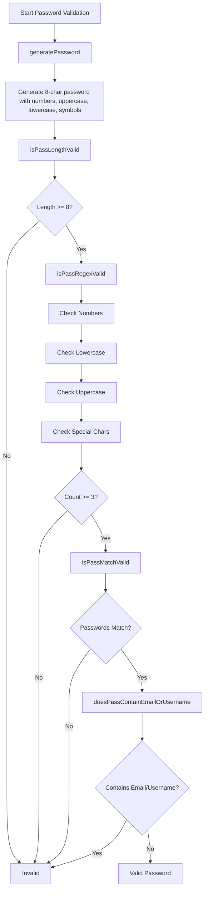
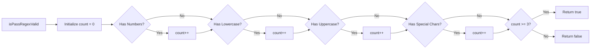
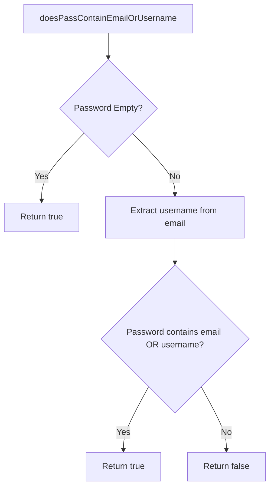
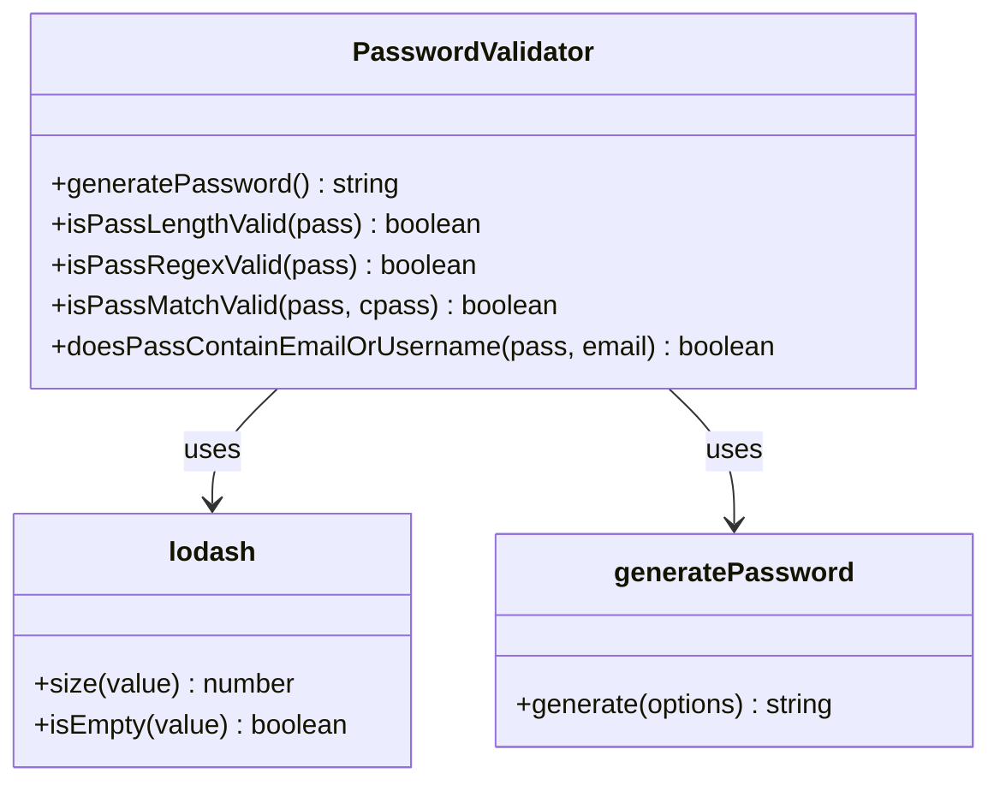

# Diagram: web/portal/src/utils/password-utils.js

> Auto-generated by Obscura crawlers

## Diagram 1

### SVG

<svg id="container" width="536.37109375" xmlns="http://www.w3.org/2000/svg" class="flowchart" height="2319.359375" viewBox="0 0 536.37109375 2319.359375" role="graphics-document document" aria-roledescription="flowchart-v2"><g><marker id="container_flowchart-v2-pointEnd" class="marker flowchart-v2" viewBox="0 0 10 10" refX="5" refY="5" markerUnits="userSpaceOnUse" markerWidth="8" markerHeight="8" orient="auto"><path d="M 0 0 L 10 5 L 0 10 z" class="arrowMarkerPath" style="stroke-width: 1; stroke-dasharray: 1, 0;"></path></marker><marker id="container_flowchart-v2-pointStart" class="marker flowchart-v2" viewBox="0 0 10 10" refX="4.5" refY="5" markerUnits="userSpaceOnUse" markerWidth="8" markerHeight="8" orient="auto"><path d="M 0 5 L 10 10 L 10 0 z" class="arrowMarkerPath" style="stroke-width: 1; stroke-dasharray: 1, 0;"></path></marker><marker id="container_flowchart-v2-circleEnd" class="marker flowchart-v2" viewBox="0 0 10 10" refX="11" refY="5" markerUnits="userSpaceOnUse" markerWidth="11" markerHeight="11" orient="auto"><circle cx="5" cy="5" r="5" class="arrowMarkerPath" style="stroke-width: 1; stroke-dasharray: 1, 0;"></circle></marker><marker id="container_flowchart-v2-circleStart" class="marker flowchart-v2" viewBox="0 0 10 10" refX="-1" refY="5" markerUnits="userSpaceOnUse" markerWidth="11" markerHeight="11" orient="auto"><circle cx="5" cy="5" r="5" class="arrowMarkerPath" style="stroke-width: 1; stroke-dasharray: 1, 0;"></circle></marker><marker id="container_flowchart-v2-crossEnd" class="marker cross flowchart-v2" viewBox="0 0 11 11" refX="12" refY="5.2" markerUnits="userSpaceOnUse" markerWidth="11" markerHeight="11" orient="auto"><path d="M 1,1 l 9,9 M 10,1 l -9,9" class="arrowMarkerPath" style="stroke-width: 2; stroke-dasharray: 1, 0;"></path></marker><marker id="container_flowchart-v2-crossStart" class="marker cross flowchart-v2" viewBox="0 0 11 11" refX="-1" refY="5.2" markerUnits="userSpaceOnUse" markerWidth="11" markerHeight="11" orient="auto"><path d="M 1,1 l 9,9 M 10,1 l -9,9" class="arrowMarkerPath" style="stroke-width: 2; stroke-dasharray: 1, 0;"></path></marker><g class="root"><g class="clusters"></g><g class="edgePaths"><path d="M144.063,62L144.063,66.167C144.063,70.333,144.063,78.667,144.063,86.333C144.063,94,144.063,101,144.063,104.5L144.063,108" id="L_A_B_0" class="edge-thickness-normal edge-pattern-solid edge-thickness-normal edge-pattern-solid flowchart-link" style=";" data-edge="true" data-et="edge" data-id="L_A_B_0" data-points="W3sieCI6MTQ0LjA2MjUsInkiOjYyfSx7IngiOjE0NC4wNjI1LCJ5Ijo4N30seyJ4IjoxNDQuMDYyNSwieSI6MTEyfV0=" marker-end="url(#container_flowchart-v2-pointEnd)"></path><path d="M144.063,166L144.063,170.167C144.063,174.333,144.063,182.667,144.063,190.333C144.063,198,144.063,205,144.063,208.5L144.063,212" id="L_B_C_0" class="edge-thickness-normal edge-pattern-solid edge-thickness-normal edge-pattern-solid flowchart-link" style=";" data-edge="true" data-et="edge" data-id="L_B_C_0" data-points="W3sieCI6MTQ0LjA2MjUsInkiOjE2Nn0seyJ4IjoxNDQuMDYyNSwieSI6MTkxfSx7IngiOjE0NC4wNjI1LCJ5IjoyMTZ9XQ==" marker-end="url(#container_flowchart-v2-pointEnd)"></path><path d="M144.063,318L144.063,322.167C144.063,326.333,144.063,334.667,144.063,342.333C144.063,350,144.063,357,144.063,360.5L144.063,364" id="L_C_D_0" class="edge-thickness-normal edge-pattern-solid edge-thickness-normal edge-pattern-solid flowchart-link" style=";" data-edge="true" data-et="edge" data-id="L_C_D_0" data-points="W3sieCI6MTQ0LjA2MjUsInkiOjMxOH0seyJ4IjoxNDQuMDYyNSwieSI6MzQzfSx7IngiOjE0NC4wNjI1LCJ5IjozNjh9XQ==" marker-end="url(#container_flowchart-v2-pointEnd)"></path><path d="M144.063,422L144.063,426.167C144.063,430.333,144.063,438.667,144.063,446.333C144.063,454,144.063,461,144.063,464.5L144.063,468" id="L_D_E_0" class="edge-thickness-normal edge-pattern-solid edge-thickness-normal edge-pattern-solid flowchart-link" style=";" data-edge="true" data-et="edge" data-id="L_D_E_0" data-points="W3sieCI6MTQ0LjA2MjUsInkiOjQyMn0seyJ4IjoxNDQuMDYyNSwieSI6NDQ3fSx7IngiOjE0NC4wNjI1LCJ5Ijo0NzJ9XQ==" marker-end="url(#container_flowchart-v2-pointEnd)"></path><path d="M171.778,587.754L178.569,598.539C185.36,609.325,198.942,630.897,205.732,647.183C212.523,663.469,212.523,674.469,212.523,679.969L212.523,685.469" id="L_E_F_0" class="edge-thickness-normal edge-pattern-solid edge-thickness-normal edge-pattern-solid flowchart-link" style=";" data-edge="true" data-et="edge" data-id="L_E_F_0" data-points="W3sieCI6MTcxLjc3NzY5NDU3MzY1MTk2LCJ5Ijo1ODcuNzUzNTU1NDI2MzQ4fSx7IngiOjIxMi41MjM0Mzc1LCJ5Ijo2NTIuNDY4NzV9LHsieCI6MjEyLjUyMzQzNzUsInkiOjY4OS40Njg3NX1d" marker-end="url(#container_flowchart-v2-pointEnd)"></path><path d="M105.568,576.974L90.997,589.557C76.426,602.139,47.283,627.304,32.712,650.553C18.141,673.802,18.141,695.135,18.141,714.469C18.141,733.802,18.141,751.135,18.141,768.469C18.141,785.802,18.141,803.135,18.141,820.469C18.141,837.802,18.141,855.135,18.141,872.469C18.141,889.802,18.141,907.135,18.141,924.469C18.141,941.802,18.141,959.135,18.141,976.469C18.141,993.802,18.141,1011.135,18.141,1028.469C18.141,1045.802,18.141,1063.135,18.141,1080.469C18.141,1097.802,18.141,1115.135,18.141,1134.469C18.141,1153.802,18.141,1175.135,18.141,1203.311C18.141,1231.487,18.141,1266.505,18.141,1301.523C18.141,1336.542,18.141,1371.56,18.141,1399.736C18.141,1427.911,18.141,1449.245,18.141,1468.578C18.141,1487.911,18.141,1505.245,18.141,1533.413C18.141,1561.581,18.141,1600.583,18.141,1641.586C18.141,1682.589,18.141,1725.591,18.141,1757.759C18.141,1789.927,18.141,1811.26,18.141,1832.594C18.141,1853.927,18.141,1875.26,18.141,1912.908C18.141,1950.555,18.141,2004.516,18.141,2058.477C18.141,2112.438,18.141,2166.398,23.646,2199.067C29.151,2231.735,40.162,2243.11,45.668,2248.798L51.173,2254.485" id="L_E_Z_0" class="edge-thickness-normal edge-pattern-solid edge-thickness-normal edge-pattern-solid flowchart-link" style=";" data-edge="true" data-et="edge" data-id="L_E_Z_0" data-points="W3sieCI6MTA1LjU2ODIwNDYxMjc5Nzk3LCJ5Ijo1NzYuOTc0NDU0NjEyNzk4fSx7IngiOjE4LjE0MDYyNSwieSI6NjUyLjQ2ODc1fSx7IngiOjE4LjE0MDYyNSwieSI6NzE2LjQ2ODc1fSx7IngiOjE4LjE0MDYyNSwieSI6NzY4LjQ2ODc1fSx7IngiOjE4LjE0MDYyNSwieSI6ODIwLjQ2ODc1fSx7IngiOjE4LjE0MDYyNSwieSI6ODcyLjQ2ODc1fSx7IngiOjE4LjE0MDYyNSwieSI6OTI0LjQ2ODc1fSx7IngiOjE4LjE0MDYyNSwieSI6OTc2LjQ2ODc1fSx7IngiOjE4LjE0MDYyNSwieSI6MTAyOC40Njg3NX0seyJ4IjoxOC4xNDA2MjUsInkiOjEwODAuNDY4NzV9LHsieCI6MTguMTQwNjI1LCJ5IjoxMTMyLjQ2ODc1fSx7IngiOjE4LjE0MDYyNSwieSI6MTE5Ni40Njg3NX0seyJ4IjoxOC4xNDA2MjUsInkiOjEzMDEuNTIzNDM3NX0seyJ4IjoxOC4xNDA2MjUsInkiOjE0MDYuNTc4MTI1fSx7IngiOjE4LjE0MDYyNSwieSI6MTQ3MC41NzgxMjV9LHsieCI6MTguMTQwNjI1LCJ5IjoxNTIyLjU3ODEyNX0seyJ4IjoxOC4xNDA2MjUsInkiOjE2MzkuNTg1OTM3NX0seyJ4IjoxOC4xNDA2MjUsInkiOjE3NjguNTkzNzV9LHsieCI6MTguMTQwNjI1LCJ5IjoxODMyLjU5Mzc1fSx7IngiOjE4LjE0MDYyNSwieSI6MTg5Ni41OTM3NX0seyJ4IjoxOC4xNDA2MjUsInkiOjIwNTguNDc2NTYyNX0seyJ4IjoxOC4xNDA2MjUsInkiOjIyMjAuMzU5Mzc1fSx7IngiOjUzLjk1NTAxNzA4OTg0Mzc1LCJ5IjoyMjU3LjM1OTM3NX1d" marker-end="url(#container_flowchart-v2-pointEnd)"></path><path d="M212.523,743.469L212.523,747.635C212.523,751.802,212.523,760.135,212.523,767.802C212.523,775.469,212.523,782.469,212.523,785.969L212.523,789.469" id="L_F_G_0" class="edge-thickness-normal edge-pattern-solid edge-thickness-normal edge-pattern-solid flowchart-link" style=";" data-edge="true" data-et="edge" data-id="L_F_G_0" data-points="W3sieCI6MjEyLjUyMzQzNzUsInkiOjc0My40Njg3NX0seyJ4IjoyMTIuNTIzNDM3NSwieSI6NzY4LjQ2ODc1fSx7IngiOjIxMi41MjM0Mzc1LCJ5Ijo3OTMuNDY4NzV9XQ==" marker-end="url(#container_flowchart-v2-pointEnd)"></path><path d="M212.523,847.469L212.523,851.635C212.523,855.802,212.523,864.135,212.523,871.802C212.523,879.469,212.523,886.469,212.523,889.969L212.523,893.469" id="L_G_H_0" class="edge-thickness-normal edge-pattern-solid edge-thickness-normal edge-pattern-solid flowchart-link" style=";" data-edge="true" data-et="edge" data-id="L_G_H_0" data-points="W3sieCI6MjEyLjUyMzQzNzUsInkiOjg0Ny40Njg3NX0seyJ4IjoyMTIuNTIzNDM3NSwieSI6ODcyLjQ2ODc1fSx7IngiOjIxMi41MjM0Mzc1LCJ5Ijo4OTcuNDY4NzV9XQ==" marker-end="url(#container_flowchart-v2-pointEnd)"></path><path d="M212.523,951.469L212.523,955.635C212.523,959.802,212.523,968.135,212.523,975.802C212.523,983.469,212.523,990.469,212.523,993.969L212.523,997.469" id="L_H_I_0" class="edge-thickness-normal edge-pattern-solid edge-thickness-normal edge-pattern-solid flowchart-link" style=";" data-edge="true" data-et="edge" data-id="L_H_I_0" data-points="W3sieCI6MjEyLjUyMzQzNzUsInkiOjk1MS40Njg3NX0seyJ4IjoyMTIuNTIzNDM3NSwieSI6OTc2LjQ2ODc1fSx7IngiOjIxMi41MjM0Mzc1LCJ5IjoxMDAxLjQ2ODc1fV0=" marker-end="url(#container_flowchart-v2-pointEnd)"></path><path d="M212.523,1055.469L212.523,1059.635C212.523,1063.802,212.523,1072.135,212.523,1079.802C212.523,1087.469,212.523,1094.469,212.523,1097.969L212.523,1101.469" id="L_I_J_0" class="edge-thickness-normal edge-pattern-solid edge-thickness-normal edge-pattern-solid flowchart-link" style=";" data-edge="true" data-et="edge" data-id="L_I_J_0" data-points="W3sieCI6MjEyLjUyMzQzNzUsInkiOjEwNTUuNDY4NzV9LHsieCI6MjEyLjUyMzQzNzUsInkiOjEwODAuNDY4NzV9LHsieCI6MjEyLjUyMzQzNzUsInkiOjExMDUuNDY4NzV9XQ==" marker-end="url(#container_flowchart-v2-pointEnd)"></path><path d="M212.523,1159.469L212.523,1165.635C212.523,1171.802,212.523,1184.135,212.523,1195.802C212.523,1207.469,212.523,1218.469,212.523,1223.969L212.523,1229.469" id="L_J_K_0" class="edge-thickness-normal edge-pattern-solid edge-thickness-normal edge-pattern-solid flowchart-link" style=";" data-edge="true" data-et="edge" data-id="L_J_K_0" data-points="W3sieCI6MjEyLjUyMzQzNzUsInkiOjExNTkuNDY4NzV9LHsieCI6MjEyLjUyMzQzNzUsInkiOjExOTYuNDY4NzV9LHsieCI6MjEyLjUyMzQzNzUsInkiOjEyMzMuNDY4NzV9XQ==" marker-end="url(#container_flowchart-v2-pointEnd)"></path><path d="M238.163,1343.939L244.474,1354.379C250.784,1364.819,263.406,1385.698,269.717,1401.638C276.027,1417.578,276.027,1428.578,276.027,1434.078L276.027,1439.578" id="L_K_L_0" class="edge-thickness-normal edge-pattern-solid edge-thickness-normal edge-pattern-solid flowchart-link" style=";" data-edge="true" data-et="edge" data-id="L_K_L_0" data-points="W3sieCI6MjM4LjE2MjgyMTQwMDQzMTA2LCJ5IjoxMzQzLjkzODc0MTA5OTU2OX0seyJ4IjoyNzYuMDI3MzQzNzUsInkiOjE0MDYuNTc4MTI1fSx7IngiOjI3Ni4wMjczNDM3NSwieSI6MTQ0My41NzgxMjV9XQ==" marker-end="url(#container_flowchart-v2-pointEnd)"></path><path d="M177.582,1334.637L164.931,1346.627C152.279,1358.617,126.975,1382.598,114.324,1405.255C101.672,1427.911,101.672,1449.245,101.672,1468.578C101.672,1487.911,101.672,1505.245,101.672,1533.413C101.672,1561.581,101.672,1600.583,101.672,1641.586C101.672,1682.589,101.672,1725.591,101.672,1757.759C101.672,1789.927,101.672,1811.26,101.672,1832.594C101.672,1853.927,101.672,1875.26,101.672,1912.908C101.672,1950.555,101.672,2004.516,101.672,2058.477C101.672,2112.438,101.672,2166.398,99.805,2198.914C97.939,2231.429,94.206,2242.499,92.339,2248.034L90.473,2253.569" id="L_K_Z_0" class="edge-thickness-normal edge-pattern-solid edge-thickness-normal edge-pattern-solid flowchart-link" style=";" data-edge="true" data-et="edge" data-id="L_K_Z_0" data-points="W3sieCI6MTc3LjU4MjQ5MjMyMjA2MTgsInkiOjEzMzQuNjM3MTc5ODIyMDYxOX0seyJ4IjoxMDEuNjcxODc1LCJ5IjoxNDA2LjU3ODEyNX0seyJ4IjoxMDEuNjcxODc1LCJ5IjoxNDcwLjU3ODEyNX0seyJ4IjoxMDEuNjcxODc1LCJ5IjoxNTIyLjU3ODEyNX0seyJ4IjoxMDEuNjcxODc1LCJ5IjoxNjM5LjU4NTkzNzV9LHsieCI6MTAxLjY3MTg3NSwieSI6MTc2OC41OTM3NX0seyJ4IjoxMDEuNjcxODc1LCJ5IjoxODMyLjU5Mzc1fSx7IngiOjEwMS42NzE4NzUsInkiOjE4OTYuNTkzNzV9LHsieCI6MTAxLjY3MTg3NSwieSI6MjA1OC40NzY1NjI1fSx7IngiOjEwMS42NzE4NzUsInkiOjIyMjAuMzU5Mzc1fSx7IngiOjg5LjE5NDc2MzE4MzU5Mzc1LCJ5IjoyMjU3LjM1OTM3NX1d" marker-end="url(#container_flowchart-v2-pointEnd)"></path><path d="M276.027,1497.578L276.027,1501.745C276.027,1505.911,276.027,1514.245,276.027,1521.911C276.027,1529.578,276.027,1536.578,276.027,1540.078L276.027,1543.578" id="L_L_M_0" class="edge-thickness-normal edge-pattern-solid edge-thickness-normal edge-pattern-solid flowchart-link" style=";" data-edge="true" data-et="edge" data-id="L_L_M_0" data-points="W3sieCI6Mjc2LjAyNzM0Mzc1LCJ5IjoxNDk3LjU3ODEyNX0seyJ4IjoyNzYuMDI3MzQzNzUsInkiOjE1MjIuNTc4MTI1fSx7IngiOjI3Ni4wMjczNDM3NSwieSI6MTU0Ny41NzgxMjV9XQ==" marker-end="url(#container_flowchart-v2-pointEnd)"></path><path d="M315.231,1692.39L324.661,1705.09C334.09,1717.791,352.949,1743.192,362.379,1761.393C371.809,1779.594,371.809,1790.594,371.809,1796.094L371.809,1801.594" id="L_M_N_0" class="edge-thickness-normal edge-pattern-solid edge-thickness-normal edge-pattern-solid flowchart-link" style=";" data-edge="true" data-et="edge" data-id="L_M_N_0" data-points="W3sieCI6MzE1LjIzMTMxMjA5NzA2MTUsInkiOjE2OTIuMzg5NzgxNjUyOTM4Nn0seyJ4IjozNzEuODA4NTkzNzUsInkiOjE3NjguNTkzNzV9LHsieCI6MzcxLjgwODU5Mzc1LCJ5IjoxODA1LjU5Mzc1fV0=" marker-end="url(#container_flowchart-v2-pointEnd)"></path><path d="M236.823,1692.39L227.394,1705.09C217.964,1717.791,199.105,1743.192,189.676,1766.56C180.246,1789.927,180.246,1811.26,180.246,1832.594C180.246,1853.927,180.246,1875.26,180.246,1912.908C180.246,1950.555,180.246,2004.516,180.246,2058.477C180.246,2112.438,180.246,2166.398,171.157,2199.187C162.069,2231.975,143.891,2243.59,134.803,2249.398L125.714,2255.206" id="L_M_Z_0" class="edge-thickness-normal edge-pattern-solid edge-thickness-normal edge-pattern-solid flowchart-link" style=";" data-edge="true" data-et="edge" data-id="L_M_Z_0" data-points="W3sieCI6MjM2LjgyMzM3NTQwMjkzODUyLCJ5IjoxNjkyLjM4OTc4MTY1MjkzODZ9LHsieCI6MTgwLjI0NjA5Mzc1LCJ5IjoxNzY4LjU5Mzc1fSx7IngiOjE4MC4yNDYwOTM3NSwieSI6MTgzMi41OTM3NX0seyJ4IjoxODAuMjQ2MDkzNzUsInkiOjE4OTYuNTkzNzV9LHsieCI6MTgwLjI0NjA5Mzc1LCJ5IjoyMDU4LjQ3NjU2MjV9LHsieCI6MTgwLjI0NjA5Mzc1LCJ5IjoyMjIwLjM1OTM3NX0seyJ4IjoxMjIuMzQzMjYxNzE4NzUsInkiOjIyNTcuMzU5Mzc1fV0=" marker-end="url(#container_flowchart-v2-pointEnd)"></path><path d="M371.809,1859.594L371.809,1865.76C371.809,1871.927,371.809,1884.26,371.809,1895.927C371.809,1907.594,371.809,1918.594,371.809,1924.094L371.809,1929.594" id="L_N_O_0" class="edge-thickness-normal edge-pattern-solid edge-thickness-normal edge-pattern-solid flowchart-link" style=";" data-edge="true" data-et="edge" data-id="L_N_O_0" data-points="W3sieCI6MzcxLjgwODU5Mzc1LCJ5IjoxODU5LjU5Mzc1fSx7IngiOjM3MS44MDg1OTM3NSwieSI6MTg5Ni41OTM3NX0seyJ4IjozNzEuODA4NTkzNzUsInkiOjE5MzMuNTkzNzV9XQ==" marker-end="url(#container_flowchart-v2-pointEnd)"></path><path d="M330.586,2142.137L324.162,2155.174C317.738,2168.211,304.891,2194.285,272.856,2215.055C240.822,2235.826,189.601,2251.292,163.991,2259.025L138.38,2266.758" id="L_O_Z_0" class="edge-thickness-normal edge-pattern-solid edge-thickness-normal edge-pattern-solid flowchart-link" style=";" data-edge="true" data-et="edge" data-id="L_O_Z_0" data-points="W3sieCI6MzMwLjU4NjA4MTg0ODUwOTYsInkiOjIxNDIuMTM2ODYzMDk4NTA5NH0seyJ4IjoyOTIuMDQyOTY4NzUsInkiOjIyMjAuMzU5Mzc1fSx7IngiOjEzNC41NTA3ODEyNSwieSI6MjI2Ny45MTQ3MDEyMDcxNTA4fV0=" marker-end="url(#container_flowchart-v2-pointEnd)"></path><path d="M386.201,2168.967L387.316,2177.533C388.432,2186.098,390.663,2203.229,391.779,2217.294C392.895,2231.359,392.895,2242.359,392.895,2247.859L392.895,2253.359" id="L_O_P_0" class="edge-thickness-normal edge-pattern-solid edge-thickness-normal edge-pattern-solid flowchart-link" style=";" data-edge="true" data-et="edge" data-id="L_O_P_0" data-points="W3sieCI6Mzg2LjIwMDUxMTM4MTgzMTc1LCJ5IjoyMTY4Ljk2NzQ1NzM2ODE2OH0seyJ4IjozOTIuODk0NTMxMjUsInkiOjIyMjAuMzU5Mzc1fSx7IngiOjM5Mi44OTQ1MzEyNSwieSI6MjI1Ny4zNTkzNzV9XQ==" marker-end="url(#container_flowchart-v2-pointEnd)"></path></g><g class="edgeLabels"><g class="edgeLabel"><g class="label" data-id="L_A_B_0" transform="translate(0, 0)"><foreignObject width="0" height="0">

</foreignObject></g></g><g class="edgeLabel"><g class="label" data-id="L_B_C_0" transform="translate(0, 0)"><foreignObject width="0" height="0">

</foreignObject></g></g><g class="edgeLabel"><g class="label" data-id="L_C_D_0" transform="translate(0, 0)"><foreignObject width="0" height="0">

</foreignObject></g></g><g class="edgeLabel"><g class="label" data-id="L_D_E_0" transform="translate(0, 0)"><foreignObject width="0" height="0">

</foreignObject></g></g><g class="edgeLabel" transform="translate(212.5234375, 652.46875)"><g class="label" data-id="L_E_F_0" transform="translate(-12.03125, -12)"><foreignObject width="24.0625" height="24">

Yes

</foreignObject></g></g><g class="edgeLabel" transform="translate(18.140625, 1196.46875)"><g class="label" data-id="L_E_Z_0" transform="translate(-10.140625, -12)"><foreignObject width="20.28125" height="24">

No

</foreignObject></g></g><g class="edgeLabel"><g class="label" data-id="L_F_G_0" transform="translate(0, 0)"><foreignObject width="0" height="0">

</foreignObject></g></g><g class="edgeLabel"><g class="label" data-id="L_G_H_0" transform="translate(0, 0)"><foreignObject width="0" height="0">

</foreignObject></g></g><g class="edgeLabel"><g class="label" data-id="L_H_I_0" transform="translate(0, 0)"><foreignObject width="0" height="0">

</foreignObject></g></g><g class="edgeLabel"><g class="label" data-id="L_I_J_0" transform="translate(0, 0)"><foreignObject width="0" height="0">

</foreignObject></g></g><g class="edgeLabel"><g class="label" data-id="L_J_K_0" transform="translate(0, 0)"><foreignObject width="0" height="0">

</foreignObject></g></g><g class="edgeLabel" transform="translate(276.02734375, 1406.578125)"><g class="label" data-id="L_K_L_0" transform="translate(-12.03125, -12)"><foreignObject width="24.0625" height="24">

Yes

</foreignObject></g></g><g class="edgeLabel" transform="translate(101.671875, 1768.59375)"><g class="label" data-id="L_K_Z_0" transform="translate(-10.140625, -12)"><foreignObject width="20.28125" height="24">

No

</foreignObject></g></g><g class="edgeLabel"><g class="label" data-id="L_L_M_0" transform="translate(0, 0)"><foreignObject width="0" height="0">

</foreignObject></g></g><g class="edgeLabel" transform="translate(371.80859375, 1768.59375)"><g class="label" data-id="L_M_N_0" transform="translate(-12.03125, -12)"><foreignObject width="24.0625" height="24">

Yes

</foreignObject></g></g><g class="edgeLabel" transform="translate(180.24609375, 1896.59375)"><g class="label" data-id="L_M_Z_0" transform="translate(-10.140625, -12)"><foreignObject width="20.28125" height="24">

No

</foreignObject></g></g><g class="edgeLabel"><g class="label" data-id="L_N_O_0" transform="translate(0, 0)"><foreignObject width="0" height="0">

</foreignObject></g></g><g class="edgeLabel" transform="translate(255.03694, 2231.53348)"><g class="label" data-id="L_O_Z_0" transform="translate(-12.03125, -12)"><foreignObject width="24.0625" height="24">

Yes

</foreignObject></g></g><g class="edgeLabel" transform="translate(392.89453125, 2220.359375)"><g class="label" data-id="L_O_P_0" transform="translate(-10.140625, -12)"><foreignObject width="20.28125" height="24">

No

</foreignObject></g></g></g><g class="nodes"><g class="node default" id="flowchart-A-0" transform="translate(144.0625, 35)"><rect class="basic label-container" style="" x="-122.2578125" y="-27" width="244.515625" height="54"></rect><g class="label" style="" transform="translate(-92.2578125, -12)"><rect></rect><foreignObject width="184.515625" height="24">

Start Password Validation

</foreignObject></g></g><g class="node default" id="flowchart-B-1" transform="translate(144.0625, 139)"><rect class="basic label-container" style="" x="-95.5859375" y="-27" width="191.171875" height="54"></rect><g class="label" style="" transform="translate(-65.5859375, -12)"><rect></rect><foreignObject width="131.171875" height="24">

generatePassword

</foreignObject></g></g><g class="node default" id="flowchart-C-3" transform="translate(144.0625, 267)"><rect class="basic label-container" style="" x="-130" y="-51" width="260" height="102"></rect><g class="label" style="" transform="translate(-100, -36)"><rect></rect><foreignObject width="200" height="72">

Generate 8-char password with numbers, uppercase, lowercase, symbols

</foreignObject></g></g><g class="node default" id="flowchart-D-5" transform="translate(144.0625, 395)"><rect class="basic label-container" style="" x="-94.21875" y="-27" width="188.4375" height="54"></rect><g class="label" style="" transform="translate(-64.21875, -12)"><rect></rect><foreignObject width="128.4375" height="24">

isPassLengthValid

</foreignObject></g></g><g class="node default" id="flowchart-E-7" transform="translate(144.0625, 543.734375)"><polygon points="71.734375,0 143.46875,-71.734375 71.734375,-143.46875 0,-71.734375" class="label-container" transform="translate(-71.234375, 71.734375)"></polygon><g class="label" style="" transform="translate(-44.734375, -12)"><rect></rect><foreignObject width="89.46875" height="24">

Length &gt;= 8?

</foreignObject></g></g><g class="node default" id="flowchart-F-9" transform="translate(212.5234375, 716.46875)"><rect class="basic label-container" style="" x="-90.9296875" y="-27" width="181.859375" height="54"></rect><g class="label" style="" transform="translate(-60.9296875, -12)"><rect></rect><foreignObject width="121.859375" height="24">

isPassRegexValid

</foreignObject></g></g><g class="node default" id="flowchart-Z-11" transform="translate(80.08984375, 2284.359375)"><rect class="basic label-container" style="" x="-54.4609375" y="-27" width="108.921875" height="54"></rect><g class="label" style="" transform="translate(-24.4609375, -12)"><rect></rect><foreignObject width="48.921875" height="24">

Invalid

</foreignObject></g></g><g class="node default" id="flowchart-G-13" transform="translate(212.5234375, 820.46875)"><rect class="basic label-container" style="" x="-86.28125" y="-27" width="172.5625" height="54"></rect><g class="label" style="" transform="translate(-56.28125, -12)"><rect></rect><foreignObject width="112.5625" height="24">

Check Numbers

</foreignObject></g></g><g class="node default" id="flowchart-H-15" transform="translate(212.5234375, 924.46875)"><rect class="basic label-container" style="" x="-91.0078125" y="-27" width="182.015625" height="54"></rect><g class="label" style="" transform="translate(-61.0078125, -12)"><rect></rect><foreignObject width="122.015625" height="24">

Check Lowercase

</foreignObject></g></g><g class="node default" id="flowchart-I-17" transform="translate(212.5234375, 1028.46875)"><rect class="basic label-container" style="" x="-91.609375" y="-27" width="183.21875" height="54"></rect><g class="label" style="" transform="translate(-61.609375, -12)"><rect></rect><foreignObject width="123.21875" height="24">

Check Uppercase

</foreignObject></g></g><g class="node default" id="flowchart-J-19" transform="translate(212.5234375, 1132.46875)"><rect class="basic label-container" style="" x="-101.921875" y="-27" width="203.84375" height="54"></rect><g class="label" style="" transform="translate(-71.921875, -12)"><rect></rect><foreignObject width="143.84375" height="24">

Check Special Chars

</foreignObject></g></g><g class="node default" id="flowchart-K-21" transform="translate(212.5234375, 1301.5234375)"><polygon points="68.0546875,0 136.109375,-68.0546875 68.0546875,-136.109375 0,-68.0546875" class="label-container" transform="translate(-67.5546875, 68.0546875)"></polygon><g class="label" style="" transform="translate(-41.0546875, -12)"><rect></rect><foreignObject width="82.109375" height="24">

Count &gt;= 3?

</foreignObject></g></g><g class="node default" id="flowchart-L-23" transform="translate(276.02734375, 1470.578125)"><rect class="basic label-container" style="" x="-91.5078125" y="-27" width="183.015625" height="54"></rect><g class="label" style="" transform="translate(-61.5078125, -12)"><rect></rect><foreignObject width="123.015625" height="24">

isPassMatchValid

</foreignObject></g></g><g class="node default" id="flowchart-M-27" transform="translate(276.02734375, 1639.5859375)"><polygon points="92.0078125,0 184.015625,-92.0078125 92.0078125,-184.015625 0,-92.0078125" class="label-container" transform="translate(-91.5078125, 92.0078125)"></polygon><g class="label" style="" transform="translate(-65.0078125, -12)"><rect></rect><foreignObject width="130.015625" height="24">

Passwords Match?

</foreignObject></g></g><g class="node default" id="flowchart-N-29" transform="translate(371.80859375, 1832.59375)"><rect class="basic label-container" style="" x="-156.5625" y="-27" width="313.125" height="54"></rect><g class="label" style="" transform="translate(-126.5625, -12)"><rect></rect><foreignObject width="253.125" height="24">

doesPassContainEmailOrUsername

</foreignObject></g></g><g class="node default" id="flowchart-O-33" transform="translate(371.80859375, 2058.4765625)"><polygon points="124.8828125,0 249.765625,-124.8828125 124.8828125,-249.765625 0,-124.8828125" class="label-container" transform="translate(-124.3828125, 124.8828125)"></polygon><g class="label" style="" transform="translate(-97.8828125, -12)"><rect></rect><foreignObject width="195.765625" height="24">

Contains Email/Username?

</foreignObject></g></g><g class="node default" id="flowchart-P-37" transform="translate(392.89453125, 2284.359375)"><rect class="basic label-container" style="" x="-83.765625" y="-27" width="167.53125" height="54"></rect><g class="label" style="" transform="translate(-53.765625, -12)"><rect></rect><foreignObject width="107.53125" height="24">

Valid Password

</foreignObject></g></g></g></g></g></svg>

## Diagram 2

### SVG

<svg id="container" width="2490.796875" xmlns="http://www.w3.org/2000/svg" class="flowchart" height="204.875" viewBox="0 0 2490.796875 204.875" role="graphics-document document" aria-roledescription="flowchart-v2"><g><marker id="container_flowchart-v2-pointEnd" class="marker flowchart-v2" viewBox="0 0 10 10" refX="5" refY="5" markerUnits="userSpaceOnUse" markerWidth="8" markerHeight="8" orient="auto"><path d="M 0 0 L 10 5 L 0 10 z" class="arrowMarkerPath" style="stroke-width: 1; stroke-dasharray: 1, 0;"></path></marker><marker id="container_flowchart-v2-pointStart" class="marker flowchart-v2" viewBox="0 0 10 10" refX="4.5" refY="5" markerUnits="userSpaceOnUse" markerWidth="8" markerHeight="8" orient="auto"><path d="M 0 5 L 10 10 L 10 0 z" class="arrowMarkerPath" style="stroke-width: 1; stroke-dasharray: 1, 0;"></path></marker><marker id="container_flowchart-v2-circleEnd" class="marker flowchart-v2" viewBox="0 0 10 10" refX="11" refY="5" markerUnits="userSpaceOnUse" markerWidth="11" markerHeight="11" orient="auto"><circle cx="5" cy="5" r="5" class="arrowMarkerPath" style="stroke-width: 1; stroke-dasharray: 1, 0;"></circle></marker><marker id="container_flowchart-v2-circleStart" class="marker flowchart-v2" viewBox="0 0 10 10" refX="-1" refY="5" markerUnits="userSpaceOnUse" markerWidth="11" markerHeight="11" orient="auto"><circle cx="5" cy="5" r="5" class="arrowMarkerPath" style="stroke-width: 1; stroke-dasharray: 1, 0;"></circle></marker><marker id="container_flowchart-v2-crossEnd" class="marker cross flowchart-v2" viewBox="0 0 11 11" refX="12" refY="5.2" markerUnits="userSpaceOnUse" markerWidth="11" markerHeight="11" orient="auto"><path d="M 1,1 l 9,9 M 10,1 l -9,9" class="arrowMarkerPath" style="stroke-width: 2; stroke-dasharray: 1, 0;"></path></marker><marker id="container_flowchart-v2-crossStart" class="marker cross flowchart-v2" viewBox="0 0 11 11" refX="-1" refY="5.2" markerUnits="userSpaceOnUse" markerWidth="11" markerHeight="11" orient="auto"><path d="M 1,1 l 9,9 M 10,1 l -9,9" class="arrowMarkerPath" style="stroke-width: 2; stroke-dasharray: 1, 0;"></path></marker><g class="root"><g class="clusters"></g><g class="edgePaths"><path d="M189.859,102.438L194.026,102.438C198.193,102.438,206.526,102.438,214.193,102.438C221.859,102.438,228.859,102.438,232.359,102.438L235.859,102.438" id="L_A_B_0" class="edge-thickness-normal edge-pattern-solid edge-thickness-normal edge-pattern-solid flowchart-link" style=";" data-edge="true" data-et="edge" data-id="L_A_B_0" data-points="W3sieCI6MTg5Ljg1OTM3NSwieSI6MTAyLjQzNzV9LHsieCI6MjE0Ljg1OTM3NSwieSI6MTAyLjQzNzV9LHsieCI6MjM5Ljg1OTM3NSwieSI6MTAyLjQzNzV9XQ==" marker-end="url(#container_flowchart-v2-pointEnd)"></path><path d="M432.891,102.438L437.057,102.438C441.224,102.438,449.557,102.438,457.224,102.438C464.891,102.438,471.891,102.438,475.391,102.438L478.891,102.438" id="L_B_C_0" class="edge-thickness-normal edge-pattern-solid edge-thickness-normal edge-pattern-solid flowchart-link" style=";" data-edge="true" data-et="edge" data-id="L_B_C_0" data-points="W3sieCI6NDMyLjg5MDYyNSwieSI6MTAyLjQzNzV9LHsieCI6NDU3Ljg5MDYyNSwieSI6MTAyLjQzNzV9LHsieCI6NDgyLjg5MDYyNSwieSI6MTAyLjQzNzV9XQ==" marker-end="url(#container_flowchart-v2-pointEnd)"></path><path d="M621.407,121.514L630.759,124.502C640.11,127.489,658.813,133.463,673.669,136.45C688.526,139.438,699.536,139.438,705.042,139.438L710.547,139.438" id="L_C_D_0" class="edge-thickness-normal edge-pattern-solid edge-thickness-normal edge-pattern-solid flowchart-link" style=";" data-edge="true" data-et="edge" data-id="L_C_D_0" data-points="W3sieCI6NjIxLjQwNzQ5MTI0NTc4MjcsInkiOjEyMS41MTQzODM3NTQyMTczNn0seyJ4Ijo2NzcuNTE1NjI1LCJ5IjoxMzkuNDM3NX0seyJ4Ijo3MTQuNTQ2ODc1LCJ5IjoxMzkuNDM3NX1d" marker-end="url(#container_flowchart-v2-pointEnd)"></path><path d="M621.407,83.361L630.759,80.373C640.11,77.386,658.813,71.412,684.042,68.425C709.271,65.438,741.026,65.438,770.776,65.438C800.526,65.438,828.271,65.438,849.217,67.851C870.163,70.265,884.31,75.092,891.383,77.505L898.457,79.919" id="L_C_E_0" class="edge-thickness-normal edge-pattern-solid edge-thickness-normal edge-pattern-solid flowchart-link" style=";" data-edge="true" data-et="edge" data-id="L_C_E_0" data-points="W3sieCI6NjIxLjQwNzQ5MTI0NTc4MjcsInkiOjgzLjM2MDYxNjI0NTc4MjY0fSx7IngiOjY3Ny41MTU2MjUsInkiOjY1LjQzNzV9LHsieCI6NzcyLjc4MTI1LCJ5Ijo2NS40Mzc1fSx7IngiOjg1Ni4wMTU2MjUsInkiOjY1LjQzNzV9LHsieCI6OTAyLjI0MjUyNjU5MDAzMDEsInkiOjgxLjIxMDU5ODQwOTk2OTkyfV0=" marker-end="url(#container_flowchart-v2-pointEnd)"></path><path d="M831.016,139.438L835.182,139.438C839.349,139.438,847.682,139.438,858.922,137.024C870.163,134.61,884.31,129.783,891.383,127.37L898.457,124.956" id="L_D_E_0" class="edge-thickness-normal edge-pattern-solid edge-thickness-normal edge-pattern-solid flowchart-link" style=";" data-edge="true" data-et="edge" data-id="L_D_E_0" data-points="W3sieCI6ODMxLjAxNTYyNSwieSI6MTM5LjQzNzV9LHsieCI6ODU2LjAxNTYyNSwieSI6MTM5LjQzNzV9LHsieCI6OTAyLjI0MjUyNjU5MDAzMDEsInkiOjEyMy42NjQ0MDE1OTAwMzAwOH1d" marker-end="url(#container_flowchart-v2-pointEnd)"></path><path d="M1028.286,122.043L1037.725,124.942C1047.164,127.841,1066.043,133.639,1080.988,136.538C1095.932,139.438,1106.943,139.438,1112.448,139.438L1117.953,139.438" id="L_E_F_0" class="edge-thickness-normal edge-pattern-solid edge-thickness-normal edge-pattern-solid flowchart-link" style=";" data-edge="true" data-et="edge" data-id="L_E_F_0" data-points="W3sieCI6MTAyOC4yODU1NDQ2MjY5MSwieSI6MTIyLjA0MjU4MDM3MzA4OTl9LHsieCI6MTA4NC45MjE4NzUsInkiOjEzOS40Mzc1fSx7IngiOjExMjEuOTUzMTI1LCJ5IjoxMzkuNDM3NX1d" marker-end="url(#container_flowchart-v2-pointEnd)"></path><path d="M1028.286,82.832L1037.725,79.933C1047.164,77.034,1066.043,71.236,1091.36,68.337C1116.677,65.438,1148.432,65.438,1178.182,65.438C1207.932,65.438,1235.677,65.438,1256.634,67.841C1277.59,70.245,1291.758,75.052,1298.843,77.456L1305.927,79.86" id="L_E_G_0" class="edge-thickness-normal edge-pattern-solid edge-thickness-normal edge-pattern-solid flowchart-link" style=";" data-edge="true" data-et="edge" data-id="L_E_G_0" data-points="W3sieCI6MTAyOC4yODU1NDQ2MjY5MSwieSI6ODIuODMyNDE5NjI2OTEwMX0seyJ4IjoxMDg0LjkyMTg3NSwieSI6NjUuNDM3NX0seyJ4IjoxMTgwLjE4NzUsInkiOjY1LjQzNzV9LHsieCI6MTI2My40MjE4NzUsInkiOjY1LjQzNzV9LHsieCI6MTMwOS43MTQ1ODkyMzk4NjMsInkiOjgxLjE0NDc4NTc2MDEzNjk0fV0=" marker-end="url(#container_flowchart-v2-pointEnd)"></path><path d="M1238.422,139.438L1242.589,139.438C1246.755,139.438,1255.089,139.438,1266.339,137.034C1277.59,134.63,1291.758,129.823,1298.843,127.419L1305.927,125.015" id="L_F_G_0" class="edge-thickness-normal edge-pattern-solid edge-thickness-normal edge-pattern-solid flowchart-link" style=";" data-edge="true" data-et="edge" data-id="L_F_G_0" data-points="W3sieCI6MTIzOC40MjE4NzUsInkiOjEzOS40Mzc1fSx7IngiOjEyNjMuNDIxODc1LCJ5IjoxMzkuNDM3NX0seyJ4IjoxMzA5LjcxNDU4OTIzOTg2MywieSI6MTIzLjczMDIxNDIzOTg2MzA2fV0=" marker-end="url(#container_flowchart-v2-pointEnd)"></path><path d="M1436.843,122.11L1446.294,124.998C1455.745,127.886,1474.646,133.662,1489.602,136.55C1504.557,139.438,1515.568,139.438,1521.073,139.438L1526.578,139.438" id="L_G_H_0" class="edge-thickness-normal edge-pattern-solid edge-thickness-normal edge-pattern-solid flowchart-link" style=";" data-edge="true" data-et="edge" data-id="L_G_H_0" data-points="W3sieCI6MTQzNi44NDM0ODg5OTEzMDE3LCJ5IjoxMjIuMTA5NjM2MDA4Njk4MjN9LHsieCI6MTQ5My41NDY4NzUsInkiOjEzOS40Mzc1fSx7IngiOjE1MzAuNTc4MTI1LCJ5IjoxMzkuNDM3NX1d" marker-end="url(#container_flowchart-v2-pointEnd)"></path><path d="M1436.843,82.765L1446.294,79.877C1455.745,76.989,1474.646,71.213,1499.974,68.325C1525.302,65.438,1557.057,65.438,1586.807,65.438C1616.557,65.438,1644.302,65.438,1665.427,67.684C1686.552,69.931,1701.057,74.424,1708.309,76.671L1715.562,78.918" id="L_G_I_0" class="edge-thickness-normal edge-pattern-solid edge-thickness-normal edge-pattern-solid flowchart-link" style=";" data-edge="true" data-et="edge" data-id="L_G_I_0" data-points="W3sieCI6MTQzNi44NDM0ODg5OTEzMDE3LCJ5Ijo4Mi43NjUzNjM5OTEzMDE3N30seyJ4IjoxNDkzLjU0Njg3NSwieSI6NjUuNDM3NX0seyJ4IjoxNTg4LjgxMjUsInkiOjY1LjQzNzV9LHsieCI6MTY3Mi4wNDY4NzUsInkiOjY1LjQzNzV9LHsieCI6MTcxOS4zODI4NzE4MDM4MzUzLCJ5Ijo4MC4xMDE1MDMxOTYxNjQ2fV0=" marker-end="url(#container_flowchart-v2-pointEnd)"></path><path d="M1647.047,139.438L1651.214,139.438C1655.38,139.438,1663.714,139.438,1675.133,137.191C1686.552,134.944,1701.057,130.451,1708.309,128.204L1715.562,125.957" id="L_H_I_0" class="edge-thickness-normal edge-pattern-solid edge-thickness-normal edge-pattern-solid flowchart-link" style=";" data-edge="true" data-et="edge" data-id="L_H_I_0" data-points="W3sieCI6MTY0Ny4wNDY4NzUsInkiOjEzOS40Mzc1fSx7IngiOjE2NzIuMDQ2ODc1LCJ5IjoxMzkuNDM3NX0seyJ4IjoxNzE5LjM4Mjg3MTgwMzgzNTMsInkiOjEyNC43NzM0OTY4MDM4MzU0fV0=" marker-end="url(#container_flowchart-v2-pointEnd)"></path><path d="M1865.181,123.178L1874.81,125.888C1884.438,128.598,1903.696,134.018,1918.83,136.728C1933.964,139.438,1944.974,139.438,1950.479,139.438L1955.984,139.438" id="L_I_J_0" class="edge-thickness-normal edge-pattern-solid edge-thickness-normal edge-pattern-solid flowchart-link" style=";" data-edge="true" data-et="edge" data-id="L_I_J_0" data-points="W3sieCI6MTg2NS4xODEwMTA1OTYzNjQzLCJ5IjoxMjMuMTc4MzY0NDAzNjM1Njh9LHsieCI6MTkyMi45NTMxMjUsInkiOjEzOS40Mzc1fSx7IngiOjE5NTkuOTg0Mzc1LCJ5IjoxMzkuNDM3NX1d" marker-end="url(#container_flowchart-v2-pointEnd)"></path><path d="M1865.181,81.697L1874.81,78.987C1884.438,76.277,1903.696,70.857,1929.202,68.147C1954.708,65.438,1986.464,65.438,2016.214,65.438C2045.964,65.438,2073.708,65.438,2094.34,68.144C2114.973,70.851,2128.492,76.265,2135.252,78.972L2142.012,81.679" id="L_I_K_0" class="edge-thickness-normal edge-pattern-solid edge-thickness-normal edge-pattern-solid flowchart-link" style=";" data-edge="true" data-et="edge" data-id="L_I_K_0" data-points="W3sieCI6MTg2NS4xODEwMTA1OTYzNjQzLCJ5Ijo4MS42OTY2MzU1OTYzNjQzMn0seyJ4IjoxOTIyLjk1MzEyNSwieSI6NjUuNDM3NX0seyJ4IjoyMDE4LjIxODc1LCJ5Ijo2NS40Mzc1fSx7IngiOjIxMDEuNDUzMTI1LCJ5Ijo2NS40Mzc1fSx7IngiOjIxNDUuNzI0OTM1NjYyMzE5NywieSI6ODMuMTY1Njg5MzM3NjgwMzh9XQ==" marker-end="url(#container_flowchart-v2-pointEnd)"></path><path d="M2076.453,139.438L2080.62,139.438C2084.786,139.438,2093.12,139.438,2104.046,136.731C2114.973,134.024,2128.492,128.61,2135.252,125.903L2142.012,123.196" id="L_J_K_0" class="edge-thickness-normal edge-pattern-solid edge-thickness-normal edge-pattern-solid flowchart-link" style=";" data-edge="true" data-et="edge" data-id="L_J_K_0" data-points="W3sieCI6MjA3Ni40NTMxMjUsInkiOjEzOS40Mzc1fSx7IngiOjIxMDEuNDUzMTI1LCJ5IjoxMzkuNDM3NX0seyJ4IjoyMTQ1LjcyNDkzNTY2MjMxOTcsInkiOjEyMS43MDkzMTA2NjIzMTk2Mn1d" marker-end="url(#container_flowchart-v2-pointEnd)"></path><path d="M2238.846,80.033L2248.752,75.1C2258.657,70.168,2278.469,60.303,2294.252,55.37C2310.034,50.438,2321.786,50.438,2327.663,50.438L2333.539,50.438" id="L_K_L_0" class="edge-thickness-normal edge-pattern-solid edge-thickness-normal edge-pattern-solid flowchart-link" style=";" data-edge="true" data-et="edge" data-id="L_K_L_0" data-points="W3sieCI6MjIzOC44NDU1NjUxMDAxMzUsInkiOjgwLjAzMzA2NTEwMDEzNDg1fSx7IngiOjIyOTguMjgxMjUsInkiOjUwLjQzNzV9LHsieCI6MjMzNy41MzkwNjI1LCJ5Ijo1MC40Mzc1fV0=" marker-end="url(#container_flowchart-v2-pointEnd)"></path><path d="M2238.846,124.842L2248.752,129.775C2258.657,134.707,2278.469,144.572,2293.881,149.505C2309.292,154.438,2320.302,154.438,2325.807,154.438L2331.313,154.438" id="L_K_M_0" class="edge-thickness-normal edge-pattern-solid edge-thickness-normal edge-pattern-solid flowchart-link" style=";" data-edge="true" data-et="edge" data-id="L_K_M_0" data-points="W3sieCI6MjIzOC44NDU1NjUxMDAxMzUsInkiOjEyNC44NDE5MzQ4OTk4NjUxNX0seyJ4IjoyMjk4LjI4MTI1LCJ5IjoxNTQuNDM3NX0seyJ4IjoyMzM1LjMxMjUsInkiOjE1NC40Mzc1fV0=" marker-end="url(#container_flowchart-v2-pointEnd)"></path></g><g class="edgeLabels"><g class="edgeLabel"><g class="label" data-id="L_A_B_0" transform="translate(0, 0)"><foreignObject width="0" height="0">

</foreignObject></g></g><g class="edgeLabel"><g class="label" data-id="L_B_C_0" transform="translate(0, 0)"><foreignObject width="0" height="0">

</foreignObject></g></g><g class="edgeLabel" transform="translate(677.515625, 139.4375)"><g class="label" data-id="L_C_D_0" transform="translate(-12.03125, -12)"><foreignObject width="24.0625" height="24">

Yes

</foreignObject></g></g><g class="edgeLabel" transform="translate(772.78125, 65.4375)"><g class="label" data-id="L_C_E_0" transform="translate(-10.140625, -12)"><foreignObject width="20.28125" height="24">

No

</foreignObject></g></g><g class="edgeLabel"><g class="label" data-id="L_D_E_0" transform="translate(0, 0)"><foreignObject width="0" height="0">

</foreignObject></g></g><g class="edgeLabel" transform="translate(1084.921875, 139.4375)"><g class="label" data-id="L_E_F_0" transform="translate(-12.03125, -12)"><foreignObject width="24.0625" height="24">

Yes

</foreignObject></g></g><g class="edgeLabel" transform="translate(1180.1875, 65.4375)"><g class="label" data-id="L_E_G_0" transform="translate(-10.140625, -12)"><foreignObject width="20.28125" height="24">

No

</foreignObject></g></g><g class="edgeLabel"><g class="label" data-id="L_F_G_0" transform="translate(0, 0)"><foreignObject width="0" height="0">

</foreignObject></g></g><g class="edgeLabel" transform="translate(1493.546875, 139.4375)"><g class="label" data-id="L_G_H_0" transform="translate(-12.03125, -12)"><foreignObject width="24.0625" height="24">

Yes

</foreignObject></g></g><g class="edgeLabel" transform="translate(1588.8125, 65.4375)"><g class="label" data-id="L_G_I_0" transform="translate(-10.140625, -12)"><foreignObject width="20.28125" height="24">

No

</foreignObject></g></g><g class="edgeLabel"><g class="label" data-id="L_H_I_0" transform="translate(0, 0)"><foreignObject width="0" height="0">

</foreignObject></g></g><g class="edgeLabel" transform="translate(1922.953125, 139.4375)"><g class="label" data-id="L_I_J_0" transform="translate(-12.03125, -12)"><foreignObject width="24.0625" height="24">

Yes

</foreignObject></g></g><g class="edgeLabel" transform="translate(2018.21875, 65.4375)"><g class="label" data-id="L_I_K_0" transform="translate(-10.140625, -12)"><foreignObject width="20.28125" height="24">

No

</foreignObject></g></g><g class="edgeLabel"><g class="label" data-id="L_J_K_0" transform="translate(0, 0)"><foreignObject width="0" height="0">

</foreignObject></g></g><g class="edgeLabel" transform="translate(2298.28125, 50.4375)"><g class="label" data-id="L_K_L_0" transform="translate(-12.03125, -12)"><foreignObject width="24.0625" height="24">

Yes

</foreignObject></g></g><g class="edgeLabel" transform="translate(2298.28125, 154.4375)"><g class="label" data-id="L_K_M_0" transform="translate(-10.140625, -12)"><foreignObject width="20.28125" height="24">

No

</foreignObject></g></g></g><g class="nodes"><g class="node default" id="flowchart-A-0" transform="translate(98.9296875, 102.4375)"><rect class="basic label-container" style="" x="-90.9296875" y="-27" width="181.859375" height="54"></rect><g class="label" style="" transform="translate(-60.9296875, -12)"><rect></rect><foreignObject width="121.859375" height="24">

isPassRegexValid

</foreignObject></g></g><g class="node default" id="flowchart-B-1" transform="translate(336.375, 102.4375)"><rect class="basic label-container" style="" x="-96.515625" y="-27" width="193.03125" height="54"></rect><g class="label" style="" transform="translate(-66.515625, -12)"><rect></rect><foreignObject width="133.03125" height="24">

Initialize count = 0

</foreignObject></g></g><g class="node default" id="flowchart-C-3" transform="translate(561.6875, 102.4375)"><polygon points="78.796875,0 157.59375,-78.796875 78.796875,-157.59375 0,-78.796875" class="label-container" transform="translate(-78.296875, 78.796875)"></polygon><g class="label" style="" transform="translate(-51.796875, -12)"><rect></rect><foreignObject width="103.59375" height="24">

Has Numbers?

</foreignObject></g></g><g class="node default" id="flowchart-D-5" transform="translate(772.78125, 139.4375)"><rect class="basic label-container" style="" x="-58.234375" y="-27" width="116.46875" height="54"></rect><g class="label" style="" transform="translate(-28.234375, -12)"><rect></rect><foreignObject width="56.46875" height="24">

count++

</foreignObject></g></g><g class="node default" id="flowchart-E-7" transform="translate(964.453125, 102.4375)"><polygon points="83.4375,0 166.875,-83.4375 83.4375,-166.875 0,-83.4375" class="label-container" transform="translate(-82.9375, 83.4375)"></polygon><g class="label" style="" transform="translate(-56.4375, -12)"><rect></rect><foreignObject width="112.875" height="24">

Has Lowercase?

</foreignObject></g></g><g class="node default" id="flowchart-F-11" transform="translate(1180.1875, 139.4375)"><rect class="basic label-container" style="" x="-58.234375" y="-27" width="116.46875" height="54"></rect><g class="label" style="" transform="translate(-28.234375, -12)"><rect></rect><foreignObject width="56.46875" height="24">

count++

</foreignObject></g></g><g class="node default" id="flowchart-G-13" transform="translate(1372.46875, 102.4375)"><polygon points="84.046875,0 168.09375,-84.046875 84.046875,-168.09375 0,-84.046875" class="label-container" transform="translate(-83.546875, 84.046875)"></polygon><g class="label" style="" transform="translate(-57.046875, -12)"><rect></rect><foreignObject width="114.09375" height="24">

Has Uppercase?

</foreignObject></g></g><g class="node default" id="flowchart-H-17" transform="translate(1588.8125, 139.4375)"><rect class="basic label-container" style="" x="-58.234375" y="-27" width="116.46875" height="54"></rect><g class="label" style="" transform="translate(-28.234375, -12)"><rect></rect><foreignObject width="56.46875" height="24">

count++

</foreignObject></g></g><g class="node default" id="flowchart-I-19" transform="translate(1791.484375, 102.4375)"><polygon points="94.4375,0 188.875,-94.4375 94.4375,-188.875 0,-94.4375" class="label-container" transform="translate(-93.9375, 94.4375)"></polygon><g class="label" style="" transform="translate(-67.4375, -12)"><rect></rect><foreignObject width="134.875" height="24">

Has Special Chars?

</foreignObject></g></g><g class="node default" id="flowchart-J-23" transform="translate(2018.21875, 139.4375)"><rect class="basic label-container" style="" x="-58.234375" y="-27" width="116.46875" height="54"></rect><g class="label" style="" transform="translate(-28.234375, -12)"><rect></rect><foreignObject width="56.46875" height="24">

count++

</foreignObject></g></g><g class="node default" id="flowchart-K-25" transform="translate(2193.8515625, 102.4375)"><polygon points="67.3984375,0 134.796875,-67.3984375 67.3984375,-134.796875 0,-67.3984375" class="label-container" transform="translate(-66.8984375, 67.3984375)"></polygon><g class="label" style="" transform="translate(-40.3984375, -12)"><rect></rect><foreignObject width="80.796875" height="24">

count &gt;= 3?

</foreignObject></g></g><g class="node default" id="flowchart-L-29" transform="translate(2409.0546875, 50.4375)"><rect class="basic label-container" style="" x="-71.515625" y="-27" width="143.03125" height="54"></rect><g class="label" style="" transform="translate(-41.515625, -12)"><rect></rect><foreignObject width="83.03125" height="24">

Return true

</foreignObject></g></g><g class="node default" id="flowchart-M-31" transform="translate(2409.0546875, 154.4375)"><rect class="basic label-container" style="" x="-73.7421875" y="-27" width="147.484375" height="54"></rect><g class="label" style="" transform="translate(-43.7421875, -12)"><rect></rect><foreignObject width="87.484375" height="24">

Return false

</foreignObject></g></g></g></g></g></svg>

## Diagram 3

### SVG

<svg id="container" width="510.40234375" xmlns="http://www.w3.org/2000/svg" class="flowchart" height="906.015625" viewBox="0 0 510.40234375 906.015625" role="graphics-document document" aria-roledescription="flowchart-v2"><g><marker id="container_flowchart-v2-pointEnd" class="marker flowchart-v2" viewBox="0 0 10 10" refX="5" refY="5" markerUnits="userSpaceOnUse" markerWidth="8" markerHeight="8" orient="auto"><path d="M 0 0 L 10 5 L 0 10 z" class="arrowMarkerPath" style="stroke-width: 1; stroke-dasharray: 1, 0;"></path></marker><marker id="container_flowchart-v2-pointStart" class="marker flowchart-v2" viewBox="0 0 10 10" refX="4.5" refY="5" markerUnits="userSpaceOnUse" markerWidth="8" markerHeight="8" orient="auto"><path d="M 0 5 L 10 10 L 10 0 z" class="arrowMarkerPath" style="stroke-width: 1; stroke-dasharray: 1, 0;"></path></marker><marker id="container_flowchart-v2-circleEnd" class="marker flowchart-v2" viewBox="0 0 10 10" refX="11" refY="5" markerUnits="userSpaceOnUse" markerWidth="11" markerHeight="11" orient="auto"><circle cx="5" cy="5" r="5" class="arrowMarkerPath" style="stroke-width: 1; stroke-dasharray: 1, 0;"></circle></marker><marker id="container_flowchart-v2-circleStart" class="marker flowchart-v2" viewBox="0 0 10 10" refX="-1" refY="5" markerUnits="userSpaceOnUse" markerWidth="11" markerHeight="11" orient="auto"><circle cx="5" cy="5" r="5" class="arrowMarkerPath" style="stroke-width: 1; stroke-dasharray: 1, 0;"></circle></marker><marker id="container_flowchart-v2-crossEnd" class="marker cross flowchart-v2" viewBox="0 0 11 11" refX="12" refY="5.2" markerUnits="userSpaceOnUse" markerWidth="11" markerHeight="11" orient="auto"><path d="M 1,1 l 9,9 M 10,1 l -9,9" class="arrowMarkerPath" style="stroke-width: 2; stroke-dasharray: 1, 0;"></path></marker><marker id="container_flowchart-v2-crossStart" class="marker cross flowchart-v2" viewBox="0 0 11 11" refX="-1" refY="5.2" markerUnits="userSpaceOnUse" markerWidth="11" markerHeight="11" orient="auto"><path d="M 1,1 l 9,9 M 10,1 l -9,9" class="arrowMarkerPath" style="stroke-width: 2; stroke-dasharray: 1, 0;"></path></marker><g class="root"><g class="clusters"></g><g class="edgePaths"><path d="M205.273,62L205.273,66.167C205.273,70.333,205.273,78.667,205.273,86.333C205.273,94,205.273,101,205.273,104.5L205.273,108" id="L_A_B_0" class="edge-thickness-normal edge-pattern-solid edge-thickness-normal edge-pattern-solid flowchart-link" style=";" data-edge="true" data-et="edge" data-id="L_A_B_0" data-points="W3sieCI6MjA1LjI3MzQzNzUsInkiOjYyfSx7IngiOjIwNS4yNzM0Mzc1LCJ5Ijo4N30seyJ4IjoyMDUuMjczNDM3NSwieSI6MTEyfV0=" marker-end="url(#container_flowchart-v2-pointEnd)"></path><path d="M160.814,245.556L147.264,259.133C133.714,272.709,106.615,299.862,93.065,320.939C79.516,342.016,79.516,357.016,79.516,364.516L79.516,372.016" id="L_B_C_0" class="edge-thickness-normal edge-pattern-solid edge-thickness-normal edge-pattern-solid flowchart-link" style=";" data-edge="true" data-et="edge" data-id="L_B_C_0" data-points="W3sieCI6MTYwLjgxMzcyMzA1MTY1MDg0LCJ5IjoyNDUuNTU1OTEwNTUxNjUwODR9LHsieCI6NzkuNTE1NjI1LCJ5IjozMjcuMDE1NjI1fSx7IngiOjc5LjUxNTYyNSwieSI6Mzc2LjAxNTYyNX1d" marker-end="url(#container_flowchart-v2-pointEnd)"></path><path d="M249.733,245.556L263.283,259.133C276.833,272.709,303.932,299.862,317.482,318.939C331.031,338.016,331.031,349.016,331.031,354.516L331.031,360.016" id="L_B_D_0" class="edge-thickness-normal edge-pattern-solid edge-thickness-normal edge-pattern-solid flowchart-link" style=";" data-edge="true" data-et="edge" data-id="L_B_D_0" data-points="W3sieCI6MjQ5LjczMzE1MTk0ODM0OTE2LCJ5IjoyNDUuNTU1OTEwNTUxNjUwODR9LHsieCI6MzMxLjAzMTI1LCJ5IjozMjcuMDE1NjI1fSx7IngiOjMzMS4wMzEyNSwieSI6MzY0LjAxNTYyNX1d" marker-end="url(#container_flowchart-v2-pointEnd)"></path><path d="M331.031,442.016L331.031,446.182C331.031,450.349,331.031,458.682,331.031,466.349C331.031,474.016,331.031,481.016,331.031,484.516L331.031,488.016" id="L_D_E_0" class="edge-thickness-normal edge-pattern-solid edge-thickness-normal edge-pattern-solid flowchart-link" style=";" data-edge="true" data-et="edge" data-id="L_D_E_0" data-points="W3sieCI6MzMxLjAzMTI1LCJ5Ijo0NDIuMDE1NjI1fSx7IngiOjMzMS4wMzEyNSwieSI6NDY3LjAxNTYyNX0seyJ4IjozMzEuMDMxMjUsInkiOjQ5Mi4wMTU2MjV9XQ==" marker-end="url(#container_flowchart-v2-pointEnd)"></path><path d="M281.437,720.421L273.431,734.854C265.425,749.286,249.414,778.151,241.408,798.083C233.402,818.016,233.402,829.016,233.402,834.516L233.402,840.016" id="L_E_F_0" class="edge-thickness-normal edge-pattern-solid edge-thickness-normal edge-pattern-solid flowchart-link" style=";" data-edge="true" data-et="edge" data-id="L_E_F_0" data-points="W3sieCI6MjgxLjQzNzAwODgyNTk2NDY1LCJ5Ijo3MjAuNDIxMzgzODI1OTY0N30seyJ4IjoyMzMuNDAyMzQzNzUsInkiOjgwNy4wMTU2MjV9LHsieCI6MjMzLjQwMjM0Mzc1LCJ5Ijo4NDQuMDE1NjI1fV0=" marker-end="url(#container_flowchart-v2-pointEnd)"></path><path d="M380.625,720.421L388.631,734.854C396.637,749.286,412.649,778.151,420.654,798.083C428.66,818.016,428.66,829.016,428.66,834.516L428.66,840.016" id="L_E_G_0" class="edge-thickness-normal edge-pattern-solid edge-thickness-normal edge-pattern-solid flowchart-link" style=";" data-edge="true" data-et="edge" data-id="L_E_G_0" data-points="W3sieCI6MzgwLjYyNTQ5MTE3NDAzNTM1LCJ5Ijo3MjAuNDIxMzgzODI1OTY0N30seyJ4Ijo0MjguNjYwMTU2MjUsInkiOjgwNy4wMTU2MjV9LHsieCI6NDI4LjY2MDE1NjI1LCJ5Ijo4NDQuMDE1NjI1fV0=" marker-end="url(#container_flowchart-v2-pointEnd)"></path></g><g class="edgeLabels"><g class="edgeLabel"><g class="label" data-id="L_A_B_0" transform="translate(0, 0)"><foreignObject width="0" height="0">

</foreignObject></g></g><g class="edgeLabel" transform="translate(79.515625, 327.015625)"><g class="label" data-id="L_B_C_0" transform="translate(-12.03125, -12)"><foreignObject width="24.0625" height="24">

Yes

</foreignObject></g></g><g class="edgeLabel" transform="translate(331.03125, 327.015625)"><g class="label" data-id="L_B_D_0" transform="translate(-10.140625, -12)"><foreignObject width="20.28125" height="24">

No

</foreignObject></g></g><g class="edgeLabel"><g class="label" data-id="L_D_E_0" transform="translate(0, 0)"><foreignObject width="0" height="0">

</foreignObject></g></g><g class="edgeLabel" transform="translate(233.40234375, 807.015625)"><g class="label" data-id="L_E_F_0" transform="translate(-12.03125, -12)"><foreignObject width="24.0625" height="24">

Yes

</foreignObject></g></g><g class="edgeLabel" transform="translate(428.66015625, 807.015625)"><g class="label" data-id="L_E_G_0" transform="translate(-10.140625, -12)"><foreignObject width="20.28125" height="24">

No

</foreignObject></g></g></g><g class="nodes"><g class="node default" id="flowchart-A-0" transform="translate(205.2734375, 35)"><rect class="basic label-container" style="" x="-156.5625" y="-27" width="313.125" height="54"></rect><g class="label" style="" transform="translate(-126.5625, -12)"><rect></rect><foreignObject width="253.125" height="24">

doesPassContainEmailOrUsername

</foreignObject></g></g><g class="node default" id="flowchart-B-1" transform="translate(205.2734375, 201.0078125)"><polygon points="89.0078125,0 178.015625,-89.0078125 89.0078125,-178.015625 0,-89.0078125" class="label-container" transform="translate(-88.5078125, 89.0078125)"></polygon><g class="label" style="" transform="translate(-62.0078125, -12)"><rect></rect><foreignObject width="124.015625" height="24">

Password Empty?

</foreignObject></g></g><g class="node default" id="flowchart-C-3" transform="translate(79.515625, 403.015625)"><rect class="basic label-container" style="" x="-71.515625" y="-27" width="143.03125" height="54"></rect><g class="label" style="" transform="translate(-41.515625, -12)"><rect></rect><foreignObject width="83.03125" height="24">

Return true

</foreignObject></g></g><g class="node default" id="flowchart-D-5" transform="translate(331.03125, 403.015625)"><rect class="basic label-container" style="" x="-130" y="-39" width="260" height="78"></rect><g class="label" style="" transform="translate(-100, -24)"><rect></rect><foreignObject width="200" height="48">

Extract username from email

</foreignObject></g></g><g class="node default" id="flowchart-E-7" transform="translate(331.03125, 631.015625)"><polygon points="139,0 278,-139 139,-278 0,-139" class="label-container" transform="translate(-138.5, 139)"></polygon><g class="label" style="" transform="translate(-100, -24)"><rect></rect><foreignObject width="200" height="48">

Password contains email OR username?

</foreignObject></g></g><g class="node default" id="flowchart-F-9" transform="translate(233.40234375, 871.015625)"><rect class="basic label-container" style="" x="-71.515625" y="-27" width="143.03125" height="54"></rect><g class="label" style="" transform="translate(-41.515625, -12)"><rect></rect><foreignObject width="83.03125" height="24">

Return true

</foreignObject></g></g><g class="node default" id="flowchart-G-11" transform="translate(428.66015625, 871.015625)"><rect class="basic label-container" style="" x="-73.7421875" y="-27" width="147.484375" height="54"></rect><g class="label" style="" transform="translate(-43.7421875, -12)"><rect></rect><foreignObject width="87.484375" height="24">

Return false

</foreignObject></g></g></g></g></g></svg>

## Diagram 4

### SVG

<svg id="container" width="582.9375" xmlns="http://www.w3.org/2000/svg" class="classDiagram" height="462" viewBox="0 0 582.9375 462" role="graphics-document document" aria-roledescription="class"><g><defs><marker id="container_class-aggregationStart" class="marker aggregation class" refX="18" refY="7" markerWidth="190" markerHeight="240" orient="auto"><path d="M 18,7 L9,13 L1,7 L9,1 Z"></path></marker></defs><defs><marker id="container_class-aggregationEnd" class="marker aggregation class" refX="1" refY="7" markerWidth="20" markerHeight="28" orient="auto"><path d="M 18,7 L9,13 L1,7 L9,1 Z"></path></marker></defs><defs><marker id="container_class-extensionStart" class="marker extension class" refX="18" refY="7" markerWidth="190" markerHeight="240" orient="auto"><path d="M 1,7 L18,13 V 1 Z"></path></marker></defs><defs><marker id="container_class-extensionEnd" class="marker extension class" refX="1" refY="7" markerWidth="20" markerHeight="28" orient="auto"><path d="M 1,1 V 13 L18,7 Z"></path></marker></defs><defs><marker id="container_class-compositionStart" class="marker composition class" refX="18" refY="7" markerWidth="190" markerHeight="240" orient="auto"><path d="M 18,7 L9,13 L1,7 L9,1 Z"></path></marker></defs><defs><marker id="container_class-compositionEnd" class="marker composition class" refX="1" refY="7" markerWidth="20" markerHeight="28" orient="auto"><path d="M 18,7 L9,13 L1,7 L9,1 Z"></path></marker></defs><defs><marker id="container_class-dependencyStart" class="marker dependency class" refX="6" refY="7" markerWidth="190" markerHeight="240" orient="auto"><path d="M 5,7 L9,13 L1,7 L9,1 Z"></path></marker></defs><defs><marker id="container_class-dependencyEnd" class="marker dependency class" refX="13" refY="7" markerWidth="20" markerHeight="28" orient="auto"><path d="M 18,7 L9,13 L14,7 L9,1 Z"></path></marker></defs><defs><marker id="container_class-lollipopStart" class="marker lollipop class" refX="13" refY="7" markerWidth="190" markerHeight="240" orient="auto"><circle stroke="black" fill="transparent" cx="7" cy="7" r="6"></circle></marker></defs><defs><marker id="container_class-lollipopEnd" class="marker lollipop class" refX="1" refY="7" markerWidth="190" markerHeight="240" orient="auto"><circle stroke="black" fill="transparent" cx="7" cy="7" r="6"></circle></marker></defs><g class="root"><g class="clusters"></g><g class="edgePaths"><path d="M163.941,230L157.515,236.167C151.089,242.333,138.236,254.667,131.809,266C125.383,277.333,125.383,287.667,125.383,292.833L125.383,298" id="id_PasswordValidator_lodash_1" class="edge-thickness-normal edge-pattern-solid relation" style=";;;" data-edge="true" data-et="edge" data-id="id_PasswordValidator_lodash_1" data-points="W3sieCI6MTYzLjk0MTQwNjI1LCJ5IjoyMzB9LHsieCI6MTI1LjM4MjgxMjUsInkiOjI2N30seyJ4IjoxMjUuMzgyODEyNSwieSI6MzA0fV0=" marker-end="url(#container_class-dependencyEnd)"></path><path d="M395.293,230L401.719,236.167C408.146,242.333,420.999,254.667,427.425,268C433.852,281.333,433.852,295.667,433.852,302.833L433.852,310" id="id_PasswordValidator_generatePassword_2" class="edge-thickness-normal edge-pattern-solid relation" style=";;;" data-edge="true" data-et="edge" data-id="id_PasswordValidator_generatePassword_2" data-points="W3sieCI6Mzk1LjI5Mjk2ODc1LCJ5IjoyMzB9LHsieCI6NDMzLjg1MTU2MjUsInkiOjI2N30seyJ4Ijo0MzMuODUxNTYyNSwieSI6MzE2fV0=" marker-end="url(#container_class-dependencyEnd)"></path></g><g class="edgeLabels"><g class="edgeLabel" transform="translate(125.3828125, 267)"><g class="label" data-id="id_PasswordValidator_lodash_1" transform="translate(-16.4921875, -12)"><foreignObject width="32.984375" height="24">

uses

</foreignObject></g></g><g class="edgeLabel" transform="translate(433.8515625, 267)"><g class="label" data-id="id_PasswordValidator_generatePassword_2" transform="translate(-16.4921875, -12)"><foreignObject width="32.984375" height="24">

uses

</foreignObject></g></g></g><g class="nodes"><g class="node default" id="classId-PasswordValidator-0" transform="translate(279.6171875, 119)"><g class="basic label-container"><path d="M-258.1171875 -111 L258.1171875 -111 L258.1171875 111 L-258.1171875 111" stroke="none" stroke-width="0" fill="#ECECFF" style=""></path><path d="M-258.1171875 -111 C-114.94488947362714 -111, 28.227408552745715 -111, 258.1171875 -111 M-258.1171875 -111 C-93.27747281927896 -111, 71.56224186144209 -111, 258.1171875 -111 M258.1171875 -111 C258.1171875 -23.508765180901392, 258.1171875 63.982469638197216, 258.1171875 111 M258.1171875 -111 C258.1171875 -26.108870353399354, 258.1171875 58.78225929320129, 258.1171875 111 M258.1171875 111 C107.6769178552727 111, -42.76335178945459 111, -258.1171875 111 M258.1171875 111 C83.05120330843201 111, -92.01478088313598 111, -258.1171875 111 M-258.1171875 111 C-258.1171875 60.28421227513339, -258.1171875 9.568424550266784, -258.1171875 -111 M-258.1171875 111 C-258.1171875 56.220746703715974, -258.1171875 1.441493407431949, -258.1171875 -111" stroke="#9370DB" stroke-width="1.3" fill="none" stroke-dasharray="0 0" style=""></path></g><g class="annotation-group text" transform="translate(0, -87)"></g><g class="label-group text" transform="translate(-67.90625, -87)"><g class="label" style="font-weight: bolder" transform="translate(0,-12)"><foreignObject width="135.8125" height="24">

PasswordValidator

</foreignObject></g></g><g class="members-group text" transform="translate(-246.1171875, -39)"></g><g class="methods-group text" transform="translate(-246.1171875, -9)"><g class="label" style="" transform="translate(0,-12)"><foreignObject width="203.484375" height="24">

+generatePassword() : string

</foreignObject></g><g class="label" style="" transform="translate(0,12)"><foreignObject width="251.21875" height="24">

+isPassLengthValid(pass) : boolean

</foreignObject></g><g class="label" style="" transform="translate(0,36)"><foreignObject width="244.640625" height="24">

+isPassRegexValid(pass) : boolean

</foreignObject></g><g class="label" style="" transform="translate(0,60)"><foreignObject width="294.203125" height="24">

+isPassMatchValid(pass, cpass) : boolean

</foreignObject></g><g class="label" style="" transform="translate(0,84)"><foreignObject width="424.328125" height="24">

+doesPassContainEmailOrUsername(pass, email) : boolean

</foreignObject></g></g><g class="divider" style=""><path d="M-258.1171875 -63 C-104.71573894208743 -63, 48.68570961582515 -63, 258.1171875 -63 M-258.1171875 -63 C-56.84833860379024 -63, 144.42051029241952 -63, 258.1171875 -63" stroke="#9370DB" stroke-width="1.3" fill="none" stroke-dasharray="0 0" style=""></path></g><g class="divider" style=""><path d="M-258.1171875 -39 C-146.1387650411575 -39, -34.160342582315025 -39, 258.1171875 -39 M-258.1171875 -39 C-110.76576780206437 -39, 36.58565189587125 -39, 258.1171875 -39" stroke="#9370DB" stroke-width="1.3" fill="none" stroke-dasharray="0 0" style=""></path></g></g><g class="node default" id="classId-lodash-1" transform="translate(125.3828125, 379)"><g class="basic label-container"><path d="M-117.3828125 -75 L117.3828125 -75 L117.3828125 75 L-117.3828125 75" stroke="none" stroke-width="0" fill="#ECECFF" style=""></path><path d="M-117.3828125 -75 C-42.41629116781317 -75, 32.55023016437366 -75, 117.3828125 -75 M-117.3828125 -75 C-43.033288666102024 -75, 31.316235167795952 -75, 117.3828125 -75 M117.3828125 -75 C117.3828125 -27.085443290152597, 117.3828125 20.829113419694806, 117.3828125 75 M117.3828125 -75 C117.3828125 -37.3163716068974, 117.3828125 0.3672567862052034, 117.3828125 75 M117.3828125 75 C69.3903516475942 75, 21.39789079518839 75, -117.3828125 75 M117.3828125 75 C29.149868429339634 75, -59.08307564132073 75, -117.3828125 75 M-117.3828125 75 C-117.3828125 20.946511620307753, -117.3828125 -33.106976759384494, -117.3828125 -75 M-117.3828125 75 C-117.3828125 18.896348454310278, -117.3828125 -37.207303091379444, -117.3828125 -75" stroke="#9370DB" stroke-width="1.3" fill="none" stroke-dasharray="0 0" style=""></path></g><g class="annotation-group text" transform="translate(0, -51)"></g><g class="label-group text" transform="translate(-24.59375, -51)"><g class="label" style="font-weight: bolder" transform="translate(0,-12)"><foreignObject width="49.1875" height="24">

lodash

</foreignObject></g></g><g class="members-group text" transform="translate(-105.3828125, -3)"></g><g class="methods-group text" transform="translate(-105.3828125, 27)"><g class="label" style="" transform="translate(0,-12)"><foreignObject width="153.9375" height="24">

+size(value) : number

</foreignObject></g><g class="label" style="" transform="translate(0,12)"><foreignObject width="186.171875" height="24">

+isEmpty(value) : boolean

</foreignObject></g></g><g class="divider" style=""><path d="M-117.3828125 -27 C-46.1246110024759 -27, 25.133590495048196 -27, 117.3828125 -27 M-117.3828125 -27 C-52.650947815362215 -27, 12.080916869275569 -27, 117.3828125 -27" stroke="#9370DB" stroke-width="1.3" fill="none" stroke-dasharray="0 0" style=""></path></g><g class="divider" style=""><path d="M-117.3828125 -3 C-64.35576532701337 -3, -11.328718154026745 -3, 117.3828125 -3 M-117.3828125 -3 C-60.23678491081109 -3, -3.0907573216221778 -3, 117.3828125 -3" stroke="#9370DB" stroke-width="1.3" fill="none" stroke-dasharray="0 0" style=""></path></g></g><g class="node default" id="classId-generatePassword-2" transform="translate(433.8515625, 379)"><g class="basic label-container"><path d="M-141.0859375 -63 L141.0859375 -63 L141.0859375 63 L-141.0859375 63" stroke="none" stroke-width="0" fill="#ECECFF" style=""></path><path d="M-141.0859375 -63 C-52.37900279457041 -63, 36.32793191085918 -63, 141.0859375 -63 M-141.0859375 -63 C-66.06705094607999 -63, 8.951835607840025 -63, 141.0859375 -63 M141.0859375 -63 C141.0859375 -29.27735306616148, 141.0859375 4.445293867677037, 141.0859375 63 M141.0859375 -63 C141.0859375 -22.280547057656833, 141.0859375 18.438905884686335, 141.0859375 63 M141.0859375 63 C29.47184193097644 63, -82.14225363804712 63, -141.0859375 63 M141.0859375 63 C60.62582004118417 63, -19.83429741763166 63, -141.0859375 63 M-141.0859375 63 C-141.0859375 20.558972796381383, -141.0859375 -21.882054407237234, -141.0859375 -63 M-141.0859375 63 C-141.0859375 21.690977683677858, -141.0859375 -19.618044632644285, -141.0859375 -63" stroke="#9370DB" stroke-width="1.3" fill="none" stroke-dasharray="0 0" style=""></path></g><g class="annotation-group text" transform="translate(0, -39)"></g><g class="label-group text" transform="translate(-67.078125, -39)"><g class="label" style="font-weight: bolder" transform="translate(0,-12)"><foreignObject width="134.15625" height="24">

generatePassword

</foreignObject></g></g><g class="members-group text" transform="translate(-129.0859375, 9)"></g><g class="methods-group text" transform="translate(-129.0859375, 39)"><g class="label" style="" transform="translate(0,-12)"><foreignObject width="191.09375" height="24">

+generate(options) : string

</foreignObject></g></g><g class="divider" style=""><path d="M-141.0859375 -15 C-81.70340536922043 -15, -22.320873238440853 -15, 141.0859375 -15 M-141.0859375 -15 C-50.94930933818539 -15, 39.18731882362923 -15, 141.0859375 -15" stroke="#9370DB" stroke-width="1.3" fill="none" stroke-dasharray="0 0" style=""></path></g><g class="divider" style=""><path d="M-141.0859375 9 C-69.8567191694297 9, 1.3724991611406097 9, 141.0859375 9 M-141.0859375 9 C-51.99280723620355 9, 37.10032302759291 9, 141.0859375 9" stroke="#9370DB" stroke-width="1.3" fill="none" stroke-dasharray="0 0" style=""></path></g></g></g></g></g></svg>
